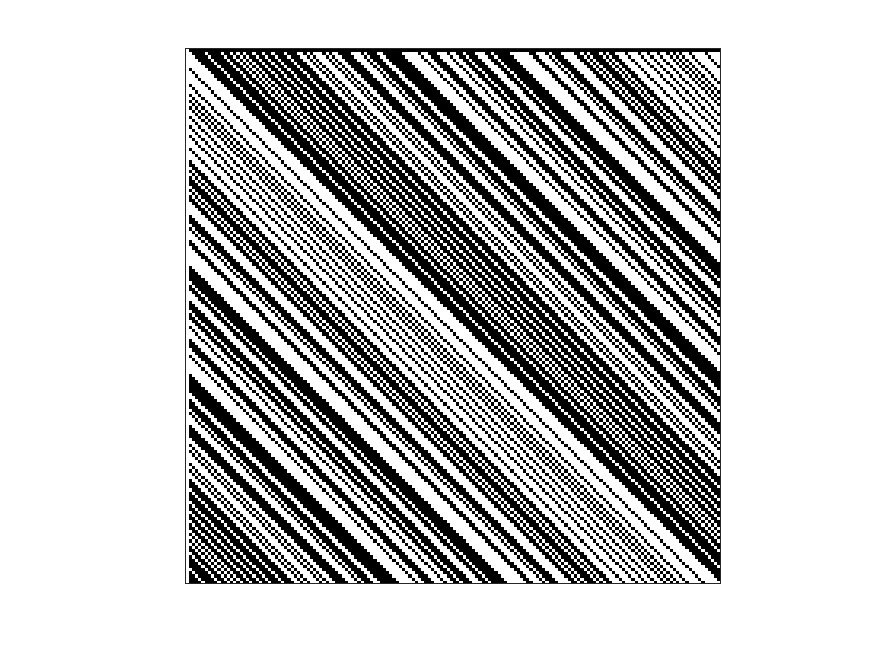

| 1 | -1 | -1 | -1 | -1 | -1 | -1 | -1 | -1 | -1 | -1 | -1 | -1 | -1 | -1 | -1 | -1 | -1 | -1 | -1 | -1 | -1 | -1 | -1 | -1 | -1 | -1 | -1 | -1 | -1 | -1 | -1 | -1 | -1 | -1 | -1 | -1 | -1 | -1 | -1 | -1 | -1 | -1 | -1 | -1 | -1 | -1 | -1 | -1 | -1 | -1 | -1 | -1 | -1 | -1 | -1 | -1 | -1 | -1 | -1 | -1 | -1 | -1 | -1 | -1 | -1 | -1 | -1 | -1 | -1 | -1 | -1 | -1 | -1 | -1 | -1 | -1 | -1 | -1 | -1 | -1 | -1 | -1 | -1 | -1 | -1 | -1 | -1 | -1 | -1 | -1 | -1 | -1 | -1 | -1 | -1 | -1 | -1 | -1 | -1 | -1 | -1 | -1 | -1 | -1 | -1 | -1 | -1 | -1 | -1 | -1 | -1 | -1 | -1 | -1 | -1 | -1 | -1 | -1 | -1 | -1 | -1 | -1 | -1 | -1 | -1 | -1 | -1 | -1 | -1 | -1 | -1 | -1 | -1 | -1 | -1 | -1 | -1 | -1 | -1 | -1 | -1 | -1 | -1 | -1 | -1 | -1 | -1 | -1 | -1 | -1 | -1 | -1 | -1 | -1 | -1 | -1 | -1 | -1 | -1 | -1 | -1 | -1 | -1 | -1 | -1 | -1 | -1 |
| 1 | 1 | -1 | -1 | -1 | -1 | 1 | -1 | -1 | -1 | -1 | 1 | -1 | -1 | 1 | -1 | 1 | -1 | 1 | -1 | -1 | 1 | -1 | -1 | 1 | -1 | -1 | 1 | -1 | -1 | -1 | 1 | -1 | -1 | -1 | 1 | 1 | -1 | 1 | -1 | 1 | 1 | 1 | -1 | 1 | -1 | 1 | 1 | -1 | -1 | -1 | -1 | 1 | 1 | 1 | -1 | 1 | -1 | -1 | -1 | 1 | 1 | -1 | -1 | -1 | -1 | -1 | -1 | 1 | 1 | 1 | 1 | 1 | -1 | 1 | 1 | -1 | -1 | -1 | 1 | 1 | 1 | -1 | 1 | 1 | -1 | -1 | 1 | -1 | -1 | -1 | 1 | 1 | 1 | -1 | -1 | 1 | -1 | -1 | -1 | -1 | -1 | 1 | 1 | 1 | 1 | 1 | 1 | -1 | -1 | 1 | 1 | 1 | -1 | 1 | -1 | -1 | -1 | 1 | 1 | 1 | 1 | -1 | -1 | 1 | -1 | 1 | -1 | -1 | -1 | 1 | -1 | 1 | -1 | -1 | 1 | 1 | 1 | -1 | 1 | 1 | 1 | -1 | 1 | 1 | -1 | 1 | 1 | -1 | 1 | 1 | -1 | 1 | -1 | 1 | -1 | 1 | 1 | -1 | 1 | 1 | 1 | 1 | -1 | 1 | 1 | 1 | 1 |
| 1 | 1 | 1 | -1 | -1 | -1 | -1 | 1 | -1 | -1 | -1 | -1 | 1 | -1 | -1 | 1 | -1 | 1 | -1 | 1 | -1 | -1 | 1 | -1 | -1 | 1 | -1 | -1 | 1 | -1 | -1 | -1 | 1 | -1 | -1 | -1 | 1 | 1 | -1 | 1 | -1 | 1 | 1 | 1 | -1 | 1 | -1 | 1 | 1 | -1 | -1 | -1 | -1 | 1 | 1 | 1 | -1 | 1 | -1 | -1 | -1 | 1 | 1 | -1 | -1 | -1 | -1 | -1 | -1 | 1 | 1 | 1 | 1 | 1 | -1 | 1 | 1 | -1 | -1 | -1 | 1 | 1 | 1 | -1 | 1 | 1 | -1 | -1 | 1 | -1 | -1 | -1 | 1 | 1 | 1 | -1 | -1 | 1 | -1 | -1 | -1 | -1 | -1 | 1 | 1 | 1 | 1 | 1 | 1 | -1 | -1 | 1 | 1 | 1 | -1 | 1 | -1 | -1 | -1 | 1 | 1 | 1 | 1 | -1 | -1 | 1 | -1 | 1 | -1 | -1 | -1 | 1 | -1 | 1 | -1 | -1 | 1 | 1 | 1 | -1 | 1 | 1 | 1 | -1 | 1 | 1 | -1 | 1 | 1 | -1 | 1 | 1 | -1 | 1 | -1 | 1 | -1 | 1 | 1 | -1 | 1 | 1 | 1 | 1 | -1 | 1 | 1 | 1 |
| 1 | 1 | 1 | 1 | -1 | -1 | -1 | -1 | 1 | -1 | -1 | -1 | -1 | 1 | -1 | -1 | 1 | -1 | 1 | -1 | 1 | -1 | -1 | 1 | -1 | -1 | 1 | -1 | -1 | 1 | -1 | -1 | -1 | 1 | -1 | -1 | -1 | 1 | 1 | -1 | 1 | -1 | 1 | 1 | 1 | -1 | 1 | -1 | 1 | 1 | -1 | -1 | -1 | -1 | 1 | 1 | 1 | -1 | 1 | -1 | -1 | -1 | 1 | 1 | -1 | -1 | -1 | -1 | -1 | -1 | 1 | 1 | 1 | 1 | 1 | -1 | 1 | 1 | -1 | -1 | -1 | 1 | 1 | 1 | -1 | 1 | 1 | -1 | -1 | 1 | -1 | -1 | -1 | 1 | 1 | 1 | -1 | -1 | 1 | -1 | -1 | -1 | -1 | -1 | 1 | 1 | 1 | 1 | 1 | 1 | -1 | -1 | 1 | 1 | 1 | -1 | 1 | -1 | -1 | -1 | 1 | 1 | 1 | 1 | -1 | -1 | 1 | -1 | 1 | -1 | -1 | -1 | 1 | -1 | 1 | -1 | -1 | 1 | 1 | 1 | -1 | 1 | 1 | 1 | -1 | 1 | 1 | -1 | 1 | 1 | -1 | 1 | 1 | -1 | 1 | -1 | 1 | -1 | 1 | 1 | -1 | 1 | 1 | 1 | 1 | -1 | 1 | 1 |
| 1 | 1 | 1 | 1 | 1 | -1 | -1 | -1 | -1 | 1 | -1 | -1 | -1 | -1 | 1 | -1 | -1 | 1 | -1 | 1 | -1 | 1 | -1 | -1 | 1 | -1 | -1 | 1 | -1 | -1 | 1 | -1 | -1 | -1 | 1 | -1 | -1 | -1 | 1 | 1 | -1 | 1 | -1 | 1 | 1 | 1 | -1 | 1 | -1 | 1 | 1 | -1 | -1 | -1 | -1 | 1 | 1 | 1 | -1 | 1 | -1 | -1 | -1 | 1 | 1 | -1 | -1 | -1 | -1 | -1 | -1 | 1 | 1 | 1 | 1 | 1 | -1 | 1 | 1 | -1 | -1 | -1 | 1 | 1 | 1 | -1 | 1 | 1 | -1 | -1 | 1 | -1 | -1 | -1 | 1 | 1 | 1 | -1 | -1 | 1 | -1 | -1 | -1 | -1 | -1 | 1 | 1 | 1 | 1 | 1 | 1 | -1 | -1 | 1 | 1 | 1 | -1 | 1 | -1 | -1 | -1 | 1 | 1 | 1 | 1 | -1 | -1 | 1 | -1 | 1 | -1 | -1 | -1 | 1 | -1 | 1 | -1 | -1 | 1 | 1 | 1 | -1 | 1 | 1 | 1 | -1 | 1 | 1 | -1 | 1 | 1 | -1 | 1 | 1 | -1 | 1 | -1 | 1 | -1 | 1 | 1 | -1 | 1 | 1 | 1 | 1 | -1 | 1 |
| 1 | 1 | 1 | 1 | 1 | 1 | -1 | -1 | -1 | -1 | 1 | -1 | -1 | -1 | -1 | 1 | -1 | -1 | 1 | -1 | 1 | -1 | 1 | -1 | -1 | 1 | -1 | -1 | 1 | -1 | -1 | 1 | -1 | -1 | -1 | 1 | -1 | -1 | -1 | 1 | 1 | -1 | 1 | -1 | 1 | 1 | 1 | -1 | 1 | -1 | 1 | 1 | -1 | -1 | -1 | -1 | 1 | 1 | 1 | -1 | 1 | -1 | -1 | -1 | 1 | 1 | -1 | -1 | -1 | -1 | -1 | -1 | 1 | 1 | 1 | 1 | 1 | -1 | 1 | 1 | -1 | -1 | -1 | 1 | 1 | 1 | -1 | 1 | 1 | -1 | -1 | 1 | -1 | -1 | -1 | 1 | 1 | 1 | -1 | -1 | 1 | -1 | -1 | -1 | -1 | -1 | 1 | 1 | 1 | 1 | 1 | 1 | -1 | -1 | 1 | 1 | 1 | -1 | 1 | -1 | -1 | -1 | 1 | 1 | 1 | 1 | -1 | -1 | 1 | -1 | 1 | -1 | -1 | -1 | 1 | -1 | 1 | -1 | -1 | 1 | 1 | 1 | -1 | 1 | 1 | 1 | -1 | 1 | 1 | -1 | 1 | 1 | -1 | 1 | 1 | -1 | 1 | -1 | 1 | -1 | 1 | 1 | -1 | 1 | 1 | 1 | 1 | -1 |
| 1 | -1 | 1 | 1 | 1 | 1 | 1 | -1 | -1 | -1 | -1 | 1 | -1 | -1 | -1 | -1 | 1 | -1 | -1 | 1 | -1 | 1 | -1 | 1 | -1 | -1 | 1 | -1 | -1 | 1 | -1 | -1 | 1 | -1 | -1 | -1 | 1 | -1 | -1 | -1 | 1 | 1 | -1 | 1 | -1 | 1 | 1 | 1 | -1 | 1 | -1 | 1 | 1 | -1 | -1 | -1 | -1 | 1 | 1 | 1 | -1 | 1 | -1 | -1 | -1 | 1 | 1 | -1 | -1 | -1 | -1 | -1 | -1 | 1 | 1 | 1 | 1 | 1 | -1 | 1 | 1 | -1 | -1 | -1 | 1 | 1 | 1 | -1 | 1 | 1 | -1 | -1 | 1 | -1 | -1 | -1 | 1 | 1 | 1 | -1 | -1 | 1 | -1 | -1 | -1 | -1 | -1 | 1 | 1 | 1 | 1 | 1 | 1 | -1 | -1 | 1 | 1 | 1 | -1 | 1 | -1 | -1 | -1 | 1 | 1 | 1 | 1 | -1 | -1 | 1 | -1 | 1 | -1 | -1 | -1 | 1 | -1 | 1 | -1 | -1 | 1 | 1 | 1 | -1 | 1 | 1 | 1 | -1 | 1 | 1 | -1 | 1 | 1 | -1 | 1 | 1 | -1 | 1 | -1 | 1 | -1 | 1 | 1 | -1 | 1 | 1 | 1 | 1 |
| 1 | 1 | -1 | 1 | 1 | 1 | 1 | 1 | -1 | -1 | -1 | -1 | 1 | -1 | -1 | -1 | -1 | 1 | -1 | -1 | 1 | -1 | 1 | -1 | 1 | -1 | -1 | 1 | -1 | -1 | 1 | -1 | -1 | 1 | -1 | -1 | -1 | 1 | -1 | -1 | -1 | 1 | 1 | -1 | 1 | -1 | 1 | 1 | 1 | -1 | 1 | -1 | 1 | 1 | -1 | -1 | -1 | -1 | 1 | 1 | 1 | -1 | 1 | -1 | -1 | -1 | 1 | 1 | -1 | -1 | -1 | -1 | -1 | -1 | 1 | 1 | 1 | 1 | 1 | -1 | 1 | 1 | -1 | -1 | -1 | 1 | 1 | 1 | -1 | 1 | 1 | -1 | -1 | 1 | -1 | -1 | -1 | 1 | 1 | 1 | -1 | -1 | 1 | -1 | -1 | -1 | -1 | -1 | 1 | 1 | 1 | 1 | 1 | 1 | -1 | -1 | 1 | 1 | 1 | -1 | 1 | -1 | -1 | -1 | 1 | 1 | 1 | 1 | -1 | -1 | 1 | -1 | 1 | -1 | -1 | -1 | 1 | -1 | 1 | -1 | -1 | 1 | 1 | 1 | -1 | 1 | 1 | 1 | -1 | 1 | 1 | -1 | 1 | 1 | -1 | 1 | 1 | -1 | 1 | -1 | 1 | -1 | 1 | 1 | -1 | 1 | 1 | 1 |
| 1 | 1 | 1 | -1 | 1 | 1 | 1 | 1 | 1 | -1 | -1 | -1 | -1 | 1 | -1 | -1 | -1 | -1 | 1 | -1 | -1 | 1 | -1 | 1 | -1 | 1 | -1 | -1 | 1 | -1 | -1 | 1 | -1 | -1 | 1 | -1 | -1 | -1 | 1 | -1 | -1 | -1 | 1 | 1 | -1 | 1 | -1 | 1 | 1 | 1 | -1 | 1 | -1 | 1 | 1 | -1 | -1 | -1 | -1 | 1 | 1 | 1 | -1 | 1 | -1 | -1 | -1 | 1 | 1 | -1 | -1 | -1 | -1 | -1 | -1 | 1 | 1 | 1 | 1 | 1 | -1 | 1 | 1 | -1 | -1 | -1 | 1 | 1 | 1 | -1 | 1 | 1 | -1 | -1 | 1 | -1 | -1 | -1 | 1 | 1 | 1 | -1 | -1 | 1 | -1 | -1 | -1 | -1 | -1 | 1 | 1 | 1 | 1 | 1 | 1 | -1 | -1 | 1 | 1 | 1 | -1 | 1 | -1 | -1 | -1 | 1 | 1 | 1 | 1 | -1 | -1 | 1 | -1 | 1 | -1 | -1 | -1 | 1 | -1 | 1 | -1 | -1 | 1 | 1 | 1 | -1 | 1 | 1 | 1 | -1 | 1 | 1 | -1 | 1 | 1 | -1 | 1 | 1 | -1 | 1 | -1 | 1 | -1 | 1 | 1 | -1 | 1 | 1 |
| 1 | 1 | 1 | 1 | -1 | 1 | 1 | 1 | 1 | 1 | -1 | -1 | -1 | -1 | 1 | -1 | -1 | -1 | -1 | 1 | -1 | -1 | 1 | -1 | 1 | -1 | 1 | -1 | -1 | 1 | -1 | -1 | 1 | -1 | -1 | 1 | -1 | -1 | -1 | 1 | -1 | -1 | -1 | 1 | 1 | -1 | 1 | -1 | 1 | 1 | 1 | -1 | 1 | -1 | 1 | 1 | -1 | -1 | -1 | -1 | 1 | 1 | 1 | -1 | 1 | -1 | -1 | -1 | 1 | 1 | -1 | -1 | -1 | -1 | -1 | -1 | 1 | 1 | 1 | 1 | 1 | -1 | 1 | 1 | -1 | -1 | -1 | 1 | 1 | 1 | -1 | 1 | 1 | -1 | -1 | 1 | -1 | -1 | -1 | 1 | 1 | 1 | -1 | -1 | 1 | -1 | -1 | -1 | -1 | -1 | 1 | 1 | 1 | 1 | 1 | 1 | -1 | -1 | 1 | 1 | 1 | -1 | 1 | -1 | -1 | -1 | 1 | 1 | 1 | 1 | -1 | -1 | 1 | -1 | 1 | -1 | -1 | -1 | 1 | -1 | 1 | -1 | -1 | 1 | 1 | 1 | -1 | 1 | 1 | 1 | -1 | 1 | 1 | -1 | 1 | 1 | -1 | 1 | 1 | -1 | 1 | -1 | 1 | -1 | 1 | 1 | -1 | 1 |
| 1 | 1 | 1 | 1 | 1 | -1 | 1 | 1 | 1 | 1 | 1 | -1 | -1 | -1 | -1 | 1 | -1 | -1 | -1 | -1 | 1 | -1 | -1 | 1 | -1 | 1 | -1 | 1 | -1 | -1 | 1 | -1 | -1 | 1 | -1 | -1 | 1 | -1 | -1 | -1 | 1 | -1 | -1 | -1 | 1 | 1 | -1 | 1 | -1 | 1 | 1 | 1 | -1 | 1 | -1 | 1 | 1 | -1 | -1 | -1 | -1 | 1 | 1 | 1 | -1 | 1 | -1 | -1 | -1 | 1 | 1 | -1 | -1 | -1 | -1 | -1 | -1 | 1 | 1 | 1 | 1 | 1 | -1 | 1 | 1 | -1 | -1 | -1 | 1 | 1 | 1 | -1 | 1 | 1 | -1 | -1 | 1 | -1 | -1 | -1 | 1 | 1 | 1 | -1 | -1 | 1 | -1 | -1 | -1 | -1 | -1 | 1 | 1 | 1 | 1 | 1 | 1 | -1 | -1 | 1 | 1 | 1 | -1 | 1 | -1 | -1 | -1 | 1 | 1 | 1 | 1 | -1 | -1 | 1 | -1 | 1 | -1 | -1 | -1 | 1 | -1 | 1 | -1 | -1 | 1 | 1 | 1 | -1 | 1 | 1 | 1 | -1 | 1 | 1 | -1 | 1 | 1 | -1 | 1 | 1 | -1 | 1 | -1 | 1 | -1 | 1 | 1 | -1 |
| 1 | -1 | 1 | 1 | 1 | 1 | -1 | 1 | 1 | 1 | 1 | 1 | -1 | -1 | -1 | -1 | 1 | -1 | -1 | -1 | -1 | 1 | -1 | -1 | 1 | -1 | 1 | -1 | 1 | -1 | -1 | 1 | -1 | -1 | 1 | -1 | -1 | 1 | -1 | -1 | -1 | 1 | -1 | -1 | -1 | 1 | 1 | -1 | 1 | -1 | 1 | 1 | 1 | -1 | 1 | -1 | 1 | 1 | -1 | -1 | -1 | -1 | 1 | 1 | 1 | -1 | 1 | -1 | -1 | -1 | 1 | 1 | -1 | -1 | -1 | -1 | -1 | -1 | 1 | 1 | 1 | 1 | 1 | -1 | 1 | 1 | -1 | -1 | -1 | 1 | 1 | 1 | -1 | 1 | 1 | -1 | -1 | 1 | -1 | -1 | -1 | 1 | 1 | 1 | -1 | -1 | 1 | -1 | -1 | -1 | -1 | -1 | 1 | 1 | 1 | 1 | 1 | 1 | -1 | -1 | 1 | 1 | 1 | -1 | 1 | -1 | -1 | -1 | 1 | 1 | 1 | 1 | -1 | -1 | 1 | -1 | 1 | -1 | -1 | -1 | 1 | -1 | 1 | -1 | -1 | 1 | 1 | 1 | -1 | 1 | 1 | 1 | -1 | 1 | 1 | -1 | 1 | 1 | -1 | 1 | 1 | -1 | 1 | -1 | 1 | -1 | 1 | 1 |
| 1 | 1 | -1 | 1 | 1 | 1 | 1 | -1 | 1 | 1 | 1 | 1 | 1 | -1 | -1 | -1 | -1 | 1 | -1 | -1 | -1 | -1 | 1 | -1 | -1 | 1 | -1 | 1 | -1 | 1 | -1 | -1 | 1 | -1 | -1 | 1 | -1 | -1 | 1 | -1 | -1 | -1 | 1 | -1 | -1 | -1 | 1 | 1 | -1 | 1 | -1 | 1 | 1 | 1 | -1 | 1 | -1 | 1 | 1 | -1 | -1 | -1 | -1 | 1 | 1 | 1 | -1 | 1 | -1 | -1 | -1 | 1 | 1 | -1 | -1 | -1 | -1 | -1 | -1 | 1 | 1 | 1 | 1 | 1 | -1 | 1 | 1 | -1 | -1 | -1 | 1 | 1 | 1 | -1 | 1 | 1 | -1 | -1 | 1 | -1 | -1 | -1 | 1 | 1 | 1 | -1 | -1 | 1 | -1 | -1 | -1 | -1 | -1 | 1 | 1 | 1 | 1 | 1 | 1 | -1 | -1 | 1 | 1 | 1 | -1 | 1 | -1 | -1 | -1 | 1 | 1 | 1 | 1 | -1 | -1 | 1 | -1 | 1 | -1 | -1 | -1 | 1 | -1 | 1 | -1 | -1 | 1 | 1 | 1 | -1 | 1 | 1 | 1 | -1 | 1 | 1 | -1 | 1 | 1 | -1 | 1 | 1 | -1 | 1 | -1 | 1 | -1 | 1 |
| 1 | 1 | 1 | -1 | 1 | 1 | 1 | 1 | -1 | 1 | 1 | 1 | 1 | 1 | -1 | -1 | -1 | -1 | 1 | -1 | -1 | -1 | -1 | 1 | -1 | -1 | 1 | -1 | 1 | -1 | 1 | -1 | -1 | 1 | -1 | -1 | 1 | -1 | -1 | 1 | -1 | -1 | -1 | 1 | -1 | -1 | -1 | 1 | 1 | -1 | 1 | -1 | 1 | 1 | 1 | -1 | 1 | -1 | 1 | 1 | -1 | -1 | -1 | -1 | 1 | 1 | 1 | -1 | 1 | -1 | -1 | -1 | 1 | 1 | -1 | -1 | -1 | -1 | -1 | -1 | 1 | 1 | 1 | 1 | 1 | -1 | 1 | 1 | -1 | -1 | -1 | 1 | 1 | 1 | -1 | 1 | 1 | -1 | -1 | 1 | -1 | -1 | -1 | 1 | 1 | 1 | -1 | -1 | 1 | -1 | -1 | -1 | -1 | -1 | 1 | 1 | 1 | 1 | 1 | 1 | -1 | -1 | 1 | 1 | 1 | -1 | 1 | -1 | -1 | -1 | 1 | 1 | 1 | 1 | -1 | -1 | 1 | -1 | 1 | -1 | -1 | -1 | 1 | -1 | 1 | -1 | -1 | 1 | 1 | 1 | -1 | 1 | 1 | 1 | -1 | 1 | 1 | -1 | 1 | 1 | -1 | 1 | 1 | -1 | 1 | -1 | 1 | -1 |
| 1 | -1 | 1 | 1 | -1 | 1 | 1 | 1 | 1 | -1 | 1 | 1 | 1 | 1 | 1 | -1 | -1 | -1 | -1 | 1 | -1 | -1 | -1 | -1 | 1 | -1 | -1 | 1 | -1 | 1 | -1 | 1 | -1 | -1 | 1 | -1 | -1 | 1 | -1 | -1 | 1 | -1 | -1 | -1 | 1 | -1 | -1 | -1 | 1 | 1 | -1 | 1 | -1 | 1 | 1 | 1 | -1 | 1 | -1 | 1 | 1 | -1 | -1 | -1 | -1 | 1 | 1 | 1 | -1 | 1 | -1 | -1 | -1 | 1 | 1 | -1 | -1 | -1 | -1 | -1 | -1 | 1 | 1 | 1 | 1 | 1 | -1 | 1 | 1 | -1 | -1 | -1 | 1 | 1 | 1 | -1 | 1 | 1 | -1 | -1 | 1 | -1 | -1 | -1 | 1 | 1 | 1 | -1 | -1 | 1 | -1 | -1 | -1 | -1 | -1 | 1 | 1 | 1 | 1 | 1 | 1 | -1 | -1 | 1 | 1 | 1 | -1 | 1 | -1 | -1 | -1 | 1 | 1 | 1 | 1 | -1 | -1 | 1 | -1 | 1 | -1 | -1 | -1 | 1 | -1 | 1 | -1 | -1 | 1 | 1 | 1 | -1 | 1 | 1 | 1 | -1 | 1 | 1 | -1 | 1 | 1 | -1 | 1 | 1 | -1 | 1 | -1 | 1 |
| 1 | 1 | -1 | 1 | 1 | -1 | 1 | 1 | 1 | 1 | -1 | 1 | 1 | 1 | 1 | 1 | -1 | -1 | -1 | -1 | 1 | -1 | -1 | -1 | -1 | 1 | -1 | -1 | 1 | -1 | 1 | -1 | 1 | -1 | -1 | 1 | -1 | -1 | 1 | -1 | -1 | 1 | -1 | -1 | -1 | 1 | -1 | -1 | -1 | 1 | 1 | -1 | 1 | -1 | 1 | 1 | 1 | -1 | 1 | -1 | 1 | 1 | -1 | -1 | -1 | -1 | 1 | 1 | 1 | -1 | 1 | -1 | -1 | -1 | 1 | 1 | -1 | -1 | -1 | -1 | -1 | -1 | 1 | 1 | 1 | 1 | 1 | -1 | 1 | 1 | -1 | -1 | -1 | 1 | 1 | 1 | -1 | 1 | 1 | -1 | -1 | 1 | -1 | -1 | -1 | 1 | 1 | 1 | -1 | -1 | 1 | -1 | -1 | -1 | -1 | -1 | 1 | 1 | 1 | 1 | 1 | 1 | -1 | -1 | 1 | 1 | 1 | -1 | 1 | -1 | -1 | -1 | 1 | 1 | 1 | 1 | -1 | -1 | 1 | -1 | 1 | -1 | -1 | -1 | 1 | -1 | 1 | -1 | -1 | 1 | 1 | 1 | -1 | 1 | 1 | 1 | -1 | 1 | 1 | -1 | 1 | 1 | -1 | 1 | 1 | -1 | 1 | -1 |
| 1 | -1 | 1 | -1 | 1 | 1 | -1 | 1 | 1 | 1 | 1 | -1 | 1 | 1 | 1 | 1 | 1 | -1 | -1 | -1 | -1 | 1 | -1 | -1 | -1 | -1 | 1 | -1 | -1 | 1 | -1 | 1 | -1 | 1 | -1 | -1 | 1 | -1 | -1 | 1 | -1 | -1 | 1 | -1 | -1 | -1 | 1 | -1 | -1 | -1 | 1 | 1 | -1 | 1 | -1 | 1 | 1 | 1 | -1 | 1 | -1 | 1 | 1 | -1 | -1 | -1 | -1 | 1 | 1 | 1 | -1 | 1 | -1 | -1 | -1 | 1 | 1 | -1 | -1 | -1 | -1 | -1 | -1 | 1 | 1 | 1 | 1 | 1 | -1 | 1 | 1 | -1 | -1 | -1 | 1 | 1 | 1 | -1 | 1 | 1 | -1 | -1 | 1 | -1 | -1 | -1 | 1 | 1 | 1 | -1 | -1 | 1 | -1 | -1 | -1 | -1 | -1 | 1 | 1 | 1 | 1 | 1 | 1 | -1 | -1 | 1 | 1 | 1 | -1 | 1 | -1 | -1 | -1 | 1 | 1 | 1 | 1 | -1 | -1 | 1 | -1 | 1 | -1 | -1 | -1 | 1 | -1 | 1 | -1 | -1 | 1 | 1 | 1 | -1 | 1 | 1 | 1 | -1 | 1 | 1 | -1 | 1 | 1 | -1 | 1 | 1 | -1 | 1 |
| 1 | 1 | -1 | 1 | -1 | 1 | 1 | -1 | 1 | 1 | 1 | 1 | -1 | 1 | 1 | 1 | 1 | 1 | -1 | -1 | -1 | -1 | 1 | -1 | -1 | -1 | -1 | 1 | -1 | -1 | 1 | -1 | 1 | -1 | 1 | -1 | -1 | 1 | -1 | -1 | 1 | -1 | -1 | 1 | -1 | -1 | -1 | 1 | -1 | -1 | -1 | 1 | 1 | -1 | 1 | -1 | 1 | 1 | 1 | -1 | 1 | -1 | 1 | 1 | -1 | -1 | -1 | -1 | 1 | 1 | 1 | -1 | 1 | -1 | -1 | -1 | 1 | 1 | -1 | -1 | -1 | -1 | -1 | -1 | 1 | 1 | 1 | 1 | 1 | -1 | 1 | 1 | -1 | -1 | -1 | 1 | 1 | 1 | -1 | 1 | 1 | -1 | -1 | 1 | -1 | -1 | -1 | 1 | 1 | 1 | -1 | -1 | 1 | -1 | -1 | -1 | -1 | -1 | 1 | 1 | 1 | 1 | 1 | 1 | -1 | -1 | 1 | 1 | 1 | -1 | 1 | -1 | -1 | -1 | 1 | 1 | 1 | 1 | -1 | -1 | 1 | -1 | 1 | -1 | -1 | -1 | 1 | -1 | 1 | -1 | -1 | 1 | 1 | 1 | -1 | 1 | 1 | 1 | -1 | 1 | 1 | -1 | 1 | 1 | -1 | 1 | 1 | -1 |
| 1 | -1 | 1 | -1 | 1 | -1 | 1 | 1 | -1 | 1 | 1 | 1 | 1 | -1 | 1 | 1 | 1 | 1 | 1 | -1 | -1 | -1 | -1 | 1 | -1 | -1 | -1 | -1 | 1 | -1 | -1 | 1 | -1 | 1 | -1 | 1 | -1 | -1 | 1 | -1 | -1 | 1 | -1 | -1 | 1 | -1 | -1 | -1 | 1 | -1 | -1 | -1 | 1 | 1 | -1 | 1 | -1 | 1 | 1 | 1 | -1 | 1 | -1 | 1 | 1 | -1 | -1 | -1 | -1 | 1 | 1 | 1 | -1 | 1 | -1 | -1 | -1 | 1 | 1 | -1 | -1 | -1 | -1 | -1 | -1 | 1 | 1 | 1 | 1 | 1 | -1 | 1 | 1 | -1 | -1 | -1 | 1 | 1 | 1 | -1 | 1 | 1 | -1 | -1 | 1 | -1 | -1 | -1 | 1 | 1 | 1 | -1 | -1 | 1 | -1 | -1 | -1 | -1 | -1 | 1 | 1 | 1 | 1 | 1 | 1 | -1 | -1 | 1 | 1 | 1 | -1 | 1 | -1 | -1 | -1 | 1 | 1 | 1 | 1 | -1 | -1 | 1 | -1 | 1 | -1 | -1 | -1 | 1 | -1 | 1 | -1 | -1 | 1 | 1 | 1 | -1 | 1 | 1 | 1 | -1 | 1 | 1 | -1 | 1 | 1 | -1 | 1 | 1 |
| 1 | 1 | -1 | 1 | -1 | 1 | -1 | 1 | 1 | -1 | 1 | 1 | 1 | 1 | -1 | 1 | 1 | 1 | 1 | 1 | -1 | -1 | -1 | -1 | 1 | -1 | -1 | -1 | -1 | 1 | -1 | -1 | 1 | -1 | 1 | -1 | 1 | -1 | -1 | 1 | -1 | -1 | 1 | -1 | -1 | 1 | -1 | -1 | -1 | 1 | -1 | -1 | -1 | 1 | 1 | -1 | 1 | -1 | 1 | 1 | 1 | -1 | 1 | -1 | 1 | 1 | -1 | -1 | -1 | -1 | 1 | 1 | 1 | -1 | 1 | -1 | -1 | -1 | 1 | 1 | -1 | -1 | -1 | -1 | -1 | -1 | 1 | 1 | 1 | 1 | 1 | -1 | 1 | 1 | -1 | -1 | -1 | 1 | 1 | 1 | -1 | 1 | 1 | -1 | -1 | 1 | -1 | -1 | -1 | 1 | 1 | 1 | -1 | -1 | 1 | -1 | -1 | -1 | -1 | -1 | 1 | 1 | 1 | 1 | 1 | 1 | -1 | -1 | 1 | 1 | 1 | -1 | 1 | -1 | -1 | -1 | 1 | 1 | 1 | 1 | -1 | -1 | 1 | -1 | 1 | -1 | -1 | -1 | 1 | -1 | 1 | -1 | -1 | 1 | 1 | 1 | -1 | 1 | 1 | 1 | -1 | 1 | 1 | -1 | 1 | 1 | -1 | 1 |
| 1 | 1 | 1 | -1 | 1 | -1 | 1 | -1 | 1 | 1 | -1 | 1 | 1 | 1 | 1 | -1 | 1 | 1 | 1 | 1 | 1 | -1 | -1 | -1 | -1 | 1 | -1 | -1 | -1 | -1 | 1 | -1 | -1 | 1 | -1 | 1 | -1 | 1 | -1 | -1 | 1 | -1 | -1 | 1 | -1 | -1 | 1 | -1 | -1 | -1 | 1 | -1 | -1 | -1 | 1 | 1 | -1 | 1 | -1 | 1 | 1 | 1 | -1 | 1 | -1 | 1 | 1 | -1 | -1 | -1 | -1 | 1 | 1 | 1 | -1 | 1 | -1 | -1 | -1 | 1 | 1 | -1 | -1 | -1 | -1 | -1 | -1 | 1 | 1 | 1 | 1 | 1 | -1 | 1 | 1 | -1 | -1 | -1 | 1 | 1 | 1 | -1 | 1 | 1 | -1 | -1 | 1 | -1 | -1 | -1 | 1 | 1 | 1 | -1 | -1 | 1 | -1 | -1 | -1 | -1 | -1 | 1 | 1 | 1 | 1 | 1 | 1 | -1 | -1 | 1 | 1 | 1 | -1 | 1 | -1 | -1 | -1 | 1 | 1 | 1 | 1 | -1 | -1 | 1 | -1 | 1 | -1 | -1 | -1 | 1 | -1 | 1 | -1 | -1 | 1 | 1 | 1 | -1 | 1 | 1 | 1 | -1 | 1 | 1 | -1 | 1 | 1 | -1 |
| 1 | -1 | 1 | 1 | -1 | 1 | -1 | 1 | -1 | 1 | 1 | -1 | 1 | 1 | 1 | 1 | -1 | 1 | 1 | 1 | 1 | 1 | -1 | -1 | -1 | -1 | 1 | -1 | -1 | -1 | -1 | 1 | -1 | -1 | 1 | -1 | 1 | -1 | 1 | -1 | -1 | 1 | -1 | -1 | 1 | -1 | -1 | 1 | -1 | -1 | -1 | 1 | -1 | -1 | -1 | 1 | 1 | -1 | 1 | -1 | 1 | 1 | 1 | -1 | 1 | -1 | 1 | 1 | -1 | -1 | -1 | -1 | 1 | 1 | 1 | -1 | 1 | -1 | -1 | -1 | 1 | 1 | -1 | -1 | -1 | -1 | -1 | -1 | 1 | 1 | 1 | 1 | 1 | -1 | 1 | 1 | -1 | -1 | -1 | 1 | 1 | 1 | -1 | 1 | 1 | -1 | -1 | 1 | -1 | -1 | -1 | 1 | 1 | 1 | -1 | -1 | 1 | -1 | -1 | -1 | -1 | -1 | 1 | 1 | 1 | 1 | 1 | 1 | -1 | -1 | 1 | 1 | 1 | -1 | 1 | -1 | -1 | -1 | 1 | 1 | 1 | 1 | -1 | -1 | 1 | -1 | 1 | -1 | -1 | -1 | 1 | -1 | 1 | -1 | -1 | 1 | 1 | 1 | -1 | 1 | 1 | 1 | -1 | 1 | 1 | -1 | 1 | 1 |
| 1 | 1 | -1 | 1 | 1 | -1 | 1 | -1 | 1 | -1 | 1 | 1 | -1 | 1 | 1 | 1 | 1 | -1 | 1 | 1 | 1 | 1 | 1 | -1 | -1 | -1 | -1 | 1 | -1 | -1 | -1 | -1 | 1 | -1 | -1 | 1 | -1 | 1 | -1 | 1 | -1 | -1 | 1 | -1 | -1 | 1 | -1 | -1 | 1 | -1 | -1 | -1 | 1 | -1 | -1 | -1 | 1 | 1 | -1 | 1 | -1 | 1 | 1 | 1 | -1 | 1 | -1 | 1 | 1 | -1 | -1 | -1 | -1 | 1 | 1 | 1 | -1 | 1 | -1 | -1 | -1 | 1 | 1 | -1 | -1 | -1 | -1 | -1 | -1 | 1 | 1 | 1 | 1 | 1 | -1 | 1 | 1 | -1 | -1 | -1 | 1 | 1 | 1 | -1 | 1 | 1 | -1 | -1 | 1 | -1 | -1 | -1 | 1 | 1 | 1 | -1 | -1 | 1 | -1 | -1 | -1 | -1 | -1 | 1 | 1 | 1 | 1 | 1 | 1 | -1 | -1 | 1 | 1 | 1 | -1 | 1 | -1 | -1 | -1 | 1 | 1 | 1 | 1 | -1 | -1 | 1 | -1 | 1 | -1 | -1 | -1 | 1 | -1 | 1 | -1 | -1 | 1 | 1 | 1 | -1 | 1 | 1 | 1 | -1 | 1 | 1 | -1 | 1 |
| 1 | 1 | 1 | -1 | 1 | 1 | -1 | 1 | -1 | 1 | -1 | 1 | 1 | -1 | 1 | 1 | 1 | 1 | -1 | 1 | 1 | 1 | 1 | 1 | -1 | -1 | -1 | -1 | 1 | -1 | -1 | -1 | -1 | 1 | -1 | -1 | 1 | -1 | 1 | -1 | 1 | -1 | -1 | 1 | -1 | -1 | 1 | -1 | -1 | 1 | -1 | -1 | -1 | 1 | -1 | -1 | -1 | 1 | 1 | -1 | 1 | -1 | 1 | 1 | 1 | -1 | 1 | -1 | 1 | 1 | -1 | -1 | -1 | -1 | 1 | 1 | 1 | -1 | 1 | -1 | -1 | -1 | 1 | 1 | -1 | -1 | -1 | -1 | -1 | -1 | 1 | 1 | 1 | 1 | 1 | -1 | 1 | 1 | -1 | -1 | -1 | 1 | 1 | 1 | -1 | 1 | 1 | -1 | -1 | 1 | -1 | -1 | -1 | 1 | 1 | 1 | -1 | -1 | 1 | -1 | -1 | -1 | -1 | -1 | 1 | 1 | 1 | 1 | 1 | 1 | -1 | -1 | 1 | 1 | 1 | -1 | 1 | -1 | -1 | -1 | 1 | 1 | 1 | 1 | -1 | -1 | 1 | -1 | 1 | -1 | -1 | -1 | 1 | -1 | 1 | -1 | -1 | 1 | 1 | 1 | -1 | 1 | 1 | 1 | -1 | 1 | 1 | -1 |
| 1 | -1 | 1 | 1 | -1 | 1 | 1 | -1 | 1 | -1 | 1 | -1 | 1 | 1 | -1 | 1 | 1 | 1 | 1 | -1 | 1 | 1 | 1 | 1 | 1 | -1 | -1 | -1 | -1 | 1 | -1 | -1 | -1 | -1 | 1 | -1 | -1 | 1 | -1 | 1 | -1 | 1 | -1 | -1 | 1 | -1 | -1 | 1 | -1 | -1 | 1 | -1 | -1 | -1 | 1 | -1 | -1 | -1 | 1 | 1 | -1 | 1 | -1 | 1 | 1 | 1 | -1 | 1 | -1 | 1 | 1 | -1 | -1 | -1 | -1 | 1 | 1 | 1 | -1 | 1 | -1 | -1 | -1 | 1 | 1 | -1 | -1 | -1 | -1 | -1 | -1 | 1 | 1 | 1 | 1 | 1 | -1 | 1 | 1 | -1 | -1 | -1 | 1 | 1 | 1 | -1 | 1 | 1 | -1 | -1 | 1 | -1 | -1 | -1 | 1 | 1 | 1 | -1 | -1 | 1 | -1 | -1 | -1 | -1 | -1 | 1 | 1 | 1 | 1 | 1 | 1 | -1 | -1 | 1 | 1 | 1 | -1 | 1 | -1 | -1 | -1 | 1 | 1 | 1 | 1 | -1 | -1 | 1 | -1 | 1 | -1 | -1 | -1 | 1 | -1 | 1 | -1 | -1 | 1 | 1 | 1 | -1 | 1 | 1 | 1 | -1 | 1 | 1 |
| 1 | 1 | -1 | 1 | 1 | -1 | 1 | 1 | -1 | 1 | -1 | 1 | -1 | 1 | 1 | -1 | 1 | 1 | 1 | 1 | -1 | 1 | 1 | 1 | 1 | 1 | -1 | -1 | -1 | -1 | 1 | -1 | -1 | -1 | -1 | 1 | -1 | -1 | 1 | -1 | 1 | -1 | 1 | -1 | -1 | 1 | -1 | -1 | 1 | -1 | -1 | 1 | -1 | -1 | -1 | 1 | -1 | -1 | -1 | 1 | 1 | -1 | 1 | -1 | 1 | 1 | 1 | -1 | 1 | -1 | 1 | 1 | -1 | -1 | -1 | -1 | 1 | 1 | 1 | -1 | 1 | -1 | -1 | -1 | 1 | 1 | -1 | -1 | -1 | -1 | -1 | -1 | 1 | 1 | 1 | 1 | 1 | -1 | 1 | 1 | -1 | -1 | -1 | 1 | 1 | 1 | -1 | 1 | 1 | -1 | -1 | 1 | -1 | -1 | -1 | 1 | 1 | 1 | -1 | -1 | 1 | -1 | -1 | -1 | -1 | -1 | 1 | 1 | 1 | 1 | 1 | 1 | -1 | -1 | 1 | 1 | 1 | -1 | 1 | -1 | -1 | -1 | 1 | 1 | 1 | 1 | -1 | -1 | 1 | -1 | 1 | -1 | -1 | -1 | 1 | -1 | 1 | -1 | -1 | 1 | 1 | 1 | -1 | 1 | 1 | 1 | -1 | 1 |
| 1 | 1 | 1 | -1 | 1 | 1 | -1 | 1 | 1 | -1 | 1 | -1 | 1 | -1 | 1 | 1 | -1 | 1 | 1 | 1 | 1 | -1 | 1 | 1 | 1 | 1 | 1 | -1 | -1 | -1 | -1 | 1 | -1 | -1 | -1 | -1 | 1 | -1 | -1 | 1 | -1 | 1 | -1 | 1 | -1 | -1 | 1 | -1 | -1 | 1 | -1 | -1 | 1 | -1 | -1 | -1 | 1 | -1 | -1 | -1 | 1 | 1 | -1 | 1 | -1 | 1 | 1 | 1 | -1 | 1 | -1 | 1 | 1 | -1 | -1 | -1 | -1 | 1 | 1 | 1 | -1 | 1 | -1 | -1 | -1 | 1 | 1 | -1 | -1 | -1 | -1 | -1 | -1 | 1 | 1 | 1 | 1 | 1 | -1 | 1 | 1 | -1 | -1 | -1 | 1 | 1 | 1 | -1 | 1 | 1 | -1 | -1 | 1 | -1 | -1 | -1 | 1 | 1 | 1 | -1 | -1 | 1 | -1 | -1 | -1 | -1 | -1 | 1 | 1 | 1 | 1 | 1 | 1 | -1 | -1 | 1 | 1 | 1 | -1 | 1 | -1 | -1 | -1 | 1 | 1 | 1 | 1 | -1 | -1 | 1 | -1 | 1 | -1 | -1 | -1 | 1 | -1 | 1 | -1 | -1 | 1 | 1 | 1 | -1 | 1 | 1 | 1 | -1 |
| 1 | -1 | 1 | 1 | -1 | 1 | 1 | -1 | 1 | 1 | -1 | 1 | -1 | 1 | -1 | 1 | 1 | -1 | 1 | 1 | 1 | 1 | -1 | 1 | 1 | 1 | 1 | 1 | -1 | -1 | -1 | -1 | 1 | -1 | -1 | -1 | -1 | 1 | -1 | -1 | 1 | -1 | 1 | -1 | 1 | -1 | -1 | 1 | -1 | -1 | 1 | -1 | -1 | 1 | -1 | -1 | -1 | 1 | -1 | -1 | -1 | 1 | 1 | -1 | 1 | -1 | 1 | 1 | 1 | -1 | 1 | -1 | 1 | 1 | -1 | -1 | -1 | -1 | 1 | 1 | 1 | -1 | 1 | -1 | -1 | -1 | 1 | 1 | -1 | -1 | -1 | -1 | -1 | -1 | 1 | 1 | 1 | 1 | 1 | -1 | 1 | 1 | -1 | -1 | -1 | 1 | 1 | 1 | -1 | 1 | 1 | -1 | -1 | 1 | -1 | -1 | -1 | 1 | 1 | 1 | -1 | -1 | 1 | -1 | -1 | -1 | -1 | -1 | 1 | 1 | 1 | 1 | 1 | 1 | -1 | -1 | 1 | 1 | 1 | -1 | 1 | -1 | -1 | -1 | 1 | 1 | 1 | 1 | -1 | -1 | 1 | -1 | 1 | -1 | -1 | -1 | 1 | -1 | 1 | -1 | -1 | 1 | 1 | 1 | -1 | 1 | 1 | 1 |
| 1 | 1 | -1 | 1 | 1 | -1 | 1 | 1 | -1 | 1 | 1 | -1 | 1 | -1 | 1 | -1 | 1 | 1 | -1 | 1 | 1 | 1 | 1 | -1 | 1 | 1 | 1 | 1 | 1 | -1 | -1 | -1 | -1 | 1 | -1 | -1 | -1 | -1 | 1 | -1 | -1 | 1 | -1 | 1 | -1 | 1 | -1 | -1 | 1 | -1 | -1 | 1 | -1 | -1 | 1 | -1 | -1 | -1 | 1 | -1 | -1 | -1 | 1 | 1 | -1 | 1 | -1 | 1 | 1 | 1 | -1 | 1 | -1 | 1 | 1 | -1 | -1 | -1 | -1 | 1 | 1 | 1 | -1 | 1 | -1 | -1 | -1 | 1 | 1 | -1 | -1 | -1 | -1 | -1 | -1 | 1 | 1 | 1 | 1 | 1 | -1 | 1 | 1 | -1 | -1 | -1 | 1 | 1 | 1 | -1 | 1 | 1 | -1 | -1 | 1 | -1 | -1 | -1 | 1 | 1 | 1 | -1 | -1 | 1 | -1 | -1 | -1 | -1 | -1 | 1 | 1 | 1 | 1 | 1 | 1 | -1 | -1 | 1 | 1 | 1 | -1 | 1 | -1 | -1 | -1 | 1 | 1 | 1 | 1 | -1 | -1 | 1 | -1 | 1 | -1 | -1 | -1 | 1 | -1 | 1 | -1 | -1 | 1 | 1 | 1 | -1 | 1 | 1 |
| 1 | 1 | 1 | -1 | 1 | 1 | -1 | 1 | 1 | -1 | 1 | 1 | -1 | 1 | -1 | 1 | -1 | 1 | 1 | -1 | 1 | 1 | 1 | 1 | -1 | 1 | 1 | 1 | 1 | 1 | -1 | -1 | -1 | -1 | 1 | -1 | -1 | -1 | -1 | 1 | -1 | -1 | 1 | -1 | 1 | -1 | 1 | -1 | -1 | 1 | -1 | -1 | 1 | -1 | -1 | 1 | -1 | -1 | -1 | 1 | -1 | -1 | -1 | 1 | 1 | -1 | 1 | -1 | 1 | 1 | 1 | -1 | 1 | -1 | 1 | 1 | -1 | -1 | -1 | -1 | 1 | 1 | 1 | -1 | 1 | -1 | -1 | -1 | 1 | 1 | -1 | -1 | -1 | -1 | -1 | -1 | 1 | 1 | 1 | 1 | 1 | -1 | 1 | 1 | -1 | -1 | -1 | 1 | 1 | 1 | -1 | 1 | 1 | -1 | -1 | 1 | -1 | -1 | -1 | 1 | 1 | 1 | -1 | -1 | 1 | -1 | -1 | -1 | -1 | -1 | 1 | 1 | 1 | 1 | 1 | 1 | -1 | -1 | 1 | 1 | 1 | -1 | 1 | -1 | -1 | -1 | 1 | 1 | 1 | 1 | -1 | -1 | 1 | -1 | 1 | -1 | -1 | -1 | 1 | -1 | 1 | -1 | -1 | 1 | 1 | 1 | -1 | 1 |
| 1 | 1 | 1 | 1 | -1 | 1 | 1 | -1 | 1 | 1 | -1 | 1 | 1 | -1 | 1 | -1 | 1 | -1 | 1 | 1 | -1 | 1 | 1 | 1 | 1 | -1 | 1 | 1 | 1 | 1 | 1 | -1 | -1 | -1 | -1 | 1 | -1 | -1 | -1 | -1 | 1 | -1 | -1 | 1 | -1 | 1 | -1 | 1 | -1 | -1 | 1 | -1 | -1 | 1 | -1 | -1 | 1 | -1 | -1 | -1 | 1 | -1 | -1 | -1 | 1 | 1 | -1 | 1 | -1 | 1 | 1 | 1 | -1 | 1 | -1 | 1 | 1 | -1 | -1 | -1 | -1 | 1 | 1 | 1 | -1 | 1 | -1 | -1 | -1 | 1 | 1 | -1 | -1 | -1 | -1 | -1 | -1 | 1 | 1 | 1 | 1 | 1 | -1 | 1 | 1 | -1 | -1 | -1 | 1 | 1 | 1 | -1 | 1 | 1 | -1 | -1 | 1 | -1 | -1 | -1 | 1 | 1 | 1 | -1 | -1 | 1 | -1 | -1 | -1 | -1 | -1 | 1 | 1 | 1 | 1 | 1 | 1 | -1 | -1 | 1 | 1 | 1 | -1 | 1 | -1 | -1 | -1 | 1 | 1 | 1 | 1 | -1 | -1 | 1 | -1 | 1 | -1 | -1 | -1 | 1 | -1 | 1 | -1 | -1 | 1 | 1 | 1 | -1 |
| 1 | -1 | 1 | 1 | 1 | -1 | 1 | 1 | -1 | 1 | 1 | -1 | 1 | 1 | -1 | 1 | -1 | 1 | -1 | 1 | 1 | -1 | 1 | 1 | 1 | 1 | -1 | 1 | 1 | 1 | 1 | 1 | -1 | -1 | -1 | -1 | 1 | -1 | -1 | -1 | -1 | 1 | -1 | -1 | 1 | -1 | 1 | -1 | 1 | -1 | -1 | 1 | -1 | -1 | 1 | -1 | -1 | 1 | -1 | -1 | -1 | 1 | -1 | -1 | -1 | 1 | 1 | -1 | 1 | -1 | 1 | 1 | 1 | -1 | 1 | -1 | 1 | 1 | -1 | -1 | -1 | -1 | 1 | 1 | 1 | -1 | 1 | -1 | -1 | -1 | 1 | 1 | -1 | -1 | -1 | -1 | -1 | -1 | 1 | 1 | 1 | 1 | 1 | -1 | 1 | 1 | -1 | -1 | -1 | 1 | 1 | 1 | -1 | 1 | 1 | -1 | -1 | 1 | -1 | -1 | -1 | 1 | 1 | 1 | -1 | -1 | 1 | -1 | -1 | -1 | -1 | -1 | 1 | 1 | 1 | 1 | 1 | 1 | -1 | -1 | 1 | 1 | 1 | -1 | 1 | -1 | -1 | -1 | 1 | 1 | 1 | 1 | -1 | -1 | 1 | -1 | 1 | -1 | -1 | -1 | 1 | -1 | 1 | -1 | -1 | 1 | 1 | 1 |
| 1 | 1 | -1 | 1 | 1 | 1 | -1 | 1 | 1 | -1 | 1 | 1 | -1 | 1 | 1 | -1 | 1 | -1 | 1 | -1 | 1 | 1 | -1 | 1 | 1 | 1 | 1 | -1 | 1 | 1 | 1 | 1 | 1 | -1 | -1 | -1 | -1 | 1 | -1 | -1 | -1 | -1 | 1 | -1 | -1 | 1 | -1 | 1 | -1 | 1 | -1 | -1 | 1 | -1 | -1 | 1 | -1 | -1 | 1 | -1 | -1 | -1 | 1 | -1 | -1 | -1 | 1 | 1 | -1 | 1 | -1 | 1 | 1 | 1 | -1 | 1 | -1 | 1 | 1 | -1 | -1 | -1 | -1 | 1 | 1 | 1 | -1 | 1 | -1 | -1 | -1 | 1 | 1 | -1 | -1 | -1 | -1 | -1 | -1 | 1 | 1 | 1 | 1 | 1 | -1 | 1 | 1 | -1 | -1 | -1 | 1 | 1 | 1 | -1 | 1 | 1 | -1 | -1 | 1 | -1 | -1 | -1 | 1 | 1 | 1 | -1 | -1 | 1 | -1 | -1 | -1 | -1 | -1 | 1 | 1 | 1 | 1 | 1 | 1 | -1 | -1 | 1 | 1 | 1 | -1 | 1 | -1 | -1 | -1 | 1 | 1 | 1 | 1 | -1 | -1 | 1 | -1 | 1 | -1 | -1 | -1 | 1 | -1 | 1 | -1 | -1 | 1 | 1 |
| 1 | 1 | 1 | -1 | 1 | 1 | 1 | -1 | 1 | 1 | -1 | 1 | 1 | -1 | 1 | 1 | -1 | 1 | -1 | 1 | -1 | 1 | 1 | -1 | 1 | 1 | 1 | 1 | -1 | 1 | 1 | 1 | 1 | 1 | -1 | -1 | -1 | -1 | 1 | -1 | -1 | -1 | -1 | 1 | -1 | -1 | 1 | -1 | 1 | -1 | 1 | -1 | -1 | 1 | -1 | -1 | 1 | -1 | -1 | 1 | -1 | -1 | -1 | 1 | -1 | -1 | -1 | 1 | 1 | -1 | 1 | -1 | 1 | 1 | 1 | -1 | 1 | -1 | 1 | 1 | -1 | -1 | -1 | -1 | 1 | 1 | 1 | -1 | 1 | -1 | -1 | -1 | 1 | 1 | -1 | -1 | -1 | -1 | -1 | -1 | 1 | 1 | 1 | 1 | 1 | -1 | 1 | 1 | -1 | -1 | -1 | 1 | 1 | 1 | -1 | 1 | 1 | -1 | -1 | 1 | -1 | -1 | -1 | 1 | 1 | 1 | -1 | -1 | 1 | -1 | -1 | -1 | -1 | -1 | 1 | 1 | 1 | 1 | 1 | 1 | -1 | -1 | 1 | 1 | 1 | -1 | 1 | -1 | -1 | -1 | 1 | 1 | 1 | 1 | -1 | -1 | 1 | -1 | 1 | -1 | -1 | -1 | 1 | -1 | 1 | -1 | -1 | 1 |
| 1 | 1 | 1 | 1 | -1 | 1 | 1 | 1 | -1 | 1 | 1 | -1 | 1 | 1 | -1 | 1 | 1 | -1 | 1 | -1 | 1 | -1 | 1 | 1 | -1 | 1 | 1 | 1 | 1 | -1 | 1 | 1 | 1 | 1 | 1 | -1 | -1 | -1 | -1 | 1 | -1 | -1 | -1 | -1 | 1 | -1 | -1 | 1 | -1 | 1 | -1 | 1 | -1 | -1 | 1 | -1 | -1 | 1 | -1 | -1 | 1 | -1 | -1 | -1 | 1 | -1 | -1 | -1 | 1 | 1 | -1 | 1 | -1 | 1 | 1 | 1 | -1 | 1 | -1 | 1 | 1 | -1 | -1 | -1 | -1 | 1 | 1 | 1 | -1 | 1 | -1 | -1 | -1 | 1 | 1 | -1 | -1 | -1 | -1 | -1 | -1 | 1 | 1 | 1 | 1 | 1 | -1 | 1 | 1 | -1 | -1 | -1 | 1 | 1 | 1 | -1 | 1 | 1 | -1 | -1 | 1 | -1 | -1 | -1 | 1 | 1 | 1 | -1 | -1 | 1 | -1 | -1 | -1 | -1 | -1 | 1 | 1 | 1 | 1 | 1 | 1 | -1 | -1 | 1 | 1 | 1 | -1 | 1 | -1 | -1 | -1 | 1 | 1 | 1 | 1 | -1 | -1 | 1 | -1 | 1 | -1 | -1 | -1 | 1 | -1 | 1 | -1 | -1 |
| 1 | -1 | 1 | 1 | 1 | -1 | 1 | 1 | 1 | -1 | 1 | 1 | -1 | 1 | 1 | -1 | 1 | 1 | -1 | 1 | -1 | 1 | -1 | 1 | 1 | -1 | 1 | 1 | 1 | 1 | -1 | 1 | 1 | 1 | 1 | 1 | -1 | -1 | -1 | -1 | 1 | -1 | -1 | -1 | -1 | 1 | -1 | -1 | 1 | -1 | 1 | -1 | 1 | -1 | -1 | 1 | -1 | -1 | 1 | -1 | -1 | 1 | -1 | -1 | -1 | 1 | -1 | -1 | -1 | 1 | 1 | -1 | 1 | -1 | 1 | 1 | 1 | -1 | 1 | -1 | 1 | 1 | -1 | -1 | -1 | -1 | 1 | 1 | 1 | -1 | 1 | -1 | -1 | -1 | 1 | 1 | -1 | -1 | -1 | -1 | -1 | -1 | 1 | 1 | 1 | 1 | 1 | -1 | 1 | 1 | -1 | -1 | -1 | 1 | 1 | 1 | -1 | 1 | 1 | -1 | -1 | 1 | -1 | -1 | -1 | 1 | 1 | 1 | -1 | -1 | 1 | -1 | -1 | -1 | -1 | -1 | 1 | 1 | 1 | 1 | 1 | 1 | -1 | -1 | 1 | 1 | 1 | -1 | 1 | -1 | -1 | -1 | 1 | 1 | 1 | 1 | -1 | -1 | 1 | -1 | 1 | -1 | -1 | -1 | 1 | -1 | 1 | -1 |
| 1 | -1 | -1 | 1 | 1 | 1 | -1 | 1 | 1 | 1 | -1 | 1 | 1 | -1 | 1 | 1 | -1 | 1 | 1 | -1 | 1 | -1 | 1 | -1 | 1 | 1 | -1 | 1 | 1 | 1 | 1 | -1 | 1 | 1 | 1 | 1 | 1 | -1 | -1 | -1 | -1 | 1 | -1 | -1 | -1 | -1 | 1 | -1 | -1 | 1 | -1 | 1 | -1 | 1 | -1 | -1 | 1 | -1 | -1 | 1 | -1 | -1 | 1 | -1 | -1 | -1 | 1 | -1 | -1 | -1 | 1 | 1 | -1 | 1 | -1 | 1 | 1 | 1 | -1 | 1 | -1 | 1 | 1 | -1 | -1 | -1 | -1 | 1 | 1 | 1 | -1 | 1 | -1 | -1 | -1 | 1 | 1 | -1 | -1 | -1 | -1 | -1 | -1 | 1 | 1 | 1 | 1 | 1 | -1 | 1 | 1 | -1 | -1 | -1 | 1 | 1 | 1 | -1 | 1 | 1 | -1 | -1 | 1 | -1 | -1 | -1 | 1 | 1 | 1 | -1 | -1 | 1 | -1 | -1 | -1 | -1 | -1 | 1 | 1 | 1 | 1 | 1 | 1 | -1 | -1 | 1 | 1 | 1 | -1 | 1 | -1 | -1 | -1 | 1 | 1 | 1 | 1 | -1 | -1 | 1 | -1 | 1 | -1 | -1 | -1 | 1 | -1 | 1 |
| 1 | 1 | -1 | -1 | 1 | 1 | 1 | -1 | 1 | 1 | 1 | -1 | 1 | 1 | -1 | 1 | 1 | -1 | 1 | 1 | -1 | 1 | -1 | 1 | -1 | 1 | 1 | -1 | 1 | 1 | 1 | 1 | -1 | 1 | 1 | 1 | 1 | 1 | -1 | -1 | -1 | -1 | 1 | -1 | -1 | -1 | -1 | 1 | -1 | -1 | 1 | -1 | 1 | -1 | 1 | -1 | -1 | 1 | -1 | -1 | 1 | -1 | -1 | 1 | -1 | -1 | -1 | 1 | -1 | -1 | -1 | 1 | 1 | -1 | 1 | -1 | 1 | 1 | 1 | -1 | 1 | -1 | 1 | 1 | -1 | -1 | -1 | -1 | 1 | 1 | 1 | -1 | 1 | -1 | -1 | -1 | 1 | 1 | -1 | -1 | -1 | -1 | -1 | -1 | 1 | 1 | 1 | 1 | 1 | -1 | 1 | 1 | -1 | -1 | -1 | 1 | 1 | 1 | -1 | 1 | 1 | -1 | -1 | 1 | -1 | -1 | -1 | 1 | 1 | 1 | -1 | -1 | 1 | -1 | -1 | -1 | -1 | -1 | 1 | 1 | 1 | 1 | 1 | 1 | -1 | -1 | 1 | 1 | 1 | -1 | 1 | -1 | -1 | -1 | 1 | 1 | 1 | 1 | -1 | -1 | 1 | -1 | 1 | -1 | -1 | -1 | 1 | -1 |
| 1 | -1 | 1 | -1 | -1 | 1 | 1 | 1 | -1 | 1 | 1 | 1 | -1 | 1 | 1 | -1 | 1 | 1 | -1 | 1 | 1 | -1 | 1 | -1 | 1 | -1 | 1 | 1 | -1 | 1 | 1 | 1 | 1 | -1 | 1 | 1 | 1 | 1 | 1 | -1 | -1 | -1 | -1 | 1 | -1 | -1 | -1 | -1 | 1 | -1 | -1 | 1 | -1 | 1 | -1 | 1 | -1 | -1 | 1 | -1 | -1 | 1 | -1 | -1 | 1 | -1 | -1 | -1 | 1 | -1 | -1 | -1 | 1 | 1 | -1 | 1 | -1 | 1 | 1 | 1 | -1 | 1 | -1 | 1 | 1 | -1 | -1 | -1 | -1 | 1 | 1 | 1 | -1 | 1 | -1 | -1 | -1 | 1 | 1 | -1 | -1 | -1 | -1 | -1 | -1 | 1 | 1 | 1 | 1 | 1 | -1 | 1 | 1 | -1 | -1 | -1 | 1 | 1 | 1 | -1 | 1 | 1 | -1 | -1 | 1 | -1 | -1 | -1 | 1 | 1 | 1 | -1 | -1 | 1 | -1 | -1 | -1 | -1 | -1 | 1 | 1 | 1 | 1 | 1 | 1 | -1 | -1 | 1 | 1 | 1 | -1 | 1 | -1 | -1 | -1 | 1 | 1 | 1 | 1 | -1 | -1 | 1 | -1 | 1 | -1 | -1 | -1 | 1 |
| 1 | 1 | -1 | 1 | -1 | -1 | 1 | 1 | 1 | -1 | 1 | 1 | 1 | -1 | 1 | 1 | -1 | 1 | 1 | -1 | 1 | 1 | -1 | 1 | -1 | 1 | -1 | 1 | 1 | -1 | 1 | 1 | 1 | 1 | -1 | 1 | 1 | 1 | 1 | 1 | -1 | -1 | -1 | -1 | 1 | -1 | -1 | -1 | -1 | 1 | -1 | -1 | 1 | -1 | 1 | -1 | 1 | -1 | -1 | 1 | -1 | -1 | 1 | -1 | -1 | 1 | -1 | -1 | -1 | 1 | -1 | -1 | -1 | 1 | 1 | -1 | 1 | -1 | 1 | 1 | 1 | -1 | 1 | -1 | 1 | 1 | -1 | -1 | -1 | -1 | 1 | 1 | 1 | -1 | 1 | -1 | -1 | -1 | 1 | 1 | -1 | -1 | -1 | -1 | -1 | -1 | 1 | 1 | 1 | 1 | 1 | -1 | 1 | 1 | -1 | -1 | -1 | 1 | 1 | 1 | -1 | 1 | 1 | -1 | -1 | 1 | -1 | -1 | -1 | 1 | 1 | 1 | -1 | -1 | 1 | -1 | -1 | -1 | -1 | -1 | 1 | 1 | 1 | 1 | 1 | 1 | -1 | -1 | 1 | 1 | 1 | -1 | 1 | -1 | -1 | -1 | 1 | 1 | 1 | 1 | -1 | -1 | 1 | -1 | 1 | -1 | -1 | -1 |
| 1 | -1 | 1 | -1 | 1 | -1 | -1 | 1 | 1 | 1 | -1 | 1 | 1 | 1 | -1 | 1 | 1 | -1 | 1 | 1 | -1 | 1 | 1 | -1 | 1 | -1 | 1 | -1 | 1 | 1 | -1 | 1 | 1 | 1 | 1 | -1 | 1 | 1 | 1 | 1 | 1 | -1 | -1 | -1 | -1 | 1 | -1 | -1 | -1 | -1 | 1 | -1 | -1 | 1 | -1 | 1 | -1 | 1 | -1 | -1 | 1 | -1 | -1 | 1 | -1 | -1 | 1 | -1 | -1 | -1 | 1 | -1 | -1 | -1 | 1 | 1 | -1 | 1 | -1 | 1 | 1 | 1 | -1 | 1 | -1 | 1 | 1 | -1 | -1 | -1 | -1 | 1 | 1 | 1 | -1 | 1 | -1 | -1 | -1 | 1 | 1 | -1 | -1 | -1 | -1 | -1 | -1 | 1 | 1 | 1 | 1 | 1 | -1 | 1 | 1 | -1 | -1 | -1 | 1 | 1 | 1 | -1 | 1 | 1 | -1 | -1 | 1 | -1 | -1 | -1 | 1 | 1 | 1 | -1 | -1 | 1 | -1 | -1 | -1 | -1 | -1 | 1 | 1 | 1 | 1 | 1 | 1 | -1 | -1 | 1 | 1 | 1 | -1 | 1 | -1 | -1 | -1 | 1 | 1 | 1 | 1 | -1 | -1 | 1 | -1 | 1 | -1 | -1 |
| 1 | -1 | -1 | 1 | -1 | 1 | -1 | -1 | 1 | 1 | 1 | -1 | 1 | 1 | 1 | -1 | 1 | 1 | -1 | 1 | 1 | -1 | 1 | 1 | -1 | 1 | -1 | 1 | -1 | 1 | 1 | -1 | 1 | 1 | 1 | 1 | -1 | 1 | 1 | 1 | 1 | 1 | -1 | -1 | -1 | -1 | 1 | -1 | -1 | -1 | -1 | 1 | -1 | -1 | 1 | -1 | 1 | -1 | 1 | -1 | -1 | 1 | -1 | -1 | 1 | -1 | -1 | 1 | -1 | -1 | -1 | 1 | -1 | -1 | -1 | 1 | 1 | -1 | 1 | -1 | 1 | 1 | 1 | -1 | 1 | -1 | 1 | 1 | -1 | -1 | -1 | -1 | 1 | 1 | 1 | -1 | 1 | -1 | -1 | -1 | 1 | 1 | -1 | -1 | -1 | -1 | -1 | -1 | 1 | 1 | 1 | 1 | 1 | -1 | 1 | 1 | -1 | -1 | -1 | 1 | 1 | 1 | -1 | 1 | 1 | -1 | -1 | 1 | -1 | -1 | -1 | 1 | 1 | 1 | -1 | -1 | 1 | -1 | -1 | -1 | -1 | -1 | 1 | 1 | 1 | 1 | 1 | 1 | -1 | -1 | 1 | 1 | 1 | -1 | 1 | -1 | -1 | -1 | 1 | 1 | 1 | 1 | -1 | -1 | 1 | -1 | 1 | -1 |
| 1 | -1 | -1 | -1 | 1 | -1 | 1 | -1 | -1 | 1 | 1 | 1 | -1 | 1 | 1 | 1 | -1 | 1 | 1 | -1 | 1 | 1 | -1 | 1 | 1 | -1 | 1 | -1 | 1 | -1 | 1 | 1 | -1 | 1 | 1 | 1 | 1 | -1 | 1 | 1 | 1 | 1 | 1 | -1 | -1 | -1 | -1 | 1 | -1 | -1 | -1 | -1 | 1 | -1 | -1 | 1 | -1 | 1 | -1 | 1 | -1 | -1 | 1 | -1 | -1 | 1 | -1 | -1 | 1 | -1 | -1 | -1 | 1 | -1 | -1 | -1 | 1 | 1 | -1 | 1 | -1 | 1 | 1 | 1 | -1 | 1 | -1 | 1 | 1 | -1 | -1 | -1 | -1 | 1 | 1 | 1 | -1 | 1 | -1 | -1 | -1 | 1 | 1 | -1 | -1 | -1 | -1 | -1 | -1 | 1 | 1 | 1 | 1 | 1 | -1 | 1 | 1 | -1 | -1 | -1 | 1 | 1 | 1 | -1 | 1 | 1 | -1 | -1 | 1 | -1 | -1 | -1 | 1 | 1 | 1 | -1 | -1 | 1 | -1 | -1 | -1 | -1 | -1 | 1 | 1 | 1 | 1 | 1 | 1 | -1 | -1 | 1 | 1 | 1 | -1 | 1 | -1 | -1 | -1 | 1 | 1 | 1 | 1 | -1 | -1 | 1 | -1 | 1 |
| 1 | 1 | -1 | -1 | -1 | 1 | -1 | 1 | -1 | -1 | 1 | 1 | 1 | -1 | 1 | 1 | 1 | -1 | 1 | 1 | -1 | 1 | 1 | -1 | 1 | 1 | -1 | 1 | -1 | 1 | -1 | 1 | 1 | -1 | 1 | 1 | 1 | 1 | -1 | 1 | 1 | 1 | 1 | 1 | -1 | -1 | -1 | -1 | 1 | -1 | -1 | -1 | -1 | 1 | -1 | -1 | 1 | -1 | 1 | -1 | 1 | -1 | -1 | 1 | -1 | -1 | 1 | -1 | -1 | 1 | -1 | -1 | -1 | 1 | -1 | -1 | -1 | 1 | 1 | -1 | 1 | -1 | 1 | 1 | 1 | -1 | 1 | -1 | 1 | 1 | -1 | -1 | -1 | -1 | 1 | 1 | 1 | -1 | 1 | -1 | -1 | -1 | 1 | 1 | -1 | -1 | -1 | -1 | -1 | -1 | 1 | 1 | 1 | 1 | 1 | -1 | 1 | 1 | -1 | -1 | -1 | 1 | 1 | 1 | -1 | 1 | 1 | -1 | -1 | 1 | -1 | -1 | -1 | 1 | 1 | 1 | -1 | -1 | 1 | -1 | -1 | -1 | -1 | -1 | 1 | 1 | 1 | 1 | 1 | 1 | -1 | -1 | 1 | 1 | 1 | -1 | 1 | -1 | -1 | -1 | 1 | 1 | 1 | 1 | -1 | -1 | 1 | -1 |
| 1 | -1 | 1 | -1 | -1 | -1 | 1 | -1 | 1 | -1 | -1 | 1 | 1 | 1 | -1 | 1 | 1 | 1 | -1 | 1 | 1 | -1 | 1 | 1 | -1 | 1 | 1 | -1 | 1 | -1 | 1 | -1 | 1 | 1 | -1 | 1 | 1 | 1 | 1 | -1 | 1 | 1 | 1 | 1 | 1 | -1 | -1 | -1 | -1 | 1 | -1 | -1 | -1 | -1 | 1 | -1 | -1 | 1 | -1 | 1 | -1 | 1 | -1 | -1 | 1 | -1 | -1 | 1 | -1 | -1 | 1 | -1 | -1 | -1 | 1 | -1 | -1 | -1 | 1 | 1 | -1 | 1 | -1 | 1 | 1 | 1 | -1 | 1 | -1 | 1 | 1 | -1 | -1 | -1 | -1 | 1 | 1 | 1 | -1 | 1 | -1 | -1 | -1 | 1 | 1 | -1 | -1 | -1 | -1 | -1 | -1 | 1 | 1 | 1 | 1 | 1 | -1 | 1 | 1 | -1 | -1 | -1 | 1 | 1 | 1 | -1 | 1 | 1 | -1 | -1 | 1 | -1 | -1 | -1 | 1 | 1 | 1 | -1 | -1 | 1 | -1 | -1 | -1 | -1 | -1 | 1 | 1 | 1 | 1 | 1 | 1 | -1 | -1 | 1 | 1 | 1 | -1 | 1 | -1 | -1 | -1 | 1 | 1 | 1 | 1 | -1 | -1 | 1 |
| 1 | 1 | -1 | 1 | -1 | -1 | -1 | 1 | -1 | 1 | -1 | -1 | 1 | 1 | 1 | -1 | 1 | 1 | 1 | -1 | 1 | 1 | -1 | 1 | 1 | -1 | 1 | 1 | -1 | 1 | -1 | 1 | -1 | 1 | 1 | -1 | 1 | 1 | 1 | 1 | -1 | 1 | 1 | 1 | 1 | 1 | -1 | -1 | -1 | -1 | 1 | -1 | -1 | -1 | -1 | 1 | -1 | -1 | 1 | -1 | 1 | -1 | 1 | -1 | -1 | 1 | -1 | -1 | 1 | -1 | -1 | 1 | -1 | -1 | -1 | 1 | -1 | -1 | -1 | 1 | 1 | -1 | 1 | -1 | 1 | 1 | 1 | -1 | 1 | -1 | 1 | 1 | -1 | -1 | -1 | -1 | 1 | 1 | 1 | -1 | 1 | -1 | -1 | -1 | 1 | 1 | -1 | -1 | -1 | -1 | -1 | -1 | 1 | 1 | 1 | 1 | 1 | -1 | 1 | 1 | -1 | -1 | -1 | 1 | 1 | 1 | -1 | 1 | 1 | -1 | -1 | 1 | -1 | -1 | -1 | 1 | 1 | 1 | -1 | -1 | 1 | -1 | -1 | -1 | -1 | -1 | 1 | 1 | 1 | 1 | 1 | 1 | -1 | -1 | 1 | 1 | 1 | -1 | 1 | -1 | -1 | -1 | 1 | 1 | 1 | 1 | -1 | -1 |
| 1 | -1 | 1 | -1 | 1 | -1 | -1 | -1 | 1 | -1 | 1 | -1 | -1 | 1 | 1 | 1 | -1 | 1 | 1 | 1 | -1 | 1 | 1 | -1 | 1 | 1 | -1 | 1 | 1 | -1 | 1 | -1 | 1 | -1 | 1 | 1 | -1 | 1 | 1 | 1 | 1 | -1 | 1 | 1 | 1 | 1 | 1 | -1 | -1 | -1 | -1 | 1 | -1 | -1 | -1 | -1 | 1 | -1 | -1 | 1 | -1 | 1 | -1 | 1 | -1 | -1 | 1 | -1 | -1 | 1 | -1 | -1 | 1 | -1 | -1 | -1 | 1 | -1 | -1 | -1 | 1 | 1 | -1 | 1 | -1 | 1 | 1 | 1 | -1 | 1 | -1 | 1 | 1 | -1 | -1 | -1 | -1 | 1 | 1 | 1 | -1 | 1 | -1 | -1 | -1 | 1 | 1 | -1 | -1 | -1 | -1 | -1 | -1 | 1 | 1 | 1 | 1 | 1 | -1 | 1 | 1 | -1 | -1 | -1 | 1 | 1 | 1 | -1 | 1 | 1 | -1 | -1 | 1 | -1 | -1 | -1 | 1 | 1 | 1 | -1 | -1 | 1 | -1 | -1 | -1 | -1 | -1 | 1 | 1 | 1 | 1 | 1 | 1 | -1 | -1 | 1 | 1 | 1 | -1 | 1 | -1 | -1 | -1 | 1 | 1 | 1 | 1 | -1 |
| 1 | -1 | -1 | 1 | -1 | 1 | -1 | -1 | -1 | 1 | -1 | 1 | -1 | -1 | 1 | 1 | 1 | -1 | 1 | 1 | 1 | -1 | 1 | 1 | -1 | 1 | 1 | -1 | 1 | 1 | -1 | 1 | -1 | 1 | -1 | 1 | 1 | -1 | 1 | 1 | 1 | 1 | -1 | 1 | 1 | 1 | 1 | 1 | -1 | -1 | -1 | -1 | 1 | -1 | -1 | -1 | -1 | 1 | -1 | -1 | 1 | -1 | 1 | -1 | 1 | -1 | -1 | 1 | -1 | -1 | 1 | -1 | -1 | 1 | -1 | -1 | -1 | 1 | -1 | -1 | -1 | 1 | 1 | -1 | 1 | -1 | 1 | 1 | 1 | -1 | 1 | -1 | 1 | 1 | -1 | -1 | -1 | -1 | 1 | 1 | 1 | -1 | 1 | -1 | -1 | -1 | 1 | 1 | -1 | -1 | -1 | -1 | -1 | -1 | 1 | 1 | 1 | 1 | 1 | -1 | 1 | 1 | -1 | -1 | -1 | 1 | 1 | 1 | -1 | 1 | 1 | -1 | -1 | 1 | -1 | -1 | -1 | 1 | 1 | 1 | -1 | -1 | 1 | -1 | -1 | -1 | -1 | -1 | 1 | 1 | 1 | 1 | 1 | 1 | -1 | -1 | 1 | 1 | 1 | -1 | 1 | -1 | -1 | -1 | 1 | 1 | 1 | 1 |
| 1 | 1 | -1 | -1 | 1 | -1 | 1 | -1 | -1 | -1 | 1 | -1 | 1 | -1 | -1 | 1 | 1 | 1 | -1 | 1 | 1 | 1 | -1 | 1 | 1 | -1 | 1 | 1 | -1 | 1 | 1 | -1 | 1 | -1 | 1 | -1 | 1 | 1 | -1 | 1 | 1 | 1 | 1 | -1 | 1 | 1 | 1 | 1 | 1 | -1 | -1 | -1 | -1 | 1 | -1 | -1 | -1 | -1 | 1 | -1 | -1 | 1 | -1 | 1 | -1 | 1 | -1 | -1 | 1 | -1 | -1 | 1 | -1 | -1 | 1 | -1 | -1 | -1 | 1 | -1 | -1 | -1 | 1 | 1 | -1 | 1 | -1 | 1 | 1 | 1 | -1 | 1 | -1 | 1 | 1 | -1 | -1 | -1 | -1 | 1 | 1 | 1 | -1 | 1 | -1 | -1 | -1 | 1 | 1 | -1 | -1 | -1 | -1 | -1 | -1 | 1 | 1 | 1 | 1 | 1 | -1 | 1 | 1 | -1 | -1 | -1 | 1 | 1 | 1 | -1 | 1 | 1 | -1 | -1 | 1 | -1 | -1 | -1 | 1 | 1 | 1 | -1 | -1 | 1 | -1 | -1 | -1 | -1 | -1 | 1 | 1 | 1 | 1 | 1 | 1 | -1 | -1 | 1 | 1 | 1 | -1 | 1 | -1 | -1 | -1 | 1 | 1 | 1 |
| 1 | 1 | 1 | -1 | -1 | 1 | -1 | 1 | -1 | -1 | -1 | 1 | -1 | 1 | -1 | -1 | 1 | 1 | 1 | -1 | 1 | 1 | 1 | -1 | 1 | 1 | -1 | 1 | 1 | -1 | 1 | 1 | -1 | 1 | -1 | 1 | -1 | 1 | 1 | -1 | 1 | 1 | 1 | 1 | -1 | 1 | 1 | 1 | 1 | 1 | -1 | -1 | -1 | -1 | 1 | -1 | -1 | -1 | -1 | 1 | -1 | -1 | 1 | -1 | 1 | -1 | 1 | -1 | -1 | 1 | -1 | -1 | 1 | -1 | -1 | 1 | -1 | -1 | -1 | 1 | -1 | -1 | -1 | 1 | 1 | -1 | 1 | -1 | 1 | 1 | 1 | -1 | 1 | -1 | 1 | 1 | -1 | -1 | -1 | -1 | 1 | 1 | 1 | -1 | 1 | -1 | -1 | -1 | 1 | 1 | -1 | -1 | -1 | -1 | -1 | -1 | 1 | 1 | 1 | 1 | 1 | -1 | 1 | 1 | -1 | -1 | -1 | 1 | 1 | 1 | -1 | 1 | 1 | -1 | -1 | 1 | -1 | -1 | -1 | 1 | 1 | 1 | -1 | -1 | 1 | -1 | -1 | -1 | -1 | -1 | 1 | 1 | 1 | 1 | 1 | 1 | -1 | -1 | 1 | 1 | 1 | -1 | 1 | -1 | -1 | -1 | 1 | 1 |
| 1 | 1 | 1 | 1 | -1 | -1 | 1 | -1 | 1 | -1 | -1 | -1 | 1 | -1 | 1 | -1 | -1 | 1 | 1 | 1 | -1 | 1 | 1 | 1 | -1 | 1 | 1 | -1 | 1 | 1 | -1 | 1 | 1 | -1 | 1 | -1 | 1 | -1 | 1 | 1 | -1 | 1 | 1 | 1 | 1 | -1 | 1 | 1 | 1 | 1 | 1 | -1 | -1 | -1 | -1 | 1 | -1 | -1 | -1 | -1 | 1 | -1 | -1 | 1 | -1 | 1 | -1 | 1 | -1 | -1 | 1 | -1 | -1 | 1 | -1 | -1 | 1 | -1 | -1 | -1 | 1 | -1 | -1 | -1 | 1 | 1 | -1 | 1 | -1 | 1 | 1 | 1 | -1 | 1 | -1 | 1 | 1 | -1 | -1 | -1 | -1 | 1 | 1 | 1 | -1 | 1 | -1 | -1 | -1 | 1 | 1 | -1 | -1 | -1 | -1 | -1 | -1 | 1 | 1 | 1 | 1 | 1 | -1 | 1 | 1 | -1 | -1 | -1 | 1 | 1 | 1 | -1 | 1 | 1 | -1 | -1 | 1 | -1 | -1 | -1 | 1 | 1 | 1 | -1 | -1 | 1 | -1 | -1 | -1 | -1 | -1 | 1 | 1 | 1 | 1 | 1 | 1 | -1 | -1 | 1 | 1 | 1 | -1 | 1 | -1 | -1 | -1 | 1 |
| 1 | 1 | 1 | 1 | 1 | -1 | -1 | 1 | -1 | 1 | -1 | -1 | -1 | 1 | -1 | 1 | -1 | -1 | 1 | 1 | 1 | -1 | 1 | 1 | 1 | -1 | 1 | 1 | -1 | 1 | 1 | -1 | 1 | 1 | -1 | 1 | -1 | 1 | -1 | 1 | 1 | -1 | 1 | 1 | 1 | 1 | -1 | 1 | 1 | 1 | 1 | 1 | -1 | -1 | -1 | -1 | 1 | -1 | -1 | -1 | -1 | 1 | -1 | -1 | 1 | -1 | 1 | -1 | 1 | -1 | -1 | 1 | -1 | -1 | 1 | -1 | -1 | 1 | -1 | -1 | -1 | 1 | -1 | -1 | -1 | 1 | 1 | -1 | 1 | -1 | 1 | 1 | 1 | -1 | 1 | -1 | 1 | 1 | -1 | -1 | -1 | -1 | 1 | 1 | 1 | -1 | 1 | -1 | -1 | -1 | 1 | 1 | -1 | -1 | -1 | -1 | -1 | -1 | 1 | 1 | 1 | 1 | 1 | -1 | 1 | 1 | -1 | -1 | -1 | 1 | 1 | 1 | -1 | 1 | 1 | -1 | -1 | 1 | -1 | -1 | -1 | 1 | 1 | 1 | -1 | -1 | 1 | -1 | -1 | -1 | -1 | -1 | 1 | 1 | 1 | 1 | 1 | 1 | -1 | -1 | 1 | 1 | 1 | -1 | 1 | -1 | -1 | -1 |
| 1 | -1 | 1 | 1 | 1 | 1 | -1 | -1 | 1 | -1 | 1 | -1 | -1 | -1 | 1 | -1 | 1 | -1 | -1 | 1 | 1 | 1 | -1 | 1 | 1 | 1 | -1 | 1 | 1 | -1 | 1 | 1 | -1 | 1 | 1 | -1 | 1 | -1 | 1 | -1 | 1 | 1 | -1 | 1 | 1 | 1 | 1 | -1 | 1 | 1 | 1 | 1 | 1 | -1 | -1 | -1 | -1 | 1 | -1 | -1 | -1 | -1 | 1 | -1 | -1 | 1 | -1 | 1 | -1 | 1 | -1 | -1 | 1 | -1 | -1 | 1 | -1 | -1 | 1 | -1 | -1 | -1 | 1 | -1 | -1 | -1 | 1 | 1 | -1 | 1 | -1 | 1 | 1 | 1 | -1 | 1 | -1 | 1 | 1 | -1 | -1 | -1 | -1 | 1 | 1 | 1 | -1 | 1 | -1 | -1 | -1 | 1 | 1 | -1 | -1 | -1 | -1 | -1 | -1 | 1 | 1 | 1 | 1 | 1 | -1 | 1 | 1 | -1 | -1 | -1 | 1 | 1 | 1 | -1 | 1 | 1 | -1 | -1 | 1 | -1 | -1 | -1 | 1 | 1 | 1 | -1 | -1 | 1 | -1 | -1 | -1 | -1 | -1 | 1 | 1 | 1 | 1 | 1 | 1 | -1 | -1 | 1 | 1 | 1 | -1 | 1 | -1 | -1 |
| 1 | -1 | -1 | 1 | 1 | 1 | 1 | -1 | -1 | 1 | -1 | 1 | -1 | -1 | -1 | 1 | -1 | 1 | -1 | -1 | 1 | 1 | 1 | -1 | 1 | 1 | 1 | -1 | 1 | 1 | -1 | 1 | 1 | -1 | 1 | 1 | -1 | 1 | -1 | 1 | -1 | 1 | 1 | -1 | 1 | 1 | 1 | 1 | -1 | 1 | 1 | 1 | 1 | 1 | -1 | -1 | -1 | -1 | 1 | -1 | -1 | -1 | -1 | 1 | -1 | -1 | 1 | -1 | 1 | -1 | 1 | -1 | -1 | 1 | -1 | -1 | 1 | -1 | -1 | 1 | -1 | -1 | -1 | 1 | -1 | -1 | -1 | 1 | 1 | -1 | 1 | -1 | 1 | 1 | 1 | -1 | 1 | -1 | 1 | 1 | -1 | -1 | -1 | -1 | 1 | 1 | 1 | -1 | 1 | -1 | -1 | -1 | 1 | 1 | -1 | -1 | -1 | -1 | -1 | -1 | 1 | 1 | 1 | 1 | 1 | -1 | 1 | 1 | -1 | -1 | -1 | 1 | 1 | 1 | -1 | 1 | 1 | -1 | -1 | 1 | -1 | -1 | -1 | 1 | 1 | 1 | -1 | -1 | 1 | -1 | -1 | -1 | -1 | -1 | 1 | 1 | 1 | 1 | 1 | 1 | -1 | -1 | 1 | 1 | 1 | -1 | 1 | -1 |
| 1 | -1 | -1 | -1 | 1 | 1 | 1 | 1 | -1 | -1 | 1 | -1 | 1 | -1 | -1 | -1 | 1 | -1 | 1 | -1 | -1 | 1 | 1 | 1 | -1 | 1 | 1 | 1 | -1 | 1 | 1 | -1 | 1 | 1 | -1 | 1 | 1 | -1 | 1 | -1 | 1 | -1 | 1 | 1 | -1 | 1 | 1 | 1 | 1 | -1 | 1 | 1 | 1 | 1 | 1 | -1 | -1 | -1 | -1 | 1 | -1 | -1 | -1 | -1 | 1 | -1 | -1 | 1 | -1 | 1 | -1 | 1 | -1 | -1 | 1 | -1 | -1 | 1 | -1 | -1 | 1 | -1 | -1 | -1 | 1 | -1 | -1 | -1 | 1 | 1 | -1 | 1 | -1 | 1 | 1 | 1 | -1 | 1 | -1 | 1 | 1 | -1 | -1 | -1 | -1 | 1 | 1 | 1 | -1 | 1 | -1 | -1 | -1 | 1 | 1 | -1 | -1 | -1 | -1 | -1 | -1 | 1 | 1 | 1 | 1 | 1 | -1 | 1 | 1 | -1 | -1 | -1 | 1 | 1 | 1 | -1 | 1 | 1 | -1 | -1 | 1 | -1 | -1 | -1 | 1 | 1 | 1 | -1 | -1 | 1 | -1 | -1 | -1 | -1 | -1 | 1 | 1 | 1 | 1 | 1 | 1 | -1 | -1 | 1 | 1 | 1 | -1 | 1 |
| 1 | 1 | -1 | -1 | -1 | 1 | 1 | 1 | 1 | -1 | -1 | 1 | -1 | 1 | -1 | -1 | -1 | 1 | -1 | 1 | -1 | -1 | 1 | 1 | 1 | -1 | 1 | 1 | 1 | -1 | 1 | 1 | -1 | 1 | 1 | -1 | 1 | 1 | -1 | 1 | -1 | 1 | -1 | 1 | 1 | -1 | 1 | 1 | 1 | 1 | -1 | 1 | 1 | 1 | 1 | 1 | -1 | -1 | -1 | -1 | 1 | -1 | -1 | -1 | -1 | 1 | -1 | -1 | 1 | -1 | 1 | -1 | 1 | -1 | -1 | 1 | -1 | -1 | 1 | -1 | -1 | 1 | -1 | -1 | -1 | 1 | -1 | -1 | -1 | 1 | 1 | -1 | 1 | -1 | 1 | 1 | 1 | -1 | 1 | -1 | 1 | 1 | -1 | -1 | -1 | -1 | 1 | 1 | 1 | -1 | 1 | -1 | -1 | -1 | 1 | 1 | -1 | -1 | -1 | -1 | -1 | -1 | 1 | 1 | 1 | 1 | 1 | -1 | 1 | 1 | -1 | -1 | -1 | 1 | 1 | 1 | -1 | 1 | 1 | -1 | -1 | 1 | -1 | -1 | -1 | 1 | 1 | 1 | -1 | -1 | 1 | -1 | -1 | -1 | -1 | -1 | 1 | 1 | 1 | 1 | 1 | 1 | -1 | -1 | 1 | 1 | 1 | -1 |
| 1 | -1 | 1 | -1 | -1 | -1 | 1 | 1 | 1 | 1 | -1 | -1 | 1 | -1 | 1 | -1 | -1 | -1 | 1 | -1 | 1 | -1 | -1 | 1 | 1 | 1 | -1 | 1 | 1 | 1 | -1 | 1 | 1 | -1 | 1 | 1 | -1 | 1 | 1 | -1 | 1 | -1 | 1 | -1 | 1 | 1 | -1 | 1 | 1 | 1 | 1 | -1 | 1 | 1 | 1 | 1 | 1 | -1 | -1 | -1 | -1 | 1 | -1 | -1 | -1 | -1 | 1 | -1 | -1 | 1 | -1 | 1 | -1 | 1 | -1 | -1 | 1 | -1 | -1 | 1 | -1 | -1 | 1 | -1 | -1 | -1 | 1 | -1 | -1 | -1 | 1 | 1 | -1 | 1 | -1 | 1 | 1 | 1 | -1 | 1 | -1 | 1 | 1 | -1 | -1 | -1 | -1 | 1 | 1 | 1 | -1 | 1 | -1 | -1 | -1 | 1 | 1 | -1 | -1 | -1 | -1 | -1 | -1 | 1 | 1 | 1 | 1 | 1 | -1 | 1 | 1 | -1 | -1 | -1 | 1 | 1 | 1 | -1 | 1 | 1 | -1 | -1 | 1 | -1 | -1 | -1 | 1 | 1 | 1 | -1 | -1 | 1 | -1 | -1 | -1 | -1 | -1 | 1 | 1 | 1 | 1 | 1 | 1 | -1 | -1 | 1 | 1 | 1 |
| 1 | 1 | -1 | 1 | -1 | -1 | -1 | 1 | 1 | 1 | 1 | -1 | -1 | 1 | -1 | 1 | -1 | -1 | -1 | 1 | -1 | 1 | -1 | -1 | 1 | 1 | 1 | -1 | 1 | 1 | 1 | -1 | 1 | 1 | -1 | 1 | 1 | -1 | 1 | 1 | -1 | 1 | -1 | 1 | -1 | 1 | 1 | -1 | 1 | 1 | 1 | 1 | -1 | 1 | 1 | 1 | 1 | 1 | -1 | -1 | -1 | -1 | 1 | -1 | -1 | -1 | -1 | 1 | -1 | -1 | 1 | -1 | 1 | -1 | 1 | -1 | -1 | 1 | -1 | -1 | 1 | -1 | -1 | 1 | -1 | -1 | -1 | 1 | -1 | -1 | -1 | 1 | 1 | -1 | 1 | -1 | 1 | 1 | 1 | -1 | 1 | -1 | 1 | 1 | -1 | -1 | -1 | -1 | 1 | 1 | 1 | -1 | 1 | -1 | -1 | -1 | 1 | 1 | -1 | -1 | -1 | -1 | -1 | -1 | 1 | 1 | 1 | 1 | 1 | -1 | 1 | 1 | -1 | -1 | -1 | 1 | 1 | 1 | -1 | 1 | 1 | -1 | -1 | 1 | -1 | -1 | -1 | 1 | 1 | 1 | -1 | -1 | 1 | -1 | -1 | -1 | -1 | -1 | 1 | 1 | 1 | 1 | 1 | 1 | -1 | -1 | 1 | 1 |
| 1 | 1 | 1 | -1 | 1 | -1 | -1 | -1 | 1 | 1 | 1 | 1 | -1 | -1 | 1 | -1 | 1 | -1 | -1 | -1 | 1 | -1 | 1 | -1 | -1 | 1 | 1 | 1 | -1 | 1 | 1 | 1 | -1 | 1 | 1 | -1 | 1 | 1 | -1 | 1 | 1 | -1 | 1 | -1 | 1 | -1 | 1 | 1 | -1 | 1 | 1 | 1 | 1 | -1 | 1 | 1 | 1 | 1 | 1 | -1 | -1 | -1 | -1 | 1 | -1 | -1 | -1 | -1 | 1 | -1 | -1 | 1 | -1 | 1 | -1 | 1 | -1 | -1 | 1 | -1 | -1 | 1 | -1 | -1 | 1 | -1 | -1 | -1 | 1 | -1 | -1 | -1 | 1 | 1 | -1 | 1 | -1 | 1 | 1 | 1 | -1 | 1 | -1 | 1 | 1 | -1 | -1 | -1 | -1 | 1 | 1 | 1 | -1 | 1 | -1 | -1 | -1 | 1 | 1 | -1 | -1 | -1 | -1 | -1 | -1 | 1 | 1 | 1 | 1 | 1 | -1 | 1 | 1 | -1 | -1 | -1 | 1 | 1 | 1 | -1 | 1 | 1 | -1 | -1 | 1 | -1 | -1 | -1 | 1 | 1 | 1 | -1 | -1 | 1 | -1 | -1 | -1 | -1 | -1 | 1 | 1 | 1 | 1 | 1 | 1 | -1 | -1 | 1 |
| 1 | 1 | 1 | 1 | -1 | 1 | -1 | -1 | -1 | 1 | 1 | 1 | 1 | -1 | -1 | 1 | -1 | 1 | -1 | -1 | -1 | 1 | -1 | 1 | -1 | -1 | 1 | 1 | 1 | -1 | 1 | 1 | 1 | -1 | 1 | 1 | -1 | 1 | 1 | -1 | 1 | 1 | -1 | 1 | -1 | 1 | -1 | 1 | 1 | -1 | 1 | 1 | 1 | 1 | -1 | 1 | 1 | 1 | 1 | 1 | -1 | -1 | -1 | -1 | 1 | -1 | -1 | -1 | -1 | 1 | -1 | -1 | 1 | -1 | 1 | -1 | 1 | -1 | -1 | 1 | -1 | -1 | 1 | -1 | -1 | 1 | -1 | -1 | -1 | 1 | -1 | -1 | -1 | 1 | 1 | -1 | 1 | -1 | 1 | 1 | 1 | -1 | 1 | -1 | 1 | 1 | -1 | -1 | -1 | -1 | 1 | 1 | 1 | -1 | 1 | -1 | -1 | -1 | 1 | 1 | -1 | -1 | -1 | -1 | -1 | -1 | 1 | 1 | 1 | 1 | 1 | -1 | 1 | 1 | -1 | -1 | -1 | 1 | 1 | 1 | -1 | 1 | 1 | -1 | -1 | 1 | -1 | -1 | -1 | 1 | 1 | 1 | -1 | -1 | 1 | -1 | -1 | -1 | -1 | -1 | 1 | 1 | 1 | 1 | 1 | 1 | -1 | -1 |
| 1 | -1 | 1 | 1 | 1 | -1 | 1 | -1 | -1 | -1 | 1 | 1 | 1 | 1 | -1 | -1 | 1 | -1 | 1 | -1 | -1 | -1 | 1 | -1 | 1 | -1 | -1 | 1 | 1 | 1 | -1 | 1 | 1 | 1 | -1 | 1 | 1 | -1 | 1 | 1 | -1 | 1 | 1 | -1 | 1 | -1 | 1 | -1 | 1 | 1 | -1 | 1 | 1 | 1 | 1 | -1 | 1 | 1 | 1 | 1 | 1 | -1 | -1 | -1 | -1 | 1 | -1 | -1 | -1 | -1 | 1 | -1 | -1 | 1 | -1 | 1 | -1 | 1 | -1 | -1 | 1 | -1 | -1 | 1 | -1 | -1 | 1 | -1 | -1 | -1 | 1 | -1 | -1 | -1 | 1 | 1 | -1 | 1 | -1 | 1 | 1 | 1 | -1 | 1 | -1 | 1 | 1 | -1 | -1 | -1 | -1 | 1 | 1 | 1 | -1 | 1 | -1 | -1 | -1 | 1 | 1 | -1 | -1 | -1 | -1 | -1 | -1 | 1 | 1 | 1 | 1 | 1 | -1 | 1 | 1 | -1 | -1 | -1 | 1 | 1 | 1 | -1 | 1 | 1 | -1 | -1 | 1 | -1 | -1 | -1 | 1 | 1 | 1 | -1 | -1 | 1 | -1 | -1 | -1 | -1 | -1 | 1 | 1 | 1 | 1 | 1 | 1 | -1 |
| 1 | -1 | -1 | 1 | 1 | 1 | -1 | 1 | -1 | -1 | -1 | 1 | 1 | 1 | 1 | -1 | -1 | 1 | -1 | 1 | -1 | -1 | -1 | 1 | -1 | 1 | -1 | -1 | 1 | 1 | 1 | -1 | 1 | 1 | 1 | -1 | 1 | 1 | -1 | 1 | 1 | -1 | 1 | 1 | -1 | 1 | -1 | 1 | -1 | 1 | 1 | -1 | 1 | 1 | 1 | 1 | -1 | 1 | 1 | 1 | 1 | 1 | -1 | -1 | -1 | -1 | 1 | -1 | -1 | -1 | -1 | 1 | -1 | -1 | 1 | -1 | 1 | -1 | 1 | -1 | -1 | 1 | -1 | -1 | 1 | -1 | -1 | 1 | -1 | -1 | -1 | 1 | -1 | -1 | -1 | 1 | 1 | -1 | 1 | -1 | 1 | 1 | 1 | -1 | 1 | -1 | 1 | 1 | -1 | -1 | -1 | -1 | 1 | 1 | 1 | -1 | 1 | -1 | -1 | -1 | 1 | 1 | -1 | -1 | -1 | -1 | -1 | -1 | 1 | 1 | 1 | 1 | 1 | -1 | 1 | 1 | -1 | -1 | -1 | 1 | 1 | 1 | -1 | 1 | 1 | -1 | -1 | 1 | -1 | -1 | -1 | 1 | 1 | 1 | -1 | -1 | 1 | -1 | -1 | -1 | -1 | -1 | 1 | 1 | 1 | 1 | 1 | 1 |
| 1 | 1 | -1 | -1 | 1 | 1 | 1 | -1 | 1 | -1 | -1 | -1 | 1 | 1 | 1 | 1 | -1 | -1 | 1 | -1 | 1 | -1 | -1 | -1 | 1 | -1 | 1 | -1 | -1 | 1 | 1 | 1 | -1 | 1 | 1 | 1 | -1 | 1 | 1 | -1 | 1 | 1 | -1 | 1 | 1 | -1 | 1 | -1 | 1 | -1 | 1 | 1 | -1 | 1 | 1 | 1 | 1 | -1 | 1 | 1 | 1 | 1 | 1 | -1 | -1 | -1 | -1 | 1 | -1 | -1 | -1 | -1 | 1 | -1 | -1 | 1 | -1 | 1 | -1 | 1 | -1 | -1 | 1 | -1 | -1 | 1 | -1 | -1 | 1 | -1 | -1 | -1 | 1 | -1 | -1 | -1 | 1 | 1 | -1 | 1 | -1 | 1 | 1 | 1 | -1 | 1 | -1 | 1 | 1 | -1 | -1 | -1 | -1 | 1 | 1 | 1 | -1 | 1 | -1 | -1 | -1 | 1 | 1 | -1 | -1 | -1 | -1 | -1 | -1 | 1 | 1 | 1 | 1 | 1 | -1 | 1 | 1 | -1 | -1 | -1 | 1 | 1 | 1 | -1 | 1 | 1 | -1 | -1 | 1 | -1 | -1 | -1 | 1 | 1 | 1 | -1 | -1 | 1 | -1 | -1 | -1 | -1 | -1 | 1 | 1 | 1 | 1 | 1 |
| 1 | 1 | 1 | -1 | -1 | 1 | 1 | 1 | -1 | 1 | -1 | -1 | -1 | 1 | 1 | 1 | 1 | -1 | -1 | 1 | -1 | 1 | -1 | -1 | -1 | 1 | -1 | 1 | -1 | -1 | 1 | 1 | 1 | -1 | 1 | 1 | 1 | -1 | 1 | 1 | -1 | 1 | 1 | -1 | 1 | 1 | -1 | 1 | -1 | 1 | -1 | 1 | 1 | -1 | 1 | 1 | 1 | 1 | -1 | 1 | 1 | 1 | 1 | 1 | -1 | -1 | -1 | -1 | 1 | -1 | -1 | -1 | -1 | 1 | -1 | -1 | 1 | -1 | 1 | -1 | 1 | -1 | -1 | 1 | -1 | -1 | 1 | -1 | -1 | 1 | -1 | -1 | -1 | 1 | -1 | -1 | -1 | 1 | 1 | -1 | 1 | -1 | 1 | 1 | 1 | -1 | 1 | -1 | 1 | 1 | -1 | -1 | -1 | -1 | 1 | 1 | 1 | -1 | 1 | -1 | -1 | -1 | 1 | 1 | -1 | -1 | -1 | -1 | -1 | -1 | 1 | 1 | 1 | 1 | 1 | -1 | 1 | 1 | -1 | -1 | -1 | 1 | 1 | 1 | -1 | 1 | 1 | -1 | -1 | 1 | -1 | -1 | -1 | 1 | 1 | 1 | -1 | -1 | 1 | -1 | -1 | -1 | -1 | -1 | 1 | 1 | 1 | 1 |
| 1 | 1 | 1 | 1 | -1 | -1 | 1 | 1 | 1 | -1 | 1 | -1 | -1 | -1 | 1 | 1 | 1 | 1 | -1 | -1 | 1 | -1 | 1 | -1 | -1 | -1 | 1 | -1 | 1 | -1 | -1 | 1 | 1 | 1 | -1 | 1 | 1 | 1 | -1 | 1 | 1 | -1 | 1 | 1 | -1 | 1 | 1 | -1 | 1 | -1 | 1 | -1 | 1 | 1 | -1 | 1 | 1 | 1 | 1 | -1 | 1 | 1 | 1 | 1 | 1 | -1 | -1 | -1 | -1 | 1 | -1 | -1 | -1 | -1 | 1 | -1 | -1 | 1 | -1 | 1 | -1 | 1 | -1 | -1 | 1 | -1 | -1 | 1 | -1 | -1 | 1 | -1 | -1 | -1 | 1 | -1 | -1 | -1 | 1 | 1 | -1 | 1 | -1 | 1 | 1 | 1 | -1 | 1 | -1 | 1 | 1 | -1 | -1 | -1 | -1 | 1 | 1 | 1 | -1 | 1 | -1 | -1 | -1 | 1 | 1 | -1 | -1 | -1 | -1 | -1 | -1 | 1 | 1 | 1 | 1 | 1 | -1 | 1 | 1 | -1 | -1 | -1 | 1 | 1 | 1 | -1 | 1 | 1 | -1 | -1 | 1 | -1 | -1 | -1 | 1 | 1 | 1 | -1 | -1 | 1 | -1 | -1 | -1 | -1 | -1 | 1 | 1 | 1 |
| 1 | 1 | 1 | 1 | 1 | -1 | -1 | 1 | 1 | 1 | -1 | 1 | -1 | -1 | -1 | 1 | 1 | 1 | 1 | -1 | -1 | 1 | -1 | 1 | -1 | -1 | -1 | 1 | -1 | 1 | -1 | -1 | 1 | 1 | 1 | -1 | 1 | 1 | 1 | -1 | 1 | 1 | -1 | 1 | 1 | -1 | 1 | 1 | -1 | 1 | -1 | 1 | -1 | 1 | 1 | -1 | 1 | 1 | 1 | 1 | -1 | 1 | 1 | 1 | 1 | 1 | -1 | -1 | -1 | -1 | 1 | -1 | -1 | -1 | -1 | 1 | -1 | -1 | 1 | -1 | 1 | -1 | 1 | -1 | -1 | 1 | -1 | -1 | 1 | -1 | -1 | 1 | -1 | -1 | -1 | 1 | -1 | -1 | -1 | 1 | 1 | -1 | 1 | -1 | 1 | 1 | 1 | -1 | 1 | -1 | 1 | 1 | -1 | -1 | -1 | -1 | 1 | 1 | 1 | -1 | 1 | -1 | -1 | -1 | 1 | 1 | -1 | -1 | -1 | -1 | -1 | -1 | 1 | 1 | 1 | 1 | 1 | -1 | 1 | 1 | -1 | -1 | -1 | 1 | 1 | 1 | -1 | 1 | 1 | -1 | -1 | 1 | -1 | -1 | -1 | 1 | 1 | 1 | -1 | -1 | 1 | -1 | -1 | -1 | -1 | -1 | 1 | 1 |
| 1 | 1 | 1 | 1 | 1 | 1 | -1 | -1 | 1 | 1 | 1 | -1 | 1 | -1 | -1 | -1 | 1 | 1 | 1 | 1 | -1 | -1 | 1 | -1 | 1 | -1 | -1 | -1 | 1 | -1 | 1 | -1 | -1 | 1 | 1 | 1 | -1 | 1 | 1 | 1 | -1 | 1 | 1 | -1 | 1 | 1 | -1 | 1 | 1 | -1 | 1 | -1 | 1 | -1 | 1 | 1 | -1 | 1 | 1 | 1 | 1 | -1 | 1 | 1 | 1 | 1 | 1 | -1 | -1 | -1 | -1 | 1 | -1 | -1 | -1 | -1 | 1 | -1 | -1 | 1 | -1 | 1 | -1 | 1 | -1 | -1 | 1 | -1 | -1 | 1 | -1 | -1 | 1 | -1 | -1 | -1 | 1 | -1 | -1 | -1 | 1 | 1 | -1 | 1 | -1 | 1 | 1 | 1 | -1 | 1 | -1 | 1 | 1 | -1 | -1 | -1 | -1 | 1 | 1 | 1 | -1 | 1 | -1 | -1 | -1 | 1 | 1 | -1 | -1 | -1 | -1 | -1 | -1 | 1 | 1 | 1 | 1 | 1 | -1 | 1 | 1 | -1 | -1 | -1 | 1 | 1 | 1 | -1 | 1 | 1 | -1 | -1 | 1 | -1 | -1 | -1 | 1 | 1 | 1 | -1 | -1 | 1 | -1 | -1 | -1 | -1 | -1 | 1 |
| 1 | 1 | 1 | 1 | 1 | 1 | 1 | -1 | -1 | 1 | 1 | 1 | -1 | 1 | -1 | -1 | -1 | 1 | 1 | 1 | 1 | -1 | -1 | 1 | -1 | 1 | -1 | -1 | -1 | 1 | -1 | 1 | -1 | -1 | 1 | 1 | 1 | -1 | 1 | 1 | 1 | -1 | 1 | 1 | -1 | 1 | 1 | -1 | 1 | 1 | -1 | 1 | -1 | 1 | -1 | 1 | 1 | -1 | 1 | 1 | 1 | 1 | -1 | 1 | 1 | 1 | 1 | 1 | -1 | -1 | -1 | -1 | 1 | -1 | -1 | -1 | -1 | 1 | -1 | -1 | 1 | -1 | 1 | -1 | 1 | -1 | -1 | 1 | -1 | -1 | 1 | -1 | -1 | 1 | -1 | -1 | -1 | 1 | -1 | -1 | -1 | 1 | 1 | -1 | 1 | -1 | 1 | 1 | 1 | -1 | 1 | -1 | 1 | 1 | -1 | -1 | -1 | -1 | 1 | 1 | 1 | -1 | 1 | -1 | -1 | -1 | 1 | 1 | -1 | -1 | -1 | -1 | -1 | -1 | 1 | 1 | 1 | 1 | 1 | -1 | 1 | 1 | -1 | -1 | -1 | 1 | 1 | 1 | -1 | 1 | 1 | -1 | -1 | 1 | -1 | -1 | -1 | 1 | 1 | 1 | -1 | -1 | 1 | -1 | -1 | -1 | -1 | -1 |
| 1 | -1 | 1 | 1 | 1 | 1 | 1 | 1 | -1 | -1 | 1 | 1 | 1 | -1 | 1 | -1 | -1 | -1 | 1 | 1 | 1 | 1 | -1 | -1 | 1 | -1 | 1 | -1 | -1 | -1 | 1 | -1 | 1 | -1 | -1 | 1 | 1 | 1 | -1 | 1 | 1 | 1 | -1 | 1 | 1 | -1 | 1 | 1 | -1 | 1 | 1 | -1 | 1 | -1 | 1 | -1 | 1 | 1 | -1 | 1 | 1 | 1 | 1 | -1 | 1 | 1 | 1 | 1 | 1 | -1 | -1 | -1 | -1 | 1 | -1 | -1 | -1 | -1 | 1 | -1 | -1 | 1 | -1 | 1 | -1 | 1 | -1 | -1 | 1 | -1 | -1 | 1 | -1 | -1 | 1 | -1 | -1 | -1 | 1 | -1 | -1 | -1 | 1 | 1 | -1 | 1 | -1 | 1 | 1 | 1 | -1 | 1 | -1 | 1 | 1 | -1 | -1 | -1 | -1 | 1 | 1 | 1 | -1 | 1 | -1 | -1 | -1 | 1 | 1 | -1 | -1 | -1 | -1 | -1 | -1 | 1 | 1 | 1 | 1 | 1 | -1 | 1 | 1 | -1 | -1 | -1 | 1 | 1 | 1 | -1 | 1 | 1 | -1 | -1 | 1 | -1 | -1 | -1 | 1 | 1 | 1 | -1 | -1 | 1 | -1 | -1 | -1 | -1 |
| 1 | -1 | -1 | 1 | 1 | 1 | 1 | 1 | 1 | -1 | -1 | 1 | 1 | 1 | -1 | 1 | -1 | -1 | -1 | 1 | 1 | 1 | 1 | -1 | -1 | 1 | -1 | 1 | -1 | -1 | -1 | 1 | -1 | 1 | -1 | -1 | 1 | 1 | 1 | -1 | 1 | 1 | 1 | -1 | 1 | 1 | -1 | 1 | 1 | -1 | 1 | 1 | -1 | 1 | -1 | 1 | -1 | 1 | 1 | -1 | 1 | 1 | 1 | 1 | -1 | 1 | 1 | 1 | 1 | 1 | -1 | -1 | -1 | -1 | 1 | -1 | -1 | -1 | -1 | 1 | -1 | -1 | 1 | -1 | 1 | -1 | 1 | -1 | -1 | 1 | -1 | -1 | 1 | -1 | -1 | 1 | -1 | -1 | -1 | 1 | -1 | -1 | -1 | 1 | 1 | -1 | 1 | -1 | 1 | 1 | 1 | -1 | 1 | -1 | 1 | 1 | -1 | -1 | -1 | -1 | 1 | 1 | 1 | -1 | 1 | -1 | -1 | -1 | 1 | 1 | -1 | -1 | -1 | -1 | -1 | -1 | 1 | 1 | 1 | 1 | 1 | -1 | 1 | 1 | -1 | -1 | -1 | 1 | 1 | 1 | -1 | 1 | 1 | -1 | -1 | 1 | -1 | -1 | -1 | 1 | 1 | 1 | -1 | -1 | 1 | -1 | -1 | -1 |
| 1 | -1 | -1 | -1 | 1 | 1 | 1 | 1 | 1 | 1 | -1 | -1 | 1 | 1 | 1 | -1 | 1 | -1 | -1 | -1 | 1 | 1 | 1 | 1 | -1 | -1 | 1 | -1 | 1 | -1 | -1 | -1 | 1 | -1 | 1 | -1 | -1 | 1 | 1 | 1 | -1 | 1 | 1 | 1 | -1 | 1 | 1 | -1 | 1 | 1 | -1 | 1 | 1 | -1 | 1 | -1 | 1 | -1 | 1 | 1 | -1 | 1 | 1 | 1 | 1 | -1 | 1 | 1 | 1 | 1 | 1 | -1 | -1 | -1 | -1 | 1 | -1 | -1 | -1 | -1 | 1 | -1 | -1 | 1 | -1 | 1 | -1 | 1 | -1 | -1 | 1 | -1 | -1 | 1 | -1 | -1 | 1 | -1 | -1 | -1 | 1 | -1 | -1 | -1 | 1 | 1 | -1 | 1 | -1 | 1 | 1 | 1 | -1 | 1 | -1 | 1 | 1 | -1 | -1 | -1 | -1 | 1 | 1 | 1 | -1 | 1 | -1 | -1 | -1 | 1 | 1 | -1 | -1 | -1 | -1 | -1 | -1 | 1 | 1 | 1 | 1 | 1 | -1 | 1 | 1 | -1 | -1 | -1 | 1 | 1 | 1 | -1 | 1 | 1 | -1 | -1 | 1 | -1 | -1 | -1 | 1 | 1 | 1 | -1 | -1 | 1 | -1 | -1 |
| 1 | -1 | -1 | -1 | -1 | 1 | 1 | 1 | 1 | 1 | 1 | -1 | -1 | 1 | 1 | 1 | -1 | 1 | -1 | -1 | -1 | 1 | 1 | 1 | 1 | -1 | -1 | 1 | -1 | 1 | -1 | -1 | -1 | 1 | -1 | 1 | -1 | -1 | 1 | 1 | 1 | -1 | 1 | 1 | 1 | -1 | 1 | 1 | -1 | 1 | 1 | -1 | 1 | 1 | -1 | 1 | -1 | 1 | -1 | 1 | 1 | -1 | 1 | 1 | 1 | 1 | -1 | 1 | 1 | 1 | 1 | 1 | -1 | -1 | -1 | -1 | 1 | -1 | -1 | -1 | -1 | 1 | -1 | -1 | 1 | -1 | 1 | -1 | 1 | -1 | -1 | 1 | -1 | -1 | 1 | -1 | -1 | 1 | -1 | -1 | -1 | 1 | -1 | -1 | -1 | 1 | 1 | -1 | 1 | -1 | 1 | 1 | 1 | -1 | 1 | -1 | 1 | 1 | -1 | -1 | -1 | -1 | 1 | 1 | 1 | -1 | 1 | -1 | -1 | -1 | 1 | 1 | -1 | -1 | -1 | -1 | -1 | -1 | 1 | 1 | 1 | 1 | 1 | -1 | 1 | 1 | -1 | -1 | -1 | 1 | 1 | 1 | -1 | 1 | 1 | -1 | -1 | 1 | -1 | -1 | -1 | 1 | 1 | 1 | -1 | -1 | 1 | -1 |
| 1 | -1 | -1 | -1 | -1 | -1 | 1 | 1 | 1 | 1 | 1 | 1 | -1 | -1 | 1 | 1 | 1 | -1 | 1 | -1 | -1 | -1 | 1 | 1 | 1 | 1 | -1 | -1 | 1 | -1 | 1 | -1 | -1 | -1 | 1 | -1 | 1 | -1 | -1 | 1 | 1 | 1 | -1 | 1 | 1 | 1 | -1 | 1 | 1 | -1 | 1 | 1 | -1 | 1 | 1 | -1 | 1 | -1 | 1 | -1 | 1 | 1 | -1 | 1 | 1 | 1 | 1 | -1 | 1 | 1 | 1 | 1 | 1 | -1 | -1 | -1 | -1 | 1 | -1 | -1 | -1 | -1 | 1 | -1 | -1 | 1 | -1 | 1 | -1 | 1 | -1 | -1 | 1 | -1 | -1 | 1 | -1 | -1 | 1 | -1 | -1 | -1 | 1 | -1 | -1 | -1 | 1 | 1 | -1 | 1 | -1 | 1 | 1 | 1 | -1 | 1 | -1 | 1 | 1 | -1 | -1 | -1 | -1 | 1 | 1 | 1 | -1 | 1 | -1 | -1 | -1 | 1 | 1 | -1 | -1 | -1 | -1 | -1 | -1 | 1 | 1 | 1 | 1 | 1 | -1 | 1 | 1 | -1 | -1 | -1 | 1 | 1 | 1 | -1 | 1 | 1 | -1 | -1 | 1 | -1 | -1 | -1 | 1 | 1 | 1 | -1 | -1 | 1 |
| 1 | 1 | -1 | -1 | -1 | -1 | -1 | 1 | 1 | 1 | 1 | 1 | 1 | -1 | -1 | 1 | 1 | 1 | -1 | 1 | -1 | -1 | -1 | 1 | 1 | 1 | 1 | -1 | -1 | 1 | -1 | 1 | -1 | -1 | -1 | 1 | -1 | 1 | -1 | -1 | 1 | 1 | 1 | -1 | 1 | 1 | 1 | -1 | 1 | 1 | -1 | 1 | 1 | -1 | 1 | 1 | -1 | 1 | -1 | 1 | -1 | 1 | 1 | -1 | 1 | 1 | 1 | 1 | -1 | 1 | 1 | 1 | 1 | 1 | -1 | -1 | -1 | -1 | 1 | -1 | -1 | -1 | -1 | 1 | -1 | -1 | 1 | -1 | 1 | -1 | 1 | -1 | -1 | 1 | -1 | -1 | 1 | -1 | -1 | 1 | -1 | -1 | -1 | 1 | -1 | -1 | -1 | 1 | 1 | -1 | 1 | -1 | 1 | 1 | 1 | -1 | 1 | -1 | 1 | 1 | -1 | -1 | -1 | -1 | 1 | 1 | 1 | -1 | 1 | -1 | -1 | -1 | 1 | 1 | -1 | -1 | -1 | -1 | -1 | -1 | 1 | 1 | 1 | 1 | 1 | -1 | 1 | 1 | -1 | -1 | -1 | 1 | 1 | 1 | -1 | 1 | 1 | -1 | -1 | 1 | -1 | -1 | -1 | 1 | 1 | 1 | -1 | -1 |
| 1 | -1 | 1 | -1 | -1 | -1 | -1 | -1 | 1 | 1 | 1 | 1 | 1 | 1 | -1 | -1 | 1 | 1 | 1 | -1 | 1 | -1 | -1 | -1 | 1 | 1 | 1 | 1 | -1 | -1 | 1 | -1 | 1 | -1 | -1 | -1 | 1 | -1 | 1 | -1 | -1 | 1 | 1 | 1 | -1 | 1 | 1 | 1 | -1 | 1 | 1 | -1 | 1 | 1 | -1 | 1 | 1 | -1 | 1 | -1 | 1 | -1 | 1 | 1 | -1 | 1 | 1 | 1 | 1 | -1 | 1 | 1 | 1 | 1 | 1 | -1 | -1 | -1 | -1 | 1 | -1 | -1 | -1 | -1 | 1 | -1 | -1 | 1 | -1 | 1 | -1 | 1 | -1 | -1 | 1 | -1 | -1 | 1 | -1 | -1 | 1 | -1 | -1 | -1 | 1 | -1 | -1 | -1 | 1 | 1 | -1 | 1 | -1 | 1 | 1 | 1 | -1 | 1 | -1 | 1 | 1 | -1 | -1 | -1 | -1 | 1 | 1 | 1 | -1 | 1 | -1 | -1 | -1 | 1 | 1 | -1 | -1 | -1 | -1 | -1 | -1 | 1 | 1 | 1 | 1 | 1 | -1 | 1 | 1 | -1 | -1 | -1 | 1 | 1 | 1 | -1 | 1 | 1 | -1 | -1 | 1 | -1 | -1 | -1 | 1 | 1 | 1 | -1 |
| 1 | -1 | -1 | 1 | -1 | -1 | -1 | -1 | -1 | 1 | 1 | 1 | 1 | 1 | 1 | -1 | -1 | 1 | 1 | 1 | -1 | 1 | -1 | -1 | -1 | 1 | 1 | 1 | 1 | -1 | -1 | 1 | -1 | 1 | -1 | -1 | -1 | 1 | -1 | 1 | -1 | -1 | 1 | 1 | 1 | -1 | 1 | 1 | 1 | -1 | 1 | 1 | -1 | 1 | 1 | -1 | 1 | 1 | -1 | 1 | -1 | 1 | -1 | 1 | 1 | -1 | 1 | 1 | 1 | 1 | -1 | 1 | 1 | 1 | 1 | 1 | -1 | -1 | -1 | -1 | 1 | -1 | -1 | -1 | -1 | 1 | -1 | -1 | 1 | -1 | 1 | -1 | 1 | -1 | -1 | 1 | -1 | -1 | 1 | -1 | -1 | 1 | -1 | -1 | -1 | 1 | -1 | -1 | -1 | 1 | 1 | -1 | 1 | -1 | 1 | 1 | 1 | -1 | 1 | -1 | 1 | 1 | -1 | -1 | -1 | -1 | 1 | 1 | 1 | -1 | 1 | -1 | -1 | -1 | 1 | 1 | -1 | -1 | -1 | -1 | -1 | -1 | 1 | 1 | 1 | 1 | 1 | -1 | 1 | 1 | -1 | -1 | -1 | 1 | 1 | 1 | -1 | 1 | 1 | -1 | -1 | 1 | -1 | -1 | -1 | 1 | 1 | 1 |
| 1 | 1 | -1 | -1 | 1 | -1 | -1 | -1 | -1 | -1 | 1 | 1 | 1 | 1 | 1 | 1 | -1 | -1 | 1 | 1 | 1 | -1 | 1 | -1 | -1 | -1 | 1 | 1 | 1 | 1 | -1 | -1 | 1 | -1 | 1 | -1 | -1 | -1 | 1 | -1 | 1 | -1 | -1 | 1 | 1 | 1 | -1 | 1 | 1 | 1 | -1 | 1 | 1 | -1 | 1 | 1 | -1 | 1 | 1 | -1 | 1 | -1 | 1 | -1 | 1 | 1 | -1 | 1 | 1 | 1 | 1 | -1 | 1 | 1 | 1 | 1 | 1 | -1 | -1 | -1 | -1 | 1 | -1 | -1 | -1 | -1 | 1 | -1 | -1 | 1 | -1 | 1 | -1 | 1 | -1 | -1 | 1 | -1 | -1 | 1 | -1 | -1 | 1 | -1 | -1 | -1 | 1 | -1 | -1 | -1 | 1 | 1 | -1 | 1 | -1 | 1 | 1 | 1 | -1 | 1 | -1 | 1 | 1 | -1 | -1 | -1 | -1 | 1 | 1 | 1 | -1 | 1 | -1 | -1 | -1 | 1 | 1 | -1 | -1 | -1 | -1 | -1 | -1 | 1 | 1 | 1 | 1 | 1 | -1 | 1 | 1 | -1 | -1 | -1 | 1 | 1 | 1 | -1 | 1 | 1 | -1 | -1 | 1 | -1 | -1 | -1 | 1 | 1 |
| 1 | 1 | 1 | -1 | -1 | 1 | -1 | -1 | -1 | -1 | -1 | 1 | 1 | 1 | 1 | 1 | 1 | -1 | -1 | 1 | 1 | 1 | -1 | 1 | -1 | -1 | -1 | 1 | 1 | 1 | 1 | -1 | -1 | 1 | -1 | 1 | -1 | -1 | -1 | 1 | -1 | 1 | -1 | -1 | 1 | 1 | 1 | -1 | 1 | 1 | 1 | -1 | 1 | 1 | -1 | 1 | 1 | -1 | 1 | 1 | -1 | 1 | -1 | 1 | -1 | 1 | 1 | -1 | 1 | 1 | 1 | 1 | -1 | 1 | 1 | 1 | 1 | 1 | -1 | -1 | -1 | -1 | 1 | -1 | -1 | -1 | -1 | 1 | -1 | -1 | 1 | -1 | 1 | -1 | 1 | -1 | -1 | 1 | -1 | -1 | 1 | -1 | -1 | 1 | -1 | -1 | -1 | 1 | -1 | -1 | -1 | 1 | 1 | -1 | 1 | -1 | 1 | 1 | 1 | -1 | 1 | -1 | 1 | 1 | -1 | -1 | -1 | -1 | 1 | 1 | 1 | -1 | 1 | -1 | -1 | -1 | 1 | 1 | -1 | -1 | -1 | -1 | -1 | -1 | 1 | 1 | 1 | 1 | 1 | -1 | 1 | 1 | -1 | -1 | -1 | 1 | 1 | 1 | -1 | 1 | 1 | -1 | -1 | 1 | -1 | -1 | -1 | 1 |
| 1 | 1 | 1 | 1 | -1 | -1 | 1 | -1 | -1 | -1 | -1 | -1 | 1 | 1 | 1 | 1 | 1 | 1 | -1 | -1 | 1 | 1 | 1 | -1 | 1 | -1 | -1 | -1 | 1 | 1 | 1 | 1 | -1 | -1 | 1 | -1 | 1 | -1 | -1 | -1 | 1 | -1 | 1 | -1 | -1 | 1 | 1 | 1 | -1 | 1 | 1 | 1 | -1 | 1 | 1 | -1 | 1 | 1 | -1 | 1 | 1 | -1 | 1 | -1 | 1 | -1 | 1 | 1 | -1 | 1 | 1 | 1 | 1 | -1 | 1 | 1 | 1 | 1 | 1 | -1 | -1 | -1 | -1 | 1 | -1 | -1 | -1 | -1 | 1 | -1 | -1 | 1 | -1 | 1 | -1 | 1 | -1 | -1 | 1 | -1 | -1 | 1 | -1 | -1 | 1 | -1 | -1 | -1 | 1 | -1 | -1 | -1 | 1 | 1 | -1 | 1 | -1 | 1 | 1 | 1 | -1 | 1 | -1 | 1 | 1 | -1 | -1 | -1 | -1 | 1 | 1 | 1 | -1 | 1 | -1 | -1 | -1 | 1 | 1 | -1 | -1 | -1 | -1 | -1 | -1 | 1 | 1 | 1 | 1 | 1 | -1 | 1 | 1 | -1 | -1 | -1 | 1 | 1 | 1 | -1 | 1 | 1 | -1 | -1 | 1 | -1 | -1 | -1 |
| 1 | -1 | 1 | 1 | 1 | -1 | -1 | 1 | -1 | -1 | -1 | -1 | -1 | 1 | 1 | 1 | 1 | 1 | 1 | -1 | -1 | 1 | 1 | 1 | -1 | 1 | -1 | -1 | -1 | 1 | 1 | 1 | 1 | -1 | -1 | 1 | -1 | 1 | -1 | -1 | -1 | 1 | -1 | 1 | -1 | -1 | 1 | 1 | 1 | -1 | 1 | 1 | 1 | -1 | 1 | 1 | -1 | 1 | 1 | -1 | 1 | 1 | -1 | 1 | -1 | 1 | -1 | 1 | 1 | -1 | 1 | 1 | 1 | 1 | -1 | 1 | 1 | 1 | 1 | 1 | -1 | -1 | -1 | -1 | 1 | -1 | -1 | -1 | -1 | 1 | -1 | -1 | 1 | -1 | 1 | -1 | 1 | -1 | -1 | 1 | -1 | -1 | 1 | -1 | -1 | 1 | -1 | -1 | -1 | 1 | -1 | -1 | -1 | 1 | 1 | -1 | 1 | -1 | 1 | 1 | 1 | -1 | 1 | -1 | 1 | 1 | -1 | -1 | -1 | -1 | 1 | 1 | 1 | -1 | 1 | -1 | -1 | -1 | 1 | 1 | -1 | -1 | -1 | -1 | -1 | -1 | 1 | 1 | 1 | 1 | 1 | -1 | 1 | 1 | -1 | -1 | -1 | 1 | 1 | 1 | -1 | 1 | 1 | -1 | -1 | 1 | -1 | -1 |
| 1 | -1 | -1 | 1 | 1 | 1 | -1 | -1 | 1 | -1 | -1 | -1 | -1 | -1 | 1 | 1 | 1 | 1 | 1 | 1 | -1 | -1 | 1 | 1 | 1 | -1 | 1 | -1 | -1 | -1 | 1 | 1 | 1 | 1 | -1 | -1 | 1 | -1 | 1 | -1 | -1 | -1 | 1 | -1 | 1 | -1 | -1 | 1 | 1 | 1 | -1 | 1 | 1 | 1 | -1 | 1 | 1 | -1 | 1 | 1 | -1 | 1 | 1 | -1 | 1 | -1 | 1 | -1 | 1 | 1 | -1 | 1 | 1 | 1 | 1 | -1 | 1 | 1 | 1 | 1 | 1 | -1 | -1 | -1 | -1 | 1 | -1 | -1 | -1 | -1 | 1 | -1 | -1 | 1 | -1 | 1 | -1 | 1 | -1 | -1 | 1 | -1 | -1 | 1 | -1 | -1 | 1 | -1 | -1 | -1 | 1 | -1 | -1 | -1 | 1 | 1 | -1 | 1 | -1 | 1 | 1 | 1 | -1 | 1 | -1 | 1 | 1 | -1 | -1 | -1 | -1 | 1 | 1 | 1 | -1 | 1 | -1 | -1 | -1 | 1 | 1 | -1 | -1 | -1 | -1 | -1 | -1 | 1 | 1 | 1 | 1 | 1 | -1 | 1 | 1 | -1 | -1 | -1 | 1 | 1 | 1 | -1 | 1 | 1 | -1 | -1 | 1 | -1 |
| 1 | -1 | -1 | -1 | 1 | 1 | 1 | -1 | -1 | 1 | -1 | -1 | -1 | -1 | -1 | 1 | 1 | 1 | 1 | 1 | 1 | -1 | -1 | 1 | 1 | 1 | -1 | 1 | -1 | -1 | -1 | 1 | 1 | 1 | 1 | -1 | -1 | 1 | -1 | 1 | -1 | -1 | -1 | 1 | -1 | 1 | -1 | -1 | 1 | 1 | 1 | -1 | 1 | 1 | 1 | -1 | 1 | 1 | -1 | 1 | 1 | -1 | 1 | 1 | -1 | 1 | -1 | 1 | -1 | 1 | 1 | -1 | 1 | 1 | 1 | 1 | -1 | 1 | 1 | 1 | 1 | 1 | -1 | -1 | -1 | -1 | 1 | -1 | -1 | -1 | -1 | 1 | -1 | -1 | 1 | -1 | 1 | -1 | 1 | -1 | -1 | 1 | -1 | -1 | 1 | -1 | -1 | 1 | -1 | -1 | -1 | 1 | -1 | -1 | -1 | 1 | 1 | -1 | 1 | -1 | 1 | 1 | 1 | -1 | 1 | -1 | 1 | 1 | -1 | -1 | -1 | -1 | 1 | 1 | 1 | -1 | 1 | -1 | -1 | -1 | 1 | 1 | -1 | -1 | -1 | -1 | -1 | -1 | 1 | 1 | 1 | 1 | 1 | -1 | 1 | 1 | -1 | -1 | -1 | 1 | 1 | 1 | -1 | 1 | 1 | -1 | -1 | 1 |
| 1 | 1 | -1 | -1 | -1 | 1 | 1 | 1 | -1 | -1 | 1 | -1 | -1 | -1 | -1 | -1 | 1 | 1 | 1 | 1 | 1 | 1 | -1 | -1 | 1 | 1 | 1 | -1 | 1 | -1 | -1 | -1 | 1 | 1 | 1 | 1 | -1 | -1 | 1 | -1 | 1 | -1 | -1 | -1 | 1 | -1 | 1 | -1 | -1 | 1 | 1 | 1 | -1 | 1 | 1 | 1 | -1 | 1 | 1 | -1 | 1 | 1 | -1 | 1 | 1 | -1 | 1 | -1 | 1 | -1 | 1 | 1 | -1 | 1 | 1 | 1 | 1 | -1 | 1 | 1 | 1 | 1 | 1 | -1 | -1 | -1 | -1 | 1 | -1 | -1 | -1 | -1 | 1 | -1 | -1 | 1 | -1 | 1 | -1 | 1 | -1 | -1 | 1 | -1 | -1 | 1 | -1 | -1 | 1 | -1 | -1 | -1 | 1 | -1 | -1 | -1 | 1 | 1 | -1 | 1 | -1 | 1 | 1 | 1 | -1 | 1 | -1 | 1 | 1 | -1 | -1 | -1 | -1 | 1 | 1 | 1 | -1 | 1 | -1 | -1 | -1 | 1 | 1 | -1 | -1 | -1 | -1 | -1 | -1 | 1 | 1 | 1 | 1 | 1 | -1 | 1 | 1 | -1 | -1 | -1 | 1 | 1 | 1 | -1 | 1 | 1 | -1 | -1 |
| 1 | -1 | 1 | -1 | -1 | -1 | 1 | 1 | 1 | -1 | -1 | 1 | -1 | -1 | -1 | -1 | -1 | 1 | 1 | 1 | 1 | 1 | 1 | -1 | -1 | 1 | 1 | 1 | -1 | 1 | -1 | -1 | -1 | 1 | 1 | 1 | 1 | -1 | -1 | 1 | -1 | 1 | -1 | -1 | -1 | 1 | -1 | 1 | -1 | -1 | 1 | 1 | 1 | -1 | 1 | 1 | 1 | -1 | 1 | 1 | -1 | 1 | 1 | -1 | 1 | 1 | -1 | 1 | -1 | 1 | -1 | 1 | 1 | -1 | 1 | 1 | 1 | 1 | -1 | 1 | 1 | 1 | 1 | 1 | -1 | -1 | -1 | -1 | 1 | -1 | -1 | -1 | -1 | 1 | -1 | -1 | 1 | -1 | 1 | -1 | 1 | -1 | -1 | 1 | -1 | -1 | 1 | -1 | -1 | 1 | -1 | -1 | -1 | 1 | -1 | -1 | -1 | 1 | 1 | -1 | 1 | -1 | 1 | 1 | 1 | -1 | 1 | -1 | 1 | 1 | -1 | -1 | -1 | -1 | 1 | 1 | 1 | -1 | 1 | -1 | -1 | -1 | 1 | 1 | -1 | -1 | -1 | -1 | -1 | -1 | 1 | 1 | 1 | 1 | 1 | -1 | 1 | 1 | -1 | -1 | -1 | 1 | 1 | 1 | -1 | 1 | 1 | -1 |
| 1 | -1 | -1 | 1 | -1 | -1 | -1 | 1 | 1 | 1 | -1 | -1 | 1 | -1 | -1 | -1 | -1 | -1 | 1 | 1 | 1 | 1 | 1 | 1 | -1 | -1 | 1 | 1 | 1 | -1 | 1 | -1 | -1 | -1 | 1 | 1 | 1 | 1 | -1 | -1 | 1 | -1 | 1 | -1 | -1 | -1 | 1 | -1 | 1 | -1 | -1 | 1 | 1 | 1 | -1 | 1 | 1 | 1 | -1 | 1 | 1 | -1 | 1 | 1 | -1 | 1 | 1 | -1 | 1 | -1 | 1 | -1 | 1 | 1 | -1 | 1 | 1 | 1 | 1 | -1 | 1 | 1 | 1 | 1 | 1 | -1 | -1 | -1 | -1 | 1 | -1 | -1 | -1 | -1 | 1 | -1 | -1 | 1 | -1 | 1 | -1 | 1 | -1 | -1 | 1 | -1 | -1 | 1 | -1 | -1 | 1 | -1 | -1 | -1 | 1 | -1 | -1 | -1 | 1 | 1 | -1 | 1 | -1 | 1 | 1 | 1 | -1 | 1 | -1 | 1 | 1 | -1 | -1 | -1 | -1 | 1 | 1 | 1 | -1 | 1 | -1 | -1 | -1 | 1 | 1 | -1 | -1 | -1 | -1 | -1 | -1 | 1 | 1 | 1 | 1 | 1 | -1 | 1 | 1 | -1 | -1 | -1 | 1 | 1 | 1 | -1 | 1 | 1 |
| 1 | 1 | -1 | -1 | 1 | -1 | -1 | -1 | 1 | 1 | 1 | -1 | -1 | 1 | -1 | -1 | -1 | -1 | -1 | 1 | 1 | 1 | 1 | 1 | 1 | -1 | -1 | 1 | 1 | 1 | -1 | 1 | -1 | -1 | -1 | 1 | 1 | 1 | 1 | -1 | -1 | 1 | -1 | 1 | -1 | -1 | -1 | 1 | -1 | 1 | -1 | -1 | 1 | 1 | 1 | -1 | 1 | 1 | 1 | -1 | 1 | 1 | -1 | 1 | 1 | -1 | 1 | 1 | -1 | 1 | -1 | 1 | -1 | 1 | 1 | -1 | 1 | 1 | 1 | 1 | -1 | 1 | 1 | 1 | 1 | 1 | -1 | -1 | -1 | -1 | 1 | -1 | -1 | -1 | -1 | 1 | -1 | -1 | 1 | -1 | 1 | -1 | 1 | -1 | -1 | 1 | -1 | -1 | 1 | -1 | -1 | 1 | -1 | -1 | -1 | 1 | -1 | -1 | -1 | 1 | 1 | -1 | 1 | -1 | 1 | 1 | 1 | -1 | 1 | -1 | 1 | 1 | -1 | -1 | -1 | -1 | 1 | 1 | 1 | -1 | 1 | -1 | -1 | -1 | 1 | 1 | -1 | -1 | -1 | -1 | -1 | -1 | 1 | 1 | 1 | 1 | 1 | -1 | 1 | 1 | -1 | -1 | -1 | 1 | 1 | 1 | -1 | 1 |
| 1 | 1 | 1 | -1 | -1 | 1 | -1 | -1 | -1 | 1 | 1 | 1 | -1 | -1 | 1 | -1 | -1 | -1 | -1 | -1 | 1 | 1 | 1 | 1 | 1 | 1 | -1 | -1 | 1 | 1 | 1 | -1 | 1 | -1 | -1 | -1 | 1 | 1 | 1 | 1 | -1 | -1 | 1 | -1 | 1 | -1 | -1 | -1 | 1 | -1 | 1 | -1 | -1 | 1 | 1 | 1 | -1 | 1 | 1 | 1 | -1 | 1 | 1 | -1 | 1 | 1 | -1 | 1 | 1 | -1 | 1 | -1 | 1 | -1 | 1 | 1 | -1 | 1 | 1 | 1 | 1 | -1 | 1 | 1 | 1 | 1 | 1 | -1 | -1 | -1 | -1 | 1 | -1 | -1 | -1 | -1 | 1 | -1 | -1 | 1 | -1 | 1 | -1 | 1 | -1 | -1 | 1 | -1 | -1 | 1 | -1 | -1 | 1 | -1 | -1 | -1 | 1 | -1 | -1 | -1 | 1 | 1 | -1 | 1 | -1 | 1 | 1 | 1 | -1 | 1 | -1 | 1 | 1 | -1 | -1 | -1 | -1 | 1 | 1 | 1 | -1 | 1 | -1 | -1 | -1 | 1 | 1 | -1 | -1 | -1 | -1 | -1 | -1 | 1 | 1 | 1 | 1 | 1 | -1 | 1 | 1 | -1 | -1 | -1 | 1 | 1 | 1 | -1 |
| 1 | -1 | 1 | 1 | -1 | -1 | 1 | -1 | -1 | -1 | 1 | 1 | 1 | -1 | -1 | 1 | -1 | -1 | -1 | -1 | -1 | 1 | 1 | 1 | 1 | 1 | 1 | -1 | -1 | 1 | 1 | 1 | -1 | 1 | -1 | -1 | -1 | 1 | 1 | 1 | 1 | -1 | -1 | 1 | -1 | 1 | -1 | -1 | -1 | 1 | -1 | 1 | -1 | -1 | 1 | 1 | 1 | -1 | 1 | 1 | 1 | -1 | 1 | 1 | -1 | 1 | 1 | -1 | 1 | 1 | -1 | 1 | -1 | 1 | -1 | 1 | 1 | -1 | 1 | 1 | 1 | 1 | -1 | 1 | 1 | 1 | 1 | 1 | -1 | -1 | -1 | -1 | 1 | -1 | -1 | -1 | -1 | 1 | -1 | -1 | 1 | -1 | 1 | -1 | 1 | -1 | -1 | 1 | -1 | -1 | 1 | -1 | -1 | 1 | -1 | -1 | -1 | 1 | -1 | -1 | -1 | 1 | 1 | -1 | 1 | -1 | 1 | 1 | 1 | -1 | 1 | -1 | 1 | 1 | -1 | -1 | -1 | -1 | 1 | 1 | 1 | -1 | 1 | -1 | -1 | -1 | 1 | 1 | -1 | -1 | -1 | -1 | -1 | -1 | 1 | 1 | 1 | 1 | 1 | -1 | 1 | 1 | -1 | -1 | -1 | 1 | 1 | 1 |
| 1 | 1 | -1 | 1 | 1 | -1 | -1 | 1 | -1 | -1 | -1 | 1 | 1 | 1 | -1 | -1 | 1 | -1 | -1 | -1 | -1 | -1 | 1 | 1 | 1 | 1 | 1 | 1 | -1 | -1 | 1 | 1 | 1 | -1 | 1 | -1 | -1 | -1 | 1 | 1 | 1 | 1 | -1 | -1 | 1 | -1 | 1 | -1 | -1 | -1 | 1 | -1 | 1 | -1 | -1 | 1 | 1 | 1 | -1 | 1 | 1 | 1 | -1 | 1 | 1 | -1 | 1 | 1 | -1 | 1 | 1 | -1 | 1 | -1 | 1 | -1 | 1 | 1 | -1 | 1 | 1 | 1 | 1 | -1 | 1 | 1 | 1 | 1 | 1 | -1 | -1 | -1 | -1 | 1 | -1 | -1 | -1 | -1 | 1 | -1 | -1 | 1 | -1 | 1 | -1 | 1 | -1 | -1 | 1 | -1 | -1 | 1 | -1 | -1 | 1 | -1 | -1 | -1 | 1 | -1 | -1 | -1 | 1 | 1 | -1 | 1 | -1 | 1 | 1 | 1 | -1 | 1 | -1 | 1 | 1 | -1 | -1 | -1 | -1 | 1 | 1 | 1 | -1 | 1 | -1 | -1 | -1 | 1 | 1 | -1 | -1 | -1 | -1 | -1 | -1 | 1 | 1 | 1 | 1 | 1 | -1 | 1 | 1 | -1 | -1 | -1 | 1 | 1 |
| 1 | 1 | 1 | -1 | 1 | 1 | -1 | -1 | 1 | -1 | -1 | -1 | 1 | 1 | 1 | -1 | -1 | 1 | -1 | -1 | -1 | -1 | -1 | 1 | 1 | 1 | 1 | 1 | 1 | -1 | -1 | 1 | 1 | 1 | -1 | 1 | -1 | -1 | -1 | 1 | 1 | 1 | 1 | -1 | -1 | 1 | -1 | 1 | -1 | -1 | -1 | 1 | -1 | 1 | -1 | -1 | 1 | 1 | 1 | -1 | 1 | 1 | 1 | -1 | 1 | 1 | -1 | 1 | 1 | -1 | 1 | 1 | -1 | 1 | -1 | 1 | -1 | 1 | 1 | -1 | 1 | 1 | 1 | 1 | -1 | 1 | 1 | 1 | 1 | 1 | -1 | -1 | -1 | -1 | 1 | -1 | -1 | -1 | -1 | 1 | -1 | -1 | 1 | -1 | 1 | -1 | 1 | -1 | -1 | 1 | -1 | -1 | 1 | -1 | -1 | 1 | -1 | -1 | -1 | 1 | -1 | -1 | -1 | 1 | 1 | -1 | 1 | -1 | 1 | 1 | 1 | -1 | 1 | -1 | 1 | 1 | -1 | -1 | -1 | -1 | 1 | 1 | 1 | -1 | 1 | -1 | -1 | -1 | 1 | 1 | -1 | -1 | -1 | -1 | -1 | -1 | 1 | 1 | 1 | 1 | 1 | -1 | 1 | 1 | -1 | -1 | -1 | 1 |
| 1 | 1 | 1 | 1 | -1 | 1 | 1 | -1 | -1 | 1 | -1 | -1 | -1 | 1 | 1 | 1 | -1 | -1 | 1 | -1 | -1 | -1 | -1 | -1 | 1 | 1 | 1 | 1 | 1 | 1 | -1 | -1 | 1 | 1 | 1 | -1 | 1 | -1 | -1 | -1 | 1 | 1 | 1 | 1 | -1 | -1 | 1 | -1 | 1 | -1 | -1 | -1 | 1 | -1 | 1 | -1 | -1 | 1 | 1 | 1 | -1 | 1 | 1 | 1 | -1 | 1 | 1 | -1 | 1 | 1 | -1 | 1 | 1 | -1 | 1 | -1 | 1 | -1 | 1 | 1 | -1 | 1 | 1 | 1 | 1 | -1 | 1 | 1 | 1 | 1 | 1 | -1 | -1 | -1 | -1 | 1 | -1 | -1 | -1 | -1 | 1 | -1 | -1 | 1 | -1 | 1 | -1 | 1 | -1 | -1 | 1 | -1 | -1 | 1 | -1 | -1 | 1 | -1 | -1 | -1 | 1 | -1 | -1 | -1 | 1 | 1 | -1 | 1 | -1 | 1 | 1 | 1 | -1 | 1 | -1 | 1 | 1 | -1 | -1 | -1 | -1 | 1 | 1 | 1 | -1 | 1 | -1 | -1 | -1 | 1 | 1 | -1 | -1 | -1 | -1 | -1 | -1 | 1 | 1 | 1 | 1 | 1 | -1 | 1 | 1 | -1 | -1 | -1 |
| 1 | -1 | 1 | 1 | 1 | -1 | 1 | 1 | -1 | -1 | 1 | -1 | -1 | -1 | 1 | 1 | 1 | -1 | -1 | 1 | -1 | -1 | -1 | -1 | -1 | 1 | 1 | 1 | 1 | 1 | 1 | -1 | -1 | 1 | 1 | 1 | -1 | 1 | -1 | -1 | -1 | 1 | 1 | 1 | 1 | -1 | -1 | 1 | -1 | 1 | -1 | -1 | -1 | 1 | -1 | 1 | -1 | -1 | 1 | 1 | 1 | -1 | 1 | 1 | 1 | -1 | 1 | 1 | -1 | 1 | 1 | -1 | 1 | 1 | -1 | 1 | -1 | 1 | -1 | 1 | 1 | -1 | 1 | 1 | 1 | 1 | -1 | 1 | 1 | 1 | 1 | 1 | -1 | -1 | -1 | -1 | 1 | -1 | -1 | -1 | -1 | 1 | -1 | -1 | 1 | -1 | 1 | -1 | 1 | -1 | -1 | 1 | -1 | -1 | 1 | -1 | -1 | 1 | -1 | -1 | -1 | 1 | -1 | -1 | -1 | 1 | 1 | -1 | 1 | -1 | 1 | 1 | 1 | -1 | 1 | -1 | 1 | 1 | -1 | -1 | -1 | -1 | 1 | 1 | 1 | -1 | 1 | -1 | -1 | -1 | 1 | 1 | -1 | -1 | -1 | -1 | -1 | -1 | 1 | 1 | 1 | 1 | 1 | -1 | 1 | 1 | -1 | -1 |
| 1 | -1 | -1 | 1 | 1 | 1 | -1 | 1 | 1 | -1 | -1 | 1 | -1 | -1 | -1 | 1 | 1 | 1 | -1 | -1 | 1 | -1 | -1 | -1 | -1 | -1 | 1 | 1 | 1 | 1 | 1 | 1 | -1 | -1 | 1 | 1 | 1 | -1 | 1 | -1 | -1 | -1 | 1 | 1 | 1 | 1 | -1 | -1 | 1 | -1 | 1 | -1 | -1 | -1 | 1 | -1 | 1 | -1 | -1 | 1 | 1 | 1 | -1 | 1 | 1 | 1 | -1 | 1 | 1 | -1 | 1 | 1 | -1 | 1 | 1 | -1 | 1 | -1 | 1 | -1 | 1 | 1 | -1 | 1 | 1 | 1 | 1 | -1 | 1 | 1 | 1 | 1 | 1 | -1 | -1 | -1 | -1 | 1 | -1 | -1 | -1 | -1 | 1 | -1 | -1 | 1 | -1 | 1 | -1 | 1 | -1 | -1 | 1 | -1 | -1 | 1 | -1 | -1 | 1 | -1 | -1 | -1 | 1 | -1 | -1 | -1 | 1 | 1 | -1 | 1 | -1 | 1 | 1 | 1 | -1 | 1 | -1 | 1 | 1 | -1 | -1 | -1 | -1 | 1 | 1 | 1 | -1 | 1 | -1 | -1 | -1 | 1 | 1 | -1 | -1 | -1 | -1 | -1 | -1 | 1 | 1 | 1 | 1 | 1 | -1 | 1 | 1 | -1 |
| 1 | -1 | -1 | -1 | 1 | 1 | 1 | -1 | 1 | 1 | -1 | -1 | 1 | -1 | -1 | -1 | 1 | 1 | 1 | -1 | -1 | 1 | -1 | -1 | -1 | -1 | -1 | 1 | 1 | 1 | 1 | 1 | 1 | -1 | -1 | 1 | 1 | 1 | -1 | 1 | -1 | -1 | -1 | 1 | 1 | 1 | 1 | -1 | -1 | 1 | -1 | 1 | -1 | -1 | -1 | 1 | -1 | 1 | -1 | -1 | 1 | 1 | 1 | -1 | 1 | 1 | 1 | -1 | 1 | 1 | -1 | 1 | 1 | -1 | 1 | 1 | -1 | 1 | -1 | 1 | -1 | 1 | 1 | -1 | 1 | 1 | 1 | 1 | -1 | 1 | 1 | 1 | 1 | 1 | -1 | -1 | -1 | -1 | 1 | -1 | -1 | -1 | -1 | 1 | -1 | -1 | 1 | -1 | 1 | -1 | 1 | -1 | -1 | 1 | -1 | -1 | 1 | -1 | -1 | 1 | -1 | -1 | -1 | 1 | -1 | -1 | -1 | 1 | 1 | -1 | 1 | -1 | 1 | 1 | 1 | -1 | 1 | -1 | 1 | 1 | -1 | -1 | -1 | -1 | 1 | 1 | 1 | -1 | 1 | -1 | -1 | -1 | 1 | 1 | -1 | -1 | -1 | -1 | -1 | -1 | 1 | 1 | 1 | 1 | 1 | -1 | 1 | 1 |
| 1 | 1 | -1 | -1 | -1 | 1 | 1 | 1 | -1 | 1 | 1 | -1 | -1 | 1 | -1 | -1 | -1 | 1 | 1 | 1 | -1 | -1 | 1 | -1 | -1 | -1 | -1 | -1 | 1 | 1 | 1 | 1 | 1 | 1 | -1 | -1 | 1 | 1 | 1 | -1 | 1 | -1 | -1 | -1 | 1 | 1 | 1 | 1 | -1 | -1 | 1 | -1 | 1 | -1 | -1 | -1 | 1 | -1 | 1 | -1 | -1 | 1 | 1 | 1 | -1 | 1 | 1 | 1 | -1 | 1 | 1 | -1 | 1 | 1 | -1 | 1 | 1 | -1 | 1 | -1 | 1 | -1 | 1 | 1 | -1 | 1 | 1 | 1 | 1 | -1 | 1 | 1 | 1 | 1 | 1 | -1 | -1 | -1 | -1 | 1 | -1 | -1 | -1 | -1 | 1 | -1 | -1 | 1 | -1 | 1 | -1 | 1 | -1 | -1 | 1 | -1 | -1 | 1 | -1 | -1 | 1 | -1 | -1 | -1 | 1 | -1 | -1 | -1 | 1 | 1 | -1 | 1 | -1 | 1 | 1 | 1 | -1 | 1 | -1 | 1 | 1 | -1 | -1 | -1 | -1 | 1 | 1 | 1 | -1 | 1 | -1 | -1 | -1 | 1 | 1 | -1 | -1 | -1 | -1 | -1 | -1 | 1 | 1 | 1 | 1 | 1 | -1 | 1 |
| 1 | 1 | 1 | -1 | -1 | -1 | 1 | 1 | 1 | -1 | 1 | 1 | -1 | -1 | 1 | -1 | -1 | -1 | 1 | 1 | 1 | -1 | -1 | 1 | -1 | -1 | -1 | -1 | -1 | 1 | 1 | 1 | 1 | 1 | 1 | -1 | -1 | 1 | 1 | 1 | -1 | 1 | -1 | -1 | -1 | 1 | 1 | 1 | 1 | -1 | -1 | 1 | -1 | 1 | -1 | -1 | -1 | 1 | -1 | 1 | -1 | -1 | 1 | 1 | 1 | -1 | 1 | 1 | 1 | -1 | 1 | 1 | -1 | 1 | 1 | -1 | 1 | 1 | -1 | 1 | -1 | 1 | -1 | 1 | 1 | -1 | 1 | 1 | 1 | 1 | -1 | 1 | 1 | 1 | 1 | 1 | -1 | -1 | -1 | -1 | 1 | -1 | -1 | -1 | -1 | 1 | -1 | -1 | 1 | -1 | 1 | -1 | 1 | -1 | -1 | 1 | -1 | -1 | 1 | -1 | -1 | 1 | -1 | -1 | -1 | 1 | -1 | -1 | -1 | 1 | 1 | -1 | 1 | -1 | 1 | 1 | 1 | -1 | 1 | -1 | 1 | 1 | -1 | -1 | -1 | -1 | 1 | 1 | 1 | -1 | 1 | -1 | -1 | -1 | 1 | 1 | -1 | -1 | -1 | -1 | -1 | -1 | 1 | 1 | 1 | 1 | 1 | -1 |
| 1 | -1 | 1 | 1 | -1 | -1 | -1 | 1 | 1 | 1 | -1 | 1 | 1 | -1 | -1 | 1 | -1 | -1 | -1 | 1 | 1 | 1 | -1 | -1 | 1 | -1 | -1 | -1 | -1 | -1 | 1 | 1 | 1 | 1 | 1 | 1 | -1 | -1 | 1 | 1 | 1 | -1 | 1 | -1 | -1 | -1 | 1 | 1 | 1 | 1 | -1 | -1 | 1 | -1 | 1 | -1 | -1 | -1 | 1 | -1 | 1 | -1 | -1 | 1 | 1 | 1 | -1 | 1 | 1 | 1 | -1 | 1 | 1 | -1 | 1 | 1 | -1 | 1 | 1 | -1 | 1 | -1 | 1 | -1 | 1 | 1 | -1 | 1 | 1 | 1 | 1 | -1 | 1 | 1 | 1 | 1 | 1 | -1 | -1 | -1 | -1 | 1 | -1 | -1 | -1 | -1 | 1 | -1 | -1 | 1 | -1 | 1 | -1 | 1 | -1 | -1 | 1 | -1 | -1 | 1 | -1 | -1 | 1 | -1 | -1 | -1 | 1 | -1 | -1 | -1 | 1 | 1 | -1 | 1 | -1 | 1 | 1 | 1 | -1 | 1 | -1 | 1 | 1 | -1 | -1 | -1 | -1 | 1 | 1 | 1 | -1 | 1 | -1 | -1 | -1 | 1 | 1 | -1 | -1 | -1 | -1 | -1 | -1 | 1 | 1 | 1 | 1 | 1 |
| 1 | 1 | -1 | 1 | 1 | -1 | -1 | -1 | 1 | 1 | 1 | -1 | 1 | 1 | -1 | -1 | 1 | -1 | -1 | -1 | 1 | 1 | 1 | -1 | -1 | 1 | -1 | -1 | -1 | -1 | -1 | 1 | 1 | 1 | 1 | 1 | 1 | -1 | -1 | 1 | 1 | 1 | -1 | 1 | -1 | -1 | -1 | 1 | 1 | 1 | 1 | -1 | -1 | 1 | -1 | 1 | -1 | -1 | -1 | 1 | -1 | 1 | -1 | -1 | 1 | 1 | 1 | -1 | 1 | 1 | 1 | -1 | 1 | 1 | -1 | 1 | 1 | -1 | 1 | 1 | -1 | 1 | -1 | 1 | -1 | 1 | 1 | -1 | 1 | 1 | 1 | 1 | -1 | 1 | 1 | 1 | 1 | 1 | -1 | -1 | -1 | -1 | 1 | -1 | -1 | -1 | -1 | 1 | -1 | -1 | 1 | -1 | 1 | -1 | 1 | -1 | -1 | 1 | -1 | -1 | 1 | -1 | -1 | 1 | -1 | -1 | -1 | 1 | -1 | -1 | -1 | 1 | 1 | -1 | 1 | -1 | 1 | 1 | 1 | -1 | 1 | -1 | 1 | 1 | -1 | -1 | -1 | -1 | 1 | 1 | 1 | -1 | 1 | -1 | -1 | -1 | 1 | 1 | -1 | -1 | -1 | -1 | -1 | -1 | 1 | 1 | 1 | 1 |
| 1 | 1 | 1 | -1 | 1 | 1 | -1 | -1 | -1 | 1 | 1 | 1 | -1 | 1 | 1 | -1 | -1 | 1 | -1 | -1 | -1 | 1 | 1 | 1 | -1 | -1 | 1 | -1 | -1 | -1 | -1 | -1 | 1 | 1 | 1 | 1 | 1 | 1 | -1 | -1 | 1 | 1 | 1 | -1 | 1 | -1 | -1 | -1 | 1 | 1 | 1 | 1 | -1 | -1 | 1 | -1 | 1 | -1 | -1 | -1 | 1 | -1 | 1 | -1 | -1 | 1 | 1 | 1 | -1 | 1 | 1 | 1 | -1 | 1 | 1 | -1 | 1 | 1 | -1 | 1 | 1 | -1 | 1 | -1 | 1 | -1 | 1 | 1 | -1 | 1 | 1 | 1 | 1 | -1 | 1 | 1 | 1 | 1 | 1 | -1 | -1 | -1 | -1 | 1 | -1 | -1 | -1 | -1 | 1 | -1 | -1 | 1 | -1 | 1 | -1 | 1 | -1 | -1 | 1 | -1 | -1 | 1 | -1 | -1 | 1 | -1 | -1 | -1 | 1 | -1 | -1 | -1 | 1 | 1 | -1 | 1 | -1 | 1 | 1 | 1 | -1 | 1 | -1 | 1 | 1 | -1 | -1 | -1 | -1 | 1 | 1 | 1 | -1 | 1 | -1 | -1 | -1 | 1 | 1 | -1 | -1 | -1 | -1 | -1 | -1 | 1 | 1 | 1 |
| 1 | 1 | 1 | 1 | -1 | 1 | 1 | -1 | -1 | -1 | 1 | 1 | 1 | -1 | 1 | 1 | -1 | -1 | 1 | -1 | -1 | -1 | 1 | 1 | 1 | -1 | -1 | 1 | -1 | -1 | -1 | -1 | -1 | 1 | 1 | 1 | 1 | 1 | 1 | -1 | -1 | 1 | 1 | 1 | -1 | 1 | -1 | -1 | -1 | 1 | 1 | 1 | 1 | -1 | -1 | 1 | -1 | 1 | -1 | -1 | -1 | 1 | -1 | 1 | -1 | -1 | 1 | 1 | 1 | -1 | 1 | 1 | 1 | -1 | 1 | 1 | -1 | 1 | 1 | -1 | 1 | 1 | -1 | 1 | -1 | 1 | -1 | 1 | 1 | -1 | 1 | 1 | 1 | 1 | -1 | 1 | 1 | 1 | 1 | 1 | -1 | -1 | -1 | -1 | 1 | -1 | -1 | -1 | -1 | 1 | -1 | -1 | 1 | -1 | 1 | -1 | 1 | -1 | -1 | 1 | -1 | -1 | 1 | -1 | -1 | 1 | -1 | -1 | -1 | 1 | -1 | -1 | -1 | 1 | 1 | -1 | 1 | -1 | 1 | 1 | 1 | -1 | 1 | -1 | 1 | 1 | -1 | -1 | -1 | -1 | 1 | 1 | 1 | -1 | 1 | -1 | -1 | -1 | 1 | 1 | -1 | -1 | -1 | -1 | -1 | -1 | 1 | 1 |
| 1 | 1 | 1 | 1 | 1 | -1 | 1 | 1 | -1 | -1 | -1 | 1 | 1 | 1 | -1 | 1 | 1 | -1 | -1 | 1 | -1 | -1 | -1 | 1 | 1 | 1 | -1 | -1 | 1 | -1 | -1 | -1 | -1 | -1 | 1 | 1 | 1 | 1 | 1 | 1 | -1 | -1 | 1 | 1 | 1 | -1 | 1 | -1 | -1 | -1 | 1 | 1 | 1 | 1 | -1 | -1 | 1 | -1 | 1 | -1 | -1 | -1 | 1 | -1 | 1 | -1 | -1 | 1 | 1 | 1 | -1 | 1 | 1 | 1 | -1 | 1 | 1 | -1 | 1 | 1 | -1 | 1 | 1 | -1 | 1 | -1 | 1 | -1 | 1 | 1 | -1 | 1 | 1 | 1 | 1 | -1 | 1 | 1 | 1 | 1 | 1 | -1 | -1 | -1 | -1 | 1 | -1 | -1 | -1 | -1 | 1 | -1 | -1 | 1 | -1 | 1 | -1 | 1 | -1 | -1 | 1 | -1 | -1 | 1 | -1 | -1 | 1 | -1 | -1 | -1 | 1 | -1 | -1 | -1 | 1 | 1 | -1 | 1 | -1 | 1 | 1 | 1 | -1 | 1 | -1 | 1 | 1 | -1 | -1 | -1 | -1 | 1 | 1 | 1 | -1 | 1 | -1 | -1 | -1 | 1 | 1 | -1 | -1 | -1 | -1 | -1 | -1 | 1 |
| 1 | 1 | 1 | 1 | 1 | 1 | -1 | 1 | 1 | -1 | -1 | -1 | 1 | 1 | 1 | -1 | 1 | 1 | -1 | -1 | 1 | -1 | -1 | -1 | 1 | 1 | 1 | -1 | -1 | 1 | -1 | -1 | -1 | -1 | -1 | 1 | 1 | 1 | 1 | 1 | 1 | -1 | -1 | 1 | 1 | 1 | -1 | 1 | -1 | -1 | -1 | 1 | 1 | 1 | 1 | -1 | -1 | 1 | -1 | 1 | -1 | -1 | -1 | 1 | -1 | 1 | -1 | -1 | 1 | 1 | 1 | -1 | 1 | 1 | 1 | -1 | 1 | 1 | -1 | 1 | 1 | -1 | 1 | 1 | -1 | 1 | -1 | 1 | -1 | 1 | 1 | -1 | 1 | 1 | 1 | 1 | -1 | 1 | 1 | 1 | 1 | 1 | -1 | -1 | -1 | -1 | 1 | -1 | -1 | -1 | -1 | 1 | -1 | -1 | 1 | -1 | 1 | -1 | 1 | -1 | -1 | 1 | -1 | -1 | 1 | -1 | -1 | 1 | -1 | -1 | -1 | 1 | -1 | -1 | -1 | 1 | 1 | -1 | 1 | -1 | 1 | 1 | 1 | -1 | 1 | -1 | 1 | 1 | -1 | -1 | -1 | -1 | 1 | 1 | 1 | -1 | 1 | -1 | -1 | -1 | 1 | 1 | -1 | -1 | -1 | -1 | -1 | -1 |
| 1 | -1 | 1 | 1 | 1 | 1 | 1 | -1 | 1 | 1 | -1 | -1 | -1 | 1 | 1 | 1 | -1 | 1 | 1 | -1 | -1 | 1 | -1 | -1 | -1 | 1 | 1 | 1 | -1 | -1 | 1 | -1 | -1 | -1 | -1 | -1 | 1 | 1 | 1 | 1 | 1 | 1 | -1 | -1 | 1 | 1 | 1 | -1 | 1 | -1 | -1 | -1 | 1 | 1 | 1 | 1 | -1 | -1 | 1 | -1 | 1 | -1 | -1 | -1 | 1 | -1 | 1 | -1 | -1 | 1 | 1 | 1 | -1 | 1 | 1 | 1 | -1 | 1 | 1 | -1 | 1 | 1 | -1 | 1 | 1 | -1 | 1 | -1 | 1 | -1 | 1 | 1 | -1 | 1 | 1 | 1 | 1 | -1 | 1 | 1 | 1 | 1 | 1 | -1 | -1 | -1 | -1 | 1 | -1 | -1 | -1 | -1 | 1 | -1 | -1 | 1 | -1 | 1 | -1 | 1 | -1 | -1 | 1 | -1 | -1 | 1 | -1 | -1 | 1 | -1 | -1 | -1 | 1 | -1 | -1 | -1 | 1 | 1 | -1 | 1 | -1 | 1 | 1 | 1 | -1 | 1 | -1 | 1 | 1 | -1 | -1 | -1 | -1 | 1 | 1 | 1 | -1 | 1 | -1 | -1 | -1 | 1 | 1 | -1 | -1 | -1 | -1 | -1 |
| 1 | -1 | -1 | 1 | 1 | 1 | 1 | 1 | -1 | 1 | 1 | -1 | -1 | -1 | 1 | 1 | 1 | -1 | 1 | 1 | -1 | -1 | 1 | -1 | -1 | -1 | 1 | 1 | 1 | -1 | -1 | 1 | -1 | -1 | -1 | -1 | -1 | 1 | 1 | 1 | 1 | 1 | 1 | -1 | -1 | 1 | 1 | 1 | -1 | 1 | -1 | -1 | -1 | 1 | 1 | 1 | 1 | -1 | -1 | 1 | -1 | 1 | -1 | -1 | -1 | 1 | -1 | 1 | -1 | -1 | 1 | 1 | 1 | -1 | 1 | 1 | 1 | -1 | 1 | 1 | -1 | 1 | 1 | -1 | 1 | 1 | -1 | 1 | -1 | 1 | -1 | 1 | 1 | -1 | 1 | 1 | 1 | 1 | -1 | 1 | 1 | 1 | 1 | 1 | -1 | -1 | -1 | -1 | 1 | -1 | -1 | -1 | -1 | 1 | -1 | -1 | 1 | -1 | 1 | -1 | 1 | -1 | -1 | 1 | -1 | -1 | 1 | -1 | -1 | 1 | -1 | -1 | -1 | 1 | -1 | -1 | -1 | 1 | 1 | -1 | 1 | -1 | 1 | 1 | 1 | -1 | 1 | -1 | 1 | 1 | -1 | -1 | -1 | -1 | 1 | 1 | 1 | -1 | 1 | -1 | -1 | -1 | 1 | 1 | -1 | -1 | -1 | -1 |
| 1 | -1 | -1 | -1 | 1 | 1 | 1 | 1 | 1 | -1 | 1 | 1 | -1 | -1 | -1 | 1 | 1 | 1 | -1 | 1 | 1 | -1 | -1 | 1 | -1 | -1 | -1 | 1 | 1 | 1 | -1 | -1 | 1 | -1 | -1 | -1 | -1 | -1 | 1 | 1 | 1 | 1 | 1 | 1 | -1 | -1 | 1 | 1 | 1 | -1 | 1 | -1 | -1 | -1 | 1 | 1 | 1 | 1 | -1 | -1 | 1 | -1 | 1 | -1 | -1 | -1 | 1 | -1 | 1 | -1 | -1 | 1 | 1 | 1 | -1 | 1 | 1 | 1 | -1 | 1 | 1 | -1 | 1 | 1 | -1 | 1 | 1 | -1 | 1 | -1 | 1 | -1 | 1 | 1 | -1 | 1 | 1 | 1 | 1 | -1 | 1 | 1 | 1 | 1 | 1 | -1 | -1 | -1 | -1 | 1 | -1 | -1 | -1 | -1 | 1 | -1 | -1 | 1 | -1 | 1 | -1 | 1 | -1 | -1 | 1 | -1 | -1 | 1 | -1 | -1 | 1 | -1 | -1 | -1 | 1 | -1 | -1 | -1 | 1 | 1 | -1 | 1 | -1 | 1 | 1 | 1 | -1 | 1 | -1 | 1 | 1 | -1 | -1 | -1 | -1 | 1 | 1 | 1 | -1 | 1 | -1 | -1 | -1 | 1 | 1 | -1 | -1 | -1 |
| 1 | -1 | -1 | -1 | -1 | 1 | 1 | 1 | 1 | 1 | -1 | 1 | 1 | -1 | -1 | -1 | 1 | 1 | 1 | -1 | 1 | 1 | -1 | -1 | 1 | -1 | -1 | -1 | 1 | 1 | 1 | -1 | -1 | 1 | -1 | -1 | -1 | -1 | -1 | 1 | 1 | 1 | 1 | 1 | 1 | -1 | -1 | 1 | 1 | 1 | -1 | 1 | -1 | -1 | -1 | 1 | 1 | 1 | 1 | -1 | -1 | 1 | -1 | 1 | -1 | -1 | -1 | 1 | -1 | 1 | -1 | -1 | 1 | 1 | 1 | -1 | 1 | 1 | 1 | -1 | 1 | 1 | -1 | 1 | 1 | -1 | 1 | 1 | -1 | 1 | -1 | 1 | -1 | 1 | 1 | -1 | 1 | 1 | 1 | 1 | -1 | 1 | 1 | 1 | 1 | 1 | -1 | -1 | -1 | -1 | 1 | -1 | -1 | -1 | -1 | 1 | -1 | -1 | 1 | -1 | 1 | -1 | 1 | -1 | -1 | 1 | -1 | -1 | 1 | -1 | -1 | 1 | -1 | -1 | -1 | 1 | -1 | -1 | -1 | 1 | 1 | -1 | 1 | -1 | 1 | 1 | 1 | -1 | 1 | -1 | 1 | 1 | -1 | -1 | -1 | -1 | 1 | 1 | 1 | -1 | 1 | -1 | -1 | -1 | 1 | 1 | -1 | -1 |
| 1 | -1 | -1 | -1 | -1 | -1 | 1 | 1 | 1 | 1 | 1 | -1 | 1 | 1 | -1 | -1 | -1 | 1 | 1 | 1 | -1 | 1 | 1 | -1 | -1 | 1 | -1 | -1 | -1 | 1 | 1 | 1 | -1 | -1 | 1 | -1 | -1 | -1 | -1 | -1 | 1 | 1 | 1 | 1 | 1 | 1 | -1 | -1 | 1 | 1 | 1 | -1 | 1 | -1 | -1 | -1 | 1 | 1 | 1 | 1 | -1 | -1 | 1 | -1 | 1 | -1 | -1 | -1 | 1 | -1 | 1 | -1 | -1 | 1 | 1 | 1 | -1 | 1 | 1 | 1 | -1 | 1 | 1 | -1 | 1 | 1 | -1 | 1 | 1 | -1 | 1 | -1 | 1 | -1 | 1 | 1 | -1 | 1 | 1 | 1 | 1 | -1 | 1 | 1 | 1 | 1 | 1 | -1 | -1 | -1 | -1 | 1 | -1 | -1 | -1 | -1 | 1 | -1 | -1 | 1 | -1 | 1 | -1 | 1 | -1 | -1 | 1 | -1 | -1 | 1 | -1 | -1 | 1 | -1 | -1 | -1 | 1 | -1 | -1 | -1 | 1 | 1 | -1 | 1 | -1 | 1 | 1 | 1 | -1 | 1 | -1 | 1 | 1 | -1 | -1 | -1 | -1 | 1 | 1 | 1 | -1 | 1 | -1 | -1 | -1 | 1 | 1 | -1 |
| 1 | -1 | -1 | -1 | -1 | -1 | -1 | 1 | 1 | 1 | 1 | 1 | -1 | 1 | 1 | -1 | -1 | -1 | 1 | 1 | 1 | -1 | 1 | 1 | -1 | -1 | 1 | -1 | -1 | -1 | 1 | 1 | 1 | -1 | -1 | 1 | -1 | -1 | -1 | -1 | -1 | 1 | 1 | 1 | 1 | 1 | 1 | -1 | -1 | 1 | 1 | 1 | -1 | 1 | -1 | -1 | -1 | 1 | 1 | 1 | 1 | -1 | -1 | 1 | -1 | 1 | -1 | -1 | -1 | 1 | -1 | 1 | -1 | -1 | 1 | 1 | 1 | -1 | 1 | 1 | 1 | -1 | 1 | 1 | -1 | 1 | 1 | -1 | 1 | 1 | -1 | 1 | -1 | 1 | -1 | 1 | 1 | -1 | 1 | 1 | 1 | 1 | -1 | 1 | 1 | 1 | 1 | 1 | -1 | -1 | -1 | -1 | 1 | -1 | -1 | -1 | -1 | 1 | -1 | -1 | 1 | -1 | 1 | -1 | 1 | -1 | -1 | 1 | -1 | -1 | 1 | -1 | -1 | 1 | -1 | -1 | -1 | 1 | -1 | -1 | -1 | 1 | 1 | -1 | 1 | -1 | 1 | 1 | 1 | -1 | 1 | -1 | 1 | 1 | -1 | -1 | -1 | -1 | 1 | 1 | 1 | -1 | 1 | -1 | -1 | -1 | 1 | 1 |
| 1 | 1 | -1 | -1 | -1 | -1 | -1 | -1 | 1 | 1 | 1 | 1 | 1 | -1 | 1 | 1 | -1 | -1 | -1 | 1 | 1 | 1 | -1 | 1 | 1 | -1 | -1 | 1 | -1 | -1 | -1 | 1 | 1 | 1 | -1 | -1 | 1 | -1 | -1 | -1 | -1 | -1 | 1 | 1 | 1 | 1 | 1 | 1 | -1 | -1 | 1 | 1 | 1 | -1 | 1 | -1 | -1 | -1 | 1 | 1 | 1 | 1 | -1 | -1 | 1 | -1 | 1 | -1 | -1 | -1 | 1 | -1 | 1 | -1 | -1 | 1 | 1 | 1 | -1 | 1 | 1 | 1 | -1 | 1 | 1 | -1 | 1 | 1 | -1 | 1 | 1 | -1 | 1 | -1 | 1 | -1 | 1 | 1 | -1 | 1 | 1 | 1 | 1 | -1 | 1 | 1 | 1 | 1 | 1 | -1 | -1 | -1 | -1 | 1 | -1 | -1 | -1 | -1 | 1 | -1 | -1 | 1 | -1 | 1 | -1 | 1 | -1 | -1 | 1 | -1 | -1 | 1 | -1 | -1 | 1 | -1 | -1 | -1 | 1 | -1 | -1 | -1 | 1 | 1 | -1 | 1 | -1 | 1 | 1 | 1 | -1 | 1 | -1 | 1 | 1 | -1 | -1 | -1 | -1 | 1 | 1 | 1 | -1 | 1 | -1 | -1 | -1 | 1 |
| 1 | 1 | 1 | -1 | -1 | -1 | -1 | -1 | -1 | 1 | 1 | 1 | 1 | 1 | -1 | 1 | 1 | -1 | -1 | -1 | 1 | 1 | 1 | -1 | 1 | 1 | -1 | -1 | 1 | -1 | -1 | -1 | 1 | 1 | 1 | -1 | -1 | 1 | -1 | -1 | -1 | -1 | -1 | 1 | 1 | 1 | 1 | 1 | 1 | -1 | -1 | 1 | 1 | 1 | -1 | 1 | -1 | -1 | -1 | 1 | 1 | 1 | 1 | -1 | -1 | 1 | -1 | 1 | -1 | -1 | -1 | 1 | -1 | 1 | -1 | -1 | 1 | 1 | 1 | -1 | 1 | 1 | 1 | -1 | 1 | 1 | -1 | 1 | 1 | -1 | 1 | 1 | -1 | 1 | -1 | 1 | -1 | 1 | 1 | -1 | 1 | 1 | 1 | 1 | -1 | 1 | 1 | 1 | 1 | 1 | -1 | -1 | -1 | -1 | 1 | -1 | -1 | -1 | -1 | 1 | -1 | -1 | 1 | -1 | 1 | -1 | 1 | -1 | -1 | 1 | -1 | -1 | 1 | -1 | -1 | 1 | -1 | -1 | -1 | 1 | -1 | -1 | -1 | 1 | 1 | -1 | 1 | -1 | 1 | 1 | 1 | -1 | 1 | -1 | 1 | 1 | -1 | -1 | -1 | -1 | 1 | 1 | 1 | -1 | 1 | -1 | -1 | -1 |
| 1 | -1 | 1 | 1 | -1 | -1 | -1 | -1 | -1 | -1 | 1 | 1 | 1 | 1 | 1 | -1 | 1 | 1 | -1 | -1 | -1 | 1 | 1 | 1 | -1 | 1 | 1 | -1 | -1 | 1 | -1 | -1 | -1 | 1 | 1 | 1 | -1 | -1 | 1 | -1 | -1 | -1 | -1 | -1 | 1 | 1 | 1 | 1 | 1 | 1 | -1 | -1 | 1 | 1 | 1 | -1 | 1 | -1 | -1 | -1 | 1 | 1 | 1 | 1 | -1 | -1 | 1 | -1 | 1 | -1 | -1 | -1 | 1 | -1 | 1 | -1 | -1 | 1 | 1 | 1 | -1 | 1 | 1 | 1 | -1 | 1 | 1 | -1 | 1 | 1 | -1 | 1 | 1 | -1 | 1 | -1 | 1 | -1 | 1 | 1 | -1 | 1 | 1 | 1 | 1 | -1 | 1 | 1 | 1 | 1 | 1 | -1 | -1 | -1 | -1 | 1 | -1 | -1 | -1 | -1 | 1 | -1 | -1 | 1 | -1 | 1 | -1 | 1 | -1 | -1 | 1 | -1 | -1 | 1 | -1 | -1 | 1 | -1 | -1 | -1 | 1 | -1 | -1 | -1 | 1 | 1 | -1 | 1 | -1 | 1 | 1 | 1 | -1 | 1 | -1 | 1 | 1 | -1 | -1 | -1 | -1 | 1 | 1 | 1 | -1 | 1 | -1 | -1 |
| 1 | -1 | -1 | 1 | 1 | -1 | -1 | -1 | -1 | -1 | -1 | 1 | 1 | 1 | 1 | 1 | -1 | 1 | 1 | -1 | -1 | -1 | 1 | 1 | 1 | -1 | 1 | 1 | -1 | -1 | 1 | -1 | -1 | -1 | 1 | 1 | 1 | -1 | -1 | 1 | -1 | -1 | -1 | -1 | -1 | 1 | 1 | 1 | 1 | 1 | 1 | -1 | -1 | 1 | 1 | 1 | -1 | 1 | -1 | -1 | -1 | 1 | 1 | 1 | 1 | -1 | -1 | 1 | -1 | 1 | -1 | -1 | -1 | 1 | -1 | 1 | -1 | -1 | 1 | 1 | 1 | -1 | 1 | 1 | 1 | -1 | 1 | 1 | -1 | 1 | 1 | -1 | 1 | 1 | -1 | 1 | -1 | 1 | -1 | 1 | 1 | -1 | 1 | 1 | 1 | 1 | -1 | 1 | 1 | 1 | 1 | 1 | -1 | -1 | -1 | -1 | 1 | -1 | -1 | -1 | -1 | 1 | -1 | -1 | 1 | -1 | 1 | -1 | 1 | -1 | -1 | 1 | -1 | -1 | 1 | -1 | -1 | 1 | -1 | -1 | -1 | 1 | -1 | -1 | -1 | 1 | 1 | -1 | 1 | -1 | 1 | 1 | 1 | -1 | 1 | -1 | 1 | 1 | -1 | -1 | -1 | -1 | 1 | 1 | 1 | -1 | 1 | -1 |
| 1 | -1 | -1 | -1 | 1 | 1 | -1 | -1 | -1 | -1 | -1 | -1 | 1 | 1 | 1 | 1 | 1 | -1 | 1 | 1 | -1 | -1 | -1 | 1 | 1 | 1 | -1 | 1 | 1 | -1 | -1 | 1 | -1 | -1 | -1 | 1 | 1 | 1 | -1 | -1 | 1 | -1 | -1 | -1 | -1 | -1 | 1 | 1 | 1 | 1 | 1 | 1 | -1 | -1 | 1 | 1 | 1 | -1 | 1 | -1 | -1 | -1 | 1 | 1 | 1 | 1 | -1 | -1 | 1 | -1 | 1 | -1 | -1 | -1 | 1 | -1 | 1 | -1 | -1 | 1 | 1 | 1 | -1 | 1 | 1 | 1 | -1 | 1 | 1 | -1 | 1 | 1 | -1 | 1 | 1 | -1 | 1 | -1 | 1 | -1 | 1 | 1 | -1 | 1 | 1 | 1 | 1 | -1 | 1 | 1 | 1 | 1 | 1 | -1 | -1 | -1 | -1 | 1 | -1 | -1 | -1 | -1 | 1 | -1 | -1 | 1 | -1 | 1 | -1 | 1 | -1 | -1 | 1 | -1 | -1 | 1 | -1 | -1 | 1 | -1 | -1 | -1 | 1 | -1 | -1 | -1 | 1 | 1 | -1 | 1 | -1 | 1 | 1 | 1 | -1 | 1 | -1 | 1 | 1 | -1 | -1 | -1 | -1 | 1 | 1 | 1 | -1 | 1 |
| 1 | 1 | -1 | -1 | -1 | 1 | 1 | -1 | -1 | -1 | -1 | -1 | -1 | 1 | 1 | 1 | 1 | 1 | -1 | 1 | 1 | -1 | -1 | -1 | 1 | 1 | 1 | -1 | 1 | 1 | -1 | -1 | 1 | -1 | -1 | -1 | 1 | 1 | 1 | -1 | -1 | 1 | -1 | -1 | -1 | -1 | -1 | 1 | 1 | 1 | 1 | 1 | 1 | -1 | -1 | 1 | 1 | 1 | -1 | 1 | -1 | -1 | -1 | 1 | 1 | 1 | 1 | -1 | -1 | 1 | -1 | 1 | -1 | -1 | -1 | 1 | -1 | 1 | -1 | -1 | 1 | 1 | 1 | -1 | 1 | 1 | 1 | -1 | 1 | 1 | -1 | 1 | 1 | -1 | 1 | 1 | -1 | 1 | -1 | 1 | -1 | 1 | 1 | -1 | 1 | 1 | 1 | 1 | -1 | 1 | 1 | 1 | 1 | 1 | -1 | -1 | -1 | -1 | 1 | -1 | -1 | -1 | -1 | 1 | -1 | -1 | 1 | -1 | 1 | -1 | 1 | -1 | -1 | 1 | -1 | -1 | 1 | -1 | -1 | 1 | -1 | -1 | -1 | 1 | -1 | -1 | -1 | 1 | 1 | -1 | 1 | -1 | 1 | 1 | 1 | -1 | 1 | -1 | 1 | 1 | -1 | -1 | -1 | -1 | 1 | 1 | 1 | -1 |
| 1 | -1 | 1 | -1 | -1 | -1 | 1 | 1 | -1 | -1 | -1 | -1 | -1 | -1 | 1 | 1 | 1 | 1 | 1 | -1 | 1 | 1 | -1 | -1 | -1 | 1 | 1 | 1 | -1 | 1 | 1 | -1 | -1 | 1 | -1 | -1 | -1 | 1 | 1 | 1 | -1 | -1 | 1 | -1 | -1 | -1 | -1 | -1 | 1 | 1 | 1 | 1 | 1 | 1 | -1 | -1 | 1 | 1 | 1 | -1 | 1 | -1 | -1 | -1 | 1 | 1 | 1 | 1 | -1 | -1 | 1 | -1 | 1 | -1 | -1 | -1 | 1 | -1 | 1 | -1 | -1 | 1 | 1 | 1 | -1 | 1 | 1 | 1 | -1 | 1 | 1 | -1 | 1 | 1 | -1 | 1 | 1 | -1 | 1 | -1 | 1 | -1 | 1 | 1 | -1 | 1 | 1 | 1 | 1 | -1 | 1 | 1 | 1 | 1 | 1 | -1 | -1 | -1 | -1 | 1 | -1 | -1 | -1 | -1 | 1 | -1 | -1 | 1 | -1 | 1 | -1 | 1 | -1 | -1 | 1 | -1 | -1 | 1 | -1 | -1 | 1 | -1 | -1 | -1 | 1 | -1 | -1 | -1 | 1 | 1 | -1 | 1 | -1 | 1 | 1 | 1 | -1 | 1 | -1 | 1 | 1 | -1 | -1 | -1 | -1 | 1 | 1 | 1 |
| 1 | 1 | -1 | 1 | -1 | -1 | -1 | 1 | 1 | -1 | -1 | -1 | -1 | -1 | -1 | 1 | 1 | 1 | 1 | 1 | -1 | 1 | 1 | -1 | -1 | -1 | 1 | 1 | 1 | -1 | 1 | 1 | -1 | -1 | 1 | -1 | -1 | -1 | 1 | 1 | 1 | -1 | -1 | 1 | -1 | -1 | -1 | -1 | -1 | 1 | 1 | 1 | 1 | 1 | 1 | -1 | -1 | 1 | 1 | 1 | -1 | 1 | -1 | -1 | -1 | 1 | 1 | 1 | 1 | -1 | -1 | 1 | -1 | 1 | -1 | -1 | -1 | 1 | -1 | 1 | -1 | -1 | 1 | 1 | 1 | -1 | 1 | 1 | 1 | -1 | 1 | 1 | -1 | 1 | 1 | -1 | 1 | 1 | -1 | 1 | -1 | 1 | -1 | 1 | 1 | -1 | 1 | 1 | 1 | 1 | -1 | 1 | 1 | 1 | 1 | 1 | -1 | -1 | -1 | -1 | 1 | -1 | -1 | -1 | -1 | 1 | -1 | -1 | 1 | -1 | 1 | -1 | 1 | -1 | -1 | 1 | -1 | -1 | 1 | -1 | -1 | 1 | -1 | -1 | -1 | 1 | -1 | -1 | -1 | 1 | 1 | -1 | 1 | -1 | 1 | 1 | 1 | -1 | 1 | -1 | 1 | 1 | -1 | -1 | -1 | -1 | 1 | 1 |
| 1 | 1 | 1 | -1 | 1 | -1 | -1 | -1 | 1 | 1 | -1 | -1 | -1 | -1 | -1 | -1 | 1 | 1 | 1 | 1 | 1 | -1 | 1 | 1 | -1 | -1 | -1 | 1 | 1 | 1 | -1 | 1 | 1 | -1 | -1 | 1 | -1 | -1 | -1 | 1 | 1 | 1 | -1 | -1 | 1 | -1 | -1 | -1 | -1 | -1 | 1 | 1 | 1 | 1 | 1 | 1 | -1 | -1 | 1 | 1 | 1 | -1 | 1 | -1 | -1 | -1 | 1 | 1 | 1 | 1 | -1 | -1 | 1 | -1 | 1 | -1 | -1 | -1 | 1 | -1 | 1 | -1 | -1 | 1 | 1 | 1 | -1 | 1 | 1 | 1 | -1 | 1 | 1 | -1 | 1 | 1 | -1 | 1 | 1 | -1 | 1 | -1 | 1 | -1 | 1 | 1 | -1 | 1 | 1 | 1 | 1 | -1 | 1 | 1 | 1 | 1 | 1 | -1 | -1 | -1 | -1 | 1 | -1 | -1 | -1 | -1 | 1 | -1 | -1 | 1 | -1 | 1 | -1 | 1 | -1 | -1 | 1 | -1 | -1 | 1 | -1 | -1 | 1 | -1 | -1 | -1 | 1 | -1 | -1 | -1 | 1 | 1 | -1 | 1 | -1 | 1 | 1 | 1 | -1 | 1 | -1 | 1 | 1 | -1 | -1 | -1 | -1 | 1 |
| 1 | 1 | 1 | 1 | -1 | 1 | -1 | -1 | -1 | 1 | 1 | -1 | -1 | -1 | -1 | -1 | -1 | 1 | 1 | 1 | 1 | 1 | -1 | 1 | 1 | -1 | -1 | -1 | 1 | 1 | 1 | -1 | 1 | 1 | -1 | -1 | 1 | -1 | -1 | -1 | 1 | 1 | 1 | -1 | -1 | 1 | -1 | -1 | -1 | -1 | -1 | 1 | 1 | 1 | 1 | 1 | 1 | -1 | -1 | 1 | 1 | 1 | -1 | 1 | -1 | -1 | -1 | 1 | 1 | 1 | 1 | -1 | -1 | 1 | -1 | 1 | -1 | -1 | -1 | 1 | -1 | 1 | -1 | -1 | 1 | 1 | 1 | -1 | 1 | 1 | 1 | -1 | 1 | 1 | -1 | 1 | 1 | -1 | 1 | 1 | -1 | 1 | -1 | 1 | -1 | 1 | 1 | -1 | 1 | 1 | 1 | 1 | -1 | 1 | 1 | 1 | 1 | 1 | -1 | -1 | -1 | -1 | 1 | -1 | -1 | -1 | -1 | 1 | -1 | -1 | 1 | -1 | 1 | -1 | 1 | -1 | -1 | 1 | -1 | -1 | 1 | -1 | -1 | 1 | -1 | -1 | -1 | 1 | -1 | -1 | -1 | 1 | 1 | -1 | 1 | -1 | 1 | 1 | 1 | -1 | 1 | -1 | 1 | 1 | -1 | -1 | -1 | -1 |
| 1 | -1 | 1 | 1 | 1 | -1 | 1 | -1 | -1 | -1 | 1 | 1 | -1 | -1 | -1 | -1 | -1 | -1 | 1 | 1 | 1 | 1 | 1 | -1 | 1 | 1 | -1 | -1 | -1 | 1 | 1 | 1 | -1 | 1 | 1 | -1 | -1 | 1 | -1 | -1 | -1 | 1 | 1 | 1 | -1 | -1 | 1 | -1 | -1 | -1 | -1 | -1 | 1 | 1 | 1 | 1 | 1 | 1 | -1 | -1 | 1 | 1 | 1 | -1 | 1 | -1 | -1 | -1 | 1 | 1 | 1 | 1 | -1 | -1 | 1 | -1 | 1 | -1 | -1 | -1 | 1 | -1 | 1 | -1 | -1 | 1 | 1 | 1 | -1 | 1 | 1 | 1 | -1 | 1 | 1 | -1 | 1 | 1 | -1 | 1 | 1 | -1 | 1 | -1 | 1 | -1 | 1 | 1 | -1 | 1 | 1 | 1 | 1 | -1 | 1 | 1 | 1 | 1 | 1 | -1 | -1 | -1 | -1 | 1 | -1 | -1 | -1 | -1 | 1 | -1 | -1 | 1 | -1 | 1 | -1 | 1 | -1 | -1 | 1 | -1 | -1 | 1 | -1 | -1 | 1 | -1 | -1 | -1 | 1 | -1 | -1 | -1 | 1 | 1 | -1 | 1 | -1 | 1 | 1 | 1 | -1 | 1 | -1 | 1 | 1 | -1 | -1 | -1 |
| 1 | -1 | -1 | 1 | 1 | 1 | -1 | 1 | -1 | -1 | -1 | 1 | 1 | -1 | -1 | -1 | -1 | -1 | -1 | 1 | 1 | 1 | 1 | 1 | -1 | 1 | 1 | -1 | -1 | -1 | 1 | 1 | 1 | -1 | 1 | 1 | -1 | -1 | 1 | -1 | -1 | -1 | 1 | 1 | 1 | -1 | -1 | 1 | -1 | -1 | -1 | -1 | -1 | 1 | 1 | 1 | 1 | 1 | 1 | -1 | -1 | 1 | 1 | 1 | -1 | 1 | -1 | -1 | -1 | 1 | 1 | 1 | 1 | -1 | -1 | 1 | -1 | 1 | -1 | -1 | -1 | 1 | -1 | 1 | -1 | -1 | 1 | 1 | 1 | -1 | 1 | 1 | 1 | -1 | 1 | 1 | -1 | 1 | 1 | -1 | 1 | 1 | -1 | 1 | -1 | 1 | -1 | 1 | 1 | -1 | 1 | 1 | 1 | 1 | -1 | 1 | 1 | 1 | 1 | 1 | -1 | -1 | -1 | -1 | 1 | -1 | -1 | -1 | -1 | 1 | -1 | -1 | 1 | -1 | 1 | -1 | 1 | -1 | -1 | 1 | -1 | -1 | 1 | -1 | -1 | 1 | -1 | -1 | -1 | 1 | -1 | -1 | -1 | 1 | 1 | -1 | 1 | -1 | 1 | 1 | 1 | -1 | 1 | -1 | 1 | 1 | -1 | -1 |
| 1 | -1 | -1 | -1 | 1 | 1 | 1 | -1 | 1 | -1 | -1 | -1 | 1 | 1 | -1 | -1 | -1 | -1 | -1 | -1 | 1 | 1 | 1 | 1 | 1 | -1 | 1 | 1 | -1 | -1 | -1 | 1 | 1 | 1 | -1 | 1 | 1 | -1 | -1 | 1 | -1 | -1 | -1 | 1 | 1 | 1 | -1 | -1 | 1 | -1 | -1 | -1 | -1 | -1 | 1 | 1 | 1 | 1 | 1 | 1 | -1 | -1 | 1 | 1 | 1 | -1 | 1 | -1 | -1 | -1 | 1 | 1 | 1 | 1 | -1 | -1 | 1 | -1 | 1 | -1 | -1 | -1 | 1 | -1 | 1 | -1 | -1 | 1 | 1 | 1 | -1 | 1 | 1 | 1 | -1 | 1 | 1 | -1 | 1 | 1 | -1 | 1 | 1 | -1 | 1 | -1 | 1 | -1 | 1 | 1 | -1 | 1 | 1 | 1 | 1 | -1 | 1 | 1 | 1 | 1 | 1 | -1 | -1 | -1 | -1 | 1 | -1 | -1 | -1 | -1 | 1 | -1 | -1 | 1 | -1 | 1 | -1 | 1 | -1 | -1 | 1 | -1 | -1 | 1 | -1 | -1 | 1 | -1 | -1 | -1 | 1 | -1 | -1 | -1 | 1 | 1 | -1 | 1 | -1 | 1 | 1 | 1 | -1 | 1 | -1 | 1 | 1 | -1 |
| 1 | -1 | -1 | -1 | -1 | 1 | 1 | 1 | -1 | 1 | -1 | -1 | -1 | 1 | 1 | -1 | -1 | -1 | -1 | -1 | -1 | 1 | 1 | 1 | 1 | 1 | -1 | 1 | 1 | -1 | -1 | -1 | 1 | 1 | 1 | -1 | 1 | 1 | -1 | -1 | 1 | -1 | -1 | -1 | 1 | 1 | 1 | -1 | -1 | 1 | -1 | -1 | -1 | -1 | -1 | 1 | 1 | 1 | 1 | 1 | 1 | -1 | -1 | 1 | 1 | 1 | -1 | 1 | -1 | -1 | -1 | 1 | 1 | 1 | 1 | -1 | -1 | 1 | -1 | 1 | -1 | -1 | -1 | 1 | -1 | 1 | -1 | -1 | 1 | 1 | 1 | -1 | 1 | 1 | 1 | -1 | 1 | 1 | -1 | 1 | 1 | -1 | 1 | 1 | -1 | 1 | -1 | 1 | -1 | 1 | 1 | -1 | 1 | 1 | 1 | 1 | -1 | 1 | 1 | 1 | 1 | 1 | -1 | -1 | -1 | -1 | 1 | -1 | -1 | -1 | -1 | 1 | -1 | -1 | 1 | -1 | 1 | -1 | 1 | -1 | -1 | 1 | -1 | -1 | 1 | -1 | -1 | 1 | -1 | -1 | -1 | 1 | -1 | -1 | -1 | 1 | 1 | -1 | 1 | -1 | 1 | 1 | 1 | -1 | 1 | -1 | 1 | 1 |
| 1 | 1 | -1 | -1 | -1 | -1 | 1 | 1 | 1 | -1 | 1 | -1 | -1 | -1 | 1 | 1 | -1 | -1 | -1 | -1 | -1 | -1 | 1 | 1 | 1 | 1 | 1 | -1 | 1 | 1 | -1 | -1 | -1 | 1 | 1 | 1 | -1 | 1 | 1 | -1 | -1 | 1 | -1 | -1 | -1 | 1 | 1 | 1 | -1 | -1 | 1 | -1 | -1 | -1 | -1 | -1 | 1 | 1 | 1 | 1 | 1 | 1 | -1 | -1 | 1 | 1 | 1 | -1 | 1 | -1 | -1 | -1 | 1 | 1 | 1 | 1 | -1 | -1 | 1 | -1 | 1 | -1 | -1 | -1 | 1 | -1 | 1 | -1 | -1 | 1 | 1 | 1 | -1 | 1 | 1 | 1 | -1 | 1 | 1 | -1 | 1 | 1 | -1 | 1 | 1 | -1 | 1 | -1 | 1 | -1 | 1 | 1 | -1 | 1 | 1 | 1 | 1 | -1 | 1 | 1 | 1 | 1 | 1 | -1 | -1 | -1 | -1 | 1 | -1 | -1 | -1 | -1 | 1 | -1 | -1 | 1 | -1 | 1 | -1 | 1 | -1 | -1 | 1 | -1 | -1 | 1 | -1 | -1 | 1 | -1 | -1 | -1 | 1 | -1 | -1 | -1 | 1 | 1 | -1 | 1 | -1 | 1 | 1 | 1 | -1 | 1 | -1 | 1 |
| 1 | 1 | 1 | -1 | -1 | -1 | -1 | 1 | 1 | 1 | -1 | 1 | -1 | -1 | -1 | 1 | 1 | -1 | -1 | -1 | -1 | -1 | -1 | 1 | 1 | 1 | 1 | 1 | -1 | 1 | 1 | -1 | -1 | -1 | 1 | 1 | 1 | -1 | 1 | 1 | -1 | -1 | 1 | -1 | -1 | -1 | 1 | 1 | 1 | -1 | -1 | 1 | -1 | -1 | -1 | -1 | -1 | 1 | 1 | 1 | 1 | 1 | 1 | -1 | -1 | 1 | 1 | 1 | -1 | 1 | -1 | -1 | -1 | 1 | 1 | 1 | 1 | -1 | -1 | 1 | -1 | 1 | -1 | -1 | -1 | 1 | -1 | 1 | -1 | -1 | 1 | 1 | 1 | -1 | 1 | 1 | 1 | -1 | 1 | 1 | -1 | 1 | 1 | -1 | 1 | 1 | -1 | 1 | -1 | 1 | -1 | 1 | 1 | -1 | 1 | 1 | 1 | 1 | -1 | 1 | 1 | 1 | 1 | 1 | -1 | -1 | -1 | -1 | 1 | -1 | -1 | -1 | -1 | 1 | -1 | -1 | 1 | -1 | 1 | -1 | 1 | -1 | -1 | 1 | -1 | -1 | 1 | -1 | -1 | 1 | -1 | -1 | -1 | 1 | -1 | -1 | -1 | 1 | 1 | -1 | 1 | -1 | 1 | 1 | 1 | -1 | 1 | -1 |
| 1 | -1 | 1 | 1 | -1 | -1 | -1 | -1 | 1 | 1 | 1 | -1 | 1 | -1 | -1 | -1 | 1 | 1 | -1 | -1 | -1 | -1 | -1 | -1 | 1 | 1 | 1 | 1 | 1 | -1 | 1 | 1 | -1 | -1 | -1 | 1 | 1 | 1 | -1 | 1 | 1 | -1 | -1 | 1 | -1 | -1 | -1 | 1 | 1 | 1 | -1 | -1 | 1 | -1 | -1 | -1 | -1 | -1 | 1 | 1 | 1 | 1 | 1 | 1 | -1 | -1 | 1 | 1 | 1 | -1 | 1 | -1 | -1 | -1 | 1 | 1 | 1 | 1 | -1 | -1 | 1 | -1 | 1 | -1 | -1 | -1 | 1 | -1 | 1 | -1 | -1 | 1 | 1 | 1 | -1 | 1 | 1 | 1 | -1 | 1 | 1 | -1 | 1 | 1 | -1 | 1 | 1 | -1 | 1 | -1 | 1 | -1 | 1 | 1 | -1 | 1 | 1 | 1 | 1 | -1 | 1 | 1 | 1 | 1 | 1 | -1 | -1 | -1 | -1 | 1 | -1 | -1 | -1 | -1 | 1 | -1 | -1 | 1 | -1 | 1 | -1 | 1 | -1 | -1 | 1 | -1 | -1 | 1 | -1 | -1 | 1 | -1 | -1 | -1 | 1 | -1 | -1 | -1 | 1 | 1 | -1 | 1 | -1 | 1 | 1 | 1 | -1 | 1 |
| 1 | 1 | -1 | 1 | 1 | -1 | -1 | -1 | -1 | 1 | 1 | 1 | -1 | 1 | -1 | -1 | -1 | 1 | 1 | -1 | -1 | -1 | -1 | -1 | -1 | 1 | 1 | 1 | 1 | 1 | -1 | 1 | 1 | -1 | -1 | -1 | 1 | 1 | 1 | -1 | 1 | 1 | -1 | -1 | 1 | -1 | -1 | -1 | 1 | 1 | 1 | -1 | -1 | 1 | -1 | -1 | -1 | -1 | -1 | 1 | 1 | 1 | 1 | 1 | 1 | -1 | -1 | 1 | 1 | 1 | -1 | 1 | -1 | -1 | -1 | 1 | 1 | 1 | 1 | -1 | -1 | 1 | -1 | 1 | -1 | -1 | -1 | 1 | -1 | 1 | -1 | -1 | 1 | 1 | 1 | -1 | 1 | 1 | 1 | -1 | 1 | 1 | -1 | 1 | 1 | -1 | 1 | 1 | -1 | 1 | -1 | 1 | -1 | 1 | 1 | -1 | 1 | 1 | 1 | 1 | -1 | 1 | 1 | 1 | 1 | 1 | -1 | -1 | -1 | -1 | 1 | -1 | -1 | -1 | -1 | 1 | -1 | -1 | 1 | -1 | 1 | -1 | 1 | -1 | -1 | 1 | -1 | -1 | 1 | -1 | -1 | 1 | -1 | -1 | -1 | 1 | -1 | -1 | -1 | 1 | 1 | -1 | 1 | -1 | 1 | 1 | 1 | -1 |
| 1 | -1 | 1 | -1 | 1 | 1 | -1 | -1 | -1 | -1 | 1 | 1 | 1 | -1 | 1 | -1 | -1 | -1 | 1 | 1 | -1 | -1 | -1 | -1 | -1 | -1 | 1 | 1 | 1 | 1 | 1 | -1 | 1 | 1 | -1 | -1 | -1 | 1 | 1 | 1 | -1 | 1 | 1 | -1 | -1 | 1 | -1 | -1 | -1 | 1 | 1 | 1 | -1 | -1 | 1 | -1 | -1 | -1 | -1 | -1 | 1 | 1 | 1 | 1 | 1 | 1 | -1 | -1 | 1 | 1 | 1 | -1 | 1 | -1 | -1 | -1 | 1 | 1 | 1 | 1 | -1 | -1 | 1 | -1 | 1 | -1 | -1 | -1 | 1 | -1 | 1 | -1 | -1 | 1 | 1 | 1 | -1 | 1 | 1 | 1 | -1 | 1 | 1 | -1 | 1 | 1 | -1 | 1 | 1 | -1 | 1 | -1 | 1 | -1 | 1 | 1 | -1 | 1 | 1 | 1 | 1 | -1 | 1 | 1 | 1 | 1 | 1 | -1 | -1 | -1 | -1 | 1 | -1 | -1 | -1 | -1 | 1 | -1 | -1 | 1 | -1 | 1 | -1 | 1 | -1 | -1 | 1 | -1 | -1 | 1 | -1 | -1 | 1 | -1 | -1 | -1 | 1 | -1 | -1 | -1 | 1 | 1 | -1 | 1 | -1 | 1 | 1 | 1 |
| 1 | 1 | -1 | 1 | -1 | 1 | 1 | -1 | -1 | -1 | -1 | 1 | 1 | 1 | -1 | 1 | -1 | -1 | -1 | 1 | 1 | -1 | -1 | -1 | -1 | -1 | -1 | 1 | 1 | 1 | 1 | 1 | -1 | 1 | 1 | -1 | -1 | -1 | 1 | 1 | 1 | -1 | 1 | 1 | -1 | -1 | 1 | -1 | -1 | -1 | 1 | 1 | 1 | -1 | -1 | 1 | -1 | -1 | -1 | -1 | -1 | 1 | 1 | 1 | 1 | 1 | 1 | -1 | -1 | 1 | 1 | 1 | -1 | 1 | -1 | -1 | -1 | 1 | 1 | 1 | 1 | -1 | -1 | 1 | -1 | 1 | -1 | -1 | -1 | 1 | -1 | 1 | -1 | -1 | 1 | 1 | 1 | -1 | 1 | 1 | 1 | -1 | 1 | 1 | -1 | 1 | 1 | -1 | 1 | 1 | -1 | 1 | -1 | 1 | -1 | 1 | 1 | -1 | 1 | 1 | 1 | 1 | -1 | 1 | 1 | 1 | 1 | 1 | -1 | -1 | -1 | -1 | 1 | -1 | -1 | -1 | -1 | 1 | -1 | -1 | 1 | -1 | 1 | -1 | 1 | -1 | -1 | 1 | -1 | -1 | 1 | -1 | -1 | 1 | -1 | -1 | -1 | 1 | -1 | -1 | -1 | 1 | 1 | -1 | 1 | -1 | 1 | 1 |
| 1 | 1 | 1 | -1 | 1 | -1 | 1 | 1 | -1 | -1 | -1 | -1 | 1 | 1 | 1 | -1 | 1 | -1 | -1 | -1 | 1 | 1 | -1 | -1 | -1 | -1 | -1 | -1 | 1 | 1 | 1 | 1 | 1 | -1 | 1 | 1 | -1 | -1 | -1 | 1 | 1 | 1 | -1 | 1 | 1 | -1 | -1 | 1 | -1 | -1 | -1 | 1 | 1 | 1 | -1 | -1 | 1 | -1 | -1 | -1 | -1 | -1 | 1 | 1 | 1 | 1 | 1 | 1 | -1 | -1 | 1 | 1 | 1 | -1 | 1 | -1 | -1 | -1 | 1 | 1 | 1 | 1 | -1 | -1 | 1 | -1 | 1 | -1 | -1 | -1 | 1 | -1 | 1 | -1 | -1 | 1 | 1 | 1 | -1 | 1 | 1 | 1 | -1 | 1 | 1 | -1 | 1 | 1 | -1 | 1 | 1 | -1 | 1 | -1 | 1 | -1 | 1 | 1 | -1 | 1 | 1 | 1 | 1 | -1 | 1 | 1 | 1 | 1 | 1 | -1 | -1 | -1 | -1 | 1 | -1 | -1 | -1 | -1 | 1 | -1 | -1 | 1 | -1 | 1 | -1 | 1 | -1 | -1 | 1 | -1 | -1 | 1 | -1 | -1 | 1 | -1 | -1 | -1 | 1 | -1 | -1 | -1 | 1 | 1 | -1 | 1 | -1 | 1 |
| 1 | 1 | 1 | 1 | -1 | 1 | -1 | 1 | 1 | -1 | -1 | -1 | -1 | 1 | 1 | 1 | -1 | 1 | -1 | -1 | -1 | 1 | 1 | -1 | -1 | -1 | -1 | -1 | -1 | 1 | 1 | 1 | 1 | 1 | -1 | 1 | 1 | -1 | -1 | -1 | 1 | 1 | 1 | -1 | 1 | 1 | -1 | -1 | 1 | -1 | -1 | -1 | 1 | 1 | 1 | -1 | -1 | 1 | -1 | -1 | -1 | -1 | -1 | 1 | 1 | 1 | 1 | 1 | 1 | -1 | -1 | 1 | 1 | 1 | -1 | 1 | -1 | -1 | -1 | 1 | 1 | 1 | 1 | -1 | -1 | 1 | -1 | 1 | -1 | -1 | -1 | 1 | -1 | 1 | -1 | -1 | 1 | 1 | 1 | -1 | 1 | 1 | 1 | -1 | 1 | 1 | -1 | 1 | 1 | -1 | 1 | 1 | -1 | 1 | -1 | 1 | -1 | 1 | 1 | -1 | 1 | 1 | 1 | 1 | -1 | 1 | 1 | 1 | 1 | 1 | -1 | -1 | -1 | -1 | 1 | -1 | -1 | -1 | -1 | 1 | -1 | -1 | 1 | -1 | 1 | -1 | 1 | -1 | -1 | 1 | -1 | -1 | 1 | -1 | -1 | 1 | -1 | -1 | -1 | 1 | -1 | -1 | -1 | 1 | 1 | -1 | 1 | -1 |
| 1 | -1 | 1 | 1 | 1 | -1 | 1 | -1 | 1 | 1 | -1 | -1 | -1 | -1 | 1 | 1 | 1 | -1 | 1 | -1 | -1 | -1 | 1 | 1 | -1 | -1 | -1 | -1 | -1 | -1 | 1 | 1 | 1 | 1 | 1 | -1 | 1 | 1 | -1 | -1 | -1 | 1 | 1 | 1 | -1 | 1 | 1 | -1 | -1 | 1 | -1 | -1 | -1 | 1 | 1 | 1 | -1 | -1 | 1 | -1 | -1 | -1 | -1 | -1 | 1 | 1 | 1 | 1 | 1 | 1 | -1 | -1 | 1 | 1 | 1 | -1 | 1 | -1 | -1 | -1 | 1 | 1 | 1 | 1 | -1 | -1 | 1 | -1 | 1 | -1 | -1 | -1 | 1 | -1 | 1 | -1 | -1 | 1 | 1 | 1 | -1 | 1 | 1 | 1 | -1 | 1 | 1 | -1 | 1 | 1 | -1 | 1 | 1 | -1 | 1 | -1 | 1 | -1 | 1 | 1 | -1 | 1 | 1 | 1 | 1 | -1 | 1 | 1 | 1 | 1 | 1 | -1 | -1 | -1 | -1 | 1 | -1 | -1 | -1 | -1 | 1 | -1 | -1 | 1 | -1 | 1 | -1 | 1 | -1 | -1 | 1 | -1 | -1 | 1 | -1 | -1 | 1 | -1 | -1 | -1 | 1 | -1 | -1 | -1 | 1 | 1 | -1 | 1 |
| 1 | 1 | -1 | 1 | 1 | 1 | -1 | 1 | -1 | 1 | 1 | -1 | -1 | -1 | -1 | 1 | 1 | 1 | -1 | 1 | -1 | -1 | -1 | 1 | 1 | -1 | -1 | -1 | -1 | -1 | -1 | 1 | 1 | 1 | 1 | 1 | -1 | 1 | 1 | -1 | -1 | -1 | 1 | 1 | 1 | -1 | 1 | 1 | -1 | -1 | 1 | -1 | -1 | -1 | 1 | 1 | 1 | -1 | -1 | 1 | -1 | -1 | -1 | -1 | -1 | 1 | 1 | 1 | 1 | 1 | 1 | -1 | -1 | 1 | 1 | 1 | -1 | 1 | -1 | -1 | -1 | 1 | 1 | 1 | 1 | -1 | -1 | 1 | -1 | 1 | -1 | -1 | -1 | 1 | -1 | 1 | -1 | -1 | 1 | 1 | 1 | -1 | 1 | 1 | 1 | -1 | 1 | 1 | -1 | 1 | 1 | -1 | 1 | 1 | -1 | 1 | -1 | 1 | -1 | 1 | 1 | -1 | 1 | 1 | 1 | 1 | -1 | 1 | 1 | 1 | 1 | 1 | -1 | -1 | -1 | -1 | 1 | -1 | -1 | -1 | -1 | 1 | -1 | -1 | 1 | -1 | 1 | -1 | 1 | -1 | -1 | 1 | -1 | -1 | 1 | -1 | -1 | 1 | -1 | -1 | -1 | 1 | -1 | -1 | -1 | 1 | 1 | -1 |
| 1 | -1 | 1 | -1 | 1 | 1 | 1 | -1 | 1 | -1 | 1 | 1 | -1 | -1 | -1 | -1 | 1 | 1 | 1 | -1 | 1 | -1 | -1 | -1 | 1 | 1 | -1 | -1 | -1 | -1 | -1 | -1 | 1 | 1 | 1 | 1 | 1 | -1 | 1 | 1 | -1 | -1 | -1 | 1 | 1 | 1 | -1 | 1 | 1 | -1 | -1 | 1 | -1 | -1 | -1 | 1 | 1 | 1 | -1 | -1 | 1 | -1 | -1 | -1 | -1 | -1 | 1 | 1 | 1 | 1 | 1 | 1 | -1 | -1 | 1 | 1 | 1 | -1 | 1 | -1 | -1 | -1 | 1 | 1 | 1 | 1 | -1 | -1 | 1 | -1 | 1 | -1 | -1 | -1 | 1 | -1 | 1 | -1 | -1 | 1 | 1 | 1 | -1 | 1 | 1 | 1 | -1 | 1 | 1 | -1 | 1 | 1 | -1 | 1 | 1 | -1 | 1 | -1 | 1 | -1 | 1 | 1 | -1 | 1 | 1 | 1 | 1 | -1 | 1 | 1 | 1 | 1 | 1 | -1 | -1 | -1 | -1 | 1 | -1 | -1 | -1 | -1 | 1 | -1 | -1 | 1 | -1 | 1 | -1 | 1 | -1 | -1 | 1 | -1 | -1 | 1 | -1 | -1 | 1 | -1 | -1 | -1 | 1 | -1 | -1 | -1 | 1 | 1 |
| 1 | 1 | -1 | 1 | -1 | 1 | 1 | 1 | -1 | 1 | -1 | 1 | 1 | -1 | -1 | -1 | -1 | 1 | 1 | 1 | -1 | 1 | -1 | -1 | -1 | 1 | 1 | -1 | -1 | -1 | -1 | -1 | -1 | 1 | 1 | 1 | 1 | 1 | -1 | 1 | 1 | -1 | -1 | -1 | 1 | 1 | 1 | -1 | 1 | 1 | -1 | -1 | 1 | -1 | -1 | -1 | 1 | 1 | 1 | -1 | -1 | 1 | -1 | -1 | -1 | -1 | -1 | 1 | 1 | 1 | 1 | 1 | 1 | -1 | -1 | 1 | 1 | 1 | -1 | 1 | -1 | -1 | -1 | 1 | 1 | 1 | 1 | -1 | -1 | 1 | -1 | 1 | -1 | -1 | -1 | 1 | -1 | 1 | -1 | -1 | 1 | 1 | 1 | -1 | 1 | 1 | 1 | -1 | 1 | 1 | -1 | 1 | 1 | -1 | 1 | 1 | -1 | 1 | -1 | 1 | -1 | 1 | 1 | -1 | 1 | 1 | 1 | 1 | -1 | 1 | 1 | 1 | 1 | 1 | -1 | -1 | -1 | -1 | 1 | -1 | -1 | -1 | -1 | 1 | -1 | -1 | 1 | -1 | 1 | -1 | 1 | -1 | -1 | 1 | -1 | -1 | 1 | -1 | -1 | 1 | -1 | -1 | -1 | 1 | -1 | -1 | -1 | 1 |
| 1 | 1 | 1 | -1 | 1 | -1 | 1 | 1 | 1 | -1 | 1 | -1 | 1 | 1 | -1 | -1 | -1 | -1 | 1 | 1 | 1 | -1 | 1 | -1 | -1 | -1 | 1 | 1 | -1 | -1 | -1 | -1 | -1 | -1 | 1 | 1 | 1 | 1 | 1 | -1 | 1 | 1 | -1 | -1 | -1 | 1 | 1 | 1 | -1 | 1 | 1 | -1 | -1 | 1 | -1 | -1 | -1 | 1 | 1 | 1 | -1 | -1 | 1 | -1 | -1 | -1 | -1 | -1 | 1 | 1 | 1 | 1 | 1 | 1 | -1 | -1 | 1 | 1 | 1 | -1 | 1 | -1 | -1 | -1 | 1 | 1 | 1 | 1 | -1 | -1 | 1 | -1 | 1 | -1 | -1 | -1 | 1 | -1 | 1 | -1 | -1 | 1 | 1 | 1 | -1 | 1 | 1 | 1 | -1 | 1 | 1 | -1 | 1 | 1 | -1 | 1 | 1 | -1 | 1 | -1 | 1 | -1 | 1 | 1 | -1 | 1 | 1 | 1 | 1 | -1 | 1 | 1 | 1 | 1 | 1 | -1 | -1 | -1 | -1 | 1 | -1 | -1 | -1 | -1 | 1 | -1 | -1 | 1 | -1 | 1 | -1 | 1 | -1 | -1 | 1 | -1 | -1 | 1 | -1 | -1 | 1 | -1 | -1 | -1 | 1 | -1 | -1 | -1 |
| 1 | -1 | 1 | 1 | -1 | 1 | -1 | 1 | 1 | 1 | -1 | 1 | -1 | 1 | 1 | -1 | -1 | -1 | -1 | 1 | 1 | 1 | -1 | 1 | -1 | -1 | -1 | 1 | 1 | -1 | -1 | -1 | -1 | -1 | -1 | 1 | 1 | 1 | 1 | 1 | -1 | 1 | 1 | -1 | -1 | -1 | 1 | 1 | 1 | -1 | 1 | 1 | -1 | -1 | 1 | -1 | -1 | -1 | 1 | 1 | 1 | -1 | -1 | 1 | -1 | -1 | -1 | -1 | -1 | 1 | 1 | 1 | 1 | 1 | 1 | -1 | -1 | 1 | 1 | 1 | -1 | 1 | -1 | -1 | -1 | 1 | 1 | 1 | 1 | -1 | -1 | 1 | -1 | 1 | -1 | -1 | -1 | 1 | -1 | 1 | -1 | -1 | 1 | 1 | 1 | -1 | 1 | 1 | 1 | -1 | 1 | 1 | -1 | 1 | 1 | -1 | 1 | 1 | -1 | 1 | -1 | 1 | -1 | 1 | 1 | -1 | 1 | 1 | 1 | 1 | -1 | 1 | 1 | 1 | 1 | 1 | -1 | -1 | -1 | -1 | 1 | -1 | -1 | -1 | -1 | 1 | -1 | -1 | 1 | -1 | 1 | -1 | 1 | -1 | -1 | 1 | -1 | -1 | 1 | -1 | -1 | 1 | -1 | -1 | -1 | 1 | -1 | -1 |
| 1 | -1 | -1 | 1 | 1 | -1 | 1 | -1 | 1 | 1 | 1 | -1 | 1 | -1 | 1 | 1 | -1 | -1 | -1 | -1 | 1 | 1 | 1 | -1 | 1 | -1 | -1 | -1 | 1 | 1 | -1 | -1 | -1 | -1 | -1 | -1 | 1 | 1 | 1 | 1 | 1 | -1 | 1 | 1 | -1 | -1 | -1 | 1 | 1 | 1 | -1 | 1 | 1 | -1 | -1 | 1 | -1 | -1 | -1 | 1 | 1 | 1 | -1 | -1 | 1 | -1 | -1 | -1 | -1 | -1 | 1 | 1 | 1 | 1 | 1 | 1 | -1 | -1 | 1 | 1 | 1 | -1 | 1 | -1 | -1 | -1 | 1 | 1 | 1 | 1 | -1 | -1 | 1 | -1 | 1 | -1 | -1 | -1 | 1 | -1 | 1 | -1 | -1 | 1 | 1 | 1 | -1 | 1 | 1 | 1 | -1 | 1 | 1 | -1 | 1 | 1 | -1 | 1 | 1 | -1 | 1 | -1 | 1 | -1 | 1 | 1 | -1 | 1 | 1 | 1 | 1 | -1 | 1 | 1 | 1 | 1 | 1 | -1 | -1 | -1 | -1 | 1 | -1 | -1 | -1 | -1 | 1 | -1 | -1 | 1 | -1 | 1 | -1 | 1 | -1 | -1 | 1 | -1 | -1 | 1 | -1 | -1 | 1 | -1 | -1 | -1 | 1 | -1 |
| 1 | -1 | -1 | -1 | 1 | 1 | -1 | 1 | -1 | 1 | 1 | 1 | -1 | 1 | -1 | 1 | 1 | -1 | -1 | -1 | -1 | 1 | 1 | 1 | -1 | 1 | -1 | -1 | -1 | 1 | 1 | -1 | -1 | -1 | -1 | -1 | -1 | 1 | 1 | 1 | 1 | 1 | -1 | 1 | 1 | -1 | -1 | -1 | 1 | 1 | 1 | -1 | 1 | 1 | -1 | -1 | 1 | -1 | -1 | -1 | 1 | 1 | 1 | -1 | -1 | 1 | -1 | -1 | -1 | -1 | -1 | 1 | 1 | 1 | 1 | 1 | 1 | -1 | -1 | 1 | 1 | 1 | -1 | 1 | -1 | -1 | -1 | 1 | 1 | 1 | 1 | -1 | -1 | 1 | -1 | 1 | -1 | -1 | -1 | 1 | -1 | 1 | -1 | -1 | 1 | 1 | 1 | -1 | 1 | 1 | 1 | -1 | 1 | 1 | -1 | 1 | 1 | -1 | 1 | 1 | -1 | 1 | -1 | 1 | -1 | 1 | 1 | -1 | 1 | 1 | 1 | 1 | -1 | 1 | 1 | 1 | 1 | 1 | -1 | -1 | -1 | -1 | 1 | -1 | -1 | -1 | -1 | 1 | -1 | -1 | 1 | -1 | 1 | -1 | 1 | -1 | -1 | 1 | -1 | -1 | 1 | -1 | -1 | 1 | -1 | -1 | -1 | 1 |
| 1 | 1 | -1 | -1 | -1 | 1 | 1 | -1 | 1 | -1 | 1 | 1 | 1 | -1 | 1 | -1 | 1 | 1 | -1 | -1 | -1 | -1 | 1 | 1 | 1 | -1 | 1 | -1 | -1 | -1 | 1 | 1 | -1 | -1 | -1 | -1 | -1 | -1 | 1 | 1 | 1 | 1 | 1 | -1 | 1 | 1 | -1 | -1 | -1 | 1 | 1 | 1 | -1 | 1 | 1 | -1 | -1 | 1 | -1 | -1 | -1 | 1 | 1 | 1 | -1 | -1 | 1 | -1 | -1 | -1 | -1 | -1 | 1 | 1 | 1 | 1 | 1 | 1 | -1 | -1 | 1 | 1 | 1 | -1 | 1 | -1 | -1 | -1 | 1 | 1 | 1 | 1 | -1 | -1 | 1 | -1 | 1 | -1 | -1 | -1 | 1 | -1 | 1 | -1 | -1 | 1 | 1 | 1 | -1 | 1 | 1 | 1 | -1 | 1 | 1 | -1 | 1 | 1 | -1 | 1 | 1 | -1 | 1 | -1 | 1 | -1 | 1 | 1 | -1 | 1 | 1 | 1 | 1 | -1 | 1 | 1 | 1 | 1 | 1 | -1 | -1 | -1 | -1 | 1 | -1 | -1 | -1 | -1 | 1 | -1 | -1 | 1 | -1 | 1 | -1 | 1 | -1 | -1 | 1 | -1 | -1 | 1 | -1 | -1 | 1 | -1 | -1 | -1 |
| 1 | -1 | 1 | -1 | -1 | -1 | 1 | 1 | -1 | 1 | -1 | 1 | 1 | 1 | -1 | 1 | -1 | 1 | 1 | -1 | -1 | -1 | -1 | 1 | 1 | 1 | -1 | 1 | -1 | -1 | -1 | 1 | 1 | -1 | -1 | -1 | -1 | -1 | -1 | 1 | 1 | 1 | 1 | 1 | -1 | 1 | 1 | -1 | -1 | -1 | 1 | 1 | 1 | -1 | 1 | 1 | -1 | -1 | 1 | -1 | -1 | -1 | 1 | 1 | 1 | -1 | -1 | 1 | -1 | -1 | -1 | -1 | -1 | 1 | 1 | 1 | 1 | 1 | 1 | -1 | -1 | 1 | 1 | 1 | -1 | 1 | -1 | -1 | -1 | 1 | 1 | 1 | 1 | -1 | -1 | 1 | -1 | 1 | -1 | -1 | -1 | 1 | -1 | 1 | -1 | -1 | 1 | 1 | 1 | -1 | 1 | 1 | 1 | -1 | 1 | 1 | -1 | 1 | 1 | -1 | 1 | 1 | -1 | 1 | -1 | 1 | -1 | 1 | 1 | -1 | 1 | 1 | 1 | 1 | -1 | 1 | 1 | 1 | 1 | 1 | -1 | -1 | -1 | -1 | 1 | -1 | -1 | -1 | -1 | 1 | -1 | -1 | 1 | -1 | 1 | -1 | 1 | -1 | -1 | 1 | -1 | -1 | 1 | -1 | -1 | 1 | -1 | -1 |
| 1 | -1 | -1 | 1 | -1 | -1 | -1 | 1 | 1 | -1 | 1 | -1 | 1 | 1 | 1 | -1 | 1 | -1 | 1 | 1 | -1 | -1 | -1 | -1 | 1 | 1 | 1 | -1 | 1 | -1 | -1 | -1 | 1 | 1 | -1 | -1 | -1 | -1 | -1 | -1 | 1 | 1 | 1 | 1 | 1 | -1 | 1 | 1 | -1 | -1 | -1 | 1 | 1 | 1 | -1 | 1 | 1 | -1 | -1 | 1 | -1 | -1 | -1 | 1 | 1 | 1 | -1 | -1 | 1 | -1 | -1 | -1 | -1 | -1 | 1 | 1 | 1 | 1 | 1 | 1 | -1 | -1 | 1 | 1 | 1 | -1 | 1 | -1 | -1 | -1 | 1 | 1 | 1 | 1 | -1 | -1 | 1 | -1 | 1 | -1 | -1 | -1 | 1 | -1 | 1 | -1 | -1 | 1 | 1 | 1 | -1 | 1 | 1 | 1 | -1 | 1 | 1 | -1 | 1 | 1 | -1 | 1 | 1 | -1 | 1 | -1 | 1 | -1 | 1 | 1 | -1 | 1 | 1 | 1 | 1 | -1 | 1 | 1 | 1 | 1 | 1 | -1 | -1 | -1 | -1 | 1 | -1 | -1 | -1 | -1 | 1 | -1 | -1 | 1 | -1 | 1 | -1 | 1 | -1 | -1 | 1 | -1 | -1 | 1 | -1 | -1 | 1 | -1 |
| 1 | -1 | -1 | -1 | 1 | -1 | -1 | -1 | 1 | 1 | -1 | 1 | -1 | 1 | 1 | 1 | -1 | 1 | -1 | 1 | 1 | -1 | -1 | -1 | -1 | 1 | 1 | 1 | -1 | 1 | -1 | -1 | -1 | 1 | 1 | -1 | -1 | -1 | -1 | -1 | -1 | 1 | 1 | 1 | 1 | 1 | -1 | 1 | 1 | -1 | -1 | -1 | 1 | 1 | 1 | -1 | 1 | 1 | -1 | -1 | 1 | -1 | -1 | -1 | 1 | 1 | 1 | -1 | -1 | 1 | -1 | -1 | -1 | -1 | -1 | 1 | 1 | 1 | 1 | 1 | 1 | -1 | -1 | 1 | 1 | 1 | -1 | 1 | -1 | -1 | -1 | 1 | 1 | 1 | 1 | -1 | -1 | 1 | -1 | 1 | -1 | -1 | -1 | 1 | -1 | 1 | -1 | -1 | 1 | 1 | 1 | -1 | 1 | 1 | 1 | -1 | 1 | 1 | -1 | 1 | 1 | -1 | 1 | 1 | -1 | 1 | -1 | 1 | -1 | 1 | 1 | -1 | 1 | 1 | 1 | 1 | -1 | 1 | 1 | 1 | 1 | 1 | -1 | -1 | -1 | -1 | 1 | -1 | -1 | -1 | -1 | 1 | -1 | -1 | 1 | -1 | 1 | -1 | 1 | -1 | -1 | 1 | -1 | -1 | 1 | -1 | -1 | 1 |
| 1 | 1 | -1 | -1 | -1 | 1 | -1 | -1 | -1 | 1 | 1 | -1 | 1 | -1 | 1 | 1 | 1 | -1 | 1 | -1 | 1 | 1 | -1 | -1 | -1 | -1 | 1 | 1 | 1 | -1 | 1 | -1 | -1 | -1 | 1 | 1 | -1 | -1 | -1 | -1 | -1 | -1 | 1 | 1 | 1 | 1 | 1 | -1 | 1 | 1 | -1 | -1 | -1 | 1 | 1 | 1 | -1 | 1 | 1 | -1 | -1 | 1 | -1 | -1 | -1 | 1 | 1 | 1 | -1 | -1 | 1 | -1 | -1 | -1 | -1 | -1 | 1 | 1 | 1 | 1 | 1 | 1 | -1 | -1 | 1 | 1 | 1 | -1 | 1 | -1 | -1 | -1 | 1 | 1 | 1 | 1 | -1 | -1 | 1 | -1 | 1 | -1 | -1 | -1 | 1 | -1 | 1 | -1 | -1 | 1 | 1 | 1 | -1 | 1 | 1 | 1 | -1 | 1 | 1 | -1 | 1 | 1 | -1 | 1 | 1 | -1 | 1 | -1 | 1 | -1 | 1 | 1 | -1 | 1 | 1 | 1 | 1 | -1 | 1 | 1 | 1 | 1 | 1 | -1 | -1 | -1 | -1 | 1 | -1 | -1 | -1 | -1 | 1 | -1 | -1 | 1 | -1 | 1 | -1 | 1 | -1 | -1 | 1 | -1 | -1 | 1 | -1 | -1 |
| 1 | -1 | 1 | -1 | -1 | -1 | 1 | -1 | -1 | -1 | 1 | 1 | -1 | 1 | -1 | 1 | 1 | 1 | -1 | 1 | -1 | 1 | 1 | -1 | -1 | -1 | -1 | 1 | 1 | 1 | -1 | 1 | -1 | -1 | -1 | 1 | 1 | -1 | -1 | -1 | -1 | -1 | -1 | 1 | 1 | 1 | 1 | 1 | -1 | 1 | 1 | -1 | -1 | -1 | 1 | 1 | 1 | -1 | 1 | 1 | -1 | -1 | 1 | -1 | -1 | -1 | 1 | 1 | 1 | -1 | -1 | 1 | -1 | -1 | -1 | -1 | -1 | 1 | 1 | 1 | 1 | 1 | 1 | -1 | -1 | 1 | 1 | 1 | -1 | 1 | -1 | -1 | -1 | 1 | 1 | 1 | 1 | -1 | -1 | 1 | -1 | 1 | -1 | -1 | -1 | 1 | -1 | 1 | -1 | -1 | 1 | 1 | 1 | -1 | 1 | 1 | 1 | -1 | 1 | 1 | -1 | 1 | 1 | -1 | 1 | 1 | -1 | 1 | -1 | 1 | -1 | 1 | 1 | -1 | 1 | 1 | 1 | 1 | -1 | 1 | 1 | 1 | 1 | 1 | -1 | -1 | -1 | -1 | 1 | -1 | -1 | -1 | -1 | 1 | -1 | -1 | 1 | -1 | 1 | -1 | 1 | -1 | -1 | 1 | -1 | -1 | 1 | -1 |
| 1 | -1 | -1 | 1 | -1 | -1 | -1 | 1 | -1 | -1 | -1 | 1 | 1 | -1 | 1 | -1 | 1 | 1 | 1 | -1 | 1 | -1 | 1 | 1 | -1 | -1 | -1 | -1 | 1 | 1 | 1 | -1 | 1 | -1 | -1 | -1 | 1 | 1 | -1 | -1 | -1 | -1 | -1 | -1 | 1 | 1 | 1 | 1 | 1 | -1 | 1 | 1 | -1 | -1 | -1 | 1 | 1 | 1 | -1 | 1 | 1 | -1 | -1 | 1 | -1 | -1 | -1 | 1 | 1 | 1 | -1 | -1 | 1 | -1 | -1 | -1 | -1 | -1 | 1 | 1 | 1 | 1 | 1 | 1 | -1 | -1 | 1 | 1 | 1 | -1 | 1 | -1 | -1 | -1 | 1 | 1 | 1 | 1 | -1 | -1 | 1 | -1 | 1 | -1 | -1 | -1 | 1 | -1 | 1 | -1 | -1 | 1 | 1 | 1 | -1 | 1 | 1 | 1 | -1 | 1 | 1 | -1 | 1 | 1 | -1 | 1 | 1 | -1 | 1 | -1 | 1 | -1 | 1 | 1 | -1 | 1 | 1 | 1 | 1 | -1 | 1 | 1 | 1 | 1 | 1 | -1 | -1 | -1 | -1 | 1 | -1 | -1 | -1 | -1 | 1 | -1 | -1 | 1 | -1 | 1 | -1 | 1 | -1 | -1 | 1 | -1 | -1 | 1 |
| 1 | 1 | -1 | -1 | 1 | -1 | -1 | -1 | 1 | -1 | -1 | -1 | 1 | 1 | -1 | 1 | -1 | 1 | 1 | 1 | -1 | 1 | -1 | 1 | 1 | -1 | -1 | -1 | -1 | 1 | 1 | 1 | -1 | 1 | -1 | -1 | -1 | 1 | 1 | -1 | -1 | -1 | -1 | -1 | -1 | 1 | 1 | 1 | 1 | 1 | -1 | 1 | 1 | -1 | -1 | -1 | 1 | 1 | 1 | -1 | 1 | 1 | -1 | -1 | 1 | -1 | -1 | -1 | 1 | 1 | 1 | -1 | -1 | 1 | -1 | -1 | -1 | -1 | -1 | 1 | 1 | 1 | 1 | 1 | 1 | -1 | -1 | 1 | 1 | 1 | -1 | 1 | -1 | -1 | -1 | 1 | 1 | 1 | 1 | -1 | -1 | 1 | -1 | 1 | -1 | -1 | -1 | 1 | -1 | 1 | -1 | -1 | 1 | 1 | 1 | -1 | 1 | 1 | 1 | -1 | 1 | 1 | -1 | 1 | 1 | -1 | 1 | 1 | -1 | 1 | -1 | 1 | -1 | 1 | 1 | -1 | 1 | 1 | 1 | 1 | -1 | 1 | 1 | 1 | 1 | 1 | -1 | -1 | -1 | -1 | 1 | -1 | -1 | -1 | -1 | 1 | -1 | -1 | 1 | -1 | 1 | -1 | 1 | -1 | -1 | 1 | -1 | -1 |
| 1 | -1 | 1 | -1 | -1 | 1 | -1 | -1 | -1 | 1 | -1 | -1 | -1 | 1 | 1 | -1 | 1 | -1 | 1 | 1 | 1 | -1 | 1 | -1 | 1 | 1 | -1 | -1 | -1 | -1 | 1 | 1 | 1 | -1 | 1 | -1 | -1 | -1 | 1 | 1 | -1 | -1 | -1 | -1 | -1 | -1 | 1 | 1 | 1 | 1 | 1 | -1 | 1 | 1 | -1 | -1 | -1 | 1 | 1 | 1 | -1 | 1 | 1 | -1 | -1 | 1 | -1 | -1 | -1 | 1 | 1 | 1 | -1 | -1 | 1 | -1 | -1 | -1 | -1 | -1 | 1 | 1 | 1 | 1 | 1 | 1 | -1 | -1 | 1 | 1 | 1 | -1 | 1 | -1 | -1 | -1 | 1 | 1 | 1 | 1 | -1 | -1 | 1 | -1 | 1 | -1 | -1 | -1 | 1 | -1 | 1 | -1 | -1 | 1 | 1 | 1 | -1 | 1 | 1 | 1 | -1 | 1 | 1 | -1 | 1 | 1 | -1 | 1 | 1 | -1 | 1 | -1 | 1 | -1 | 1 | 1 | -1 | 1 | 1 | 1 | 1 | -1 | 1 | 1 | 1 | 1 | 1 | -1 | -1 | -1 | -1 | 1 | -1 | -1 | -1 | -1 | 1 | -1 | -1 | 1 | -1 | 1 | -1 | 1 | -1 | -1 | 1 | -1 |
| 1 | -1 | -1 | 1 | -1 | -1 | 1 | -1 | -1 | -1 | 1 | -1 | -1 | -1 | 1 | 1 | -1 | 1 | -1 | 1 | 1 | 1 | -1 | 1 | -1 | 1 | 1 | -1 | -1 | -1 | -1 | 1 | 1 | 1 | -1 | 1 | -1 | -1 | -1 | 1 | 1 | -1 | -1 | -1 | -1 | -1 | -1 | 1 | 1 | 1 | 1 | 1 | -1 | 1 | 1 | -1 | -1 | -1 | 1 | 1 | 1 | -1 | 1 | 1 | -1 | -1 | 1 | -1 | -1 | -1 | 1 | 1 | 1 | -1 | -1 | 1 | -1 | -1 | -1 | -1 | -1 | 1 | 1 | 1 | 1 | 1 | 1 | -1 | -1 | 1 | 1 | 1 | -1 | 1 | -1 | -1 | -1 | 1 | 1 | 1 | 1 | -1 | -1 | 1 | -1 | 1 | -1 | -1 | -1 | 1 | -1 | 1 | -1 | -1 | 1 | 1 | 1 | -1 | 1 | 1 | 1 | -1 | 1 | 1 | -1 | 1 | 1 | -1 | 1 | 1 | -1 | 1 | -1 | 1 | -1 | 1 | 1 | -1 | 1 | 1 | 1 | 1 | -1 | 1 | 1 | 1 | 1 | 1 | -1 | -1 | -1 | -1 | 1 | -1 | -1 | -1 | -1 | 1 | -1 | -1 | 1 | -1 | 1 | -1 | 1 | -1 | -1 | 1 |
| 1 | 1 | -1 | -1 | 1 | -1 | -1 | 1 | -1 | -1 | -1 | 1 | -1 | -1 | -1 | 1 | 1 | -1 | 1 | -1 | 1 | 1 | 1 | -1 | 1 | -1 | 1 | 1 | -1 | -1 | -1 | -1 | 1 | 1 | 1 | -1 | 1 | -1 | -1 | -1 | 1 | 1 | -1 | -1 | -1 | -1 | -1 | -1 | 1 | 1 | 1 | 1 | 1 | -1 | 1 | 1 | -1 | -1 | -1 | 1 | 1 | 1 | -1 | 1 | 1 | -1 | -1 | 1 | -1 | -1 | -1 | 1 | 1 | 1 | -1 | -1 | 1 | -1 | -1 | -1 | -1 | -1 | 1 | 1 | 1 | 1 | 1 | 1 | -1 | -1 | 1 | 1 | 1 | -1 | 1 | -1 | -1 | -1 | 1 | 1 | 1 | 1 | -1 | -1 | 1 | -1 | 1 | -1 | -1 | -1 | 1 | -1 | 1 | -1 | -1 | 1 | 1 | 1 | -1 | 1 | 1 | 1 | -1 | 1 | 1 | -1 | 1 | 1 | -1 | 1 | 1 | -1 | 1 | -1 | 1 | -1 | 1 | 1 | -1 | 1 | 1 | 1 | 1 | -1 | 1 | 1 | 1 | 1 | 1 | -1 | -1 | -1 | -1 | 1 | -1 | -1 | -1 | -1 | 1 | -1 | -1 | 1 | -1 | 1 | -1 | 1 | -1 | -1 |
| 1 | -1 | 1 | -1 | -1 | 1 | -1 | -1 | 1 | -1 | -1 | -1 | 1 | -1 | -1 | -1 | 1 | 1 | -1 | 1 | -1 | 1 | 1 | 1 | -1 | 1 | -1 | 1 | 1 | -1 | -1 | -1 | -1 | 1 | 1 | 1 | -1 | 1 | -1 | -1 | -1 | 1 | 1 | -1 | -1 | -1 | -1 | -1 | -1 | 1 | 1 | 1 | 1 | 1 | -1 | 1 | 1 | -1 | -1 | -1 | 1 | 1 | 1 | -1 | 1 | 1 | -1 | -1 | 1 | -1 | -1 | -1 | 1 | 1 | 1 | -1 | -1 | 1 | -1 | -1 | -1 | -1 | -1 | 1 | 1 | 1 | 1 | 1 | 1 | -1 | -1 | 1 | 1 | 1 | -1 | 1 | -1 | -1 | -1 | 1 | 1 | 1 | 1 | -1 | -1 | 1 | -1 | 1 | -1 | -1 | -1 | 1 | -1 | 1 | -1 | -1 | 1 | 1 | 1 | -1 | 1 | 1 | 1 | -1 | 1 | 1 | -1 | 1 | 1 | -1 | 1 | 1 | -1 | 1 | -1 | 1 | -1 | 1 | 1 | -1 | 1 | 1 | 1 | 1 | -1 | 1 | 1 | 1 | 1 | 1 | -1 | -1 | -1 | -1 | 1 | -1 | -1 | -1 | -1 | 1 | -1 | -1 | 1 | -1 | 1 | -1 | 1 | -1 |
| 1 | -1 | -1 | 1 | -1 | -1 | 1 | -1 | -1 | 1 | -1 | -1 | -1 | 1 | -1 | -1 | -1 | 1 | 1 | -1 | 1 | -1 | 1 | 1 | 1 | -1 | 1 | -1 | 1 | 1 | -1 | -1 | -1 | -1 | 1 | 1 | 1 | -1 | 1 | -1 | -1 | -1 | 1 | 1 | -1 | -1 | -1 | -1 | -1 | -1 | 1 | 1 | 1 | 1 | 1 | -1 | 1 | 1 | -1 | -1 | -1 | 1 | 1 | 1 | -1 | 1 | 1 | -1 | -1 | 1 | -1 | -1 | -1 | 1 | 1 | 1 | -1 | -1 | 1 | -1 | -1 | -1 | -1 | -1 | 1 | 1 | 1 | 1 | 1 | 1 | -1 | -1 | 1 | 1 | 1 | -1 | 1 | -1 | -1 | -1 | 1 | 1 | 1 | 1 | -1 | -1 | 1 | -1 | 1 | -1 | -1 | -1 | 1 | -1 | 1 | -1 | -1 | 1 | 1 | 1 | -1 | 1 | 1 | 1 | -1 | 1 | 1 | -1 | 1 | 1 | -1 | 1 | 1 | -1 | 1 | -1 | 1 | -1 | 1 | 1 | -1 | 1 | 1 | 1 | 1 | -1 | 1 | 1 | 1 | 1 | 1 | -1 | -1 | -1 | -1 | 1 | -1 | -1 | -1 | -1 | 1 | -1 | -1 | 1 | -1 | 1 | -1 | 1 |
| 1 | 1 | -1 | -1 | 1 | -1 | -1 | 1 | -1 | -1 | 1 | -1 | -1 | -1 | 1 | -1 | -1 | -1 | 1 | 1 | -1 | 1 | -1 | 1 | 1 | 1 | -1 | 1 | -1 | 1 | 1 | -1 | -1 | -1 | -1 | 1 | 1 | 1 | -1 | 1 | -1 | -1 | -1 | 1 | 1 | -1 | -1 | -1 | -1 | -1 | -1 | 1 | 1 | 1 | 1 | 1 | -1 | 1 | 1 | -1 | -1 | -1 | 1 | 1 | 1 | -1 | 1 | 1 | -1 | -1 | 1 | -1 | -1 | -1 | 1 | 1 | 1 | -1 | -1 | 1 | -1 | -1 | -1 | -1 | -1 | 1 | 1 | 1 | 1 | 1 | 1 | -1 | -1 | 1 | 1 | 1 | -1 | 1 | -1 | -1 | -1 | 1 | 1 | 1 | 1 | -1 | -1 | 1 | -1 | 1 | -1 | -1 | -1 | 1 | -1 | 1 | -1 | -1 | 1 | 1 | 1 | -1 | 1 | 1 | 1 | -1 | 1 | 1 | -1 | 1 | 1 | -1 | 1 | 1 | -1 | 1 | -1 | 1 | -1 | 1 | 1 | -1 | 1 | 1 | 1 | 1 | -1 | 1 | 1 | 1 | 1 | 1 | -1 | -1 | -1 | -1 | 1 | -1 | -1 | -1 | -1 | 1 | -1 | -1 | 1 | -1 | 1 | -1 |
| 1 | -1 | 1 | -1 | -1 | 1 | -1 | -1 | 1 | -1 | -1 | 1 | -1 | -1 | -1 | 1 | -1 | -1 | -1 | 1 | 1 | -1 | 1 | -1 | 1 | 1 | 1 | -1 | 1 | -1 | 1 | 1 | -1 | -1 | -1 | -1 | 1 | 1 | 1 | -1 | 1 | -1 | -1 | -1 | 1 | 1 | -1 | -1 | -1 | -1 | -1 | -1 | 1 | 1 | 1 | 1 | 1 | -1 | 1 | 1 | -1 | -1 | -1 | 1 | 1 | 1 | -1 | 1 | 1 | -1 | -1 | 1 | -1 | -1 | -1 | 1 | 1 | 1 | -1 | -1 | 1 | -1 | -1 | -1 | -1 | -1 | 1 | 1 | 1 | 1 | 1 | 1 | -1 | -1 | 1 | 1 | 1 | -1 | 1 | -1 | -1 | -1 | 1 | 1 | 1 | 1 | -1 | -1 | 1 | -1 | 1 | -1 | -1 | -1 | 1 | -1 | 1 | -1 | -1 | 1 | 1 | 1 | -1 | 1 | 1 | 1 | -1 | 1 | 1 | -1 | 1 | 1 | -1 | 1 | 1 | -1 | 1 | -1 | 1 | -1 | 1 | 1 | -1 | 1 | 1 | 1 | 1 | -1 | 1 | 1 | 1 | 1 | 1 | -1 | -1 | -1 | -1 | 1 | -1 | -1 | -1 | -1 | 1 | -1 | -1 | 1 | -1 | 1 |
| 1 | 1 | -1 | 1 | -1 | -1 | 1 | -1 | -1 | 1 | -1 | -1 | 1 | -1 | -1 | -1 | 1 | -1 | -1 | -1 | 1 | 1 | -1 | 1 | -1 | 1 | 1 | 1 | -1 | 1 | -1 | 1 | 1 | -1 | -1 | -1 | -1 | 1 | 1 | 1 | -1 | 1 | -1 | -1 | -1 | 1 | 1 | -1 | -1 | -1 | -1 | -1 | -1 | 1 | 1 | 1 | 1 | 1 | -1 | 1 | 1 | -1 | -1 | -1 | 1 | 1 | 1 | -1 | 1 | 1 | -1 | -1 | 1 | -1 | -1 | -1 | 1 | 1 | 1 | -1 | -1 | 1 | -1 | -1 | -1 | -1 | -1 | 1 | 1 | 1 | 1 | 1 | 1 | -1 | -1 | 1 | 1 | 1 | -1 | 1 | -1 | -1 | -1 | 1 | 1 | 1 | 1 | -1 | -1 | 1 | -1 | 1 | -1 | -1 | -1 | 1 | -1 | 1 | -1 | -1 | 1 | 1 | 1 | -1 | 1 | 1 | 1 | -1 | 1 | 1 | -1 | 1 | 1 | -1 | 1 | 1 | -1 | 1 | -1 | 1 | -1 | 1 | 1 | -1 | 1 | 1 | 1 | 1 | -1 | 1 | 1 | 1 | 1 | 1 | -1 | -1 | -1 | -1 | 1 | -1 | -1 | -1 | -1 | 1 | -1 | -1 | 1 | -1 |
| 1 | -1 | 1 | -1 | 1 | -1 | -1 | 1 | -1 | -1 | 1 | -1 | -1 | 1 | -1 | -1 | -1 | 1 | -1 | -1 | -1 | 1 | 1 | -1 | 1 | -1 | 1 | 1 | 1 | -1 | 1 | -1 | 1 | 1 | -1 | -1 | -1 | -1 | 1 | 1 | 1 | -1 | 1 | -1 | -1 | -1 | 1 | 1 | -1 | -1 | -1 | -1 | -1 | -1 | 1 | 1 | 1 | 1 | 1 | -1 | 1 | 1 | -1 | -1 | -1 | 1 | 1 | 1 | -1 | 1 | 1 | -1 | -1 | 1 | -1 | -1 | -1 | 1 | 1 | 1 | -1 | -1 | 1 | -1 | -1 | -1 | -1 | -1 | 1 | 1 | 1 | 1 | 1 | 1 | -1 | -1 | 1 | 1 | 1 | -1 | 1 | -1 | -1 | -1 | 1 | 1 | 1 | 1 | -1 | -1 | 1 | -1 | 1 | -1 | -1 | -1 | 1 | -1 | 1 | -1 | -1 | 1 | 1 | 1 | -1 | 1 | 1 | 1 | -1 | 1 | 1 | -1 | 1 | 1 | -1 | 1 | 1 | -1 | 1 | -1 | 1 | -1 | 1 | 1 | -1 | 1 | 1 | 1 | 1 | -1 | 1 | 1 | 1 | 1 | 1 | -1 | -1 | -1 | -1 | 1 | -1 | -1 | -1 | -1 | 1 | -1 | -1 | 1 |
| 1 | 1 | -1 | 1 | -1 | 1 | -1 | -1 | 1 | -1 | -1 | 1 | -1 | -1 | 1 | -1 | -1 | -1 | 1 | -1 | -1 | -1 | 1 | 1 | -1 | 1 | -1 | 1 | 1 | 1 | -1 | 1 | -1 | 1 | 1 | -1 | -1 | -1 | -1 | 1 | 1 | 1 | -1 | 1 | -1 | -1 | -1 | 1 | 1 | -1 | -1 | -1 | -1 | -1 | -1 | 1 | 1 | 1 | 1 | 1 | -1 | 1 | 1 | -1 | -1 | -1 | 1 | 1 | 1 | -1 | 1 | 1 | -1 | -1 | 1 | -1 | -1 | -1 | 1 | 1 | 1 | -1 | -1 | 1 | -1 | -1 | -1 | -1 | -1 | 1 | 1 | 1 | 1 | 1 | 1 | -1 | -1 | 1 | 1 | 1 | -1 | 1 | -1 | -1 | -1 | 1 | 1 | 1 | 1 | -1 | -1 | 1 | -1 | 1 | -1 | -1 | -1 | 1 | -1 | 1 | -1 | -1 | 1 | 1 | 1 | -1 | 1 | 1 | 1 | -1 | 1 | 1 | -1 | 1 | 1 | -1 | 1 | 1 | -1 | 1 | -1 | 1 | -1 | 1 | 1 | -1 | 1 | 1 | 1 | 1 | -1 | 1 | 1 | 1 | 1 | 1 | -1 | -1 | -1 | -1 | 1 | -1 | -1 | -1 | -1 | 1 | -1 | -1 |
| 1 | -1 | 1 | -1 | 1 | -1 | 1 | -1 | -1 | 1 | -1 | -1 | 1 | -1 | -1 | 1 | -1 | -1 | -1 | 1 | -1 | -1 | -1 | 1 | 1 | -1 | 1 | -1 | 1 | 1 | 1 | -1 | 1 | -1 | 1 | 1 | -1 | -1 | -1 | -1 | 1 | 1 | 1 | -1 | 1 | -1 | -1 | -1 | 1 | 1 | -1 | -1 | -1 | -1 | -1 | -1 | 1 | 1 | 1 | 1 | 1 | -1 | 1 | 1 | -1 | -1 | -1 | 1 | 1 | 1 | -1 | 1 | 1 | -1 | -1 | 1 | -1 | -1 | -1 | 1 | 1 | 1 | -1 | -1 | 1 | -1 | -1 | -1 | -1 | -1 | 1 | 1 | 1 | 1 | 1 | 1 | -1 | -1 | 1 | 1 | 1 | -1 | 1 | -1 | -1 | -1 | 1 | 1 | 1 | 1 | -1 | -1 | 1 | -1 | 1 | -1 | -1 | -1 | 1 | -1 | 1 | -1 | -1 | 1 | 1 | 1 | -1 | 1 | 1 | 1 | -1 | 1 | 1 | -1 | 1 | 1 | -1 | 1 | 1 | -1 | 1 | -1 | 1 | -1 | 1 | 1 | -1 | 1 | 1 | 1 | 1 | -1 | 1 | 1 | 1 | 1 | 1 | -1 | -1 | -1 | -1 | 1 | -1 | -1 | -1 | -1 | 1 | -1 |
| 1 | -1 | -1 | 1 | -1 | 1 | -1 | 1 | -1 | -1 | 1 | -1 | -1 | 1 | -1 | -1 | 1 | -1 | -1 | -1 | 1 | -1 | -1 | -1 | 1 | 1 | -1 | 1 | -1 | 1 | 1 | 1 | -1 | 1 | -1 | 1 | 1 | -1 | -1 | -1 | -1 | 1 | 1 | 1 | -1 | 1 | -1 | -1 | -1 | 1 | 1 | -1 | -1 | -1 | -1 | -1 | -1 | 1 | 1 | 1 | 1 | 1 | -1 | 1 | 1 | -1 | -1 | -1 | 1 | 1 | 1 | -1 | 1 | 1 | -1 | -1 | 1 | -1 | -1 | -1 | 1 | 1 | 1 | -1 | -1 | 1 | -1 | -1 | -1 | -1 | -1 | 1 | 1 | 1 | 1 | 1 | 1 | -1 | -1 | 1 | 1 | 1 | -1 | 1 | -1 | -1 | -1 | 1 | 1 | 1 | 1 | -1 | -1 | 1 | -1 | 1 | -1 | -1 | -1 | 1 | -1 | 1 | -1 | -1 | 1 | 1 | 1 | -1 | 1 | 1 | 1 | -1 | 1 | 1 | -1 | 1 | 1 | -1 | 1 | 1 | -1 | 1 | -1 | 1 | -1 | 1 | 1 | -1 | 1 | 1 | 1 | 1 | -1 | 1 | 1 | 1 | 1 | 1 | -1 | -1 | -1 | -1 | 1 | -1 | -1 | -1 | -1 | 1 |
| 1 | 1 | -1 | -1 | 1 | -1 | 1 | -1 | 1 | -1 | -1 | 1 | -1 | -1 | 1 | -1 | -1 | 1 | -1 | -1 | -1 | 1 | -1 | -1 | -1 | 1 | 1 | -1 | 1 | -1 | 1 | 1 | 1 | -1 | 1 | -1 | 1 | 1 | -1 | -1 | -1 | -1 | 1 | 1 | 1 | -1 | 1 | -1 | -1 | -1 | 1 | 1 | -1 | -1 | -1 | -1 | -1 | -1 | 1 | 1 | 1 | 1 | 1 | -1 | 1 | 1 | -1 | -1 | -1 | 1 | 1 | 1 | -1 | 1 | 1 | -1 | -1 | 1 | -1 | -1 | -1 | 1 | 1 | 1 | -1 | -1 | 1 | -1 | -1 | -1 | -1 | -1 | 1 | 1 | 1 | 1 | 1 | 1 | -1 | -1 | 1 | 1 | 1 | -1 | 1 | -1 | -1 | -1 | 1 | 1 | 1 | 1 | -1 | -1 | 1 | -1 | 1 | -1 | -1 | -1 | 1 | -1 | 1 | -1 | -1 | 1 | 1 | 1 | -1 | 1 | 1 | 1 | -1 | 1 | 1 | -1 | 1 | 1 | -1 | 1 | 1 | -1 | 1 | -1 | 1 | -1 | 1 | 1 | -1 | 1 | 1 | 1 | 1 | -1 | 1 | 1 | 1 | 1 | 1 | -1 | -1 | -1 | -1 | 1 | -1 | -1 | -1 | -1 |
| 1 | -1 | 1 | -1 | -1 | 1 | -1 | 1 | -1 | 1 | -1 | -1 | 1 | -1 | -1 | 1 | -1 | -1 | 1 | -1 | -1 | -1 | 1 | -1 | -1 | -1 | 1 | 1 | -1 | 1 | -1 | 1 | 1 | 1 | -1 | 1 | -1 | 1 | 1 | -1 | -1 | -1 | -1 | 1 | 1 | 1 | -1 | 1 | -1 | -1 | -1 | 1 | 1 | -1 | -1 | -1 | -1 | -1 | -1 | 1 | 1 | 1 | 1 | 1 | -1 | 1 | 1 | -1 | -1 | -1 | 1 | 1 | 1 | -1 | 1 | 1 | -1 | -1 | 1 | -1 | -1 | -1 | 1 | 1 | 1 | -1 | -1 | 1 | -1 | -1 | -1 | -1 | -1 | 1 | 1 | 1 | 1 | 1 | 1 | -1 | -1 | 1 | 1 | 1 | -1 | 1 | -1 | -1 | -1 | 1 | 1 | 1 | 1 | -1 | -1 | 1 | -1 | 1 | -1 | -1 | -1 | 1 | -1 | 1 | -1 | -1 | 1 | 1 | 1 | -1 | 1 | 1 | 1 | -1 | 1 | 1 | -1 | 1 | 1 | -1 | 1 | 1 | -1 | 1 | -1 | 1 | -1 | 1 | 1 | -1 | 1 | 1 | 1 | 1 | -1 | 1 | 1 | 1 | 1 | 1 | -1 | -1 | -1 | -1 | 1 | -1 | -1 | -1 |
| 1 | -1 | -1 | 1 | -1 | -1 | 1 | -1 | 1 | -1 | 1 | -1 | -1 | 1 | -1 | -1 | 1 | -1 | -1 | 1 | -1 | -1 | -1 | 1 | -1 | -1 | -1 | 1 | 1 | -1 | 1 | -1 | 1 | 1 | 1 | -1 | 1 | -1 | 1 | 1 | -1 | -1 | -1 | -1 | 1 | 1 | 1 | -1 | 1 | -1 | -1 | -1 | 1 | 1 | -1 | -1 | -1 | -1 | -1 | -1 | 1 | 1 | 1 | 1 | 1 | -1 | 1 | 1 | -1 | -1 | -1 | 1 | 1 | 1 | -1 | 1 | 1 | -1 | -1 | 1 | -1 | -1 | -1 | 1 | 1 | 1 | -1 | -1 | 1 | -1 | -1 | -1 | -1 | -1 | 1 | 1 | 1 | 1 | 1 | 1 | -1 | -1 | 1 | 1 | 1 | -1 | 1 | -1 | -1 | -1 | 1 | 1 | 1 | 1 | -1 | -1 | 1 | -1 | 1 | -1 | -1 | -1 | 1 | -1 | 1 | -1 | -1 | 1 | 1 | 1 | -1 | 1 | 1 | 1 | -1 | 1 | 1 | -1 | 1 | 1 | -1 | 1 | 1 | -1 | 1 | -1 | 1 | -1 | 1 | 1 | -1 | 1 | 1 | 1 | 1 | -1 | 1 | 1 | 1 | 1 | 1 | -1 | -1 | -1 | -1 | 1 | -1 | -1 |
| 1 | -1 | -1 | -1 | 1 | -1 | -1 | 1 | -1 | 1 | -1 | 1 | -1 | -1 | 1 | -1 | -1 | 1 | -1 | -1 | 1 | -1 | -1 | -1 | 1 | -1 | -1 | -1 | 1 | 1 | -1 | 1 | -1 | 1 | 1 | 1 | -1 | 1 | -1 | 1 | 1 | -1 | -1 | -1 | -1 | 1 | 1 | 1 | -1 | 1 | -1 | -1 | -1 | 1 | 1 | -1 | -1 | -1 | -1 | -1 | -1 | 1 | 1 | 1 | 1 | 1 | -1 | 1 | 1 | -1 | -1 | -1 | 1 | 1 | 1 | -1 | 1 | 1 | -1 | -1 | 1 | -1 | -1 | -1 | 1 | 1 | 1 | -1 | -1 | 1 | -1 | -1 | -1 | -1 | -1 | 1 | 1 | 1 | 1 | 1 | 1 | -1 | -1 | 1 | 1 | 1 | -1 | 1 | -1 | -1 | -1 | 1 | 1 | 1 | 1 | -1 | -1 | 1 | -1 | 1 | -1 | -1 | -1 | 1 | -1 | 1 | -1 | -1 | 1 | 1 | 1 | -1 | 1 | 1 | 1 | -1 | 1 | 1 | -1 | 1 | 1 | -1 | 1 | 1 | -1 | 1 | -1 | 1 | -1 | 1 | 1 | -1 | 1 | 1 | 1 | 1 | -1 | 1 | 1 | 1 | 1 | 1 | -1 | -1 | -1 | -1 | 1 | -1 |
| 1 | -1 | -1 | -1 | -1 | 1 | -1 | -1 | 1 | -1 | 1 | -1 | 1 | -1 | -1 | 1 | -1 | -1 | 1 | -1 | -1 | 1 | -1 | -1 | -1 | 1 | -1 | -1 | -1 | 1 | 1 | -1 | 1 | -1 | 1 | 1 | 1 | -1 | 1 | -1 | 1 | 1 | -1 | -1 | -1 | -1 | 1 | 1 | 1 | -1 | 1 | -1 | -1 | -1 | 1 | 1 | -1 | -1 | -1 | -1 | -1 | -1 | 1 | 1 | 1 | 1 | 1 | -1 | 1 | 1 | -1 | -1 | -1 | 1 | 1 | 1 | -1 | 1 | 1 | -1 | -1 | 1 | -1 | -1 | -1 | 1 | 1 | 1 | -1 | -1 | 1 | -1 | -1 | -1 | -1 | -1 | 1 | 1 | 1 | 1 | 1 | 1 | -1 | -1 | 1 | 1 | 1 | -1 | 1 | -1 | -1 | -1 | 1 | 1 | 1 | 1 | -1 | -1 | 1 | -1 | 1 | -1 | -1 | -1 | 1 | -1 | 1 | -1 | -1 | 1 | 1 | 1 | -1 | 1 | 1 | 1 | -1 | 1 | 1 | -1 | 1 | 1 | -1 | 1 | 1 | -1 | 1 | -1 | 1 | -1 | 1 | 1 | -1 | 1 | 1 | 1 | 1 | -1 | 1 | 1 | 1 | 1 | 1 | -1 | -1 | -1 | -1 | 1 |
| 1 | 1 | -1 | -1 | -1 | -1 | 1 | -1 | -1 | 1 | -1 | 1 | -1 | 1 | -1 | -1 | 1 | -1 | -1 | 1 | -1 | -1 | 1 | -1 | -1 | -1 | 1 | -1 | -1 | -1 | 1 | 1 | -1 | 1 | -1 | 1 | 1 | 1 | -1 | 1 | -1 | 1 | 1 | -1 | -1 | -1 | -1 | 1 | 1 | 1 | -1 | 1 | -1 | -1 | -1 | 1 | 1 | -1 | -1 | -1 | -1 | -1 | -1 | 1 | 1 | 1 | 1 | 1 | -1 | 1 | 1 | -1 | -1 | -1 | 1 | 1 | 1 | -1 | 1 | 1 | -1 | -1 | 1 | -1 | -1 | -1 | 1 | 1 | 1 | -1 | -1 | 1 | -1 | -1 | -1 | -1 | -1 | 1 | 1 | 1 | 1 | 1 | 1 | -1 | -1 | 1 | 1 | 1 | -1 | 1 | -1 | -1 | -1 | 1 | 1 | 1 | 1 | -1 | -1 | 1 | -1 | 1 | -1 | -1 | -1 | 1 | -1 | 1 | -1 | -1 | 1 | 1 | 1 | -1 | 1 | 1 | 1 | -1 | 1 | 1 | -1 | 1 | 1 | -1 | 1 | 1 | -1 | 1 | -1 | 1 | -1 | 1 | 1 | -1 | 1 | 1 | 1 | 1 | -1 | 1 | 1 | 1 | 1 | 1 | -1 | -1 | -1 | -1 |
| 1 | -1 | 1 | -1 | -1 | -1 | -1 | 1 | -1 | -1 | 1 | -1 | 1 | -1 | 1 | -1 | -1 | 1 | -1 | -1 | 1 | -1 | -1 | 1 | -1 | -1 | -1 | 1 | -1 | -1 | -1 | 1 | 1 | -1 | 1 | -1 | 1 | 1 | 1 | -1 | 1 | -1 | 1 | 1 | -1 | -1 | -1 | -1 | 1 | 1 | 1 | -1 | 1 | -1 | -1 | -1 | 1 | 1 | -1 | -1 | -1 | -1 | -1 | -1 | 1 | 1 | 1 | 1 | 1 | -1 | 1 | 1 | -1 | -1 | -1 | 1 | 1 | 1 | -1 | 1 | 1 | -1 | -1 | 1 | -1 | -1 | -1 | 1 | 1 | 1 | -1 | -1 | 1 | -1 | -1 | -1 | -1 | -1 | 1 | 1 | 1 | 1 | 1 | 1 | -1 | -1 | 1 | 1 | 1 | -1 | 1 | -1 | -1 | -1 | 1 | 1 | 1 | 1 | -1 | -1 | 1 | -1 | 1 | -1 | -1 | -1 | 1 | -1 | 1 | -1 | -1 | 1 | 1 | 1 | -1 | 1 | 1 | 1 | -1 | 1 | 1 | -1 | 1 | 1 | -1 | 1 | 1 | -1 | 1 | -1 | 1 | -1 | 1 | 1 | -1 | 1 | 1 | 1 | 1 | -1 | 1 | 1 | 1 | 1 | 1 | -1 | -1 | -1 |
| 1 | -1 | -1 | 1 | -1 | -1 | -1 | -1 | 1 | -1 | -1 | 1 | -1 | 1 | -1 | 1 | -1 | -1 | 1 | -1 | -1 | 1 | -1 | -1 | 1 | -1 | -1 | -1 | 1 | -1 | -1 | -1 | 1 | 1 | -1 | 1 | -1 | 1 | 1 | 1 | -1 | 1 | -1 | 1 | 1 | -1 | -1 | -1 | -1 | 1 | 1 | 1 | -1 | 1 | -1 | -1 | -1 | 1 | 1 | -1 | -1 | -1 | -1 | -1 | -1 | 1 | 1 | 1 | 1 | 1 | -1 | 1 | 1 | -1 | -1 | -1 | 1 | 1 | 1 | -1 | 1 | 1 | -1 | -1 | 1 | -1 | -1 | -1 | 1 | 1 | 1 | -1 | -1 | 1 | -1 | -1 | -1 | -1 | -1 | 1 | 1 | 1 | 1 | 1 | 1 | -1 | -1 | 1 | 1 | 1 | -1 | 1 | -1 | -1 | -1 | 1 | 1 | 1 | 1 | -1 | -1 | 1 | -1 | 1 | -1 | -1 | -1 | 1 | -1 | 1 | -1 | -1 | 1 | 1 | 1 | -1 | 1 | 1 | 1 | -1 | 1 | 1 | -1 | 1 | 1 | -1 | 1 | 1 | -1 | 1 | -1 | 1 | -1 | 1 | 1 | -1 | 1 | 1 | 1 | 1 | -1 | 1 | 1 | 1 | 1 | 1 | -1 | -1 |
| 1 | -1 | -1 | -1 | 1 | -1 | -1 | -1 | -1 | 1 | -1 | -1 | 1 | -1 | 1 | -1 | 1 | -1 | -1 | 1 | -1 | -1 | 1 | -1 | -1 | 1 | -1 | -1 | -1 | 1 | -1 | -1 | -1 | 1 | 1 | -1 | 1 | -1 | 1 | 1 | 1 | -1 | 1 | -1 | 1 | 1 | -1 | -1 | -1 | -1 | 1 | 1 | 1 | -1 | 1 | -1 | -1 | -1 | 1 | 1 | -1 | -1 | -1 | -1 | -1 | -1 | 1 | 1 | 1 | 1 | 1 | -1 | 1 | 1 | -1 | -1 | -1 | 1 | 1 | 1 | -1 | 1 | 1 | -1 | -1 | 1 | -1 | -1 | -1 | 1 | 1 | 1 | -1 | -1 | 1 | -1 | -1 | -1 | -1 | -1 | 1 | 1 | 1 | 1 | 1 | 1 | -1 | -1 | 1 | 1 | 1 | -1 | 1 | -1 | -1 | -1 | 1 | 1 | 1 | 1 | -1 | -1 | 1 | -1 | 1 | -1 | -1 | -1 | 1 | -1 | 1 | -1 | -1 | 1 | 1 | 1 | -1 | 1 | 1 | 1 | -1 | 1 | 1 | -1 | 1 | 1 | -1 | 1 | 1 | -1 | 1 | -1 | 1 | -1 | 1 | 1 | -1 | 1 | 1 | 1 | 1 | -1 | 1 | 1 | 1 | 1 | 1 | -1 |
| 1 | -1 | -1 | -1 | -1 | 1 | -1 | -1 | -1 | -1 | 1 | -1 | -1 | 1 | -1 | 1 | -1 | 1 | -1 | -1 | 1 | -1 | -1 | 1 | -1 | -1 | 1 | -1 | -1 | -1 | 1 | -1 | -1 | -1 | 1 | 1 | -1 | 1 | -1 | 1 | 1 | 1 | -1 | 1 | -1 | 1 | 1 | -1 | -1 | -1 | -1 | 1 | 1 | 1 | -1 | 1 | -1 | -1 | -1 | 1 | 1 | -1 | -1 | -1 | -1 | -1 | -1 | 1 | 1 | 1 | 1 | 1 | -1 | 1 | 1 | -1 | -1 | -1 | 1 | 1 | 1 | -1 | 1 | 1 | -1 | -1 | 1 | -1 | -1 | -1 | 1 | 1 | 1 | -1 | -1 | 1 | -1 | -1 | -1 | -1 | -1 | 1 | 1 | 1 | 1 | 1 | 1 | -1 | -1 | 1 | 1 | 1 | -1 | 1 | -1 | -1 | -1 | 1 | 1 | 1 | 1 | -1 | -1 | 1 | -1 | 1 | -1 | -1 | -1 | 1 | -1 | 1 | -1 | -1 | 1 | 1 | 1 | -1 | 1 | 1 | 1 | -1 | 1 | 1 | -1 | 1 | 1 | -1 | 1 | 1 | -1 | 1 | -1 | 1 | -1 | 1 | 1 | -1 | 1 | 1 | 1 | 1 | -1 | 1 | 1 | 1 | 1 | 1 |

[View raw matrix](order168.txt)
