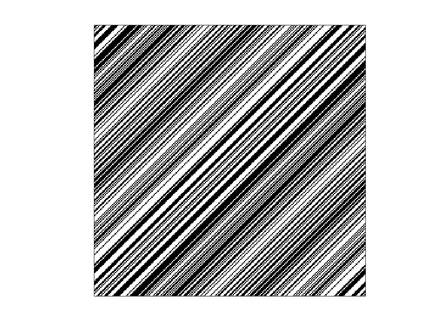

## Order 223 S Matrix

| 1 | 0 | 0 | 1 | 0 | 1 | 1 | 0 | 0 | 0 | 1 | 1 | 1 | 1 | 0 | 0 | 0 | 0 | 0 | 0 | 1 | 1 | 1 | 1 | 1 | 0 | 1 | 1 | 0 | 0 | 0 | 0 | 0 | 0 | 0 | 1 | 0 | 0 | 0 | 0 | 1 | 0 | 1 | 0 | 1 | 1 | 1 | 0 | 1 | 0 | 0 | 1 | 1 | 0 | 1 | 0 | 0 | 1 | 0 | 1 | 0 | 1 | 0 | 0 | 0 | 0 | 0 | 1 | 0 | 0 | 1 | 1 | 0 | 0 | 0 | 1 | 0 | 1 | 0 | 1 | 1 | 0 | 0 | 0 | 1 | 1 | 0 | 1 | 1 | 0 | 1 | 1 | 1 | 1 | 0 | 1 | 1 | 1 | 0 | 1 | 0 | 0 | 1 | 1 | 1 | 0 | 0 | 1 | 1 | 0 | 0 | 1 | 0 | 1 | 1 | 0 | 0 | 1 | 1 | 0 | 0 | 0 | 1 | 1 | 0 | 1 | 0 | 0 | 0 | 1 | 0 | 0 | 0 | 0 | 1 | 0 | 0 | 1 | 0 | 0 | 1 | 1 | 1 | 0 | 0 | 1 | 0 | 1 | 0 | 1 | 1 | 1 | 0 | 0 | 1 | 1 | 0 | 1 | 1 | 1 | 1 | 1 | 0 | 1 | 0 | 1 | 0 | 1 | 1 | 0 | 1 | 0 | 0 | 1 | 1 | 0 | 1 | 0 | 0 | 0 | 1 | 0 | 1 | 0 | 1 | 1 | 1 | 1 | 0 | 1 | 1 | 1 | 1 | 1 | 1 | 1 | 0 | 0 | 1 | 0 | 0 | 0 | 0 | 0 | 1 | 1 | 1 | 1 | 1 | 1 | 0 | 0 | 0 | 0 | 1 | 1 | 1 | 0 | 0 | 1 | 0 | 1 | 1 |
| 0 | 0 | 1 | 0 | 1 | 1 | 0 | 0 | 0 | 1 | 1 | 1 | 1 | 0 | 0 | 0 | 0 | 0 | 0 | 1 | 1 | 1 | 1 | 1 | 0 | 1 | 1 | 0 | 0 | 0 | 0 | 0 | 0 | 0 | 1 | 0 | 0 | 0 | 0 | 1 | 0 | 1 | 0 | 1 | 1 | 1 | 0 | 1 | 0 | 0 | 1 | 1 | 0 | 1 | 0 | 0 | 1 | 0 | 1 | 0 | 1 | 0 | 0 | 0 | 0 | 0 | 1 | 0 | 0 | 1 | 1 | 0 | 0 | 0 | 1 | 0 | 1 | 0 | 1 | 1 | 0 | 0 | 0 | 1 | 1 | 0 | 1 | 1 | 0 | 1 | 1 | 1 | 1 | 0 | 1 | 1 | 1 | 0 | 1 | 0 | 0 | 1 | 1 | 1 | 0 | 0 | 1 | 1 | 0 | 0 | 1 | 0 | 1 | 1 | 0 | 0 | 1 | 1 | 0 | 0 | 0 | 1 | 1 | 0 | 1 | 0 | 0 | 0 | 1 | 0 | 0 | 0 | 0 | 1 | 0 | 0 | 1 | 0 | 0 | 1 | 1 | 1 | 0 | 0 | 1 | 0 | 1 | 0 | 1 | 1 | 1 | 0 | 0 | 1 | 1 | 0 | 1 | 1 | 1 | 1 | 1 | 0 | 1 | 0 | 1 | 0 | 1 | 1 | 0 | 1 | 0 | 0 | 1 | 1 | 0 | 1 | 0 | 0 | 0 | 1 | 0 | 1 | 0 | 1 | 1 | 1 | 1 | 0 | 1 | 1 | 1 | 1 | 1 | 1 | 1 | 0 | 0 | 1 | 0 | 0 | 0 | 0 | 0 | 1 | 1 | 1 | 1 | 1 | 1 | 0 | 0 | 0 | 0 | 1 | 1 | 1 | 0 | 0 | 1 | 0 | 1 | 1 | 1 |
| 0 | 1 | 0 | 1 | 1 | 0 | 0 | 0 | 1 | 1 | 1 | 1 | 0 | 0 | 0 | 0 | 0 | 0 | 1 | 1 | 1 | 1 | 1 | 0 | 1 | 1 | 0 | 0 | 0 | 0 | 0 | 0 | 0 | 1 | 0 | 0 | 0 | 0 | 1 | 0 | 1 | 0 | 1 | 1 | 1 | 0 | 1 | 0 | 0 | 1 | 1 | 0 | 1 | 0 | 0 | 1 | 0 | 1 | 0 | 1 | 0 | 0 | 0 | 0 | 0 | 1 | 0 | 0 | 1 | 1 | 0 | 0 | 0 | 1 | 0 | 1 | 0 | 1 | 1 | 0 | 0 | 0 | 1 | 1 | 0 | 1 | 1 | 0 | 1 | 1 | 1 | 1 | 0 | 1 | 1 | 1 | 0 | 1 | 0 | 0 | 1 | 1 | 1 | 0 | 0 | 1 | 1 | 0 | 0 | 1 | 0 | 1 | 1 | 0 | 0 | 1 | 1 | 0 | 0 | 0 | 1 | 1 | 0 | 1 | 0 | 0 | 0 | 1 | 0 | 0 | 0 | 0 | 1 | 0 | 0 | 1 | 0 | 0 | 1 | 1 | 1 | 0 | 0 | 1 | 0 | 1 | 0 | 1 | 1 | 1 | 0 | 0 | 1 | 1 | 0 | 1 | 1 | 1 | 1 | 1 | 0 | 1 | 0 | 1 | 0 | 1 | 1 | 0 | 1 | 0 | 0 | 1 | 1 | 0 | 1 | 0 | 0 | 0 | 1 | 0 | 1 | 0 | 1 | 1 | 1 | 1 | 0 | 1 | 1 | 1 | 1 | 1 | 1 | 1 | 0 | 0 | 1 | 0 | 0 | 0 | 0 | 0 | 1 | 1 | 1 | 1 | 1 | 1 | 0 | 0 | 0 | 0 | 1 | 1 | 1 | 0 | 0 | 1 | 0 | 1 | 1 | 1 | 0 |
| 1 | 0 | 1 | 1 | 0 | 0 | 0 | 1 | 1 | 1 | 1 | 0 | 0 | 0 | 0 | 0 | 0 | 1 | 1 | 1 | 1 | 1 | 0 | 1 | 1 | 0 | 0 | 0 | 0 | 0 | 0 | 0 | 1 | 0 | 0 | 0 | 0 | 1 | 0 | 1 | 0 | 1 | 1 | 1 | 0 | 1 | 0 | 0 | 1 | 1 | 0 | 1 | 0 | 0 | 1 | 0 | 1 | 0 | 1 | 0 | 0 | 0 | 0 | 0 | 1 | 0 | 0 | 1 | 1 | 0 | 0 | 0 | 1 | 0 | 1 | 0 | 1 | 1 | 0 | 0 | 0 | 1 | 1 | 0 | 1 | 1 | 0 | 1 | 1 | 1 | 1 | 0 | 1 | 1 | 1 | 0 | 1 | 0 | 0 | 1 | 1 | 1 | 0 | 0 | 1 | 1 | 0 | 0 | 1 | 0 | 1 | 1 | 0 | 0 | 1 | 1 | 0 | 0 | 0 | 1 | 1 | 0 | 1 | 0 | 0 | 0 | 1 | 0 | 0 | 0 | 0 | 1 | 0 | 0 | 1 | 0 | 0 | 1 | 1 | 1 | 0 | 0 | 1 | 0 | 1 | 0 | 1 | 1 | 1 | 0 | 0 | 1 | 1 | 0 | 1 | 1 | 1 | 1 | 1 | 0 | 1 | 0 | 1 | 0 | 1 | 1 | 0 | 1 | 0 | 0 | 1 | 1 | 0 | 1 | 0 | 0 | 0 | 1 | 0 | 1 | 0 | 1 | 1 | 1 | 1 | 0 | 1 | 1 | 1 | 1 | 1 | 1 | 1 | 0 | 0 | 1 | 0 | 0 | 0 | 0 | 0 | 1 | 1 | 1 | 1 | 1 | 1 | 0 | 0 | 0 | 0 | 1 | 1 | 1 | 0 | 0 | 1 | 0 | 1 | 1 | 1 | 0 | 0 |
| 0 | 1 | 1 | 0 | 0 | 0 | 1 | 1 | 1 | 1 | 0 | 0 | 0 | 0 | 0 | 0 | 1 | 1 | 1 | 1 | 1 | 0 | 1 | 1 | 0 | 0 | 0 | 0 | 0 | 0 | 0 | 1 | 0 | 0 | 0 | 0 | 1 | 0 | 1 | 0 | 1 | 1 | 1 | 0 | 1 | 0 | 0 | 1 | 1 | 0 | 1 | 0 | 0 | 1 | 0 | 1 | 0 | 1 | 0 | 0 | 0 | 0 | 0 | 1 | 0 | 0 | 1 | 1 | 0 | 0 | 0 | 1 | 0 | 1 | 0 | 1 | 1 | 0 | 0 | 0 | 1 | 1 | 0 | 1 | 1 | 0 | 1 | 1 | 1 | 1 | 0 | 1 | 1 | 1 | 0 | 1 | 0 | 0 | 1 | 1 | 1 | 0 | 0 | 1 | 1 | 0 | 0 | 1 | 0 | 1 | 1 | 0 | 0 | 1 | 1 | 0 | 0 | 0 | 1 | 1 | 0 | 1 | 0 | 0 | 0 | 1 | 0 | 0 | 0 | 0 | 1 | 0 | 0 | 1 | 0 | 0 | 1 | 1 | 1 | 0 | 0 | 1 | 0 | 1 | 0 | 1 | 1 | 1 | 0 | 0 | 1 | 1 | 0 | 1 | 1 | 1 | 1 | 1 | 0 | 1 | 0 | 1 | 0 | 1 | 1 | 0 | 1 | 0 | 0 | 1 | 1 | 0 | 1 | 0 | 0 | 0 | 1 | 0 | 1 | 0 | 1 | 1 | 1 | 1 | 0 | 1 | 1 | 1 | 1 | 1 | 1 | 1 | 0 | 0 | 1 | 0 | 0 | 0 | 0 | 0 | 1 | 1 | 1 | 1 | 1 | 1 | 0 | 0 | 0 | 0 | 1 | 1 | 1 | 0 | 0 | 1 | 0 | 1 | 1 | 1 | 0 | 0 | 1 |
| 1 | 1 | 0 | 0 | 0 | 1 | 1 | 1 | 1 | 0 | 0 | 0 | 0 | 0 | 0 | 1 | 1 | 1 | 1 | 1 | 0 | 1 | 1 | 0 | 0 | 0 | 0 | 0 | 0 | 0 | 1 | 0 | 0 | 0 | 0 | 1 | 0 | 1 | 0 | 1 | 1 | 1 | 0 | 1 | 0 | 0 | 1 | 1 | 0 | 1 | 0 | 0 | 1 | 0 | 1 | 0 | 1 | 0 | 0 | 0 | 0 | 0 | 1 | 0 | 0 | 1 | 1 | 0 | 0 | 0 | 1 | 0 | 1 | 0 | 1 | 1 | 0 | 0 | 0 | 1 | 1 | 0 | 1 | 1 | 0 | 1 | 1 | 1 | 1 | 0 | 1 | 1 | 1 | 0 | 1 | 0 | 0 | 1 | 1 | 1 | 0 | 0 | 1 | 1 | 0 | 0 | 1 | 0 | 1 | 1 | 0 | 0 | 1 | 1 | 0 | 0 | 0 | 1 | 1 | 0 | 1 | 0 | 0 | 0 | 1 | 0 | 0 | 0 | 0 | 1 | 0 | 0 | 1 | 0 | 0 | 1 | 1 | 1 | 0 | 0 | 1 | 0 | 1 | 0 | 1 | 1 | 1 | 0 | 0 | 1 | 1 | 0 | 1 | 1 | 1 | 1 | 1 | 0 | 1 | 0 | 1 | 0 | 1 | 1 | 0 | 1 | 0 | 0 | 1 | 1 | 0 | 1 | 0 | 0 | 0 | 1 | 0 | 1 | 0 | 1 | 1 | 1 | 1 | 0 | 1 | 1 | 1 | 1 | 1 | 1 | 1 | 0 | 0 | 1 | 0 | 0 | 0 | 0 | 0 | 1 | 1 | 1 | 1 | 1 | 1 | 0 | 0 | 0 | 0 | 1 | 1 | 1 | 0 | 0 | 1 | 0 | 1 | 1 | 1 | 0 | 0 | 1 | 0 |
| 1 | 0 | 0 | 0 | 1 | 1 | 1 | 1 | 0 | 0 | 0 | 0 | 0 | 0 | 1 | 1 | 1 | 1 | 1 | 0 | 1 | 1 | 0 | 0 | 0 | 0 | 0 | 0 | 0 | 1 | 0 | 0 | 0 | 0 | 1 | 0 | 1 | 0 | 1 | 1 | 1 | 0 | 1 | 0 | 0 | 1 | 1 | 0 | 1 | 0 | 0 | 1 | 0 | 1 | 0 | 1 | 0 | 0 | 0 | 0 | 0 | 1 | 0 | 0 | 1 | 1 | 0 | 0 | 0 | 1 | 0 | 1 | 0 | 1 | 1 | 0 | 0 | 0 | 1 | 1 | 0 | 1 | 1 | 0 | 1 | 1 | 1 | 1 | 0 | 1 | 1 | 1 | 0 | 1 | 0 | 0 | 1 | 1 | 1 | 0 | 0 | 1 | 1 | 0 | 0 | 1 | 0 | 1 | 1 | 0 | 0 | 1 | 1 | 0 | 0 | 0 | 1 | 1 | 0 | 1 | 0 | 0 | 0 | 1 | 0 | 0 | 0 | 0 | 1 | 0 | 0 | 1 | 0 | 0 | 1 | 1 | 1 | 0 | 0 | 1 | 0 | 1 | 0 | 1 | 1 | 1 | 0 | 0 | 1 | 1 | 0 | 1 | 1 | 1 | 1 | 1 | 0 | 1 | 0 | 1 | 0 | 1 | 1 | 0 | 1 | 0 | 0 | 1 | 1 | 0 | 1 | 0 | 0 | 0 | 1 | 0 | 1 | 0 | 1 | 1 | 1 | 1 | 0 | 1 | 1 | 1 | 1 | 1 | 1 | 1 | 0 | 0 | 1 | 0 | 0 | 0 | 0 | 0 | 1 | 1 | 1 | 1 | 1 | 1 | 0 | 0 | 0 | 0 | 1 | 1 | 1 | 0 | 0 | 1 | 0 | 1 | 1 | 1 | 0 | 0 | 1 | 0 | 1 |
| 0 | 0 | 0 | 1 | 1 | 1 | 1 | 0 | 0 | 0 | 0 | 0 | 0 | 1 | 1 | 1 | 1 | 1 | 0 | 1 | 1 | 0 | 0 | 0 | 0 | 0 | 0 | 0 | 1 | 0 | 0 | 0 | 0 | 1 | 0 | 1 | 0 | 1 | 1 | 1 | 0 | 1 | 0 | 0 | 1 | 1 | 0 | 1 | 0 | 0 | 1 | 0 | 1 | 0 | 1 | 0 | 0 | 0 | 0 | 0 | 1 | 0 | 0 | 1 | 1 | 0 | 0 | 0 | 1 | 0 | 1 | 0 | 1 | 1 | 0 | 0 | 0 | 1 | 1 | 0 | 1 | 1 | 0 | 1 | 1 | 1 | 1 | 0 | 1 | 1 | 1 | 0 | 1 | 0 | 0 | 1 | 1 | 1 | 0 | 0 | 1 | 1 | 0 | 0 | 1 | 0 | 1 | 1 | 0 | 0 | 1 | 1 | 0 | 0 | 0 | 1 | 1 | 0 | 1 | 0 | 0 | 0 | 1 | 0 | 0 | 0 | 0 | 1 | 0 | 0 | 1 | 0 | 0 | 1 | 1 | 1 | 0 | 0 | 1 | 0 | 1 | 0 | 1 | 1 | 1 | 0 | 0 | 1 | 1 | 0 | 1 | 1 | 1 | 1 | 1 | 0 | 1 | 0 | 1 | 0 | 1 | 1 | 0 | 1 | 0 | 0 | 1 | 1 | 0 | 1 | 0 | 0 | 0 | 1 | 0 | 1 | 0 | 1 | 1 | 1 | 1 | 0 | 1 | 1 | 1 | 1 | 1 | 1 | 1 | 0 | 0 | 1 | 0 | 0 | 0 | 0 | 0 | 1 | 1 | 1 | 1 | 1 | 1 | 0 | 0 | 0 | 0 | 1 | 1 | 1 | 0 | 0 | 1 | 0 | 1 | 1 | 1 | 0 | 0 | 1 | 0 | 1 | 1 |
| 0 | 0 | 1 | 1 | 1 | 1 | 0 | 0 | 0 | 0 | 0 | 0 | 1 | 1 | 1 | 1 | 1 | 0 | 1 | 1 | 0 | 0 | 0 | 0 | 0 | 0 | 0 | 1 | 0 | 0 | 0 | 0 | 1 | 0 | 1 | 0 | 1 | 1 | 1 | 0 | 1 | 0 | 0 | 1 | 1 | 0 | 1 | 0 | 0 | 1 | 0 | 1 | 0 | 1 | 0 | 0 | 0 | 0 | 0 | 1 | 0 | 0 | 1 | 1 | 0 | 0 | 0 | 1 | 0 | 1 | 0 | 1 | 1 | 0 | 0 | 0 | 1 | 1 | 0 | 1 | 1 | 0 | 1 | 1 | 1 | 1 | 0 | 1 | 1 | 1 | 0 | 1 | 0 | 0 | 1 | 1 | 1 | 0 | 0 | 1 | 1 | 0 | 0 | 1 | 0 | 1 | 1 | 0 | 0 | 1 | 1 | 0 | 0 | 0 | 1 | 1 | 0 | 1 | 0 | 0 | 0 | 1 | 0 | 0 | 0 | 0 | 1 | 0 | 0 | 1 | 0 | 0 | 1 | 1 | 1 | 0 | 0 | 1 | 0 | 1 | 0 | 1 | 1 | 1 | 0 | 0 | 1 | 1 | 0 | 1 | 1 | 1 | 1 | 1 | 0 | 1 | 0 | 1 | 0 | 1 | 1 | 0 | 1 | 0 | 0 | 1 | 1 | 0 | 1 | 0 | 0 | 0 | 1 | 0 | 1 | 0 | 1 | 1 | 1 | 1 | 0 | 1 | 1 | 1 | 1 | 1 | 1 | 1 | 0 | 0 | 1 | 0 | 0 | 0 | 0 | 0 | 1 | 1 | 1 | 1 | 1 | 1 | 0 | 0 | 0 | 0 | 1 | 1 | 1 | 0 | 0 | 1 | 0 | 1 | 1 | 1 | 0 | 0 | 1 | 0 | 1 | 1 | 0 |
| 0 | 1 | 1 | 1 | 1 | 0 | 0 | 0 | 0 | 0 | 0 | 1 | 1 | 1 | 1 | 1 | 0 | 1 | 1 | 0 | 0 | 0 | 0 | 0 | 0 | 0 | 1 | 0 | 0 | 0 | 0 | 1 | 0 | 1 | 0 | 1 | 1 | 1 | 0 | 1 | 0 | 0 | 1 | 1 | 0 | 1 | 0 | 0 | 1 | 0 | 1 | 0 | 1 | 0 | 0 | 0 | 0 | 0 | 1 | 0 | 0 | 1 | 1 | 0 | 0 | 0 | 1 | 0 | 1 | 0 | 1 | 1 | 0 | 0 | 0 | 1 | 1 | 0 | 1 | 1 | 0 | 1 | 1 | 1 | 1 | 0 | 1 | 1 | 1 | 0 | 1 | 0 | 0 | 1 | 1 | 1 | 0 | 0 | 1 | 1 | 0 | 0 | 1 | 0 | 1 | 1 | 0 | 0 | 1 | 1 | 0 | 0 | 0 | 1 | 1 | 0 | 1 | 0 | 0 | 0 | 1 | 0 | 0 | 0 | 0 | 1 | 0 | 0 | 1 | 0 | 0 | 1 | 1 | 1 | 0 | 0 | 1 | 0 | 1 | 0 | 1 | 1 | 1 | 0 | 0 | 1 | 1 | 0 | 1 | 1 | 1 | 1 | 1 | 0 | 1 | 0 | 1 | 0 | 1 | 1 | 0 | 1 | 0 | 0 | 1 | 1 | 0 | 1 | 0 | 0 | 0 | 1 | 0 | 1 | 0 | 1 | 1 | 1 | 1 | 0 | 1 | 1 | 1 | 1 | 1 | 1 | 1 | 0 | 0 | 1 | 0 | 0 | 0 | 0 | 0 | 1 | 1 | 1 | 1 | 1 | 1 | 0 | 0 | 0 | 0 | 1 | 1 | 1 | 0 | 0 | 1 | 0 | 1 | 1 | 1 | 0 | 0 | 1 | 0 | 1 | 1 | 0 | 0 |
| 1 | 1 | 1 | 1 | 0 | 0 | 0 | 0 | 0 | 0 | 1 | 1 | 1 | 1 | 1 | 0 | 1 | 1 | 0 | 0 | 0 | 0 | 0 | 0 | 0 | 1 | 0 | 0 | 0 | 0 | 1 | 0 | 1 | 0 | 1 | 1 | 1 | 0 | 1 | 0 | 0 | 1 | 1 | 0 | 1 | 0 | 0 | 1 | 0 | 1 | 0 | 1 | 0 | 0 | 0 | 0 | 0 | 1 | 0 | 0 | 1 | 1 | 0 | 0 | 0 | 1 | 0 | 1 | 0 | 1 | 1 | 0 | 0 | 0 | 1 | 1 | 0 | 1 | 1 | 0 | 1 | 1 | 1 | 1 | 0 | 1 | 1 | 1 | 0 | 1 | 0 | 0 | 1 | 1 | 1 | 0 | 0 | 1 | 1 | 0 | 0 | 1 | 0 | 1 | 1 | 0 | 0 | 1 | 1 | 0 | 0 | 0 | 1 | 1 | 0 | 1 | 0 | 0 | 0 | 1 | 0 | 0 | 0 | 0 | 1 | 0 | 0 | 1 | 0 | 0 | 1 | 1 | 1 | 0 | 0 | 1 | 0 | 1 | 0 | 1 | 1 | 1 | 0 | 0 | 1 | 1 | 0 | 1 | 1 | 1 | 1 | 1 | 0 | 1 | 0 | 1 | 0 | 1 | 1 | 0 | 1 | 0 | 0 | 1 | 1 | 0 | 1 | 0 | 0 | 0 | 1 | 0 | 1 | 0 | 1 | 1 | 1 | 1 | 0 | 1 | 1 | 1 | 1 | 1 | 1 | 1 | 0 | 0 | 1 | 0 | 0 | 0 | 0 | 0 | 1 | 1 | 1 | 1 | 1 | 1 | 0 | 0 | 0 | 0 | 1 | 1 | 1 | 0 | 0 | 1 | 0 | 1 | 1 | 1 | 0 | 0 | 1 | 0 | 1 | 1 | 0 | 0 | 0 |
| 1 | 1 | 1 | 0 | 0 | 0 | 0 | 0 | 0 | 1 | 1 | 1 | 1 | 1 | 0 | 1 | 1 | 0 | 0 | 0 | 0 | 0 | 0 | 0 | 1 | 0 | 0 | 0 | 0 | 1 | 0 | 1 | 0 | 1 | 1 | 1 | 0 | 1 | 0 | 0 | 1 | 1 | 0 | 1 | 0 | 0 | 1 | 0 | 1 | 0 | 1 | 0 | 0 | 0 | 0 | 0 | 1 | 0 | 0 | 1 | 1 | 0 | 0 | 0 | 1 | 0 | 1 | 0 | 1 | 1 | 0 | 0 | 0 | 1 | 1 | 0 | 1 | 1 | 0 | 1 | 1 | 1 | 1 | 0 | 1 | 1 | 1 | 0 | 1 | 0 | 0 | 1 | 1 | 1 | 0 | 0 | 1 | 1 | 0 | 0 | 1 | 0 | 1 | 1 | 0 | 0 | 1 | 1 | 0 | 0 | 0 | 1 | 1 | 0 | 1 | 0 | 0 | 0 | 1 | 0 | 0 | 0 | 0 | 1 | 0 | 0 | 1 | 0 | 0 | 1 | 1 | 1 | 0 | 0 | 1 | 0 | 1 | 0 | 1 | 1 | 1 | 0 | 0 | 1 | 1 | 0 | 1 | 1 | 1 | 1 | 1 | 0 | 1 | 0 | 1 | 0 | 1 | 1 | 0 | 1 | 0 | 0 | 1 | 1 | 0 | 1 | 0 | 0 | 0 | 1 | 0 | 1 | 0 | 1 | 1 | 1 | 1 | 0 | 1 | 1 | 1 | 1 | 1 | 1 | 1 | 0 | 0 | 1 | 0 | 0 | 0 | 0 | 0 | 1 | 1 | 1 | 1 | 1 | 1 | 0 | 0 | 0 | 0 | 1 | 1 | 1 | 0 | 0 | 1 | 0 | 1 | 1 | 1 | 0 | 0 | 1 | 0 | 1 | 1 | 0 | 0 | 0 | 1 |
| 1 | 1 | 0 | 0 | 0 | 0 | 0 | 0 | 1 | 1 | 1 | 1 | 1 | 0 | 1 | 1 | 0 | 0 | 0 | 0 | 0 | 0 | 0 | 1 | 0 | 0 | 0 | 0 | 1 | 0 | 1 | 0 | 1 | 1 | 1 | 0 | 1 | 0 | 0 | 1 | 1 | 0 | 1 | 0 | 0 | 1 | 0 | 1 | 0 | 1 | 0 | 0 | 0 | 0 | 0 | 1 | 0 | 0 | 1 | 1 | 0 | 0 | 0 | 1 | 0 | 1 | 0 | 1 | 1 | 0 | 0 | 0 | 1 | 1 | 0 | 1 | 1 | 0 | 1 | 1 | 1 | 1 | 0 | 1 | 1 | 1 | 0 | 1 | 0 | 0 | 1 | 1 | 1 | 0 | 0 | 1 | 1 | 0 | 0 | 1 | 0 | 1 | 1 | 0 | 0 | 1 | 1 | 0 | 0 | 0 | 1 | 1 | 0 | 1 | 0 | 0 | 0 | 1 | 0 | 0 | 0 | 0 | 1 | 0 | 0 | 1 | 0 | 0 | 1 | 1 | 1 | 0 | 0 | 1 | 0 | 1 | 0 | 1 | 1 | 1 | 0 | 0 | 1 | 1 | 0 | 1 | 1 | 1 | 1 | 1 | 0 | 1 | 0 | 1 | 0 | 1 | 1 | 0 | 1 | 0 | 0 | 1 | 1 | 0 | 1 | 0 | 0 | 0 | 1 | 0 | 1 | 0 | 1 | 1 | 1 | 1 | 0 | 1 | 1 | 1 | 1 | 1 | 1 | 1 | 0 | 0 | 1 | 0 | 0 | 0 | 0 | 0 | 1 | 1 | 1 | 1 | 1 | 1 | 0 | 0 | 0 | 0 | 1 | 1 | 1 | 0 | 0 | 1 | 0 | 1 | 1 | 1 | 0 | 0 | 1 | 0 | 1 | 1 | 0 | 0 | 0 | 1 | 1 |
| 1 | 0 | 0 | 0 | 0 | 0 | 0 | 1 | 1 | 1 | 1 | 1 | 0 | 1 | 1 | 0 | 0 | 0 | 0 | 0 | 0 | 0 | 1 | 0 | 0 | 0 | 0 | 1 | 0 | 1 | 0 | 1 | 1 | 1 | 0 | 1 | 0 | 0 | 1 | 1 | 0 | 1 | 0 | 0 | 1 | 0 | 1 | 0 | 1 | 0 | 0 | 0 | 0 | 0 | 1 | 0 | 0 | 1 | 1 | 0 | 0 | 0 | 1 | 0 | 1 | 0 | 1 | 1 | 0 | 0 | 0 | 1 | 1 | 0 | 1 | 1 | 0 | 1 | 1 | 1 | 1 | 0 | 1 | 1 | 1 | 0 | 1 | 0 | 0 | 1 | 1 | 1 | 0 | 0 | 1 | 1 | 0 | 0 | 1 | 0 | 1 | 1 | 0 | 0 | 1 | 1 | 0 | 0 | 0 | 1 | 1 | 0 | 1 | 0 | 0 | 0 | 1 | 0 | 0 | 0 | 0 | 1 | 0 | 0 | 1 | 0 | 0 | 1 | 1 | 1 | 0 | 0 | 1 | 0 | 1 | 0 | 1 | 1 | 1 | 0 | 0 | 1 | 1 | 0 | 1 | 1 | 1 | 1 | 1 | 0 | 1 | 0 | 1 | 0 | 1 | 1 | 0 | 1 | 0 | 0 | 1 | 1 | 0 | 1 | 0 | 0 | 0 | 1 | 0 | 1 | 0 | 1 | 1 | 1 | 1 | 0 | 1 | 1 | 1 | 1 | 1 | 1 | 1 | 0 | 0 | 1 | 0 | 0 | 0 | 0 | 0 | 1 | 1 | 1 | 1 | 1 | 1 | 0 | 0 | 0 | 0 | 1 | 1 | 1 | 0 | 0 | 1 | 0 | 1 | 1 | 1 | 0 | 0 | 1 | 0 | 1 | 1 | 0 | 0 | 0 | 1 | 1 | 1 |
| 0 | 0 | 0 | 0 | 0 | 0 | 1 | 1 | 1 | 1 | 1 | 0 | 1 | 1 | 0 | 0 | 0 | 0 | 0 | 0 | 0 | 1 | 0 | 0 | 0 | 0 | 1 | 0 | 1 | 0 | 1 | 1 | 1 | 0 | 1 | 0 | 0 | 1 | 1 | 0 | 1 | 0 | 0 | 1 | 0 | 1 | 0 | 1 | 0 | 0 | 0 | 0 | 0 | 1 | 0 | 0 | 1 | 1 | 0 | 0 | 0 | 1 | 0 | 1 | 0 | 1 | 1 | 0 | 0 | 0 | 1 | 1 | 0 | 1 | 1 | 0 | 1 | 1 | 1 | 1 | 0 | 1 | 1 | 1 | 0 | 1 | 0 | 0 | 1 | 1 | 1 | 0 | 0 | 1 | 1 | 0 | 0 | 1 | 0 | 1 | 1 | 0 | 0 | 1 | 1 | 0 | 0 | 0 | 1 | 1 | 0 | 1 | 0 | 0 | 0 | 1 | 0 | 0 | 0 | 0 | 1 | 0 | 0 | 1 | 0 | 0 | 1 | 1 | 1 | 0 | 0 | 1 | 0 | 1 | 0 | 1 | 1 | 1 | 0 | 0 | 1 | 1 | 0 | 1 | 1 | 1 | 1 | 1 | 0 | 1 | 0 | 1 | 0 | 1 | 1 | 0 | 1 | 0 | 0 | 1 | 1 | 0 | 1 | 0 | 0 | 0 | 1 | 0 | 1 | 0 | 1 | 1 | 1 | 1 | 0 | 1 | 1 | 1 | 1 | 1 | 1 | 1 | 0 | 0 | 1 | 0 | 0 | 0 | 0 | 0 | 1 | 1 | 1 | 1 | 1 | 1 | 0 | 0 | 0 | 0 | 1 | 1 | 1 | 0 | 0 | 1 | 0 | 1 | 1 | 1 | 0 | 0 | 1 | 0 | 1 | 1 | 0 | 0 | 0 | 1 | 1 | 1 | 1 |
| 0 | 0 | 0 | 0 | 0 | 1 | 1 | 1 | 1 | 1 | 0 | 1 | 1 | 0 | 0 | 0 | 0 | 0 | 0 | 0 | 1 | 0 | 0 | 0 | 0 | 1 | 0 | 1 | 0 | 1 | 1 | 1 | 0 | 1 | 0 | 0 | 1 | 1 | 0 | 1 | 0 | 0 | 1 | 0 | 1 | 0 | 1 | 0 | 0 | 0 | 0 | 0 | 1 | 0 | 0 | 1 | 1 | 0 | 0 | 0 | 1 | 0 | 1 | 0 | 1 | 1 | 0 | 0 | 0 | 1 | 1 | 0 | 1 | 1 | 0 | 1 | 1 | 1 | 1 | 0 | 1 | 1 | 1 | 0 | 1 | 0 | 0 | 1 | 1 | 1 | 0 | 0 | 1 | 1 | 0 | 0 | 1 | 0 | 1 | 1 | 0 | 0 | 1 | 1 | 0 | 0 | 0 | 1 | 1 | 0 | 1 | 0 | 0 | 0 | 1 | 0 | 0 | 0 | 0 | 1 | 0 | 0 | 1 | 0 | 0 | 1 | 1 | 1 | 0 | 0 | 1 | 0 | 1 | 0 | 1 | 1 | 1 | 0 | 0 | 1 | 1 | 0 | 1 | 1 | 1 | 1 | 1 | 0 | 1 | 0 | 1 | 0 | 1 | 1 | 0 | 1 | 0 | 0 | 1 | 1 | 0 | 1 | 0 | 0 | 0 | 1 | 0 | 1 | 0 | 1 | 1 | 1 | 1 | 0 | 1 | 1 | 1 | 1 | 1 | 1 | 1 | 0 | 0 | 1 | 0 | 0 | 0 | 0 | 0 | 1 | 1 | 1 | 1 | 1 | 1 | 0 | 0 | 0 | 0 | 1 | 1 | 1 | 0 | 0 | 1 | 0 | 1 | 1 | 1 | 0 | 0 | 1 | 0 | 1 | 1 | 0 | 0 | 0 | 1 | 1 | 1 | 1 | 0 |
| 0 | 0 | 0 | 0 | 1 | 1 | 1 | 1 | 1 | 0 | 1 | 1 | 0 | 0 | 0 | 0 | 0 | 0 | 0 | 1 | 0 | 0 | 0 | 0 | 1 | 0 | 1 | 0 | 1 | 1 | 1 | 0 | 1 | 0 | 0 | 1 | 1 | 0 | 1 | 0 | 0 | 1 | 0 | 1 | 0 | 1 | 0 | 0 | 0 | 0 | 0 | 1 | 0 | 0 | 1 | 1 | 0 | 0 | 0 | 1 | 0 | 1 | 0 | 1 | 1 | 0 | 0 | 0 | 1 | 1 | 0 | 1 | 1 | 0 | 1 | 1 | 1 | 1 | 0 | 1 | 1 | 1 | 0 | 1 | 0 | 0 | 1 | 1 | 1 | 0 | 0 | 1 | 1 | 0 | 0 | 1 | 0 | 1 | 1 | 0 | 0 | 1 | 1 | 0 | 0 | 0 | 1 | 1 | 0 | 1 | 0 | 0 | 0 | 1 | 0 | 0 | 0 | 0 | 1 | 0 | 0 | 1 | 0 | 0 | 1 | 1 | 1 | 0 | 0 | 1 | 0 | 1 | 0 | 1 | 1 | 1 | 0 | 0 | 1 | 1 | 0 | 1 | 1 | 1 | 1 | 1 | 0 | 1 | 0 | 1 | 0 | 1 | 1 | 0 | 1 | 0 | 0 | 1 | 1 | 0 | 1 | 0 | 0 | 0 | 1 | 0 | 1 | 0 | 1 | 1 | 1 | 1 | 0 | 1 | 1 | 1 | 1 | 1 | 1 | 1 | 0 | 0 | 1 | 0 | 0 | 0 | 0 | 0 | 1 | 1 | 1 | 1 | 1 | 1 | 0 | 0 | 0 | 0 | 1 | 1 | 1 | 0 | 0 | 1 | 0 | 1 | 1 | 1 | 0 | 0 | 1 | 0 | 1 | 1 | 0 | 0 | 0 | 1 | 1 | 1 | 1 | 0 | 0 |
| 0 | 0 | 0 | 1 | 1 | 1 | 1 | 1 | 0 | 1 | 1 | 0 | 0 | 0 | 0 | 0 | 0 | 0 | 1 | 0 | 0 | 0 | 0 | 1 | 0 | 1 | 0 | 1 | 1 | 1 | 0 | 1 | 0 | 0 | 1 | 1 | 0 | 1 | 0 | 0 | 1 | 0 | 1 | 0 | 1 | 0 | 0 | 0 | 0 | 0 | 1 | 0 | 0 | 1 | 1 | 0 | 0 | 0 | 1 | 0 | 1 | 0 | 1 | 1 | 0 | 0 | 0 | 1 | 1 | 0 | 1 | 1 | 0 | 1 | 1 | 1 | 1 | 0 | 1 | 1 | 1 | 0 | 1 | 0 | 0 | 1 | 1 | 1 | 0 | 0 | 1 | 1 | 0 | 0 | 1 | 0 | 1 | 1 | 0 | 0 | 1 | 1 | 0 | 0 | 0 | 1 | 1 | 0 | 1 | 0 | 0 | 0 | 1 | 0 | 0 | 0 | 0 | 1 | 0 | 0 | 1 | 0 | 0 | 1 | 1 | 1 | 0 | 0 | 1 | 0 | 1 | 0 | 1 | 1 | 1 | 0 | 0 | 1 | 1 | 0 | 1 | 1 | 1 | 1 | 1 | 0 | 1 | 0 | 1 | 0 | 1 | 1 | 0 | 1 | 0 | 0 | 1 | 1 | 0 | 1 | 0 | 0 | 0 | 1 | 0 | 1 | 0 | 1 | 1 | 1 | 1 | 0 | 1 | 1 | 1 | 1 | 1 | 1 | 1 | 0 | 0 | 1 | 0 | 0 | 0 | 0 | 0 | 1 | 1 | 1 | 1 | 1 | 1 | 0 | 0 | 0 | 0 | 1 | 1 | 1 | 0 | 0 | 1 | 0 | 1 | 1 | 1 | 0 | 0 | 1 | 0 | 1 | 1 | 0 | 0 | 0 | 1 | 1 | 1 | 1 | 0 | 0 | 0 |
| 0 | 0 | 1 | 1 | 1 | 1 | 1 | 0 | 1 | 1 | 0 | 0 | 0 | 0 | 0 | 0 | 0 | 1 | 0 | 0 | 0 | 0 | 1 | 0 | 1 | 0 | 1 | 1 | 1 | 0 | 1 | 0 | 0 | 1 | 1 | 0 | 1 | 0 | 0 | 1 | 0 | 1 | 0 | 1 | 0 | 0 | 0 | 0 | 0 | 1 | 0 | 0 | 1 | 1 | 0 | 0 | 0 | 1 | 0 | 1 | 0 | 1 | 1 | 0 | 0 | 0 | 1 | 1 | 0 | 1 | 1 | 0 | 1 | 1 | 1 | 1 | 0 | 1 | 1 | 1 | 0 | 1 | 0 | 0 | 1 | 1 | 1 | 0 | 0 | 1 | 1 | 0 | 0 | 1 | 0 | 1 | 1 | 0 | 0 | 1 | 1 | 0 | 0 | 0 | 1 | 1 | 0 | 1 | 0 | 0 | 0 | 1 | 0 | 0 | 0 | 0 | 1 | 0 | 0 | 1 | 0 | 0 | 1 | 1 | 1 | 0 | 0 | 1 | 0 | 1 | 0 | 1 | 1 | 1 | 0 | 0 | 1 | 1 | 0 | 1 | 1 | 1 | 1 | 1 | 0 | 1 | 0 | 1 | 0 | 1 | 1 | 0 | 1 | 0 | 0 | 1 | 1 | 0 | 1 | 0 | 0 | 0 | 1 | 0 | 1 | 0 | 1 | 1 | 1 | 1 | 0 | 1 | 1 | 1 | 1 | 1 | 1 | 1 | 0 | 0 | 1 | 0 | 0 | 0 | 0 | 0 | 1 | 1 | 1 | 1 | 1 | 1 | 0 | 0 | 0 | 0 | 1 | 1 | 1 | 0 | 0 | 1 | 0 | 1 | 1 | 1 | 0 | 0 | 1 | 0 | 1 | 1 | 0 | 0 | 0 | 1 | 1 | 1 | 1 | 0 | 0 | 0 | 0 |
| 0 | 1 | 1 | 1 | 1 | 1 | 0 | 1 | 1 | 0 | 0 | 0 | 0 | 0 | 0 | 0 | 1 | 0 | 0 | 0 | 0 | 1 | 0 | 1 | 0 | 1 | 1 | 1 | 0 | 1 | 0 | 0 | 1 | 1 | 0 | 1 | 0 | 0 | 1 | 0 | 1 | 0 | 1 | 0 | 0 | 0 | 0 | 0 | 1 | 0 | 0 | 1 | 1 | 0 | 0 | 0 | 1 | 0 | 1 | 0 | 1 | 1 | 0 | 0 | 0 | 1 | 1 | 0 | 1 | 1 | 0 | 1 | 1 | 1 | 1 | 0 | 1 | 1 | 1 | 0 | 1 | 0 | 0 | 1 | 1 | 1 | 0 | 0 | 1 | 1 | 0 | 0 | 1 | 0 | 1 | 1 | 0 | 0 | 1 | 1 | 0 | 0 | 0 | 1 | 1 | 0 | 1 | 0 | 0 | 0 | 1 | 0 | 0 | 0 | 0 | 1 | 0 | 0 | 1 | 0 | 0 | 1 | 1 | 1 | 0 | 0 | 1 | 0 | 1 | 0 | 1 | 1 | 1 | 0 | 0 | 1 | 1 | 0 | 1 | 1 | 1 | 1 | 1 | 0 | 1 | 0 | 1 | 0 | 1 | 1 | 0 | 1 | 0 | 0 | 1 | 1 | 0 | 1 | 0 | 0 | 0 | 1 | 0 | 1 | 0 | 1 | 1 | 1 | 1 | 0 | 1 | 1 | 1 | 1 | 1 | 1 | 1 | 0 | 0 | 1 | 0 | 0 | 0 | 0 | 0 | 1 | 1 | 1 | 1 | 1 | 1 | 0 | 0 | 0 | 0 | 1 | 1 | 1 | 0 | 0 | 1 | 0 | 1 | 1 | 1 | 0 | 0 | 1 | 0 | 1 | 1 | 0 | 0 | 0 | 1 | 1 | 1 | 1 | 0 | 0 | 0 | 0 | 0 |
| 1 | 1 | 1 | 1 | 1 | 0 | 1 | 1 | 0 | 0 | 0 | 0 | 0 | 0 | 0 | 1 | 0 | 0 | 0 | 0 | 1 | 0 | 1 | 0 | 1 | 1 | 1 | 0 | 1 | 0 | 0 | 1 | 1 | 0 | 1 | 0 | 0 | 1 | 0 | 1 | 0 | 1 | 0 | 0 | 0 | 0 | 0 | 1 | 0 | 0 | 1 | 1 | 0 | 0 | 0 | 1 | 0 | 1 | 0 | 1 | 1 | 0 | 0 | 0 | 1 | 1 | 0 | 1 | 1 | 0 | 1 | 1 | 1 | 1 | 0 | 1 | 1 | 1 | 0 | 1 | 0 | 0 | 1 | 1 | 1 | 0 | 0 | 1 | 1 | 0 | 0 | 1 | 0 | 1 | 1 | 0 | 0 | 1 | 1 | 0 | 0 | 0 | 1 | 1 | 0 | 1 | 0 | 0 | 0 | 1 | 0 | 0 | 0 | 0 | 1 | 0 | 0 | 1 | 0 | 0 | 1 | 1 | 1 | 0 | 0 | 1 | 0 | 1 | 0 | 1 | 1 | 1 | 0 | 0 | 1 | 1 | 0 | 1 | 1 | 1 | 1 | 1 | 0 | 1 | 0 | 1 | 0 | 1 | 1 | 0 | 1 | 0 | 0 | 1 | 1 | 0 | 1 | 0 | 0 | 0 | 1 | 0 | 1 | 0 | 1 | 1 | 1 | 1 | 0 | 1 | 1 | 1 | 1 | 1 | 1 | 1 | 0 | 0 | 1 | 0 | 0 | 0 | 0 | 0 | 1 | 1 | 1 | 1 | 1 | 1 | 0 | 0 | 0 | 0 | 1 | 1 | 1 | 0 | 0 | 1 | 0 | 1 | 1 | 1 | 0 | 0 | 1 | 0 | 1 | 1 | 0 | 0 | 0 | 1 | 1 | 1 | 1 | 0 | 0 | 0 | 0 | 0 | 0 |
| 1 | 1 | 1 | 1 | 0 | 1 | 1 | 0 | 0 | 0 | 0 | 0 | 0 | 0 | 1 | 0 | 0 | 0 | 0 | 1 | 0 | 1 | 0 | 1 | 1 | 1 | 0 | 1 | 0 | 0 | 1 | 1 | 0 | 1 | 0 | 0 | 1 | 0 | 1 | 0 | 1 | 0 | 0 | 0 | 0 | 0 | 1 | 0 | 0 | 1 | 1 | 0 | 0 | 0 | 1 | 0 | 1 | 0 | 1 | 1 | 0 | 0 | 0 | 1 | 1 | 0 | 1 | 1 | 0 | 1 | 1 | 1 | 1 | 0 | 1 | 1 | 1 | 0 | 1 | 0 | 0 | 1 | 1 | 1 | 0 | 0 | 1 | 1 | 0 | 0 | 1 | 0 | 1 | 1 | 0 | 0 | 1 | 1 | 0 | 0 | 0 | 1 | 1 | 0 | 1 | 0 | 0 | 0 | 1 | 0 | 0 | 0 | 0 | 1 | 0 | 0 | 1 | 0 | 0 | 1 | 1 | 1 | 0 | 0 | 1 | 0 | 1 | 0 | 1 | 1 | 1 | 0 | 0 | 1 | 1 | 0 | 1 | 1 | 1 | 1 | 1 | 0 | 1 | 0 | 1 | 0 | 1 | 1 | 0 | 1 | 0 | 0 | 1 | 1 | 0 | 1 | 0 | 0 | 0 | 1 | 0 | 1 | 0 | 1 | 1 | 1 | 1 | 0 | 1 | 1 | 1 | 1 | 1 | 1 | 1 | 0 | 0 | 1 | 0 | 0 | 0 | 0 | 0 | 1 | 1 | 1 | 1 | 1 | 1 | 0 | 0 | 0 | 0 | 1 | 1 | 1 | 0 | 0 | 1 | 0 | 1 | 1 | 1 | 0 | 0 | 1 | 0 | 1 | 1 | 0 | 0 | 0 | 1 | 1 | 1 | 1 | 0 | 0 | 0 | 0 | 0 | 0 | 1 |
| 1 | 1 | 1 | 0 | 1 | 1 | 0 | 0 | 0 | 0 | 0 | 0 | 0 | 1 | 0 | 0 | 0 | 0 | 1 | 0 | 1 | 0 | 1 | 1 | 1 | 0 | 1 | 0 | 0 | 1 | 1 | 0 | 1 | 0 | 0 | 1 | 0 | 1 | 0 | 1 | 0 | 0 | 0 | 0 | 0 | 1 | 0 | 0 | 1 | 1 | 0 | 0 | 0 | 1 | 0 | 1 | 0 | 1 | 1 | 0 | 0 | 0 | 1 | 1 | 0 | 1 | 1 | 0 | 1 | 1 | 1 | 1 | 0 | 1 | 1 | 1 | 0 | 1 | 0 | 0 | 1 | 1 | 1 | 0 | 0 | 1 | 1 | 0 | 0 | 1 | 0 | 1 | 1 | 0 | 0 | 1 | 1 | 0 | 0 | 0 | 1 | 1 | 0 | 1 | 0 | 0 | 0 | 1 | 0 | 0 | 0 | 0 | 1 | 0 | 0 | 1 | 0 | 0 | 1 | 1 | 1 | 0 | 0 | 1 | 0 | 1 | 0 | 1 | 1 | 1 | 0 | 0 | 1 | 1 | 0 | 1 | 1 | 1 | 1 | 1 | 0 | 1 | 0 | 1 | 0 | 1 | 1 | 0 | 1 | 0 | 0 | 1 | 1 | 0 | 1 | 0 | 0 | 0 | 1 | 0 | 1 | 0 | 1 | 1 | 1 | 1 | 0 | 1 | 1 | 1 | 1 | 1 | 1 | 1 | 0 | 0 | 1 | 0 | 0 | 0 | 0 | 0 | 1 | 1 | 1 | 1 | 1 | 1 | 0 | 0 | 0 | 0 | 1 | 1 | 1 | 0 | 0 | 1 | 0 | 1 | 1 | 1 | 0 | 0 | 1 | 0 | 1 | 1 | 0 | 0 | 0 | 1 | 1 | 1 | 1 | 0 | 0 | 0 | 0 | 0 | 0 | 1 | 1 |
| 1 | 1 | 0 | 1 | 1 | 0 | 0 | 0 | 0 | 0 | 0 | 0 | 1 | 0 | 0 | 0 | 0 | 1 | 0 | 1 | 0 | 1 | 1 | 1 | 0 | 1 | 0 | 0 | 1 | 1 | 0 | 1 | 0 | 0 | 1 | 0 | 1 | 0 | 1 | 0 | 0 | 0 | 0 | 0 | 1 | 0 | 0 | 1 | 1 | 0 | 0 | 0 | 1 | 0 | 1 | 0 | 1 | 1 | 0 | 0 | 0 | 1 | 1 | 0 | 1 | 1 | 0 | 1 | 1 | 1 | 1 | 0 | 1 | 1 | 1 | 0 | 1 | 0 | 0 | 1 | 1 | 1 | 0 | 0 | 1 | 1 | 0 | 0 | 1 | 0 | 1 | 1 | 0 | 0 | 1 | 1 | 0 | 0 | 0 | 1 | 1 | 0 | 1 | 0 | 0 | 0 | 1 | 0 | 0 | 0 | 0 | 1 | 0 | 0 | 1 | 0 | 0 | 1 | 1 | 1 | 0 | 0 | 1 | 0 | 1 | 0 | 1 | 1 | 1 | 0 | 0 | 1 | 1 | 0 | 1 | 1 | 1 | 1 | 1 | 0 | 1 | 0 | 1 | 0 | 1 | 1 | 0 | 1 | 0 | 0 | 1 | 1 | 0 | 1 | 0 | 0 | 0 | 1 | 0 | 1 | 0 | 1 | 1 | 1 | 1 | 0 | 1 | 1 | 1 | 1 | 1 | 1 | 1 | 0 | 0 | 1 | 0 | 0 | 0 | 0 | 0 | 1 | 1 | 1 | 1 | 1 | 1 | 0 | 0 | 0 | 0 | 1 | 1 | 1 | 0 | 0 | 1 | 0 | 1 | 1 | 1 | 0 | 0 | 1 | 0 | 1 | 1 | 0 | 0 | 0 | 1 | 1 | 1 | 1 | 0 | 0 | 0 | 0 | 0 | 0 | 1 | 1 | 1 |
| 1 | 0 | 1 | 1 | 0 | 0 | 0 | 0 | 0 | 0 | 0 | 1 | 0 | 0 | 0 | 0 | 1 | 0 | 1 | 0 | 1 | 1 | 1 | 0 | 1 | 0 | 0 | 1 | 1 | 0 | 1 | 0 | 0 | 1 | 0 | 1 | 0 | 1 | 0 | 0 | 0 | 0 | 0 | 1 | 0 | 0 | 1 | 1 | 0 | 0 | 0 | 1 | 0 | 1 | 0 | 1 | 1 | 0 | 0 | 0 | 1 | 1 | 0 | 1 | 1 | 0 | 1 | 1 | 1 | 1 | 0 | 1 | 1 | 1 | 0 | 1 | 0 | 0 | 1 | 1 | 1 | 0 | 0 | 1 | 1 | 0 | 0 | 1 | 0 | 1 | 1 | 0 | 0 | 1 | 1 | 0 | 0 | 0 | 1 | 1 | 0 | 1 | 0 | 0 | 0 | 1 | 0 | 0 | 0 | 0 | 1 | 0 | 0 | 1 | 0 | 0 | 1 | 1 | 1 | 0 | 0 | 1 | 0 | 1 | 0 | 1 | 1 | 1 | 0 | 0 | 1 | 1 | 0 | 1 | 1 | 1 | 1 | 1 | 0 | 1 | 0 | 1 | 0 | 1 | 1 | 0 | 1 | 0 | 0 | 1 | 1 | 0 | 1 | 0 | 0 | 0 | 1 | 0 | 1 | 0 | 1 | 1 | 1 | 1 | 0 | 1 | 1 | 1 | 1 | 1 | 1 | 1 | 0 | 0 | 1 | 0 | 0 | 0 | 0 | 0 | 1 | 1 | 1 | 1 | 1 | 1 | 0 | 0 | 0 | 0 | 1 | 1 | 1 | 0 | 0 | 1 | 0 | 1 | 1 | 1 | 0 | 0 | 1 | 0 | 1 | 1 | 0 | 0 | 0 | 1 | 1 | 1 | 1 | 0 | 0 | 0 | 0 | 0 | 0 | 1 | 1 | 1 | 1 |
| 0 | 1 | 1 | 0 | 0 | 0 | 0 | 0 | 0 | 0 | 1 | 0 | 0 | 0 | 0 | 1 | 0 | 1 | 0 | 1 | 1 | 1 | 0 | 1 | 0 | 0 | 1 | 1 | 0 | 1 | 0 | 0 | 1 | 0 | 1 | 0 | 1 | 0 | 0 | 0 | 0 | 0 | 1 | 0 | 0 | 1 | 1 | 0 | 0 | 0 | 1 | 0 | 1 | 0 | 1 | 1 | 0 | 0 | 0 | 1 | 1 | 0 | 1 | 1 | 0 | 1 | 1 | 1 | 1 | 0 | 1 | 1 | 1 | 0 | 1 | 0 | 0 | 1 | 1 | 1 | 0 | 0 | 1 | 1 | 0 | 0 | 1 | 0 | 1 | 1 | 0 | 0 | 1 | 1 | 0 | 0 | 0 | 1 | 1 | 0 | 1 | 0 | 0 | 0 | 1 | 0 | 0 | 0 | 0 | 1 | 0 | 0 | 1 | 0 | 0 | 1 | 1 | 1 | 0 | 0 | 1 | 0 | 1 | 0 | 1 | 1 | 1 | 0 | 0 | 1 | 1 | 0 | 1 | 1 | 1 | 1 | 1 | 0 | 1 | 0 | 1 | 0 | 1 | 1 | 0 | 1 | 0 | 0 | 1 | 1 | 0 | 1 | 0 | 0 | 0 | 1 | 0 | 1 | 0 | 1 | 1 | 1 | 1 | 0 | 1 | 1 | 1 | 1 | 1 | 1 | 1 | 0 | 0 | 1 | 0 | 0 | 0 | 0 | 0 | 1 | 1 | 1 | 1 | 1 | 1 | 0 | 0 | 0 | 0 | 1 | 1 | 1 | 0 | 0 | 1 | 0 | 1 | 1 | 1 | 0 | 0 | 1 | 0 | 1 | 1 | 0 | 0 | 0 | 1 | 1 | 1 | 1 | 0 | 0 | 0 | 0 | 0 | 0 | 1 | 1 | 1 | 1 | 1 |
| 1 | 1 | 0 | 0 | 0 | 0 | 0 | 0 | 0 | 1 | 0 | 0 | 0 | 0 | 1 | 0 | 1 | 0 | 1 | 1 | 1 | 0 | 1 | 0 | 0 | 1 | 1 | 0 | 1 | 0 | 0 | 1 | 0 | 1 | 0 | 1 | 0 | 0 | 0 | 0 | 0 | 1 | 0 | 0 | 1 | 1 | 0 | 0 | 0 | 1 | 0 | 1 | 0 | 1 | 1 | 0 | 0 | 0 | 1 | 1 | 0 | 1 | 1 | 0 | 1 | 1 | 1 | 1 | 0 | 1 | 1 | 1 | 0 | 1 | 0 | 0 | 1 | 1 | 1 | 0 | 0 | 1 | 1 | 0 | 0 | 1 | 0 | 1 | 1 | 0 | 0 | 1 | 1 | 0 | 0 | 0 | 1 | 1 | 0 | 1 | 0 | 0 | 0 | 1 | 0 | 0 | 0 | 0 | 1 | 0 | 0 | 1 | 0 | 0 | 1 | 1 | 1 | 0 | 0 | 1 | 0 | 1 | 0 | 1 | 1 | 1 | 0 | 0 | 1 | 1 | 0 | 1 | 1 | 1 | 1 | 1 | 0 | 1 | 0 | 1 | 0 | 1 | 1 | 0 | 1 | 0 | 0 | 1 | 1 | 0 | 1 | 0 | 0 | 0 | 1 | 0 | 1 | 0 | 1 | 1 | 1 | 1 | 0 | 1 | 1 | 1 | 1 | 1 | 1 | 1 | 0 | 0 | 1 | 0 | 0 | 0 | 0 | 0 | 1 | 1 | 1 | 1 | 1 | 1 | 0 | 0 | 0 | 0 | 1 | 1 | 1 | 0 | 0 | 1 | 0 | 1 | 1 | 1 | 0 | 0 | 1 | 0 | 1 | 1 | 0 | 0 | 0 | 1 | 1 | 1 | 1 | 0 | 0 | 0 | 0 | 0 | 0 | 1 | 1 | 1 | 1 | 1 | 0 |
| 1 | 0 | 0 | 0 | 0 | 0 | 0 | 0 | 1 | 0 | 0 | 0 | 0 | 1 | 0 | 1 | 0 | 1 | 1 | 1 | 0 | 1 | 0 | 0 | 1 | 1 | 0 | 1 | 0 | 0 | 1 | 0 | 1 | 0 | 1 | 0 | 0 | 0 | 0 | 0 | 1 | 0 | 0 | 1 | 1 | 0 | 0 | 0 | 1 | 0 | 1 | 0 | 1 | 1 | 0 | 0 | 0 | 1 | 1 | 0 | 1 | 1 | 0 | 1 | 1 | 1 | 1 | 0 | 1 | 1 | 1 | 0 | 1 | 0 | 0 | 1 | 1 | 1 | 0 | 0 | 1 | 1 | 0 | 0 | 1 | 0 | 1 | 1 | 0 | 0 | 1 | 1 | 0 | 0 | 0 | 1 | 1 | 0 | 1 | 0 | 0 | 0 | 1 | 0 | 0 | 0 | 0 | 1 | 0 | 0 | 1 | 0 | 0 | 1 | 1 | 1 | 0 | 0 | 1 | 0 | 1 | 0 | 1 | 1 | 1 | 0 | 0 | 1 | 1 | 0 | 1 | 1 | 1 | 1 | 1 | 0 | 1 | 0 | 1 | 0 | 1 | 1 | 0 | 1 | 0 | 0 | 1 | 1 | 0 | 1 | 0 | 0 | 0 | 1 | 0 | 1 | 0 | 1 | 1 | 1 | 1 | 0 | 1 | 1 | 1 | 1 | 1 | 1 | 1 | 0 | 0 | 1 | 0 | 0 | 0 | 0 | 0 | 1 | 1 | 1 | 1 | 1 | 1 | 0 | 0 | 0 | 0 | 1 | 1 | 1 | 0 | 0 | 1 | 0 | 1 | 1 | 1 | 0 | 0 | 1 | 0 | 1 | 1 | 0 | 0 | 0 | 1 | 1 | 1 | 1 | 0 | 0 | 0 | 0 | 0 | 0 | 1 | 1 | 1 | 1 | 1 | 0 | 1 |
| 0 | 0 | 0 | 0 | 0 | 0 | 0 | 1 | 0 | 0 | 0 | 0 | 1 | 0 | 1 | 0 | 1 | 1 | 1 | 0 | 1 | 0 | 0 | 1 | 1 | 0 | 1 | 0 | 0 | 1 | 0 | 1 | 0 | 1 | 0 | 0 | 0 | 0 | 0 | 1 | 0 | 0 | 1 | 1 | 0 | 0 | 0 | 1 | 0 | 1 | 0 | 1 | 1 | 0 | 0 | 0 | 1 | 1 | 0 | 1 | 1 | 0 | 1 | 1 | 1 | 1 | 0 | 1 | 1 | 1 | 0 | 1 | 0 | 0 | 1 | 1 | 1 | 0 | 0 | 1 | 1 | 0 | 0 | 1 | 0 | 1 | 1 | 0 | 0 | 1 | 1 | 0 | 0 | 0 | 1 | 1 | 0 | 1 | 0 | 0 | 0 | 1 | 0 | 0 | 0 | 0 | 1 | 0 | 0 | 1 | 0 | 0 | 1 | 1 | 1 | 0 | 0 | 1 | 0 | 1 | 0 | 1 | 1 | 1 | 0 | 0 | 1 | 1 | 0 | 1 | 1 | 1 | 1 | 1 | 0 | 1 | 0 | 1 | 0 | 1 | 1 | 0 | 1 | 0 | 0 | 1 | 1 | 0 | 1 | 0 | 0 | 0 | 1 | 0 | 1 | 0 | 1 | 1 | 1 | 1 | 0 | 1 | 1 | 1 | 1 | 1 | 1 | 1 | 0 | 0 | 1 | 0 | 0 | 0 | 0 | 0 | 1 | 1 | 1 | 1 | 1 | 1 | 0 | 0 | 0 | 0 | 1 | 1 | 1 | 0 | 0 | 1 | 0 | 1 | 1 | 1 | 0 | 0 | 1 | 0 | 1 | 1 | 0 | 0 | 0 | 1 | 1 | 1 | 1 | 0 | 0 | 0 | 0 | 0 | 0 | 1 | 1 | 1 | 1 | 1 | 0 | 1 | 1 |
| 0 | 0 | 0 | 0 | 0 | 0 | 1 | 0 | 0 | 0 | 0 | 1 | 0 | 1 | 0 | 1 | 1 | 1 | 0 | 1 | 0 | 0 | 1 | 1 | 0 | 1 | 0 | 0 | 1 | 0 | 1 | 0 | 1 | 0 | 0 | 0 | 0 | 0 | 1 | 0 | 0 | 1 | 1 | 0 | 0 | 0 | 1 | 0 | 1 | 0 | 1 | 1 | 0 | 0 | 0 | 1 | 1 | 0 | 1 | 1 | 0 | 1 | 1 | 1 | 1 | 0 | 1 | 1 | 1 | 0 | 1 | 0 | 0 | 1 | 1 | 1 | 0 | 0 | 1 | 1 | 0 | 0 | 1 | 0 | 1 | 1 | 0 | 0 | 1 | 1 | 0 | 0 | 0 | 1 | 1 | 0 | 1 | 0 | 0 | 0 | 1 | 0 | 0 | 0 | 0 | 1 | 0 | 0 | 1 | 0 | 0 | 1 | 1 | 1 | 0 | 0 | 1 | 0 | 1 | 0 | 1 | 1 | 1 | 0 | 0 | 1 | 1 | 0 | 1 | 1 | 1 | 1 | 1 | 0 | 1 | 0 | 1 | 0 | 1 | 1 | 0 | 1 | 0 | 0 | 1 | 1 | 0 | 1 | 0 | 0 | 0 | 1 | 0 | 1 | 0 | 1 | 1 | 1 | 1 | 0 | 1 | 1 | 1 | 1 | 1 | 1 | 1 | 0 | 0 | 1 | 0 | 0 | 0 | 0 | 0 | 1 | 1 | 1 | 1 | 1 | 1 | 0 | 0 | 0 | 0 | 1 | 1 | 1 | 0 | 0 | 1 | 0 | 1 | 1 | 1 | 0 | 0 | 1 | 0 | 1 | 1 | 0 | 0 | 0 | 1 | 1 | 1 | 1 | 0 | 0 | 0 | 0 | 0 | 0 | 1 | 1 | 1 | 1 | 1 | 0 | 1 | 1 | 0 |
| 0 | 0 | 0 | 0 | 0 | 1 | 0 | 0 | 0 | 0 | 1 | 0 | 1 | 0 | 1 | 1 | 1 | 0 | 1 | 0 | 0 | 1 | 1 | 0 | 1 | 0 | 0 | 1 | 0 | 1 | 0 | 1 | 0 | 0 | 0 | 0 | 0 | 1 | 0 | 0 | 1 | 1 | 0 | 0 | 0 | 1 | 0 | 1 | 0 | 1 | 1 | 0 | 0 | 0 | 1 | 1 | 0 | 1 | 1 | 0 | 1 | 1 | 1 | 1 | 0 | 1 | 1 | 1 | 0 | 1 | 0 | 0 | 1 | 1 | 1 | 0 | 0 | 1 | 1 | 0 | 0 | 1 | 0 | 1 | 1 | 0 | 0 | 1 | 1 | 0 | 0 | 0 | 1 | 1 | 0 | 1 | 0 | 0 | 0 | 1 | 0 | 0 | 0 | 0 | 1 | 0 | 0 | 1 | 0 | 0 | 1 | 1 | 1 | 0 | 0 | 1 | 0 | 1 | 0 | 1 | 1 | 1 | 0 | 0 | 1 | 1 | 0 | 1 | 1 | 1 | 1 | 1 | 0 | 1 | 0 | 1 | 0 | 1 | 1 | 0 | 1 | 0 | 0 | 1 | 1 | 0 | 1 | 0 | 0 | 0 | 1 | 0 | 1 | 0 | 1 | 1 | 1 | 1 | 0 | 1 | 1 | 1 | 1 | 1 | 1 | 1 | 0 | 0 | 1 | 0 | 0 | 0 | 0 | 0 | 1 | 1 | 1 | 1 | 1 | 1 | 0 | 0 | 0 | 0 | 1 | 1 | 1 | 0 | 0 | 1 | 0 | 1 | 1 | 1 | 0 | 0 | 1 | 0 | 1 | 1 | 0 | 0 | 0 | 1 | 1 | 1 | 1 | 0 | 0 | 0 | 0 | 0 | 0 | 1 | 1 | 1 | 1 | 1 | 0 | 1 | 1 | 0 | 0 |
| 0 | 0 | 0 | 0 | 1 | 0 | 0 | 0 | 0 | 1 | 0 | 1 | 0 | 1 | 1 | 1 | 0 | 1 | 0 | 0 | 1 | 1 | 0 | 1 | 0 | 0 | 1 | 0 | 1 | 0 | 1 | 0 | 0 | 0 | 0 | 0 | 1 | 0 | 0 | 1 | 1 | 0 | 0 | 0 | 1 | 0 | 1 | 0 | 1 | 1 | 0 | 0 | 0 | 1 | 1 | 0 | 1 | 1 | 0 | 1 | 1 | 1 | 1 | 0 | 1 | 1 | 1 | 0 | 1 | 0 | 0 | 1 | 1 | 1 | 0 | 0 | 1 | 1 | 0 | 0 | 1 | 0 | 1 | 1 | 0 | 0 | 1 | 1 | 0 | 0 | 0 | 1 | 1 | 0 | 1 | 0 | 0 | 0 | 1 | 0 | 0 | 0 | 0 | 1 | 0 | 0 | 1 | 0 | 0 | 1 | 1 | 1 | 0 | 0 | 1 | 0 | 1 | 0 | 1 | 1 | 1 | 0 | 0 | 1 | 1 | 0 | 1 | 1 | 1 | 1 | 1 | 0 | 1 | 0 | 1 | 0 | 1 | 1 | 0 | 1 | 0 | 0 | 1 | 1 | 0 | 1 | 0 | 0 | 0 | 1 | 0 | 1 | 0 | 1 | 1 | 1 | 1 | 0 | 1 | 1 | 1 | 1 | 1 | 1 | 1 | 0 | 0 | 1 | 0 | 0 | 0 | 0 | 0 | 1 | 1 | 1 | 1 | 1 | 1 | 0 | 0 | 0 | 0 | 1 | 1 | 1 | 0 | 0 | 1 | 0 | 1 | 1 | 1 | 0 | 0 | 1 | 0 | 1 | 1 | 0 | 0 | 0 | 1 | 1 | 1 | 1 | 0 | 0 | 0 | 0 | 0 | 0 | 1 | 1 | 1 | 1 | 1 | 0 | 1 | 1 | 0 | 0 | 0 |
| 0 | 0 | 0 | 1 | 0 | 0 | 0 | 0 | 1 | 0 | 1 | 0 | 1 | 1 | 1 | 0 | 1 | 0 | 0 | 1 | 1 | 0 | 1 | 0 | 0 | 1 | 0 | 1 | 0 | 1 | 0 | 0 | 0 | 0 | 0 | 1 | 0 | 0 | 1 | 1 | 0 | 0 | 0 | 1 | 0 | 1 | 0 | 1 | 1 | 0 | 0 | 0 | 1 | 1 | 0 | 1 | 1 | 0 | 1 | 1 | 1 | 1 | 0 | 1 | 1 | 1 | 0 | 1 | 0 | 0 | 1 | 1 | 1 | 0 | 0 | 1 | 1 | 0 | 0 | 1 | 0 | 1 | 1 | 0 | 0 | 1 | 1 | 0 | 0 | 0 | 1 | 1 | 0 | 1 | 0 | 0 | 0 | 1 | 0 | 0 | 0 | 0 | 1 | 0 | 0 | 1 | 0 | 0 | 1 | 1 | 1 | 0 | 0 | 1 | 0 | 1 | 0 | 1 | 1 | 1 | 0 | 0 | 1 | 1 | 0 | 1 | 1 | 1 | 1 | 1 | 0 | 1 | 0 | 1 | 0 | 1 | 1 | 0 | 1 | 0 | 0 | 1 | 1 | 0 | 1 | 0 | 0 | 0 | 1 | 0 | 1 | 0 | 1 | 1 | 1 | 1 | 0 | 1 | 1 | 1 | 1 | 1 | 1 | 1 | 0 | 0 | 1 | 0 | 0 | 0 | 0 | 0 | 1 | 1 | 1 | 1 | 1 | 1 | 0 | 0 | 0 | 0 | 1 | 1 | 1 | 0 | 0 | 1 | 0 | 1 | 1 | 1 | 0 | 0 | 1 | 0 | 1 | 1 | 0 | 0 | 0 | 1 | 1 | 1 | 1 | 0 | 0 | 0 | 0 | 0 | 0 | 1 | 1 | 1 | 1 | 1 | 0 | 1 | 1 | 0 | 0 | 0 | 0 |
| 0 | 0 | 1 | 0 | 0 | 0 | 0 | 1 | 0 | 1 | 0 | 1 | 1 | 1 | 0 | 1 | 0 | 0 | 1 | 1 | 0 | 1 | 0 | 0 | 1 | 0 | 1 | 0 | 1 | 0 | 0 | 0 | 0 | 0 | 1 | 0 | 0 | 1 | 1 | 0 | 0 | 0 | 1 | 0 | 1 | 0 | 1 | 1 | 0 | 0 | 0 | 1 | 1 | 0 | 1 | 1 | 0 | 1 | 1 | 1 | 1 | 0 | 1 | 1 | 1 | 0 | 1 | 0 | 0 | 1 | 1 | 1 | 0 | 0 | 1 | 1 | 0 | 0 | 1 | 0 | 1 | 1 | 0 | 0 | 1 | 1 | 0 | 0 | 0 | 1 | 1 | 0 | 1 | 0 | 0 | 0 | 1 | 0 | 0 | 0 | 0 | 1 | 0 | 0 | 1 | 0 | 0 | 1 | 1 | 1 | 0 | 0 | 1 | 0 | 1 | 0 | 1 | 1 | 1 | 0 | 0 | 1 | 1 | 0 | 1 | 1 | 1 | 1 | 1 | 0 | 1 | 0 | 1 | 0 | 1 | 1 | 0 | 1 | 0 | 0 | 1 | 1 | 0 | 1 | 0 | 0 | 0 | 1 | 0 | 1 | 0 | 1 | 1 | 1 | 1 | 0 | 1 | 1 | 1 | 1 | 1 | 1 | 1 | 0 | 0 | 1 | 0 | 0 | 0 | 0 | 0 | 1 | 1 | 1 | 1 | 1 | 1 | 0 | 0 | 0 | 0 | 1 | 1 | 1 | 0 | 0 | 1 | 0 | 1 | 1 | 1 | 0 | 0 | 1 | 0 | 1 | 1 | 0 | 0 | 0 | 1 | 1 | 1 | 1 | 0 | 0 | 0 | 0 | 0 | 0 | 1 | 1 | 1 | 1 | 1 | 0 | 1 | 1 | 0 | 0 | 0 | 0 | 0 |
| 0 | 1 | 0 | 0 | 0 | 0 | 1 | 0 | 1 | 0 | 1 | 1 | 1 | 0 | 1 | 0 | 0 | 1 | 1 | 0 | 1 | 0 | 0 | 1 | 0 | 1 | 0 | 1 | 0 | 0 | 0 | 0 | 0 | 1 | 0 | 0 | 1 | 1 | 0 | 0 | 0 | 1 | 0 | 1 | 0 | 1 | 1 | 0 | 0 | 0 | 1 | 1 | 0 | 1 | 1 | 0 | 1 | 1 | 1 | 1 | 0 | 1 | 1 | 1 | 0 | 1 | 0 | 0 | 1 | 1 | 1 | 0 | 0 | 1 | 1 | 0 | 0 | 1 | 0 | 1 | 1 | 0 | 0 | 1 | 1 | 0 | 0 | 0 | 1 | 1 | 0 | 1 | 0 | 0 | 0 | 1 | 0 | 0 | 0 | 0 | 1 | 0 | 0 | 1 | 0 | 0 | 1 | 1 | 1 | 0 | 0 | 1 | 0 | 1 | 0 | 1 | 1 | 1 | 0 | 0 | 1 | 1 | 0 | 1 | 1 | 1 | 1 | 1 | 0 | 1 | 0 | 1 | 0 | 1 | 1 | 0 | 1 | 0 | 0 | 1 | 1 | 0 | 1 | 0 | 0 | 0 | 1 | 0 | 1 | 0 | 1 | 1 | 1 | 1 | 0 | 1 | 1 | 1 | 1 | 1 | 1 | 1 | 0 | 0 | 1 | 0 | 0 | 0 | 0 | 0 | 1 | 1 | 1 | 1 | 1 | 1 | 0 | 0 | 0 | 0 | 1 | 1 | 1 | 0 | 0 | 1 | 0 | 1 | 1 | 1 | 0 | 0 | 1 | 0 | 1 | 1 | 0 | 0 | 0 | 1 | 1 | 1 | 1 | 0 | 0 | 0 | 0 | 0 | 0 | 1 | 1 | 1 | 1 | 1 | 0 | 1 | 1 | 0 | 0 | 0 | 0 | 0 | 0 |
| 1 | 0 | 0 | 0 | 0 | 1 | 0 | 1 | 0 | 1 | 1 | 1 | 0 | 1 | 0 | 0 | 1 | 1 | 0 | 1 | 0 | 0 | 1 | 0 | 1 | 0 | 1 | 0 | 0 | 0 | 0 | 0 | 1 | 0 | 0 | 1 | 1 | 0 | 0 | 0 | 1 | 0 | 1 | 0 | 1 | 1 | 0 | 0 | 0 | 1 | 1 | 0 | 1 | 1 | 0 | 1 | 1 | 1 | 1 | 0 | 1 | 1 | 1 | 0 | 1 | 0 | 0 | 1 | 1 | 1 | 0 | 0 | 1 | 1 | 0 | 0 | 1 | 0 | 1 | 1 | 0 | 0 | 1 | 1 | 0 | 0 | 0 | 1 | 1 | 0 | 1 | 0 | 0 | 0 | 1 | 0 | 0 | 0 | 0 | 1 | 0 | 0 | 1 | 0 | 0 | 1 | 1 | 1 | 0 | 0 | 1 | 0 | 1 | 0 | 1 | 1 | 1 | 0 | 0 | 1 | 1 | 0 | 1 | 1 | 1 | 1 | 1 | 0 | 1 | 0 | 1 | 0 | 1 | 1 | 0 | 1 | 0 | 0 | 1 | 1 | 0 | 1 | 0 | 0 | 0 | 1 | 0 | 1 | 0 | 1 | 1 | 1 | 1 | 0 | 1 | 1 | 1 | 1 | 1 | 1 | 1 | 0 | 0 | 1 | 0 | 0 | 0 | 0 | 0 | 1 | 1 | 1 | 1 | 1 | 1 | 0 | 0 | 0 | 0 | 1 | 1 | 1 | 0 | 0 | 1 | 0 | 1 | 1 | 1 | 0 | 0 | 1 | 0 | 1 | 1 | 0 | 0 | 0 | 1 | 1 | 1 | 1 | 0 | 0 | 0 | 0 | 0 | 0 | 1 | 1 | 1 | 1 | 1 | 0 | 1 | 1 | 0 | 0 | 0 | 0 | 0 | 0 | 0 |
| 0 | 0 | 0 | 0 | 1 | 0 | 1 | 0 | 1 | 1 | 1 | 0 | 1 | 0 | 0 | 1 | 1 | 0 | 1 | 0 | 0 | 1 | 0 | 1 | 0 | 1 | 0 | 0 | 0 | 0 | 0 | 1 | 0 | 0 | 1 | 1 | 0 | 0 | 0 | 1 | 0 | 1 | 0 | 1 | 1 | 0 | 0 | 0 | 1 | 1 | 0 | 1 | 1 | 0 | 1 | 1 | 1 | 1 | 0 | 1 | 1 | 1 | 0 | 1 | 0 | 0 | 1 | 1 | 1 | 0 | 0 | 1 | 1 | 0 | 0 | 1 | 0 | 1 | 1 | 0 | 0 | 1 | 1 | 0 | 0 | 0 | 1 | 1 | 0 | 1 | 0 | 0 | 0 | 1 | 0 | 0 | 0 | 0 | 1 | 0 | 0 | 1 | 0 | 0 | 1 | 1 | 1 | 0 | 0 | 1 | 0 | 1 | 0 | 1 | 1 | 1 | 0 | 0 | 1 | 1 | 0 | 1 | 1 | 1 | 1 | 1 | 0 | 1 | 0 | 1 | 0 | 1 | 1 | 0 | 1 | 0 | 0 | 1 | 1 | 0 | 1 | 0 | 0 | 0 | 1 | 0 | 1 | 0 | 1 | 1 | 1 | 1 | 0 | 1 | 1 | 1 | 1 | 1 | 1 | 1 | 0 | 0 | 1 | 0 | 0 | 0 | 0 | 0 | 1 | 1 | 1 | 1 | 1 | 1 | 0 | 0 | 0 | 0 | 1 | 1 | 1 | 0 | 0 | 1 | 0 | 1 | 1 | 1 | 0 | 0 | 1 | 0 | 1 | 1 | 0 | 0 | 0 | 1 | 1 | 1 | 1 | 0 | 0 | 0 | 0 | 0 | 0 | 1 | 1 | 1 | 1 | 1 | 0 | 1 | 1 | 0 | 0 | 0 | 0 | 0 | 0 | 0 | 1 |
| 0 | 0 | 0 | 1 | 0 | 1 | 0 | 1 | 1 | 1 | 0 | 1 | 0 | 0 | 1 | 1 | 0 | 1 | 0 | 0 | 1 | 0 | 1 | 0 | 1 | 0 | 0 | 0 | 0 | 0 | 1 | 0 | 0 | 1 | 1 | 0 | 0 | 0 | 1 | 0 | 1 | 0 | 1 | 1 | 0 | 0 | 0 | 1 | 1 | 0 | 1 | 1 | 0 | 1 | 1 | 1 | 1 | 0 | 1 | 1 | 1 | 0 | 1 | 0 | 0 | 1 | 1 | 1 | 0 | 0 | 1 | 1 | 0 | 0 | 1 | 0 | 1 | 1 | 0 | 0 | 1 | 1 | 0 | 0 | 0 | 1 | 1 | 0 | 1 | 0 | 0 | 0 | 1 | 0 | 0 | 0 | 0 | 1 | 0 | 0 | 1 | 0 | 0 | 1 | 1 | 1 | 0 | 0 | 1 | 0 | 1 | 0 | 1 | 1 | 1 | 0 | 0 | 1 | 1 | 0 | 1 | 1 | 1 | 1 | 1 | 0 | 1 | 0 | 1 | 0 | 1 | 1 | 0 | 1 | 0 | 0 | 1 | 1 | 0 | 1 | 0 | 0 | 0 | 1 | 0 | 1 | 0 | 1 | 1 | 1 | 1 | 0 | 1 | 1 | 1 | 1 | 1 | 1 | 1 | 0 | 0 | 1 | 0 | 0 | 0 | 0 | 0 | 1 | 1 | 1 | 1 | 1 | 1 | 0 | 0 | 0 | 0 | 1 | 1 | 1 | 0 | 0 | 1 | 0 | 1 | 1 | 1 | 0 | 0 | 1 | 0 | 1 | 1 | 0 | 0 | 0 | 1 | 1 | 1 | 1 | 0 | 0 | 0 | 0 | 0 | 0 | 1 | 1 | 1 | 1 | 1 | 0 | 1 | 1 | 0 | 0 | 0 | 0 | 0 | 0 | 0 | 1 | 0 |
| 0 | 0 | 1 | 0 | 1 | 0 | 1 | 1 | 1 | 0 | 1 | 0 | 0 | 1 | 1 | 0 | 1 | 0 | 0 | 1 | 0 | 1 | 0 | 1 | 0 | 0 | 0 | 0 | 0 | 1 | 0 | 0 | 1 | 1 | 0 | 0 | 0 | 1 | 0 | 1 | 0 | 1 | 1 | 0 | 0 | 0 | 1 | 1 | 0 | 1 | 1 | 0 | 1 | 1 | 1 | 1 | 0 | 1 | 1 | 1 | 0 | 1 | 0 | 0 | 1 | 1 | 1 | 0 | 0 | 1 | 1 | 0 | 0 | 1 | 0 | 1 | 1 | 0 | 0 | 1 | 1 | 0 | 0 | 0 | 1 | 1 | 0 | 1 | 0 | 0 | 0 | 1 | 0 | 0 | 0 | 0 | 1 | 0 | 0 | 1 | 0 | 0 | 1 | 1 | 1 | 0 | 0 | 1 | 0 | 1 | 0 | 1 | 1 | 1 | 0 | 0 | 1 | 1 | 0 | 1 | 1 | 1 | 1 | 1 | 0 | 1 | 0 | 1 | 0 | 1 | 1 | 0 | 1 | 0 | 0 | 1 | 1 | 0 | 1 | 0 | 0 | 0 | 1 | 0 | 1 | 0 | 1 | 1 | 1 | 1 | 0 | 1 | 1 | 1 | 1 | 1 | 1 | 1 | 0 | 0 | 1 | 0 | 0 | 0 | 0 | 0 | 1 | 1 | 1 | 1 | 1 | 1 | 0 | 0 | 0 | 0 | 1 | 1 | 1 | 0 | 0 | 1 | 0 | 1 | 1 | 1 | 0 | 0 | 1 | 0 | 1 | 1 | 0 | 0 | 0 | 1 | 1 | 1 | 1 | 0 | 0 | 0 | 0 | 0 | 0 | 1 | 1 | 1 | 1 | 1 | 0 | 1 | 1 | 0 | 0 | 0 | 0 | 0 | 0 | 0 | 1 | 0 | 0 |
| 0 | 1 | 0 | 1 | 0 | 1 | 1 | 1 | 0 | 1 | 0 | 0 | 1 | 1 | 0 | 1 | 0 | 0 | 1 | 0 | 1 | 0 | 1 | 0 | 0 | 0 | 0 | 0 | 1 | 0 | 0 | 1 | 1 | 0 | 0 | 0 | 1 | 0 | 1 | 0 | 1 | 1 | 0 | 0 | 0 | 1 | 1 | 0 | 1 | 1 | 0 | 1 | 1 | 1 | 1 | 0 | 1 | 1 | 1 | 0 | 1 | 0 | 0 | 1 | 1 | 1 | 0 | 0 | 1 | 1 | 0 | 0 | 1 | 0 | 1 | 1 | 0 | 0 | 1 | 1 | 0 | 0 | 0 | 1 | 1 | 0 | 1 | 0 | 0 | 0 | 1 | 0 | 0 | 0 | 0 | 1 | 0 | 0 | 1 | 0 | 0 | 1 | 1 | 1 | 0 | 0 | 1 | 0 | 1 | 0 | 1 | 1 | 1 | 0 | 0 | 1 | 1 | 0 | 1 | 1 | 1 | 1 | 1 | 0 | 1 | 0 | 1 | 0 | 1 | 1 | 0 | 1 | 0 | 0 | 1 | 1 | 0 | 1 | 0 | 0 | 0 | 1 | 0 | 1 | 0 | 1 | 1 | 1 | 1 | 0 | 1 | 1 | 1 | 1 | 1 | 1 | 1 | 0 | 0 | 1 | 0 | 0 | 0 | 0 | 0 | 1 | 1 | 1 | 1 | 1 | 1 | 0 | 0 | 0 | 0 | 1 | 1 | 1 | 0 | 0 | 1 | 0 | 1 | 1 | 1 | 0 | 0 | 1 | 0 | 1 | 1 | 0 | 0 | 0 | 1 | 1 | 1 | 1 | 0 | 0 | 0 | 0 | 0 | 0 | 1 | 1 | 1 | 1 | 1 | 0 | 1 | 1 | 0 | 0 | 0 | 0 | 0 | 0 | 0 | 1 | 0 | 0 | 0 |
| 1 | 0 | 1 | 0 | 1 | 1 | 1 | 0 | 1 | 0 | 0 | 1 | 1 | 0 | 1 | 0 | 0 | 1 | 0 | 1 | 0 | 1 | 0 | 0 | 0 | 0 | 0 | 1 | 0 | 0 | 1 | 1 | 0 | 0 | 0 | 1 | 0 | 1 | 0 | 1 | 1 | 0 | 0 | 0 | 1 | 1 | 0 | 1 | 1 | 0 | 1 | 1 | 1 | 1 | 0 | 1 | 1 | 1 | 0 | 1 | 0 | 0 | 1 | 1 | 1 | 0 | 0 | 1 | 1 | 0 | 0 | 1 | 0 | 1 | 1 | 0 | 0 | 1 | 1 | 0 | 0 | 0 | 1 | 1 | 0 | 1 | 0 | 0 | 0 | 1 | 0 | 0 | 0 | 0 | 1 | 0 | 0 | 1 | 0 | 0 | 1 | 1 | 1 | 0 | 0 | 1 | 0 | 1 | 0 | 1 | 1 | 1 | 0 | 0 | 1 | 1 | 0 | 1 | 1 | 1 | 1 | 1 | 0 | 1 | 0 | 1 | 0 | 1 | 1 | 0 | 1 | 0 | 0 | 1 | 1 | 0 | 1 | 0 | 0 | 0 | 1 | 0 | 1 | 0 | 1 | 1 | 1 | 1 | 0 | 1 | 1 | 1 | 1 | 1 | 1 | 1 | 0 | 0 | 1 | 0 | 0 | 0 | 0 | 0 | 1 | 1 | 1 | 1 | 1 | 1 | 0 | 0 | 0 | 0 | 1 | 1 | 1 | 0 | 0 | 1 | 0 | 1 | 1 | 1 | 0 | 0 | 1 | 0 | 1 | 1 | 0 | 0 | 0 | 1 | 1 | 1 | 1 | 0 | 0 | 0 | 0 | 0 | 0 | 1 | 1 | 1 | 1 | 1 | 0 | 1 | 1 | 0 | 0 | 0 | 0 | 0 | 0 | 0 | 1 | 0 | 0 | 0 | 0 |
| 0 | 1 | 0 | 1 | 1 | 1 | 0 | 1 | 0 | 0 | 1 | 1 | 0 | 1 | 0 | 0 | 1 | 0 | 1 | 0 | 1 | 0 | 0 | 0 | 0 | 0 | 1 | 0 | 0 | 1 | 1 | 0 | 0 | 0 | 1 | 0 | 1 | 0 | 1 | 1 | 0 | 0 | 0 | 1 | 1 | 0 | 1 | 1 | 0 | 1 | 1 | 1 | 1 | 0 | 1 | 1 | 1 | 0 | 1 | 0 | 0 | 1 | 1 | 1 | 0 | 0 | 1 | 1 | 0 | 0 | 1 | 0 | 1 | 1 | 0 | 0 | 1 | 1 | 0 | 0 | 0 | 1 | 1 | 0 | 1 | 0 | 0 | 0 | 1 | 0 | 0 | 0 | 0 | 1 | 0 | 0 | 1 | 0 | 0 | 1 | 1 | 1 | 0 | 0 | 1 | 0 | 1 | 0 | 1 | 1 | 1 | 0 | 0 | 1 | 1 | 0 | 1 | 1 | 1 | 1 | 1 | 0 | 1 | 0 | 1 | 0 | 1 | 1 | 0 | 1 | 0 | 0 | 1 | 1 | 0 | 1 | 0 | 0 | 0 | 1 | 0 | 1 | 0 | 1 | 1 | 1 | 1 | 0 | 1 | 1 | 1 | 1 | 1 | 1 | 1 | 0 | 0 | 1 | 0 | 0 | 0 | 0 | 0 | 1 | 1 | 1 | 1 | 1 | 1 | 0 | 0 | 0 | 0 | 1 | 1 | 1 | 0 | 0 | 1 | 0 | 1 | 1 | 1 | 0 | 0 | 1 | 0 | 1 | 1 | 0 | 0 | 0 | 1 | 1 | 1 | 1 | 0 | 0 | 0 | 0 | 0 | 0 | 1 | 1 | 1 | 1 | 1 | 0 | 1 | 1 | 0 | 0 | 0 | 0 | 0 | 0 | 0 | 1 | 0 | 0 | 0 | 0 | 1 |
| 1 | 0 | 1 | 1 | 1 | 0 | 1 | 0 | 0 | 1 | 1 | 0 | 1 | 0 | 0 | 1 | 0 | 1 | 0 | 1 | 0 | 0 | 0 | 0 | 0 | 1 | 0 | 0 | 1 | 1 | 0 | 0 | 0 | 1 | 0 | 1 | 0 | 1 | 1 | 0 | 0 | 0 | 1 | 1 | 0 | 1 | 1 | 0 | 1 | 1 | 1 | 1 | 0 | 1 | 1 | 1 | 0 | 1 | 0 | 0 | 1 | 1 | 1 | 0 | 0 | 1 | 1 | 0 | 0 | 1 | 0 | 1 | 1 | 0 | 0 | 1 | 1 | 0 | 0 | 0 | 1 | 1 | 0 | 1 | 0 | 0 | 0 | 1 | 0 | 0 | 0 | 0 | 1 | 0 | 0 | 1 | 0 | 0 | 1 | 1 | 1 | 0 | 0 | 1 | 0 | 1 | 0 | 1 | 1 | 1 | 0 | 0 | 1 | 1 | 0 | 1 | 1 | 1 | 1 | 1 | 0 | 1 | 0 | 1 | 0 | 1 | 1 | 0 | 1 | 0 | 0 | 1 | 1 | 0 | 1 | 0 | 0 | 0 | 1 | 0 | 1 | 0 | 1 | 1 | 1 | 1 | 0 | 1 | 1 | 1 | 1 | 1 | 1 | 1 | 0 | 0 | 1 | 0 | 0 | 0 | 0 | 0 | 1 | 1 | 1 | 1 | 1 | 1 | 0 | 0 | 0 | 0 | 1 | 1 | 1 | 0 | 0 | 1 | 0 | 1 | 1 | 1 | 0 | 0 | 1 | 0 | 1 | 1 | 0 | 0 | 0 | 1 | 1 | 1 | 1 | 0 | 0 | 0 | 0 | 0 | 0 | 1 | 1 | 1 | 1 | 1 | 0 | 1 | 1 | 0 | 0 | 0 | 0 | 0 | 0 | 0 | 1 | 0 | 0 | 0 | 0 | 1 | 0 |
| 0 | 1 | 1 | 1 | 0 | 1 | 0 | 0 | 1 | 1 | 0 | 1 | 0 | 0 | 1 | 0 | 1 | 0 | 1 | 0 | 0 | 0 | 0 | 0 | 1 | 0 | 0 | 1 | 1 | 0 | 0 | 0 | 1 | 0 | 1 | 0 | 1 | 1 | 0 | 0 | 0 | 1 | 1 | 0 | 1 | 1 | 0 | 1 | 1 | 1 | 1 | 0 | 1 | 1 | 1 | 0 | 1 | 0 | 0 | 1 | 1 | 1 | 0 | 0 | 1 | 1 | 0 | 0 | 1 | 0 | 1 | 1 | 0 | 0 | 1 | 1 | 0 | 0 | 0 | 1 | 1 | 0 | 1 | 0 | 0 | 0 | 1 | 0 | 0 | 0 | 0 | 1 | 0 | 0 | 1 | 0 | 0 | 1 | 1 | 1 | 0 | 0 | 1 | 0 | 1 | 0 | 1 | 1 | 1 | 0 | 0 | 1 | 1 | 0 | 1 | 1 | 1 | 1 | 1 | 0 | 1 | 0 | 1 | 0 | 1 | 1 | 0 | 1 | 0 | 0 | 1 | 1 | 0 | 1 | 0 | 0 | 0 | 1 | 0 | 1 | 0 | 1 | 1 | 1 | 1 | 0 | 1 | 1 | 1 | 1 | 1 | 1 | 1 | 0 | 0 | 1 | 0 | 0 | 0 | 0 | 0 | 1 | 1 | 1 | 1 | 1 | 1 | 0 | 0 | 0 | 0 | 1 | 1 | 1 | 0 | 0 | 1 | 0 | 1 | 1 | 1 | 0 | 0 | 1 | 0 | 1 | 1 | 0 | 0 | 0 | 1 | 1 | 1 | 1 | 0 | 0 | 0 | 0 | 0 | 0 | 1 | 1 | 1 | 1 | 1 | 0 | 1 | 1 | 0 | 0 | 0 | 0 | 0 | 0 | 0 | 1 | 0 | 0 | 0 | 0 | 1 | 0 | 1 |
| 1 | 1 | 1 | 0 | 1 | 0 | 0 | 1 | 1 | 0 | 1 | 0 | 0 | 1 | 0 | 1 | 0 | 1 | 0 | 0 | 0 | 0 | 0 | 1 | 0 | 0 | 1 | 1 | 0 | 0 | 0 | 1 | 0 | 1 | 0 | 1 | 1 | 0 | 0 | 0 | 1 | 1 | 0 | 1 | 1 | 0 | 1 | 1 | 1 | 1 | 0 | 1 | 1 | 1 | 0 | 1 | 0 | 0 | 1 | 1 | 1 | 0 | 0 | 1 | 1 | 0 | 0 | 1 | 0 | 1 | 1 | 0 | 0 | 1 | 1 | 0 | 0 | 0 | 1 | 1 | 0 | 1 | 0 | 0 | 0 | 1 | 0 | 0 | 0 | 0 | 1 | 0 | 0 | 1 | 0 | 0 | 1 | 1 | 1 | 0 | 0 | 1 | 0 | 1 | 0 | 1 | 1 | 1 | 0 | 0 | 1 | 1 | 0 | 1 | 1 | 1 | 1 | 1 | 0 | 1 | 0 | 1 | 0 | 1 | 1 | 0 | 1 | 0 | 0 | 1 | 1 | 0 | 1 | 0 | 0 | 0 | 1 | 0 | 1 | 0 | 1 | 1 | 1 | 1 | 0 | 1 | 1 | 1 | 1 | 1 | 1 | 1 | 0 | 0 | 1 | 0 | 0 | 0 | 0 | 0 | 1 | 1 | 1 | 1 | 1 | 1 | 0 | 0 | 0 | 0 | 1 | 1 | 1 | 0 | 0 | 1 | 0 | 1 | 1 | 1 | 0 | 0 | 1 | 0 | 1 | 1 | 0 | 0 | 0 | 1 | 1 | 1 | 1 | 0 | 0 | 0 | 0 | 0 | 0 | 1 | 1 | 1 | 1 | 1 | 0 | 1 | 1 | 0 | 0 | 0 | 0 | 0 | 0 | 0 | 1 | 0 | 0 | 0 | 0 | 1 | 0 | 1 | 0 |
| 1 | 1 | 0 | 1 | 0 | 0 | 1 | 1 | 0 | 1 | 0 | 0 | 1 | 0 | 1 | 0 | 1 | 0 | 0 | 0 | 0 | 0 | 1 | 0 | 0 | 1 | 1 | 0 | 0 | 0 | 1 | 0 | 1 | 0 | 1 | 1 | 0 | 0 | 0 | 1 | 1 | 0 | 1 | 1 | 0 | 1 | 1 | 1 | 1 | 0 | 1 | 1 | 1 | 0 | 1 | 0 | 0 | 1 | 1 | 1 | 0 | 0 | 1 | 1 | 0 | 0 | 1 | 0 | 1 | 1 | 0 | 0 | 1 | 1 | 0 | 0 | 0 | 1 | 1 | 0 | 1 | 0 | 0 | 0 | 1 | 0 | 0 | 0 | 0 | 1 | 0 | 0 | 1 | 0 | 0 | 1 | 1 | 1 | 0 | 0 | 1 | 0 | 1 | 0 | 1 | 1 | 1 | 0 | 0 | 1 | 1 | 0 | 1 | 1 | 1 | 1 | 1 | 0 | 1 | 0 | 1 | 0 | 1 | 1 | 0 | 1 | 0 | 0 | 1 | 1 | 0 | 1 | 0 | 0 | 0 | 1 | 0 | 1 | 0 | 1 | 1 | 1 | 1 | 0 | 1 | 1 | 1 | 1 | 1 | 1 | 1 | 0 | 0 | 1 | 0 | 0 | 0 | 0 | 0 | 1 | 1 | 1 | 1 | 1 | 1 | 0 | 0 | 0 | 0 | 1 | 1 | 1 | 0 | 0 | 1 | 0 | 1 | 1 | 1 | 0 | 0 | 1 | 0 | 1 | 1 | 0 | 0 | 0 | 1 | 1 | 1 | 1 | 0 | 0 | 0 | 0 | 0 | 0 | 1 | 1 | 1 | 1 | 1 | 0 | 1 | 1 | 0 | 0 | 0 | 0 | 0 | 0 | 0 | 1 | 0 | 0 | 0 | 0 | 1 | 0 | 1 | 0 | 1 |
| 1 | 0 | 1 | 0 | 0 | 1 | 1 | 0 | 1 | 0 | 0 | 1 | 0 | 1 | 0 | 1 | 0 | 0 | 0 | 0 | 0 | 1 | 0 | 0 | 1 | 1 | 0 | 0 | 0 | 1 | 0 | 1 | 0 | 1 | 1 | 0 | 0 | 0 | 1 | 1 | 0 | 1 | 1 | 0 | 1 | 1 | 1 | 1 | 0 | 1 | 1 | 1 | 0 | 1 | 0 | 0 | 1 | 1 | 1 | 0 | 0 | 1 | 1 | 0 | 0 | 1 | 0 | 1 | 1 | 0 | 0 | 1 | 1 | 0 | 0 | 0 | 1 | 1 | 0 | 1 | 0 | 0 | 0 | 1 | 0 | 0 | 0 | 0 | 1 | 0 | 0 | 1 | 0 | 0 | 1 | 1 | 1 | 0 | 0 | 1 | 0 | 1 | 0 | 1 | 1 | 1 | 0 | 0 | 1 | 1 | 0 | 1 | 1 | 1 | 1 | 1 | 0 | 1 | 0 | 1 | 0 | 1 | 1 | 0 | 1 | 0 | 0 | 1 | 1 | 0 | 1 | 0 | 0 | 0 | 1 | 0 | 1 | 0 | 1 | 1 | 1 | 1 | 0 | 1 | 1 | 1 | 1 | 1 | 1 | 1 | 0 | 0 | 1 | 0 | 0 | 0 | 0 | 0 | 1 | 1 | 1 | 1 | 1 | 1 | 0 | 0 | 0 | 0 | 1 | 1 | 1 | 0 | 0 | 1 | 0 | 1 | 1 | 1 | 0 | 0 | 1 | 0 | 1 | 1 | 0 | 0 | 0 | 1 | 1 | 1 | 1 | 0 | 0 | 0 | 0 | 0 | 0 | 1 | 1 | 1 | 1 | 1 | 0 | 1 | 1 | 0 | 0 | 0 | 0 | 0 | 0 | 0 | 1 | 0 | 0 | 0 | 0 | 1 | 0 | 1 | 0 | 1 | 1 |
| 0 | 1 | 0 | 0 | 1 | 1 | 0 | 1 | 0 | 0 | 1 | 0 | 1 | 0 | 1 | 0 | 0 | 0 | 0 | 0 | 1 | 0 | 0 | 1 | 1 | 0 | 0 | 0 | 1 | 0 | 1 | 0 | 1 | 1 | 0 | 0 | 0 | 1 | 1 | 0 | 1 | 1 | 0 | 1 | 1 | 1 | 1 | 0 | 1 | 1 | 1 | 0 | 1 | 0 | 0 | 1 | 1 | 1 | 0 | 0 | 1 | 1 | 0 | 0 | 1 | 0 | 1 | 1 | 0 | 0 | 1 | 1 | 0 | 0 | 0 | 1 | 1 | 0 | 1 | 0 | 0 | 0 | 1 | 0 | 0 | 0 | 0 | 1 | 0 | 0 | 1 | 0 | 0 | 1 | 1 | 1 | 0 | 0 | 1 | 0 | 1 | 0 | 1 | 1 | 1 | 0 | 0 | 1 | 1 | 0 | 1 | 1 | 1 | 1 | 1 | 0 | 1 | 0 | 1 | 0 | 1 | 1 | 0 | 1 | 0 | 0 | 1 | 1 | 0 | 1 | 0 | 0 | 0 | 1 | 0 | 1 | 0 | 1 | 1 | 1 | 1 | 0 | 1 | 1 | 1 | 1 | 1 | 1 | 1 | 0 | 0 | 1 | 0 | 0 | 0 | 0 | 0 | 1 | 1 | 1 | 1 | 1 | 1 | 0 | 0 | 0 | 0 | 1 | 1 | 1 | 0 | 0 | 1 | 0 | 1 | 1 | 1 | 0 | 0 | 1 | 0 | 1 | 1 | 0 | 0 | 0 | 1 | 1 | 1 | 1 | 0 | 0 | 0 | 0 | 0 | 0 | 1 | 1 | 1 | 1 | 1 | 0 | 1 | 1 | 0 | 0 | 0 | 0 | 0 | 0 | 0 | 1 | 0 | 0 | 0 | 0 | 1 | 0 | 1 | 0 | 1 | 1 | 1 |
| 1 | 0 | 0 | 1 | 1 | 0 | 1 | 0 | 0 | 1 | 0 | 1 | 0 | 1 | 0 | 0 | 0 | 0 | 0 | 1 | 0 | 0 | 1 | 1 | 0 | 0 | 0 | 1 | 0 | 1 | 0 | 1 | 1 | 0 | 0 | 0 | 1 | 1 | 0 | 1 | 1 | 0 | 1 | 1 | 1 | 1 | 0 | 1 | 1 | 1 | 0 | 1 | 0 | 0 | 1 | 1 | 1 | 0 | 0 | 1 | 1 | 0 | 0 | 1 | 0 | 1 | 1 | 0 | 0 | 1 | 1 | 0 | 0 | 0 | 1 | 1 | 0 | 1 | 0 | 0 | 0 | 1 | 0 | 0 | 0 | 0 | 1 | 0 | 0 | 1 | 0 | 0 | 1 | 1 | 1 | 0 | 0 | 1 | 0 | 1 | 0 | 1 | 1 | 1 | 0 | 0 | 1 | 1 | 0 | 1 | 1 | 1 | 1 | 1 | 0 | 1 | 0 | 1 | 0 | 1 | 1 | 0 | 1 | 0 | 0 | 1 | 1 | 0 | 1 | 0 | 0 | 0 | 1 | 0 | 1 | 0 | 1 | 1 | 1 | 1 | 0 | 1 | 1 | 1 | 1 | 1 | 1 | 1 | 0 | 0 | 1 | 0 | 0 | 0 | 0 | 0 | 1 | 1 | 1 | 1 | 1 | 1 | 0 | 0 | 0 | 0 | 1 | 1 | 1 | 0 | 0 | 1 | 0 | 1 | 1 | 1 | 0 | 0 | 1 | 0 | 1 | 1 | 0 | 0 | 0 | 1 | 1 | 1 | 1 | 0 | 0 | 0 | 0 | 0 | 0 | 1 | 1 | 1 | 1 | 1 | 0 | 1 | 1 | 0 | 0 | 0 | 0 | 0 | 0 | 0 | 1 | 0 | 0 | 0 | 0 | 1 | 0 | 1 | 0 | 1 | 1 | 1 | 0 |
| 0 | 0 | 1 | 1 | 0 | 1 | 0 | 0 | 1 | 0 | 1 | 0 | 1 | 0 | 0 | 0 | 0 | 0 | 1 | 0 | 0 | 1 | 1 | 0 | 0 | 0 | 1 | 0 | 1 | 0 | 1 | 1 | 0 | 0 | 0 | 1 | 1 | 0 | 1 | 1 | 0 | 1 | 1 | 1 | 1 | 0 | 1 | 1 | 1 | 0 | 1 | 0 | 0 | 1 | 1 | 1 | 0 | 0 | 1 | 1 | 0 | 0 | 1 | 0 | 1 | 1 | 0 | 0 | 1 | 1 | 0 | 0 | 0 | 1 | 1 | 0 | 1 | 0 | 0 | 0 | 1 | 0 | 0 | 0 | 0 | 1 | 0 | 0 | 1 | 0 | 0 | 1 | 1 | 1 | 0 | 0 | 1 | 0 | 1 | 0 | 1 | 1 | 1 | 0 | 0 | 1 | 1 | 0 | 1 | 1 | 1 | 1 | 1 | 0 | 1 | 0 | 1 | 0 | 1 | 1 | 0 | 1 | 0 | 0 | 1 | 1 | 0 | 1 | 0 | 0 | 0 | 1 | 0 | 1 | 0 | 1 | 1 | 1 | 1 | 0 | 1 | 1 | 1 | 1 | 1 | 1 | 1 | 0 | 0 | 1 | 0 | 0 | 0 | 0 | 0 | 1 | 1 | 1 | 1 | 1 | 1 | 0 | 0 | 0 | 0 | 1 | 1 | 1 | 0 | 0 | 1 | 0 | 1 | 1 | 1 | 0 | 0 | 1 | 0 | 1 | 1 | 0 | 0 | 0 | 1 | 1 | 1 | 1 | 0 | 0 | 0 | 0 | 0 | 0 | 1 | 1 | 1 | 1 | 1 | 0 | 1 | 1 | 0 | 0 | 0 | 0 | 0 | 0 | 0 | 1 | 0 | 0 | 0 | 0 | 1 | 0 | 1 | 0 | 1 | 1 | 1 | 0 | 1 |
| 0 | 1 | 1 | 0 | 1 | 0 | 0 | 1 | 0 | 1 | 0 | 1 | 0 | 0 | 0 | 0 | 0 | 1 | 0 | 0 | 1 | 1 | 0 | 0 | 0 | 1 | 0 | 1 | 0 | 1 | 1 | 0 | 0 | 0 | 1 | 1 | 0 | 1 | 1 | 0 | 1 | 1 | 1 | 1 | 0 | 1 | 1 | 1 | 0 | 1 | 0 | 0 | 1 | 1 | 1 | 0 | 0 | 1 | 1 | 0 | 0 | 1 | 0 | 1 | 1 | 0 | 0 | 1 | 1 | 0 | 0 | 0 | 1 | 1 | 0 | 1 | 0 | 0 | 0 | 1 | 0 | 0 | 0 | 0 | 1 | 0 | 0 | 1 | 0 | 0 | 1 | 1 | 1 | 0 | 0 | 1 | 0 | 1 | 0 | 1 | 1 | 1 | 0 | 0 | 1 | 1 | 0 | 1 | 1 | 1 | 1 | 1 | 0 | 1 | 0 | 1 | 0 | 1 | 1 | 0 | 1 | 0 | 0 | 1 | 1 | 0 | 1 | 0 | 0 | 0 | 1 | 0 | 1 | 0 | 1 | 1 | 1 | 1 | 0 | 1 | 1 | 1 | 1 | 1 | 1 | 1 | 0 | 0 | 1 | 0 | 0 | 0 | 0 | 0 | 1 | 1 | 1 | 1 | 1 | 1 | 0 | 0 | 0 | 0 | 1 | 1 | 1 | 0 | 0 | 1 | 0 | 1 | 1 | 1 | 0 | 0 | 1 | 0 | 1 | 1 | 0 | 0 | 0 | 1 | 1 | 1 | 1 | 0 | 0 | 0 | 0 | 0 | 0 | 1 | 1 | 1 | 1 | 1 | 0 | 1 | 1 | 0 | 0 | 0 | 0 | 0 | 0 | 0 | 1 | 0 | 0 | 0 | 0 | 1 | 0 | 1 | 0 | 1 | 1 | 1 | 0 | 1 | 0 |
| 1 | 1 | 0 | 1 | 0 | 0 | 1 | 0 | 1 | 0 | 1 | 0 | 0 | 0 | 0 | 0 | 1 | 0 | 0 | 1 | 1 | 0 | 0 | 0 | 1 | 0 | 1 | 0 | 1 | 1 | 0 | 0 | 0 | 1 | 1 | 0 | 1 | 1 | 0 | 1 | 1 | 1 | 1 | 0 | 1 | 1 | 1 | 0 | 1 | 0 | 0 | 1 | 1 | 1 | 0 | 0 | 1 | 1 | 0 | 0 | 1 | 0 | 1 | 1 | 0 | 0 | 1 | 1 | 0 | 0 | 0 | 1 | 1 | 0 | 1 | 0 | 0 | 0 | 1 | 0 | 0 | 0 | 0 | 1 | 0 | 0 | 1 | 0 | 0 | 1 | 1 | 1 | 0 | 0 | 1 | 0 | 1 | 0 | 1 | 1 | 1 | 0 | 0 | 1 | 1 | 0 | 1 | 1 | 1 | 1 | 1 | 0 | 1 | 0 | 1 | 0 | 1 | 1 | 0 | 1 | 0 | 0 | 1 | 1 | 0 | 1 | 0 | 0 | 0 | 1 | 0 | 1 | 0 | 1 | 1 | 1 | 1 | 0 | 1 | 1 | 1 | 1 | 1 | 1 | 1 | 0 | 0 | 1 | 0 | 0 | 0 | 0 | 0 | 1 | 1 | 1 | 1 | 1 | 1 | 0 | 0 | 0 | 0 | 1 | 1 | 1 | 0 | 0 | 1 | 0 | 1 | 1 | 1 | 0 | 0 | 1 | 0 | 1 | 1 | 0 | 0 | 0 | 1 | 1 | 1 | 1 | 0 | 0 | 0 | 0 | 0 | 0 | 1 | 1 | 1 | 1 | 1 | 0 | 1 | 1 | 0 | 0 | 0 | 0 | 0 | 0 | 0 | 1 | 0 | 0 | 0 | 0 | 1 | 0 | 1 | 0 | 1 | 1 | 1 | 0 | 1 | 0 | 0 |
| 1 | 0 | 1 | 0 | 0 | 1 | 0 | 1 | 0 | 1 | 0 | 0 | 0 | 0 | 0 | 1 | 0 | 0 | 1 | 1 | 0 | 0 | 0 | 1 | 0 | 1 | 0 | 1 | 1 | 0 | 0 | 0 | 1 | 1 | 0 | 1 | 1 | 0 | 1 | 1 | 1 | 1 | 0 | 1 | 1 | 1 | 0 | 1 | 0 | 0 | 1 | 1 | 1 | 0 | 0 | 1 | 1 | 0 | 0 | 1 | 0 | 1 | 1 | 0 | 0 | 1 | 1 | 0 | 0 | 0 | 1 | 1 | 0 | 1 | 0 | 0 | 0 | 1 | 0 | 0 | 0 | 0 | 1 | 0 | 0 | 1 | 0 | 0 | 1 | 1 | 1 | 0 | 0 | 1 | 0 | 1 | 0 | 1 | 1 | 1 | 0 | 0 | 1 | 1 | 0 | 1 | 1 | 1 | 1 | 1 | 0 | 1 | 0 | 1 | 0 | 1 | 1 | 0 | 1 | 0 | 0 | 1 | 1 | 0 | 1 | 0 | 0 | 0 | 1 | 0 | 1 | 0 | 1 | 1 | 1 | 1 | 0 | 1 | 1 | 1 | 1 | 1 | 1 | 1 | 0 | 0 | 1 | 0 | 0 | 0 | 0 | 0 | 1 | 1 | 1 | 1 | 1 | 1 | 0 | 0 | 0 | 0 | 1 | 1 | 1 | 0 | 0 | 1 | 0 | 1 | 1 | 1 | 0 | 0 | 1 | 0 | 1 | 1 | 0 | 0 | 0 | 1 | 1 | 1 | 1 | 0 | 0 | 0 | 0 | 0 | 0 | 1 | 1 | 1 | 1 | 1 | 0 | 1 | 1 | 0 | 0 | 0 | 0 | 0 | 0 | 0 | 1 | 0 | 0 | 0 | 0 | 1 | 0 | 1 | 0 | 1 | 1 | 1 | 0 | 1 | 0 | 0 | 1 |
| 0 | 1 | 0 | 0 | 1 | 0 | 1 | 0 | 1 | 0 | 0 | 0 | 0 | 0 | 1 | 0 | 0 | 1 | 1 | 0 | 0 | 0 | 1 | 0 | 1 | 0 | 1 | 1 | 0 | 0 | 0 | 1 | 1 | 0 | 1 | 1 | 0 | 1 | 1 | 1 | 1 | 0 | 1 | 1 | 1 | 0 | 1 | 0 | 0 | 1 | 1 | 1 | 0 | 0 | 1 | 1 | 0 | 0 | 1 | 0 | 1 | 1 | 0 | 0 | 1 | 1 | 0 | 0 | 0 | 1 | 1 | 0 | 1 | 0 | 0 | 0 | 1 | 0 | 0 | 0 | 0 | 1 | 0 | 0 | 1 | 0 | 0 | 1 | 1 | 1 | 0 | 0 | 1 | 0 | 1 | 0 | 1 | 1 | 1 | 0 | 0 | 1 | 1 | 0 | 1 | 1 | 1 | 1 | 1 | 0 | 1 | 0 | 1 | 0 | 1 | 1 | 0 | 1 | 0 | 0 | 1 | 1 | 0 | 1 | 0 | 0 | 0 | 1 | 0 | 1 | 0 | 1 | 1 | 1 | 1 | 0 | 1 | 1 | 1 | 1 | 1 | 1 | 1 | 0 | 0 | 1 | 0 | 0 | 0 | 0 | 0 | 1 | 1 | 1 | 1 | 1 | 1 | 0 | 0 | 0 | 0 | 1 | 1 | 1 | 0 | 0 | 1 | 0 | 1 | 1 | 1 | 0 | 0 | 1 | 0 | 1 | 1 | 0 | 0 | 0 | 1 | 1 | 1 | 1 | 0 | 0 | 0 | 0 | 0 | 0 | 1 | 1 | 1 | 1 | 1 | 0 | 1 | 1 | 0 | 0 | 0 | 0 | 0 | 0 | 0 | 1 | 0 | 0 | 0 | 0 | 1 | 0 | 1 | 0 | 1 | 1 | 1 | 0 | 1 | 0 | 0 | 1 | 1 |
| 1 | 0 | 0 | 1 | 0 | 1 | 0 | 1 | 0 | 0 | 0 | 0 | 0 | 1 | 0 | 0 | 1 | 1 | 0 | 0 | 0 | 1 | 0 | 1 | 0 | 1 | 1 | 0 | 0 | 0 | 1 | 1 | 0 | 1 | 1 | 0 | 1 | 1 | 1 | 1 | 0 | 1 | 1 | 1 | 0 | 1 | 0 | 0 | 1 | 1 | 1 | 0 | 0 | 1 | 1 | 0 | 0 | 1 | 0 | 1 | 1 | 0 | 0 | 1 | 1 | 0 | 0 | 0 | 1 | 1 | 0 | 1 | 0 | 0 | 0 | 1 | 0 | 0 | 0 | 0 | 1 | 0 | 0 | 1 | 0 | 0 | 1 | 1 | 1 | 0 | 0 | 1 | 0 | 1 | 0 | 1 | 1 | 1 | 0 | 0 | 1 | 1 | 0 | 1 | 1 | 1 | 1 | 1 | 0 | 1 | 0 | 1 | 0 | 1 | 1 | 0 | 1 | 0 | 0 | 1 | 1 | 0 | 1 | 0 | 0 | 0 | 1 | 0 | 1 | 0 | 1 | 1 | 1 | 1 | 0 | 1 | 1 | 1 | 1 | 1 | 1 | 1 | 0 | 0 | 1 | 0 | 0 | 0 | 0 | 0 | 1 | 1 | 1 | 1 | 1 | 1 | 0 | 0 | 0 | 0 | 1 | 1 | 1 | 0 | 0 | 1 | 0 | 1 | 1 | 1 | 0 | 0 | 1 | 0 | 1 | 1 | 0 | 0 | 0 | 1 | 1 | 1 | 1 | 0 | 0 | 0 | 0 | 0 | 0 | 1 | 1 | 1 | 1 | 1 | 0 | 1 | 1 | 0 | 0 | 0 | 0 | 0 | 0 | 0 | 1 | 0 | 0 | 0 | 0 | 1 | 0 | 1 | 0 | 1 | 1 | 1 | 0 | 1 | 0 | 0 | 1 | 1 | 0 |
| 0 | 0 | 1 | 0 | 1 | 0 | 1 | 0 | 0 | 0 | 0 | 0 | 1 | 0 | 0 | 1 | 1 | 0 | 0 | 0 | 1 | 0 | 1 | 0 | 1 | 1 | 0 | 0 | 0 | 1 | 1 | 0 | 1 | 1 | 0 | 1 | 1 | 1 | 1 | 0 | 1 | 1 | 1 | 0 | 1 | 0 | 0 | 1 | 1 | 1 | 0 | 0 | 1 | 1 | 0 | 0 | 1 | 0 | 1 | 1 | 0 | 0 | 1 | 1 | 0 | 0 | 0 | 1 | 1 | 0 | 1 | 0 | 0 | 0 | 1 | 0 | 0 | 0 | 0 | 1 | 0 | 0 | 1 | 0 | 0 | 1 | 1 | 1 | 0 | 0 | 1 | 0 | 1 | 0 | 1 | 1 | 1 | 0 | 0 | 1 | 1 | 0 | 1 | 1 | 1 | 1 | 1 | 0 | 1 | 0 | 1 | 0 | 1 | 1 | 0 | 1 | 0 | 0 | 1 | 1 | 0 | 1 | 0 | 0 | 0 | 1 | 0 | 1 | 0 | 1 | 1 | 1 | 1 | 0 | 1 | 1 | 1 | 1 | 1 | 1 | 1 | 0 | 0 | 1 | 0 | 0 | 0 | 0 | 0 | 1 | 1 | 1 | 1 | 1 | 1 | 0 | 0 | 0 | 0 | 1 | 1 | 1 | 0 | 0 | 1 | 0 | 1 | 1 | 1 | 0 | 0 | 1 | 0 | 1 | 1 | 0 | 0 | 0 | 1 | 1 | 1 | 1 | 0 | 0 | 0 | 0 | 0 | 0 | 1 | 1 | 1 | 1 | 1 | 0 | 1 | 1 | 0 | 0 | 0 | 0 | 0 | 0 | 0 | 1 | 0 | 0 | 0 | 0 | 1 | 0 | 1 | 0 | 1 | 1 | 1 | 0 | 1 | 0 | 0 | 1 | 1 | 0 | 1 |
| 0 | 1 | 0 | 1 | 0 | 1 | 0 | 0 | 0 | 0 | 0 | 1 | 0 | 0 | 1 | 1 | 0 | 0 | 0 | 1 | 0 | 1 | 0 | 1 | 1 | 0 | 0 | 0 | 1 | 1 | 0 | 1 | 1 | 0 | 1 | 1 | 1 | 1 | 0 | 1 | 1 | 1 | 0 | 1 | 0 | 0 | 1 | 1 | 1 | 0 | 0 | 1 | 1 | 0 | 0 | 1 | 0 | 1 | 1 | 0 | 0 | 1 | 1 | 0 | 0 | 0 | 1 | 1 | 0 | 1 | 0 | 0 | 0 | 1 | 0 | 0 | 0 | 0 | 1 | 0 | 0 | 1 | 0 | 0 | 1 | 1 | 1 | 0 | 0 | 1 | 0 | 1 | 0 | 1 | 1 | 1 | 0 | 0 | 1 | 1 | 0 | 1 | 1 | 1 | 1 | 1 | 0 | 1 | 0 | 1 | 0 | 1 | 1 | 0 | 1 | 0 | 0 | 1 | 1 | 0 | 1 | 0 | 0 | 0 | 1 | 0 | 1 | 0 | 1 | 1 | 1 | 1 | 0 | 1 | 1 | 1 | 1 | 1 | 1 | 1 | 0 | 0 | 1 | 0 | 0 | 0 | 0 | 0 | 1 | 1 | 1 | 1 | 1 | 1 | 0 | 0 | 0 | 0 | 1 | 1 | 1 | 0 | 0 | 1 | 0 | 1 | 1 | 1 | 0 | 0 | 1 | 0 | 1 | 1 | 0 | 0 | 0 | 1 | 1 | 1 | 1 | 0 | 0 | 0 | 0 | 0 | 0 | 1 | 1 | 1 | 1 | 1 | 0 | 1 | 1 | 0 | 0 | 0 | 0 | 0 | 0 | 0 | 1 | 0 | 0 | 0 | 0 | 1 | 0 | 1 | 0 | 1 | 1 | 1 | 0 | 1 | 0 | 0 | 1 | 1 | 0 | 1 | 0 |
| 1 | 0 | 1 | 0 | 1 | 0 | 0 | 0 | 0 | 0 | 1 | 0 | 0 | 1 | 1 | 0 | 0 | 0 | 1 | 0 | 1 | 0 | 1 | 1 | 0 | 0 | 0 | 1 | 1 | 0 | 1 | 1 | 0 | 1 | 1 | 1 | 1 | 0 | 1 | 1 | 1 | 0 | 1 | 0 | 0 | 1 | 1 | 1 | 0 | 0 | 1 | 1 | 0 | 0 | 1 | 0 | 1 | 1 | 0 | 0 | 1 | 1 | 0 | 0 | 0 | 1 | 1 | 0 | 1 | 0 | 0 | 0 | 1 | 0 | 0 | 0 | 0 | 1 | 0 | 0 | 1 | 0 | 0 | 1 | 1 | 1 | 0 | 0 | 1 | 0 | 1 | 0 | 1 | 1 | 1 | 0 | 0 | 1 | 1 | 0 | 1 | 1 | 1 | 1 | 1 | 0 | 1 | 0 | 1 | 0 | 1 | 1 | 0 | 1 | 0 | 0 | 1 | 1 | 0 | 1 | 0 | 0 | 0 | 1 | 0 | 1 | 0 | 1 | 1 | 1 | 1 | 0 | 1 | 1 | 1 | 1 | 1 | 1 | 1 | 0 | 0 | 1 | 0 | 0 | 0 | 0 | 0 | 1 | 1 | 1 | 1 | 1 | 1 | 0 | 0 | 0 | 0 | 1 | 1 | 1 | 0 | 0 | 1 | 0 | 1 | 1 | 1 | 0 | 0 | 1 | 0 | 1 | 1 | 0 | 0 | 0 | 1 | 1 | 1 | 1 | 0 | 0 | 0 | 0 | 0 | 0 | 1 | 1 | 1 | 1 | 1 | 0 | 1 | 1 | 0 | 0 | 0 | 0 | 0 | 0 | 0 | 1 | 0 | 0 | 0 | 0 | 1 | 0 | 1 | 0 | 1 | 1 | 1 | 0 | 1 | 0 | 0 | 1 | 1 | 0 | 1 | 0 | 0 |
| 0 | 1 | 0 | 1 | 0 | 0 | 0 | 0 | 0 | 1 | 0 | 0 | 1 | 1 | 0 | 0 | 0 | 1 | 0 | 1 | 0 | 1 | 1 | 0 | 0 | 0 | 1 | 1 | 0 | 1 | 1 | 0 | 1 | 1 | 1 | 1 | 0 | 1 | 1 | 1 | 0 | 1 | 0 | 0 | 1 | 1 | 1 | 0 | 0 | 1 | 1 | 0 | 0 | 1 | 0 | 1 | 1 | 0 | 0 | 1 | 1 | 0 | 0 | 0 | 1 | 1 | 0 | 1 | 0 | 0 | 0 | 1 | 0 | 0 | 0 | 0 | 1 | 0 | 0 | 1 | 0 | 0 | 1 | 1 | 1 | 0 | 0 | 1 | 0 | 1 | 0 | 1 | 1 | 1 | 0 | 0 | 1 | 1 | 0 | 1 | 1 | 1 | 1 | 1 | 0 | 1 | 0 | 1 | 0 | 1 | 1 | 0 | 1 | 0 | 0 | 1 | 1 | 0 | 1 | 0 | 0 | 0 | 1 | 0 | 1 | 0 | 1 | 1 | 1 | 1 | 0 | 1 | 1 | 1 | 1 | 1 | 1 | 1 | 0 | 0 | 1 | 0 | 0 | 0 | 0 | 0 | 1 | 1 | 1 | 1 | 1 | 1 | 0 | 0 | 0 | 0 | 1 | 1 | 1 | 0 | 0 | 1 | 0 | 1 | 1 | 1 | 0 | 0 | 1 | 0 | 1 | 1 | 0 | 0 | 0 | 1 | 1 | 1 | 1 | 0 | 0 | 0 | 0 | 0 | 0 | 1 | 1 | 1 | 1 | 1 | 0 | 1 | 1 | 0 | 0 | 0 | 0 | 0 | 0 | 0 | 1 | 0 | 0 | 0 | 0 | 1 | 0 | 1 | 0 | 1 | 1 | 1 | 0 | 1 | 0 | 0 | 1 | 1 | 0 | 1 | 0 | 0 | 1 |
| 1 | 0 | 1 | 0 | 0 | 0 | 0 | 0 | 1 | 0 | 0 | 1 | 1 | 0 | 0 | 0 | 1 | 0 | 1 | 0 | 1 | 1 | 0 | 0 | 0 | 1 | 1 | 0 | 1 | 1 | 0 | 1 | 1 | 1 | 1 | 0 | 1 | 1 | 1 | 0 | 1 | 0 | 0 | 1 | 1 | 1 | 0 | 0 | 1 | 1 | 0 | 0 | 1 | 0 | 1 | 1 | 0 | 0 | 1 | 1 | 0 | 0 | 0 | 1 | 1 | 0 | 1 | 0 | 0 | 0 | 1 | 0 | 0 | 0 | 0 | 1 | 0 | 0 | 1 | 0 | 0 | 1 | 1 | 1 | 0 | 0 | 1 | 0 | 1 | 0 | 1 | 1 | 1 | 0 | 0 | 1 | 1 | 0 | 1 | 1 | 1 | 1 | 1 | 0 | 1 | 0 | 1 | 0 | 1 | 1 | 0 | 1 | 0 | 0 | 1 | 1 | 0 | 1 | 0 | 0 | 0 | 1 | 0 | 1 | 0 | 1 | 1 | 1 | 1 | 0 | 1 | 1 | 1 | 1 | 1 | 1 | 1 | 0 | 0 | 1 | 0 | 0 | 0 | 0 | 0 | 1 | 1 | 1 | 1 | 1 | 1 | 0 | 0 | 0 | 0 | 1 | 1 | 1 | 0 | 0 | 1 | 0 | 1 | 1 | 1 | 0 | 0 | 1 | 0 | 1 | 1 | 0 | 0 | 0 | 1 | 1 | 1 | 1 | 0 | 0 | 0 | 0 | 0 | 0 | 1 | 1 | 1 | 1 | 1 | 0 | 1 | 1 | 0 | 0 | 0 | 0 | 0 | 0 | 0 | 1 | 0 | 0 | 0 | 0 | 1 | 0 | 1 | 0 | 1 | 1 | 1 | 0 | 1 | 0 | 0 | 1 | 1 | 0 | 1 | 0 | 0 | 1 | 0 |
| 0 | 1 | 0 | 0 | 0 | 0 | 0 | 1 | 0 | 0 | 1 | 1 | 0 | 0 | 0 | 1 | 0 | 1 | 0 | 1 | 1 | 0 | 0 | 0 | 1 | 1 | 0 | 1 | 1 | 0 | 1 | 1 | 1 | 1 | 0 | 1 | 1 | 1 | 0 | 1 | 0 | 0 | 1 | 1 | 1 | 0 | 0 | 1 | 1 | 0 | 0 | 1 | 0 | 1 | 1 | 0 | 0 | 1 | 1 | 0 | 0 | 0 | 1 | 1 | 0 | 1 | 0 | 0 | 0 | 1 | 0 | 0 | 0 | 0 | 1 | 0 | 0 | 1 | 0 | 0 | 1 | 1 | 1 | 0 | 0 | 1 | 0 | 1 | 0 | 1 | 1 | 1 | 0 | 0 | 1 | 1 | 0 | 1 | 1 | 1 | 1 | 1 | 0 | 1 | 0 | 1 | 0 | 1 | 1 | 0 | 1 | 0 | 0 | 1 | 1 | 0 | 1 | 0 | 0 | 0 | 1 | 0 | 1 | 0 | 1 | 1 | 1 | 1 | 0 | 1 | 1 | 1 | 1 | 1 | 1 | 1 | 0 | 0 | 1 | 0 | 0 | 0 | 0 | 0 | 1 | 1 | 1 | 1 | 1 | 1 | 0 | 0 | 0 | 0 | 1 | 1 | 1 | 0 | 0 | 1 | 0 | 1 | 1 | 1 | 0 | 0 | 1 | 0 | 1 | 1 | 0 | 0 | 0 | 1 | 1 | 1 | 1 | 0 | 0 | 0 | 0 | 0 | 0 | 1 | 1 | 1 | 1 | 1 | 0 | 1 | 1 | 0 | 0 | 0 | 0 | 0 | 0 | 0 | 1 | 0 | 0 | 0 | 0 | 1 | 0 | 1 | 0 | 1 | 1 | 1 | 0 | 1 | 0 | 0 | 1 | 1 | 0 | 1 | 0 | 0 | 1 | 0 | 1 |
| 1 | 0 | 0 | 0 | 0 | 0 | 1 | 0 | 0 | 1 | 1 | 0 | 0 | 0 | 1 | 0 | 1 | 0 | 1 | 1 | 0 | 0 | 0 | 1 | 1 | 0 | 1 | 1 | 0 | 1 | 1 | 1 | 1 | 0 | 1 | 1 | 1 | 0 | 1 | 0 | 0 | 1 | 1 | 1 | 0 | 0 | 1 | 1 | 0 | 0 | 1 | 0 | 1 | 1 | 0 | 0 | 1 | 1 | 0 | 0 | 0 | 1 | 1 | 0 | 1 | 0 | 0 | 0 | 1 | 0 | 0 | 0 | 0 | 1 | 0 | 0 | 1 | 0 | 0 | 1 | 1 | 1 | 0 | 0 | 1 | 0 | 1 | 0 | 1 | 1 | 1 | 0 | 0 | 1 | 1 | 0 | 1 | 1 | 1 | 1 | 1 | 0 | 1 | 0 | 1 | 0 | 1 | 1 | 0 | 1 | 0 | 0 | 1 | 1 | 0 | 1 | 0 | 0 | 0 | 1 | 0 | 1 | 0 | 1 | 1 | 1 | 1 | 0 | 1 | 1 | 1 | 1 | 1 | 1 | 1 | 0 | 0 | 1 | 0 | 0 | 0 | 0 | 0 | 1 | 1 | 1 | 1 | 1 | 1 | 0 | 0 | 0 | 0 | 1 | 1 | 1 | 0 | 0 | 1 | 0 | 1 | 1 | 1 | 0 | 0 | 1 | 0 | 1 | 1 | 0 | 0 | 0 | 1 | 1 | 1 | 1 | 0 | 0 | 0 | 0 | 0 | 0 | 1 | 1 | 1 | 1 | 1 | 0 | 1 | 1 | 0 | 0 | 0 | 0 | 0 | 0 | 0 | 1 | 0 | 0 | 0 | 0 | 1 | 0 | 1 | 0 | 1 | 1 | 1 | 0 | 1 | 0 | 0 | 1 | 1 | 0 | 1 | 0 | 0 | 1 | 0 | 1 | 0 |
| 0 | 0 | 0 | 0 | 0 | 1 | 0 | 0 | 1 | 1 | 0 | 0 | 0 | 1 | 0 | 1 | 0 | 1 | 1 | 0 | 0 | 0 | 1 | 1 | 0 | 1 | 1 | 0 | 1 | 1 | 1 | 1 | 0 | 1 | 1 | 1 | 0 | 1 | 0 | 0 | 1 | 1 | 1 | 0 | 0 | 1 | 1 | 0 | 0 | 1 | 0 | 1 | 1 | 0 | 0 | 1 | 1 | 0 | 0 | 0 | 1 | 1 | 0 | 1 | 0 | 0 | 0 | 1 | 0 | 0 | 0 | 0 | 1 | 0 | 0 | 1 | 0 | 0 | 1 | 1 | 1 | 0 | 0 | 1 | 0 | 1 | 0 | 1 | 1 | 1 | 0 | 0 | 1 | 1 | 0 | 1 | 1 | 1 | 1 | 1 | 0 | 1 | 0 | 1 | 0 | 1 | 1 | 0 | 1 | 0 | 0 | 1 | 1 | 0 | 1 | 0 | 0 | 0 | 1 | 0 | 1 | 0 | 1 | 1 | 1 | 1 | 0 | 1 | 1 | 1 | 1 | 1 | 1 | 1 | 0 | 0 | 1 | 0 | 0 | 0 | 0 | 0 | 1 | 1 | 1 | 1 | 1 | 1 | 0 | 0 | 0 | 0 | 1 | 1 | 1 | 0 | 0 | 1 | 0 | 1 | 1 | 1 | 0 | 0 | 1 | 0 | 1 | 1 | 0 | 0 | 0 | 1 | 1 | 1 | 1 | 0 | 0 | 0 | 0 | 0 | 0 | 1 | 1 | 1 | 1 | 1 | 0 | 1 | 1 | 0 | 0 | 0 | 0 | 0 | 0 | 0 | 1 | 0 | 0 | 0 | 0 | 1 | 0 | 1 | 0 | 1 | 1 | 1 | 0 | 1 | 0 | 0 | 1 | 1 | 0 | 1 | 0 | 0 | 1 | 0 | 1 | 0 | 1 |
| 0 | 0 | 0 | 0 | 1 | 0 | 0 | 1 | 1 | 0 | 0 | 0 | 1 | 0 | 1 | 0 | 1 | 1 | 0 | 0 | 0 | 1 | 1 | 0 | 1 | 1 | 0 | 1 | 1 | 1 | 1 | 0 | 1 | 1 | 1 | 0 | 1 | 0 | 0 | 1 | 1 | 1 | 0 | 0 | 1 | 1 | 0 | 0 | 1 | 0 | 1 | 1 | 0 | 0 | 1 | 1 | 0 | 0 | 0 | 1 | 1 | 0 | 1 | 0 | 0 | 0 | 1 | 0 | 0 | 0 | 0 | 1 | 0 | 0 | 1 | 0 | 0 | 1 | 1 | 1 | 0 | 0 | 1 | 0 | 1 | 0 | 1 | 1 | 1 | 0 | 0 | 1 | 1 | 0 | 1 | 1 | 1 | 1 | 1 | 0 | 1 | 0 | 1 | 0 | 1 | 1 | 0 | 1 | 0 | 0 | 1 | 1 | 0 | 1 | 0 | 0 | 0 | 1 | 0 | 1 | 0 | 1 | 1 | 1 | 1 | 0 | 1 | 1 | 1 | 1 | 1 | 1 | 1 | 0 | 0 | 1 | 0 | 0 | 0 | 0 | 0 | 1 | 1 | 1 | 1 | 1 | 1 | 0 | 0 | 0 | 0 | 1 | 1 | 1 | 0 | 0 | 1 | 0 | 1 | 1 | 1 | 0 | 0 | 1 | 0 | 1 | 1 | 0 | 0 | 0 | 1 | 1 | 1 | 1 | 0 | 0 | 0 | 0 | 0 | 0 | 1 | 1 | 1 | 1 | 1 | 0 | 1 | 1 | 0 | 0 | 0 | 0 | 0 | 0 | 0 | 1 | 0 | 0 | 0 | 0 | 1 | 0 | 1 | 0 | 1 | 1 | 1 | 0 | 1 | 0 | 0 | 1 | 1 | 0 | 1 | 0 | 0 | 1 | 0 | 1 | 0 | 1 | 0 |
| 0 | 0 | 0 | 1 | 0 | 0 | 1 | 1 | 0 | 0 | 0 | 1 | 0 | 1 | 0 | 1 | 1 | 0 | 0 | 0 | 1 | 1 | 0 | 1 | 1 | 0 | 1 | 1 | 1 | 1 | 0 | 1 | 1 | 1 | 0 | 1 | 0 | 0 | 1 | 1 | 1 | 0 | 0 | 1 | 1 | 0 | 0 | 1 | 0 | 1 | 1 | 0 | 0 | 1 | 1 | 0 | 0 | 0 | 1 | 1 | 0 | 1 | 0 | 0 | 0 | 1 | 0 | 0 | 0 | 0 | 1 | 0 | 0 | 1 | 0 | 0 | 1 | 1 | 1 | 0 | 0 | 1 | 0 | 1 | 0 | 1 | 1 | 1 | 0 | 0 | 1 | 1 | 0 | 1 | 1 | 1 | 1 | 1 | 0 | 1 | 0 | 1 | 0 | 1 | 1 | 0 | 1 | 0 | 0 | 1 | 1 | 0 | 1 | 0 | 0 | 0 | 1 | 0 | 1 | 0 | 1 | 1 | 1 | 1 | 0 | 1 | 1 | 1 | 1 | 1 | 1 | 1 | 0 | 0 | 1 | 0 | 0 | 0 | 0 | 0 | 1 | 1 | 1 | 1 | 1 | 1 | 0 | 0 | 0 | 0 | 1 | 1 | 1 | 0 | 0 | 1 | 0 | 1 | 1 | 1 | 0 | 0 | 1 | 0 | 1 | 1 | 0 | 0 | 0 | 1 | 1 | 1 | 1 | 0 | 0 | 0 | 0 | 0 | 0 | 1 | 1 | 1 | 1 | 1 | 0 | 1 | 1 | 0 | 0 | 0 | 0 | 0 | 0 | 0 | 1 | 0 | 0 | 0 | 0 | 1 | 0 | 1 | 0 | 1 | 1 | 1 | 0 | 1 | 0 | 0 | 1 | 1 | 0 | 1 | 0 | 0 | 1 | 0 | 1 | 0 | 1 | 0 | 0 |
| 0 | 0 | 1 | 0 | 0 | 1 | 1 | 0 | 0 | 0 | 1 | 0 | 1 | 0 | 1 | 1 | 0 | 0 | 0 | 1 | 1 | 0 | 1 | 1 | 0 | 1 | 1 | 1 | 1 | 0 | 1 | 1 | 1 | 0 | 1 | 0 | 0 | 1 | 1 | 1 | 0 | 0 | 1 | 1 | 0 | 0 | 1 | 0 | 1 | 1 | 0 | 0 | 1 | 1 | 0 | 0 | 0 | 1 | 1 | 0 | 1 | 0 | 0 | 0 | 1 | 0 | 0 | 0 | 0 | 1 | 0 | 0 | 1 | 0 | 0 | 1 | 1 | 1 | 0 | 0 | 1 | 0 | 1 | 0 | 1 | 1 | 1 | 0 | 0 | 1 | 1 | 0 | 1 | 1 | 1 | 1 | 1 | 0 | 1 | 0 | 1 | 0 | 1 | 1 | 0 | 1 | 0 | 0 | 1 | 1 | 0 | 1 | 0 | 0 | 0 | 1 | 0 | 1 | 0 | 1 | 1 | 1 | 1 | 0 | 1 | 1 | 1 | 1 | 1 | 1 | 1 | 0 | 0 | 1 | 0 | 0 | 0 | 0 | 0 | 1 | 1 | 1 | 1 | 1 | 1 | 0 | 0 | 0 | 0 | 1 | 1 | 1 | 0 | 0 | 1 | 0 | 1 | 1 | 1 | 0 | 0 | 1 | 0 | 1 | 1 | 0 | 0 | 0 | 1 | 1 | 1 | 1 | 0 | 0 | 0 | 0 | 0 | 0 | 1 | 1 | 1 | 1 | 1 | 0 | 1 | 1 | 0 | 0 | 0 | 0 | 0 | 0 | 0 | 1 | 0 | 0 | 0 | 0 | 1 | 0 | 1 | 0 | 1 | 1 | 1 | 0 | 1 | 0 | 0 | 1 | 1 | 0 | 1 | 0 | 0 | 1 | 0 | 1 | 0 | 1 | 0 | 0 | 0 |
| 0 | 1 | 0 | 0 | 1 | 1 | 0 | 0 | 0 | 1 | 0 | 1 | 0 | 1 | 1 | 0 | 0 | 0 | 1 | 1 | 0 | 1 | 1 | 0 | 1 | 1 | 1 | 1 | 0 | 1 | 1 | 1 | 0 | 1 | 0 | 0 | 1 | 1 | 1 | 0 | 0 | 1 | 1 | 0 | 0 | 1 | 0 | 1 | 1 | 0 | 0 | 1 | 1 | 0 | 0 | 0 | 1 | 1 | 0 | 1 | 0 | 0 | 0 | 1 | 0 | 0 | 0 | 0 | 1 | 0 | 0 | 1 | 0 | 0 | 1 | 1 | 1 | 0 | 0 | 1 | 0 | 1 | 0 | 1 | 1 | 1 | 0 | 0 | 1 | 1 | 0 | 1 | 1 | 1 | 1 | 1 | 0 | 1 | 0 | 1 | 0 | 1 | 1 | 0 | 1 | 0 | 0 | 1 | 1 | 0 | 1 | 0 | 0 | 0 | 1 | 0 | 1 | 0 | 1 | 1 | 1 | 1 | 0 | 1 | 1 | 1 | 1 | 1 | 1 | 1 | 0 | 0 | 1 | 0 | 0 | 0 | 0 | 0 | 1 | 1 | 1 | 1 | 1 | 1 | 0 | 0 | 0 | 0 | 1 | 1 | 1 | 0 | 0 | 1 | 0 | 1 | 1 | 1 | 0 | 0 | 1 | 0 | 1 | 1 | 0 | 0 | 0 | 1 | 1 | 1 | 1 | 0 | 0 | 0 | 0 | 0 | 0 | 1 | 1 | 1 | 1 | 1 | 0 | 1 | 1 | 0 | 0 | 0 | 0 | 0 | 0 | 0 | 1 | 0 | 0 | 0 | 0 | 1 | 0 | 1 | 0 | 1 | 1 | 1 | 0 | 1 | 0 | 0 | 1 | 1 | 0 | 1 | 0 | 0 | 1 | 0 | 1 | 0 | 1 | 0 | 0 | 0 | 0 |
| 1 | 0 | 0 | 1 | 1 | 0 | 0 | 0 | 1 | 0 | 1 | 0 | 1 | 1 | 0 | 0 | 0 | 1 | 1 | 0 | 1 | 1 | 0 | 1 | 1 | 1 | 1 | 0 | 1 | 1 | 1 | 0 | 1 | 0 | 0 | 1 | 1 | 1 | 0 | 0 | 1 | 1 | 0 | 0 | 1 | 0 | 1 | 1 | 0 | 0 | 1 | 1 | 0 | 0 | 0 | 1 | 1 | 0 | 1 | 0 | 0 | 0 | 1 | 0 | 0 | 0 | 0 | 1 | 0 | 0 | 1 | 0 | 0 | 1 | 1 | 1 | 0 | 0 | 1 | 0 | 1 | 0 | 1 | 1 | 1 | 0 | 0 | 1 | 1 | 0 | 1 | 1 | 1 | 1 | 1 | 0 | 1 | 0 | 1 | 0 | 1 | 1 | 0 | 1 | 0 | 0 | 1 | 1 | 0 | 1 | 0 | 0 | 0 | 1 | 0 | 1 | 0 | 1 | 1 | 1 | 1 | 0 | 1 | 1 | 1 | 1 | 1 | 1 | 1 | 0 | 0 | 1 | 0 | 0 | 0 | 0 | 0 | 1 | 1 | 1 | 1 | 1 | 1 | 0 | 0 | 0 | 0 | 1 | 1 | 1 | 0 | 0 | 1 | 0 | 1 | 1 | 1 | 0 | 0 | 1 | 0 | 1 | 1 | 0 | 0 | 0 | 1 | 1 | 1 | 1 | 0 | 0 | 0 | 0 | 0 | 0 | 1 | 1 | 1 | 1 | 1 | 0 | 1 | 1 | 0 | 0 | 0 | 0 | 0 | 0 | 0 | 1 | 0 | 0 | 0 | 0 | 1 | 0 | 1 | 0 | 1 | 1 | 1 | 0 | 1 | 0 | 0 | 1 | 1 | 0 | 1 | 0 | 0 | 1 | 0 | 1 | 0 | 1 | 0 | 0 | 0 | 0 | 0 |
| 0 | 0 | 1 | 1 | 0 | 0 | 0 | 1 | 0 | 1 | 0 | 1 | 1 | 0 | 0 | 0 | 1 | 1 | 0 | 1 | 1 | 0 | 1 | 1 | 1 | 1 | 0 | 1 | 1 | 1 | 0 | 1 | 0 | 0 | 1 | 1 | 1 | 0 | 0 | 1 | 1 | 0 | 0 | 1 | 0 | 1 | 1 | 0 | 0 | 1 | 1 | 0 | 0 | 0 | 1 | 1 | 0 | 1 | 0 | 0 | 0 | 1 | 0 | 0 | 0 | 0 | 1 | 0 | 0 | 1 | 0 | 0 | 1 | 1 | 1 | 0 | 0 | 1 | 0 | 1 | 0 | 1 | 1 | 1 | 0 | 0 | 1 | 1 | 0 | 1 | 1 | 1 | 1 | 1 | 0 | 1 | 0 | 1 | 0 | 1 | 1 | 0 | 1 | 0 | 0 | 1 | 1 | 0 | 1 | 0 | 0 | 0 | 1 | 0 | 1 | 0 | 1 | 1 | 1 | 1 | 0 | 1 | 1 | 1 | 1 | 1 | 1 | 1 | 0 | 0 | 1 | 0 | 0 | 0 | 0 | 0 | 1 | 1 | 1 | 1 | 1 | 1 | 0 | 0 | 0 | 0 | 1 | 1 | 1 | 0 | 0 | 1 | 0 | 1 | 1 | 1 | 0 | 0 | 1 | 0 | 1 | 1 | 0 | 0 | 0 | 1 | 1 | 1 | 1 | 0 | 0 | 0 | 0 | 0 | 0 | 1 | 1 | 1 | 1 | 1 | 0 | 1 | 1 | 0 | 0 | 0 | 0 | 0 | 0 | 0 | 1 | 0 | 0 | 0 | 0 | 1 | 0 | 1 | 0 | 1 | 1 | 1 | 0 | 1 | 0 | 0 | 1 | 1 | 0 | 1 | 0 | 0 | 1 | 0 | 1 | 0 | 1 | 0 | 0 | 0 | 0 | 0 | 1 |
| 0 | 1 | 1 | 0 | 0 | 0 | 1 | 0 | 1 | 0 | 1 | 1 | 0 | 0 | 0 | 1 | 1 | 0 | 1 | 1 | 0 | 1 | 1 | 1 | 1 | 0 | 1 | 1 | 1 | 0 | 1 | 0 | 0 | 1 | 1 | 1 | 0 | 0 | 1 | 1 | 0 | 0 | 1 | 0 | 1 | 1 | 0 | 0 | 1 | 1 | 0 | 0 | 0 | 1 | 1 | 0 | 1 | 0 | 0 | 0 | 1 | 0 | 0 | 0 | 0 | 1 | 0 | 0 | 1 | 0 | 0 | 1 | 1 | 1 | 0 | 0 | 1 | 0 | 1 | 0 | 1 | 1 | 1 | 0 | 0 | 1 | 1 | 0 | 1 | 1 | 1 | 1 | 1 | 0 | 1 | 0 | 1 | 0 | 1 | 1 | 0 | 1 | 0 | 0 | 1 | 1 | 0 | 1 | 0 | 0 | 0 | 1 | 0 | 1 | 0 | 1 | 1 | 1 | 1 | 0 | 1 | 1 | 1 | 1 | 1 | 1 | 1 | 0 | 0 | 1 | 0 | 0 | 0 | 0 | 0 | 1 | 1 | 1 | 1 | 1 | 1 | 0 | 0 | 0 | 0 | 1 | 1 | 1 | 0 | 0 | 1 | 0 | 1 | 1 | 1 | 0 | 0 | 1 | 0 | 1 | 1 | 0 | 0 | 0 | 1 | 1 | 1 | 1 | 0 | 0 | 0 | 0 | 0 | 0 | 1 | 1 | 1 | 1 | 1 | 0 | 1 | 1 | 0 | 0 | 0 | 0 | 0 | 0 | 0 | 1 | 0 | 0 | 0 | 0 | 1 | 0 | 1 | 0 | 1 | 1 | 1 | 0 | 1 | 0 | 0 | 1 | 1 | 0 | 1 | 0 | 0 | 1 | 0 | 1 | 0 | 1 | 0 | 0 | 0 | 0 | 0 | 1 | 0 |
| 1 | 1 | 0 | 0 | 0 | 1 | 0 | 1 | 0 | 1 | 1 | 0 | 0 | 0 | 1 | 1 | 0 | 1 | 1 | 0 | 1 | 1 | 1 | 1 | 0 | 1 | 1 | 1 | 0 | 1 | 0 | 0 | 1 | 1 | 1 | 0 | 0 | 1 | 1 | 0 | 0 | 1 | 0 | 1 | 1 | 0 | 0 | 1 | 1 | 0 | 0 | 0 | 1 | 1 | 0 | 1 | 0 | 0 | 0 | 1 | 0 | 0 | 0 | 0 | 1 | 0 | 0 | 1 | 0 | 0 | 1 | 1 | 1 | 0 | 0 | 1 | 0 | 1 | 0 | 1 | 1 | 1 | 0 | 0 | 1 | 1 | 0 | 1 | 1 | 1 | 1 | 1 | 0 | 1 | 0 | 1 | 0 | 1 | 1 | 0 | 1 | 0 | 0 | 1 | 1 | 0 | 1 | 0 | 0 | 0 | 1 | 0 | 1 | 0 | 1 | 1 | 1 | 1 | 0 | 1 | 1 | 1 | 1 | 1 | 1 | 1 | 0 | 0 | 1 | 0 | 0 | 0 | 0 | 0 | 1 | 1 | 1 | 1 | 1 | 1 | 0 | 0 | 0 | 0 | 1 | 1 | 1 | 0 | 0 | 1 | 0 | 1 | 1 | 1 | 0 | 0 | 1 | 0 | 1 | 1 | 0 | 0 | 0 | 1 | 1 | 1 | 1 | 0 | 0 | 0 | 0 | 0 | 0 | 1 | 1 | 1 | 1 | 1 | 0 | 1 | 1 | 0 | 0 | 0 | 0 | 0 | 0 | 0 | 1 | 0 | 0 | 0 | 0 | 1 | 0 | 1 | 0 | 1 | 1 | 1 | 0 | 1 | 0 | 0 | 1 | 1 | 0 | 1 | 0 | 0 | 1 | 0 | 1 | 0 | 1 | 0 | 0 | 0 | 0 | 0 | 1 | 0 | 0 |
| 1 | 0 | 0 | 0 | 1 | 0 | 1 | 0 | 1 | 1 | 0 | 0 | 0 | 1 | 1 | 0 | 1 | 1 | 0 | 1 | 1 | 1 | 1 | 0 | 1 | 1 | 1 | 0 | 1 | 0 | 0 | 1 | 1 | 1 | 0 | 0 | 1 | 1 | 0 | 0 | 1 | 0 | 1 | 1 | 0 | 0 | 1 | 1 | 0 | 0 | 0 | 1 | 1 | 0 | 1 | 0 | 0 | 0 | 1 | 0 | 0 | 0 | 0 | 1 | 0 | 0 | 1 | 0 | 0 | 1 | 1 | 1 | 0 | 0 | 1 | 0 | 1 | 0 | 1 | 1 | 1 | 0 | 0 | 1 | 1 | 0 | 1 | 1 | 1 | 1 | 1 | 0 | 1 | 0 | 1 | 0 | 1 | 1 | 0 | 1 | 0 | 0 | 1 | 1 | 0 | 1 | 0 | 0 | 0 | 1 | 0 | 1 | 0 | 1 | 1 | 1 | 1 | 0 | 1 | 1 | 1 | 1 | 1 | 1 | 1 | 0 | 0 | 1 | 0 | 0 | 0 | 0 | 0 | 1 | 1 | 1 | 1 | 1 | 1 | 0 | 0 | 0 | 0 | 1 | 1 | 1 | 0 | 0 | 1 | 0 | 1 | 1 | 1 | 0 | 0 | 1 | 0 | 1 | 1 | 0 | 0 | 0 | 1 | 1 | 1 | 1 | 0 | 0 | 0 | 0 | 0 | 0 | 1 | 1 | 1 | 1 | 1 | 0 | 1 | 1 | 0 | 0 | 0 | 0 | 0 | 0 | 0 | 1 | 0 | 0 | 0 | 0 | 1 | 0 | 1 | 0 | 1 | 1 | 1 | 0 | 1 | 0 | 0 | 1 | 1 | 0 | 1 | 0 | 0 | 1 | 0 | 1 | 0 | 1 | 0 | 0 | 0 | 0 | 0 | 1 | 0 | 0 | 1 |
| 0 | 0 | 0 | 1 | 0 | 1 | 0 | 1 | 1 | 0 | 0 | 0 | 1 | 1 | 0 | 1 | 1 | 0 | 1 | 1 | 1 | 1 | 0 | 1 | 1 | 1 | 0 | 1 | 0 | 0 | 1 | 1 | 1 | 0 | 0 | 1 | 1 | 0 | 0 | 1 | 0 | 1 | 1 | 0 | 0 | 1 | 1 | 0 | 0 | 0 | 1 | 1 | 0 | 1 | 0 | 0 | 0 | 1 | 0 | 0 | 0 | 0 | 1 | 0 | 0 | 1 | 0 | 0 | 1 | 1 | 1 | 0 | 0 | 1 | 0 | 1 | 0 | 1 | 1 | 1 | 0 | 0 | 1 | 1 | 0 | 1 | 1 | 1 | 1 | 1 | 0 | 1 | 0 | 1 | 0 | 1 | 1 | 0 | 1 | 0 | 0 | 1 | 1 | 0 | 1 | 0 | 0 | 0 | 1 | 0 | 1 | 0 | 1 | 1 | 1 | 1 | 0 | 1 | 1 | 1 | 1 | 1 | 1 | 1 | 0 | 0 | 1 | 0 | 0 | 0 | 0 | 0 | 1 | 1 | 1 | 1 | 1 | 1 | 0 | 0 | 0 | 0 | 1 | 1 | 1 | 0 | 0 | 1 | 0 | 1 | 1 | 1 | 0 | 0 | 1 | 0 | 1 | 1 | 0 | 0 | 0 | 1 | 1 | 1 | 1 | 0 | 0 | 0 | 0 | 0 | 0 | 1 | 1 | 1 | 1 | 1 | 0 | 1 | 1 | 0 | 0 | 0 | 0 | 0 | 0 | 0 | 1 | 0 | 0 | 0 | 0 | 1 | 0 | 1 | 0 | 1 | 1 | 1 | 0 | 1 | 0 | 0 | 1 | 1 | 0 | 1 | 0 | 0 | 1 | 0 | 1 | 0 | 1 | 0 | 0 | 0 | 0 | 0 | 1 | 0 | 0 | 1 | 1 |
| 0 | 0 | 1 | 0 | 1 | 0 | 1 | 1 | 0 | 0 | 0 | 1 | 1 | 0 | 1 | 1 | 0 | 1 | 1 | 1 | 1 | 0 | 1 | 1 | 1 | 0 | 1 | 0 | 0 | 1 | 1 | 1 | 0 | 0 | 1 | 1 | 0 | 0 | 1 | 0 | 1 | 1 | 0 | 0 | 1 | 1 | 0 | 0 | 0 | 1 | 1 | 0 | 1 | 0 | 0 | 0 | 1 | 0 | 0 | 0 | 0 | 1 | 0 | 0 | 1 | 0 | 0 | 1 | 1 | 1 | 0 | 0 | 1 | 0 | 1 | 0 | 1 | 1 | 1 | 0 | 0 | 1 | 1 | 0 | 1 | 1 | 1 | 1 | 1 | 0 | 1 | 0 | 1 | 0 | 1 | 1 | 0 | 1 | 0 | 0 | 1 | 1 | 0 | 1 | 0 | 0 | 0 | 1 | 0 | 1 | 0 | 1 | 1 | 1 | 1 | 0 | 1 | 1 | 1 | 1 | 1 | 1 | 1 | 0 | 0 | 1 | 0 | 0 | 0 | 0 | 0 | 1 | 1 | 1 | 1 | 1 | 1 | 0 | 0 | 0 | 0 | 1 | 1 | 1 | 0 | 0 | 1 | 0 | 1 | 1 | 1 | 0 | 0 | 1 | 0 | 1 | 1 | 0 | 0 | 0 | 1 | 1 | 1 | 1 | 0 | 0 | 0 | 0 | 0 | 0 | 1 | 1 | 1 | 1 | 1 | 0 | 1 | 1 | 0 | 0 | 0 | 0 | 0 | 0 | 0 | 1 | 0 | 0 | 0 | 0 | 1 | 0 | 1 | 0 | 1 | 1 | 1 | 0 | 1 | 0 | 0 | 1 | 1 | 0 | 1 | 0 | 0 | 1 | 0 | 1 | 0 | 1 | 0 | 0 | 0 | 0 | 0 | 1 | 0 | 0 | 1 | 1 | 0 |
| 0 | 1 | 0 | 1 | 0 | 1 | 1 | 0 | 0 | 0 | 1 | 1 | 0 | 1 | 1 | 0 | 1 | 1 | 1 | 1 | 0 | 1 | 1 | 1 | 0 | 1 | 0 | 0 | 1 | 1 | 1 | 0 | 0 | 1 | 1 | 0 | 0 | 1 | 0 | 1 | 1 | 0 | 0 | 1 | 1 | 0 | 0 | 0 | 1 | 1 | 0 | 1 | 0 | 0 | 0 | 1 | 0 | 0 | 0 | 0 | 1 | 0 | 0 | 1 | 0 | 0 | 1 | 1 | 1 | 0 | 0 | 1 | 0 | 1 | 0 | 1 | 1 | 1 | 0 | 0 | 1 | 1 | 0 | 1 | 1 | 1 | 1 | 1 | 0 | 1 | 0 | 1 | 0 | 1 | 1 | 0 | 1 | 0 | 0 | 1 | 1 | 0 | 1 | 0 | 0 | 0 | 1 | 0 | 1 | 0 | 1 | 1 | 1 | 1 | 0 | 1 | 1 | 1 | 1 | 1 | 1 | 1 | 0 | 0 | 1 | 0 | 0 | 0 | 0 | 0 | 1 | 1 | 1 | 1 | 1 | 1 | 0 | 0 | 0 | 0 | 1 | 1 | 1 | 0 | 0 | 1 | 0 | 1 | 1 | 1 | 0 | 0 | 1 | 0 | 1 | 1 | 0 | 0 | 0 | 1 | 1 | 1 | 1 | 0 | 0 | 0 | 0 | 0 | 0 | 1 | 1 | 1 | 1 | 1 | 0 | 1 | 1 | 0 | 0 | 0 | 0 | 0 | 0 | 0 | 1 | 0 | 0 | 0 | 0 | 1 | 0 | 1 | 0 | 1 | 1 | 1 | 0 | 1 | 0 | 0 | 1 | 1 | 0 | 1 | 0 | 0 | 1 | 0 | 1 | 0 | 1 | 0 | 0 | 0 | 0 | 0 | 1 | 0 | 0 | 1 | 1 | 0 | 0 |
| 1 | 0 | 1 | 0 | 1 | 1 | 0 | 0 | 0 | 1 | 1 | 0 | 1 | 1 | 0 | 1 | 1 | 1 | 1 | 0 | 1 | 1 | 1 | 0 | 1 | 0 | 0 | 1 | 1 | 1 | 0 | 0 | 1 | 1 | 0 | 0 | 1 | 0 | 1 | 1 | 0 | 0 | 1 | 1 | 0 | 0 | 0 | 1 | 1 | 0 | 1 | 0 | 0 | 0 | 1 | 0 | 0 | 0 | 0 | 1 | 0 | 0 | 1 | 0 | 0 | 1 | 1 | 1 | 0 | 0 | 1 | 0 | 1 | 0 | 1 | 1 | 1 | 0 | 0 | 1 | 1 | 0 | 1 | 1 | 1 | 1 | 1 | 0 | 1 | 0 | 1 | 0 | 1 | 1 | 0 | 1 | 0 | 0 | 1 | 1 | 0 | 1 | 0 | 0 | 0 | 1 | 0 | 1 | 0 | 1 | 1 | 1 | 1 | 0 | 1 | 1 | 1 | 1 | 1 | 1 | 1 | 0 | 0 | 1 | 0 | 0 | 0 | 0 | 0 | 1 | 1 | 1 | 1 | 1 | 1 | 0 | 0 | 0 | 0 | 1 | 1 | 1 | 0 | 0 | 1 | 0 | 1 | 1 | 1 | 0 | 0 | 1 | 0 | 1 | 1 | 0 | 0 | 0 | 1 | 1 | 1 | 1 | 0 | 0 | 0 | 0 | 0 | 0 | 1 | 1 | 1 | 1 | 1 | 0 | 1 | 1 | 0 | 0 | 0 | 0 | 0 | 0 | 0 | 1 | 0 | 0 | 0 | 0 | 1 | 0 | 1 | 0 | 1 | 1 | 1 | 0 | 1 | 0 | 0 | 1 | 1 | 0 | 1 | 0 | 0 | 1 | 0 | 1 | 0 | 1 | 0 | 0 | 0 | 0 | 0 | 1 | 0 | 0 | 1 | 1 | 0 | 0 | 0 |
| 0 | 1 | 0 | 1 | 1 | 0 | 0 | 0 | 1 | 1 | 0 | 1 | 1 | 0 | 1 | 1 | 1 | 1 | 0 | 1 | 1 | 1 | 0 | 1 | 0 | 0 | 1 | 1 | 1 | 0 | 0 | 1 | 1 | 0 | 0 | 1 | 0 | 1 | 1 | 0 | 0 | 1 | 1 | 0 | 0 | 0 | 1 | 1 | 0 | 1 | 0 | 0 | 0 | 1 | 0 | 0 | 0 | 0 | 1 | 0 | 0 | 1 | 0 | 0 | 1 | 1 | 1 | 0 | 0 | 1 | 0 | 1 | 0 | 1 | 1 | 1 | 0 | 0 | 1 | 1 | 0 | 1 | 1 | 1 | 1 | 1 | 0 | 1 | 0 | 1 | 0 | 1 | 1 | 0 | 1 | 0 | 0 | 1 | 1 | 0 | 1 | 0 | 0 | 0 | 1 | 0 | 1 | 0 | 1 | 1 | 1 | 1 | 0 | 1 | 1 | 1 | 1 | 1 | 1 | 1 | 0 | 0 | 1 | 0 | 0 | 0 | 0 | 0 | 1 | 1 | 1 | 1 | 1 | 1 | 0 | 0 | 0 | 0 | 1 | 1 | 1 | 0 | 0 | 1 | 0 | 1 | 1 | 1 | 0 | 0 | 1 | 0 | 1 | 1 | 0 | 0 | 0 | 1 | 1 | 1 | 1 | 0 | 0 | 0 | 0 | 0 | 0 | 1 | 1 | 1 | 1 | 1 | 0 | 1 | 1 | 0 | 0 | 0 | 0 | 0 | 0 | 0 | 1 | 0 | 0 | 0 | 0 | 1 | 0 | 1 | 0 | 1 | 1 | 1 | 0 | 1 | 0 | 0 | 1 | 1 | 0 | 1 | 0 | 0 | 1 | 0 | 1 | 0 | 1 | 0 | 0 | 0 | 0 | 0 | 1 | 0 | 0 | 1 | 1 | 0 | 0 | 0 | 1 |
| 1 | 0 | 1 | 1 | 0 | 0 | 0 | 1 | 1 | 0 | 1 | 1 | 0 | 1 | 1 | 1 | 1 | 0 | 1 | 1 | 1 | 0 | 1 | 0 | 0 | 1 | 1 | 1 | 0 | 0 | 1 | 1 | 0 | 0 | 1 | 0 | 1 | 1 | 0 | 0 | 1 | 1 | 0 | 0 | 0 | 1 | 1 | 0 | 1 | 0 | 0 | 0 | 1 | 0 | 0 | 0 | 0 | 1 | 0 | 0 | 1 | 0 | 0 | 1 | 1 | 1 | 0 | 0 | 1 | 0 | 1 | 0 | 1 | 1 | 1 | 0 | 0 | 1 | 1 | 0 | 1 | 1 | 1 | 1 | 1 | 0 | 1 | 0 | 1 | 0 | 1 | 1 | 0 | 1 | 0 | 0 | 1 | 1 | 0 | 1 | 0 | 0 | 0 | 1 | 0 | 1 | 0 | 1 | 1 | 1 | 1 | 0 | 1 | 1 | 1 | 1 | 1 | 1 | 1 | 0 | 0 | 1 | 0 | 0 | 0 | 0 | 0 | 1 | 1 | 1 | 1 | 1 | 1 | 0 | 0 | 0 | 0 | 1 | 1 | 1 | 0 | 0 | 1 | 0 | 1 | 1 | 1 | 0 | 0 | 1 | 0 | 1 | 1 | 0 | 0 | 0 | 1 | 1 | 1 | 1 | 0 | 0 | 0 | 0 | 0 | 0 | 1 | 1 | 1 | 1 | 1 | 0 | 1 | 1 | 0 | 0 | 0 | 0 | 0 | 0 | 0 | 1 | 0 | 0 | 0 | 0 | 1 | 0 | 1 | 0 | 1 | 1 | 1 | 0 | 1 | 0 | 0 | 1 | 1 | 0 | 1 | 0 | 0 | 1 | 0 | 1 | 0 | 1 | 0 | 0 | 0 | 0 | 0 | 1 | 0 | 0 | 1 | 1 | 0 | 0 | 0 | 1 | 0 |
| 0 | 1 | 1 | 0 | 0 | 0 | 1 | 1 | 0 | 1 | 1 | 0 | 1 | 1 | 1 | 1 | 0 | 1 | 1 | 1 | 0 | 1 | 0 | 0 | 1 | 1 | 1 | 0 | 0 | 1 | 1 | 0 | 0 | 1 | 0 | 1 | 1 | 0 | 0 | 1 | 1 | 0 | 0 | 0 | 1 | 1 | 0 | 1 | 0 | 0 | 0 | 1 | 0 | 0 | 0 | 0 | 1 | 0 | 0 | 1 | 0 | 0 | 1 | 1 | 1 | 0 | 0 | 1 | 0 | 1 | 0 | 1 | 1 | 1 | 0 | 0 | 1 | 1 | 0 | 1 | 1 | 1 | 1 | 1 | 0 | 1 | 0 | 1 | 0 | 1 | 1 | 0 | 1 | 0 | 0 | 1 | 1 | 0 | 1 | 0 | 0 | 0 | 1 | 0 | 1 | 0 | 1 | 1 | 1 | 1 | 0 | 1 | 1 | 1 | 1 | 1 | 1 | 1 | 0 | 0 | 1 | 0 | 0 | 0 | 0 | 0 | 1 | 1 | 1 | 1 | 1 | 1 | 0 | 0 | 0 | 0 | 1 | 1 | 1 | 0 | 0 | 1 | 0 | 1 | 1 | 1 | 0 | 0 | 1 | 0 | 1 | 1 | 0 | 0 | 0 | 1 | 1 | 1 | 1 | 0 | 0 | 0 | 0 | 0 | 0 | 1 | 1 | 1 | 1 | 1 | 0 | 1 | 1 | 0 | 0 | 0 | 0 | 0 | 0 | 0 | 1 | 0 | 0 | 0 | 0 | 1 | 0 | 1 | 0 | 1 | 1 | 1 | 0 | 1 | 0 | 0 | 1 | 1 | 0 | 1 | 0 | 0 | 1 | 0 | 1 | 0 | 1 | 0 | 0 | 0 | 0 | 0 | 1 | 0 | 0 | 1 | 1 | 0 | 0 | 0 | 1 | 0 | 1 |
| 1 | 1 | 0 | 0 | 0 | 1 | 1 | 0 | 1 | 1 | 0 | 1 | 1 | 1 | 1 | 0 | 1 | 1 | 1 | 0 | 1 | 0 | 0 | 1 | 1 | 1 | 0 | 0 | 1 | 1 | 0 | 0 | 1 | 0 | 1 | 1 | 0 | 0 | 1 | 1 | 0 | 0 | 0 | 1 | 1 | 0 | 1 | 0 | 0 | 0 | 1 | 0 | 0 | 0 | 0 | 1 | 0 | 0 | 1 | 0 | 0 | 1 | 1 | 1 | 0 | 0 | 1 | 0 | 1 | 0 | 1 | 1 | 1 | 0 | 0 | 1 | 1 | 0 | 1 | 1 | 1 | 1 | 1 | 0 | 1 | 0 | 1 | 0 | 1 | 1 | 0 | 1 | 0 | 0 | 1 | 1 | 0 | 1 | 0 | 0 | 0 | 1 | 0 | 1 | 0 | 1 | 1 | 1 | 1 | 0 | 1 | 1 | 1 | 1 | 1 | 1 | 1 | 0 | 0 | 1 | 0 | 0 | 0 | 0 | 0 | 1 | 1 | 1 | 1 | 1 | 1 | 0 | 0 | 0 | 0 | 1 | 1 | 1 | 0 | 0 | 1 | 0 | 1 | 1 | 1 | 0 | 0 | 1 | 0 | 1 | 1 | 0 | 0 | 0 | 1 | 1 | 1 | 1 | 0 | 0 | 0 | 0 | 0 | 0 | 1 | 1 | 1 | 1 | 1 | 0 | 1 | 1 | 0 | 0 | 0 | 0 | 0 | 0 | 0 | 1 | 0 | 0 | 0 | 0 | 1 | 0 | 1 | 0 | 1 | 1 | 1 | 0 | 1 | 0 | 0 | 1 | 1 | 0 | 1 | 0 | 0 | 1 | 0 | 1 | 0 | 1 | 0 | 0 | 0 | 0 | 0 | 1 | 0 | 0 | 1 | 1 | 0 | 0 | 0 | 1 | 0 | 1 | 0 |
| 1 | 0 | 0 | 0 | 1 | 1 | 0 | 1 | 1 | 0 | 1 | 1 | 1 | 1 | 0 | 1 | 1 | 1 | 0 | 1 | 0 | 0 | 1 | 1 | 1 | 0 | 0 | 1 | 1 | 0 | 0 | 1 | 0 | 1 | 1 | 0 | 0 | 1 | 1 | 0 | 0 | 0 | 1 | 1 | 0 | 1 | 0 | 0 | 0 | 1 | 0 | 0 | 0 | 0 | 1 | 0 | 0 | 1 | 0 | 0 | 1 | 1 | 1 | 0 | 0 | 1 | 0 | 1 | 0 | 1 | 1 | 1 | 0 | 0 | 1 | 1 | 0 | 1 | 1 | 1 | 1 | 1 | 0 | 1 | 0 | 1 | 0 | 1 | 1 | 0 | 1 | 0 | 0 | 1 | 1 | 0 | 1 | 0 | 0 | 0 | 1 | 0 | 1 | 0 | 1 | 1 | 1 | 1 | 0 | 1 | 1 | 1 | 1 | 1 | 1 | 1 | 0 | 0 | 1 | 0 | 0 | 0 | 0 | 0 | 1 | 1 | 1 | 1 | 1 | 1 | 0 | 0 | 0 | 0 | 1 | 1 | 1 | 0 | 0 | 1 | 0 | 1 | 1 | 1 | 0 | 0 | 1 | 0 | 1 | 1 | 0 | 0 | 0 | 1 | 1 | 1 | 1 | 0 | 0 | 0 | 0 | 0 | 0 | 1 | 1 | 1 | 1 | 1 | 0 | 1 | 1 | 0 | 0 | 0 | 0 | 0 | 0 | 0 | 1 | 0 | 0 | 0 | 0 | 1 | 0 | 1 | 0 | 1 | 1 | 1 | 0 | 1 | 0 | 0 | 1 | 1 | 0 | 1 | 0 | 0 | 1 | 0 | 1 | 0 | 1 | 0 | 0 | 0 | 0 | 0 | 1 | 0 | 0 | 1 | 1 | 0 | 0 | 0 | 1 | 0 | 1 | 0 | 1 |
| 0 | 0 | 0 | 1 | 1 | 0 | 1 | 1 | 0 | 1 | 1 | 1 | 1 | 0 | 1 | 1 | 1 | 0 | 1 | 0 | 0 | 1 | 1 | 1 | 0 | 0 | 1 | 1 | 0 | 0 | 1 | 0 | 1 | 1 | 0 | 0 | 1 | 1 | 0 | 0 | 0 | 1 | 1 | 0 | 1 | 0 | 0 | 0 | 1 | 0 | 0 | 0 | 0 | 1 | 0 | 0 | 1 | 0 | 0 | 1 | 1 | 1 | 0 | 0 | 1 | 0 | 1 | 0 | 1 | 1 | 1 | 0 | 0 | 1 | 1 | 0 | 1 | 1 | 1 | 1 | 1 | 0 | 1 | 0 | 1 | 0 | 1 | 1 | 0 | 1 | 0 | 0 | 1 | 1 | 0 | 1 | 0 | 0 | 0 | 1 | 0 | 1 | 0 | 1 | 1 | 1 | 1 | 0 | 1 | 1 | 1 | 1 | 1 | 1 | 1 | 0 | 0 | 1 | 0 | 0 | 0 | 0 | 0 | 1 | 1 | 1 | 1 | 1 | 1 | 0 | 0 | 0 | 0 | 1 | 1 | 1 | 0 | 0 | 1 | 0 | 1 | 1 | 1 | 0 | 0 | 1 | 0 | 1 | 1 | 0 | 0 | 0 | 1 | 1 | 1 | 1 | 0 | 0 | 0 | 0 | 0 | 0 | 1 | 1 | 1 | 1 | 1 | 0 | 1 | 1 | 0 | 0 | 0 | 0 | 0 | 0 | 0 | 1 | 0 | 0 | 0 | 0 | 1 | 0 | 1 | 0 | 1 | 1 | 1 | 0 | 1 | 0 | 0 | 1 | 1 | 0 | 1 | 0 | 0 | 1 | 0 | 1 | 0 | 1 | 0 | 0 | 0 | 0 | 0 | 1 | 0 | 0 | 1 | 1 | 0 | 0 | 0 | 1 | 0 | 1 | 0 | 1 | 1 |
| 0 | 0 | 1 | 1 | 0 | 1 | 1 | 0 | 1 | 1 | 1 | 1 | 0 | 1 | 1 | 1 | 0 | 1 | 0 | 0 | 1 | 1 | 1 | 0 | 0 | 1 | 1 | 0 | 0 | 1 | 0 | 1 | 1 | 0 | 0 | 1 | 1 | 0 | 0 | 0 | 1 | 1 | 0 | 1 | 0 | 0 | 0 | 1 | 0 | 0 | 0 | 0 | 1 | 0 | 0 | 1 | 0 | 0 | 1 | 1 | 1 | 0 | 0 | 1 | 0 | 1 | 0 | 1 | 1 | 1 | 0 | 0 | 1 | 1 | 0 | 1 | 1 | 1 | 1 | 1 | 0 | 1 | 0 | 1 | 0 | 1 | 1 | 0 | 1 | 0 | 0 | 1 | 1 | 0 | 1 | 0 | 0 | 0 | 1 | 0 | 1 | 0 | 1 | 1 | 1 | 1 | 0 | 1 | 1 | 1 | 1 | 1 | 1 | 1 | 0 | 0 | 1 | 0 | 0 | 0 | 0 | 0 | 1 | 1 | 1 | 1 | 1 | 1 | 0 | 0 | 0 | 0 | 1 | 1 | 1 | 0 | 0 | 1 | 0 | 1 | 1 | 1 | 0 | 0 | 1 | 0 | 1 | 1 | 0 | 0 | 0 | 1 | 1 | 1 | 1 | 0 | 0 | 0 | 0 | 0 | 0 | 1 | 1 | 1 | 1 | 1 | 0 | 1 | 1 | 0 | 0 | 0 | 0 | 0 | 0 | 0 | 1 | 0 | 0 | 0 | 0 | 1 | 0 | 1 | 0 | 1 | 1 | 1 | 0 | 1 | 0 | 0 | 1 | 1 | 0 | 1 | 0 | 0 | 1 | 0 | 1 | 0 | 1 | 0 | 0 | 0 | 0 | 0 | 1 | 0 | 0 | 1 | 1 | 0 | 0 | 0 | 1 | 0 | 1 | 0 | 1 | 1 | 0 |
| 0 | 1 | 1 | 0 | 1 | 1 | 0 | 1 | 1 | 1 | 1 | 0 | 1 | 1 | 1 | 0 | 1 | 0 | 0 | 1 | 1 | 1 | 0 | 0 | 1 | 1 | 0 | 0 | 1 | 0 | 1 | 1 | 0 | 0 | 1 | 1 | 0 | 0 | 0 | 1 | 1 | 0 | 1 | 0 | 0 | 0 | 1 | 0 | 0 | 0 | 0 | 1 | 0 | 0 | 1 | 0 | 0 | 1 | 1 | 1 | 0 | 0 | 1 | 0 | 1 | 0 | 1 | 1 | 1 | 0 | 0 | 1 | 1 | 0 | 1 | 1 | 1 | 1 | 1 | 0 | 1 | 0 | 1 | 0 | 1 | 1 | 0 | 1 | 0 | 0 | 1 | 1 | 0 | 1 | 0 | 0 | 0 | 1 | 0 | 1 | 0 | 1 | 1 | 1 | 1 | 0 | 1 | 1 | 1 | 1 | 1 | 1 | 1 | 0 | 0 | 1 | 0 | 0 | 0 | 0 | 0 | 1 | 1 | 1 | 1 | 1 | 1 | 0 | 0 | 0 | 0 | 1 | 1 | 1 | 0 | 0 | 1 | 0 | 1 | 1 | 1 | 0 | 0 | 1 | 0 | 1 | 1 | 0 | 0 | 0 | 1 | 1 | 1 | 1 | 0 | 0 | 0 | 0 | 0 | 0 | 1 | 1 | 1 | 1 | 1 | 0 | 1 | 1 | 0 | 0 | 0 | 0 | 0 | 0 | 0 | 1 | 0 | 0 | 0 | 0 | 1 | 0 | 1 | 0 | 1 | 1 | 1 | 0 | 1 | 0 | 0 | 1 | 1 | 0 | 1 | 0 | 0 | 1 | 0 | 1 | 0 | 1 | 0 | 0 | 0 | 0 | 0 | 1 | 0 | 0 | 1 | 1 | 0 | 0 | 0 | 1 | 0 | 1 | 0 | 1 | 1 | 0 | 0 |
| 1 | 1 | 0 | 1 | 1 | 0 | 1 | 1 | 1 | 1 | 0 | 1 | 1 | 1 | 0 | 1 | 0 | 0 | 1 | 1 | 1 | 0 | 0 | 1 | 1 | 0 | 0 | 1 | 0 | 1 | 1 | 0 | 0 | 1 | 1 | 0 | 0 | 0 | 1 | 1 | 0 | 1 | 0 | 0 | 0 | 1 | 0 | 0 | 0 | 0 | 1 | 0 | 0 | 1 | 0 | 0 | 1 | 1 | 1 | 0 | 0 | 1 | 0 | 1 | 0 | 1 | 1 | 1 | 0 | 0 | 1 | 1 | 0 | 1 | 1 | 1 | 1 | 1 | 0 | 1 | 0 | 1 | 0 | 1 | 1 | 0 | 1 | 0 | 0 | 1 | 1 | 0 | 1 | 0 | 0 | 0 | 1 | 0 | 1 | 0 | 1 | 1 | 1 | 1 | 0 | 1 | 1 | 1 | 1 | 1 | 1 | 1 | 0 | 0 | 1 | 0 | 0 | 0 | 0 | 0 | 1 | 1 | 1 | 1 | 1 | 1 | 0 | 0 | 0 | 0 | 1 | 1 | 1 | 0 | 0 | 1 | 0 | 1 | 1 | 1 | 0 | 0 | 1 | 0 | 1 | 1 | 0 | 0 | 0 | 1 | 1 | 1 | 1 | 0 | 0 | 0 | 0 | 0 | 0 | 1 | 1 | 1 | 1 | 1 | 0 | 1 | 1 | 0 | 0 | 0 | 0 | 0 | 0 | 0 | 1 | 0 | 0 | 0 | 0 | 1 | 0 | 1 | 0 | 1 | 1 | 1 | 0 | 1 | 0 | 0 | 1 | 1 | 0 | 1 | 0 | 0 | 1 | 0 | 1 | 0 | 1 | 0 | 0 | 0 | 0 | 0 | 1 | 0 | 0 | 1 | 1 | 0 | 0 | 0 | 1 | 0 | 1 | 0 | 1 | 1 | 0 | 0 | 0 |
| 1 | 0 | 1 | 1 | 0 | 1 | 1 | 1 | 1 | 0 | 1 | 1 | 1 | 0 | 1 | 0 | 0 | 1 | 1 | 1 | 0 | 0 | 1 | 1 | 0 | 0 | 1 | 0 | 1 | 1 | 0 | 0 | 1 | 1 | 0 | 0 | 0 | 1 | 1 | 0 | 1 | 0 | 0 | 0 | 1 | 0 | 0 | 0 | 0 | 1 | 0 | 0 | 1 | 0 | 0 | 1 | 1 | 1 | 0 | 0 | 1 | 0 | 1 | 0 | 1 | 1 | 1 | 0 | 0 | 1 | 1 | 0 | 1 | 1 | 1 | 1 | 1 | 0 | 1 | 0 | 1 | 0 | 1 | 1 | 0 | 1 | 0 | 0 | 1 | 1 | 0 | 1 | 0 | 0 | 0 | 1 | 0 | 1 | 0 | 1 | 1 | 1 | 1 | 0 | 1 | 1 | 1 | 1 | 1 | 1 | 1 | 0 | 0 | 1 | 0 | 0 | 0 | 0 | 0 | 1 | 1 | 1 | 1 | 1 | 1 | 0 | 0 | 0 | 0 | 1 | 1 | 1 | 0 | 0 | 1 | 0 | 1 | 1 | 1 | 0 | 0 | 1 | 0 | 1 | 1 | 0 | 0 | 0 | 1 | 1 | 1 | 1 | 0 | 0 | 0 | 0 | 0 | 0 | 1 | 1 | 1 | 1 | 1 | 0 | 1 | 1 | 0 | 0 | 0 | 0 | 0 | 0 | 0 | 1 | 0 | 0 | 0 | 0 | 1 | 0 | 1 | 0 | 1 | 1 | 1 | 0 | 1 | 0 | 0 | 1 | 1 | 0 | 1 | 0 | 0 | 1 | 0 | 1 | 0 | 1 | 0 | 0 | 0 | 0 | 0 | 1 | 0 | 0 | 1 | 1 | 0 | 0 | 0 | 1 | 0 | 1 | 0 | 1 | 1 | 0 | 0 | 0 | 1 |
| 0 | 1 | 1 | 0 | 1 | 1 | 1 | 1 | 0 | 1 | 1 | 1 | 0 | 1 | 0 | 0 | 1 | 1 | 1 | 0 | 0 | 1 | 1 | 0 | 0 | 1 | 0 | 1 | 1 | 0 | 0 | 1 | 1 | 0 | 0 | 0 | 1 | 1 | 0 | 1 | 0 | 0 | 0 | 1 | 0 | 0 | 0 | 0 | 1 | 0 | 0 | 1 | 0 | 0 | 1 | 1 | 1 | 0 | 0 | 1 | 0 | 1 | 0 | 1 | 1 | 1 | 0 | 0 | 1 | 1 | 0 | 1 | 1 | 1 | 1 | 1 | 0 | 1 | 0 | 1 | 0 | 1 | 1 | 0 | 1 | 0 | 0 | 1 | 1 | 0 | 1 | 0 | 0 | 0 | 1 | 0 | 1 | 0 | 1 | 1 | 1 | 1 | 0 | 1 | 1 | 1 | 1 | 1 | 1 | 1 | 0 | 0 | 1 | 0 | 0 | 0 | 0 | 0 | 1 | 1 | 1 | 1 | 1 | 1 | 0 | 0 | 0 | 0 | 1 | 1 | 1 | 0 | 0 | 1 | 0 | 1 | 1 | 1 | 0 | 0 | 1 | 0 | 1 | 1 | 0 | 0 | 0 | 1 | 1 | 1 | 1 | 0 | 0 | 0 | 0 | 0 | 0 | 1 | 1 | 1 | 1 | 1 | 0 | 1 | 1 | 0 | 0 | 0 | 0 | 0 | 0 | 0 | 1 | 0 | 0 | 0 | 0 | 1 | 0 | 1 | 0 | 1 | 1 | 1 | 0 | 1 | 0 | 0 | 1 | 1 | 0 | 1 | 0 | 0 | 1 | 0 | 1 | 0 | 1 | 0 | 0 | 0 | 0 | 0 | 1 | 0 | 0 | 1 | 1 | 0 | 0 | 0 | 1 | 0 | 1 | 0 | 1 | 1 | 0 | 0 | 0 | 1 | 1 |
| 1 | 1 | 0 | 1 | 1 | 1 | 1 | 0 | 1 | 1 | 1 | 0 | 1 | 0 | 0 | 1 | 1 | 1 | 0 | 0 | 1 | 1 | 0 | 0 | 1 | 0 | 1 | 1 | 0 | 0 | 1 | 1 | 0 | 0 | 0 | 1 | 1 | 0 | 1 | 0 | 0 | 0 | 1 | 0 | 0 | 0 | 0 | 1 | 0 | 0 | 1 | 0 | 0 | 1 | 1 | 1 | 0 | 0 | 1 | 0 | 1 | 0 | 1 | 1 | 1 | 0 | 0 | 1 | 1 | 0 | 1 | 1 | 1 | 1 | 1 | 0 | 1 | 0 | 1 | 0 | 1 | 1 | 0 | 1 | 0 | 0 | 1 | 1 | 0 | 1 | 0 | 0 | 0 | 1 | 0 | 1 | 0 | 1 | 1 | 1 | 1 | 0 | 1 | 1 | 1 | 1 | 1 | 1 | 1 | 0 | 0 | 1 | 0 | 0 | 0 | 0 | 0 | 1 | 1 | 1 | 1 | 1 | 1 | 0 | 0 | 0 | 0 | 1 | 1 | 1 | 0 | 0 | 1 | 0 | 1 | 1 | 1 | 0 | 0 | 1 | 0 | 1 | 1 | 0 | 0 | 0 | 1 | 1 | 1 | 1 | 0 | 0 | 0 | 0 | 0 | 0 | 1 | 1 | 1 | 1 | 1 | 0 | 1 | 1 | 0 | 0 | 0 | 0 | 0 | 0 | 0 | 1 | 0 | 0 | 0 | 0 | 1 | 0 | 1 | 0 | 1 | 1 | 1 | 0 | 1 | 0 | 0 | 1 | 1 | 0 | 1 | 0 | 0 | 1 | 0 | 1 | 0 | 1 | 0 | 0 | 0 | 0 | 0 | 1 | 0 | 0 | 1 | 1 | 0 | 0 | 0 | 1 | 0 | 1 | 0 | 1 | 1 | 0 | 0 | 0 | 1 | 1 | 0 |
| 1 | 0 | 1 | 1 | 1 | 1 | 0 | 1 | 1 | 1 | 0 | 1 | 0 | 0 | 1 | 1 | 1 | 0 | 0 | 1 | 1 | 0 | 0 | 1 | 0 | 1 | 1 | 0 | 0 | 1 | 1 | 0 | 0 | 0 | 1 | 1 | 0 | 1 | 0 | 0 | 0 | 1 | 0 | 0 | 0 | 0 | 1 | 0 | 0 | 1 | 0 | 0 | 1 | 1 | 1 | 0 | 0 | 1 | 0 | 1 | 0 | 1 | 1 | 1 | 0 | 0 | 1 | 1 | 0 | 1 | 1 | 1 | 1 | 1 | 0 | 1 | 0 | 1 | 0 | 1 | 1 | 0 | 1 | 0 | 0 | 1 | 1 | 0 | 1 | 0 | 0 | 0 | 1 | 0 | 1 | 0 | 1 | 1 | 1 | 1 | 0 | 1 | 1 | 1 | 1 | 1 | 1 | 1 | 0 | 0 | 1 | 0 | 0 | 0 | 0 | 0 | 1 | 1 | 1 | 1 | 1 | 1 | 0 | 0 | 0 | 0 | 1 | 1 | 1 | 0 | 0 | 1 | 0 | 1 | 1 | 1 | 0 | 0 | 1 | 0 | 1 | 1 | 0 | 0 | 0 | 1 | 1 | 1 | 1 | 0 | 0 | 0 | 0 | 0 | 0 | 1 | 1 | 1 | 1 | 1 | 0 | 1 | 1 | 0 | 0 | 0 | 0 | 0 | 0 | 0 | 1 | 0 | 0 | 0 | 0 | 1 | 0 | 1 | 0 | 1 | 1 | 1 | 0 | 1 | 0 | 0 | 1 | 1 | 0 | 1 | 0 | 0 | 1 | 0 | 1 | 0 | 1 | 0 | 0 | 0 | 0 | 0 | 1 | 0 | 0 | 1 | 1 | 0 | 0 | 0 | 1 | 0 | 1 | 0 | 1 | 1 | 0 | 0 | 0 | 1 | 1 | 0 | 1 |
| 0 | 1 | 1 | 1 | 1 | 0 | 1 | 1 | 1 | 0 | 1 | 0 | 0 | 1 | 1 | 1 | 0 | 0 | 1 | 1 | 0 | 0 | 1 | 0 | 1 | 1 | 0 | 0 | 1 | 1 | 0 | 0 | 0 | 1 | 1 | 0 | 1 | 0 | 0 | 0 | 1 | 0 | 0 | 0 | 0 | 1 | 0 | 0 | 1 | 0 | 0 | 1 | 1 | 1 | 0 | 0 | 1 | 0 | 1 | 0 | 1 | 1 | 1 | 0 | 0 | 1 | 1 | 0 | 1 | 1 | 1 | 1 | 1 | 0 | 1 | 0 | 1 | 0 | 1 | 1 | 0 | 1 | 0 | 0 | 1 | 1 | 0 | 1 | 0 | 0 | 0 | 1 | 0 | 1 | 0 | 1 | 1 | 1 | 1 | 0 | 1 | 1 | 1 | 1 | 1 | 1 | 1 | 0 | 0 | 1 | 0 | 0 | 0 | 0 | 0 | 1 | 1 | 1 | 1 | 1 | 1 | 0 | 0 | 0 | 0 | 1 | 1 | 1 | 0 | 0 | 1 | 0 | 1 | 1 | 1 | 0 | 0 | 1 | 0 | 1 | 1 | 0 | 0 | 0 | 1 | 1 | 1 | 1 | 0 | 0 | 0 | 0 | 0 | 0 | 1 | 1 | 1 | 1 | 1 | 0 | 1 | 1 | 0 | 0 | 0 | 0 | 0 | 0 | 0 | 1 | 0 | 0 | 0 | 0 | 1 | 0 | 1 | 0 | 1 | 1 | 1 | 0 | 1 | 0 | 0 | 1 | 1 | 0 | 1 | 0 | 0 | 1 | 0 | 1 | 0 | 1 | 0 | 0 | 0 | 0 | 0 | 1 | 0 | 0 | 1 | 1 | 0 | 0 | 0 | 1 | 0 | 1 | 0 | 1 | 1 | 0 | 0 | 0 | 1 | 1 | 0 | 1 | 1 |
| 1 | 1 | 1 | 1 | 0 | 1 | 1 | 1 | 0 | 1 | 0 | 0 | 1 | 1 | 1 | 0 | 0 | 1 | 1 | 0 | 0 | 1 | 0 | 1 | 1 | 0 | 0 | 1 | 1 | 0 | 0 | 0 | 1 | 1 | 0 | 1 | 0 | 0 | 0 | 1 | 0 | 0 | 0 | 0 | 1 | 0 | 0 | 1 | 0 | 0 | 1 | 1 | 1 | 0 | 0 | 1 | 0 | 1 | 0 | 1 | 1 | 1 | 0 | 0 | 1 | 1 | 0 | 1 | 1 | 1 | 1 | 1 | 0 | 1 | 0 | 1 | 0 | 1 | 1 | 0 | 1 | 0 | 0 | 1 | 1 | 0 | 1 | 0 | 0 | 0 | 1 | 0 | 1 | 0 | 1 | 1 | 1 | 1 | 0 | 1 | 1 | 1 | 1 | 1 | 1 | 1 | 0 | 0 | 1 | 0 | 0 | 0 | 0 | 0 | 1 | 1 | 1 | 1 | 1 | 1 | 0 | 0 | 0 | 0 | 1 | 1 | 1 | 0 | 0 | 1 | 0 | 1 | 1 | 1 | 0 | 0 | 1 | 0 | 1 | 1 | 0 | 0 | 0 | 1 | 1 | 1 | 1 | 0 | 0 | 0 | 0 | 0 | 0 | 1 | 1 | 1 | 1 | 1 | 0 | 1 | 1 | 0 | 0 | 0 | 0 | 0 | 0 | 0 | 1 | 0 | 0 | 0 | 0 | 1 | 0 | 1 | 0 | 1 | 1 | 1 | 0 | 1 | 0 | 0 | 1 | 1 | 0 | 1 | 0 | 0 | 1 | 0 | 1 | 0 | 1 | 0 | 0 | 0 | 0 | 0 | 1 | 0 | 0 | 1 | 1 | 0 | 0 | 0 | 1 | 0 | 1 | 0 | 1 | 1 | 0 | 0 | 0 | 1 | 1 | 0 | 1 | 1 | 0 |
| 1 | 1 | 1 | 0 | 1 | 1 | 1 | 0 | 1 | 0 | 0 | 1 | 1 | 1 | 0 | 0 | 1 | 1 | 0 | 0 | 1 | 0 | 1 | 1 | 0 | 0 | 1 | 1 | 0 | 0 | 0 | 1 | 1 | 0 | 1 | 0 | 0 | 0 | 1 | 0 | 0 | 0 | 0 | 1 | 0 | 0 | 1 | 0 | 0 | 1 | 1 | 1 | 0 | 0 | 1 | 0 | 1 | 0 | 1 | 1 | 1 | 0 | 0 | 1 | 1 | 0 | 1 | 1 | 1 | 1 | 1 | 0 | 1 | 0 | 1 | 0 | 1 | 1 | 0 | 1 | 0 | 0 | 1 | 1 | 0 | 1 | 0 | 0 | 0 | 1 | 0 | 1 | 0 | 1 | 1 | 1 | 1 | 0 | 1 | 1 | 1 | 1 | 1 | 1 | 1 | 0 | 0 | 1 | 0 | 0 | 0 | 0 | 0 | 1 | 1 | 1 | 1 | 1 | 1 | 0 | 0 | 0 | 0 | 1 | 1 | 1 | 0 | 0 | 1 | 0 | 1 | 1 | 1 | 0 | 0 | 1 | 0 | 1 | 1 | 0 | 0 | 0 | 1 | 1 | 1 | 1 | 0 | 0 | 0 | 0 | 0 | 0 | 1 | 1 | 1 | 1 | 1 | 0 | 1 | 1 | 0 | 0 | 0 | 0 | 0 | 0 | 0 | 1 | 0 | 0 | 0 | 0 | 1 | 0 | 1 | 0 | 1 | 1 | 1 | 0 | 1 | 0 | 0 | 1 | 1 | 0 | 1 | 0 | 0 | 1 | 0 | 1 | 0 | 1 | 0 | 0 | 0 | 0 | 0 | 1 | 0 | 0 | 1 | 1 | 0 | 0 | 0 | 1 | 0 | 1 | 0 | 1 | 1 | 0 | 0 | 0 | 1 | 1 | 0 | 1 | 1 | 0 | 1 |
| 1 | 1 | 0 | 1 | 1 | 1 | 0 | 1 | 0 | 0 | 1 | 1 | 1 | 0 | 0 | 1 | 1 | 0 | 0 | 1 | 0 | 1 | 1 | 0 | 0 | 1 | 1 | 0 | 0 | 0 | 1 | 1 | 0 | 1 | 0 | 0 | 0 | 1 | 0 | 0 | 0 | 0 | 1 | 0 | 0 | 1 | 0 | 0 | 1 | 1 | 1 | 0 | 0 | 1 | 0 | 1 | 0 | 1 | 1 | 1 | 0 | 0 | 1 | 1 | 0 | 1 | 1 | 1 | 1 | 1 | 0 | 1 | 0 | 1 | 0 | 1 | 1 | 0 | 1 | 0 | 0 | 1 | 1 | 0 | 1 | 0 | 0 | 0 | 1 | 0 | 1 | 0 | 1 | 1 | 1 | 1 | 0 | 1 | 1 | 1 | 1 | 1 | 1 | 1 | 0 | 0 | 1 | 0 | 0 | 0 | 0 | 0 | 1 | 1 | 1 | 1 | 1 | 1 | 0 | 0 | 0 | 0 | 1 | 1 | 1 | 0 | 0 | 1 | 0 | 1 | 1 | 1 | 0 | 0 | 1 | 0 | 1 | 1 | 0 | 0 | 0 | 1 | 1 | 1 | 1 | 0 | 0 | 0 | 0 | 0 | 0 | 1 | 1 | 1 | 1 | 1 | 0 | 1 | 1 | 0 | 0 | 0 | 0 | 0 | 0 | 0 | 1 | 0 | 0 | 0 | 0 | 1 | 0 | 1 | 0 | 1 | 1 | 1 | 0 | 1 | 0 | 0 | 1 | 1 | 0 | 1 | 0 | 0 | 1 | 0 | 1 | 0 | 1 | 0 | 0 | 0 | 0 | 0 | 1 | 0 | 0 | 1 | 1 | 0 | 0 | 0 | 1 | 0 | 1 | 0 | 1 | 1 | 0 | 0 | 0 | 1 | 1 | 0 | 1 | 1 | 0 | 1 | 1 |
| 1 | 0 | 1 | 1 | 1 | 0 | 1 | 0 | 0 | 1 | 1 | 1 | 0 | 0 | 1 | 1 | 0 | 0 | 1 | 0 | 1 | 1 | 0 | 0 | 1 | 1 | 0 | 0 | 0 | 1 | 1 | 0 | 1 | 0 | 0 | 0 | 1 | 0 | 0 | 0 | 0 | 1 | 0 | 0 | 1 | 0 | 0 | 1 | 1 | 1 | 0 | 0 | 1 | 0 | 1 | 0 | 1 | 1 | 1 | 0 | 0 | 1 | 1 | 0 | 1 | 1 | 1 | 1 | 1 | 0 | 1 | 0 | 1 | 0 | 1 | 1 | 0 | 1 | 0 | 0 | 1 | 1 | 0 | 1 | 0 | 0 | 0 | 1 | 0 | 1 | 0 | 1 | 1 | 1 | 1 | 0 | 1 | 1 | 1 | 1 | 1 | 1 | 1 | 0 | 0 | 1 | 0 | 0 | 0 | 0 | 0 | 1 | 1 | 1 | 1 | 1 | 1 | 0 | 0 | 0 | 0 | 1 | 1 | 1 | 0 | 0 | 1 | 0 | 1 | 1 | 1 | 0 | 0 | 1 | 0 | 1 | 1 | 0 | 0 | 0 | 1 | 1 | 1 | 1 | 0 | 0 | 0 | 0 | 0 | 0 | 1 | 1 | 1 | 1 | 1 | 0 | 1 | 1 | 0 | 0 | 0 | 0 | 0 | 0 | 0 | 1 | 0 | 0 | 0 | 0 | 1 | 0 | 1 | 0 | 1 | 1 | 1 | 0 | 1 | 0 | 0 | 1 | 1 | 0 | 1 | 0 | 0 | 1 | 0 | 1 | 0 | 1 | 0 | 0 | 0 | 0 | 0 | 1 | 0 | 0 | 1 | 1 | 0 | 0 | 0 | 1 | 0 | 1 | 0 | 1 | 1 | 0 | 0 | 0 | 1 | 1 | 0 | 1 | 1 | 0 | 1 | 1 | 1 |
| 0 | 1 | 1 | 1 | 0 | 1 | 0 | 0 | 1 | 1 | 1 | 0 | 0 | 1 | 1 | 0 | 0 | 1 | 0 | 1 | 1 | 0 | 0 | 1 | 1 | 0 | 0 | 0 | 1 | 1 | 0 | 1 | 0 | 0 | 0 | 1 | 0 | 0 | 0 | 0 | 1 | 0 | 0 | 1 | 0 | 0 | 1 | 1 | 1 | 0 | 0 | 1 | 0 | 1 | 0 | 1 | 1 | 1 | 0 | 0 | 1 | 1 | 0 | 1 | 1 | 1 | 1 | 1 | 0 | 1 | 0 | 1 | 0 | 1 | 1 | 0 | 1 | 0 | 0 | 1 | 1 | 0 | 1 | 0 | 0 | 0 | 1 | 0 | 1 | 0 | 1 | 1 | 1 | 1 | 0 | 1 | 1 | 1 | 1 | 1 | 1 | 1 | 0 | 0 | 1 | 0 | 0 | 0 | 0 | 0 | 1 | 1 | 1 | 1 | 1 | 1 | 0 | 0 | 0 | 0 | 1 | 1 | 1 | 0 | 0 | 1 | 0 | 1 | 1 | 1 | 0 | 0 | 1 | 0 | 1 | 1 | 0 | 0 | 0 | 1 | 1 | 1 | 1 | 0 | 0 | 0 | 0 | 0 | 0 | 1 | 1 | 1 | 1 | 1 | 0 | 1 | 1 | 0 | 0 | 0 | 0 | 0 | 0 | 0 | 1 | 0 | 0 | 0 | 0 | 1 | 0 | 1 | 0 | 1 | 1 | 1 | 0 | 1 | 0 | 0 | 1 | 1 | 0 | 1 | 0 | 0 | 1 | 0 | 1 | 0 | 1 | 0 | 0 | 0 | 0 | 0 | 1 | 0 | 0 | 1 | 1 | 0 | 0 | 0 | 1 | 0 | 1 | 0 | 1 | 1 | 0 | 0 | 0 | 1 | 1 | 0 | 1 | 1 | 0 | 1 | 1 | 1 | 1 |
| 1 | 1 | 1 | 0 | 1 | 0 | 0 | 1 | 1 | 1 | 0 | 0 | 1 | 1 | 0 | 0 | 1 | 0 | 1 | 1 | 0 | 0 | 1 | 1 | 0 | 0 | 0 | 1 | 1 | 0 | 1 | 0 | 0 | 0 | 1 | 0 | 0 | 0 | 0 | 1 | 0 | 0 | 1 | 0 | 0 | 1 | 1 | 1 | 0 | 0 | 1 | 0 | 1 | 0 | 1 | 1 | 1 | 0 | 0 | 1 | 1 | 0 | 1 | 1 | 1 | 1 | 1 | 0 | 1 | 0 | 1 | 0 | 1 | 1 | 0 | 1 | 0 | 0 | 1 | 1 | 0 | 1 | 0 | 0 | 0 | 1 | 0 | 1 | 0 | 1 | 1 | 1 | 1 | 0 | 1 | 1 | 1 | 1 | 1 | 1 | 1 | 0 | 0 | 1 | 0 | 0 | 0 | 0 | 0 | 1 | 1 | 1 | 1 | 1 | 1 | 0 | 0 | 0 | 0 | 1 | 1 | 1 | 0 | 0 | 1 | 0 | 1 | 1 | 1 | 0 | 0 | 1 | 0 | 1 | 1 | 0 | 0 | 0 | 1 | 1 | 1 | 1 | 0 | 0 | 0 | 0 | 0 | 0 | 1 | 1 | 1 | 1 | 1 | 0 | 1 | 1 | 0 | 0 | 0 | 0 | 0 | 0 | 0 | 1 | 0 | 0 | 0 | 0 | 1 | 0 | 1 | 0 | 1 | 1 | 1 | 0 | 1 | 0 | 0 | 1 | 1 | 0 | 1 | 0 | 0 | 1 | 0 | 1 | 0 | 1 | 0 | 0 | 0 | 0 | 0 | 1 | 0 | 0 | 1 | 1 | 0 | 0 | 0 | 1 | 0 | 1 | 0 | 1 | 1 | 0 | 0 | 0 | 1 | 1 | 0 | 1 | 1 | 0 | 1 | 1 | 1 | 1 | 0 |
| 1 | 1 | 0 | 1 | 0 | 0 | 1 | 1 | 1 | 0 | 0 | 1 | 1 | 0 | 0 | 1 | 0 | 1 | 1 | 0 | 0 | 1 | 1 | 0 | 0 | 0 | 1 | 1 | 0 | 1 | 0 | 0 | 0 | 1 | 0 | 0 | 0 | 0 | 1 | 0 | 0 | 1 | 0 | 0 | 1 | 1 | 1 | 0 | 0 | 1 | 0 | 1 | 0 | 1 | 1 | 1 | 0 | 0 | 1 | 1 | 0 | 1 | 1 | 1 | 1 | 1 | 0 | 1 | 0 | 1 | 0 | 1 | 1 | 0 | 1 | 0 | 0 | 1 | 1 | 0 | 1 | 0 | 0 | 0 | 1 | 0 | 1 | 0 | 1 | 1 | 1 | 1 | 0 | 1 | 1 | 1 | 1 | 1 | 1 | 1 | 0 | 0 | 1 | 0 | 0 | 0 | 0 | 0 | 1 | 1 | 1 | 1 | 1 | 1 | 0 | 0 | 0 | 0 | 1 | 1 | 1 | 0 | 0 | 1 | 0 | 1 | 1 | 1 | 0 | 0 | 1 | 0 | 1 | 1 | 0 | 0 | 0 | 1 | 1 | 1 | 1 | 0 | 0 | 0 | 0 | 0 | 0 | 1 | 1 | 1 | 1 | 1 | 0 | 1 | 1 | 0 | 0 | 0 | 0 | 0 | 0 | 0 | 1 | 0 | 0 | 0 | 0 | 1 | 0 | 1 | 0 | 1 | 1 | 1 | 0 | 1 | 0 | 0 | 1 | 1 | 0 | 1 | 0 | 0 | 1 | 0 | 1 | 0 | 1 | 0 | 0 | 0 | 0 | 0 | 1 | 0 | 0 | 1 | 1 | 0 | 0 | 0 | 1 | 0 | 1 | 0 | 1 | 1 | 0 | 0 | 0 | 1 | 1 | 0 | 1 | 1 | 0 | 1 | 1 | 1 | 1 | 0 | 1 |
| 1 | 0 | 1 | 0 | 0 | 1 | 1 | 1 | 0 | 0 | 1 | 1 | 0 | 0 | 1 | 0 | 1 | 1 | 0 | 0 | 1 | 1 | 0 | 0 | 0 | 1 | 1 | 0 | 1 | 0 | 0 | 0 | 1 | 0 | 0 | 0 | 0 | 1 | 0 | 0 | 1 | 0 | 0 | 1 | 1 | 1 | 0 | 0 | 1 | 0 | 1 | 0 | 1 | 1 | 1 | 0 | 0 | 1 | 1 | 0 | 1 | 1 | 1 | 1 | 1 | 0 | 1 | 0 | 1 | 0 | 1 | 1 | 0 | 1 | 0 | 0 | 1 | 1 | 0 | 1 | 0 | 0 | 0 | 1 | 0 | 1 | 0 | 1 | 1 | 1 | 1 | 0 | 1 | 1 | 1 | 1 | 1 | 1 | 1 | 0 | 0 | 1 | 0 | 0 | 0 | 0 | 0 | 1 | 1 | 1 | 1 | 1 | 1 | 0 | 0 | 0 | 0 | 1 | 1 | 1 | 0 | 0 | 1 | 0 | 1 | 1 | 1 | 0 | 0 | 1 | 0 | 1 | 1 | 0 | 0 | 0 | 1 | 1 | 1 | 1 | 0 | 0 | 0 | 0 | 0 | 0 | 1 | 1 | 1 | 1 | 1 | 0 | 1 | 1 | 0 | 0 | 0 | 0 | 0 | 0 | 0 | 1 | 0 | 0 | 0 | 0 | 1 | 0 | 1 | 0 | 1 | 1 | 1 | 0 | 1 | 0 | 0 | 1 | 1 | 0 | 1 | 0 | 0 | 1 | 0 | 1 | 0 | 1 | 0 | 0 | 0 | 0 | 0 | 1 | 0 | 0 | 1 | 1 | 0 | 0 | 0 | 1 | 0 | 1 | 0 | 1 | 1 | 0 | 0 | 0 | 1 | 1 | 0 | 1 | 1 | 0 | 1 | 1 | 1 | 1 | 0 | 1 | 1 |
| 0 | 1 | 0 | 0 | 1 | 1 | 1 | 0 | 0 | 1 | 1 | 0 | 0 | 1 | 0 | 1 | 1 | 0 | 0 | 1 | 1 | 0 | 0 | 0 | 1 | 1 | 0 | 1 | 0 | 0 | 0 | 1 | 0 | 0 | 0 | 0 | 1 | 0 | 0 | 1 | 0 | 0 | 1 | 1 | 1 | 0 | 0 | 1 | 0 | 1 | 0 | 1 | 1 | 1 | 0 | 0 | 1 | 1 | 0 | 1 | 1 | 1 | 1 | 1 | 0 | 1 | 0 | 1 | 0 | 1 | 1 | 0 | 1 | 0 | 0 | 1 | 1 | 0 | 1 | 0 | 0 | 0 | 1 | 0 | 1 | 0 | 1 | 1 | 1 | 1 | 0 | 1 | 1 | 1 | 1 | 1 | 1 | 1 | 0 | 0 | 1 | 0 | 0 | 0 | 0 | 0 | 1 | 1 | 1 | 1 | 1 | 1 | 0 | 0 | 0 | 0 | 1 | 1 | 1 | 0 | 0 | 1 | 0 | 1 | 1 | 1 | 0 | 0 | 1 | 0 | 1 | 1 | 0 | 0 | 0 | 1 | 1 | 1 | 1 | 0 | 0 | 0 | 0 | 0 | 0 | 1 | 1 | 1 | 1 | 1 | 0 | 1 | 1 | 0 | 0 | 0 | 0 | 0 | 0 | 0 | 1 | 0 | 0 | 0 | 0 | 1 | 0 | 1 | 0 | 1 | 1 | 1 | 0 | 1 | 0 | 0 | 1 | 1 | 0 | 1 | 0 | 0 | 1 | 0 | 1 | 0 | 1 | 0 | 0 | 0 | 0 | 0 | 1 | 0 | 0 | 1 | 1 | 0 | 0 | 0 | 1 | 0 | 1 | 0 | 1 | 1 | 0 | 0 | 0 | 1 | 1 | 0 | 1 | 1 | 0 | 1 | 1 | 1 | 1 | 0 | 1 | 1 | 1 |
| 1 | 0 | 0 | 1 | 1 | 1 | 0 | 0 | 1 | 1 | 0 | 0 | 1 | 0 | 1 | 1 | 0 | 0 | 1 | 1 | 0 | 0 | 0 | 1 | 1 | 0 | 1 | 0 | 0 | 0 | 1 | 0 | 0 | 0 | 0 | 1 | 0 | 0 | 1 | 0 | 0 | 1 | 1 | 1 | 0 | 0 | 1 | 0 | 1 | 0 | 1 | 1 | 1 | 0 | 0 | 1 | 1 | 0 | 1 | 1 | 1 | 1 | 1 | 0 | 1 | 0 | 1 | 0 | 1 | 1 | 0 | 1 | 0 | 0 | 1 | 1 | 0 | 1 | 0 | 0 | 0 | 1 | 0 | 1 | 0 | 1 | 1 | 1 | 1 | 0 | 1 | 1 | 1 | 1 | 1 | 1 | 1 | 0 | 0 | 1 | 0 | 0 | 0 | 0 | 0 | 1 | 1 | 1 | 1 | 1 | 1 | 0 | 0 | 0 | 0 | 1 | 1 | 1 | 0 | 0 | 1 | 0 | 1 | 1 | 1 | 0 | 0 | 1 | 0 | 1 | 1 | 0 | 0 | 0 | 1 | 1 | 1 | 1 | 0 | 0 | 0 | 0 | 0 | 0 | 1 | 1 | 1 | 1 | 1 | 0 | 1 | 1 | 0 | 0 | 0 | 0 | 0 | 0 | 0 | 1 | 0 | 0 | 0 | 0 | 1 | 0 | 1 | 0 | 1 | 1 | 1 | 0 | 1 | 0 | 0 | 1 | 1 | 0 | 1 | 0 | 0 | 1 | 0 | 1 | 0 | 1 | 0 | 0 | 0 | 0 | 0 | 1 | 0 | 0 | 1 | 1 | 0 | 0 | 0 | 1 | 0 | 1 | 0 | 1 | 1 | 0 | 0 | 0 | 1 | 1 | 0 | 1 | 1 | 0 | 1 | 1 | 1 | 1 | 0 | 1 | 1 | 1 | 0 |
| 0 | 0 | 1 | 1 | 1 | 0 | 0 | 1 | 1 | 0 | 0 | 1 | 0 | 1 | 1 | 0 | 0 | 1 | 1 | 0 | 0 | 0 | 1 | 1 | 0 | 1 | 0 | 0 | 0 | 1 | 0 | 0 | 0 | 0 | 1 | 0 | 0 | 1 | 0 | 0 | 1 | 1 | 1 | 0 | 0 | 1 | 0 | 1 | 0 | 1 | 1 | 1 | 0 | 0 | 1 | 1 | 0 | 1 | 1 | 1 | 1 | 1 | 0 | 1 | 0 | 1 | 0 | 1 | 1 | 0 | 1 | 0 | 0 | 1 | 1 | 0 | 1 | 0 | 0 | 0 | 1 | 0 | 1 | 0 | 1 | 1 | 1 | 1 | 0 | 1 | 1 | 1 | 1 | 1 | 1 | 1 | 0 | 0 | 1 | 0 | 0 | 0 | 0 | 0 | 1 | 1 | 1 | 1 | 1 | 1 | 0 | 0 | 0 | 0 | 1 | 1 | 1 | 0 | 0 | 1 | 0 | 1 | 1 | 1 | 0 | 0 | 1 | 0 | 1 | 1 | 0 | 0 | 0 | 1 | 1 | 1 | 1 | 0 | 0 | 0 | 0 | 0 | 0 | 1 | 1 | 1 | 1 | 1 | 0 | 1 | 1 | 0 | 0 | 0 | 0 | 0 | 0 | 0 | 1 | 0 | 0 | 0 | 0 | 1 | 0 | 1 | 0 | 1 | 1 | 1 | 0 | 1 | 0 | 0 | 1 | 1 | 0 | 1 | 0 | 0 | 1 | 0 | 1 | 0 | 1 | 0 | 0 | 0 | 0 | 0 | 1 | 0 | 0 | 1 | 1 | 0 | 0 | 0 | 1 | 0 | 1 | 0 | 1 | 1 | 0 | 0 | 0 | 1 | 1 | 0 | 1 | 1 | 0 | 1 | 1 | 1 | 1 | 0 | 1 | 1 | 1 | 0 | 1 |
| 0 | 1 | 1 | 1 | 0 | 0 | 1 | 1 | 0 | 0 | 1 | 0 | 1 | 1 | 0 | 0 | 1 | 1 | 0 | 0 | 0 | 1 | 1 | 0 | 1 | 0 | 0 | 0 | 1 | 0 | 0 | 0 | 0 | 1 | 0 | 0 | 1 | 0 | 0 | 1 | 1 | 1 | 0 | 0 | 1 | 0 | 1 | 0 | 1 | 1 | 1 | 0 | 0 | 1 | 1 | 0 | 1 | 1 | 1 | 1 | 1 | 0 | 1 | 0 | 1 | 0 | 1 | 1 | 0 | 1 | 0 | 0 | 1 | 1 | 0 | 1 | 0 | 0 | 0 | 1 | 0 | 1 | 0 | 1 | 1 | 1 | 1 | 0 | 1 | 1 | 1 | 1 | 1 | 1 | 1 | 0 | 0 | 1 | 0 | 0 | 0 | 0 | 0 | 1 | 1 | 1 | 1 | 1 | 1 | 0 | 0 | 0 | 0 | 1 | 1 | 1 | 0 | 0 | 1 | 0 | 1 | 1 | 1 | 0 | 0 | 1 | 0 | 1 | 1 | 0 | 0 | 0 | 1 | 1 | 1 | 1 | 0 | 0 | 0 | 0 | 0 | 0 | 1 | 1 | 1 | 1 | 1 | 0 | 1 | 1 | 0 | 0 | 0 | 0 | 0 | 0 | 0 | 1 | 0 | 0 | 0 | 0 | 1 | 0 | 1 | 0 | 1 | 1 | 1 | 0 | 1 | 0 | 0 | 1 | 1 | 0 | 1 | 0 | 0 | 1 | 0 | 1 | 0 | 1 | 0 | 0 | 0 | 0 | 0 | 1 | 0 | 0 | 1 | 1 | 0 | 0 | 0 | 1 | 0 | 1 | 0 | 1 | 1 | 0 | 0 | 0 | 1 | 1 | 0 | 1 | 1 | 0 | 1 | 1 | 1 | 1 | 0 | 1 | 1 | 1 | 0 | 1 | 0 |
| 1 | 1 | 1 | 0 | 0 | 1 | 1 | 0 | 0 | 1 | 0 | 1 | 1 | 0 | 0 | 1 | 1 | 0 | 0 | 0 | 1 | 1 | 0 | 1 | 0 | 0 | 0 | 1 | 0 | 0 | 0 | 0 | 1 | 0 | 0 | 1 | 0 | 0 | 1 | 1 | 1 | 0 | 0 | 1 | 0 | 1 | 0 | 1 | 1 | 1 | 0 | 0 | 1 | 1 | 0 | 1 | 1 | 1 | 1 | 1 | 0 | 1 | 0 | 1 | 0 | 1 | 1 | 0 | 1 | 0 | 0 | 1 | 1 | 0 | 1 | 0 | 0 | 0 | 1 | 0 | 1 | 0 | 1 | 1 | 1 | 1 | 0 | 1 | 1 | 1 | 1 | 1 | 1 | 1 | 0 | 0 | 1 | 0 | 0 | 0 | 0 | 0 | 1 | 1 | 1 | 1 | 1 | 1 | 0 | 0 | 0 | 0 | 1 | 1 | 1 | 0 | 0 | 1 | 0 | 1 | 1 | 1 | 0 | 0 | 1 | 0 | 1 | 1 | 0 | 0 | 0 | 1 | 1 | 1 | 1 | 0 | 0 | 0 | 0 | 0 | 0 | 1 | 1 | 1 | 1 | 1 | 0 | 1 | 1 | 0 | 0 | 0 | 0 | 0 | 0 | 0 | 1 | 0 | 0 | 0 | 0 | 1 | 0 | 1 | 0 | 1 | 1 | 1 | 0 | 1 | 0 | 0 | 1 | 1 | 0 | 1 | 0 | 0 | 1 | 0 | 1 | 0 | 1 | 0 | 0 | 0 | 0 | 0 | 1 | 0 | 0 | 1 | 1 | 0 | 0 | 0 | 1 | 0 | 1 | 0 | 1 | 1 | 0 | 0 | 0 | 1 | 1 | 0 | 1 | 1 | 0 | 1 | 1 | 1 | 1 | 0 | 1 | 1 | 1 | 0 | 1 | 0 | 0 |
| 1 | 1 | 0 | 0 | 1 | 1 | 0 | 0 | 1 | 0 | 1 | 1 | 0 | 0 | 1 | 1 | 0 | 0 | 0 | 1 | 1 | 0 | 1 | 0 | 0 | 0 | 1 | 0 | 0 | 0 | 0 | 1 | 0 | 0 | 1 | 0 | 0 | 1 | 1 | 1 | 0 | 0 | 1 | 0 | 1 | 0 | 1 | 1 | 1 | 0 | 0 | 1 | 1 | 0 | 1 | 1 | 1 | 1 | 1 | 0 | 1 | 0 | 1 | 0 | 1 | 1 | 0 | 1 | 0 | 0 | 1 | 1 | 0 | 1 | 0 | 0 | 0 | 1 | 0 | 1 | 0 | 1 | 1 | 1 | 1 | 0 | 1 | 1 | 1 | 1 | 1 | 1 | 1 | 0 | 0 | 1 | 0 | 0 | 0 | 0 | 0 | 1 | 1 | 1 | 1 | 1 | 1 | 0 | 0 | 0 | 0 | 1 | 1 | 1 | 0 | 0 | 1 | 0 | 1 | 1 | 1 | 0 | 0 | 1 | 0 | 1 | 1 | 0 | 0 | 0 | 1 | 1 | 1 | 1 | 0 | 0 | 0 | 0 | 0 | 0 | 1 | 1 | 1 | 1 | 1 | 0 | 1 | 1 | 0 | 0 | 0 | 0 | 0 | 0 | 0 | 1 | 0 | 0 | 0 | 0 | 1 | 0 | 1 | 0 | 1 | 1 | 1 | 0 | 1 | 0 | 0 | 1 | 1 | 0 | 1 | 0 | 0 | 1 | 0 | 1 | 0 | 1 | 0 | 0 | 0 | 0 | 0 | 1 | 0 | 0 | 1 | 1 | 0 | 0 | 0 | 1 | 0 | 1 | 0 | 1 | 1 | 0 | 0 | 0 | 1 | 1 | 0 | 1 | 1 | 0 | 1 | 1 | 1 | 1 | 0 | 1 | 1 | 1 | 0 | 1 | 0 | 0 | 1 |
| 1 | 0 | 0 | 1 | 1 | 0 | 0 | 1 | 0 | 1 | 1 | 0 | 0 | 1 | 1 | 0 | 0 | 0 | 1 | 1 | 0 | 1 | 0 | 0 | 0 | 1 | 0 | 0 | 0 | 0 | 1 | 0 | 0 | 1 | 0 | 0 | 1 | 1 | 1 | 0 | 0 | 1 | 0 | 1 | 0 | 1 | 1 | 1 | 0 | 0 | 1 | 1 | 0 | 1 | 1 | 1 | 1 | 1 | 0 | 1 | 0 | 1 | 0 | 1 | 1 | 0 | 1 | 0 | 0 | 1 | 1 | 0 | 1 | 0 | 0 | 0 | 1 | 0 | 1 | 0 | 1 | 1 | 1 | 1 | 0 | 1 | 1 | 1 | 1 | 1 | 1 | 1 | 0 | 0 | 1 | 0 | 0 | 0 | 0 | 0 | 1 | 1 | 1 | 1 | 1 | 1 | 0 | 0 | 0 | 0 | 1 | 1 | 1 | 0 | 0 | 1 | 0 | 1 | 1 | 1 | 0 | 0 | 1 | 0 | 1 | 1 | 0 | 0 | 0 | 1 | 1 | 1 | 1 | 0 | 0 | 0 | 0 | 0 | 0 | 1 | 1 | 1 | 1 | 1 | 0 | 1 | 1 | 0 | 0 | 0 | 0 | 0 | 0 | 0 | 1 | 0 | 0 | 0 | 0 | 1 | 0 | 1 | 0 | 1 | 1 | 1 | 0 | 1 | 0 | 0 | 1 | 1 | 0 | 1 | 0 | 0 | 1 | 0 | 1 | 0 | 1 | 0 | 0 | 0 | 0 | 0 | 1 | 0 | 0 | 1 | 1 | 0 | 0 | 0 | 1 | 0 | 1 | 0 | 1 | 1 | 0 | 0 | 0 | 1 | 1 | 0 | 1 | 1 | 0 | 1 | 1 | 1 | 1 | 0 | 1 | 1 | 1 | 0 | 1 | 0 | 0 | 1 | 1 |
| 0 | 0 | 1 | 1 | 0 | 0 | 1 | 0 | 1 | 1 | 0 | 0 | 1 | 1 | 0 | 0 | 0 | 1 | 1 | 0 | 1 | 0 | 0 | 0 | 1 | 0 | 0 | 0 | 0 | 1 | 0 | 0 | 1 | 0 | 0 | 1 | 1 | 1 | 0 | 0 | 1 | 0 | 1 | 0 | 1 | 1 | 1 | 0 | 0 | 1 | 1 | 0 | 1 | 1 | 1 | 1 | 1 | 0 | 1 | 0 | 1 | 0 | 1 | 1 | 0 | 1 | 0 | 0 | 1 | 1 | 0 | 1 | 0 | 0 | 0 | 1 | 0 | 1 | 0 | 1 | 1 | 1 | 1 | 0 | 1 | 1 | 1 | 1 | 1 | 1 | 1 | 0 | 0 | 1 | 0 | 0 | 0 | 0 | 0 | 1 | 1 | 1 | 1 | 1 | 1 | 0 | 0 | 0 | 0 | 1 | 1 | 1 | 0 | 0 | 1 | 0 | 1 | 1 | 1 | 0 | 0 | 1 | 0 | 1 | 1 | 0 | 0 | 0 | 1 | 1 | 1 | 1 | 0 | 0 | 0 | 0 | 0 | 0 | 1 | 1 | 1 | 1 | 1 | 0 | 1 | 1 | 0 | 0 | 0 | 0 | 0 | 0 | 0 | 1 | 0 | 0 | 0 | 0 | 1 | 0 | 1 | 0 | 1 | 1 | 1 | 0 | 1 | 0 | 0 | 1 | 1 | 0 | 1 | 0 | 0 | 1 | 0 | 1 | 0 | 1 | 0 | 0 | 0 | 0 | 0 | 1 | 0 | 0 | 1 | 1 | 0 | 0 | 0 | 1 | 0 | 1 | 0 | 1 | 1 | 0 | 0 | 0 | 1 | 1 | 0 | 1 | 1 | 0 | 1 | 1 | 1 | 1 | 0 | 1 | 1 | 1 | 0 | 1 | 0 | 0 | 1 | 1 | 1 |
| 0 | 1 | 1 | 0 | 0 | 1 | 0 | 1 | 1 | 0 | 0 | 1 | 1 | 0 | 0 | 0 | 1 | 1 | 0 | 1 | 0 | 0 | 0 | 1 | 0 | 0 | 0 | 0 | 1 | 0 | 0 | 1 | 0 | 0 | 1 | 1 | 1 | 0 | 0 | 1 | 0 | 1 | 0 | 1 | 1 | 1 | 0 | 0 | 1 | 1 | 0 | 1 | 1 | 1 | 1 | 1 | 0 | 1 | 0 | 1 | 0 | 1 | 1 | 0 | 1 | 0 | 0 | 1 | 1 | 0 | 1 | 0 | 0 | 0 | 1 | 0 | 1 | 0 | 1 | 1 | 1 | 1 | 0 | 1 | 1 | 1 | 1 | 1 | 1 | 1 | 0 | 0 | 1 | 0 | 0 | 0 | 0 | 0 | 1 | 1 | 1 | 1 | 1 | 1 | 0 | 0 | 0 | 0 | 1 | 1 | 1 | 0 | 0 | 1 | 0 | 1 | 1 | 1 | 0 | 0 | 1 | 0 | 1 | 1 | 0 | 0 | 0 | 1 | 1 | 1 | 1 | 0 | 0 | 0 | 0 | 0 | 0 | 1 | 1 | 1 | 1 | 1 | 0 | 1 | 1 | 0 | 0 | 0 | 0 | 0 | 0 | 0 | 1 | 0 | 0 | 0 | 0 | 1 | 0 | 1 | 0 | 1 | 1 | 1 | 0 | 1 | 0 | 0 | 1 | 1 | 0 | 1 | 0 | 0 | 1 | 0 | 1 | 0 | 1 | 0 | 0 | 0 | 0 | 0 | 1 | 0 | 0 | 1 | 1 | 0 | 0 | 0 | 1 | 0 | 1 | 0 | 1 | 1 | 0 | 0 | 0 | 1 | 1 | 0 | 1 | 1 | 0 | 1 | 1 | 1 | 1 | 0 | 1 | 1 | 1 | 0 | 1 | 0 | 0 | 1 | 1 | 1 | 0 |
| 1 | 1 | 0 | 0 | 1 | 0 | 1 | 1 | 0 | 0 | 1 | 1 | 0 | 0 | 0 | 1 | 1 | 0 | 1 | 0 | 0 | 0 | 1 | 0 | 0 | 0 | 0 | 1 | 0 | 0 | 1 | 0 | 0 | 1 | 1 | 1 | 0 | 0 | 1 | 0 | 1 | 0 | 1 | 1 | 1 | 0 | 0 | 1 | 1 | 0 | 1 | 1 | 1 | 1 | 1 | 0 | 1 | 0 | 1 | 0 | 1 | 1 | 0 | 1 | 0 | 0 | 1 | 1 | 0 | 1 | 0 | 0 | 0 | 1 | 0 | 1 | 0 | 1 | 1 | 1 | 1 | 0 | 1 | 1 | 1 | 1 | 1 | 1 | 1 | 0 | 0 | 1 | 0 | 0 | 0 | 0 | 0 | 1 | 1 | 1 | 1 | 1 | 1 | 0 | 0 | 0 | 0 | 1 | 1 | 1 | 0 | 0 | 1 | 0 | 1 | 1 | 1 | 0 | 0 | 1 | 0 | 1 | 1 | 0 | 0 | 0 | 1 | 1 | 1 | 1 | 0 | 0 | 0 | 0 | 0 | 0 | 1 | 1 | 1 | 1 | 1 | 0 | 1 | 1 | 0 | 0 | 0 | 0 | 0 | 0 | 0 | 1 | 0 | 0 | 0 | 0 | 1 | 0 | 1 | 0 | 1 | 1 | 1 | 0 | 1 | 0 | 0 | 1 | 1 | 0 | 1 | 0 | 0 | 1 | 0 | 1 | 0 | 1 | 0 | 0 | 0 | 0 | 0 | 1 | 0 | 0 | 1 | 1 | 0 | 0 | 0 | 1 | 0 | 1 | 0 | 1 | 1 | 0 | 0 | 0 | 1 | 1 | 0 | 1 | 1 | 0 | 1 | 1 | 1 | 1 | 0 | 1 | 1 | 1 | 0 | 1 | 0 | 0 | 1 | 1 | 1 | 0 | 0 |
| 1 | 0 | 0 | 1 | 0 | 1 | 1 | 0 | 0 | 1 | 1 | 0 | 0 | 0 | 1 | 1 | 0 | 1 | 0 | 0 | 0 | 1 | 0 | 0 | 0 | 0 | 1 | 0 | 0 | 1 | 0 | 0 | 1 | 1 | 1 | 0 | 0 | 1 | 0 | 1 | 0 | 1 | 1 | 1 | 0 | 0 | 1 | 1 | 0 | 1 | 1 | 1 | 1 | 1 | 0 | 1 | 0 | 1 | 0 | 1 | 1 | 0 | 1 | 0 | 0 | 1 | 1 | 0 | 1 | 0 | 0 | 0 | 1 | 0 | 1 | 0 | 1 | 1 | 1 | 1 | 0 | 1 | 1 | 1 | 1 | 1 | 1 | 1 | 0 | 0 | 1 | 0 | 0 | 0 | 0 | 0 | 1 | 1 | 1 | 1 | 1 | 1 | 0 | 0 | 0 | 0 | 1 | 1 | 1 | 0 | 0 | 1 | 0 | 1 | 1 | 1 | 0 | 0 | 1 | 0 | 1 | 1 | 0 | 0 | 0 | 1 | 1 | 1 | 1 | 0 | 0 | 0 | 0 | 0 | 0 | 1 | 1 | 1 | 1 | 1 | 0 | 1 | 1 | 0 | 0 | 0 | 0 | 0 | 0 | 0 | 1 | 0 | 0 | 0 | 0 | 1 | 0 | 1 | 0 | 1 | 1 | 1 | 0 | 1 | 0 | 0 | 1 | 1 | 0 | 1 | 0 | 0 | 1 | 0 | 1 | 0 | 1 | 0 | 0 | 0 | 0 | 0 | 1 | 0 | 0 | 1 | 1 | 0 | 0 | 0 | 1 | 0 | 1 | 0 | 1 | 1 | 0 | 0 | 0 | 1 | 1 | 0 | 1 | 1 | 0 | 1 | 1 | 1 | 1 | 0 | 1 | 1 | 1 | 0 | 1 | 0 | 0 | 1 | 1 | 1 | 0 | 0 | 1 |
| 0 | 0 | 1 | 0 | 1 | 1 | 0 | 0 | 1 | 1 | 0 | 0 | 0 | 1 | 1 | 0 | 1 | 0 | 0 | 0 | 1 | 0 | 0 | 0 | 0 | 1 | 0 | 0 | 1 | 0 | 0 | 1 | 1 | 1 | 0 | 0 | 1 | 0 | 1 | 0 | 1 | 1 | 1 | 0 | 0 | 1 | 1 | 0 | 1 | 1 | 1 | 1 | 1 | 0 | 1 | 0 | 1 | 0 | 1 | 1 | 0 | 1 | 0 | 0 | 1 | 1 | 0 | 1 | 0 | 0 | 0 | 1 | 0 | 1 | 0 | 1 | 1 | 1 | 1 | 0 | 1 | 1 | 1 | 1 | 1 | 1 | 1 | 0 | 0 | 1 | 0 | 0 | 0 | 0 | 0 | 1 | 1 | 1 | 1 | 1 | 1 | 0 | 0 | 0 | 0 | 1 | 1 | 1 | 0 | 0 | 1 | 0 | 1 | 1 | 1 | 0 | 0 | 1 | 0 | 1 | 1 | 0 | 0 | 0 | 1 | 1 | 1 | 1 | 0 | 0 | 0 | 0 | 0 | 0 | 1 | 1 | 1 | 1 | 1 | 0 | 1 | 1 | 0 | 0 | 0 | 0 | 0 | 0 | 0 | 1 | 0 | 0 | 0 | 0 | 1 | 0 | 1 | 0 | 1 | 1 | 1 | 0 | 1 | 0 | 0 | 1 | 1 | 0 | 1 | 0 | 0 | 1 | 0 | 1 | 0 | 1 | 0 | 0 | 0 | 0 | 0 | 1 | 0 | 0 | 1 | 1 | 0 | 0 | 0 | 1 | 0 | 1 | 0 | 1 | 1 | 0 | 0 | 0 | 1 | 1 | 0 | 1 | 1 | 0 | 1 | 1 | 1 | 1 | 0 | 1 | 1 | 1 | 0 | 1 | 0 | 0 | 1 | 1 | 1 | 0 | 0 | 1 | 1 |
| 0 | 1 | 0 | 1 | 1 | 0 | 0 | 1 | 1 | 0 | 0 | 0 | 1 | 1 | 0 | 1 | 0 | 0 | 0 | 1 | 0 | 0 | 0 | 0 | 1 | 0 | 0 | 1 | 0 | 0 | 1 | 1 | 1 | 0 | 0 | 1 | 0 | 1 | 0 | 1 | 1 | 1 | 0 | 0 | 1 | 1 | 0 | 1 | 1 | 1 | 1 | 1 | 0 | 1 | 0 | 1 | 0 | 1 | 1 | 0 | 1 | 0 | 0 | 1 | 1 | 0 | 1 | 0 | 0 | 0 | 1 | 0 | 1 | 0 | 1 | 1 | 1 | 1 | 0 | 1 | 1 | 1 | 1 | 1 | 1 | 1 | 0 | 0 | 1 | 0 | 0 | 0 | 0 | 0 | 1 | 1 | 1 | 1 | 1 | 1 | 0 | 0 | 0 | 0 | 1 | 1 | 1 | 0 | 0 | 1 | 0 | 1 | 1 | 1 | 0 | 0 | 1 | 0 | 1 | 1 | 0 | 0 | 0 | 1 | 1 | 1 | 1 | 0 | 0 | 0 | 0 | 0 | 0 | 1 | 1 | 1 | 1 | 1 | 0 | 1 | 1 | 0 | 0 | 0 | 0 | 0 | 0 | 0 | 1 | 0 | 0 | 0 | 0 | 1 | 0 | 1 | 0 | 1 | 1 | 1 | 0 | 1 | 0 | 0 | 1 | 1 | 0 | 1 | 0 | 0 | 1 | 0 | 1 | 0 | 1 | 0 | 0 | 0 | 0 | 0 | 1 | 0 | 0 | 1 | 1 | 0 | 0 | 0 | 1 | 0 | 1 | 0 | 1 | 1 | 0 | 0 | 0 | 1 | 1 | 0 | 1 | 1 | 0 | 1 | 1 | 1 | 1 | 0 | 1 | 1 | 1 | 0 | 1 | 0 | 0 | 1 | 1 | 1 | 0 | 0 | 1 | 1 | 0 |
| 1 | 0 | 1 | 1 | 0 | 0 | 1 | 1 | 0 | 0 | 0 | 1 | 1 | 0 | 1 | 0 | 0 | 0 | 1 | 0 | 0 | 0 | 0 | 1 | 0 | 0 | 1 | 0 | 0 | 1 | 1 | 1 | 0 | 0 | 1 | 0 | 1 | 0 | 1 | 1 | 1 | 0 | 0 | 1 | 1 | 0 | 1 | 1 | 1 | 1 | 1 | 0 | 1 | 0 | 1 | 0 | 1 | 1 | 0 | 1 | 0 | 0 | 1 | 1 | 0 | 1 | 0 | 0 | 0 | 1 | 0 | 1 | 0 | 1 | 1 | 1 | 1 | 0 | 1 | 1 | 1 | 1 | 1 | 1 | 1 | 0 | 0 | 1 | 0 | 0 | 0 | 0 | 0 | 1 | 1 | 1 | 1 | 1 | 1 | 0 | 0 | 0 | 0 | 1 | 1 | 1 | 0 | 0 | 1 | 0 | 1 | 1 | 1 | 0 | 0 | 1 | 0 | 1 | 1 | 0 | 0 | 0 | 1 | 1 | 1 | 1 | 0 | 0 | 0 | 0 | 0 | 0 | 1 | 1 | 1 | 1 | 1 | 0 | 1 | 1 | 0 | 0 | 0 | 0 | 0 | 0 | 0 | 1 | 0 | 0 | 0 | 0 | 1 | 0 | 1 | 0 | 1 | 1 | 1 | 0 | 1 | 0 | 0 | 1 | 1 | 0 | 1 | 0 | 0 | 1 | 0 | 1 | 0 | 1 | 0 | 0 | 0 | 0 | 0 | 1 | 0 | 0 | 1 | 1 | 0 | 0 | 0 | 1 | 0 | 1 | 0 | 1 | 1 | 0 | 0 | 0 | 1 | 1 | 0 | 1 | 1 | 0 | 1 | 1 | 1 | 1 | 0 | 1 | 1 | 1 | 0 | 1 | 0 | 0 | 1 | 1 | 1 | 0 | 0 | 1 | 1 | 0 | 0 |
| 0 | 1 | 1 | 0 | 0 | 1 | 1 | 0 | 0 | 0 | 1 | 1 | 0 | 1 | 0 | 0 | 0 | 1 | 0 | 0 | 0 | 0 | 1 | 0 | 0 | 1 | 0 | 0 | 1 | 1 | 1 | 0 | 0 | 1 | 0 | 1 | 0 | 1 | 1 | 1 | 0 | 0 | 1 | 1 | 0 | 1 | 1 | 1 | 1 | 1 | 0 | 1 | 0 | 1 | 0 | 1 | 1 | 0 | 1 | 0 | 0 | 1 | 1 | 0 | 1 | 0 | 0 | 0 | 1 | 0 | 1 | 0 | 1 | 1 | 1 | 1 | 0 | 1 | 1 | 1 | 1 | 1 | 1 | 1 | 0 | 0 | 1 | 0 | 0 | 0 | 0 | 0 | 1 | 1 | 1 | 1 | 1 | 1 | 0 | 0 | 0 | 0 | 1 | 1 | 1 | 0 | 0 | 1 | 0 | 1 | 1 | 1 | 0 | 0 | 1 | 0 | 1 | 1 | 0 | 0 | 0 | 1 | 1 | 1 | 1 | 0 | 0 | 0 | 0 | 0 | 0 | 1 | 1 | 1 | 1 | 1 | 0 | 1 | 1 | 0 | 0 | 0 | 0 | 0 | 0 | 0 | 1 | 0 | 0 | 0 | 0 | 1 | 0 | 1 | 0 | 1 | 1 | 1 | 0 | 1 | 0 | 0 | 1 | 1 | 0 | 1 | 0 | 0 | 1 | 0 | 1 | 0 | 1 | 0 | 0 | 0 | 0 | 0 | 1 | 0 | 0 | 1 | 1 | 0 | 0 | 0 | 1 | 0 | 1 | 0 | 1 | 1 | 0 | 0 | 0 | 1 | 1 | 0 | 1 | 1 | 0 | 1 | 1 | 1 | 1 | 0 | 1 | 1 | 1 | 0 | 1 | 0 | 0 | 1 | 1 | 1 | 0 | 0 | 1 | 1 | 0 | 0 | 1 |
| 1 | 1 | 0 | 0 | 1 | 1 | 0 | 0 | 0 | 1 | 1 | 0 | 1 | 0 | 0 | 0 | 1 | 0 | 0 | 0 | 0 | 1 | 0 | 0 | 1 | 0 | 0 | 1 | 1 | 1 | 0 | 0 | 1 | 0 | 1 | 0 | 1 | 1 | 1 | 0 | 0 | 1 | 1 | 0 | 1 | 1 | 1 | 1 | 1 | 0 | 1 | 0 | 1 | 0 | 1 | 1 | 0 | 1 | 0 | 0 | 1 | 1 | 0 | 1 | 0 | 0 | 0 | 1 | 0 | 1 | 0 | 1 | 1 | 1 | 1 | 0 | 1 | 1 | 1 | 1 | 1 | 1 | 1 | 0 | 0 | 1 | 0 | 0 | 0 | 0 | 0 | 1 | 1 | 1 | 1 | 1 | 1 | 0 | 0 | 0 | 0 | 1 | 1 | 1 | 0 | 0 | 1 | 0 | 1 | 1 | 1 | 0 | 0 | 1 | 0 | 1 | 1 | 0 | 0 | 0 | 1 | 1 | 1 | 1 | 0 | 0 | 0 | 0 | 0 | 0 | 1 | 1 | 1 | 1 | 1 | 0 | 1 | 1 | 0 | 0 | 0 | 0 | 0 | 0 | 0 | 1 | 0 | 0 | 0 | 0 | 1 | 0 | 1 | 0 | 1 | 1 | 1 | 0 | 1 | 0 | 0 | 1 | 1 | 0 | 1 | 0 | 0 | 1 | 0 | 1 | 0 | 1 | 0 | 0 | 0 | 0 | 0 | 1 | 0 | 0 | 1 | 1 | 0 | 0 | 0 | 1 | 0 | 1 | 0 | 1 | 1 | 0 | 0 | 0 | 1 | 1 | 0 | 1 | 1 | 0 | 1 | 1 | 1 | 1 | 0 | 1 | 1 | 1 | 0 | 1 | 0 | 0 | 1 | 1 | 1 | 0 | 0 | 1 | 1 | 0 | 0 | 1 | 0 |
| 1 | 0 | 0 | 1 | 1 | 0 | 0 | 0 | 1 | 1 | 0 | 1 | 0 | 0 | 0 | 1 | 0 | 0 | 0 | 0 | 1 | 0 | 0 | 1 | 0 | 0 | 1 | 1 | 1 | 0 | 0 | 1 | 0 | 1 | 0 | 1 | 1 | 1 | 0 | 0 | 1 | 1 | 0 | 1 | 1 | 1 | 1 | 1 | 0 | 1 | 0 | 1 | 0 | 1 | 1 | 0 | 1 | 0 | 0 | 1 | 1 | 0 | 1 | 0 | 0 | 0 | 1 | 0 | 1 | 0 | 1 | 1 | 1 | 1 | 0 | 1 | 1 | 1 | 1 | 1 | 1 | 1 | 0 | 0 | 1 | 0 | 0 | 0 | 0 | 0 | 1 | 1 | 1 | 1 | 1 | 1 | 0 | 0 | 0 | 0 | 1 | 1 | 1 | 0 | 0 | 1 | 0 | 1 | 1 | 1 | 0 | 0 | 1 | 0 | 1 | 1 | 0 | 0 | 0 | 1 | 1 | 1 | 1 | 0 | 0 | 0 | 0 | 0 | 0 | 1 | 1 | 1 | 1 | 1 | 0 | 1 | 1 | 0 | 0 | 0 | 0 | 0 | 0 | 0 | 1 | 0 | 0 | 0 | 0 | 1 | 0 | 1 | 0 | 1 | 1 | 1 | 0 | 1 | 0 | 0 | 1 | 1 | 0 | 1 | 0 | 0 | 1 | 0 | 1 | 0 | 1 | 0 | 0 | 0 | 0 | 0 | 1 | 0 | 0 | 1 | 1 | 0 | 0 | 0 | 1 | 0 | 1 | 0 | 1 | 1 | 0 | 0 | 0 | 1 | 1 | 0 | 1 | 1 | 0 | 1 | 1 | 1 | 1 | 0 | 1 | 1 | 1 | 0 | 1 | 0 | 0 | 1 | 1 | 1 | 0 | 0 | 1 | 1 | 0 | 0 | 1 | 0 | 1 |
| 0 | 0 | 1 | 1 | 0 | 0 | 0 | 1 | 1 | 0 | 1 | 0 | 0 | 0 | 1 | 0 | 0 | 0 | 0 | 1 | 0 | 0 | 1 | 0 | 0 | 1 | 1 | 1 | 0 | 0 | 1 | 0 | 1 | 0 | 1 | 1 | 1 | 0 | 0 | 1 | 1 | 0 | 1 | 1 | 1 | 1 | 1 | 0 | 1 | 0 | 1 | 0 | 1 | 1 | 0 | 1 | 0 | 0 | 1 | 1 | 0 | 1 | 0 | 0 | 0 | 1 | 0 | 1 | 0 | 1 | 1 | 1 | 1 | 0 | 1 | 1 | 1 | 1 | 1 | 1 | 1 | 0 | 0 | 1 | 0 | 0 | 0 | 0 | 0 | 1 | 1 | 1 | 1 | 1 | 1 | 0 | 0 | 0 | 0 | 1 | 1 | 1 | 0 | 0 | 1 | 0 | 1 | 1 | 1 | 0 | 0 | 1 | 0 | 1 | 1 | 0 | 0 | 0 | 1 | 1 | 1 | 1 | 0 | 0 | 0 | 0 | 0 | 0 | 1 | 1 | 1 | 1 | 1 | 0 | 1 | 1 | 0 | 0 | 0 | 0 | 0 | 0 | 0 | 1 | 0 | 0 | 0 | 0 | 1 | 0 | 1 | 0 | 1 | 1 | 1 | 0 | 1 | 0 | 0 | 1 | 1 | 0 | 1 | 0 | 0 | 1 | 0 | 1 | 0 | 1 | 0 | 0 | 0 | 0 | 0 | 1 | 0 | 0 | 1 | 1 | 0 | 0 | 0 | 1 | 0 | 1 | 0 | 1 | 1 | 0 | 0 | 0 | 1 | 1 | 0 | 1 | 1 | 0 | 1 | 1 | 1 | 1 | 0 | 1 | 1 | 1 | 0 | 1 | 0 | 0 | 1 | 1 | 1 | 0 | 0 | 1 | 1 | 0 | 0 | 1 | 0 | 1 | 1 |
| 0 | 1 | 1 | 0 | 0 | 0 | 1 | 1 | 0 | 1 | 0 | 0 | 0 | 1 | 0 | 0 | 0 | 0 | 1 | 0 | 0 | 1 | 0 | 0 | 1 | 1 | 1 | 0 | 0 | 1 | 0 | 1 | 0 | 1 | 1 | 1 | 0 | 0 | 1 | 1 | 0 | 1 | 1 | 1 | 1 | 1 | 0 | 1 | 0 | 1 | 0 | 1 | 1 | 0 | 1 | 0 | 0 | 1 | 1 | 0 | 1 | 0 | 0 | 0 | 1 | 0 | 1 | 0 | 1 | 1 | 1 | 1 | 0 | 1 | 1 | 1 | 1 | 1 | 1 | 1 | 0 | 0 | 1 | 0 | 0 | 0 | 0 | 0 | 1 | 1 | 1 | 1 | 1 | 1 | 0 | 0 | 0 | 0 | 1 | 1 | 1 | 0 | 0 | 1 | 0 | 1 | 1 | 1 | 0 | 0 | 1 | 0 | 1 | 1 | 0 | 0 | 0 | 1 | 1 | 1 | 1 | 0 | 0 | 0 | 0 | 0 | 0 | 1 | 1 | 1 | 1 | 1 | 0 | 1 | 1 | 0 | 0 | 0 | 0 | 0 | 0 | 0 | 1 | 0 | 0 | 0 | 0 | 1 | 0 | 1 | 0 | 1 | 1 | 1 | 0 | 1 | 0 | 0 | 1 | 1 | 0 | 1 | 0 | 0 | 1 | 0 | 1 | 0 | 1 | 0 | 0 | 0 | 0 | 0 | 1 | 0 | 0 | 1 | 1 | 0 | 0 | 0 | 1 | 0 | 1 | 0 | 1 | 1 | 0 | 0 | 0 | 1 | 1 | 0 | 1 | 1 | 0 | 1 | 1 | 1 | 1 | 0 | 1 | 1 | 1 | 0 | 1 | 0 | 0 | 1 | 1 | 1 | 0 | 0 | 1 | 1 | 0 | 0 | 1 | 0 | 1 | 1 | 0 |
| 1 | 1 | 0 | 0 | 0 | 1 | 1 | 0 | 1 | 0 | 0 | 0 | 1 | 0 | 0 | 0 | 0 | 1 | 0 | 0 | 1 | 0 | 0 | 1 | 1 | 1 | 0 | 0 | 1 | 0 | 1 | 0 | 1 | 1 | 1 | 0 | 0 | 1 | 1 | 0 | 1 | 1 | 1 | 1 | 1 | 0 | 1 | 0 | 1 | 0 | 1 | 1 | 0 | 1 | 0 | 0 | 1 | 1 | 0 | 1 | 0 | 0 | 0 | 1 | 0 | 1 | 0 | 1 | 1 | 1 | 1 | 0 | 1 | 1 | 1 | 1 | 1 | 1 | 1 | 0 | 0 | 1 | 0 | 0 | 0 | 0 | 0 | 1 | 1 | 1 | 1 | 1 | 1 | 0 | 0 | 0 | 0 | 1 | 1 | 1 | 0 | 0 | 1 | 0 | 1 | 1 | 1 | 0 | 0 | 1 | 0 | 1 | 1 | 0 | 0 | 0 | 1 | 1 | 1 | 1 | 0 | 0 | 0 | 0 | 0 | 0 | 1 | 1 | 1 | 1 | 1 | 0 | 1 | 1 | 0 | 0 | 0 | 0 | 0 | 0 | 0 | 1 | 0 | 0 | 0 | 0 | 1 | 0 | 1 | 0 | 1 | 1 | 1 | 0 | 1 | 0 | 0 | 1 | 1 | 0 | 1 | 0 | 0 | 1 | 0 | 1 | 0 | 1 | 0 | 0 | 0 | 0 | 0 | 1 | 0 | 0 | 1 | 1 | 0 | 0 | 0 | 1 | 0 | 1 | 0 | 1 | 1 | 0 | 0 | 0 | 1 | 1 | 0 | 1 | 1 | 0 | 1 | 1 | 1 | 1 | 0 | 1 | 1 | 1 | 0 | 1 | 0 | 0 | 1 | 1 | 1 | 0 | 0 | 1 | 1 | 0 | 0 | 1 | 0 | 1 | 1 | 0 | 0 |
| 1 | 0 | 0 | 0 | 1 | 1 | 0 | 1 | 0 | 0 | 0 | 1 | 0 | 0 | 0 | 0 | 1 | 0 | 0 | 1 | 0 | 0 | 1 | 1 | 1 | 0 | 0 | 1 | 0 | 1 | 0 | 1 | 1 | 1 | 0 | 0 | 1 | 1 | 0 | 1 | 1 | 1 | 1 | 1 | 0 | 1 | 0 | 1 | 0 | 1 | 1 | 0 | 1 | 0 | 0 | 1 | 1 | 0 | 1 | 0 | 0 | 0 | 1 | 0 | 1 | 0 | 1 | 1 | 1 | 1 | 0 | 1 | 1 | 1 | 1 | 1 | 1 | 1 | 0 | 0 | 1 | 0 | 0 | 0 | 0 | 0 | 1 | 1 | 1 | 1 | 1 | 1 | 0 | 0 | 0 | 0 | 1 | 1 | 1 | 0 | 0 | 1 | 0 | 1 | 1 | 1 | 0 | 0 | 1 | 0 | 1 | 1 | 0 | 0 | 0 | 1 | 1 | 1 | 1 | 0 | 0 | 0 | 0 | 0 | 0 | 1 | 1 | 1 | 1 | 1 | 0 | 1 | 1 | 0 | 0 | 0 | 0 | 0 | 0 | 0 | 1 | 0 | 0 | 0 | 0 | 1 | 0 | 1 | 0 | 1 | 1 | 1 | 0 | 1 | 0 | 0 | 1 | 1 | 0 | 1 | 0 | 0 | 1 | 0 | 1 | 0 | 1 | 0 | 0 | 0 | 0 | 0 | 1 | 0 | 0 | 1 | 1 | 0 | 0 | 0 | 1 | 0 | 1 | 0 | 1 | 1 | 0 | 0 | 0 | 1 | 1 | 0 | 1 | 1 | 0 | 1 | 1 | 1 | 1 | 0 | 1 | 1 | 1 | 0 | 1 | 0 | 0 | 1 | 1 | 1 | 0 | 0 | 1 | 1 | 0 | 0 | 1 | 0 | 1 | 1 | 0 | 0 | 1 |
| 0 | 0 | 0 | 1 | 1 | 0 | 1 | 0 | 0 | 0 | 1 | 0 | 0 | 0 | 0 | 1 | 0 | 0 | 1 | 0 | 0 | 1 | 1 | 1 | 0 | 0 | 1 | 0 | 1 | 0 | 1 | 1 | 1 | 0 | 0 | 1 | 1 | 0 | 1 | 1 | 1 | 1 | 1 | 0 | 1 | 0 | 1 | 0 | 1 | 1 | 0 | 1 | 0 | 0 | 1 | 1 | 0 | 1 | 0 | 0 | 0 | 1 | 0 | 1 | 0 | 1 | 1 | 1 | 1 | 0 | 1 | 1 | 1 | 1 | 1 | 1 | 1 | 0 | 0 | 1 | 0 | 0 | 0 | 0 | 0 | 1 | 1 | 1 | 1 | 1 | 1 | 0 | 0 | 0 | 0 | 1 | 1 | 1 | 0 | 0 | 1 | 0 | 1 | 1 | 1 | 0 | 0 | 1 | 0 | 1 | 1 | 0 | 0 | 0 | 1 | 1 | 1 | 1 | 0 | 0 | 0 | 0 | 0 | 0 | 1 | 1 | 1 | 1 | 1 | 0 | 1 | 1 | 0 | 0 | 0 | 0 | 0 | 0 | 0 | 1 | 0 | 0 | 0 | 0 | 1 | 0 | 1 | 0 | 1 | 1 | 1 | 0 | 1 | 0 | 0 | 1 | 1 | 0 | 1 | 0 | 0 | 1 | 0 | 1 | 0 | 1 | 0 | 0 | 0 | 0 | 0 | 1 | 0 | 0 | 1 | 1 | 0 | 0 | 0 | 1 | 0 | 1 | 0 | 1 | 1 | 0 | 0 | 0 | 1 | 1 | 0 | 1 | 1 | 0 | 1 | 1 | 1 | 1 | 0 | 1 | 1 | 1 | 0 | 1 | 0 | 0 | 1 | 1 | 1 | 0 | 0 | 1 | 1 | 0 | 0 | 1 | 0 | 1 | 1 | 0 | 0 | 1 | 1 |
| 0 | 0 | 1 | 1 | 0 | 1 | 0 | 0 | 0 | 1 | 0 | 0 | 0 | 0 | 1 | 0 | 0 | 1 | 0 | 0 | 1 | 1 | 1 | 0 | 0 | 1 | 0 | 1 | 0 | 1 | 1 | 1 | 0 | 0 | 1 | 1 | 0 | 1 | 1 | 1 | 1 | 1 | 0 | 1 | 0 | 1 | 0 | 1 | 1 | 0 | 1 | 0 | 0 | 1 | 1 | 0 | 1 | 0 | 0 | 0 | 1 | 0 | 1 | 0 | 1 | 1 | 1 | 1 | 0 | 1 | 1 | 1 | 1 | 1 | 1 | 1 | 0 | 0 | 1 | 0 | 0 | 0 | 0 | 0 | 1 | 1 | 1 | 1 | 1 | 1 | 0 | 0 | 0 | 0 | 1 | 1 | 1 | 0 | 0 | 1 | 0 | 1 | 1 | 1 | 0 | 0 | 1 | 0 | 1 | 1 | 0 | 0 | 0 | 1 | 1 | 1 | 1 | 0 | 0 | 0 | 0 | 0 | 0 | 1 | 1 | 1 | 1 | 1 | 0 | 1 | 1 | 0 | 0 | 0 | 0 | 0 | 0 | 0 | 1 | 0 | 0 | 0 | 0 | 1 | 0 | 1 | 0 | 1 | 1 | 1 | 0 | 1 | 0 | 0 | 1 | 1 | 0 | 1 | 0 | 0 | 1 | 0 | 1 | 0 | 1 | 0 | 0 | 0 | 0 | 0 | 1 | 0 | 0 | 1 | 1 | 0 | 0 | 0 | 1 | 0 | 1 | 0 | 1 | 1 | 0 | 0 | 0 | 1 | 1 | 0 | 1 | 1 | 0 | 1 | 1 | 1 | 1 | 0 | 1 | 1 | 1 | 0 | 1 | 0 | 0 | 1 | 1 | 1 | 0 | 0 | 1 | 1 | 0 | 0 | 1 | 0 | 1 | 1 | 0 | 0 | 1 | 1 | 0 |
| 0 | 1 | 1 | 0 | 1 | 0 | 0 | 0 | 1 | 0 | 0 | 0 | 0 | 1 | 0 | 0 | 1 | 0 | 0 | 1 | 1 | 1 | 0 | 0 | 1 | 0 | 1 | 0 | 1 | 1 | 1 | 0 | 0 | 1 | 1 | 0 | 1 | 1 | 1 | 1 | 1 | 0 | 1 | 0 | 1 | 0 | 1 | 1 | 0 | 1 | 0 | 0 | 1 | 1 | 0 | 1 | 0 | 0 | 0 | 1 | 0 | 1 | 0 | 1 | 1 | 1 | 1 | 0 | 1 | 1 | 1 | 1 | 1 | 1 | 1 | 0 | 0 | 1 | 0 | 0 | 0 | 0 | 0 | 1 | 1 | 1 | 1 | 1 | 1 | 0 | 0 | 0 | 0 | 1 | 1 | 1 | 0 | 0 | 1 | 0 | 1 | 1 | 1 | 0 | 0 | 1 | 0 | 1 | 1 | 0 | 0 | 0 | 1 | 1 | 1 | 1 | 0 | 0 | 0 | 0 | 0 | 0 | 1 | 1 | 1 | 1 | 1 | 0 | 1 | 1 | 0 | 0 | 0 | 0 | 0 | 0 | 0 | 1 | 0 | 0 | 0 | 0 | 1 | 0 | 1 | 0 | 1 | 1 | 1 | 0 | 1 | 0 | 0 | 1 | 1 | 0 | 1 | 0 | 0 | 1 | 0 | 1 | 0 | 1 | 0 | 0 | 0 | 0 | 0 | 1 | 0 | 0 | 1 | 1 | 0 | 0 | 0 | 1 | 0 | 1 | 0 | 1 | 1 | 0 | 0 | 0 | 1 | 1 | 0 | 1 | 1 | 0 | 1 | 1 | 1 | 1 | 0 | 1 | 1 | 1 | 0 | 1 | 0 | 0 | 1 | 1 | 1 | 0 | 0 | 1 | 1 | 0 | 0 | 1 | 0 | 1 | 1 | 0 | 0 | 1 | 1 | 0 | 0 |
| 1 | 1 | 0 | 1 | 0 | 0 | 0 | 1 | 0 | 0 | 0 | 0 | 1 | 0 | 0 | 1 | 0 | 0 | 1 | 1 | 1 | 0 | 0 | 1 | 0 | 1 | 0 | 1 | 1 | 1 | 0 | 0 | 1 | 1 | 0 | 1 | 1 | 1 | 1 | 1 | 0 | 1 | 0 | 1 | 0 | 1 | 1 | 0 | 1 | 0 | 0 | 1 | 1 | 0 | 1 | 0 | 0 | 0 | 1 | 0 | 1 | 0 | 1 | 1 | 1 | 1 | 0 | 1 | 1 | 1 | 1 | 1 | 1 | 1 | 0 | 0 | 1 | 0 | 0 | 0 | 0 | 0 | 1 | 1 | 1 | 1 | 1 | 1 | 0 | 0 | 0 | 0 | 1 | 1 | 1 | 0 | 0 | 1 | 0 | 1 | 1 | 1 | 0 | 0 | 1 | 0 | 1 | 1 | 0 | 0 | 0 | 1 | 1 | 1 | 1 | 0 | 0 | 0 | 0 | 0 | 0 | 1 | 1 | 1 | 1 | 1 | 0 | 1 | 1 | 0 | 0 | 0 | 0 | 0 | 0 | 0 | 1 | 0 | 0 | 0 | 0 | 1 | 0 | 1 | 0 | 1 | 1 | 1 | 0 | 1 | 0 | 0 | 1 | 1 | 0 | 1 | 0 | 0 | 1 | 0 | 1 | 0 | 1 | 0 | 0 | 0 | 0 | 0 | 1 | 0 | 0 | 1 | 1 | 0 | 0 | 0 | 1 | 0 | 1 | 0 | 1 | 1 | 0 | 0 | 0 | 1 | 1 | 0 | 1 | 1 | 0 | 1 | 1 | 1 | 1 | 0 | 1 | 1 | 1 | 0 | 1 | 0 | 0 | 1 | 1 | 1 | 0 | 0 | 1 | 1 | 0 | 0 | 1 | 0 | 1 | 1 | 0 | 0 | 1 | 1 | 0 | 0 | 0 |
| 1 | 0 | 1 | 0 | 0 | 0 | 1 | 0 | 0 | 0 | 0 | 1 | 0 | 0 | 1 | 0 | 0 | 1 | 1 | 1 | 0 | 0 | 1 | 0 | 1 | 0 | 1 | 1 | 1 | 0 | 0 | 1 | 1 | 0 | 1 | 1 | 1 | 1 | 1 | 0 | 1 | 0 | 1 | 0 | 1 | 1 | 0 | 1 | 0 | 0 | 1 | 1 | 0 | 1 | 0 | 0 | 0 | 1 | 0 | 1 | 0 | 1 | 1 | 1 | 1 | 0 | 1 | 1 | 1 | 1 | 1 | 1 | 1 | 0 | 0 | 1 | 0 | 0 | 0 | 0 | 0 | 1 | 1 | 1 | 1 | 1 | 1 | 0 | 0 | 0 | 0 | 1 | 1 | 1 | 0 | 0 | 1 | 0 | 1 | 1 | 1 | 0 | 0 | 1 | 0 | 1 | 1 | 0 | 0 | 0 | 1 | 1 | 1 | 1 | 0 | 0 | 0 | 0 | 0 | 0 | 1 | 1 | 1 | 1 | 1 | 0 | 1 | 1 | 0 | 0 | 0 | 0 | 0 | 0 | 0 | 1 | 0 | 0 | 0 | 0 | 1 | 0 | 1 | 0 | 1 | 1 | 1 | 0 | 1 | 0 | 0 | 1 | 1 | 0 | 1 | 0 | 0 | 1 | 0 | 1 | 0 | 1 | 0 | 0 | 0 | 0 | 0 | 1 | 0 | 0 | 1 | 1 | 0 | 0 | 0 | 1 | 0 | 1 | 0 | 1 | 1 | 0 | 0 | 0 | 1 | 1 | 0 | 1 | 1 | 0 | 1 | 1 | 1 | 1 | 0 | 1 | 1 | 1 | 0 | 1 | 0 | 0 | 1 | 1 | 1 | 0 | 0 | 1 | 1 | 0 | 0 | 1 | 0 | 1 | 1 | 0 | 0 | 1 | 1 | 0 | 0 | 0 | 1 |
| 0 | 1 | 0 | 0 | 0 | 1 | 0 | 0 | 0 | 0 | 1 | 0 | 0 | 1 | 0 | 0 | 1 | 1 | 1 | 0 | 0 | 1 | 0 | 1 | 0 | 1 | 1 | 1 | 0 | 0 | 1 | 1 | 0 | 1 | 1 | 1 | 1 | 1 | 0 | 1 | 0 | 1 | 0 | 1 | 1 | 0 | 1 | 0 | 0 | 1 | 1 | 0 | 1 | 0 | 0 | 0 | 1 | 0 | 1 | 0 | 1 | 1 | 1 | 1 | 0 | 1 | 1 | 1 | 1 | 1 | 1 | 1 | 0 | 0 | 1 | 0 | 0 | 0 | 0 | 0 | 1 | 1 | 1 | 1 | 1 | 1 | 0 | 0 | 0 | 0 | 1 | 1 | 1 | 0 | 0 | 1 | 0 | 1 | 1 | 1 | 0 | 0 | 1 | 0 | 1 | 1 | 0 | 0 | 0 | 1 | 1 | 1 | 1 | 0 | 0 | 0 | 0 | 0 | 0 | 1 | 1 | 1 | 1 | 1 | 0 | 1 | 1 | 0 | 0 | 0 | 0 | 0 | 0 | 0 | 1 | 0 | 0 | 0 | 0 | 1 | 0 | 1 | 0 | 1 | 1 | 1 | 0 | 1 | 0 | 0 | 1 | 1 | 0 | 1 | 0 | 0 | 1 | 0 | 1 | 0 | 1 | 0 | 0 | 0 | 0 | 0 | 1 | 0 | 0 | 1 | 1 | 0 | 0 | 0 | 1 | 0 | 1 | 0 | 1 | 1 | 0 | 0 | 0 | 1 | 1 | 0 | 1 | 1 | 0 | 1 | 1 | 1 | 1 | 0 | 1 | 1 | 1 | 0 | 1 | 0 | 0 | 1 | 1 | 1 | 0 | 0 | 1 | 1 | 0 | 0 | 1 | 0 | 1 | 1 | 0 | 0 | 1 | 1 | 0 | 0 | 0 | 1 | 1 |
| 1 | 0 | 0 | 0 | 1 | 0 | 0 | 0 | 0 | 1 | 0 | 0 | 1 | 0 | 0 | 1 | 1 | 1 | 0 | 0 | 1 | 0 | 1 | 0 | 1 | 1 | 1 | 0 | 0 | 1 | 1 | 0 | 1 | 1 | 1 | 1 | 1 | 0 | 1 | 0 | 1 | 0 | 1 | 1 | 0 | 1 | 0 | 0 | 1 | 1 | 0 | 1 | 0 | 0 | 0 | 1 | 0 | 1 | 0 | 1 | 1 | 1 | 1 | 0 | 1 | 1 | 1 | 1 | 1 | 1 | 1 | 0 | 0 | 1 | 0 | 0 | 0 | 0 | 0 | 1 | 1 | 1 | 1 | 1 | 1 | 0 | 0 | 0 | 0 | 1 | 1 | 1 | 0 | 0 | 1 | 0 | 1 | 1 | 1 | 0 | 0 | 1 | 0 | 1 | 1 | 0 | 0 | 0 | 1 | 1 | 1 | 1 | 0 | 0 | 0 | 0 | 0 | 0 | 1 | 1 | 1 | 1 | 1 | 0 | 1 | 1 | 0 | 0 | 0 | 0 | 0 | 0 | 0 | 1 | 0 | 0 | 0 | 0 | 1 | 0 | 1 | 0 | 1 | 1 | 1 | 0 | 1 | 0 | 0 | 1 | 1 | 0 | 1 | 0 | 0 | 1 | 0 | 1 | 0 | 1 | 0 | 0 | 0 | 0 | 0 | 1 | 0 | 0 | 1 | 1 | 0 | 0 | 0 | 1 | 0 | 1 | 0 | 1 | 1 | 0 | 0 | 0 | 1 | 1 | 0 | 1 | 1 | 0 | 1 | 1 | 1 | 1 | 0 | 1 | 1 | 1 | 0 | 1 | 0 | 0 | 1 | 1 | 1 | 0 | 0 | 1 | 1 | 0 | 0 | 1 | 0 | 1 | 1 | 0 | 0 | 1 | 1 | 0 | 0 | 0 | 1 | 1 | 0 |
| 0 | 0 | 0 | 1 | 0 | 0 | 0 | 0 | 1 | 0 | 0 | 1 | 0 | 0 | 1 | 1 | 1 | 0 | 0 | 1 | 0 | 1 | 0 | 1 | 1 | 1 | 0 | 0 | 1 | 1 | 0 | 1 | 1 | 1 | 1 | 1 | 0 | 1 | 0 | 1 | 0 | 1 | 1 | 0 | 1 | 0 | 0 | 1 | 1 | 0 | 1 | 0 | 0 | 0 | 1 | 0 | 1 | 0 | 1 | 1 | 1 | 1 | 0 | 1 | 1 | 1 | 1 | 1 | 1 | 1 | 0 | 0 | 1 | 0 | 0 | 0 | 0 | 0 | 1 | 1 | 1 | 1 | 1 | 1 | 0 | 0 | 0 | 0 | 1 | 1 | 1 | 0 | 0 | 1 | 0 | 1 | 1 | 1 | 0 | 0 | 1 | 0 | 1 | 1 | 0 | 0 | 0 | 1 | 1 | 1 | 1 | 0 | 0 | 0 | 0 | 0 | 0 | 1 | 1 | 1 | 1 | 1 | 0 | 1 | 1 | 0 | 0 | 0 | 0 | 0 | 0 | 0 | 1 | 0 | 0 | 0 | 0 | 1 | 0 | 1 | 0 | 1 | 1 | 1 | 0 | 1 | 0 | 0 | 1 | 1 | 0 | 1 | 0 | 0 | 1 | 0 | 1 | 0 | 1 | 0 | 0 | 0 | 0 | 0 | 1 | 0 | 0 | 1 | 1 | 0 | 0 | 0 | 1 | 0 | 1 | 0 | 1 | 1 | 0 | 0 | 0 | 1 | 1 | 0 | 1 | 1 | 0 | 1 | 1 | 1 | 1 | 0 | 1 | 1 | 1 | 0 | 1 | 0 | 0 | 1 | 1 | 1 | 0 | 0 | 1 | 1 | 0 | 0 | 1 | 0 | 1 | 1 | 0 | 0 | 1 | 1 | 0 | 0 | 0 | 1 | 1 | 0 | 1 |
| 0 | 0 | 1 | 0 | 0 | 0 | 0 | 1 | 0 | 0 | 1 | 0 | 0 | 1 | 1 | 1 | 0 | 0 | 1 | 0 | 1 | 0 | 1 | 1 | 1 | 0 | 0 | 1 | 1 | 0 | 1 | 1 | 1 | 1 | 1 | 0 | 1 | 0 | 1 | 0 | 1 | 1 | 0 | 1 | 0 | 0 | 1 | 1 | 0 | 1 | 0 | 0 | 0 | 1 | 0 | 1 | 0 | 1 | 1 | 1 | 1 | 0 | 1 | 1 | 1 | 1 | 1 | 1 | 1 | 0 | 0 | 1 | 0 | 0 | 0 | 0 | 0 | 1 | 1 | 1 | 1 | 1 | 1 | 0 | 0 | 0 | 0 | 1 | 1 | 1 | 0 | 0 | 1 | 0 | 1 | 1 | 1 | 0 | 0 | 1 | 0 | 1 | 1 | 0 | 0 | 0 | 1 | 1 | 1 | 1 | 0 | 0 | 0 | 0 | 0 | 0 | 1 | 1 | 1 | 1 | 1 | 0 | 1 | 1 | 0 | 0 | 0 | 0 | 0 | 0 | 0 | 1 | 0 | 0 | 0 | 0 | 1 | 0 | 1 | 0 | 1 | 1 | 1 | 0 | 1 | 0 | 0 | 1 | 1 | 0 | 1 | 0 | 0 | 1 | 0 | 1 | 0 | 1 | 0 | 0 | 0 | 0 | 0 | 1 | 0 | 0 | 1 | 1 | 0 | 0 | 0 | 1 | 0 | 1 | 0 | 1 | 1 | 0 | 0 | 0 | 1 | 1 | 0 | 1 | 1 | 0 | 1 | 1 | 1 | 1 | 0 | 1 | 1 | 1 | 0 | 1 | 0 | 0 | 1 | 1 | 1 | 0 | 0 | 1 | 1 | 0 | 0 | 1 | 0 | 1 | 1 | 0 | 0 | 1 | 1 | 0 | 0 | 0 | 1 | 1 | 0 | 1 | 0 |
| 0 | 1 | 0 | 0 | 0 | 0 | 1 | 0 | 0 | 1 | 0 | 0 | 1 | 1 | 1 | 0 | 0 | 1 | 0 | 1 | 0 | 1 | 1 | 1 | 0 | 0 | 1 | 1 | 0 | 1 | 1 | 1 | 1 | 1 | 0 | 1 | 0 | 1 | 0 | 1 | 1 | 0 | 1 | 0 | 0 | 1 | 1 | 0 | 1 | 0 | 0 | 0 | 1 | 0 | 1 | 0 | 1 | 1 | 1 | 1 | 0 | 1 | 1 | 1 | 1 | 1 | 1 | 1 | 0 | 0 | 1 | 0 | 0 | 0 | 0 | 0 | 1 | 1 | 1 | 1 | 1 | 1 | 0 | 0 | 0 | 0 | 1 | 1 | 1 | 0 | 0 | 1 | 0 | 1 | 1 | 1 | 0 | 0 | 1 | 0 | 1 | 1 | 0 | 0 | 0 | 1 | 1 | 1 | 1 | 0 | 0 | 0 | 0 | 0 | 0 | 1 | 1 | 1 | 1 | 1 | 0 | 1 | 1 | 0 | 0 | 0 | 0 | 0 | 0 | 0 | 1 | 0 | 0 | 0 | 0 | 1 | 0 | 1 | 0 | 1 | 1 | 1 | 0 | 1 | 0 | 0 | 1 | 1 | 0 | 1 | 0 | 0 | 1 | 0 | 1 | 0 | 1 | 0 | 0 | 0 | 0 | 0 | 1 | 0 | 0 | 1 | 1 | 0 | 0 | 0 | 1 | 0 | 1 | 0 | 1 | 1 | 0 | 0 | 0 | 1 | 1 | 0 | 1 | 1 | 0 | 1 | 1 | 1 | 1 | 0 | 1 | 1 | 1 | 0 | 1 | 0 | 0 | 1 | 1 | 1 | 0 | 0 | 1 | 1 | 0 | 0 | 1 | 0 | 1 | 1 | 0 | 0 | 1 | 1 | 0 | 0 | 0 | 1 | 1 | 0 | 1 | 0 | 0 |
| 1 | 0 | 0 | 0 | 0 | 1 | 0 | 0 | 1 | 0 | 0 | 1 | 1 | 1 | 0 | 0 | 1 | 0 | 1 | 0 | 1 | 1 | 1 | 0 | 0 | 1 | 1 | 0 | 1 | 1 | 1 | 1 | 1 | 0 | 1 | 0 | 1 | 0 | 1 | 1 | 0 | 1 | 0 | 0 | 1 | 1 | 0 | 1 | 0 | 0 | 0 | 1 | 0 | 1 | 0 | 1 | 1 | 1 | 1 | 0 | 1 | 1 | 1 | 1 | 1 | 1 | 1 | 0 | 0 | 1 | 0 | 0 | 0 | 0 | 0 | 1 | 1 | 1 | 1 | 1 | 1 | 0 | 0 | 0 | 0 | 1 | 1 | 1 | 0 | 0 | 1 | 0 | 1 | 1 | 1 | 0 | 0 | 1 | 0 | 1 | 1 | 0 | 0 | 0 | 1 | 1 | 1 | 1 | 0 | 0 | 0 | 0 | 0 | 0 | 1 | 1 | 1 | 1 | 1 | 0 | 1 | 1 | 0 | 0 | 0 | 0 | 0 | 0 | 0 | 1 | 0 | 0 | 0 | 0 | 1 | 0 | 1 | 0 | 1 | 1 | 1 | 0 | 1 | 0 | 0 | 1 | 1 | 0 | 1 | 0 | 0 | 1 | 0 | 1 | 0 | 1 | 0 | 0 | 0 | 0 | 0 | 1 | 0 | 0 | 1 | 1 | 0 | 0 | 0 | 1 | 0 | 1 | 0 | 1 | 1 | 0 | 0 | 0 | 1 | 1 | 0 | 1 | 1 | 0 | 1 | 1 | 1 | 1 | 0 | 1 | 1 | 1 | 0 | 1 | 0 | 0 | 1 | 1 | 1 | 0 | 0 | 1 | 1 | 0 | 0 | 1 | 0 | 1 | 1 | 0 | 0 | 1 | 1 | 0 | 0 | 0 | 1 | 1 | 0 | 1 | 0 | 0 | 0 |
| 0 | 0 | 0 | 0 | 1 | 0 | 0 | 1 | 0 | 0 | 1 | 1 | 1 | 0 | 0 | 1 | 0 | 1 | 0 | 1 | 1 | 1 | 0 | 0 | 1 | 1 | 0 | 1 | 1 | 1 | 1 | 1 | 0 | 1 | 0 | 1 | 0 | 1 | 1 | 0 | 1 | 0 | 0 | 1 | 1 | 0 | 1 | 0 | 0 | 0 | 1 | 0 | 1 | 0 | 1 | 1 | 1 | 1 | 0 | 1 | 1 | 1 | 1 | 1 | 1 | 1 | 0 | 0 | 1 | 0 | 0 | 0 | 0 | 0 | 1 | 1 | 1 | 1 | 1 | 1 | 0 | 0 | 0 | 0 | 1 | 1 | 1 | 0 | 0 | 1 | 0 | 1 | 1 | 1 | 0 | 0 | 1 | 0 | 1 | 1 | 0 | 0 | 0 | 1 | 1 | 1 | 1 | 0 | 0 | 0 | 0 | 0 | 0 | 1 | 1 | 1 | 1 | 1 | 0 | 1 | 1 | 0 | 0 | 0 | 0 | 0 | 0 | 0 | 1 | 0 | 0 | 0 | 0 | 1 | 0 | 1 | 0 | 1 | 1 | 1 | 0 | 1 | 0 | 0 | 1 | 1 | 0 | 1 | 0 | 0 | 1 | 0 | 1 | 0 | 1 | 0 | 0 | 0 | 0 | 0 | 1 | 0 | 0 | 1 | 1 | 0 | 0 | 0 | 1 | 0 | 1 | 0 | 1 | 1 | 0 | 0 | 0 | 1 | 1 | 0 | 1 | 1 | 0 | 1 | 1 | 1 | 1 | 0 | 1 | 1 | 1 | 0 | 1 | 0 | 0 | 1 | 1 | 1 | 0 | 0 | 1 | 1 | 0 | 0 | 1 | 0 | 1 | 1 | 0 | 0 | 1 | 1 | 0 | 0 | 0 | 1 | 1 | 0 | 1 | 0 | 0 | 0 | 1 |
| 0 | 0 | 0 | 1 | 0 | 0 | 1 | 0 | 0 | 1 | 1 | 1 | 0 | 0 | 1 | 0 | 1 | 0 | 1 | 1 | 1 | 0 | 0 | 1 | 1 | 0 | 1 | 1 | 1 | 1 | 1 | 0 | 1 | 0 | 1 | 0 | 1 | 1 | 0 | 1 | 0 | 0 | 1 | 1 | 0 | 1 | 0 | 0 | 0 | 1 | 0 | 1 | 0 | 1 | 1 | 1 | 1 | 0 | 1 | 1 | 1 | 1 | 1 | 1 | 1 | 0 | 0 | 1 | 0 | 0 | 0 | 0 | 0 | 1 | 1 | 1 | 1 | 1 | 1 | 0 | 0 | 0 | 0 | 1 | 1 | 1 | 0 | 0 | 1 | 0 | 1 | 1 | 1 | 0 | 0 | 1 | 0 | 1 | 1 | 0 | 0 | 0 | 1 | 1 | 1 | 1 | 0 | 0 | 0 | 0 | 0 | 0 | 1 | 1 | 1 | 1 | 1 | 0 | 1 | 1 | 0 | 0 | 0 | 0 | 0 | 0 | 0 | 1 | 0 | 0 | 0 | 0 | 1 | 0 | 1 | 0 | 1 | 1 | 1 | 0 | 1 | 0 | 0 | 1 | 1 | 0 | 1 | 0 | 0 | 1 | 0 | 1 | 0 | 1 | 0 | 0 | 0 | 0 | 0 | 1 | 0 | 0 | 1 | 1 | 0 | 0 | 0 | 1 | 0 | 1 | 0 | 1 | 1 | 0 | 0 | 0 | 1 | 1 | 0 | 1 | 1 | 0 | 1 | 1 | 1 | 1 | 0 | 1 | 1 | 1 | 0 | 1 | 0 | 0 | 1 | 1 | 1 | 0 | 0 | 1 | 1 | 0 | 0 | 1 | 0 | 1 | 1 | 0 | 0 | 1 | 1 | 0 | 0 | 0 | 1 | 1 | 0 | 1 | 0 | 0 | 0 | 1 | 0 |
| 0 | 0 | 1 | 0 | 0 | 1 | 0 | 0 | 1 | 1 | 1 | 0 | 0 | 1 | 0 | 1 | 0 | 1 | 1 | 1 | 0 | 0 | 1 | 1 | 0 | 1 | 1 | 1 | 1 | 1 | 0 | 1 | 0 | 1 | 0 | 1 | 1 | 0 | 1 | 0 | 0 | 1 | 1 | 0 | 1 | 0 | 0 | 0 | 1 | 0 | 1 | 0 | 1 | 1 | 1 | 1 | 0 | 1 | 1 | 1 | 1 | 1 | 1 | 1 | 0 | 0 | 1 | 0 | 0 | 0 | 0 | 0 | 1 | 1 | 1 | 1 | 1 | 1 | 0 | 0 | 0 | 0 | 1 | 1 | 1 | 0 | 0 | 1 | 0 | 1 | 1 | 1 | 0 | 0 | 1 | 0 | 1 | 1 | 0 | 0 | 0 | 1 | 1 | 1 | 1 | 0 | 0 | 0 | 0 | 0 | 0 | 1 | 1 | 1 | 1 | 1 | 0 | 1 | 1 | 0 | 0 | 0 | 0 | 0 | 0 | 0 | 1 | 0 | 0 | 0 | 0 | 1 | 0 | 1 | 0 | 1 | 1 | 1 | 0 | 1 | 0 | 0 | 1 | 1 | 0 | 1 | 0 | 0 | 1 | 0 | 1 | 0 | 1 | 0 | 0 | 0 | 0 | 0 | 1 | 0 | 0 | 1 | 1 | 0 | 0 | 0 | 1 | 0 | 1 | 0 | 1 | 1 | 0 | 0 | 0 | 1 | 1 | 0 | 1 | 1 | 0 | 1 | 1 | 1 | 1 | 0 | 1 | 1 | 1 | 0 | 1 | 0 | 0 | 1 | 1 | 1 | 0 | 0 | 1 | 1 | 0 | 0 | 1 | 0 | 1 | 1 | 0 | 0 | 1 | 1 | 0 | 0 | 0 | 1 | 1 | 0 | 1 | 0 | 0 | 0 | 1 | 0 | 0 |
| 0 | 1 | 0 | 0 | 1 | 0 | 0 | 1 | 1 | 1 | 0 | 0 | 1 | 0 | 1 | 0 | 1 | 1 | 1 | 0 | 0 | 1 | 1 | 0 | 1 | 1 | 1 | 1 | 1 | 0 | 1 | 0 | 1 | 0 | 1 | 1 | 0 | 1 | 0 | 0 | 1 | 1 | 0 | 1 | 0 | 0 | 0 | 1 | 0 | 1 | 0 | 1 | 1 | 1 | 1 | 0 | 1 | 1 | 1 | 1 | 1 | 1 | 1 | 0 | 0 | 1 | 0 | 0 | 0 | 0 | 0 | 1 | 1 | 1 | 1 | 1 | 1 | 0 | 0 | 0 | 0 | 1 | 1 | 1 | 0 | 0 | 1 | 0 | 1 | 1 | 1 | 0 | 0 | 1 | 0 | 1 | 1 | 0 | 0 | 0 | 1 | 1 | 1 | 1 | 0 | 0 | 0 | 0 | 0 | 0 | 1 | 1 | 1 | 1 | 1 | 0 | 1 | 1 | 0 | 0 | 0 | 0 | 0 | 0 | 0 | 1 | 0 | 0 | 0 | 0 | 1 | 0 | 1 | 0 | 1 | 1 | 1 | 0 | 1 | 0 | 0 | 1 | 1 | 0 | 1 | 0 | 0 | 1 | 0 | 1 | 0 | 1 | 0 | 0 | 0 | 0 | 0 | 1 | 0 | 0 | 1 | 1 | 0 | 0 | 0 | 1 | 0 | 1 | 0 | 1 | 1 | 0 | 0 | 0 | 1 | 1 | 0 | 1 | 1 | 0 | 1 | 1 | 1 | 1 | 0 | 1 | 1 | 1 | 0 | 1 | 0 | 0 | 1 | 1 | 1 | 0 | 0 | 1 | 1 | 0 | 0 | 1 | 0 | 1 | 1 | 0 | 0 | 1 | 1 | 0 | 0 | 0 | 1 | 1 | 0 | 1 | 0 | 0 | 0 | 1 | 0 | 0 | 0 |
| 1 | 0 | 0 | 1 | 0 | 0 | 1 | 1 | 1 | 0 | 0 | 1 | 0 | 1 | 0 | 1 | 1 | 1 | 0 | 0 | 1 | 1 | 0 | 1 | 1 | 1 | 1 | 1 | 0 | 1 | 0 | 1 | 0 | 1 | 1 | 0 | 1 | 0 | 0 | 1 | 1 | 0 | 1 | 0 | 0 | 0 | 1 | 0 | 1 | 0 | 1 | 1 | 1 | 1 | 0 | 1 | 1 | 1 | 1 | 1 | 1 | 1 | 0 | 0 | 1 | 0 | 0 | 0 | 0 | 0 | 1 | 1 | 1 | 1 | 1 | 1 | 0 | 0 | 0 | 0 | 1 | 1 | 1 | 0 | 0 | 1 | 0 | 1 | 1 | 1 | 0 | 0 | 1 | 0 | 1 | 1 | 0 | 0 | 0 | 1 | 1 | 1 | 1 | 0 | 0 | 0 | 0 | 0 | 0 | 1 | 1 | 1 | 1 | 1 | 0 | 1 | 1 | 0 | 0 | 0 | 0 | 0 | 0 | 0 | 1 | 0 | 0 | 0 | 0 | 1 | 0 | 1 | 0 | 1 | 1 | 1 | 0 | 1 | 0 | 0 | 1 | 1 | 0 | 1 | 0 | 0 | 1 | 0 | 1 | 0 | 1 | 0 | 0 | 0 | 0 | 0 | 1 | 0 | 0 | 1 | 1 | 0 | 0 | 0 | 1 | 0 | 1 | 0 | 1 | 1 | 0 | 0 | 0 | 1 | 1 | 0 | 1 | 1 | 0 | 1 | 1 | 1 | 1 | 0 | 1 | 1 | 1 | 0 | 1 | 0 | 0 | 1 | 1 | 1 | 0 | 0 | 1 | 1 | 0 | 0 | 1 | 0 | 1 | 1 | 0 | 0 | 1 | 1 | 0 | 0 | 0 | 1 | 1 | 0 | 1 | 0 | 0 | 0 | 1 | 0 | 0 | 0 | 0 |
| 0 | 0 | 1 | 0 | 0 | 1 | 1 | 1 | 0 | 0 | 1 | 0 | 1 | 0 | 1 | 1 | 1 | 0 | 0 | 1 | 1 | 0 | 1 | 1 | 1 | 1 | 1 | 0 | 1 | 0 | 1 | 0 | 1 | 1 | 0 | 1 | 0 | 0 | 1 | 1 | 0 | 1 | 0 | 0 | 0 | 1 | 0 | 1 | 0 | 1 | 1 | 1 | 1 | 0 | 1 | 1 | 1 | 1 | 1 | 1 | 1 | 0 | 0 | 1 | 0 | 0 | 0 | 0 | 0 | 1 | 1 | 1 | 1 | 1 | 1 | 0 | 0 | 0 | 0 | 1 | 1 | 1 | 0 | 0 | 1 | 0 | 1 | 1 | 1 | 0 | 0 | 1 | 0 | 1 | 1 | 0 | 0 | 0 | 1 | 1 | 1 | 1 | 0 | 0 | 0 | 0 | 0 | 0 | 1 | 1 | 1 | 1 | 1 | 0 | 1 | 1 | 0 | 0 | 0 | 0 | 0 | 0 | 0 | 1 | 0 | 0 | 0 | 0 | 1 | 0 | 1 | 0 | 1 | 1 | 1 | 0 | 1 | 0 | 0 | 1 | 1 | 0 | 1 | 0 | 0 | 1 | 0 | 1 | 0 | 1 | 0 | 0 | 0 | 0 | 0 | 1 | 0 | 0 | 1 | 1 | 0 | 0 | 0 | 1 | 0 | 1 | 0 | 1 | 1 | 0 | 0 | 0 | 1 | 1 | 0 | 1 | 1 | 0 | 1 | 1 | 1 | 1 | 0 | 1 | 1 | 1 | 0 | 1 | 0 | 0 | 1 | 1 | 1 | 0 | 0 | 1 | 1 | 0 | 0 | 1 | 0 | 1 | 1 | 0 | 0 | 1 | 1 | 0 | 0 | 0 | 1 | 1 | 0 | 1 | 0 | 0 | 0 | 1 | 0 | 0 | 0 | 0 | 1 |
| 0 | 1 | 0 | 0 | 1 | 1 | 1 | 0 | 0 | 1 | 0 | 1 | 0 | 1 | 1 | 1 | 0 | 0 | 1 | 1 | 0 | 1 | 1 | 1 | 1 | 1 | 0 | 1 | 0 | 1 | 0 | 1 | 1 | 0 | 1 | 0 | 0 | 1 | 1 | 0 | 1 | 0 | 0 | 0 | 1 | 0 | 1 | 0 | 1 | 1 | 1 | 1 | 0 | 1 | 1 | 1 | 1 | 1 | 1 | 1 | 0 | 0 | 1 | 0 | 0 | 0 | 0 | 0 | 1 | 1 | 1 | 1 | 1 | 1 | 0 | 0 | 0 | 0 | 1 | 1 | 1 | 0 | 0 | 1 | 0 | 1 | 1 | 1 | 0 | 0 | 1 | 0 | 1 | 1 | 0 | 0 | 0 | 1 | 1 | 1 | 1 | 0 | 0 | 0 | 0 | 0 | 0 | 1 | 1 | 1 | 1 | 1 | 0 | 1 | 1 | 0 | 0 | 0 | 0 | 0 | 0 | 0 | 1 | 0 | 0 | 0 | 0 | 1 | 0 | 1 | 0 | 1 | 1 | 1 | 0 | 1 | 0 | 0 | 1 | 1 | 0 | 1 | 0 | 0 | 1 | 0 | 1 | 0 | 1 | 0 | 0 | 0 | 0 | 0 | 1 | 0 | 0 | 1 | 1 | 0 | 0 | 0 | 1 | 0 | 1 | 0 | 1 | 1 | 0 | 0 | 0 | 1 | 1 | 0 | 1 | 1 | 0 | 1 | 1 | 1 | 1 | 0 | 1 | 1 | 1 | 0 | 1 | 0 | 0 | 1 | 1 | 1 | 0 | 0 | 1 | 1 | 0 | 0 | 1 | 0 | 1 | 1 | 0 | 0 | 1 | 1 | 0 | 0 | 0 | 1 | 1 | 0 | 1 | 0 | 0 | 0 | 1 | 0 | 0 | 0 | 0 | 1 | 0 |
| 1 | 0 | 0 | 1 | 1 | 1 | 0 | 0 | 1 | 0 | 1 | 0 | 1 | 1 | 1 | 0 | 0 | 1 | 1 | 0 | 1 | 1 | 1 | 1 | 1 | 0 | 1 | 0 | 1 | 0 | 1 | 1 | 0 | 1 | 0 | 0 | 1 | 1 | 0 | 1 | 0 | 0 | 0 | 1 | 0 | 1 | 0 | 1 | 1 | 1 | 1 | 0 | 1 | 1 | 1 | 1 | 1 | 1 | 1 | 0 | 0 | 1 | 0 | 0 | 0 | 0 | 0 | 1 | 1 | 1 | 1 | 1 | 1 | 0 | 0 | 0 | 0 | 1 | 1 | 1 | 0 | 0 | 1 | 0 | 1 | 1 | 1 | 0 | 0 | 1 | 0 | 1 | 1 | 0 | 0 | 0 | 1 | 1 | 1 | 1 | 0 | 0 | 0 | 0 | 0 | 0 | 1 | 1 | 1 | 1 | 1 | 0 | 1 | 1 | 0 | 0 | 0 | 0 | 0 | 0 | 0 | 1 | 0 | 0 | 0 | 0 | 1 | 0 | 1 | 0 | 1 | 1 | 1 | 0 | 1 | 0 | 0 | 1 | 1 | 0 | 1 | 0 | 0 | 1 | 0 | 1 | 0 | 1 | 0 | 0 | 0 | 0 | 0 | 1 | 0 | 0 | 1 | 1 | 0 | 0 | 0 | 1 | 0 | 1 | 0 | 1 | 1 | 0 | 0 | 0 | 1 | 1 | 0 | 1 | 1 | 0 | 1 | 1 | 1 | 1 | 0 | 1 | 1 | 1 | 0 | 1 | 0 | 0 | 1 | 1 | 1 | 0 | 0 | 1 | 1 | 0 | 0 | 1 | 0 | 1 | 1 | 0 | 0 | 1 | 1 | 0 | 0 | 0 | 1 | 1 | 0 | 1 | 0 | 0 | 0 | 1 | 0 | 0 | 0 | 0 | 1 | 0 | 0 |
| 0 | 0 | 1 | 1 | 1 | 0 | 0 | 1 | 0 | 1 | 0 | 1 | 1 | 1 | 0 | 0 | 1 | 1 | 0 | 1 | 1 | 1 | 1 | 1 | 0 | 1 | 0 | 1 | 0 | 1 | 1 | 0 | 1 | 0 | 0 | 1 | 1 | 0 | 1 | 0 | 0 | 0 | 1 | 0 | 1 | 0 | 1 | 1 | 1 | 1 | 0 | 1 | 1 | 1 | 1 | 1 | 1 | 1 | 0 | 0 | 1 | 0 | 0 | 0 | 0 | 0 | 1 | 1 | 1 | 1 | 1 | 1 | 0 | 0 | 0 | 0 | 1 | 1 | 1 | 0 | 0 | 1 | 0 | 1 | 1 | 1 | 0 | 0 | 1 | 0 | 1 | 1 | 0 | 0 | 0 | 1 | 1 | 1 | 1 | 0 | 0 | 0 | 0 | 0 | 0 | 1 | 1 | 1 | 1 | 1 | 0 | 1 | 1 | 0 | 0 | 0 | 0 | 0 | 0 | 0 | 1 | 0 | 0 | 0 | 0 | 1 | 0 | 1 | 0 | 1 | 1 | 1 | 0 | 1 | 0 | 0 | 1 | 1 | 0 | 1 | 0 | 0 | 1 | 0 | 1 | 0 | 1 | 0 | 0 | 0 | 0 | 0 | 1 | 0 | 0 | 1 | 1 | 0 | 0 | 0 | 1 | 0 | 1 | 0 | 1 | 1 | 0 | 0 | 0 | 1 | 1 | 0 | 1 | 1 | 0 | 1 | 1 | 1 | 1 | 0 | 1 | 1 | 1 | 0 | 1 | 0 | 0 | 1 | 1 | 1 | 0 | 0 | 1 | 1 | 0 | 0 | 1 | 0 | 1 | 1 | 0 | 0 | 1 | 1 | 0 | 0 | 0 | 1 | 1 | 0 | 1 | 0 | 0 | 0 | 1 | 0 | 0 | 0 | 0 | 1 | 0 | 0 | 1 |
| 0 | 1 | 1 | 1 | 0 | 0 | 1 | 0 | 1 | 0 | 1 | 1 | 1 | 0 | 0 | 1 | 1 | 0 | 1 | 1 | 1 | 1 | 1 | 0 | 1 | 0 | 1 | 0 | 1 | 1 | 0 | 1 | 0 | 0 | 1 | 1 | 0 | 1 | 0 | 0 | 0 | 1 | 0 | 1 | 0 | 1 | 1 | 1 | 1 | 0 | 1 | 1 | 1 | 1 | 1 | 1 | 1 | 0 | 0 | 1 | 0 | 0 | 0 | 0 | 0 | 1 | 1 | 1 | 1 | 1 | 1 | 0 | 0 | 0 | 0 | 1 | 1 | 1 | 0 | 0 | 1 | 0 | 1 | 1 | 1 | 0 | 0 | 1 | 0 | 1 | 1 | 0 | 0 | 0 | 1 | 1 | 1 | 1 | 0 | 0 | 0 | 0 | 0 | 0 | 1 | 1 | 1 | 1 | 1 | 0 | 1 | 1 | 0 | 0 | 0 | 0 | 0 | 0 | 0 | 1 | 0 | 0 | 0 | 0 | 1 | 0 | 1 | 0 | 1 | 1 | 1 | 0 | 1 | 0 | 0 | 1 | 1 | 0 | 1 | 0 | 0 | 1 | 0 | 1 | 0 | 1 | 0 | 0 | 0 | 0 | 0 | 1 | 0 | 0 | 1 | 1 | 0 | 0 | 0 | 1 | 0 | 1 | 0 | 1 | 1 | 0 | 0 | 0 | 1 | 1 | 0 | 1 | 1 | 0 | 1 | 1 | 1 | 1 | 0 | 1 | 1 | 1 | 0 | 1 | 0 | 0 | 1 | 1 | 1 | 0 | 0 | 1 | 1 | 0 | 0 | 1 | 0 | 1 | 1 | 0 | 0 | 1 | 1 | 0 | 0 | 0 | 1 | 1 | 0 | 1 | 0 | 0 | 0 | 1 | 0 | 0 | 0 | 0 | 1 | 0 | 0 | 1 | 0 |
| 1 | 1 | 1 | 0 | 0 | 1 | 0 | 1 | 0 | 1 | 1 | 1 | 0 | 0 | 1 | 1 | 0 | 1 | 1 | 1 | 1 | 1 | 0 | 1 | 0 | 1 | 0 | 1 | 1 | 0 | 1 | 0 | 0 | 1 | 1 | 0 | 1 | 0 | 0 | 0 | 1 | 0 | 1 | 0 | 1 | 1 | 1 | 1 | 0 | 1 | 1 | 1 | 1 | 1 | 1 | 1 | 0 | 0 | 1 | 0 | 0 | 0 | 0 | 0 | 1 | 1 | 1 | 1 | 1 | 1 | 0 | 0 | 0 | 0 | 1 | 1 | 1 | 0 | 0 | 1 | 0 | 1 | 1 | 1 | 0 | 0 | 1 | 0 | 1 | 1 | 0 | 0 | 0 | 1 | 1 | 1 | 1 | 0 | 0 | 0 | 0 | 0 | 0 | 1 | 1 | 1 | 1 | 1 | 0 | 1 | 1 | 0 | 0 | 0 | 0 | 0 | 0 | 0 | 1 | 0 | 0 | 0 | 0 | 1 | 0 | 1 | 0 | 1 | 1 | 1 | 0 | 1 | 0 | 0 | 1 | 1 | 0 | 1 | 0 | 0 | 1 | 0 | 1 | 0 | 1 | 0 | 0 | 0 | 0 | 0 | 1 | 0 | 0 | 1 | 1 | 0 | 0 | 0 | 1 | 0 | 1 | 0 | 1 | 1 | 0 | 0 | 0 | 1 | 1 | 0 | 1 | 1 | 0 | 1 | 1 | 1 | 1 | 0 | 1 | 1 | 1 | 0 | 1 | 0 | 0 | 1 | 1 | 1 | 0 | 0 | 1 | 1 | 0 | 0 | 1 | 0 | 1 | 1 | 0 | 0 | 1 | 1 | 0 | 0 | 0 | 1 | 1 | 0 | 1 | 0 | 0 | 0 | 1 | 0 | 0 | 0 | 0 | 1 | 0 | 0 | 1 | 0 | 0 |
| 1 | 1 | 0 | 0 | 1 | 0 | 1 | 0 | 1 | 1 | 1 | 0 | 0 | 1 | 1 | 0 | 1 | 1 | 1 | 1 | 1 | 0 | 1 | 0 | 1 | 0 | 1 | 1 | 0 | 1 | 0 | 0 | 1 | 1 | 0 | 1 | 0 | 0 | 0 | 1 | 0 | 1 | 0 | 1 | 1 | 1 | 1 | 0 | 1 | 1 | 1 | 1 | 1 | 1 | 1 | 0 | 0 | 1 | 0 | 0 | 0 | 0 | 0 | 1 | 1 | 1 | 1 | 1 | 1 | 0 | 0 | 0 | 0 | 1 | 1 | 1 | 0 | 0 | 1 | 0 | 1 | 1 | 1 | 0 | 0 | 1 | 0 | 1 | 1 | 0 | 0 | 0 | 1 | 1 | 1 | 1 | 0 | 0 | 0 | 0 | 0 | 0 | 1 | 1 | 1 | 1 | 1 | 0 | 1 | 1 | 0 | 0 | 0 | 0 | 0 | 0 | 0 | 1 | 0 | 0 | 0 | 0 | 1 | 0 | 1 | 0 | 1 | 1 | 1 | 0 | 1 | 0 | 0 | 1 | 1 | 0 | 1 | 0 | 0 | 1 | 0 | 1 | 0 | 1 | 0 | 0 | 0 | 0 | 0 | 1 | 0 | 0 | 1 | 1 | 0 | 0 | 0 | 1 | 0 | 1 | 0 | 1 | 1 | 0 | 0 | 0 | 1 | 1 | 0 | 1 | 1 | 0 | 1 | 1 | 1 | 1 | 0 | 1 | 1 | 1 | 0 | 1 | 0 | 0 | 1 | 1 | 1 | 0 | 0 | 1 | 1 | 0 | 0 | 1 | 0 | 1 | 1 | 0 | 0 | 1 | 1 | 0 | 0 | 0 | 1 | 1 | 0 | 1 | 0 | 0 | 0 | 1 | 0 | 0 | 0 | 0 | 1 | 0 | 0 | 1 | 0 | 0 | 1 |
| 1 | 0 | 0 | 1 | 0 | 1 | 0 | 1 | 1 | 1 | 0 | 0 | 1 | 1 | 0 | 1 | 1 | 1 | 1 | 1 | 0 | 1 | 0 | 1 | 0 | 1 | 1 | 0 | 1 | 0 | 0 | 1 | 1 | 0 | 1 | 0 | 0 | 0 | 1 | 0 | 1 | 0 | 1 | 1 | 1 | 1 | 0 | 1 | 1 | 1 | 1 | 1 | 1 | 1 | 0 | 0 | 1 | 0 | 0 | 0 | 0 | 0 | 1 | 1 | 1 | 1 | 1 | 1 | 0 | 0 | 0 | 0 | 1 | 1 | 1 | 0 | 0 | 1 | 0 | 1 | 1 | 1 | 0 | 0 | 1 | 0 | 1 | 1 | 0 | 0 | 0 | 1 | 1 | 1 | 1 | 0 | 0 | 0 | 0 | 0 | 0 | 1 | 1 | 1 | 1 | 1 | 0 | 1 | 1 | 0 | 0 | 0 | 0 | 0 | 0 | 0 | 1 | 0 | 0 | 0 | 0 | 1 | 0 | 1 | 0 | 1 | 1 | 1 | 0 | 1 | 0 | 0 | 1 | 1 | 0 | 1 | 0 | 0 | 1 | 0 | 1 | 0 | 1 | 0 | 0 | 0 | 0 | 0 | 1 | 0 | 0 | 1 | 1 | 0 | 0 | 0 | 1 | 0 | 1 | 0 | 1 | 1 | 0 | 0 | 0 | 1 | 1 | 0 | 1 | 1 | 0 | 1 | 1 | 1 | 1 | 0 | 1 | 1 | 1 | 0 | 1 | 0 | 0 | 1 | 1 | 1 | 0 | 0 | 1 | 1 | 0 | 0 | 1 | 0 | 1 | 1 | 0 | 0 | 1 | 1 | 0 | 0 | 0 | 1 | 1 | 0 | 1 | 0 | 0 | 0 | 1 | 0 | 0 | 0 | 0 | 1 | 0 | 0 | 1 | 0 | 0 | 1 | 1 |
| 0 | 0 | 1 | 0 | 1 | 0 | 1 | 1 | 1 | 0 | 0 | 1 | 1 | 0 | 1 | 1 | 1 | 1 | 1 | 0 | 1 | 0 | 1 | 0 | 1 | 1 | 0 | 1 | 0 | 0 | 1 | 1 | 0 | 1 | 0 | 0 | 0 | 1 | 0 | 1 | 0 | 1 | 1 | 1 | 1 | 0 | 1 | 1 | 1 | 1 | 1 | 1 | 1 | 0 | 0 | 1 | 0 | 0 | 0 | 0 | 0 | 1 | 1 | 1 | 1 | 1 | 1 | 0 | 0 | 0 | 0 | 1 | 1 | 1 | 0 | 0 | 1 | 0 | 1 | 1 | 1 | 0 | 0 | 1 | 0 | 1 | 1 | 0 | 0 | 0 | 1 | 1 | 1 | 1 | 0 | 0 | 0 | 0 | 0 | 0 | 1 | 1 | 1 | 1 | 1 | 0 | 1 | 1 | 0 | 0 | 0 | 0 | 0 | 0 | 0 | 1 | 0 | 0 | 0 | 0 | 1 | 0 | 1 | 0 | 1 | 1 | 1 | 0 | 1 | 0 | 0 | 1 | 1 | 0 | 1 | 0 | 0 | 1 | 0 | 1 | 0 | 1 | 0 | 0 | 0 | 0 | 0 | 1 | 0 | 0 | 1 | 1 | 0 | 0 | 0 | 1 | 0 | 1 | 0 | 1 | 1 | 0 | 0 | 0 | 1 | 1 | 0 | 1 | 1 | 0 | 1 | 1 | 1 | 1 | 0 | 1 | 1 | 1 | 0 | 1 | 0 | 0 | 1 | 1 | 1 | 0 | 0 | 1 | 1 | 0 | 0 | 1 | 0 | 1 | 1 | 0 | 0 | 1 | 1 | 0 | 0 | 0 | 1 | 1 | 0 | 1 | 0 | 0 | 0 | 1 | 0 | 0 | 0 | 0 | 1 | 0 | 0 | 1 | 0 | 0 | 1 | 1 | 1 |
| 0 | 1 | 0 | 1 | 0 | 1 | 1 | 1 | 0 | 0 | 1 | 1 | 0 | 1 | 1 | 1 | 1 | 1 | 0 | 1 | 0 | 1 | 0 | 1 | 1 | 0 | 1 | 0 | 0 | 1 | 1 | 0 | 1 | 0 | 0 | 0 | 1 | 0 | 1 | 0 | 1 | 1 | 1 | 1 | 0 | 1 | 1 | 1 | 1 | 1 | 1 | 1 | 0 | 0 | 1 | 0 | 0 | 0 | 0 | 0 | 1 | 1 | 1 | 1 | 1 | 1 | 0 | 0 | 0 | 0 | 1 | 1 | 1 | 0 | 0 | 1 | 0 | 1 | 1 | 1 | 0 | 0 | 1 | 0 | 1 | 1 | 0 | 0 | 0 | 1 | 1 | 1 | 1 | 0 | 0 | 0 | 0 | 0 | 0 | 1 | 1 | 1 | 1 | 1 | 0 | 1 | 1 | 0 | 0 | 0 | 0 | 0 | 0 | 0 | 1 | 0 | 0 | 0 | 0 | 1 | 0 | 1 | 0 | 1 | 1 | 1 | 0 | 1 | 0 | 0 | 1 | 1 | 0 | 1 | 0 | 0 | 1 | 0 | 1 | 0 | 1 | 0 | 0 | 0 | 0 | 0 | 1 | 0 | 0 | 1 | 1 | 0 | 0 | 0 | 1 | 0 | 1 | 0 | 1 | 1 | 0 | 0 | 0 | 1 | 1 | 0 | 1 | 1 | 0 | 1 | 1 | 1 | 1 | 0 | 1 | 1 | 1 | 0 | 1 | 0 | 0 | 1 | 1 | 1 | 0 | 0 | 1 | 1 | 0 | 0 | 1 | 0 | 1 | 1 | 0 | 0 | 1 | 1 | 0 | 0 | 0 | 1 | 1 | 0 | 1 | 0 | 0 | 0 | 1 | 0 | 0 | 0 | 0 | 1 | 0 | 0 | 1 | 0 | 0 | 1 | 1 | 1 | 0 |
| 1 | 0 | 1 | 0 | 1 | 1 | 1 | 0 | 0 | 1 | 1 | 0 | 1 | 1 | 1 | 1 | 1 | 0 | 1 | 0 | 1 | 0 | 1 | 1 | 0 | 1 | 0 | 0 | 1 | 1 | 0 | 1 | 0 | 0 | 0 | 1 | 0 | 1 | 0 | 1 | 1 | 1 | 1 | 0 | 1 | 1 | 1 | 1 | 1 | 1 | 1 | 0 | 0 | 1 | 0 | 0 | 0 | 0 | 0 | 1 | 1 | 1 | 1 | 1 | 1 | 0 | 0 | 0 | 0 | 1 | 1 | 1 | 0 | 0 | 1 | 0 | 1 | 1 | 1 | 0 | 0 | 1 | 0 | 1 | 1 | 0 | 0 | 0 | 1 | 1 | 1 | 1 | 0 | 0 | 0 | 0 | 0 | 0 | 1 | 1 | 1 | 1 | 1 | 0 | 1 | 1 | 0 | 0 | 0 | 0 | 0 | 0 | 0 | 1 | 0 | 0 | 0 | 0 | 1 | 0 | 1 | 0 | 1 | 1 | 1 | 0 | 1 | 0 | 0 | 1 | 1 | 0 | 1 | 0 | 0 | 1 | 0 | 1 | 0 | 1 | 0 | 0 | 0 | 0 | 0 | 1 | 0 | 0 | 1 | 1 | 0 | 0 | 0 | 1 | 0 | 1 | 0 | 1 | 1 | 0 | 0 | 0 | 1 | 1 | 0 | 1 | 1 | 0 | 1 | 1 | 1 | 1 | 0 | 1 | 1 | 1 | 0 | 1 | 0 | 0 | 1 | 1 | 1 | 0 | 0 | 1 | 1 | 0 | 0 | 1 | 0 | 1 | 1 | 0 | 0 | 1 | 1 | 0 | 0 | 0 | 1 | 1 | 0 | 1 | 0 | 0 | 0 | 1 | 0 | 0 | 0 | 0 | 1 | 0 | 0 | 1 | 0 | 0 | 1 | 1 | 1 | 0 | 0 |
| 0 | 1 | 0 | 1 | 1 | 1 | 0 | 0 | 1 | 1 | 0 | 1 | 1 | 1 | 1 | 1 | 0 | 1 | 0 | 1 | 0 | 1 | 1 | 0 | 1 | 0 | 0 | 1 | 1 | 0 | 1 | 0 | 0 | 0 | 1 | 0 | 1 | 0 | 1 | 1 | 1 | 1 | 0 | 1 | 1 | 1 | 1 | 1 | 1 | 1 | 0 | 0 | 1 | 0 | 0 | 0 | 0 | 0 | 1 | 1 | 1 | 1 | 1 | 1 | 0 | 0 | 0 | 0 | 1 | 1 | 1 | 0 | 0 | 1 | 0 | 1 | 1 | 1 | 0 | 0 | 1 | 0 | 1 | 1 | 0 | 0 | 0 | 1 | 1 | 1 | 1 | 0 | 0 | 0 | 0 | 0 | 0 | 1 | 1 | 1 | 1 | 1 | 0 | 1 | 1 | 0 | 0 | 0 | 0 | 0 | 0 | 0 | 1 | 0 | 0 | 0 | 0 | 1 | 0 | 1 | 0 | 1 | 1 | 1 | 0 | 1 | 0 | 0 | 1 | 1 | 0 | 1 | 0 | 0 | 1 | 0 | 1 | 0 | 1 | 0 | 0 | 0 | 0 | 0 | 1 | 0 | 0 | 1 | 1 | 0 | 0 | 0 | 1 | 0 | 1 | 0 | 1 | 1 | 0 | 0 | 0 | 1 | 1 | 0 | 1 | 1 | 0 | 1 | 1 | 1 | 1 | 0 | 1 | 1 | 1 | 0 | 1 | 0 | 0 | 1 | 1 | 1 | 0 | 0 | 1 | 1 | 0 | 0 | 1 | 0 | 1 | 1 | 0 | 0 | 1 | 1 | 0 | 0 | 0 | 1 | 1 | 0 | 1 | 0 | 0 | 0 | 1 | 0 | 0 | 0 | 0 | 1 | 0 | 0 | 1 | 0 | 0 | 1 | 1 | 1 | 0 | 0 | 1 |
| 1 | 0 | 1 | 1 | 1 | 0 | 0 | 1 | 1 | 0 | 1 | 1 | 1 | 1 | 1 | 0 | 1 | 0 | 1 | 0 | 1 | 1 | 0 | 1 | 0 | 0 | 1 | 1 | 0 | 1 | 0 | 0 | 0 | 1 | 0 | 1 | 0 | 1 | 1 | 1 | 1 | 0 | 1 | 1 | 1 | 1 | 1 | 1 | 1 | 0 | 0 | 1 | 0 | 0 | 0 | 0 | 0 | 1 | 1 | 1 | 1 | 1 | 1 | 0 | 0 | 0 | 0 | 1 | 1 | 1 | 0 | 0 | 1 | 0 | 1 | 1 | 1 | 0 | 0 | 1 | 0 | 1 | 1 | 0 | 0 | 0 | 1 | 1 | 1 | 1 | 0 | 0 | 0 | 0 | 0 | 0 | 1 | 1 | 1 | 1 | 1 | 0 | 1 | 1 | 0 | 0 | 0 | 0 | 0 | 0 | 0 | 1 | 0 | 0 | 0 | 0 | 1 | 0 | 1 | 0 | 1 | 1 | 1 | 0 | 1 | 0 | 0 | 1 | 1 | 0 | 1 | 0 | 0 | 1 | 0 | 1 | 0 | 1 | 0 | 0 | 0 | 0 | 0 | 1 | 0 | 0 | 1 | 1 | 0 | 0 | 0 | 1 | 0 | 1 | 0 | 1 | 1 | 0 | 0 | 0 | 1 | 1 | 0 | 1 | 1 | 0 | 1 | 1 | 1 | 1 | 0 | 1 | 1 | 1 | 0 | 1 | 0 | 0 | 1 | 1 | 1 | 0 | 0 | 1 | 1 | 0 | 0 | 1 | 0 | 1 | 1 | 0 | 0 | 1 | 1 | 0 | 0 | 0 | 1 | 1 | 0 | 1 | 0 | 0 | 0 | 1 | 0 | 0 | 0 | 0 | 1 | 0 | 0 | 1 | 0 | 0 | 1 | 1 | 1 | 0 | 0 | 1 | 0 |
| 0 | 1 | 1 | 1 | 0 | 0 | 1 | 1 | 0 | 1 | 1 | 1 | 1 | 1 | 0 | 1 | 0 | 1 | 0 | 1 | 1 | 0 | 1 | 0 | 0 | 1 | 1 | 0 | 1 | 0 | 0 | 0 | 1 | 0 | 1 | 0 | 1 | 1 | 1 | 1 | 0 | 1 | 1 | 1 | 1 | 1 | 1 | 1 | 0 | 0 | 1 | 0 | 0 | 0 | 0 | 0 | 1 | 1 | 1 | 1 | 1 | 1 | 0 | 0 | 0 | 0 | 1 | 1 | 1 | 0 | 0 | 1 | 0 | 1 | 1 | 1 | 0 | 0 | 1 | 0 | 1 | 1 | 0 | 0 | 0 | 1 | 1 | 1 | 1 | 0 | 0 | 0 | 0 | 0 | 0 | 1 | 1 | 1 | 1 | 1 | 0 | 1 | 1 | 0 | 0 | 0 | 0 | 0 | 0 | 0 | 1 | 0 | 0 | 0 | 0 | 1 | 0 | 1 | 0 | 1 | 1 | 1 | 0 | 1 | 0 | 0 | 1 | 1 | 0 | 1 | 0 | 0 | 1 | 0 | 1 | 0 | 1 | 0 | 0 | 0 | 0 | 0 | 1 | 0 | 0 | 1 | 1 | 0 | 0 | 0 | 1 | 0 | 1 | 0 | 1 | 1 | 0 | 0 | 0 | 1 | 1 | 0 | 1 | 1 | 0 | 1 | 1 | 1 | 1 | 0 | 1 | 1 | 1 | 0 | 1 | 0 | 0 | 1 | 1 | 1 | 0 | 0 | 1 | 1 | 0 | 0 | 1 | 0 | 1 | 1 | 0 | 0 | 1 | 1 | 0 | 0 | 0 | 1 | 1 | 0 | 1 | 0 | 0 | 0 | 1 | 0 | 0 | 0 | 0 | 1 | 0 | 0 | 1 | 0 | 0 | 1 | 1 | 1 | 0 | 0 | 1 | 0 | 1 |
| 1 | 1 | 1 | 0 | 0 | 1 | 1 | 0 | 1 | 1 | 1 | 1 | 1 | 0 | 1 | 0 | 1 | 0 | 1 | 1 | 0 | 1 | 0 | 0 | 1 | 1 | 0 | 1 | 0 | 0 | 0 | 1 | 0 | 1 | 0 | 1 | 1 | 1 | 1 | 0 | 1 | 1 | 1 | 1 | 1 | 1 | 1 | 0 | 0 | 1 | 0 | 0 | 0 | 0 | 0 | 1 | 1 | 1 | 1 | 1 | 1 | 0 | 0 | 0 | 0 | 1 | 1 | 1 | 0 | 0 | 1 | 0 | 1 | 1 | 1 | 0 | 0 | 1 | 0 | 1 | 1 | 0 | 0 | 0 | 1 | 1 | 1 | 1 | 0 | 0 | 0 | 0 | 0 | 0 | 1 | 1 | 1 | 1 | 1 | 0 | 1 | 1 | 0 | 0 | 0 | 0 | 0 | 0 | 0 | 1 | 0 | 0 | 0 | 0 | 1 | 0 | 1 | 0 | 1 | 1 | 1 | 0 | 1 | 0 | 0 | 1 | 1 | 0 | 1 | 0 | 0 | 1 | 0 | 1 | 0 | 1 | 0 | 0 | 0 | 0 | 0 | 1 | 0 | 0 | 1 | 1 | 0 | 0 | 0 | 1 | 0 | 1 | 0 | 1 | 1 | 0 | 0 | 0 | 1 | 1 | 0 | 1 | 1 | 0 | 1 | 1 | 1 | 1 | 0 | 1 | 1 | 1 | 0 | 1 | 0 | 0 | 1 | 1 | 1 | 0 | 0 | 1 | 1 | 0 | 0 | 1 | 0 | 1 | 1 | 0 | 0 | 1 | 1 | 0 | 0 | 0 | 1 | 1 | 0 | 1 | 0 | 0 | 0 | 1 | 0 | 0 | 0 | 0 | 1 | 0 | 0 | 1 | 0 | 0 | 1 | 1 | 1 | 0 | 0 | 1 | 0 | 1 | 0 |
| 1 | 1 | 0 | 0 | 1 | 1 | 0 | 1 | 1 | 1 | 1 | 1 | 0 | 1 | 0 | 1 | 0 | 1 | 1 | 0 | 1 | 0 | 0 | 1 | 1 | 0 | 1 | 0 | 0 | 0 | 1 | 0 | 1 | 0 | 1 | 1 | 1 | 1 | 0 | 1 | 1 | 1 | 1 | 1 | 1 | 1 | 0 | 0 | 1 | 0 | 0 | 0 | 0 | 0 | 1 | 1 | 1 | 1 | 1 | 1 | 0 | 0 | 0 | 0 | 1 | 1 | 1 | 0 | 0 | 1 | 0 | 1 | 1 | 1 | 0 | 0 | 1 | 0 | 1 | 1 | 0 | 0 | 0 | 1 | 1 | 1 | 1 | 0 | 0 | 0 | 0 | 0 | 0 | 1 | 1 | 1 | 1 | 1 | 0 | 1 | 1 | 0 | 0 | 0 | 0 | 0 | 0 | 0 | 1 | 0 | 0 | 0 | 0 | 1 | 0 | 1 | 0 | 1 | 1 | 1 | 0 | 1 | 0 | 0 | 1 | 1 | 0 | 1 | 0 | 0 | 1 | 0 | 1 | 0 | 1 | 0 | 0 | 0 | 0 | 0 | 1 | 0 | 0 | 1 | 1 | 0 | 0 | 0 | 1 | 0 | 1 | 0 | 1 | 1 | 0 | 0 | 0 | 1 | 1 | 0 | 1 | 1 | 0 | 1 | 1 | 1 | 1 | 0 | 1 | 1 | 1 | 0 | 1 | 0 | 0 | 1 | 1 | 1 | 0 | 0 | 1 | 1 | 0 | 0 | 1 | 0 | 1 | 1 | 0 | 0 | 1 | 1 | 0 | 0 | 0 | 1 | 1 | 0 | 1 | 0 | 0 | 0 | 1 | 0 | 0 | 0 | 0 | 1 | 0 | 0 | 1 | 0 | 0 | 1 | 1 | 1 | 0 | 0 | 1 | 0 | 1 | 0 | 1 |
| 1 | 0 | 0 | 1 | 1 | 0 | 1 | 1 | 1 | 1 | 1 | 0 | 1 | 0 | 1 | 0 | 1 | 1 | 0 | 1 | 0 | 0 | 1 | 1 | 0 | 1 | 0 | 0 | 0 | 1 | 0 | 1 | 0 | 1 | 1 | 1 | 1 | 0 | 1 | 1 | 1 | 1 | 1 | 1 | 1 | 0 | 0 | 1 | 0 | 0 | 0 | 0 | 0 | 1 | 1 | 1 | 1 | 1 | 1 | 0 | 0 | 0 | 0 | 1 | 1 | 1 | 0 | 0 | 1 | 0 | 1 | 1 | 1 | 0 | 0 | 1 | 0 | 1 | 1 | 0 | 0 | 0 | 1 | 1 | 1 | 1 | 0 | 0 | 0 | 0 | 0 | 0 | 1 | 1 | 1 | 1 | 1 | 0 | 1 | 1 | 0 | 0 | 0 | 0 | 0 | 0 | 0 | 1 | 0 | 0 | 0 | 0 | 1 | 0 | 1 | 0 | 1 | 1 | 1 | 0 | 1 | 0 | 0 | 1 | 1 | 0 | 1 | 0 | 0 | 1 | 0 | 1 | 0 | 1 | 0 | 0 | 0 | 0 | 0 | 1 | 0 | 0 | 1 | 1 | 0 | 0 | 0 | 1 | 0 | 1 | 0 | 1 | 1 | 0 | 0 | 0 | 1 | 1 | 0 | 1 | 1 | 0 | 1 | 1 | 1 | 1 | 0 | 1 | 1 | 1 | 0 | 1 | 0 | 0 | 1 | 1 | 1 | 0 | 0 | 1 | 1 | 0 | 0 | 1 | 0 | 1 | 1 | 0 | 0 | 1 | 1 | 0 | 0 | 0 | 1 | 1 | 0 | 1 | 0 | 0 | 0 | 1 | 0 | 0 | 0 | 0 | 1 | 0 | 0 | 1 | 0 | 0 | 1 | 1 | 1 | 0 | 0 | 1 | 0 | 1 | 0 | 1 | 1 |
| 0 | 0 | 1 | 1 | 0 | 1 | 1 | 1 | 1 | 1 | 0 | 1 | 0 | 1 | 0 | 1 | 1 | 0 | 1 | 0 | 0 | 1 | 1 | 0 | 1 | 0 | 0 | 0 | 1 | 0 | 1 | 0 | 1 | 1 | 1 | 1 | 0 | 1 | 1 | 1 | 1 | 1 | 1 | 1 | 0 | 0 | 1 | 0 | 0 | 0 | 0 | 0 | 1 | 1 | 1 | 1 | 1 | 1 | 0 | 0 | 0 | 0 | 1 | 1 | 1 | 0 | 0 | 1 | 0 | 1 | 1 | 1 | 0 | 0 | 1 | 0 | 1 | 1 | 0 | 0 | 0 | 1 | 1 | 1 | 1 | 0 | 0 | 0 | 0 | 0 | 0 | 1 | 1 | 1 | 1 | 1 | 0 | 1 | 1 | 0 | 0 | 0 | 0 | 0 | 0 | 0 | 1 | 0 | 0 | 0 | 0 | 1 | 0 | 1 | 0 | 1 | 1 | 1 | 0 | 1 | 0 | 0 | 1 | 1 | 0 | 1 | 0 | 0 | 1 | 0 | 1 | 0 | 1 | 0 | 0 | 0 | 0 | 0 | 1 | 0 | 0 | 1 | 1 | 0 | 0 | 0 | 1 | 0 | 1 | 0 | 1 | 1 | 0 | 0 | 0 | 1 | 1 | 0 | 1 | 1 | 0 | 1 | 1 | 1 | 1 | 0 | 1 | 1 | 1 | 0 | 1 | 0 | 0 | 1 | 1 | 1 | 0 | 0 | 1 | 1 | 0 | 0 | 1 | 0 | 1 | 1 | 0 | 0 | 1 | 1 | 0 | 0 | 0 | 1 | 1 | 0 | 1 | 0 | 0 | 0 | 1 | 0 | 0 | 0 | 0 | 1 | 0 | 0 | 1 | 0 | 0 | 1 | 1 | 1 | 0 | 0 | 1 | 0 | 1 | 0 | 1 | 1 | 1 |
| 0 | 1 | 1 | 0 | 1 | 1 | 1 | 1 | 1 | 0 | 1 | 0 | 1 | 0 | 1 | 1 | 0 | 1 | 0 | 0 | 1 | 1 | 0 | 1 | 0 | 0 | 0 | 1 | 0 | 1 | 0 | 1 | 1 | 1 | 1 | 0 | 1 | 1 | 1 | 1 | 1 | 1 | 1 | 0 | 0 | 1 | 0 | 0 | 0 | 0 | 0 | 1 | 1 | 1 | 1 | 1 | 1 | 0 | 0 | 0 | 0 | 1 | 1 | 1 | 0 | 0 | 1 | 0 | 1 | 1 | 1 | 0 | 0 | 1 | 0 | 1 | 1 | 0 | 0 | 0 | 1 | 1 | 1 | 1 | 0 | 0 | 0 | 0 | 0 | 0 | 1 | 1 | 1 | 1 | 1 | 0 | 1 | 1 | 0 | 0 | 0 | 0 | 0 | 0 | 0 | 1 | 0 | 0 | 0 | 0 | 1 | 0 | 1 | 0 | 1 | 1 | 1 | 0 | 1 | 0 | 0 | 1 | 1 | 0 | 1 | 0 | 0 | 1 | 0 | 1 | 0 | 1 | 0 | 0 | 0 | 0 | 0 | 1 | 0 | 0 | 1 | 1 | 0 | 0 | 0 | 1 | 0 | 1 | 0 | 1 | 1 | 0 | 0 | 0 | 1 | 1 | 0 | 1 | 1 | 0 | 1 | 1 | 1 | 1 | 0 | 1 | 1 | 1 | 0 | 1 | 0 | 0 | 1 | 1 | 1 | 0 | 0 | 1 | 1 | 0 | 0 | 1 | 0 | 1 | 1 | 0 | 0 | 1 | 1 | 0 | 0 | 0 | 1 | 1 | 0 | 1 | 0 | 0 | 0 | 1 | 0 | 0 | 0 | 0 | 1 | 0 | 0 | 1 | 0 | 0 | 1 | 1 | 1 | 0 | 0 | 1 | 0 | 1 | 0 | 1 | 1 | 1 | 0 |
| 1 | 1 | 0 | 1 | 1 | 1 | 1 | 1 | 0 | 1 | 0 | 1 | 0 | 1 | 1 | 0 | 1 | 0 | 0 | 1 | 1 | 0 | 1 | 0 | 0 | 0 | 1 | 0 | 1 | 0 | 1 | 1 | 1 | 1 | 0 | 1 | 1 | 1 | 1 | 1 | 1 | 1 | 0 | 0 | 1 | 0 | 0 | 0 | 0 | 0 | 1 | 1 | 1 | 1 | 1 | 1 | 0 | 0 | 0 | 0 | 1 | 1 | 1 | 0 | 0 | 1 | 0 | 1 | 1 | 1 | 0 | 0 | 1 | 0 | 1 | 1 | 0 | 0 | 0 | 1 | 1 | 1 | 1 | 0 | 0 | 0 | 0 | 0 | 0 | 1 | 1 | 1 | 1 | 1 | 0 | 1 | 1 | 0 | 0 | 0 | 0 | 0 | 0 | 0 | 1 | 0 | 0 | 0 | 0 | 1 | 0 | 1 | 0 | 1 | 1 | 1 | 0 | 1 | 0 | 0 | 1 | 1 | 0 | 1 | 0 | 0 | 1 | 0 | 1 | 0 | 1 | 0 | 0 | 0 | 0 | 0 | 1 | 0 | 0 | 1 | 1 | 0 | 0 | 0 | 1 | 0 | 1 | 0 | 1 | 1 | 0 | 0 | 0 | 1 | 1 | 0 | 1 | 1 | 0 | 1 | 1 | 1 | 1 | 0 | 1 | 1 | 1 | 0 | 1 | 0 | 0 | 1 | 1 | 1 | 0 | 0 | 1 | 1 | 0 | 0 | 1 | 0 | 1 | 1 | 0 | 0 | 1 | 1 | 0 | 0 | 0 | 1 | 1 | 0 | 1 | 0 | 0 | 0 | 1 | 0 | 0 | 0 | 0 | 1 | 0 | 0 | 1 | 0 | 0 | 1 | 1 | 1 | 0 | 0 | 1 | 0 | 1 | 0 | 1 | 1 | 1 | 0 | 0 |
| 1 | 0 | 1 | 1 | 1 | 1 | 1 | 0 | 1 | 0 | 1 | 0 | 1 | 1 | 0 | 1 | 0 | 0 | 1 | 1 | 0 | 1 | 0 | 0 | 0 | 1 | 0 | 1 | 0 | 1 | 1 | 1 | 1 | 0 | 1 | 1 | 1 | 1 | 1 | 1 | 1 | 0 | 0 | 1 | 0 | 0 | 0 | 0 | 0 | 1 | 1 | 1 | 1 | 1 | 1 | 0 | 0 | 0 | 0 | 1 | 1 | 1 | 0 | 0 | 1 | 0 | 1 | 1 | 1 | 0 | 0 | 1 | 0 | 1 | 1 | 0 | 0 | 0 | 1 | 1 | 1 | 1 | 0 | 0 | 0 | 0 | 0 | 0 | 1 | 1 | 1 | 1 | 1 | 0 | 1 | 1 | 0 | 0 | 0 | 0 | 0 | 0 | 0 | 1 | 0 | 0 | 0 | 0 | 1 | 0 | 1 | 0 | 1 | 1 | 1 | 0 | 1 | 0 | 0 | 1 | 1 | 0 | 1 | 0 | 0 | 1 | 0 | 1 | 0 | 1 | 0 | 0 | 0 | 0 | 0 | 1 | 0 | 0 | 1 | 1 | 0 | 0 | 0 | 1 | 0 | 1 | 0 | 1 | 1 | 0 | 0 | 0 | 1 | 1 | 0 | 1 | 1 | 0 | 1 | 1 | 1 | 1 | 0 | 1 | 1 | 1 | 0 | 1 | 0 | 0 | 1 | 1 | 1 | 0 | 0 | 1 | 1 | 0 | 0 | 1 | 0 | 1 | 1 | 0 | 0 | 1 | 1 | 0 | 0 | 0 | 1 | 1 | 0 | 1 | 0 | 0 | 0 | 1 | 0 | 0 | 0 | 0 | 1 | 0 | 0 | 1 | 0 | 0 | 1 | 1 | 1 | 0 | 0 | 1 | 0 | 1 | 0 | 1 | 1 | 1 | 0 | 0 | 1 |
| 0 | 1 | 1 | 1 | 1 | 1 | 0 | 1 | 0 | 1 | 0 | 1 | 1 | 0 | 1 | 0 | 0 | 1 | 1 | 0 | 1 | 0 | 0 | 0 | 1 | 0 | 1 | 0 | 1 | 1 | 1 | 1 | 0 | 1 | 1 | 1 | 1 | 1 | 1 | 1 | 0 | 0 | 1 | 0 | 0 | 0 | 0 | 0 | 1 | 1 | 1 | 1 | 1 | 1 | 0 | 0 | 0 | 0 | 1 | 1 | 1 | 0 | 0 | 1 | 0 | 1 | 1 | 1 | 0 | 0 | 1 | 0 | 1 | 1 | 0 | 0 | 0 | 1 | 1 | 1 | 1 | 0 | 0 | 0 | 0 | 0 | 0 | 1 | 1 | 1 | 1 | 1 | 0 | 1 | 1 | 0 | 0 | 0 | 0 | 0 | 0 | 0 | 1 | 0 | 0 | 0 | 0 | 1 | 0 | 1 | 0 | 1 | 1 | 1 | 0 | 1 | 0 | 0 | 1 | 1 | 0 | 1 | 0 | 0 | 1 | 0 | 1 | 0 | 1 | 0 | 0 | 0 | 0 | 0 | 1 | 0 | 0 | 1 | 1 | 0 | 0 | 0 | 1 | 0 | 1 | 0 | 1 | 1 | 0 | 0 | 0 | 1 | 1 | 0 | 1 | 1 | 0 | 1 | 1 | 1 | 1 | 0 | 1 | 1 | 1 | 0 | 1 | 0 | 0 | 1 | 1 | 1 | 0 | 0 | 1 | 1 | 0 | 0 | 1 | 0 | 1 | 1 | 0 | 0 | 1 | 1 | 0 | 0 | 0 | 1 | 1 | 0 | 1 | 0 | 0 | 0 | 1 | 0 | 0 | 0 | 0 | 1 | 0 | 0 | 1 | 0 | 0 | 1 | 1 | 1 | 0 | 0 | 1 | 0 | 1 | 0 | 1 | 1 | 1 | 0 | 0 | 1 | 1 |
| 1 | 1 | 1 | 1 | 1 | 0 | 1 | 0 | 1 | 0 | 1 | 1 | 0 | 1 | 0 | 0 | 1 | 1 | 0 | 1 | 0 | 0 | 0 | 1 | 0 | 1 | 0 | 1 | 1 | 1 | 1 | 0 | 1 | 1 | 1 | 1 | 1 | 1 | 1 | 0 | 0 | 1 | 0 | 0 | 0 | 0 | 0 | 1 | 1 | 1 | 1 | 1 | 1 | 0 | 0 | 0 | 0 | 1 | 1 | 1 | 0 | 0 | 1 | 0 | 1 | 1 | 1 | 0 | 0 | 1 | 0 | 1 | 1 | 0 | 0 | 0 | 1 | 1 | 1 | 1 | 0 | 0 | 0 | 0 | 0 | 0 | 1 | 1 | 1 | 1 | 1 | 0 | 1 | 1 | 0 | 0 | 0 | 0 | 0 | 0 | 0 | 1 | 0 | 0 | 0 | 0 | 1 | 0 | 1 | 0 | 1 | 1 | 1 | 0 | 1 | 0 | 0 | 1 | 1 | 0 | 1 | 0 | 0 | 1 | 0 | 1 | 0 | 1 | 0 | 0 | 0 | 0 | 0 | 1 | 0 | 0 | 1 | 1 | 0 | 0 | 0 | 1 | 0 | 1 | 0 | 1 | 1 | 0 | 0 | 0 | 1 | 1 | 0 | 1 | 1 | 0 | 1 | 1 | 1 | 1 | 0 | 1 | 1 | 1 | 0 | 1 | 0 | 0 | 1 | 1 | 1 | 0 | 0 | 1 | 1 | 0 | 0 | 1 | 0 | 1 | 1 | 0 | 0 | 1 | 1 | 0 | 0 | 0 | 1 | 1 | 0 | 1 | 0 | 0 | 0 | 1 | 0 | 0 | 0 | 0 | 1 | 0 | 0 | 1 | 0 | 0 | 1 | 1 | 1 | 0 | 0 | 1 | 0 | 1 | 0 | 1 | 1 | 1 | 0 | 0 | 1 | 1 | 0 |
| 1 | 1 | 1 | 1 | 0 | 1 | 0 | 1 | 0 | 1 | 1 | 0 | 1 | 0 | 0 | 1 | 1 | 0 | 1 | 0 | 0 | 0 | 1 | 0 | 1 | 0 | 1 | 1 | 1 | 1 | 0 | 1 | 1 | 1 | 1 | 1 | 1 | 1 | 0 | 0 | 1 | 0 | 0 | 0 | 0 | 0 | 1 | 1 | 1 | 1 | 1 | 1 | 0 | 0 | 0 | 0 | 1 | 1 | 1 | 0 | 0 | 1 | 0 | 1 | 1 | 1 | 0 | 0 | 1 | 0 | 1 | 1 | 0 | 0 | 0 | 1 | 1 | 1 | 1 | 0 | 0 | 0 | 0 | 0 | 0 | 1 | 1 | 1 | 1 | 1 | 0 | 1 | 1 | 0 | 0 | 0 | 0 | 0 | 0 | 0 | 1 | 0 | 0 | 0 | 0 | 1 | 0 | 1 | 0 | 1 | 1 | 1 | 0 | 1 | 0 | 0 | 1 | 1 | 0 | 1 | 0 | 0 | 1 | 0 | 1 | 0 | 1 | 0 | 0 | 0 | 0 | 0 | 1 | 0 | 0 | 1 | 1 | 0 | 0 | 0 | 1 | 0 | 1 | 0 | 1 | 1 | 0 | 0 | 0 | 1 | 1 | 0 | 1 | 1 | 0 | 1 | 1 | 1 | 1 | 0 | 1 | 1 | 1 | 0 | 1 | 0 | 0 | 1 | 1 | 1 | 0 | 0 | 1 | 1 | 0 | 0 | 1 | 0 | 1 | 1 | 0 | 0 | 1 | 1 | 0 | 0 | 0 | 1 | 1 | 0 | 1 | 0 | 0 | 0 | 1 | 0 | 0 | 0 | 0 | 1 | 0 | 0 | 1 | 0 | 0 | 1 | 1 | 1 | 0 | 0 | 1 | 0 | 1 | 0 | 1 | 1 | 1 | 0 | 0 | 1 | 1 | 0 | 1 |
| 1 | 1 | 1 | 0 | 1 | 0 | 1 | 0 | 1 | 1 | 0 | 1 | 0 | 0 | 1 | 1 | 0 | 1 | 0 | 0 | 0 | 1 | 0 | 1 | 0 | 1 | 1 | 1 | 1 | 0 | 1 | 1 | 1 | 1 | 1 | 1 | 1 | 0 | 0 | 1 | 0 | 0 | 0 | 0 | 0 | 1 | 1 | 1 | 1 | 1 | 1 | 0 | 0 | 0 | 0 | 1 | 1 | 1 | 0 | 0 | 1 | 0 | 1 | 1 | 1 | 0 | 0 | 1 | 0 | 1 | 1 | 0 | 0 | 0 | 1 | 1 | 1 | 1 | 0 | 0 | 0 | 0 | 0 | 0 | 1 | 1 | 1 | 1 | 1 | 0 | 1 | 1 | 0 | 0 | 0 | 0 | 0 | 0 | 0 | 1 | 0 | 0 | 0 | 0 | 1 | 0 | 1 | 0 | 1 | 1 | 1 | 0 | 1 | 0 | 0 | 1 | 1 | 0 | 1 | 0 | 0 | 1 | 0 | 1 | 0 | 1 | 0 | 0 | 0 | 0 | 0 | 1 | 0 | 0 | 1 | 1 | 0 | 0 | 0 | 1 | 0 | 1 | 0 | 1 | 1 | 0 | 0 | 0 | 1 | 1 | 0 | 1 | 1 | 0 | 1 | 1 | 1 | 1 | 0 | 1 | 1 | 1 | 0 | 1 | 0 | 0 | 1 | 1 | 1 | 0 | 0 | 1 | 1 | 0 | 0 | 1 | 0 | 1 | 1 | 0 | 0 | 1 | 1 | 0 | 0 | 0 | 1 | 1 | 0 | 1 | 0 | 0 | 0 | 1 | 0 | 0 | 0 | 0 | 1 | 0 | 0 | 1 | 0 | 0 | 1 | 1 | 1 | 0 | 0 | 1 | 0 | 1 | 0 | 1 | 1 | 1 | 0 | 0 | 1 | 1 | 0 | 1 | 1 |
| 1 | 1 | 0 | 1 | 0 | 1 | 0 | 1 | 1 | 0 | 1 | 0 | 0 | 1 | 1 | 0 | 1 | 0 | 0 | 0 | 1 | 0 | 1 | 0 | 1 | 1 | 1 | 1 | 0 | 1 | 1 | 1 | 1 | 1 | 1 | 1 | 0 | 0 | 1 | 0 | 0 | 0 | 0 | 0 | 1 | 1 | 1 | 1 | 1 | 1 | 0 | 0 | 0 | 0 | 1 | 1 | 1 | 0 | 0 | 1 | 0 | 1 | 1 | 1 | 0 | 0 | 1 | 0 | 1 | 1 | 0 | 0 | 0 | 1 | 1 | 1 | 1 | 0 | 0 | 0 | 0 | 0 | 0 | 1 | 1 | 1 | 1 | 1 | 0 | 1 | 1 | 0 | 0 | 0 | 0 | 0 | 0 | 0 | 1 | 0 | 0 | 0 | 0 | 1 | 0 | 1 | 0 | 1 | 1 | 1 | 0 | 1 | 0 | 0 | 1 | 1 | 0 | 1 | 0 | 0 | 1 | 0 | 1 | 0 | 1 | 0 | 0 | 0 | 0 | 0 | 1 | 0 | 0 | 1 | 1 | 0 | 0 | 0 | 1 | 0 | 1 | 0 | 1 | 1 | 0 | 0 | 0 | 1 | 1 | 0 | 1 | 1 | 0 | 1 | 1 | 1 | 1 | 0 | 1 | 1 | 1 | 0 | 1 | 0 | 0 | 1 | 1 | 1 | 0 | 0 | 1 | 1 | 0 | 0 | 1 | 0 | 1 | 1 | 0 | 0 | 1 | 1 | 0 | 0 | 0 | 1 | 1 | 0 | 1 | 0 | 0 | 0 | 1 | 0 | 0 | 0 | 0 | 1 | 0 | 0 | 1 | 0 | 0 | 1 | 1 | 1 | 0 | 0 | 1 | 0 | 1 | 0 | 1 | 1 | 1 | 0 | 0 | 1 | 1 | 0 | 1 | 1 | 1 |
| 1 | 0 | 1 | 0 | 1 | 0 | 1 | 1 | 0 | 1 | 0 | 0 | 1 | 1 | 0 | 1 | 0 | 0 | 0 | 1 | 0 | 1 | 0 | 1 | 1 | 1 | 1 | 0 | 1 | 1 | 1 | 1 | 1 | 1 | 1 | 0 | 0 | 1 | 0 | 0 | 0 | 0 | 0 | 1 | 1 | 1 | 1 | 1 | 1 | 0 | 0 | 0 | 0 | 1 | 1 | 1 | 0 | 0 | 1 | 0 | 1 | 1 | 1 | 0 | 0 | 1 | 0 | 1 | 1 | 0 | 0 | 0 | 1 | 1 | 1 | 1 | 0 | 0 | 0 | 0 | 0 | 0 | 1 | 1 | 1 | 1 | 1 | 0 | 1 | 1 | 0 | 0 | 0 | 0 | 0 | 0 | 0 | 1 | 0 | 0 | 0 | 0 | 1 | 0 | 1 | 0 | 1 | 1 | 1 | 0 | 1 | 0 | 0 | 1 | 1 | 0 | 1 | 0 | 0 | 1 | 0 | 1 | 0 | 1 | 0 | 0 | 0 | 0 | 0 | 1 | 0 | 0 | 1 | 1 | 0 | 0 | 0 | 1 | 0 | 1 | 0 | 1 | 1 | 0 | 0 | 0 | 1 | 1 | 0 | 1 | 1 | 0 | 1 | 1 | 1 | 1 | 0 | 1 | 1 | 1 | 0 | 1 | 0 | 0 | 1 | 1 | 1 | 0 | 0 | 1 | 1 | 0 | 0 | 1 | 0 | 1 | 1 | 0 | 0 | 1 | 1 | 0 | 0 | 0 | 1 | 1 | 0 | 1 | 0 | 0 | 0 | 1 | 0 | 0 | 0 | 0 | 1 | 0 | 0 | 1 | 0 | 0 | 1 | 1 | 1 | 0 | 0 | 1 | 0 | 1 | 0 | 1 | 1 | 1 | 0 | 0 | 1 | 1 | 0 | 1 | 1 | 1 | 1 |
| 0 | 1 | 0 | 1 | 0 | 1 | 1 | 0 | 1 | 0 | 0 | 1 | 1 | 0 | 1 | 0 | 0 | 0 | 1 | 0 | 1 | 0 | 1 | 1 | 1 | 1 | 0 | 1 | 1 | 1 | 1 | 1 | 1 | 1 | 0 | 0 | 1 | 0 | 0 | 0 | 0 | 0 | 1 | 1 | 1 | 1 | 1 | 1 | 0 | 0 | 0 | 0 | 1 | 1 | 1 | 0 | 0 | 1 | 0 | 1 | 1 | 1 | 0 | 0 | 1 | 0 | 1 | 1 | 0 | 0 | 0 | 1 | 1 | 1 | 1 | 0 | 0 | 0 | 0 | 0 | 0 | 1 | 1 | 1 | 1 | 1 | 0 | 1 | 1 | 0 | 0 | 0 | 0 | 0 | 0 | 0 | 1 | 0 | 0 | 0 | 0 | 1 | 0 | 1 | 0 | 1 | 1 | 1 | 0 | 1 | 0 | 0 | 1 | 1 | 0 | 1 | 0 | 0 | 1 | 0 | 1 | 0 | 1 | 0 | 0 | 0 | 0 | 0 | 1 | 0 | 0 | 1 | 1 | 0 | 0 | 0 | 1 | 0 | 1 | 0 | 1 | 1 | 0 | 0 | 0 | 1 | 1 | 0 | 1 | 1 | 0 | 1 | 1 | 1 | 1 | 0 | 1 | 1 | 1 | 0 | 1 | 0 | 0 | 1 | 1 | 1 | 0 | 0 | 1 | 1 | 0 | 0 | 1 | 0 | 1 | 1 | 0 | 0 | 1 | 1 | 0 | 0 | 0 | 1 | 1 | 0 | 1 | 0 | 0 | 0 | 1 | 0 | 0 | 0 | 0 | 1 | 0 | 0 | 1 | 0 | 0 | 1 | 1 | 1 | 0 | 0 | 1 | 0 | 1 | 0 | 1 | 1 | 1 | 0 | 0 | 1 | 1 | 0 | 1 | 1 | 1 | 1 | 1 |
| 1 | 0 | 1 | 0 | 1 | 1 | 0 | 1 | 0 | 0 | 1 | 1 | 0 | 1 | 0 | 0 | 0 | 1 | 0 | 1 | 0 | 1 | 1 | 1 | 1 | 0 | 1 | 1 | 1 | 1 | 1 | 1 | 1 | 0 | 0 | 1 | 0 | 0 | 0 | 0 | 0 | 1 | 1 | 1 | 1 | 1 | 1 | 0 | 0 | 0 | 0 | 1 | 1 | 1 | 0 | 0 | 1 | 0 | 1 | 1 | 1 | 0 | 0 | 1 | 0 | 1 | 1 | 0 | 0 | 0 | 1 | 1 | 1 | 1 | 0 | 0 | 0 | 0 | 0 | 0 | 1 | 1 | 1 | 1 | 1 | 0 | 1 | 1 | 0 | 0 | 0 | 0 | 0 | 0 | 0 | 1 | 0 | 0 | 0 | 0 | 1 | 0 | 1 | 0 | 1 | 1 | 1 | 0 | 1 | 0 | 0 | 1 | 1 | 0 | 1 | 0 | 0 | 1 | 0 | 1 | 0 | 1 | 0 | 0 | 0 | 0 | 0 | 1 | 0 | 0 | 1 | 1 | 0 | 0 | 0 | 1 | 0 | 1 | 0 | 1 | 1 | 0 | 0 | 0 | 1 | 1 | 0 | 1 | 1 | 0 | 1 | 1 | 1 | 1 | 0 | 1 | 1 | 1 | 0 | 1 | 0 | 0 | 1 | 1 | 1 | 0 | 0 | 1 | 1 | 0 | 0 | 1 | 0 | 1 | 1 | 0 | 0 | 1 | 1 | 0 | 0 | 0 | 1 | 1 | 0 | 1 | 0 | 0 | 0 | 1 | 0 | 0 | 0 | 0 | 1 | 0 | 0 | 1 | 0 | 0 | 1 | 1 | 1 | 0 | 0 | 1 | 0 | 1 | 0 | 1 | 1 | 1 | 0 | 0 | 1 | 1 | 0 | 1 | 1 | 1 | 1 | 1 | 0 |
| 0 | 1 | 0 | 1 | 1 | 0 | 1 | 0 | 0 | 1 | 1 | 0 | 1 | 0 | 0 | 0 | 1 | 0 | 1 | 0 | 1 | 1 | 1 | 1 | 0 | 1 | 1 | 1 | 1 | 1 | 1 | 1 | 0 | 0 | 1 | 0 | 0 | 0 | 0 | 0 | 1 | 1 | 1 | 1 | 1 | 1 | 0 | 0 | 0 | 0 | 1 | 1 | 1 | 0 | 0 | 1 | 0 | 1 | 1 | 1 | 0 | 0 | 1 | 0 | 1 | 1 | 0 | 0 | 0 | 1 | 1 | 1 | 1 | 0 | 0 | 0 | 0 | 0 | 0 | 1 | 1 | 1 | 1 | 1 | 0 | 1 | 1 | 0 | 0 | 0 | 0 | 0 | 0 | 0 | 1 | 0 | 0 | 0 | 0 | 1 | 0 | 1 | 0 | 1 | 1 | 1 | 0 | 1 | 0 | 0 | 1 | 1 | 0 | 1 | 0 | 0 | 1 | 0 | 1 | 0 | 1 | 0 | 0 | 0 | 0 | 0 | 1 | 0 | 0 | 1 | 1 | 0 | 0 | 0 | 1 | 0 | 1 | 0 | 1 | 1 | 0 | 0 | 0 | 1 | 1 | 0 | 1 | 1 | 0 | 1 | 1 | 1 | 1 | 0 | 1 | 1 | 1 | 0 | 1 | 0 | 0 | 1 | 1 | 1 | 0 | 0 | 1 | 1 | 0 | 0 | 1 | 0 | 1 | 1 | 0 | 0 | 1 | 1 | 0 | 0 | 0 | 1 | 1 | 0 | 1 | 0 | 0 | 0 | 1 | 0 | 0 | 0 | 0 | 1 | 0 | 0 | 1 | 0 | 0 | 1 | 1 | 1 | 0 | 0 | 1 | 0 | 1 | 0 | 1 | 1 | 1 | 0 | 0 | 1 | 1 | 0 | 1 | 1 | 1 | 1 | 1 | 0 | 1 |
| 1 | 0 | 1 | 1 | 0 | 1 | 0 | 0 | 1 | 1 | 0 | 1 | 0 | 0 | 0 | 1 | 0 | 1 | 0 | 1 | 1 | 1 | 1 | 0 | 1 | 1 | 1 | 1 | 1 | 1 | 1 | 0 | 0 | 1 | 0 | 0 | 0 | 0 | 0 | 1 | 1 | 1 | 1 | 1 | 1 | 0 | 0 | 0 | 0 | 1 | 1 | 1 | 0 | 0 | 1 | 0 | 1 | 1 | 1 | 0 | 0 | 1 | 0 | 1 | 1 | 0 | 0 | 0 | 1 | 1 | 1 | 1 | 0 | 0 | 0 | 0 | 0 | 0 | 1 | 1 | 1 | 1 | 1 | 0 | 1 | 1 | 0 | 0 | 0 | 0 | 0 | 0 | 0 | 1 | 0 | 0 | 0 | 0 | 1 | 0 | 1 | 0 | 1 | 1 | 1 | 0 | 1 | 0 | 0 | 1 | 1 | 0 | 1 | 0 | 0 | 1 | 0 | 1 | 0 | 1 | 0 | 0 | 0 | 0 | 0 | 1 | 0 | 0 | 1 | 1 | 0 | 0 | 0 | 1 | 0 | 1 | 0 | 1 | 1 | 0 | 0 | 0 | 1 | 1 | 0 | 1 | 1 | 0 | 1 | 1 | 1 | 1 | 0 | 1 | 1 | 1 | 0 | 1 | 0 | 0 | 1 | 1 | 1 | 0 | 0 | 1 | 1 | 0 | 0 | 1 | 0 | 1 | 1 | 0 | 0 | 1 | 1 | 0 | 0 | 0 | 1 | 1 | 0 | 1 | 0 | 0 | 0 | 1 | 0 | 0 | 0 | 0 | 1 | 0 | 0 | 1 | 0 | 0 | 1 | 1 | 1 | 0 | 0 | 1 | 0 | 1 | 0 | 1 | 1 | 1 | 0 | 0 | 1 | 1 | 0 | 1 | 1 | 1 | 1 | 1 | 0 | 1 | 0 |
| 0 | 1 | 1 | 0 | 1 | 0 | 0 | 1 | 1 | 0 | 1 | 0 | 0 | 0 | 1 | 0 | 1 | 0 | 1 | 1 | 1 | 1 | 0 | 1 | 1 | 1 | 1 | 1 | 1 | 1 | 0 | 0 | 1 | 0 | 0 | 0 | 0 | 0 | 1 | 1 | 1 | 1 | 1 | 1 | 0 | 0 | 0 | 0 | 1 | 1 | 1 | 0 | 0 | 1 | 0 | 1 | 1 | 1 | 0 | 0 | 1 | 0 | 1 | 1 | 0 | 0 | 0 | 1 | 1 | 1 | 1 | 0 | 0 | 0 | 0 | 0 | 0 | 1 | 1 | 1 | 1 | 1 | 0 | 1 | 1 | 0 | 0 | 0 | 0 | 0 | 0 | 0 | 1 | 0 | 0 | 0 | 0 | 1 | 0 | 1 | 0 | 1 | 1 | 1 | 0 | 1 | 0 | 0 | 1 | 1 | 0 | 1 | 0 | 0 | 1 | 0 | 1 | 0 | 1 | 0 | 0 | 0 | 0 | 0 | 1 | 0 | 0 | 1 | 1 | 0 | 0 | 0 | 1 | 0 | 1 | 0 | 1 | 1 | 0 | 0 | 0 | 1 | 1 | 0 | 1 | 1 | 0 | 1 | 1 | 1 | 1 | 0 | 1 | 1 | 1 | 0 | 1 | 0 | 0 | 1 | 1 | 1 | 0 | 0 | 1 | 1 | 0 | 0 | 1 | 0 | 1 | 1 | 0 | 0 | 1 | 1 | 0 | 0 | 0 | 1 | 1 | 0 | 1 | 0 | 0 | 0 | 1 | 0 | 0 | 0 | 0 | 1 | 0 | 0 | 1 | 0 | 0 | 1 | 1 | 1 | 0 | 0 | 1 | 0 | 1 | 0 | 1 | 1 | 1 | 0 | 0 | 1 | 1 | 0 | 1 | 1 | 1 | 1 | 1 | 0 | 1 | 0 | 1 |
| 1 | 1 | 0 | 1 | 0 | 0 | 1 | 1 | 0 | 1 | 0 | 0 | 0 | 1 | 0 | 1 | 0 | 1 | 1 | 1 | 1 | 0 | 1 | 1 | 1 | 1 | 1 | 1 | 1 | 0 | 0 | 1 | 0 | 0 | 0 | 0 | 0 | 1 | 1 | 1 | 1 | 1 | 1 | 0 | 0 | 0 | 0 | 1 | 1 | 1 | 0 | 0 | 1 | 0 | 1 | 1 | 1 | 0 | 0 | 1 | 0 | 1 | 1 | 0 | 0 | 0 | 1 | 1 | 1 | 1 | 0 | 0 | 0 | 0 | 0 | 0 | 1 | 1 | 1 | 1 | 1 | 0 | 1 | 1 | 0 | 0 | 0 | 0 | 0 | 0 | 0 | 1 | 0 | 0 | 0 | 0 | 1 | 0 | 1 | 0 | 1 | 1 | 1 | 0 | 1 | 0 | 0 | 1 | 1 | 0 | 1 | 0 | 0 | 1 | 0 | 1 | 0 | 1 | 0 | 0 | 0 | 0 | 0 | 1 | 0 | 0 | 1 | 1 | 0 | 0 | 0 | 1 | 0 | 1 | 0 | 1 | 1 | 0 | 0 | 0 | 1 | 1 | 0 | 1 | 1 | 0 | 1 | 1 | 1 | 1 | 0 | 1 | 1 | 1 | 0 | 1 | 0 | 0 | 1 | 1 | 1 | 0 | 0 | 1 | 1 | 0 | 0 | 1 | 0 | 1 | 1 | 0 | 0 | 1 | 1 | 0 | 0 | 0 | 1 | 1 | 0 | 1 | 0 | 0 | 0 | 1 | 0 | 0 | 0 | 0 | 1 | 0 | 0 | 1 | 0 | 0 | 1 | 1 | 1 | 0 | 0 | 1 | 0 | 1 | 0 | 1 | 1 | 1 | 0 | 0 | 1 | 1 | 0 | 1 | 1 | 1 | 1 | 1 | 0 | 1 | 0 | 1 | 0 |
| 1 | 0 | 1 | 0 | 0 | 1 | 1 | 0 | 1 | 0 | 0 | 0 | 1 | 0 | 1 | 0 | 1 | 1 | 1 | 1 | 0 | 1 | 1 | 1 | 1 | 1 | 1 | 1 | 0 | 0 | 1 | 0 | 0 | 0 | 0 | 0 | 1 | 1 | 1 | 1 | 1 | 1 | 0 | 0 | 0 | 0 | 1 | 1 | 1 | 0 | 0 | 1 | 0 | 1 | 1 | 1 | 0 | 0 | 1 | 0 | 1 | 1 | 0 | 0 | 0 | 1 | 1 | 1 | 1 | 0 | 0 | 0 | 0 | 0 | 0 | 1 | 1 | 1 | 1 | 1 | 0 | 1 | 1 | 0 | 0 | 0 | 0 | 0 | 0 | 0 | 1 | 0 | 0 | 0 | 0 | 1 | 0 | 1 | 0 | 1 | 1 | 1 | 0 | 1 | 0 | 0 | 1 | 1 | 0 | 1 | 0 | 0 | 1 | 0 | 1 | 0 | 1 | 0 | 0 | 0 | 0 | 0 | 1 | 0 | 0 | 1 | 1 | 0 | 0 | 0 | 1 | 0 | 1 | 0 | 1 | 1 | 0 | 0 | 0 | 1 | 1 | 0 | 1 | 1 | 0 | 1 | 1 | 1 | 1 | 0 | 1 | 1 | 1 | 0 | 1 | 0 | 0 | 1 | 1 | 1 | 0 | 0 | 1 | 1 | 0 | 0 | 1 | 0 | 1 | 1 | 0 | 0 | 1 | 1 | 0 | 0 | 0 | 1 | 1 | 0 | 1 | 0 | 0 | 0 | 1 | 0 | 0 | 0 | 0 | 1 | 0 | 0 | 1 | 0 | 0 | 1 | 1 | 1 | 0 | 0 | 1 | 0 | 1 | 0 | 1 | 1 | 1 | 0 | 0 | 1 | 1 | 0 | 1 | 1 | 1 | 1 | 1 | 0 | 1 | 0 | 1 | 0 | 1 |
| 0 | 1 | 0 | 0 | 1 | 1 | 0 | 1 | 0 | 0 | 0 | 1 | 0 | 1 | 0 | 1 | 1 | 1 | 1 | 0 | 1 | 1 | 1 | 1 | 1 | 1 | 1 | 0 | 0 | 1 | 0 | 0 | 0 | 0 | 0 | 1 | 1 | 1 | 1 | 1 | 1 | 0 | 0 | 0 | 0 | 1 | 1 | 1 | 0 | 0 | 1 | 0 | 1 | 1 | 1 | 0 | 0 | 1 | 0 | 1 | 1 | 0 | 0 | 0 | 1 | 1 | 1 | 1 | 0 | 0 | 0 | 0 | 0 | 0 | 1 | 1 | 1 | 1 | 1 | 0 | 1 | 1 | 0 | 0 | 0 | 0 | 0 | 0 | 0 | 1 | 0 | 0 | 0 | 0 | 1 | 0 | 1 | 0 | 1 | 1 | 1 | 0 | 1 | 0 | 0 | 1 | 1 | 0 | 1 | 0 | 0 | 1 | 0 | 1 | 0 | 1 | 0 | 0 | 0 | 0 | 0 | 1 | 0 | 0 | 1 | 1 | 0 | 0 | 0 | 1 | 0 | 1 | 0 | 1 | 1 | 0 | 0 | 0 | 1 | 1 | 0 | 1 | 1 | 0 | 1 | 1 | 1 | 1 | 0 | 1 | 1 | 1 | 0 | 1 | 0 | 0 | 1 | 1 | 1 | 0 | 0 | 1 | 1 | 0 | 0 | 1 | 0 | 1 | 1 | 0 | 0 | 1 | 1 | 0 | 0 | 0 | 1 | 1 | 0 | 1 | 0 | 0 | 0 | 1 | 0 | 0 | 0 | 0 | 1 | 0 | 0 | 1 | 0 | 0 | 1 | 1 | 1 | 0 | 0 | 1 | 0 | 1 | 0 | 1 | 1 | 1 | 0 | 0 | 1 | 1 | 0 | 1 | 1 | 1 | 1 | 1 | 0 | 1 | 0 | 1 | 0 | 1 | 1 |
| 1 | 0 | 0 | 1 | 1 | 0 | 1 | 0 | 0 | 0 | 1 | 0 | 1 | 0 | 1 | 1 | 1 | 1 | 0 | 1 | 1 | 1 | 1 | 1 | 1 | 1 | 0 | 0 | 1 | 0 | 0 | 0 | 0 | 0 | 1 | 1 | 1 | 1 | 1 | 1 | 0 | 0 | 0 | 0 | 1 | 1 | 1 | 0 | 0 | 1 | 0 | 1 | 1 | 1 | 0 | 0 | 1 | 0 | 1 | 1 | 0 | 0 | 0 | 1 | 1 | 1 | 1 | 0 | 0 | 0 | 0 | 0 | 0 | 1 | 1 | 1 | 1 | 1 | 0 | 1 | 1 | 0 | 0 | 0 | 0 | 0 | 0 | 0 | 1 | 0 | 0 | 0 | 0 | 1 | 0 | 1 | 0 | 1 | 1 | 1 | 0 | 1 | 0 | 0 | 1 | 1 | 0 | 1 | 0 | 0 | 1 | 0 | 1 | 0 | 1 | 0 | 0 | 0 | 0 | 0 | 1 | 0 | 0 | 1 | 1 | 0 | 0 | 0 | 1 | 0 | 1 | 0 | 1 | 1 | 0 | 0 | 0 | 1 | 1 | 0 | 1 | 1 | 0 | 1 | 1 | 1 | 1 | 0 | 1 | 1 | 1 | 0 | 1 | 0 | 0 | 1 | 1 | 1 | 0 | 0 | 1 | 1 | 0 | 0 | 1 | 0 | 1 | 1 | 0 | 0 | 1 | 1 | 0 | 0 | 0 | 1 | 1 | 0 | 1 | 0 | 0 | 0 | 1 | 0 | 0 | 0 | 0 | 1 | 0 | 0 | 1 | 0 | 0 | 1 | 1 | 1 | 0 | 0 | 1 | 0 | 1 | 0 | 1 | 1 | 1 | 0 | 0 | 1 | 1 | 0 | 1 | 1 | 1 | 1 | 1 | 0 | 1 | 0 | 1 | 0 | 1 | 1 | 0 |
| 0 | 0 | 1 | 1 | 0 | 1 | 0 | 0 | 0 | 1 | 0 | 1 | 0 | 1 | 1 | 1 | 1 | 0 | 1 | 1 | 1 | 1 | 1 | 1 | 1 | 0 | 0 | 1 | 0 | 0 | 0 | 0 | 0 | 1 | 1 | 1 | 1 | 1 | 1 | 0 | 0 | 0 | 0 | 1 | 1 | 1 | 0 | 0 | 1 | 0 | 1 | 1 | 1 | 0 | 0 | 1 | 0 | 1 | 1 | 0 | 0 | 0 | 1 | 1 | 1 | 1 | 0 | 0 | 0 | 0 | 0 | 0 | 1 | 1 | 1 | 1 | 1 | 0 | 1 | 1 | 0 | 0 | 0 | 0 | 0 | 0 | 0 | 1 | 0 | 0 | 0 | 0 | 1 | 0 | 1 | 0 | 1 | 1 | 1 | 0 | 1 | 0 | 0 | 1 | 1 | 0 | 1 | 0 | 0 | 1 | 0 | 1 | 0 | 1 | 0 | 0 | 0 | 0 | 0 | 1 | 0 | 0 | 1 | 1 | 0 | 0 | 0 | 1 | 0 | 1 | 0 | 1 | 1 | 0 | 0 | 0 | 1 | 1 | 0 | 1 | 1 | 0 | 1 | 1 | 1 | 1 | 0 | 1 | 1 | 1 | 0 | 1 | 0 | 0 | 1 | 1 | 1 | 0 | 0 | 1 | 1 | 0 | 0 | 1 | 0 | 1 | 1 | 0 | 0 | 1 | 1 | 0 | 0 | 0 | 1 | 1 | 0 | 1 | 0 | 0 | 0 | 1 | 0 | 0 | 0 | 0 | 1 | 0 | 0 | 1 | 0 | 0 | 1 | 1 | 1 | 0 | 0 | 1 | 0 | 1 | 0 | 1 | 1 | 1 | 0 | 0 | 1 | 1 | 0 | 1 | 1 | 1 | 1 | 1 | 0 | 1 | 0 | 1 | 0 | 1 | 1 | 0 | 1 |
| 0 | 1 | 1 | 0 | 1 | 0 | 0 | 0 | 1 | 0 | 1 | 0 | 1 | 1 | 1 | 1 | 0 | 1 | 1 | 1 | 1 | 1 | 1 | 1 | 0 | 0 | 1 | 0 | 0 | 0 | 0 | 0 | 1 | 1 | 1 | 1 | 1 | 1 | 0 | 0 | 0 | 0 | 1 | 1 | 1 | 0 | 0 | 1 | 0 | 1 | 1 | 1 | 0 | 0 | 1 | 0 | 1 | 1 | 0 | 0 | 0 | 1 | 1 | 1 | 1 | 0 | 0 | 0 | 0 | 0 | 0 | 1 | 1 | 1 | 1 | 1 | 0 | 1 | 1 | 0 | 0 | 0 | 0 | 0 | 0 | 0 | 1 | 0 | 0 | 0 | 0 | 1 | 0 | 1 | 0 | 1 | 1 | 1 | 0 | 1 | 0 | 0 | 1 | 1 | 0 | 1 | 0 | 0 | 1 | 0 | 1 | 0 | 1 | 0 | 0 | 0 | 0 | 0 | 1 | 0 | 0 | 1 | 1 | 0 | 0 | 0 | 1 | 0 | 1 | 0 | 1 | 1 | 0 | 0 | 0 | 1 | 1 | 0 | 1 | 1 | 0 | 1 | 1 | 1 | 1 | 0 | 1 | 1 | 1 | 0 | 1 | 0 | 0 | 1 | 1 | 1 | 0 | 0 | 1 | 1 | 0 | 0 | 1 | 0 | 1 | 1 | 0 | 0 | 1 | 1 | 0 | 0 | 0 | 1 | 1 | 0 | 1 | 0 | 0 | 0 | 1 | 0 | 0 | 0 | 0 | 1 | 0 | 0 | 1 | 0 | 0 | 1 | 1 | 1 | 0 | 0 | 1 | 0 | 1 | 0 | 1 | 1 | 1 | 0 | 0 | 1 | 1 | 0 | 1 | 1 | 1 | 1 | 1 | 0 | 1 | 0 | 1 | 0 | 1 | 1 | 0 | 1 | 0 |
| 1 | 1 | 0 | 1 | 0 | 0 | 0 | 1 | 0 | 1 | 0 | 1 | 1 | 1 | 1 | 0 | 1 | 1 | 1 | 1 | 1 | 1 | 1 | 0 | 0 | 1 | 0 | 0 | 0 | 0 | 0 | 1 | 1 | 1 | 1 | 1 | 1 | 0 | 0 | 0 | 0 | 1 | 1 | 1 | 0 | 0 | 1 | 0 | 1 | 1 | 1 | 0 | 0 | 1 | 0 | 1 | 1 | 0 | 0 | 0 | 1 | 1 | 1 | 1 | 0 | 0 | 0 | 0 | 0 | 0 | 1 | 1 | 1 | 1 | 1 | 0 | 1 | 1 | 0 | 0 | 0 | 0 | 0 | 0 | 0 | 1 | 0 | 0 | 0 | 0 | 1 | 0 | 1 | 0 | 1 | 1 | 1 | 0 | 1 | 0 | 0 | 1 | 1 | 0 | 1 | 0 | 0 | 1 | 0 | 1 | 0 | 1 | 0 | 0 | 0 | 0 | 0 | 1 | 0 | 0 | 1 | 1 | 0 | 0 | 0 | 1 | 0 | 1 | 0 | 1 | 1 | 0 | 0 | 0 | 1 | 1 | 0 | 1 | 1 | 0 | 1 | 1 | 1 | 1 | 0 | 1 | 1 | 1 | 0 | 1 | 0 | 0 | 1 | 1 | 1 | 0 | 0 | 1 | 1 | 0 | 0 | 1 | 0 | 1 | 1 | 0 | 0 | 1 | 1 | 0 | 0 | 0 | 1 | 1 | 0 | 1 | 0 | 0 | 0 | 1 | 0 | 0 | 0 | 0 | 1 | 0 | 0 | 1 | 0 | 0 | 1 | 1 | 1 | 0 | 0 | 1 | 0 | 1 | 0 | 1 | 1 | 1 | 0 | 0 | 1 | 1 | 0 | 1 | 1 | 1 | 1 | 1 | 0 | 1 | 0 | 1 | 0 | 1 | 1 | 0 | 1 | 0 | 0 |
| 1 | 0 | 1 | 0 | 0 | 0 | 1 | 0 | 1 | 0 | 1 | 1 | 1 | 1 | 0 | 1 | 1 | 1 | 1 | 1 | 1 | 1 | 0 | 0 | 1 | 0 | 0 | 0 | 0 | 0 | 1 | 1 | 1 | 1 | 1 | 1 | 0 | 0 | 0 | 0 | 1 | 1 | 1 | 0 | 0 | 1 | 0 | 1 | 1 | 1 | 0 | 0 | 1 | 0 | 1 | 1 | 0 | 0 | 0 | 1 | 1 | 1 | 1 | 0 | 0 | 0 | 0 | 0 | 0 | 1 | 1 | 1 | 1 | 1 | 0 | 1 | 1 | 0 | 0 | 0 | 0 | 0 | 0 | 0 | 1 | 0 | 0 | 0 | 0 | 1 | 0 | 1 | 0 | 1 | 1 | 1 | 0 | 1 | 0 | 0 | 1 | 1 | 0 | 1 | 0 | 0 | 1 | 0 | 1 | 0 | 1 | 0 | 0 | 0 | 0 | 0 | 1 | 0 | 0 | 1 | 1 | 0 | 0 | 0 | 1 | 0 | 1 | 0 | 1 | 1 | 0 | 0 | 0 | 1 | 1 | 0 | 1 | 1 | 0 | 1 | 1 | 1 | 1 | 0 | 1 | 1 | 1 | 0 | 1 | 0 | 0 | 1 | 1 | 1 | 0 | 0 | 1 | 1 | 0 | 0 | 1 | 0 | 1 | 1 | 0 | 0 | 1 | 1 | 0 | 0 | 0 | 1 | 1 | 0 | 1 | 0 | 0 | 0 | 1 | 0 | 0 | 0 | 0 | 1 | 0 | 0 | 1 | 0 | 0 | 1 | 1 | 1 | 0 | 0 | 1 | 0 | 1 | 0 | 1 | 1 | 1 | 0 | 0 | 1 | 1 | 0 | 1 | 1 | 1 | 1 | 1 | 0 | 1 | 0 | 1 | 0 | 1 | 1 | 0 | 1 | 0 | 0 | 1 |
| 0 | 1 | 0 | 0 | 0 | 1 | 0 | 1 | 0 | 1 | 1 | 1 | 1 | 0 | 1 | 1 | 1 | 1 | 1 | 1 | 1 | 0 | 0 | 1 | 0 | 0 | 0 | 0 | 0 | 1 | 1 | 1 | 1 | 1 | 1 | 0 | 0 | 0 | 0 | 1 | 1 | 1 | 0 | 0 | 1 | 0 | 1 | 1 | 1 | 0 | 0 | 1 | 0 | 1 | 1 | 0 | 0 | 0 | 1 | 1 | 1 | 1 | 0 | 0 | 0 | 0 | 0 | 0 | 1 | 1 | 1 | 1 | 1 | 0 | 1 | 1 | 0 | 0 | 0 | 0 | 0 | 0 | 0 | 1 | 0 | 0 | 0 | 0 | 1 | 0 | 1 | 0 | 1 | 1 | 1 | 0 | 1 | 0 | 0 | 1 | 1 | 0 | 1 | 0 | 0 | 1 | 0 | 1 | 0 | 1 | 0 | 0 | 0 | 0 | 0 | 1 | 0 | 0 | 1 | 1 | 0 | 0 | 0 | 1 | 0 | 1 | 0 | 1 | 1 | 0 | 0 | 0 | 1 | 1 | 0 | 1 | 1 | 0 | 1 | 1 | 1 | 1 | 0 | 1 | 1 | 1 | 0 | 1 | 0 | 0 | 1 | 1 | 1 | 0 | 0 | 1 | 1 | 0 | 0 | 1 | 0 | 1 | 1 | 0 | 0 | 1 | 1 | 0 | 0 | 0 | 1 | 1 | 0 | 1 | 0 | 0 | 0 | 1 | 0 | 0 | 0 | 0 | 1 | 0 | 0 | 1 | 0 | 0 | 1 | 1 | 1 | 0 | 0 | 1 | 0 | 1 | 0 | 1 | 1 | 1 | 0 | 0 | 1 | 1 | 0 | 1 | 1 | 1 | 1 | 1 | 0 | 1 | 0 | 1 | 0 | 1 | 1 | 0 | 1 | 0 | 0 | 1 | 1 |
| 1 | 0 | 0 | 0 | 1 | 0 | 1 | 0 | 1 | 1 | 1 | 1 | 0 | 1 | 1 | 1 | 1 | 1 | 1 | 1 | 0 | 0 | 1 | 0 | 0 | 0 | 0 | 0 | 1 | 1 | 1 | 1 | 1 | 1 | 0 | 0 | 0 | 0 | 1 | 1 | 1 | 0 | 0 | 1 | 0 | 1 | 1 | 1 | 0 | 0 | 1 | 0 | 1 | 1 | 0 | 0 | 0 | 1 | 1 | 1 | 1 | 0 | 0 | 0 | 0 | 0 | 0 | 1 | 1 | 1 | 1 | 1 | 0 | 1 | 1 | 0 | 0 | 0 | 0 | 0 | 0 | 0 | 1 | 0 | 0 | 0 | 0 | 1 | 0 | 1 | 0 | 1 | 1 | 1 | 0 | 1 | 0 | 0 | 1 | 1 | 0 | 1 | 0 | 0 | 1 | 0 | 1 | 0 | 1 | 0 | 0 | 0 | 0 | 0 | 1 | 0 | 0 | 1 | 1 | 0 | 0 | 0 | 1 | 0 | 1 | 0 | 1 | 1 | 0 | 0 | 0 | 1 | 1 | 0 | 1 | 1 | 0 | 1 | 1 | 1 | 1 | 0 | 1 | 1 | 1 | 0 | 1 | 0 | 0 | 1 | 1 | 1 | 0 | 0 | 1 | 1 | 0 | 0 | 1 | 0 | 1 | 1 | 0 | 0 | 1 | 1 | 0 | 0 | 0 | 1 | 1 | 0 | 1 | 0 | 0 | 0 | 1 | 0 | 0 | 0 | 0 | 1 | 0 | 0 | 1 | 0 | 0 | 1 | 1 | 1 | 0 | 0 | 1 | 0 | 1 | 0 | 1 | 1 | 1 | 0 | 0 | 1 | 1 | 0 | 1 | 1 | 1 | 1 | 1 | 0 | 1 | 0 | 1 | 0 | 1 | 1 | 0 | 1 | 0 | 0 | 1 | 1 | 0 |
| 0 | 0 | 0 | 1 | 0 | 1 | 0 | 1 | 1 | 1 | 1 | 0 | 1 | 1 | 1 | 1 | 1 | 1 | 1 | 0 | 0 | 1 | 0 | 0 | 0 | 0 | 0 | 1 | 1 | 1 | 1 | 1 | 1 | 0 | 0 | 0 | 0 | 1 | 1 | 1 | 0 | 0 | 1 | 0 | 1 | 1 | 1 | 0 | 0 | 1 | 0 | 1 | 1 | 0 | 0 | 0 | 1 | 1 | 1 | 1 | 0 | 0 | 0 | 0 | 0 | 0 | 1 | 1 | 1 | 1 | 1 | 0 | 1 | 1 | 0 | 0 | 0 | 0 | 0 | 0 | 0 | 1 | 0 | 0 | 0 | 0 | 1 | 0 | 1 | 0 | 1 | 1 | 1 | 0 | 1 | 0 | 0 | 1 | 1 | 0 | 1 | 0 | 0 | 1 | 0 | 1 | 0 | 1 | 0 | 0 | 0 | 0 | 0 | 1 | 0 | 0 | 1 | 1 | 0 | 0 | 0 | 1 | 0 | 1 | 0 | 1 | 1 | 0 | 0 | 0 | 1 | 1 | 0 | 1 | 1 | 0 | 1 | 1 | 1 | 1 | 0 | 1 | 1 | 1 | 0 | 1 | 0 | 0 | 1 | 1 | 1 | 0 | 0 | 1 | 1 | 0 | 0 | 1 | 0 | 1 | 1 | 0 | 0 | 1 | 1 | 0 | 0 | 0 | 1 | 1 | 0 | 1 | 0 | 0 | 0 | 1 | 0 | 0 | 0 | 0 | 1 | 0 | 0 | 1 | 0 | 0 | 1 | 1 | 1 | 0 | 0 | 1 | 0 | 1 | 0 | 1 | 1 | 1 | 0 | 0 | 1 | 1 | 0 | 1 | 1 | 1 | 1 | 1 | 0 | 1 | 0 | 1 | 0 | 1 | 1 | 0 | 1 | 0 | 0 | 1 | 1 | 0 | 1 |
| 0 | 0 | 1 | 0 | 1 | 0 | 1 | 1 | 1 | 1 | 0 | 1 | 1 | 1 | 1 | 1 | 1 | 1 | 0 | 0 | 1 | 0 | 0 | 0 | 0 | 0 | 1 | 1 | 1 | 1 | 1 | 1 | 0 | 0 | 0 | 0 | 1 | 1 | 1 | 0 | 0 | 1 | 0 | 1 | 1 | 1 | 0 | 0 | 1 | 0 | 1 | 1 | 0 | 0 | 0 | 1 | 1 | 1 | 1 | 0 | 0 | 0 | 0 | 0 | 0 | 1 | 1 | 1 | 1 | 1 | 0 | 1 | 1 | 0 | 0 | 0 | 0 | 0 | 0 | 0 | 1 | 0 | 0 | 0 | 0 | 1 | 0 | 1 | 0 | 1 | 1 | 1 | 0 | 1 | 0 | 0 | 1 | 1 | 0 | 1 | 0 | 0 | 1 | 0 | 1 | 0 | 1 | 0 | 0 | 0 | 0 | 0 | 1 | 0 | 0 | 1 | 1 | 0 | 0 | 0 | 1 | 0 | 1 | 0 | 1 | 1 | 0 | 0 | 0 | 1 | 1 | 0 | 1 | 1 | 0 | 1 | 1 | 1 | 1 | 0 | 1 | 1 | 1 | 0 | 1 | 0 | 0 | 1 | 1 | 1 | 0 | 0 | 1 | 1 | 0 | 0 | 1 | 0 | 1 | 1 | 0 | 0 | 1 | 1 | 0 | 0 | 0 | 1 | 1 | 0 | 1 | 0 | 0 | 0 | 1 | 0 | 0 | 0 | 0 | 1 | 0 | 0 | 1 | 0 | 0 | 1 | 1 | 1 | 0 | 0 | 1 | 0 | 1 | 0 | 1 | 1 | 1 | 0 | 0 | 1 | 1 | 0 | 1 | 1 | 1 | 1 | 1 | 0 | 1 | 0 | 1 | 0 | 1 | 1 | 0 | 1 | 0 | 0 | 1 | 1 | 0 | 1 | 0 |
| 0 | 1 | 0 | 1 | 0 | 1 | 1 | 1 | 1 | 0 | 1 | 1 | 1 | 1 | 1 | 1 | 1 | 0 | 0 | 1 | 0 | 0 | 0 | 0 | 0 | 1 | 1 | 1 | 1 | 1 | 1 | 0 | 0 | 0 | 0 | 1 | 1 | 1 | 0 | 0 | 1 | 0 | 1 | 1 | 1 | 0 | 0 | 1 | 0 | 1 | 1 | 0 | 0 | 0 | 1 | 1 | 1 | 1 | 0 | 0 | 0 | 0 | 0 | 0 | 1 | 1 | 1 | 1 | 1 | 0 | 1 | 1 | 0 | 0 | 0 | 0 | 0 | 0 | 0 | 1 | 0 | 0 | 0 | 0 | 1 | 0 | 1 | 0 | 1 | 1 | 1 | 0 | 1 | 0 | 0 | 1 | 1 | 0 | 1 | 0 | 0 | 1 | 0 | 1 | 0 | 1 | 0 | 0 | 0 | 0 | 0 | 1 | 0 | 0 | 1 | 1 | 0 | 0 | 0 | 1 | 0 | 1 | 0 | 1 | 1 | 0 | 0 | 0 | 1 | 1 | 0 | 1 | 1 | 0 | 1 | 1 | 1 | 1 | 0 | 1 | 1 | 1 | 0 | 1 | 0 | 0 | 1 | 1 | 1 | 0 | 0 | 1 | 1 | 0 | 0 | 1 | 0 | 1 | 1 | 0 | 0 | 1 | 1 | 0 | 0 | 0 | 1 | 1 | 0 | 1 | 0 | 0 | 0 | 1 | 0 | 0 | 0 | 0 | 1 | 0 | 0 | 1 | 0 | 0 | 1 | 1 | 1 | 0 | 0 | 1 | 0 | 1 | 0 | 1 | 1 | 1 | 0 | 0 | 1 | 1 | 0 | 1 | 1 | 1 | 1 | 1 | 0 | 1 | 0 | 1 | 0 | 1 | 1 | 0 | 1 | 0 | 0 | 1 | 1 | 0 | 1 | 0 | 0 |
| 1 | 0 | 1 | 0 | 1 | 1 | 1 | 1 | 0 | 1 | 1 | 1 | 1 | 1 | 1 | 1 | 0 | 0 | 1 | 0 | 0 | 0 | 0 | 0 | 1 | 1 | 1 | 1 | 1 | 1 | 0 | 0 | 0 | 0 | 1 | 1 | 1 | 0 | 0 | 1 | 0 | 1 | 1 | 1 | 0 | 0 | 1 | 0 | 1 | 1 | 0 | 0 | 0 | 1 | 1 | 1 | 1 | 0 | 0 | 0 | 0 | 0 | 0 | 1 | 1 | 1 | 1 | 1 | 0 | 1 | 1 | 0 | 0 | 0 | 0 | 0 | 0 | 0 | 1 | 0 | 0 | 0 | 0 | 1 | 0 | 1 | 0 | 1 | 1 | 1 | 0 | 1 | 0 | 0 | 1 | 1 | 0 | 1 | 0 | 0 | 1 | 0 | 1 | 0 | 1 | 0 | 0 | 0 | 0 | 0 | 1 | 0 | 0 | 1 | 1 | 0 | 0 | 0 | 1 | 0 | 1 | 0 | 1 | 1 | 0 | 0 | 0 | 1 | 1 | 0 | 1 | 1 | 0 | 1 | 1 | 1 | 1 | 0 | 1 | 1 | 1 | 0 | 1 | 0 | 0 | 1 | 1 | 1 | 0 | 0 | 1 | 1 | 0 | 0 | 1 | 0 | 1 | 1 | 0 | 0 | 1 | 1 | 0 | 0 | 0 | 1 | 1 | 0 | 1 | 0 | 0 | 0 | 1 | 0 | 0 | 0 | 0 | 1 | 0 | 0 | 1 | 0 | 0 | 1 | 1 | 1 | 0 | 0 | 1 | 0 | 1 | 0 | 1 | 1 | 1 | 0 | 0 | 1 | 1 | 0 | 1 | 1 | 1 | 1 | 1 | 0 | 1 | 0 | 1 | 0 | 1 | 1 | 0 | 1 | 0 | 0 | 1 | 1 | 0 | 1 | 0 | 0 | 0 |
| 0 | 1 | 0 | 1 | 1 | 1 | 1 | 0 | 1 | 1 | 1 | 1 | 1 | 1 | 1 | 0 | 0 | 1 | 0 | 0 | 0 | 0 | 0 | 1 | 1 | 1 | 1 | 1 | 1 | 0 | 0 | 0 | 0 | 1 | 1 | 1 | 0 | 0 | 1 | 0 | 1 | 1 | 1 | 0 | 0 | 1 | 0 | 1 | 1 | 0 | 0 | 0 | 1 | 1 | 1 | 1 | 0 | 0 | 0 | 0 | 0 | 0 | 1 | 1 | 1 | 1 | 1 | 0 | 1 | 1 | 0 | 0 | 0 | 0 | 0 | 0 | 0 | 1 | 0 | 0 | 0 | 0 | 1 | 0 | 1 | 0 | 1 | 1 | 1 | 0 | 1 | 0 | 0 | 1 | 1 | 0 | 1 | 0 | 0 | 1 | 0 | 1 | 0 | 1 | 0 | 0 | 0 | 0 | 0 | 1 | 0 | 0 | 1 | 1 | 0 | 0 | 0 | 1 | 0 | 1 | 0 | 1 | 1 | 0 | 0 | 0 | 1 | 1 | 0 | 1 | 1 | 0 | 1 | 1 | 1 | 1 | 0 | 1 | 1 | 1 | 0 | 1 | 0 | 0 | 1 | 1 | 1 | 0 | 0 | 1 | 1 | 0 | 0 | 1 | 0 | 1 | 1 | 0 | 0 | 1 | 1 | 0 | 0 | 0 | 1 | 1 | 0 | 1 | 0 | 0 | 0 | 1 | 0 | 0 | 0 | 0 | 1 | 0 | 0 | 1 | 0 | 0 | 1 | 1 | 1 | 0 | 0 | 1 | 0 | 1 | 0 | 1 | 1 | 1 | 0 | 0 | 1 | 1 | 0 | 1 | 1 | 1 | 1 | 1 | 0 | 1 | 0 | 1 | 0 | 1 | 1 | 0 | 1 | 0 | 0 | 1 | 1 | 0 | 1 | 0 | 0 | 0 | 1 |
| 1 | 0 | 1 | 1 | 1 | 1 | 0 | 1 | 1 | 1 | 1 | 1 | 1 | 1 | 0 | 0 | 1 | 0 | 0 | 0 | 0 | 0 | 1 | 1 | 1 | 1 | 1 | 1 | 0 | 0 | 0 | 0 | 1 | 1 | 1 | 0 | 0 | 1 | 0 | 1 | 1 | 1 | 0 | 0 | 1 | 0 | 1 | 1 | 0 | 0 | 0 | 1 | 1 | 1 | 1 | 0 | 0 | 0 | 0 | 0 | 0 | 1 | 1 | 1 | 1 | 1 | 0 | 1 | 1 | 0 | 0 | 0 | 0 | 0 | 0 | 0 | 1 | 0 | 0 | 0 | 0 | 1 | 0 | 1 | 0 | 1 | 1 | 1 | 0 | 1 | 0 | 0 | 1 | 1 | 0 | 1 | 0 | 0 | 1 | 0 | 1 | 0 | 1 | 0 | 0 | 0 | 0 | 0 | 1 | 0 | 0 | 1 | 1 | 0 | 0 | 0 | 1 | 0 | 1 | 0 | 1 | 1 | 0 | 0 | 0 | 1 | 1 | 0 | 1 | 1 | 0 | 1 | 1 | 1 | 1 | 0 | 1 | 1 | 1 | 0 | 1 | 0 | 0 | 1 | 1 | 1 | 0 | 0 | 1 | 1 | 0 | 0 | 1 | 0 | 1 | 1 | 0 | 0 | 1 | 1 | 0 | 0 | 0 | 1 | 1 | 0 | 1 | 0 | 0 | 0 | 1 | 0 | 0 | 0 | 0 | 1 | 0 | 0 | 1 | 0 | 0 | 1 | 1 | 1 | 0 | 0 | 1 | 0 | 1 | 0 | 1 | 1 | 1 | 0 | 0 | 1 | 1 | 0 | 1 | 1 | 1 | 1 | 1 | 0 | 1 | 0 | 1 | 0 | 1 | 1 | 0 | 1 | 0 | 0 | 1 | 1 | 0 | 1 | 0 | 0 | 0 | 1 | 0 |
| 0 | 1 | 1 | 1 | 1 | 0 | 1 | 1 | 1 | 1 | 1 | 1 | 1 | 0 | 0 | 1 | 0 | 0 | 0 | 0 | 0 | 1 | 1 | 1 | 1 | 1 | 1 | 0 | 0 | 0 | 0 | 1 | 1 | 1 | 0 | 0 | 1 | 0 | 1 | 1 | 1 | 0 | 0 | 1 | 0 | 1 | 1 | 0 | 0 | 0 | 1 | 1 | 1 | 1 | 0 | 0 | 0 | 0 | 0 | 0 | 1 | 1 | 1 | 1 | 1 | 0 | 1 | 1 | 0 | 0 | 0 | 0 | 0 | 0 | 0 | 1 | 0 | 0 | 0 | 0 | 1 | 0 | 1 | 0 | 1 | 1 | 1 | 0 | 1 | 0 | 0 | 1 | 1 | 0 | 1 | 0 | 0 | 1 | 0 | 1 | 0 | 1 | 0 | 0 | 0 | 0 | 0 | 1 | 0 | 0 | 1 | 1 | 0 | 0 | 0 | 1 | 0 | 1 | 0 | 1 | 1 | 0 | 0 | 0 | 1 | 1 | 0 | 1 | 1 | 0 | 1 | 1 | 1 | 1 | 0 | 1 | 1 | 1 | 0 | 1 | 0 | 0 | 1 | 1 | 1 | 0 | 0 | 1 | 1 | 0 | 0 | 1 | 0 | 1 | 1 | 0 | 0 | 1 | 1 | 0 | 0 | 0 | 1 | 1 | 0 | 1 | 0 | 0 | 0 | 1 | 0 | 0 | 0 | 0 | 1 | 0 | 0 | 1 | 0 | 0 | 1 | 1 | 1 | 0 | 0 | 1 | 0 | 1 | 0 | 1 | 1 | 1 | 0 | 0 | 1 | 1 | 0 | 1 | 1 | 1 | 1 | 1 | 0 | 1 | 0 | 1 | 0 | 1 | 1 | 0 | 1 | 0 | 0 | 1 | 1 | 0 | 1 | 0 | 0 | 0 | 1 | 0 | 1 |
| 1 | 1 | 1 | 1 | 0 | 1 | 1 | 1 | 1 | 1 | 1 | 1 | 0 | 0 | 1 | 0 | 0 | 0 | 0 | 0 | 1 | 1 | 1 | 1 | 1 | 1 | 0 | 0 | 0 | 0 | 1 | 1 | 1 | 0 | 0 | 1 | 0 | 1 | 1 | 1 | 0 | 0 | 1 | 0 | 1 | 1 | 0 | 0 | 0 | 1 | 1 | 1 | 1 | 0 | 0 | 0 | 0 | 0 | 0 | 1 | 1 | 1 | 1 | 1 | 0 | 1 | 1 | 0 | 0 | 0 | 0 | 0 | 0 | 0 | 1 | 0 | 0 | 0 | 0 | 1 | 0 | 1 | 0 | 1 | 1 | 1 | 0 | 1 | 0 | 0 | 1 | 1 | 0 | 1 | 0 | 0 | 1 | 0 | 1 | 0 | 1 | 0 | 0 | 0 | 0 | 0 | 1 | 0 | 0 | 1 | 1 | 0 | 0 | 0 | 1 | 0 | 1 | 0 | 1 | 1 | 0 | 0 | 0 | 1 | 1 | 0 | 1 | 1 | 0 | 1 | 1 | 1 | 1 | 0 | 1 | 1 | 1 | 0 | 1 | 0 | 0 | 1 | 1 | 1 | 0 | 0 | 1 | 1 | 0 | 0 | 1 | 0 | 1 | 1 | 0 | 0 | 1 | 1 | 0 | 0 | 0 | 1 | 1 | 0 | 1 | 0 | 0 | 0 | 1 | 0 | 0 | 0 | 0 | 1 | 0 | 0 | 1 | 0 | 0 | 1 | 1 | 1 | 0 | 0 | 1 | 0 | 1 | 0 | 1 | 1 | 1 | 0 | 0 | 1 | 1 | 0 | 1 | 1 | 1 | 1 | 1 | 0 | 1 | 0 | 1 | 0 | 1 | 1 | 0 | 1 | 0 | 0 | 1 | 1 | 0 | 1 | 0 | 0 | 0 | 1 | 0 | 1 | 0 |
| 1 | 1 | 1 | 0 | 1 | 1 | 1 | 1 | 1 | 1 | 1 | 0 | 0 | 1 | 0 | 0 | 0 | 0 | 0 | 1 | 1 | 1 | 1 | 1 | 1 | 0 | 0 | 0 | 0 | 1 | 1 | 1 | 0 | 0 | 1 | 0 | 1 | 1 | 1 | 0 | 0 | 1 | 0 | 1 | 1 | 0 | 0 | 0 | 1 | 1 | 1 | 1 | 0 | 0 | 0 | 0 | 0 | 0 | 1 | 1 | 1 | 1 | 1 | 0 | 1 | 1 | 0 | 0 | 0 | 0 | 0 | 0 | 0 | 1 | 0 | 0 | 0 | 0 | 1 | 0 | 1 | 0 | 1 | 1 | 1 | 0 | 1 | 0 | 0 | 1 | 1 | 0 | 1 | 0 | 0 | 1 | 0 | 1 | 0 | 1 | 0 | 0 | 0 | 0 | 0 | 1 | 0 | 0 | 1 | 1 | 0 | 0 | 0 | 1 | 0 | 1 | 0 | 1 | 1 | 0 | 0 | 0 | 1 | 1 | 0 | 1 | 1 | 0 | 1 | 1 | 1 | 1 | 0 | 1 | 1 | 1 | 0 | 1 | 0 | 0 | 1 | 1 | 1 | 0 | 0 | 1 | 1 | 0 | 0 | 1 | 0 | 1 | 1 | 0 | 0 | 1 | 1 | 0 | 0 | 0 | 1 | 1 | 0 | 1 | 0 | 0 | 0 | 1 | 0 | 0 | 0 | 0 | 1 | 0 | 0 | 1 | 0 | 0 | 1 | 1 | 1 | 0 | 0 | 1 | 0 | 1 | 0 | 1 | 1 | 1 | 0 | 0 | 1 | 1 | 0 | 1 | 1 | 1 | 1 | 1 | 0 | 1 | 0 | 1 | 0 | 1 | 1 | 0 | 1 | 0 | 0 | 1 | 1 | 0 | 1 | 0 | 0 | 0 | 1 | 0 | 1 | 0 | 1 |
| 1 | 1 | 0 | 1 | 1 | 1 | 1 | 1 | 1 | 1 | 0 | 0 | 1 | 0 | 0 | 0 | 0 | 0 | 1 | 1 | 1 | 1 | 1 | 1 | 0 | 0 | 0 | 0 | 1 | 1 | 1 | 0 | 0 | 1 | 0 | 1 | 1 | 1 | 0 | 0 | 1 | 0 | 1 | 1 | 0 | 0 | 0 | 1 | 1 | 1 | 1 | 0 | 0 | 0 | 0 | 0 | 0 | 1 | 1 | 1 | 1 | 1 | 0 | 1 | 1 | 0 | 0 | 0 | 0 | 0 | 0 | 0 | 1 | 0 | 0 | 0 | 0 | 1 | 0 | 1 | 0 | 1 | 1 | 1 | 0 | 1 | 0 | 0 | 1 | 1 | 0 | 1 | 0 | 0 | 1 | 0 | 1 | 0 | 1 | 0 | 0 | 0 | 0 | 0 | 1 | 0 | 0 | 1 | 1 | 0 | 0 | 0 | 1 | 0 | 1 | 0 | 1 | 1 | 0 | 0 | 0 | 1 | 1 | 0 | 1 | 1 | 0 | 1 | 1 | 1 | 1 | 0 | 1 | 1 | 1 | 0 | 1 | 0 | 0 | 1 | 1 | 1 | 0 | 0 | 1 | 1 | 0 | 0 | 1 | 0 | 1 | 1 | 0 | 0 | 1 | 1 | 0 | 0 | 0 | 1 | 1 | 0 | 1 | 0 | 0 | 0 | 1 | 0 | 0 | 0 | 0 | 1 | 0 | 0 | 1 | 0 | 0 | 1 | 1 | 1 | 0 | 0 | 1 | 0 | 1 | 0 | 1 | 1 | 1 | 0 | 0 | 1 | 1 | 0 | 1 | 1 | 1 | 1 | 1 | 0 | 1 | 0 | 1 | 0 | 1 | 1 | 0 | 1 | 0 | 0 | 1 | 1 | 0 | 1 | 0 | 0 | 0 | 1 | 0 | 1 | 0 | 1 | 1 |
| 1 | 0 | 1 | 1 | 1 | 1 | 1 | 1 | 1 | 0 | 0 | 1 | 0 | 0 | 0 | 0 | 0 | 1 | 1 | 1 | 1 | 1 | 1 | 0 | 0 | 0 | 0 | 1 | 1 | 1 | 0 | 0 | 1 | 0 | 1 | 1 | 1 | 0 | 0 | 1 | 0 | 1 | 1 | 0 | 0 | 0 | 1 | 1 | 1 | 1 | 0 | 0 | 0 | 0 | 0 | 0 | 1 | 1 | 1 | 1 | 1 | 0 | 1 | 1 | 0 | 0 | 0 | 0 | 0 | 0 | 0 | 1 | 0 | 0 | 0 | 0 | 1 | 0 | 1 | 0 | 1 | 1 | 1 | 0 | 1 | 0 | 0 | 1 | 1 | 0 | 1 | 0 | 0 | 1 | 0 | 1 | 0 | 1 | 0 | 0 | 0 | 0 | 0 | 1 | 0 | 0 | 1 | 1 | 0 | 0 | 0 | 1 | 0 | 1 | 0 | 1 | 1 | 0 | 0 | 0 | 1 | 1 | 0 | 1 | 1 | 0 | 1 | 1 | 1 | 1 | 0 | 1 | 1 | 1 | 0 | 1 | 0 | 0 | 1 | 1 | 1 | 0 | 0 | 1 | 1 | 0 | 0 | 1 | 0 | 1 | 1 | 0 | 0 | 1 | 1 | 0 | 0 | 0 | 1 | 1 | 0 | 1 | 0 | 0 | 0 | 1 | 0 | 0 | 0 | 0 | 1 | 0 | 0 | 1 | 0 | 0 | 1 | 1 | 1 | 0 | 0 | 1 | 0 | 1 | 0 | 1 | 1 | 1 | 0 | 0 | 1 | 1 | 0 | 1 | 1 | 1 | 1 | 1 | 0 | 1 | 0 | 1 | 0 | 1 | 1 | 0 | 1 | 0 | 0 | 1 | 1 | 0 | 1 | 0 | 0 | 0 | 1 | 0 | 1 | 0 | 1 | 1 | 1 |
| 0 | 1 | 1 | 1 | 1 | 1 | 1 | 1 | 0 | 0 | 1 | 0 | 0 | 0 | 0 | 0 | 1 | 1 | 1 | 1 | 1 | 1 | 0 | 0 | 0 | 0 | 1 | 1 | 1 | 0 | 0 | 1 | 0 | 1 | 1 | 1 | 0 | 0 | 1 | 0 | 1 | 1 | 0 | 0 | 0 | 1 | 1 | 1 | 1 | 0 | 0 | 0 | 0 | 0 | 0 | 1 | 1 | 1 | 1 | 1 | 0 | 1 | 1 | 0 | 0 | 0 | 0 | 0 | 0 | 0 | 1 | 0 | 0 | 0 | 0 | 1 | 0 | 1 | 0 | 1 | 1 | 1 | 0 | 1 | 0 | 0 | 1 | 1 | 0 | 1 | 0 | 0 | 1 | 0 | 1 | 0 | 1 | 0 | 0 | 0 | 0 | 0 | 1 | 0 | 0 | 1 | 1 | 0 | 0 | 0 | 1 | 0 | 1 | 0 | 1 | 1 | 0 | 0 | 0 | 1 | 1 | 0 | 1 | 1 | 0 | 1 | 1 | 1 | 1 | 0 | 1 | 1 | 1 | 0 | 1 | 0 | 0 | 1 | 1 | 1 | 0 | 0 | 1 | 1 | 0 | 0 | 1 | 0 | 1 | 1 | 0 | 0 | 1 | 1 | 0 | 0 | 0 | 1 | 1 | 0 | 1 | 0 | 0 | 0 | 1 | 0 | 0 | 0 | 0 | 1 | 0 | 0 | 1 | 0 | 0 | 1 | 1 | 1 | 0 | 0 | 1 | 0 | 1 | 0 | 1 | 1 | 1 | 0 | 0 | 1 | 1 | 0 | 1 | 1 | 1 | 1 | 1 | 0 | 1 | 0 | 1 | 0 | 1 | 1 | 0 | 1 | 0 | 0 | 1 | 1 | 0 | 1 | 0 | 0 | 0 | 1 | 0 | 1 | 0 | 1 | 1 | 1 | 1 |
| 1 | 1 | 1 | 1 | 1 | 1 | 1 | 0 | 0 | 1 | 0 | 0 | 0 | 0 | 0 | 1 | 1 | 1 | 1 | 1 | 1 | 0 | 0 | 0 | 0 | 1 | 1 | 1 | 0 | 0 | 1 | 0 | 1 | 1 | 1 | 0 | 0 | 1 | 0 | 1 | 1 | 0 | 0 | 0 | 1 | 1 | 1 | 1 | 0 | 0 | 0 | 0 | 0 | 0 | 1 | 1 | 1 | 1 | 1 | 0 | 1 | 1 | 0 | 0 | 0 | 0 | 0 | 0 | 0 | 1 | 0 | 0 | 0 | 0 | 1 | 0 | 1 | 0 | 1 | 1 | 1 | 0 | 1 | 0 | 0 | 1 | 1 | 0 | 1 | 0 | 0 | 1 | 0 | 1 | 0 | 1 | 0 | 0 | 0 | 0 | 0 | 1 | 0 | 0 | 1 | 1 | 0 | 0 | 0 | 1 | 0 | 1 | 0 | 1 | 1 | 0 | 0 | 0 | 1 | 1 | 0 | 1 | 1 | 0 | 1 | 1 | 1 | 1 | 0 | 1 | 1 | 1 | 0 | 1 | 0 | 0 | 1 | 1 | 1 | 0 | 0 | 1 | 1 | 0 | 0 | 1 | 0 | 1 | 1 | 0 | 0 | 1 | 1 | 0 | 0 | 0 | 1 | 1 | 0 | 1 | 0 | 0 | 0 | 1 | 0 | 0 | 0 | 0 | 1 | 0 | 0 | 1 | 0 | 0 | 1 | 1 | 1 | 0 | 0 | 1 | 0 | 1 | 0 | 1 | 1 | 1 | 0 | 0 | 1 | 1 | 0 | 1 | 1 | 1 | 1 | 1 | 0 | 1 | 0 | 1 | 0 | 1 | 1 | 0 | 1 | 0 | 0 | 1 | 1 | 0 | 1 | 0 | 0 | 0 | 1 | 0 | 1 | 0 | 1 | 1 | 1 | 1 | 0 |
| 1 | 1 | 1 | 1 | 1 | 1 | 0 | 0 | 1 | 0 | 0 | 0 | 0 | 0 | 1 | 1 | 1 | 1 | 1 | 1 | 0 | 0 | 0 | 0 | 1 | 1 | 1 | 0 | 0 | 1 | 0 | 1 | 1 | 1 | 0 | 0 | 1 | 0 | 1 | 1 | 0 | 0 | 0 | 1 | 1 | 1 | 1 | 0 | 0 | 0 | 0 | 0 | 0 | 1 | 1 | 1 | 1 | 1 | 0 | 1 | 1 | 0 | 0 | 0 | 0 | 0 | 0 | 0 | 1 | 0 | 0 | 0 | 0 | 1 | 0 | 1 | 0 | 1 | 1 | 1 | 0 | 1 | 0 | 0 | 1 | 1 | 0 | 1 | 0 | 0 | 1 | 0 | 1 | 0 | 1 | 0 | 0 | 0 | 0 | 0 | 1 | 0 | 0 | 1 | 1 | 0 | 0 | 0 | 1 | 0 | 1 | 0 | 1 | 1 | 0 | 0 | 0 | 1 | 1 | 0 | 1 | 1 | 0 | 1 | 1 | 1 | 1 | 0 | 1 | 1 | 1 | 0 | 1 | 0 | 0 | 1 | 1 | 1 | 0 | 0 | 1 | 1 | 0 | 0 | 1 | 0 | 1 | 1 | 0 | 0 | 1 | 1 | 0 | 0 | 0 | 1 | 1 | 0 | 1 | 0 | 0 | 0 | 1 | 0 | 0 | 0 | 0 | 1 | 0 | 0 | 1 | 0 | 0 | 1 | 1 | 1 | 0 | 0 | 1 | 0 | 1 | 0 | 1 | 1 | 1 | 0 | 0 | 1 | 1 | 0 | 1 | 1 | 1 | 1 | 1 | 0 | 1 | 0 | 1 | 0 | 1 | 1 | 0 | 1 | 0 | 0 | 1 | 1 | 0 | 1 | 0 | 0 | 0 | 1 | 0 | 1 | 0 | 1 | 1 | 1 | 1 | 0 | 1 |
| 1 | 1 | 1 | 1 | 1 | 0 | 0 | 1 | 0 | 0 | 0 | 0 | 0 | 1 | 1 | 1 | 1 | 1 | 1 | 0 | 0 | 0 | 0 | 1 | 1 | 1 | 0 | 0 | 1 | 0 | 1 | 1 | 1 | 0 | 0 | 1 | 0 | 1 | 1 | 0 | 0 | 0 | 1 | 1 | 1 | 1 | 0 | 0 | 0 | 0 | 0 | 0 | 1 | 1 | 1 | 1 | 1 | 0 | 1 | 1 | 0 | 0 | 0 | 0 | 0 | 0 | 0 | 1 | 0 | 0 | 0 | 0 | 1 | 0 | 1 | 0 | 1 | 1 | 1 | 0 | 1 | 0 | 0 | 1 | 1 | 0 | 1 | 0 | 0 | 1 | 0 | 1 | 0 | 1 | 0 | 0 | 0 | 0 | 0 | 1 | 0 | 0 | 1 | 1 | 0 | 0 | 0 | 1 | 0 | 1 | 0 | 1 | 1 | 0 | 0 | 0 | 1 | 1 | 0 | 1 | 1 | 0 | 1 | 1 | 1 | 1 | 0 | 1 | 1 | 1 | 0 | 1 | 0 | 0 | 1 | 1 | 1 | 0 | 0 | 1 | 1 | 0 | 0 | 1 | 0 | 1 | 1 | 0 | 0 | 1 | 1 | 0 | 0 | 0 | 1 | 1 | 0 | 1 | 0 | 0 | 0 | 1 | 0 | 0 | 0 | 0 | 1 | 0 | 0 | 1 | 0 | 0 | 1 | 1 | 1 | 0 | 0 | 1 | 0 | 1 | 0 | 1 | 1 | 1 | 0 | 0 | 1 | 1 | 0 | 1 | 1 | 1 | 1 | 1 | 0 | 1 | 0 | 1 | 0 | 1 | 1 | 0 | 1 | 0 | 0 | 1 | 1 | 0 | 1 | 0 | 0 | 0 | 1 | 0 | 1 | 0 | 1 | 1 | 1 | 1 | 0 | 1 | 1 |
| 1 | 1 | 1 | 1 | 0 | 0 | 1 | 0 | 0 | 0 | 0 | 0 | 1 | 1 | 1 | 1 | 1 | 1 | 0 | 0 | 0 | 0 | 1 | 1 | 1 | 0 | 0 | 1 | 0 | 1 | 1 | 1 | 0 | 0 | 1 | 0 | 1 | 1 | 0 | 0 | 0 | 1 | 1 | 1 | 1 | 0 | 0 | 0 | 0 | 0 | 0 | 1 | 1 | 1 | 1 | 1 | 0 | 1 | 1 | 0 | 0 | 0 | 0 | 0 | 0 | 0 | 1 | 0 | 0 | 0 | 0 | 1 | 0 | 1 | 0 | 1 | 1 | 1 | 0 | 1 | 0 | 0 | 1 | 1 | 0 | 1 | 0 | 0 | 1 | 0 | 1 | 0 | 1 | 0 | 0 | 0 | 0 | 0 | 1 | 0 | 0 | 1 | 1 | 0 | 0 | 0 | 1 | 0 | 1 | 0 | 1 | 1 | 0 | 0 | 0 | 1 | 1 | 0 | 1 | 1 | 0 | 1 | 1 | 1 | 1 | 0 | 1 | 1 | 1 | 0 | 1 | 0 | 0 | 1 | 1 | 1 | 0 | 0 | 1 | 1 | 0 | 0 | 1 | 0 | 1 | 1 | 0 | 0 | 1 | 1 | 0 | 0 | 0 | 1 | 1 | 0 | 1 | 0 | 0 | 0 | 1 | 0 | 0 | 0 | 0 | 1 | 0 | 0 | 1 | 0 | 0 | 1 | 1 | 1 | 0 | 0 | 1 | 0 | 1 | 0 | 1 | 1 | 1 | 0 | 0 | 1 | 1 | 0 | 1 | 1 | 1 | 1 | 1 | 0 | 1 | 0 | 1 | 0 | 1 | 1 | 0 | 1 | 0 | 0 | 1 | 1 | 0 | 1 | 0 | 0 | 0 | 1 | 0 | 1 | 0 | 1 | 1 | 1 | 1 | 0 | 1 | 1 | 1 |
| 1 | 1 | 1 | 0 | 0 | 1 | 0 | 0 | 0 | 0 | 0 | 1 | 1 | 1 | 1 | 1 | 1 | 0 | 0 | 0 | 0 | 1 | 1 | 1 | 0 | 0 | 1 | 0 | 1 | 1 | 1 | 0 | 0 | 1 | 0 | 1 | 1 | 0 | 0 | 0 | 1 | 1 | 1 | 1 | 0 | 0 | 0 | 0 | 0 | 0 | 1 | 1 | 1 | 1 | 1 | 0 | 1 | 1 | 0 | 0 | 0 | 0 | 0 | 0 | 0 | 1 | 0 | 0 | 0 | 0 | 1 | 0 | 1 | 0 | 1 | 1 | 1 | 0 | 1 | 0 | 0 | 1 | 1 | 0 | 1 | 0 | 0 | 1 | 0 | 1 | 0 | 1 | 0 | 0 | 0 | 0 | 0 | 1 | 0 | 0 | 1 | 1 | 0 | 0 | 0 | 1 | 0 | 1 | 0 | 1 | 1 | 0 | 0 | 0 | 1 | 1 | 0 | 1 | 1 | 0 | 1 | 1 | 1 | 1 | 0 | 1 | 1 | 1 | 0 | 1 | 0 | 0 | 1 | 1 | 1 | 0 | 0 | 1 | 1 | 0 | 0 | 1 | 0 | 1 | 1 | 0 | 0 | 1 | 1 | 0 | 0 | 0 | 1 | 1 | 0 | 1 | 0 | 0 | 0 | 1 | 0 | 0 | 0 | 0 | 1 | 0 | 0 | 1 | 0 | 0 | 1 | 1 | 1 | 0 | 0 | 1 | 0 | 1 | 0 | 1 | 1 | 1 | 0 | 0 | 1 | 1 | 0 | 1 | 1 | 1 | 1 | 1 | 0 | 1 | 0 | 1 | 0 | 1 | 1 | 0 | 1 | 0 | 0 | 1 | 1 | 0 | 1 | 0 | 0 | 0 | 1 | 0 | 1 | 0 | 1 | 1 | 1 | 1 | 0 | 1 | 1 | 1 | 1 |
| 1 | 1 | 0 | 0 | 1 | 0 | 0 | 0 | 0 | 0 | 1 | 1 | 1 | 1 | 1 | 1 | 0 | 0 | 0 | 0 | 1 | 1 | 1 | 0 | 0 | 1 | 0 | 1 | 1 | 1 | 0 | 0 | 1 | 0 | 1 | 1 | 0 | 0 | 0 | 1 | 1 | 1 | 1 | 0 | 0 | 0 | 0 | 0 | 0 | 1 | 1 | 1 | 1 | 1 | 0 | 1 | 1 | 0 | 0 | 0 | 0 | 0 | 0 | 0 | 1 | 0 | 0 | 0 | 0 | 1 | 0 | 1 | 0 | 1 | 1 | 1 | 0 | 1 | 0 | 0 | 1 | 1 | 0 | 1 | 0 | 0 | 1 | 0 | 1 | 0 | 1 | 0 | 0 | 0 | 0 | 0 | 1 | 0 | 0 | 1 | 1 | 0 | 0 | 0 | 1 | 0 | 1 | 0 | 1 | 1 | 0 | 0 | 0 | 1 | 1 | 0 | 1 | 1 | 0 | 1 | 1 | 1 | 1 | 0 | 1 | 1 | 1 | 0 | 1 | 0 | 0 | 1 | 1 | 1 | 0 | 0 | 1 | 1 | 0 | 0 | 1 | 0 | 1 | 1 | 0 | 0 | 1 | 1 | 0 | 0 | 0 | 1 | 1 | 0 | 1 | 0 | 0 | 0 | 1 | 0 | 0 | 0 | 0 | 1 | 0 | 0 | 1 | 0 | 0 | 1 | 1 | 1 | 0 | 0 | 1 | 0 | 1 | 0 | 1 | 1 | 1 | 0 | 0 | 1 | 1 | 0 | 1 | 1 | 1 | 1 | 1 | 0 | 1 | 0 | 1 | 0 | 1 | 1 | 0 | 1 | 0 | 0 | 1 | 1 | 0 | 1 | 0 | 0 | 0 | 1 | 0 | 1 | 0 | 1 | 1 | 1 | 1 | 0 | 1 | 1 | 1 | 1 | 1 |
| 1 | 0 | 0 | 1 | 0 | 0 | 0 | 0 | 0 | 1 | 1 | 1 | 1 | 1 | 1 | 0 | 0 | 0 | 0 | 1 | 1 | 1 | 0 | 0 | 1 | 0 | 1 | 1 | 1 | 0 | 0 | 1 | 0 | 1 | 1 | 0 | 0 | 0 | 1 | 1 | 1 | 1 | 0 | 0 | 0 | 0 | 0 | 0 | 1 | 1 | 1 | 1 | 1 | 0 | 1 | 1 | 0 | 0 | 0 | 0 | 0 | 0 | 0 | 1 | 0 | 0 | 0 | 0 | 1 | 0 | 1 | 0 | 1 | 1 | 1 | 0 | 1 | 0 | 0 | 1 | 1 | 0 | 1 | 0 | 0 | 1 | 0 | 1 | 0 | 1 | 0 | 0 | 0 | 0 | 0 | 1 | 0 | 0 | 1 | 1 | 0 | 0 | 0 | 1 | 0 | 1 | 0 | 1 | 1 | 0 | 0 | 0 | 1 | 1 | 0 | 1 | 1 | 0 | 1 | 1 | 1 | 1 | 0 | 1 | 1 | 1 | 0 | 1 | 0 | 0 | 1 | 1 | 1 | 0 | 0 | 1 | 1 | 0 | 0 | 1 | 0 | 1 | 1 | 0 | 0 | 1 | 1 | 0 | 0 | 0 | 1 | 1 | 0 | 1 | 0 | 0 | 0 | 1 | 0 | 0 | 0 | 0 | 1 | 0 | 0 | 1 | 0 | 0 | 1 | 1 | 1 | 0 | 0 | 1 | 0 | 1 | 0 | 1 | 1 | 1 | 0 | 0 | 1 | 1 | 0 | 1 | 1 | 1 | 1 | 1 | 0 | 1 | 0 | 1 | 0 | 1 | 1 | 0 | 1 | 0 | 0 | 1 | 1 | 0 | 1 | 0 | 0 | 0 | 1 | 0 | 1 | 0 | 1 | 1 | 1 | 1 | 0 | 1 | 1 | 1 | 1 | 1 | 1 |
| 0 | 0 | 1 | 0 | 0 | 0 | 0 | 0 | 1 | 1 | 1 | 1 | 1 | 1 | 0 | 0 | 0 | 0 | 1 | 1 | 1 | 0 | 0 | 1 | 0 | 1 | 1 | 1 | 0 | 0 | 1 | 0 | 1 | 1 | 0 | 0 | 0 | 1 | 1 | 1 | 1 | 0 | 0 | 0 | 0 | 0 | 0 | 1 | 1 | 1 | 1 | 1 | 0 | 1 | 1 | 0 | 0 | 0 | 0 | 0 | 0 | 0 | 1 | 0 | 0 | 0 | 0 | 1 | 0 | 1 | 0 | 1 | 1 | 1 | 0 | 1 | 0 | 0 | 1 | 1 | 0 | 1 | 0 | 0 | 1 | 0 | 1 | 0 | 1 | 0 | 0 | 0 | 0 | 0 | 1 | 0 | 0 | 1 | 1 | 0 | 0 | 0 | 1 | 0 | 1 | 0 | 1 | 1 | 0 | 0 | 0 | 1 | 1 | 0 | 1 | 1 | 0 | 1 | 1 | 1 | 1 | 0 | 1 | 1 | 1 | 0 | 1 | 0 | 0 | 1 | 1 | 1 | 0 | 0 | 1 | 1 | 0 | 0 | 1 | 0 | 1 | 1 | 0 | 0 | 1 | 1 | 0 | 0 | 0 | 1 | 1 | 0 | 1 | 0 | 0 | 0 | 1 | 0 | 0 | 0 | 0 | 1 | 0 | 0 | 1 | 0 | 0 | 1 | 1 | 1 | 0 | 0 | 1 | 0 | 1 | 0 | 1 | 1 | 1 | 0 | 0 | 1 | 1 | 0 | 1 | 1 | 1 | 1 | 1 | 0 | 1 | 0 | 1 | 0 | 1 | 1 | 0 | 1 | 0 | 0 | 1 | 1 | 0 | 1 | 0 | 0 | 0 | 1 | 0 | 1 | 0 | 1 | 1 | 1 | 1 | 0 | 1 | 1 | 1 | 1 | 1 | 1 | 1 |
| 0 | 1 | 0 | 0 | 0 | 0 | 0 | 1 | 1 | 1 | 1 | 1 | 1 | 0 | 0 | 0 | 0 | 1 | 1 | 1 | 0 | 0 | 1 | 0 | 1 | 1 | 1 | 0 | 0 | 1 | 0 | 1 | 1 | 0 | 0 | 0 | 1 | 1 | 1 | 1 | 0 | 0 | 0 | 0 | 0 | 0 | 1 | 1 | 1 | 1 | 1 | 0 | 1 | 1 | 0 | 0 | 0 | 0 | 0 | 0 | 0 | 1 | 0 | 0 | 0 | 0 | 1 | 0 | 1 | 0 | 1 | 1 | 1 | 0 | 1 | 0 | 0 | 1 | 1 | 0 | 1 | 0 | 0 | 1 | 0 | 1 | 0 | 1 | 0 | 0 | 0 | 0 | 0 | 1 | 0 | 0 | 1 | 1 | 0 | 0 | 0 | 1 | 0 | 1 | 0 | 1 | 1 | 0 | 0 | 0 | 1 | 1 | 0 | 1 | 1 | 0 | 1 | 1 | 1 | 1 | 0 | 1 | 1 | 1 | 0 | 1 | 0 | 0 | 1 | 1 | 1 | 0 | 0 | 1 | 1 | 0 | 0 | 1 | 0 | 1 | 1 | 0 | 0 | 1 | 1 | 0 | 0 | 0 | 1 | 1 | 0 | 1 | 0 | 0 | 0 | 1 | 0 | 0 | 0 | 0 | 1 | 0 | 0 | 1 | 0 | 0 | 1 | 1 | 1 | 0 | 0 | 1 | 0 | 1 | 0 | 1 | 1 | 1 | 0 | 0 | 1 | 1 | 0 | 1 | 1 | 1 | 1 | 1 | 0 | 1 | 0 | 1 | 0 | 1 | 1 | 0 | 1 | 0 | 0 | 1 | 1 | 0 | 1 | 0 | 0 | 0 | 1 | 0 | 1 | 0 | 1 | 1 | 1 | 1 | 0 | 1 | 1 | 1 | 1 | 1 | 1 | 1 | 0 |
| 1 | 0 | 0 | 0 | 0 | 0 | 1 | 1 | 1 | 1 | 1 | 1 | 0 | 0 | 0 | 0 | 1 | 1 | 1 | 0 | 0 | 1 | 0 | 1 | 1 | 1 | 0 | 0 | 1 | 0 | 1 | 1 | 0 | 0 | 0 | 1 | 1 | 1 | 1 | 0 | 0 | 0 | 0 | 0 | 0 | 1 | 1 | 1 | 1 | 1 | 0 | 1 | 1 | 0 | 0 | 0 | 0 | 0 | 0 | 0 | 1 | 0 | 0 | 0 | 0 | 1 | 0 | 1 | 0 | 1 | 1 | 1 | 0 | 1 | 0 | 0 | 1 | 1 | 0 | 1 | 0 | 0 | 1 | 0 | 1 | 0 | 1 | 0 | 0 | 0 | 0 | 0 | 1 | 0 | 0 | 1 | 1 | 0 | 0 | 0 | 1 | 0 | 1 | 0 | 1 | 1 | 0 | 0 | 0 | 1 | 1 | 0 | 1 | 1 | 0 | 1 | 1 | 1 | 1 | 0 | 1 | 1 | 1 | 0 | 1 | 0 | 0 | 1 | 1 | 1 | 0 | 0 | 1 | 1 | 0 | 0 | 1 | 0 | 1 | 1 | 0 | 0 | 1 | 1 | 0 | 0 | 0 | 1 | 1 | 0 | 1 | 0 | 0 | 0 | 1 | 0 | 0 | 0 | 0 | 1 | 0 | 0 | 1 | 0 | 0 | 1 | 1 | 1 | 0 | 0 | 1 | 0 | 1 | 0 | 1 | 1 | 1 | 0 | 0 | 1 | 1 | 0 | 1 | 1 | 1 | 1 | 1 | 0 | 1 | 0 | 1 | 0 | 1 | 1 | 0 | 1 | 0 | 0 | 1 | 1 | 0 | 1 | 0 | 0 | 0 | 1 | 0 | 1 | 0 | 1 | 1 | 1 | 1 | 0 | 1 | 1 | 1 | 1 | 1 | 1 | 1 | 0 | 0 |
| 0 | 0 | 0 | 0 | 0 | 1 | 1 | 1 | 1 | 1 | 1 | 0 | 0 | 0 | 0 | 1 | 1 | 1 | 0 | 0 | 1 | 0 | 1 | 1 | 1 | 0 | 0 | 1 | 0 | 1 | 1 | 0 | 0 | 0 | 1 | 1 | 1 | 1 | 0 | 0 | 0 | 0 | 0 | 0 | 1 | 1 | 1 | 1 | 1 | 0 | 1 | 1 | 0 | 0 | 0 | 0 | 0 | 0 | 0 | 1 | 0 | 0 | 0 | 0 | 1 | 0 | 1 | 0 | 1 | 1 | 1 | 0 | 1 | 0 | 0 | 1 | 1 | 0 | 1 | 0 | 0 | 1 | 0 | 1 | 0 | 1 | 0 | 0 | 0 | 0 | 0 | 1 | 0 | 0 | 1 | 1 | 0 | 0 | 0 | 1 | 0 | 1 | 0 | 1 | 1 | 0 | 0 | 0 | 1 | 1 | 0 | 1 | 1 | 0 | 1 | 1 | 1 | 1 | 0 | 1 | 1 | 1 | 0 | 1 | 0 | 0 | 1 | 1 | 1 | 0 | 0 | 1 | 1 | 0 | 0 | 1 | 0 | 1 | 1 | 0 | 0 | 1 | 1 | 0 | 0 | 0 | 1 | 1 | 0 | 1 | 0 | 0 | 0 | 1 | 0 | 0 | 0 | 0 | 1 | 0 | 0 | 1 | 0 | 0 | 1 | 1 | 1 | 0 | 0 | 1 | 0 | 1 | 0 | 1 | 1 | 1 | 0 | 0 | 1 | 1 | 0 | 1 | 1 | 1 | 1 | 1 | 0 | 1 | 0 | 1 | 0 | 1 | 1 | 0 | 1 | 0 | 0 | 1 | 1 | 0 | 1 | 0 | 0 | 0 | 1 | 0 | 1 | 0 | 1 | 1 | 1 | 1 | 0 | 1 | 1 | 1 | 1 | 1 | 1 | 1 | 0 | 0 | 1 |
| 0 | 0 | 0 | 0 | 1 | 1 | 1 | 1 | 1 | 1 | 0 | 0 | 0 | 0 | 1 | 1 | 1 | 0 | 0 | 1 | 0 | 1 | 1 | 1 | 0 | 0 | 1 | 0 | 1 | 1 | 0 | 0 | 0 | 1 | 1 | 1 | 1 | 0 | 0 | 0 | 0 | 0 | 0 | 1 | 1 | 1 | 1 | 1 | 0 | 1 | 1 | 0 | 0 | 0 | 0 | 0 | 0 | 0 | 1 | 0 | 0 | 0 | 0 | 1 | 0 | 1 | 0 | 1 | 1 | 1 | 0 | 1 | 0 | 0 | 1 | 1 | 0 | 1 | 0 | 0 | 1 | 0 | 1 | 0 | 1 | 0 | 0 | 0 | 0 | 0 | 1 | 0 | 0 | 1 | 1 | 0 | 0 | 0 | 1 | 0 | 1 | 0 | 1 | 1 | 0 | 0 | 0 | 1 | 1 | 0 | 1 | 1 | 0 | 1 | 1 | 1 | 1 | 0 | 1 | 1 | 1 | 0 | 1 | 0 | 0 | 1 | 1 | 1 | 0 | 0 | 1 | 1 | 0 | 0 | 1 | 0 | 1 | 1 | 0 | 0 | 1 | 1 | 0 | 0 | 0 | 1 | 1 | 0 | 1 | 0 | 0 | 0 | 1 | 0 | 0 | 0 | 0 | 1 | 0 | 0 | 1 | 0 | 0 | 1 | 1 | 1 | 0 | 0 | 1 | 0 | 1 | 0 | 1 | 1 | 1 | 0 | 0 | 1 | 1 | 0 | 1 | 1 | 1 | 1 | 1 | 0 | 1 | 0 | 1 | 0 | 1 | 1 | 0 | 1 | 0 | 0 | 1 | 1 | 0 | 1 | 0 | 0 | 0 | 1 | 0 | 1 | 0 | 1 | 1 | 1 | 1 | 0 | 1 | 1 | 1 | 1 | 1 | 1 | 1 | 0 | 0 | 1 | 0 |
| 0 | 0 | 0 | 1 | 1 | 1 | 1 | 1 | 1 | 0 | 0 | 0 | 0 | 1 | 1 | 1 | 0 | 0 | 1 | 0 | 1 | 1 | 1 | 0 | 0 | 1 | 0 | 1 | 1 | 0 | 0 | 0 | 1 | 1 | 1 | 1 | 0 | 0 | 0 | 0 | 0 | 0 | 1 | 1 | 1 | 1 | 1 | 0 | 1 | 1 | 0 | 0 | 0 | 0 | 0 | 0 | 0 | 1 | 0 | 0 | 0 | 0 | 1 | 0 | 1 | 0 | 1 | 1 | 1 | 0 | 1 | 0 | 0 | 1 | 1 | 0 | 1 | 0 | 0 | 1 | 0 | 1 | 0 | 1 | 0 | 0 | 0 | 0 | 0 | 1 | 0 | 0 | 1 | 1 | 0 | 0 | 0 | 1 | 0 | 1 | 0 | 1 | 1 | 0 | 0 | 0 | 1 | 1 | 0 | 1 | 1 | 0 | 1 | 1 | 1 | 1 | 0 | 1 | 1 | 1 | 0 | 1 | 0 | 0 | 1 | 1 | 1 | 0 | 0 | 1 | 1 | 0 | 0 | 1 | 0 | 1 | 1 | 0 | 0 | 1 | 1 | 0 | 0 | 0 | 1 | 1 | 0 | 1 | 0 | 0 | 0 | 1 | 0 | 0 | 0 | 0 | 1 | 0 | 0 | 1 | 0 | 0 | 1 | 1 | 1 | 0 | 0 | 1 | 0 | 1 | 0 | 1 | 1 | 1 | 0 | 0 | 1 | 1 | 0 | 1 | 1 | 1 | 1 | 1 | 0 | 1 | 0 | 1 | 0 | 1 | 1 | 0 | 1 | 0 | 0 | 1 | 1 | 0 | 1 | 0 | 0 | 0 | 1 | 0 | 1 | 0 | 1 | 1 | 1 | 1 | 0 | 1 | 1 | 1 | 1 | 1 | 1 | 1 | 0 | 0 | 1 | 0 | 0 |
| 0 | 0 | 1 | 1 | 1 | 1 | 1 | 1 | 0 | 0 | 0 | 0 | 1 | 1 | 1 | 0 | 0 | 1 | 0 | 1 | 1 | 1 | 0 | 0 | 1 | 0 | 1 | 1 | 0 | 0 | 0 | 1 | 1 | 1 | 1 | 0 | 0 | 0 | 0 | 0 | 0 | 1 | 1 | 1 | 1 | 1 | 0 | 1 | 1 | 0 | 0 | 0 | 0 | 0 | 0 | 0 | 1 | 0 | 0 | 0 | 0 | 1 | 0 | 1 | 0 | 1 | 1 | 1 | 0 | 1 | 0 | 0 | 1 | 1 | 0 | 1 | 0 | 0 | 1 | 0 | 1 | 0 | 1 | 0 | 0 | 0 | 0 | 0 | 1 | 0 | 0 | 1 | 1 | 0 | 0 | 0 | 1 | 0 | 1 | 0 | 1 | 1 | 0 | 0 | 0 | 1 | 1 | 0 | 1 | 1 | 0 | 1 | 1 | 1 | 1 | 0 | 1 | 1 | 1 | 0 | 1 | 0 | 0 | 1 | 1 | 1 | 0 | 0 | 1 | 1 | 0 | 0 | 1 | 0 | 1 | 1 | 0 | 0 | 1 | 1 | 0 | 0 | 0 | 1 | 1 | 0 | 1 | 0 | 0 | 0 | 1 | 0 | 0 | 0 | 0 | 1 | 0 | 0 | 1 | 0 | 0 | 1 | 1 | 1 | 0 | 0 | 1 | 0 | 1 | 0 | 1 | 1 | 1 | 0 | 0 | 1 | 1 | 0 | 1 | 1 | 1 | 1 | 1 | 0 | 1 | 0 | 1 | 0 | 1 | 1 | 0 | 1 | 0 | 0 | 1 | 1 | 0 | 1 | 0 | 0 | 0 | 1 | 0 | 1 | 0 | 1 | 1 | 1 | 1 | 0 | 1 | 1 | 1 | 1 | 1 | 1 | 1 | 0 | 0 | 1 | 0 | 0 | 0 |
| 0 | 1 | 1 | 1 | 1 | 1 | 1 | 0 | 0 | 0 | 0 | 1 | 1 | 1 | 0 | 0 | 1 | 0 | 1 | 1 | 1 | 0 | 0 | 1 | 0 | 1 | 1 | 0 | 0 | 0 | 1 | 1 | 1 | 1 | 0 | 0 | 0 | 0 | 0 | 0 | 1 | 1 | 1 | 1 | 1 | 0 | 1 | 1 | 0 | 0 | 0 | 0 | 0 | 0 | 0 | 1 | 0 | 0 | 0 | 0 | 1 | 0 | 1 | 0 | 1 | 1 | 1 | 0 | 1 | 0 | 0 | 1 | 1 | 0 | 1 | 0 | 0 | 1 | 0 | 1 | 0 | 1 | 0 | 0 | 0 | 0 | 0 | 1 | 0 | 0 | 1 | 1 | 0 | 0 | 0 | 1 | 0 | 1 | 0 | 1 | 1 | 0 | 0 | 0 | 1 | 1 | 0 | 1 | 1 | 0 | 1 | 1 | 1 | 1 | 0 | 1 | 1 | 1 | 0 | 1 | 0 | 0 | 1 | 1 | 1 | 0 | 0 | 1 | 1 | 0 | 0 | 1 | 0 | 1 | 1 | 0 | 0 | 1 | 1 | 0 | 0 | 0 | 1 | 1 | 0 | 1 | 0 | 0 | 0 | 1 | 0 | 0 | 0 | 0 | 1 | 0 | 0 | 1 | 0 | 0 | 1 | 1 | 1 | 0 | 0 | 1 | 0 | 1 | 0 | 1 | 1 | 1 | 0 | 0 | 1 | 1 | 0 | 1 | 1 | 1 | 1 | 1 | 0 | 1 | 0 | 1 | 0 | 1 | 1 | 0 | 1 | 0 | 0 | 1 | 1 | 0 | 1 | 0 | 0 | 0 | 1 | 0 | 1 | 0 | 1 | 1 | 1 | 1 | 0 | 1 | 1 | 1 | 1 | 1 | 1 | 1 | 0 | 0 | 1 | 0 | 0 | 0 | 0 |
| 1 | 1 | 1 | 1 | 1 | 1 | 0 | 0 | 0 | 0 | 1 | 1 | 1 | 0 | 0 | 1 | 0 | 1 | 1 | 1 | 0 | 0 | 1 | 0 | 1 | 1 | 0 | 0 | 0 | 1 | 1 | 1 | 1 | 0 | 0 | 0 | 0 | 0 | 0 | 1 | 1 | 1 | 1 | 1 | 0 | 1 | 1 | 0 | 0 | 0 | 0 | 0 | 0 | 0 | 1 | 0 | 0 | 0 | 0 | 1 | 0 | 1 | 0 | 1 | 1 | 1 | 0 | 1 | 0 | 0 | 1 | 1 | 0 | 1 | 0 | 0 | 1 | 0 | 1 | 0 | 1 | 0 | 0 | 0 | 0 | 0 | 1 | 0 | 0 | 1 | 1 | 0 | 0 | 0 | 1 | 0 | 1 | 0 | 1 | 1 | 0 | 0 | 0 | 1 | 1 | 0 | 1 | 1 | 0 | 1 | 1 | 1 | 1 | 0 | 1 | 1 | 1 | 0 | 1 | 0 | 0 | 1 | 1 | 1 | 0 | 0 | 1 | 1 | 0 | 0 | 1 | 0 | 1 | 1 | 0 | 0 | 1 | 1 | 0 | 0 | 0 | 1 | 1 | 0 | 1 | 0 | 0 | 0 | 1 | 0 | 0 | 0 | 0 | 1 | 0 | 0 | 1 | 0 | 0 | 1 | 1 | 1 | 0 | 0 | 1 | 0 | 1 | 0 | 1 | 1 | 1 | 0 | 0 | 1 | 1 | 0 | 1 | 1 | 1 | 1 | 1 | 0 | 1 | 0 | 1 | 0 | 1 | 1 | 0 | 1 | 0 | 0 | 1 | 1 | 0 | 1 | 0 | 0 | 0 | 1 | 0 | 1 | 0 | 1 | 1 | 1 | 1 | 0 | 1 | 1 | 1 | 1 | 1 | 1 | 1 | 0 | 0 | 1 | 0 | 0 | 0 | 0 | 0 |
| 1 | 1 | 1 | 1 | 1 | 0 | 0 | 0 | 0 | 1 | 1 | 1 | 0 | 0 | 1 | 0 | 1 | 1 | 1 | 0 | 0 | 1 | 0 | 1 | 1 | 0 | 0 | 0 | 1 | 1 | 1 | 1 | 0 | 0 | 0 | 0 | 0 | 0 | 1 | 1 | 1 | 1 | 1 | 0 | 1 | 1 | 0 | 0 | 0 | 0 | 0 | 0 | 0 | 1 | 0 | 0 | 0 | 0 | 1 | 0 | 1 | 0 | 1 | 1 | 1 | 0 | 1 | 0 | 0 | 1 | 1 | 0 | 1 | 0 | 0 | 1 | 0 | 1 | 0 | 1 | 0 | 0 | 0 | 0 | 0 | 1 | 0 | 0 | 1 | 1 | 0 | 0 | 0 | 1 | 0 | 1 | 0 | 1 | 1 | 0 | 0 | 0 | 1 | 1 | 0 | 1 | 1 | 0 | 1 | 1 | 1 | 1 | 0 | 1 | 1 | 1 | 0 | 1 | 0 | 0 | 1 | 1 | 1 | 0 | 0 | 1 | 1 | 0 | 0 | 1 | 0 | 1 | 1 | 0 | 0 | 1 | 1 | 0 | 0 | 0 | 1 | 1 | 0 | 1 | 0 | 0 | 0 | 1 | 0 | 0 | 0 | 0 | 1 | 0 | 0 | 1 | 0 | 0 | 1 | 1 | 1 | 0 | 0 | 1 | 0 | 1 | 0 | 1 | 1 | 1 | 0 | 0 | 1 | 1 | 0 | 1 | 1 | 1 | 1 | 1 | 0 | 1 | 0 | 1 | 0 | 1 | 1 | 0 | 1 | 0 | 0 | 1 | 1 | 0 | 1 | 0 | 0 | 0 | 1 | 0 | 1 | 0 | 1 | 1 | 1 | 1 | 0 | 1 | 1 | 1 | 1 | 1 | 1 | 1 | 0 | 0 | 1 | 0 | 0 | 0 | 0 | 0 | 1 |
| 1 | 1 | 1 | 1 | 0 | 0 | 0 | 0 | 1 | 1 | 1 | 0 | 0 | 1 | 0 | 1 | 1 | 1 | 0 | 0 | 1 | 0 | 1 | 1 | 0 | 0 | 0 | 1 | 1 | 1 | 1 | 0 | 0 | 0 | 0 | 0 | 0 | 1 | 1 | 1 | 1 | 1 | 0 | 1 | 1 | 0 | 0 | 0 | 0 | 0 | 0 | 0 | 1 | 0 | 0 | 0 | 0 | 1 | 0 | 1 | 0 | 1 | 1 | 1 | 0 | 1 | 0 | 0 | 1 | 1 | 0 | 1 | 0 | 0 | 1 | 0 | 1 | 0 | 1 | 0 | 0 | 0 | 0 | 0 | 1 | 0 | 0 | 1 | 1 | 0 | 0 | 0 | 1 | 0 | 1 | 0 | 1 | 1 | 0 | 0 | 0 | 1 | 1 | 0 | 1 | 1 | 0 | 1 | 1 | 1 | 1 | 0 | 1 | 1 | 1 | 0 | 1 | 0 | 0 | 1 | 1 | 1 | 0 | 0 | 1 | 1 | 0 | 0 | 1 | 0 | 1 | 1 | 0 | 0 | 1 | 1 | 0 | 0 | 0 | 1 | 1 | 0 | 1 | 0 | 0 | 0 | 1 | 0 | 0 | 0 | 0 | 1 | 0 | 0 | 1 | 0 | 0 | 1 | 1 | 1 | 0 | 0 | 1 | 0 | 1 | 0 | 1 | 1 | 1 | 0 | 0 | 1 | 1 | 0 | 1 | 1 | 1 | 1 | 1 | 0 | 1 | 0 | 1 | 0 | 1 | 1 | 0 | 1 | 0 | 0 | 1 | 1 | 0 | 1 | 0 | 0 | 0 | 1 | 0 | 1 | 0 | 1 | 1 | 1 | 1 | 0 | 1 | 1 | 1 | 1 | 1 | 1 | 1 | 0 | 0 | 1 | 0 | 0 | 0 | 0 | 0 | 1 | 1 |
| 1 | 1 | 1 | 0 | 0 | 0 | 0 | 1 | 1 | 1 | 0 | 0 | 1 | 0 | 1 | 1 | 1 | 0 | 0 | 1 | 0 | 1 | 1 | 0 | 0 | 0 | 1 | 1 | 1 | 1 | 0 | 0 | 0 | 0 | 0 | 0 | 1 | 1 | 1 | 1 | 1 | 0 | 1 | 1 | 0 | 0 | 0 | 0 | 0 | 0 | 0 | 1 | 0 | 0 | 0 | 0 | 1 | 0 | 1 | 0 | 1 | 1 | 1 | 0 | 1 | 0 | 0 | 1 | 1 | 0 | 1 | 0 | 0 | 1 | 0 | 1 | 0 | 1 | 0 | 0 | 0 | 0 | 0 | 1 | 0 | 0 | 1 | 1 | 0 | 0 | 0 | 1 | 0 | 1 | 0 | 1 | 1 | 0 | 0 | 0 | 1 | 1 | 0 | 1 | 1 | 0 | 1 | 1 | 1 | 1 | 0 | 1 | 1 | 1 | 0 | 1 | 0 | 0 | 1 | 1 | 1 | 0 | 0 | 1 | 1 | 0 | 0 | 1 | 0 | 1 | 1 | 0 | 0 | 1 | 1 | 0 | 0 | 0 | 1 | 1 | 0 | 1 | 0 | 0 | 0 | 1 | 0 | 0 | 0 | 0 | 1 | 0 | 0 | 1 | 0 | 0 | 1 | 1 | 1 | 0 | 0 | 1 | 0 | 1 | 0 | 1 | 1 | 1 | 0 | 0 | 1 | 1 | 0 | 1 | 1 | 1 | 1 | 1 | 0 | 1 | 0 | 1 | 0 | 1 | 1 | 0 | 1 | 0 | 0 | 1 | 1 | 0 | 1 | 0 | 0 | 0 | 1 | 0 | 1 | 0 | 1 | 1 | 1 | 1 | 0 | 1 | 1 | 1 | 1 | 1 | 1 | 1 | 0 | 0 | 1 | 0 | 0 | 0 | 0 | 0 | 1 | 1 | 1 |
| 1 | 1 | 0 | 0 | 0 | 0 | 1 | 1 | 1 | 0 | 0 | 1 | 0 | 1 | 1 | 1 | 0 | 0 | 1 | 0 | 1 | 1 | 0 | 0 | 0 | 1 | 1 | 1 | 1 | 0 | 0 | 0 | 0 | 0 | 0 | 1 | 1 | 1 | 1 | 1 | 0 | 1 | 1 | 0 | 0 | 0 | 0 | 0 | 0 | 0 | 1 | 0 | 0 | 0 | 0 | 1 | 0 | 1 | 0 | 1 | 1 | 1 | 0 | 1 | 0 | 0 | 1 | 1 | 0 | 1 | 0 | 0 | 1 | 0 | 1 | 0 | 1 | 0 | 0 | 0 | 0 | 0 | 1 | 0 | 0 | 1 | 1 | 0 | 0 | 0 | 1 | 0 | 1 | 0 | 1 | 1 | 0 | 0 | 0 | 1 | 1 | 0 | 1 | 1 | 0 | 1 | 1 | 1 | 1 | 0 | 1 | 1 | 1 | 0 | 1 | 0 | 0 | 1 | 1 | 1 | 0 | 0 | 1 | 1 | 0 | 0 | 1 | 0 | 1 | 1 | 0 | 0 | 1 | 1 | 0 | 0 | 0 | 1 | 1 | 0 | 1 | 0 | 0 | 0 | 1 | 0 | 0 | 0 | 0 | 1 | 0 | 0 | 1 | 0 | 0 | 1 | 1 | 1 | 0 | 0 | 1 | 0 | 1 | 0 | 1 | 1 | 1 | 0 | 0 | 1 | 1 | 0 | 1 | 1 | 1 | 1 | 1 | 0 | 1 | 0 | 1 | 0 | 1 | 1 | 0 | 1 | 0 | 0 | 1 | 1 | 0 | 1 | 0 | 0 | 0 | 1 | 0 | 1 | 0 | 1 | 1 | 1 | 1 | 0 | 1 | 1 | 1 | 1 | 1 | 1 | 1 | 0 | 0 | 1 | 0 | 0 | 0 | 0 | 0 | 1 | 1 | 1 | 1 |
| 1 | 0 | 0 | 0 | 0 | 1 | 1 | 1 | 0 | 0 | 1 | 0 | 1 | 1 | 1 | 0 | 0 | 1 | 0 | 1 | 1 | 0 | 0 | 0 | 1 | 1 | 1 | 1 | 0 | 0 | 0 | 0 | 0 | 0 | 1 | 1 | 1 | 1 | 1 | 0 | 1 | 1 | 0 | 0 | 0 | 0 | 0 | 0 | 0 | 1 | 0 | 0 | 0 | 0 | 1 | 0 | 1 | 0 | 1 | 1 | 1 | 0 | 1 | 0 | 0 | 1 | 1 | 0 | 1 | 0 | 0 | 1 | 0 | 1 | 0 | 1 | 0 | 0 | 0 | 0 | 0 | 1 | 0 | 0 | 1 | 1 | 0 | 0 | 0 | 1 | 0 | 1 | 0 | 1 | 1 | 0 | 0 | 0 | 1 | 1 | 0 | 1 | 1 | 0 | 1 | 1 | 1 | 1 | 0 | 1 | 1 | 1 | 0 | 1 | 0 | 0 | 1 | 1 | 1 | 0 | 0 | 1 | 1 | 0 | 0 | 1 | 0 | 1 | 1 | 0 | 0 | 1 | 1 | 0 | 0 | 0 | 1 | 1 | 0 | 1 | 0 | 0 | 0 | 1 | 0 | 0 | 0 | 0 | 1 | 0 | 0 | 1 | 0 | 0 | 1 | 1 | 1 | 0 | 0 | 1 | 0 | 1 | 0 | 1 | 1 | 1 | 0 | 0 | 1 | 1 | 0 | 1 | 1 | 1 | 1 | 1 | 0 | 1 | 0 | 1 | 0 | 1 | 1 | 0 | 1 | 0 | 0 | 1 | 1 | 0 | 1 | 0 | 0 | 0 | 1 | 0 | 1 | 0 | 1 | 1 | 1 | 1 | 0 | 1 | 1 | 1 | 1 | 1 | 1 | 1 | 0 | 0 | 1 | 0 | 0 | 0 | 0 | 0 | 1 | 1 | 1 | 1 | 1 |
| 0 | 0 | 0 | 0 | 1 | 1 | 1 | 0 | 0 | 1 | 0 | 1 | 1 | 1 | 0 | 0 | 1 | 0 | 1 | 1 | 0 | 0 | 0 | 1 | 1 | 1 | 1 | 0 | 0 | 0 | 0 | 0 | 0 | 1 | 1 | 1 | 1 | 1 | 0 | 1 | 1 | 0 | 0 | 0 | 0 | 0 | 0 | 0 | 1 | 0 | 0 | 0 | 0 | 1 | 0 | 1 | 0 | 1 | 1 | 1 | 0 | 1 | 0 | 0 | 1 | 1 | 0 | 1 | 0 | 0 | 1 | 0 | 1 | 0 | 1 | 0 | 0 | 0 | 0 | 0 | 1 | 0 | 0 | 1 | 1 | 0 | 0 | 0 | 1 | 0 | 1 | 0 | 1 | 1 | 0 | 0 | 0 | 1 | 1 | 0 | 1 | 1 | 0 | 1 | 1 | 1 | 1 | 0 | 1 | 1 | 1 | 0 | 1 | 0 | 0 | 1 | 1 | 1 | 0 | 0 | 1 | 1 | 0 | 0 | 1 | 0 | 1 | 1 | 0 | 0 | 1 | 1 | 0 | 0 | 0 | 1 | 1 | 0 | 1 | 0 | 0 | 0 | 1 | 0 | 0 | 0 | 0 | 1 | 0 | 0 | 1 | 0 | 0 | 1 | 1 | 1 | 0 | 0 | 1 | 0 | 1 | 0 | 1 | 1 | 1 | 0 | 0 | 1 | 1 | 0 | 1 | 1 | 1 | 1 | 1 | 0 | 1 | 0 | 1 | 0 | 1 | 1 | 0 | 1 | 0 | 0 | 1 | 1 | 0 | 1 | 0 | 0 | 0 | 1 | 0 | 1 | 0 | 1 | 1 | 1 | 1 | 0 | 1 | 1 | 1 | 1 | 1 | 1 | 1 | 0 | 0 | 1 | 0 | 0 | 0 | 0 | 0 | 1 | 1 | 1 | 1 | 1 | 1 |
| 0 | 0 | 0 | 1 | 1 | 1 | 0 | 0 | 1 | 0 | 1 | 1 | 1 | 0 | 0 | 1 | 0 | 1 | 1 | 0 | 0 | 0 | 1 | 1 | 1 | 1 | 0 | 0 | 0 | 0 | 0 | 0 | 1 | 1 | 1 | 1 | 1 | 0 | 1 | 1 | 0 | 0 | 0 | 0 | 0 | 0 | 0 | 1 | 0 | 0 | 0 | 0 | 1 | 0 | 1 | 0 | 1 | 1 | 1 | 0 | 1 | 0 | 0 | 1 | 1 | 0 | 1 | 0 | 0 | 1 | 0 | 1 | 0 | 1 | 0 | 0 | 0 | 0 | 0 | 1 | 0 | 0 | 1 | 1 | 0 | 0 | 0 | 1 | 0 | 1 | 0 | 1 | 1 | 0 | 0 | 0 | 1 | 1 | 0 | 1 | 1 | 0 | 1 | 1 | 1 | 1 | 0 | 1 | 1 | 1 | 0 | 1 | 0 | 0 | 1 | 1 | 1 | 0 | 0 | 1 | 1 | 0 | 0 | 1 | 0 | 1 | 1 | 0 | 0 | 1 | 1 | 0 | 0 | 0 | 1 | 1 | 0 | 1 | 0 | 0 | 0 | 1 | 0 | 0 | 0 | 0 | 1 | 0 | 0 | 1 | 0 | 0 | 1 | 1 | 1 | 0 | 0 | 1 | 0 | 1 | 0 | 1 | 1 | 1 | 0 | 0 | 1 | 1 | 0 | 1 | 1 | 1 | 1 | 1 | 0 | 1 | 0 | 1 | 0 | 1 | 1 | 0 | 1 | 0 | 0 | 1 | 1 | 0 | 1 | 0 | 0 | 0 | 1 | 0 | 1 | 0 | 1 | 1 | 1 | 1 | 0 | 1 | 1 | 1 | 1 | 1 | 1 | 1 | 0 | 0 | 1 | 0 | 0 | 0 | 0 | 0 | 1 | 1 | 1 | 1 | 1 | 1 | 0 |
| 0 | 0 | 1 | 1 | 1 | 0 | 0 | 1 | 0 | 1 | 1 | 1 | 0 | 0 | 1 | 0 | 1 | 1 | 0 | 0 | 0 | 1 | 1 | 1 | 1 | 0 | 0 | 0 | 0 | 0 | 0 | 1 | 1 | 1 | 1 | 1 | 0 | 1 | 1 | 0 | 0 | 0 | 0 | 0 | 0 | 0 | 1 | 0 | 0 | 0 | 0 | 1 | 0 | 1 | 0 | 1 | 1 | 1 | 0 | 1 | 0 | 0 | 1 | 1 | 0 | 1 | 0 | 0 | 1 | 0 | 1 | 0 | 1 | 0 | 0 | 0 | 0 | 0 | 1 | 0 | 0 | 1 | 1 | 0 | 0 | 0 | 1 | 0 | 1 | 0 | 1 | 1 | 0 | 0 | 0 | 1 | 1 | 0 | 1 | 1 | 0 | 1 | 1 | 1 | 1 | 0 | 1 | 1 | 1 | 0 | 1 | 0 | 0 | 1 | 1 | 1 | 0 | 0 | 1 | 1 | 0 | 0 | 1 | 0 | 1 | 1 | 0 | 0 | 1 | 1 | 0 | 0 | 0 | 1 | 1 | 0 | 1 | 0 | 0 | 0 | 1 | 0 | 0 | 0 | 0 | 1 | 0 | 0 | 1 | 0 | 0 | 1 | 1 | 1 | 0 | 0 | 1 | 0 | 1 | 0 | 1 | 1 | 1 | 0 | 0 | 1 | 1 | 0 | 1 | 1 | 1 | 1 | 1 | 0 | 1 | 0 | 1 | 0 | 1 | 1 | 0 | 1 | 0 | 0 | 1 | 1 | 0 | 1 | 0 | 0 | 0 | 1 | 0 | 1 | 0 | 1 | 1 | 1 | 1 | 0 | 1 | 1 | 1 | 1 | 1 | 1 | 1 | 0 | 0 | 1 | 0 | 0 | 0 | 0 | 0 | 1 | 1 | 1 | 1 | 1 | 1 | 0 | 0 |
| 0 | 1 | 1 | 1 | 0 | 0 | 1 | 0 | 1 | 1 | 1 | 0 | 0 | 1 | 0 | 1 | 1 | 0 | 0 | 0 | 1 | 1 | 1 | 1 | 0 | 0 | 0 | 0 | 0 | 0 | 1 | 1 | 1 | 1 | 1 | 0 | 1 | 1 | 0 | 0 | 0 | 0 | 0 | 0 | 0 | 1 | 0 | 0 | 0 | 0 | 1 | 0 | 1 | 0 | 1 | 1 | 1 | 0 | 1 | 0 | 0 | 1 | 1 | 0 | 1 | 0 | 0 | 1 | 0 | 1 | 0 | 1 | 0 | 0 | 0 | 0 | 0 | 1 | 0 | 0 | 1 | 1 | 0 | 0 | 0 | 1 | 0 | 1 | 0 | 1 | 1 | 0 | 0 | 0 | 1 | 1 | 0 | 1 | 1 | 0 | 1 | 1 | 1 | 1 | 0 | 1 | 1 | 1 | 0 | 1 | 0 | 0 | 1 | 1 | 1 | 0 | 0 | 1 | 1 | 0 | 0 | 1 | 0 | 1 | 1 | 0 | 0 | 1 | 1 | 0 | 0 | 0 | 1 | 1 | 0 | 1 | 0 | 0 | 0 | 1 | 0 | 0 | 0 | 0 | 1 | 0 | 0 | 1 | 0 | 0 | 1 | 1 | 1 | 0 | 0 | 1 | 0 | 1 | 0 | 1 | 1 | 1 | 0 | 0 | 1 | 1 | 0 | 1 | 1 | 1 | 1 | 1 | 0 | 1 | 0 | 1 | 0 | 1 | 1 | 0 | 1 | 0 | 0 | 1 | 1 | 0 | 1 | 0 | 0 | 0 | 1 | 0 | 1 | 0 | 1 | 1 | 1 | 1 | 0 | 1 | 1 | 1 | 1 | 1 | 1 | 1 | 0 | 0 | 1 | 0 | 0 | 0 | 0 | 0 | 1 | 1 | 1 | 1 | 1 | 1 | 0 | 0 | 0 |
| 1 | 1 | 1 | 0 | 0 | 1 | 0 | 1 | 1 | 1 | 0 | 0 | 1 | 0 | 1 | 1 | 0 | 0 | 0 | 1 | 1 | 1 | 1 | 0 | 0 | 0 | 0 | 0 | 0 | 1 | 1 | 1 | 1 | 1 | 0 | 1 | 1 | 0 | 0 | 0 | 0 | 0 | 0 | 0 | 1 | 0 | 0 | 0 | 0 | 1 | 0 | 1 | 0 | 1 | 1 | 1 | 0 | 1 | 0 | 0 | 1 | 1 | 0 | 1 | 0 | 0 | 1 | 0 | 1 | 0 | 1 | 0 | 0 | 0 | 0 | 0 | 1 | 0 | 0 | 1 | 1 | 0 | 0 | 0 | 1 | 0 | 1 | 0 | 1 | 1 | 0 | 0 | 0 | 1 | 1 | 0 | 1 | 1 | 0 | 1 | 1 | 1 | 1 | 0 | 1 | 1 | 1 | 0 | 1 | 0 | 0 | 1 | 1 | 1 | 0 | 0 | 1 | 1 | 0 | 0 | 1 | 0 | 1 | 1 | 0 | 0 | 1 | 1 | 0 | 0 | 0 | 1 | 1 | 0 | 1 | 0 | 0 | 0 | 1 | 0 | 0 | 0 | 0 | 1 | 0 | 0 | 1 | 0 | 0 | 1 | 1 | 1 | 0 | 0 | 1 | 0 | 1 | 0 | 1 | 1 | 1 | 0 | 0 | 1 | 1 | 0 | 1 | 1 | 1 | 1 | 1 | 0 | 1 | 0 | 1 | 0 | 1 | 1 | 0 | 1 | 0 | 0 | 1 | 1 | 0 | 1 | 0 | 0 | 0 | 1 | 0 | 1 | 0 | 1 | 1 | 1 | 1 | 0 | 1 | 1 | 1 | 1 | 1 | 1 | 1 | 0 | 0 | 1 | 0 | 0 | 0 | 0 | 0 | 1 | 1 | 1 | 1 | 1 | 1 | 0 | 0 | 0 | 0 |
| 1 | 1 | 0 | 0 | 1 | 0 | 1 | 1 | 1 | 0 | 0 | 1 | 0 | 1 | 1 | 0 | 0 | 0 | 1 | 1 | 1 | 1 | 0 | 0 | 0 | 0 | 0 | 0 | 1 | 1 | 1 | 1 | 1 | 0 | 1 | 1 | 0 | 0 | 0 | 0 | 0 | 0 | 0 | 1 | 0 | 0 | 0 | 0 | 1 | 0 | 1 | 0 | 1 | 1 | 1 | 0 | 1 | 0 | 0 | 1 | 1 | 0 | 1 | 0 | 0 | 1 | 0 | 1 | 0 | 1 | 0 | 0 | 0 | 0 | 0 | 1 | 0 | 0 | 1 | 1 | 0 | 0 | 0 | 1 | 0 | 1 | 0 | 1 | 1 | 0 | 0 | 0 | 1 | 1 | 0 | 1 | 1 | 0 | 1 | 1 | 1 | 1 | 0 | 1 | 1 | 1 | 0 | 1 | 0 | 0 | 1 | 1 | 1 | 0 | 0 | 1 | 1 | 0 | 0 | 1 | 0 | 1 | 1 | 0 | 0 | 1 | 1 | 0 | 0 | 0 | 1 | 1 | 0 | 1 | 0 | 0 | 0 | 1 | 0 | 0 | 0 | 0 | 1 | 0 | 0 | 1 | 0 | 0 | 1 | 1 | 1 | 0 | 0 | 1 | 0 | 1 | 0 | 1 | 1 | 1 | 0 | 0 | 1 | 1 | 0 | 1 | 1 | 1 | 1 | 1 | 0 | 1 | 0 | 1 | 0 | 1 | 1 | 0 | 1 | 0 | 0 | 1 | 1 | 0 | 1 | 0 | 0 | 0 | 1 | 0 | 1 | 0 | 1 | 1 | 1 | 1 | 0 | 1 | 1 | 1 | 1 | 1 | 1 | 1 | 0 | 0 | 1 | 0 | 0 | 0 | 0 | 0 | 1 | 1 | 1 | 1 | 1 | 1 | 0 | 0 | 0 | 0 | 1 |
| 1 | 0 | 0 | 1 | 0 | 1 | 1 | 1 | 0 | 0 | 1 | 0 | 1 | 1 | 0 | 0 | 0 | 1 | 1 | 1 | 1 | 0 | 0 | 0 | 0 | 0 | 0 | 1 | 1 | 1 | 1 | 1 | 0 | 1 | 1 | 0 | 0 | 0 | 0 | 0 | 0 | 0 | 1 | 0 | 0 | 0 | 0 | 1 | 0 | 1 | 0 | 1 | 1 | 1 | 0 | 1 | 0 | 0 | 1 | 1 | 0 | 1 | 0 | 0 | 1 | 0 | 1 | 0 | 1 | 0 | 0 | 0 | 0 | 0 | 1 | 0 | 0 | 1 | 1 | 0 | 0 | 0 | 1 | 0 | 1 | 0 | 1 | 1 | 0 | 0 | 0 | 1 | 1 | 0 | 1 | 1 | 0 | 1 | 1 | 1 | 1 | 0 | 1 | 1 | 1 | 0 | 1 | 0 | 0 | 1 | 1 | 1 | 0 | 0 | 1 | 1 | 0 | 0 | 1 | 0 | 1 | 1 | 0 | 0 | 1 | 1 | 0 | 0 | 0 | 1 | 1 | 0 | 1 | 0 | 0 | 0 | 1 | 0 | 0 | 0 | 0 | 1 | 0 | 0 | 1 | 0 | 0 | 1 | 1 | 1 | 0 | 0 | 1 | 0 | 1 | 0 | 1 | 1 | 1 | 0 | 0 | 1 | 1 | 0 | 1 | 1 | 1 | 1 | 1 | 0 | 1 | 0 | 1 | 0 | 1 | 1 | 0 | 1 | 0 | 0 | 1 | 1 | 0 | 1 | 0 | 0 | 0 | 1 | 0 | 1 | 0 | 1 | 1 | 1 | 1 | 0 | 1 | 1 | 1 | 1 | 1 | 1 | 1 | 0 | 0 | 1 | 0 | 0 | 0 | 0 | 0 | 1 | 1 | 1 | 1 | 1 | 1 | 0 | 0 | 0 | 0 | 1 | 1 |
| 0 | 0 | 1 | 0 | 1 | 1 | 1 | 0 | 0 | 1 | 0 | 1 | 1 | 0 | 0 | 0 | 1 | 1 | 1 | 1 | 0 | 0 | 0 | 0 | 0 | 0 | 1 | 1 | 1 | 1 | 1 | 0 | 1 | 1 | 0 | 0 | 0 | 0 | 0 | 0 | 0 | 1 | 0 | 0 | 0 | 0 | 1 | 0 | 1 | 0 | 1 | 1 | 1 | 0 | 1 | 0 | 0 | 1 | 1 | 0 | 1 | 0 | 0 | 1 | 0 | 1 | 0 | 1 | 0 | 0 | 0 | 0 | 0 | 1 | 0 | 0 | 1 | 1 | 0 | 0 | 0 | 1 | 0 | 1 | 0 | 1 | 1 | 0 | 0 | 0 | 1 | 1 | 0 | 1 | 1 | 0 | 1 | 1 | 1 | 1 | 0 | 1 | 1 | 1 | 0 | 1 | 0 | 0 | 1 | 1 | 1 | 0 | 0 | 1 | 1 | 0 | 0 | 1 | 0 | 1 | 1 | 0 | 0 | 1 | 1 | 0 | 0 | 0 | 1 | 1 | 0 | 1 | 0 | 0 | 0 | 1 | 0 | 0 | 0 | 0 | 1 | 0 | 0 | 1 | 0 | 0 | 1 | 1 | 1 | 0 | 0 | 1 | 0 | 1 | 0 | 1 | 1 | 1 | 0 | 0 | 1 | 1 | 0 | 1 | 1 | 1 | 1 | 1 | 0 | 1 | 0 | 1 | 0 | 1 | 1 | 0 | 1 | 0 | 0 | 1 | 1 | 0 | 1 | 0 | 0 | 0 | 1 | 0 | 1 | 0 | 1 | 1 | 1 | 1 | 0 | 1 | 1 | 1 | 1 | 1 | 1 | 1 | 0 | 0 | 1 | 0 | 0 | 0 | 0 | 0 | 1 | 1 | 1 | 1 | 1 | 1 | 0 | 0 | 0 | 0 | 1 | 1 | 1 |
| 0 | 1 | 0 | 1 | 1 | 1 | 0 | 0 | 1 | 0 | 1 | 1 | 0 | 0 | 0 | 1 | 1 | 1 | 1 | 0 | 0 | 0 | 0 | 0 | 0 | 1 | 1 | 1 | 1 | 1 | 0 | 1 | 1 | 0 | 0 | 0 | 0 | 0 | 0 | 0 | 1 | 0 | 0 | 0 | 0 | 1 | 0 | 1 | 0 | 1 | 1 | 1 | 0 | 1 | 0 | 0 | 1 | 1 | 0 | 1 | 0 | 0 | 1 | 0 | 1 | 0 | 1 | 0 | 0 | 0 | 0 | 0 | 1 | 0 | 0 | 1 | 1 | 0 | 0 | 0 | 1 | 0 | 1 | 0 | 1 | 1 | 0 | 0 | 0 | 1 | 1 | 0 | 1 | 1 | 0 | 1 | 1 | 1 | 1 | 0 | 1 | 1 | 1 | 0 | 1 | 0 | 0 | 1 | 1 | 1 | 0 | 0 | 1 | 1 | 0 | 0 | 1 | 0 | 1 | 1 | 0 | 0 | 1 | 1 | 0 | 0 | 0 | 1 | 1 | 0 | 1 | 0 | 0 | 0 | 1 | 0 | 0 | 0 | 0 | 1 | 0 | 0 | 1 | 0 | 0 | 1 | 1 | 1 | 0 | 0 | 1 | 0 | 1 | 0 | 1 | 1 | 1 | 0 | 0 | 1 | 1 | 0 | 1 | 1 | 1 | 1 | 1 | 0 | 1 | 0 | 1 | 0 | 1 | 1 | 0 | 1 | 0 | 0 | 1 | 1 | 0 | 1 | 0 | 0 | 0 | 1 | 0 | 1 | 0 | 1 | 1 | 1 | 1 | 0 | 1 | 1 | 1 | 1 | 1 | 1 | 1 | 0 | 0 | 1 | 0 | 0 | 0 | 0 | 0 | 1 | 1 | 1 | 1 | 1 | 1 | 0 | 0 | 0 | 0 | 1 | 1 | 1 | 0 |
| 1 | 0 | 1 | 1 | 1 | 0 | 0 | 1 | 0 | 1 | 1 | 0 | 0 | 0 | 1 | 1 | 1 | 1 | 0 | 0 | 0 | 0 | 0 | 0 | 1 | 1 | 1 | 1 | 1 | 0 | 1 | 1 | 0 | 0 | 0 | 0 | 0 | 0 | 0 | 1 | 0 | 0 | 0 | 0 | 1 | 0 | 1 | 0 | 1 | 1 | 1 | 0 | 1 | 0 | 0 | 1 | 1 | 0 | 1 | 0 | 0 | 1 | 0 | 1 | 0 | 1 | 0 | 0 | 0 | 0 | 0 | 1 | 0 | 0 | 1 | 1 | 0 | 0 | 0 | 1 | 0 | 1 | 0 | 1 | 1 | 0 | 0 | 0 | 1 | 1 | 0 | 1 | 1 | 0 | 1 | 1 | 1 | 1 | 0 | 1 | 1 | 1 | 0 | 1 | 0 | 0 | 1 | 1 | 1 | 0 | 0 | 1 | 1 | 0 | 0 | 1 | 0 | 1 | 1 | 0 | 0 | 1 | 1 | 0 | 0 | 0 | 1 | 1 | 0 | 1 | 0 | 0 | 0 | 1 | 0 | 0 | 0 | 0 | 1 | 0 | 0 | 1 | 0 | 0 | 1 | 1 | 1 | 0 | 0 | 1 | 0 | 1 | 0 | 1 | 1 | 1 | 0 | 0 | 1 | 1 | 0 | 1 | 1 | 1 | 1 | 1 | 0 | 1 | 0 | 1 | 0 | 1 | 1 | 0 | 1 | 0 | 0 | 1 | 1 | 0 | 1 | 0 | 0 | 0 | 1 | 0 | 1 | 0 | 1 | 1 | 1 | 1 | 0 | 1 | 1 | 1 | 1 | 1 | 1 | 1 | 0 | 0 | 1 | 0 | 0 | 0 | 0 | 0 | 1 | 1 | 1 | 1 | 1 | 1 | 0 | 0 | 0 | 0 | 1 | 1 | 1 | 0 | 0 |
| 0 | 1 | 1 | 1 | 0 | 0 | 1 | 0 | 1 | 1 | 0 | 0 | 0 | 1 | 1 | 1 | 1 | 0 | 0 | 0 | 0 | 0 | 0 | 1 | 1 | 1 | 1 | 1 | 0 | 1 | 1 | 0 | 0 | 0 | 0 | 0 | 0 | 0 | 1 | 0 | 0 | 0 | 0 | 1 | 0 | 1 | 0 | 1 | 1 | 1 | 0 | 1 | 0 | 0 | 1 | 1 | 0 | 1 | 0 | 0 | 1 | 0 | 1 | 0 | 1 | 0 | 0 | 0 | 0 | 0 | 1 | 0 | 0 | 1 | 1 | 0 | 0 | 0 | 1 | 0 | 1 | 0 | 1 | 1 | 0 | 0 | 0 | 1 | 1 | 0 | 1 | 1 | 0 | 1 | 1 | 1 | 1 | 0 | 1 | 1 | 1 | 0 | 1 | 0 | 0 | 1 | 1 | 1 | 0 | 0 | 1 | 1 | 0 | 0 | 1 | 0 | 1 | 1 | 0 | 0 | 1 | 1 | 0 | 0 | 0 | 1 | 1 | 0 | 1 | 0 | 0 | 0 | 1 | 0 | 0 | 0 | 0 | 1 | 0 | 0 | 1 | 0 | 0 | 1 | 1 | 1 | 0 | 0 | 1 | 0 | 1 | 0 | 1 | 1 | 1 | 0 | 0 | 1 | 1 | 0 | 1 | 1 | 1 | 1 | 1 | 0 | 1 | 0 | 1 | 0 | 1 | 1 | 0 | 1 | 0 | 0 | 1 | 1 | 0 | 1 | 0 | 0 | 0 | 1 | 0 | 1 | 0 | 1 | 1 | 1 | 1 | 0 | 1 | 1 | 1 | 1 | 1 | 1 | 1 | 0 | 0 | 1 | 0 | 0 | 0 | 0 | 0 | 1 | 1 | 1 | 1 | 1 | 1 | 0 | 0 | 0 | 0 | 1 | 1 | 1 | 0 | 0 | 1 |
| 1 | 1 | 1 | 0 | 0 | 1 | 0 | 1 | 1 | 0 | 0 | 0 | 1 | 1 | 1 | 1 | 0 | 0 | 0 | 0 | 0 | 0 | 1 | 1 | 1 | 1 | 1 | 0 | 1 | 1 | 0 | 0 | 0 | 0 | 0 | 0 | 0 | 1 | 0 | 0 | 0 | 0 | 1 | 0 | 1 | 0 | 1 | 1 | 1 | 0 | 1 | 0 | 0 | 1 | 1 | 0 | 1 | 0 | 0 | 1 | 0 | 1 | 0 | 1 | 0 | 0 | 0 | 0 | 0 | 1 | 0 | 0 | 1 | 1 | 0 | 0 | 0 | 1 | 0 | 1 | 0 | 1 | 1 | 0 | 0 | 0 | 1 | 1 | 0 | 1 | 1 | 0 | 1 | 1 | 1 | 1 | 0 | 1 | 1 | 1 | 0 | 1 | 0 | 0 | 1 | 1 | 1 | 0 | 0 | 1 | 1 | 0 | 0 | 1 | 0 | 1 | 1 | 0 | 0 | 1 | 1 | 0 | 0 | 0 | 1 | 1 | 0 | 1 | 0 | 0 | 0 | 1 | 0 | 0 | 0 | 0 | 1 | 0 | 0 | 1 | 0 | 0 | 1 | 1 | 1 | 0 | 0 | 1 | 0 | 1 | 0 | 1 | 1 | 1 | 0 | 0 | 1 | 1 | 0 | 1 | 1 | 1 | 1 | 1 | 0 | 1 | 0 | 1 | 0 | 1 | 1 | 0 | 1 | 0 | 0 | 1 | 1 | 0 | 1 | 0 | 0 | 0 | 1 | 0 | 1 | 0 | 1 | 1 | 1 | 1 | 0 | 1 | 1 | 1 | 1 | 1 | 1 | 1 | 0 | 0 | 1 | 0 | 0 | 0 | 0 | 0 | 1 | 1 | 1 | 1 | 1 | 1 | 0 | 0 | 0 | 0 | 1 | 1 | 1 | 0 | 0 | 1 | 0 |
| 1 | 1 | 0 | 0 | 1 | 0 | 1 | 1 | 0 | 0 | 0 | 1 | 1 | 1 | 1 | 0 | 0 | 0 | 0 | 0 | 0 | 1 | 1 | 1 | 1 | 1 | 0 | 1 | 1 | 0 | 0 | 0 | 0 | 0 | 0 | 0 | 1 | 0 | 0 | 0 | 0 | 1 | 0 | 1 | 0 | 1 | 1 | 1 | 0 | 1 | 0 | 0 | 1 | 1 | 0 | 1 | 0 | 0 | 1 | 0 | 1 | 0 | 1 | 0 | 0 | 0 | 0 | 0 | 1 | 0 | 0 | 1 | 1 | 0 | 0 | 0 | 1 | 0 | 1 | 0 | 1 | 1 | 0 | 0 | 0 | 1 | 1 | 0 | 1 | 1 | 0 | 1 | 1 | 1 | 1 | 0 | 1 | 1 | 1 | 0 | 1 | 0 | 0 | 1 | 1 | 1 | 0 | 0 | 1 | 1 | 0 | 0 | 1 | 0 | 1 | 1 | 0 | 0 | 1 | 1 | 0 | 0 | 0 | 1 | 1 | 0 | 1 | 0 | 0 | 0 | 1 | 0 | 0 | 0 | 0 | 1 | 0 | 0 | 1 | 0 | 0 | 1 | 1 | 1 | 0 | 0 | 1 | 0 | 1 | 0 | 1 | 1 | 1 | 0 | 0 | 1 | 1 | 0 | 1 | 1 | 1 | 1 | 1 | 0 | 1 | 0 | 1 | 0 | 1 | 1 | 0 | 1 | 0 | 0 | 1 | 1 | 0 | 1 | 0 | 0 | 0 | 1 | 0 | 1 | 0 | 1 | 1 | 1 | 1 | 0 | 1 | 1 | 1 | 1 | 1 | 1 | 1 | 0 | 0 | 1 | 0 | 0 | 0 | 0 | 0 | 1 | 1 | 1 | 1 | 1 | 1 | 0 | 0 | 0 | 0 | 1 | 1 | 1 | 0 | 0 | 1 | 0 | 1 |

[View raw matrix](S_order223.txt)
