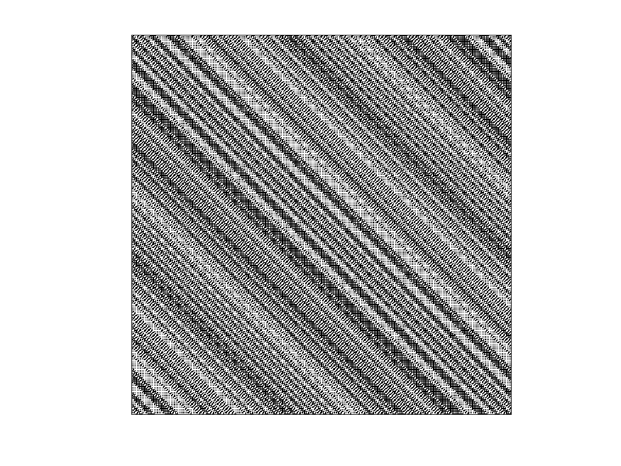

## Order 447 S Matrix

| 1 | 0 | 1 | 0 | 1 | 0 | 1 | 0 | 1 | 0 | 1 | 0 | 1 | 0 | 1 | 0 | 1 | 0 | 1 | 0 | 1 | 0 | 1 | 0 | 1 | 0 | 1 | 0 | 1 | 0 | 1 | 0 | 1 | 0 | 1 | 0 | 1 | 0 | 1 | 0 | 1 | 0 | 1 | 0 | 1 | 0 | 1 | 0 | 1 | 0 | 1 | 0 | 1 | 0 | 1 | 0 | 1 | 0 | 1 | 0 | 1 | 0 | 1 | 0 | 1 | 0 | 1 | 0 | 1 | 0 | 1 | 0 | 1 | 0 | 1 | 0 | 1 | 0 | 1 | 0 | 1 | 0 | 1 | 0 | 1 | 0 | 1 | 0 | 1 | 0 | 1 | 0 | 1 | 0 | 1 | 0 | 1 | 0 | 1 | 0 | 1 | 0 | 1 | 0 | 1 | 0 | 1 | 0 | 1 | 0 | 1 | 0 | 1 | 0 | 1 | 0 | 1 | 0 | 1 | 0 | 1 | 0 | 1 | 0 | 1 | 0 | 1 | 0 | 1 | 0 | 1 | 0 | 1 | 0 | 1 | 0 | 1 | 0 | 1 | 0 | 1 | 0 | 1 | 0 | 1 | 0 | 1 | 0 | 1 | 0 | 1 | 0 | 1 | 0 | 1 | 0 | 1 | 0 | 1 | 0 | 1 | 0 | 1 | 0 | 1 | 0 | 1 | 0 | 1 | 0 | 1 | 0 | 1 | 0 | 1 | 0 | 1 | 0 | 1 | 0 | 1 | 0 | 1 | 0 | 1 | 0 | 1 | 0 | 1 | 0 | 1 | 0 | 1 | 0 | 1 | 0 | 1 | 0 | 1 | 0 | 1 | 0 | 1 | 0 | 1 | 0 | 1 | 0 | 1 | 0 | 1 | 0 | 1 | 0 | 1 | 0 | 1 | 0 | 1 | 0 | 1 | 0 | 1 | 0 | 1 | 0 | 1 | 0 | 1 | 0 | 1 | 0 | 1 | 0 | 1 | 0 | 1 | 0 | 1 | 0 | 1 | 0 | 1 | 0 | 1 | 0 | 1 | 0 | 1 | 0 | 1 | 0 | 1 | 0 | 1 | 0 | 1 | 0 | 1 | 0 | 1 | 0 | 1 | 0 | 1 | 0 | 1 | 0 | 1 | 0 | 1 | 0 | 1 | 0 | 1 | 0 | 1 | 0 | 1 | 0 | 1 | 0 | 1 | 0 | 1 | 0 | 1 | 0 | 1 | 0 | 1 | 0 | 1 | 0 | 1 | 0 | 1 | 0 | 1 | 0 | 1 | 0 | 1 | 0 | 1 | 0 | 1 | 0 | 1 | 0 | 1 | 0 | 1 | 0 | 1 | 0 | 1 | 0 | 1 | 0 | 1 | 0 | 1 | 0 | 1 | 0 | 1 | 0 | 1 | 0 | 1 | 0 | 1 | 0 | 1 | 0 | 1 | 0 | 1 | 0 | 1 | 0 | 1 | 0 | 1 | 0 | 1 | 0 | 1 | 0 | 1 | 0 | 1 | 0 | 1 | 0 | 1 | 0 | 1 | 0 | 1 | 0 | 1 | 0 | 1 | 0 | 1 | 0 | 1 | 0 | 1 | 0 | 1 | 0 | 1 | 0 | 1 | 0 | 1 | 0 | 1 | 0 | 1 | 0 | 1 | 0 | 1 | 0 | 1 | 0 | 1 | 0 | 1 | 0 | 1 | 0 | 1 | 0 | 1 | 0 | 1 | 0 | 1 | 0 | 1 | 0 | 1 | 0 | 1 | 0 | 1 | 0 | 1 | 0 | 1 | 0 | 1 | 0 | 1 | 0 | 1 | 0 | 1 | 0 | 1 | 0 | 1 | 0 | 1 | 0 | 1 | 0 | 1 | 0 | 1 | 0 | 1 | 0 | 1 | 0 | 1 | 0 | 1 | 0 | 1 | 0 | 1 |
| 1 | 0 | 0 | 1 | 1 | 1 | 1 | 0 | 0 | 1 | 1 | 0 | 0 | 0 | 0 | 1 | 1 | 1 | 1 | 1 | 1 | 0 | 0 | 0 | 0 | 0 | 0 | 0 | 0 | 1 | 1 | 1 | 1 | 1 | 1 | 1 | 1 | 1 | 1 | 1 | 1 | 0 | 0 | 0 | 0 | 0 | 0 | 0 | 0 | 0 | 0 | 1 | 1 | 0 | 0 | 0 | 0 | 1 | 1 | 1 | 1 | 1 | 1 | 1 | 1 | 1 | 1 | 1 | 1 | 1 | 1 | 0 | 0 | 1 | 1 | 1 | 1 | 1 | 1 | 1 | 1 | 0 | 0 | 1 | 1 | 0 | 0 | 1 | 1 | 0 | 0 | 0 | 0 | 0 | 0 | 1 | 1 | 0 | 0 | 1 | 1 | 1 | 1 | 0 | 0 | 0 | 0 | 1 | 1 | 0 | 0 | 1 | 1 | 1 | 1 | 0 | 0 | 1 | 1 | 0 | 0 | 1 | 1 | 0 | 0 | 1 | 1 | 1 | 1 | 1 | 1 | 1 | 1 | 1 | 1 | 0 | 0 | 1 | 1 | 1 | 1 | 0 | 0 | 0 | 0 | 1 | 1 | 1 | 1 | 1 | 1 | 0 | 0 | 1 | 1 | 0 | 0 | 1 | 1 | 0 | 0 | 0 | 0 | 1 | 1 | 1 | 1 | 1 | 1 | 0 | 0 | 0 | 0 | 1 | 1 | 0 | 0 | 0 | 0 | 1 | 1 | 0 | 0 | 0 | 0 | 0 | 0 | 0 | 0 | 1 | 1 | 0 | 0 | 0 | 0 | 0 | 0 | 1 | 1 | 0 | 0 | 1 | 1 | 1 | 1 | 0 | 0 | 0 | 0 | 0 | 0 | 1 | 1 | 1 | 1 | 0 | 0 | 0 | 0 | 1 | 1 | 1 | 1 | 0 | 0 | 1 | 1 | 0 | 0 | 0 | 0 | 1 | 1 | 1 | 1 | 0 | 0 | 0 | 0 | 1 | 1 | 1 | 1 | 1 | 1 | 0 | 0 | 0 | 0 | 1 | 1 | 0 | 0 | 1 | 1 | 1 | 1 | 1 | 1 | 0 | 0 | 1 | 1 | 1 | 1 | 1 | 1 | 1 | 1 | 0 | 0 | 1 | 1 | 1 | 1 | 0 | 0 | 1 | 1 | 1 | 1 | 0 | 0 | 0 | 0 | 0 | 0 | 1 | 1 | 1 | 1 | 0 | 0 | 1 | 1 | 0 | 0 | 1 | 1 | 0 | 0 | 0 | 0 | 0 | 0 | 1 | 1 | 1 | 1 | 0 | 0 | 0 | 0 | 1 | 1 | 0 | 0 | 0 | 0 | 0 | 0 | 0 | 0 | 0 | 0 | 1 | 1 | 0 | 0 | 1 | 1 | 0 | 0 | 1 | 1 | 0 | 0 | 0 | 0 | 1 | 1 | 0 | 0 | 1 | 1 | 1 | 1 | 0 | 0 | 0 | 0 | 1 | 1 | 0 | 0 | 1 | 1 | 1 | 1 | 1 | 1 | 0 | 0 | 1 | 1 | 0 | 0 | 1 | 1 | 0 | 0 | 0 | 0 | 0 | 0 | 0 | 0 | 1 | 1 | 0 | 0 | 0 | 0 | 0 | 0 | 0 | 0 | 0 | 0 | 0 | 0 | 0 | 0 | 1 | 1 | 1 | 1 | 0 | 0 | 1 | 1 | 1 | 1 | 1 | 1 | 1 | 1 | 1 | 1 | 0 | 0 | 0 | 0 | 0 | 0 | 0 | 0 | 0 | 0 | 0 | 0 | 1 | 1 | 1 | 1 | 1 | 1 | 1 | 1 | 0 | 0 | 0 | 0 | 0 | 0 | 1 | 1 | 1 | 1 | 0 | 0 | 1 | 1 | 0 | 0 | 0 | 0 |
| 0 | 0 | 1 | 1 | 0 | 1 | 0 | 0 | 1 | 1 | 0 | 0 | 1 | 0 | 1 | 1 | 0 | 1 | 0 | 1 | 0 | 0 | 1 | 0 | 1 | 0 | 1 | 0 | 1 | 1 | 0 | 1 | 0 | 1 | 0 | 1 | 0 | 1 | 0 | 1 | 0 | 0 | 1 | 0 | 1 | 0 | 1 | 0 | 1 | 0 | 1 | 1 | 0 | 0 | 1 | 0 | 1 | 1 | 0 | 1 | 0 | 1 | 0 | 1 | 0 | 1 | 0 | 1 | 0 | 1 | 0 | 0 | 1 | 1 | 0 | 1 | 0 | 1 | 0 | 1 | 0 | 0 | 1 | 1 | 0 | 0 | 1 | 1 | 0 | 0 | 1 | 0 | 1 | 0 | 1 | 1 | 0 | 0 | 1 | 1 | 0 | 1 | 0 | 0 | 1 | 0 | 1 | 1 | 0 | 0 | 1 | 1 | 0 | 1 | 0 | 0 | 1 | 1 | 0 | 0 | 1 | 1 | 0 | 0 | 1 | 1 | 0 | 1 | 0 | 1 | 0 | 1 | 0 | 1 | 0 | 0 | 1 | 1 | 0 | 1 | 0 | 0 | 1 | 0 | 1 | 1 | 0 | 1 | 0 | 1 | 0 | 0 | 1 | 1 | 0 | 0 | 1 | 1 | 0 | 0 | 1 | 0 | 1 | 1 | 0 | 1 | 0 | 1 | 0 | 0 | 1 | 0 | 1 | 1 | 0 | 0 | 1 | 0 | 1 | 1 | 0 | 0 | 1 | 0 | 1 | 0 | 1 | 0 | 1 | 1 | 0 | 0 | 1 | 0 | 1 | 0 | 1 | 1 | 0 | 0 | 1 | 1 | 0 | 1 | 0 | 0 | 1 | 0 | 1 | 0 | 1 | 1 | 0 | 1 | 0 | 0 | 1 | 0 | 1 | 1 | 0 | 1 | 0 | 0 | 1 | 1 | 0 | 0 | 1 | 0 | 1 | 1 | 0 | 1 | 0 | 0 | 1 | 0 | 1 | 1 | 0 | 1 | 0 | 1 | 0 | 0 | 1 | 0 | 1 | 1 | 0 | 0 | 1 | 1 | 0 | 1 | 0 | 1 | 0 | 0 | 1 | 1 | 0 | 1 | 0 | 1 | 0 | 1 | 0 | 0 | 1 | 1 | 0 | 1 | 0 | 0 | 1 | 1 | 0 | 1 | 0 | 0 | 1 | 0 | 1 | 0 | 1 | 1 | 0 | 1 | 0 | 0 | 1 | 1 | 0 | 0 | 1 | 1 | 0 | 0 | 1 | 0 | 1 | 0 | 1 | 1 | 0 | 1 | 0 | 0 | 1 | 0 | 1 | 1 | 0 | 0 | 1 | 0 | 1 | 0 | 1 | 0 | 1 | 0 | 1 | 1 | 0 | 0 | 1 | 1 | 0 | 0 | 1 | 1 | 0 | 0 | 1 | 0 | 1 | 1 | 0 | 0 | 1 | 1 | 0 | 1 | 0 | 0 | 1 | 0 | 1 | 1 | 0 | 0 | 1 | 1 | 0 | 1 | 0 | 1 | 0 | 0 | 1 | 1 | 0 | 0 | 1 | 1 | 0 | 0 | 1 | 0 | 1 | 0 | 1 | 0 | 1 | 1 | 0 | 0 | 1 | 0 | 1 | 0 | 1 | 0 | 1 | 0 | 1 | 0 | 1 | 0 | 1 | 1 | 0 | 1 | 0 | 0 | 1 | 1 | 0 | 1 | 0 | 1 | 0 | 1 | 0 | 1 | 0 | 0 | 1 | 0 | 1 | 0 | 1 | 0 | 1 | 0 | 1 | 0 | 1 | 1 | 0 | 1 | 0 | 1 | 0 | 1 | 0 | 0 | 1 | 0 | 1 | 0 | 1 | 1 | 0 | 1 | 0 | 0 | 1 | 1 | 0 | 0 | 1 | 0 | 1 |
| 1 | 0 | 0 | 0 | 0 | 1 | 1 | 1 | 1 | 0 | 0 | 1 | 1 | 0 | 0 | 0 | 0 | 1 | 1 | 1 | 1 | 1 | 1 | 0 | 0 | 0 | 0 | 0 | 0 | 0 | 0 | 1 | 1 | 1 | 1 | 1 | 1 | 1 | 1 | 1 | 1 | 1 | 1 | 0 | 0 | 0 | 0 | 0 | 0 | 0 | 0 | 0 | 0 | 1 | 1 | 0 | 0 | 0 | 0 | 1 | 1 | 1 | 1 | 1 | 1 | 1 | 1 | 1 | 1 | 1 | 1 | 1 | 1 | 0 | 0 | 1 | 1 | 1 | 1 | 1 | 1 | 1 | 1 | 0 | 0 | 1 | 1 | 0 | 0 | 1 | 1 | 0 | 0 | 0 | 0 | 0 | 0 | 1 | 1 | 0 | 0 | 1 | 1 | 1 | 1 | 0 | 0 | 0 | 0 | 1 | 1 | 0 | 0 | 1 | 1 | 1 | 1 | 0 | 0 | 1 | 1 | 0 | 0 | 1 | 1 | 0 | 0 | 1 | 1 | 1 | 1 | 1 | 1 | 1 | 1 | 1 | 1 | 0 | 0 | 1 | 1 | 1 | 1 | 0 | 0 | 0 | 0 | 1 | 1 | 1 | 1 | 1 | 1 | 0 | 0 | 1 | 1 | 0 | 0 | 1 | 1 | 0 | 0 | 0 | 0 | 1 | 1 | 1 | 1 | 1 | 1 | 0 | 0 | 0 | 0 | 1 | 1 | 0 | 0 | 0 | 0 | 1 | 1 | 0 | 0 | 0 | 0 | 0 | 0 | 0 | 0 | 1 | 1 | 0 | 0 | 0 | 0 | 0 | 0 | 1 | 1 | 0 | 0 | 1 | 1 | 1 | 1 | 0 | 0 | 0 | 0 | 0 | 0 | 1 | 1 | 1 | 1 | 0 | 0 | 0 | 0 | 1 | 1 | 1 | 1 | 0 | 0 | 1 | 1 | 0 | 0 | 0 | 0 | 1 | 1 | 1 | 1 | 0 | 0 | 0 | 0 | 1 | 1 | 1 | 1 | 1 | 1 | 0 | 0 | 0 | 0 | 1 | 1 | 0 | 0 | 1 | 1 | 1 | 1 | 1 | 1 | 0 | 0 | 1 | 1 | 1 | 1 | 1 | 1 | 1 | 1 | 0 | 0 | 1 | 1 | 1 | 1 | 0 | 0 | 1 | 1 | 1 | 1 | 0 | 0 | 0 | 0 | 0 | 0 | 1 | 1 | 1 | 1 | 0 | 0 | 1 | 1 | 0 | 0 | 1 | 1 | 0 | 0 | 0 | 0 | 0 | 0 | 1 | 1 | 1 | 1 | 0 | 0 | 0 | 0 | 1 | 1 | 0 | 0 | 0 | 0 | 0 | 0 | 0 | 0 | 0 | 0 | 1 | 1 | 0 | 0 | 1 | 1 | 0 | 0 | 1 | 1 | 0 | 0 | 0 | 0 | 1 | 1 | 0 | 0 | 1 | 1 | 1 | 1 | 0 | 0 | 0 | 0 | 1 | 1 | 0 | 0 | 1 | 1 | 1 | 1 | 1 | 1 | 0 | 0 | 1 | 1 | 0 | 0 | 1 | 1 | 0 | 0 | 0 | 0 | 0 | 0 | 0 | 0 | 1 | 1 | 0 | 0 | 0 | 0 | 0 | 0 | 0 | 0 | 0 | 0 | 0 | 0 | 0 | 0 | 1 | 1 | 1 | 1 | 0 | 0 | 1 | 1 | 1 | 1 | 1 | 1 | 1 | 1 | 1 | 1 | 0 | 0 | 0 | 0 | 0 | 0 | 0 | 0 | 0 | 0 | 0 | 0 | 1 | 1 | 1 | 1 | 1 | 1 | 1 | 1 | 0 | 0 | 0 | 0 | 0 | 0 | 1 | 1 | 1 | 1 | 0 | 0 | 1 | 1 | 0 | 0 |
| 0 | 0 | 1 | 0 | 1 | 1 | 0 | 1 | 0 | 0 | 1 | 1 | 0 | 0 | 1 | 0 | 1 | 1 | 0 | 1 | 0 | 1 | 0 | 0 | 1 | 0 | 1 | 0 | 1 | 0 | 1 | 1 | 0 | 1 | 0 | 1 | 0 | 1 | 0 | 1 | 0 | 1 | 0 | 0 | 1 | 0 | 1 | 0 | 1 | 0 | 1 | 0 | 1 | 1 | 0 | 0 | 1 | 0 | 1 | 1 | 0 | 1 | 0 | 1 | 0 | 1 | 0 | 1 | 0 | 1 | 0 | 1 | 0 | 0 | 1 | 1 | 0 | 1 | 0 | 1 | 0 | 1 | 0 | 0 | 1 | 1 | 0 | 0 | 1 | 1 | 0 | 0 | 1 | 0 | 1 | 0 | 1 | 1 | 0 | 0 | 1 | 1 | 0 | 1 | 0 | 0 | 1 | 0 | 1 | 1 | 0 | 0 | 1 | 1 | 0 | 1 | 0 | 0 | 1 | 1 | 0 | 0 | 1 | 1 | 0 | 0 | 1 | 1 | 0 | 1 | 0 | 1 | 0 | 1 | 0 | 1 | 0 | 0 | 1 | 1 | 0 | 1 | 0 | 0 | 1 | 0 | 1 | 1 | 0 | 1 | 0 | 1 | 0 | 0 | 1 | 1 | 0 | 0 | 1 | 1 | 0 | 0 | 1 | 0 | 1 | 1 | 0 | 1 | 0 | 1 | 0 | 0 | 1 | 0 | 1 | 1 | 0 | 0 | 1 | 0 | 1 | 1 | 0 | 0 | 1 | 0 | 1 | 0 | 1 | 0 | 1 | 1 | 0 | 0 | 1 | 0 | 1 | 0 | 1 | 1 | 0 | 0 | 1 | 1 | 0 | 1 | 0 | 0 | 1 | 0 | 1 | 0 | 1 | 1 | 0 | 1 | 0 | 0 | 1 | 0 | 1 | 1 | 0 | 1 | 0 | 0 | 1 | 1 | 0 | 0 | 1 | 0 | 1 | 1 | 0 | 1 | 0 | 0 | 1 | 0 | 1 | 1 | 0 | 1 | 0 | 1 | 0 | 0 | 1 | 0 | 1 | 1 | 0 | 0 | 1 | 1 | 0 | 1 | 0 | 1 | 0 | 0 | 1 | 1 | 0 | 1 | 0 | 1 | 0 | 1 | 0 | 0 | 1 | 1 | 0 | 1 | 0 | 0 | 1 | 1 | 0 | 1 | 0 | 0 | 1 | 0 | 1 | 0 | 1 | 1 | 0 | 1 | 0 | 0 | 1 | 1 | 0 | 0 | 1 | 1 | 0 | 0 | 1 | 0 | 1 | 0 | 1 | 1 | 0 | 1 | 0 | 0 | 1 | 0 | 1 | 1 | 0 | 0 | 1 | 0 | 1 | 0 | 1 | 0 | 1 | 0 | 1 | 1 | 0 | 0 | 1 | 1 | 0 | 0 | 1 | 1 | 0 | 0 | 1 | 0 | 1 | 1 | 0 | 0 | 1 | 1 | 0 | 1 | 0 | 0 | 1 | 0 | 1 | 1 | 0 | 0 | 1 | 1 | 0 | 1 | 0 | 1 | 0 | 0 | 1 | 1 | 0 | 0 | 1 | 1 | 0 | 0 | 1 | 0 | 1 | 0 | 1 | 0 | 1 | 1 | 0 | 0 | 1 | 0 | 1 | 0 | 1 | 0 | 1 | 0 | 1 | 0 | 1 | 0 | 1 | 1 | 0 | 1 | 0 | 0 | 1 | 1 | 0 | 1 | 0 | 1 | 0 | 1 | 0 | 1 | 0 | 0 | 1 | 0 | 1 | 0 | 1 | 0 | 1 | 0 | 1 | 0 | 1 | 1 | 0 | 1 | 0 | 1 | 0 | 1 | 0 | 0 | 1 | 0 | 1 | 0 | 1 | 1 | 0 | 1 | 0 | 0 | 1 | 1 | 0 | 0 | 1 |
| 1 | 0 | 0 | 0 | 0 | 0 | 0 | 1 | 1 | 1 | 1 | 0 | 0 | 1 | 1 | 0 | 0 | 0 | 0 | 1 | 1 | 1 | 1 | 1 | 1 | 0 | 0 | 0 | 0 | 0 | 0 | 0 | 0 | 1 | 1 | 1 | 1 | 1 | 1 | 1 | 1 | 1 | 1 | 1 | 1 | 0 | 0 | 0 | 0 | 0 | 0 | 0 | 0 | 0 | 0 | 1 | 1 | 0 | 0 | 0 | 0 | 1 | 1 | 1 | 1 | 1 | 1 | 1 | 1 | 1 | 1 | 1 | 1 | 1 | 1 | 0 | 0 | 1 | 1 | 1 | 1 | 1 | 1 | 1 | 1 | 0 | 0 | 1 | 1 | 0 | 0 | 1 | 1 | 0 | 0 | 0 | 0 | 0 | 0 | 1 | 1 | 0 | 0 | 1 | 1 | 1 | 1 | 0 | 0 | 0 | 0 | 1 | 1 | 0 | 0 | 1 | 1 | 1 | 1 | 0 | 0 | 1 | 1 | 0 | 0 | 1 | 1 | 0 | 0 | 1 | 1 | 1 | 1 | 1 | 1 | 1 | 1 | 1 | 1 | 0 | 0 | 1 | 1 | 1 | 1 | 0 | 0 | 0 | 0 | 1 | 1 | 1 | 1 | 1 | 1 | 0 | 0 | 1 | 1 | 0 | 0 | 1 | 1 | 0 | 0 | 0 | 0 | 1 | 1 | 1 | 1 | 1 | 1 | 0 | 0 | 0 | 0 | 1 | 1 | 0 | 0 | 0 | 0 | 1 | 1 | 0 | 0 | 0 | 0 | 0 | 0 | 0 | 0 | 1 | 1 | 0 | 0 | 0 | 0 | 0 | 0 | 1 | 1 | 0 | 0 | 1 | 1 | 1 | 1 | 0 | 0 | 0 | 0 | 0 | 0 | 1 | 1 | 1 | 1 | 0 | 0 | 0 | 0 | 1 | 1 | 1 | 1 | 0 | 0 | 1 | 1 | 0 | 0 | 0 | 0 | 1 | 1 | 1 | 1 | 0 | 0 | 0 | 0 | 1 | 1 | 1 | 1 | 1 | 1 | 0 | 0 | 0 | 0 | 1 | 1 | 0 | 0 | 1 | 1 | 1 | 1 | 1 | 1 | 0 | 0 | 1 | 1 | 1 | 1 | 1 | 1 | 1 | 1 | 0 | 0 | 1 | 1 | 1 | 1 | 0 | 0 | 1 | 1 | 1 | 1 | 0 | 0 | 0 | 0 | 0 | 0 | 1 | 1 | 1 | 1 | 0 | 0 | 1 | 1 | 0 | 0 | 1 | 1 | 0 | 0 | 0 | 0 | 0 | 0 | 1 | 1 | 1 | 1 | 0 | 0 | 0 | 0 | 1 | 1 | 0 | 0 | 0 | 0 | 0 | 0 | 0 | 0 | 0 | 0 | 1 | 1 | 0 | 0 | 1 | 1 | 0 | 0 | 1 | 1 | 0 | 0 | 0 | 0 | 1 | 1 | 0 | 0 | 1 | 1 | 1 | 1 | 0 | 0 | 0 | 0 | 1 | 1 | 0 | 0 | 1 | 1 | 1 | 1 | 1 | 1 | 0 | 0 | 1 | 1 | 0 | 0 | 1 | 1 | 0 | 0 | 0 | 0 | 0 | 0 | 0 | 0 | 1 | 1 | 0 | 0 | 0 | 0 | 0 | 0 | 0 | 0 | 0 | 0 | 0 | 0 | 0 | 0 | 1 | 1 | 1 | 1 | 0 | 0 | 1 | 1 | 1 | 1 | 1 | 1 | 1 | 1 | 1 | 1 | 0 | 0 | 0 | 0 | 0 | 0 | 0 | 0 | 0 | 0 | 0 | 0 | 1 | 1 | 1 | 1 | 1 | 1 | 1 | 1 | 0 | 0 | 0 | 0 | 0 | 0 | 1 | 1 | 1 | 1 | 0 | 0 | 1 | 1 |
| 0 | 0 | 1 | 0 | 1 | 0 | 1 | 1 | 0 | 1 | 0 | 0 | 1 | 1 | 0 | 0 | 1 | 0 | 1 | 1 | 0 | 1 | 0 | 1 | 0 | 0 | 1 | 0 | 1 | 0 | 1 | 0 | 1 | 1 | 0 | 1 | 0 | 1 | 0 | 1 | 0 | 1 | 0 | 1 | 0 | 0 | 1 | 0 | 1 | 0 | 1 | 0 | 1 | 0 | 1 | 1 | 0 | 0 | 1 | 0 | 1 | 1 | 0 | 1 | 0 | 1 | 0 | 1 | 0 | 1 | 0 | 1 | 0 | 1 | 0 | 0 | 1 | 1 | 0 | 1 | 0 | 1 | 0 | 1 | 0 | 0 | 1 | 1 | 0 | 0 | 1 | 1 | 0 | 0 | 1 | 0 | 1 | 0 | 1 | 1 | 0 | 0 | 1 | 1 | 0 | 1 | 0 | 0 | 1 | 0 | 1 | 1 | 0 | 0 | 1 | 1 | 0 | 1 | 0 | 0 | 1 | 1 | 0 | 0 | 1 | 1 | 0 | 0 | 1 | 1 | 0 | 1 | 0 | 1 | 0 | 1 | 0 | 1 | 0 | 0 | 1 | 1 | 0 | 1 | 0 | 0 | 1 | 0 | 1 | 1 | 0 | 1 | 0 | 1 | 0 | 0 | 1 | 1 | 0 | 0 | 1 | 1 | 0 | 0 | 1 | 0 | 1 | 1 | 0 | 1 | 0 | 1 | 0 | 0 | 1 | 0 | 1 | 1 | 0 | 0 | 1 | 0 | 1 | 1 | 0 | 0 | 1 | 0 | 1 | 0 | 1 | 0 | 1 | 1 | 0 | 0 | 1 | 0 | 1 | 0 | 1 | 1 | 0 | 0 | 1 | 1 | 0 | 1 | 0 | 0 | 1 | 0 | 1 | 0 | 1 | 1 | 0 | 1 | 0 | 0 | 1 | 0 | 1 | 1 | 0 | 1 | 0 | 0 | 1 | 1 | 0 | 0 | 1 | 0 | 1 | 1 | 0 | 1 | 0 | 0 | 1 | 0 | 1 | 1 | 0 | 1 | 0 | 1 | 0 | 0 | 1 | 0 | 1 | 1 | 0 | 0 | 1 | 1 | 0 | 1 | 0 | 1 | 0 | 0 | 1 | 1 | 0 | 1 | 0 | 1 | 0 | 1 | 0 | 0 | 1 | 1 | 0 | 1 | 0 | 0 | 1 | 1 | 0 | 1 | 0 | 0 | 1 | 0 | 1 | 0 | 1 | 1 | 0 | 1 | 0 | 0 | 1 | 1 | 0 | 0 | 1 | 1 | 0 | 0 | 1 | 0 | 1 | 0 | 1 | 1 | 0 | 1 | 0 | 0 | 1 | 0 | 1 | 1 | 0 | 0 | 1 | 0 | 1 | 0 | 1 | 0 | 1 | 0 | 1 | 1 | 0 | 0 | 1 | 1 | 0 | 0 | 1 | 1 | 0 | 0 | 1 | 0 | 1 | 1 | 0 | 0 | 1 | 1 | 0 | 1 | 0 | 0 | 1 | 0 | 1 | 1 | 0 | 0 | 1 | 1 | 0 | 1 | 0 | 1 | 0 | 0 | 1 | 1 | 0 | 0 | 1 | 1 | 0 | 0 | 1 | 0 | 1 | 0 | 1 | 0 | 1 | 1 | 0 | 0 | 1 | 0 | 1 | 0 | 1 | 0 | 1 | 0 | 1 | 0 | 1 | 0 | 1 | 1 | 0 | 1 | 0 | 0 | 1 | 1 | 0 | 1 | 0 | 1 | 0 | 1 | 0 | 1 | 0 | 0 | 1 | 0 | 1 | 0 | 1 | 0 | 1 | 0 | 1 | 0 | 1 | 1 | 0 | 1 | 0 | 1 | 0 | 1 | 0 | 0 | 1 | 0 | 1 | 0 | 1 | 1 | 0 | 1 | 0 | 0 | 1 | 1 | 0 |
| 1 | 1 | 1 | 0 | 0 | 0 | 0 | 0 | 0 | 1 | 1 | 1 | 1 | 0 | 0 | 1 | 1 | 0 | 0 | 0 | 0 | 1 | 1 | 1 | 1 | 1 | 1 | 0 | 0 | 0 | 0 | 0 | 0 | 0 | 0 | 1 | 1 | 1 | 1 | 1 | 1 | 1 | 1 | 1 | 1 | 1 | 1 | 0 | 0 | 0 | 0 | 0 | 0 | 0 | 0 | 0 | 0 | 1 | 1 | 0 | 0 | 0 | 0 | 1 | 1 | 1 | 1 | 1 | 1 | 1 | 1 | 1 | 1 | 1 | 1 | 1 | 1 | 0 | 0 | 1 | 1 | 1 | 1 | 1 | 1 | 1 | 1 | 0 | 0 | 1 | 1 | 0 | 0 | 1 | 1 | 0 | 0 | 0 | 0 | 0 | 0 | 1 | 1 | 0 | 0 | 1 | 1 | 1 | 1 | 0 | 0 | 0 | 0 | 1 | 1 | 0 | 0 | 1 | 1 | 1 | 1 | 0 | 0 | 1 | 1 | 0 | 0 | 1 | 1 | 0 | 0 | 1 | 1 | 1 | 1 | 1 | 1 | 1 | 1 | 1 | 1 | 0 | 0 | 1 | 1 | 1 | 1 | 0 | 0 | 0 | 0 | 1 | 1 | 1 | 1 | 1 | 1 | 0 | 0 | 1 | 1 | 0 | 0 | 1 | 1 | 0 | 0 | 0 | 0 | 1 | 1 | 1 | 1 | 1 | 1 | 0 | 0 | 0 | 0 | 1 | 1 | 0 | 0 | 0 | 0 | 1 | 1 | 0 | 0 | 0 | 0 | 0 | 0 | 0 | 0 | 1 | 1 | 0 | 0 | 0 | 0 | 0 | 0 | 1 | 1 | 0 | 0 | 1 | 1 | 1 | 1 | 0 | 0 | 0 | 0 | 0 | 0 | 1 | 1 | 1 | 1 | 0 | 0 | 0 | 0 | 1 | 1 | 1 | 1 | 0 | 0 | 1 | 1 | 0 | 0 | 0 | 0 | 1 | 1 | 1 | 1 | 0 | 0 | 0 | 0 | 1 | 1 | 1 | 1 | 1 | 1 | 0 | 0 | 0 | 0 | 1 | 1 | 0 | 0 | 1 | 1 | 1 | 1 | 1 | 1 | 0 | 0 | 1 | 1 | 1 | 1 | 1 | 1 | 1 | 1 | 0 | 0 | 1 | 1 | 1 | 1 | 0 | 0 | 1 | 1 | 1 | 1 | 0 | 0 | 0 | 0 | 0 | 0 | 1 | 1 | 1 | 1 | 0 | 0 | 1 | 1 | 0 | 0 | 1 | 1 | 0 | 0 | 0 | 0 | 0 | 0 | 1 | 1 | 1 | 1 | 0 | 0 | 0 | 0 | 1 | 1 | 0 | 0 | 0 | 0 | 0 | 0 | 0 | 0 | 0 | 0 | 1 | 1 | 0 | 0 | 1 | 1 | 0 | 0 | 1 | 1 | 0 | 0 | 0 | 0 | 1 | 1 | 0 | 0 | 1 | 1 | 1 | 1 | 0 | 0 | 0 | 0 | 1 | 1 | 0 | 0 | 1 | 1 | 1 | 1 | 1 | 1 | 0 | 0 | 1 | 1 | 0 | 0 | 1 | 1 | 0 | 0 | 0 | 0 | 0 | 0 | 0 | 0 | 1 | 1 | 0 | 0 | 0 | 0 | 0 | 0 | 0 | 0 | 0 | 0 | 0 | 0 | 0 | 0 | 1 | 1 | 1 | 1 | 0 | 0 | 1 | 1 | 1 | 1 | 1 | 1 | 1 | 1 | 1 | 1 | 0 | 0 | 0 | 0 | 0 | 0 | 0 | 0 | 0 | 0 | 0 | 0 | 1 | 1 | 1 | 1 | 1 | 1 | 1 | 1 | 0 | 0 | 0 | 0 | 0 | 0 | 1 | 1 | 1 | 1 | 0 | 0 |
| 0 | 1 | 0 | 0 | 1 | 0 | 1 | 0 | 1 | 1 | 0 | 1 | 0 | 0 | 1 | 1 | 0 | 0 | 1 | 0 | 1 | 1 | 0 | 1 | 0 | 1 | 0 | 0 | 1 | 0 | 1 | 0 | 1 | 0 | 1 | 1 | 0 | 1 | 0 | 1 | 0 | 1 | 0 | 1 | 0 | 1 | 0 | 0 | 1 | 0 | 1 | 0 | 1 | 0 | 1 | 0 | 1 | 1 | 0 | 0 | 1 | 0 | 1 | 1 | 0 | 1 | 0 | 1 | 0 | 1 | 0 | 1 | 0 | 1 | 0 | 1 | 0 | 0 | 1 | 1 | 0 | 1 | 0 | 1 | 0 | 1 | 0 | 0 | 1 | 1 | 0 | 0 | 1 | 1 | 0 | 0 | 1 | 0 | 1 | 0 | 1 | 1 | 0 | 0 | 1 | 1 | 0 | 1 | 0 | 0 | 1 | 0 | 1 | 1 | 0 | 0 | 1 | 1 | 0 | 1 | 0 | 0 | 1 | 1 | 0 | 0 | 1 | 1 | 0 | 0 | 1 | 1 | 0 | 1 | 0 | 1 | 0 | 1 | 0 | 1 | 0 | 0 | 1 | 1 | 0 | 1 | 0 | 0 | 1 | 0 | 1 | 1 | 0 | 1 | 0 | 1 | 0 | 0 | 1 | 1 | 0 | 0 | 1 | 1 | 0 | 0 | 1 | 0 | 1 | 1 | 0 | 1 | 0 | 1 | 0 | 0 | 1 | 0 | 1 | 1 | 0 | 0 | 1 | 0 | 1 | 1 | 0 | 0 | 1 | 0 | 1 | 0 | 1 | 0 | 1 | 1 | 0 | 0 | 1 | 0 | 1 | 0 | 1 | 1 | 0 | 0 | 1 | 1 | 0 | 1 | 0 | 0 | 1 | 0 | 1 | 0 | 1 | 1 | 0 | 1 | 0 | 0 | 1 | 0 | 1 | 1 | 0 | 1 | 0 | 0 | 1 | 1 | 0 | 0 | 1 | 0 | 1 | 1 | 0 | 1 | 0 | 0 | 1 | 0 | 1 | 1 | 0 | 1 | 0 | 1 | 0 | 0 | 1 | 0 | 1 | 1 | 0 | 0 | 1 | 1 | 0 | 1 | 0 | 1 | 0 | 0 | 1 | 1 | 0 | 1 | 0 | 1 | 0 | 1 | 0 | 0 | 1 | 1 | 0 | 1 | 0 | 0 | 1 | 1 | 0 | 1 | 0 | 0 | 1 | 0 | 1 | 0 | 1 | 1 | 0 | 1 | 0 | 0 | 1 | 1 | 0 | 0 | 1 | 1 | 0 | 0 | 1 | 0 | 1 | 0 | 1 | 1 | 0 | 1 | 0 | 0 | 1 | 0 | 1 | 1 | 0 | 0 | 1 | 0 | 1 | 0 | 1 | 0 | 1 | 0 | 1 | 1 | 0 | 0 | 1 | 1 | 0 | 0 | 1 | 1 | 0 | 0 | 1 | 0 | 1 | 1 | 0 | 0 | 1 | 1 | 0 | 1 | 0 | 0 | 1 | 0 | 1 | 1 | 0 | 0 | 1 | 1 | 0 | 1 | 0 | 1 | 0 | 0 | 1 | 1 | 0 | 0 | 1 | 1 | 0 | 0 | 1 | 0 | 1 | 0 | 1 | 0 | 1 | 1 | 0 | 0 | 1 | 0 | 1 | 0 | 1 | 0 | 1 | 0 | 1 | 0 | 1 | 0 | 1 | 1 | 0 | 1 | 0 | 0 | 1 | 1 | 0 | 1 | 0 | 1 | 0 | 1 | 0 | 1 | 0 | 0 | 1 | 0 | 1 | 0 | 1 | 0 | 1 | 0 | 1 | 0 | 1 | 1 | 0 | 1 | 0 | 1 | 0 | 1 | 0 | 0 | 1 | 0 | 1 | 0 | 1 | 1 | 0 | 1 | 0 | 0 | 1 |
| 1 | 0 | 0 | 1 | 1 | 0 | 0 | 0 | 0 | 0 | 0 | 1 | 1 | 1 | 1 | 0 | 0 | 1 | 1 | 0 | 0 | 0 | 0 | 1 | 1 | 1 | 1 | 1 | 1 | 0 | 0 | 0 | 0 | 0 | 0 | 0 | 0 | 1 | 1 | 1 | 1 | 1 | 1 | 1 | 1 | 1 | 1 | 1 | 1 | 0 | 0 | 0 | 0 | 0 | 0 | 0 | 0 | 0 | 0 | 1 | 1 | 0 | 0 | 0 | 0 | 1 | 1 | 1 | 1 | 1 | 1 | 1 | 1 | 1 | 1 | 1 | 1 | 1 | 1 | 0 | 0 | 1 | 1 | 1 | 1 | 1 | 1 | 1 | 1 | 0 | 0 | 1 | 1 | 0 | 0 | 1 | 1 | 0 | 0 | 0 | 0 | 0 | 0 | 1 | 1 | 0 | 0 | 1 | 1 | 1 | 1 | 0 | 0 | 0 | 0 | 1 | 1 | 0 | 0 | 1 | 1 | 1 | 1 | 0 | 0 | 1 | 1 | 0 | 0 | 1 | 1 | 0 | 0 | 1 | 1 | 1 | 1 | 1 | 1 | 1 | 1 | 1 | 1 | 0 | 0 | 1 | 1 | 1 | 1 | 0 | 0 | 0 | 0 | 1 | 1 | 1 | 1 | 1 | 1 | 0 | 0 | 1 | 1 | 0 | 0 | 1 | 1 | 0 | 0 | 0 | 0 | 1 | 1 | 1 | 1 | 1 | 1 | 0 | 0 | 0 | 0 | 1 | 1 | 0 | 0 | 0 | 0 | 1 | 1 | 0 | 0 | 0 | 0 | 0 | 0 | 0 | 0 | 1 | 1 | 0 | 0 | 0 | 0 | 0 | 0 | 1 | 1 | 0 | 0 | 1 | 1 | 1 | 1 | 0 | 0 | 0 | 0 | 0 | 0 | 1 | 1 | 1 | 1 | 0 | 0 | 0 | 0 | 1 | 1 | 1 | 1 | 0 | 0 | 1 | 1 | 0 | 0 | 0 | 0 | 1 | 1 | 1 | 1 | 0 | 0 | 0 | 0 | 1 | 1 | 1 | 1 | 1 | 1 | 0 | 0 | 0 | 0 | 1 | 1 | 0 | 0 | 1 | 1 | 1 | 1 | 1 | 1 | 0 | 0 | 1 | 1 | 1 | 1 | 1 | 1 | 1 | 1 | 0 | 0 | 1 | 1 | 1 | 1 | 0 | 0 | 1 | 1 | 1 | 1 | 0 | 0 | 0 | 0 | 0 | 0 | 1 | 1 | 1 | 1 | 0 | 0 | 1 | 1 | 0 | 0 | 1 | 1 | 0 | 0 | 0 | 0 | 0 | 0 | 1 | 1 | 1 | 1 | 0 | 0 | 0 | 0 | 1 | 1 | 0 | 0 | 0 | 0 | 0 | 0 | 0 | 0 | 0 | 0 | 1 | 1 | 0 | 0 | 1 | 1 | 0 | 0 | 1 | 1 | 0 | 0 | 0 | 0 | 1 | 1 | 0 | 0 | 1 | 1 | 1 | 1 | 0 | 0 | 0 | 0 | 1 | 1 | 0 | 0 | 1 | 1 | 1 | 1 | 1 | 1 | 0 | 0 | 1 | 1 | 0 | 0 | 1 | 1 | 0 | 0 | 0 | 0 | 0 | 0 | 0 | 0 | 1 | 1 | 0 | 0 | 0 | 0 | 0 | 0 | 0 | 0 | 0 | 0 | 0 | 0 | 0 | 0 | 1 | 1 | 1 | 1 | 0 | 0 | 1 | 1 | 1 | 1 | 1 | 1 | 1 | 1 | 1 | 1 | 0 | 0 | 0 | 0 | 0 | 0 | 0 | 0 | 0 | 0 | 0 | 0 | 1 | 1 | 1 | 1 | 1 | 1 | 1 | 1 | 0 | 0 | 0 | 0 | 0 | 0 | 1 | 1 | 1 | 1 |
| 0 | 0 | 1 | 1 | 0 | 0 | 1 | 0 | 1 | 0 | 1 | 1 | 0 | 1 | 0 | 0 | 1 | 1 | 0 | 0 | 1 | 0 | 1 | 1 | 0 | 1 | 0 | 1 | 0 | 0 | 1 | 0 | 1 | 0 | 1 | 0 | 1 | 1 | 0 | 1 | 0 | 1 | 0 | 1 | 0 | 1 | 0 | 1 | 0 | 0 | 1 | 0 | 1 | 0 | 1 | 0 | 1 | 0 | 1 | 1 | 0 | 0 | 1 | 0 | 1 | 1 | 0 | 1 | 0 | 1 | 0 | 1 | 0 | 1 | 0 | 1 | 0 | 1 | 0 | 0 | 1 | 1 | 0 | 1 | 0 | 1 | 0 | 1 | 0 | 0 | 1 | 1 | 0 | 0 | 1 | 1 | 0 | 0 | 1 | 0 | 1 | 0 | 1 | 1 | 0 | 0 | 1 | 1 | 0 | 1 | 0 | 0 | 1 | 0 | 1 | 1 | 0 | 0 | 1 | 1 | 0 | 1 | 0 | 0 | 1 | 1 | 0 | 0 | 1 | 1 | 0 | 0 | 1 | 1 | 0 | 1 | 0 | 1 | 0 | 1 | 0 | 1 | 0 | 0 | 1 | 1 | 0 | 1 | 0 | 0 | 1 | 0 | 1 | 1 | 0 | 1 | 0 | 1 | 0 | 0 | 1 | 1 | 0 | 0 | 1 | 1 | 0 | 0 | 1 | 0 | 1 | 1 | 0 | 1 | 0 | 1 | 0 | 0 | 1 | 0 | 1 | 1 | 0 | 0 | 1 | 0 | 1 | 1 | 0 | 0 | 1 | 0 | 1 | 0 | 1 | 0 | 1 | 1 | 0 | 0 | 1 | 0 | 1 | 0 | 1 | 1 | 0 | 0 | 1 | 1 | 0 | 1 | 0 | 0 | 1 | 0 | 1 | 0 | 1 | 1 | 0 | 1 | 0 | 0 | 1 | 0 | 1 | 1 | 0 | 1 | 0 | 0 | 1 | 1 | 0 | 0 | 1 | 0 | 1 | 1 | 0 | 1 | 0 | 0 | 1 | 0 | 1 | 1 | 0 | 1 | 0 | 1 | 0 | 0 | 1 | 0 | 1 | 1 | 0 | 0 | 1 | 1 | 0 | 1 | 0 | 1 | 0 | 0 | 1 | 1 | 0 | 1 | 0 | 1 | 0 | 1 | 0 | 0 | 1 | 1 | 0 | 1 | 0 | 0 | 1 | 1 | 0 | 1 | 0 | 0 | 1 | 0 | 1 | 0 | 1 | 1 | 0 | 1 | 0 | 0 | 1 | 1 | 0 | 0 | 1 | 1 | 0 | 0 | 1 | 0 | 1 | 0 | 1 | 1 | 0 | 1 | 0 | 0 | 1 | 0 | 1 | 1 | 0 | 0 | 1 | 0 | 1 | 0 | 1 | 0 | 1 | 0 | 1 | 1 | 0 | 0 | 1 | 1 | 0 | 0 | 1 | 1 | 0 | 0 | 1 | 0 | 1 | 1 | 0 | 0 | 1 | 1 | 0 | 1 | 0 | 0 | 1 | 0 | 1 | 1 | 0 | 0 | 1 | 1 | 0 | 1 | 0 | 1 | 0 | 0 | 1 | 1 | 0 | 0 | 1 | 1 | 0 | 0 | 1 | 0 | 1 | 0 | 1 | 0 | 1 | 1 | 0 | 0 | 1 | 0 | 1 | 0 | 1 | 0 | 1 | 0 | 1 | 0 | 1 | 0 | 1 | 1 | 0 | 1 | 0 | 0 | 1 | 1 | 0 | 1 | 0 | 1 | 0 | 1 | 0 | 1 | 0 | 0 | 1 | 0 | 1 | 0 | 1 | 0 | 1 | 0 | 1 | 0 | 1 | 1 | 0 | 1 | 0 | 1 | 0 | 1 | 0 | 0 | 1 | 0 | 1 | 0 | 1 | 1 | 0 | 1 | 0 |
| 1 | 1 | 1 | 0 | 0 | 1 | 1 | 0 | 0 | 0 | 0 | 0 | 0 | 1 | 1 | 1 | 1 | 0 | 0 | 1 | 1 | 0 | 0 | 0 | 0 | 1 | 1 | 1 | 1 | 1 | 1 | 0 | 0 | 0 | 0 | 0 | 0 | 0 | 0 | 1 | 1 | 1 | 1 | 1 | 1 | 1 | 1 | 1 | 1 | 1 | 1 | 0 | 0 | 0 | 0 | 0 | 0 | 0 | 0 | 0 | 0 | 1 | 1 | 0 | 0 | 0 | 0 | 1 | 1 | 1 | 1 | 1 | 1 | 1 | 1 | 1 | 1 | 1 | 1 | 1 | 1 | 0 | 0 | 1 | 1 | 1 | 1 | 1 | 1 | 1 | 1 | 0 | 0 | 1 | 1 | 0 | 0 | 1 | 1 | 0 | 0 | 0 | 0 | 0 | 0 | 1 | 1 | 0 | 0 | 1 | 1 | 1 | 1 | 0 | 0 | 0 | 0 | 1 | 1 | 0 | 0 | 1 | 1 | 1 | 1 | 0 | 0 | 1 | 1 | 0 | 0 | 1 | 1 | 0 | 0 | 1 | 1 | 1 | 1 | 1 | 1 | 1 | 1 | 1 | 1 | 0 | 0 | 1 | 1 | 1 | 1 | 0 | 0 | 0 | 0 | 1 | 1 | 1 | 1 | 1 | 1 | 0 | 0 | 1 | 1 | 0 | 0 | 1 | 1 | 0 | 0 | 0 | 0 | 1 | 1 | 1 | 1 | 1 | 1 | 0 | 0 | 0 | 0 | 1 | 1 | 0 | 0 | 0 | 0 | 1 | 1 | 0 | 0 | 0 | 0 | 0 | 0 | 0 | 0 | 1 | 1 | 0 | 0 | 0 | 0 | 0 | 0 | 1 | 1 | 0 | 0 | 1 | 1 | 1 | 1 | 0 | 0 | 0 | 0 | 0 | 0 | 1 | 1 | 1 | 1 | 0 | 0 | 0 | 0 | 1 | 1 | 1 | 1 | 0 | 0 | 1 | 1 | 0 | 0 | 0 | 0 | 1 | 1 | 1 | 1 | 0 | 0 | 0 | 0 | 1 | 1 | 1 | 1 | 1 | 1 | 0 | 0 | 0 | 0 | 1 | 1 | 0 | 0 | 1 | 1 | 1 | 1 | 1 | 1 | 0 | 0 | 1 | 1 | 1 | 1 | 1 | 1 | 1 | 1 | 0 | 0 | 1 | 1 | 1 | 1 | 0 | 0 | 1 | 1 | 1 | 1 | 0 | 0 | 0 | 0 | 0 | 0 | 1 | 1 | 1 | 1 | 0 | 0 | 1 | 1 | 0 | 0 | 1 | 1 | 0 | 0 | 0 | 0 | 0 | 0 | 1 | 1 | 1 | 1 | 0 | 0 | 0 | 0 | 1 | 1 | 0 | 0 | 0 | 0 | 0 | 0 | 0 | 0 | 0 | 0 | 1 | 1 | 0 | 0 | 1 | 1 | 0 | 0 | 1 | 1 | 0 | 0 | 0 | 0 | 1 | 1 | 0 | 0 | 1 | 1 | 1 | 1 | 0 | 0 | 0 | 0 | 1 | 1 | 0 | 0 | 1 | 1 | 1 | 1 | 1 | 1 | 0 | 0 | 1 | 1 | 0 | 0 | 1 | 1 | 0 | 0 | 0 | 0 | 0 | 0 | 0 | 0 | 1 | 1 | 0 | 0 | 0 | 0 | 0 | 0 | 0 | 0 | 0 | 0 | 0 | 0 | 0 | 0 | 1 | 1 | 1 | 1 | 0 | 0 | 1 | 1 | 1 | 1 | 1 | 1 | 1 | 1 | 1 | 1 | 0 | 0 | 0 | 0 | 0 | 0 | 0 | 0 | 0 | 0 | 0 | 0 | 1 | 1 | 1 | 1 | 1 | 1 | 1 | 1 | 0 | 0 | 0 | 0 | 0 | 0 | 1 | 1 |
| 0 | 1 | 0 | 0 | 1 | 1 | 0 | 0 | 1 | 0 | 1 | 0 | 1 | 1 | 0 | 1 | 0 | 0 | 1 | 1 | 0 | 0 | 1 | 0 | 1 | 1 | 0 | 1 | 0 | 1 | 0 | 0 | 1 | 0 | 1 | 0 | 1 | 0 | 1 | 1 | 0 | 1 | 0 | 1 | 0 | 1 | 0 | 1 | 0 | 1 | 0 | 0 | 1 | 0 | 1 | 0 | 1 | 0 | 1 | 0 | 1 | 1 | 0 | 0 | 1 | 0 | 1 | 1 | 0 | 1 | 0 | 1 | 0 | 1 | 0 | 1 | 0 | 1 | 0 | 1 | 0 | 0 | 1 | 1 | 0 | 1 | 0 | 1 | 0 | 1 | 0 | 0 | 1 | 1 | 0 | 0 | 1 | 1 | 0 | 0 | 1 | 0 | 1 | 0 | 1 | 1 | 0 | 0 | 1 | 1 | 0 | 1 | 0 | 0 | 1 | 0 | 1 | 1 | 0 | 0 | 1 | 1 | 0 | 1 | 0 | 0 | 1 | 1 | 0 | 0 | 1 | 1 | 0 | 0 | 1 | 1 | 0 | 1 | 0 | 1 | 0 | 1 | 0 | 1 | 0 | 0 | 1 | 1 | 0 | 1 | 0 | 0 | 1 | 0 | 1 | 1 | 0 | 1 | 0 | 1 | 0 | 0 | 1 | 1 | 0 | 0 | 1 | 1 | 0 | 0 | 1 | 0 | 1 | 1 | 0 | 1 | 0 | 1 | 0 | 0 | 1 | 0 | 1 | 1 | 0 | 0 | 1 | 0 | 1 | 1 | 0 | 0 | 1 | 0 | 1 | 0 | 1 | 0 | 1 | 1 | 0 | 0 | 1 | 0 | 1 | 0 | 1 | 1 | 0 | 0 | 1 | 1 | 0 | 1 | 0 | 0 | 1 | 0 | 1 | 0 | 1 | 1 | 0 | 1 | 0 | 0 | 1 | 0 | 1 | 1 | 0 | 1 | 0 | 0 | 1 | 1 | 0 | 0 | 1 | 0 | 1 | 1 | 0 | 1 | 0 | 0 | 1 | 0 | 1 | 1 | 0 | 1 | 0 | 1 | 0 | 0 | 1 | 0 | 1 | 1 | 0 | 0 | 1 | 1 | 0 | 1 | 0 | 1 | 0 | 0 | 1 | 1 | 0 | 1 | 0 | 1 | 0 | 1 | 0 | 0 | 1 | 1 | 0 | 1 | 0 | 0 | 1 | 1 | 0 | 1 | 0 | 0 | 1 | 0 | 1 | 0 | 1 | 1 | 0 | 1 | 0 | 0 | 1 | 1 | 0 | 0 | 1 | 1 | 0 | 0 | 1 | 0 | 1 | 0 | 1 | 1 | 0 | 1 | 0 | 0 | 1 | 0 | 1 | 1 | 0 | 0 | 1 | 0 | 1 | 0 | 1 | 0 | 1 | 0 | 1 | 1 | 0 | 0 | 1 | 1 | 0 | 0 | 1 | 1 | 0 | 0 | 1 | 0 | 1 | 1 | 0 | 0 | 1 | 1 | 0 | 1 | 0 | 0 | 1 | 0 | 1 | 1 | 0 | 0 | 1 | 1 | 0 | 1 | 0 | 1 | 0 | 0 | 1 | 1 | 0 | 0 | 1 | 1 | 0 | 0 | 1 | 0 | 1 | 0 | 1 | 0 | 1 | 1 | 0 | 0 | 1 | 0 | 1 | 0 | 1 | 0 | 1 | 0 | 1 | 0 | 1 | 0 | 1 | 1 | 0 | 1 | 0 | 0 | 1 | 1 | 0 | 1 | 0 | 1 | 0 | 1 | 0 | 1 | 0 | 0 | 1 | 0 | 1 | 0 | 1 | 0 | 1 | 0 | 1 | 0 | 1 | 1 | 0 | 1 | 0 | 1 | 0 | 1 | 0 | 0 | 1 | 0 | 1 | 0 | 1 | 1 | 0 |
| 1 | 1 | 1 | 1 | 1 | 0 | 0 | 1 | 1 | 0 | 0 | 0 | 0 | 0 | 0 | 1 | 1 | 1 | 1 | 0 | 0 | 1 | 1 | 0 | 0 | 0 | 0 | 1 | 1 | 1 | 1 | 1 | 1 | 0 | 0 | 0 | 0 | 0 | 0 | 0 | 0 | 1 | 1 | 1 | 1 | 1 | 1 | 1 | 1 | 1 | 1 | 1 | 1 | 0 | 0 | 0 | 0 | 0 | 0 | 0 | 0 | 0 | 0 | 1 | 1 | 0 | 0 | 0 | 0 | 1 | 1 | 1 | 1 | 1 | 1 | 1 | 1 | 1 | 1 | 1 | 1 | 1 | 1 | 0 | 0 | 1 | 1 | 1 | 1 | 1 | 1 | 1 | 1 | 0 | 0 | 1 | 1 | 0 | 0 | 1 | 1 | 0 | 0 | 0 | 0 | 0 | 0 | 1 | 1 | 0 | 0 | 1 | 1 | 1 | 1 | 0 | 0 | 0 | 0 | 1 | 1 | 0 | 0 | 1 | 1 | 1 | 1 | 0 | 0 | 1 | 1 | 0 | 0 | 1 | 1 | 0 | 0 | 1 | 1 | 1 | 1 | 1 | 1 | 1 | 1 | 1 | 1 | 0 | 0 | 1 | 1 | 1 | 1 | 0 | 0 | 0 | 0 | 1 | 1 | 1 | 1 | 1 | 1 | 0 | 0 | 1 | 1 | 0 | 0 | 1 | 1 | 0 | 0 | 0 | 0 | 1 | 1 | 1 | 1 | 1 | 1 | 0 | 0 | 0 | 0 | 1 | 1 | 0 | 0 | 0 | 0 | 1 | 1 | 0 | 0 | 0 | 0 | 0 | 0 | 0 | 0 | 1 | 1 | 0 | 0 | 0 | 0 | 0 | 0 | 1 | 1 | 0 | 0 | 1 | 1 | 1 | 1 | 0 | 0 | 0 | 0 | 0 | 0 | 1 | 1 | 1 | 1 | 0 | 0 | 0 | 0 | 1 | 1 | 1 | 1 | 0 | 0 | 1 | 1 | 0 | 0 | 0 | 0 | 1 | 1 | 1 | 1 | 0 | 0 | 0 | 0 | 1 | 1 | 1 | 1 | 1 | 1 | 0 | 0 | 0 | 0 | 1 | 1 | 0 | 0 | 1 | 1 | 1 | 1 | 1 | 1 | 0 | 0 | 1 | 1 | 1 | 1 | 1 | 1 | 1 | 1 | 0 | 0 | 1 | 1 | 1 | 1 | 0 | 0 | 1 | 1 | 1 | 1 | 0 | 0 | 0 | 0 | 0 | 0 | 1 | 1 | 1 | 1 | 0 | 0 | 1 | 1 | 0 | 0 | 1 | 1 | 0 | 0 | 0 | 0 | 0 | 0 | 1 | 1 | 1 | 1 | 0 | 0 | 0 | 0 | 1 | 1 | 0 | 0 | 0 | 0 | 0 | 0 | 0 | 0 | 0 | 0 | 1 | 1 | 0 | 0 | 1 | 1 | 0 | 0 | 1 | 1 | 0 | 0 | 0 | 0 | 1 | 1 | 0 | 0 | 1 | 1 | 1 | 1 | 0 | 0 | 0 | 0 | 1 | 1 | 0 | 0 | 1 | 1 | 1 | 1 | 1 | 1 | 0 | 0 | 1 | 1 | 0 | 0 | 1 | 1 | 0 | 0 | 0 | 0 | 0 | 0 | 0 | 0 | 1 | 1 | 0 | 0 | 0 | 0 | 0 | 0 | 0 | 0 | 0 | 0 | 0 | 0 | 0 | 0 | 1 | 1 | 1 | 1 | 0 | 0 | 1 | 1 | 1 | 1 | 1 | 1 | 1 | 1 | 1 | 1 | 0 | 0 | 0 | 0 | 0 | 0 | 0 | 0 | 0 | 0 | 0 | 0 | 1 | 1 | 1 | 1 | 1 | 1 | 1 | 1 | 0 | 0 | 0 | 0 | 0 | 0 |
| 0 | 1 | 0 | 1 | 0 | 0 | 1 | 1 | 0 | 0 | 1 | 0 | 1 | 0 | 1 | 1 | 0 | 1 | 0 | 0 | 1 | 1 | 0 | 0 | 1 | 0 | 1 | 1 | 0 | 1 | 0 | 1 | 0 | 0 | 1 | 0 | 1 | 0 | 1 | 0 | 1 | 1 | 0 | 1 | 0 | 1 | 0 | 1 | 0 | 1 | 0 | 1 | 0 | 0 | 1 | 0 | 1 | 0 | 1 | 0 | 1 | 0 | 1 | 1 | 0 | 0 | 1 | 0 | 1 | 1 | 0 | 1 | 0 | 1 | 0 | 1 | 0 | 1 | 0 | 1 | 0 | 1 | 0 | 0 | 1 | 1 | 0 | 1 | 0 | 1 | 0 | 1 | 0 | 0 | 1 | 1 | 0 | 0 | 1 | 1 | 0 | 0 | 1 | 0 | 1 | 0 | 1 | 1 | 0 | 0 | 1 | 1 | 0 | 1 | 0 | 0 | 1 | 0 | 1 | 1 | 0 | 0 | 1 | 1 | 0 | 1 | 0 | 0 | 1 | 1 | 0 | 0 | 1 | 1 | 0 | 0 | 1 | 1 | 0 | 1 | 0 | 1 | 0 | 1 | 0 | 1 | 0 | 0 | 1 | 1 | 0 | 1 | 0 | 0 | 1 | 0 | 1 | 1 | 0 | 1 | 0 | 1 | 0 | 0 | 1 | 1 | 0 | 0 | 1 | 1 | 0 | 0 | 1 | 0 | 1 | 1 | 0 | 1 | 0 | 1 | 0 | 0 | 1 | 0 | 1 | 1 | 0 | 0 | 1 | 0 | 1 | 1 | 0 | 0 | 1 | 0 | 1 | 0 | 1 | 0 | 1 | 1 | 0 | 0 | 1 | 0 | 1 | 0 | 1 | 1 | 0 | 0 | 1 | 1 | 0 | 1 | 0 | 0 | 1 | 0 | 1 | 0 | 1 | 1 | 0 | 1 | 0 | 0 | 1 | 0 | 1 | 1 | 0 | 1 | 0 | 0 | 1 | 1 | 0 | 0 | 1 | 0 | 1 | 1 | 0 | 1 | 0 | 0 | 1 | 0 | 1 | 1 | 0 | 1 | 0 | 1 | 0 | 0 | 1 | 0 | 1 | 1 | 0 | 0 | 1 | 1 | 0 | 1 | 0 | 1 | 0 | 0 | 1 | 1 | 0 | 1 | 0 | 1 | 0 | 1 | 0 | 0 | 1 | 1 | 0 | 1 | 0 | 0 | 1 | 1 | 0 | 1 | 0 | 0 | 1 | 0 | 1 | 0 | 1 | 1 | 0 | 1 | 0 | 0 | 1 | 1 | 0 | 0 | 1 | 1 | 0 | 0 | 1 | 0 | 1 | 0 | 1 | 1 | 0 | 1 | 0 | 0 | 1 | 0 | 1 | 1 | 0 | 0 | 1 | 0 | 1 | 0 | 1 | 0 | 1 | 0 | 1 | 1 | 0 | 0 | 1 | 1 | 0 | 0 | 1 | 1 | 0 | 0 | 1 | 0 | 1 | 1 | 0 | 0 | 1 | 1 | 0 | 1 | 0 | 0 | 1 | 0 | 1 | 1 | 0 | 0 | 1 | 1 | 0 | 1 | 0 | 1 | 0 | 0 | 1 | 1 | 0 | 0 | 1 | 1 | 0 | 0 | 1 | 0 | 1 | 0 | 1 | 0 | 1 | 1 | 0 | 0 | 1 | 0 | 1 | 0 | 1 | 0 | 1 | 0 | 1 | 0 | 1 | 0 | 1 | 1 | 0 | 1 | 0 | 0 | 1 | 1 | 0 | 1 | 0 | 1 | 0 | 1 | 0 | 1 | 0 | 0 | 1 | 0 | 1 | 0 | 1 | 0 | 1 | 0 | 1 | 0 | 1 | 1 | 0 | 1 | 0 | 1 | 0 | 1 | 0 | 0 | 1 | 0 | 1 | 0 | 1 |
| 1 | 0 | 0 | 1 | 1 | 1 | 1 | 0 | 0 | 1 | 1 | 0 | 0 | 0 | 0 | 0 | 0 | 1 | 1 | 1 | 1 | 0 | 0 | 1 | 1 | 0 | 0 | 0 | 0 | 1 | 1 | 1 | 1 | 1 | 1 | 0 | 0 | 0 | 0 | 0 | 0 | 0 | 0 | 1 | 1 | 1 | 1 | 1 | 1 | 1 | 1 | 1 | 1 | 1 | 1 | 0 | 0 | 0 | 0 | 0 | 0 | 0 | 0 | 0 | 0 | 1 | 1 | 0 | 0 | 0 | 0 | 1 | 1 | 1 | 1 | 1 | 1 | 1 | 1 | 1 | 1 | 1 | 1 | 1 | 1 | 0 | 0 | 1 | 1 | 1 | 1 | 1 | 1 | 1 | 1 | 0 | 0 | 1 | 1 | 0 | 0 | 1 | 1 | 0 | 0 | 0 | 0 | 0 | 0 | 1 | 1 | 0 | 0 | 1 | 1 | 1 | 1 | 0 | 0 | 0 | 0 | 1 | 1 | 0 | 0 | 1 | 1 | 1 | 1 | 0 | 0 | 1 | 1 | 0 | 0 | 1 | 1 | 0 | 0 | 1 | 1 | 1 | 1 | 1 | 1 | 1 | 1 | 1 | 1 | 0 | 0 | 1 | 1 | 1 | 1 | 0 | 0 | 0 | 0 | 1 | 1 | 1 | 1 | 1 | 1 | 0 | 0 | 1 | 1 | 0 | 0 | 1 | 1 | 0 | 0 | 0 | 0 | 1 | 1 | 1 | 1 | 1 | 1 | 0 | 0 | 0 | 0 | 1 | 1 | 0 | 0 | 0 | 0 | 1 | 1 | 0 | 0 | 0 | 0 | 0 | 0 | 0 | 0 | 1 | 1 | 0 | 0 | 0 | 0 | 0 | 0 | 1 | 1 | 0 | 0 | 1 | 1 | 1 | 1 | 0 | 0 | 0 | 0 | 0 | 0 | 1 | 1 | 1 | 1 | 0 | 0 | 0 | 0 | 1 | 1 | 1 | 1 | 0 | 0 | 1 | 1 | 0 | 0 | 0 | 0 | 1 | 1 | 1 | 1 | 0 | 0 | 0 | 0 | 1 | 1 | 1 | 1 | 1 | 1 | 0 | 0 | 0 | 0 | 1 | 1 | 0 | 0 | 1 | 1 | 1 | 1 | 1 | 1 | 0 | 0 | 1 | 1 | 1 | 1 | 1 | 1 | 1 | 1 | 0 | 0 | 1 | 1 | 1 | 1 | 0 | 0 | 1 | 1 | 1 | 1 | 0 | 0 | 0 | 0 | 0 | 0 | 1 | 1 | 1 | 1 | 0 | 0 | 1 | 1 | 0 | 0 | 1 | 1 | 0 | 0 | 0 | 0 | 0 | 0 | 1 | 1 | 1 | 1 | 0 | 0 | 0 | 0 | 1 | 1 | 0 | 0 | 0 | 0 | 0 | 0 | 0 | 0 | 0 | 0 | 1 | 1 | 0 | 0 | 1 | 1 | 0 | 0 | 1 | 1 | 0 | 0 | 0 | 0 | 1 | 1 | 0 | 0 | 1 | 1 | 1 | 1 | 0 | 0 | 0 | 0 | 1 | 1 | 0 | 0 | 1 | 1 | 1 | 1 | 1 | 1 | 0 | 0 | 1 | 1 | 0 | 0 | 1 | 1 | 0 | 0 | 0 | 0 | 0 | 0 | 0 | 0 | 1 | 1 | 0 | 0 | 0 | 0 | 0 | 0 | 0 | 0 | 0 | 0 | 0 | 0 | 0 | 0 | 1 | 1 | 1 | 1 | 0 | 0 | 1 | 1 | 1 | 1 | 1 | 1 | 1 | 1 | 1 | 1 | 0 | 0 | 0 | 0 | 0 | 0 | 0 | 0 | 0 | 0 | 0 | 0 | 1 | 1 | 1 | 1 | 1 | 1 | 1 | 1 | 0 | 0 | 0 | 0 |
| 0 | 0 | 1 | 1 | 0 | 1 | 0 | 0 | 1 | 1 | 0 | 0 | 1 | 0 | 1 | 0 | 1 | 1 | 0 | 1 | 0 | 0 | 1 | 1 | 0 | 0 | 1 | 0 | 1 | 1 | 0 | 1 | 0 | 1 | 0 | 0 | 1 | 0 | 1 | 0 | 1 | 0 | 1 | 1 | 0 | 1 | 0 | 1 | 0 | 1 | 0 | 1 | 0 | 1 | 0 | 0 | 1 | 0 | 1 | 0 | 1 | 0 | 1 | 0 | 1 | 1 | 0 | 0 | 1 | 0 | 1 | 1 | 0 | 1 | 0 | 1 | 0 | 1 | 0 | 1 | 0 | 1 | 0 | 1 | 0 | 0 | 1 | 1 | 0 | 1 | 0 | 1 | 0 | 1 | 0 | 0 | 1 | 1 | 0 | 0 | 1 | 1 | 0 | 0 | 1 | 0 | 1 | 0 | 1 | 1 | 0 | 0 | 1 | 1 | 0 | 1 | 0 | 0 | 1 | 0 | 1 | 1 | 0 | 0 | 1 | 1 | 0 | 1 | 0 | 0 | 1 | 1 | 0 | 0 | 1 | 1 | 0 | 0 | 1 | 1 | 0 | 1 | 0 | 1 | 0 | 1 | 0 | 1 | 0 | 0 | 1 | 1 | 0 | 1 | 0 | 0 | 1 | 0 | 1 | 1 | 0 | 1 | 0 | 1 | 0 | 0 | 1 | 1 | 0 | 0 | 1 | 1 | 0 | 0 | 1 | 0 | 1 | 1 | 0 | 1 | 0 | 1 | 0 | 0 | 1 | 0 | 1 | 1 | 0 | 0 | 1 | 0 | 1 | 1 | 0 | 0 | 1 | 0 | 1 | 0 | 1 | 0 | 1 | 1 | 0 | 0 | 1 | 0 | 1 | 0 | 1 | 1 | 0 | 0 | 1 | 1 | 0 | 1 | 0 | 0 | 1 | 0 | 1 | 0 | 1 | 1 | 0 | 1 | 0 | 0 | 1 | 0 | 1 | 1 | 0 | 1 | 0 | 0 | 1 | 1 | 0 | 0 | 1 | 0 | 1 | 1 | 0 | 1 | 0 | 0 | 1 | 0 | 1 | 1 | 0 | 1 | 0 | 1 | 0 | 0 | 1 | 0 | 1 | 1 | 0 | 0 | 1 | 1 | 0 | 1 | 0 | 1 | 0 | 0 | 1 | 1 | 0 | 1 | 0 | 1 | 0 | 1 | 0 | 0 | 1 | 1 | 0 | 1 | 0 | 0 | 1 | 1 | 0 | 1 | 0 | 0 | 1 | 0 | 1 | 0 | 1 | 1 | 0 | 1 | 0 | 0 | 1 | 1 | 0 | 0 | 1 | 1 | 0 | 0 | 1 | 0 | 1 | 0 | 1 | 1 | 0 | 1 | 0 | 0 | 1 | 0 | 1 | 1 | 0 | 0 | 1 | 0 | 1 | 0 | 1 | 0 | 1 | 0 | 1 | 1 | 0 | 0 | 1 | 1 | 0 | 0 | 1 | 1 | 0 | 0 | 1 | 0 | 1 | 1 | 0 | 0 | 1 | 1 | 0 | 1 | 0 | 0 | 1 | 0 | 1 | 1 | 0 | 0 | 1 | 1 | 0 | 1 | 0 | 1 | 0 | 0 | 1 | 1 | 0 | 0 | 1 | 1 | 0 | 0 | 1 | 0 | 1 | 0 | 1 | 0 | 1 | 1 | 0 | 0 | 1 | 0 | 1 | 0 | 1 | 0 | 1 | 0 | 1 | 0 | 1 | 0 | 1 | 1 | 0 | 1 | 0 | 0 | 1 | 1 | 0 | 1 | 0 | 1 | 0 | 1 | 0 | 1 | 0 | 0 | 1 | 0 | 1 | 0 | 1 | 0 | 1 | 0 | 1 | 0 | 1 | 1 | 0 | 1 | 0 | 1 | 0 | 1 | 0 | 0 | 1 | 0 | 1 |
| 1 | 0 | 0 | 0 | 0 | 1 | 1 | 1 | 1 | 0 | 0 | 1 | 1 | 0 | 0 | 0 | 0 | 0 | 0 | 1 | 1 | 1 | 1 | 0 | 0 | 1 | 1 | 0 | 0 | 0 | 0 | 1 | 1 | 1 | 1 | 1 | 1 | 0 | 0 | 0 | 0 | 0 | 0 | 0 | 0 | 1 | 1 | 1 | 1 | 1 | 1 | 1 | 1 | 1 | 1 | 1 | 1 | 0 | 0 | 0 | 0 | 0 | 0 | 0 | 0 | 0 | 0 | 1 | 1 | 0 | 0 | 0 | 0 | 1 | 1 | 1 | 1 | 1 | 1 | 1 | 1 | 1 | 1 | 1 | 1 | 1 | 1 | 0 | 0 | 1 | 1 | 1 | 1 | 1 | 1 | 1 | 1 | 0 | 0 | 1 | 1 | 0 | 0 | 1 | 1 | 0 | 0 | 0 | 0 | 0 | 0 | 1 | 1 | 0 | 0 | 1 | 1 | 1 | 1 | 0 | 0 | 0 | 0 | 1 | 1 | 0 | 0 | 1 | 1 | 1 | 1 | 0 | 0 | 1 | 1 | 0 | 0 | 1 | 1 | 0 | 0 | 1 | 1 | 1 | 1 | 1 | 1 | 1 | 1 | 1 | 1 | 0 | 0 | 1 | 1 | 1 | 1 | 0 | 0 | 0 | 0 | 1 | 1 | 1 | 1 | 1 | 1 | 0 | 0 | 1 | 1 | 0 | 0 | 1 | 1 | 0 | 0 | 0 | 0 | 1 | 1 | 1 | 1 | 1 | 1 | 0 | 0 | 0 | 0 | 1 | 1 | 0 | 0 | 0 | 0 | 1 | 1 | 0 | 0 | 0 | 0 | 0 | 0 | 0 | 0 | 1 | 1 | 0 | 0 | 0 | 0 | 0 | 0 | 1 | 1 | 0 | 0 | 1 | 1 | 1 | 1 | 0 | 0 | 0 | 0 | 0 | 0 | 1 | 1 | 1 | 1 | 0 | 0 | 0 | 0 | 1 | 1 | 1 | 1 | 0 | 0 | 1 | 1 | 0 | 0 | 0 | 0 | 1 | 1 | 1 | 1 | 0 | 0 | 0 | 0 | 1 | 1 | 1 | 1 | 1 | 1 | 0 | 0 | 0 | 0 | 1 | 1 | 0 | 0 | 1 | 1 | 1 | 1 | 1 | 1 | 0 | 0 | 1 | 1 | 1 | 1 | 1 | 1 | 1 | 1 | 0 | 0 | 1 | 1 | 1 | 1 | 0 | 0 | 1 | 1 | 1 | 1 | 0 | 0 | 0 | 0 | 0 | 0 | 1 | 1 | 1 | 1 | 0 | 0 | 1 | 1 | 0 | 0 | 1 | 1 | 0 | 0 | 0 | 0 | 0 | 0 | 1 | 1 | 1 | 1 | 0 | 0 | 0 | 0 | 1 | 1 | 0 | 0 | 0 | 0 | 0 | 0 | 0 | 0 | 0 | 0 | 1 | 1 | 0 | 0 | 1 | 1 | 0 | 0 | 1 | 1 | 0 | 0 | 0 | 0 | 1 | 1 | 0 | 0 | 1 | 1 | 1 | 1 | 0 | 0 | 0 | 0 | 1 | 1 | 0 | 0 | 1 | 1 | 1 | 1 | 1 | 1 | 0 | 0 | 1 | 1 | 0 | 0 | 1 | 1 | 0 | 0 | 0 | 0 | 0 | 0 | 0 | 0 | 1 | 1 | 0 | 0 | 0 | 0 | 0 | 0 | 0 | 0 | 0 | 0 | 0 | 0 | 0 | 0 | 1 | 1 | 1 | 1 | 0 | 0 | 1 | 1 | 1 | 1 | 1 | 1 | 1 | 1 | 1 | 1 | 0 | 0 | 0 | 0 | 0 | 0 | 0 | 0 | 0 | 0 | 0 | 0 | 1 | 1 | 1 | 1 | 1 | 1 | 1 | 1 | 0 | 0 |
| 0 | 0 | 1 | 0 | 1 | 1 | 0 | 1 | 0 | 0 | 1 | 1 | 0 | 0 | 1 | 0 | 1 | 0 | 1 | 1 | 0 | 1 | 0 | 0 | 1 | 1 | 0 | 0 | 1 | 0 | 1 | 1 | 0 | 1 | 0 | 1 | 0 | 0 | 1 | 0 | 1 | 0 | 1 | 0 | 1 | 1 | 0 | 1 | 0 | 1 | 0 | 1 | 0 | 1 | 0 | 1 | 0 | 0 | 1 | 0 | 1 | 0 | 1 | 0 | 1 | 0 | 1 | 1 | 0 | 0 | 1 | 0 | 1 | 1 | 0 | 1 | 0 | 1 | 0 | 1 | 0 | 1 | 0 | 1 | 0 | 1 | 0 | 0 | 1 | 1 | 0 | 1 | 0 | 1 | 0 | 1 | 0 | 0 | 1 | 1 | 0 | 0 | 1 | 1 | 0 | 0 | 1 | 0 | 1 | 0 | 1 | 1 | 0 | 0 | 1 | 1 | 0 | 1 | 0 | 0 | 1 | 0 | 1 | 1 | 0 | 0 | 1 | 1 | 0 | 1 | 0 | 0 | 1 | 1 | 0 | 0 | 1 | 1 | 0 | 0 | 1 | 1 | 0 | 1 | 0 | 1 | 0 | 1 | 0 | 1 | 0 | 0 | 1 | 1 | 0 | 1 | 0 | 0 | 1 | 0 | 1 | 1 | 0 | 1 | 0 | 1 | 0 | 0 | 1 | 1 | 0 | 0 | 1 | 1 | 0 | 0 | 1 | 0 | 1 | 1 | 0 | 1 | 0 | 1 | 0 | 0 | 1 | 0 | 1 | 1 | 0 | 0 | 1 | 0 | 1 | 1 | 0 | 0 | 1 | 0 | 1 | 0 | 1 | 0 | 1 | 1 | 0 | 0 | 1 | 0 | 1 | 0 | 1 | 1 | 0 | 0 | 1 | 1 | 0 | 1 | 0 | 0 | 1 | 0 | 1 | 0 | 1 | 1 | 0 | 1 | 0 | 0 | 1 | 0 | 1 | 1 | 0 | 1 | 0 | 0 | 1 | 1 | 0 | 0 | 1 | 0 | 1 | 1 | 0 | 1 | 0 | 0 | 1 | 0 | 1 | 1 | 0 | 1 | 0 | 1 | 0 | 0 | 1 | 0 | 1 | 1 | 0 | 0 | 1 | 1 | 0 | 1 | 0 | 1 | 0 | 0 | 1 | 1 | 0 | 1 | 0 | 1 | 0 | 1 | 0 | 0 | 1 | 1 | 0 | 1 | 0 | 0 | 1 | 1 | 0 | 1 | 0 | 0 | 1 | 0 | 1 | 0 | 1 | 1 | 0 | 1 | 0 | 0 | 1 | 1 | 0 | 0 | 1 | 1 | 0 | 0 | 1 | 0 | 1 | 0 | 1 | 1 | 0 | 1 | 0 | 0 | 1 | 0 | 1 | 1 | 0 | 0 | 1 | 0 | 1 | 0 | 1 | 0 | 1 | 0 | 1 | 1 | 0 | 0 | 1 | 1 | 0 | 0 | 1 | 1 | 0 | 0 | 1 | 0 | 1 | 1 | 0 | 0 | 1 | 1 | 0 | 1 | 0 | 0 | 1 | 0 | 1 | 1 | 0 | 0 | 1 | 1 | 0 | 1 | 0 | 1 | 0 | 0 | 1 | 1 | 0 | 0 | 1 | 1 | 0 | 0 | 1 | 0 | 1 | 0 | 1 | 0 | 1 | 1 | 0 | 0 | 1 | 0 | 1 | 0 | 1 | 0 | 1 | 0 | 1 | 0 | 1 | 0 | 1 | 1 | 0 | 1 | 0 | 0 | 1 | 1 | 0 | 1 | 0 | 1 | 0 | 1 | 0 | 1 | 0 | 0 | 1 | 0 | 1 | 0 | 1 | 0 | 1 | 0 | 1 | 0 | 1 | 1 | 0 | 1 | 0 | 1 | 0 | 1 | 0 | 0 | 1 |
| 1 | 0 | 0 | 0 | 0 | 0 | 0 | 1 | 1 | 1 | 1 | 0 | 0 | 1 | 1 | 0 | 0 | 0 | 0 | 0 | 0 | 1 | 1 | 1 | 1 | 0 | 0 | 1 | 1 | 0 | 0 | 0 | 0 | 1 | 1 | 1 | 1 | 1 | 1 | 0 | 0 | 0 | 0 | 0 | 0 | 0 | 0 | 1 | 1 | 1 | 1 | 1 | 1 | 1 | 1 | 1 | 1 | 1 | 1 | 0 | 0 | 0 | 0 | 0 | 0 | 0 | 0 | 0 | 0 | 1 | 1 | 0 | 0 | 0 | 0 | 1 | 1 | 1 | 1 | 1 | 1 | 1 | 1 | 1 | 1 | 1 | 1 | 1 | 1 | 0 | 0 | 1 | 1 | 1 | 1 | 1 | 1 | 1 | 1 | 0 | 0 | 1 | 1 | 0 | 0 | 1 | 1 | 0 | 0 | 0 | 0 | 0 | 0 | 1 | 1 | 0 | 0 | 1 | 1 | 1 | 1 | 0 | 0 | 0 | 0 | 1 | 1 | 0 | 0 | 1 | 1 | 1 | 1 | 0 | 0 | 1 | 1 | 0 | 0 | 1 | 1 | 0 | 0 | 1 | 1 | 1 | 1 | 1 | 1 | 1 | 1 | 1 | 1 | 0 | 0 | 1 | 1 | 1 | 1 | 0 | 0 | 0 | 0 | 1 | 1 | 1 | 1 | 1 | 1 | 0 | 0 | 1 | 1 | 0 | 0 | 1 | 1 | 0 | 0 | 0 | 0 | 1 | 1 | 1 | 1 | 1 | 1 | 0 | 0 | 0 | 0 | 1 | 1 | 0 | 0 | 0 | 0 | 1 | 1 | 0 | 0 | 0 | 0 | 0 | 0 | 0 | 0 | 1 | 1 | 0 | 0 | 0 | 0 | 0 | 0 | 1 | 1 | 0 | 0 | 1 | 1 | 1 | 1 | 0 | 0 | 0 | 0 | 0 | 0 | 1 | 1 | 1 | 1 | 0 | 0 | 0 | 0 | 1 | 1 | 1 | 1 | 0 | 0 | 1 | 1 | 0 | 0 | 0 | 0 | 1 | 1 | 1 | 1 | 0 | 0 | 0 | 0 | 1 | 1 | 1 | 1 | 1 | 1 | 0 | 0 | 0 | 0 | 1 | 1 | 0 | 0 | 1 | 1 | 1 | 1 | 1 | 1 | 0 | 0 | 1 | 1 | 1 | 1 | 1 | 1 | 1 | 1 | 0 | 0 | 1 | 1 | 1 | 1 | 0 | 0 | 1 | 1 | 1 | 1 | 0 | 0 | 0 | 0 | 0 | 0 | 1 | 1 | 1 | 1 | 0 | 0 | 1 | 1 | 0 | 0 | 1 | 1 | 0 | 0 | 0 | 0 | 0 | 0 | 1 | 1 | 1 | 1 | 0 | 0 | 0 | 0 | 1 | 1 | 0 | 0 | 0 | 0 | 0 | 0 | 0 | 0 | 0 | 0 | 1 | 1 | 0 | 0 | 1 | 1 | 0 | 0 | 1 | 1 | 0 | 0 | 0 | 0 | 1 | 1 | 0 | 0 | 1 | 1 | 1 | 1 | 0 | 0 | 0 | 0 | 1 | 1 | 0 | 0 | 1 | 1 | 1 | 1 | 1 | 1 | 0 | 0 | 1 | 1 | 0 | 0 | 1 | 1 | 0 | 0 | 0 | 0 | 0 | 0 | 0 | 0 | 1 | 1 | 0 | 0 | 0 | 0 | 0 | 0 | 0 | 0 | 0 | 0 | 0 | 0 | 0 | 0 | 1 | 1 | 1 | 1 | 0 | 0 | 1 | 1 | 1 | 1 | 1 | 1 | 1 | 1 | 1 | 1 | 0 | 0 | 0 | 0 | 0 | 0 | 0 | 0 | 0 | 0 | 0 | 0 | 1 | 1 | 1 | 1 | 1 | 1 | 1 | 1 |
| 0 | 0 | 1 | 0 | 1 | 0 | 1 | 1 | 0 | 1 | 0 | 0 | 1 | 1 | 0 | 0 | 1 | 0 | 1 | 0 | 1 | 1 | 0 | 1 | 0 | 0 | 1 | 1 | 0 | 0 | 1 | 0 | 1 | 1 | 0 | 1 | 0 | 1 | 0 | 0 | 1 | 0 | 1 | 0 | 1 | 0 | 1 | 1 | 0 | 1 | 0 | 1 | 0 | 1 | 0 | 1 | 0 | 1 | 0 | 0 | 1 | 0 | 1 | 0 | 1 | 0 | 1 | 0 | 1 | 1 | 0 | 0 | 1 | 0 | 1 | 1 | 0 | 1 | 0 | 1 | 0 | 1 | 0 | 1 | 0 | 1 | 0 | 1 | 0 | 0 | 1 | 1 | 0 | 1 | 0 | 1 | 0 | 1 | 0 | 0 | 1 | 1 | 0 | 0 | 1 | 1 | 0 | 0 | 1 | 0 | 1 | 0 | 1 | 1 | 0 | 0 | 1 | 1 | 0 | 1 | 0 | 0 | 1 | 0 | 1 | 1 | 0 | 0 | 1 | 1 | 0 | 1 | 0 | 0 | 1 | 1 | 0 | 0 | 1 | 1 | 0 | 0 | 1 | 1 | 0 | 1 | 0 | 1 | 0 | 1 | 0 | 1 | 0 | 0 | 1 | 1 | 0 | 1 | 0 | 0 | 1 | 0 | 1 | 1 | 0 | 1 | 0 | 1 | 0 | 0 | 1 | 1 | 0 | 0 | 1 | 1 | 0 | 0 | 1 | 0 | 1 | 1 | 0 | 1 | 0 | 1 | 0 | 0 | 1 | 0 | 1 | 1 | 0 | 0 | 1 | 0 | 1 | 1 | 0 | 0 | 1 | 0 | 1 | 0 | 1 | 0 | 1 | 1 | 0 | 0 | 1 | 0 | 1 | 0 | 1 | 1 | 0 | 0 | 1 | 1 | 0 | 1 | 0 | 0 | 1 | 0 | 1 | 0 | 1 | 1 | 0 | 1 | 0 | 0 | 1 | 0 | 1 | 1 | 0 | 1 | 0 | 0 | 1 | 1 | 0 | 0 | 1 | 0 | 1 | 1 | 0 | 1 | 0 | 0 | 1 | 0 | 1 | 1 | 0 | 1 | 0 | 1 | 0 | 0 | 1 | 0 | 1 | 1 | 0 | 0 | 1 | 1 | 0 | 1 | 0 | 1 | 0 | 0 | 1 | 1 | 0 | 1 | 0 | 1 | 0 | 1 | 0 | 0 | 1 | 1 | 0 | 1 | 0 | 0 | 1 | 1 | 0 | 1 | 0 | 0 | 1 | 0 | 1 | 0 | 1 | 1 | 0 | 1 | 0 | 0 | 1 | 1 | 0 | 0 | 1 | 1 | 0 | 0 | 1 | 0 | 1 | 0 | 1 | 1 | 0 | 1 | 0 | 0 | 1 | 0 | 1 | 1 | 0 | 0 | 1 | 0 | 1 | 0 | 1 | 0 | 1 | 0 | 1 | 1 | 0 | 0 | 1 | 1 | 0 | 0 | 1 | 1 | 0 | 0 | 1 | 0 | 1 | 1 | 0 | 0 | 1 | 1 | 0 | 1 | 0 | 0 | 1 | 0 | 1 | 1 | 0 | 0 | 1 | 1 | 0 | 1 | 0 | 1 | 0 | 0 | 1 | 1 | 0 | 0 | 1 | 1 | 0 | 0 | 1 | 0 | 1 | 0 | 1 | 0 | 1 | 1 | 0 | 0 | 1 | 0 | 1 | 0 | 1 | 0 | 1 | 0 | 1 | 0 | 1 | 0 | 1 | 1 | 0 | 1 | 0 | 0 | 1 | 1 | 0 | 1 | 0 | 1 | 0 | 1 | 0 | 1 | 0 | 0 | 1 | 0 | 1 | 0 | 1 | 0 | 1 | 0 | 1 | 0 | 1 | 1 | 0 | 1 | 0 | 1 | 0 | 1 | 0 |
| 1 | 1 | 1 | 0 | 0 | 0 | 0 | 0 | 0 | 1 | 1 | 1 | 1 | 0 | 0 | 1 | 1 | 0 | 0 | 0 | 0 | 0 | 0 | 1 | 1 | 1 | 1 | 0 | 0 | 1 | 1 | 0 | 0 | 0 | 0 | 1 | 1 | 1 | 1 | 1 | 1 | 0 | 0 | 0 | 0 | 0 | 0 | 0 | 0 | 1 | 1 | 1 | 1 | 1 | 1 | 1 | 1 | 1 | 1 | 1 | 1 | 0 | 0 | 0 | 0 | 0 | 0 | 0 | 0 | 0 | 0 | 1 | 1 | 0 | 0 | 0 | 0 | 1 | 1 | 1 | 1 | 1 | 1 | 1 | 1 | 1 | 1 | 1 | 1 | 1 | 1 | 0 | 0 | 1 | 1 | 1 | 1 | 1 | 1 | 1 | 1 | 0 | 0 | 1 | 1 | 0 | 0 | 1 | 1 | 0 | 0 | 0 | 0 | 0 | 0 | 1 | 1 | 0 | 0 | 1 | 1 | 1 | 1 | 0 | 0 | 0 | 0 | 1 | 1 | 0 | 0 | 1 | 1 | 1 | 1 | 0 | 0 | 1 | 1 | 0 | 0 | 1 | 1 | 0 | 0 | 1 | 1 | 1 | 1 | 1 | 1 | 1 | 1 | 1 | 1 | 0 | 0 | 1 | 1 | 1 | 1 | 0 | 0 | 0 | 0 | 1 | 1 | 1 | 1 | 1 | 1 | 0 | 0 | 1 | 1 | 0 | 0 | 1 | 1 | 0 | 0 | 0 | 0 | 1 | 1 | 1 | 1 | 1 | 1 | 0 | 0 | 0 | 0 | 1 | 1 | 0 | 0 | 0 | 0 | 1 | 1 | 0 | 0 | 0 | 0 | 0 | 0 | 0 | 0 | 1 | 1 | 0 | 0 | 0 | 0 | 0 | 0 | 1 | 1 | 0 | 0 | 1 | 1 | 1 | 1 | 0 | 0 | 0 | 0 | 0 | 0 | 1 | 1 | 1 | 1 | 0 | 0 | 0 | 0 | 1 | 1 | 1 | 1 | 0 | 0 | 1 | 1 | 0 | 0 | 0 | 0 | 1 | 1 | 1 | 1 | 0 | 0 | 0 | 0 | 1 | 1 | 1 | 1 | 1 | 1 | 0 | 0 | 0 | 0 | 1 | 1 | 0 | 0 | 1 | 1 | 1 | 1 | 1 | 1 | 0 | 0 | 1 | 1 | 1 | 1 | 1 | 1 | 1 | 1 | 0 | 0 | 1 | 1 | 1 | 1 | 0 | 0 | 1 | 1 | 1 | 1 | 0 | 0 | 0 | 0 | 0 | 0 | 1 | 1 | 1 | 1 | 0 | 0 | 1 | 1 | 0 | 0 | 1 | 1 | 0 | 0 | 0 | 0 | 0 | 0 | 1 | 1 | 1 | 1 | 0 | 0 | 0 | 0 | 1 | 1 | 0 | 0 | 0 | 0 | 0 | 0 | 0 | 0 | 0 | 0 | 1 | 1 | 0 | 0 | 1 | 1 | 0 | 0 | 1 | 1 | 0 | 0 | 0 | 0 | 1 | 1 | 0 | 0 | 1 | 1 | 1 | 1 | 0 | 0 | 0 | 0 | 1 | 1 | 0 | 0 | 1 | 1 | 1 | 1 | 1 | 1 | 0 | 0 | 1 | 1 | 0 | 0 | 1 | 1 | 0 | 0 | 0 | 0 | 0 | 0 | 0 | 0 | 1 | 1 | 0 | 0 | 0 | 0 | 0 | 0 | 0 | 0 | 0 | 0 | 0 | 0 | 0 | 0 | 1 | 1 | 1 | 1 | 0 | 0 | 1 | 1 | 1 | 1 | 1 | 1 | 1 | 1 | 1 | 1 | 0 | 0 | 0 | 0 | 0 | 0 | 0 | 0 | 0 | 0 | 0 | 0 | 1 | 1 | 1 | 1 | 1 | 1 |
| 0 | 1 | 0 | 0 | 1 | 0 | 1 | 0 | 1 | 1 | 0 | 1 | 0 | 0 | 1 | 1 | 0 | 0 | 1 | 0 | 1 | 0 | 1 | 1 | 0 | 1 | 0 | 0 | 1 | 1 | 0 | 0 | 1 | 0 | 1 | 1 | 0 | 1 | 0 | 1 | 0 | 0 | 1 | 0 | 1 | 0 | 1 | 0 | 1 | 1 | 0 | 1 | 0 | 1 | 0 | 1 | 0 | 1 | 0 | 1 | 0 | 0 | 1 | 0 | 1 | 0 | 1 | 0 | 1 | 0 | 1 | 1 | 0 | 0 | 1 | 0 | 1 | 1 | 0 | 1 | 0 | 1 | 0 | 1 | 0 | 1 | 0 | 1 | 0 | 1 | 0 | 0 | 1 | 1 | 0 | 1 | 0 | 1 | 0 | 1 | 0 | 0 | 1 | 1 | 0 | 0 | 1 | 1 | 0 | 0 | 1 | 0 | 1 | 0 | 1 | 1 | 0 | 0 | 1 | 1 | 0 | 1 | 0 | 0 | 1 | 0 | 1 | 1 | 0 | 0 | 1 | 1 | 0 | 1 | 0 | 0 | 1 | 1 | 0 | 0 | 1 | 1 | 0 | 0 | 1 | 1 | 0 | 1 | 0 | 1 | 0 | 1 | 0 | 1 | 0 | 0 | 1 | 1 | 0 | 1 | 0 | 0 | 1 | 0 | 1 | 1 | 0 | 1 | 0 | 1 | 0 | 0 | 1 | 1 | 0 | 0 | 1 | 1 | 0 | 0 | 1 | 0 | 1 | 1 | 0 | 1 | 0 | 1 | 0 | 0 | 1 | 0 | 1 | 1 | 0 | 0 | 1 | 0 | 1 | 1 | 0 | 0 | 1 | 0 | 1 | 0 | 1 | 0 | 1 | 1 | 0 | 0 | 1 | 0 | 1 | 0 | 1 | 1 | 0 | 0 | 1 | 1 | 0 | 1 | 0 | 0 | 1 | 0 | 1 | 0 | 1 | 1 | 0 | 1 | 0 | 0 | 1 | 0 | 1 | 1 | 0 | 1 | 0 | 0 | 1 | 1 | 0 | 0 | 1 | 0 | 1 | 1 | 0 | 1 | 0 | 0 | 1 | 0 | 1 | 1 | 0 | 1 | 0 | 1 | 0 | 0 | 1 | 0 | 1 | 1 | 0 | 0 | 1 | 1 | 0 | 1 | 0 | 1 | 0 | 0 | 1 | 1 | 0 | 1 | 0 | 1 | 0 | 1 | 0 | 0 | 1 | 1 | 0 | 1 | 0 | 0 | 1 | 1 | 0 | 1 | 0 | 0 | 1 | 0 | 1 | 0 | 1 | 1 | 0 | 1 | 0 | 0 | 1 | 1 | 0 | 0 | 1 | 1 | 0 | 0 | 1 | 0 | 1 | 0 | 1 | 1 | 0 | 1 | 0 | 0 | 1 | 0 | 1 | 1 | 0 | 0 | 1 | 0 | 1 | 0 | 1 | 0 | 1 | 0 | 1 | 1 | 0 | 0 | 1 | 1 | 0 | 0 | 1 | 1 | 0 | 0 | 1 | 0 | 1 | 1 | 0 | 0 | 1 | 1 | 0 | 1 | 0 | 0 | 1 | 0 | 1 | 1 | 0 | 0 | 1 | 1 | 0 | 1 | 0 | 1 | 0 | 0 | 1 | 1 | 0 | 0 | 1 | 1 | 0 | 0 | 1 | 0 | 1 | 0 | 1 | 0 | 1 | 1 | 0 | 0 | 1 | 0 | 1 | 0 | 1 | 0 | 1 | 0 | 1 | 0 | 1 | 0 | 1 | 1 | 0 | 1 | 0 | 0 | 1 | 1 | 0 | 1 | 0 | 1 | 0 | 1 | 0 | 1 | 0 | 0 | 1 | 0 | 1 | 0 | 1 | 0 | 1 | 0 | 1 | 0 | 1 | 1 | 0 | 1 | 0 | 1 | 0 |
| 1 | 1 | 1 | 1 | 1 | 0 | 0 | 0 | 0 | 0 | 0 | 1 | 1 | 1 | 1 | 0 | 0 | 1 | 1 | 0 | 0 | 0 | 0 | 0 | 0 | 1 | 1 | 1 | 1 | 0 | 0 | 1 | 1 | 0 | 0 | 0 | 0 | 1 | 1 | 1 | 1 | 1 | 1 | 0 | 0 | 0 | 0 | 0 | 0 | 0 | 0 | 1 | 1 | 1 | 1 | 1 | 1 | 1 | 1 | 1 | 1 | 1 | 1 | 0 | 0 | 0 | 0 | 0 | 0 | 0 | 0 | 0 | 0 | 1 | 1 | 0 | 0 | 0 | 0 | 1 | 1 | 1 | 1 | 1 | 1 | 1 | 1 | 1 | 1 | 1 | 1 | 1 | 1 | 0 | 0 | 1 | 1 | 1 | 1 | 1 | 1 | 1 | 1 | 0 | 0 | 1 | 1 | 0 | 0 | 1 | 1 | 0 | 0 | 0 | 0 | 0 | 0 | 1 | 1 | 0 | 0 | 1 | 1 | 1 | 1 | 0 | 0 | 0 | 0 | 1 | 1 | 0 | 0 | 1 | 1 | 1 | 1 | 0 | 0 | 1 | 1 | 0 | 0 | 1 | 1 | 0 | 0 | 1 | 1 | 1 | 1 | 1 | 1 | 1 | 1 | 1 | 1 | 0 | 0 | 1 | 1 | 1 | 1 | 0 | 0 | 0 | 0 | 1 | 1 | 1 | 1 | 1 | 1 | 0 | 0 | 1 | 1 | 0 | 0 | 1 | 1 | 0 | 0 | 0 | 0 | 1 | 1 | 1 | 1 | 1 | 1 | 0 | 0 | 0 | 0 | 1 | 1 | 0 | 0 | 0 | 0 | 1 | 1 | 0 | 0 | 0 | 0 | 0 | 0 | 0 | 0 | 1 | 1 | 0 | 0 | 0 | 0 | 0 | 0 | 1 | 1 | 0 | 0 | 1 | 1 | 1 | 1 | 0 | 0 | 0 | 0 | 0 | 0 | 1 | 1 | 1 | 1 | 0 | 0 | 0 | 0 | 1 | 1 | 1 | 1 | 0 | 0 | 1 | 1 | 0 | 0 | 0 | 0 | 1 | 1 | 1 | 1 | 0 | 0 | 0 | 0 | 1 | 1 | 1 | 1 | 1 | 1 | 0 | 0 | 0 | 0 | 1 | 1 | 0 | 0 | 1 | 1 | 1 | 1 | 1 | 1 | 0 | 0 | 1 | 1 | 1 | 1 | 1 | 1 | 1 | 1 | 0 | 0 | 1 | 1 | 1 | 1 | 0 | 0 | 1 | 1 | 1 | 1 | 0 | 0 | 0 | 0 | 0 | 0 | 1 | 1 | 1 | 1 | 0 | 0 | 1 | 1 | 0 | 0 | 1 | 1 | 0 | 0 | 0 | 0 | 0 | 0 | 1 | 1 | 1 | 1 | 0 | 0 | 0 | 0 | 1 | 1 | 0 | 0 | 0 | 0 | 0 | 0 | 0 | 0 | 0 | 0 | 1 | 1 | 0 | 0 | 1 | 1 | 0 | 0 | 1 | 1 | 0 | 0 | 0 | 0 | 1 | 1 | 0 | 0 | 1 | 1 | 1 | 1 | 0 | 0 | 0 | 0 | 1 | 1 | 0 | 0 | 1 | 1 | 1 | 1 | 1 | 1 | 0 | 0 | 1 | 1 | 0 | 0 | 1 | 1 | 0 | 0 | 0 | 0 | 0 | 0 | 0 | 0 | 1 | 1 | 0 | 0 | 0 | 0 | 0 | 0 | 0 | 0 | 0 | 0 | 0 | 0 | 0 | 0 | 1 | 1 | 1 | 1 | 0 | 0 | 1 | 1 | 1 | 1 | 1 | 1 | 1 | 1 | 1 | 1 | 0 | 0 | 0 | 0 | 0 | 0 | 0 | 0 | 0 | 0 | 0 | 0 | 1 | 1 | 1 | 1 |
| 0 | 1 | 0 | 1 | 0 | 0 | 1 | 0 | 1 | 0 | 1 | 1 | 0 | 1 | 0 | 0 | 1 | 1 | 0 | 0 | 1 | 0 | 1 | 0 | 1 | 1 | 0 | 1 | 0 | 0 | 1 | 1 | 0 | 0 | 1 | 0 | 1 | 1 | 0 | 1 | 0 | 1 | 0 | 0 | 1 | 0 | 1 | 0 | 1 | 0 | 1 | 1 | 0 | 1 | 0 | 1 | 0 | 1 | 0 | 1 | 0 | 1 | 0 | 0 | 1 | 0 | 1 | 0 | 1 | 0 | 1 | 0 | 1 | 1 | 0 | 0 | 1 | 0 | 1 | 1 | 0 | 1 | 0 | 1 | 0 | 1 | 0 | 1 | 0 | 1 | 0 | 1 | 0 | 0 | 1 | 1 | 0 | 1 | 0 | 1 | 0 | 1 | 0 | 0 | 1 | 1 | 0 | 0 | 1 | 1 | 0 | 0 | 1 | 0 | 1 | 0 | 1 | 1 | 0 | 0 | 1 | 1 | 0 | 1 | 0 | 0 | 1 | 0 | 1 | 1 | 0 | 0 | 1 | 1 | 0 | 1 | 0 | 0 | 1 | 1 | 0 | 0 | 1 | 1 | 0 | 0 | 1 | 1 | 0 | 1 | 0 | 1 | 0 | 1 | 0 | 1 | 0 | 0 | 1 | 1 | 0 | 1 | 0 | 0 | 1 | 0 | 1 | 1 | 0 | 1 | 0 | 1 | 0 | 0 | 1 | 1 | 0 | 0 | 1 | 1 | 0 | 0 | 1 | 0 | 1 | 1 | 0 | 1 | 0 | 1 | 0 | 0 | 1 | 0 | 1 | 1 | 0 | 0 | 1 | 0 | 1 | 1 | 0 | 0 | 1 | 0 | 1 | 0 | 1 | 0 | 1 | 1 | 0 | 0 | 1 | 0 | 1 | 0 | 1 | 1 | 0 | 0 | 1 | 1 | 0 | 1 | 0 | 0 | 1 | 0 | 1 | 0 | 1 | 1 | 0 | 1 | 0 | 0 | 1 | 0 | 1 | 1 | 0 | 1 | 0 | 0 | 1 | 1 | 0 | 0 | 1 | 0 | 1 | 1 | 0 | 1 | 0 | 0 | 1 | 0 | 1 | 1 | 0 | 1 | 0 | 1 | 0 | 0 | 1 | 0 | 1 | 1 | 0 | 0 | 1 | 1 | 0 | 1 | 0 | 1 | 0 | 0 | 1 | 1 | 0 | 1 | 0 | 1 | 0 | 1 | 0 | 0 | 1 | 1 | 0 | 1 | 0 | 0 | 1 | 1 | 0 | 1 | 0 | 0 | 1 | 0 | 1 | 0 | 1 | 1 | 0 | 1 | 0 | 0 | 1 | 1 | 0 | 0 | 1 | 1 | 0 | 0 | 1 | 0 | 1 | 0 | 1 | 1 | 0 | 1 | 0 | 0 | 1 | 0 | 1 | 1 | 0 | 0 | 1 | 0 | 1 | 0 | 1 | 0 | 1 | 0 | 1 | 1 | 0 | 0 | 1 | 1 | 0 | 0 | 1 | 1 | 0 | 0 | 1 | 0 | 1 | 1 | 0 | 0 | 1 | 1 | 0 | 1 | 0 | 0 | 1 | 0 | 1 | 1 | 0 | 0 | 1 | 1 | 0 | 1 | 0 | 1 | 0 | 0 | 1 | 1 | 0 | 0 | 1 | 1 | 0 | 0 | 1 | 0 | 1 | 0 | 1 | 0 | 1 | 1 | 0 | 0 | 1 | 0 | 1 | 0 | 1 | 0 | 1 | 0 | 1 | 0 | 1 | 0 | 1 | 1 | 0 | 1 | 0 | 0 | 1 | 1 | 0 | 1 | 0 | 1 | 0 | 1 | 0 | 1 | 0 | 0 | 1 | 0 | 1 | 0 | 1 | 0 | 1 | 0 | 1 | 0 | 1 | 1 | 0 | 1 | 0 |
| 1 | 1 | 1 | 1 | 1 | 1 | 1 | 0 | 0 | 0 | 0 | 0 | 0 | 1 | 1 | 1 | 1 | 0 | 0 | 1 | 1 | 0 | 0 | 0 | 0 | 0 | 0 | 1 | 1 | 1 | 1 | 0 | 0 | 1 | 1 | 0 | 0 | 0 | 0 | 1 | 1 | 1 | 1 | 1 | 1 | 0 | 0 | 0 | 0 | 0 | 0 | 0 | 0 | 1 | 1 | 1 | 1 | 1 | 1 | 1 | 1 | 1 | 1 | 1 | 1 | 0 | 0 | 0 | 0 | 0 | 0 | 0 | 0 | 0 | 0 | 1 | 1 | 0 | 0 | 0 | 0 | 1 | 1 | 1 | 1 | 1 | 1 | 1 | 1 | 1 | 1 | 1 | 1 | 1 | 1 | 0 | 0 | 1 | 1 | 1 | 1 | 1 | 1 | 1 | 1 | 0 | 0 | 1 | 1 | 0 | 0 | 1 | 1 | 0 | 0 | 0 | 0 | 0 | 0 | 1 | 1 | 0 | 0 | 1 | 1 | 1 | 1 | 0 | 0 | 0 | 0 | 1 | 1 | 0 | 0 | 1 | 1 | 1 | 1 | 0 | 0 | 1 | 1 | 0 | 0 | 1 | 1 | 0 | 0 | 1 | 1 | 1 | 1 | 1 | 1 | 1 | 1 | 1 | 1 | 0 | 0 | 1 | 1 | 1 | 1 | 0 | 0 | 0 | 0 | 1 | 1 | 1 | 1 | 1 | 1 | 0 | 0 | 1 | 1 | 0 | 0 | 1 | 1 | 0 | 0 | 0 | 0 | 1 | 1 | 1 | 1 | 1 | 1 | 0 | 0 | 0 | 0 | 1 | 1 | 0 | 0 | 0 | 0 | 1 | 1 | 0 | 0 | 0 | 0 | 0 | 0 | 0 | 0 | 1 | 1 | 0 | 0 | 0 | 0 | 0 | 0 | 1 | 1 | 0 | 0 | 1 | 1 | 1 | 1 | 0 | 0 | 0 | 0 | 0 | 0 | 1 | 1 | 1 | 1 | 0 | 0 | 0 | 0 | 1 | 1 | 1 | 1 | 0 | 0 | 1 | 1 | 0 | 0 | 0 | 0 | 1 | 1 | 1 | 1 | 0 | 0 | 0 | 0 | 1 | 1 | 1 | 1 | 1 | 1 | 0 | 0 | 0 | 0 | 1 | 1 | 0 | 0 | 1 | 1 | 1 | 1 | 1 | 1 | 0 | 0 | 1 | 1 | 1 | 1 | 1 | 1 | 1 | 1 | 0 | 0 | 1 | 1 | 1 | 1 | 0 | 0 | 1 | 1 | 1 | 1 | 0 | 0 | 0 | 0 | 0 | 0 | 1 | 1 | 1 | 1 | 0 | 0 | 1 | 1 | 0 | 0 | 1 | 1 | 0 | 0 | 0 | 0 | 0 | 0 | 1 | 1 | 1 | 1 | 0 | 0 | 0 | 0 | 1 | 1 | 0 | 0 | 0 | 0 | 0 | 0 | 0 | 0 | 0 | 0 | 1 | 1 | 0 | 0 | 1 | 1 | 0 | 0 | 1 | 1 | 0 | 0 | 0 | 0 | 1 | 1 | 0 | 0 | 1 | 1 | 1 | 1 | 0 | 0 | 0 | 0 | 1 | 1 | 0 | 0 | 1 | 1 | 1 | 1 | 1 | 1 | 0 | 0 | 1 | 1 | 0 | 0 | 1 | 1 | 0 | 0 | 0 | 0 | 0 | 0 | 0 | 0 | 1 | 1 | 0 | 0 | 0 | 0 | 0 | 0 | 0 | 0 | 0 | 0 | 0 | 0 | 0 | 0 | 1 | 1 | 1 | 1 | 0 | 0 | 1 | 1 | 1 | 1 | 1 | 1 | 1 | 1 | 1 | 1 | 0 | 0 | 0 | 0 | 0 | 0 | 0 | 0 | 0 | 0 | 0 | 0 | 1 | 1 |
| 0 | 1 | 0 | 1 | 0 | 1 | 0 | 0 | 1 | 0 | 1 | 0 | 1 | 1 | 0 | 1 | 0 | 0 | 1 | 1 | 0 | 0 | 1 | 0 | 1 | 0 | 1 | 1 | 0 | 1 | 0 | 0 | 1 | 1 | 0 | 0 | 1 | 0 | 1 | 1 | 0 | 1 | 0 | 1 | 0 | 0 | 1 | 0 | 1 | 0 | 1 | 0 | 1 | 1 | 0 | 1 | 0 | 1 | 0 | 1 | 0 | 1 | 0 | 1 | 0 | 0 | 1 | 0 | 1 | 0 | 1 | 0 | 1 | 0 | 1 | 1 | 0 | 0 | 1 | 0 | 1 | 1 | 0 | 1 | 0 | 1 | 0 | 1 | 0 | 1 | 0 | 1 | 0 | 1 | 0 | 0 | 1 | 1 | 0 | 1 | 0 | 1 | 0 | 1 | 0 | 0 | 1 | 1 | 0 | 0 | 1 | 1 | 0 | 0 | 1 | 0 | 1 | 0 | 1 | 1 | 0 | 0 | 1 | 1 | 0 | 1 | 0 | 0 | 1 | 0 | 1 | 1 | 0 | 0 | 1 | 1 | 0 | 1 | 0 | 0 | 1 | 1 | 0 | 0 | 1 | 1 | 0 | 0 | 1 | 1 | 0 | 1 | 0 | 1 | 0 | 1 | 0 | 1 | 0 | 0 | 1 | 1 | 0 | 1 | 0 | 0 | 1 | 0 | 1 | 1 | 0 | 1 | 0 | 1 | 0 | 0 | 1 | 1 | 0 | 0 | 1 | 1 | 0 | 0 | 1 | 0 | 1 | 1 | 0 | 1 | 0 | 1 | 0 | 0 | 1 | 0 | 1 | 1 | 0 | 0 | 1 | 0 | 1 | 1 | 0 | 0 | 1 | 0 | 1 | 0 | 1 | 0 | 1 | 1 | 0 | 0 | 1 | 0 | 1 | 0 | 1 | 1 | 0 | 0 | 1 | 1 | 0 | 1 | 0 | 0 | 1 | 0 | 1 | 0 | 1 | 1 | 0 | 1 | 0 | 0 | 1 | 0 | 1 | 1 | 0 | 1 | 0 | 0 | 1 | 1 | 0 | 0 | 1 | 0 | 1 | 1 | 0 | 1 | 0 | 0 | 1 | 0 | 1 | 1 | 0 | 1 | 0 | 1 | 0 | 0 | 1 | 0 | 1 | 1 | 0 | 0 | 1 | 1 | 0 | 1 | 0 | 1 | 0 | 0 | 1 | 1 | 0 | 1 | 0 | 1 | 0 | 1 | 0 | 0 | 1 | 1 | 0 | 1 | 0 | 0 | 1 | 1 | 0 | 1 | 0 | 0 | 1 | 0 | 1 | 0 | 1 | 1 | 0 | 1 | 0 | 0 | 1 | 1 | 0 | 0 | 1 | 1 | 0 | 0 | 1 | 0 | 1 | 0 | 1 | 1 | 0 | 1 | 0 | 0 | 1 | 0 | 1 | 1 | 0 | 0 | 1 | 0 | 1 | 0 | 1 | 0 | 1 | 0 | 1 | 1 | 0 | 0 | 1 | 1 | 0 | 0 | 1 | 1 | 0 | 0 | 1 | 0 | 1 | 1 | 0 | 0 | 1 | 1 | 0 | 1 | 0 | 0 | 1 | 0 | 1 | 1 | 0 | 0 | 1 | 1 | 0 | 1 | 0 | 1 | 0 | 0 | 1 | 1 | 0 | 0 | 1 | 1 | 0 | 0 | 1 | 0 | 1 | 0 | 1 | 0 | 1 | 1 | 0 | 0 | 1 | 0 | 1 | 0 | 1 | 0 | 1 | 0 | 1 | 0 | 1 | 0 | 1 | 1 | 0 | 1 | 0 | 0 | 1 | 1 | 0 | 1 | 0 | 1 | 0 | 1 | 0 | 1 | 0 | 0 | 1 | 0 | 1 | 0 | 1 | 0 | 1 | 0 | 1 | 0 | 1 | 1 | 0 |
| 1 | 1 | 1 | 1 | 1 | 1 | 1 | 1 | 1 | 0 | 0 | 0 | 0 | 0 | 0 | 1 | 1 | 1 | 1 | 0 | 0 | 1 | 1 | 0 | 0 | 0 | 0 | 0 | 0 | 1 | 1 | 1 | 1 | 0 | 0 | 1 | 1 | 0 | 0 | 0 | 0 | 1 | 1 | 1 | 1 | 1 | 1 | 0 | 0 | 0 | 0 | 0 | 0 | 0 | 0 | 1 | 1 | 1 | 1 | 1 | 1 | 1 | 1 | 1 | 1 | 1 | 1 | 0 | 0 | 0 | 0 | 0 | 0 | 0 | 0 | 0 | 0 | 1 | 1 | 0 | 0 | 0 | 0 | 1 | 1 | 1 | 1 | 1 | 1 | 1 | 1 | 1 | 1 | 1 | 1 | 1 | 1 | 0 | 0 | 1 | 1 | 1 | 1 | 1 | 1 | 1 | 1 | 0 | 0 | 1 | 1 | 0 | 0 | 1 | 1 | 0 | 0 | 0 | 0 | 0 | 0 | 1 | 1 | 0 | 0 | 1 | 1 | 1 | 1 | 0 | 0 | 0 | 0 | 1 | 1 | 0 | 0 | 1 | 1 | 1 | 1 | 0 | 0 | 1 | 1 | 0 | 0 | 1 | 1 | 0 | 0 | 1 | 1 | 1 | 1 | 1 | 1 | 1 | 1 | 1 | 1 | 0 | 0 | 1 | 1 | 1 | 1 | 0 | 0 | 0 | 0 | 1 | 1 | 1 | 1 | 1 | 1 | 0 | 0 | 1 | 1 | 0 | 0 | 1 | 1 | 0 | 0 | 0 | 0 | 1 | 1 | 1 | 1 | 1 | 1 | 0 | 0 | 0 | 0 | 1 | 1 | 0 | 0 | 0 | 0 | 1 | 1 | 0 | 0 | 0 | 0 | 0 | 0 | 0 | 0 | 1 | 1 | 0 | 0 | 0 | 0 | 0 | 0 | 1 | 1 | 0 | 0 | 1 | 1 | 1 | 1 | 0 | 0 | 0 | 0 | 0 | 0 | 1 | 1 | 1 | 1 | 0 | 0 | 0 | 0 | 1 | 1 | 1 | 1 | 0 | 0 | 1 | 1 | 0 | 0 | 0 | 0 | 1 | 1 | 1 | 1 | 0 | 0 | 0 | 0 | 1 | 1 | 1 | 1 | 1 | 1 | 0 | 0 | 0 | 0 | 1 | 1 | 0 | 0 | 1 | 1 | 1 | 1 | 1 | 1 | 0 | 0 | 1 | 1 | 1 | 1 | 1 | 1 | 1 | 1 | 0 | 0 | 1 | 1 | 1 | 1 | 0 | 0 | 1 | 1 | 1 | 1 | 0 | 0 | 0 | 0 | 0 | 0 | 1 | 1 | 1 | 1 | 0 | 0 | 1 | 1 | 0 | 0 | 1 | 1 | 0 | 0 | 0 | 0 | 0 | 0 | 1 | 1 | 1 | 1 | 0 | 0 | 0 | 0 | 1 | 1 | 0 | 0 | 0 | 0 | 0 | 0 | 0 | 0 | 0 | 0 | 1 | 1 | 0 | 0 | 1 | 1 | 0 | 0 | 1 | 1 | 0 | 0 | 0 | 0 | 1 | 1 | 0 | 0 | 1 | 1 | 1 | 1 | 0 | 0 | 0 | 0 | 1 | 1 | 0 | 0 | 1 | 1 | 1 | 1 | 1 | 1 | 0 | 0 | 1 | 1 | 0 | 0 | 1 | 1 | 0 | 0 | 0 | 0 | 0 | 0 | 0 | 0 | 1 | 1 | 0 | 0 | 0 | 0 | 0 | 0 | 0 | 0 | 0 | 0 | 0 | 0 | 0 | 0 | 1 | 1 | 1 | 1 | 0 | 0 | 1 | 1 | 1 | 1 | 1 | 1 | 1 | 1 | 1 | 1 | 0 | 0 | 0 | 0 | 0 | 0 | 0 | 0 | 0 | 0 | 0 | 0 |
| 0 | 1 | 0 | 1 | 0 | 1 | 0 | 1 | 0 | 0 | 1 | 0 | 1 | 0 | 1 | 1 | 0 | 1 | 0 | 0 | 1 | 1 | 0 | 0 | 1 | 0 | 1 | 0 | 1 | 1 | 0 | 1 | 0 | 0 | 1 | 1 | 0 | 0 | 1 | 0 | 1 | 1 | 0 | 1 | 0 | 1 | 0 | 0 | 1 | 0 | 1 | 0 | 1 | 0 | 1 | 1 | 0 | 1 | 0 | 1 | 0 | 1 | 0 | 1 | 0 | 1 | 0 | 0 | 1 | 0 | 1 | 0 | 1 | 0 | 1 | 0 | 1 | 1 | 0 | 0 | 1 | 0 | 1 | 1 | 0 | 1 | 0 | 1 | 0 | 1 | 0 | 1 | 0 | 1 | 0 | 1 | 0 | 0 | 1 | 1 | 0 | 1 | 0 | 1 | 0 | 1 | 0 | 0 | 1 | 1 | 0 | 0 | 1 | 1 | 0 | 0 | 1 | 0 | 1 | 0 | 1 | 1 | 0 | 0 | 1 | 1 | 0 | 1 | 0 | 0 | 1 | 0 | 1 | 1 | 0 | 0 | 1 | 1 | 0 | 1 | 0 | 0 | 1 | 1 | 0 | 0 | 1 | 1 | 0 | 0 | 1 | 1 | 0 | 1 | 0 | 1 | 0 | 1 | 0 | 1 | 0 | 0 | 1 | 1 | 0 | 1 | 0 | 0 | 1 | 0 | 1 | 1 | 0 | 1 | 0 | 1 | 0 | 0 | 1 | 1 | 0 | 0 | 1 | 1 | 0 | 0 | 1 | 0 | 1 | 1 | 0 | 1 | 0 | 1 | 0 | 0 | 1 | 0 | 1 | 1 | 0 | 0 | 1 | 0 | 1 | 1 | 0 | 0 | 1 | 0 | 1 | 0 | 1 | 0 | 1 | 1 | 0 | 0 | 1 | 0 | 1 | 0 | 1 | 1 | 0 | 0 | 1 | 1 | 0 | 1 | 0 | 0 | 1 | 0 | 1 | 0 | 1 | 1 | 0 | 1 | 0 | 0 | 1 | 0 | 1 | 1 | 0 | 1 | 0 | 0 | 1 | 1 | 0 | 0 | 1 | 0 | 1 | 1 | 0 | 1 | 0 | 0 | 1 | 0 | 1 | 1 | 0 | 1 | 0 | 1 | 0 | 0 | 1 | 0 | 1 | 1 | 0 | 0 | 1 | 1 | 0 | 1 | 0 | 1 | 0 | 0 | 1 | 1 | 0 | 1 | 0 | 1 | 0 | 1 | 0 | 0 | 1 | 1 | 0 | 1 | 0 | 0 | 1 | 1 | 0 | 1 | 0 | 0 | 1 | 0 | 1 | 0 | 1 | 1 | 0 | 1 | 0 | 0 | 1 | 1 | 0 | 0 | 1 | 1 | 0 | 0 | 1 | 0 | 1 | 0 | 1 | 1 | 0 | 1 | 0 | 0 | 1 | 0 | 1 | 1 | 0 | 0 | 1 | 0 | 1 | 0 | 1 | 0 | 1 | 0 | 1 | 1 | 0 | 0 | 1 | 1 | 0 | 0 | 1 | 1 | 0 | 0 | 1 | 0 | 1 | 1 | 0 | 0 | 1 | 1 | 0 | 1 | 0 | 0 | 1 | 0 | 1 | 1 | 0 | 0 | 1 | 1 | 0 | 1 | 0 | 1 | 0 | 0 | 1 | 1 | 0 | 0 | 1 | 1 | 0 | 0 | 1 | 0 | 1 | 0 | 1 | 0 | 1 | 1 | 0 | 0 | 1 | 0 | 1 | 0 | 1 | 0 | 1 | 0 | 1 | 0 | 1 | 0 | 1 | 1 | 0 | 1 | 0 | 0 | 1 | 1 | 0 | 1 | 0 | 1 | 0 | 1 | 0 | 1 | 0 | 0 | 1 | 0 | 1 | 0 | 1 | 0 | 1 | 0 | 1 | 0 | 1 |
| 1 | 0 | 0 | 1 | 1 | 1 | 1 | 1 | 1 | 1 | 1 | 0 | 0 | 0 | 0 | 0 | 0 | 1 | 1 | 1 | 1 | 0 | 0 | 1 | 1 | 0 | 0 | 0 | 0 | 0 | 0 | 1 | 1 | 1 | 1 | 0 | 0 | 1 | 1 | 0 | 0 | 0 | 0 | 1 | 1 | 1 | 1 | 1 | 1 | 0 | 0 | 0 | 0 | 0 | 0 | 0 | 0 | 1 | 1 | 1 | 1 | 1 | 1 | 1 | 1 | 1 | 1 | 1 | 1 | 0 | 0 | 0 | 0 | 0 | 0 | 0 | 0 | 0 | 0 | 1 | 1 | 0 | 0 | 0 | 0 | 1 | 1 | 1 | 1 | 1 | 1 | 1 | 1 | 1 | 1 | 1 | 1 | 1 | 1 | 0 | 0 | 1 | 1 | 1 | 1 | 1 | 1 | 1 | 1 | 0 | 0 | 1 | 1 | 0 | 0 | 1 | 1 | 0 | 0 | 0 | 0 | 0 | 0 | 1 | 1 | 0 | 0 | 1 | 1 | 1 | 1 | 0 | 0 | 0 | 0 | 1 | 1 | 0 | 0 | 1 | 1 | 1 | 1 | 0 | 0 | 1 | 1 | 0 | 0 | 1 | 1 | 0 | 0 | 1 | 1 | 1 | 1 | 1 | 1 | 1 | 1 | 1 | 1 | 0 | 0 | 1 | 1 | 1 | 1 | 0 | 0 | 0 | 0 | 1 | 1 | 1 | 1 | 1 | 1 | 0 | 0 | 1 | 1 | 0 | 0 | 1 | 1 | 0 | 0 | 0 | 0 | 1 | 1 | 1 | 1 | 1 | 1 | 0 | 0 | 0 | 0 | 1 | 1 | 0 | 0 | 0 | 0 | 1 | 1 | 0 | 0 | 0 | 0 | 0 | 0 | 0 | 0 | 1 | 1 | 0 | 0 | 0 | 0 | 0 | 0 | 1 | 1 | 0 | 0 | 1 | 1 | 1 | 1 | 0 | 0 | 0 | 0 | 0 | 0 | 1 | 1 | 1 | 1 | 0 | 0 | 0 | 0 | 1 | 1 | 1 | 1 | 0 | 0 | 1 | 1 | 0 | 0 | 0 | 0 | 1 | 1 | 1 | 1 | 0 | 0 | 0 | 0 | 1 | 1 | 1 | 1 | 1 | 1 | 0 | 0 | 0 | 0 | 1 | 1 | 0 | 0 | 1 | 1 | 1 | 1 | 1 | 1 | 0 | 0 | 1 | 1 | 1 | 1 | 1 | 1 | 1 | 1 | 0 | 0 | 1 | 1 | 1 | 1 | 0 | 0 | 1 | 1 | 1 | 1 | 0 | 0 | 0 | 0 | 0 | 0 | 1 | 1 | 1 | 1 | 0 | 0 | 1 | 1 | 0 | 0 | 1 | 1 | 0 | 0 | 0 | 0 | 0 | 0 | 1 | 1 | 1 | 1 | 0 | 0 | 0 | 0 | 1 | 1 | 0 | 0 | 0 | 0 | 0 | 0 | 0 | 0 | 0 | 0 | 1 | 1 | 0 | 0 | 1 | 1 | 0 | 0 | 1 | 1 | 0 | 0 | 0 | 0 | 1 | 1 | 0 | 0 | 1 | 1 | 1 | 1 | 0 | 0 | 0 | 0 | 1 | 1 | 0 | 0 | 1 | 1 | 1 | 1 | 1 | 1 | 0 | 0 | 1 | 1 | 0 | 0 | 1 | 1 | 0 | 0 | 0 | 0 | 0 | 0 | 0 | 0 | 1 | 1 | 0 | 0 | 0 | 0 | 0 | 0 | 0 | 0 | 0 | 0 | 0 | 0 | 0 | 0 | 1 | 1 | 1 | 1 | 0 | 0 | 1 | 1 | 1 | 1 | 1 | 1 | 1 | 1 | 1 | 1 | 0 | 0 | 0 | 0 | 0 | 0 | 0 | 0 | 0 | 0 |
| 0 | 0 | 1 | 1 | 0 | 1 | 0 | 1 | 0 | 1 | 0 | 0 | 1 | 0 | 1 | 0 | 1 | 1 | 0 | 1 | 0 | 0 | 1 | 1 | 0 | 0 | 1 | 0 | 1 | 0 | 1 | 1 | 0 | 1 | 0 | 0 | 1 | 1 | 0 | 0 | 1 | 0 | 1 | 1 | 0 | 1 | 0 | 1 | 0 | 0 | 1 | 0 | 1 | 0 | 1 | 0 | 1 | 1 | 0 | 1 | 0 | 1 | 0 | 1 | 0 | 1 | 0 | 1 | 0 | 0 | 1 | 0 | 1 | 0 | 1 | 0 | 1 | 0 | 1 | 1 | 0 | 0 | 1 | 0 | 1 | 1 | 0 | 1 | 0 | 1 | 0 | 1 | 0 | 1 | 0 | 1 | 0 | 1 | 0 | 0 | 1 | 1 | 0 | 1 | 0 | 1 | 0 | 1 | 0 | 0 | 1 | 1 | 0 | 0 | 1 | 1 | 0 | 0 | 1 | 0 | 1 | 0 | 1 | 1 | 0 | 0 | 1 | 1 | 0 | 1 | 0 | 0 | 1 | 0 | 1 | 1 | 0 | 0 | 1 | 1 | 0 | 1 | 0 | 0 | 1 | 1 | 0 | 0 | 1 | 1 | 0 | 0 | 1 | 1 | 0 | 1 | 0 | 1 | 0 | 1 | 0 | 1 | 0 | 0 | 1 | 1 | 0 | 1 | 0 | 0 | 1 | 0 | 1 | 1 | 0 | 1 | 0 | 1 | 0 | 0 | 1 | 1 | 0 | 0 | 1 | 1 | 0 | 0 | 1 | 0 | 1 | 1 | 0 | 1 | 0 | 1 | 0 | 0 | 1 | 0 | 1 | 1 | 0 | 0 | 1 | 0 | 1 | 1 | 0 | 0 | 1 | 0 | 1 | 0 | 1 | 0 | 1 | 1 | 0 | 0 | 1 | 0 | 1 | 0 | 1 | 1 | 0 | 0 | 1 | 1 | 0 | 1 | 0 | 0 | 1 | 0 | 1 | 0 | 1 | 1 | 0 | 1 | 0 | 0 | 1 | 0 | 1 | 1 | 0 | 1 | 0 | 0 | 1 | 1 | 0 | 0 | 1 | 0 | 1 | 1 | 0 | 1 | 0 | 0 | 1 | 0 | 1 | 1 | 0 | 1 | 0 | 1 | 0 | 0 | 1 | 0 | 1 | 1 | 0 | 0 | 1 | 1 | 0 | 1 | 0 | 1 | 0 | 0 | 1 | 1 | 0 | 1 | 0 | 1 | 0 | 1 | 0 | 0 | 1 | 1 | 0 | 1 | 0 | 0 | 1 | 1 | 0 | 1 | 0 | 0 | 1 | 0 | 1 | 0 | 1 | 1 | 0 | 1 | 0 | 0 | 1 | 1 | 0 | 0 | 1 | 1 | 0 | 0 | 1 | 0 | 1 | 0 | 1 | 1 | 0 | 1 | 0 | 0 | 1 | 0 | 1 | 1 | 0 | 0 | 1 | 0 | 1 | 0 | 1 | 0 | 1 | 0 | 1 | 1 | 0 | 0 | 1 | 1 | 0 | 0 | 1 | 1 | 0 | 0 | 1 | 0 | 1 | 1 | 0 | 0 | 1 | 1 | 0 | 1 | 0 | 0 | 1 | 0 | 1 | 1 | 0 | 0 | 1 | 1 | 0 | 1 | 0 | 1 | 0 | 0 | 1 | 1 | 0 | 0 | 1 | 1 | 0 | 0 | 1 | 0 | 1 | 0 | 1 | 0 | 1 | 1 | 0 | 0 | 1 | 0 | 1 | 0 | 1 | 0 | 1 | 0 | 1 | 0 | 1 | 0 | 1 | 1 | 0 | 1 | 0 | 0 | 1 | 1 | 0 | 1 | 0 | 1 | 0 | 1 | 0 | 1 | 0 | 0 | 1 | 0 | 1 | 0 | 1 | 0 | 1 | 0 | 1 |
| 1 | 0 | 0 | 0 | 0 | 1 | 1 | 1 | 1 | 1 | 1 | 1 | 1 | 0 | 0 | 0 | 0 | 0 | 0 | 1 | 1 | 1 | 1 | 0 | 0 | 1 | 1 | 0 | 0 | 0 | 0 | 0 | 0 | 1 | 1 | 1 | 1 | 0 | 0 | 1 | 1 | 0 | 0 | 0 | 0 | 1 | 1 | 1 | 1 | 1 | 1 | 0 | 0 | 0 | 0 | 0 | 0 | 0 | 0 | 1 | 1 | 1 | 1 | 1 | 1 | 1 | 1 | 1 | 1 | 1 | 1 | 0 | 0 | 0 | 0 | 0 | 0 | 0 | 0 | 0 | 0 | 1 | 1 | 0 | 0 | 0 | 0 | 1 | 1 | 1 | 1 | 1 | 1 | 1 | 1 | 1 | 1 | 1 | 1 | 1 | 1 | 0 | 0 | 1 | 1 | 1 | 1 | 1 | 1 | 1 | 1 | 0 | 0 | 1 | 1 | 0 | 0 | 1 | 1 | 0 | 0 | 0 | 0 | 0 | 0 | 1 | 1 | 0 | 0 | 1 | 1 | 1 | 1 | 0 | 0 | 0 | 0 | 1 | 1 | 0 | 0 | 1 | 1 | 1 | 1 | 0 | 0 | 1 | 1 | 0 | 0 | 1 | 1 | 0 | 0 | 1 | 1 | 1 | 1 | 1 | 1 | 1 | 1 | 1 | 1 | 0 | 0 | 1 | 1 | 1 | 1 | 0 | 0 | 0 | 0 | 1 | 1 | 1 | 1 | 1 | 1 | 0 | 0 | 1 | 1 | 0 | 0 | 1 | 1 | 0 | 0 | 0 | 0 | 1 | 1 | 1 | 1 | 1 | 1 | 0 | 0 | 0 | 0 | 1 | 1 | 0 | 0 | 0 | 0 | 1 | 1 | 0 | 0 | 0 | 0 | 0 | 0 | 0 | 0 | 1 | 1 | 0 | 0 | 0 | 0 | 0 | 0 | 1 | 1 | 0 | 0 | 1 | 1 | 1 | 1 | 0 | 0 | 0 | 0 | 0 | 0 | 1 | 1 | 1 | 1 | 0 | 0 | 0 | 0 | 1 | 1 | 1 | 1 | 0 | 0 | 1 | 1 | 0 | 0 | 0 | 0 | 1 | 1 | 1 | 1 | 0 | 0 | 0 | 0 | 1 | 1 | 1 | 1 | 1 | 1 | 0 | 0 | 0 | 0 | 1 | 1 | 0 | 0 | 1 | 1 | 1 | 1 | 1 | 1 | 0 | 0 | 1 | 1 | 1 | 1 | 1 | 1 | 1 | 1 | 0 | 0 | 1 | 1 | 1 | 1 | 0 | 0 | 1 | 1 | 1 | 1 | 0 | 0 | 0 | 0 | 0 | 0 | 1 | 1 | 1 | 1 | 0 | 0 | 1 | 1 | 0 | 0 | 1 | 1 | 0 | 0 | 0 | 0 | 0 | 0 | 1 | 1 | 1 | 1 | 0 | 0 | 0 | 0 | 1 | 1 | 0 | 0 | 0 | 0 | 0 | 0 | 0 | 0 | 0 | 0 | 1 | 1 | 0 | 0 | 1 | 1 | 0 | 0 | 1 | 1 | 0 | 0 | 0 | 0 | 1 | 1 | 0 | 0 | 1 | 1 | 1 | 1 | 0 | 0 | 0 | 0 | 1 | 1 | 0 | 0 | 1 | 1 | 1 | 1 | 1 | 1 | 0 | 0 | 1 | 1 | 0 | 0 | 1 | 1 | 0 | 0 | 0 | 0 | 0 | 0 | 0 | 0 | 1 | 1 | 0 | 0 | 0 | 0 | 0 | 0 | 0 | 0 | 0 | 0 | 0 | 0 | 0 | 0 | 1 | 1 | 1 | 1 | 0 | 0 | 1 | 1 | 1 | 1 | 1 | 1 | 1 | 1 | 1 | 1 | 0 | 0 | 0 | 0 | 0 | 0 | 0 | 0 |
| 0 | 0 | 1 | 0 | 1 | 1 | 0 | 1 | 0 | 1 | 0 | 1 | 0 | 0 | 1 | 0 | 1 | 0 | 1 | 1 | 0 | 1 | 0 | 0 | 1 | 1 | 0 | 0 | 1 | 0 | 1 | 0 | 1 | 1 | 0 | 1 | 0 | 0 | 1 | 1 | 0 | 0 | 1 | 0 | 1 | 1 | 0 | 1 | 0 | 1 | 0 | 0 | 1 | 0 | 1 | 0 | 1 | 0 | 1 | 1 | 0 | 1 | 0 | 1 | 0 | 1 | 0 | 1 | 0 | 1 | 0 | 0 | 1 | 0 | 1 | 0 | 1 | 0 | 1 | 0 | 1 | 1 | 0 | 0 | 1 | 0 | 1 | 1 | 0 | 1 | 0 | 1 | 0 | 1 | 0 | 1 | 0 | 1 | 0 | 1 | 0 | 0 | 1 | 1 | 0 | 1 | 0 | 1 | 0 | 1 | 0 | 0 | 1 | 1 | 0 | 0 | 1 | 1 | 0 | 0 | 1 | 0 | 1 | 0 | 1 | 1 | 0 | 0 | 1 | 1 | 0 | 1 | 0 | 0 | 1 | 0 | 1 | 1 | 0 | 0 | 1 | 1 | 0 | 1 | 0 | 0 | 1 | 1 | 0 | 0 | 1 | 1 | 0 | 0 | 1 | 1 | 0 | 1 | 0 | 1 | 0 | 1 | 0 | 1 | 0 | 0 | 1 | 1 | 0 | 1 | 0 | 0 | 1 | 0 | 1 | 1 | 0 | 1 | 0 | 1 | 0 | 0 | 1 | 1 | 0 | 0 | 1 | 1 | 0 | 0 | 1 | 0 | 1 | 1 | 0 | 1 | 0 | 1 | 0 | 0 | 1 | 0 | 1 | 1 | 0 | 0 | 1 | 0 | 1 | 1 | 0 | 0 | 1 | 0 | 1 | 0 | 1 | 0 | 1 | 1 | 0 | 0 | 1 | 0 | 1 | 0 | 1 | 1 | 0 | 0 | 1 | 1 | 0 | 1 | 0 | 0 | 1 | 0 | 1 | 0 | 1 | 1 | 0 | 1 | 0 | 0 | 1 | 0 | 1 | 1 | 0 | 1 | 0 | 0 | 1 | 1 | 0 | 0 | 1 | 0 | 1 | 1 | 0 | 1 | 0 | 0 | 1 | 0 | 1 | 1 | 0 | 1 | 0 | 1 | 0 | 0 | 1 | 0 | 1 | 1 | 0 | 0 | 1 | 1 | 0 | 1 | 0 | 1 | 0 | 0 | 1 | 1 | 0 | 1 | 0 | 1 | 0 | 1 | 0 | 0 | 1 | 1 | 0 | 1 | 0 | 0 | 1 | 1 | 0 | 1 | 0 | 0 | 1 | 0 | 1 | 0 | 1 | 1 | 0 | 1 | 0 | 0 | 1 | 1 | 0 | 0 | 1 | 1 | 0 | 0 | 1 | 0 | 1 | 0 | 1 | 1 | 0 | 1 | 0 | 0 | 1 | 0 | 1 | 1 | 0 | 0 | 1 | 0 | 1 | 0 | 1 | 0 | 1 | 0 | 1 | 1 | 0 | 0 | 1 | 1 | 0 | 0 | 1 | 1 | 0 | 0 | 1 | 0 | 1 | 1 | 0 | 0 | 1 | 1 | 0 | 1 | 0 | 0 | 1 | 0 | 1 | 1 | 0 | 0 | 1 | 1 | 0 | 1 | 0 | 1 | 0 | 0 | 1 | 1 | 0 | 0 | 1 | 1 | 0 | 0 | 1 | 0 | 1 | 0 | 1 | 0 | 1 | 1 | 0 | 0 | 1 | 0 | 1 | 0 | 1 | 0 | 1 | 0 | 1 | 0 | 1 | 0 | 1 | 1 | 0 | 1 | 0 | 0 | 1 | 1 | 0 | 1 | 0 | 1 | 0 | 1 | 0 | 1 | 0 | 0 | 1 | 0 | 1 | 0 | 1 | 0 | 1 |
| 1 | 0 | 0 | 0 | 0 | 0 | 0 | 1 | 1 | 1 | 1 | 1 | 1 | 1 | 1 | 0 | 0 | 0 | 0 | 0 | 0 | 1 | 1 | 1 | 1 | 0 | 0 | 1 | 1 | 0 | 0 | 0 | 0 | 0 | 0 | 1 | 1 | 1 | 1 | 0 | 0 | 1 | 1 | 0 | 0 | 0 | 0 | 1 | 1 | 1 | 1 | 1 | 1 | 0 | 0 | 0 | 0 | 0 | 0 | 0 | 0 | 1 | 1 | 1 | 1 | 1 | 1 | 1 | 1 | 1 | 1 | 1 | 1 | 0 | 0 | 0 | 0 | 0 | 0 | 0 | 0 | 0 | 0 | 1 | 1 | 0 | 0 | 0 | 0 | 1 | 1 | 1 | 1 | 1 | 1 | 1 | 1 | 1 | 1 | 1 | 1 | 1 | 1 | 0 | 0 | 1 | 1 | 1 | 1 | 1 | 1 | 1 | 1 | 0 | 0 | 1 | 1 | 0 | 0 | 1 | 1 | 0 | 0 | 0 | 0 | 0 | 0 | 1 | 1 | 0 | 0 | 1 | 1 | 1 | 1 | 0 | 0 | 0 | 0 | 1 | 1 | 0 | 0 | 1 | 1 | 1 | 1 | 0 | 0 | 1 | 1 | 0 | 0 | 1 | 1 | 0 | 0 | 1 | 1 | 1 | 1 | 1 | 1 | 1 | 1 | 1 | 1 | 0 | 0 | 1 | 1 | 1 | 1 | 0 | 0 | 0 | 0 | 1 | 1 | 1 | 1 | 1 | 1 | 0 | 0 | 1 | 1 | 0 | 0 | 1 | 1 | 0 | 0 | 0 | 0 | 1 | 1 | 1 | 1 | 1 | 1 | 0 | 0 | 0 | 0 | 1 | 1 | 0 | 0 | 0 | 0 | 1 | 1 | 0 | 0 | 0 | 0 | 0 | 0 | 0 | 0 | 1 | 1 | 0 | 0 | 0 | 0 | 0 | 0 | 1 | 1 | 0 | 0 | 1 | 1 | 1 | 1 | 0 | 0 | 0 | 0 | 0 | 0 | 1 | 1 | 1 | 1 | 0 | 0 | 0 | 0 | 1 | 1 | 1 | 1 | 0 | 0 | 1 | 1 | 0 | 0 | 0 | 0 | 1 | 1 | 1 | 1 | 0 | 0 | 0 | 0 | 1 | 1 | 1 | 1 | 1 | 1 | 0 | 0 | 0 | 0 | 1 | 1 | 0 | 0 | 1 | 1 | 1 | 1 | 1 | 1 | 0 | 0 | 1 | 1 | 1 | 1 | 1 | 1 | 1 | 1 | 0 | 0 | 1 | 1 | 1 | 1 | 0 | 0 | 1 | 1 | 1 | 1 | 0 | 0 | 0 | 0 | 0 | 0 | 1 | 1 | 1 | 1 | 0 | 0 | 1 | 1 | 0 | 0 | 1 | 1 | 0 | 0 | 0 | 0 | 0 | 0 | 1 | 1 | 1 | 1 | 0 | 0 | 0 | 0 | 1 | 1 | 0 | 0 | 0 | 0 | 0 | 0 | 0 | 0 | 0 | 0 | 1 | 1 | 0 | 0 | 1 | 1 | 0 | 0 | 1 | 1 | 0 | 0 | 0 | 0 | 1 | 1 | 0 | 0 | 1 | 1 | 1 | 1 | 0 | 0 | 0 | 0 | 1 | 1 | 0 | 0 | 1 | 1 | 1 | 1 | 1 | 1 | 0 | 0 | 1 | 1 | 0 | 0 | 1 | 1 | 0 | 0 | 0 | 0 | 0 | 0 | 0 | 0 | 1 | 1 | 0 | 0 | 0 | 0 | 0 | 0 | 0 | 0 | 0 | 0 | 0 | 0 | 0 | 0 | 1 | 1 | 1 | 1 | 0 | 0 | 1 | 1 | 1 | 1 | 1 | 1 | 1 | 1 | 1 | 1 | 0 | 0 | 0 | 0 | 0 | 0 |
| 0 | 0 | 1 | 0 | 1 | 0 | 1 | 1 | 0 | 1 | 0 | 1 | 0 | 1 | 0 | 0 | 1 | 0 | 1 | 0 | 1 | 1 | 0 | 1 | 0 | 0 | 1 | 1 | 0 | 0 | 1 | 0 | 1 | 0 | 1 | 1 | 0 | 1 | 0 | 0 | 1 | 1 | 0 | 0 | 1 | 0 | 1 | 1 | 0 | 1 | 0 | 1 | 0 | 0 | 1 | 0 | 1 | 0 | 1 | 0 | 1 | 1 | 0 | 1 | 0 | 1 | 0 | 1 | 0 | 1 | 0 | 1 | 0 | 0 | 1 | 0 | 1 | 0 | 1 | 0 | 1 | 0 | 1 | 1 | 0 | 0 | 1 | 0 | 1 | 1 | 0 | 1 | 0 | 1 | 0 | 1 | 0 | 1 | 0 | 1 | 0 | 1 | 0 | 0 | 1 | 1 | 0 | 1 | 0 | 1 | 0 | 1 | 0 | 0 | 1 | 1 | 0 | 0 | 1 | 1 | 0 | 0 | 1 | 0 | 1 | 0 | 1 | 1 | 0 | 0 | 1 | 1 | 0 | 1 | 0 | 0 | 1 | 0 | 1 | 1 | 0 | 0 | 1 | 1 | 0 | 1 | 0 | 0 | 1 | 1 | 0 | 0 | 1 | 1 | 0 | 0 | 1 | 1 | 0 | 1 | 0 | 1 | 0 | 1 | 0 | 1 | 0 | 0 | 1 | 1 | 0 | 1 | 0 | 0 | 1 | 0 | 1 | 1 | 0 | 1 | 0 | 1 | 0 | 0 | 1 | 1 | 0 | 0 | 1 | 1 | 0 | 0 | 1 | 0 | 1 | 1 | 0 | 1 | 0 | 1 | 0 | 0 | 1 | 0 | 1 | 1 | 0 | 0 | 1 | 0 | 1 | 1 | 0 | 0 | 1 | 0 | 1 | 0 | 1 | 0 | 1 | 1 | 0 | 0 | 1 | 0 | 1 | 0 | 1 | 1 | 0 | 0 | 1 | 1 | 0 | 1 | 0 | 0 | 1 | 0 | 1 | 0 | 1 | 1 | 0 | 1 | 0 | 0 | 1 | 0 | 1 | 1 | 0 | 1 | 0 | 0 | 1 | 1 | 0 | 0 | 1 | 0 | 1 | 1 | 0 | 1 | 0 | 0 | 1 | 0 | 1 | 1 | 0 | 1 | 0 | 1 | 0 | 0 | 1 | 0 | 1 | 1 | 0 | 0 | 1 | 1 | 0 | 1 | 0 | 1 | 0 | 0 | 1 | 1 | 0 | 1 | 0 | 1 | 0 | 1 | 0 | 0 | 1 | 1 | 0 | 1 | 0 | 0 | 1 | 1 | 0 | 1 | 0 | 0 | 1 | 0 | 1 | 0 | 1 | 1 | 0 | 1 | 0 | 0 | 1 | 1 | 0 | 0 | 1 | 1 | 0 | 0 | 1 | 0 | 1 | 0 | 1 | 1 | 0 | 1 | 0 | 0 | 1 | 0 | 1 | 1 | 0 | 0 | 1 | 0 | 1 | 0 | 1 | 0 | 1 | 0 | 1 | 1 | 0 | 0 | 1 | 1 | 0 | 0 | 1 | 1 | 0 | 0 | 1 | 0 | 1 | 1 | 0 | 0 | 1 | 1 | 0 | 1 | 0 | 0 | 1 | 0 | 1 | 1 | 0 | 0 | 1 | 1 | 0 | 1 | 0 | 1 | 0 | 0 | 1 | 1 | 0 | 0 | 1 | 1 | 0 | 0 | 1 | 0 | 1 | 0 | 1 | 0 | 1 | 1 | 0 | 0 | 1 | 0 | 1 | 0 | 1 | 0 | 1 | 0 | 1 | 0 | 1 | 0 | 1 | 1 | 0 | 1 | 0 | 0 | 1 | 1 | 0 | 1 | 0 | 1 | 0 | 1 | 0 | 1 | 0 | 0 | 1 | 0 | 1 | 0 | 1 |
| 1 | 0 | 0 | 0 | 0 | 0 | 0 | 0 | 0 | 1 | 1 | 1 | 1 | 1 | 1 | 1 | 1 | 0 | 0 | 0 | 0 | 0 | 0 | 1 | 1 | 1 | 1 | 0 | 0 | 1 | 1 | 0 | 0 | 0 | 0 | 0 | 0 | 1 | 1 | 1 | 1 | 0 | 0 | 1 | 1 | 0 | 0 | 0 | 0 | 1 | 1 | 1 | 1 | 1 | 1 | 0 | 0 | 0 | 0 | 0 | 0 | 0 | 0 | 1 | 1 | 1 | 1 | 1 | 1 | 1 | 1 | 1 | 1 | 1 | 1 | 0 | 0 | 0 | 0 | 0 | 0 | 0 | 0 | 0 | 0 | 1 | 1 | 0 | 0 | 0 | 0 | 1 | 1 | 1 | 1 | 1 | 1 | 1 | 1 | 1 | 1 | 1 | 1 | 1 | 1 | 0 | 0 | 1 | 1 | 1 | 1 | 1 | 1 | 1 | 1 | 0 | 0 | 1 | 1 | 0 | 0 | 1 | 1 | 0 | 0 | 0 | 0 | 0 | 0 | 1 | 1 | 0 | 0 | 1 | 1 | 1 | 1 | 0 | 0 | 0 | 0 | 1 | 1 | 0 | 0 | 1 | 1 | 1 | 1 | 0 | 0 | 1 | 1 | 0 | 0 | 1 | 1 | 0 | 0 | 1 | 1 | 1 | 1 | 1 | 1 | 1 | 1 | 1 | 1 | 0 | 0 | 1 | 1 | 1 | 1 | 0 | 0 | 0 | 0 | 1 | 1 | 1 | 1 | 1 | 1 | 0 | 0 | 1 | 1 | 0 | 0 | 1 | 1 | 0 | 0 | 0 | 0 | 1 | 1 | 1 | 1 | 1 | 1 | 0 | 0 | 0 | 0 | 1 | 1 | 0 | 0 | 0 | 0 | 1 | 1 | 0 | 0 | 0 | 0 | 0 | 0 | 0 | 0 | 1 | 1 | 0 | 0 | 0 | 0 | 0 | 0 | 1 | 1 | 0 | 0 | 1 | 1 | 1 | 1 | 0 | 0 | 0 | 0 | 0 | 0 | 1 | 1 | 1 | 1 | 0 | 0 | 0 | 0 | 1 | 1 | 1 | 1 | 0 | 0 | 1 | 1 | 0 | 0 | 0 | 0 | 1 | 1 | 1 | 1 | 0 | 0 | 0 | 0 | 1 | 1 | 1 | 1 | 1 | 1 | 0 | 0 | 0 | 0 | 1 | 1 | 0 | 0 | 1 | 1 | 1 | 1 | 1 | 1 | 0 | 0 | 1 | 1 | 1 | 1 | 1 | 1 | 1 | 1 | 0 | 0 | 1 | 1 | 1 | 1 | 0 | 0 | 1 | 1 | 1 | 1 | 0 | 0 | 0 | 0 | 0 | 0 | 1 | 1 | 1 | 1 | 0 | 0 | 1 | 1 | 0 | 0 | 1 | 1 | 0 | 0 | 0 | 0 | 0 | 0 | 1 | 1 | 1 | 1 | 0 | 0 | 0 | 0 | 1 | 1 | 0 | 0 | 0 | 0 | 0 | 0 | 0 | 0 | 0 | 0 | 1 | 1 | 0 | 0 | 1 | 1 | 0 | 0 | 1 | 1 | 0 | 0 | 0 | 0 | 1 | 1 | 0 | 0 | 1 | 1 | 1 | 1 | 0 | 0 | 0 | 0 | 1 | 1 | 0 | 0 | 1 | 1 | 1 | 1 | 1 | 1 | 0 | 0 | 1 | 1 | 0 | 0 | 1 | 1 | 0 | 0 | 0 | 0 | 0 | 0 | 0 | 0 | 1 | 1 | 0 | 0 | 0 | 0 | 0 | 0 | 0 | 0 | 0 | 0 | 0 | 0 | 0 | 0 | 1 | 1 | 1 | 1 | 0 | 0 | 1 | 1 | 1 | 1 | 1 | 1 | 1 | 1 | 1 | 1 | 0 | 0 | 0 | 0 |
| 0 | 0 | 1 | 0 | 1 | 0 | 1 | 0 | 1 | 1 | 0 | 1 | 0 | 1 | 0 | 1 | 0 | 0 | 1 | 0 | 1 | 0 | 1 | 1 | 0 | 1 | 0 | 0 | 1 | 1 | 0 | 0 | 1 | 0 | 1 | 0 | 1 | 1 | 0 | 1 | 0 | 0 | 1 | 1 | 0 | 0 | 1 | 0 | 1 | 1 | 0 | 1 | 0 | 1 | 0 | 0 | 1 | 0 | 1 | 0 | 1 | 0 | 1 | 1 | 0 | 1 | 0 | 1 | 0 | 1 | 0 | 1 | 0 | 1 | 0 | 0 | 1 | 0 | 1 | 0 | 1 | 0 | 1 | 0 | 1 | 1 | 0 | 0 | 1 | 0 | 1 | 1 | 0 | 1 | 0 | 1 | 0 | 1 | 0 | 1 | 0 | 1 | 0 | 1 | 0 | 0 | 1 | 1 | 0 | 1 | 0 | 1 | 0 | 1 | 0 | 0 | 1 | 1 | 0 | 0 | 1 | 1 | 0 | 0 | 1 | 0 | 1 | 0 | 1 | 1 | 0 | 0 | 1 | 1 | 0 | 1 | 0 | 0 | 1 | 0 | 1 | 1 | 0 | 0 | 1 | 1 | 0 | 1 | 0 | 0 | 1 | 1 | 0 | 0 | 1 | 1 | 0 | 0 | 1 | 1 | 0 | 1 | 0 | 1 | 0 | 1 | 0 | 1 | 0 | 0 | 1 | 1 | 0 | 1 | 0 | 0 | 1 | 0 | 1 | 1 | 0 | 1 | 0 | 1 | 0 | 0 | 1 | 1 | 0 | 0 | 1 | 1 | 0 | 0 | 1 | 0 | 1 | 1 | 0 | 1 | 0 | 1 | 0 | 0 | 1 | 0 | 1 | 1 | 0 | 0 | 1 | 0 | 1 | 1 | 0 | 0 | 1 | 0 | 1 | 0 | 1 | 0 | 1 | 1 | 0 | 0 | 1 | 0 | 1 | 0 | 1 | 1 | 0 | 0 | 1 | 1 | 0 | 1 | 0 | 0 | 1 | 0 | 1 | 0 | 1 | 1 | 0 | 1 | 0 | 0 | 1 | 0 | 1 | 1 | 0 | 1 | 0 | 0 | 1 | 1 | 0 | 0 | 1 | 0 | 1 | 1 | 0 | 1 | 0 | 0 | 1 | 0 | 1 | 1 | 0 | 1 | 0 | 1 | 0 | 0 | 1 | 0 | 1 | 1 | 0 | 0 | 1 | 1 | 0 | 1 | 0 | 1 | 0 | 0 | 1 | 1 | 0 | 1 | 0 | 1 | 0 | 1 | 0 | 0 | 1 | 1 | 0 | 1 | 0 | 0 | 1 | 1 | 0 | 1 | 0 | 0 | 1 | 0 | 1 | 0 | 1 | 1 | 0 | 1 | 0 | 0 | 1 | 1 | 0 | 0 | 1 | 1 | 0 | 0 | 1 | 0 | 1 | 0 | 1 | 1 | 0 | 1 | 0 | 0 | 1 | 0 | 1 | 1 | 0 | 0 | 1 | 0 | 1 | 0 | 1 | 0 | 1 | 0 | 1 | 1 | 0 | 0 | 1 | 1 | 0 | 0 | 1 | 1 | 0 | 0 | 1 | 0 | 1 | 1 | 0 | 0 | 1 | 1 | 0 | 1 | 0 | 0 | 1 | 0 | 1 | 1 | 0 | 0 | 1 | 1 | 0 | 1 | 0 | 1 | 0 | 0 | 1 | 1 | 0 | 0 | 1 | 1 | 0 | 0 | 1 | 0 | 1 | 0 | 1 | 0 | 1 | 1 | 0 | 0 | 1 | 0 | 1 | 0 | 1 | 0 | 1 | 0 | 1 | 0 | 1 | 0 | 1 | 1 | 0 | 1 | 0 | 0 | 1 | 1 | 0 | 1 | 0 | 1 | 0 | 1 | 0 | 1 | 0 | 0 | 1 | 0 | 1 |
| 1 | 0 | 0 | 0 | 0 | 0 | 0 | 0 | 0 | 0 | 0 | 1 | 1 | 1 | 1 | 1 | 1 | 1 | 1 | 0 | 0 | 0 | 0 | 0 | 0 | 1 | 1 | 1 | 1 | 0 | 0 | 1 | 1 | 0 | 0 | 0 | 0 | 0 | 0 | 1 | 1 | 1 | 1 | 0 | 0 | 1 | 1 | 0 | 0 | 0 | 0 | 1 | 1 | 1 | 1 | 1 | 1 | 0 | 0 | 0 | 0 | 0 | 0 | 0 | 0 | 1 | 1 | 1 | 1 | 1 | 1 | 1 | 1 | 1 | 1 | 1 | 1 | 0 | 0 | 0 | 0 | 0 | 0 | 0 | 0 | 0 | 0 | 1 | 1 | 0 | 0 | 0 | 0 | 1 | 1 | 1 | 1 | 1 | 1 | 1 | 1 | 1 | 1 | 1 | 1 | 1 | 1 | 0 | 0 | 1 | 1 | 1 | 1 | 1 | 1 | 1 | 1 | 0 | 0 | 1 | 1 | 0 | 0 | 1 | 1 | 0 | 0 | 0 | 0 | 0 | 0 | 1 | 1 | 0 | 0 | 1 | 1 | 1 | 1 | 0 | 0 | 0 | 0 | 1 | 1 | 0 | 0 | 1 | 1 | 1 | 1 | 0 | 0 | 1 | 1 | 0 | 0 | 1 | 1 | 0 | 0 | 1 | 1 | 1 | 1 | 1 | 1 | 1 | 1 | 1 | 1 | 0 | 0 | 1 | 1 | 1 | 1 | 0 | 0 | 0 | 0 | 1 | 1 | 1 | 1 | 1 | 1 | 0 | 0 | 1 | 1 | 0 | 0 | 1 | 1 | 0 | 0 | 0 | 0 | 1 | 1 | 1 | 1 | 1 | 1 | 0 | 0 | 0 | 0 | 1 | 1 | 0 | 0 | 0 | 0 | 1 | 1 | 0 | 0 | 0 | 0 | 0 | 0 | 0 | 0 | 1 | 1 | 0 | 0 | 0 | 0 | 0 | 0 | 1 | 1 | 0 | 0 | 1 | 1 | 1 | 1 | 0 | 0 | 0 | 0 | 0 | 0 | 1 | 1 | 1 | 1 | 0 | 0 | 0 | 0 | 1 | 1 | 1 | 1 | 0 | 0 | 1 | 1 | 0 | 0 | 0 | 0 | 1 | 1 | 1 | 1 | 0 | 0 | 0 | 0 | 1 | 1 | 1 | 1 | 1 | 1 | 0 | 0 | 0 | 0 | 1 | 1 | 0 | 0 | 1 | 1 | 1 | 1 | 1 | 1 | 0 | 0 | 1 | 1 | 1 | 1 | 1 | 1 | 1 | 1 | 0 | 0 | 1 | 1 | 1 | 1 | 0 | 0 | 1 | 1 | 1 | 1 | 0 | 0 | 0 | 0 | 0 | 0 | 1 | 1 | 1 | 1 | 0 | 0 | 1 | 1 | 0 | 0 | 1 | 1 | 0 | 0 | 0 | 0 | 0 | 0 | 1 | 1 | 1 | 1 | 0 | 0 | 0 | 0 | 1 | 1 | 0 | 0 | 0 | 0 | 0 | 0 | 0 | 0 | 0 | 0 | 1 | 1 | 0 | 0 | 1 | 1 | 0 | 0 | 1 | 1 | 0 | 0 | 0 | 0 | 1 | 1 | 0 | 0 | 1 | 1 | 1 | 1 | 0 | 0 | 0 | 0 | 1 | 1 | 0 | 0 | 1 | 1 | 1 | 1 | 1 | 1 | 0 | 0 | 1 | 1 | 0 | 0 | 1 | 1 | 0 | 0 | 0 | 0 | 0 | 0 | 0 | 0 | 1 | 1 | 0 | 0 | 0 | 0 | 0 | 0 | 0 | 0 | 0 | 0 | 0 | 0 | 0 | 0 | 1 | 1 | 1 | 1 | 0 | 0 | 1 | 1 | 1 | 1 | 1 | 1 | 1 | 1 | 1 | 1 | 0 | 0 |
| 0 | 0 | 1 | 0 | 1 | 0 | 1 | 0 | 1 | 0 | 1 | 1 | 0 | 1 | 0 | 1 | 0 | 1 | 0 | 0 | 1 | 0 | 1 | 0 | 1 | 1 | 0 | 1 | 0 | 0 | 1 | 1 | 0 | 0 | 1 | 0 | 1 | 0 | 1 | 1 | 0 | 1 | 0 | 0 | 1 | 1 | 0 | 0 | 1 | 0 | 1 | 1 | 0 | 1 | 0 | 1 | 0 | 0 | 1 | 0 | 1 | 0 | 1 | 0 | 1 | 1 | 0 | 1 | 0 | 1 | 0 | 1 | 0 | 1 | 0 | 1 | 0 | 0 | 1 | 0 | 1 | 0 | 1 | 0 | 1 | 0 | 1 | 1 | 0 | 0 | 1 | 0 | 1 | 1 | 0 | 1 | 0 | 1 | 0 | 1 | 0 | 1 | 0 | 1 | 0 | 1 | 0 | 0 | 1 | 1 | 0 | 1 | 0 | 1 | 0 | 1 | 0 | 0 | 1 | 1 | 0 | 0 | 1 | 1 | 0 | 0 | 1 | 0 | 1 | 0 | 1 | 1 | 0 | 0 | 1 | 1 | 0 | 1 | 0 | 0 | 1 | 0 | 1 | 1 | 0 | 0 | 1 | 1 | 0 | 1 | 0 | 0 | 1 | 1 | 0 | 0 | 1 | 1 | 0 | 0 | 1 | 1 | 0 | 1 | 0 | 1 | 0 | 1 | 0 | 1 | 0 | 0 | 1 | 1 | 0 | 1 | 0 | 0 | 1 | 0 | 1 | 1 | 0 | 1 | 0 | 1 | 0 | 0 | 1 | 1 | 0 | 0 | 1 | 1 | 0 | 0 | 1 | 0 | 1 | 1 | 0 | 1 | 0 | 1 | 0 | 0 | 1 | 0 | 1 | 1 | 0 | 0 | 1 | 0 | 1 | 1 | 0 | 0 | 1 | 0 | 1 | 0 | 1 | 0 | 1 | 1 | 0 | 0 | 1 | 0 | 1 | 0 | 1 | 1 | 0 | 0 | 1 | 1 | 0 | 1 | 0 | 0 | 1 | 0 | 1 | 0 | 1 | 1 | 0 | 1 | 0 | 0 | 1 | 0 | 1 | 1 | 0 | 1 | 0 | 0 | 1 | 1 | 0 | 0 | 1 | 0 | 1 | 1 | 0 | 1 | 0 | 0 | 1 | 0 | 1 | 1 | 0 | 1 | 0 | 1 | 0 | 0 | 1 | 0 | 1 | 1 | 0 | 0 | 1 | 1 | 0 | 1 | 0 | 1 | 0 | 0 | 1 | 1 | 0 | 1 | 0 | 1 | 0 | 1 | 0 | 0 | 1 | 1 | 0 | 1 | 0 | 0 | 1 | 1 | 0 | 1 | 0 | 0 | 1 | 0 | 1 | 0 | 1 | 1 | 0 | 1 | 0 | 0 | 1 | 1 | 0 | 0 | 1 | 1 | 0 | 0 | 1 | 0 | 1 | 0 | 1 | 1 | 0 | 1 | 0 | 0 | 1 | 0 | 1 | 1 | 0 | 0 | 1 | 0 | 1 | 0 | 1 | 0 | 1 | 0 | 1 | 1 | 0 | 0 | 1 | 1 | 0 | 0 | 1 | 1 | 0 | 0 | 1 | 0 | 1 | 1 | 0 | 0 | 1 | 1 | 0 | 1 | 0 | 0 | 1 | 0 | 1 | 1 | 0 | 0 | 1 | 1 | 0 | 1 | 0 | 1 | 0 | 0 | 1 | 1 | 0 | 0 | 1 | 1 | 0 | 0 | 1 | 0 | 1 | 0 | 1 | 0 | 1 | 1 | 0 | 0 | 1 | 0 | 1 | 0 | 1 | 0 | 1 | 0 | 1 | 0 | 1 | 0 | 1 | 1 | 0 | 1 | 0 | 0 | 1 | 1 | 0 | 1 | 0 | 1 | 0 | 1 | 0 | 1 | 0 | 0 | 1 |
| 1 | 0 | 0 | 0 | 0 | 0 | 0 | 0 | 0 | 0 | 0 | 0 | 0 | 1 | 1 | 1 | 1 | 1 | 1 | 1 | 1 | 0 | 0 | 0 | 0 | 0 | 0 | 1 | 1 | 1 | 1 | 0 | 0 | 1 | 1 | 0 | 0 | 0 | 0 | 0 | 0 | 1 | 1 | 1 | 1 | 0 | 0 | 1 | 1 | 0 | 0 | 0 | 0 | 1 | 1 | 1 | 1 | 1 | 1 | 0 | 0 | 0 | 0 | 0 | 0 | 0 | 0 | 1 | 1 | 1 | 1 | 1 | 1 | 1 | 1 | 1 | 1 | 1 | 1 | 0 | 0 | 0 | 0 | 0 | 0 | 0 | 0 | 0 | 0 | 1 | 1 | 0 | 0 | 0 | 0 | 1 | 1 | 1 | 1 | 1 | 1 | 1 | 1 | 1 | 1 | 1 | 1 | 1 | 1 | 0 | 0 | 1 | 1 | 1 | 1 | 1 | 1 | 1 | 1 | 0 | 0 | 1 | 1 | 0 | 0 | 1 | 1 | 0 | 0 | 0 | 0 | 0 | 0 | 1 | 1 | 0 | 0 | 1 | 1 | 1 | 1 | 0 | 0 | 0 | 0 | 1 | 1 | 0 | 0 | 1 | 1 | 1 | 1 | 0 | 0 | 1 | 1 | 0 | 0 | 1 | 1 | 0 | 0 | 1 | 1 | 1 | 1 | 1 | 1 | 1 | 1 | 1 | 1 | 0 | 0 | 1 | 1 | 1 | 1 | 0 | 0 | 0 | 0 | 1 | 1 | 1 | 1 | 1 | 1 | 0 | 0 | 1 | 1 | 0 | 0 | 1 | 1 | 0 | 0 | 0 | 0 | 1 | 1 | 1 | 1 | 1 | 1 | 0 | 0 | 0 | 0 | 1 | 1 | 0 | 0 | 0 | 0 | 1 | 1 | 0 | 0 | 0 | 0 | 0 | 0 | 0 | 0 | 1 | 1 | 0 | 0 | 0 | 0 | 0 | 0 | 1 | 1 | 0 | 0 | 1 | 1 | 1 | 1 | 0 | 0 | 0 | 0 | 0 | 0 | 1 | 1 | 1 | 1 | 0 | 0 | 0 | 0 | 1 | 1 | 1 | 1 | 0 | 0 | 1 | 1 | 0 | 0 | 0 | 0 | 1 | 1 | 1 | 1 | 0 | 0 | 0 | 0 | 1 | 1 | 1 | 1 | 1 | 1 | 0 | 0 | 0 | 0 | 1 | 1 | 0 | 0 | 1 | 1 | 1 | 1 | 1 | 1 | 0 | 0 | 1 | 1 | 1 | 1 | 1 | 1 | 1 | 1 | 0 | 0 | 1 | 1 | 1 | 1 | 0 | 0 | 1 | 1 | 1 | 1 | 0 | 0 | 0 | 0 | 0 | 0 | 1 | 1 | 1 | 1 | 0 | 0 | 1 | 1 | 0 | 0 | 1 | 1 | 0 | 0 | 0 | 0 | 0 | 0 | 1 | 1 | 1 | 1 | 0 | 0 | 0 | 0 | 1 | 1 | 0 | 0 | 0 | 0 | 0 | 0 | 0 | 0 | 0 | 0 | 1 | 1 | 0 | 0 | 1 | 1 | 0 | 0 | 1 | 1 | 0 | 0 | 0 | 0 | 1 | 1 | 0 | 0 | 1 | 1 | 1 | 1 | 0 | 0 | 0 | 0 | 1 | 1 | 0 | 0 | 1 | 1 | 1 | 1 | 1 | 1 | 0 | 0 | 1 | 1 | 0 | 0 | 1 | 1 | 0 | 0 | 0 | 0 | 0 | 0 | 0 | 0 | 1 | 1 | 0 | 0 | 0 | 0 | 0 | 0 | 0 | 0 | 0 | 0 | 0 | 0 | 0 | 0 | 1 | 1 | 1 | 1 | 0 | 0 | 1 | 1 | 1 | 1 | 1 | 1 | 1 | 1 | 1 | 1 |
| 0 | 0 | 1 | 0 | 1 | 0 | 1 | 0 | 1 | 0 | 1 | 0 | 1 | 1 | 0 | 1 | 0 | 1 | 0 | 1 | 0 | 0 | 1 | 0 | 1 | 0 | 1 | 1 | 0 | 1 | 0 | 0 | 1 | 1 | 0 | 0 | 1 | 0 | 1 | 0 | 1 | 1 | 0 | 1 | 0 | 0 | 1 | 1 | 0 | 0 | 1 | 0 | 1 | 1 | 0 | 1 | 0 | 1 | 0 | 0 | 1 | 0 | 1 | 0 | 1 | 0 | 1 | 1 | 0 | 1 | 0 | 1 | 0 | 1 | 0 | 1 | 0 | 1 | 0 | 0 | 1 | 0 | 1 | 0 | 1 | 0 | 1 | 0 | 1 | 1 | 0 | 0 | 1 | 0 | 1 | 1 | 0 | 1 | 0 | 1 | 0 | 1 | 0 | 1 | 0 | 1 | 0 | 1 | 0 | 0 | 1 | 1 | 0 | 1 | 0 | 1 | 0 | 1 | 0 | 0 | 1 | 1 | 0 | 0 | 1 | 1 | 0 | 0 | 1 | 0 | 1 | 0 | 1 | 1 | 0 | 0 | 1 | 1 | 0 | 1 | 0 | 0 | 1 | 0 | 1 | 1 | 0 | 0 | 1 | 1 | 0 | 1 | 0 | 0 | 1 | 1 | 0 | 0 | 1 | 1 | 0 | 0 | 1 | 1 | 0 | 1 | 0 | 1 | 0 | 1 | 0 | 1 | 0 | 0 | 1 | 1 | 0 | 1 | 0 | 0 | 1 | 0 | 1 | 1 | 0 | 1 | 0 | 1 | 0 | 0 | 1 | 1 | 0 | 0 | 1 | 1 | 0 | 0 | 1 | 0 | 1 | 1 | 0 | 1 | 0 | 1 | 0 | 0 | 1 | 0 | 1 | 1 | 0 | 0 | 1 | 0 | 1 | 1 | 0 | 0 | 1 | 0 | 1 | 0 | 1 | 0 | 1 | 1 | 0 | 0 | 1 | 0 | 1 | 0 | 1 | 1 | 0 | 0 | 1 | 1 | 0 | 1 | 0 | 0 | 1 | 0 | 1 | 0 | 1 | 1 | 0 | 1 | 0 | 0 | 1 | 0 | 1 | 1 | 0 | 1 | 0 | 0 | 1 | 1 | 0 | 0 | 1 | 0 | 1 | 1 | 0 | 1 | 0 | 0 | 1 | 0 | 1 | 1 | 0 | 1 | 0 | 1 | 0 | 0 | 1 | 0 | 1 | 1 | 0 | 0 | 1 | 1 | 0 | 1 | 0 | 1 | 0 | 0 | 1 | 1 | 0 | 1 | 0 | 1 | 0 | 1 | 0 | 0 | 1 | 1 | 0 | 1 | 0 | 0 | 1 | 1 | 0 | 1 | 0 | 0 | 1 | 0 | 1 | 0 | 1 | 1 | 0 | 1 | 0 | 0 | 1 | 1 | 0 | 0 | 1 | 1 | 0 | 0 | 1 | 0 | 1 | 0 | 1 | 1 | 0 | 1 | 0 | 0 | 1 | 0 | 1 | 1 | 0 | 0 | 1 | 0 | 1 | 0 | 1 | 0 | 1 | 0 | 1 | 1 | 0 | 0 | 1 | 1 | 0 | 0 | 1 | 1 | 0 | 0 | 1 | 0 | 1 | 1 | 0 | 0 | 1 | 1 | 0 | 1 | 0 | 0 | 1 | 0 | 1 | 1 | 0 | 0 | 1 | 1 | 0 | 1 | 0 | 1 | 0 | 0 | 1 | 1 | 0 | 0 | 1 | 1 | 0 | 0 | 1 | 0 | 1 | 0 | 1 | 0 | 1 | 1 | 0 | 0 | 1 | 0 | 1 | 0 | 1 | 0 | 1 | 0 | 1 | 0 | 1 | 0 | 1 | 1 | 0 | 1 | 0 | 0 | 1 | 1 | 0 | 1 | 0 | 1 | 0 | 1 | 0 | 1 | 0 |
| 1 | 1 | 1 | 0 | 0 | 0 | 0 | 0 | 0 | 0 | 0 | 0 | 0 | 0 | 0 | 1 | 1 | 1 | 1 | 1 | 1 | 1 | 1 | 0 | 0 | 0 | 0 | 0 | 0 | 1 | 1 | 1 | 1 | 0 | 0 | 1 | 1 | 0 | 0 | 0 | 0 | 0 | 0 | 1 | 1 | 1 | 1 | 0 | 0 | 1 | 1 | 0 | 0 | 0 | 0 | 1 | 1 | 1 | 1 | 1 | 1 | 0 | 0 | 0 | 0 | 0 | 0 | 0 | 0 | 1 | 1 | 1 | 1 | 1 | 1 | 1 | 1 | 1 | 1 | 1 | 1 | 0 | 0 | 0 | 0 | 0 | 0 | 0 | 0 | 0 | 0 | 1 | 1 | 0 | 0 | 0 | 0 | 1 | 1 | 1 | 1 | 1 | 1 | 1 | 1 | 1 | 1 | 1 | 1 | 1 | 1 | 0 | 0 | 1 | 1 | 1 | 1 | 1 | 1 | 1 | 1 | 0 | 0 | 1 | 1 | 0 | 0 | 1 | 1 | 0 | 0 | 0 | 0 | 0 | 0 | 1 | 1 | 0 | 0 | 1 | 1 | 1 | 1 | 0 | 0 | 0 | 0 | 1 | 1 | 0 | 0 | 1 | 1 | 1 | 1 | 0 | 0 | 1 | 1 | 0 | 0 | 1 | 1 | 0 | 0 | 1 | 1 | 1 | 1 | 1 | 1 | 1 | 1 | 1 | 1 | 0 | 0 | 1 | 1 | 1 | 1 | 0 | 0 | 0 | 0 | 1 | 1 | 1 | 1 | 1 | 1 | 0 | 0 | 1 | 1 | 0 | 0 | 1 | 1 | 0 | 0 | 0 | 0 | 1 | 1 | 1 | 1 | 1 | 1 | 0 | 0 | 0 | 0 | 1 | 1 | 0 | 0 | 0 | 0 | 1 | 1 | 0 | 0 | 0 | 0 | 0 | 0 | 0 | 0 | 1 | 1 | 0 | 0 | 0 | 0 | 0 | 0 | 1 | 1 | 0 | 0 | 1 | 1 | 1 | 1 | 0 | 0 | 0 | 0 | 0 | 0 | 1 | 1 | 1 | 1 | 0 | 0 | 0 | 0 | 1 | 1 | 1 | 1 | 0 | 0 | 1 | 1 | 0 | 0 | 0 | 0 | 1 | 1 | 1 | 1 | 0 | 0 | 0 | 0 | 1 | 1 | 1 | 1 | 1 | 1 | 0 | 0 | 0 | 0 | 1 | 1 | 0 | 0 | 1 | 1 | 1 | 1 | 1 | 1 | 0 | 0 | 1 | 1 | 1 | 1 | 1 | 1 | 1 | 1 | 0 | 0 | 1 | 1 | 1 | 1 | 0 | 0 | 1 | 1 | 1 | 1 | 0 | 0 | 0 | 0 | 0 | 0 | 1 | 1 | 1 | 1 | 0 | 0 | 1 | 1 | 0 | 0 | 1 | 1 | 0 | 0 | 0 | 0 | 0 | 0 | 1 | 1 | 1 | 1 | 0 | 0 | 0 | 0 | 1 | 1 | 0 | 0 | 0 | 0 | 0 | 0 | 0 | 0 | 0 | 0 | 1 | 1 | 0 | 0 | 1 | 1 | 0 | 0 | 1 | 1 | 0 | 0 | 0 | 0 | 1 | 1 | 0 | 0 | 1 | 1 | 1 | 1 | 0 | 0 | 0 | 0 | 1 | 1 | 0 | 0 | 1 | 1 | 1 | 1 | 1 | 1 | 0 | 0 | 1 | 1 | 0 | 0 | 1 | 1 | 0 | 0 | 0 | 0 | 0 | 0 | 0 | 0 | 1 | 1 | 0 | 0 | 0 | 0 | 0 | 0 | 0 | 0 | 0 | 0 | 0 | 0 | 0 | 0 | 1 | 1 | 1 | 1 | 0 | 0 | 1 | 1 | 1 | 1 | 1 | 1 | 1 | 1 |
| 0 | 1 | 0 | 0 | 1 | 0 | 1 | 0 | 1 | 0 | 1 | 0 | 1 | 0 | 1 | 1 | 0 | 1 | 0 | 1 | 0 | 1 | 0 | 0 | 1 | 0 | 1 | 0 | 1 | 1 | 0 | 1 | 0 | 0 | 1 | 1 | 0 | 0 | 1 | 0 | 1 | 0 | 1 | 1 | 0 | 1 | 0 | 0 | 1 | 1 | 0 | 0 | 1 | 0 | 1 | 1 | 0 | 1 | 0 | 1 | 0 | 0 | 1 | 0 | 1 | 0 | 1 | 0 | 1 | 1 | 0 | 1 | 0 | 1 | 0 | 1 | 0 | 1 | 0 | 1 | 0 | 0 | 1 | 0 | 1 | 0 | 1 | 0 | 1 | 0 | 1 | 1 | 0 | 0 | 1 | 0 | 1 | 1 | 0 | 1 | 0 | 1 | 0 | 1 | 0 | 1 | 0 | 1 | 0 | 1 | 0 | 0 | 1 | 1 | 0 | 1 | 0 | 1 | 0 | 1 | 0 | 0 | 1 | 1 | 0 | 0 | 1 | 1 | 0 | 0 | 1 | 0 | 1 | 0 | 1 | 1 | 0 | 0 | 1 | 1 | 0 | 1 | 0 | 0 | 1 | 0 | 1 | 1 | 0 | 0 | 1 | 1 | 0 | 1 | 0 | 0 | 1 | 1 | 0 | 0 | 1 | 1 | 0 | 0 | 1 | 1 | 0 | 1 | 0 | 1 | 0 | 1 | 0 | 1 | 0 | 0 | 1 | 1 | 0 | 1 | 0 | 0 | 1 | 0 | 1 | 1 | 0 | 1 | 0 | 1 | 0 | 0 | 1 | 1 | 0 | 0 | 1 | 1 | 0 | 0 | 1 | 0 | 1 | 1 | 0 | 1 | 0 | 1 | 0 | 0 | 1 | 0 | 1 | 1 | 0 | 0 | 1 | 0 | 1 | 1 | 0 | 0 | 1 | 0 | 1 | 0 | 1 | 0 | 1 | 1 | 0 | 0 | 1 | 0 | 1 | 0 | 1 | 1 | 0 | 0 | 1 | 1 | 0 | 1 | 0 | 0 | 1 | 0 | 1 | 0 | 1 | 1 | 0 | 1 | 0 | 0 | 1 | 0 | 1 | 1 | 0 | 1 | 0 | 0 | 1 | 1 | 0 | 0 | 1 | 0 | 1 | 1 | 0 | 1 | 0 | 0 | 1 | 0 | 1 | 1 | 0 | 1 | 0 | 1 | 0 | 0 | 1 | 0 | 1 | 1 | 0 | 0 | 1 | 1 | 0 | 1 | 0 | 1 | 0 | 0 | 1 | 1 | 0 | 1 | 0 | 1 | 0 | 1 | 0 | 0 | 1 | 1 | 0 | 1 | 0 | 0 | 1 | 1 | 0 | 1 | 0 | 0 | 1 | 0 | 1 | 0 | 1 | 1 | 0 | 1 | 0 | 0 | 1 | 1 | 0 | 0 | 1 | 1 | 0 | 0 | 1 | 0 | 1 | 0 | 1 | 1 | 0 | 1 | 0 | 0 | 1 | 0 | 1 | 1 | 0 | 0 | 1 | 0 | 1 | 0 | 1 | 0 | 1 | 0 | 1 | 1 | 0 | 0 | 1 | 1 | 0 | 0 | 1 | 1 | 0 | 0 | 1 | 0 | 1 | 1 | 0 | 0 | 1 | 1 | 0 | 1 | 0 | 0 | 1 | 0 | 1 | 1 | 0 | 0 | 1 | 1 | 0 | 1 | 0 | 1 | 0 | 0 | 1 | 1 | 0 | 0 | 1 | 1 | 0 | 0 | 1 | 0 | 1 | 0 | 1 | 0 | 1 | 1 | 0 | 0 | 1 | 0 | 1 | 0 | 1 | 0 | 1 | 0 | 1 | 0 | 1 | 0 | 1 | 1 | 0 | 1 | 0 | 0 | 1 | 1 | 0 | 1 | 0 | 1 | 0 | 1 | 0 |
| 1 | 1 | 1 | 1 | 1 | 0 | 0 | 0 | 0 | 0 | 0 | 0 | 0 | 0 | 0 | 0 | 0 | 1 | 1 | 1 | 1 | 1 | 1 | 1 | 1 | 0 | 0 | 0 | 0 | 0 | 0 | 1 | 1 | 1 | 1 | 0 | 0 | 1 | 1 | 0 | 0 | 0 | 0 | 0 | 0 | 1 | 1 | 1 | 1 | 0 | 0 | 1 | 1 | 0 | 0 | 0 | 0 | 1 | 1 | 1 | 1 | 1 | 1 | 0 | 0 | 0 | 0 | 0 | 0 | 0 | 0 | 1 | 1 | 1 | 1 | 1 | 1 | 1 | 1 | 1 | 1 | 1 | 1 | 0 | 0 | 0 | 0 | 0 | 0 | 0 | 0 | 0 | 0 | 1 | 1 | 0 | 0 | 0 | 0 | 1 | 1 | 1 | 1 | 1 | 1 | 1 | 1 | 1 | 1 | 1 | 1 | 1 | 1 | 0 | 0 | 1 | 1 | 1 | 1 | 1 | 1 | 1 | 1 | 0 | 0 | 1 | 1 | 0 | 0 | 1 | 1 | 0 | 0 | 0 | 0 | 0 | 0 | 1 | 1 | 0 | 0 | 1 | 1 | 1 | 1 | 0 | 0 | 0 | 0 | 1 | 1 | 0 | 0 | 1 | 1 | 1 | 1 | 0 | 0 | 1 | 1 | 0 | 0 | 1 | 1 | 0 | 0 | 1 | 1 | 1 | 1 | 1 | 1 | 1 | 1 | 1 | 1 | 0 | 0 | 1 | 1 | 1 | 1 | 0 | 0 | 0 | 0 | 1 | 1 | 1 | 1 | 1 | 1 | 0 | 0 | 1 | 1 | 0 | 0 | 1 | 1 | 0 | 0 | 0 | 0 | 1 | 1 | 1 | 1 | 1 | 1 | 0 | 0 | 0 | 0 | 1 | 1 | 0 | 0 | 0 | 0 | 1 | 1 | 0 | 0 | 0 | 0 | 0 | 0 | 0 | 0 | 1 | 1 | 0 | 0 | 0 | 0 | 0 | 0 | 1 | 1 | 0 | 0 | 1 | 1 | 1 | 1 | 0 | 0 | 0 | 0 | 0 | 0 | 1 | 1 | 1 | 1 | 0 | 0 | 0 | 0 | 1 | 1 | 1 | 1 | 0 | 0 | 1 | 1 | 0 | 0 | 0 | 0 | 1 | 1 | 1 | 1 | 0 | 0 | 0 | 0 | 1 | 1 | 1 | 1 | 1 | 1 | 0 | 0 | 0 | 0 | 1 | 1 | 0 | 0 | 1 | 1 | 1 | 1 | 1 | 1 | 0 | 0 | 1 | 1 | 1 | 1 | 1 | 1 | 1 | 1 | 0 | 0 | 1 | 1 | 1 | 1 | 0 | 0 | 1 | 1 | 1 | 1 | 0 | 0 | 0 | 0 | 0 | 0 | 1 | 1 | 1 | 1 | 0 | 0 | 1 | 1 | 0 | 0 | 1 | 1 | 0 | 0 | 0 | 0 | 0 | 0 | 1 | 1 | 1 | 1 | 0 | 0 | 0 | 0 | 1 | 1 | 0 | 0 | 0 | 0 | 0 | 0 | 0 | 0 | 0 | 0 | 1 | 1 | 0 | 0 | 1 | 1 | 0 | 0 | 1 | 1 | 0 | 0 | 0 | 0 | 1 | 1 | 0 | 0 | 1 | 1 | 1 | 1 | 0 | 0 | 0 | 0 | 1 | 1 | 0 | 0 | 1 | 1 | 1 | 1 | 1 | 1 | 0 | 0 | 1 | 1 | 0 | 0 | 1 | 1 | 0 | 0 | 0 | 0 | 0 | 0 | 0 | 0 | 1 | 1 | 0 | 0 | 0 | 0 | 0 | 0 | 0 | 0 | 0 | 0 | 0 | 0 | 0 | 0 | 1 | 1 | 1 | 1 | 0 | 0 | 1 | 1 | 1 | 1 | 1 | 1 |
| 0 | 1 | 0 | 1 | 0 | 0 | 1 | 0 | 1 | 0 | 1 | 0 | 1 | 0 | 1 | 0 | 1 | 1 | 0 | 1 | 0 | 1 | 0 | 1 | 0 | 0 | 1 | 0 | 1 | 0 | 1 | 1 | 0 | 1 | 0 | 0 | 1 | 1 | 0 | 0 | 1 | 0 | 1 | 0 | 1 | 1 | 0 | 1 | 0 | 0 | 1 | 1 | 0 | 0 | 1 | 0 | 1 | 1 | 0 | 1 | 0 | 1 | 0 | 0 | 1 | 0 | 1 | 0 | 1 | 0 | 1 | 1 | 0 | 1 | 0 | 1 | 0 | 1 | 0 | 1 | 0 | 1 | 0 | 0 | 1 | 0 | 1 | 0 | 1 | 0 | 1 | 0 | 1 | 1 | 0 | 0 | 1 | 0 | 1 | 1 | 0 | 1 | 0 | 1 | 0 | 1 | 0 | 1 | 0 | 1 | 0 | 1 | 0 | 0 | 1 | 1 | 0 | 1 | 0 | 1 | 0 | 1 | 0 | 0 | 1 | 1 | 0 | 0 | 1 | 1 | 0 | 0 | 1 | 0 | 1 | 0 | 1 | 1 | 0 | 0 | 1 | 1 | 0 | 1 | 0 | 0 | 1 | 0 | 1 | 1 | 0 | 0 | 1 | 1 | 0 | 1 | 0 | 0 | 1 | 1 | 0 | 0 | 1 | 1 | 0 | 0 | 1 | 1 | 0 | 1 | 0 | 1 | 0 | 1 | 0 | 1 | 0 | 0 | 1 | 1 | 0 | 1 | 0 | 0 | 1 | 0 | 1 | 1 | 0 | 1 | 0 | 1 | 0 | 0 | 1 | 1 | 0 | 0 | 1 | 1 | 0 | 0 | 1 | 0 | 1 | 1 | 0 | 1 | 0 | 1 | 0 | 0 | 1 | 0 | 1 | 1 | 0 | 0 | 1 | 0 | 1 | 1 | 0 | 0 | 1 | 0 | 1 | 0 | 1 | 0 | 1 | 1 | 0 | 0 | 1 | 0 | 1 | 0 | 1 | 1 | 0 | 0 | 1 | 1 | 0 | 1 | 0 | 0 | 1 | 0 | 1 | 0 | 1 | 1 | 0 | 1 | 0 | 0 | 1 | 0 | 1 | 1 | 0 | 1 | 0 | 0 | 1 | 1 | 0 | 0 | 1 | 0 | 1 | 1 | 0 | 1 | 0 | 0 | 1 | 0 | 1 | 1 | 0 | 1 | 0 | 1 | 0 | 0 | 1 | 0 | 1 | 1 | 0 | 0 | 1 | 1 | 0 | 1 | 0 | 1 | 0 | 0 | 1 | 1 | 0 | 1 | 0 | 1 | 0 | 1 | 0 | 0 | 1 | 1 | 0 | 1 | 0 | 0 | 1 | 1 | 0 | 1 | 0 | 0 | 1 | 0 | 1 | 0 | 1 | 1 | 0 | 1 | 0 | 0 | 1 | 1 | 0 | 0 | 1 | 1 | 0 | 0 | 1 | 0 | 1 | 0 | 1 | 1 | 0 | 1 | 0 | 0 | 1 | 0 | 1 | 1 | 0 | 0 | 1 | 0 | 1 | 0 | 1 | 0 | 1 | 0 | 1 | 1 | 0 | 0 | 1 | 1 | 0 | 0 | 1 | 1 | 0 | 0 | 1 | 0 | 1 | 1 | 0 | 0 | 1 | 1 | 0 | 1 | 0 | 0 | 1 | 0 | 1 | 1 | 0 | 0 | 1 | 1 | 0 | 1 | 0 | 1 | 0 | 0 | 1 | 1 | 0 | 0 | 1 | 1 | 0 | 0 | 1 | 0 | 1 | 0 | 1 | 0 | 1 | 1 | 0 | 0 | 1 | 0 | 1 | 0 | 1 | 0 | 1 | 0 | 1 | 0 | 1 | 0 | 1 | 1 | 0 | 1 | 0 | 0 | 1 | 1 | 0 | 1 | 0 | 1 | 0 |
| 1 | 1 | 1 | 1 | 1 | 1 | 1 | 0 | 0 | 0 | 0 | 0 | 0 | 0 | 0 | 0 | 0 | 0 | 0 | 1 | 1 | 1 | 1 | 1 | 1 | 1 | 1 | 0 | 0 | 0 | 0 | 0 | 0 | 1 | 1 | 1 | 1 | 0 | 0 | 1 | 1 | 0 | 0 | 0 | 0 | 0 | 0 | 1 | 1 | 1 | 1 | 0 | 0 | 1 | 1 | 0 | 0 | 0 | 0 | 1 | 1 | 1 | 1 | 1 | 1 | 0 | 0 | 0 | 0 | 0 | 0 | 0 | 0 | 1 | 1 | 1 | 1 | 1 | 1 | 1 | 1 | 1 | 1 | 1 | 1 | 0 | 0 | 0 | 0 | 0 | 0 | 0 | 0 | 0 | 0 | 1 | 1 | 0 | 0 | 0 | 0 | 1 | 1 | 1 | 1 | 1 | 1 | 1 | 1 | 1 | 1 | 1 | 1 | 1 | 1 | 0 | 0 | 1 | 1 | 1 | 1 | 1 | 1 | 1 | 1 | 0 | 0 | 1 | 1 | 0 | 0 | 1 | 1 | 0 | 0 | 0 | 0 | 0 | 0 | 1 | 1 | 0 | 0 | 1 | 1 | 1 | 1 | 0 | 0 | 0 | 0 | 1 | 1 | 0 | 0 | 1 | 1 | 1 | 1 | 0 | 0 | 1 | 1 | 0 | 0 | 1 | 1 | 0 | 0 | 1 | 1 | 1 | 1 | 1 | 1 | 1 | 1 | 1 | 1 | 0 | 0 | 1 | 1 | 1 | 1 | 0 | 0 | 0 | 0 | 1 | 1 | 1 | 1 | 1 | 1 | 0 | 0 | 1 | 1 | 0 | 0 | 1 | 1 | 0 | 0 | 0 | 0 | 1 | 1 | 1 | 1 | 1 | 1 | 0 | 0 | 0 | 0 | 1 | 1 | 0 | 0 | 0 | 0 | 1 | 1 | 0 | 0 | 0 | 0 | 0 | 0 | 0 | 0 | 1 | 1 | 0 | 0 | 0 | 0 | 0 | 0 | 1 | 1 | 0 | 0 | 1 | 1 | 1 | 1 | 0 | 0 | 0 | 0 | 0 | 0 | 1 | 1 | 1 | 1 | 0 | 0 | 0 | 0 | 1 | 1 | 1 | 1 | 0 | 0 | 1 | 1 | 0 | 0 | 0 | 0 | 1 | 1 | 1 | 1 | 0 | 0 | 0 | 0 | 1 | 1 | 1 | 1 | 1 | 1 | 0 | 0 | 0 | 0 | 1 | 1 | 0 | 0 | 1 | 1 | 1 | 1 | 1 | 1 | 0 | 0 | 1 | 1 | 1 | 1 | 1 | 1 | 1 | 1 | 0 | 0 | 1 | 1 | 1 | 1 | 0 | 0 | 1 | 1 | 1 | 1 | 0 | 0 | 0 | 0 | 0 | 0 | 1 | 1 | 1 | 1 | 0 | 0 | 1 | 1 | 0 | 0 | 1 | 1 | 0 | 0 | 0 | 0 | 0 | 0 | 1 | 1 | 1 | 1 | 0 | 0 | 0 | 0 | 1 | 1 | 0 | 0 | 0 | 0 | 0 | 0 | 0 | 0 | 0 | 0 | 1 | 1 | 0 | 0 | 1 | 1 | 0 | 0 | 1 | 1 | 0 | 0 | 0 | 0 | 1 | 1 | 0 | 0 | 1 | 1 | 1 | 1 | 0 | 0 | 0 | 0 | 1 | 1 | 0 | 0 | 1 | 1 | 1 | 1 | 1 | 1 | 0 | 0 | 1 | 1 | 0 | 0 | 1 | 1 | 0 | 0 | 0 | 0 | 0 | 0 | 0 | 0 | 1 | 1 | 0 | 0 | 0 | 0 | 0 | 0 | 0 | 0 | 0 | 0 | 0 | 0 | 0 | 0 | 1 | 1 | 1 | 1 | 0 | 0 | 1 | 1 | 1 | 1 |
| 0 | 1 | 0 | 1 | 0 | 1 | 0 | 0 | 1 | 0 | 1 | 0 | 1 | 0 | 1 | 0 | 1 | 0 | 1 | 1 | 0 | 1 | 0 | 1 | 0 | 1 | 0 | 0 | 1 | 0 | 1 | 0 | 1 | 1 | 0 | 1 | 0 | 0 | 1 | 1 | 0 | 0 | 1 | 0 | 1 | 0 | 1 | 1 | 0 | 1 | 0 | 0 | 1 | 1 | 0 | 0 | 1 | 0 | 1 | 1 | 0 | 1 | 0 | 1 | 0 | 0 | 1 | 0 | 1 | 0 | 1 | 0 | 1 | 1 | 0 | 1 | 0 | 1 | 0 | 1 | 0 | 1 | 0 | 1 | 0 | 0 | 1 | 0 | 1 | 0 | 1 | 0 | 1 | 0 | 1 | 1 | 0 | 0 | 1 | 0 | 1 | 1 | 0 | 1 | 0 | 1 | 0 | 1 | 0 | 1 | 0 | 1 | 0 | 1 | 0 | 0 | 1 | 1 | 0 | 1 | 0 | 1 | 0 | 1 | 0 | 0 | 1 | 1 | 0 | 0 | 1 | 1 | 0 | 0 | 1 | 0 | 1 | 0 | 1 | 1 | 0 | 0 | 1 | 1 | 0 | 1 | 0 | 0 | 1 | 0 | 1 | 1 | 0 | 0 | 1 | 1 | 0 | 1 | 0 | 0 | 1 | 1 | 0 | 0 | 1 | 1 | 0 | 0 | 1 | 1 | 0 | 1 | 0 | 1 | 0 | 1 | 0 | 1 | 0 | 0 | 1 | 1 | 0 | 1 | 0 | 0 | 1 | 0 | 1 | 1 | 0 | 1 | 0 | 1 | 0 | 0 | 1 | 1 | 0 | 0 | 1 | 1 | 0 | 0 | 1 | 0 | 1 | 1 | 0 | 1 | 0 | 1 | 0 | 0 | 1 | 0 | 1 | 1 | 0 | 0 | 1 | 0 | 1 | 1 | 0 | 0 | 1 | 0 | 1 | 0 | 1 | 0 | 1 | 1 | 0 | 0 | 1 | 0 | 1 | 0 | 1 | 1 | 0 | 0 | 1 | 1 | 0 | 1 | 0 | 0 | 1 | 0 | 1 | 0 | 1 | 1 | 0 | 1 | 0 | 0 | 1 | 0 | 1 | 1 | 0 | 1 | 0 | 0 | 1 | 1 | 0 | 0 | 1 | 0 | 1 | 1 | 0 | 1 | 0 | 0 | 1 | 0 | 1 | 1 | 0 | 1 | 0 | 1 | 0 | 0 | 1 | 0 | 1 | 1 | 0 | 0 | 1 | 1 | 0 | 1 | 0 | 1 | 0 | 0 | 1 | 1 | 0 | 1 | 0 | 1 | 0 | 1 | 0 | 0 | 1 | 1 | 0 | 1 | 0 | 0 | 1 | 1 | 0 | 1 | 0 | 0 | 1 | 0 | 1 | 0 | 1 | 1 | 0 | 1 | 0 | 0 | 1 | 1 | 0 | 0 | 1 | 1 | 0 | 0 | 1 | 0 | 1 | 0 | 1 | 1 | 0 | 1 | 0 | 0 | 1 | 0 | 1 | 1 | 0 | 0 | 1 | 0 | 1 | 0 | 1 | 0 | 1 | 0 | 1 | 1 | 0 | 0 | 1 | 1 | 0 | 0 | 1 | 1 | 0 | 0 | 1 | 0 | 1 | 1 | 0 | 0 | 1 | 1 | 0 | 1 | 0 | 0 | 1 | 0 | 1 | 1 | 0 | 0 | 1 | 1 | 0 | 1 | 0 | 1 | 0 | 0 | 1 | 1 | 0 | 0 | 1 | 1 | 0 | 0 | 1 | 0 | 1 | 0 | 1 | 0 | 1 | 1 | 0 | 0 | 1 | 0 | 1 | 0 | 1 | 0 | 1 | 0 | 1 | 0 | 1 | 0 | 1 | 1 | 0 | 1 | 0 | 0 | 1 | 1 | 0 | 1 | 0 |
| 1 | 1 | 1 | 1 | 1 | 1 | 1 | 1 | 1 | 0 | 0 | 0 | 0 | 0 | 0 | 0 | 0 | 0 | 0 | 0 | 0 | 1 | 1 | 1 | 1 | 1 | 1 | 1 | 1 | 0 | 0 | 0 | 0 | 0 | 0 | 1 | 1 | 1 | 1 | 0 | 0 | 1 | 1 | 0 | 0 | 0 | 0 | 0 | 0 | 1 | 1 | 1 | 1 | 0 | 0 | 1 | 1 | 0 | 0 | 0 | 0 | 1 | 1 | 1 | 1 | 1 | 1 | 0 | 0 | 0 | 0 | 0 | 0 | 0 | 0 | 1 | 1 | 1 | 1 | 1 | 1 | 1 | 1 | 1 | 1 | 1 | 1 | 0 | 0 | 0 | 0 | 0 | 0 | 0 | 0 | 0 | 0 | 1 | 1 | 0 | 0 | 0 | 0 | 1 | 1 | 1 | 1 | 1 | 1 | 1 | 1 | 1 | 1 | 1 | 1 | 1 | 1 | 0 | 0 | 1 | 1 | 1 | 1 | 1 | 1 | 1 | 1 | 0 | 0 | 1 | 1 | 0 | 0 | 1 | 1 | 0 | 0 | 0 | 0 | 0 | 0 | 1 | 1 | 0 | 0 | 1 | 1 | 1 | 1 | 0 | 0 | 0 | 0 | 1 | 1 | 0 | 0 | 1 | 1 | 1 | 1 | 0 | 0 | 1 | 1 | 0 | 0 | 1 | 1 | 0 | 0 | 1 | 1 | 1 | 1 | 1 | 1 | 1 | 1 | 1 | 1 | 0 | 0 | 1 | 1 | 1 | 1 | 0 | 0 | 0 | 0 | 1 | 1 | 1 | 1 | 1 | 1 | 0 | 0 | 1 | 1 | 0 | 0 | 1 | 1 | 0 | 0 | 0 | 0 | 1 | 1 | 1 | 1 | 1 | 1 | 0 | 0 | 0 | 0 | 1 | 1 | 0 | 0 | 0 | 0 | 1 | 1 | 0 | 0 | 0 | 0 | 0 | 0 | 0 | 0 | 1 | 1 | 0 | 0 | 0 | 0 | 0 | 0 | 1 | 1 | 0 | 0 | 1 | 1 | 1 | 1 | 0 | 0 | 0 | 0 | 0 | 0 | 1 | 1 | 1 | 1 | 0 | 0 | 0 | 0 | 1 | 1 | 1 | 1 | 0 | 0 | 1 | 1 | 0 | 0 | 0 | 0 | 1 | 1 | 1 | 1 | 0 | 0 | 0 | 0 | 1 | 1 | 1 | 1 | 1 | 1 | 0 | 0 | 0 | 0 | 1 | 1 | 0 | 0 | 1 | 1 | 1 | 1 | 1 | 1 | 0 | 0 | 1 | 1 | 1 | 1 | 1 | 1 | 1 | 1 | 0 | 0 | 1 | 1 | 1 | 1 | 0 | 0 | 1 | 1 | 1 | 1 | 0 | 0 | 0 | 0 | 0 | 0 | 1 | 1 | 1 | 1 | 0 | 0 | 1 | 1 | 0 | 0 | 1 | 1 | 0 | 0 | 0 | 0 | 0 | 0 | 1 | 1 | 1 | 1 | 0 | 0 | 0 | 0 | 1 | 1 | 0 | 0 | 0 | 0 | 0 | 0 | 0 | 0 | 0 | 0 | 1 | 1 | 0 | 0 | 1 | 1 | 0 | 0 | 1 | 1 | 0 | 0 | 0 | 0 | 1 | 1 | 0 | 0 | 1 | 1 | 1 | 1 | 0 | 0 | 0 | 0 | 1 | 1 | 0 | 0 | 1 | 1 | 1 | 1 | 1 | 1 | 0 | 0 | 1 | 1 | 0 | 0 | 1 | 1 | 0 | 0 | 0 | 0 | 0 | 0 | 0 | 0 | 1 | 1 | 0 | 0 | 0 | 0 | 0 | 0 | 0 | 0 | 0 | 0 | 0 | 0 | 0 | 0 | 1 | 1 | 1 | 1 | 0 | 0 | 1 | 1 |
| 0 | 1 | 0 | 1 | 0 | 1 | 0 | 1 | 0 | 0 | 1 | 0 | 1 | 0 | 1 | 0 | 1 | 0 | 1 | 0 | 1 | 1 | 0 | 1 | 0 | 1 | 0 | 1 | 0 | 0 | 1 | 0 | 1 | 0 | 1 | 1 | 0 | 1 | 0 | 0 | 1 | 1 | 0 | 0 | 1 | 0 | 1 | 0 | 1 | 1 | 0 | 1 | 0 | 0 | 1 | 1 | 0 | 0 | 1 | 0 | 1 | 1 | 0 | 1 | 0 | 1 | 0 | 0 | 1 | 0 | 1 | 0 | 1 | 0 | 1 | 1 | 0 | 1 | 0 | 1 | 0 | 1 | 0 | 1 | 0 | 1 | 0 | 0 | 1 | 0 | 1 | 0 | 1 | 0 | 1 | 0 | 1 | 1 | 0 | 0 | 1 | 0 | 1 | 1 | 0 | 1 | 0 | 1 | 0 | 1 | 0 | 1 | 0 | 1 | 0 | 1 | 0 | 0 | 1 | 1 | 0 | 1 | 0 | 1 | 0 | 1 | 0 | 0 | 1 | 1 | 0 | 0 | 1 | 1 | 0 | 0 | 1 | 0 | 1 | 0 | 1 | 1 | 0 | 0 | 1 | 1 | 0 | 1 | 0 | 0 | 1 | 0 | 1 | 1 | 0 | 0 | 1 | 1 | 0 | 1 | 0 | 0 | 1 | 1 | 0 | 0 | 1 | 1 | 0 | 0 | 1 | 1 | 0 | 1 | 0 | 1 | 0 | 1 | 0 | 1 | 0 | 0 | 1 | 1 | 0 | 1 | 0 | 0 | 1 | 0 | 1 | 1 | 0 | 1 | 0 | 1 | 0 | 0 | 1 | 1 | 0 | 0 | 1 | 1 | 0 | 0 | 1 | 0 | 1 | 1 | 0 | 1 | 0 | 1 | 0 | 0 | 1 | 0 | 1 | 1 | 0 | 0 | 1 | 0 | 1 | 1 | 0 | 0 | 1 | 0 | 1 | 0 | 1 | 0 | 1 | 1 | 0 | 0 | 1 | 0 | 1 | 0 | 1 | 1 | 0 | 0 | 1 | 1 | 0 | 1 | 0 | 0 | 1 | 0 | 1 | 0 | 1 | 1 | 0 | 1 | 0 | 0 | 1 | 0 | 1 | 1 | 0 | 1 | 0 | 0 | 1 | 1 | 0 | 0 | 1 | 0 | 1 | 1 | 0 | 1 | 0 | 0 | 1 | 0 | 1 | 1 | 0 | 1 | 0 | 1 | 0 | 0 | 1 | 0 | 1 | 1 | 0 | 0 | 1 | 1 | 0 | 1 | 0 | 1 | 0 | 0 | 1 | 1 | 0 | 1 | 0 | 1 | 0 | 1 | 0 | 0 | 1 | 1 | 0 | 1 | 0 | 0 | 1 | 1 | 0 | 1 | 0 | 0 | 1 | 0 | 1 | 0 | 1 | 1 | 0 | 1 | 0 | 0 | 1 | 1 | 0 | 0 | 1 | 1 | 0 | 0 | 1 | 0 | 1 | 0 | 1 | 1 | 0 | 1 | 0 | 0 | 1 | 0 | 1 | 1 | 0 | 0 | 1 | 0 | 1 | 0 | 1 | 0 | 1 | 0 | 1 | 1 | 0 | 0 | 1 | 1 | 0 | 0 | 1 | 1 | 0 | 0 | 1 | 0 | 1 | 1 | 0 | 0 | 1 | 1 | 0 | 1 | 0 | 0 | 1 | 0 | 1 | 1 | 0 | 0 | 1 | 1 | 0 | 1 | 0 | 1 | 0 | 0 | 1 | 1 | 0 | 0 | 1 | 1 | 0 | 0 | 1 | 0 | 1 | 0 | 1 | 0 | 1 | 1 | 0 | 0 | 1 | 0 | 1 | 0 | 1 | 0 | 1 | 0 | 1 | 0 | 1 | 0 | 1 | 1 | 0 | 1 | 0 | 0 | 1 | 1 | 0 |
| 1 | 1 | 1 | 1 | 1 | 1 | 1 | 1 | 1 | 1 | 1 | 0 | 0 | 0 | 0 | 0 | 0 | 0 | 0 | 0 | 0 | 0 | 0 | 1 | 1 | 1 | 1 | 1 | 1 | 1 | 1 | 0 | 0 | 0 | 0 | 0 | 0 | 1 | 1 | 1 | 1 | 0 | 0 | 1 | 1 | 0 | 0 | 0 | 0 | 0 | 0 | 1 | 1 | 1 | 1 | 0 | 0 | 1 | 1 | 0 | 0 | 0 | 0 | 1 | 1 | 1 | 1 | 1 | 1 | 0 | 0 | 0 | 0 | 0 | 0 | 0 | 0 | 1 | 1 | 1 | 1 | 1 | 1 | 1 | 1 | 1 | 1 | 1 | 1 | 0 | 0 | 0 | 0 | 0 | 0 | 0 | 0 | 0 | 0 | 1 | 1 | 0 | 0 | 0 | 0 | 1 | 1 | 1 | 1 | 1 | 1 | 1 | 1 | 1 | 1 | 1 | 1 | 1 | 1 | 0 | 0 | 1 | 1 | 1 | 1 | 1 | 1 | 1 | 1 | 0 | 0 | 1 | 1 | 0 | 0 | 1 | 1 | 0 | 0 | 0 | 0 | 0 | 0 | 1 | 1 | 0 | 0 | 1 | 1 | 1 | 1 | 0 | 0 | 0 | 0 | 1 | 1 | 0 | 0 | 1 | 1 | 1 | 1 | 0 | 0 | 1 | 1 | 0 | 0 | 1 | 1 | 0 | 0 | 1 | 1 | 1 | 1 | 1 | 1 | 1 | 1 | 1 | 1 | 0 | 0 | 1 | 1 | 1 | 1 | 0 | 0 | 0 | 0 | 1 | 1 | 1 | 1 | 1 | 1 | 0 | 0 | 1 | 1 | 0 | 0 | 1 | 1 | 0 | 0 | 0 | 0 | 1 | 1 | 1 | 1 | 1 | 1 | 0 | 0 | 0 | 0 | 1 | 1 | 0 | 0 | 0 | 0 | 1 | 1 | 0 | 0 | 0 | 0 | 0 | 0 | 0 | 0 | 1 | 1 | 0 | 0 | 0 | 0 | 0 | 0 | 1 | 1 | 0 | 0 | 1 | 1 | 1 | 1 | 0 | 0 | 0 | 0 | 0 | 0 | 1 | 1 | 1 | 1 | 0 | 0 | 0 | 0 | 1 | 1 | 1 | 1 | 0 | 0 | 1 | 1 | 0 | 0 | 0 | 0 | 1 | 1 | 1 | 1 | 0 | 0 | 0 | 0 | 1 | 1 | 1 | 1 | 1 | 1 | 0 | 0 | 0 | 0 | 1 | 1 | 0 | 0 | 1 | 1 | 1 | 1 | 1 | 1 | 0 | 0 | 1 | 1 | 1 | 1 | 1 | 1 | 1 | 1 | 0 | 0 | 1 | 1 | 1 | 1 | 0 | 0 | 1 | 1 | 1 | 1 | 0 | 0 | 0 | 0 | 0 | 0 | 1 | 1 | 1 | 1 | 0 | 0 | 1 | 1 | 0 | 0 | 1 | 1 | 0 | 0 | 0 | 0 | 0 | 0 | 1 | 1 | 1 | 1 | 0 | 0 | 0 | 0 | 1 | 1 | 0 | 0 | 0 | 0 | 0 | 0 | 0 | 0 | 0 | 0 | 1 | 1 | 0 | 0 | 1 | 1 | 0 | 0 | 1 | 1 | 0 | 0 | 0 | 0 | 1 | 1 | 0 | 0 | 1 | 1 | 1 | 1 | 0 | 0 | 0 | 0 | 1 | 1 | 0 | 0 | 1 | 1 | 1 | 1 | 1 | 1 | 0 | 0 | 1 | 1 | 0 | 0 | 1 | 1 | 0 | 0 | 0 | 0 | 0 | 0 | 0 | 0 | 1 | 1 | 0 | 0 | 0 | 0 | 0 | 0 | 0 | 0 | 0 | 0 | 0 | 0 | 0 | 0 | 1 | 1 | 1 | 1 | 0 | 0 |
| 0 | 1 | 0 | 1 | 0 | 1 | 0 | 1 | 0 | 1 | 0 | 0 | 1 | 0 | 1 | 0 | 1 | 0 | 1 | 0 | 1 | 0 | 1 | 1 | 0 | 1 | 0 | 1 | 0 | 1 | 0 | 0 | 1 | 0 | 1 | 0 | 1 | 1 | 0 | 1 | 0 | 0 | 1 | 1 | 0 | 0 | 1 | 0 | 1 | 0 | 1 | 1 | 0 | 1 | 0 | 0 | 1 | 1 | 0 | 0 | 1 | 0 | 1 | 1 | 0 | 1 | 0 | 1 | 0 | 0 | 1 | 0 | 1 | 0 | 1 | 0 | 1 | 1 | 0 | 1 | 0 | 1 | 0 | 1 | 0 | 1 | 0 | 1 | 0 | 0 | 1 | 0 | 1 | 0 | 1 | 0 | 1 | 0 | 1 | 1 | 0 | 0 | 1 | 0 | 1 | 1 | 0 | 1 | 0 | 1 | 0 | 1 | 0 | 1 | 0 | 1 | 0 | 1 | 0 | 0 | 1 | 1 | 0 | 1 | 0 | 1 | 0 | 1 | 0 | 0 | 1 | 1 | 0 | 0 | 1 | 1 | 0 | 0 | 1 | 0 | 1 | 0 | 1 | 1 | 0 | 0 | 1 | 1 | 0 | 1 | 0 | 0 | 1 | 0 | 1 | 1 | 0 | 0 | 1 | 1 | 0 | 1 | 0 | 0 | 1 | 1 | 0 | 0 | 1 | 1 | 0 | 0 | 1 | 1 | 0 | 1 | 0 | 1 | 0 | 1 | 0 | 1 | 0 | 0 | 1 | 1 | 0 | 1 | 0 | 0 | 1 | 0 | 1 | 1 | 0 | 1 | 0 | 1 | 0 | 0 | 1 | 1 | 0 | 0 | 1 | 1 | 0 | 0 | 1 | 0 | 1 | 1 | 0 | 1 | 0 | 1 | 0 | 0 | 1 | 0 | 1 | 1 | 0 | 0 | 1 | 0 | 1 | 1 | 0 | 0 | 1 | 0 | 1 | 0 | 1 | 0 | 1 | 1 | 0 | 0 | 1 | 0 | 1 | 0 | 1 | 1 | 0 | 0 | 1 | 1 | 0 | 1 | 0 | 0 | 1 | 0 | 1 | 0 | 1 | 1 | 0 | 1 | 0 | 0 | 1 | 0 | 1 | 1 | 0 | 1 | 0 | 0 | 1 | 1 | 0 | 0 | 1 | 0 | 1 | 1 | 0 | 1 | 0 | 0 | 1 | 0 | 1 | 1 | 0 | 1 | 0 | 1 | 0 | 0 | 1 | 0 | 1 | 1 | 0 | 0 | 1 | 1 | 0 | 1 | 0 | 1 | 0 | 0 | 1 | 1 | 0 | 1 | 0 | 1 | 0 | 1 | 0 | 0 | 1 | 1 | 0 | 1 | 0 | 0 | 1 | 1 | 0 | 1 | 0 | 0 | 1 | 0 | 1 | 0 | 1 | 1 | 0 | 1 | 0 | 0 | 1 | 1 | 0 | 0 | 1 | 1 | 0 | 0 | 1 | 0 | 1 | 0 | 1 | 1 | 0 | 1 | 0 | 0 | 1 | 0 | 1 | 1 | 0 | 0 | 1 | 0 | 1 | 0 | 1 | 0 | 1 | 0 | 1 | 1 | 0 | 0 | 1 | 1 | 0 | 0 | 1 | 1 | 0 | 0 | 1 | 0 | 1 | 1 | 0 | 0 | 1 | 1 | 0 | 1 | 0 | 0 | 1 | 0 | 1 | 1 | 0 | 0 | 1 | 1 | 0 | 1 | 0 | 1 | 0 | 0 | 1 | 1 | 0 | 0 | 1 | 1 | 0 | 0 | 1 | 0 | 1 | 0 | 1 | 0 | 1 | 1 | 0 | 0 | 1 | 0 | 1 | 0 | 1 | 0 | 1 | 0 | 1 | 0 | 1 | 0 | 1 | 1 | 0 | 1 | 0 | 0 | 1 |
| 1 | 0 | 0 | 1 | 1 | 1 | 1 | 1 | 1 | 1 | 1 | 1 | 1 | 0 | 0 | 0 | 0 | 0 | 0 | 0 | 0 | 0 | 0 | 0 | 0 | 1 | 1 | 1 | 1 | 1 | 1 | 1 | 1 | 0 | 0 | 0 | 0 | 0 | 0 | 1 | 1 | 1 | 1 | 0 | 0 | 1 | 1 | 0 | 0 | 0 | 0 | 0 | 0 | 1 | 1 | 1 | 1 | 0 | 0 | 1 | 1 | 0 | 0 | 0 | 0 | 1 | 1 | 1 | 1 | 1 | 1 | 0 | 0 | 0 | 0 | 0 | 0 | 0 | 0 | 1 | 1 | 1 | 1 | 1 | 1 | 1 | 1 | 1 | 1 | 1 | 1 | 0 | 0 | 0 | 0 | 0 | 0 | 0 | 0 | 0 | 0 | 1 | 1 | 0 | 0 | 0 | 0 | 1 | 1 | 1 | 1 | 1 | 1 | 1 | 1 | 1 | 1 | 1 | 1 | 1 | 1 | 0 | 0 | 1 | 1 | 1 | 1 | 1 | 1 | 1 | 1 | 0 | 0 | 1 | 1 | 0 | 0 | 1 | 1 | 0 | 0 | 0 | 0 | 0 | 0 | 1 | 1 | 0 | 0 | 1 | 1 | 1 | 1 | 0 | 0 | 0 | 0 | 1 | 1 | 0 | 0 | 1 | 1 | 1 | 1 | 0 | 0 | 1 | 1 | 0 | 0 | 1 | 1 | 0 | 0 | 1 | 1 | 1 | 1 | 1 | 1 | 1 | 1 | 1 | 1 | 0 | 0 | 1 | 1 | 1 | 1 | 0 | 0 | 0 | 0 | 1 | 1 | 1 | 1 | 1 | 1 | 0 | 0 | 1 | 1 | 0 | 0 | 1 | 1 | 0 | 0 | 0 | 0 | 1 | 1 | 1 | 1 | 1 | 1 | 0 | 0 | 0 | 0 | 1 | 1 | 0 | 0 | 0 | 0 | 1 | 1 | 0 | 0 | 0 | 0 | 0 | 0 | 0 | 0 | 1 | 1 | 0 | 0 | 0 | 0 | 0 | 0 | 1 | 1 | 0 | 0 | 1 | 1 | 1 | 1 | 0 | 0 | 0 | 0 | 0 | 0 | 1 | 1 | 1 | 1 | 0 | 0 | 0 | 0 | 1 | 1 | 1 | 1 | 0 | 0 | 1 | 1 | 0 | 0 | 0 | 0 | 1 | 1 | 1 | 1 | 0 | 0 | 0 | 0 | 1 | 1 | 1 | 1 | 1 | 1 | 0 | 0 | 0 | 0 | 1 | 1 | 0 | 0 | 1 | 1 | 1 | 1 | 1 | 1 | 0 | 0 | 1 | 1 | 1 | 1 | 1 | 1 | 1 | 1 | 0 | 0 | 1 | 1 | 1 | 1 | 0 | 0 | 1 | 1 | 1 | 1 | 0 | 0 | 0 | 0 | 0 | 0 | 1 | 1 | 1 | 1 | 0 | 0 | 1 | 1 | 0 | 0 | 1 | 1 | 0 | 0 | 0 | 0 | 0 | 0 | 1 | 1 | 1 | 1 | 0 | 0 | 0 | 0 | 1 | 1 | 0 | 0 | 0 | 0 | 0 | 0 | 0 | 0 | 0 | 0 | 1 | 1 | 0 | 0 | 1 | 1 | 0 | 0 | 1 | 1 | 0 | 0 | 0 | 0 | 1 | 1 | 0 | 0 | 1 | 1 | 1 | 1 | 0 | 0 | 0 | 0 | 1 | 1 | 0 | 0 | 1 | 1 | 1 | 1 | 1 | 1 | 0 | 0 | 1 | 1 | 0 | 0 | 1 | 1 | 0 | 0 | 0 | 0 | 0 | 0 | 0 | 0 | 1 | 1 | 0 | 0 | 0 | 0 | 0 | 0 | 0 | 0 | 0 | 0 | 0 | 0 | 0 | 0 | 1 | 1 | 1 | 1 |
| 0 | 0 | 1 | 1 | 0 | 1 | 0 | 1 | 0 | 1 | 0 | 1 | 0 | 0 | 1 | 0 | 1 | 0 | 1 | 0 | 1 | 0 | 1 | 0 | 1 | 1 | 0 | 1 | 0 | 1 | 0 | 1 | 0 | 0 | 1 | 0 | 1 | 0 | 1 | 1 | 0 | 1 | 0 | 0 | 1 | 1 | 0 | 0 | 1 | 0 | 1 | 0 | 1 | 1 | 0 | 1 | 0 | 0 | 1 | 1 | 0 | 0 | 1 | 0 | 1 | 1 | 0 | 1 | 0 | 1 | 0 | 0 | 1 | 0 | 1 | 0 | 1 | 0 | 1 | 1 | 0 | 1 | 0 | 1 | 0 | 1 | 0 | 1 | 0 | 1 | 0 | 0 | 1 | 0 | 1 | 0 | 1 | 0 | 1 | 0 | 1 | 1 | 0 | 0 | 1 | 0 | 1 | 1 | 0 | 1 | 0 | 1 | 0 | 1 | 0 | 1 | 0 | 1 | 0 | 1 | 0 | 0 | 1 | 1 | 0 | 1 | 0 | 1 | 0 | 1 | 0 | 0 | 1 | 1 | 0 | 0 | 1 | 1 | 0 | 0 | 1 | 0 | 1 | 0 | 1 | 1 | 0 | 0 | 1 | 1 | 0 | 1 | 0 | 0 | 1 | 0 | 1 | 1 | 0 | 0 | 1 | 1 | 0 | 1 | 0 | 0 | 1 | 1 | 0 | 0 | 1 | 1 | 0 | 0 | 1 | 1 | 0 | 1 | 0 | 1 | 0 | 1 | 0 | 1 | 0 | 0 | 1 | 1 | 0 | 1 | 0 | 0 | 1 | 0 | 1 | 1 | 0 | 1 | 0 | 1 | 0 | 0 | 1 | 1 | 0 | 0 | 1 | 1 | 0 | 0 | 1 | 0 | 1 | 1 | 0 | 1 | 0 | 1 | 0 | 0 | 1 | 0 | 1 | 1 | 0 | 0 | 1 | 0 | 1 | 1 | 0 | 0 | 1 | 0 | 1 | 0 | 1 | 0 | 1 | 1 | 0 | 0 | 1 | 0 | 1 | 0 | 1 | 1 | 0 | 0 | 1 | 1 | 0 | 1 | 0 | 0 | 1 | 0 | 1 | 0 | 1 | 1 | 0 | 1 | 0 | 0 | 1 | 0 | 1 | 1 | 0 | 1 | 0 | 0 | 1 | 1 | 0 | 0 | 1 | 0 | 1 | 1 | 0 | 1 | 0 | 0 | 1 | 0 | 1 | 1 | 0 | 1 | 0 | 1 | 0 | 0 | 1 | 0 | 1 | 1 | 0 | 0 | 1 | 1 | 0 | 1 | 0 | 1 | 0 | 0 | 1 | 1 | 0 | 1 | 0 | 1 | 0 | 1 | 0 | 0 | 1 | 1 | 0 | 1 | 0 | 0 | 1 | 1 | 0 | 1 | 0 | 0 | 1 | 0 | 1 | 0 | 1 | 1 | 0 | 1 | 0 | 0 | 1 | 1 | 0 | 0 | 1 | 1 | 0 | 0 | 1 | 0 | 1 | 0 | 1 | 1 | 0 | 1 | 0 | 0 | 1 | 0 | 1 | 1 | 0 | 0 | 1 | 0 | 1 | 0 | 1 | 0 | 1 | 0 | 1 | 1 | 0 | 0 | 1 | 1 | 0 | 0 | 1 | 1 | 0 | 0 | 1 | 0 | 1 | 1 | 0 | 0 | 1 | 1 | 0 | 1 | 0 | 0 | 1 | 0 | 1 | 1 | 0 | 0 | 1 | 1 | 0 | 1 | 0 | 1 | 0 | 0 | 1 | 1 | 0 | 0 | 1 | 1 | 0 | 0 | 1 | 0 | 1 | 0 | 1 | 0 | 1 | 1 | 0 | 0 | 1 | 0 | 1 | 0 | 1 | 0 | 1 | 0 | 1 | 0 | 1 | 0 | 1 | 1 | 0 | 1 | 0 |
| 1 | 1 | 1 | 0 | 0 | 1 | 1 | 1 | 1 | 1 | 1 | 1 | 1 | 1 | 1 | 0 | 0 | 0 | 0 | 0 | 0 | 0 | 0 | 0 | 0 | 0 | 0 | 1 | 1 | 1 | 1 | 1 | 1 | 1 | 1 | 0 | 0 | 0 | 0 | 0 | 0 | 1 | 1 | 1 | 1 | 0 | 0 | 1 | 1 | 0 | 0 | 0 | 0 | 0 | 0 | 1 | 1 | 1 | 1 | 0 | 0 | 1 | 1 | 0 | 0 | 0 | 0 | 1 | 1 | 1 | 1 | 1 | 1 | 0 | 0 | 0 | 0 | 0 | 0 | 0 | 0 | 1 | 1 | 1 | 1 | 1 | 1 | 1 | 1 | 1 | 1 | 1 | 1 | 0 | 0 | 0 | 0 | 0 | 0 | 0 | 0 | 0 | 0 | 1 | 1 | 0 | 0 | 0 | 0 | 1 | 1 | 1 | 1 | 1 | 1 | 1 | 1 | 1 | 1 | 1 | 1 | 1 | 1 | 0 | 0 | 1 | 1 | 1 | 1 | 1 | 1 | 1 | 1 | 0 | 0 | 1 | 1 | 0 | 0 | 1 | 1 | 0 | 0 | 0 | 0 | 0 | 0 | 1 | 1 | 0 | 0 | 1 | 1 | 1 | 1 | 0 | 0 | 0 | 0 | 1 | 1 | 0 | 0 | 1 | 1 | 1 | 1 | 0 | 0 | 1 | 1 | 0 | 0 | 1 | 1 | 0 | 0 | 1 | 1 | 1 | 1 | 1 | 1 | 1 | 1 | 1 | 1 | 0 | 0 | 1 | 1 | 1 | 1 | 0 | 0 | 0 | 0 | 1 | 1 | 1 | 1 | 1 | 1 | 0 | 0 | 1 | 1 | 0 | 0 | 1 | 1 | 0 | 0 | 0 | 0 | 1 | 1 | 1 | 1 | 1 | 1 | 0 | 0 | 0 | 0 | 1 | 1 | 0 | 0 | 0 | 0 | 1 | 1 | 0 | 0 | 0 | 0 | 0 | 0 | 0 | 0 | 1 | 1 | 0 | 0 | 0 | 0 | 0 | 0 | 1 | 1 | 0 | 0 | 1 | 1 | 1 | 1 | 0 | 0 | 0 | 0 | 0 | 0 | 1 | 1 | 1 | 1 | 0 | 0 | 0 | 0 | 1 | 1 | 1 | 1 | 0 | 0 | 1 | 1 | 0 | 0 | 0 | 0 | 1 | 1 | 1 | 1 | 0 | 0 | 0 | 0 | 1 | 1 | 1 | 1 | 1 | 1 | 0 | 0 | 0 | 0 | 1 | 1 | 0 | 0 | 1 | 1 | 1 | 1 | 1 | 1 | 0 | 0 | 1 | 1 | 1 | 1 | 1 | 1 | 1 | 1 | 0 | 0 | 1 | 1 | 1 | 1 | 0 | 0 | 1 | 1 | 1 | 1 | 0 | 0 | 0 | 0 | 0 | 0 | 1 | 1 | 1 | 1 | 0 | 0 | 1 | 1 | 0 | 0 | 1 | 1 | 0 | 0 | 0 | 0 | 0 | 0 | 1 | 1 | 1 | 1 | 0 | 0 | 0 | 0 | 1 | 1 | 0 | 0 | 0 | 0 | 0 | 0 | 0 | 0 | 0 | 0 | 1 | 1 | 0 | 0 | 1 | 1 | 0 | 0 | 1 | 1 | 0 | 0 | 0 | 0 | 1 | 1 | 0 | 0 | 1 | 1 | 1 | 1 | 0 | 0 | 0 | 0 | 1 | 1 | 0 | 0 | 1 | 1 | 1 | 1 | 1 | 1 | 0 | 0 | 1 | 1 | 0 | 0 | 1 | 1 | 0 | 0 | 0 | 0 | 0 | 0 | 0 | 0 | 1 | 1 | 0 | 0 | 0 | 0 | 0 | 0 | 0 | 0 | 0 | 0 | 0 | 0 | 0 | 0 | 1 | 1 |
| 0 | 1 | 0 | 0 | 1 | 1 | 0 | 1 | 0 | 1 | 0 | 1 | 0 | 1 | 0 | 0 | 1 | 0 | 1 | 0 | 1 | 0 | 1 | 0 | 1 | 0 | 1 | 1 | 0 | 1 | 0 | 1 | 0 | 1 | 0 | 0 | 1 | 0 | 1 | 0 | 1 | 1 | 0 | 1 | 0 | 0 | 1 | 1 | 0 | 0 | 1 | 0 | 1 | 0 | 1 | 1 | 0 | 1 | 0 | 0 | 1 | 1 | 0 | 0 | 1 | 0 | 1 | 1 | 0 | 1 | 0 | 1 | 0 | 0 | 1 | 0 | 1 | 0 | 1 | 0 | 1 | 1 | 0 | 1 | 0 | 1 | 0 | 1 | 0 | 1 | 0 | 1 | 0 | 0 | 1 | 0 | 1 | 0 | 1 | 0 | 1 | 0 | 1 | 1 | 0 | 0 | 1 | 0 | 1 | 1 | 0 | 1 | 0 | 1 | 0 | 1 | 0 | 1 | 0 | 1 | 0 | 1 | 0 | 0 | 1 | 1 | 0 | 1 | 0 | 1 | 0 | 1 | 0 | 0 | 1 | 1 | 0 | 0 | 1 | 1 | 0 | 0 | 1 | 0 | 1 | 0 | 1 | 1 | 0 | 0 | 1 | 1 | 0 | 1 | 0 | 0 | 1 | 0 | 1 | 1 | 0 | 0 | 1 | 1 | 0 | 1 | 0 | 0 | 1 | 1 | 0 | 0 | 1 | 1 | 0 | 0 | 1 | 1 | 0 | 1 | 0 | 1 | 0 | 1 | 0 | 1 | 0 | 0 | 1 | 1 | 0 | 1 | 0 | 0 | 1 | 0 | 1 | 1 | 0 | 1 | 0 | 1 | 0 | 0 | 1 | 1 | 0 | 0 | 1 | 1 | 0 | 0 | 1 | 0 | 1 | 1 | 0 | 1 | 0 | 1 | 0 | 0 | 1 | 0 | 1 | 1 | 0 | 0 | 1 | 0 | 1 | 1 | 0 | 0 | 1 | 0 | 1 | 0 | 1 | 0 | 1 | 1 | 0 | 0 | 1 | 0 | 1 | 0 | 1 | 1 | 0 | 0 | 1 | 1 | 0 | 1 | 0 | 0 | 1 | 0 | 1 | 0 | 1 | 1 | 0 | 1 | 0 | 0 | 1 | 0 | 1 | 1 | 0 | 1 | 0 | 0 | 1 | 1 | 0 | 0 | 1 | 0 | 1 | 1 | 0 | 1 | 0 | 0 | 1 | 0 | 1 | 1 | 0 | 1 | 0 | 1 | 0 | 0 | 1 | 0 | 1 | 1 | 0 | 0 | 1 | 1 | 0 | 1 | 0 | 1 | 0 | 0 | 1 | 1 | 0 | 1 | 0 | 1 | 0 | 1 | 0 | 0 | 1 | 1 | 0 | 1 | 0 | 0 | 1 | 1 | 0 | 1 | 0 | 0 | 1 | 0 | 1 | 0 | 1 | 1 | 0 | 1 | 0 | 0 | 1 | 1 | 0 | 0 | 1 | 1 | 0 | 0 | 1 | 0 | 1 | 0 | 1 | 1 | 0 | 1 | 0 | 0 | 1 | 0 | 1 | 1 | 0 | 0 | 1 | 0 | 1 | 0 | 1 | 0 | 1 | 0 | 1 | 1 | 0 | 0 | 1 | 1 | 0 | 0 | 1 | 1 | 0 | 0 | 1 | 0 | 1 | 1 | 0 | 0 | 1 | 1 | 0 | 1 | 0 | 0 | 1 | 0 | 1 | 1 | 0 | 0 | 1 | 1 | 0 | 1 | 0 | 1 | 0 | 0 | 1 | 1 | 0 | 0 | 1 | 1 | 0 | 0 | 1 | 0 | 1 | 0 | 1 | 0 | 1 | 1 | 0 | 0 | 1 | 0 | 1 | 0 | 1 | 0 | 1 | 0 | 1 | 0 | 1 | 0 | 1 | 1 | 0 |
| 1 | 1 | 1 | 1 | 1 | 0 | 0 | 1 | 1 | 1 | 1 | 1 | 1 | 1 | 1 | 1 | 1 | 0 | 0 | 0 | 0 | 0 | 0 | 0 | 0 | 0 | 0 | 0 | 0 | 1 | 1 | 1 | 1 | 1 | 1 | 1 | 1 | 0 | 0 | 0 | 0 | 0 | 0 | 1 | 1 | 1 | 1 | 0 | 0 | 1 | 1 | 0 | 0 | 0 | 0 | 0 | 0 | 1 | 1 | 1 | 1 | 0 | 0 | 1 | 1 | 0 | 0 | 0 | 0 | 1 | 1 | 1 | 1 | 1 | 1 | 0 | 0 | 0 | 0 | 0 | 0 | 0 | 0 | 1 | 1 | 1 | 1 | 1 | 1 | 1 | 1 | 1 | 1 | 1 | 1 | 0 | 0 | 0 | 0 | 0 | 0 | 0 | 0 | 0 | 0 | 1 | 1 | 0 | 0 | 0 | 0 | 1 | 1 | 1 | 1 | 1 | 1 | 1 | 1 | 1 | 1 | 1 | 1 | 1 | 1 | 0 | 0 | 1 | 1 | 1 | 1 | 1 | 1 | 1 | 1 | 0 | 0 | 1 | 1 | 0 | 0 | 1 | 1 | 0 | 0 | 0 | 0 | 0 | 0 | 1 | 1 | 0 | 0 | 1 | 1 | 1 | 1 | 0 | 0 | 0 | 0 | 1 | 1 | 0 | 0 | 1 | 1 | 1 | 1 | 0 | 0 | 1 | 1 | 0 | 0 | 1 | 1 | 0 | 0 | 1 | 1 | 1 | 1 | 1 | 1 | 1 | 1 | 1 | 1 | 0 | 0 | 1 | 1 | 1 | 1 | 0 | 0 | 0 | 0 | 1 | 1 | 1 | 1 | 1 | 1 | 0 | 0 | 1 | 1 | 0 | 0 | 1 | 1 | 0 | 0 | 0 | 0 | 1 | 1 | 1 | 1 | 1 | 1 | 0 | 0 | 0 | 0 | 1 | 1 | 0 | 0 | 0 | 0 | 1 | 1 | 0 | 0 | 0 | 0 | 0 | 0 | 0 | 0 | 1 | 1 | 0 | 0 | 0 | 0 | 0 | 0 | 1 | 1 | 0 | 0 | 1 | 1 | 1 | 1 | 0 | 0 | 0 | 0 | 0 | 0 | 1 | 1 | 1 | 1 | 0 | 0 | 0 | 0 | 1 | 1 | 1 | 1 | 0 | 0 | 1 | 1 | 0 | 0 | 0 | 0 | 1 | 1 | 1 | 1 | 0 | 0 | 0 | 0 | 1 | 1 | 1 | 1 | 1 | 1 | 0 | 0 | 0 | 0 | 1 | 1 | 0 | 0 | 1 | 1 | 1 | 1 | 1 | 1 | 0 | 0 | 1 | 1 | 1 | 1 | 1 | 1 | 1 | 1 | 0 | 0 | 1 | 1 | 1 | 1 | 0 | 0 | 1 | 1 | 1 | 1 | 0 | 0 | 0 | 0 | 0 | 0 | 1 | 1 | 1 | 1 | 0 | 0 | 1 | 1 | 0 | 0 | 1 | 1 | 0 | 0 | 0 | 0 | 0 | 0 | 1 | 1 | 1 | 1 | 0 | 0 | 0 | 0 | 1 | 1 | 0 | 0 | 0 | 0 | 0 | 0 | 0 | 0 | 0 | 0 | 1 | 1 | 0 | 0 | 1 | 1 | 0 | 0 | 1 | 1 | 0 | 0 | 0 | 0 | 1 | 1 | 0 | 0 | 1 | 1 | 1 | 1 | 0 | 0 | 0 | 0 | 1 | 1 | 0 | 0 | 1 | 1 | 1 | 1 | 1 | 1 | 0 | 0 | 1 | 1 | 0 | 0 | 1 | 1 | 0 | 0 | 0 | 0 | 0 | 0 | 0 | 0 | 1 | 1 | 0 | 0 | 0 | 0 | 0 | 0 | 0 | 0 | 0 | 0 | 0 | 0 | 0 | 0 |
| 0 | 1 | 0 | 1 | 0 | 0 | 1 | 1 | 0 | 1 | 0 | 1 | 0 | 1 | 0 | 1 | 0 | 0 | 1 | 0 | 1 | 0 | 1 | 0 | 1 | 0 | 1 | 0 | 1 | 1 | 0 | 1 | 0 | 1 | 0 | 1 | 0 | 0 | 1 | 0 | 1 | 0 | 1 | 1 | 0 | 1 | 0 | 0 | 1 | 1 | 0 | 0 | 1 | 0 | 1 | 0 | 1 | 1 | 0 | 1 | 0 | 0 | 1 | 1 | 0 | 0 | 1 | 0 | 1 | 1 | 0 | 1 | 0 | 1 | 0 | 0 | 1 | 0 | 1 | 0 | 1 | 0 | 1 | 1 | 0 | 1 | 0 | 1 | 0 | 1 | 0 | 1 | 0 | 1 | 0 | 0 | 1 | 0 | 1 | 0 | 1 | 0 | 1 | 0 | 1 | 1 | 0 | 0 | 1 | 0 | 1 | 1 | 0 | 1 | 0 | 1 | 0 | 1 | 0 | 1 | 0 | 1 | 0 | 1 | 0 | 0 | 1 | 1 | 0 | 1 | 0 | 1 | 0 | 1 | 0 | 0 | 1 | 1 | 0 | 0 | 1 | 1 | 0 | 0 | 1 | 0 | 1 | 0 | 1 | 1 | 0 | 0 | 1 | 1 | 0 | 1 | 0 | 0 | 1 | 0 | 1 | 1 | 0 | 0 | 1 | 1 | 0 | 1 | 0 | 0 | 1 | 1 | 0 | 0 | 1 | 1 | 0 | 0 | 1 | 1 | 0 | 1 | 0 | 1 | 0 | 1 | 0 | 1 | 0 | 0 | 1 | 1 | 0 | 1 | 0 | 0 | 1 | 0 | 1 | 1 | 0 | 1 | 0 | 1 | 0 | 0 | 1 | 1 | 0 | 0 | 1 | 1 | 0 | 0 | 1 | 0 | 1 | 1 | 0 | 1 | 0 | 1 | 0 | 0 | 1 | 0 | 1 | 1 | 0 | 0 | 1 | 0 | 1 | 1 | 0 | 0 | 1 | 0 | 1 | 0 | 1 | 0 | 1 | 1 | 0 | 0 | 1 | 0 | 1 | 0 | 1 | 1 | 0 | 0 | 1 | 1 | 0 | 1 | 0 | 0 | 1 | 0 | 1 | 0 | 1 | 1 | 0 | 1 | 0 | 0 | 1 | 0 | 1 | 1 | 0 | 1 | 0 | 0 | 1 | 1 | 0 | 0 | 1 | 0 | 1 | 1 | 0 | 1 | 0 | 0 | 1 | 0 | 1 | 1 | 0 | 1 | 0 | 1 | 0 | 0 | 1 | 0 | 1 | 1 | 0 | 0 | 1 | 1 | 0 | 1 | 0 | 1 | 0 | 0 | 1 | 1 | 0 | 1 | 0 | 1 | 0 | 1 | 0 | 0 | 1 | 1 | 0 | 1 | 0 | 0 | 1 | 1 | 0 | 1 | 0 | 0 | 1 | 0 | 1 | 0 | 1 | 1 | 0 | 1 | 0 | 0 | 1 | 1 | 0 | 0 | 1 | 1 | 0 | 0 | 1 | 0 | 1 | 0 | 1 | 1 | 0 | 1 | 0 | 0 | 1 | 0 | 1 | 1 | 0 | 0 | 1 | 0 | 1 | 0 | 1 | 0 | 1 | 0 | 1 | 1 | 0 | 0 | 1 | 1 | 0 | 0 | 1 | 1 | 0 | 0 | 1 | 0 | 1 | 1 | 0 | 0 | 1 | 1 | 0 | 1 | 0 | 0 | 1 | 0 | 1 | 1 | 0 | 0 | 1 | 1 | 0 | 1 | 0 | 1 | 0 | 0 | 1 | 1 | 0 | 0 | 1 | 1 | 0 | 0 | 1 | 0 | 1 | 0 | 1 | 0 | 1 | 1 | 0 | 0 | 1 | 0 | 1 | 0 | 1 | 0 | 1 | 0 | 1 | 0 | 1 | 0 | 1 |
| 1 | 0 | 0 | 1 | 1 | 1 | 1 | 0 | 0 | 1 | 1 | 1 | 1 | 1 | 1 | 1 | 1 | 1 | 1 | 0 | 0 | 0 | 0 | 0 | 0 | 0 | 0 | 0 | 0 | 0 | 0 | 1 | 1 | 1 | 1 | 1 | 1 | 1 | 1 | 0 | 0 | 0 | 0 | 0 | 0 | 1 | 1 | 1 | 1 | 0 | 0 | 1 | 1 | 0 | 0 | 0 | 0 | 0 | 0 | 1 | 1 | 1 | 1 | 0 | 0 | 1 | 1 | 0 | 0 | 0 | 0 | 1 | 1 | 1 | 1 | 1 | 1 | 0 | 0 | 0 | 0 | 0 | 0 | 0 | 0 | 1 | 1 | 1 | 1 | 1 | 1 | 1 | 1 | 1 | 1 | 1 | 1 | 0 | 0 | 0 | 0 | 0 | 0 | 0 | 0 | 0 | 0 | 1 | 1 | 0 | 0 | 0 | 0 | 1 | 1 | 1 | 1 | 1 | 1 | 1 | 1 | 1 | 1 | 1 | 1 | 1 | 1 | 0 | 0 | 1 | 1 | 1 | 1 | 1 | 1 | 1 | 1 | 0 | 0 | 1 | 1 | 0 | 0 | 1 | 1 | 0 | 0 | 0 | 0 | 0 | 0 | 1 | 1 | 0 | 0 | 1 | 1 | 1 | 1 | 0 | 0 | 0 | 0 | 1 | 1 | 0 | 0 | 1 | 1 | 1 | 1 | 0 | 0 | 1 | 1 | 0 | 0 | 1 | 1 | 0 | 0 | 1 | 1 | 1 | 1 | 1 | 1 | 1 | 1 | 1 | 1 | 0 | 0 | 1 | 1 | 1 | 1 | 0 | 0 | 0 | 0 | 1 | 1 | 1 | 1 | 1 | 1 | 0 | 0 | 1 | 1 | 0 | 0 | 1 | 1 | 0 | 0 | 0 | 0 | 1 | 1 | 1 | 1 | 1 | 1 | 0 | 0 | 0 | 0 | 1 | 1 | 0 | 0 | 0 | 0 | 1 | 1 | 0 | 0 | 0 | 0 | 0 | 0 | 0 | 0 | 1 | 1 | 0 | 0 | 0 | 0 | 0 | 0 | 1 | 1 | 0 | 0 | 1 | 1 | 1 | 1 | 0 | 0 | 0 | 0 | 0 | 0 | 1 | 1 | 1 | 1 | 0 | 0 | 0 | 0 | 1 | 1 | 1 | 1 | 0 | 0 | 1 | 1 | 0 | 0 | 0 | 0 | 1 | 1 | 1 | 1 | 0 | 0 | 0 | 0 | 1 | 1 | 1 | 1 | 1 | 1 | 0 | 0 | 0 | 0 | 1 | 1 | 0 | 0 | 1 | 1 | 1 | 1 | 1 | 1 | 0 | 0 | 1 | 1 | 1 | 1 | 1 | 1 | 1 | 1 | 0 | 0 | 1 | 1 | 1 | 1 | 0 | 0 | 1 | 1 | 1 | 1 | 0 | 0 | 0 | 0 | 0 | 0 | 1 | 1 | 1 | 1 | 0 | 0 | 1 | 1 | 0 | 0 | 1 | 1 | 0 | 0 | 0 | 0 | 0 | 0 | 1 | 1 | 1 | 1 | 0 | 0 | 0 | 0 | 1 | 1 | 0 | 0 | 0 | 0 | 0 | 0 | 0 | 0 | 0 | 0 | 1 | 1 | 0 | 0 | 1 | 1 | 0 | 0 | 1 | 1 | 0 | 0 | 0 | 0 | 1 | 1 | 0 | 0 | 1 | 1 | 1 | 1 | 0 | 0 | 0 | 0 | 1 | 1 | 0 | 0 | 1 | 1 | 1 | 1 | 1 | 1 | 0 | 0 | 1 | 1 | 0 | 0 | 1 | 1 | 0 | 0 | 0 | 0 | 0 | 0 | 0 | 0 | 1 | 1 | 0 | 0 | 0 | 0 | 0 | 0 | 0 | 0 | 0 | 0 | 0 | 0 |
| 0 | 0 | 1 | 1 | 0 | 1 | 0 | 0 | 1 | 1 | 0 | 1 | 0 | 1 | 0 | 1 | 0 | 1 | 0 | 0 | 1 | 0 | 1 | 0 | 1 | 0 | 1 | 0 | 1 | 0 | 1 | 1 | 0 | 1 | 0 | 1 | 0 | 1 | 0 | 0 | 1 | 0 | 1 | 0 | 1 | 1 | 0 | 1 | 0 | 0 | 1 | 1 | 0 | 0 | 1 | 0 | 1 | 0 | 1 | 1 | 0 | 1 | 0 | 0 | 1 | 1 | 0 | 0 | 1 | 0 | 1 | 1 | 0 | 1 | 0 | 1 | 0 | 0 | 1 | 0 | 1 | 0 | 1 | 0 | 1 | 1 | 0 | 1 | 0 | 1 | 0 | 1 | 0 | 1 | 0 | 1 | 0 | 0 | 1 | 0 | 1 | 0 | 1 | 0 | 1 | 0 | 1 | 1 | 0 | 0 | 1 | 0 | 1 | 1 | 0 | 1 | 0 | 1 | 0 | 1 | 0 | 1 | 0 | 1 | 0 | 1 | 0 | 0 | 1 | 1 | 0 | 1 | 0 | 1 | 0 | 1 | 0 | 0 | 1 | 1 | 0 | 0 | 1 | 1 | 0 | 0 | 1 | 0 | 1 | 0 | 1 | 1 | 0 | 0 | 1 | 1 | 0 | 1 | 0 | 0 | 1 | 0 | 1 | 1 | 0 | 0 | 1 | 1 | 0 | 1 | 0 | 0 | 1 | 1 | 0 | 0 | 1 | 1 | 0 | 0 | 1 | 1 | 0 | 1 | 0 | 1 | 0 | 1 | 0 | 1 | 0 | 0 | 1 | 1 | 0 | 1 | 0 | 0 | 1 | 0 | 1 | 1 | 0 | 1 | 0 | 1 | 0 | 0 | 1 | 1 | 0 | 0 | 1 | 1 | 0 | 0 | 1 | 0 | 1 | 1 | 0 | 1 | 0 | 1 | 0 | 0 | 1 | 0 | 1 | 1 | 0 | 0 | 1 | 0 | 1 | 1 | 0 | 0 | 1 | 0 | 1 | 0 | 1 | 0 | 1 | 1 | 0 | 0 | 1 | 0 | 1 | 0 | 1 | 1 | 0 | 0 | 1 | 1 | 0 | 1 | 0 | 0 | 1 | 0 | 1 | 0 | 1 | 1 | 0 | 1 | 0 | 0 | 1 | 0 | 1 | 1 | 0 | 1 | 0 | 0 | 1 | 1 | 0 | 0 | 1 | 0 | 1 | 1 | 0 | 1 | 0 | 0 | 1 | 0 | 1 | 1 | 0 | 1 | 0 | 1 | 0 | 0 | 1 | 0 | 1 | 1 | 0 | 0 | 1 | 1 | 0 | 1 | 0 | 1 | 0 | 0 | 1 | 1 | 0 | 1 | 0 | 1 | 0 | 1 | 0 | 0 | 1 | 1 | 0 | 1 | 0 | 0 | 1 | 1 | 0 | 1 | 0 | 0 | 1 | 0 | 1 | 0 | 1 | 1 | 0 | 1 | 0 | 0 | 1 | 1 | 0 | 0 | 1 | 1 | 0 | 0 | 1 | 0 | 1 | 0 | 1 | 1 | 0 | 1 | 0 | 0 | 1 | 0 | 1 | 1 | 0 | 0 | 1 | 0 | 1 | 0 | 1 | 0 | 1 | 0 | 1 | 1 | 0 | 0 | 1 | 1 | 0 | 0 | 1 | 1 | 0 | 0 | 1 | 0 | 1 | 1 | 0 | 0 | 1 | 1 | 0 | 1 | 0 | 0 | 1 | 0 | 1 | 1 | 0 | 0 | 1 | 1 | 0 | 1 | 0 | 1 | 0 | 0 | 1 | 1 | 0 | 0 | 1 | 1 | 0 | 0 | 1 | 0 | 1 | 0 | 1 | 0 | 1 | 1 | 0 | 0 | 1 | 0 | 1 | 0 | 1 | 0 | 1 | 0 | 1 | 0 | 1 |
| 1 | 0 | 0 | 0 | 0 | 1 | 1 | 1 | 1 | 0 | 0 | 1 | 1 | 1 | 1 | 1 | 1 | 1 | 1 | 1 | 1 | 0 | 0 | 0 | 0 | 0 | 0 | 0 | 0 | 0 | 0 | 0 | 0 | 1 | 1 | 1 | 1 | 1 | 1 | 1 | 1 | 0 | 0 | 0 | 0 | 0 | 0 | 1 | 1 | 1 | 1 | 0 | 0 | 1 | 1 | 0 | 0 | 0 | 0 | 0 | 0 | 1 | 1 | 1 | 1 | 0 | 0 | 1 | 1 | 0 | 0 | 0 | 0 | 1 | 1 | 1 | 1 | 1 | 1 | 0 | 0 | 0 | 0 | 0 | 0 | 0 | 0 | 1 | 1 | 1 | 1 | 1 | 1 | 1 | 1 | 1 | 1 | 1 | 1 | 0 | 0 | 0 | 0 | 0 | 0 | 0 | 0 | 0 | 0 | 1 | 1 | 0 | 0 | 0 | 0 | 1 | 1 | 1 | 1 | 1 | 1 | 1 | 1 | 1 | 1 | 1 | 1 | 1 | 1 | 0 | 0 | 1 | 1 | 1 | 1 | 1 | 1 | 1 | 1 | 0 | 0 | 1 | 1 | 0 | 0 | 1 | 1 | 0 | 0 | 0 | 0 | 0 | 0 | 1 | 1 | 0 | 0 | 1 | 1 | 1 | 1 | 0 | 0 | 0 | 0 | 1 | 1 | 0 | 0 | 1 | 1 | 1 | 1 | 0 | 0 | 1 | 1 | 0 | 0 | 1 | 1 | 0 | 0 | 1 | 1 | 1 | 1 | 1 | 1 | 1 | 1 | 1 | 1 | 0 | 0 | 1 | 1 | 1 | 1 | 0 | 0 | 0 | 0 | 1 | 1 | 1 | 1 | 1 | 1 | 0 | 0 | 1 | 1 | 0 | 0 | 1 | 1 | 0 | 0 | 0 | 0 | 1 | 1 | 1 | 1 | 1 | 1 | 0 | 0 | 0 | 0 | 1 | 1 | 0 | 0 | 0 | 0 | 1 | 1 | 0 | 0 | 0 | 0 | 0 | 0 | 0 | 0 | 1 | 1 | 0 | 0 | 0 | 0 | 0 | 0 | 1 | 1 | 0 | 0 | 1 | 1 | 1 | 1 | 0 | 0 | 0 | 0 | 0 | 0 | 1 | 1 | 1 | 1 | 0 | 0 | 0 | 0 | 1 | 1 | 1 | 1 | 0 | 0 | 1 | 1 | 0 | 0 | 0 | 0 | 1 | 1 | 1 | 1 | 0 | 0 | 0 | 0 | 1 | 1 | 1 | 1 | 1 | 1 | 0 | 0 | 0 | 0 | 1 | 1 | 0 | 0 | 1 | 1 | 1 | 1 | 1 | 1 | 0 | 0 | 1 | 1 | 1 | 1 | 1 | 1 | 1 | 1 | 0 | 0 | 1 | 1 | 1 | 1 | 0 | 0 | 1 | 1 | 1 | 1 | 0 | 0 | 0 | 0 | 0 | 0 | 1 | 1 | 1 | 1 | 0 | 0 | 1 | 1 | 0 | 0 | 1 | 1 | 0 | 0 | 0 | 0 | 0 | 0 | 1 | 1 | 1 | 1 | 0 | 0 | 0 | 0 | 1 | 1 | 0 | 0 | 0 | 0 | 0 | 0 | 0 | 0 | 0 | 0 | 1 | 1 | 0 | 0 | 1 | 1 | 0 | 0 | 1 | 1 | 0 | 0 | 0 | 0 | 1 | 1 | 0 | 0 | 1 | 1 | 1 | 1 | 0 | 0 | 0 | 0 | 1 | 1 | 0 | 0 | 1 | 1 | 1 | 1 | 1 | 1 | 0 | 0 | 1 | 1 | 0 | 0 | 1 | 1 | 0 | 0 | 0 | 0 | 0 | 0 | 0 | 0 | 1 | 1 | 0 | 0 | 0 | 0 | 0 | 0 | 0 | 0 | 0 | 0 |
| 0 | 0 | 1 | 0 | 1 | 1 | 0 | 1 | 0 | 0 | 1 | 1 | 0 | 1 | 0 | 1 | 0 | 1 | 0 | 1 | 0 | 0 | 1 | 0 | 1 | 0 | 1 | 0 | 1 | 0 | 1 | 0 | 1 | 1 | 0 | 1 | 0 | 1 | 0 | 1 | 0 | 0 | 1 | 0 | 1 | 0 | 1 | 1 | 0 | 1 | 0 | 0 | 1 | 1 | 0 | 0 | 1 | 0 | 1 | 0 | 1 | 1 | 0 | 1 | 0 | 0 | 1 | 1 | 0 | 0 | 1 | 0 | 1 | 1 | 0 | 1 | 0 | 1 | 0 | 0 | 1 | 0 | 1 | 0 | 1 | 0 | 1 | 1 | 0 | 1 | 0 | 1 | 0 | 1 | 0 | 1 | 0 | 1 | 0 | 0 | 1 | 0 | 1 | 0 | 1 | 0 | 1 | 0 | 1 | 1 | 0 | 0 | 1 | 0 | 1 | 1 | 0 | 1 | 0 | 1 | 0 | 1 | 0 | 1 | 0 | 1 | 0 | 1 | 0 | 0 | 1 | 1 | 0 | 1 | 0 | 1 | 0 | 1 | 0 | 0 | 1 | 1 | 0 | 0 | 1 | 1 | 0 | 0 | 1 | 0 | 1 | 0 | 1 | 1 | 0 | 0 | 1 | 1 | 0 | 1 | 0 | 0 | 1 | 0 | 1 | 1 | 0 | 0 | 1 | 1 | 0 | 1 | 0 | 0 | 1 | 1 | 0 | 0 | 1 | 1 | 0 | 0 | 1 | 1 | 0 | 1 | 0 | 1 | 0 | 1 | 0 | 1 | 0 | 0 | 1 | 1 | 0 | 1 | 0 | 0 | 1 | 0 | 1 | 1 | 0 | 1 | 0 | 1 | 0 | 0 | 1 | 1 | 0 | 0 | 1 | 1 | 0 | 0 | 1 | 0 | 1 | 1 | 0 | 1 | 0 | 1 | 0 | 0 | 1 | 0 | 1 | 1 | 0 | 0 | 1 | 0 | 1 | 1 | 0 | 0 | 1 | 0 | 1 | 0 | 1 | 0 | 1 | 1 | 0 | 0 | 1 | 0 | 1 | 0 | 1 | 1 | 0 | 0 | 1 | 1 | 0 | 1 | 0 | 0 | 1 | 0 | 1 | 0 | 1 | 1 | 0 | 1 | 0 | 0 | 1 | 0 | 1 | 1 | 0 | 1 | 0 | 0 | 1 | 1 | 0 | 0 | 1 | 0 | 1 | 1 | 0 | 1 | 0 | 0 | 1 | 0 | 1 | 1 | 0 | 1 | 0 | 1 | 0 | 0 | 1 | 0 | 1 | 1 | 0 | 0 | 1 | 1 | 0 | 1 | 0 | 1 | 0 | 0 | 1 | 1 | 0 | 1 | 0 | 1 | 0 | 1 | 0 | 0 | 1 | 1 | 0 | 1 | 0 | 0 | 1 | 1 | 0 | 1 | 0 | 0 | 1 | 0 | 1 | 0 | 1 | 1 | 0 | 1 | 0 | 0 | 1 | 1 | 0 | 0 | 1 | 1 | 0 | 0 | 1 | 0 | 1 | 0 | 1 | 1 | 0 | 1 | 0 | 0 | 1 | 0 | 1 | 1 | 0 | 0 | 1 | 0 | 1 | 0 | 1 | 0 | 1 | 0 | 1 | 1 | 0 | 0 | 1 | 1 | 0 | 0 | 1 | 1 | 0 | 0 | 1 | 0 | 1 | 1 | 0 | 0 | 1 | 1 | 0 | 1 | 0 | 0 | 1 | 0 | 1 | 1 | 0 | 0 | 1 | 1 | 0 | 1 | 0 | 1 | 0 | 0 | 1 | 1 | 0 | 0 | 1 | 1 | 0 | 0 | 1 | 0 | 1 | 0 | 1 | 0 | 1 | 1 | 0 | 0 | 1 | 0 | 1 | 0 | 1 | 0 | 1 | 0 | 1 |
| 1 | 0 | 0 | 0 | 0 | 0 | 0 | 1 | 1 | 1 | 1 | 0 | 0 | 1 | 1 | 1 | 1 | 1 | 1 | 1 | 1 | 1 | 1 | 0 | 0 | 0 | 0 | 0 | 0 | 0 | 0 | 0 | 0 | 0 | 0 | 1 | 1 | 1 | 1 | 1 | 1 | 1 | 1 | 0 | 0 | 0 | 0 | 0 | 0 | 1 | 1 | 1 | 1 | 0 | 0 | 1 | 1 | 0 | 0 | 0 | 0 | 0 | 0 | 1 | 1 | 1 | 1 | 0 | 0 | 1 | 1 | 0 | 0 | 0 | 0 | 1 | 1 | 1 | 1 | 1 | 1 | 0 | 0 | 0 | 0 | 0 | 0 | 0 | 0 | 1 | 1 | 1 | 1 | 1 | 1 | 1 | 1 | 1 | 1 | 1 | 1 | 0 | 0 | 0 | 0 | 0 | 0 | 0 | 0 | 0 | 0 | 1 | 1 | 0 | 0 | 0 | 0 | 1 | 1 | 1 | 1 | 1 | 1 | 1 | 1 | 1 | 1 | 1 | 1 | 1 | 1 | 0 | 0 | 1 | 1 | 1 | 1 | 1 | 1 | 1 | 1 | 0 | 0 | 1 | 1 | 0 | 0 | 1 | 1 | 0 | 0 | 0 | 0 | 0 | 0 | 1 | 1 | 0 | 0 | 1 | 1 | 1 | 1 | 0 | 0 | 0 | 0 | 1 | 1 | 0 | 0 | 1 | 1 | 1 | 1 | 0 | 0 | 1 | 1 | 0 | 0 | 1 | 1 | 0 | 0 | 1 | 1 | 1 | 1 | 1 | 1 | 1 | 1 | 1 | 1 | 0 | 0 | 1 | 1 | 1 | 1 | 0 | 0 | 0 | 0 | 1 | 1 | 1 | 1 | 1 | 1 | 0 | 0 | 1 | 1 | 0 | 0 | 1 | 1 | 0 | 0 | 0 | 0 | 1 | 1 | 1 | 1 | 1 | 1 | 0 | 0 | 0 | 0 | 1 | 1 | 0 | 0 | 0 | 0 | 1 | 1 | 0 | 0 | 0 | 0 | 0 | 0 | 0 | 0 | 1 | 1 | 0 | 0 | 0 | 0 | 0 | 0 | 1 | 1 | 0 | 0 | 1 | 1 | 1 | 1 | 0 | 0 | 0 | 0 | 0 | 0 | 1 | 1 | 1 | 1 | 0 | 0 | 0 | 0 | 1 | 1 | 1 | 1 | 0 | 0 | 1 | 1 | 0 | 0 | 0 | 0 | 1 | 1 | 1 | 1 | 0 | 0 | 0 | 0 | 1 | 1 | 1 | 1 | 1 | 1 | 0 | 0 | 0 | 0 | 1 | 1 | 0 | 0 | 1 | 1 | 1 | 1 | 1 | 1 | 0 | 0 | 1 | 1 | 1 | 1 | 1 | 1 | 1 | 1 | 0 | 0 | 1 | 1 | 1 | 1 | 0 | 0 | 1 | 1 | 1 | 1 | 0 | 0 | 0 | 0 | 0 | 0 | 1 | 1 | 1 | 1 | 0 | 0 | 1 | 1 | 0 | 0 | 1 | 1 | 0 | 0 | 0 | 0 | 0 | 0 | 1 | 1 | 1 | 1 | 0 | 0 | 0 | 0 | 1 | 1 | 0 | 0 | 0 | 0 | 0 | 0 | 0 | 0 | 0 | 0 | 1 | 1 | 0 | 0 | 1 | 1 | 0 | 0 | 1 | 1 | 0 | 0 | 0 | 0 | 1 | 1 | 0 | 0 | 1 | 1 | 1 | 1 | 0 | 0 | 0 | 0 | 1 | 1 | 0 | 0 | 1 | 1 | 1 | 1 | 1 | 1 | 0 | 0 | 1 | 1 | 0 | 0 | 1 | 1 | 0 | 0 | 0 | 0 | 0 | 0 | 0 | 0 | 1 | 1 | 0 | 0 | 0 | 0 | 0 | 0 | 0 | 0 |
| 0 | 0 | 1 | 0 | 1 | 0 | 1 | 1 | 0 | 1 | 0 | 0 | 1 | 1 | 0 | 1 | 0 | 1 | 0 | 1 | 0 | 1 | 0 | 0 | 1 | 0 | 1 | 0 | 1 | 0 | 1 | 0 | 1 | 0 | 1 | 1 | 0 | 1 | 0 | 1 | 0 | 1 | 0 | 0 | 1 | 0 | 1 | 0 | 1 | 1 | 0 | 1 | 0 | 0 | 1 | 1 | 0 | 0 | 1 | 0 | 1 | 0 | 1 | 1 | 0 | 1 | 0 | 0 | 1 | 1 | 0 | 0 | 1 | 0 | 1 | 1 | 0 | 1 | 0 | 1 | 0 | 0 | 1 | 0 | 1 | 0 | 1 | 0 | 1 | 1 | 0 | 1 | 0 | 1 | 0 | 1 | 0 | 1 | 0 | 1 | 0 | 0 | 1 | 0 | 1 | 0 | 1 | 0 | 1 | 0 | 1 | 1 | 0 | 0 | 1 | 0 | 1 | 1 | 0 | 1 | 0 | 1 | 0 | 1 | 0 | 1 | 0 | 1 | 0 | 1 | 0 | 0 | 1 | 1 | 0 | 1 | 0 | 1 | 0 | 1 | 0 | 0 | 1 | 1 | 0 | 0 | 1 | 1 | 0 | 0 | 1 | 0 | 1 | 0 | 1 | 1 | 0 | 0 | 1 | 1 | 0 | 1 | 0 | 0 | 1 | 0 | 1 | 1 | 0 | 0 | 1 | 1 | 0 | 1 | 0 | 0 | 1 | 1 | 0 | 0 | 1 | 1 | 0 | 0 | 1 | 1 | 0 | 1 | 0 | 1 | 0 | 1 | 0 | 1 | 0 | 0 | 1 | 1 | 0 | 1 | 0 | 0 | 1 | 0 | 1 | 1 | 0 | 1 | 0 | 1 | 0 | 0 | 1 | 1 | 0 | 0 | 1 | 1 | 0 | 0 | 1 | 0 | 1 | 1 | 0 | 1 | 0 | 1 | 0 | 0 | 1 | 0 | 1 | 1 | 0 | 0 | 1 | 0 | 1 | 1 | 0 | 0 | 1 | 0 | 1 | 0 | 1 | 0 | 1 | 1 | 0 | 0 | 1 | 0 | 1 | 0 | 1 | 1 | 0 | 0 | 1 | 1 | 0 | 1 | 0 | 0 | 1 | 0 | 1 | 0 | 1 | 1 | 0 | 1 | 0 | 0 | 1 | 0 | 1 | 1 | 0 | 1 | 0 | 0 | 1 | 1 | 0 | 0 | 1 | 0 | 1 | 1 | 0 | 1 | 0 | 0 | 1 | 0 | 1 | 1 | 0 | 1 | 0 | 1 | 0 | 0 | 1 | 0 | 1 | 1 | 0 | 0 | 1 | 1 | 0 | 1 | 0 | 1 | 0 | 0 | 1 | 1 | 0 | 1 | 0 | 1 | 0 | 1 | 0 | 0 | 1 | 1 | 0 | 1 | 0 | 0 | 1 | 1 | 0 | 1 | 0 | 0 | 1 | 0 | 1 | 0 | 1 | 1 | 0 | 1 | 0 | 0 | 1 | 1 | 0 | 0 | 1 | 1 | 0 | 0 | 1 | 0 | 1 | 0 | 1 | 1 | 0 | 1 | 0 | 0 | 1 | 0 | 1 | 1 | 0 | 0 | 1 | 0 | 1 | 0 | 1 | 0 | 1 | 0 | 1 | 1 | 0 | 0 | 1 | 1 | 0 | 0 | 1 | 1 | 0 | 0 | 1 | 0 | 1 | 1 | 0 | 0 | 1 | 1 | 0 | 1 | 0 | 0 | 1 | 0 | 1 | 1 | 0 | 0 | 1 | 1 | 0 | 1 | 0 | 1 | 0 | 0 | 1 | 1 | 0 | 0 | 1 | 1 | 0 | 0 | 1 | 0 | 1 | 0 | 1 | 0 | 1 | 1 | 0 | 0 | 1 | 0 | 1 | 0 | 1 | 0 | 1 |
| 1 | 0 | 0 | 0 | 0 | 0 | 0 | 0 | 0 | 1 | 1 | 1 | 1 | 0 | 0 | 1 | 1 | 1 | 1 | 1 | 1 | 1 | 1 | 1 | 1 | 0 | 0 | 0 | 0 | 0 | 0 | 0 | 0 | 0 | 0 | 0 | 0 | 1 | 1 | 1 | 1 | 1 | 1 | 1 | 1 | 0 | 0 | 0 | 0 | 0 | 0 | 1 | 1 | 1 | 1 | 0 | 0 | 1 | 1 | 0 | 0 | 0 | 0 | 0 | 0 | 1 | 1 | 1 | 1 | 0 | 0 | 1 | 1 | 0 | 0 | 0 | 0 | 1 | 1 | 1 | 1 | 1 | 1 | 0 | 0 | 0 | 0 | 0 | 0 | 0 | 0 | 1 | 1 | 1 | 1 | 1 | 1 | 1 | 1 | 1 | 1 | 1 | 1 | 0 | 0 | 0 | 0 | 0 | 0 | 0 | 0 | 0 | 0 | 1 | 1 | 0 | 0 | 0 | 0 | 1 | 1 | 1 | 1 | 1 | 1 | 1 | 1 | 1 | 1 | 1 | 1 | 1 | 1 | 0 | 0 | 1 | 1 | 1 | 1 | 1 | 1 | 1 | 1 | 0 | 0 | 1 | 1 | 0 | 0 | 1 | 1 | 0 | 0 | 0 | 0 | 0 | 0 | 1 | 1 | 0 | 0 | 1 | 1 | 1 | 1 | 0 | 0 | 0 | 0 | 1 | 1 | 0 | 0 | 1 | 1 | 1 | 1 | 0 | 0 | 1 | 1 | 0 | 0 | 1 | 1 | 0 | 0 | 1 | 1 | 1 | 1 | 1 | 1 | 1 | 1 | 1 | 1 | 0 | 0 | 1 | 1 | 1 | 1 | 0 | 0 | 0 | 0 | 1 | 1 | 1 | 1 | 1 | 1 | 0 | 0 | 1 | 1 | 0 | 0 | 1 | 1 | 0 | 0 | 0 | 0 | 1 | 1 | 1 | 1 | 1 | 1 | 0 | 0 | 0 | 0 | 1 | 1 | 0 | 0 | 0 | 0 | 1 | 1 | 0 | 0 | 0 | 0 | 0 | 0 | 0 | 0 | 1 | 1 | 0 | 0 | 0 | 0 | 0 | 0 | 1 | 1 | 0 | 0 | 1 | 1 | 1 | 1 | 0 | 0 | 0 | 0 | 0 | 0 | 1 | 1 | 1 | 1 | 0 | 0 | 0 | 0 | 1 | 1 | 1 | 1 | 0 | 0 | 1 | 1 | 0 | 0 | 0 | 0 | 1 | 1 | 1 | 1 | 0 | 0 | 0 | 0 | 1 | 1 | 1 | 1 | 1 | 1 | 0 | 0 | 0 | 0 | 1 | 1 | 0 | 0 | 1 | 1 | 1 | 1 | 1 | 1 | 0 | 0 | 1 | 1 | 1 | 1 | 1 | 1 | 1 | 1 | 0 | 0 | 1 | 1 | 1 | 1 | 0 | 0 | 1 | 1 | 1 | 1 | 0 | 0 | 0 | 0 | 0 | 0 | 1 | 1 | 1 | 1 | 0 | 0 | 1 | 1 | 0 | 0 | 1 | 1 | 0 | 0 | 0 | 0 | 0 | 0 | 1 | 1 | 1 | 1 | 0 | 0 | 0 | 0 | 1 | 1 | 0 | 0 | 0 | 0 | 0 | 0 | 0 | 0 | 0 | 0 | 1 | 1 | 0 | 0 | 1 | 1 | 0 | 0 | 1 | 1 | 0 | 0 | 0 | 0 | 1 | 1 | 0 | 0 | 1 | 1 | 1 | 1 | 0 | 0 | 0 | 0 | 1 | 1 | 0 | 0 | 1 | 1 | 1 | 1 | 1 | 1 | 0 | 0 | 1 | 1 | 0 | 0 | 1 | 1 | 0 | 0 | 0 | 0 | 0 | 0 | 0 | 0 | 1 | 1 | 0 | 0 | 0 | 0 | 0 | 0 |
| 0 | 0 | 1 | 0 | 1 | 0 | 1 | 0 | 1 | 1 | 0 | 1 | 0 | 0 | 1 | 1 | 0 | 1 | 0 | 1 | 0 | 1 | 0 | 1 | 0 | 0 | 1 | 0 | 1 | 0 | 1 | 0 | 1 | 0 | 1 | 0 | 1 | 1 | 0 | 1 | 0 | 1 | 0 | 1 | 0 | 0 | 1 | 0 | 1 | 0 | 1 | 1 | 0 | 1 | 0 | 0 | 1 | 1 | 0 | 0 | 1 | 0 | 1 | 0 | 1 | 1 | 0 | 1 | 0 | 0 | 1 | 1 | 0 | 0 | 1 | 0 | 1 | 1 | 0 | 1 | 0 | 1 | 0 | 0 | 1 | 0 | 1 | 0 | 1 | 0 | 1 | 1 | 0 | 1 | 0 | 1 | 0 | 1 | 0 | 1 | 0 | 1 | 0 | 0 | 1 | 0 | 1 | 0 | 1 | 0 | 1 | 0 | 1 | 1 | 0 | 0 | 1 | 0 | 1 | 1 | 0 | 1 | 0 | 1 | 0 | 1 | 0 | 1 | 0 | 1 | 0 | 1 | 0 | 0 | 1 | 1 | 0 | 1 | 0 | 1 | 0 | 1 | 0 | 0 | 1 | 1 | 0 | 0 | 1 | 1 | 0 | 0 | 1 | 0 | 1 | 0 | 1 | 1 | 0 | 0 | 1 | 1 | 0 | 1 | 0 | 0 | 1 | 0 | 1 | 1 | 0 | 0 | 1 | 1 | 0 | 1 | 0 | 0 | 1 | 1 | 0 | 0 | 1 | 1 | 0 | 0 | 1 | 1 | 0 | 1 | 0 | 1 | 0 | 1 | 0 | 1 | 0 | 0 | 1 | 1 | 0 | 1 | 0 | 0 | 1 | 0 | 1 | 1 | 0 | 1 | 0 | 1 | 0 | 0 | 1 | 1 | 0 | 0 | 1 | 1 | 0 | 0 | 1 | 0 | 1 | 1 | 0 | 1 | 0 | 1 | 0 | 0 | 1 | 0 | 1 | 1 | 0 | 0 | 1 | 0 | 1 | 1 | 0 | 0 | 1 | 0 | 1 | 0 | 1 | 0 | 1 | 1 | 0 | 0 | 1 | 0 | 1 | 0 | 1 | 1 | 0 | 0 | 1 | 1 | 0 | 1 | 0 | 0 | 1 | 0 | 1 | 0 | 1 | 1 | 0 | 1 | 0 | 0 | 1 | 0 | 1 | 1 | 0 | 1 | 0 | 0 | 1 | 1 | 0 | 0 | 1 | 0 | 1 | 1 | 0 | 1 | 0 | 0 | 1 | 0 | 1 | 1 | 0 | 1 | 0 | 1 | 0 | 0 | 1 | 0 | 1 | 1 | 0 | 0 | 1 | 1 | 0 | 1 | 0 | 1 | 0 | 0 | 1 | 1 | 0 | 1 | 0 | 1 | 0 | 1 | 0 | 0 | 1 | 1 | 0 | 1 | 0 | 0 | 1 | 1 | 0 | 1 | 0 | 0 | 1 | 0 | 1 | 0 | 1 | 1 | 0 | 1 | 0 | 0 | 1 | 1 | 0 | 0 | 1 | 1 | 0 | 0 | 1 | 0 | 1 | 0 | 1 | 1 | 0 | 1 | 0 | 0 | 1 | 0 | 1 | 1 | 0 | 0 | 1 | 0 | 1 | 0 | 1 | 0 | 1 | 0 | 1 | 1 | 0 | 0 | 1 | 1 | 0 | 0 | 1 | 1 | 0 | 0 | 1 | 0 | 1 | 1 | 0 | 0 | 1 | 1 | 0 | 1 | 0 | 0 | 1 | 0 | 1 | 1 | 0 | 0 | 1 | 1 | 0 | 1 | 0 | 1 | 0 | 0 | 1 | 1 | 0 | 0 | 1 | 1 | 0 | 0 | 1 | 0 | 1 | 0 | 1 | 0 | 1 | 1 | 0 | 0 | 1 | 0 | 1 | 0 | 1 |
| 1 | 0 | 0 | 0 | 0 | 0 | 0 | 0 | 0 | 0 | 0 | 1 | 1 | 1 | 1 | 0 | 0 | 1 | 1 | 1 | 1 | 1 | 1 | 1 | 1 | 1 | 1 | 0 | 0 | 0 | 0 | 0 | 0 | 0 | 0 | 0 | 0 | 0 | 0 | 1 | 1 | 1 | 1 | 1 | 1 | 1 | 1 | 0 | 0 | 0 | 0 | 0 | 0 | 1 | 1 | 1 | 1 | 0 | 0 | 1 | 1 | 0 | 0 | 0 | 0 | 0 | 0 | 1 | 1 | 1 | 1 | 0 | 0 | 1 | 1 | 0 | 0 | 0 | 0 | 1 | 1 | 1 | 1 | 1 | 1 | 0 | 0 | 0 | 0 | 0 | 0 | 0 | 0 | 1 | 1 | 1 | 1 | 1 | 1 | 1 | 1 | 1 | 1 | 1 | 1 | 0 | 0 | 0 | 0 | 0 | 0 | 0 | 0 | 0 | 0 | 1 | 1 | 0 | 0 | 0 | 0 | 1 | 1 | 1 | 1 | 1 | 1 | 1 | 1 | 1 | 1 | 1 | 1 | 1 | 1 | 0 | 0 | 1 | 1 | 1 | 1 | 1 | 1 | 1 | 1 | 0 | 0 | 1 | 1 | 0 | 0 | 1 | 1 | 0 | 0 | 0 | 0 | 0 | 0 | 1 | 1 | 0 | 0 | 1 | 1 | 1 | 1 | 0 | 0 | 0 | 0 | 1 | 1 | 0 | 0 | 1 | 1 | 1 | 1 | 0 | 0 | 1 | 1 | 0 | 0 | 1 | 1 | 0 | 0 | 1 | 1 | 1 | 1 | 1 | 1 | 1 | 1 | 1 | 1 | 0 | 0 | 1 | 1 | 1 | 1 | 0 | 0 | 0 | 0 | 1 | 1 | 1 | 1 | 1 | 1 | 0 | 0 | 1 | 1 | 0 | 0 | 1 | 1 | 0 | 0 | 0 | 0 | 1 | 1 | 1 | 1 | 1 | 1 | 0 | 0 | 0 | 0 | 1 | 1 | 0 | 0 | 0 | 0 | 1 | 1 | 0 | 0 | 0 | 0 | 0 | 0 | 0 | 0 | 1 | 1 | 0 | 0 | 0 | 0 | 0 | 0 | 1 | 1 | 0 | 0 | 1 | 1 | 1 | 1 | 0 | 0 | 0 | 0 | 0 | 0 | 1 | 1 | 1 | 1 | 0 | 0 | 0 | 0 | 1 | 1 | 1 | 1 | 0 | 0 | 1 | 1 | 0 | 0 | 0 | 0 | 1 | 1 | 1 | 1 | 0 | 0 | 0 | 0 | 1 | 1 | 1 | 1 | 1 | 1 | 0 | 0 | 0 | 0 | 1 | 1 | 0 | 0 | 1 | 1 | 1 | 1 | 1 | 1 | 0 | 0 | 1 | 1 | 1 | 1 | 1 | 1 | 1 | 1 | 0 | 0 | 1 | 1 | 1 | 1 | 0 | 0 | 1 | 1 | 1 | 1 | 0 | 0 | 0 | 0 | 0 | 0 | 1 | 1 | 1 | 1 | 0 | 0 | 1 | 1 | 0 | 0 | 1 | 1 | 0 | 0 | 0 | 0 | 0 | 0 | 1 | 1 | 1 | 1 | 0 | 0 | 0 | 0 | 1 | 1 | 0 | 0 | 0 | 0 | 0 | 0 | 0 | 0 | 0 | 0 | 1 | 1 | 0 | 0 | 1 | 1 | 0 | 0 | 1 | 1 | 0 | 0 | 0 | 0 | 1 | 1 | 0 | 0 | 1 | 1 | 1 | 1 | 0 | 0 | 0 | 0 | 1 | 1 | 0 | 0 | 1 | 1 | 1 | 1 | 1 | 1 | 0 | 0 | 1 | 1 | 0 | 0 | 1 | 1 | 0 | 0 | 0 | 0 | 0 | 0 | 0 | 0 | 1 | 1 | 0 | 0 | 0 | 0 |
| 0 | 0 | 1 | 0 | 1 | 0 | 1 | 0 | 1 | 0 | 1 | 1 | 0 | 1 | 0 | 0 | 1 | 1 | 0 | 1 | 0 | 1 | 0 | 1 | 0 | 1 | 0 | 0 | 1 | 0 | 1 | 0 | 1 | 0 | 1 | 0 | 1 | 0 | 1 | 1 | 0 | 1 | 0 | 1 | 0 | 1 | 0 | 0 | 1 | 0 | 1 | 0 | 1 | 1 | 0 | 1 | 0 | 0 | 1 | 1 | 0 | 0 | 1 | 0 | 1 | 0 | 1 | 1 | 0 | 1 | 0 | 0 | 1 | 1 | 0 | 0 | 1 | 0 | 1 | 1 | 0 | 1 | 0 | 1 | 0 | 0 | 1 | 0 | 1 | 0 | 1 | 0 | 1 | 1 | 0 | 1 | 0 | 1 | 0 | 1 | 0 | 1 | 0 | 1 | 0 | 0 | 1 | 0 | 1 | 0 | 1 | 0 | 1 | 0 | 1 | 1 | 0 | 0 | 1 | 0 | 1 | 1 | 0 | 1 | 0 | 1 | 0 | 1 | 0 | 1 | 0 | 1 | 0 | 1 | 0 | 0 | 1 | 1 | 0 | 1 | 0 | 1 | 0 | 1 | 0 | 0 | 1 | 1 | 0 | 0 | 1 | 1 | 0 | 0 | 1 | 0 | 1 | 0 | 1 | 1 | 0 | 0 | 1 | 1 | 0 | 1 | 0 | 0 | 1 | 0 | 1 | 1 | 0 | 0 | 1 | 1 | 0 | 1 | 0 | 0 | 1 | 1 | 0 | 0 | 1 | 1 | 0 | 0 | 1 | 1 | 0 | 1 | 0 | 1 | 0 | 1 | 0 | 1 | 0 | 0 | 1 | 1 | 0 | 1 | 0 | 0 | 1 | 0 | 1 | 1 | 0 | 1 | 0 | 1 | 0 | 0 | 1 | 1 | 0 | 0 | 1 | 1 | 0 | 0 | 1 | 0 | 1 | 1 | 0 | 1 | 0 | 1 | 0 | 0 | 1 | 0 | 1 | 1 | 0 | 0 | 1 | 0 | 1 | 1 | 0 | 0 | 1 | 0 | 1 | 0 | 1 | 0 | 1 | 1 | 0 | 0 | 1 | 0 | 1 | 0 | 1 | 1 | 0 | 0 | 1 | 1 | 0 | 1 | 0 | 0 | 1 | 0 | 1 | 0 | 1 | 1 | 0 | 1 | 0 | 0 | 1 | 0 | 1 | 1 | 0 | 1 | 0 | 0 | 1 | 1 | 0 | 0 | 1 | 0 | 1 | 1 | 0 | 1 | 0 | 0 | 1 | 0 | 1 | 1 | 0 | 1 | 0 | 1 | 0 | 0 | 1 | 0 | 1 | 1 | 0 | 0 | 1 | 1 | 0 | 1 | 0 | 1 | 0 | 0 | 1 | 1 | 0 | 1 | 0 | 1 | 0 | 1 | 0 | 0 | 1 | 1 | 0 | 1 | 0 | 0 | 1 | 1 | 0 | 1 | 0 | 0 | 1 | 0 | 1 | 0 | 1 | 1 | 0 | 1 | 0 | 0 | 1 | 1 | 0 | 0 | 1 | 1 | 0 | 0 | 1 | 0 | 1 | 0 | 1 | 1 | 0 | 1 | 0 | 0 | 1 | 0 | 1 | 1 | 0 | 0 | 1 | 0 | 1 | 0 | 1 | 0 | 1 | 0 | 1 | 1 | 0 | 0 | 1 | 1 | 0 | 0 | 1 | 1 | 0 | 0 | 1 | 0 | 1 | 1 | 0 | 0 | 1 | 1 | 0 | 1 | 0 | 0 | 1 | 0 | 1 | 1 | 0 | 0 | 1 | 1 | 0 | 1 | 0 | 1 | 0 | 0 | 1 | 1 | 0 | 0 | 1 | 1 | 0 | 0 | 1 | 0 | 1 | 0 | 1 | 0 | 1 | 1 | 0 | 0 | 1 | 0 | 1 |
| 1 | 0 | 0 | 0 | 0 | 0 | 0 | 0 | 0 | 0 | 0 | 0 | 0 | 1 | 1 | 1 | 1 | 0 | 0 | 1 | 1 | 1 | 1 | 1 | 1 | 1 | 1 | 1 | 1 | 0 | 0 | 0 | 0 | 0 | 0 | 0 | 0 | 0 | 0 | 0 | 0 | 1 | 1 | 1 | 1 | 1 | 1 | 1 | 1 | 0 | 0 | 0 | 0 | 0 | 0 | 1 | 1 | 1 | 1 | 0 | 0 | 1 | 1 | 0 | 0 | 0 | 0 | 0 | 0 | 1 | 1 | 1 | 1 | 0 | 0 | 1 | 1 | 0 | 0 | 0 | 0 | 1 | 1 | 1 | 1 | 1 | 1 | 0 | 0 | 0 | 0 | 0 | 0 | 0 | 0 | 1 | 1 | 1 | 1 | 1 | 1 | 1 | 1 | 1 | 1 | 1 | 1 | 0 | 0 | 0 | 0 | 0 | 0 | 0 | 0 | 0 | 0 | 1 | 1 | 0 | 0 | 0 | 0 | 1 | 1 | 1 | 1 | 1 | 1 | 1 | 1 | 1 | 1 | 1 | 1 | 1 | 1 | 0 | 0 | 1 | 1 | 1 | 1 | 1 | 1 | 1 | 1 | 0 | 0 | 1 | 1 | 0 | 0 | 1 | 1 | 0 | 0 | 0 | 0 | 0 | 0 | 1 | 1 | 0 | 0 | 1 | 1 | 1 | 1 | 0 | 0 | 0 | 0 | 1 | 1 | 0 | 0 | 1 | 1 | 1 | 1 | 0 | 0 | 1 | 1 | 0 | 0 | 1 | 1 | 0 | 0 | 1 | 1 | 1 | 1 | 1 | 1 | 1 | 1 | 1 | 1 | 0 | 0 | 1 | 1 | 1 | 1 | 0 | 0 | 0 | 0 | 1 | 1 | 1 | 1 | 1 | 1 | 0 | 0 | 1 | 1 | 0 | 0 | 1 | 1 | 0 | 0 | 0 | 0 | 1 | 1 | 1 | 1 | 1 | 1 | 0 | 0 | 0 | 0 | 1 | 1 | 0 | 0 | 0 | 0 | 1 | 1 | 0 | 0 | 0 | 0 | 0 | 0 | 0 | 0 | 1 | 1 | 0 | 0 | 0 | 0 | 0 | 0 | 1 | 1 | 0 | 0 | 1 | 1 | 1 | 1 | 0 | 0 | 0 | 0 | 0 | 0 | 1 | 1 | 1 | 1 | 0 | 0 | 0 | 0 | 1 | 1 | 1 | 1 | 0 | 0 | 1 | 1 | 0 | 0 | 0 | 0 | 1 | 1 | 1 | 1 | 0 | 0 | 0 | 0 | 1 | 1 | 1 | 1 | 1 | 1 | 0 | 0 | 0 | 0 | 1 | 1 | 0 | 0 | 1 | 1 | 1 | 1 | 1 | 1 | 0 | 0 | 1 | 1 | 1 | 1 | 1 | 1 | 1 | 1 | 0 | 0 | 1 | 1 | 1 | 1 | 0 | 0 | 1 | 1 | 1 | 1 | 0 | 0 | 0 | 0 | 0 | 0 | 1 | 1 | 1 | 1 | 0 | 0 | 1 | 1 | 0 | 0 | 1 | 1 | 0 | 0 | 0 | 0 | 0 | 0 | 1 | 1 | 1 | 1 | 0 | 0 | 0 | 0 | 1 | 1 | 0 | 0 | 0 | 0 | 0 | 0 | 0 | 0 | 0 | 0 | 1 | 1 | 0 | 0 | 1 | 1 | 0 | 0 | 1 | 1 | 0 | 0 | 0 | 0 | 1 | 1 | 0 | 0 | 1 | 1 | 1 | 1 | 0 | 0 | 0 | 0 | 1 | 1 | 0 | 0 | 1 | 1 | 1 | 1 | 1 | 1 | 0 | 0 | 1 | 1 | 0 | 0 | 1 | 1 | 0 | 0 | 0 | 0 | 0 | 0 | 0 | 0 | 1 | 1 | 0 | 0 |
| 0 | 0 | 1 | 0 | 1 | 0 | 1 | 0 | 1 | 0 | 1 | 0 | 1 | 1 | 0 | 1 | 0 | 0 | 1 | 1 | 0 | 1 | 0 | 1 | 0 | 1 | 0 | 1 | 0 | 0 | 1 | 0 | 1 | 0 | 1 | 0 | 1 | 0 | 1 | 0 | 1 | 1 | 0 | 1 | 0 | 1 | 0 | 1 | 0 | 0 | 1 | 0 | 1 | 0 | 1 | 1 | 0 | 1 | 0 | 0 | 1 | 1 | 0 | 0 | 1 | 0 | 1 | 0 | 1 | 1 | 0 | 1 | 0 | 0 | 1 | 1 | 0 | 0 | 1 | 0 | 1 | 1 | 0 | 1 | 0 | 1 | 0 | 0 | 1 | 0 | 1 | 0 | 1 | 0 | 1 | 1 | 0 | 1 | 0 | 1 | 0 | 1 | 0 | 1 | 0 | 1 | 0 | 0 | 1 | 0 | 1 | 0 | 1 | 0 | 1 | 0 | 1 | 1 | 0 | 0 | 1 | 0 | 1 | 1 | 0 | 1 | 0 | 1 | 0 | 1 | 0 | 1 | 0 | 1 | 0 | 1 | 0 | 0 | 1 | 1 | 0 | 1 | 0 | 1 | 0 | 1 | 0 | 0 | 1 | 1 | 0 | 0 | 1 | 1 | 0 | 0 | 1 | 0 | 1 | 0 | 1 | 1 | 0 | 0 | 1 | 1 | 0 | 1 | 0 | 0 | 1 | 0 | 1 | 1 | 0 | 0 | 1 | 1 | 0 | 1 | 0 | 0 | 1 | 1 | 0 | 0 | 1 | 1 | 0 | 0 | 1 | 1 | 0 | 1 | 0 | 1 | 0 | 1 | 0 | 1 | 0 | 0 | 1 | 1 | 0 | 1 | 0 | 0 | 1 | 0 | 1 | 1 | 0 | 1 | 0 | 1 | 0 | 0 | 1 | 1 | 0 | 0 | 1 | 1 | 0 | 0 | 1 | 0 | 1 | 1 | 0 | 1 | 0 | 1 | 0 | 0 | 1 | 0 | 1 | 1 | 0 | 0 | 1 | 0 | 1 | 1 | 0 | 0 | 1 | 0 | 1 | 0 | 1 | 0 | 1 | 1 | 0 | 0 | 1 | 0 | 1 | 0 | 1 | 1 | 0 | 0 | 1 | 1 | 0 | 1 | 0 | 0 | 1 | 0 | 1 | 0 | 1 | 1 | 0 | 1 | 0 | 0 | 1 | 0 | 1 | 1 | 0 | 1 | 0 | 0 | 1 | 1 | 0 | 0 | 1 | 0 | 1 | 1 | 0 | 1 | 0 | 0 | 1 | 0 | 1 | 1 | 0 | 1 | 0 | 1 | 0 | 0 | 1 | 0 | 1 | 1 | 0 | 0 | 1 | 1 | 0 | 1 | 0 | 1 | 0 | 0 | 1 | 1 | 0 | 1 | 0 | 1 | 0 | 1 | 0 | 0 | 1 | 1 | 0 | 1 | 0 | 0 | 1 | 1 | 0 | 1 | 0 | 0 | 1 | 0 | 1 | 0 | 1 | 1 | 0 | 1 | 0 | 0 | 1 | 1 | 0 | 0 | 1 | 1 | 0 | 0 | 1 | 0 | 1 | 0 | 1 | 1 | 0 | 1 | 0 | 0 | 1 | 0 | 1 | 1 | 0 | 0 | 1 | 0 | 1 | 0 | 1 | 0 | 1 | 0 | 1 | 1 | 0 | 0 | 1 | 1 | 0 | 0 | 1 | 1 | 0 | 0 | 1 | 0 | 1 | 1 | 0 | 0 | 1 | 1 | 0 | 1 | 0 | 0 | 1 | 0 | 1 | 1 | 0 | 0 | 1 | 1 | 0 | 1 | 0 | 1 | 0 | 0 | 1 | 1 | 0 | 0 | 1 | 1 | 0 | 0 | 1 | 0 | 1 | 0 | 1 | 0 | 1 | 1 | 0 | 0 | 1 |
| 1 | 0 | 0 | 0 | 0 | 0 | 0 | 0 | 0 | 0 | 0 | 0 | 0 | 0 | 0 | 1 | 1 | 1 | 1 | 0 | 0 | 1 | 1 | 1 | 1 | 1 | 1 | 1 | 1 | 1 | 1 | 0 | 0 | 0 | 0 | 0 | 0 | 0 | 0 | 0 | 0 | 0 | 0 | 1 | 1 | 1 | 1 | 1 | 1 | 1 | 1 | 0 | 0 | 0 | 0 | 0 | 0 | 1 | 1 | 1 | 1 | 0 | 0 | 1 | 1 | 0 | 0 | 0 | 0 | 0 | 0 | 1 | 1 | 1 | 1 | 0 | 0 | 1 | 1 | 0 | 0 | 0 | 0 | 1 | 1 | 1 | 1 | 1 | 1 | 0 | 0 | 0 | 0 | 0 | 0 | 0 | 0 | 1 | 1 | 1 | 1 | 1 | 1 | 1 | 1 | 1 | 1 | 1 | 1 | 0 | 0 | 0 | 0 | 0 | 0 | 0 | 0 | 0 | 0 | 1 | 1 | 0 | 0 | 0 | 0 | 1 | 1 | 1 | 1 | 1 | 1 | 1 | 1 | 1 | 1 | 1 | 1 | 1 | 1 | 0 | 0 | 1 | 1 | 1 | 1 | 1 | 1 | 1 | 1 | 0 | 0 | 1 | 1 | 0 | 0 | 1 | 1 | 0 | 0 | 0 | 0 | 0 | 0 | 1 | 1 | 0 | 0 | 1 | 1 | 1 | 1 | 0 | 0 | 0 | 0 | 1 | 1 | 0 | 0 | 1 | 1 | 1 | 1 | 0 | 0 | 1 | 1 | 0 | 0 | 1 | 1 | 0 | 0 | 1 | 1 | 1 | 1 | 1 | 1 | 1 | 1 | 1 | 1 | 0 | 0 | 1 | 1 | 1 | 1 | 0 | 0 | 0 | 0 | 1 | 1 | 1 | 1 | 1 | 1 | 0 | 0 | 1 | 1 | 0 | 0 | 1 | 1 | 0 | 0 | 0 | 0 | 1 | 1 | 1 | 1 | 1 | 1 | 0 | 0 | 0 | 0 | 1 | 1 | 0 | 0 | 0 | 0 | 1 | 1 | 0 | 0 | 0 | 0 | 0 | 0 | 0 | 0 | 1 | 1 | 0 | 0 | 0 | 0 | 0 | 0 | 1 | 1 | 0 | 0 | 1 | 1 | 1 | 1 | 0 | 0 | 0 | 0 | 0 | 0 | 1 | 1 | 1 | 1 | 0 | 0 | 0 | 0 | 1 | 1 | 1 | 1 | 0 | 0 | 1 | 1 | 0 | 0 | 0 | 0 | 1 | 1 | 1 | 1 | 0 | 0 | 0 | 0 | 1 | 1 | 1 | 1 | 1 | 1 | 0 | 0 | 0 | 0 | 1 | 1 | 0 | 0 | 1 | 1 | 1 | 1 | 1 | 1 | 0 | 0 | 1 | 1 | 1 | 1 | 1 | 1 | 1 | 1 | 0 | 0 | 1 | 1 | 1 | 1 | 0 | 0 | 1 | 1 | 1 | 1 | 0 | 0 | 0 | 0 | 0 | 0 | 1 | 1 | 1 | 1 | 0 | 0 | 1 | 1 | 0 | 0 | 1 | 1 | 0 | 0 | 0 | 0 | 0 | 0 | 1 | 1 | 1 | 1 | 0 | 0 | 0 | 0 | 1 | 1 | 0 | 0 | 0 | 0 | 0 | 0 | 0 | 0 | 0 | 0 | 1 | 1 | 0 | 0 | 1 | 1 | 0 | 0 | 1 | 1 | 0 | 0 | 0 | 0 | 1 | 1 | 0 | 0 | 1 | 1 | 1 | 1 | 0 | 0 | 0 | 0 | 1 | 1 | 0 | 0 | 1 | 1 | 1 | 1 | 1 | 1 | 0 | 0 | 1 | 1 | 0 | 0 | 1 | 1 | 0 | 0 | 0 | 0 | 0 | 0 | 0 | 0 | 1 | 1 |
| 0 | 0 | 1 | 0 | 1 | 0 | 1 | 0 | 1 | 0 | 1 | 0 | 1 | 0 | 1 | 1 | 0 | 1 | 0 | 0 | 1 | 1 | 0 | 1 | 0 | 1 | 0 | 1 | 0 | 1 | 0 | 0 | 1 | 0 | 1 | 0 | 1 | 0 | 1 | 0 | 1 | 0 | 1 | 1 | 0 | 1 | 0 | 1 | 0 | 1 | 0 | 0 | 1 | 0 | 1 | 0 | 1 | 1 | 0 | 1 | 0 | 0 | 1 | 1 | 0 | 0 | 1 | 0 | 1 | 0 | 1 | 1 | 0 | 1 | 0 | 0 | 1 | 1 | 0 | 0 | 1 | 0 | 1 | 1 | 0 | 1 | 0 | 1 | 0 | 0 | 1 | 0 | 1 | 0 | 1 | 0 | 1 | 1 | 0 | 1 | 0 | 1 | 0 | 1 | 0 | 1 | 0 | 1 | 0 | 0 | 1 | 0 | 1 | 0 | 1 | 0 | 1 | 0 | 1 | 1 | 0 | 0 | 1 | 0 | 1 | 1 | 0 | 1 | 0 | 1 | 0 | 1 | 0 | 1 | 0 | 1 | 0 | 1 | 0 | 0 | 1 | 1 | 0 | 1 | 0 | 1 | 0 | 1 | 0 | 0 | 1 | 1 | 0 | 0 | 1 | 1 | 0 | 0 | 1 | 0 | 1 | 0 | 1 | 1 | 0 | 0 | 1 | 1 | 0 | 1 | 0 | 0 | 1 | 0 | 1 | 1 | 0 | 0 | 1 | 1 | 0 | 1 | 0 | 0 | 1 | 1 | 0 | 0 | 1 | 1 | 0 | 0 | 1 | 1 | 0 | 1 | 0 | 1 | 0 | 1 | 0 | 1 | 0 | 0 | 1 | 1 | 0 | 1 | 0 | 0 | 1 | 0 | 1 | 1 | 0 | 1 | 0 | 1 | 0 | 0 | 1 | 1 | 0 | 0 | 1 | 1 | 0 | 0 | 1 | 0 | 1 | 1 | 0 | 1 | 0 | 1 | 0 | 0 | 1 | 0 | 1 | 1 | 0 | 0 | 1 | 0 | 1 | 1 | 0 | 0 | 1 | 0 | 1 | 0 | 1 | 0 | 1 | 1 | 0 | 0 | 1 | 0 | 1 | 0 | 1 | 1 | 0 | 0 | 1 | 1 | 0 | 1 | 0 | 0 | 1 | 0 | 1 | 0 | 1 | 1 | 0 | 1 | 0 | 0 | 1 | 0 | 1 | 1 | 0 | 1 | 0 | 0 | 1 | 1 | 0 | 0 | 1 | 0 | 1 | 1 | 0 | 1 | 0 | 0 | 1 | 0 | 1 | 1 | 0 | 1 | 0 | 1 | 0 | 0 | 1 | 0 | 1 | 1 | 0 | 0 | 1 | 1 | 0 | 1 | 0 | 1 | 0 | 0 | 1 | 1 | 0 | 1 | 0 | 1 | 0 | 1 | 0 | 0 | 1 | 1 | 0 | 1 | 0 | 0 | 1 | 1 | 0 | 1 | 0 | 0 | 1 | 0 | 1 | 0 | 1 | 1 | 0 | 1 | 0 | 0 | 1 | 1 | 0 | 0 | 1 | 1 | 0 | 0 | 1 | 0 | 1 | 0 | 1 | 1 | 0 | 1 | 0 | 0 | 1 | 0 | 1 | 1 | 0 | 0 | 1 | 0 | 1 | 0 | 1 | 0 | 1 | 0 | 1 | 1 | 0 | 0 | 1 | 1 | 0 | 0 | 1 | 1 | 0 | 0 | 1 | 0 | 1 | 1 | 0 | 0 | 1 | 1 | 0 | 1 | 0 | 0 | 1 | 0 | 1 | 1 | 0 | 0 | 1 | 1 | 0 | 1 | 0 | 1 | 0 | 0 | 1 | 1 | 0 | 0 | 1 | 1 | 0 | 0 | 1 | 0 | 1 | 0 | 1 | 0 | 1 | 1 | 0 |
| 1 | 1 | 1 | 0 | 0 | 0 | 0 | 0 | 0 | 0 | 0 | 0 | 0 | 0 | 0 | 0 | 0 | 1 | 1 | 1 | 1 | 0 | 0 | 1 | 1 | 1 | 1 | 1 | 1 | 1 | 1 | 1 | 1 | 0 | 0 | 0 | 0 | 0 | 0 | 0 | 0 | 0 | 0 | 0 | 0 | 1 | 1 | 1 | 1 | 1 | 1 | 1 | 1 | 0 | 0 | 0 | 0 | 0 | 0 | 1 | 1 | 1 | 1 | 0 | 0 | 1 | 1 | 0 | 0 | 0 | 0 | 0 | 0 | 1 | 1 | 1 | 1 | 0 | 0 | 1 | 1 | 0 | 0 | 0 | 0 | 1 | 1 | 1 | 1 | 1 | 1 | 0 | 0 | 0 | 0 | 0 | 0 | 0 | 0 | 1 | 1 | 1 | 1 | 1 | 1 | 1 | 1 | 1 | 1 | 1 | 1 | 0 | 0 | 0 | 0 | 0 | 0 | 0 | 0 | 0 | 0 | 1 | 1 | 0 | 0 | 0 | 0 | 1 | 1 | 1 | 1 | 1 | 1 | 1 | 1 | 1 | 1 | 1 | 1 | 1 | 1 | 0 | 0 | 1 | 1 | 1 | 1 | 1 | 1 | 1 | 1 | 0 | 0 | 1 | 1 | 0 | 0 | 1 | 1 | 0 | 0 | 0 | 0 | 0 | 0 | 1 | 1 | 0 | 0 | 1 | 1 | 1 | 1 | 0 | 0 | 0 | 0 | 1 | 1 | 0 | 0 | 1 | 1 | 1 | 1 | 0 | 0 | 1 | 1 | 0 | 0 | 1 | 1 | 0 | 0 | 1 | 1 | 1 | 1 | 1 | 1 | 1 | 1 | 1 | 1 | 0 | 0 | 1 | 1 | 1 | 1 | 0 | 0 | 0 | 0 | 1 | 1 | 1 | 1 | 1 | 1 | 0 | 0 | 1 | 1 | 0 | 0 | 1 | 1 | 0 | 0 | 0 | 0 | 1 | 1 | 1 | 1 | 1 | 1 | 0 | 0 | 0 | 0 | 1 | 1 | 0 | 0 | 0 | 0 | 1 | 1 | 0 | 0 | 0 | 0 | 0 | 0 | 0 | 0 | 1 | 1 | 0 | 0 | 0 | 0 | 0 | 0 | 1 | 1 | 0 | 0 | 1 | 1 | 1 | 1 | 0 | 0 | 0 | 0 | 0 | 0 | 1 | 1 | 1 | 1 | 0 | 0 | 0 | 0 | 1 | 1 | 1 | 1 | 0 | 0 | 1 | 1 | 0 | 0 | 0 | 0 | 1 | 1 | 1 | 1 | 0 | 0 | 0 | 0 | 1 | 1 | 1 | 1 | 1 | 1 | 0 | 0 | 0 | 0 | 1 | 1 | 0 | 0 | 1 | 1 | 1 | 1 | 1 | 1 | 0 | 0 | 1 | 1 | 1 | 1 | 1 | 1 | 1 | 1 | 0 | 0 | 1 | 1 | 1 | 1 | 0 | 0 | 1 | 1 | 1 | 1 | 0 | 0 | 0 | 0 | 0 | 0 | 1 | 1 | 1 | 1 | 0 | 0 | 1 | 1 | 0 | 0 | 1 | 1 | 0 | 0 | 0 | 0 | 0 | 0 | 1 | 1 | 1 | 1 | 0 | 0 | 0 | 0 | 1 | 1 | 0 | 0 | 0 | 0 | 0 | 0 | 0 | 0 | 0 | 0 | 1 | 1 | 0 | 0 | 1 | 1 | 0 | 0 | 1 | 1 | 0 | 0 | 0 | 0 | 1 | 1 | 0 | 0 | 1 | 1 | 1 | 1 | 0 | 0 | 0 | 0 | 1 | 1 | 0 | 0 | 1 | 1 | 1 | 1 | 1 | 1 | 0 | 0 | 1 | 1 | 0 | 0 | 1 | 1 | 0 | 0 | 0 | 0 | 0 | 0 | 0 | 0 |
| 0 | 1 | 0 | 0 | 1 | 0 | 1 | 0 | 1 | 0 | 1 | 0 | 1 | 0 | 1 | 0 | 1 | 1 | 0 | 1 | 0 | 0 | 1 | 1 | 0 | 1 | 0 | 1 | 0 | 1 | 0 | 1 | 0 | 0 | 1 | 0 | 1 | 0 | 1 | 0 | 1 | 0 | 1 | 0 | 1 | 1 | 0 | 1 | 0 | 1 | 0 | 1 | 0 | 0 | 1 | 0 | 1 | 0 | 1 | 1 | 0 | 1 | 0 | 0 | 1 | 1 | 0 | 0 | 1 | 0 | 1 | 0 | 1 | 1 | 0 | 1 | 0 | 0 | 1 | 1 | 0 | 0 | 1 | 0 | 1 | 1 | 0 | 1 | 0 | 1 | 0 | 0 | 1 | 0 | 1 | 0 | 1 | 0 | 1 | 1 | 0 | 1 | 0 | 1 | 0 | 1 | 0 | 1 | 0 | 1 | 0 | 0 | 1 | 0 | 1 | 0 | 1 | 0 | 1 | 0 | 1 | 1 | 0 | 0 | 1 | 0 | 1 | 1 | 0 | 1 | 0 | 1 | 0 | 1 | 0 | 1 | 0 | 1 | 0 | 1 | 0 | 0 | 1 | 1 | 0 | 1 | 0 | 1 | 0 | 1 | 0 | 0 | 1 | 1 | 0 | 0 | 1 | 1 | 0 | 0 | 1 | 0 | 1 | 0 | 1 | 1 | 0 | 0 | 1 | 1 | 0 | 1 | 0 | 0 | 1 | 0 | 1 | 1 | 0 | 0 | 1 | 1 | 0 | 1 | 0 | 0 | 1 | 1 | 0 | 0 | 1 | 1 | 0 | 0 | 1 | 1 | 0 | 1 | 0 | 1 | 0 | 1 | 0 | 1 | 0 | 0 | 1 | 1 | 0 | 1 | 0 | 0 | 1 | 0 | 1 | 1 | 0 | 1 | 0 | 1 | 0 | 0 | 1 | 1 | 0 | 0 | 1 | 1 | 0 | 0 | 1 | 0 | 1 | 1 | 0 | 1 | 0 | 1 | 0 | 0 | 1 | 0 | 1 | 1 | 0 | 0 | 1 | 0 | 1 | 1 | 0 | 0 | 1 | 0 | 1 | 0 | 1 | 0 | 1 | 1 | 0 | 0 | 1 | 0 | 1 | 0 | 1 | 1 | 0 | 0 | 1 | 1 | 0 | 1 | 0 | 0 | 1 | 0 | 1 | 0 | 1 | 1 | 0 | 1 | 0 | 0 | 1 | 0 | 1 | 1 | 0 | 1 | 0 | 0 | 1 | 1 | 0 | 0 | 1 | 0 | 1 | 1 | 0 | 1 | 0 | 0 | 1 | 0 | 1 | 1 | 0 | 1 | 0 | 1 | 0 | 0 | 1 | 0 | 1 | 1 | 0 | 0 | 1 | 1 | 0 | 1 | 0 | 1 | 0 | 0 | 1 | 1 | 0 | 1 | 0 | 1 | 0 | 1 | 0 | 0 | 1 | 1 | 0 | 1 | 0 | 0 | 1 | 1 | 0 | 1 | 0 | 0 | 1 | 0 | 1 | 0 | 1 | 1 | 0 | 1 | 0 | 0 | 1 | 1 | 0 | 0 | 1 | 1 | 0 | 0 | 1 | 0 | 1 | 0 | 1 | 1 | 0 | 1 | 0 | 0 | 1 | 0 | 1 | 1 | 0 | 0 | 1 | 0 | 1 | 0 | 1 | 0 | 1 | 0 | 1 | 1 | 0 | 0 | 1 | 1 | 0 | 0 | 1 | 1 | 0 | 0 | 1 | 0 | 1 | 1 | 0 | 0 | 1 | 1 | 0 | 1 | 0 | 0 | 1 | 0 | 1 | 1 | 0 | 0 | 1 | 1 | 0 | 1 | 0 | 1 | 0 | 0 | 1 | 1 | 0 | 0 | 1 | 1 | 0 | 0 | 1 | 0 | 1 | 0 | 1 | 0 | 1 |
| 1 | 0 | 0 | 1 | 1 | 0 | 0 | 0 | 0 | 0 | 0 | 0 | 0 | 0 | 0 | 0 | 0 | 0 | 0 | 1 | 1 | 1 | 1 | 0 | 0 | 1 | 1 | 1 | 1 | 1 | 1 | 1 | 1 | 1 | 1 | 0 | 0 | 0 | 0 | 0 | 0 | 0 | 0 | 0 | 0 | 0 | 0 | 1 | 1 | 1 | 1 | 1 | 1 | 1 | 1 | 0 | 0 | 0 | 0 | 0 | 0 | 1 | 1 | 1 | 1 | 0 | 0 | 1 | 1 | 0 | 0 | 0 | 0 | 0 | 0 | 1 | 1 | 1 | 1 | 0 | 0 | 1 | 1 | 0 | 0 | 0 | 0 | 1 | 1 | 1 | 1 | 1 | 1 | 0 | 0 | 0 | 0 | 0 | 0 | 0 | 0 | 1 | 1 | 1 | 1 | 1 | 1 | 1 | 1 | 1 | 1 | 1 | 1 | 0 | 0 | 0 | 0 | 0 | 0 | 0 | 0 | 0 | 0 | 1 | 1 | 0 | 0 | 0 | 0 | 1 | 1 | 1 | 1 | 1 | 1 | 1 | 1 | 1 | 1 | 1 | 1 | 1 | 1 | 0 | 0 | 1 | 1 | 1 | 1 | 1 | 1 | 1 | 1 | 0 | 0 | 1 | 1 | 0 | 0 | 1 | 1 | 0 | 0 | 0 | 0 | 0 | 0 | 1 | 1 | 0 | 0 | 1 | 1 | 1 | 1 | 0 | 0 | 0 | 0 | 1 | 1 | 0 | 0 | 1 | 1 | 1 | 1 | 0 | 0 | 1 | 1 | 0 | 0 | 1 | 1 | 0 | 0 | 1 | 1 | 1 | 1 | 1 | 1 | 1 | 1 | 1 | 1 | 0 | 0 | 1 | 1 | 1 | 1 | 0 | 0 | 0 | 0 | 1 | 1 | 1 | 1 | 1 | 1 | 0 | 0 | 1 | 1 | 0 | 0 | 1 | 1 | 0 | 0 | 0 | 0 | 1 | 1 | 1 | 1 | 1 | 1 | 0 | 0 | 0 | 0 | 1 | 1 | 0 | 0 | 0 | 0 | 1 | 1 | 0 | 0 | 0 | 0 | 0 | 0 | 0 | 0 | 1 | 1 | 0 | 0 | 0 | 0 | 0 | 0 | 1 | 1 | 0 | 0 | 1 | 1 | 1 | 1 | 0 | 0 | 0 | 0 | 0 | 0 | 1 | 1 | 1 | 1 | 0 | 0 | 0 | 0 | 1 | 1 | 1 | 1 | 0 | 0 | 1 | 1 | 0 | 0 | 0 | 0 | 1 | 1 | 1 | 1 | 0 | 0 | 0 | 0 | 1 | 1 | 1 | 1 | 1 | 1 | 0 | 0 | 0 | 0 | 1 | 1 | 0 | 0 | 1 | 1 | 1 | 1 | 1 | 1 | 0 | 0 | 1 | 1 | 1 | 1 | 1 | 1 | 1 | 1 | 0 | 0 | 1 | 1 | 1 | 1 | 0 | 0 | 1 | 1 | 1 | 1 | 0 | 0 | 0 | 0 | 0 | 0 | 1 | 1 | 1 | 1 | 0 | 0 | 1 | 1 | 0 | 0 | 1 | 1 | 0 | 0 | 0 | 0 | 0 | 0 | 1 | 1 | 1 | 1 | 0 | 0 | 0 | 0 | 1 | 1 | 0 | 0 | 0 | 0 | 0 | 0 | 0 | 0 | 0 | 0 | 1 | 1 | 0 | 0 | 1 | 1 | 0 | 0 | 1 | 1 | 0 | 0 | 0 | 0 | 1 | 1 | 0 | 0 | 1 | 1 | 1 | 1 | 0 | 0 | 0 | 0 | 1 | 1 | 0 | 0 | 1 | 1 | 1 | 1 | 1 | 1 | 0 | 0 | 1 | 1 | 0 | 0 | 1 | 1 | 0 | 0 | 0 | 0 | 0 | 0 |
| 0 | 0 | 1 | 1 | 0 | 0 | 1 | 0 | 1 | 0 | 1 | 0 | 1 | 0 | 1 | 0 | 1 | 0 | 1 | 1 | 0 | 1 | 0 | 0 | 1 | 1 | 0 | 1 | 0 | 1 | 0 | 1 | 0 | 1 | 0 | 0 | 1 | 0 | 1 | 0 | 1 | 0 | 1 | 0 | 1 | 0 | 1 | 1 | 0 | 1 | 0 | 1 | 0 | 1 | 0 | 0 | 1 | 0 | 1 | 0 | 1 | 1 | 0 | 1 | 0 | 0 | 1 | 1 | 0 | 0 | 1 | 0 | 1 | 0 | 1 | 1 | 0 | 1 | 0 | 0 | 1 | 1 | 0 | 0 | 1 | 0 | 1 | 1 | 0 | 1 | 0 | 1 | 0 | 0 | 1 | 0 | 1 | 0 | 1 | 0 | 1 | 1 | 0 | 1 | 0 | 1 | 0 | 1 | 0 | 1 | 0 | 1 | 0 | 0 | 1 | 0 | 1 | 0 | 1 | 0 | 1 | 0 | 1 | 1 | 0 | 0 | 1 | 0 | 1 | 1 | 0 | 1 | 0 | 1 | 0 | 1 | 0 | 1 | 0 | 1 | 0 | 1 | 0 | 0 | 1 | 1 | 0 | 1 | 0 | 1 | 0 | 1 | 0 | 0 | 1 | 1 | 0 | 0 | 1 | 1 | 0 | 0 | 1 | 0 | 1 | 0 | 1 | 1 | 0 | 0 | 1 | 1 | 0 | 1 | 0 | 0 | 1 | 0 | 1 | 1 | 0 | 0 | 1 | 1 | 0 | 1 | 0 | 0 | 1 | 1 | 0 | 0 | 1 | 1 | 0 | 0 | 1 | 1 | 0 | 1 | 0 | 1 | 0 | 1 | 0 | 1 | 0 | 0 | 1 | 1 | 0 | 1 | 0 | 0 | 1 | 0 | 1 | 1 | 0 | 1 | 0 | 1 | 0 | 0 | 1 | 1 | 0 | 0 | 1 | 1 | 0 | 0 | 1 | 0 | 1 | 1 | 0 | 1 | 0 | 1 | 0 | 0 | 1 | 0 | 1 | 1 | 0 | 0 | 1 | 0 | 1 | 1 | 0 | 0 | 1 | 0 | 1 | 0 | 1 | 0 | 1 | 1 | 0 | 0 | 1 | 0 | 1 | 0 | 1 | 1 | 0 | 0 | 1 | 1 | 0 | 1 | 0 | 0 | 1 | 0 | 1 | 0 | 1 | 1 | 0 | 1 | 0 | 0 | 1 | 0 | 1 | 1 | 0 | 1 | 0 | 0 | 1 | 1 | 0 | 0 | 1 | 0 | 1 | 1 | 0 | 1 | 0 | 0 | 1 | 0 | 1 | 1 | 0 | 1 | 0 | 1 | 0 | 0 | 1 | 0 | 1 | 1 | 0 | 0 | 1 | 1 | 0 | 1 | 0 | 1 | 0 | 0 | 1 | 1 | 0 | 1 | 0 | 1 | 0 | 1 | 0 | 0 | 1 | 1 | 0 | 1 | 0 | 0 | 1 | 1 | 0 | 1 | 0 | 0 | 1 | 0 | 1 | 0 | 1 | 1 | 0 | 1 | 0 | 0 | 1 | 1 | 0 | 0 | 1 | 1 | 0 | 0 | 1 | 0 | 1 | 0 | 1 | 1 | 0 | 1 | 0 | 0 | 1 | 0 | 1 | 1 | 0 | 0 | 1 | 0 | 1 | 0 | 1 | 0 | 1 | 0 | 1 | 1 | 0 | 0 | 1 | 1 | 0 | 0 | 1 | 1 | 0 | 0 | 1 | 0 | 1 | 1 | 0 | 0 | 1 | 1 | 0 | 1 | 0 | 0 | 1 | 0 | 1 | 1 | 0 | 0 | 1 | 1 | 0 | 1 | 0 | 1 | 0 | 0 | 1 | 1 | 0 | 0 | 1 | 1 | 0 | 0 | 1 | 0 | 1 | 0 | 1 |
| 1 | 0 | 0 | 0 | 0 | 1 | 1 | 0 | 0 | 0 | 0 | 0 | 0 | 0 | 0 | 0 | 0 | 0 | 0 | 0 | 0 | 1 | 1 | 1 | 1 | 0 | 0 | 1 | 1 | 1 | 1 | 1 | 1 | 1 | 1 | 1 | 1 | 0 | 0 | 0 | 0 | 0 | 0 | 0 | 0 | 0 | 0 | 0 | 0 | 1 | 1 | 1 | 1 | 1 | 1 | 1 | 1 | 0 | 0 | 0 | 0 | 0 | 0 | 1 | 1 | 1 | 1 | 0 | 0 | 1 | 1 | 0 | 0 | 0 | 0 | 0 | 0 | 1 | 1 | 1 | 1 | 0 | 0 | 1 | 1 | 0 | 0 | 0 | 0 | 1 | 1 | 1 | 1 | 1 | 1 | 0 | 0 | 0 | 0 | 0 | 0 | 0 | 0 | 1 | 1 | 1 | 1 | 1 | 1 | 1 | 1 | 1 | 1 | 1 | 1 | 0 | 0 | 0 | 0 | 0 | 0 | 0 | 0 | 0 | 0 | 1 | 1 | 0 | 0 | 0 | 0 | 1 | 1 | 1 | 1 | 1 | 1 | 1 | 1 | 1 | 1 | 1 | 1 | 1 | 1 | 0 | 0 | 1 | 1 | 1 | 1 | 1 | 1 | 1 | 1 | 0 | 0 | 1 | 1 | 0 | 0 | 1 | 1 | 0 | 0 | 0 | 0 | 0 | 0 | 1 | 1 | 0 | 0 | 1 | 1 | 1 | 1 | 0 | 0 | 0 | 0 | 1 | 1 | 0 | 0 | 1 | 1 | 1 | 1 | 0 | 0 | 1 | 1 | 0 | 0 | 1 | 1 | 0 | 0 | 1 | 1 | 1 | 1 | 1 | 1 | 1 | 1 | 1 | 1 | 0 | 0 | 1 | 1 | 1 | 1 | 0 | 0 | 0 | 0 | 1 | 1 | 1 | 1 | 1 | 1 | 0 | 0 | 1 | 1 | 0 | 0 | 1 | 1 | 0 | 0 | 0 | 0 | 1 | 1 | 1 | 1 | 1 | 1 | 0 | 0 | 0 | 0 | 1 | 1 | 0 | 0 | 0 | 0 | 1 | 1 | 0 | 0 | 0 | 0 | 0 | 0 | 0 | 0 | 1 | 1 | 0 | 0 | 0 | 0 | 0 | 0 | 1 | 1 | 0 | 0 | 1 | 1 | 1 | 1 | 0 | 0 | 0 | 0 | 0 | 0 | 1 | 1 | 1 | 1 | 0 | 0 | 0 | 0 | 1 | 1 | 1 | 1 | 0 | 0 | 1 | 1 | 0 | 0 | 0 | 0 | 1 | 1 | 1 | 1 | 0 | 0 | 0 | 0 | 1 | 1 | 1 | 1 | 1 | 1 | 0 | 0 | 0 | 0 | 1 | 1 | 0 | 0 | 1 | 1 | 1 | 1 | 1 | 1 | 0 | 0 | 1 | 1 | 1 | 1 | 1 | 1 | 1 | 1 | 0 | 0 | 1 | 1 | 1 | 1 | 0 | 0 | 1 | 1 | 1 | 1 | 0 | 0 | 0 | 0 | 0 | 0 | 1 | 1 | 1 | 1 | 0 | 0 | 1 | 1 | 0 | 0 | 1 | 1 | 0 | 0 | 0 | 0 | 0 | 0 | 1 | 1 | 1 | 1 | 0 | 0 | 0 | 0 | 1 | 1 | 0 | 0 | 0 | 0 | 0 | 0 | 0 | 0 | 0 | 0 | 1 | 1 | 0 | 0 | 1 | 1 | 0 | 0 | 1 | 1 | 0 | 0 | 0 | 0 | 1 | 1 | 0 | 0 | 1 | 1 | 1 | 1 | 0 | 0 | 0 | 0 | 1 | 1 | 0 | 0 | 1 | 1 | 1 | 1 | 1 | 1 | 0 | 0 | 1 | 1 | 0 | 0 | 1 | 1 | 0 | 0 | 0 | 0 |
| 0 | 0 | 1 | 0 | 1 | 1 | 0 | 0 | 1 | 0 | 1 | 0 | 1 | 0 | 1 | 0 | 1 | 0 | 1 | 0 | 1 | 1 | 0 | 1 | 0 | 0 | 1 | 1 | 0 | 1 | 0 | 1 | 0 | 1 | 0 | 1 | 0 | 0 | 1 | 0 | 1 | 0 | 1 | 0 | 1 | 0 | 1 | 0 | 1 | 1 | 0 | 1 | 0 | 1 | 0 | 1 | 0 | 0 | 1 | 0 | 1 | 0 | 1 | 1 | 0 | 1 | 0 | 0 | 1 | 1 | 0 | 0 | 1 | 0 | 1 | 0 | 1 | 1 | 0 | 1 | 0 | 0 | 1 | 1 | 0 | 0 | 1 | 0 | 1 | 1 | 0 | 1 | 0 | 1 | 0 | 0 | 1 | 0 | 1 | 0 | 1 | 0 | 1 | 1 | 0 | 1 | 0 | 1 | 0 | 1 | 0 | 1 | 0 | 1 | 0 | 0 | 1 | 0 | 1 | 0 | 1 | 0 | 1 | 0 | 1 | 1 | 0 | 0 | 1 | 0 | 1 | 1 | 0 | 1 | 0 | 1 | 0 | 1 | 0 | 1 | 0 | 1 | 0 | 1 | 0 | 0 | 1 | 1 | 0 | 1 | 0 | 1 | 0 | 1 | 0 | 0 | 1 | 1 | 0 | 0 | 1 | 1 | 0 | 0 | 1 | 0 | 1 | 0 | 1 | 1 | 0 | 0 | 1 | 1 | 0 | 1 | 0 | 0 | 1 | 0 | 1 | 1 | 0 | 0 | 1 | 1 | 0 | 1 | 0 | 0 | 1 | 1 | 0 | 0 | 1 | 1 | 0 | 0 | 1 | 1 | 0 | 1 | 0 | 1 | 0 | 1 | 0 | 1 | 0 | 0 | 1 | 1 | 0 | 1 | 0 | 0 | 1 | 0 | 1 | 1 | 0 | 1 | 0 | 1 | 0 | 0 | 1 | 1 | 0 | 0 | 1 | 1 | 0 | 0 | 1 | 0 | 1 | 1 | 0 | 1 | 0 | 1 | 0 | 0 | 1 | 0 | 1 | 1 | 0 | 0 | 1 | 0 | 1 | 1 | 0 | 0 | 1 | 0 | 1 | 0 | 1 | 0 | 1 | 1 | 0 | 0 | 1 | 0 | 1 | 0 | 1 | 1 | 0 | 0 | 1 | 1 | 0 | 1 | 0 | 0 | 1 | 0 | 1 | 0 | 1 | 1 | 0 | 1 | 0 | 0 | 1 | 0 | 1 | 1 | 0 | 1 | 0 | 0 | 1 | 1 | 0 | 0 | 1 | 0 | 1 | 1 | 0 | 1 | 0 | 0 | 1 | 0 | 1 | 1 | 0 | 1 | 0 | 1 | 0 | 0 | 1 | 0 | 1 | 1 | 0 | 0 | 1 | 1 | 0 | 1 | 0 | 1 | 0 | 0 | 1 | 1 | 0 | 1 | 0 | 1 | 0 | 1 | 0 | 0 | 1 | 1 | 0 | 1 | 0 | 0 | 1 | 1 | 0 | 1 | 0 | 0 | 1 | 0 | 1 | 0 | 1 | 1 | 0 | 1 | 0 | 0 | 1 | 1 | 0 | 0 | 1 | 1 | 0 | 0 | 1 | 0 | 1 | 0 | 1 | 1 | 0 | 1 | 0 | 0 | 1 | 0 | 1 | 1 | 0 | 0 | 1 | 0 | 1 | 0 | 1 | 0 | 1 | 0 | 1 | 1 | 0 | 0 | 1 | 1 | 0 | 0 | 1 | 1 | 0 | 0 | 1 | 0 | 1 | 1 | 0 | 0 | 1 | 1 | 0 | 1 | 0 | 0 | 1 | 0 | 1 | 1 | 0 | 0 | 1 | 1 | 0 | 1 | 0 | 1 | 0 | 0 | 1 | 1 | 0 | 0 | 1 | 1 | 0 | 0 | 1 | 0 | 1 |
| 1 | 0 | 0 | 0 | 0 | 0 | 0 | 1 | 1 | 0 | 0 | 0 | 0 | 0 | 0 | 0 | 0 | 0 | 0 | 0 | 0 | 0 | 0 | 1 | 1 | 1 | 1 | 0 | 0 | 1 | 1 | 1 | 1 | 1 | 1 | 1 | 1 | 1 | 1 | 0 | 0 | 0 | 0 | 0 | 0 | 0 | 0 | 0 | 0 | 0 | 0 | 1 | 1 | 1 | 1 | 1 | 1 | 1 | 1 | 0 | 0 | 0 | 0 | 0 | 0 | 1 | 1 | 1 | 1 | 0 | 0 | 1 | 1 | 0 | 0 | 0 | 0 | 0 | 0 | 1 | 1 | 1 | 1 | 0 | 0 | 1 | 1 | 0 | 0 | 0 | 0 | 1 | 1 | 1 | 1 | 1 | 1 | 0 | 0 | 0 | 0 | 0 | 0 | 0 | 0 | 1 | 1 | 1 | 1 | 1 | 1 | 1 | 1 | 1 | 1 | 1 | 1 | 0 | 0 | 0 | 0 | 0 | 0 | 0 | 0 | 0 | 0 | 1 | 1 | 0 | 0 | 0 | 0 | 1 | 1 | 1 | 1 | 1 | 1 | 1 | 1 | 1 | 1 | 1 | 1 | 1 | 1 | 0 | 0 | 1 | 1 | 1 | 1 | 1 | 1 | 1 | 1 | 0 | 0 | 1 | 1 | 0 | 0 | 1 | 1 | 0 | 0 | 0 | 0 | 0 | 0 | 1 | 1 | 0 | 0 | 1 | 1 | 1 | 1 | 0 | 0 | 0 | 0 | 1 | 1 | 0 | 0 | 1 | 1 | 1 | 1 | 0 | 0 | 1 | 1 | 0 | 0 | 1 | 1 | 0 | 0 | 1 | 1 | 1 | 1 | 1 | 1 | 1 | 1 | 1 | 1 | 0 | 0 | 1 | 1 | 1 | 1 | 0 | 0 | 0 | 0 | 1 | 1 | 1 | 1 | 1 | 1 | 0 | 0 | 1 | 1 | 0 | 0 | 1 | 1 | 0 | 0 | 0 | 0 | 1 | 1 | 1 | 1 | 1 | 1 | 0 | 0 | 0 | 0 | 1 | 1 | 0 | 0 | 0 | 0 | 1 | 1 | 0 | 0 | 0 | 0 | 0 | 0 | 0 | 0 | 1 | 1 | 0 | 0 | 0 | 0 | 0 | 0 | 1 | 1 | 0 | 0 | 1 | 1 | 1 | 1 | 0 | 0 | 0 | 0 | 0 | 0 | 1 | 1 | 1 | 1 | 0 | 0 | 0 | 0 | 1 | 1 | 1 | 1 | 0 | 0 | 1 | 1 | 0 | 0 | 0 | 0 | 1 | 1 | 1 | 1 | 0 | 0 | 0 | 0 | 1 | 1 | 1 | 1 | 1 | 1 | 0 | 0 | 0 | 0 | 1 | 1 | 0 | 0 | 1 | 1 | 1 | 1 | 1 | 1 | 0 | 0 | 1 | 1 | 1 | 1 | 1 | 1 | 1 | 1 | 0 | 0 | 1 | 1 | 1 | 1 | 0 | 0 | 1 | 1 | 1 | 1 | 0 | 0 | 0 | 0 | 0 | 0 | 1 | 1 | 1 | 1 | 0 | 0 | 1 | 1 | 0 | 0 | 1 | 1 | 0 | 0 | 0 | 0 | 0 | 0 | 1 | 1 | 1 | 1 | 0 | 0 | 0 | 0 | 1 | 1 | 0 | 0 | 0 | 0 | 0 | 0 | 0 | 0 | 0 | 0 | 1 | 1 | 0 | 0 | 1 | 1 | 0 | 0 | 1 | 1 | 0 | 0 | 0 | 0 | 1 | 1 | 0 | 0 | 1 | 1 | 1 | 1 | 0 | 0 | 0 | 0 | 1 | 1 | 0 | 0 | 1 | 1 | 1 | 1 | 1 | 1 | 0 | 0 | 1 | 1 | 0 | 0 | 1 | 1 | 0 | 0 |
| 0 | 0 | 1 | 0 | 1 | 0 | 1 | 1 | 0 | 0 | 1 | 0 | 1 | 0 | 1 | 0 | 1 | 0 | 1 | 0 | 1 | 0 | 1 | 1 | 0 | 1 | 0 | 0 | 1 | 1 | 0 | 1 | 0 | 1 | 0 | 1 | 0 | 1 | 0 | 0 | 1 | 0 | 1 | 0 | 1 | 0 | 1 | 0 | 1 | 0 | 1 | 1 | 0 | 1 | 0 | 1 | 0 | 1 | 0 | 0 | 1 | 0 | 1 | 0 | 1 | 1 | 0 | 1 | 0 | 0 | 1 | 1 | 0 | 0 | 1 | 0 | 1 | 0 | 1 | 1 | 0 | 1 | 0 | 0 | 1 | 1 | 0 | 0 | 1 | 0 | 1 | 1 | 0 | 1 | 0 | 1 | 0 | 0 | 1 | 0 | 1 | 0 | 1 | 0 | 1 | 1 | 0 | 1 | 0 | 1 | 0 | 1 | 0 | 1 | 0 | 1 | 0 | 0 | 1 | 0 | 1 | 0 | 1 | 0 | 1 | 0 | 1 | 1 | 0 | 0 | 1 | 0 | 1 | 1 | 0 | 1 | 0 | 1 | 0 | 1 | 0 | 1 | 0 | 1 | 0 | 1 | 0 | 0 | 1 | 1 | 0 | 1 | 0 | 1 | 0 | 1 | 0 | 0 | 1 | 1 | 0 | 0 | 1 | 1 | 0 | 0 | 1 | 0 | 1 | 0 | 1 | 1 | 0 | 0 | 1 | 1 | 0 | 1 | 0 | 0 | 1 | 0 | 1 | 1 | 0 | 0 | 1 | 1 | 0 | 1 | 0 | 0 | 1 | 1 | 0 | 0 | 1 | 1 | 0 | 0 | 1 | 1 | 0 | 1 | 0 | 1 | 0 | 1 | 0 | 1 | 0 | 0 | 1 | 1 | 0 | 1 | 0 | 0 | 1 | 0 | 1 | 1 | 0 | 1 | 0 | 1 | 0 | 0 | 1 | 1 | 0 | 0 | 1 | 1 | 0 | 0 | 1 | 0 | 1 | 1 | 0 | 1 | 0 | 1 | 0 | 0 | 1 | 0 | 1 | 1 | 0 | 0 | 1 | 0 | 1 | 1 | 0 | 0 | 1 | 0 | 1 | 0 | 1 | 0 | 1 | 1 | 0 | 0 | 1 | 0 | 1 | 0 | 1 | 1 | 0 | 0 | 1 | 1 | 0 | 1 | 0 | 0 | 1 | 0 | 1 | 0 | 1 | 1 | 0 | 1 | 0 | 0 | 1 | 0 | 1 | 1 | 0 | 1 | 0 | 0 | 1 | 1 | 0 | 0 | 1 | 0 | 1 | 1 | 0 | 1 | 0 | 0 | 1 | 0 | 1 | 1 | 0 | 1 | 0 | 1 | 0 | 0 | 1 | 0 | 1 | 1 | 0 | 0 | 1 | 1 | 0 | 1 | 0 | 1 | 0 | 0 | 1 | 1 | 0 | 1 | 0 | 1 | 0 | 1 | 0 | 0 | 1 | 1 | 0 | 1 | 0 | 0 | 1 | 1 | 0 | 1 | 0 | 0 | 1 | 0 | 1 | 0 | 1 | 1 | 0 | 1 | 0 | 0 | 1 | 1 | 0 | 0 | 1 | 1 | 0 | 0 | 1 | 0 | 1 | 0 | 1 | 1 | 0 | 1 | 0 | 0 | 1 | 0 | 1 | 1 | 0 | 0 | 1 | 0 | 1 | 0 | 1 | 0 | 1 | 0 | 1 | 1 | 0 | 0 | 1 | 1 | 0 | 0 | 1 | 1 | 0 | 0 | 1 | 0 | 1 | 1 | 0 | 0 | 1 | 1 | 0 | 1 | 0 | 0 | 1 | 0 | 1 | 1 | 0 | 0 | 1 | 1 | 0 | 1 | 0 | 1 | 0 | 0 | 1 | 1 | 0 | 0 | 1 | 1 | 0 | 0 | 1 |
| 1 | 0 | 0 | 0 | 0 | 0 | 0 | 0 | 0 | 1 | 1 | 0 | 0 | 0 | 0 | 0 | 0 | 0 | 0 | 0 | 0 | 0 | 0 | 0 | 0 | 1 | 1 | 1 | 1 | 0 | 0 | 1 | 1 | 1 | 1 | 1 | 1 | 1 | 1 | 1 | 1 | 0 | 0 | 0 | 0 | 0 | 0 | 0 | 0 | 0 | 0 | 0 | 0 | 1 | 1 | 1 | 1 | 1 | 1 | 1 | 1 | 0 | 0 | 0 | 0 | 0 | 0 | 1 | 1 | 1 | 1 | 0 | 0 | 1 | 1 | 0 | 0 | 0 | 0 | 0 | 0 | 1 | 1 | 1 | 1 | 0 | 0 | 1 | 1 | 0 | 0 | 0 | 0 | 1 | 1 | 1 | 1 | 1 | 1 | 0 | 0 | 0 | 0 | 0 | 0 | 0 | 0 | 1 | 1 | 1 | 1 | 1 | 1 | 1 | 1 | 1 | 1 | 1 | 1 | 0 | 0 | 0 | 0 | 0 | 0 | 0 | 0 | 0 | 0 | 1 | 1 | 0 | 0 | 0 | 0 | 1 | 1 | 1 | 1 | 1 | 1 | 1 | 1 | 1 | 1 | 1 | 1 | 1 | 1 | 0 | 0 | 1 | 1 | 1 | 1 | 1 | 1 | 1 | 1 | 0 | 0 | 1 | 1 | 0 | 0 | 1 | 1 | 0 | 0 | 0 | 0 | 0 | 0 | 1 | 1 | 0 | 0 | 1 | 1 | 1 | 1 | 0 | 0 | 0 | 0 | 1 | 1 | 0 | 0 | 1 | 1 | 1 | 1 | 0 | 0 | 1 | 1 | 0 | 0 | 1 | 1 | 0 | 0 | 1 | 1 | 1 | 1 | 1 | 1 | 1 | 1 | 1 | 1 | 0 | 0 | 1 | 1 | 1 | 1 | 0 | 0 | 0 | 0 | 1 | 1 | 1 | 1 | 1 | 1 | 0 | 0 | 1 | 1 | 0 | 0 | 1 | 1 | 0 | 0 | 0 | 0 | 1 | 1 | 1 | 1 | 1 | 1 | 0 | 0 | 0 | 0 | 1 | 1 | 0 | 0 | 0 | 0 | 1 | 1 | 0 | 0 | 0 | 0 | 0 | 0 | 0 | 0 | 1 | 1 | 0 | 0 | 0 | 0 | 0 | 0 | 1 | 1 | 0 | 0 | 1 | 1 | 1 | 1 | 0 | 0 | 0 | 0 | 0 | 0 | 1 | 1 | 1 | 1 | 0 | 0 | 0 | 0 | 1 | 1 | 1 | 1 | 0 | 0 | 1 | 1 | 0 | 0 | 0 | 0 | 1 | 1 | 1 | 1 | 0 | 0 | 0 | 0 | 1 | 1 | 1 | 1 | 1 | 1 | 0 | 0 | 0 | 0 | 1 | 1 | 0 | 0 | 1 | 1 | 1 | 1 | 1 | 1 | 0 | 0 | 1 | 1 | 1 | 1 | 1 | 1 | 1 | 1 | 0 | 0 | 1 | 1 | 1 | 1 | 0 | 0 | 1 | 1 | 1 | 1 | 0 | 0 | 0 | 0 | 0 | 0 | 1 | 1 | 1 | 1 | 0 | 0 | 1 | 1 | 0 | 0 | 1 | 1 | 0 | 0 | 0 | 0 | 0 | 0 | 1 | 1 | 1 | 1 | 0 | 0 | 0 | 0 | 1 | 1 | 0 | 0 | 0 | 0 | 0 | 0 | 0 | 0 | 0 | 0 | 1 | 1 | 0 | 0 | 1 | 1 | 0 | 0 | 1 | 1 | 0 | 0 | 0 | 0 | 1 | 1 | 0 | 0 | 1 | 1 | 1 | 1 | 0 | 0 | 0 | 0 | 1 | 1 | 0 | 0 | 1 | 1 | 1 | 1 | 1 | 1 | 0 | 0 | 1 | 1 | 0 | 0 | 1 | 1 |
| 0 | 0 | 1 | 0 | 1 | 0 | 1 | 0 | 1 | 1 | 0 | 0 | 1 | 0 | 1 | 0 | 1 | 0 | 1 | 0 | 1 | 0 | 1 | 0 | 1 | 1 | 0 | 1 | 0 | 0 | 1 | 1 | 0 | 1 | 0 | 1 | 0 | 1 | 0 | 1 | 0 | 0 | 1 | 0 | 1 | 0 | 1 | 0 | 1 | 0 | 1 | 0 | 1 | 1 | 0 | 1 | 0 | 1 | 0 | 1 | 0 | 0 | 1 | 0 | 1 | 0 | 1 | 1 | 0 | 1 | 0 | 0 | 1 | 1 | 0 | 0 | 1 | 0 | 1 | 0 | 1 | 1 | 0 | 1 | 0 | 0 | 1 | 1 | 0 | 0 | 1 | 0 | 1 | 1 | 0 | 1 | 0 | 1 | 0 | 0 | 1 | 0 | 1 | 0 | 1 | 0 | 1 | 1 | 0 | 1 | 0 | 1 | 0 | 1 | 0 | 1 | 0 | 1 | 0 | 0 | 1 | 0 | 1 | 0 | 1 | 0 | 1 | 0 | 1 | 1 | 0 | 0 | 1 | 0 | 1 | 1 | 0 | 1 | 0 | 1 | 0 | 1 | 0 | 1 | 0 | 1 | 0 | 1 | 0 | 0 | 1 | 1 | 0 | 1 | 0 | 1 | 0 | 1 | 0 | 0 | 1 | 1 | 0 | 0 | 1 | 1 | 0 | 0 | 1 | 0 | 1 | 0 | 1 | 1 | 0 | 0 | 1 | 1 | 0 | 1 | 0 | 0 | 1 | 0 | 1 | 1 | 0 | 0 | 1 | 1 | 0 | 1 | 0 | 0 | 1 | 1 | 0 | 0 | 1 | 1 | 0 | 0 | 1 | 1 | 0 | 1 | 0 | 1 | 0 | 1 | 0 | 1 | 0 | 0 | 1 | 1 | 0 | 1 | 0 | 0 | 1 | 0 | 1 | 1 | 0 | 1 | 0 | 1 | 0 | 0 | 1 | 1 | 0 | 0 | 1 | 1 | 0 | 0 | 1 | 0 | 1 | 1 | 0 | 1 | 0 | 1 | 0 | 0 | 1 | 0 | 1 | 1 | 0 | 0 | 1 | 0 | 1 | 1 | 0 | 0 | 1 | 0 | 1 | 0 | 1 | 0 | 1 | 1 | 0 | 0 | 1 | 0 | 1 | 0 | 1 | 1 | 0 | 0 | 1 | 1 | 0 | 1 | 0 | 0 | 1 | 0 | 1 | 0 | 1 | 1 | 0 | 1 | 0 | 0 | 1 | 0 | 1 | 1 | 0 | 1 | 0 | 0 | 1 | 1 | 0 | 0 | 1 | 0 | 1 | 1 | 0 | 1 | 0 | 0 | 1 | 0 | 1 | 1 | 0 | 1 | 0 | 1 | 0 | 0 | 1 | 0 | 1 | 1 | 0 | 0 | 1 | 1 | 0 | 1 | 0 | 1 | 0 | 0 | 1 | 1 | 0 | 1 | 0 | 1 | 0 | 1 | 0 | 0 | 1 | 1 | 0 | 1 | 0 | 0 | 1 | 1 | 0 | 1 | 0 | 0 | 1 | 0 | 1 | 0 | 1 | 1 | 0 | 1 | 0 | 0 | 1 | 1 | 0 | 0 | 1 | 1 | 0 | 0 | 1 | 0 | 1 | 0 | 1 | 1 | 0 | 1 | 0 | 0 | 1 | 0 | 1 | 1 | 0 | 0 | 1 | 0 | 1 | 0 | 1 | 0 | 1 | 0 | 1 | 1 | 0 | 0 | 1 | 1 | 0 | 0 | 1 | 1 | 0 | 0 | 1 | 0 | 1 | 1 | 0 | 0 | 1 | 1 | 0 | 1 | 0 | 0 | 1 | 0 | 1 | 1 | 0 | 0 | 1 | 1 | 0 | 1 | 0 | 1 | 0 | 0 | 1 | 1 | 0 | 0 | 1 | 1 | 0 |
| 1 | 1 | 1 | 0 | 0 | 0 | 0 | 0 | 0 | 0 | 0 | 1 | 1 | 0 | 0 | 0 | 0 | 0 | 0 | 0 | 0 | 0 | 0 | 0 | 0 | 0 | 0 | 1 | 1 | 1 | 1 | 0 | 0 | 1 | 1 | 1 | 1 | 1 | 1 | 1 | 1 | 1 | 1 | 0 | 0 | 0 | 0 | 0 | 0 | 0 | 0 | 0 | 0 | 0 | 0 | 1 | 1 | 1 | 1 | 1 | 1 | 1 | 1 | 0 | 0 | 0 | 0 | 0 | 0 | 1 | 1 | 1 | 1 | 0 | 0 | 1 | 1 | 0 | 0 | 0 | 0 | 0 | 0 | 1 | 1 | 1 | 1 | 0 | 0 | 1 | 1 | 0 | 0 | 0 | 0 | 1 | 1 | 1 | 1 | 1 | 1 | 0 | 0 | 0 | 0 | 0 | 0 | 0 | 0 | 1 | 1 | 1 | 1 | 1 | 1 | 1 | 1 | 1 | 1 | 1 | 1 | 0 | 0 | 0 | 0 | 0 | 0 | 0 | 0 | 0 | 0 | 1 | 1 | 0 | 0 | 0 | 0 | 1 | 1 | 1 | 1 | 1 | 1 | 1 | 1 | 1 | 1 | 1 | 1 | 1 | 1 | 0 | 0 | 1 | 1 | 1 | 1 | 1 | 1 | 1 | 1 | 0 | 0 | 1 | 1 | 0 | 0 | 1 | 1 | 0 | 0 | 0 | 0 | 0 | 0 | 1 | 1 | 0 | 0 | 1 | 1 | 1 | 1 | 0 | 0 | 0 | 0 | 1 | 1 | 0 | 0 | 1 | 1 | 1 | 1 | 0 | 0 | 1 | 1 | 0 | 0 | 1 | 1 | 0 | 0 | 1 | 1 | 1 | 1 | 1 | 1 | 1 | 1 | 1 | 1 | 0 | 0 | 1 | 1 | 1 | 1 | 0 | 0 | 0 | 0 | 1 | 1 | 1 | 1 | 1 | 1 | 0 | 0 | 1 | 1 | 0 | 0 | 1 | 1 | 0 | 0 | 0 | 0 | 1 | 1 | 1 | 1 | 1 | 1 | 0 | 0 | 0 | 0 | 1 | 1 | 0 | 0 | 0 | 0 | 1 | 1 | 0 | 0 | 0 | 0 | 0 | 0 | 0 | 0 | 1 | 1 | 0 | 0 | 0 | 0 | 0 | 0 | 1 | 1 | 0 | 0 | 1 | 1 | 1 | 1 | 0 | 0 | 0 | 0 | 0 | 0 | 1 | 1 | 1 | 1 | 0 | 0 | 0 | 0 | 1 | 1 | 1 | 1 | 0 | 0 | 1 | 1 | 0 | 0 | 0 | 0 | 1 | 1 | 1 | 1 | 0 | 0 | 0 | 0 | 1 | 1 | 1 | 1 | 1 | 1 | 0 | 0 | 0 | 0 | 1 | 1 | 0 | 0 | 1 | 1 | 1 | 1 | 1 | 1 | 0 | 0 | 1 | 1 | 1 | 1 | 1 | 1 | 1 | 1 | 0 | 0 | 1 | 1 | 1 | 1 | 0 | 0 | 1 | 1 | 1 | 1 | 0 | 0 | 0 | 0 | 0 | 0 | 1 | 1 | 1 | 1 | 0 | 0 | 1 | 1 | 0 | 0 | 1 | 1 | 0 | 0 | 0 | 0 | 0 | 0 | 1 | 1 | 1 | 1 | 0 | 0 | 0 | 0 | 1 | 1 | 0 | 0 | 0 | 0 | 0 | 0 | 0 | 0 | 0 | 0 | 1 | 1 | 0 | 0 | 1 | 1 | 0 | 0 | 1 | 1 | 0 | 0 | 0 | 0 | 1 | 1 | 0 | 0 | 1 | 1 | 1 | 1 | 0 | 0 | 0 | 0 | 1 | 1 | 0 | 0 | 1 | 1 | 1 | 1 | 1 | 1 | 0 | 0 | 1 | 1 | 0 | 0 |
| 0 | 1 | 0 | 0 | 1 | 0 | 1 | 0 | 1 | 0 | 1 | 1 | 0 | 0 | 1 | 0 | 1 | 0 | 1 | 0 | 1 | 0 | 1 | 0 | 1 | 0 | 1 | 1 | 0 | 1 | 0 | 0 | 1 | 1 | 0 | 1 | 0 | 1 | 0 | 1 | 0 | 1 | 0 | 0 | 1 | 0 | 1 | 0 | 1 | 0 | 1 | 0 | 1 | 0 | 1 | 1 | 0 | 1 | 0 | 1 | 0 | 1 | 0 | 0 | 1 | 0 | 1 | 0 | 1 | 1 | 0 | 1 | 0 | 0 | 1 | 1 | 0 | 0 | 1 | 0 | 1 | 0 | 1 | 1 | 0 | 1 | 0 | 0 | 1 | 1 | 0 | 0 | 1 | 0 | 1 | 1 | 0 | 1 | 0 | 1 | 0 | 0 | 1 | 0 | 1 | 0 | 1 | 0 | 1 | 1 | 0 | 1 | 0 | 1 | 0 | 1 | 0 | 1 | 0 | 1 | 0 | 0 | 1 | 0 | 1 | 0 | 1 | 0 | 1 | 0 | 1 | 1 | 0 | 0 | 1 | 0 | 1 | 1 | 0 | 1 | 0 | 1 | 0 | 1 | 0 | 1 | 0 | 1 | 0 | 1 | 0 | 0 | 1 | 1 | 0 | 1 | 0 | 1 | 0 | 1 | 0 | 0 | 1 | 1 | 0 | 0 | 1 | 1 | 0 | 0 | 1 | 0 | 1 | 0 | 1 | 1 | 0 | 0 | 1 | 1 | 0 | 1 | 0 | 0 | 1 | 0 | 1 | 1 | 0 | 0 | 1 | 1 | 0 | 1 | 0 | 0 | 1 | 1 | 0 | 0 | 1 | 1 | 0 | 0 | 1 | 1 | 0 | 1 | 0 | 1 | 0 | 1 | 0 | 1 | 0 | 0 | 1 | 1 | 0 | 1 | 0 | 0 | 1 | 0 | 1 | 1 | 0 | 1 | 0 | 1 | 0 | 0 | 1 | 1 | 0 | 0 | 1 | 1 | 0 | 0 | 1 | 0 | 1 | 1 | 0 | 1 | 0 | 1 | 0 | 0 | 1 | 0 | 1 | 1 | 0 | 0 | 1 | 0 | 1 | 1 | 0 | 0 | 1 | 0 | 1 | 0 | 1 | 0 | 1 | 1 | 0 | 0 | 1 | 0 | 1 | 0 | 1 | 1 | 0 | 0 | 1 | 1 | 0 | 1 | 0 | 0 | 1 | 0 | 1 | 0 | 1 | 1 | 0 | 1 | 0 | 0 | 1 | 0 | 1 | 1 | 0 | 1 | 0 | 0 | 1 | 1 | 0 | 0 | 1 | 0 | 1 | 1 | 0 | 1 | 0 | 0 | 1 | 0 | 1 | 1 | 0 | 1 | 0 | 1 | 0 | 0 | 1 | 0 | 1 | 1 | 0 | 0 | 1 | 1 | 0 | 1 | 0 | 1 | 0 | 0 | 1 | 1 | 0 | 1 | 0 | 1 | 0 | 1 | 0 | 0 | 1 | 1 | 0 | 1 | 0 | 0 | 1 | 1 | 0 | 1 | 0 | 0 | 1 | 0 | 1 | 0 | 1 | 1 | 0 | 1 | 0 | 0 | 1 | 1 | 0 | 0 | 1 | 1 | 0 | 0 | 1 | 0 | 1 | 0 | 1 | 1 | 0 | 1 | 0 | 0 | 1 | 0 | 1 | 1 | 0 | 0 | 1 | 0 | 1 | 0 | 1 | 0 | 1 | 0 | 1 | 1 | 0 | 0 | 1 | 1 | 0 | 0 | 1 | 1 | 0 | 0 | 1 | 0 | 1 | 1 | 0 | 0 | 1 | 1 | 0 | 1 | 0 | 0 | 1 | 0 | 1 | 1 | 0 | 0 | 1 | 1 | 0 | 1 | 0 | 1 | 0 | 0 | 1 | 1 | 0 | 0 | 1 |
| 1 | 0 | 0 | 1 | 1 | 0 | 0 | 0 | 0 | 0 | 0 | 0 | 0 | 1 | 1 | 0 | 0 | 0 | 0 | 0 | 0 | 0 | 0 | 0 | 0 | 0 | 0 | 0 | 0 | 1 | 1 | 1 | 1 | 0 | 0 | 1 | 1 | 1 | 1 | 1 | 1 | 1 | 1 | 1 | 1 | 0 | 0 | 0 | 0 | 0 | 0 | 0 | 0 | 0 | 0 | 0 | 0 | 1 | 1 | 1 | 1 | 1 | 1 | 1 | 1 | 0 | 0 | 0 | 0 | 0 | 0 | 1 | 1 | 1 | 1 | 0 | 0 | 1 | 1 | 0 | 0 | 0 | 0 | 0 | 0 | 1 | 1 | 1 | 1 | 0 | 0 | 1 | 1 | 0 | 0 | 0 | 0 | 1 | 1 | 1 | 1 | 1 | 1 | 0 | 0 | 0 | 0 | 0 | 0 | 0 | 0 | 1 | 1 | 1 | 1 | 1 | 1 | 1 | 1 | 1 | 1 | 1 | 1 | 0 | 0 | 0 | 0 | 0 | 0 | 0 | 0 | 0 | 0 | 1 | 1 | 0 | 0 | 0 | 0 | 1 | 1 | 1 | 1 | 1 | 1 | 1 | 1 | 1 | 1 | 1 | 1 | 1 | 1 | 0 | 0 | 1 | 1 | 1 | 1 | 1 | 1 | 1 | 1 | 0 | 0 | 1 | 1 | 0 | 0 | 1 | 1 | 0 | 0 | 0 | 0 | 0 | 0 | 1 | 1 | 0 | 0 | 1 | 1 | 1 | 1 | 0 | 0 | 0 | 0 | 1 | 1 | 0 | 0 | 1 | 1 | 1 | 1 | 0 | 0 | 1 | 1 | 0 | 0 | 1 | 1 | 0 | 0 | 1 | 1 | 1 | 1 | 1 | 1 | 1 | 1 | 1 | 1 | 0 | 0 | 1 | 1 | 1 | 1 | 0 | 0 | 0 | 0 | 1 | 1 | 1 | 1 | 1 | 1 | 0 | 0 | 1 | 1 | 0 | 0 | 1 | 1 | 0 | 0 | 0 | 0 | 1 | 1 | 1 | 1 | 1 | 1 | 0 | 0 | 0 | 0 | 1 | 1 | 0 | 0 | 0 | 0 | 1 | 1 | 0 | 0 | 0 | 0 | 0 | 0 | 0 | 0 | 1 | 1 | 0 | 0 | 0 | 0 | 0 | 0 | 1 | 1 | 0 | 0 | 1 | 1 | 1 | 1 | 0 | 0 | 0 | 0 | 0 | 0 | 1 | 1 | 1 | 1 | 0 | 0 | 0 | 0 | 1 | 1 | 1 | 1 | 0 | 0 | 1 | 1 | 0 | 0 | 0 | 0 | 1 | 1 | 1 | 1 | 0 | 0 | 0 | 0 | 1 | 1 | 1 | 1 | 1 | 1 | 0 | 0 | 0 | 0 | 1 | 1 | 0 | 0 | 1 | 1 | 1 | 1 | 1 | 1 | 0 | 0 | 1 | 1 | 1 | 1 | 1 | 1 | 1 | 1 | 0 | 0 | 1 | 1 | 1 | 1 | 0 | 0 | 1 | 1 | 1 | 1 | 0 | 0 | 0 | 0 | 0 | 0 | 1 | 1 | 1 | 1 | 0 | 0 | 1 | 1 | 0 | 0 | 1 | 1 | 0 | 0 | 0 | 0 | 0 | 0 | 1 | 1 | 1 | 1 | 0 | 0 | 0 | 0 | 1 | 1 | 0 | 0 | 0 | 0 | 0 | 0 | 0 | 0 | 0 | 0 | 1 | 1 | 0 | 0 | 1 | 1 | 0 | 0 | 1 | 1 | 0 | 0 | 0 | 0 | 1 | 1 | 0 | 0 | 1 | 1 | 1 | 1 | 0 | 0 | 0 | 0 | 1 | 1 | 0 | 0 | 1 | 1 | 1 | 1 | 1 | 1 | 0 | 0 | 1 | 1 |
| 0 | 0 | 1 | 1 | 0 | 0 | 1 | 0 | 1 | 0 | 1 | 0 | 1 | 1 | 0 | 0 | 1 | 0 | 1 | 0 | 1 | 0 | 1 | 0 | 1 | 0 | 1 | 0 | 1 | 1 | 0 | 1 | 0 | 0 | 1 | 1 | 0 | 1 | 0 | 1 | 0 | 1 | 0 | 1 | 0 | 0 | 1 | 0 | 1 | 0 | 1 | 0 | 1 | 0 | 1 | 0 | 1 | 1 | 0 | 1 | 0 | 1 | 0 | 1 | 0 | 0 | 1 | 0 | 1 | 0 | 1 | 1 | 0 | 1 | 0 | 0 | 1 | 1 | 0 | 0 | 1 | 0 | 1 | 0 | 1 | 1 | 0 | 1 | 0 | 0 | 1 | 1 | 0 | 0 | 1 | 0 | 1 | 1 | 0 | 1 | 0 | 1 | 0 | 0 | 1 | 0 | 1 | 0 | 1 | 0 | 1 | 1 | 0 | 1 | 0 | 1 | 0 | 1 | 0 | 1 | 0 | 1 | 0 | 0 | 1 | 0 | 1 | 0 | 1 | 0 | 1 | 0 | 1 | 1 | 0 | 0 | 1 | 0 | 1 | 1 | 0 | 1 | 0 | 1 | 0 | 1 | 0 | 1 | 0 | 1 | 0 | 1 | 0 | 0 | 1 | 1 | 0 | 1 | 0 | 1 | 0 | 1 | 0 | 0 | 1 | 1 | 0 | 0 | 1 | 1 | 0 | 0 | 1 | 0 | 1 | 0 | 1 | 1 | 0 | 0 | 1 | 1 | 0 | 1 | 0 | 0 | 1 | 0 | 1 | 1 | 0 | 0 | 1 | 1 | 0 | 1 | 0 | 0 | 1 | 1 | 0 | 0 | 1 | 1 | 0 | 0 | 1 | 1 | 0 | 1 | 0 | 1 | 0 | 1 | 0 | 1 | 0 | 0 | 1 | 1 | 0 | 1 | 0 | 0 | 1 | 0 | 1 | 1 | 0 | 1 | 0 | 1 | 0 | 0 | 1 | 1 | 0 | 0 | 1 | 1 | 0 | 0 | 1 | 0 | 1 | 1 | 0 | 1 | 0 | 1 | 0 | 0 | 1 | 0 | 1 | 1 | 0 | 0 | 1 | 0 | 1 | 1 | 0 | 0 | 1 | 0 | 1 | 0 | 1 | 0 | 1 | 1 | 0 | 0 | 1 | 0 | 1 | 0 | 1 | 1 | 0 | 0 | 1 | 1 | 0 | 1 | 0 | 0 | 1 | 0 | 1 | 0 | 1 | 1 | 0 | 1 | 0 | 0 | 1 | 0 | 1 | 1 | 0 | 1 | 0 | 0 | 1 | 1 | 0 | 0 | 1 | 0 | 1 | 1 | 0 | 1 | 0 | 0 | 1 | 0 | 1 | 1 | 0 | 1 | 0 | 1 | 0 | 0 | 1 | 0 | 1 | 1 | 0 | 0 | 1 | 1 | 0 | 1 | 0 | 1 | 0 | 0 | 1 | 1 | 0 | 1 | 0 | 1 | 0 | 1 | 0 | 0 | 1 | 1 | 0 | 1 | 0 | 0 | 1 | 1 | 0 | 1 | 0 | 0 | 1 | 0 | 1 | 0 | 1 | 1 | 0 | 1 | 0 | 0 | 1 | 1 | 0 | 0 | 1 | 1 | 0 | 0 | 1 | 0 | 1 | 0 | 1 | 1 | 0 | 1 | 0 | 0 | 1 | 0 | 1 | 1 | 0 | 0 | 1 | 0 | 1 | 0 | 1 | 0 | 1 | 0 | 1 | 1 | 0 | 0 | 1 | 1 | 0 | 0 | 1 | 1 | 0 | 0 | 1 | 0 | 1 | 1 | 0 | 0 | 1 | 1 | 0 | 1 | 0 | 0 | 1 | 0 | 1 | 1 | 0 | 0 | 1 | 1 | 0 | 1 | 0 | 1 | 0 | 0 | 1 | 1 | 0 |
| 1 | 1 | 1 | 0 | 0 | 1 | 1 | 0 | 0 | 0 | 0 | 0 | 0 | 0 | 0 | 1 | 1 | 0 | 0 | 0 | 0 | 0 | 0 | 0 | 0 | 0 | 0 | 0 | 0 | 0 | 0 | 1 | 1 | 1 | 1 | 0 | 0 | 1 | 1 | 1 | 1 | 1 | 1 | 1 | 1 | 1 | 1 | 0 | 0 | 0 | 0 | 0 | 0 | 0 | 0 | 0 | 0 | 0 | 0 | 1 | 1 | 1 | 1 | 1 | 1 | 1 | 1 | 0 | 0 | 0 | 0 | 0 | 0 | 1 | 1 | 1 | 1 | 0 | 0 | 1 | 1 | 0 | 0 | 0 | 0 | 0 | 0 | 1 | 1 | 1 | 1 | 0 | 0 | 1 | 1 | 0 | 0 | 0 | 0 | 1 | 1 | 1 | 1 | 1 | 1 | 0 | 0 | 0 | 0 | 0 | 0 | 0 | 0 | 1 | 1 | 1 | 1 | 1 | 1 | 1 | 1 | 1 | 1 | 1 | 1 | 0 | 0 | 0 | 0 | 0 | 0 | 0 | 0 | 0 | 0 | 1 | 1 | 0 | 0 | 0 | 0 | 1 | 1 | 1 | 1 | 1 | 1 | 1 | 1 | 1 | 1 | 1 | 1 | 1 | 1 | 0 | 0 | 1 | 1 | 1 | 1 | 1 | 1 | 1 | 1 | 0 | 0 | 1 | 1 | 0 | 0 | 1 | 1 | 0 | 0 | 0 | 0 | 0 | 0 | 1 | 1 | 0 | 0 | 1 | 1 | 1 | 1 | 0 | 0 | 0 | 0 | 1 | 1 | 0 | 0 | 1 | 1 | 1 | 1 | 0 | 0 | 1 | 1 | 0 | 0 | 1 | 1 | 0 | 0 | 1 | 1 | 1 | 1 | 1 | 1 | 1 | 1 | 1 | 1 | 0 | 0 | 1 | 1 | 1 | 1 | 0 | 0 | 0 | 0 | 1 | 1 | 1 | 1 | 1 | 1 | 0 | 0 | 1 | 1 | 0 | 0 | 1 | 1 | 0 | 0 | 0 | 0 | 1 | 1 | 1 | 1 | 1 | 1 | 0 | 0 | 0 | 0 | 1 | 1 | 0 | 0 | 0 | 0 | 1 | 1 | 0 | 0 | 0 | 0 | 0 | 0 | 0 | 0 | 1 | 1 | 0 | 0 | 0 | 0 | 0 | 0 | 1 | 1 | 0 | 0 | 1 | 1 | 1 | 1 | 0 | 0 | 0 | 0 | 0 | 0 | 1 | 1 | 1 | 1 | 0 | 0 | 0 | 0 | 1 | 1 | 1 | 1 | 0 | 0 | 1 | 1 | 0 | 0 | 0 | 0 | 1 | 1 | 1 | 1 | 0 | 0 | 0 | 0 | 1 | 1 | 1 | 1 | 1 | 1 | 0 | 0 | 0 | 0 | 1 | 1 | 0 | 0 | 1 | 1 | 1 | 1 | 1 | 1 | 0 | 0 | 1 | 1 | 1 | 1 | 1 | 1 | 1 | 1 | 0 | 0 | 1 | 1 | 1 | 1 | 0 | 0 | 1 | 1 | 1 | 1 | 0 | 0 | 0 | 0 | 0 | 0 | 1 | 1 | 1 | 1 | 0 | 0 | 1 | 1 | 0 | 0 | 1 | 1 | 0 | 0 | 0 | 0 | 0 | 0 | 1 | 1 | 1 | 1 | 0 | 0 | 0 | 0 | 1 | 1 | 0 | 0 | 0 | 0 | 0 | 0 | 0 | 0 | 0 | 0 | 1 | 1 | 0 | 0 | 1 | 1 | 0 | 0 | 1 | 1 | 0 | 0 | 0 | 0 | 1 | 1 | 0 | 0 | 1 | 1 | 1 | 1 | 0 | 0 | 0 | 0 | 1 | 1 | 0 | 0 | 1 | 1 | 1 | 1 | 1 | 1 | 0 | 0 |
| 0 | 1 | 0 | 0 | 1 | 1 | 0 | 0 | 1 | 0 | 1 | 0 | 1 | 0 | 1 | 1 | 0 | 0 | 1 | 0 | 1 | 0 | 1 | 0 | 1 | 0 | 1 | 0 | 1 | 0 | 1 | 1 | 0 | 1 | 0 | 0 | 1 | 1 | 0 | 1 | 0 | 1 | 0 | 1 | 0 | 1 | 0 | 0 | 1 | 0 | 1 | 0 | 1 | 0 | 1 | 0 | 1 | 0 | 1 | 1 | 0 | 1 | 0 | 1 | 0 | 1 | 0 | 0 | 1 | 0 | 1 | 0 | 1 | 1 | 0 | 1 | 0 | 0 | 1 | 1 | 0 | 0 | 1 | 0 | 1 | 0 | 1 | 1 | 0 | 1 | 0 | 0 | 1 | 1 | 0 | 0 | 1 | 0 | 1 | 1 | 0 | 1 | 0 | 1 | 0 | 0 | 1 | 0 | 1 | 0 | 1 | 0 | 1 | 1 | 0 | 1 | 0 | 1 | 0 | 1 | 0 | 1 | 0 | 1 | 0 | 0 | 1 | 0 | 1 | 0 | 1 | 0 | 1 | 0 | 1 | 1 | 0 | 0 | 1 | 0 | 1 | 1 | 0 | 1 | 0 | 1 | 0 | 1 | 0 | 1 | 0 | 1 | 0 | 1 | 0 | 0 | 1 | 1 | 0 | 1 | 0 | 1 | 0 | 1 | 0 | 0 | 1 | 1 | 0 | 0 | 1 | 1 | 0 | 0 | 1 | 0 | 1 | 0 | 1 | 1 | 0 | 0 | 1 | 1 | 0 | 1 | 0 | 0 | 1 | 0 | 1 | 1 | 0 | 0 | 1 | 1 | 0 | 1 | 0 | 0 | 1 | 1 | 0 | 0 | 1 | 1 | 0 | 0 | 1 | 1 | 0 | 1 | 0 | 1 | 0 | 1 | 0 | 1 | 0 | 0 | 1 | 1 | 0 | 1 | 0 | 0 | 1 | 0 | 1 | 1 | 0 | 1 | 0 | 1 | 0 | 0 | 1 | 1 | 0 | 0 | 1 | 1 | 0 | 0 | 1 | 0 | 1 | 1 | 0 | 1 | 0 | 1 | 0 | 0 | 1 | 0 | 1 | 1 | 0 | 0 | 1 | 0 | 1 | 1 | 0 | 0 | 1 | 0 | 1 | 0 | 1 | 0 | 1 | 1 | 0 | 0 | 1 | 0 | 1 | 0 | 1 | 1 | 0 | 0 | 1 | 1 | 0 | 1 | 0 | 0 | 1 | 0 | 1 | 0 | 1 | 1 | 0 | 1 | 0 | 0 | 1 | 0 | 1 | 1 | 0 | 1 | 0 | 0 | 1 | 1 | 0 | 0 | 1 | 0 | 1 | 1 | 0 | 1 | 0 | 0 | 1 | 0 | 1 | 1 | 0 | 1 | 0 | 1 | 0 | 0 | 1 | 0 | 1 | 1 | 0 | 0 | 1 | 1 | 0 | 1 | 0 | 1 | 0 | 0 | 1 | 1 | 0 | 1 | 0 | 1 | 0 | 1 | 0 | 0 | 1 | 1 | 0 | 1 | 0 | 0 | 1 | 1 | 0 | 1 | 0 | 0 | 1 | 0 | 1 | 0 | 1 | 1 | 0 | 1 | 0 | 0 | 1 | 1 | 0 | 0 | 1 | 1 | 0 | 0 | 1 | 0 | 1 | 0 | 1 | 1 | 0 | 1 | 0 | 0 | 1 | 0 | 1 | 1 | 0 | 0 | 1 | 0 | 1 | 0 | 1 | 0 | 1 | 0 | 1 | 1 | 0 | 0 | 1 | 1 | 0 | 0 | 1 | 1 | 0 | 0 | 1 | 0 | 1 | 1 | 0 | 0 | 1 | 1 | 0 | 1 | 0 | 0 | 1 | 0 | 1 | 1 | 0 | 0 | 1 | 1 | 0 | 1 | 0 | 1 | 0 | 0 | 1 |
| 1 | 0 | 0 | 1 | 1 | 0 | 0 | 1 | 1 | 0 | 0 | 0 | 0 | 0 | 0 | 0 | 0 | 1 | 1 | 0 | 0 | 0 | 0 | 0 | 0 | 0 | 0 | 0 | 0 | 0 | 0 | 0 | 0 | 1 | 1 | 1 | 1 | 0 | 0 | 1 | 1 | 1 | 1 | 1 | 1 | 1 | 1 | 1 | 1 | 0 | 0 | 0 | 0 | 0 | 0 | 0 | 0 | 0 | 0 | 0 | 0 | 1 | 1 | 1 | 1 | 1 | 1 | 1 | 1 | 0 | 0 | 0 | 0 | 0 | 0 | 1 | 1 | 1 | 1 | 0 | 0 | 1 | 1 | 0 | 0 | 0 | 0 | 0 | 0 | 1 | 1 | 1 | 1 | 0 | 0 | 1 | 1 | 0 | 0 | 0 | 0 | 1 | 1 | 1 | 1 | 1 | 1 | 0 | 0 | 0 | 0 | 0 | 0 | 0 | 0 | 1 | 1 | 1 | 1 | 1 | 1 | 1 | 1 | 1 | 1 | 1 | 1 | 0 | 0 | 0 | 0 | 0 | 0 | 0 | 0 | 0 | 0 | 1 | 1 | 0 | 0 | 0 | 0 | 1 | 1 | 1 | 1 | 1 | 1 | 1 | 1 | 1 | 1 | 1 | 1 | 1 | 1 | 0 | 0 | 1 | 1 | 1 | 1 | 1 | 1 | 1 | 1 | 0 | 0 | 1 | 1 | 0 | 0 | 1 | 1 | 0 | 0 | 0 | 0 | 0 | 0 | 1 | 1 | 0 | 0 | 1 | 1 | 1 | 1 | 0 | 0 | 0 | 0 | 1 | 1 | 0 | 0 | 1 | 1 | 1 | 1 | 0 | 0 | 1 | 1 | 0 | 0 | 1 | 1 | 0 | 0 | 1 | 1 | 1 | 1 | 1 | 1 | 1 | 1 | 1 | 1 | 0 | 0 | 1 | 1 | 1 | 1 | 0 | 0 | 0 | 0 | 1 | 1 | 1 | 1 | 1 | 1 | 0 | 0 | 1 | 1 | 0 | 0 | 1 | 1 | 0 | 0 | 0 | 0 | 1 | 1 | 1 | 1 | 1 | 1 | 0 | 0 | 0 | 0 | 1 | 1 | 0 | 0 | 0 | 0 | 1 | 1 | 0 | 0 | 0 | 0 | 0 | 0 | 0 | 0 | 1 | 1 | 0 | 0 | 0 | 0 | 0 | 0 | 1 | 1 | 0 | 0 | 1 | 1 | 1 | 1 | 0 | 0 | 0 | 0 | 0 | 0 | 1 | 1 | 1 | 1 | 0 | 0 | 0 | 0 | 1 | 1 | 1 | 1 | 0 | 0 | 1 | 1 | 0 | 0 | 0 | 0 | 1 | 1 | 1 | 1 | 0 | 0 | 0 | 0 | 1 | 1 | 1 | 1 | 1 | 1 | 0 | 0 | 0 | 0 | 1 | 1 | 0 | 0 | 1 | 1 | 1 | 1 | 1 | 1 | 0 | 0 | 1 | 1 | 1 | 1 | 1 | 1 | 1 | 1 | 0 | 0 | 1 | 1 | 1 | 1 | 0 | 0 | 1 | 1 | 1 | 1 | 0 | 0 | 0 | 0 | 0 | 0 | 1 | 1 | 1 | 1 | 0 | 0 | 1 | 1 | 0 | 0 | 1 | 1 | 0 | 0 | 0 | 0 | 0 | 0 | 1 | 1 | 1 | 1 | 0 | 0 | 0 | 0 | 1 | 1 | 0 | 0 | 0 | 0 | 0 | 0 | 0 | 0 | 0 | 0 | 1 | 1 | 0 | 0 | 1 | 1 | 0 | 0 | 1 | 1 | 0 | 0 | 0 | 0 | 1 | 1 | 0 | 0 | 1 | 1 | 1 | 1 | 0 | 0 | 0 | 0 | 1 | 1 | 0 | 0 | 1 | 1 | 1 | 1 | 1 | 1 |
| 0 | 0 | 1 | 1 | 0 | 0 | 1 | 1 | 0 | 0 | 1 | 0 | 1 | 0 | 1 | 0 | 1 | 1 | 0 | 0 | 1 | 0 | 1 | 0 | 1 | 0 | 1 | 0 | 1 | 0 | 1 | 0 | 1 | 1 | 0 | 1 | 0 | 0 | 1 | 1 | 0 | 1 | 0 | 1 | 0 | 1 | 0 | 1 | 0 | 0 | 1 | 0 | 1 | 0 | 1 | 0 | 1 | 0 | 1 | 0 | 1 | 1 | 0 | 1 | 0 | 1 | 0 | 1 | 0 | 0 | 1 | 0 | 1 | 0 | 1 | 1 | 0 | 1 | 0 | 0 | 1 | 1 | 0 | 0 | 1 | 0 | 1 | 0 | 1 | 1 | 0 | 1 | 0 | 0 | 1 | 1 | 0 | 0 | 1 | 0 | 1 | 1 | 0 | 1 | 0 | 1 | 0 | 0 | 1 | 0 | 1 | 0 | 1 | 0 | 1 | 1 | 0 | 1 | 0 | 1 | 0 | 1 | 0 | 1 | 0 | 1 | 0 | 0 | 1 | 0 | 1 | 0 | 1 | 0 | 1 | 0 | 1 | 1 | 0 | 0 | 1 | 0 | 1 | 1 | 0 | 1 | 0 | 1 | 0 | 1 | 0 | 1 | 0 | 1 | 0 | 1 | 0 | 0 | 1 | 1 | 0 | 1 | 0 | 1 | 0 | 1 | 0 | 0 | 1 | 1 | 0 | 0 | 1 | 1 | 0 | 0 | 1 | 0 | 1 | 0 | 1 | 1 | 0 | 0 | 1 | 1 | 0 | 1 | 0 | 0 | 1 | 0 | 1 | 1 | 0 | 0 | 1 | 1 | 0 | 1 | 0 | 0 | 1 | 1 | 0 | 0 | 1 | 1 | 0 | 0 | 1 | 1 | 0 | 1 | 0 | 1 | 0 | 1 | 0 | 1 | 0 | 0 | 1 | 1 | 0 | 1 | 0 | 0 | 1 | 0 | 1 | 1 | 0 | 1 | 0 | 1 | 0 | 0 | 1 | 1 | 0 | 0 | 1 | 1 | 0 | 0 | 1 | 0 | 1 | 1 | 0 | 1 | 0 | 1 | 0 | 0 | 1 | 0 | 1 | 1 | 0 | 0 | 1 | 0 | 1 | 1 | 0 | 0 | 1 | 0 | 1 | 0 | 1 | 0 | 1 | 1 | 0 | 0 | 1 | 0 | 1 | 0 | 1 | 1 | 0 | 0 | 1 | 1 | 0 | 1 | 0 | 0 | 1 | 0 | 1 | 0 | 1 | 1 | 0 | 1 | 0 | 0 | 1 | 0 | 1 | 1 | 0 | 1 | 0 | 0 | 1 | 1 | 0 | 0 | 1 | 0 | 1 | 1 | 0 | 1 | 0 | 0 | 1 | 0 | 1 | 1 | 0 | 1 | 0 | 1 | 0 | 0 | 1 | 0 | 1 | 1 | 0 | 0 | 1 | 1 | 0 | 1 | 0 | 1 | 0 | 0 | 1 | 1 | 0 | 1 | 0 | 1 | 0 | 1 | 0 | 0 | 1 | 1 | 0 | 1 | 0 | 0 | 1 | 1 | 0 | 1 | 0 | 0 | 1 | 0 | 1 | 0 | 1 | 1 | 0 | 1 | 0 | 0 | 1 | 1 | 0 | 0 | 1 | 1 | 0 | 0 | 1 | 0 | 1 | 0 | 1 | 1 | 0 | 1 | 0 | 0 | 1 | 0 | 1 | 1 | 0 | 0 | 1 | 0 | 1 | 0 | 1 | 0 | 1 | 0 | 1 | 1 | 0 | 0 | 1 | 1 | 0 | 0 | 1 | 1 | 0 | 0 | 1 | 0 | 1 | 1 | 0 | 0 | 1 | 1 | 0 | 1 | 0 | 0 | 1 | 0 | 1 | 1 | 0 | 0 | 1 | 1 | 0 | 1 | 0 | 1 | 0 |
| 1 | 1 | 1 | 0 | 0 | 1 | 1 | 0 | 0 | 1 | 1 | 0 | 0 | 0 | 0 | 0 | 0 | 0 | 0 | 1 | 1 | 0 | 0 | 0 | 0 | 0 | 0 | 0 | 0 | 0 | 0 | 0 | 0 | 0 | 0 | 1 | 1 | 1 | 1 | 0 | 0 | 1 | 1 | 1 | 1 | 1 | 1 | 1 | 1 | 1 | 1 | 0 | 0 | 0 | 0 | 0 | 0 | 0 | 0 | 0 | 0 | 0 | 0 | 1 | 1 | 1 | 1 | 1 | 1 | 1 | 1 | 0 | 0 | 0 | 0 | 0 | 0 | 1 | 1 | 1 | 1 | 0 | 0 | 1 | 1 | 0 | 0 | 0 | 0 | 0 | 0 | 1 | 1 | 1 | 1 | 0 | 0 | 1 | 1 | 0 | 0 | 0 | 0 | 1 | 1 | 1 | 1 | 1 | 1 | 0 | 0 | 0 | 0 | 0 | 0 | 0 | 0 | 1 | 1 | 1 | 1 | 1 | 1 | 1 | 1 | 1 | 1 | 1 | 1 | 0 | 0 | 0 | 0 | 0 | 0 | 0 | 0 | 0 | 0 | 1 | 1 | 0 | 0 | 0 | 0 | 1 | 1 | 1 | 1 | 1 | 1 | 1 | 1 | 1 | 1 | 1 | 1 | 1 | 1 | 0 | 0 | 1 | 1 | 1 | 1 | 1 | 1 | 1 | 1 | 0 | 0 | 1 | 1 | 0 | 0 | 1 | 1 | 0 | 0 | 0 | 0 | 0 | 0 | 1 | 1 | 0 | 0 | 1 | 1 | 1 | 1 | 0 | 0 | 0 | 0 | 1 | 1 | 0 | 0 | 1 | 1 | 1 | 1 | 0 | 0 | 1 | 1 | 0 | 0 | 1 | 1 | 0 | 0 | 1 | 1 | 1 | 1 | 1 | 1 | 1 | 1 | 1 | 1 | 0 | 0 | 1 | 1 | 1 | 1 | 0 | 0 | 0 | 0 | 1 | 1 | 1 | 1 | 1 | 1 | 0 | 0 | 1 | 1 | 0 | 0 | 1 | 1 | 0 | 0 | 0 | 0 | 1 | 1 | 1 | 1 | 1 | 1 | 0 | 0 | 0 | 0 | 1 | 1 | 0 | 0 | 0 | 0 | 1 | 1 | 0 | 0 | 0 | 0 | 0 | 0 | 0 | 0 | 1 | 1 | 0 | 0 | 0 | 0 | 0 | 0 | 1 | 1 | 0 | 0 | 1 | 1 | 1 | 1 | 0 | 0 | 0 | 0 | 0 | 0 | 1 | 1 | 1 | 1 | 0 | 0 | 0 | 0 | 1 | 1 | 1 | 1 | 0 | 0 | 1 | 1 | 0 | 0 | 0 | 0 | 1 | 1 | 1 | 1 | 0 | 0 | 0 | 0 | 1 | 1 | 1 | 1 | 1 | 1 | 0 | 0 | 0 | 0 | 1 | 1 | 0 | 0 | 1 | 1 | 1 | 1 | 1 | 1 | 0 | 0 | 1 | 1 | 1 | 1 | 1 | 1 | 1 | 1 | 0 | 0 | 1 | 1 | 1 | 1 | 0 | 0 | 1 | 1 | 1 | 1 | 0 | 0 | 0 | 0 | 0 | 0 | 1 | 1 | 1 | 1 | 0 | 0 | 1 | 1 | 0 | 0 | 1 | 1 | 0 | 0 | 0 | 0 | 0 | 0 | 1 | 1 | 1 | 1 | 0 | 0 | 0 | 0 | 1 | 1 | 0 | 0 | 0 | 0 | 0 | 0 | 0 | 0 | 0 | 0 | 1 | 1 | 0 | 0 | 1 | 1 | 0 | 0 | 1 | 1 | 0 | 0 | 0 | 0 | 1 | 1 | 0 | 0 | 1 | 1 | 1 | 1 | 0 | 0 | 0 | 0 | 1 | 1 | 0 | 0 | 1 | 1 | 1 | 1 |
| 0 | 1 | 0 | 0 | 1 | 1 | 0 | 0 | 1 | 1 | 0 | 0 | 1 | 0 | 1 | 0 | 1 | 0 | 1 | 1 | 0 | 0 | 1 | 0 | 1 | 0 | 1 | 0 | 1 | 0 | 1 | 0 | 1 | 0 | 1 | 1 | 0 | 1 | 0 | 0 | 1 | 1 | 0 | 1 | 0 | 1 | 0 | 1 | 0 | 1 | 0 | 0 | 1 | 0 | 1 | 0 | 1 | 0 | 1 | 0 | 1 | 0 | 1 | 1 | 0 | 1 | 0 | 1 | 0 | 1 | 0 | 0 | 1 | 0 | 1 | 0 | 1 | 1 | 0 | 1 | 0 | 0 | 1 | 1 | 0 | 0 | 1 | 0 | 1 | 0 | 1 | 1 | 0 | 1 | 0 | 0 | 1 | 1 | 0 | 0 | 1 | 0 | 1 | 1 | 0 | 1 | 0 | 1 | 0 | 0 | 1 | 0 | 1 | 0 | 1 | 0 | 1 | 1 | 0 | 1 | 0 | 1 | 0 | 1 | 0 | 1 | 0 | 1 | 0 | 0 | 1 | 0 | 1 | 0 | 1 | 0 | 1 | 0 | 1 | 1 | 0 | 0 | 1 | 0 | 1 | 1 | 0 | 1 | 0 | 1 | 0 | 1 | 0 | 1 | 0 | 1 | 0 | 1 | 0 | 0 | 1 | 1 | 0 | 1 | 0 | 1 | 0 | 1 | 0 | 0 | 1 | 1 | 0 | 0 | 1 | 1 | 0 | 0 | 1 | 0 | 1 | 0 | 1 | 1 | 0 | 0 | 1 | 1 | 0 | 1 | 0 | 0 | 1 | 0 | 1 | 1 | 0 | 0 | 1 | 1 | 0 | 1 | 0 | 0 | 1 | 1 | 0 | 0 | 1 | 1 | 0 | 0 | 1 | 1 | 0 | 1 | 0 | 1 | 0 | 1 | 0 | 1 | 0 | 0 | 1 | 1 | 0 | 1 | 0 | 0 | 1 | 0 | 1 | 1 | 0 | 1 | 0 | 1 | 0 | 0 | 1 | 1 | 0 | 0 | 1 | 1 | 0 | 0 | 1 | 0 | 1 | 1 | 0 | 1 | 0 | 1 | 0 | 0 | 1 | 0 | 1 | 1 | 0 | 0 | 1 | 0 | 1 | 1 | 0 | 0 | 1 | 0 | 1 | 0 | 1 | 0 | 1 | 1 | 0 | 0 | 1 | 0 | 1 | 0 | 1 | 1 | 0 | 0 | 1 | 1 | 0 | 1 | 0 | 0 | 1 | 0 | 1 | 0 | 1 | 1 | 0 | 1 | 0 | 0 | 1 | 0 | 1 | 1 | 0 | 1 | 0 | 0 | 1 | 1 | 0 | 0 | 1 | 0 | 1 | 1 | 0 | 1 | 0 | 0 | 1 | 0 | 1 | 1 | 0 | 1 | 0 | 1 | 0 | 0 | 1 | 0 | 1 | 1 | 0 | 0 | 1 | 1 | 0 | 1 | 0 | 1 | 0 | 0 | 1 | 1 | 0 | 1 | 0 | 1 | 0 | 1 | 0 | 0 | 1 | 1 | 0 | 1 | 0 | 0 | 1 | 1 | 0 | 1 | 0 | 0 | 1 | 0 | 1 | 0 | 1 | 1 | 0 | 1 | 0 | 0 | 1 | 1 | 0 | 0 | 1 | 1 | 0 | 0 | 1 | 0 | 1 | 0 | 1 | 1 | 0 | 1 | 0 | 0 | 1 | 0 | 1 | 1 | 0 | 0 | 1 | 0 | 1 | 0 | 1 | 0 | 1 | 0 | 1 | 1 | 0 | 0 | 1 | 1 | 0 | 0 | 1 | 1 | 0 | 0 | 1 | 0 | 1 | 1 | 0 | 0 | 1 | 1 | 0 | 1 | 0 | 0 | 1 | 0 | 1 | 1 | 0 | 0 | 1 | 1 | 0 | 1 | 0 |
| 1 | 1 | 1 | 1 | 1 | 0 | 0 | 1 | 1 | 0 | 0 | 1 | 1 | 0 | 0 | 0 | 0 | 0 | 0 | 0 | 0 | 1 | 1 | 0 | 0 | 0 | 0 | 0 | 0 | 0 | 0 | 0 | 0 | 0 | 0 | 0 | 0 | 1 | 1 | 1 | 1 | 0 | 0 | 1 | 1 | 1 | 1 | 1 | 1 | 1 | 1 | 1 | 1 | 0 | 0 | 0 | 0 | 0 | 0 | 0 | 0 | 0 | 0 | 0 | 0 | 1 | 1 | 1 | 1 | 1 | 1 | 1 | 1 | 0 | 0 | 0 | 0 | 0 | 0 | 1 | 1 | 1 | 1 | 0 | 0 | 1 | 1 | 0 | 0 | 0 | 0 | 0 | 0 | 1 | 1 | 1 | 1 | 0 | 0 | 1 | 1 | 0 | 0 | 0 | 0 | 1 | 1 | 1 | 1 | 1 | 1 | 0 | 0 | 0 | 0 | 0 | 0 | 0 | 0 | 1 | 1 | 1 | 1 | 1 | 1 | 1 | 1 | 1 | 1 | 1 | 1 | 0 | 0 | 0 | 0 | 0 | 0 | 0 | 0 | 0 | 0 | 1 | 1 | 0 | 0 | 0 | 0 | 1 | 1 | 1 | 1 | 1 | 1 | 1 | 1 | 1 | 1 | 1 | 1 | 1 | 1 | 0 | 0 | 1 | 1 | 1 | 1 | 1 | 1 | 1 | 1 | 0 | 0 | 1 | 1 | 0 | 0 | 1 | 1 | 0 | 0 | 0 | 0 | 0 | 0 | 1 | 1 | 0 | 0 | 1 | 1 | 1 | 1 | 0 | 0 | 0 | 0 | 1 | 1 | 0 | 0 | 1 | 1 | 1 | 1 | 0 | 0 | 1 | 1 | 0 | 0 | 1 | 1 | 0 | 0 | 1 | 1 | 1 | 1 | 1 | 1 | 1 | 1 | 1 | 1 | 0 | 0 | 1 | 1 | 1 | 1 | 0 | 0 | 0 | 0 | 1 | 1 | 1 | 1 | 1 | 1 | 0 | 0 | 1 | 1 | 0 | 0 | 1 | 1 | 0 | 0 | 0 | 0 | 1 | 1 | 1 | 1 | 1 | 1 | 0 | 0 | 0 | 0 | 1 | 1 | 0 | 0 | 0 | 0 | 1 | 1 | 0 | 0 | 0 | 0 | 0 | 0 | 0 | 0 | 1 | 1 | 0 | 0 | 0 | 0 | 0 | 0 | 1 | 1 | 0 | 0 | 1 | 1 | 1 | 1 | 0 | 0 | 0 | 0 | 0 | 0 | 1 | 1 | 1 | 1 | 0 | 0 | 0 | 0 | 1 | 1 | 1 | 1 | 0 | 0 | 1 | 1 | 0 | 0 | 0 | 0 | 1 | 1 | 1 | 1 | 0 | 0 | 0 | 0 | 1 | 1 | 1 | 1 | 1 | 1 | 0 | 0 | 0 | 0 | 1 | 1 | 0 | 0 | 1 | 1 | 1 | 1 | 1 | 1 | 0 | 0 | 1 | 1 | 1 | 1 | 1 | 1 | 1 | 1 | 0 | 0 | 1 | 1 | 1 | 1 | 0 | 0 | 1 | 1 | 1 | 1 | 0 | 0 | 0 | 0 | 0 | 0 | 1 | 1 | 1 | 1 | 0 | 0 | 1 | 1 | 0 | 0 | 1 | 1 | 0 | 0 | 0 | 0 | 0 | 0 | 1 | 1 | 1 | 1 | 0 | 0 | 0 | 0 | 1 | 1 | 0 | 0 | 0 | 0 | 0 | 0 | 0 | 0 | 0 | 0 | 1 | 1 | 0 | 0 | 1 | 1 | 0 | 0 | 1 | 1 | 0 | 0 | 0 | 0 | 1 | 1 | 0 | 0 | 1 | 1 | 1 | 1 | 0 | 0 | 0 | 0 | 1 | 1 | 0 | 0 | 1 | 1 |
| 0 | 1 | 0 | 1 | 0 | 0 | 1 | 1 | 0 | 0 | 1 | 1 | 0 | 0 | 1 | 0 | 1 | 0 | 1 | 0 | 1 | 1 | 0 | 0 | 1 | 0 | 1 | 0 | 1 | 0 | 1 | 0 | 1 | 0 | 1 | 0 | 1 | 1 | 0 | 1 | 0 | 0 | 1 | 1 | 0 | 1 | 0 | 1 | 0 | 1 | 0 | 1 | 0 | 0 | 1 | 0 | 1 | 0 | 1 | 0 | 1 | 0 | 1 | 0 | 1 | 1 | 0 | 1 | 0 | 1 | 0 | 1 | 0 | 0 | 1 | 0 | 1 | 0 | 1 | 1 | 0 | 1 | 0 | 0 | 1 | 1 | 0 | 0 | 1 | 0 | 1 | 0 | 1 | 1 | 0 | 1 | 0 | 0 | 1 | 1 | 0 | 0 | 1 | 0 | 1 | 1 | 0 | 1 | 0 | 1 | 0 | 0 | 1 | 0 | 1 | 0 | 1 | 0 | 1 | 1 | 0 | 1 | 0 | 1 | 0 | 1 | 0 | 1 | 0 | 1 | 0 | 0 | 1 | 0 | 1 | 0 | 1 | 0 | 1 | 0 | 1 | 1 | 0 | 0 | 1 | 0 | 1 | 1 | 0 | 1 | 0 | 1 | 0 | 1 | 0 | 1 | 0 | 1 | 0 | 1 | 0 | 0 | 1 | 1 | 0 | 1 | 0 | 1 | 0 | 1 | 0 | 0 | 1 | 1 | 0 | 0 | 1 | 1 | 0 | 0 | 1 | 0 | 1 | 0 | 1 | 1 | 0 | 0 | 1 | 1 | 0 | 1 | 0 | 0 | 1 | 0 | 1 | 1 | 0 | 0 | 1 | 1 | 0 | 1 | 0 | 0 | 1 | 1 | 0 | 0 | 1 | 1 | 0 | 0 | 1 | 1 | 0 | 1 | 0 | 1 | 0 | 1 | 0 | 1 | 0 | 0 | 1 | 1 | 0 | 1 | 0 | 0 | 1 | 0 | 1 | 1 | 0 | 1 | 0 | 1 | 0 | 0 | 1 | 1 | 0 | 0 | 1 | 1 | 0 | 0 | 1 | 0 | 1 | 1 | 0 | 1 | 0 | 1 | 0 | 0 | 1 | 0 | 1 | 1 | 0 | 0 | 1 | 0 | 1 | 1 | 0 | 0 | 1 | 0 | 1 | 0 | 1 | 0 | 1 | 1 | 0 | 0 | 1 | 0 | 1 | 0 | 1 | 1 | 0 | 0 | 1 | 1 | 0 | 1 | 0 | 0 | 1 | 0 | 1 | 0 | 1 | 1 | 0 | 1 | 0 | 0 | 1 | 0 | 1 | 1 | 0 | 1 | 0 | 0 | 1 | 1 | 0 | 0 | 1 | 0 | 1 | 1 | 0 | 1 | 0 | 0 | 1 | 0 | 1 | 1 | 0 | 1 | 0 | 1 | 0 | 0 | 1 | 0 | 1 | 1 | 0 | 0 | 1 | 1 | 0 | 1 | 0 | 1 | 0 | 0 | 1 | 1 | 0 | 1 | 0 | 1 | 0 | 1 | 0 | 0 | 1 | 1 | 0 | 1 | 0 | 0 | 1 | 1 | 0 | 1 | 0 | 0 | 1 | 0 | 1 | 0 | 1 | 1 | 0 | 1 | 0 | 0 | 1 | 1 | 0 | 0 | 1 | 1 | 0 | 0 | 1 | 0 | 1 | 0 | 1 | 1 | 0 | 1 | 0 | 0 | 1 | 0 | 1 | 1 | 0 | 0 | 1 | 0 | 1 | 0 | 1 | 0 | 1 | 0 | 1 | 1 | 0 | 0 | 1 | 1 | 0 | 0 | 1 | 1 | 0 | 0 | 1 | 0 | 1 | 1 | 0 | 0 | 1 | 1 | 0 | 1 | 0 | 0 | 1 | 0 | 1 | 1 | 0 | 0 | 1 | 1 | 0 |
| 1 | 1 | 1 | 1 | 1 | 1 | 1 | 0 | 0 | 1 | 1 | 0 | 0 | 1 | 1 | 0 | 0 | 0 | 0 | 0 | 0 | 0 | 0 | 1 | 1 | 0 | 0 | 0 | 0 | 0 | 0 | 0 | 0 | 0 | 0 | 0 | 0 | 0 | 0 | 1 | 1 | 1 | 1 | 0 | 0 | 1 | 1 | 1 | 1 | 1 | 1 | 1 | 1 | 1 | 1 | 0 | 0 | 0 | 0 | 0 | 0 | 0 | 0 | 0 | 0 | 0 | 0 | 1 | 1 | 1 | 1 | 1 | 1 | 1 | 1 | 0 | 0 | 0 | 0 | 0 | 0 | 1 | 1 | 1 | 1 | 0 | 0 | 1 | 1 | 0 | 0 | 0 | 0 | 0 | 0 | 1 | 1 | 1 | 1 | 0 | 0 | 1 | 1 | 0 | 0 | 0 | 0 | 1 | 1 | 1 | 1 | 1 | 1 | 0 | 0 | 0 | 0 | 0 | 0 | 0 | 0 | 1 | 1 | 1 | 1 | 1 | 1 | 1 | 1 | 1 | 1 | 1 | 1 | 0 | 0 | 0 | 0 | 0 | 0 | 0 | 0 | 0 | 0 | 1 | 1 | 0 | 0 | 0 | 0 | 1 | 1 | 1 | 1 | 1 | 1 | 1 | 1 | 1 | 1 | 1 | 1 | 1 | 1 | 0 | 0 | 1 | 1 | 1 | 1 | 1 | 1 | 1 | 1 | 0 | 0 | 1 | 1 | 0 | 0 | 1 | 1 | 0 | 0 | 0 | 0 | 0 | 0 | 1 | 1 | 0 | 0 | 1 | 1 | 1 | 1 | 0 | 0 | 0 | 0 | 1 | 1 | 0 | 0 | 1 | 1 | 1 | 1 | 0 | 0 | 1 | 1 | 0 | 0 | 1 | 1 | 0 | 0 | 1 | 1 | 1 | 1 | 1 | 1 | 1 | 1 | 1 | 1 | 0 | 0 | 1 | 1 | 1 | 1 | 0 | 0 | 0 | 0 | 1 | 1 | 1 | 1 | 1 | 1 | 0 | 0 | 1 | 1 | 0 | 0 | 1 | 1 | 0 | 0 | 0 | 0 | 1 | 1 | 1 | 1 | 1 | 1 | 0 | 0 | 0 | 0 | 1 | 1 | 0 | 0 | 0 | 0 | 1 | 1 | 0 | 0 | 0 | 0 | 0 | 0 | 0 | 0 | 1 | 1 | 0 | 0 | 0 | 0 | 0 | 0 | 1 | 1 | 0 | 0 | 1 | 1 | 1 | 1 | 0 | 0 | 0 | 0 | 0 | 0 | 1 | 1 | 1 | 1 | 0 | 0 | 0 | 0 | 1 | 1 | 1 | 1 | 0 | 0 | 1 | 1 | 0 | 0 | 0 | 0 | 1 | 1 | 1 | 1 | 0 | 0 | 0 | 0 | 1 | 1 | 1 | 1 | 1 | 1 | 0 | 0 | 0 | 0 | 1 | 1 | 0 | 0 | 1 | 1 | 1 | 1 | 1 | 1 | 0 | 0 | 1 | 1 | 1 | 1 | 1 | 1 | 1 | 1 | 0 | 0 | 1 | 1 | 1 | 1 | 0 | 0 | 1 | 1 | 1 | 1 | 0 | 0 | 0 | 0 | 0 | 0 | 1 | 1 | 1 | 1 | 0 | 0 | 1 | 1 | 0 | 0 | 1 | 1 | 0 | 0 | 0 | 0 | 0 | 0 | 1 | 1 | 1 | 1 | 0 | 0 | 0 | 0 | 1 | 1 | 0 | 0 | 0 | 0 | 0 | 0 | 0 | 0 | 0 | 0 | 1 | 1 | 0 | 0 | 1 | 1 | 0 | 0 | 1 | 1 | 0 | 0 | 0 | 0 | 1 | 1 | 0 | 0 | 1 | 1 | 1 | 1 | 0 | 0 | 0 | 0 | 1 | 1 | 0 | 0 |
| 0 | 1 | 0 | 1 | 0 | 1 | 0 | 0 | 1 | 1 | 0 | 0 | 1 | 1 | 0 | 0 | 1 | 0 | 1 | 0 | 1 | 0 | 1 | 1 | 0 | 0 | 1 | 0 | 1 | 0 | 1 | 0 | 1 | 0 | 1 | 0 | 1 | 0 | 1 | 1 | 0 | 1 | 0 | 0 | 1 | 1 | 0 | 1 | 0 | 1 | 0 | 1 | 0 | 1 | 0 | 0 | 1 | 0 | 1 | 0 | 1 | 0 | 1 | 0 | 1 | 0 | 1 | 1 | 0 | 1 | 0 | 1 | 0 | 1 | 0 | 0 | 1 | 0 | 1 | 0 | 1 | 1 | 0 | 1 | 0 | 0 | 1 | 1 | 0 | 0 | 1 | 0 | 1 | 0 | 1 | 1 | 0 | 1 | 0 | 0 | 1 | 1 | 0 | 0 | 1 | 0 | 1 | 1 | 0 | 1 | 0 | 1 | 0 | 0 | 1 | 0 | 1 | 0 | 1 | 0 | 1 | 1 | 0 | 1 | 0 | 1 | 0 | 1 | 0 | 1 | 0 | 1 | 0 | 0 | 1 | 0 | 1 | 0 | 1 | 0 | 1 | 0 | 1 | 1 | 0 | 0 | 1 | 0 | 1 | 1 | 0 | 1 | 0 | 1 | 0 | 1 | 0 | 1 | 0 | 1 | 0 | 1 | 0 | 0 | 1 | 1 | 0 | 1 | 0 | 1 | 0 | 1 | 0 | 0 | 1 | 1 | 0 | 0 | 1 | 1 | 0 | 0 | 1 | 0 | 1 | 0 | 1 | 1 | 0 | 0 | 1 | 1 | 0 | 1 | 0 | 0 | 1 | 0 | 1 | 1 | 0 | 0 | 1 | 1 | 0 | 1 | 0 | 0 | 1 | 1 | 0 | 0 | 1 | 1 | 0 | 0 | 1 | 1 | 0 | 1 | 0 | 1 | 0 | 1 | 0 | 1 | 0 | 0 | 1 | 1 | 0 | 1 | 0 | 0 | 1 | 0 | 1 | 1 | 0 | 1 | 0 | 1 | 0 | 0 | 1 | 1 | 0 | 0 | 1 | 1 | 0 | 0 | 1 | 0 | 1 | 1 | 0 | 1 | 0 | 1 | 0 | 0 | 1 | 0 | 1 | 1 | 0 | 0 | 1 | 0 | 1 | 1 | 0 | 0 | 1 | 0 | 1 | 0 | 1 | 0 | 1 | 1 | 0 | 0 | 1 | 0 | 1 | 0 | 1 | 1 | 0 | 0 | 1 | 1 | 0 | 1 | 0 | 0 | 1 | 0 | 1 | 0 | 1 | 1 | 0 | 1 | 0 | 0 | 1 | 0 | 1 | 1 | 0 | 1 | 0 | 0 | 1 | 1 | 0 | 0 | 1 | 0 | 1 | 1 | 0 | 1 | 0 | 0 | 1 | 0 | 1 | 1 | 0 | 1 | 0 | 1 | 0 | 0 | 1 | 0 | 1 | 1 | 0 | 0 | 1 | 1 | 0 | 1 | 0 | 1 | 0 | 0 | 1 | 1 | 0 | 1 | 0 | 1 | 0 | 1 | 0 | 0 | 1 | 1 | 0 | 1 | 0 | 0 | 1 | 1 | 0 | 1 | 0 | 0 | 1 | 0 | 1 | 0 | 1 | 1 | 0 | 1 | 0 | 0 | 1 | 1 | 0 | 0 | 1 | 1 | 0 | 0 | 1 | 0 | 1 | 0 | 1 | 1 | 0 | 1 | 0 | 0 | 1 | 0 | 1 | 1 | 0 | 0 | 1 | 0 | 1 | 0 | 1 | 0 | 1 | 0 | 1 | 1 | 0 | 0 | 1 | 1 | 0 | 0 | 1 | 1 | 0 | 0 | 1 | 0 | 1 | 1 | 0 | 0 | 1 | 1 | 0 | 1 | 0 | 0 | 1 | 0 | 1 | 1 | 0 | 0 | 1 |
| 1 | 0 | 0 | 1 | 1 | 1 | 1 | 1 | 1 | 0 | 0 | 1 | 1 | 0 | 0 | 1 | 1 | 0 | 0 | 0 | 0 | 0 | 0 | 0 | 0 | 1 | 1 | 0 | 0 | 0 | 0 | 0 | 0 | 0 | 0 | 0 | 0 | 0 | 0 | 0 | 0 | 1 | 1 | 1 | 1 | 0 | 0 | 1 | 1 | 1 | 1 | 1 | 1 | 1 | 1 | 1 | 1 | 0 | 0 | 0 | 0 | 0 | 0 | 0 | 0 | 0 | 0 | 0 | 0 | 1 | 1 | 1 | 1 | 1 | 1 | 1 | 1 | 0 | 0 | 0 | 0 | 0 | 0 | 1 | 1 | 1 | 1 | 0 | 0 | 1 | 1 | 0 | 0 | 0 | 0 | 0 | 0 | 1 | 1 | 1 | 1 | 0 | 0 | 1 | 1 | 0 | 0 | 0 | 0 | 1 | 1 | 1 | 1 | 1 | 1 | 0 | 0 | 0 | 0 | 0 | 0 | 0 | 0 | 1 | 1 | 1 | 1 | 1 | 1 | 1 | 1 | 1 | 1 | 1 | 1 | 0 | 0 | 0 | 0 | 0 | 0 | 0 | 0 | 0 | 0 | 1 | 1 | 0 | 0 | 0 | 0 | 1 | 1 | 1 | 1 | 1 | 1 | 1 | 1 | 1 | 1 | 1 | 1 | 1 | 1 | 0 | 0 | 1 | 1 | 1 | 1 | 1 | 1 | 1 | 1 | 0 | 0 | 1 | 1 | 0 | 0 | 1 | 1 | 0 | 0 | 0 | 0 | 0 | 0 | 1 | 1 | 0 | 0 | 1 | 1 | 1 | 1 | 0 | 0 | 0 | 0 | 1 | 1 | 0 | 0 | 1 | 1 | 1 | 1 | 0 | 0 | 1 | 1 | 0 | 0 | 1 | 1 | 0 | 0 | 1 | 1 | 1 | 1 | 1 | 1 | 1 | 1 | 1 | 1 | 0 | 0 | 1 | 1 | 1 | 1 | 0 | 0 | 0 | 0 | 1 | 1 | 1 | 1 | 1 | 1 | 0 | 0 | 1 | 1 | 0 | 0 | 1 | 1 | 0 | 0 | 0 | 0 | 1 | 1 | 1 | 1 | 1 | 1 | 0 | 0 | 0 | 0 | 1 | 1 | 0 | 0 | 0 | 0 | 1 | 1 | 0 | 0 | 0 | 0 | 0 | 0 | 0 | 0 | 1 | 1 | 0 | 0 | 0 | 0 | 0 | 0 | 1 | 1 | 0 | 0 | 1 | 1 | 1 | 1 | 0 | 0 | 0 | 0 | 0 | 0 | 1 | 1 | 1 | 1 | 0 | 0 | 0 | 0 | 1 | 1 | 1 | 1 | 0 | 0 | 1 | 1 | 0 | 0 | 0 | 0 | 1 | 1 | 1 | 1 | 0 | 0 | 0 | 0 | 1 | 1 | 1 | 1 | 1 | 1 | 0 | 0 | 0 | 0 | 1 | 1 | 0 | 0 | 1 | 1 | 1 | 1 | 1 | 1 | 0 | 0 | 1 | 1 | 1 | 1 | 1 | 1 | 1 | 1 | 0 | 0 | 1 | 1 | 1 | 1 | 0 | 0 | 1 | 1 | 1 | 1 | 0 | 0 | 0 | 0 | 0 | 0 | 1 | 1 | 1 | 1 | 0 | 0 | 1 | 1 | 0 | 0 | 1 | 1 | 0 | 0 | 0 | 0 | 0 | 0 | 1 | 1 | 1 | 1 | 0 | 0 | 0 | 0 | 1 | 1 | 0 | 0 | 0 | 0 | 0 | 0 | 0 | 0 | 0 | 0 | 1 | 1 | 0 | 0 | 1 | 1 | 0 | 0 | 1 | 1 | 0 | 0 | 0 | 0 | 1 | 1 | 0 | 0 | 1 | 1 | 1 | 1 | 0 | 0 | 0 | 0 | 1 | 1 |
| 0 | 0 | 1 | 1 | 0 | 1 | 0 | 1 | 0 | 0 | 1 | 1 | 0 | 0 | 1 | 1 | 0 | 0 | 1 | 0 | 1 | 0 | 1 | 0 | 1 | 1 | 0 | 0 | 1 | 0 | 1 | 0 | 1 | 0 | 1 | 0 | 1 | 0 | 1 | 0 | 1 | 1 | 0 | 1 | 0 | 0 | 1 | 1 | 0 | 1 | 0 | 1 | 0 | 1 | 0 | 1 | 0 | 0 | 1 | 0 | 1 | 0 | 1 | 0 | 1 | 0 | 1 | 0 | 1 | 1 | 0 | 1 | 0 | 1 | 0 | 1 | 0 | 0 | 1 | 0 | 1 | 0 | 1 | 1 | 0 | 1 | 0 | 0 | 1 | 1 | 0 | 0 | 1 | 0 | 1 | 0 | 1 | 1 | 0 | 1 | 0 | 0 | 1 | 1 | 0 | 0 | 1 | 0 | 1 | 1 | 0 | 1 | 0 | 1 | 0 | 0 | 1 | 0 | 1 | 0 | 1 | 0 | 1 | 1 | 0 | 1 | 0 | 1 | 0 | 1 | 0 | 1 | 0 | 1 | 0 | 0 | 1 | 0 | 1 | 0 | 1 | 0 | 1 | 0 | 1 | 1 | 0 | 0 | 1 | 0 | 1 | 1 | 0 | 1 | 0 | 1 | 0 | 1 | 0 | 1 | 0 | 1 | 0 | 1 | 0 | 0 | 1 | 1 | 0 | 1 | 0 | 1 | 0 | 1 | 0 | 0 | 1 | 1 | 0 | 0 | 1 | 1 | 0 | 0 | 1 | 0 | 1 | 0 | 1 | 1 | 0 | 0 | 1 | 1 | 0 | 1 | 0 | 0 | 1 | 0 | 1 | 1 | 0 | 0 | 1 | 1 | 0 | 1 | 0 | 0 | 1 | 1 | 0 | 0 | 1 | 1 | 0 | 0 | 1 | 1 | 0 | 1 | 0 | 1 | 0 | 1 | 0 | 1 | 0 | 0 | 1 | 1 | 0 | 1 | 0 | 0 | 1 | 0 | 1 | 1 | 0 | 1 | 0 | 1 | 0 | 0 | 1 | 1 | 0 | 0 | 1 | 1 | 0 | 0 | 1 | 0 | 1 | 1 | 0 | 1 | 0 | 1 | 0 | 0 | 1 | 0 | 1 | 1 | 0 | 0 | 1 | 0 | 1 | 1 | 0 | 0 | 1 | 0 | 1 | 0 | 1 | 0 | 1 | 1 | 0 | 0 | 1 | 0 | 1 | 0 | 1 | 1 | 0 | 0 | 1 | 1 | 0 | 1 | 0 | 0 | 1 | 0 | 1 | 0 | 1 | 1 | 0 | 1 | 0 | 0 | 1 | 0 | 1 | 1 | 0 | 1 | 0 | 0 | 1 | 1 | 0 | 0 | 1 | 0 | 1 | 1 | 0 | 1 | 0 | 0 | 1 | 0 | 1 | 1 | 0 | 1 | 0 | 1 | 0 | 0 | 1 | 0 | 1 | 1 | 0 | 0 | 1 | 1 | 0 | 1 | 0 | 1 | 0 | 0 | 1 | 1 | 0 | 1 | 0 | 1 | 0 | 1 | 0 | 0 | 1 | 1 | 0 | 1 | 0 | 0 | 1 | 1 | 0 | 1 | 0 | 0 | 1 | 0 | 1 | 0 | 1 | 1 | 0 | 1 | 0 | 0 | 1 | 1 | 0 | 0 | 1 | 1 | 0 | 0 | 1 | 0 | 1 | 0 | 1 | 1 | 0 | 1 | 0 | 0 | 1 | 0 | 1 | 1 | 0 | 0 | 1 | 0 | 1 | 0 | 1 | 0 | 1 | 0 | 1 | 1 | 0 | 0 | 1 | 1 | 0 | 0 | 1 | 1 | 0 | 0 | 1 | 0 | 1 | 1 | 0 | 0 | 1 | 1 | 0 | 1 | 0 | 0 | 1 | 0 | 1 | 1 | 0 |
| 1 | 1 | 1 | 0 | 0 | 1 | 1 | 1 | 1 | 1 | 1 | 0 | 0 | 1 | 1 | 0 | 0 | 1 | 1 | 0 | 0 | 0 | 0 | 0 | 0 | 0 | 0 | 1 | 1 | 0 | 0 | 0 | 0 | 0 | 0 | 0 | 0 | 0 | 0 | 0 | 0 | 0 | 0 | 1 | 1 | 1 | 1 | 0 | 0 | 1 | 1 | 1 | 1 | 1 | 1 | 1 | 1 | 1 | 1 | 0 | 0 | 0 | 0 | 0 | 0 | 0 | 0 | 0 | 0 | 0 | 0 | 1 | 1 | 1 | 1 | 1 | 1 | 1 | 1 | 0 | 0 | 0 | 0 | 0 | 0 | 1 | 1 | 1 | 1 | 0 | 0 | 1 | 1 | 0 | 0 | 0 | 0 | 0 | 0 | 1 | 1 | 1 | 1 | 0 | 0 | 1 | 1 | 0 | 0 | 0 | 0 | 1 | 1 | 1 | 1 | 1 | 1 | 0 | 0 | 0 | 0 | 0 | 0 | 0 | 0 | 1 | 1 | 1 | 1 | 1 | 1 | 1 | 1 | 1 | 1 | 1 | 1 | 0 | 0 | 0 | 0 | 0 | 0 | 0 | 0 | 0 | 0 | 1 | 1 | 0 | 0 | 0 | 0 | 1 | 1 | 1 | 1 | 1 | 1 | 1 | 1 | 1 | 1 | 1 | 1 | 1 | 1 | 0 | 0 | 1 | 1 | 1 | 1 | 1 | 1 | 1 | 1 | 0 | 0 | 1 | 1 | 0 | 0 | 1 | 1 | 0 | 0 | 0 | 0 | 0 | 0 | 1 | 1 | 0 | 0 | 1 | 1 | 1 | 1 | 0 | 0 | 0 | 0 | 1 | 1 | 0 | 0 | 1 | 1 | 1 | 1 | 0 | 0 | 1 | 1 | 0 | 0 | 1 | 1 | 0 | 0 | 1 | 1 | 1 | 1 | 1 | 1 | 1 | 1 | 1 | 1 | 0 | 0 | 1 | 1 | 1 | 1 | 0 | 0 | 0 | 0 | 1 | 1 | 1 | 1 | 1 | 1 | 0 | 0 | 1 | 1 | 0 | 0 | 1 | 1 | 0 | 0 | 0 | 0 | 1 | 1 | 1 | 1 | 1 | 1 | 0 | 0 | 0 | 0 | 1 | 1 | 0 | 0 | 0 | 0 | 1 | 1 | 0 | 0 | 0 | 0 | 0 | 0 | 0 | 0 | 1 | 1 | 0 | 0 | 0 | 0 | 0 | 0 | 1 | 1 | 0 | 0 | 1 | 1 | 1 | 1 | 0 | 0 | 0 | 0 | 0 | 0 | 1 | 1 | 1 | 1 | 0 | 0 | 0 | 0 | 1 | 1 | 1 | 1 | 0 | 0 | 1 | 1 | 0 | 0 | 0 | 0 | 1 | 1 | 1 | 1 | 0 | 0 | 0 | 0 | 1 | 1 | 1 | 1 | 1 | 1 | 0 | 0 | 0 | 0 | 1 | 1 | 0 | 0 | 1 | 1 | 1 | 1 | 1 | 1 | 0 | 0 | 1 | 1 | 1 | 1 | 1 | 1 | 1 | 1 | 0 | 0 | 1 | 1 | 1 | 1 | 0 | 0 | 1 | 1 | 1 | 1 | 0 | 0 | 0 | 0 | 0 | 0 | 1 | 1 | 1 | 1 | 0 | 0 | 1 | 1 | 0 | 0 | 1 | 1 | 0 | 0 | 0 | 0 | 0 | 0 | 1 | 1 | 1 | 1 | 0 | 0 | 0 | 0 | 1 | 1 | 0 | 0 | 0 | 0 | 0 | 0 | 0 | 0 | 0 | 0 | 1 | 1 | 0 | 0 | 1 | 1 | 0 | 0 | 1 | 1 | 0 | 0 | 0 | 0 | 1 | 1 | 0 | 0 | 1 | 1 | 1 | 1 | 0 | 0 | 0 | 0 |
| 0 | 1 | 0 | 0 | 1 | 1 | 0 | 1 | 0 | 1 | 0 | 0 | 1 | 1 | 0 | 0 | 1 | 1 | 0 | 0 | 1 | 0 | 1 | 0 | 1 | 0 | 1 | 1 | 0 | 0 | 1 | 0 | 1 | 0 | 1 | 0 | 1 | 0 | 1 | 0 | 1 | 0 | 1 | 1 | 0 | 1 | 0 | 0 | 1 | 1 | 0 | 1 | 0 | 1 | 0 | 1 | 0 | 1 | 0 | 0 | 1 | 0 | 1 | 0 | 1 | 0 | 1 | 0 | 1 | 0 | 1 | 1 | 0 | 1 | 0 | 1 | 0 | 1 | 0 | 0 | 1 | 0 | 1 | 0 | 1 | 1 | 0 | 1 | 0 | 0 | 1 | 1 | 0 | 0 | 1 | 0 | 1 | 0 | 1 | 1 | 0 | 1 | 0 | 0 | 1 | 1 | 0 | 0 | 1 | 0 | 1 | 1 | 0 | 1 | 0 | 1 | 0 | 0 | 1 | 0 | 1 | 0 | 1 | 0 | 1 | 1 | 0 | 1 | 0 | 1 | 0 | 1 | 0 | 1 | 0 | 1 | 0 | 0 | 1 | 0 | 1 | 0 | 1 | 0 | 1 | 0 | 1 | 1 | 0 | 0 | 1 | 0 | 1 | 1 | 0 | 1 | 0 | 1 | 0 | 1 | 0 | 1 | 0 | 1 | 0 | 1 | 0 | 0 | 1 | 1 | 0 | 1 | 0 | 1 | 0 | 1 | 0 | 0 | 1 | 1 | 0 | 0 | 1 | 1 | 0 | 0 | 1 | 0 | 1 | 0 | 1 | 1 | 0 | 0 | 1 | 1 | 0 | 1 | 0 | 0 | 1 | 0 | 1 | 1 | 0 | 0 | 1 | 1 | 0 | 1 | 0 | 0 | 1 | 1 | 0 | 0 | 1 | 1 | 0 | 0 | 1 | 1 | 0 | 1 | 0 | 1 | 0 | 1 | 0 | 1 | 0 | 0 | 1 | 1 | 0 | 1 | 0 | 0 | 1 | 0 | 1 | 1 | 0 | 1 | 0 | 1 | 0 | 0 | 1 | 1 | 0 | 0 | 1 | 1 | 0 | 0 | 1 | 0 | 1 | 1 | 0 | 1 | 0 | 1 | 0 | 0 | 1 | 0 | 1 | 1 | 0 | 0 | 1 | 0 | 1 | 1 | 0 | 0 | 1 | 0 | 1 | 0 | 1 | 0 | 1 | 1 | 0 | 0 | 1 | 0 | 1 | 0 | 1 | 1 | 0 | 0 | 1 | 1 | 0 | 1 | 0 | 0 | 1 | 0 | 1 | 0 | 1 | 1 | 0 | 1 | 0 | 0 | 1 | 0 | 1 | 1 | 0 | 1 | 0 | 0 | 1 | 1 | 0 | 0 | 1 | 0 | 1 | 1 | 0 | 1 | 0 | 0 | 1 | 0 | 1 | 1 | 0 | 1 | 0 | 1 | 0 | 0 | 1 | 0 | 1 | 1 | 0 | 0 | 1 | 1 | 0 | 1 | 0 | 1 | 0 | 0 | 1 | 1 | 0 | 1 | 0 | 1 | 0 | 1 | 0 | 0 | 1 | 1 | 0 | 1 | 0 | 0 | 1 | 1 | 0 | 1 | 0 | 0 | 1 | 0 | 1 | 0 | 1 | 1 | 0 | 1 | 0 | 0 | 1 | 1 | 0 | 0 | 1 | 1 | 0 | 0 | 1 | 0 | 1 | 0 | 1 | 1 | 0 | 1 | 0 | 0 | 1 | 0 | 1 | 1 | 0 | 0 | 1 | 0 | 1 | 0 | 1 | 0 | 1 | 0 | 1 | 1 | 0 | 0 | 1 | 1 | 0 | 0 | 1 | 1 | 0 | 0 | 1 | 0 | 1 | 1 | 0 | 0 | 1 | 1 | 0 | 1 | 0 | 0 | 1 | 0 | 1 |
| 1 | 0 | 0 | 1 | 1 | 0 | 0 | 1 | 1 | 1 | 1 | 1 | 1 | 0 | 0 | 1 | 1 | 0 | 0 | 1 | 1 | 0 | 0 | 0 | 0 | 0 | 0 | 0 | 0 | 1 | 1 | 0 | 0 | 0 | 0 | 0 | 0 | 0 | 0 | 0 | 0 | 0 | 0 | 0 | 0 | 1 | 1 | 1 | 1 | 0 | 0 | 1 | 1 | 1 | 1 | 1 | 1 | 1 | 1 | 1 | 1 | 0 | 0 | 0 | 0 | 0 | 0 | 0 | 0 | 0 | 0 | 0 | 0 | 1 | 1 | 1 | 1 | 1 | 1 | 1 | 1 | 0 | 0 | 0 | 0 | 0 | 0 | 1 | 1 | 1 | 1 | 0 | 0 | 1 | 1 | 0 | 0 | 0 | 0 | 0 | 0 | 1 | 1 | 1 | 1 | 0 | 0 | 1 | 1 | 0 | 0 | 0 | 0 | 1 | 1 | 1 | 1 | 1 | 1 | 0 | 0 | 0 | 0 | 0 | 0 | 0 | 0 | 1 | 1 | 1 | 1 | 1 | 1 | 1 | 1 | 1 | 1 | 1 | 1 | 0 | 0 | 0 | 0 | 0 | 0 | 0 | 0 | 0 | 0 | 1 | 1 | 0 | 0 | 0 | 0 | 1 | 1 | 1 | 1 | 1 | 1 | 1 | 1 | 1 | 1 | 1 | 1 | 1 | 1 | 0 | 0 | 1 | 1 | 1 | 1 | 1 | 1 | 1 | 1 | 0 | 0 | 1 | 1 | 0 | 0 | 1 | 1 | 0 | 0 | 0 | 0 | 0 | 0 | 1 | 1 | 0 | 0 | 1 | 1 | 1 | 1 | 0 | 0 | 0 | 0 | 1 | 1 | 0 | 0 | 1 | 1 | 1 | 1 | 0 | 0 | 1 | 1 | 0 | 0 | 1 | 1 | 0 | 0 | 1 | 1 | 1 | 1 | 1 | 1 | 1 | 1 | 1 | 1 | 0 | 0 | 1 | 1 | 1 | 1 | 0 | 0 | 0 | 0 | 1 | 1 | 1 | 1 | 1 | 1 | 0 | 0 | 1 | 1 | 0 | 0 | 1 | 1 | 0 | 0 | 0 | 0 | 1 | 1 | 1 | 1 | 1 | 1 | 0 | 0 | 0 | 0 | 1 | 1 | 0 | 0 | 0 | 0 | 1 | 1 | 0 | 0 | 0 | 0 | 0 | 0 | 0 | 0 | 1 | 1 | 0 | 0 | 0 | 0 | 0 | 0 | 1 | 1 | 0 | 0 | 1 | 1 | 1 | 1 | 0 | 0 | 0 | 0 | 0 | 0 | 1 | 1 | 1 | 1 | 0 | 0 | 0 | 0 | 1 | 1 | 1 | 1 | 0 | 0 | 1 | 1 | 0 | 0 | 0 | 0 | 1 | 1 | 1 | 1 | 0 | 0 | 0 | 0 | 1 | 1 | 1 | 1 | 1 | 1 | 0 | 0 | 0 | 0 | 1 | 1 | 0 | 0 | 1 | 1 | 1 | 1 | 1 | 1 | 0 | 0 | 1 | 1 | 1 | 1 | 1 | 1 | 1 | 1 | 0 | 0 | 1 | 1 | 1 | 1 | 0 | 0 | 1 | 1 | 1 | 1 | 0 | 0 | 0 | 0 | 0 | 0 | 1 | 1 | 1 | 1 | 0 | 0 | 1 | 1 | 0 | 0 | 1 | 1 | 0 | 0 | 0 | 0 | 0 | 0 | 1 | 1 | 1 | 1 | 0 | 0 | 0 | 0 | 1 | 1 | 0 | 0 | 0 | 0 | 0 | 0 | 0 | 0 | 0 | 0 | 1 | 1 | 0 | 0 | 1 | 1 | 0 | 0 | 1 | 1 | 0 | 0 | 0 | 0 | 1 | 1 | 0 | 0 | 1 | 1 | 1 | 1 | 0 | 0 |
| 0 | 0 | 1 | 1 | 0 | 0 | 1 | 1 | 0 | 1 | 0 | 1 | 0 | 0 | 1 | 1 | 0 | 0 | 1 | 1 | 0 | 0 | 1 | 0 | 1 | 0 | 1 | 0 | 1 | 1 | 0 | 0 | 1 | 0 | 1 | 0 | 1 | 0 | 1 | 0 | 1 | 0 | 1 | 0 | 1 | 1 | 0 | 1 | 0 | 0 | 1 | 1 | 0 | 1 | 0 | 1 | 0 | 1 | 0 | 1 | 0 | 0 | 1 | 0 | 1 | 0 | 1 | 0 | 1 | 0 | 1 | 0 | 1 | 1 | 0 | 1 | 0 | 1 | 0 | 1 | 0 | 0 | 1 | 0 | 1 | 0 | 1 | 1 | 0 | 1 | 0 | 0 | 1 | 1 | 0 | 0 | 1 | 0 | 1 | 0 | 1 | 1 | 0 | 1 | 0 | 0 | 1 | 1 | 0 | 0 | 1 | 0 | 1 | 1 | 0 | 1 | 0 | 1 | 0 | 0 | 1 | 0 | 1 | 0 | 1 | 0 | 1 | 1 | 0 | 1 | 0 | 1 | 0 | 1 | 0 | 1 | 0 | 1 | 0 | 0 | 1 | 0 | 1 | 0 | 1 | 0 | 1 | 0 | 1 | 1 | 0 | 0 | 1 | 0 | 1 | 1 | 0 | 1 | 0 | 1 | 0 | 1 | 0 | 1 | 0 | 1 | 0 | 1 | 0 | 0 | 1 | 1 | 0 | 1 | 0 | 1 | 0 | 1 | 0 | 0 | 1 | 1 | 0 | 0 | 1 | 1 | 0 | 0 | 1 | 0 | 1 | 0 | 1 | 1 | 0 | 0 | 1 | 1 | 0 | 1 | 0 | 0 | 1 | 0 | 1 | 1 | 0 | 0 | 1 | 1 | 0 | 1 | 0 | 0 | 1 | 1 | 0 | 0 | 1 | 1 | 0 | 0 | 1 | 1 | 0 | 1 | 0 | 1 | 0 | 1 | 0 | 1 | 0 | 0 | 1 | 1 | 0 | 1 | 0 | 0 | 1 | 0 | 1 | 1 | 0 | 1 | 0 | 1 | 0 | 0 | 1 | 1 | 0 | 0 | 1 | 1 | 0 | 0 | 1 | 0 | 1 | 1 | 0 | 1 | 0 | 1 | 0 | 0 | 1 | 0 | 1 | 1 | 0 | 0 | 1 | 0 | 1 | 1 | 0 | 0 | 1 | 0 | 1 | 0 | 1 | 0 | 1 | 1 | 0 | 0 | 1 | 0 | 1 | 0 | 1 | 1 | 0 | 0 | 1 | 1 | 0 | 1 | 0 | 0 | 1 | 0 | 1 | 0 | 1 | 1 | 0 | 1 | 0 | 0 | 1 | 0 | 1 | 1 | 0 | 1 | 0 | 0 | 1 | 1 | 0 | 0 | 1 | 0 | 1 | 1 | 0 | 1 | 0 | 0 | 1 | 0 | 1 | 1 | 0 | 1 | 0 | 1 | 0 | 0 | 1 | 0 | 1 | 1 | 0 | 0 | 1 | 1 | 0 | 1 | 0 | 1 | 0 | 0 | 1 | 1 | 0 | 1 | 0 | 1 | 0 | 1 | 0 | 0 | 1 | 1 | 0 | 1 | 0 | 0 | 1 | 1 | 0 | 1 | 0 | 0 | 1 | 0 | 1 | 0 | 1 | 1 | 0 | 1 | 0 | 0 | 1 | 1 | 0 | 0 | 1 | 1 | 0 | 0 | 1 | 0 | 1 | 0 | 1 | 1 | 0 | 1 | 0 | 0 | 1 | 0 | 1 | 1 | 0 | 0 | 1 | 0 | 1 | 0 | 1 | 0 | 1 | 0 | 1 | 1 | 0 | 0 | 1 | 1 | 0 | 0 | 1 | 1 | 0 | 0 | 1 | 0 | 1 | 1 | 0 | 0 | 1 | 1 | 0 | 1 | 0 | 0 | 1 |
| 1 | 0 | 0 | 0 | 0 | 1 | 1 | 0 | 0 | 1 | 1 | 1 | 1 | 1 | 1 | 0 | 0 | 1 | 1 | 0 | 0 | 1 | 1 | 0 | 0 | 0 | 0 | 0 | 0 | 0 | 0 | 1 | 1 | 0 | 0 | 0 | 0 | 0 | 0 | 0 | 0 | 0 | 0 | 0 | 0 | 0 | 0 | 1 | 1 | 1 | 1 | 0 | 0 | 1 | 1 | 1 | 1 | 1 | 1 | 1 | 1 | 1 | 1 | 0 | 0 | 0 | 0 | 0 | 0 | 0 | 0 | 0 | 0 | 0 | 0 | 1 | 1 | 1 | 1 | 1 | 1 | 1 | 1 | 0 | 0 | 0 | 0 | 0 | 0 | 1 | 1 | 1 | 1 | 0 | 0 | 1 | 1 | 0 | 0 | 0 | 0 | 0 | 0 | 1 | 1 | 1 | 1 | 0 | 0 | 1 | 1 | 0 | 0 | 0 | 0 | 1 | 1 | 1 | 1 | 1 | 1 | 0 | 0 | 0 | 0 | 0 | 0 | 0 | 0 | 1 | 1 | 1 | 1 | 1 | 1 | 1 | 1 | 1 | 1 | 1 | 1 | 0 | 0 | 0 | 0 | 0 | 0 | 0 | 0 | 0 | 0 | 1 | 1 | 0 | 0 | 0 | 0 | 1 | 1 | 1 | 1 | 1 | 1 | 1 | 1 | 1 | 1 | 1 | 1 | 1 | 1 | 0 | 0 | 1 | 1 | 1 | 1 | 1 | 1 | 1 | 1 | 0 | 0 | 1 | 1 | 0 | 0 | 1 | 1 | 0 | 0 | 0 | 0 | 0 | 0 | 1 | 1 | 0 | 0 | 1 | 1 | 1 | 1 | 0 | 0 | 0 | 0 | 1 | 1 | 0 | 0 | 1 | 1 | 1 | 1 | 0 | 0 | 1 | 1 | 0 | 0 | 1 | 1 | 0 | 0 | 1 | 1 | 1 | 1 | 1 | 1 | 1 | 1 | 1 | 1 | 0 | 0 | 1 | 1 | 1 | 1 | 0 | 0 | 0 | 0 | 1 | 1 | 1 | 1 | 1 | 1 | 0 | 0 | 1 | 1 | 0 | 0 | 1 | 1 | 0 | 0 | 0 | 0 | 1 | 1 | 1 | 1 | 1 | 1 | 0 | 0 | 0 | 0 | 1 | 1 | 0 | 0 | 0 | 0 | 1 | 1 | 0 | 0 | 0 | 0 | 0 | 0 | 0 | 0 | 1 | 1 | 0 | 0 | 0 | 0 | 0 | 0 | 1 | 1 | 0 | 0 | 1 | 1 | 1 | 1 | 0 | 0 | 0 | 0 | 0 | 0 | 1 | 1 | 1 | 1 | 0 | 0 | 0 | 0 | 1 | 1 | 1 | 1 | 0 | 0 | 1 | 1 | 0 | 0 | 0 | 0 | 1 | 1 | 1 | 1 | 0 | 0 | 0 | 0 | 1 | 1 | 1 | 1 | 1 | 1 | 0 | 0 | 0 | 0 | 1 | 1 | 0 | 0 | 1 | 1 | 1 | 1 | 1 | 1 | 0 | 0 | 1 | 1 | 1 | 1 | 1 | 1 | 1 | 1 | 0 | 0 | 1 | 1 | 1 | 1 | 0 | 0 | 1 | 1 | 1 | 1 | 0 | 0 | 0 | 0 | 0 | 0 | 1 | 1 | 1 | 1 | 0 | 0 | 1 | 1 | 0 | 0 | 1 | 1 | 0 | 0 | 0 | 0 | 0 | 0 | 1 | 1 | 1 | 1 | 0 | 0 | 0 | 0 | 1 | 1 | 0 | 0 | 0 | 0 | 0 | 0 | 0 | 0 | 0 | 0 | 1 | 1 | 0 | 0 | 1 | 1 | 0 | 0 | 1 | 1 | 0 | 0 | 0 | 0 | 1 | 1 | 0 | 0 | 1 | 1 | 1 | 1 |
| 0 | 0 | 1 | 0 | 1 | 1 | 0 | 0 | 1 | 1 | 0 | 1 | 0 | 1 | 0 | 0 | 1 | 1 | 0 | 0 | 1 | 1 | 0 | 0 | 1 | 0 | 1 | 0 | 1 | 0 | 1 | 1 | 0 | 0 | 1 | 0 | 1 | 0 | 1 | 0 | 1 | 0 | 1 | 0 | 1 | 0 | 1 | 1 | 0 | 1 | 0 | 0 | 1 | 1 | 0 | 1 | 0 | 1 | 0 | 1 | 0 | 1 | 0 | 0 | 1 | 0 | 1 | 0 | 1 | 0 | 1 | 0 | 1 | 0 | 1 | 1 | 0 | 1 | 0 | 1 | 0 | 1 | 0 | 0 | 1 | 0 | 1 | 0 | 1 | 1 | 0 | 1 | 0 | 0 | 1 | 1 | 0 | 0 | 1 | 0 | 1 | 0 | 1 | 1 | 0 | 1 | 0 | 0 | 1 | 1 | 0 | 0 | 1 | 0 | 1 | 1 | 0 | 1 | 0 | 1 | 0 | 0 | 1 | 0 | 1 | 0 | 1 | 0 | 1 | 1 | 0 | 1 | 0 | 1 | 0 | 1 | 0 | 1 | 0 | 1 | 0 | 0 | 1 | 0 | 1 | 0 | 1 | 0 | 1 | 0 | 1 | 1 | 0 | 0 | 1 | 0 | 1 | 1 | 0 | 1 | 0 | 1 | 0 | 1 | 0 | 1 | 0 | 1 | 0 | 1 | 0 | 0 | 1 | 1 | 0 | 1 | 0 | 1 | 0 | 1 | 0 | 0 | 1 | 1 | 0 | 0 | 1 | 1 | 0 | 0 | 1 | 0 | 1 | 0 | 1 | 1 | 0 | 0 | 1 | 1 | 0 | 1 | 0 | 0 | 1 | 0 | 1 | 1 | 0 | 0 | 1 | 1 | 0 | 1 | 0 | 0 | 1 | 1 | 0 | 0 | 1 | 1 | 0 | 0 | 1 | 1 | 0 | 1 | 0 | 1 | 0 | 1 | 0 | 1 | 0 | 0 | 1 | 1 | 0 | 1 | 0 | 0 | 1 | 0 | 1 | 1 | 0 | 1 | 0 | 1 | 0 | 0 | 1 | 1 | 0 | 0 | 1 | 1 | 0 | 0 | 1 | 0 | 1 | 1 | 0 | 1 | 0 | 1 | 0 | 0 | 1 | 0 | 1 | 1 | 0 | 0 | 1 | 0 | 1 | 1 | 0 | 0 | 1 | 0 | 1 | 0 | 1 | 0 | 1 | 1 | 0 | 0 | 1 | 0 | 1 | 0 | 1 | 1 | 0 | 0 | 1 | 1 | 0 | 1 | 0 | 0 | 1 | 0 | 1 | 0 | 1 | 1 | 0 | 1 | 0 | 0 | 1 | 0 | 1 | 1 | 0 | 1 | 0 | 0 | 1 | 1 | 0 | 0 | 1 | 0 | 1 | 1 | 0 | 1 | 0 | 0 | 1 | 0 | 1 | 1 | 0 | 1 | 0 | 1 | 0 | 0 | 1 | 0 | 1 | 1 | 0 | 0 | 1 | 1 | 0 | 1 | 0 | 1 | 0 | 0 | 1 | 1 | 0 | 1 | 0 | 1 | 0 | 1 | 0 | 0 | 1 | 1 | 0 | 1 | 0 | 0 | 1 | 1 | 0 | 1 | 0 | 0 | 1 | 0 | 1 | 0 | 1 | 1 | 0 | 1 | 0 | 0 | 1 | 1 | 0 | 0 | 1 | 1 | 0 | 0 | 1 | 0 | 1 | 0 | 1 | 1 | 0 | 1 | 0 | 0 | 1 | 0 | 1 | 1 | 0 | 0 | 1 | 0 | 1 | 0 | 1 | 0 | 1 | 0 | 1 | 1 | 0 | 0 | 1 | 1 | 0 | 0 | 1 | 1 | 0 | 0 | 1 | 0 | 1 | 1 | 0 | 0 | 1 | 1 | 0 | 1 | 0 |
| 1 | 1 | 1 | 0 | 0 | 0 | 0 | 1 | 1 | 0 | 0 | 1 | 1 | 1 | 1 | 1 | 1 | 0 | 0 | 1 | 1 | 0 | 0 | 1 | 1 | 0 | 0 | 0 | 0 | 0 | 0 | 0 | 0 | 1 | 1 | 0 | 0 | 0 | 0 | 0 | 0 | 0 | 0 | 0 | 0 | 0 | 0 | 0 | 0 | 1 | 1 | 1 | 1 | 0 | 0 | 1 | 1 | 1 | 1 | 1 | 1 | 1 | 1 | 1 | 1 | 0 | 0 | 0 | 0 | 0 | 0 | 0 | 0 | 0 | 0 | 0 | 0 | 1 | 1 | 1 | 1 | 1 | 1 | 1 | 1 | 0 | 0 | 0 | 0 | 0 | 0 | 1 | 1 | 1 | 1 | 0 | 0 | 1 | 1 | 0 | 0 | 0 | 0 | 0 | 0 | 1 | 1 | 1 | 1 | 0 | 0 | 1 | 1 | 0 | 0 | 0 | 0 | 1 | 1 | 1 | 1 | 1 | 1 | 0 | 0 | 0 | 0 | 0 | 0 | 0 | 0 | 1 | 1 | 1 | 1 | 1 | 1 | 1 | 1 | 1 | 1 | 1 | 1 | 0 | 0 | 0 | 0 | 0 | 0 | 0 | 0 | 0 | 0 | 1 | 1 | 0 | 0 | 0 | 0 | 1 | 1 | 1 | 1 | 1 | 1 | 1 | 1 | 1 | 1 | 1 | 1 | 1 | 1 | 0 | 0 | 1 | 1 | 1 | 1 | 1 | 1 | 1 | 1 | 0 | 0 | 1 | 1 | 0 | 0 | 1 | 1 | 0 | 0 | 0 | 0 | 0 | 0 | 1 | 1 | 0 | 0 | 1 | 1 | 1 | 1 | 0 | 0 | 0 | 0 | 1 | 1 | 0 | 0 | 1 | 1 | 1 | 1 | 0 | 0 | 1 | 1 | 0 | 0 | 1 | 1 | 0 | 0 | 1 | 1 | 1 | 1 | 1 | 1 | 1 | 1 | 1 | 1 | 0 | 0 | 1 | 1 | 1 | 1 | 0 | 0 | 0 | 0 | 1 | 1 | 1 | 1 | 1 | 1 | 0 | 0 | 1 | 1 | 0 | 0 | 1 | 1 | 0 | 0 | 0 | 0 | 1 | 1 | 1 | 1 | 1 | 1 | 0 | 0 | 0 | 0 | 1 | 1 | 0 | 0 | 0 | 0 | 1 | 1 | 0 | 0 | 0 | 0 | 0 | 0 | 0 | 0 | 1 | 1 | 0 | 0 | 0 | 0 | 0 | 0 | 1 | 1 | 0 | 0 | 1 | 1 | 1 | 1 | 0 | 0 | 0 | 0 | 0 | 0 | 1 | 1 | 1 | 1 | 0 | 0 | 0 | 0 | 1 | 1 | 1 | 1 | 0 | 0 | 1 | 1 | 0 | 0 | 0 | 0 | 1 | 1 | 1 | 1 | 0 | 0 | 0 | 0 | 1 | 1 | 1 | 1 | 1 | 1 | 0 | 0 | 0 | 0 | 1 | 1 | 0 | 0 | 1 | 1 | 1 | 1 | 1 | 1 | 0 | 0 | 1 | 1 | 1 | 1 | 1 | 1 | 1 | 1 | 0 | 0 | 1 | 1 | 1 | 1 | 0 | 0 | 1 | 1 | 1 | 1 | 0 | 0 | 0 | 0 | 0 | 0 | 1 | 1 | 1 | 1 | 0 | 0 | 1 | 1 | 0 | 0 | 1 | 1 | 0 | 0 | 0 | 0 | 0 | 0 | 1 | 1 | 1 | 1 | 0 | 0 | 0 | 0 | 1 | 1 | 0 | 0 | 0 | 0 | 0 | 0 | 0 | 0 | 0 | 0 | 1 | 1 | 0 | 0 | 1 | 1 | 0 | 0 | 1 | 1 | 0 | 0 | 0 | 0 | 1 | 1 | 0 | 0 | 1 | 1 |
| 0 | 1 | 0 | 0 | 1 | 0 | 1 | 1 | 0 | 0 | 1 | 1 | 0 | 1 | 0 | 1 | 0 | 0 | 1 | 1 | 0 | 0 | 1 | 1 | 0 | 0 | 1 | 0 | 1 | 0 | 1 | 0 | 1 | 1 | 0 | 0 | 1 | 0 | 1 | 0 | 1 | 0 | 1 | 0 | 1 | 0 | 1 | 0 | 1 | 1 | 0 | 1 | 0 | 0 | 1 | 1 | 0 | 1 | 0 | 1 | 0 | 1 | 0 | 1 | 0 | 0 | 1 | 0 | 1 | 0 | 1 | 0 | 1 | 0 | 1 | 0 | 1 | 1 | 0 | 1 | 0 | 1 | 0 | 1 | 0 | 0 | 1 | 0 | 1 | 0 | 1 | 1 | 0 | 1 | 0 | 0 | 1 | 1 | 0 | 0 | 1 | 0 | 1 | 0 | 1 | 1 | 0 | 1 | 0 | 0 | 1 | 1 | 0 | 0 | 1 | 0 | 1 | 1 | 0 | 1 | 0 | 1 | 0 | 0 | 1 | 0 | 1 | 0 | 1 | 0 | 1 | 1 | 0 | 1 | 0 | 1 | 0 | 1 | 0 | 1 | 0 | 1 | 0 | 0 | 1 | 0 | 1 | 0 | 1 | 0 | 1 | 0 | 1 | 1 | 0 | 0 | 1 | 0 | 1 | 1 | 0 | 1 | 0 | 1 | 0 | 1 | 0 | 1 | 0 | 1 | 0 | 1 | 0 | 0 | 1 | 1 | 0 | 1 | 0 | 1 | 0 | 1 | 0 | 0 | 1 | 1 | 0 | 0 | 1 | 1 | 0 | 0 | 1 | 0 | 1 | 0 | 1 | 1 | 0 | 0 | 1 | 1 | 0 | 1 | 0 | 0 | 1 | 0 | 1 | 1 | 0 | 0 | 1 | 1 | 0 | 1 | 0 | 0 | 1 | 1 | 0 | 0 | 1 | 1 | 0 | 0 | 1 | 1 | 0 | 1 | 0 | 1 | 0 | 1 | 0 | 1 | 0 | 0 | 1 | 1 | 0 | 1 | 0 | 0 | 1 | 0 | 1 | 1 | 0 | 1 | 0 | 1 | 0 | 0 | 1 | 1 | 0 | 0 | 1 | 1 | 0 | 0 | 1 | 0 | 1 | 1 | 0 | 1 | 0 | 1 | 0 | 0 | 1 | 0 | 1 | 1 | 0 | 0 | 1 | 0 | 1 | 1 | 0 | 0 | 1 | 0 | 1 | 0 | 1 | 0 | 1 | 1 | 0 | 0 | 1 | 0 | 1 | 0 | 1 | 1 | 0 | 0 | 1 | 1 | 0 | 1 | 0 | 0 | 1 | 0 | 1 | 0 | 1 | 1 | 0 | 1 | 0 | 0 | 1 | 0 | 1 | 1 | 0 | 1 | 0 | 0 | 1 | 1 | 0 | 0 | 1 | 0 | 1 | 1 | 0 | 1 | 0 | 0 | 1 | 0 | 1 | 1 | 0 | 1 | 0 | 1 | 0 | 0 | 1 | 0 | 1 | 1 | 0 | 0 | 1 | 1 | 0 | 1 | 0 | 1 | 0 | 0 | 1 | 1 | 0 | 1 | 0 | 1 | 0 | 1 | 0 | 0 | 1 | 1 | 0 | 1 | 0 | 0 | 1 | 1 | 0 | 1 | 0 | 0 | 1 | 0 | 1 | 0 | 1 | 1 | 0 | 1 | 0 | 0 | 1 | 1 | 0 | 0 | 1 | 1 | 0 | 0 | 1 | 0 | 1 | 0 | 1 | 1 | 0 | 1 | 0 | 0 | 1 | 0 | 1 | 1 | 0 | 0 | 1 | 0 | 1 | 0 | 1 | 0 | 1 | 0 | 1 | 1 | 0 | 0 | 1 | 1 | 0 | 0 | 1 | 1 | 0 | 0 | 1 | 0 | 1 | 1 | 0 | 0 | 1 | 1 | 0 |
| 1 | 1 | 1 | 1 | 1 | 0 | 0 | 0 | 0 | 1 | 1 | 0 | 0 | 1 | 1 | 1 | 1 | 1 | 1 | 0 | 0 | 1 | 1 | 0 | 0 | 1 | 1 | 0 | 0 | 0 | 0 | 0 | 0 | 0 | 0 | 1 | 1 | 0 | 0 | 0 | 0 | 0 | 0 | 0 | 0 | 0 | 0 | 0 | 0 | 0 | 0 | 1 | 1 | 1 | 1 | 0 | 0 | 1 | 1 | 1 | 1 | 1 | 1 | 1 | 1 | 1 | 1 | 0 | 0 | 0 | 0 | 0 | 0 | 0 | 0 | 0 | 0 | 0 | 0 | 1 | 1 | 1 | 1 | 1 | 1 | 1 | 1 | 0 | 0 | 0 | 0 | 0 | 0 | 1 | 1 | 1 | 1 | 0 | 0 | 1 | 1 | 0 | 0 | 0 | 0 | 0 | 0 | 1 | 1 | 1 | 1 | 0 | 0 | 1 | 1 | 0 | 0 | 0 | 0 | 1 | 1 | 1 | 1 | 1 | 1 | 0 | 0 | 0 | 0 | 0 | 0 | 0 | 0 | 1 | 1 | 1 | 1 | 1 | 1 | 1 | 1 | 1 | 1 | 1 | 1 | 0 | 0 | 0 | 0 | 0 | 0 | 0 | 0 | 0 | 0 | 1 | 1 | 0 | 0 | 0 | 0 | 1 | 1 | 1 | 1 | 1 | 1 | 1 | 1 | 1 | 1 | 1 | 1 | 1 | 1 | 0 | 0 | 1 | 1 | 1 | 1 | 1 | 1 | 1 | 1 | 0 | 0 | 1 | 1 | 0 | 0 | 1 | 1 | 0 | 0 | 0 | 0 | 0 | 0 | 1 | 1 | 0 | 0 | 1 | 1 | 1 | 1 | 0 | 0 | 0 | 0 | 1 | 1 | 0 | 0 | 1 | 1 | 1 | 1 | 0 | 0 | 1 | 1 | 0 | 0 | 1 | 1 | 0 | 0 | 1 | 1 | 1 | 1 | 1 | 1 | 1 | 1 | 1 | 1 | 0 | 0 | 1 | 1 | 1 | 1 | 0 | 0 | 0 | 0 | 1 | 1 | 1 | 1 | 1 | 1 | 0 | 0 | 1 | 1 | 0 | 0 | 1 | 1 | 0 | 0 | 0 | 0 | 1 | 1 | 1 | 1 | 1 | 1 | 0 | 0 | 0 | 0 | 1 | 1 | 0 | 0 | 0 | 0 | 1 | 1 | 0 | 0 | 0 | 0 | 0 | 0 | 0 | 0 | 1 | 1 | 0 | 0 | 0 | 0 | 0 | 0 | 1 | 1 | 0 | 0 | 1 | 1 | 1 | 1 | 0 | 0 | 0 | 0 | 0 | 0 | 1 | 1 | 1 | 1 | 0 | 0 | 0 | 0 | 1 | 1 | 1 | 1 | 0 | 0 | 1 | 1 | 0 | 0 | 0 | 0 | 1 | 1 | 1 | 1 | 0 | 0 | 0 | 0 | 1 | 1 | 1 | 1 | 1 | 1 | 0 | 0 | 0 | 0 | 1 | 1 | 0 | 0 | 1 | 1 | 1 | 1 | 1 | 1 | 0 | 0 | 1 | 1 | 1 | 1 | 1 | 1 | 1 | 1 | 0 | 0 | 1 | 1 | 1 | 1 | 0 | 0 | 1 | 1 | 1 | 1 | 0 | 0 | 0 | 0 | 0 | 0 | 1 | 1 | 1 | 1 | 0 | 0 | 1 | 1 | 0 | 0 | 1 | 1 | 0 | 0 | 0 | 0 | 0 | 0 | 1 | 1 | 1 | 1 | 0 | 0 | 0 | 0 | 1 | 1 | 0 | 0 | 0 | 0 | 0 | 0 | 0 | 0 | 0 | 0 | 1 | 1 | 0 | 0 | 1 | 1 | 0 | 0 | 1 | 1 | 0 | 0 | 0 | 0 | 1 | 1 | 0 | 0 |
| 0 | 1 | 0 | 1 | 0 | 0 | 1 | 0 | 1 | 1 | 0 | 0 | 1 | 1 | 0 | 1 | 0 | 1 | 0 | 0 | 1 | 1 | 0 | 0 | 1 | 1 | 0 | 0 | 1 | 0 | 1 | 0 | 1 | 0 | 1 | 1 | 0 | 0 | 1 | 0 | 1 | 0 | 1 | 0 | 1 | 0 | 1 | 0 | 1 | 0 | 1 | 1 | 0 | 1 | 0 | 0 | 1 | 1 | 0 | 1 | 0 | 1 | 0 | 1 | 0 | 1 | 0 | 0 | 1 | 0 | 1 | 0 | 1 | 0 | 1 | 0 | 1 | 0 | 1 | 1 | 0 | 1 | 0 | 1 | 0 | 1 | 0 | 0 | 1 | 0 | 1 | 0 | 1 | 1 | 0 | 1 | 0 | 0 | 1 | 1 | 0 | 0 | 1 | 0 | 1 | 0 | 1 | 1 | 0 | 1 | 0 | 0 | 1 | 1 | 0 | 0 | 1 | 0 | 1 | 1 | 0 | 1 | 0 | 1 | 0 | 0 | 1 | 0 | 1 | 0 | 1 | 0 | 1 | 1 | 0 | 1 | 0 | 1 | 0 | 1 | 0 | 1 | 0 | 1 | 0 | 0 | 1 | 0 | 1 | 0 | 1 | 0 | 1 | 0 | 1 | 1 | 0 | 0 | 1 | 0 | 1 | 1 | 0 | 1 | 0 | 1 | 0 | 1 | 0 | 1 | 0 | 1 | 0 | 1 | 0 | 0 | 1 | 1 | 0 | 1 | 0 | 1 | 0 | 1 | 0 | 0 | 1 | 1 | 0 | 0 | 1 | 1 | 0 | 0 | 1 | 0 | 1 | 0 | 1 | 1 | 0 | 0 | 1 | 1 | 0 | 1 | 0 | 0 | 1 | 0 | 1 | 1 | 0 | 0 | 1 | 1 | 0 | 1 | 0 | 0 | 1 | 1 | 0 | 0 | 1 | 1 | 0 | 0 | 1 | 1 | 0 | 1 | 0 | 1 | 0 | 1 | 0 | 1 | 0 | 0 | 1 | 1 | 0 | 1 | 0 | 0 | 1 | 0 | 1 | 1 | 0 | 1 | 0 | 1 | 0 | 0 | 1 | 1 | 0 | 0 | 1 | 1 | 0 | 0 | 1 | 0 | 1 | 1 | 0 | 1 | 0 | 1 | 0 | 0 | 1 | 0 | 1 | 1 | 0 | 0 | 1 | 0 | 1 | 1 | 0 | 0 | 1 | 0 | 1 | 0 | 1 | 0 | 1 | 1 | 0 | 0 | 1 | 0 | 1 | 0 | 1 | 1 | 0 | 0 | 1 | 1 | 0 | 1 | 0 | 0 | 1 | 0 | 1 | 0 | 1 | 1 | 0 | 1 | 0 | 0 | 1 | 0 | 1 | 1 | 0 | 1 | 0 | 0 | 1 | 1 | 0 | 0 | 1 | 0 | 1 | 1 | 0 | 1 | 0 | 0 | 1 | 0 | 1 | 1 | 0 | 1 | 0 | 1 | 0 | 0 | 1 | 0 | 1 | 1 | 0 | 0 | 1 | 1 | 0 | 1 | 0 | 1 | 0 | 0 | 1 | 1 | 0 | 1 | 0 | 1 | 0 | 1 | 0 | 0 | 1 | 1 | 0 | 1 | 0 | 0 | 1 | 1 | 0 | 1 | 0 | 0 | 1 | 0 | 1 | 0 | 1 | 1 | 0 | 1 | 0 | 0 | 1 | 1 | 0 | 0 | 1 | 1 | 0 | 0 | 1 | 0 | 1 | 0 | 1 | 1 | 0 | 1 | 0 | 0 | 1 | 0 | 1 | 1 | 0 | 0 | 1 | 0 | 1 | 0 | 1 | 0 | 1 | 0 | 1 | 1 | 0 | 0 | 1 | 1 | 0 | 0 | 1 | 1 | 0 | 0 | 1 | 0 | 1 | 1 | 0 | 0 | 1 |
| 1 | 0 | 0 | 1 | 1 | 1 | 1 | 0 | 0 | 0 | 0 | 1 | 1 | 0 | 0 | 1 | 1 | 1 | 1 | 1 | 1 | 0 | 0 | 1 | 1 | 0 | 0 | 1 | 1 | 0 | 0 | 0 | 0 | 0 | 0 | 0 | 0 | 1 | 1 | 0 | 0 | 0 | 0 | 0 | 0 | 0 | 0 | 0 | 0 | 0 | 0 | 0 | 0 | 1 | 1 | 1 | 1 | 0 | 0 | 1 | 1 | 1 | 1 | 1 | 1 | 1 | 1 | 1 | 1 | 0 | 0 | 0 | 0 | 0 | 0 | 0 | 0 | 0 | 0 | 0 | 0 | 1 | 1 | 1 | 1 | 1 | 1 | 1 | 1 | 0 | 0 | 0 | 0 | 0 | 0 | 1 | 1 | 1 | 1 | 0 | 0 | 1 | 1 | 0 | 0 | 0 | 0 | 0 | 0 | 1 | 1 | 1 | 1 | 0 | 0 | 1 | 1 | 0 | 0 | 0 | 0 | 1 | 1 | 1 | 1 | 1 | 1 | 0 | 0 | 0 | 0 | 0 | 0 | 0 | 0 | 1 | 1 | 1 | 1 | 1 | 1 | 1 | 1 | 1 | 1 | 1 | 1 | 0 | 0 | 0 | 0 | 0 | 0 | 0 | 0 | 0 | 0 | 1 | 1 | 0 | 0 | 0 | 0 | 1 | 1 | 1 | 1 | 1 | 1 | 1 | 1 | 1 | 1 | 1 | 1 | 1 | 1 | 0 | 0 | 1 | 1 | 1 | 1 | 1 | 1 | 1 | 1 | 0 | 0 | 1 | 1 | 0 | 0 | 1 | 1 | 0 | 0 | 0 | 0 | 0 | 0 | 1 | 1 | 0 | 0 | 1 | 1 | 1 | 1 | 0 | 0 | 0 | 0 | 1 | 1 | 0 | 0 | 1 | 1 | 1 | 1 | 0 | 0 | 1 | 1 | 0 | 0 | 1 | 1 | 0 | 0 | 1 | 1 | 1 | 1 | 1 | 1 | 1 | 1 | 1 | 1 | 0 | 0 | 1 | 1 | 1 | 1 | 0 | 0 | 0 | 0 | 1 | 1 | 1 | 1 | 1 | 1 | 0 | 0 | 1 | 1 | 0 | 0 | 1 | 1 | 0 | 0 | 0 | 0 | 1 | 1 | 1 | 1 | 1 | 1 | 0 | 0 | 0 | 0 | 1 | 1 | 0 | 0 | 0 | 0 | 1 | 1 | 0 | 0 | 0 | 0 | 0 | 0 | 0 | 0 | 1 | 1 | 0 | 0 | 0 | 0 | 0 | 0 | 1 | 1 | 0 | 0 | 1 | 1 | 1 | 1 | 0 | 0 | 0 | 0 | 0 | 0 | 1 | 1 | 1 | 1 | 0 | 0 | 0 | 0 | 1 | 1 | 1 | 1 | 0 | 0 | 1 | 1 | 0 | 0 | 0 | 0 | 1 | 1 | 1 | 1 | 0 | 0 | 0 | 0 | 1 | 1 | 1 | 1 | 1 | 1 | 0 | 0 | 0 | 0 | 1 | 1 | 0 | 0 | 1 | 1 | 1 | 1 | 1 | 1 | 0 | 0 | 1 | 1 | 1 | 1 | 1 | 1 | 1 | 1 | 0 | 0 | 1 | 1 | 1 | 1 | 0 | 0 | 1 | 1 | 1 | 1 | 0 | 0 | 0 | 0 | 0 | 0 | 1 | 1 | 1 | 1 | 0 | 0 | 1 | 1 | 0 | 0 | 1 | 1 | 0 | 0 | 0 | 0 | 0 | 0 | 1 | 1 | 1 | 1 | 0 | 0 | 0 | 0 | 1 | 1 | 0 | 0 | 0 | 0 | 0 | 0 | 0 | 0 | 0 | 0 | 1 | 1 | 0 | 0 | 1 | 1 | 0 | 0 | 1 | 1 | 0 | 0 | 0 | 0 | 1 | 1 |
| 0 | 0 | 1 | 1 | 0 | 1 | 0 | 0 | 1 | 0 | 1 | 1 | 0 | 0 | 1 | 1 | 0 | 1 | 0 | 1 | 0 | 0 | 1 | 1 | 0 | 0 | 1 | 1 | 0 | 0 | 1 | 0 | 1 | 0 | 1 | 0 | 1 | 1 | 0 | 0 | 1 | 0 | 1 | 0 | 1 | 0 | 1 | 0 | 1 | 0 | 1 | 0 | 1 | 1 | 0 | 1 | 0 | 0 | 1 | 1 | 0 | 1 | 0 | 1 | 0 | 1 | 0 | 1 | 0 | 0 | 1 | 0 | 1 | 0 | 1 | 0 | 1 | 0 | 1 | 0 | 1 | 1 | 0 | 1 | 0 | 1 | 0 | 1 | 0 | 0 | 1 | 0 | 1 | 0 | 1 | 1 | 0 | 1 | 0 | 0 | 1 | 1 | 0 | 0 | 1 | 0 | 1 | 0 | 1 | 1 | 0 | 1 | 0 | 0 | 1 | 1 | 0 | 0 | 1 | 0 | 1 | 1 | 0 | 1 | 0 | 1 | 0 | 0 | 1 | 0 | 1 | 0 | 1 | 0 | 1 | 1 | 0 | 1 | 0 | 1 | 0 | 1 | 0 | 1 | 0 | 1 | 0 | 0 | 1 | 0 | 1 | 0 | 1 | 0 | 1 | 0 | 1 | 1 | 0 | 0 | 1 | 0 | 1 | 1 | 0 | 1 | 0 | 1 | 0 | 1 | 0 | 1 | 0 | 1 | 0 | 1 | 0 | 0 | 1 | 1 | 0 | 1 | 0 | 1 | 0 | 1 | 0 | 0 | 1 | 1 | 0 | 0 | 1 | 1 | 0 | 0 | 1 | 0 | 1 | 0 | 1 | 1 | 0 | 0 | 1 | 1 | 0 | 1 | 0 | 0 | 1 | 0 | 1 | 1 | 0 | 0 | 1 | 1 | 0 | 1 | 0 | 0 | 1 | 1 | 0 | 0 | 1 | 1 | 0 | 0 | 1 | 1 | 0 | 1 | 0 | 1 | 0 | 1 | 0 | 1 | 0 | 0 | 1 | 1 | 0 | 1 | 0 | 0 | 1 | 0 | 1 | 1 | 0 | 1 | 0 | 1 | 0 | 0 | 1 | 1 | 0 | 0 | 1 | 1 | 0 | 0 | 1 | 0 | 1 | 1 | 0 | 1 | 0 | 1 | 0 | 0 | 1 | 0 | 1 | 1 | 0 | 0 | 1 | 0 | 1 | 1 | 0 | 0 | 1 | 0 | 1 | 0 | 1 | 0 | 1 | 1 | 0 | 0 | 1 | 0 | 1 | 0 | 1 | 1 | 0 | 0 | 1 | 1 | 0 | 1 | 0 | 0 | 1 | 0 | 1 | 0 | 1 | 1 | 0 | 1 | 0 | 0 | 1 | 0 | 1 | 1 | 0 | 1 | 0 | 0 | 1 | 1 | 0 | 0 | 1 | 0 | 1 | 1 | 0 | 1 | 0 | 0 | 1 | 0 | 1 | 1 | 0 | 1 | 0 | 1 | 0 | 0 | 1 | 0 | 1 | 1 | 0 | 0 | 1 | 1 | 0 | 1 | 0 | 1 | 0 | 0 | 1 | 1 | 0 | 1 | 0 | 1 | 0 | 1 | 0 | 0 | 1 | 1 | 0 | 1 | 0 | 0 | 1 | 1 | 0 | 1 | 0 | 0 | 1 | 0 | 1 | 0 | 1 | 1 | 0 | 1 | 0 | 0 | 1 | 1 | 0 | 0 | 1 | 1 | 0 | 0 | 1 | 0 | 1 | 0 | 1 | 1 | 0 | 1 | 0 | 0 | 1 | 0 | 1 | 1 | 0 | 0 | 1 | 0 | 1 | 0 | 1 | 0 | 1 | 0 | 1 | 1 | 0 | 0 | 1 | 1 | 0 | 0 | 1 | 1 | 0 | 0 | 1 | 0 | 1 | 1 | 0 |
| 1 | 1 | 1 | 0 | 0 | 1 | 1 | 1 | 1 | 0 | 0 | 0 | 0 | 1 | 1 | 0 | 0 | 1 | 1 | 1 | 1 | 1 | 1 | 0 | 0 | 1 | 1 | 0 | 0 | 1 | 1 | 0 | 0 | 0 | 0 | 0 | 0 | 0 | 0 | 1 | 1 | 0 | 0 | 0 | 0 | 0 | 0 | 0 | 0 | 0 | 0 | 0 | 0 | 0 | 0 | 1 | 1 | 1 | 1 | 0 | 0 | 1 | 1 | 1 | 1 | 1 | 1 | 1 | 1 | 1 | 1 | 0 | 0 | 0 | 0 | 0 | 0 | 0 | 0 | 0 | 0 | 0 | 0 | 1 | 1 | 1 | 1 | 1 | 1 | 1 | 1 | 0 | 0 | 0 | 0 | 0 | 0 | 1 | 1 | 1 | 1 | 0 | 0 | 1 | 1 | 0 | 0 | 0 | 0 | 0 | 0 | 1 | 1 | 1 | 1 | 0 | 0 | 1 | 1 | 0 | 0 | 0 | 0 | 1 | 1 | 1 | 1 | 1 | 1 | 0 | 0 | 0 | 0 | 0 | 0 | 0 | 0 | 1 | 1 | 1 | 1 | 1 | 1 | 1 | 1 | 1 | 1 | 1 | 1 | 0 | 0 | 0 | 0 | 0 | 0 | 0 | 0 | 0 | 0 | 1 | 1 | 0 | 0 | 0 | 0 | 1 | 1 | 1 | 1 | 1 | 1 | 1 | 1 | 1 | 1 | 1 | 1 | 1 | 1 | 0 | 0 | 1 | 1 | 1 | 1 | 1 | 1 | 1 | 1 | 0 | 0 | 1 | 1 | 0 | 0 | 1 | 1 | 0 | 0 | 0 | 0 | 0 | 0 | 1 | 1 | 0 | 0 | 1 | 1 | 1 | 1 | 0 | 0 | 0 | 0 | 1 | 1 | 0 | 0 | 1 | 1 | 1 | 1 | 0 | 0 | 1 | 1 | 0 | 0 | 1 | 1 | 0 | 0 | 1 | 1 | 1 | 1 | 1 | 1 | 1 | 1 | 1 | 1 | 0 | 0 | 1 | 1 | 1 | 1 | 0 | 0 | 0 | 0 | 1 | 1 | 1 | 1 | 1 | 1 | 0 | 0 | 1 | 1 | 0 | 0 | 1 | 1 | 0 | 0 | 0 | 0 | 1 | 1 | 1 | 1 | 1 | 1 | 0 | 0 | 0 | 0 | 1 | 1 | 0 | 0 | 0 | 0 | 1 | 1 | 0 | 0 | 0 | 0 | 0 | 0 | 0 | 0 | 1 | 1 | 0 | 0 | 0 | 0 | 0 | 0 | 1 | 1 | 0 | 0 | 1 | 1 | 1 | 1 | 0 | 0 | 0 | 0 | 0 | 0 | 1 | 1 | 1 | 1 | 0 | 0 | 0 | 0 | 1 | 1 | 1 | 1 | 0 | 0 | 1 | 1 | 0 | 0 | 0 | 0 | 1 | 1 | 1 | 1 | 0 | 0 | 0 | 0 | 1 | 1 | 1 | 1 | 1 | 1 | 0 | 0 | 0 | 0 | 1 | 1 | 0 | 0 | 1 | 1 | 1 | 1 | 1 | 1 | 0 | 0 | 1 | 1 | 1 | 1 | 1 | 1 | 1 | 1 | 0 | 0 | 1 | 1 | 1 | 1 | 0 | 0 | 1 | 1 | 1 | 1 | 0 | 0 | 0 | 0 | 0 | 0 | 1 | 1 | 1 | 1 | 0 | 0 | 1 | 1 | 0 | 0 | 1 | 1 | 0 | 0 | 0 | 0 | 0 | 0 | 1 | 1 | 1 | 1 | 0 | 0 | 0 | 0 | 1 | 1 | 0 | 0 | 0 | 0 | 0 | 0 | 0 | 0 | 0 | 0 | 1 | 1 | 0 | 0 | 1 | 1 | 0 | 0 | 1 | 1 | 0 | 0 | 0 | 0 |
| 0 | 1 | 0 | 0 | 1 | 1 | 0 | 1 | 0 | 0 | 1 | 0 | 1 | 1 | 0 | 0 | 1 | 1 | 0 | 1 | 0 | 1 | 0 | 0 | 1 | 1 | 0 | 0 | 1 | 1 | 0 | 0 | 1 | 0 | 1 | 0 | 1 | 0 | 1 | 1 | 0 | 0 | 1 | 0 | 1 | 0 | 1 | 0 | 1 | 0 | 1 | 0 | 1 | 0 | 1 | 1 | 0 | 1 | 0 | 0 | 1 | 1 | 0 | 1 | 0 | 1 | 0 | 1 | 0 | 1 | 0 | 0 | 1 | 0 | 1 | 0 | 1 | 0 | 1 | 0 | 1 | 0 | 1 | 1 | 0 | 1 | 0 | 1 | 0 | 1 | 0 | 0 | 1 | 0 | 1 | 0 | 1 | 1 | 0 | 1 | 0 | 0 | 1 | 1 | 0 | 0 | 1 | 0 | 1 | 0 | 1 | 1 | 0 | 1 | 0 | 0 | 1 | 1 | 0 | 0 | 1 | 0 | 1 | 1 | 0 | 1 | 0 | 1 | 0 | 0 | 1 | 0 | 1 | 0 | 1 | 0 | 1 | 1 | 0 | 1 | 0 | 1 | 0 | 1 | 0 | 1 | 0 | 1 | 0 | 0 | 1 | 0 | 1 | 0 | 1 | 0 | 1 | 0 | 1 | 1 | 0 | 0 | 1 | 0 | 1 | 1 | 0 | 1 | 0 | 1 | 0 | 1 | 0 | 1 | 0 | 1 | 0 | 1 | 0 | 0 | 1 | 1 | 0 | 1 | 0 | 1 | 0 | 1 | 0 | 0 | 1 | 1 | 0 | 0 | 1 | 1 | 0 | 0 | 1 | 0 | 1 | 0 | 1 | 1 | 0 | 0 | 1 | 1 | 0 | 1 | 0 | 0 | 1 | 0 | 1 | 1 | 0 | 0 | 1 | 1 | 0 | 1 | 0 | 0 | 1 | 1 | 0 | 0 | 1 | 1 | 0 | 0 | 1 | 1 | 0 | 1 | 0 | 1 | 0 | 1 | 0 | 1 | 0 | 0 | 1 | 1 | 0 | 1 | 0 | 0 | 1 | 0 | 1 | 1 | 0 | 1 | 0 | 1 | 0 | 0 | 1 | 1 | 0 | 0 | 1 | 1 | 0 | 0 | 1 | 0 | 1 | 1 | 0 | 1 | 0 | 1 | 0 | 0 | 1 | 0 | 1 | 1 | 0 | 0 | 1 | 0 | 1 | 1 | 0 | 0 | 1 | 0 | 1 | 0 | 1 | 0 | 1 | 1 | 0 | 0 | 1 | 0 | 1 | 0 | 1 | 1 | 0 | 0 | 1 | 1 | 0 | 1 | 0 | 0 | 1 | 0 | 1 | 0 | 1 | 1 | 0 | 1 | 0 | 0 | 1 | 0 | 1 | 1 | 0 | 1 | 0 | 0 | 1 | 1 | 0 | 0 | 1 | 0 | 1 | 1 | 0 | 1 | 0 | 0 | 1 | 0 | 1 | 1 | 0 | 1 | 0 | 1 | 0 | 0 | 1 | 0 | 1 | 1 | 0 | 0 | 1 | 1 | 0 | 1 | 0 | 1 | 0 | 0 | 1 | 1 | 0 | 1 | 0 | 1 | 0 | 1 | 0 | 0 | 1 | 1 | 0 | 1 | 0 | 0 | 1 | 1 | 0 | 1 | 0 | 0 | 1 | 0 | 1 | 0 | 1 | 1 | 0 | 1 | 0 | 0 | 1 | 1 | 0 | 0 | 1 | 1 | 0 | 0 | 1 | 0 | 1 | 0 | 1 | 1 | 0 | 1 | 0 | 0 | 1 | 0 | 1 | 1 | 0 | 0 | 1 | 0 | 1 | 0 | 1 | 0 | 1 | 0 | 1 | 1 | 0 | 0 | 1 | 1 | 0 | 0 | 1 | 1 | 0 | 0 | 1 | 0 | 1 |
| 1 | 0 | 0 | 1 | 1 | 0 | 0 | 1 | 1 | 1 | 1 | 0 | 0 | 0 | 0 | 1 | 1 | 0 | 0 | 1 | 1 | 1 | 1 | 1 | 1 | 0 | 0 | 1 | 1 | 0 | 0 | 1 | 1 | 0 | 0 | 0 | 0 | 0 | 0 | 0 | 0 | 1 | 1 | 0 | 0 | 0 | 0 | 0 | 0 | 0 | 0 | 0 | 0 | 0 | 0 | 0 | 0 | 1 | 1 | 1 | 1 | 0 | 0 | 1 | 1 | 1 | 1 | 1 | 1 | 1 | 1 | 1 | 1 | 0 | 0 | 0 | 0 | 0 | 0 | 0 | 0 | 0 | 0 | 0 | 0 | 1 | 1 | 1 | 1 | 1 | 1 | 1 | 1 | 0 | 0 | 0 | 0 | 0 | 0 | 1 | 1 | 1 | 1 | 0 | 0 | 1 | 1 | 0 | 0 | 0 | 0 | 0 | 0 | 1 | 1 | 1 | 1 | 0 | 0 | 1 | 1 | 0 | 0 | 0 | 0 | 1 | 1 | 1 | 1 | 1 | 1 | 0 | 0 | 0 | 0 | 0 | 0 | 0 | 0 | 1 | 1 | 1 | 1 | 1 | 1 | 1 | 1 | 1 | 1 | 1 | 1 | 0 | 0 | 0 | 0 | 0 | 0 | 0 | 0 | 0 | 0 | 1 | 1 | 0 | 0 | 0 | 0 | 1 | 1 | 1 | 1 | 1 | 1 | 1 | 1 | 1 | 1 | 1 | 1 | 1 | 1 | 0 | 0 | 1 | 1 | 1 | 1 | 1 | 1 | 1 | 1 | 0 | 0 | 1 | 1 | 0 | 0 | 1 | 1 | 0 | 0 | 0 | 0 | 0 | 0 | 1 | 1 | 0 | 0 | 1 | 1 | 1 | 1 | 0 | 0 | 0 | 0 | 1 | 1 | 0 | 0 | 1 | 1 | 1 | 1 | 0 | 0 | 1 | 1 | 0 | 0 | 1 | 1 | 0 | 0 | 1 | 1 | 1 | 1 | 1 | 1 | 1 | 1 | 1 | 1 | 0 | 0 | 1 | 1 | 1 | 1 | 0 | 0 | 0 | 0 | 1 | 1 | 1 | 1 | 1 | 1 | 0 | 0 | 1 | 1 | 0 | 0 | 1 | 1 | 0 | 0 | 0 | 0 | 1 | 1 | 1 | 1 | 1 | 1 | 0 | 0 | 0 | 0 | 1 | 1 | 0 | 0 | 0 | 0 | 1 | 1 | 0 | 0 | 0 | 0 | 0 | 0 | 0 | 0 | 1 | 1 | 0 | 0 | 0 | 0 | 0 | 0 | 1 | 1 | 0 | 0 | 1 | 1 | 1 | 1 | 0 | 0 | 0 | 0 | 0 | 0 | 1 | 1 | 1 | 1 | 0 | 0 | 0 | 0 | 1 | 1 | 1 | 1 | 0 | 0 | 1 | 1 | 0 | 0 | 0 | 0 | 1 | 1 | 1 | 1 | 0 | 0 | 0 | 0 | 1 | 1 | 1 | 1 | 1 | 1 | 0 | 0 | 0 | 0 | 1 | 1 | 0 | 0 | 1 | 1 | 1 | 1 | 1 | 1 | 0 | 0 | 1 | 1 | 1 | 1 | 1 | 1 | 1 | 1 | 0 | 0 | 1 | 1 | 1 | 1 | 0 | 0 | 1 | 1 | 1 | 1 | 0 | 0 | 0 | 0 | 0 | 0 | 1 | 1 | 1 | 1 | 0 | 0 | 1 | 1 | 0 | 0 | 1 | 1 | 0 | 0 | 0 | 0 | 0 | 0 | 1 | 1 | 1 | 1 | 0 | 0 | 0 | 0 | 1 | 1 | 0 | 0 | 0 | 0 | 0 | 0 | 0 | 0 | 0 | 0 | 1 | 1 | 0 | 0 | 1 | 1 | 0 | 0 | 1 | 1 | 0 | 0 |
| 0 | 0 | 1 | 1 | 0 | 0 | 1 | 1 | 0 | 1 | 0 | 0 | 1 | 0 | 1 | 1 | 0 | 0 | 1 | 1 | 0 | 1 | 0 | 1 | 0 | 0 | 1 | 1 | 0 | 0 | 1 | 1 | 0 | 0 | 1 | 0 | 1 | 0 | 1 | 0 | 1 | 1 | 0 | 0 | 1 | 0 | 1 | 0 | 1 | 0 | 1 | 0 | 1 | 0 | 1 | 0 | 1 | 1 | 0 | 1 | 0 | 0 | 1 | 1 | 0 | 1 | 0 | 1 | 0 | 1 | 0 | 1 | 0 | 0 | 1 | 0 | 1 | 0 | 1 | 0 | 1 | 0 | 1 | 0 | 1 | 1 | 0 | 1 | 0 | 1 | 0 | 1 | 0 | 0 | 1 | 0 | 1 | 0 | 1 | 1 | 0 | 1 | 0 | 0 | 1 | 1 | 0 | 0 | 1 | 0 | 1 | 0 | 1 | 1 | 0 | 1 | 0 | 0 | 1 | 1 | 0 | 0 | 1 | 0 | 1 | 1 | 0 | 1 | 0 | 1 | 0 | 0 | 1 | 0 | 1 | 0 | 1 | 0 | 1 | 1 | 0 | 1 | 0 | 1 | 0 | 1 | 0 | 1 | 0 | 1 | 0 | 0 | 1 | 0 | 1 | 0 | 1 | 0 | 1 | 0 | 1 | 1 | 0 | 0 | 1 | 0 | 1 | 1 | 0 | 1 | 0 | 1 | 0 | 1 | 0 | 1 | 0 | 1 | 0 | 1 | 0 | 0 | 1 | 1 | 0 | 1 | 0 | 1 | 0 | 1 | 0 | 0 | 1 | 1 | 0 | 0 | 1 | 1 | 0 | 0 | 1 | 0 | 1 | 0 | 1 | 1 | 0 | 0 | 1 | 1 | 0 | 1 | 0 | 0 | 1 | 0 | 1 | 1 | 0 | 0 | 1 | 1 | 0 | 1 | 0 | 0 | 1 | 1 | 0 | 0 | 1 | 1 | 0 | 0 | 1 | 1 | 0 | 1 | 0 | 1 | 0 | 1 | 0 | 1 | 0 | 0 | 1 | 1 | 0 | 1 | 0 | 0 | 1 | 0 | 1 | 1 | 0 | 1 | 0 | 1 | 0 | 0 | 1 | 1 | 0 | 0 | 1 | 1 | 0 | 0 | 1 | 0 | 1 | 1 | 0 | 1 | 0 | 1 | 0 | 0 | 1 | 0 | 1 | 1 | 0 | 0 | 1 | 0 | 1 | 1 | 0 | 0 | 1 | 0 | 1 | 0 | 1 | 0 | 1 | 1 | 0 | 0 | 1 | 0 | 1 | 0 | 1 | 1 | 0 | 0 | 1 | 1 | 0 | 1 | 0 | 0 | 1 | 0 | 1 | 0 | 1 | 1 | 0 | 1 | 0 | 0 | 1 | 0 | 1 | 1 | 0 | 1 | 0 | 0 | 1 | 1 | 0 | 0 | 1 | 0 | 1 | 1 | 0 | 1 | 0 | 0 | 1 | 0 | 1 | 1 | 0 | 1 | 0 | 1 | 0 | 0 | 1 | 0 | 1 | 1 | 0 | 0 | 1 | 1 | 0 | 1 | 0 | 1 | 0 | 0 | 1 | 1 | 0 | 1 | 0 | 1 | 0 | 1 | 0 | 0 | 1 | 1 | 0 | 1 | 0 | 0 | 1 | 1 | 0 | 1 | 0 | 0 | 1 | 0 | 1 | 0 | 1 | 1 | 0 | 1 | 0 | 0 | 1 | 1 | 0 | 0 | 1 | 1 | 0 | 0 | 1 | 0 | 1 | 0 | 1 | 1 | 0 | 1 | 0 | 0 | 1 | 0 | 1 | 1 | 0 | 0 | 1 | 0 | 1 | 0 | 1 | 0 | 1 | 0 | 1 | 1 | 0 | 0 | 1 | 1 | 0 | 0 | 1 | 1 | 0 | 0 | 1 |
| 1 | 0 | 0 | 0 | 0 | 1 | 1 | 0 | 0 | 1 | 1 | 1 | 1 | 0 | 0 | 0 | 0 | 1 | 1 | 0 | 0 | 1 | 1 | 1 | 1 | 1 | 1 | 0 | 0 | 1 | 1 | 0 | 0 | 1 | 1 | 0 | 0 | 0 | 0 | 0 | 0 | 0 | 0 | 1 | 1 | 0 | 0 | 0 | 0 | 0 | 0 | 0 | 0 | 0 | 0 | 0 | 0 | 0 | 0 | 1 | 1 | 1 | 1 | 0 | 0 | 1 | 1 | 1 | 1 | 1 | 1 | 1 | 1 | 1 | 1 | 0 | 0 | 0 | 0 | 0 | 0 | 0 | 0 | 0 | 0 | 0 | 0 | 1 | 1 | 1 | 1 | 1 | 1 | 1 | 1 | 0 | 0 | 0 | 0 | 0 | 0 | 1 | 1 | 1 | 1 | 0 | 0 | 1 | 1 | 0 | 0 | 0 | 0 | 0 | 0 | 1 | 1 | 1 | 1 | 0 | 0 | 1 | 1 | 0 | 0 | 0 | 0 | 1 | 1 | 1 | 1 | 1 | 1 | 0 | 0 | 0 | 0 | 0 | 0 | 0 | 0 | 1 | 1 | 1 | 1 | 1 | 1 | 1 | 1 | 1 | 1 | 1 | 1 | 0 | 0 | 0 | 0 | 0 | 0 | 0 | 0 | 0 | 0 | 1 | 1 | 0 | 0 | 0 | 0 | 1 | 1 | 1 | 1 | 1 | 1 | 1 | 1 | 1 | 1 | 1 | 1 | 1 | 1 | 0 | 0 | 1 | 1 | 1 | 1 | 1 | 1 | 1 | 1 | 0 | 0 | 1 | 1 | 0 | 0 | 1 | 1 | 0 | 0 | 0 | 0 | 0 | 0 | 1 | 1 | 0 | 0 | 1 | 1 | 1 | 1 | 0 | 0 | 0 | 0 | 1 | 1 | 0 | 0 | 1 | 1 | 1 | 1 | 0 | 0 | 1 | 1 | 0 | 0 | 1 | 1 | 0 | 0 | 1 | 1 | 1 | 1 | 1 | 1 | 1 | 1 | 1 | 1 | 0 | 0 | 1 | 1 | 1 | 1 | 0 | 0 | 0 | 0 | 1 | 1 | 1 | 1 | 1 | 1 | 0 | 0 | 1 | 1 | 0 | 0 | 1 | 1 | 0 | 0 | 0 | 0 | 1 | 1 | 1 | 1 | 1 | 1 | 0 | 0 | 0 | 0 | 1 | 1 | 0 | 0 | 0 | 0 | 1 | 1 | 0 | 0 | 0 | 0 | 0 | 0 | 0 | 0 | 1 | 1 | 0 | 0 | 0 | 0 | 0 | 0 | 1 | 1 | 0 | 0 | 1 | 1 | 1 | 1 | 0 | 0 | 0 | 0 | 0 | 0 | 1 | 1 | 1 | 1 | 0 | 0 | 0 | 0 | 1 | 1 | 1 | 1 | 0 | 0 | 1 | 1 | 0 | 0 | 0 | 0 | 1 | 1 | 1 | 1 | 0 | 0 | 0 | 0 | 1 | 1 | 1 | 1 | 1 | 1 | 0 | 0 | 0 | 0 | 1 | 1 | 0 | 0 | 1 | 1 | 1 | 1 | 1 | 1 | 0 | 0 | 1 | 1 | 1 | 1 | 1 | 1 | 1 | 1 | 0 | 0 | 1 | 1 | 1 | 1 | 0 | 0 | 1 | 1 | 1 | 1 | 0 | 0 | 0 | 0 | 0 | 0 | 1 | 1 | 1 | 1 | 0 | 0 | 1 | 1 | 0 | 0 | 1 | 1 | 0 | 0 | 0 | 0 | 0 | 0 | 1 | 1 | 1 | 1 | 0 | 0 | 0 | 0 | 1 | 1 | 0 | 0 | 0 | 0 | 0 | 0 | 0 | 0 | 0 | 0 | 1 | 1 | 0 | 0 | 1 | 1 | 0 | 0 | 1 | 1 |
| 0 | 0 | 1 | 0 | 1 | 1 | 0 | 0 | 1 | 1 | 0 | 1 | 0 | 0 | 1 | 0 | 1 | 1 | 0 | 0 | 1 | 1 | 0 | 1 | 0 | 1 | 0 | 0 | 1 | 1 | 0 | 0 | 1 | 1 | 0 | 0 | 1 | 0 | 1 | 0 | 1 | 0 | 1 | 1 | 0 | 0 | 1 | 0 | 1 | 0 | 1 | 0 | 1 | 0 | 1 | 0 | 1 | 0 | 1 | 1 | 0 | 1 | 0 | 0 | 1 | 1 | 0 | 1 | 0 | 1 | 0 | 1 | 0 | 1 | 0 | 0 | 1 | 0 | 1 | 0 | 1 | 0 | 1 | 0 | 1 | 0 | 1 | 1 | 0 | 1 | 0 | 1 | 0 | 1 | 0 | 0 | 1 | 0 | 1 | 0 | 1 | 1 | 0 | 1 | 0 | 0 | 1 | 1 | 0 | 0 | 1 | 0 | 1 | 0 | 1 | 1 | 0 | 1 | 0 | 0 | 1 | 1 | 0 | 0 | 1 | 0 | 1 | 1 | 0 | 1 | 0 | 1 | 0 | 0 | 1 | 0 | 1 | 0 | 1 | 0 | 1 | 1 | 0 | 1 | 0 | 1 | 0 | 1 | 0 | 1 | 0 | 1 | 0 | 0 | 1 | 0 | 1 | 0 | 1 | 0 | 1 | 0 | 1 | 1 | 0 | 0 | 1 | 0 | 1 | 1 | 0 | 1 | 0 | 1 | 0 | 1 | 0 | 1 | 0 | 1 | 0 | 1 | 0 | 0 | 1 | 1 | 0 | 1 | 0 | 1 | 0 | 1 | 0 | 0 | 1 | 1 | 0 | 0 | 1 | 1 | 0 | 0 | 1 | 0 | 1 | 0 | 1 | 1 | 0 | 0 | 1 | 1 | 0 | 1 | 0 | 0 | 1 | 0 | 1 | 1 | 0 | 0 | 1 | 1 | 0 | 1 | 0 | 0 | 1 | 1 | 0 | 0 | 1 | 1 | 0 | 0 | 1 | 1 | 0 | 1 | 0 | 1 | 0 | 1 | 0 | 1 | 0 | 0 | 1 | 1 | 0 | 1 | 0 | 0 | 1 | 0 | 1 | 1 | 0 | 1 | 0 | 1 | 0 | 0 | 1 | 1 | 0 | 0 | 1 | 1 | 0 | 0 | 1 | 0 | 1 | 1 | 0 | 1 | 0 | 1 | 0 | 0 | 1 | 0 | 1 | 1 | 0 | 0 | 1 | 0 | 1 | 1 | 0 | 0 | 1 | 0 | 1 | 0 | 1 | 0 | 1 | 1 | 0 | 0 | 1 | 0 | 1 | 0 | 1 | 1 | 0 | 0 | 1 | 1 | 0 | 1 | 0 | 0 | 1 | 0 | 1 | 0 | 1 | 1 | 0 | 1 | 0 | 0 | 1 | 0 | 1 | 1 | 0 | 1 | 0 | 0 | 1 | 1 | 0 | 0 | 1 | 0 | 1 | 1 | 0 | 1 | 0 | 0 | 1 | 0 | 1 | 1 | 0 | 1 | 0 | 1 | 0 | 0 | 1 | 0 | 1 | 1 | 0 | 0 | 1 | 1 | 0 | 1 | 0 | 1 | 0 | 0 | 1 | 1 | 0 | 1 | 0 | 1 | 0 | 1 | 0 | 0 | 1 | 1 | 0 | 1 | 0 | 0 | 1 | 1 | 0 | 1 | 0 | 0 | 1 | 0 | 1 | 0 | 1 | 1 | 0 | 1 | 0 | 0 | 1 | 1 | 0 | 0 | 1 | 1 | 0 | 0 | 1 | 0 | 1 | 0 | 1 | 1 | 0 | 1 | 0 | 0 | 1 | 0 | 1 | 1 | 0 | 0 | 1 | 0 | 1 | 0 | 1 | 0 | 1 | 0 | 1 | 1 | 0 | 0 | 1 | 1 | 0 | 0 | 1 | 1 | 0 |
| 1 | 1 | 1 | 0 | 0 | 0 | 0 | 1 | 1 | 0 | 0 | 1 | 1 | 1 | 1 | 0 | 0 | 0 | 0 | 1 | 1 | 0 | 0 | 1 | 1 | 1 | 1 | 1 | 1 | 0 | 0 | 1 | 1 | 0 | 0 | 1 | 1 | 0 | 0 | 0 | 0 | 0 | 0 | 0 | 0 | 1 | 1 | 0 | 0 | 0 | 0 | 0 | 0 | 0 | 0 | 0 | 0 | 0 | 0 | 0 | 0 | 1 | 1 | 1 | 1 | 0 | 0 | 1 | 1 | 1 | 1 | 1 | 1 | 1 | 1 | 1 | 1 | 0 | 0 | 0 | 0 | 0 | 0 | 0 | 0 | 0 | 0 | 0 | 0 | 1 | 1 | 1 | 1 | 1 | 1 | 1 | 1 | 0 | 0 | 0 | 0 | 0 | 0 | 1 | 1 | 1 | 1 | 0 | 0 | 1 | 1 | 0 | 0 | 0 | 0 | 0 | 0 | 1 | 1 | 1 | 1 | 0 | 0 | 1 | 1 | 0 | 0 | 0 | 0 | 1 | 1 | 1 | 1 | 1 | 1 | 0 | 0 | 0 | 0 | 0 | 0 | 0 | 0 | 1 | 1 | 1 | 1 | 1 | 1 | 1 | 1 | 1 | 1 | 1 | 1 | 0 | 0 | 0 | 0 | 0 | 0 | 0 | 0 | 0 | 0 | 1 | 1 | 0 | 0 | 0 | 0 | 1 | 1 | 1 | 1 | 1 | 1 | 1 | 1 | 1 | 1 | 1 | 1 | 1 | 1 | 0 | 0 | 1 | 1 | 1 | 1 | 1 | 1 | 1 | 1 | 0 | 0 | 1 | 1 | 0 | 0 | 1 | 1 | 0 | 0 | 0 | 0 | 0 | 0 | 1 | 1 | 0 | 0 | 1 | 1 | 1 | 1 | 0 | 0 | 0 | 0 | 1 | 1 | 0 | 0 | 1 | 1 | 1 | 1 | 0 | 0 | 1 | 1 | 0 | 0 | 1 | 1 | 0 | 0 | 1 | 1 | 1 | 1 | 1 | 1 | 1 | 1 | 1 | 1 | 0 | 0 | 1 | 1 | 1 | 1 | 0 | 0 | 0 | 0 | 1 | 1 | 1 | 1 | 1 | 1 | 0 | 0 | 1 | 1 | 0 | 0 | 1 | 1 | 0 | 0 | 0 | 0 | 1 | 1 | 1 | 1 | 1 | 1 | 0 | 0 | 0 | 0 | 1 | 1 | 0 | 0 | 0 | 0 | 1 | 1 | 0 | 0 | 0 | 0 | 0 | 0 | 0 | 0 | 1 | 1 | 0 | 0 | 0 | 0 | 0 | 0 | 1 | 1 | 0 | 0 | 1 | 1 | 1 | 1 | 0 | 0 | 0 | 0 | 0 | 0 | 1 | 1 | 1 | 1 | 0 | 0 | 0 | 0 | 1 | 1 | 1 | 1 | 0 | 0 | 1 | 1 | 0 | 0 | 0 | 0 | 1 | 1 | 1 | 1 | 0 | 0 | 0 | 0 | 1 | 1 | 1 | 1 | 1 | 1 | 0 | 0 | 0 | 0 | 1 | 1 | 0 | 0 | 1 | 1 | 1 | 1 | 1 | 1 | 0 | 0 | 1 | 1 | 1 | 1 | 1 | 1 | 1 | 1 | 0 | 0 | 1 | 1 | 1 | 1 | 0 | 0 | 1 | 1 | 1 | 1 | 0 | 0 | 0 | 0 | 0 | 0 | 1 | 1 | 1 | 1 | 0 | 0 | 1 | 1 | 0 | 0 | 1 | 1 | 0 | 0 | 0 | 0 | 0 | 0 | 1 | 1 | 1 | 1 | 0 | 0 | 0 | 0 | 1 | 1 | 0 | 0 | 0 | 0 | 0 | 0 | 0 | 0 | 0 | 0 | 1 | 1 | 0 | 0 | 1 | 1 | 0 | 0 |
| 0 | 1 | 0 | 0 | 1 | 0 | 1 | 1 | 0 | 0 | 1 | 1 | 0 | 1 | 0 | 0 | 1 | 0 | 1 | 1 | 0 | 0 | 1 | 1 | 0 | 1 | 0 | 1 | 0 | 0 | 1 | 1 | 0 | 0 | 1 | 1 | 0 | 0 | 1 | 0 | 1 | 0 | 1 | 0 | 1 | 1 | 0 | 0 | 1 | 0 | 1 | 0 | 1 | 0 | 1 | 0 | 1 | 0 | 1 | 0 | 1 | 1 | 0 | 1 | 0 | 0 | 1 | 1 | 0 | 1 | 0 | 1 | 0 | 1 | 0 | 1 | 0 | 0 | 1 | 0 | 1 | 0 | 1 | 0 | 1 | 0 | 1 | 0 | 1 | 1 | 0 | 1 | 0 | 1 | 0 | 1 | 0 | 0 | 1 | 0 | 1 | 0 | 1 | 1 | 0 | 1 | 0 | 0 | 1 | 1 | 0 | 0 | 1 | 0 | 1 | 0 | 1 | 1 | 0 | 1 | 0 | 0 | 1 | 1 | 0 | 0 | 1 | 0 | 1 | 1 | 0 | 1 | 0 | 1 | 0 | 0 | 1 | 0 | 1 | 0 | 1 | 0 | 1 | 1 | 0 | 1 | 0 | 1 | 0 | 1 | 0 | 1 | 0 | 1 | 0 | 0 | 1 | 0 | 1 | 0 | 1 | 0 | 1 | 0 | 1 | 1 | 0 | 0 | 1 | 0 | 1 | 1 | 0 | 1 | 0 | 1 | 0 | 1 | 0 | 1 | 0 | 1 | 0 | 1 | 0 | 0 | 1 | 1 | 0 | 1 | 0 | 1 | 0 | 1 | 0 | 0 | 1 | 1 | 0 | 0 | 1 | 1 | 0 | 0 | 1 | 0 | 1 | 0 | 1 | 1 | 0 | 0 | 1 | 1 | 0 | 1 | 0 | 0 | 1 | 0 | 1 | 1 | 0 | 0 | 1 | 1 | 0 | 1 | 0 | 0 | 1 | 1 | 0 | 0 | 1 | 1 | 0 | 0 | 1 | 1 | 0 | 1 | 0 | 1 | 0 | 1 | 0 | 1 | 0 | 0 | 1 | 1 | 0 | 1 | 0 | 0 | 1 | 0 | 1 | 1 | 0 | 1 | 0 | 1 | 0 | 0 | 1 | 1 | 0 | 0 | 1 | 1 | 0 | 0 | 1 | 0 | 1 | 1 | 0 | 1 | 0 | 1 | 0 | 0 | 1 | 0 | 1 | 1 | 0 | 0 | 1 | 0 | 1 | 1 | 0 | 0 | 1 | 0 | 1 | 0 | 1 | 0 | 1 | 1 | 0 | 0 | 1 | 0 | 1 | 0 | 1 | 1 | 0 | 0 | 1 | 1 | 0 | 1 | 0 | 0 | 1 | 0 | 1 | 0 | 1 | 1 | 0 | 1 | 0 | 0 | 1 | 0 | 1 | 1 | 0 | 1 | 0 | 0 | 1 | 1 | 0 | 0 | 1 | 0 | 1 | 1 | 0 | 1 | 0 | 0 | 1 | 0 | 1 | 1 | 0 | 1 | 0 | 1 | 0 | 0 | 1 | 0 | 1 | 1 | 0 | 0 | 1 | 1 | 0 | 1 | 0 | 1 | 0 | 0 | 1 | 1 | 0 | 1 | 0 | 1 | 0 | 1 | 0 | 0 | 1 | 1 | 0 | 1 | 0 | 0 | 1 | 1 | 0 | 1 | 0 | 0 | 1 | 0 | 1 | 0 | 1 | 1 | 0 | 1 | 0 | 0 | 1 | 1 | 0 | 0 | 1 | 1 | 0 | 0 | 1 | 0 | 1 | 0 | 1 | 1 | 0 | 1 | 0 | 0 | 1 | 0 | 1 | 1 | 0 | 0 | 1 | 0 | 1 | 0 | 1 | 0 | 1 | 0 | 1 | 1 | 0 | 0 | 1 | 1 | 0 | 0 | 1 |
| 1 | 0 | 0 | 1 | 1 | 0 | 0 | 0 | 0 | 1 | 1 | 0 | 0 | 1 | 1 | 1 | 1 | 0 | 0 | 0 | 0 | 1 | 1 | 0 | 0 | 1 | 1 | 1 | 1 | 1 | 1 | 0 | 0 | 1 | 1 | 0 | 0 | 1 | 1 | 0 | 0 | 0 | 0 | 0 | 0 | 0 | 0 | 1 | 1 | 0 | 0 | 0 | 0 | 0 | 0 | 0 | 0 | 0 | 0 | 0 | 0 | 0 | 0 | 1 | 1 | 1 | 1 | 0 | 0 | 1 | 1 | 1 | 1 | 1 | 1 | 1 | 1 | 1 | 1 | 0 | 0 | 0 | 0 | 0 | 0 | 0 | 0 | 0 | 0 | 0 | 0 | 1 | 1 | 1 | 1 | 1 | 1 | 1 | 1 | 0 | 0 | 0 | 0 | 0 | 0 | 1 | 1 | 1 | 1 | 0 | 0 | 1 | 1 | 0 | 0 | 0 | 0 | 0 | 0 | 1 | 1 | 1 | 1 | 0 | 0 | 1 | 1 | 0 | 0 | 0 | 0 | 1 | 1 | 1 | 1 | 1 | 1 | 0 | 0 | 0 | 0 | 0 | 0 | 0 | 0 | 1 | 1 | 1 | 1 | 1 | 1 | 1 | 1 | 1 | 1 | 1 | 1 | 0 | 0 | 0 | 0 | 0 | 0 | 0 | 0 | 0 | 0 | 1 | 1 | 0 | 0 | 0 | 0 | 1 | 1 | 1 | 1 | 1 | 1 | 1 | 1 | 1 | 1 | 1 | 1 | 1 | 1 | 0 | 0 | 1 | 1 | 1 | 1 | 1 | 1 | 1 | 1 | 0 | 0 | 1 | 1 | 0 | 0 | 1 | 1 | 0 | 0 | 0 | 0 | 0 | 0 | 1 | 1 | 0 | 0 | 1 | 1 | 1 | 1 | 0 | 0 | 0 | 0 | 1 | 1 | 0 | 0 | 1 | 1 | 1 | 1 | 0 | 0 | 1 | 1 | 0 | 0 | 1 | 1 | 0 | 0 | 1 | 1 | 1 | 1 | 1 | 1 | 1 | 1 | 1 | 1 | 0 | 0 | 1 | 1 | 1 | 1 | 0 | 0 | 0 | 0 | 1 | 1 | 1 | 1 | 1 | 1 | 0 | 0 | 1 | 1 | 0 | 0 | 1 | 1 | 0 | 0 | 0 | 0 | 1 | 1 | 1 | 1 | 1 | 1 | 0 | 0 | 0 | 0 | 1 | 1 | 0 | 0 | 0 | 0 | 1 | 1 | 0 | 0 | 0 | 0 | 0 | 0 | 0 | 0 | 1 | 1 | 0 | 0 | 0 | 0 | 0 | 0 | 1 | 1 | 0 | 0 | 1 | 1 | 1 | 1 | 0 | 0 | 0 | 0 | 0 | 0 | 1 | 1 | 1 | 1 | 0 | 0 | 0 | 0 | 1 | 1 | 1 | 1 | 0 | 0 | 1 | 1 | 0 | 0 | 0 | 0 | 1 | 1 | 1 | 1 | 0 | 0 | 0 | 0 | 1 | 1 | 1 | 1 | 1 | 1 | 0 | 0 | 0 | 0 | 1 | 1 | 0 | 0 | 1 | 1 | 1 | 1 | 1 | 1 | 0 | 0 | 1 | 1 | 1 | 1 | 1 | 1 | 1 | 1 | 0 | 0 | 1 | 1 | 1 | 1 | 0 | 0 | 1 | 1 | 1 | 1 | 0 | 0 | 0 | 0 | 0 | 0 | 1 | 1 | 1 | 1 | 0 | 0 | 1 | 1 | 0 | 0 | 1 | 1 | 0 | 0 | 0 | 0 | 0 | 0 | 1 | 1 | 1 | 1 | 0 | 0 | 0 | 0 | 1 | 1 | 0 | 0 | 0 | 0 | 0 | 0 | 0 | 0 | 0 | 0 | 1 | 1 | 0 | 0 | 1 | 1 |
| 0 | 0 | 1 | 1 | 0 | 0 | 1 | 0 | 1 | 1 | 0 | 0 | 1 | 1 | 0 | 1 | 0 | 0 | 1 | 0 | 1 | 1 | 0 | 0 | 1 | 1 | 0 | 1 | 0 | 1 | 0 | 0 | 1 | 1 | 0 | 0 | 1 | 1 | 0 | 0 | 1 | 0 | 1 | 0 | 1 | 0 | 1 | 1 | 0 | 0 | 1 | 0 | 1 | 0 | 1 | 0 | 1 | 0 | 1 | 0 | 1 | 0 | 1 | 1 | 0 | 1 | 0 | 0 | 1 | 1 | 0 | 1 | 0 | 1 | 0 | 1 | 0 | 1 | 0 | 0 | 1 | 0 | 1 | 0 | 1 | 0 | 1 | 0 | 1 | 0 | 1 | 1 | 0 | 1 | 0 | 1 | 0 | 1 | 0 | 0 | 1 | 0 | 1 | 0 | 1 | 1 | 0 | 1 | 0 | 0 | 1 | 1 | 0 | 0 | 1 | 0 | 1 | 0 | 1 | 1 | 0 | 1 | 0 | 0 | 1 | 1 | 0 | 0 | 1 | 0 | 1 | 1 | 0 | 1 | 0 | 1 | 0 | 0 | 1 | 0 | 1 | 0 | 1 | 0 | 1 | 1 | 0 | 1 | 0 | 1 | 0 | 1 | 0 | 1 | 0 | 1 | 0 | 0 | 1 | 0 | 1 | 0 | 1 | 0 | 1 | 0 | 1 | 1 | 0 | 0 | 1 | 0 | 1 | 1 | 0 | 1 | 0 | 1 | 0 | 1 | 0 | 1 | 0 | 1 | 0 | 1 | 0 | 0 | 1 | 1 | 0 | 1 | 0 | 1 | 0 | 1 | 0 | 0 | 1 | 1 | 0 | 0 | 1 | 1 | 0 | 0 | 1 | 0 | 1 | 0 | 1 | 1 | 0 | 0 | 1 | 1 | 0 | 1 | 0 | 0 | 1 | 0 | 1 | 1 | 0 | 0 | 1 | 1 | 0 | 1 | 0 | 0 | 1 | 1 | 0 | 0 | 1 | 1 | 0 | 0 | 1 | 1 | 0 | 1 | 0 | 1 | 0 | 1 | 0 | 1 | 0 | 0 | 1 | 1 | 0 | 1 | 0 | 0 | 1 | 0 | 1 | 1 | 0 | 1 | 0 | 1 | 0 | 0 | 1 | 1 | 0 | 0 | 1 | 1 | 0 | 0 | 1 | 0 | 1 | 1 | 0 | 1 | 0 | 1 | 0 | 0 | 1 | 0 | 1 | 1 | 0 | 0 | 1 | 0 | 1 | 1 | 0 | 0 | 1 | 0 | 1 | 0 | 1 | 0 | 1 | 1 | 0 | 0 | 1 | 0 | 1 | 0 | 1 | 1 | 0 | 0 | 1 | 1 | 0 | 1 | 0 | 0 | 1 | 0 | 1 | 0 | 1 | 1 | 0 | 1 | 0 | 0 | 1 | 0 | 1 | 1 | 0 | 1 | 0 | 0 | 1 | 1 | 0 | 0 | 1 | 0 | 1 | 1 | 0 | 1 | 0 | 0 | 1 | 0 | 1 | 1 | 0 | 1 | 0 | 1 | 0 | 0 | 1 | 0 | 1 | 1 | 0 | 0 | 1 | 1 | 0 | 1 | 0 | 1 | 0 | 0 | 1 | 1 | 0 | 1 | 0 | 1 | 0 | 1 | 0 | 0 | 1 | 1 | 0 | 1 | 0 | 0 | 1 | 1 | 0 | 1 | 0 | 0 | 1 | 0 | 1 | 0 | 1 | 1 | 0 | 1 | 0 | 0 | 1 | 1 | 0 | 0 | 1 | 1 | 0 | 0 | 1 | 0 | 1 | 0 | 1 | 1 | 0 | 1 | 0 | 0 | 1 | 0 | 1 | 1 | 0 | 0 | 1 | 0 | 1 | 0 | 1 | 0 | 1 | 0 | 1 | 1 | 0 | 0 | 1 | 1 | 0 |
| 1 | 1 | 1 | 0 | 0 | 1 | 1 | 0 | 0 | 0 | 0 | 1 | 1 | 0 | 0 | 1 | 1 | 1 | 1 | 0 | 0 | 0 | 0 | 1 | 1 | 0 | 0 | 1 | 1 | 1 | 1 | 1 | 1 | 0 | 0 | 1 | 1 | 0 | 0 | 1 | 1 | 0 | 0 | 0 | 0 | 0 | 0 | 0 | 0 | 1 | 1 | 0 | 0 | 0 | 0 | 0 | 0 | 0 | 0 | 0 | 0 | 0 | 0 | 0 | 0 | 1 | 1 | 1 | 1 | 0 | 0 | 1 | 1 | 1 | 1 | 1 | 1 | 1 | 1 | 1 | 1 | 0 | 0 | 0 | 0 | 0 | 0 | 0 | 0 | 0 | 0 | 0 | 0 | 1 | 1 | 1 | 1 | 1 | 1 | 1 | 1 | 0 | 0 | 0 | 0 | 0 | 0 | 1 | 1 | 1 | 1 | 0 | 0 | 1 | 1 | 0 | 0 | 0 | 0 | 0 | 0 | 1 | 1 | 1 | 1 | 0 | 0 | 1 | 1 | 0 | 0 | 0 | 0 | 1 | 1 | 1 | 1 | 1 | 1 | 0 | 0 | 0 | 0 | 0 | 0 | 0 | 0 | 1 | 1 | 1 | 1 | 1 | 1 | 1 | 1 | 1 | 1 | 1 | 1 | 0 | 0 | 0 | 0 | 0 | 0 | 0 | 0 | 0 | 0 | 1 | 1 | 0 | 0 | 0 | 0 | 1 | 1 | 1 | 1 | 1 | 1 | 1 | 1 | 1 | 1 | 1 | 1 | 1 | 1 | 0 | 0 | 1 | 1 | 1 | 1 | 1 | 1 | 1 | 1 | 0 | 0 | 1 | 1 | 0 | 0 | 1 | 1 | 0 | 0 | 0 | 0 | 0 | 0 | 1 | 1 | 0 | 0 | 1 | 1 | 1 | 1 | 0 | 0 | 0 | 0 | 1 | 1 | 0 | 0 | 1 | 1 | 1 | 1 | 0 | 0 | 1 | 1 | 0 | 0 | 1 | 1 | 0 | 0 | 1 | 1 | 1 | 1 | 1 | 1 | 1 | 1 | 1 | 1 | 0 | 0 | 1 | 1 | 1 | 1 | 0 | 0 | 0 | 0 | 1 | 1 | 1 | 1 | 1 | 1 | 0 | 0 | 1 | 1 | 0 | 0 | 1 | 1 | 0 | 0 | 0 | 0 | 1 | 1 | 1 | 1 | 1 | 1 | 0 | 0 | 0 | 0 | 1 | 1 | 0 | 0 | 0 | 0 | 1 | 1 | 0 | 0 | 0 | 0 | 0 | 0 | 0 | 0 | 1 | 1 | 0 | 0 | 0 | 0 | 0 | 0 | 1 | 1 | 0 | 0 | 1 | 1 | 1 | 1 | 0 | 0 | 0 | 0 | 0 | 0 | 1 | 1 | 1 | 1 | 0 | 0 | 0 | 0 | 1 | 1 | 1 | 1 | 0 | 0 | 1 | 1 | 0 | 0 | 0 | 0 | 1 | 1 | 1 | 1 | 0 | 0 | 0 | 0 | 1 | 1 | 1 | 1 | 1 | 1 | 0 | 0 | 0 | 0 | 1 | 1 | 0 | 0 | 1 | 1 | 1 | 1 | 1 | 1 | 0 | 0 | 1 | 1 | 1 | 1 | 1 | 1 | 1 | 1 | 0 | 0 | 1 | 1 | 1 | 1 | 0 | 0 | 1 | 1 | 1 | 1 | 0 | 0 | 0 | 0 | 0 | 0 | 1 | 1 | 1 | 1 | 0 | 0 | 1 | 1 | 0 | 0 | 1 | 1 | 0 | 0 | 0 | 0 | 0 | 0 | 1 | 1 | 1 | 1 | 0 | 0 | 0 | 0 | 1 | 1 | 0 | 0 | 0 | 0 | 0 | 0 | 0 | 0 | 0 | 0 | 1 | 1 | 0 | 0 |
| 0 | 1 | 0 | 0 | 1 | 1 | 0 | 0 | 1 | 0 | 1 | 1 | 0 | 0 | 1 | 1 | 0 | 1 | 0 | 0 | 1 | 0 | 1 | 1 | 0 | 0 | 1 | 1 | 0 | 1 | 0 | 1 | 0 | 0 | 1 | 1 | 0 | 0 | 1 | 1 | 0 | 0 | 1 | 0 | 1 | 0 | 1 | 0 | 1 | 1 | 0 | 0 | 1 | 0 | 1 | 0 | 1 | 0 | 1 | 0 | 1 | 0 | 1 | 0 | 1 | 1 | 0 | 1 | 0 | 0 | 1 | 1 | 0 | 1 | 0 | 1 | 0 | 1 | 0 | 1 | 0 | 0 | 1 | 0 | 1 | 0 | 1 | 0 | 1 | 0 | 1 | 0 | 1 | 1 | 0 | 1 | 0 | 1 | 0 | 1 | 0 | 0 | 1 | 0 | 1 | 0 | 1 | 1 | 0 | 1 | 0 | 0 | 1 | 1 | 0 | 0 | 1 | 0 | 1 | 0 | 1 | 1 | 0 | 1 | 0 | 0 | 1 | 1 | 0 | 0 | 1 | 0 | 1 | 1 | 0 | 1 | 0 | 1 | 0 | 0 | 1 | 0 | 1 | 0 | 1 | 0 | 1 | 1 | 0 | 1 | 0 | 1 | 0 | 1 | 0 | 1 | 0 | 1 | 0 | 0 | 1 | 0 | 1 | 0 | 1 | 0 | 1 | 0 | 1 | 1 | 0 | 0 | 1 | 0 | 1 | 1 | 0 | 1 | 0 | 1 | 0 | 1 | 0 | 1 | 0 | 1 | 0 | 1 | 0 | 0 | 1 | 1 | 0 | 1 | 0 | 1 | 0 | 1 | 0 | 0 | 1 | 1 | 0 | 0 | 1 | 1 | 0 | 0 | 1 | 0 | 1 | 0 | 1 | 1 | 0 | 0 | 1 | 1 | 0 | 1 | 0 | 0 | 1 | 0 | 1 | 1 | 0 | 0 | 1 | 1 | 0 | 1 | 0 | 0 | 1 | 1 | 0 | 0 | 1 | 1 | 0 | 0 | 1 | 1 | 0 | 1 | 0 | 1 | 0 | 1 | 0 | 1 | 0 | 0 | 1 | 1 | 0 | 1 | 0 | 0 | 1 | 0 | 1 | 1 | 0 | 1 | 0 | 1 | 0 | 0 | 1 | 1 | 0 | 0 | 1 | 1 | 0 | 0 | 1 | 0 | 1 | 1 | 0 | 1 | 0 | 1 | 0 | 0 | 1 | 0 | 1 | 1 | 0 | 0 | 1 | 0 | 1 | 1 | 0 | 0 | 1 | 0 | 1 | 0 | 1 | 0 | 1 | 1 | 0 | 0 | 1 | 0 | 1 | 0 | 1 | 1 | 0 | 0 | 1 | 1 | 0 | 1 | 0 | 0 | 1 | 0 | 1 | 0 | 1 | 1 | 0 | 1 | 0 | 0 | 1 | 0 | 1 | 1 | 0 | 1 | 0 | 0 | 1 | 1 | 0 | 0 | 1 | 0 | 1 | 1 | 0 | 1 | 0 | 0 | 1 | 0 | 1 | 1 | 0 | 1 | 0 | 1 | 0 | 0 | 1 | 0 | 1 | 1 | 0 | 0 | 1 | 1 | 0 | 1 | 0 | 1 | 0 | 0 | 1 | 1 | 0 | 1 | 0 | 1 | 0 | 1 | 0 | 0 | 1 | 1 | 0 | 1 | 0 | 0 | 1 | 1 | 0 | 1 | 0 | 0 | 1 | 0 | 1 | 0 | 1 | 1 | 0 | 1 | 0 | 0 | 1 | 1 | 0 | 0 | 1 | 1 | 0 | 0 | 1 | 0 | 1 | 0 | 1 | 1 | 0 | 1 | 0 | 0 | 1 | 0 | 1 | 1 | 0 | 0 | 1 | 0 | 1 | 0 | 1 | 0 | 1 | 0 | 1 | 1 | 0 | 0 | 1 |
| 1 | 0 | 0 | 1 | 1 | 0 | 0 | 1 | 1 | 0 | 0 | 0 | 0 | 1 | 1 | 0 | 0 | 1 | 1 | 1 | 1 | 0 | 0 | 0 | 0 | 1 | 1 | 0 | 0 | 1 | 1 | 1 | 1 | 1 | 1 | 0 | 0 | 1 | 1 | 0 | 0 | 1 | 1 | 0 | 0 | 0 | 0 | 0 | 0 | 0 | 0 | 1 | 1 | 0 | 0 | 0 | 0 | 0 | 0 | 0 | 0 | 0 | 0 | 0 | 0 | 0 | 0 | 1 | 1 | 1 | 1 | 0 | 0 | 1 | 1 | 1 | 1 | 1 | 1 | 1 | 1 | 1 | 1 | 0 | 0 | 0 | 0 | 0 | 0 | 0 | 0 | 0 | 0 | 0 | 0 | 1 | 1 | 1 | 1 | 1 | 1 | 1 | 1 | 0 | 0 | 0 | 0 | 0 | 0 | 1 | 1 | 1 | 1 | 0 | 0 | 1 | 1 | 0 | 0 | 0 | 0 | 0 | 0 | 1 | 1 | 1 | 1 | 0 | 0 | 1 | 1 | 0 | 0 | 0 | 0 | 1 | 1 | 1 | 1 | 1 | 1 | 0 | 0 | 0 | 0 | 0 | 0 | 0 | 0 | 1 | 1 | 1 | 1 | 1 | 1 | 1 | 1 | 1 | 1 | 1 | 1 | 0 | 0 | 0 | 0 | 0 | 0 | 0 | 0 | 0 | 0 | 1 | 1 | 0 | 0 | 0 | 0 | 1 | 1 | 1 | 1 | 1 | 1 | 1 | 1 | 1 | 1 | 1 | 1 | 1 | 1 | 0 | 0 | 1 | 1 | 1 | 1 | 1 | 1 | 1 | 1 | 0 | 0 | 1 | 1 | 0 | 0 | 1 | 1 | 0 | 0 | 0 | 0 | 0 | 0 | 1 | 1 | 0 | 0 | 1 | 1 | 1 | 1 | 0 | 0 | 0 | 0 | 1 | 1 | 0 | 0 | 1 | 1 | 1 | 1 | 0 | 0 | 1 | 1 | 0 | 0 | 1 | 1 | 0 | 0 | 1 | 1 | 1 | 1 | 1 | 1 | 1 | 1 | 1 | 1 | 0 | 0 | 1 | 1 | 1 | 1 | 0 | 0 | 0 | 0 | 1 | 1 | 1 | 1 | 1 | 1 | 0 | 0 | 1 | 1 | 0 | 0 | 1 | 1 | 0 | 0 | 0 | 0 | 1 | 1 | 1 | 1 | 1 | 1 | 0 | 0 | 0 | 0 | 1 | 1 | 0 | 0 | 0 | 0 | 1 | 1 | 0 | 0 | 0 | 0 | 0 | 0 | 0 | 0 | 1 | 1 | 0 | 0 | 0 | 0 | 0 | 0 | 1 | 1 | 0 | 0 | 1 | 1 | 1 | 1 | 0 | 0 | 0 | 0 | 0 | 0 | 1 | 1 | 1 | 1 | 0 | 0 | 0 | 0 | 1 | 1 | 1 | 1 | 0 | 0 | 1 | 1 | 0 | 0 | 0 | 0 | 1 | 1 | 1 | 1 | 0 | 0 | 0 | 0 | 1 | 1 | 1 | 1 | 1 | 1 | 0 | 0 | 0 | 0 | 1 | 1 | 0 | 0 | 1 | 1 | 1 | 1 | 1 | 1 | 0 | 0 | 1 | 1 | 1 | 1 | 1 | 1 | 1 | 1 | 0 | 0 | 1 | 1 | 1 | 1 | 0 | 0 | 1 | 1 | 1 | 1 | 0 | 0 | 0 | 0 | 0 | 0 | 1 | 1 | 1 | 1 | 0 | 0 | 1 | 1 | 0 | 0 | 1 | 1 | 0 | 0 | 0 | 0 | 0 | 0 | 1 | 1 | 1 | 1 | 0 | 0 | 0 | 0 | 1 | 1 | 0 | 0 | 0 | 0 | 0 | 0 | 0 | 0 | 0 | 0 | 1 | 1 |
| 0 | 0 | 1 | 1 | 0 | 0 | 1 | 1 | 0 | 0 | 1 | 0 | 1 | 1 | 0 | 0 | 1 | 1 | 0 | 1 | 0 | 0 | 1 | 0 | 1 | 1 | 0 | 0 | 1 | 1 | 0 | 1 | 0 | 1 | 0 | 0 | 1 | 1 | 0 | 0 | 1 | 1 | 0 | 0 | 1 | 0 | 1 | 0 | 1 | 0 | 1 | 1 | 0 | 0 | 1 | 0 | 1 | 0 | 1 | 0 | 1 | 0 | 1 | 0 | 1 | 0 | 1 | 1 | 0 | 1 | 0 | 0 | 1 | 1 | 0 | 1 | 0 | 1 | 0 | 1 | 0 | 1 | 0 | 0 | 1 | 0 | 1 | 0 | 1 | 0 | 1 | 0 | 1 | 0 | 1 | 1 | 0 | 1 | 0 | 1 | 0 | 1 | 0 | 0 | 1 | 0 | 1 | 0 | 1 | 1 | 0 | 1 | 0 | 0 | 1 | 1 | 0 | 0 | 1 | 0 | 1 | 0 | 1 | 1 | 0 | 1 | 0 | 0 | 1 | 1 | 0 | 0 | 1 | 0 | 1 | 1 | 0 | 1 | 0 | 1 | 0 | 0 | 1 | 0 | 1 | 0 | 1 | 0 | 1 | 1 | 0 | 1 | 0 | 1 | 0 | 1 | 0 | 1 | 0 | 1 | 0 | 0 | 1 | 0 | 1 | 0 | 1 | 0 | 1 | 0 | 1 | 1 | 0 | 0 | 1 | 0 | 1 | 1 | 0 | 1 | 0 | 1 | 0 | 1 | 0 | 1 | 0 | 1 | 0 | 1 | 0 | 0 | 1 | 1 | 0 | 1 | 0 | 1 | 0 | 1 | 0 | 0 | 1 | 1 | 0 | 0 | 1 | 1 | 0 | 0 | 1 | 0 | 1 | 0 | 1 | 1 | 0 | 0 | 1 | 1 | 0 | 1 | 0 | 0 | 1 | 0 | 1 | 1 | 0 | 0 | 1 | 1 | 0 | 1 | 0 | 0 | 1 | 1 | 0 | 0 | 1 | 1 | 0 | 0 | 1 | 1 | 0 | 1 | 0 | 1 | 0 | 1 | 0 | 1 | 0 | 0 | 1 | 1 | 0 | 1 | 0 | 0 | 1 | 0 | 1 | 1 | 0 | 1 | 0 | 1 | 0 | 0 | 1 | 1 | 0 | 0 | 1 | 1 | 0 | 0 | 1 | 0 | 1 | 1 | 0 | 1 | 0 | 1 | 0 | 0 | 1 | 0 | 1 | 1 | 0 | 0 | 1 | 0 | 1 | 1 | 0 | 0 | 1 | 0 | 1 | 0 | 1 | 0 | 1 | 1 | 0 | 0 | 1 | 0 | 1 | 0 | 1 | 1 | 0 | 0 | 1 | 1 | 0 | 1 | 0 | 0 | 1 | 0 | 1 | 0 | 1 | 1 | 0 | 1 | 0 | 0 | 1 | 0 | 1 | 1 | 0 | 1 | 0 | 0 | 1 | 1 | 0 | 0 | 1 | 0 | 1 | 1 | 0 | 1 | 0 | 0 | 1 | 0 | 1 | 1 | 0 | 1 | 0 | 1 | 0 | 0 | 1 | 0 | 1 | 1 | 0 | 0 | 1 | 1 | 0 | 1 | 0 | 1 | 0 | 0 | 1 | 1 | 0 | 1 | 0 | 1 | 0 | 1 | 0 | 0 | 1 | 1 | 0 | 1 | 0 | 0 | 1 | 1 | 0 | 1 | 0 | 0 | 1 | 0 | 1 | 0 | 1 | 1 | 0 | 1 | 0 | 0 | 1 | 1 | 0 | 0 | 1 | 1 | 0 | 0 | 1 | 0 | 1 | 0 | 1 | 1 | 0 | 1 | 0 | 0 | 1 | 0 | 1 | 1 | 0 | 0 | 1 | 0 | 1 | 0 | 1 | 0 | 1 | 0 | 1 | 1 | 0 |
| 1 | 1 | 1 | 0 | 0 | 1 | 1 | 0 | 0 | 1 | 1 | 0 | 0 | 0 | 0 | 1 | 1 | 0 | 0 | 1 | 1 | 1 | 1 | 0 | 0 | 0 | 0 | 1 | 1 | 0 | 0 | 1 | 1 | 1 | 1 | 1 | 1 | 0 | 0 | 1 | 1 | 0 | 0 | 1 | 1 | 0 | 0 | 0 | 0 | 0 | 0 | 0 | 0 | 1 | 1 | 0 | 0 | 0 | 0 | 0 | 0 | 0 | 0 | 0 | 0 | 0 | 0 | 0 | 0 | 1 | 1 | 1 | 1 | 0 | 0 | 1 | 1 | 1 | 1 | 1 | 1 | 1 | 1 | 1 | 1 | 0 | 0 | 0 | 0 | 0 | 0 | 0 | 0 | 0 | 0 | 0 | 0 | 1 | 1 | 1 | 1 | 1 | 1 | 1 | 1 | 0 | 0 | 0 | 0 | 0 | 0 | 1 | 1 | 1 | 1 | 0 | 0 | 1 | 1 | 0 | 0 | 0 | 0 | 0 | 0 | 1 | 1 | 1 | 1 | 0 | 0 | 1 | 1 | 0 | 0 | 0 | 0 | 1 | 1 | 1 | 1 | 1 | 1 | 0 | 0 | 0 | 0 | 0 | 0 | 0 | 0 | 1 | 1 | 1 | 1 | 1 | 1 | 1 | 1 | 1 | 1 | 1 | 1 | 0 | 0 | 0 | 0 | 0 | 0 | 0 | 0 | 0 | 0 | 1 | 1 | 0 | 0 | 0 | 0 | 1 | 1 | 1 | 1 | 1 | 1 | 1 | 1 | 1 | 1 | 1 | 1 | 1 | 1 | 0 | 0 | 1 | 1 | 1 | 1 | 1 | 1 | 1 | 1 | 0 | 0 | 1 | 1 | 0 | 0 | 1 | 1 | 0 | 0 | 0 | 0 | 0 | 0 | 1 | 1 | 0 | 0 | 1 | 1 | 1 | 1 | 0 | 0 | 0 | 0 | 1 | 1 | 0 | 0 | 1 | 1 | 1 | 1 | 0 | 0 | 1 | 1 | 0 | 0 | 1 | 1 | 0 | 0 | 1 | 1 | 1 | 1 | 1 | 1 | 1 | 1 | 1 | 1 | 0 | 0 | 1 | 1 | 1 | 1 | 0 | 0 | 0 | 0 | 1 | 1 | 1 | 1 | 1 | 1 | 0 | 0 | 1 | 1 | 0 | 0 | 1 | 1 | 0 | 0 | 0 | 0 | 1 | 1 | 1 | 1 | 1 | 1 | 0 | 0 | 0 | 0 | 1 | 1 | 0 | 0 | 0 | 0 | 1 | 1 | 0 | 0 | 0 | 0 | 0 | 0 | 0 | 0 | 1 | 1 | 0 | 0 | 0 | 0 | 0 | 0 | 1 | 1 | 0 | 0 | 1 | 1 | 1 | 1 | 0 | 0 | 0 | 0 | 0 | 0 | 1 | 1 | 1 | 1 | 0 | 0 | 0 | 0 | 1 | 1 | 1 | 1 | 0 | 0 | 1 | 1 | 0 | 0 | 0 | 0 | 1 | 1 | 1 | 1 | 0 | 0 | 0 | 0 | 1 | 1 | 1 | 1 | 1 | 1 | 0 | 0 | 0 | 0 | 1 | 1 | 0 | 0 | 1 | 1 | 1 | 1 | 1 | 1 | 0 | 0 | 1 | 1 | 1 | 1 | 1 | 1 | 1 | 1 | 0 | 0 | 1 | 1 | 1 | 1 | 0 | 0 | 1 | 1 | 1 | 1 | 0 | 0 | 0 | 0 | 0 | 0 | 1 | 1 | 1 | 1 | 0 | 0 | 1 | 1 | 0 | 0 | 1 | 1 | 0 | 0 | 0 | 0 | 0 | 0 | 1 | 1 | 1 | 1 | 0 | 0 | 0 | 0 | 1 | 1 | 0 | 0 | 0 | 0 | 0 | 0 | 0 | 0 | 0 | 0 |
| 0 | 1 | 0 | 0 | 1 | 1 | 0 | 0 | 1 | 1 | 0 | 0 | 1 | 0 | 1 | 1 | 0 | 0 | 1 | 1 | 0 | 1 | 0 | 0 | 1 | 0 | 1 | 1 | 0 | 0 | 1 | 1 | 0 | 1 | 0 | 1 | 0 | 0 | 1 | 1 | 0 | 0 | 1 | 1 | 0 | 0 | 1 | 0 | 1 | 0 | 1 | 0 | 1 | 1 | 0 | 0 | 1 | 0 | 1 | 0 | 1 | 0 | 1 | 0 | 1 | 0 | 1 | 0 | 1 | 1 | 0 | 1 | 0 | 0 | 1 | 1 | 0 | 1 | 0 | 1 | 0 | 1 | 0 | 1 | 0 | 0 | 1 | 0 | 1 | 0 | 1 | 0 | 1 | 0 | 1 | 0 | 1 | 1 | 0 | 1 | 0 | 1 | 0 | 1 | 0 | 0 | 1 | 0 | 1 | 0 | 1 | 1 | 0 | 1 | 0 | 0 | 1 | 1 | 0 | 0 | 1 | 0 | 1 | 0 | 1 | 1 | 0 | 1 | 0 | 0 | 1 | 1 | 0 | 0 | 1 | 0 | 1 | 1 | 0 | 1 | 0 | 1 | 0 | 0 | 1 | 0 | 1 | 0 | 1 | 0 | 1 | 1 | 0 | 1 | 0 | 1 | 0 | 1 | 0 | 1 | 0 | 1 | 0 | 0 | 1 | 0 | 1 | 0 | 1 | 0 | 1 | 0 | 1 | 1 | 0 | 0 | 1 | 0 | 1 | 1 | 0 | 1 | 0 | 1 | 0 | 1 | 0 | 1 | 0 | 1 | 0 | 1 | 0 | 0 | 1 | 1 | 0 | 1 | 0 | 1 | 0 | 1 | 0 | 0 | 1 | 1 | 0 | 0 | 1 | 1 | 0 | 0 | 1 | 0 | 1 | 0 | 1 | 1 | 0 | 0 | 1 | 1 | 0 | 1 | 0 | 0 | 1 | 0 | 1 | 1 | 0 | 0 | 1 | 1 | 0 | 1 | 0 | 0 | 1 | 1 | 0 | 0 | 1 | 1 | 0 | 0 | 1 | 1 | 0 | 1 | 0 | 1 | 0 | 1 | 0 | 1 | 0 | 0 | 1 | 1 | 0 | 1 | 0 | 0 | 1 | 0 | 1 | 1 | 0 | 1 | 0 | 1 | 0 | 0 | 1 | 1 | 0 | 0 | 1 | 1 | 0 | 0 | 1 | 0 | 1 | 1 | 0 | 1 | 0 | 1 | 0 | 0 | 1 | 0 | 1 | 1 | 0 | 0 | 1 | 0 | 1 | 1 | 0 | 0 | 1 | 0 | 1 | 0 | 1 | 0 | 1 | 1 | 0 | 0 | 1 | 0 | 1 | 0 | 1 | 1 | 0 | 0 | 1 | 1 | 0 | 1 | 0 | 0 | 1 | 0 | 1 | 0 | 1 | 1 | 0 | 1 | 0 | 0 | 1 | 0 | 1 | 1 | 0 | 1 | 0 | 0 | 1 | 1 | 0 | 0 | 1 | 0 | 1 | 1 | 0 | 1 | 0 | 0 | 1 | 0 | 1 | 1 | 0 | 1 | 0 | 1 | 0 | 0 | 1 | 0 | 1 | 1 | 0 | 0 | 1 | 1 | 0 | 1 | 0 | 1 | 0 | 0 | 1 | 1 | 0 | 1 | 0 | 1 | 0 | 1 | 0 | 0 | 1 | 1 | 0 | 1 | 0 | 0 | 1 | 1 | 0 | 1 | 0 | 0 | 1 | 0 | 1 | 0 | 1 | 1 | 0 | 1 | 0 | 0 | 1 | 1 | 0 | 0 | 1 | 1 | 0 | 0 | 1 | 0 | 1 | 0 | 1 | 1 | 0 | 1 | 0 | 0 | 1 | 0 | 1 | 1 | 0 | 0 | 1 | 0 | 1 | 0 | 1 | 0 | 1 | 0 | 1 |
| 1 | 0 | 0 | 1 | 1 | 0 | 0 | 1 | 1 | 0 | 0 | 1 | 1 | 0 | 0 | 0 | 0 | 1 | 1 | 0 | 0 | 1 | 1 | 1 | 1 | 0 | 0 | 0 | 0 | 1 | 1 | 0 | 0 | 1 | 1 | 1 | 1 | 1 | 1 | 0 | 0 | 1 | 1 | 0 | 0 | 1 | 1 | 0 | 0 | 0 | 0 | 0 | 0 | 0 | 0 | 1 | 1 | 0 | 0 | 0 | 0 | 0 | 0 | 0 | 0 | 0 | 0 | 0 | 0 | 0 | 0 | 1 | 1 | 1 | 1 | 0 | 0 | 1 | 1 | 1 | 1 | 1 | 1 | 1 | 1 | 1 | 1 | 0 | 0 | 0 | 0 | 0 | 0 | 0 | 0 | 0 | 0 | 0 | 0 | 1 | 1 | 1 | 1 | 1 | 1 | 1 | 1 | 0 | 0 | 0 | 0 | 0 | 0 | 1 | 1 | 1 | 1 | 0 | 0 | 1 | 1 | 0 | 0 | 0 | 0 | 0 | 0 | 1 | 1 | 1 | 1 | 0 | 0 | 1 | 1 | 0 | 0 | 0 | 0 | 1 | 1 | 1 | 1 | 1 | 1 | 0 | 0 | 0 | 0 | 0 | 0 | 0 | 0 | 1 | 1 | 1 | 1 | 1 | 1 | 1 | 1 | 1 | 1 | 1 | 1 | 0 | 0 | 0 | 0 | 0 | 0 | 0 | 0 | 0 | 0 | 1 | 1 | 0 | 0 | 0 | 0 | 1 | 1 | 1 | 1 | 1 | 1 | 1 | 1 | 1 | 1 | 1 | 1 | 1 | 1 | 0 | 0 | 1 | 1 | 1 | 1 | 1 | 1 | 1 | 1 | 0 | 0 | 1 | 1 | 0 | 0 | 1 | 1 | 0 | 0 | 0 | 0 | 0 | 0 | 1 | 1 | 0 | 0 | 1 | 1 | 1 | 1 | 0 | 0 | 0 | 0 | 1 | 1 | 0 | 0 | 1 | 1 | 1 | 1 | 0 | 0 | 1 | 1 | 0 | 0 | 1 | 1 | 0 | 0 | 1 | 1 | 1 | 1 | 1 | 1 | 1 | 1 | 1 | 1 | 0 | 0 | 1 | 1 | 1 | 1 | 0 | 0 | 0 | 0 | 1 | 1 | 1 | 1 | 1 | 1 | 0 | 0 | 1 | 1 | 0 | 0 | 1 | 1 | 0 | 0 | 0 | 0 | 1 | 1 | 1 | 1 | 1 | 1 | 0 | 0 | 0 | 0 | 1 | 1 | 0 | 0 | 0 | 0 | 1 | 1 | 0 | 0 | 0 | 0 | 0 | 0 | 0 | 0 | 1 | 1 | 0 | 0 | 0 | 0 | 0 | 0 | 1 | 1 | 0 | 0 | 1 | 1 | 1 | 1 | 0 | 0 | 0 | 0 | 0 | 0 | 1 | 1 | 1 | 1 | 0 | 0 | 0 | 0 | 1 | 1 | 1 | 1 | 0 | 0 | 1 | 1 | 0 | 0 | 0 | 0 | 1 | 1 | 1 | 1 | 0 | 0 | 0 | 0 | 1 | 1 | 1 | 1 | 1 | 1 | 0 | 0 | 0 | 0 | 1 | 1 | 0 | 0 | 1 | 1 | 1 | 1 | 1 | 1 | 0 | 0 | 1 | 1 | 1 | 1 | 1 | 1 | 1 | 1 | 0 | 0 | 1 | 1 | 1 | 1 | 0 | 0 | 1 | 1 | 1 | 1 | 0 | 0 | 0 | 0 | 0 | 0 | 1 | 1 | 1 | 1 | 0 | 0 | 1 | 1 | 0 | 0 | 1 | 1 | 0 | 0 | 0 | 0 | 0 | 0 | 1 | 1 | 1 | 1 | 0 | 0 | 0 | 0 | 1 | 1 | 0 | 0 | 0 | 0 | 0 | 0 | 0 | 0 |
| 0 | 0 | 1 | 1 | 0 | 0 | 1 | 1 | 0 | 0 | 1 | 1 | 0 | 0 | 1 | 0 | 1 | 1 | 0 | 0 | 1 | 1 | 0 | 1 | 0 | 0 | 1 | 0 | 1 | 1 | 0 | 0 | 1 | 1 | 0 | 1 | 0 | 1 | 0 | 0 | 1 | 1 | 0 | 0 | 1 | 1 | 0 | 0 | 1 | 0 | 1 | 0 | 1 | 0 | 1 | 1 | 0 | 0 | 1 | 0 | 1 | 0 | 1 | 0 | 1 | 0 | 1 | 0 | 1 | 0 | 1 | 1 | 0 | 1 | 0 | 0 | 1 | 1 | 0 | 1 | 0 | 1 | 0 | 1 | 0 | 1 | 0 | 0 | 1 | 0 | 1 | 0 | 1 | 0 | 1 | 0 | 1 | 0 | 1 | 1 | 0 | 1 | 0 | 1 | 0 | 1 | 0 | 0 | 1 | 0 | 1 | 0 | 1 | 1 | 0 | 1 | 0 | 0 | 1 | 1 | 0 | 0 | 1 | 0 | 1 | 0 | 1 | 1 | 0 | 1 | 0 | 0 | 1 | 1 | 0 | 0 | 1 | 0 | 1 | 1 | 0 | 1 | 0 | 1 | 0 | 0 | 1 | 0 | 1 | 0 | 1 | 0 | 1 | 1 | 0 | 1 | 0 | 1 | 0 | 1 | 0 | 1 | 0 | 1 | 0 | 0 | 1 | 0 | 1 | 0 | 1 | 0 | 1 | 0 | 1 | 1 | 0 | 0 | 1 | 0 | 1 | 1 | 0 | 1 | 0 | 1 | 0 | 1 | 0 | 1 | 0 | 1 | 0 | 1 | 0 | 0 | 1 | 1 | 0 | 1 | 0 | 1 | 0 | 1 | 0 | 0 | 1 | 1 | 0 | 0 | 1 | 1 | 0 | 0 | 1 | 0 | 1 | 0 | 1 | 1 | 0 | 0 | 1 | 1 | 0 | 1 | 0 | 0 | 1 | 0 | 1 | 1 | 0 | 0 | 1 | 1 | 0 | 1 | 0 | 0 | 1 | 1 | 0 | 0 | 1 | 1 | 0 | 0 | 1 | 1 | 0 | 1 | 0 | 1 | 0 | 1 | 0 | 1 | 0 | 0 | 1 | 1 | 0 | 1 | 0 | 0 | 1 | 0 | 1 | 1 | 0 | 1 | 0 | 1 | 0 | 0 | 1 | 1 | 0 | 0 | 1 | 1 | 0 | 0 | 1 | 0 | 1 | 1 | 0 | 1 | 0 | 1 | 0 | 0 | 1 | 0 | 1 | 1 | 0 | 0 | 1 | 0 | 1 | 1 | 0 | 0 | 1 | 0 | 1 | 0 | 1 | 0 | 1 | 1 | 0 | 0 | 1 | 0 | 1 | 0 | 1 | 1 | 0 | 0 | 1 | 1 | 0 | 1 | 0 | 0 | 1 | 0 | 1 | 0 | 1 | 1 | 0 | 1 | 0 | 0 | 1 | 0 | 1 | 1 | 0 | 1 | 0 | 0 | 1 | 1 | 0 | 0 | 1 | 0 | 1 | 1 | 0 | 1 | 0 | 0 | 1 | 0 | 1 | 1 | 0 | 1 | 0 | 1 | 0 | 0 | 1 | 0 | 1 | 1 | 0 | 0 | 1 | 1 | 0 | 1 | 0 | 1 | 0 | 0 | 1 | 1 | 0 | 1 | 0 | 1 | 0 | 1 | 0 | 0 | 1 | 1 | 0 | 1 | 0 | 0 | 1 | 1 | 0 | 1 | 0 | 0 | 1 | 0 | 1 | 0 | 1 | 1 | 0 | 1 | 0 | 0 | 1 | 1 | 0 | 0 | 1 | 1 | 0 | 0 | 1 | 0 | 1 | 0 | 1 | 1 | 0 | 1 | 0 | 0 | 1 | 0 | 1 | 1 | 0 | 0 | 1 | 0 | 1 | 0 | 1 | 0 | 1 |
| 1 | 0 | 0 | 0 | 0 | 1 | 1 | 0 | 0 | 1 | 1 | 0 | 0 | 1 | 1 | 0 | 0 | 0 | 0 | 1 | 1 | 0 | 0 | 1 | 1 | 1 | 1 | 0 | 0 | 0 | 0 | 1 | 1 | 0 | 0 | 1 | 1 | 1 | 1 | 1 | 1 | 0 | 0 | 1 | 1 | 0 | 0 | 1 | 1 | 0 | 0 | 0 | 0 | 0 | 0 | 0 | 0 | 1 | 1 | 0 | 0 | 0 | 0 | 0 | 0 | 0 | 0 | 0 | 0 | 0 | 0 | 0 | 0 | 1 | 1 | 1 | 1 | 0 | 0 | 1 | 1 | 1 | 1 | 1 | 1 | 1 | 1 | 1 | 1 | 0 | 0 | 0 | 0 | 0 | 0 | 0 | 0 | 0 | 0 | 0 | 0 | 1 | 1 | 1 | 1 | 1 | 1 | 1 | 1 | 0 | 0 | 0 | 0 | 0 | 0 | 1 | 1 | 1 | 1 | 0 | 0 | 1 | 1 | 0 | 0 | 0 | 0 | 0 | 0 | 1 | 1 | 1 | 1 | 0 | 0 | 1 | 1 | 0 | 0 | 0 | 0 | 1 | 1 | 1 | 1 | 1 | 1 | 0 | 0 | 0 | 0 | 0 | 0 | 0 | 0 | 1 | 1 | 1 | 1 | 1 | 1 | 1 | 1 | 1 | 1 | 1 | 1 | 0 | 0 | 0 | 0 | 0 | 0 | 0 | 0 | 0 | 0 | 1 | 1 | 0 | 0 | 0 | 0 | 1 | 1 | 1 | 1 | 1 | 1 | 1 | 1 | 1 | 1 | 1 | 1 | 1 | 1 | 0 | 0 | 1 | 1 | 1 | 1 | 1 | 1 | 1 | 1 | 0 | 0 | 1 | 1 | 0 | 0 | 1 | 1 | 0 | 0 | 0 | 0 | 0 | 0 | 1 | 1 | 0 | 0 | 1 | 1 | 1 | 1 | 0 | 0 | 0 | 0 | 1 | 1 | 0 | 0 | 1 | 1 | 1 | 1 | 0 | 0 | 1 | 1 | 0 | 0 | 1 | 1 | 0 | 0 | 1 | 1 | 1 | 1 | 1 | 1 | 1 | 1 | 1 | 1 | 0 | 0 | 1 | 1 | 1 | 1 | 0 | 0 | 0 | 0 | 1 | 1 | 1 | 1 | 1 | 1 | 0 | 0 | 1 | 1 | 0 | 0 | 1 | 1 | 0 | 0 | 0 | 0 | 1 | 1 | 1 | 1 | 1 | 1 | 0 | 0 | 0 | 0 | 1 | 1 | 0 | 0 | 0 | 0 | 1 | 1 | 0 | 0 | 0 | 0 | 0 | 0 | 0 | 0 | 1 | 1 | 0 | 0 | 0 | 0 | 0 | 0 | 1 | 1 | 0 | 0 | 1 | 1 | 1 | 1 | 0 | 0 | 0 | 0 | 0 | 0 | 1 | 1 | 1 | 1 | 0 | 0 | 0 | 0 | 1 | 1 | 1 | 1 | 0 | 0 | 1 | 1 | 0 | 0 | 0 | 0 | 1 | 1 | 1 | 1 | 0 | 0 | 0 | 0 | 1 | 1 | 1 | 1 | 1 | 1 | 0 | 0 | 0 | 0 | 1 | 1 | 0 | 0 | 1 | 1 | 1 | 1 | 1 | 1 | 0 | 0 | 1 | 1 | 1 | 1 | 1 | 1 | 1 | 1 | 0 | 0 | 1 | 1 | 1 | 1 | 0 | 0 | 1 | 1 | 1 | 1 | 0 | 0 | 0 | 0 | 0 | 0 | 1 | 1 | 1 | 1 | 0 | 0 | 1 | 1 | 0 | 0 | 1 | 1 | 0 | 0 | 0 | 0 | 0 | 0 | 1 | 1 | 1 | 1 | 0 | 0 | 0 | 0 | 1 | 1 | 0 | 0 | 0 | 0 | 0 | 0 |
| 0 | 0 | 1 | 0 | 1 | 1 | 0 | 0 | 1 | 1 | 0 | 0 | 1 | 1 | 0 | 0 | 1 | 0 | 1 | 1 | 0 | 0 | 1 | 1 | 0 | 1 | 0 | 0 | 1 | 0 | 1 | 1 | 0 | 0 | 1 | 1 | 0 | 1 | 0 | 1 | 0 | 0 | 1 | 1 | 0 | 0 | 1 | 1 | 0 | 0 | 1 | 0 | 1 | 0 | 1 | 0 | 1 | 1 | 0 | 0 | 1 | 0 | 1 | 0 | 1 | 0 | 1 | 0 | 1 | 0 | 1 | 0 | 1 | 1 | 0 | 1 | 0 | 0 | 1 | 1 | 0 | 1 | 0 | 1 | 0 | 1 | 0 | 1 | 0 | 0 | 1 | 0 | 1 | 0 | 1 | 0 | 1 | 0 | 1 | 0 | 1 | 1 | 0 | 1 | 0 | 1 | 0 | 1 | 0 | 0 | 1 | 0 | 1 | 0 | 1 | 1 | 0 | 1 | 0 | 0 | 1 | 1 | 0 | 0 | 1 | 0 | 1 | 0 | 1 | 1 | 0 | 1 | 0 | 0 | 1 | 1 | 0 | 0 | 1 | 0 | 1 | 1 | 0 | 1 | 0 | 1 | 0 | 0 | 1 | 0 | 1 | 0 | 1 | 0 | 1 | 1 | 0 | 1 | 0 | 1 | 0 | 1 | 0 | 1 | 0 | 1 | 0 | 0 | 1 | 0 | 1 | 0 | 1 | 0 | 1 | 0 | 1 | 1 | 0 | 0 | 1 | 0 | 1 | 1 | 0 | 1 | 0 | 1 | 0 | 1 | 0 | 1 | 0 | 1 | 0 | 1 | 0 | 0 | 1 | 1 | 0 | 1 | 0 | 1 | 0 | 1 | 0 | 0 | 1 | 1 | 0 | 0 | 1 | 1 | 0 | 0 | 1 | 0 | 1 | 0 | 1 | 1 | 0 | 0 | 1 | 1 | 0 | 1 | 0 | 0 | 1 | 0 | 1 | 1 | 0 | 0 | 1 | 1 | 0 | 1 | 0 | 0 | 1 | 1 | 0 | 0 | 1 | 1 | 0 | 0 | 1 | 1 | 0 | 1 | 0 | 1 | 0 | 1 | 0 | 1 | 0 | 0 | 1 | 1 | 0 | 1 | 0 | 0 | 1 | 0 | 1 | 1 | 0 | 1 | 0 | 1 | 0 | 0 | 1 | 1 | 0 | 0 | 1 | 1 | 0 | 0 | 1 | 0 | 1 | 1 | 0 | 1 | 0 | 1 | 0 | 0 | 1 | 0 | 1 | 1 | 0 | 0 | 1 | 0 | 1 | 1 | 0 | 0 | 1 | 0 | 1 | 0 | 1 | 0 | 1 | 1 | 0 | 0 | 1 | 0 | 1 | 0 | 1 | 1 | 0 | 0 | 1 | 1 | 0 | 1 | 0 | 0 | 1 | 0 | 1 | 0 | 1 | 1 | 0 | 1 | 0 | 0 | 1 | 0 | 1 | 1 | 0 | 1 | 0 | 0 | 1 | 1 | 0 | 0 | 1 | 0 | 1 | 1 | 0 | 1 | 0 | 0 | 1 | 0 | 1 | 1 | 0 | 1 | 0 | 1 | 0 | 0 | 1 | 0 | 1 | 1 | 0 | 0 | 1 | 1 | 0 | 1 | 0 | 1 | 0 | 0 | 1 | 1 | 0 | 1 | 0 | 1 | 0 | 1 | 0 | 0 | 1 | 1 | 0 | 1 | 0 | 0 | 1 | 1 | 0 | 1 | 0 | 0 | 1 | 0 | 1 | 0 | 1 | 1 | 0 | 1 | 0 | 0 | 1 | 1 | 0 | 0 | 1 | 1 | 0 | 0 | 1 | 0 | 1 | 0 | 1 | 1 | 0 | 1 | 0 | 0 | 1 | 0 | 1 | 1 | 0 | 0 | 1 | 0 | 1 | 0 | 1 |
| 1 | 0 | 0 | 0 | 0 | 0 | 0 | 1 | 1 | 0 | 0 | 1 | 1 | 0 | 0 | 1 | 1 | 0 | 0 | 0 | 0 | 1 | 1 | 0 | 0 | 1 | 1 | 1 | 1 | 0 | 0 | 0 | 0 | 1 | 1 | 0 | 0 | 1 | 1 | 1 | 1 | 1 | 1 | 0 | 0 | 1 | 1 | 0 | 0 | 1 | 1 | 0 | 0 | 0 | 0 | 0 | 0 | 0 | 0 | 1 | 1 | 0 | 0 | 0 | 0 | 0 | 0 | 0 | 0 | 0 | 0 | 0 | 0 | 0 | 0 | 1 | 1 | 1 | 1 | 0 | 0 | 1 | 1 | 1 | 1 | 1 | 1 | 1 | 1 | 1 | 1 | 0 | 0 | 0 | 0 | 0 | 0 | 0 | 0 | 0 | 0 | 0 | 0 | 1 | 1 | 1 | 1 | 1 | 1 | 1 | 1 | 0 | 0 | 0 | 0 | 0 | 0 | 1 | 1 | 1 | 1 | 0 | 0 | 1 | 1 | 0 | 0 | 0 | 0 | 0 | 0 | 1 | 1 | 1 | 1 | 0 | 0 | 1 | 1 | 0 | 0 | 0 | 0 | 1 | 1 | 1 | 1 | 1 | 1 | 0 | 0 | 0 | 0 | 0 | 0 | 0 | 0 | 1 | 1 | 1 | 1 | 1 | 1 | 1 | 1 | 1 | 1 | 1 | 1 | 0 | 0 | 0 | 0 | 0 | 0 | 0 | 0 | 0 | 0 | 1 | 1 | 0 | 0 | 0 | 0 | 1 | 1 | 1 | 1 | 1 | 1 | 1 | 1 | 1 | 1 | 1 | 1 | 1 | 1 | 0 | 0 | 1 | 1 | 1 | 1 | 1 | 1 | 1 | 1 | 0 | 0 | 1 | 1 | 0 | 0 | 1 | 1 | 0 | 0 | 0 | 0 | 0 | 0 | 1 | 1 | 0 | 0 | 1 | 1 | 1 | 1 | 0 | 0 | 0 | 0 | 1 | 1 | 0 | 0 | 1 | 1 | 1 | 1 | 0 | 0 | 1 | 1 | 0 | 0 | 1 | 1 | 0 | 0 | 1 | 1 | 1 | 1 | 1 | 1 | 1 | 1 | 1 | 1 | 0 | 0 | 1 | 1 | 1 | 1 | 0 | 0 | 0 | 0 | 1 | 1 | 1 | 1 | 1 | 1 | 0 | 0 | 1 | 1 | 0 | 0 | 1 | 1 | 0 | 0 | 0 | 0 | 1 | 1 | 1 | 1 | 1 | 1 | 0 | 0 | 0 | 0 | 1 | 1 | 0 | 0 | 0 | 0 | 1 | 1 | 0 | 0 | 0 | 0 | 0 | 0 | 0 | 0 | 1 | 1 | 0 | 0 | 0 | 0 | 0 | 0 | 1 | 1 | 0 | 0 | 1 | 1 | 1 | 1 | 0 | 0 | 0 | 0 | 0 | 0 | 1 | 1 | 1 | 1 | 0 | 0 | 0 | 0 | 1 | 1 | 1 | 1 | 0 | 0 | 1 | 1 | 0 | 0 | 0 | 0 | 1 | 1 | 1 | 1 | 0 | 0 | 0 | 0 | 1 | 1 | 1 | 1 | 1 | 1 | 0 | 0 | 0 | 0 | 1 | 1 | 0 | 0 | 1 | 1 | 1 | 1 | 1 | 1 | 0 | 0 | 1 | 1 | 1 | 1 | 1 | 1 | 1 | 1 | 0 | 0 | 1 | 1 | 1 | 1 | 0 | 0 | 1 | 1 | 1 | 1 | 0 | 0 | 0 | 0 | 0 | 0 | 1 | 1 | 1 | 1 | 0 | 0 | 1 | 1 | 0 | 0 | 1 | 1 | 0 | 0 | 0 | 0 | 0 | 0 | 1 | 1 | 1 | 1 | 0 | 0 | 0 | 0 | 1 | 1 | 0 | 0 | 0 | 0 |
| 0 | 0 | 1 | 0 | 1 | 0 | 1 | 1 | 0 | 0 | 1 | 1 | 0 | 0 | 1 | 1 | 0 | 0 | 1 | 0 | 1 | 1 | 0 | 0 | 1 | 1 | 0 | 1 | 0 | 0 | 1 | 0 | 1 | 1 | 0 | 0 | 1 | 1 | 0 | 1 | 0 | 1 | 0 | 0 | 1 | 1 | 0 | 0 | 1 | 1 | 0 | 0 | 1 | 0 | 1 | 0 | 1 | 0 | 1 | 1 | 0 | 0 | 1 | 0 | 1 | 0 | 1 | 0 | 1 | 0 | 1 | 0 | 1 | 0 | 1 | 1 | 0 | 1 | 0 | 0 | 1 | 1 | 0 | 1 | 0 | 1 | 0 | 1 | 0 | 1 | 0 | 0 | 1 | 0 | 1 | 0 | 1 | 0 | 1 | 0 | 1 | 0 | 1 | 1 | 0 | 1 | 0 | 1 | 0 | 1 | 0 | 0 | 1 | 0 | 1 | 0 | 1 | 1 | 0 | 1 | 0 | 0 | 1 | 1 | 0 | 0 | 1 | 0 | 1 | 0 | 1 | 1 | 0 | 1 | 0 | 0 | 1 | 1 | 0 | 0 | 1 | 0 | 1 | 1 | 0 | 1 | 0 | 1 | 0 | 0 | 1 | 0 | 1 | 0 | 1 | 0 | 1 | 1 | 0 | 1 | 0 | 1 | 0 | 1 | 0 | 1 | 0 | 1 | 0 | 0 | 1 | 0 | 1 | 0 | 1 | 0 | 1 | 0 | 1 | 1 | 0 | 0 | 1 | 0 | 1 | 1 | 0 | 1 | 0 | 1 | 0 | 1 | 0 | 1 | 0 | 1 | 0 | 1 | 0 | 0 | 1 | 1 | 0 | 1 | 0 | 1 | 0 | 1 | 0 | 0 | 1 | 1 | 0 | 0 | 1 | 1 | 0 | 0 | 1 | 0 | 1 | 0 | 1 | 1 | 0 | 0 | 1 | 1 | 0 | 1 | 0 | 0 | 1 | 0 | 1 | 1 | 0 | 0 | 1 | 1 | 0 | 1 | 0 | 0 | 1 | 1 | 0 | 0 | 1 | 1 | 0 | 0 | 1 | 1 | 0 | 1 | 0 | 1 | 0 | 1 | 0 | 1 | 0 | 0 | 1 | 1 | 0 | 1 | 0 | 0 | 1 | 0 | 1 | 1 | 0 | 1 | 0 | 1 | 0 | 0 | 1 | 1 | 0 | 0 | 1 | 1 | 0 | 0 | 1 | 0 | 1 | 1 | 0 | 1 | 0 | 1 | 0 | 0 | 1 | 0 | 1 | 1 | 0 | 0 | 1 | 0 | 1 | 1 | 0 | 0 | 1 | 0 | 1 | 0 | 1 | 0 | 1 | 1 | 0 | 0 | 1 | 0 | 1 | 0 | 1 | 1 | 0 | 0 | 1 | 1 | 0 | 1 | 0 | 0 | 1 | 0 | 1 | 0 | 1 | 1 | 0 | 1 | 0 | 0 | 1 | 0 | 1 | 1 | 0 | 1 | 0 | 0 | 1 | 1 | 0 | 0 | 1 | 0 | 1 | 1 | 0 | 1 | 0 | 0 | 1 | 0 | 1 | 1 | 0 | 1 | 0 | 1 | 0 | 0 | 1 | 0 | 1 | 1 | 0 | 0 | 1 | 1 | 0 | 1 | 0 | 1 | 0 | 0 | 1 | 1 | 0 | 1 | 0 | 1 | 0 | 1 | 0 | 0 | 1 | 1 | 0 | 1 | 0 | 0 | 1 | 1 | 0 | 1 | 0 | 0 | 1 | 0 | 1 | 0 | 1 | 1 | 0 | 1 | 0 | 0 | 1 | 1 | 0 | 0 | 1 | 1 | 0 | 0 | 1 | 0 | 1 | 0 | 1 | 1 | 0 | 1 | 0 | 0 | 1 | 0 | 1 | 1 | 0 | 0 | 1 | 0 | 1 |
| 1 | 0 | 0 | 0 | 0 | 0 | 0 | 0 | 0 | 1 | 1 | 0 | 0 | 1 | 1 | 0 | 0 | 1 | 1 | 0 | 0 | 0 | 0 | 1 | 1 | 0 | 0 | 1 | 1 | 1 | 1 | 0 | 0 | 0 | 0 | 1 | 1 | 0 | 0 | 1 | 1 | 1 | 1 | 1 | 1 | 0 | 0 | 1 | 1 | 0 | 0 | 1 | 1 | 0 | 0 | 0 | 0 | 0 | 0 | 0 | 0 | 1 | 1 | 0 | 0 | 0 | 0 | 0 | 0 | 0 | 0 | 0 | 0 | 0 | 0 | 0 | 0 | 1 | 1 | 1 | 1 | 0 | 0 | 1 | 1 | 1 | 1 | 1 | 1 | 1 | 1 | 1 | 1 | 0 | 0 | 0 | 0 | 0 | 0 | 0 | 0 | 0 | 0 | 0 | 0 | 1 | 1 | 1 | 1 | 1 | 1 | 1 | 1 | 0 | 0 | 0 | 0 | 0 | 0 | 1 | 1 | 1 | 1 | 0 | 0 | 1 | 1 | 0 | 0 | 0 | 0 | 0 | 0 | 1 | 1 | 1 | 1 | 0 | 0 | 1 | 1 | 0 | 0 | 0 | 0 | 1 | 1 | 1 | 1 | 1 | 1 | 0 | 0 | 0 | 0 | 0 | 0 | 0 | 0 | 1 | 1 | 1 | 1 | 1 | 1 | 1 | 1 | 1 | 1 | 1 | 1 | 0 | 0 | 0 | 0 | 0 | 0 | 0 | 0 | 0 | 0 | 1 | 1 | 0 | 0 | 0 | 0 | 1 | 1 | 1 | 1 | 1 | 1 | 1 | 1 | 1 | 1 | 1 | 1 | 1 | 1 | 0 | 0 | 1 | 1 | 1 | 1 | 1 | 1 | 1 | 1 | 0 | 0 | 1 | 1 | 0 | 0 | 1 | 1 | 0 | 0 | 0 | 0 | 0 | 0 | 1 | 1 | 0 | 0 | 1 | 1 | 1 | 1 | 0 | 0 | 0 | 0 | 1 | 1 | 0 | 0 | 1 | 1 | 1 | 1 | 0 | 0 | 1 | 1 | 0 | 0 | 1 | 1 | 0 | 0 | 1 | 1 | 1 | 1 | 1 | 1 | 1 | 1 | 1 | 1 | 0 | 0 | 1 | 1 | 1 | 1 | 0 | 0 | 0 | 0 | 1 | 1 | 1 | 1 | 1 | 1 | 0 | 0 | 1 | 1 | 0 | 0 | 1 | 1 | 0 | 0 | 0 | 0 | 1 | 1 | 1 | 1 | 1 | 1 | 0 | 0 | 0 | 0 | 1 | 1 | 0 | 0 | 0 | 0 | 1 | 1 | 0 | 0 | 0 | 0 | 0 | 0 | 0 | 0 | 1 | 1 | 0 | 0 | 0 | 0 | 0 | 0 | 1 | 1 | 0 | 0 | 1 | 1 | 1 | 1 | 0 | 0 | 0 | 0 | 0 | 0 | 1 | 1 | 1 | 1 | 0 | 0 | 0 | 0 | 1 | 1 | 1 | 1 | 0 | 0 | 1 | 1 | 0 | 0 | 0 | 0 | 1 | 1 | 1 | 1 | 0 | 0 | 0 | 0 | 1 | 1 | 1 | 1 | 1 | 1 | 0 | 0 | 0 | 0 | 1 | 1 | 0 | 0 | 1 | 1 | 1 | 1 | 1 | 1 | 0 | 0 | 1 | 1 | 1 | 1 | 1 | 1 | 1 | 1 | 0 | 0 | 1 | 1 | 1 | 1 | 0 | 0 | 1 | 1 | 1 | 1 | 0 | 0 | 0 | 0 | 0 | 0 | 1 | 1 | 1 | 1 | 0 | 0 | 1 | 1 | 0 | 0 | 1 | 1 | 0 | 0 | 0 | 0 | 0 | 0 | 1 | 1 | 1 | 1 | 0 | 0 | 0 | 0 | 1 | 1 | 0 | 0 |
| 0 | 0 | 1 | 0 | 1 | 0 | 1 | 0 | 1 | 1 | 0 | 0 | 1 | 1 | 0 | 0 | 1 | 1 | 0 | 0 | 1 | 0 | 1 | 1 | 0 | 0 | 1 | 1 | 0 | 1 | 0 | 0 | 1 | 0 | 1 | 1 | 0 | 0 | 1 | 1 | 0 | 1 | 0 | 1 | 0 | 0 | 1 | 1 | 0 | 0 | 1 | 1 | 0 | 0 | 1 | 0 | 1 | 0 | 1 | 0 | 1 | 1 | 0 | 0 | 1 | 0 | 1 | 0 | 1 | 0 | 1 | 0 | 1 | 0 | 1 | 0 | 1 | 1 | 0 | 1 | 0 | 0 | 1 | 1 | 0 | 1 | 0 | 1 | 0 | 1 | 0 | 1 | 0 | 0 | 1 | 0 | 1 | 0 | 1 | 0 | 1 | 0 | 1 | 0 | 1 | 1 | 0 | 1 | 0 | 1 | 0 | 1 | 0 | 0 | 1 | 0 | 1 | 0 | 1 | 1 | 0 | 1 | 0 | 0 | 1 | 1 | 0 | 0 | 1 | 0 | 1 | 0 | 1 | 1 | 0 | 1 | 0 | 0 | 1 | 1 | 0 | 0 | 1 | 0 | 1 | 1 | 0 | 1 | 0 | 1 | 0 | 0 | 1 | 0 | 1 | 0 | 1 | 0 | 1 | 1 | 0 | 1 | 0 | 1 | 0 | 1 | 0 | 1 | 0 | 1 | 0 | 0 | 1 | 0 | 1 | 0 | 1 | 0 | 1 | 0 | 1 | 1 | 0 | 0 | 1 | 0 | 1 | 1 | 0 | 1 | 0 | 1 | 0 | 1 | 0 | 1 | 0 | 1 | 0 | 1 | 0 | 0 | 1 | 1 | 0 | 1 | 0 | 1 | 0 | 1 | 0 | 0 | 1 | 1 | 0 | 0 | 1 | 1 | 0 | 0 | 1 | 0 | 1 | 0 | 1 | 1 | 0 | 0 | 1 | 1 | 0 | 1 | 0 | 0 | 1 | 0 | 1 | 1 | 0 | 0 | 1 | 1 | 0 | 1 | 0 | 0 | 1 | 1 | 0 | 0 | 1 | 1 | 0 | 0 | 1 | 1 | 0 | 1 | 0 | 1 | 0 | 1 | 0 | 1 | 0 | 0 | 1 | 1 | 0 | 1 | 0 | 0 | 1 | 0 | 1 | 1 | 0 | 1 | 0 | 1 | 0 | 0 | 1 | 1 | 0 | 0 | 1 | 1 | 0 | 0 | 1 | 0 | 1 | 1 | 0 | 1 | 0 | 1 | 0 | 0 | 1 | 0 | 1 | 1 | 0 | 0 | 1 | 0 | 1 | 1 | 0 | 0 | 1 | 0 | 1 | 0 | 1 | 0 | 1 | 1 | 0 | 0 | 1 | 0 | 1 | 0 | 1 | 1 | 0 | 0 | 1 | 1 | 0 | 1 | 0 | 0 | 1 | 0 | 1 | 0 | 1 | 1 | 0 | 1 | 0 | 0 | 1 | 0 | 1 | 1 | 0 | 1 | 0 | 0 | 1 | 1 | 0 | 0 | 1 | 0 | 1 | 1 | 0 | 1 | 0 | 0 | 1 | 0 | 1 | 1 | 0 | 1 | 0 | 1 | 0 | 0 | 1 | 0 | 1 | 1 | 0 | 0 | 1 | 1 | 0 | 1 | 0 | 1 | 0 | 0 | 1 | 1 | 0 | 1 | 0 | 1 | 0 | 1 | 0 | 0 | 1 | 1 | 0 | 1 | 0 | 0 | 1 | 1 | 0 | 1 | 0 | 0 | 1 | 0 | 1 | 0 | 1 | 1 | 0 | 1 | 0 | 0 | 1 | 1 | 0 | 0 | 1 | 1 | 0 | 0 | 1 | 0 | 1 | 0 | 1 | 1 | 0 | 1 | 0 | 0 | 1 | 0 | 1 | 1 | 0 | 0 | 1 |
| 1 | 0 | 0 | 0 | 0 | 0 | 0 | 0 | 0 | 0 | 0 | 1 | 1 | 0 | 0 | 1 | 1 | 0 | 0 | 1 | 1 | 0 | 0 | 0 | 0 | 1 | 1 | 0 | 0 | 1 | 1 | 1 | 1 | 0 | 0 | 0 | 0 | 1 | 1 | 0 | 0 | 1 | 1 | 1 | 1 | 1 | 1 | 0 | 0 | 1 | 1 | 0 | 0 | 1 | 1 | 0 | 0 | 0 | 0 | 0 | 0 | 0 | 0 | 1 | 1 | 0 | 0 | 0 | 0 | 0 | 0 | 0 | 0 | 0 | 0 | 0 | 0 | 0 | 0 | 1 | 1 | 1 | 1 | 0 | 0 | 1 | 1 | 1 | 1 | 1 | 1 | 1 | 1 | 1 | 1 | 0 | 0 | 0 | 0 | 0 | 0 | 0 | 0 | 0 | 0 | 0 | 0 | 1 | 1 | 1 | 1 | 1 | 1 | 1 | 1 | 0 | 0 | 0 | 0 | 0 | 0 | 1 | 1 | 1 | 1 | 0 | 0 | 1 | 1 | 0 | 0 | 0 | 0 | 0 | 0 | 1 | 1 | 1 | 1 | 0 | 0 | 1 | 1 | 0 | 0 | 0 | 0 | 1 | 1 | 1 | 1 | 1 | 1 | 0 | 0 | 0 | 0 | 0 | 0 | 0 | 0 | 1 | 1 | 1 | 1 | 1 | 1 | 1 | 1 | 1 | 1 | 1 | 1 | 0 | 0 | 0 | 0 | 0 | 0 | 0 | 0 | 0 | 0 | 1 | 1 | 0 | 0 | 0 | 0 | 1 | 1 | 1 | 1 | 1 | 1 | 1 | 1 | 1 | 1 | 1 | 1 | 1 | 1 | 0 | 0 | 1 | 1 | 1 | 1 | 1 | 1 | 1 | 1 | 0 | 0 | 1 | 1 | 0 | 0 | 1 | 1 | 0 | 0 | 0 | 0 | 0 | 0 | 1 | 1 | 0 | 0 | 1 | 1 | 1 | 1 | 0 | 0 | 0 | 0 | 1 | 1 | 0 | 0 | 1 | 1 | 1 | 1 | 0 | 0 | 1 | 1 | 0 | 0 | 1 | 1 | 0 | 0 | 1 | 1 | 1 | 1 | 1 | 1 | 1 | 1 | 1 | 1 | 0 | 0 | 1 | 1 | 1 | 1 | 0 | 0 | 0 | 0 | 1 | 1 | 1 | 1 | 1 | 1 | 0 | 0 | 1 | 1 | 0 | 0 | 1 | 1 | 0 | 0 | 0 | 0 | 1 | 1 | 1 | 1 | 1 | 1 | 0 | 0 | 0 | 0 | 1 | 1 | 0 | 0 | 0 | 0 | 1 | 1 | 0 | 0 | 0 | 0 | 0 | 0 | 0 | 0 | 1 | 1 | 0 | 0 | 0 | 0 | 0 | 0 | 1 | 1 | 0 | 0 | 1 | 1 | 1 | 1 | 0 | 0 | 0 | 0 | 0 | 0 | 1 | 1 | 1 | 1 | 0 | 0 | 0 | 0 | 1 | 1 | 1 | 1 | 0 | 0 | 1 | 1 | 0 | 0 | 0 | 0 | 1 | 1 | 1 | 1 | 0 | 0 | 0 | 0 | 1 | 1 | 1 | 1 | 1 | 1 | 0 | 0 | 0 | 0 | 1 | 1 | 0 | 0 | 1 | 1 | 1 | 1 | 1 | 1 | 0 | 0 | 1 | 1 | 1 | 1 | 1 | 1 | 1 | 1 | 0 | 0 | 1 | 1 | 1 | 1 | 0 | 0 | 1 | 1 | 1 | 1 | 0 | 0 | 0 | 0 | 0 | 0 | 1 | 1 | 1 | 1 | 0 | 0 | 1 | 1 | 0 | 0 | 1 | 1 | 0 | 0 | 0 | 0 | 0 | 0 | 1 | 1 | 1 | 1 | 0 | 0 | 0 | 0 | 1 | 1 |
| 0 | 0 | 1 | 0 | 1 | 0 | 1 | 0 | 1 | 0 | 1 | 1 | 0 | 0 | 1 | 1 | 0 | 0 | 1 | 1 | 0 | 0 | 1 | 0 | 1 | 1 | 0 | 0 | 1 | 1 | 0 | 1 | 0 | 0 | 1 | 0 | 1 | 1 | 0 | 0 | 1 | 1 | 0 | 1 | 0 | 1 | 0 | 0 | 1 | 1 | 0 | 0 | 1 | 1 | 0 | 0 | 1 | 0 | 1 | 0 | 1 | 0 | 1 | 1 | 0 | 0 | 1 | 0 | 1 | 0 | 1 | 0 | 1 | 0 | 1 | 0 | 1 | 0 | 1 | 1 | 0 | 1 | 0 | 0 | 1 | 1 | 0 | 1 | 0 | 1 | 0 | 1 | 0 | 1 | 0 | 0 | 1 | 0 | 1 | 0 | 1 | 0 | 1 | 0 | 1 | 0 | 1 | 1 | 0 | 1 | 0 | 1 | 0 | 1 | 0 | 0 | 1 | 0 | 1 | 0 | 1 | 1 | 0 | 1 | 0 | 0 | 1 | 1 | 0 | 0 | 1 | 0 | 1 | 0 | 1 | 1 | 0 | 1 | 0 | 0 | 1 | 1 | 0 | 0 | 1 | 0 | 1 | 1 | 0 | 1 | 0 | 1 | 0 | 0 | 1 | 0 | 1 | 0 | 1 | 0 | 1 | 1 | 0 | 1 | 0 | 1 | 0 | 1 | 0 | 1 | 0 | 1 | 0 | 0 | 1 | 0 | 1 | 0 | 1 | 0 | 1 | 0 | 1 | 1 | 0 | 0 | 1 | 0 | 1 | 1 | 0 | 1 | 0 | 1 | 0 | 1 | 0 | 1 | 0 | 1 | 0 | 1 | 0 | 0 | 1 | 1 | 0 | 1 | 0 | 1 | 0 | 1 | 0 | 0 | 1 | 1 | 0 | 0 | 1 | 1 | 0 | 0 | 1 | 0 | 1 | 0 | 1 | 1 | 0 | 0 | 1 | 1 | 0 | 1 | 0 | 0 | 1 | 0 | 1 | 1 | 0 | 0 | 1 | 1 | 0 | 1 | 0 | 0 | 1 | 1 | 0 | 0 | 1 | 1 | 0 | 0 | 1 | 1 | 0 | 1 | 0 | 1 | 0 | 1 | 0 | 1 | 0 | 0 | 1 | 1 | 0 | 1 | 0 | 0 | 1 | 0 | 1 | 1 | 0 | 1 | 0 | 1 | 0 | 0 | 1 | 1 | 0 | 0 | 1 | 1 | 0 | 0 | 1 | 0 | 1 | 1 | 0 | 1 | 0 | 1 | 0 | 0 | 1 | 0 | 1 | 1 | 0 | 0 | 1 | 0 | 1 | 1 | 0 | 0 | 1 | 0 | 1 | 0 | 1 | 0 | 1 | 1 | 0 | 0 | 1 | 0 | 1 | 0 | 1 | 1 | 0 | 0 | 1 | 1 | 0 | 1 | 0 | 0 | 1 | 0 | 1 | 0 | 1 | 1 | 0 | 1 | 0 | 0 | 1 | 0 | 1 | 1 | 0 | 1 | 0 | 0 | 1 | 1 | 0 | 0 | 1 | 0 | 1 | 1 | 0 | 1 | 0 | 0 | 1 | 0 | 1 | 1 | 0 | 1 | 0 | 1 | 0 | 0 | 1 | 0 | 1 | 1 | 0 | 0 | 1 | 1 | 0 | 1 | 0 | 1 | 0 | 0 | 1 | 1 | 0 | 1 | 0 | 1 | 0 | 1 | 0 | 0 | 1 | 1 | 0 | 1 | 0 | 0 | 1 | 1 | 0 | 1 | 0 | 0 | 1 | 0 | 1 | 0 | 1 | 1 | 0 | 1 | 0 | 0 | 1 | 1 | 0 | 0 | 1 | 1 | 0 | 0 | 1 | 0 | 1 | 0 | 1 | 1 | 0 | 1 | 0 | 0 | 1 | 0 | 1 | 1 | 0 |
| 1 | 1 | 1 | 0 | 0 | 0 | 0 | 0 | 0 | 0 | 0 | 0 | 0 | 1 | 1 | 0 | 0 | 1 | 1 | 0 | 0 | 1 | 1 | 0 | 0 | 0 | 0 | 1 | 1 | 0 | 0 | 1 | 1 | 1 | 1 | 0 | 0 | 0 | 0 | 1 | 1 | 0 | 0 | 1 | 1 | 1 | 1 | 1 | 1 | 0 | 0 | 1 | 1 | 0 | 0 | 1 | 1 | 0 | 0 | 0 | 0 | 0 | 0 | 0 | 0 | 1 | 1 | 0 | 0 | 0 | 0 | 0 | 0 | 0 | 0 | 0 | 0 | 0 | 0 | 0 | 0 | 1 | 1 | 1 | 1 | 0 | 0 | 1 | 1 | 1 | 1 | 1 | 1 | 1 | 1 | 1 | 1 | 0 | 0 | 0 | 0 | 0 | 0 | 0 | 0 | 0 | 0 | 0 | 0 | 1 | 1 | 1 | 1 | 1 | 1 | 1 | 1 | 0 | 0 | 0 | 0 | 0 | 0 | 1 | 1 | 1 | 1 | 0 | 0 | 1 | 1 | 0 | 0 | 0 | 0 | 0 | 0 | 1 | 1 | 1 | 1 | 0 | 0 | 1 | 1 | 0 | 0 | 0 | 0 | 1 | 1 | 1 | 1 | 1 | 1 | 0 | 0 | 0 | 0 | 0 | 0 | 0 | 0 | 1 | 1 | 1 | 1 | 1 | 1 | 1 | 1 | 1 | 1 | 1 | 1 | 0 | 0 | 0 | 0 | 0 | 0 | 0 | 0 | 0 | 0 | 1 | 1 | 0 | 0 | 0 | 0 | 1 | 1 | 1 | 1 | 1 | 1 | 1 | 1 | 1 | 1 | 1 | 1 | 1 | 1 | 0 | 0 | 1 | 1 | 1 | 1 | 1 | 1 | 1 | 1 | 0 | 0 | 1 | 1 | 0 | 0 | 1 | 1 | 0 | 0 | 0 | 0 | 0 | 0 | 1 | 1 | 0 | 0 | 1 | 1 | 1 | 1 | 0 | 0 | 0 | 0 | 1 | 1 | 0 | 0 | 1 | 1 | 1 | 1 | 0 | 0 | 1 | 1 | 0 | 0 | 1 | 1 | 0 | 0 | 1 | 1 | 1 | 1 | 1 | 1 | 1 | 1 | 1 | 1 | 0 | 0 | 1 | 1 | 1 | 1 | 0 | 0 | 0 | 0 | 1 | 1 | 1 | 1 | 1 | 1 | 0 | 0 | 1 | 1 | 0 | 0 | 1 | 1 | 0 | 0 | 0 | 0 | 1 | 1 | 1 | 1 | 1 | 1 | 0 | 0 | 0 | 0 | 1 | 1 | 0 | 0 | 0 | 0 | 1 | 1 | 0 | 0 | 0 | 0 | 0 | 0 | 0 | 0 | 1 | 1 | 0 | 0 | 0 | 0 | 0 | 0 | 1 | 1 | 0 | 0 | 1 | 1 | 1 | 1 | 0 | 0 | 0 | 0 | 0 | 0 | 1 | 1 | 1 | 1 | 0 | 0 | 0 | 0 | 1 | 1 | 1 | 1 | 0 | 0 | 1 | 1 | 0 | 0 | 0 | 0 | 1 | 1 | 1 | 1 | 0 | 0 | 0 | 0 | 1 | 1 | 1 | 1 | 1 | 1 | 0 | 0 | 0 | 0 | 1 | 1 | 0 | 0 | 1 | 1 | 1 | 1 | 1 | 1 | 0 | 0 | 1 | 1 | 1 | 1 | 1 | 1 | 1 | 1 | 0 | 0 | 1 | 1 | 1 | 1 | 0 | 0 | 1 | 1 | 1 | 1 | 0 | 0 | 0 | 0 | 0 | 0 | 1 | 1 | 1 | 1 | 0 | 0 | 1 | 1 | 0 | 0 | 1 | 1 | 0 | 0 | 0 | 0 | 0 | 0 | 1 | 1 | 1 | 1 | 0 | 0 | 0 | 0 |
| 0 | 1 | 0 | 0 | 1 | 0 | 1 | 0 | 1 | 0 | 1 | 0 | 1 | 1 | 0 | 0 | 1 | 1 | 0 | 0 | 1 | 1 | 0 | 0 | 1 | 0 | 1 | 1 | 0 | 0 | 1 | 1 | 0 | 1 | 0 | 0 | 1 | 0 | 1 | 1 | 0 | 0 | 1 | 1 | 0 | 1 | 0 | 1 | 0 | 0 | 1 | 1 | 0 | 0 | 1 | 1 | 0 | 0 | 1 | 0 | 1 | 0 | 1 | 0 | 1 | 1 | 0 | 0 | 1 | 0 | 1 | 0 | 1 | 0 | 1 | 0 | 1 | 0 | 1 | 0 | 1 | 1 | 0 | 1 | 0 | 0 | 1 | 1 | 0 | 1 | 0 | 1 | 0 | 1 | 0 | 1 | 0 | 0 | 1 | 0 | 1 | 0 | 1 | 0 | 1 | 0 | 1 | 0 | 1 | 1 | 0 | 1 | 0 | 1 | 0 | 1 | 0 | 0 | 1 | 0 | 1 | 0 | 1 | 1 | 0 | 1 | 0 | 0 | 1 | 1 | 0 | 0 | 1 | 0 | 1 | 0 | 1 | 1 | 0 | 1 | 0 | 0 | 1 | 1 | 0 | 0 | 1 | 0 | 1 | 1 | 0 | 1 | 0 | 1 | 0 | 0 | 1 | 0 | 1 | 0 | 1 | 0 | 1 | 1 | 0 | 1 | 0 | 1 | 0 | 1 | 0 | 1 | 0 | 1 | 0 | 0 | 1 | 0 | 1 | 0 | 1 | 0 | 1 | 0 | 1 | 1 | 0 | 0 | 1 | 0 | 1 | 1 | 0 | 1 | 0 | 1 | 0 | 1 | 0 | 1 | 0 | 1 | 0 | 1 | 0 | 0 | 1 | 1 | 0 | 1 | 0 | 1 | 0 | 1 | 0 | 0 | 1 | 1 | 0 | 0 | 1 | 1 | 0 | 0 | 1 | 0 | 1 | 0 | 1 | 1 | 0 | 0 | 1 | 1 | 0 | 1 | 0 | 0 | 1 | 0 | 1 | 1 | 0 | 0 | 1 | 1 | 0 | 1 | 0 | 0 | 1 | 1 | 0 | 0 | 1 | 1 | 0 | 0 | 1 | 1 | 0 | 1 | 0 | 1 | 0 | 1 | 0 | 1 | 0 | 0 | 1 | 1 | 0 | 1 | 0 | 0 | 1 | 0 | 1 | 1 | 0 | 1 | 0 | 1 | 0 | 0 | 1 | 1 | 0 | 0 | 1 | 1 | 0 | 0 | 1 | 0 | 1 | 1 | 0 | 1 | 0 | 1 | 0 | 0 | 1 | 0 | 1 | 1 | 0 | 0 | 1 | 0 | 1 | 1 | 0 | 0 | 1 | 0 | 1 | 0 | 1 | 0 | 1 | 1 | 0 | 0 | 1 | 0 | 1 | 0 | 1 | 1 | 0 | 0 | 1 | 1 | 0 | 1 | 0 | 0 | 1 | 0 | 1 | 0 | 1 | 1 | 0 | 1 | 0 | 0 | 1 | 0 | 1 | 1 | 0 | 1 | 0 | 0 | 1 | 1 | 0 | 0 | 1 | 0 | 1 | 1 | 0 | 1 | 0 | 0 | 1 | 0 | 1 | 1 | 0 | 1 | 0 | 1 | 0 | 0 | 1 | 0 | 1 | 1 | 0 | 0 | 1 | 1 | 0 | 1 | 0 | 1 | 0 | 0 | 1 | 1 | 0 | 1 | 0 | 1 | 0 | 1 | 0 | 0 | 1 | 1 | 0 | 1 | 0 | 0 | 1 | 1 | 0 | 1 | 0 | 0 | 1 | 0 | 1 | 0 | 1 | 1 | 0 | 1 | 0 | 0 | 1 | 1 | 0 | 0 | 1 | 1 | 0 | 0 | 1 | 0 | 1 | 0 | 1 | 1 | 0 | 1 | 0 | 0 | 1 | 0 | 1 |
| 1 | 0 | 0 | 1 | 1 | 0 | 0 | 0 | 0 | 0 | 0 | 0 | 0 | 0 | 0 | 1 | 1 | 0 | 0 | 1 | 1 | 0 | 0 | 1 | 1 | 0 | 0 | 0 | 0 | 1 | 1 | 0 | 0 | 1 | 1 | 1 | 1 | 0 | 0 | 0 | 0 | 1 | 1 | 0 | 0 | 1 | 1 | 1 | 1 | 1 | 1 | 0 | 0 | 1 | 1 | 0 | 0 | 1 | 1 | 0 | 0 | 0 | 0 | 0 | 0 | 0 | 0 | 1 | 1 | 0 | 0 | 0 | 0 | 0 | 0 | 0 | 0 | 0 | 0 | 0 | 0 | 0 | 0 | 1 | 1 | 1 | 1 | 0 | 0 | 1 | 1 | 1 | 1 | 1 | 1 | 1 | 1 | 1 | 1 | 0 | 0 | 0 | 0 | 0 | 0 | 0 | 0 | 0 | 0 | 0 | 0 | 1 | 1 | 1 | 1 | 1 | 1 | 1 | 1 | 0 | 0 | 0 | 0 | 0 | 0 | 1 | 1 | 1 | 1 | 0 | 0 | 1 | 1 | 0 | 0 | 0 | 0 | 0 | 0 | 1 | 1 | 1 | 1 | 0 | 0 | 1 | 1 | 0 | 0 | 0 | 0 | 1 | 1 | 1 | 1 | 1 | 1 | 0 | 0 | 0 | 0 | 0 | 0 | 0 | 0 | 1 | 1 | 1 | 1 | 1 | 1 | 1 | 1 | 1 | 1 | 1 | 1 | 0 | 0 | 0 | 0 | 0 | 0 | 0 | 0 | 0 | 0 | 1 | 1 | 0 | 0 | 0 | 0 | 1 | 1 | 1 | 1 | 1 | 1 | 1 | 1 | 1 | 1 | 1 | 1 | 1 | 1 | 0 | 0 | 1 | 1 | 1 | 1 | 1 | 1 | 1 | 1 | 0 | 0 | 1 | 1 | 0 | 0 | 1 | 1 | 0 | 0 | 0 | 0 | 0 | 0 | 1 | 1 | 0 | 0 | 1 | 1 | 1 | 1 | 0 | 0 | 0 | 0 | 1 | 1 | 0 | 0 | 1 | 1 | 1 | 1 | 0 | 0 | 1 | 1 | 0 | 0 | 1 | 1 | 0 | 0 | 1 | 1 | 1 | 1 | 1 | 1 | 1 | 1 | 1 | 1 | 0 | 0 | 1 | 1 | 1 | 1 | 0 | 0 | 0 | 0 | 1 | 1 | 1 | 1 | 1 | 1 | 0 | 0 | 1 | 1 | 0 | 0 | 1 | 1 | 0 | 0 | 0 | 0 | 1 | 1 | 1 | 1 | 1 | 1 | 0 | 0 | 0 | 0 | 1 | 1 | 0 | 0 | 0 | 0 | 1 | 1 | 0 | 0 | 0 | 0 | 0 | 0 | 0 | 0 | 1 | 1 | 0 | 0 | 0 | 0 | 0 | 0 | 1 | 1 | 0 | 0 | 1 | 1 | 1 | 1 | 0 | 0 | 0 | 0 | 0 | 0 | 1 | 1 | 1 | 1 | 0 | 0 | 0 | 0 | 1 | 1 | 1 | 1 | 0 | 0 | 1 | 1 | 0 | 0 | 0 | 0 | 1 | 1 | 1 | 1 | 0 | 0 | 0 | 0 | 1 | 1 | 1 | 1 | 1 | 1 | 0 | 0 | 0 | 0 | 1 | 1 | 0 | 0 | 1 | 1 | 1 | 1 | 1 | 1 | 0 | 0 | 1 | 1 | 1 | 1 | 1 | 1 | 1 | 1 | 0 | 0 | 1 | 1 | 1 | 1 | 0 | 0 | 1 | 1 | 1 | 1 | 0 | 0 | 0 | 0 | 0 | 0 | 1 | 1 | 1 | 1 | 0 | 0 | 1 | 1 | 0 | 0 | 1 | 1 | 0 | 0 | 0 | 0 | 0 | 0 | 1 | 1 | 1 | 1 | 0 | 0 |
| 0 | 0 | 1 | 1 | 0 | 0 | 1 | 0 | 1 | 0 | 1 | 0 | 1 | 0 | 1 | 1 | 0 | 0 | 1 | 1 | 0 | 0 | 1 | 1 | 0 | 0 | 1 | 0 | 1 | 1 | 0 | 0 | 1 | 1 | 0 | 1 | 0 | 0 | 1 | 0 | 1 | 1 | 0 | 0 | 1 | 1 | 0 | 1 | 0 | 1 | 0 | 0 | 1 | 1 | 0 | 0 | 1 | 1 | 0 | 0 | 1 | 0 | 1 | 0 | 1 | 0 | 1 | 1 | 0 | 0 | 1 | 0 | 1 | 0 | 1 | 0 | 1 | 0 | 1 | 0 | 1 | 0 | 1 | 1 | 0 | 1 | 0 | 0 | 1 | 1 | 0 | 1 | 0 | 1 | 0 | 1 | 0 | 1 | 0 | 0 | 1 | 0 | 1 | 0 | 1 | 0 | 1 | 0 | 1 | 0 | 1 | 1 | 0 | 1 | 0 | 1 | 0 | 1 | 0 | 0 | 1 | 0 | 1 | 0 | 1 | 1 | 0 | 1 | 0 | 0 | 1 | 1 | 0 | 0 | 1 | 0 | 1 | 0 | 1 | 1 | 0 | 1 | 0 | 0 | 1 | 1 | 0 | 0 | 1 | 0 | 1 | 1 | 0 | 1 | 0 | 1 | 0 | 0 | 1 | 0 | 1 | 0 | 1 | 0 | 1 | 1 | 0 | 1 | 0 | 1 | 0 | 1 | 0 | 1 | 0 | 1 | 0 | 0 | 1 | 0 | 1 | 0 | 1 | 0 | 1 | 0 | 1 | 1 | 0 | 0 | 1 | 0 | 1 | 1 | 0 | 1 | 0 | 1 | 0 | 1 | 0 | 1 | 0 | 1 | 0 | 1 | 0 | 0 | 1 | 1 | 0 | 1 | 0 | 1 | 0 | 1 | 0 | 0 | 1 | 1 | 0 | 0 | 1 | 1 | 0 | 0 | 1 | 0 | 1 | 0 | 1 | 1 | 0 | 0 | 1 | 1 | 0 | 1 | 0 | 0 | 1 | 0 | 1 | 1 | 0 | 0 | 1 | 1 | 0 | 1 | 0 | 0 | 1 | 1 | 0 | 0 | 1 | 1 | 0 | 0 | 1 | 1 | 0 | 1 | 0 | 1 | 0 | 1 | 0 | 1 | 0 | 0 | 1 | 1 | 0 | 1 | 0 | 0 | 1 | 0 | 1 | 1 | 0 | 1 | 0 | 1 | 0 | 0 | 1 | 1 | 0 | 0 | 1 | 1 | 0 | 0 | 1 | 0 | 1 | 1 | 0 | 1 | 0 | 1 | 0 | 0 | 1 | 0 | 1 | 1 | 0 | 0 | 1 | 0 | 1 | 1 | 0 | 0 | 1 | 0 | 1 | 0 | 1 | 0 | 1 | 1 | 0 | 0 | 1 | 0 | 1 | 0 | 1 | 1 | 0 | 0 | 1 | 1 | 0 | 1 | 0 | 0 | 1 | 0 | 1 | 0 | 1 | 1 | 0 | 1 | 0 | 0 | 1 | 0 | 1 | 1 | 0 | 1 | 0 | 0 | 1 | 1 | 0 | 0 | 1 | 0 | 1 | 1 | 0 | 1 | 0 | 0 | 1 | 0 | 1 | 1 | 0 | 1 | 0 | 1 | 0 | 0 | 1 | 0 | 1 | 1 | 0 | 0 | 1 | 1 | 0 | 1 | 0 | 1 | 0 | 0 | 1 | 1 | 0 | 1 | 0 | 1 | 0 | 1 | 0 | 0 | 1 | 1 | 0 | 1 | 0 | 0 | 1 | 1 | 0 | 1 | 0 | 0 | 1 | 0 | 1 | 0 | 1 | 1 | 0 | 1 | 0 | 0 | 1 | 1 | 0 | 0 | 1 | 1 | 0 | 0 | 1 | 0 | 1 | 0 | 1 | 1 | 0 | 1 | 0 | 0 | 1 |
| 1 | 0 | 0 | 0 | 0 | 1 | 1 | 0 | 0 | 0 | 0 | 0 | 0 | 0 | 0 | 0 | 0 | 1 | 1 | 0 | 0 | 1 | 1 | 0 | 0 | 1 | 1 | 0 | 0 | 0 | 0 | 1 | 1 | 0 | 0 | 1 | 1 | 1 | 1 | 0 | 0 | 0 | 0 | 1 | 1 | 0 | 0 | 1 | 1 | 1 | 1 | 1 | 1 | 0 | 0 | 1 | 1 | 0 | 0 | 1 | 1 | 0 | 0 | 0 | 0 | 0 | 0 | 0 | 0 | 1 | 1 | 0 | 0 | 0 | 0 | 0 | 0 | 0 | 0 | 0 | 0 | 0 | 0 | 0 | 0 | 1 | 1 | 1 | 1 | 0 | 0 | 1 | 1 | 1 | 1 | 1 | 1 | 1 | 1 | 1 | 1 | 0 | 0 | 0 | 0 | 0 | 0 | 0 | 0 | 0 | 0 | 0 | 0 | 1 | 1 | 1 | 1 | 1 | 1 | 1 | 1 | 0 | 0 | 0 | 0 | 0 | 0 | 1 | 1 | 1 | 1 | 0 | 0 | 1 | 1 | 0 | 0 | 0 | 0 | 0 | 0 | 1 | 1 | 1 | 1 | 0 | 0 | 1 | 1 | 0 | 0 | 0 | 0 | 1 | 1 | 1 | 1 | 1 | 1 | 0 | 0 | 0 | 0 | 0 | 0 | 0 | 0 | 1 | 1 | 1 | 1 | 1 | 1 | 1 | 1 | 1 | 1 | 1 | 1 | 0 | 0 | 0 | 0 | 0 | 0 | 0 | 0 | 0 | 0 | 1 | 1 | 0 | 0 | 0 | 0 | 1 | 1 | 1 | 1 | 1 | 1 | 1 | 1 | 1 | 1 | 1 | 1 | 1 | 1 | 0 | 0 | 1 | 1 | 1 | 1 | 1 | 1 | 1 | 1 | 0 | 0 | 1 | 1 | 0 | 0 | 1 | 1 | 0 | 0 | 0 | 0 | 0 | 0 | 1 | 1 | 0 | 0 | 1 | 1 | 1 | 1 | 0 | 0 | 0 | 0 | 1 | 1 | 0 | 0 | 1 | 1 | 1 | 1 | 0 | 0 | 1 | 1 | 0 | 0 | 1 | 1 | 0 | 0 | 1 | 1 | 1 | 1 | 1 | 1 | 1 | 1 | 1 | 1 | 0 | 0 | 1 | 1 | 1 | 1 | 0 | 0 | 0 | 0 | 1 | 1 | 1 | 1 | 1 | 1 | 0 | 0 | 1 | 1 | 0 | 0 | 1 | 1 | 0 | 0 | 0 | 0 | 1 | 1 | 1 | 1 | 1 | 1 | 0 | 0 | 0 | 0 | 1 | 1 | 0 | 0 | 0 | 0 | 1 | 1 | 0 | 0 | 0 | 0 | 0 | 0 | 0 | 0 | 1 | 1 | 0 | 0 | 0 | 0 | 0 | 0 | 1 | 1 | 0 | 0 | 1 | 1 | 1 | 1 | 0 | 0 | 0 | 0 | 0 | 0 | 1 | 1 | 1 | 1 | 0 | 0 | 0 | 0 | 1 | 1 | 1 | 1 | 0 | 0 | 1 | 1 | 0 | 0 | 0 | 0 | 1 | 1 | 1 | 1 | 0 | 0 | 0 | 0 | 1 | 1 | 1 | 1 | 1 | 1 | 0 | 0 | 0 | 0 | 1 | 1 | 0 | 0 | 1 | 1 | 1 | 1 | 1 | 1 | 0 | 0 | 1 | 1 | 1 | 1 | 1 | 1 | 1 | 1 | 0 | 0 | 1 | 1 | 1 | 1 | 0 | 0 | 1 | 1 | 1 | 1 | 0 | 0 | 0 | 0 | 0 | 0 | 1 | 1 | 1 | 1 | 0 | 0 | 1 | 1 | 0 | 0 | 1 | 1 | 0 | 0 | 0 | 0 | 0 | 0 | 1 | 1 | 1 | 1 |
| 0 | 0 | 1 | 0 | 1 | 1 | 0 | 0 | 1 | 0 | 1 | 0 | 1 | 0 | 1 | 0 | 1 | 1 | 0 | 0 | 1 | 1 | 0 | 0 | 1 | 1 | 0 | 0 | 1 | 0 | 1 | 1 | 0 | 0 | 1 | 1 | 0 | 1 | 0 | 0 | 1 | 0 | 1 | 1 | 0 | 0 | 1 | 1 | 0 | 1 | 0 | 1 | 0 | 0 | 1 | 1 | 0 | 0 | 1 | 1 | 0 | 0 | 1 | 0 | 1 | 0 | 1 | 0 | 1 | 1 | 0 | 0 | 1 | 0 | 1 | 0 | 1 | 0 | 1 | 0 | 1 | 0 | 1 | 0 | 1 | 1 | 0 | 1 | 0 | 0 | 1 | 1 | 0 | 1 | 0 | 1 | 0 | 1 | 0 | 1 | 0 | 0 | 1 | 0 | 1 | 0 | 1 | 0 | 1 | 0 | 1 | 0 | 1 | 1 | 0 | 1 | 0 | 1 | 0 | 1 | 0 | 0 | 1 | 0 | 1 | 0 | 1 | 1 | 0 | 1 | 0 | 0 | 1 | 1 | 0 | 0 | 1 | 0 | 1 | 0 | 1 | 1 | 0 | 1 | 0 | 0 | 1 | 1 | 0 | 0 | 1 | 0 | 1 | 1 | 0 | 1 | 0 | 1 | 0 | 0 | 1 | 0 | 1 | 0 | 1 | 0 | 1 | 1 | 0 | 1 | 0 | 1 | 0 | 1 | 0 | 1 | 0 | 1 | 0 | 0 | 1 | 0 | 1 | 0 | 1 | 0 | 1 | 0 | 1 | 1 | 0 | 0 | 1 | 0 | 1 | 1 | 0 | 1 | 0 | 1 | 0 | 1 | 0 | 1 | 0 | 1 | 0 | 1 | 0 | 0 | 1 | 1 | 0 | 1 | 0 | 1 | 0 | 1 | 0 | 0 | 1 | 1 | 0 | 0 | 1 | 1 | 0 | 0 | 1 | 0 | 1 | 0 | 1 | 1 | 0 | 0 | 1 | 1 | 0 | 1 | 0 | 0 | 1 | 0 | 1 | 1 | 0 | 0 | 1 | 1 | 0 | 1 | 0 | 0 | 1 | 1 | 0 | 0 | 1 | 1 | 0 | 0 | 1 | 1 | 0 | 1 | 0 | 1 | 0 | 1 | 0 | 1 | 0 | 0 | 1 | 1 | 0 | 1 | 0 | 0 | 1 | 0 | 1 | 1 | 0 | 1 | 0 | 1 | 0 | 0 | 1 | 1 | 0 | 0 | 1 | 1 | 0 | 0 | 1 | 0 | 1 | 1 | 0 | 1 | 0 | 1 | 0 | 0 | 1 | 0 | 1 | 1 | 0 | 0 | 1 | 0 | 1 | 1 | 0 | 0 | 1 | 0 | 1 | 0 | 1 | 0 | 1 | 1 | 0 | 0 | 1 | 0 | 1 | 0 | 1 | 1 | 0 | 0 | 1 | 1 | 0 | 1 | 0 | 0 | 1 | 0 | 1 | 0 | 1 | 1 | 0 | 1 | 0 | 0 | 1 | 0 | 1 | 1 | 0 | 1 | 0 | 0 | 1 | 1 | 0 | 0 | 1 | 0 | 1 | 1 | 0 | 1 | 0 | 0 | 1 | 0 | 1 | 1 | 0 | 1 | 0 | 1 | 0 | 0 | 1 | 0 | 1 | 1 | 0 | 0 | 1 | 1 | 0 | 1 | 0 | 1 | 0 | 0 | 1 | 1 | 0 | 1 | 0 | 1 | 0 | 1 | 0 | 0 | 1 | 1 | 0 | 1 | 0 | 0 | 1 | 1 | 0 | 1 | 0 | 0 | 1 | 0 | 1 | 0 | 1 | 1 | 0 | 1 | 0 | 0 | 1 | 1 | 0 | 0 | 1 | 1 | 0 | 0 | 1 | 0 | 1 | 0 | 1 | 1 | 0 | 1 | 0 |
| 1 | 1 | 1 | 0 | 0 | 0 | 0 | 1 | 1 | 0 | 0 | 0 | 0 | 0 | 0 | 0 | 0 | 0 | 0 | 1 | 1 | 0 | 0 | 1 | 1 | 0 | 0 | 1 | 1 | 0 | 0 | 0 | 0 | 1 | 1 | 0 | 0 | 1 | 1 | 1 | 1 | 0 | 0 | 0 | 0 | 1 | 1 | 0 | 0 | 1 | 1 | 1 | 1 | 1 | 1 | 0 | 0 | 1 | 1 | 0 | 0 | 1 | 1 | 0 | 0 | 0 | 0 | 0 | 0 | 0 | 0 | 1 | 1 | 0 | 0 | 0 | 0 | 0 | 0 | 0 | 0 | 0 | 0 | 0 | 0 | 0 | 0 | 1 | 1 | 1 | 1 | 0 | 0 | 1 | 1 | 1 | 1 | 1 | 1 | 1 | 1 | 1 | 1 | 0 | 0 | 0 | 0 | 0 | 0 | 0 | 0 | 0 | 0 | 0 | 0 | 1 | 1 | 1 | 1 | 1 | 1 | 1 | 1 | 0 | 0 | 0 | 0 | 0 | 0 | 1 | 1 | 1 | 1 | 0 | 0 | 1 | 1 | 0 | 0 | 0 | 0 | 0 | 0 | 1 | 1 | 1 | 1 | 0 | 0 | 1 | 1 | 0 | 0 | 0 | 0 | 1 | 1 | 1 | 1 | 1 | 1 | 0 | 0 | 0 | 0 | 0 | 0 | 0 | 0 | 1 | 1 | 1 | 1 | 1 | 1 | 1 | 1 | 1 | 1 | 1 | 1 | 0 | 0 | 0 | 0 | 0 | 0 | 0 | 0 | 0 | 0 | 1 | 1 | 0 | 0 | 0 | 0 | 1 | 1 | 1 | 1 | 1 | 1 | 1 | 1 | 1 | 1 | 1 | 1 | 1 | 1 | 0 | 0 | 1 | 1 | 1 | 1 | 1 | 1 | 1 | 1 | 0 | 0 | 1 | 1 | 0 | 0 | 1 | 1 | 0 | 0 | 0 | 0 | 0 | 0 | 1 | 1 | 0 | 0 | 1 | 1 | 1 | 1 | 0 | 0 | 0 | 0 | 1 | 1 | 0 | 0 | 1 | 1 | 1 | 1 | 0 | 0 | 1 | 1 | 0 | 0 | 1 | 1 | 0 | 0 | 1 | 1 | 1 | 1 | 1 | 1 | 1 | 1 | 1 | 1 | 0 | 0 | 1 | 1 | 1 | 1 | 0 | 0 | 0 | 0 | 1 | 1 | 1 | 1 | 1 | 1 | 0 | 0 | 1 | 1 | 0 | 0 | 1 | 1 | 0 | 0 | 0 | 0 | 1 | 1 | 1 | 1 | 1 | 1 | 0 | 0 | 0 | 0 | 1 | 1 | 0 | 0 | 0 | 0 | 1 | 1 | 0 | 0 | 0 | 0 | 0 | 0 | 0 | 0 | 1 | 1 | 0 | 0 | 0 | 0 | 0 | 0 | 1 | 1 | 0 | 0 | 1 | 1 | 1 | 1 | 0 | 0 | 0 | 0 | 0 | 0 | 1 | 1 | 1 | 1 | 0 | 0 | 0 | 0 | 1 | 1 | 1 | 1 | 0 | 0 | 1 | 1 | 0 | 0 | 0 | 0 | 1 | 1 | 1 | 1 | 0 | 0 | 0 | 0 | 1 | 1 | 1 | 1 | 1 | 1 | 0 | 0 | 0 | 0 | 1 | 1 | 0 | 0 | 1 | 1 | 1 | 1 | 1 | 1 | 0 | 0 | 1 | 1 | 1 | 1 | 1 | 1 | 1 | 1 | 0 | 0 | 1 | 1 | 1 | 1 | 0 | 0 | 1 | 1 | 1 | 1 | 0 | 0 | 0 | 0 | 0 | 0 | 1 | 1 | 1 | 1 | 0 | 0 | 1 | 1 | 0 | 0 | 1 | 1 | 0 | 0 | 0 | 0 | 0 | 0 | 1 | 1 |
| 0 | 1 | 0 | 0 | 1 | 0 | 1 | 1 | 0 | 0 | 1 | 0 | 1 | 0 | 1 | 0 | 1 | 0 | 1 | 1 | 0 | 0 | 1 | 1 | 0 | 0 | 1 | 1 | 0 | 0 | 1 | 0 | 1 | 1 | 0 | 0 | 1 | 1 | 0 | 1 | 0 | 0 | 1 | 0 | 1 | 1 | 0 | 0 | 1 | 1 | 0 | 1 | 0 | 1 | 0 | 0 | 1 | 1 | 0 | 0 | 1 | 1 | 0 | 0 | 1 | 0 | 1 | 0 | 1 | 0 | 1 | 1 | 0 | 0 | 1 | 0 | 1 | 0 | 1 | 0 | 1 | 0 | 1 | 0 | 1 | 0 | 1 | 1 | 0 | 1 | 0 | 0 | 1 | 1 | 0 | 1 | 0 | 1 | 0 | 1 | 0 | 1 | 0 | 0 | 1 | 0 | 1 | 0 | 1 | 0 | 1 | 0 | 1 | 0 | 1 | 1 | 0 | 1 | 0 | 1 | 0 | 1 | 0 | 0 | 1 | 0 | 1 | 0 | 1 | 1 | 0 | 1 | 0 | 0 | 1 | 1 | 0 | 0 | 1 | 0 | 1 | 0 | 1 | 1 | 0 | 1 | 0 | 0 | 1 | 1 | 0 | 0 | 1 | 0 | 1 | 1 | 0 | 1 | 0 | 1 | 0 | 0 | 1 | 0 | 1 | 0 | 1 | 0 | 1 | 1 | 0 | 1 | 0 | 1 | 0 | 1 | 0 | 1 | 0 | 1 | 0 | 0 | 1 | 0 | 1 | 0 | 1 | 0 | 1 | 0 | 1 | 1 | 0 | 0 | 1 | 0 | 1 | 1 | 0 | 1 | 0 | 1 | 0 | 1 | 0 | 1 | 0 | 1 | 0 | 1 | 0 | 0 | 1 | 1 | 0 | 1 | 0 | 1 | 0 | 1 | 0 | 0 | 1 | 1 | 0 | 0 | 1 | 1 | 0 | 0 | 1 | 0 | 1 | 0 | 1 | 1 | 0 | 0 | 1 | 1 | 0 | 1 | 0 | 0 | 1 | 0 | 1 | 1 | 0 | 0 | 1 | 1 | 0 | 1 | 0 | 0 | 1 | 1 | 0 | 0 | 1 | 1 | 0 | 0 | 1 | 1 | 0 | 1 | 0 | 1 | 0 | 1 | 0 | 1 | 0 | 0 | 1 | 1 | 0 | 1 | 0 | 0 | 1 | 0 | 1 | 1 | 0 | 1 | 0 | 1 | 0 | 0 | 1 | 1 | 0 | 0 | 1 | 1 | 0 | 0 | 1 | 0 | 1 | 1 | 0 | 1 | 0 | 1 | 0 | 0 | 1 | 0 | 1 | 1 | 0 | 0 | 1 | 0 | 1 | 1 | 0 | 0 | 1 | 0 | 1 | 0 | 1 | 0 | 1 | 1 | 0 | 0 | 1 | 0 | 1 | 0 | 1 | 1 | 0 | 0 | 1 | 1 | 0 | 1 | 0 | 0 | 1 | 0 | 1 | 0 | 1 | 1 | 0 | 1 | 0 | 0 | 1 | 0 | 1 | 1 | 0 | 1 | 0 | 0 | 1 | 1 | 0 | 0 | 1 | 0 | 1 | 1 | 0 | 1 | 0 | 0 | 1 | 0 | 1 | 1 | 0 | 1 | 0 | 1 | 0 | 0 | 1 | 0 | 1 | 1 | 0 | 0 | 1 | 1 | 0 | 1 | 0 | 1 | 0 | 0 | 1 | 1 | 0 | 1 | 0 | 1 | 0 | 1 | 0 | 0 | 1 | 1 | 0 | 1 | 0 | 0 | 1 | 1 | 0 | 1 | 0 | 0 | 1 | 0 | 1 | 0 | 1 | 1 | 0 | 1 | 0 | 0 | 1 | 1 | 0 | 0 | 1 | 1 | 0 | 0 | 1 | 0 | 1 | 0 | 1 | 1 | 0 |
| 1 | 1 | 1 | 1 | 1 | 0 | 0 | 0 | 0 | 1 | 1 | 0 | 0 | 0 | 0 | 0 | 0 | 0 | 0 | 0 | 0 | 1 | 1 | 0 | 0 | 1 | 1 | 0 | 0 | 1 | 1 | 0 | 0 | 0 | 0 | 1 | 1 | 0 | 0 | 1 | 1 | 1 | 1 | 0 | 0 | 0 | 0 | 1 | 1 | 0 | 0 | 1 | 1 | 1 | 1 | 1 | 1 | 0 | 0 | 1 | 1 | 0 | 0 | 1 | 1 | 0 | 0 | 0 | 0 | 0 | 0 | 0 | 0 | 1 | 1 | 0 | 0 | 0 | 0 | 0 | 0 | 0 | 0 | 0 | 0 | 0 | 0 | 0 | 0 | 1 | 1 | 1 | 1 | 0 | 0 | 1 | 1 | 1 | 1 | 1 | 1 | 1 | 1 | 1 | 1 | 0 | 0 | 0 | 0 | 0 | 0 | 0 | 0 | 0 | 0 | 0 | 0 | 1 | 1 | 1 | 1 | 1 | 1 | 1 | 1 | 0 | 0 | 0 | 0 | 0 | 0 | 1 | 1 | 1 | 1 | 0 | 0 | 1 | 1 | 0 | 0 | 0 | 0 | 0 | 0 | 1 | 1 | 1 | 1 | 0 | 0 | 1 | 1 | 0 | 0 | 0 | 0 | 1 | 1 | 1 | 1 | 1 | 1 | 0 | 0 | 0 | 0 | 0 | 0 | 0 | 0 | 1 | 1 | 1 | 1 | 1 | 1 | 1 | 1 | 1 | 1 | 1 | 1 | 0 | 0 | 0 | 0 | 0 | 0 | 0 | 0 | 0 | 0 | 1 | 1 | 0 | 0 | 0 | 0 | 1 | 1 | 1 | 1 | 1 | 1 | 1 | 1 | 1 | 1 | 1 | 1 | 1 | 1 | 0 | 0 | 1 | 1 | 1 | 1 | 1 | 1 | 1 | 1 | 0 | 0 | 1 | 1 | 0 | 0 | 1 | 1 | 0 | 0 | 0 | 0 | 0 | 0 | 1 | 1 | 0 | 0 | 1 | 1 | 1 | 1 | 0 | 0 | 0 | 0 | 1 | 1 | 0 | 0 | 1 | 1 | 1 | 1 | 0 | 0 | 1 | 1 | 0 | 0 | 1 | 1 | 0 | 0 | 1 | 1 | 1 | 1 | 1 | 1 | 1 | 1 | 1 | 1 | 0 | 0 | 1 | 1 | 1 | 1 | 0 | 0 | 0 | 0 | 1 | 1 | 1 | 1 | 1 | 1 | 0 | 0 | 1 | 1 | 0 | 0 | 1 | 1 | 0 | 0 | 0 | 0 | 1 | 1 | 1 | 1 | 1 | 1 | 0 | 0 | 0 | 0 | 1 | 1 | 0 | 0 | 0 | 0 | 1 | 1 | 0 | 0 | 0 | 0 | 0 | 0 | 0 | 0 | 1 | 1 | 0 | 0 | 0 | 0 | 0 | 0 | 1 | 1 | 0 | 0 | 1 | 1 | 1 | 1 | 0 | 0 | 0 | 0 | 0 | 0 | 1 | 1 | 1 | 1 | 0 | 0 | 0 | 0 | 1 | 1 | 1 | 1 | 0 | 0 | 1 | 1 | 0 | 0 | 0 | 0 | 1 | 1 | 1 | 1 | 0 | 0 | 0 | 0 | 1 | 1 | 1 | 1 | 1 | 1 | 0 | 0 | 0 | 0 | 1 | 1 | 0 | 0 | 1 | 1 | 1 | 1 | 1 | 1 | 0 | 0 | 1 | 1 | 1 | 1 | 1 | 1 | 1 | 1 | 0 | 0 | 1 | 1 | 1 | 1 | 0 | 0 | 1 | 1 | 1 | 1 | 0 | 0 | 0 | 0 | 0 | 0 | 1 | 1 | 1 | 1 | 0 | 0 | 1 | 1 | 0 | 0 | 1 | 1 | 0 | 0 | 0 | 0 | 0 | 0 |
| 0 | 1 | 0 | 1 | 0 | 0 | 1 | 0 | 1 | 1 | 0 | 0 | 1 | 0 | 1 | 0 | 1 | 0 | 1 | 0 | 1 | 1 | 0 | 0 | 1 | 1 | 0 | 0 | 1 | 1 | 0 | 0 | 1 | 0 | 1 | 1 | 0 | 0 | 1 | 1 | 0 | 1 | 0 | 0 | 1 | 0 | 1 | 1 | 0 | 0 | 1 | 1 | 0 | 1 | 0 | 1 | 0 | 0 | 1 | 1 | 0 | 0 | 1 | 1 | 0 | 0 | 1 | 0 | 1 | 0 | 1 | 0 | 1 | 1 | 0 | 0 | 1 | 0 | 1 | 0 | 1 | 0 | 1 | 0 | 1 | 0 | 1 | 0 | 1 | 1 | 0 | 1 | 0 | 0 | 1 | 1 | 0 | 1 | 0 | 1 | 0 | 1 | 0 | 1 | 0 | 0 | 1 | 0 | 1 | 0 | 1 | 0 | 1 | 0 | 1 | 0 | 1 | 1 | 0 | 1 | 0 | 1 | 0 | 1 | 0 | 0 | 1 | 0 | 1 | 0 | 1 | 1 | 0 | 1 | 0 | 0 | 1 | 1 | 0 | 0 | 1 | 0 | 1 | 0 | 1 | 1 | 0 | 1 | 0 | 0 | 1 | 1 | 0 | 0 | 1 | 0 | 1 | 1 | 0 | 1 | 0 | 1 | 0 | 0 | 1 | 0 | 1 | 0 | 1 | 0 | 1 | 1 | 0 | 1 | 0 | 1 | 0 | 1 | 0 | 1 | 0 | 1 | 0 | 0 | 1 | 0 | 1 | 0 | 1 | 0 | 1 | 0 | 1 | 1 | 0 | 0 | 1 | 0 | 1 | 1 | 0 | 1 | 0 | 1 | 0 | 1 | 0 | 1 | 0 | 1 | 0 | 1 | 0 | 0 | 1 | 1 | 0 | 1 | 0 | 1 | 0 | 1 | 0 | 0 | 1 | 1 | 0 | 0 | 1 | 1 | 0 | 0 | 1 | 0 | 1 | 0 | 1 | 1 | 0 | 0 | 1 | 1 | 0 | 1 | 0 | 0 | 1 | 0 | 1 | 1 | 0 | 0 | 1 | 1 | 0 | 1 | 0 | 0 | 1 | 1 | 0 | 0 | 1 | 1 | 0 | 0 | 1 | 1 | 0 | 1 | 0 | 1 | 0 | 1 | 0 | 1 | 0 | 0 | 1 | 1 | 0 | 1 | 0 | 0 | 1 | 0 | 1 | 1 | 0 | 1 | 0 | 1 | 0 | 0 | 1 | 1 | 0 | 0 | 1 | 1 | 0 | 0 | 1 | 0 | 1 | 1 | 0 | 1 | 0 | 1 | 0 | 0 | 1 | 0 | 1 | 1 | 0 | 0 | 1 | 0 | 1 | 1 | 0 | 0 | 1 | 0 | 1 | 0 | 1 | 0 | 1 | 1 | 0 | 0 | 1 | 0 | 1 | 0 | 1 | 1 | 0 | 0 | 1 | 1 | 0 | 1 | 0 | 0 | 1 | 0 | 1 | 0 | 1 | 1 | 0 | 1 | 0 | 0 | 1 | 0 | 1 | 1 | 0 | 1 | 0 | 0 | 1 | 1 | 0 | 0 | 1 | 0 | 1 | 1 | 0 | 1 | 0 | 0 | 1 | 0 | 1 | 1 | 0 | 1 | 0 | 1 | 0 | 0 | 1 | 0 | 1 | 1 | 0 | 0 | 1 | 1 | 0 | 1 | 0 | 1 | 0 | 0 | 1 | 1 | 0 | 1 | 0 | 1 | 0 | 1 | 0 | 0 | 1 | 1 | 0 | 1 | 0 | 0 | 1 | 1 | 0 | 1 | 0 | 0 | 1 | 0 | 1 | 0 | 1 | 1 | 0 | 1 | 0 | 0 | 1 | 1 | 0 | 0 | 1 | 1 | 0 | 0 | 1 | 0 | 1 | 0 | 1 |
| 1 | 0 | 0 | 1 | 1 | 1 | 1 | 0 | 0 | 0 | 0 | 1 | 1 | 0 | 0 | 0 | 0 | 0 | 0 | 0 | 0 | 0 | 0 | 1 | 1 | 0 | 0 | 1 | 1 | 0 | 0 | 1 | 1 | 0 | 0 | 0 | 0 | 1 | 1 | 0 | 0 | 1 | 1 | 1 | 1 | 0 | 0 | 0 | 0 | 1 | 1 | 0 | 0 | 1 | 1 | 1 | 1 | 1 | 1 | 0 | 0 | 1 | 1 | 0 | 0 | 1 | 1 | 0 | 0 | 0 | 0 | 0 | 0 | 0 | 0 | 1 | 1 | 0 | 0 | 0 | 0 | 0 | 0 | 0 | 0 | 0 | 0 | 0 | 0 | 0 | 0 | 1 | 1 | 1 | 1 | 0 | 0 | 1 | 1 | 1 | 1 | 1 | 1 | 1 | 1 | 1 | 1 | 0 | 0 | 0 | 0 | 0 | 0 | 0 | 0 | 0 | 0 | 0 | 0 | 1 | 1 | 1 | 1 | 1 | 1 | 1 | 1 | 0 | 0 | 0 | 0 | 0 | 0 | 1 | 1 | 1 | 1 | 0 | 0 | 1 | 1 | 0 | 0 | 0 | 0 | 0 | 0 | 1 | 1 | 1 | 1 | 0 | 0 | 1 | 1 | 0 | 0 | 0 | 0 | 1 | 1 | 1 | 1 | 1 | 1 | 0 | 0 | 0 | 0 | 0 | 0 | 0 | 0 | 1 | 1 | 1 | 1 | 1 | 1 | 1 | 1 | 1 | 1 | 1 | 1 | 0 | 0 | 0 | 0 | 0 | 0 | 0 | 0 | 0 | 0 | 1 | 1 | 0 | 0 | 0 | 0 | 1 | 1 | 1 | 1 | 1 | 1 | 1 | 1 | 1 | 1 | 1 | 1 | 1 | 1 | 0 | 0 | 1 | 1 | 1 | 1 | 1 | 1 | 1 | 1 | 0 | 0 | 1 | 1 | 0 | 0 | 1 | 1 | 0 | 0 | 0 | 0 | 0 | 0 | 1 | 1 | 0 | 0 | 1 | 1 | 1 | 1 | 0 | 0 | 0 | 0 | 1 | 1 | 0 | 0 | 1 | 1 | 1 | 1 | 0 | 0 | 1 | 1 | 0 | 0 | 1 | 1 | 0 | 0 | 1 | 1 | 1 | 1 | 1 | 1 | 1 | 1 | 1 | 1 | 0 | 0 | 1 | 1 | 1 | 1 | 0 | 0 | 0 | 0 | 1 | 1 | 1 | 1 | 1 | 1 | 0 | 0 | 1 | 1 | 0 | 0 | 1 | 1 | 0 | 0 | 0 | 0 | 1 | 1 | 1 | 1 | 1 | 1 | 0 | 0 | 0 | 0 | 1 | 1 | 0 | 0 | 0 | 0 | 1 | 1 | 0 | 0 | 0 | 0 | 0 | 0 | 0 | 0 | 1 | 1 | 0 | 0 | 0 | 0 | 0 | 0 | 1 | 1 | 0 | 0 | 1 | 1 | 1 | 1 | 0 | 0 | 0 | 0 | 0 | 0 | 1 | 1 | 1 | 1 | 0 | 0 | 0 | 0 | 1 | 1 | 1 | 1 | 0 | 0 | 1 | 1 | 0 | 0 | 0 | 0 | 1 | 1 | 1 | 1 | 0 | 0 | 0 | 0 | 1 | 1 | 1 | 1 | 1 | 1 | 0 | 0 | 0 | 0 | 1 | 1 | 0 | 0 | 1 | 1 | 1 | 1 | 1 | 1 | 0 | 0 | 1 | 1 | 1 | 1 | 1 | 1 | 1 | 1 | 0 | 0 | 1 | 1 | 1 | 1 | 0 | 0 | 1 | 1 | 1 | 1 | 0 | 0 | 0 | 0 | 0 | 0 | 1 | 1 | 1 | 1 | 0 | 0 | 1 | 1 | 0 | 0 | 1 | 1 | 0 | 0 | 0 | 0 |
| 0 | 0 | 1 | 1 | 0 | 1 | 0 | 0 | 1 | 0 | 1 | 1 | 0 | 0 | 1 | 0 | 1 | 0 | 1 | 0 | 1 | 0 | 1 | 1 | 0 | 0 | 1 | 1 | 0 | 0 | 1 | 1 | 0 | 0 | 1 | 0 | 1 | 1 | 0 | 0 | 1 | 1 | 0 | 1 | 0 | 0 | 1 | 0 | 1 | 1 | 0 | 0 | 1 | 1 | 0 | 1 | 0 | 1 | 0 | 0 | 1 | 1 | 0 | 0 | 1 | 1 | 0 | 0 | 1 | 0 | 1 | 0 | 1 | 0 | 1 | 1 | 0 | 0 | 1 | 0 | 1 | 0 | 1 | 0 | 1 | 0 | 1 | 0 | 1 | 0 | 1 | 1 | 0 | 1 | 0 | 0 | 1 | 1 | 0 | 1 | 0 | 1 | 0 | 1 | 0 | 1 | 0 | 0 | 1 | 0 | 1 | 0 | 1 | 0 | 1 | 0 | 1 | 0 | 1 | 1 | 0 | 1 | 0 | 1 | 0 | 1 | 0 | 0 | 1 | 0 | 1 | 0 | 1 | 1 | 0 | 1 | 0 | 0 | 1 | 1 | 0 | 0 | 1 | 0 | 1 | 0 | 1 | 1 | 0 | 1 | 0 | 0 | 1 | 1 | 0 | 0 | 1 | 0 | 1 | 1 | 0 | 1 | 0 | 1 | 0 | 0 | 1 | 0 | 1 | 0 | 1 | 0 | 1 | 1 | 0 | 1 | 0 | 1 | 0 | 1 | 0 | 1 | 0 | 1 | 0 | 0 | 1 | 0 | 1 | 0 | 1 | 0 | 1 | 0 | 1 | 1 | 0 | 0 | 1 | 0 | 1 | 1 | 0 | 1 | 0 | 1 | 0 | 1 | 0 | 1 | 0 | 1 | 0 | 1 | 0 | 0 | 1 | 1 | 0 | 1 | 0 | 1 | 0 | 1 | 0 | 0 | 1 | 1 | 0 | 0 | 1 | 1 | 0 | 0 | 1 | 0 | 1 | 0 | 1 | 1 | 0 | 0 | 1 | 1 | 0 | 1 | 0 | 0 | 1 | 0 | 1 | 1 | 0 | 0 | 1 | 1 | 0 | 1 | 0 | 0 | 1 | 1 | 0 | 0 | 1 | 1 | 0 | 0 | 1 | 1 | 0 | 1 | 0 | 1 | 0 | 1 | 0 | 1 | 0 | 0 | 1 | 1 | 0 | 1 | 0 | 0 | 1 | 0 | 1 | 1 | 0 | 1 | 0 | 1 | 0 | 0 | 1 | 1 | 0 | 0 | 1 | 1 | 0 | 0 | 1 | 0 | 1 | 1 | 0 | 1 | 0 | 1 | 0 | 0 | 1 | 0 | 1 | 1 | 0 | 0 | 1 | 0 | 1 | 1 | 0 | 0 | 1 | 0 | 1 | 0 | 1 | 0 | 1 | 1 | 0 | 0 | 1 | 0 | 1 | 0 | 1 | 1 | 0 | 0 | 1 | 1 | 0 | 1 | 0 | 0 | 1 | 0 | 1 | 0 | 1 | 1 | 0 | 1 | 0 | 0 | 1 | 0 | 1 | 1 | 0 | 1 | 0 | 0 | 1 | 1 | 0 | 0 | 1 | 0 | 1 | 1 | 0 | 1 | 0 | 0 | 1 | 0 | 1 | 1 | 0 | 1 | 0 | 1 | 0 | 0 | 1 | 0 | 1 | 1 | 0 | 0 | 1 | 1 | 0 | 1 | 0 | 1 | 0 | 0 | 1 | 1 | 0 | 1 | 0 | 1 | 0 | 1 | 0 | 0 | 1 | 1 | 0 | 1 | 0 | 0 | 1 | 1 | 0 | 1 | 0 | 0 | 1 | 0 | 1 | 0 | 1 | 1 | 0 | 1 | 0 | 0 | 1 | 1 | 0 | 0 | 1 | 1 | 0 | 0 | 1 | 0 | 1 |
| 1 | 0 | 0 | 0 | 0 | 1 | 1 | 1 | 1 | 0 | 0 | 0 | 0 | 1 | 1 | 0 | 0 | 0 | 0 | 0 | 0 | 0 | 0 | 0 | 0 | 1 | 1 | 0 | 0 | 1 | 1 | 0 | 0 | 1 | 1 | 0 | 0 | 0 | 0 | 1 | 1 | 0 | 0 | 1 | 1 | 1 | 1 | 0 | 0 | 0 | 0 | 1 | 1 | 0 | 0 | 1 | 1 | 1 | 1 | 1 | 1 | 0 | 0 | 1 | 1 | 0 | 0 | 1 | 1 | 0 | 0 | 0 | 0 | 0 | 0 | 0 | 0 | 1 | 1 | 0 | 0 | 0 | 0 | 0 | 0 | 0 | 0 | 0 | 0 | 0 | 0 | 0 | 0 | 1 | 1 | 1 | 1 | 0 | 0 | 1 | 1 | 1 | 1 | 1 | 1 | 1 | 1 | 1 | 1 | 0 | 0 | 0 | 0 | 0 | 0 | 0 | 0 | 0 | 0 | 0 | 0 | 1 | 1 | 1 | 1 | 1 | 1 | 1 | 1 | 0 | 0 | 0 | 0 | 0 | 0 | 1 | 1 | 1 | 1 | 0 | 0 | 1 | 1 | 0 | 0 | 0 | 0 | 0 | 0 | 1 | 1 | 1 | 1 | 0 | 0 | 1 | 1 | 0 | 0 | 0 | 0 | 1 | 1 | 1 | 1 | 1 | 1 | 0 | 0 | 0 | 0 | 0 | 0 | 0 | 0 | 1 | 1 | 1 | 1 | 1 | 1 | 1 | 1 | 1 | 1 | 1 | 1 | 0 | 0 | 0 | 0 | 0 | 0 | 0 | 0 | 0 | 0 | 1 | 1 | 0 | 0 | 0 | 0 | 1 | 1 | 1 | 1 | 1 | 1 | 1 | 1 | 1 | 1 | 1 | 1 | 1 | 1 | 0 | 0 | 1 | 1 | 1 | 1 | 1 | 1 | 1 | 1 | 0 | 0 | 1 | 1 | 0 | 0 | 1 | 1 | 0 | 0 | 0 | 0 | 0 | 0 | 1 | 1 | 0 | 0 | 1 | 1 | 1 | 1 | 0 | 0 | 0 | 0 | 1 | 1 | 0 | 0 | 1 | 1 | 1 | 1 | 0 | 0 | 1 | 1 | 0 | 0 | 1 | 1 | 0 | 0 | 1 | 1 | 1 | 1 | 1 | 1 | 1 | 1 | 1 | 1 | 0 | 0 | 1 | 1 | 1 | 1 | 0 | 0 | 0 | 0 | 1 | 1 | 1 | 1 | 1 | 1 | 0 | 0 | 1 | 1 | 0 | 0 | 1 | 1 | 0 | 0 | 0 | 0 | 1 | 1 | 1 | 1 | 1 | 1 | 0 | 0 | 0 | 0 | 1 | 1 | 0 | 0 | 0 | 0 | 1 | 1 | 0 | 0 | 0 | 0 | 0 | 0 | 0 | 0 | 1 | 1 | 0 | 0 | 0 | 0 | 0 | 0 | 1 | 1 | 0 | 0 | 1 | 1 | 1 | 1 | 0 | 0 | 0 | 0 | 0 | 0 | 1 | 1 | 1 | 1 | 0 | 0 | 0 | 0 | 1 | 1 | 1 | 1 | 0 | 0 | 1 | 1 | 0 | 0 | 0 | 0 | 1 | 1 | 1 | 1 | 0 | 0 | 0 | 0 | 1 | 1 | 1 | 1 | 1 | 1 | 0 | 0 | 0 | 0 | 1 | 1 | 0 | 0 | 1 | 1 | 1 | 1 | 1 | 1 | 0 | 0 | 1 | 1 | 1 | 1 | 1 | 1 | 1 | 1 | 0 | 0 | 1 | 1 | 1 | 1 | 0 | 0 | 1 | 1 | 1 | 1 | 0 | 0 | 0 | 0 | 0 | 0 | 1 | 1 | 1 | 1 | 0 | 0 | 1 | 1 | 0 | 0 | 1 | 1 | 0 | 0 |
| 0 | 0 | 1 | 0 | 1 | 1 | 0 | 1 | 0 | 0 | 1 | 0 | 1 | 1 | 0 | 0 | 1 | 0 | 1 | 0 | 1 | 0 | 1 | 0 | 1 | 1 | 0 | 0 | 1 | 1 | 0 | 0 | 1 | 1 | 0 | 0 | 1 | 0 | 1 | 1 | 0 | 0 | 1 | 1 | 0 | 1 | 0 | 0 | 1 | 0 | 1 | 1 | 0 | 0 | 1 | 1 | 0 | 1 | 0 | 1 | 0 | 0 | 1 | 1 | 0 | 0 | 1 | 1 | 0 | 0 | 1 | 0 | 1 | 0 | 1 | 0 | 1 | 1 | 0 | 0 | 1 | 0 | 1 | 0 | 1 | 0 | 1 | 0 | 1 | 0 | 1 | 0 | 1 | 1 | 0 | 1 | 0 | 0 | 1 | 1 | 0 | 1 | 0 | 1 | 0 | 1 | 0 | 1 | 0 | 0 | 1 | 0 | 1 | 0 | 1 | 0 | 1 | 0 | 1 | 0 | 1 | 1 | 0 | 1 | 0 | 1 | 0 | 1 | 0 | 0 | 1 | 0 | 1 | 0 | 1 | 1 | 0 | 1 | 0 | 0 | 1 | 1 | 0 | 0 | 1 | 0 | 1 | 0 | 1 | 1 | 0 | 1 | 0 | 0 | 1 | 1 | 0 | 0 | 1 | 0 | 1 | 1 | 0 | 1 | 0 | 1 | 0 | 0 | 1 | 0 | 1 | 0 | 1 | 0 | 1 | 1 | 0 | 1 | 0 | 1 | 0 | 1 | 0 | 1 | 0 | 1 | 0 | 0 | 1 | 0 | 1 | 0 | 1 | 0 | 1 | 0 | 1 | 1 | 0 | 0 | 1 | 0 | 1 | 1 | 0 | 1 | 0 | 1 | 0 | 1 | 0 | 1 | 0 | 1 | 0 | 1 | 0 | 0 | 1 | 1 | 0 | 1 | 0 | 1 | 0 | 1 | 0 | 0 | 1 | 1 | 0 | 0 | 1 | 1 | 0 | 0 | 1 | 0 | 1 | 0 | 1 | 1 | 0 | 0 | 1 | 1 | 0 | 1 | 0 | 0 | 1 | 0 | 1 | 1 | 0 | 0 | 1 | 1 | 0 | 1 | 0 | 0 | 1 | 1 | 0 | 0 | 1 | 1 | 0 | 0 | 1 | 1 | 0 | 1 | 0 | 1 | 0 | 1 | 0 | 1 | 0 | 0 | 1 | 1 | 0 | 1 | 0 | 0 | 1 | 0 | 1 | 1 | 0 | 1 | 0 | 1 | 0 | 0 | 1 | 1 | 0 | 0 | 1 | 1 | 0 | 0 | 1 | 0 | 1 | 1 | 0 | 1 | 0 | 1 | 0 | 0 | 1 | 0 | 1 | 1 | 0 | 0 | 1 | 0 | 1 | 1 | 0 | 0 | 1 | 0 | 1 | 0 | 1 | 0 | 1 | 1 | 0 | 0 | 1 | 0 | 1 | 0 | 1 | 1 | 0 | 0 | 1 | 1 | 0 | 1 | 0 | 0 | 1 | 0 | 1 | 0 | 1 | 1 | 0 | 1 | 0 | 0 | 1 | 0 | 1 | 1 | 0 | 1 | 0 | 0 | 1 | 1 | 0 | 0 | 1 | 0 | 1 | 1 | 0 | 1 | 0 | 0 | 1 | 0 | 1 | 1 | 0 | 1 | 0 | 1 | 0 | 0 | 1 | 0 | 1 | 1 | 0 | 0 | 1 | 1 | 0 | 1 | 0 | 1 | 0 | 0 | 1 | 1 | 0 | 1 | 0 | 1 | 0 | 1 | 0 | 0 | 1 | 1 | 0 | 1 | 0 | 0 | 1 | 1 | 0 | 1 | 0 | 0 | 1 | 0 | 1 | 0 | 1 | 1 | 0 | 1 | 0 | 0 | 1 | 1 | 0 | 0 | 1 | 1 | 0 | 0 | 1 |
| 1 | 0 | 0 | 0 | 0 | 0 | 0 | 1 | 1 | 1 | 1 | 0 | 0 | 0 | 0 | 1 | 1 | 0 | 0 | 0 | 0 | 0 | 0 | 0 | 0 | 0 | 0 | 1 | 1 | 0 | 0 | 1 | 1 | 0 | 0 | 1 | 1 | 0 | 0 | 0 | 0 | 1 | 1 | 0 | 0 | 1 | 1 | 1 | 1 | 0 | 0 | 0 | 0 | 1 | 1 | 0 | 0 | 1 | 1 | 1 | 1 | 1 | 1 | 0 | 0 | 1 | 1 | 0 | 0 | 1 | 1 | 0 | 0 | 0 | 0 | 0 | 0 | 0 | 0 | 1 | 1 | 0 | 0 | 0 | 0 | 0 | 0 | 0 | 0 | 0 | 0 | 0 | 0 | 0 | 0 | 1 | 1 | 1 | 1 | 0 | 0 | 1 | 1 | 1 | 1 | 1 | 1 | 1 | 1 | 1 | 1 | 0 | 0 | 0 | 0 | 0 | 0 | 0 | 0 | 0 | 0 | 0 | 0 | 1 | 1 | 1 | 1 | 1 | 1 | 1 | 1 | 0 | 0 | 0 | 0 | 0 | 0 | 1 | 1 | 1 | 1 | 0 | 0 | 1 | 1 | 0 | 0 | 0 | 0 | 0 | 0 | 1 | 1 | 1 | 1 | 0 | 0 | 1 | 1 | 0 | 0 | 0 | 0 | 1 | 1 | 1 | 1 | 1 | 1 | 0 | 0 | 0 | 0 | 0 | 0 | 0 | 0 | 1 | 1 | 1 | 1 | 1 | 1 | 1 | 1 | 1 | 1 | 1 | 1 | 0 | 0 | 0 | 0 | 0 | 0 | 0 | 0 | 0 | 0 | 1 | 1 | 0 | 0 | 0 | 0 | 1 | 1 | 1 | 1 | 1 | 1 | 1 | 1 | 1 | 1 | 1 | 1 | 1 | 1 | 0 | 0 | 1 | 1 | 1 | 1 | 1 | 1 | 1 | 1 | 0 | 0 | 1 | 1 | 0 | 0 | 1 | 1 | 0 | 0 | 0 | 0 | 0 | 0 | 1 | 1 | 0 | 0 | 1 | 1 | 1 | 1 | 0 | 0 | 0 | 0 | 1 | 1 | 0 | 0 | 1 | 1 | 1 | 1 | 0 | 0 | 1 | 1 | 0 | 0 | 1 | 1 | 0 | 0 | 1 | 1 | 1 | 1 | 1 | 1 | 1 | 1 | 1 | 1 | 0 | 0 | 1 | 1 | 1 | 1 | 0 | 0 | 0 | 0 | 1 | 1 | 1 | 1 | 1 | 1 | 0 | 0 | 1 | 1 | 0 | 0 | 1 | 1 | 0 | 0 | 0 | 0 | 1 | 1 | 1 | 1 | 1 | 1 | 0 | 0 | 0 | 0 | 1 | 1 | 0 | 0 | 0 | 0 | 1 | 1 | 0 | 0 | 0 | 0 | 0 | 0 | 0 | 0 | 1 | 1 | 0 | 0 | 0 | 0 | 0 | 0 | 1 | 1 | 0 | 0 | 1 | 1 | 1 | 1 | 0 | 0 | 0 | 0 | 0 | 0 | 1 | 1 | 1 | 1 | 0 | 0 | 0 | 0 | 1 | 1 | 1 | 1 | 0 | 0 | 1 | 1 | 0 | 0 | 0 | 0 | 1 | 1 | 1 | 1 | 0 | 0 | 0 | 0 | 1 | 1 | 1 | 1 | 1 | 1 | 0 | 0 | 0 | 0 | 1 | 1 | 0 | 0 | 1 | 1 | 1 | 1 | 1 | 1 | 0 | 0 | 1 | 1 | 1 | 1 | 1 | 1 | 1 | 1 | 0 | 0 | 1 | 1 | 1 | 1 | 0 | 0 | 1 | 1 | 1 | 1 | 0 | 0 | 0 | 0 | 0 | 0 | 1 | 1 | 1 | 1 | 0 | 0 | 1 | 1 | 0 | 0 | 1 | 1 |
| 0 | 0 | 1 | 0 | 1 | 0 | 1 | 1 | 0 | 1 | 0 | 0 | 1 | 0 | 1 | 1 | 0 | 0 | 1 | 0 | 1 | 0 | 1 | 0 | 1 | 0 | 1 | 1 | 0 | 0 | 1 | 1 | 0 | 0 | 1 | 1 | 0 | 0 | 1 | 0 | 1 | 1 | 0 | 0 | 1 | 1 | 0 | 1 | 0 | 0 | 1 | 0 | 1 | 1 | 0 | 0 | 1 | 1 | 0 | 1 | 0 | 1 | 0 | 0 | 1 | 1 | 0 | 0 | 1 | 1 | 0 | 0 | 1 | 0 | 1 | 0 | 1 | 0 | 1 | 1 | 0 | 0 | 1 | 0 | 1 | 0 | 1 | 0 | 1 | 0 | 1 | 0 | 1 | 0 | 1 | 1 | 0 | 1 | 0 | 0 | 1 | 1 | 0 | 1 | 0 | 1 | 0 | 1 | 0 | 1 | 0 | 0 | 1 | 0 | 1 | 0 | 1 | 0 | 1 | 0 | 1 | 0 | 1 | 1 | 0 | 1 | 0 | 1 | 0 | 1 | 0 | 0 | 1 | 0 | 1 | 0 | 1 | 1 | 0 | 1 | 0 | 0 | 1 | 1 | 0 | 0 | 1 | 0 | 1 | 0 | 1 | 1 | 0 | 1 | 0 | 0 | 1 | 1 | 0 | 0 | 1 | 0 | 1 | 1 | 0 | 1 | 0 | 1 | 0 | 0 | 1 | 0 | 1 | 0 | 1 | 0 | 1 | 1 | 0 | 1 | 0 | 1 | 0 | 1 | 0 | 1 | 0 | 1 | 0 | 0 | 1 | 0 | 1 | 0 | 1 | 0 | 1 | 0 | 1 | 1 | 0 | 0 | 1 | 0 | 1 | 1 | 0 | 1 | 0 | 1 | 0 | 1 | 0 | 1 | 0 | 1 | 0 | 1 | 0 | 0 | 1 | 1 | 0 | 1 | 0 | 1 | 0 | 1 | 0 | 0 | 1 | 1 | 0 | 0 | 1 | 1 | 0 | 0 | 1 | 0 | 1 | 0 | 1 | 1 | 0 | 0 | 1 | 1 | 0 | 1 | 0 | 0 | 1 | 0 | 1 | 1 | 0 | 0 | 1 | 1 | 0 | 1 | 0 | 0 | 1 | 1 | 0 | 0 | 1 | 1 | 0 | 0 | 1 | 1 | 0 | 1 | 0 | 1 | 0 | 1 | 0 | 1 | 0 | 0 | 1 | 1 | 0 | 1 | 0 | 0 | 1 | 0 | 1 | 1 | 0 | 1 | 0 | 1 | 0 | 0 | 1 | 1 | 0 | 0 | 1 | 1 | 0 | 0 | 1 | 0 | 1 | 1 | 0 | 1 | 0 | 1 | 0 | 0 | 1 | 0 | 1 | 1 | 0 | 0 | 1 | 0 | 1 | 1 | 0 | 0 | 1 | 0 | 1 | 0 | 1 | 0 | 1 | 1 | 0 | 0 | 1 | 0 | 1 | 0 | 1 | 1 | 0 | 0 | 1 | 1 | 0 | 1 | 0 | 0 | 1 | 0 | 1 | 0 | 1 | 1 | 0 | 1 | 0 | 0 | 1 | 0 | 1 | 1 | 0 | 1 | 0 | 0 | 1 | 1 | 0 | 0 | 1 | 0 | 1 | 1 | 0 | 1 | 0 | 0 | 1 | 0 | 1 | 1 | 0 | 1 | 0 | 1 | 0 | 0 | 1 | 0 | 1 | 1 | 0 | 0 | 1 | 1 | 0 | 1 | 0 | 1 | 0 | 0 | 1 | 1 | 0 | 1 | 0 | 1 | 0 | 1 | 0 | 0 | 1 | 1 | 0 | 1 | 0 | 0 | 1 | 1 | 0 | 1 | 0 | 0 | 1 | 0 | 1 | 0 | 1 | 1 | 0 | 1 | 0 | 0 | 1 | 1 | 0 | 0 | 1 | 1 | 0 |
| 1 | 1 | 1 | 0 | 0 | 0 | 0 | 0 | 0 | 1 | 1 | 1 | 1 | 0 | 0 | 0 | 0 | 1 | 1 | 0 | 0 | 0 | 0 | 0 | 0 | 0 | 0 | 0 | 0 | 1 | 1 | 0 | 0 | 1 | 1 | 0 | 0 | 1 | 1 | 0 | 0 | 0 | 0 | 1 | 1 | 0 | 0 | 1 | 1 | 1 | 1 | 0 | 0 | 0 | 0 | 1 | 1 | 0 | 0 | 1 | 1 | 1 | 1 | 1 | 1 | 0 | 0 | 1 | 1 | 0 | 0 | 1 | 1 | 0 | 0 | 0 | 0 | 0 | 0 | 0 | 0 | 1 | 1 | 0 | 0 | 0 | 0 | 0 | 0 | 0 | 0 | 0 | 0 | 0 | 0 | 0 | 0 | 1 | 1 | 1 | 1 | 0 | 0 | 1 | 1 | 1 | 1 | 1 | 1 | 1 | 1 | 1 | 1 | 0 | 0 | 0 | 0 | 0 | 0 | 0 | 0 | 0 | 0 | 0 | 0 | 1 | 1 | 1 | 1 | 1 | 1 | 1 | 1 | 0 | 0 | 0 | 0 | 0 | 0 | 1 | 1 | 1 | 1 | 0 | 0 | 1 | 1 | 0 | 0 | 0 | 0 | 0 | 0 | 1 | 1 | 1 | 1 | 0 | 0 | 1 | 1 | 0 | 0 | 0 | 0 | 1 | 1 | 1 | 1 | 1 | 1 | 0 | 0 | 0 | 0 | 0 | 0 | 0 | 0 | 1 | 1 | 1 | 1 | 1 | 1 | 1 | 1 | 1 | 1 | 1 | 1 | 0 | 0 | 0 | 0 | 0 | 0 | 0 | 0 | 0 | 0 | 1 | 1 | 0 | 0 | 0 | 0 | 1 | 1 | 1 | 1 | 1 | 1 | 1 | 1 | 1 | 1 | 1 | 1 | 1 | 1 | 0 | 0 | 1 | 1 | 1 | 1 | 1 | 1 | 1 | 1 | 0 | 0 | 1 | 1 | 0 | 0 | 1 | 1 | 0 | 0 | 0 | 0 | 0 | 0 | 1 | 1 | 0 | 0 | 1 | 1 | 1 | 1 | 0 | 0 | 0 | 0 | 1 | 1 | 0 | 0 | 1 | 1 | 1 | 1 | 0 | 0 | 1 | 1 | 0 | 0 | 1 | 1 | 0 | 0 | 1 | 1 | 1 | 1 | 1 | 1 | 1 | 1 | 1 | 1 | 0 | 0 | 1 | 1 | 1 | 1 | 0 | 0 | 0 | 0 | 1 | 1 | 1 | 1 | 1 | 1 | 0 | 0 | 1 | 1 | 0 | 0 | 1 | 1 | 0 | 0 | 0 | 0 | 1 | 1 | 1 | 1 | 1 | 1 | 0 | 0 | 0 | 0 | 1 | 1 | 0 | 0 | 0 | 0 | 1 | 1 | 0 | 0 | 0 | 0 | 0 | 0 | 0 | 0 | 1 | 1 | 0 | 0 | 0 | 0 | 0 | 0 | 1 | 1 | 0 | 0 | 1 | 1 | 1 | 1 | 0 | 0 | 0 | 0 | 0 | 0 | 1 | 1 | 1 | 1 | 0 | 0 | 0 | 0 | 1 | 1 | 1 | 1 | 0 | 0 | 1 | 1 | 0 | 0 | 0 | 0 | 1 | 1 | 1 | 1 | 0 | 0 | 0 | 0 | 1 | 1 | 1 | 1 | 1 | 1 | 0 | 0 | 0 | 0 | 1 | 1 | 0 | 0 | 1 | 1 | 1 | 1 | 1 | 1 | 0 | 0 | 1 | 1 | 1 | 1 | 1 | 1 | 1 | 1 | 0 | 0 | 1 | 1 | 1 | 1 | 0 | 0 | 1 | 1 | 1 | 1 | 0 | 0 | 0 | 0 | 0 | 0 | 1 | 1 | 1 | 1 | 0 | 0 | 1 | 1 | 0 | 0 |
| 0 | 1 | 0 | 0 | 1 | 0 | 1 | 0 | 1 | 1 | 0 | 1 | 0 | 0 | 1 | 0 | 1 | 1 | 0 | 0 | 1 | 0 | 1 | 0 | 1 | 0 | 1 | 0 | 1 | 1 | 0 | 0 | 1 | 1 | 0 | 0 | 1 | 1 | 0 | 0 | 1 | 0 | 1 | 1 | 0 | 0 | 1 | 1 | 0 | 1 | 0 | 0 | 1 | 0 | 1 | 1 | 0 | 0 | 1 | 1 | 0 | 1 | 0 | 1 | 0 | 0 | 1 | 1 | 0 | 0 | 1 | 1 | 0 | 0 | 1 | 0 | 1 | 0 | 1 | 0 | 1 | 1 | 0 | 0 | 1 | 0 | 1 | 0 | 1 | 0 | 1 | 0 | 1 | 0 | 1 | 0 | 1 | 1 | 0 | 1 | 0 | 0 | 1 | 1 | 0 | 1 | 0 | 1 | 0 | 1 | 0 | 1 | 0 | 0 | 1 | 0 | 1 | 0 | 1 | 0 | 1 | 0 | 1 | 0 | 1 | 1 | 0 | 1 | 0 | 1 | 0 | 1 | 0 | 0 | 1 | 0 | 1 | 0 | 1 | 1 | 0 | 1 | 0 | 0 | 1 | 1 | 0 | 0 | 1 | 0 | 1 | 0 | 1 | 1 | 0 | 1 | 0 | 0 | 1 | 1 | 0 | 0 | 1 | 0 | 1 | 1 | 0 | 1 | 0 | 1 | 0 | 0 | 1 | 0 | 1 | 0 | 1 | 0 | 1 | 1 | 0 | 1 | 0 | 1 | 0 | 1 | 0 | 1 | 0 | 1 | 0 | 0 | 1 | 0 | 1 | 0 | 1 | 0 | 1 | 0 | 1 | 1 | 0 | 0 | 1 | 0 | 1 | 1 | 0 | 1 | 0 | 1 | 0 | 1 | 0 | 1 | 0 | 1 | 0 | 1 | 0 | 0 | 1 | 1 | 0 | 1 | 0 | 1 | 0 | 1 | 0 | 0 | 1 | 1 | 0 | 0 | 1 | 1 | 0 | 0 | 1 | 0 | 1 | 0 | 1 | 1 | 0 | 0 | 1 | 1 | 0 | 1 | 0 | 0 | 1 | 0 | 1 | 1 | 0 | 0 | 1 | 1 | 0 | 1 | 0 | 0 | 1 | 1 | 0 | 0 | 1 | 1 | 0 | 0 | 1 | 1 | 0 | 1 | 0 | 1 | 0 | 1 | 0 | 1 | 0 | 0 | 1 | 1 | 0 | 1 | 0 | 0 | 1 | 0 | 1 | 1 | 0 | 1 | 0 | 1 | 0 | 0 | 1 | 1 | 0 | 0 | 1 | 1 | 0 | 0 | 1 | 0 | 1 | 1 | 0 | 1 | 0 | 1 | 0 | 0 | 1 | 0 | 1 | 1 | 0 | 0 | 1 | 0 | 1 | 1 | 0 | 0 | 1 | 0 | 1 | 0 | 1 | 0 | 1 | 1 | 0 | 0 | 1 | 0 | 1 | 0 | 1 | 1 | 0 | 0 | 1 | 1 | 0 | 1 | 0 | 0 | 1 | 0 | 1 | 0 | 1 | 1 | 0 | 1 | 0 | 0 | 1 | 0 | 1 | 1 | 0 | 1 | 0 | 0 | 1 | 1 | 0 | 0 | 1 | 0 | 1 | 1 | 0 | 1 | 0 | 0 | 1 | 0 | 1 | 1 | 0 | 1 | 0 | 1 | 0 | 0 | 1 | 0 | 1 | 1 | 0 | 0 | 1 | 1 | 0 | 1 | 0 | 1 | 0 | 0 | 1 | 1 | 0 | 1 | 0 | 1 | 0 | 1 | 0 | 0 | 1 | 1 | 0 | 1 | 0 | 0 | 1 | 1 | 0 | 1 | 0 | 0 | 1 | 0 | 1 | 0 | 1 | 1 | 0 | 1 | 0 | 0 | 1 | 1 | 0 | 0 | 1 |
| 1 | 0 | 0 | 1 | 1 | 0 | 0 | 0 | 0 | 0 | 0 | 1 | 1 | 1 | 1 | 0 | 0 | 0 | 0 | 1 | 1 | 0 | 0 | 0 | 0 | 0 | 0 | 0 | 0 | 0 | 0 | 1 | 1 | 0 | 0 | 1 | 1 | 0 | 0 | 1 | 1 | 0 | 0 | 0 | 0 | 1 | 1 | 0 | 0 | 1 | 1 | 1 | 1 | 0 | 0 | 0 | 0 | 1 | 1 | 0 | 0 | 1 | 1 | 1 | 1 | 1 | 1 | 0 | 0 | 1 | 1 | 0 | 0 | 1 | 1 | 0 | 0 | 0 | 0 | 0 | 0 | 0 | 0 | 1 | 1 | 0 | 0 | 0 | 0 | 0 | 0 | 0 | 0 | 0 | 0 | 0 | 0 | 0 | 0 | 1 | 1 | 1 | 1 | 0 | 0 | 1 | 1 | 1 | 1 | 1 | 1 | 1 | 1 | 1 | 1 | 0 | 0 | 0 | 0 | 0 | 0 | 0 | 0 | 0 | 0 | 0 | 0 | 1 | 1 | 1 | 1 | 1 | 1 | 1 | 1 | 0 | 0 | 0 | 0 | 0 | 0 | 1 | 1 | 1 | 1 | 0 | 0 | 1 | 1 | 0 | 0 | 0 | 0 | 0 | 0 | 1 | 1 | 1 | 1 | 0 | 0 | 1 | 1 | 0 | 0 | 0 | 0 | 1 | 1 | 1 | 1 | 1 | 1 | 0 | 0 | 0 | 0 | 0 | 0 | 0 | 0 | 1 | 1 | 1 | 1 | 1 | 1 | 1 | 1 | 1 | 1 | 1 | 1 | 0 | 0 | 0 | 0 | 0 | 0 | 0 | 0 | 0 | 0 | 1 | 1 | 0 | 0 | 0 | 0 | 1 | 1 | 1 | 1 | 1 | 1 | 1 | 1 | 1 | 1 | 1 | 1 | 1 | 1 | 0 | 0 | 1 | 1 | 1 | 1 | 1 | 1 | 1 | 1 | 0 | 0 | 1 | 1 | 0 | 0 | 1 | 1 | 0 | 0 | 0 | 0 | 0 | 0 | 1 | 1 | 0 | 0 | 1 | 1 | 1 | 1 | 0 | 0 | 0 | 0 | 1 | 1 | 0 | 0 | 1 | 1 | 1 | 1 | 0 | 0 | 1 | 1 | 0 | 0 | 1 | 1 | 0 | 0 | 1 | 1 | 1 | 1 | 1 | 1 | 1 | 1 | 1 | 1 | 0 | 0 | 1 | 1 | 1 | 1 | 0 | 0 | 0 | 0 | 1 | 1 | 1 | 1 | 1 | 1 | 0 | 0 | 1 | 1 | 0 | 0 | 1 | 1 | 0 | 0 | 0 | 0 | 1 | 1 | 1 | 1 | 1 | 1 | 0 | 0 | 0 | 0 | 1 | 1 | 0 | 0 | 0 | 0 | 1 | 1 | 0 | 0 | 0 | 0 | 0 | 0 | 0 | 0 | 1 | 1 | 0 | 0 | 0 | 0 | 0 | 0 | 1 | 1 | 0 | 0 | 1 | 1 | 1 | 1 | 0 | 0 | 0 | 0 | 0 | 0 | 1 | 1 | 1 | 1 | 0 | 0 | 0 | 0 | 1 | 1 | 1 | 1 | 0 | 0 | 1 | 1 | 0 | 0 | 0 | 0 | 1 | 1 | 1 | 1 | 0 | 0 | 0 | 0 | 1 | 1 | 1 | 1 | 1 | 1 | 0 | 0 | 0 | 0 | 1 | 1 | 0 | 0 | 1 | 1 | 1 | 1 | 1 | 1 | 0 | 0 | 1 | 1 | 1 | 1 | 1 | 1 | 1 | 1 | 0 | 0 | 1 | 1 | 1 | 1 | 0 | 0 | 1 | 1 | 1 | 1 | 0 | 0 | 0 | 0 | 0 | 0 | 1 | 1 | 1 | 1 | 0 | 0 | 1 | 1 |
| 0 | 0 | 1 | 1 | 0 | 0 | 1 | 0 | 1 | 0 | 1 | 1 | 0 | 1 | 0 | 0 | 1 | 0 | 1 | 1 | 0 | 0 | 1 | 0 | 1 | 0 | 1 | 0 | 1 | 0 | 1 | 1 | 0 | 0 | 1 | 1 | 0 | 0 | 1 | 1 | 0 | 0 | 1 | 0 | 1 | 1 | 0 | 0 | 1 | 1 | 0 | 1 | 0 | 0 | 1 | 0 | 1 | 1 | 0 | 0 | 1 | 1 | 0 | 1 | 0 | 1 | 0 | 0 | 1 | 1 | 0 | 0 | 1 | 1 | 0 | 0 | 1 | 0 | 1 | 0 | 1 | 0 | 1 | 1 | 0 | 0 | 1 | 0 | 1 | 0 | 1 | 0 | 1 | 0 | 1 | 0 | 1 | 0 | 1 | 1 | 0 | 1 | 0 | 0 | 1 | 1 | 0 | 1 | 0 | 1 | 0 | 1 | 0 | 1 | 0 | 0 | 1 | 0 | 1 | 0 | 1 | 0 | 1 | 0 | 1 | 0 | 1 | 1 | 0 | 1 | 0 | 1 | 0 | 1 | 0 | 0 | 1 | 0 | 1 | 0 | 1 | 1 | 0 | 1 | 0 | 0 | 1 | 1 | 0 | 0 | 1 | 0 | 1 | 0 | 1 | 1 | 0 | 1 | 0 | 0 | 1 | 1 | 0 | 0 | 1 | 0 | 1 | 1 | 0 | 1 | 0 | 1 | 0 | 0 | 1 | 0 | 1 | 0 | 1 | 0 | 1 | 1 | 0 | 1 | 0 | 1 | 0 | 1 | 0 | 1 | 0 | 1 | 0 | 0 | 1 | 0 | 1 | 0 | 1 | 0 | 1 | 0 | 1 | 1 | 0 | 0 | 1 | 0 | 1 | 1 | 0 | 1 | 0 | 1 | 0 | 1 | 0 | 1 | 0 | 1 | 0 | 1 | 0 | 0 | 1 | 1 | 0 | 1 | 0 | 1 | 0 | 1 | 0 | 0 | 1 | 1 | 0 | 0 | 1 | 1 | 0 | 0 | 1 | 0 | 1 | 0 | 1 | 1 | 0 | 0 | 1 | 1 | 0 | 1 | 0 | 0 | 1 | 0 | 1 | 1 | 0 | 0 | 1 | 1 | 0 | 1 | 0 | 0 | 1 | 1 | 0 | 0 | 1 | 1 | 0 | 0 | 1 | 1 | 0 | 1 | 0 | 1 | 0 | 1 | 0 | 1 | 0 | 0 | 1 | 1 | 0 | 1 | 0 | 0 | 1 | 0 | 1 | 1 | 0 | 1 | 0 | 1 | 0 | 0 | 1 | 1 | 0 | 0 | 1 | 1 | 0 | 0 | 1 | 0 | 1 | 1 | 0 | 1 | 0 | 1 | 0 | 0 | 1 | 0 | 1 | 1 | 0 | 0 | 1 | 0 | 1 | 1 | 0 | 0 | 1 | 0 | 1 | 0 | 1 | 0 | 1 | 1 | 0 | 0 | 1 | 0 | 1 | 0 | 1 | 1 | 0 | 0 | 1 | 1 | 0 | 1 | 0 | 0 | 1 | 0 | 1 | 0 | 1 | 1 | 0 | 1 | 0 | 0 | 1 | 0 | 1 | 1 | 0 | 1 | 0 | 0 | 1 | 1 | 0 | 0 | 1 | 0 | 1 | 1 | 0 | 1 | 0 | 0 | 1 | 0 | 1 | 1 | 0 | 1 | 0 | 1 | 0 | 0 | 1 | 0 | 1 | 1 | 0 | 0 | 1 | 1 | 0 | 1 | 0 | 1 | 0 | 0 | 1 | 1 | 0 | 1 | 0 | 1 | 0 | 1 | 0 | 0 | 1 | 1 | 0 | 1 | 0 | 0 | 1 | 1 | 0 | 1 | 0 | 0 | 1 | 0 | 1 | 0 | 1 | 1 | 0 | 1 | 0 | 0 | 1 | 1 | 0 |
| 1 | 1 | 1 | 0 | 0 | 1 | 1 | 0 | 0 | 0 | 0 | 0 | 0 | 1 | 1 | 1 | 1 | 0 | 0 | 0 | 0 | 1 | 1 | 0 | 0 | 0 | 0 | 0 | 0 | 0 | 0 | 0 | 0 | 1 | 1 | 0 | 0 | 1 | 1 | 0 | 0 | 1 | 1 | 0 | 0 | 0 | 0 | 1 | 1 | 0 | 0 | 1 | 1 | 1 | 1 | 0 | 0 | 0 | 0 | 1 | 1 | 0 | 0 | 1 | 1 | 1 | 1 | 1 | 1 | 0 | 0 | 1 | 1 | 0 | 0 | 1 | 1 | 0 | 0 | 0 | 0 | 0 | 0 | 0 | 0 | 1 | 1 | 0 | 0 | 0 | 0 | 0 | 0 | 0 | 0 | 0 | 0 | 0 | 0 | 0 | 0 | 1 | 1 | 1 | 1 | 0 | 0 | 1 | 1 | 1 | 1 | 1 | 1 | 1 | 1 | 1 | 1 | 0 | 0 | 0 | 0 | 0 | 0 | 0 | 0 | 0 | 0 | 0 | 0 | 1 | 1 | 1 | 1 | 1 | 1 | 1 | 1 | 0 | 0 | 0 | 0 | 0 | 0 | 1 | 1 | 1 | 1 | 0 | 0 | 1 | 1 | 0 | 0 | 0 | 0 | 0 | 0 | 1 | 1 | 1 | 1 | 0 | 0 | 1 | 1 | 0 | 0 | 0 | 0 | 1 | 1 | 1 | 1 | 1 | 1 | 0 | 0 | 0 | 0 | 0 | 0 | 0 | 0 | 1 | 1 | 1 | 1 | 1 | 1 | 1 | 1 | 1 | 1 | 1 | 1 | 0 | 0 | 0 | 0 | 0 | 0 | 0 | 0 | 0 | 0 | 1 | 1 | 0 | 0 | 0 | 0 | 1 | 1 | 1 | 1 | 1 | 1 | 1 | 1 | 1 | 1 | 1 | 1 | 1 | 1 | 0 | 0 | 1 | 1 | 1 | 1 | 1 | 1 | 1 | 1 | 0 | 0 | 1 | 1 | 0 | 0 | 1 | 1 | 0 | 0 | 0 | 0 | 0 | 0 | 1 | 1 | 0 | 0 | 1 | 1 | 1 | 1 | 0 | 0 | 0 | 0 | 1 | 1 | 0 | 0 | 1 | 1 | 1 | 1 | 0 | 0 | 1 | 1 | 0 | 0 | 1 | 1 | 0 | 0 | 1 | 1 | 1 | 1 | 1 | 1 | 1 | 1 | 1 | 1 | 0 | 0 | 1 | 1 | 1 | 1 | 0 | 0 | 0 | 0 | 1 | 1 | 1 | 1 | 1 | 1 | 0 | 0 | 1 | 1 | 0 | 0 | 1 | 1 | 0 | 0 | 0 | 0 | 1 | 1 | 1 | 1 | 1 | 1 | 0 | 0 | 0 | 0 | 1 | 1 | 0 | 0 | 0 | 0 | 1 | 1 | 0 | 0 | 0 | 0 | 0 | 0 | 0 | 0 | 1 | 1 | 0 | 0 | 0 | 0 | 0 | 0 | 1 | 1 | 0 | 0 | 1 | 1 | 1 | 1 | 0 | 0 | 0 | 0 | 0 | 0 | 1 | 1 | 1 | 1 | 0 | 0 | 0 | 0 | 1 | 1 | 1 | 1 | 0 | 0 | 1 | 1 | 0 | 0 | 0 | 0 | 1 | 1 | 1 | 1 | 0 | 0 | 0 | 0 | 1 | 1 | 1 | 1 | 1 | 1 | 0 | 0 | 0 | 0 | 1 | 1 | 0 | 0 | 1 | 1 | 1 | 1 | 1 | 1 | 0 | 0 | 1 | 1 | 1 | 1 | 1 | 1 | 1 | 1 | 0 | 0 | 1 | 1 | 1 | 1 | 0 | 0 | 1 | 1 | 1 | 1 | 0 | 0 | 0 | 0 | 0 | 0 | 1 | 1 | 1 | 1 | 0 | 0 |
| 0 | 1 | 0 | 0 | 1 | 1 | 0 | 0 | 1 | 0 | 1 | 0 | 1 | 1 | 0 | 1 | 0 | 0 | 1 | 0 | 1 | 1 | 0 | 0 | 1 | 0 | 1 | 0 | 1 | 0 | 1 | 0 | 1 | 1 | 0 | 0 | 1 | 1 | 0 | 0 | 1 | 1 | 0 | 0 | 1 | 0 | 1 | 1 | 0 | 0 | 1 | 1 | 0 | 1 | 0 | 0 | 1 | 0 | 1 | 1 | 0 | 0 | 1 | 1 | 0 | 1 | 0 | 1 | 0 | 0 | 1 | 1 | 0 | 0 | 1 | 1 | 0 | 0 | 1 | 0 | 1 | 0 | 1 | 0 | 1 | 1 | 0 | 0 | 1 | 0 | 1 | 0 | 1 | 0 | 1 | 0 | 1 | 0 | 1 | 0 | 1 | 1 | 0 | 1 | 0 | 0 | 1 | 1 | 0 | 1 | 0 | 1 | 0 | 1 | 0 | 1 | 0 | 0 | 1 | 0 | 1 | 0 | 1 | 0 | 1 | 0 | 1 | 0 | 1 | 1 | 0 | 1 | 0 | 1 | 0 | 1 | 0 | 0 | 1 | 0 | 1 | 0 | 1 | 1 | 0 | 1 | 0 | 0 | 1 | 1 | 0 | 0 | 1 | 0 | 1 | 0 | 1 | 1 | 0 | 1 | 0 | 0 | 1 | 1 | 0 | 0 | 1 | 0 | 1 | 1 | 0 | 1 | 0 | 1 | 0 | 0 | 1 | 0 | 1 | 0 | 1 | 0 | 1 | 1 | 0 | 1 | 0 | 1 | 0 | 1 | 0 | 1 | 0 | 1 | 0 | 0 | 1 | 0 | 1 | 0 | 1 | 0 | 1 | 0 | 1 | 1 | 0 | 0 | 1 | 0 | 1 | 1 | 0 | 1 | 0 | 1 | 0 | 1 | 0 | 1 | 0 | 1 | 0 | 1 | 0 | 0 | 1 | 1 | 0 | 1 | 0 | 1 | 0 | 1 | 0 | 0 | 1 | 1 | 0 | 0 | 1 | 1 | 0 | 0 | 1 | 0 | 1 | 0 | 1 | 1 | 0 | 0 | 1 | 1 | 0 | 1 | 0 | 0 | 1 | 0 | 1 | 1 | 0 | 0 | 1 | 1 | 0 | 1 | 0 | 0 | 1 | 1 | 0 | 0 | 1 | 1 | 0 | 0 | 1 | 1 | 0 | 1 | 0 | 1 | 0 | 1 | 0 | 1 | 0 | 0 | 1 | 1 | 0 | 1 | 0 | 0 | 1 | 0 | 1 | 1 | 0 | 1 | 0 | 1 | 0 | 0 | 1 | 1 | 0 | 0 | 1 | 1 | 0 | 0 | 1 | 0 | 1 | 1 | 0 | 1 | 0 | 1 | 0 | 0 | 1 | 0 | 1 | 1 | 0 | 0 | 1 | 0 | 1 | 1 | 0 | 0 | 1 | 0 | 1 | 0 | 1 | 0 | 1 | 1 | 0 | 0 | 1 | 0 | 1 | 0 | 1 | 1 | 0 | 0 | 1 | 1 | 0 | 1 | 0 | 0 | 1 | 0 | 1 | 0 | 1 | 1 | 0 | 1 | 0 | 0 | 1 | 0 | 1 | 1 | 0 | 1 | 0 | 0 | 1 | 1 | 0 | 0 | 1 | 0 | 1 | 1 | 0 | 1 | 0 | 0 | 1 | 0 | 1 | 1 | 0 | 1 | 0 | 1 | 0 | 0 | 1 | 0 | 1 | 1 | 0 | 0 | 1 | 1 | 0 | 1 | 0 | 1 | 0 | 0 | 1 | 1 | 0 | 1 | 0 | 1 | 0 | 1 | 0 | 0 | 1 | 1 | 0 | 1 | 0 | 0 | 1 | 1 | 0 | 1 | 0 | 0 | 1 | 0 | 1 | 0 | 1 | 1 | 0 | 1 | 0 | 0 | 1 |
| 1 | 0 | 0 | 1 | 1 | 0 | 0 | 1 | 1 | 0 | 0 | 0 | 0 | 0 | 0 | 1 | 1 | 1 | 1 | 0 | 0 | 0 | 0 | 1 | 1 | 0 | 0 | 0 | 0 | 0 | 0 | 0 | 0 | 0 | 0 | 1 | 1 | 0 | 0 | 1 | 1 | 0 | 0 | 1 | 1 | 0 | 0 | 0 | 0 | 1 | 1 | 0 | 0 | 1 | 1 | 1 | 1 | 0 | 0 | 0 | 0 | 1 | 1 | 0 | 0 | 1 | 1 | 1 | 1 | 1 | 1 | 0 | 0 | 1 | 1 | 0 | 0 | 1 | 1 | 0 | 0 | 0 | 0 | 0 | 0 | 0 | 0 | 1 | 1 | 0 | 0 | 0 | 0 | 0 | 0 | 0 | 0 | 0 | 0 | 0 | 0 | 0 | 0 | 1 | 1 | 1 | 1 | 0 | 0 | 1 | 1 | 1 | 1 | 1 | 1 | 1 | 1 | 1 | 1 | 0 | 0 | 0 | 0 | 0 | 0 | 0 | 0 | 0 | 0 | 0 | 0 | 1 | 1 | 1 | 1 | 1 | 1 | 1 | 1 | 0 | 0 | 0 | 0 | 0 | 0 | 1 | 1 | 1 | 1 | 0 | 0 | 1 | 1 | 0 | 0 | 0 | 0 | 0 | 0 | 1 | 1 | 1 | 1 | 0 | 0 | 1 | 1 | 0 | 0 | 0 | 0 | 1 | 1 | 1 | 1 | 1 | 1 | 0 | 0 | 0 | 0 | 0 | 0 | 0 | 0 | 1 | 1 | 1 | 1 | 1 | 1 | 1 | 1 | 1 | 1 | 1 | 1 | 0 | 0 | 0 | 0 | 0 | 0 | 0 | 0 | 0 | 0 | 1 | 1 | 0 | 0 | 0 | 0 | 1 | 1 | 1 | 1 | 1 | 1 | 1 | 1 | 1 | 1 | 1 | 1 | 1 | 1 | 0 | 0 | 1 | 1 | 1 | 1 | 1 | 1 | 1 | 1 | 0 | 0 | 1 | 1 | 0 | 0 | 1 | 1 | 0 | 0 | 0 | 0 | 0 | 0 | 1 | 1 | 0 | 0 | 1 | 1 | 1 | 1 | 0 | 0 | 0 | 0 | 1 | 1 | 0 | 0 | 1 | 1 | 1 | 1 | 0 | 0 | 1 | 1 | 0 | 0 | 1 | 1 | 0 | 0 | 1 | 1 | 1 | 1 | 1 | 1 | 1 | 1 | 1 | 1 | 0 | 0 | 1 | 1 | 1 | 1 | 0 | 0 | 0 | 0 | 1 | 1 | 1 | 1 | 1 | 1 | 0 | 0 | 1 | 1 | 0 | 0 | 1 | 1 | 0 | 0 | 0 | 0 | 1 | 1 | 1 | 1 | 1 | 1 | 0 | 0 | 0 | 0 | 1 | 1 | 0 | 0 | 0 | 0 | 1 | 1 | 0 | 0 | 0 | 0 | 0 | 0 | 0 | 0 | 1 | 1 | 0 | 0 | 0 | 0 | 0 | 0 | 1 | 1 | 0 | 0 | 1 | 1 | 1 | 1 | 0 | 0 | 0 | 0 | 0 | 0 | 1 | 1 | 1 | 1 | 0 | 0 | 0 | 0 | 1 | 1 | 1 | 1 | 0 | 0 | 1 | 1 | 0 | 0 | 0 | 0 | 1 | 1 | 1 | 1 | 0 | 0 | 0 | 0 | 1 | 1 | 1 | 1 | 1 | 1 | 0 | 0 | 0 | 0 | 1 | 1 | 0 | 0 | 1 | 1 | 1 | 1 | 1 | 1 | 0 | 0 | 1 | 1 | 1 | 1 | 1 | 1 | 1 | 1 | 0 | 0 | 1 | 1 | 1 | 1 | 0 | 0 | 1 | 1 | 1 | 1 | 0 | 0 | 0 | 0 | 0 | 0 | 1 | 1 | 1 | 1 |
| 0 | 0 | 1 | 1 | 0 | 0 | 1 | 1 | 0 | 0 | 1 | 0 | 1 | 0 | 1 | 1 | 0 | 1 | 0 | 0 | 1 | 0 | 1 | 1 | 0 | 0 | 1 | 0 | 1 | 0 | 1 | 0 | 1 | 0 | 1 | 1 | 0 | 0 | 1 | 1 | 0 | 0 | 1 | 1 | 0 | 0 | 1 | 0 | 1 | 1 | 0 | 0 | 1 | 1 | 0 | 1 | 0 | 0 | 1 | 0 | 1 | 1 | 0 | 0 | 1 | 1 | 0 | 1 | 0 | 1 | 0 | 0 | 1 | 1 | 0 | 0 | 1 | 1 | 0 | 0 | 1 | 0 | 1 | 0 | 1 | 0 | 1 | 1 | 0 | 0 | 1 | 0 | 1 | 0 | 1 | 0 | 1 | 0 | 1 | 0 | 1 | 0 | 1 | 1 | 0 | 1 | 0 | 0 | 1 | 1 | 0 | 1 | 0 | 1 | 0 | 1 | 0 | 1 | 0 | 0 | 1 | 0 | 1 | 0 | 1 | 0 | 1 | 0 | 1 | 0 | 1 | 1 | 0 | 1 | 0 | 1 | 0 | 1 | 0 | 0 | 1 | 0 | 1 | 0 | 1 | 1 | 0 | 1 | 0 | 0 | 1 | 1 | 0 | 0 | 1 | 0 | 1 | 0 | 1 | 1 | 0 | 1 | 0 | 0 | 1 | 1 | 0 | 0 | 1 | 0 | 1 | 1 | 0 | 1 | 0 | 1 | 0 | 0 | 1 | 0 | 1 | 0 | 1 | 0 | 1 | 1 | 0 | 1 | 0 | 1 | 0 | 1 | 0 | 1 | 0 | 1 | 0 | 0 | 1 | 0 | 1 | 0 | 1 | 0 | 1 | 0 | 1 | 1 | 0 | 0 | 1 | 0 | 1 | 1 | 0 | 1 | 0 | 1 | 0 | 1 | 0 | 1 | 0 | 1 | 0 | 1 | 0 | 0 | 1 | 1 | 0 | 1 | 0 | 1 | 0 | 1 | 0 | 0 | 1 | 1 | 0 | 0 | 1 | 1 | 0 | 0 | 1 | 0 | 1 | 0 | 1 | 1 | 0 | 0 | 1 | 1 | 0 | 1 | 0 | 0 | 1 | 0 | 1 | 1 | 0 | 0 | 1 | 1 | 0 | 1 | 0 | 0 | 1 | 1 | 0 | 0 | 1 | 1 | 0 | 0 | 1 | 1 | 0 | 1 | 0 | 1 | 0 | 1 | 0 | 1 | 0 | 0 | 1 | 1 | 0 | 1 | 0 | 0 | 1 | 0 | 1 | 1 | 0 | 1 | 0 | 1 | 0 | 0 | 1 | 1 | 0 | 0 | 1 | 1 | 0 | 0 | 1 | 0 | 1 | 1 | 0 | 1 | 0 | 1 | 0 | 0 | 1 | 0 | 1 | 1 | 0 | 0 | 1 | 0 | 1 | 1 | 0 | 0 | 1 | 0 | 1 | 0 | 1 | 0 | 1 | 1 | 0 | 0 | 1 | 0 | 1 | 0 | 1 | 1 | 0 | 0 | 1 | 1 | 0 | 1 | 0 | 0 | 1 | 0 | 1 | 0 | 1 | 1 | 0 | 1 | 0 | 0 | 1 | 0 | 1 | 1 | 0 | 1 | 0 | 0 | 1 | 1 | 0 | 0 | 1 | 0 | 1 | 1 | 0 | 1 | 0 | 0 | 1 | 0 | 1 | 1 | 0 | 1 | 0 | 1 | 0 | 0 | 1 | 0 | 1 | 1 | 0 | 0 | 1 | 1 | 0 | 1 | 0 | 1 | 0 | 0 | 1 | 1 | 0 | 1 | 0 | 1 | 0 | 1 | 0 | 0 | 1 | 1 | 0 | 1 | 0 | 0 | 1 | 1 | 0 | 1 | 0 | 0 | 1 | 0 | 1 | 0 | 1 | 1 | 0 | 1 | 0 |
| 1 | 1 | 1 | 0 | 0 | 1 | 1 | 0 | 0 | 1 | 1 | 0 | 0 | 0 | 0 | 0 | 0 | 1 | 1 | 1 | 1 | 0 | 0 | 0 | 0 | 1 | 1 | 0 | 0 | 0 | 0 | 0 | 0 | 0 | 0 | 0 | 0 | 1 | 1 | 0 | 0 | 1 | 1 | 0 | 0 | 1 | 1 | 0 | 0 | 0 | 0 | 1 | 1 | 0 | 0 | 1 | 1 | 1 | 1 | 0 | 0 | 0 | 0 | 1 | 1 | 0 | 0 | 1 | 1 | 1 | 1 | 1 | 1 | 0 | 0 | 1 | 1 | 0 | 0 | 1 | 1 | 0 | 0 | 0 | 0 | 0 | 0 | 0 | 0 | 1 | 1 | 0 | 0 | 0 | 0 | 0 | 0 | 0 | 0 | 0 | 0 | 0 | 0 | 0 | 0 | 1 | 1 | 1 | 1 | 0 | 0 | 1 | 1 | 1 | 1 | 1 | 1 | 1 | 1 | 1 | 1 | 0 | 0 | 0 | 0 | 0 | 0 | 0 | 0 | 0 | 0 | 0 | 0 | 1 | 1 | 1 | 1 | 1 | 1 | 1 | 1 | 0 | 0 | 0 | 0 | 0 | 0 | 1 | 1 | 1 | 1 | 0 | 0 | 1 | 1 | 0 | 0 | 0 | 0 | 0 | 0 | 1 | 1 | 1 | 1 | 0 | 0 | 1 | 1 | 0 | 0 | 0 | 0 | 1 | 1 | 1 | 1 | 1 | 1 | 0 | 0 | 0 | 0 | 0 | 0 | 0 | 0 | 1 | 1 | 1 | 1 | 1 | 1 | 1 | 1 | 1 | 1 | 1 | 1 | 0 | 0 | 0 | 0 | 0 | 0 | 0 | 0 | 0 | 0 | 1 | 1 | 0 | 0 | 0 | 0 | 1 | 1 | 1 | 1 | 1 | 1 | 1 | 1 | 1 | 1 | 1 | 1 | 1 | 1 | 0 | 0 | 1 | 1 | 1 | 1 | 1 | 1 | 1 | 1 | 0 | 0 | 1 | 1 | 0 | 0 | 1 | 1 | 0 | 0 | 0 | 0 | 0 | 0 | 1 | 1 | 0 | 0 | 1 | 1 | 1 | 1 | 0 | 0 | 0 | 0 | 1 | 1 | 0 | 0 | 1 | 1 | 1 | 1 | 0 | 0 | 1 | 1 | 0 | 0 | 1 | 1 | 0 | 0 | 1 | 1 | 1 | 1 | 1 | 1 | 1 | 1 | 1 | 1 | 0 | 0 | 1 | 1 | 1 | 1 | 0 | 0 | 0 | 0 | 1 | 1 | 1 | 1 | 1 | 1 | 0 | 0 | 1 | 1 | 0 | 0 | 1 | 1 | 0 | 0 | 0 | 0 | 1 | 1 | 1 | 1 | 1 | 1 | 0 | 0 | 0 | 0 | 1 | 1 | 0 | 0 | 0 | 0 | 1 | 1 | 0 | 0 | 0 | 0 | 0 | 0 | 0 | 0 | 1 | 1 | 0 | 0 | 0 | 0 | 0 | 0 | 1 | 1 | 0 | 0 | 1 | 1 | 1 | 1 | 0 | 0 | 0 | 0 | 0 | 0 | 1 | 1 | 1 | 1 | 0 | 0 | 0 | 0 | 1 | 1 | 1 | 1 | 0 | 0 | 1 | 1 | 0 | 0 | 0 | 0 | 1 | 1 | 1 | 1 | 0 | 0 | 0 | 0 | 1 | 1 | 1 | 1 | 1 | 1 | 0 | 0 | 0 | 0 | 1 | 1 | 0 | 0 | 1 | 1 | 1 | 1 | 1 | 1 | 0 | 0 | 1 | 1 | 1 | 1 | 1 | 1 | 1 | 1 | 0 | 0 | 1 | 1 | 1 | 1 | 0 | 0 | 1 | 1 | 1 | 1 | 0 | 0 | 0 | 0 | 0 | 0 | 1 | 1 |
| 0 | 1 | 0 | 0 | 1 | 1 | 0 | 0 | 1 | 1 | 0 | 0 | 1 | 0 | 1 | 0 | 1 | 1 | 0 | 1 | 0 | 0 | 1 | 0 | 1 | 1 | 0 | 0 | 1 | 0 | 1 | 0 | 1 | 0 | 1 | 0 | 1 | 1 | 0 | 0 | 1 | 1 | 0 | 0 | 1 | 1 | 0 | 0 | 1 | 0 | 1 | 1 | 0 | 0 | 1 | 1 | 0 | 1 | 0 | 0 | 1 | 0 | 1 | 1 | 0 | 0 | 1 | 1 | 0 | 1 | 0 | 1 | 0 | 0 | 1 | 1 | 0 | 0 | 1 | 1 | 0 | 0 | 1 | 0 | 1 | 0 | 1 | 0 | 1 | 1 | 0 | 0 | 1 | 0 | 1 | 0 | 1 | 0 | 1 | 0 | 1 | 0 | 1 | 0 | 1 | 1 | 0 | 1 | 0 | 0 | 1 | 1 | 0 | 1 | 0 | 1 | 0 | 1 | 0 | 1 | 0 | 0 | 1 | 0 | 1 | 0 | 1 | 0 | 1 | 0 | 1 | 0 | 1 | 1 | 0 | 1 | 0 | 1 | 0 | 1 | 0 | 0 | 1 | 0 | 1 | 0 | 1 | 1 | 0 | 1 | 0 | 0 | 1 | 1 | 0 | 0 | 1 | 0 | 1 | 0 | 1 | 1 | 0 | 1 | 0 | 0 | 1 | 1 | 0 | 0 | 1 | 0 | 1 | 1 | 0 | 1 | 0 | 1 | 0 | 0 | 1 | 0 | 1 | 0 | 1 | 0 | 1 | 1 | 0 | 1 | 0 | 1 | 0 | 1 | 0 | 1 | 0 | 1 | 0 | 0 | 1 | 0 | 1 | 0 | 1 | 0 | 1 | 0 | 1 | 1 | 0 | 0 | 1 | 0 | 1 | 1 | 0 | 1 | 0 | 1 | 0 | 1 | 0 | 1 | 0 | 1 | 0 | 1 | 0 | 0 | 1 | 1 | 0 | 1 | 0 | 1 | 0 | 1 | 0 | 0 | 1 | 1 | 0 | 0 | 1 | 1 | 0 | 0 | 1 | 0 | 1 | 0 | 1 | 1 | 0 | 0 | 1 | 1 | 0 | 1 | 0 | 0 | 1 | 0 | 1 | 1 | 0 | 0 | 1 | 1 | 0 | 1 | 0 | 0 | 1 | 1 | 0 | 0 | 1 | 1 | 0 | 0 | 1 | 1 | 0 | 1 | 0 | 1 | 0 | 1 | 0 | 1 | 0 | 0 | 1 | 1 | 0 | 1 | 0 | 0 | 1 | 0 | 1 | 1 | 0 | 1 | 0 | 1 | 0 | 0 | 1 | 1 | 0 | 0 | 1 | 1 | 0 | 0 | 1 | 0 | 1 | 1 | 0 | 1 | 0 | 1 | 0 | 0 | 1 | 0 | 1 | 1 | 0 | 0 | 1 | 0 | 1 | 1 | 0 | 0 | 1 | 0 | 1 | 0 | 1 | 0 | 1 | 1 | 0 | 0 | 1 | 0 | 1 | 0 | 1 | 1 | 0 | 0 | 1 | 1 | 0 | 1 | 0 | 0 | 1 | 0 | 1 | 0 | 1 | 1 | 0 | 1 | 0 | 0 | 1 | 0 | 1 | 1 | 0 | 1 | 0 | 0 | 1 | 1 | 0 | 0 | 1 | 0 | 1 | 1 | 0 | 1 | 0 | 0 | 1 | 0 | 1 | 1 | 0 | 1 | 0 | 1 | 0 | 0 | 1 | 0 | 1 | 1 | 0 | 0 | 1 | 1 | 0 | 1 | 0 | 1 | 0 | 0 | 1 | 1 | 0 | 1 | 0 | 1 | 0 | 1 | 0 | 0 | 1 | 1 | 0 | 1 | 0 | 0 | 1 | 1 | 0 | 1 | 0 | 0 | 1 | 0 | 1 | 0 | 1 | 1 | 0 |
| 1 | 1 | 1 | 1 | 1 | 0 | 0 | 1 | 1 | 0 | 0 | 1 | 1 | 0 | 0 | 0 | 0 | 0 | 0 | 1 | 1 | 1 | 1 | 0 | 0 | 0 | 0 | 1 | 1 | 0 | 0 | 0 | 0 | 0 | 0 | 0 | 0 | 0 | 0 | 1 | 1 | 0 | 0 | 1 | 1 | 0 | 0 | 1 | 1 | 0 | 0 | 0 | 0 | 1 | 1 | 0 | 0 | 1 | 1 | 1 | 1 | 0 | 0 | 0 | 0 | 1 | 1 | 0 | 0 | 1 | 1 | 1 | 1 | 1 | 1 | 0 | 0 | 1 | 1 | 0 | 0 | 1 | 1 | 0 | 0 | 0 | 0 | 0 | 0 | 0 | 0 | 1 | 1 | 0 | 0 | 0 | 0 | 0 | 0 | 0 | 0 | 0 | 0 | 0 | 0 | 0 | 0 | 1 | 1 | 1 | 1 | 0 | 0 | 1 | 1 | 1 | 1 | 1 | 1 | 1 | 1 | 1 | 1 | 0 | 0 | 0 | 0 | 0 | 0 | 0 | 0 | 0 | 0 | 0 | 0 | 1 | 1 | 1 | 1 | 1 | 1 | 1 | 1 | 0 | 0 | 0 | 0 | 0 | 0 | 1 | 1 | 1 | 1 | 0 | 0 | 1 | 1 | 0 | 0 | 0 | 0 | 0 | 0 | 1 | 1 | 1 | 1 | 0 | 0 | 1 | 1 | 0 | 0 | 0 | 0 | 1 | 1 | 1 | 1 | 1 | 1 | 0 | 0 | 0 | 0 | 0 | 0 | 0 | 0 | 1 | 1 | 1 | 1 | 1 | 1 | 1 | 1 | 1 | 1 | 1 | 1 | 0 | 0 | 0 | 0 | 0 | 0 | 0 | 0 | 0 | 0 | 1 | 1 | 0 | 0 | 0 | 0 | 1 | 1 | 1 | 1 | 1 | 1 | 1 | 1 | 1 | 1 | 1 | 1 | 1 | 1 | 0 | 0 | 1 | 1 | 1 | 1 | 1 | 1 | 1 | 1 | 0 | 0 | 1 | 1 | 0 | 0 | 1 | 1 | 0 | 0 | 0 | 0 | 0 | 0 | 1 | 1 | 0 | 0 | 1 | 1 | 1 | 1 | 0 | 0 | 0 | 0 | 1 | 1 | 0 | 0 | 1 | 1 | 1 | 1 | 0 | 0 | 1 | 1 | 0 | 0 | 1 | 1 | 0 | 0 | 1 | 1 | 1 | 1 | 1 | 1 | 1 | 1 | 1 | 1 | 0 | 0 | 1 | 1 | 1 | 1 | 0 | 0 | 0 | 0 | 1 | 1 | 1 | 1 | 1 | 1 | 0 | 0 | 1 | 1 | 0 | 0 | 1 | 1 | 0 | 0 | 0 | 0 | 1 | 1 | 1 | 1 | 1 | 1 | 0 | 0 | 0 | 0 | 1 | 1 | 0 | 0 | 0 | 0 | 1 | 1 | 0 | 0 | 0 | 0 | 0 | 0 | 0 | 0 | 1 | 1 | 0 | 0 | 0 | 0 | 0 | 0 | 1 | 1 | 0 | 0 | 1 | 1 | 1 | 1 | 0 | 0 | 0 | 0 | 0 | 0 | 1 | 1 | 1 | 1 | 0 | 0 | 0 | 0 | 1 | 1 | 1 | 1 | 0 | 0 | 1 | 1 | 0 | 0 | 0 | 0 | 1 | 1 | 1 | 1 | 0 | 0 | 0 | 0 | 1 | 1 | 1 | 1 | 1 | 1 | 0 | 0 | 0 | 0 | 1 | 1 | 0 | 0 | 1 | 1 | 1 | 1 | 1 | 1 | 0 | 0 | 1 | 1 | 1 | 1 | 1 | 1 | 1 | 1 | 0 | 0 | 1 | 1 | 1 | 1 | 0 | 0 | 1 | 1 | 1 | 1 | 0 | 0 | 0 | 0 | 0 | 0 |
| 0 | 1 | 0 | 1 | 0 | 0 | 1 | 1 | 0 | 0 | 1 | 1 | 0 | 0 | 1 | 0 | 1 | 0 | 1 | 1 | 0 | 1 | 0 | 0 | 1 | 0 | 1 | 1 | 0 | 0 | 1 | 0 | 1 | 0 | 1 | 0 | 1 | 0 | 1 | 1 | 0 | 0 | 1 | 1 | 0 | 0 | 1 | 1 | 0 | 0 | 1 | 0 | 1 | 1 | 0 | 0 | 1 | 1 | 0 | 1 | 0 | 0 | 1 | 0 | 1 | 1 | 0 | 0 | 1 | 1 | 0 | 1 | 0 | 1 | 0 | 0 | 1 | 1 | 0 | 0 | 1 | 1 | 0 | 0 | 1 | 0 | 1 | 0 | 1 | 0 | 1 | 1 | 0 | 0 | 1 | 0 | 1 | 0 | 1 | 0 | 1 | 0 | 1 | 0 | 1 | 0 | 1 | 1 | 0 | 1 | 0 | 0 | 1 | 1 | 0 | 1 | 0 | 1 | 0 | 1 | 0 | 1 | 0 | 0 | 1 | 0 | 1 | 0 | 1 | 0 | 1 | 0 | 1 | 0 | 1 | 1 | 0 | 1 | 0 | 1 | 0 | 1 | 0 | 0 | 1 | 0 | 1 | 0 | 1 | 1 | 0 | 1 | 0 | 0 | 1 | 1 | 0 | 0 | 1 | 0 | 1 | 0 | 1 | 1 | 0 | 1 | 0 | 0 | 1 | 1 | 0 | 0 | 1 | 0 | 1 | 1 | 0 | 1 | 0 | 1 | 0 | 0 | 1 | 0 | 1 | 0 | 1 | 0 | 1 | 1 | 0 | 1 | 0 | 1 | 0 | 1 | 0 | 1 | 0 | 1 | 0 | 0 | 1 | 0 | 1 | 0 | 1 | 0 | 1 | 0 | 1 | 1 | 0 | 0 | 1 | 0 | 1 | 1 | 0 | 1 | 0 | 1 | 0 | 1 | 0 | 1 | 0 | 1 | 0 | 1 | 0 | 0 | 1 | 1 | 0 | 1 | 0 | 1 | 0 | 1 | 0 | 0 | 1 | 1 | 0 | 0 | 1 | 1 | 0 | 0 | 1 | 0 | 1 | 0 | 1 | 1 | 0 | 0 | 1 | 1 | 0 | 1 | 0 | 0 | 1 | 0 | 1 | 1 | 0 | 0 | 1 | 1 | 0 | 1 | 0 | 0 | 1 | 1 | 0 | 0 | 1 | 1 | 0 | 0 | 1 | 1 | 0 | 1 | 0 | 1 | 0 | 1 | 0 | 1 | 0 | 0 | 1 | 1 | 0 | 1 | 0 | 0 | 1 | 0 | 1 | 1 | 0 | 1 | 0 | 1 | 0 | 0 | 1 | 1 | 0 | 0 | 1 | 1 | 0 | 0 | 1 | 0 | 1 | 1 | 0 | 1 | 0 | 1 | 0 | 0 | 1 | 0 | 1 | 1 | 0 | 0 | 1 | 0 | 1 | 1 | 0 | 0 | 1 | 0 | 1 | 0 | 1 | 0 | 1 | 1 | 0 | 0 | 1 | 0 | 1 | 0 | 1 | 1 | 0 | 0 | 1 | 1 | 0 | 1 | 0 | 0 | 1 | 0 | 1 | 0 | 1 | 1 | 0 | 1 | 0 | 0 | 1 | 0 | 1 | 1 | 0 | 1 | 0 | 0 | 1 | 1 | 0 | 0 | 1 | 0 | 1 | 1 | 0 | 1 | 0 | 0 | 1 | 0 | 1 | 1 | 0 | 1 | 0 | 1 | 0 | 0 | 1 | 0 | 1 | 1 | 0 | 0 | 1 | 1 | 0 | 1 | 0 | 1 | 0 | 0 | 1 | 1 | 0 | 1 | 0 | 1 | 0 | 1 | 0 | 0 | 1 | 1 | 0 | 1 | 0 | 0 | 1 | 1 | 0 | 1 | 0 | 0 | 1 | 0 | 1 | 0 | 1 |
| 1 | 0 | 0 | 1 | 1 | 1 | 1 | 0 | 0 | 1 | 1 | 0 | 0 | 1 | 1 | 0 | 0 | 0 | 0 | 0 | 0 | 1 | 1 | 1 | 1 | 0 | 0 | 0 | 0 | 1 | 1 | 0 | 0 | 0 | 0 | 0 | 0 | 0 | 0 | 0 | 0 | 1 | 1 | 0 | 0 | 1 | 1 | 0 | 0 | 1 | 1 | 0 | 0 | 0 | 0 | 1 | 1 | 0 | 0 | 1 | 1 | 1 | 1 | 0 | 0 | 0 | 0 | 1 | 1 | 0 | 0 | 1 | 1 | 1 | 1 | 1 | 1 | 0 | 0 | 1 | 1 | 0 | 0 | 1 | 1 | 0 | 0 | 0 | 0 | 0 | 0 | 0 | 0 | 1 | 1 | 0 | 0 | 0 | 0 | 0 | 0 | 0 | 0 | 0 | 0 | 0 | 0 | 0 | 0 | 1 | 1 | 1 | 1 | 0 | 0 | 1 | 1 | 1 | 1 | 1 | 1 | 1 | 1 | 1 | 1 | 0 | 0 | 0 | 0 | 0 | 0 | 0 | 0 | 0 | 0 | 0 | 0 | 1 | 1 | 1 | 1 | 1 | 1 | 1 | 1 | 0 | 0 | 0 | 0 | 0 | 0 | 1 | 1 | 1 | 1 | 0 | 0 | 1 | 1 | 0 | 0 | 0 | 0 | 0 | 0 | 1 | 1 | 1 | 1 | 0 | 0 | 1 | 1 | 0 | 0 | 0 | 0 | 1 | 1 | 1 | 1 | 1 | 1 | 0 | 0 | 0 | 0 | 0 | 0 | 0 | 0 | 1 | 1 | 1 | 1 | 1 | 1 | 1 | 1 | 1 | 1 | 1 | 1 | 0 | 0 | 0 | 0 | 0 | 0 | 0 | 0 | 0 | 0 | 1 | 1 | 0 | 0 | 0 | 0 | 1 | 1 | 1 | 1 | 1 | 1 | 1 | 1 | 1 | 1 | 1 | 1 | 1 | 1 | 0 | 0 | 1 | 1 | 1 | 1 | 1 | 1 | 1 | 1 | 0 | 0 | 1 | 1 | 0 | 0 | 1 | 1 | 0 | 0 | 0 | 0 | 0 | 0 | 1 | 1 | 0 | 0 | 1 | 1 | 1 | 1 | 0 | 0 | 0 | 0 | 1 | 1 | 0 | 0 | 1 | 1 | 1 | 1 | 0 | 0 | 1 | 1 | 0 | 0 | 1 | 1 | 0 | 0 | 1 | 1 | 1 | 1 | 1 | 1 | 1 | 1 | 1 | 1 | 0 | 0 | 1 | 1 | 1 | 1 | 0 | 0 | 0 | 0 | 1 | 1 | 1 | 1 | 1 | 1 | 0 | 0 | 1 | 1 | 0 | 0 | 1 | 1 | 0 | 0 | 0 | 0 | 1 | 1 | 1 | 1 | 1 | 1 | 0 | 0 | 0 | 0 | 1 | 1 | 0 | 0 | 0 | 0 | 1 | 1 | 0 | 0 | 0 | 0 | 0 | 0 | 0 | 0 | 1 | 1 | 0 | 0 | 0 | 0 | 0 | 0 | 1 | 1 | 0 | 0 | 1 | 1 | 1 | 1 | 0 | 0 | 0 | 0 | 0 | 0 | 1 | 1 | 1 | 1 | 0 | 0 | 0 | 0 | 1 | 1 | 1 | 1 | 0 | 0 | 1 | 1 | 0 | 0 | 0 | 0 | 1 | 1 | 1 | 1 | 0 | 0 | 0 | 0 | 1 | 1 | 1 | 1 | 1 | 1 | 0 | 0 | 0 | 0 | 1 | 1 | 0 | 0 | 1 | 1 | 1 | 1 | 1 | 1 | 0 | 0 | 1 | 1 | 1 | 1 | 1 | 1 | 1 | 1 | 0 | 0 | 1 | 1 | 1 | 1 | 0 | 0 | 1 | 1 | 1 | 1 | 0 | 0 | 0 | 0 |
| 0 | 0 | 1 | 1 | 0 | 1 | 0 | 0 | 1 | 1 | 0 | 0 | 1 | 1 | 0 | 0 | 1 | 0 | 1 | 0 | 1 | 1 | 0 | 1 | 0 | 0 | 1 | 0 | 1 | 1 | 0 | 0 | 1 | 0 | 1 | 0 | 1 | 0 | 1 | 0 | 1 | 1 | 0 | 0 | 1 | 1 | 0 | 0 | 1 | 1 | 0 | 0 | 1 | 0 | 1 | 1 | 0 | 0 | 1 | 1 | 0 | 1 | 0 | 0 | 1 | 0 | 1 | 1 | 0 | 0 | 1 | 1 | 0 | 1 | 0 | 1 | 0 | 0 | 1 | 1 | 0 | 0 | 1 | 1 | 0 | 0 | 1 | 0 | 1 | 0 | 1 | 0 | 1 | 1 | 0 | 0 | 1 | 0 | 1 | 0 | 1 | 0 | 1 | 0 | 1 | 0 | 1 | 0 | 1 | 1 | 0 | 1 | 0 | 0 | 1 | 1 | 0 | 1 | 0 | 1 | 0 | 1 | 0 | 1 | 0 | 0 | 1 | 0 | 1 | 0 | 1 | 0 | 1 | 0 | 1 | 0 | 1 | 1 | 0 | 1 | 0 | 1 | 0 | 1 | 0 | 0 | 1 | 0 | 1 | 0 | 1 | 1 | 0 | 1 | 0 | 0 | 1 | 1 | 0 | 0 | 1 | 0 | 1 | 0 | 1 | 1 | 0 | 1 | 0 | 0 | 1 | 1 | 0 | 0 | 1 | 0 | 1 | 1 | 0 | 1 | 0 | 1 | 0 | 0 | 1 | 0 | 1 | 0 | 1 | 0 | 1 | 1 | 0 | 1 | 0 | 1 | 0 | 1 | 0 | 1 | 0 | 1 | 0 | 0 | 1 | 0 | 1 | 0 | 1 | 0 | 1 | 0 | 1 | 1 | 0 | 0 | 1 | 0 | 1 | 1 | 0 | 1 | 0 | 1 | 0 | 1 | 0 | 1 | 0 | 1 | 0 | 1 | 0 | 0 | 1 | 1 | 0 | 1 | 0 | 1 | 0 | 1 | 0 | 0 | 1 | 1 | 0 | 0 | 1 | 1 | 0 | 0 | 1 | 0 | 1 | 0 | 1 | 1 | 0 | 0 | 1 | 1 | 0 | 1 | 0 | 0 | 1 | 0 | 1 | 1 | 0 | 0 | 1 | 1 | 0 | 1 | 0 | 0 | 1 | 1 | 0 | 0 | 1 | 1 | 0 | 0 | 1 | 1 | 0 | 1 | 0 | 1 | 0 | 1 | 0 | 1 | 0 | 0 | 1 | 1 | 0 | 1 | 0 | 0 | 1 | 0 | 1 | 1 | 0 | 1 | 0 | 1 | 0 | 0 | 1 | 1 | 0 | 0 | 1 | 1 | 0 | 0 | 1 | 0 | 1 | 1 | 0 | 1 | 0 | 1 | 0 | 0 | 1 | 0 | 1 | 1 | 0 | 0 | 1 | 0 | 1 | 1 | 0 | 0 | 1 | 0 | 1 | 0 | 1 | 0 | 1 | 1 | 0 | 0 | 1 | 0 | 1 | 0 | 1 | 1 | 0 | 0 | 1 | 1 | 0 | 1 | 0 | 0 | 1 | 0 | 1 | 0 | 1 | 1 | 0 | 1 | 0 | 0 | 1 | 0 | 1 | 1 | 0 | 1 | 0 | 0 | 1 | 1 | 0 | 0 | 1 | 0 | 1 | 1 | 0 | 1 | 0 | 0 | 1 | 0 | 1 | 1 | 0 | 1 | 0 | 1 | 0 | 0 | 1 | 0 | 1 | 1 | 0 | 0 | 1 | 1 | 0 | 1 | 0 | 1 | 0 | 0 | 1 | 1 | 0 | 1 | 0 | 1 | 0 | 1 | 0 | 0 | 1 | 1 | 0 | 1 | 0 | 0 | 1 | 1 | 0 | 1 | 0 | 0 | 1 | 0 | 1 |
| 1 | 0 | 0 | 0 | 0 | 1 | 1 | 1 | 1 | 0 | 0 | 1 | 1 | 0 | 0 | 1 | 1 | 0 | 0 | 0 | 0 | 0 | 0 | 1 | 1 | 1 | 1 | 0 | 0 | 0 | 0 | 1 | 1 | 0 | 0 | 0 | 0 | 0 | 0 | 0 | 0 | 0 | 0 | 1 | 1 | 0 | 0 | 1 | 1 | 0 | 0 | 1 | 1 | 0 | 0 | 0 | 0 | 1 | 1 | 0 | 0 | 1 | 1 | 1 | 1 | 0 | 0 | 0 | 0 | 1 | 1 | 0 | 0 | 1 | 1 | 1 | 1 | 1 | 1 | 0 | 0 | 1 | 1 | 0 | 0 | 1 | 1 | 0 | 0 | 0 | 0 | 0 | 0 | 0 | 0 | 1 | 1 | 0 | 0 | 0 | 0 | 0 | 0 | 0 | 0 | 0 | 0 | 0 | 0 | 0 | 0 | 1 | 1 | 1 | 1 | 0 | 0 | 1 | 1 | 1 | 1 | 1 | 1 | 1 | 1 | 1 | 1 | 0 | 0 | 0 | 0 | 0 | 0 | 0 | 0 | 0 | 0 | 0 | 0 | 1 | 1 | 1 | 1 | 1 | 1 | 1 | 1 | 0 | 0 | 0 | 0 | 0 | 0 | 1 | 1 | 1 | 1 | 0 | 0 | 1 | 1 | 0 | 0 | 0 | 0 | 0 | 0 | 1 | 1 | 1 | 1 | 0 | 0 | 1 | 1 | 0 | 0 | 0 | 0 | 1 | 1 | 1 | 1 | 1 | 1 | 0 | 0 | 0 | 0 | 0 | 0 | 0 | 0 | 1 | 1 | 1 | 1 | 1 | 1 | 1 | 1 | 1 | 1 | 1 | 1 | 0 | 0 | 0 | 0 | 0 | 0 | 0 | 0 | 0 | 0 | 1 | 1 | 0 | 0 | 0 | 0 | 1 | 1 | 1 | 1 | 1 | 1 | 1 | 1 | 1 | 1 | 1 | 1 | 1 | 1 | 0 | 0 | 1 | 1 | 1 | 1 | 1 | 1 | 1 | 1 | 0 | 0 | 1 | 1 | 0 | 0 | 1 | 1 | 0 | 0 | 0 | 0 | 0 | 0 | 1 | 1 | 0 | 0 | 1 | 1 | 1 | 1 | 0 | 0 | 0 | 0 | 1 | 1 | 0 | 0 | 1 | 1 | 1 | 1 | 0 | 0 | 1 | 1 | 0 | 0 | 1 | 1 | 0 | 0 | 1 | 1 | 1 | 1 | 1 | 1 | 1 | 1 | 1 | 1 | 0 | 0 | 1 | 1 | 1 | 1 | 0 | 0 | 0 | 0 | 1 | 1 | 1 | 1 | 1 | 1 | 0 | 0 | 1 | 1 | 0 | 0 | 1 | 1 | 0 | 0 | 0 | 0 | 1 | 1 | 1 | 1 | 1 | 1 | 0 | 0 | 0 | 0 | 1 | 1 | 0 | 0 | 0 | 0 | 1 | 1 | 0 | 0 | 0 | 0 | 0 | 0 | 0 | 0 | 1 | 1 | 0 | 0 | 0 | 0 | 0 | 0 | 1 | 1 | 0 | 0 | 1 | 1 | 1 | 1 | 0 | 0 | 0 | 0 | 0 | 0 | 1 | 1 | 1 | 1 | 0 | 0 | 0 | 0 | 1 | 1 | 1 | 1 | 0 | 0 | 1 | 1 | 0 | 0 | 0 | 0 | 1 | 1 | 1 | 1 | 0 | 0 | 0 | 0 | 1 | 1 | 1 | 1 | 1 | 1 | 0 | 0 | 0 | 0 | 1 | 1 | 0 | 0 | 1 | 1 | 1 | 1 | 1 | 1 | 0 | 0 | 1 | 1 | 1 | 1 | 1 | 1 | 1 | 1 | 0 | 0 | 1 | 1 | 1 | 1 | 0 | 0 | 1 | 1 | 1 | 1 | 0 | 0 |
| 0 | 0 | 1 | 0 | 1 | 1 | 0 | 1 | 0 | 0 | 1 | 1 | 0 | 0 | 1 | 1 | 0 | 0 | 1 | 0 | 1 | 0 | 1 | 1 | 0 | 1 | 0 | 0 | 1 | 0 | 1 | 1 | 0 | 0 | 1 | 0 | 1 | 0 | 1 | 0 | 1 | 0 | 1 | 1 | 0 | 0 | 1 | 1 | 0 | 0 | 1 | 1 | 0 | 0 | 1 | 0 | 1 | 1 | 0 | 0 | 1 | 1 | 0 | 1 | 0 | 0 | 1 | 0 | 1 | 1 | 0 | 0 | 1 | 1 | 0 | 1 | 0 | 1 | 0 | 0 | 1 | 1 | 0 | 0 | 1 | 1 | 0 | 0 | 1 | 0 | 1 | 0 | 1 | 0 | 1 | 1 | 0 | 0 | 1 | 0 | 1 | 0 | 1 | 0 | 1 | 0 | 1 | 0 | 1 | 0 | 1 | 1 | 0 | 1 | 0 | 0 | 1 | 1 | 0 | 1 | 0 | 1 | 0 | 1 | 0 | 1 | 0 | 0 | 1 | 0 | 1 | 0 | 1 | 0 | 1 | 0 | 1 | 0 | 1 | 1 | 0 | 1 | 0 | 1 | 0 | 1 | 0 | 0 | 1 | 0 | 1 | 0 | 1 | 1 | 0 | 1 | 0 | 0 | 1 | 1 | 0 | 0 | 1 | 0 | 1 | 0 | 1 | 1 | 0 | 1 | 0 | 0 | 1 | 1 | 0 | 0 | 1 | 0 | 1 | 1 | 0 | 1 | 0 | 1 | 0 | 0 | 1 | 0 | 1 | 0 | 1 | 0 | 1 | 1 | 0 | 1 | 0 | 1 | 0 | 1 | 0 | 1 | 0 | 1 | 0 | 0 | 1 | 0 | 1 | 0 | 1 | 0 | 1 | 0 | 1 | 1 | 0 | 0 | 1 | 0 | 1 | 1 | 0 | 1 | 0 | 1 | 0 | 1 | 0 | 1 | 0 | 1 | 0 | 1 | 0 | 0 | 1 | 1 | 0 | 1 | 0 | 1 | 0 | 1 | 0 | 0 | 1 | 1 | 0 | 0 | 1 | 1 | 0 | 0 | 1 | 0 | 1 | 0 | 1 | 1 | 0 | 0 | 1 | 1 | 0 | 1 | 0 | 0 | 1 | 0 | 1 | 1 | 0 | 0 | 1 | 1 | 0 | 1 | 0 | 0 | 1 | 1 | 0 | 0 | 1 | 1 | 0 | 0 | 1 | 1 | 0 | 1 | 0 | 1 | 0 | 1 | 0 | 1 | 0 | 0 | 1 | 1 | 0 | 1 | 0 | 0 | 1 | 0 | 1 | 1 | 0 | 1 | 0 | 1 | 0 | 0 | 1 | 1 | 0 | 0 | 1 | 1 | 0 | 0 | 1 | 0 | 1 | 1 | 0 | 1 | 0 | 1 | 0 | 0 | 1 | 0 | 1 | 1 | 0 | 0 | 1 | 0 | 1 | 1 | 0 | 0 | 1 | 0 | 1 | 0 | 1 | 0 | 1 | 1 | 0 | 0 | 1 | 0 | 1 | 0 | 1 | 1 | 0 | 0 | 1 | 1 | 0 | 1 | 0 | 0 | 1 | 0 | 1 | 0 | 1 | 1 | 0 | 1 | 0 | 0 | 1 | 0 | 1 | 1 | 0 | 1 | 0 | 0 | 1 | 1 | 0 | 0 | 1 | 0 | 1 | 1 | 0 | 1 | 0 | 0 | 1 | 0 | 1 | 1 | 0 | 1 | 0 | 1 | 0 | 0 | 1 | 0 | 1 | 1 | 0 | 0 | 1 | 1 | 0 | 1 | 0 | 1 | 0 | 0 | 1 | 1 | 0 | 1 | 0 | 1 | 0 | 1 | 0 | 0 | 1 | 1 | 0 | 1 | 0 | 0 | 1 | 1 | 0 | 1 | 0 | 0 | 1 |
| 1 | 0 | 0 | 0 | 0 | 0 | 0 | 1 | 1 | 1 | 1 | 0 | 0 | 1 | 1 | 0 | 0 | 1 | 1 | 0 | 0 | 0 | 0 | 0 | 0 | 1 | 1 | 1 | 1 | 0 | 0 | 0 | 0 | 1 | 1 | 0 | 0 | 0 | 0 | 0 | 0 | 0 | 0 | 0 | 0 | 1 | 1 | 0 | 0 | 1 | 1 | 0 | 0 | 1 | 1 | 0 | 0 | 0 | 0 | 1 | 1 | 0 | 0 | 1 | 1 | 1 | 1 | 0 | 0 | 0 | 0 | 1 | 1 | 0 | 0 | 1 | 1 | 1 | 1 | 1 | 1 | 0 | 0 | 1 | 1 | 0 | 0 | 1 | 1 | 0 | 0 | 0 | 0 | 0 | 0 | 0 | 0 | 1 | 1 | 0 | 0 | 0 | 0 | 0 | 0 | 0 | 0 | 0 | 0 | 0 | 0 | 0 | 0 | 1 | 1 | 1 | 1 | 0 | 0 | 1 | 1 | 1 | 1 | 1 | 1 | 1 | 1 | 1 | 1 | 0 | 0 | 0 | 0 | 0 | 0 | 0 | 0 | 0 | 0 | 0 | 0 | 1 | 1 | 1 | 1 | 1 | 1 | 1 | 1 | 0 | 0 | 0 | 0 | 0 | 0 | 1 | 1 | 1 | 1 | 0 | 0 | 1 | 1 | 0 | 0 | 0 | 0 | 0 | 0 | 1 | 1 | 1 | 1 | 0 | 0 | 1 | 1 | 0 | 0 | 0 | 0 | 1 | 1 | 1 | 1 | 1 | 1 | 0 | 0 | 0 | 0 | 0 | 0 | 0 | 0 | 1 | 1 | 1 | 1 | 1 | 1 | 1 | 1 | 1 | 1 | 1 | 1 | 0 | 0 | 0 | 0 | 0 | 0 | 0 | 0 | 0 | 0 | 1 | 1 | 0 | 0 | 0 | 0 | 1 | 1 | 1 | 1 | 1 | 1 | 1 | 1 | 1 | 1 | 1 | 1 | 1 | 1 | 0 | 0 | 1 | 1 | 1 | 1 | 1 | 1 | 1 | 1 | 0 | 0 | 1 | 1 | 0 | 0 | 1 | 1 | 0 | 0 | 0 | 0 | 0 | 0 | 1 | 1 | 0 | 0 | 1 | 1 | 1 | 1 | 0 | 0 | 0 | 0 | 1 | 1 | 0 | 0 | 1 | 1 | 1 | 1 | 0 | 0 | 1 | 1 | 0 | 0 | 1 | 1 | 0 | 0 | 1 | 1 | 1 | 1 | 1 | 1 | 1 | 1 | 1 | 1 | 0 | 0 | 1 | 1 | 1 | 1 | 0 | 0 | 0 | 0 | 1 | 1 | 1 | 1 | 1 | 1 | 0 | 0 | 1 | 1 | 0 | 0 | 1 | 1 | 0 | 0 | 0 | 0 | 1 | 1 | 1 | 1 | 1 | 1 | 0 | 0 | 0 | 0 | 1 | 1 | 0 | 0 | 0 | 0 | 1 | 1 | 0 | 0 | 0 | 0 | 0 | 0 | 0 | 0 | 1 | 1 | 0 | 0 | 0 | 0 | 0 | 0 | 1 | 1 | 0 | 0 | 1 | 1 | 1 | 1 | 0 | 0 | 0 | 0 | 0 | 0 | 1 | 1 | 1 | 1 | 0 | 0 | 0 | 0 | 1 | 1 | 1 | 1 | 0 | 0 | 1 | 1 | 0 | 0 | 0 | 0 | 1 | 1 | 1 | 1 | 0 | 0 | 0 | 0 | 1 | 1 | 1 | 1 | 1 | 1 | 0 | 0 | 0 | 0 | 1 | 1 | 0 | 0 | 1 | 1 | 1 | 1 | 1 | 1 | 0 | 0 | 1 | 1 | 1 | 1 | 1 | 1 | 1 | 1 | 0 | 0 | 1 | 1 | 1 | 1 | 0 | 0 | 1 | 1 | 1 | 1 |
| 0 | 0 | 1 | 0 | 1 | 0 | 1 | 1 | 0 | 1 | 0 | 0 | 1 | 1 | 0 | 0 | 1 | 1 | 0 | 0 | 1 | 0 | 1 | 0 | 1 | 1 | 0 | 1 | 0 | 0 | 1 | 0 | 1 | 1 | 0 | 0 | 1 | 0 | 1 | 0 | 1 | 0 | 1 | 0 | 1 | 1 | 0 | 0 | 1 | 1 | 0 | 0 | 1 | 1 | 0 | 0 | 1 | 0 | 1 | 1 | 0 | 0 | 1 | 1 | 0 | 1 | 0 | 0 | 1 | 0 | 1 | 1 | 0 | 0 | 1 | 1 | 0 | 1 | 0 | 1 | 0 | 0 | 1 | 1 | 0 | 0 | 1 | 1 | 0 | 0 | 1 | 0 | 1 | 0 | 1 | 0 | 1 | 1 | 0 | 0 | 1 | 0 | 1 | 0 | 1 | 0 | 1 | 0 | 1 | 0 | 1 | 0 | 1 | 1 | 0 | 1 | 0 | 0 | 1 | 1 | 0 | 1 | 0 | 1 | 0 | 1 | 0 | 1 | 0 | 0 | 1 | 0 | 1 | 0 | 1 | 0 | 1 | 0 | 1 | 0 | 1 | 1 | 0 | 1 | 0 | 1 | 0 | 1 | 0 | 0 | 1 | 0 | 1 | 0 | 1 | 1 | 0 | 1 | 0 | 0 | 1 | 1 | 0 | 0 | 1 | 0 | 1 | 0 | 1 | 1 | 0 | 1 | 0 | 0 | 1 | 1 | 0 | 0 | 1 | 0 | 1 | 1 | 0 | 1 | 0 | 1 | 0 | 0 | 1 | 0 | 1 | 0 | 1 | 0 | 1 | 1 | 0 | 1 | 0 | 1 | 0 | 1 | 0 | 1 | 0 | 1 | 0 | 0 | 1 | 0 | 1 | 0 | 1 | 0 | 1 | 0 | 1 | 1 | 0 | 0 | 1 | 0 | 1 | 1 | 0 | 1 | 0 | 1 | 0 | 1 | 0 | 1 | 0 | 1 | 0 | 1 | 0 | 0 | 1 | 1 | 0 | 1 | 0 | 1 | 0 | 1 | 0 | 0 | 1 | 1 | 0 | 0 | 1 | 1 | 0 | 0 | 1 | 0 | 1 | 0 | 1 | 1 | 0 | 0 | 1 | 1 | 0 | 1 | 0 | 0 | 1 | 0 | 1 | 1 | 0 | 0 | 1 | 1 | 0 | 1 | 0 | 0 | 1 | 1 | 0 | 0 | 1 | 1 | 0 | 0 | 1 | 1 | 0 | 1 | 0 | 1 | 0 | 1 | 0 | 1 | 0 | 0 | 1 | 1 | 0 | 1 | 0 | 0 | 1 | 0 | 1 | 1 | 0 | 1 | 0 | 1 | 0 | 0 | 1 | 1 | 0 | 0 | 1 | 1 | 0 | 0 | 1 | 0 | 1 | 1 | 0 | 1 | 0 | 1 | 0 | 0 | 1 | 0 | 1 | 1 | 0 | 0 | 1 | 0 | 1 | 1 | 0 | 0 | 1 | 0 | 1 | 0 | 1 | 0 | 1 | 1 | 0 | 0 | 1 | 0 | 1 | 0 | 1 | 1 | 0 | 0 | 1 | 1 | 0 | 1 | 0 | 0 | 1 | 0 | 1 | 0 | 1 | 1 | 0 | 1 | 0 | 0 | 1 | 0 | 1 | 1 | 0 | 1 | 0 | 0 | 1 | 1 | 0 | 0 | 1 | 0 | 1 | 1 | 0 | 1 | 0 | 0 | 1 | 0 | 1 | 1 | 0 | 1 | 0 | 1 | 0 | 0 | 1 | 0 | 1 | 1 | 0 | 0 | 1 | 1 | 0 | 1 | 0 | 1 | 0 | 0 | 1 | 1 | 0 | 1 | 0 | 1 | 0 | 1 | 0 | 0 | 1 | 1 | 0 | 1 | 0 | 0 | 1 | 1 | 0 | 1 | 0 |
| 1 | 1 | 1 | 0 | 0 | 0 | 0 | 0 | 0 | 1 | 1 | 1 | 1 | 0 | 0 | 1 | 1 | 0 | 0 | 1 | 1 | 0 | 0 | 0 | 0 | 0 | 0 | 1 | 1 | 1 | 1 | 0 | 0 | 0 | 0 | 1 | 1 | 0 | 0 | 0 | 0 | 0 | 0 | 0 | 0 | 0 | 0 | 1 | 1 | 0 | 0 | 1 | 1 | 0 | 0 | 1 | 1 | 0 | 0 | 0 | 0 | 1 | 1 | 0 | 0 | 1 | 1 | 1 | 1 | 0 | 0 | 0 | 0 | 1 | 1 | 0 | 0 | 1 | 1 | 1 | 1 | 1 | 1 | 0 | 0 | 1 | 1 | 0 | 0 | 1 | 1 | 0 | 0 | 0 | 0 | 0 | 0 | 0 | 0 | 1 | 1 | 0 | 0 | 0 | 0 | 0 | 0 | 0 | 0 | 0 | 0 | 0 | 0 | 0 | 0 | 1 | 1 | 1 | 1 | 0 | 0 | 1 | 1 | 1 | 1 | 1 | 1 | 1 | 1 | 1 | 1 | 0 | 0 | 0 | 0 | 0 | 0 | 0 | 0 | 0 | 0 | 0 | 0 | 1 | 1 | 1 | 1 | 1 | 1 | 1 | 1 | 0 | 0 | 0 | 0 | 0 | 0 | 1 | 1 | 1 | 1 | 0 | 0 | 1 | 1 | 0 | 0 | 0 | 0 | 0 | 0 | 1 | 1 | 1 | 1 | 0 | 0 | 1 | 1 | 0 | 0 | 0 | 0 | 1 | 1 | 1 | 1 | 1 | 1 | 0 | 0 | 0 | 0 | 0 | 0 | 0 | 0 | 1 | 1 | 1 | 1 | 1 | 1 | 1 | 1 | 1 | 1 | 1 | 1 | 0 | 0 | 0 | 0 | 0 | 0 | 0 | 0 | 0 | 0 | 1 | 1 | 0 | 0 | 0 | 0 | 1 | 1 | 1 | 1 | 1 | 1 | 1 | 1 | 1 | 1 | 1 | 1 | 1 | 1 | 0 | 0 | 1 | 1 | 1 | 1 | 1 | 1 | 1 | 1 | 0 | 0 | 1 | 1 | 0 | 0 | 1 | 1 | 0 | 0 | 0 | 0 | 0 | 0 | 1 | 1 | 0 | 0 | 1 | 1 | 1 | 1 | 0 | 0 | 0 | 0 | 1 | 1 | 0 | 0 | 1 | 1 | 1 | 1 | 0 | 0 | 1 | 1 | 0 | 0 | 1 | 1 | 0 | 0 | 1 | 1 | 1 | 1 | 1 | 1 | 1 | 1 | 1 | 1 | 0 | 0 | 1 | 1 | 1 | 1 | 0 | 0 | 0 | 0 | 1 | 1 | 1 | 1 | 1 | 1 | 0 | 0 | 1 | 1 | 0 | 0 | 1 | 1 | 0 | 0 | 0 | 0 | 1 | 1 | 1 | 1 | 1 | 1 | 0 | 0 | 0 | 0 | 1 | 1 | 0 | 0 | 0 | 0 | 1 | 1 | 0 | 0 | 0 | 0 | 0 | 0 | 0 | 0 | 1 | 1 | 0 | 0 | 0 | 0 | 0 | 0 | 1 | 1 | 0 | 0 | 1 | 1 | 1 | 1 | 0 | 0 | 0 | 0 | 0 | 0 | 1 | 1 | 1 | 1 | 0 | 0 | 0 | 0 | 1 | 1 | 1 | 1 | 0 | 0 | 1 | 1 | 0 | 0 | 0 | 0 | 1 | 1 | 1 | 1 | 0 | 0 | 0 | 0 | 1 | 1 | 1 | 1 | 1 | 1 | 0 | 0 | 0 | 0 | 1 | 1 | 0 | 0 | 1 | 1 | 1 | 1 | 1 | 1 | 0 | 0 | 1 | 1 | 1 | 1 | 1 | 1 | 1 | 1 | 0 | 0 | 1 | 1 | 1 | 1 | 0 | 0 | 1 | 1 |
| 0 | 1 | 0 | 0 | 1 | 0 | 1 | 0 | 1 | 1 | 0 | 1 | 0 | 0 | 1 | 1 | 0 | 0 | 1 | 1 | 0 | 0 | 1 | 0 | 1 | 0 | 1 | 1 | 0 | 1 | 0 | 0 | 1 | 0 | 1 | 1 | 0 | 0 | 1 | 0 | 1 | 0 | 1 | 0 | 1 | 0 | 1 | 1 | 0 | 0 | 1 | 1 | 0 | 0 | 1 | 1 | 0 | 0 | 1 | 0 | 1 | 1 | 0 | 0 | 1 | 1 | 0 | 1 | 0 | 0 | 1 | 0 | 1 | 1 | 0 | 0 | 1 | 1 | 0 | 1 | 0 | 1 | 0 | 0 | 1 | 1 | 0 | 0 | 1 | 1 | 0 | 0 | 1 | 0 | 1 | 0 | 1 | 0 | 1 | 1 | 0 | 0 | 1 | 0 | 1 | 0 | 1 | 0 | 1 | 0 | 1 | 0 | 1 | 0 | 1 | 1 | 0 | 1 | 0 | 0 | 1 | 1 | 0 | 1 | 0 | 1 | 0 | 1 | 0 | 1 | 0 | 0 | 1 | 0 | 1 | 0 | 1 | 0 | 1 | 0 | 1 | 0 | 1 | 1 | 0 | 1 | 0 | 1 | 0 | 1 | 0 | 0 | 1 | 0 | 1 | 0 | 1 | 1 | 0 | 1 | 0 | 0 | 1 | 1 | 0 | 0 | 1 | 0 | 1 | 0 | 1 | 1 | 0 | 1 | 0 | 0 | 1 | 1 | 0 | 0 | 1 | 0 | 1 | 1 | 0 | 1 | 0 | 1 | 0 | 0 | 1 | 0 | 1 | 0 | 1 | 0 | 1 | 1 | 0 | 1 | 0 | 1 | 0 | 1 | 0 | 1 | 0 | 1 | 0 | 0 | 1 | 0 | 1 | 0 | 1 | 0 | 1 | 0 | 1 | 1 | 0 | 0 | 1 | 0 | 1 | 1 | 0 | 1 | 0 | 1 | 0 | 1 | 0 | 1 | 0 | 1 | 0 | 1 | 0 | 0 | 1 | 1 | 0 | 1 | 0 | 1 | 0 | 1 | 0 | 0 | 1 | 1 | 0 | 0 | 1 | 1 | 0 | 0 | 1 | 0 | 1 | 0 | 1 | 1 | 0 | 0 | 1 | 1 | 0 | 1 | 0 | 0 | 1 | 0 | 1 | 1 | 0 | 0 | 1 | 1 | 0 | 1 | 0 | 0 | 1 | 1 | 0 | 0 | 1 | 1 | 0 | 0 | 1 | 1 | 0 | 1 | 0 | 1 | 0 | 1 | 0 | 1 | 0 | 0 | 1 | 1 | 0 | 1 | 0 | 0 | 1 | 0 | 1 | 1 | 0 | 1 | 0 | 1 | 0 | 0 | 1 | 1 | 0 | 0 | 1 | 1 | 0 | 0 | 1 | 0 | 1 | 1 | 0 | 1 | 0 | 1 | 0 | 0 | 1 | 0 | 1 | 1 | 0 | 0 | 1 | 0 | 1 | 1 | 0 | 0 | 1 | 0 | 1 | 0 | 1 | 0 | 1 | 1 | 0 | 0 | 1 | 0 | 1 | 0 | 1 | 1 | 0 | 0 | 1 | 1 | 0 | 1 | 0 | 0 | 1 | 0 | 1 | 0 | 1 | 1 | 0 | 1 | 0 | 0 | 1 | 0 | 1 | 1 | 0 | 1 | 0 | 0 | 1 | 1 | 0 | 0 | 1 | 0 | 1 | 1 | 0 | 1 | 0 | 0 | 1 | 0 | 1 | 1 | 0 | 1 | 0 | 1 | 0 | 0 | 1 | 0 | 1 | 1 | 0 | 0 | 1 | 1 | 0 | 1 | 0 | 1 | 0 | 0 | 1 | 1 | 0 | 1 | 0 | 1 | 0 | 1 | 0 | 0 | 1 | 1 | 0 | 1 | 0 | 0 | 1 | 1 | 0 |
| 1 | 1 | 1 | 1 | 1 | 0 | 0 | 0 | 0 | 0 | 0 | 1 | 1 | 1 | 1 | 0 | 0 | 1 | 1 | 0 | 0 | 1 | 1 | 0 | 0 | 0 | 0 | 0 | 0 | 1 | 1 | 1 | 1 | 0 | 0 | 0 | 0 | 1 | 1 | 0 | 0 | 0 | 0 | 0 | 0 | 0 | 0 | 0 | 0 | 1 | 1 | 0 | 0 | 1 | 1 | 0 | 0 | 1 | 1 | 0 | 0 | 0 | 0 | 1 | 1 | 0 | 0 | 1 | 1 | 1 | 1 | 0 | 0 | 0 | 0 | 1 | 1 | 0 | 0 | 1 | 1 | 1 | 1 | 1 | 1 | 0 | 0 | 1 | 1 | 0 | 0 | 1 | 1 | 0 | 0 | 0 | 0 | 0 | 0 | 0 | 0 | 1 | 1 | 0 | 0 | 0 | 0 | 0 | 0 | 0 | 0 | 0 | 0 | 0 | 0 | 0 | 0 | 1 | 1 | 1 | 1 | 0 | 0 | 1 | 1 | 1 | 1 | 1 | 1 | 1 | 1 | 1 | 1 | 0 | 0 | 0 | 0 | 0 | 0 | 0 | 0 | 0 | 0 | 0 | 0 | 1 | 1 | 1 | 1 | 1 | 1 | 1 | 1 | 0 | 0 | 0 | 0 | 0 | 0 | 1 | 1 | 1 | 1 | 0 | 0 | 1 | 1 | 0 | 0 | 0 | 0 | 0 | 0 | 1 | 1 | 1 | 1 | 0 | 0 | 1 | 1 | 0 | 0 | 0 | 0 | 1 | 1 | 1 | 1 | 1 | 1 | 0 | 0 | 0 | 0 | 0 | 0 | 0 | 0 | 1 | 1 | 1 | 1 | 1 | 1 | 1 | 1 | 1 | 1 | 1 | 1 | 0 | 0 | 0 | 0 | 0 | 0 | 0 | 0 | 0 | 0 | 1 | 1 | 0 | 0 | 0 | 0 | 1 | 1 | 1 | 1 | 1 | 1 | 1 | 1 | 1 | 1 | 1 | 1 | 1 | 1 | 0 | 0 | 1 | 1 | 1 | 1 | 1 | 1 | 1 | 1 | 0 | 0 | 1 | 1 | 0 | 0 | 1 | 1 | 0 | 0 | 0 | 0 | 0 | 0 | 1 | 1 | 0 | 0 | 1 | 1 | 1 | 1 | 0 | 0 | 0 | 0 | 1 | 1 | 0 | 0 | 1 | 1 | 1 | 1 | 0 | 0 | 1 | 1 | 0 | 0 | 1 | 1 | 0 | 0 | 1 | 1 | 1 | 1 | 1 | 1 | 1 | 1 | 1 | 1 | 0 | 0 | 1 | 1 | 1 | 1 | 0 | 0 | 0 | 0 | 1 | 1 | 1 | 1 | 1 | 1 | 0 | 0 | 1 | 1 | 0 | 0 | 1 | 1 | 0 | 0 | 0 | 0 | 1 | 1 | 1 | 1 | 1 | 1 | 0 | 0 | 0 | 0 | 1 | 1 | 0 | 0 | 0 | 0 | 1 | 1 | 0 | 0 | 0 | 0 | 0 | 0 | 0 | 0 | 1 | 1 | 0 | 0 | 0 | 0 | 0 | 0 | 1 | 1 | 0 | 0 | 1 | 1 | 1 | 1 | 0 | 0 | 0 | 0 | 0 | 0 | 1 | 1 | 1 | 1 | 0 | 0 | 0 | 0 | 1 | 1 | 1 | 1 | 0 | 0 | 1 | 1 | 0 | 0 | 0 | 0 | 1 | 1 | 1 | 1 | 0 | 0 | 0 | 0 | 1 | 1 | 1 | 1 | 1 | 1 | 0 | 0 | 0 | 0 | 1 | 1 | 0 | 0 | 1 | 1 | 1 | 1 | 1 | 1 | 0 | 0 | 1 | 1 | 1 | 1 | 1 | 1 | 1 | 1 | 0 | 0 | 1 | 1 | 1 | 1 | 0 | 0 |
| 0 | 1 | 0 | 1 | 0 | 0 | 1 | 0 | 1 | 0 | 1 | 1 | 0 | 1 | 0 | 0 | 1 | 1 | 0 | 0 | 1 | 1 | 0 | 0 | 1 | 0 | 1 | 0 | 1 | 1 | 0 | 1 | 0 | 0 | 1 | 0 | 1 | 1 | 0 | 0 | 1 | 0 | 1 | 0 | 1 | 0 | 1 | 0 | 1 | 1 | 0 | 0 | 1 | 1 | 0 | 0 | 1 | 1 | 0 | 0 | 1 | 0 | 1 | 1 | 0 | 0 | 1 | 1 | 0 | 1 | 0 | 0 | 1 | 0 | 1 | 1 | 0 | 0 | 1 | 1 | 0 | 1 | 0 | 1 | 0 | 0 | 1 | 1 | 0 | 0 | 1 | 1 | 0 | 0 | 1 | 0 | 1 | 0 | 1 | 0 | 1 | 1 | 0 | 0 | 1 | 0 | 1 | 0 | 1 | 0 | 1 | 0 | 1 | 0 | 1 | 0 | 1 | 1 | 0 | 1 | 0 | 0 | 1 | 1 | 0 | 1 | 0 | 1 | 0 | 1 | 0 | 1 | 0 | 0 | 1 | 0 | 1 | 0 | 1 | 0 | 1 | 0 | 1 | 0 | 1 | 1 | 0 | 1 | 0 | 1 | 0 | 1 | 0 | 0 | 1 | 0 | 1 | 0 | 1 | 1 | 0 | 1 | 0 | 0 | 1 | 1 | 0 | 0 | 1 | 0 | 1 | 0 | 1 | 1 | 0 | 1 | 0 | 0 | 1 | 1 | 0 | 0 | 1 | 0 | 1 | 1 | 0 | 1 | 0 | 1 | 0 | 0 | 1 | 0 | 1 | 0 | 1 | 0 | 1 | 1 | 0 | 1 | 0 | 1 | 0 | 1 | 0 | 1 | 0 | 1 | 0 | 0 | 1 | 0 | 1 | 0 | 1 | 0 | 1 | 0 | 1 | 1 | 0 | 0 | 1 | 0 | 1 | 1 | 0 | 1 | 0 | 1 | 0 | 1 | 0 | 1 | 0 | 1 | 0 | 1 | 0 | 0 | 1 | 1 | 0 | 1 | 0 | 1 | 0 | 1 | 0 | 0 | 1 | 1 | 0 | 0 | 1 | 1 | 0 | 0 | 1 | 0 | 1 | 0 | 1 | 1 | 0 | 0 | 1 | 1 | 0 | 1 | 0 | 0 | 1 | 0 | 1 | 1 | 0 | 0 | 1 | 1 | 0 | 1 | 0 | 0 | 1 | 1 | 0 | 0 | 1 | 1 | 0 | 0 | 1 | 1 | 0 | 1 | 0 | 1 | 0 | 1 | 0 | 1 | 0 | 0 | 1 | 1 | 0 | 1 | 0 | 0 | 1 | 0 | 1 | 1 | 0 | 1 | 0 | 1 | 0 | 0 | 1 | 1 | 0 | 0 | 1 | 1 | 0 | 0 | 1 | 0 | 1 | 1 | 0 | 1 | 0 | 1 | 0 | 0 | 1 | 0 | 1 | 1 | 0 | 0 | 1 | 0 | 1 | 1 | 0 | 0 | 1 | 0 | 1 | 0 | 1 | 0 | 1 | 1 | 0 | 0 | 1 | 0 | 1 | 0 | 1 | 1 | 0 | 0 | 1 | 1 | 0 | 1 | 0 | 0 | 1 | 0 | 1 | 0 | 1 | 1 | 0 | 1 | 0 | 0 | 1 | 0 | 1 | 1 | 0 | 1 | 0 | 0 | 1 | 1 | 0 | 0 | 1 | 0 | 1 | 1 | 0 | 1 | 0 | 0 | 1 | 0 | 1 | 1 | 0 | 1 | 0 | 1 | 0 | 0 | 1 | 0 | 1 | 1 | 0 | 0 | 1 | 1 | 0 | 1 | 0 | 1 | 0 | 0 | 1 | 1 | 0 | 1 | 0 | 1 | 0 | 1 | 0 | 0 | 1 | 1 | 0 | 1 | 0 | 0 | 1 |
| 1 | 0 | 0 | 1 | 1 | 1 | 1 | 0 | 0 | 0 | 0 | 0 | 0 | 1 | 1 | 1 | 1 | 0 | 0 | 1 | 1 | 0 | 0 | 1 | 1 | 0 | 0 | 0 | 0 | 0 | 0 | 1 | 1 | 1 | 1 | 0 | 0 | 0 | 0 | 1 | 1 | 0 | 0 | 0 | 0 | 0 | 0 | 0 | 0 | 0 | 0 | 1 | 1 | 0 | 0 | 1 | 1 | 0 | 0 | 1 | 1 | 0 | 0 | 0 | 0 | 1 | 1 | 0 | 0 | 1 | 1 | 1 | 1 | 0 | 0 | 0 | 0 | 1 | 1 | 0 | 0 | 1 | 1 | 1 | 1 | 1 | 1 | 0 | 0 | 1 | 1 | 0 | 0 | 1 | 1 | 0 | 0 | 0 | 0 | 0 | 0 | 0 | 0 | 1 | 1 | 0 | 0 | 0 | 0 | 0 | 0 | 0 | 0 | 0 | 0 | 0 | 0 | 0 | 0 | 1 | 1 | 1 | 1 | 0 | 0 | 1 | 1 | 1 | 1 | 1 | 1 | 1 | 1 | 1 | 1 | 0 | 0 | 0 | 0 | 0 | 0 | 0 | 0 | 0 | 0 | 0 | 0 | 1 | 1 | 1 | 1 | 1 | 1 | 1 | 1 | 0 | 0 | 0 | 0 | 0 | 0 | 1 | 1 | 1 | 1 | 0 | 0 | 1 | 1 | 0 | 0 | 0 | 0 | 0 | 0 | 1 | 1 | 1 | 1 | 0 | 0 | 1 | 1 | 0 | 0 | 0 | 0 | 1 | 1 | 1 | 1 | 1 | 1 | 0 | 0 | 0 | 0 | 0 | 0 | 0 | 0 | 1 | 1 | 1 | 1 | 1 | 1 | 1 | 1 | 1 | 1 | 1 | 1 | 0 | 0 | 0 | 0 | 0 | 0 | 0 | 0 | 0 | 0 | 1 | 1 | 0 | 0 | 0 | 0 | 1 | 1 | 1 | 1 | 1 | 1 | 1 | 1 | 1 | 1 | 1 | 1 | 1 | 1 | 0 | 0 | 1 | 1 | 1 | 1 | 1 | 1 | 1 | 1 | 0 | 0 | 1 | 1 | 0 | 0 | 1 | 1 | 0 | 0 | 0 | 0 | 0 | 0 | 1 | 1 | 0 | 0 | 1 | 1 | 1 | 1 | 0 | 0 | 0 | 0 | 1 | 1 | 0 | 0 | 1 | 1 | 1 | 1 | 0 | 0 | 1 | 1 | 0 | 0 | 1 | 1 | 0 | 0 | 1 | 1 | 1 | 1 | 1 | 1 | 1 | 1 | 1 | 1 | 0 | 0 | 1 | 1 | 1 | 1 | 0 | 0 | 0 | 0 | 1 | 1 | 1 | 1 | 1 | 1 | 0 | 0 | 1 | 1 | 0 | 0 | 1 | 1 | 0 | 0 | 0 | 0 | 1 | 1 | 1 | 1 | 1 | 1 | 0 | 0 | 0 | 0 | 1 | 1 | 0 | 0 | 0 | 0 | 1 | 1 | 0 | 0 | 0 | 0 | 0 | 0 | 0 | 0 | 1 | 1 | 0 | 0 | 0 | 0 | 0 | 0 | 1 | 1 | 0 | 0 | 1 | 1 | 1 | 1 | 0 | 0 | 0 | 0 | 0 | 0 | 1 | 1 | 1 | 1 | 0 | 0 | 0 | 0 | 1 | 1 | 1 | 1 | 0 | 0 | 1 | 1 | 0 | 0 | 0 | 0 | 1 | 1 | 1 | 1 | 0 | 0 | 0 | 0 | 1 | 1 | 1 | 1 | 1 | 1 | 0 | 0 | 0 | 0 | 1 | 1 | 0 | 0 | 1 | 1 | 1 | 1 | 1 | 1 | 0 | 0 | 1 | 1 | 1 | 1 | 1 | 1 | 1 | 1 | 0 | 0 | 1 | 1 | 1 | 1 |
| 0 | 0 | 1 | 1 | 0 | 1 | 0 | 0 | 1 | 0 | 1 | 0 | 1 | 1 | 0 | 1 | 0 | 0 | 1 | 1 | 0 | 0 | 1 | 1 | 0 | 0 | 1 | 0 | 1 | 0 | 1 | 1 | 0 | 1 | 0 | 0 | 1 | 0 | 1 | 1 | 0 | 0 | 1 | 0 | 1 | 0 | 1 | 0 | 1 | 0 | 1 | 1 | 0 | 0 | 1 | 1 | 0 | 0 | 1 | 1 | 0 | 0 | 1 | 0 | 1 | 1 | 0 | 0 | 1 | 1 | 0 | 1 | 0 | 0 | 1 | 0 | 1 | 1 | 0 | 0 | 1 | 1 | 0 | 1 | 0 | 1 | 0 | 0 | 1 | 1 | 0 | 0 | 1 | 1 | 0 | 0 | 1 | 0 | 1 | 0 | 1 | 0 | 1 | 1 | 0 | 0 | 1 | 0 | 1 | 0 | 1 | 0 | 1 | 0 | 1 | 0 | 1 | 0 | 1 | 1 | 0 | 1 | 0 | 0 | 1 | 1 | 0 | 1 | 0 | 1 | 0 | 1 | 0 | 1 | 0 | 0 | 1 | 0 | 1 | 0 | 1 | 0 | 1 | 0 | 1 | 0 | 1 | 1 | 0 | 1 | 0 | 1 | 0 | 1 | 0 | 0 | 1 | 0 | 1 | 0 | 1 | 1 | 0 | 1 | 0 | 0 | 1 | 1 | 0 | 0 | 1 | 0 | 1 | 0 | 1 | 1 | 0 | 1 | 0 | 0 | 1 | 1 | 0 | 0 | 1 | 0 | 1 | 1 | 0 | 1 | 0 | 1 | 0 | 0 | 1 | 0 | 1 | 0 | 1 | 0 | 1 | 1 | 0 | 1 | 0 | 1 | 0 | 1 | 0 | 1 | 0 | 1 | 0 | 0 | 1 | 0 | 1 | 0 | 1 | 0 | 1 | 0 | 1 | 1 | 0 | 0 | 1 | 0 | 1 | 1 | 0 | 1 | 0 | 1 | 0 | 1 | 0 | 1 | 0 | 1 | 0 | 1 | 0 | 0 | 1 | 1 | 0 | 1 | 0 | 1 | 0 | 1 | 0 | 0 | 1 | 1 | 0 | 0 | 1 | 1 | 0 | 0 | 1 | 0 | 1 | 0 | 1 | 1 | 0 | 0 | 1 | 1 | 0 | 1 | 0 | 0 | 1 | 0 | 1 | 1 | 0 | 0 | 1 | 1 | 0 | 1 | 0 | 0 | 1 | 1 | 0 | 0 | 1 | 1 | 0 | 0 | 1 | 1 | 0 | 1 | 0 | 1 | 0 | 1 | 0 | 1 | 0 | 0 | 1 | 1 | 0 | 1 | 0 | 0 | 1 | 0 | 1 | 1 | 0 | 1 | 0 | 1 | 0 | 0 | 1 | 1 | 0 | 0 | 1 | 1 | 0 | 0 | 1 | 0 | 1 | 1 | 0 | 1 | 0 | 1 | 0 | 0 | 1 | 0 | 1 | 1 | 0 | 0 | 1 | 0 | 1 | 1 | 0 | 0 | 1 | 0 | 1 | 0 | 1 | 0 | 1 | 1 | 0 | 0 | 1 | 0 | 1 | 0 | 1 | 1 | 0 | 0 | 1 | 1 | 0 | 1 | 0 | 0 | 1 | 0 | 1 | 0 | 1 | 1 | 0 | 1 | 0 | 0 | 1 | 0 | 1 | 1 | 0 | 1 | 0 | 0 | 1 | 1 | 0 | 0 | 1 | 0 | 1 | 1 | 0 | 1 | 0 | 0 | 1 | 0 | 1 | 1 | 0 | 1 | 0 | 1 | 0 | 0 | 1 | 0 | 1 | 1 | 0 | 0 | 1 | 1 | 0 | 1 | 0 | 1 | 0 | 0 | 1 | 1 | 0 | 1 | 0 | 1 | 0 | 1 | 0 | 0 | 1 | 1 | 0 | 1 | 0 |
| 1 | 1 | 1 | 0 | 0 | 1 | 1 | 1 | 1 | 0 | 0 | 0 | 0 | 0 | 0 | 1 | 1 | 1 | 1 | 0 | 0 | 1 | 1 | 0 | 0 | 1 | 1 | 0 | 0 | 0 | 0 | 0 | 0 | 1 | 1 | 1 | 1 | 0 | 0 | 0 | 0 | 1 | 1 | 0 | 0 | 0 | 0 | 0 | 0 | 0 | 0 | 0 | 0 | 1 | 1 | 0 | 0 | 1 | 1 | 0 | 0 | 1 | 1 | 0 | 0 | 0 | 0 | 1 | 1 | 0 | 0 | 1 | 1 | 1 | 1 | 0 | 0 | 0 | 0 | 1 | 1 | 0 | 0 | 1 | 1 | 1 | 1 | 1 | 1 | 0 | 0 | 1 | 1 | 0 | 0 | 1 | 1 | 0 | 0 | 0 | 0 | 0 | 0 | 0 | 0 | 1 | 1 | 0 | 0 | 0 | 0 | 0 | 0 | 0 | 0 | 0 | 0 | 0 | 0 | 0 | 0 | 1 | 1 | 1 | 1 | 0 | 0 | 1 | 1 | 1 | 1 | 1 | 1 | 1 | 1 | 1 | 1 | 0 | 0 | 0 | 0 | 0 | 0 | 0 | 0 | 0 | 0 | 0 | 0 | 1 | 1 | 1 | 1 | 1 | 1 | 1 | 1 | 0 | 0 | 0 | 0 | 0 | 0 | 1 | 1 | 1 | 1 | 0 | 0 | 1 | 1 | 0 | 0 | 0 | 0 | 0 | 0 | 1 | 1 | 1 | 1 | 0 | 0 | 1 | 1 | 0 | 0 | 0 | 0 | 1 | 1 | 1 | 1 | 1 | 1 | 0 | 0 | 0 | 0 | 0 | 0 | 0 | 0 | 1 | 1 | 1 | 1 | 1 | 1 | 1 | 1 | 1 | 1 | 1 | 1 | 0 | 0 | 0 | 0 | 0 | 0 | 0 | 0 | 0 | 0 | 1 | 1 | 0 | 0 | 0 | 0 | 1 | 1 | 1 | 1 | 1 | 1 | 1 | 1 | 1 | 1 | 1 | 1 | 1 | 1 | 0 | 0 | 1 | 1 | 1 | 1 | 1 | 1 | 1 | 1 | 0 | 0 | 1 | 1 | 0 | 0 | 1 | 1 | 0 | 0 | 0 | 0 | 0 | 0 | 1 | 1 | 0 | 0 | 1 | 1 | 1 | 1 | 0 | 0 | 0 | 0 | 1 | 1 | 0 | 0 | 1 | 1 | 1 | 1 | 0 | 0 | 1 | 1 | 0 | 0 | 1 | 1 | 0 | 0 | 1 | 1 | 1 | 1 | 1 | 1 | 1 | 1 | 1 | 1 | 0 | 0 | 1 | 1 | 1 | 1 | 0 | 0 | 0 | 0 | 1 | 1 | 1 | 1 | 1 | 1 | 0 | 0 | 1 | 1 | 0 | 0 | 1 | 1 | 0 | 0 | 0 | 0 | 1 | 1 | 1 | 1 | 1 | 1 | 0 | 0 | 0 | 0 | 1 | 1 | 0 | 0 | 0 | 0 | 1 | 1 | 0 | 0 | 0 | 0 | 0 | 0 | 0 | 0 | 1 | 1 | 0 | 0 | 0 | 0 | 0 | 0 | 1 | 1 | 0 | 0 | 1 | 1 | 1 | 1 | 0 | 0 | 0 | 0 | 0 | 0 | 1 | 1 | 1 | 1 | 0 | 0 | 0 | 0 | 1 | 1 | 1 | 1 | 0 | 0 | 1 | 1 | 0 | 0 | 0 | 0 | 1 | 1 | 1 | 1 | 0 | 0 | 0 | 0 | 1 | 1 | 1 | 1 | 1 | 1 | 0 | 0 | 0 | 0 | 1 | 1 | 0 | 0 | 1 | 1 | 1 | 1 | 1 | 1 | 0 | 0 | 1 | 1 | 1 | 1 | 1 | 1 | 1 | 1 | 0 | 0 | 1 | 1 |
| 0 | 1 | 0 | 0 | 1 | 1 | 0 | 1 | 0 | 0 | 1 | 0 | 1 | 0 | 1 | 1 | 0 | 1 | 0 | 0 | 1 | 1 | 0 | 0 | 1 | 1 | 0 | 0 | 1 | 0 | 1 | 0 | 1 | 1 | 0 | 1 | 0 | 0 | 1 | 0 | 1 | 1 | 0 | 0 | 1 | 0 | 1 | 0 | 1 | 0 | 1 | 0 | 1 | 1 | 0 | 0 | 1 | 1 | 0 | 0 | 1 | 1 | 0 | 0 | 1 | 0 | 1 | 1 | 0 | 0 | 1 | 1 | 0 | 1 | 0 | 0 | 1 | 0 | 1 | 1 | 0 | 0 | 1 | 1 | 0 | 1 | 0 | 1 | 0 | 0 | 1 | 1 | 0 | 0 | 1 | 1 | 0 | 0 | 1 | 0 | 1 | 0 | 1 | 0 | 1 | 1 | 0 | 0 | 1 | 0 | 1 | 0 | 1 | 0 | 1 | 0 | 1 | 0 | 1 | 0 | 1 | 1 | 0 | 1 | 0 | 0 | 1 | 1 | 0 | 1 | 0 | 1 | 0 | 1 | 0 | 1 | 0 | 0 | 1 | 0 | 1 | 0 | 1 | 0 | 1 | 0 | 1 | 0 | 1 | 1 | 0 | 1 | 0 | 1 | 0 | 1 | 0 | 0 | 1 | 0 | 1 | 0 | 1 | 1 | 0 | 1 | 0 | 0 | 1 | 1 | 0 | 0 | 1 | 0 | 1 | 0 | 1 | 1 | 0 | 1 | 0 | 0 | 1 | 1 | 0 | 0 | 1 | 0 | 1 | 1 | 0 | 1 | 0 | 1 | 0 | 0 | 1 | 0 | 1 | 0 | 1 | 0 | 1 | 1 | 0 | 1 | 0 | 1 | 0 | 1 | 0 | 1 | 0 | 1 | 0 | 0 | 1 | 0 | 1 | 0 | 1 | 0 | 1 | 0 | 1 | 1 | 0 | 0 | 1 | 0 | 1 | 1 | 0 | 1 | 0 | 1 | 0 | 1 | 0 | 1 | 0 | 1 | 0 | 1 | 0 | 0 | 1 | 1 | 0 | 1 | 0 | 1 | 0 | 1 | 0 | 0 | 1 | 1 | 0 | 0 | 1 | 1 | 0 | 0 | 1 | 0 | 1 | 0 | 1 | 1 | 0 | 0 | 1 | 1 | 0 | 1 | 0 | 0 | 1 | 0 | 1 | 1 | 0 | 0 | 1 | 1 | 0 | 1 | 0 | 0 | 1 | 1 | 0 | 0 | 1 | 1 | 0 | 0 | 1 | 1 | 0 | 1 | 0 | 1 | 0 | 1 | 0 | 1 | 0 | 0 | 1 | 1 | 0 | 1 | 0 | 0 | 1 | 0 | 1 | 1 | 0 | 1 | 0 | 1 | 0 | 0 | 1 | 1 | 0 | 0 | 1 | 1 | 0 | 0 | 1 | 0 | 1 | 1 | 0 | 1 | 0 | 1 | 0 | 0 | 1 | 0 | 1 | 1 | 0 | 0 | 1 | 0 | 1 | 1 | 0 | 0 | 1 | 0 | 1 | 0 | 1 | 0 | 1 | 1 | 0 | 0 | 1 | 0 | 1 | 0 | 1 | 1 | 0 | 0 | 1 | 1 | 0 | 1 | 0 | 0 | 1 | 0 | 1 | 0 | 1 | 1 | 0 | 1 | 0 | 0 | 1 | 0 | 1 | 1 | 0 | 1 | 0 | 0 | 1 | 1 | 0 | 0 | 1 | 0 | 1 | 1 | 0 | 1 | 0 | 0 | 1 | 0 | 1 | 1 | 0 | 1 | 0 | 1 | 0 | 0 | 1 | 0 | 1 | 1 | 0 | 0 | 1 | 1 | 0 | 1 | 0 | 1 | 0 | 0 | 1 | 1 | 0 | 1 | 0 | 1 | 0 | 1 | 0 | 0 | 1 | 1 | 0 |
| 1 | 1 | 1 | 1 | 1 | 0 | 0 | 1 | 1 | 1 | 1 | 0 | 0 | 0 | 0 | 0 | 0 | 1 | 1 | 1 | 1 | 0 | 0 | 1 | 1 | 0 | 0 | 1 | 1 | 0 | 0 | 0 | 0 | 0 | 0 | 1 | 1 | 1 | 1 | 0 | 0 | 0 | 0 | 1 | 1 | 0 | 0 | 0 | 0 | 0 | 0 | 0 | 0 | 0 | 0 | 1 | 1 | 0 | 0 | 1 | 1 | 0 | 0 | 1 | 1 | 0 | 0 | 0 | 0 | 1 | 1 | 0 | 0 | 1 | 1 | 1 | 1 | 0 | 0 | 0 | 0 | 1 | 1 | 0 | 0 | 1 | 1 | 1 | 1 | 1 | 1 | 0 | 0 | 1 | 1 | 0 | 0 | 1 | 1 | 0 | 0 | 0 | 0 | 0 | 0 | 0 | 0 | 1 | 1 | 0 | 0 | 0 | 0 | 0 | 0 | 0 | 0 | 0 | 0 | 0 | 0 | 0 | 0 | 1 | 1 | 1 | 1 | 0 | 0 | 1 | 1 | 1 | 1 | 1 | 1 | 1 | 1 | 1 | 1 | 0 | 0 | 0 | 0 | 0 | 0 | 0 | 0 | 0 | 0 | 0 | 0 | 1 | 1 | 1 | 1 | 1 | 1 | 1 | 1 | 0 | 0 | 0 | 0 | 0 | 0 | 1 | 1 | 1 | 1 | 0 | 0 | 1 | 1 | 0 | 0 | 0 | 0 | 0 | 0 | 1 | 1 | 1 | 1 | 0 | 0 | 1 | 1 | 0 | 0 | 0 | 0 | 1 | 1 | 1 | 1 | 1 | 1 | 0 | 0 | 0 | 0 | 0 | 0 | 0 | 0 | 1 | 1 | 1 | 1 | 1 | 1 | 1 | 1 | 1 | 1 | 1 | 1 | 0 | 0 | 0 | 0 | 0 | 0 | 0 | 0 | 0 | 0 | 1 | 1 | 0 | 0 | 0 | 0 | 1 | 1 | 1 | 1 | 1 | 1 | 1 | 1 | 1 | 1 | 1 | 1 | 1 | 1 | 0 | 0 | 1 | 1 | 1 | 1 | 1 | 1 | 1 | 1 | 0 | 0 | 1 | 1 | 0 | 0 | 1 | 1 | 0 | 0 | 0 | 0 | 0 | 0 | 1 | 1 | 0 | 0 | 1 | 1 | 1 | 1 | 0 | 0 | 0 | 0 | 1 | 1 | 0 | 0 | 1 | 1 | 1 | 1 | 0 | 0 | 1 | 1 | 0 | 0 | 1 | 1 | 0 | 0 | 1 | 1 | 1 | 1 | 1 | 1 | 1 | 1 | 1 | 1 | 0 | 0 | 1 | 1 | 1 | 1 | 0 | 0 | 0 | 0 | 1 | 1 | 1 | 1 | 1 | 1 | 0 | 0 | 1 | 1 | 0 | 0 | 1 | 1 | 0 | 0 | 0 | 0 | 1 | 1 | 1 | 1 | 1 | 1 | 0 | 0 | 0 | 0 | 1 | 1 | 0 | 0 | 0 | 0 | 1 | 1 | 0 | 0 | 0 | 0 | 0 | 0 | 0 | 0 | 1 | 1 | 0 | 0 | 0 | 0 | 0 | 0 | 1 | 1 | 0 | 0 | 1 | 1 | 1 | 1 | 0 | 0 | 0 | 0 | 0 | 0 | 1 | 1 | 1 | 1 | 0 | 0 | 0 | 0 | 1 | 1 | 1 | 1 | 0 | 0 | 1 | 1 | 0 | 0 | 0 | 0 | 1 | 1 | 1 | 1 | 0 | 0 | 0 | 0 | 1 | 1 | 1 | 1 | 1 | 1 | 0 | 0 | 0 | 0 | 1 | 1 | 0 | 0 | 1 | 1 | 1 | 1 | 1 | 1 | 0 | 0 | 1 | 1 | 1 | 1 | 1 | 1 | 1 | 1 | 0 | 0 |
| 0 | 1 | 0 | 1 | 0 | 0 | 1 | 1 | 0 | 1 | 0 | 0 | 1 | 0 | 1 | 0 | 1 | 1 | 0 | 1 | 0 | 0 | 1 | 1 | 0 | 0 | 1 | 1 | 0 | 0 | 1 | 0 | 1 | 0 | 1 | 1 | 0 | 1 | 0 | 0 | 1 | 0 | 1 | 1 | 0 | 0 | 1 | 0 | 1 | 0 | 1 | 0 | 1 | 0 | 1 | 1 | 0 | 0 | 1 | 1 | 0 | 0 | 1 | 1 | 0 | 0 | 1 | 0 | 1 | 1 | 0 | 0 | 1 | 1 | 0 | 1 | 0 | 0 | 1 | 0 | 1 | 1 | 0 | 0 | 1 | 1 | 0 | 1 | 0 | 1 | 0 | 0 | 1 | 1 | 0 | 0 | 1 | 1 | 0 | 0 | 1 | 0 | 1 | 0 | 1 | 0 | 1 | 1 | 0 | 0 | 1 | 0 | 1 | 0 | 1 | 0 | 1 | 0 | 1 | 0 | 1 | 0 | 1 | 1 | 0 | 1 | 0 | 0 | 1 | 1 | 0 | 1 | 0 | 1 | 0 | 1 | 0 | 1 | 0 | 0 | 1 | 0 | 1 | 0 | 1 | 0 | 1 | 0 | 1 | 0 | 1 | 1 | 0 | 1 | 0 | 1 | 0 | 1 | 0 | 0 | 1 | 0 | 1 | 0 | 1 | 1 | 0 | 1 | 0 | 0 | 1 | 1 | 0 | 0 | 1 | 0 | 1 | 0 | 1 | 1 | 0 | 1 | 0 | 0 | 1 | 1 | 0 | 0 | 1 | 0 | 1 | 1 | 0 | 1 | 0 | 1 | 0 | 0 | 1 | 0 | 1 | 0 | 1 | 0 | 1 | 1 | 0 | 1 | 0 | 1 | 0 | 1 | 0 | 1 | 0 | 1 | 0 | 0 | 1 | 0 | 1 | 0 | 1 | 0 | 1 | 0 | 1 | 1 | 0 | 0 | 1 | 0 | 1 | 1 | 0 | 1 | 0 | 1 | 0 | 1 | 0 | 1 | 0 | 1 | 0 | 1 | 0 | 0 | 1 | 1 | 0 | 1 | 0 | 1 | 0 | 1 | 0 | 0 | 1 | 1 | 0 | 0 | 1 | 1 | 0 | 0 | 1 | 0 | 1 | 0 | 1 | 1 | 0 | 0 | 1 | 1 | 0 | 1 | 0 | 0 | 1 | 0 | 1 | 1 | 0 | 0 | 1 | 1 | 0 | 1 | 0 | 0 | 1 | 1 | 0 | 0 | 1 | 1 | 0 | 0 | 1 | 1 | 0 | 1 | 0 | 1 | 0 | 1 | 0 | 1 | 0 | 0 | 1 | 1 | 0 | 1 | 0 | 0 | 1 | 0 | 1 | 1 | 0 | 1 | 0 | 1 | 0 | 0 | 1 | 1 | 0 | 0 | 1 | 1 | 0 | 0 | 1 | 0 | 1 | 1 | 0 | 1 | 0 | 1 | 0 | 0 | 1 | 0 | 1 | 1 | 0 | 0 | 1 | 0 | 1 | 1 | 0 | 0 | 1 | 0 | 1 | 0 | 1 | 0 | 1 | 1 | 0 | 0 | 1 | 0 | 1 | 0 | 1 | 1 | 0 | 0 | 1 | 1 | 0 | 1 | 0 | 0 | 1 | 0 | 1 | 0 | 1 | 1 | 0 | 1 | 0 | 0 | 1 | 0 | 1 | 1 | 0 | 1 | 0 | 0 | 1 | 1 | 0 | 0 | 1 | 0 | 1 | 1 | 0 | 1 | 0 | 0 | 1 | 0 | 1 | 1 | 0 | 1 | 0 | 1 | 0 | 0 | 1 | 0 | 1 | 1 | 0 | 0 | 1 | 1 | 0 | 1 | 0 | 1 | 0 | 0 | 1 | 1 | 0 | 1 | 0 | 1 | 0 | 1 | 0 | 0 | 1 |
| 1 | 0 | 0 | 1 | 1 | 1 | 1 | 0 | 0 | 1 | 1 | 1 | 1 | 0 | 0 | 0 | 0 | 0 | 0 | 1 | 1 | 1 | 1 | 0 | 0 | 1 | 1 | 0 | 0 | 1 | 1 | 0 | 0 | 0 | 0 | 0 | 0 | 1 | 1 | 1 | 1 | 0 | 0 | 0 | 0 | 1 | 1 | 0 | 0 | 0 | 0 | 0 | 0 | 0 | 0 | 0 | 0 | 1 | 1 | 0 | 0 | 1 | 1 | 0 | 0 | 1 | 1 | 0 | 0 | 0 | 0 | 1 | 1 | 0 | 0 | 1 | 1 | 1 | 1 | 0 | 0 | 0 | 0 | 1 | 1 | 0 | 0 | 1 | 1 | 1 | 1 | 1 | 1 | 0 | 0 | 1 | 1 | 0 | 0 | 1 | 1 | 0 | 0 | 0 | 0 | 0 | 0 | 0 | 0 | 1 | 1 | 0 | 0 | 0 | 0 | 0 | 0 | 0 | 0 | 0 | 0 | 0 | 0 | 0 | 0 | 1 | 1 | 1 | 1 | 0 | 0 | 1 | 1 | 1 | 1 | 1 | 1 | 1 | 1 | 1 | 1 | 0 | 0 | 0 | 0 | 0 | 0 | 0 | 0 | 0 | 0 | 0 | 0 | 1 | 1 | 1 | 1 | 1 | 1 | 1 | 1 | 0 | 0 | 0 | 0 | 0 | 0 | 1 | 1 | 1 | 1 | 0 | 0 | 1 | 1 | 0 | 0 | 0 | 0 | 0 | 0 | 1 | 1 | 1 | 1 | 0 | 0 | 1 | 1 | 0 | 0 | 0 | 0 | 1 | 1 | 1 | 1 | 1 | 1 | 0 | 0 | 0 | 0 | 0 | 0 | 0 | 0 | 1 | 1 | 1 | 1 | 1 | 1 | 1 | 1 | 1 | 1 | 1 | 1 | 0 | 0 | 0 | 0 | 0 | 0 | 0 | 0 | 0 | 0 | 1 | 1 | 0 | 0 | 0 | 0 | 1 | 1 | 1 | 1 | 1 | 1 | 1 | 1 | 1 | 1 | 1 | 1 | 1 | 1 | 0 | 0 | 1 | 1 | 1 | 1 | 1 | 1 | 1 | 1 | 0 | 0 | 1 | 1 | 0 | 0 | 1 | 1 | 0 | 0 | 0 | 0 | 0 | 0 | 1 | 1 | 0 | 0 | 1 | 1 | 1 | 1 | 0 | 0 | 0 | 0 | 1 | 1 | 0 | 0 | 1 | 1 | 1 | 1 | 0 | 0 | 1 | 1 | 0 | 0 | 1 | 1 | 0 | 0 | 1 | 1 | 1 | 1 | 1 | 1 | 1 | 1 | 1 | 1 | 0 | 0 | 1 | 1 | 1 | 1 | 0 | 0 | 0 | 0 | 1 | 1 | 1 | 1 | 1 | 1 | 0 | 0 | 1 | 1 | 0 | 0 | 1 | 1 | 0 | 0 | 0 | 0 | 1 | 1 | 1 | 1 | 1 | 1 | 0 | 0 | 0 | 0 | 1 | 1 | 0 | 0 | 0 | 0 | 1 | 1 | 0 | 0 | 0 | 0 | 0 | 0 | 0 | 0 | 1 | 1 | 0 | 0 | 0 | 0 | 0 | 0 | 1 | 1 | 0 | 0 | 1 | 1 | 1 | 1 | 0 | 0 | 0 | 0 | 0 | 0 | 1 | 1 | 1 | 1 | 0 | 0 | 0 | 0 | 1 | 1 | 1 | 1 | 0 | 0 | 1 | 1 | 0 | 0 | 0 | 0 | 1 | 1 | 1 | 1 | 0 | 0 | 0 | 0 | 1 | 1 | 1 | 1 | 1 | 1 | 0 | 0 | 0 | 0 | 1 | 1 | 0 | 0 | 1 | 1 | 1 | 1 | 1 | 1 | 0 | 0 | 1 | 1 | 1 | 1 | 1 | 1 | 1 | 1 |
| 0 | 0 | 1 | 1 | 0 | 1 | 0 | 0 | 1 | 1 | 0 | 1 | 0 | 0 | 1 | 0 | 1 | 0 | 1 | 1 | 0 | 1 | 0 | 0 | 1 | 1 | 0 | 0 | 1 | 1 | 0 | 0 | 1 | 0 | 1 | 0 | 1 | 1 | 0 | 1 | 0 | 0 | 1 | 0 | 1 | 1 | 0 | 0 | 1 | 0 | 1 | 0 | 1 | 0 | 1 | 0 | 1 | 1 | 0 | 0 | 1 | 1 | 0 | 0 | 1 | 1 | 0 | 0 | 1 | 0 | 1 | 1 | 0 | 0 | 1 | 1 | 0 | 1 | 0 | 0 | 1 | 0 | 1 | 1 | 0 | 0 | 1 | 1 | 0 | 1 | 0 | 1 | 0 | 0 | 1 | 1 | 0 | 0 | 1 | 1 | 0 | 0 | 1 | 0 | 1 | 0 | 1 | 0 | 1 | 1 | 0 | 0 | 1 | 0 | 1 | 0 | 1 | 0 | 1 | 0 | 1 | 0 | 1 | 0 | 1 | 1 | 0 | 1 | 0 | 0 | 1 | 1 | 0 | 1 | 0 | 1 | 0 | 1 | 0 | 1 | 0 | 0 | 1 | 0 | 1 | 0 | 1 | 0 | 1 | 0 | 1 | 0 | 1 | 1 | 0 | 1 | 0 | 1 | 0 | 1 | 0 | 0 | 1 | 0 | 1 | 0 | 1 | 1 | 0 | 1 | 0 | 0 | 1 | 1 | 0 | 0 | 1 | 0 | 1 | 0 | 1 | 1 | 0 | 1 | 0 | 0 | 1 | 1 | 0 | 0 | 1 | 0 | 1 | 1 | 0 | 1 | 0 | 1 | 0 | 0 | 1 | 0 | 1 | 0 | 1 | 0 | 1 | 1 | 0 | 1 | 0 | 1 | 0 | 1 | 0 | 1 | 0 | 1 | 0 | 0 | 1 | 0 | 1 | 0 | 1 | 0 | 1 | 0 | 1 | 1 | 0 | 0 | 1 | 0 | 1 | 1 | 0 | 1 | 0 | 1 | 0 | 1 | 0 | 1 | 0 | 1 | 0 | 1 | 0 | 0 | 1 | 1 | 0 | 1 | 0 | 1 | 0 | 1 | 0 | 0 | 1 | 1 | 0 | 0 | 1 | 1 | 0 | 0 | 1 | 0 | 1 | 0 | 1 | 1 | 0 | 0 | 1 | 1 | 0 | 1 | 0 | 0 | 1 | 0 | 1 | 1 | 0 | 0 | 1 | 1 | 0 | 1 | 0 | 0 | 1 | 1 | 0 | 0 | 1 | 1 | 0 | 0 | 1 | 1 | 0 | 1 | 0 | 1 | 0 | 1 | 0 | 1 | 0 | 0 | 1 | 1 | 0 | 1 | 0 | 0 | 1 | 0 | 1 | 1 | 0 | 1 | 0 | 1 | 0 | 0 | 1 | 1 | 0 | 0 | 1 | 1 | 0 | 0 | 1 | 0 | 1 | 1 | 0 | 1 | 0 | 1 | 0 | 0 | 1 | 0 | 1 | 1 | 0 | 0 | 1 | 0 | 1 | 1 | 0 | 0 | 1 | 0 | 1 | 0 | 1 | 0 | 1 | 1 | 0 | 0 | 1 | 0 | 1 | 0 | 1 | 1 | 0 | 0 | 1 | 1 | 0 | 1 | 0 | 0 | 1 | 0 | 1 | 0 | 1 | 1 | 0 | 1 | 0 | 0 | 1 | 0 | 1 | 1 | 0 | 1 | 0 | 0 | 1 | 1 | 0 | 0 | 1 | 0 | 1 | 1 | 0 | 1 | 0 | 0 | 1 | 0 | 1 | 1 | 0 | 1 | 0 | 1 | 0 | 0 | 1 | 0 | 1 | 1 | 0 | 0 | 1 | 1 | 0 | 1 | 0 | 1 | 0 | 0 | 1 | 1 | 0 | 1 | 0 | 1 | 0 | 1 | 0 |
| 1 | 1 | 1 | 0 | 0 | 1 | 1 | 1 | 1 | 0 | 0 | 1 | 1 | 1 | 1 | 0 | 0 | 0 | 0 | 0 | 0 | 1 | 1 | 1 | 1 | 0 | 0 | 1 | 1 | 0 | 0 | 1 | 1 | 0 | 0 | 0 | 0 | 0 | 0 | 1 | 1 | 1 | 1 | 0 | 0 | 0 | 0 | 1 | 1 | 0 | 0 | 0 | 0 | 0 | 0 | 0 | 0 | 0 | 0 | 1 | 1 | 0 | 0 | 1 | 1 | 0 | 0 | 1 | 1 | 0 | 0 | 0 | 0 | 1 | 1 | 0 | 0 | 1 | 1 | 1 | 1 | 0 | 0 | 0 | 0 | 1 | 1 | 0 | 0 | 1 | 1 | 1 | 1 | 1 | 1 | 0 | 0 | 1 | 1 | 0 | 0 | 1 | 1 | 0 | 0 | 0 | 0 | 0 | 0 | 0 | 0 | 1 | 1 | 0 | 0 | 0 | 0 | 0 | 0 | 0 | 0 | 0 | 0 | 0 | 0 | 0 | 0 | 1 | 1 | 1 | 1 | 0 | 0 | 1 | 1 | 1 | 1 | 1 | 1 | 1 | 1 | 1 | 1 | 0 | 0 | 0 | 0 | 0 | 0 | 0 | 0 | 0 | 0 | 0 | 0 | 1 | 1 | 1 | 1 | 1 | 1 | 1 | 1 | 0 | 0 | 0 | 0 | 0 | 0 | 1 | 1 | 1 | 1 | 0 | 0 | 1 | 1 | 0 | 0 | 0 | 0 | 0 | 0 | 1 | 1 | 1 | 1 | 0 | 0 | 1 | 1 | 0 | 0 | 0 | 0 | 1 | 1 | 1 | 1 | 1 | 1 | 0 | 0 | 0 | 0 | 0 | 0 | 0 | 0 | 1 | 1 | 1 | 1 | 1 | 1 | 1 | 1 | 1 | 1 | 1 | 1 | 0 | 0 | 0 | 0 | 0 | 0 | 0 | 0 | 0 | 0 | 1 | 1 | 0 | 0 | 0 | 0 | 1 | 1 | 1 | 1 | 1 | 1 | 1 | 1 | 1 | 1 | 1 | 1 | 1 | 1 | 0 | 0 | 1 | 1 | 1 | 1 | 1 | 1 | 1 | 1 | 0 | 0 | 1 | 1 | 0 | 0 | 1 | 1 | 0 | 0 | 0 | 0 | 0 | 0 | 1 | 1 | 0 | 0 | 1 | 1 | 1 | 1 | 0 | 0 | 0 | 0 | 1 | 1 | 0 | 0 | 1 | 1 | 1 | 1 | 0 | 0 | 1 | 1 | 0 | 0 | 1 | 1 | 0 | 0 | 1 | 1 | 1 | 1 | 1 | 1 | 1 | 1 | 1 | 1 | 0 | 0 | 1 | 1 | 1 | 1 | 0 | 0 | 0 | 0 | 1 | 1 | 1 | 1 | 1 | 1 | 0 | 0 | 1 | 1 | 0 | 0 | 1 | 1 | 0 | 0 | 0 | 0 | 1 | 1 | 1 | 1 | 1 | 1 | 0 | 0 | 0 | 0 | 1 | 1 | 0 | 0 | 0 | 0 | 1 | 1 | 0 | 0 | 0 | 0 | 0 | 0 | 0 | 0 | 1 | 1 | 0 | 0 | 0 | 0 | 0 | 0 | 1 | 1 | 0 | 0 | 1 | 1 | 1 | 1 | 0 | 0 | 0 | 0 | 0 | 0 | 1 | 1 | 1 | 1 | 0 | 0 | 0 | 0 | 1 | 1 | 1 | 1 | 0 | 0 | 1 | 1 | 0 | 0 | 0 | 0 | 1 | 1 | 1 | 1 | 0 | 0 | 0 | 0 | 1 | 1 | 1 | 1 | 1 | 1 | 0 | 0 | 0 | 0 | 1 | 1 | 0 | 0 | 1 | 1 | 1 | 1 | 1 | 1 | 0 | 0 | 1 | 1 | 1 | 1 | 1 | 1 |
| 0 | 1 | 0 | 0 | 1 | 1 | 0 | 1 | 0 | 0 | 1 | 1 | 0 | 1 | 0 | 0 | 1 | 0 | 1 | 0 | 1 | 1 | 0 | 1 | 0 | 0 | 1 | 1 | 0 | 0 | 1 | 1 | 0 | 0 | 1 | 0 | 1 | 0 | 1 | 1 | 0 | 1 | 0 | 0 | 1 | 0 | 1 | 1 | 0 | 0 | 1 | 0 | 1 | 0 | 1 | 0 | 1 | 0 | 1 | 1 | 0 | 0 | 1 | 1 | 0 | 0 | 1 | 1 | 0 | 0 | 1 | 0 | 1 | 1 | 0 | 0 | 1 | 1 | 0 | 1 | 0 | 0 | 1 | 0 | 1 | 1 | 0 | 0 | 1 | 1 | 0 | 1 | 0 | 1 | 0 | 0 | 1 | 1 | 0 | 0 | 1 | 1 | 0 | 0 | 1 | 0 | 1 | 0 | 1 | 0 | 1 | 1 | 0 | 0 | 1 | 0 | 1 | 0 | 1 | 0 | 1 | 0 | 1 | 0 | 1 | 0 | 1 | 1 | 0 | 1 | 0 | 0 | 1 | 1 | 0 | 1 | 0 | 1 | 0 | 1 | 0 | 1 | 0 | 0 | 1 | 0 | 1 | 0 | 1 | 0 | 1 | 0 | 1 | 0 | 1 | 1 | 0 | 1 | 0 | 1 | 0 | 1 | 0 | 0 | 1 | 0 | 1 | 0 | 1 | 1 | 0 | 1 | 0 | 0 | 1 | 1 | 0 | 0 | 1 | 0 | 1 | 0 | 1 | 1 | 0 | 1 | 0 | 0 | 1 | 1 | 0 | 0 | 1 | 0 | 1 | 1 | 0 | 1 | 0 | 1 | 0 | 0 | 1 | 0 | 1 | 0 | 1 | 0 | 1 | 1 | 0 | 1 | 0 | 1 | 0 | 1 | 0 | 1 | 0 | 1 | 0 | 0 | 1 | 0 | 1 | 0 | 1 | 0 | 1 | 0 | 1 | 1 | 0 | 0 | 1 | 0 | 1 | 1 | 0 | 1 | 0 | 1 | 0 | 1 | 0 | 1 | 0 | 1 | 0 | 1 | 0 | 0 | 1 | 1 | 0 | 1 | 0 | 1 | 0 | 1 | 0 | 0 | 1 | 1 | 0 | 0 | 1 | 1 | 0 | 0 | 1 | 0 | 1 | 0 | 1 | 1 | 0 | 0 | 1 | 1 | 0 | 1 | 0 | 0 | 1 | 0 | 1 | 1 | 0 | 0 | 1 | 1 | 0 | 1 | 0 | 0 | 1 | 1 | 0 | 0 | 1 | 1 | 0 | 0 | 1 | 1 | 0 | 1 | 0 | 1 | 0 | 1 | 0 | 1 | 0 | 0 | 1 | 1 | 0 | 1 | 0 | 0 | 1 | 0 | 1 | 1 | 0 | 1 | 0 | 1 | 0 | 0 | 1 | 1 | 0 | 0 | 1 | 1 | 0 | 0 | 1 | 0 | 1 | 1 | 0 | 1 | 0 | 1 | 0 | 0 | 1 | 0 | 1 | 1 | 0 | 0 | 1 | 0 | 1 | 1 | 0 | 0 | 1 | 0 | 1 | 0 | 1 | 0 | 1 | 1 | 0 | 0 | 1 | 0 | 1 | 0 | 1 | 1 | 0 | 0 | 1 | 1 | 0 | 1 | 0 | 0 | 1 | 0 | 1 | 0 | 1 | 1 | 0 | 1 | 0 | 0 | 1 | 0 | 1 | 1 | 0 | 1 | 0 | 0 | 1 | 1 | 0 | 0 | 1 | 0 | 1 | 1 | 0 | 1 | 0 | 0 | 1 | 0 | 1 | 1 | 0 | 1 | 0 | 1 | 0 | 0 | 1 | 0 | 1 | 1 | 0 | 0 | 1 | 1 | 0 | 1 | 0 | 1 | 0 | 0 | 1 | 1 | 0 | 1 | 0 | 1 | 0 |
| 1 | 1 | 1 | 1 | 1 | 0 | 0 | 1 | 1 | 1 | 1 | 0 | 0 | 1 | 1 | 1 | 1 | 0 | 0 | 0 | 0 | 0 | 0 | 1 | 1 | 1 | 1 | 0 | 0 | 1 | 1 | 0 | 0 | 1 | 1 | 0 | 0 | 0 | 0 | 0 | 0 | 1 | 1 | 1 | 1 | 0 | 0 | 0 | 0 | 1 | 1 | 0 | 0 | 0 | 0 | 0 | 0 | 0 | 0 | 0 | 0 | 1 | 1 | 0 | 0 | 1 | 1 | 0 | 0 | 1 | 1 | 0 | 0 | 0 | 0 | 1 | 1 | 0 | 0 | 1 | 1 | 1 | 1 | 0 | 0 | 0 | 0 | 1 | 1 | 0 | 0 | 1 | 1 | 1 | 1 | 1 | 1 | 0 | 0 | 1 | 1 | 0 | 0 | 1 | 1 | 0 | 0 | 0 | 0 | 0 | 0 | 0 | 0 | 1 | 1 | 0 | 0 | 0 | 0 | 0 | 0 | 0 | 0 | 0 | 0 | 0 | 0 | 0 | 0 | 1 | 1 | 1 | 1 | 0 | 0 | 1 | 1 | 1 | 1 | 1 | 1 | 1 | 1 | 1 | 1 | 0 | 0 | 0 | 0 | 0 | 0 | 0 | 0 | 0 | 0 | 0 | 0 | 1 | 1 | 1 | 1 | 1 | 1 | 1 | 1 | 0 | 0 | 0 | 0 | 0 | 0 | 1 | 1 | 1 | 1 | 0 | 0 | 1 | 1 | 0 | 0 | 0 | 0 | 0 | 0 | 1 | 1 | 1 | 1 | 0 | 0 | 1 | 1 | 0 | 0 | 0 | 0 | 1 | 1 | 1 | 1 | 1 | 1 | 0 | 0 | 0 | 0 | 0 | 0 | 0 | 0 | 1 | 1 | 1 | 1 | 1 | 1 | 1 | 1 | 1 | 1 | 1 | 1 | 0 | 0 | 0 | 0 | 0 | 0 | 0 | 0 | 0 | 0 | 1 | 1 | 0 | 0 | 0 | 0 | 1 | 1 | 1 | 1 | 1 | 1 | 1 | 1 | 1 | 1 | 1 | 1 | 1 | 1 | 0 | 0 | 1 | 1 | 1 | 1 | 1 | 1 | 1 | 1 | 0 | 0 | 1 | 1 | 0 | 0 | 1 | 1 | 0 | 0 | 0 | 0 | 0 | 0 | 1 | 1 | 0 | 0 | 1 | 1 | 1 | 1 | 0 | 0 | 0 | 0 | 1 | 1 | 0 | 0 | 1 | 1 | 1 | 1 | 0 | 0 | 1 | 1 | 0 | 0 | 1 | 1 | 0 | 0 | 1 | 1 | 1 | 1 | 1 | 1 | 1 | 1 | 1 | 1 | 0 | 0 | 1 | 1 | 1 | 1 | 0 | 0 | 0 | 0 | 1 | 1 | 1 | 1 | 1 | 1 | 0 | 0 | 1 | 1 | 0 | 0 | 1 | 1 | 0 | 0 | 0 | 0 | 1 | 1 | 1 | 1 | 1 | 1 | 0 | 0 | 0 | 0 | 1 | 1 | 0 | 0 | 0 | 0 | 1 | 1 | 0 | 0 | 0 | 0 | 0 | 0 | 0 | 0 | 1 | 1 | 0 | 0 | 0 | 0 | 0 | 0 | 1 | 1 | 0 | 0 | 1 | 1 | 1 | 1 | 0 | 0 | 0 | 0 | 0 | 0 | 1 | 1 | 1 | 1 | 0 | 0 | 0 | 0 | 1 | 1 | 1 | 1 | 0 | 0 | 1 | 1 | 0 | 0 | 0 | 0 | 1 | 1 | 1 | 1 | 0 | 0 | 0 | 0 | 1 | 1 | 1 | 1 | 1 | 1 | 0 | 0 | 0 | 0 | 1 | 1 | 0 | 0 | 1 | 1 | 1 | 1 | 1 | 1 | 0 | 0 | 1 | 1 | 1 | 1 |
| 0 | 1 | 0 | 1 | 0 | 0 | 1 | 1 | 0 | 1 | 0 | 0 | 1 | 1 | 0 | 1 | 0 | 0 | 1 | 0 | 1 | 0 | 1 | 1 | 0 | 1 | 0 | 0 | 1 | 1 | 0 | 0 | 1 | 1 | 0 | 0 | 1 | 0 | 1 | 0 | 1 | 1 | 0 | 1 | 0 | 0 | 1 | 0 | 1 | 1 | 0 | 0 | 1 | 0 | 1 | 0 | 1 | 0 | 1 | 0 | 1 | 1 | 0 | 0 | 1 | 1 | 0 | 0 | 1 | 1 | 0 | 0 | 1 | 0 | 1 | 1 | 0 | 0 | 1 | 1 | 0 | 1 | 0 | 0 | 1 | 0 | 1 | 1 | 0 | 0 | 1 | 1 | 0 | 1 | 0 | 1 | 0 | 0 | 1 | 1 | 0 | 0 | 1 | 1 | 0 | 0 | 1 | 0 | 1 | 0 | 1 | 0 | 1 | 1 | 0 | 0 | 1 | 0 | 1 | 0 | 1 | 0 | 1 | 0 | 1 | 0 | 1 | 0 | 1 | 1 | 0 | 1 | 0 | 0 | 1 | 1 | 0 | 1 | 0 | 1 | 0 | 1 | 0 | 1 | 0 | 0 | 1 | 0 | 1 | 0 | 1 | 0 | 1 | 0 | 1 | 0 | 1 | 1 | 0 | 1 | 0 | 1 | 0 | 1 | 0 | 0 | 1 | 0 | 1 | 0 | 1 | 1 | 0 | 1 | 0 | 0 | 1 | 1 | 0 | 0 | 1 | 0 | 1 | 0 | 1 | 1 | 0 | 1 | 0 | 0 | 1 | 1 | 0 | 0 | 1 | 0 | 1 | 1 | 0 | 1 | 0 | 1 | 0 | 0 | 1 | 0 | 1 | 0 | 1 | 0 | 1 | 1 | 0 | 1 | 0 | 1 | 0 | 1 | 0 | 1 | 0 | 1 | 0 | 0 | 1 | 0 | 1 | 0 | 1 | 0 | 1 | 0 | 1 | 1 | 0 | 0 | 1 | 0 | 1 | 1 | 0 | 1 | 0 | 1 | 0 | 1 | 0 | 1 | 0 | 1 | 0 | 1 | 0 | 0 | 1 | 1 | 0 | 1 | 0 | 1 | 0 | 1 | 0 | 0 | 1 | 1 | 0 | 0 | 1 | 1 | 0 | 0 | 1 | 0 | 1 | 0 | 1 | 1 | 0 | 0 | 1 | 1 | 0 | 1 | 0 | 0 | 1 | 0 | 1 | 1 | 0 | 0 | 1 | 1 | 0 | 1 | 0 | 0 | 1 | 1 | 0 | 0 | 1 | 1 | 0 | 0 | 1 | 1 | 0 | 1 | 0 | 1 | 0 | 1 | 0 | 1 | 0 | 0 | 1 | 1 | 0 | 1 | 0 | 0 | 1 | 0 | 1 | 1 | 0 | 1 | 0 | 1 | 0 | 0 | 1 | 1 | 0 | 0 | 1 | 1 | 0 | 0 | 1 | 0 | 1 | 1 | 0 | 1 | 0 | 1 | 0 | 0 | 1 | 0 | 1 | 1 | 0 | 0 | 1 | 0 | 1 | 1 | 0 | 0 | 1 | 0 | 1 | 0 | 1 | 0 | 1 | 1 | 0 | 0 | 1 | 0 | 1 | 0 | 1 | 1 | 0 | 0 | 1 | 1 | 0 | 1 | 0 | 0 | 1 | 0 | 1 | 0 | 1 | 1 | 0 | 1 | 0 | 0 | 1 | 0 | 1 | 1 | 0 | 1 | 0 | 0 | 1 | 1 | 0 | 0 | 1 | 0 | 1 | 1 | 0 | 1 | 0 | 0 | 1 | 0 | 1 | 1 | 0 | 1 | 0 | 1 | 0 | 0 | 1 | 0 | 1 | 1 | 0 | 0 | 1 | 1 | 0 | 1 | 0 | 1 | 0 | 0 | 1 | 1 | 0 | 1 | 0 |
| 1 | 1 | 1 | 1 | 1 | 1 | 1 | 0 | 0 | 1 | 1 | 1 | 1 | 0 | 0 | 1 | 1 | 1 | 1 | 0 | 0 | 0 | 0 | 0 | 0 | 1 | 1 | 1 | 1 | 0 | 0 | 1 | 1 | 0 | 0 | 1 | 1 | 0 | 0 | 0 | 0 | 0 | 0 | 1 | 1 | 1 | 1 | 0 | 0 | 0 | 0 | 1 | 1 | 0 | 0 | 0 | 0 | 0 | 0 | 0 | 0 | 0 | 0 | 1 | 1 | 0 | 0 | 1 | 1 | 0 | 0 | 1 | 1 | 0 | 0 | 0 | 0 | 1 | 1 | 0 | 0 | 1 | 1 | 1 | 1 | 0 | 0 | 0 | 0 | 1 | 1 | 0 | 0 | 1 | 1 | 1 | 1 | 1 | 1 | 0 | 0 | 1 | 1 | 0 | 0 | 1 | 1 | 0 | 0 | 0 | 0 | 0 | 0 | 0 | 0 | 1 | 1 | 0 | 0 | 0 | 0 | 0 | 0 | 0 | 0 | 0 | 0 | 0 | 0 | 0 | 0 | 1 | 1 | 1 | 1 | 0 | 0 | 1 | 1 | 1 | 1 | 1 | 1 | 1 | 1 | 1 | 1 | 0 | 0 | 0 | 0 | 0 | 0 | 0 | 0 | 0 | 0 | 0 | 0 | 1 | 1 | 1 | 1 | 1 | 1 | 1 | 1 | 0 | 0 | 0 | 0 | 0 | 0 | 1 | 1 | 1 | 1 | 0 | 0 | 1 | 1 | 0 | 0 | 0 | 0 | 0 | 0 | 1 | 1 | 1 | 1 | 0 | 0 | 1 | 1 | 0 | 0 | 0 | 0 | 1 | 1 | 1 | 1 | 1 | 1 | 0 | 0 | 0 | 0 | 0 | 0 | 0 | 0 | 1 | 1 | 1 | 1 | 1 | 1 | 1 | 1 | 1 | 1 | 1 | 1 | 0 | 0 | 0 | 0 | 0 | 0 | 0 | 0 | 0 | 0 | 1 | 1 | 0 | 0 | 0 | 0 | 1 | 1 | 1 | 1 | 1 | 1 | 1 | 1 | 1 | 1 | 1 | 1 | 1 | 1 | 0 | 0 | 1 | 1 | 1 | 1 | 1 | 1 | 1 | 1 | 0 | 0 | 1 | 1 | 0 | 0 | 1 | 1 | 0 | 0 | 0 | 0 | 0 | 0 | 1 | 1 | 0 | 0 | 1 | 1 | 1 | 1 | 0 | 0 | 0 | 0 | 1 | 1 | 0 | 0 | 1 | 1 | 1 | 1 | 0 | 0 | 1 | 1 | 0 | 0 | 1 | 1 | 0 | 0 | 1 | 1 | 1 | 1 | 1 | 1 | 1 | 1 | 1 | 1 | 0 | 0 | 1 | 1 | 1 | 1 | 0 | 0 | 0 | 0 | 1 | 1 | 1 | 1 | 1 | 1 | 0 | 0 | 1 | 1 | 0 | 0 | 1 | 1 | 0 | 0 | 0 | 0 | 1 | 1 | 1 | 1 | 1 | 1 | 0 | 0 | 0 | 0 | 1 | 1 | 0 | 0 | 0 | 0 | 1 | 1 | 0 | 0 | 0 | 0 | 0 | 0 | 0 | 0 | 1 | 1 | 0 | 0 | 0 | 0 | 0 | 0 | 1 | 1 | 0 | 0 | 1 | 1 | 1 | 1 | 0 | 0 | 0 | 0 | 0 | 0 | 1 | 1 | 1 | 1 | 0 | 0 | 0 | 0 | 1 | 1 | 1 | 1 | 0 | 0 | 1 | 1 | 0 | 0 | 0 | 0 | 1 | 1 | 1 | 1 | 0 | 0 | 0 | 0 | 1 | 1 | 1 | 1 | 1 | 1 | 0 | 0 | 0 | 0 | 1 | 1 | 0 | 0 | 1 | 1 | 1 | 1 | 1 | 1 | 0 | 0 | 1 | 1 |
| 0 | 1 | 0 | 1 | 0 | 1 | 0 | 0 | 1 | 1 | 0 | 1 | 0 | 0 | 1 | 1 | 0 | 1 | 0 | 0 | 1 | 0 | 1 | 0 | 1 | 1 | 0 | 1 | 0 | 0 | 1 | 1 | 0 | 0 | 1 | 1 | 0 | 0 | 1 | 0 | 1 | 0 | 1 | 1 | 0 | 1 | 0 | 0 | 1 | 0 | 1 | 1 | 0 | 0 | 1 | 0 | 1 | 0 | 1 | 0 | 1 | 0 | 1 | 1 | 0 | 0 | 1 | 1 | 0 | 0 | 1 | 1 | 0 | 0 | 1 | 0 | 1 | 1 | 0 | 0 | 1 | 1 | 0 | 1 | 0 | 0 | 1 | 0 | 1 | 1 | 0 | 0 | 1 | 1 | 0 | 1 | 0 | 1 | 0 | 0 | 1 | 1 | 0 | 0 | 1 | 1 | 0 | 0 | 1 | 0 | 1 | 0 | 1 | 0 | 1 | 1 | 0 | 0 | 1 | 0 | 1 | 0 | 1 | 0 | 1 | 0 | 1 | 0 | 1 | 0 | 1 | 1 | 0 | 1 | 0 | 0 | 1 | 1 | 0 | 1 | 0 | 1 | 0 | 1 | 0 | 1 | 0 | 0 | 1 | 0 | 1 | 0 | 1 | 0 | 1 | 0 | 1 | 0 | 1 | 1 | 0 | 1 | 0 | 1 | 0 | 1 | 0 | 0 | 1 | 0 | 1 | 0 | 1 | 1 | 0 | 1 | 0 | 0 | 1 | 1 | 0 | 0 | 1 | 0 | 1 | 0 | 1 | 1 | 0 | 1 | 0 | 0 | 1 | 1 | 0 | 0 | 1 | 0 | 1 | 1 | 0 | 1 | 0 | 1 | 0 | 0 | 1 | 0 | 1 | 0 | 1 | 0 | 1 | 1 | 0 | 1 | 0 | 1 | 0 | 1 | 0 | 1 | 0 | 1 | 0 | 0 | 1 | 0 | 1 | 0 | 1 | 0 | 1 | 0 | 1 | 1 | 0 | 0 | 1 | 0 | 1 | 1 | 0 | 1 | 0 | 1 | 0 | 1 | 0 | 1 | 0 | 1 | 0 | 1 | 0 | 0 | 1 | 1 | 0 | 1 | 0 | 1 | 0 | 1 | 0 | 0 | 1 | 1 | 0 | 0 | 1 | 1 | 0 | 0 | 1 | 0 | 1 | 0 | 1 | 1 | 0 | 0 | 1 | 1 | 0 | 1 | 0 | 0 | 1 | 0 | 1 | 1 | 0 | 0 | 1 | 1 | 0 | 1 | 0 | 0 | 1 | 1 | 0 | 0 | 1 | 1 | 0 | 0 | 1 | 1 | 0 | 1 | 0 | 1 | 0 | 1 | 0 | 1 | 0 | 0 | 1 | 1 | 0 | 1 | 0 | 0 | 1 | 0 | 1 | 1 | 0 | 1 | 0 | 1 | 0 | 0 | 1 | 1 | 0 | 0 | 1 | 1 | 0 | 0 | 1 | 0 | 1 | 1 | 0 | 1 | 0 | 1 | 0 | 0 | 1 | 0 | 1 | 1 | 0 | 0 | 1 | 0 | 1 | 1 | 0 | 0 | 1 | 0 | 1 | 0 | 1 | 0 | 1 | 1 | 0 | 0 | 1 | 0 | 1 | 0 | 1 | 1 | 0 | 0 | 1 | 1 | 0 | 1 | 0 | 0 | 1 | 0 | 1 | 0 | 1 | 1 | 0 | 1 | 0 | 0 | 1 | 0 | 1 | 1 | 0 | 1 | 0 | 0 | 1 | 1 | 0 | 0 | 1 | 0 | 1 | 1 | 0 | 1 | 0 | 0 | 1 | 0 | 1 | 1 | 0 | 1 | 0 | 1 | 0 | 0 | 1 | 0 | 1 | 1 | 0 | 0 | 1 | 1 | 0 | 1 | 0 | 1 | 0 | 0 | 1 | 1 | 0 |
| 1 | 1 | 1 | 1 | 1 | 1 | 1 | 1 | 1 | 0 | 0 | 1 | 1 | 1 | 1 | 0 | 0 | 1 | 1 | 1 | 1 | 0 | 0 | 0 | 0 | 0 | 0 | 1 | 1 | 1 | 1 | 0 | 0 | 1 | 1 | 0 | 0 | 1 | 1 | 0 | 0 | 0 | 0 | 0 | 0 | 1 | 1 | 1 | 1 | 0 | 0 | 0 | 0 | 1 | 1 | 0 | 0 | 0 | 0 | 0 | 0 | 0 | 0 | 0 | 0 | 1 | 1 | 0 | 0 | 1 | 1 | 0 | 0 | 1 | 1 | 0 | 0 | 0 | 0 | 1 | 1 | 0 | 0 | 1 | 1 | 1 | 1 | 0 | 0 | 0 | 0 | 1 | 1 | 0 | 0 | 1 | 1 | 1 | 1 | 1 | 1 | 0 | 0 | 1 | 1 | 0 | 0 | 1 | 1 | 0 | 0 | 0 | 0 | 0 | 0 | 0 | 0 | 1 | 1 | 0 | 0 | 0 | 0 | 0 | 0 | 0 | 0 | 0 | 0 | 0 | 0 | 0 | 0 | 1 | 1 | 1 | 1 | 0 | 0 | 1 | 1 | 1 | 1 | 1 | 1 | 1 | 1 | 1 | 1 | 0 | 0 | 0 | 0 | 0 | 0 | 0 | 0 | 0 | 0 | 0 | 0 | 1 | 1 | 1 | 1 | 1 | 1 | 1 | 1 | 0 | 0 | 0 | 0 | 0 | 0 | 1 | 1 | 1 | 1 | 0 | 0 | 1 | 1 | 0 | 0 | 0 | 0 | 0 | 0 | 1 | 1 | 1 | 1 | 0 | 0 | 1 | 1 | 0 | 0 | 0 | 0 | 1 | 1 | 1 | 1 | 1 | 1 | 0 | 0 | 0 | 0 | 0 | 0 | 0 | 0 | 1 | 1 | 1 | 1 | 1 | 1 | 1 | 1 | 1 | 1 | 1 | 1 | 0 | 0 | 0 | 0 | 0 | 0 | 0 | 0 | 0 | 0 | 1 | 1 | 0 | 0 | 0 | 0 | 1 | 1 | 1 | 1 | 1 | 1 | 1 | 1 | 1 | 1 | 1 | 1 | 1 | 1 | 0 | 0 | 1 | 1 | 1 | 1 | 1 | 1 | 1 | 1 | 0 | 0 | 1 | 1 | 0 | 0 | 1 | 1 | 0 | 0 | 0 | 0 | 0 | 0 | 1 | 1 | 0 | 0 | 1 | 1 | 1 | 1 | 0 | 0 | 0 | 0 | 1 | 1 | 0 | 0 | 1 | 1 | 1 | 1 | 0 | 0 | 1 | 1 | 0 | 0 | 1 | 1 | 0 | 0 | 1 | 1 | 1 | 1 | 1 | 1 | 1 | 1 | 1 | 1 | 0 | 0 | 1 | 1 | 1 | 1 | 0 | 0 | 0 | 0 | 1 | 1 | 1 | 1 | 1 | 1 | 0 | 0 | 1 | 1 | 0 | 0 | 1 | 1 | 0 | 0 | 0 | 0 | 1 | 1 | 1 | 1 | 1 | 1 | 0 | 0 | 0 | 0 | 1 | 1 | 0 | 0 | 0 | 0 | 1 | 1 | 0 | 0 | 0 | 0 | 0 | 0 | 0 | 0 | 1 | 1 | 0 | 0 | 0 | 0 | 0 | 0 | 1 | 1 | 0 | 0 | 1 | 1 | 1 | 1 | 0 | 0 | 0 | 0 | 0 | 0 | 1 | 1 | 1 | 1 | 0 | 0 | 0 | 0 | 1 | 1 | 1 | 1 | 0 | 0 | 1 | 1 | 0 | 0 | 0 | 0 | 1 | 1 | 1 | 1 | 0 | 0 | 0 | 0 | 1 | 1 | 1 | 1 | 1 | 1 | 0 | 0 | 0 | 0 | 1 | 1 | 0 | 0 | 1 | 1 | 1 | 1 | 1 | 1 | 0 | 0 |
| 0 | 1 | 0 | 1 | 0 | 1 | 0 | 1 | 0 | 0 | 1 | 1 | 0 | 1 | 0 | 0 | 1 | 1 | 0 | 1 | 0 | 0 | 1 | 0 | 1 | 0 | 1 | 1 | 0 | 1 | 0 | 0 | 1 | 1 | 0 | 0 | 1 | 1 | 0 | 0 | 1 | 0 | 1 | 0 | 1 | 1 | 0 | 1 | 0 | 0 | 1 | 0 | 1 | 1 | 0 | 0 | 1 | 0 | 1 | 0 | 1 | 0 | 1 | 0 | 1 | 1 | 0 | 0 | 1 | 1 | 0 | 0 | 1 | 1 | 0 | 0 | 1 | 0 | 1 | 1 | 0 | 0 | 1 | 1 | 0 | 1 | 0 | 0 | 1 | 0 | 1 | 1 | 0 | 0 | 1 | 1 | 0 | 1 | 0 | 1 | 0 | 0 | 1 | 1 | 0 | 0 | 1 | 1 | 0 | 0 | 1 | 0 | 1 | 0 | 1 | 0 | 1 | 1 | 0 | 0 | 1 | 0 | 1 | 0 | 1 | 0 | 1 | 0 | 1 | 0 | 1 | 0 | 1 | 1 | 0 | 1 | 0 | 0 | 1 | 1 | 0 | 1 | 0 | 1 | 0 | 1 | 0 | 1 | 0 | 0 | 1 | 0 | 1 | 0 | 1 | 0 | 1 | 0 | 1 | 0 | 1 | 1 | 0 | 1 | 0 | 1 | 0 | 1 | 0 | 0 | 1 | 0 | 1 | 0 | 1 | 1 | 0 | 1 | 0 | 0 | 1 | 1 | 0 | 0 | 1 | 0 | 1 | 0 | 1 | 1 | 0 | 1 | 0 | 0 | 1 | 1 | 0 | 0 | 1 | 0 | 1 | 1 | 0 | 1 | 0 | 1 | 0 | 0 | 1 | 0 | 1 | 0 | 1 | 0 | 1 | 1 | 0 | 1 | 0 | 1 | 0 | 1 | 0 | 1 | 0 | 1 | 0 | 0 | 1 | 0 | 1 | 0 | 1 | 0 | 1 | 0 | 1 | 1 | 0 | 0 | 1 | 0 | 1 | 1 | 0 | 1 | 0 | 1 | 0 | 1 | 0 | 1 | 0 | 1 | 0 | 1 | 0 | 0 | 1 | 1 | 0 | 1 | 0 | 1 | 0 | 1 | 0 | 0 | 1 | 1 | 0 | 0 | 1 | 1 | 0 | 0 | 1 | 0 | 1 | 0 | 1 | 1 | 0 | 0 | 1 | 1 | 0 | 1 | 0 | 0 | 1 | 0 | 1 | 1 | 0 | 0 | 1 | 1 | 0 | 1 | 0 | 0 | 1 | 1 | 0 | 0 | 1 | 1 | 0 | 0 | 1 | 1 | 0 | 1 | 0 | 1 | 0 | 1 | 0 | 1 | 0 | 0 | 1 | 1 | 0 | 1 | 0 | 0 | 1 | 0 | 1 | 1 | 0 | 1 | 0 | 1 | 0 | 0 | 1 | 1 | 0 | 0 | 1 | 1 | 0 | 0 | 1 | 0 | 1 | 1 | 0 | 1 | 0 | 1 | 0 | 0 | 1 | 0 | 1 | 1 | 0 | 0 | 1 | 0 | 1 | 1 | 0 | 0 | 1 | 0 | 1 | 0 | 1 | 0 | 1 | 1 | 0 | 0 | 1 | 0 | 1 | 0 | 1 | 1 | 0 | 0 | 1 | 1 | 0 | 1 | 0 | 0 | 1 | 0 | 1 | 0 | 1 | 1 | 0 | 1 | 0 | 0 | 1 | 0 | 1 | 1 | 0 | 1 | 0 | 0 | 1 | 1 | 0 | 0 | 1 | 0 | 1 | 1 | 0 | 1 | 0 | 0 | 1 | 0 | 1 | 1 | 0 | 1 | 0 | 1 | 0 | 0 | 1 | 0 | 1 | 1 | 0 | 0 | 1 | 1 | 0 | 1 | 0 | 1 | 0 | 0 | 1 |
| 1 | 0 | 0 | 1 | 1 | 1 | 1 | 1 | 1 | 1 | 1 | 0 | 0 | 1 | 1 | 1 | 1 | 0 | 0 | 1 | 1 | 1 | 1 | 0 | 0 | 0 | 0 | 0 | 0 | 1 | 1 | 1 | 1 | 0 | 0 | 1 | 1 | 0 | 0 | 1 | 1 | 0 | 0 | 0 | 0 | 0 | 0 | 1 | 1 | 1 | 1 | 0 | 0 | 0 | 0 | 1 | 1 | 0 | 0 | 0 | 0 | 0 | 0 | 0 | 0 | 0 | 0 | 1 | 1 | 0 | 0 | 1 | 1 | 0 | 0 | 1 | 1 | 0 | 0 | 0 | 0 | 1 | 1 | 0 | 0 | 1 | 1 | 1 | 1 | 0 | 0 | 0 | 0 | 1 | 1 | 0 | 0 | 1 | 1 | 1 | 1 | 1 | 1 | 0 | 0 | 1 | 1 | 0 | 0 | 1 | 1 | 0 | 0 | 0 | 0 | 0 | 0 | 0 | 0 | 1 | 1 | 0 | 0 | 0 | 0 | 0 | 0 | 0 | 0 | 0 | 0 | 0 | 0 | 0 | 0 | 1 | 1 | 1 | 1 | 0 | 0 | 1 | 1 | 1 | 1 | 1 | 1 | 1 | 1 | 1 | 1 | 0 | 0 | 0 | 0 | 0 | 0 | 0 | 0 | 0 | 0 | 0 | 0 | 1 | 1 | 1 | 1 | 1 | 1 | 1 | 1 | 0 | 0 | 0 | 0 | 0 | 0 | 1 | 1 | 1 | 1 | 0 | 0 | 1 | 1 | 0 | 0 | 0 | 0 | 0 | 0 | 1 | 1 | 1 | 1 | 0 | 0 | 1 | 1 | 0 | 0 | 0 | 0 | 1 | 1 | 1 | 1 | 1 | 1 | 0 | 0 | 0 | 0 | 0 | 0 | 0 | 0 | 1 | 1 | 1 | 1 | 1 | 1 | 1 | 1 | 1 | 1 | 1 | 1 | 0 | 0 | 0 | 0 | 0 | 0 | 0 | 0 | 0 | 0 | 1 | 1 | 0 | 0 | 0 | 0 | 1 | 1 | 1 | 1 | 1 | 1 | 1 | 1 | 1 | 1 | 1 | 1 | 1 | 1 | 0 | 0 | 1 | 1 | 1 | 1 | 1 | 1 | 1 | 1 | 0 | 0 | 1 | 1 | 0 | 0 | 1 | 1 | 0 | 0 | 0 | 0 | 0 | 0 | 1 | 1 | 0 | 0 | 1 | 1 | 1 | 1 | 0 | 0 | 0 | 0 | 1 | 1 | 0 | 0 | 1 | 1 | 1 | 1 | 0 | 0 | 1 | 1 | 0 | 0 | 1 | 1 | 0 | 0 | 1 | 1 | 1 | 1 | 1 | 1 | 1 | 1 | 1 | 1 | 0 | 0 | 1 | 1 | 1 | 1 | 0 | 0 | 0 | 0 | 1 | 1 | 1 | 1 | 1 | 1 | 0 | 0 | 1 | 1 | 0 | 0 | 1 | 1 | 0 | 0 | 0 | 0 | 1 | 1 | 1 | 1 | 1 | 1 | 0 | 0 | 0 | 0 | 1 | 1 | 0 | 0 | 0 | 0 | 1 | 1 | 0 | 0 | 0 | 0 | 0 | 0 | 0 | 0 | 1 | 1 | 0 | 0 | 0 | 0 | 0 | 0 | 1 | 1 | 0 | 0 | 1 | 1 | 1 | 1 | 0 | 0 | 0 | 0 | 0 | 0 | 1 | 1 | 1 | 1 | 0 | 0 | 0 | 0 | 1 | 1 | 1 | 1 | 0 | 0 | 1 | 1 | 0 | 0 | 0 | 0 | 1 | 1 | 1 | 1 | 0 | 0 | 0 | 0 | 1 | 1 | 1 | 1 | 1 | 1 | 0 | 0 | 0 | 0 | 1 | 1 | 0 | 0 | 1 | 1 | 1 | 1 | 1 | 1 |
| 0 | 0 | 1 | 1 | 0 | 1 | 0 | 1 | 0 | 1 | 0 | 0 | 1 | 1 | 0 | 1 | 0 | 0 | 1 | 1 | 0 | 1 | 0 | 0 | 1 | 0 | 1 | 0 | 1 | 1 | 0 | 1 | 0 | 0 | 1 | 1 | 0 | 0 | 1 | 1 | 0 | 0 | 1 | 0 | 1 | 0 | 1 | 1 | 0 | 1 | 0 | 0 | 1 | 0 | 1 | 1 | 0 | 0 | 1 | 0 | 1 | 0 | 1 | 0 | 1 | 0 | 1 | 1 | 0 | 0 | 1 | 1 | 0 | 0 | 1 | 1 | 0 | 0 | 1 | 0 | 1 | 1 | 0 | 0 | 1 | 1 | 0 | 1 | 0 | 0 | 1 | 0 | 1 | 1 | 0 | 0 | 1 | 1 | 0 | 1 | 0 | 1 | 0 | 0 | 1 | 1 | 0 | 0 | 1 | 1 | 0 | 0 | 1 | 0 | 1 | 0 | 1 | 0 | 1 | 1 | 0 | 0 | 1 | 0 | 1 | 0 | 1 | 0 | 1 | 0 | 1 | 0 | 1 | 0 | 1 | 1 | 0 | 1 | 0 | 0 | 1 | 1 | 0 | 1 | 0 | 1 | 0 | 1 | 0 | 1 | 0 | 0 | 1 | 0 | 1 | 0 | 1 | 0 | 1 | 0 | 1 | 0 | 1 | 1 | 0 | 1 | 0 | 1 | 0 | 1 | 0 | 0 | 1 | 0 | 1 | 0 | 1 | 1 | 0 | 1 | 0 | 0 | 1 | 1 | 0 | 0 | 1 | 0 | 1 | 0 | 1 | 1 | 0 | 1 | 0 | 0 | 1 | 1 | 0 | 0 | 1 | 0 | 1 | 1 | 0 | 1 | 0 | 1 | 0 | 0 | 1 | 0 | 1 | 0 | 1 | 0 | 1 | 1 | 0 | 1 | 0 | 1 | 0 | 1 | 0 | 1 | 0 | 1 | 0 | 0 | 1 | 0 | 1 | 0 | 1 | 0 | 1 | 0 | 1 | 1 | 0 | 0 | 1 | 0 | 1 | 1 | 0 | 1 | 0 | 1 | 0 | 1 | 0 | 1 | 0 | 1 | 0 | 1 | 0 | 0 | 1 | 1 | 0 | 1 | 0 | 1 | 0 | 1 | 0 | 0 | 1 | 1 | 0 | 0 | 1 | 1 | 0 | 0 | 1 | 0 | 1 | 0 | 1 | 1 | 0 | 0 | 1 | 1 | 0 | 1 | 0 | 0 | 1 | 0 | 1 | 1 | 0 | 0 | 1 | 1 | 0 | 1 | 0 | 0 | 1 | 1 | 0 | 0 | 1 | 1 | 0 | 0 | 1 | 1 | 0 | 1 | 0 | 1 | 0 | 1 | 0 | 1 | 0 | 0 | 1 | 1 | 0 | 1 | 0 | 0 | 1 | 0 | 1 | 1 | 0 | 1 | 0 | 1 | 0 | 0 | 1 | 1 | 0 | 0 | 1 | 1 | 0 | 0 | 1 | 0 | 1 | 1 | 0 | 1 | 0 | 1 | 0 | 0 | 1 | 0 | 1 | 1 | 0 | 0 | 1 | 0 | 1 | 1 | 0 | 0 | 1 | 0 | 1 | 0 | 1 | 0 | 1 | 1 | 0 | 0 | 1 | 0 | 1 | 0 | 1 | 1 | 0 | 0 | 1 | 1 | 0 | 1 | 0 | 0 | 1 | 0 | 1 | 0 | 1 | 1 | 0 | 1 | 0 | 0 | 1 | 0 | 1 | 1 | 0 | 1 | 0 | 0 | 1 | 1 | 0 | 0 | 1 | 0 | 1 | 1 | 0 | 1 | 0 | 0 | 1 | 0 | 1 | 1 | 0 | 1 | 0 | 1 | 0 | 0 | 1 | 0 | 1 | 1 | 0 | 0 | 1 | 1 | 0 | 1 | 0 | 1 | 0 |
| 1 | 1 | 1 | 0 | 0 | 1 | 1 | 1 | 1 | 1 | 1 | 1 | 1 | 0 | 0 | 1 | 1 | 1 | 1 | 0 | 0 | 1 | 1 | 1 | 1 | 0 | 0 | 0 | 0 | 0 | 0 | 1 | 1 | 1 | 1 | 0 | 0 | 1 | 1 | 0 | 0 | 1 | 1 | 0 | 0 | 0 | 0 | 0 | 0 | 1 | 1 | 1 | 1 | 0 | 0 | 0 | 0 | 1 | 1 | 0 | 0 | 0 | 0 | 0 | 0 | 0 | 0 | 0 | 0 | 1 | 1 | 0 | 0 | 1 | 1 | 0 | 0 | 1 | 1 | 0 | 0 | 0 | 0 | 1 | 1 | 0 | 0 | 1 | 1 | 1 | 1 | 0 | 0 | 0 | 0 | 1 | 1 | 0 | 0 | 1 | 1 | 1 | 1 | 1 | 1 | 0 | 0 | 1 | 1 | 0 | 0 | 1 | 1 | 0 | 0 | 0 | 0 | 0 | 0 | 0 | 0 | 1 | 1 | 0 | 0 | 0 | 0 | 0 | 0 | 0 | 0 | 0 | 0 | 0 | 0 | 0 | 0 | 1 | 1 | 1 | 1 | 0 | 0 | 1 | 1 | 1 | 1 | 1 | 1 | 1 | 1 | 1 | 1 | 0 | 0 | 0 | 0 | 0 | 0 | 0 | 0 | 0 | 0 | 0 | 0 | 1 | 1 | 1 | 1 | 1 | 1 | 1 | 1 | 0 | 0 | 0 | 0 | 0 | 0 | 1 | 1 | 1 | 1 | 0 | 0 | 1 | 1 | 0 | 0 | 0 | 0 | 0 | 0 | 1 | 1 | 1 | 1 | 0 | 0 | 1 | 1 | 0 | 0 | 0 | 0 | 1 | 1 | 1 | 1 | 1 | 1 | 0 | 0 | 0 | 0 | 0 | 0 | 0 | 0 | 1 | 1 | 1 | 1 | 1 | 1 | 1 | 1 | 1 | 1 | 1 | 1 | 0 | 0 | 0 | 0 | 0 | 0 | 0 | 0 | 0 | 0 | 1 | 1 | 0 | 0 | 0 | 0 | 1 | 1 | 1 | 1 | 1 | 1 | 1 | 1 | 1 | 1 | 1 | 1 | 1 | 1 | 0 | 0 | 1 | 1 | 1 | 1 | 1 | 1 | 1 | 1 | 0 | 0 | 1 | 1 | 0 | 0 | 1 | 1 | 0 | 0 | 0 | 0 | 0 | 0 | 1 | 1 | 0 | 0 | 1 | 1 | 1 | 1 | 0 | 0 | 0 | 0 | 1 | 1 | 0 | 0 | 1 | 1 | 1 | 1 | 0 | 0 | 1 | 1 | 0 | 0 | 1 | 1 | 0 | 0 | 1 | 1 | 1 | 1 | 1 | 1 | 1 | 1 | 1 | 1 | 0 | 0 | 1 | 1 | 1 | 1 | 0 | 0 | 0 | 0 | 1 | 1 | 1 | 1 | 1 | 1 | 0 | 0 | 1 | 1 | 0 | 0 | 1 | 1 | 0 | 0 | 0 | 0 | 1 | 1 | 1 | 1 | 1 | 1 | 0 | 0 | 0 | 0 | 1 | 1 | 0 | 0 | 0 | 0 | 1 | 1 | 0 | 0 | 0 | 0 | 0 | 0 | 0 | 0 | 1 | 1 | 0 | 0 | 0 | 0 | 0 | 0 | 1 | 1 | 0 | 0 | 1 | 1 | 1 | 1 | 0 | 0 | 0 | 0 | 0 | 0 | 1 | 1 | 1 | 1 | 0 | 0 | 0 | 0 | 1 | 1 | 1 | 1 | 0 | 0 | 1 | 1 | 0 | 0 | 0 | 0 | 1 | 1 | 1 | 1 | 0 | 0 | 0 | 0 | 1 | 1 | 1 | 1 | 1 | 1 | 0 | 0 | 0 | 0 | 1 | 1 | 0 | 0 | 1 | 1 | 1 | 1 |
| 0 | 1 | 0 | 0 | 1 | 1 | 0 | 1 | 0 | 1 | 0 | 1 | 0 | 0 | 1 | 1 | 0 | 1 | 0 | 0 | 1 | 1 | 0 | 1 | 0 | 0 | 1 | 0 | 1 | 0 | 1 | 1 | 0 | 1 | 0 | 0 | 1 | 1 | 0 | 0 | 1 | 1 | 0 | 0 | 1 | 0 | 1 | 0 | 1 | 1 | 0 | 1 | 0 | 0 | 1 | 0 | 1 | 1 | 0 | 0 | 1 | 0 | 1 | 0 | 1 | 0 | 1 | 0 | 1 | 1 | 0 | 0 | 1 | 1 | 0 | 0 | 1 | 1 | 0 | 0 | 1 | 0 | 1 | 1 | 0 | 0 | 1 | 1 | 0 | 1 | 0 | 0 | 1 | 0 | 1 | 1 | 0 | 0 | 1 | 1 | 0 | 1 | 0 | 1 | 0 | 0 | 1 | 1 | 0 | 0 | 1 | 1 | 0 | 0 | 1 | 0 | 1 | 0 | 1 | 0 | 1 | 1 | 0 | 0 | 1 | 0 | 1 | 0 | 1 | 0 | 1 | 0 | 1 | 0 | 1 | 0 | 1 | 1 | 0 | 1 | 0 | 0 | 1 | 1 | 0 | 1 | 0 | 1 | 0 | 1 | 0 | 1 | 0 | 0 | 1 | 0 | 1 | 0 | 1 | 0 | 1 | 0 | 1 | 0 | 1 | 1 | 0 | 1 | 0 | 1 | 0 | 1 | 0 | 0 | 1 | 0 | 1 | 0 | 1 | 1 | 0 | 1 | 0 | 0 | 1 | 1 | 0 | 0 | 1 | 0 | 1 | 0 | 1 | 1 | 0 | 1 | 0 | 0 | 1 | 1 | 0 | 0 | 1 | 0 | 1 | 1 | 0 | 1 | 0 | 1 | 0 | 0 | 1 | 0 | 1 | 0 | 1 | 0 | 1 | 1 | 0 | 1 | 0 | 1 | 0 | 1 | 0 | 1 | 0 | 1 | 0 | 0 | 1 | 0 | 1 | 0 | 1 | 0 | 1 | 0 | 1 | 1 | 0 | 0 | 1 | 0 | 1 | 1 | 0 | 1 | 0 | 1 | 0 | 1 | 0 | 1 | 0 | 1 | 0 | 1 | 0 | 0 | 1 | 1 | 0 | 1 | 0 | 1 | 0 | 1 | 0 | 0 | 1 | 1 | 0 | 0 | 1 | 1 | 0 | 0 | 1 | 0 | 1 | 0 | 1 | 1 | 0 | 0 | 1 | 1 | 0 | 1 | 0 | 0 | 1 | 0 | 1 | 1 | 0 | 0 | 1 | 1 | 0 | 1 | 0 | 0 | 1 | 1 | 0 | 0 | 1 | 1 | 0 | 0 | 1 | 1 | 0 | 1 | 0 | 1 | 0 | 1 | 0 | 1 | 0 | 0 | 1 | 1 | 0 | 1 | 0 | 0 | 1 | 0 | 1 | 1 | 0 | 1 | 0 | 1 | 0 | 0 | 1 | 1 | 0 | 0 | 1 | 1 | 0 | 0 | 1 | 0 | 1 | 1 | 0 | 1 | 0 | 1 | 0 | 0 | 1 | 0 | 1 | 1 | 0 | 0 | 1 | 0 | 1 | 1 | 0 | 0 | 1 | 0 | 1 | 0 | 1 | 0 | 1 | 1 | 0 | 0 | 1 | 0 | 1 | 0 | 1 | 1 | 0 | 0 | 1 | 1 | 0 | 1 | 0 | 0 | 1 | 0 | 1 | 0 | 1 | 1 | 0 | 1 | 0 | 0 | 1 | 0 | 1 | 1 | 0 | 1 | 0 | 0 | 1 | 1 | 0 | 0 | 1 | 0 | 1 | 1 | 0 | 1 | 0 | 0 | 1 | 0 | 1 | 1 | 0 | 1 | 0 | 1 | 0 | 0 | 1 | 0 | 1 | 1 | 0 | 0 | 1 | 1 | 0 | 1 | 0 |
| 1 | 1 | 1 | 1 | 1 | 0 | 0 | 1 | 1 | 1 | 1 | 1 | 1 | 1 | 1 | 0 | 0 | 1 | 1 | 1 | 1 | 0 | 0 | 1 | 1 | 1 | 1 | 0 | 0 | 0 | 0 | 0 | 0 | 1 | 1 | 1 | 1 | 0 | 0 | 1 | 1 | 0 | 0 | 1 | 1 | 0 | 0 | 0 | 0 | 0 | 0 | 1 | 1 | 1 | 1 | 0 | 0 | 0 | 0 | 1 | 1 | 0 | 0 | 0 | 0 | 0 | 0 | 0 | 0 | 0 | 0 | 1 | 1 | 0 | 0 | 1 | 1 | 0 | 0 | 1 | 1 | 0 | 0 | 0 | 0 | 1 | 1 | 0 | 0 | 1 | 1 | 1 | 1 | 0 | 0 | 0 | 0 | 1 | 1 | 0 | 0 | 1 | 1 | 1 | 1 | 1 | 1 | 0 | 0 | 1 | 1 | 0 | 0 | 1 | 1 | 0 | 0 | 0 | 0 | 0 | 0 | 0 | 0 | 1 | 1 | 0 | 0 | 0 | 0 | 0 | 0 | 0 | 0 | 0 | 0 | 0 | 0 | 0 | 0 | 1 | 1 | 1 | 1 | 0 | 0 | 1 | 1 | 1 | 1 | 1 | 1 | 1 | 1 | 1 | 1 | 0 | 0 | 0 | 0 | 0 | 0 | 0 | 0 | 0 | 0 | 0 | 0 | 1 | 1 | 1 | 1 | 1 | 1 | 1 | 1 | 0 | 0 | 0 | 0 | 0 | 0 | 1 | 1 | 1 | 1 | 0 | 0 | 1 | 1 | 0 | 0 | 0 | 0 | 0 | 0 | 1 | 1 | 1 | 1 | 0 | 0 | 1 | 1 | 0 | 0 | 0 | 0 | 1 | 1 | 1 | 1 | 1 | 1 | 0 | 0 | 0 | 0 | 0 | 0 | 0 | 0 | 1 | 1 | 1 | 1 | 1 | 1 | 1 | 1 | 1 | 1 | 1 | 1 | 0 | 0 | 0 | 0 | 0 | 0 | 0 | 0 | 0 | 0 | 1 | 1 | 0 | 0 | 0 | 0 | 1 | 1 | 1 | 1 | 1 | 1 | 1 | 1 | 1 | 1 | 1 | 1 | 1 | 1 | 0 | 0 | 1 | 1 | 1 | 1 | 1 | 1 | 1 | 1 | 0 | 0 | 1 | 1 | 0 | 0 | 1 | 1 | 0 | 0 | 0 | 0 | 0 | 0 | 1 | 1 | 0 | 0 | 1 | 1 | 1 | 1 | 0 | 0 | 0 | 0 | 1 | 1 | 0 | 0 | 1 | 1 | 1 | 1 | 0 | 0 | 1 | 1 | 0 | 0 | 1 | 1 | 0 | 0 | 1 | 1 | 1 | 1 | 1 | 1 | 1 | 1 | 1 | 1 | 0 | 0 | 1 | 1 | 1 | 1 | 0 | 0 | 0 | 0 | 1 | 1 | 1 | 1 | 1 | 1 | 0 | 0 | 1 | 1 | 0 | 0 | 1 | 1 | 0 | 0 | 0 | 0 | 1 | 1 | 1 | 1 | 1 | 1 | 0 | 0 | 0 | 0 | 1 | 1 | 0 | 0 | 0 | 0 | 1 | 1 | 0 | 0 | 0 | 0 | 0 | 0 | 0 | 0 | 1 | 1 | 0 | 0 | 0 | 0 | 0 | 0 | 1 | 1 | 0 | 0 | 1 | 1 | 1 | 1 | 0 | 0 | 0 | 0 | 0 | 0 | 1 | 1 | 1 | 1 | 0 | 0 | 0 | 0 | 1 | 1 | 1 | 1 | 0 | 0 | 1 | 1 | 0 | 0 | 0 | 0 | 1 | 1 | 1 | 1 | 0 | 0 | 0 | 0 | 1 | 1 | 1 | 1 | 1 | 1 | 0 | 0 | 0 | 0 | 1 | 1 | 0 | 0 | 1 | 1 |
| 0 | 1 | 0 | 1 | 0 | 0 | 1 | 1 | 0 | 1 | 0 | 1 | 0 | 1 | 0 | 0 | 1 | 1 | 0 | 1 | 0 | 0 | 1 | 1 | 0 | 1 | 0 | 0 | 1 | 0 | 1 | 0 | 1 | 1 | 0 | 1 | 0 | 0 | 1 | 1 | 0 | 0 | 1 | 1 | 0 | 0 | 1 | 0 | 1 | 0 | 1 | 1 | 0 | 1 | 0 | 0 | 1 | 0 | 1 | 1 | 0 | 0 | 1 | 0 | 1 | 0 | 1 | 0 | 1 | 0 | 1 | 1 | 0 | 0 | 1 | 1 | 0 | 0 | 1 | 1 | 0 | 0 | 1 | 0 | 1 | 1 | 0 | 0 | 1 | 1 | 0 | 1 | 0 | 0 | 1 | 0 | 1 | 1 | 0 | 0 | 1 | 1 | 0 | 1 | 0 | 1 | 0 | 0 | 1 | 1 | 0 | 0 | 1 | 1 | 0 | 0 | 1 | 0 | 1 | 0 | 1 | 0 | 1 | 1 | 0 | 0 | 1 | 0 | 1 | 0 | 1 | 0 | 1 | 0 | 1 | 0 | 1 | 0 | 1 | 1 | 0 | 1 | 0 | 0 | 1 | 1 | 0 | 1 | 0 | 1 | 0 | 1 | 0 | 1 | 0 | 0 | 1 | 0 | 1 | 0 | 1 | 0 | 1 | 0 | 1 | 0 | 1 | 1 | 0 | 1 | 0 | 1 | 0 | 1 | 0 | 0 | 1 | 0 | 1 | 0 | 1 | 1 | 0 | 1 | 0 | 0 | 1 | 1 | 0 | 0 | 1 | 0 | 1 | 0 | 1 | 1 | 0 | 1 | 0 | 0 | 1 | 1 | 0 | 0 | 1 | 0 | 1 | 1 | 0 | 1 | 0 | 1 | 0 | 0 | 1 | 0 | 1 | 0 | 1 | 0 | 1 | 1 | 0 | 1 | 0 | 1 | 0 | 1 | 0 | 1 | 0 | 1 | 0 | 0 | 1 | 0 | 1 | 0 | 1 | 0 | 1 | 0 | 1 | 1 | 0 | 0 | 1 | 0 | 1 | 1 | 0 | 1 | 0 | 1 | 0 | 1 | 0 | 1 | 0 | 1 | 0 | 1 | 0 | 0 | 1 | 1 | 0 | 1 | 0 | 1 | 0 | 1 | 0 | 0 | 1 | 1 | 0 | 0 | 1 | 1 | 0 | 0 | 1 | 0 | 1 | 0 | 1 | 1 | 0 | 0 | 1 | 1 | 0 | 1 | 0 | 0 | 1 | 0 | 1 | 1 | 0 | 0 | 1 | 1 | 0 | 1 | 0 | 0 | 1 | 1 | 0 | 0 | 1 | 1 | 0 | 0 | 1 | 1 | 0 | 1 | 0 | 1 | 0 | 1 | 0 | 1 | 0 | 0 | 1 | 1 | 0 | 1 | 0 | 0 | 1 | 0 | 1 | 1 | 0 | 1 | 0 | 1 | 0 | 0 | 1 | 1 | 0 | 0 | 1 | 1 | 0 | 0 | 1 | 0 | 1 | 1 | 0 | 1 | 0 | 1 | 0 | 0 | 1 | 0 | 1 | 1 | 0 | 0 | 1 | 0 | 1 | 1 | 0 | 0 | 1 | 0 | 1 | 0 | 1 | 0 | 1 | 1 | 0 | 0 | 1 | 0 | 1 | 0 | 1 | 1 | 0 | 0 | 1 | 1 | 0 | 1 | 0 | 0 | 1 | 0 | 1 | 0 | 1 | 1 | 0 | 1 | 0 | 0 | 1 | 0 | 1 | 1 | 0 | 1 | 0 | 0 | 1 | 1 | 0 | 0 | 1 | 0 | 1 | 1 | 0 | 1 | 0 | 0 | 1 | 0 | 1 | 1 | 0 | 1 | 0 | 1 | 0 | 0 | 1 | 0 | 1 | 1 | 0 | 0 | 1 | 1 | 0 |
| 1 | 1 | 1 | 1 | 1 | 1 | 1 | 0 | 0 | 1 | 1 | 1 | 1 | 1 | 1 | 1 | 1 | 0 | 0 | 1 | 1 | 1 | 1 | 0 | 0 | 1 | 1 | 1 | 1 | 0 | 0 | 0 | 0 | 0 | 0 | 1 | 1 | 1 | 1 | 0 | 0 | 1 | 1 | 0 | 0 | 1 | 1 | 0 | 0 | 0 | 0 | 0 | 0 | 1 | 1 | 1 | 1 | 0 | 0 | 0 | 0 | 1 | 1 | 0 | 0 | 0 | 0 | 0 | 0 | 0 | 0 | 0 | 0 | 1 | 1 | 0 | 0 | 1 | 1 | 0 | 0 | 1 | 1 | 0 | 0 | 0 | 0 | 1 | 1 | 0 | 0 | 1 | 1 | 1 | 1 | 0 | 0 | 0 | 0 | 1 | 1 | 0 | 0 | 1 | 1 | 1 | 1 | 1 | 1 | 0 | 0 | 1 | 1 | 0 | 0 | 1 | 1 | 0 | 0 | 0 | 0 | 0 | 0 | 0 | 0 | 1 | 1 | 0 | 0 | 0 | 0 | 0 | 0 | 0 | 0 | 0 | 0 | 0 | 0 | 0 | 0 | 1 | 1 | 1 | 1 | 0 | 0 | 1 | 1 | 1 | 1 | 1 | 1 | 1 | 1 | 1 | 1 | 0 | 0 | 0 | 0 | 0 | 0 | 0 | 0 | 0 | 0 | 0 | 0 | 1 | 1 | 1 | 1 | 1 | 1 | 1 | 1 | 0 | 0 | 0 | 0 | 0 | 0 | 1 | 1 | 1 | 1 | 0 | 0 | 1 | 1 | 0 | 0 | 0 | 0 | 0 | 0 | 1 | 1 | 1 | 1 | 0 | 0 | 1 | 1 | 0 | 0 | 0 | 0 | 1 | 1 | 1 | 1 | 1 | 1 | 0 | 0 | 0 | 0 | 0 | 0 | 0 | 0 | 1 | 1 | 1 | 1 | 1 | 1 | 1 | 1 | 1 | 1 | 1 | 1 | 0 | 0 | 0 | 0 | 0 | 0 | 0 | 0 | 0 | 0 | 1 | 1 | 0 | 0 | 0 | 0 | 1 | 1 | 1 | 1 | 1 | 1 | 1 | 1 | 1 | 1 | 1 | 1 | 1 | 1 | 0 | 0 | 1 | 1 | 1 | 1 | 1 | 1 | 1 | 1 | 0 | 0 | 1 | 1 | 0 | 0 | 1 | 1 | 0 | 0 | 0 | 0 | 0 | 0 | 1 | 1 | 0 | 0 | 1 | 1 | 1 | 1 | 0 | 0 | 0 | 0 | 1 | 1 | 0 | 0 | 1 | 1 | 1 | 1 | 0 | 0 | 1 | 1 | 0 | 0 | 1 | 1 | 0 | 0 | 1 | 1 | 1 | 1 | 1 | 1 | 1 | 1 | 1 | 1 | 0 | 0 | 1 | 1 | 1 | 1 | 0 | 0 | 0 | 0 | 1 | 1 | 1 | 1 | 1 | 1 | 0 | 0 | 1 | 1 | 0 | 0 | 1 | 1 | 0 | 0 | 0 | 0 | 1 | 1 | 1 | 1 | 1 | 1 | 0 | 0 | 0 | 0 | 1 | 1 | 0 | 0 | 0 | 0 | 1 | 1 | 0 | 0 | 0 | 0 | 0 | 0 | 0 | 0 | 1 | 1 | 0 | 0 | 0 | 0 | 0 | 0 | 1 | 1 | 0 | 0 | 1 | 1 | 1 | 1 | 0 | 0 | 0 | 0 | 0 | 0 | 1 | 1 | 1 | 1 | 0 | 0 | 0 | 0 | 1 | 1 | 1 | 1 | 0 | 0 | 1 | 1 | 0 | 0 | 0 | 0 | 1 | 1 | 1 | 1 | 0 | 0 | 0 | 0 | 1 | 1 | 1 | 1 | 1 | 1 | 0 | 0 | 0 | 0 | 1 | 1 | 0 | 0 |
| 0 | 1 | 0 | 1 | 0 | 1 | 0 | 0 | 1 | 1 | 0 | 1 | 0 | 1 | 0 | 1 | 0 | 0 | 1 | 1 | 0 | 1 | 0 | 0 | 1 | 1 | 0 | 1 | 0 | 0 | 1 | 0 | 1 | 0 | 1 | 1 | 0 | 1 | 0 | 0 | 1 | 1 | 0 | 0 | 1 | 1 | 0 | 0 | 1 | 0 | 1 | 0 | 1 | 1 | 0 | 1 | 0 | 0 | 1 | 0 | 1 | 1 | 0 | 0 | 1 | 0 | 1 | 0 | 1 | 0 | 1 | 0 | 1 | 1 | 0 | 0 | 1 | 1 | 0 | 0 | 1 | 1 | 0 | 0 | 1 | 0 | 1 | 1 | 0 | 0 | 1 | 1 | 0 | 1 | 0 | 0 | 1 | 0 | 1 | 1 | 0 | 0 | 1 | 1 | 0 | 1 | 0 | 1 | 0 | 0 | 1 | 1 | 0 | 0 | 1 | 1 | 0 | 0 | 1 | 0 | 1 | 0 | 1 | 0 | 1 | 1 | 0 | 0 | 1 | 0 | 1 | 0 | 1 | 0 | 1 | 0 | 1 | 0 | 1 | 0 | 1 | 1 | 0 | 1 | 0 | 0 | 1 | 1 | 0 | 1 | 0 | 1 | 0 | 1 | 0 | 1 | 0 | 0 | 1 | 0 | 1 | 0 | 1 | 0 | 1 | 0 | 1 | 0 | 1 | 1 | 0 | 1 | 0 | 1 | 0 | 1 | 0 | 0 | 1 | 0 | 1 | 0 | 1 | 1 | 0 | 1 | 0 | 0 | 1 | 1 | 0 | 0 | 1 | 0 | 1 | 0 | 1 | 1 | 0 | 1 | 0 | 0 | 1 | 1 | 0 | 0 | 1 | 0 | 1 | 1 | 0 | 1 | 0 | 1 | 0 | 0 | 1 | 0 | 1 | 0 | 1 | 0 | 1 | 1 | 0 | 1 | 0 | 1 | 0 | 1 | 0 | 1 | 0 | 1 | 0 | 0 | 1 | 0 | 1 | 0 | 1 | 0 | 1 | 0 | 1 | 1 | 0 | 0 | 1 | 0 | 1 | 1 | 0 | 1 | 0 | 1 | 0 | 1 | 0 | 1 | 0 | 1 | 0 | 1 | 0 | 0 | 1 | 1 | 0 | 1 | 0 | 1 | 0 | 1 | 0 | 0 | 1 | 1 | 0 | 0 | 1 | 1 | 0 | 0 | 1 | 0 | 1 | 0 | 1 | 1 | 0 | 0 | 1 | 1 | 0 | 1 | 0 | 0 | 1 | 0 | 1 | 1 | 0 | 0 | 1 | 1 | 0 | 1 | 0 | 0 | 1 | 1 | 0 | 0 | 1 | 1 | 0 | 0 | 1 | 1 | 0 | 1 | 0 | 1 | 0 | 1 | 0 | 1 | 0 | 0 | 1 | 1 | 0 | 1 | 0 | 0 | 1 | 0 | 1 | 1 | 0 | 1 | 0 | 1 | 0 | 0 | 1 | 1 | 0 | 0 | 1 | 1 | 0 | 0 | 1 | 0 | 1 | 1 | 0 | 1 | 0 | 1 | 0 | 0 | 1 | 0 | 1 | 1 | 0 | 0 | 1 | 0 | 1 | 1 | 0 | 0 | 1 | 0 | 1 | 0 | 1 | 0 | 1 | 1 | 0 | 0 | 1 | 0 | 1 | 0 | 1 | 1 | 0 | 0 | 1 | 1 | 0 | 1 | 0 | 0 | 1 | 0 | 1 | 0 | 1 | 1 | 0 | 1 | 0 | 0 | 1 | 0 | 1 | 1 | 0 | 1 | 0 | 0 | 1 | 1 | 0 | 0 | 1 | 0 | 1 | 1 | 0 | 1 | 0 | 0 | 1 | 0 | 1 | 1 | 0 | 1 | 0 | 1 | 0 | 0 | 1 | 0 | 1 | 1 | 0 | 0 | 1 |
| 1 | 0 | 0 | 1 | 1 | 1 | 1 | 1 | 1 | 0 | 0 | 1 | 1 | 1 | 1 | 1 | 1 | 1 | 1 | 0 | 0 | 1 | 1 | 1 | 1 | 0 | 0 | 1 | 1 | 1 | 1 | 0 | 0 | 0 | 0 | 0 | 0 | 1 | 1 | 1 | 1 | 0 | 0 | 1 | 1 | 0 | 0 | 1 | 1 | 0 | 0 | 0 | 0 | 0 | 0 | 1 | 1 | 1 | 1 | 0 | 0 | 0 | 0 | 1 | 1 | 0 | 0 | 0 | 0 | 0 | 0 | 0 | 0 | 0 | 0 | 1 | 1 | 0 | 0 | 1 | 1 | 0 | 0 | 1 | 1 | 0 | 0 | 0 | 0 | 1 | 1 | 0 | 0 | 1 | 1 | 1 | 1 | 0 | 0 | 0 | 0 | 1 | 1 | 0 | 0 | 1 | 1 | 1 | 1 | 1 | 1 | 0 | 0 | 1 | 1 | 0 | 0 | 1 | 1 | 0 | 0 | 0 | 0 | 0 | 0 | 0 | 0 | 1 | 1 | 0 | 0 | 0 | 0 | 0 | 0 | 0 | 0 | 0 | 0 | 0 | 0 | 0 | 0 | 1 | 1 | 1 | 1 | 0 | 0 | 1 | 1 | 1 | 1 | 1 | 1 | 1 | 1 | 1 | 1 | 0 | 0 | 0 | 0 | 0 | 0 | 0 | 0 | 0 | 0 | 0 | 0 | 1 | 1 | 1 | 1 | 1 | 1 | 1 | 1 | 0 | 0 | 0 | 0 | 0 | 0 | 1 | 1 | 1 | 1 | 0 | 0 | 1 | 1 | 0 | 0 | 0 | 0 | 0 | 0 | 1 | 1 | 1 | 1 | 0 | 0 | 1 | 1 | 0 | 0 | 0 | 0 | 1 | 1 | 1 | 1 | 1 | 1 | 0 | 0 | 0 | 0 | 0 | 0 | 0 | 0 | 1 | 1 | 1 | 1 | 1 | 1 | 1 | 1 | 1 | 1 | 1 | 1 | 0 | 0 | 0 | 0 | 0 | 0 | 0 | 0 | 0 | 0 | 1 | 1 | 0 | 0 | 0 | 0 | 1 | 1 | 1 | 1 | 1 | 1 | 1 | 1 | 1 | 1 | 1 | 1 | 1 | 1 | 0 | 0 | 1 | 1 | 1 | 1 | 1 | 1 | 1 | 1 | 0 | 0 | 1 | 1 | 0 | 0 | 1 | 1 | 0 | 0 | 0 | 0 | 0 | 0 | 1 | 1 | 0 | 0 | 1 | 1 | 1 | 1 | 0 | 0 | 0 | 0 | 1 | 1 | 0 | 0 | 1 | 1 | 1 | 1 | 0 | 0 | 1 | 1 | 0 | 0 | 1 | 1 | 0 | 0 | 1 | 1 | 1 | 1 | 1 | 1 | 1 | 1 | 1 | 1 | 0 | 0 | 1 | 1 | 1 | 1 | 0 | 0 | 0 | 0 | 1 | 1 | 1 | 1 | 1 | 1 | 0 | 0 | 1 | 1 | 0 | 0 | 1 | 1 | 0 | 0 | 0 | 0 | 1 | 1 | 1 | 1 | 1 | 1 | 0 | 0 | 0 | 0 | 1 | 1 | 0 | 0 | 0 | 0 | 1 | 1 | 0 | 0 | 0 | 0 | 0 | 0 | 0 | 0 | 1 | 1 | 0 | 0 | 0 | 0 | 0 | 0 | 1 | 1 | 0 | 0 | 1 | 1 | 1 | 1 | 0 | 0 | 0 | 0 | 0 | 0 | 1 | 1 | 1 | 1 | 0 | 0 | 0 | 0 | 1 | 1 | 1 | 1 | 0 | 0 | 1 | 1 | 0 | 0 | 0 | 0 | 1 | 1 | 1 | 1 | 0 | 0 | 0 | 0 | 1 | 1 | 1 | 1 | 1 | 1 | 0 | 0 | 0 | 0 | 1 | 1 |
| 0 | 0 | 1 | 1 | 0 | 1 | 0 | 1 | 0 | 0 | 1 | 1 | 0 | 1 | 0 | 1 | 0 | 1 | 0 | 0 | 1 | 1 | 0 | 1 | 0 | 0 | 1 | 1 | 0 | 1 | 0 | 0 | 1 | 0 | 1 | 0 | 1 | 1 | 0 | 1 | 0 | 0 | 1 | 1 | 0 | 0 | 1 | 1 | 0 | 0 | 1 | 0 | 1 | 0 | 1 | 1 | 0 | 1 | 0 | 0 | 1 | 0 | 1 | 1 | 0 | 0 | 1 | 0 | 1 | 0 | 1 | 0 | 1 | 0 | 1 | 1 | 0 | 0 | 1 | 1 | 0 | 0 | 1 | 1 | 0 | 0 | 1 | 0 | 1 | 1 | 0 | 0 | 1 | 1 | 0 | 1 | 0 | 0 | 1 | 0 | 1 | 1 | 0 | 0 | 1 | 1 | 0 | 1 | 0 | 1 | 0 | 0 | 1 | 1 | 0 | 0 | 1 | 1 | 0 | 0 | 1 | 0 | 1 | 0 | 1 | 0 | 1 | 1 | 0 | 0 | 1 | 0 | 1 | 0 | 1 | 0 | 1 | 0 | 1 | 0 | 1 | 0 | 1 | 1 | 0 | 1 | 0 | 0 | 1 | 1 | 0 | 1 | 0 | 1 | 0 | 1 | 0 | 1 | 0 | 0 | 1 | 0 | 1 | 0 | 1 | 0 | 1 | 0 | 1 | 0 | 1 | 1 | 0 | 1 | 0 | 1 | 0 | 1 | 0 | 0 | 1 | 0 | 1 | 0 | 1 | 1 | 0 | 1 | 0 | 0 | 1 | 1 | 0 | 0 | 1 | 0 | 1 | 0 | 1 | 1 | 0 | 1 | 0 | 0 | 1 | 1 | 0 | 0 | 1 | 0 | 1 | 1 | 0 | 1 | 0 | 1 | 0 | 0 | 1 | 0 | 1 | 0 | 1 | 0 | 1 | 1 | 0 | 1 | 0 | 1 | 0 | 1 | 0 | 1 | 0 | 1 | 0 | 0 | 1 | 0 | 1 | 0 | 1 | 0 | 1 | 0 | 1 | 1 | 0 | 0 | 1 | 0 | 1 | 1 | 0 | 1 | 0 | 1 | 0 | 1 | 0 | 1 | 0 | 1 | 0 | 1 | 0 | 0 | 1 | 1 | 0 | 1 | 0 | 1 | 0 | 1 | 0 | 0 | 1 | 1 | 0 | 0 | 1 | 1 | 0 | 0 | 1 | 0 | 1 | 0 | 1 | 1 | 0 | 0 | 1 | 1 | 0 | 1 | 0 | 0 | 1 | 0 | 1 | 1 | 0 | 0 | 1 | 1 | 0 | 1 | 0 | 0 | 1 | 1 | 0 | 0 | 1 | 1 | 0 | 0 | 1 | 1 | 0 | 1 | 0 | 1 | 0 | 1 | 0 | 1 | 0 | 0 | 1 | 1 | 0 | 1 | 0 | 0 | 1 | 0 | 1 | 1 | 0 | 1 | 0 | 1 | 0 | 0 | 1 | 1 | 0 | 0 | 1 | 1 | 0 | 0 | 1 | 0 | 1 | 1 | 0 | 1 | 0 | 1 | 0 | 0 | 1 | 0 | 1 | 1 | 0 | 0 | 1 | 0 | 1 | 1 | 0 | 0 | 1 | 0 | 1 | 0 | 1 | 0 | 1 | 1 | 0 | 0 | 1 | 0 | 1 | 0 | 1 | 1 | 0 | 0 | 1 | 1 | 0 | 1 | 0 | 0 | 1 | 0 | 1 | 0 | 1 | 1 | 0 | 1 | 0 | 0 | 1 | 0 | 1 | 1 | 0 | 1 | 0 | 0 | 1 | 1 | 0 | 0 | 1 | 0 | 1 | 1 | 0 | 1 | 0 | 0 | 1 | 0 | 1 | 1 | 0 | 1 | 0 | 1 | 0 | 0 | 1 | 0 | 1 | 1 | 0 |
| 1 | 1 | 1 | 0 | 0 | 1 | 1 | 1 | 1 | 1 | 1 | 0 | 0 | 1 | 1 | 1 | 1 | 1 | 1 | 1 | 1 | 0 | 0 | 1 | 1 | 1 | 1 | 0 | 0 | 1 | 1 | 1 | 1 | 0 | 0 | 0 | 0 | 0 | 0 | 1 | 1 | 1 | 1 | 0 | 0 | 1 | 1 | 0 | 0 | 1 | 1 | 0 | 0 | 0 | 0 | 0 | 0 | 1 | 1 | 1 | 1 | 0 | 0 | 0 | 0 | 1 | 1 | 0 | 0 | 0 | 0 | 0 | 0 | 0 | 0 | 0 | 0 | 1 | 1 | 0 | 0 | 1 | 1 | 0 | 0 | 1 | 1 | 0 | 0 | 0 | 0 | 1 | 1 | 0 | 0 | 1 | 1 | 1 | 1 | 0 | 0 | 0 | 0 | 1 | 1 | 0 | 0 | 1 | 1 | 1 | 1 | 1 | 1 | 0 | 0 | 1 | 1 | 0 | 0 | 1 | 1 | 0 | 0 | 0 | 0 | 0 | 0 | 0 | 0 | 1 | 1 | 0 | 0 | 0 | 0 | 0 | 0 | 0 | 0 | 0 | 0 | 0 | 0 | 0 | 0 | 1 | 1 | 1 | 1 | 0 | 0 | 1 | 1 | 1 | 1 | 1 | 1 | 1 | 1 | 1 | 1 | 0 | 0 | 0 | 0 | 0 | 0 | 0 | 0 | 0 | 0 | 0 | 0 | 1 | 1 | 1 | 1 | 1 | 1 | 1 | 1 | 0 | 0 | 0 | 0 | 0 | 0 | 1 | 1 | 1 | 1 | 0 | 0 | 1 | 1 | 0 | 0 | 0 | 0 | 0 | 0 | 1 | 1 | 1 | 1 | 0 | 0 | 1 | 1 | 0 | 0 | 0 | 0 | 1 | 1 | 1 | 1 | 1 | 1 | 0 | 0 | 0 | 0 | 0 | 0 | 0 | 0 | 1 | 1 | 1 | 1 | 1 | 1 | 1 | 1 | 1 | 1 | 1 | 1 | 0 | 0 | 0 | 0 | 0 | 0 | 0 | 0 | 0 | 0 | 1 | 1 | 0 | 0 | 0 | 0 | 1 | 1 | 1 | 1 | 1 | 1 | 1 | 1 | 1 | 1 | 1 | 1 | 1 | 1 | 0 | 0 | 1 | 1 | 1 | 1 | 1 | 1 | 1 | 1 | 0 | 0 | 1 | 1 | 0 | 0 | 1 | 1 | 0 | 0 | 0 | 0 | 0 | 0 | 1 | 1 | 0 | 0 | 1 | 1 | 1 | 1 | 0 | 0 | 0 | 0 | 1 | 1 | 0 | 0 | 1 | 1 | 1 | 1 | 0 | 0 | 1 | 1 | 0 | 0 | 1 | 1 | 0 | 0 | 1 | 1 | 1 | 1 | 1 | 1 | 1 | 1 | 1 | 1 | 0 | 0 | 1 | 1 | 1 | 1 | 0 | 0 | 0 | 0 | 1 | 1 | 1 | 1 | 1 | 1 | 0 | 0 | 1 | 1 | 0 | 0 | 1 | 1 | 0 | 0 | 0 | 0 | 1 | 1 | 1 | 1 | 1 | 1 | 0 | 0 | 0 | 0 | 1 | 1 | 0 | 0 | 0 | 0 | 1 | 1 | 0 | 0 | 0 | 0 | 0 | 0 | 0 | 0 | 1 | 1 | 0 | 0 | 0 | 0 | 0 | 0 | 1 | 1 | 0 | 0 | 1 | 1 | 1 | 1 | 0 | 0 | 0 | 0 | 0 | 0 | 1 | 1 | 1 | 1 | 0 | 0 | 0 | 0 | 1 | 1 | 1 | 1 | 0 | 0 | 1 | 1 | 0 | 0 | 0 | 0 | 1 | 1 | 1 | 1 | 0 | 0 | 0 | 0 | 1 | 1 | 1 | 1 | 1 | 1 | 0 | 0 | 0 | 0 |
| 0 | 1 | 0 | 0 | 1 | 1 | 0 | 1 | 0 | 1 | 0 | 0 | 1 | 1 | 0 | 1 | 0 | 1 | 0 | 1 | 0 | 0 | 1 | 1 | 0 | 1 | 0 | 0 | 1 | 1 | 0 | 1 | 0 | 0 | 1 | 0 | 1 | 0 | 1 | 1 | 0 | 1 | 0 | 0 | 1 | 1 | 0 | 0 | 1 | 1 | 0 | 0 | 1 | 0 | 1 | 0 | 1 | 1 | 0 | 1 | 0 | 0 | 1 | 0 | 1 | 1 | 0 | 0 | 1 | 0 | 1 | 0 | 1 | 0 | 1 | 0 | 1 | 1 | 0 | 0 | 1 | 1 | 0 | 0 | 1 | 1 | 0 | 0 | 1 | 0 | 1 | 1 | 0 | 0 | 1 | 1 | 0 | 1 | 0 | 0 | 1 | 0 | 1 | 1 | 0 | 0 | 1 | 1 | 0 | 1 | 0 | 1 | 0 | 0 | 1 | 1 | 0 | 0 | 1 | 1 | 0 | 0 | 1 | 0 | 1 | 0 | 1 | 0 | 1 | 1 | 0 | 0 | 1 | 0 | 1 | 0 | 1 | 0 | 1 | 0 | 1 | 0 | 1 | 0 | 1 | 1 | 0 | 1 | 0 | 0 | 1 | 1 | 0 | 1 | 0 | 1 | 0 | 1 | 0 | 1 | 0 | 0 | 1 | 0 | 1 | 0 | 1 | 0 | 1 | 0 | 1 | 0 | 1 | 1 | 0 | 1 | 0 | 1 | 0 | 1 | 0 | 0 | 1 | 0 | 1 | 0 | 1 | 1 | 0 | 1 | 0 | 0 | 1 | 1 | 0 | 0 | 1 | 0 | 1 | 0 | 1 | 1 | 0 | 1 | 0 | 0 | 1 | 1 | 0 | 0 | 1 | 0 | 1 | 1 | 0 | 1 | 0 | 1 | 0 | 0 | 1 | 0 | 1 | 0 | 1 | 0 | 1 | 1 | 0 | 1 | 0 | 1 | 0 | 1 | 0 | 1 | 0 | 1 | 0 | 0 | 1 | 0 | 1 | 0 | 1 | 0 | 1 | 0 | 1 | 1 | 0 | 0 | 1 | 0 | 1 | 1 | 0 | 1 | 0 | 1 | 0 | 1 | 0 | 1 | 0 | 1 | 0 | 1 | 0 | 0 | 1 | 1 | 0 | 1 | 0 | 1 | 0 | 1 | 0 | 0 | 1 | 1 | 0 | 0 | 1 | 1 | 0 | 0 | 1 | 0 | 1 | 0 | 1 | 1 | 0 | 0 | 1 | 1 | 0 | 1 | 0 | 0 | 1 | 0 | 1 | 1 | 0 | 0 | 1 | 1 | 0 | 1 | 0 | 0 | 1 | 1 | 0 | 0 | 1 | 1 | 0 | 0 | 1 | 1 | 0 | 1 | 0 | 1 | 0 | 1 | 0 | 1 | 0 | 0 | 1 | 1 | 0 | 1 | 0 | 0 | 1 | 0 | 1 | 1 | 0 | 1 | 0 | 1 | 0 | 0 | 1 | 1 | 0 | 0 | 1 | 1 | 0 | 0 | 1 | 0 | 1 | 1 | 0 | 1 | 0 | 1 | 0 | 0 | 1 | 0 | 1 | 1 | 0 | 0 | 1 | 0 | 1 | 1 | 0 | 0 | 1 | 0 | 1 | 0 | 1 | 0 | 1 | 1 | 0 | 0 | 1 | 0 | 1 | 0 | 1 | 1 | 0 | 0 | 1 | 1 | 0 | 1 | 0 | 0 | 1 | 0 | 1 | 0 | 1 | 1 | 0 | 1 | 0 | 0 | 1 | 0 | 1 | 1 | 0 | 1 | 0 | 0 | 1 | 1 | 0 | 0 | 1 | 0 | 1 | 1 | 0 | 1 | 0 | 0 | 1 | 0 | 1 | 1 | 0 | 1 | 0 | 1 | 0 | 0 | 1 | 0 | 1 |
| 1 | 0 | 0 | 1 | 1 | 0 | 0 | 1 | 1 | 1 | 1 | 1 | 1 | 0 | 0 | 1 | 1 | 1 | 1 | 1 | 1 | 1 | 1 | 0 | 0 | 1 | 1 | 1 | 1 | 0 | 0 | 1 | 1 | 1 | 1 | 0 | 0 | 0 | 0 | 0 | 0 | 1 | 1 | 1 | 1 | 0 | 0 | 1 | 1 | 0 | 0 | 1 | 1 | 0 | 0 | 0 | 0 | 0 | 0 | 1 | 1 | 1 | 1 | 0 | 0 | 0 | 0 | 1 | 1 | 0 | 0 | 0 | 0 | 0 | 0 | 0 | 0 | 0 | 0 | 1 | 1 | 0 | 0 | 1 | 1 | 0 | 0 | 1 | 1 | 0 | 0 | 0 | 0 | 1 | 1 | 0 | 0 | 1 | 1 | 1 | 1 | 0 | 0 | 0 | 0 | 1 | 1 | 0 | 0 | 1 | 1 | 1 | 1 | 1 | 1 | 0 | 0 | 1 | 1 | 0 | 0 | 1 | 1 | 0 | 0 | 0 | 0 | 0 | 0 | 0 | 0 | 1 | 1 | 0 | 0 | 0 | 0 | 0 | 0 | 0 | 0 | 0 | 0 | 0 | 0 | 0 | 0 | 1 | 1 | 1 | 1 | 0 | 0 | 1 | 1 | 1 | 1 | 1 | 1 | 1 | 1 | 1 | 1 | 0 | 0 | 0 | 0 | 0 | 0 | 0 | 0 | 0 | 0 | 0 | 0 | 1 | 1 | 1 | 1 | 1 | 1 | 1 | 1 | 0 | 0 | 0 | 0 | 0 | 0 | 1 | 1 | 1 | 1 | 0 | 0 | 1 | 1 | 0 | 0 | 0 | 0 | 0 | 0 | 1 | 1 | 1 | 1 | 0 | 0 | 1 | 1 | 0 | 0 | 0 | 0 | 1 | 1 | 1 | 1 | 1 | 1 | 0 | 0 | 0 | 0 | 0 | 0 | 0 | 0 | 1 | 1 | 1 | 1 | 1 | 1 | 1 | 1 | 1 | 1 | 1 | 1 | 0 | 0 | 0 | 0 | 0 | 0 | 0 | 0 | 0 | 0 | 1 | 1 | 0 | 0 | 0 | 0 | 1 | 1 | 1 | 1 | 1 | 1 | 1 | 1 | 1 | 1 | 1 | 1 | 1 | 1 | 0 | 0 | 1 | 1 | 1 | 1 | 1 | 1 | 1 | 1 | 0 | 0 | 1 | 1 | 0 | 0 | 1 | 1 | 0 | 0 | 0 | 0 | 0 | 0 | 1 | 1 | 0 | 0 | 1 | 1 | 1 | 1 | 0 | 0 | 0 | 0 | 1 | 1 | 0 | 0 | 1 | 1 | 1 | 1 | 0 | 0 | 1 | 1 | 0 | 0 | 1 | 1 | 0 | 0 | 1 | 1 | 1 | 1 | 1 | 1 | 1 | 1 | 1 | 1 | 0 | 0 | 1 | 1 | 1 | 1 | 0 | 0 | 0 | 0 | 1 | 1 | 1 | 1 | 1 | 1 | 0 | 0 | 1 | 1 | 0 | 0 | 1 | 1 | 0 | 0 | 0 | 0 | 1 | 1 | 1 | 1 | 1 | 1 | 0 | 0 | 0 | 0 | 1 | 1 | 0 | 0 | 0 | 0 | 1 | 1 | 0 | 0 | 0 | 0 | 0 | 0 | 0 | 0 | 1 | 1 | 0 | 0 | 0 | 0 | 0 | 0 | 1 | 1 | 0 | 0 | 1 | 1 | 1 | 1 | 0 | 0 | 0 | 0 | 0 | 0 | 1 | 1 | 1 | 1 | 0 | 0 | 0 | 0 | 1 | 1 | 1 | 1 | 0 | 0 | 1 | 1 | 0 | 0 | 0 | 0 | 1 | 1 | 1 | 1 | 0 | 0 | 0 | 0 | 1 | 1 | 1 | 1 | 1 | 1 | 0 | 0 |
| 0 | 0 | 1 | 1 | 0 | 0 | 1 | 1 | 0 | 1 | 0 | 1 | 0 | 0 | 1 | 1 | 0 | 1 | 0 | 1 | 0 | 1 | 0 | 0 | 1 | 1 | 0 | 1 | 0 | 0 | 1 | 1 | 0 | 1 | 0 | 0 | 1 | 0 | 1 | 0 | 1 | 1 | 0 | 1 | 0 | 0 | 1 | 1 | 0 | 0 | 1 | 1 | 0 | 0 | 1 | 0 | 1 | 0 | 1 | 1 | 0 | 1 | 0 | 0 | 1 | 0 | 1 | 1 | 0 | 0 | 1 | 0 | 1 | 0 | 1 | 0 | 1 | 0 | 1 | 1 | 0 | 0 | 1 | 1 | 0 | 0 | 1 | 1 | 0 | 0 | 1 | 0 | 1 | 1 | 0 | 0 | 1 | 1 | 0 | 1 | 0 | 0 | 1 | 0 | 1 | 1 | 0 | 0 | 1 | 1 | 0 | 1 | 0 | 1 | 0 | 0 | 1 | 1 | 0 | 0 | 1 | 1 | 0 | 0 | 1 | 0 | 1 | 0 | 1 | 0 | 1 | 1 | 0 | 0 | 1 | 0 | 1 | 0 | 1 | 0 | 1 | 0 | 1 | 0 | 1 | 0 | 1 | 1 | 0 | 1 | 0 | 0 | 1 | 1 | 0 | 1 | 0 | 1 | 0 | 1 | 0 | 1 | 0 | 0 | 1 | 0 | 1 | 0 | 1 | 0 | 1 | 0 | 1 | 0 | 1 | 1 | 0 | 1 | 0 | 1 | 0 | 1 | 0 | 0 | 1 | 0 | 1 | 0 | 1 | 1 | 0 | 1 | 0 | 0 | 1 | 1 | 0 | 0 | 1 | 0 | 1 | 0 | 1 | 1 | 0 | 1 | 0 | 0 | 1 | 1 | 0 | 0 | 1 | 0 | 1 | 1 | 0 | 1 | 0 | 1 | 0 | 0 | 1 | 0 | 1 | 0 | 1 | 0 | 1 | 1 | 0 | 1 | 0 | 1 | 0 | 1 | 0 | 1 | 0 | 1 | 0 | 0 | 1 | 0 | 1 | 0 | 1 | 0 | 1 | 0 | 1 | 1 | 0 | 0 | 1 | 0 | 1 | 1 | 0 | 1 | 0 | 1 | 0 | 1 | 0 | 1 | 0 | 1 | 0 | 1 | 0 | 0 | 1 | 1 | 0 | 1 | 0 | 1 | 0 | 1 | 0 | 0 | 1 | 1 | 0 | 0 | 1 | 1 | 0 | 0 | 1 | 0 | 1 | 0 | 1 | 1 | 0 | 0 | 1 | 1 | 0 | 1 | 0 | 0 | 1 | 0 | 1 | 1 | 0 | 0 | 1 | 1 | 0 | 1 | 0 | 0 | 1 | 1 | 0 | 0 | 1 | 1 | 0 | 0 | 1 | 1 | 0 | 1 | 0 | 1 | 0 | 1 | 0 | 1 | 0 | 0 | 1 | 1 | 0 | 1 | 0 | 0 | 1 | 0 | 1 | 1 | 0 | 1 | 0 | 1 | 0 | 0 | 1 | 1 | 0 | 0 | 1 | 1 | 0 | 0 | 1 | 0 | 1 | 1 | 0 | 1 | 0 | 1 | 0 | 0 | 1 | 0 | 1 | 1 | 0 | 0 | 1 | 0 | 1 | 1 | 0 | 0 | 1 | 0 | 1 | 0 | 1 | 0 | 1 | 1 | 0 | 0 | 1 | 0 | 1 | 0 | 1 | 1 | 0 | 0 | 1 | 1 | 0 | 1 | 0 | 0 | 1 | 0 | 1 | 0 | 1 | 1 | 0 | 1 | 0 | 0 | 1 | 0 | 1 | 1 | 0 | 1 | 0 | 0 | 1 | 1 | 0 | 0 | 1 | 0 | 1 | 1 | 0 | 1 | 0 | 0 | 1 | 0 | 1 | 1 | 0 | 1 | 0 | 1 | 0 | 0 | 1 |
| 1 | 0 | 0 | 0 | 0 | 1 | 1 | 0 | 0 | 1 | 1 | 1 | 1 | 1 | 1 | 0 | 0 | 1 | 1 | 1 | 1 | 1 | 1 | 1 | 1 | 0 | 0 | 1 | 1 | 1 | 1 | 0 | 0 | 1 | 1 | 1 | 1 | 0 | 0 | 0 | 0 | 0 | 0 | 1 | 1 | 1 | 1 | 0 | 0 | 1 | 1 | 0 | 0 | 1 | 1 | 0 | 0 | 0 | 0 | 0 | 0 | 1 | 1 | 1 | 1 | 0 | 0 | 0 | 0 | 1 | 1 | 0 | 0 | 0 | 0 | 0 | 0 | 0 | 0 | 0 | 0 | 1 | 1 | 0 | 0 | 1 | 1 | 0 | 0 | 1 | 1 | 0 | 0 | 0 | 0 | 1 | 1 | 0 | 0 | 1 | 1 | 1 | 1 | 0 | 0 | 0 | 0 | 1 | 1 | 0 | 0 | 1 | 1 | 1 | 1 | 1 | 1 | 0 | 0 | 1 | 1 | 0 | 0 | 1 | 1 | 0 | 0 | 0 | 0 | 0 | 0 | 0 | 0 | 1 | 1 | 0 | 0 | 0 | 0 | 0 | 0 | 0 | 0 | 0 | 0 | 0 | 0 | 0 | 0 | 1 | 1 | 1 | 1 | 0 | 0 | 1 | 1 | 1 | 1 | 1 | 1 | 1 | 1 | 1 | 1 | 0 | 0 | 0 | 0 | 0 | 0 | 0 | 0 | 0 | 0 | 0 | 0 | 1 | 1 | 1 | 1 | 1 | 1 | 1 | 1 | 0 | 0 | 0 | 0 | 0 | 0 | 1 | 1 | 1 | 1 | 0 | 0 | 1 | 1 | 0 | 0 | 0 | 0 | 0 | 0 | 1 | 1 | 1 | 1 | 0 | 0 | 1 | 1 | 0 | 0 | 0 | 0 | 1 | 1 | 1 | 1 | 1 | 1 | 0 | 0 | 0 | 0 | 0 | 0 | 0 | 0 | 1 | 1 | 1 | 1 | 1 | 1 | 1 | 1 | 1 | 1 | 1 | 1 | 0 | 0 | 0 | 0 | 0 | 0 | 0 | 0 | 0 | 0 | 1 | 1 | 0 | 0 | 0 | 0 | 1 | 1 | 1 | 1 | 1 | 1 | 1 | 1 | 1 | 1 | 1 | 1 | 1 | 1 | 0 | 0 | 1 | 1 | 1 | 1 | 1 | 1 | 1 | 1 | 0 | 0 | 1 | 1 | 0 | 0 | 1 | 1 | 0 | 0 | 0 | 0 | 0 | 0 | 1 | 1 | 0 | 0 | 1 | 1 | 1 | 1 | 0 | 0 | 0 | 0 | 1 | 1 | 0 | 0 | 1 | 1 | 1 | 1 | 0 | 0 | 1 | 1 | 0 | 0 | 1 | 1 | 0 | 0 | 1 | 1 | 1 | 1 | 1 | 1 | 1 | 1 | 1 | 1 | 0 | 0 | 1 | 1 | 1 | 1 | 0 | 0 | 0 | 0 | 1 | 1 | 1 | 1 | 1 | 1 | 0 | 0 | 1 | 1 | 0 | 0 | 1 | 1 | 0 | 0 | 0 | 0 | 1 | 1 | 1 | 1 | 1 | 1 | 0 | 0 | 0 | 0 | 1 | 1 | 0 | 0 | 0 | 0 | 1 | 1 | 0 | 0 | 0 | 0 | 0 | 0 | 0 | 0 | 1 | 1 | 0 | 0 | 0 | 0 | 0 | 0 | 1 | 1 | 0 | 0 | 1 | 1 | 1 | 1 | 0 | 0 | 0 | 0 | 0 | 0 | 1 | 1 | 1 | 1 | 0 | 0 | 0 | 0 | 1 | 1 | 1 | 1 | 0 | 0 | 1 | 1 | 0 | 0 | 0 | 0 | 1 | 1 | 1 | 1 | 0 | 0 | 0 | 0 | 1 | 1 | 1 | 1 | 1 | 1 |
| 0 | 0 | 1 | 0 | 1 | 1 | 0 | 0 | 1 | 1 | 0 | 1 | 0 | 1 | 0 | 0 | 1 | 1 | 0 | 1 | 0 | 1 | 0 | 1 | 0 | 0 | 1 | 1 | 0 | 1 | 0 | 0 | 1 | 1 | 0 | 1 | 0 | 0 | 1 | 0 | 1 | 0 | 1 | 1 | 0 | 1 | 0 | 0 | 1 | 1 | 0 | 0 | 1 | 1 | 0 | 0 | 1 | 0 | 1 | 0 | 1 | 1 | 0 | 1 | 0 | 0 | 1 | 0 | 1 | 1 | 0 | 0 | 1 | 0 | 1 | 0 | 1 | 0 | 1 | 0 | 1 | 1 | 0 | 0 | 1 | 1 | 0 | 0 | 1 | 1 | 0 | 0 | 1 | 0 | 1 | 1 | 0 | 0 | 1 | 1 | 0 | 1 | 0 | 0 | 1 | 0 | 1 | 1 | 0 | 0 | 1 | 1 | 0 | 1 | 0 | 1 | 0 | 0 | 1 | 1 | 0 | 0 | 1 | 1 | 0 | 0 | 1 | 0 | 1 | 0 | 1 | 0 | 1 | 1 | 0 | 0 | 1 | 0 | 1 | 0 | 1 | 0 | 1 | 0 | 1 | 0 | 1 | 0 | 1 | 1 | 0 | 1 | 0 | 0 | 1 | 1 | 0 | 1 | 0 | 1 | 0 | 1 | 0 | 1 | 0 | 0 | 1 | 0 | 1 | 0 | 1 | 0 | 1 | 0 | 1 | 0 | 1 | 1 | 0 | 1 | 0 | 1 | 0 | 1 | 0 | 0 | 1 | 0 | 1 | 0 | 1 | 1 | 0 | 1 | 0 | 0 | 1 | 1 | 0 | 0 | 1 | 0 | 1 | 0 | 1 | 1 | 0 | 1 | 0 | 0 | 1 | 1 | 0 | 0 | 1 | 0 | 1 | 1 | 0 | 1 | 0 | 1 | 0 | 0 | 1 | 0 | 1 | 0 | 1 | 0 | 1 | 1 | 0 | 1 | 0 | 1 | 0 | 1 | 0 | 1 | 0 | 1 | 0 | 0 | 1 | 0 | 1 | 0 | 1 | 0 | 1 | 0 | 1 | 1 | 0 | 0 | 1 | 0 | 1 | 1 | 0 | 1 | 0 | 1 | 0 | 1 | 0 | 1 | 0 | 1 | 0 | 1 | 0 | 0 | 1 | 1 | 0 | 1 | 0 | 1 | 0 | 1 | 0 | 0 | 1 | 1 | 0 | 0 | 1 | 1 | 0 | 0 | 1 | 0 | 1 | 0 | 1 | 1 | 0 | 0 | 1 | 1 | 0 | 1 | 0 | 0 | 1 | 0 | 1 | 1 | 0 | 0 | 1 | 1 | 0 | 1 | 0 | 0 | 1 | 1 | 0 | 0 | 1 | 1 | 0 | 0 | 1 | 1 | 0 | 1 | 0 | 1 | 0 | 1 | 0 | 1 | 0 | 0 | 1 | 1 | 0 | 1 | 0 | 0 | 1 | 0 | 1 | 1 | 0 | 1 | 0 | 1 | 0 | 0 | 1 | 1 | 0 | 0 | 1 | 1 | 0 | 0 | 1 | 0 | 1 | 1 | 0 | 1 | 0 | 1 | 0 | 0 | 1 | 0 | 1 | 1 | 0 | 0 | 1 | 0 | 1 | 1 | 0 | 0 | 1 | 0 | 1 | 0 | 1 | 0 | 1 | 1 | 0 | 0 | 1 | 0 | 1 | 0 | 1 | 1 | 0 | 0 | 1 | 1 | 0 | 1 | 0 | 0 | 1 | 0 | 1 | 0 | 1 | 1 | 0 | 1 | 0 | 0 | 1 | 0 | 1 | 1 | 0 | 1 | 0 | 0 | 1 | 1 | 0 | 0 | 1 | 0 | 1 | 1 | 0 | 1 | 0 | 0 | 1 | 0 | 1 | 1 | 0 | 1 | 0 | 1 | 0 |
| 1 | 1 | 1 | 0 | 0 | 0 | 0 | 1 | 1 | 0 | 0 | 1 | 1 | 1 | 1 | 1 | 1 | 0 | 0 | 1 | 1 | 1 | 1 | 1 | 1 | 1 | 1 | 0 | 0 | 1 | 1 | 1 | 1 | 0 | 0 | 1 | 1 | 1 | 1 | 0 | 0 | 0 | 0 | 0 | 0 | 1 | 1 | 1 | 1 | 0 | 0 | 1 | 1 | 0 | 0 | 1 | 1 | 0 | 0 | 0 | 0 | 0 | 0 | 1 | 1 | 1 | 1 | 0 | 0 | 0 | 0 | 1 | 1 | 0 | 0 | 0 | 0 | 0 | 0 | 0 | 0 | 0 | 0 | 1 | 1 | 0 | 0 | 1 | 1 | 0 | 0 | 1 | 1 | 0 | 0 | 0 | 0 | 1 | 1 | 0 | 0 | 1 | 1 | 1 | 1 | 0 | 0 | 0 | 0 | 1 | 1 | 0 | 0 | 1 | 1 | 1 | 1 | 1 | 1 | 0 | 0 | 1 | 1 | 0 | 0 | 1 | 1 | 0 | 0 | 0 | 0 | 0 | 0 | 0 | 0 | 1 | 1 | 0 | 0 | 0 | 0 | 0 | 0 | 0 | 0 | 0 | 0 | 0 | 0 | 0 | 0 | 1 | 1 | 1 | 1 | 0 | 0 | 1 | 1 | 1 | 1 | 1 | 1 | 1 | 1 | 1 | 1 | 0 | 0 | 0 | 0 | 0 | 0 | 0 | 0 | 0 | 0 | 0 | 0 | 1 | 1 | 1 | 1 | 1 | 1 | 1 | 1 | 0 | 0 | 0 | 0 | 0 | 0 | 1 | 1 | 1 | 1 | 0 | 0 | 1 | 1 | 0 | 0 | 0 | 0 | 0 | 0 | 1 | 1 | 1 | 1 | 0 | 0 | 1 | 1 | 0 | 0 | 0 | 0 | 1 | 1 | 1 | 1 | 1 | 1 | 0 | 0 | 0 | 0 | 0 | 0 | 0 | 0 | 1 | 1 | 1 | 1 | 1 | 1 | 1 | 1 | 1 | 1 | 1 | 1 | 0 | 0 | 0 | 0 | 0 | 0 | 0 | 0 | 0 | 0 | 1 | 1 | 0 | 0 | 0 | 0 | 1 | 1 | 1 | 1 | 1 | 1 | 1 | 1 | 1 | 1 | 1 | 1 | 1 | 1 | 0 | 0 | 1 | 1 | 1 | 1 | 1 | 1 | 1 | 1 | 0 | 0 | 1 | 1 | 0 | 0 | 1 | 1 | 0 | 0 | 0 | 0 | 0 | 0 | 1 | 1 | 0 | 0 | 1 | 1 | 1 | 1 | 0 | 0 | 0 | 0 | 1 | 1 | 0 | 0 | 1 | 1 | 1 | 1 | 0 | 0 | 1 | 1 | 0 | 0 | 1 | 1 | 0 | 0 | 1 | 1 | 1 | 1 | 1 | 1 | 1 | 1 | 1 | 1 | 0 | 0 | 1 | 1 | 1 | 1 | 0 | 0 | 0 | 0 | 1 | 1 | 1 | 1 | 1 | 1 | 0 | 0 | 1 | 1 | 0 | 0 | 1 | 1 | 0 | 0 | 0 | 0 | 1 | 1 | 1 | 1 | 1 | 1 | 0 | 0 | 0 | 0 | 1 | 1 | 0 | 0 | 0 | 0 | 1 | 1 | 0 | 0 | 0 | 0 | 0 | 0 | 0 | 0 | 1 | 1 | 0 | 0 | 0 | 0 | 0 | 0 | 1 | 1 | 0 | 0 | 1 | 1 | 1 | 1 | 0 | 0 | 0 | 0 | 0 | 0 | 1 | 1 | 1 | 1 | 0 | 0 | 0 | 0 | 1 | 1 | 1 | 1 | 0 | 0 | 1 | 1 | 0 | 0 | 0 | 0 | 1 | 1 | 1 | 1 | 0 | 0 | 0 | 0 | 1 | 1 | 1 | 1 |
| 0 | 1 | 0 | 0 | 1 | 0 | 1 | 1 | 0 | 0 | 1 | 1 | 0 | 1 | 0 | 1 | 0 | 0 | 1 | 1 | 0 | 1 | 0 | 1 | 0 | 1 | 0 | 0 | 1 | 1 | 0 | 1 | 0 | 0 | 1 | 1 | 0 | 1 | 0 | 0 | 1 | 0 | 1 | 0 | 1 | 1 | 0 | 1 | 0 | 0 | 1 | 1 | 0 | 0 | 1 | 1 | 0 | 0 | 1 | 0 | 1 | 0 | 1 | 1 | 0 | 1 | 0 | 0 | 1 | 0 | 1 | 1 | 0 | 0 | 1 | 0 | 1 | 0 | 1 | 0 | 1 | 0 | 1 | 1 | 0 | 0 | 1 | 1 | 0 | 0 | 1 | 1 | 0 | 0 | 1 | 0 | 1 | 1 | 0 | 0 | 1 | 1 | 0 | 1 | 0 | 0 | 1 | 0 | 1 | 1 | 0 | 0 | 1 | 1 | 0 | 1 | 0 | 1 | 0 | 0 | 1 | 1 | 0 | 0 | 1 | 1 | 0 | 0 | 1 | 0 | 1 | 0 | 1 | 0 | 1 | 1 | 0 | 0 | 1 | 0 | 1 | 0 | 1 | 0 | 1 | 0 | 1 | 0 | 1 | 0 | 1 | 1 | 0 | 1 | 0 | 0 | 1 | 1 | 0 | 1 | 0 | 1 | 0 | 1 | 0 | 1 | 0 | 0 | 1 | 0 | 1 | 0 | 1 | 0 | 1 | 0 | 1 | 0 | 1 | 1 | 0 | 1 | 0 | 1 | 0 | 1 | 0 | 0 | 1 | 0 | 1 | 0 | 1 | 1 | 0 | 1 | 0 | 0 | 1 | 1 | 0 | 0 | 1 | 0 | 1 | 0 | 1 | 1 | 0 | 1 | 0 | 0 | 1 | 1 | 0 | 0 | 1 | 0 | 1 | 1 | 0 | 1 | 0 | 1 | 0 | 0 | 1 | 0 | 1 | 0 | 1 | 0 | 1 | 1 | 0 | 1 | 0 | 1 | 0 | 1 | 0 | 1 | 0 | 1 | 0 | 0 | 1 | 0 | 1 | 0 | 1 | 0 | 1 | 0 | 1 | 1 | 0 | 0 | 1 | 0 | 1 | 1 | 0 | 1 | 0 | 1 | 0 | 1 | 0 | 1 | 0 | 1 | 0 | 1 | 0 | 0 | 1 | 1 | 0 | 1 | 0 | 1 | 0 | 1 | 0 | 0 | 1 | 1 | 0 | 0 | 1 | 1 | 0 | 0 | 1 | 0 | 1 | 0 | 1 | 1 | 0 | 0 | 1 | 1 | 0 | 1 | 0 | 0 | 1 | 0 | 1 | 1 | 0 | 0 | 1 | 1 | 0 | 1 | 0 | 0 | 1 | 1 | 0 | 0 | 1 | 1 | 0 | 0 | 1 | 1 | 0 | 1 | 0 | 1 | 0 | 1 | 0 | 1 | 0 | 0 | 1 | 1 | 0 | 1 | 0 | 0 | 1 | 0 | 1 | 1 | 0 | 1 | 0 | 1 | 0 | 0 | 1 | 1 | 0 | 0 | 1 | 1 | 0 | 0 | 1 | 0 | 1 | 1 | 0 | 1 | 0 | 1 | 0 | 0 | 1 | 0 | 1 | 1 | 0 | 0 | 1 | 0 | 1 | 1 | 0 | 0 | 1 | 0 | 1 | 0 | 1 | 0 | 1 | 1 | 0 | 0 | 1 | 0 | 1 | 0 | 1 | 1 | 0 | 0 | 1 | 1 | 0 | 1 | 0 | 0 | 1 | 0 | 1 | 0 | 1 | 1 | 0 | 1 | 0 | 0 | 1 | 0 | 1 | 1 | 0 | 1 | 0 | 0 | 1 | 1 | 0 | 0 | 1 | 0 | 1 | 1 | 0 | 1 | 0 | 0 | 1 | 0 | 1 | 1 | 0 | 1 | 0 |
| 1 | 1 | 1 | 1 | 1 | 0 | 0 | 0 | 0 | 1 | 1 | 0 | 0 | 1 | 1 | 1 | 1 | 1 | 1 | 0 | 0 | 1 | 1 | 1 | 1 | 1 | 1 | 1 | 1 | 0 | 0 | 1 | 1 | 1 | 1 | 0 | 0 | 1 | 1 | 1 | 1 | 0 | 0 | 0 | 0 | 0 | 0 | 1 | 1 | 1 | 1 | 0 | 0 | 1 | 1 | 0 | 0 | 1 | 1 | 0 | 0 | 0 | 0 | 0 | 0 | 1 | 1 | 1 | 1 | 0 | 0 | 0 | 0 | 1 | 1 | 0 | 0 | 0 | 0 | 0 | 0 | 0 | 0 | 0 | 0 | 1 | 1 | 0 | 0 | 1 | 1 | 0 | 0 | 1 | 1 | 0 | 0 | 0 | 0 | 1 | 1 | 0 | 0 | 1 | 1 | 1 | 1 | 0 | 0 | 0 | 0 | 1 | 1 | 0 | 0 | 1 | 1 | 1 | 1 | 1 | 1 | 0 | 0 | 1 | 1 | 0 | 0 | 1 | 1 | 0 | 0 | 0 | 0 | 0 | 0 | 0 | 0 | 1 | 1 | 0 | 0 | 0 | 0 | 0 | 0 | 0 | 0 | 0 | 0 | 0 | 0 | 0 | 0 | 1 | 1 | 1 | 1 | 0 | 0 | 1 | 1 | 1 | 1 | 1 | 1 | 1 | 1 | 1 | 1 | 0 | 0 | 0 | 0 | 0 | 0 | 0 | 0 | 0 | 0 | 0 | 0 | 1 | 1 | 1 | 1 | 1 | 1 | 1 | 1 | 0 | 0 | 0 | 0 | 0 | 0 | 1 | 1 | 1 | 1 | 0 | 0 | 1 | 1 | 0 | 0 | 0 | 0 | 0 | 0 | 1 | 1 | 1 | 1 | 0 | 0 | 1 | 1 | 0 | 0 | 0 | 0 | 1 | 1 | 1 | 1 | 1 | 1 | 0 | 0 | 0 | 0 | 0 | 0 | 0 | 0 | 1 | 1 | 1 | 1 | 1 | 1 | 1 | 1 | 1 | 1 | 1 | 1 | 0 | 0 | 0 | 0 | 0 | 0 | 0 | 0 | 0 | 0 | 1 | 1 | 0 | 0 | 0 | 0 | 1 | 1 | 1 | 1 | 1 | 1 | 1 | 1 | 1 | 1 | 1 | 1 | 1 | 1 | 0 | 0 | 1 | 1 | 1 | 1 | 1 | 1 | 1 | 1 | 0 | 0 | 1 | 1 | 0 | 0 | 1 | 1 | 0 | 0 | 0 | 0 | 0 | 0 | 1 | 1 | 0 | 0 | 1 | 1 | 1 | 1 | 0 | 0 | 0 | 0 | 1 | 1 | 0 | 0 | 1 | 1 | 1 | 1 | 0 | 0 | 1 | 1 | 0 | 0 | 1 | 1 | 0 | 0 | 1 | 1 | 1 | 1 | 1 | 1 | 1 | 1 | 1 | 1 | 0 | 0 | 1 | 1 | 1 | 1 | 0 | 0 | 0 | 0 | 1 | 1 | 1 | 1 | 1 | 1 | 0 | 0 | 1 | 1 | 0 | 0 | 1 | 1 | 0 | 0 | 0 | 0 | 1 | 1 | 1 | 1 | 1 | 1 | 0 | 0 | 0 | 0 | 1 | 1 | 0 | 0 | 0 | 0 | 1 | 1 | 0 | 0 | 0 | 0 | 0 | 0 | 0 | 0 | 1 | 1 | 0 | 0 | 0 | 0 | 0 | 0 | 1 | 1 | 0 | 0 | 1 | 1 | 1 | 1 | 0 | 0 | 0 | 0 | 0 | 0 | 1 | 1 | 1 | 1 | 0 | 0 | 0 | 0 | 1 | 1 | 1 | 1 | 0 | 0 | 1 | 1 | 0 | 0 | 0 | 0 | 1 | 1 | 1 | 1 | 0 | 0 | 0 | 0 | 1 | 1 |
| 0 | 1 | 0 | 1 | 0 | 0 | 1 | 0 | 1 | 1 | 0 | 0 | 1 | 1 | 0 | 1 | 0 | 1 | 0 | 0 | 1 | 1 | 0 | 1 | 0 | 1 | 0 | 1 | 0 | 0 | 1 | 1 | 0 | 1 | 0 | 0 | 1 | 1 | 0 | 1 | 0 | 0 | 1 | 0 | 1 | 0 | 1 | 1 | 0 | 1 | 0 | 0 | 1 | 1 | 0 | 0 | 1 | 1 | 0 | 0 | 1 | 0 | 1 | 0 | 1 | 1 | 0 | 1 | 0 | 0 | 1 | 0 | 1 | 1 | 0 | 0 | 1 | 0 | 1 | 0 | 1 | 0 | 1 | 0 | 1 | 1 | 0 | 0 | 1 | 1 | 0 | 0 | 1 | 1 | 0 | 0 | 1 | 0 | 1 | 1 | 0 | 0 | 1 | 1 | 0 | 1 | 0 | 0 | 1 | 0 | 1 | 1 | 0 | 0 | 1 | 1 | 0 | 1 | 0 | 1 | 0 | 0 | 1 | 1 | 0 | 0 | 1 | 1 | 0 | 0 | 1 | 0 | 1 | 0 | 1 | 0 | 1 | 1 | 0 | 0 | 1 | 0 | 1 | 0 | 1 | 0 | 1 | 0 | 1 | 0 | 1 | 0 | 1 | 1 | 0 | 1 | 0 | 0 | 1 | 1 | 0 | 1 | 0 | 1 | 0 | 1 | 0 | 1 | 0 | 0 | 1 | 0 | 1 | 0 | 1 | 0 | 1 | 0 | 1 | 0 | 1 | 1 | 0 | 1 | 0 | 1 | 0 | 1 | 0 | 0 | 1 | 0 | 1 | 0 | 1 | 1 | 0 | 1 | 0 | 0 | 1 | 1 | 0 | 0 | 1 | 0 | 1 | 0 | 1 | 1 | 0 | 1 | 0 | 0 | 1 | 1 | 0 | 0 | 1 | 0 | 1 | 1 | 0 | 1 | 0 | 1 | 0 | 0 | 1 | 0 | 1 | 0 | 1 | 0 | 1 | 1 | 0 | 1 | 0 | 1 | 0 | 1 | 0 | 1 | 0 | 1 | 0 | 0 | 1 | 0 | 1 | 0 | 1 | 0 | 1 | 0 | 1 | 1 | 0 | 0 | 1 | 0 | 1 | 1 | 0 | 1 | 0 | 1 | 0 | 1 | 0 | 1 | 0 | 1 | 0 | 1 | 0 | 0 | 1 | 1 | 0 | 1 | 0 | 1 | 0 | 1 | 0 | 0 | 1 | 1 | 0 | 0 | 1 | 1 | 0 | 0 | 1 | 0 | 1 | 0 | 1 | 1 | 0 | 0 | 1 | 1 | 0 | 1 | 0 | 0 | 1 | 0 | 1 | 1 | 0 | 0 | 1 | 1 | 0 | 1 | 0 | 0 | 1 | 1 | 0 | 0 | 1 | 1 | 0 | 0 | 1 | 1 | 0 | 1 | 0 | 1 | 0 | 1 | 0 | 1 | 0 | 0 | 1 | 1 | 0 | 1 | 0 | 0 | 1 | 0 | 1 | 1 | 0 | 1 | 0 | 1 | 0 | 0 | 1 | 1 | 0 | 0 | 1 | 1 | 0 | 0 | 1 | 0 | 1 | 1 | 0 | 1 | 0 | 1 | 0 | 0 | 1 | 0 | 1 | 1 | 0 | 0 | 1 | 0 | 1 | 1 | 0 | 0 | 1 | 0 | 1 | 0 | 1 | 0 | 1 | 1 | 0 | 0 | 1 | 0 | 1 | 0 | 1 | 1 | 0 | 0 | 1 | 1 | 0 | 1 | 0 | 0 | 1 | 0 | 1 | 0 | 1 | 1 | 0 | 1 | 0 | 0 | 1 | 0 | 1 | 1 | 0 | 1 | 0 | 0 | 1 | 1 | 0 | 0 | 1 | 0 | 1 | 1 | 0 | 1 | 0 | 0 | 1 | 0 | 1 | 1 | 0 |
| 1 | 1 | 1 | 1 | 1 | 1 | 1 | 0 | 0 | 0 | 0 | 1 | 1 | 0 | 0 | 1 | 1 | 1 | 1 | 1 | 1 | 0 | 0 | 1 | 1 | 1 | 1 | 1 | 1 | 1 | 1 | 0 | 0 | 1 | 1 | 1 | 1 | 0 | 0 | 1 | 1 | 1 | 1 | 0 | 0 | 0 | 0 | 0 | 0 | 1 | 1 | 1 | 1 | 0 | 0 | 1 | 1 | 0 | 0 | 1 | 1 | 0 | 0 | 0 | 0 | 0 | 0 | 1 | 1 | 1 | 1 | 0 | 0 | 0 | 0 | 1 | 1 | 0 | 0 | 0 | 0 | 0 | 0 | 0 | 0 | 0 | 0 | 1 | 1 | 0 | 0 | 1 | 1 | 0 | 0 | 1 | 1 | 0 | 0 | 0 | 0 | 1 | 1 | 0 | 0 | 1 | 1 | 1 | 1 | 0 | 0 | 0 | 0 | 1 | 1 | 0 | 0 | 1 | 1 | 1 | 1 | 1 | 1 | 0 | 0 | 1 | 1 | 0 | 0 | 1 | 1 | 0 | 0 | 0 | 0 | 0 | 0 | 0 | 0 | 1 | 1 | 0 | 0 | 0 | 0 | 0 | 0 | 0 | 0 | 0 | 0 | 0 | 0 | 0 | 0 | 1 | 1 | 1 | 1 | 0 | 0 | 1 | 1 | 1 | 1 | 1 | 1 | 1 | 1 | 1 | 1 | 0 | 0 | 0 | 0 | 0 | 0 | 0 | 0 | 0 | 0 | 0 | 0 | 1 | 1 | 1 | 1 | 1 | 1 | 1 | 1 | 0 | 0 | 0 | 0 | 0 | 0 | 1 | 1 | 1 | 1 | 0 | 0 | 1 | 1 | 0 | 0 | 0 | 0 | 0 | 0 | 1 | 1 | 1 | 1 | 0 | 0 | 1 | 1 | 0 | 0 | 0 | 0 | 1 | 1 | 1 | 1 | 1 | 1 | 0 | 0 | 0 | 0 | 0 | 0 | 0 | 0 | 1 | 1 | 1 | 1 | 1 | 1 | 1 | 1 | 1 | 1 | 1 | 1 | 0 | 0 | 0 | 0 | 0 | 0 | 0 | 0 | 0 | 0 | 1 | 1 | 0 | 0 | 0 | 0 | 1 | 1 | 1 | 1 | 1 | 1 | 1 | 1 | 1 | 1 | 1 | 1 | 1 | 1 | 0 | 0 | 1 | 1 | 1 | 1 | 1 | 1 | 1 | 1 | 0 | 0 | 1 | 1 | 0 | 0 | 1 | 1 | 0 | 0 | 0 | 0 | 0 | 0 | 1 | 1 | 0 | 0 | 1 | 1 | 1 | 1 | 0 | 0 | 0 | 0 | 1 | 1 | 0 | 0 | 1 | 1 | 1 | 1 | 0 | 0 | 1 | 1 | 0 | 0 | 1 | 1 | 0 | 0 | 1 | 1 | 1 | 1 | 1 | 1 | 1 | 1 | 1 | 1 | 0 | 0 | 1 | 1 | 1 | 1 | 0 | 0 | 0 | 0 | 1 | 1 | 1 | 1 | 1 | 1 | 0 | 0 | 1 | 1 | 0 | 0 | 1 | 1 | 0 | 0 | 0 | 0 | 1 | 1 | 1 | 1 | 1 | 1 | 0 | 0 | 0 | 0 | 1 | 1 | 0 | 0 | 0 | 0 | 1 | 1 | 0 | 0 | 0 | 0 | 0 | 0 | 0 | 0 | 1 | 1 | 0 | 0 | 0 | 0 | 0 | 0 | 1 | 1 | 0 | 0 | 1 | 1 | 1 | 1 | 0 | 0 | 0 | 0 | 0 | 0 | 1 | 1 | 1 | 1 | 0 | 0 | 0 | 0 | 1 | 1 | 1 | 1 | 0 | 0 | 1 | 1 | 0 | 0 | 0 | 0 | 1 | 1 | 1 | 1 | 0 | 0 | 0 | 0 |
| 0 | 1 | 0 | 1 | 0 | 1 | 0 | 0 | 1 | 0 | 1 | 1 | 0 | 0 | 1 | 1 | 0 | 1 | 0 | 1 | 0 | 0 | 1 | 1 | 0 | 1 | 0 | 1 | 0 | 1 | 0 | 0 | 1 | 1 | 0 | 1 | 0 | 0 | 1 | 1 | 0 | 1 | 0 | 0 | 1 | 0 | 1 | 0 | 1 | 1 | 0 | 1 | 0 | 0 | 1 | 1 | 0 | 0 | 1 | 1 | 0 | 0 | 1 | 0 | 1 | 0 | 1 | 1 | 0 | 1 | 0 | 0 | 1 | 0 | 1 | 1 | 0 | 0 | 1 | 0 | 1 | 0 | 1 | 0 | 1 | 0 | 1 | 1 | 0 | 0 | 1 | 1 | 0 | 0 | 1 | 1 | 0 | 0 | 1 | 0 | 1 | 1 | 0 | 0 | 1 | 1 | 0 | 1 | 0 | 0 | 1 | 0 | 1 | 1 | 0 | 0 | 1 | 1 | 0 | 1 | 0 | 1 | 0 | 0 | 1 | 1 | 0 | 0 | 1 | 1 | 0 | 0 | 1 | 0 | 1 | 0 | 1 | 0 | 1 | 1 | 0 | 0 | 1 | 0 | 1 | 0 | 1 | 0 | 1 | 0 | 1 | 0 | 1 | 0 | 1 | 1 | 0 | 1 | 0 | 0 | 1 | 1 | 0 | 1 | 0 | 1 | 0 | 1 | 0 | 1 | 0 | 0 | 1 | 0 | 1 | 0 | 1 | 0 | 1 | 0 | 1 | 0 | 1 | 1 | 0 | 1 | 0 | 1 | 0 | 1 | 0 | 0 | 1 | 0 | 1 | 0 | 1 | 1 | 0 | 1 | 0 | 0 | 1 | 1 | 0 | 0 | 1 | 0 | 1 | 0 | 1 | 1 | 0 | 1 | 0 | 0 | 1 | 1 | 0 | 0 | 1 | 0 | 1 | 1 | 0 | 1 | 0 | 1 | 0 | 0 | 1 | 0 | 1 | 0 | 1 | 0 | 1 | 1 | 0 | 1 | 0 | 1 | 0 | 1 | 0 | 1 | 0 | 1 | 0 | 0 | 1 | 0 | 1 | 0 | 1 | 0 | 1 | 0 | 1 | 1 | 0 | 0 | 1 | 0 | 1 | 1 | 0 | 1 | 0 | 1 | 0 | 1 | 0 | 1 | 0 | 1 | 0 | 1 | 0 | 0 | 1 | 1 | 0 | 1 | 0 | 1 | 0 | 1 | 0 | 0 | 1 | 1 | 0 | 0 | 1 | 1 | 0 | 0 | 1 | 0 | 1 | 0 | 1 | 1 | 0 | 0 | 1 | 1 | 0 | 1 | 0 | 0 | 1 | 0 | 1 | 1 | 0 | 0 | 1 | 1 | 0 | 1 | 0 | 0 | 1 | 1 | 0 | 0 | 1 | 1 | 0 | 0 | 1 | 1 | 0 | 1 | 0 | 1 | 0 | 1 | 0 | 1 | 0 | 0 | 1 | 1 | 0 | 1 | 0 | 0 | 1 | 0 | 1 | 1 | 0 | 1 | 0 | 1 | 0 | 0 | 1 | 1 | 0 | 0 | 1 | 1 | 0 | 0 | 1 | 0 | 1 | 1 | 0 | 1 | 0 | 1 | 0 | 0 | 1 | 0 | 1 | 1 | 0 | 0 | 1 | 0 | 1 | 1 | 0 | 0 | 1 | 0 | 1 | 0 | 1 | 0 | 1 | 1 | 0 | 0 | 1 | 0 | 1 | 0 | 1 | 1 | 0 | 0 | 1 | 1 | 0 | 1 | 0 | 0 | 1 | 0 | 1 | 0 | 1 | 1 | 0 | 1 | 0 | 0 | 1 | 0 | 1 | 1 | 0 | 1 | 0 | 0 | 1 | 1 | 0 | 0 | 1 | 0 | 1 | 1 | 0 | 1 | 0 | 0 | 1 | 0 | 1 |
| 1 | 0 | 0 | 1 | 1 | 1 | 1 | 1 | 1 | 0 | 0 | 0 | 0 | 1 | 1 | 0 | 0 | 1 | 1 | 1 | 1 | 1 | 1 | 0 | 0 | 1 | 1 | 1 | 1 | 1 | 1 | 1 | 1 | 0 | 0 | 1 | 1 | 1 | 1 | 0 | 0 | 1 | 1 | 1 | 1 | 0 | 0 | 0 | 0 | 0 | 0 | 1 | 1 | 1 | 1 | 0 | 0 | 1 | 1 | 0 | 0 | 1 | 1 | 0 | 0 | 0 | 0 | 0 | 0 | 1 | 1 | 1 | 1 | 0 | 0 | 0 | 0 | 1 | 1 | 0 | 0 | 0 | 0 | 0 | 0 | 0 | 0 | 0 | 0 | 1 | 1 | 0 | 0 | 1 | 1 | 0 | 0 | 1 | 1 | 0 | 0 | 0 | 0 | 1 | 1 | 0 | 0 | 1 | 1 | 1 | 1 | 0 | 0 | 0 | 0 | 1 | 1 | 0 | 0 | 1 | 1 | 1 | 1 | 1 | 1 | 0 | 0 | 1 | 1 | 0 | 0 | 1 | 1 | 0 | 0 | 0 | 0 | 0 | 0 | 0 | 0 | 1 | 1 | 0 | 0 | 0 | 0 | 0 | 0 | 0 | 0 | 0 | 0 | 0 | 0 | 0 | 0 | 1 | 1 | 1 | 1 | 0 | 0 | 1 | 1 | 1 | 1 | 1 | 1 | 1 | 1 | 1 | 1 | 0 | 0 | 0 | 0 | 0 | 0 | 0 | 0 | 0 | 0 | 0 | 0 | 1 | 1 | 1 | 1 | 1 | 1 | 1 | 1 | 0 | 0 | 0 | 0 | 0 | 0 | 1 | 1 | 1 | 1 | 0 | 0 | 1 | 1 | 0 | 0 | 0 | 0 | 0 | 0 | 1 | 1 | 1 | 1 | 0 | 0 | 1 | 1 | 0 | 0 | 0 | 0 | 1 | 1 | 1 | 1 | 1 | 1 | 0 | 0 | 0 | 0 | 0 | 0 | 0 | 0 | 1 | 1 | 1 | 1 | 1 | 1 | 1 | 1 | 1 | 1 | 1 | 1 | 0 | 0 | 0 | 0 | 0 | 0 | 0 | 0 | 0 | 0 | 1 | 1 | 0 | 0 | 0 | 0 | 1 | 1 | 1 | 1 | 1 | 1 | 1 | 1 | 1 | 1 | 1 | 1 | 1 | 1 | 0 | 0 | 1 | 1 | 1 | 1 | 1 | 1 | 1 | 1 | 0 | 0 | 1 | 1 | 0 | 0 | 1 | 1 | 0 | 0 | 0 | 0 | 0 | 0 | 1 | 1 | 0 | 0 | 1 | 1 | 1 | 1 | 0 | 0 | 0 | 0 | 1 | 1 | 0 | 0 | 1 | 1 | 1 | 1 | 0 | 0 | 1 | 1 | 0 | 0 | 1 | 1 | 0 | 0 | 1 | 1 | 1 | 1 | 1 | 1 | 1 | 1 | 1 | 1 | 0 | 0 | 1 | 1 | 1 | 1 | 0 | 0 | 0 | 0 | 1 | 1 | 1 | 1 | 1 | 1 | 0 | 0 | 1 | 1 | 0 | 0 | 1 | 1 | 0 | 0 | 0 | 0 | 1 | 1 | 1 | 1 | 1 | 1 | 0 | 0 | 0 | 0 | 1 | 1 | 0 | 0 | 0 | 0 | 1 | 1 | 0 | 0 | 0 | 0 | 0 | 0 | 0 | 0 | 1 | 1 | 0 | 0 | 0 | 0 | 0 | 0 | 1 | 1 | 0 | 0 | 1 | 1 | 1 | 1 | 0 | 0 | 0 | 0 | 0 | 0 | 1 | 1 | 1 | 1 | 0 | 0 | 0 | 0 | 1 | 1 | 1 | 1 | 0 | 0 | 1 | 1 | 0 | 0 | 0 | 0 | 1 | 1 | 1 | 1 | 0 | 0 |
| 0 | 0 | 1 | 1 | 0 | 1 | 0 | 1 | 0 | 0 | 1 | 0 | 1 | 1 | 0 | 0 | 1 | 1 | 0 | 1 | 0 | 1 | 0 | 0 | 1 | 1 | 0 | 1 | 0 | 1 | 0 | 1 | 0 | 0 | 1 | 1 | 0 | 1 | 0 | 0 | 1 | 1 | 0 | 1 | 0 | 0 | 1 | 0 | 1 | 0 | 1 | 1 | 0 | 1 | 0 | 0 | 1 | 1 | 0 | 0 | 1 | 1 | 0 | 0 | 1 | 0 | 1 | 0 | 1 | 1 | 0 | 1 | 0 | 0 | 1 | 0 | 1 | 1 | 0 | 0 | 1 | 0 | 1 | 0 | 1 | 0 | 1 | 0 | 1 | 1 | 0 | 0 | 1 | 1 | 0 | 0 | 1 | 1 | 0 | 0 | 1 | 0 | 1 | 1 | 0 | 0 | 1 | 1 | 0 | 1 | 0 | 0 | 1 | 0 | 1 | 1 | 0 | 0 | 1 | 1 | 0 | 1 | 0 | 1 | 0 | 0 | 1 | 1 | 0 | 0 | 1 | 1 | 0 | 0 | 1 | 0 | 1 | 0 | 1 | 0 | 1 | 1 | 0 | 0 | 1 | 0 | 1 | 0 | 1 | 0 | 1 | 0 | 1 | 0 | 1 | 0 | 1 | 1 | 0 | 1 | 0 | 0 | 1 | 1 | 0 | 1 | 0 | 1 | 0 | 1 | 0 | 1 | 0 | 0 | 1 | 0 | 1 | 0 | 1 | 0 | 1 | 0 | 1 | 0 | 1 | 1 | 0 | 1 | 0 | 1 | 0 | 1 | 0 | 0 | 1 | 0 | 1 | 0 | 1 | 1 | 0 | 1 | 0 | 0 | 1 | 1 | 0 | 0 | 1 | 0 | 1 | 0 | 1 | 1 | 0 | 1 | 0 | 0 | 1 | 1 | 0 | 0 | 1 | 0 | 1 | 1 | 0 | 1 | 0 | 1 | 0 | 0 | 1 | 0 | 1 | 0 | 1 | 0 | 1 | 1 | 0 | 1 | 0 | 1 | 0 | 1 | 0 | 1 | 0 | 1 | 0 | 0 | 1 | 0 | 1 | 0 | 1 | 0 | 1 | 0 | 1 | 1 | 0 | 0 | 1 | 0 | 1 | 1 | 0 | 1 | 0 | 1 | 0 | 1 | 0 | 1 | 0 | 1 | 0 | 1 | 0 | 0 | 1 | 1 | 0 | 1 | 0 | 1 | 0 | 1 | 0 | 0 | 1 | 1 | 0 | 0 | 1 | 1 | 0 | 0 | 1 | 0 | 1 | 0 | 1 | 1 | 0 | 0 | 1 | 1 | 0 | 1 | 0 | 0 | 1 | 0 | 1 | 1 | 0 | 0 | 1 | 1 | 0 | 1 | 0 | 0 | 1 | 1 | 0 | 0 | 1 | 1 | 0 | 0 | 1 | 1 | 0 | 1 | 0 | 1 | 0 | 1 | 0 | 1 | 0 | 0 | 1 | 1 | 0 | 1 | 0 | 0 | 1 | 0 | 1 | 1 | 0 | 1 | 0 | 1 | 0 | 0 | 1 | 1 | 0 | 0 | 1 | 1 | 0 | 0 | 1 | 0 | 1 | 1 | 0 | 1 | 0 | 1 | 0 | 0 | 1 | 0 | 1 | 1 | 0 | 0 | 1 | 0 | 1 | 1 | 0 | 0 | 1 | 0 | 1 | 0 | 1 | 0 | 1 | 1 | 0 | 0 | 1 | 0 | 1 | 0 | 1 | 1 | 0 | 0 | 1 | 1 | 0 | 1 | 0 | 0 | 1 | 0 | 1 | 0 | 1 | 1 | 0 | 1 | 0 | 0 | 1 | 0 | 1 | 1 | 0 | 1 | 0 | 0 | 1 | 1 | 0 | 0 | 1 | 0 | 1 | 1 | 0 | 1 | 0 | 0 | 1 |
| 1 | 0 | 0 | 0 | 0 | 1 | 1 | 1 | 1 | 1 | 1 | 0 | 0 | 0 | 0 | 1 | 1 | 0 | 0 | 1 | 1 | 1 | 1 | 1 | 1 | 0 | 0 | 1 | 1 | 1 | 1 | 1 | 1 | 1 | 1 | 0 | 0 | 1 | 1 | 1 | 1 | 0 | 0 | 1 | 1 | 1 | 1 | 0 | 0 | 0 | 0 | 0 | 0 | 1 | 1 | 1 | 1 | 0 | 0 | 1 | 1 | 0 | 0 | 1 | 1 | 0 | 0 | 0 | 0 | 0 | 0 | 1 | 1 | 1 | 1 | 0 | 0 | 0 | 0 | 1 | 1 | 0 | 0 | 0 | 0 | 0 | 0 | 0 | 0 | 0 | 0 | 1 | 1 | 0 | 0 | 1 | 1 | 0 | 0 | 1 | 1 | 0 | 0 | 0 | 0 | 1 | 1 | 0 | 0 | 1 | 1 | 1 | 1 | 0 | 0 | 0 | 0 | 1 | 1 | 0 | 0 | 1 | 1 | 1 | 1 | 1 | 1 | 0 | 0 | 1 | 1 | 0 | 0 | 1 | 1 | 0 | 0 | 0 | 0 | 0 | 0 | 0 | 0 | 1 | 1 | 0 | 0 | 0 | 0 | 0 | 0 | 0 | 0 | 0 | 0 | 0 | 0 | 0 | 0 | 1 | 1 | 1 | 1 | 0 | 0 | 1 | 1 | 1 | 1 | 1 | 1 | 1 | 1 | 1 | 1 | 0 | 0 | 0 | 0 | 0 | 0 | 0 | 0 | 0 | 0 | 0 | 0 | 1 | 1 | 1 | 1 | 1 | 1 | 1 | 1 | 0 | 0 | 0 | 0 | 0 | 0 | 1 | 1 | 1 | 1 | 0 | 0 | 1 | 1 | 0 | 0 | 0 | 0 | 0 | 0 | 1 | 1 | 1 | 1 | 0 | 0 | 1 | 1 | 0 | 0 | 0 | 0 | 1 | 1 | 1 | 1 | 1 | 1 | 0 | 0 | 0 | 0 | 0 | 0 | 0 | 0 | 1 | 1 | 1 | 1 | 1 | 1 | 1 | 1 | 1 | 1 | 1 | 1 | 0 | 0 | 0 | 0 | 0 | 0 | 0 | 0 | 0 | 0 | 1 | 1 | 0 | 0 | 0 | 0 | 1 | 1 | 1 | 1 | 1 | 1 | 1 | 1 | 1 | 1 | 1 | 1 | 1 | 1 | 0 | 0 | 1 | 1 | 1 | 1 | 1 | 1 | 1 | 1 | 0 | 0 | 1 | 1 | 0 | 0 | 1 | 1 | 0 | 0 | 0 | 0 | 0 | 0 | 1 | 1 | 0 | 0 | 1 | 1 | 1 | 1 | 0 | 0 | 0 | 0 | 1 | 1 | 0 | 0 | 1 | 1 | 1 | 1 | 0 | 0 | 1 | 1 | 0 | 0 | 1 | 1 | 0 | 0 | 1 | 1 | 1 | 1 | 1 | 1 | 1 | 1 | 1 | 1 | 0 | 0 | 1 | 1 | 1 | 1 | 0 | 0 | 0 | 0 | 1 | 1 | 1 | 1 | 1 | 1 | 0 | 0 | 1 | 1 | 0 | 0 | 1 | 1 | 0 | 0 | 0 | 0 | 1 | 1 | 1 | 1 | 1 | 1 | 0 | 0 | 0 | 0 | 1 | 1 | 0 | 0 | 0 | 0 | 1 | 1 | 0 | 0 | 0 | 0 | 0 | 0 | 0 | 0 | 1 | 1 | 0 | 0 | 0 | 0 | 0 | 0 | 1 | 1 | 0 | 0 | 1 | 1 | 1 | 1 | 0 | 0 | 0 | 0 | 0 | 0 | 1 | 1 | 1 | 1 | 0 | 0 | 0 | 0 | 1 | 1 | 1 | 1 | 0 | 0 | 1 | 1 | 0 | 0 | 0 | 0 | 1 | 1 | 1 | 1 |
| 0 | 0 | 1 | 0 | 1 | 1 | 0 | 1 | 0 | 1 | 0 | 0 | 1 | 0 | 1 | 1 | 0 | 0 | 1 | 1 | 0 | 1 | 0 | 1 | 0 | 0 | 1 | 1 | 0 | 1 | 0 | 1 | 0 | 1 | 0 | 0 | 1 | 1 | 0 | 1 | 0 | 0 | 1 | 1 | 0 | 1 | 0 | 0 | 1 | 0 | 1 | 0 | 1 | 1 | 0 | 1 | 0 | 0 | 1 | 1 | 0 | 0 | 1 | 1 | 0 | 0 | 1 | 0 | 1 | 0 | 1 | 1 | 0 | 1 | 0 | 0 | 1 | 0 | 1 | 1 | 0 | 0 | 1 | 0 | 1 | 0 | 1 | 0 | 1 | 0 | 1 | 1 | 0 | 0 | 1 | 1 | 0 | 0 | 1 | 1 | 0 | 0 | 1 | 0 | 1 | 1 | 0 | 0 | 1 | 1 | 0 | 1 | 0 | 0 | 1 | 0 | 1 | 1 | 0 | 0 | 1 | 1 | 0 | 1 | 0 | 1 | 0 | 0 | 1 | 1 | 0 | 0 | 1 | 1 | 0 | 0 | 1 | 0 | 1 | 0 | 1 | 0 | 1 | 1 | 0 | 0 | 1 | 0 | 1 | 0 | 1 | 0 | 1 | 0 | 1 | 0 | 1 | 0 | 1 | 1 | 0 | 1 | 0 | 0 | 1 | 1 | 0 | 1 | 0 | 1 | 0 | 1 | 0 | 1 | 0 | 0 | 1 | 0 | 1 | 0 | 1 | 0 | 1 | 0 | 1 | 0 | 1 | 1 | 0 | 1 | 0 | 1 | 0 | 1 | 0 | 0 | 1 | 0 | 1 | 0 | 1 | 1 | 0 | 1 | 0 | 0 | 1 | 1 | 0 | 0 | 1 | 0 | 1 | 0 | 1 | 1 | 0 | 1 | 0 | 0 | 1 | 1 | 0 | 0 | 1 | 0 | 1 | 1 | 0 | 1 | 0 | 1 | 0 | 0 | 1 | 0 | 1 | 0 | 1 | 0 | 1 | 1 | 0 | 1 | 0 | 1 | 0 | 1 | 0 | 1 | 0 | 1 | 0 | 0 | 1 | 0 | 1 | 0 | 1 | 0 | 1 | 0 | 1 | 1 | 0 | 0 | 1 | 0 | 1 | 1 | 0 | 1 | 0 | 1 | 0 | 1 | 0 | 1 | 0 | 1 | 0 | 1 | 0 | 0 | 1 | 1 | 0 | 1 | 0 | 1 | 0 | 1 | 0 | 0 | 1 | 1 | 0 | 0 | 1 | 1 | 0 | 0 | 1 | 0 | 1 | 0 | 1 | 1 | 0 | 0 | 1 | 1 | 0 | 1 | 0 | 0 | 1 | 0 | 1 | 1 | 0 | 0 | 1 | 1 | 0 | 1 | 0 | 0 | 1 | 1 | 0 | 0 | 1 | 1 | 0 | 0 | 1 | 1 | 0 | 1 | 0 | 1 | 0 | 1 | 0 | 1 | 0 | 0 | 1 | 1 | 0 | 1 | 0 | 0 | 1 | 0 | 1 | 1 | 0 | 1 | 0 | 1 | 0 | 0 | 1 | 1 | 0 | 0 | 1 | 1 | 0 | 0 | 1 | 0 | 1 | 1 | 0 | 1 | 0 | 1 | 0 | 0 | 1 | 0 | 1 | 1 | 0 | 0 | 1 | 0 | 1 | 1 | 0 | 0 | 1 | 0 | 1 | 0 | 1 | 0 | 1 | 1 | 0 | 0 | 1 | 0 | 1 | 0 | 1 | 1 | 0 | 0 | 1 | 1 | 0 | 1 | 0 | 0 | 1 | 0 | 1 | 0 | 1 | 1 | 0 | 1 | 0 | 0 | 1 | 0 | 1 | 1 | 0 | 1 | 0 | 0 | 1 | 1 | 0 | 0 | 1 | 0 | 1 | 1 | 0 | 1 | 0 |
| 1 | 1 | 1 | 0 | 0 | 0 | 0 | 1 | 1 | 1 | 1 | 1 | 1 | 0 | 0 | 0 | 0 | 1 | 1 | 0 | 0 | 1 | 1 | 1 | 1 | 1 | 1 | 0 | 0 | 1 | 1 | 1 | 1 | 1 | 1 | 1 | 1 | 0 | 0 | 1 | 1 | 1 | 1 | 0 | 0 | 1 | 1 | 1 | 1 | 0 | 0 | 0 | 0 | 0 | 0 | 1 | 1 | 1 | 1 | 0 | 0 | 1 | 1 | 0 | 0 | 1 | 1 | 0 | 0 | 0 | 0 | 0 | 0 | 1 | 1 | 1 | 1 | 0 | 0 | 0 | 0 | 1 | 1 | 0 | 0 | 0 | 0 | 0 | 0 | 0 | 0 | 0 | 0 | 1 | 1 | 0 | 0 | 1 | 1 | 0 | 0 | 1 | 1 | 0 | 0 | 0 | 0 | 1 | 1 | 0 | 0 | 1 | 1 | 1 | 1 | 0 | 0 | 0 | 0 | 1 | 1 | 0 | 0 | 1 | 1 | 1 | 1 | 1 | 1 | 0 | 0 | 1 | 1 | 0 | 0 | 1 | 1 | 0 | 0 | 0 | 0 | 0 | 0 | 0 | 0 | 1 | 1 | 0 | 0 | 0 | 0 | 0 | 0 | 0 | 0 | 0 | 0 | 0 | 0 | 0 | 0 | 1 | 1 | 1 | 1 | 0 | 0 | 1 | 1 | 1 | 1 | 1 | 1 | 1 | 1 | 1 | 1 | 0 | 0 | 0 | 0 | 0 | 0 | 0 | 0 | 0 | 0 | 0 | 0 | 1 | 1 | 1 | 1 | 1 | 1 | 1 | 1 | 0 | 0 | 0 | 0 | 0 | 0 | 1 | 1 | 1 | 1 | 0 | 0 | 1 | 1 | 0 | 0 | 0 | 0 | 0 | 0 | 1 | 1 | 1 | 1 | 0 | 0 | 1 | 1 | 0 | 0 | 0 | 0 | 1 | 1 | 1 | 1 | 1 | 1 | 0 | 0 | 0 | 0 | 0 | 0 | 0 | 0 | 1 | 1 | 1 | 1 | 1 | 1 | 1 | 1 | 1 | 1 | 1 | 1 | 0 | 0 | 0 | 0 | 0 | 0 | 0 | 0 | 0 | 0 | 1 | 1 | 0 | 0 | 0 | 0 | 1 | 1 | 1 | 1 | 1 | 1 | 1 | 1 | 1 | 1 | 1 | 1 | 1 | 1 | 0 | 0 | 1 | 1 | 1 | 1 | 1 | 1 | 1 | 1 | 0 | 0 | 1 | 1 | 0 | 0 | 1 | 1 | 0 | 0 | 0 | 0 | 0 | 0 | 1 | 1 | 0 | 0 | 1 | 1 | 1 | 1 | 0 | 0 | 0 | 0 | 1 | 1 | 0 | 0 | 1 | 1 | 1 | 1 | 0 | 0 | 1 | 1 | 0 | 0 | 1 | 1 | 0 | 0 | 1 | 1 | 1 | 1 | 1 | 1 | 1 | 1 | 1 | 1 | 0 | 0 | 1 | 1 | 1 | 1 | 0 | 0 | 0 | 0 | 1 | 1 | 1 | 1 | 1 | 1 | 0 | 0 | 1 | 1 | 0 | 0 | 1 | 1 | 0 | 0 | 0 | 0 | 1 | 1 | 1 | 1 | 1 | 1 | 0 | 0 | 0 | 0 | 1 | 1 | 0 | 0 | 0 | 0 | 1 | 1 | 0 | 0 | 0 | 0 | 0 | 0 | 0 | 0 | 1 | 1 | 0 | 0 | 0 | 0 | 0 | 0 | 1 | 1 | 0 | 0 | 1 | 1 | 1 | 1 | 0 | 0 | 0 | 0 | 0 | 0 | 1 | 1 | 1 | 1 | 0 | 0 | 0 | 0 | 1 | 1 | 1 | 1 | 0 | 0 | 1 | 1 | 0 | 0 | 0 | 0 | 1 | 1 |
| 0 | 1 | 0 | 0 | 1 | 0 | 1 | 1 | 0 | 1 | 0 | 1 | 0 | 0 | 1 | 0 | 1 | 1 | 0 | 0 | 1 | 1 | 0 | 1 | 0 | 1 | 0 | 0 | 1 | 1 | 0 | 1 | 0 | 1 | 0 | 1 | 0 | 0 | 1 | 1 | 0 | 1 | 0 | 0 | 1 | 1 | 0 | 1 | 0 | 0 | 1 | 0 | 1 | 0 | 1 | 1 | 0 | 1 | 0 | 0 | 1 | 1 | 0 | 0 | 1 | 1 | 0 | 0 | 1 | 0 | 1 | 0 | 1 | 1 | 0 | 1 | 0 | 0 | 1 | 0 | 1 | 1 | 0 | 0 | 1 | 0 | 1 | 0 | 1 | 0 | 1 | 0 | 1 | 1 | 0 | 0 | 1 | 1 | 0 | 0 | 1 | 1 | 0 | 0 | 1 | 0 | 1 | 1 | 0 | 0 | 1 | 1 | 0 | 1 | 0 | 0 | 1 | 0 | 1 | 1 | 0 | 0 | 1 | 1 | 0 | 1 | 0 | 1 | 0 | 0 | 1 | 1 | 0 | 0 | 1 | 1 | 0 | 0 | 1 | 0 | 1 | 0 | 1 | 0 | 1 | 1 | 0 | 0 | 1 | 0 | 1 | 0 | 1 | 0 | 1 | 0 | 1 | 0 | 1 | 0 | 1 | 1 | 0 | 1 | 0 | 0 | 1 | 1 | 0 | 1 | 0 | 1 | 0 | 1 | 0 | 1 | 0 | 0 | 1 | 0 | 1 | 0 | 1 | 0 | 1 | 0 | 1 | 0 | 1 | 1 | 0 | 1 | 0 | 1 | 0 | 1 | 0 | 0 | 1 | 0 | 1 | 0 | 1 | 1 | 0 | 1 | 0 | 0 | 1 | 1 | 0 | 0 | 1 | 0 | 1 | 0 | 1 | 1 | 0 | 1 | 0 | 0 | 1 | 1 | 0 | 0 | 1 | 0 | 1 | 1 | 0 | 1 | 0 | 1 | 0 | 0 | 1 | 0 | 1 | 0 | 1 | 0 | 1 | 1 | 0 | 1 | 0 | 1 | 0 | 1 | 0 | 1 | 0 | 1 | 0 | 0 | 1 | 0 | 1 | 0 | 1 | 0 | 1 | 0 | 1 | 1 | 0 | 0 | 1 | 0 | 1 | 1 | 0 | 1 | 0 | 1 | 0 | 1 | 0 | 1 | 0 | 1 | 0 | 1 | 0 | 0 | 1 | 1 | 0 | 1 | 0 | 1 | 0 | 1 | 0 | 0 | 1 | 1 | 0 | 0 | 1 | 1 | 0 | 0 | 1 | 0 | 1 | 0 | 1 | 1 | 0 | 0 | 1 | 1 | 0 | 1 | 0 | 0 | 1 | 0 | 1 | 1 | 0 | 0 | 1 | 1 | 0 | 1 | 0 | 0 | 1 | 1 | 0 | 0 | 1 | 1 | 0 | 0 | 1 | 1 | 0 | 1 | 0 | 1 | 0 | 1 | 0 | 1 | 0 | 0 | 1 | 1 | 0 | 1 | 0 | 0 | 1 | 0 | 1 | 1 | 0 | 1 | 0 | 1 | 0 | 0 | 1 | 1 | 0 | 0 | 1 | 1 | 0 | 0 | 1 | 0 | 1 | 1 | 0 | 1 | 0 | 1 | 0 | 0 | 1 | 0 | 1 | 1 | 0 | 0 | 1 | 0 | 1 | 1 | 0 | 0 | 1 | 0 | 1 | 0 | 1 | 0 | 1 | 1 | 0 | 0 | 1 | 0 | 1 | 0 | 1 | 1 | 0 | 0 | 1 | 1 | 0 | 1 | 0 | 0 | 1 | 0 | 1 | 0 | 1 | 1 | 0 | 1 | 0 | 0 | 1 | 0 | 1 | 1 | 0 | 1 | 0 | 0 | 1 | 1 | 0 | 0 | 1 | 0 | 1 | 1 | 0 |
| 1 | 1 | 1 | 1 | 1 | 0 | 0 | 0 | 0 | 1 | 1 | 1 | 1 | 1 | 1 | 0 | 0 | 0 | 0 | 1 | 1 | 0 | 0 | 1 | 1 | 1 | 1 | 1 | 1 | 0 | 0 | 1 | 1 | 1 | 1 | 1 | 1 | 1 | 1 | 0 | 0 | 1 | 1 | 1 | 1 | 0 | 0 | 1 | 1 | 1 | 1 | 0 | 0 | 0 | 0 | 0 | 0 | 1 | 1 | 1 | 1 | 0 | 0 | 1 | 1 | 0 | 0 | 1 | 1 | 0 | 0 | 0 | 0 | 0 | 0 | 1 | 1 | 1 | 1 | 0 | 0 | 0 | 0 | 1 | 1 | 0 | 0 | 0 | 0 | 0 | 0 | 0 | 0 | 0 | 0 | 1 | 1 | 0 | 0 | 1 | 1 | 0 | 0 | 1 | 1 | 0 | 0 | 0 | 0 | 1 | 1 | 0 | 0 | 1 | 1 | 1 | 1 | 0 | 0 | 0 | 0 | 1 | 1 | 0 | 0 | 1 | 1 | 1 | 1 | 1 | 1 | 0 | 0 | 1 | 1 | 0 | 0 | 1 | 1 | 0 | 0 | 0 | 0 | 0 | 0 | 0 | 0 | 1 | 1 | 0 | 0 | 0 | 0 | 0 | 0 | 0 | 0 | 0 | 0 | 0 | 0 | 0 | 0 | 1 | 1 | 1 | 1 | 0 | 0 | 1 | 1 | 1 | 1 | 1 | 1 | 1 | 1 | 1 | 1 | 0 | 0 | 0 | 0 | 0 | 0 | 0 | 0 | 0 | 0 | 0 | 0 | 1 | 1 | 1 | 1 | 1 | 1 | 1 | 1 | 0 | 0 | 0 | 0 | 0 | 0 | 1 | 1 | 1 | 1 | 0 | 0 | 1 | 1 | 0 | 0 | 0 | 0 | 0 | 0 | 1 | 1 | 1 | 1 | 0 | 0 | 1 | 1 | 0 | 0 | 0 | 0 | 1 | 1 | 1 | 1 | 1 | 1 | 0 | 0 | 0 | 0 | 0 | 0 | 0 | 0 | 1 | 1 | 1 | 1 | 1 | 1 | 1 | 1 | 1 | 1 | 1 | 1 | 0 | 0 | 0 | 0 | 0 | 0 | 0 | 0 | 0 | 0 | 1 | 1 | 0 | 0 | 0 | 0 | 1 | 1 | 1 | 1 | 1 | 1 | 1 | 1 | 1 | 1 | 1 | 1 | 1 | 1 | 0 | 0 | 1 | 1 | 1 | 1 | 1 | 1 | 1 | 1 | 0 | 0 | 1 | 1 | 0 | 0 | 1 | 1 | 0 | 0 | 0 | 0 | 0 | 0 | 1 | 1 | 0 | 0 | 1 | 1 | 1 | 1 | 0 | 0 | 0 | 0 | 1 | 1 | 0 | 0 | 1 | 1 | 1 | 1 | 0 | 0 | 1 | 1 | 0 | 0 | 1 | 1 | 0 | 0 | 1 | 1 | 1 | 1 | 1 | 1 | 1 | 1 | 1 | 1 | 0 | 0 | 1 | 1 | 1 | 1 | 0 | 0 | 0 | 0 | 1 | 1 | 1 | 1 | 1 | 1 | 0 | 0 | 1 | 1 | 0 | 0 | 1 | 1 | 0 | 0 | 0 | 0 | 1 | 1 | 1 | 1 | 1 | 1 | 0 | 0 | 0 | 0 | 1 | 1 | 0 | 0 | 0 | 0 | 1 | 1 | 0 | 0 | 0 | 0 | 0 | 0 | 0 | 0 | 1 | 1 | 0 | 0 | 0 | 0 | 0 | 0 | 1 | 1 | 0 | 0 | 1 | 1 | 1 | 1 | 0 | 0 | 0 | 0 | 0 | 0 | 1 | 1 | 1 | 1 | 0 | 0 | 0 | 0 | 1 | 1 | 1 | 1 | 0 | 0 | 1 | 1 | 0 | 0 | 0 | 0 |
| 0 | 1 | 0 | 1 | 0 | 0 | 1 | 0 | 1 | 1 | 0 | 1 | 0 | 1 | 0 | 0 | 1 | 0 | 1 | 1 | 0 | 0 | 1 | 1 | 0 | 1 | 0 | 1 | 0 | 0 | 1 | 1 | 0 | 1 | 0 | 1 | 0 | 1 | 0 | 0 | 1 | 1 | 0 | 1 | 0 | 0 | 1 | 1 | 0 | 1 | 0 | 0 | 1 | 0 | 1 | 0 | 1 | 1 | 0 | 1 | 0 | 0 | 1 | 1 | 0 | 0 | 1 | 1 | 0 | 0 | 1 | 0 | 1 | 0 | 1 | 1 | 0 | 1 | 0 | 0 | 1 | 0 | 1 | 1 | 0 | 0 | 1 | 0 | 1 | 0 | 1 | 0 | 1 | 0 | 1 | 1 | 0 | 0 | 1 | 1 | 0 | 0 | 1 | 1 | 0 | 0 | 1 | 0 | 1 | 1 | 0 | 0 | 1 | 1 | 0 | 1 | 0 | 0 | 1 | 0 | 1 | 1 | 0 | 0 | 1 | 1 | 0 | 1 | 0 | 1 | 0 | 0 | 1 | 1 | 0 | 0 | 1 | 1 | 0 | 0 | 1 | 0 | 1 | 0 | 1 | 0 | 1 | 1 | 0 | 0 | 1 | 0 | 1 | 0 | 1 | 0 | 1 | 0 | 1 | 0 | 1 | 0 | 1 | 1 | 0 | 1 | 0 | 0 | 1 | 1 | 0 | 1 | 0 | 1 | 0 | 1 | 0 | 1 | 0 | 0 | 1 | 0 | 1 | 0 | 1 | 0 | 1 | 0 | 1 | 0 | 1 | 1 | 0 | 1 | 0 | 1 | 0 | 1 | 0 | 0 | 1 | 0 | 1 | 0 | 1 | 1 | 0 | 1 | 0 | 0 | 1 | 1 | 0 | 0 | 1 | 0 | 1 | 0 | 1 | 1 | 0 | 1 | 0 | 0 | 1 | 1 | 0 | 0 | 1 | 0 | 1 | 1 | 0 | 1 | 0 | 1 | 0 | 0 | 1 | 0 | 1 | 0 | 1 | 0 | 1 | 1 | 0 | 1 | 0 | 1 | 0 | 1 | 0 | 1 | 0 | 1 | 0 | 0 | 1 | 0 | 1 | 0 | 1 | 0 | 1 | 0 | 1 | 1 | 0 | 0 | 1 | 0 | 1 | 1 | 0 | 1 | 0 | 1 | 0 | 1 | 0 | 1 | 0 | 1 | 0 | 1 | 0 | 0 | 1 | 1 | 0 | 1 | 0 | 1 | 0 | 1 | 0 | 0 | 1 | 1 | 0 | 0 | 1 | 1 | 0 | 0 | 1 | 0 | 1 | 0 | 1 | 1 | 0 | 0 | 1 | 1 | 0 | 1 | 0 | 0 | 1 | 0 | 1 | 1 | 0 | 0 | 1 | 1 | 0 | 1 | 0 | 0 | 1 | 1 | 0 | 0 | 1 | 1 | 0 | 0 | 1 | 1 | 0 | 1 | 0 | 1 | 0 | 1 | 0 | 1 | 0 | 0 | 1 | 1 | 0 | 1 | 0 | 0 | 1 | 0 | 1 | 1 | 0 | 1 | 0 | 1 | 0 | 0 | 1 | 1 | 0 | 0 | 1 | 1 | 0 | 0 | 1 | 0 | 1 | 1 | 0 | 1 | 0 | 1 | 0 | 0 | 1 | 0 | 1 | 1 | 0 | 0 | 1 | 0 | 1 | 1 | 0 | 0 | 1 | 0 | 1 | 0 | 1 | 0 | 1 | 1 | 0 | 0 | 1 | 0 | 1 | 0 | 1 | 1 | 0 | 0 | 1 | 1 | 0 | 1 | 0 | 0 | 1 | 0 | 1 | 0 | 1 | 1 | 0 | 1 | 0 | 0 | 1 | 0 | 1 | 1 | 0 | 1 | 0 | 0 | 1 | 1 | 0 | 0 | 1 | 0 | 1 |
| 1 | 0 | 0 | 1 | 1 | 1 | 1 | 0 | 0 | 0 | 0 | 1 | 1 | 1 | 1 | 1 | 1 | 0 | 0 | 0 | 0 | 1 | 1 | 0 | 0 | 1 | 1 | 1 | 1 | 1 | 1 | 0 | 0 | 1 | 1 | 1 | 1 | 1 | 1 | 1 | 1 | 0 | 0 | 1 | 1 | 1 | 1 | 0 | 0 | 1 | 1 | 1 | 1 | 0 | 0 | 0 | 0 | 0 | 0 | 1 | 1 | 1 | 1 | 0 | 0 | 1 | 1 | 0 | 0 | 1 | 1 | 0 | 0 | 0 | 0 | 0 | 0 | 1 | 1 | 1 | 1 | 0 | 0 | 0 | 0 | 1 | 1 | 0 | 0 | 0 | 0 | 0 | 0 | 0 | 0 | 0 | 0 | 1 | 1 | 0 | 0 | 1 | 1 | 0 | 0 | 1 | 1 | 0 | 0 | 0 | 0 | 1 | 1 | 0 | 0 | 1 | 1 | 1 | 1 | 0 | 0 | 0 | 0 | 1 | 1 | 0 | 0 | 1 | 1 | 1 | 1 | 1 | 1 | 0 | 0 | 1 | 1 | 0 | 0 | 1 | 1 | 0 | 0 | 0 | 0 | 0 | 0 | 0 | 0 | 1 | 1 | 0 | 0 | 0 | 0 | 0 | 0 | 0 | 0 | 0 | 0 | 0 | 0 | 0 | 0 | 1 | 1 | 1 | 1 | 0 | 0 | 1 | 1 | 1 | 1 | 1 | 1 | 1 | 1 | 1 | 1 | 0 | 0 | 0 | 0 | 0 | 0 | 0 | 0 | 0 | 0 | 0 | 0 | 1 | 1 | 1 | 1 | 1 | 1 | 1 | 1 | 0 | 0 | 0 | 0 | 0 | 0 | 1 | 1 | 1 | 1 | 0 | 0 | 1 | 1 | 0 | 0 | 0 | 0 | 0 | 0 | 1 | 1 | 1 | 1 | 0 | 0 | 1 | 1 | 0 | 0 | 0 | 0 | 1 | 1 | 1 | 1 | 1 | 1 | 0 | 0 | 0 | 0 | 0 | 0 | 0 | 0 | 1 | 1 | 1 | 1 | 1 | 1 | 1 | 1 | 1 | 1 | 1 | 1 | 0 | 0 | 0 | 0 | 0 | 0 | 0 | 0 | 0 | 0 | 1 | 1 | 0 | 0 | 0 | 0 | 1 | 1 | 1 | 1 | 1 | 1 | 1 | 1 | 1 | 1 | 1 | 1 | 1 | 1 | 0 | 0 | 1 | 1 | 1 | 1 | 1 | 1 | 1 | 1 | 0 | 0 | 1 | 1 | 0 | 0 | 1 | 1 | 0 | 0 | 0 | 0 | 0 | 0 | 1 | 1 | 0 | 0 | 1 | 1 | 1 | 1 | 0 | 0 | 0 | 0 | 1 | 1 | 0 | 0 | 1 | 1 | 1 | 1 | 0 | 0 | 1 | 1 | 0 | 0 | 1 | 1 | 0 | 0 | 1 | 1 | 1 | 1 | 1 | 1 | 1 | 1 | 1 | 1 | 0 | 0 | 1 | 1 | 1 | 1 | 0 | 0 | 0 | 0 | 1 | 1 | 1 | 1 | 1 | 1 | 0 | 0 | 1 | 1 | 0 | 0 | 1 | 1 | 0 | 0 | 0 | 0 | 1 | 1 | 1 | 1 | 1 | 1 | 0 | 0 | 0 | 0 | 1 | 1 | 0 | 0 | 0 | 0 | 1 | 1 | 0 | 0 | 0 | 0 | 0 | 0 | 0 | 0 | 1 | 1 | 0 | 0 | 0 | 0 | 0 | 0 | 1 | 1 | 0 | 0 | 1 | 1 | 1 | 1 | 0 | 0 | 0 | 0 | 0 | 0 | 1 | 1 | 1 | 1 | 0 | 0 | 0 | 0 | 1 | 1 | 1 | 1 | 0 | 0 | 1 | 1 | 0 | 0 |
| 0 | 0 | 1 | 1 | 0 | 1 | 0 | 0 | 1 | 0 | 1 | 1 | 0 | 1 | 0 | 1 | 0 | 0 | 1 | 0 | 1 | 1 | 0 | 0 | 1 | 1 | 0 | 1 | 0 | 1 | 0 | 0 | 1 | 1 | 0 | 1 | 0 | 1 | 0 | 1 | 0 | 0 | 1 | 1 | 0 | 1 | 0 | 0 | 1 | 1 | 0 | 1 | 0 | 0 | 1 | 0 | 1 | 0 | 1 | 1 | 0 | 1 | 0 | 0 | 1 | 1 | 0 | 0 | 1 | 1 | 0 | 0 | 1 | 0 | 1 | 0 | 1 | 1 | 0 | 1 | 0 | 0 | 1 | 0 | 1 | 1 | 0 | 0 | 1 | 0 | 1 | 0 | 1 | 0 | 1 | 0 | 1 | 1 | 0 | 0 | 1 | 1 | 0 | 0 | 1 | 1 | 0 | 0 | 1 | 0 | 1 | 1 | 0 | 0 | 1 | 1 | 0 | 1 | 0 | 0 | 1 | 0 | 1 | 1 | 0 | 0 | 1 | 1 | 0 | 1 | 0 | 1 | 0 | 0 | 1 | 1 | 0 | 0 | 1 | 1 | 0 | 0 | 1 | 0 | 1 | 0 | 1 | 0 | 1 | 1 | 0 | 0 | 1 | 0 | 1 | 0 | 1 | 0 | 1 | 0 | 1 | 0 | 1 | 0 | 1 | 1 | 0 | 1 | 0 | 0 | 1 | 1 | 0 | 1 | 0 | 1 | 0 | 1 | 0 | 1 | 0 | 0 | 1 | 0 | 1 | 0 | 1 | 0 | 1 | 0 | 1 | 0 | 1 | 1 | 0 | 1 | 0 | 1 | 0 | 1 | 0 | 0 | 1 | 0 | 1 | 0 | 1 | 1 | 0 | 1 | 0 | 0 | 1 | 1 | 0 | 0 | 1 | 0 | 1 | 0 | 1 | 1 | 0 | 1 | 0 | 0 | 1 | 1 | 0 | 0 | 1 | 0 | 1 | 1 | 0 | 1 | 0 | 1 | 0 | 0 | 1 | 0 | 1 | 0 | 1 | 0 | 1 | 1 | 0 | 1 | 0 | 1 | 0 | 1 | 0 | 1 | 0 | 1 | 0 | 0 | 1 | 0 | 1 | 0 | 1 | 0 | 1 | 0 | 1 | 1 | 0 | 0 | 1 | 0 | 1 | 1 | 0 | 1 | 0 | 1 | 0 | 1 | 0 | 1 | 0 | 1 | 0 | 1 | 0 | 0 | 1 | 1 | 0 | 1 | 0 | 1 | 0 | 1 | 0 | 0 | 1 | 1 | 0 | 0 | 1 | 1 | 0 | 0 | 1 | 0 | 1 | 0 | 1 | 1 | 0 | 0 | 1 | 1 | 0 | 1 | 0 | 0 | 1 | 0 | 1 | 1 | 0 | 0 | 1 | 1 | 0 | 1 | 0 | 0 | 1 | 1 | 0 | 0 | 1 | 1 | 0 | 0 | 1 | 1 | 0 | 1 | 0 | 1 | 0 | 1 | 0 | 1 | 0 | 0 | 1 | 1 | 0 | 1 | 0 | 0 | 1 | 0 | 1 | 1 | 0 | 1 | 0 | 1 | 0 | 0 | 1 | 1 | 0 | 0 | 1 | 1 | 0 | 0 | 1 | 0 | 1 | 1 | 0 | 1 | 0 | 1 | 0 | 0 | 1 | 0 | 1 | 1 | 0 | 0 | 1 | 0 | 1 | 1 | 0 | 0 | 1 | 0 | 1 | 0 | 1 | 0 | 1 | 1 | 0 | 0 | 1 | 0 | 1 | 0 | 1 | 1 | 0 | 0 | 1 | 1 | 0 | 1 | 0 | 0 | 1 | 0 | 1 | 0 | 1 | 1 | 0 | 1 | 0 | 0 | 1 | 0 | 1 | 1 | 0 | 1 | 0 | 0 | 1 | 1 | 0 | 0 | 1 |
| 1 | 0 | 0 | 0 | 0 | 1 | 1 | 1 | 1 | 0 | 0 | 0 | 0 | 1 | 1 | 1 | 1 | 1 | 1 | 0 | 0 | 0 | 0 | 1 | 1 | 0 | 0 | 1 | 1 | 1 | 1 | 1 | 1 | 0 | 0 | 1 | 1 | 1 | 1 | 1 | 1 | 1 | 1 | 0 | 0 | 1 | 1 | 1 | 1 | 0 | 0 | 1 | 1 | 1 | 1 | 0 | 0 | 0 | 0 | 0 | 0 | 1 | 1 | 1 | 1 | 0 | 0 | 1 | 1 | 0 | 0 | 1 | 1 | 0 | 0 | 0 | 0 | 0 | 0 | 1 | 1 | 1 | 1 | 0 | 0 | 0 | 0 | 1 | 1 | 0 | 0 | 0 | 0 | 0 | 0 | 0 | 0 | 0 | 0 | 1 | 1 | 0 | 0 | 1 | 1 | 0 | 0 | 1 | 1 | 0 | 0 | 0 | 0 | 1 | 1 | 0 | 0 | 1 | 1 | 1 | 1 | 0 | 0 | 0 | 0 | 1 | 1 | 0 | 0 | 1 | 1 | 1 | 1 | 1 | 1 | 0 | 0 | 1 | 1 | 0 | 0 | 1 | 1 | 0 | 0 | 0 | 0 | 0 | 0 | 0 | 0 | 1 | 1 | 0 | 0 | 0 | 0 | 0 | 0 | 0 | 0 | 0 | 0 | 0 | 0 | 0 | 0 | 1 | 1 | 1 | 1 | 0 | 0 | 1 | 1 | 1 | 1 | 1 | 1 | 1 | 1 | 1 | 1 | 0 | 0 | 0 | 0 | 0 | 0 | 0 | 0 | 0 | 0 | 0 | 0 | 1 | 1 | 1 | 1 | 1 | 1 | 1 | 1 | 0 | 0 | 0 | 0 | 0 | 0 | 1 | 1 | 1 | 1 | 0 | 0 | 1 | 1 | 0 | 0 | 0 | 0 | 0 | 0 | 1 | 1 | 1 | 1 | 0 | 0 | 1 | 1 | 0 | 0 | 0 | 0 | 1 | 1 | 1 | 1 | 1 | 1 | 0 | 0 | 0 | 0 | 0 | 0 | 0 | 0 | 1 | 1 | 1 | 1 | 1 | 1 | 1 | 1 | 1 | 1 | 1 | 1 | 0 | 0 | 0 | 0 | 0 | 0 | 0 | 0 | 0 | 0 | 1 | 1 | 0 | 0 | 0 | 0 | 1 | 1 | 1 | 1 | 1 | 1 | 1 | 1 | 1 | 1 | 1 | 1 | 1 | 1 | 0 | 0 | 1 | 1 | 1 | 1 | 1 | 1 | 1 | 1 | 0 | 0 | 1 | 1 | 0 | 0 | 1 | 1 | 0 | 0 | 0 | 0 | 0 | 0 | 1 | 1 | 0 | 0 | 1 | 1 | 1 | 1 | 0 | 0 | 0 | 0 | 1 | 1 | 0 | 0 | 1 | 1 | 1 | 1 | 0 | 0 | 1 | 1 | 0 | 0 | 1 | 1 | 0 | 0 | 1 | 1 | 1 | 1 | 1 | 1 | 1 | 1 | 1 | 1 | 0 | 0 | 1 | 1 | 1 | 1 | 0 | 0 | 0 | 0 | 1 | 1 | 1 | 1 | 1 | 1 | 0 | 0 | 1 | 1 | 0 | 0 | 1 | 1 | 0 | 0 | 0 | 0 | 1 | 1 | 1 | 1 | 1 | 1 | 0 | 0 | 0 | 0 | 1 | 1 | 0 | 0 | 0 | 0 | 1 | 1 | 0 | 0 | 0 | 0 | 0 | 0 | 0 | 0 | 1 | 1 | 0 | 0 | 0 | 0 | 0 | 0 | 1 | 1 | 0 | 0 | 1 | 1 | 1 | 1 | 0 | 0 | 0 | 0 | 0 | 0 | 1 | 1 | 1 | 1 | 0 | 0 | 0 | 0 | 1 | 1 | 1 | 1 | 0 | 0 | 1 | 1 |
| 0 | 0 | 1 | 0 | 1 | 1 | 0 | 1 | 0 | 0 | 1 | 0 | 1 | 1 | 0 | 1 | 0 | 1 | 0 | 0 | 1 | 0 | 1 | 1 | 0 | 0 | 1 | 1 | 0 | 1 | 0 | 1 | 0 | 0 | 1 | 1 | 0 | 1 | 0 | 1 | 0 | 1 | 0 | 0 | 1 | 1 | 0 | 1 | 0 | 0 | 1 | 1 | 0 | 1 | 0 | 0 | 1 | 0 | 1 | 0 | 1 | 1 | 0 | 1 | 0 | 0 | 1 | 1 | 0 | 0 | 1 | 1 | 0 | 0 | 1 | 0 | 1 | 0 | 1 | 1 | 0 | 1 | 0 | 0 | 1 | 0 | 1 | 1 | 0 | 0 | 1 | 0 | 1 | 0 | 1 | 0 | 1 | 0 | 1 | 1 | 0 | 0 | 1 | 1 | 0 | 0 | 1 | 1 | 0 | 0 | 1 | 0 | 1 | 1 | 0 | 0 | 1 | 1 | 0 | 1 | 0 | 0 | 1 | 0 | 1 | 1 | 0 | 0 | 1 | 1 | 0 | 1 | 0 | 1 | 0 | 0 | 1 | 1 | 0 | 0 | 1 | 1 | 0 | 0 | 1 | 0 | 1 | 0 | 1 | 0 | 1 | 1 | 0 | 0 | 1 | 0 | 1 | 0 | 1 | 0 | 1 | 0 | 1 | 0 | 1 | 0 | 1 | 1 | 0 | 1 | 0 | 0 | 1 | 1 | 0 | 1 | 0 | 1 | 0 | 1 | 0 | 1 | 0 | 0 | 1 | 0 | 1 | 0 | 1 | 0 | 1 | 0 | 1 | 0 | 1 | 1 | 0 | 1 | 0 | 1 | 0 | 1 | 0 | 0 | 1 | 0 | 1 | 0 | 1 | 1 | 0 | 1 | 0 | 0 | 1 | 1 | 0 | 0 | 1 | 0 | 1 | 0 | 1 | 1 | 0 | 1 | 0 | 0 | 1 | 1 | 0 | 0 | 1 | 0 | 1 | 1 | 0 | 1 | 0 | 1 | 0 | 0 | 1 | 0 | 1 | 0 | 1 | 0 | 1 | 1 | 0 | 1 | 0 | 1 | 0 | 1 | 0 | 1 | 0 | 1 | 0 | 0 | 1 | 0 | 1 | 0 | 1 | 0 | 1 | 0 | 1 | 1 | 0 | 0 | 1 | 0 | 1 | 1 | 0 | 1 | 0 | 1 | 0 | 1 | 0 | 1 | 0 | 1 | 0 | 1 | 0 | 0 | 1 | 1 | 0 | 1 | 0 | 1 | 0 | 1 | 0 | 0 | 1 | 1 | 0 | 0 | 1 | 1 | 0 | 0 | 1 | 0 | 1 | 0 | 1 | 1 | 0 | 0 | 1 | 1 | 0 | 1 | 0 | 0 | 1 | 0 | 1 | 1 | 0 | 0 | 1 | 1 | 0 | 1 | 0 | 0 | 1 | 1 | 0 | 0 | 1 | 1 | 0 | 0 | 1 | 1 | 0 | 1 | 0 | 1 | 0 | 1 | 0 | 1 | 0 | 0 | 1 | 1 | 0 | 1 | 0 | 0 | 1 | 0 | 1 | 1 | 0 | 1 | 0 | 1 | 0 | 0 | 1 | 1 | 0 | 0 | 1 | 1 | 0 | 0 | 1 | 0 | 1 | 1 | 0 | 1 | 0 | 1 | 0 | 0 | 1 | 0 | 1 | 1 | 0 | 0 | 1 | 0 | 1 | 1 | 0 | 0 | 1 | 0 | 1 | 0 | 1 | 0 | 1 | 1 | 0 | 0 | 1 | 0 | 1 | 0 | 1 | 1 | 0 | 0 | 1 | 1 | 0 | 1 | 0 | 0 | 1 | 0 | 1 | 0 | 1 | 1 | 0 | 1 | 0 | 0 | 1 | 0 | 1 | 1 | 0 | 1 | 0 | 0 | 1 | 1 | 0 |
| 1 | 1 | 1 | 0 | 0 | 0 | 0 | 1 | 1 | 1 | 1 | 0 | 0 | 0 | 0 | 1 | 1 | 1 | 1 | 1 | 1 | 0 | 0 | 0 | 0 | 1 | 1 | 0 | 0 | 1 | 1 | 1 | 1 | 1 | 1 | 0 | 0 | 1 | 1 | 1 | 1 | 1 | 1 | 1 | 1 | 0 | 0 | 1 | 1 | 1 | 1 | 0 | 0 | 1 | 1 | 1 | 1 | 0 | 0 | 0 | 0 | 0 | 0 | 1 | 1 | 1 | 1 | 0 | 0 | 1 | 1 | 0 | 0 | 1 | 1 | 0 | 0 | 0 | 0 | 0 | 0 | 1 | 1 | 1 | 1 | 0 | 0 | 0 | 0 | 1 | 1 | 0 | 0 | 0 | 0 | 0 | 0 | 0 | 0 | 0 | 0 | 1 | 1 | 0 | 0 | 1 | 1 | 0 | 0 | 1 | 1 | 0 | 0 | 0 | 0 | 1 | 1 | 0 | 0 | 1 | 1 | 1 | 1 | 0 | 0 | 0 | 0 | 1 | 1 | 0 | 0 | 1 | 1 | 1 | 1 | 1 | 1 | 0 | 0 | 1 | 1 | 0 | 0 | 1 | 1 | 0 | 0 | 0 | 0 | 0 | 0 | 0 | 0 | 1 | 1 | 0 | 0 | 0 | 0 | 0 | 0 | 0 | 0 | 0 | 0 | 0 | 0 | 0 | 0 | 1 | 1 | 1 | 1 | 0 | 0 | 1 | 1 | 1 | 1 | 1 | 1 | 1 | 1 | 1 | 1 | 0 | 0 | 0 | 0 | 0 | 0 | 0 | 0 | 0 | 0 | 0 | 0 | 1 | 1 | 1 | 1 | 1 | 1 | 1 | 1 | 0 | 0 | 0 | 0 | 0 | 0 | 1 | 1 | 1 | 1 | 0 | 0 | 1 | 1 | 0 | 0 | 0 | 0 | 0 | 0 | 1 | 1 | 1 | 1 | 0 | 0 | 1 | 1 | 0 | 0 | 0 | 0 | 1 | 1 | 1 | 1 | 1 | 1 | 0 | 0 | 0 | 0 | 0 | 0 | 0 | 0 | 1 | 1 | 1 | 1 | 1 | 1 | 1 | 1 | 1 | 1 | 1 | 1 | 0 | 0 | 0 | 0 | 0 | 0 | 0 | 0 | 0 | 0 | 1 | 1 | 0 | 0 | 0 | 0 | 1 | 1 | 1 | 1 | 1 | 1 | 1 | 1 | 1 | 1 | 1 | 1 | 1 | 1 | 0 | 0 | 1 | 1 | 1 | 1 | 1 | 1 | 1 | 1 | 0 | 0 | 1 | 1 | 0 | 0 | 1 | 1 | 0 | 0 | 0 | 0 | 0 | 0 | 1 | 1 | 0 | 0 | 1 | 1 | 1 | 1 | 0 | 0 | 0 | 0 | 1 | 1 | 0 | 0 | 1 | 1 | 1 | 1 | 0 | 0 | 1 | 1 | 0 | 0 | 1 | 1 | 0 | 0 | 1 | 1 | 1 | 1 | 1 | 1 | 1 | 1 | 1 | 1 | 0 | 0 | 1 | 1 | 1 | 1 | 0 | 0 | 0 | 0 | 1 | 1 | 1 | 1 | 1 | 1 | 0 | 0 | 1 | 1 | 0 | 0 | 1 | 1 | 0 | 0 | 0 | 0 | 1 | 1 | 1 | 1 | 1 | 1 | 0 | 0 | 0 | 0 | 1 | 1 | 0 | 0 | 0 | 0 | 1 | 1 | 0 | 0 | 0 | 0 | 0 | 0 | 0 | 0 | 1 | 1 | 0 | 0 | 0 | 0 | 0 | 0 | 1 | 1 | 0 | 0 | 1 | 1 | 1 | 1 | 0 | 0 | 0 | 0 | 0 | 0 | 1 | 1 | 1 | 1 | 0 | 0 | 0 | 0 | 1 | 1 | 1 | 1 | 0 | 0 |
| 0 | 1 | 0 | 0 | 1 | 0 | 1 | 1 | 0 | 1 | 0 | 0 | 1 | 0 | 1 | 1 | 0 | 1 | 0 | 1 | 0 | 0 | 1 | 0 | 1 | 1 | 0 | 0 | 1 | 1 | 0 | 1 | 0 | 1 | 0 | 0 | 1 | 1 | 0 | 1 | 0 | 1 | 0 | 1 | 0 | 0 | 1 | 1 | 0 | 1 | 0 | 0 | 1 | 1 | 0 | 1 | 0 | 0 | 1 | 0 | 1 | 0 | 1 | 1 | 0 | 1 | 0 | 0 | 1 | 1 | 0 | 0 | 1 | 1 | 0 | 0 | 1 | 0 | 1 | 0 | 1 | 1 | 0 | 1 | 0 | 0 | 1 | 0 | 1 | 1 | 0 | 0 | 1 | 0 | 1 | 0 | 1 | 0 | 1 | 0 | 1 | 1 | 0 | 0 | 1 | 1 | 0 | 0 | 1 | 1 | 0 | 0 | 1 | 0 | 1 | 1 | 0 | 0 | 1 | 1 | 0 | 1 | 0 | 0 | 1 | 0 | 1 | 1 | 0 | 0 | 1 | 1 | 0 | 1 | 0 | 1 | 0 | 0 | 1 | 1 | 0 | 0 | 1 | 1 | 0 | 0 | 1 | 0 | 1 | 0 | 1 | 0 | 1 | 1 | 0 | 0 | 1 | 0 | 1 | 0 | 1 | 0 | 1 | 0 | 1 | 0 | 1 | 0 | 1 | 1 | 0 | 1 | 0 | 0 | 1 | 1 | 0 | 1 | 0 | 1 | 0 | 1 | 0 | 1 | 0 | 0 | 1 | 0 | 1 | 0 | 1 | 0 | 1 | 0 | 1 | 0 | 1 | 1 | 0 | 1 | 0 | 1 | 0 | 1 | 0 | 0 | 1 | 0 | 1 | 0 | 1 | 1 | 0 | 1 | 0 | 0 | 1 | 1 | 0 | 0 | 1 | 0 | 1 | 0 | 1 | 1 | 0 | 1 | 0 | 0 | 1 | 1 | 0 | 0 | 1 | 0 | 1 | 1 | 0 | 1 | 0 | 1 | 0 | 0 | 1 | 0 | 1 | 0 | 1 | 0 | 1 | 1 | 0 | 1 | 0 | 1 | 0 | 1 | 0 | 1 | 0 | 1 | 0 | 0 | 1 | 0 | 1 | 0 | 1 | 0 | 1 | 0 | 1 | 1 | 0 | 0 | 1 | 0 | 1 | 1 | 0 | 1 | 0 | 1 | 0 | 1 | 0 | 1 | 0 | 1 | 0 | 1 | 0 | 0 | 1 | 1 | 0 | 1 | 0 | 1 | 0 | 1 | 0 | 0 | 1 | 1 | 0 | 0 | 1 | 1 | 0 | 0 | 1 | 0 | 1 | 0 | 1 | 1 | 0 | 0 | 1 | 1 | 0 | 1 | 0 | 0 | 1 | 0 | 1 | 1 | 0 | 0 | 1 | 1 | 0 | 1 | 0 | 0 | 1 | 1 | 0 | 0 | 1 | 1 | 0 | 0 | 1 | 1 | 0 | 1 | 0 | 1 | 0 | 1 | 0 | 1 | 0 | 0 | 1 | 1 | 0 | 1 | 0 | 0 | 1 | 0 | 1 | 1 | 0 | 1 | 0 | 1 | 0 | 0 | 1 | 1 | 0 | 0 | 1 | 1 | 0 | 0 | 1 | 0 | 1 | 1 | 0 | 1 | 0 | 1 | 0 | 0 | 1 | 0 | 1 | 1 | 0 | 0 | 1 | 0 | 1 | 1 | 0 | 0 | 1 | 0 | 1 | 0 | 1 | 0 | 1 | 1 | 0 | 0 | 1 | 0 | 1 | 0 | 1 | 1 | 0 | 0 | 1 | 1 | 0 | 1 | 0 | 0 | 1 | 0 | 1 | 0 | 1 | 1 | 0 | 1 | 0 | 0 | 1 | 0 | 1 | 1 | 0 | 1 | 0 | 0 | 1 |
| 1 | 0 | 0 | 1 | 1 | 0 | 0 | 0 | 0 | 1 | 1 | 1 | 1 | 0 | 0 | 0 | 0 | 1 | 1 | 1 | 1 | 1 | 1 | 0 | 0 | 0 | 0 | 1 | 1 | 0 | 0 | 1 | 1 | 1 | 1 | 1 | 1 | 0 | 0 | 1 | 1 | 1 | 1 | 1 | 1 | 1 | 1 | 0 | 0 | 1 | 1 | 1 | 1 | 0 | 0 | 1 | 1 | 1 | 1 | 0 | 0 | 0 | 0 | 0 | 0 | 1 | 1 | 1 | 1 | 0 | 0 | 1 | 1 | 0 | 0 | 1 | 1 | 0 | 0 | 0 | 0 | 0 | 0 | 1 | 1 | 1 | 1 | 0 | 0 | 0 | 0 | 1 | 1 | 0 | 0 | 0 | 0 | 0 | 0 | 0 | 0 | 0 | 0 | 1 | 1 | 0 | 0 | 1 | 1 | 0 | 0 | 1 | 1 | 0 | 0 | 0 | 0 | 1 | 1 | 0 | 0 | 1 | 1 | 1 | 1 | 0 | 0 | 0 | 0 | 1 | 1 | 0 | 0 | 1 | 1 | 1 | 1 | 1 | 1 | 0 | 0 | 1 | 1 | 0 | 0 | 1 | 1 | 0 | 0 | 0 | 0 | 0 | 0 | 0 | 0 | 1 | 1 | 0 | 0 | 0 | 0 | 0 | 0 | 0 | 0 | 0 | 0 | 0 | 0 | 0 | 0 | 1 | 1 | 1 | 1 | 0 | 0 | 1 | 1 | 1 | 1 | 1 | 1 | 1 | 1 | 1 | 1 | 0 | 0 | 0 | 0 | 0 | 0 | 0 | 0 | 0 | 0 | 0 | 0 | 1 | 1 | 1 | 1 | 1 | 1 | 1 | 1 | 0 | 0 | 0 | 0 | 0 | 0 | 1 | 1 | 1 | 1 | 0 | 0 | 1 | 1 | 0 | 0 | 0 | 0 | 0 | 0 | 1 | 1 | 1 | 1 | 0 | 0 | 1 | 1 | 0 | 0 | 0 | 0 | 1 | 1 | 1 | 1 | 1 | 1 | 0 | 0 | 0 | 0 | 0 | 0 | 0 | 0 | 1 | 1 | 1 | 1 | 1 | 1 | 1 | 1 | 1 | 1 | 1 | 1 | 0 | 0 | 0 | 0 | 0 | 0 | 0 | 0 | 0 | 0 | 1 | 1 | 0 | 0 | 0 | 0 | 1 | 1 | 1 | 1 | 1 | 1 | 1 | 1 | 1 | 1 | 1 | 1 | 1 | 1 | 0 | 0 | 1 | 1 | 1 | 1 | 1 | 1 | 1 | 1 | 0 | 0 | 1 | 1 | 0 | 0 | 1 | 1 | 0 | 0 | 0 | 0 | 0 | 0 | 1 | 1 | 0 | 0 | 1 | 1 | 1 | 1 | 0 | 0 | 0 | 0 | 1 | 1 | 0 | 0 | 1 | 1 | 1 | 1 | 0 | 0 | 1 | 1 | 0 | 0 | 1 | 1 | 0 | 0 | 1 | 1 | 1 | 1 | 1 | 1 | 1 | 1 | 1 | 1 | 0 | 0 | 1 | 1 | 1 | 1 | 0 | 0 | 0 | 0 | 1 | 1 | 1 | 1 | 1 | 1 | 0 | 0 | 1 | 1 | 0 | 0 | 1 | 1 | 0 | 0 | 0 | 0 | 1 | 1 | 1 | 1 | 1 | 1 | 0 | 0 | 0 | 0 | 1 | 1 | 0 | 0 | 0 | 0 | 1 | 1 | 0 | 0 | 0 | 0 | 0 | 0 | 0 | 0 | 1 | 1 | 0 | 0 | 0 | 0 | 0 | 0 | 1 | 1 | 0 | 0 | 1 | 1 | 1 | 1 | 0 | 0 | 0 | 0 | 0 | 0 | 1 | 1 | 1 | 1 | 0 | 0 | 0 | 0 | 1 | 1 | 1 | 1 |
| 0 | 0 | 1 | 1 | 0 | 0 | 1 | 0 | 1 | 1 | 0 | 1 | 0 | 0 | 1 | 0 | 1 | 1 | 0 | 1 | 0 | 1 | 0 | 0 | 1 | 0 | 1 | 1 | 0 | 0 | 1 | 1 | 0 | 1 | 0 | 1 | 0 | 0 | 1 | 1 | 0 | 1 | 0 | 1 | 0 | 1 | 0 | 0 | 1 | 1 | 0 | 1 | 0 | 0 | 1 | 1 | 0 | 1 | 0 | 0 | 1 | 0 | 1 | 0 | 1 | 1 | 0 | 1 | 0 | 0 | 1 | 1 | 0 | 0 | 1 | 1 | 0 | 0 | 1 | 0 | 1 | 0 | 1 | 1 | 0 | 1 | 0 | 0 | 1 | 0 | 1 | 1 | 0 | 0 | 1 | 0 | 1 | 0 | 1 | 0 | 1 | 0 | 1 | 1 | 0 | 0 | 1 | 1 | 0 | 0 | 1 | 1 | 0 | 0 | 1 | 0 | 1 | 1 | 0 | 0 | 1 | 1 | 0 | 1 | 0 | 0 | 1 | 0 | 1 | 1 | 0 | 0 | 1 | 1 | 0 | 1 | 0 | 1 | 0 | 0 | 1 | 1 | 0 | 0 | 1 | 1 | 0 | 0 | 1 | 0 | 1 | 0 | 1 | 0 | 1 | 1 | 0 | 0 | 1 | 0 | 1 | 0 | 1 | 0 | 1 | 0 | 1 | 0 | 1 | 0 | 1 | 1 | 0 | 1 | 0 | 0 | 1 | 1 | 0 | 1 | 0 | 1 | 0 | 1 | 0 | 1 | 0 | 0 | 1 | 0 | 1 | 0 | 1 | 0 | 1 | 0 | 1 | 0 | 1 | 1 | 0 | 1 | 0 | 1 | 0 | 1 | 0 | 0 | 1 | 0 | 1 | 0 | 1 | 1 | 0 | 1 | 0 | 0 | 1 | 1 | 0 | 0 | 1 | 0 | 1 | 0 | 1 | 1 | 0 | 1 | 0 | 0 | 1 | 1 | 0 | 0 | 1 | 0 | 1 | 1 | 0 | 1 | 0 | 1 | 0 | 0 | 1 | 0 | 1 | 0 | 1 | 0 | 1 | 1 | 0 | 1 | 0 | 1 | 0 | 1 | 0 | 1 | 0 | 1 | 0 | 0 | 1 | 0 | 1 | 0 | 1 | 0 | 1 | 0 | 1 | 1 | 0 | 0 | 1 | 0 | 1 | 1 | 0 | 1 | 0 | 1 | 0 | 1 | 0 | 1 | 0 | 1 | 0 | 1 | 0 | 0 | 1 | 1 | 0 | 1 | 0 | 1 | 0 | 1 | 0 | 0 | 1 | 1 | 0 | 0 | 1 | 1 | 0 | 0 | 1 | 0 | 1 | 0 | 1 | 1 | 0 | 0 | 1 | 1 | 0 | 1 | 0 | 0 | 1 | 0 | 1 | 1 | 0 | 0 | 1 | 1 | 0 | 1 | 0 | 0 | 1 | 1 | 0 | 0 | 1 | 1 | 0 | 0 | 1 | 1 | 0 | 1 | 0 | 1 | 0 | 1 | 0 | 1 | 0 | 0 | 1 | 1 | 0 | 1 | 0 | 0 | 1 | 0 | 1 | 1 | 0 | 1 | 0 | 1 | 0 | 0 | 1 | 1 | 0 | 0 | 1 | 1 | 0 | 0 | 1 | 0 | 1 | 1 | 0 | 1 | 0 | 1 | 0 | 0 | 1 | 0 | 1 | 1 | 0 | 0 | 1 | 0 | 1 | 1 | 0 | 0 | 1 | 0 | 1 | 0 | 1 | 0 | 1 | 1 | 0 | 0 | 1 | 0 | 1 | 0 | 1 | 1 | 0 | 0 | 1 | 1 | 0 | 1 | 0 | 0 | 1 | 0 | 1 | 0 | 1 | 1 | 0 | 1 | 0 | 0 | 1 | 0 | 1 | 1 | 0 | 1 | 0 |
| 1 | 1 | 1 | 0 | 0 | 1 | 1 | 0 | 0 | 0 | 0 | 1 | 1 | 1 | 1 | 0 | 0 | 0 | 0 | 1 | 1 | 1 | 1 | 1 | 1 | 0 | 0 | 0 | 0 | 1 | 1 | 0 | 0 | 1 | 1 | 1 | 1 | 1 | 1 | 0 | 0 | 1 | 1 | 1 | 1 | 1 | 1 | 1 | 1 | 0 | 0 | 1 | 1 | 1 | 1 | 0 | 0 | 1 | 1 | 1 | 1 | 0 | 0 | 0 | 0 | 0 | 0 | 1 | 1 | 1 | 1 | 0 | 0 | 1 | 1 | 0 | 0 | 1 | 1 | 0 | 0 | 0 | 0 | 0 | 0 | 1 | 1 | 1 | 1 | 0 | 0 | 0 | 0 | 1 | 1 | 0 | 0 | 0 | 0 | 0 | 0 | 0 | 0 | 0 | 0 | 1 | 1 | 0 | 0 | 1 | 1 | 0 | 0 | 1 | 1 | 0 | 0 | 0 | 0 | 1 | 1 | 0 | 0 | 1 | 1 | 1 | 1 | 0 | 0 | 0 | 0 | 1 | 1 | 0 | 0 | 1 | 1 | 1 | 1 | 1 | 1 | 0 | 0 | 1 | 1 | 0 | 0 | 1 | 1 | 0 | 0 | 0 | 0 | 0 | 0 | 0 | 0 | 1 | 1 | 0 | 0 | 0 | 0 | 0 | 0 | 0 | 0 | 0 | 0 | 0 | 0 | 0 | 0 | 1 | 1 | 1 | 1 | 0 | 0 | 1 | 1 | 1 | 1 | 1 | 1 | 1 | 1 | 1 | 1 | 0 | 0 | 0 | 0 | 0 | 0 | 0 | 0 | 0 | 0 | 0 | 0 | 1 | 1 | 1 | 1 | 1 | 1 | 1 | 1 | 0 | 0 | 0 | 0 | 0 | 0 | 1 | 1 | 1 | 1 | 0 | 0 | 1 | 1 | 0 | 0 | 0 | 0 | 0 | 0 | 1 | 1 | 1 | 1 | 0 | 0 | 1 | 1 | 0 | 0 | 0 | 0 | 1 | 1 | 1 | 1 | 1 | 1 | 0 | 0 | 0 | 0 | 0 | 0 | 0 | 0 | 1 | 1 | 1 | 1 | 1 | 1 | 1 | 1 | 1 | 1 | 1 | 1 | 0 | 0 | 0 | 0 | 0 | 0 | 0 | 0 | 0 | 0 | 1 | 1 | 0 | 0 | 0 | 0 | 1 | 1 | 1 | 1 | 1 | 1 | 1 | 1 | 1 | 1 | 1 | 1 | 1 | 1 | 0 | 0 | 1 | 1 | 1 | 1 | 1 | 1 | 1 | 1 | 0 | 0 | 1 | 1 | 0 | 0 | 1 | 1 | 0 | 0 | 0 | 0 | 0 | 0 | 1 | 1 | 0 | 0 | 1 | 1 | 1 | 1 | 0 | 0 | 0 | 0 | 1 | 1 | 0 | 0 | 1 | 1 | 1 | 1 | 0 | 0 | 1 | 1 | 0 | 0 | 1 | 1 | 0 | 0 | 1 | 1 | 1 | 1 | 1 | 1 | 1 | 1 | 1 | 1 | 0 | 0 | 1 | 1 | 1 | 1 | 0 | 0 | 0 | 0 | 1 | 1 | 1 | 1 | 1 | 1 | 0 | 0 | 1 | 1 | 0 | 0 | 1 | 1 | 0 | 0 | 0 | 0 | 1 | 1 | 1 | 1 | 1 | 1 | 0 | 0 | 0 | 0 | 1 | 1 | 0 | 0 | 0 | 0 | 1 | 1 | 0 | 0 | 0 | 0 | 0 | 0 | 0 | 0 | 1 | 1 | 0 | 0 | 0 | 0 | 0 | 0 | 1 | 1 | 0 | 0 | 1 | 1 | 1 | 1 | 0 | 0 | 0 | 0 | 0 | 0 | 1 | 1 | 1 | 1 | 0 | 0 | 0 | 0 | 1 | 1 |
| 0 | 1 | 0 | 0 | 1 | 1 | 0 | 0 | 1 | 0 | 1 | 1 | 0 | 1 | 0 | 0 | 1 | 0 | 1 | 1 | 0 | 1 | 0 | 1 | 0 | 0 | 1 | 0 | 1 | 1 | 0 | 0 | 1 | 1 | 0 | 1 | 0 | 1 | 0 | 0 | 1 | 1 | 0 | 1 | 0 | 1 | 0 | 1 | 0 | 0 | 1 | 1 | 0 | 1 | 0 | 0 | 1 | 1 | 0 | 1 | 0 | 0 | 1 | 0 | 1 | 0 | 1 | 1 | 0 | 1 | 0 | 0 | 1 | 1 | 0 | 0 | 1 | 1 | 0 | 0 | 1 | 0 | 1 | 0 | 1 | 1 | 0 | 1 | 0 | 0 | 1 | 0 | 1 | 1 | 0 | 0 | 1 | 0 | 1 | 0 | 1 | 0 | 1 | 0 | 1 | 1 | 0 | 0 | 1 | 1 | 0 | 0 | 1 | 1 | 0 | 0 | 1 | 0 | 1 | 1 | 0 | 0 | 1 | 1 | 0 | 1 | 0 | 0 | 1 | 0 | 1 | 1 | 0 | 0 | 1 | 1 | 0 | 1 | 0 | 1 | 0 | 0 | 1 | 1 | 0 | 0 | 1 | 1 | 0 | 0 | 1 | 0 | 1 | 0 | 1 | 0 | 1 | 1 | 0 | 0 | 1 | 0 | 1 | 0 | 1 | 0 | 1 | 0 | 1 | 0 | 1 | 0 | 1 | 1 | 0 | 1 | 0 | 0 | 1 | 1 | 0 | 1 | 0 | 1 | 0 | 1 | 0 | 1 | 0 | 0 | 1 | 0 | 1 | 0 | 1 | 0 | 1 | 0 | 1 | 0 | 1 | 1 | 0 | 1 | 0 | 1 | 0 | 1 | 0 | 0 | 1 | 0 | 1 | 0 | 1 | 1 | 0 | 1 | 0 | 0 | 1 | 1 | 0 | 0 | 1 | 0 | 1 | 0 | 1 | 1 | 0 | 1 | 0 | 0 | 1 | 1 | 0 | 0 | 1 | 0 | 1 | 1 | 0 | 1 | 0 | 1 | 0 | 0 | 1 | 0 | 1 | 0 | 1 | 0 | 1 | 1 | 0 | 1 | 0 | 1 | 0 | 1 | 0 | 1 | 0 | 1 | 0 | 0 | 1 | 0 | 1 | 0 | 1 | 0 | 1 | 0 | 1 | 1 | 0 | 0 | 1 | 0 | 1 | 1 | 0 | 1 | 0 | 1 | 0 | 1 | 0 | 1 | 0 | 1 | 0 | 1 | 0 | 0 | 1 | 1 | 0 | 1 | 0 | 1 | 0 | 1 | 0 | 0 | 1 | 1 | 0 | 0 | 1 | 1 | 0 | 0 | 1 | 0 | 1 | 0 | 1 | 1 | 0 | 0 | 1 | 1 | 0 | 1 | 0 | 0 | 1 | 0 | 1 | 1 | 0 | 0 | 1 | 1 | 0 | 1 | 0 | 0 | 1 | 1 | 0 | 0 | 1 | 1 | 0 | 0 | 1 | 1 | 0 | 1 | 0 | 1 | 0 | 1 | 0 | 1 | 0 | 0 | 1 | 1 | 0 | 1 | 0 | 0 | 1 | 0 | 1 | 1 | 0 | 1 | 0 | 1 | 0 | 0 | 1 | 1 | 0 | 0 | 1 | 1 | 0 | 0 | 1 | 0 | 1 | 1 | 0 | 1 | 0 | 1 | 0 | 0 | 1 | 0 | 1 | 1 | 0 | 0 | 1 | 0 | 1 | 1 | 0 | 0 | 1 | 0 | 1 | 0 | 1 | 0 | 1 | 1 | 0 | 0 | 1 | 0 | 1 | 0 | 1 | 1 | 0 | 0 | 1 | 1 | 0 | 1 | 0 | 0 | 1 | 0 | 1 | 0 | 1 | 1 | 0 | 1 | 0 | 0 | 1 | 0 | 1 | 1 | 0 |
| 1 | 1 | 1 | 1 | 1 | 0 | 0 | 1 | 1 | 0 | 0 | 0 | 0 | 1 | 1 | 1 | 1 | 0 | 0 | 0 | 0 | 1 | 1 | 1 | 1 | 1 | 1 | 0 | 0 | 0 | 0 | 1 | 1 | 0 | 0 | 1 | 1 | 1 | 1 | 1 | 1 | 0 | 0 | 1 | 1 | 1 | 1 | 1 | 1 | 1 | 1 | 0 | 0 | 1 | 1 | 1 | 1 | 0 | 0 | 1 | 1 | 1 | 1 | 0 | 0 | 0 | 0 | 0 | 0 | 1 | 1 | 1 | 1 | 0 | 0 | 1 | 1 | 0 | 0 | 1 | 1 | 0 | 0 | 0 | 0 | 0 | 0 | 1 | 1 | 1 | 1 | 0 | 0 | 0 | 0 | 1 | 1 | 0 | 0 | 0 | 0 | 0 | 0 | 0 | 0 | 0 | 0 | 1 | 1 | 0 | 0 | 1 | 1 | 0 | 0 | 1 | 1 | 0 | 0 | 0 | 0 | 1 | 1 | 0 | 0 | 1 | 1 | 1 | 1 | 0 | 0 | 0 | 0 | 1 | 1 | 0 | 0 | 1 | 1 | 1 | 1 | 1 | 1 | 0 | 0 | 1 | 1 | 0 | 0 | 1 | 1 | 0 | 0 | 0 | 0 | 0 | 0 | 0 | 0 | 1 | 1 | 0 | 0 | 0 | 0 | 0 | 0 | 0 | 0 | 0 | 0 | 0 | 0 | 0 | 0 | 1 | 1 | 1 | 1 | 0 | 0 | 1 | 1 | 1 | 1 | 1 | 1 | 1 | 1 | 1 | 1 | 0 | 0 | 0 | 0 | 0 | 0 | 0 | 0 | 0 | 0 | 0 | 0 | 1 | 1 | 1 | 1 | 1 | 1 | 1 | 1 | 0 | 0 | 0 | 0 | 0 | 0 | 1 | 1 | 1 | 1 | 0 | 0 | 1 | 1 | 0 | 0 | 0 | 0 | 0 | 0 | 1 | 1 | 1 | 1 | 0 | 0 | 1 | 1 | 0 | 0 | 0 | 0 | 1 | 1 | 1 | 1 | 1 | 1 | 0 | 0 | 0 | 0 | 0 | 0 | 0 | 0 | 1 | 1 | 1 | 1 | 1 | 1 | 1 | 1 | 1 | 1 | 1 | 1 | 0 | 0 | 0 | 0 | 0 | 0 | 0 | 0 | 0 | 0 | 1 | 1 | 0 | 0 | 0 | 0 | 1 | 1 | 1 | 1 | 1 | 1 | 1 | 1 | 1 | 1 | 1 | 1 | 1 | 1 | 0 | 0 | 1 | 1 | 1 | 1 | 1 | 1 | 1 | 1 | 0 | 0 | 1 | 1 | 0 | 0 | 1 | 1 | 0 | 0 | 0 | 0 | 0 | 0 | 1 | 1 | 0 | 0 | 1 | 1 | 1 | 1 | 0 | 0 | 0 | 0 | 1 | 1 | 0 | 0 | 1 | 1 | 1 | 1 | 0 | 0 | 1 | 1 | 0 | 0 | 1 | 1 | 0 | 0 | 1 | 1 | 1 | 1 | 1 | 1 | 1 | 1 | 1 | 1 | 0 | 0 | 1 | 1 | 1 | 1 | 0 | 0 | 0 | 0 | 1 | 1 | 1 | 1 | 1 | 1 | 0 | 0 | 1 | 1 | 0 | 0 | 1 | 1 | 0 | 0 | 0 | 0 | 1 | 1 | 1 | 1 | 1 | 1 | 0 | 0 | 0 | 0 | 1 | 1 | 0 | 0 | 0 | 0 | 1 | 1 | 0 | 0 | 0 | 0 | 0 | 0 | 0 | 0 | 1 | 1 | 0 | 0 | 0 | 0 | 0 | 0 | 1 | 1 | 0 | 0 | 1 | 1 | 1 | 1 | 0 | 0 | 0 | 0 | 0 | 0 | 1 | 1 | 1 | 1 | 0 | 0 | 0 | 0 |
| 0 | 1 | 0 | 1 | 0 | 0 | 1 | 1 | 0 | 0 | 1 | 0 | 1 | 1 | 0 | 1 | 0 | 0 | 1 | 0 | 1 | 1 | 0 | 1 | 0 | 1 | 0 | 0 | 1 | 0 | 1 | 1 | 0 | 0 | 1 | 1 | 0 | 1 | 0 | 1 | 0 | 0 | 1 | 1 | 0 | 1 | 0 | 1 | 0 | 1 | 0 | 0 | 1 | 1 | 0 | 1 | 0 | 0 | 1 | 1 | 0 | 1 | 0 | 0 | 1 | 0 | 1 | 0 | 1 | 1 | 0 | 1 | 0 | 0 | 1 | 1 | 0 | 0 | 1 | 1 | 0 | 0 | 1 | 0 | 1 | 0 | 1 | 1 | 0 | 1 | 0 | 0 | 1 | 0 | 1 | 1 | 0 | 0 | 1 | 0 | 1 | 0 | 1 | 0 | 1 | 0 | 1 | 1 | 0 | 0 | 1 | 1 | 0 | 0 | 1 | 1 | 0 | 0 | 1 | 0 | 1 | 1 | 0 | 0 | 1 | 1 | 0 | 1 | 0 | 0 | 1 | 0 | 1 | 1 | 0 | 0 | 1 | 1 | 0 | 1 | 0 | 1 | 0 | 0 | 1 | 1 | 0 | 0 | 1 | 1 | 0 | 0 | 1 | 0 | 1 | 0 | 1 | 0 | 1 | 1 | 0 | 0 | 1 | 0 | 1 | 0 | 1 | 0 | 1 | 0 | 1 | 0 | 1 | 0 | 1 | 1 | 0 | 1 | 0 | 0 | 1 | 1 | 0 | 1 | 0 | 1 | 0 | 1 | 0 | 1 | 0 | 0 | 1 | 0 | 1 | 0 | 1 | 0 | 1 | 0 | 1 | 0 | 1 | 1 | 0 | 1 | 0 | 1 | 0 | 1 | 0 | 0 | 1 | 0 | 1 | 0 | 1 | 1 | 0 | 1 | 0 | 0 | 1 | 1 | 0 | 0 | 1 | 0 | 1 | 0 | 1 | 1 | 0 | 1 | 0 | 0 | 1 | 1 | 0 | 0 | 1 | 0 | 1 | 1 | 0 | 1 | 0 | 1 | 0 | 0 | 1 | 0 | 1 | 0 | 1 | 0 | 1 | 1 | 0 | 1 | 0 | 1 | 0 | 1 | 0 | 1 | 0 | 1 | 0 | 0 | 1 | 0 | 1 | 0 | 1 | 0 | 1 | 0 | 1 | 1 | 0 | 0 | 1 | 0 | 1 | 1 | 0 | 1 | 0 | 1 | 0 | 1 | 0 | 1 | 0 | 1 | 0 | 1 | 0 | 0 | 1 | 1 | 0 | 1 | 0 | 1 | 0 | 1 | 0 | 0 | 1 | 1 | 0 | 0 | 1 | 1 | 0 | 0 | 1 | 0 | 1 | 0 | 1 | 1 | 0 | 0 | 1 | 1 | 0 | 1 | 0 | 0 | 1 | 0 | 1 | 1 | 0 | 0 | 1 | 1 | 0 | 1 | 0 | 0 | 1 | 1 | 0 | 0 | 1 | 1 | 0 | 0 | 1 | 1 | 0 | 1 | 0 | 1 | 0 | 1 | 0 | 1 | 0 | 0 | 1 | 1 | 0 | 1 | 0 | 0 | 1 | 0 | 1 | 1 | 0 | 1 | 0 | 1 | 0 | 0 | 1 | 1 | 0 | 0 | 1 | 1 | 0 | 0 | 1 | 0 | 1 | 1 | 0 | 1 | 0 | 1 | 0 | 0 | 1 | 0 | 1 | 1 | 0 | 0 | 1 | 0 | 1 | 1 | 0 | 0 | 1 | 0 | 1 | 0 | 1 | 0 | 1 | 1 | 0 | 0 | 1 | 0 | 1 | 0 | 1 | 1 | 0 | 0 | 1 | 1 | 0 | 1 | 0 | 0 | 1 | 0 | 1 | 0 | 1 | 1 | 0 | 1 | 0 | 0 | 1 | 0 | 1 |
| 1 | 0 | 0 | 1 | 1 | 1 | 1 | 0 | 0 | 1 | 1 | 0 | 0 | 0 | 0 | 1 | 1 | 1 | 1 | 0 | 0 | 0 | 0 | 1 | 1 | 1 | 1 | 1 | 1 | 0 | 0 | 0 | 0 | 1 | 1 | 0 | 0 | 1 | 1 | 1 | 1 | 1 | 1 | 0 | 0 | 1 | 1 | 1 | 1 | 1 | 1 | 1 | 1 | 0 | 0 | 1 | 1 | 1 | 1 | 0 | 0 | 1 | 1 | 1 | 1 | 0 | 0 | 0 | 0 | 0 | 0 | 1 | 1 | 1 | 1 | 0 | 0 | 1 | 1 | 0 | 0 | 1 | 1 | 0 | 0 | 0 | 0 | 0 | 0 | 1 | 1 | 1 | 1 | 0 | 0 | 0 | 0 | 1 | 1 | 0 | 0 | 0 | 0 | 0 | 0 | 0 | 0 | 0 | 0 | 1 | 1 | 0 | 0 | 1 | 1 | 0 | 0 | 1 | 1 | 0 | 0 | 0 | 0 | 1 | 1 | 0 | 0 | 1 | 1 | 1 | 1 | 0 | 0 | 0 | 0 | 1 | 1 | 0 | 0 | 1 | 1 | 1 | 1 | 1 | 1 | 0 | 0 | 1 | 1 | 0 | 0 | 1 | 1 | 0 | 0 | 0 | 0 | 0 | 0 | 0 | 0 | 1 | 1 | 0 | 0 | 0 | 0 | 0 | 0 | 0 | 0 | 0 | 0 | 0 | 0 | 0 | 0 | 1 | 1 | 1 | 1 | 0 | 0 | 1 | 1 | 1 | 1 | 1 | 1 | 1 | 1 | 1 | 1 | 0 | 0 | 0 | 0 | 0 | 0 | 0 | 0 | 0 | 0 | 0 | 0 | 1 | 1 | 1 | 1 | 1 | 1 | 1 | 1 | 0 | 0 | 0 | 0 | 0 | 0 | 1 | 1 | 1 | 1 | 0 | 0 | 1 | 1 | 0 | 0 | 0 | 0 | 0 | 0 | 1 | 1 | 1 | 1 | 0 | 0 | 1 | 1 | 0 | 0 | 0 | 0 | 1 | 1 | 1 | 1 | 1 | 1 | 0 | 0 | 0 | 0 | 0 | 0 | 0 | 0 | 1 | 1 | 1 | 1 | 1 | 1 | 1 | 1 | 1 | 1 | 1 | 1 | 0 | 0 | 0 | 0 | 0 | 0 | 0 | 0 | 0 | 0 | 1 | 1 | 0 | 0 | 0 | 0 | 1 | 1 | 1 | 1 | 1 | 1 | 1 | 1 | 1 | 1 | 1 | 1 | 1 | 1 | 0 | 0 | 1 | 1 | 1 | 1 | 1 | 1 | 1 | 1 | 0 | 0 | 1 | 1 | 0 | 0 | 1 | 1 | 0 | 0 | 0 | 0 | 0 | 0 | 1 | 1 | 0 | 0 | 1 | 1 | 1 | 1 | 0 | 0 | 0 | 0 | 1 | 1 | 0 | 0 | 1 | 1 | 1 | 1 | 0 | 0 | 1 | 1 | 0 | 0 | 1 | 1 | 0 | 0 | 1 | 1 | 1 | 1 | 1 | 1 | 1 | 1 | 1 | 1 | 0 | 0 | 1 | 1 | 1 | 1 | 0 | 0 | 0 | 0 | 1 | 1 | 1 | 1 | 1 | 1 | 0 | 0 | 1 | 1 | 0 | 0 | 1 | 1 | 0 | 0 | 0 | 0 | 1 | 1 | 1 | 1 | 1 | 1 | 0 | 0 | 0 | 0 | 1 | 1 | 0 | 0 | 0 | 0 | 1 | 1 | 0 | 0 | 0 | 0 | 0 | 0 | 0 | 0 | 1 | 1 | 0 | 0 | 0 | 0 | 0 | 0 | 1 | 1 | 0 | 0 | 1 | 1 | 1 | 1 | 0 | 0 | 0 | 0 | 0 | 0 | 1 | 1 | 1 | 1 | 0 | 0 |
| 0 | 0 | 1 | 1 | 0 | 1 | 0 | 0 | 1 | 1 | 0 | 0 | 1 | 0 | 1 | 1 | 0 | 1 | 0 | 0 | 1 | 0 | 1 | 1 | 0 | 1 | 0 | 1 | 0 | 0 | 1 | 0 | 1 | 1 | 0 | 0 | 1 | 1 | 0 | 1 | 0 | 1 | 0 | 0 | 1 | 1 | 0 | 1 | 0 | 1 | 0 | 1 | 0 | 0 | 1 | 1 | 0 | 1 | 0 | 0 | 1 | 1 | 0 | 1 | 0 | 0 | 1 | 0 | 1 | 0 | 1 | 1 | 0 | 1 | 0 | 0 | 1 | 1 | 0 | 0 | 1 | 1 | 0 | 0 | 1 | 0 | 1 | 0 | 1 | 1 | 0 | 1 | 0 | 0 | 1 | 0 | 1 | 1 | 0 | 0 | 1 | 0 | 1 | 0 | 1 | 0 | 1 | 0 | 1 | 1 | 0 | 0 | 1 | 1 | 0 | 0 | 1 | 1 | 0 | 0 | 1 | 0 | 1 | 1 | 0 | 0 | 1 | 1 | 0 | 1 | 0 | 0 | 1 | 0 | 1 | 1 | 0 | 0 | 1 | 1 | 0 | 1 | 0 | 1 | 0 | 0 | 1 | 1 | 0 | 0 | 1 | 1 | 0 | 0 | 1 | 0 | 1 | 0 | 1 | 0 | 1 | 1 | 0 | 0 | 1 | 0 | 1 | 0 | 1 | 0 | 1 | 0 | 1 | 0 | 1 | 0 | 1 | 1 | 0 | 1 | 0 | 0 | 1 | 1 | 0 | 1 | 0 | 1 | 0 | 1 | 0 | 1 | 0 | 0 | 1 | 0 | 1 | 0 | 1 | 0 | 1 | 0 | 1 | 0 | 1 | 1 | 0 | 1 | 0 | 1 | 0 | 1 | 0 | 0 | 1 | 0 | 1 | 0 | 1 | 1 | 0 | 1 | 0 | 0 | 1 | 1 | 0 | 0 | 1 | 0 | 1 | 0 | 1 | 1 | 0 | 1 | 0 | 0 | 1 | 1 | 0 | 0 | 1 | 0 | 1 | 1 | 0 | 1 | 0 | 1 | 0 | 0 | 1 | 0 | 1 | 0 | 1 | 0 | 1 | 1 | 0 | 1 | 0 | 1 | 0 | 1 | 0 | 1 | 0 | 1 | 0 | 0 | 1 | 0 | 1 | 0 | 1 | 0 | 1 | 0 | 1 | 1 | 0 | 0 | 1 | 0 | 1 | 1 | 0 | 1 | 0 | 1 | 0 | 1 | 0 | 1 | 0 | 1 | 0 | 1 | 0 | 0 | 1 | 1 | 0 | 1 | 0 | 1 | 0 | 1 | 0 | 0 | 1 | 1 | 0 | 0 | 1 | 1 | 0 | 0 | 1 | 0 | 1 | 0 | 1 | 1 | 0 | 0 | 1 | 1 | 0 | 1 | 0 | 0 | 1 | 0 | 1 | 1 | 0 | 0 | 1 | 1 | 0 | 1 | 0 | 0 | 1 | 1 | 0 | 0 | 1 | 1 | 0 | 0 | 1 | 1 | 0 | 1 | 0 | 1 | 0 | 1 | 0 | 1 | 0 | 0 | 1 | 1 | 0 | 1 | 0 | 0 | 1 | 0 | 1 | 1 | 0 | 1 | 0 | 1 | 0 | 0 | 1 | 1 | 0 | 0 | 1 | 1 | 0 | 0 | 1 | 0 | 1 | 1 | 0 | 1 | 0 | 1 | 0 | 0 | 1 | 0 | 1 | 1 | 0 | 0 | 1 | 0 | 1 | 1 | 0 | 0 | 1 | 0 | 1 | 0 | 1 | 0 | 1 | 1 | 0 | 0 | 1 | 0 | 1 | 0 | 1 | 1 | 0 | 0 | 1 | 1 | 0 | 1 | 0 | 0 | 1 | 0 | 1 | 0 | 1 | 1 | 0 | 1 | 0 | 0 | 1 |
| 1 | 0 | 0 | 0 | 0 | 1 | 1 | 1 | 1 | 0 | 0 | 1 | 1 | 0 | 0 | 0 | 0 | 1 | 1 | 1 | 1 | 0 | 0 | 0 | 0 | 1 | 1 | 1 | 1 | 1 | 1 | 0 | 0 | 0 | 0 | 1 | 1 | 0 | 0 | 1 | 1 | 1 | 1 | 1 | 1 | 0 | 0 | 1 | 1 | 1 | 1 | 1 | 1 | 1 | 1 | 0 | 0 | 1 | 1 | 1 | 1 | 0 | 0 | 1 | 1 | 1 | 1 | 0 | 0 | 0 | 0 | 0 | 0 | 1 | 1 | 1 | 1 | 0 | 0 | 1 | 1 | 0 | 0 | 1 | 1 | 0 | 0 | 0 | 0 | 0 | 0 | 1 | 1 | 1 | 1 | 0 | 0 | 0 | 0 | 1 | 1 | 0 | 0 | 0 | 0 | 0 | 0 | 0 | 0 | 0 | 0 | 1 | 1 | 0 | 0 | 1 | 1 | 0 | 0 | 1 | 1 | 0 | 0 | 0 | 0 | 1 | 1 | 0 | 0 | 1 | 1 | 1 | 1 | 0 | 0 | 0 | 0 | 1 | 1 | 0 | 0 | 1 | 1 | 1 | 1 | 1 | 1 | 0 | 0 | 1 | 1 | 0 | 0 | 1 | 1 | 0 | 0 | 0 | 0 | 0 | 0 | 0 | 0 | 1 | 1 | 0 | 0 | 0 | 0 | 0 | 0 | 0 | 0 | 0 | 0 | 0 | 0 | 0 | 0 | 1 | 1 | 1 | 1 | 0 | 0 | 1 | 1 | 1 | 1 | 1 | 1 | 1 | 1 | 1 | 1 | 0 | 0 | 0 | 0 | 0 | 0 | 0 | 0 | 0 | 0 | 0 | 0 | 1 | 1 | 1 | 1 | 1 | 1 | 1 | 1 | 0 | 0 | 0 | 0 | 0 | 0 | 1 | 1 | 1 | 1 | 0 | 0 | 1 | 1 | 0 | 0 | 0 | 0 | 0 | 0 | 1 | 1 | 1 | 1 | 0 | 0 | 1 | 1 | 0 | 0 | 0 | 0 | 1 | 1 | 1 | 1 | 1 | 1 | 0 | 0 | 0 | 0 | 0 | 0 | 0 | 0 | 1 | 1 | 1 | 1 | 1 | 1 | 1 | 1 | 1 | 1 | 1 | 1 | 0 | 0 | 0 | 0 | 0 | 0 | 0 | 0 | 0 | 0 | 1 | 1 | 0 | 0 | 0 | 0 | 1 | 1 | 1 | 1 | 1 | 1 | 1 | 1 | 1 | 1 | 1 | 1 | 1 | 1 | 0 | 0 | 1 | 1 | 1 | 1 | 1 | 1 | 1 | 1 | 0 | 0 | 1 | 1 | 0 | 0 | 1 | 1 | 0 | 0 | 0 | 0 | 0 | 0 | 1 | 1 | 0 | 0 | 1 | 1 | 1 | 1 | 0 | 0 | 0 | 0 | 1 | 1 | 0 | 0 | 1 | 1 | 1 | 1 | 0 | 0 | 1 | 1 | 0 | 0 | 1 | 1 | 0 | 0 | 1 | 1 | 1 | 1 | 1 | 1 | 1 | 1 | 1 | 1 | 0 | 0 | 1 | 1 | 1 | 1 | 0 | 0 | 0 | 0 | 1 | 1 | 1 | 1 | 1 | 1 | 0 | 0 | 1 | 1 | 0 | 0 | 1 | 1 | 0 | 0 | 0 | 0 | 1 | 1 | 1 | 1 | 1 | 1 | 0 | 0 | 0 | 0 | 1 | 1 | 0 | 0 | 0 | 0 | 1 | 1 | 0 | 0 | 0 | 0 | 0 | 0 | 0 | 0 | 1 | 1 | 0 | 0 | 0 | 0 | 0 | 0 | 1 | 1 | 0 | 0 | 1 | 1 | 1 | 1 | 0 | 0 | 0 | 0 | 0 | 0 | 1 | 1 | 1 | 1 |
| 0 | 0 | 1 | 0 | 1 | 1 | 0 | 1 | 0 | 0 | 1 | 1 | 0 | 0 | 1 | 0 | 1 | 1 | 0 | 1 | 0 | 0 | 1 | 0 | 1 | 1 | 0 | 1 | 0 | 1 | 0 | 0 | 1 | 0 | 1 | 1 | 0 | 0 | 1 | 1 | 0 | 1 | 0 | 1 | 0 | 0 | 1 | 1 | 0 | 1 | 0 | 1 | 0 | 1 | 0 | 0 | 1 | 1 | 0 | 1 | 0 | 0 | 1 | 1 | 0 | 1 | 0 | 0 | 1 | 0 | 1 | 0 | 1 | 1 | 0 | 1 | 0 | 0 | 1 | 1 | 0 | 0 | 1 | 1 | 0 | 0 | 1 | 0 | 1 | 0 | 1 | 1 | 0 | 1 | 0 | 0 | 1 | 0 | 1 | 1 | 0 | 0 | 1 | 0 | 1 | 0 | 1 | 0 | 1 | 0 | 1 | 1 | 0 | 0 | 1 | 1 | 0 | 0 | 1 | 1 | 0 | 0 | 1 | 0 | 1 | 1 | 0 | 0 | 1 | 1 | 0 | 1 | 0 | 0 | 1 | 0 | 1 | 1 | 0 | 0 | 1 | 1 | 0 | 1 | 0 | 1 | 0 | 0 | 1 | 1 | 0 | 0 | 1 | 1 | 0 | 0 | 1 | 0 | 1 | 0 | 1 | 0 | 1 | 1 | 0 | 0 | 1 | 0 | 1 | 0 | 1 | 0 | 1 | 0 | 1 | 0 | 1 | 0 | 1 | 1 | 0 | 1 | 0 | 0 | 1 | 1 | 0 | 1 | 0 | 1 | 0 | 1 | 0 | 1 | 0 | 0 | 1 | 0 | 1 | 0 | 1 | 0 | 1 | 0 | 1 | 0 | 1 | 1 | 0 | 1 | 0 | 1 | 0 | 1 | 0 | 0 | 1 | 0 | 1 | 0 | 1 | 1 | 0 | 1 | 0 | 0 | 1 | 1 | 0 | 0 | 1 | 0 | 1 | 0 | 1 | 1 | 0 | 1 | 0 | 0 | 1 | 1 | 0 | 0 | 1 | 0 | 1 | 1 | 0 | 1 | 0 | 1 | 0 | 0 | 1 | 0 | 1 | 0 | 1 | 0 | 1 | 1 | 0 | 1 | 0 | 1 | 0 | 1 | 0 | 1 | 0 | 1 | 0 | 0 | 1 | 0 | 1 | 0 | 1 | 0 | 1 | 0 | 1 | 1 | 0 | 0 | 1 | 0 | 1 | 1 | 0 | 1 | 0 | 1 | 0 | 1 | 0 | 1 | 0 | 1 | 0 | 1 | 0 | 0 | 1 | 1 | 0 | 1 | 0 | 1 | 0 | 1 | 0 | 0 | 1 | 1 | 0 | 0 | 1 | 1 | 0 | 0 | 1 | 0 | 1 | 0 | 1 | 1 | 0 | 0 | 1 | 1 | 0 | 1 | 0 | 0 | 1 | 0 | 1 | 1 | 0 | 0 | 1 | 1 | 0 | 1 | 0 | 0 | 1 | 1 | 0 | 0 | 1 | 1 | 0 | 0 | 1 | 1 | 0 | 1 | 0 | 1 | 0 | 1 | 0 | 1 | 0 | 0 | 1 | 1 | 0 | 1 | 0 | 0 | 1 | 0 | 1 | 1 | 0 | 1 | 0 | 1 | 0 | 0 | 1 | 1 | 0 | 0 | 1 | 1 | 0 | 0 | 1 | 0 | 1 | 1 | 0 | 1 | 0 | 1 | 0 | 0 | 1 | 0 | 1 | 1 | 0 | 0 | 1 | 0 | 1 | 1 | 0 | 0 | 1 | 0 | 1 | 0 | 1 | 0 | 1 | 1 | 0 | 0 | 1 | 0 | 1 | 0 | 1 | 1 | 0 | 0 | 1 | 1 | 0 | 1 | 0 | 0 | 1 | 0 | 1 | 0 | 1 | 1 | 0 | 1 | 0 |
| 1 | 1 | 1 | 0 | 0 | 0 | 0 | 1 | 1 | 1 | 1 | 0 | 0 | 1 | 1 | 0 | 0 | 0 | 0 | 1 | 1 | 1 | 1 | 0 | 0 | 0 | 0 | 1 | 1 | 1 | 1 | 1 | 1 | 0 | 0 | 0 | 0 | 1 | 1 | 0 | 0 | 1 | 1 | 1 | 1 | 1 | 1 | 0 | 0 | 1 | 1 | 1 | 1 | 1 | 1 | 1 | 1 | 0 | 0 | 1 | 1 | 1 | 1 | 0 | 0 | 1 | 1 | 1 | 1 | 0 | 0 | 0 | 0 | 0 | 0 | 1 | 1 | 1 | 1 | 0 | 0 | 1 | 1 | 0 | 0 | 1 | 1 | 0 | 0 | 0 | 0 | 0 | 0 | 1 | 1 | 1 | 1 | 0 | 0 | 0 | 0 | 1 | 1 | 0 | 0 | 0 | 0 | 0 | 0 | 0 | 0 | 0 | 0 | 1 | 1 | 0 | 0 | 1 | 1 | 0 | 0 | 1 | 1 | 0 | 0 | 0 | 0 | 1 | 1 | 0 | 0 | 1 | 1 | 1 | 1 | 0 | 0 | 0 | 0 | 1 | 1 | 0 | 0 | 1 | 1 | 1 | 1 | 1 | 1 | 0 | 0 | 1 | 1 | 0 | 0 | 1 | 1 | 0 | 0 | 0 | 0 | 0 | 0 | 0 | 0 | 1 | 1 | 0 | 0 | 0 | 0 | 0 | 0 | 0 | 0 | 0 | 0 | 0 | 0 | 0 | 0 | 1 | 1 | 1 | 1 | 0 | 0 | 1 | 1 | 1 | 1 | 1 | 1 | 1 | 1 | 1 | 1 | 0 | 0 | 0 | 0 | 0 | 0 | 0 | 0 | 0 | 0 | 0 | 0 | 1 | 1 | 1 | 1 | 1 | 1 | 1 | 1 | 0 | 0 | 0 | 0 | 0 | 0 | 1 | 1 | 1 | 1 | 0 | 0 | 1 | 1 | 0 | 0 | 0 | 0 | 0 | 0 | 1 | 1 | 1 | 1 | 0 | 0 | 1 | 1 | 0 | 0 | 0 | 0 | 1 | 1 | 1 | 1 | 1 | 1 | 0 | 0 | 0 | 0 | 0 | 0 | 0 | 0 | 1 | 1 | 1 | 1 | 1 | 1 | 1 | 1 | 1 | 1 | 1 | 1 | 0 | 0 | 0 | 0 | 0 | 0 | 0 | 0 | 0 | 0 | 1 | 1 | 0 | 0 | 0 | 0 | 1 | 1 | 1 | 1 | 1 | 1 | 1 | 1 | 1 | 1 | 1 | 1 | 1 | 1 | 0 | 0 | 1 | 1 | 1 | 1 | 1 | 1 | 1 | 1 | 0 | 0 | 1 | 1 | 0 | 0 | 1 | 1 | 0 | 0 | 0 | 0 | 0 | 0 | 1 | 1 | 0 | 0 | 1 | 1 | 1 | 1 | 0 | 0 | 0 | 0 | 1 | 1 | 0 | 0 | 1 | 1 | 1 | 1 | 0 | 0 | 1 | 1 | 0 | 0 | 1 | 1 | 0 | 0 | 1 | 1 | 1 | 1 | 1 | 1 | 1 | 1 | 1 | 1 | 0 | 0 | 1 | 1 | 1 | 1 | 0 | 0 | 0 | 0 | 1 | 1 | 1 | 1 | 1 | 1 | 0 | 0 | 1 | 1 | 0 | 0 | 1 | 1 | 0 | 0 | 0 | 0 | 1 | 1 | 1 | 1 | 1 | 1 | 0 | 0 | 0 | 0 | 1 | 1 | 0 | 0 | 0 | 0 | 1 | 1 | 0 | 0 | 0 | 0 | 0 | 0 | 0 | 0 | 1 | 1 | 0 | 0 | 0 | 0 | 0 | 0 | 1 | 1 | 0 | 0 | 1 | 1 | 1 | 1 | 0 | 0 | 0 | 0 | 0 | 0 | 1 | 1 |
| 0 | 1 | 0 | 0 | 1 | 0 | 1 | 1 | 0 | 1 | 0 | 0 | 1 | 1 | 0 | 0 | 1 | 0 | 1 | 1 | 0 | 1 | 0 | 0 | 1 | 0 | 1 | 1 | 0 | 1 | 0 | 1 | 0 | 0 | 1 | 0 | 1 | 1 | 0 | 0 | 1 | 1 | 0 | 1 | 0 | 1 | 0 | 0 | 1 | 1 | 0 | 1 | 0 | 1 | 0 | 1 | 0 | 0 | 1 | 1 | 0 | 1 | 0 | 0 | 1 | 1 | 0 | 1 | 0 | 0 | 1 | 0 | 1 | 0 | 1 | 1 | 0 | 1 | 0 | 0 | 1 | 1 | 0 | 0 | 1 | 1 | 0 | 0 | 1 | 0 | 1 | 0 | 1 | 1 | 0 | 1 | 0 | 0 | 1 | 0 | 1 | 1 | 0 | 0 | 1 | 0 | 1 | 0 | 1 | 0 | 1 | 0 | 1 | 1 | 0 | 0 | 1 | 1 | 0 | 0 | 1 | 1 | 0 | 0 | 1 | 0 | 1 | 1 | 0 | 0 | 1 | 1 | 0 | 1 | 0 | 0 | 1 | 0 | 1 | 1 | 0 | 0 | 1 | 1 | 0 | 1 | 0 | 1 | 0 | 0 | 1 | 1 | 0 | 0 | 1 | 1 | 0 | 0 | 1 | 0 | 1 | 0 | 1 | 0 | 1 | 1 | 0 | 0 | 1 | 0 | 1 | 0 | 1 | 0 | 1 | 0 | 1 | 0 | 1 | 0 | 1 | 1 | 0 | 1 | 0 | 0 | 1 | 1 | 0 | 1 | 0 | 1 | 0 | 1 | 0 | 1 | 0 | 0 | 1 | 0 | 1 | 0 | 1 | 0 | 1 | 0 | 1 | 0 | 1 | 1 | 0 | 1 | 0 | 1 | 0 | 1 | 0 | 0 | 1 | 0 | 1 | 0 | 1 | 1 | 0 | 1 | 0 | 0 | 1 | 1 | 0 | 0 | 1 | 0 | 1 | 0 | 1 | 1 | 0 | 1 | 0 | 0 | 1 | 1 | 0 | 0 | 1 | 0 | 1 | 1 | 0 | 1 | 0 | 1 | 0 | 0 | 1 | 0 | 1 | 0 | 1 | 0 | 1 | 1 | 0 | 1 | 0 | 1 | 0 | 1 | 0 | 1 | 0 | 1 | 0 | 0 | 1 | 0 | 1 | 0 | 1 | 0 | 1 | 0 | 1 | 1 | 0 | 0 | 1 | 0 | 1 | 1 | 0 | 1 | 0 | 1 | 0 | 1 | 0 | 1 | 0 | 1 | 0 | 1 | 0 | 0 | 1 | 1 | 0 | 1 | 0 | 1 | 0 | 1 | 0 | 0 | 1 | 1 | 0 | 0 | 1 | 1 | 0 | 0 | 1 | 0 | 1 | 0 | 1 | 1 | 0 | 0 | 1 | 1 | 0 | 1 | 0 | 0 | 1 | 0 | 1 | 1 | 0 | 0 | 1 | 1 | 0 | 1 | 0 | 0 | 1 | 1 | 0 | 0 | 1 | 1 | 0 | 0 | 1 | 1 | 0 | 1 | 0 | 1 | 0 | 1 | 0 | 1 | 0 | 0 | 1 | 1 | 0 | 1 | 0 | 0 | 1 | 0 | 1 | 1 | 0 | 1 | 0 | 1 | 0 | 0 | 1 | 1 | 0 | 0 | 1 | 1 | 0 | 0 | 1 | 0 | 1 | 1 | 0 | 1 | 0 | 1 | 0 | 0 | 1 | 0 | 1 | 1 | 0 | 0 | 1 | 0 | 1 | 1 | 0 | 0 | 1 | 0 | 1 | 0 | 1 | 0 | 1 | 1 | 0 | 0 | 1 | 0 | 1 | 0 | 1 | 1 | 0 | 0 | 1 | 1 | 0 | 1 | 0 | 0 | 1 | 0 | 1 | 0 | 1 | 1 | 0 |
| 1 | 1 | 1 | 1 | 1 | 0 | 0 | 0 | 0 | 1 | 1 | 1 | 1 | 0 | 0 | 1 | 1 | 0 | 0 | 0 | 0 | 1 | 1 | 1 | 1 | 0 | 0 | 0 | 0 | 1 | 1 | 1 | 1 | 1 | 1 | 0 | 0 | 0 | 0 | 1 | 1 | 0 | 0 | 1 | 1 | 1 | 1 | 1 | 1 | 0 | 0 | 1 | 1 | 1 | 1 | 1 | 1 | 1 | 1 | 0 | 0 | 1 | 1 | 1 | 1 | 0 | 0 | 1 | 1 | 1 | 1 | 0 | 0 | 0 | 0 | 0 | 0 | 1 | 1 | 1 | 1 | 0 | 0 | 1 | 1 | 0 | 0 | 1 | 1 | 0 | 0 | 0 | 0 | 0 | 0 | 1 | 1 | 1 | 1 | 0 | 0 | 0 | 0 | 1 | 1 | 0 | 0 | 0 | 0 | 0 | 0 | 0 | 0 | 0 | 0 | 1 | 1 | 0 | 0 | 1 | 1 | 0 | 0 | 1 | 1 | 0 | 0 | 0 | 0 | 1 | 1 | 0 | 0 | 1 | 1 | 1 | 1 | 0 | 0 | 0 | 0 | 1 | 1 | 0 | 0 | 1 | 1 | 1 | 1 | 1 | 1 | 0 | 0 | 1 | 1 | 0 | 0 | 1 | 1 | 0 | 0 | 0 | 0 | 0 | 0 | 0 | 0 | 1 | 1 | 0 | 0 | 0 | 0 | 0 | 0 | 0 | 0 | 0 | 0 | 0 | 0 | 0 | 0 | 1 | 1 | 1 | 1 | 0 | 0 | 1 | 1 | 1 | 1 | 1 | 1 | 1 | 1 | 1 | 1 | 0 | 0 | 0 | 0 | 0 | 0 | 0 | 0 | 0 | 0 | 0 | 0 | 1 | 1 | 1 | 1 | 1 | 1 | 1 | 1 | 0 | 0 | 0 | 0 | 0 | 0 | 1 | 1 | 1 | 1 | 0 | 0 | 1 | 1 | 0 | 0 | 0 | 0 | 0 | 0 | 1 | 1 | 1 | 1 | 0 | 0 | 1 | 1 | 0 | 0 | 0 | 0 | 1 | 1 | 1 | 1 | 1 | 1 | 0 | 0 | 0 | 0 | 0 | 0 | 0 | 0 | 1 | 1 | 1 | 1 | 1 | 1 | 1 | 1 | 1 | 1 | 1 | 1 | 0 | 0 | 0 | 0 | 0 | 0 | 0 | 0 | 0 | 0 | 1 | 1 | 0 | 0 | 0 | 0 | 1 | 1 | 1 | 1 | 1 | 1 | 1 | 1 | 1 | 1 | 1 | 1 | 1 | 1 | 0 | 0 | 1 | 1 | 1 | 1 | 1 | 1 | 1 | 1 | 0 | 0 | 1 | 1 | 0 | 0 | 1 | 1 | 0 | 0 | 0 | 0 | 0 | 0 | 1 | 1 | 0 | 0 | 1 | 1 | 1 | 1 | 0 | 0 | 0 | 0 | 1 | 1 | 0 | 0 | 1 | 1 | 1 | 1 | 0 | 0 | 1 | 1 | 0 | 0 | 1 | 1 | 0 | 0 | 1 | 1 | 1 | 1 | 1 | 1 | 1 | 1 | 1 | 1 | 0 | 0 | 1 | 1 | 1 | 1 | 0 | 0 | 0 | 0 | 1 | 1 | 1 | 1 | 1 | 1 | 0 | 0 | 1 | 1 | 0 | 0 | 1 | 1 | 0 | 0 | 0 | 0 | 1 | 1 | 1 | 1 | 1 | 1 | 0 | 0 | 0 | 0 | 1 | 1 | 0 | 0 | 0 | 0 | 1 | 1 | 0 | 0 | 0 | 0 | 0 | 0 | 0 | 0 | 1 | 1 | 0 | 0 | 0 | 0 | 0 | 0 | 1 | 1 | 0 | 0 | 1 | 1 | 1 | 1 | 0 | 0 | 0 | 0 | 0 | 0 |
| 0 | 1 | 0 | 1 | 0 | 0 | 1 | 0 | 1 | 1 | 0 | 1 | 0 | 0 | 1 | 1 | 0 | 0 | 1 | 0 | 1 | 1 | 0 | 1 | 0 | 0 | 1 | 0 | 1 | 1 | 0 | 1 | 0 | 1 | 0 | 0 | 1 | 0 | 1 | 1 | 0 | 0 | 1 | 1 | 0 | 1 | 0 | 1 | 0 | 0 | 1 | 1 | 0 | 1 | 0 | 1 | 0 | 1 | 0 | 0 | 1 | 1 | 0 | 1 | 0 | 0 | 1 | 1 | 0 | 1 | 0 | 0 | 1 | 0 | 1 | 0 | 1 | 1 | 0 | 1 | 0 | 0 | 1 | 1 | 0 | 0 | 1 | 1 | 0 | 0 | 1 | 0 | 1 | 0 | 1 | 1 | 0 | 1 | 0 | 0 | 1 | 0 | 1 | 1 | 0 | 0 | 1 | 0 | 1 | 0 | 1 | 0 | 1 | 0 | 1 | 1 | 0 | 0 | 1 | 1 | 0 | 0 | 1 | 1 | 0 | 0 | 1 | 0 | 1 | 1 | 0 | 0 | 1 | 1 | 0 | 1 | 0 | 0 | 1 | 0 | 1 | 1 | 0 | 0 | 1 | 1 | 0 | 1 | 0 | 1 | 0 | 0 | 1 | 1 | 0 | 0 | 1 | 1 | 0 | 0 | 1 | 0 | 1 | 0 | 1 | 0 | 1 | 1 | 0 | 0 | 1 | 0 | 1 | 0 | 1 | 0 | 1 | 0 | 1 | 0 | 1 | 0 | 1 | 1 | 0 | 1 | 0 | 0 | 1 | 1 | 0 | 1 | 0 | 1 | 0 | 1 | 0 | 1 | 0 | 0 | 1 | 0 | 1 | 0 | 1 | 0 | 1 | 0 | 1 | 0 | 1 | 1 | 0 | 1 | 0 | 1 | 0 | 1 | 0 | 0 | 1 | 0 | 1 | 0 | 1 | 1 | 0 | 1 | 0 | 0 | 1 | 1 | 0 | 0 | 1 | 0 | 1 | 0 | 1 | 1 | 0 | 1 | 0 | 0 | 1 | 1 | 0 | 0 | 1 | 0 | 1 | 1 | 0 | 1 | 0 | 1 | 0 | 0 | 1 | 0 | 1 | 0 | 1 | 0 | 1 | 1 | 0 | 1 | 0 | 1 | 0 | 1 | 0 | 1 | 0 | 1 | 0 | 0 | 1 | 0 | 1 | 0 | 1 | 0 | 1 | 0 | 1 | 1 | 0 | 0 | 1 | 0 | 1 | 1 | 0 | 1 | 0 | 1 | 0 | 1 | 0 | 1 | 0 | 1 | 0 | 1 | 0 | 0 | 1 | 1 | 0 | 1 | 0 | 1 | 0 | 1 | 0 | 0 | 1 | 1 | 0 | 0 | 1 | 1 | 0 | 0 | 1 | 0 | 1 | 0 | 1 | 1 | 0 | 0 | 1 | 1 | 0 | 1 | 0 | 0 | 1 | 0 | 1 | 1 | 0 | 0 | 1 | 1 | 0 | 1 | 0 | 0 | 1 | 1 | 0 | 0 | 1 | 1 | 0 | 0 | 1 | 1 | 0 | 1 | 0 | 1 | 0 | 1 | 0 | 1 | 0 | 0 | 1 | 1 | 0 | 1 | 0 | 0 | 1 | 0 | 1 | 1 | 0 | 1 | 0 | 1 | 0 | 0 | 1 | 1 | 0 | 0 | 1 | 1 | 0 | 0 | 1 | 0 | 1 | 1 | 0 | 1 | 0 | 1 | 0 | 0 | 1 | 0 | 1 | 1 | 0 | 0 | 1 | 0 | 1 | 1 | 0 | 0 | 1 | 0 | 1 | 0 | 1 | 0 | 1 | 1 | 0 | 0 | 1 | 0 | 1 | 0 | 1 | 1 | 0 | 0 | 1 | 1 | 0 | 1 | 0 | 0 | 1 | 0 | 1 | 0 | 1 |
| 1 | 0 | 0 | 1 | 1 | 1 | 1 | 0 | 0 | 0 | 0 | 1 | 1 | 1 | 1 | 0 | 0 | 1 | 1 | 0 | 0 | 0 | 0 | 1 | 1 | 1 | 1 | 0 | 0 | 0 | 0 | 1 | 1 | 1 | 1 | 1 | 1 | 0 | 0 | 0 | 0 | 1 | 1 | 0 | 0 | 1 | 1 | 1 | 1 | 1 | 1 | 0 | 0 | 1 | 1 | 1 | 1 | 1 | 1 | 1 | 1 | 0 | 0 | 1 | 1 | 1 | 1 | 0 | 0 | 1 | 1 | 1 | 1 | 0 | 0 | 0 | 0 | 0 | 0 | 1 | 1 | 1 | 1 | 0 | 0 | 1 | 1 | 0 | 0 | 1 | 1 | 0 | 0 | 0 | 0 | 0 | 0 | 1 | 1 | 1 | 1 | 0 | 0 | 0 | 0 | 1 | 1 | 0 | 0 | 0 | 0 | 0 | 0 | 0 | 0 | 0 | 0 | 1 | 1 | 0 | 0 | 1 | 1 | 0 | 0 | 1 | 1 | 0 | 0 | 0 | 0 | 1 | 1 | 0 | 0 | 1 | 1 | 1 | 1 | 0 | 0 | 0 | 0 | 1 | 1 | 0 | 0 | 1 | 1 | 1 | 1 | 1 | 1 | 0 | 0 | 1 | 1 | 0 | 0 | 1 | 1 | 0 | 0 | 0 | 0 | 0 | 0 | 0 | 0 | 1 | 1 | 0 | 0 | 0 | 0 | 0 | 0 | 0 | 0 | 0 | 0 | 0 | 0 | 0 | 0 | 1 | 1 | 1 | 1 | 0 | 0 | 1 | 1 | 1 | 1 | 1 | 1 | 1 | 1 | 1 | 1 | 0 | 0 | 0 | 0 | 0 | 0 | 0 | 0 | 0 | 0 | 0 | 0 | 1 | 1 | 1 | 1 | 1 | 1 | 1 | 1 | 0 | 0 | 0 | 0 | 0 | 0 | 1 | 1 | 1 | 1 | 0 | 0 | 1 | 1 | 0 | 0 | 0 | 0 | 0 | 0 | 1 | 1 | 1 | 1 | 0 | 0 | 1 | 1 | 0 | 0 | 0 | 0 | 1 | 1 | 1 | 1 | 1 | 1 | 0 | 0 | 0 | 0 | 0 | 0 | 0 | 0 | 1 | 1 | 1 | 1 | 1 | 1 | 1 | 1 | 1 | 1 | 1 | 1 | 0 | 0 | 0 | 0 | 0 | 0 | 0 | 0 | 0 | 0 | 1 | 1 | 0 | 0 | 0 | 0 | 1 | 1 | 1 | 1 | 1 | 1 | 1 | 1 | 1 | 1 | 1 | 1 | 1 | 1 | 0 | 0 | 1 | 1 | 1 | 1 | 1 | 1 | 1 | 1 | 0 | 0 | 1 | 1 | 0 | 0 | 1 | 1 | 0 | 0 | 0 | 0 | 0 | 0 | 1 | 1 | 0 | 0 | 1 | 1 | 1 | 1 | 0 | 0 | 0 | 0 | 1 | 1 | 0 | 0 | 1 | 1 | 1 | 1 | 0 | 0 | 1 | 1 | 0 | 0 | 1 | 1 | 0 | 0 | 1 | 1 | 1 | 1 | 1 | 1 | 1 | 1 | 1 | 1 | 0 | 0 | 1 | 1 | 1 | 1 | 0 | 0 | 0 | 0 | 1 | 1 | 1 | 1 | 1 | 1 | 0 | 0 | 1 | 1 | 0 | 0 | 1 | 1 | 0 | 0 | 0 | 0 | 1 | 1 | 1 | 1 | 1 | 1 | 0 | 0 | 0 | 0 | 1 | 1 | 0 | 0 | 0 | 0 | 1 | 1 | 0 | 0 | 0 | 0 | 0 | 0 | 0 | 0 | 1 | 1 | 0 | 0 | 0 | 0 | 0 | 0 | 1 | 1 | 0 | 0 | 1 | 1 | 1 | 1 | 0 | 0 | 0 | 0 |
| 0 | 0 | 1 | 1 | 0 | 1 | 0 | 0 | 1 | 0 | 1 | 1 | 0 | 1 | 0 | 0 | 1 | 1 | 0 | 0 | 1 | 0 | 1 | 1 | 0 | 1 | 0 | 0 | 1 | 0 | 1 | 1 | 0 | 1 | 0 | 1 | 0 | 0 | 1 | 0 | 1 | 1 | 0 | 0 | 1 | 1 | 0 | 1 | 0 | 1 | 0 | 0 | 1 | 1 | 0 | 1 | 0 | 1 | 0 | 1 | 0 | 0 | 1 | 1 | 0 | 1 | 0 | 0 | 1 | 1 | 0 | 1 | 0 | 0 | 1 | 0 | 1 | 0 | 1 | 1 | 0 | 1 | 0 | 0 | 1 | 1 | 0 | 0 | 1 | 1 | 0 | 0 | 1 | 0 | 1 | 0 | 1 | 1 | 0 | 1 | 0 | 0 | 1 | 0 | 1 | 1 | 0 | 0 | 1 | 0 | 1 | 0 | 1 | 0 | 1 | 0 | 1 | 1 | 0 | 0 | 1 | 1 | 0 | 0 | 1 | 1 | 0 | 0 | 1 | 0 | 1 | 1 | 0 | 0 | 1 | 1 | 0 | 1 | 0 | 0 | 1 | 0 | 1 | 1 | 0 | 0 | 1 | 1 | 0 | 1 | 0 | 1 | 0 | 0 | 1 | 1 | 0 | 0 | 1 | 1 | 0 | 0 | 1 | 0 | 1 | 0 | 1 | 0 | 1 | 1 | 0 | 0 | 1 | 0 | 1 | 0 | 1 | 0 | 1 | 0 | 1 | 0 | 1 | 0 | 1 | 1 | 0 | 1 | 0 | 0 | 1 | 1 | 0 | 1 | 0 | 1 | 0 | 1 | 0 | 1 | 0 | 0 | 1 | 0 | 1 | 0 | 1 | 0 | 1 | 0 | 1 | 0 | 1 | 1 | 0 | 1 | 0 | 1 | 0 | 1 | 0 | 0 | 1 | 0 | 1 | 0 | 1 | 1 | 0 | 1 | 0 | 0 | 1 | 1 | 0 | 0 | 1 | 0 | 1 | 0 | 1 | 1 | 0 | 1 | 0 | 0 | 1 | 1 | 0 | 0 | 1 | 0 | 1 | 1 | 0 | 1 | 0 | 1 | 0 | 0 | 1 | 0 | 1 | 0 | 1 | 0 | 1 | 1 | 0 | 1 | 0 | 1 | 0 | 1 | 0 | 1 | 0 | 1 | 0 | 0 | 1 | 0 | 1 | 0 | 1 | 0 | 1 | 0 | 1 | 1 | 0 | 0 | 1 | 0 | 1 | 1 | 0 | 1 | 0 | 1 | 0 | 1 | 0 | 1 | 0 | 1 | 0 | 1 | 0 | 0 | 1 | 1 | 0 | 1 | 0 | 1 | 0 | 1 | 0 | 0 | 1 | 1 | 0 | 0 | 1 | 1 | 0 | 0 | 1 | 0 | 1 | 0 | 1 | 1 | 0 | 0 | 1 | 1 | 0 | 1 | 0 | 0 | 1 | 0 | 1 | 1 | 0 | 0 | 1 | 1 | 0 | 1 | 0 | 0 | 1 | 1 | 0 | 0 | 1 | 1 | 0 | 0 | 1 | 1 | 0 | 1 | 0 | 1 | 0 | 1 | 0 | 1 | 0 | 0 | 1 | 1 | 0 | 1 | 0 | 0 | 1 | 0 | 1 | 1 | 0 | 1 | 0 | 1 | 0 | 0 | 1 | 1 | 0 | 0 | 1 | 1 | 0 | 0 | 1 | 0 | 1 | 1 | 0 | 1 | 0 | 1 | 0 | 0 | 1 | 0 | 1 | 1 | 0 | 0 | 1 | 0 | 1 | 1 | 0 | 0 | 1 | 0 | 1 | 0 | 1 | 0 | 1 | 1 | 0 | 0 | 1 | 0 | 1 | 0 | 1 | 1 | 0 | 0 | 1 | 1 | 0 | 1 | 0 | 0 | 1 | 0 | 1 |
| 1 | 0 | 0 | 0 | 0 | 1 | 1 | 1 | 1 | 0 | 0 | 0 | 0 | 1 | 1 | 1 | 1 | 0 | 0 | 1 | 1 | 0 | 0 | 0 | 0 | 1 | 1 | 1 | 1 | 0 | 0 | 0 | 0 | 1 | 1 | 1 | 1 | 1 | 1 | 0 | 0 | 0 | 0 | 1 | 1 | 0 | 0 | 1 | 1 | 1 | 1 | 1 | 1 | 0 | 0 | 1 | 1 | 1 | 1 | 1 | 1 | 1 | 1 | 0 | 0 | 1 | 1 | 1 | 1 | 0 | 0 | 1 | 1 | 1 | 1 | 0 | 0 | 0 | 0 | 0 | 0 | 1 | 1 | 1 | 1 | 0 | 0 | 1 | 1 | 0 | 0 | 1 | 1 | 0 | 0 | 0 | 0 | 0 | 0 | 1 | 1 | 1 | 1 | 0 | 0 | 0 | 0 | 1 | 1 | 0 | 0 | 0 | 0 | 0 | 0 | 0 | 0 | 0 | 0 | 1 | 1 | 0 | 0 | 1 | 1 | 0 | 0 | 1 | 1 | 0 | 0 | 0 | 0 | 1 | 1 | 0 | 0 | 1 | 1 | 1 | 1 | 0 | 0 | 0 | 0 | 1 | 1 | 0 | 0 | 1 | 1 | 1 | 1 | 1 | 1 | 0 | 0 | 1 | 1 | 0 | 0 | 1 | 1 | 0 | 0 | 0 | 0 | 0 | 0 | 0 | 0 | 1 | 1 | 0 | 0 | 0 | 0 | 0 | 0 | 0 | 0 | 0 | 0 | 0 | 0 | 0 | 0 | 1 | 1 | 1 | 1 | 0 | 0 | 1 | 1 | 1 | 1 | 1 | 1 | 1 | 1 | 1 | 1 | 0 | 0 | 0 | 0 | 0 | 0 | 0 | 0 | 0 | 0 | 0 | 0 | 1 | 1 | 1 | 1 | 1 | 1 | 1 | 1 | 0 | 0 | 0 | 0 | 0 | 0 | 1 | 1 | 1 | 1 | 0 | 0 | 1 | 1 | 0 | 0 | 0 | 0 | 0 | 0 | 1 | 1 | 1 | 1 | 0 | 0 | 1 | 1 | 0 | 0 | 0 | 0 | 1 | 1 | 1 | 1 | 1 | 1 | 0 | 0 | 0 | 0 | 0 | 0 | 0 | 0 | 1 | 1 | 1 | 1 | 1 | 1 | 1 | 1 | 1 | 1 | 1 | 1 | 0 | 0 | 0 | 0 | 0 | 0 | 0 | 0 | 0 | 0 | 1 | 1 | 0 | 0 | 0 | 0 | 1 | 1 | 1 | 1 | 1 | 1 | 1 | 1 | 1 | 1 | 1 | 1 | 1 | 1 | 0 | 0 | 1 | 1 | 1 | 1 | 1 | 1 | 1 | 1 | 0 | 0 | 1 | 1 | 0 | 0 | 1 | 1 | 0 | 0 | 0 | 0 | 0 | 0 | 1 | 1 | 0 | 0 | 1 | 1 | 1 | 1 | 0 | 0 | 0 | 0 | 1 | 1 | 0 | 0 | 1 | 1 | 1 | 1 | 0 | 0 | 1 | 1 | 0 | 0 | 1 | 1 | 0 | 0 | 1 | 1 | 1 | 1 | 1 | 1 | 1 | 1 | 1 | 1 | 0 | 0 | 1 | 1 | 1 | 1 | 0 | 0 | 0 | 0 | 1 | 1 | 1 | 1 | 1 | 1 | 0 | 0 | 1 | 1 | 0 | 0 | 1 | 1 | 0 | 0 | 0 | 0 | 1 | 1 | 1 | 1 | 1 | 1 | 0 | 0 | 0 | 0 | 1 | 1 | 0 | 0 | 0 | 0 | 1 | 1 | 0 | 0 | 0 | 0 | 0 | 0 | 0 | 0 | 1 | 1 | 0 | 0 | 0 | 0 | 0 | 0 | 1 | 1 | 0 | 0 | 1 | 1 | 1 | 1 | 0 | 0 |
| 0 | 0 | 1 | 0 | 1 | 1 | 0 | 1 | 0 | 0 | 1 | 0 | 1 | 1 | 0 | 1 | 0 | 0 | 1 | 1 | 0 | 0 | 1 | 0 | 1 | 1 | 0 | 1 | 0 | 0 | 1 | 0 | 1 | 1 | 0 | 1 | 0 | 1 | 0 | 0 | 1 | 0 | 1 | 1 | 0 | 0 | 1 | 1 | 0 | 1 | 0 | 1 | 0 | 0 | 1 | 1 | 0 | 1 | 0 | 1 | 0 | 1 | 0 | 0 | 1 | 1 | 0 | 1 | 0 | 0 | 1 | 1 | 0 | 1 | 0 | 0 | 1 | 0 | 1 | 0 | 1 | 1 | 0 | 1 | 0 | 0 | 1 | 1 | 0 | 0 | 1 | 1 | 0 | 0 | 1 | 0 | 1 | 0 | 1 | 1 | 0 | 1 | 0 | 0 | 1 | 0 | 1 | 1 | 0 | 0 | 1 | 0 | 1 | 0 | 1 | 0 | 1 | 0 | 1 | 1 | 0 | 0 | 1 | 1 | 0 | 0 | 1 | 1 | 0 | 0 | 1 | 0 | 1 | 1 | 0 | 0 | 1 | 1 | 0 | 1 | 0 | 0 | 1 | 0 | 1 | 1 | 0 | 0 | 1 | 1 | 0 | 1 | 0 | 1 | 0 | 0 | 1 | 1 | 0 | 0 | 1 | 1 | 0 | 0 | 1 | 0 | 1 | 0 | 1 | 0 | 1 | 1 | 0 | 0 | 1 | 0 | 1 | 0 | 1 | 0 | 1 | 0 | 1 | 0 | 1 | 0 | 1 | 1 | 0 | 1 | 0 | 0 | 1 | 1 | 0 | 1 | 0 | 1 | 0 | 1 | 0 | 1 | 0 | 0 | 1 | 0 | 1 | 0 | 1 | 0 | 1 | 0 | 1 | 0 | 1 | 1 | 0 | 1 | 0 | 1 | 0 | 1 | 0 | 0 | 1 | 0 | 1 | 0 | 1 | 1 | 0 | 1 | 0 | 0 | 1 | 1 | 0 | 0 | 1 | 0 | 1 | 0 | 1 | 1 | 0 | 1 | 0 | 0 | 1 | 1 | 0 | 0 | 1 | 0 | 1 | 1 | 0 | 1 | 0 | 1 | 0 | 0 | 1 | 0 | 1 | 0 | 1 | 0 | 1 | 1 | 0 | 1 | 0 | 1 | 0 | 1 | 0 | 1 | 0 | 1 | 0 | 0 | 1 | 0 | 1 | 0 | 1 | 0 | 1 | 0 | 1 | 1 | 0 | 0 | 1 | 0 | 1 | 1 | 0 | 1 | 0 | 1 | 0 | 1 | 0 | 1 | 0 | 1 | 0 | 1 | 0 | 0 | 1 | 1 | 0 | 1 | 0 | 1 | 0 | 1 | 0 | 0 | 1 | 1 | 0 | 0 | 1 | 1 | 0 | 0 | 1 | 0 | 1 | 0 | 1 | 1 | 0 | 0 | 1 | 1 | 0 | 1 | 0 | 0 | 1 | 0 | 1 | 1 | 0 | 0 | 1 | 1 | 0 | 1 | 0 | 0 | 1 | 1 | 0 | 0 | 1 | 1 | 0 | 0 | 1 | 1 | 0 | 1 | 0 | 1 | 0 | 1 | 0 | 1 | 0 | 0 | 1 | 1 | 0 | 1 | 0 | 0 | 1 | 0 | 1 | 1 | 0 | 1 | 0 | 1 | 0 | 0 | 1 | 1 | 0 | 0 | 1 | 1 | 0 | 0 | 1 | 0 | 1 | 1 | 0 | 1 | 0 | 1 | 0 | 0 | 1 | 0 | 1 | 1 | 0 | 0 | 1 | 0 | 1 | 1 | 0 | 0 | 1 | 0 | 1 | 0 | 1 | 0 | 1 | 1 | 0 | 0 | 1 | 0 | 1 | 0 | 1 | 1 | 0 | 0 | 1 | 1 | 0 | 1 | 0 | 0 | 1 |
| 1 | 0 | 0 | 0 | 0 | 0 | 0 | 1 | 1 | 1 | 1 | 0 | 0 | 0 | 0 | 1 | 1 | 1 | 1 | 0 | 0 | 1 | 1 | 0 | 0 | 0 | 0 | 1 | 1 | 1 | 1 | 0 | 0 | 0 | 0 | 1 | 1 | 1 | 1 | 1 | 1 | 0 | 0 | 0 | 0 | 1 | 1 | 0 | 0 | 1 | 1 | 1 | 1 | 1 | 1 | 0 | 0 | 1 | 1 | 1 | 1 | 1 | 1 | 1 | 1 | 0 | 0 | 1 | 1 | 1 | 1 | 0 | 0 | 1 | 1 | 1 | 1 | 0 | 0 | 0 | 0 | 0 | 0 | 1 | 1 | 1 | 1 | 0 | 0 | 1 | 1 | 0 | 0 | 1 | 1 | 0 | 0 | 0 | 0 | 0 | 0 | 1 | 1 | 1 | 1 | 0 | 0 | 0 | 0 | 1 | 1 | 0 | 0 | 0 | 0 | 0 | 0 | 0 | 0 | 0 | 0 | 1 | 1 | 0 | 0 | 1 | 1 | 0 | 0 | 1 | 1 | 0 | 0 | 0 | 0 | 1 | 1 | 0 | 0 | 1 | 1 | 1 | 1 | 0 | 0 | 0 | 0 | 1 | 1 | 0 | 0 | 1 | 1 | 1 | 1 | 1 | 1 | 0 | 0 | 1 | 1 | 0 | 0 | 1 | 1 | 0 | 0 | 0 | 0 | 0 | 0 | 0 | 0 | 1 | 1 | 0 | 0 | 0 | 0 | 0 | 0 | 0 | 0 | 0 | 0 | 0 | 0 | 0 | 0 | 1 | 1 | 1 | 1 | 0 | 0 | 1 | 1 | 1 | 1 | 1 | 1 | 1 | 1 | 1 | 1 | 0 | 0 | 0 | 0 | 0 | 0 | 0 | 0 | 0 | 0 | 0 | 0 | 1 | 1 | 1 | 1 | 1 | 1 | 1 | 1 | 0 | 0 | 0 | 0 | 0 | 0 | 1 | 1 | 1 | 1 | 0 | 0 | 1 | 1 | 0 | 0 | 0 | 0 | 0 | 0 | 1 | 1 | 1 | 1 | 0 | 0 | 1 | 1 | 0 | 0 | 0 | 0 | 1 | 1 | 1 | 1 | 1 | 1 | 0 | 0 | 0 | 0 | 0 | 0 | 0 | 0 | 1 | 1 | 1 | 1 | 1 | 1 | 1 | 1 | 1 | 1 | 1 | 1 | 0 | 0 | 0 | 0 | 0 | 0 | 0 | 0 | 0 | 0 | 1 | 1 | 0 | 0 | 0 | 0 | 1 | 1 | 1 | 1 | 1 | 1 | 1 | 1 | 1 | 1 | 1 | 1 | 1 | 1 | 0 | 0 | 1 | 1 | 1 | 1 | 1 | 1 | 1 | 1 | 0 | 0 | 1 | 1 | 0 | 0 | 1 | 1 | 0 | 0 | 0 | 0 | 0 | 0 | 1 | 1 | 0 | 0 | 1 | 1 | 1 | 1 | 0 | 0 | 0 | 0 | 1 | 1 | 0 | 0 | 1 | 1 | 1 | 1 | 0 | 0 | 1 | 1 | 0 | 0 | 1 | 1 | 0 | 0 | 1 | 1 | 1 | 1 | 1 | 1 | 1 | 1 | 1 | 1 | 0 | 0 | 1 | 1 | 1 | 1 | 0 | 0 | 0 | 0 | 1 | 1 | 1 | 1 | 1 | 1 | 0 | 0 | 1 | 1 | 0 | 0 | 1 | 1 | 0 | 0 | 0 | 0 | 1 | 1 | 1 | 1 | 1 | 1 | 0 | 0 | 0 | 0 | 1 | 1 | 0 | 0 | 0 | 0 | 1 | 1 | 0 | 0 | 0 | 0 | 0 | 0 | 0 | 0 | 1 | 1 | 0 | 0 | 0 | 0 | 0 | 0 | 1 | 1 | 0 | 0 | 1 | 1 | 1 | 1 |
| 0 | 0 | 1 | 0 | 1 | 0 | 1 | 1 | 0 | 1 | 0 | 0 | 1 | 0 | 1 | 1 | 0 | 1 | 0 | 0 | 1 | 1 | 0 | 0 | 1 | 0 | 1 | 1 | 0 | 1 | 0 | 0 | 1 | 0 | 1 | 1 | 0 | 1 | 0 | 1 | 0 | 0 | 1 | 0 | 1 | 1 | 0 | 0 | 1 | 1 | 0 | 1 | 0 | 1 | 0 | 0 | 1 | 1 | 0 | 1 | 0 | 1 | 0 | 1 | 0 | 0 | 1 | 1 | 0 | 1 | 0 | 0 | 1 | 1 | 0 | 1 | 0 | 0 | 1 | 0 | 1 | 0 | 1 | 1 | 0 | 1 | 0 | 0 | 1 | 1 | 0 | 0 | 1 | 1 | 0 | 0 | 1 | 0 | 1 | 0 | 1 | 1 | 0 | 1 | 0 | 0 | 1 | 0 | 1 | 1 | 0 | 0 | 1 | 0 | 1 | 0 | 1 | 0 | 1 | 0 | 1 | 1 | 0 | 0 | 1 | 1 | 0 | 0 | 1 | 1 | 0 | 0 | 1 | 0 | 1 | 1 | 0 | 0 | 1 | 1 | 0 | 1 | 0 | 0 | 1 | 0 | 1 | 1 | 0 | 0 | 1 | 1 | 0 | 1 | 0 | 1 | 0 | 0 | 1 | 1 | 0 | 0 | 1 | 1 | 0 | 0 | 1 | 0 | 1 | 0 | 1 | 0 | 1 | 1 | 0 | 0 | 1 | 0 | 1 | 0 | 1 | 0 | 1 | 0 | 1 | 0 | 1 | 0 | 1 | 1 | 0 | 1 | 0 | 0 | 1 | 1 | 0 | 1 | 0 | 1 | 0 | 1 | 0 | 1 | 0 | 0 | 1 | 0 | 1 | 0 | 1 | 0 | 1 | 0 | 1 | 0 | 1 | 1 | 0 | 1 | 0 | 1 | 0 | 1 | 0 | 0 | 1 | 0 | 1 | 0 | 1 | 1 | 0 | 1 | 0 | 0 | 1 | 1 | 0 | 0 | 1 | 0 | 1 | 0 | 1 | 1 | 0 | 1 | 0 | 0 | 1 | 1 | 0 | 0 | 1 | 0 | 1 | 1 | 0 | 1 | 0 | 1 | 0 | 0 | 1 | 0 | 1 | 0 | 1 | 0 | 1 | 1 | 0 | 1 | 0 | 1 | 0 | 1 | 0 | 1 | 0 | 1 | 0 | 0 | 1 | 0 | 1 | 0 | 1 | 0 | 1 | 0 | 1 | 1 | 0 | 0 | 1 | 0 | 1 | 1 | 0 | 1 | 0 | 1 | 0 | 1 | 0 | 1 | 0 | 1 | 0 | 1 | 0 | 0 | 1 | 1 | 0 | 1 | 0 | 1 | 0 | 1 | 0 | 0 | 1 | 1 | 0 | 0 | 1 | 1 | 0 | 0 | 1 | 0 | 1 | 0 | 1 | 1 | 0 | 0 | 1 | 1 | 0 | 1 | 0 | 0 | 1 | 0 | 1 | 1 | 0 | 0 | 1 | 1 | 0 | 1 | 0 | 0 | 1 | 1 | 0 | 0 | 1 | 1 | 0 | 0 | 1 | 1 | 0 | 1 | 0 | 1 | 0 | 1 | 0 | 1 | 0 | 0 | 1 | 1 | 0 | 1 | 0 | 0 | 1 | 0 | 1 | 1 | 0 | 1 | 0 | 1 | 0 | 0 | 1 | 1 | 0 | 0 | 1 | 1 | 0 | 0 | 1 | 0 | 1 | 1 | 0 | 1 | 0 | 1 | 0 | 0 | 1 | 0 | 1 | 1 | 0 | 0 | 1 | 0 | 1 | 1 | 0 | 0 | 1 | 0 | 1 | 0 | 1 | 0 | 1 | 1 | 0 | 0 | 1 | 0 | 1 | 0 | 1 | 1 | 0 | 0 | 1 | 1 | 0 | 1 | 0 |
| 1 | 1 | 1 | 0 | 0 | 0 | 0 | 0 | 0 | 1 | 1 | 1 | 1 | 0 | 0 | 0 | 0 | 1 | 1 | 1 | 1 | 0 | 0 | 1 | 1 | 0 | 0 | 0 | 0 | 1 | 1 | 1 | 1 | 0 | 0 | 0 | 0 | 1 | 1 | 1 | 1 | 1 | 1 | 0 | 0 | 0 | 0 | 1 | 1 | 0 | 0 | 1 | 1 | 1 | 1 | 1 | 1 | 0 | 0 | 1 | 1 | 1 | 1 | 1 | 1 | 1 | 1 | 0 | 0 | 1 | 1 | 1 | 1 | 0 | 0 | 1 | 1 | 1 | 1 | 0 | 0 | 0 | 0 | 0 | 0 | 1 | 1 | 1 | 1 | 0 | 0 | 1 | 1 | 0 | 0 | 1 | 1 | 0 | 0 | 0 | 0 | 0 | 0 | 1 | 1 | 1 | 1 | 0 | 0 | 0 | 0 | 1 | 1 | 0 | 0 | 0 | 0 | 0 | 0 | 0 | 0 | 0 | 0 | 1 | 1 | 0 | 0 | 1 | 1 | 0 | 0 | 1 | 1 | 0 | 0 | 0 | 0 | 1 | 1 | 0 | 0 | 1 | 1 | 1 | 1 | 0 | 0 | 0 | 0 | 1 | 1 | 0 | 0 | 1 | 1 | 1 | 1 | 1 | 1 | 0 | 0 | 1 | 1 | 0 | 0 | 1 | 1 | 0 | 0 | 0 | 0 | 0 | 0 | 0 | 0 | 1 | 1 | 0 | 0 | 0 | 0 | 0 | 0 | 0 | 0 | 0 | 0 | 0 | 0 | 0 | 0 | 1 | 1 | 1 | 1 | 0 | 0 | 1 | 1 | 1 | 1 | 1 | 1 | 1 | 1 | 1 | 1 | 0 | 0 | 0 | 0 | 0 | 0 | 0 | 0 | 0 | 0 | 0 | 0 | 1 | 1 | 1 | 1 | 1 | 1 | 1 | 1 | 0 | 0 | 0 | 0 | 0 | 0 | 1 | 1 | 1 | 1 | 0 | 0 | 1 | 1 | 0 | 0 | 0 | 0 | 0 | 0 | 1 | 1 | 1 | 1 | 0 | 0 | 1 | 1 | 0 | 0 | 0 | 0 | 1 | 1 | 1 | 1 | 1 | 1 | 0 | 0 | 0 | 0 | 0 | 0 | 0 | 0 | 1 | 1 | 1 | 1 | 1 | 1 | 1 | 1 | 1 | 1 | 1 | 1 | 0 | 0 | 0 | 0 | 0 | 0 | 0 | 0 | 0 | 0 | 1 | 1 | 0 | 0 | 0 | 0 | 1 | 1 | 1 | 1 | 1 | 1 | 1 | 1 | 1 | 1 | 1 | 1 | 1 | 1 | 0 | 0 | 1 | 1 | 1 | 1 | 1 | 1 | 1 | 1 | 0 | 0 | 1 | 1 | 0 | 0 | 1 | 1 | 0 | 0 | 0 | 0 | 0 | 0 | 1 | 1 | 0 | 0 | 1 | 1 | 1 | 1 | 0 | 0 | 0 | 0 | 1 | 1 | 0 | 0 | 1 | 1 | 1 | 1 | 0 | 0 | 1 | 1 | 0 | 0 | 1 | 1 | 0 | 0 | 1 | 1 | 1 | 1 | 1 | 1 | 1 | 1 | 1 | 1 | 0 | 0 | 1 | 1 | 1 | 1 | 0 | 0 | 0 | 0 | 1 | 1 | 1 | 1 | 1 | 1 | 0 | 0 | 1 | 1 | 0 | 0 | 1 | 1 | 0 | 0 | 0 | 0 | 1 | 1 | 1 | 1 | 1 | 1 | 0 | 0 | 0 | 0 | 1 | 1 | 0 | 0 | 0 | 0 | 1 | 1 | 0 | 0 | 0 | 0 | 0 | 0 | 0 | 0 | 1 | 1 | 0 | 0 | 0 | 0 | 0 | 0 | 1 | 1 | 0 | 0 | 1 | 1 |
| 0 | 1 | 0 | 0 | 1 | 0 | 1 | 0 | 1 | 1 | 0 | 1 | 0 | 0 | 1 | 0 | 1 | 1 | 0 | 1 | 0 | 0 | 1 | 1 | 0 | 0 | 1 | 0 | 1 | 1 | 0 | 1 | 0 | 0 | 1 | 0 | 1 | 1 | 0 | 1 | 0 | 1 | 0 | 0 | 1 | 0 | 1 | 1 | 0 | 0 | 1 | 1 | 0 | 1 | 0 | 1 | 0 | 0 | 1 | 1 | 0 | 1 | 0 | 1 | 0 | 1 | 0 | 0 | 1 | 1 | 0 | 1 | 0 | 0 | 1 | 1 | 0 | 1 | 0 | 0 | 1 | 0 | 1 | 0 | 1 | 1 | 0 | 1 | 0 | 0 | 1 | 1 | 0 | 0 | 1 | 1 | 0 | 0 | 1 | 0 | 1 | 0 | 1 | 1 | 0 | 1 | 0 | 0 | 1 | 0 | 1 | 1 | 0 | 0 | 1 | 0 | 1 | 0 | 1 | 0 | 1 | 0 | 1 | 1 | 0 | 0 | 1 | 1 | 0 | 0 | 1 | 1 | 0 | 0 | 1 | 0 | 1 | 1 | 0 | 0 | 1 | 1 | 0 | 1 | 0 | 0 | 1 | 0 | 1 | 1 | 0 | 0 | 1 | 1 | 0 | 1 | 0 | 1 | 0 | 0 | 1 | 1 | 0 | 0 | 1 | 1 | 0 | 0 | 1 | 0 | 1 | 0 | 1 | 0 | 1 | 1 | 0 | 0 | 1 | 0 | 1 | 0 | 1 | 0 | 1 | 0 | 1 | 0 | 1 | 0 | 1 | 1 | 0 | 1 | 0 | 0 | 1 | 1 | 0 | 1 | 0 | 1 | 0 | 1 | 0 | 1 | 0 | 0 | 1 | 0 | 1 | 0 | 1 | 0 | 1 | 0 | 1 | 0 | 1 | 1 | 0 | 1 | 0 | 1 | 0 | 1 | 0 | 0 | 1 | 0 | 1 | 0 | 1 | 1 | 0 | 1 | 0 | 0 | 1 | 1 | 0 | 0 | 1 | 0 | 1 | 0 | 1 | 1 | 0 | 1 | 0 | 0 | 1 | 1 | 0 | 0 | 1 | 0 | 1 | 1 | 0 | 1 | 0 | 1 | 0 | 0 | 1 | 0 | 1 | 0 | 1 | 0 | 1 | 1 | 0 | 1 | 0 | 1 | 0 | 1 | 0 | 1 | 0 | 1 | 0 | 0 | 1 | 0 | 1 | 0 | 1 | 0 | 1 | 0 | 1 | 1 | 0 | 0 | 1 | 0 | 1 | 1 | 0 | 1 | 0 | 1 | 0 | 1 | 0 | 1 | 0 | 1 | 0 | 1 | 0 | 0 | 1 | 1 | 0 | 1 | 0 | 1 | 0 | 1 | 0 | 0 | 1 | 1 | 0 | 0 | 1 | 1 | 0 | 0 | 1 | 0 | 1 | 0 | 1 | 1 | 0 | 0 | 1 | 1 | 0 | 1 | 0 | 0 | 1 | 0 | 1 | 1 | 0 | 0 | 1 | 1 | 0 | 1 | 0 | 0 | 1 | 1 | 0 | 0 | 1 | 1 | 0 | 0 | 1 | 1 | 0 | 1 | 0 | 1 | 0 | 1 | 0 | 1 | 0 | 0 | 1 | 1 | 0 | 1 | 0 | 0 | 1 | 0 | 1 | 1 | 0 | 1 | 0 | 1 | 0 | 0 | 1 | 1 | 0 | 0 | 1 | 1 | 0 | 0 | 1 | 0 | 1 | 1 | 0 | 1 | 0 | 1 | 0 | 0 | 1 | 0 | 1 | 1 | 0 | 0 | 1 | 0 | 1 | 1 | 0 | 0 | 1 | 0 | 1 | 0 | 1 | 0 | 1 | 1 | 0 | 0 | 1 | 0 | 1 | 0 | 1 | 1 | 0 | 0 | 1 | 1 | 0 |
| 1 | 1 | 1 | 1 | 1 | 0 | 0 | 0 | 0 | 0 | 0 | 1 | 1 | 1 | 1 | 0 | 0 | 0 | 0 | 1 | 1 | 1 | 1 | 0 | 0 | 1 | 1 | 0 | 0 | 0 | 0 | 1 | 1 | 1 | 1 | 0 | 0 | 0 | 0 | 1 | 1 | 1 | 1 | 1 | 1 | 0 | 0 | 0 | 0 | 1 | 1 | 0 | 0 | 1 | 1 | 1 | 1 | 1 | 1 | 0 | 0 | 1 | 1 | 1 | 1 | 1 | 1 | 1 | 1 | 0 | 0 | 1 | 1 | 1 | 1 | 0 | 0 | 1 | 1 | 1 | 1 | 0 | 0 | 0 | 0 | 0 | 0 | 1 | 1 | 1 | 1 | 0 | 0 | 1 | 1 | 0 | 0 | 1 | 1 | 0 | 0 | 0 | 0 | 0 | 0 | 1 | 1 | 1 | 1 | 0 | 0 | 0 | 0 | 1 | 1 | 0 | 0 | 0 | 0 | 0 | 0 | 0 | 0 | 0 | 0 | 1 | 1 | 0 | 0 | 1 | 1 | 0 | 0 | 1 | 1 | 0 | 0 | 0 | 0 | 1 | 1 | 0 | 0 | 1 | 1 | 1 | 1 | 0 | 0 | 0 | 0 | 1 | 1 | 0 | 0 | 1 | 1 | 1 | 1 | 1 | 1 | 0 | 0 | 1 | 1 | 0 | 0 | 1 | 1 | 0 | 0 | 0 | 0 | 0 | 0 | 0 | 0 | 1 | 1 | 0 | 0 | 0 | 0 | 0 | 0 | 0 | 0 | 0 | 0 | 0 | 0 | 0 | 0 | 1 | 1 | 1 | 1 | 0 | 0 | 1 | 1 | 1 | 1 | 1 | 1 | 1 | 1 | 1 | 1 | 0 | 0 | 0 | 0 | 0 | 0 | 0 | 0 | 0 | 0 | 0 | 0 | 1 | 1 | 1 | 1 | 1 | 1 | 1 | 1 | 0 | 0 | 0 | 0 | 0 | 0 | 1 | 1 | 1 | 1 | 0 | 0 | 1 | 1 | 0 | 0 | 0 | 0 | 0 | 0 | 1 | 1 | 1 | 1 | 0 | 0 | 1 | 1 | 0 | 0 | 0 | 0 | 1 | 1 | 1 | 1 | 1 | 1 | 0 | 0 | 0 | 0 | 0 | 0 | 0 | 0 | 1 | 1 | 1 | 1 | 1 | 1 | 1 | 1 | 1 | 1 | 1 | 1 | 0 | 0 | 0 | 0 | 0 | 0 | 0 | 0 | 0 | 0 | 1 | 1 | 0 | 0 | 0 | 0 | 1 | 1 | 1 | 1 | 1 | 1 | 1 | 1 | 1 | 1 | 1 | 1 | 1 | 1 | 0 | 0 | 1 | 1 | 1 | 1 | 1 | 1 | 1 | 1 | 0 | 0 | 1 | 1 | 0 | 0 | 1 | 1 | 0 | 0 | 0 | 0 | 0 | 0 | 1 | 1 | 0 | 0 | 1 | 1 | 1 | 1 | 0 | 0 | 0 | 0 | 1 | 1 | 0 | 0 | 1 | 1 | 1 | 1 | 0 | 0 | 1 | 1 | 0 | 0 | 1 | 1 | 0 | 0 | 1 | 1 | 1 | 1 | 1 | 1 | 1 | 1 | 1 | 1 | 0 | 0 | 1 | 1 | 1 | 1 | 0 | 0 | 0 | 0 | 1 | 1 | 1 | 1 | 1 | 1 | 0 | 0 | 1 | 1 | 0 | 0 | 1 | 1 | 0 | 0 | 0 | 0 | 1 | 1 | 1 | 1 | 1 | 1 | 0 | 0 | 0 | 0 | 1 | 1 | 0 | 0 | 0 | 0 | 1 | 1 | 0 | 0 | 0 | 0 | 0 | 0 | 0 | 0 | 1 | 1 | 0 | 0 | 0 | 0 | 0 | 0 | 1 | 1 | 0 | 0 |
| 0 | 1 | 0 | 1 | 0 | 0 | 1 | 0 | 1 | 0 | 1 | 1 | 0 | 1 | 0 | 0 | 1 | 0 | 1 | 1 | 0 | 1 | 0 | 0 | 1 | 1 | 0 | 0 | 1 | 0 | 1 | 1 | 0 | 1 | 0 | 0 | 1 | 0 | 1 | 1 | 0 | 1 | 0 | 1 | 0 | 0 | 1 | 0 | 1 | 1 | 0 | 0 | 1 | 1 | 0 | 1 | 0 | 1 | 0 | 0 | 1 | 1 | 0 | 1 | 0 | 1 | 0 | 1 | 0 | 0 | 1 | 1 | 0 | 1 | 0 | 0 | 1 | 1 | 0 | 1 | 0 | 0 | 1 | 0 | 1 | 0 | 1 | 1 | 0 | 1 | 0 | 0 | 1 | 1 | 0 | 0 | 1 | 1 | 0 | 0 | 1 | 0 | 1 | 0 | 1 | 1 | 0 | 1 | 0 | 0 | 1 | 0 | 1 | 1 | 0 | 0 | 1 | 0 | 1 | 0 | 1 | 0 | 1 | 0 | 1 | 1 | 0 | 0 | 1 | 1 | 0 | 0 | 1 | 1 | 0 | 0 | 1 | 0 | 1 | 1 | 0 | 0 | 1 | 1 | 0 | 1 | 0 | 0 | 1 | 0 | 1 | 1 | 0 | 0 | 1 | 1 | 0 | 1 | 0 | 1 | 0 | 0 | 1 | 1 | 0 | 0 | 1 | 1 | 0 | 0 | 1 | 0 | 1 | 0 | 1 | 0 | 1 | 1 | 0 | 0 | 1 | 0 | 1 | 0 | 1 | 0 | 1 | 0 | 1 | 0 | 1 | 0 | 1 | 1 | 0 | 1 | 0 | 0 | 1 | 1 | 0 | 1 | 0 | 1 | 0 | 1 | 0 | 1 | 0 | 0 | 1 | 0 | 1 | 0 | 1 | 0 | 1 | 0 | 1 | 0 | 1 | 1 | 0 | 1 | 0 | 1 | 0 | 1 | 0 | 0 | 1 | 0 | 1 | 0 | 1 | 1 | 0 | 1 | 0 | 0 | 1 | 1 | 0 | 0 | 1 | 0 | 1 | 0 | 1 | 1 | 0 | 1 | 0 | 0 | 1 | 1 | 0 | 0 | 1 | 0 | 1 | 1 | 0 | 1 | 0 | 1 | 0 | 0 | 1 | 0 | 1 | 0 | 1 | 0 | 1 | 1 | 0 | 1 | 0 | 1 | 0 | 1 | 0 | 1 | 0 | 1 | 0 | 0 | 1 | 0 | 1 | 0 | 1 | 0 | 1 | 0 | 1 | 1 | 0 | 0 | 1 | 0 | 1 | 1 | 0 | 1 | 0 | 1 | 0 | 1 | 0 | 1 | 0 | 1 | 0 | 1 | 0 | 0 | 1 | 1 | 0 | 1 | 0 | 1 | 0 | 1 | 0 | 0 | 1 | 1 | 0 | 0 | 1 | 1 | 0 | 0 | 1 | 0 | 1 | 0 | 1 | 1 | 0 | 0 | 1 | 1 | 0 | 1 | 0 | 0 | 1 | 0 | 1 | 1 | 0 | 0 | 1 | 1 | 0 | 1 | 0 | 0 | 1 | 1 | 0 | 0 | 1 | 1 | 0 | 0 | 1 | 1 | 0 | 1 | 0 | 1 | 0 | 1 | 0 | 1 | 0 | 0 | 1 | 1 | 0 | 1 | 0 | 0 | 1 | 0 | 1 | 1 | 0 | 1 | 0 | 1 | 0 | 0 | 1 | 1 | 0 | 0 | 1 | 1 | 0 | 0 | 1 | 0 | 1 | 1 | 0 | 1 | 0 | 1 | 0 | 0 | 1 | 0 | 1 | 1 | 0 | 0 | 1 | 0 | 1 | 1 | 0 | 0 | 1 | 0 | 1 | 0 | 1 | 0 | 1 | 1 | 0 | 0 | 1 | 0 | 1 | 0 | 1 | 1 | 0 | 0 | 1 |
| 1 | 0 | 0 | 1 | 1 | 1 | 1 | 0 | 0 | 0 | 0 | 0 | 0 | 1 | 1 | 1 | 1 | 0 | 0 | 0 | 0 | 1 | 1 | 1 | 1 | 0 | 0 | 1 | 1 | 0 | 0 | 0 | 0 | 1 | 1 | 1 | 1 | 0 | 0 | 0 | 0 | 1 | 1 | 1 | 1 | 1 | 1 | 0 | 0 | 0 | 0 | 1 | 1 | 0 | 0 | 1 | 1 | 1 | 1 | 1 | 1 | 0 | 0 | 1 | 1 | 1 | 1 | 1 | 1 | 1 | 1 | 0 | 0 | 1 | 1 | 1 | 1 | 0 | 0 | 1 | 1 | 1 | 1 | 0 | 0 | 0 | 0 | 0 | 0 | 1 | 1 | 1 | 1 | 0 | 0 | 1 | 1 | 0 | 0 | 1 | 1 | 0 | 0 | 0 | 0 | 0 | 0 | 1 | 1 | 1 | 1 | 0 | 0 | 0 | 0 | 1 | 1 | 0 | 0 | 0 | 0 | 0 | 0 | 0 | 0 | 0 | 0 | 1 | 1 | 0 | 0 | 1 | 1 | 0 | 0 | 1 | 1 | 0 | 0 | 0 | 0 | 1 | 1 | 0 | 0 | 1 | 1 | 1 | 1 | 0 | 0 | 0 | 0 | 1 | 1 | 0 | 0 | 1 | 1 | 1 | 1 | 1 | 1 | 0 | 0 | 1 | 1 | 0 | 0 | 1 | 1 | 0 | 0 | 0 | 0 | 0 | 0 | 0 | 0 | 1 | 1 | 0 | 0 | 0 | 0 | 0 | 0 | 0 | 0 | 0 | 0 | 0 | 0 | 0 | 0 | 1 | 1 | 1 | 1 | 0 | 0 | 1 | 1 | 1 | 1 | 1 | 1 | 1 | 1 | 1 | 1 | 0 | 0 | 0 | 0 | 0 | 0 | 0 | 0 | 0 | 0 | 0 | 0 | 1 | 1 | 1 | 1 | 1 | 1 | 1 | 1 | 0 | 0 | 0 | 0 | 0 | 0 | 1 | 1 | 1 | 1 | 0 | 0 | 1 | 1 | 0 | 0 | 0 | 0 | 0 | 0 | 1 | 1 | 1 | 1 | 0 | 0 | 1 | 1 | 0 | 0 | 0 | 0 | 1 | 1 | 1 | 1 | 1 | 1 | 0 | 0 | 0 | 0 | 0 | 0 | 0 | 0 | 1 | 1 | 1 | 1 | 1 | 1 | 1 | 1 | 1 | 1 | 1 | 1 | 0 | 0 | 0 | 0 | 0 | 0 | 0 | 0 | 0 | 0 | 1 | 1 | 0 | 0 | 0 | 0 | 1 | 1 | 1 | 1 | 1 | 1 | 1 | 1 | 1 | 1 | 1 | 1 | 1 | 1 | 0 | 0 | 1 | 1 | 1 | 1 | 1 | 1 | 1 | 1 | 0 | 0 | 1 | 1 | 0 | 0 | 1 | 1 | 0 | 0 | 0 | 0 | 0 | 0 | 1 | 1 | 0 | 0 | 1 | 1 | 1 | 1 | 0 | 0 | 0 | 0 | 1 | 1 | 0 | 0 | 1 | 1 | 1 | 1 | 0 | 0 | 1 | 1 | 0 | 0 | 1 | 1 | 0 | 0 | 1 | 1 | 1 | 1 | 1 | 1 | 1 | 1 | 1 | 1 | 0 | 0 | 1 | 1 | 1 | 1 | 0 | 0 | 0 | 0 | 1 | 1 | 1 | 1 | 1 | 1 | 0 | 0 | 1 | 1 | 0 | 0 | 1 | 1 | 0 | 0 | 0 | 0 | 1 | 1 | 1 | 1 | 1 | 1 | 0 | 0 | 0 | 0 | 1 | 1 | 0 | 0 | 0 | 0 | 1 | 1 | 0 | 0 | 0 | 0 | 0 | 0 | 0 | 0 | 1 | 1 | 0 | 0 | 0 | 0 | 0 | 0 | 1 | 1 |
| 0 | 0 | 1 | 1 | 0 | 1 | 0 | 0 | 1 | 0 | 1 | 0 | 1 | 1 | 0 | 1 | 0 | 0 | 1 | 0 | 1 | 1 | 0 | 1 | 0 | 0 | 1 | 1 | 0 | 0 | 1 | 0 | 1 | 1 | 0 | 1 | 0 | 0 | 1 | 0 | 1 | 1 | 0 | 1 | 0 | 1 | 0 | 0 | 1 | 0 | 1 | 1 | 0 | 0 | 1 | 1 | 0 | 1 | 0 | 1 | 0 | 0 | 1 | 1 | 0 | 1 | 0 | 1 | 0 | 1 | 0 | 0 | 1 | 1 | 0 | 1 | 0 | 0 | 1 | 1 | 0 | 1 | 0 | 0 | 1 | 0 | 1 | 0 | 1 | 1 | 0 | 1 | 0 | 0 | 1 | 1 | 0 | 0 | 1 | 1 | 0 | 0 | 1 | 0 | 1 | 0 | 1 | 1 | 0 | 1 | 0 | 0 | 1 | 0 | 1 | 1 | 0 | 0 | 1 | 0 | 1 | 0 | 1 | 0 | 1 | 0 | 1 | 1 | 0 | 0 | 1 | 1 | 0 | 0 | 1 | 1 | 0 | 0 | 1 | 0 | 1 | 1 | 0 | 0 | 1 | 1 | 0 | 1 | 0 | 0 | 1 | 0 | 1 | 1 | 0 | 0 | 1 | 1 | 0 | 1 | 0 | 1 | 0 | 0 | 1 | 1 | 0 | 0 | 1 | 1 | 0 | 0 | 1 | 0 | 1 | 0 | 1 | 0 | 1 | 1 | 0 | 0 | 1 | 0 | 1 | 0 | 1 | 0 | 1 | 0 | 1 | 0 | 1 | 0 | 1 | 1 | 0 | 1 | 0 | 0 | 1 | 1 | 0 | 1 | 0 | 1 | 0 | 1 | 0 | 1 | 0 | 0 | 1 | 0 | 1 | 0 | 1 | 0 | 1 | 0 | 1 | 0 | 1 | 1 | 0 | 1 | 0 | 1 | 0 | 1 | 0 | 0 | 1 | 0 | 1 | 0 | 1 | 1 | 0 | 1 | 0 | 0 | 1 | 1 | 0 | 0 | 1 | 0 | 1 | 0 | 1 | 1 | 0 | 1 | 0 | 0 | 1 | 1 | 0 | 0 | 1 | 0 | 1 | 1 | 0 | 1 | 0 | 1 | 0 | 0 | 1 | 0 | 1 | 0 | 1 | 0 | 1 | 1 | 0 | 1 | 0 | 1 | 0 | 1 | 0 | 1 | 0 | 1 | 0 | 0 | 1 | 0 | 1 | 0 | 1 | 0 | 1 | 0 | 1 | 1 | 0 | 0 | 1 | 0 | 1 | 1 | 0 | 1 | 0 | 1 | 0 | 1 | 0 | 1 | 0 | 1 | 0 | 1 | 0 | 0 | 1 | 1 | 0 | 1 | 0 | 1 | 0 | 1 | 0 | 0 | 1 | 1 | 0 | 0 | 1 | 1 | 0 | 0 | 1 | 0 | 1 | 0 | 1 | 1 | 0 | 0 | 1 | 1 | 0 | 1 | 0 | 0 | 1 | 0 | 1 | 1 | 0 | 0 | 1 | 1 | 0 | 1 | 0 | 0 | 1 | 1 | 0 | 0 | 1 | 1 | 0 | 0 | 1 | 1 | 0 | 1 | 0 | 1 | 0 | 1 | 0 | 1 | 0 | 0 | 1 | 1 | 0 | 1 | 0 | 0 | 1 | 0 | 1 | 1 | 0 | 1 | 0 | 1 | 0 | 0 | 1 | 1 | 0 | 0 | 1 | 1 | 0 | 0 | 1 | 0 | 1 | 1 | 0 | 1 | 0 | 1 | 0 | 0 | 1 | 0 | 1 | 1 | 0 | 0 | 1 | 0 | 1 | 1 | 0 | 0 | 1 | 0 | 1 | 0 | 1 | 0 | 1 | 1 | 0 | 0 | 1 | 0 | 1 | 0 | 1 | 1 | 0 |
| 1 | 1 | 1 | 0 | 0 | 1 | 1 | 1 | 1 | 0 | 0 | 0 | 0 | 0 | 0 | 1 | 1 | 1 | 1 | 0 | 0 | 0 | 0 | 1 | 1 | 1 | 1 | 0 | 0 | 1 | 1 | 0 | 0 | 0 | 0 | 1 | 1 | 1 | 1 | 0 | 0 | 0 | 0 | 1 | 1 | 1 | 1 | 1 | 1 | 0 | 0 | 0 | 0 | 1 | 1 | 0 | 0 | 1 | 1 | 1 | 1 | 1 | 1 | 0 | 0 | 1 | 1 | 1 | 1 | 1 | 1 | 1 | 1 | 0 | 0 | 1 | 1 | 1 | 1 | 0 | 0 | 1 | 1 | 1 | 1 | 0 | 0 | 0 | 0 | 0 | 0 | 1 | 1 | 1 | 1 | 0 | 0 | 1 | 1 | 0 | 0 | 1 | 1 | 0 | 0 | 0 | 0 | 0 | 0 | 1 | 1 | 1 | 1 | 0 | 0 | 0 | 0 | 1 | 1 | 0 | 0 | 0 | 0 | 0 | 0 | 0 | 0 | 0 | 0 | 1 | 1 | 0 | 0 | 1 | 1 | 0 | 0 | 1 | 1 | 0 | 0 | 0 | 0 | 1 | 1 | 0 | 0 | 1 | 1 | 1 | 1 | 0 | 0 | 0 | 0 | 1 | 1 | 0 | 0 | 1 | 1 | 1 | 1 | 1 | 1 | 0 | 0 | 1 | 1 | 0 | 0 | 1 | 1 | 0 | 0 | 0 | 0 | 0 | 0 | 0 | 0 | 1 | 1 | 0 | 0 | 0 | 0 | 0 | 0 | 0 | 0 | 0 | 0 | 0 | 0 | 0 | 0 | 1 | 1 | 1 | 1 | 0 | 0 | 1 | 1 | 1 | 1 | 1 | 1 | 1 | 1 | 1 | 1 | 0 | 0 | 0 | 0 | 0 | 0 | 0 | 0 | 0 | 0 | 0 | 0 | 1 | 1 | 1 | 1 | 1 | 1 | 1 | 1 | 0 | 0 | 0 | 0 | 0 | 0 | 1 | 1 | 1 | 1 | 0 | 0 | 1 | 1 | 0 | 0 | 0 | 0 | 0 | 0 | 1 | 1 | 1 | 1 | 0 | 0 | 1 | 1 | 0 | 0 | 0 | 0 | 1 | 1 | 1 | 1 | 1 | 1 | 0 | 0 | 0 | 0 | 0 | 0 | 0 | 0 | 1 | 1 | 1 | 1 | 1 | 1 | 1 | 1 | 1 | 1 | 1 | 1 | 0 | 0 | 0 | 0 | 0 | 0 | 0 | 0 | 0 | 0 | 1 | 1 | 0 | 0 | 0 | 0 | 1 | 1 | 1 | 1 | 1 | 1 | 1 | 1 | 1 | 1 | 1 | 1 | 1 | 1 | 0 | 0 | 1 | 1 | 1 | 1 | 1 | 1 | 1 | 1 | 0 | 0 | 1 | 1 | 0 | 0 | 1 | 1 | 0 | 0 | 0 | 0 | 0 | 0 | 1 | 1 | 0 | 0 | 1 | 1 | 1 | 1 | 0 | 0 | 0 | 0 | 1 | 1 | 0 | 0 | 1 | 1 | 1 | 1 | 0 | 0 | 1 | 1 | 0 | 0 | 1 | 1 | 0 | 0 | 1 | 1 | 1 | 1 | 1 | 1 | 1 | 1 | 1 | 1 | 0 | 0 | 1 | 1 | 1 | 1 | 0 | 0 | 0 | 0 | 1 | 1 | 1 | 1 | 1 | 1 | 0 | 0 | 1 | 1 | 0 | 0 | 1 | 1 | 0 | 0 | 0 | 0 | 1 | 1 | 1 | 1 | 1 | 1 | 0 | 0 | 0 | 0 | 1 | 1 | 0 | 0 | 0 | 0 | 1 | 1 | 0 | 0 | 0 | 0 | 0 | 0 | 0 | 0 | 1 | 1 | 0 | 0 | 0 | 0 | 0 | 0 |
| 0 | 1 | 0 | 0 | 1 | 1 | 0 | 1 | 0 | 0 | 1 | 0 | 1 | 0 | 1 | 1 | 0 | 1 | 0 | 0 | 1 | 0 | 1 | 1 | 0 | 1 | 0 | 0 | 1 | 1 | 0 | 0 | 1 | 0 | 1 | 1 | 0 | 1 | 0 | 0 | 1 | 0 | 1 | 1 | 0 | 1 | 0 | 1 | 0 | 0 | 1 | 0 | 1 | 1 | 0 | 0 | 1 | 1 | 0 | 1 | 0 | 1 | 0 | 0 | 1 | 1 | 0 | 1 | 0 | 1 | 0 | 1 | 0 | 0 | 1 | 1 | 0 | 1 | 0 | 0 | 1 | 1 | 0 | 1 | 0 | 0 | 1 | 0 | 1 | 0 | 1 | 1 | 0 | 1 | 0 | 0 | 1 | 1 | 0 | 0 | 1 | 1 | 0 | 0 | 1 | 0 | 1 | 0 | 1 | 1 | 0 | 1 | 0 | 0 | 1 | 0 | 1 | 1 | 0 | 0 | 1 | 0 | 1 | 0 | 1 | 0 | 1 | 0 | 1 | 1 | 0 | 0 | 1 | 1 | 0 | 0 | 1 | 1 | 0 | 0 | 1 | 0 | 1 | 1 | 0 | 0 | 1 | 1 | 0 | 1 | 0 | 0 | 1 | 0 | 1 | 1 | 0 | 0 | 1 | 1 | 0 | 1 | 0 | 1 | 0 | 0 | 1 | 1 | 0 | 0 | 1 | 1 | 0 | 0 | 1 | 0 | 1 | 0 | 1 | 0 | 1 | 1 | 0 | 0 | 1 | 0 | 1 | 0 | 1 | 0 | 1 | 0 | 1 | 0 | 1 | 0 | 1 | 1 | 0 | 1 | 0 | 0 | 1 | 1 | 0 | 1 | 0 | 1 | 0 | 1 | 0 | 1 | 0 | 0 | 1 | 0 | 1 | 0 | 1 | 0 | 1 | 0 | 1 | 0 | 1 | 1 | 0 | 1 | 0 | 1 | 0 | 1 | 0 | 0 | 1 | 0 | 1 | 0 | 1 | 1 | 0 | 1 | 0 | 0 | 1 | 1 | 0 | 0 | 1 | 0 | 1 | 0 | 1 | 1 | 0 | 1 | 0 | 0 | 1 | 1 | 0 | 0 | 1 | 0 | 1 | 1 | 0 | 1 | 0 | 1 | 0 | 0 | 1 | 0 | 1 | 0 | 1 | 0 | 1 | 1 | 0 | 1 | 0 | 1 | 0 | 1 | 0 | 1 | 0 | 1 | 0 | 0 | 1 | 0 | 1 | 0 | 1 | 0 | 1 | 0 | 1 | 1 | 0 | 0 | 1 | 0 | 1 | 1 | 0 | 1 | 0 | 1 | 0 | 1 | 0 | 1 | 0 | 1 | 0 | 1 | 0 | 0 | 1 | 1 | 0 | 1 | 0 | 1 | 0 | 1 | 0 | 0 | 1 | 1 | 0 | 0 | 1 | 1 | 0 | 0 | 1 | 0 | 1 | 0 | 1 | 1 | 0 | 0 | 1 | 1 | 0 | 1 | 0 | 0 | 1 | 0 | 1 | 1 | 0 | 0 | 1 | 1 | 0 | 1 | 0 | 0 | 1 | 1 | 0 | 0 | 1 | 1 | 0 | 0 | 1 | 1 | 0 | 1 | 0 | 1 | 0 | 1 | 0 | 1 | 0 | 0 | 1 | 1 | 0 | 1 | 0 | 0 | 1 | 0 | 1 | 1 | 0 | 1 | 0 | 1 | 0 | 0 | 1 | 1 | 0 | 0 | 1 | 1 | 0 | 0 | 1 | 0 | 1 | 1 | 0 | 1 | 0 | 1 | 0 | 0 | 1 | 0 | 1 | 1 | 0 | 0 | 1 | 0 | 1 | 1 | 0 | 0 | 1 | 0 | 1 | 0 | 1 | 0 | 1 | 1 | 0 | 0 | 1 | 0 | 1 | 0 | 1 |
| 1 | 0 | 0 | 1 | 1 | 0 | 0 | 1 | 1 | 1 | 1 | 0 | 0 | 0 | 0 | 0 | 0 | 1 | 1 | 1 | 1 | 0 | 0 | 0 | 0 | 1 | 1 | 1 | 1 | 0 | 0 | 1 | 1 | 0 | 0 | 0 | 0 | 1 | 1 | 1 | 1 | 0 | 0 | 0 | 0 | 1 | 1 | 1 | 1 | 1 | 1 | 0 | 0 | 0 | 0 | 1 | 1 | 0 | 0 | 1 | 1 | 1 | 1 | 1 | 1 | 0 | 0 | 1 | 1 | 1 | 1 | 1 | 1 | 1 | 1 | 0 | 0 | 1 | 1 | 1 | 1 | 0 | 0 | 1 | 1 | 1 | 1 | 0 | 0 | 0 | 0 | 0 | 0 | 1 | 1 | 1 | 1 | 0 | 0 | 1 | 1 | 0 | 0 | 1 | 1 | 0 | 0 | 0 | 0 | 0 | 0 | 1 | 1 | 1 | 1 | 0 | 0 | 0 | 0 | 1 | 1 | 0 | 0 | 0 | 0 | 0 | 0 | 0 | 0 | 0 | 0 | 1 | 1 | 0 | 0 | 1 | 1 | 0 | 0 | 1 | 1 | 0 | 0 | 0 | 0 | 1 | 1 | 0 | 0 | 1 | 1 | 1 | 1 | 0 | 0 | 0 | 0 | 1 | 1 | 0 | 0 | 1 | 1 | 1 | 1 | 1 | 1 | 0 | 0 | 1 | 1 | 0 | 0 | 1 | 1 | 0 | 0 | 0 | 0 | 0 | 0 | 0 | 0 | 1 | 1 | 0 | 0 | 0 | 0 | 0 | 0 | 0 | 0 | 0 | 0 | 0 | 0 | 0 | 0 | 1 | 1 | 1 | 1 | 0 | 0 | 1 | 1 | 1 | 1 | 1 | 1 | 1 | 1 | 1 | 1 | 0 | 0 | 0 | 0 | 0 | 0 | 0 | 0 | 0 | 0 | 0 | 0 | 1 | 1 | 1 | 1 | 1 | 1 | 1 | 1 | 0 | 0 | 0 | 0 | 0 | 0 | 1 | 1 | 1 | 1 | 0 | 0 | 1 | 1 | 0 | 0 | 0 | 0 | 0 | 0 | 1 | 1 | 1 | 1 | 0 | 0 | 1 | 1 | 0 | 0 | 0 | 0 | 1 | 1 | 1 | 1 | 1 | 1 | 0 | 0 | 0 | 0 | 0 | 0 | 0 | 0 | 1 | 1 | 1 | 1 | 1 | 1 | 1 | 1 | 1 | 1 | 1 | 1 | 0 | 0 | 0 | 0 | 0 | 0 | 0 | 0 | 0 | 0 | 1 | 1 | 0 | 0 | 0 | 0 | 1 | 1 | 1 | 1 | 1 | 1 | 1 | 1 | 1 | 1 | 1 | 1 | 1 | 1 | 0 | 0 | 1 | 1 | 1 | 1 | 1 | 1 | 1 | 1 | 0 | 0 | 1 | 1 | 0 | 0 | 1 | 1 | 0 | 0 | 0 | 0 | 0 | 0 | 1 | 1 | 0 | 0 | 1 | 1 | 1 | 1 | 0 | 0 | 0 | 0 | 1 | 1 | 0 | 0 | 1 | 1 | 1 | 1 | 0 | 0 | 1 | 1 | 0 | 0 | 1 | 1 | 0 | 0 | 1 | 1 | 1 | 1 | 1 | 1 | 1 | 1 | 1 | 1 | 0 | 0 | 1 | 1 | 1 | 1 | 0 | 0 | 0 | 0 | 1 | 1 | 1 | 1 | 1 | 1 | 0 | 0 | 1 | 1 | 0 | 0 | 1 | 1 | 0 | 0 | 0 | 0 | 1 | 1 | 1 | 1 | 1 | 1 | 0 | 0 | 0 | 0 | 1 | 1 | 0 | 0 | 0 | 0 | 1 | 1 | 0 | 0 | 0 | 0 | 0 | 0 | 0 | 0 | 1 | 1 | 0 | 0 | 0 | 0 |
| 0 | 0 | 1 | 1 | 0 | 0 | 1 | 1 | 0 | 1 | 0 | 0 | 1 | 0 | 1 | 0 | 1 | 1 | 0 | 1 | 0 | 0 | 1 | 0 | 1 | 1 | 0 | 1 | 0 | 0 | 1 | 1 | 0 | 0 | 1 | 0 | 1 | 1 | 0 | 1 | 0 | 0 | 1 | 0 | 1 | 1 | 0 | 1 | 0 | 1 | 0 | 0 | 1 | 0 | 1 | 1 | 0 | 0 | 1 | 1 | 0 | 1 | 0 | 1 | 0 | 0 | 1 | 1 | 0 | 1 | 0 | 1 | 0 | 1 | 0 | 0 | 1 | 1 | 0 | 1 | 0 | 0 | 1 | 1 | 0 | 1 | 0 | 0 | 1 | 0 | 1 | 0 | 1 | 1 | 0 | 1 | 0 | 0 | 1 | 1 | 0 | 0 | 1 | 1 | 0 | 0 | 1 | 0 | 1 | 0 | 1 | 1 | 0 | 1 | 0 | 0 | 1 | 0 | 1 | 1 | 0 | 0 | 1 | 0 | 1 | 0 | 1 | 0 | 1 | 0 | 1 | 1 | 0 | 0 | 1 | 1 | 0 | 0 | 1 | 1 | 0 | 0 | 1 | 0 | 1 | 1 | 0 | 0 | 1 | 1 | 0 | 1 | 0 | 0 | 1 | 0 | 1 | 1 | 0 | 0 | 1 | 1 | 0 | 1 | 0 | 1 | 0 | 0 | 1 | 1 | 0 | 0 | 1 | 1 | 0 | 0 | 1 | 0 | 1 | 0 | 1 | 0 | 1 | 1 | 0 | 0 | 1 | 0 | 1 | 0 | 1 | 0 | 1 | 0 | 1 | 0 | 1 | 0 | 1 | 1 | 0 | 1 | 0 | 0 | 1 | 1 | 0 | 1 | 0 | 1 | 0 | 1 | 0 | 1 | 0 | 0 | 1 | 0 | 1 | 0 | 1 | 0 | 1 | 0 | 1 | 0 | 1 | 1 | 0 | 1 | 0 | 1 | 0 | 1 | 0 | 0 | 1 | 0 | 1 | 0 | 1 | 1 | 0 | 1 | 0 | 0 | 1 | 1 | 0 | 0 | 1 | 0 | 1 | 0 | 1 | 1 | 0 | 1 | 0 | 0 | 1 | 1 | 0 | 0 | 1 | 0 | 1 | 1 | 0 | 1 | 0 | 1 | 0 | 0 | 1 | 0 | 1 | 0 | 1 | 0 | 1 | 1 | 0 | 1 | 0 | 1 | 0 | 1 | 0 | 1 | 0 | 1 | 0 | 0 | 1 | 0 | 1 | 0 | 1 | 0 | 1 | 0 | 1 | 1 | 0 | 0 | 1 | 0 | 1 | 1 | 0 | 1 | 0 | 1 | 0 | 1 | 0 | 1 | 0 | 1 | 0 | 1 | 0 | 0 | 1 | 1 | 0 | 1 | 0 | 1 | 0 | 1 | 0 | 0 | 1 | 1 | 0 | 0 | 1 | 1 | 0 | 0 | 1 | 0 | 1 | 0 | 1 | 1 | 0 | 0 | 1 | 1 | 0 | 1 | 0 | 0 | 1 | 0 | 1 | 1 | 0 | 0 | 1 | 1 | 0 | 1 | 0 | 0 | 1 | 1 | 0 | 0 | 1 | 1 | 0 | 0 | 1 | 1 | 0 | 1 | 0 | 1 | 0 | 1 | 0 | 1 | 0 | 0 | 1 | 1 | 0 | 1 | 0 | 0 | 1 | 0 | 1 | 1 | 0 | 1 | 0 | 1 | 0 | 0 | 1 | 1 | 0 | 0 | 1 | 1 | 0 | 0 | 1 | 0 | 1 | 1 | 0 | 1 | 0 | 1 | 0 | 0 | 1 | 0 | 1 | 1 | 0 | 0 | 1 | 0 | 1 | 1 | 0 | 0 | 1 | 0 | 1 | 0 | 1 | 0 | 1 | 1 | 0 | 0 | 1 | 0 | 1 |
| 1 | 0 | 0 | 0 | 0 | 1 | 1 | 0 | 0 | 1 | 1 | 1 | 1 | 0 | 0 | 0 | 0 | 0 | 0 | 1 | 1 | 1 | 1 | 0 | 0 | 0 | 0 | 1 | 1 | 1 | 1 | 0 | 0 | 1 | 1 | 0 | 0 | 0 | 0 | 1 | 1 | 1 | 1 | 0 | 0 | 0 | 0 | 1 | 1 | 1 | 1 | 1 | 1 | 0 | 0 | 0 | 0 | 1 | 1 | 0 | 0 | 1 | 1 | 1 | 1 | 1 | 1 | 0 | 0 | 1 | 1 | 1 | 1 | 1 | 1 | 1 | 1 | 0 | 0 | 1 | 1 | 1 | 1 | 0 | 0 | 1 | 1 | 1 | 1 | 0 | 0 | 0 | 0 | 0 | 0 | 1 | 1 | 1 | 1 | 0 | 0 | 1 | 1 | 0 | 0 | 1 | 1 | 0 | 0 | 0 | 0 | 0 | 0 | 1 | 1 | 1 | 1 | 0 | 0 | 0 | 0 | 1 | 1 | 0 | 0 | 0 | 0 | 0 | 0 | 0 | 0 | 0 | 0 | 1 | 1 | 0 | 0 | 1 | 1 | 0 | 0 | 1 | 1 | 0 | 0 | 0 | 0 | 1 | 1 | 0 | 0 | 1 | 1 | 1 | 1 | 0 | 0 | 0 | 0 | 1 | 1 | 0 | 0 | 1 | 1 | 1 | 1 | 1 | 1 | 0 | 0 | 1 | 1 | 0 | 0 | 1 | 1 | 0 | 0 | 0 | 0 | 0 | 0 | 0 | 0 | 1 | 1 | 0 | 0 | 0 | 0 | 0 | 0 | 0 | 0 | 0 | 0 | 0 | 0 | 0 | 0 | 1 | 1 | 1 | 1 | 0 | 0 | 1 | 1 | 1 | 1 | 1 | 1 | 1 | 1 | 1 | 1 | 0 | 0 | 0 | 0 | 0 | 0 | 0 | 0 | 0 | 0 | 0 | 0 | 1 | 1 | 1 | 1 | 1 | 1 | 1 | 1 | 0 | 0 | 0 | 0 | 0 | 0 | 1 | 1 | 1 | 1 | 0 | 0 | 1 | 1 | 0 | 0 | 0 | 0 | 0 | 0 | 1 | 1 | 1 | 1 | 0 | 0 | 1 | 1 | 0 | 0 | 0 | 0 | 1 | 1 | 1 | 1 | 1 | 1 | 0 | 0 | 0 | 0 | 0 | 0 | 0 | 0 | 1 | 1 | 1 | 1 | 1 | 1 | 1 | 1 | 1 | 1 | 1 | 1 | 0 | 0 | 0 | 0 | 0 | 0 | 0 | 0 | 0 | 0 | 1 | 1 | 0 | 0 | 0 | 0 | 1 | 1 | 1 | 1 | 1 | 1 | 1 | 1 | 1 | 1 | 1 | 1 | 1 | 1 | 0 | 0 | 1 | 1 | 1 | 1 | 1 | 1 | 1 | 1 | 0 | 0 | 1 | 1 | 0 | 0 | 1 | 1 | 0 | 0 | 0 | 0 | 0 | 0 | 1 | 1 | 0 | 0 | 1 | 1 | 1 | 1 | 0 | 0 | 0 | 0 | 1 | 1 | 0 | 0 | 1 | 1 | 1 | 1 | 0 | 0 | 1 | 1 | 0 | 0 | 1 | 1 | 0 | 0 | 1 | 1 | 1 | 1 | 1 | 1 | 1 | 1 | 1 | 1 | 0 | 0 | 1 | 1 | 1 | 1 | 0 | 0 | 0 | 0 | 1 | 1 | 1 | 1 | 1 | 1 | 0 | 0 | 1 | 1 | 0 | 0 | 1 | 1 | 0 | 0 | 0 | 0 | 1 | 1 | 1 | 1 | 1 | 1 | 0 | 0 | 0 | 0 | 1 | 1 | 0 | 0 | 0 | 0 | 1 | 1 | 0 | 0 | 0 | 0 | 0 | 0 | 0 | 0 | 1 | 1 | 0 | 0 |
| 0 | 0 | 1 | 0 | 1 | 1 | 0 | 0 | 1 | 1 | 0 | 1 | 0 | 0 | 1 | 0 | 1 | 0 | 1 | 1 | 0 | 1 | 0 | 0 | 1 | 0 | 1 | 1 | 0 | 1 | 0 | 0 | 1 | 1 | 0 | 0 | 1 | 0 | 1 | 1 | 0 | 1 | 0 | 0 | 1 | 0 | 1 | 1 | 0 | 1 | 0 | 1 | 0 | 0 | 1 | 0 | 1 | 1 | 0 | 0 | 1 | 1 | 0 | 1 | 0 | 1 | 0 | 0 | 1 | 1 | 0 | 1 | 0 | 1 | 0 | 1 | 0 | 0 | 1 | 1 | 0 | 1 | 0 | 0 | 1 | 1 | 0 | 1 | 0 | 0 | 1 | 0 | 1 | 0 | 1 | 1 | 0 | 1 | 0 | 0 | 1 | 1 | 0 | 0 | 1 | 1 | 0 | 0 | 1 | 0 | 1 | 0 | 1 | 1 | 0 | 1 | 0 | 0 | 1 | 0 | 1 | 1 | 0 | 0 | 1 | 0 | 1 | 0 | 1 | 0 | 1 | 0 | 1 | 1 | 0 | 0 | 1 | 1 | 0 | 0 | 1 | 1 | 0 | 0 | 1 | 0 | 1 | 1 | 0 | 0 | 1 | 1 | 0 | 1 | 0 | 0 | 1 | 0 | 1 | 1 | 0 | 0 | 1 | 1 | 0 | 1 | 0 | 1 | 0 | 0 | 1 | 1 | 0 | 0 | 1 | 1 | 0 | 0 | 1 | 0 | 1 | 0 | 1 | 0 | 1 | 1 | 0 | 0 | 1 | 0 | 1 | 0 | 1 | 0 | 1 | 0 | 1 | 0 | 1 | 0 | 1 | 1 | 0 | 1 | 0 | 0 | 1 | 1 | 0 | 1 | 0 | 1 | 0 | 1 | 0 | 1 | 0 | 0 | 1 | 0 | 1 | 0 | 1 | 0 | 1 | 0 | 1 | 0 | 1 | 1 | 0 | 1 | 0 | 1 | 0 | 1 | 0 | 0 | 1 | 0 | 1 | 0 | 1 | 1 | 0 | 1 | 0 | 0 | 1 | 1 | 0 | 0 | 1 | 0 | 1 | 0 | 1 | 1 | 0 | 1 | 0 | 0 | 1 | 1 | 0 | 0 | 1 | 0 | 1 | 1 | 0 | 1 | 0 | 1 | 0 | 0 | 1 | 0 | 1 | 0 | 1 | 0 | 1 | 1 | 0 | 1 | 0 | 1 | 0 | 1 | 0 | 1 | 0 | 1 | 0 | 0 | 1 | 0 | 1 | 0 | 1 | 0 | 1 | 0 | 1 | 1 | 0 | 0 | 1 | 0 | 1 | 1 | 0 | 1 | 0 | 1 | 0 | 1 | 0 | 1 | 0 | 1 | 0 | 1 | 0 | 0 | 1 | 1 | 0 | 1 | 0 | 1 | 0 | 1 | 0 | 0 | 1 | 1 | 0 | 0 | 1 | 1 | 0 | 0 | 1 | 0 | 1 | 0 | 1 | 1 | 0 | 0 | 1 | 1 | 0 | 1 | 0 | 0 | 1 | 0 | 1 | 1 | 0 | 0 | 1 | 1 | 0 | 1 | 0 | 0 | 1 | 1 | 0 | 0 | 1 | 1 | 0 | 0 | 1 | 1 | 0 | 1 | 0 | 1 | 0 | 1 | 0 | 1 | 0 | 0 | 1 | 1 | 0 | 1 | 0 | 0 | 1 | 0 | 1 | 1 | 0 | 1 | 0 | 1 | 0 | 0 | 1 | 1 | 0 | 0 | 1 | 1 | 0 | 0 | 1 | 0 | 1 | 1 | 0 | 1 | 0 | 1 | 0 | 0 | 1 | 0 | 1 | 1 | 0 | 0 | 1 | 0 | 1 | 1 | 0 | 0 | 1 | 0 | 1 | 0 | 1 | 0 | 1 | 1 | 0 | 0 | 1 |
| 1 | 0 | 0 | 0 | 0 | 0 | 0 | 1 | 1 | 0 | 0 | 1 | 1 | 1 | 1 | 0 | 0 | 0 | 0 | 0 | 0 | 1 | 1 | 1 | 1 | 0 | 0 | 0 | 0 | 1 | 1 | 1 | 1 | 0 | 0 | 1 | 1 | 0 | 0 | 0 | 0 | 1 | 1 | 1 | 1 | 0 | 0 | 0 | 0 | 1 | 1 | 1 | 1 | 1 | 1 | 0 | 0 | 0 | 0 | 1 | 1 | 0 | 0 | 1 | 1 | 1 | 1 | 1 | 1 | 0 | 0 | 1 | 1 | 1 | 1 | 1 | 1 | 1 | 1 | 0 | 0 | 1 | 1 | 1 | 1 | 0 | 0 | 1 | 1 | 1 | 1 | 0 | 0 | 0 | 0 | 0 | 0 | 1 | 1 | 1 | 1 | 0 | 0 | 1 | 1 | 0 | 0 | 1 | 1 | 0 | 0 | 0 | 0 | 0 | 0 | 1 | 1 | 1 | 1 | 0 | 0 | 0 | 0 | 1 | 1 | 0 | 0 | 0 | 0 | 0 | 0 | 0 | 0 | 0 | 0 | 1 | 1 | 0 | 0 | 1 | 1 | 0 | 0 | 1 | 1 | 0 | 0 | 0 | 0 | 1 | 1 | 0 | 0 | 1 | 1 | 1 | 1 | 0 | 0 | 0 | 0 | 1 | 1 | 0 | 0 | 1 | 1 | 1 | 1 | 1 | 1 | 0 | 0 | 1 | 1 | 0 | 0 | 1 | 1 | 0 | 0 | 0 | 0 | 0 | 0 | 0 | 0 | 1 | 1 | 0 | 0 | 0 | 0 | 0 | 0 | 0 | 0 | 0 | 0 | 0 | 0 | 0 | 0 | 1 | 1 | 1 | 1 | 0 | 0 | 1 | 1 | 1 | 1 | 1 | 1 | 1 | 1 | 1 | 1 | 0 | 0 | 0 | 0 | 0 | 0 | 0 | 0 | 0 | 0 | 0 | 0 | 1 | 1 | 1 | 1 | 1 | 1 | 1 | 1 | 0 | 0 | 0 | 0 | 0 | 0 | 1 | 1 | 1 | 1 | 0 | 0 | 1 | 1 | 0 | 0 | 0 | 0 | 0 | 0 | 1 | 1 | 1 | 1 | 0 | 0 | 1 | 1 | 0 | 0 | 0 | 0 | 1 | 1 | 1 | 1 | 1 | 1 | 0 | 0 | 0 | 0 | 0 | 0 | 0 | 0 | 1 | 1 | 1 | 1 | 1 | 1 | 1 | 1 | 1 | 1 | 1 | 1 | 0 | 0 | 0 | 0 | 0 | 0 | 0 | 0 | 0 | 0 | 1 | 1 | 0 | 0 | 0 | 0 | 1 | 1 | 1 | 1 | 1 | 1 | 1 | 1 | 1 | 1 | 1 | 1 | 1 | 1 | 0 | 0 | 1 | 1 | 1 | 1 | 1 | 1 | 1 | 1 | 0 | 0 | 1 | 1 | 0 | 0 | 1 | 1 | 0 | 0 | 0 | 0 | 0 | 0 | 1 | 1 | 0 | 0 | 1 | 1 | 1 | 1 | 0 | 0 | 0 | 0 | 1 | 1 | 0 | 0 | 1 | 1 | 1 | 1 | 0 | 0 | 1 | 1 | 0 | 0 | 1 | 1 | 0 | 0 | 1 | 1 | 1 | 1 | 1 | 1 | 1 | 1 | 1 | 1 | 0 | 0 | 1 | 1 | 1 | 1 | 0 | 0 | 0 | 0 | 1 | 1 | 1 | 1 | 1 | 1 | 0 | 0 | 1 | 1 | 0 | 0 | 1 | 1 | 0 | 0 | 0 | 0 | 1 | 1 | 1 | 1 | 1 | 1 | 0 | 0 | 0 | 0 | 1 | 1 | 0 | 0 | 0 | 0 | 1 | 1 | 0 | 0 | 0 | 0 | 0 | 0 | 0 | 0 | 1 | 1 |
| 0 | 0 | 1 | 0 | 1 | 0 | 1 | 1 | 0 | 0 | 1 | 1 | 0 | 1 | 0 | 0 | 1 | 0 | 1 | 0 | 1 | 1 | 0 | 1 | 0 | 0 | 1 | 0 | 1 | 1 | 0 | 1 | 0 | 0 | 1 | 1 | 0 | 0 | 1 | 0 | 1 | 1 | 0 | 1 | 0 | 0 | 1 | 0 | 1 | 1 | 0 | 1 | 0 | 1 | 0 | 0 | 1 | 0 | 1 | 1 | 0 | 0 | 1 | 1 | 0 | 1 | 0 | 1 | 0 | 0 | 1 | 1 | 0 | 1 | 0 | 1 | 0 | 1 | 0 | 0 | 1 | 1 | 0 | 1 | 0 | 0 | 1 | 1 | 0 | 1 | 0 | 0 | 1 | 0 | 1 | 0 | 1 | 1 | 0 | 1 | 0 | 0 | 1 | 1 | 0 | 0 | 1 | 1 | 0 | 0 | 1 | 0 | 1 | 0 | 1 | 1 | 0 | 1 | 0 | 0 | 1 | 0 | 1 | 1 | 0 | 0 | 1 | 0 | 1 | 0 | 1 | 0 | 1 | 0 | 1 | 1 | 0 | 0 | 1 | 1 | 0 | 0 | 1 | 1 | 0 | 0 | 1 | 0 | 1 | 1 | 0 | 0 | 1 | 1 | 0 | 1 | 0 | 0 | 1 | 0 | 1 | 1 | 0 | 0 | 1 | 1 | 0 | 1 | 0 | 1 | 0 | 0 | 1 | 1 | 0 | 0 | 1 | 1 | 0 | 0 | 1 | 0 | 1 | 0 | 1 | 0 | 1 | 1 | 0 | 0 | 1 | 0 | 1 | 0 | 1 | 0 | 1 | 0 | 1 | 0 | 1 | 0 | 1 | 1 | 0 | 1 | 0 | 0 | 1 | 1 | 0 | 1 | 0 | 1 | 0 | 1 | 0 | 1 | 0 | 0 | 1 | 0 | 1 | 0 | 1 | 0 | 1 | 0 | 1 | 0 | 1 | 1 | 0 | 1 | 0 | 1 | 0 | 1 | 0 | 0 | 1 | 0 | 1 | 0 | 1 | 1 | 0 | 1 | 0 | 0 | 1 | 1 | 0 | 0 | 1 | 0 | 1 | 0 | 1 | 1 | 0 | 1 | 0 | 0 | 1 | 1 | 0 | 0 | 1 | 0 | 1 | 1 | 0 | 1 | 0 | 1 | 0 | 0 | 1 | 0 | 1 | 0 | 1 | 0 | 1 | 1 | 0 | 1 | 0 | 1 | 0 | 1 | 0 | 1 | 0 | 1 | 0 | 0 | 1 | 0 | 1 | 0 | 1 | 0 | 1 | 0 | 1 | 1 | 0 | 0 | 1 | 0 | 1 | 1 | 0 | 1 | 0 | 1 | 0 | 1 | 0 | 1 | 0 | 1 | 0 | 1 | 0 | 0 | 1 | 1 | 0 | 1 | 0 | 1 | 0 | 1 | 0 | 0 | 1 | 1 | 0 | 0 | 1 | 1 | 0 | 0 | 1 | 0 | 1 | 0 | 1 | 1 | 0 | 0 | 1 | 1 | 0 | 1 | 0 | 0 | 1 | 0 | 1 | 1 | 0 | 0 | 1 | 1 | 0 | 1 | 0 | 0 | 1 | 1 | 0 | 0 | 1 | 1 | 0 | 0 | 1 | 1 | 0 | 1 | 0 | 1 | 0 | 1 | 0 | 1 | 0 | 0 | 1 | 1 | 0 | 1 | 0 | 0 | 1 | 0 | 1 | 1 | 0 | 1 | 0 | 1 | 0 | 0 | 1 | 1 | 0 | 0 | 1 | 1 | 0 | 0 | 1 | 0 | 1 | 1 | 0 | 1 | 0 | 1 | 0 | 0 | 1 | 0 | 1 | 1 | 0 | 0 | 1 | 0 | 1 | 1 | 0 | 0 | 1 | 0 | 1 | 0 | 1 | 0 | 1 | 1 | 0 |
| 1 | 1 | 1 | 0 | 0 | 0 | 0 | 0 | 0 | 1 | 1 | 0 | 0 | 1 | 1 | 1 | 1 | 0 | 0 | 0 | 0 | 0 | 0 | 1 | 1 | 1 | 1 | 0 | 0 | 0 | 0 | 1 | 1 | 1 | 1 | 0 | 0 | 1 | 1 | 0 | 0 | 0 | 0 | 1 | 1 | 1 | 1 | 0 | 0 | 0 | 0 | 1 | 1 | 1 | 1 | 1 | 1 | 0 | 0 | 0 | 0 | 1 | 1 | 0 | 0 | 1 | 1 | 1 | 1 | 1 | 1 | 0 | 0 | 1 | 1 | 1 | 1 | 1 | 1 | 1 | 1 | 0 | 0 | 1 | 1 | 1 | 1 | 0 | 0 | 1 | 1 | 1 | 1 | 0 | 0 | 0 | 0 | 0 | 0 | 1 | 1 | 1 | 1 | 0 | 0 | 1 | 1 | 0 | 0 | 1 | 1 | 0 | 0 | 0 | 0 | 0 | 0 | 1 | 1 | 1 | 1 | 0 | 0 | 0 | 0 | 1 | 1 | 0 | 0 | 0 | 0 | 0 | 0 | 0 | 0 | 0 | 0 | 1 | 1 | 0 | 0 | 1 | 1 | 0 | 0 | 1 | 1 | 0 | 0 | 0 | 0 | 1 | 1 | 0 | 0 | 1 | 1 | 1 | 1 | 0 | 0 | 0 | 0 | 1 | 1 | 0 | 0 | 1 | 1 | 1 | 1 | 1 | 1 | 0 | 0 | 1 | 1 | 0 | 0 | 1 | 1 | 0 | 0 | 0 | 0 | 0 | 0 | 0 | 0 | 1 | 1 | 0 | 0 | 0 | 0 | 0 | 0 | 0 | 0 | 0 | 0 | 0 | 0 | 0 | 0 | 1 | 1 | 1 | 1 | 0 | 0 | 1 | 1 | 1 | 1 | 1 | 1 | 1 | 1 | 1 | 1 | 0 | 0 | 0 | 0 | 0 | 0 | 0 | 0 | 0 | 0 | 0 | 0 | 1 | 1 | 1 | 1 | 1 | 1 | 1 | 1 | 0 | 0 | 0 | 0 | 0 | 0 | 1 | 1 | 1 | 1 | 0 | 0 | 1 | 1 | 0 | 0 | 0 | 0 | 0 | 0 | 1 | 1 | 1 | 1 | 0 | 0 | 1 | 1 | 0 | 0 | 0 | 0 | 1 | 1 | 1 | 1 | 1 | 1 | 0 | 0 | 0 | 0 | 0 | 0 | 0 | 0 | 1 | 1 | 1 | 1 | 1 | 1 | 1 | 1 | 1 | 1 | 1 | 1 | 0 | 0 | 0 | 0 | 0 | 0 | 0 | 0 | 0 | 0 | 1 | 1 | 0 | 0 | 0 | 0 | 1 | 1 | 1 | 1 | 1 | 1 | 1 | 1 | 1 | 1 | 1 | 1 | 1 | 1 | 0 | 0 | 1 | 1 | 1 | 1 | 1 | 1 | 1 | 1 | 0 | 0 | 1 | 1 | 0 | 0 | 1 | 1 | 0 | 0 | 0 | 0 | 0 | 0 | 1 | 1 | 0 | 0 | 1 | 1 | 1 | 1 | 0 | 0 | 0 | 0 | 1 | 1 | 0 | 0 | 1 | 1 | 1 | 1 | 0 | 0 | 1 | 1 | 0 | 0 | 1 | 1 | 0 | 0 | 1 | 1 | 1 | 1 | 1 | 1 | 1 | 1 | 1 | 1 | 0 | 0 | 1 | 1 | 1 | 1 | 0 | 0 | 0 | 0 | 1 | 1 | 1 | 1 | 1 | 1 | 0 | 0 | 1 | 1 | 0 | 0 | 1 | 1 | 0 | 0 | 0 | 0 | 1 | 1 | 1 | 1 | 1 | 1 | 0 | 0 | 0 | 0 | 1 | 1 | 0 | 0 | 0 | 0 | 1 | 1 | 0 | 0 | 0 | 0 | 0 | 0 | 0 | 0 |
| 0 | 1 | 0 | 0 | 1 | 0 | 1 | 0 | 1 | 1 | 0 | 0 | 1 | 1 | 0 | 1 | 0 | 0 | 1 | 0 | 1 | 0 | 1 | 1 | 0 | 1 | 0 | 0 | 1 | 0 | 1 | 1 | 0 | 1 | 0 | 0 | 1 | 1 | 0 | 0 | 1 | 0 | 1 | 1 | 0 | 1 | 0 | 0 | 1 | 0 | 1 | 1 | 0 | 1 | 0 | 1 | 0 | 0 | 1 | 0 | 1 | 1 | 0 | 0 | 1 | 1 | 0 | 1 | 0 | 1 | 0 | 0 | 1 | 1 | 0 | 1 | 0 | 1 | 0 | 1 | 0 | 0 | 1 | 1 | 0 | 1 | 0 | 0 | 1 | 1 | 0 | 1 | 0 | 0 | 1 | 0 | 1 | 0 | 1 | 1 | 0 | 1 | 0 | 0 | 1 | 1 | 0 | 0 | 1 | 1 | 0 | 0 | 1 | 0 | 1 | 0 | 1 | 1 | 0 | 1 | 0 | 0 | 1 | 0 | 1 | 1 | 0 | 0 | 1 | 0 | 1 | 0 | 1 | 0 | 1 | 0 | 1 | 1 | 0 | 0 | 1 | 1 | 0 | 0 | 1 | 1 | 0 | 0 | 1 | 0 | 1 | 1 | 0 | 0 | 1 | 1 | 0 | 1 | 0 | 0 | 1 | 0 | 1 | 1 | 0 | 0 | 1 | 1 | 0 | 1 | 0 | 1 | 0 | 0 | 1 | 1 | 0 | 0 | 1 | 1 | 0 | 0 | 1 | 0 | 1 | 0 | 1 | 0 | 1 | 1 | 0 | 0 | 1 | 0 | 1 | 0 | 1 | 0 | 1 | 0 | 1 | 0 | 1 | 0 | 1 | 1 | 0 | 1 | 0 | 0 | 1 | 1 | 0 | 1 | 0 | 1 | 0 | 1 | 0 | 1 | 0 | 0 | 1 | 0 | 1 | 0 | 1 | 0 | 1 | 0 | 1 | 0 | 1 | 1 | 0 | 1 | 0 | 1 | 0 | 1 | 0 | 0 | 1 | 0 | 1 | 0 | 1 | 1 | 0 | 1 | 0 | 0 | 1 | 1 | 0 | 0 | 1 | 0 | 1 | 0 | 1 | 1 | 0 | 1 | 0 | 0 | 1 | 1 | 0 | 0 | 1 | 0 | 1 | 1 | 0 | 1 | 0 | 1 | 0 | 0 | 1 | 0 | 1 | 0 | 1 | 0 | 1 | 1 | 0 | 1 | 0 | 1 | 0 | 1 | 0 | 1 | 0 | 1 | 0 | 0 | 1 | 0 | 1 | 0 | 1 | 0 | 1 | 0 | 1 | 1 | 0 | 0 | 1 | 0 | 1 | 1 | 0 | 1 | 0 | 1 | 0 | 1 | 0 | 1 | 0 | 1 | 0 | 1 | 0 | 0 | 1 | 1 | 0 | 1 | 0 | 1 | 0 | 1 | 0 | 0 | 1 | 1 | 0 | 0 | 1 | 1 | 0 | 0 | 1 | 0 | 1 | 0 | 1 | 1 | 0 | 0 | 1 | 1 | 0 | 1 | 0 | 0 | 1 | 0 | 1 | 1 | 0 | 0 | 1 | 1 | 0 | 1 | 0 | 0 | 1 | 1 | 0 | 0 | 1 | 1 | 0 | 0 | 1 | 1 | 0 | 1 | 0 | 1 | 0 | 1 | 0 | 1 | 0 | 0 | 1 | 1 | 0 | 1 | 0 | 0 | 1 | 0 | 1 | 1 | 0 | 1 | 0 | 1 | 0 | 0 | 1 | 1 | 0 | 0 | 1 | 1 | 0 | 0 | 1 | 0 | 1 | 1 | 0 | 1 | 0 | 1 | 0 | 0 | 1 | 0 | 1 | 1 | 0 | 0 | 1 | 0 | 1 | 1 | 0 | 0 | 1 | 0 | 1 | 0 | 1 | 0 | 1 |
| 1 | 0 | 0 | 1 | 1 | 0 | 0 | 0 | 0 | 0 | 0 | 1 | 1 | 0 | 0 | 1 | 1 | 1 | 1 | 0 | 0 | 0 | 0 | 0 | 0 | 1 | 1 | 1 | 1 | 0 | 0 | 0 | 0 | 1 | 1 | 1 | 1 | 0 | 0 | 1 | 1 | 0 | 0 | 0 | 0 | 1 | 1 | 1 | 1 | 0 | 0 | 0 | 0 | 1 | 1 | 1 | 1 | 1 | 1 | 0 | 0 | 0 | 0 | 1 | 1 | 0 | 0 | 1 | 1 | 1 | 1 | 1 | 1 | 0 | 0 | 1 | 1 | 1 | 1 | 1 | 1 | 1 | 1 | 0 | 0 | 1 | 1 | 1 | 1 | 0 | 0 | 1 | 1 | 1 | 1 | 0 | 0 | 0 | 0 | 0 | 0 | 1 | 1 | 1 | 1 | 0 | 0 | 1 | 1 | 0 | 0 | 1 | 1 | 0 | 0 | 0 | 0 | 0 | 0 | 1 | 1 | 1 | 1 | 0 | 0 | 0 | 0 | 1 | 1 | 0 | 0 | 0 | 0 | 0 | 0 | 0 | 0 | 0 | 0 | 1 | 1 | 0 | 0 | 1 | 1 | 0 | 0 | 1 | 1 | 0 | 0 | 0 | 0 | 1 | 1 | 0 | 0 | 1 | 1 | 1 | 1 | 0 | 0 | 0 | 0 | 1 | 1 | 0 | 0 | 1 | 1 | 1 | 1 | 1 | 1 | 0 | 0 | 1 | 1 | 0 | 0 | 1 | 1 | 0 | 0 | 0 | 0 | 0 | 0 | 0 | 0 | 1 | 1 | 0 | 0 | 0 | 0 | 0 | 0 | 0 | 0 | 0 | 0 | 0 | 0 | 0 | 0 | 1 | 1 | 1 | 1 | 0 | 0 | 1 | 1 | 1 | 1 | 1 | 1 | 1 | 1 | 1 | 1 | 0 | 0 | 0 | 0 | 0 | 0 | 0 | 0 | 0 | 0 | 0 | 0 | 1 | 1 | 1 | 1 | 1 | 1 | 1 | 1 | 0 | 0 | 0 | 0 | 0 | 0 | 1 | 1 | 1 | 1 | 0 | 0 | 1 | 1 | 0 | 0 | 0 | 0 | 0 | 0 | 1 | 1 | 1 | 1 | 0 | 0 | 1 | 1 | 0 | 0 | 0 | 0 | 1 | 1 | 1 | 1 | 1 | 1 | 0 | 0 | 0 | 0 | 0 | 0 | 0 | 0 | 1 | 1 | 1 | 1 | 1 | 1 | 1 | 1 | 1 | 1 | 1 | 1 | 0 | 0 | 0 | 0 | 0 | 0 | 0 | 0 | 0 | 0 | 1 | 1 | 0 | 0 | 0 | 0 | 1 | 1 | 1 | 1 | 1 | 1 | 1 | 1 | 1 | 1 | 1 | 1 | 1 | 1 | 0 | 0 | 1 | 1 | 1 | 1 | 1 | 1 | 1 | 1 | 0 | 0 | 1 | 1 | 0 | 0 | 1 | 1 | 0 | 0 | 0 | 0 | 0 | 0 | 1 | 1 | 0 | 0 | 1 | 1 | 1 | 1 | 0 | 0 | 0 | 0 | 1 | 1 | 0 | 0 | 1 | 1 | 1 | 1 | 0 | 0 | 1 | 1 | 0 | 0 | 1 | 1 | 0 | 0 | 1 | 1 | 1 | 1 | 1 | 1 | 1 | 1 | 1 | 1 | 0 | 0 | 1 | 1 | 1 | 1 | 0 | 0 | 0 | 0 | 1 | 1 | 1 | 1 | 1 | 1 | 0 | 0 | 1 | 1 | 0 | 0 | 1 | 1 | 0 | 0 | 0 | 0 | 1 | 1 | 1 | 1 | 1 | 1 | 0 | 0 | 0 | 0 | 1 | 1 | 0 | 0 | 0 | 0 | 1 | 1 | 0 | 0 | 0 | 0 | 0 | 0 |
| 0 | 0 | 1 | 1 | 0 | 0 | 1 | 0 | 1 | 0 | 1 | 1 | 0 | 0 | 1 | 1 | 0 | 1 | 0 | 0 | 1 | 0 | 1 | 0 | 1 | 1 | 0 | 1 | 0 | 0 | 1 | 0 | 1 | 1 | 0 | 1 | 0 | 0 | 1 | 1 | 0 | 0 | 1 | 0 | 1 | 1 | 0 | 1 | 0 | 0 | 1 | 0 | 1 | 1 | 0 | 1 | 0 | 1 | 0 | 0 | 1 | 0 | 1 | 1 | 0 | 0 | 1 | 1 | 0 | 1 | 0 | 1 | 0 | 0 | 1 | 1 | 0 | 1 | 0 | 1 | 0 | 1 | 0 | 0 | 1 | 1 | 0 | 1 | 0 | 0 | 1 | 1 | 0 | 1 | 0 | 0 | 1 | 0 | 1 | 0 | 1 | 1 | 0 | 1 | 0 | 0 | 1 | 1 | 0 | 0 | 1 | 1 | 0 | 0 | 1 | 0 | 1 | 0 | 1 | 1 | 0 | 1 | 0 | 0 | 1 | 0 | 1 | 1 | 0 | 0 | 1 | 0 | 1 | 0 | 1 | 0 | 1 | 0 | 1 | 1 | 0 | 0 | 1 | 1 | 0 | 0 | 1 | 1 | 0 | 0 | 1 | 0 | 1 | 1 | 0 | 0 | 1 | 1 | 0 | 1 | 0 | 0 | 1 | 0 | 1 | 1 | 0 | 0 | 1 | 1 | 0 | 1 | 0 | 1 | 0 | 0 | 1 | 1 | 0 | 0 | 1 | 1 | 0 | 0 | 1 | 0 | 1 | 0 | 1 | 0 | 1 | 1 | 0 | 0 | 1 | 0 | 1 | 0 | 1 | 0 | 1 | 0 | 1 | 0 | 1 | 0 | 1 | 1 | 0 | 1 | 0 | 0 | 1 | 1 | 0 | 1 | 0 | 1 | 0 | 1 | 0 | 1 | 0 | 0 | 1 | 0 | 1 | 0 | 1 | 0 | 1 | 0 | 1 | 0 | 1 | 1 | 0 | 1 | 0 | 1 | 0 | 1 | 0 | 0 | 1 | 0 | 1 | 0 | 1 | 1 | 0 | 1 | 0 | 0 | 1 | 1 | 0 | 0 | 1 | 0 | 1 | 0 | 1 | 1 | 0 | 1 | 0 | 0 | 1 | 1 | 0 | 0 | 1 | 0 | 1 | 1 | 0 | 1 | 0 | 1 | 0 | 0 | 1 | 0 | 1 | 0 | 1 | 0 | 1 | 1 | 0 | 1 | 0 | 1 | 0 | 1 | 0 | 1 | 0 | 1 | 0 | 0 | 1 | 0 | 1 | 0 | 1 | 0 | 1 | 0 | 1 | 1 | 0 | 0 | 1 | 0 | 1 | 1 | 0 | 1 | 0 | 1 | 0 | 1 | 0 | 1 | 0 | 1 | 0 | 1 | 0 | 0 | 1 | 1 | 0 | 1 | 0 | 1 | 0 | 1 | 0 | 0 | 1 | 1 | 0 | 0 | 1 | 1 | 0 | 0 | 1 | 0 | 1 | 0 | 1 | 1 | 0 | 0 | 1 | 1 | 0 | 1 | 0 | 0 | 1 | 0 | 1 | 1 | 0 | 0 | 1 | 1 | 0 | 1 | 0 | 0 | 1 | 1 | 0 | 0 | 1 | 1 | 0 | 0 | 1 | 1 | 0 | 1 | 0 | 1 | 0 | 1 | 0 | 1 | 0 | 0 | 1 | 1 | 0 | 1 | 0 | 0 | 1 | 0 | 1 | 1 | 0 | 1 | 0 | 1 | 0 | 0 | 1 | 1 | 0 | 0 | 1 | 1 | 0 | 0 | 1 | 0 | 1 | 1 | 0 | 1 | 0 | 1 | 0 | 0 | 1 | 0 | 1 | 1 | 0 | 0 | 1 | 0 | 1 | 1 | 0 | 0 | 1 | 0 | 1 | 0 | 1 |
| 1 | 0 | 0 | 0 | 0 | 1 | 1 | 0 | 0 | 0 | 0 | 0 | 0 | 1 | 1 | 0 | 0 | 1 | 1 | 1 | 1 | 0 | 0 | 0 | 0 | 0 | 0 | 1 | 1 | 1 | 1 | 0 | 0 | 0 | 0 | 1 | 1 | 1 | 1 | 0 | 0 | 1 | 1 | 0 | 0 | 0 | 0 | 1 | 1 | 1 | 1 | 0 | 0 | 0 | 0 | 1 | 1 | 1 | 1 | 1 | 1 | 0 | 0 | 0 | 0 | 1 | 1 | 0 | 0 | 1 | 1 | 1 | 1 | 1 | 1 | 0 | 0 | 1 | 1 | 1 | 1 | 1 | 1 | 1 | 1 | 0 | 0 | 1 | 1 | 1 | 1 | 0 | 0 | 1 | 1 | 1 | 1 | 0 | 0 | 0 | 0 | 0 | 0 | 1 | 1 | 1 | 1 | 0 | 0 | 1 | 1 | 0 | 0 | 1 | 1 | 0 | 0 | 0 | 0 | 0 | 0 | 1 | 1 | 1 | 1 | 0 | 0 | 0 | 0 | 1 | 1 | 0 | 0 | 0 | 0 | 0 | 0 | 0 | 0 | 0 | 0 | 1 | 1 | 0 | 0 | 1 | 1 | 0 | 0 | 1 | 1 | 0 | 0 | 0 | 0 | 1 | 1 | 0 | 0 | 1 | 1 | 1 | 1 | 0 | 0 | 0 | 0 | 1 | 1 | 0 | 0 | 1 | 1 | 1 | 1 | 1 | 1 | 0 | 0 | 1 | 1 | 0 | 0 | 1 | 1 | 0 | 0 | 0 | 0 | 0 | 0 | 0 | 0 | 1 | 1 | 0 | 0 | 0 | 0 | 0 | 0 | 0 | 0 | 0 | 0 | 0 | 0 | 0 | 0 | 1 | 1 | 1 | 1 | 0 | 0 | 1 | 1 | 1 | 1 | 1 | 1 | 1 | 1 | 1 | 1 | 0 | 0 | 0 | 0 | 0 | 0 | 0 | 0 | 0 | 0 | 0 | 0 | 1 | 1 | 1 | 1 | 1 | 1 | 1 | 1 | 0 | 0 | 0 | 0 | 0 | 0 | 1 | 1 | 1 | 1 | 0 | 0 | 1 | 1 | 0 | 0 | 0 | 0 | 0 | 0 | 1 | 1 | 1 | 1 | 0 | 0 | 1 | 1 | 0 | 0 | 0 | 0 | 1 | 1 | 1 | 1 | 1 | 1 | 0 | 0 | 0 | 0 | 0 | 0 | 0 | 0 | 1 | 1 | 1 | 1 | 1 | 1 | 1 | 1 | 1 | 1 | 1 | 1 | 0 | 0 | 0 | 0 | 0 | 0 | 0 | 0 | 0 | 0 | 1 | 1 | 0 | 0 | 0 | 0 | 1 | 1 | 1 | 1 | 1 | 1 | 1 | 1 | 1 | 1 | 1 | 1 | 1 | 1 | 0 | 0 | 1 | 1 | 1 | 1 | 1 | 1 | 1 | 1 | 0 | 0 | 1 | 1 | 0 | 0 | 1 | 1 | 0 | 0 | 0 | 0 | 0 | 0 | 1 | 1 | 0 | 0 | 1 | 1 | 1 | 1 | 0 | 0 | 0 | 0 | 1 | 1 | 0 | 0 | 1 | 1 | 1 | 1 | 0 | 0 | 1 | 1 | 0 | 0 | 1 | 1 | 0 | 0 | 1 | 1 | 1 | 1 | 1 | 1 | 1 | 1 | 1 | 1 | 0 | 0 | 1 | 1 | 1 | 1 | 0 | 0 | 0 | 0 | 1 | 1 | 1 | 1 | 1 | 1 | 0 | 0 | 1 | 1 | 0 | 0 | 1 | 1 | 0 | 0 | 0 | 0 | 1 | 1 | 1 | 1 | 1 | 1 | 0 | 0 | 0 | 0 | 1 | 1 | 0 | 0 | 0 | 0 | 1 | 1 | 0 | 0 | 0 | 0 |
| 0 | 0 | 1 | 0 | 1 | 1 | 0 | 0 | 1 | 0 | 1 | 0 | 1 | 1 | 0 | 0 | 1 | 1 | 0 | 1 | 0 | 0 | 1 | 0 | 1 | 0 | 1 | 1 | 0 | 1 | 0 | 0 | 1 | 0 | 1 | 1 | 0 | 1 | 0 | 0 | 1 | 1 | 0 | 0 | 1 | 0 | 1 | 1 | 0 | 1 | 0 | 0 | 1 | 0 | 1 | 1 | 0 | 1 | 0 | 1 | 0 | 0 | 1 | 0 | 1 | 1 | 0 | 0 | 1 | 1 | 0 | 1 | 0 | 1 | 0 | 0 | 1 | 1 | 0 | 1 | 0 | 1 | 0 | 1 | 0 | 0 | 1 | 1 | 0 | 1 | 0 | 0 | 1 | 1 | 0 | 1 | 0 | 0 | 1 | 0 | 1 | 0 | 1 | 1 | 0 | 1 | 0 | 0 | 1 | 1 | 0 | 0 | 1 | 1 | 0 | 0 | 1 | 0 | 1 | 0 | 1 | 1 | 0 | 1 | 0 | 0 | 1 | 0 | 1 | 1 | 0 | 0 | 1 | 0 | 1 | 0 | 1 | 0 | 1 | 0 | 1 | 1 | 0 | 0 | 1 | 1 | 0 | 0 | 1 | 1 | 0 | 0 | 1 | 0 | 1 | 1 | 0 | 0 | 1 | 1 | 0 | 1 | 0 | 0 | 1 | 0 | 1 | 1 | 0 | 0 | 1 | 1 | 0 | 1 | 0 | 1 | 0 | 0 | 1 | 1 | 0 | 0 | 1 | 1 | 0 | 0 | 1 | 0 | 1 | 0 | 1 | 0 | 1 | 1 | 0 | 0 | 1 | 0 | 1 | 0 | 1 | 0 | 1 | 0 | 1 | 0 | 1 | 0 | 1 | 1 | 0 | 1 | 0 | 0 | 1 | 1 | 0 | 1 | 0 | 1 | 0 | 1 | 0 | 1 | 0 | 0 | 1 | 0 | 1 | 0 | 1 | 0 | 1 | 0 | 1 | 0 | 1 | 1 | 0 | 1 | 0 | 1 | 0 | 1 | 0 | 0 | 1 | 0 | 1 | 0 | 1 | 1 | 0 | 1 | 0 | 0 | 1 | 1 | 0 | 0 | 1 | 0 | 1 | 0 | 1 | 1 | 0 | 1 | 0 | 0 | 1 | 1 | 0 | 0 | 1 | 0 | 1 | 1 | 0 | 1 | 0 | 1 | 0 | 0 | 1 | 0 | 1 | 0 | 1 | 0 | 1 | 1 | 0 | 1 | 0 | 1 | 0 | 1 | 0 | 1 | 0 | 1 | 0 | 0 | 1 | 0 | 1 | 0 | 1 | 0 | 1 | 0 | 1 | 1 | 0 | 0 | 1 | 0 | 1 | 1 | 0 | 1 | 0 | 1 | 0 | 1 | 0 | 1 | 0 | 1 | 0 | 1 | 0 | 0 | 1 | 1 | 0 | 1 | 0 | 1 | 0 | 1 | 0 | 0 | 1 | 1 | 0 | 0 | 1 | 1 | 0 | 0 | 1 | 0 | 1 | 0 | 1 | 1 | 0 | 0 | 1 | 1 | 0 | 1 | 0 | 0 | 1 | 0 | 1 | 1 | 0 | 0 | 1 | 1 | 0 | 1 | 0 | 0 | 1 | 1 | 0 | 0 | 1 | 1 | 0 | 0 | 1 | 1 | 0 | 1 | 0 | 1 | 0 | 1 | 0 | 1 | 0 | 0 | 1 | 1 | 0 | 1 | 0 | 0 | 1 | 0 | 1 | 1 | 0 | 1 | 0 | 1 | 0 | 0 | 1 | 1 | 0 | 0 | 1 | 1 | 0 | 0 | 1 | 0 | 1 | 1 | 0 | 1 | 0 | 1 | 0 | 0 | 1 | 0 | 1 | 1 | 0 | 0 | 1 | 0 | 1 | 1 | 0 | 0 | 1 | 0 | 1 |
| 1 | 0 | 0 | 0 | 0 | 0 | 0 | 1 | 1 | 0 | 0 | 0 | 0 | 0 | 0 | 1 | 1 | 0 | 0 | 1 | 1 | 1 | 1 | 0 | 0 | 0 | 0 | 0 | 0 | 1 | 1 | 1 | 1 | 0 | 0 | 0 | 0 | 1 | 1 | 1 | 1 | 0 | 0 | 1 | 1 | 0 | 0 | 0 | 0 | 1 | 1 | 1 | 1 | 0 | 0 | 0 | 0 | 1 | 1 | 1 | 1 | 1 | 1 | 0 | 0 | 0 | 0 | 1 | 1 | 0 | 0 | 1 | 1 | 1 | 1 | 1 | 1 | 0 | 0 | 1 | 1 | 1 | 1 | 1 | 1 | 1 | 1 | 0 | 0 | 1 | 1 | 1 | 1 | 0 | 0 | 1 | 1 | 1 | 1 | 0 | 0 | 0 | 0 | 0 | 0 | 1 | 1 | 1 | 1 | 0 | 0 | 1 | 1 | 0 | 0 | 1 | 1 | 0 | 0 | 0 | 0 | 0 | 0 | 1 | 1 | 1 | 1 | 0 | 0 | 0 | 0 | 1 | 1 | 0 | 0 | 0 | 0 | 0 | 0 | 0 | 0 | 0 | 0 | 1 | 1 | 0 | 0 | 1 | 1 | 0 | 0 | 1 | 1 | 0 | 0 | 0 | 0 | 1 | 1 | 0 | 0 | 1 | 1 | 1 | 1 | 0 | 0 | 0 | 0 | 1 | 1 | 0 | 0 | 1 | 1 | 1 | 1 | 1 | 1 | 0 | 0 | 1 | 1 | 0 | 0 | 1 | 1 | 0 | 0 | 0 | 0 | 0 | 0 | 0 | 0 | 1 | 1 | 0 | 0 | 0 | 0 | 0 | 0 | 0 | 0 | 0 | 0 | 0 | 0 | 0 | 0 | 1 | 1 | 1 | 1 | 0 | 0 | 1 | 1 | 1 | 1 | 1 | 1 | 1 | 1 | 1 | 1 | 0 | 0 | 0 | 0 | 0 | 0 | 0 | 0 | 0 | 0 | 0 | 0 | 1 | 1 | 1 | 1 | 1 | 1 | 1 | 1 | 0 | 0 | 0 | 0 | 0 | 0 | 1 | 1 | 1 | 1 | 0 | 0 | 1 | 1 | 0 | 0 | 0 | 0 | 0 | 0 | 1 | 1 | 1 | 1 | 0 | 0 | 1 | 1 | 0 | 0 | 0 | 0 | 1 | 1 | 1 | 1 | 1 | 1 | 0 | 0 | 0 | 0 | 0 | 0 | 0 | 0 | 1 | 1 | 1 | 1 | 1 | 1 | 1 | 1 | 1 | 1 | 1 | 1 | 0 | 0 | 0 | 0 | 0 | 0 | 0 | 0 | 0 | 0 | 1 | 1 | 0 | 0 | 0 | 0 | 1 | 1 | 1 | 1 | 1 | 1 | 1 | 1 | 1 | 1 | 1 | 1 | 1 | 1 | 0 | 0 | 1 | 1 | 1 | 1 | 1 | 1 | 1 | 1 | 0 | 0 | 1 | 1 | 0 | 0 | 1 | 1 | 0 | 0 | 0 | 0 | 0 | 0 | 1 | 1 | 0 | 0 | 1 | 1 | 1 | 1 | 0 | 0 | 0 | 0 | 1 | 1 | 0 | 0 | 1 | 1 | 1 | 1 | 0 | 0 | 1 | 1 | 0 | 0 | 1 | 1 | 0 | 0 | 1 | 1 | 1 | 1 | 1 | 1 | 1 | 1 | 1 | 1 | 0 | 0 | 1 | 1 | 1 | 1 | 0 | 0 | 0 | 0 | 1 | 1 | 1 | 1 | 1 | 1 | 0 | 0 | 1 | 1 | 0 | 0 | 1 | 1 | 0 | 0 | 0 | 0 | 1 | 1 | 1 | 1 | 1 | 1 | 0 | 0 | 0 | 0 | 1 | 1 | 0 | 0 | 0 | 0 | 1 | 1 | 0 | 0 |
| 0 | 0 | 1 | 0 | 1 | 0 | 1 | 1 | 0 | 0 | 1 | 0 | 1 | 0 | 1 | 1 | 0 | 0 | 1 | 1 | 0 | 1 | 0 | 0 | 1 | 0 | 1 | 0 | 1 | 1 | 0 | 1 | 0 | 0 | 1 | 0 | 1 | 1 | 0 | 1 | 0 | 0 | 1 | 1 | 0 | 0 | 1 | 0 | 1 | 1 | 0 | 1 | 0 | 0 | 1 | 0 | 1 | 1 | 0 | 1 | 0 | 1 | 0 | 0 | 1 | 0 | 1 | 1 | 0 | 0 | 1 | 1 | 0 | 1 | 0 | 1 | 0 | 0 | 1 | 1 | 0 | 1 | 0 | 1 | 0 | 1 | 0 | 0 | 1 | 1 | 0 | 1 | 0 | 0 | 1 | 1 | 0 | 1 | 0 | 0 | 1 | 0 | 1 | 0 | 1 | 1 | 0 | 1 | 0 | 0 | 1 | 1 | 0 | 0 | 1 | 1 | 0 | 0 | 1 | 0 | 1 | 0 | 1 | 1 | 0 | 1 | 0 | 0 | 1 | 0 | 1 | 1 | 0 | 0 | 1 | 0 | 1 | 0 | 1 | 0 | 1 | 0 | 1 | 1 | 0 | 0 | 1 | 1 | 0 | 0 | 1 | 1 | 0 | 0 | 1 | 0 | 1 | 1 | 0 | 0 | 1 | 1 | 0 | 1 | 0 | 0 | 1 | 0 | 1 | 1 | 0 | 0 | 1 | 1 | 0 | 1 | 0 | 1 | 0 | 0 | 1 | 1 | 0 | 0 | 1 | 1 | 0 | 0 | 1 | 0 | 1 | 0 | 1 | 0 | 1 | 1 | 0 | 0 | 1 | 0 | 1 | 0 | 1 | 0 | 1 | 0 | 1 | 0 | 1 | 0 | 1 | 1 | 0 | 1 | 0 | 0 | 1 | 1 | 0 | 1 | 0 | 1 | 0 | 1 | 0 | 1 | 0 | 0 | 1 | 0 | 1 | 0 | 1 | 0 | 1 | 0 | 1 | 0 | 1 | 1 | 0 | 1 | 0 | 1 | 0 | 1 | 0 | 0 | 1 | 0 | 1 | 0 | 1 | 1 | 0 | 1 | 0 | 0 | 1 | 1 | 0 | 0 | 1 | 0 | 1 | 0 | 1 | 1 | 0 | 1 | 0 | 0 | 1 | 1 | 0 | 0 | 1 | 0 | 1 | 1 | 0 | 1 | 0 | 1 | 0 | 0 | 1 | 0 | 1 | 0 | 1 | 0 | 1 | 1 | 0 | 1 | 0 | 1 | 0 | 1 | 0 | 1 | 0 | 1 | 0 | 0 | 1 | 0 | 1 | 0 | 1 | 0 | 1 | 0 | 1 | 1 | 0 | 0 | 1 | 0 | 1 | 1 | 0 | 1 | 0 | 1 | 0 | 1 | 0 | 1 | 0 | 1 | 0 | 1 | 0 | 0 | 1 | 1 | 0 | 1 | 0 | 1 | 0 | 1 | 0 | 0 | 1 | 1 | 0 | 0 | 1 | 1 | 0 | 0 | 1 | 0 | 1 | 0 | 1 | 1 | 0 | 0 | 1 | 1 | 0 | 1 | 0 | 0 | 1 | 0 | 1 | 1 | 0 | 0 | 1 | 1 | 0 | 1 | 0 | 0 | 1 | 1 | 0 | 0 | 1 | 1 | 0 | 0 | 1 | 1 | 0 | 1 | 0 | 1 | 0 | 1 | 0 | 1 | 0 | 0 | 1 | 1 | 0 | 1 | 0 | 0 | 1 | 0 | 1 | 1 | 0 | 1 | 0 | 1 | 0 | 0 | 1 | 1 | 0 | 0 | 1 | 1 | 0 | 0 | 1 | 0 | 1 | 1 | 0 | 1 | 0 | 1 | 0 | 0 | 1 | 0 | 1 | 1 | 0 | 0 | 1 | 0 | 1 | 1 | 0 | 0 | 1 |
| 1 | 0 | 0 | 0 | 0 | 0 | 0 | 0 | 0 | 1 | 1 | 0 | 0 | 0 | 0 | 0 | 0 | 1 | 1 | 0 | 0 | 1 | 1 | 1 | 1 | 0 | 0 | 0 | 0 | 0 | 0 | 1 | 1 | 1 | 1 | 0 | 0 | 0 | 0 | 1 | 1 | 1 | 1 | 0 | 0 | 1 | 1 | 0 | 0 | 0 | 0 | 1 | 1 | 1 | 1 | 0 | 0 | 0 | 0 | 1 | 1 | 1 | 1 | 1 | 1 | 0 | 0 | 0 | 0 | 1 | 1 | 0 | 0 | 1 | 1 | 1 | 1 | 1 | 1 | 0 | 0 | 1 | 1 | 1 | 1 | 1 | 1 | 1 | 1 | 0 | 0 | 1 | 1 | 1 | 1 | 0 | 0 | 1 | 1 | 1 | 1 | 0 | 0 | 0 | 0 | 0 | 0 | 1 | 1 | 1 | 1 | 0 | 0 | 1 | 1 | 0 | 0 | 1 | 1 | 0 | 0 | 0 | 0 | 0 | 0 | 1 | 1 | 1 | 1 | 0 | 0 | 0 | 0 | 1 | 1 | 0 | 0 | 0 | 0 | 0 | 0 | 0 | 0 | 0 | 0 | 1 | 1 | 0 | 0 | 1 | 1 | 0 | 0 | 1 | 1 | 0 | 0 | 0 | 0 | 1 | 1 | 0 | 0 | 1 | 1 | 1 | 1 | 0 | 0 | 0 | 0 | 1 | 1 | 0 | 0 | 1 | 1 | 1 | 1 | 1 | 1 | 0 | 0 | 1 | 1 | 0 | 0 | 1 | 1 | 0 | 0 | 0 | 0 | 0 | 0 | 0 | 0 | 1 | 1 | 0 | 0 | 0 | 0 | 0 | 0 | 0 | 0 | 0 | 0 | 0 | 0 | 0 | 0 | 1 | 1 | 1 | 1 | 0 | 0 | 1 | 1 | 1 | 1 | 1 | 1 | 1 | 1 | 1 | 1 | 0 | 0 | 0 | 0 | 0 | 0 | 0 | 0 | 0 | 0 | 0 | 0 | 1 | 1 | 1 | 1 | 1 | 1 | 1 | 1 | 0 | 0 | 0 | 0 | 0 | 0 | 1 | 1 | 1 | 1 | 0 | 0 | 1 | 1 | 0 | 0 | 0 | 0 | 0 | 0 | 1 | 1 | 1 | 1 | 0 | 0 | 1 | 1 | 0 | 0 | 0 | 0 | 1 | 1 | 1 | 1 | 1 | 1 | 0 | 0 | 0 | 0 | 0 | 0 | 0 | 0 | 1 | 1 | 1 | 1 | 1 | 1 | 1 | 1 | 1 | 1 | 1 | 1 | 0 | 0 | 0 | 0 | 0 | 0 | 0 | 0 | 0 | 0 | 1 | 1 | 0 | 0 | 0 | 0 | 1 | 1 | 1 | 1 | 1 | 1 | 1 | 1 | 1 | 1 | 1 | 1 | 1 | 1 | 0 | 0 | 1 | 1 | 1 | 1 | 1 | 1 | 1 | 1 | 0 | 0 | 1 | 1 | 0 | 0 | 1 | 1 | 0 | 0 | 0 | 0 | 0 | 0 | 1 | 1 | 0 | 0 | 1 | 1 | 1 | 1 | 0 | 0 | 0 | 0 | 1 | 1 | 0 | 0 | 1 | 1 | 1 | 1 | 0 | 0 | 1 | 1 | 0 | 0 | 1 | 1 | 0 | 0 | 1 | 1 | 1 | 1 | 1 | 1 | 1 | 1 | 1 | 1 | 0 | 0 | 1 | 1 | 1 | 1 | 0 | 0 | 0 | 0 | 1 | 1 | 1 | 1 | 1 | 1 | 0 | 0 | 1 | 1 | 0 | 0 | 1 | 1 | 0 | 0 | 0 | 0 | 1 | 1 | 1 | 1 | 1 | 1 | 0 | 0 | 0 | 0 | 1 | 1 | 0 | 0 | 0 | 0 | 1 | 1 |
| 0 | 0 | 1 | 0 | 1 | 0 | 1 | 0 | 1 | 1 | 0 | 0 | 1 | 0 | 1 | 0 | 1 | 1 | 0 | 0 | 1 | 1 | 0 | 1 | 0 | 0 | 1 | 0 | 1 | 0 | 1 | 1 | 0 | 1 | 0 | 0 | 1 | 0 | 1 | 1 | 0 | 1 | 0 | 0 | 1 | 1 | 0 | 0 | 1 | 0 | 1 | 1 | 0 | 1 | 0 | 0 | 1 | 0 | 1 | 1 | 0 | 1 | 0 | 1 | 0 | 0 | 1 | 0 | 1 | 1 | 0 | 0 | 1 | 1 | 0 | 1 | 0 | 1 | 0 | 0 | 1 | 1 | 0 | 1 | 0 | 1 | 0 | 1 | 0 | 0 | 1 | 1 | 0 | 1 | 0 | 0 | 1 | 1 | 0 | 1 | 0 | 0 | 1 | 0 | 1 | 0 | 1 | 1 | 0 | 1 | 0 | 0 | 1 | 1 | 0 | 0 | 1 | 1 | 0 | 0 | 1 | 0 | 1 | 0 | 1 | 1 | 0 | 1 | 0 | 0 | 1 | 0 | 1 | 1 | 0 | 0 | 1 | 0 | 1 | 0 | 1 | 0 | 1 | 0 | 1 | 1 | 0 | 0 | 1 | 1 | 0 | 0 | 1 | 1 | 0 | 0 | 1 | 0 | 1 | 1 | 0 | 0 | 1 | 1 | 0 | 1 | 0 | 0 | 1 | 0 | 1 | 1 | 0 | 0 | 1 | 1 | 0 | 1 | 0 | 1 | 0 | 0 | 1 | 1 | 0 | 0 | 1 | 1 | 0 | 0 | 1 | 0 | 1 | 0 | 1 | 0 | 1 | 1 | 0 | 0 | 1 | 0 | 1 | 0 | 1 | 0 | 1 | 0 | 1 | 0 | 1 | 0 | 1 | 1 | 0 | 1 | 0 | 0 | 1 | 1 | 0 | 1 | 0 | 1 | 0 | 1 | 0 | 1 | 0 | 0 | 1 | 0 | 1 | 0 | 1 | 0 | 1 | 0 | 1 | 0 | 1 | 1 | 0 | 1 | 0 | 1 | 0 | 1 | 0 | 0 | 1 | 0 | 1 | 0 | 1 | 1 | 0 | 1 | 0 | 0 | 1 | 1 | 0 | 0 | 1 | 0 | 1 | 0 | 1 | 1 | 0 | 1 | 0 | 0 | 1 | 1 | 0 | 0 | 1 | 0 | 1 | 1 | 0 | 1 | 0 | 1 | 0 | 0 | 1 | 0 | 1 | 0 | 1 | 0 | 1 | 1 | 0 | 1 | 0 | 1 | 0 | 1 | 0 | 1 | 0 | 1 | 0 | 0 | 1 | 0 | 1 | 0 | 1 | 0 | 1 | 0 | 1 | 1 | 0 | 0 | 1 | 0 | 1 | 1 | 0 | 1 | 0 | 1 | 0 | 1 | 0 | 1 | 0 | 1 | 0 | 1 | 0 | 0 | 1 | 1 | 0 | 1 | 0 | 1 | 0 | 1 | 0 | 0 | 1 | 1 | 0 | 0 | 1 | 1 | 0 | 0 | 1 | 0 | 1 | 0 | 1 | 1 | 0 | 0 | 1 | 1 | 0 | 1 | 0 | 0 | 1 | 0 | 1 | 1 | 0 | 0 | 1 | 1 | 0 | 1 | 0 | 0 | 1 | 1 | 0 | 0 | 1 | 1 | 0 | 0 | 1 | 1 | 0 | 1 | 0 | 1 | 0 | 1 | 0 | 1 | 0 | 0 | 1 | 1 | 0 | 1 | 0 | 0 | 1 | 0 | 1 | 1 | 0 | 1 | 0 | 1 | 0 | 0 | 1 | 1 | 0 | 0 | 1 | 1 | 0 | 0 | 1 | 0 | 1 | 1 | 0 | 1 | 0 | 1 | 0 | 0 | 1 | 0 | 1 | 1 | 0 | 0 | 1 | 0 | 1 | 1 | 0 |
| 1 | 1 | 1 | 0 | 0 | 0 | 0 | 0 | 0 | 0 | 0 | 1 | 1 | 0 | 0 | 0 | 0 | 0 | 0 | 1 | 1 | 0 | 0 | 1 | 1 | 1 | 1 | 0 | 0 | 0 | 0 | 0 | 0 | 1 | 1 | 1 | 1 | 0 | 0 | 0 | 0 | 1 | 1 | 1 | 1 | 0 | 0 | 1 | 1 | 0 | 0 | 0 | 0 | 1 | 1 | 1 | 1 | 0 | 0 | 0 | 0 | 1 | 1 | 1 | 1 | 1 | 1 | 0 | 0 | 0 | 0 | 1 | 1 | 0 | 0 | 1 | 1 | 1 | 1 | 1 | 1 | 0 | 0 | 1 | 1 | 1 | 1 | 1 | 1 | 1 | 1 | 0 | 0 | 1 | 1 | 1 | 1 | 0 | 0 | 1 | 1 | 1 | 1 | 0 | 0 | 0 | 0 | 0 | 0 | 1 | 1 | 1 | 1 | 0 | 0 | 1 | 1 | 0 | 0 | 1 | 1 | 0 | 0 | 0 | 0 | 0 | 0 | 1 | 1 | 1 | 1 | 0 | 0 | 0 | 0 | 1 | 1 | 0 | 0 | 0 | 0 | 0 | 0 | 0 | 0 | 0 | 0 | 1 | 1 | 0 | 0 | 1 | 1 | 0 | 0 | 1 | 1 | 0 | 0 | 0 | 0 | 1 | 1 | 0 | 0 | 1 | 1 | 1 | 1 | 0 | 0 | 0 | 0 | 1 | 1 | 0 | 0 | 1 | 1 | 1 | 1 | 1 | 1 | 0 | 0 | 1 | 1 | 0 | 0 | 1 | 1 | 0 | 0 | 0 | 0 | 0 | 0 | 0 | 0 | 1 | 1 | 0 | 0 | 0 | 0 | 0 | 0 | 0 | 0 | 0 | 0 | 0 | 0 | 0 | 0 | 1 | 1 | 1 | 1 | 0 | 0 | 1 | 1 | 1 | 1 | 1 | 1 | 1 | 1 | 1 | 1 | 0 | 0 | 0 | 0 | 0 | 0 | 0 | 0 | 0 | 0 | 0 | 0 | 1 | 1 | 1 | 1 | 1 | 1 | 1 | 1 | 0 | 0 | 0 | 0 | 0 | 0 | 1 | 1 | 1 | 1 | 0 | 0 | 1 | 1 | 0 | 0 | 0 | 0 | 0 | 0 | 1 | 1 | 1 | 1 | 0 | 0 | 1 | 1 | 0 | 0 | 0 | 0 | 1 | 1 | 1 | 1 | 1 | 1 | 0 | 0 | 0 | 0 | 0 | 0 | 0 | 0 | 1 | 1 | 1 | 1 | 1 | 1 | 1 | 1 | 1 | 1 | 1 | 1 | 0 | 0 | 0 | 0 | 0 | 0 | 0 | 0 | 0 | 0 | 1 | 1 | 0 | 0 | 0 | 0 | 1 | 1 | 1 | 1 | 1 | 1 | 1 | 1 | 1 | 1 | 1 | 1 | 1 | 1 | 0 | 0 | 1 | 1 | 1 | 1 | 1 | 1 | 1 | 1 | 0 | 0 | 1 | 1 | 0 | 0 | 1 | 1 | 0 | 0 | 0 | 0 | 0 | 0 | 1 | 1 | 0 | 0 | 1 | 1 | 1 | 1 | 0 | 0 | 0 | 0 | 1 | 1 | 0 | 0 | 1 | 1 | 1 | 1 | 0 | 0 | 1 | 1 | 0 | 0 | 1 | 1 | 0 | 0 | 1 | 1 | 1 | 1 | 1 | 1 | 1 | 1 | 1 | 1 | 0 | 0 | 1 | 1 | 1 | 1 | 0 | 0 | 0 | 0 | 1 | 1 | 1 | 1 | 1 | 1 | 0 | 0 | 1 | 1 | 0 | 0 | 1 | 1 | 0 | 0 | 0 | 0 | 1 | 1 | 1 | 1 | 1 | 1 | 0 | 0 | 0 | 0 | 1 | 1 | 0 | 0 | 0 | 0 |
| 0 | 1 | 0 | 0 | 1 | 0 | 1 | 0 | 1 | 0 | 1 | 1 | 0 | 0 | 1 | 0 | 1 | 0 | 1 | 1 | 0 | 0 | 1 | 1 | 0 | 1 | 0 | 0 | 1 | 0 | 1 | 0 | 1 | 1 | 0 | 1 | 0 | 0 | 1 | 0 | 1 | 1 | 0 | 1 | 0 | 0 | 1 | 1 | 0 | 0 | 1 | 0 | 1 | 1 | 0 | 1 | 0 | 0 | 1 | 0 | 1 | 1 | 0 | 1 | 0 | 1 | 0 | 0 | 1 | 0 | 1 | 1 | 0 | 0 | 1 | 1 | 0 | 1 | 0 | 1 | 0 | 0 | 1 | 1 | 0 | 1 | 0 | 1 | 0 | 1 | 0 | 0 | 1 | 1 | 0 | 1 | 0 | 0 | 1 | 1 | 0 | 1 | 0 | 0 | 1 | 0 | 1 | 0 | 1 | 1 | 0 | 1 | 0 | 0 | 1 | 1 | 0 | 0 | 1 | 1 | 0 | 0 | 1 | 0 | 1 | 0 | 1 | 1 | 0 | 1 | 0 | 0 | 1 | 0 | 1 | 1 | 0 | 0 | 1 | 0 | 1 | 0 | 1 | 0 | 1 | 0 | 1 | 1 | 0 | 0 | 1 | 1 | 0 | 0 | 1 | 1 | 0 | 0 | 1 | 0 | 1 | 1 | 0 | 0 | 1 | 1 | 0 | 1 | 0 | 0 | 1 | 0 | 1 | 1 | 0 | 0 | 1 | 1 | 0 | 1 | 0 | 1 | 0 | 0 | 1 | 1 | 0 | 0 | 1 | 1 | 0 | 0 | 1 | 0 | 1 | 0 | 1 | 0 | 1 | 1 | 0 | 0 | 1 | 0 | 1 | 0 | 1 | 0 | 1 | 0 | 1 | 0 | 1 | 0 | 1 | 1 | 0 | 1 | 0 | 0 | 1 | 1 | 0 | 1 | 0 | 1 | 0 | 1 | 0 | 1 | 0 | 0 | 1 | 0 | 1 | 0 | 1 | 0 | 1 | 0 | 1 | 0 | 1 | 1 | 0 | 1 | 0 | 1 | 0 | 1 | 0 | 0 | 1 | 0 | 1 | 0 | 1 | 1 | 0 | 1 | 0 | 0 | 1 | 1 | 0 | 0 | 1 | 0 | 1 | 0 | 1 | 1 | 0 | 1 | 0 | 0 | 1 | 1 | 0 | 0 | 1 | 0 | 1 | 1 | 0 | 1 | 0 | 1 | 0 | 0 | 1 | 0 | 1 | 0 | 1 | 0 | 1 | 1 | 0 | 1 | 0 | 1 | 0 | 1 | 0 | 1 | 0 | 1 | 0 | 0 | 1 | 0 | 1 | 0 | 1 | 0 | 1 | 0 | 1 | 1 | 0 | 0 | 1 | 0 | 1 | 1 | 0 | 1 | 0 | 1 | 0 | 1 | 0 | 1 | 0 | 1 | 0 | 1 | 0 | 0 | 1 | 1 | 0 | 1 | 0 | 1 | 0 | 1 | 0 | 0 | 1 | 1 | 0 | 0 | 1 | 1 | 0 | 0 | 1 | 0 | 1 | 0 | 1 | 1 | 0 | 0 | 1 | 1 | 0 | 1 | 0 | 0 | 1 | 0 | 1 | 1 | 0 | 0 | 1 | 1 | 0 | 1 | 0 | 0 | 1 | 1 | 0 | 0 | 1 | 1 | 0 | 0 | 1 | 1 | 0 | 1 | 0 | 1 | 0 | 1 | 0 | 1 | 0 | 0 | 1 | 1 | 0 | 1 | 0 | 0 | 1 | 0 | 1 | 1 | 0 | 1 | 0 | 1 | 0 | 0 | 1 | 1 | 0 | 0 | 1 | 1 | 0 | 0 | 1 | 0 | 1 | 1 | 0 | 1 | 0 | 1 | 0 | 0 | 1 | 0 | 1 | 1 | 0 | 0 | 1 | 0 | 1 |
| 1 | 0 | 0 | 1 | 1 | 0 | 0 | 0 | 0 | 0 | 0 | 0 | 0 | 1 | 1 | 0 | 0 | 0 | 0 | 0 | 0 | 1 | 1 | 0 | 0 | 1 | 1 | 1 | 1 | 0 | 0 | 0 | 0 | 0 | 0 | 1 | 1 | 1 | 1 | 0 | 0 | 0 | 0 | 1 | 1 | 1 | 1 | 0 | 0 | 1 | 1 | 0 | 0 | 0 | 0 | 1 | 1 | 1 | 1 | 0 | 0 | 0 | 0 | 1 | 1 | 1 | 1 | 1 | 1 | 0 | 0 | 0 | 0 | 1 | 1 | 0 | 0 | 1 | 1 | 1 | 1 | 1 | 1 | 0 | 0 | 1 | 1 | 1 | 1 | 1 | 1 | 1 | 1 | 0 | 0 | 1 | 1 | 1 | 1 | 0 | 0 | 1 | 1 | 1 | 1 | 0 | 0 | 0 | 0 | 0 | 0 | 1 | 1 | 1 | 1 | 0 | 0 | 1 | 1 | 0 | 0 | 1 | 1 | 0 | 0 | 0 | 0 | 0 | 0 | 1 | 1 | 1 | 1 | 0 | 0 | 0 | 0 | 1 | 1 | 0 | 0 | 0 | 0 | 0 | 0 | 0 | 0 | 0 | 0 | 1 | 1 | 0 | 0 | 1 | 1 | 0 | 0 | 1 | 1 | 0 | 0 | 0 | 0 | 1 | 1 | 0 | 0 | 1 | 1 | 1 | 1 | 0 | 0 | 0 | 0 | 1 | 1 | 0 | 0 | 1 | 1 | 1 | 1 | 1 | 1 | 0 | 0 | 1 | 1 | 0 | 0 | 1 | 1 | 0 | 0 | 0 | 0 | 0 | 0 | 0 | 0 | 1 | 1 | 0 | 0 | 0 | 0 | 0 | 0 | 0 | 0 | 0 | 0 | 0 | 0 | 0 | 0 | 1 | 1 | 1 | 1 | 0 | 0 | 1 | 1 | 1 | 1 | 1 | 1 | 1 | 1 | 1 | 1 | 0 | 0 | 0 | 0 | 0 | 0 | 0 | 0 | 0 | 0 | 0 | 0 | 1 | 1 | 1 | 1 | 1 | 1 | 1 | 1 | 0 | 0 | 0 | 0 | 0 | 0 | 1 | 1 | 1 | 1 | 0 | 0 | 1 | 1 | 0 | 0 | 0 | 0 | 0 | 0 | 1 | 1 | 1 | 1 | 0 | 0 | 1 | 1 | 0 | 0 | 0 | 0 | 1 | 1 | 1 | 1 | 1 | 1 | 0 | 0 | 0 | 0 | 0 | 0 | 0 | 0 | 1 | 1 | 1 | 1 | 1 | 1 | 1 | 1 | 1 | 1 | 1 | 1 | 0 | 0 | 0 | 0 | 0 | 0 | 0 | 0 | 0 | 0 | 1 | 1 | 0 | 0 | 0 | 0 | 1 | 1 | 1 | 1 | 1 | 1 | 1 | 1 | 1 | 1 | 1 | 1 | 1 | 1 | 0 | 0 | 1 | 1 | 1 | 1 | 1 | 1 | 1 | 1 | 0 | 0 | 1 | 1 | 0 | 0 | 1 | 1 | 0 | 0 | 0 | 0 | 0 | 0 | 1 | 1 | 0 | 0 | 1 | 1 | 1 | 1 | 0 | 0 | 0 | 0 | 1 | 1 | 0 | 0 | 1 | 1 | 1 | 1 | 0 | 0 | 1 | 1 | 0 | 0 | 1 | 1 | 0 | 0 | 1 | 1 | 1 | 1 | 1 | 1 | 1 | 1 | 1 | 1 | 0 | 0 | 1 | 1 | 1 | 1 | 0 | 0 | 0 | 0 | 1 | 1 | 1 | 1 | 1 | 1 | 0 | 0 | 1 | 1 | 0 | 0 | 1 | 1 | 0 | 0 | 0 | 0 | 1 | 1 | 1 | 1 | 1 | 1 | 0 | 0 | 0 | 0 | 1 | 1 | 0 | 0 |
| 0 | 0 | 1 | 1 | 0 | 0 | 1 | 0 | 1 | 0 | 1 | 0 | 1 | 1 | 0 | 0 | 1 | 0 | 1 | 0 | 1 | 1 | 0 | 0 | 1 | 1 | 0 | 1 | 0 | 0 | 1 | 0 | 1 | 0 | 1 | 1 | 0 | 1 | 0 | 0 | 1 | 0 | 1 | 1 | 0 | 1 | 0 | 0 | 1 | 1 | 0 | 0 | 1 | 0 | 1 | 1 | 0 | 1 | 0 | 0 | 1 | 0 | 1 | 1 | 0 | 1 | 0 | 1 | 0 | 0 | 1 | 0 | 1 | 1 | 0 | 0 | 1 | 1 | 0 | 1 | 0 | 1 | 0 | 0 | 1 | 1 | 0 | 1 | 0 | 1 | 0 | 1 | 0 | 0 | 1 | 1 | 0 | 1 | 0 | 0 | 1 | 1 | 0 | 1 | 0 | 0 | 1 | 0 | 1 | 0 | 1 | 1 | 0 | 1 | 0 | 0 | 1 | 1 | 0 | 0 | 1 | 1 | 0 | 0 | 1 | 0 | 1 | 0 | 1 | 1 | 0 | 1 | 0 | 0 | 1 | 0 | 1 | 1 | 0 | 0 | 1 | 0 | 1 | 0 | 1 | 0 | 1 | 0 | 1 | 1 | 0 | 0 | 1 | 1 | 0 | 0 | 1 | 1 | 0 | 0 | 1 | 0 | 1 | 1 | 0 | 0 | 1 | 1 | 0 | 1 | 0 | 0 | 1 | 0 | 1 | 1 | 0 | 0 | 1 | 1 | 0 | 1 | 0 | 1 | 0 | 0 | 1 | 1 | 0 | 0 | 1 | 1 | 0 | 0 | 1 | 0 | 1 | 0 | 1 | 0 | 1 | 1 | 0 | 0 | 1 | 0 | 1 | 0 | 1 | 0 | 1 | 0 | 1 | 0 | 1 | 0 | 1 | 1 | 0 | 1 | 0 | 0 | 1 | 1 | 0 | 1 | 0 | 1 | 0 | 1 | 0 | 1 | 0 | 0 | 1 | 0 | 1 | 0 | 1 | 0 | 1 | 0 | 1 | 0 | 1 | 1 | 0 | 1 | 0 | 1 | 0 | 1 | 0 | 0 | 1 | 0 | 1 | 0 | 1 | 1 | 0 | 1 | 0 | 0 | 1 | 1 | 0 | 0 | 1 | 0 | 1 | 0 | 1 | 1 | 0 | 1 | 0 | 0 | 1 | 1 | 0 | 0 | 1 | 0 | 1 | 1 | 0 | 1 | 0 | 1 | 0 | 0 | 1 | 0 | 1 | 0 | 1 | 0 | 1 | 1 | 0 | 1 | 0 | 1 | 0 | 1 | 0 | 1 | 0 | 1 | 0 | 0 | 1 | 0 | 1 | 0 | 1 | 0 | 1 | 0 | 1 | 1 | 0 | 0 | 1 | 0 | 1 | 1 | 0 | 1 | 0 | 1 | 0 | 1 | 0 | 1 | 0 | 1 | 0 | 1 | 0 | 0 | 1 | 1 | 0 | 1 | 0 | 1 | 0 | 1 | 0 | 0 | 1 | 1 | 0 | 0 | 1 | 1 | 0 | 0 | 1 | 0 | 1 | 0 | 1 | 1 | 0 | 0 | 1 | 1 | 0 | 1 | 0 | 0 | 1 | 0 | 1 | 1 | 0 | 0 | 1 | 1 | 0 | 1 | 0 | 0 | 1 | 1 | 0 | 0 | 1 | 1 | 0 | 0 | 1 | 1 | 0 | 1 | 0 | 1 | 0 | 1 | 0 | 1 | 0 | 0 | 1 | 1 | 0 | 1 | 0 | 0 | 1 | 0 | 1 | 1 | 0 | 1 | 0 | 1 | 0 | 0 | 1 | 1 | 0 | 0 | 1 | 1 | 0 | 0 | 1 | 0 | 1 | 1 | 0 | 1 | 0 | 1 | 0 | 0 | 1 | 0 | 1 | 1 | 0 | 0 | 1 |
| 1 | 0 | 0 | 0 | 0 | 1 | 1 | 0 | 0 | 0 | 0 | 0 | 0 | 0 | 0 | 1 | 1 | 0 | 0 | 0 | 0 | 0 | 0 | 1 | 1 | 0 | 0 | 1 | 1 | 1 | 1 | 0 | 0 | 0 | 0 | 0 | 0 | 1 | 1 | 1 | 1 | 0 | 0 | 0 | 0 | 1 | 1 | 1 | 1 | 0 | 0 | 1 | 1 | 0 | 0 | 0 | 0 | 1 | 1 | 1 | 1 | 0 | 0 | 0 | 0 | 1 | 1 | 1 | 1 | 1 | 1 | 0 | 0 | 0 | 0 | 1 | 1 | 0 | 0 | 1 | 1 | 1 | 1 | 1 | 1 | 0 | 0 | 1 | 1 | 1 | 1 | 1 | 1 | 1 | 1 | 0 | 0 | 1 | 1 | 1 | 1 | 0 | 0 | 1 | 1 | 1 | 1 | 0 | 0 | 0 | 0 | 0 | 0 | 1 | 1 | 1 | 1 | 0 | 0 | 1 | 1 | 0 | 0 | 1 | 1 | 0 | 0 | 0 | 0 | 0 | 0 | 1 | 1 | 1 | 1 | 0 | 0 | 0 | 0 | 1 | 1 | 0 | 0 | 0 | 0 | 0 | 0 | 0 | 0 | 0 | 0 | 1 | 1 | 0 | 0 | 1 | 1 | 0 | 0 | 1 | 1 | 0 | 0 | 0 | 0 | 1 | 1 | 0 | 0 | 1 | 1 | 1 | 1 | 0 | 0 | 0 | 0 | 1 | 1 | 0 | 0 | 1 | 1 | 1 | 1 | 1 | 1 | 0 | 0 | 1 | 1 | 0 | 0 | 1 | 1 | 0 | 0 | 0 | 0 | 0 | 0 | 0 | 0 | 1 | 1 | 0 | 0 | 0 | 0 | 0 | 0 | 0 | 0 | 0 | 0 | 0 | 0 | 0 | 0 | 1 | 1 | 1 | 1 | 0 | 0 | 1 | 1 | 1 | 1 | 1 | 1 | 1 | 1 | 1 | 1 | 0 | 0 | 0 | 0 | 0 | 0 | 0 | 0 | 0 | 0 | 0 | 0 | 1 | 1 | 1 | 1 | 1 | 1 | 1 | 1 | 0 | 0 | 0 | 0 | 0 | 0 | 1 | 1 | 1 | 1 | 0 | 0 | 1 | 1 | 0 | 0 | 0 | 0 | 0 | 0 | 1 | 1 | 1 | 1 | 0 | 0 | 1 | 1 | 0 | 0 | 0 | 0 | 1 | 1 | 1 | 1 | 1 | 1 | 0 | 0 | 0 | 0 | 0 | 0 | 0 | 0 | 1 | 1 | 1 | 1 | 1 | 1 | 1 | 1 | 1 | 1 | 1 | 1 | 0 | 0 | 0 | 0 | 0 | 0 | 0 | 0 | 0 | 0 | 1 | 1 | 0 | 0 | 0 | 0 | 1 | 1 | 1 | 1 | 1 | 1 | 1 | 1 | 1 | 1 | 1 | 1 | 1 | 1 | 0 | 0 | 1 | 1 | 1 | 1 | 1 | 1 | 1 | 1 | 0 | 0 | 1 | 1 | 0 | 0 | 1 | 1 | 0 | 0 | 0 | 0 | 0 | 0 | 1 | 1 | 0 | 0 | 1 | 1 | 1 | 1 | 0 | 0 | 0 | 0 | 1 | 1 | 0 | 0 | 1 | 1 | 1 | 1 | 0 | 0 | 1 | 1 | 0 | 0 | 1 | 1 | 0 | 0 | 1 | 1 | 1 | 1 | 1 | 1 | 1 | 1 | 1 | 1 | 0 | 0 | 1 | 1 | 1 | 1 | 0 | 0 | 0 | 0 | 1 | 1 | 1 | 1 | 1 | 1 | 0 | 0 | 1 | 1 | 0 | 0 | 1 | 1 | 0 | 0 | 0 | 0 | 1 | 1 | 1 | 1 | 1 | 1 | 0 | 0 | 0 | 0 | 1 | 1 |
| 0 | 0 | 1 | 0 | 1 | 1 | 0 | 0 | 1 | 0 | 1 | 0 | 1 | 0 | 1 | 1 | 0 | 0 | 1 | 0 | 1 | 0 | 1 | 1 | 0 | 0 | 1 | 1 | 0 | 1 | 0 | 0 | 1 | 0 | 1 | 0 | 1 | 1 | 0 | 1 | 0 | 0 | 1 | 0 | 1 | 1 | 0 | 1 | 0 | 0 | 1 | 1 | 0 | 0 | 1 | 0 | 1 | 1 | 0 | 1 | 0 | 0 | 1 | 0 | 1 | 1 | 0 | 1 | 0 | 1 | 0 | 0 | 1 | 0 | 1 | 1 | 0 | 0 | 1 | 1 | 0 | 1 | 0 | 1 | 0 | 0 | 1 | 1 | 0 | 1 | 0 | 1 | 0 | 1 | 0 | 0 | 1 | 1 | 0 | 1 | 0 | 0 | 1 | 1 | 0 | 1 | 0 | 0 | 1 | 0 | 1 | 0 | 1 | 1 | 0 | 1 | 0 | 0 | 1 | 1 | 0 | 0 | 1 | 1 | 0 | 0 | 1 | 0 | 1 | 0 | 1 | 1 | 0 | 1 | 0 | 0 | 1 | 0 | 1 | 1 | 0 | 0 | 1 | 0 | 1 | 0 | 1 | 0 | 1 | 0 | 1 | 1 | 0 | 0 | 1 | 1 | 0 | 0 | 1 | 1 | 0 | 0 | 1 | 0 | 1 | 1 | 0 | 0 | 1 | 1 | 0 | 1 | 0 | 0 | 1 | 0 | 1 | 1 | 0 | 0 | 1 | 1 | 0 | 1 | 0 | 1 | 0 | 0 | 1 | 1 | 0 | 0 | 1 | 1 | 0 | 0 | 1 | 0 | 1 | 0 | 1 | 0 | 1 | 1 | 0 | 0 | 1 | 0 | 1 | 0 | 1 | 0 | 1 | 0 | 1 | 0 | 1 | 0 | 1 | 1 | 0 | 1 | 0 | 0 | 1 | 1 | 0 | 1 | 0 | 1 | 0 | 1 | 0 | 1 | 0 | 0 | 1 | 0 | 1 | 0 | 1 | 0 | 1 | 0 | 1 | 0 | 1 | 1 | 0 | 1 | 0 | 1 | 0 | 1 | 0 | 0 | 1 | 0 | 1 | 0 | 1 | 1 | 0 | 1 | 0 | 0 | 1 | 1 | 0 | 0 | 1 | 0 | 1 | 0 | 1 | 1 | 0 | 1 | 0 | 0 | 1 | 1 | 0 | 0 | 1 | 0 | 1 | 1 | 0 | 1 | 0 | 1 | 0 | 0 | 1 | 0 | 1 | 0 | 1 | 0 | 1 | 1 | 0 | 1 | 0 | 1 | 0 | 1 | 0 | 1 | 0 | 1 | 0 | 0 | 1 | 0 | 1 | 0 | 1 | 0 | 1 | 0 | 1 | 1 | 0 | 0 | 1 | 0 | 1 | 1 | 0 | 1 | 0 | 1 | 0 | 1 | 0 | 1 | 0 | 1 | 0 | 1 | 0 | 0 | 1 | 1 | 0 | 1 | 0 | 1 | 0 | 1 | 0 | 0 | 1 | 1 | 0 | 0 | 1 | 1 | 0 | 0 | 1 | 0 | 1 | 0 | 1 | 1 | 0 | 0 | 1 | 1 | 0 | 1 | 0 | 0 | 1 | 0 | 1 | 1 | 0 | 0 | 1 | 1 | 0 | 1 | 0 | 0 | 1 | 1 | 0 | 0 | 1 | 1 | 0 | 0 | 1 | 1 | 0 | 1 | 0 | 1 | 0 | 1 | 0 | 1 | 0 | 0 | 1 | 1 | 0 | 1 | 0 | 0 | 1 | 0 | 1 | 1 | 0 | 1 | 0 | 1 | 0 | 0 | 1 | 1 | 0 | 0 | 1 | 1 | 0 | 0 | 1 | 0 | 1 | 1 | 0 | 1 | 0 | 1 | 0 | 0 | 1 | 0 | 1 | 1 | 0 |
| 1 | 1 | 1 | 0 | 0 | 0 | 0 | 1 | 1 | 0 | 0 | 0 | 0 | 0 | 0 | 0 | 0 | 1 | 1 | 0 | 0 | 0 | 0 | 0 | 0 | 1 | 1 | 0 | 0 | 1 | 1 | 1 | 1 | 0 | 0 | 0 | 0 | 0 | 0 | 1 | 1 | 1 | 1 | 0 | 0 | 0 | 0 | 1 | 1 | 1 | 1 | 0 | 0 | 1 | 1 | 0 | 0 | 0 | 0 | 1 | 1 | 1 | 1 | 0 | 0 | 0 | 0 | 1 | 1 | 1 | 1 | 1 | 1 | 0 | 0 | 0 | 0 | 1 | 1 | 0 | 0 | 1 | 1 | 1 | 1 | 1 | 1 | 0 | 0 | 1 | 1 | 1 | 1 | 1 | 1 | 1 | 1 | 0 | 0 | 1 | 1 | 1 | 1 | 0 | 0 | 1 | 1 | 1 | 1 | 0 | 0 | 0 | 0 | 0 | 0 | 1 | 1 | 1 | 1 | 0 | 0 | 1 | 1 | 0 | 0 | 1 | 1 | 0 | 0 | 0 | 0 | 0 | 0 | 1 | 1 | 1 | 1 | 0 | 0 | 0 | 0 | 1 | 1 | 0 | 0 | 0 | 0 | 0 | 0 | 0 | 0 | 0 | 0 | 1 | 1 | 0 | 0 | 1 | 1 | 0 | 0 | 1 | 1 | 0 | 0 | 0 | 0 | 1 | 1 | 0 | 0 | 1 | 1 | 1 | 1 | 0 | 0 | 0 | 0 | 1 | 1 | 0 | 0 | 1 | 1 | 1 | 1 | 1 | 1 | 0 | 0 | 1 | 1 | 0 | 0 | 1 | 1 | 0 | 0 | 0 | 0 | 0 | 0 | 0 | 0 | 1 | 1 | 0 | 0 | 0 | 0 | 0 | 0 | 0 | 0 | 0 | 0 | 0 | 0 | 0 | 0 | 1 | 1 | 1 | 1 | 0 | 0 | 1 | 1 | 1 | 1 | 1 | 1 | 1 | 1 | 1 | 1 | 0 | 0 | 0 | 0 | 0 | 0 | 0 | 0 | 0 | 0 | 0 | 0 | 1 | 1 | 1 | 1 | 1 | 1 | 1 | 1 | 0 | 0 | 0 | 0 | 0 | 0 | 1 | 1 | 1 | 1 | 0 | 0 | 1 | 1 | 0 | 0 | 0 | 0 | 0 | 0 | 1 | 1 | 1 | 1 | 0 | 0 | 1 | 1 | 0 | 0 | 0 | 0 | 1 | 1 | 1 | 1 | 1 | 1 | 0 | 0 | 0 | 0 | 0 | 0 | 0 | 0 | 1 | 1 | 1 | 1 | 1 | 1 | 1 | 1 | 1 | 1 | 1 | 1 | 0 | 0 | 0 | 0 | 0 | 0 | 0 | 0 | 0 | 0 | 1 | 1 | 0 | 0 | 0 | 0 | 1 | 1 | 1 | 1 | 1 | 1 | 1 | 1 | 1 | 1 | 1 | 1 | 1 | 1 | 0 | 0 | 1 | 1 | 1 | 1 | 1 | 1 | 1 | 1 | 0 | 0 | 1 | 1 | 0 | 0 | 1 | 1 | 0 | 0 | 0 | 0 | 0 | 0 | 1 | 1 | 0 | 0 | 1 | 1 | 1 | 1 | 0 | 0 | 0 | 0 | 1 | 1 | 0 | 0 | 1 | 1 | 1 | 1 | 0 | 0 | 1 | 1 | 0 | 0 | 1 | 1 | 0 | 0 | 1 | 1 | 1 | 1 | 1 | 1 | 1 | 1 | 1 | 1 | 0 | 0 | 1 | 1 | 1 | 1 | 0 | 0 | 0 | 0 | 1 | 1 | 1 | 1 | 1 | 1 | 0 | 0 | 1 | 1 | 0 | 0 | 1 | 1 | 0 | 0 | 0 | 0 | 1 | 1 | 1 | 1 | 1 | 1 | 0 | 0 | 0 | 0 |
| 0 | 1 | 0 | 0 | 1 | 0 | 1 | 1 | 0 | 0 | 1 | 0 | 1 | 0 | 1 | 0 | 1 | 1 | 0 | 0 | 1 | 0 | 1 | 0 | 1 | 1 | 0 | 0 | 1 | 1 | 0 | 1 | 0 | 0 | 1 | 0 | 1 | 0 | 1 | 1 | 0 | 1 | 0 | 0 | 1 | 0 | 1 | 1 | 0 | 1 | 0 | 0 | 1 | 1 | 0 | 0 | 1 | 0 | 1 | 1 | 0 | 1 | 0 | 0 | 1 | 0 | 1 | 1 | 0 | 1 | 0 | 1 | 0 | 0 | 1 | 0 | 1 | 1 | 0 | 0 | 1 | 1 | 0 | 1 | 0 | 1 | 0 | 0 | 1 | 1 | 0 | 1 | 0 | 1 | 0 | 1 | 0 | 0 | 1 | 1 | 0 | 1 | 0 | 0 | 1 | 1 | 0 | 1 | 0 | 0 | 1 | 0 | 1 | 0 | 1 | 1 | 0 | 1 | 0 | 0 | 1 | 1 | 0 | 0 | 1 | 1 | 0 | 0 | 1 | 0 | 1 | 0 | 1 | 1 | 0 | 1 | 0 | 0 | 1 | 0 | 1 | 1 | 0 | 0 | 1 | 0 | 1 | 0 | 1 | 0 | 1 | 0 | 1 | 1 | 0 | 0 | 1 | 1 | 0 | 0 | 1 | 1 | 0 | 0 | 1 | 0 | 1 | 1 | 0 | 0 | 1 | 1 | 0 | 1 | 0 | 0 | 1 | 0 | 1 | 1 | 0 | 0 | 1 | 1 | 0 | 1 | 0 | 1 | 0 | 0 | 1 | 1 | 0 | 0 | 1 | 1 | 0 | 0 | 1 | 0 | 1 | 0 | 1 | 0 | 1 | 1 | 0 | 0 | 1 | 0 | 1 | 0 | 1 | 0 | 1 | 0 | 1 | 0 | 1 | 0 | 1 | 1 | 0 | 1 | 0 | 0 | 1 | 1 | 0 | 1 | 0 | 1 | 0 | 1 | 0 | 1 | 0 | 0 | 1 | 0 | 1 | 0 | 1 | 0 | 1 | 0 | 1 | 0 | 1 | 1 | 0 | 1 | 0 | 1 | 0 | 1 | 0 | 0 | 1 | 0 | 1 | 0 | 1 | 1 | 0 | 1 | 0 | 0 | 1 | 1 | 0 | 0 | 1 | 0 | 1 | 0 | 1 | 1 | 0 | 1 | 0 | 0 | 1 | 1 | 0 | 0 | 1 | 0 | 1 | 1 | 0 | 1 | 0 | 1 | 0 | 0 | 1 | 0 | 1 | 0 | 1 | 0 | 1 | 1 | 0 | 1 | 0 | 1 | 0 | 1 | 0 | 1 | 0 | 1 | 0 | 0 | 1 | 0 | 1 | 0 | 1 | 0 | 1 | 0 | 1 | 1 | 0 | 0 | 1 | 0 | 1 | 1 | 0 | 1 | 0 | 1 | 0 | 1 | 0 | 1 | 0 | 1 | 0 | 1 | 0 | 0 | 1 | 1 | 0 | 1 | 0 | 1 | 0 | 1 | 0 | 0 | 1 | 1 | 0 | 0 | 1 | 1 | 0 | 0 | 1 | 0 | 1 | 0 | 1 | 1 | 0 | 0 | 1 | 1 | 0 | 1 | 0 | 0 | 1 | 0 | 1 | 1 | 0 | 0 | 1 | 1 | 0 | 1 | 0 | 0 | 1 | 1 | 0 | 0 | 1 | 1 | 0 | 0 | 1 | 1 | 0 | 1 | 0 | 1 | 0 | 1 | 0 | 1 | 0 | 0 | 1 | 1 | 0 | 1 | 0 | 0 | 1 | 0 | 1 | 1 | 0 | 1 | 0 | 1 | 0 | 0 | 1 | 1 | 0 | 0 | 1 | 1 | 0 | 0 | 1 | 0 | 1 | 1 | 0 | 1 | 0 | 1 | 0 | 0 | 1 | 0 | 1 |
| 1 | 0 | 0 | 1 | 1 | 0 | 0 | 0 | 0 | 1 | 1 | 0 | 0 | 0 | 0 | 0 | 0 | 0 | 0 | 1 | 1 | 0 | 0 | 0 | 0 | 0 | 0 | 1 | 1 | 0 | 0 | 1 | 1 | 1 | 1 | 0 | 0 | 0 | 0 | 0 | 0 | 1 | 1 | 1 | 1 | 0 | 0 | 0 | 0 | 1 | 1 | 1 | 1 | 0 | 0 | 1 | 1 | 0 | 0 | 0 | 0 | 1 | 1 | 1 | 1 | 0 | 0 | 0 | 0 | 1 | 1 | 1 | 1 | 1 | 1 | 0 | 0 | 0 | 0 | 1 | 1 | 0 | 0 | 1 | 1 | 1 | 1 | 1 | 1 | 0 | 0 | 1 | 1 | 1 | 1 | 1 | 1 | 1 | 1 | 0 | 0 | 1 | 1 | 1 | 1 | 0 | 0 | 1 | 1 | 1 | 1 | 0 | 0 | 0 | 0 | 0 | 0 | 1 | 1 | 1 | 1 | 0 | 0 | 1 | 1 | 0 | 0 | 1 | 1 | 0 | 0 | 0 | 0 | 0 | 0 | 1 | 1 | 1 | 1 | 0 | 0 | 0 | 0 | 1 | 1 | 0 | 0 | 0 | 0 | 0 | 0 | 0 | 0 | 0 | 0 | 1 | 1 | 0 | 0 | 1 | 1 | 0 | 0 | 1 | 1 | 0 | 0 | 0 | 0 | 1 | 1 | 0 | 0 | 1 | 1 | 1 | 1 | 0 | 0 | 0 | 0 | 1 | 1 | 0 | 0 | 1 | 1 | 1 | 1 | 1 | 1 | 0 | 0 | 1 | 1 | 0 | 0 | 1 | 1 | 0 | 0 | 0 | 0 | 0 | 0 | 0 | 0 | 1 | 1 | 0 | 0 | 0 | 0 | 0 | 0 | 0 | 0 | 0 | 0 | 0 | 0 | 0 | 0 | 1 | 1 | 1 | 1 | 0 | 0 | 1 | 1 | 1 | 1 | 1 | 1 | 1 | 1 | 1 | 1 | 0 | 0 | 0 | 0 | 0 | 0 | 0 | 0 | 0 | 0 | 0 | 0 | 1 | 1 | 1 | 1 | 1 | 1 | 1 | 1 | 0 | 0 | 0 | 0 | 0 | 0 | 1 | 1 | 1 | 1 | 0 | 0 | 1 | 1 | 0 | 0 | 0 | 0 | 0 | 0 | 1 | 1 | 1 | 1 | 0 | 0 | 1 | 1 | 0 | 0 | 0 | 0 | 1 | 1 | 1 | 1 | 1 | 1 | 0 | 0 | 0 | 0 | 0 | 0 | 0 | 0 | 1 | 1 | 1 | 1 | 1 | 1 | 1 | 1 | 1 | 1 | 1 | 1 | 0 | 0 | 0 | 0 | 0 | 0 | 0 | 0 | 0 | 0 | 1 | 1 | 0 | 0 | 0 | 0 | 1 | 1 | 1 | 1 | 1 | 1 | 1 | 1 | 1 | 1 | 1 | 1 | 1 | 1 | 0 | 0 | 1 | 1 | 1 | 1 | 1 | 1 | 1 | 1 | 0 | 0 | 1 | 1 | 0 | 0 | 1 | 1 | 0 | 0 | 0 | 0 | 0 | 0 | 1 | 1 | 0 | 0 | 1 | 1 | 1 | 1 | 0 | 0 | 0 | 0 | 1 | 1 | 0 | 0 | 1 | 1 | 1 | 1 | 0 | 0 | 1 | 1 | 0 | 0 | 1 | 1 | 0 | 0 | 1 | 1 | 1 | 1 | 1 | 1 | 1 | 1 | 1 | 1 | 0 | 0 | 1 | 1 | 1 | 1 | 0 | 0 | 0 | 0 | 1 | 1 | 1 | 1 | 1 | 1 | 0 | 0 | 1 | 1 | 0 | 0 | 1 | 1 | 0 | 0 | 0 | 0 | 1 | 1 | 1 | 1 | 1 | 1 | 0 | 0 |
| 0 | 0 | 1 | 1 | 0 | 0 | 1 | 0 | 1 | 1 | 0 | 0 | 1 | 0 | 1 | 0 | 1 | 0 | 1 | 1 | 0 | 0 | 1 | 0 | 1 | 0 | 1 | 1 | 0 | 0 | 1 | 1 | 0 | 1 | 0 | 0 | 1 | 0 | 1 | 0 | 1 | 1 | 0 | 1 | 0 | 0 | 1 | 0 | 1 | 1 | 0 | 1 | 0 | 0 | 1 | 1 | 0 | 0 | 1 | 0 | 1 | 1 | 0 | 1 | 0 | 0 | 1 | 0 | 1 | 1 | 0 | 1 | 0 | 1 | 0 | 0 | 1 | 0 | 1 | 1 | 0 | 0 | 1 | 1 | 0 | 1 | 0 | 1 | 0 | 0 | 1 | 1 | 0 | 1 | 0 | 1 | 0 | 1 | 0 | 0 | 1 | 1 | 0 | 1 | 0 | 0 | 1 | 1 | 0 | 1 | 0 | 0 | 1 | 0 | 1 | 0 | 1 | 1 | 0 | 1 | 0 | 0 | 1 | 1 | 0 | 0 | 1 | 1 | 0 | 0 | 1 | 0 | 1 | 0 | 1 | 1 | 0 | 1 | 0 | 0 | 1 | 0 | 1 | 1 | 0 | 0 | 1 | 0 | 1 | 0 | 1 | 0 | 1 | 0 | 1 | 1 | 0 | 0 | 1 | 1 | 0 | 0 | 1 | 1 | 0 | 0 | 1 | 0 | 1 | 1 | 0 | 0 | 1 | 1 | 0 | 1 | 0 | 0 | 1 | 0 | 1 | 1 | 0 | 0 | 1 | 1 | 0 | 1 | 0 | 1 | 0 | 0 | 1 | 1 | 0 | 0 | 1 | 1 | 0 | 0 | 1 | 0 | 1 | 0 | 1 | 0 | 1 | 1 | 0 | 0 | 1 | 0 | 1 | 0 | 1 | 0 | 1 | 0 | 1 | 0 | 1 | 0 | 1 | 1 | 0 | 1 | 0 | 0 | 1 | 1 | 0 | 1 | 0 | 1 | 0 | 1 | 0 | 1 | 0 | 0 | 1 | 0 | 1 | 0 | 1 | 0 | 1 | 0 | 1 | 0 | 1 | 1 | 0 | 1 | 0 | 1 | 0 | 1 | 0 | 0 | 1 | 0 | 1 | 0 | 1 | 1 | 0 | 1 | 0 | 0 | 1 | 1 | 0 | 0 | 1 | 0 | 1 | 0 | 1 | 1 | 0 | 1 | 0 | 0 | 1 | 1 | 0 | 0 | 1 | 0 | 1 | 1 | 0 | 1 | 0 | 1 | 0 | 0 | 1 | 0 | 1 | 0 | 1 | 0 | 1 | 1 | 0 | 1 | 0 | 1 | 0 | 1 | 0 | 1 | 0 | 1 | 0 | 0 | 1 | 0 | 1 | 0 | 1 | 0 | 1 | 0 | 1 | 1 | 0 | 0 | 1 | 0 | 1 | 1 | 0 | 1 | 0 | 1 | 0 | 1 | 0 | 1 | 0 | 1 | 0 | 1 | 0 | 0 | 1 | 1 | 0 | 1 | 0 | 1 | 0 | 1 | 0 | 0 | 1 | 1 | 0 | 0 | 1 | 1 | 0 | 0 | 1 | 0 | 1 | 0 | 1 | 1 | 0 | 0 | 1 | 1 | 0 | 1 | 0 | 0 | 1 | 0 | 1 | 1 | 0 | 0 | 1 | 1 | 0 | 1 | 0 | 0 | 1 | 1 | 0 | 0 | 1 | 1 | 0 | 0 | 1 | 1 | 0 | 1 | 0 | 1 | 0 | 1 | 0 | 1 | 0 | 0 | 1 | 1 | 0 | 1 | 0 | 0 | 1 | 0 | 1 | 1 | 0 | 1 | 0 | 1 | 0 | 0 | 1 | 1 | 0 | 0 | 1 | 1 | 0 | 0 | 1 | 0 | 1 | 1 | 0 | 1 | 0 | 1 | 0 | 0 | 1 |
| 1 | 0 | 0 | 0 | 0 | 1 | 1 | 0 | 0 | 0 | 0 | 1 | 1 | 0 | 0 | 0 | 0 | 0 | 0 | 0 | 0 | 1 | 1 | 0 | 0 | 0 | 0 | 0 | 0 | 1 | 1 | 0 | 0 | 1 | 1 | 1 | 1 | 0 | 0 | 0 | 0 | 0 | 0 | 1 | 1 | 1 | 1 | 0 | 0 | 0 | 0 | 1 | 1 | 1 | 1 | 0 | 0 | 1 | 1 | 0 | 0 | 0 | 0 | 1 | 1 | 1 | 1 | 0 | 0 | 0 | 0 | 1 | 1 | 1 | 1 | 1 | 1 | 0 | 0 | 0 | 0 | 1 | 1 | 0 | 0 | 1 | 1 | 1 | 1 | 1 | 1 | 0 | 0 | 1 | 1 | 1 | 1 | 1 | 1 | 1 | 1 | 0 | 0 | 1 | 1 | 1 | 1 | 0 | 0 | 1 | 1 | 1 | 1 | 0 | 0 | 0 | 0 | 0 | 0 | 1 | 1 | 1 | 1 | 0 | 0 | 1 | 1 | 0 | 0 | 1 | 1 | 0 | 0 | 0 | 0 | 0 | 0 | 1 | 1 | 1 | 1 | 0 | 0 | 0 | 0 | 1 | 1 | 0 | 0 | 0 | 0 | 0 | 0 | 0 | 0 | 0 | 0 | 1 | 1 | 0 | 0 | 1 | 1 | 0 | 0 | 1 | 1 | 0 | 0 | 0 | 0 | 1 | 1 | 0 | 0 | 1 | 1 | 1 | 1 | 0 | 0 | 0 | 0 | 1 | 1 | 0 | 0 | 1 | 1 | 1 | 1 | 1 | 1 | 0 | 0 | 1 | 1 | 0 | 0 | 1 | 1 | 0 | 0 | 0 | 0 | 0 | 0 | 0 | 0 | 1 | 1 | 0 | 0 | 0 | 0 | 0 | 0 | 0 | 0 | 0 | 0 | 0 | 0 | 0 | 0 | 1 | 1 | 1 | 1 | 0 | 0 | 1 | 1 | 1 | 1 | 1 | 1 | 1 | 1 | 1 | 1 | 0 | 0 | 0 | 0 | 0 | 0 | 0 | 0 | 0 | 0 | 0 | 0 | 1 | 1 | 1 | 1 | 1 | 1 | 1 | 1 | 0 | 0 | 0 | 0 | 0 | 0 | 1 | 1 | 1 | 1 | 0 | 0 | 1 | 1 | 0 | 0 | 0 | 0 | 0 | 0 | 1 | 1 | 1 | 1 | 0 | 0 | 1 | 1 | 0 | 0 | 0 | 0 | 1 | 1 | 1 | 1 | 1 | 1 | 0 | 0 | 0 | 0 | 0 | 0 | 0 | 0 | 1 | 1 | 1 | 1 | 1 | 1 | 1 | 1 | 1 | 1 | 1 | 1 | 0 | 0 | 0 | 0 | 0 | 0 | 0 | 0 | 0 | 0 | 1 | 1 | 0 | 0 | 0 | 0 | 1 | 1 | 1 | 1 | 1 | 1 | 1 | 1 | 1 | 1 | 1 | 1 | 1 | 1 | 0 | 0 | 1 | 1 | 1 | 1 | 1 | 1 | 1 | 1 | 0 | 0 | 1 | 1 | 0 | 0 | 1 | 1 | 0 | 0 | 0 | 0 | 0 | 0 | 1 | 1 | 0 | 0 | 1 | 1 | 1 | 1 | 0 | 0 | 0 | 0 | 1 | 1 | 0 | 0 | 1 | 1 | 1 | 1 | 0 | 0 | 1 | 1 | 0 | 0 | 1 | 1 | 0 | 0 | 1 | 1 | 1 | 1 | 1 | 1 | 1 | 1 | 1 | 1 | 0 | 0 | 1 | 1 | 1 | 1 | 0 | 0 | 0 | 0 | 1 | 1 | 1 | 1 | 1 | 1 | 0 | 0 | 1 | 1 | 0 | 0 | 1 | 1 | 0 | 0 | 0 | 0 | 1 | 1 | 1 | 1 | 1 | 1 |
| 0 | 0 | 1 | 0 | 1 | 1 | 0 | 0 | 1 | 0 | 1 | 1 | 0 | 0 | 1 | 0 | 1 | 0 | 1 | 0 | 1 | 1 | 0 | 0 | 1 | 0 | 1 | 0 | 1 | 1 | 0 | 0 | 1 | 1 | 0 | 1 | 0 | 0 | 1 | 0 | 1 | 0 | 1 | 1 | 0 | 1 | 0 | 0 | 1 | 0 | 1 | 1 | 0 | 1 | 0 | 0 | 1 | 1 | 0 | 0 | 1 | 0 | 1 | 1 | 0 | 1 | 0 | 0 | 1 | 0 | 1 | 1 | 0 | 1 | 0 | 1 | 0 | 0 | 1 | 0 | 1 | 1 | 0 | 0 | 1 | 1 | 0 | 1 | 0 | 1 | 0 | 0 | 1 | 1 | 0 | 1 | 0 | 1 | 0 | 1 | 0 | 0 | 1 | 1 | 0 | 1 | 0 | 0 | 1 | 1 | 0 | 1 | 0 | 0 | 1 | 0 | 1 | 0 | 1 | 1 | 0 | 1 | 0 | 0 | 1 | 1 | 0 | 0 | 1 | 1 | 0 | 0 | 1 | 0 | 1 | 0 | 1 | 1 | 0 | 1 | 0 | 0 | 1 | 0 | 1 | 1 | 0 | 0 | 1 | 0 | 1 | 0 | 1 | 0 | 1 | 0 | 1 | 1 | 0 | 0 | 1 | 1 | 0 | 0 | 1 | 1 | 0 | 0 | 1 | 0 | 1 | 1 | 0 | 0 | 1 | 1 | 0 | 1 | 0 | 0 | 1 | 0 | 1 | 1 | 0 | 0 | 1 | 1 | 0 | 1 | 0 | 1 | 0 | 0 | 1 | 1 | 0 | 0 | 1 | 1 | 0 | 0 | 1 | 0 | 1 | 0 | 1 | 0 | 1 | 1 | 0 | 0 | 1 | 0 | 1 | 0 | 1 | 0 | 1 | 0 | 1 | 0 | 1 | 0 | 1 | 1 | 0 | 1 | 0 | 0 | 1 | 1 | 0 | 1 | 0 | 1 | 0 | 1 | 0 | 1 | 0 | 0 | 1 | 0 | 1 | 0 | 1 | 0 | 1 | 0 | 1 | 0 | 1 | 1 | 0 | 1 | 0 | 1 | 0 | 1 | 0 | 0 | 1 | 0 | 1 | 0 | 1 | 1 | 0 | 1 | 0 | 0 | 1 | 1 | 0 | 0 | 1 | 0 | 1 | 0 | 1 | 1 | 0 | 1 | 0 | 0 | 1 | 1 | 0 | 0 | 1 | 0 | 1 | 1 | 0 | 1 | 0 | 1 | 0 | 0 | 1 | 0 | 1 | 0 | 1 | 0 | 1 | 1 | 0 | 1 | 0 | 1 | 0 | 1 | 0 | 1 | 0 | 1 | 0 | 0 | 1 | 0 | 1 | 0 | 1 | 0 | 1 | 0 | 1 | 1 | 0 | 0 | 1 | 0 | 1 | 1 | 0 | 1 | 0 | 1 | 0 | 1 | 0 | 1 | 0 | 1 | 0 | 1 | 0 | 0 | 1 | 1 | 0 | 1 | 0 | 1 | 0 | 1 | 0 | 0 | 1 | 1 | 0 | 0 | 1 | 1 | 0 | 0 | 1 | 0 | 1 | 0 | 1 | 1 | 0 | 0 | 1 | 1 | 0 | 1 | 0 | 0 | 1 | 0 | 1 | 1 | 0 | 0 | 1 | 1 | 0 | 1 | 0 | 0 | 1 | 1 | 0 | 0 | 1 | 1 | 0 | 0 | 1 | 1 | 0 | 1 | 0 | 1 | 0 | 1 | 0 | 1 | 0 | 0 | 1 | 1 | 0 | 1 | 0 | 0 | 1 | 0 | 1 | 1 | 0 | 1 | 0 | 1 | 0 | 0 | 1 | 1 | 0 | 0 | 1 | 1 | 0 | 0 | 1 | 0 | 1 | 1 | 0 | 1 | 0 | 1 | 0 |
| 1 | 1 | 1 | 0 | 0 | 0 | 0 | 1 | 1 | 0 | 0 | 0 | 0 | 1 | 1 | 0 | 0 | 0 | 0 | 0 | 0 | 0 | 0 | 1 | 1 | 0 | 0 | 0 | 0 | 0 | 0 | 1 | 1 | 0 | 0 | 1 | 1 | 1 | 1 | 0 | 0 | 0 | 0 | 0 | 0 | 1 | 1 | 1 | 1 | 0 | 0 | 0 | 0 | 1 | 1 | 1 | 1 | 0 | 0 | 1 | 1 | 0 | 0 | 0 | 0 | 1 | 1 | 1 | 1 | 0 | 0 | 0 | 0 | 1 | 1 | 1 | 1 | 1 | 1 | 0 | 0 | 0 | 0 | 1 | 1 | 0 | 0 | 1 | 1 | 1 | 1 | 1 | 1 | 0 | 0 | 1 | 1 | 1 | 1 | 1 | 1 | 1 | 1 | 0 | 0 | 1 | 1 | 1 | 1 | 0 | 0 | 1 | 1 | 1 | 1 | 0 | 0 | 0 | 0 | 0 | 0 | 1 | 1 | 1 | 1 | 0 | 0 | 1 | 1 | 0 | 0 | 1 | 1 | 0 | 0 | 0 | 0 | 0 | 0 | 1 | 1 | 1 | 1 | 0 | 0 | 0 | 0 | 1 | 1 | 0 | 0 | 0 | 0 | 0 | 0 | 0 | 0 | 0 | 0 | 1 | 1 | 0 | 0 | 1 | 1 | 0 | 0 | 1 | 1 | 0 | 0 | 0 | 0 | 1 | 1 | 0 | 0 | 1 | 1 | 1 | 1 | 0 | 0 | 0 | 0 | 1 | 1 | 0 | 0 | 1 | 1 | 1 | 1 | 1 | 1 | 0 | 0 | 1 | 1 | 0 | 0 | 1 | 1 | 0 | 0 | 0 | 0 | 0 | 0 | 0 | 0 | 1 | 1 | 0 | 0 | 0 | 0 | 0 | 0 | 0 | 0 | 0 | 0 | 0 | 0 | 0 | 0 | 1 | 1 | 1 | 1 | 0 | 0 | 1 | 1 | 1 | 1 | 1 | 1 | 1 | 1 | 1 | 1 | 0 | 0 | 0 | 0 | 0 | 0 | 0 | 0 | 0 | 0 | 0 | 0 | 1 | 1 | 1 | 1 | 1 | 1 | 1 | 1 | 0 | 0 | 0 | 0 | 0 | 0 | 1 | 1 | 1 | 1 | 0 | 0 | 1 | 1 | 0 | 0 | 0 | 0 | 0 | 0 | 1 | 1 | 1 | 1 | 0 | 0 | 1 | 1 | 0 | 0 | 0 | 0 | 1 | 1 | 1 | 1 | 1 | 1 | 0 | 0 | 0 | 0 | 0 | 0 | 0 | 0 | 1 | 1 | 1 | 1 | 1 | 1 | 1 | 1 | 1 | 1 | 1 | 1 | 0 | 0 | 0 | 0 | 0 | 0 | 0 | 0 | 0 | 0 | 1 | 1 | 0 | 0 | 0 | 0 | 1 | 1 | 1 | 1 | 1 | 1 | 1 | 1 | 1 | 1 | 1 | 1 | 1 | 1 | 0 | 0 | 1 | 1 | 1 | 1 | 1 | 1 | 1 | 1 | 0 | 0 | 1 | 1 | 0 | 0 | 1 | 1 | 0 | 0 | 0 | 0 | 0 | 0 | 1 | 1 | 0 | 0 | 1 | 1 | 1 | 1 | 0 | 0 | 0 | 0 | 1 | 1 | 0 | 0 | 1 | 1 | 1 | 1 | 0 | 0 | 1 | 1 | 0 | 0 | 1 | 1 | 0 | 0 | 1 | 1 | 1 | 1 | 1 | 1 | 1 | 1 | 1 | 1 | 0 | 0 | 1 | 1 | 1 | 1 | 0 | 0 | 0 | 0 | 1 | 1 | 1 | 1 | 1 | 1 | 0 | 0 | 1 | 1 | 0 | 0 | 1 | 1 | 0 | 0 | 0 | 0 | 1 | 1 | 1 | 1 |
| 0 | 1 | 0 | 0 | 1 | 0 | 1 | 1 | 0 | 0 | 1 | 0 | 1 | 1 | 0 | 0 | 1 | 0 | 1 | 0 | 1 | 0 | 1 | 1 | 0 | 0 | 1 | 0 | 1 | 0 | 1 | 1 | 0 | 0 | 1 | 1 | 0 | 1 | 0 | 0 | 1 | 0 | 1 | 0 | 1 | 1 | 0 | 1 | 0 | 0 | 1 | 0 | 1 | 1 | 0 | 1 | 0 | 0 | 1 | 1 | 0 | 0 | 1 | 0 | 1 | 1 | 0 | 1 | 0 | 0 | 1 | 0 | 1 | 1 | 0 | 1 | 0 | 1 | 0 | 0 | 1 | 0 | 1 | 1 | 0 | 0 | 1 | 1 | 0 | 1 | 0 | 1 | 0 | 0 | 1 | 1 | 0 | 1 | 0 | 1 | 0 | 1 | 0 | 0 | 1 | 1 | 0 | 1 | 0 | 0 | 1 | 1 | 0 | 1 | 0 | 0 | 1 | 0 | 1 | 0 | 1 | 1 | 0 | 1 | 0 | 0 | 1 | 1 | 0 | 0 | 1 | 1 | 0 | 0 | 1 | 0 | 1 | 0 | 1 | 1 | 0 | 1 | 0 | 0 | 1 | 0 | 1 | 1 | 0 | 0 | 1 | 0 | 1 | 0 | 1 | 0 | 1 | 0 | 1 | 1 | 0 | 0 | 1 | 1 | 0 | 0 | 1 | 1 | 0 | 0 | 1 | 0 | 1 | 1 | 0 | 0 | 1 | 1 | 0 | 1 | 0 | 0 | 1 | 0 | 1 | 1 | 0 | 0 | 1 | 1 | 0 | 1 | 0 | 1 | 0 | 0 | 1 | 1 | 0 | 0 | 1 | 1 | 0 | 0 | 1 | 0 | 1 | 0 | 1 | 0 | 1 | 1 | 0 | 0 | 1 | 0 | 1 | 0 | 1 | 0 | 1 | 0 | 1 | 0 | 1 | 0 | 1 | 1 | 0 | 1 | 0 | 0 | 1 | 1 | 0 | 1 | 0 | 1 | 0 | 1 | 0 | 1 | 0 | 0 | 1 | 0 | 1 | 0 | 1 | 0 | 1 | 0 | 1 | 0 | 1 | 1 | 0 | 1 | 0 | 1 | 0 | 1 | 0 | 0 | 1 | 0 | 1 | 0 | 1 | 1 | 0 | 1 | 0 | 0 | 1 | 1 | 0 | 0 | 1 | 0 | 1 | 0 | 1 | 1 | 0 | 1 | 0 | 0 | 1 | 1 | 0 | 0 | 1 | 0 | 1 | 1 | 0 | 1 | 0 | 1 | 0 | 0 | 1 | 0 | 1 | 0 | 1 | 0 | 1 | 1 | 0 | 1 | 0 | 1 | 0 | 1 | 0 | 1 | 0 | 1 | 0 | 0 | 1 | 0 | 1 | 0 | 1 | 0 | 1 | 0 | 1 | 1 | 0 | 0 | 1 | 0 | 1 | 1 | 0 | 1 | 0 | 1 | 0 | 1 | 0 | 1 | 0 | 1 | 0 | 1 | 0 | 0 | 1 | 1 | 0 | 1 | 0 | 1 | 0 | 1 | 0 | 0 | 1 | 1 | 0 | 0 | 1 | 1 | 0 | 0 | 1 | 0 | 1 | 0 | 1 | 1 | 0 | 0 | 1 | 1 | 0 | 1 | 0 | 0 | 1 | 0 | 1 | 1 | 0 | 0 | 1 | 1 | 0 | 1 | 0 | 0 | 1 | 1 | 0 | 0 | 1 | 1 | 0 | 0 | 1 | 1 | 0 | 1 | 0 | 1 | 0 | 1 | 0 | 1 | 0 | 0 | 1 | 1 | 0 | 1 | 0 | 0 | 1 | 0 | 1 | 1 | 0 | 1 | 0 | 1 | 0 | 0 | 1 | 1 | 0 | 0 | 1 | 1 | 0 | 0 | 1 | 0 | 1 | 1 | 0 | 1 | 0 |
| 1 | 1 | 1 | 1 | 1 | 0 | 0 | 0 | 0 | 1 | 1 | 0 | 0 | 0 | 0 | 1 | 1 | 0 | 0 | 0 | 0 | 0 | 0 | 0 | 0 | 1 | 1 | 0 | 0 | 0 | 0 | 0 | 0 | 1 | 1 | 0 | 0 | 1 | 1 | 1 | 1 | 0 | 0 | 0 | 0 | 0 | 0 | 1 | 1 | 1 | 1 | 0 | 0 | 0 | 0 | 1 | 1 | 1 | 1 | 0 | 0 | 1 | 1 | 0 | 0 | 0 | 0 | 1 | 1 | 1 | 1 | 0 | 0 | 0 | 0 | 1 | 1 | 1 | 1 | 1 | 1 | 0 | 0 | 0 | 0 | 1 | 1 | 0 | 0 | 1 | 1 | 1 | 1 | 1 | 1 | 0 | 0 | 1 | 1 | 1 | 1 | 1 | 1 | 1 | 1 | 0 | 0 | 1 | 1 | 1 | 1 | 0 | 0 | 1 | 1 | 1 | 1 | 0 | 0 | 0 | 0 | 0 | 0 | 1 | 1 | 1 | 1 | 0 | 0 | 1 | 1 | 0 | 0 | 1 | 1 | 0 | 0 | 0 | 0 | 0 | 0 | 1 | 1 | 1 | 1 | 0 | 0 | 0 | 0 | 1 | 1 | 0 | 0 | 0 | 0 | 0 | 0 | 0 | 0 | 0 | 0 | 1 | 1 | 0 | 0 | 1 | 1 | 0 | 0 | 1 | 1 | 0 | 0 | 0 | 0 | 1 | 1 | 0 | 0 | 1 | 1 | 1 | 1 | 0 | 0 | 0 | 0 | 1 | 1 | 0 | 0 | 1 | 1 | 1 | 1 | 1 | 1 | 0 | 0 | 1 | 1 | 0 | 0 | 1 | 1 | 0 | 0 | 0 | 0 | 0 | 0 | 0 | 0 | 1 | 1 | 0 | 0 | 0 | 0 | 0 | 0 | 0 | 0 | 0 | 0 | 0 | 0 | 0 | 0 | 1 | 1 | 1 | 1 | 0 | 0 | 1 | 1 | 1 | 1 | 1 | 1 | 1 | 1 | 1 | 1 | 0 | 0 | 0 | 0 | 0 | 0 | 0 | 0 | 0 | 0 | 0 | 0 | 1 | 1 | 1 | 1 | 1 | 1 | 1 | 1 | 0 | 0 | 0 | 0 | 0 | 0 | 1 | 1 | 1 | 1 | 0 | 0 | 1 | 1 | 0 | 0 | 0 | 0 | 0 | 0 | 1 | 1 | 1 | 1 | 0 | 0 | 1 | 1 | 0 | 0 | 0 | 0 | 1 | 1 | 1 | 1 | 1 | 1 | 0 | 0 | 0 | 0 | 0 | 0 | 0 | 0 | 1 | 1 | 1 | 1 | 1 | 1 | 1 | 1 | 1 | 1 | 1 | 1 | 0 | 0 | 0 | 0 | 0 | 0 | 0 | 0 | 0 | 0 | 1 | 1 | 0 | 0 | 0 | 0 | 1 | 1 | 1 | 1 | 1 | 1 | 1 | 1 | 1 | 1 | 1 | 1 | 1 | 1 | 0 | 0 | 1 | 1 | 1 | 1 | 1 | 1 | 1 | 1 | 0 | 0 | 1 | 1 | 0 | 0 | 1 | 1 | 0 | 0 | 0 | 0 | 0 | 0 | 1 | 1 | 0 | 0 | 1 | 1 | 1 | 1 | 0 | 0 | 0 | 0 | 1 | 1 | 0 | 0 | 1 | 1 | 1 | 1 | 0 | 0 | 1 | 1 | 0 | 0 | 1 | 1 | 0 | 0 | 1 | 1 | 1 | 1 | 1 | 1 | 1 | 1 | 1 | 1 | 0 | 0 | 1 | 1 | 1 | 1 | 0 | 0 | 0 | 0 | 1 | 1 | 1 | 1 | 1 | 1 | 0 | 0 | 1 | 1 | 0 | 0 | 1 | 1 | 0 | 0 | 0 | 0 | 1 | 1 |
| 0 | 1 | 0 | 1 | 0 | 0 | 1 | 0 | 1 | 1 | 0 | 0 | 1 | 0 | 1 | 1 | 0 | 0 | 1 | 0 | 1 | 0 | 1 | 0 | 1 | 1 | 0 | 0 | 1 | 0 | 1 | 0 | 1 | 1 | 0 | 0 | 1 | 1 | 0 | 1 | 0 | 0 | 1 | 0 | 1 | 0 | 1 | 1 | 0 | 1 | 0 | 0 | 1 | 0 | 1 | 1 | 0 | 1 | 0 | 0 | 1 | 1 | 0 | 0 | 1 | 0 | 1 | 1 | 0 | 1 | 0 | 0 | 1 | 0 | 1 | 1 | 0 | 1 | 0 | 1 | 0 | 0 | 1 | 0 | 1 | 1 | 0 | 0 | 1 | 1 | 0 | 1 | 0 | 1 | 0 | 0 | 1 | 1 | 0 | 1 | 0 | 1 | 0 | 1 | 0 | 0 | 1 | 1 | 0 | 1 | 0 | 0 | 1 | 1 | 0 | 1 | 0 | 0 | 1 | 0 | 1 | 0 | 1 | 1 | 0 | 1 | 0 | 0 | 1 | 1 | 0 | 0 | 1 | 1 | 0 | 0 | 1 | 0 | 1 | 0 | 1 | 1 | 0 | 1 | 0 | 0 | 1 | 0 | 1 | 1 | 0 | 0 | 1 | 0 | 1 | 0 | 1 | 0 | 1 | 0 | 1 | 1 | 0 | 0 | 1 | 1 | 0 | 0 | 1 | 1 | 0 | 0 | 1 | 0 | 1 | 1 | 0 | 0 | 1 | 1 | 0 | 1 | 0 | 0 | 1 | 0 | 1 | 1 | 0 | 0 | 1 | 1 | 0 | 1 | 0 | 1 | 0 | 0 | 1 | 1 | 0 | 0 | 1 | 1 | 0 | 0 | 1 | 0 | 1 | 0 | 1 | 0 | 1 | 1 | 0 | 0 | 1 | 0 | 1 | 0 | 1 | 0 | 1 | 0 | 1 | 0 | 1 | 0 | 1 | 1 | 0 | 1 | 0 | 0 | 1 | 1 | 0 | 1 | 0 | 1 | 0 | 1 | 0 | 1 | 0 | 0 | 1 | 0 | 1 | 0 | 1 | 0 | 1 | 0 | 1 | 0 | 1 | 1 | 0 | 1 | 0 | 1 | 0 | 1 | 0 | 0 | 1 | 0 | 1 | 0 | 1 | 1 | 0 | 1 | 0 | 0 | 1 | 1 | 0 | 0 | 1 | 0 | 1 | 0 | 1 | 1 | 0 | 1 | 0 | 0 | 1 | 1 | 0 | 0 | 1 | 0 | 1 | 1 | 0 | 1 | 0 | 1 | 0 | 0 | 1 | 0 | 1 | 0 | 1 | 0 | 1 | 1 | 0 | 1 | 0 | 1 | 0 | 1 | 0 | 1 | 0 | 1 | 0 | 0 | 1 | 0 | 1 | 0 | 1 | 0 | 1 | 0 | 1 | 1 | 0 | 0 | 1 | 0 | 1 | 1 | 0 | 1 | 0 | 1 | 0 | 1 | 0 | 1 | 0 | 1 | 0 | 1 | 0 | 0 | 1 | 1 | 0 | 1 | 0 | 1 | 0 | 1 | 0 | 0 | 1 | 1 | 0 | 0 | 1 | 1 | 0 | 0 | 1 | 0 | 1 | 0 | 1 | 1 | 0 | 0 | 1 | 1 | 0 | 1 | 0 | 0 | 1 | 0 | 1 | 1 | 0 | 0 | 1 | 1 | 0 | 1 | 0 | 0 | 1 | 1 | 0 | 0 | 1 | 1 | 0 | 0 | 1 | 1 | 0 | 1 | 0 | 1 | 0 | 1 | 0 | 1 | 0 | 0 | 1 | 1 | 0 | 1 | 0 | 0 | 1 | 0 | 1 | 1 | 0 | 1 | 0 | 1 | 0 | 0 | 1 | 1 | 0 | 0 | 1 | 1 | 0 | 0 | 1 | 0 | 1 | 1 | 0 |
| 1 | 1 | 1 | 1 | 1 | 1 | 1 | 0 | 0 | 0 | 0 | 1 | 1 | 0 | 0 | 0 | 0 | 1 | 1 | 0 | 0 | 0 | 0 | 0 | 0 | 0 | 0 | 1 | 1 | 0 | 0 | 0 | 0 | 0 | 0 | 1 | 1 | 0 | 0 | 1 | 1 | 1 | 1 | 0 | 0 | 0 | 0 | 0 | 0 | 1 | 1 | 1 | 1 | 0 | 0 | 0 | 0 | 1 | 1 | 1 | 1 | 0 | 0 | 1 | 1 | 0 | 0 | 0 | 0 | 1 | 1 | 1 | 1 | 0 | 0 | 0 | 0 | 1 | 1 | 1 | 1 | 1 | 1 | 0 | 0 | 0 | 0 | 1 | 1 | 0 | 0 | 1 | 1 | 1 | 1 | 1 | 1 | 0 | 0 | 1 | 1 | 1 | 1 | 1 | 1 | 1 | 1 | 0 | 0 | 1 | 1 | 1 | 1 | 0 | 0 | 1 | 1 | 1 | 1 | 0 | 0 | 0 | 0 | 0 | 0 | 1 | 1 | 1 | 1 | 0 | 0 | 1 | 1 | 0 | 0 | 1 | 1 | 0 | 0 | 0 | 0 | 0 | 0 | 1 | 1 | 1 | 1 | 0 | 0 | 0 | 0 | 1 | 1 | 0 | 0 | 0 | 0 | 0 | 0 | 0 | 0 | 0 | 0 | 1 | 1 | 0 | 0 | 1 | 1 | 0 | 0 | 1 | 1 | 0 | 0 | 0 | 0 | 1 | 1 | 0 | 0 | 1 | 1 | 1 | 1 | 0 | 0 | 0 | 0 | 1 | 1 | 0 | 0 | 1 | 1 | 1 | 1 | 1 | 1 | 0 | 0 | 1 | 1 | 0 | 0 | 1 | 1 | 0 | 0 | 0 | 0 | 0 | 0 | 0 | 0 | 1 | 1 | 0 | 0 | 0 | 0 | 0 | 0 | 0 | 0 | 0 | 0 | 0 | 0 | 0 | 0 | 1 | 1 | 1 | 1 | 0 | 0 | 1 | 1 | 1 | 1 | 1 | 1 | 1 | 1 | 1 | 1 | 0 | 0 | 0 | 0 | 0 | 0 | 0 | 0 | 0 | 0 | 0 | 0 | 1 | 1 | 1 | 1 | 1 | 1 | 1 | 1 | 0 | 0 | 0 | 0 | 0 | 0 | 1 | 1 | 1 | 1 | 0 | 0 | 1 | 1 | 0 | 0 | 0 | 0 | 0 | 0 | 1 | 1 | 1 | 1 | 0 | 0 | 1 | 1 | 0 | 0 | 0 | 0 | 1 | 1 | 1 | 1 | 1 | 1 | 0 | 0 | 0 | 0 | 0 | 0 | 0 | 0 | 1 | 1 | 1 | 1 | 1 | 1 | 1 | 1 | 1 | 1 | 1 | 1 | 0 | 0 | 0 | 0 | 0 | 0 | 0 | 0 | 0 | 0 | 1 | 1 | 0 | 0 | 0 | 0 | 1 | 1 | 1 | 1 | 1 | 1 | 1 | 1 | 1 | 1 | 1 | 1 | 1 | 1 | 0 | 0 | 1 | 1 | 1 | 1 | 1 | 1 | 1 | 1 | 0 | 0 | 1 | 1 | 0 | 0 | 1 | 1 | 0 | 0 | 0 | 0 | 0 | 0 | 1 | 1 | 0 | 0 | 1 | 1 | 1 | 1 | 0 | 0 | 0 | 0 | 1 | 1 | 0 | 0 | 1 | 1 | 1 | 1 | 0 | 0 | 1 | 1 | 0 | 0 | 1 | 1 | 0 | 0 | 1 | 1 | 1 | 1 | 1 | 1 | 1 | 1 | 1 | 1 | 0 | 0 | 1 | 1 | 1 | 1 | 0 | 0 | 0 | 0 | 1 | 1 | 1 | 1 | 1 | 1 | 0 | 0 | 1 | 1 | 0 | 0 | 1 | 1 | 0 | 0 | 0 | 0 |
| 0 | 1 | 0 | 1 | 0 | 1 | 0 | 0 | 1 | 0 | 1 | 1 | 0 | 0 | 1 | 0 | 1 | 1 | 0 | 0 | 1 | 0 | 1 | 0 | 1 | 0 | 1 | 1 | 0 | 0 | 1 | 0 | 1 | 0 | 1 | 1 | 0 | 0 | 1 | 1 | 0 | 1 | 0 | 0 | 1 | 0 | 1 | 0 | 1 | 1 | 0 | 1 | 0 | 0 | 1 | 0 | 1 | 1 | 0 | 1 | 0 | 0 | 1 | 1 | 0 | 0 | 1 | 0 | 1 | 1 | 0 | 1 | 0 | 0 | 1 | 0 | 1 | 1 | 0 | 1 | 0 | 1 | 0 | 0 | 1 | 0 | 1 | 1 | 0 | 0 | 1 | 1 | 0 | 1 | 0 | 1 | 0 | 0 | 1 | 1 | 0 | 1 | 0 | 1 | 0 | 1 | 0 | 0 | 1 | 1 | 0 | 1 | 0 | 0 | 1 | 1 | 0 | 1 | 0 | 0 | 1 | 0 | 1 | 0 | 1 | 1 | 0 | 1 | 0 | 0 | 1 | 1 | 0 | 0 | 1 | 1 | 0 | 0 | 1 | 0 | 1 | 0 | 1 | 1 | 0 | 1 | 0 | 0 | 1 | 0 | 1 | 1 | 0 | 0 | 1 | 0 | 1 | 0 | 1 | 0 | 1 | 0 | 1 | 1 | 0 | 0 | 1 | 1 | 0 | 0 | 1 | 1 | 0 | 0 | 1 | 0 | 1 | 1 | 0 | 0 | 1 | 1 | 0 | 1 | 0 | 0 | 1 | 0 | 1 | 1 | 0 | 0 | 1 | 1 | 0 | 1 | 0 | 1 | 0 | 0 | 1 | 1 | 0 | 0 | 1 | 1 | 0 | 0 | 1 | 0 | 1 | 0 | 1 | 0 | 1 | 1 | 0 | 0 | 1 | 0 | 1 | 0 | 1 | 0 | 1 | 0 | 1 | 0 | 1 | 0 | 1 | 1 | 0 | 1 | 0 | 0 | 1 | 1 | 0 | 1 | 0 | 1 | 0 | 1 | 0 | 1 | 0 | 0 | 1 | 0 | 1 | 0 | 1 | 0 | 1 | 0 | 1 | 0 | 1 | 1 | 0 | 1 | 0 | 1 | 0 | 1 | 0 | 0 | 1 | 0 | 1 | 0 | 1 | 1 | 0 | 1 | 0 | 0 | 1 | 1 | 0 | 0 | 1 | 0 | 1 | 0 | 1 | 1 | 0 | 1 | 0 | 0 | 1 | 1 | 0 | 0 | 1 | 0 | 1 | 1 | 0 | 1 | 0 | 1 | 0 | 0 | 1 | 0 | 1 | 0 | 1 | 0 | 1 | 1 | 0 | 1 | 0 | 1 | 0 | 1 | 0 | 1 | 0 | 1 | 0 | 0 | 1 | 0 | 1 | 0 | 1 | 0 | 1 | 0 | 1 | 1 | 0 | 0 | 1 | 0 | 1 | 1 | 0 | 1 | 0 | 1 | 0 | 1 | 0 | 1 | 0 | 1 | 0 | 1 | 0 | 0 | 1 | 1 | 0 | 1 | 0 | 1 | 0 | 1 | 0 | 0 | 1 | 1 | 0 | 0 | 1 | 1 | 0 | 0 | 1 | 0 | 1 | 0 | 1 | 1 | 0 | 0 | 1 | 1 | 0 | 1 | 0 | 0 | 1 | 0 | 1 | 1 | 0 | 0 | 1 | 1 | 0 | 1 | 0 | 0 | 1 | 1 | 0 | 0 | 1 | 1 | 0 | 0 | 1 | 1 | 0 | 1 | 0 | 1 | 0 | 1 | 0 | 1 | 0 | 0 | 1 | 1 | 0 | 1 | 0 | 0 | 1 | 0 | 1 | 1 | 0 | 1 | 0 | 1 | 0 | 0 | 1 | 1 | 0 | 0 | 1 | 1 | 0 | 0 | 1 | 0 | 1 |
| 1 | 0 | 0 | 1 | 1 | 1 | 1 | 1 | 1 | 0 | 0 | 0 | 0 | 1 | 1 | 0 | 0 | 0 | 0 | 1 | 1 | 0 | 0 | 0 | 0 | 0 | 0 | 0 | 0 | 1 | 1 | 0 | 0 | 0 | 0 | 0 | 0 | 1 | 1 | 0 | 0 | 1 | 1 | 1 | 1 | 0 | 0 | 0 | 0 | 0 | 0 | 1 | 1 | 1 | 1 | 0 | 0 | 0 | 0 | 1 | 1 | 1 | 1 | 0 | 0 | 1 | 1 | 0 | 0 | 0 | 0 | 1 | 1 | 1 | 1 | 0 | 0 | 0 | 0 | 1 | 1 | 1 | 1 | 1 | 1 | 0 | 0 | 0 | 0 | 1 | 1 | 0 | 0 | 1 | 1 | 1 | 1 | 1 | 1 | 0 | 0 | 1 | 1 | 1 | 1 | 1 | 1 | 1 | 1 | 0 | 0 | 1 | 1 | 1 | 1 | 0 | 0 | 1 | 1 | 1 | 1 | 0 | 0 | 0 | 0 | 0 | 0 | 1 | 1 | 1 | 1 | 0 | 0 | 1 | 1 | 0 | 0 | 1 | 1 | 0 | 0 | 0 | 0 | 0 | 0 | 1 | 1 | 1 | 1 | 0 | 0 | 0 | 0 | 1 | 1 | 0 | 0 | 0 | 0 | 0 | 0 | 0 | 0 | 0 | 0 | 1 | 1 | 0 | 0 | 1 | 1 | 0 | 0 | 1 | 1 | 0 | 0 | 0 | 0 | 1 | 1 | 0 | 0 | 1 | 1 | 1 | 1 | 0 | 0 | 0 | 0 | 1 | 1 | 0 | 0 | 1 | 1 | 1 | 1 | 1 | 1 | 0 | 0 | 1 | 1 | 0 | 0 | 1 | 1 | 0 | 0 | 0 | 0 | 0 | 0 | 0 | 0 | 1 | 1 | 0 | 0 | 0 | 0 | 0 | 0 | 0 | 0 | 0 | 0 | 0 | 0 | 0 | 0 | 1 | 1 | 1 | 1 | 0 | 0 | 1 | 1 | 1 | 1 | 1 | 1 | 1 | 1 | 1 | 1 | 0 | 0 | 0 | 0 | 0 | 0 | 0 | 0 | 0 | 0 | 0 | 0 | 1 | 1 | 1 | 1 | 1 | 1 | 1 | 1 | 0 | 0 | 0 | 0 | 0 | 0 | 1 | 1 | 1 | 1 | 0 | 0 | 1 | 1 | 0 | 0 | 0 | 0 | 0 | 0 | 1 | 1 | 1 | 1 | 0 | 0 | 1 | 1 | 0 | 0 | 0 | 0 | 1 | 1 | 1 | 1 | 1 | 1 | 0 | 0 | 0 | 0 | 0 | 0 | 0 | 0 | 1 | 1 | 1 | 1 | 1 | 1 | 1 | 1 | 1 | 1 | 1 | 1 | 0 | 0 | 0 | 0 | 0 | 0 | 0 | 0 | 0 | 0 | 1 | 1 | 0 | 0 | 0 | 0 | 1 | 1 | 1 | 1 | 1 | 1 | 1 | 1 | 1 | 1 | 1 | 1 | 1 | 1 | 0 | 0 | 1 | 1 | 1 | 1 | 1 | 1 | 1 | 1 | 0 | 0 | 1 | 1 | 0 | 0 | 1 | 1 | 0 | 0 | 0 | 0 | 0 | 0 | 1 | 1 | 0 | 0 | 1 | 1 | 1 | 1 | 0 | 0 | 0 | 0 | 1 | 1 | 0 | 0 | 1 | 1 | 1 | 1 | 0 | 0 | 1 | 1 | 0 | 0 | 1 | 1 | 0 | 0 | 1 | 1 | 1 | 1 | 1 | 1 | 1 | 1 | 1 | 1 | 0 | 0 | 1 | 1 | 1 | 1 | 0 | 0 | 0 | 0 | 1 | 1 | 1 | 1 | 1 | 1 | 0 | 0 | 1 | 1 | 0 | 0 | 1 | 1 | 0 | 0 |
| 0 | 0 | 1 | 1 | 0 | 1 | 0 | 1 | 0 | 0 | 1 | 0 | 1 | 1 | 0 | 0 | 1 | 0 | 1 | 1 | 0 | 0 | 1 | 0 | 1 | 0 | 1 | 0 | 1 | 1 | 0 | 0 | 1 | 0 | 1 | 0 | 1 | 1 | 0 | 0 | 1 | 1 | 0 | 1 | 0 | 0 | 1 | 0 | 1 | 0 | 1 | 1 | 0 | 1 | 0 | 0 | 1 | 0 | 1 | 1 | 0 | 1 | 0 | 0 | 1 | 1 | 0 | 0 | 1 | 0 | 1 | 1 | 0 | 1 | 0 | 0 | 1 | 0 | 1 | 1 | 0 | 1 | 0 | 1 | 0 | 0 | 1 | 0 | 1 | 1 | 0 | 0 | 1 | 1 | 0 | 1 | 0 | 1 | 0 | 0 | 1 | 1 | 0 | 1 | 0 | 1 | 0 | 1 | 0 | 0 | 1 | 1 | 0 | 1 | 0 | 0 | 1 | 1 | 0 | 1 | 0 | 0 | 1 | 0 | 1 | 0 | 1 | 1 | 0 | 1 | 0 | 0 | 1 | 1 | 0 | 0 | 1 | 1 | 0 | 0 | 1 | 0 | 1 | 0 | 1 | 1 | 0 | 1 | 0 | 0 | 1 | 0 | 1 | 1 | 0 | 0 | 1 | 0 | 1 | 0 | 1 | 0 | 1 | 0 | 1 | 1 | 0 | 0 | 1 | 1 | 0 | 0 | 1 | 1 | 0 | 0 | 1 | 0 | 1 | 1 | 0 | 0 | 1 | 1 | 0 | 1 | 0 | 0 | 1 | 0 | 1 | 1 | 0 | 0 | 1 | 1 | 0 | 1 | 0 | 1 | 0 | 0 | 1 | 1 | 0 | 0 | 1 | 1 | 0 | 0 | 1 | 0 | 1 | 0 | 1 | 0 | 1 | 1 | 0 | 0 | 1 | 0 | 1 | 0 | 1 | 0 | 1 | 0 | 1 | 0 | 1 | 0 | 1 | 1 | 0 | 1 | 0 | 0 | 1 | 1 | 0 | 1 | 0 | 1 | 0 | 1 | 0 | 1 | 0 | 0 | 1 | 0 | 1 | 0 | 1 | 0 | 1 | 0 | 1 | 0 | 1 | 1 | 0 | 1 | 0 | 1 | 0 | 1 | 0 | 0 | 1 | 0 | 1 | 0 | 1 | 1 | 0 | 1 | 0 | 0 | 1 | 1 | 0 | 0 | 1 | 0 | 1 | 0 | 1 | 1 | 0 | 1 | 0 | 0 | 1 | 1 | 0 | 0 | 1 | 0 | 1 | 1 | 0 | 1 | 0 | 1 | 0 | 0 | 1 | 0 | 1 | 0 | 1 | 0 | 1 | 1 | 0 | 1 | 0 | 1 | 0 | 1 | 0 | 1 | 0 | 1 | 0 | 0 | 1 | 0 | 1 | 0 | 1 | 0 | 1 | 0 | 1 | 1 | 0 | 0 | 1 | 0 | 1 | 1 | 0 | 1 | 0 | 1 | 0 | 1 | 0 | 1 | 0 | 1 | 0 | 1 | 0 | 0 | 1 | 1 | 0 | 1 | 0 | 1 | 0 | 1 | 0 | 0 | 1 | 1 | 0 | 0 | 1 | 1 | 0 | 0 | 1 | 0 | 1 | 0 | 1 | 1 | 0 | 0 | 1 | 1 | 0 | 1 | 0 | 0 | 1 | 0 | 1 | 1 | 0 | 0 | 1 | 1 | 0 | 1 | 0 | 0 | 1 | 1 | 0 | 0 | 1 | 1 | 0 | 0 | 1 | 1 | 0 | 1 | 0 | 1 | 0 | 1 | 0 | 1 | 0 | 0 | 1 | 1 | 0 | 1 | 0 | 0 | 1 | 0 | 1 | 1 | 0 | 1 | 0 | 1 | 0 | 0 | 1 | 1 | 0 | 0 | 1 | 1 | 0 | 0 | 1 |
| 1 | 0 | 0 | 0 | 0 | 1 | 1 | 1 | 1 | 1 | 1 | 0 | 0 | 0 | 0 | 1 | 1 | 0 | 0 | 0 | 0 | 1 | 1 | 0 | 0 | 0 | 0 | 0 | 0 | 0 | 0 | 1 | 1 | 0 | 0 | 0 | 0 | 0 | 0 | 1 | 1 | 0 | 0 | 1 | 1 | 1 | 1 | 0 | 0 | 0 | 0 | 0 | 0 | 1 | 1 | 1 | 1 | 0 | 0 | 0 | 0 | 1 | 1 | 1 | 1 | 0 | 0 | 1 | 1 | 0 | 0 | 0 | 0 | 1 | 1 | 1 | 1 | 0 | 0 | 0 | 0 | 1 | 1 | 1 | 1 | 1 | 1 | 0 | 0 | 0 | 0 | 1 | 1 | 0 | 0 | 1 | 1 | 1 | 1 | 1 | 1 | 0 | 0 | 1 | 1 | 1 | 1 | 1 | 1 | 1 | 1 | 0 | 0 | 1 | 1 | 1 | 1 | 0 | 0 | 1 | 1 | 1 | 1 | 0 | 0 | 0 | 0 | 0 | 0 | 1 | 1 | 1 | 1 | 0 | 0 | 1 | 1 | 0 | 0 | 1 | 1 | 0 | 0 | 0 | 0 | 0 | 0 | 1 | 1 | 1 | 1 | 0 | 0 | 0 | 0 | 1 | 1 | 0 | 0 | 0 | 0 | 0 | 0 | 0 | 0 | 0 | 0 | 1 | 1 | 0 | 0 | 1 | 1 | 0 | 0 | 1 | 1 | 0 | 0 | 0 | 0 | 1 | 1 | 0 | 0 | 1 | 1 | 1 | 1 | 0 | 0 | 0 | 0 | 1 | 1 | 0 | 0 | 1 | 1 | 1 | 1 | 1 | 1 | 0 | 0 | 1 | 1 | 0 | 0 | 1 | 1 | 0 | 0 | 0 | 0 | 0 | 0 | 0 | 0 | 1 | 1 | 0 | 0 | 0 | 0 | 0 | 0 | 0 | 0 | 0 | 0 | 0 | 0 | 0 | 0 | 1 | 1 | 1 | 1 | 0 | 0 | 1 | 1 | 1 | 1 | 1 | 1 | 1 | 1 | 1 | 1 | 0 | 0 | 0 | 0 | 0 | 0 | 0 | 0 | 0 | 0 | 0 | 0 | 1 | 1 | 1 | 1 | 1 | 1 | 1 | 1 | 0 | 0 | 0 | 0 | 0 | 0 | 1 | 1 | 1 | 1 | 0 | 0 | 1 | 1 | 0 | 0 | 0 | 0 | 0 | 0 | 1 | 1 | 1 | 1 | 0 | 0 | 1 | 1 | 0 | 0 | 0 | 0 | 1 | 1 | 1 | 1 | 1 | 1 | 0 | 0 | 0 | 0 | 0 | 0 | 0 | 0 | 1 | 1 | 1 | 1 | 1 | 1 | 1 | 1 | 1 | 1 | 1 | 1 | 0 | 0 | 0 | 0 | 0 | 0 | 0 | 0 | 0 | 0 | 1 | 1 | 0 | 0 | 0 | 0 | 1 | 1 | 1 | 1 | 1 | 1 | 1 | 1 | 1 | 1 | 1 | 1 | 1 | 1 | 0 | 0 | 1 | 1 | 1 | 1 | 1 | 1 | 1 | 1 | 0 | 0 | 1 | 1 | 0 | 0 | 1 | 1 | 0 | 0 | 0 | 0 | 0 | 0 | 1 | 1 | 0 | 0 | 1 | 1 | 1 | 1 | 0 | 0 | 0 | 0 | 1 | 1 | 0 | 0 | 1 | 1 | 1 | 1 | 0 | 0 | 1 | 1 | 0 | 0 | 1 | 1 | 0 | 0 | 1 | 1 | 1 | 1 | 1 | 1 | 1 | 1 | 1 | 1 | 0 | 0 | 1 | 1 | 1 | 1 | 0 | 0 | 0 | 0 | 1 | 1 | 1 | 1 | 1 | 1 | 0 | 0 | 1 | 1 | 0 | 0 | 1 | 1 |
| 0 | 0 | 1 | 0 | 1 | 1 | 0 | 1 | 0 | 1 | 0 | 0 | 1 | 0 | 1 | 1 | 0 | 0 | 1 | 0 | 1 | 1 | 0 | 0 | 1 | 0 | 1 | 0 | 1 | 0 | 1 | 1 | 0 | 0 | 1 | 0 | 1 | 0 | 1 | 1 | 0 | 0 | 1 | 1 | 0 | 1 | 0 | 0 | 1 | 0 | 1 | 0 | 1 | 1 | 0 | 1 | 0 | 0 | 1 | 0 | 1 | 1 | 0 | 1 | 0 | 0 | 1 | 1 | 0 | 0 | 1 | 0 | 1 | 1 | 0 | 1 | 0 | 0 | 1 | 0 | 1 | 1 | 0 | 1 | 0 | 1 | 0 | 0 | 1 | 0 | 1 | 1 | 0 | 0 | 1 | 1 | 0 | 1 | 0 | 1 | 0 | 0 | 1 | 1 | 0 | 1 | 0 | 1 | 0 | 1 | 0 | 0 | 1 | 1 | 0 | 1 | 0 | 0 | 1 | 1 | 0 | 1 | 0 | 0 | 1 | 0 | 1 | 0 | 1 | 1 | 0 | 1 | 0 | 0 | 1 | 1 | 0 | 0 | 1 | 1 | 0 | 0 | 1 | 0 | 1 | 0 | 1 | 1 | 0 | 1 | 0 | 0 | 1 | 0 | 1 | 1 | 0 | 0 | 1 | 0 | 1 | 0 | 1 | 0 | 1 | 0 | 1 | 1 | 0 | 0 | 1 | 1 | 0 | 0 | 1 | 1 | 0 | 0 | 1 | 0 | 1 | 1 | 0 | 0 | 1 | 1 | 0 | 1 | 0 | 0 | 1 | 0 | 1 | 1 | 0 | 0 | 1 | 1 | 0 | 1 | 0 | 1 | 0 | 0 | 1 | 1 | 0 | 0 | 1 | 1 | 0 | 0 | 1 | 0 | 1 | 0 | 1 | 0 | 1 | 1 | 0 | 0 | 1 | 0 | 1 | 0 | 1 | 0 | 1 | 0 | 1 | 0 | 1 | 0 | 1 | 1 | 0 | 1 | 0 | 0 | 1 | 1 | 0 | 1 | 0 | 1 | 0 | 1 | 0 | 1 | 0 | 0 | 1 | 0 | 1 | 0 | 1 | 0 | 1 | 0 | 1 | 0 | 1 | 1 | 0 | 1 | 0 | 1 | 0 | 1 | 0 | 0 | 1 | 0 | 1 | 0 | 1 | 1 | 0 | 1 | 0 | 0 | 1 | 1 | 0 | 0 | 1 | 0 | 1 | 0 | 1 | 1 | 0 | 1 | 0 | 0 | 1 | 1 | 0 | 0 | 1 | 0 | 1 | 1 | 0 | 1 | 0 | 1 | 0 | 0 | 1 | 0 | 1 | 0 | 1 | 0 | 1 | 1 | 0 | 1 | 0 | 1 | 0 | 1 | 0 | 1 | 0 | 1 | 0 | 0 | 1 | 0 | 1 | 0 | 1 | 0 | 1 | 0 | 1 | 1 | 0 | 0 | 1 | 0 | 1 | 1 | 0 | 1 | 0 | 1 | 0 | 1 | 0 | 1 | 0 | 1 | 0 | 1 | 0 | 0 | 1 | 1 | 0 | 1 | 0 | 1 | 0 | 1 | 0 | 0 | 1 | 1 | 0 | 0 | 1 | 1 | 0 | 0 | 1 | 0 | 1 | 0 | 1 | 1 | 0 | 0 | 1 | 1 | 0 | 1 | 0 | 0 | 1 | 0 | 1 | 1 | 0 | 0 | 1 | 1 | 0 | 1 | 0 | 0 | 1 | 1 | 0 | 0 | 1 | 1 | 0 | 0 | 1 | 1 | 0 | 1 | 0 | 1 | 0 | 1 | 0 | 1 | 0 | 0 | 1 | 1 | 0 | 1 | 0 | 0 | 1 | 0 | 1 | 1 | 0 | 1 | 0 | 1 | 0 | 0 | 1 | 1 | 0 | 0 | 1 | 1 | 0 |
| 1 | 1 | 1 | 0 | 0 | 0 | 0 | 1 | 1 | 1 | 1 | 1 | 1 | 0 | 0 | 0 | 0 | 1 | 1 | 0 | 0 | 0 | 0 | 1 | 1 | 0 | 0 | 0 | 0 | 0 | 0 | 0 | 0 | 1 | 1 | 0 | 0 | 0 | 0 | 0 | 0 | 1 | 1 | 0 | 0 | 1 | 1 | 1 | 1 | 0 | 0 | 0 | 0 | 0 | 0 | 1 | 1 | 1 | 1 | 0 | 0 | 0 | 0 | 1 | 1 | 1 | 1 | 0 | 0 | 1 | 1 | 0 | 0 | 0 | 0 | 1 | 1 | 1 | 1 | 0 | 0 | 0 | 0 | 1 | 1 | 1 | 1 | 1 | 1 | 0 | 0 | 0 | 0 | 1 | 1 | 0 | 0 | 1 | 1 | 1 | 1 | 1 | 1 | 0 | 0 | 1 | 1 | 1 | 1 | 1 | 1 | 1 | 1 | 0 | 0 | 1 | 1 | 1 | 1 | 0 | 0 | 1 | 1 | 1 | 1 | 0 | 0 | 0 | 0 | 0 | 0 | 1 | 1 | 1 | 1 | 0 | 0 | 1 | 1 | 0 | 0 | 1 | 1 | 0 | 0 | 0 | 0 | 0 | 0 | 1 | 1 | 1 | 1 | 0 | 0 | 0 | 0 | 1 | 1 | 0 | 0 | 0 | 0 | 0 | 0 | 0 | 0 | 0 | 0 | 1 | 1 | 0 | 0 | 1 | 1 | 0 | 0 | 1 | 1 | 0 | 0 | 0 | 0 | 1 | 1 | 0 | 0 | 1 | 1 | 1 | 1 | 0 | 0 | 0 | 0 | 1 | 1 | 0 | 0 | 1 | 1 | 1 | 1 | 1 | 1 | 0 | 0 | 1 | 1 | 0 | 0 | 1 | 1 | 0 | 0 | 0 | 0 | 0 | 0 | 0 | 0 | 1 | 1 | 0 | 0 | 0 | 0 | 0 | 0 | 0 | 0 | 0 | 0 | 0 | 0 | 0 | 0 | 1 | 1 | 1 | 1 | 0 | 0 | 1 | 1 | 1 | 1 | 1 | 1 | 1 | 1 | 1 | 1 | 0 | 0 | 0 | 0 | 0 | 0 | 0 | 0 | 0 | 0 | 0 | 0 | 1 | 1 | 1 | 1 | 1 | 1 | 1 | 1 | 0 | 0 | 0 | 0 | 0 | 0 | 1 | 1 | 1 | 1 | 0 | 0 | 1 | 1 | 0 | 0 | 0 | 0 | 0 | 0 | 1 | 1 | 1 | 1 | 0 | 0 | 1 | 1 | 0 | 0 | 0 | 0 | 1 | 1 | 1 | 1 | 1 | 1 | 0 | 0 | 0 | 0 | 0 | 0 | 0 | 0 | 1 | 1 | 1 | 1 | 1 | 1 | 1 | 1 | 1 | 1 | 1 | 1 | 0 | 0 | 0 | 0 | 0 | 0 | 0 | 0 | 0 | 0 | 1 | 1 | 0 | 0 | 0 | 0 | 1 | 1 | 1 | 1 | 1 | 1 | 1 | 1 | 1 | 1 | 1 | 1 | 1 | 1 | 0 | 0 | 1 | 1 | 1 | 1 | 1 | 1 | 1 | 1 | 0 | 0 | 1 | 1 | 0 | 0 | 1 | 1 | 0 | 0 | 0 | 0 | 0 | 0 | 1 | 1 | 0 | 0 | 1 | 1 | 1 | 1 | 0 | 0 | 0 | 0 | 1 | 1 | 0 | 0 | 1 | 1 | 1 | 1 | 0 | 0 | 1 | 1 | 0 | 0 | 1 | 1 | 0 | 0 | 1 | 1 | 1 | 1 | 1 | 1 | 1 | 1 | 1 | 1 | 0 | 0 | 1 | 1 | 1 | 1 | 0 | 0 | 0 | 0 | 1 | 1 | 1 | 1 | 1 | 1 | 0 | 0 | 1 | 1 | 0 | 0 |
| 0 | 1 | 0 | 0 | 1 | 0 | 1 | 1 | 0 | 1 | 0 | 1 | 0 | 0 | 1 | 0 | 1 | 1 | 0 | 0 | 1 | 0 | 1 | 1 | 0 | 0 | 1 | 0 | 1 | 0 | 1 | 0 | 1 | 1 | 0 | 0 | 1 | 0 | 1 | 0 | 1 | 1 | 0 | 0 | 1 | 1 | 0 | 1 | 0 | 0 | 1 | 0 | 1 | 0 | 1 | 1 | 0 | 1 | 0 | 0 | 1 | 0 | 1 | 1 | 0 | 1 | 0 | 0 | 1 | 1 | 0 | 0 | 1 | 0 | 1 | 1 | 0 | 1 | 0 | 0 | 1 | 0 | 1 | 1 | 0 | 1 | 0 | 1 | 0 | 0 | 1 | 0 | 1 | 1 | 0 | 0 | 1 | 1 | 0 | 1 | 0 | 1 | 0 | 0 | 1 | 1 | 0 | 1 | 0 | 1 | 0 | 1 | 0 | 0 | 1 | 1 | 0 | 1 | 0 | 0 | 1 | 1 | 0 | 1 | 0 | 0 | 1 | 0 | 1 | 0 | 1 | 1 | 0 | 1 | 0 | 0 | 1 | 1 | 0 | 0 | 1 | 1 | 0 | 0 | 1 | 0 | 1 | 0 | 1 | 1 | 0 | 1 | 0 | 0 | 1 | 0 | 1 | 1 | 0 | 0 | 1 | 0 | 1 | 0 | 1 | 0 | 1 | 0 | 1 | 1 | 0 | 0 | 1 | 1 | 0 | 0 | 1 | 1 | 0 | 0 | 1 | 0 | 1 | 1 | 0 | 0 | 1 | 1 | 0 | 1 | 0 | 0 | 1 | 0 | 1 | 1 | 0 | 0 | 1 | 1 | 0 | 1 | 0 | 1 | 0 | 0 | 1 | 1 | 0 | 0 | 1 | 1 | 0 | 0 | 1 | 0 | 1 | 0 | 1 | 0 | 1 | 1 | 0 | 0 | 1 | 0 | 1 | 0 | 1 | 0 | 1 | 0 | 1 | 0 | 1 | 0 | 1 | 1 | 0 | 1 | 0 | 0 | 1 | 1 | 0 | 1 | 0 | 1 | 0 | 1 | 0 | 1 | 0 | 0 | 1 | 0 | 1 | 0 | 1 | 0 | 1 | 0 | 1 | 0 | 1 | 1 | 0 | 1 | 0 | 1 | 0 | 1 | 0 | 0 | 1 | 0 | 1 | 0 | 1 | 1 | 0 | 1 | 0 | 0 | 1 | 1 | 0 | 0 | 1 | 0 | 1 | 0 | 1 | 1 | 0 | 1 | 0 | 0 | 1 | 1 | 0 | 0 | 1 | 0 | 1 | 1 | 0 | 1 | 0 | 1 | 0 | 0 | 1 | 0 | 1 | 0 | 1 | 0 | 1 | 1 | 0 | 1 | 0 | 1 | 0 | 1 | 0 | 1 | 0 | 1 | 0 | 0 | 1 | 0 | 1 | 0 | 1 | 0 | 1 | 0 | 1 | 1 | 0 | 0 | 1 | 0 | 1 | 1 | 0 | 1 | 0 | 1 | 0 | 1 | 0 | 1 | 0 | 1 | 0 | 1 | 0 | 0 | 1 | 1 | 0 | 1 | 0 | 1 | 0 | 1 | 0 | 0 | 1 | 1 | 0 | 0 | 1 | 1 | 0 | 0 | 1 | 0 | 1 | 0 | 1 | 1 | 0 | 0 | 1 | 1 | 0 | 1 | 0 | 0 | 1 | 0 | 1 | 1 | 0 | 0 | 1 | 1 | 0 | 1 | 0 | 0 | 1 | 1 | 0 | 0 | 1 | 1 | 0 | 0 | 1 | 1 | 0 | 1 | 0 | 1 | 0 | 1 | 0 | 1 | 0 | 0 | 1 | 1 | 0 | 1 | 0 | 0 | 1 | 0 | 1 | 1 | 0 | 1 | 0 | 1 | 0 | 0 | 1 | 1 | 0 | 0 | 1 |
| 1 | 0 | 0 | 1 | 1 | 0 | 0 | 0 | 0 | 1 | 1 | 1 | 1 | 1 | 1 | 0 | 0 | 0 | 0 | 1 | 1 | 0 | 0 | 0 | 0 | 1 | 1 | 0 | 0 | 0 | 0 | 0 | 0 | 0 | 0 | 1 | 1 | 0 | 0 | 0 | 0 | 0 | 0 | 1 | 1 | 0 | 0 | 1 | 1 | 1 | 1 | 0 | 0 | 0 | 0 | 0 | 0 | 1 | 1 | 1 | 1 | 0 | 0 | 0 | 0 | 1 | 1 | 1 | 1 | 0 | 0 | 1 | 1 | 0 | 0 | 0 | 0 | 1 | 1 | 1 | 1 | 0 | 0 | 0 | 0 | 1 | 1 | 1 | 1 | 1 | 1 | 0 | 0 | 0 | 0 | 1 | 1 | 0 | 0 | 1 | 1 | 1 | 1 | 1 | 1 | 0 | 0 | 1 | 1 | 1 | 1 | 1 | 1 | 1 | 1 | 0 | 0 | 1 | 1 | 1 | 1 | 0 | 0 | 1 | 1 | 1 | 1 | 0 | 0 | 0 | 0 | 0 | 0 | 1 | 1 | 1 | 1 | 0 | 0 | 1 | 1 | 0 | 0 | 1 | 1 | 0 | 0 | 0 | 0 | 0 | 0 | 1 | 1 | 1 | 1 | 0 | 0 | 0 | 0 | 1 | 1 | 0 | 0 | 0 | 0 | 0 | 0 | 0 | 0 | 0 | 0 | 1 | 1 | 0 | 0 | 1 | 1 | 0 | 0 | 1 | 1 | 0 | 0 | 0 | 0 | 1 | 1 | 0 | 0 | 1 | 1 | 1 | 1 | 0 | 0 | 0 | 0 | 1 | 1 | 0 | 0 | 1 | 1 | 1 | 1 | 1 | 1 | 0 | 0 | 1 | 1 | 0 | 0 | 1 | 1 | 0 | 0 | 0 | 0 | 0 | 0 | 0 | 0 | 1 | 1 | 0 | 0 | 0 | 0 | 0 | 0 | 0 | 0 | 0 | 0 | 0 | 0 | 0 | 0 | 1 | 1 | 1 | 1 | 0 | 0 | 1 | 1 | 1 | 1 | 1 | 1 | 1 | 1 | 1 | 1 | 0 | 0 | 0 | 0 | 0 | 0 | 0 | 0 | 0 | 0 | 0 | 0 | 1 | 1 | 1 | 1 | 1 | 1 | 1 | 1 | 0 | 0 | 0 | 0 | 0 | 0 | 1 | 1 | 1 | 1 | 0 | 0 | 1 | 1 | 0 | 0 | 0 | 0 | 0 | 0 | 1 | 1 | 1 | 1 | 0 | 0 | 1 | 1 | 0 | 0 | 0 | 0 | 1 | 1 | 1 | 1 | 1 | 1 | 0 | 0 | 0 | 0 | 0 | 0 | 0 | 0 | 1 | 1 | 1 | 1 | 1 | 1 | 1 | 1 | 1 | 1 | 1 | 1 | 0 | 0 | 0 | 0 | 0 | 0 | 0 | 0 | 0 | 0 | 1 | 1 | 0 | 0 | 0 | 0 | 1 | 1 | 1 | 1 | 1 | 1 | 1 | 1 | 1 | 1 | 1 | 1 | 1 | 1 | 0 | 0 | 1 | 1 | 1 | 1 | 1 | 1 | 1 | 1 | 0 | 0 | 1 | 1 | 0 | 0 | 1 | 1 | 0 | 0 | 0 | 0 | 0 | 0 | 1 | 1 | 0 | 0 | 1 | 1 | 1 | 1 | 0 | 0 | 0 | 0 | 1 | 1 | 0 | 0 | 1 | 1 | 1 | 1 | 0 | 0 | 1 | 1 | 0 | 0 | 1 | 1 | 0 | 0 | 1 | 1 | 1 | 1 | 1 | 1 | 1 | 1 | 1 | 1 | 0 | 0 | 1 | 1 | 1 | 1 | 0 | 0 | 0 | 0 | 1 | 1 | 1 | 1 | 1 | 1 | 0 | 0 | 1 | 1 |
| 0 | 0 | 1 | 1 | 0 | 0 | 1 | 0 | 1 | 1 | 0 | 1 | 0 | 1 | 0 | 0 | 1 | 0 | 1 | 1 | 0 | 0 | 1 | 0 | 1 | 1 | 0 | 0 | 1 | 0 | 1 | 0 | 1 | 0 | 1 | 1 | 0 | 0 | 1 | 0 | 1 | 0 | 1 | 1 | 0 | 0 | 1 | 1 | 0 | 1 | 0 | 0 | 1 | 0 | 1 | 0 | 1 | 1 | 0 | 1 | 0 | 0 | 1 | 0 | 1 | 1 | 0 | 1 | 0 | 0 | 1 | 1 | 0 | 0 | 1 | 0 | 1 | 1 | 0 | 1 | 0 | 0 | 1 | 0 | 1 | 1 | 0 | 1 | 0 | 1 | 0 | 0 | 1 | 0 | 1 | 1 | 0 | 0 | 1 | 1 | 0 | 1 | 0 | 1 | 0 | 0 | 1 | 1 | 0 | 1 | 0 | 1 | 0 | 1 | 0 | 0 | 1 | 1 | 0 | 1 | 0 | 0 | 1 | 1 | 0 | 1 | 0 | 0 | 1 | 0 | 1 | 0 | 1 | 1 | 0 | 1 | 0 | 0 | 1 | 1 | 0 | 0 | 1 | 1 | 0 | 0 | 1 | 0 | 1 | 0 | 1 | 1 | 0 | 1 | 0 | 0 | 1 | 0 | 1 | 1 | 0 | 0 | 1 | 0 | 1 | 0 | 1 | 0 | 1 | 0 | 1 | 1 | 0 | 0 | 1 | 1 | 0 | 0 | 1 | 1 | 0 | 0 | 1 | 0 | 1 | 1 | 0 | 0 | 1 | 1 | 0 | 1 | 0 | 0 | 1 | 0 | 1 | 1 | 0 | 0 | 1 | 1 | 0 | 1 | 0 | 1 | 0 | 0 | 1 | 1 | 0 | 0 | 1 | 1 | 0 | 0 | 1 | 0 | 1 | 0 | 1 | 0 | 1 | 1 | 0 | 0 | 1 | 0 | 1 | 0 | 1 | 0 | 1 | 0 | 1 | 0 | 1 | 0 | 1 | 1 | 0 | 1 | 0 | 0 | 1 | 1 | 0 | 1 | 0 | 1 | 0 | 1 | 0 | 1 | 0 | 0 | 1 | 0 | 1 | 0 | 1 | 0 | 1 | 0 | 1 | 0 | 1 | 1 | 0 | 1 | 0 | 1 | 0 | 1 | 0 | 0 | 1 | 0 | 1 | 0 | 1 | 1 | 0 | 1 | 0 | 0 | 1 | 1 | 0 | 0 | 1 | 0 | 1 | 0 | 1 | 1 | 0 | 1 | 0 | 0 | 1 | 1 | 0 | 0 | 1 | 0 | 1 | 1 | 0 | 1 | 0 | 1 | 0 | 0 | 1 | 0 | 1 | 0 | 1 | 0 | 1 | 1 | 0 | 1 | 0 | 1 | 0 | 1 | 0 | 1 | 0 | 1 | 0 | 0 | 1 | 0 | 1 | 0 | 1 | 0 | 1 | 0 | 1 | 1 | 0 | 0 | 1 | 0 | 1 | 1 | 0 | 1 | 0 | 1 | 0 | 1 | 0 | 1 | 0 | 1 | 0 | 1 | 0 | 0 | 1 | 1 | 0 | 1 | 0 | 1 | 0 | 1 | 0 | 0 | 1 | 1 | 0 | 0 | 1 | 1 | 0 | 0 | 1 | 0 | 1 | 0 | 1 | 1 | 0 | 0 | 1 | 1 | 0 | 1 | 0 | 0 | 1 | 0 | 1 | 1 | 0 | 0 | 1 | 1 | 0 | 1 | 0 | 0 | 1 | 1 | 0 | 0 | 1 | 1 | 0 | 0 | 1 | 1 | 0 | 1 | 0 | 1 | 0 | 1 | 0 | 1 | 0 | 0 | 1 | 1 | 0 | 1 | 0 | 0 | 1 | 0 | 1 | 1 | 0 | 1 | 0 | 1 | 0 | 0 | 1 | 1 | 0 |
| 1 | 1 | 1 | 0 | 0 | 1 | 1 | 0 | 0 | 0 | 0 | 1 | 1 | 1 | 1 | 1 | 1 | 0 | 0 | 0 | 0 | 1 | 1 | 0 | 0 | 0 | 0 | 1 | 1 | 0 | 0 | 0 | 0 | 0 | 0 | 0 | 0 | 1 | 1 | 0 | 0 | 0 | 0 | 0 | 0 | 1 | 1 | 0 | 0 | 1 | 1 | 1 | 1 | 0 | 0 | 0 | 0 | 0 | 0 | 1 | 1 | 1 | 1 | 0 | 0 | 0 | 0 | 1 | 1 | 1 | 1 | 0 | 0 | 1 | 1 | 0 | 0 | 0 | 0 | 1 | 1 | 1 | 1 | 0 | 0 | 0 | 0 | 1 | 1 | 1 | 1 | 1 | 1 | 0 | 0 | 0 | 0 | 1 | 1 | 0 | 0 | 1 | 1 | 1 | 1 | 1 | 1 | 0 | 0 | 1 | 1 | 1 | 1 | 1 | 1 | 1 | 1 | 0 | 0 | 1 | 1 | 1 | 1 | 0 | 0 | 1 | 1 | 1 | 1 | 0 | 0 | 0 | 0 | 0 | 0 | 1 | 1 | 1 | 1 | 0 | 0 | 1 | 1 | 0 | 0 | 1 | 1 | 0 | 0 | 0 | 0 | 0 | 0 | 1 | 1 | 1 | 1 | 0 | 0 | 0 | 0 | 1 | 1 | 0 | 0 | 0 | 0 | 0 | 0 | 0 | 0 | 0 | 0 | 1 | 1 | 0 | 0 | 1 | 1 | 0 | 0 | 1 | 1 | 0 | 0 | 0 | 0 | 1 | 1 | 0 | 0 | 1 | 1 | 1 | 1 | 0 | 0 | 0 | 0 | 1 | 1 | 0 | 0 | 1 | 1 | 1 | 1 | 1 | 1 | 0 | 0 | 1 | 1 | 0 | 0 | 1 | 1 | 0 | 0 | 0 | 0 | 0 | 0 | 0 | 0 | 1 | 1 | 0 | 0 | 0 | 0 | 0 | 0 | 0 | 0 | 0 | 0 | 0 | 0 | 0 | 0 | 1 | 1 | 1 | 1 | 0 | 0 | 1 | 1 | 1 | 1 | 1 | 1 | 1 | 1 | 1 | 1 | 0 | 0 | 0 | 0 | 0 | 0 | 0 | 0 | 0 | 0 | 0 | 0 | 1 | 1 | 1 | 1 | 1 | 1 | 1 | 1 | 0 | 0 | 0 | 0 | 0 | 0 | 1 | 1 | 1 | 1 | 0 | 0 | 1 | 1 | 0 | 0 | 0 | 0 | 0 | 0 | 1 | 1 | 1 | 1 | 0 | 0 | 1 | 1 | 0 | 0 | 0 | 0 | 1 | 1 | 1 | 1 | 1 | 1 | 0 | 0 | 0 | 0 | 0 | 0 | 0 | 0 | 1 | 1 | 1 | 1 | 1 | 1 | 1 | 1 | 1 | 1 | 1 | 1 | 0 | 0 | 0 | 0 | 0 | 0 | 0 | 0 | 0 | 0 | 1 | 1 | 0 | 0 | 0 | 0 | 1 | 1 | 1 | 1 | 1 | 1 | 1 | 1 | 1 | 1 | 1 | 1 | 1 | 1 | 0 | 0 | 1 | 1 | 1 | 1 | 1 | 1 | 1 | 1 | 0 | 0 | 1 | 1 | 0 | 0 | 1 | 1 | 0 | 0 | 0 | 0 | 0 | 0 | 1 | 1 | 0 | 0 | 1 | 1 | 1 | 1 | 0 | 0 | 0 | 0 | 1 | 1 | 0 | 0 | 1 | 1 | 1 | 1 | 0 | 0 | 1 | 1 | 0 | 0 | 1 | 1 | 0 | 0 | 1 | 1 | 1 | 1 | 1 | 1 | 1 | 1 | 1 | 1 | 0 | 0 | 1 | 1 | 1 | 1 | 0 | 0 | 0 | 0 | 1 | 1 | 1 | 1 | 1 | 1 | 0 | 0 |
| 0 | 1 | 0 | 0 | 1 | 1 | 0 | 0 | 1 | 0 | 1 | 1 | 0 | 1 | 0 | 1 | 0 | 0 | 1 | 0 | 1 | 1 | 0 | 0 | 1 | 0 | 1 | 1 | 0 | 0 | 1 | 0 | 1 | 0 | 1 | 0 | 1 | 1 | 0 | 0 | 1 | 0 | 1 | 0 | 1 | 1 | 0 | 0 | 1 | 1 | 0 | 1 | 0 | 0 | 1 | 0 | 1 | 0 | 1 | 1 | 0 | 1 | 0 | 0 | 1 | 0 | 1 | 1 | 0 | 1 | 0 | 0 | 1 | 1 | 0 | 0 | 1 | 0 | 1 | 1 | 0 | 1 | 0 | 0 | 1 | 0 | 1 | 1 | 0 | 1 | 0 | 1 | 0 | 0 | 1 | 0 | 1 | 1 | 0 | 0 | 1 | 1 | 0 | 1 | 0 | 1 | 0 | 0 | 1 | 1 | 0 | 1 | 0 | 1 | 0 | 1 | 0 | 0 | 1 | 1 | 0 | 1 | 0 | 0 | 1 | 1 | 0 | 1 | 0 | 0 | 1 | 0 | 1 | 0 | 1 | 1 | 0 | 1 | 0 | 0 | 1 | 1 | 0 | 0 | 1 | 1 | 0 | 0 | 1 | 0 | 1 | 0 | 1 | 1 | 0 | 1 | 0 | 0 | 1 | 0 | 1 | 1 | 0 | 0 | 1 | 0 | 1 | 0 | 1 | 0 | 1 | 0 | 1 | 1 | 0 | 0 | 1 | 1 | 0 | 0 | 1 | 1 | 0 | 0 | 1 | 0 | 1 | 1 | 0 | 0 | 1 | 1 | 0 | 1 | 0 | 0 | 1 | 0 | 1 | 1 | 0 | 0 | 1 | 1 | 0 | 1 | 0 | 1 | 0 | 0 | 1 | 1 | 0 | 0 | 1 | 1 | 0 | 0 | 1 | 0 | 1 | 0 | 1 | 0 | 1 | 1 | 0 | 0 | 1 | 0 | 1 | 0 | 1 | 0 | 1 | 0 | 1 | 0 | 1 | 0 | 1 | 1 | 0 | 1 | 0 | 0 | 1 | 1 | 0 | 1 | 0 | 1 | 0 | 1 | 0 | 1 | 0 | 0 | 1 | 0 | 1 | 0 | 1 | 0 | 1 | 0 | 1 | 0 | 1 | 1 | 0 | 1 | 0 | 1 | 0 | 1 | 0 | 0 | 1 | 0 | 1 | 0 | 1 | 1 | 0 | 1 | 0 | 0 | 1 | 1 | 0 | 0 | 1 | 0 | 1 | 0 | 1 | 1 | 0 | 1 | 0 | 0 | 1 | 1 | 0 | 0 | 1 | 0 | 1 | 1 | 0 | 1 | 0 | 1 | 0 | 0 | 1 | 0 | 1 | 0 | 1 | 0 | 1 | 1 | 0 | 1 | 0 | 1 | 0 | 1 | 0 | 1 | 0 | 1 | 0 | 0 | 1 | 0 | 1 | 0 | 1 | 0 | 1 | 0 | 1 | 1 | 0 | 0 | 1 | 0 | 1 | 1 | 0 | 1 | 0 | 1 | 0 | 1 | 0 | 1 | 0 | 1 | 0 | 1 | 0 | 0 | 1 | 1 | 0 | 1 | 0 | 1 | 0 | 1 | 0 | 0 | 1 | 1 | 0 | 0 | 1 | 1 | 0 | 0 | 1 | 0 | 1 | 0 | 1 | 1 | 0 | 0 | 1 | 1 | 0 | 1 | 0 | 0 | 1 | 0 | 1 | 1 | 0 | 0 | 1 | 1 | 0 | 1 | 0 | 0 | 1 | 1 | 0 | 0 | 1 | 1 | 0 | 0 | 1 | 1 | 0 | 1 | 0 | 1 | 0 | 1 | 0 | 1 | 0 | 0 | 1 | 1 | 0 | 1 | 0 | 0 | 1 | 0 | 1 | 1 | 0 | 1 | 0 | 1 | 0 | 0 | 1 |
| 1 | 0 | 0 | 1 | 1 | 0 | 0 | 1 | 1 | 0 | 0 | 0 | 0 | 1 | 1 | 1 | 1 | 1 | 1 | 0 | 0 | 0 | 0 | 1 | 1 | 0 | 0 | 0 | 0 | 1 | 1 | 0 | 0 | 0 | 0 | 0 | 0 | 0 | 0 | 1 | 1 | 0 | 0 | 0 | 0 | 0 | 0 | 1 | 1 | 0 | 0 | 1 | 1 | 1 | 1 | 0 | 0 | 0 | 0 | 0 | 0 | 1 | 1 | 1 | 1 | 0 | 0 | 0 | 0 | 1 | 1 | 1 | 1 | 0 | 0 | 1 | 1 | 0 | 0 | 0 | 0 | 1 | 1 | 1 | 1 | 0 | 0 | 0 | 0 | 1 | 1 | 1 | 1 | 1 | 1 | 0 | 0 | 0 | 0 | 1 | 1 | 0 | 0 | 1 | 1 | 1 | 1 | 1 | 1 | 0 | 0 | 1 | 1 | 1 | 1 | 1 | 1 | 1 | 1 | 0 | 0 | 1 | 1 | 1 | 1 | 0 | 0 | 1 | 1 | 1 | 1 | 0 | 0 | 0 | 0 | 0 | 0 | 1 | 1 | 1 | 1 | 0 | 0 | 1 | 1 | 0 | 0 | 1 | 1 | 0 | 0 | 0 | 0 | 0 | 0 | 1 | 1 | 1 | 1 | 0 | 0 | 0 | 0 | 1 | 1 | 0 | 0 | 0 | 0 | 0 | 0 | 0 | 0 | 0 | 0 | 1 | 1 | 0 | 0 | 1 | 1 | 0 | 0 | 1 | 1 | 0 | 0 | 0 | 0 | 1 | 1 | 0 | 0 | 1 | 1 | 1 | 1 | 0 | 0 | 0 | 0 | 1 | 1 | 0 | 0 | 1 | 1 | 1 | 1 | 1 | 1 | 0 | 0 | 1 | 1 | 0 | 0 | 1 | 1 | 0 | 0 | 0 | 0 | 0 | 0 | 0 | 0 | 1 | 1 | 0 | 0 | 0 | 0 | 0 | 0 | 0 | 0 | 0 | 0 | 0 | 0 | 0 | 0 | 1 | 1 | 1 | 1 | 0 | 0 | 1 | 1 | 1 | 1 | 1 | 1 | 1 | 1 | 1 | 1 | 0 | 0 | 0 | 0 | 0 | 0 | 0 | 0 | 0 | 0 | 0 | 0 | 1 | 1 | 1 | 1 | 1 | 1 | 1 | 1 | 0 | 0 | 0 | 0 | 0 | 0 | 1 | 1 | 1 | 1 | 0 | 0 | 1 | 1 | 0 | 0 | 0 | 0 | 0 | 0 | 1 | 1 | 1 | 1 | 0 | 0 | 1 | 1 | 0 | 0 | 0 | 0 | 1 | 1 | 1 | 1 | 1 | 1 | 0 | 0 | 0 | 0 | 0 | 0 | 0 | 0 | 1 | 1 | 1 | 1 | 1 | 1 | 1 | 1 | 1 | 1 | 1 | 1 | 0 | 0 | 0 | 0 | 0 | 0 | 0 | 0 | 0 | 0 | 1 | 1 | 0 | 0 | 0 | 0 | 1 | 1 | 1 | 1 | 1 | 1 | 1 | 1 | 1 | 1 | 1 | 1 | 1 | 1 | 0 | 0 | 1 | 1 | 1 | 1 | 1 | 1 | 1 | 1 | 0 | 0 | 1 | 1 | 0 | 0 | 1 | 1 | 0 | 0 | 0 | 0 | 0 | 0 | 1 | 1 | 0 | 0 | 1 | 1 | 1 | 1 | 0 | 0 | 0 | 0 | 1 | 1 | 0 | 0 | 1 | 1 | 1 | 1 | 0 | 0 | 1 | 1 | 0 | 0 | 1 | 1 | 0 | 0 | 1 | 1 | 1 | 1 | 1 | 1 | 1 | 1 | 1 | 1 | 0 | 0 | 1 | 1 | 1 | 1 | 0 | 0 | 0 | 0 | 1 | 1 | 1 | 1 | 1 | 1 |
| 0 | 0 | 1 | 1 | 0 | 0 | 1 | 1 | 0 | 0 | 1 | 0 | 1 | 1 | 0 | 1 | 0 | 1 | 0 | 0 | 1 | 0 | 1 | 1 | 0 | 0 | 1 | 0 | 1 | 1 | 0 | 0 | 1 | 0 | 1 | 0 | 1 | 0 | 1 | 1 | 0 | 0 | 1 | 0 | 1 | 0 | 1 | 1 | 0 | 0 | 1 | 1 | 0 | 1 | 0 | 0 | 1 | 0 | 1 | 0 | 1 | 1 | 0 | 1 | 0 | 0 | 1 | 0 | 1 | 1 | 0 | 1 | 0 | 0 | 1 | 1 | 0 | 0 | 1 | 0 | 1 | 1 | 0 | 1 | 0 | 0 | 1 | 0 | 1 | 1 | 0 | 1 | 0 | 1 | 0 | 0 | 1 | 0 | 1 | 1 | 0 | 0 | 1 | 1 | 0 | 1 | 0 | 1 | 0 | 0 | 1 | 1 | 0 | 1 | 0 | 1 | 0 | 1 | 0 | 0 | 1 | 1 | 0 | 1 | 0 | 0 | 1 | 1 | 0 | 1 | 0 | 0 | 1 | 0 | 1 | 0 | 1 | 1 | 0 | 1 | 0 | 0 | 1 | 1 | 0 | 0 | 1 | 1 | 0 | 0 | 1 | 0 | 1 | 0 | 1 | 1 | 0 | 1 | 0 | 0 | 1 | 0 | 1 | 1 | 0 | 0 | 1 | 0 | 1 | 0 | 1 | 0 | 1 | 0 | 1 | 1 | 0 | 0 | 1 | 1 | 0 | 0 | 1 | 1 | 0 | 0 | 1 | 0 | 1 | 1 | 0 | 0 | 1 | 1 | 0 | 1 | 0 | 0 | 1 | 0 | 1 | 1 | 0 | 0 | 1 | 1 | 0 | 1 | 0 | 1 | 0 | 0 | 1 | 1 | 0 | 0 | 1 | 1 | 0 | 0 | 1 | 0 | 1 | 0 | 1 | 0 | 1 | 1 | 0 | 0 | 1 | 0 | 1 | 0 | 1 | 0 | 1 | 0 | 1 | 0 | 1 | 0 | 1 | 1 | 0 | 1 | 0 | 0 | 1 | 1 | 0 | 1 | 0 | 1 | 0 | 1 | 0 | 1 | 0 | 0 | 1 | 0 | 1 | 0 | 1 | 0 | 1 | 0 | 1 | 0 | 1 | 1 | 0 | 1 | 0 | 1 | 0 | 1 | 0 | 0 | 1 | 0 | 1 | 0 | 1 | 1 | 0 | 1 | 0 | 0 | 1 | 1 | 0 | 0 | 1 | 0 | 1 | 0 | 1 | 1 | 0 | 1 | 0 | 0 | 1 | 1 | 0 | 0 | 1 | 0 | 1 | 1 | 0 | 1 | 0 | 1 | 0 | 0 | 1 | 0 | 1 | 0 | 1 | 0 | 1 | 1 | 0 | 1 | 0 | 1 | 0 | 1 | 0 | 1 | 0 | 1 | 0 | 0 | 1 | 0 | 1 | 0 | 1 | 0 | 1 | 0 | 1 | 1 | 0 | 0 | 1 | 0 | 1 | 1 | 0 | 1 | 0 | 1 | 0 | 1 | 0 | 1 | 0 | 1 | 0 | 1 | 0 | 0 | 1 | 1 | 0 | 1 | 0 | 1 | 0 | 1 | 0 | 0 | 1 | 1 | 0 | 0 | 1 | 1 | 0 | 0 | 1 | 0 | 1 | 0 | 1 | 1 | 0 | 0 | 1 | 1 | 0 | 1 | 0 | 0 | 1 | 0 | 1 | 1 | 0 | 0 | 1 | 1 | 0 | 1 | 0 | 0 | 1 | 1 | 0 | 0 | 1 | 1 | 0 | 0 | 1 | 1 | 0 | 1 | 0 | 1 | 0 | 1 | 0 | 1 | 0 | 0 | 1 | 1 | 0 | 1 | 0 | 0 | 1 | 0 | 1 | 1 | 0 | 1 | 0 | 1 | 0 |
| 1 | 1 | 1 | 0 | 0 | 1 | 1 | 0 | 0 | 1 | 1 | 0 | 0 | 0 | 0 | 1 | 1 | 1 | 1 | 1 | 1 | 0 | 0 | 0 | 0 | 1 | 1 | 0 | 0 | 0 | 0 | 1 | 1 | 0 | 0 | 0 | 0 | 0 | 0 | 0 | 0 | 1 | 1 | 0 | 0 | 0 | 0 | 0 | 0 | 1 | 1 | 0 | 0 | 1 | 1 | 1 | 1 | 0 | 0 | 0 | 0 | 0 | 0 | 1 | 1 | 1 | 1 | 0 | 0 | 0 | 0 | 1 | 1 | 1 | 1 | 0 | 0 | 1 | 1 | 0 | 0 | 0 | 0 | 1 | 1 | 1 | 1 | 0 | 0 | 0 | 0 | 1 | 1 | 1 | 1 | 1 | 1 | 0 | 0 | 0 | 0 | 1 | 1 | 0 | 0 | 1 | 1 | 1 | 1 | 1 | 1 | 0 | 0 | 1 | 1 | 1 | 1 | 1 | 1 | 1 | 1 | 0 | 0 | 1 | 1 | 1 | 1 | 0 | 0 | 1 | 1 | 1 | 1 | 0 | 0 | 0 | 0 | 0 | 0 | 1 | 1 | 1 | 1 | 0 | 0 | 1 | 1 | 0 | 0 | 1 | 1 | 0 | 0 | 0 | 0 | 0 | 0 | 1 | 1 | 1 | 1 | 0 | 0 | 0 | 0 | 1 | 1 | 0 | 0 | 0 | 0 | 0 | 0 | 0 | 0 | 0 | 0 | 1 | 1 | 0 | 0 | 1 | 1 | 0 | 0 | 1 | 1 | 0 | 0 | 0 | 0 | 1 | 1 | 0 | 0 | 1 | 1 | 1 | 1 | 0 | 0 | 0 | 0 | 1 | 1 | 0 | 0 | 1 | 1 | 1 | 1 | 1 | 1 | 0 | 0 | 1 | 1 | 0 | 0 | 1 | 1 | 0 | 0 | 0 | 0 | 0 | 0 | 0 | 0 | 1 | 1 | 0 | 0 | 0 | 0 | 0 | 0 | 0 | 0 | 0 | 0 | 0 | 0 | 0 | 0 | 1 | 1 | 1 | 1 | 0 | 0 | 1 | 1 | 1 | 1 | 1 | 1 | 1 | 1 | 1 | 1 | 0 | 0 | 0 | 0 | 0 | 0 | 0 | 0 | 0 | 0 | 0 | 0 | 1 | 1 | 1 | 1 | 1 | 1 | 1 | 1 | 0 | 0 | 0 | 0 | 0 | 0 | 1 | 1 | 1 | 1 | 0 | 0 | 1 | 1 | 0 | 0 | 0 | 0 | 0 | 0 | 1 | 1 | 1 | 1 | 0 | 0 | 1 | 1 | 0 | 0 | 0 | 0 | 1 | 1 | 1 | 1 | 1 | 1 | 0 | 0 | 0 | 0 | 0 | 0 | 0 | 0 | 1 | 1 | 1 | 1 | 1 | 1 | 1 | 1 | 1 | 1 | 1 | 1 | 0 | 0 | 0 | 0 | 0 | 0 | 0 | 0 | 0 | 0 | 1 | 1 | 0 | 0 | 0 | 0 | 1 | 1 | 1 | 1 | 1 | 1 | 1 | 1 | 1 | 1 | 1 | 1 | 1 | 1 | 0 | 0 | 1 | 1 | 1 | 1 | 1 | 1 | 1 | 1 | 0 | 0 | 1 | 1 | 0 | 0 | 1 | 1 | 0 | 0 | 0 | 0 | 0 | 0 | 1 | 1 | 0 | 0 | 1 | 1 | 1 | 1 | 0 | 0 | 0 | 0 | 1 | 1 | 0 | 0 | 1 | 1 | 1 | 1 | 0 | 0 | 1 | 1 | 0 | 0 | 1 | 1 | 0 | 0 | 1 | 1 | 1 | 1 | 1 | 1 | 1 | 1 | 1 | 1 | 0 | 0 | 1 | 1 | 1 | 1 | 0 | 0 | 0 | 0 | 1 | 1 | 1 | 1 |
| 0 | 1 | 0 | 0 | 1 | 1 | 0 | 0 | 1 | 1 | 0 | 0 | 1 | 0 | 1 | 1 | 0 | 1 | 0 | 1 | 0 | 0 | 1 | 0 | 1 | 1 | 0 | 0 | 1 | 0 | 1 | 1 | 0 | 0 | 1 | 0 | 1 | 0 | 1 | 0 | 1 | 1 | 0 | 0 | 1 | 0 | 1 | 0 | 1 | 1 | 0 | 0 | 1 | 1 | 0 | 1 | 0 | 0 | 1 | 0 | 1 | 0 | 1 | 1 | 0 | 1 | 0 | 0 | 1 | 0 | 1 | 1 | 0 | 1 | 0 | 0 | 1 | 1 | 0 | 0 | 1 | 0 | 1 | 1 | 0 | 1 | 0 | 0 | 1 | 0 | 1 | 1 | 0 | 1 | 0 | 1 | 0 | 0 | 1 | 0 | 1 | 1 | 0 | 0 | 1 | 1 | 0 | 1 | 0 | 1 | 0 | 0 | 1 | 1 | 0 | 1 | 0 | 1 | 0 | 1 | 0 | 0 | 1 | 1 | 0 | 1 | 0 | 0 | 1 | 1 | 0 | 1 | 0 | 0 | 1 | 0 | 1 | 0 | 1 | 1 | 0 | 1 | 0 | 0 | 1 | 1 | 0 | 0 | 1 | 1 | 0 | 0 | 1 | 0 | 1 | 0 | 1 | 1 | 0 | 1 | 0 | 0 | 1 | 0 | 1 | 1 | 0 | 0 | 1 | 0 | 1 | 0 | 1 | 0 | 1 | 0 | 1 | 1 | 0 | 0 | 1 | 1 | 0 | 0 | 1 | 1 | 0 | 0 | 1 | 0 | 1 | 1 | 0 | 0 | 1 | 1 | 0 | 1 | 0 | 0 | 1 | 0 | 1 | 1 | 0 | 0 | 1 | 1 | 0 | 1 | 0 | 1 | 0 | 0 | 1 | 1 | 0 | 0 | 1 | 1 | 0 | 0 | 1 | 0 | 1 | 0 | 1 | 0 | 1 | 1 | 0 | 0 | 1 | 0 | 1 | 0 | 1 | 0 | 1 | 0 | 1 | 0 | 1 | 0 | 1 | 1 | 0 | 1 | 0 | 0 | 1 | 1 | 0 | 1 | 0 | 1 | 0 | 1 | 0 | 1 | 0 | 0 | 1 | 0 | 1 | 0 | 1 | 0 | 1 | 0 | 1 | 0 | 1 | 1 | 0 | 1 | 0 | 1 | 0 | 1 | 0 | 0 | 1 | 0 | 1 | 0 | 1 | 1 | 0 | 1 | 0 | 0 | 1 | 1 | 0 | 0 | 1 | 0 | 1 | 0 | 1 | 1 | 0 | 1 | 0 | 0 | 1 | 1 | 0 | 0 | 1 | 0 | 1 | 1 | 0 | 1 | 0 | 1 | 0 | 0 | 1 | 0 | 1 | 0 | 1 | 0 | 1 | 1 | 0 | 1 | 0 | 1 | 0 | 1 | 0 | 1 | 0 | 1 | 0 | 0 | 1 | 0 | 1 | 0 | 1 | 0 | 1 | 0 | 1 | 1 | 0 | 0 | 1 | 0 | 1 | 1 | 0 | 1 | 0 | 1 | 0 | 1 | 0 | 1 | 0 | 1 | 0 | 1 | 0 | 0 | 1 | 1 | 0 | 1 | 0 | 1 | 0 | 1 | 0 | 0 | 1 | 1 | 0 | 0 | 1 | 1 | 0 | 0 | 1 | 0 | 1 | 0 | 1 | 1 | 0 | 0 | 1 | 1 | 0 | 1 | 0 | 0 | 1 | 0 | 1 | 1 | 0 | 0 | 1 | 1 | 0 | 1 | 0 | 0 | 1 | 1 | 0 | 0 | 1 | 1 | 0 | 0 | 1 | 1 | 0 | 1 | 0 | 1 | 0 | 1 | 0 | 1 | 0 | 0 | 1 | 1 | 0 | 1 | 0 | 0 | 1 | 0 | 1 | 1 | 0 | 1 | 0 |
| 1 | 1 | 1 | 1 | 1 | 0 | 0 | 1 | 1 | 0 | 0 | 1 | 1 | 0 | 0 | 0 | 0 | 1 | 1 | 1 | 1 | 1 | 1 | 0 | 0 | 0 | 0 | 1 | 1 | 0 | 0 | 0 | 0 | 1 | 1 | 0 | 0 | 0 | 0 | 0 | 0 | 0 | 0 | 1 | 1 | 0 | 0 | 0 | 0 | 0 | 0 | 1 | 1 | 0 | 0 | 1 | 1 | 1 | 1 | 0 | 0 | 0 | 0 | 0 | 0 | 1 | 1 | 1 | 1 | 0 | 0 | 0 | 0 | 1 | 1 | 1 | 1 | 0 | 0 | 1 | 1 | 0 | 0 | 0 | 0 | 1 | 1 | 1 | 1 | 0 | 0 | 0 | 0 | 1 | 1 | 1 | 1 | 1 | 1 | 0 | 0 | 0 | 0 | 1 | 1 | 0 | 0 | 1 | 1 | 1 | 1 | 1 | 1 | 0 | 0 | 1 | 1 | 1 | 1 | 1 | 1 | 1 | 1 | 0 | 0 | 1 | 1 | 1 | 1 | 0 | 0 | 1 | 1 | 1 | 1 | 0 | 0 | 0 | 0 | 0 | 0 | 1 | 1 | 1 | 1 | 0 | 0 | 1 | 1 | 0 | 0 | 1 | 1 | 0 | 0 | 0 | 0 | 0 | 0 | 1 | 1 | 1 | 1 | 0 | 0 | 0 | 0 | 1 | 1 | 0 | 0 | 0 | 0 | 0 | 0 | 0 | 0 | 0 | 0 | 1 | 1 | 0 | 0 | 1 | 1 | 0 | 0 | 1 | 1 | 0 | 0 | 0 | 0 | 1 | 1 | 0 | 0 | 1 | 1 | 1 | 1 | 0 | 0 | 0 | 0 | 1 | 1 | 0 | 0 | 1 | 1 | 1 | 1 | 1 | 1 | 0 | 0 | 1 | 1 | 0 | 0 | 1 | 1 | 0 | 0 | 0 | 0 | 0 | 0 | 0 | 0 | 1 | 1 | 0 | 0 | 0 | 0 | 0 | 0 | 0 | 0 | 0 | 0 | 0 | 0 | 0 | 0 | 1 | 1 | 1 | 1 | 0 | 0 | 1 | 1 | 1 | 1 | 1 | 1 | 1 | 1 | 1 | 1 | 0 | 0 | 0 | 0 | 0 | 0 | 0 | 0 | 0 | 0 | 0 | 0 | 1 | 1 | 1 | 1 | 1 | 1 | 1 | 1 | 0 | 0 | 0 | 0 | 0 | 0 | 1 | 1 | 1 | 1 | 0 | 0 | 1 | 1 | 0 | 0 | 0 | 0 | 0 | 0 | 1 | 1 | 1 | 1 | 0 | 0 | 1 | 1 | 0 | 0 | 0 | 0 | 1 | 1 | 1 | 1 | 1 | 1 | 0 | 0 | 0 | 0 | 0 | 0 | 0 | 0 | 1 | 1 | 1 | 1 | 1 | 1 | 1 | 1 | 1 | 1 | 1 | 1 | 0 | 0 | 0 | 0 | 0 | 0 | 0 | 0 | 0 | 0 | 1 | 1 | 0 | 0 | 0 | 0 | 1 | 1 | 1 | 1 | 1 | 1 | 1 | 1 | 1 | 1 | 1 | 1 | 1 | 1 | 0 | 0 | 1 | 1 | 1 | 1 | 1 | 1 | 1 | 1 | 0 | 0 | 1 | 1 | 0 | 0 | 1 | 1 | 0 | 0 | 0 | 0 | 0 | 0 | 1 | 1 | 0 | 0 | 1 | 1 | 1 | 1 | 0 | 0 | 0 | 0 | 1 | 1 | 0 | 0 | 1 | 1 | 1 | 1 | 0 | 0 | 1 | 1 | 0 | 0 | 1 | 1 | 0 | 0 | 1 | 1 | 1 | 1 | 1 | 1 | 1 | 1 | 1 | 1 | 0 | 0 | 1 | 1 | 1 | 1 | 0 | 0 | 0 | 0 | 1 | 1 |
| 0 | 1 | 0 | 1 | 0 | 0 | 1 | 1 | 0 | 0 | 1 | 1 | 0 | 0 | 1 | 0 | 1 | 1 | 0 | 1 | 0 | 1 | 0 | 0 | 1 | 0 | 1 | 1 | 0 | 0 | 1 | 0 | 1 | 1 | 0 | 0 | 1 | 0 | 1 | 0 | 1 | 0 | 1 | 1 | 0 | 0 | 1 | 0 | 1 | 0 | 1 | 1 | 0 | 0 | 1 | 1 | 0 | 1 | 0 | 0 | 1 | 0 | 1 | 0 | 1 | 1 | 0 | 1 | 0 | 0 | 1 | 0 | 1 | 1 | 0 | 1 | 0 | 0 | 1 | 1 | 0 | 0 | 1 | 0 | 1 | 1 | 0 | 1 | 0 | 0 | 1 | 0 | 1 | 1 | 0 | 1 | 0 | 1 | 0 | 0 | 1 | 0 | 1 | 1 | 0 | 0 | 1 | 1 | 0 | 1 | 0 | 1 | 0 | 0 | 1 | 1 | 0 | 1 | 0 | 1 | 0 | 1 | 0 | 0 | 1 | 1 | 0 | 1 | 0 | 0 | 1 | 1 | 0 | 1 | 0 | 0 | 1 | 0 | 1 | 0 | 1 | 1 | 0 | 1 | 0 | 0 | 1 | 1 | 0 | 0 | 1 | 1 | 0 | 0 | 1 | 0 | 1 | 0 | 1 | 1 | 0 | 1 | 0 | 0 | 1 | 0 | 1 | 1 | 0 | 0 | 1 | 0 | 1 | 0 | 1 | 0 | 1 | 0 | 1 | 1 | 0 | 0 | 1 | 1 | 0 | 0 | 1 | 1 | 0 | 0 | 1 | 0 | 1 | 1 | 0 | 0 | 1 | 1 | 0 | 1 | 0 | 0 | 1 | 0 | 1 | 1 | 0 | 0 | 1 | 1 | 0 | 1 | 0 | 1 | 0 | 0 | 1 | 1 | 0 | 0 | 1 | 1 | 0 | 0 | 1 | 0 | 1 | 0 | 1 | 0 | 1 | 1 | 0 | 0 | 1 | 0 | 1 | 0 | 1 | 0 | 1 | 0 | 1 | 0 | 1 | 0 | 1 | 1 | 0 | 1 | 0 | 0 | 1 | 1 | 0 | 1 | 0 | 1 | 0 | 1 | 0 | 1 | 0 | 0 | 1 | 0 | 1 | 0 | 1 | 0 | 1 | 0 | 1 | 0 | 1 | 1 | 0 | 1 | 0 | 1 | 0 | 1 | 0 | 0 | 1 | 0 | 1 | 0 | 1 | 1 | 0 | 1 | 0 | 0 | 1 | 1 | 0 | 0 | 1 | 0 | 1 | 0 | 1 | 1 | 0 | 1 | 0 | 0 | 1 | 1 | 0 | 0 | 1 | 0 | 1 | 1 | 0 | 1 | 0 | 1 | 0 | 0 | 1 | 0 | 1 | 0 | 1 | 0 | 1 | 1 | 0 | 1 | 0 | 1 | 0 | 1 | 0 | 1 | 0 | 1 | 0 | 0 | 1 | 0 | 1 | 0 | 1 | 0 | 1 | 0 | 1 | 1 | 0 | 0 | 1 | 0 | 1 | 1 | 0 | 1 | 0 | 1 | 0 | 1 | 0 | 1 | 0 | 1 | 0 | 1 | 0 | 0 | 1 | 1 | 0 | 1 | 0 | 1 | 0 | 1 | 0 | 0 | 1 | 1 | 0 | 0 | 1 | 1 | 0 | 0 | 1 | 0 | 1 | 0 | 1 | 1 | 0 | 0 | 1 | 1 | 0 | 1 | 0 | 0 | 1 | 0 | 1 | 1 | 0 | 0 | 1 | 1 | 0 | 1 | 0 | 0 | 1 | 1 | 0 | 0 | 1 | 1 | 0 | 0 | 1 | 1 | 0 | 1 | 0 | 1 | 0 | 1 | 0 | 1 | 0 | 0 | 1 | 1 | 0 | 1 | 0 | 0 | 1 | 0 | 1 | 1 | 0 |
| 1 | 1 | 1 | 1 | 1 | 1 | 1 | 0 | 0 | 1 | 1 | 0 | 0 | 1 | 1 | 0 | 0 | 0 | 0 | 1 | 1 | 1 | 1 | 1 | 1 | 0 | 0 | 0 | 0 | 1 | 1 | 0 | 0 | 0 | 0 | 1 | 1 | 0 | 0 | 0 | 0 | 0 | 0 | 0 | 0 | 1 | 1 | 0 | 0 | 0 | 0 | 0 | 0 | 1 | 1 | 0 | 0 | 1 | 1 | 1 | 1 | 0 | 0 | 0 | 0 | 0 | 0 | 1 | 1 | 1 | 1 | 0 | 0 | 0 | 0 | 1 | 1 | 1 | 1 | 0 | 0 | 1 | 1 | 0 | 0 | 0 | 0 | 1 | 1 | 1 | 1 | 0 | 0 | 0 | 0 | 1 | 1 | 1 | 1 | 1 | 1 | 0 | 0 | 0 | 0 | 1 | 1 | 0 | 0 | 1 | 1 | 1 | 1 | 1 | 1 | 0 | 0 | 1 | 1 | 1 | 1 | 1 | 1 | 1 | 1 | 0 | 0 | 1 | 1 | 1 | 1 | 0 | 0 | 1 | 1 | 1 | 1 | 0 | 0 | 0 | 0 | 0 | 0 | 1 | 1 | 1 | 1 | 0 | 0 | 1 | 1 | 0 | 0 | 1 | 1 | 0 | 0 | 0 | 0 | 0 | 0 | 1 | 1 | 1 | 1 | 0 | 0 | 0 | 0 | 1 | 1 | 0 | 0 | 0 | 0 | 0 | 0 | 0 | 0 | 0 | 0 | 1 | 1 | 0 | 0 | 1 | 1 | 0 | 0 | 1 | 1 | 0 | 0 | 0 | 0 | 1 | 1 | 0 | 0 | 1 | 1 | 1 | 1 | 0 | 0 | 0 | 0 | 1 | 1 | 0 | 0 | 1 | 1 | 1 | 1 | 1 | 1 | 0 | 0 | 1 | 1 | 0 | 0 | 1 | 1 | 0 | 0 | 0 | 0 | 0 | 0 | 0 | 0 | 1 | 1 | 0 | 0 | 0 | 0 | 0 | 0 | 0 | 0 | 0 | 0 | 0 | 0 | 0 | 0 | 1 | 1 | 1 | 1 | 0 | 0 | 1 | 1 | 1 | 1 | 1 | 1 | 1 | 1 | 1 | 1 | 0 | 0 | 0 | 0 | 0 | 0 | 0 | 0 | 0 | 0 | 0 | 0 | 1 | 1 | 1 | 1 | 1 | 1 | 1 | 1 | 0 | 0 | 0 | 0 | 0 | 0 | 1 | 1 | 1 | 1 | 0 | 0 | 1 | 1 | 0 | 0 | 0 | 0 | 0 | 0 | 1 | 1 | 1 | 1 | 0 | 0 | 1 | 1 | 0 | 0 | 0 | 0 | 1 | 1 | 1 | 1 | 1 | 1 | 0 | 0 | 0 | 0 | 0 | 0 | 0 | 0 | 1 | 1 | 1 | 1 | 1 | 1 | 1 | 1 | 1 | 1 | 1 | 1 | 0 | 0 | 0 | 0 | 0 | 0 | 0 | 0 | 0 | 0 | 1 | 1 | 0 | 0 | 0 | 0 | 1 | 1 | 1 | 1 | 1 | 1 | 1 | 1 | 1 | 1 | 1 | 1 | 1 | 1 | 0 | 0 | 1 | 1 | 1 | 1 | 1 | 1 | 1 | 1 | 0 | 0 | 1 | 1 | 0 | 0 | 1 | 1 | 0 | 0 | 0 | 0 | 0 | 0 | 1 | 1 | 0 | 0 | 1 | 1 | 1 | 1 | 0 | 0 | 0 | 0 | 1 | 1 | 0 | 0 | 1 | 1 | 1 | 1 | 0 | 0 | 1 | 1 | 0 | 0 | 1 | 1 | 0 | 0 | 1 | 1 | 1 | 1 | 1 | 1 | 1 | 1 | 1 | 1 | 0 | 0 | 1 | 1 | 1 | 1 | 0 | 0 | 0 | 0 |
| 0 | 1 | 0 | 1 | 0 | 1 | 0 | 0 | 1 | 1 | 0 | 0 | 1 | 1 | 0 | 0 | 1 | 0 | 1 | 1 | 0 | 1 | 0 | 1 | 0 | 0 | 1 | 0 | 1 | 1 | 0 | 0 | 1 | 0 | 1 | 1 | 0 | 0 | 1 | 0 | 1 | 0 | 1 | 0 | 1 | 1 | 0 | 0 | 1 | 0 | 1 | 0 | 1 | 1 | 0 | 0 | 1 | 1 | 0 | 1 | 0 | 0 | 1 | 0 | 1 | 0 | 1 | 1 | 0 | 1 | 0 | 0 | 1 | 0 | 1 | 1 | 0 | 1 | 0 | 0 | 1 | 1 | 0 | 0 | 1 | 0 | 1 | 1 | 0 | 1 | 0 | 0 | 1 | 0 | 1 | 1 | 0 | 1 | 0 | 1 | 0 | 0 | 1 | 0 | 1 | 1 | 0 | 0 | 1 | 1 | 0 | 1 | 0 | 1 | 0 | 0 | 1 | 1 | 0 | 1 | 0 | 1 | 0 | 1 | 0 | 0 | 1 | 1 | 0 | 1 | 0 | 0 | 1 | 1 | 0 | 1 | 0 | 0 | 1 | 0 | 1 | 0 | 1 | 1 | 0 | 1 | 0 | 0 | 1 | 1 | 0 | 0 | 1 | 1 | 0 | 0 | 1 | 0 | 1 | 0 | 1 | 1 | 0 | 1 | 0 | 0 | 1 | 0 | 1 | 1 | 0 | 0 | 1 | 0 | 1 | 0 | 1 | 0 | 1 | 0 | 1 | 1 | 0 | 0 | 1 | 1 | 0 | 0 | 1 | 1 | 0 | 0 | 1 | 0 | 1 | 1 | 0 | 0 | 1 | 1 | 0 | 1 | 0 | 0 | 1 | 0 | 1 | 1 | 0 | 0 | 1 | 1 | 0 | 1 | 0 | 1 | 0 | 0 | 1 | 1 | 0 | 0 | 1 | 1 | 0 | 0 | 1 | 0 | 1 | 0 | 1 | 0 | 1 | 1 | 0 | 0 | 1 | 0 | 1 | 0 | 1 | 0 | 1 | 0 | 1 | 0 | 1 | 0 | 1 | 1 | 0 | 1 | 0 | 0 | 1 | 1 | 0 | 1 | 0 | 1 | 0 | 1 | 0 | 1 | 0 | 0 | 1 | 0 | 1 | 0 | 1 | 0 | 1 | 0 | 1 | 0 | 1 | 1 | 0 | 1 | 0 | 1 | 0 | 1 | 0 | 0 | 1 | 0 | 1 | 0 | 1 | 1 | 0 | 1 | 0 | 0 | 1 | 1 | 0 | 0 | 1 | 0 | 1 | 0 | 1 | 1 | 0 | 1 | 0 | 0 | 1 | 1 | 0 | 0 | 1 | 0 | 1 | 1 | 0 | 1 | 0 | 1 | 0 | 0 | 1 | 0 | 1 | 0 | 1 | 0 | 1 | 1 | 0 | 1 | 0 | 1 | 0 | 1 | 0 | 1 | 0 | 1 | 0 | 0 | 1 | 0 | 1 | 0 | 1 | 0 | 1 | 0 | 1 | 1 | 0 | 0 | 1 | 0 | 1 | 1 | 0 | 1 | 0 | 1 | 0 | 1 | 0 | 1 | 0 | 1 | 0 | 1 | 0 | 0 | 1 | 1 | 0 | 1 | 0 | 1 | 0 | 1 | 0 | 0 | 1 | 1 | 0 | 0 | 1 | 1 | 0 | 0 | 1 | 0 | 1 | 0 | 1 | 1 | 0 | 0 | 1 | 1 | 0 | 1 | 0 | 0 | 1 | 0 | 1 | 1 | 0 | 0 | 1 | 1 | 0 | 1 | 0 | 0 | 1 | 1 | 0 | 0 | 1 | 1 | 0 | 0 | 1 | 1 | 0 | 1 | 0 | 1 | 0 | 1 | 0 | 1 | 0 | 0 | 1 | 1 | 0 | 1 | 0 | 0 | 1 | 0 | 1 |
| 1 | 0 | 0 | 1 | 1 | 1 | 1 | 1 | 1 | 0 | 0 | 1 | 1 | 0 | 0 | 1 | 1 | 0 | 0 | 0 | 0 | 1 | 1 | 1 | 1 | 1 | 1 | 0 | 0 | 0 | 0 | 1 | 1 | 0 | 0 | 0 | 0 | 1 | 1 | 0 | 0 | 0 | 0 | 0 | 0 | 0 | 0 | 1 | 1 | 0 | 0 | 0 | 0 | 0 | 0 | 1 | 1 | 0 | 0 | 1 | 1 | 1 | 1 | 0 | 0 | 0 | 0 | 0 | 0 | 1 | 1 | 1 | 1 | 0 | 0 | 0 | 0 | 1 | 1 | 1 | 1 | 0 | 0 | 1 | 1 | 0 | 0 | 0 | 0 | 1 | 1 | 1 | 1 | 0 | 0 | 0 | 0 | 1 | 1 | 1 | 1 | 1 | 1 | 0 | 0 | 0 | 0 | 1 | 1 | 0 | 0 | 1 | 1 | 1 | 1 | 1 | 1 | 0 | 0 | 1 | 1 | 1 | 1 | 1 | 1 | 1 | 1 | 0 | 0 | 1 | 1 | 1 | 1 | 0 | 0 | 1 | 1 | 1 | 1 | 0 | 0 | 0 | 0 | 0 | 0 | 1 | 1 | 1 | 1 | 0 | 0 | 1 | 1 | 0 | 0 | 1 | 1 | 0 | 0 | 0 | 0 | 0 | 0 | 1 | 1 | 1 | 1 | 0 | 0 | 0 | 0 | 1 | 1 | 0 | 0 | 0 | 0 | 0 | 0 | 0 | 0 | 0 | 0 | 1 | 1 | 0 | 0 | 1 | 1 | 0 | 0 | 1 | 1 | 0 | 0 | 0 | 0 | 1 | 1 | 0 | 0 | 1 | 1 | 1 | 1 | 0 | 0 | 0 | 0 | 1 | 1 | 0 | 0 | 1 | 1 | 1 | 1 | 1 | 1 | 0 | 0 | 1 | 1 | 0 | 0 | 1 | 1 | 0 | 0 | 0 | 0 | 0 | 0 | 0 | 0 | 1 | 1 | 0 | 0 | 0 | 0 | 0 | 0 | 0 | 0 | 0 | 0 | 0 | 0 | 0 | 0 | 1 | 1 | 1 | 1 | 0 | 0 | 1 | 1 | 1 | 1 | 1 | 1 | 1 | 1 | 1 | 1 | 0 | 0 | 0 | 0 | 0 | 0 | 0 | 0 | 0 | 0 | 0 | 0 | 1 | 1 | 1 | 1 | 1 | 1 | 1 | 1 | 0 | 0 | 0 | 0 | 0 | 0 | 1 | 1 | 1 | 1 | 0 | 0 | 1 | 1 | 0 | 0 | 0 | 0 | 0 | 0 | 1 | 1 | 1 | 1 | 0 | 0 | 1 | 1 | 0 | 0 | 0 | 0 | 1 | 1 | 1 | 1 | 1 | 1 | 0 | 0 | 0 | 0 | 0 | 0 | 0 | 0 | 1 | 1 | 1 | 1 | 1 | 1 | 1 | 1 | 1 | 1 | 1 | 1 | 0 | 0 | 0 | 0 | 0 | 0 | 0 | 0 | 0 | 0 | 1 | 1 | 0 | 0 | 0 | 0 | 1 | 1 | 1 | 1 | 1 | 1 | 1 | 1 | 1 | 1 | 1 | 1 | 1 | 1 | 0 | 0 | 1 | 1 | 1 | 1 | 1 | 1 | 1 | 1 | 0 | 0 | 1 | 1 | 0 | 0 | 1 | 1 | 0 | 0 | 0 | 0 | 0 | 0 | 1 | 1 | 0 | 0 | 1 | 1 | 1 | 1 | 0 | 0 | 0 | 0 | 1 | 1 | 0 | 0 | 1 | 1 | 1 | 1 | 0 | 0 | 1 | 1 | 0 | 0 | 1 | 1 | 0 | 0 | 1 | 1 | 1 | 1 | 1 | 1 | 1 | 1 | 1 | 1 | 0 | 0 | 1 | 1 | 1 | 1 | 0 | 0 |
| 0 | 0 | 1 | 1 | 0 | 1 | 0 | 1 | 0 | 0 | 1 | 1 | 0 | 0 | 1 | 1 | 0 | 0 | 1 | 0 | 1 | 1 | 0 | 1 | 0 | 1 | 0 | 0 | 1 | 0 | 1 | 1 | 0 | 0 | 1 | 0 | 1 | 1 | 0 | 0 | 1 | 0 | 1 | 0 | 1 | 0 | 1 | 1 | 0 | 0 | 1 | 0 | 1 | 0 | 1 | 1 | 0 | 0 | 1 | 1 | 0 | 1 | 0 | 0 | 1 | 0 | 1 | 0 | 1 | 1 | 0 | 1 | 0 | 0 | 1 | 0 | 1 | 1 | 0 | 1 | 0 | 0 | 1 | 1 | 0 | 0 | 1 | 0 | 1 | 1 | 0 | 1 | 0 | 0 | 1 | 0 | 1 | 1 | 0 | 1 | 0 | 1 | 0 | 0 | 1 | 0 | 1 | 1 | 0 | 0 | 1 | 1 | 0 | 1 | 0 | 1 | 0 | 0 | 1 | 1 | 0 | 1 | 0 | 1 | 0 | 1 | 0 | 0 | 1 | 1 | 0 | 1 | 0 | 0 | 1 | 1 | 0 | 1 | 0 | 0 | 1 | 0 | 1 | 0 | 1 | 1 | 0 | 1 | 0 | 0 | 1 | 1 | 0 | 0 | 1 | 1 | 0 | 0 | 1 | 0 | 1 | 0 | 1 | 1 | 0 | 1 | 0 | 0 | 1 | 0 | 1 | 1 | 0 | 0 | 1 | 0 | 1 | 0 | 1 | 0 | 1 | 0 | 1 | 1 | 0 | 0 | 1 | 1 | 0 | 0 | 1 | 1 | 0 | 0 | 1 | 0 | 1 | 1 | 0 | 0 | 1 | 1 | 0 | 1 | 0 | 0 | 1 | 0 | 1 | 1 | 0 | 0 | 1 | 1 | 0 | 1 | 0 | 1 | 0 | 0 | 1 | 1 | 0 | 0 | 1 | 1 | 0 | 0 | 1 | 0 | 1 | 0 | 1 | 0 | 1 | 1 | 0 | 0 | 1 | 0 | 1 | 0 | 1 | 0 | 1 | 0 | 1 | 0 | 1 | 0 | 1 | 1 | 0 | 1 | 0 | 0 | 1 | 1 | 0 | 1 | 0 | 1 | 0 | 1 | 0 | 1 | 0 | 0 | 1 | 0 | 1 | 0 | 1 | 0 | 1 | 0 | 1 | 0 | 1 | 1 | 0 | 1 | 0 | 1 | 0 | 1 | 0 | 0 | 1 | 0 | 1 | 0 | 1 | 1 | 0 | 1 | 0 | 0 | 1 | 1 | 0 | 0 | 1 | 0 | 1 | 0 | 1 | 1 | 0 | 1 | 0 | 0 | 1 | 1 | 0 | 0 | 1 | 0 | 1 | 1 | 0 | 1 | 0 | 1 | 0 | 0 | 1 | 0 | 1 | 0 | 1 | 0 | 1 | 1 | 0 | 1 | 0 | 1 | 0 | 1 | 0 | 1 | 0 | 1 | 0 | 0 | 1 | 0 | 1 | 0 | 1 | 0 | 1 | 0 | 1 | 1 | 0 | 0 | 1 | 0 | 1 | 1 | 0 | 1 | 0 | 1 | 0 | 1 | 0 | 1 | 0 | 1 | 0 | 1 | 0 | 0 | 1 | 1 | 0 | 1 | 0 | 1 | 0 | 1 | 0 | 0 | 1 | 1 | 0 | 0 | 1 | 1 | 0 | 0 | 1 | 0 | 1 | 0 | 1 | 1 | 0 | 0 | 1 | 1 | 0 | 1 | 0 | 0 | 1 | 0 | 1 | 1 | 0 | 0 | 1 | 1 | 0 | 1 | 0 | 0 | 1 | 1 | 0 | 0 | 1 | 1 | 0 | 0 | 1 | 1 | 0 | 1 | 0 | 1 | 0 | 1 | 0 | 1 | 0 | 0 | 1 | 1 | 0 | 1 | 0 | 0 | 1 |
| 1 | 0 | 0 | 0 | 0 | 1 | 1 | 1 | 1 | 1 | 1 | 0 | 0 | 1 | 1 | 0 | 0 | 1 | 1 | 0 | 0 | 0 | 0 | 1 | 1 | 1 | 1 | 1 | 1 | 0 | 0 | 0 | 0 | 1 | 1 | 0 | 0 | 0 | 0 | 1 | 1 | 0 | 0 | 0 | 0 | 0 | 0 | 0 | 0 | 1 | 1 | 0 | 0 | 0 | 0 | 0 | 0 | 1 | 1 | 0 | 0 | 1 | 1 | 1 | 1 | 0 | 0 | 0 | 0 | 0 | 0 | 1 | 1 | 1 | 1 | 0 | 0 | 0 | 0 | 1 | 1 | 1 | 1 | 0 | 0 | 1 | 1 | 0 | 0 | 0 | 0 | 1 | 1 | 1 | 1 | 0 | 0 | 0 | 0 | 1 | 1 | 1 | 1 | 1 | 1 | 0 | 0 | 0 | 0 | 1 | 1 | 0 | 0 | 1 | 1 | 1 | 1 | 1 | 1 | 0 | 0 | 1 | 1 | 1 | 1 | 1 | 1 | 1 | 1 | 0 | 0 | 1 | 1 | 1 | 1 | 0 | 0 | 1 | 1 | 1 | 1 | 0 | 0 | 0 | 0 | 0 | 0 | 1 | 1 | 1 | 1 | 0 | 0 | 1 | 1 | 0 | 0 | 1 | 1 | 0 | 0 | 0 | 0 | 0 | 0 | 1 | 1 | 1 | 1 | 0 | 0 | 0 | 0 | 1 | 1 | 0 | 0 | 0 | 0 | 0 | 0 | 0 | 0 | 0 | 0 | 1 | 1 | 0 | 0 | 1 | 1 | 0 | 0 | 1 | 1 | 0 | 0 | 0 | 0 | 1 | 1 | 0 | 0 | 1 | 1 | 1 | 1 | 0 | 0 | 0 | 0 | 1 | 1 | 0 | 0 | 1 | 1 | 1 | 1 | 1 | 1 | 0 | 0 | 1 | 1 | 0 | 0 | 1 | 1 | 0 | 0 | 0 | 0 | 0 | 0 | 0 | 0 | 1 | 1 | 0 | 0 | 0 | 0 | 0 | 0 | 0 | 0 | 0 | 0 | 0 | 0 | 0 | 0 | 1 | 1 | 1 | 1 | 0 | 0 | 1 | 1 | 1 | 1 | 1 | 1 | 1 | 1 | 1 | 1 | 0 | 0 | 0 | 0 | 0 | 0 | 0 | 0 | 0 | 0 | 0 | 0 | 1 | 1 | 1 | 1 | 1 | 1 | 1 | 1 | 0 | 0 | 0 | 0 | 0 | 0 | 1 | 1 | 1 | 1 | 0 | 0 | 1 | 1 | 0 | 0 | 0 | 0 | 0 | 0 | 1 | 1 | 1 | 1 | 0 | 0 | 1 | 1 | 0 | 0 | 0 | 0 | 1 | 1 | 1 | 1 | 1 | 1 | 0 | 0 | 0 | 0 | 0 | 0 | 0 | 0 | 1 | 1 | 1 | 1 | 1 | 1 | 1 | 1 | 1 | 1 | 1 | 1 | 0 | 0 | 0 | 0 | 0 | 0 | 0 | 0 | 0 | 0 | 1 | 1 | 0 | 0 | 0 | 0 | 1 | 1 | 1 | 1 | 1 | 1 | 1 | 1 | 1 | 1 | 1 | 1 | 1 | 1 | 0 | 0 | 1 | 1 | 1 | 1 | 1 | 1 | 1 | 1 | 0 | 0 | 1 | 1 | 0 | 0 | 1 | 1 | 0 | 0 | 0 | 0 | 0 | 0 | 1 | 1 | 0 | 0 | 1 | 1 | 1 | 1 | 0 | 0 | 0 | 0 | 1 | 1 | 0 | 0 | 1 | 1 | 1 | 1 | 0 | 0 | 1 | 1 | 0 | 0 | 1 | 1 | 0 | 0 | 1 | 1 | 1 | 1 | 1 | 1 | 1 | 1 | 1 | 1 | 0 | 0 | 1 | 1 | 1 | 1 |
| 0 | 0 | 1 | 0 | 1 | 1 | 0 | 1 | 0 | 1 | 0 | 0 | 1 | 1 | 0 | 0 | 1 | 1 | 0 | 0 | 1 | 0 | 1 | 1 | 0 | 1 | 0 | 1 | 0 | 0 | 1 | 0 | 1 | 1 | 0 | 0 | 1 | 0 | 1 | 1 | 0 | 0 | 1 | 0 | 1 | 0 | 1 | 0 | 1 | 1 | 0 | 0 | 1 | 0 | 1 | 0 | 1 | 1 | 0 | 0 | 1 | 1 | 0 | 1 | 0 | 0 | 1 | 0 | 1 | 0 | 1 | 1 | 0 | 1 | 0 | 0 | 1 | 0 | 1 | 1 | 0 | 1 | 0 | 0 | 1 | 1 | 0 | 0 | 1 | 0 | 1 | 1 | 0 | 1 | 0 | 0 | 1 | 0 | 1 | 1 | 0 | 1 | 0 | 1 | 0 | 0 | 1 | 0 | 1 | 1 | 0 | 0 | 1 | 1 | 0 | 1 | 0 | 1 | 0 | 0 | 1 | 1 | 0 | 1 | 0 | 1 | 0 | 1 | 0 | 0 | 1 | 1 | 0 | 1 | 0 | 0 | 1 | 1 | 0 | 1 | 0 | 0 | 1 | 0 | 1 | 0 | 1 | 1 | 0 | 1 | 0 | 0 | 1 | 1 | 0 | 0 | 1 | 1 | 0 | 0 | 1 | 0 | 1 | 0 | 1 | 1 | 0 | 1 | 0 | 0 | 1 | 0 | 1 | 1 | 0 | 0 | 1 | 0 | 1 | 0 | 1 | 0 | 1 | 0 | 1 | 1 | 0 | 0 | 1 | 1 | 0 | 0 | 1 | 1 | 0 | 0 | 1 | 0 | 1 | 1 | 0 | 0 | 1 | 1 | 0 | 1 | 0 | 0 | 1 | 0 | 1 | 1 | 0 | 0 | 1 | 1 | 0 | 1 | 0 | 1 | 0 | 0 | 1 | 1 | 0 | 0 | 1 | 1 | 0 | 0 | 1 | 0 | 1 | 0 | 1 | 0 | 1 | 1 | 0 | 0 | 1 | 0 | 1 | 0 | 1 | 0 | 1 | 0 | 1 | 0 | 1 | 0 | 1 | 1 | 0 | 1 | 0 | 0 | 1 | 1 | 0 | 1 | 0 | 1 | 0 | 1 | 0 | 1 | 0 | 0 | 1 | 0 | 1 | 0 | 1 | 0 | 1 | 0 | 1 | 0 | 1 | 1 | 0 | 1 | 0 | 1 | 0 | 1 | 0 | 0 | 1 | 0 | 1 | 0 | 1 | 1 | 0 | 1 | 0 | 0 | 1 | 1 | 0 | 0 | 1 | 0 | 1 | 0 | 1 | 1 | 0 | 1 | 0 | 0 | 1 | 1 | 0 | 0 | 1 | 0 | 1 | 1 | 0 | 1 | 0 | 1 | 0 | 0 | 1 | 0 | 1 | 0 | 1 | 0 | 1 | 1 | 0 | 1 | 0 | 1 | 0 | 1 | 0 | 1 | 0 | 1 | 0 | 0 | 1 | 0 | 1 | 0 | 1 | 0 | 1 | 0 | 1 | 1 | 0 | 0 | 1 | 0 | 1 | 1 | 0 | 1 | 0 | 1 | 0 | 1 | 0 | 1 | 0 | 1 | 0 | 1 | 0 | 0 | 1 | 1 | 0 | 1 | 0 | 1 | 0 | 1 | 0 | 0 | 1 | 1 | 0 | 0 | 1 | 1 | 0 | 0 | 1 | 0 | 1 | 0 | 1 | 1 | 0 | 0 | 1 | 1 | 0 | 1 | 0 | 0 | 1 | 0 | 1 | 1 | 0 | 0 | 1 | 1 | 0 | 1 | 0 | 0 | 1 | 1 | 0 | 0 | 1 | 1 | 0 | 0 | 1 | 1 | 0 | 1 | 0 | 1 | 0 | 1 | 0 | 1 | 0 | 0 | 1 | 1 | 0 | 1 | 0 |
| 1 | 1 | 1 | 0 | 0 | 0 | 0 | 1 | 1 | 1 | 1 | 1 | 1 | 0 | 0 | 1 | 1 | 0 | 0 | 1 | 1 | 0 | 0 | 0 | 0 | 1 | 1 | 1 | 1 | 1 | 1 | 0 | 0 | 0 | 0 | 1 | 1 | 0 | 0 | 0 | 0 | 1 | 1 | 0 | 0 | 0 | 0 | 0 | 0 | 0 | 0 | 1 | 1 | 0 | 0 | 0 | 0 | 0 | 0 | 1 | 1 | 0 | 0 | 1 | 1 | 1 | 1 | 0 | 0 | 0 | 0 | 0 | 0 | 1 | 1 | 1 | 1 | 0 | 0 | 0 | 0 | 1 | 1 | 1 | 1 | 0 | 0 | 1 | 1 | 0 | 0 | 0 | 0 | 1 | 1 | 1 | 1 | 0 | 0 | 0 | 0 | 1 | 1 | 1 | 1 | 1 | 1 | 0 | 0 | 0 | 0 | 1 | 1 | 0 | 0 | 1 | 1 | 1 | 1 | 1 | 1 | 0 | 0 | 1 | 1 | 1 | 1 | 1 | 1 | 1 | 1 | 0 | 0 | 1 | 1 | 1 | 1 | 0 | 0 | 1 | 1 | 1 | 1 | 0 | 0 | 0 | 0 | 0 | 0 | 1 | 1 | 1 | 1 | 0 | 0 | 1 | 1 | 0 | 0 | 1 | 1 | 0 | 0 | 0 | 0 | 0 | 0 | 1 | 1 | 1 | 1 | 0 | 0 | 0 | 0 | 1 | 1 | 0 | 0 | 0 | 0 | 0 | 0 | 0 | 0 | 0 | 0 | 1 | 1 | 0 | 0 | 1 | 1 | 0 | 0 | 1 | 1 | 0 | 0 | 0 | 0 | 1 | 1 | 0 | 0 | 1 | 1 | 1 | 1 | 0 | 0 | 0 | 0 | 1 | 1 | 0 | 0 | 1 | 1 | 1 | 1 | 1 | 1 | 0 | 0 | 1 | 1 | 0 | 0 | 1 | 1 | 0 | 0 | 0 | 0 | 0 | 0 | 0 | 0 | 1 | 1 | 0 | 0 | 0 | 0 | 0 | 0 | 0 | 0 | 0 | 0 | 0 | 0 | 0 | 0 | 1 | 1 | 1 | 1 | 0 | 0 | 1 | 1 | 1 | 1 | 1 | 1 | 1 | 1 | 1 | 1 | 0 | 0 | 0 | 0 | 0 | 0 | 0 | 0 | 0 | 0 | 0 | 0 | 1 | 1 | 1 | 1 | 1 | 1 | 1 | 1 | 0 | 0 | 0 | 0 | 0 | 0 | 1 | 1 | 1 | 1 | 0 | 0 | 1 | 1 | 0 | 0 | 0 | 0 | 0 | 0 | 1 | 1 | 1 | 1 | 0 | 0 | 1 | 1 | 0 | 0 | 0 | 0 | 1 | 1 | 1 | 1 | 1 | 1 | 0 | 0 | 0 | 0 | 0 | 0 | 0 | 0 | 1 | 1 | 1 | 1 | 1 | 1 | 1 | 1 | 1 | 1 | 1 | 1 | 0 | 0 | 0 | 0 | 0 | 0 | 0 | 0 | 0 | 0 | 1 | 1 | 0 | 0 | 0 | 0 | 1 | 1 | 1 | 1 | 1 | 1 | 1 | 1 | 1 | 1 | 1 | 1 | 1 | 1 | 0 | 0 | 1 | 1 | 1 | 1 | 1 | 1 | 1 | 1 | 0 | 0 | 1 | 1 | 0 | 0 | 1 | 1 | 0 | 0 | 0 | 0 | 0 | 0 | 1 | 1 | 0 | 0 | 1 | 1 | 1 | 1 | 0 | 0 | 0 | 0 | 1 | 1 | 0 | 0 | 1 | 1 | 1 | 1 | 0 | 0 | 1 | 1 | 0 | 0 | 1 | 1 | 0 | 0 | 1 | 1 | 1 | 1 | 1 | 1 | 1 | 1 | 1 | 1 | 0 | 0 | 1 | 1 |
| 0 | 1 | 0 | 0 | 1 | 0 | 1 | 1 | 0 | 1 | 0 | 1 | 0 | 0 | 1 | 1 | 0 | 0 | 1 | 1 | 0 | 0 | 1 | 0 | 1 | 1 | 0 | 1 | 0 | 1 | 0 | 0 | 1 | 0 | 1 | 1 | 0 | 0 | 1 | 0 | 1 | 1 | 0 | 0 | 1 | 0 | 1 | 0 | 1 | 0 | 1 | 1 | 0 | 0 | 1 | 0 | 1 | 0 | 1 | 1 | 0 | 0 | 1 | 1 | 0 | 1 | 0 | 0 | 1 | 0 | 1 | 0 | 1 | 1 | 0 | 1 | 0 | 0 | 1 | 0 | 1 | 1 | 0 | 1 | 0 | 0 | 1 | 1 | 0 | 0 | 1 | 0 | 1 | 1 | 0 | 1 | 0 | 0 | 1 | 0 | 1 | 1 | 0 | 1 | 0 | 1 | 0 | 0 | 1 | 0 | 1 | 1 | 0 | 0 | 1 | 1 | 0 | 1 | 0 | 1 | 0 | 0 | 1 | 1 | 0 | 1 | 0 | 1 | 0 | 1 | 0 | 0 | 1 | 1 | 0 | 1 | 0 | 0 | 1 | 1 | 0 | 1 | 0 | 0 | 1 | 0 | 1 | 0 | 1 | 1 | 0 | 1 | 0 | 0 | 1 | 1 | 0 | 0 | 1 | 1 | 0 | 0 | 1 | 0 | 1 | 0 | 1 | 1 | 0 | 1 | 0 | 0 | 1 | 0 | 1 | 1 | 0 | 0 | 1 | 0 | 1 | 0 | 1 | 0 | 1 | 0 | 1 | 1 | 0 | 0 | 1 | 1 | 0 | 0 | 1 | 1 | 0 | 0 | 1 | 0 | 1 | 1 | 0 | 0 | 1 | 1 | 0 | 1 | 0 | 0 | 1 | 0 | 1 | 1 | 0 | 0 | 1 | 1 | 0 | 1 | 0 | 1 | 0 | 0 | 1 | 1 | 0 | 0 | 1 | 1 | 0 | 0 | 1 | 0 | 1 | 0 | 1 | 0 | 1 | 1 | 0 | 0 | 1 | 0 | 1 | 0 | 1 | 0 | 1 | 0 | 1 | 0 | 1 | 0 | 1 | 1 | 0 | 1 | 0 | 0 | 1 | 1 | 0 | 1 | 0 | 1 | 0 | 1 | 0 | 1 | 0 | 0 | 1 | 0 | 1 | 0 | 1 | 0 | 1 | 0 | 1 | 0 | 1 | 1 | 0 | 1 | 0 | 1 | 0 | 1 | 0 | 0 | 1 | 0 | 1 | 0 | 1 | 1 | 0 | 1 | 0 | 0 | 1 | 1 | 0 | 0 | 1 | 0 | 1 | 0 | 1 | 1 | 0 | 1 | 0 | 0 | 1 | 1 | 0 | 0 | 1 | 0 | 1 | 1 | 0 | 1 | 0 | 1 | 0 | 0 | 1 | 0 | 1 | 0 | 1 | 0 | 1 | 1 | 0 | 1 | 0 | 1 | 0 | 1 | 0 | 1 | 0 | 1 | 0 | 0 | 1 | 0 | 1 | 0 | 1 | 0 | 1 | 0 | 1 | 1 | 0 | 0 | 1 | 0 | 1 | 1 | 0 | 1 | 0 | 1 | 0 | 1 | 0 | 1 | 0 | 1 | 0 | 1 | 0 | 0 | 1 | 1 | 0 | 1 | 0 | 1 | 0 | 1 | 0 | 0 | 1 | 1 | 0 | 0 | 1 | 1 | 0 | 0 | 1 | 0 | 1 | 0 | 1 | 1 | 0 | 0 | 1 | 1 | 0 | 1 | 0 | 0 | 1 | 0 | 1 | 1 | 0 | 0 | 1 | 1 | 0 | 1 | 0 | 0 | 1 | 1 | 0 | 0 | 1 | 1 | 0 | 0 | 1 | 1 | 0 | 1 | 0 | 1 | 0 | 1 | 0 | 1 | 0 | 0 | 1 | 1 | 0 |
| 1 | 1 | 1 | 1 | 1 | 0 | 0 | 0 | 0 | 1 | 1 | 1 | 1 | 1 | 1 | 0 | 0 | 1 | 1 | 0 | 0 | 1 | 1 | 0 | 0 | 0 | 0 | 1 | 1 | 1 | 1 | 1 | 1 | 0 | 0 | 0 | 0 | 1 | 1 | 0 | 0 | 0 | 0 | 1 | 1 | 0 | 0 | 0 | 0 | 0 | 0 | 0 | 0 | 1 | 1 | 0 | 0 | 0 | 0 | 0 | 0 | 1 | 1 | 0 | 0 | 1 | 1 | 1 | 1 | 0 | 0 | 0 | 0 | 0 | 0 | 1 | 1 | 1 | 1 | 0 | 0 | 0 | 0 | 1 | 1 | 1 | 1 | 0 | 0 | 1 | 1 | 0 | 0 | 0 | 0 | 1 | 1 | 1 | 1 | 0 | 0 | 0 | 0 | 1 | 1 | 1 | 1 | 1 | 1 | 0 | 0 | 0 | 0 | 1 | 1 | 0 | 0 | 1 | 1 | 1 | 1 | 1 | 1 | 0 | 0 | 1 | 1 | 1 | 1 | 1 | 1 | 1 | 1 | 0 | 0 | 1 | 1 | 1 | 1 | 0 | 0 | 1 | 1 | 1 | 1 | 0 | 0 | 0 | 0 | 0 | 0 | 1 | 1 | 1 | 1 | 0 | 0 | 1 | 1 | 0 | 0 | 1 | 1 | 0 | 0 | 0 | 0 | 0 | 0 | 1 | 1 | 1 | 1 | 0 | 0 | 0 | 0 | 1 | 1 | 0 | 0 | 0 | 0 | 0 | 0 | 0 | 0 | 0 | 0 | 1 | 1 | 0 | 0 | 1 | 1 | 0 | 0 | 1 | 1 | 0 | 0 | 0 | 0 | 1 | 1 | 0 | 0 | 1 | 1 | 1 | 1 | 0 | 0 | 0 | 0 | 1 | 1 | 0 | 0 | 1 | 1 | 1 | 1 | 1 | 1 | 0 | 0 | 1 | 1 | 0 | 0 | 1 | 1 | 0 | 0 | 0 | 0 | 0 | 0 | 0 | 0 | 1 | 1 | 0 | 0 | 0 | 0 | 0 | 0 | 0 | 0 | 0 | 0 | 0 | 0 | 0 | 0 | 1 | 1 | 1 | 1 | 0 | 0 | 1 | 1 | 1 | 1 | 1 | 1 | 1 | 1 | 1 | 1 | 0 | 0 | 0 | 0 | 0 | 0 | 0 | 0 | 0 | 0 | 0 | 0 | 1 | 1 | 1 | 1 | 1 | 1 | 1 | 1 | 0 | 0 | 0 | 0 | 0 | 0 | 1 | 1 | 1 | 1 | 0 | 0 | 1 | 1 | 0 | 0 | 0 | 0 | 0 | 0 | 1 | 1 | 1 | 1 | 0 | 0 | 1 | 1 | 0 | 0 | 0 | 0 | 1 | 1 | 1 | 1 | 1 | 1 | 0 | 0 | 0 | 0 | 0 | 0 | 0 | 0 | 1 | 1 | 1 | 1 | 1 | 1 | 1 | 1 | 1 | 1 | 1 | 1 | 0 | 0 | 0 | 0 | 0 | 0 | 0 | 0 | 0 | 0 | 1 | 1 | 0 | 0 | 0 | 0 | 1 | 1 | 1 | 1 | 1 | 1 | 1 | 1 | 1 | 1 | 1 | 1 | 1 | 1 | 0 | 0 | 1 | 1 | 1 | 1 | 1 | 1 | 1 | 1 | 0 | 0 | 1 | 1 | 0 | 0 | 1 | 1 | 0 | 0 | 0 | 0 | 0 | 0 | 1 | 1 | 0 | 0 | 1 | 1 | 1 | 1 | 0 | 0 | 0 | 0 | 1 | 1 | 0 | 0 | 1 | 1 | 1 | 1 | 0 | 0 | 1 | 1 | 0 | 0 | 1 | 1 | 0 | 0 | 1 | 1 | 1 | 1 | 1 | 1 | 1 | 1 | 1 | 1 | 0 | 0 |
| 0 | 1 | 0 | 1 | 0 | 0 | 1 | 0 | 1 | 1 | 0 | 1 | 0 | 1 | 0 | 0 | 1 | 1 | 0 | 0 | 1 | 1 | 0 | 0 | 1 | 0 | 1 | 1 | 0 | 1 | 0 | 1 | 0 | 0 | 1 | 0 | 1 | 1 | 0 | 0 | 1 | 0 | 1 | 1 | 0 | 0 | 1 | 0 | 1 | 0 | 1 | 0 | 1 | 1 | 0 | 0 | 1 | 0 | 1 | 0 | 1 | 1 | 0 | 0 | 1 | 1 | 0 | 1 | 0 | 0 | 1 | 0 | 1 | 0 | 1 | 1 | 0 | 1 | 0 | 0 | 1 | 0 | 1 | 1 | 0 | 1 | 0 | 0 | 1 | 1 | 0 | 0 | 1 | 0 | 1 | 1 | 0 | 1 | 0 | 0 | 1 | 0 | 1 | 1 | 0 | 1 | 0 | 1 | 0 | 0 | 1 | 0 | 1 | 1 | 0 | 0 | 1 | 1 | 0 | 1 | 0 | 1 | 0 | 0 | 1 | 1 | 0 | 1 | 0 | 1 | 0 | 1 | 0 | 0 | 1 | 1 | 0 | 1 | 0 | 0 | 1 | 1 | 0 | 1 | 0 | 0 | 1 | 0 | 1 | 0 | 1 | 1 | 0 | 1 | 0 | 0 | 1 | 1 | 0 | 0 | 1 | 1 | 0 | 0 | 1 | 0 | 1 | 0 | 1 | 1 | 0 | 1 | 0 | 0 | 1 | 0 | 1 | 1 | 0 | 0 | 1 | 0 | 1 | 0 | 1 | 0 | 1 | 0 | 1 | 1 | 0 | 0 | 1 | 1 | 0 | 0 | 1 | 1 | 0 | 0 | 1 | 0 | 1 | 1 | 0 | 0 | 1 | 1 | 0 | 1 | 0 | 0 | 1 | 0 | 1 | 1 | 0 | 0 | 1 | 1 | 0 | 1 | 0 | 1 | 0 | 0 | 1 | 1 | 0 | 0 | 1 | 1 | 0 | 0 | 1 | 0 | 1 | 0 | 1 | 0 | 1 | 1 | 0 | 0 | 1 | 0 | 1 | 0 | 1 | 0 | 1 | 0 | 1 | 0 | 1 | 0 | 1 | 1 | 0 | 1 | 0 | 0 | 1 | 1 | 0 | 1 | 0 | 1 | 0 | 1 | 0 | 1 | 0 | 0 | 1 | 0 | 1 | 0 | 1 | 0 | 1 | 0 | 1 | 0 | 1 | 1 | 0 | 1 | 0 | 1 | 0 | 1 | 0 | 0 | 1 | 0 | 1 | 0 | 1 | 1 | 0 | 1 | 0 | 0 | 1 | 1 | 0 | 0 | 1 | 0 | 1 | 0 | 1 | 1 | 0 | 1 | 0 | 0 | 1 | 1 | 0 | 0 | 1 | 0 | 1 | 1 | 0 | 1 | 0 | 1 | 0 | 0 | 1 | 0 | 1 | 0 | 1 | 0 | 1 | 1 | 0 | 1 | 0 | 1 | 0 | 1 | 0 | 1 | 0 | 1 | 0 | 0 | 1 | 0 | 1 | 0 | 1 | 0 | 1 | 0 | 1 | 1 | 0 | 0 | 1 | 0 | 1 | 1 | 0 | 1 | 0 | 1 | 0 | 1 | 0 | 1 | 0 | 1 | 0 | 1 | 0 | 0 | 1 | 1 | 0 | 1 | 0 | 1 | 0 | 1 | 0 | 0 | 1 | 1 | 0 | 0 | 1 | 1 | 0 | 0 | 1 | 0 | 1 | 0 | 1 | 1 | 0 | 0 | 1 | 1 | 0 | 1 | 0 | 0 | 1 | 0 | 1 | 1 | 0 | 0 | 1 | 1 | 0 | 1 | 0 | 0 | 1 | 1 | 0 | 0 | 1 | 1 | 0 | 0 | 1 | 1 | 0 | 1 | 0 | 1 | 0 | 1 | 0 | 1 | 0 | 0 | 1 |
| 1 | 0 | 0 | 1 | 1 | 1 | 1 | 0 | 0 | 0 | 0 | 1 | 1 | 1 | 1 | 1 | 1 | 0 | 0 | 1 | 1 | 0 | 0 | 1 | 1 | 0 | 0 | 0 | 0 | 1 | 1 | 1 | 1 | 1 | 1 | 0 | 0 | 0 | 0 | 1 | 1 | 0 | 0 | 0 | 0 | 1 | 1 | 0 | 0 | 0 | 0 | 0 | 0 | 0 | 0 | 1 | 1 | 0 | 0 | 0 | 0 | 0 | 0 | 1 | 1 | 0 | 0 | 1 | 1 | 1 | 1 | 0 | 0 | 0 | 0 | 0 | 0 | 1 | 1 | 1 | 1 | 0 | 0 | 0 | 0 | 1 | 1 | 1 | 1 | 0 | 0 | 1 | 1 | 0 | 0 | 0 | 0 | 1 | 1 | 1 | 1 | 0 | 0 | 0 | 0 | 1 | 1 | 1 | 1 | 1 | 1 | 0 | 0 | 0 | 0 | 1 | 1 | 0 | 0 | 1 | 1 | 1 | 1 | 1 | 1 | 0 | 0 | 1 | 1 | 1 | 1 | 1 | 1 | 1 | 1 | 0 | 0 | 1 | 1 | 1 | 1 | 0 | 0 | 1 | 1 | 1 | 1 | 0 | 0 | 0 | 0 | 0 | 0 | 1 | 1 | 1 | 1 | 0 | 0 | 1 | 1 | 0 | 0 | 1 | 1 | 0 | 0 | 0 | 0 | 0 | 0 | 1 | 1 | 1 | 1 | 0 | 0 | 0 | 0 | 1 | 1 | 0 | 0 | 0 | 0 | 0 | 0 | 0 | 0 | 0 | 0 | 1 | 1 | 0 | 0 | 1 | 1 | 0 | 0 | 1 | 1 | 0 | 0 | 0 | 0 | 1 | 1 | 0 | 0 | 1 | 1 | 1 | 1 | 0 | 0 | 0 | 0 | 1 | 1 | 0 | 0 | 1 | 1 | 1 | 1 | 1 | 1 | 0 | 0 | 1 | 1 | 0 | 0 | 1 | 1 | 0 | 0 | 0 | 0 | 0 | 0 | 0 | 0 | 1 | 1 | 0 | 0 | 0 | 0 | 0 | 0 | 0 | 0 | 0 | 0 | 0 | 0 | 0 | 0 | 1 | 1 | 1 | 1 | 0 | 0 | 1 | 1 | 1 | 1 | 1 | 1 | 1 | 1 | 1 | 1 | 0 | 0 | 0 | 0 | 0 | 0 | 0 | 0 | 0 | 0 | 0 | 0 | 1 | 1 | 1 | 1 | 1 | 1 | 1 | 1 | 0 | 0 | 0 | 0 | 0 | 0 | 1 | 1 | 1 | 1 | 0 | 0 | 1 | 1 | 0 | 0 | 0 | 0 | 0 | 0 | 1 | 1 | 1 | 1 | 0 | 0 | 1 | 1 | 0 | 0 | 0 | 0 | 1 | 1 | 1 | 1 | 1 | 1 | 0 | 0 | 0 | 0 | 0 | 0 | 0 | 0 | 1 | 1 | 1 | 1 | 1 | 1 | 1 | 1 | 1 | 1 | 1 | 1 | 0 | 0 | 0 | 0 | 0 | 0 | 0 | 0 | 0 | 0 | 1 | 1 | 0 | 0 | 0 | 0 | 1 | 1 | 1 | 1 | 1 | 1 | 1 | 1 | 1 | 1 | 1 | 1 | 1 | 1 | 0 | 0 | 1 | 1 | 1 | 1 | 1 | 1 | 1 | 1 | 0 | 0 | 1 | 1 | 0 | 0 | 1 | 1 | 0 | 0 | 0 | 0 | 0 | 0 | 1 | 1 | 0 | 0 | 1 | 1 | 1 | 1 | 0 | 0 | 0 | 0 | 1 | 1 | 0 | 0 | 1 | 1 | 1 | 1 | 0 | 0 | 1 | 1 | 0 | 0 | 1 | 1 | 0 | 0 | 1 | 1 | 1 | 1 | 1 | 1 | 1 | 1 | 1 | 1 |
| 0 | 0 | 1 | 1 | 0 | 1 | 0 | 0 | 1 | 0 | 1 | 1 | 0 | 1 | 0 | 1 | 0 | 0 | 1 | 1 | 0 | 0 | 1 | 1 | 0 | 0 | 1 | 0 | 1 | 1 | 0 | 1 | 0 | 1 | 0 | 0 | 1 | 0 | 1 | 1 | 0 | 0 | 1 | 0 | 1 | 1 | 0 | 0 | 1 | 0 | 1 | 0 | 1 | 0 | 1 | 1 | 0 | 0 | 1 | 0 | 1 | 0 | 1 | 1 | 0 | 0 | 1 | 1 | 0 | 1 | 0 | 0 | 1 | 0 | 1 | 0 | 1 | 1 | 0 | 1 | 0 | 0 | 1 | 0 | 1 | 1 | 0 | 1 | 0 | 0 | 1 | 1 | 0 | 0 | 1 | 0 | 1 | 1 | 0 | 1 | 0 | 0 | 1 | 0 | 1 | 1 | 0 | 1 | 0 | 1 | 0 | 0 | 1 | 0 | 1 | 1 | 0 | 0 | 1 | 1 | 0 | 1 | 0 | 1 | 0 | 0 | 1 | 1 | 0 | 1 | 0 | 1 | 0 | 1 | 0 | 0 | 1 | 1 | 0 | 1 | 0 | 0 | 1 | 1 | 0 | 1 | 0 | 0 | 1 | 0 | 1 | 0 | 1 | 1 | 0 | 1 | 0 | 0 | 1 | 1 | 0 | 0 | 1 | 1 | 0 | 0 | 1 | 0 | 1 | 0 | 1 | 1 | 0 | 1 | 0 | 0 | 1 | 0 | 1 | 1 | 0 | 0 | 1 | 0 | 1 | 0 | 1 | 0 | 1 | 0 | 1 | 1 | 0 | 0 | 1 | 1 | 0 | 0 | 1 | 1 | 0 | 0 | 1 | 0 | 1 | 1 | 0 | 0 | 1 | 1 | 0 | 1 | 0 | 0 | 1 | 0 | 1 | 1 | 0 | 0 | 1 | 1 | 0 | 1 | 0 | 1 | 0 | 0 | 1 | 1 | 0 | 0 | 1 | 1 | 0 | 0 | 1 | 0 | 1 | 0 | 1 | 0 | 1 | 1 | 0 | 0 | 1 | 0 | 1 | 0 | 1 | 0 | 1 | 0 | 1 | 0 | 1 | 0 | 1 | 1 | 0 | 1 | 0 | 0 | 1 | 1 | 0 | 1 | 0 | 1 | 0 | 1 | 0 | 1 | 0 | 0 | 1 | 0 | 1 | 0 | 1 | 0 | 1 | 0 | 1 | 0 | 1 | 1 | 0 | 1 | 0 | 1 | 0 | 1 | 0 | 0 | 1 | 0 | 1 | 0 | 1 | 1 | 0 | 1 | 0 | 0 | 1 | 1 | 0 | 0 | 1 | 0 | 1 | 0 | 1 | 1 | 0 | 1 | 0 | 0 | 1 | 1 | 0 | 0 | 1 | 0 | 1 | 1 | 0 | 1 | 0 | 1 | 0 | 0 | 1 | 0 | 1 | 0 | 1 | 0 | 1 | 1 | 0 | 1 | 0 | 1 | 0 | 1 | 0 | 1 | 0 | 1 | 0 | 0 | 1 | 0 | 1 | 0 | 1 | 0 | 1 | 0 | 1 | 1 | 0 | 0 | 1 | 0 | 1 | 1 | 0 | 1 | 0 | 1 | 0 | 1 | 0 | 1 | 0 | 1 | 0 | 1 | 0 | 0 | 1 | 1 | 0 | 1 | 0 | 1 | 0 | 1 | 0 | 0 | 1 | 1 | 0 | 0 | 1 | 1 | 0 | 0 | 1 | 0 | 1 | 0 | 1 | 1 | 0 | 0 | 1 | 1 | 0 | 1 | 0 | 0 | 1 | 0 | 1 | 1 | 0 | 0 | 1 | 1 | 0 | 1 | 0 | 0 | 1 | 1 | 0 | 0 | 1 | 1 | 0 | 0 | 1 | 1 | 0 | 1 | 0 | 1 | 0 | 1 | 0 | 1 | 0 |
| 1 | 1 | 1 | 0 | 0 | 1 | 1 | 1 | 1 | 0 | 0 | 0 | 0 | 1 | 1 | 1 | 1 | 1 | 1 | 0 | 0 | 1 | 1 | 0 | 0 | 1 | 1 | 0 | 0 | 0 | 0 | 1 | 1 | 1 | 1 | 1 | 1 | 0 | 0 | 0 | 0 | 1 | 1 | 0 | 0 | 0 | 0 | 1 | 1 | 0 | 0 | 0 | 0 | 0 | 0 | 0 | 0 | 1 | 1 | 0 | 0 | 0 | 0 | 0 | 0 | 1 | 1 | 0 | 0 | 1 | 1 | 1 | 1 | 0 | 0 | 0 | 0 | 0 | 0 | 1 | 1 | 1 | 1 | 0 | 0 | 0 | 0 | 1 | 1 | 1 | 1 | 0 | 0 | 1 | 1 | 0 | 0 | 0 | 0 | 1 | 1 | 1 | 1 | 0 | 0 | 0 | 0 | 1 | 1 | 1 | 1 | 1 | 1 | 0 | 0 | 0 | 0 | 1 | 1 | 0 | 0 | 1 | 1 | 1 | 1 | 1 | 1 | 0 | 0 | 1 | 1 | 1 | 1 | 1 | 1 | 1 | 1 | 0 | 0 | 1 | 1 | 1 | 1 | 0 | 0 | 1 | 1 | 1 | 1 | 0 | 0 | 0 | 0 | 0 | 0 | 1 | 1 | 1 | 1 | 0 | 0 | 1 | 1 | 0 | 0 | 1 | 1 | 0 | 0 | 0 | 0 | 0 | 0 | 1 | 1 | 1 | 1 | 0 | 0 | 0 | 0 | 1 | 1 | 0 | 0 | 0 | 0 | 0 | 0 | 0 | 0 | 0 | 0 | 1 | 1 | 0 | 0 | 1 | 1 | 0 | 0 | 1 | 1 | 0 | 0 | 0 | 0 | 1 | 1 | 0 | 0 | 1 | 1 | 1 | 1 | 0 | 0 | 0 | 0 | 1 | 1 | 0 | 0 | 1 | 1 | 1 | 1 | 1 | 1 | 0 | 0 | 1 | 1 | 0 | 0 | 1 | 1 | 0 | 0 | 0 | 0 | 0 | 0 | 0 | 0 | 1 | 1 | 0 | 0 | 0 | 0 | 0 | 0 | 0 | 0 | 0 | 0 | 0 | 0 | 0 | 0 | 1 | 1 | 1 | 1 | 0 | 0 | 1 | 1 | 1 | 1 | 1 | 1 | 1 | 1 | 1 | 1 | 0 | 0 | 0 | 0 | 0 | 0 | 0 | 0 | 0 | 0 | 0 | 0 | 1 | 1 | 1 | 1 | 1 | 1 | 1 | 1 | 0 | 0 | 0 | 0 | 0 | 0 | 1 | 1 | 1 | 1 | 0 | 0 | 1 | 1 | 0 | 0 | 0 | 0 | 0 | 0 | 1 | 1 | 1 | 1 | 0 | 0 | 1 | 1 | 0 | 0 | 0 | 0 | 1 | 1 | 1 | 1 | 1 | 1 | 0 | 0 | 0 | 0 | 0 | 0 | 0 | 0 | 1 | 1 | 1 | 1 | 1 | 1 | 1 | 1 | 1 | 1 | 1 | 1 | 0 | 0 | 0 | 0 | 0 | 0 | 0 | 0 | 0 | 0 | 1 | 1 | 0 | 0 | 0 | 0 | 1 | 1 | 1 | 1 | 1 | 1 | 1 | 1 | 1 | 1 | 1 | 1 | 1 | 1 | 0 | 0 | 1 | 1 | 1 | 1 | 1 | 1 | 1 | 1 | 0 | 0 | 1 | 1 | 0 | 0 | 1 | 1 | 0 | 0 | 0 | 0 | 0 | 0 | 1 | 1 | 0 | 0 | 1 | 1 | 1 | 1 | 0 | 0 | 0 | 0 | 1 | 1 | 0 | 0 | 1 | 1 | 1 | 1 | 0 | 0 | 1 | 1 | 0 | 0 | 1 | 1 | 0 | 0 | 1 | 1 | 1 | 1 | 1 | 1 | 1 | 1 |
| 0 | 1 | 0 | 0 | 1 | 1 | 0 | 1 | 0 | 0 | 1 | 0 | 1 | 1 | 0 | 1 | 0 | 1 | 0 | 0 | 1 | 1 | 0 | 0 | 1 | 1 | 0 | 0 | 1 | 0 | 1 | 1 | 0 | 1 | 0 | 1 | 0 | 0 | 1 | 0 | 1 | 1 | 0 | 0 | 1 | 0 | 1 | 1 | 0 | 0 | 1 | 0 | 1 | 0 | 1 | 0 | 1 | 1 | 0 | 0 | 1 | 0 | 1 | 0 | 1 | 1 | 0 | 0 | 1 | 1 | 0 | 1 | 0 | 0 | 1 | 0 | 1 | 0 | 1 | 1 | 0 | 1 | 0 | 0 | 1 | 0 | 1 | 1 | 0 | 1 | 0 | 0 | 1 | 1 | 0 | 0 | 1 | 0 | 1 | 1 | 0 | 1 | 0 | 0 | 1 | 0 | 1 | 1 | 0 | 1 | 0 | 1 | 0 | 0 | 1 | 0 | 1 | 1 | 0 | 0 | 1 | 1 | 0 | 1 | 0 | 1 | 0 | 0 | 1 | 1 | 0 | 1 | 0 | 1 | 0 | 1 | 0 | 0 | 1 | 1 | 0 | 1 | 0 | 0 | 1 | 1 | 0 | 1 | 0 | 0 | 1 | 0 | 1 | 0 | 1 | 1 | 0 | 1 | 0 | 0 | 1 | 1 | 0 | 0 | 1 | 1 | 0 | 0 | 1 | 0 | 1 | 0 | 1 | 1 | 0 | 1 | 0 | 0 | 1 | 0 | 1 | 1 | 0 | 0 | 1 | 0 | 1 | 0 | 1 | 0 | 1 | 0 | 1 | 1 | 0 | 0 | 1 | 1 | 0 | 0 | 1 | 1 | 0 | 0 | 1 | 0 | 1 | 1 | 0 | 0 | 1 | 1 | 0 | 1 | 0 | 0 | 1 | 0 | 1 | 1 | 0 | 0 | 1 | 1 | 0 | 1 | 0 | 1 | 0 | 0 | 1 | 1 | 0 | 0 | 1 | 1 | 0 | 0 | 1 | 0 | 1 | 0 | 1 | 0 | 1 | 1 | 0 | 0 | 1 | 0 | 1 | 0 | 1 | 0 | 1 | 0 | 1 | 0 | 1 | 0 | 1 | 1 | 0 | 1 | 0 | 0 | 1 | 1 | 0 | 1 | 0 | 1 | 0 | 1 | 0 | 1 | 0 | 0 | 1 | 0 | 1 | 0 | 1 | 0 | 1 | 0 | 1 | 0 | 1 | 1 | 0 | 1 | 0 | 1 | 0 | 1 | 0 | 0 | 1 | 0 | 1 | 0 | 1 | 1 | 0 | 1 | 0 | 0 | 1 | 1 | 0 | 0 | 1 | 0 | 1 | 0 | 1 | 1 | 0 | 1 | 0 | 0 | 1 | 1 | 0 | 0 | 1 | 0 | 1 | 1 | 0 | 1 | 0 | 1 | 0 | 0 | 1 | 0 | 1 | 0 | 1 | 0 | 1 | 1 | 0 | 1 | 0 | 1 | 0 | 1 | 0 | 1 | 0 | 1 | 0 | 0 | 1 | 0 | 1 | 0 | 1 | 0 | 1 | 0 | 1 | 1 | 0 | 0 | 1 | 0 | 1 | 1 | 0 | 1 | 0 | 1 | 0 | 1 | 0 | 1 | 0 | 1 | 0 | 1 | 0 | 0 | 1 | 1 | 0 | 1 | 0 | 1 | 0 | 1 | 0 | 0 | 1 | 1 | 0 | 0 | 1 | 1 | 0 | 0 | 1 | 0 | 1 | 0 | 1 | 1 | 0 | 0 | 1 | 1 | 0 | 1 | 0 | 0 | 1 | 0 | 1 | 1 | 0 | 0 | 1 | 1 | 0 | 1 | 0 | 0 | 1 | 1 | 0 | 0 | 1 | 1 | 0 | 0 | 1 | 1 | 0 | 1 | 0 | 1 | 0 | 1 | 0 |
| 1 | 1 | 1 | 1 | 1 | 0 | 0 | 1 | 1 | 1 | 1 | 0 | 0 | 0 | 0 | 1 | 1 | 1 | 1 | 1 | 1 | 0 | 0 | 1 | 1 | 0 | 0 | 1 | 1 | 0 | 0 | 0 | 0 | 1 | 1 | 1 | 1 | 1 | 1 | 0 | 0 | 0 | 0 | 1 | 1 | 0 | 0 | 0 | 0 | 1 | 1 | 0 | 0 | 0 | 0 | 0 | 0 | 0 | 0 | 1 | 1 | 0 | 0 | 0 | 0 | 0 | 0 | 1 | 1 | 0 | 0 | 1 | 1 | 1 | 1 | 0 | 0 | 0 | 0 | 0 | 0 | 1 | 1 | 1 | 1 | 0 | 0 | 0 | 0 | 1 | 1 | 1 | 1 | 0 | 0 | 1 | 1 | 0 | 0 | 0 | 0 | 1 | 1 | 1 | 1 | 0 | 0 | 0 | 0 | 1 | 1 | 1 | 1 | 1 | 1 | 0 | 0 | 0 | 0 | 1 | 1 | 0 | 0 | 1 | 1 | 1 | 1 | 1 | 1 | 0 | 0 | 1 | 1 | 1 | 1 | 1 | 1 | 1 | 1 | 0 | 0 | 1 | 1 | 1 | 1 | 0 | 0 | 1 | 1 | 1 | 1 | 0 | 0 | 0 | 0 | 0 | 0 | 1 | 1 | 1 | 1 | 0 | 0 | 1 | 1 | 0 | 0 | 1 | 1 | 0 | 0 | 0 | 0 | 0 | 0 | 1 | 1 | 1 | 1 | 0 | 0 | 0 | 0 | 1 | 1 | 0 | 0 | 0 | 0 | 0 | 0 | 0 | 0 | 0 | 0 | 1 | 1 | 0 | 0 | 1 | 1 | 0 | 0 | 1 | 1 | 0 | 0 | 0 | 0 | 1 | 1 | 0 | 0 | 1 | 1 | 1 | 1 | 0 | 0 | 0 | 0 | 1 | 1 | 0 | 0 | 1 | 1 | 1 | 1 | 1 | 1 | 0 | 0 | 1 | 1 | 0 | 0 | 1 | 1 | 0 | 0 | 0 | 0 | 0 | 0 | 0 | 0 | 1 | 1 | 0 | 0 | 0 | 0 | 0 | 0 | 0 | 0 | 0 | 0 | 0 | 0 | 0 | 0 | 1 | 1 | 1 | 1 | 0 | 0 | 1 | 1 | 1 | 1 | 1 | 1 | 1 | 1 | 1 | 1 | 0 | 0 | 0 | 0 | 0 | 0 | 0 | 0 | 0 | 0 | 0 | 0 | 1 | 1 | 1 | 1 | 1 | 1 | 1 | 1 | 0 | 0 | 0 | 0 | 0 | 0 | 1 | 1 | 1 | 1 | 0 | 0 | 1 | 1 | 0 | 0 | 0 | 0 | 0 | 0 | 1 | 1 | 1 | 1 | 0 | 0 | 1 | 1 | 0 | 0 | 0 | 0 | 1 | 1 | 1 | 1 | 1 | 1 | 0 | 0 | 0 | 0 | 0 | 0 | 0 | 0 | 1 | 1 | 1 | 1 | 1 | 1 | 1 | 1 | 1 | 1 | 1 | 1 | 0 | 0 | 0 | 0 | 0 | 0 | 0 | 0 | 0 | 0 | 1 | 1 | 0 | 0 | 0 | 0 | 1 | 1 | 1 | 1 | 1 | 1 | 1 | 1 | 1 | 1 | 1 | 1 | 1 | 1 | 0 | 0 | 1 | 1 | 1 | 1 | 1 | 1 | 1 | 1 | 0 | 0 | 1 | 1 | 0 | 0 | 1 | 1 | 0 | 0 | 0 | 0 | 0 | 0 | 1 | 1 | 0 | 0 | 1 | 1 | 1 | 1 | 0 | 0 | 0 | 0 | 1 | 1 | 0 | 0 | 1 | 1 | 1 | 1 | 0 | 0 | 1 | 1 | 0 | 0 | 1 | 1 | 0 | 0 | 1 | 1 | 1 | 1 | 1 | 1 |
| 0 | 1 | 0 | 1 | 0 | 0 | 1 | 1 | 0 | 1 | 0 | 0 | 1 | 0 | 1 | 1 | 0 | 1 | 0 | 1 | 0 | 0 | 1 | 1 | 0 | 0 | 1 | 1 | 0 | 0 | 1 | 0 | 1 | 1 | 0 | 1 | 0 | 1 | 0 | 0 | 1 | 0 | 1 | 1 | 0 | 0 | 1 | 0 | 1 | 1 | 0 | 0 | 1 | 0 | 1 | 0 | 1 | 0 | 1 | 1 | 0 | 0 | 1 | 0 | 1 | 0 | 1 | 1 | 0 | 0 | 1 | 1 | 0 | 1 | 0 | 0 | 1 | 0 | 1 | 0 | 1 | 1 | 0 | 1 | 0 | 0 | 1 | 0 | 1 | 1 | 0 | 1 | 0 | 0 | 1 | 1 | 0 | 0 | 1 | 0 | 1 | 1 | 0 | 1 | 0 | 0 | 1 | 0 | 1 | 1 | 0 | 1 | 0 | 1 | 0 | 0 | 1 | 0 | 1 | 1 | 0 | 0 | 1 | 1 | 0 | 1 | 0 | 1 | 0 | 0 | 1 | 1 | 0 | 1 | 0 | 1 | 0 | 1 | 0 | 0 | 1 | 1 | 0 | 1 | 0 | 0 | 1 | 1 | 0 | 1 | 0 | 0 | 1 | 0 | 1 | 0 | 1 | 1 | 0 | 1 | 0 | 0 | 1 | 1 | 0 | 0 | 1 | 1 | 0 | 0 | 1 | 0 | 1 | 0 | 1 | 1 | 0 | 1 | 0 | 0 | 1 | 0 | 1 | 1 | 0 | 0 | 1 | 0 | 1 | 0 | 1 | 0 | 1 | 0 | 1 | 1 | 0 | 0 | 1 | 1 | 0 | 0 | 1 | 1 | 0 | 0 | 1 | 0 | 1 | 1 | 0 | 0 | 1 | 1 | 0 | 1 | 0 | 0 | 1 | 0 | 1 | 1 | 0 | 0 | 1 | 1 | 0 | 1 | 0 | 1 | 0 | 0 | 1 | 1 | 0 | 0 | 1 | 1 | 0 | 0 | 1 | 0 | 1 | 0 | 1 | 0 | 1 | 1 | 0 | 0 | 1 | 0 | 1 | 0 | 1 | 0 | 1 | 0 | 1 | 0 | 1 | 0 | 1 | 1 | 0 | 1 | 0 | 0 | 1 | 1 | 0 | 1 | 0 | 1 | 0 | 1 | 0 | 1 | 0 | 0 | 1 | 0 | 1 | 0 | 1 | 0 | 1 | 0 | 1 | 0 | 1 | 1 | 0 | 1 | 0 | 1 | 0 | 1 | 0 | 0 | 1 | 0 | 1 | 0 | 1 | 1 | 0 | 1 | 0 | 0 | 1 | 1 | 0 | 0 | 1 | 0 | 1 | 0 | 1 | 1 | 0 | 1 | 0 | 0 | 1 | 1 | 0 | 0 | 1 | 0 | 1 | 1 | 0 | 1 | 0 | 1 | 0 | 0 | 1 | 0 | 1 | 0 | 1 | 0 | 1 | 1 | 0 | 1 | 0 | 1 | 0 | 1 | 0 | 1 | 0 | 1 | 0 | 0 | 1 | 0 | 1 | 0 | 1 | 0 | 1 | 0 | 1 | 1 | 0 | 0 | 1 | 0 | 1 | 1 | 0 | 1 | 0 | 1 | 0 | 1 | 0 | 1 | 0 | 1 | 0 | 1 | 0 | 0 | 1 | 1 | 0 | 1 | 0 | 1 | 0 | 1 | 0 | 0 | 1 | 1 | 0 | 0 | 1 | 1 | 0 | 0 | 1 | 0 | 1 | 0 | 1 | 1 | 0 | 0 | 1 | 1 | 0 | 1 | 0 | 0 | 1 | 0 | 1 | 1 | 0 | 0 | 1 | 1 | 0 | 1 | 0 | 0 | 1 | 1 | 0 | 0 | 1 | 1 | 0 | 0 | 1 | 1 | 0 | 1 | 0 | 1 | 0 |
| 1 | 1 | 1 | 1 | 1 | 1 | 1 | 0 | 0 | 1 | 1 | 1 | 1 | 0 | 0 | 0 | 0 | 1 | 1 | 1 | 1 | 1 | 1 | 0 | 0 | 1 | 1 | 0 | 0 | 1 | 1 | 0 | 0 | 0 | 0 | 1 | 1 | 1 | 1 | 1 | 1 | 0 | 0 | 0 | 0 | 1 | 1 | 0 | 0 | 0 | 0 | 1 | 1 | 0 | 0 | 0 | 0 | 0 | 0 | 0 | 0 | 1 | 1 | 0 | 0 | 0 | 0 | 0 | 0 | 1 | 1 | 0 | 0 | 1 | 1 | 1 | 1 | 0 | 0 | 0 | 0 | 0 | 0 | 1 | 1 | 1 | 1 | 0 | 0 | 0 | 0 | 1 | 1 | 1 | 1 | 0 | 0 | 1 | 1 | 0 | 0 | 0 | 0 | 1 | 1 | 1 | 1 | 0 | 0 | 0 | 0 | 1 | 1 | 1 | 1 | 1 | 1 | 0 | 0 | 0 | 0 | 1 | 1 | 0 | 0 | 1 | 1 | 1 | 1 | 1 | 1 | 0 | 0 | 1 | 1 | 1 | 1 | 1 | 1 | 1 | 1 | 0 | 0 | 1 | 1 | 1 | 1 | 0 | 0 | 1 | 1 | 1 | 1 | 0 | 0 | 0 | 0 | 0 | 0 | 1 | 1 | 1 | 1 | 0 | 0 | 1 | 1 | 0 | 0 | 1 | 1 | 0 | 0 | 0 | 0 | 0 | 0 | 1 | 1 | 1 | 1 | 0 | 0 | 0 | 0 | 1 | 1 | 0 | 0 | 0 | 0 | 0 | 0 | 0 | 0 | 0 | 0 | 1 | 1 | 0 | 0 | 1 | 1 | 0 | 0 | 1 | 1 | 0 | 0 | 0 | 0 | 1 | 1 | 0 | 0 | 1 | 1 | 1 | 1 | 0 | 0 | 0 | 0 | 1 | 1 | 0 | 0 | 1 | 1 | 1 | 1 | 1 | 1 | 0 | 0 | 1 | 1 | 0 | 0 | 1 | 1 | 0 | 0 | 0 | 0 | 0 | 0 | 0 | 0 | 1 | 1 | 0 | 0 | 0 | 0 | 0 | 0 | 0 | 0 | 0 | 0 | 0 | 0 | 0 | 0 | 1 | 1 | 1 | 1 | 0 | 0 | 1 | 1 | 1 | 1 | 1 | 1 | 1 | 1 | 1 | 1 | 0 | 0 | 0 | 0 | 0 | 0 | 0 | 0 | 0 | 0 | 0 | 0 | 1 | 1 | 1 | 1 | 1 | 1 | 1 | 1 | 0 | 0 | 0 | 0 | 0 | 0 | 1 | 1 | 1 | 1 | 0 | 0 | 1 | 1 | 0 | 0 | 0 | 0 | 0 | 0 | 1 | 1 | 1 | 1 | 0 | 0 | 1 | 1 | 0 | 0 | 0 | 0 | 1 | 1 | 1 | 1 | 1 | 1 | 0 | 0 | 0 | 0 | 0 | 0 | 0 | 0 | 1 | 1 | 1 | 1 | 1 | 1 | 1 | 1 | 1 | 1 | 1 | 1 | 0 | 0 | 0 | 0 | 0 | 0 | 0 | 0 | 0 | 0 | 1 | 1 | 0 | 0 | 0 | 0 | 1 | 1 | 1 | 1 | 1 | 1 | 1 | 1 | 1 | 1 | 1 | 1 | 1 | 1 | 0 | 0 | 1 | 1 | 1 | 1 | 1 | 1 | 1 | 1 | 0 | 0 | 1 | 1 | 0 | 0 | 1 | 1 | 0 | 0 | 0 | 0 | 0 | 0 | 1 | 1 | 0 | 0 | 1 | 1 | 1 | 1 | 0 | 0 | 0 | 0 | 1 | 1 | 0 | 0 | 1 | 1 | 1 | 1 | 0 | 0 | 1 | 1 | 0 | 0 | 1 | 1 | 0 | 0 | 1 | 1 | 1 | 1 |
| 0 | 1 | 0 | 1 | 0 | 1 | 0 | 0 | 1 | 1 | 0 | 1 | 0 | 0 | 1 | 0 | 1 | 1 | 0 | 1 | 0 | 1 | 0 | 0 | 1 | 1 | 0 | 0 | 1 | 1 | 0 | 0 | 1 | 0 | 1 | 1 | 0 | 1 | 0 | 1 | 0 | 0 | 1 | 0 | 1 | 1 | 0 | 0 | 1 | 0 | 1 | 1 | 0 | 0 | 1 | 0 | 1 | 0 | 1 | 0 | 1 | 1 | 0 | 0 | 1 | 0 | 1 | 0 | 1 | 1 | 0 | 0 | 1 | 1 | 0 | 1 | 0 | 0 | 1 | 0 | 1 | 0 | 1 | 1 | 0 | 1 | 0 | 0 | 1 | 0 | 1 | 1 | 0 | 1 | 0 | 0 | 1 | 1 | 0 | 0 | 1 | 0 | 1 | 1 | 0 | 1 | 0 | 0 | 1 | 0 | 1 | 1 | 0 | 1 | 0 | 1 | 0 | 0 | 1 | 0 | 1 | 1 | 0 | 0 | 1 | 1 | 0 | 1 | 0 | 1 | 0 | 0 | 1 | 1 | 0 | 1 | 0 | 1 | 0 | 1 | 0 | 0 | 1 | 1 | 0 | 1 | 0 | 0 | 1 | 1 | 0 | 1 | 0 | 0 | 1 | 0 | 1 | 0 | 1 | 1 | 0 | 1 | 0 | 0 | 1 | 1 | 0 | 0 | 1 | 1 | 0 | 0 | 1 | 0 | 1 | 0 | 1 | 1 | 0 | 1 | 0 | 0 | 1 | 0 | 1 | 1 | 0 | 0 | 1 | 0 | 1 | 0 | 1 | 0 | 1 | 0 | 1 | 1 | 0 | 0 | 1 | 1 | 0 | 0 | 1 | 1 | 0 | 0 | 1 | 0 | 1 | 1 | 0 | 0 | 1 | 1 | 0 | 1 | 0 | 0 | 1 | 0 | 1 | 1 | 0 | 0 | 1 | 1 | 0 | 1 | 0 | 1 | 0 | 0 | 1 | 1 | 0 | 0 | 1 | 1 | 0 | 0 | 1 | 0 | 1 | 0 | 1 | 0 | 1 | 1 | 0 | 0 | 1 | 0 | 1 | 0 | 1 | 0 | 1 | 0 | 1 | 0 | 1 | 0 | 1 | 1 | 0 | 1 | 0 | 0 | 1 | 1 | 0 | 1 | 0 | 1 | 0 | 1 | 0 | 1 | 0 | 0 | 1 | 0 | 1 | 0 | 1 | 0 | 1 | 0 | 1 | 0 | 1 | 1 | 0 | 1 | 0 | 1 | 0 | 1 | 0 | 0 | 1 | 0 | 1 | 0 | 1 | 1 | 0 | 1 | 0 | 0 | 1 | 1 | 0 | 0 | 1 | 0 | 1 | 0 | 1 | 1 | 0 | 1 | 0 | 0 | 1 | 1 | 0 | 0 | 1 | 0 | 1 | 1 | 0 | 1 | 0 | 1 | 0 | 0 | 1 | 0 | 1 | 0 | 1 | 0 | 1 | 1 | 0 | 1 | 0 | 1 | 0 | 1 | 0 | 1 | 0 | 1 | 0 | 0 | 1 | 0 | 1 | 0 | 1 | 0 | 1 | 0 | 1 | 1 | 0 | 0 | 1 | 0 | 1 | 1 | 0 | 1 | 0 | 1 | 0 | 1 | 0 | 1 | 0 | 1 | 0 | 1 | 0 | 0 | 1 | 1 | 0 | 1 | 0 | 1 | 0 | 1 | 0 | 0 | 1 | 1 | 0 | 0 | 1 | 1 | 0 | 0 | 1 | 0 | 1 | 0 | 1 | 1 | 0 | 0 | 1 | 1 | 0 | 1 | 0 | 0 | 1 | 0 | 1 | 1 | 0 | 0 | 1 | 1 | 0 | 1 | 0 | 0 | 1 | 1 | 0 | 0 | 1 | 1 | 0 | 0 | 1 | 1 | 0 | 1 | 0 |
| 1 | 1 | 1 | 1 | 1 | 1 | 1 | 1 | 1 | 0 | 0 | 1 | 1 | 1 | 1 | 0 | 0 | 0 | 0 | 1 | 1 | 1 | 1 | 1 | 1 | 0 | 0 | 1 | 1 | 0 | 0 | 1 | 1 | 0 | 0 | 0 | 0 | 1 | 1 | 1 | 1 | 1 | 1 | 0 | 0 | 0 | 0 | 1 | 1 | 0 | 0 | 0 | 0 | 1 | 1 | 0 | 0 | 0 | 0 | 0 | 0 | 0 | 0 | 1 | 1 | 0 | 0 | 0 | 0 | 0 | 0 | 1 | 1 | 0 | 0 | 1 | 1 | 1 | 1 | 0 | 0 | 0 | 0 | 0 | 0 | 1 | 1 | 1 | 1 | 0 | 0 | 0 | 0 | 1 | 1 | 1 | 1 | 0 | 0 | 1 | 1 | 0 | 0 | 0 | 0 | 1 | 1 | 1 | 1 | 0 | 0 | 0 | 0 | 1 | 1 | 1 | 1 | 1 | 1 | 0 | 0 | 0 | 0 | 1 | 1 | 0 | 0 | 1 | 1 | 1 | 1 | 1 | 1 | 0 | 0 | 1 | 1 | 1 | 1 | 1 | 1 | 1 | 1 | 0 | 0 | 1 | 1 | 1 | 1 | 0 | 0 | 1 | 1 | 1 | 1 | 0 | 0 | 0 | 0 | 0 | 0 | 1 | 1 | 1 | 1 | 0 | 0 | 1 | 1 | 0 | 0 | 1 | 1 | 0 | 0 | 0 | 0 | 0 | 0 | 1 | 1 | 1 | 1 | 0 | 0 | 0 | 0 | 1 | 1 | 0 | 0 | 0 | 0 | 0 | 0 | 0 | 0 | 0 | 0 | 1 | 1 | 0 | 0 | 1 | 1 | 0 | 0 | 1 | 1 | 0 | 0 | 0 | 0 | 1 | 1 | 0 | 0 | 1 | 1 | 1 | 1 | 0 | 0 | 0 | 0 | 1 | 1 | 0 | 0 | 1 | 1 | 1 | 1 | 1 | 1 | 0 | 0 | 1 | 1 | 0 | 0 | 1 | 1 | 0 | 0 | 0 | 0 | 0 | 0 | 0 | 0 | 1 | 1 | 0 | 0 | 0 | 0 | 0 | 0 | 0 | 0 | 0 | 0 | 0 | 0 | 0 | 0 | 1 | 1 | 1 | 1 | 0 | 0 | 1 | 1 | 1 | 1 | 1 | 1 | 1 | 1 | 1 | 1 | 0 | 0 | 0 | 0 | 0 | 0 | 0 | 0 | 0 | 0 | 0 | 0 | 1 | 1 | 1 | 1 | 1 | 1 | 1 | 1 | 0 | 0 | 0 | 0 | 0 | 0 | 1 | 1 | 1 | 1 | 0 | 0 | 1 | 1 | 0 | 0 | 0 | 0 | 0 | 0 | 1 | 1 | 1 | 1 | 0 | 0 | 1 | 1 | 0 | 0 | 0 | 0 | 1 | 1 | 1 | 1 | 1 | 1 | 0 | 0 | 0 | 0 | 0 | 0 | 0 | 0 | 1 | 1 | 1 | 1 | 1 | 1 | 1 | 1 | 1 | 1 | 1 | 1 | 0 | 0 | 0 | 0 | 0 | 0 | 0 | 0 | 0 | 0 | 1 | 1 | 0 | 0 | 0 | 0 | 1 | 1 | 1 | 1 | 1 | 1 | 1 | 1 | 1 | 1 | 1 | 1 | 1 | 1 | 0 | 0 | 1 | 1 | 1 | 1 | 1 | 1 | 1 | 1 | 0 | 0 | 1 | 1 | 0 | 0 | 1 | 1 | 0 | 0 | 0 | 0 | 0 | 0 | 1 | 1 | 0 | 0 | 1 | 1 | 1 | 1 | 0 | 0 | 0 | 0 | 1 | 1 | 0 | 0 | 1 | 1 | 1 | 1 | 0 | 0 | 1 | 1 | 0 | 0 | 1 | 1 | 0 | 0 | 1 | 1 |
| 0 | 1 | 0 | 1 | 0 | 1 | 0 | 1 | 0 | 0 | 1 | 1 | 0 | 1 | 0 | 0 | 1 | 0 | 1 | 1 | 0 | 1 | 0 | 1 | 0 | 0 | 1 | 1 | 0 | 0 | 1 | 1 | 0 | 0 | 1 | 0 | 1 | 1 | 0 | 1 | 0 | 1 | 0 | 0 | 1 | 0 | 1 | 1 | 0 | 0 | 1 | 0 | 1 | 1 | 0 | 0 | 1 | 0 | 1 | 0 | 1 | 0 | 1 | 1 | 0 | 0 | 1 | 0 | 1 | 0 | 1 | 1 | 0 | 0 | 1 | 1 | 0 | 1 | 0 | 0 | 1 | 0 | 1 | 0 | 1 | 1 | 0 | 1 | 0 | 0 | 1 | 0 | 1 | 1 | 0 | 1 | 0 | 0 | 1 | 1 | 0 | 0 | 1 | 0 | 1 | 1 | 0 | 1 | 0 | 0 | 1 | 0 | 1 | 1 | 0 | 1 | 0 | 1 | 0 | 0 | 1 | 0 | 1 | 1 | 0 | 0 | 1 | 1 | 0 | 1 | 0 | 1 | 0 | 0 | 1 | 1 | 0 | 1 | 0 | 1 | 0 | 1 | 0 | 0 | 1 | 1 | 0 | 1 | 0 | 0 | 1 | 1 | 0 | 1 | 0 | 0 | 1 | 0 | 1 | 0 | 1 | 1 | 0 | 1 | 0 | 0 | 1 | 1 | 0 | 0 | 1 | 1 | 0 | 0 | 1 | 0 | 1 | 0 | 1 | 1 | 0 | 1 | 0 | 0 | 1 | 0 | 1 | 1 | 0 | 0 | 1 | 0 | 1 | 0 | 1 | 0 | 1 | 0 | 1 | 1 | 0 | 0 | 1 | 1 | 0 | 0 | 1 | 1 | 0 | 0 | 1 | 0 | 1 | 1 | 0 | 0 | 1 | 1 | 0 | 1 | 0 | 0 | 1 | 0 | 1 | 1 | 0 | 0 | 1 | 1 | 0 | 1 | 0 | 1 | 0 | 0 | 1 | 1 | 0 | 0 | 1 | 1 | 0 | 0 | 1 | 0 | 1 | 0 | 1 | 0 | 1 | 1 | 0 | 0 | 1 | 0 | 1 | 0 | 1 | 0 | 1 | 0 | 1 | 0 | 1 | 0 | 1 | 1 | 0 | 1 | 0 | 0 | 1 | 1 | 0 | 1 | 0 | 1 | 0 | 1 | 0 | 1 | 0 | 0 | 1 | 0 | 1 | 0 | 1 | 0 | 1 | 0 | 1 | 0 | 1 | 1 | 0 | 1 | 0 | 1 | 0 | 1 | 0 | 0 | 1 | 0 | 1 | 0 | 1 | 1 | 0 | 1 | 0 | 0 | 1 | 1 | 0 | 0 | 1 | 0 | 1 | 0 | 1 | 1 | 0 | 1 | 0 | 0 | 1 | 1 | 0 | 0 | 1 | 0 | 1 | 1 | 0 | 1 | 0 | 1 | 0 | 0 | 1 | 0 | 1 | 0 | 1 | 0 | 1 | 1 | 0 | 1 | 0 | 1 | 0 | 1 | 0 | 1 | 0 | 1 | 0 | 0 | 1 | 0 | 1 | 0 | 1 | 0 | 1 | 0 | 1 | 1 | 0 | 0 | 1 | 0 | 1 | 1 | 0 | 1 | 0 | 1 | 0 | 1 | 0 | 1 | 0 | 1 | 0 | 1 | 0 | 0 | 1 | 1 | 0 | 1 | 0 | 1 | 0 | 1 | 0 | 0 | 1 | 1 | 0 | 0 | 1 | 1 | 0 | 0 | 1 | 0 | 1 | 0 | 1 | 1 | 0 | 0 | 1 | 1 | 0 | 1 | 0 | 0 | 1 | 0 | 1 | 1 | 0 | 0 | 1 | 1 | 0 | 1 | 0 | 0 | 1 | 1 | 0 | 0 | 1 | 1 | 0 | 0 | 1 | 1 | 0 |
| 1 | 1 | 1 | 1 | 1 | 1 | 1 | 1 | 1 | 1 | 1 | 0 | 0 | 1 | 1 | 1 | 1 | 0 | 0 | 0 | 0 | 1 | 1 | 1 | 1 | 1 | 1 | 0 | 0 | 1 | 1 | 0 | 0 | 1 | 1 | 0 | 0 | 0 | 0 | 1 | 1 | 1 | 1 | 1 | 1 | 0 | 0 | 0 | 0 | 1 | 1 | 0 | 0 | 0 | 0 | 1 | 1 | 0 | 0 | 0 | 0 | 0 | 0 | 0 | 0 | 1 | 1 | 0 | 0 | 0 | 0 | 0 | 0 | 1 | 1 | 0 | 0 | 1 | 1 | 1 | 1 | 0 | 0 | 0 | 0 | 0 | 0 | 1 | 1 | 1 | 1 | 0 | 0 | 0 | 0 | 1 | 1 | 1 | 1 | 0 | 0 | 1 | 1 | 0 | 0 | 0 | 0 | 1 | 1 | 1 | 1 | 0 | 0 | 0 | 0 | 1 | 1 | 1 | 1 | 1 | 1 | 0 | 0 | 0 | 0 | 1 | 1 | 0 | 0 | 1 | 1 | 1 | 1 | 1 | 1 | 0 | 0 | 1 | 1 | 1 | 1 | 1 | 1 | 1 | 1 | 0 | 0 | 1 | 1 | 1 | 1 | 0 | 0 | 1 | 1 | 1 | 1 | 0 | 0 | 0 | 0 | 0 | 0 | 1 | 1 | 1 | 1 | 0 | 0 | 1 | 1 | 0 | 0 | 1 | 1 | 0 | 0 | 0 | 0 | 0 | 0 | 1 | 1 | 1 | 1 | 0 | 0 | 0 | 0 | 1 | 1 | 0 | 0 | 0 | 0 | 0 | 0 | 0 | 0 | 0 | 0 | 1 | 1 | 0 | 0 | 1 | 1 | 0 | 0 | 1 | 1 | 0 | 0 | 0 | 0 | 1 | 1 | 0 | 0 | 1 | 1 | 1 | 1 | 0 | 0 | 0 | 0 | 1 | 1 | 0 | 0 | 1 | 1 | 1 | 1 | 1 | 1 | 0 | 0 | 1 | 1 | 0 | 0 | 1 | 1 | 0 | 0 | 0 | 0 | 0 | 0 | 0 | 0 | 1 | 1 | 0 | 0 | 0 | 0 | 0 | 0 | 0 | 0 | 0 | 0 | 0 | 0 | 0 | 0 | 1 | 1 | 1 | 1 | 0 | 0 | 1 | 1 | 1 | 1 | 1 | 1 | 1 | 1 | 1 | 1 | 0 | 0 | 0 | 0 | 0 | 0 | 0 | 0 | 0 | 0 | 0 | 0 | 1 | 1 | 1 | 1 | 1 | 1 | 1 | 1 | 0 | 0 | 0 | 0 | 0 | 0 | 1 | 1 | 1 | 1 | 0 | 0 | 1 | 1 | 0 | 0 | 0 | 0 | 0 | 0 | 1 | 1 | 1 | 1 | 0 | 0 | 1 | 1 | 0 | 0 | 0 | 0 | 1 | 1 | 1 | 1 | 1 | 1 | 0 | 0 | 0 | 0 | 0 | 0 | 0 | 0 | 1 | 1 | 1 | 1 | 1 | 1 | 1 | 1 | 1 | 1 | 1 | 1 | 0 | 0 | 0 | 0 | 0 | 0 | 0 | 0 | 0 | 0 | 1 | 1 | 0 | 0 | 0 | 0 | 1 | 1 | 1 | 1 | 1 | 1 | 1 | 1 | 1 | 1 | 1 | 1 | 1 | 1 | 0 | 0 | 1 | 1 | 1 | 1 | 1 | 1 | 1 | 1 | 0 | 0 | 1 | 1 | 0 | 0 | 1 | 1 | 0 | 0 | 0 | 0 | 0 | 0 | 1 | 1 | 0 | 0 | 1 | 1 | 1 | 1 | 0 | 0 | 0 | 0 | 1 | 1 | 0 | 0 | 1 | 1 | 1 | 1 | 0 | 0 | 1 | 1 | 0 | 0 | 1 | 1 | 0 | 0 |
| 0 | 1 | 0 | 1 | 0 | 1 | 0 | 1 | 0 | 1 | 0 | 0 | 1 | 1 | 0 | 1 | 0 | 0 | 1 | 0 | 1 | 1 | 0 | 1 | 0 | 1 | 0 | 0 | 1 | 1 | 0 | 0 | 1 | 1 | 0 | 0 | 1 | 0 | 1 | 1 | 0 | 1 | 0 | 1 | 0 | 0 | 1 | 0 | 1 | 1 | 0 | 0 | 1 | 0 | 1 | 1 | 0 | 0 | 1 | 0 | 1 | 0 | 1 | 0 | 1 | 1 | 0 | 0 | 1 | 0 | 1 | 0 | 1 | 1 | 0 | 0 | 1 | 1 | 0 | 1 | 0 | 0 | 1 | 0 | 1 | 0 | 1 | 1 | 0 | 1 | 0 | 0 | 1 | 0 | 1 | 1 | 0 | 1 | 0 | 0 | 1 | 1 | 0 | 0 | 1 | 0 | 1 | 1 | 0 | 1 | 0 | 0 | 1 | 0 | 1 | 1 | 0 | 1 | 0 | 1 | 0 | 0 | 1 | 0 | 1 | 1 | 0 | 0 | 1 | 1 | 0 | 1 | 0 | 1 | 0 | 0 | 1 | 1 | 0 | 1 | 0 | 1 | 0 | 1 | 0 | 0 | 1 | 1 | 0 | 1 | 0 | 0 | 1 | 1 | 0 | 1 | 0 | 0 | 1 | 0 | 1 | 0 | 1 | 1 | 0 | 1 | 0 | 0 | 1 | 1 | 0 | 0 | 1 | 1 | 0 | 0 | 1 | 0 | 1 | 0 | 1 | 1 | 0 | 1 | 0 | 0 | 1 | 0 | 1 | 1 | 0 | 0 | 1 | 0 | 1 | 0 | 1 | 0 | 1 | 0 | 1 | 1 | 0 | 0 | 1 | 1 | 0 | 0 | 1 | 1 | 0 | 0 | 1 | 0 | 1 | 1 | 0 | 0 | 1 | 1 | 0 | 1 | 0 | 0 | 1 | 0 | 1 | 1 | 0 | 0 | 1 | 1 | 0 | 1 | 0 | 1 | 0 | 0 | 1 | 1 | 0 | 0 | 1 | 1 | 0 | 0 | 1 | 0 | 1 | 0 | 1 | 0 | 1 | 1 | 0 | 0 | 1 | 0 | 1 | 0 | 1 | 0 | 1 | 0 | 1 | 0 | 1 | 0 | 1 | 1 | 0 | 1 | 0 | 0 | 1 | 1 | 0 | 1 | 0 | 1 | 0 | 1 | 0 | 1 | 0 | 0 | 1 | 0 | 1 | 0 | 1 | 0 | 1 | 0 | 1 | 0 | 1 | 1 | 0 | 1 | 0 | 1 | 0 | 1 | 0 | 0 | 1 | 0 | 1 | 0 | 1 | 1 | 0 | 1 | 0 | 0 | 1 | 1 | 0 | 0 | 1 | 0 | 1 | 0 | 1 | 1 | 0 | 1 | 0 | 0 | 1 | 1 | 0 | 0 | 1 | 0 | 1 | 1 | 0 | 1 | 0 | 1 | 0 | 0 | 1 | 0 | 1 | 0 | 1 | 0 | 1 | 1 | 0 | 1 | 0 | 1 | 0 | 1 | 0 | 1 | 0 | 1 | 0 | 0 | 1 | 0 | 1 | 0 | 1 | 0 | 1 | 0 | 1 | 1 | 0 | 0 | 1 | 0 | 1 | 1 | 0 | 1 | 0 | 1 | 0 | 1 | 0 | 1 | 0 | 1 | 0 | 1 | 0 | 0 | 1 | 1 | 0 | 1 | 0 | 1 | 0 | 1 | 0 | 0 | 1 | 1 | 0 | 0 | 1 | 1 | 0 | 0 | 1 | 0 | 1 | 0 | 1 | 1 | 0 | 0 | 1 | 1 | 0 | 1 | 0 | 0 | 1 | 0 | 1 | 1 | 0 | 0 | 1 | 1 | 0 | 1 | 0 | 0 | 1 | 1 | 0 | 0 | 1 | 1 | 0 | 0 | 1 |
| 1 | 0 | 0 | 1 | 1 | 1 | 1 | 1 | 1 | 1 | 1 | 1 | 1 | 0 | 0 | 1 | 1 | 1 | 1 | 0 | 0 | 0 | 0 | 1 | 1 | 1 | 1 | 1 | 1 | 0 | 0 | 1 | 1 | 0 | 0 | 1 | 1 | 0 | 0 | 0 | 0 | 1 | 1 | 1 | 1 | 1 | 1 | 0 | 0 | 0 | 0 | 1 | 1 | 0 | 0 | 0 | 0 | 1 | 1 | 0 | 0 | 0 | 0 | 0 | 0 | 0 | 0 | 1 | 1 | 0 | 0 | 0 | 0 | 0 | 0 | 1 | 1 | 0 | 0 | 1 | 1 | 1 | 1 | 0 | 0 | 0 | 0 | 0 | 0 | 1 | 1 | 1 | 1 | 0 | 0 | 0 | 0 | 1 | 1 | 1 | 1 | 0 | 0 | 1 | 1 | 0 | 0 | 0 | 0 | 1 | 1 | 1 | 1 | 0 | 0 | 0 | 0 | 1 | 1 | 1 | 1 | 1 | 1 | 0 | 0 | 0 | 0 | 1 | 1 | 0 | 0 | 1 | 1 | 1 | 1 | 1 | 1 | 0 | 0 | 1 | 1 | 1 | 1 | 1 | 1 | 1 | 1 | 0 | 0 | 1 | 1 | 1 | 1 | 0 | 0 | 1 | 1 | 1 | 1 | 0 | 0 | 0 | 0 | 0 | 0 | 1 | 1 | 1 | 1 | 0 | 0 | 1 | 1 | 0 | 0 | 1 | 1 | 0 | 0 | 0 | 0 | 0 | 0 | 1 | 1 | 1 | 1 | 0 | 0 | 0 | 0 | 1 | 1 | 0 | 0 | 0 | 0 | 0 | 0 | 0 | 0 | 0 | 0 | 1 | 1 | 0 | 0 | 1 | 1 | 0 | 0 | 1 | 1 | 0 | 0 | 0 | 0 | 1 | 1 | 0 | 0 | 1 | 1 | 1 | 1 | 0 | 0 | 0 | 0 | 1 | 1 | 0 | 0 | 1 | 1 | 1 | 1 | 1 | 1 | 0 | 0 | 1 | 1 | 0 | 0 | 1 | 1 | 0 | 0 | 0 | 0 | 0 | 0 | 0 | 0 | 1 | 1 | 0 | 0 | 0 | 0 | 0 | 0 | 0 | 0 | 0 | 0 | 0 | 0 | 0 | 0 | 1 | 1 | 1 | 1 | 0 | 0 | 1 | 1 | 1 | 1 | 1 | 1 | 1 | 1 | 1 | 1 | 0 | 0 | 0 | 0 | 0 | 0 | 0 | 0 | 0 | 0 | 0 | 0 | 1 | 1 | 1 | 1 | 1 | 1 | 1 | 1 | 0 | 0 | 0 | 0 | 0 | 0 | 1 | 1 | 1 | 1 | 0 | 0 | 1 | 1 | 0 | 0 | 0 | 0 | 0 | 0 | 1 | 1 | 1 | 1 | 0 | 0 | 1 | 1 | 0 | 0 | 0 | 0 | 1 | 1 | 1 | 1 | 1 | 1 | 0 | 0 | 0 | 0 | 0 | 0 | 0 | 0 | 1 | 1 | 1 | 1 | 1 | 1 | 1 | 1 | 1 | 1 | 1 | 1 | 0 | 0 | 0 | 0 | 0 | 0 | 0 | 0 | 0 | 0 | 1 | 1 | 0 | 0 | 0 | 0 | 1 | 1 | 1 | 1 | 1 | 1 | 1 | 1 | 1 | 1 | 1 | 1 | 1 | 1 | 0 | 0 | 1 | 1 | 1 | 1 | 1 | 1 | 1 | 1 | 0 | 0 | 1 | 1 | 0 | 0 | 1 | 1 | 0 | 0 | 0 | 0 | 0 | 0 | 1 | 1 | 0 | 0 | 1 | 1 | 1 | 1 | 0 | 0 | 0 | 0 | 1 | 1 | 0 | 0 | 1 | 1 | 1 | 1 | 0 | 0 | 1 | 1 | 0 | 0 | 1 | 1 |
| 0 | 0 | 1 | 1 | 0 | 1 | 0 | 1 | 0 | 1 | 0 | 1 | 0 | 0 | 1 | 1 | 0 | 1 | 0 | 0 | 1 | 0 | 1 | 1 | 0 | 1 | 0 | 1 | 0 | 0 | 1 | 1 | 0 | 0 | 1 | 1 | 0 | 0 | 1 | 0 | 1 | 1 | 0 | 1 | 0 | 1 | 0 | 0 | 1 | 0 | 1 | 1 | 0 | 0 | 1 | 0 | 1 | 1 | 0 | 0 | 1 | 0 | 1 | 0 | 1 | 0 | 1 | 1 | 0 | 0 | 1 | 0 | 1 | 0 | 1 | 1 | 0 | 0 | 1 | 1 | 0 | 1 | 0 | 0 | 1 | 0 | 1 | 0 | 1 | 1 | 0 | 1 | 0 | 0 | 1 | 0 | 1 | 1 | 0 | 1 | 0 | 0 | 1 | 1 | 0 | 0 | 1 | 0 | 1 | 1 | 0 | 1 | 0 | 0 | 1 | 0 | 1 | 1 | 0 | 1 | 0 | 1 | 0 | 0 | 1 | 0 | 1 | 1 | 0 | 0 | 1 | 1 | 0 | 1 | 0 | 1 | 0 | 0 | 1 | 1 | 0 | 1 | 0 | 1 | 0 | 1 | 0 | 0 | 1 | 1 | 0 | 1 | 0 | 0 | 1 | 1 | 0 | 1 | 0 | 0 | 1 | 0 | 1 | 0 | 1 | 1 | 0 | 1 | 0 | 0 | 1 | 1 | 0 | 0 | 1 | 1 | 0 | 0 | 1 | 0 | 1 | 0 | 1 | 1 | 0 | 1 | 0 | 0 | 1 | 0 | 1 | 1 | 0 | 0 | 1 | 0 | 1 | 0 | 1 | 0 | 1 | 0 | 1 | 1 | 0 | 0 | 1 | 1 | 0 | 0 | 1 | 1 | 0 | 0 | 1 | 0 | 1 | 1 | 0 | 0 | 1 | 1 | 0 | 1 | 0 | 0 | 1 | 0 | 1 | 1 | 0 | 0 | 1 | 1 | 0 | 1 | 0 | 1 | 0 | 0 | 1 | 1 | 0 | 0 | 1 | 1 | 0 | 0 | 1 | 0 | 1 | 0 | 1 | 0 | 1 | 1 | 0 | 0 | 1 | 0 | 1 | 0 | 1 | 0 | 1 | 0 | 1 | 0 | 1 | 0 | 1 | 1 | 0 | 1 | 0 | 0 | 1 | 1 | 0 | 1 | 0 | 1 | 0 | 1 | 0 | 1 | 0 | 0 | 1 | 0 | 1 | 0 | 1 | 0 | 1 | 0 | 1 | 0 | 1 | 1 | 0 | 1 | 0 | 1 | 0 | 1 | 0 | 0 | 1 | 0 | 1 | 0 | 1 | 1 | 0 | 1 | 0 | 0 | 1 | 1 | 0 | 0 | 1 | 0 | 1 | 0 | 1 | 1 | 0 | 1 | 0 | 0 | 1 | 1 | 0 | 0 | 1 | 0 | 1 | 1 | 0 | 1 | 0 | 1 | 0 | 0 | 1 | 0 | 1 | 0 | 1 | 0 | 1 | 1 | 0 | 1 | 0 | 1 | 0 | 1 | 0 | 1 | 0 | 1 | 0 | 0 | 1 | 0 | 1 | 0 | 1 | 0 | 1 | 0 | 1 | 1 | 0 | 0 | 1 | 0 | 1 | 1 | 0 | 1 | 0 | 1 | 0 | 1 | 0 | 1 | 0 | 1 | 0 | 1 | 0 | 0 | 1 | 1 | 0 | 1 | 0 | 1 | 0 | 1 | 0 | 0 | 1 | 1 | 0 | 0 | 1 | 1 | 0 | 0 | 1 | 0 | 1 | 0 | 1 | 1 | 0 | 0 | 1 | 1 | 0 | 1 | 0 | 0 | 1 | 0 | 1 | 1 | 0 | 0 | 1 | 1 | 0 | 1 | 0 | 0 | 1 | 1 | 0 | 0 | 1 | 1 | 0 |
| 1 | 1 | 1 | 0 | 0 | 1 | 1 | 1 | 1 | 1 | 1 | 1 | 1 | 1 | 1 | 0 | 0 | 1 | 1 | 1 | 1 | 0 | 0 | 0 | 0 | 1 | 1 | 1 | 1 | 1 | 1 | 0 | 0 | 1 | 1 | 0 | 0 | 1 | 1 | 0 | 0 | 0 | 0 | 1 | 1 | 1 | 1 | 1 | 1 | 0 | 0 | 0 | 0 | 1 | 1 | 0 | 0 | 0 | 0 | 1 | 1 | 0 | 0 | 0 | 0 | 0 | 0 | 0 | 0 | 1 | 1 | 0 | 0 | 0 | 0 | 0 | 0 | 1 | 1 | 0 | 0 | 1 | 1 | 1 | 1 | 0 | 0 | 0 | 0 | 0 | 0 | 1 | 1 | 1 | 1 | 0 | 0 | 0 | 0 | 1 | 1 | 1 | 1 | 0 | 0 | 1 | 1 | 0 | 0 | 0 | 0 | 1 | 1 | 1 | 1 | 0 | 0 | 0 | 0 | 1 | 1 | 1 | 1 | 1 | 1 | 0 | 0 | 0 | 0 | 1 | 1 | 0 | 0 | 1 | 1 | 1 | 1 | 1 | 1 | 0 | 0 | 1 | 1 | 1 | 1 | 1 | 1 | 1 | 1 | 0 | 0 | 1 | 1 | 1 | 1 | 0 | 0 | 1 | 1 | 1 | 1 | 0 | 0 | 0 | 0 | 0 | 0 | 1 | 1 | 1 | 1 | 0 | 0 | 1 | 1 | 0 | 0 | 1 | 1 | 0 | 0 | 0 | 0 | 0 | 0 | 1 | 1 | 1 | 1 | 0 | 0 | 0 | 0 | 1 | 1 | 0 | 0 | 0 | 0 | 0 | 0 | 0 | 0 | 0 | 0 | 1 | 1 | 0 | 0 | 1 | 1 | 0 | 0 | 1 | 1 | 0 | 0 | 0 | 0 | 1 | 1 | 0 | 0 | 1 | 1 | 1 | 1 | 0 | 0 | 0 | 0 | 1 | 1 | 0 | 0 | 1 | 1 | 1 | 1 | 1 | 1 | 0 | 0 | 1 | 1 | 0 | 0 | 1 | 1 | 0 | 0 | 0 | 0 | 0 | 0 | 0 | 0 | 1 | 1 | 0 | 0 | 0 | 0 | 0 | 0 | 0 | 0 | 0 | 0 | 0 | 0 | 0 | 0 | 1 | 1 | 1 | 1 | 0 | 0 | 1 | 1 | 1 | 1 | 1 | 1 | 1 | 1 | 1 | 1 | 0 | 0 | 0 | 0 | 0 | 0 | 0 | 0 | 0 | 0 | 0 | 0 | 1 | 1 | 1 | 1 | 1 | 1 | 1 | 1 | 0 | 0 | 0 | 0 | 0 | 0 | 1 | 1 | 1 | 1 | 0 | 0 | 1 | 1 | 0 | 0 | 0 | 0 | 0 | 0 | 1 | 1 | 1 | 1 | 0 | 0 | 1 | 1 | 0 | 0 | 0 | 0 | 1 | 1 | 1 | 1 | 1 | 1 | 0 | 0 | 0 | 0 | 0 | 0 | 0 | 0 | 1 | 1 | 1 | 1 | 1 | 1 | 1 | 1 | 1 | 1 | 1 | 1 | 0 | 0 | 0 | 0 | 0 | 0 | 0 | 0 | 0 | 0 | 1 | 1 | 0 | 0 | 0 | 0 | 1 | 1 | 1 | 1 | 1 | 1 | 1 | 1 | 1 | 1 | 1 | 1 | 1 | 1 | 0 | 0 | 1 | 1 | 1 | 1 | 1 | 1 | 1 | 1 | 0 | 0 | 1 | 1 | 0 | 0 | 1 | 1 | 0 | 0 | 0 | 0 | 0 | 0 | 1 | 1 | 0 | 0 | 1 | 1 | 1 | 1 | 0 | 0 | 0 | 0 | 1 | 1 | 0 | 0 | 1 | 1 | 1 | 1 | 0 | 0 | 1 | 1 | 0 | 0 |
| 0 | 1 | 0 | 0 | 1 | 1 | 0 | 1 | 0 | 1 | 0 | 1 | 0 | 1 | 0 | 0 | 1 | 1 | 0 | 1 | 0 | 0 | 1 | 0 | 1 | 1 | 0 | 1 | 0 | 1 | 0 | 0 | 1 | 1 | 0 | 0 | 1 | 1 | 0 | 0 | 1 | 0 | 1 | 1 | 0 | 1 | 0 | 1 | 0 | 0 | 1 | 0 | 1 | 1 | 0 | 0 | 1 | 0 | 1 | 1 | 0 | 0 | 1 | 0 | 1 | 0 | 1 | 0 | 1 | 1 | 0 | 0 | 1 | 0 | 1 | 0 | 1 | 1 | 0 | 0 | 1 | 1 | 0 | 1 | 0 | 0 | 1 | 0 | 1 | 0 | 1 | 1 | 0 | 1 | 0 | 0 | 1 | 0 | 1 | 1 | 0 | 1 | 0 | 0 | 1 | 1 | 0 | 0 | 1 | 0 | 1 | 1 | 0 | 1 | 0 | 0 | 1 | 0 | 1 | 1 | 0 | 1 | 0 | 1 | 0 | 0 | 1 | 0 | 1 | 1 | 0 | 0 | 1 | 1 | 0 | 1 | 0 | 1 | 0 | 0 | 1 | 1 | 0 | 1 | 0 | 1 | 0 | 1 | 0 | 0 | 1 | 1 | 0 | 1 | 0 | 0 | 1 | 1 | 0 | 1 | 0 | 0 | 1 | 0 | 1 | 0 | 1 | 1 | 0 | 1 | 0 | 0 | 1 | 1 | 0 | 0 | 1 | 1 | 0 | 0 | 1 | 0 | 1 | 0 | 1 | 1 | 0 | 1 | 0 | 0 | 1 | 0 | 1 | 1 | 0 | 0 | 1 | 0 | 1 | 0 | 1 | 0 | 1 | 0 | 1 | 1 | 0 | 0 | 1 | 1 | 0 | 0 | 1 | 1 | 0 | 0 | 1 | 0 | 1 | 1 | 0 | 0 | 1 | 1 | 0 | 1 | 0 | 0 | 1 | 0 | 1 | 1 | 0 | 0 | 1 | 1 | 0 | 1 | 0 | 1 | 0 | 0 | 1 | 1 | 0 | 0 | 1 | 1 | 0 | 0 | 1 | 0 | 1 | 0 | 1 | 0 | 1 | 1 | 0 | 0 | 1 | 0 | 1 | 0 | 1 | 0 | 1 | 0 | 1 | 0 | 1 | 0 | 1 | 1 | 0 | 1 | 0 | 0 | 1 | 1 | 0 | 1 | 0 | 1 | 0 | 1 | 0 | 1 | 0 | 0 | 1 | 0 | 1 | 0 | 1 | 0 | 1 | 0 | 1 | 0 | 1 | 1 | 0 | 1 | 0 | 1 | 0 | 1 | 0 | 0 | 1 | 0 | 1 | 0 | 1 | 1 | 0 | 1 | 0 | 0 | 1 | 1 | 0 | 0 | 1 | 0 | 1 | 0 | 1 | 1 | 0 | 1 | 0 | 0 | 1 | 1 | 0 | 0 | 1 | 0 | 1 | 1 | 0 | 1 | 0 | 1 | 0 | 0 | 1 | 0 | 1 | 0 | 1 | 0 | 1 | 1 | 0 | 1 | 0 | 1 | 0 | 1 | 0 | 1 | 0 | 1 | 0 | 0 | 1 | 0 | 1 | 0 | 1 | 0 | 1 | 0 | 1 | 1 | 0 | 0 | 1 | 0 | 1 | 1 | 0 | 1 | 0 | 1 | 0 | 1 | 0 | 1 | 0 | 1 | 0 | 1 | 0 | 0 | 1 | 1 | 0 | 1 | 0 | 1 | 0 | 1 | 0 | 0 | 1 | 1 | 0 | 0 | 1 | 1 | 0 | 0 | 1 | 0 | 1 | 0 | 1 | 1 | 0 | 0 | 1 | 1 | 0 | 1 | 0 | 0 | 1 | 0 | 1 | 1 | 0 | 0 | 1 | 1 | 0 | 1 | 0 | 0 | 1 | 1 | 0 | 0 | 1 |
| 1 | 0 | 0 | 1 | 1 | 0 | 0 | 1 | 1 | 1 | 1 | 1 | 1 | 1 | 1 | 1 | 1 | 0 | 0 | 1 | 1 | 1 | 1 | 0 | 0 | 0 | 0 | 1 | 1 | 1 | 1 | 1 | 1 | 0 | 0 | 1 | 1 | 0 | 0 | 1 | 1 | 0 | 0 | 0 | 0 | 1 | 1 | 1 | 1 | 1 | 1 | 0 | 0 | 0 | 0 | 1 | 1 | 0 | 0 | 0 | 0 | 1 | 1 | 0 | 0 | 0 | 0 | 0 | 0 | 0 | 0 | 1 | 1 | 0 | 0 | 0 | 0 | 0 | 0 | 1 | 1 | 0 | 0 | 1 | 1 | 1 | 1 | 0 | 0 | 0 | 0 | 0 | 0 | 1 | 1 | 1 | 1 | 0 | 0 | 0 | 0 | 1 | 1 | 1 | 1 | 0 | 0 | 1 | 1 | 0 | 0 | 0 | 0 | 1 | 1 | 1 | 1 | 0 | 0 | 0 | 0 | 1 | 1 | 1 | 1 | 1 | 1 | 0 | 0 | 0 | 0 | 1 | 1 | 0 | 0 | 1 | 1 | 1 | 1 | 1 | 1 | 0 | 0 | 1 | 1 | 1 | 1 | 1 | 1 | 1 | 1 | 0 | 0 | 1 | 1 | 1 | 1 | 0 | 0 | 1 | 1 | 1 | 1 | 0 | 0 | 0 | 0 | 0 | 0 | 1 | 1 | 1 | 1 | 0 | 0 | 1 | 1 | 0 | 0 | 1 | 1 | 0 | 0 | 0 | 0 | 0 | 0 | 1 | 1 | 1 | 1 | 0 | 0 | 0 | 0 | 1 | 1 | 0 | 0 | 0 | 0 | 0 | 0 | 0 | 0 | 0 | 0 | 1 | 1 | 0 | 0 | 1 | 1 | 0 | 0 | 1 | 1 | 0 | 0 | 0 | 0 | 1 | 1 | 0 | 0 | 1 | 1 | 1 | 1 | 0 | 0 | 0 | 0 | 1 | 1 | 0 | 0 | 1 | 1 | 1 | 1 | 1 | 1 | 0 | 0 | 1 | 1 | 0 | 0 | 1 | 1 | 0 | 0 | 0 | 0 | 0 | 0 | 0 | 0 | 1 | 1 | 0 | 0 | 0 | 0 | 0 | 0 | 0 | 0 | 0 | 0 | 0 | 0 | 0 | 0 | 1 | 1 | 1 | 1 | 0 | 0 | 1 | 1 | 1 | 1 | 1 | 1 | 1 | 1 | 1 | 1 | 0 | 0 | 0 | 0 | 0 | 0 | 0 | 0 | 0 | 0 | 0 | 0 | 1 | 1 | 1 | 1 | 1 | 1 | 1 | 1 | 0 | 0 | 0 | 0 | 0 | 0 | 1 | 1 | 1 | 1 | 0 | 0 | 1 | 1 | 0 | 0 | 0 | 0 | 0 | 0 | 1 | 1 | 1 | 1 | 0 | 0 | 1 | 1 | 0 | 0 | 0 | 0 | 1 | 1 | 1 | 1 | 1 | 1 | 0 | 0 | 0 | 0 | 0 | 0 | 0 | 0 | 1 | 1 | 1 | 1 | 1 | 1 | 1 | 1 | 1 | 1 | 1 | 1 | 0 | 0 | 0 | 0 | 0 | 0 | 0 | 0 | 0 | 0 | 1 | 1 | 0 | 0 | 0 | 0 | 1 | 1 | 1 | 1 | 1 | 1 | 1 | 1 | 1 | 1 | 1 | 1 | 1 | 1 | 0 | 0 | 1 | 1 | 1 | 1 | 1 | 1 | 1 | 1 | 0 | 0 | 1 | 1 | 0 | 0 | 1 | 1 | 0 | 0 | 0 | 0 | 0 | 0 | 1 | 1 | 0 | 0 | 1 | 1 | 1 | 1 | 0 | 0 | 0 | 0 | 1 | 1 | 0 | 0 | 1 | 1 | 1 | 1 | 0 | 0 | 1 | 1 |
| 0 | 0 | 1 | 1 | 0 | 0 | 1 | 1 | 0 | 1 | 0 | 1 | 0 | 1 | 0 | 1 | 0 | 0 | 1 | 1 | 0 | 1 | 0 | 0 | 1 | 0 | 1 | 1 | 0 | 1 | 0 | 1 | 0 | 0 | 1 | 1 | 0 | 0 | 1 | 1 | 0 | 0 | 1 | 0 | 1 | 1 | 0 | 1 | 0 | 1 | 0 | 0 | 1 | 0 | 1 | 1 | 0 | 0 | 1 | 0 | 1 | 1 | 0 | 0 | 1 | 0 | 1 | 0 | 1 | 0 | 1 | 1 | 0 | 0 | 1 | 0 | 1 | 0 | 1 | 1 | 0 | 0 | 1 | 1 | 0 | 1 | 0 | 0 | 1 | 0 | 1 | 0 | 1 | 1 | 0 | 1 | 0 | 0 | 1 | 0 | 1 | 1 | 0 | 1 | 0 | 0 | 1 | 1 | 0 | 0 | 1 | 0 | 1 | 1 | 0 | 1 | 0 | 0 | 1 | 0 | 1 | 1 | 0 | 1 | 0 | 1 | 0 | 0 | 1 | 0 | 1 | 1 | 0 | 0 | 1 | 1 | 0 | 1 | 0 | 1 | 0 | 0 | 1 | 1 | 0 | 1 | 0 | 1 | 0 | 1 | 0 | 0 | 1 | 1 | 0 | 1 | 0 | 0 | 1 | 1 | 0 | 1 | 0 | 0 | 1 | 0 | 1 | 0 | 1 | 1 | 0 | 1 | 0 | 0 | 1 | 1 | 0 | 0 | 1 | 1 | 0 | 0 | 1 | 0 | 1 | 0 | 1 | 1 | 0 | 1 | 0 | 0 | 1 | 0 | 1 | 1 | 0 | 0 | 1 | 0 | 1 | 0 | 1 | 0 | 1 | 0 | 1 | 1 | 0 | 0 | 1 | 1 | 0 | 0 | 1 | 1 | 0 | 0 | 1 | 0 | 1 | 1 | 0 | 0 | 1 | 1 | 0 | 1 | 0 | 0 | 1 | 0 | 1 | 1 | 0 | 0 | 1 | 1 | 0 | 1 | 0 | 1 | 0 | 0 | 1 | 1 | 0 | 0 | 1 | 1 | 0 | 0 | 1 | 0 | 1 | 0 | 1 | 0 | 1 | 1 | 0 | 0 | 1 | 0 | 1 | 0 | 1 | 0 | 1 | 0 | 1 | 0 | 1 | 0 | 1 | 1 | 0 | 1 | 0 | 0 | 1 | 1 | 0 | 1 | 0 | 1 | 0 | 1 | 0 | 1 | 0 | 0 | 1 | 0 | 1 | 0 | 1 | 0 | 1 | 0 | 1 | 0 | 1 | 1 | 0 | 1 | 0 | 1 | 0 | 1 | 0 | 0 | 1 | 0 | 1 | 0 | 1 | 1 | 0 | 1 | 0 | 0 | 1 | 1 | 0 | 0 | 1 | 0 | 1 | 0 | 1 | 1 | 0 | 1 | 0 | 0 | 1 | 1 | 0 | 0 | 1 | 0 | 1 | 1 | 0 | 1 | 0 | 1 | 0 | 0 | 1 | 0 | 1 | 0 | 1 | 0 | 1 | 1 | 0 | 1 | 0 | 1 | 0 | 1 | 0 | 1 | 0 | 1 | 0 | 0 | 1 | 0 | 1 | 0 | 1 | 0 | 1 | 0 | 1 | 1 | 0 | 0 | 1 | 0 | 1 | 1 | 0 | 1 | 0 | 1 | 0 | 1 | 0 | 1 | 0 | 1 | 0 | 1 | 0 | 0 | 1 | 1 | 0 | 1 | 0 | 1 | 0 | 1 | 0 | 0 | 1 | 1 | 0 | 0 | 1 | 1 | 0 | 0 | 1 | 0 | 1 | 0 | 1 | 1 | 0 | 0 | 1 | 1 | 0 | 1 | 0 | 0 | 1 | 0 | 1 | 1 | 0 | 0 | 1 | 1 | 0 | 1 | 0 | 0 | 1 | 1 | 0 |
| 1 | 1 | 1 | 0 | 0 | 1 | 1 | 0 | 0 | 1 | 1 | 1 | 1 | 1 | 1 | 1 | 1 | 1 | 1 | 0 | 0 | 1 | 1 | 1 | 1 | 0 | 0 | 0 | 0 | 1 | 1 | 1 | 1 | 1 | 1 | 0 | 0 | 1 | 1 | 0 | 0 | 1 | 1 | 0 | 0 | 0 | 0 | 1 | 1 | 1 | 1 | 1 | 1 | 0 | 0 | 0 | 0 | 1 | 1 | 0 | 0 | 0 | 0 | 1 | 1 | 0 | 0 | 0 | 0 | 0 | 0 | 0 | 0 | 1 | 1 | 0 | 0 | 0 | 0 | 0 | 0 | 1 | 1 | 0 | 0 | 1 | 1 | 1 | 1 | 0 | 0 | 0 | 0 | 0 | 0 | 1 | 1 | 1 | 1 | 0 | 0 | 0 | 0 | 1 | 1 | 1 | 1 | 0 | 0 | 1 | 1 | 0 | 0 | 0 | 0 | 1 | 1 | 1 | 1 | 0 | 0 | 0 | 0 | 1 | 1 | 1 | 1 | 1 | 1 | 0 | 0 | 0 | 0 | 1 | 1 | 0 | 0 | 1 | 1 | 1 | 1 | 1 | 1 | 0 | 0 | 1 | 1 | 1 | 1 | 1 | 1 | 1 | 1 | 0 | 0 | 1 | 1 | 1 | 1 | 0 | 0 | 1 | 1 | 1 | 1 | 0 | 0 | 0 | 0 | 0 | 0 | 1 | 1 | 1 | 1 | 0 | 0 | 1 | 1 | 0 | 0 | 1 | 1 | 0 | 0 | 0 | 0 | 0 | 0 | 1 | 1 | 1 | 1 | 0 | 0 | 0 | 0 | 1 | 1 | 0 | 0 | 0 | 0 | 0 | 0 | 0 | 0 | 0 | 0 | 1 | 1 | 0 | 0 | 1 | 1 | 0 | 0 | 1 | 1 | 0 | 0 | 0 | 0 | 1 | 1 | 0 | 0 | 1 | 1 | 1 | 1 | 0 | 0 | 0 | 0 | 1 | 1 | 0 | 0 | 1 | 1 | 1 | 1 | 1 | 1 | 0 | 0 | 1 | 1 | 0 | 0 | 1 | 1 | 0 | 0 | 0 | 0 | 0 | 0 | 0 | 0 | 1 | 1 | 0 | 0 | 0 | 0 | 0 | 0 | 0 | 0 | 0 | 0 | 0 | 0 | 0 | 0 | 1 | 1 | 1 | 1 | 0 | 0 | 1 | 1 | 1 | 1 | 1 | 1 | 1 | 1 | 1 | 1 | 0 | 0 | 0 | 0 | 0 | 0 | 0 | 0 | 0 | 0 | 0 | 0 | 1 | 1 | 1 | 1 | 1 | 1 | 1 | 1 | 0 | 0 | 0 | 0 | 0 | 0 | 1 | 1 | 1 | 1 | 0 | 0 | 1 | 1 | 0 | 0 | 0 | 0 | 0 | 0 | 1 | 1 | 1 | 1 | 0 | 0 | 1 | 1 | 0 | 0 | 0 | 0 | 1 | 1 | 1 | 1 | 1 | 1 | 0 | 0 | 0 | 0 | 0 | 0 | 0 | 0 | 1 | 1 | 1 | 1 | 1 | 1 | 1 | 1 | 1 | 1 | 1 | 1 | 0 | 0 | 0 | 0 | 0 | 0 | 0 | 0 | 0 | 0 | 1 | 1 | 0 | 0 | 0 | 0 | 1 | 1 | 1 | 1 | 1 | 1 | 1 | 1 | 1 | 1 | 1 | 1 | 1 | 1 | 0 | 0 | 1 | 1 | 1 | 1 | 1 | 1 | 1 | 1 | 0 | 0 | 1 | 1 | 0 | 0 | 1 | 1 | 0 | 0 | 0 | 0 | 0 | 0 | 1 | 1 | 0 | 0 | 1 | 1 | 1 | 1 | 0 | 0 | 0 | 0 | 1 | 1 | 0 | 0 | 1 | 1 | 1 | 1 | 0 | 0 |
| 0 | 1 | 0 | 0 | 1 | 1 | 0 | 0 | 1 | 1 | 0 | 1 | 0 | 1 | 0 | 1 | 0 | 1 | 0 | 0 | 1 | 1 | 0 | 1 | 0 | 0 | 1 | 0 | 1 | 1 | 0 | 1 | 0 | 1 | 0 | 0 | 1 | 1 | 0 | 0 | 1 | 1 | 0 | 0 | 1 | 0 | 1 | 1 | 0 | 1 | 0 | 1 | 0 | 0 | 1 | 0 | 1 | 1 | 0 | 0 | 1 | 0 | 1 | 1 | 0 | 0 | 1 | 0 | 1 | 0 | 1 | 0 | 1 | 1 | 0 | 0 | 1 | 0 | 1 | 0 | 1 | 1 | 0 | 0 | 1 | 1 | 0 | 1 | 0 | 0 | 1 | 0 | 1 | 0 | 1 | 1 | 0 | 1 | 0 | 0 | 1 | 0 | 1 | 1 | 0 | 1 | 0 | 0 | 1 | 1 | 0 | 0 | 1 | 0 | 1 | 1 | 0 | 1 | 0 | 0 | 1 | 0 | 1 | 1 | 0 | 1 | 0 | 1 | 0 | 0 | 1 | 0 | 1 | 1 | 0 | 0 | 1 | 1 | 0 | 1 | 0 | 1 | 0 | 0 | 1 | 1 | 0 | 1 | 0 | 1 | 0 | 1 | 0 | 0 | 1 | 1 | 0 | 1 | 0 | 0 | 1 | 1 | 0 | 1 | 0 | 0 | 1 | 0 | 1 | 0 | 1 | 1 | 0 | 1 | 0 | 0 | 1 | 1 | 0 | 0 | 1 | 1 | 0 | 0 | 1 | 0 | 1 | 0 | 1 | 1 | 0 | 1 | 0 | 0 | 1 | 0 | 1 | 1 | 0 | 0 | 1 | 0 | 1 | 0 | 1 | 0 | 1 | 0 | 1 | 1 | 0 | 0 | 1 | 1 | 0 | 0 | 1 | 1 | 0 | 0 | 1 | 0 | 1 | 1 | 0 | 0 | 1 | 1 | 0 | 1 | 0 | 0 | 1 | 0 | 1 | 1 | 0 | 0 | 1 | 1 | 0 | 1 | 0 | 1 | 0 | 0 | 1 | 1 | 0 | 0 | 1 | 1 | 0 | 0 | 1 | 0 | 1 | 0 | 1 | 0 | 1 | 1 | 0 | 0 | 1 | 0 | 1 | 0 | 1 | 0 | 1 | 0 | 1 | 0 | 1 | 0 | 1 | 1 | 0 | 1 | 0 | 0 | 1 | 1 | 0 | 1 | 0 | 1 | 0 | 1 | 0 | 1 | 0 | 0 | 1 | 0 | 1 | 0 | 1 | 0 | 1 | 0 | 1 | 0 | 1 | 1 | 0 | 1 | 0 | 1 | 0 | 1 | 0 | 0 | 1 | 0 | 1 | 0 | 1 | 1 | 0 | 1 | 0 | 0 | 1 | 1 | 0 | 0 | 1 | 0 | 1 | 0 | 1 | 1 | 0 | 1 | 0 | 0 | 1 | 1 | 0 | 0 | 1 | 0 | 1 | 1 | 0 | 1 | 0 | 1 | 0 | 0 | 1 | 0 | 1 | 0 | 1 | 0 | 1 | 1 | 0 | 1 | 0 | 1 | 0 | 1 | 0 | 1 | 0 | 1 | 0 | 0 | 1 | 0 | 1 | 0 | 1 | 0 | 1 | 0 | 1 | 1 | 0 | 0 | 1 | 0 | 1 | 1 | 0 | 1 | 0 | 1 | 0 | 1 | 0 | 1 | 0 | 1 | 0 | 1 | 0 | 0 | 1 | 1 | 0 | 1 | 0 | 1 | 0 | 1 | 0 | 0 | 1 | 1 | 0 | 0 | 1 | 1 | 0 | 0 | 1 | 0 | 1 | 0 | 1 | 1 | 0 | 0 | 1 | 1 | 0 | 1 | 0 | 0 | 1 | 0 | 1 | 1 | 0 | 0 | 1 | 1 | 0 | 1 | 0 | 0 | 1 |
| 1 | 0 | 0 | 1 | 1 | 0 | 0 | 1 | 1 | 0 | 0 | 1 | 1 | 1 | 1 | 1 | 1 | 1 | 1 | 1 | 1 | 0 | 0 | 1 | 1 | 1 | 1 | 0 | 0 | 0 | 0 | 1 | 1 | 1 | 1 | 1 | 1 | 0 | 0 | 1 | 1 | 0 | 0 | 1 | 1 | 0 | 0 | 0 | 0 | 1 | 1 | 1 | 1 | 1 | 1 | 0 | 0 | 0 | 0 | 1 | 1 | 0 | 0 | 0 | 0 | 1 | 1 | 0 | 0 | 0 | 0 | 0 | 0 | 0 | 0 | 1 | 1 | 0 | 0 | 0 | 0 | 0 | 0 | 1 | 1 | 0 | 0 | 1 | 1 | 1 | 1 | 0 | 0 | 0 | 0 | 0 | 0 | 1 | 1 | 1 | 1 | 0 | 0 | 0 | 0 | 1 | 1 | 1 | 1 | 0 | 0 | 1 | 1 | 0 | 0 | 0 | 0 | 1 | 1 | 1 | 1 | 0 | 0 | 0 | 0 | 1 | 1 | 1 | 1 | 1 | 1 | 0 | 0 | 0 | 0 | 1 | 1 | 0 | 0 | 1 | 1 | 1 | 1 | 1 | 1 | 0 | 0 | 1 | 1 | 1 | 1 | 1 | 1 | 1 | 1 | 0 | 0 | 1 | 1 | 1 | 1 | 0 | 0 | 1 | 1 | 1 | 1 | 0 | 0 | 0 | 0 | 0 | 0 | 1 | 1 | 1 | 1 | 0 | 0 | 1 | 1 | 0 | 0 | 1 | 1 | 0 | 0 | 0 | 0 | 0 | 0 | 1 | 1 | 1 | 1 | 0 | 0 | 0 | 0 | 1 | 1 | 0 | 0 | 0 | 0 | 0 | 0 | 0 | 0 | 0 | 0 | 1 | 1 | 0 | 0 | 1 | 1 | 0 | 0 | 1 | 1 | 0 | 0 | 0 | 0 | 1 | 1 | 0 | 0 | 1 | 1 | 1 | 1 | 0 | 0 | 0 | 0 | 1 | 1 | 0 | 0 | 1 | 1 | 1 | 1 | 1 | 1 | 0 | 0 | 1 | 1 | 0 | 0 | 1 | 1 | 0 | 0 | 0 | 0 | 0 | 0 | 0 | 0 | 1 | 1 | 0 | 0 | 0 | 0 | 0 | 0 | 0 | 0 | 0 | 0 | 0 | 0 | 0 | 0 | 1 | 1 | 1 | 1 | 0 | 0 | 1 | 1 | 1 | 1 | 1 | 1 | 1 | 1 | 1 | 1 | 0 | 0 | 0 | 0 | 0 | 0 | 0 | 0 | 0 | 0 | 0 | 0 | 1 | 1 | 1 | 1 | 1 | 1 | 1 | 1 | 0 | 0 | 0 | 0 | 0 | 0 | 1 | 1 | 1 | 1 | 0 | 0 | 1 | 1 | 0 | 0 | 0 | 0 | 0 | 0 | 1 | 1 | 1 | 1 | 0 | 0 | 1 | 1 | 0 | 0 | 0 | 0 | 1 | 1 | 1 | 1 | 1 | 1 | 0 | 0 | 0 | 0 | 0 | 0 | 0 | 0 | 1 | 1 | 1 | 1 | 1 | 1 | 1 | 1 | 1 | 1 | 1 | 1 | 0 | 0 | 0 | 0 | 0 | 0 | 0 | 0 | 0 | 0 | 1 | 1 | 0 | 0 | 0 | 0 | 1 | 1 | 1 | 1 | 1 | 1 | 1 | 1 | 1 | 1 | 1 | 1 | 1 | 1 | 0 | 0 | 1 | 1 | 1 | 1 | 1 | 1 | 1 | 1 | 0 | 0 | 1 | 1 | 0 | 0 | 1 | 1 | 0 | 0 | 0 | 0 | 0 | 0 | 1 | 1 | 0 | 0 | 1 | 1 | 1 | 1 | 0 | 0 | 0 | 0 | 1 | 1 | 0 | 0 | 1 | 1 | 1 | 1 |
| 0 | 0 | 1 | 1 | 0 | 0 | 1 | 1 | 0 | 0 | 1 | 1 | 0 | 1 | 0 | 1 | 0 | 1 | 0 | 1 | 0 | 0 | 1 | 1 | 0 | 1 | 0 | 0 | 1 | 0 | 1 | 1 | 0 | 1 | 0 | 1 | 0 | 0 | 1 | 1 | 0 | 0 | 1 | 1 | 0 | 0 | 1 | 0 | 1 | 1 | 0 | 1 | 0 | 1 | 0 | 0 | 1 | 0 | 1 | 1 | 0 | 0 | 1 | 0 | 1 | 1 | 0 | 0 | 1 | 0 | 1 | 0 | 1 | 0 | 1 | 1 | 0 | 0 | 1 | 0 | 1 | 0 | 1 | 1 | 0 | 0 | 1 | 1 | 0 | 1 | 0 | 0 | 1 | 0 | 1 | 0 | 1 | 1 | 0 | 1 | 0 | 0 | 1 | 0 | 1 | 1 | 0 | 1 | 0 | 0 | 1 | 1 | 0 | 0 | 1 | 0 | 1 | 1 | 0 | 1 | 0 | 0 | 1 | 0 | 1 | 1 | 0 | 1 | 0 | 1 | 0 | 0 | 1 | 0 | 1 | 1 | 0 | 0 | 1 | 1 | 0 | 1 | 0 | 1 | 0 | 0 | 1 | 1 | 0 | 1 | 0 | 1 | 0 | 1 | 0 | 0 | 1 | 1 | 0 | 1 | 0 | 0 | 1 | 1 | 0 | 1 | 0 | 0 | 1 | 0 | 1 | 0 | 1 | 1 | 0 | 1 | 0 | 0 | 1 | 1 | 0 | 0 | 1 | 1 | 0 | 0 | 1 | 0 | 1 | 0 | 1 | 1 | 0 | 1 | 0 | 0 | 1 | 0 | 1 | 1 | 0 | 0 | 1 | 0 | 1 | 0 | 1 | 0 | 1 | 0 | 1 | 1 | 0 | 0 | 1 | 1 | 0 | 0 | 1 | 1 | 0 | 0 | 1 | 0 | 1 | 1 | 0 | 0 | 1 | 1 | 0 | 1 | 0 | 0 | 1 | 0 | 1 | 1 | 0 | 0 | 1 | 1 | 0 | 1 | 0 | 1 | 0 | 0 | 1 | 1 | 0 | 0 | 1 | 1 | 0 | 0 | 1 | 0 | 1 | 0 | 1 | 0 | 1 | 1 | 0 | 0 | 1 | 0 | 1 | 0 | 1 | 0 | 1 | 0 | 1 | 0 | 1 | 0 | 1 | 1 | 0 | 1 | 0 | 0 | 1 | 1 | 0 | 1 | 0 | 1 | 0 | 1 | 0 | 1 | 0 | 0 | 1 | 0 | 1 | 0 | 1 | 0 | 1 | 0 | 1 | 0 | 1 | 1 | 0 | 1 | 0 | 1 | 0 | 1 | 0 | 0 | 1 | 0 | 1 | 0 | 1 | 1 | 0 | 1 | 0 | 0 | 1 | 1 | 0 | 0 | 1 | 0 | 1 | 0 | 1 | 1 | 0 | 1 | 0 | 0 | 1 | 1 | 0 | 0 | 1 | 0 | 1 | 1 | 0 | 1 | 0 | 1 | 0 | 0 | 1 | 0 | 1 | 0 | 1 | 0 | 1 | 1 | 0 | 1 | 0 | 1 | 0 | 1 | 0 | 1 | 0 | 1 | 0 | 0 | 1 | 0 | 1 | 0 | 1 | 0 | 1 | 0 | 1 | 1 | 0 | 0 | 1 | 0 | 1 | 1 | 0 | 1 | 0 | 1 | 0 | 1 | 0 | 1 | 0 | 1 | 0 | 1 | 0 | 0 | 1 | 1 | 0 | 1 | 0 | 1 | 0 | 1 | 0 | 0 | 1 | 1 | 0 | 0 | 1 | 1 | 0 | 0 | 1 | 0 | 1 | 0 | 1 | 1 | 0 | 0 | 1 | 1 | 0 | 1 | 0 | 0 | 1 | 0 | 1 | 1 | 0 | 0 | 1 | 1 | 0 | 1 | 0 |
| 1 | 1 | 1 | 0 | 0 | 1 | 1 | 0 | 0 | 1 | 1 | 0 | 0 | 1 | 1 | 1 | 1 | 1 | 1 | 1 | 1 | 1 | 1 | 0 | 0 | 1 | 1 | 1 | 1 | 0 | 0 | 0 | 0 | 1 | 1 | 1 | 1 | 1 | 1 | 0 | 0 | 1 | 1 | 0 | 0 | 1 | 1 | 0 | 0 | 0 | 0 | 1 | 1 | 1 | 1 | 1 | 1 | 0 | 0 | 0 | 0 | 1 | 1 | 0 | 0 | 0 | 0 | 1 | 1 | 0 | 0 | 0 | 0 | 0 | 0 | 0 | 0 | 1 | 1 | 0 | 0 | 0 | 0 | 0 | 0 | 1 | 1 | 0 | 0 | 1 | 1 | 1 | 1 | 0 | 0 | 0 | 0 | 0 | 0 | 1 | 1 | 1 | 1 | 0 | 0 | 0 | 0 | 1 | 1 | 1 | 1 | 0 | 0 | 1 | 1 | 0 | 0 | 0 | 0 | 1 | 1 | 1 | 1 | 0 | 0 | 0 | 0 | 1 | 1 | 1 | 1 | 1 | 1 | 0 | 0 | 0 | 0 | 1 | 1 | 0 | 0 | 1 | 1 | 1 | 1 | 1 | 1 | 0 | 0 | 1 | 1 | 1 | 1 | 1 | 1 | 1 | 1 | 0 | 0 | 1 | 1 | 1 | 1 | 0 | 0 | 1 | 1 | 1 | 1 | 0 | 0 | 0 | 0 | 0 | 0 | 1 | 1 | 1 | 1 | 0 | 0 | 1 | 1 | 0 | 0 | 1 | 1 | 0 | 0 | 0 | 0 | 0 | 0 | 1 | 1 | 1 | 1 | 0 | 0 | 0 | 0 | 1 | 1 | 0 | 0 | 0 | 0 | 0 | 0 | 0 | 0 | 0 | 0 | 1 | 1 | 0 | 0 | 1 | 1 | 0 | 0 | 1 | 1 | 0 | 0 | 0 | 0 | 1 | 1 | 0 | 0 | 1 | 1 | 1 | 1 | 0 | 0 | 0 | 0 | 1 | 1 | 0 | 0 | 1 | 1 | 1 | 1 | 1 | 1 | 0 | 0 | 1 | 1 | 0 | 0 | 1 | 1 | 0 | 0 | 0 | 0 | 0 | 0 | 0 | 0 | 1 | 1 | 0 | 0 | 0 | 0 | 0 | 0 | 0 | 0 | 0 | 0 | 0 | 0 | 0 | 0 | 1 | 1 | 1 | 1 | 0 | 0 | 1 | 1 | 1 | 1 | 1 | 1 | 1 | 1 | 1 | 1 | 0 | 0 | 0 | 0 | 0 | 0 | 0 | 0 | 0 | 0 | 0 | 0 | 1 | 1 | 1 | 1 | 1 | 1 | 1 | 1 | 0 | 0 | 0 | 0 | 0 | 0 | 1 | 1 | 1 | 1 | 0 | 0 | 1 | 1 | 0 | 0 | 0 | 0 | 0 | 0 | 1 | 1 | 1 | 1 | 0 | 0 | 1 | 1 | 0 | 0 | 0 | 0 | 1 | 1 | 1 | 1 | 1 | 1 | 0 | 0 | 0 | 0 | 0 | 0 | 0 | 0 | 1 | 1 | 1 | 1 | 1 | 1 | 1 | 1 | 1 | 1 | 1 | 1 | 0 | 0 | 0 | 0 | 0 | 0 | 0 | 0 | 0 | 0 | 1 | 1 | 0 | 0 | 0 | 0 | 1 | 1 | 1 | 1 | 1 | 1 | 1 | 1 | 1 | 1 | 1 | 1 | 1 | 1 | 0 | 0 | 1 | 1 | 1 | 1 | 1 | 1 | 1 | 1 | 0 | 0 | 1 | 1 | 0 | 0 | 1 | 1 | 0 | 0 | 0 | 0 | 0 | 0 | 1 | 1 | 0 | 0 | 1 | 1 | 1 | 1 | 0 | 0 | 0 | 0 | 1 | 1 | 0 | 0 | 1 | 1 |
| 0 | 1 | 0 | 0 | 1 | 1 | 0 | 0 | 1 | 1 | 0 | 0 | 1 | 1 | 0 | 1 | 0 | 1 | 0 | 1 | 0 | 1 | 0 | 0 | 1 | 1 | 0 | 1 | 0 | 0 | 1 | 0 | 1 | 1 | 0 | 1 | 0 | 1 | 0 | 0 | 1 | 1 | 0 | 0 | 1 | 1 | 0 | 0 | 1 | 0 | 1 | 1 | 0 | 1 | 0 | 1 | 0 | 0 | 1 | 0 | 1 | 1 | 0 | 0 | 1 | 0 | 1 | 1 | 0 | 0 | 1 | 0 | 1 | 0 | 1 | 0 | 1 | 1 | 0 | 0 | 1 | 0 | 1 | 0 | 1 | 1 | 0 | 0 | 1 | 1 | 0 | 1 | 0 | 0 | 1 | 0 | 1 | 0 | 1 | 1 | 0 | 1 | 0 | 0 | 1 | 0 | 1 | 1 | 0 | 1 | 0 | 0 | 1 | 1 | 0 | 0 | 1 | 0 | 1 | 1 | 0 | 1 | 0 | 0 | 1 | 0 | 1 | 1 | 0 | 1 | 0 | 1 | 0 | 0 | 1 | 0 | 1 | 1 | 0 | 0 | 1 | 1 | 0 | 1 | 0 | 1 | 0 | 0 | 1 | 1 | 0 | 1 | 0 | 1 | 0 | 1 | 0 | 0 | 1 | 1 | 0 | 1 | 0 | 0 | 1 | 1 | 0 | 1 | 0 | 0 | 1 | 0 | 1 | 0 | 1 | 1 | 0 | 1 | 0 | 0 | 1 | 1 | 0 | 0 | 1 | 1 | 0 | 0 | 1 | 0 | 1 | 0 | 1 | 1 | 0 | 1 | 0 | 0 | 1 | 0 | 1 | 1 | 0 | 0 | 1 | 0 | 1 | 0 | 1 | 0 | 1 | 0 | 1 | 1 | 0 | 0 | 1 | 1 | 0 | 0 | 1 | 1 | 0 | 0 | 1 | 0 | 1 | 1 | 0 | 0 | 1 | 1 | 0 | 1 | 0 | 0 | 1 | 0 | 1 | 1 | 0 | 0 | 1 | 1 | 0 | 1 | 0 | 1 | 0 | 0 | 1 | 1 | 0 | 0 | 1 | 1 | 0 | 0 | 1 | 0 | 1 | 0 | 1 | 0 | 1 | 1 | 0 | 0 | 1 | 0 | 1 | 0 | 1 | 0 | 1 | 0 | 1 | 0 | 1 | 0 | 1 | 1 | 0 | 1 | 0 | 0 | 1 | 1 | 0 | 1 | 0 | 1 | 0 | 1 | 0 | 1 | 0 | 0 | 1 | 0 | 1 | 0 | 1 | 0 | 1 | 0 | 1 | 0 | 1 | 1 | 0 | 1 | 0 | 1 | 0 | 1 | 0 | 0 | 1 | 0 | 1 | 0 | 1 | 1 | 0 | 1 | 0 | 0 | 1 | 1 | 0 | 0 | 1 | 0 | 1 | 0 | 1 | 1 | 0 | 1 | 0 | 0 | 1 | 1 | 0 | 0 | 1 | 0 | 1 | 1 | 0 | 1 | 0 | 1 | 0 | 0 | 1 | 0 | 1 | 0 | 1 | 0 | 1 | 1 | 0 | 1 | 0 | 1 | 0 | 1 | 0 | 1 | 0 | 1 | 0 | 0 | 1 | 0 | 1 | 0 | 1 | 0 | 1 | 0 | 1 | 1 | 0 | 0 | 1 | 0 | 1 | 1 | 0 | 1 | 0 | 1 | 0 | 1 | 0 | 1 | 0 | 1 | 0 | 1 | 0 | 0 | 1 | 1 | 0 | 1 | 0 | 1 | 0 | 1 | 0 | 0 | 1 | 1 | 0 | 0 | 1 | 1 | 0 | 0 | 1 | 0 | 1 | 0 | 1 | 1 | 0 | 0 | 1 | 1 | 0 | 1 | 0 | 0 | 1 | 0 | 1 | 1 | 0 | 0 | 1 | 1 | 0 |
| 1 | 1 | 1 | 1 | 1 | 0 | 0 | 1 | 1 | 0 | 0 | 1 | 1 | 0 | 0 | 1 | 1 | 1 | 1 | 1 | 1 | 1 | 1 | 1 | 1 | 0 | 0 | 1 | 1 | 1 | 1 | 0 | 0 | 0 | 0 | 1 | 1 | 1 | 1 | 1 | 1 | 0 | 0 | 1 | 1 | 0 | 0 | 1 | 1 | 0 | 0 | 0 | 0 | 1 | 1 | 1 | 1 | 1 | 1 | 0 | 0 | 0 | 0 | 1 | 1 | 0 | 0 | 0 | 0 | 1 | 1 | 0 | 0 | 0 | 0 | 0 | 0 | 0 | 0 | 1 | 1 | 0 | 0 | 0 | 0 | 0 | 0 | 1 | 1 | 0 | 0 | 1 | 1 | 1 | 1 | 0 | 0 | 0 | 0 | 0 | 0 | 1 | 1 | 1 | 1 | 0 | 0 | 0 | 0 | 1 | 1 | 1 | 1 | 0 | 0 | 1 | 1 | 0 | 0 | 0 | 0 | 1 | 1 | 1 | 1 | 0 | 0 | 0 | 0 | 1 | 1 | 1 | 1 | 1 | 1 | 0 | 0 | 0 | 0 | 1 | 1 | 0 | 0 | 1 | 1 | 1 | 1 | 1 | 1 | 0 | 0 | 1 | 1 | 1 | 1 | 1 | 1 | 1 | 1 | 0 | 0 | 1 | 1 | 1 | 1 | 0 | 0 | 1 | 1 | 1 | 1 | 0 | 0 | 0 | 0 | 0 | 0 | 1 | 1 | 1 | 1 | 0 | 0 | 1 | 1 | 0 | 0 | 1 | 1 | 0 | 0 | 0 | 0 | 0 | 0 | 1 | 1 | 1 | 1 | 0 | 0 | 0 | 0 | 1 | 1 | 0 | 0 | 0 | 0 | 0 | 0 | 0 | 0 | 0 | 0 | 1 | 1 | 0 | 0 | 1 | 1 | 0 | 0 | 1 | 1 | 0 | 0 | 0 | 0 | 1 | 1 | 0 | 0 | 1 | 1 | 1 | 1 | 0 | 0 | 0 | 0 | 1 | 1 | 0 | 0 | 1 | 1 | 1 | 1 | 1 | 1 | 0 | 0 | 1 | 1 | 0 | 0 | 1 | 1 | 0 | 0 | 0 | 0 | 0 | 0 | 0 | 0 | 1 | 1 | 0 | 0 | 0 | 0 | 0 | 0 | 0 | 0 | 0 | 0 | 0 | 0 | 0 | 0 | 1 | 1 | 1 | 1 | 0 | 0 | 1 | 1 | 1 | 1 | 1 | 1 | 1 | 1 | 1 | 1 | 0 | 0 | 0 | 0 | 0 | 0 | 0 | 0 | 0 | 0 | 0 | 0 | 1 | 1 | 1 | 1 | 1 | 1 | 1 | 1 | 0 | 0 | 0 | 0 | 0 | 0 | 1 | 1 | 1 | 1 | 0 | 0 | 1 | 1 | 0 | 0 | 0 | 0 | 0 | 0 | 1 | 1 | 1 | 1 | 0 | 0 | 1 | 1 | 0 | 0 | 0 | 0 | 1 | 1 | 1 | 1 | 1 | 1 | 0 | 0 | 0 | 0 | 0 | 0 | 0 | 0 | 1 | 1 | 1 | 1 | 1 | 1 | 1 | 1 | 1 | 1 | 1 | 1 | 0 | 0 | 0 | 0 | 0 | 0 | 0 | 0 | 0 | 0 | 1 | 1 | 0 | 0 | 0 | 0 | 1 | 1 | 1 | 1 | 1 | 1 | 1 | 1 | 1 | 1 | 1 | 1 | 1 | 1 | 0 | 0 | 1 | 1 | 1 | 1 | 1 | 1 | 1 | 1 | 0 | 0 | 1 | 1 | 0 | 0 | 1 | 1 | 0 | 0 | 0 | 0 | 0 | 0 | 1 | 1 | 0 | 0 | 1 | 1 | 1 | 1 | 0 | 0 | 0 | 0 | 1 | 1 | 0 | 0 |
| 0 | 1 | 0 | 1 | 0 | 0 | 1 | 1 | 0 | 0 | 1 | 1 | 0 | 0 | 1 | 1 | 0 | 1 | 0 | 1 | 0 | 1 | 0 | 1 | 0 | 0 | 1 | 1 | 0 | 1 | 0 | 0 | 1 | 0 | 1 | 1 | 0 | 1 | 0 | 1 | 0 | 0 | 1 | 1 | 0 | 0 | 1 | 1 | 0 | 0 | 1 | 0 | 1 | 1 | 0 | 1 | 0 | 1 | 0 | 0 | 1 | 0 | 1 | 1 | 0 | 0 | 1 | 0 | 1 | 1 | 0 | 0 | 1 | 0 | 1 | 0 | 1 | 0 | 1 | 1 | 0 | 0 | 1 | 0 | 1 | 0 | 1 | 1 | 0 | 0 | 1 | 1 | 0 | 1 | 0 | 0 | 1 | 0 | 1 | 0 | 1 | 1 | 0 | 1 | 0 | 0 | 1 | 0 | 1 | 1 | 0 | 1 | 0 | 0 | 1 | 1 | 0 | 0 | 1 | 0 | 1 | 1 | 0 | 1 | 0 | 0 | 1 | 0 | 1 | 1 | 0 | 1 | 0 | 1 | 0 | 0 | 1 | 0 | 1 | 1 | 0 | 0 | 1 | 1 | 0 | 1 | 0 | 1 | 0 | 0 | 1 | 1 | 0 | 1 | 0 | 1 | 0 | 1 | 0 | 0 | 1 | 1 | 0 | 1 | 0 | 0 | 1 | 1 | 0 | 1 | 0 | 0 | 1 | 0 | 1 | 0 | 1 | 1 | 0 | 1 | 0 | 0 | 1 | 1 | 0 | 0 | 1 | 1 | 0 | 0 | 1 | 0 | 1 | 0 | 1 | 1 | 0 | 1 | 0 | 0 | 1 | 0 | 1 | 1 | 0 | 0 | 1 | 0 | 1 | 0 | 1 | 0 | 1 | 0 | 1 | 1 | 0 | 0 | 1 | 1 | 0 | 0 | 1 | 1 | 0 | 0 | 1 | 0 | 1 | 1 | 0 | 0 | 1 | 1 | 0 | 1 | 0 | 0 | 1 | 0 | 1 | 1 | 0 | 0 | 1 | 1 | 0 | 1 | 0 | 1 | 0 | 0 | 1 | 1 | 0 | 0 | 1 | 1 | 0 | 0 | 1 | 0 | 1 | 0 | 1 | 0 | 1 | 1 | 0 | 0 | 1 | 0 | 1 | 0 | 1 | 0 | 1 | 0 | 1 | 0 | 1 | 0 | 1 | 1 | 0 | 1 | 0 | 0 | 1 | 1 | 0 | 1 | 0 | 1 | 0 | 1 | 0 | 1 | 0 | 0 | 1 | 0 | 1 | 0 | 1 | 0 | 1 | 0 | 1 | 0 | 1 | 1 | 0 | 1 | 0 | 1 | 0 | 1 | 0 | 0 | 1 | 0 | 1 | 0 | 1 | 1 | 0 | 1 | 0 | 0 | 1 | 1 | 0 | 0 | 1 | 0 | 1 | 0 | 1 | 1 | 0 | 1 | 0 | 0 | 1 | 1 | 0 | 0 | 1 | 0 | 1 | 1 | 0 | 1 | 0 | 1 | 0 | 0 | 1 | 0 | 1 | 0 | 1 | 0 | 1 | 1 | 0 | 1 | 0 | 1 | 0 | 1 | 0 | 1 | 0 | 1 | 0 | 0 | 1 | 0 | 1 | 0 | 1 | 0 | 1 | 0 | 1 | 1 | 0 | 0 | 1 | 0 | 1 | 1 | 0 | 1 | 0 | 1 | 0 | 1 | 0 | 1 | 0 | 1 | 0 | 1 | 0 | 0 | 1 | 1 | 0 | 1 | 0 | 1 | 0 | 1 | 0 | 0 | 1 | 1 | 0 | 0 | 1 | 1 | 0 | 0 | 1 | 0 | 1 | 0 | 1 | 1 | 0 | 0 | 1 | 1 | 0 | 1 | 0 | 0 | 1 | 0 | 1 | 1 | 0 | 0 | 1 |
| 1 | 0 | 0 | 1 | 1 | 1 | 1 | 0 | 0 | 1 | 1 | 0 | 0 | 1 | 1 | 0 | 0 | 1 | 1 | 1 | 1 | 1 | 1 | 1 | 1 | 1 | 1 | 0 | 0 | 1 | 1 | 1 | 1 | 0 | 0 | 0 | 0 | 1 | 1 | 1 | 1 | 1 | 1 | 0 | 0 | 1 | 1 | 0 | 0 | 1 | 1 | 0 | 0 | 0 | 0 | 1 | 1 | 1 | 1 | 1 | 1 | 0 | 0 | 0 | 0 | 1 | 1 | 0 | 0 | 0 | 0 | 1 | 1 | 0 | 0 | 0 | 0 | 0 | 0 | 0 | 0 | 1 | 1 | 0 | 0 | 0 | 0 | 0 | 0 | 1 | 1 | 0 | 0 | 1 | 1 | 1 | 1 | 0 | 0 | 0 | 0 | 0 | 0 | 1 | 1 | 1 | 1 | 0 | 0 | 0 | 0 | 1 | 1 | 1 | 1 | 0 | 0 | 1 | 1 | 0 | 0 | 0 | 0 | 1 | 1 | 1 | 1 | 0 | 0 | 0 | 0 | 1 | 1 | 1 | 1 | 1 | 1 | 0 | 0 | 0 | 0 | 1 | 1 | 0 | 0 | 1 | 1 | 1 | 1 | 1 | 1 | 0 | 0 | 1 | 1 | 1 | 1 | 1 | 1 | 1 | 1 | 0 | 0 | 1 | 1 | 1 | 1 | 0 | 0 | 1 | 1 | 1 | 1 | 0 | 0 | 0 | 0 | 0 | 0 | 1 | 1 | 1 | 1 | 0 | 0 | 1 | 1 | 0 | 0 | 1 | 1 | 0 | 0 | 0 | 0 | 0 | 0 | 1 | 1 | 1 | 1 | 0 | 0 | 0 | 0 | 1 | 1 | 0 | 0 | 0 | 0 | 0 | 0 | 0 | 0 | 0 | 0 | 1 | 1 | 0 | 0 | 1 | 1 | 0 | 0 | 1 | 1 | 0 | 0 | 0 | 0 | 1 | 1 | 0 | 0 | 1 | 1 | 1 | 1 | 0 | 0 | 0 | 0 | 1 | 1 | 0 | 0 | 1 | 1 | 1 | 1 | 1 | 1 | 0 | 0 | 1 | 1 | 0 | 0 | 1 | 1 | 0 | 0 | 0 | 0 | 0 | 0 | 0 | 0 | 1 | 1 | 0 | 0 | 0 | 0 | 0 | 0 | 0 | 0 | 0 | 0 | 0 | 0 | 0 | 0 | 1 | 1 | 1 | 1 | 0 | 0 | 1 | 1 | 1 | 1 | 1 | 1 | 1 | 1 | 1 | 1 | 0 | 0 | 0 | 0 | 0 | 0 | 0 | 0 | 0 | 0 | 0 | 0 | 1 | 1 | 1 | 1 | 1 | 1 | 1 | 1 | 0 | 0 | 0 | 0 | 0 | 0 | 1 | 1 | 1 | 1 | 0 | 0 | 1 | 1 | 0 | 0 | 0 | 0 | 0 | 0 | 1 | 1 | 1 | 1 | 0 | 0 | 1 | 1 | 0 | 0 | 0 | 0 | 1 | 1 | 1 | 1 | 1 | 1 | 0 | 0 | 0 | 0 | 0 | 0 | 0 | 0 | 1 | 1 | 1 | 1 | 1 | 1 | 1 | 1 | 1 | 1 | 1 | 1 | 0 | 0 | 0 | 0 | 0 | 0 | 0 | 0 | 0 | 0 | 1 | 1 | 0 | 0 | 0 | 0 | 1 | 1 | 1 | 1 | 1 | 1 | 1 | 1 | 1 | 1 | 1 | 1 | 1 | 1 | 0 | 0 | 1 | 1 | 1 | 1 | 1 | 1 | 1 | 1 | 0 | 0 | 1 | 1 | 0 | 0 | 1 | 1 | 0 | 0 | 0 | 0 | 0 | 0 | 1 | 1 | 0 | 0 | 1 | 1 | 1 | 1 | 0 | 0 | 0 | 0 | 1 | 1 |
| 0 | 0 | 1 | 1 | 0 | 1 | 0 | 0 | 1 | 1 | 0 | 0 | 1 | 1 | 0 | 0 | 1 | 1 | 0 | 1 | 0 | 1 | 0 | 1 | 0 | 1 | 0 | 0 | 1 | 1 | 0 | 1 | 0 | 0 | 1 | 0 | 1 | 1 | 0 | 1 | 0 | 1 | 0 | 0 | 1 | 1 | 0 | 0 | 1 | 1 | 0 | 0 | 1 | 0 | 1 | 1 | 0 | 1 | 0 | 1 | 0 | 0 | 1 | 0 | 1 | 1 | 0 | 0 | 1 | 0 | 1 | 1 | 0 | 0 | 1 | 0 | 1 | 0 | 1 | 0 | 1 | 1 | 0 | 0 | 1 | 0 | 1 | 0 | 1 | 1 | 0 | 0 | 1 | 1 | 0 | 1 | 0 | 0 | 1 | 0 | 1 | 0 | 1 | 1 | 0 | 1 | 0 | 0 | 1 | 0 | 1 | 1 | 0 | 1 | 0 | 0 | 1 | 1 | 0 | 0 | 1 | 0 | 1 | 1 | 0 | 1 | 0 | 0 | 1 | 0 | 1 | 1 | 0 | 1 | 0 | 1 | 0 | 0 | 1 | 0 | 1 | 1 | 0 | 0 | 1 | 1 | 0 | 1 | 0 | 1 | 0 | 0 | 1 | 1 | 0 | 1 | 0 | 1 | 0 | 1 | 0 | 0 | 1 | 1 | 0 | 1 | 0 | 0 | 1 | 1 | 0 | 1 | 0 | 0 | 1 | 0 | 1 | 0 | 1 | 1 | 0 | 1 | 0 | 0 | 1 | 1 | 0 | 0 | 1 | 1 | 0 | 0 | 1 | 0 | 1 | 0 | 1 | 1 | 0 | 1 | 0 | 0 | 1 | 0 | 1 | 1 | 0 | 0 | 1 | 0 | 1 | 0 | 1 | 0 | 1 | 0 | 1 | 1 | 0 | 0 | 1 | 1 | 0 | 0 | 1 | 1 | 0 | 0 | 1 | 0 | 1 | 1 | 0 | 0 | 1 | 1 | 0 | 1 | 0 | 0 | 1 | 0 | 1 | 1 | 0 | 0 | 1 | 1 | 0 | 1 | 0 | 1 | 0 | 0 | 1 | 1 | 0 | 0 | 1 | 1 | 0 | 0 | 1 | 0 | 1 | 0 | 1 | 0 | 1 | 1 | 0 | 0 | 1 | 0 | 1 | 0 | 1 | 0 | 1 | 0 | 1 | 0 | 1 | 0 | 1 | 1 | 0 | 1 | 0 | 0 | 1 | 1 | 0 | 1 | 0 | 1 | 0 | 1 | 0 | 1 | 0 | 0 | 1 | 0 | 1 | 0 | 1 | 0 | 1 | 0 | 1 | 0 | 1 | 1 | 0 | 1 | 0 | 1 | 0 | 1 | 0 | 0 | 1 | 0 | 1 | 0 | 1 | 1 | 0 | 1 | 0 | 0 | 1 | 1 | 0 | 0 | 1 | 0 | 1 | 0 | 1 | 1 | 0 | 1 | 0 | 0 | 1 | 1 | 0 | 0 | 1 | 0 | 1 | 1 | 0 | 1 | 0 | 1 | 0 | 0 | 1 | 0 | 1 | 0 | 1 | 0 | 1 | 1 | 0 | 1 | 0 | 1 | 0 | 1 | 0 | 1 | 0 | 1 | 0 | 0 | 1 | 0 | 1 | 0 | 1 | 0 | 1 | 0 | 1 | 1 | 0 | 0 | 1 | 0 | 1 | 1 | 0 | 1 | 0 | 1 | 0 | 1 | 0 | 1 | 0 | 1 | 0 | 1 | 0 | 0 | 1 | 1 | 0 | 1 | 0 | 1 | 0 | 1 | 0 | 0 | 1 | 1 | 0 | 0 | 1 | 1 | 0 | 0 | 1 | 0 | 1 | 0 | 1 | 1 | 0 | 0 | 1 | 1 | 0 | 1 | 0 | 0 | 1 | 0 | 1 | 1 | 0 |
| 1 | 1 | 1 | 0 | 0 | 1 | 1 | 1 | 1 | 0 | 0 | 1 | 1 | 0 | 0 | 1 | 1 | 0 | 0 | 1 | 1 | 1 | 1 | 1 | 1 | 1 | 1 | 1 | 1 | 0 | 0 | 1 | 1 | 1 | 1 | 0 | 0 | 0 | 0 | 1 | 1 | 1 | 1 | 1 | 1 | 0 | 0 | 1 | 1 | 0 | 0 | 1 | 1 | 0 | 0 | 0 | 0 | 1 | 1 | 1 | 1 | 1 | 1 | 0 | 0 | 0 | 0 | 1 | 1 | 0 | 0 | 0 | 0 | 1 | 1 | 0 | 0 | 0 | 0 | 0 | 0 | 0 | 0 | 1 | 1 | 0 | 0 | 0 | 0 | 0 | 0 | 1 | 1 | 0 | 0 | 1 | 1 | 1 | 1 | 0 | 0 | 0 | 0 | 0 | 0 | 1 | 1 | 1 | 1 | 0 | 0 | 0 | 0 | 1 | 1 | 1 | 1 | 0 | 0 | 1 | 1 | 0 | 0 | 0 | 0 | 1 | 1 | 1 | 1 | 0 | 0 | 0 | 0 | 1 | 1 | 1 | 1 | 1 | 1 | 0 | 0 | 0 | 0 | 1 | 1 | 0 | 0 | 1 | 1 | 1 | 1 | 1 | 1 | 0 | 0 | 1 | 1 | 1 | 1 | 1 | 1 | 1 | 1 | 0 | 0 | 1 | 1 | 1 | 1 | 0 | 0 | 1 | 1 | 1 | 1 | 0 | 0 | 0 | 0 | 0 | 0 | 1 | 1 | 1 | 1 | 0 | 0 | 1 | 1 | 0 | 0 | 1 | 1 | 0 | 0 | 0 | 0 | 0 | 0 | 1 | 1 | 1 | 1 | 0 | 0 | 0 | 0 | 1 | 1 | 0 | 0 | 0 | 0 | 0 | 0 | 0 | 0 | 0 | 0 | 1 | 1 | 0 | 0 | 1 | 1 | 0 | 0 | 1 | 1 | 0 | 0 | 0 | 0 | 1 | 1 | 0 | 0 | 1 | 1 | 1 | 1 | 0 | 0 | 0 | 0 | 1 | 1 | 0 | 0 | 1 | 1 | 1 | 1 | 1 | 1 | 0 | 0 | 1 | 1 | 0 | 0 | 1 | 1 | 0 | 0 | 0 | 0 | 0 | 0 | 0 | 0 | 1 | 1 | 0 | 0 | 0 | 0 | 0 | 0 | 0 | 0 | 0 | 0 | 0 | 0 | 0 | 0 | 1 | 1 | 1 | 1 | 0 | 0 | 1 | 1 | 1 | 1 | 1 | 1 | 1 | 1 | 1 | 1 | 0 | 0 | 0 | 0 | 0 | 0 | 0 | 0 | 0 | 0 | 0 | 0 | 1 | 1 | 1 | 1 | 1 | 1 | 1 | 1 | 0 | 0 | 0 | 0 | 0 | 0 | 1 | 1 | 1 | 1 | 0 | 0 | 1 | 1 | 0 | 0 | 0 | 0 | 0 | 0 | 1 | 1 | 1 | 1 | 0 | 0 | 1 | 1 | 0 | 0 | 0 | 0 | 1 | 1 | 1 | 1 | 1 | 1 | 0 | 0 | 0 | 0 | 0 | 0 | 0 | 0 | 1 | 1 | 1 | 1 | 1 | 1 | 1 | 1 | 1 | 1 | 1 | 1 | 0 | 0 | 0 | 0 | 0 | 0 | 0 | 0 | 0 | 0 | 1 | 1 | 0 | 0 | 0 | 0 | 1 | 1 | 1 | 1 | 1 | 1 | 1 | 1 | 1 | 1 | 1 | 1 | 1 | 1 | 0 | 0 | 1 | 1 | 1 | 1 | 1 | 1 | 1 | 1 | 0 | 0 | 1 | 1 | 0 | 0 | 1 | 1 | 0 | 0 | 0 | 0 | 0 | 0 | 1 | 1 | 0 | 0 | 1 | 1 | 1 | 1 | 0 | 0 | 0 | 0 |
| 0 | 1 | 0 | 0 | 1 | 1 | 0 | 1 | 0 | 0 | 1 | 1 | 0 | 0 | 1 | 1 | 0 | 0 | 1 | 1 | 0 | 1 | 0 | 1 | 0 | 1 | 0 | 1 | 0 | 0 | 1 | 1 | 0 | 1 | 0 | 0 | 1 | 0 | 1 | 1 | 0 | 1 | 0 | 1 | 0 | 0 | 1 | 1 | 0 | 0 | 1 | 1 | 0 | 0 | 1 | 0 | 1 | 1 | 0 | 1 | 0 | 1 | 0 | 0 | 1 | 0 | 1 | 1 | 0 | 0 | 1 | 0 | 1 | 1 | 0 | 0 | 1 | 0 | 1 | 0 | 1 | 0 | 1 | 1 | 0 | 0 | 1 | 0 | 1 | 0 | 1 | 1 | 0 | 0 | 1 | 1 | 0 | 1 | 0 | 0 | 1 | 0 | 1 | 0 | 1 | 1 | 0 | 1 | 0 | 0 | 1 | 0 | 1 | 1 | 0 | 1 | 0 | 0 | 1 | 1 | 0 | 0 | 1 | 0 | 1 | 1 | 0 | 1 | 0 | 0 | 1 | 0 | 1 | 1 | 0 | 1 | 0 | 1 | 0 | 0 | 1 | 0 | 1 | 1 | 0 | 0 | 1 | 1 | 0 | 1 | 0 | 1 | 0 | 0 | 1 | 1 | 0 | 1 | 0 | 1 | 0 | 1 | 0 | 0 | 1 | 1 | 0 | 1 | 0 | 0 | 1 | 1 | 0 | 1 | 0 | 0 | 1 | 0 | 1 | 0 | 1 | 1 | 0 | 1 | 0 | 0 | 1 | 1 | 0 | 0 | 1 | 1 | 0 | 0 | 1 | 0 | 1 | 0 | 1 | 1 | 0 | 1 | 0 | 0 | 1 | 0 | 1 | 1 | 0 | 0 | 1 | 0 | 1 | 0 | 1 | 0 | 1 | 0 | 1 | 1 | 0 | 0 | 1 | 1 | 0 | 0 | 1 | 1 | 0 | 0 | 1 | 0 | 1 | 1 | 0 | 0 | 1 | 1 | 0 | 1 | 0 | 0 | 1 | 0 | 1 | 1 | 0 | 0 | 1 | 1 | 0 | 1 | 0 | 1 | 0 | 0 | 1 | 1 | 0 | 0 | 1 | 1 | 0 | 0 | 1 | 0 | 1 | 0 | 1 | 0 | 1 | 1 | 0 | 0 | 1 | 0 | 1 | 0 | 1 | 0 | 1 | 0 | 1 | 0 | 1 | 0 | 1 | 1 | 0 | 1 | 0 | 0 | 1 | 1 | 0 | 1 | 0 | 1 | 0 | 1 | 0 | 1 | 0 | 0 | 1 | 0 | 1 | 0 | 1 | 0 | 1 | 0 | 1 | 0 | 1 | 1 | 0 | 1 | 0 | 1 | 0 | 1 | 0 | 0 | 1 | 0 | 1 | 0 | 1 | 1 | 0 | 1 | 0 | 0 | 1 | 1 | 0 | 0 | 1 | 0 | 1 | 0 | 1 | 1 | 0 | 1 | 0 | 0 | 1 | 1 | 0 | 0 | 1 | 0 | 1 | 1 | 0 | 1 | 0 | 1 | 0 | 0 | 1 | 0 | 1 | 0 | 1 | 0 | 1 | 1 | 0 | 1 | 0 | 1 | 0 | 1 | 0 | 1 | 0 | 1 | 0 | 0 | 1 | 0 | 1 | 0 | 1 | 0 | 1 | 0 | 1 | 1 | 0 | 0 | 1 | 0 | 1 | 1 | 0 | 1 | 0 | 1 | 0 | 1 | 0 | 1 | 0 | 1 | 0 | 1 | 0 | 0 | 1 | 1 | 0 | 1 | 0 | 1 | 0 | 1 | 0 | 0 | 1 | 1 | 0 | 0 | 1 | 1 | 0 | 0 | 1 | 0 | 1 | 0 | 1 | 1 | 0 | 0 | 1 | 1 | 0 | 1 | 0 | 0 | 1 | 0 | 1 |
| 1 | 0 | 0 | 1 | 1 | 0 | 0 | 1 | 1 | 1 | 1 | 0 | 0 | 1 | 1 | 0 | 0 | 1 | 1 | 0 | 0 | 1 | 1 | 1 | 1 | 1 | 1 | 1 | 1 | 1 | 1 | 0 | 0 | 1 | 1 | 1 | 1 | 0 | 0 | 0 | 0 | 1 | 1 | 1 | 1 | 1 | 1 | 0 | 0 | 1 | 1 | 0 | 0 | 1 | 1 | 0 | 0 | 0 | 0 | 1 | 1 | 1 | 1 | 1 | 1 | 0 | 0 | 0 | 0 | 1 | 1 | 0 | 0 | 0 | 0 | 1 | 1 | 0 | 0 | 0 | 0 | 0 | 0 | 0 | 0 | 1 | 1 | 0 | 0 | 0 | 0 | 0 | 0 | 1 | 1 | 0 | 0 | 1 | 1 | 1 | 1 | 0 | 0 | 0 | 0 | 0 | 0 | 1 | 1 | 1 | 1 | 0 | 0 | 0 | 0 | 1 | 1 | 1 | 1 | 0 | 0 | 1 | 1 | 0 | 0 | 0 | 0 | 1 | 1 | 1 | 1 | 0 | 0 | 0 | 0 | 1 | 1 | 1 | 1 | 1 | 1 | 0 | 0 | 0 | 0 | 1 | 1 | 0 | 0 | 1 | 1 | 1 | 1 | 1 | 1 | 0 | 0 | 1 | 1 | 1 | 1 | 1 | 1 | 1 | 1 | 0 | 0 | 1 | 1 | 1 | 1 | 0 | 0 | 1 | 1 | 1 | 1 | 0 | 0 | 0 | 0 | 0 | 0 | 1 | 1 | 1 | 1 | 0 | 0 | 1 | 1 | 0 | 0 | 1 | 1 | 0 | 0 | 0 | 0 | 0 | 0 | 1 | 1 | 1 | 1 | 0 | 0 | 0 | 0 | 1 | 1 | 0 | 0 | 0 | 0 | 0 | 0 | 0 | 0 | 0 | 0 | 1 | 1 | 0 | 0 | 1 | 1 | 0 | 0 | 1 | 1 | 0 | 0 | 0 | 0 | 1 | 1 | 0 | 0 | 1 | 1 | 1 | 1 | 0 | 0 | 0 | 0 | 1 | 1 | 0 | 0 | 1 | 1 | 1 | 1 | 1 | 1 | 0 | 0 | 1 | 1 | 0 | 0 | 1 | 1 | 0 | 0 | 0 | 0 | 0 | 0 | 0 | 0 | 1 | 1 | 0 | 0 | 0 | 0 | 0 | 0 | 0 | 0 | 0 | 0 | 0 | 0 | 0 | 0 | 1 | 1 | 1 | 1 | 0 | 0 | 1 | 1 | 1 | 1 | 1 | 1 | 1 | 1 | 1 | 1 | 0 | 0 | 0 | 0 | 0 | 0 | 0 | 0 | 0 | 0 | 0 | 0 | 1 | 1 | 1 | 1 | 1 | 1 | 1 | 1 | 0 | 0 | 0 | 0 | 0 | 0 | 1 | 1 | 1 | 1 | 0 | 0 | 1 | 1 | 0 | 0 | 0 | 0 | 0 | 0 | 1 | 1 | 1 | 1 | 0 | 0 | 1 | 1 | 0 | 0 | 0 | 0 | 1 | 1 | 1 | 1 | 1 | 1 | 0 | 0 | 0 | 0 | 0 | 0 | 0 | 0 | 1 | 1 | 1 | 1 | 1 | 1 | 1 | 1 | 1 | 1 | 1 | 1 | 0 | 0 | 0 | 0 | 0 | 0 | 0 | 0 | 0 | 0 | 1 | 1 | 0 | 0 | 0 | 0 | 1 | 1 | 1 | 1 | 1 | 1 | 1 | 1 | 1 | 1 | 1 | 1 | 1 | 1 | 0 | 0 | 1 | 1 | 1 | 1 | 1 | 1 | 1 | 1 | 0 | 0 | 1 | 1 | 0 | 0 | 1 | 1 | 0 | 0 | 0 | 0 | 0 | 0 | 1 | 1 | 0 | 0 | 1 | 1 | 1 | 1 | 0 | 0 |
| 0 | 0 | 1 | 1 | 0 | 0 | 1 | 1 | 0 | 1 | 0 | 0 | 1 | 1 | 0 | 0 | 1 | 1 | 0 | 0 | 1 | 1 | 0 | 1 | 0 | 1 | 0 | 1 | 0 | 1 | 0 | 0 | 1 | 1 | 0 | 1 | 0 | 0 | 1 | 0 | 1 | 1 | 0 | 1 | 0 | 1 | 0 | 0 | 1 | 1 | 0 | 0 | 1 | 1 | 0 | 0 | 1 | 0 | 1 | 1 | 0 | 1 | 0 | 1 | 0 | 0 | 1 | 0 | 1 | 1 | 0 | 0 | 1 | 0 | 1 | 1 | 0 | 0 | 1 | 0 | 1 | 0 | 1 | 0 | 1 | 1 | 0 | 0 | 1 | 0 | 1 | 0 | 1 | 1 | 0 | 0 | 1 | 1 | 0 | 1 | 0 | 0 | 1 | 0 | 1 | 0 | 1 | 1 | 0 | 1 | 0 | 0 | 1 | 0 | 1 | 1 | 0 | 1 | 0 | 0 | 1 | 1 | 0 | 0 | 1 | 0 | 1 | 1 | 0 | 1 | 0 | 0 | 1 | 0 | 1 | 1 | 0 | 1 | 0 | 1 | 0 | 0 | 1 | 0 | 1 | 1 | 0 | 0 | 1 | 1 | 0 | 1 | 0 | 1 | 0 | 0 | 1 | 1 | 0 | 1 | 0 | 1 | 0 | 1 | 0 | 0 | 1 | 1 | 0 | 1 | 0 | 0 | 1 | 1 | 0 | 1 | 0 | 0 | 1 | 0 | 1 | 0 | 1 | 1 | 0 | 1 | 0 | 0 | 1 | 1 | 0 | 0 | 1 | 1 | 0 | 0 | 1 | 0 | 1 | 0 | 1 | 1 | 0 | 1 | 0 | 0 | 1 | 0 | 1 | 1 | 0 | 0 | 1 | 0 | 1 | 0 | 1 | 0 | 1 | 0 | 1 | 1 | 0 | 0 | 1 | 1 | 0 | 0 | 1 | 1 | 0 | 0 | 1 | 0 | 1 | 1 | 0 | 0 | 1 | 1 | 0 | 1 | 0 | 0 | 1 | 0 | 1 | 1 | 0 | 0 | 1 | 1 | 0 | 1 | 0 | 1 | 0 | 0 | 1 | 1 | 0 | 0 | 1 | 1 | 0 | 0 | 1 | 0 | 1 | 0 | 1 | 0 | 1 | 1 | 0 | 0 | 1 | 0 | 1 | 0 | 1 | 0 | 1 | 0 | 1 | 0 | 1 | 0 | 1 | 1 | 0 | 1 | 0 | 0 | 1 | 1 | 0 | 1 | 0 | 1 | 0 | 1 | 0 | 1 | 0 | 0 | 1 | 0 | 1 | 0 | 1 | 0 | 1 | 0 | 1 | 0 | 1 | 1 | 0 | 1 | 0 | 1 | 0 | 1 | 0 | 0 | 1 | 0 | 1 | 0 | 1 | 1 | 0 | 1 | 0 | 0 | 1 | 1 | 0 | 0 | 1 | 0 | 1 | 0 | 1 | 1 | 0 | 1 | 0 | 0 | 1 | 1 | 0 | 0 | 1 | 0 | 1 | 1 | 0 | 1 | 0 | 1 | 0 | 0 | 1 | 0 | 1 | 0 | 1 | 0 | 1 | 1 | 0 | 1 | 0 | 1 | 0 | 1 | 0 | 1 | 0 | 1 | 0 | 0 | 1 | 0 | 1 | 0 | 1 | 0 | 1 | 0 | 1 | 1 | 0 | 0 | 1 | 0 | 1 | 1 | 0 | 1 | 0 | 1 | 0 | 1 | 0 | 1 | 0 | 1 | 0 | 1 | 0 | 0 | 1 | 1 | 0 | 1 | 0 | 1 | 0 | 1 | 0 | 0 | 1 | 1 | 0 | 0 | 1 | 1 | 0 | 0 | 1 | 0 | 1 | 0 | 1 | 1 | 0 | 0 | 1 | 1 | 0 | 1 | 0 | 0 | 1 |
| 1 | 0 | 0 | 0 | 0 | 1 | 1 | 0 | 0 | 1 | 1 | 1 | 1 | 0 | 0 | 1 | 1 | 0 | 0 | 1 | 1 | 0 | 0 | 1 | 1 | 1 | 1 | 1 | 1 | 1 | 1 | 1 | 1 | 0 | 0 | 1 | 1 | 1 | 1 | 0 | 0 | 0 | 0 | 1 | 1 | 1 | 1 | 1 | 1 | 0 | 0 | 1 | 1 | 0 | 0 | 1 | 1 | 0 | 0 | 0 | 0 | 1 | 1 | 1 | 1 | 1 | 1 | 0 | 0 | 0 | 0 | 1 | 1 | 0 | 0 | 0 | 0 | 1 | 1 | 0 | 0 | 0 | 0 | 0 | 0 | 0 | 0 | 1 | 1 | 0 | 0 | 0 | 0 | 0 | 0 | 1 | 1 | 0 | 0 | 1 | 1 | 1 | 1 | 0 | 0 | 0 | 0 | 0 | 0 | 1 | 1 | 1 | 1 | 0 | 0 | 0 | 0 | 1 | 1 | 1 | 1 | 0 | 0 | 1 | 1 | 0 | 0 | 0 | 0 | 1 | 1 | 1 | 1 | 0 | 0 | 0 | 0 | 1 | 1 | 1 | 1 | 1 | 1 | 0 | 0 | 0 | 0 | 1 | 1 | 0 | 0 | 1 | 1 | 1 | 1 | 1 | 1 | 0 | 0 | 1 | 1 | 1 | 1 | 1 | 1 | 1 | 1 | 0 | 0 | 1 | 1 | 1 | 1 | 0 | 0 | 1 | 1 | 1 | 1 | 0 | 0 | 0 | 0 | 0 | 0 | 1 | 1 | 1 | 1 | 0 | 0 | 1 | 1 | 0 | 0 | 1 | 1 | 0 | 0 | 0 | 0 | 0 | 0 | 1 | 1 | 1 | 1 | 0 | 0 | 0 | 0 | 1 | 1 | 0 | 0 | 0 | 0 | 0 | 0 | 0 | 0 | 0 | 0 | 1 | 1 | 0 | 0 | 1 | 1 | 0 | 0 | 1 | 1 | 0 | 0 | 0 | 0 | 1 | 1 | 0 | 0 | 1 | 1 | 1 | 1 | 0 | 0 | 0 | 0 | 1 | 1 | 0 | 0 | 1 | 1 | 1 | 1 | 1 | 1 | 0 | 0 | 1 | 1 | 0 | 0 | 1 | 1 | 0 | 0 | 0 | 0 | 0 | 0 | 0 | 0 | 1 | 1 | 0 | 0 | 0 | 0 | 0 | 0 | 0 | 0 | 0 | 0 | 0 | 0 | 0 | 0 | 1 | 1 | 1 | 1 | 0 | 0 | 1 | 1 | 1 | 1 | 1 | 1 | 1 | 1 | 1 | 1 | 0 | 0 | 0 | 0 | 0 | 0 | 0 | 0 | 0 | 0 | 0 | 0 | 1 | 1 | 1 | 1 | 1 | 1 | 1 | 1 | 0 | 0 | 0 | 0 | 0 | 0 | 1 | 1 | 1 | 1 | 0 | 0 | 1 | 1 | 0 | 0 | 0 | 0 | 0 | 0 | 1 | 1 | 1 | 1 | 0 | 0 | 1 | 1 | 0 | 0 | 0 | 0 | 1 | 1 | 1 | 1 | 1 | 1 | 0 | 0 | 0 | 0 | 0 | 0 | 0 | 0 | 1 | 1 | 1 | 1 | 1 | 1 | 1 | 1 | 1 | 1 | 1 | 1 | 0 | 0 | 0 | 0 | 0 | 0 | 0 | 0 | 0 | 0 | 1 | 1 | 0 | 0 | 0 | 0 | 1 | 1 | 1 | 1 | 1 | 1 | 1 | 1 | 1 | 1 | 1 | 1 | 1 | 1 | 0 | 0 | 1 | 1 | 1 | 1 | 1 | 1 | 1 | 1 | 0 | 0 | 1 | 1 | 0 | 0 | 1 | 1 | 0 | 0 | 0 | 0 | 0 | 0 | 1 | 1 | 0 | 0 | 1 | 1 | 1 | 1 |
| 0 | 0 | 1 | 0 | 1 | 1 | 0 | 0 | 1 | 1 | 0 | 1 | 0 | 0 | 1 | 1 | 0 | 0 | 1 | 1 | 0 | 0 | 1 | 1 | 0 | 1 | 0 | 1 | 0 | 1 | 0 | 1 | 0 | 0 | 1 | 1 | 0 | 1 | 0 | 0 | 1 | 0 | 1 | 1 | 0 | 1 | 0 | 1 | 0 | 0 | 1 | 1 | 0 | 0 | 1 | 1 | 0 | 0 | 1 | 0 | 1 | 1 | 0 | 1 | 0 | 1 | 0 | 0 | 1 | 0 | 1 | 1 | 0 | 0 | 1 | 0 | 1 | 1 | 0 | 0 | 1 | 0 | 1 | 0 | 1 | 0 | 1 | 1 | 0 | 0 | 1 | 0 | 1 | 0 | 1 | 1 | 0 | 0 | 1 | 1 | 0 | 1 | 0 | 0 | 1 | 0 | 1 | 0 | 1 | 1 | 0 | 1 | 0 | 0 | 1 | 0 | 1 | 1 | 0 | 1 | 0 | 0 | 1 | 1 | 0 | 0 | 1 | 0 | 1 | 1 | 0 | 1 | 0 | 0 | 1 | 0 | 1 | 1 | 0 | 1 | 0 | 1 | 0 | 0 | 1 | 0 | 1 | 1 | 0 | 0 | 1 | 1 | 0 | 1 | 0 | 1 | 0 | 0 | 1 | 1 | 0 | 1 | 0 | 1 | 0 | 1 | 0 | 0 | 1 | 1 | 0 | 1 | 0 | 0 | 1 | 1 | 0 | 1 | 0 | 0 | 1 | 0 | 1 | 0 | 1 | 1 | 0 | 1 | 0 | 0 | 1 | 1 | 0 | 0 | 1 | 1 | 0 | 0 | 1 | 0 | 1 | 0 | 1 | 1 | 0 | 1 | 0 | 0 | 1 | 0 | 1 | 1 | 0 | 0 | 1 | 0 | 1 | 0 | 1 | 0 | 1 | 0 | 1 | 1 | 0 | 0 | 1 | 1 | 0 | 0 | 1 | 1 | 0 | 0 | 1 | 0 | 1 | 1 | 0 | 0 | 1 | 1 | 0 | 1 | 0 | 0 | 1 | 0 | 1 | 1 | 0 | 0 | 1 | 1 | 0 | 1 | 0 | 1 | 0 | 0 | 1 | 1 | 0 | 0 | 1 | 1 | 0 | 0 | 1 | 0 | 1 | 0 | 1 | 0 | 1 | 1 | 0 | 0 | 1 | 0 | 1 | 0 | 1 | 0 | 1 | 0 | 1 | 0 | 1 | 0 | 1 | 1 | 0 | 1 | 0 | 0 | 1 | 1 | 0 | 1 | 0 | 1 | 0 | 1 | 0 | 1 | 0 | 0 | 1 | 0 | 1 | 0 | 1 | 0 | 1 | 0 | 1 | 0 | 1 | 1 | 0 | 1 | 0 | 1 | 0 | 1 | 0 | 0 | 1 | 0 | 1 | 0 | 1 | 1 | 0 | 1 | 0 | 0 | 1 | 1 | 0 | 0 | 1 | 0 | 1 | 0 | 1 | 1 | 0 | 1 | 0 | 0 | 1 | 1 | 0 | 0 | 1 | 0 | 1 | 1 | 0 | 1 | 0 | 1 | 0 | 0 | 1 | 0 | 1 | 0 | 1 | 0 | 1 | 1 | 0 | 1 | 0 | 1 | 0 | 1 | 0 | 1 | 0 | 1 | 0 | 0 | 1 | 0 | 1 | 0 | 1 | 0 | 1 | 0 | 1 | 1 | 0 | 0 | 1 | 0 | 1 | 1 | 0 | 1 | 0 | 1 | 0 | 1 | 0 | 1 | 0 | 1 | 0 | 1 | 0 | 0 | 1 | 1 | 0 | 1 | 0 | 1 | 0 | 1 | 0 | 0 | 1 | 1 | 0 | 0 | 1 | 1 | 0 | 0 | 1 | 0 | 1 | 0 | 1 | 1 | 0 | 0 | 1 | 1 | 0 | 1 | 0 |
| 1 | 1 | 1 | 0 | 0 | 0 | 0 | 1 | 1 | 0 | 0 | 1 | 1 | 1 | 1 | 0 | 0 | 1 | 1 | 0 | 0 | 1 | 1 | 0 | 0 | 1 | 1 | 1 | 1 | 1 | 1 | 1 | 1 | 1 | 1 | 0 | 0 | 1 | 1 | 1 | 1 | 0 | 0 | 0 | 0 | 1 | 1 | 1 | 1 | 1 | 1 | 0 | 0 | 1 | 1 | 0 | 0 | 1 | 1 | 0 | 0 | 0 | 0 | 1 | 1 | 1 | 1 | 1 | 1 | 0 | 0 | 0 | 0 | 1 | 1 | 0 | 0 | 0 | 0 | 1 | 1 | 0 | 0 | 0 | 0 | 0 | 0 | 0 | 0 | 1 | 1 | 0 | 0 | 0 | 0 | 0 | 0 | 1 | 1 | 0 | 0 | 1 | 1 | 1 | 1 | 0 | 0 | 0 | 0 | 0 | 0 | 1 | 1 | 1 | 1 | 0 | 0 | 0 | 0 | 1 | 1 | 1 | 1 | 0 | 0 | 1 | 1 | 0 | 0 | 0 | 0 | 1 | 1 | 1 | 1 | 0 | 0 | 0 | 0 | 1 | 1 | 1 | 1 | 1 | 1 | 0 | 0 | 0 | 0 | 1 | 1 | 0 | 0 | 1 | 1 | 1 | 1 | 1 | 1 | 0 | 0 | 1 | 1 | 1 | 1 | 1 | 1 | 1 | 1 | 0 | 0 | 1 | 1 | 1 | 1 | 0 | 0 | 1 | 1 | 1 | 1 | 0 | 0 | 0 | 0 | 0 | 0 | 1 | 1 | 1 | 1 | 0 | 0 | 1 | 1 | 0 | 0 | 1 | 1 | 0 | 0 | 0 | 0 | 0 | 0 | 1 | 1 | 1 | 1 | 0 | 0 | 0 | 0 | 1 | 1 | 0 | 0 | 0 | 0 | 0 | 0 | 0 | 0 | 0 | 0 | 1 | 1 | 0 | 0 | 1 | 1 | 0 | 0 | 1 | 1 | 0 | 0 | 0 | 0 | 1 | 1 | 0 | 0 | 1 | 1 | 1 | 1 | 0 | 0 | 0 | 0 | 1 | 1 | 0 | 0 | 1 | 1 | 1 | 1 | 1 | 1 | 0 | 0 | 1 | 1 | 0 | 0 | 1 | 1 | 0 | 0 | 0 | 0 | 0 | 0 | 0 | 0 | 1 | 1 | 0 | 0 | 0 | 0 | 0 | 0 | 0 | 0 | 0 | 0 | 0 | 0 | 0 | 0 | 1 | 1 | 1 | 1 | 0 | 0 | 1 | 1 | 1 | 1 | 1 | 1 | 1 | 1 | 1 | 1 | 0 | 0 | 0 | 0 | 0 | 0 | 0 | 0 | 0 | 0 | 0 | 0 | 1 | 1 | 1 | 1 | 1 | 1 | 1 | 1 | 0 | 0 | 0 | 0 | 0 | 0 | 1 | 1 | 1 | 1 | 0 | 0 | 1 | 1 | 0 | 0 | 0 | 0 | 0 | 0 | 1 | 1 | 1 | 1 | 0 | 0 | 1 | 1 | 0 | 0 | 0 | 0 | 1 | 1 | 1 | 1 | 1 | 1 | 0 | 0 | 0 | 0 | 0 | 0 | 0 | 0 | 1 | 1 | 1 | 1 | 1 | 1 | 1 | 1 | 1 | 1 | 1 | 1 | 0 | 0 | 0 | 0 | 0 | 0 | 0 | 0 | 0 | 0 | 1 | 1 | 0 | 0 | 0 | 0 | 1 | 1 | 1 | 1 | 1 | 1 | 1 | 1 | 1 | 1 | 1 | 1 | 1 | 1 | 0 | 0 | 1 | 1 | 1 | 1 | 1 | 1 | 1 | 1 | 0 | 0 | 1 | 1 | 0 | 0 | 1 | 1 | 0 | 0 | 0 | 0 | 0 | 0 | 1 | 1 | 0 | 0 | 1 | 1 |
| 0 | 1 | 0 | 0 | 1 | 0 | 1 | 1 | 0 | 0 | 1 | 1 | 0 | 1 | 0 | 0 | 1 | 1 | 0 | 0 | 1 | 1 | 0 | 0 | 1 | 1 | 0 | 1 | 0 | 1 | 0 | 1 | 0 | 1 | 0 | 0 | 1 | 1 | 0 | 1 | 0 | 0 | 1 | 0 | 1 | 1 | 0 | 1 | 0 | 1 | 0 | 0 | 1 | 1 | 0 | 0 | 1 | 1 | 0 | 0 | 1 | 0 | 1 | 1 | 0 | 1 | 0 | 1 | 0 | 0 | 1 | 0 | 1 | 1 | 0 | 0 | 1 | 0 | 1 | 1 | 0 | 0 | 1 | 0 | 1 | 0 | 1 | 0 | 1 | 1 | 0 | 0 | 1 | 0 | 1 | 0 | 1 | 1 | 0 | 0 | 1 | 1 | 0 | 1 | 0 | 0 | 1 | 0 | 1 | 0 | 1 | 1 | 0 | 1 | 0 | 0 | 1 | 0 | 1 | 1 | 0 | 1 | 0 | 0 | 1 | 1 | 0 | 0 | 1 | 0 | 1 | 1 | 0 | 1 | 0 | 0 | 1 | 0 | 1 | 1 | 0 | 1 | 0 | 1 | 0 | 0 | 1 | 0 | 1 | 1 | 0 | 0 | 1 | 1 | 0 | 1 | 0 | 1 | 0 | 0 | 1 | 1 | 0 | 1 | 0 | 1 | 0 | 1 | 0 | 0 | 1 | 1 | 0 | 1 | 0 | 0 | 1 | 1 | 0 | 1 | 0 | 0 | 1 | 0 | 1 | 0 | 1 | 1 | 0 | 1 | 0 | 0 | 1 | 1 | 0 | 0 | 1 | 1 | 0 | 0 | 1 | 0 | 1 | 0 | 1 | 1 | 0 | 1 | 0 | 0 | 1 | 0 | 1 | 1 | 0 | 0 | 1 | 0 | 1 | 0 | 1 | 0 | 1 | 0 | 1 | 1 | 0 | 0 | 1 | 1 | 0 | 0 | 1 | 1 | 0 | 0 | 1 | 0 | 1 | 1 | 0 | 0 | 1 | 1 | 0 | 1 | 0 | 0 | 1 | 0 | 1 | 1 | 0 | 0 | 1 | 1 | 0 | 1 | 0 | 1 | 0 | 0 | 1 | 1 | 0 | 0 | 1 | 1 | 0 | 0 | 1 | 0 | 1 | 0 | 1 | 0 | 1 | 1 | 0 | 0 | 1 | 0 | 1 | 0 | 1 | 0 | 1 | 0 | 1 | 0 | 1 | 0 | 1 | 1 | 0 | 1 | 0 | 0 | 1 | 1 | 0 | 1 | 0 | 1 | 0 | 1 | 0 | 1 | 0 | 0 | 1 | 0 | 1 | 0 | 1 | 0 | 1 | 0 | 1 | 0 | 1 | 1 | 0 | 1 | 0 | 1 | 0 | 1 | 0 | 0 | 1 | 0 | 1 | 0 | 1 | 1 | 0 | 1 | 0 | 0 | 1 | 1 | 0 | 0 | 1 | 0 | 1 | 0 | 1 | 1 | 0 | 1 | 0 | 0 | 1 | 1 | 0 | 0 | 1 | 0 | 1 | 1 | 0 | 1 | 0 | 1 | 0 | 0 | 1 | 0 | 1 | 0 | 1 | 0 | 1 | 1 | 0 | 1 | 0 | 1 | 0 | 1 | 0 | 1 | 0 | 1 | 0 | 0 | 1 | 0 | 1 | 0 | 1 | 0 | 1 | 0 | 1 | 1 | 0 | 0 | 1 | 0 | 1 | 1 | 0 | 1 | 0 | 1 | 0 | 1 | 0 | 1 | 0 | 1 | 0 | 1 | 0 | 0 | 1 | 1 | 0 | 1 | 0 | 1 | 0 | 1 | 0 | 0 | 1 | 1 | 0 | 0 | 1 | 1 | 0 | 0 | 1 | 0 | 1 | 0 | 1 | 1 | 0 | 0 | 1 | 1 | 0 |
| 1 | 1 | 1 | 1 | 1 | 0 | 0 | 0 | 0 | 1 | 1 | 0 | 0 | 1 | 1 | 1 | 1 | 0 | 0 | 1 | 1 | 0 | 0 | 1 | 1 | 0 | 0 | 1 | 1 | 1 | 1 | 1 | 1 | 1 | 1 | 1 | 1 | 0 | 0 | 1 | 1 | 1 | 1 | 0 | 0 | 0 | 0 | 1 | 1 | 1 | 1 | 1 | 1 | 0 | 0 | 1 | 1 | 0 | 0 | 1 | 1 | 0 | 0 | 0 | 0 | 1 | 1 | 1 | 1 | 1 | 1 | 0 | 0 | 0 | 0 | 1 | 1 | 0 | 0 | 0 | 0 | 1 | 1 | 0 | 0 | 0 | 0 | 0 | 0 | 0 | 0 | 1 | 1 | 0 | 0 | 0 | 0 | 0 | 0 | 1 | 1 | 0 | 0 | 1 | 1 | 1 | 1 | 0 | 0 | 0 | 0 | 0 | 0 | 1 | 1 | 1 | 1 | 0 | 0 | 0 | 0 | 1 | 1 | 1 | 1 | 0 | 0 | 1 | 1 | 0 | 0 | 0 | 0 | 1 | 1 | 1 | 1 | 0 | 0 | 0 | 0 | 1 | 1 | 1 | 1 | 1 | 1 | 0 | 0 | 0 | 0 | 1 | 1 | 0 | 0 | 1 | 1 | 1 | 1 | 1 | 1 | 0 | 0 | 1 | 1 | 1 | 1 | 1 | 1 | 1 | 1 | 0 | 0 | 1 | 1 | 1 | 1 | 0 | 0 | 1 | 1 | 1 | 1 | 0 | 0 | 0 | 0 | 0 | 0 | 1 | 1 | 1 | 1 | 0 | 0 | 1 | 1 | 0 | 0 | 1 | 1 | 0 | 0 | 0 | 0 | 0 | 0 | 1 | 1 | 1 | 1 | 0 | 0 | 0 | 0 | 1 | 1 | 0 | 0 | 0 | 0 | 0 | 0 | 0 | 0 | 0 | 0 | 1 | 1 | 0 | 0 | 1 | 1 | 0 | 0 | 1 | 1 | 0 | 0 | 0 | 0 | 1 | 1 | 0 | 0 | 1 | 1 | 1 | 1 | 0 | 0 | 0 | 0 | 1 | 1 | 0 | 0 | 1 | 1 | 1 | 1 | 1 | 1 | 0 | 0 | 1 | 1 | 0 | 0 | 1 | 1 | 0 | 0 | 0 | 0 | 0 | 0 | 0 | 0 | 1 | 1 | 0 | 0 | 0 | 0 | 0 | 0 | 0 | 0 | 0 | 0 | 0 | 0 | 0 | 0 | 1 | 1 | 1 | 1 | 0 | 0 | 1 | 1 | 1 | 1 | 1 | 1 | 1 | 1 | 1 | 1 | 0 | 0 | 0 | 0 | 0 | 0 | 0 | 0 | 0 | 0 | 0 | 0 | 1 | 1 | 1 | 1 | 1 | 1 | 1 | 1 | 0 | 0 | 0 | 0 | 0 | 0 | 1 | 1 | 1 | 1 | 0 | 0 | 1 | 1 | 0 | 0 | 0 | 0 | 0 | 0 | 1 | 1 | 1 | 1 | 0 | 0 | 1 | 1 | 0 | 0 | 0 | 0 | 1 | 1 | 1 | 1 | 1 | 1 | 0 | 0 | 0 | 0 | 0 | 0 | 0 | 0 | 1 | 1 | 1 | 1 | 1 | 1 | 1 | 1 | 1 | 1 | 1 | 1 | 0 | 0 | 0 | 0 | 0 | 0 | 0 | 0 | 0 | 0 | 1 | 1 | 0 | 0 | 0 | 0 | 1 | 1 | 1 | 1 | 1 | 1 | 1 | 1 | 1 | 1 | 1 | 1 | 1 | 1 | 0 | 0 | 1 | 1 | 1 | 1 | 1 | 1 | 1 | 1 | 0 | 0 | 1 | 1 | 0 | 0 | 1 | 1 | 0 | 0 | 0 | 0 | 0 | 0 | 1 | 1 | 0 | 0 |
| 0 | 1 | 0 | 1 | 0 | 0 | 1 | 0 | 1 | 1 | 0 | 0 | 1 | 1 | 0 | 1 | 0 | 0 | 1 | 1 | 0 | 0 | 1 | 1 | 0 | 0 | 1 | 1 | 0 | 1 | 0 | 1 | 0 | 1 | 0 | 1 | 0 | 0 | 1 | 1 | 0 | 1 | 0 | 0 | 1 | 0 | 1 | 1 | 0 | 1 | 0 | 1 | 0 | 0 | 1 | 1 | 0 | 0 | 1 | 1 | 0 | 0 | 1 | 0 | 1 | 1 | 0 | 1 | 0 | 1 | 0 | 0 | 1 | 0 | 1 | 1 | 0 | 0 | 1 | 0 | 1 | 1 | 0 | 0 | 1 | 0 | 1 | 0 | 1 | 0 | 1 | 1 | 0 | 0 | 1 | 0 | 1 | 0 | 1 | 1 | 0 | 0 | 1 | 1 | 0 | 1 | 0 | 0 | 1 | 0 | 1 | 0 | 1 | 1 | 0 | 1 | 0 | 0 | 1 | 0 | 1 | 1 | 0 | 1 | 0 | 0 | 1 | 1 | 0 | 0 | 1 | 0 | 1 | 1 | 0 | 1 | 0 | 0 | 1 | 0 | 1 | 1 | 0 | 1 | 0 | 1 | 0 | 0 | 1 | 0 | 1 | 1 | 0 | 0 | 1 | 1 | 0 | 1 | 0 | 1 | 0 | 0 | 1 | 1 | 0 | 1 | 0 | 1 | 0 | 1 | 0 | 0 | 1 | 1 | 0 | 1 | 0 | 0 | 1 | 1 | 0 | 1 | 0 | 0 | 1 | 0 | 1 | 0 | 1 | 1 | 0 | 1 | 0 | 0 | 1 | 1 | 0 | 0 | 1 | 1 | 0 | 0 | 1 | 0 | 1 | 0 | 1 | 1 | 0 | 1 | 0 | 0 | 1 | 0 | 1 | 1 | 0 | 0 | 1 | 0 | 1 | 0 | 1 | 0 | 1 | 0 | 1 | 1 | 0 | 0 | 1 | 1 | 0 | 0 | 1 | 1 | 0 | 0 | 1 | 0 | 1 | 1 | 0 | 0 | 1 | 1 | 0 | 1 | 0 | 0 | 1 | 0 | 1 | 1 | 0 | 0 | 1 | 1 | 0 | 1 | 0 | 1 | 0 | 0 | 1 | 1 | 0 | 0 | 1 | 1 | 0 | 0 | 1 | 0 | 1 | 0 | 1 | 0 | 1 | 1 | 0 | 0 | 1 | 0 | 1 | 0 | 1 | 0 | 1 | 0 | 1 | 0 | 1 | 0 | 1 | 1 | 0 | 1 | 0 | 0 | 1 | 1 | 0 | 1 | 0 | 1 | 0 | 1 | 0 | 1 | 0 | 0 | 1 | 0 | 1 | 0 | 1 | 0 | 1 | 0 | 1 | 0 | 1 | 1 | 0 | 1 | 0 | 1 | 0 | 1 | 0 | 0 | 1 | 0 | 1 | 0 | 1 | 1 | 0 | 1 | 0 | 0 | 1 | 1 | 0 | 0 | 1 | 0 | 1 | 0 | 1 | 1 | 0 | 1 | 0 | 0 | 1 | 1 | 0 | 0 | 1 | 0 | 1 | 1 | 0 | 1 | 0 | 1 | 0 | 0 | 1 | 0 | 1 | 0 | 1 | 0 | 1 | 1 | 0 | 1 | 0 | 1 | 0 | 1 | 0 | 1 | 0 | 1 | 0 | 0 | 1 | 0 | 1 | 0 | 1 | 0 | 1 | 0 | 1 | 1 | 0 | 0 | 1 | 0 | 1 | 1 | 0 | 1 | 0 | 1 | 0 | 1 | 0 | 1 | 0 | 1 | 0 | 1 | 0 | 0 | 1 | 1 | 0 | 1 | 0 | 1 | 0 | 1 | 0 | 0 | 1 | 1 | 0 | 0 | 1 | 1 | 0 | 0 | 1 | 0 | 1 | 0 | 1 | 1 | 0 | 0 | 1 |
| 1 | 0 | 0 | 1 | 1 | 1 | 1 | 0 | 0 | 0 | 0 | 1 | 1 | 0 | 0 | 1 | 1 | 1 | 1 | 0 | 0 | 1 | 1 | 0 | 0 | 1 | 1 | 0 | 0 | 1 | 1 | 1 | 1 | 1 | 1 | 1 | 1 | 1 | 1 | 0 | 0 | 1 | 1 | 1 | 1 | 0 | 0 | 0 | 0 | 1 | 1 | 1 | 1 | 1 | 1 | 0 | 0 | 1 | 1 | 0 | 0 | 1 | 1 | 0 | 0 | 0 | 0 | 1 | 1 | 1 | 1 | 1 | 1 | 0 | 0 | 0 | 0 | 1 | 1 | 0 | 0 | 0 | 0 | 1 | 1 | 0 | 0 | 0 | 0 | 0 | 0 | 0 | 0 | 1 | 1 | 0 | 0 | 0 | 0 | 0 | 0 | 1 | 1 | 0 | 0 | 1 | 1 | 1 | 1 | 0 | 0 | 0 | 0 | 0 | 0 | 1 | 1 | 1 | 1 | 0 | 0 | 0 | 0 | 1 | 1 | 1 | 1 | 0 | 0 | 1 | 1 | 0 | 0 | 0 | 0 | 1 | 1 | 1 | 1 | 0 | 0 | 0 | 0 | 1 | 1 | 1 | 1 | 1 | 1 | 0 | 0 | 0 | 0 | 1 | 1 | 0 | 0 | 1 | 1 | 1 | 1 | 1 | 1 | 0 | 0 | 1 | 1 | 1 | 1 | 1 | 1 | 1 | 1 | 0 | 0 | 1 | 1 | 1 | 1 | 0 | 0 | 1 | 1 | 1 | 1 | 0 | 0 | 0 | 0 | 0 | 0 | 1 | 1 | 1 | 1 | 0 | 0 | 1 | 1 | 0 | 0 | 1 | 1 | 0 | 0 | 0 | 0 | 0 | 0 | 1 | 1 | 1 | 1 | 0 | 0 | 0 | 0 | 1 | 1 | 0 | 0 | 0 | 0 | 0 | 0 | 0 | 0 | 0 | 0 | 1 | 1 | 0 | 0 | 1 | 1 | 0 | 0 | 1 | 1 | 0 | 0 | 0 | 0 | 1 | 1 | 0 | 0 | 1 | 1 | 1 | 1 | 0 | 0 | 0 | 0 | 1 | 1 | 0 | 0 | 1 | 1 | 1 | 1 | 1 | 1 | 0 | 0 | 1 | 1 | 0 | 0 | 1 | 1 | 0 | 0 | 0 | 0 | 0 | 0 | 0 | 0 | 1 | 1 | 0 | 0 | 0 | 0 | 0 | 0 | 0 | 0 | 0 | 0 | 0 | 0 | 0 | 0 | 1 | 1 | 1 | 1 | 0 | 0 | 1 | 1 | 1 | 1 | 1 | 1 | 1 | 1 | 1 | 1 | 0 | 0 | 0 | 0 | 0 | 0 | 0 | 0 | 0 | 0 | 0 | 0 | 1 | 1 | 1 | 1 | 1 | 1 | 1 | 1 | 0 | 0 | 0 | 0 | 0 | 0 | 1 | 1 | 1 | 1 | 0 | 0 | 1 | 1 | 0 | 0 | 0 | 0 | 0 | 0 | 1 | 1 | 1 | 1 | 0 | 0 | 1 | 1 | 0 | 0 | 0 | 0 | 1 | 1 | 1 | 1 | 1 | 1 | 0 | 0 | 0 | 0 | 0 | 0 | 0 | 0 | 1 | 1 | 1 | 1 | 1 | 1 | 1 | 1 | 1 | 1 | 1 | 1 | 0 | 0 | 0 | 0 | 0 | 0 | 0 | 0 | 0 | 0 | 1 | 1 | 0 | 0 | 0 | 0 | 1 | 1 | 1 | 1 | 1 | 1 | 1 | 1 | 1 | 1 | 1 | 1 | 1 | 1 | 0 | 0 | 1 | 1 | 1 | 1 | 1 | 1 | 1 | 1 | 0 | 0 | 1 | 1 | 0 | 0 | 1 | 1 | 0 | 0 | 0 | 0 | 0 | 0 | 1 | 1 |
| 0 | 0 | 1 | 1 | 0 | 1 | 0 | 0 | 1 | 0 | 1 | 1 | 0 | 0 | 1 | 1 | 0 | 1 | 0 | 0 | 1 | 1 | 0 | 0 | 1 | 1 | 0 | 0 | 1 | 1 | 0 | 1 | 0 | 1 | 0 | 1 | 0 | 1 | 0 | 0 | 1 | 1 | 0 | 1 | 0 | 0 | 1 | 0 | 1 | 1 | 0 | 1 | 0 | 1 | 0 | 0 | 1 | 1 | 0 | 0 | 1 | 1 | 0 | 0 | 1 | 0 | 1 | 1 | 0 | 1 | 0 | 1 | 0 | 0 | 1 | 0 | 1 | 1 | 0 | 0 | 1 | 0 | 1 | 1 | 0 | 0 | 1 | 0 | 1 | 0 | 1 | 0 | 1 | 1 | 0 | 0 | 1 | 0 | 1 | 0 | 1 | 1 | 0 | 0 | 1 | 1 | 0 | 1 | 0 | 0 | 1 | 0 | 1 | 0 | 1 | 1 | 0 | 1 | 0 | 0 | 1 | 0 | 1 | 1 | 0 | 1 | 0 | 0 | 1 | 1 | 0 | 0 | 1 | 0 | 1 | 1 | 0 | 1 | 0 | 0 | 1 | 0 | 1 | 1 | 0 | 1 | 0 | 1 | 0 | 0 | 1 | 0 | 1 | 1 | 0 | 0 | 1 | 1 | 0 | 1 | 0 | 1 | 0 | 0 | 1 | 1 | 0 | 1 | 0 | 1 | 0 | 1 | 0 | 0 | 1 | 1 | 0 | 1 | 0 | 0 | 1 | 1 | 0 | 1 | 0 | 0 | 1 | 0 | 1 | 0 | 1 | 1 | 0 | 1 | 0 | 0 | 1 | 1 | 0 | 0 | 1 | 1 | 0 | 0 | 1 | 0 | 1 | 0 | 1 | 1 | 0 | 1 | 0 | 0 | 1 | 0 | 1 | 1 | 0 | 0 | 1 | 0 | 1 | 0 | 1 | 0 | 1 | 0 | 1 | 1 | 0 | 0 | 1 | 1 | 0 | 0 | 1 | 1 | 0 | 0 | 1 | 0 | 1 | 1 | 0 | 0 | 1 | 1 | 0 | 1 | 0 | 0 | 1 | 0 | 1 | 1 | 0 | 0 | 1 | 1 | 0 | 1 | 0 | 1 | 0 | 0 | 1 | 1 | 0 | 0 | 1 | 1 | 0 | 0 | 1 | 0 | 1 | 0 | 1 | 0 | 1 | 1 | 0 | 0 | 1 | 0 | 1 | 0 | 1 | 0 | 1 | 0 | 1 | 0 | 1 | 0 | 1 | 1 | 0 | 1 | 0 | 0 | 1 | 1 | 0 | 1 | 0 | 1 | 0 | 1 | 0 | 1 | 0 | 0 | 1 | 0 | 1 | 0 | 1 | 0 | 1 | 0 | 1 | 0 | 1 | 1 | 0 | 1 | 0 | 1 | 0 | 1 | 0 | 0 | 1 | 0 | 1 | 0 | 1 | 1 | 0 | 1 | 0 | 0 | 1 | 1 | 0 | 0 | 1 | 0 | 1 | 0 | 1 | 1 | 0 | 1 | 0 | 0 | 1 | 1 | 0 | 0 | 1 | 0 | 1 | 1 | 0 | 1 | 0 | 1 | 0 | 0 | 1 | 0 | 1 | 0 | 1 | 0 | 1 | 1 | 0 | 1 | 0 | 1 | 0 | 1 | 0 | 1 | 0 | 1 | 0 | 0 | 1 | 0 | 1 | 0 | 1 | 0 | 1 | 0 | 1 | 1 | 0 | 0 | 1 | 0 | 1 | 1 | 0 | 1 | 0 | 1 | 0 | 1 | 0 | 1 | 0 | 1 | 0 | 1 | 0 | 0 | 1 | 1 | 0 | 1 | 0 | 1 | 0 | 1 | 0 | 0 | 1 | 1 | 0 | 0 | 1 | 1 | 0 | 0 | 1 | 0 | 1 | 0 | 1 | 1 | 0 |
| 1 | 1 | 1 | 0 | 0 | 1 | 1 | 1 | 1 | 0 | 0 | 0 | 0 | 1 | 1 | 0 | 0 | 1 | 1 | 1 | 1 | 0 | 0 | 1 | 1 | 0 | 0 | 1 | 1 | 0 | 0 | 1 | 1 | 1 | 1 | 1 | 1 | 1 | 1 | 1 | 1 | 0 | 0 | 1 | 1 | 1 | 1 | 0 | 0 | 0 | 0 | 1 | 1 | 1 | 1 | 1 | 1 | 0 | 0 | 1 | 1 | 0 | 0 | 1 | 1 | 0 | 0 | 0 | 0 | 1 | 1 | 1 | 1 | 1 | 1 | 0 | 0 | 0 | 0 | 1 | 1 | 0 | 0 | 0 | 0 | 1 | 1 | 0 | 0 | 0 | 0 | 0 | 0 | 0 | 0 | 1 | 1 | 0 | 0 | 0 | 0 | 0 | 0 | 1 | 1 | 0 | 0 | 1 | 1 | 1 | 1 | 0 | 0 | 0 | 0 | 0 | 0 | 1 | 1 | 1 | 1 | 0 | 0 | 0 | 0 | 1 | 1 | 1 | 1 | 0 | 0 | 1 | 1 | 0 | 0 | 0 | 0 | 1 | 1 | 1 | 1 | 0 | 0 | 0 | 0 | 1 | 1 | 1 | 1 | 1 | 1 | 0 | 0 | 0 | 0 | 1 | 1 | 0 | 0 | 1 | 1 | 1 | 1 | 1 | 1 | 0 | 0 | 1 | 1 | 1 | 1 | 1 | 1 | 1 | 1 | 0 | 0 | 1 | 1 | 1 | 1 | 0 | 0 | 1 | 1 | 1 | 1 | 0 | 0 | 0 | 0 | 0 | 0 | 1 | 1 | 1 | 1 | 0 | 0 | 1 | 1 | 0 | 0 | 1 | 1 | 0 | 0 | 0 | 0 | 0 | 0 | 1 | 1 | 1 | 1 | 0 | 0 | 0 | 0 | 1 | 1 | 0 | 0 | 0 | 0 | 0 | 0 | 0 | 0 | 0 | 0 | 1 | 1 | 0 | 0 | 1 | 1 | 0 | 0 | 1 | 1 | 0 | 0 | 0 | 0 | 1 | 1 | 0 | 0 | 1 | 1 | 1 | 1 | 0 | 0 | 0 | 0 | 1 | 1 | 0 | 0 | 1 | 1 | 1 | 1 | 1 | 1 | 0 | 0 | 1 | 1 | 0 | 0 | 1 | 1 | 0 | 0 | 0 | 0 | 0 | 0 | 0 | 0 | 1 | 1 | 0 | 0 | 0 | 0 | 0 | 0 | 0 | 0 | 0 | 0 | 0 | 0 | 0 | 0 | 1 | 1 | 1 | 1 | 0 | 0 | 1 | 1 | 1 | 1 | 1 | 1 | 1 | 1 | 1 | 1 | 0 | 0 | 0 | 0 | 0 | 0 | 0 | 0 | 0 | 0 | 0 | 0 | 1 | 1 | 1 | 1 | 1 | 1 | 1 | 1 | 0 | 0 | 0 | 0 | 0 | 0 | 1 | 1 | 1 | 1 | 0 | 0 | 1 | 1 | 0 | 0 | 0 | 0 | 0 | 0 | 1 | 1 | 1 | 1 | 0 | 0 | 1 | 1 | 0 | 0 | 0 | 0 | 1 | 1 | 1 | 1 | 1 | 1 | 0 | 0 | 0 | 0 | 0 | 0 | 0 | 0 | 1 | 1 | 1 | 1 | 1 | 1 | 1 | 1 | 1 | 1 | 1 | 1 | 0 | 0 | 0 | 0 | 0 | 0 | 0 | 0 | 0 | 0 | 1 | 1 | 0 | 0 | 0 | 0 | 1 | 1 | 1 | 1 | 1 | 1 | 1 | 1 | 1 | 1 | 1 | 1 | 1 | 1 | 0 | 0 | 1 | 1 | 1 | 1 | 1 | 1 | 1 | 1 | 0 | 0 | 1 | 1 | 0 | 0 | 1 | 1 | 0 | 0 | 0 | 0 | 0 | 0 |
| 0 | 1 | 0 | 0 | 1 | 1 | 0 | 1 | 0 | 0 | 1 | 0 | 1 | 1 | 0 | 0 | 1 | 1 | 0 | 1 | 0 | 0 | 1 | 1 | 0 | 0 | 1 | 1 | 0 | 0 | 1 | 1 | 0 | 1 | 0 | 1 | 0 | 1 | 0 | 1 | 0 | 0 | 1 | 1 | 0 | 1 | 0 | 0 | 1 | 0 | 1 | 1 | 0 | 1 | 0 | 1 | 0 | 0 | 1 | 1 | 0 | 0 | 1 | 1 | 0 | 0 | 1 | 0 | 1 | 1 | 0 | 1 | 0 | 1 | 0 | 0 | 1 | 0 | 1 | 1 | 0 | 0 | 1 | 0 | 1 | 1 | 0 | 0 | 1 | 0 | 1 | 0 | 1 | 0 | 1 | 1 | 0 | 0 | 1 | 0 | 1 | 0 | 1 | 1 | 0 | 0 | 1 | 1 | 0 | 1 | 0 | 0 | 1 | 0 | 1 | 0 | 1 | 1 | 0 | 1 | 0 | 0 | 1 | 0 | 1 | 1 | 0 | 1 | 0 | 0 | 1 | 1 | 0 | 0 | 1 | 0 | 1 | 1 | 0 | 1 | 0 | 0 | 1 | 0 | 1 | 1 | 0 | 1 | 0 | 1 | 0 | 0 | 1 | 0 | 1 | 1 | 0 | 0 | 1 | 1 | 0 | 1 | 0 | 1 | 0 | 0 | 1 | 1 | 0 | 1 | 0 | 1 | 0 | 1 | 0 | 0 | 1 | 1 | 0 | 1 | 0 | 0 | 1 | 1 | 0 | 1 | 0 | 0 | 1 | 0 | 1 | 0 | 1 | 1 | 0 | 1 | 0 | 0 | 1 | 1 | 0 | 0 | 1 | 1 | 0 | 0 | 1 | 0 | 1 | 0 | 1 | 1 | 0 | 1 | 0 | 0 | 1 | 0 | 1 | 1 | 0 | 0 | 1 | 0 | 1 | 0 | 1 | 0 | 1 | 0 | 1 | 1 | 0 | 0 | 1 | 1 | 0 | 0 | 1 | 1 | 0 | 0 | 1 | 0 | 1 | 1 | 0 | 0 | 1 | 1 | 0 | 1 | 0 | 0 | 1 | 0 | 1 | 1 | 0 | 0 | 1 | 1 | 0 | 1 | 0 | 1 | 0 | 0 | 1 | 1 | 0 | 0 | 1 | 1 | 0 | 0 | 1 | 0 | 1 | 0 | 1 | 0 | 1 | 1 | 0 | 0 | 1 | 0 | 1 | 0 | 1 | 0 | 1 | 0 | 1 | 0 | 1 | 0 | 1 | 1 | 0 | 1 | 0 | 0 | 1 | 1 | 0 | 1 | 0 | 1 | 0 | 1 | 0 | 1 | 0 | 0 | 1 | 0 | 1 | 0 | 1 | 0 | 1 | 0 | 1 | 0 | 1 | 1 | 0 | 1 | 0 | 1 | 0 | 1 | 0 | 0 | 1 | 0 | 1 | 0 | 1 | 1 | 0 | 1 | 0 | 0 | 1 | 1 | 0 | 0 | 1 | 0 | 1 | 0 | 1 | 1 | 0 | 1 | 0 | 0 | 1 | 1 | 0 | 0 | 1 | 0 | 1 | 1 | 0 | 1 | 0 | 1 | 0 | 0 | 1 | 0 | 1 | 0 | 1 | 0 | 1 | 1 | 0 | 1 | 0 | 1 | 0 | 1 | 0 | 1 | 0 | 1 | 0 | 0 | 1 | 0 | 1 | 0 | 1 | 0 | 1 | 0 | 1 | 1 | 0 | 0 | 1 | 0 | 1 | 1 | 0 | 1 | 0 | 1 | 0 | 1 | 0 | 1 | 0 | 1 | 0 | 1 | 0 | 0 | 1 | 1 | 0 | 1 | 0 | 1 | 0 | 1 | 0 | 0 | 1 | 1 | 0 | 0 | 1 | 1 | 0 | 0 | 1 | 0 | 1 | 0 | 1 |
| 1 | 0 | 0 | 1 | 1 | 0 | 0 | 1 | 1 | 1 | 1 | 0 | 0 | 0 | 0 | 1 | 1 | 0 | 0 | 1 | 1 | 1 | 1 | 0 | 0 | 1 | 1 | 0 | 0 | 1 | 1 | 0 | 0 | 1 | 1 | 1 | 1 | 1 | 1 | 1 | 1 | 1 | 1 | 0 | 0 | 1 | 1 | 1 | 1 | 0 | 0 | 0 | 0 | 1 | 1 | 1 | 1 | 1 | 1 | 0 | 0 | 1 | 1 | 0 | 0 | 1 | 1 | 0 | 0 | 0 | 0 | 1 | 1 | 1 | 1 | 1 | 1 | 0 | 0 | 0 | 0 | 1 | 1 | 0 | 0 | 0 | 0 | 1 | 1 | 0 | 0 | 0 | 0 | 0 | 0 | 0 | 0 | 1 | 1 | 0 | 0 | 0 | 0 | 0 | 0 | 1 | 1 | 0 | 0 | 1 | 1 | 1 | 1 | 0 | 0 | 0 | 0 | 0 | 0 | 1 | 1 | 1 | 1 | 0 | 0 | 0 | 0 | 1 | 1 | 1 | 1 | 0 | 0 | 1 | 1 | 0 | 0 | 0 | 0 | 1 | 1 | 1 | 1 | 0 | 0 | 0 | 0 | 1 | 1 | 1 | 1 | 1 | 1 | 0 | 0 | 0 | 0 | 1 | 1 | 0 | 0 | 1 | 1 | 1 | 1 | 1 | 1 | 0 | 0 | 1 | 1 | 1 | 1 | 1 | 1 | 1 | 1 | 0 | 0 | 1 | 1 | 1 | 1 | 0 | 0 | 1 | 1 | 1 | 1 | 0 | 0 | 0 | 0 | 0 | 0 | 1 | 1 | 1 | 1 | 0 | 0 | 1 | 1 | 0 | 0 | 1 | 1 | 0 | 0 | 0 | 0 | 0 | 0 | 1 | 1 | 1 | 1 | 0 | 0 | 0 | 0 | 1 | 1 | 0 | 0 | 0 | 0 | 0 | 0 | 0 | 0 | 0 | 0 | 1 | 1 | 0 | 0 | 1 | 1 | 0 | 0 | 1 | 1 | 0 | 0 | 0 | 0 | 1 | 1 | 0 | 0 | 1 | 1 | 1 | 1 | 0 | 0 | 0 | 0 | 1 | 1 | 0 | 0 | 1 | 1 | 1 | 1 | 1 | 1 | 0 | 0 | 1 | 1 | 0 | 0 | 1 | 1 | 0 | 0 | 0 | 0 | 0 | 0 | 0 | 0 | 1 | 1 | 0 | 0 | 0 | 0 | 0 | 0 | 0 | 0 | 0 | 0 | 0 | 0 | 0 | 0 | 1 | 1 | 1 | 1 | 0 | 0 | 1 | 1 | 1 | 1 | 1 | 1 | 1 | 1 | 1 | 1 | 0 | 0 | 0 | 0 | 0 | 0 | 0 | 0 | 0 | 0 | 0 | 0 | 1 | 1 | 1 | 1 | 1 | 1 | 1 | 1 | 0 | 0 | 0 | 0 | 0 | 0 | 1 | 1 | 1 | 1 | 0 | 0 | 1 | 1 | 0 | 0 | 0 | 0 | 0 | 0 | 1 | 1 | 1 | 1 | 0 | 0 | 1 | 1 | 0 | 0 | 0 | 0 | 1 | 1 | 1 | 1 | 1 | 1 | 0 | 0 | 0 | 0 | 0 | 0 | 0 | 0 | 1 | 1 | 1 | 1 | 1 | 1 | 1 | 1 | 1 | 1 | 1 | 1 | 0 | 0 | 0 | 0 | 0 | 0 | 0 | 0 | 0 | 0 | 1 | 1 | 0 | 0 | 0 | 0 | 1 | 1 | 1 | 1 | 1 | 1 | 1 | 1 | 1 | 1 | 1 | 1 | 1 | 1 | 0 | 0 | 1 | 1 | 1 | 1 | 1 | 1 | 1 | 1 | 0 | 0 | 1 | 1 | 0 | 0 | 1 | 1 | 0 | 0 | 0 | 0 |
| 0 | 0 | 1 | 1 | 0 | 0 | 1 | 1 | 0 | 1 | 0 | 0 | 1 | 0 | 1 | 1 | 0 | 0 | 1 | 1 | 0 | 1 | 0 | 0 | 1 | 1 | 0 | 0 | 1 | 1 | 0 | 0 | 1 | 1 | 0 | 1 | 0 | 1 | 0 | 1 | 0 | 1 | 0 | 0 | 1 | 1 | 0 | 1 | 0 | 0 | 1 | 0 | 1 | 1 | 0 | 1 | 0 | 1 | 0 | 0 | 1 | 1 | 0 | 0 | 1 | 1 | 0 | 0 | 1 | 0 | 1 | 1 | 0 | 1 | 0 | 1 | 0 | 0 | 1 | 0 | 1 | 1 | 0 | 0 | 1 | 0 | 1 | 1 | 0 | 0 | 1 | 0 | 1 | 0 | 1 | 0 | 1 | 1 | 0 | 0 | 1 | 0 | 1 | 0 | 1 | 1 | 0 | 0 | 1 | 1 | 0 | 1 | 0 | 0 | 1 | 0 | 1 | 0 | 1 | 1 | 0 | 1 | 0 | 0 | 1 | 0 | 1 | 1 | 0 | 1 | 0 | 0 | 1 | 1 | 0 | 0 | 1 | 0 | 1 | 1 | 0 | 1 | 0 | 0 | 1 | 0 | 1 | 1 | 0 | 1 | 0 | 1 | 0 | 0 | 1 | 0 | 1 | 1 | 0 | 0 | 1 | 1 | 0 | 1 | 0 | 1 | 0 | 0 | 1 | 1 | 0 | 1 | 0 | 1 | 0 | 1 | 0 | 0 | 1 | 1 | 0 | 1 | 0 | 0 | 1 | 1 | 0 | 1 | 0 | 0 | 1 | 0 | 1 | 0 | 1 | 1 | 0 | 1 | 0 | 0 | 1 | 1 | 0 | 0 | 1 | 1 | 0 | 0 | 1 | 0 | 1 | 0 | 1 | 1 | 0 | 1 | 0 | 0 | 1 | 0 | 1 | 1 | 0 | 0 | 1 | 0 | 1 | 0 | 1 | 0 | 1 | 0 | 1 | 1 | 0 | 0 | 1 | 1 | 0 | 0 | 1 | 1 | 0 | 0 | 1 | 0 | 1 | 1 | 0 | 0 | 1 | 1 | 0 | 1 | 0 | 0 | 1 | 0 | 1 | 1 | 0 | 0 | 1 | 1 | 0 | 1 | 0 | 1 | 0 | 0 | 1 | 1 | 0 | 0 | 1 | 1 | 0 | 0 | 1 | 0 | 1 | 0 | 1 | 0 | 1 | 1 | 0 | 0 | 1 | 0 | 1 | 0 | 1 | 0 | 1 | 0 | 1 | 0 | 1 | 0 | 1 | 1 | 0 | 1 | 0 | 0 | 1 | 1 | 0 | 1 | 0 | 1 | 0 | 1 | 0 | 1 | 0 | 0 | 1 | 0 | 1 | 0 | 1 | 0 | 1 | 0 | 1 | 0 | 1 | 1 | 0 | 1 | 0 | 1 | 0 | 1 | 0 | 0 | 1 | 0 | 1 | 0 | 1 | 1 | 0 | 1 | 0 | 0 | 1 | 1 | 0 | 0 | 1 | 0 | 1 | 0 | 1 | 1 | 0 | 1 | 0 | 0 | 1 | 1 | 0 | 0 | 1 | 0 | 1 | 1 | 0 | 1 | 0 | 1 | 0 | 0 | 1 | 0 | 1 | 0 | 1 | 0 | 1 | 1 | 0 | 1 | 0 | 1 | 0 | 1 | 0 | 1 | 0 | 1 | 0 | 0 | 1 | 0 | 1 | 0 | 1 | 0 | 1 | 0 | 1 | 1 | 0 | 0 | 1 | 0 | 1 | 1 | 0 | 1 | 0 | 1 | 0 | 1 | 0 | 1 | 0 | 1 | 0 | 1 | 0 | 0 | 1 | 1 | 0 | 1 | 0 | 1 | 0 | 1 | 0 | 0 | 1 | 1 | 0 | 0 | 1 | 1 | 0 | 0 | 1 | 0 | 1 |
| 1 | 0 | 0 | 0 | 0 | 1 | 1 | 0 | 0 | 1 | 1 | 1 | 1 | 0 | 0 | 0 | 0 | 1 | 1 | 0 | 0 | 1 | 1 | 1 | 1 | 0 | 0 | 1 | 1 | 0 | 0 | 1 | 1 | 0 | 0 | 1 | 1 | 1 | 1 | 1 | 1 | 1 | 1 | 1 | 1 | 0 | 0 | 1 | 1 | 1 | 1 | 0 | 0 | 0 | 0 | 1 | 1 | 1 | 1 | 1 | 1 | 0 | 0 | 1 | 1 | 0 | 0 | 1 | 1 | 0 | 0 | 0 | 0 | 1 | 1 | 1 | 1 | 1 | 1 | 0 | 0 | 0 | 0 | 1 | 1 | 0 | 0 | 0 | 0 | 1 | 1 | 0 | 0 | 0 | 0 | 0 | 0 | 0 | 0 | 1 | 1 | 0 | 0 | 0 | 0 | 0 | 0 | 1 | 1 | 0 | 0 | 1 | 1 | 1 | 1 | 0 | 0 | 0 | 0 | 0 | 0 | 1 | 1 | 1 | 1 | 0 | 0 | 0 | 0 | 1 | 1 | 1 | 1 | 0 | 0 | 1 | 1 | 0 | 0 | 0 | 0 | 1 | 1 | 1 | 1 | 0 | 0 | 0 | 0 | 1 | 1 | 1 | 1 | 1 | 1 | 0 | 0 | 0 | 0 | 1 | 1 | 0 | 0 | 1 | 1 | 1 | 1 | 1 | 1 | 0 | 0 | 1 | 1 | 1 | 1 | 1 | 1 | 1 | 1 | 0 | 0 | 1 | 1 | 1 | 1 | 0 | 0 | 1 | 1 | 1 | 1 | 0 | 0 | 0 | 0 | 0 | 0 | 1 | 1 | 1 | 1 | 0 | 0 | 1 | 1 | 0 | 0 | 1 | 1 | 0 | 0 | 0 | 0 | 0 | 0 | 1 | 1 | 1 | 1 | 0 | 0 | 0 | 0 | 1 | 1 | 0 | 0 | 0 | 0 | 0 | 0 | 0 | 0 | 0 | 0 | 1 | 1 | 0 | 0 | 1 | 1 | 0 | 0 | 1 | 1 | 0 | 0 | 0 | 0 | 1 | 1 | 0 | 0 | 1 | 1 | 1 | 1 | 0 | 0 | 0 | 0 | 1 | 1 | 0 | 0 | 1 | 1 | 1 | 1 | 1 | 1 | 0 | 0 | 1 | 1 | 0 | 0 | 1 | 1 | 0 | 0 | 0 | 0 | 0 | 0 | 0 | 0 | 1 | 1 | 0 | 0 | 0 | 0 | 0 | 0 | 0 | 0 | 0 | 0 | 0 | 0 | 0 | 0 | 1 | 1 | 1 | 1 | 0 | 0 | 1 | 1 | 1 | 1 | 1 | 1 | 1 | 1 | 1 | 1 | 0 | 0 | 0 | 0 | 0 | 0 | 0 | 0 | 0 | 0 | 0 | 0 | 1 | 1 | 1 | 1 | 1 | 1 | 1 | 1 | 0 | 0 | 0 | 0 | 0 | 0 | 1 | 1 | 1 | 1 | 0 | 0 | 1 | 1 | 0 | 0 | 0 | 0 | 0 | 0 | 1 | 1 | 1 | 1 | 0 | 0 | 1 | 1 | 0 | 0 | 0 | 0 | 1 | 1 | 1 | 1 | 1 | 1 | 0 | 0 | 0 | 0 | 0 | 0 | 0 | 0 | 1 | 1 | 1 | 1 | 1 | 1 | 1 | 1 | 1 | 1 | 1 | 1 | 0 | 0 | 0 | 0 | 0 | 0 | 0 | 0 | 0 | 0 | 1 | 1 | 0 | 0 | 0 | 0 | 1 | 1 | 1 | 1 | 1 | 1 | 1 | 1 | 1 | 1 | 1 | 1 | 1 | 1 | 0 | 0 | 1 | 1 | 1 | 1 | 1 | 1 | 1 | 1 | 0 | 0 | 1 | 1 | 0 | 0 | 1 | 1 | 0 | 0 |
| 0 | 0 | 1 | 0 | 1 | 1 | 0 | 0 | 1 | 1 | 0 | 1 | 0 | 0 | 1 | 0 | 1 | 1 | 0 | 0 | 1 | 1 | 0 | 1 | 0 | 0 | 1 | 1 | 0 | 0 | 1 | 1 | 0 | 0 | 1 | 1 | 0 | 1 | 0 | 1 | 0 | 1 | 0 | 1 | 0 | 0 | 1 | 1 | 0 | 1 | 0 | 0 | 1 | 0 | 1 | 1 | 0 | 1 | 0 | 1 | 0 | 0 | 1 | 1 | 0 | 0 | 1 | 1 | 0 | 0 | 1 | 0 | 1 | 1 | 0 | 1 | 0 | 1 | 0 | 0 | 1 | 0 | 1 | 1 | 0 | 0 | 1 | 0 | 1 | 1 | 0 | 0 | 1 | 0 | 1 | 0 | 1 | 0 | 1 | 1 | 0 | 0 | 1 | 0 | 1 | 0 | 1 | 1 | 0 | 0 | 1 | 1 | 0 | 1 | 0 | 0 | 1 | 0 | 1 | 0 | 1 | 1 | 0 | 1 | 0 | 0 | 1 | 0 | 1 | 1 | 0 | 1 | 0 | 0 | 1 | 1 | 0 | 0 | 1 | 0 | 1 | 1 | 0 | 1 | 0 | 0 | 1 | 0 | 1 | 1 | 0 | 1 | 0 | 1 | 0 | 0 | 1 | 0 | 1 | 1 | 0 | 0 | 1 | 1 | 0 | 1 | 0 | 1 | 0 | 0 | 1 | 1 | 0 | 1 | 0 | 1 | 0 | 1 | 0 | 0 | 1 | 1 | 0 | 1 | 0 | 0 | 1 | 1 | 0 | 1 | 0 | 0 | 1 | 0 | 1 | 0 | 1 | 1 | 0 | 1 | 0 | 0 | 1 | 1 | 0 | 0 | 1 | 1 | 0 | 0 | 1 | 0 | 1 | 0 | 1 | 1 | 0 | 1 | 0 | 0 | 1 | 0 | 1 | 1 | 0 | 0 | 1 | 0 | 1 | 0 | 1 | 0 | 1 | 0 | 1 | 1 | 0 | 0 | 1 | 1 | 0 | 0 | 1 | 1 | 0 | 0 | 1 | 0 | 1 | 1 | 0 | 0 | 1 | 1 | 0 | 1 | 0 | 0 | 1 | 0 | 1 | 1 | 0 | 0 | 1 | 1 | 0 | 1 | 0 | 1 | 0 | 0 | 1 | 1 | 0 | 0 | 1 | 1 | 0 | 0 | 1 | 0 | 1 | 0 | 1 | 0 | 1 | 1 | 0 | 0 | 1 | 0 | 1 | 0 | 1 | 0 | 1 | 0 | 1 | 0 | 1 | 0 | 1 | 1 | 0 | 1 | 0 | 0 | 1 | 1 | 0 | 1 | 0 | 1 | 0 | 1 | 0 | 1 | 0 | 0 | 1 | 0 | 1 | 0 | 1 | 0 | 1 | 0 | 1 | 0 | 1 | 1 | 0 | 1 | 0 | 1 | 0 | 1 | 0 | 0 | 1 | 0 | 1 | 0 | 1 | 1 | 0 | 1 | 0 | 0 | 1 | 1 | 0 | 0 | 1 | 0 | 1 | 0 | 1 | 1 | 0 | 1 | 0 | 0 | 1 | 1 | 0 | 0 | 1 | 0 | 1 | 1 | 0 | 1 | 0 | 1 | 0 | 0 | 1 | 0 | 1 | 0 | 1 | 0 | 1 | 1 | 0 | 1 | 0 | 1 | 0 | 1 | 0 | 1 | 0 | 1 | 0 | 0 | 1 | 0 | 1 | 0 | 1 | 0 | 1 | 0 | 1 | 1 | 0 | 0 | 1 | 0 | 1 | 1 | 0 | 1 | 0 | 1 | 0 | 1 | 0 | 1 | 0 | 1 | 0 | 1 | 0 | 0 | 1 | 1 | 0 | 1 | 0 | 1 | 0 | 1 | 0 | 0 | 1 | 1 | 0 | 0 | 1 | 1 | 0 | 0 | 1 |
| 1 | 0 | 0 | 0 | 0 | 0 | 0 | 1 | 1 | 0 | 0 | 1 | 1 | 1 | 1 | 0 | 0 | 0 | 0 | 1 | 1 | 0 | 0 | 1 | 1 | 1 | 1 | 0 | 0 | 1 | 1 | 0 | 0 | 1 | 1 | 0 | 0 | 1 | 1 | 1 | 1 | 1 | 1 | 1 | 1 | 1 | 1 | 0 | 0 | 1 | 1 | 1 | 1 | 0 | 0 | 0 | 0 | 1 | 1 | 1 | 1 | 1 | 1 | 0 | 0 | 1 | 1 | 0 | 0 | 1 | 1 | 0 | 0 | 0 | 0 | 1 | 1 | 1 | 1 | 1 | 1 | 0 | 0 | 0 | 0 | 1 | 1 | 0 | 0 | 0 | 0 | 1 | 1 | 0 | 0 | 0 | 0 | 0 | 0 | 0 | 0 | 1 | 1 | 0 | 0 | 0 | 0 | 0 | 0 | 1 | 1 | 0 | 0 | 1 | 1 | 1 | 1 | 0 | 0 | 0 | 0 | 0 | 0 | 1 | 1 | 1 | 1 | 0 | 0 | 0 | 0 | 1 | 1 | 1 | 1 | 0 | 0 | 1 | 1 | 0 | 0 | 0 | 0 | 1 | 1 | 1 | 1 | 0 | 0 | 0 | 0 | 1 | 1 | 1 | 1 | 1 | 1 | 0 | 0 | 0 | 0 | 1 | 1 | 0 | 0 | 1 | 1 | 1 | 1 | 1 | 1 | 0 | 0 | 1 | 1 | 1 | 1 | 1 | 1 | 1 | 1 | 0 | 0 | 1 | 1 | 1 | 1 | 0 | 0 | 1 | 1 | 1 | 1 | 0 | 0 | 0 | 0 | 0 | 0 | 1 | 1 | 1 | 1 | 0 | 0 | 1 | 1 | 0 | 0 | 1 | 1 | 0 | 0 | 0 | 0 | 0 | 0 | 1 | 1 | 1 | 1 | 0 | 0 | 0 | 0 | 1 | 1 | 0 | 0 | 0 | 0 | 0 | 0 | 0 | 0 | 0 | 0 | 1 | 1 | 0 | 0 | 1 | 1 | 0 | 0 | 1 | 1 | 0 | 0 | 0 | 0 | 1 | 1 | 0 | 0 | 1 | 1 | 1 | 1 | 0 | 0 | 0 | 0 | 1 | 1 | 0 | 0 | 1 | 1 | 1 | 1 | 1 | 1 | 0 | 0 | 1 | 1 | 0 | 0 | 1 | 1 | 0 | 0 | 0 | 0 | 0 | 0 | 0 | 0 | 1 | 1 | 0 | 0 | 0 | 0 | 0 | 0 | 0 | 0 | 0 | 0 | 0 | 0 | 0 | 0 | 1 | 1 | 1 | 1 | 0 | 0 | 1 | 1 | 1 | 1 | 1 | 1 | 1 | 1 | 1 | 1 | 0 | 0 | 0 | 0 | 0 | 0 | 0 | 0 | 0 | 0 | 0 | 0 | 1 | 1 | 1 | 1 | 1 | 1 | 1 | 1 | 0 | 0 | 0 | 0 | 0 | 0 | 1 | 1 | 1 | 1 | 0 | 0 | 1 | 1 | 0 | 0 | 0 | 0 | 0 | 0 | 1 | 1 | 1 | 1 | 0 | 0 | 1 | 1 | 0 | 0 | 0 | 0 | 1 | 1 | 1 | 1 | 1 | 1 | 0 | 0 | 0 | 0 | 0 | 0 | 0 | 0 | 1 | 1 | 1 | 1 | 1 | 1 | 1 | 1 | 1 | 1 | 1 | 1 | 0 | 0 | 0 | 0 | 0 | 0 | 0 | 0 | 0 | 0 | 1 | 1 | 0 | 0 | 0 | 0 | 1 | 1 | 1 | 1 | 1 | 1 | 1 | 1 | 1 | 1 | 1 | 1 | 1 | 1 | 0 | 0 | 1 | 1 | 1 | 1 | 1 | 1 | 1 | 1 | 0 | 0 | 1 | 1 | 0 | 0 | 1 | 1 |
| 0 | 0 | 1 | 0 | 1 | 0 | 1 | 1 | 0 | 0 | 1 | 1 | 0 | 1 | 0 | 0 | 1 | 0 | 1 | 1 | 0 | 0 | 1 | 1 | 0 | 1 | 0 | 0 | 1 | 1 | 0 | 0 | 1 | 1 | 0 | 0 | 1 | 1 | 0 | 1 | 0 | 1 | 0 | 1 | 0 | 1 | 0 | 0 | 1 | 1 | 0 | 1 | 0 | 0 | 1 | 0 | 1 | 1 | 0 | 1 | 0 | 1 | 0 | 0 | 1 | 1 | 0 | 0 | 1 | 1 | 0 | 0 | 1 | 0 | 1 | 1 | 0 | 1 | 0 | 1 | 0 | 0 | 1 | 0 | 1 | 1 | 0 | 0 | 1 | 0 | 1 | 1 | 0 | 0 | 1 | 0 | 1 | 0 | 1 | 0 | 1 | 1 | 0 | 0 | 1 | 0 | 1 | 0 | 1 | 1 | 0 | 0 | 1 | 1 | 0 | 1 | 0 | 0 | 1 | 0 | 1 | 0 | 1 | 1 | 0 | 1 | 0 | 0 | 1 | 0 | 1 | 1 | 0 | 1 | 0 | 0 | 1 | 1 | 0 | 0 | 1 | 0 | 1 | 1 | 0 | 1 | 0 | 0 | 1 | 0 | 1 | 1 | 0 | 1 | 0 | 1 | 0 | 0 | 1 | 0 | 1 | 1 | 0 | 0 | 1 | 1 | 0 | 1 | 0 | 1 | 0 | 0 | 1 | 1 | 0 | 1 | 0 | 1 | 0 | 1 | 0 | 0 | 1 | 1 | 0 | 1 | 0 | 0 | 1 | 1 | 0 | 1 | 0 | 0 | 1 | 0 | 1 | 0 | 1 | 1 | 0 | 1 | 0 | 0 | 1 | 1 | 0 | 0 | 1 | 1 | 0 | 0 | 1 | 0 | 1 | 0 | 1 | 1 | 0 | 1 | 0 | 0 | 1 | 0 | 1 | 1 | 0 | 0 | 1 | 0 | 1 | 0 | 1 | 0 | 1 | 0 | 1 | 1 | 0 | 0 | 1 | 1 | 0 | 0 | 1 | 1 | 0 | 0 | 1 | 0 | 1 | 1 | 0 | 0 | 1 | 1 | 0 | 1 | 0 | 0 | 1 | 0 | 1 | 1 | 0 | 0 | 1 | 1 | 0 | 1 | 0 | 1 | 0 | 0 | 1 | 1 | 0 | 0 | 1 | 1 | 0 | 0 | 1 | 0 | 1 | 0 | 1 | 0 | 1 | 1 | 0 | 0 | 1 | 0 | 1 | 0 | 1 | 0 | 1 | 0 | 1 | 0 | 1 | 0 | 1 | 1 | 0 | 1 | 0 | 0 | 1 | 1 | 0 | 1 | 0 | 1 | 0 | 1 | 0 | 1 | 0 | 0 | 1 | 0 | 1 | 0 | 1 | 0 | 1 | 0 | 1 | 0 | 1 | 1 | 0 | 1 | 0 | 1 | 0 | 1 | 0 | 0 | 1 | 0 | 1 | 0 | 1 | 1 | 0 | 1 | 0 | 0 | 1 | 1 | 0 | 0 | 1 | 0 | 1 | 0 | 1 | 1 | 0 | 1 | 0 | 0 | 1 | 1 | 0 | 0 | 1 | 0 | 1 | 1 | 0 | 1 | 0 | 1 | 0 | 0 | 1 | 0 | 1 | 0 | 1 | 0 | 1 | 1 | 0 | 1 | 0 | 1 | 0 | 1 | 0 | 1 | 0 | 1 | 0 | 0 | 1 | 0 | 1 | 0 | 1 | 0 | 1 | 0 | 1 | 1 | 0 | 0 | 1 | 0 | 1 | 1 | 0 | 1 | 0 | 1 | 0 | 1 | 0 | 1 | 0 | 1 | 0 | 1 | 0 | 0 | 1 | 1 | 0 | 1 | 0 | 1 | 0 | 1 | 0 | 0 | 1 | 1 | 0 | 0 | 1 | 1 | 0 |
| 1 | 1 | 1 | 0 | 0 | 0 | 0 | 0 | 0 | 1 | 1 | 0 | 0 | 1 | 1 | 1 | 1 | 0 | 0 | 0 | 0 | 1 | 1 | 0 | 0 | 1 | 1 | 1 | 1 | 0 | 0 | 1 | 1 | 0 | 0 | 1 | 1 | 0 | 0 | 1 | 1 | 1 | 1 | 1 | 1 | 1 | 1 | 1 | 1 | 0 | 0 | 1 | 1 | 1 | 1 | 0 | 0 | 0 | 0 | 1 | 1 | 1 | 1 | 1 | 1 | 0 | 0 | 1 | 1 | 0 | 0 | 1 | 1 | 0 | 0 | 0 | 0 | 1 | 1 | 1 | 1 | 1 | 1 | 0 | 0 | 0 | 0 | 1 | 1 | 0 | 0 | 0 | 0 | 1 | 1 | 0 | 0 | 0 | 0 | 0 | 0 | 0 | 0 | 1 | 1 | 0 | 0 | 0 | 0 | 0 | 0 | 1 | 1 | 0 | 0 | 1 | 1 | 1 | 1 | 0 | 0 | 0 | 0 | 0 | 0 | 1 | 1 | 1 | 1 | 0 | 0 | 0 | 0 | 1 | 1 | 1 | 1 | 0 | 0 | 1 | 1 | 0 | 0 | 0 | 0 | 1 | 1 | 1 | 1 | 0 | 0 | 0 | 0 | 1 | 1 | 1 | 1 | 1 | 1 | 0 | 0 | 0 | 0 | 1 | 1 | 0 | 0 | 1 | 1 | 1 | 1 | 1 | 1 | 0 | 0 | 1 | 1 | 1 | 1 | 1 | 1 | 1 | 1 | 0 | 0 | 1 | 1 | 1 | 1 | 0 | 0 | 1 | 1 | 1 | 1 | 0 | 0 | 0 | 0 | 0 | 0 | 1 | 1 | 1 | 1 | 0 | 0 | 1 | 1 | 0 | 0 | 1 | 1 | 0 | 0 | 0 | 0 | 0 | 0 | 1 | 1 | 1 | 1 | 0 | 0 | 0 | 0 | 1 | 1 | 0 | 0 | 0 | 0 | 0 | 0 | 0 | 0 | 0 | 0 | 1 | 1 | 0 | 0 | 1 | 1 | 0 | 0 | 1 | 1 | 0 | 0 | 0 | 0 | 1 | 1 | 0 | 0 | 1 | 1 | 1 | 1 | 0 | 0 | 0 | 0 | 1 | 1 | 0 | 0 | 1 | 1 | 1 | 1 | 1 | 1 | 0 | 0 | 1 | 1 | 0 | 0 | 1 | 1 | 0 | 0 | 0 | 0 | 0 | 0 | 0 | 0 | 1 | 1 | 0 | 0 | 0 | 0 | 0 | 0 | 0 | 0 | 0 | 0 | 0 | 0 | 0 | 0 | 1 | 1 | 1 | 1 | 0 | 0 | 1 | 1 | 1 | 1 | 1 | 1 | 1 | 1 | 1 | 1 | 0 | 0 | 0 | 0 | 0 | 0 | 0 | 0 | 0 | 0 | 0 | 0 | 1 | 1 | 1 | 1 | 1 | 1 | 1 | 1 | 0 | 0 | 0 | 0 | 0 | 0 | 1 | 1 | 1 | 1 | 0 | 0 | 1 | 1 | 0 | 0 | 0 | 0 | 0 | 0 | 1 | 1 | 1 | 1 | 0 | 0 | 1 | 1 | 0 | 0 | 0 | 0 | 1 | 1 | 1 | 1 | 1 | 1 | 0 | 0 | 0 | 0 | 0 | 0 | 0 | 0 | 1 | 1 | 1 | 1 | 1 | 1 | 1 | 1 | 1 | 1 | 1 | 1 | 0 | 0 | 0 | 0 | 0 | 0 | 0 | 0 | 0 | 0 | 1 | 1 | 0 | 0 | 0 | 0 | 1 | 1 | 1 | 1 | 1 | 1 | 1 | 1 | 1 | 1 | 1 | 1 | 1 | 1 | 0 | 0 | 1 | 1 | 1 | 1 | 1 | 1 | 1 | 1 | 0 | 0 | 1 | 1 | 0 | 0 |
| 0 | 1 | 0 | 0 | 1 | 0 | 1 | 0 | 1 | 1 | 0 | 0 | 1 | 1 | 0 | 1 | 0 | 0 | 1 | 0 | 1 | 1 | 0 | 0 | 1 | 1 | 0 | 1 | 0 | 0 | 1 | 1 | 0 | 0 | 1 | 1 | 0 | 0 | 1 | 1 | 0 | 1 | 0 | 1 | 0 | 1 | 0 | 1 | 0 | 0 | 1 | 1 | 0 | 1 | 0 | 0 | 1 | 0 | 1 | 1 | 0 | 1 | 0 | 1 | 0 | 0 | 1 | 1 | 0 | 0 | 1 | 1 | 0 | 0 | 1 | 0 | 1 | 1 | 0 | 1 | 0 | 1 | 0 | 0 | 1 | 0 | 1 | 1 | 0 | 0 | 1 | 0 | 1 | 1 | 0 | 0 | 1 | 0 | 1 | 0 | 1 | 0 | 1 | 1 | 0 | 0 | 1 | 0 | 1 | 0 | 1 | 1 | 0 | 0 | 1 | 1 | 0 | 1 | 0 | 0 | 1 | 0 | 1 | 0 | 1 | 1 | 0 | 1 | 0 | 0 | 1 | 0 | 1 | 1 | 0 | 1 | 0 | 0 | 1 | 1 | 0 | 0 | 1 | 0 | 1 | 1 | 0 | 1 | 0 | 0 | 1 | 0 | 1 | 1 | 0 | 1 | 0 | 1 | 0 | 0 | 1 | 0 | 1 | 1 | 0 | 0 | 1 | 1 | 0 | 1 | 0 | 1 | 0 | 0 | 1 | 1 | 0 | 1 | 0 | 1 | 0 | 1 | 0 | 0 | 1 | 1 | 0 | 1 | 0 | 0 | 1 | 1 | 0 | 1 | 0 | 0 | 1 | 0 | 1 | 0 | 1 | 1 | 0 | 1 | 0 | 0 | 1 | 1 | 0 | 0 | 1 | 1 | 0 | 0 | 1 | 0 | 1 | 0 | 1 | 1 | 0 | 1 | 0 | 0 | 1 | 0 | 1 | 1 | 0 | 0 | 1 | 0 | 1 | 0 | 1 | 0 | 1 | 0 | 1 | 1 | 0 | 0 | 1 | 1 | 0 | 0 | 1 | 1 | 0 | 0 | 1 | 0 | 1 | 1 | 0 | 0 | 1 | 1 | 0 | 1 | 0 | 0 | 1 | 0 | 1 | 1 | 0 | 0 | 1 | 1 | 0 | 1 | 0 | 1 | 0 | 0 | 1 | 1 | 0 | 0 | 1 | 1 | 0 | 0 | 1 | 0 | 1 | 0 | 1 | 0 | 1 | 1 | 0 | 0 | 1 | 0 | 1 | 0 | 1 | 0 | 1 | 0 | 1 | 0 | 1 | 0 | 1 | 1 | 0 | 1 | 0 | 0 | 1 | 1 | 0 | 1 | 0 | 1 | 0 | 1 | 0 | 1 | 0 | 0 | 1 | 0 | 1 | 0 | 1 | 0 | 1 | 0 | 1 | 0 | 1 | 1 | 0 | 1 | 0 | 1 | 0 | 1 | 0 | 0 | 1 | 0 | 1 | 0 | 1 | 1 | 0 | 1 | 0 | 0 | 1 | 1 | 0 | 0 | 1 | 0 | 1 | 0 | 1 | 1 | 0 | 1 | 0 | 0 | 1 | 1 | 0 | 0 | 1 | 0 | 1 | 1 | 0 | 1 | 0 | 1 | 0 | 0 | 1 | 0 | 1 | 0 | 1 | 0 | 1 | 1 | 0 | 1 | 0 | 1 | 0 | 1 | 0 | 1 | 0 | 1 | 0 | 0 | 1 | 0 | 1 | 0 | 1 | 0 | 1 | 0 | 1 | 1 | 0 | 0 | 1 | 0 | 1 | 1 | 0 | 1 | 0 | 1 | 0 | 1 | 0 | 1 | 0 | 1 | 0 | 1 | 0 | 0 | 1 | 1 | 0 | 1 | 0 | 1 | 0 | 1 | 0 | 0 | 1 | 1 | 0 | 0 | 1 |
| 1 | 0 | 0 | 1 | 1 | 0 | 0 | 0 | 0 | 0 | 0 | 1 | 1 | 0 | 0 | 1 | 1 | 1 | 1 | 0 | 0 | 0 | 0 | 1 | 1 | 0 | 0 | 1 | 1 | 1 | 1 | 0 | 0 | 1 | 1 | 0 | 0 | 1 | 1 | 0 | 0 | 1 | 1 | 1 | 1 | 1 | 1 | 1 | 1 | 1 | 1 | 0 | 0 | 1 | 1 | 1 | 1 | 0 | 0 | 0 | 0 | 1 | 1 | 1 | 1 | 1 | 1 | 0 | 0 | 1 | 1 | 0 | 0 | 1 | 1 | 0 | 0 | 0 | 0 | 1 | 1 | 1 | 1 | 1 | 1 | 0 | 0 | 0 | 0 | 1 | 1 | 0 | 0 | 0 | 0 | 1 | 1 | 0 | 0 | 0 | 0 | 0 | 0 | 0 | 0 | 1 | 1 | 0 | 0 | 0 | 0 | 0 | 0 | 1 | 1 | 0 | 0 | 1 | 1 | 1 | 1 | 0 | 0 | 0 | 0 | 0 | 0 | 1 | 1 | 1 | 1 | 0 | 0 | 0 | 0 | 1 | 1 | 1 | 1 | 0 | 0 | 1 | 1 | 0 | 0 | 0 | 0 | 1 | 1 | 1 | 1 | 0 | 0 | 0 | 0 | 1 | 1 | 1 | 1 | 1 | 1 | 0 | 0 | 0 | 0 | 1 | 1 | 0 | 0 | 1 | 1 | 1 | 1 | 1 | 1 | 0 | 0 | 1 | 1 | 1 | 1 | 1 | 1 | 1 | 1 | 0 | 0 | 1 | 1 | 1 | 1 | 0 | 0 | 1 | 1 | 1 | 1 | 0 | 0 | 0 | 0 | 0 | 0 | 1 | 1 | 1 | 1 | 0 | 0 | 1 | 1 | 0 | 0 | 1 | 1 | 0 | 0 | 0 | 0 | 0 | 0 | 1 | 1 | 1 | 1 | 0 | 0 | 0 | 0 | 1 | 1 | 0 | 0 | 0 | 0 | 0 | 0 | 0 | 0 | 0 | 0 | 1 | 1 | 0 | 0 | 1 | 1 | 0 | 0 | 1 | 1 | 0 | 0 | 0 | 0 | 1 | 1 | 0 | 0 | 1 | 1 | 1 | 1 | 0 | 0 | 0 | 0 | 1 | 1 | 0 | 0 | 1 | 1 | 1 | 1 | 1 | 1 | 0 | 0 | 1 | 1 | 0 | 0 | 1 | 1 | 0 | 0 | 0 | 0 | 0 | 0 | 0 | 0 | 1 | 1 | 0 | 0 | 0 | 0 | 0 | 0 | 0 | 0 | 0 | 0 | 0 | 0 | 0 | 0 | 1 | 1 | 1 | 1 | 0 | 0 | 1 | 1 | 1 | 1 | 1 | 1 | 1 | 1 | 1 | 1 | 0 | 0 | 0 | 0 | 0 | 0 | 0 | 0 | 0 | 0 | 0 | 0 | 1 | 1 | 1 | 1 | 1 | 1 | 1 | 1 | 0 | 0 | 0 | 0 | 0 | 0 | 1 | 1 | 1 | 1 | 0 | 0 | 1 | 1 | 0 | 0 | 0 | 0 | 0 | 0 | 1 | 1 | 1 | 1 | 0 | 0 | 1 | 1 | 0 | 0 | 0 | 0 | 1 | 1 | 1 | 1 | 1 | 1 | 0 | 0 | 0 | 0 | 0 | 0 | 0 | 0 | 1 | 1 | 1 | 1 | 1 | 1 | 1 | 1 | 1 | 1 | 1 | 1 | 0 | 0 | 0 | 0 | 0 | 0 | 0 | 0 | 0 | 0 | 1 | 1 | 0 | 0 | 0 | 0 | 1 | 1 | 1 | 1 | 1 | 1 | 1 | 1 | 1 | 1 | 1 | 1 | 1 | 1 | 0 | 0 | 1 | 1 | 1 | 1 | 1 | 1 | 1 | 1 | 0 | 0 | 1 | 1 |
| 0 | 0 | 1 | 1 | 0 | 0 | 1 | 0 | 1 | 0 | 1 | 1 | 0 | 0 | 1 | 1 | 0 | 1 | 0 | 0 | 1 | 0 | 1 | 1 | 0 | 0 | 1 | 1 | 0 | 1 | 0 | 0 | 1 | 1 | 0 | 0 | 1 | 1 | 0 | 0 | 1 | 1 | 0 | 1 | 0 | 1 | 0 | 1 | 0 | 1 | 0 | 0 | 1 | 1 | 0 | 1 | 0 | 0 | 1 | 0 | 1 | 1 | 0 | 1 | 0 | 1 | 0 | 0 | 1 | 1 | 0 | 0 | 1 | 1 | 0 | 0 | 1 | 0 | 1 | 1 | 0 | 1 | 0 | 1 | 0 | 0 | 1 | 0 | 1 | 1 | 0 | 0 | 1 | 0 | 1 | 1 | 0 | 0 | 1 | 0 | 1 | 0 | 1 | 0 | 1 | 1 | 0 | 0 | 1 | 0 | 1 | 0 | 1 | 1 | 0 | 0 | 1 | 1 | 0 | 1 | 0 | 0 | 1 | 0 | 1 | 0 | 1 | 1 | 0 | 1 | 0 | 0 | 1 | 0 | 1 | 1 | 0 | 1 | 0 | 0 | 1 | 1 | 0 | 0 | 1 | 0 | 1 | 1 | 0 | 1 | 0 | 0 | 1 | 0 | 1 | 1 | 0 | 1 | 0 | 1 | 0 | 0 | 1 | 0 | 1 | 1 | 0 | 0 | 1 | 1 | 0 | 1 | 0 | 1 | 0 | 0 | 1 | 1 | 0 | 1 | 0 | 1 | 0 | 1 | 0 | 0 | 1 | 1 | 0 | 1 | 0 | 0 | 1 | 1 | 0 | 1 | 0 | 0 | 1 | 0 | 1 | 0 | 1 | 1 | 0 | 1 | 0 | 0 | 1 | 1 | 0 | 0 | 1 | 1 | 0 | 0 | 1 | 0 | 1 | 0 | 1 | 1 | 0 | 1 | 0 | 0 | 1 | 0 | 1 | 1 | 0 | 0 | 1 | 0 | 1 | 0 | 1 | 0 | 1 | 0 | 1 | 1 | 0 | 0 | 1 | 1 | 0 | 0 | 1 | 1 | 0 | 0 | 1 | 0 | 1 | 1 | 0 | 0 | 1 | 1 | 0 | 1 | 0 | 0 | 1 | 0 | 1 | 1 | 0 | 0 | 1 | 1 | 0 | 1 | 0 | 1 | 0 | 0 | 1 | 1 | 0 | 0 | 1 | 1 | 0 | 0 | 1 | 0 | 1 | 0 | 1 | 0 | 1 | 1 | 0 | 0 | 1 | 0 | 1 | 0 | 1 | 0 | 1 | 0 | 1 | 0 | 1 | 0 | 1 | 1 | 0 | 1 | 0 | 0 | 1 | 1 | 0 | 1 | 0 | 1 | 0 | 1 | 0 | 1 | 0 | 0 | 1 | 0 | 1 | 0 | 1 | 0 | 1 | 0 | 1 | 0 | 1 | 1 | 0 | 1 | 0 | 1 | 0 | 1 | 0 | 0 | 1 | 0 | 1 | 0 | 1 | 1 | 0 | 1 | 0 | 0 | 1 | 1 | 0 | 0 | 1 | 0 | 1 | 0 | 1 | 1 | 0 | 1 | 0 | 0 | 1 | 1 | 0 | 0 | 1 | 0 | 1 | 1 | 0 | 1 | 0 | 1 | 0 | 0 | 1 | 0 | 1 | 0 | 1 | 0 | 1 | 1 | 0 | 1 | 0 | 1 | 0 | 1 | 0 | 1 | 0 | 1 | 0 | 0 | 1 | 0 | 1 | 0 | 1 | 0 | 1 | 0 | 1 | 1 | 0 | 0 | 1 | 0 | 1 | 1 | 0 | 1 | 0 | 1 | 0 | 1 | 0 | 1 | 0 | 1 | 0 | 1 | 0 | 0 | 1 | 1 | 0 | 1 | 0 | 1 | 0 | 1 | 0 | 0 | 1 | 1 | 0 |
| 1 | 1 | 1 | 0 | 0 | 1 | 1 | 0 | 0 | 0 | 0 | 0 | 0 | 1 | 1 | 0 | 0 | 1 | 1 | 1 | 1 | 0 | 0 | 0 | 0 | 1 | 1 | 0 | 0 | 1 | 1 | 1 | 1 | 0 | 0 | 1 | 1 | 0 | 0 | 1 | 1 | 0 | 0 | 1 | 1 | 1 | 1 | 1 | 1 | 1 | 1 | 1 | 1 | 0 | 0 | 1 | 1 | 1 | 1 | 0 | 0 | 0 | 0 | 1 | 1 | 1 | 1 | 1 | 1 | 0 | 0 | 1 | 1 | 0 | 0 | 1 | 1 | 0 | 0 | 0 | 0 | 1 | 1 | 1 | 1 | 1 | 1 | 0 | 0 | 0 | 0 | 1 | 1 | 0 | 0 | 0 | 0 | 1 | 1 | 0 | 0 | 0 | 0 | 0 | 0 | 0 | 0 | 1 | 1 | 0 | 0 | 0 | 0 | 0 | 0 | 1 | 1 | 0 | 0 | 1 | 1 | 1 | 1 | 0 | 0 | 0 | 0 | 0 | 0 | 1 | 1 | 1 | 1 | 0 | 0 | 0 | 0 | 1 | 1 | 1 | 1 | 0 | 0 | 1 | 1 | 0 | 0 | 0 | 0 | 1 | 1 | 1 | 1 | 0 | 0 | 0 | 0 | 1 | 1 | 1 | 1 | 1 | 1 | 0 | 0 | 0 | 0 | 1 | 1 | 0 | 0 | 1 | 1 | 1 | 1 | 1 | 1 | 0 | 0 | 1 | 1 | 1 | 1 | 1 | 1 | 1 | 1 | 0 | 0 | 1 | 1 | 1 | 1 | 0 | 0 | 1 | 1 | 1 | 1 | 0 | 0 | 0 | 0 | 0 | 0 | 1 | 1 | 1 | 1 | 0 | 0 | 1 | 1 | 0 | 0 | 1 | 1 | 0 | 0 | 0 | 0 | 0 | 0 | 1 | 1 | 1 | 1 | 0 | 0 | 0 | 0 | 1 | 1 | 0 | 0 | 0 | 0 | 0 | 0 | 0 | 0 | 0 | 0 | 1 | 1 | 0 | 0 | 1 | 1 | 0 | 0 | 1 | 1 | 0 | 0 | 0 | 0 | 1 | 1 | 0 | 0 | 1 | 1 | 1 | 1 | 0 | 0 | 0 | 0 | 1 | 1 | 0 | 0 | 1 | 1 | 1 | 1 | 1 | 1 | 0 | 0 | 1 | 1 | 0 | 0 | 1 | 1 | 0 | 0 | 0 | 0 | 0 | 0 | 0 | 0 | 1 | 1 | 0 | 0 | 0 | 0 | 0 | 0 | 0 | 0 | 0 | 0 | 0 | 0 | 0 | 0 | 1 | 1 | 1 | 1 | 0 | 0 | 1 | 1 | 1 | 1 | 1 | 1 | 1 | 1 | 1 | 1 | 0 | 0 | 0 | 0 | 0 | 0 | 0 | 0 | 0 | 0 | 0 | 0 | 1 | 1 | 1 | 1 | 1 | 1 | 1 | 1 | 0 | 0 | 0 | 0 | 0 | 0 | 1 | 1 | 1 | 1 | 0 | 0 | 1 | 1 | 0 | 0 | 0 | 0 | 0 | 0 | 1 | 1 | 1 | 1 | 0 | 0 | 1 | 1 | 0 | 0 | 0 | 0 | 1 | 1 | 1 | 1 | 1 | 1 | 0 | 0 | 0 | 0 | 0 | 0 | 0 | 0 | 1 | 1 | 1 | 1 | 1 | 1 | 1 | 1 | 1 | 1 | 1 | 1 | 0 | 0 | 0 | 0 | 0 | 0 | 0 | 0 | 0 | 0 | 1 | 1 | 0 | 0 | 0 | 0 | 1 | 1 | 1 | 1 | 1 | 1 | 1 | 1 | 1 | 1 | 1 | 1 | 1 | 1 | 0 | 0 | 1 | 1 | 1 | 1 | 1 | 1 | 1 | 1 | 0 | 0 |
| 0 | 1 | 0 | 0 | 1 | 1 | 0 | 0 | 1 | 0 | 1 | 0 | 1 | 1 | 0 | 0 | 1 | 1 | 0 | 1 | 0 | 0 | 1 | 0 | 1 | 1 | 0 | 0 | 1 | 1 | 0 | 1 | 0 | 0 | 1 | 1 | 0 | 0 | 1 | 1 | 0 | 0 | 1 | 1 | 0 | 1 | 0 | 1 | 0 | 1 | 0 | 1 | 0 | 0 | 1 | 1 | 0 | 1 | 0 | 0 | 1 | 0 | 1 | 1 | 0 | 1 | 0 | 1 | 0 | 0 | 1 | 1 | 0 | 0 | 1 | 1 | 0 | 0 | 1 | 0 | 1 | 1 | 0 | 1 | 0 | 1 | 0 | 0 | 1 | 0 | 1 | 1 | 0 | 0 | 1 | 0 | 1 | 1 | 0 | 0 | 1 | 0 | 1 | 0 | 1 | 0 | 1 | 1 | 0 | 0 | 1 | 0 | 1 | 0 | 1 | 1 | 0 | 0 | 1 | 1 | 0 | 1 | 0 | 0 | 1 | 0 | 1 | 0 | 1 | 1 | 0 | 1 | 0 | 0 | 1 | 0 | 1 | 1 | 0 | 1 | 0 | 0 | 1 | 1 | 0 | 0 | 1 | 0 | 1 | 1 | 0 | 1 | 0 | 0 | 1 | 0 | 1 | 1 | 0 | 1 | 0 | 1 | 0 | 0 | 1 | 0 | 1 | 1 | 0 | 0 | 1 | 1 | 0 | 1 | 0 | 1 | 0 | 0 | 1 | 1 | 0 | 1 | 0 | 1 | 0 | 1 | 0 | 0 | 1 | 1 | 0 | 1 | 0 | 0 | 1 | 1 | 0 | 1 | 0 | 0 | 1 | 0 | 1 | 0 | 1 | 1 | 0 | 1 | 0 | 0 | 1 | 1 | 0 | 0 | 1 | 1 | 0 | 0 | 1 | 0 | 1 | 0 | 1 | 1 | 0 | 1 | 0 | 0 | 1 | 0 | 1 | 1 | 0 | 0 | 1 | 0 | 1 | 0 | 1 | 0 | 1 | 0 | 1 | 1 | 0 | 0 | 1 | 1 | 0 | 0 | 1 | 1 | 0 | 0 | 1 | 0 | 1 | 1 | 0 | 0 | 1 | 1 | 0 | 1 | 0 | 0 | 1 | 0 | 1 | 1 | 0 | 0 | 1 | 1 | 0 | 1 | 0 | 1 | 0 | 0 | 1 | 1 | 0 | 0 | 1 | 1 | 0 | 0 | 1 | 0 | 1 | 0 | 1 | 0 | 1 | 1 | 0 | 0 | 1 | 0 | 1 | 0 | 1 | 0 | 1 | 0 | 1 | 0 | 1 | 0 | 1 | 1 | 0 | 1 | 0 | 0 | 1 | 1 | 0 | 1 | 0 | 1 | 0 | 1 | 0 | 1 | 0 | 0 | 1 | 0 | 1 | 0 | 1 | 0 | 1 | 0 | 1 | 0 | 1 | 1 | 0 | 1 | 0 | 1 | 0 | 1 | 0 | 0 | 1 | 0 | 1 | 0 | 1 | 1 | 0 | 1 | 0 | 0 | 1 | 1 | 0 | 0 | 1 | 0 | 1 | 0 | 1 | 1 | 0 | 1 | 0 | 0 | 1 | 1 | 0 | 0 | 1 | 0 | 1 | 1 | 0 | 1 | 0 | 1 | 0 | 0 | 1 | 0 | 1 | 0 | 1 | 0 | 1 | 1 | 0 | 1 | 0 | 1 | 0 | 1 | 0 | 1 | 0 | 1 | 0 | 0 | 1 | 0 | 1 | 0 | 1 | 0 | 1 | 0 | 1 | 1 | 0 | 0 | 1 | 0 | 1 | 1 | 0 | 1 | 0 | 1 | 0 | 1 | 0 | 1 | 0 | 1 | 0 | 1 | 0 | 0 | 1 | 1 | 0 | 1 | 0 | 1 | 0 | 1 | 0 | 0 | 1 |
| 1 | 0 | 0 | 1 | 1 | 0 | 0 | 1 | 1 | 0 | 0 | 0 | 0 | 0 | 0 | 1 | 1 | 0 | 0 | 1 | 1 | 1 | 1 | 0 | 0 | 0 | 0 | 1 | 1 | 0 | 0 | 1 | 1 | 1 | 1 | 0 | 0 | 1 | 1 | 0 | 0 | 1 | 1 | 0 | 0 | 1 | 1 | 1 | 1 | 1 | 1 | 1 | 1 | 1 | 1 | 0 | 0 | 1 | 1 | 1 | 1 | 0 | 0 | 0 | 0 | 1 | 1 | 1 | 1 | 1 | 1 | 0 | 0 | 1 | 1 | 0 | 0 | 1 | 1 | 0 | 0 | 0 | 0 | 1 | 1 | 1 | 1 | 1 | 1 | 0 | 0 | 0 | 0 | 1 | 1 | 0 | 0 | 0 | 0 | 1 | 1 | 0 | 0 | 0 | 0 | 0 | 0 | 0 | 0 | 1 | 1 | 0 | 0 | 0 | 0 | 0 | 0 | 1 | 1 | 0 | 0 | 1 | 1 | 1 | 1 | 0 | 0 | 0 | 0 | 0 | 0 | 1 | 1 | 1 | 1 | 0 | 0 | 0 | 0 | 1 | 1 | 1 | 1 | 0 | 0 | 1 | 1 | 0 | 0 | 0 | 0 | 1 | 1 | 1 | 1 | 0 | 0 | 0 | 0 | 1 | 1 | 1 | 1 | 1 | 1 | 0 | 0 | 0 | 0 | 1 | 1 | 0 | 0 | 1 | 1 | 1 | 1 | 1 | 1 | 0 | 0 | 1 | 1 | 1 | 1 | 1 | 1 | 1 | 1 | 0 | 0 | 1 | 1 | 1 | 1 | 0 | 0 | 1 | 1 | 1 | 1 | 0 | 0 | 0 | 0 | 0 | 0 | 1 | 1 | 1 | 1 | 0 | 0 | 1 | 1 | 0 | 0 | 1 | 1 | 0 | 0 | 0 | 0 | 0 | 0 | 1 | 1 | 1 | 1 | 0 | 0 | 0 | 0 | 1 | 1 | 0 | 0 | 0 | 0 | 0 | 0 | 0 | 0 | 0 | 0 | 1 | 1 | 0 | 0 | 1 | 1 | 0 | 0 | 1 | 1 | 0 | 0 | 0 | 0 | 1 | 1 | 0 | 0 | 1 | 1 | 1 | 1 | 0 | 0 | 0 | 0 | 1 | 1 | 0 | 0 | 1 | 1 | 1 | 1 | 1 | 1 | 0 | 0 | 1 | 1 | 0 | 0 | 1 | 1 | 0 | 0 | 0 | 0 | 0 | 0 | 0 | 0 | 1 | 1 | 0 | 0 | 0 | 0 | 0 | 0 | 0 | 0 | 0 | 0 | 0 | 0 | 0 | 0 | 1 | 1 | 1 | 1 | 0 | 0 | 1 | 1 | 1 | 1 | 1 | 1 | 1 | 1 | 1 | 1 | 0 | 0 | 0 | 0 | 0 | 0 | 0 | 0 | 0 | 0 | 0 | 0 | 1 | 1 | 1 | 1 | 1 | 1 | 1 | 1 | 0 | 0 | 0 | 0 | 0 | 0 | 1 | 1 | 1 | 1 | 0 | 0 | 1 | 1 | 0 | 0 | 0 | 0 | 0 | 0 | 1 | 1 | 1 | 1 | 0 | 0 | 1 | 1 | 0 | 0 | 0 | 0 | 1 | 1 | 1 | 1 | 1 | 1 | 0 | 0 | 0 | 0 | 0 | 0 | 0 | 0 | 1 | 1 | 1 | 1 | 1 | 1 | 1 | 1 | 1 | 1 | 1 | 1 | 0 | 0 | 0 | 0 | 0 | 0 | 0 | 0 | 0 | 0 | 1 | 1 | 0 | 0 | 0 | 0 | 1 | 1 | 1 | 1 | 1 | 1 | 1 | 1 | 1 | 1 | 1 | 1 | 1 | 1 | 0 | 0 | 1 | 1 | 1 | 1 | 1 | 1 | 1 | 1 |
| 0 | 0 | 1 | 1 | 0 | 0 | 1 | 1 | 0 | 0 | 1 | 0 | 1 | 0 | 1 | 1 | 0 | 0 | 1 | 1 | 0 | 1 | 0 | 0 | 1 | 0 | 1 | 1 | 0 | 0 | 1 | 1 | 0 | 1 | 0 | 0 | 1 | 1 | 0 | 0 | 1 | 1 | 0 | 0 | 1 | 1 | 0 | 1 | 0 | 1 | 0 | 1 | 0 | 1 | 0 | 0 | 1 | 1 | 0 | 1 | 0 | 0 | 1 | 0 | 1 | 1 | 0 | 1 | 0 | 1 | 0 | 0 | 1 | 1 | 0 | 0 | 1 | 1 | 0 | 0 | 1 | 0 | 1 | 1 | 0 | 1 | 0 | 1 | 0 | 0 | 1 | 0 | 1 | 1 | 0 | 0 | 1 | 0 | 1 | 1 | 0 | 0 | 1 | 0 | 1 | 0 | 1 | 0 | 1 | 1 | 0 | 0 | 1 | 0 | 1 | 0 | 1 | 1 | 0 | 0 | 1 | 1 | 0 | 1 | 0 | 0 | 1 | 0 | 1 | 0 | 1 | 1 | 0 | 1 | 0 | 0 | 1 | 0 | 1 | 1 | 0 | 1 | 0 | 0 | 1 | 1 | 0 | 0 | 1 | 0 | 1 | 1 | 0 | 1 | 0 | 0 | 1 | 0 | 1 | 1 | 0 | 1 | 0 | 1 | 0 | 0 | 1 | 0 | 1 | 1 | 0 | 0 | 1 | 1 | 0 | 1 | 0 | 1 | 0 | 0 | 1 | 1 | 0 | 1 | 0 | 1 | 0 | 1 | 0 | 0 | 1 | 1 | 0 | 1 | 0 | 0 | 1 | 1 | 0 | 1 | 0 | 0 | 1 | 0 | 1 | 0 | 1 | 1 | 0 | 1 | 0 | 0 | 1 | 1 | 0 | 0 | 1 | 1 | 0 | 0 | 1 | 0 | 1 | 0 | 1 | 1 | 0 | 1 | 0 | 0 | 1 | 0 | 1 | 1 | 0 | 0 | 1 | 0 | 1 | 0 | 1 | 0 | 1 | 0 | 1 | 1 | 0 | 0 | 1 | 1 | 0 | 0 | 1 | 1 | 0 | 0 | 1 | 0 | 1 | 1 | 0 | 0 | 1 | 1 | 0 | 1 | 0 | 0 | 1 | 0 | 1 | 1 | 0 | 0 | 1 | 1 | 0 | 1 | 0 | 1 | 0 | 0 | 1 | 1 | 0 | 0 | 1 | 1 | 0 | 0 | 1 | 0 | 1 | 0 | 1 | 0 | 1 | 1 | 0 | 0 | 1 | 0 | 1 | 0 | 1 | 0 | 1 | 0 | 1 | 0 | 1 | 0 | 1 | 1 | 0 | 1 | 0 | 0 | 1 | 1 | 0 | 1 | 0 | 1 | 0 | 1 | 0 | 1 | 0 | 0 | 1 | 0 | 1 | 0 | 1 | 0 | 1 | 0 | 1 | 0 | 1 | 1 | 0 | 1 | 0 | 1 | 0 | 1 | 0 | 0 | 1 | 0 | 1 | 0 | 1 | 1 | 0 | 1 | 0 | 0 | 1 | 1 | 0 | 0 | 1 | 0 | 1 | 0 | 1 | 1 | 0 | 1 | 0 | 0 | 1 | 1 | 0 | 0 | 1 | 0 | 1 | 1 | 0 | 1 | 0 | 1 | 0 | 0 | 1 | 0 | 1 | 0 | 1 | 0 | 1 | 1 | 0 | 1 | 0 | 1 | 0 | 1 | 0 | 1 | 0 | 1 | 0 | 0 | 1 | 0 | 1 | 0 | 1 | 0 | 1 | 0 | 1 | 1 | 0 | 0 | 1 | 0 | 1 | 1 | 0 | 1 | 0 | 1 | 0 | 1 | 0 | 1 | 0 | 1 | 0 | 1 | 0 | 0 | 1 | 1 | 0 | 1 | 0 | 1 | 0 | 1 | 0 |
| 1 | 1 | 1 | 0 | 0 | 1 | 1 | 0 | 0 | 1 | 1 | 0 | 0 | 0 | 0 | 0 | 0 | 1 | 1 | 0 | 0 | 1 | 1 | 1 | 1 | 0 | 0 | 0 | 0 | 1 | 1 | 0 | 0 | 1 | 1 | 1 | 1 | 0 | 0 | 1 | 1 | 0 | 0 | 1 | 1 | 0 | 0 | 1 | 1 | 1 | 1 | 1 | 1 | 1 | 1 | 1 | 1 | 0 | 0 | 1 | 1 | 1 | 1 | 0 | 0 | 0 | 0 | 1 | 1 | 1 | 1 | 1 | 1 | 0 | 0 | 1 | 1 | 0 | 0 | 1 | 1 | 0 | 0 | 0 | 0 | 1 | 1 | 1 | 1 | 1 | 1 | 0 | 0 | 0 | 0 | 1 | 1 | 0 | 0 | 0 | 0 | 1 | 1 | 0 | 0 | 0 | 0 | 0 | 0 | 0 | 0 | 1 | 1 | 0 | 0 | 0 | 0 | 0 | 0 | 1 | 1 | 0 | 0 | 1 | 1 | 1 | 1 | 0 | 0 | 0 | 0 | 0 | 0 | 1 | 1 | 1 | 1 | 0 | 0 | 0 | 0 | 1 | 1 | 1 | 1 | 0 | 0 | 1 | 1 | 0 | 0 | 0 | 0 | 1 | 1 | 1 | 1 | 0 | 0 | 0 | 0 | 1 | 1 | 1 | 1 | 1 | 1 | 0 | 0 | 0 | 0 | 1 | 1 | 0 | 0 | 1 | 1 | 1 | 1 | 1 | 1 | 0 | 0 | 1 | 1 | 1 | 1 | 1 | 1 | 1 | 1 | 0 | 0 | 1 | 1 | 1 | 1 | 0 | 0 | 1 | 1 | 1 | 1 | 0 | 0 | 0 | 0 | 0 | 0 | 1 | 1 | 1 | 1 | 0 | 0 | 1 | 1 | 0 | 0 | 1 | 1 | 0 | 0 | 0 | 0 | 0 | 0 | 1 | 1 | 1 | 1 | 0 | 0 | 0 | 0 | 1 | 1 | 0 | 0 | 0 | 0 | 0 | 0 | 0 | 0 | 0 | 0 | 1 | 1 | 0 | 0 | 1 | 1 | 0 | 0 | 1 | 1 | 0 | 0 | 0 | 0 | 1 | 1 | 0 | 0 | 1 | 1 | 1 | 1 | 0 | 0 | 0 | 0 | 1 | 1 | 0 | 0 | 1 | 1 | 1 | 1 | 1 | 1 | 0 | 0 | 1 | 1 | 0 | 0 | 1 | 1 | 0 | 0 | 0 | 0 | 0 | 0 | 0 | 0 | 1 | 1 | 0 | 0 | 0 | 0 | 0 | 0 | 0 | 0 | 0 | 0 | 0 | 0 | 0 | 0 | 1 | 1 | 1 | 1 | 0 | 0 | 1 | 1 | 1 | 1 | 1 | 1 | 1 | 1 | 1 | 1 | 0 | 0 | 0 | 0 | 0 | 0 | 0 | 0 | 0 | 0 | 0 | 0 | 1 | 1 | 1 | 1 | 1 | 1 | 1 | 1 | 0 | 0 | 0 | 0 | 0 | 0 | 1 | 1 | 1 | 1 | 0 | 0 | 1 | 1 | 0 | 0 | 0 | 0 | 0 | 0 | 1 | 1 | 1 | 1 | 0 | 0 | 1 | 1 | 0 | 0 | 0 | 0 | 1 | 1 | 1 | 1 | 1 | 1 | 0 | 0 | 0 | 0 | 0 | 0 | 0 | 0 | 1 | 1 | 1 | 1 | 1 | 1 | 1 | 1 | 1 | 1 | 1 | 1 | 0 | 0 | 0 | 0 | 0 | 0 | 0 | 0 | 0 | 0 | 1 | 1 | 0 | 0 | 0 | 0 | 1 | 1 | 1 | 1 | 1 | 1 | 1 | 1 | 1 | 1 | 1 | 1 | 1 | 1 | 0 | 0 | 1 | 1 | 1 | 1 | 1 | 1 |
| 0 | 1 | 0 | 0 | 1 | 1 | 0 | 0 | 1 | 1 | 0 | 0 | 1 | 0 | 1 | 0 | 1 | 1 | 0 | 0 | 1 | 1 | 0 | 1 | 0 | 0 | 1 | 0 | 1 | 1 | 0 | 0 | 1 | 1 | 0 | 1 | 0 | 0 | 1 | 1 | 0 | 0 | 1 | 1 | 0 | 0 | 1 | 1 | 0 | 1 | 0 | 1 | 0 | 1 | 0 | 1 | 0 | 0 | 1 | 1 | 0 | 1 | 0 | 0 | 1 | 0 | 1 | 1 | 0 | 1 | 0 | 1 | 0 | 0 | 1 | 1 | 0 | 0 | 1 | 1 | 0 | 0 | 1 | 0 | 1 | 1 | 0 | 1 | 0 | 1 | 0 | 0 | 1 | 0 | 1 | 1 | 0 | 0 | 1 | 0 | 1 | 1 | 0 | 0 | 1 | 0 | 1 | 0 | 1 | 0 | 1 | 1 | 0 | 0 | 1 | 0 | 1 | 0 | 1 | 1 | 0 | 0 | 1 | 1 | 0 | 1 | 0 | 0 | 1 | 0 | 1 | 0 | 1 | 1 | 0 | 1 | 0 | 0 | 1 | 0 | 1 | 1 | 0 | 1 | 0 | 0 | 1 | 1 | 0 | 0 | 1 | 0 | 1 | 1 | 0 | 1 | 0 | 0 | 1 | 0 | 1 | 1 | 0 | 1 | 0 | 1 | 0 | 0 | 1 | 0 | 1 | 1 | 0 | 0 | 1 | 1 | 0 | 1 | 0 | 1 | 0 | 0 | 1 | 1 | 0 | 1 | 0 | 1 | 0 | 1 | 0 | 0 | 1 | 1 | 0 | 1 | 0 | 0 | 1 | 1 | 0 | 1 | 0 | 0 | 1 | 0 | 1 | 0 | 1 | 1 | 0 | 1 | 0 | 0 | 1 | 1 | 0 | 0 | 1 | 1 | 0 | 0 | 1 | 0 | 1 | 0 | 1 | 1 | 0 | 1 | 0 | 0 | 1 | 0 | 1 | 1 | 0 | 0 | 1 | 0 | 1 | 0 | 1 | 0 | 1 | 0 | 1 | 1 | 0 | 0 | 1 | 1 | 0 | 0 | 1 | 1 | 0 | 0 | 1 | 0 | 1 | 1 | 0 | 0 | 1 | 1 | 0 | 1 | 0 | 0 | 1 | 0 | 1 | 1 | 0 | 0 | 1 | 1 | 0 | 1 | 0 | 1 | 0 | 0 | 1 | 1 | 0 | 0 | 1 | 1 | 0 | 0 | 1 | 0 | 1 | 0 | 1 | 0 | 1 | 1 | 0 | 0 | 1 | 0 | 1 | 0 | 1 | 0 | 1 | 0 | 1 | 0 | 1 | 0 | 1 | 1 | 0 | 1 | 0 | 0 | 1 | 1 | 0 | 1 | 0 | 1 | 0 | 1 | 0 | 1 | 0 | 0 | 1 | 0 | 1 | 0 | 1 | 0 | 1 | 0 | 1 | 0 | 1 | 1 | 0 | 1 | 0 | 1 | 0 | 1 | 0 | 0 | 1 | 0 | 1 | 0 | 1 | 1 | 0 | 1 | 0 | 0 | 1 | 1 | 0 | 0 | 1 | 0 | 1 | 0 | 1 | 1 | 0 | 1 | 0 | 0 | 1 | 1 | 0 | 0 | 1 | 0 | 1 | 1 | 0 | 1 | 0 | 1 | 0 | 0 | 1 | 0 | 1 | 0 | 1 | 0 | 1 | 1 | 0 | 1 | 0 | 1 | 0 | 1 | 0 | 1 | 0 | 1 | 0 | 0 | 1 | 0 | 1 | 0 | 1 | 0 | 1 | 0 | 1 | 1 | 0 | 0 | 1 | 0 | 1 | 1 | 0 | 1 | 0 | 1 | 0 | 1 | 0 | 1 | 0 | 1 | 0 | 1 | 0 | 0 | 1 | 1 | 0 | 1 | 0 | 1 | 0 |
| 1 | 1 | 1 | 1 | 1 | 0 | 0 | 1 | 1 | 0 | 0 | 1 | 1 | 0 | 0 | 0 | 0 | 0 | 0 | 1 | 1 | 0 | 0 | 1 | 1 | 1 | 1 | 0 | 0 | 0 | 0 | 1 | 1 | 0 | 0 | 1 | 1 | 1 | 1 | 0 | 0 | 1 | 1 | 0 | 0 | 1 | 1 | 0 | 0 | 1 | 1 | 1 | 1 | 1 | 1 | 1 | 1 | 1 | 1 | 0 | 0 | 1 | 1 | 1 | 1 | 0 | 0 | 0 | 0 | 1 | 1 | 1 | 1 | 1 | 1 | 0 | 0 | 1 | 1 | 0 | 0 | 1 | 1 | 0 | 0 | 0 | 0 | 1 | 1 | 1 | 1 | 1 | 1 | 0 | 0 | 0 | 0 | 1 | 1 | 0 | 0 | 0 | 0 | 1 | 1 | 0 | 0 | 0 | 0 | 0 | 0 | 0 | 0 | 1 | 1 | 0 | 0 | 0 | 0 | 0 | 0 | 1 | 1 | 0 | 0 | 1 | 1 | 1 | 1 | 0 | 0 | 0 | 0 | 0 | 0 | 1 | 1 | 1 | 1 | 0 | 0 | 0 | 0 | 1 | 1 | 1 | 1 | 0 | 0 | 1 | 1 | 0 | 0 | 0 | 0 | 1 | 1 | 1 | 1 | 0 | 0 | 0 | 0 | 1 | 1 | 1 | 1 | 1 | 1 | 0 | 0 | 0 | 0 | 1 | 1 | 0 | 0 | 1 | 1 | 1 | 1 | 1 | 1 | 0 | 0 | 1 | 1 | 1 | 1 | 1 | 1 | 1 | 1 | 0 | 0 | 1 | 1 | 1 | 1 | 0 | 0 | 1 | 1 | 1 | 1 | 0 | 0 | 0 | 0 | 0 | 0 | 1 | 1 | 1 | 1 | 0 | 0 | 1 | 1 | 0 | 0 | 1 | 1 | 0 | 0 | 0 | 0 | 0 | 0 | 1 | 1 | 1 | 1 | 0 | 0 | 0 | 0 | 1 | 1 | 0 | 0 | 0 | 0 | 0 | 0 | 0 | 0 | 0 | 0 | 1 | 1 | 0 | 0 | 1 | 1 | 0 | 0 | 1 | 1 | 0 | 0 | 0 | 0 | 1 | 1 | 0 | 0 | 1 | 1 | 1 | 1 | 0 | 0 | 0 | 0 | 1 | 1 | 0 | 0 | 1 | 1 | 1 | 1 | 1 | 1 | 0 | 0 | 1 | 1 | 0 | 0 | 1 | 1 | 0 | 0 | 0 | 0 | 0 | 0 | 0 | 0 | 1 | 1 | 0 | 0 | 0 | 0 | 0 | 0 | 0 | 0 | 0 | 0 | 0 | 0 | 0 | 0 | 1 | 1 | 1 | 1 | 0 | 0 | 1 | 1 | 1 | 1 | 1 | 1 | 1 | 1 | 1 | 1 | 0 | 0 | 0 | 0 | 0 | 0 | 0 | 0 | 0 | 0 | 0 | 0 | 1 | 1 | 1 | 1 | 1 | 1 | 1 | 1 | 0 | 0 | 0 | 0 | 0 | 0 | 1 | 1 | 1 | 1 | 0 | 0 | 1 | 1 | 0 | 0 | 0 | 0 | 0 | 0 | 1 | 1 | 1 | 1 | 0 | 0 | 1 | 1 | 0 | 0 | 0 | 0 | 1 | 1 | 1 | 1 | 1 | 1 | 0 | 0 | 0 | 0 | 0 | 0 | 0 | 0 | 1 | 1 | 1 | 1 | 1 | 1 | 1 | 1 | 1 | 1 | 1 | 1 | 0 | 0 | 0 | 0 | 0 | 0 | 0 | 0 | 0 | 0 | 1 | 1 | 0 | 0 | 0 | 0 | 1 | 1 | 1 | 1 | 1 | 1 | 1 | 1 | 1 | 1 | 1 | 1 | 1 | 1 | 0 | 0 | 1 | 1 | 1 | 1 |
| 0 | 1 | 0 | 1 | 0 | 0 | 1 | 1 | 0 | 0 | 1 | 1 | 0 | 0 | 1 | 0 | 1 | 0 | 1 | 1 | 0 | 0 | 1 | 1 | 0 | 1 | 0 | 0 | 1 | 0 | 1 | 1 | 0 | 0 | 1 | 1 | 0 | 1 | 0 | 0 | 1 | 1 | 0 | 0 | 1 | 1 | 0 | 0 | 1 | 1 | 0 | 1 | 0 | 1 | 0 | 1 | 0 | 1 | 0 | 0 | 1 | 1 | 0 | 1 | 0 | 0 | 1 | 0 | 1 | 1 | 0 | 1 | 0 | 1 | 0 | 0 | 1 | 1 | 0 | 0 | 1 | 1 | 0 | 0 | 1 | 0 | 1 | 1 | 0 | 1 | 0 | 1 | 0 | 0 | 1 | 0 | 1 | 1 | 0 | 0 | 1 | 0 | 1 | 1 | 0 | 0 | 1 | 0 | 1 | 0 | 1 | 0 | 1 | 1 | 0 | 0 | 1 | 0 | 1 | 0 | 1 | 1 | 0 | 0 | 1 | 1 | 0 | 1 | 0 | 0 | 1 | 0 | 1 | 0 | 1 | 1 | 0 | 1 | 0 | 0 | 1 | 0 | 1 | 1 | 0 | 1 | 0 | 0 | 1 | 1 | 0 | 0 | 1 | 0 | 1 | 1 | 0 | 1 | 0 | 0 | 1 | 0 | 1 | 1 | 0 | 1 | 0 | 1 | 0 | 0 | 1 | 0 | 1 | 1 | 0 | 0 | 1 | 1 | 0 | 1 | 0 | 1 | 0 | 0 | 1 | 1 | 0 | 1 | 0 | 1 | 0 | 1 | 0 | 0 | 1 | 1 | 0 | 1 | 0 | 0 | 1 | 1 | 0 | 1 | 0 | 0 | 1 | 0 | 1 | 0 | 1 | 1 | 0 | 1 | 0 | 0 | 1 | 1 | 0 | 0 | 1 | 1 | 0 | 0 | 1 | 0 | 1 | 0 | 1 | 1 | 0 | 1 | 0 | 0 | 1 | 0 | 1 | 1 | 0 | 0 | 1 | 0 | 1 | 0 | 1 | 0 | 1 | 0 | 1 | 1 | 0 | 0 | 1 | 1 | 0 | 0 | 1 | 1 | 0 | 0 | 1 | 0 | 1 | 1 | 0 | 0 | 1 | 1 | 0 | 1 | 0 | 0 | 1 | 0 | 1 | 1 | 0 | 0 | 1 | 1 | 0 | 1 | 0 | 1 | 0 | 0 | 1 | 1 | 0 | 0 | 1 | 1 | 0 | 0 | 1 | 0 | 1 | 0 | 1 | 0 | 1 | 1 | 0 | 0 | 1 | 0 | 1 | 0 | 1 | 0 | 1 | 0 | 1 | 0 | 1 | 0 | 1 | 1 | 0 | 1 | 0 | 0 | 1 | 1 | 0 | 1 | 0 | 1 | 0 | 1 | 0 | 1 | 0 | 0 | 1 | 0 | 1 | 0 | 1 | 0 | 1 | 0 | 1 | 0 | 1 | 1 | 0 | 1 | 0 | 1 | 0 | 1 | 0 | 0 | 1 | 0 | 1 | 0 | 1 | 1 | 0 | 1 | 0 | 0 | 1 | 1 | 0 | 0 | 1 | 0 | 1 | 0 | 1 | 1 | 0 | 1 | 0 | 0 | 1 | 1 | 0 | 0 | 1 | 0 | 1 | 1 | 0 | 1 | 0 | 1 | 0 | 0 | 1 | 0 | 1 | 0 | 1 | 0 | 1 | 1 | 0 | 1 | 0 | 1 | 0 | 1 | 0 | 1 | 0 | 1 | 0 | 0 | 1 | 0 | 1 | 0 | 1 | 0 | 1 | 0 | 1 | 1 | 0 | 0 | 1 | 0 | 1 | 1 | 0 | 1 | 0 | 1 | 0 | 1 | 0 | 1 | 0 | 1 | 0 | 1 | 0 | 0 | 1 | 1 | 0 | 1 | 0 |
| 1 | 1 | 1 | 1 | 1 | 1 | 1 | 0 | 0 | 1 | 1 | 0 | 0 | 1 | 1 | 0 | 0 | 0 | 0 | 0 | 0 | 1 | 1 | 0 | 0 | 1 | 1 | 1 | 1 | 0 | 0 | 0 | 0 | 1 | 1 | 0 | 0 | 1 | 1 | 1 | 1 | 0 | 0 | 1 | 1 | 0 | 0 | 1 | 1 | 0 | 0 | 1 | 1 | 1 | 1 | 1 | 1 | 1 | 1 | 1 | 1 | 0 | 0 | 1 | 1 | 1 | 1 | 0 | 0 | 0 | 0 | 1 | 1 | 1 | 1 | 1 | 1 | 0 | 0 | 1 | 1 | 0 | 0 | 1 | 1 | 0 | 0 | 0 | 0 | 1 | 1 | 1 | 1 | 1 | 1 | 0 | 0 | 0 | 0 | 1 | 1 | 0 | 0 | 0 | 0 | 1 | 1 | 0 | 0 | 0 | 0 | 0 | 0 | 0 | 0 | 1 | 1 | 0 | 0 | 0 | 0 | 0 | 0 | 1 | 1 | 0 | 0 | 1 | 1 | 1 | 1 | 0 | 0 | 0 | 0 | 0 | 0 | 1 | 1 | 1 | 1 | 0 | 0 | 0 | 0 | 1 | 1 | 1 | 1 | 0 | 0 | 1 | 1 | 0 | 0 | 0 | 0 | 1 | 1 | 1 | 1 | 0 | 0 | 0 | 0 | 1 | 1 | 1 | 1 | 1 | 1 | 0 | 0 | 0 | 0 | 1 | 1 | 0 | 0 | 1 | 1 | 1 | 1 | 1 | 1 | 0 | 0 | 1 | 1 | 1 | 1 | 1 | 1 | 1 | 1 | 0 | 0 | 1 | 1 | 1 | 1 | 0 | 0 | 1 | 1 | 1 | 1 | 0 | 0 | 0 | 0 | 0 | 0 | 1 | 1 | 1 | 1 | 0 | 0 | 1 | 1 | 0 | 0 | 1 | 1 | 0 | 0 | 0 | 0 | 0 | 0 | 1 | 1 | 1 | 1 | 0 | 0 | 0 | 0 | 1 | 1 | 0 | 0 | 0 | 0 | 0 | 0 | 0 | 0 | 0 | 0 | 1 | 1 | 0 | 0 | 1 | 1 | 0 | 0 | 1 | 1 | 0 | 0 | 0 | 0 | 1 | 1 | 0 | 0 | 1 | 1 | 1 | 1 | 0 | 0 | 0 | 0 | 1 | 1 | 0 | 0 | 1 | 1 | 1 | 1 | 1 | 1 | 0 | 0 | 1 | 1 | 0 | 0 | 1 | 1 | 0 | 0 | 0 | 0 | 0 | 0 | 0 | 0 | 1 | 1 | 0 | 0 | 0 | 0 | 0 | 0 | 0 | 0 | 0 | 0 | 0 | 0 | 0 | 0 | 1 | 1 | 1 | 1 | 0 | 0 | 1 | 1 | 1 | 1 | 1 | 1 | 1 | 1 | 1 | 1 | 0 | 0 | 0 | 0 | 0 | 0 | 0 | 0 | 0 | 0 | 0 | 0 | 1 | 1 | 1 | 1 | 1 | 1 | 1 | 1 | 0 | 0 | 0 | 0 | 0 | 0 | 1 | 1 | 1 | 1 | 0 | 0 | 1 | 1 | 0 | 0 | 0 | 0 | 0 | 0 | 1 | 1 | 1 | 1 | 0 | 0 | 1 | 1 | 0 | 0 | 0 | 0 | 1 | 1 | 1 | 1 | 1 | 1 | 0 | 0 | 0 | 0 | 0 | 0 | 0 | 0 | 1 | 1 | 1 | 1 | 1 | 1 | 1 | 1 | 1 | 1 | 1 | 1 | 0 | 0 | 0 | 0 | 0 | 0 | 0 | 0 | 0 | 0 | 1 | 1 | 0 | 0 | 0 | 0 | 1 | 1 | 1 | 1 | 1 | 1 | 1 | 1 | 1 | 1 | 1 | 1 | 1 | 1 | 0 | 0 | 1 | 1 |
| 0 | 1 | 0 | 1 | 0 | 1 | 0 | 0 | 1 | 1 | 0 | 0 | 1 | 1 | 0 | 0 | 1 | 0 | 1 | 0 | 1 | 1 | 0 | 0 | 1 | 1 | 0 | 1 | 0 | 0 | 1 | 0 | 1 | 1 | 0 | 0 | 1 | 1 | 0 | 1 | 0 | 0 | 1 | 1 | 0 | 0 | 1 | 1 | 0 | 0 | 1 | 1 | 0 | 1 | 0 | 1 | 0 | 1 | 0 | 1 | 0 | 0 | 1 | 1 | 0 | 1 | 0 | 0 | 1 | 0 | 1 | 1 | 0 | 1 | 0 | 1 | 0 | 0 | 1 | 1 | 0 | 0 | 1 | 1 | 0 | 0 | 1 | 0 | 1 | 1 | 0 | 1 | 0 | 1 | 0 | 0 | 1 | 0 | 1 | 1 | 0 | 0 | 1 | 0 | 1 | 1 | 0 | 0 | 1 | 0 | 1 | 0 | 1 | 0 | 1 | 1 | 0 | 0 | 1 | 0 | 1 | 0 | 1 | 1 | 0 | 0 | 1 | 1 | 0 | 1 | 0 | 0 | 1 | 0 | 1 | 0 | 1 | 1 | 0 | 1 | 0 | 0 | 1 | 0 | 1 | 1 | 0 | 1 | 0 | 0 | 1 | 1 | 0 | 0 | 1 | 0 | 1 | 1 | 0 | 1 | 0 | 0 | 1 | 0 | 1 | 1 | 0 | 1 | 0 | 1 | 0 | 0 | 1 | 0 | 1 | 1 | 0 | 0 | 1 | 1 | 0 | 1 | 0 | 1 | 0 | 0 | 1 | 1 | 0 | 1 | 0 | 1 | 0 | 1 | 0 | 0 | 1 | 1 | 0 | 1 | 0 | 0 | 1 | 1 | 0 | 1 | 0 | 0 | 1 | 0 | 1 | 0 | 1 | 1 | 0 | 1 | 0 | 0 | 1 | 1 | 0 | 0 | 1 | 1 | 0 | 0 | 1 | 0 | 1 | 0 | 1 | 1 | 0 | 1 | 0 | 0 | 1 | 0 | 1 | 1 | 0 | 0 | 1 | 0 | 1 | 0 | 1 | 0 | 1 | 0 | 1 | 1 | 0 | 0 | 1 | 1 | 0 | 0 | 1 | 1 | 0 | 0 | 1 | 0 | 1 | 1 | 0 | 0 | 1 | 1 | 0 | 1 | 0 | 0 | 1 | 0 | 1 | 1 | 0 | 0 | 1 | 1 | 0 | 1 | 0 | 1 | 0 | 0 | 1 | 1 | 0 | 0 | 1 | 1 | 0 | 0 | 1 | 0 | 1 | 0 | 1 | 0 | 1 | 1 | 0 | 0 | 1 | 0 | 1 | 0 | 1 | 0 | 1 | 0 | 1 | 0 | 1 | 0 | 1 | 1 | 0 | 1 | 0 | 0 | 1 | 1 | 0 | 1 | 0 | 1 | 0 | 1 | 0 | 1 | 0 | 0 | 1 | 0 | 1 | 0 | 1 | 0 | 1 | 0 | 1 | 0 | 1 | 1 | 0 | 1 | 0 | 1 | 0 | 1 | 0 | 0 | 1 | 0 | 1 | 0 | 1 | 1 | 0 | 1 | 0 | 0 | 1 | 1 | 0 | 0 | 1 | 0 | 1 | 0 | 1 | 1 | 0 | 1 | 0 | 0 | 1 | 1 | 0 | 0 | 1 | 0 | 1 | 1 | 0 | 1 | 0 | 1 | 0 | 0 | 1 | 0 | 1 | 0 | 1 | 0 | 1 | 1 | 0 | 1 | 0 | 1 | 0 | 1 | 0 | 1 | 0 | 1 | 0 | 0 | 1 | 0 | 1 | 0 | 1 | 0 | 1 | 0 | 1 | 1 | 0 | 0 | 1 | 0 | 1 | 1 | 0 | 1 | 0 | 1 | 0 | 1 | 0 | 1 | 0 | 1 | 0 | 1 | 0 | 0 | 1 | 1 | 0 |
| 1 | 1 | 1 | 1 | 1 | 1 | 1 | 1 | 1 | 0 | 0 | 1 | 1 | 0 | 0 | 1 | 1 | 0 | 0 | 0 | 0 | 0 | 0 | 1 | 1 | 0 | 0 | 1 | 1 | 1 | 1 | 0 | 0 | 0 | 0 | 1 | 1 | 0 | 0 | 1 | 1 | 1 | 1 | 0 | 0 | 1 | 1 | 0 | 0 | 1 | 1 | 0 | 0 | 1 | 1 | 1 | 1 | 1 | 1 | 1 | 1 | 1 | 1 | 0 | 0 | 1 | 1 | 1 | 1 | 0 | 0 | 0 | 0 | 1 | 1 | 1 | 1 | 1 | 1 | 0 | 0 | 1 | 1 | 0 | 0 | 1 | 1 | 0 | 0 | 0 | 0 | 1 | 1 | 1 | 1 | 1 | 1 | 0 | 0 | 0 | 0 | 1 | 1 | 0 | 0 | 0 | 0 | 1 | 1 | 0 | 0 | 0 | 0 | 0 | 0 | 0 | 0 | 1 | 1 | 0 | 0 | 0 | 0 | 0 | 0 | 1 | 1 | 0 | 0 | 1 | 1 | 1 | 1 | 0 | 0 | 0 | 0 | 0 | 0 | 1 | 1 | 1 | 1 | 0 | 0 | 0 | 0 | 1 | 1 | 1 | 1 | 0 | 0 | 1 | 1 | 0 | 0 | 0 | 0 | 1 | 1 | 1 | 1 | 0 | 0 | 0 | 0 | 1 | 1 | 1 | 1 | 1 | 1 | 0 | 0 | 0 | 0 | 1 | 1 | 0 | 0 | 1 | 1 | 1 | 1 | 1 | 1 | 0 | 0 | 1 | 1 | 1 | 1 | 1 | 1 | 1 | 1 | 0 | 0 | 1 | 1 | 1 | 1 | 0 | 0 | 1 | 1 | 1 | 1 | 0 | 0 | 0 | 0 | 0 | 0 | 1 | 1 | 1 | 1 | 0 | 0 | 1 | 1 | 0 | 0 | 1 | 1 | 0 | 0 | 0 | 0 | 0 | 0 | 1 | 1 | 1 | 1 | 0 | 0 | 0 | 0 | 1 | 1 | 0 | 0 | 0 | 0 | 0 | 0 | 0 | 0 | 0 | 0 | 1 | 1 | 0 | 0 | 1 | 1 | 0 | 0 | 1 | 1 | 0 | 0 | 0 | 0 | 1 | 1 | 0 | 0 | 1 | 1 | 1 | 1 | 0 | 0 | 0 | 0 | 1 | 1 | 0 | 0 | 1 | 1 | 1 | 1 | 1 | 1 | 0 | 0 | 1 | 1 | 0 | 0 | 1 | 1 | 0 | 0 | 0 | 0 | 0 | 0 | 0 | 0 | 1 | 1 | 0 | 0 | 0 | 0 | 0 | 0 | 0 | 0 | 0 | 0 | 0 | 0 | 0 | 0 | 1 | 1 | 1 | 1 | 0 | 0 | 1 | 1 | 1 | 1 | 1 | 1 | 1 | 1 | 1 | 1 | 0 | 0 | 0 | 0 | 0 | 0 | 0 | 0 | 0 | 0 | 0 | 0 | 1 | 1 | 1 | 1 | 1 | 1 | 1 | 1 | 0 | 0 | 0 | 0 | 0 | 0 | 1 | 1 | 1 | 1 | 0 | 0 | 1 | 1 | 0 | 0 | 0 | 0 | 0 | 0 | 1 | 1 | 1 | 1 | 0 | 0 | 1 | 1 | 0 | 0 | 0 | 0 | 1 | 1 | 1 | 1 | 1 | 1 | 0 | 0 | 0 | 0 | 0 | 0 | 0 | 0 | 1 | 1 | 1 | 1 | 1 | 1 | 1 | 1 | 1 | 1 | 1 | 1 | 0 | 0 | 0 | 0 | 0 | 0 | 0 | 0 | 0 | 0 | 1 | 1 | 0 | 0 | 0 | 0 | 1 | 1 | 1 | 1 | 1 | 1 | 1 | 1 | 1 | 1 | 1 | 1 | 1 | 1 | 0 | 0 |
| 0 | 1 | 0 | 1 | 0 | 1 | 0 | 1 | 0 | 0 | 1 | 1 | 0 | 0 | 1 | 1 | 0 | 0 | 1 | 0 | 1 | 0 | 1 | 1 | 0 | 0 | 1 | 1 | 0 | 1 | 0 | 0 | 1 | 0 | 1 | 1 | 0 | 0 | 1 | 1 | 0 | 1 | 0 | 0 | 1 | 1 | 0 | 0 | 1 | 1 | 0 | 0 | 1 | 1 | 0 | 1 | 0 | 1 | 0 | 1 | 0 | 1 | 0 | 0 | 1 | 1 | 0 | 1 | 0 | 0 | 1 | 0 | 1 | 1 | 0 | 1 | 0 | 1 | 0 | 0 | 1 | 1 | 0 | 0 | 1 | 1 | 0 | 0 | 1 | 0 | 1 | 1 | 0 | 1 | 0 | 1 | 0 | 0 | 1 | 0 | 1 | 1 | 0 | 0 | 1 | 0 | 1 | 1 | 0 | 0 | 1 | 0 | 1 | 0 | 1 | 0 | 1 | 1 | 0 | 0 | 1 | 0 | 1 | 0 | 1 | 1 | 0 | 0 | 1 | 1 | 0 | 1 | 0 | 0 | 1 | 0 | 1 | 0 | 1 | 1 | 0 | 1 | 0 | 0 | 1 | 0 | 1 | 1 | 0 | 1 | 0 | 0 | 1 | 1 | 0 | 0 | 1 | 0 | 1 | 1 | 0 | 1 | 0 | 0 | 1 | 0 | 1 | 1 | 0 | 1 | 0 | 1 | 0 | 0 | 1 | 0 | 1 | 1 | 0 | 0 | 1 | 1 | 0 | 1 | 0 | 1 | 0 | 0 | 1 | 1 | 0 | 1 | 0 | 1 | 0 | 1 | 0 | 0 | 1 | 1 | 0 | 1 | 0 | 0 | 1 | 1 | 0 | 1 | 0 | 0 | 1 | 0 | 1 | 0 | 1 | 1 | 0 | 1 | 0 | 0 | 1 | 1 | 0 | 0 | 1 | 1 | 0 | 0 | 1 | 0 | 1 | 0 | 1 | 1 | 0 | 1 | 0 | 0 | 1 | 0 | 1 | 1 | 0 | 0 | 1 | 0 | 1 | 0 | 1 | 0 | 1 | 0 | 1 | 1 | 0 | 0 | 1 | 1 | 0 | 0 | 1 | 1 | 0 | 0 | 1 | 0 | 1 | 1 | 0 | 0 | 1 | 1 | 0 | 1 | 0 | 0 | 1 | 0 | 1 | 1 | 0 | 0 | 1 | 1 | 0 | 1 | 0 | 1 | 0 | 0 | 1 | 1 | 0 | 0 | 1 | 1 | 0 | 0 | 1 | 0 | 1 | 0 | 1 | 0 | 1 | 1 | 0 | 0 | 1 | 0 | 1 | 0 | 1 | 0 | 1 | 0 | 1 | 0 | 1 | 0 | 1 | 1 | 0 | 1 | 0 | 0 | 1 | 1 | 0 | 1 | 0 | 1 | 0 | 1 | 0 | 1 | 0 | 0 | 1 | 0 | 1 | 0 | 1 | 0 | 1 | 0 | 1 | 0 | 1 | 1 | 0 | 1 | 0 | 1 | 0 | 1 | 0 | 0 | 1 | 0 | 1 | 0 | 1 | 1 | 0 | 1 | 0 | 0 | 1 | 1 | 0 | 0 | 1 | 0 | 1 | 0 | 1 | 1 | 0 | 1 | 0 | 0 | 1 | 1 | 0 | 0 | 1 | 0 | 1 | 1 | 0 | 1 | 0 | 1 | 0 | 0 | 1 | 0 | 1 | 0 | 1 | 0 | 1 | 1 | 0 | 1 | 0 | 1 | 0 | 1 | 0 | 1 | 0 | 1 | 0 | 0 | 1 | 0 | 1 | 0 | 1 | 0 | 1 | 0 | 1 | 1 | 0 | 0 | 1 | 0 | 1 | 1 | 0 | 1 | 0 | 1 | 0 | 1 | 0 | 1 | 0 | 1 | 0 | 1 | 0 | 0 | 1 |
| 1 | 0 | 0 | 1 | 1 | 1 | 1 | 1 | 1 | 1 | 1 | 0 | 0 | 1 | 1 | 0 | 0 | 1 | 1 | 0 | 0 | 0 | 0 | 0 | 0 | 1 | 1 | 0 | 0 | 1 | 1 | 1 | 1 | 0 | 0 | 0 | 0 | 1 | 1 | 0 | 0 | 1 | 1 | 1 | 1 | 0 | 0 | 1 | 1 | 0 | 0 | 1 | 1 | 0 | 0 | 1 | 1 | 1 | 1 | 1 | 1 | 1 | 1 | 1 | 1 | 0 | 0 | 1 | 1 | 1 | 1 | 0 | 0 | 0 | 0 | 1 | 1 | 1 | 1 | 1 | 1 | 0 | 0 | 1 | 1 | 0 | 0 | 1 | 1 | 0 | 0 | 0 | 0 | 1 | 1 | 1 | 1 | 1 | 1 | 0 | 0 | 0 | 0 | 1 | 1 | 0 | 0 | 0 | 0 | 1 | 1 | 0 | 0 | 0 | 0 | 0 | 0 | 0 | 0 | 1 | 1 | 0 | 0 | 0 | 0 | 0 | 0 | 1 | 1 | 0 | 0 | 1 | 1 | 1 | 1 | 0 | 0 | 0 | 0 | 0 | 0 | 1 | 1 | 1 | 1 | 0 | 0 | 0 | 0 | 1 | 1 | 1 | 1 | 0 | 0 | 1 | 1 | 0 | 0 | 0 | 0 | 1 | 1 | 1 | 1 | 0 | 0 | 0 | 0 | 1 | 1 | 1 | 1 | 1 | 1 | 0 | 0 | 0 | 0 | 1 | 1 | 0 | 0 | 1 | 1 | 1 | 1 | 1 | 1 | 0 | 0 | 1 | 1 | 1 | 1 | 1 | 1 | 1 | 1 | 0 | 0 | 1 | 1 | 1 | 1 | 0 | 0 | 1 | 1 | 1 | 1 | 0 | 0 | 0 | 0 | 0 | 0 | 1 | 1 | 1 | 1 | 0 | 0 | 1 | 1 | 0 | 0 | 1 | 1 | 0 | 0 | 0 | 0 | 0 | 0 | 1 | 1 | 1 | 1 | 0 | 0 | 0 | 0 | 1 | 1 | 0 | 0 | 0 | 0 | 0 | 0 | 0 | 0 | 0 | 0 | 1 | 1 | 0 | 0 | 1 | 1 | 0 | 0 | 1 | 1 | 0 | 0 | 0 | 0 | 1 | 1 | 0 | 0 | 1 | 1 | 1 | 1 | 0 | 0 | 0 | 0 | 1 | 1 | 0 | 0 | 1 | 1 | 1 | 1 | 1 | 1 | 0 | 0 | 1 | 1 | 0 | 0 | 1 | 1 | 0 | 0 | 0 | 0 | 0 | 0 | 0 | 0 | 1 | 1 | 0 | 0 | 0 | 0 | 0 | 0 | 0 | 0 | 0 | 0 | 0 | 0 | 0 | 0 | 1 | 1 | 1 | 1 | 0 | 0 | 1 | 1 | 1 | 1 | 1 | 1 | 1 | 1 | 1 | 1 | 0 | 0 | 0 | 0 | 0 | 0 | 0 | 0 | 0 | 0 | 0 | 0 | 1 | 1 | 1 | 1 | 1 | 1 | 1 | 1 | 0 | 0 | 0 | 0 | 0 | 0 | 1 | 1 | 1 | 1 | 0 | 0 | 1 | 1 | 0 | 0 | 0 | 0 | 0 | 0 | 1 | 1 | 1 | 1 | 0 | 0 | 1 | 1 | 0 | 0 | 0 | 0 | 1 | 1 | 1 | 1 | 1 | 1 | 0 | 0 | 0 | 0 | 0 | 0 | 0 | 0 | 1 | 1 | 1 | 1 | 1 | 1 | 1 | 1 | 1 | 1 | 1 | 1 | 0 | 0 | 0 | 0 | 0 | 0 | 0 | 0 | 0 | 0 | 1 | 1 | 0 | 0 | 0 | 0 | 1 | 1 | 1 | 1 | 1 | 1 | 1 | 1 | 1 | 1 | 1 | 1 | 1 | 1 |
| 0 | 0 | 1 | 1 | 0 | 1 | 0 | 1 | 0 | 1 | 0 | 0 | 1 | 1 | 0 | 0 | 1 | 1 | 0 | 0 | 1 | 0 | 1 | 0 | 1 | 1 | 0 | 0 | 1 | 1 | 0 | 1 | 0 | 0 | 1 | 0 | 1 | 1 | 0 | 0 | 1 | 1 | 0 | 1 | 0 | 0 | 1 | 1 | 0 | 0 | 1 | 1 | 0 | 0 | 1 | 1 | 0 | 1 | 0 | 1 | 0 | 1 | 0 | 1 | 0 | 0 | 1 | 1 | 0 | 1 | 0 | 0 | 1 | 0 | 1 | 1 | 0 | 1 | 0 | 1 | 0 | 0 | 1 | 1 | 0 | 0 | 1 | 1 | 0 | 0 | 1 | 0 | 1 | 1 | 0 | 1 | 0 | 1 | 0 | 0 | 1 | 0 | 1 | 1 | 0 | 0 | 1 | 0 | 1 | 1 | 0 | 0 | 1 | 0 | 1 | 0 | 1 | 0 | 1 | 1 | 0 | 0 | 1 | 0 | 1 | 0 | 1 | 1 | 0 | 0 | 1 | 1 | 0 | 1 | 0 | 0 | 1 | 0 | 1 | 0 | 1 | 1 | 0 | 1 | 0 | 0 | 1 | 0 | 1 | 1 | 0 | 1 | 0 | 0 | 1 | 1 | 0 | 0 | 1 | 0 | 1 | 1 | 0 | 1 | 0 | 0 | 1 | 0 | 1 | 1 | 0 | 1 | 0 | 1 | 0 | 0 | 1 | 0 | 1 | 1 | 0 | 0 | 1 | 1 | 0 | 1 | 0 | 1 | 0 | 0 | 1 | 1 | 0 | 1 | 0 | 1 | 0 | 1 | 0 | 0 | 1 | 1 | 0 | 1 | 0 | 0 | 1 | 1 | 0 | 1 | 0 | 0 | 1 | 0 | 1 | 0 | 1 | 1 | 0 | 1 | 0 | 0 | 1 | 1 | 0 | 0 | 1 | 1 | 0 | 0 | 1 | 0 | 1 | 0 | 1 | 1 | 0 | 1 | 0 | 0 | 1 | 0 | 1 | 1 | 0 | 0 | 1 | 0 | 1 | 0 | 1 | 0 | 1 | 0 | 1 | 1 | 0 | 0 | 1 | 1 | 0 | 0 | 1 | 1 | 0 | 0 | 1 | 0 | 1 | 1 | 0 | 0 | 1 | 1 | 0 | 1 | 0 | 0 | 1 | 0 | 1 | 1 | 0 | 0 | 1 | 1 | 0 | 1 | 0 | 1 | 0 | 0 | 1 | 1 | 0 | 0 | 1 | 1 | 0 | 0 | 1 | 0 | 1 | 0 | 1 | 0 | 1 | 1 | 0 | 0 | 1 | 0 | 1 | 0 | 1 | 0 | 1 | 0 | 1 | 0 | 1 | 0 | 1 | 1 | 0 | 1 | 0 | 0 | 1 | 1 | 0 | 1 | 0 | 1 | 0 | 1 | 0 | 1 | 0 | 0 | 1 | 0 | 1 | 0 | 1 | 0 | 1 | 0 | 1 | 0 | 1 | 1 | 0 | 1 | 0 | 1 | 0 | 1 | 0 | 0 | 1 | 0 | 1 | 0 | 1 | 1 | 0 | 1 | 0 | 0 | 1 | 1 | 0 | 0 | 1 | 0 | 1 | 0 | 1 | 1 | 0 | 1 | 0 | 0 | 1 | 1 | 0 | 0 | 1 | 0 | 1 | 1 | 0 | 1 | 0 | 1 | 0 | 0 | 1 | 0 | 1 | 0 | 1 | 0 | 1 | 1 | 0 | 1 | 0 | 1 | 0 | 1 | 0 | 1 | 0 | 1 | 0 | 0 | 1 | 0 | 1 | 0 | 1 | 0 | 1 | 0 | 1 | 1 | 0 | 0 | 1 | 0 | 1 | 1 | 0 | 1 | 0 | 1 | 0 | 1 | 0 | 1 | 0 | 1 | 0 | 1 | 0 |
| 1 | 1 | 1 | 0 | 0 | 1 | 1 | 1 | 1 | 1 | 1 | 1 | 1 | 0 | 0 | 1 | 1 | 0 | 0 | 1 | 1 | 0 | 0 | 0 | 0 | 0 | 0 | 1 | 1 | 0 | 0 | 1 | 1 | 1 | 1 | 0 | 0 | 0 | 0 | 1 | 1 | 0 | 0 | 1 | 1 | 1 | 1 | 0 | 0 | 1 | 1 | 0 | 0 | 1 | 1 | 0 | 0 | 1 | 1 | 1 | 1 | 1 | 1 | 1 | 1 | 1 | 1 | 0 | 0 | 1 | 1 | 1 | 1 | 0 | 0 | 0 | 0 | 1 | 1 | 1 | 1 | 1 | 1 | 0 | 0 | 1 | 1 | 0 | 0 | 1 | 1 | 0 | 0 | 0 | 0 | 1 | 1 | 1 | 1 | 1 | 1 | 0 | 0 | 0 | 0 | 1 | 1 | 0 | 0 | 0 | 0 | 1 | 1 | 0 | 0 | 0 | 0 | 0 | 0 | 0 | 0 | 1 | 1 | 0 | 0 | 0 | 0 | 0 | 0 | 1 | 1 | 0 | 0 | 1 | 1 | 1 | 1 | 0 | 0 | 0 | 0 | 0 | 0 | 1 | 1 | 1 | 1 | 0 | 0 | 0 | 0 | 1 | 1 | 1 | 1 | 0 | 0 | 1 | 1 | 0 | 0 | 0 | 0 | 1 | 1 | 1 | 1 | 0 | 0 | 0 | 0 | 1 | 1 | 1 | 1 | 1 | 1 | 0 | 0 | 0 | 0 | 1 | 1 | 0 | 0 | 1 | 1 | 1 | 1 | 1 | 1 | 0 | 0 | 1 | 1 | 1 | 1 | 1 | 1 | 1 | 1 | 0 | 0 | 1 | 1 | 1 | 1 | 0 | 0 | 1 | 1 | 1 | 1 | 0 | 0 | 0 | 0 | 0 | 0 | 1 | 1 | 1 | 1 | 0 | 0 | 1 | 1 | 0 | 0 | 1 | 1 | 0 | 0 | 0 | 0 | 0 | 0 | 1 | 1 | 1 | 1 | 0 | 0 | 0 | 0 | 1 | 1 | 0 | 0 | 0 | 0 | 0 | 0 | 0 | 0 | 0 | 0 | 1 | 1 | 0 | 0 | 1 | 1 | 0 | 0 | 1 | 1 | 0 | 0 | 0 | 0 | 1 | 1 | 0 | 0 | 1 | 1 | 1 | 1 | 0 | 0 | 0 | 0 | 1 | 1 | 0 | 0 | 1 | 1 | 1 | 1 | 1 | 1 | 0 | 0 | 1 | 1 | 0 | 0 | 1 | 1 | 0 | 0 | 0 | 0 | 0 | 0 | 0 | 0 | 1 | 1 | 0 | 0 | 0 | 0 | 0 | 0 | 0 | 0 | 0 | 0 | 0 | 0 | 0 | 0 | 1 | 1 | 1 | 1 | 0 | 0 | 1 | 1 | 1 | 1 | 1 | 1 | 1 | 1 | 1 | 1 | 0 | 0 | 0 | 0 | 0 | 0 | 0 | 0 | 0 | 0 | 0 | 0 | 1 | 1 | 1 | 1 | 1 | 1 | 1 | 1 | 0 | 0 | 0 | 0 | 0 | 0 | 1 | 1 | 1 | 1 | 0 | 0 | 1 | 1 | 0 | 0 | 0 | 0 | 0 | 0 | 1 | 1 | 1 | 1 | 0 | 0 | 1 | 1 | 0 | 0 | 0 | 0 | 1 | 1 | 1 | 1 | 1 | 1 | 0 | 0 | 0 | 0 | 0 | 0 | 0 | 0 | 1 | 1 | 1 | 1 | 1 | 1 | 1 | 1 | 1 | 1 | 1 | 1 | 0 | 0 | 0 | 0 | 0 | 0 | 0 | 0 | 0 | 0 | 1 | 1 | 0 | 0 | 0 | 0 | 1 | 1 | 1 | 1 | 1 | 1 | 1 | 1 | 1 | 1 | 1 | 1 |
| 0 | 1 | 0 | 0 | 1 | 1 | 0 | 1 | 0 | 1 | 0 | 1 | 0 | 0 | 1 | 1 | 0 | 0 | 1 | 1 | 0 | 0 | 1 | 0 | 1 | 0 | 1 | 1 | 0 | 0 | 1 | 1 | 0 | 1 | 0 | 0 | 1 | 0 | 1 | 1 | 0 | 0 | 1 | 1 | 0 | 1 | 0 | 0 | 1 | 1 | 0 | 0 | 1 | 1 | 0 | 0 | 1 | 1 | 0 | 1 | 0 | 1 | 0 | 1 | 0 | 1 | 0 | 0 | 1 | 1 | 0 | 1 | 0 | 0 | 1 | 0 | 1 | 1 | 0 | 1 | 0 | 1 | 0 | 0 | 1 | 1 | 0 | 0 | 1 | 1 | 0 | 0 | 1 | 0 | 1 | 1 | 0 | 1 | 0 | 1 | 0 | 0 | 1 | 0 | 1 | 1 | 0 | 0 | 1 | 0 | 1 | 1 | 0 | 0 | 1 | 0 | 1 | 0 | 1 | 0 | 1 | 1 | 0 | 0 | 1 | 0 | 1 | 0 | 1 | 1 | 0 | 0 | 1 | 1 | 0 | 1 | 0 | 0 | 1 | 0 | 1 | 0 | 1 | 1 | 0 | 1 | 0 | 0 | 1 | 0 | 1 | 1 | 0 | 1 | 0 | 0 | 1 | 1 | 0 | 0 | 1 | 0 | 1 | 1 | 0 | 1 | 0 | 0 | 1 | 0 | 1 | 1 | 0 | 1 | 0 | 1 | 0 | 0 | 1 | 0 | 1 | 1 | 0 | 0 | 1 | 1 | 0 | 1 | 0 | 1 | 0 | 0 | 1 | 1 | 0 | 1 | 0 | 1 | 0 | 1 | 0 | 0 | 1 | 1 | 0 | 1 | 0 | 0 | 1 | 1 | 0 | 1 | 0 | 0 | 1 | 0 | 1 | 0 | 1 | 1 | 0 | 1 | 0 | 0 | 1 | 1 | 0 | 0 | 1 | 1 | 0 | 0 | 1 | 0 | 1 | 0 | 1 | 1 | 0 | 1 | 0 | 0 | 1 | 0 | 1 | 1 | 0 | 0 | 1 | 0 | 1 | 0 | 1 | 0 | 1 | 0 | 1 | 1 | 0 | 0 | 1 | 1 | 0 | 0 | 1 | 1 | 0 | 0 | 1 | 0 | 1 | 1 | 0 | 0 | 1 | 1 | 0 | 1 | 0 | 0 | 1 | 0 | 1 | 1 | 0 | 0 | 1 | 1 | 0 | 1 | 0 | 1 | 0 | 0 | 1 | 1 | 0 | 0 | 1 | 1 | 0 | 0 | 1 | 0 | 1 | 0 | 1 | 0 | 1 | 1 | 0 | 0 | 1 | 0 | 1 | 0 | 1 | 0 | 1 | 0 | 1 | 0 | 1 | 0 | 1 | 1 | 0 | 1 | 0 | 0 | 1 | 1 | 0 | 1 | 0 | 1 | 0 | 1 | 0 | 1 | 0 | 0 | 1 | 0 | 1 | 0 | 1 | 0 | 1 | 0 | 1 | 0 | 1 | 1 | 0 | 1 | 0 | 1 | 0 | 1 | 0 | 0 | 1 | 0 | 1 | 0 | 1 | 1 | 0 | 1 | 0 | 0 | 1 | 1 | 0 | 0 | 1 | 0 | 1 | 0 | 1 | 1 | 0 | 1 | 0 | 0 | 1 | 1 | 0 | 0 | 1 | 0 | 1 | 1 | 0 | 1 | 0 | 1 | 0 | 0 | 1 | 0 | 1 | 0 | 1 | 0 | 1 | 1 | 0 | 1 | 0 | 1 | 0 | 1 | 0 | 1 | 0 | 1 | 0 | 0 | 1 | 0 | 1 | 0 | 1 | 0 | 1 | 0 | 1 | 1 | 0 | 0 | 1 | 0 | 1 | 1 | 0 | 1 | 0 | 1 | 0 | 1 | 0 | 1 | 0 | 1 | 0 |
| 1 | 1 | 1 | 1 | 1 | 0 | 0 | 1 | 1 | 1 | 1 | 1 | 1 | 1 | 1 | 0 | 0 | 1 | 1 | 0 | 0 | 1 | 1 | 0 | 0 | 0 | 0 | 0 | 0 | 1 | 1 | 0 | 0 | 1 | 1 | 1 | 1 | 0 | 0 | 0 | 0 | 1 | 1 | 0 | 0 | 1 | 1 | 1 | 1 | 0 | 0 | 1 | 1 | 0 | 0 | 1 | 1 | 0 | 0 | 1 | 1 | 1 | 1 | 1 | 1 | 1 | 1 | 1 | 1 | 0 | 0 | 1 | 1 | 1 | 1 | 0 | 0 | 0 | 0 | 1 | 1 | 1 | 1 | 1 | 1 | 0 | 0 | 1 | 1 | 0 | 0 | 1 | 1 | 0 | 0 | 0 | 0 | 1 | 1 | 1 | 1 | 1 | 1 | 0 | 0 | 0 | 0 | 1 | 1 | 0 | 0 | 0 | 0 | 1 | 1 | 0 | 0 | 0 | 0 | 0 | 0 | 0 | 0 | 1 | 1 | 0 | 0 | 0 | 0 | 0 | 0 | 1 | 1 | 0 | 0 | 1 | 1 | 1 | 1 | 0 | 0 | 0 | 0 | 0 | 0 | 1 | 1 | 1 | 1 | 0 | 0 | 0 | 0 | 1 | 1 | 1 | 1 | 0 | 0 | 1 | 1 | 0 | 0 | 0 | 0 | 1 | 1 | 1 | 1 | 0 | 0 | 0 | 0 | 1 | 1 | 1 | 1 | 1 | 1 | 0 | 0 | 0 | 0 | 1 | 1 | 0 | 0 | 1 | 1 | 1 | 1 | 1 | 1 | 0 | 0 | 1 | 1 | 1 | 1 | 1 | 1 | 1 | 1 | 0 | 0 | 1 | 1 | 1 | 1 | 0 | 0 | 1 | 1 | 1 | 1 | 0 | 0 | 0 | 0 | 0 | 0 | 1 | 1 | 1 | 1 | 0 | 0 | 1 | 1 | 0 | 0 | 1 | 1 | 0 | 0 | 0 | 0 | 0 | 0 | 1 | 1 | 1 | 1 | 0 | 0 | 0 | 0 | 1 | 1 | 0 | 0 | 0 | 0 | 0 | 0 | 0 | 0 | 0 | 0 | 1 | 1 | 0 | 0 | 1 | 1 | 0 | 0 | 1 | 1 | 0 | 0 | 0 | 0 | 1 | 1 | 0 | 0 | 1 | 1 | 1 | 1 | 0 | 0 | 0 | 0 | 1 | 1 | 0 | 0 | 1 | 1 | 1 | 1 | 1 | 1 | 0 | 0 | 1 | 1 | 0 | 0 | 1 | 1 | 0 | 0 | 0 | 0 | 0 | 0 | 0 | 0 | 1 | 1 | 0 | 0 | 0 | 0 | 0 | 0 | 0 | 0 | 0 | 0 | 0 | 0 | 0 | 0 | 1 | 1 | 1 | 1 | 0 | 0 | 1 | 1 | 1 | 1 | 1 | 1 | 1 | 1 | 1 | 1 | 0 | 0 | 0 | 0 | 0 | 0 | 0 | 0 | 0 | 0 | 0 | 0 | 1 | 1 | 1 | 1 | 1 | 1 | 1 | 1 | 0 | 0 | 0 | 0 | 0 | 0 | 1 | 1 | 1 | 1 | 0 | 0 | 1 | 1 | 0 | 0 | 0 | 0 | 0 | 0 | 1 | 1 | 1 | 1 | 0 | 0 | 1 | 1 | 0 | 0 | 0 | 0 | 1 | 1 | 1 | 1 | 1 | 1 | 0 | 0 | 0 | 0 | 0 | 0 | 0 | 0 | 1 | 1 | 1 | 1 | 1 | 1 | 1 | 1 | 1 | 1 | 1 | 1 | 0 | 0 | 0 | 0 | 0 | 0 | 0 | 0 | 0 | 0 | 1 | 1 | 0 | 0 | 0 | 0 | 1 | 1 | 1 | 1 | 1 | 1 | 1 | 1 | 1 | 1 |
| 0 | 1 | 0 | 1 | 0 | 0 | 1 | 1 | 0 | 1 | 0 | 1 | 0 | 1 | 0 | 0 | 1 | 1 | 0 | 0 | 1 | 1 | 0 | 0 | 1 | 0 | 1 | 0 | 1 | 1 | 0 | 0 | 1 | 1 | 0 | 1 | 0 | 0 | 1 | 0 | 1 | 1 | 0 | 0 | 1 | 1 | 0 | 1 | 0 | 0 | 1 | 1 | 0 | 0 | 1 | 1 | 0 | 0 | 1 | 1 | 0 | 1 | 0 | 1 | 0 | 1 | 0 | 1 | 0 | 0 | 1 | 1 | 0 | 1 | 0 | 0 | 1 | 0 | 1 | 1 | 0 | 1 | 0 | 1 | 0 | 0 | 1 | 1 | 0 | 0 | 1 | 1 | 0 | 0 | 1 | 0 | 1 | 1 | 0 | 1 | 0 | 1 | 0 | 0 | 1 | 0 | 1 | 1 | 0 | 0 | 1 | 0 | 1 | 1 | 0 | 0 | 1 | 0 | 1 | 0 | 1 | 0 | 1 | 1 | 0 | 0 | 1 | 0 | 1 | 0 | 1 | 1 | 0 | 0 | 1 | 1 | 0 | 1 | 0 | 0 | 1 | 0 | 1 | 0 | 1 | 1 | 0 | 1 | 0 | 0 | 1 | 0 | 1 | 1 | 0 | 1 | 0 | 0 | 1 | 1 | 0 | 0 | 1 | 0 | 1 | 1 | 0 | 1 | 0 | 0 | 1 | 0 | 1 | 1 | 0 | 1 | 0 | 1 | 0 | 0 | 1 | 0 | 1 | 1 | 0 | 0 | 1 | 1 | 0 | 1 | 0 | 1 | 0 | 0 | 1 | 1 | 0 | 1 | 0 | 1 | 0 | 1 | 0 | 0 | 1 | 1 | 0 | 1 | 0 | 0 | 1 | 1 | 0 | 1 | 0 | 0 | 1 | 0 | 1 | 0 | 1 | 1 | 0 | 1 | 0 | 0 | 1 | 1 | 0 | 0 | 1 | 1 | 0 | 0 | 1 | 0 | 1 | 0 | 1 | 1 | 0 | 1 | 0 | 0 | 1 | 0 | 1 | 1 | 0 | 0 | 1 | 0 | 1 | 0 | 1 | 0 | 1 | 0 | 1 | 1 | 0 | 0 | 1 | 1 | 0 | 0 | 1 | 1 | 0 | 0 | 1 | 0 | 1 | 1 | 0 | 0 | 1 | 1 | 0 | 1 | 0 | 0 | 1 | 0 | 1 | 1 | 0 | 0 | 1 | 1 | 0 | 1 | 0 | 1 | 0 | 0 | 1 | 1 | 0 | 0 | 1 | 1 | 0 | 0 | 1 | 0 | 1 | 0 | 1 | 0 | 1 | 1 | 0 | 0 | 1 | 0 | 1 | 0 | 1 | 0 | 1 | 0 | 1 | 0 | 1 | 0 | 1 | 1 | 0 | 1 | 0 | 0 | 1 | 1 | 0 | 1 | 0 | 1 | 0 | 1 | 0 | 1 | 0 | 0 | 1 | 0 | 1 | 0 | 1 | 0 | 1 | 0 | 1 | 0 | 1 | 1 | 0 | 1 | 0 | 1 | 0 | 1 | 0 | 0 | 1 | 0 | 1 | 0 | 1 | 1 | 0 | 1 | 0 | 0 | 1 | 1 | 0 | 0 | 1 | 0 | 1 | 0 | 1 | 1 | 0 | 1 | 0 | 0 | 1 | 1 | 0 | 0 | 1 | 0 | 1 | 1 | 0 | 1 | 0 | 1 | 0 | 0 | 1 | 0 | 1 | 0 | 1 | 0 | 1 | 1 | 0 | 1 | 0 | 1 | 0 | 1 | 0 | 1 | 0 | 1 | 0 | 0 | 1 | 0 | 1 | 0 | 1 | 0 | 1 | 0 | 1 | 1 | 0 | 0 | 1 | 0 | 1 | 1 | 0 | 1 | 0 | 1 | 0 | 1 | 0 | 1 | 0 |
| 1 | 1 | 1 | 1 | 1 | 1 | 1 | 0 | 0 | 1 | 1 | 1 | 1 | 1 | 1 | 1 | 1 | 0 | 0 | 1 | 1 | 0 | 0 | 1 | 1 | 0 | 0 | 0 | 0 | 0 | 0 | 1 | 1 | 0 | 0 | 1 | 1 | 1 | 1 | 0 | 0 | 0 | 0 | 1 | 1 | 0 | 0 | 1 | 1 | 1 | 1 | 0 | 0 | 1 | 1 | 0 | 0 | 1 | 1 | 0 | 0 | 1 | 1 | 1 | 1 | 1 | 1 | 1 | 1 | 1 | 1 | 0 | 0 | 1 | 1 | 1 | 1 | 0 | 0 | 0 | 0 | 1 | 1 | 1 | 1 | 1 | 1 | 0 | 0 | 1 | 1 | 0 | 0 | 1 | 1 | 0 | 0 | 0 | 0 | 1 | 1 | 1 | 1 | 1 | 1 | 0 | 0 | 0 | 0 | 1 | 1 | 0 | 0 | 0 | 0 | 1 | 1 | 0 | 0 | 0 | 0 | 0 | 0 | 0 | 0 | 1 | 1 | 0 | 0 | 0 | 0 | 0 | 0 | 1 | 1 | 0 | 0 | 1 | 1 | 1 | 1 | 0 | 0 | 0 | 0 | 0 | 0 | 1 | 1 | 1 | 1 | 0 | 0 | 0 | 0 | 1 | 1 | 1 | 1 | 0 | 0 | 1 | 1 | 0 | 0 | 0 | 0 | 1 | 1 | 1 | 1 | 0 | 0 | 0 | 0 | 1 | 1 | 1 | 1 | 1 | 1 | 0 | 0 | 0 | 0 | 1 | 1 | 0 | 0 | 1 | 1 | 1 | 1 | 1 | 1 | 0 | 0 | 1 | 1 | 1 | 1 | 1 | 1 | 1 | 1 | 0 | 0 | 1 | 1 | 1 | 1 | 0 | 0 | 1 | 1 | 1 | 1 | 0 | 0 | 0 | 0 | 0 | 0 | 1 | 1 | 1 | 1 | 0 | 0 | 1 | 1 | 0 | 0 | 1 | 1 | 0 | 0 | 0 | 0 | 0 | 0 | 1 | 1 | 1 | 1 | 0 | 0 | 0 | 0 | 1 | 1 | 0 | 0 | 0 | 0 | 0 | 0 | 0 | 0 | 0 | 0 | 1 | 1 | 0 | 0 | 1 | 1 | 0 | 0 | 1 | 1 | 0 | 0 | 0 | 0 | 1 | 1 | 0 | 0 | 1 | 1 | 1 | 1 | 0 | 0 | 0 | 0 | 1 | 1 | 0 | 0 | 1 | 1 | 1 | 1 | 1 | 1 | 0 | 0 | 1 | 1 | 0 | 0 | 1 | 1 | 0 | 0 | 0 | 0 | 0 | 0 | 0 | 0 | 1 | 1 | 0 | 0 | 0 | 0 | 0 | 0 | 0 | 0 | 0 | 0 | 0 | 0 | 0 | 0 | 1 | 1 | 1 | 1 | 0 | 0 | 1 | 1 | 1 | 1 | 1 | 1 | 1 | 1 | 1 | 1 | 0 | 0 | 0 | 0 | 0 | 0 | 0 | 0 | 0 | 0 | 0 | 0 | 1 | 1 | 1 | 1 | 1 | 1 | 1 | 1 | 0 | 0 | 0 | 0 | 0 | 0 | 1 | 1 | 1 | 1 | 0 | 0 | 1 | 1 | 0 | 0 | 0 | 0 | 0 | 0 | 1 | 1 | 1 | 1 | 0 | 0 | 1 | 1 | 0 | 0 | 0 | 0 | 1 | 1 | 1 | 1 | 1 | 1 | 0 | 0 | 0 | 0 | 0 | 0 | 0 | 0 | 1 | 1 | 1 | 1 | 1 | 1 | 1 | 1 | 1 | 1 | 1 | 1 | 0 | 0 | 0 | 0 | 0 | 0 | 0 | 0 | 0 | 0 | 1 | 1 | 0 | 0 | 0 | 0 | 1 | 1 | 1 | 1 | 1 | 1 | 1 | 1 |
| 0 | 1 | 0 | 1 | 0 | 1 | 0 | 0 | 1 | 1 | 0 | 1 | 0 | 1 | 0 | 1 | 0 | 0 | 1 | 1 | 0 | 0 | 1 | 1 | 0 | 0 | 1 | 0 | 1 | 0 | 1 | 1 | 0 | 0 | 1 | 1 | 0 | 1 | 0 | 0 | 1 | 0 | 1 | 1 | 0 | 0 | 1 | 1 | 0 | 1 | 0 | 0 | 1 | 1 | 0 | 0 | 1 | 1 | 0 | 0 | 1 | 1 | 0 | 1 | 0 | 1 | 0 | 1 | 0 | 1 | 0 | 0 | 1 | 1 | 0 | 1 | 0 | 0 | 1 | 0 | 1 | 1 | 0 | 1 | 0 | 1 | 0 | 0 | 1 | 1 | 0 | 0 | 1 | 1 | 0 | 0 | 1 | 0 | 1 | 1 | 0 | 1 | 0 | 1 | 0 | 0 | 1 | 0 | 1 | 1 | 0 | 0 | 1 | 0 | 1 | 1 | 0 | 0 | 1 | 0 | 1 | 0 | 1 | 0 | 1 | 1 | 0 | 0 | 1 | 0 | 1 | 0 | 1 | 1 | 0 | 0 | 1 | 1 | 0 | 1 | 0 | 0 | 1 | 0 | 1 | 0 | 1 | 1 | 0 | 1 | 0 | 0 | 1 | 0 | 1 | 1 | 0 | 1 | 0 | 0 | 1 | 1 | 0 | 0 | 1 | 0 | 1 | 1 | 0 | 1 | 0 | 0 | 1 | 0 | 1 | 1 | 0 | 1 | 0 | 1 | 0 | 0 | 1 | 0 | 1 | 1 | 0 | 0 | 1 | 1 | 0 | 1 | 0 | 1 | 0 | 0 | 1 | 1 | 0 | 1 | 0 | 1 | 0 | 1 | 0 | 0 | 1 | 1 | 0 | 1 | 0 | 0 | 1 | 1 | 0 | 1 | 0 | 0 | 1 | 0 | 1 | 0 | 1 | 1 | 0 | 1 | 0 | 0 | 1 | 1 | 0 | 0 | 1 | 1 | 0 | 0 | 1 | 0 | 1 | 0 | 1 | 1 | 0 | 1 | 0 | 0 | 1 | 0 | 1 | 1 | 0 | 0 | 1 | 0 | 1 | 0 | 1 | 0 | 1 | 0 | 1 | 1 | 0 | 0 | 1 | 1 | 0 | 0 | 1 | 1 | 0 | 0 | 1 | 0 | 1 | 1 | 0 | 0 | 1 | 1 | 0 | 1 | 0 | 0 | 1 | 0 | 1 | 1 | 0 | 0 | 1 | 1 | 0 | 1 | 0 | 1 | 0 | 0 | 1 | 1 | 0 | 0 | 1 | 1 | 0 | 0 | 1 | 0 | 1 | 0 | 1 | 0 | 1 | 1 | 0 | 0 | 1 | 0 | 1 | 0 | 1 | 0 | 1 | 0 | 1 | 0 | 1 | 0 | 1 | 1 | 0 | 1 | 0 | 0 | 1 | 1 | 0 | 1 | 0 | 1 | 0 | 1 | 0 | 1 | 0 | 0 | 1 | 0 | 1 | 0 | 1 | 0 | 1 | 0 | 1 | 0 | 1 | 1 | 0 | 1 | 0 | 1 | 0 | 1 | 0 | 0 | 1 | 0 | 1 | 0 | 1 | 1 | 0 | 1 | 0 | 0 | 1 | 1 | 0 | 0 | 1 | 0 | 1 | 0 | 1 | 1 | 0 | 1 | 0 | 0 | 1 | 1 | 0 | 0 | 1 | 0 | 1 | 1 | 0 | 1 | 0 | 1 | 0 | 0 | 1 | 0 | 1 | 0 | 1 | 0 | 1 | 1 | 0 | 1 | 0 | 1 | 0 | 1 | 0 | 1 | 0 | 1 | 0 | 0 | 1 | 0 | 1 | 0 | 1 | 0 | 1 | 0 | 1 | 1 | 0 | 0 | 1 | 0 | 1 | 1 | 0 | 1 | 0 | 1 | 0 | 1 | 0 |
| 1 | 1 | 1 | 1 | 1 | 1 | 1 | 1 | 1 | 0 | 0 | 1 | 1 | 1 | 1 | 1 | 1 | 1 | 1 | 0 | 0 | 1 | 1 | 0 | 0 | 1 | 1 | 0 | 0 | 0 | 0 | 0 | 0 | 1 | 1 | 0 | 0 | 1 | 1 | 1 | 1 | 0 | 0 | 0 | 0 | 1 | 1 | 0 | 0 | 1 | 1 | 1 | 1 | 0 | 0 | 1 | 1 | 0 | 0 | 1 | 1 | 0 | 0 | 1 | 1 | 1 | 1 | 1 | 1 | 1 | 1 | 1 | 1 | 0 | 0 | 1 | 1 | 1 | 1 | 0 | 0 | 0 | 0 | 1 | 1 | 1 | 1 | 1 | 1 | 0 | 0 | 1 | 1 | 0 | 0 | 1 | 1 | 0 | 0 | 0 | 0 | 1 | 1 | 1 | 1 | 1 | 1 | 0 | 0 | 0 | 0 | 1 | 1 | 0 | 0 | 0 | 0 | 1 | 1 | 0 | 0 | 0 | 0 | 0 | 0 | 0 | 0 | 1 | 1 | 0 | 0 | 0 | 0 | 0 | 0 | 1 | 1 | 0 | 0 | 1 | 1 | 1 | 1 | 0 | 0 | 0 | 0 | 0 | 0 | 1 | 1 | 1 | 1 | 0 | 0 | 0 | 0 | 1 | 1 | 1 | 1 | 0 | 0 | 1 | 1 | 0 | 0 | 0 | 0 | 1 | 1 | 1 | 1 | 0 | 0 | 0 | 0 | 1 | 1 | 1 | 1 | 1 | 1 | 0 | 0 | 0 | 0 | 1 | 1 | 0 | 0 | 1 | 1 | 1 | 1 | 1 | 1 | 0 | 0 | 1 | 1 | 1 | 1 | 1 | 1 | 1 | 1 | 0 | 0 | 1 | 1 | 1 | 1 | 0 | 0 | 1 | 1 | 1 | 1 | 0 | 0 | 0 | 0 | 0 | 0 | 1 | 1 | 1 | 1 | 0 | 0 | 1 | 1 | 0 | 0 | 1 | 1 | 0 | 0 | 0 | 0 | 0 | 0 | 1 | 1 | 1 | 1 | 0 | 0 | 0 | 0 | 1 | 1 | 0 | 0 | 0 | 0 | 0 | 0 | 0 | 0 | 0 | 0 | 1 | 1 | 0 | 0 | 1 | 1 | 0 | 0 | 1 | 1 | 0 | 0 | 0 | 0 | 1 | 1 | 0 | 0 | 1 | 1 | 1 | 1 | 0 | 0 | 0 | 0 | 1 | 1 | 0 | 0 | 1 | 1 | 1 | 1 | 1 | 1 | 0 | 0 | 1 | 1 | 0 | 0 | 1 | 1 | 0 | 0 | 0 | 0 | 0 | 0 | 0 | 0 | 1 | 1 | 0 | 0 | 0 | 0 | 0 | 0 | 0 | 0 | 0 | 0 | 0 | 0 | 0 | 0 | 1 | 1 | 1 | 1 | 0 | 0 | 1 | 1 | 1 | 1 | 1 | 1 | 1 | 1 | 1 | 1 | 0 | 0 | 0 | 0 | 0 | 0 | 0 | 0 | 0 | 0 | 0 | 0 | 1 | 1 | 1 | 1 | 1 | 1 | 1 | 1 | 0 | 0 | 0 | 0 | 0 | 0 | 1 | 1 | 1 | 1 | 0 | 0 | 1 | 1 | 0 | 0 | 0 | 0 | 0 | 0 | 1 | 1 | 1 | 1 | 0 | 0 | 1 | 1 | 0 | 0 | 0 | 0 | 1 | 1 | 1 | 1 | 1 | 1 | 0 | 0 | 0 | 0 | 0 | 0 | 0 | 0 | 1 | 1 | 1 | 1 | 1 | 1 | 1 | 1 | 1 | 1 | 1 | 1 | 0 | 0 | 0 | 0 | 0 | 0 | 0 | 0 | 0 | 0 | 1 | 1 | 0 | 0 | 0 | 0 | 1 | 1 | 1 | 1 | 1 | 1 |
| 0 | 1 | 0 | 1 | 0 | 1 | 0 | 1 | 0 | 0 | 1 | 1 | 0 | 1 | 0 | 1 | 0 | 1 | 0 | 0 | 1 | 1 | 0 | 0 | 1 | 1 | 0 | 0 | 1 | 0 | 1 | 0 | 1 | 1 | 0 | 0 | 1 | 1 | 0 | 1 | 0 | 0 | 1 | 0 | 1 | 1 | 0 | 0 | 1 | 1 | 0 | 1 | 0 | 0 | 1 | 1 | 0 | 0 | 1 | 1 | 0 | 0 | 1 | 1 | 0 | 1 | 0 | 1 | 0 | 1 | 0 | 1 | 0 | 0 | 1 | 1 | 0 | 1 | 0 | 0 | 1 | 0 | 1 | 1 | 0 | 1 | 0 | 1 | 0 | 0 | 1 | 1 | 0 | 0 | 1 | 1 | 0 | 0 | 1 | 0 | 1 | 1 | 0 | 1 | 0 | 1 | 0 | 0 | 1 | 0 | 1 | 1 | 0 | 0 | 1 | 0 | 1 | 1 | 0 | 0 | 1 | 0 | 1 | 0 | 1 | 0 | 1 | 1 | 0 | 0 | 1 | 0 | 1 | 0 | 1 | 1 | 0 | 0 | 1 | 1 | 0 | 1 | 0 | 0 | 1 | 0 | 1 | 0 | 1 | 1 | 0 | 1 | 0 | 0 | 1 | 0 | 1 | 1 | 0 | 1 | 0 | 0 | 1 | 1 | 0 | 0 | 1 | 0 | 1 | 1 | 0 | 1 | 0 | 0 | 1 | 0 | 1 | 1 | 0 | 1 | 0 | 1 | 0 | 0 | 1 | 0 | 1 | 1 | 0 | 0 | 1 | 1 | 0 | 1 | 0 | 1 | 0 | 0 | 1 | 1 | 0 | 1 | 0 | 1 | 0 | 1 | 0 | 0 | 1 | 1 | 0 | 1 | 0 | 0 | 1 | 1 | 0 | 1 | 0 | 0 | 1 | 0 | 1 | 0 | 1 | 1 | 0 | 1 | 0 | 0 | 1 | 1 | 0 | 0 | 1 | 1 | 0 | 0 | 1 | 0 | 1 | 0 | 1 | 1 | 0 | 1 | 0 | 0 | 1 | 0 | 1 | 1 | 0 | 0 | 1 | 0 | 1 | 0 | 1 | 0 | 1 | 0 | 1 | 1 | 0 | 0 | 1 | 1 | 0 | 0 | 1 | 1 | 0 | 0 | 1 | 0 | 1 | 1 | 0 | 0 | 1 | 1 | 0 | 1 | 0 | 0 | 1 | 0 | 1 | 1 | 0 | 0 | 1 | 1 | 0 | 1 | 0 | 1 | 0 | 0 | 1 | 1 | 0 | 0 | 1 | 1 | 0 | 0 | 1 | 0 | 1 | 0 | 1 | 0 | 1 | 1 | 0 | 0 | 1 | 0 | 1 | 0 | 1 | 0 | 1 | 0 | 1 | 0 | 1 | 0 | 1 | 1 | 0 | 1 | 0 | 0 | 1 | 1 | 0 | 1 | 0 | 1 | 0 | 1 | 0 | 1 | 0 | 0 | 1 | 0 | 1 | 0 | 1 | 0 | 1 | 0 | 1 | 0 | 1 | 1 | 0 | 1 | 0 | 1 | 0 | 1 | 0 | 0 | 1 | 0 | 1 | 0 | 1 | 1 | 0 | 1 | 0 | 0 | 1 | 1 | 0 | 0 | 1 | 0 | 1 | 0 | 1 | 1 | 0 | 1 | 0 | 0 | 1 | 1 | 0 | 0 | 1 | 0 | 1 | 1 | 0 | 1 | 0 | 1 | 0 | 0 | 1 | 0 | 1 | 0 | 1 | 0 | 1 | 1 | 0 | 1 | 0 | 1 | 0 | 1 | 0 | 1 | 0 | 1 | 0 | 0 | 1 | 0 | 1 | 0 | 1 | 0 | 1 | 0 | 1 | 1 | 0 | 0 | 1 | 0 | 1 | 1 | 0 | 1 | 0 | 1 | 0 |
| 1 | 1 | 1 | 1 | 1 | 1 | 1 | 1 | 1 | 1 | 1 | 0 | 0 | 1 | 1 | 1 | 1 | 1 | 1 | 1 | 1 | 0 | 0 | 1 | 1 | 0 | 0 | 1 | 1 | 0 | 0 | 0 | 0 | 0 | 0 | 1 | 1 | 0 | 0 | 1 | 1 | 1 | 1 | 0 | 0 | 0 | 0 | 1 | 1 | 0 | 0 | 1 | 1 | 1 | 1 | 0 | 0 | 1 | 1 | 0 | 0 | 1 | 1 | 0 | 0 | 1 | 1 | 1 | 1 | 1 | 1 | 1 | 1 | 1 | 1 | 0 | 0 | 1 | 1 | 1 | 1 | 0 | 0 | 0 | 0 | 1 | 1 | 1 | 1 | 1 | 1 | 0 | 0 | 1 | 1 | 0 | 0 | 1 | 1 | 0 | 0 | 0 | 0 | 1 | 1 | 1 | 1 | 1 | 1 | 0 | 0 | 0 | 0 | 1 | 1 | 0 | 0 | 0 | 0 | 1 | 1 | 0 | 0 | 0 | 0 | 0 | 0 | 0 | 0 | 1 | 1 | 0 | 0 | 0 | 0 | 0 | 0 | 1 | 1 | 0 | 0 | 1 | 1 | 1 | 1 | 0 | 0 | 0 | 0 | 0 | 0 | 1 | 1 | 1 | 1 | 0 | 0 | 0 | 0 | 1 | 1 | 1 | 1 | 0 | 0 | 1 | 1 | 0 | 0 | 0 | 0 | 1 | 1 | 1 | 1 | 0 | 0 | 0 | 0 | 1 | 1 | 1 | 1 | 1 | 1 | 0 | 0 | 0 | 0 | 1 | 1 | 0 | 0 | 1 | 1 | 1 | 1 | 1 | 1 | 0 | 0 | 1 | 1 | 1 | 1 | 1 | 1 | 1 | 1 | 0 | 0 | 1 | 1 | 1 | 1 | 0 | 0 | 1 | 1 | 1 | 1 | 0 | 0 | 0 | 0 | 0 | 0 | 1 | 1 | 1 | 1 | 0 | 0 | 1 | 1 | 0 | 0 | 1 | 1 | 0 | 0 | 0 | 0 | 0 | 0 | 1 | 1 | 1 | 1 | 0 | 0 | 0 | 0 | 1 | 1 | 0 | 0 | 0 | 0 | 0 | 0 | 0 | 0 | 0 | 0 | 1 | 1 | 0 | 0 | 1 | 1 | 0 | 0 | 1 | 1 | 0 | 0 | 0 | 0 | 1 | 1 | 0 | 0 | 1 | 1 | 1 | 1 | 0 | 0 | 0 | 0 | 1 | 1 | 0 | 0 | 1 | 1 | 1 | 1 | 1 | 1 | 0 | 0 | 1 | 1 | 0 | 0 | 1 | 1 | 0 | 0 | 0 | 0 | 0 | 0 | 0 | 0 | 1 | 1 | 0 | 0 | 0 | 0 | 0 | 0 | 0 | 0 | 0 | 0 | 0 | 0 | 0 | 0 | 1 | 1 | 1 | 1 | 0 | 0 | 1 | 1 | 1 | 1 | 1 | 1 | 1 | 1 | 1 | 1 | 0 | 0 | 0 | 0 | 0 | 0 | 0 | 0 | 0 | 0 | 0 | 0 | 1 | 1 | 1 | 1 | 1 | 1 | 1 | 1 | 0 | 0 | 0 | 0 | 0 | 0 | 1 | 1 | 1 | 1 | 0 | 0 | 1 | 1 | 0 | 0 | 0 | 0 | 0 | 0 | 1 | 1 | 1 | 1 | 0 | 0 | 1 | 1 | 0 | 0 | 0 | 0 | 1 | 1 | 1 | 1 | 1 | 1 | 0 | 0 | 0 | 0 | 0 | 0 | 0 | 0 | 1 | 1 | 1 | 1 | 1 | 1 | 1 | 1 | 1 | 1 | 1 | 1 | 0 | 0 | 0 | 0 | 0 | 0 | 0 | 0 | 0 | 0 | 1 | 1 | 0 | 0 | 0 | 0 | 1 | 1 | 1 | 1 |
| 0 | 1 | 0 | 1 | 0 | 1 | 0 | 1 | 0 | 1 | 0 | 0 | 1 | 1 | 0 | 1 | 0 | 1 | 0 | 1 | 0 | 0 | 1 | 1 | 0 | 0 | 1 | 1 | 0 | 0 | 1 | 0 | 1 | 0 | 1 | 1 | 0 | 0 | 1 | 1 | 0 | 1 | 0 | 0 | 1 | 0 | 1 | 1 | 0 | 0 | 1 | 1 | 0 | 1 | 0 | 0 | 1 | 1 | 0 | 0 | 1 | 1 | 0 | 0 | 1 | 1 | 0 | 1 | 0 | 1 | 0 | 1 | 0 | 1 | 0 | 0 | 1 | 1 | 0 | 1 | 0 | 0 | 1 | 0 | 1 | 1 | 0 | 1 | 0 | 1 | 0 | 0 | 1 | 1 | 0 | 0 | 1 | 1 | 0 | 0 | 1 | 0 | 1 | 1 | 0 | 1 | 0 | 1 | 0 | 0 | 1 | 0 | 1 | 1 | 0 | 0 | 1 | 0 | 1 | 1 | 0 | 0 | 1 | 0 | 1 | 0 | 1 | 0 | 1 | 1 | 0 | 0 | 1 | 0 | 1 | 0 | 1 | 1 | 0 | 0 | 1 | 1 | 0 | 1 | 0 | 0 | 1 | 0 | 1 | 0 | 1 | 1 | 0 | 1 | 0 | 0 | 1 | 0 | 1 | 1 | 0 | 1 | 0 | 0 | 1 | 1 | 0 | 0 | 1 | 0 | 1 | 1 | 0 | 1 | 0 | 0 | 1 | 0 | 1 | 1 | 0 | 1 | 0 | 1 | 0 | 0 | 1 | 0 | 1 | 1 | 0 | 0 | 1 | 1 | 0 | 1 | 0 | 1 | 0 | 0 | 1 | 1 | 0 | 1 | 0 | 1 | 0 | 1 | 0 | 0 | 1 | 1 | 0 | 1 | 0 | 0 | 1 | 1 | 0 | 1 | 0 | 0 | 1 | 0 | 1 | 0 | 1 | 1 | 0 | 1 | 0 | 0 | 1 | 1 | 0 | 0 | 1 | 1 | 0 | 0 | 1 | 0 | 1 | 0 | 1 | 1 | 0 | 1 | 0 | 0 | 1 | 0 | 1 | 1 | 0 | 0 | 1 | 0 | 1 | 0 | 1 | 0 | 1 | 0 | 1 | 1 | 0 | 0 | 1 | 1 | 0 | 0 | 1 | 1 | 0 | 0 | 1 | 0 | 1 | 1 | 0 | 0 | 1 | 1 | 0 | 1 | 0 | 0 | 1 | 0 | 1 | 1 | 0 | 0 | 1 | 1 | 0 | 1 | 0 | 1 | 0 | 0 | 1 | 1 | 0 | 0 | 1 | 1 | 0 | 0 | 1 | 0 | 1 | 0 | 1 | 0 | 1 | 1 | 0 | 0 | 1 | 0 | 1 | 0 | 1 | 0 | 1 | 0 | 1 | 0 | 1 | 0 | 1 | 1 | 0 | 1 | 0 | 0 | 1 | 1 | 0 | 1 | 0 | 1 | 0 | 1 | 0 | 1 | 0 | 0 | 1 | 0 | 1 | 0 | 1 | 0 | 1 | 0 | 1 | 0 | 1 | 1 | 0 | 1 | 0 | 1 | 0 | 1 | 0 | 0 | 1 | 0 | 1 | 0 | 1 | 1 | 0 | 1 | 0 | 0 | 1 | 1 | 0 | 0 | 1 | 0 | 1 | 0 | 1 | 1 | 0 | 1 | 0 | 0 | 1 | 1 | 0 | 0 | 1 | 0 | 1 | 1 | 0 | 1 | 0 | 1 | 0 | 0 | 1 | 0 | 1 | 0 | 1 | 0 | 1 | 1 | 0 | 1 | 0 | 1 | 0 | 1 | 0 | 1 | 0 | 1 | 0 | 0 | 1 | 0 | 1 | 0 | 1 | 0 | 1 | 0 | 1 | 1 | 0 | 0 | 1 | 0 | 1 | 1 | 0 | 1 | 0 |
| 1 | 1 | 1 | 1 | 1 | 1 | 1 | 1 | 1 | 1 | 1 | 1 | 1 | 0 | 0 | 1 | 1 | 1 | 1 | 1 | 1 | 1 | 1 | 0 | 0 | 1 | 1 | 0 | 0 | 1 | 1 | 0 | 0 | 0 | 0 | 0 | 0 | 1 | 1 | 0 | 0 | 1 | 1 | 1 | 1 | 0 | 0 | 0 | 0 | 1 | 1 | 0 | 0 | 1 | 1 | 1 | 1 | 0 | 0 | 1 | 1 | 0 | 0 | 1 | 1 | 0 | 0 | 1 | 1 | 1 | 1 | 1 | 1 | 1 | 1 | 1 | 1 | 0 | 0 | 1 | 1 | 1 | 1 | 0 | 0 | 0 | 0 | 1 | 1 | 1 | 1 | 1 | 1 | 0 | 0 | 1 | 1 | 0 | 0 | 1 | 1 | 0 | 0 | 0 | 0 | 1 | 1 | 1 | 1 | 1 | 1 | 0 | 0 | 0 | 0 | 1 | 1 | 0 | 0 | 0 | 0 | 1 | 1 | 0 | 0 | 0 | 0 | 0 | 0 | 0 | 0 | 1 | 1 | 0 | 0 | 0 | 0 | 0 | 0 | 1 | 1 | 0 | 0 | 1 | 1 | 1 | 1 | 0 | 0 | 0 | 0 | 0 | 0 | 1 | 1 | 1 | 1 | 0 | 0 | 0 | 0 | 1 | 1 | 1 | 1 | 0 | 0 | 1 | 1 | 0 | 0 | 0 | 0 | 1 | 1 | 1 | 1 | 0 | 0 | 0 | 0 | 1 | 1 | 1 | 1 | 1 | 1 | 0 | 0 | 0 | 0 | 1 | 1 | 0 | 0 | 1 | 1 | 1 | 1 | 1 | 1 | 0 | 0 | 1 | 1 | 1 | 1 | 1 | 1 | 1 | 1 | 0 | 0 | 1 | 1 | 1 | 1 | 0 | 0 | 1 | 1 | 1 | 1 | 0 | 0 | 0 | 0 | 0 | 0 | 1 | 1 | 1 | 1 | 0 | 0 | 1 | 1 | 0 | 0 | 1 | 1 | 0 | 0 | 0 | 0 | 0 | 0 | 1 | 1 | 1 | 1 | 0 | 0 | 0 | 0 | 1 | 1 | 0 | 0 | 0 | 0 | 0 | 0 | 0 | 0 | 0 | 0 | 1 | 1 | 0 | 0 | 1 | 1 | 0 | 0 | 1 | 1 | 0 | 0 | 0 | 0 | 1 | 1 | 0 | 0 | 1 | 1 | 1 | 1 | 0 | 0 | 0 | 0 | 1 | 1 | 0 | 0 | 1 | 1 | 1 | 1 | 1 | 1 | 0 | 0 | 1 | 1 | 0 | 0 | 1 | 1 | 0 | 0 | 0 | 0 | 0 | 0 | 0 | 0 | 1 | 1 | 0 | 0 | 0 | 0 | 0 | 0 | 0 | 0 | 0 | 0 | 0 | 0 | 0 | 0 | 1 | 1 | 1 | 1 | 0 | 0 | 1 | 1 | 1 | 1 | 1 | 1 | 1 | 1 | 1 | 1 | 0 | 0 | 0 | 0 | 0 | 0 | 0 | 0 | 0 | 0 | 0 | 0 | 1 | 1 | 1 | 1 | 1 | 1 | 1 | 1 | 0 | 0 | 0 | 0 | 0 | 0 | 1 | 1 | 1 | 1 | 0 | 0 | 1 | 1 | 0 | 0 | 0 | 0 | 0 | 0 | 1 | 1 | 1 | 1 | 0 | 0 | 1 | 1 | 0 | 0 | 0 | 0 | 1 | 1 | 1 | 1 | 1 | 1 | 0 | 0 | 0 | 0 | 0 | 0 | 0 | 0 | 1 | 1 | 1 | 1 | 1 | 1 | 1 | 1 | 1 | 1 | 1 | 1 | 0 | 0 | 0 | 0 | 0 | 0 | 0 | 0 | 0 | 0 | 1 | 1 | 0 | 0 | 0 | 0 | 1 | 1 |
| 0 | 1 | 0 | 1 | 0 | 1 | 0 | 1 | 0 | 1 | 0 | 1 | 0 | 0 | 1 | 1 | 0 | 1 | 0 | 1 | 0 | 1 | 0 | 0 | 1 | 1 | 0 | 0 | 1 | 1 | 0 | 0 | 1 | 0 | 1 | 0 | 1 | 1 | 0 | 0 | 1 | 1 | 0 | 1 | 0 | 0 | 1 | 0 | 1 | 1 | 0 | 0 | 1 | 1 | 0 | 1 | 0 | 0 | 1 | 1 | 0 | 0 | 1 | 1 | 0 | 0 | 1 | 1 | 0 | 1 | 0 | 1 | 0 | 1 | 0 | 1 | 0 | 0 | 1 | 1 | 0 | 1 | 0 | 0 | 1 | 0 | 1 | 1 | 0 | 1 | 0 | 1 | 0 | 0 | 1 | 1 | 0 | 0 | 1 | 1 | 0 | 0 | 1 | 0 | 1 | 1 | 0 | 1 | 0 | 1 | 0 | 0 | 1 | 0 | 1 | 1 | 0 | 0 | 1 | 0 | 1 | 1 | 0 | 0 | 1 | 0 | 1 | 0 | 1 | 0 | 1 | 1 | 0 | 0 | 1 | 0 | 1 | 0 | 1 | 1 | 0 | 0 | 1 | 1 | 0 | 1 | 0 | 0 | 1 | 0 | 1 | 0 | 1 | 1 | 0 | 1 | 0 | 0 | 1 | 0 | 1 | 1 | 0 | 1 | 0 | 0 | 1 | 1 | 0 | 0 | 1 | 0 | 1 | 1 | 0 | 1 | 0 | 0 | 1 | 0 | 1 | 1 | 0 | 1 | 0 | 1 | 0 | 0 | 1 | 0 | 1 | 1 | 0 | 0 | 1 | 1 | 0 | 1 | 0 | 1 | 0 | 0 | 1 | 1 | 0 | 1 | 0 | 1 | 0 | 1 | 0 | 0 | 1 | 1 | 0 | 1 | 0 | 0 | 1 | 1 | 0 | 1 | 0 | 0 | 1 | 0 | 1 | 0 | 1 | 1 | 0 | 1 | 0 | 0 | 1 | 1 | 0 | 0 | 1 | 1 | 0 | 0 | 1 | 0 | 1 | 0 | 1 | 1 | 0 | 1 | 0 | 0 | 1 | 0 | 1 | 1 | 0 | 0 | 1 | 0 | 1 | 0 | 1 | 0 | 1 | 0 | 1 | 1 | 0 | 0 | 1 | 1 | 0 | 0 | 1 | 1 | 0 | 0 | 1 | 0 | 1 | 1 | 0 | 0 | 1 | 1 | 0 | 1 | 0 | 0 | 1 | 0 | 1 | 1 | 0 | 0 | 1 | 1 | 0 | 1 | 0 | 1 | 0 | 0 | 1 | 1 | 0 | 0 | 1 | 1 | 0 | 0 | 1 | 0 | 1 | 0 | 1 | 0 | 1 | 1 | 0 | 0 | 1 | 0 | 1 | 0 | 1 | 0 | 1 | 0 | 1 | 0 | 1 | 0 | 1 | 1 | 0 | 1 | 0 | 0 | 1 | 1 | 0 | 1 | 0 | 1 | 0 | 1 | 0 | 1 | 0 | 0 | 1 | 0 | 1 | 0 | 1 | 0 | 1 | 0 | 1 | 0 | 1 | 1 | 0 | 1 | 0 | 1 | 0 | 1 | 0 | 0 | 1 | 0 | 1 | 0 | 1 | 1 | 0 | 1 | 0 | 0 | 1 | 1 | 0 | 0 | 1 | 0 | 1 | 0 | 1 | 1 | 0 | 1 | 0 | 0 | 1 | 1 | 0 | 0 | 1 | 0 | 1 | 1 | 0 | 1 | 0 | 1 | 0 | 0 | 1 | 0 | 1 | 0 | 1 | 0 | 1 | 1 | 0 | 1 | 0 | 1 | 0 | 1 | 0 | 1 | 0 | 1 | 0 | 0 | 1 | 0 | 1 | 0 | 1 | 0 | 1 | 0 | 1 | 1 | 0 | 0 | 1 | 0 | 1 | 1 | 0 |
| 1 | 1 | 1 | 1 | 1 | 1 | 1 | 1 | 1 | 1 | 1 | 1 | 1 | 1 | 1 | 0 | 0 | 1 | 1 | 1 | 1 | 1 | 1 | 1 | 1 | 0 | 0 | 1 | 1 | 0 | 0 | 1 | 1 | 0 | 0 | 0 | 0 | 0 | 0 | 1 | 1 | 0 | 0 | 1 | 1 | 1 | 1 | 0 | 0 | 0 | 0 | 1 | 1 | 0 | 0 | 1 | 1 | 1 | 1 | 0 | 0 | 1 | 1 | 0 | 0 | 1 | 1 | 0 | 0 | 1 | 1 | 1 | 1 | 1 | 1 | 1 | 1 | 1 | 1 | 0 | 0 | 1 | 1 | 1 | 1 | 0 | 0 | 0 | 0 | 1 | 1 | 1 | 1 | 1 | 1 | 0 | 0 | 1 | 1 | 0 | 0 | 1 | 1 | 0 | 0 | 0 | 0 | 1 | 1 | 1 | 1 | 1 | 1 | 0 | 0 | 0 | 0 | 1 | 1 | 0 | 0 | 0 | 0 | 1 | 1 | 0 | 0 | 0 | 0 | 0 | 0 | 0 | 0 | 1 | 1 | 0 | 0 | 0 | 0 | 0 | 0 | 1 | 1 | 0 | 0 | 1 | 1 | 1 | 1 | 0 | 0 | 0 | 0 | 0 | 0 | 1 | 1 | 1 | 1 | 0 | 0 | 0 | 0 | 1 | 1 | 1 | 1 | 0 | 0 | 1 | 1 | 0 | 0 | 0 | 0 | 1 | 1 | 1 | 1 | 0 | 0 | 0 | 0 | 1 | 1 | 1 | 1 | 1 | 1 | 0 | 0 | 0 | 0 | 1 | 1 | 0 | 0 | 1 | 1 | 1 | 1 | 1 | 1 | 0 | 0 | 1 | 1 | 1 | 1 | 1 | 1 | 1 | 1 | 0 | 0 | 1 | 1 | 1 | 1 | 0 | 0 | 1 | 1 | 1 | 1 | 0 | 0 | 0 | 0 | 0 | 0 | 1 | 1 | 1 | 1 | 0 | 0 | 1 | 1 | 0 | 0 | 1 | 1 | 0 | 0 | 0 | 0 | 0 | 0 | 1 | 1 | 1 | 1 | 0 | 0 | 0 | 0 | 1 | 1 | 0 | 0 | 0 | 0 | 0 | 0 | 0 | 0 | 0 | 0 | 1 | 1 | 0 | 0 | 1 | 1 | 0 | 0 | 1 | 1 | 0 | 0 | 0 | 0 | 1 | 1 | 0 | 0 | 1 | 1 | 1 | 1 | 0 | 0 | 0 | 0 | 1 | 1 | 0 | 0 | 1 | 1 | 1 | 1 | 1 | 1 | 0 | 0 | 1 | 1 | 0 | 0 | 1 | 1 | 0 | 0 | 0 | 0 | 0 | 0 | 0 | 0 | 1 | 1 | 0 | 0 | 0 | 0 | 0 | 0 | 0 | 0 | 0 | 0 | 0 | 0 | 0 | 0 | 1 | 1 | 1 | 1 | 0 | 0 | 1 | 1 | 1 | 1 | 1 | 1 | 1 | 1 | 1 | 1 | 0 | 0 | 0 | 0 | 0 | 0 | 0 | 0 | 0 | 0 | 0 | 0 | 1 | 1 | 1 | 1 | 1 | 1 | 1 | 1 | 0 | 0 | 0 | 0 | 0 | 0 | 1 | 1 | 1 | 1 | 0 | 0 | 1 | 1 | 0 | 0 | 0 | 0 | 0 | 0 | 1 | 1 | 1 | 1 | 0 | 0 | 1 | 1 | 0 | 0 | 0 | 0 | 1 | 1 | 1 | 1 | 1 | 1 | 0 | 0 | 0 | 0 | 0 | 0 | 0 | 0 | 1 | 1 | 1 | 1 | 1 | 1 | 1 | 1 | 1 | 1 | 1 | 1 | 0 | 0 | 0 | 0 | 0 | 0 | 0 | 0 | 0 | 0 | 1 | 1 | 0 | 0 | 0 | 0 |
| 0 | 1 | 0 | 1 | 0 | 1 | 0 | 1 | 0 | 1 | 0 | 1 | 0 | 1 | 0 | 0 | 1 | 1 | 0 | 1 | 0 | 1 | 0 | 1 | 0 | 0 | 1 | 1 | 0 | 0 | 1 | 1 | 0 | 0 | 1 | 0 | 1 | 0 | 1 | 1 | 0 | 0 | 1 | 1 | 0 | 1 | 0 | 0 | 1 | 0 | 1 | 1 | 0 | 0 | 1 | 1 | 0 | 1 | 0 | 0 | 1 | 1 | 0 | 0 | 1 | 1 | 0 | 0 | 1 | 1 | 0 | 1 | 0 | 1 | 0 | 1 | 0 | 1 | 0 | 0 | 1 | 1 | 0 | 1 | 0 | 0 | 1 | 0 | 1 | 1 | 0 | 1 | 0 | 1 | 0 | 0 | 1 | 1 | 0 | 0 | 1 | 1 | 0 | 0 | 1 | 0 | 1 | 1 | 0 | 1 | 0 | 1 | 0 | 0 | 1 | 0 | 1 | 1 | 0 | 0 | 1 | 0 | 1 | 1 | 0 | 0 | 1 | 0 | 1 | 0 | 1 | 0 | 1 | 1 | 0 | 0 | 1 | 0 | 1 | 0 | 1 | 1 | 0 | 0 | 1 | 1 | 0 | 1 | 0 | 0 | 1 | 0 | 1 | 0 | 1 | 1 | 0 | 1 | 0 | 0 | 1 | 0 | 1 | 1 | 0 | 1 | 0 | 0 | 1 | 1 | 0 | 0 | 1 | 0 | 1 | 1 | 0 | 1 | 0 | 0 | 1 | 0 | 1 | 1 | 0 | 1 | 0 | 1 | 0 | 0 | 1 | 0 | 1 | 1 | 0 | 0 | 1 | 1 | 0 | 1 | 0 | 1 | 0 | 0 | 1 | 1 | 0 | 1 | 0 | 1 | 0 | 1 | 0 | 0 | 1 | 1 | 0 | 1 | 0 | 0 | 1 | 1 | 0 | 1 | 0 | 0 | 1 | 0 | 1 | 0 | 1 | 1 | 0 | 1 | 0 | 0 | 1 | 1 | 0 | 0 | 1 | 1 | 0 | 0 | 1 | 0 | 1 | 0 | 1 | 1 | 0 | 1 | 0 | 0 | 1 | 0 | 1 | 1 | 0 | 0 | 1 | 0 | 1 | 0 | 1 | 0 | 1 | 0 | 1 | 1 | 0 | 0 | 1 | 1 | 0 | 0 | 1 | 1 | 0 | 0 | 1 | 0 | 1 | 1 | 0 | 0 | 1 | 1 | 0 | 1 | 0 | 0 | 1 | 0 | 1 | 1 | 0 | 0 | 1 | 1 | 0 | 1 | 0 | 1 | 0 | 0 | 1 | 1 | 0 | 0 | 1 | 1 | 0 | 0 | 1 | 0 | 1 | 0 | 1 | 0 | 1 | 1 | 0 | 0 | 1 | 0 | 1 | 0 | 1 | 0 | 1 | 0 | 1 | 0 | 1 | 0 | 1 | 1 | 0 | 1 | 0 | 0 | 1 | 1 | 0 | 1 | 0 | 1 | 0 | 1 | 0 | 1 | 0 | 0 | 1 | 0 | 1 | 0 | 1 | 0 | 1 | 0 | 1 | 0 | 1 | 1 | 0 | 1 | 0 | 1 | 0 | 1 | 0 | 0 | 1 | 0 | 1 | 0 | 1 | 1 | 0 | 1 | 0 | 0 | 1 | 1 | 0 | 0 | 1 | 0 | 1 | 0 | 1 | 1 | 0 | 1 | 0 | 0 | 1 | 1 | 0 | 0 | 1 | 0 | 1 | 1 | 0 | 1 | 0 | 1 | 0 | 0 | 1 | 0 | 1 | 0 | 1 | 0 | 1 | 1 | 0 | 1 | 0 | 1 | 0 | 1 | 0 | 1 | 0 | 1 | 0 | 0 | 1 | 0 | 1 | 0 | 1 | 0 | 1 | 0 | 1 | 1 | 0 | 0 | 1 | 0 | 1 |
| 1 | 0 | 0 | 1 | 1 | 1 | 1 | 1 | 1 | 1 | 1 | 1 | 1 | 1 | 1 | 1 | 1 | 0 | 0 | 1 | 1 | 1 | 1 | 1 | 1 | 1 | 1 | 0 | 0 | 1 | 1 | 0 | 0 | 1 | 1 | 0 | 0 | 0 | 0 | 0 | 0 | 1 | 1 | 0 | 0 | 1 | 1 | 1 | 1 | 0 | 0 | 0 | 0 | 1 | 1 | 0 | 0 | 1 | 1 | 1 | 1 | 0 | 0 | 1 | 1 | 0 | 0 | 1 | 1 | 0 | 0 | 1 | 1 | 1 | 1 | 1 | 1 | 1 | 1 | 1 | 1 | 0 | 0 | 1 | 1 | 1 | 1 | 0 | 0 | 0 | 0 | 1 | 1 | 1 | 1 | 1 | 1 | 0 | 0 | 1 | 1 | 0 | 0 | 1 | 1 | 0 | 0 | 0 | 0 | 1 | 1 | 1 | 1 | 1 | 1 | 0 | 0 | 0 | 0 | 1 | 1 | 0 | 0 | 0 | 0 | 1 | 1 | 0 | 0 | 0 | 0 | 0 | 0 | 0 | 0 | 1 | 1 | 0 | 0 | 0 | 0 | 0 | 0 | 1 | 1 | 0 | 0 | 1 | 1 | 1 | 1 | 0 | 0 | 0 | 0 | 0 | 0 | 1 | 1 | 1 | 1 | 0 | 0 | 0 | 0 | 1 | 1 | 1 | 1 | 0 | 0 | 1 | 1 | 0 | 0 | 0 | 0 | 1 | 1 | 1 | 1 | 0 | 0 | 0 | 0 | 1 | 1 | 1 | 1 | 1 | 1 | 0 | 0 | 0 | 0 | 1 | 1 | 0 | 0 | 1 | 1 | 1 | 1 | 1 | 1 | 0 | 0 | 1 | 1 | 1 | 1 | 1 | 1 | 1 | 1 | 0 | 0 | 1 | 1 | 1 | 1 | 0 | 0 | 1 | 1 | 1 | 1 | 0 | 0 | 0 | 0 | 0 | 0 | 1 | 1 | 1 | 1 | 0 | 0 | 1 | 1 | 0 | 0 | 1 | 1 | 0 | 0 | 0 | 0 | 0 | 0 | 1 | 1 | 1 | 1 | 0 | 0 | 0 | 0 | 1 | 1 | 0 | 0 | 0 | 0 | 0 | 0 | 0 | 0 | 0 | 0 | 1 | 1 | 0 | 0 | 1 | 1 | 0 | 0 | 1 | 1 | 0 | 0 | 0 | 0 | 1 | 1 | 0 | 0 | 1 | 1 | 1 | 1 | 0 | 0 | 0 | 0 | 1 | 1 | 0 | 0 | 1 | 1 | 1 | 1 | 1 | 1 | 0 | 0 | 1 | 1 | 0 | 0 | 1 | 1 | 0 | 0 | 0 | 0 | 0 | 0 | 0 | 0 | 1 | 1 | 0 | 0 | 0 | 0 | 0 | 0 | 0 | 0 | 0 | 0 | 0 | 0 | 0 | 0 | 1 | 1 | 1 | 1 | 0 | 0 | 1 | 1 | 1 | 1 | 1 | 1 | 1 | 1 | 1 | 1 | 0 | 0 | 0 | 0 | 0 | 0 | 0 | 0 | 0 | 0 | 0 | 0 | 1 | 1 | 1 | 1 | 1 | 1 | 1 | 1 | 0 | 0 | 0 | 0 | 0 | 0 | 1 | 1 | 1 | 1 | 0 | 0 | 1 | 1 | 0 | 0 | 0 | 0 | 0 | 0 | 1 | 1 | 1 | 1 | 0 | 0 | 1 | 1 | 0 | 0 | 0 | 0 | 1 | 1 | 1 | 1 | 1 | 1 | 0 | 0 | 0 | 0 | 0 | 0 | 0 | 0 | 1 | 1 | 1 | 1 | 1 | 1 | 1 | 1 | 1 | 1 | 1 | 1 | 0 | 0 | 0 | 0 | 0 | 0 | 0 | 0 | 0 | 0 | 1 | 1 | 0 | 0 |
| 0 | 0 | 1 | 1 | 0 | 1 | 0 | 1 | 0 | 1 | 0 | 1 | 0 | 1 | 0 | 1 | 0 | 0 | 1 | 1 | 0 | 1 | 0 | 1 | 0 | 1 | 0 | 0 | 1 | 1 | 0 | 0 | 1 | 1 | 0 | 0 | 1 | 0 | 1 | 0 | 1 | 1 | 0 | 0 | 1 | 1 | 0 | 1 | 0 | 0 | 1 | 0 | 1 | 1 | 0 | 0 | 1 | 1 | 0 | 1 | 0 | 0 | 1 | 1 | 0 | 0 | 1 | 1 | 0 | 0 | 1 | 1 | 0 | 1 | 0 | 1 | 0 | 1 | 0 | 1 | 0 | 0 | 1 | 1 | 0 | 1 | 0 | 0 | 1 | 0 | 1 | 1 | 0 | 1 | 0 | 1 | 0 | 0 | 1 | 1 | 0 | 0 | 1 | 1 | 0 | 0 | 1 | 0 | 1 | 1 | 0 | 1 | 0 | 1 | 0 | 0 | 1 | 0 | 1 | 1 | 0 | 0 | 1 | 0 | 1 | 1 | 0 | 0 | 1 | 0 | 1 | 0 | 1 | 0 | 1 | 1 | 0 | 0 | 1 | 0 | 1 | 0 | 1 | 1 | 0 | 0 | 1 | 1 | 0 | 1 | 0 | 0 | 1 | 0 | 1 | 0 | 1 | 1 | 0 | 1 | 0 | 0 | 1 | 0 | 1 | 1 | 0 | 1 | 0 | 0 | 1 | 1 | 0 | 0 | 1 | 0 | 1 | 1 | 0 | 1 | 0 | 0 | 1 | 0 | 1 | 1 | 0 | 1 | 0 | 1 | 0 | 0 | 1 | 0 | 1 | 1 | 0 | 0 | 1 | 1 | 0 | 1 | 0 | 1 | 0 | 0 | 1 | 1 | 0 | 1 | 0 | 1 | 0 | 1 | 0 | 0 | 1 | 1 | 0 | 1 | 0 | 0 | 1 | 1 | 0 | 1 | 0 | 0 | 1 | 0 | 1 | 0 | 1 | 1 | 0 | 1 | 0 | 0 | 1 | 1 | 0 | 0 | 1 | 1 | 0 | 0 | 1 | 0 | 1 | 0 | 1 | 1 | 0 | 1 | 0 | 0 | 1 | 0 | 1 | 1 | 0 | 0 | 1 | 0 | 1 | 0 | 1 | 0 | 1 | 0 | 1 | 1 | 0 | 0 | 1 | 1 | 0 | 0 | 1 | 1 | 0 | 0 | 1 | 0 | 1 | 1 | 0 | 0 | 1 | 1 | 0 | 1 | 0 | 0 | 1 | 0 | 1 | 1 | 0 | 0 | 1 | 1 | 0 | 1 | 0 | 1 | 0 | 0 | 1 | 1 | 0 | 0 | 1 | 1 | 0 | 0 | 1 | 0 | 1 | 0 | 1 | 0 | 1 | 1 | 0 | 0 | 1 | 0 | 1 | 0 | 1 | 0 | 1 | 0 | 1 | 0 | 1 | 0 | 1 | 1 | 0 | 1 | 0 | 0 | 1 | 1 | 0 | 1 | 0 | 1 | 0 | 1 | 0 | 1 | 0 | 0 | 1 | 0 | 1 | 0 | 1 | 0 | 1 | 0 | 1 | 0 | 1 | 1 | 0 | 1 | 0 | 1 | 0 | 1 | 0 | 0 | 1 | 0 | 1 | 0 | 1 | 1 | 0 | 1 | 0 | 0 | 1 | 1 | 0 | 0 | 1 | 0 | 1 | 0 | 1 | 1 | 0 | 1 | 0 | 0 | 1 | 1 | 0 | 0 | 1 | 0 | 1 | 1 | 0 | 1 | 0 | 1 | 0 | 0 | 1 | 0 | 1 | 0 | 1 | 0 | 1 | 1 | 0 | 1 | 0 | 1 | 0 | 1 | 0 | 1 | 0 | 1 | 0 | 0 | 1 | 0 | 1 | 0 | 1 | 0 | 1 | 0 | 1 | 1 | 0 | 0 | 1 |
| 1 | 0 | 0 | 0 | 0 | 1 | 1 | 1 | 1 | 1 | 1 | 1 | 1 | 1 | 1 | 1 | 1 | 1 | 1 | 0 | 0 | 1 | 1 | 1 | 1 | 1 | 1 | 1 | 1 | 0 | 0 | 1 | 1 | 0 | 0 | 1 | 1 | 0 | 0 | 0 | 0 | 0 | 0 | 1 | 1 | 0 | 0 | 1 | 1 | 1 | 1 | 0 | 0 | 0 | 0 | 1 | 1 | 0 | 0 | 1 | 1 | 1 | 1 | 0 | 0 | 1 | 1 | 0 | 0 | 1 | 1 | 0 | 0 | 1 | 1 | 1 | 1 | 1 | 1 | 1 | 1 | 1 | 1 | 0 | 0 | 1 | 1 | 1 | 1 | 0 | 0 | 0 | 0 | 1 | 1 | 1 | 1 | 1 | 1 | 0 | 0 | 1 | 1 | 0 | 0 | 1 | 1 | 0 | 0 | 0 | 0 | 1 | 1 | 1 | 1 | 1 | 1 | 0 | 0 | 0 | 0 | 1 | 1 | 0 | 0 | 0 | 0 | 1 | 1 | 0 | 0 | 0 | 0 | 0 | 0 | 0 | 0 | 1 | 1 | 0 | 0 | 0 | 0 | 0 | 0 | 1 | 1 | 0 | 0 | 1 | 1 | 1 | 1 | 0 | 0 | 0 | 0 | 0 | 0 | 1 | 1 | 1 | 1 | 0 | 0 | 0 | 0 | 1 | 1 | 1 | 1 | 0 | 0 | 1 | 1 | 0 | 0 | 0 | 0 | 1 | 1 | 1 | 1 | 0 | 0 | 0 | 0 | 1 | 1 | 1 | 1 | 1 | 1 | 0 | 0 | 0 | 0 | 1 | 1 | 0 | 0 | 1 | 1 | 1 | 1 | 1 | 1 | 0 | 0 | 1 | 1 | 1 | 1 | 1 | 1 | 1 | 1 | 0 | 0 | 1 | 1 | 1 | 1 | 0 | 0 | 1 | 1 | 1 | 1 | 0 | 0 | 0 | 0 | 0 | 0 | 1 | 1 | 1 | 1 | 0 | 0 | 1 | 1 | 0 | 0 | 1 | 1 | 0 | 0 | 0 | 0 | 0 | 0 | 1 | 1 | 1 | 1 | 0 | 0 | 0 | 0 | 1 | 1 | 0 | 0 | 0 | 0 | 0 | 0 | 0 | 0 | 0 | 0 | 1 | 1 | 0 | 0 | 1 | 1 | 0 | 0 | 1 | 1 | 0 | 0 | 0 | 0 | 1 | 1 | 0 | 0 | 1 | 1 | 1 | 1 | 0 | 0 | 0 | 0 | 1 | 1 | 0 | 0 | 1 | 1 | 1 | 1 | 1 | 1 | 0 | 0 | 1 | 1 | 0 | 0 | 1 | 1 | 0 | 0 | 0 | 0 | 0 | 0 | 0 | 0 | 1 | 1 | 0 | 0 | 0 | 0 | 0 | 0 | 0 | 0 | 0 | 0 | 0 | 0 | 0 | 0 | 1 | 1 | 1 | 1 | 0 | 0 | 1 | 1 | 1 | 1 | 1 | 1 | 1 | 1 | 1 | 1 | 0 | 0 | 0 | 0 | 0 | 0 | 0 | 0 | 0 | 0 | 0 | 0 | 1 | 1 | 1 | 1 | 1 | 1 | 1 | 1 | 0 | 0 | 0 | 0 | 0 | 0 | 1 | 1 | 1 | 1 | 0 | 0 | 1 | 1 | 0 | 0 | 0 | 0 | 0 | 0 | 1 | 1 | 1 | 1 | 0 | 0 | 1 | 1 | 0 | 0 | 0 | 0 | 1 | 1 | 1 | 1 | 1 | 1 | 0 | 0 | 0 | 0 | 0 | 0 | 0 | 0 | 1 | 1 | 1 | 1 | 1 | 1 | 1 | 1 | 1 | 1 | 1 | 1 | 0 | 0 | 0 | 0 | 0 | 0 | 0 | 0 | 0 | 0 | 1 | 1 |
| 0 | 0 | 1 | 0 | 1 | 1 | 0 | 1 | 0 | 1 | 0 | 1 | 0 | 1 | 0 | 1 | 0 | 1 | 0 | 0 | 1 | 1 | 0 | 1 | 0 | 1 | 0 | 1 | 0 | 0 | 1 | 1 | 0 | 0 | 1 | 1 | 0 | 0 | 1 | 0 | 1 | 0 | 1 | 1 | 0 | 0 | 1 | 1 | 0 | 1 | 0 | 0 | 1 | 0 | 1 | 1 | 0 | 0 | 1 | 1 | 0 | 1 | 0 | 0 | 1 | 1 | 0 | 0 | 1 | 1 | 0 | 0 | 1 | 1 | 0 | 1 | 0 | 1 | 0 | 1 | 0 | 1 | 0 | 0 | 1 | 1 | 0 | 1 | 0 | 0 | 1 | 0 | 1 | 1 | 0 | 1 | 0 | 1 | 0 | 0 | 1 | 1 | 0 | 0 | 1 | 1 | 0 | 0 | 1 | 0 | 1 | 1 | 0 | 1 | 0 | 1 | 0 | 0 | 1 | 0 | 1 | 1 | 0 | 0 | 1 | 0 | 1 | 1 | 0 | 0 | 1 | 0 | 1 | 0 | 1 | 0 | 1 | 1 | 0 | 0 | 1 | 0 | 1 | 0 | 1 | 1 | 0 | 0 | 1 | 1 | 0 | 1 | 0 | 0 | 1 | 0 | 1 | 0 | 1 | 1 | 0 | 1 | 0 | 0 | 1 | 0 | 1 | 1 | 0 | 1 | 0 | 0 | 1 | 1 | 0 | 0 | 1 | 0 | 1 | 1 | 0 | 1 | 0 | 0 | 1 | 0 | 1 | 1 | 0 | 1 | 0 | 1 | 0 | 0 | 1 | 0 | 1 | 1 | 0 | 0 | 1 | 1 | 0 | 1 | 0 | 1 | 0 | 0 | 1 | 1 | 0 | 1 | 0 | 1 | 0 | 1 | 0 | 0 | 1 | 1 | 0 | 1 | 0 | 0 | 1 | 1 | 0 | 1 | 0 | 0 | 1 | 0 | 1 | 0 | 1 | 1 | 0 | 1 | 0 | 0 | 1 | 1 | 0 | 0 | 1 | 1 | 0 | 0 | 1 | 0 | 1 | 0 | 1 | 1 | 0 | 1 | 0 | 0 | 1 | 0 | 1 | 1 | 0 | 0 | 1 | 0 | 1 | 0 | 1 | 0 | 1 | 0 | 1 | 1 | 0 | 0 | 1 | 1 | 0 | 0 | 1 | 1 | 0 | 0 | 1 | 0 | 1 | 1 | 0 | 0 | 1 | 1 | 0 | 1 | 0 | 0 | 1 | 0 | 1 | 1 | 0 | 0 | 1 | 1 | 0 | 1 | 0 | 1 | 0 | 0 | 1 | 1 | 0 | 0 | 1 | 1 | 0 | 0 | 1 | 0 | 1 | 0 | 1 | 0 | 1 | 1 | 0 | 0 | 1 | 0 | 1 | 0 | 1 | 0 | 1 | 0 | 1 | 0 | 1 | 0 | 1 | 1 | 0 | 1 | 0 | 0 | 1 | 1 | 0 | 1 | 0 | 1 | 0 | 1 | 0 | 1 | 0 | 0 | 1 | 0 | 1 | 0 | 1 | 0 | 1 | 0 | 1 | 0 | 1 | 1 | 0 | 1 | 0 | 1 | 0 | 1 | 0 | 0 | 1 | 0 | 1 | 0 | 1 | 1 | 0 | 1 | 0 | 0 | 1 | 1 | 0 | 0 | 1 | 0 | 1 | 0 | 1 | 1 | 0 | 1 | 0 | 0 | 1 | 1 | 0 | 0 | 1 | 0 | 1 | 1 | 0 | 1 | 0 | 1 | 0 | 0 | 1 | 0 | 1 | 0 | 1 | 0 | 1 | 1 | 0 | 1 | 0 | 1 | 0 | 1 | 0 | 1 | 0 | 1 | 0 | 0 | 1 | 0 | 1 | 0 | 1 | 0 | 1 | 0 | 1 | 1 | 0 |
| 1 | 1 | 1 | 0 | 0 | 0 | 0 | 1 | 1 | 1 | 1 | 1 | 1 | 1 | 1 | 1 | 1 | 1 | 1 | 1 | 1 | 0 | 0 | 1 | 1 | 1 | 1 | 1 | 1 | 1 | 1 | 0 | 0 | 1 | 1 | 0 | 0 | 1 | 1 | 0 | 0 | 0 | 0 | 0 | 0 | 1 | 1 | 0 | 0 | 1 | 1 | 1 | 1 | 0 | 0 | 0 | 0 | 1 | 1 | 0 | 0 | 1 | 1 | 1 | 1 | 0 | 0 | 1 | 1 | 0 | 0 | 1 | 1 | 0 | 0 | 1 | 1 | 1 | 1 | 1 | 1 | 1 | 1 | 1 | 1 | 0 | 0 | 1 | 1 | 1 | 1 | 0 | 0 | 0 | 0 | 1 | 1 | 1 | 1 | 1 | 1 | 0 | 0 | 1 | 1 | 0 | 0 | 1 | 1 | 0 | 0 | 0 | 0 | 1 | 1 | 1 | 1 | 1 | 1 | 0 | 0 | 0 | 0 | 1 | 1 | 0 | 0 | 0 | 0 | 1 | 1 | 0 | 0 | 0 | 0 | 0 | 0 | 0 | 0 | 1 | 1 | 0 | 0 | 0 | 0 | 0 | 0 | 1 | 1 | 0 | 0 | 1 | 1 | 1 | 1 | 0 | 0 | 0 | 0 | 0 | 0 | 1 | 1 | 1 | 1 | 0 | 0 | 0 | 0 | 1 | 1 | 1 | 1 | 0 | 0 | 1 | 1 | 0 | 0 | 0 | 0 | 1 | 1 | 1 | 1 | 0 | 0 | 0 | 0 | 1 | 1 | 1 | 1 | 1 | 1 | 0 | 0 | 0 | 0 | 1 | 1 | 0 | 0 | 1 | 1 | 1 | 1 | 1 | 1 | 0 | 0 | 1 | 1 | 1 | 1 | 1 | 1 | 1 | 1 | 0 | 0 | 1 | 1 | 1 | 1 | 0 | 0 | 1 | 1 | 1 | 1 | 0 | 0 | 0 | 0 | 0 | 0 | 1 | 1 | 1 | 1 | 0 | 0 | 1 | 1 | 0 | 0 | 1 | 1 | 0 | 0 | 0 | 0 | 0 | 0 | 1 | 1 | 1 | 1 | 0 | 0 | 0 | 0 | 1 | 1 | 0 | 0 | 0 | 0 | 0 | 0 | 0 | 0 | 0 | 0 | 1 | 1 | 0 | 0 | 1 | 1 | 0 | 0 | 1 | 1 | 0 | 0 | 0 | 0 | 1 | 1 | 0 | 0 | 1 | 1 | 1 | 1 | 0 | 0 | 0 | 0 | 1 | 1 | 0 | 0 | 1 | 1 | 1 | 1 | 1 | 1 | 0 | 0 | 1 | 1 | 0 | 0 | 1 | 1 | 0 | 0 | 0 | 0 | 0 | 0 | 0 | 0 | 1 | 1 | 0 | 0 | 0 | 0 | 0 | 0 | 0 | 0 | 0 | 0 | 0 | 0 | 0 | 0 | 1 | 1 | 1 | 1 | 0 | 0 | 1 | 1 | 1 | 1 | 1 | 1 | 1 | 1 | 1 | 1 | 0 | 0 | 0 | 0 | 0 | 0 | 0 | 0 | 0 | 0 | 0 | 0 | 1 | 1 | 1 | 1 | 1 | 1 | 1 | 1 | 0 | 0 | 0 | 0 | 0 | 0 | 1 | 1 | 1 | 1 | 0 | 0 | 1 | 1 | 0 | 0 | 0 | 0 | 0 | 0 | 1 | 1 | 1 | 1 | 0 | 0 | 1 | 1 | 0 | 0 | 0 | 0 | 1 | 1 | 1 | 1 | 1 | 1 | 0 | 0 | 0 | 0 | 0 | 0 | 0 | 0 | 1 | 1 | 1 | 1 | 1 | 1 | 1 | 1 | 1 | 1 | 1 | 1 | 0 | 0 | 0 | 0 | 0 | 0 | 0 | 0 | 0 | 0 |
| 0 | 1 | 0 | 0 | 1 | 0 | 1 | 1 | 0 | 1 | 0 | 1 | 0 | 1 | 0 | 1 | 0 | 1 | 0 | 1 | 0 | 0 | 1 | 1 | 0 | 1 | 0 | 1 | 0 | 1 | 0 | 0 | 1 | 1 | 0 | 0 | 1 | 1 | 0 | 0 | 1 | 0 | 1 | 0 | 1 | 1 | 0 | 0 | 1 | 1 | 0 | 1 | 0 | 0 | 1 | 0 | 1 | 1 | 0 | 0 | 1 | 1 | 0 | 1 | 0 | 0 | 1 | 1 | 0 | 0 | 1 | 1 | 0 | 0 | 1 | 1 | 0 | 1 | 0 | 1 | 0 | 1 | 0 | 1 | 0 | 0 | 1 | 1 | 0 | 1 | 0 | 0 | 1 | 0 | 1 | 1 | 0 | 1 | 0 | 1 | 0 | 0 | 1 | 1 | 0 | 0 | 1 | 1 | 0 | 0 | 1 | 0 | 1 | 1 | 0 | 1 | 0 | 1 | 0 | 0 | 1 | 0 | 1 | 1 | 0 | 0 | 1 | 0 | 1 | 1 | 0 | 0 | 1 | 0 | 1 | 0 | 1 | 0 | 1 | 1 | 0 | 0 | 1 | 0 | 1 | 0 | 1 | 1 | 0 | 0 | 1 | 1 | 0 | 1 | 0 | 0 | 1 | 0 | 1 | 0 | 1 | 1 | 0 | 1 | 0 | 0 | 1 | 0 | 1 | 1 | 0 | 1 | 0 | 0 | 1 | 1 | 0 | 0 | 1 | 0 | 1 | 1 | 0 | 1 | 0 | 0 | 1 | 0 | 1 | 1 | 0 | 1 | 0 | 1 | 0 | 0 | 1 | 0 | 1 | 1 | 0 | 0 | 1 | 1 | 0 | 1 | 0 | 1 | 0 | 0 | 1 | 1 | 0 | 1 | 0 | 1 | 0 | 1 | 0 | 0 | 1 | 1 | 0 | 1 | 0 | 0 | 1 | 1 | 0 | 1 | 0 | 0 | 1 | 0 | 1 | 0 | 1 | 1 | 0 | 1 | 0 | 0 | 1 | 1 | 0 | 0 | 1 | 1 | 0 | 0 | 1 | 0 | 1 | 0 | 1 | 1 | 0 | 1 | 0 | 0 | 1 | 0 | 1 | 1 | 0 | 0 | 1 | 0 | 1 | 0 | 1 | 0 | 1 | 0 | 1 | 1 | 0 | 0 | 1 | 1 | 0 | 0 | 1 | 1 | 0 | 0 | 1 | 0 | 1 | 1 | 0 | 0 | 1 | 1 | 0 | 1 | 0 | 0 | 1 | 0 | 1 | 1 | 0 | 0 | 1 | 1 | 0 | 1 | 0 | 1 | 0 | 0 | 1 | 1 | 0 | 0 | 1 | 1 | 0 | 0 | 1 | 0 | 1 | 0 | 1 | 0 | 1 | 1 | 0 | 0 | 1 | 0 | 1 | 0 | 1 | 0 | 1 | 0 | 1 | 0 | 1 | 0 | 1 | 1 | 0 | 1 | 0 | 0 | 1 | 1 | 0 | 1 | 0 | 1 | 0 | 1 | 0 | 1 | 0 | 0 | 1 | 0 | 1 | 0 | 1 | 0 | 1 | 0 | 1 | 0 | 1 | 1 | 0 | 1 | 0 | 1 | 0 | 1 | 0 | 0 | 1 | 0 | 1 | 0 | 1 | 1 | 0 | 1 | 0 | 0 | 1 | 1 | 0 | 0 | 1 | 0 | 1 | 0 | 1 | 1 | 0 | 1 | 0 | 0 | 1 | 1 | 0 | 0 | 1 | 0 | 1 | 1 | 0 | 1 | 0 | 1 | 0 | 0 | 1 | 0 | 1 | 0 | 1 | 0 | 1 | 1 | 0 | 1 | 0 | 1 | 0 | 1 | 0 | 1 | 0 | 1 | 0 | 0 | 1 | 0 | 1 | 0 | 1 | 0 | 1 | 0 | 1 |
| 1 | 0 | 0 | 1 | 1 | 0 | 0 | 0 | 0 | 1 | 1 | 1 | 1 | 1 | 1 | 1 | 1 | 1 | 1 | 1 | 1 | 1 | 1 | 0 | 0 | 1 | 1 | 1 | 1 | 1 | 1 | 1 | 1 | 0 | 0 | 1 | 1 | 0 | 0 | 1 | 1 | 0 | 0 | 0 | 0 | 0 | 0 | 1 | 1 | 0 | 0 | 1 | 1 | 1 | 1 | 0 | 0 | 0 | 0 | 1 | 1 | 0 | 0 | 1 | 1 | 1 | 1 | 0 | 0 | 1 | 1 | 0 | 0 | 1 | 1 | 0 | 0 | 1 | 1 | 1 | 1 | 1 | 1 | 1 | 1 | 1 | 1 | 0 | 0 | 1 | 1 | 1 | 1 | 0 | 0 | 0 | 0 | 1 | 1 | 1 | 1 | 1 | 1 | 0 | 0 | 1 | 1 | 0 | 0 | 1 | 1 | 0 | 0 | 0 | 0 | 1 | 1 | 1 | 1 | 1 | 1 | 0 | 0 | 0 | 0 | 1 | 1 | 0 | 0 | 0 | 0 | 1 | 1 | 0 | 0 | 0 | 0 | 0 | 0 | 0 | 0 | 1 | 1 | 0 | 0 | 0 | 0 | 0 | 0 | 1 | 1 | 0 | 0 | 1 | 1 | 1 | 1 | 0 | 0 | 0 | 0 | 0 | 0 | 1 | 1 | 1 | 1 | 0 | 0 | 0 | 0 | 1 | 1 | 1 | 1 | 0 | 0 | 1 | 1 | 0 | 0 | 0 | 0 | 1 | 1 | 1 | 1 | 0 | 0 | 0 | 0 | 1 | 1 | 1 | 1 | 1 | 1 | 0 | 0 | 0 | 0 | 1 | 1 | 0 | 0 | 1 | 1 | 1 | 1 | 1 | 1 | 0 | 0 | 1 | 1 | 1 | 1 | 1 | 1 | 1 | 1 | 0 | 0 | 1 | 1 | 1 | 1 | 0 | 0 | 1 | 1 | 1 | 1 | 0 | 0 | 0 | 0 | 0 | 0 | 1 | 1 | 1 | 1 | 0 | 0 | 1 | 1 | 0 | 0 | 1 | 1 | 0 | 0 | 0 | 0 | 0 | 0 | 1 | 1 | 1 | 1 | 0 | 0 | 0 | 0 | 1 | 1 | 0 | 0 | 0 | 0 | 0 | 0 | 0 | 0 | 0 | 0 | 1 | 1 | 0 | 0 | 1 | 1 | 0 | 0 | 1 | 1 | 0 | 0 | 0 | 0 | 1 | 1 | 0 | 0 | 1 | 1 | 1 | 1 | 0 | 0 | 0 | 0 | 1 | 1 | 0 | 0 | 1 | 1 | 1 | 1 | 1 | 1 | 0 | 0 | 1 | 1 | 0 | 0 | 1 | 1 | 0 | 0 | 0 | 0 | 0 | 0 | 0 | 0 | 1 | 1 | 0 | 0 | 0 | 0 | 0 | 0 | 0 | 0 | 0 | 0 | 0 | 0 | 0 | 0 | 1 | 1 | 1 | 1 | 0 | 0 | 1 | 1 | 1 | 1 | 1 | 1 | 1 | 1 | 1 | 1 | 0 | 0 | 0 | 0 | 0 | 0 | 0 | 0 | 0 | 0 | 0 | 0 | 1 | 1 | 1 | 1 | 1 | 1 | 1 | 1 | 0 | 0 | 0 | 0 | 0 | 0 | 1 | 1 | 1 | 1 | 0 | 0 | 1 | 1 | 0 | 0 | 0 | 0 | 0 | 0 | 1 | 1 | 1 | 1 | 0 | 0 | 1 | 1 | 0 | 0 | 0 | 0 | 1 | 1 | 1 | 1 | 1 | 1 | 0 | 0 | 0 | 0 | 0 | 0 | 0 | 0 | 1 | 1 | 1 | 1 | 1 | 1 | 1 | 1 | 1 | 1 | 1 | 1 | 0 | 0 | 0 | 0 | 0 | 0 | 0 | 0 |
| 0 | 0 | 1 | 1 | 0 | 0 | 1 | 0 | 1 | 1 | 0 | 1 | 0 | 1 | 0 | 1 | 0 | 1 | 0 | 1 | 0 | 1 | 0 | 0 | 1 | 1 | 0 | 1 | 0 | 1 | 0 | 1 | 0 | 0 | 1 | 1 | 0 | 0 | 1 | 1 | 0 | 0 | 1 | 0 | 1 | 0 | 1 | 1 | 0 | 0 | 1 | 1 | 0 | 1 | 0 | 0 | 1 | 0 | 1 | 1 | 0 | 0 | 1 | 1 | 0 | 1 | 0 | 0 | 1 | 1 | 0 | 0 | 1 | 1 | 0 | 0 | 1 | 1 | 0 | 1 | 0 | 1 | 0 | 1 | 0 | 1 | 0 | 0 | 1 | 1 | 0 | 1 | 0 | 0 | 1 | 0 | 1 | 1 | 0 | 1 | 0 | 1 | 0 | 0 | 1 | 1 | 0 | 0 | 1 | 1 | 0 | 0 | 1 | 0 | 1 | 1 | 0 | 1 | 0 | 1 | 0 | 0 | 1 | 0 | 1 | 1 | 0 | 0 | 1 | 0 | 1 | 1 | 0 | 0 | 1 | 0 | 1 | 0 | 1 | 0 | 1 | 1 | 0 | 0 | 1 | 0 | 1 | 0 | 1 | 1 | 0 | 0 | 1 | 1 | 0 | 1 | 0 | 0 | 1 | 0 | 1 | 0 | 1 | 1 | 0 | 1 | 0 | 0 | 1 | 0 | 1 | 1 | 0 | 1 | 0 | 0 | 1 | 1 | 0 | 0 | 1 | 0 | 1 | 1 | 0 | 1 | 0 | 0 | 1 | 0 | 1 | 1 | 0 | 1 | 0 | 1 | 0 | 0 | 1 | 0 | 1 | 1 | 0 | 0 | 1 | 1 | 0 | 1 | 0 | 1 | 0 | 0 | 1 | 1 | 0 | 1 | 0 | 1 | 0 | 1 | 0 | 0 | 1 | 1 | 0 | 1 | 0 | 0 | 1 | 1 | 0 | 1 | 0 | 0 | 1 | 0 | 1 | 0 | 1 | 1 | 0 | 1 | 0 | 0 | 1 | 1 | 0 | 0 | 1 | 1 | 0 | 0 | 1 | 0 | 1 | 0 | 1 | 1 | 0 | 1 | 0 | 0 | 1 | 0 | 1 | 1 | 0 | 0 | 1 | 0 | 1 | 0 | 1 | 0 | 1 | 0 | 1 | 1 | 0 | 0 | 1 | 1 | 0 | 0 | 1 | 1 | 0 | 0 | 1 | 0 | 1 | 1 | 0 | 0 | 1 | 1 | 0 | 1 | 0 | 0 | 1 | 0 | 1 | 1 | 0 | 0 | 1 | 1 | 0 | 1 | 0 | 1 | 0 | 0 | 1 | 1 | 0 | 0 | 1 | 1 | 0 | 0 | 1 | 0 | 1 | 0 | 1 | 0 | 1 | 1 | 0 | 0 | 1 | 0 | 1 | 0 | 1 | 0 | 1 | 0 | 1 | 0 | 1 | 0 | 1 | 1 | 0 | 1 | 0 | 0 | 1 | 1 | 0 | 1 | 0 | 1 | 0 | 1 | 0 | 1 | 0 | 0 | 1 | 0 | 1 | 0 | 1 | 0 | 1 | 0 | 1 | 0 | 1 | 1 | 0 | 1 | 0 | 1 | 0 | 1 | 0 | 0 | 1 | 0 | 1 | 0 | 1 | 1 | 0 | 1 | 0 | 0 | 1 | 1 | 0 | 0 | 1 | 0 | 1 | 0 | 1 | 1 | 0 | 1 | 0 | 0 | 1 | 1 | 0 | 0 | 1 | 0 | 1 | 1 | 0 | 1 | 0 | 1 | 0 | 0 | 1 | 0 | 1 | 0 | 1 | 0 | 1 | 1 | 0 | 1 | 0 | 1 | 0 | 1 | 0 | 1 | 0 | 1 | 0 | 0 | 1 | 0 | 1 | 0 | 1 | 0 | 1 |
| 1 | 0 | 0 | 0 | 0 | 1 | 1 | 0 | 0 | 0 | 0 | 1 | 1 | 1 | 1 | 1 | 1 | 1 | 1 | 1 | 1 | 1 | 1 | 1 | 1 | 0 | 0 | 1 | 1 | 1 | 1 | 1 | 1 | 1 | 1 | 0 | 0 | 1 | 1 | 0 | 0 | 1 | 1 | 0 | 0 | 0 | 0 | 0 | 0 | 1 | 1 | 0 | 0 | 1 | 1 | 1 | 1 | 0 | 0 | 0 | 0 | 1 | 1 | 0 | 0 | 1 | 1 | 1 | 1 | 0 | 0 | 1 | 1 | 0 | 0 | 1 | 1 | 0 | 0 | 1 | 1 | 1 | 1 | 1 | 1 | 1 | 1 | 1 | 1 | 0 | 0 | 1 | 1 | 1 | 1 | 0 | 0 | 0 | 0 | 1 | 1 | 1 | 1 | 1 | 1 | 0 | 0 | 1 | 1 | 0 | 0 | 1 | 1 | 0 | 0 | 0 | 0 | 1 | 1 | 1 | 1 | 1 | 1 | 0 | 0 | 0 | 0 | 1 | 1 | 0 | 0 | 0 | 0 | 1 | 1 | 0 | 0 | 0 | 0 | 0 | 0 | 0 | 0 | 1 | 1 | 0 | 0 | 0 | 0 | 0 | 0 | 1 | 1 | 0 | 0 | 1 | 1 | 1 | 1 | 0 | 0 | 0 | 0 | 0 | 0 | 1 | 1 | 1 | 1 | 0 | 0 | 0 | 0 | 1 | 1 | 1 | 1 | 0 | 0 | 1 | 1 | 0 | 0 | 0 | 0 | 1 | 1 | 1 | 1 | 0 | 0 | 0 | 0 | 1 | 1 | 1 | 1 | 1 | 1 | 0 | 0 | 0 | 0 | 1 | 1 | 0 | 0 | 1 | 1 | 1 | 1 | 1 | 1 | 0 | 0 | 1 | 1 | 1 | 1 | 1 | 1 | 1 | 1 | 0 | 0 | 1 | 1 | 1 | 1 | 0 | 0 | 1 | 1 | 1 | 1 | 0 | 0 | 0 | 0 | 0 | 0 | 1 | 1 | 1 | 1 | 0 | 0 | 1 | 1 | 0 | 0 | 1 | 1 | 0 | 0 | 0 | 0 | 0 | 0 | 1 | 1 | 1 | 1 | 0 | 0 | 0 | 0 | 1 | 1 | 0 | 0 | 0 | 0 | 0 | 0 | 0 | 0 | 0 | 0 | 1 | 1 | 0 | 0 | 1 | 1 | 0 | 0 | 1 | 1 | 0 | 0 | 0 | 0 | 1 | 1 | 0 | 0 | 1 | 1 | 1 | 1 | 0 | 0 | 0 | 0 | 1 | 1 | 0 | 0 | 1 | 1 | 1 | 1 | 1 | 1 | 0 | 0 | 1 | 1 | 0 | 0 | 1 | 1 | 0 | 0 | 0 | 0 | 0 | 0 | 0 | 0 | 1 | 1 | 0 | 0 | 0 | 0 | 0 | 0 | 0 | 0 | 0 | 0 | 0 | 0 | 0 | 0 | 1 | 1 | 1 | 1 | 0 | 0 | 1 | 1 | 1 | 1 | 1 | 1 | 1 | 1 | 1 | 1 | 0 | 0 | 0 | 0 | 0 | 0 | 0 | 0 | 0 | 0 | 0 | 0 | 1 | 1 | 1 | 1 | 1 | 1 | 1 | 1 | 0 | 0 | 0 | 0 | 0 | 0 | 1 | 1 | 1 | 1 | 0 | 0 | 1 | 1 | 0 | 0 | 0 | 0 | 0 | 0 | 1 | 1 | 1 | 1 | 0 | 0 | 1 | 1 | 0 | 0 | 0 | 0 | 1 | 1 | 1 | 1 | 1 | 1 | 0 | 0 | 0 | 0 | 0 | 0 | 0 | 0 | 1 | 1 | 1 | 1 | 1 | 1 | 1 | 1 | 1 | 1 | 1 | 1 | 0 | 0 | 0 | 0 | 0 | 0 |
| 0 | 0 | 1 | 0 | 1 | 1 | 0 | 0 | 1 | 0 | 1 | 1 | 0 | 1 | 0 | 1 | 0 | 1 | 0 | 1 | 0 | 1 | 0 | 1 | 0 | 0 | 1 | 1 | 0 | 1 | 0 | 1 | 0 | 1 | 0 | 0 | 1 | 1 | 0 | 0 | 1 | 1 | 0 | 0 | 1 | 0 | 1 | 0 | 1 | 1 | 0 | 0 | 1 | 1 | 0 | 1 | 0 | 0 | 1 | 0 | 1 | 1 | 0 | 0 | 1 | 1 | 0 | 1 | 0 | 0 | 1 | 1 | 0 | 0 | 1 | 1 | 0 | 0 | 1 | 1 | 0 | 1 | 0 | 1 | 0 | 1 | 0 | 1 | 0 | 0 | 1 | 1 | 0 | 1 | 0 | 0 | 1 | 0 | 1 | 1 | 0 | 1 | 0 | 1 | 0 | 0 | 1 | 1 | 0 | 0 | 1 | 1 | 0 | 0 | 1 | 0 | 1 | 1 | 0 | 1 | 0 | 1 | 0 | 0 | 1 | 0 | 1 | 1 | 0 | 0 | 1 | 0 | 1 | 1 | 0 | 0 | 1 | 0 | 1 | 0 | 1 | 0 | 1 | 1 | 0 | 0 | 1 | 0 | 1 | 0 | 1 | 1 | 0 | 0 | 1 | 1 | 0 | 1 | 0 | 0 | 1 | 0 | 1 | 0 | 1 | 1 | 0 | 1 | 0 | 0 | 1 | 0 | 1 | 1 | 0 | 1 | 0 | 0 | 1 | 1 | 0 | 0 | 1 | 0 | 1 | 1 | 0 | 1 | 0 | 0 | 1 | 0 | 1 | 1 | 0 | 1 | 0 | 1 | 0 | 0 | 1 | 0 | 1 | 1 | 0 | 0 | 1 | 1 | 0 | 1 | 0 | 1 | 0 | 0 | 1 | 1 | 0 | 1 | 0 | 1 | 0 | 1 | 0 | 0 | 1 | 1 | 0 | 1 | 0 | 0 | 1 | 1 | 0 | 1 | 0 | 0 | 1 | 0 | 1 | 0 | 1 | 1 | 0 | 1 | 0 | 0 | 1 | 1 | 0 | 0 | 1 | 1 | 0 | 0 | 1 | 0 | 1 | 0 | 1 | 1 | 0 | 1 | 0 | 0 | 1 | 0 | 1 | 1 | 0 | 0 | 1 | 0 | 1 | 0 | 1 | 0 | 1 | 0 | 1 | 1 | 0 | 0 | 1 | 1 | 0 | 0 | 1 | 1 | 0 | 0 | 1 | 0 | 1 | 1 | 0 | 0 | 1 | 1 | 0 | 1 | 0 | 0 | 1 | 0 | 1 | 1 | 0 | 0 | 1 | 1 | 0 | 1 | 0 | 1 | 0 | 0 | 1 | 1 | 0 | 0 | 1 | 1 | 0 | 0 | 1 | 0 | 1 | 0 | 1 | 0 | 1 | 1 | 0 | 0 | 1 | 0 | 1 | 0 | 1 | 0 | 1 | 0 | 1 | 0 | 1 | 0 | 1 | 1 | 0 | 1 | 0 | 0 | 1 | 1 | 0 | 1 | 0 | 1 | 0 | 1 | 0 | 1 | 0 | 0 | 1 | 0 | 1 | 0 | 1 | 0 | 1 | 0 | 1 | 0 | 1 | 1 | 0 | 1 | 0 | 1 | 0 | 1 | 0 | 0 | 1 | 0 | 1 | 0 | 1 | 1 | 0 | 1 | 0 | 0 | 1 | 1 | 0 | 0 | 1 | 0 | 1 | 0 | 1 | 1 | 0 | 1 | 0 | 0 | 1 | 1 | 0 | 0 | 1 | 0 | 1 | 1 | 0 | 1 | 0 | 1 | 0 | 0 | 1 | 0 | 1 | 0 | 1 | 0 | 1 | 1 | 0 | 1 | 0 | 1 | 0 | 1 | 0 | 1 | 0 | 1 | 0 | 0 | 1 | 0 | 1 | 0 | 1 |
| 1 | 0 | 0 | 0 | 0 | 0 | 0 | 1 | 1 | 0 | 0 | 0 | 0 | 1 | 1 | 1 | 1 | 1 | 1 | 1 | 1 | 1 | 1 | 1 | 1 | 1 | 1 | 0 | 0 | 1 | 1 | 1 | 1 | 1 | 1 | 1 | 1 | 0 | 0 | 1 | 1 | 0 | 0 | 1 | 1 | 0 | 0 | 0 | 0 | 0 | 0 | 1 | 1 | 0 | 0 | 1 | 1 | 1 | 1 | 0 | 0 | 0 | 0 | 1 | 1 | 0 | 0 | 1 | 1 | 1 | 1 | 0 | 0 | 1 | 1 | 0 | 0 | 1 | 1 | 0 | 0 | 1 | 1 | 1 | 1 | 1 | 1 | 1 | 1 | 1 | 1 | 0 | 0 | 1 | 1 | 1 | 1 | 0 | 0 | 0 | 0 | 1 | 1 | 1 | 1 | 1 | 1 | 0 | 0 | 1 | 1 | 0 | 0 | 1 | 1 | 0 | 0 | 0 | 0 | 1 | 1 | 1 | 1 | 1 | 1 | 0 | 0 | 0 | 0 | 1 | 1 | 0 | 0 | 0 | 0 | 1 | 1 | 0 | 0 | 0 | 0 | 0 | 0 | 0 | 0 | 1 | 1 | 0 | 0 | 0 | 0 | 0 | 0 | 1 | 1 | 0 | 0 | 1 | 1 | 1 | 1 | 0 | 0 | 0 | 0 | 0 | 0 | 1 | 1 | 1 | 1 | 0 | 0 | 0 | 0 | 1 | 1 | 1 | 1 | 0 | 0 | 1 | 1 | 0 | 0 | 0 | 0 | 1 | 1 | 1 | 1 | 0 | 0 | 0 | 0 | 1 | 1 | 1 | 1 | 1 | 1 | 0 | 0 | 0 | 0 | 1 | 1 | 0 | 0 | 1 | 1 | 1 | 1 | 1 | 1 | 0 | 0 | 1 | 1 | 1 | 1 | 1 | 1 | 1 | 1 | 0 | 0 | 1 | 1 | 1 | 1 | 0 | 0 | 1 | 1 | 1 | 1 | 0 | 0 | 0 | 0 | 0 | 0 | 1 | 1 | 1 | 1 | 0 | 0 | 1 | 1 | 0 | 0 | 1 | 1 | 0 | 0 | 0 | 0 | 0 | 0 | 1 | 1 | 1 | 1 | 0 | 0 | 0 | 0 | 1 | 1 | 0 | 0 | 0 | 0 | 0 | 0 | 0 | 0 | 0 | 0 | 1 | 1 | 0 | 0 | 1 | 1 | 0 | 0 | 1 | 1 | 0 | 0 | 0 | 0 | 1 | 1 | 0 | 0 | 1 | 1 | 1 | 1 | 0 | 0 | 0 | 0 | 1 | 1 | 0 | 0 | 1 | 1 | 1 | 1 | 1 | 1 | 0 | 0 | 1 | 1 | 0 | 0 | 1 | 1 | 0 | 0 | 0 | 0 | 0 | 0 | 0 | 0 | 1 | 1 | 0 | 0 | 0 | 0 | 0 | 0 | 0 | 0 | 0 | 0 | 0 | 0 | 0 | 0 | 1 | 1 | 1 | 1 | 0 | 0 | 1 | 1 | 1 | 1 | 1 | 1 | 1 | 1 | 1 | 1 | 0 | 0 | 0 | 0 | 0 | 0 | 0 | 0 | 0 | 0 | 0 | 0 | 1 | 1 | 1 | 1 | 1 | 1 | 1 | 1 | 0 | 0 | 0 | 0 | 0 | 0 | 1 | 1 | 1 | 1 | 0 | 0 | 1 | 1 | 0 | 0 | 0 | 0 | 0 | 0 | 1 | 1 | 1 | 1 | 0 | 0 | 1 | 1 | 0 | 0 | 0 | 0 | 1 | 1 | 1 | 1 | 1 | 1 | 0 | 0 | 0 | 0 | 0 | 0 | 0 | 0 | 1 | 1 | 1 | 1 | 1 | 1 | 1 | 1 | 1 | 1 | 1 | 1 | 0 | 0 | 0 | 0 |
| 0 | 0 | 1 | 0 | 1 | 0 | 1 | 1 | 0 | 0 | 1 | 0 | 1 | 1 | 0 | 1 | 0 | 1 | 0 | 1 | 0 | 1 | 0 | 1 | 0 | 1 | 0 | 0 | 1 | 1 | 0 | 1 | 0 | 1 | 0 | 1 | 0 | 0 | 1 | 1 | 0 | 0 | 1 | 1 | 0 | 0 | 1 | 0 | 1 | 0 | 1 | 1 | 0 | 0 | 1 | 1 | 0 | 1 | 0 | 0 | 1 | 0 | 1 | 1 | 0 | 0 | 1 | 1 | 0 | 1 | 0 | 0 | 1 | 1 | 0 | 0 | 1 | 1 | 0 | 0 | 1 | 1 | 0 | 1 | 0 | 1 | 0 | 1 | 0 | 1 | 0 | 0 | 1 | 1 | 0 | 1 | 0 | 0 | 1 | 0 | 1 | 1 | 0 | 1 | 0 | 1 | 0 | 0 | 1 | 1 | 0 | 0 | 1 | 1 | 0 | 0 | 1 | 0 | 1 | 1 | 0 | 1 | 0 | 1 | 0 | 0 | 1 | 0 | 1 | 1 | 0 | 0 | 1 | 0 | 1 | 1 | 0 | 0 | 1 | 0 | 1 | 0 | 1 | 0 | 1 | 1 | 0 | 0 | 1 | 0 | 1 | 0 | 1 | 1 | 0 | 0 | 1 | 1 | 0 | 1 | 0 | 0 | 1 | 0 | 1 | 0 | 1 | 1 | 0 | 1 | 0 | 0 | 1 | 0 | 1 | 1 | 0 | 1 | 0 | 0 | 1 | 1 | 0 | 0 | 1 | 0 | 1 | 1 | 0 | 1 | 0 | 0 | 1 | 0 | 1 | 1 | 0 | 1 | 0 | 1 | 0 | 0 | 1 | 0 | 1 | 1 | 0 | 0 | 1 | 1 | 0 | 1 | 0 | 1 | 0 | 0 | 1 | 1 | 0 | 1 | 0 | 1 | 0 | 1 | 0 | 0 | 1 | 1 | 0 | 1 | 0 | 0 | 1 | 1 | 0 | 1 | 0 | 0 | 1 | 0 | 1 | 0 | 1 | 1 | 0 | 1 | 0 | 0 | 1 | 1 | 0 | 0 | 1 | 1 | 0 | 0 | 1 | 0 | 1 | 0 | 1 | 1 | 0 | 1 | 0 | 0 | 1 | 0 | 1 | 1 | 0 | 0 | 1 | 0 | 1 | 0 | 1 | 0 | 1 | 0 | 1 | 1 | 0 | 0 | 1 | 1 | 0 | 0 | 1 | 1 | 0 | 0 | 1 | 0 | 1 | 1 | 0 | 0 | 1 | 1 | 0 | 1 | 0 | 0 | 1 | 0 | 1 | 1 | 0 | 0 | 1 | 1 | 0 | 1 | 0 | 1 | 0 | 0 | 1 | 1 | 0 | 0 | 1 | 1 | 0 | 0 | 1 | 0 | 1 | 0 | 1 | 0 | 1 | 1 | 0 | 0 | 1 | 0 | 1 | 0 | 1 | 0 | 1 | 0 | 1 | 0 | 1 | 0 | 1 | 1 | 0 | 1 | 0 | 0 | 1 | 1 | 0 | 1 | 0 | 1 | 0 | 1 | 0 | 1 | 0 | 0 | 1 | 0 | 1 | 0 | 1 | 0 | 1 | 0 | 1 | 0 | 1 | 1 | 0 | 1 | 0 | 1 | 0 | 1 | 0 | 0 | 1 | 0 | 1 | 0 | 1 | 1 | 0 | 1 | 0 | 0 | 1 | 1 | 0 | 0 | 1 | 0 | 1 | 0 | 1 | 1 | 0 | 1 | 0 | 0 | 1 | 1 | 0 | 0 | 1 | 0 | 1 | 1 | 0 | 1 | 0 | 1 | 0 | 0 | 1 | 0 | 1 | 0 | 1 | 0 | 1 | 1 | 0 | 1 | 0 | 1 | 0 | 1 | 0 | 1 | 0 | 1 | 0 | 0 | 1 | 0 | 1 |
| 1 | 0 | 0 | 0 | 0 | 0 | 0 | 0 | 0 | 1 | 1 | 0 | 0 | 0 | 0 | 1 | 1 | 1 | 1 | 1 | 1 | 1 | 1 | 1 | 1 | 1 | 1 | 1 | 1 | 0 | 0 | 1 | 1 | 1 | 1 | 1 | 1 | 1 | 1 | 0 | 0 | 1 | 1 | 0 | 0 | 1 | 1 | 0 | 0 | 0 | 0 | 0 | 0 | 1 | 1 | 0 | 0 | 1 | 1 | 1 | 1 | 0 | 0 | 0 | 0 | 1 | 1 | 0 | 0 | 1 | 1 | 1 | 1 | 0 | 0 | 1 | 1 | 0 | 0 | 1 | 1 | 0 | 0 | 1 | 1 | 1 | 1 | 1 | 1 | 1 | 1 | 1 | 1 | 0 | 0 | 1 | 1 | 1 | 1 | 0 | 0 | 0 | 0 | 1 | 1 | 1 | 1 | 1 | 1 | 0 | 0 | 1 | 1 | 0 | 0 | 1 | 1 | 0 | 0 | 0 | 0 | 1 | 1 | 1 | 1 | 1 | 1 | 0 | 0 | 0 | 0 | 1 | 1 | 0 | 0 | 0 | 0 | 1 | 1 | 0 | 0 | 0 | 0 | 0 | 0 | 0 | 0 | 1 | 1 | 0 | 0 | 0 | 0 | 0 | 0 | 1 | 1 | 0 | 0 | 1 | 1 | 1 | 1 | 0 | 0 | 0 | 0 | 0 | 0 | 1 | 1 | 1 | 1 | 0 | 0 | 0 | 0 | 1 | 1 | 1 | 1 | 0 | 0 | 1 | 1 | 0 | 0 | 0 | 0 | 1 | 1 | 1 | 1 | 0 | 0 | 0 | 0 | 1 | 1 | 1 | 1 | 1 | 1 | 0 | 0 | 0 | 0 | 1 | 1 | 0 | 0 | 1 | 1 | 1 | 1 | 1 | 1 | 0 | 0 | 1 | 1 | 1 | 1 | 1 | 1 | 1 | 1 | 0 | 0 | 1 | 1 | 1 | 1 | 0 | 0 | 1 | 1 | 1 | 1 | 0 | 0 | 0 | 0 | 0 | 0 | 1 | 1 | 1 | 1 | 0 | 0 | 1 | 1 | 0 | 0 | 1 | 1 | 0 | 0 | 0 | 0 | 0 | 0 | 1 | 1 | 1 | 1 | 0 | 0 | 0 | 0 | 1 | 1 | 0 | 0 | 0 | 0 | 0 | 0 | 0 | 0 | 0 | 0 | 1 | 1 | 0 | 0 | 1 | 1 | 0 | 0 | 1 | 1 | 0 | 0 | 0 | 0 | 1 | 1 | 0 | 0 | 1 | 1 | 1 | 1 | 0 | 0 | 0 | 0 | 1 | 1 | 0 | 0 | 1 | 1 | 1 | 1 | 1 | 1 | 0 | 0 | 1 | 1 | 0 | 0 | 1 | 1 | 0 | 0 | 0 | 0 | 0 | 0 | 0 | 0 | 1 | 1 | 0 | 0 | 0 | 0 | 0 | 0 | 0 | 0 | 0 | 0 | 0 | 0 | 0 | 0 | 1 | 1 | 1 | 1 | 0 | 0 | 1 | 1 | 1 | 1 | 1 | 1 | 1 | 1 | 1 | 1 | 0 | 0 | 0 | 0 | 0 | 0 | 0 | 0 | 0 | 0 | 0 | 0 | 1 | 1 | 1 | 1 | 1 | 1 | 1 | 1 | 0 | 0 | 0 | 0 | 0 | 0 | 1 | 1 | 1 | 1 | 0 | 0 | 1 | 1 | 0 | 0 | 0 | 0 | 0 | 0 | 1 | 1 | 1 | 1 | 0 | 0 | 1 | 1 | 0 | 0 | 0 | 0 | 1 | 1 | 1 | 1 | 1 | 1 | 0 | 0 | 0 | 0 | 0 | 0 | 0 | 0 | 1 | 1 | 1 | 1 | 1 | 1 | 1 | 1 | 1 | 1 | 1 | 1 | 0 | 0 |
| 0 | 0 | 1 | 0 | 1 | 0 | 1 | 0 | 1 | 1 | 0 | 0 | 1 | 0 | 1 | 1 | 0 | 1 | 0 | 1 | 0 | 1 | 0 | 1 | 0 | 1 | 0 | 1 | 0 | 0 | 1 | 1 | 0 | 1 | 0 | 1 | 0 | 1 | 0 | 0 | 1 | 1 | 0 | 0 | 1 | 1 | 0 | 0 | 1 | 0 | 1 | 0 | 1 | 1 | 0 | 0 | 1 | 1 | 0 | 1 | 0 | 0 | 1 | 0 | 1 | 1 | 0 | 0 | 1 | 1 | 0 | 1 | 0 | 0 | 1 | 1 | 0 | 0 | 1 | 1 | 0 | 0 | 1 | 1 | 0 | 1 | 0 | 1 | 0 | 1 | 0 | 1 | 0 | 0 | 1 | 1 | 0 | 1 | 0 | 0 | 1 | 0 | 1 | 1 | 0 | 1 | 0 | 1 | 0 | 0 | 1 | 1 | 0 | 0 | 1 | 1 | 0 | 0 | 1 | 0 | 1 | 1 | 0 | 1 | 0 | 1 | 0 | 0 | 1 | 0 | 1 | 1 | 0 | 0 | 1 | 0 | 1 | 1 | 0 | 0 | 1 | 0 | 1 | 0 | 1 | 0 | 1 | 1 | 0 | 0 | 1 | 0 | 1 | 0 | 1 | 1 | 0 | 0 | 1 | 1 | 0 | 1 | 0 | 0 | 1 | 0 | 1 | 0 | 1 | 1 | 0 | 1 | 0 | 0 | 1 | 0 | 1 | 1 | 0 | 1 | 0 | 0 | 1 | 1 | 0 | 0 | 1 | 0 | 1 | 1 | 0 | 1 | 0 | 0 | 1 | 0 | 1 | 1 | 0 | 1 | 0 | 1 | 0 | 0 | 1 | 0 | 1 | 1 | 0 | 0 | 1 | 1 | 0 | 1 | 0 | 1 | 0 | 0 | 1 | 1 | 0 | 1 | 0 | 1 | 0 | 1 | 0 | 0 | 1 | 1 | 0 | 1 | 0 | 0 | 1 | 1 | 0 | 1 | 0 | 0 | 1 | 0 | 1 | 0 | 1 | 1 | 0 | 1 | 0 | 0 | 1 | 1 | 0 | 0 | 1 | 1 | 0 | 0 | 1 | 0 | 1 | 0 | 1 | 1 | 0 | 1 | 0 | 0 | 1 | 0 | 1 | 1 | 0 | 0 | 1 | 0 | 1 | 0 | 1 | 0 | 1 | 0 | 1 | 1 | 0 | 0 | 1 | 1 | 0 | 0 | 1 | 1 | 0 | 0 | 1 | 0 | 1 | 1 | 0 | 0 | 1 | 1 | 0 | 1 | 0 | 0 | 1 | 0 | 1 | 1 | 0 | 0 | 1 | 1 | 0 | 1 | 0 | 1 | 0 | 0 | 1 | 1 | 0 | 0 | 1 | 1 | 0 | 0 | 1 | 0 | 1 | 0 | 1 | 0 | 1 | 1 | 0 | 0 | 1 | 0 | 1 | 0 | 1 | 0 | 1 | 0 | 1 | 0 | 1 | 0 | 1 | 1 | 0 | 1 | 0 | 0 | 1 | 1 | 0 | 1 | 0 | 1 | 0 | 1 | 0 | 1 | 0 | 0 | 1 | 0 | 1 | 0 | 1 | 0 | 1 | 0 | 1 | 0 | 1 | 1 | 0 | 1 | 0 | 1 | 0 | 1 | 0 | 0 | 1 | 0 | 1 | 0 | 1 | 1 | 0 | 1 | 0 | 0 | 1 | 1 | 0 | 0 | 1 | 0 | 1 | 0 | 1 | 1 | 0 | 1 | 0 | 0 | 1 | 1 | 0 | 0 | 1 | 0 | 1 | 1 | 0 | 1 | 0 | 1 | 0 | 0 | 1 | 0 | 1 | 0 | 1 | 0 | 1 | 1 | 0 | 1 | 0 | 1 | 0 | 1 | 0 | 1 | 0 | 1 | 0 | 0 | 1 |
| 1 | 0 | 0 | 0 | 0 | 0 | 0 | 0 | 0 | 0 | 0 | 1 | 1 | 0 | 0 | 0 | 0 | 1 | 1 | 1 | 1 | 1 | 1 | 1 | 1 | 1 | 1 | 1 | 1 | 1 | 1 | 0 | 0 | 1 | 1 | 1 | 1 | 1 | 1 | 1 | 1 | 0 | 0 | 1 | 1 | 0 | 0 | 1 | 1 | 0 | 0 | 0 | 0 | 0 | 0 | 1 | 1 | 0 | 0 | 1 | 1 | 1 | 1 | 0 | 0 | 0 | 0 | 1 | 1 | 0 | 0 | 1 | 1 | 1 | 1 | 0 | 0 | 1 | 1 | 0 | 0 | 1 | 1 | 0 | 0 | 1 | 1 | 1 | 1 | 1 | 1 | 1 | 1 | 1 | 1 | 0 | 0 | 1 | 1 | 1 | 1 | 0 | 0 | 0 | 0 | 1 | 1 | 1 | 1 | 1 | 1 | 0 | 0 | 1 | 1 | 0 | 0 | 1 | 1 | 0 | 0 | 0 | 0 | 1 | 1 | 1 | 1 | 1 | 1 | 0 | 0 | 0 | 0 | 1 | 1 | 0 | 0 | 0 | 0 | 1 | 1 | 0 | 0 | 0 | 0 | 0 | 0 | 0 | 0 | 1 | 1 | 0 | 0 | 0 | 0 | 0 | 0 | 1 | 1 | 0 | 0 | 1 | 1 | 1 | 1 | 0 | 0 | 0 | 0 | 0 | 0 | 1 | 1 | 1 | 1 | 0 | 0 | 0 | 0 | 1 | 1 | 1 | 1 | 0 | 0 | 1 | 1 | 0 | 0 | 0 | 0 | 1 | 1 | 1 | 1 | 0 | 0 | 0 | 0 | 1 | 1 | 1 | 1 | 1 | 1 | 0 | 0 | 0 | 0 | 1 | 1 | 0 | 0 | 1 | 1 | 1 | 1 | 1 | 1 | 0 | 0 | 1 | 1 | 1 | 1 | 1 | 1 | 1 | 1 | 0 | 0 | 1 | 1 | 1 | 1 | 0 | 0 | 1 | 1 | 1 | 1 | 0 | 0 | 0 | 0 | 0 | 0 | 1 | 1 | 1 | 1 | 0 | 0 | 1 | 1 | 0 | 0 | 1 | 1 | 0 | 0 | 0 | 0 | 0 | 0 | 1 | 1 | 1 | 1 | 0 | 0 | 0 | 0 | 1 | 1 | 0 | 0 | 0 | 0 | 0 | 0 | 0 | 0 | 0 | 0 | 1 | 1 | 0 | 0 | 1 | 1 | 0 | 0 | 1 | 1 | 0 | 0 | 0 | 0 | 1 | 1 | 0 | 0 | 1 | 1 | 1 | 1 | 0 | 0 | 0 | 0 | 1 | 1 | 0 | 0 | 1 | 1 | 1 | 1 | 1 | 1 | 0 | 0 | 1 | 1 | 0 | 0 | 1 | 1 | 0 | 0 | 0 | 0 | 0 | 0 | 0 | 0 | 1 | 1 | 0 | 0 | 0 | 0 | 0 | 0 | 0 | 0 | 0 | 0 | 0 | 0 | 0 | 0 | 1 | 1 | 1 | 1 | 0 | 0 | 1 | 1 | 1 | 1 | 1 | 1 | 1 | 1 | 1 | 1 | 0 | 0 | 0 | 0 | 0 | 0 | 0 | 0 | 0 | 0 | 0 | 0 | 1 | 1 | 1 | 1 | 1 | 1 | 1 | 1 | 0 | 0 | 0 | 0 | 0 | 0 | 1 | 1 | 1 | 1 | 0 | 0 | 1 | 1 | 0 | 0 | 0 | 0 | 0 | 0 | 1 | 1 | 1 | 1 | 0 | 0 | 1 | 1 | 0 | 0 | 0 | 0 | 1 | 1 | 1 | 1 | 1 | 1 | 0 | 0 | 0 | 0 | 0 | 0 | 0 | 0 | 1 | 1 | 1 | 1 | 1 | 1 | 1 | 1 | 1 | 1 | 1 | 1 |
| 0 | 0 | 1 | 0 | 1 | 0 | 1 | 0 | 1 | 0 | 1 | 1 | 0 | 0 | 1 | 0 | 1 | 1 | 0 | 1 | 0 | 1 | 0 | 1 | 0 | 1 | 0 | 1 | 0 | 1 | 0 | 0 | 1 | 1 | 0 | 1 | 0 | 1 | 0 | 1 | 0 | 0 | 1 | 1 | 0 | 0 | 1 | 1 | 0 | 0 | 1 | 0 | 1 | 0 | 1 | 1 | 0 | 0 | 1 | 1 | 0 | 1 | 0 | 0 | 1 | 0 | 1 | 1 | 0 | 0 | 1 | 1 | 0 | 1 | 0 | 0 | 1 | 1 | 0 | 0 | 1 | 1 | 0 | 0 | 1 | 1 | 0 | 1 | 0 | 1 | 0 | 1 | 0 | 1 | 0 | 0 | 1 | 1 | 0 | 1 | 0 | 0 | 1 | 0 | 1 | 1 | 0 | 1 | 0 | 1 | 0 | 0 | 1 | 1 | 0 | 0 | 1 | 1 | 0 | 0 | 1 | 0 | 1 | 1 | 0 | 1 | 0 | 1 | 0 | 0 | 1 | 0 | 1 | 1 | 0 | 0 | 1 | 0 | 1 | 1 | 0 | 0 | 1 | 0 | 1 | 0 | 1 | 0 | 1 | 1 | 0 | 0 | 1 | 0 | 1 | 0 | 1 | 1 | 0 | 0 | 1 | 1 | 0 | 1 | 0 | 0 | 1 | 0 | 1 | 0 | 1 | 1 | 0 | 1 | 0 | 0 | 1 | 0 | 1 | 1 | 0 | 1 | 0 | 0 | 1 | 1 | 0 | 0 | 1 | 0 | 1 | 1 | 0 | 1 | 0 | 0 | 1 | 0 | 1 | 1 | 0 | 1 | 0 | 1 | 0 | 0 | 1 | 0 | 1 | 1 | 0 | 0 | 1 | 1 | 0 | 1 | 0 | 1 | 0 | 0 | 1 | 1 | 0 | 1 | 0 | 1 | 0 | 1 | 0 | 0 | 1 | 1 | 0 | 1 | 0 | 0 | 1 | 1 | 0 | 1 | 0 | 0 | 1 | 0 | 1 | 0 | 1 | 1 | 0 | 1 | 0 | 0 | 1 | 1 | 0 | 0 | 1 | 1 | 0 | 0 | 1 | 0 | 1 | 0 | 1 | 1 | 0 | 1 | 0 | 0 | 1 | 0 | 1 | 1 | 0 | 0 | 1 | 0 | 1 | 0 | 1 | 0 | 1 | 0 | 1 | 1 | 0 | 0 | 1 | 1 | 0 | 0 | 1 | 1 | 0 | 0 | 1 | 0 | 1 | 1 | 0 | 0 | 1 | 1 | 0 | 1 | 0 | 0 | 1 | 0 | 1 | 1 | 0 | 0 | 1 | 1 | 0 | 1 | 0 | 1 | 0 | 0 | 1 | 1 | 0 | 0 | 1 | 1 | 0 | 0 | 1 | 0 | 1 | 0 | 1 | 0 | 1 | 1 | 0 | 0 | 1 | 0 | 1 | 0 | 1 | 0 | 1 | 0 | 1 | 0 | 1 | 0 | 1 | 1 | 0 | 1 | 0 | 0 | 1 | 1 | 0 | 1 | 0 | 1 | 0 | 1 | 0 | 1 | 0 | 0 | 1 | 0 | 1 | 0 | 1 | 0 | 1 | 0 | 1 | 0 | 1 | 1 | 0 | 1 | 0 | 1 | 0 | 1 | 0 | 0 | 1 | 0 | 1 | 0 | 1 | 1 | 0 | 1 | 0 | 0 | 1 | 1 | 0 | 0 | 1 | 0 | 1 | 0 | 1 | 1 | 0 | 1 | 0 | 0 | 1 | 1 | 0 | 0 | 1 | 0 | 1 | 1 | 0 | 1 | 0 | 1 | 0 | 0 | 1 | 0 | 1 | 0 | 1 | 0 | 1 | 1 | 0 | 1 | 0 | 1 | 0 | 1 | 0 | 1 | 0 | 1 | 0 |
| 1 | 1 | 1 | 0 | 0 | 0 | 0 | 0 | 0 | 0 | 0 | 0 | 0 | 1 | 1 | 0 | 0 | 0 | 0 | 1 | 1 | 1 | 1 | 1 | 1 | 1 | 1 | 1 | 1 | 1 | 1 | 1 | 1 | 0 | 0 | 1 | 1 | 1 | 1 | 1 | 1 | 1 | 1 | 0 | 0 | 1 | 1 | 0 | 0 | 1 | 1 | 0 | 0 | 0 | 0 | 0 | 0 | 1 | 1 | 0 | 0 | 1 | 1 | 1 | 1 | 0 | 0 | 0 | 0 | 1 | 1 | 0 | 0 | 1 | 1 | 1 | 1 | 0 | 0 | 1 | 1 | 0 | 0 | 1 | 1 | 0 | 0 | 1 | 1 | 1 | 1 | 1 | 1 | 1 | 1 | 1 | 1 | 0 | 0 | 1 | 1 | 1 | 1 | 0 | 0 | 0 | 0 | 1 | 1 | 1 | 1 | 1 | 1 | 0 | 0 | 1 | 1 | 0 | 0 | 1 | 1 | 0 | 0 | 0 | 0 | 1 | 1 | 1 | 1 | 1 | 1 | 0 | 0 | 0 | 0 | 1 | 1 | 0 | 0 | 0 | 0 | 1 | 1 | 0 | 0 | 0 | 0 | 0 | 0 | 0 | 0 | 1 | 1 | 0 | 0 | 0 | 0 | 0 | 0 | 1 | 1 | 0 | 0 | 1 | 1 | 1 | 1 | 0 | 0 | 0 | 0 | 0 | 0 | 1 | 1 | 1 | 1 | 0 | 0 | 0 | 0 | 1 | 1 | 1 | 1 | 0 | 0 | 1 | 1 | 0 | 0 | 0 | 0 | 1 | 1 | 1 | 1 | 0 | 0 | 0 | 0 | 1 | 1 | 1 | 1 | 1 | 1 | 0 | 0 | 0 | 0 | 1 | 1 | 0 | 0 | 1 | 1 | 1 | 1 | 1 | 1 | 0 | 0 | 1 | 1 | 1 | 1 | 1 | 1 | 1 | 1 | 0 | 0 | 1 | 1 | 1 | 1 | 0 | 0 | 1 | 1 | 1 | 1 | 0 | 0 | 0 | 0 | 0 | 0 | 1 | 1 | 1 | 1 | 0 | 0 | 1 | 1 | 0 | 0 | 1 | 1 | 0 | 0 | 0 | 0 | 0 | 0 | 1 | 1 | 1 | 1 | 0 | 0 | 0 | 0 | 1 | 1 | 0 | 0 | 0 | 0 | 0 | 0 | 0 | 0 | 0 | 0 | 1 | 1 | 0 | 0 | 1 | 1 | 0 | 0 | 1 | 1 | 0 | 0 | 0 | 0 | 1 | 1 | 0 | 0 | 1 | 1 | 1 | 1 | 0 | 0 | 0 | 0 | 1 | 1 | 0 | 0 | 1 | 1 | 1 | 1 | 1 | 1 | 0 | 0 | 1 | 1 | 0 | 0 | 1 | 1 | 0 | 0 | 0 | 0 | 0 | 0 | 0 | 0 | 1 | 1 | 0 | 0 | 0 | 0 | 0 | 0 | 0 | 0 | 0 | 0 | 0 | 0 | 0 | 0 | 1 | 1 | 1 | 1 | 0 | 0 | 1 | 1 | 1 | 1 | 1 | 1 | 1 | 1 | 1 | 1 | 0 | 0 | 0 | 0 | 0 | 0 | 0 | 0 | 0 | 0 | 0 | 0 | 1 | 1 | 1 | 1 | 1 | 1 | 1 | 1 | 0 | 0 | 0 | 0 | 0 | 0 | 1 | 1 | 1 | 1 | 0 | 0 | 1 | 1 | 0 | 0 | 0 | 0 | 0 | 0 | 1 | 1 | 1 | 1 | 0 | 0 | 1 | 1 | 0 | 0 | 0 | 0 | 1 | 1 | 1 | 1 | 1 | 1 | 0 | 0 | 0 | 0 | 0 | 0 | 0 | 0 | 1 | 1 | 1 | 1 | 1 | 1 | 1 | 1 | 1 | 1 |
| 0 | 1 | 0 | 0 | 1 | 0 | 1 | 0 | 1 | 0 | 1 | 0 | 1 | 1 | 0 | 0 | 1 | 0 | 1 | 1 | 0 | 1 | 0 | 1 | 0 | 1 | 0 | 1 | 0 | 1 | 0 | 1 | 0 | 0 | 1 | 1 | 0 | 1 | 0 | 1 | 0 | 1 | 0 | 0 | 1 | 1 | 0 | 0 | 1 | 1 | 0 | 0 | 1 | 0 | 1 | 0 | 1 | 1 | 0 | 0 | 1 | 1 | 0 | 1 | 0 | 0 | 1 | 0 | 1 | 1 | 0 | 0 | 1 | 1 | 0 | 1 | 0 | 0 | 1 | 1 | 0 | 0 | 1 | 1 | 0 | 0 | 1 | 1 | 0 | 1 | 0 | 1 | 0 | 1 | 0 | 1 | 0 | 0 | 1 | 1 | 0 | 1 | 0 | 0 | 1 | 0 | 1 | 1 | 0 | 1 | 0 | 1 | 0 | 0 | 1 | 1 | 0 | 0 | 1 | 1 | 0 | 0 | 1 | 0 | 1 | 1 | 0 | 1 | 0 | 1 | 0 | 0 | 1 | 0 | 1 | 1 | 0 | 0 | 1 | 0 | 1 | 1 | 0 | 0 | 1 | 0 | 1 | 0 | 1 | 0 | 1 | 1 | 0 | 0 | 1 | 0 | 1 | 0 | 1 | 1 | 0 | 0 | 1 | 1 | 0 | 1 | 0 | 0 | 1 | 0 | 1 | 0 | 1 | 1 | 0 | 1 | 0 | 0 | 1 | 0 | 1 | 1 | 0 | 1 | 0 | 0 | 1 | 1 | 0 | 0 | 1 | 0 | 1 | 1 | 0 | 1 | 0 | 0 | 1 | 0 | 1 | 1 | 0 | 1 | 0 | 1 | 0 | 0 | 1 | 0 | 1 | 1 | 0 | 0 | 1 | 1 | 0 | 1 | 0 | 1 | 0 | 0 | 1 | 1 | 0 | 1 | 0 | 1 | 0 | 1 | 0 | 0 | 1 | 1 | 0 | 1 | 0 | 0 | 1 | 1 | 0 | 1 | 0 | 0 | 1 | 0 | 1 | 0 | 1 | 1 | 0 | 1 | 0 | 0 | 1 | 1 | 0 | 0 | 1 | 1 | 0 | 0 | 1 | 0 | 1 | 0 | 1 | 1 | 0 | 1 | 0 | 0 | 1 | 0 | 1 | 1 | 0 | 0 | 1 | 0 | 1 | 0 | 1 | 0 | 1 | 0 | 1 | 1 | 0 | 0 | 1 | 1 | 0 | 0 | 1 | 1 | 0 | 0 | 1 | 0 | 1 | 1 | 0 | 0 | 1 | 1 | 0 | 1 | 0 | 0 | 1 | 0 | 1 | 1 | 0 | 0 | 1 | 1 | 0 | 1 | 0 | 1 | 0 | 0 | 1 | 1 | 0 | 0 | 1 | 1 | 0 | 0 | 1 | 0 | 1 | 0 | 1 | 0 | 1 | 1 | 0 | 0 | 1 | 0 | 1 | 0 | 1 | 0 | 1 | 0 | 1 | 0 | 1 | 0 | 1 | 1 | 0 | 1 | 0 | 0 | 1 | 1 | 0 | 1 | 0 | 1 | 0 | 1 | 0 | 1 | 0 | 0 | 1 | 0 | 1 | 0 | 1 | 0 | 1 | 0 | 1 | 0 | 1 | 1 | 0 | 1 | 0 | 1 | 0 | 1 | 0 | 0 | 1 | 0 | 1 | 0 | 1 | 1 | 0 | 1 | 0 | 0 | 1 | 1 | 0 | 0 | 1 | 0 | 1 | 0 | 1 | 1 | 0 | 1 | 0 | 0 | 1 | 1 | 0 | 0 | 1 | 0 | 1 | 1 | 0 | 1 | 0 | 1 | 0 | 0 | 1 | 0 | 1 | 0 | 1 | 0 | 1 | 1 | 0 | 1 | 0 | 1 | 0 | 1 | 0 | 1 | 0 |
| 1 | 1 | 1 | 1 | 1 | 0 | 0 | 0 | 0 | 0 | 0 | 0 | 0 | 0 | 0 | 1 | 1 | 0 | 0 | 0 | 0 | 1 | 1 | 1 | 1 | 1 | 1 | 1 | 1 | 1 | 1 | 1 | 1 | 1 | 1 | 0 | 0 | 1 | 1 | 1 | 1 | 1 | 1 | 1 | 1 | 0 | 0 | 1 | 1 | 0 | 0 | 1 | 1 | 0 | 0 | 0 | 0 | 0 | 0 | 1 | 1 | 0 | 0 | 1 | 1 | 1 | 1 | 0 | 0 | 0 | 0 | 1 | 1 | 0 | 0 | 1 | 1 | 1 | 1 | 0 | 0 | 1 | 1 | 0 | 0 | 1 | 1 | 0 | 0 | 1 | 1 | 1 | 1 | 1 | 1 | 1 | 1 | 1 | 1 | 0 | 0 | 1 | 1 | 1 | 1 | 0 | 0 | 0 | 0 | 1 | 1 | 1 | 1 | 1 | 1 | 0 | 0 | 1 | 1 | 0 | 0 | 1 | 1 | 0 | 0 | 0 | 0 | 1 | 1 | 1 | 1 | 1 | 1 | 0 | 0 | 0 | 0 | 1 | 1 | 0 | 0 | 0 | 0 | 1 | 1 | 0 | 0 | 0 | 0 | 0 | 0 | 0 | 0 | 1 | 1 | 0 | 0 | 0 | 0 | 0 | 0 | 1 | 1 | 0 | 0 | 1 | 1 | 1 | 1 | 0 | 0 | 0 | 0 | 0 | 0 | 1 | 1 | 1 | 1 | 0 | 0 | 0 | 0 | 1 | 1 | 1 | 1 | 0 | 0 | 1 | 1 | 0 | 0 | 0 | 0 | 1 | 1 | 1 | 1 | 0 | 0 | 0 | 0 | 1 | 1 | 1 | 1 | 1 | 1 | 0 | 0 | 0 | 0 | 1 | 1 | 0 | 0 | 1 | 1 | 1 | 1 | 1 | 1 | 0 | 0 | 1 | 1 | 1 | 1 | 1 | 1 | 1 | 1 | 0 | 0 | 1 | 1 | 1 | 1 | 0 | 0 | 1 | 1 | 1 | 1 | 0 | 0 | 0 | 0 | 0 | 0 | 1 | 1 | 1 | 1 | 0 | 0 | 1 | 1 | 0 | 0 | 1 | 1 | 0 | 0 | 0 | 0 | 0 | 0 | 1 | 1 | 1 | 1 | 0 | 0 | 0 | 0 | 1 | 1 | 0 | 0 | 0 | 0 | 0 | 0 | 0 | 0 | 0 | 0 | 1 | 1 | 0 | 0 | 1 | 1 | 0 | 0 | 1 | 1 | 0 | 0 | 0 | 0 | 1 | 1 | 0 | 0 | 1 | 1 | 1 | 1 | 0 | 0 | 0 | 0 | 1 | 1 | 0 | 0 | 1 | 1 | 1 | 1 | 1 | 1 | 0 | 0 | 1 | 1 | 0 | 0 | 1 | 1 | 0 | 0 | 0 | 0 | 0 | 0 | 0 | 0 | 1 | 1 | 0 | 0 | 0 | 0 | 0 | 0 | 0 | 0 | 0 | 0 | 0 | 0 | 0 | 0 | 1 | 1 | 1 | 1 | 0 | 0 | 1 | 1 | 1 | 1 | 1 | 1 | 1 | 1 | 1 | 1 | 0 | 0 | 0 | 0 | 0 | 0 | 0 | 0 | 0 | 0 | 0 | 0 | 1 | 1 | 1 | 1 | 1 | 1 | 1 | 1 | 0 | 0 | 0 | 0 | 0 | 0 | 1 | 1 | 1 | 1 | 0 | 0 | 1 | 1 | 0 | 0 | 0 | 0 | 0 | 0 | 1 | 1 | 1 | 1 | 0 | 0 | 1 | 1 | 0 | 0 | 0 | 0 | 1 | 1 | 1 | 1 | 1 | 1 | 0 | 0 | 0 | 0 | 0 | 0 | 0 | 0 | 1 | 1 | 1 | 1 | 1 | 1 | 1 | 1 |
| 0 | 1 | 0 | 1 | 0 | 0 | 1 | 0 | 1 | 0 | 1 | 0 | 1 | 0 | 1 | 1 | 0 | 0 | 1 | 0 | 1 | 1 | 0 | 1 | 0 | 1 | 0 | 1 | 0 | 1 | 0 | 1 | 0 | 1 | 0 | 0 | 1 | 1 | 0 | 1 | 0 | 1 | 0 | 1 | 0 | 0 | 1 | 1 | 0 | 0 | 1 | 1 | 0 | 0 | 1 | 0 | 1 | 0 | 1 | 1 | 0 | 0 | 1 | 1 | 0 | 1 | 0 | 0 | 1 | 0 | 1 | 1 | 0 | 0 | 1 | 1 | 0 | 1 | 0 | 0 | 1 | 1 | 0 | 0 | 1 | 1 | 0 | 0 | 1 | 1 | 0 | 1 | 0 | 1 | 0 | 1 | 0 | 1 | 0 | 0 | 1 | 1 | 0 | 1 | 0 | 0 | 1 | 0 | 1 | 1 | 0 | 1 | 0 | 1 | 0 | 0 | 1 | 1 | 0 | 0 | 1 | 1 | 0 | 0 | 1 | 0 | 1 | 1 | 0 | 1 | 0 | 1 | 0 | 0 | 1 | 0 | 1 | 1 | 0 | 0 | 1 | 0 | 1 | 1 | 0 | 0 | 1 | 0 | 1 | 0 | 1 | 0 | 1 | 1 | 0 | 0 | 1 | 0 | 1 | 0 | 1 | 1 | 0 | 0 | 1 | 1 | 0 | 1 | 0 | 0 | 1 | 0 | 1 | 0 | 1 | 1 | 0 | 1 | 0 | 0 | 1 | 0 | 1 | 1 | 0 | 1 | 0 | 0 | 1 | 1 | 0 | 0 | 1 | 0 | 1 | 1 | 0 | 1 | 0 | 0 | 1 | 0 | 1 | 1 | 0 | 1 | 0 | 1 | 0 | 0 | 1 | 0 | 1 | 1 | 0 | 0 | 1 | 1 | 0 | 1 | 0 | 1 | 0 | 0 | 1 | 1 | 0 | 1 | 0 | 1 | 0 | 1 | 0 | 0 | 1 | 1 | 0 | 1 | 0 | 0 | 1 | 1 | 0 | 1 | 0 | 0 | 1 | 0 | 1 | 0 | 1 | 1 | 0 | 1 | 0 | 0 | 1 | 1 | 0 | 0 | 1 | 1 | 0 | 0 | 1 | 0 | 1 | 0 | 1 | 1 | 0 | 1 | 0 | 0 | 1 | 0 | 1 | 1 | 0 | 0 | 1 | 0 | 1 | 0 | 1 | 0 | 1 | 0 | 1 | 1 | 0 | 0 | 1 | 1 | 0 | 0 | 1 | 1 | 0 | 0 | 1 | 0 | 1 | 1 | 0 | 0 | 1 | 1 | 0 | 1 | 0 | 0 | 1 | 0 | 1 | 1 | 0 | 0 | 1 | 1 | 0 | 1 | 0 | 1 | 0 | 0 | 1 | 1 | 0 | 0 | 1 | 1 | 0 | 0 | 1 | 0 | 1 | 0 | 1 | 0 | 1 | 1 | 0 | 0 | 1 | 0 | 1 | 0 | 1 | 0 | 1 | 0 | 1 | 0 | 1 | 0 | 1 | 1 | 0 | 1 | 0 | 0 | 1 | 1 | 0 | 1 | 0 | 1 | 0 | 1 | 0 | 1 | 0 | 0 | 1 | 0 | 1 | 0 | 1 | 0 | 1 | 0 | 1 | 0 | 1 | 1 | 0 | 1 | 0 | 1 | 0 | 1 | 0 | 0 | 1 | 0 | 1 | 0 | 1 | 1 | 0 | 1 | 0 | 0 | 1 | 1 | 0 | 0 | 1 | 0 | 1 | 0 | 1 | 1 | 0 | 1 | 0 | 0 | 1 | 1 | 0 | 0 | 1 | 0 | 1 | 1 | 0 | 1 | 0 | 1 | 0 | 0 | 1 | 0 | 1 | 0 | 1 | 0 | 1 | 1 | 0 | 1 | 0 | 1 | 0 | 1 | 0 |
| 1 | 1 | 1 | 1 | 1 | 1 | 1 | 0 | 0 | 0 | 0 | 0 | 0 | 0 | 0 | 0 | 0 | 1 | 1 | 0 | 0 | 0 | 0 | 1 | 1 | 1 | 1 | 1 | 1 | 1 | 1 | 1 | 1 | 1 | 1 | 1 | 1 | 0 | 0 | 1 | 1 | 1 | 1 | 1 | 1 | 1 | 1 | 0 | 0 | 1 | 1 | 0 | 0 | 1 | 1 | 0 | 0 | 0 | 0 | 0 | 0 | 1 | 1 | 0 | 0 | 1 | 1 | 1 | 1 | 0 | 0 | 0 | 0 | 1 | 1 | 0 | 0 | 1 | 1 | 1 | 1 | 0 | 0 | 1 | 1 | 0 | 0 | 1 | 1 | 0 | 0 | 1 | 1 | 1 | 1 | 1 | 1 | 1 | 1 | 1 | 1 | 0 | 0 | 1 | 1 | 1 | 1 | 0 | 0 | 0 | 0 | 1 | 1 | 1 | 1 | 1 | 1 | 0 | 0 | 1 | 1 | 0 | 0 | 1 | 1 | 0 | 0 | 0 | 0 | 1 | 1 | 1 | 1 | 1 | 1 | 0 | 0 | 0 | 0 | 1 | 1 | 0 | 0 | 0 | 0 | 1 | 1 | 0 | 0 | 0 | 0 | 0 | 0 | 0 | 0 | 1 | 1 | 0 | 0 | 0 | 0 | 0 | 0 | 1 | 1 | 0 | 0 | 1 | 1 | 1 | 1 | 0 | 0 | 0 | 0 | 0 | 0 | 1 | 1 | 1 | 1 | 0 | 0 | 0 | 0 | 1 | 1 | 1 | 1 | 0 | 0 | 1 | 1 | 0 | 0 | 0 | 0 | 1 | 1 | 1 | 1 | 0 | 0 | 0 | 0 | 1 | 1 | 1 | 1 | 1 | 1 | 0 | 0 | 0 | 0 | 1 | 1 | 0 | 0 | 1 | 1 | 1 | 1 | 1 | 1 | 0 | 0 | 1 | 1 | 1 | 1 | 1 | 1 | 1 | 1 | 0 | 0 | 1 | 1 | 1 | 1 | 0 | 0 | 1 | 1 | 1 | 1 | 0 | 0 | 0 | 0 | 0 | 0 | 1 | 1 | 1 | 1 | 0 | 0 | 1 | 1 | 0 | 0 | 1 | 1 | 0 | 0 | 0 | 0 | 0 | 0 | 1 | 1 | 1 | 1 | 0 | 0 | 0 | 0 | 1 | 1 | 0 | 0 | 0 | 0 | 0 | 0 | 0 | 0 | 0 | 0 | 1 | 1 | 0 | 0 | 1 | 1 | 0 | 0 | 1 | 1 | 0 | 0 | 0 | 0 | 1 | 1 | 0 | 0 | 1 | 1 | 1 | 1 | 0 | 0 | 0 | 0 | 1 | 1 | 0 | 0 | 1 | 1 | 1 | 1 | 1 | 1 | 0 | 0 | 1 | 1 | 0 | 0 | 1 | 1 | 0 | 0 | 0 | 0 | 0 | 0 | 0 | 0 | 1 | 1 | 0 | 0 | 0 | 0 | 0 | 0 | 0 | 0 | 0 | 0 | 0 | 0 | 0 | 0 | 1 | 1 | 1 | 1 | 0 | 0 | 1 | 1 | 1 | 1 | 1 | 1 | 1 | 1 | 1 | 1 | 0 | 0 | 0 | 0 | 0 | 0 | 0 | 0 | 0 | 0 | 0 | 0 | 1 | 1 | 1 | 1 | 1 | 1 | 1 | 1 | 0 | 0 | 0 | 0 | 0 | 0 | 1 | 1 | 1 | 1 | 0 | 0 | 1 | 1 | 0 | 0 | 0 | 0 | 0 | 0 | 1 | 1 | 1 | 1 | 0 | 0 | 1 | 1 | 0 | 0 | 0 | 0 | 1 | 1 | 1 | 1 | 1 | 1 | 0 | 0 | 0 | 0 | 0 | 0 | 0 | 0 | 1 | 1 | 1 | 1 | 1 | 1 |
| 0 | 1 | 0 | 1 | 0 | 1 | 0 | 0 | 1 | 0 | 1 | 0 | 1 | 0 | 1 | 0 | 1 | 1 | 0 | 0 | 1 | 0 | 1 | 1 | 0 | 1 | 0 | 1 | 0 | 1 | 0 | 1 | 0 | 1 | 0 | 1 | 0 | 0 | 1 | 1 | 0 | 1 | 0 | 1 | 0 | 1 | 0 | 0 | 1 | 1 | 0 | 0 | 1 | 1 | 0 | 0 | 1 | 0 | 1 | 0 | 1 | 1 | 0 | 0 | 1 | 1 | 0 | 1 | 0 | 0 | 1 | 0 | 1 | 1 | 0 | 0 | 1 | 1 | 0 | 1 | 0 | 0 | 1 | 1 | 0 | 0 | 1 | 1 | 0 | 0 | 1 | 1 | 0 | 1 | 0 | 1 | 0 | 1 | 0 | 1 | 0 | 0 | 1 | 1 | 0 | 1 | 0 | 0 | 1 | 0 | 1 | 1 | 0 | 1 | 0 | 1 | 0 | 0 | 1 | 1 | 0 | 0 | 1 | 1 | 0 | 0 | 1 | 0 | 1 | 1 | 0 | 1 | 0 | 1 | 0 | 0 | 1 | 0 | 1 | 1 | 0 | 0 | 1 | 0 | 1 | 1 | 0 | 0 | 1 | 0 | 1 | 0 | 1 | 0 | 1 | 1 | 0 | 0 | 1 | 0 | 1 | 0 | 1 | 1 | 0 | 0 | 1 | 1 | 0 | 1 | 0 | 0 | 1 | 0 | 1 | 0 | 1 | 1 | 0 | 1 | 0 | 0 | 1 | 0 | 1 | 1 | 0 | 1 | 0 | 0 | 1 | 1 | 0 | 0 | 1 | 0 | 1 | 1 | 0 | 1 | 0 | 0 | 1 | 0 | 1 | 1 | 0 | 1 | 0 | 1 | 0 | 0 | 1 | 0 | 1 | 1 | 0 | 0 | 1 | 1 | 0 | 1 | 0 | 1 | 0 | 0 | 1 | 1 | 0 | 1 | 0 | 1 | 0 | 1 | 0 | 0 | 1 | 1 | 0 | 1 | 0 | 0 | 1 | 1 | 0 | 1 | 0 | 0 | 1 | 0 | 1 | 0 | 1 | 1 | 0 | 1 | 0 | 0 | 1 | 1 | 0 | 0 | 1 | 1 | 0 | 0 | 1 | 0 | 1 | 0 | 1 | 1 | 0 | 1 | 0 | 0 | 1 | 0 | 1 | 1 | 0 | 0 | 1 | 0 | 1 | 0 | 1 | 0 | 1 | 0 | 1 | 1 | 0 | 0 | 1 | 1 | 0 | 0 | 1 | 1 | 0 | 0 | 1 | 0 | 1 | 1 | 0 | 0 | 1 | 1 | 0 | 1 | 0 | 0 | 1 | 0 | 1 | 1 | 0 | 0 | 1 | 1 | 0 | 1 | 0 | 1 | 0 | 0 | 1 | 1 | 0 | 0 | 1 | 1 | 0 | 0 | 1 | 0 | 1 | 0 | 1 | 0 | 1 | 1 | 0 | 0 | 1 | 0 | 1 | 0 | 1 | 0 | 1 | 0 | 1 | 0 | 1 | 0 | 1 | 1 | 0 | 1 | 0 | 0 | 1 | 1 | 0 | 1 | 0 | 1 | 0 | 1 | 0 | 1 | 0 | 0 | 1 | 0 | 1 | 0 | 1 | 0 | 1 | 0 | 1 | 0 | 1 | 1 | 0 | 1 | 0 | 1 | 0 | 1 | 0 | 0 | 1 | 0 | 1 | 0 | 1 | 1 | 0 | 1 | 0 | 0 | 1 | 1 | 0 | 0 | 1 | 0 | 1 | 0 | 1 | 1 | 0 | 1 | 0 | 0 | 1 | 1 | 0 | 0 | 1 | 0 | 1 | 1 | 0 | 1 | 0 | 1 | 0 | 0 | 1 | 0 | 1 | 0 | 1 | 0 | 1 | 1 | 0 | 1 | 0 | 1 | 0 |
| 1 | 1 | 1 | 1 | 1 | 1 | 1 | 1 | 1 | 0 | 0 | 0 | 0 | 0 | 0 | 0 | 0 | 0 | 0 | 1 | 1 | 0 | 0 | 0 | 0 | 1 | 1 | 1 | 1 | 1 | 1 | 1 | 1 | 1 | 1 | 1 | 1 | 1 | 1 | 0 | 0 | 1 | 1 | 1 | 1 | 1 | 1 | 1 | 1 | 0 | 0 | 1 | 1 | 0 | 0 | 1 | 1 | 0 | 0 | 0 | 0 | 0 | 0 | 1 | 1 | 0 | 0 | 1 | 1 | 1 | 1 | 0 | 0 | 0 | 0 | 1 | 1 | 0 | 0 | 1 | 1 | 1 | 1 | 0 | 0 | 1 | 1 | 0 | 0 | 1 | 1 | 0 | 0 | 1 | 1 | 1 | 1 | 1 | 1 | 1 | 1 | 1 | 1 | 0 | 0 | 1 | 1 | 1 | 1 | 0 | 0 | 0 | 0 | 1 | 1 | 1 | 1 | 1 | 1 | 0 | 0 | 1 | 1 | 0 | 0 | 1 | 1 | 0 | 0 | 0 | 0 | 1 | 1 | 1 | 1 | 1 | 1 | 0 | 0 | 0 | 0 | 1 | 1 | 0 | 0 | 0 | 0 | 1 | 1 | 0 | 0 | 0 | 0 | 0 | 0 | 0 | 0 | 1 | 1 | 0 | 0 | 0 | 0 | 0 | 0 | 1 | 1 | 0 | 0 | 1 | 1 | 1 | 1 | 0 | 0 | 0 | 0 | 0 | 0 | 1 | 1 | 1 | 1 | 0 | 0 | 0 | 0 | 1 | 1 | 1 | 1 | 0 | 0 | 1 | 1 | 0 | 0 | 0 | 0 | 1 | 1 | 1 | 1 | 0 | 0 | 0 | 0 | 1 | 1 | 1 | 1 | 1 | 1 | 0 | 0 | 0 | 0 | 1 | 1 | 0 | 0 | 1 | 1 | 1 | 1 | 1 | 1 | 0 | 0 | 1 | 1 | 1 | 1 | 1 | 1 | 1 | 1 | 0 | 0 | 1 | 1 | 1 | 1 | 0 | 0 | 1 | 1 | 1 | 1 | 0 | 0 | 0 | 0 | 0 | 0 | 1 | 1 | 1 | 1 | 0 | 0 | 1 | 1 | 0 | 0 | 1 | 1 | 0 | 0 | 0 | 0 | 0 | 0 | 1 | 1 | 1 | 1 | 0 | 0 | 0 | 0 | 1 | 1 | 0 | 0 | 0 | 0 | 0 | 0 | 0 | 0 | 0 | 0 | 1 | 1 | 0 | 0 | 1 | 1 | 0 | 0 | 1 | 1 | 0 | 0 | 0 | 0 | 1 | 1 | 0 | 0 | 1 | 1 | 1 | 1 | 0 | 0 | 0 | 0 | 1 | 1 | 0 | 0 | 1 | 1 | 1 | 1 | 1 | 1 | 0 | 0 | 1 | 1 | 0 | 0 | 1 | 1 | 0 | 0 | 0 | 0 | 0 | 0 | 0 | 0 | 1 | 1 | 0 | 0 | 0 | 0 | 0 | 0 | 0 | 0 | 0 | 0 | 0 | 0 | 0 | 0 | 1 | 1 | 1 | 1 | 0 | 0 | 1 | 1 | 1 | 1 | 1 | 1 | 1 | 1 | 1 | 1 | 0 | 0 | 0 | 0 | 0 | 0 | 0 | 0 | 0 | 0 | 0 | 0 | 1 | 1 | 1 | 1 | 1 | 1 | 1 | 1 | 0 | 0 | 0 | 0 | 0 | 0 | 1 | 1 | 1 | 1 | 0 | 0 | 1 | 1 | 0 | 0 | 0 | 0 | 0 | 0 | 1 | 1 | 1 | 1 | 0 | 0 | 1 | 1 | 0 | 0 | 0 | 0 | 1 | 1 | 1 | 1 | 1 | 1 | 0 | 0 | 0 | 0 | 0 | 0 | 0 | 0 | 1 | 1 | 1 | 1 |
| 0 | 1 | 0 | 1 | 0 | 1 | 0 | 1 | 0 | 0 | 1 | 0 | 1 | 0 | 1 | 0 | 1 | 0 | 1 | 1 | 0 | 0 | 1 | 0 | 1 | 1 | 0 | 1 | 0 | 1 | 0 | 1 | 0 | 1 | 0 | 1 | 0 | 1 | 0 | 0 | 1 | 1 | 0 | 1 | 0 | 1 | 0 | 1 | 0 | 0 | 1 | 1 | 0 | 0 | 1 | 1 | 0 | 0 | 1 | 0 | 1 | 0 | 1 | 1 | 0 | 0 | 1 | 1 | 0 | 1 | 0 | 0 | 1 | 0 | 1 | 1 | 0 | 0 | 1 | 1 | 0 | 1 | 0 | 0 | 1 | 1 | 0 | 0 | 1 | 1 | 0 | 0 | 1 | 1 | 0 | 1 | 0 | 1 | 0 | 1 | 0 | 1 | 0 | 0 | 1 | 1 | 0 | 1 | 0 | 0 | 1 | 0 | 1 | 1 | 0 | 1 | 0 | 1 | 0 | 0 | 1 | 1 | 0 | 0 | 1 | 1 | 0 | 0 | 1 | 0 | 1 | 1 | 0 | 1 | 0 | 1 | 0 | 0 | 1 | 0 | 1 | 1 | 0 | 0 | 1 | 0 | 1 | 1 | 0 | 0 | 1 | 0 | 1 | 0 | 1 | 0 | 1 | 1 | 0 | 0 | 1 | 0 | 1 | 0 | 1 | 1 | 0 | 0 | 1 | 1 | 0 | 1 | 0 | 0 | 1 | 0 | 1 | 0 | 1 | 1 | 0 | 1 | 0 | 0 | 1 | 0 | 1 | 1 | 0 | 1 | 0 | 0 | 1 | 1 | 0 | 0 | 1 | 0 | 1 | 1 | 0 | 1 | 0 | 0 | 1 | 0 | 1 | 1 | 0 | 1 | 0 | 1 | 0 | 0 | 1 | 0 | 1 | 1 | 0 | 0 | 1 | 1 | 0 | 1 | 0 | 1 | 0 | 0 | 1 | 1 | 0 | 1 | 0 | 1 | 0 | 1 | 0 | 0 | 1 | 1 | 0 | 1 | 0 | 0 | 1 | 1 | 0 | 1 | 0 | 0 | 1 | 0 | 1 | 0 | 1 | 1 | 0 | 1 | 0 | 0 | 1 | 1 | 0 | 0 | 1 | 1 | 0 | 0 | 1 | 0 | 1 | 0 | 1 | 1 | 0 | 1 | 0 | 0 | 1 | 0 | 1 | 1 | 0 | 0 | 1 | 0 | 1 | 0 | 1 | 0 | 1 | 0 | 1 | 1 | 0 | 0 | 1 | 1 | 0 | 0 | 1 | 1 | 0 | 0 | 1 | 0 | 1 | 1 | 0 | 0 | 1 | 1 | 0 | 1 | 0 | 0 | 1 | 0 | 1 | 1 | 0 | 0 | 1 | 1 | 0 | 1 | 0 | 1 | 0 | 0 | 1 | 1 | 0 | 0 | 1 | 1 | 0 | 0 | 1 | 0 | 1 | 0 | 1 | 0 | 1 | 1 | 0 | 0 | 1 | 0 | 1 | 0 | 1 | 0 | 1 | 0 | 1 | 0 | 1 | 0 | 1 | 1 | 0 | 1 | 0 | 0 | 1 | 1 | 0 | 1 | 0 | 1 | 0 | 1 | 0 | 1 | 0 | 0 | 1 | 0 | 1 | 0 | 1 | 0 | 1 | 0 | 1 | 0 | 1 | 1 | 0 | 1 | 0 | 1 | 0 | 1 | 0 | 0 | 1 | 0 | 1 | 0 | 1 | 1 | 0 | 1 | 0 | 0 | 1 | 1 | 0 | 0 | 1 | 0 | 1 | 0 | 1 | 1 | 0 | 1 | 0 | 0 | 1 | 1 | 0 | 0 | 1 | 0 | 1 | 1 | 0 | 1 | 0 | 1 | 0 | 0 | 1 | 0 | 1 | 0 | 1 | 0 | 1 | 1 | 0 | 1 | 0 |
| 1 | 1 | 1 | 1 | 1 | 1 | 1 | 1 | 1 | 1 | 1 | 0 | 0 | 0 | 0 | 0 | 0 | 0 | 0 | 0 | 0 | 1 | 1 | 0 | 0 | 0 | 0 | 1 | 1 | 1 | 1 | 1 | 1 | 1 | 1 | 1 | 1 | 1 | 1 | 1 | 1 | 0 | 0 | 1 | 1 | 1 | 1 | 1 | 1 | 1 | 1 | 0 | 0 | 1 | 1 | 0 | 0 | 1 | 1 | 0 | 0 | 0 | 0 | 0 | 0 | 1 | 1 | 0 | 0 | 1 | 1 | 1 | 1 | 0 | 0 | 0 | 0 | 1 | 1 | 0 | 0 | 1 | 1 | 1 | 1 | 0 | 0 | 1 | 1 | 0 | 0 | 1 | 1 | 0 | 0 | 1 | 1 | 1 | 1 | 1 | 1 | 1 | 1 | 1 | 1 | 0 | 0 | 1 | 1 | 1 | 1 | 0 | 0 | 0 | 0 | 1 | 1 | 1 | 1 | 1 | 1 | 0 | 0 | 1 | 1 | 0 | 0 | 1 | 1 | 0 | 0 | 0 | 0 | 1 | 1 | 1 | 1 | 1 | 1 | 0 | 0 | 0 | 0 | 1 | 1 | 0 | 0 | 0 | 0 | 1 | 1 | 0 | 0 | 0 | 0 | 0 | 0 | 0 | 0 | 1 | 1 | 0 | 0 | 0 | 0 | 0 | 0 | 1 | 1 | 0 | 0 | 1 | 1 | 1 | 1 | 0 | 0 | 0 | 0 | 0 | 0 | 1 | 1 | 1 | 1 | 0 | 0 | 0 | 0 | 1 | 1 | 1 | 1 | 0 | 0 | 1 | 1 | 0 | 0 | 0 | 0 | 1 | 1 | 1 | 1 | 0 | 0 | 0 | 0 | 1 | 1 | 1 | 1 | 1 | 1 | 0 | 0 | 0 | 0 | 1 | 1 | 0 | 0 | 1 | 1 | 1 | 1 | 1 | 1 | 0 | 0 | 1 | 1 | 1 | 1 | 1 | 1 | 1 | 1 | 0 | 0 | 1 | 1 | 1 | 1 | 0 | 0 | 1 | 1 | 1 | 1 | 0 | 0 | 0 | 0 | 0 | 0 | 1 | 1 | 1 | 1 | 0 | 0 | 1 | 1 | 0 | 0 | 1 | 1 | 0 | 0 | 0 | 0 | 0 | 0 | 1 | 1 | 1 | 1 | 0 | 0 | 0 | 0 | 1 | 1 | 0 | 0 | 0 | 0 | 0 | 0 | 0 | 0 | 0 | 0 | 1 | 1 | 0 | 0 | 1 | 1 | 0 | 0 | 1 | 1 | 0 | 0 | 0 | 0 | 1 | 1 | 0 | 0 | 1 | 1 | 1 | 1 | 0 | 0 | 0 | 0 | 1 | 1 | 0 | 0 | 1 | 1 | 1 | 1 | 1 | 1 | 0 | 0 | 1 | 1 | 0 | 0 | 1 | 1 | 0 | 0 | 0 | 0 | 0 | 0 | 0 | 0 | 1 | 1 | 0 | 0 | 0 | 0 | 0 | 0 | 0 | 0 | 0 | 0 | 0 | 0 | 0 | 0 | 1 | 1 | 1 | 1 | 0 | 0 | 1 | 1 | 1 | 1 | 1 | 1 | 1 | 1 | 1 | 1 | 0 | 0 | 0 | 0 | 0 | 0 | 0 | 0 | 0 | 0 | 0 | 0 | 1 | 1 | 1 | 1 | 1 | 1 | 1 | 1 | 0 | 0 | 0 | 0 | 0 | 0 | 1 | 1 | 1 | 1 | 0 | 0 | 1 | 1 | 0 | 0 | 0 | 0 | 0 | 0 | 1 | 1 | 1 | 1 | 0 | 0 | 1 | 1 | 0 | 0 | 0 | 0 | 1 | 1 | 1 | 1 | 1 | 1 | 0 | 0 | 0 | 0 | 0 | 0 | 0 | 0 | 1 | 1 |
| 0 | 1 | 0 | 1 | 0 | 1 | 0 | 1 | 0 | 1 | 0 | 0 | 1 | 0 | 1 | 0 | 1 | 0 | 1 | 0 | 1 | 1 | 0 | 0 | 1 | 0 | 1 | 1 | 0 | 1 | 0 | 1 | 0 | 1 | 0 | 1 | 0 | 1 | 0 | 1 | 0 | 0 | 1 | 1 | 0 | 1 | 0 | 1 | 0 | 1 | 0 | 0 | 1 | 1 | 0 | 0 | 1 | 1 | 0 | 0 | 1 | 0 | 1 | 0 | 1 | 1 | 0 | 0 | 1 | 1 | 0 | 1 | 0 | 0 | 1 | 0 | 1 | 1 | 0 | 0 | 1 | 1 | 0 | 1 | 0 | 0 | 1 | 1 | 0 | 0 | 1 | 1 | 0 | 0 | 1 | 1 | 0 | 1 | 0 | 1 | 0 | 1 | 0 | 1 | 0 | 0 | 1 | 1 | 0 | 1 | 0 | 0 | 1 | 0 | 1 | 1 | 0 | 1 | 0 | 1 | 0 | 0 | 1 | 1 | 0 | 0 | 1 | 1 | 0 | 0 | 1 | 0 | 1 | 1 | 0 | 1 | 0 | 1 | 0 | 0 | 1 | 0 | 1 | 1 | 0 | 0 | 1 | 0 | 1 | 1 | 0 | 0 | 1 | 0 | 1 | 0 | 1 | 0 | 1 | 1 | 0 | 0 | 1 | 0 | 1 | 0 | 1 | 1 | 0 | 0 | 1 | 1 | 0 | 1 | 0 | 0 | 1 | 0 | 1 | 0 | 1 | 1 | 0 | 1 | 0 | 0 | 1 | 0 | 1 | 1 | 0 | 1 | 0 | 0 | 1 | 1 | 0 | 0 | 1 | 0 | 1 | 1 | 0 | 1 | 0 | 0 | 1 | 0 | 1 | 1 | 0 | 1 | 0 | 1 | 0 | 0 | 1 | 0 | 1 | 1 | 0 | 0 | 1 | 1 | 0 | 1 | 0 | 1 | 0 | 0 | 1 | 1 | 0 | 1 | 0 | 1 | 0 | 1 | 0 | 0 | 1 | 1 | 0 | 1 | 0 | 0 | 1 | 1 | 0 | 1 | 0 | 0 | 1 | 0 | 1 | 0 | 1 | 1 | 0 | 1 | 0 | 0 | 1 | 1 | 0 | 0 | 1 | 1 | 0 | 0 | 1 | 0 | 1 | 0 | 1 | 1 | 0 | 1 | 0 | 0 | 1 | 0 | 1 | 1 | 0 | 0 | 1 | 0 | 1 | 0 | 1 | 0 | 1 | 0 | 1 | 1 | 0 | 0 | 1 | 1 | 0 | 0 | 1 | 1 | 0 | 0 | 1 | 0 | 1 | 1 | 0 | 0 | 1 | 1 | 0 | 1 | 0 | 0 | 1 | 0 | 1 | 1 | 0 | 0 | 1 | 1 | 0 | 1 | 0 | 1 | 0 | 0 | 1 | 1 | 0 | 0 | 1 | 1 | 0 | 0 | 1 | 0 | 1 | 0 | 1 | 0 | 1 | 1 | 0 | 0 | 1 | 0 | 1 | 0 | 1 | 0 | 1 | 0 | 1 | 0 | 1 | 0 | 1 | 1 | 0 | 1 | 0 | 0 | 1 | 1 | 0 | 1 | 0 | 1 | 0 | 1 | 0 | 1 | 0 | 0 | 1 | 0 | 1 | 0 | 1 | 0 | 1 | 0 | 1 | 0 | 1 | 1 | 0 | 1 | 0 | 1 | 0 | 1 | 0 | 0 | 1 | 0 | 1 | 0 | 1 | 1 | 0 | 1 | 0 | 0 | 1 | 1 | 0 | 0 | 1 | 0 | 1 | 0 | 1 | 1 | 0 | 1 | 0 | 0 | 1 | 1 | 0 | 0 | 1 | 0 | 1 | 1 | 0 | 1 | 0 | 1 | 0 | 0 | 1 | 0 | 1 | 0 | 1 | 0 | 1 | 1 | 0 |
| 1 | 1 | 1 | 1 | 1 | 1 | 1 | 1 | 1 | 1 | 1 | 1 | 1 | 0 | 0 | 0 | 0 | 0 | 0 | 0 | 0 | 0 | 0 | 1 | 1 | 0 | 0 | 0 | 0 | 1 | 1 | 1 | 1 | 1 | 1 | 1 | 1 | 1 | 1 | 1 | 1 | 1 | 1 | 0 | 0 | 1 | 1 | 1 | 1 | 1 | 1 | 1 | 1 | 0 | 0 | 1 | 1 | 0 | 0 | 1 | 1 | 0 | 0 | 0 | 0 | 0 | 0 | 1 | 1 | 0 | 0 | 1 | 1 | 1 | 1 | 0 | 0 | 0 | 0 | 1 | 1 | 0 | 0 | 1 | 1 | 1 | 1 | 0 | 0 | 1 | 1 | 0 | 0 | 1 | 1 | 0 | 0 | 1 | 1 | 1 | 1 | 1 | 1 | 1 | 1 | 1 | 1 | 0 | 0 | 1 | 1 | 1 | 1 | 0 | 0 | 0 | 0 | 1 | 1 | 1 | 1 | 1 | 1 | 0 | 0 | 1 | 1 | 0 | 0 | 1 | 1 | 0 | 0 | 0 | 0 | 1 | 1 | 1 | 1 | 1 | 1 | 0 | 0 | 0 | 0 | 1 | 1 | 0 | 0 | 0 | 0 | 1 | 1 | 0 | 0 | 0 | 0 | 0 | 0 | 0 | 0 | 1 | 1 | 0 | 0 | 0 | 0 | 0 | 0 | 1 | 1 | 0 | 0 | 1 | 1 | 1 | 1 | 0 | 0 | 0 | 0 | 0 | 0 | 1 | 1 | 1 | 1 | 0 | 0 | 0 | 0 | 1 | 1 | 1 | 1 | 0 | 0 | 1 | 1 | 0 | 0 | 0 | 0 | 1 | 1 | 1 | 1 | 0 | 0 | 0 | 0 | 1 | 1 | 1 | 1 | 1 | 1 | 0 | 0 | 0 | 0 | 1 | 1 | 0 | 0 | 1 | 1 | 1 | 1 | 1 | 1 | 0 | 0 | 1 | 1 | 1 | 1 | 1 | 1 | 1 | 1 | 0 | 0 | 1 | 1 | 1 | 1 | 0 | 0 | 1 | 1 | 1 | 1 | 0 | 0 | 0 | 0 | 0 | 0 | 1 | 1 | 1 | 1 | 0 | 0 | 1 | 1 | 0 | 0 | 1 | 1 | 0 | 0 | 0 | 0 | 0 | 0 | 1 | 1 | 1 | 1 | 0 | 0 | 0 | 0 | 1 | 1 | 0 | 0 | 0 | 0 | 0 | 0 | 0 | 0 | 0 | 0 | 1 | 1 | 0 | 0 | 1 | 1 | 0 | 0 | 1 | 1 | 0 | 0 | 0 | 0 | 1 | 1 | 0 | 0 | 1 | 1 | 1 | 1 | 0 | 0 | 0 | 0 | 1 | 1 | 0 | 0 | 1 | 1 | 1 | 1 | 1 | 1 | 0 | 0 | 1 | 1 | 0 | 0 | 1 | 1 | 0 | 0 | 0 | 0 | 0 | 0 | 0 | 0 | 1 | 1 | 0 | 0 | 0 | 0 | 0 | 0 | 0 | 0 | 0 | 0 | 0 | 0 | 0 | 0 | 1 | 1 | 1 | 1 | 0 | 0 | 1 | 1 | 1 | 1 | 1 | 1 | 1 | 1 | 1 | 1 | 0 | 0 | 0 | 0 | 0 | 0 | 0 | 0 | 0 | 0 | 0 | 0 | 1 | 1 | 1 | 1 | 1 | 1 | 1 | 1 | 0 | 0 | 0 | 0 | 0 | 0 | 1 | 1 | 1 | 1 | 0 | 0 | 1 | 1 | 0 | 0 | 0 | 0 | 0 | 0 | 1 | 1 | 1 | 1 | 0 | 0 | 1 | 1 | 0 | 0 | 0 | 0 | 1 | 1 | 1 | 1 | 1 | 1 | 0 | 0 | 0 | 0 | 0 | 0 | 0 | 0 |
| 0 | 1 | 0 | 1 | 0 | 1 | 0 | 1 | 0 | 1 | 0 | 1 | 0 | 0 | 1 | 0 | 1 | 0 | 1 | 0 | 1 | 0 | 1 | 1 | 0 | 0 | 1 | 0 | 1 | 1 | 0 | 1 | 0 | 1 | 0 | 1 | 0 | 1 | 0 | 1 | 0 | 1 | 0 | 0 | 1 | 1 | 0 | 1 | 0 | 1 | 0 | 1 | 0 | 0 | 1 | 1 | 0 | 0 | 1 | 1 | 0 | 0 | 1 | 0 | 1 | 0 | 1 | 1 | 0 | 0 | 1 | 1 | 0 | 1 | 0 | 0 | 1 | 0 | 1 | 1 | 0 | 0 | 1 | 1 | 0 | 1 | 0 | 0 | 1 | 1 | 0 | 0 | 1 | 1 | 0 | 0 | 1 | 1 | 0 | 1 | 0 | 1 | 0 | 1 | 0 | 1 | 0 | 0 | 1 | 1 | 0 | 1 | 0 | 0 | 1 | 0 | 1 | 1 | 0 | 1 | 0 | 1 | 0 | 0 | 1 | 1 | 0 | 0 | 1 | 1 | 0 | 0 | 1 | 0 | 1 | 1 | 0 | 1 | 0 | 1 | 0 | 0 | 1 | 0 | 1 | 1 | 0 | 0 | 1 | 0 | 1 | 1 | 0 | 0 | 1 | 0 | 1 | 0 | 1 | 0 | 1 | 1 | 0 | 0 | 1 | 0 | 1 | 0 | 1 | 1 | 0 | 0 | 1 | 1 | 0 | 1 | 0 | 0 | 1 | 0 | 1 | 0 | 1 | 1 | 0 | 1 | 0 | 0 | 1 | 0 | 1 | 1 | 0 | 1 | 0 | 0 | 1 | 1 | 0 | 0 | 1 | 0 | 1 | 1 | 0 | 1 | 0 | 0 | 1 | 0 | 1 | 1 | 0 | 1 | 0 | 1 | 0 | 0 | 1 | 0 | 1 | 1 | 0 | 0 | 1 | 1 | 0 | 1 | 0 | 1 | 0 | 0 | 1 | 1 | 0 | 1 | 0 | 1 | 0 | 1 | 0 | 0 | 1 | 1 | 0 | 1 | 0 | 0 | 1 | 1 | 0 | 1 | 0 | 0 | 1 | 0 | 1 | 0 | 1 | 1 | 0 | 1 | 0 | 0 | 1 | 1 | 0 | 0 | 1 | 1 | 0 | 0 | 1 | 0 | 1 | 0 | 1 | 1 | 0 | 1 | 0 | 0 | 1 | 0 | 1 | 1 | 0 | 0 | 1 | 0 | 1 | 0 | 1 | 0 | 1 | 0 | 1 | 1 | 0 | 0 | 1 | 1 | 0 | 0 | 1 | 1 | 0 | 0 | 1 | 0 | 1 | 1 | 0 | 0 | 1 | 1 | 0 | 1 | 0 | 0 | 1 | 0 | 1 | 1 | 0 | 0 | 1 | 1 | 0 | 1 | 0 | 1 | 0 | 0 | 1 | 1 | 0 | 0 | 1 | 1 | 0 | 0 | 1 | 0 | 1 | 0 | 1 | 0 | 1 | 1 | 0 | 0 | 1 | 0 | 1 | 0 | 1 | 0 | 1 | 0 | 1 | 0 | 1 | 0 | 1 | 1 | 0 | 1 | 0 | 0 | 1 | 1 | 0 | 1 | 0 | 1 | 0 | 1 | 0 | 1 | 0 | 0 | 1 | 0 | 1 | 0 | 1 | 0 | 1 | 0 | 1 | 0 | 1 | 1 | 0 | 1 | 0 | 1 | 0 | 1 | 0 | 0 | 1 | 0 | 1 | 0 | 1 | 1 | 0 | 1 | 0 | 0 | 1 | 1 | 0 | 0 | 1 | 0 | 1 | 0 | 1 | 1 | 0 | 1 | 0 | 0 | 1 | 1 | 0 | 0 | 1 | 0 | 1 | 1 | 0 | 1 | 0 | 1 | 0 | 0 | 1 | 0 | 1 | 0 | 1 | 0 | 1 |
| 1 | 0 | 0 | 1 | 1 | 1 | 1 | 1 | 1 | 1 | 1 | 1 | 1 | 1 | 1 | 0 | 0 | 0 | 0 | 0 | 0 | 0 | 0 | 0 | 0 | 1 | 1 | 0 | 0 | 0 | 0 | 1 | 1 | 1 | 1 | 1 | 1 | 1 | 1 | 1 | 1 | 1 | 1 | 1 | 1 | 0 | 0 | 1 | 1 | 1 | 1 | 1 | 1 | 1 | 1 | 0 | 0 | 1 | 1 | 0 | 0 | 1 | 1 | 0 | 0 | 0 | 0 | 0 | 0 | 1 | 1 | 0 | 0 | 1 | 1 | 1 | 1 | 0 | 0 | 0 | 0 | 1 | 1 | 0 | 0 | 1 | 1 | 1 | 1 | 0 | 0 | 1 | 1 | 0 | 0 | 1 | 1 | 0 | 0 | 1 | 1 | 1 | 1 | 1 | 1 | 1 | 1 | 1 | 1 | 0 | 0 | 1 | 1 | 1 | 1 | 0 | 0 | 0 | 0 | 1 | 1 | 1 | 1 | 1 | 1 | 0 | 0 | 1 | 1 | 0 | 0 | 1 | 1 | 0 | 0 | 0 | 0 | 1 | 1 | 1 | 1 | 1 | 1 | 0 | 0 | 0 | 0 | 1 | 1 | 0 | 0 | 0 | 0 | 1 | 1 | 0 | 0 | 0 | 0 | 0 | 0 | 0 | 0 | 1 | 1 | 0 | 0 | 0 | 0 | 0 | 0 | 1 | 1 | 0 | 0 | 1 | 1 | 1 | 1 | 0 | 0 | 0 | 0 | 0 | 0 | 1 | 1 | 1 | 1 | 0 | 0 | 0 | 0 | 1 | 1 | 1 | 1 | 0 | 0 | 1 | 1 | 0 | 0 | 0 | 0 | 1 | 1 | 1 | 1 | 0 | 0 | 0 | 0 | 1 | 1 | 1 | 1 | 1 | 1 | 0 | 0 | 0 | 0 | 1 | 1 | 0 | 0 | 1 | 1 | 1 | 1 | 1 | 1 | 0 | 0 | 1 | 1 | 1 | 1 | 1 | 1 | 1 | 1 | 0 | 0 | 1 | 1 | 1 | 1 | 0 | 0 | 1 | 1 | 1 | 1 | 0 | 0 | 0 | 0 | 0 | 0 | 1 | 1 | 1 | 1 | 0 | 0 | 1 | 1 | 0 | 0 | 1 | 1 | 0 | 0 | 0 | 0 | 0 | 0 | 1 | 1 | 1 | 1 | 0 | 0 | 0 | 0 | 1 | 1 | 0 | 0 | 0 | 0 | 0 | 0 | 0 | 0 | 0 | 0 | 1 | 1 | 0 | 0 | 1 | 1 | 0 | 0 | 1 | 1 | 0 | 0 | 0 | 0 | 1 | 1 | 0 | 0 | 1 | 1 | 1 | 1 | 0 | 0 | 0 | 0 | 1 | 1 | 0 | 0 | 1 | 1 | 1 | 1 | 1 | 1 | 0 | 0 | 1 | 1 | 0 | 0 | 1 | 1 | 0 | 0 | 0 | 0 | 0 | 0 | 0 | 0 | 1 | 1 | 0 | 0 | 0 | 0 | 0 | 0 | 0 | 0 | 0 | 0 | 0 | 0 | 0 | 0 | 1 | 1 | 1 | 1 | 0 | 0 | 1 | 1 | 1 | 1 | 1 | 1 | 1 | 1 | 1 | 1 | 0 | 0 | 0 | 0 | 0 | 0 | 0 | 0 | 0 | 0 | 0 | 0 | 1 | 1 | 1 | 1 | 1 | 1 | 1 | 1 | 0 | 0 | 0 | 0 | 0 | 0 | 1 | 1 | 1 | 1 | 0 | 0 | 1 | 1 | 0 | 0 | 0 | 0 | 0 | 0 | 1 | 1 | 1 | 1 | 0 | 0 | 1 | 1 | 0 | 0 | 0 | 0 | 1 | 1 | 1 | 1 | 1 | 1 | 0 | 0 | 0 | 0 | 0 | 0 |
| 0 | 0 | 1 | 1 | 0 | 1 | 0 | 1 | 0 | 1 | 0 | 1 | 0 | 1 | 0 | 0 | 1 | 0 | 1 | 0 | 1 | 0 | 1 | 0 | 1 | 1 | 0 | 0 | 1 | 0 | 1 | 1 | 0 | 1 | 0 | 1 | 0 | 1 | 0 | 1 | 0 | 1 | 0 | 1 | 0 | 0 | 1 | 1 | 0 | 1 | 0 | 1 | 0 | 1 | 0 | 0 | 1 | 1 | 0 | 0 | 1 | 1 | 0 | 0 | 1 | 0 | 1 | 0 | 1 | 1 | 0 | 0 | 1 | 1 | 0 | 1 | 0 | 0 | 1 | 0 | 1 | 1 | 0 | 0 | 1 | 1 | 0 | 1 | 0 | 0 | 1 | 1 | 0 | 0 | 1 | 1 | 0 | 0 | 1 | 1 | 0 | 1 | 0 | 1 | 0 | 1 | 0 | 1 | 0 | 0 | 1 | 1 | 0 | 1 | 0 | 0 | 1 | 0 | 1 | 1 | 0 | 1 | 0 | 1 | 0 | 0 | 1 | 1 | 0 | 0 | 1 | 1 | 0 | 0 | 1 | 0 | 1 | 1 | 0 | 1 | 0 | 1 | 0 | 0 | 1 | 0 | 1 | 1 | 0 | 0 | 1 | 0 | 1 | 1 | 0 | 0 | 1 | 0 | 1 | 0 | 1 | 0 | 1 | 1 | 0 | 0 | 1 | 0 | 1 | 0 | 1 | 1 | 0 | 0 | 1 | 1 | 0 | 1 | 0 | 0 | 1 | 0 | 1 | 0 | 1 | 1 | 0 | 1 | 0 | 0 | 1 | 0 | 1 | 1 | 0 | 1 | 0 | 0 | 1 | 1 | 0 | 0 | 1 | 0 | 1 | 1 | 0 | 1 | 0 | 0 | 1 | 0 | 1 | 1 | 0 | 1 | 0 | 1 | 0 | 0 | 1 | 0 | 1 | 1 | 0 | 0 | 1 | 1 | 0 | 1 | 0 | 1 | 0 | 0 | 1 | 1 | 0 | 1 | 0 | 1 | 0 | 1 | 0 | 0 | 1 | 1 | 0 | 1 | 0 | 0 | 1 | 1 | 0 | 1 | 0 | 0 | 1 | 0 | 1 | 0 | 1 | 1 | 0 | 1 | 0 | 0 | 1 | 1 | 0 | 0 | 1 | 1 | 0 | 0 | 1 | 0 | 1 | 0 | 1 | 1 | 0 | 1 | 0 | 0 | 1 | 0 | 1 | 1 | 0 | 0 | 1 | 0 | 1 | 0 | 1 | 0 | 1 | 0 | 1 | 1 | 0 | 0 | 1 | 1 | 0 | 0 | 1 | 1 | 0 | 0 | 1 | 0 | 1 | 1 | 0 | 0 | 1 | 1 | 0 | 1 | 0 | 0 | 1 | 0 | 1 | 1 | 0 | 0 | 1 | 1 | 0 | 1 | 0 | 1 | 0 | 0 | 1 | 1 | 0 | 0 | 1 | 1 | 0 | 0 | 1 | 0 | 1 | 0 | 1 | 0 | 1 | 1 | 0 | 0 | 1 | 0 | 1 | 0 | 1 | 0 | 1 | 0 | 1 | 0 | 1 | 0 | 1 | 1 | 0 | 1 | 0 | 0 | 1 | 1 | 0 | 1 | 0 | 1 | 0 | 1 | 0 | 1 | 0 | 0 | 1 | 0 | 1 | 0 | 1 | 0 | 1 | 0 | 1 | 0 | 1 | 1 | 0 | 1 | 0 | 1 | 0 | 1 | 0 | 0 | 1 | 0 | 1 | 0 | 1 | 1 | 0 | 1 | 0 | 0 | 1 | 1 | 0 | 0 | 1 | 0 | 1 | 0 | 1 | 1 | 0 | 1 | 0 | 0 | 1 | 1 | 0 | 0 | 1 | 0 | 1 | 1 | 0 | 1 | 0 | 1 | 0 | 0 | 1 | 0 | 1 | 0 | 1 |
| 1 | 0 | 0 | 0 | 0 | 1 | 1 | 1 | 1 | 1 | 1 | 1 | 1 | 1 | 1 | 1 | 1 | 0 | 0 | 0 | 0 | 0 | 0 | 0 | 0 | 0 | 0 | 1 | 1 | 0 | 0 | 0 | 0 | 1 | 1 | 1 | 1 | 1 | 1 | 1 | 1 | 1 | 1 | 1 | 1 | 1 | 1 | 0 | 0 | 1 | 1 | 1 | 1 | 1 | 1 | 1 | 1 | 0 | 0 | 1 | 1 | 0 | 0 | 1 | 1 | 0 | 0 | 0 | 0 | 0 | 0 | 1 | 1 | 0 | 0 | 1 | 1 | 1 | 1 | 0 | 0 | 0 | 0 | 1 | 1 | 0 | 0 | 1 | 1 | 1 | 1 | 0 | 0 | 1 | 1 | 0 | 0 | 1 | 1 | 0 | 0 | 1 | 1 | 1 | 1 | 1 | 1 | 1 | 1 | 1 | 1 | 0 | 0 | 1 | 1 | 1 | 1 | 0 | 0 | 0 | 0 | 1 | 1 | 1 | 1 | 1 | 1 | 0 | 0 | 1 | 1 | 0 | 0 | 1 | 1 | 0 | 0 | 0 | 0 | 1 | 1 | 1 | 1 | 1 | 1 | 0 | 0 | 0 | 0 | 1 | 1 | 0 | 0 | 0 | 0 | 1 | 1 | 0 | 0 | 0 | 0 | 0 | 0 | 0 | 0 | 1 | 1 | 0 | 0 | 0 | 0 | 0 | 0 | 1 | 1 | 0 | 0 | 1 | 1 | 1 | 1 | 0 | 0 | 0 | 0 | 0 | 0 | 1 | 1 | 1 | 1 | 0 | 0 | 0 | 0 | 1 | 1 | 1 | 1 | 0 | 0 | 1 | 1 | 0 | 0 | 0 | 0 | 1 | 1 | 1 | 1 | 0 | 0 | 0 | 0 | 1 | 1 | 1 | 1 | 1 | 1 | 0 | 0 | 0 | 0 | 1 | 1 | 0 | 0 | 1 | 1 | 1 | 1 | 1 | 1 | 0 | 0 | 1 | 1 | 1 | 1 | 1 | 1 | 1 | 1 | 0 | 0 | 1 | 1 | 1 | 1 | 0 | 0 | 1 | 1 | 1 | 1 | 0 | 0 | 0 | 0 | 0 | 0 | 1 | 1 | 1 | 1 | 0 | 0 | 1 | 1 | 0 | 0 | 1 | 1 | 0 | 0 | 0 | 0 | 0 | 0 | 1 | 1 | 1 | 1 | 0 | 0 | 0 | 0 | 1 | 1 | 0 | 0 | 0 | 0 | 0 | 0 | 0 | 0 | 0 | 0 | 1 | 1 | 0 | 0 | 1 | 1 | 0 | 0 | 1 | 1 | 0 | 0 | 0 | 0 | 1 | 1 | 0 | 0 | 1 | 1 | 1 | 1 | 0 | 0 | 0 | 0 | 1 | 1 | 0 | 0 | 1 | 1 | 1 | 1 | 1 | 1 | 0 | 0 | 1 | 1 | 0 | 0 | 1 | 1 | 0 | 0 | 0 | 0 | 0 | 0 | 0 | 0 | 1 | 1 | 0 | 0 | 0 | 0 | 0 | 0 | 0 | 0 | 0 | 0 | 0 | 0 | 0 | 0 | 1 | 1 | 1 | 1 | 0 | 0 | 1 | 1 | 1 | 1 | 1 | 1 | 1 | 1 | 1 | 1 | 0 | 0 | 0 | 0 | 0 | 0 | 0 | 0 | 0 | 0 | 0 | 0 | 1 | 1 | 1 | 1 | 1 | 1 | 1 | 1 | 0 | 0 | 0 | 0 | 0 | 0 | 1 | 1 | 1 | 1 | 0 | 0 | 1 | 1 | 0 | 0 | 0 | 0 | 0 | 0 | 1 | 1 | 1 | 1 | 0 | 0 | 1 | 1 | 0 | 0 | 0 | 0 | 1 | 1 | 1 | 1 | 1 | 1 | 0 | 0 | 0 | 0 |
| 0 | 0 | 1 | 0 | 1 | 1 | 0 | 1 | 0 | 1 | 0 | 1 | 0 | 1 | 0 | 1 | 0 | 0 | 1 | 0 | 1 | 0 | 1 | 0 | 1 | 0 | 1 | 1 | 0 | 0 | 1 | 0 | 1 | 1 | 0 | 1 | 0 | 1 | 0 | 1 | 0 | 1 | 0 | 1 | 0 | 1 | 0 | 0 | 1 | 1 | 0 | 1 | 0 | 1 | 0 | 1 | 0 | 0 | 1 | 1 | 0 | 0 | 1 | 1 | 0 | 0 | 1 | 0 | 1 | 0 | 1 | 1 | 0 | 0 | 1 | 1 | 0 | 1 | 0 | 0 | 1 | 0 | 1 | 1 | 0 | 0 | 1 | 1 | 0 | 1 | 0 | 0 | 1 | 1 | 0 | 0 | 1 | 1 | 0 | 0 | 1 | 1 | 0 | 1 | 0 | 1 | 0 | 1 | 0 | 1 | 0 | 0 | 1 | 1 | 0 | 1 | 0 | 0 | 1 | 0 | 1 | 1 | 0 | 1 | 0 | 1 | 0 | 0 | 1 | 1 | 0 | 0 | 1 | 1 | 0 | 0 | 1 | 0 | 1 | 1 | 0 | 1 | 0 | 1 | 0 | 0 | 1 | 0 | 1 | 1 | 0 | 0 | 1 | 0 | 1 | 1 | 0 | 0 | 1 | 0 | 1 | 0 | 1 | 0 | 1 | 1 | 0 | 0 | 1 | 0 | 1 | 0 | 1 | 1 | 0 | 0 | 1 | 1 | 0 | 1 | 0 | 0 | 1 | 0 | 1 | 0 | 1 | 1 | 0 | 1 | 0 | 0 | 1 | 0 | 1 | 1 | 0 | 1 | 0 | 0 | 1 | 1 | 0 | 0 | 1 | 0 | 1 | 1 | 0 | 1 | 0 | 0 | 1 | 0 | 1 | 1 | 0 | 1 | 0 | 1 | 0 | 0 | 1 | 0 | 1 | 1 | 0 | 0 | 1 | 1 | 0 | 1 | 0 | 1 | 0 | 0 | 1 | 1 | 0 | 1 | 0 | 1 | 0 | 1 | 0 | 0 | 1 | 1 | 0 | 1 | 0 | 0 | 1 | 1 | 0 | 1 | 0 | 0 | 1 | 0 | 1 | 0 | 1 | 1 | 0 | 1 | 0 | 0 | 1 | 1 | 0 | 0 | 1 | 1 | 0 | 0 | 1 | 0 | 1 | 0 | 1 | 1 | 0 | 1 | 0 | 0 | 1 | 0 | 1 | 1 | 0 | 0 | 1 | 0 | 1 | 0 | 1 | 0 | 1 | 0 | 1 | 1 | 0 | 0 | 1 | 1 | 0 | 0 | 1 | 1 | 0 | 0 | 1 | 0 | 1 | 1 | 0 | 0 | 1 | 1 | 0 | 1 | 0 | 0 | 1 | 0 | 1 | 1 | 0 | 0 | 1 | 1 | 0 | 1 | 0 | 1 | 0 | 0 | 1 | 1 | 0 | 0 | 1 | 1 | 0 | 0 | 1 | 0 | 1 | 0 | 1 | 0 | 1 | 1 | 0 | 0 | 1 | 0 | 1 | 0 | 1 | 0 | 1 | 0 | 1 | 0 | 1 | 0 | 1 | 1 | 0 | 1 | 0 | 0 | 1 | 1 | 0 | 1 | 0 | 1 | 0 | 1 | 0 | 1 | 0 | 0 | 1 | 0 | 1 | 0 | 1 | 0 | 1 | 0 | 1 | 0 | 1 | 1 | 0 | 1 | 0 | 1 | 0 | 1 | 0 | 0 | 1 | 0 | 1 | 0 | 1 | 1 | 0 | 1 | 0 | 0 | 1 | 1 | 0 | 0 | 1 | 0 | 1 | 0 | 1 | 1 | 0 | 1 | 0 | 0 | 1 | 1 | 0 | 0 | 1 | 0 | 1 | 1 | 0 | 1 | 0 | 1 | 0 | 0 | 1 | 0 | 1 |
| 1 | 0 | 0 | 0 | 0 | 0 | 0 | 1 | 1 | 1 | 1 | 1 | 1 | 1 | 1 | 1 | 1 | 1 | 1 | 0 | 0 | 0 | 0 | 0 | 0 | 0 | 0 | 0 | 0 | 1 | 1 | 0 | 0 | 0 | 0 | 1 | 1 | 1 | 1 | 1 | 1 | 1 | 1 | 1 | 1 | 1 | 1 | 1 | 1 | 0 | 0 | 1 | 1 | 1 | 1 | 1 | 1 | 1 | 1 | 0 | 0 | 1 | 1 | 0 | 0 | 1 | 1 | 0 | 0 | 0 | 0 | 0 | 0 | 1 | 1 | 0 | 0 | 1 | 1 | 1 | 1 | 0 | 0 | 0 | 0 | 1 | 1 | 0 | 0 | 1 | 1 | 1 | 1 | 0 | 0 | 1 | 1 | 0 | 0 | 1 | 1 | 0 | 0 | 1 | 1 | 1 | 1 | 1 | 1 | 1 | 1 | 1 | 1 | 0 | 0 | 1 | 1 | 1 | 1 | 0 | 0 | 0 | 0 | 1 | 1 | 1 | 1 | 1 | 1 | 0 | 0 | 1 | 1 | 0 | 0 | 1 | 1 | 0 | 0 | 0 | 0 | 1 | 1 | 1 | 1 | 1 | 1 | 0 | 0 | 0 | 0 | 1 | 1 | 0 | 0 | 0 | 0 | 1 | 1 | 0 | 0 | 0 | 0 | 0 | 0 | 0 | 0 | 1 | 1 | 0 | 0 | 0 | 0 | 0 | 0 | 1 | 1 | 0 | 0 | 1 | 1 | 1 | 1 | 0 | 0 | 0 | 0 | 0 | 0 | 1 | 1 | 1 | 1 | 0 | 0 | 0 | 0 | 1 | 1 | 1 | 1 | 0 | 0 | 1 | 1 | 0 | 0 | 0 | 0 | 1 | 1 | 1 | 1 | 0 | 0 | 0 | 0 | 1 | 1 | 1 | 1 | 1 | 1 | 0 | 0 | 0 | 0 | 1 | 1 | 0 | 0 | 1 | 1 | 1 | 1 | 1 | 1 | 0 | 0 | 1 | 1 | 1 | 1 | 1 | 1 | 1 | 1 | 0 | 0 | 1 | 1 | 1 | 1 | 0 | 0 | 1 | 1 | 1 | 1 | 0 | 0 | 0 | 0 | 0 | 0 | 1 | 1 | 1 | 1 | 0 | 0 | 1 | 1 | 0 | 0 | 1 | 1 | 0 | 0 | 0 | 0 | 0 | 0 | 1 | 1 | 1 | 1 | 0 | 0 | 0 | 0 | 1 | 1 | 0 | 0 | 0 | 0 | 0 | 0 | 0 | 0 | 0 | 0 | 1 | 1 | 0 | 0 | 1 | 1 | 0 | 0 | 1 | 1 | 0 | 0 | 0 | 0 | 1 | 1 | 0 | 0 | 1 | 1 | 1 | 1 | 0 | 0 | 0 | 0 | 1 | 1 | 0 | 0 | 1 | 1 | 1 | 1 | 1 | 1 | 0 | 0 | 1 | 1 | 0 | 0 | 1 | 1 | 0 | 0 | 0 | 0 | 0 | 0 | 0 | 0 | 1 | 1 | 0 | 0 | 0 | 0 | 0 | 0 | 0 | 0 | 0 | 0 | 0 | 0 | 0 | 0 | 1 | 1 | 1 | 1 | 0 | 0 | 1 | 1 | 1 | 1 | 1 | 1 | 1 | 1 | 1 | 1 | 0 | 0 | 0 | 0 | 0 | 0 | 0 | 0 | 0 | 0 | 0 | 0 | 1 | 1 | 1 | 1 | 1 | 1 | 1 | 1 | 0 | 0 | 0 | 0 | 0 | 0 | 1 | 1 | 1 | 1 | 0 | 0 | 1 | 1 | 0 | 0 | 0 | 0 | 0 | 0 | 1 | 1 | 1 | 1 | 0 | 0 | 1 | 1 | 0 | 0 | 0 | 0 | 1 | 1 | 1 | 1 | 1 | 1 | 0 | 0 |
| 0 | 0 | 1 | 0 | 1 | 0 | 1 | 1 | 0 | 1 | 0 | 1 | 0 | 1 | 0 | 1 | 0 | 1 | 0 | 0 | 1 | 0 | 1 | 0 | 1 | 0 | 1 | 0 | 1 | 1 | 0 | 0 | 1 | 0 | 1 | 1 | 0 | 1 | 0 | 1 | 0 | 1 | 0 | 1 | 0 | 1 | 0 | 1 | 0 | 0 | 1 | 1 | 0 | 1 | 0 | 1 | 0 | 1 | 0 | 0 | 1 | 1 | 0 | 0 | 1 | 1 | 0 | 0 | 1 | 0 | 1 | 0 | 1 | 1 | 0 | 0 | 1 | 1 | 0 | 1 | 0 | 0 | 1 | 0 | 1 | 1 | 0 | 0 | 1 | 1 | 0 | 1 | 0 | 0 | 1 | 1 | 0 | 0 | 1 | 1 | 0 | 0 | 1 | 1 | 0 | 1 | 0 | 1 | 0 | 1 | 0 | 1 | 0 | 0 | 1 | 1 | 0 | 1 | 0 | 0 | 1 | 0 | 1 | 1 | 0 | 1 | 0 | 1 | 0 | 0 | 1 | 1 | 0 | 0 | 1 | 1 | 0 | 0 | 1 | 0 | 1 | 1 | 0 | 1 | 0 | 1 | 0 | 0 | 1 | 0 | 1 | 1 | 0 | 0 | 1 | 0 | 1 | 1 | 0 | 0 | 1 | 0 | 1 | 0 | 1 | 0 | 1 | 1 | 0 | 0 | 1 | 0 | 1 | 0 | 1 | 1 | 0 | 0 | 1 | 1 | 0 | 1 | 0 | 0 | 1 | 0 | 1 | 0 | 1 | 1 | 0 | 1 | 0 | 0 | 1 | 0 | 1 | 1 | 0 | 1 | 0 | 0 | 1 | 1 | 0 | 0 | 1 | 0 | 1 | 1 | 0 | 1 | 0 | 0 | 1 | 0 | 1 | 1 | 0 | 1 | 0 | 1 | 0 | 0 | 1 | 0 | 1 | 1 | 0 | 0 | 1 | 1 | 0 | 1 | 0 | 1 | 0 | 0 | 1 | 1 | 0 | 1 | 0 | 1 | 0 | 1 | 0 | 0 | 1 | 1 | 0 | 1 | 0 | 0 | 1 | 1 | 0 | 1 | 0 | 0 | 1 | 0 | 1 | 0 | 1 | 1 | 0 | 1 | 0 | 0 | 1 | 1 | 0 | 0 | 1 | 1 | 0 | 0 | 1 | 0 | 1 | 0 | 1 | 1 | 0 | 1 | 0 | 0 | 1 | 0 | 1 | 1 | 0 | 0 | 1 | 0 | 1 | 0 | 1 | 0 | 1 | 0 | 1 | 1 | 0 | 0 | 1 | 1 | 0 | 0 | 1 | 1 | 0 | 0 | 1 | 0 | 1 | 1 | 0 | 0 | 1 | 1 | 0 | 1 | 0 | 0 | 1 | 0 | 1 | 1 | 0 | 0 | 1 | 1 | 0 | 1 | 0 | 1 | 0 | 0 | 1 | 1 | 0 | 0 | 1 | 1 | 0 | 0 | 1 | 0 | 1 | 0 | 1 | 0 | 1 | 1 | 0 | 0 | 1 | 0 | 1 | 0 | 1 | 0 | 1 | 0 | 1 | 0 | 1 | 0 | 1 | 1 | 0 | 1 | 0 | 0 | 1 | 1 | 0 | 1 | 0 | 1 | 0 | 1 | 0 | 1 | 0 | 0 | 1 | 0 | 1 | 0 | 1 | 0 | 1 | 0 | 1 | 0 | 1 | 1 | 0 | 1 | 0 | 1 | 0 | 1 | 0 | 0 | 1 | 0 | 1 | 0 | 1 | 1 | 0 | 1 | 0 | 0 | 1 | 1 | 0 | 0 | 1 | 0 | 1 | 0 | 1 | 1 | 0 | 1 | 0 | 0 | 1 | 1 | 0 | 0 | 1 | 0 | 1 | 1 | 0 | 1 | 0 | 1 | 0 | 0 | 1 |
| 1 | 0 | 0 | 0 | 0 | 0 | 0 | 0 | 0 | 1 | 1 | 1 | 1 | 1 | 1 | 1 | 1 | 1 | 1 | 1 | 1 | 0 | 0 | 0 | 0 | 0 | 0 | 0 | 0 | 0 | 0 | 1 | 1 | 0 | 0 | 0 | 0 | 1 | 1 | 1 | 1 | 1 | 1 | 1 | 1 | 1 | 1 | 1 | 1 | 1 | 1 | 0 | 0 | 1 | 1 | 1 | 1 | 1 | 1 | 1 | 1 | 0 | 0 | 1 | 1 | 0 | 0 | 1 | 1 | 0 | 0 | 0 | 0 | 0 | 0 | 1 | 1 | 0 | 0 | 1 | 1 | 1 | 1 | 0 | 0 | 0 | 0 | 1 | 1 | 0 | 0 | 1 | 1 | 1 | 1 | 0 | 0 | 1 | 1 | 0 | 0 | 1 | 1 | 0 | 0 | 1 | 1 | 1 | 1 | 1 | 1 | 1 | 1 | 1 | 1 | 0 | 0 | 1 | 1 | 1 | 1 | 0 | 0 | 0 | 0 | 1 | 1 | 1 | 1 | 1 | 1 | 0 | 0 | 1 | 1 | 0 | 0 | 1 | 1 | 0 | 0 | 0 | 0 | 1 | 1 | 1 | 1 | 1 | 1 | 0 | 0 | 0 | 0 | 1 | 1 | 0 | 0 | 0 | 0 | 1 | 1 | 0 | 0 | 0 | 0 | 0 | 0 | 0 | 0 | 1 | 1 | 0 | 0 | 0 | 0 | 0 | 0 | 1 | 1 | 0 | 0 | 1 | 1 | 1 | 1 | 0 | 0 | 0 | 0 | 0 | 0 | 1 | 1 | 1 | 1 | 0 | 0 | 0 | 0 | 1 | 1 | 1 | 1 | 0 | 0 | 1 | 1 | 0 | 0 | 0 | 0 | 1 | 1 | 1 | 1 | 0 | 0 | 0 | 0 | 1 | 1 | 1 | 1 | 1 | 1 | 0 | 0 | 0 | 0 | 1 | 1 | 0 | 0 | 1 | 1 | 1 | 1 | 1 | 1 | 0 | 0 | 1 | 1 | 1 | 1 | 1 | 1 | 1 | 1 | 0 | 0 | 1 | 1 | 1 | 1 | 0 | 0 | 1 | 1 | 1 | 1 | 0 | 0 | 0 | 0 | 0 | 0 | 1 | 1 | 1 | 1 | 0 | 0 | 1 | 1 | 0 | 0 | 1 | 1 | 0 | 0 | 0 | 0 | 0 | 0 | 1 | 1 | 1 | 1 | 0 | 0 | 0 | 0 | 1 | 1 | 0 | 0 | 0 | 0 | 0 | 0 | 0 | 0 | 0 | 0 | 1 | 1 | 0 | 0 | 1 | 1 | 0 | 0 | 1 | 1 | 0 | 0 | 0 | 0 | 1 | 1 | 0 | 0 | 1 | 1 | 1 | 1 | 0 | 0 | 0 | 0 | 1 | 1 | 0 | 0 | 1 | 1 | 1 | 1 | 1 | 1 | 0 | 0 | 1 | 1 | 0 | 0 | 1 | 1 | 0 | 0 | 0 | 0 | 0 | 0 | 0 | 0 | 1 | 1 | 0 | 0 | 0 | 0 | 0 | 0 | 0 | 0 | 0 | 0 | 0 | 0 | 0 | 0 | 1 | 1 | 1 | 1 | 0 | 0 | 1 | 1 | 1 | 1 | 1 | 1 | 1 | 1 | 1 | 1 | 0 | 0 | 0 | 0 | 0 | 0 | 0 | 0 | 0 | 0 | 0 | 0 | 1 | 1 | 1 | 1 | 1 | 1 | 1 | 1 | 0 | 0 | 0 | 0 | 0 | 0 | 1 | 1 | 1 | 1 | 0 | 0 | 1 | 1 | 0 | 0 | 0 | 0 | 0 | 0 | 1 | 1 | 1 | 1 | 0 | 0 | 1 | 1 | 0 | 0 | 0 | 0 | 1 | 1 | 1 | 1 | 1 | 1 |
| 0 | 0 | 1 | 0 | 1 | 0 | 1 | 0 | 1 | 1 | 0 | 1 | 0 | 1 | 0 | 1 | 0 | 1 | 0 | 1 | 0 | 0 | 1 | 0 | 1 | 0 | 1 | 0 | 1 | 0 | 1 | 1 | 0 | 0 | 1 | 0 | 1 | 1 | 0 | 1 | 0 | 1 | 0 | 1 | 0 | 1 | 0 | 1 | 0 | 1 | 0 | 0 | 1 | 1 | 0 | 1 | 0 | 1 | 0 | 1 | 0 | 0 | 1 | 1 | 0 | 0 | 1 | 1 | 0 | 0 | 1 | 0 | 1 | 0 | 1 | 1 | 0 | 0 | 1 | 1 | 0 | 1 | 0 | 0 | 1 | 0 | 1 | 1 | 0 | 0 | 1 | 1 | 0 | 1 | 0 | 0 | 1 | 1 | 0 | 0 | 1 | 1 | 0 | 0 | 1 | 1 | 0 | 1 | 0 | 1 | 0 | 1 | 0 | 1 | 0 | 0 | 1 | 1 | 0 | 1 | 0 | 0 | 1 | 0 | 1 | 1 | 0 | 1 | 0 | 1 | 0 | 0 | 1 | 1 | 0 | 0 | 1 | 1 | 0 | 0 | 1 | 0 | 1 | 1 | 0 | 1 | 0 | 1 | 0 | 0 | 1 | 0 | 1 | 1 | 0 | 0 | 1 | 0 | 1 | 1 | 0 | 0 | 1 | 0 | 1 | 0 | 1 | 0 | 1 | 1 | 0 | 0 | 1 | 0 | 1 | 0 | 1 | 1 | 0 | 0 | 1 | 1 | 0 | 1 | 0 | 0 | 1 | 0 | 1 | 0 | 1 | 1 | 0 | 1 | 0 | 0 | 1 | 0 | 1 | 1 | 0 | 1 | 0 | 0 | 1 | 1 | 0 | 0 | 1 | 0 | 1 | 1 | 0 | 1 | 0 | 0 | 1 | 0 | 1 | 1 | 0 | 1 | 0 | 1 | 0 | 0 | 1 | 0 | 1 | 1 | 0 | 0 | 1 | 1 | 0 | 1 | 0 | 1 | 0 | 0 | 1 | 1 | 0 | 1 | 0 | 1 | 0 | 1 | 0 | 0 | 1 | 1 | 0 | 1 | 0 | 0 | 1 | 1 | 0 | 1 | 0 | 0 | 1 | 0 | 1 | 0 | 1 | 1 | 0 | 1 | 0 | 0 | 1 | 1 | 0 | 0 | 1 | 1 | 0 | 0 | 1 | 0 | 1 | 0 | 1 | 1 | 0 | 1 | 0 | 0 | 1 | 0 | 1 | 1 | 0 | 0 | 1 | 0 | 1 | 0 | 1 | 0 | 1 | 0 | 1 | 1 | 0 | 0 | 1 | 1 | 0 | 0 | 1 | 1 | 0 | 0 | 1 | 0 | 1 | 1 | 0 | 0 | 1 | 1 | 0 | 1 | 0 | 0 | 1 | 0 | 1 | 1 | 0 | 0 | 1 | 1 | 0 | 1 | 0 | 1 | 0 | 0 | 1 | 1 | 0 | 0 | 1 | 1 | 0 | 0 | 1 | 0 | 1 | 0 | 1 | 0 | 1 | 1 | 0 | 0 | 1 | 0 | 1 | 0 | 1 | 0 | 1 | 0 | 1 | 0 | 1 | 0 | 1 | 1 | 0 | 1 | 0 | 0 | 1 | 1 | 0 | 1 | 0 | 1 | 0 | 1 | 0 | 1 | 0 | 0 | 1 | 0 | 1 | 0 | 1 | 0 | 1 | 0 | 1 | 0 | 1 | 1 | 0 | 1 | 0 | 1 | 0 | 1 | 0 | 0 | 1 | 0 | 1 | 0 | 1 | 1 | 0 | 1 | 0 | 0 | 1 | 1 | 0 | 0 | 1 | 0 | 1 | 0 | 1 | 1 | 0 | 1 | 0 | 0 | 1 | 1 | 0 | 0 | 1 | 0 | 1 | 1 | 0 | 1 | 0 | 1 | 0 |
| 1 | 1 | 1 | 0 | 0 | 0 | 0 | 0 | 0 | 0 | 0 | 1 | 1 | 1 | 1 | 1 | 1 | 1 | 1 | 1 | 1 | 1 | 1 | 0 | 0 | 0 | 0 | 0 | 0 | 0 | 0 | 0 | 0 | 1 | 1 | 0 | 0 | 0 | 0 | 1 | 1 | 1 | 1 | 1 | 1 | 1 | 1 | 1 | 1 | 1 | 1 | 1 | 1 | 0 | 0 | 1 | 1 | 1 | 1 | 1 | 1 | 1 | 1 | 0 | 0 | 1 | 1 | 0 | 0 | 1 | 1 | 0 | 0 | 0 | 0 | 0 | 0 | 1 | 1 | 0 | 0 | 1 | 1 | 1 | 1 | 0 | 0 | 0 | 0 | 1 | 1 | 0 | 0 | 1 | 1 | 1 | 1 | 0 | 0 | 1 | 1 | 0 | 0 | 1 | 1 | 0 | 0 | 1 | 1 | 1 | 1 | 1 | 1 | 1 | 1 | 1 | 1 | 0 | 0 | 1 | 1 | 1 | 1 | 0 | 0 | 0 | 0 | 1 | 1 | 1 | 1 | 1 | 1 | 0 | 0 | 1 | 1 | 0 | 0 | 1 | 1 | 0 | 0 | 0 | 0 | 1 | 1 | 1 | 1 | 1 | 1 | 0 | 0 | 0 | 0 | 1 | 1 | 0 | 0 | 0 | 0 | 1 | 1 | 0 | 0 | 0 | 0 | 0 | 0 | 0 | 0 | 1 | 1 | 0 | 0 | 0 | 0 | 0 | 0 | 1 | 1 | 0 | 0 | 1 | 1 | 1 | 1 | 0 | 0 | 0 | 0 | 0 | 0 | 1 | 1 | 1 | 1 | 0 | 0 | 0 | 0 | 1 | 1 | 1 | 1 | 0 | 0 | 1 | 1 | 0 | 0 | 0 | 0 | 1 | 1 | 1 | 1 | 0 | 0 | 0 | 0 | 1 | 1 | 1 | 1 | 1 | 1 | 0 | 0 | 0 | 0 | 1 | 1 | 0 | 0 | 1 | 1 | 1 | 1 | 1 | 1 | 0 | 0 | 1 | 1 | 1 | 1 | 1 | 1 | 1 | 1 | 0 | 0 | 1 | 1 | 1 | 1 | 0 | 0 | 1 | 1 | 1 | 1 | 0 | 0 | 0 | 0 | 0 | 0 | 1 | 1 | 1 | 1 | 0 | 0 | 1 | 1 | 0 | 0 | 1 | 1 | 0 | 0 | 0 | 0 | 0 | 0 | 1 | 1 | 1 | 1 | 0 | 0 | 0 | 0 | 1 | 1 | 0 | 0 | 0 | 0 | 0 | 0 | 0 | 0 | 0 | 0 | 1 | 1 | 0 | 0 | 1 | 1 | 0 | 0 | 1 | 1 | 0 | 0 | 0 | 0 | 1 | 1 | 0 | 0 | 1 | 1 | 1 | 1 | 0 | 0 | 0 | 0 | 1 | 1 | 0 | 0 | 1 | 1 | 1 | 1 | 1 | 1 | 0 | 0 | 1 | 1 | 0 | 0 | 1 | 1 | 0 | 0 | 0 | 0 | 0 | 0 | 0 | 0 | 1 | 1 | 0 | 0 | 0 | 0 | 0 | 0 | 0 | 0 | 0 | 0 | 0 | 0 | 0 | 0 | 1 | 1 | 1 | 1 | 0 | 0 | 1 | 1 | 1 | 1 | 1 | 1 | 1 | 1 | 1 | 1 | 0 | 0 | 0 | 0 | 0 | 0 | 0 | 0 | 0 | 0 | 0 | 0 | 1 | 1 | 1 | 1 | 1 | 1 | 1 | 1 | 0 | 0 | 0 | 0 | 0 | 0 | 1 | 1 | 1 | 1 | 0 | 0 | 1 | 1 | 0 | 0 | 0 | 0 | 0 | 0 | 1 | 1 | 1 | 1 | 0 | 0 | 1 | 1 | 0 | 0 | 0 | 0 | 1 | 1 | 1 | 1 |
| 0 | 1 | 0 | 0 | 1 | 0 | 1 | 0 | 1 | 0 | 1 | 1 | 0 | 1 | 0 | 1 | 0 | 1 | 0 | 1 | 0 | 1 | 0 | 0 | 1 | 0 | 1 | 0 | 1 | 0 | 1 | 0 | 1 | 1 | 0 | 0 | 1 | 0 | 1 | 1 | 0 | 1 | 0 | 1 | 0 | 1 | 0 | 1 | 0 | 1 | 0 | 1 | 0 | 0 | 1 | 1 | 0 | 1 | 0 | 1 | 0 | 1 | 0 | 0 | 1 | 1 | 0 | 0 | 1 | 1 | 0 | 0 | 1 | 0 | 1 | 0 | 1 | 1 | 0 | 0 | 1 | 1 | 0 | 1 | 0 | 0 | 1 | 0 | 1 | 1 | 0 | 0 | 1 | 1 | 0 | 1 | 0 | 0 | 1 | 1 | 0 | 0 | 1 | 1 | 0 | 0 | 1 | 1 | 0 | 1 | 0 | 1 | 0 | 1 | 0 | 1 | 0 | 0 | 1 | 1 | 0 | 1 | 0 | 0 | 1 | 0 | 1 | 1 | 0 | 1 | 0 | 1 | 0 | 0 | 1 | 1 | 0 | 0 | 1 | 1 | 0 | 0 | 1 | 0 | 1 | 1 | 0 | 1 | 0 | 1 | 0 | 0 | 1 | 0 | 1 | 1 | 0 | 0 | 1 | 0 | 1 | 1 | 0 | 0 | 1 | 0 | 1 | 0 | 1 | 0 | 1 | 1 | 0 | 0 | 1 | 0 | 1 | 0 | 1 | 1 | 0 | 0 | 1 | 1 | 0 | 1 | 0 | 0 | 1 | 0 | 1 | 0 | 1 | 1 | 0 | 1 | 0 | 0 | 1 | 0 | 1 | 1 | 0 | 1 | 0 | 0 | 1 | 1 | 0 | 0 | 1 | 0 | 1 | 1 | 0 | 1 | 0 | 0 | 1 | 0 | 1 | 1 | 0 | 1 | 0 | 1 | 0 | 0 | 1 | 0 | 1 | 1 | 0 | 0 | 1 | 1 | 0 | 1 | 0 | 1 | 0 | 0 | 1 | 1 | 0 | 1 | 0 | 1 | 0 | 1 | 0 | 0 | 1 | 1 | 0 | 1 | 0 | 0 | 1 | 1 | 0 | 1 | 0 | 0 | 1 | 0 | 1 | 0 | 1 | 1 | 0 | 1 | 0 | 0 | 1 | 1 | 0 | 0 | 1 | 1 | 0 | 0 | 1 | 0 | 1 | 0 | 1 | 1 | 0 | 1 | 0 | 0 | 1 | 0 | 1 | 1 | 0 | 0 | 1 | 0 | 1 | 0 | 1 | 0 | 1 | 0 | 1 | 1 | 0 | 0 | 1 | 1 | 0 | 0 | 1 | 1 | 0 | 0 | 1 | 0 | 1 | 1 | 0 | 0 | 1 | 1 | 0 | 1 | 0 | 0 | 1 | 0 | 1 | 1 | 0 | 0 | 1 | 1 | 0 | 1 | 0 | 1 | 0 | 0 | 1 | 1 | 0 | 0 | 1 | 1 | 0 | 0 | 1 | 0 | 1 | 0 | 1 | 0 | 1 | 1 | 0 | 0 | 1 | 0 | 1 | 0 | 1 | 0 | 1 | 0 | 1 | 0 | 1 | 0 | 1 | 1 | 0 | 1 | 0 | 0 | 1 | 1 | 0 | 1 | 0 | 1 | 0 | 1 | 0 | 1 | 0 | 0 | 1 | 0 | 1 | 0 | 1 | 0 | 1 | 0 | 1 | 0 | 1 | 1 | 0 | 1 | 0 | 1 | 0 | 1 | 0 | 0 | 1 | 0 | 1 | 0 | 1 | 1 | 0 | 1 | 0 | 0 | 1 | 1 | 0 | 0 | 1 | 0 | 1 | 0 | 1 | 1 | 0 | 1 | 0 | 0 | 1 | 1 | 0 | 0 | 1 | 0 | 1 | 1 | 0 | 1 | 0 |
| 1 | 1 | 1 | 1 | 1 | 0 | 0 | 0 | 0 | 0 | 0 | 0 | 0 | 1 | 1 | 1 | 1 | 1 | 1 | 1 | 1 | 1 | 1 | 1 | 1 | 0 | 0 | 0 | 0 | 0 | 0 | 0 | 0 | 0 | 0 | 1 | 1 | 0 | 0 | 0 | 0 | 1 | 1 | 1 | 1 | 1 | 1 | 1 | 1 | 1 | 1 | 1 | 1 | 1 | 1 | 0 | 0 | 1 | 1 | 1 | 1 | 1 | 1 | 1 | 1 | 0 | 0 | 1 | 1 | 0 | 0 | 1 | 1 | 0 | 0 | 0 | 0 | 0 | 0 | 1 | 1 | 0 | 0 | 1 | 1 | 1 | 1 | 0 | 0 | 0 | 0 | 1 | 1 | 0 | 0 | 1 | 1 | 1 | 1 | 0 | 0 | 1 | 1 | 0 | 0 | 1 | 1 | 0 | 0 | 1 | 1 | 1 | 1 | 1 | 1 | 1 | 1 | 1 | 1 | 0 | 0 | 1 | 1 | 1 | 1 | 0 | 0 | 0 | 0 | 1 | 1 | 1 | 1 | 1 | 1 | 0 | 0 | 1 | 1 | 0 | 0 | 1 | 1 | 0 | 0 | 0 | 0 | 1 | 1 | 1 | 1 | 1 | 1 | 0 | 0 | 0 | 0 | 1 | 1 | 0 | 0 | 0 | 0 | 1 | 1 | 0 | 0 | 0 | 0 | 0 | 0 | 0 | 0 | 1 | 1 | 0 | 0 | 0 | 0 | 0 | 0 | 1 | 1 | 0 | 0 | 1 | 1 | 1 | 1 | 0 | 0 | 0 | 0 | 0 | 0 | 1 | 1 | 1 | 1 | 0 | 0 | 0 | 0 | 1 | 1 | 1 | 1 | 0 | 0 | 1 | 1 | 0 | 0 | 0 | 0 | 1 | 1 | 1 | 1 | 0 | 0 | 0 | 0 | 1 | 1 | 1 | 1 | 1 | 1 | 0 | 0 | 0 | 0 | 1 | 1 | 0 | 0 | 1 | 1 | 1 | 1 | 1 | 1 | 0 | 0 | 1 | 1 | 1 | 1 | 1 | 1 | 1 | 1 | 0 | 0 | 1 | 1 | 1 | 1 | 0 | 0 | 1 | 1 | 1 | 1 | 0 | 0 | 0 | 0 | 0 | 0 | 1 | 1 | 1 | 1 | 0 | 0 | 1 | 1 | 0 | 0 | 1 | 1 | 0 | 0 | 0 | 0 | 0 | 0 | 1 | 1 | 1 | 1 | 0 | 0 | 0 | 0 | 1 | 1 | 0 | 0 | 0 | 0 | 0 | 0 | 0 | 0 | 0 | 0 | 1 | 1 | 0 | 0 | 1 | 1 | 0 | 0 | 1 | 1 | 0 | 0 | 0 | 0 | 1 | 1 | 0 | 0 | 1 | 1 | 1 | 1 | 0 | 0 | 0 | 0 | 1 | 1 | 0 | 0 | 1 | 1 | 1 | 1 | 1 | 1 | 0 | 0 | 1 | 1 | 0 | 0 | 1 | 1 | 0 | 0 | 0 | 0 | 0 | 0 | 0 | 0 | 1 | 1 | 0 | 0 | 0 | 0 | 0 | 0 | 0 | 0 | 0 | 0 | 0 | 0 | 0 | 0 | 1 | 1 | 1 | 1 | 0 | 0 | 1 | 1 | 1 | 1 | 1 | 1 | 1 | 1 | 1 | 1 | 0 | 0 | 0 | 0 | 0 | 0 | 0 | 0 | 0 | 0 | 0 | 0 | 1 | 1 | 1 | 1 | 1 | 1 | 1 | 1 | 0 | 0 | 0 | 0 | 0 | 0 | 1 | 1 | 1 | 1 | 0 | 0 | 1 | 1 | 0 | 0 | 0 | 0 | 0 | 0 | 1 | 1 | 1 | 1 | 0 | 0 | 1 | 1 | 0 | 0 | 0 | 0 | 1 | 1 |
| 0 | 1 | 0 | 1 | 0 | 0 | 1 | 0 | 1 | 0 | 1 | 0 | 1 | 1 | 0 | 1 | 0 | 1 | 0 | 1 | 0 | 1 | 0 | 1 | 0 | 0 | 1 | 0 | 1 | 0 | 1 | 0 | 1 | 0 | 1 | 1 | 0 | 0 | 1 | 0 | 1 | 1 | 0 | 1 | 0 | 1 | 0 | 1 | 0 | 1 | 0 | 1 | 0 | 1 | 0 | 0 | 1 | 1 | 0 | 1 | 0 | 1 | 0 | 1 | 0 | 0 | 1 | 1 | 0 | 0 | 1 | 1 | 0 | 0 | 1 | 0 | 1 | 0 | 1 | 1 | 0 | 0 | 1 | 1 | 0 | 1 | 0 | 0 | 1 | 0 | 1 | 1 | 0 | 0 | 1 | 1 | 0 | 1 | 0 | 0 | 1 | 1 | 0 | 0 | 1 | 1 | 0 | 0 | 1 | 1 | 0 | 1 | 0 | 1 | 0 | 1 | 0 | 1 | 0 | 0 | 1 | 1 | 0 | 1 | 0 | 0 | 1 | 0 | 1 | 1 | 0 | 1 | 0 | 1 | 0 | 0 | 1 | 1 | 0 | 0 | 1 | 1 | 0 | 0 | 1 | 0 | 1 | 1 | 0 | 1 | 0 | 1 | 0 | 0 | 1 | 0 | 1 | 1 | 0 | 0 | 1 | 0 | 1 | 1 | 0 | 0 | 1 | 0 | 1 | 0 | 1 | 0 | 1 | 1 | 0 | 0 | 1 | 0 | 1 | 0 | 1 | 1 | 0 | 0 | 1 | 1 | 0 | 1 | 0 | 0 | 1 | 0 | 1 | 0 | 1 | 1 | 0 | 1 | 0 | 0 | 1 | 0 | 1 | 1 | 0 | 1 | 0 | 0 | 1 | 1 | 0 | 0 | 1 | 0 | 1 | 1 | 0 | 1 | 0 | 0 | 1 | 0 | 1 | 1 | 0 | 1 | 0 | 1 | 0 | 0 | 1 | 0 | 1 | 1 | 0 | 0 | 1 | 1 | 0 | 1 | 0 | 1 | 0 | 0 | 1 | 1 | 0 | 1 | 0 | 1 | 0 | 1 | 0 | 0 | 1 | 1 | 0 | 1 | 0 | 0 | 1 | 1 | 0 | 1 | 0 | 0 | 1 | 0 | 1 | 0 | 1 | 1 | 0 | 1 | 0 | 0 | 1 | 1 | 0 | 0 | 1 | 1 | 0 | 0 | 1 | 0 | 1 | 0 | 1 | 1 | 0 | 1 | 0 | 0 | 1 | 0 | 1 | 1 | 0 | 0 | 1 | 0 | 1 | 0 | 1 | 0 | 1 | 0 | 1 | 1 | 0 | 0 | 1 | 1 | 0 | 0 | 1 | 1 | 0 | 0 | 1 | 0 | 1 | 1 | 0 | 0 | 1 | 1 | 0 | 1 | 0 | 0 | 1 | 0 | 1 | 1 | 0 | 0 | 1 | 1 | 0 | 1 | 0 | 1 | 0 | 0 | 1 | 1 | 0 | 0 | 1 | 1 | 0 | 0 | 1 | 0 | 1 | 0 | 1 | 0 | 1 | 1 | 0 | 0 | 1 | 0 | 1 | 0 | 1 | 0 | 1 | 0 | 1 | 0 | 1 | 0 | 1 | 1 | 0 | 1 | 0 | 0 | 1 | 1 | 0 | 1 | 0 | 1 | 0 | 1 | 0 | 1 | 0 | 0 | 1 | 0 | 1 | 0 | 1 | 0 | 1 | 0 | 1 | 0 | 1 | 1 | 0 | 1 | 0 | 1 | 0 | 1 | 0 | 0 | 1 | 0 | 1 | 0 | 1 | 1 | 0 | 1 | 0 | 0 | 1 | 1 | 0 | 0 | 1 | 0 | 1 | 0 | 1 | 1 | 0 | 1 | 0 | 0 | 1 | 1 | 0 | 0 | 1 | 0 | 1 | 1 | 0 |
| 1 | 1 | 1 | 1 | 1 | 1 | 1 | 0 | 0 | 0 | 0 | 0 | 0 | 0 | 0 | 1 | 1 | 1 | 1 | 1 | 1 | 1 | 1 | 1 | 1 | 1 | 1 | 0 | 0 | 0 | 0 | 0 | 0 | 0 | 0 | 0 | 0 | 1 | 1 | 0 | 0 | 0 | 0 | 1 | 1 | 1 | 1 | 1 | 1 | 1 | 1 | 1 | 1 | 1 | 1 | 1 | 1 | 0 | 0 | 1 | 1 | 1 | 1 | 1 | 1 | 1 | 1 | 0 | 0 | 1 | 1 | 0 | 0 | 1 | 1 | 0 | 0 | 0 | 0 | 0 | 0 | 1 | 1 | 0 | 0 | 1 | 1 | 1 | 1 | 0 | 0 | 0 | 0 | 1 | 1 | 0 | 0 | 1 | 1 | 1 | 1 | 0 | 0 | 1 | 1 | 0 | 0 | 1 | 1 | 0 | 0 | 1 | 1 | 1 | 1 | 1 | 1 | 1 | 1 | 1 | 1 | 0 | 0 | 1 | 1 | 1 | 1 | 0 | 0 | 0 | 0 | 1 | 1 | 1 | 1 | 1 | 1 | 0 | 0 | 1 | 1 | 0 | 0 | 1 | 1 | 0 | 0 | 0 | 0 | 1 | 1 | 1 | 1 | 1 | 1 | 0 | 0 | 0 | 0 | 1 | 1 | 0 | 0 | 0 | 0 | 1 | 1 | 0 | 0 | 0 | 0 | 0 | 0 | 0 | 0 | 1 | 1 | 0 | 0 | 0 | 0 | 0 | 0 | 1 | 1 | 0 | 0 | 1 | 1 | 1 | 1 | 0 | 0 | 0 | 0 | 0 | 0 | 1 | 1 | 1 | 1 | 0 | 0 | 0 | 0 | 1 | 1 | 1 | 1 | 0 | 0 | 1 | 1 | 0 | 0 | 0 | 0 | 1 | 1 | 1 | 1 | 0 | 0 | 0 | 0 | 1 | 1 | 1 | 1 | 1 | 1 | 0 | 0 | 0 | 0 | 1 | 1 | 0 | 0 | 1 | 1 | 1 | 1 | 1 | 1 | 0 | 0 | 1 | 1 | 1 | 1 | 1 | 1 | 1 | 1 | 0 | 0 | 1 | 1 | 1 | 1 | 0 | 0 | 1 | 1 | 1 | 1 | 0 | 0 | 0 | 0 | 0 | 0 | 1 | 1 | 1 | 1 | 0 | 0 | 1 | 1 | 0 | 0 | 1 | 1 | 0 | 0 | 0 | 0 | 0 | 0 | 1 | 1 | 1 | 1 | 0 | 0 | 0 | 0 | 1 | 1 | 0 | 0 | 0 | 0 | 0 | 0 | 0 | 0 | 0 | 0 | 1 | 1 | 0 | 0 | 1 | 1 | 0 | 0 | 1 | 1 | 0 | 0 | 0 | 0 | 1 | 1 | 0 | 0 | 1 | 1 | 1 | 1 | 0 | 0 | 0 | 0 | 1 | 1 | 0 | 0 | 1 | 1 | 1 | 1 | 1 | 1 | 0 | 0 | 1 | 1 | 0 | 0 | 1 | 1 | 0 | 0 | 0 | 0 | 0 | 0 | 0 | 0 | 1 | 1 | 0 | 0 | 0 | 0 | 0 | 0 | 0 | 0 | 0 | 0 | 0 | 0 | 0 | 0 | 1 | 1 | 1 | 1 | 0 | 0 | 1 | 1 | 1 | 1 | 1 | 1 | 1 | 1 | 1 | 1 | 0 | 0 | 0 | 0 | 0 | 0 | 0 | 0 | 0 | 0 | 0 | 0 | 1 | 1 | 1 | 1 | 1 | 1 | 1 | 1 | 0 | 0 | 0 | 0 | 0 | 0 | 1 | 1 | 1 | 1 | 0 | 0 | 1 | 1 | 0 | 0 | 0 | 0 | 0 | 0 | 1 | 1 | 1 | 1 | 0 | 0 | 1 | 1 | 0 | 0 | 0 | 0 |
| 0 | 1 | 0 | 1 | 0 | 1 | 0 | 0 | 1 | 0 | 1 | 0 | 1 | 0 | 1 | 1 | 0 | 1 | 0 | 1 | 0 | 1 | 0 | 1 | 0 | 1 | 0 | 0 | 1 | 0 | 1 | 0 | 1 | 0 | 1 | 0 | 1 | 1 | 0 | 0 | 1 | 0 | 1 | 1 | 0 | 1 | 0 | 1 | 0 | 1 | 0 | 1 | 0 | 1 | 0 | 1 | 0 | 0 | 1 | 1 | 0 | 1 | 0 | 1 | 0 | 1 | 0 | 0 | 1 | 1 | 0 | 0 | 1 | 1 | 0 | 0 | 1 | 0 | 1 | 0 | 1 | 1 | 0 | 0 | 1 | 1 | 0 | 1 | 0 | 0 | 1 | 0 | 1 | 1 | 0 | 0 | 1 | 1 | 0 | 1 | 0 | 0 | 1 | 1 | 0 | 0 | 1 | 1 | 0 | 0 | 1 | 1 | 0 | 1 | 0 | 1 | 0 | 1 | 0 | 1 | 0 | 0 | 1 | 1 | 0 | 1 | 0 | 0 | 1 | 0 | 1 | 1 | 0 | 1 | 0 | 1 | 0 | 0 | 1 | 1 | 0 | 0 | 1 | 1 | 0 | 0 | 1 | 0 | 1 | 1 | 0 | 1 | 0 | 1 | 0 | 0 | 1 | 0 | 1 | 1 | 0 | 0 | 1 | 0 | 1 | 1 | 0 | 0 | 1 | 0 | 1 | 0 | 1 | 0 | 1 | 1 | 0 | 0 | 1 | 0 | 1 | 0 | 1 | 1 | 0 | 0 | 1 | 1 | 0 | 1 | 0 | 0 | 1 | 0 | 1 | 0 | 1 | 1 | 0 | 1 | 0 | 0 | 1 | 0 | 1 | 1 | 0 | 1 | 0 | 0 | 1 | 1 | 0 | 0 | 1 | 0 | 1 | 1 | 0 | 1 | 0 | 0 | 1 | 0 | 1 | 1 | 0 | 1 | 0 | 1 | 0 | 0 | 1 | 0 | 1 | 1 | 0 | 0 | 1 | 1 | 0 | 1 | 0 | 1 | 0 | 0 | 1 | 1 | 0 | 1 | 0 | 1 | 0 | 1 | 0 | 0 | 1 | 1 | 0 | 1 | 0 | 0 | 1 | 1 | 0 | 1 | 0 | 0 | 1 | 0 | 1 | 0 | 1 | 1 | 0 | 1 | 0 | 0 | 1 | 1 | 0 | 0 | 1 | 1 | 0 | 0 | 1 | 0 | 1 | 0 | 1 | 1 | 0 | 1 | 0 | 0 | 1 | 0 | 1 | 1 | 0 | 0 | 1 | 0 | 1 | 0 | 1 | 0 | 1 | 0 | 1 | 1 | 0 | 0 | 1 | 1 | 0 | 0 | 1 | 1 | 0 | 0 | 1 | 0 | 1 | 1 | 0 | 0 | 1 | 1 | 0 | 1 | 0 | 0 | 1 | 0 | 1 | 1 | 0 | 0 | 1 | 1 | 0 | 1 | 0 | 1 | 0 | 0 | 1 | 1 | 0 | 0 | 1 | 1 | 0 | 0 | 1 | 0 | 1 | 0 | 1 | 0 | 1 | 1 | 0 | 0 | 1 | 0 | 1 | 0 | 1 | 0 | 1 | 0 | 1 | 0 | 1 | 0 | 1 | 1 | 0 | 1 | 0 | 0 | 1 | 1 | 0 | 1 | 0 | 1 | 0 | 1 | 0 | 1 | 0 | 0 | 1 | 0 | 1 | 0 | 1 | 0 | 1 | 0 | 1 | 0 | 1 | 1 | 0 | 1 | 0 | 1 | 0 | 1 | 0 | 0 | 1 | 0 | 1 | 0 | 1 | 1 | 0 | 1 | 0 | 0 | 1 | 1 | 0 | 0 | 1 | 0 | 1 | 0 | 1 | 1 | 0 | 1 | 0 | 0 | 1 | 1 | 0 | 0 | 1 | 0 | 1 |
| 1 | 0 | 0 | 1 | 1 | 1 | 1 | 1 | 1 | 0 | 0 | 0 | 0 | 0 | 0 | 0 | 0 | 1 | 1 | 1 | 1 | 1 | 1 | 1 | 1 | 1 | 1 | 1 | 1 | 0 | 0 | 0 | 0 | 0 | 0 | 0 | 0 | 0 | 0 | 1 | 1 | 0 | 0 | 0 | 0 | 1 | 1 | 1 | 1 | 1 | 1 | 1 | 1 | 1 | 1 | 1 | 1 | 1 | 1 | 0 | 0 | 1 | 1 | 1 | 1 | 1 | 1 | 1 | 1 | 0 | 0 | 1 | 1 | 0 | 0 | 1 | 1 | 0 | 0 | 0 | 0 | 0 | 0 | 1 | 1 | 0 | 0 | 1 | 1 | 1 | 1 | 0 | 0 | 0 | 0 | 1 | 1 | 0 | 0 | 1 | 1 | 1 | 1 | 0 | 0 | 1 | 1 | 0 | 0 | 1 | 1 | 0 | 0 | 1 | 1 | 1 | 1 | 1 | 1 | 1 | 1 | 1 | 1 | 0 | 0 | 1 | 1 | 1 | 1 | 0 | 0 | 0 | 0 | 1 | 1 | 1 | 1 | 1 | 1 | 0 | 0 | 1 | 1 | 0 | 0 | 1 | 1 | 0 | 0 | 0 | 0 | 1 | 1 | 1 | 1 | 1 | 1 | 0 | 0 | 0 | 0 | 1 | 1 | 0 | 0 | 0 | 0 | 1 | 1 | 0 | 0 | 0 | 0 | 0 | 0 | 0 | 0 | 1 | 1 | 0 | 0 | 0 | 0 | 0 | 0 | 1 | 1 | 0 | 0 | 1 | 1 | 1 | 1 | 0 | 0 | 0 | 0 | 0 | 0 | 1 | 1 | 1 | 1 | 0 | 0 | 0 | 0 | 1 | 1 | 1 | 1 | 0 | 0 | 1 | 1 | 0 | 0 | 0 | 0 | 1 | 1 | 1 | 1 | 0 | 0 | 0 | 0 | 1 | 1 | 1 | 1 | 1 | 1 | 0 | 0 | 0 | 0 | 1 | 1 | 0 | 0 | 1 | 1 | 1 | 1 | 1 | 1 | 0 | 0 | 1 | 1 | 1 | 1 | 1 | 1 | 1 | 1 | 0 | 0 | 1 | 1 | 1 | 1 | 0 | 0 | 1 | 1 | 1 | 1 | 0 | 0 | 0 | 0 | 0 | 0 | 1 | 1 | 1 | 1 | 0 | 0 | 1 | 1 | 0 | 0 | 1 | 1 | 0 | 0 | 0 | 0 | 0 | 0 | 1 | 1 | 1 | 1 | 0 | 0 | 0 | 0 | 1 | 1 | 0 | 0 | 0 | 0 | 0 | 0 | 0 | 0 | 0 | 0 | 1 | 1 | 0 | 0 | 1 | 1 | 0 | 0 | 1 | 1 | 0 | 0 | 0 | 0 | 1 | 1 | 0 | 0 | 1 | 1 | 1 | 1 | 0 | 0 | 0 | 0 | 1 | 1 | 0 | 0 | 1 | 1 | 1 | 1 | 1 | 1 | 0 | 0 | 1 | 1 | 0 | 0 | 1 | 1 | 0 | 0 | 0 | 0 | 0 | 0 | 0 | 0 | 1 | 1 | 0 | 0 | 0 | 0 | 0 | 0 | 0 | 0 | 0 | 0 | 0 | 0 | 0 | 0 | 1 | 1 | 1 | 1 | 0 | 0 | 1 | 1 | 1 | 1 | 1 | 1 | 1 | 1 | 1 | 1 | 0 | 0 | 0 | 0 | 0 | 0 | 0 | 0 | 0 | 0 | 0 | 0 | 1 | 1 | 1 | 1 | 1 | 1 | 1 | 1 | 0 | 0 | 0 | 0 | 0 | 0 | 1 | 1 | 1 | 1 | 0 | 0 | 1 | 1 | 0 | 0 | 0 | 0 | 0 | 0 | 1 | 1 | 1 | 1 | 0 | 0 | 1 | 1 | 0 | 0 |
| 0 | 0 | 1 | 1 | 0 | 1 | 0 | 1 | 0 | 0 | 1 | 0 | 1 | 0 | 1 | 0 | 1 | 1 | 0 | 1 | 0 | 1 | 0 | 1 | 0 | 1 | 0 | 1 | 0 | 0 | 1 | 0 | 1 | 0 | 1 | 0 | 1 | 0 | 1 | 1 | 0 | 0 | 1 | 0 | 1 | 1 | 0 | 1 | 0 | 1 | 0 | 1 | 0 | 1 | 0 | 1 | 0 | 1 | 0 | 0 | 1 | 1 | 0 | 1 | 0 | 1 | 0 | 1 | 0 | 0 | 1 | 1 | 0 | 0 | 1 | 1 | 0 | 0 | 1 | 0 | 1 | 0 | 1 | 1 | 0 | 0 | 1 | 1 | 0 | 1 | 0 | 0 | 1 | 0 | 1 | 1 | 0 | 0 | 1 | 1 | 0 | 1 | 0 | 0 | 1 | 1 | 0 | 0 | 1 | 1 | 0 | 0 | 1 | 1 | 0 | 1 | 0 | 1 | 0 | 1 | 0 | 1 | 0 | 0 | 1 | 1 | 0 | 1 | 0 | 0 | 1 | 0 | 1 | 1 | 0 | 1 | 0 | 1 | 0 | 0 | 1 | 1 | 0 | 0 | 1 | 1 | 0 | 0 | 1 | 0 | 1 | 1 | 0 | 1 | 0 | 1 | 0 | 0 | 1 | 0 | 1 | 1 | 0 | 0 | 1 | 0 | 1 | 1 | 0 | 0 | 1 | 0 | 1 | 0 | 1 | 0 | 1 | 1 | 0 | 0 | 1 | 0 | 1 | 0 | 1 | 1 | 0 | 0 | 1 | 1 | 0 | 1 | 0 | 0 | 1 | 0 | 1 | 0 | 1 | 1 | 0 | 1 | 0 | 0 | 1 | 0 | 1 | 1 | 0 | 1 | 0 | 0 | 1 | 1 | 0 | 0 | 1 | 0 | 1 | 1 | 0 | 1 | 0 | 0 | 1 | 0 | 1 | 1 | 0 | 1 | 0 | 1 | 0 | 0 | 1 | 0 | 1 | 1 | 0 | 0 | 1 | 1 | 0 | 1 | 0 | 1 | 0 | 0 | 1 | 1 | 0 | 1 | 0 | 1 | 0 | 1 | 0 | 0 | 1 | 1 | 0 | 1 | 0 | 0 | 1 | 1 | 0 | 1 | 0 | 0 | 1 | 0 | 1 | 0 | 1 | 1 | 0 | 1 | 0 | 0 | 1 | 1 | 0 | 0 | 1 | 1 | 0 | 0 | 1 | 0 | 1 | 0 | 1 | 1 | 0 | 1 | 0 | 0 | 1 | 0 | 1 | 1 | 0 | 0 | 1 | 0 | 1 | 0 | 1 | 0 | 1 | 0 | 1 | 1 | 0 | 0 | 1 | 1 | 0 | 0 | 1 | 1 | 0 | 0 | 1 | 0 | 1 | 1 | 0 | 0 | 1 | 1 | 0 | 1 | 0 | 0 | 1 | 0 | 1 | 1 | 0 | 0 | 1 | 1 | 0 | 1 | 0 | 1 | 0 | 0 | 1 | 1 | 0 | 0 | 1 | 1 | 0 | 0 | 1 | 0 | 1 | 0 | 1 | 0 | 1 | 1 | 0 | 0 | 1 | 0 | 1 | 0 | 1 | 0 | 1 | 0 | 1 | 0 | 1 | 0 | 1 | 1 | 0 | 1 | 0 | 0 | 1 | 1 | 0 | 1 | 0 | 1 | 0 | 1 | 0 | 1 | 0 | 0 | 1 | 0 | 1 | 0 | 1 | 0 | 1 | 0 | 1 | 0 | 1 | 1 | 0 | 1 | 0 | 1 | 0 | 1 | 0 | 0 | 1 | 0 | 1 | 0 | 1 | 1 | 0 | 1 | 0 | 0 | 1 | 1 | 0 | 0 | 1 | 0 | 1 | 0 | 1 | 1 | 0 | 1 | 0 | 0 | 1 | 1 | 0 | 0 | 1 |
| 1 | 0 | 0 | 0 | 0 | 1 | 1 | 1 | 1 | 1 | 1 | 0 | 0 | 0 | 0 | 0 | 0 | 0 | 0 | 1 | 1 | 1 | 1 | 1 | 1 | 1 | 1 | 1 | 1 | 1 | 1 | 0 | 0 | 0 | 0 | 0 | 0 | 0 | 0 | 0 | 0 | 1 | 1 | 0 | 0 | 0 | 0 | 1 | 1 | 1 | 1 | 1 | 1 | 1 | 1 | 1 | 1 | 1 | 1 | 1 | 1 | 0 | 0 | 1 | 1 | 1 | 1 | 1 | 1 | 1 | 1 | 0 | 0 | 1 | 1 | 0 | 0 | 1 | 1 | 0 | 0 | 0 | 0 | 0 | 0 | 1 | 1 | 0 | 0 | 1 | 1 | 1 | 1 | 0 | 0 | 0 | 0 | 1 | 1 | 0 | 0 | 1 | 1 | 1 | 1 | 0 | 0 | 1 | 1 | 0 | 0 | 1 | 1 | 0 | 0 | 1 | 1 | 1 | 1 | 1 | 1 | 1 | 1 | 1 | 1 | 0 | 0 | 1 | 1 | 1 | 1 | 0 | 0 | 0 | 0 | 1 | 1 | 1 | 1 | 1 | 1 | 0 | 0 | 1 | 1 | 0 | 0 | 1 | 1 | 0 | 0 | 0 | 0 | 1 | 1 | 1 | 1 | 1 | 1 | 0 | 0 | 0 | 0 | 1 | 1 | 0 | 0 | 0 | 0 | 1 | 1 | 0 | 0 | 0 | 0 | 0 | 0 | 0 | 0 | 1 | 1 | 0 | 0 | 0 | 0 | 0 | 0 | 1 | 1 | 0 | 0 | 1 | 1 | 1 | 1 | 0 | 0 | 0 | 0 | 0 | 0 | 1 | 1 | 1 | 1 | 0 | 0 | 0 | 0 | 1 | 1 | 1 | 1 | 0 | 0 | 1 | 1 | 0 | 0 | 0 | 0 | 1 | 1 | 1 | 1 | 0 | 0 | 0 | 0 | 1 | 1 | 1 | 1 | 1 | 1 | 0 | 0 | 0 | 0 | 1 | 1 | 0 | 0 | 1 | 1 | 1 | 1 | 1 | 1 | 0 | 0 | 1 | 1 | 1 | 1 | 1 | 1 | 1 | 1 | 0 | 0 | 1 | 1 | 1 | 1 | 0 | 0 | 1 | 1 | 1 | 1 | 0 | 0 | 0 | 0 | 0 | 0 | 1 | 1 | 1 | 1 | 0 | 0 | 1 | 1 | 0 | 0 | 1 | 1 | 0 | 0 | 0 | 0 | 0 | 0 | 1 | 1 | 1 | 1 | 0 | 0 | 0 | 0 | 1 | 1 | 0 | 0 | 0 | 0 | 0 | 0 | 0 | 0 | 0 | 0 | 1 | 1 | 0 | 0 | 1 | 1 | 0 | 0 | 1 | 1 | 0 | 0 | 0 | 0 | 1 | 1 | 0 | 0 | 1 | 1 | 1 | 1 | 0 | 0 | 0 | 0 | 1 | 1 | 0 | 0 | 1 | 1 | 1 | 1 | 1 | 1 | 0 | 0 | 1 | 1 | 0 | 0 | 1 | 1 | 0 | 0 | 0 | 0 | 0 | 0 | 0 | 0 | 1 | 1 | 0 | 0 | 0 | 0 | 0 | 0 | 0 | 0 | 0 | 0 | 0 | 0 | 0 | 0 | 1 | 1 | 1 | 1 | 0 | 0 | 1 | 1 | 1 | 1 | 1 | 1 | 1 | 1 | 1 | 1 | 0 | 0 | 0 | 0 | 0 | 0 | 0 | 0 | 0 | 0 | 0 | 0 | 1 | 1 | 1 | 1 | 1 | 1 | 1 | 1 | 0 | 0 | 0 | 0 | 0 | 0 | 1 | 1 | 1 | 1 | 0 | 0 | 1 | 1 | 0 | 0 | 0 | 0 | 0 | 0 | 1 | 1 | 1 | 1 | 0 | 0 | 1 | 1 |
| 0 | 0 | 1 | 0 | 1 | 1 | 0 | 1 | 0 | 1 | 0 | 0 | 1 | 0 | 1 | 0 | 1 | 0 | 1 | 1 | 0 | 1 | 0 | 1 | 0 | 1 | 0 | 1 | 0 | 1 | 0 | 0 | 1 | 0 | 1 | 0 | 1 | 0 | 1 | 0 | 1 | 1 | 0 | 0 | 1 | 0 | 1 | 1 | 0 | 1 | 0 | 1 | 0 | 1 | 0 | 1 | 0 | 1 | 0 | 1 | 0 | 0 | 1 | 1 | 0 | 1 | 0 | 1 | 0 | 1 | 0 | 0 | 1 | 1 | 0 | 0 | 1 | 1 | 0 | 0 | 1 | 0 | 1 | 0 | 1 | 1 | 0 | 0 | 1 | 1 | 0 | 1 | 0 | 0 | 1 | 0 | 1 | 1 | 0 | 0 | 1 | 1 | 0 | 1 | 0 | 0 | 1 | 1 | 0 | 0 | 1 | 1 | 0 | 0 | 1 | 1 | 0 | 1 | 0 | 1 | 0 | 1 | 0 | 1 | 0 | 0 | 1 | 1 | 0 | 1 | 0 | 0 | 1 | 0 | 1 | 1 | 0 | 1 | 0 | 1 | 0 | 0 | 1 | 1 | 0 | 0 | 1 | 1 | 0 | 0 | 1 | 0 | 1 | 1 | 0 | 1 | 0 | 1 | 0 | 0 | 1 | 0 | 1 | 1 | 0 | 0 | 1 | 0 | 1 | 1 | 0 | 0 | 1 | 0 | 1 | 0 | 1 | 0 | 1 | 1 | 0 | 0 | 1 | 0 | 1 | 0 | 1 | 1 | 0 | 0 | 1 | 1 | 0 | 1 | 0 | 0 | 1 | 0 | 1 | 0 | 1 | 1 | 0 | 1 | 0 | 0 | 1 | 0 | 1 | 1 | 0 | 1 | 0 | 0 | 1 | 1 | 0 | 0 | 1 | 0 | 1 | 1 | 0 | 1 | 0 | 0 | 1 | 0 | 1 | 1 | 0 | 1 | 0 | 1 | 0 | 0 | 1 | 0 | 1 | 1 | 0 | 0 | 1 | 1 | 0 | 1 | 0 | 1 | 0 | 0 | 1 | 1 | 0 | 1 | 0 | 1 | 0 | 1 | 0 | 0 | 1 | 1 | 0 | 1 | 0 | 0 | 1 | 1 | 0 | 1 | 0 | 0 | 1 | 0 | 1 | 0 | 1 | 1 | 0 | 1 | 0 | 0 | 1 | 1 | 0 | 0 | 1 | 1 | 0 | 0 | 1 | 0 | 1 | 0 | 1 | 1 | 0 | 1 | 0 | 0 | 1 | 0 | 1 | 1 | 0 | 0 | 1 | 0 | 1 | 0 | 1 | 0 | 1 | 0 | 1 | 1 | 0 | 0 | 1 | 1 | 0 | 0 | 1 | 1 | 0 | 0 | 1 | 0 | 1 | 1 | 0 | 0 | 1 | 1 | 0 | 1 | 0 | 0 | 1 | 0 | 1 | 1 | 0 | 0 | 1 | 1 | 0 | 1 | 0 | 1 | 0 | 0 | 1 | 1 | 0 | 0 | 1 | 1 | 0 | 0 | 1 | 0 | 1 | 0 | 1 | 0 | 1 | 1 | 0 | 0 | 1 | 0 | 1 | 0 | 1 | 0 | 1 | 0 | 1 | 0 | 1 | 0 | 1 | 1 | 0 | 1 | 0 | 0 | 1 | 1 | 0 | 1 | 0 | 1 | 0 | 1 | 0 | 1 | 0 | 0 | 1 | 0 | 1 | 0 | 1 | 0 | 1 | 0 | 1 | 0 | 1 | 1 | 0 | 1 | 0 | 1 | 0 | 1 | 0 | 0 | 1 | 0 | 1 | 0 | 1 | 1 | 0 | 1 | 0 | 0 | 1 | 1 | 0 | 0 | 1 | 0 | 1 | 0 | 1 | 1 | 0 | 1 | 0 | 0 | 1 | 1 | 0 |
| 1 | 1 | 1 | 0 | 0 | 0 | 0 | 1 | 1 | 1 | 1 | 1 | 1 | 0 | 0 | 0 | 0 | 0 | 0 | 0 | 0 | 1 | 1 | 1 | 1 | 1 | 1 | 1 | 1 | 1 | 1 | 1 | 1 | 0 | 0 | 0 | 0 | 0 | 0 | 0 | 0 | 0 | 0 | 1 | 1 | 0 | 0 | 0 | 0 | 1 | 1 | 1 | 1 | 1 | 1 | 1 | 1 | 1 | 1 | 1 | 1 | 1 | 1 | 0 | 0 | 1 | 1 | 1 | 1 | 1 | 1 | 1 | 1 | 0 | 0 | 1 | 1 | 0 | 0 | 1 | 1 | 0 | 0 | 0 | 0 | 0 | 0 | 1 | 1 | 0 | 0 | 1 | 1 | 1 | 1 | 0 | 0 | 0 | 0 | 1 | 1 | 0 | 0 | 1 | 1 | 1 | 1 | 0 | 0 | 1 | 1 | 0 | 0 | 1 | 1 | 0 | 0 | 1 | 1 | 1 | 1 | 1 | 1 | 1 | 1 | 1 | 1 | 0 | 0 | 1 | 1 | 1 | 1 | 0 | 0 | 0 | 0 | 1 | 1 | 1 | 1 | 1 | 1 | 0 | 0 | 1 | 1 | 0 | 0 | 1 | 1 | 0 | 0 | 0 | 0 | 1 | 1 | 1 | 1 | 1 | 1 | 0 | 0 | 0 | 0 | 1 | 1 | 0 | 0 | 0 | 0 | 1 | 1 | 0 | 0 | 0 | 0 | 0 | 0 | 0 | 0 | 1 | 1 | 0 | 0 | 0 | 0 | 0 | 0 | 1 | 1 | 0 | 0 | 1 | 1 | 1 | 1 | 0 | 0 | 0 | 0 | 0 | 0 | 1 | 1 | 1 | 1 | 0 | 0 | 0 | 0 | 1 | 1 | 1 | 1 | 0 | 0 | 1 | 1 | 0 | 0 | 0 | 0 | 1 | 1 | 1 | 1 | 0 | 0 | 0 | 0 | 1 | 1 | 1 | 1 | 1 | 1 | 0 | 0 | 0 | 0 | 1 | 1 | 0 | 0 | 1 | 1 | 1 | 1 | 1 | 1 | 0 | 0 | 1 | 1 | 1 | 1 | 1 | 1 | 1 | 1 | 0 | 0 | 1 | 1 | 1 | 1 | 0 | 0 | 1 | 1 | 1 | 1 | 0 | 0 | 0 | 0 | 0 | 0 | 1 | 1 | 1 | 1 | 0 | 0 | 1 | 1 | 0 | 0 | 1 | 1 | 0 | 0 | 0 | 0 | 0 | 0 | 1 | 1 | 1 | 1 | 0 | 0 | 0 | 0 | 1 | 1 | 0 | 0 | 0 | 0 | 0 | 0 | 0 | 0 | 0 | 0 | 1 | 1 | 0 | 0 | 1 | 1 | 0 | 0 | 1 | 1 | 0 | 0 | 0 | 0 | 1 | 1 | 0 | 0 | 1 | 1 | 1 | 1 | 0 | 0 | 0 | 0 | 1 | 1 | 0 | 0 | 1 | 1 | 1 | 1 | 1 | 1 | 0 | 0 | 1 | 1 | 0 | 0 | 1 | 1 | 0 | 0 | 0 | 0 | 0 | 0 | 0 | 0 | 1 | 1 | 0 | 0 | 0 | 0 | 0 | 0 | 0 | 0 | 0 | 0 | 0 | 0 | 0 | 0 | 1 | 1 | 1 | 1 | 0 | 0 | 1 | 1 | 1 | 1 | 1 | 1 | 1 | 1 | 1 | 1 | 0 | 0 | 0 | 0 | 0 | 0 | 0 | 0 | 0 | 0 | 0 | 0 | 1 | 1 | 1 | 1 | 1 | 1 | 1 | 1 | 0 | 0 | 0 | 0 | 0 | 0 | 1 | 1 | 1 | 1 | 0 | 0 | 1 | 1 | 0 | 0 | 0 | 0 | 0 | 0 | 1 | 1 | 1 | 1 | 0 | 0 |
| 0 | 1 | 0 | 0 | 1 | 0 | 1 | 1 | 0 | 1 | 0 | 1 | 0 | 0 | 1 | 0 | 1 | 0 | 1 | 0 | 1 | 1 | 0 | 1 | 0 | 1 | 0 | 1 | 0 | 1 | 0 | 1 | 0 | 0 | 1 | 0 | 1 | 0 | 1 | 0 | 1 | 0 | 1 | 1 | 0 | 0 | 1 | 0 | 1 | 1 | 0 | 1 | 0 | 1 | 0 | 1 | 0 | 1 | 0 | 1 | 0 | 1 | 0 | 0 | 1 | 1 | 0 | 1 | 0 | 1 | 0 | 1 | 0 | 0 | 1 | 1 | 0 | 0 | 1 | 1 | 0 | 0 | 1 | 0 | 1 | 0 | 1 | 1 | 0 | 0 | 1 | 1 | 0 | 1 | 0 | 0 | 1 | 0 | 1 | 1 | 0 | 0 | 1 | 1 | 0 | 1 | 0 | 0 | 1 | 1 | 0 | 0 | 1 | 1 | 0 | 0 | 1 | 1 | 0 | 1 | 0 | 1 | 0 | 1 | 0 | 1 | 0 | 0 | 1 | 1 | 0 | 1 | 0 | 0 | 1 | 0 | 1 | 1 | 0 | 1 | 0 | 1 | 0 | 0 | 1 | 1 | 0 | 0 | 1 | 1 | 0 | 0 | 1 | 0 | 1 | 1 | 0 | 1 | 0 | 1 | 0 | 0 | 1 | 0 | 1 | 1 | 0 | 0 | 1 | 0 | 1 | 1 | 0 | 0 | 1 | 0 | 1 | 0 | 1 | 0 | 1 | 1 | 0 | 0 | 1 | 0 | 1 | 0 | 1 | 1 | 0 | 0 | 1 | 1 | 0 | 1 | 0 | 0 | 1 | 0 | 1 | 0 | 1 | 1 | 0 | 1 | 0 | 0 | 1 | 0 | 1 | 1 | 0 | 1 | 0 | 0 | 1 | 1 | 0 | 0 | 1 | 0 | 1 | 1 | 0 | 1 | 0 | 0 | 1 | 0 | 1 | 1 | 0 | 1 | 0 | 1 | 0 | 0 | 1 | 0 | 1 | 1 | 0 | 0 | 1 | 1 | 0 | 1 | 0 | 1 | 0 | 0 | 1 | 1 | 0 | 1 | 0 | 1 | 0 | 1 | 0 | 0 | 1 | 1 | 0 | 1 | 0 | 0 | 1 | 1 | 0 | 1 | 0 | 0 | 1 | 0 | 1 | 0 | 1 | 1 | 0 | 1 | 0 | 0 | 1 | 1 | 0 | 0 | 1 | 1 | 0 | 0 | 1 | 0 | 1 | 0 | 1 | 1 | 0 | 1 | 0 | 0 | 1 | 0 | 1 | 1 | 0 | 0 | 1 | 0 | 1 | 0 | 1 | 0 | 1 | 0 | 1 | 1 | 0 | 0 | 1 | 1 | 0 | 0 | 1 | 1 | 0 | 0 | 1 | 0 | 1 | 1 | 0 | 0 | 1 | 1 | 0 | 1 | 0 | 0 | 1 | 0 | 1 | 1 | 0 | 0 | 1 | 1 | 0 | 1 | 0 | 1 | 0 | 0 | 1 | 1 | 0 | 0 | 1 | 1 | 0 | 0 | 1 | 0 | 1 | 0 | 1 | 0 | 1 | 1 | 0 | 0 | 1 | 0 | 1 | 0 | 1 | 0 | 1 | 0 | 1 | 0 | 1 | 0 | 1 | 1 | 0 | 1 | 0 | 0 | 1 | 1 | 0 | 1 | 0 | 1 | 0 | 1 | 0 | 1 | 0 | 0 | 1 | 0 | 1 | 0 | 1 | 0 | 1 | 0 | 1 | 0 | 1 | 1 | 0 | 1 | 0 | 1 | 0 | 1 | 0 | 0 | 1 | 0 | 1 | 0 | 1 | 1 | 0 | 1 | 0 | 0 | 1 | 1 | 0 | 0 | 1 | 0 | 1 | 0 | 1 | 1 | 0 | 1 | 0 | 0 | 1 |
| 1 | 0 | 0 | 1 | 1 | 0 | 0 | 0 | 0 | 1 | 1 | 1 | 1 | 1 | 1 | 0 | 0 | 0 | 0 | 0 | 0 | 0 | 0 | 1 | 1 | 1 | 1 | 1 | 1 | 1 | 1 | 1 | 1 | 1 | 1 | 0 | 0 | 0 | 0 | 0 | 0 | 0 | 0 | 0 | 0 | 1 | 1 | 0 | 0 | 0 | 0 | 1 | 1 | 1 | 1 | 1 | 1 | 1 | 1 | 1 | 1 | 1 | 1 | 1 | 1 | 0 | 0 | 1 | 1 | 1 | 1 | 1 | 1 | 1 | 1 | 0 | 0 | 1 | 1 | 0 | 0 | 1 | 1 | 0 | 0 | 0 | 0 | 0 | 0 | 1 | 1 | 0 | 0 | 1 | 1 | 1 | 1 | 0 | 0 | 0 | 0 | 1 | 1 | 0 | 0 | 1 | 1 | 1 | 1 | 0 | 0 | 1 | 1 | 0 | 0 | 1 | 1 | 0 | 0 | 1 | 1 | 1 | 1 | 1 | 1 | 1 | 1 | 1 | 1 | 0 | 0 | 1 | 1 | 1 | 1 | 0 | 0 | 0 | 0 | 1 | 1 | 1 | 1 | 1 | 1 | 0 | 0 | 1 | 1 | 0 | 0 | 1 | 1 | 0 | 0 | 0 | 0 | 1 | 1 | 1 | 1 | 1 | 1 | 0 | 0 | 0 | 0 | 1 | 1 | 0 | 0 | 0 | 0 | 1 | 1 | 0 | 0 | 0 | 0 | 0 | 0 | 0 | 0 | 1 | 1 | 0 | 0 | 0 | 0 | 0 | 0 | 1 | 1 | 0 | 0 | 1 | 1 | 1 | 1 | 0 | 0 | 0 | 0 | 0 | 0 | 1 | 1 | 1 | 1 | 0 | 0 | 0 | 0 | 1 | 1 | 1 | 1 | 0 | 0 | 1 | 1 | 0 | 0 | 0 | 0 | 1 | 1 | 1 | 1 | 0 | 0 | 0 | 0 | 1 | 1 | 1 | 1 | 1 | 1 | 0 | 0 | 0 | 0 | 1 | 1 | 0 | 0 | 1 | 1 | 1 | 1 | 1 | 1 | 0 | 0 | 1 | 1 | 1 | 1 | 1 | 1 | 1 | 1 | 0 | 0 | 1 | 1 | 1 | 1 | 0 | 0 | 1 | 1 | 1 | 1 | 0 | 0 | 0 | 0 | 0 | 0 | 1 | 1 | 1 | 1 | 0 | 0 | 1 | 1 | 0 | 0 | 1 | 1 | 0 | 0 | 0 | 0 | 0 | 0 | 1 | 1 | 1 | 1 | 0 | 0 | 0 | 0 | 1 | 1 | 0 | 0 | 0 | 0 | 0 | 0 | 0 | 0 | 0 | 0 | 1 | 1 | 0 | 0 | 1 | 1 | 0 | 0 | 1 | 1 | 0 | 0 | 0 | 0 | 1 | 1 | 0 | 0 | 1 | 1 | 1 | 1 | 0 | 0 | 0 | 0 | 1 | 1 | 0 | 0 | 1 | 1 | 1 | 1 | 1 | 1 | 0 | 0 | 1 | 1 | 0 | 0 | 1 | 1 | 0 | 0 | 0 | 0 | 0 | 0 | 0 | 0 | 1 | 1 | 0 | 0 | 0 | 0 | 0 | 0 | 0 | 0 | 0 | 0 | 0 | 0 | 0 | 0 | 1 | 1 | 1 | 1 | 0 | 0 | 1 | 1 | 1 | 1 | 1 | 1 | 1 | 1 | 1 | 1 | 0 | 0 | 0 | 0 | 0 | 0 | 0 | 0 | 0 | 0 | 0 | 0 | 1 | 1 | 1 | 1 | 1 | 1 | 1 | 1 | 0 | 0 | 0 | 0 | 0 | 0 | 1 | 1 | 1 | 1 | 0 | 0 | 1 | 1 | 0 | 0 | 0 | 0 | 0 | 0 | 1 | 1 | 1 | 1 |
| 0 | 0 | 1 | 1 | 0 | 0 | 1 | 0 | 1 | 1 | 0 | 1 | 0 | 1 | 0 | 0 | 1 | 0 | 1 | 0 | 1 | 0 | 1 | 1 | 0 | 1 | 0 | 1 | 0 | 1 | 0 | 1 | 0 | 1 | 0 | 0 | 1 | 0 | 1 | 0 | 1 | 0 | 1 | 0 | 1 | 1 | 0 | 0 | 1 | 0 | 1 | 1 | 0 | 1 | 0 | 1 | 0 | 1 | 0 | 1 | 0 | 1 | 0 | 1 | 0 | 0 | 1 | 1 | 0 | 1 | 0 | 1 | 0 | 1 | 0 | 0 | 1 | 1 | 0 | 0 | 1 | 1 | 0 | 0 | 1 | 0 | 1 | 0 | 1 | 1 | 0 | 0 | 1 | 1 | 0 | 1 | 0 | 0 | 1 | 0 | 1 | 1 | 0 | 0 | 1 | 1 | 0 | 1 | 0 | 0 | 1 | 1 | 0 | 0 | 1 | 1 | 0 | 0 | 1 | 1 | 0 | 1 | 0 | 1 | 0 | 1 | 0 | 1 | 0 | 0 | 1 | 1 | 0 | 1 | 0 | 0 | 1 | 0 | 1 | 1 | 0 | 1 | 0 | 1 | 0 | 0 | 1 | 1 | 0 | 0 | 1 | 1 | 0 | 0 | 1 | 0 | 1 | 1 | 0 | 1 | 0 | 1 | 0 | 0 | 1 | 0 | 1 | 1 | 0 | 0 | 1 | 0 | 1 | 1 | 0 | 0 | 1 | 0 | 1 | 0 | 1 | 0 | 1 | 1 | 0 | 0 | 1 | 0 | 1 | 0 | 1 | 1 | 0 | 0 | 1 | 1 | 0 | 1 | 0 | 0 | 1 | 0 | 1 | 0 | 1 | 1 | 0 | 1 | 0 | 0 | 1 | 0 | 1 | 1 | 0 | 1 | 0 | 0 | 1 | 1 | 0 | 0 | 1 | 0 | 1 | 1 | 0 | 1 | 0 | 0 | 1 | 0 | 1 | 1 | 0 | 1 | 0 | 1 | 0 | 0 | 1 | 0 | 1 | 1 | 0 | 0 | 1 | 1 | 0 | 1 | 0 | 1 | 0 | 0 | 1 | 1 | 0 | 1 | 0 | 1 | 0 | 1 | 0 | 0 | 1 | 1 | 0 | 1 | 0 | 0 | 1 | 1 | 0 | 1 | 0 | 0 | 1 | 0 | 1 | 0 | 1 | 1 | 0 | 1 | 0 | 0 | 1 | 1 | 0 | 0 | 1 | 1 | 0 | 0 | 1 | 0 | 1 | 0 | 1 | 1 | 0 | 1 | 0 | 0 | 1 | 0 | 1 | 1 | 0 | 0 | 1 | 0 | 1 | 0 | 1 | 0 | 1 | 0 | 1 | 1 | 0 | 0 | 1 | 1 | 0 | 0 | 1 | 1 | 0 | 0 | 1 | 0 | 1 | 1 | 0 | 0 | 1 | 1 | 0 | 1 | 0 | 0 | 1 | 0 | 1 | 1 | 0 | 0 | 1 | 1 | 0 | 1 | 0 | 1 | 0 | 0 | 1 | 1 | 0 | 0 | 1 | 1 | 0 | 0 | 1 | 0 | 1 | 0 | 1 | 0 | 1 | 1 | 0 | 0 | 1 | 0 | 1 | 0 | 1 | 0 | 1 | 0 | 1 | 0 | 1 | 0 | 1 | 1 | 0 | 1 | 0 | 0 | 1 | 1 | 0 | 1 | 0 | 1 | 0 | 1 | 0 | 1 | 0 | 0 | 1 | 0 | 1 | 0 | 1 | 0 | 1 | 0 | 1 | 0 | 1 | 1 | 0 | 1 | 0 | 1 | 0 | 1 | 0 | 0 | 1 | 0 | 1 | 0 | 1 | 1 | 0 | 1 | 0 | 0 | 1 | 1 | 0 | 0 | 1 | 0 | 1 | 0 | 1 | 1 | 0 | 1 | 0 |
| 1 | 1 | 1 | 0 | 0 | 1 | 1 | 0 | 0 | 0 | 0 | 1 | 1 | 1 | 1 | 1 | 1 | 0 | 0 | 0 | 0 | 0 | 0 | 0 | 0 | 1 | 1 | 1 | 1 | 1 | 1 | 1 | 1 | 1 | 1 | 1 | 1 | 0 | 0 | 0 | 0 | 0 | 0 | 0 | 0 | 0 | 0 | 1 | 1 | 0 | 0 | 0 | 0 | 1 | 1 | 1 | 1 | 1 | 1 | 1 | 1 | 1 | 1 | 1 | 1 | 1 | 1 | 0 | 0 | 1 | 1 | 1 | 1 | 1 | 1 | 1 | 1 | 0 | 0 | 1 | 1 | 0 | 0 | 1 | 1 | 0 | 0 | 0 | 0 | 0 | 0 | 1 | 1 | 0 | 0 | 1 | 1 | 1 | 1 | 0 | 0 | 0 | 0 | 1 | 1 | 0 | 0 | 1 | 1 | 1 | 1 | 0 | 0 | 1 | 1 | 0 | 0 | 1 | 1 | 0 | 0 | 1 | 1 | 1 | 1 | 1 | 1 | 1 | 1 | 1 | 1 | 0 | 0 | 1 | 1 | 1 | 1 | 0 | 0 | 0 | 0 | 1 | 1 | 1 | 1 | 1 | 1 | 0 | 0 | 1 | 1 | 0 | 0 | 1 | 1 | 0 | 0 | 0 | 0 | 1 | 1 | 1 | 1 | 1 | 1 | 0 | 0 | 0 | 0 | 1 | 1 | 0 | 0 | 0 | 0 | 1 | 1 | 0 | 0 | 0 | 0 | 0 | 0 | 0 | 0 | 1 | 1 | 0 | 0 | 0 | 0 | 0 | 0 | 1 | 1 | 0 | 0 | 1 | 1 | 1 | 1 | 0 | 0 | 0 | 0 | 0 | 0 | 1 | 1 | 1 | 1 | 0 | 0 | 0 | 0 | 1 | 1 | 1 | 1 | 0 | 0 | 1 | 1 | 0 | 0 | 0 | 0 | 1 | 1 | 1 | 1 | 0 | 0 | 0 | 0 | 1 | 1 | 1 | 1 | 1 | 1 | 0 | 0 | 0 | 0 | 1 | 1 | 0 | 0 | 1 | 1 | 1 | 1 | 1 | 1 | 0 | 0 | 1 | 1 | 1 | 1 | 1 | 1 | 1 | 1 | 0 | 0 | 1 | 1 | 1 | 1 | 0 | 0 | 1 | 1 | 1 | 1 | 0 | 0 | 0 | 0 | 0 | 0 | 1 | 1 | 1 | 1 | 0 | 0 | 1 | 1 | 0 | 0 | 1 | 1 | 0 | 0 | 0 | 0 | 0 | 0 | 1 | 1 | 1 | 1 | 0 | 0 | 0 | 0 | 1 | 1 | 0 | 0 | 0 | 0 | 0 | 0 | 0 | 0 | 0 | 0 | 1 | 1 | 0 | 0 | 1 | 1 | 0 | 0 | 1 | 1 | 0 | 0 | 0 | 0 | 1 | 1 | 0 | 0 | 1 | 1 | 1 | 1 | 0 | 0 | 0 | 0 | 1 | 1 | 0 | 0 | 1 | 1 | 1 | 1 | 1 | 1 | 0 | 0 | 1 | 1 | 0 | 0 | 1 | 1 | 0 | 0 | 0 | 0 | 0 | 0 | 0 | 0 | 1 | 1 | 0 | 0 | 0 | 0 | 0 | 0 | 0 | 0 | 0 | 0 | 0 | 0 | 0 | 0 | 1 | 1 | 1 | 1 | 0 | 0 | 1 | 1 | 1 | 1 | 1 | 1 | 1 | 1 | 1 | 1 | 0 | 0 | 0 | 0 | 0 | 0 | 0 | 0 | 0 | 0 | 0 | 0 | 1 | 1 | 1 | 1 | 1 | 1 | 1 | 1 | 0 | 0 | 0 | 0 | 0 | 0 | 1 | 1 | 1 | 1 | 0 | 0 | 1 | 1 | 0 | 0 | 0 | 0 | 0 | 0 | 1 | 1 |
| 0 | 1 | 0 | 0 | 1 | 1 | 0 | 0 | 1 | 0 | 1 | 1 | 0 | 1 | 0 | 1 | 0 | 0 | 1 | 0 | 1 | 0 | 1 | 0 | 1 | 1 | 0 | 1 | 0 | 1 | 0 | 1 | 0 | 1 | 0 | 1 | 0 | 0 | 1 | 0 | 1 | 0 | 1 | 0 | 1 | 0 | 1 | 1 | 0 | 0 | 1 | 0 | 1 | 1 | 0 | 1 | 0 | 1 | 0 | 1 | 0 | 1 | 0 | 1 | 0 | 1 | 0 | 0 | 1 | 1 | 0 | 1 | 0 | 1 | 0 | 1 | 0 | 0 | 1 | 1 | 0 | 0 | 1 | 1 | 0 | 0 | 1 | 0 | 1 | 0 | 1 | 1 | 0 | 0 | 1 | 1 | 0 | 1 | 0 | 0 | 1 | 0 | 1 | 1 | 0 | 0 | 1 | 1 | 0 | 1 | 0 | 0 | 1 | 1 | 0 | 0 | 1 | 1 | 0 | 0 | 1 | 1 | 0 | 1 | 0 | 1 | 0 | 1 | 0 | 1 | 0 | 0 | 1 | 1 | 0 | 1 | 0 | 0 | 1 | 0 | 1 | 1 | 0 | 1 | 0 | 1 | 0 | 0 | 1 | 1 | 0 | 0 | 1 | 1 | 0 | 0 | 1 | 0 | 1 | 1 | 0 | 1 | 0 | 1 | 0 | 0 | 1 | 0 | 1 | 1 | 0 | 0 | 1 | 0 | 1 | 1 | 0 | 0 | 1 | 0 | 1 | 0 | 1 | 0 | 1 | 1 | 0 | 0 | 1 | 0 | 1 | 0 | 1 | 1 | 0 | 0 | 1 | 1 | 0 | 1 | 0 | 0 | 1 | 0 | 1 | 0 | 1 | 1 | 0 | 1 | 0 | 0 | 1 | 0 | 1 | 1 | 0 | 1 | 0 | 0 | 1 | 1 | 0 | 0 | 1 | 0 | 1 | 1 | 0 | 1 | 0 | 0 | 1 | 0 | 1 | 1 | 0 | 1 | 0 | 1 | 0 | 0 | 1 | 0 | 1 | 1 | 0 | 0 | 1 | 1 | 0 | 1 | 0 | 1 | 0 | 0 | 1 | 1 | 0 | 1 | 0 | 1 | 0 | 1 | 0 | 0 | 1 | 1 | 0 | 1 | 0 | 0 | 1 | 1 | 0 | 1 | 0 | 0 | 1 | 0 | 1 | 0 | 1 | 1 | 0 | 1 | 0 | 0 | 1 | 1 | 0 | 0 | 1 | 1 | 0 | 0 | 1 | 0 | 1 | 0 | 1 | 1 | 0 | 1 | 0 | 0 | 1 | 0 | 1 | 1 | 0 | 0 | 1 | 0 | 1 | 0 | 1 | 0 | 1 | 0 | 1 | 1 | 0 | 0 | 1 | 1 | 0 | 0 | 1 | 1 | 0 | 0 | 1 | 0 | 1 | 1 | 0 | 0 | 1 | 1 | 0 | 1 | 0 | 0 | 1 | 0 | 1 | 1 | 0 | 0 | 1 | 1 | 0 | 1 | 0 | 1 | 0 | 0 | 1 | 1 | 0 | 0 | 1 | 1 | 0 | 0 | 1 | 0 | 1 | 0 | 1 | 0 | 1 | 1 | 0 | 0 | 1 | 0 | 1 | 0 | 1 | 0 | 1 | 0 | 1 | 0 | 1 | 0 | 1 | 1 | 0 | 1 | 0 | 0 | 1 | 1 | 0 | 1 | 0 | 1 | 0 | 1 | 0 | 1 | 0 | 0 | 1 | 0 | 1 | 0 | 1 | 0 | 1 | 0 | 1 | 0 | 1 | 1 | 0 | 1 | 0 | 1 | 0 | 1 | 0 | 0 | 1 | 0 | 1 | 0 | 1 | 1 | 0 | 1 | 0 | 0 | 1 | 1 | 0 | 0 | 1 | 0 | 1 | 0 | 1 | 1 | 0 |
| 1 | 1 | 1 | 1 | 1 | 0 | 0 | 1 | 1 | 0 | 0 | 0 | 0 | 1 | 1 | 1 | 1 | 1 | 1 | 0 | 0 | 0 | 0 | 0 | 0 | 0 | 0 | 1 | 1 | 1 | 1 | 1 | 1 | 1 | 1 | 1 | 1 | 1 | 1 | 0 | 0 | 0 | 0 | 0 | 0 | 0 | 0 | 0 | 0 | 1 | 1 | 0 | 0 | 0 | 0 | 1 | 1 | 1 | 1 | 1 | 1 | 1 | 1 | 1 | 1 | 1 | 1 | 1 | 1 | 0 | 0 | 1 | 1 | 1 | 1 | 1 | 1 | 1 | 1 | 0 | 0 | 1 | 1 | 0 | 0 | 1 | 1 | 0 | 0 | 0 | 0 | 0 | 0 | 1 | 1 | 0 | 0 | 1 | 1 | 1 | 1 | 0 | 0 | 0 | 0 | 1 | 1 | 0 | 0 | 1 | 1 | 1 | 1 | 0 | 0 | 1 | 1 | 0 | 0 | 1 | 1 | 0 | 0 | 1 | 1 | 1 | 1 | 1 | 1 | 1 | 1 | 1 | 1 | 0 | 0 | 1 | 1 | 1 | 1 | 0 | 0 | 0 | 0 | 1 | 1 | 1 | 1 | 1 | 1 | 0 | 0 | 1 | 1 | 0 | 0 | 1 | 1 | 0 | 0 | 0 | 0 | 1 | 1 | 1 | 1 | 1 | 1 | 0 | 0 | 0 | 0 | 1 | 1 | 0 | 0 | 0 | 0 | 1 | 1 | 0 | 0 | 0 | 0 | 0 | 0 | 0 | 0 | 1 | 1 | 0 | 0 | 0 | 0 | 0 | 0 | 1 | 1 | 0 | 0 | 1 | 1 | 1 | 1 | 0 | 0 | 0 | 0 | 0 | 0 | 1 | 1 | 1 | 1 | 0 | 0 | 0 | 0 | 1 | 1 | 1 | 1 | 0 | 0 | 1 | 1 | 0 | 0 | 0 | 0 | 1 | 1 | 1 | 1 | 0 | 0 | 0 | 0 | 1 | 1 | 1 | 1 | 1 | 1 | 0 | 0 | 0 | 0 | 1 | 1 | 0 | 0 | 1 | 1 | 1 | 1 | 1 | 1 | 0 | 0 | 1 | 1 | 1 | 1 | 1 | 1 | 1 | 1 | 0 | 0 | 1 | 1 | 1 | 1 | 0 | 0 | 1 | 1 | 1 | 1 | 0 | 0 | 0 | 0 | 0 | 0 | 1 | 1 | 1 | 1 | 0 | 0 | 1 | 1 | 0 | 0 | 1 | 1 | 0 | 0 | 0 | 0 | 0 | 0 | 1 | 1 | 1 | 1 | 0 | 0 | 0 | 0 | 1 | 1 | 0 | 0 | 0 | 0 | 0 | 0 | 0 | 0 | 0 | 0 | 1 | 1 | 0 | 0 | 1 | 1 | 0 | 0 | 1 | 1 | 0 | 0 | 0 | 0 | 1 | 1 | 0 | 0 | 1 | 1 | 1 | 1 | 0 | 0 | 0 | 0 | 1 | 1 | 0 | 0 | 1 | 1 | 1 | 1 | 1 | 1 | 0 | 0 | 1 | 1 | 0 | 0 | 1 | 1 | 0 | 0 | 0 | 0 | 0 | 0 | 0 | 0 | 1 | 1 | 0 | 0 | 0 | 0 | 0 | 0 | 0 | 0 | 0 | 0 | 0 | 0 | 0 | 0 | 1 | 1 | 1 | 1 | 0 | 0 | 1 | 1 | 1 | 1 | 1 | 1 | 1 | 1 | 1 | 1 | 0 | 0 | 0 | 0 | 0 | 0 | 0 | 0 | 0 | 0 | 0 | 0 | 1 | 1 | 1 | 1 | 1 | 1 | 1 | 1 | 0 | 0 | 0 | 0 | 0 | 0 | 1 | 1 | 1 | 1 | 0 | 0 | 1 | 1 | 0 | 0 | 0 | 0 | 0 | 0 |
| 0 | 1 | 0 | 1 | 0 | 0 | 1 | 1 | 0 | 0 | 1 | 0 | 1 | 1 | 0 | 1 | 0 | 1 | 0 | 0 | 1 | 0 | 1 | 0 | 1 | 0 | 1 | 1 | 0 | 1 | 0 | 1 | 0 | 1 | 0 | 1 | 0 | 1 | 0 | 0 | 1 | 0 | 1 | 0 | 1 | 0 | 1 | 0 | 1 | 1 | 0 | 0 | 1 | 0 | 1 | 1 | 0 | 1 | 0 | 1 | 0 | 1 | 0 | 1 | 0 | 1 | 0 | 1 | 0 | 0 | 1 | 1 | 0 | 1 | 0 | 1 | 0 | 1 | 0 | 0 | 1 | 1 | 0 | 0 | 1 | 1 | 0 | 0 | 1 | 0 | 1 | 0 | 1 | 1 | 0 | 0 | 1 | 1 | 0 | 1 | 0 | 0 | 1 | 0 | 1 | 1 | 0 | 0 | 1 | 1 | 0 | 1 | 0 | 0 | 1 | 1 | 0 | 0 | 1 | 1 | 0 | 0 | 1 | 1 | 0 | 1 | 0 | 1 | 0 | 1 | 0 | 1 | 0 | 0 | 1 | 1 | 0 | 1 | 0 | 0 | 1 | 0 | 1 | 1 | 0 | 1 | 0 | 1 | 0 | 0 | 1 | 1 | 0 | 0 | 1 | 1 | 0 | 0 | 1 | 0 | 1 | 1 | 0 | 1 | 0 | 1 | 0 | 0 | 1 | 0 | 1 | 1 | 0 | 0 | 1 | 0 | 1 | 1 | 0 | 0 | 1 | 0 | 1 | 0 | 1 | 0 | 1 | 1 | 0 | 0 | 1 | 0 | 1 | 0 | 1 | 1 | 0 | 0 | 1 | 1 | 0 | 1 | 0 | 0 | 1 | 0 | 1 | 0 | 1 | 1 | 0 | 1 | 0 | 0 | 1 | 0 | 1 | 1 | 0 | 1 | 0 | 0 | 1 | 1 | 0 | 0 | 1 | 0 | 1 | 1 | 0 | 1 | 0 | 0 | 1 | 0 | 1 | 1 | 0 | 1 | 0 | 1 | 0 | 0 | 1 | 0 | 1 | 1 | 0 | 0 | 1 | 1 | 0 | 1 | 0 | 1 | 0 | 0 | 1 | 1 | 0 | 1 | 0 | 1 | 0 | 1 | 0 | 0 | 1 | 1 | 0 | 1 | 0 | 0 | 1 | 1 | 0 | 1 | 0 | 0 | 1 | 0 | 1 | 0 | 1 | 1 | 0 | 1 | 0 | 0 | 1 | 1 | 0 | 0 | 1 | 1 | 0 | 0 | 1 | 0 | 1 | 0 | 1 | 1 | 0 | 1 | 0 | 0 | 1 | 0 | 1 | 1 | 0 | 0 | 1 | 0 | 1 | 0 | 1 | 0 | 1 | 0 | 1 | 1 | 0 | 0 | 1 | 1 | 0 | 0 | 1 | 1 | 0 | 0 | 1 | 0 | 1 | 1 | 0 | 0 | 1 | 1 | 0 | 1 | 0 | 0 | 1 | 0 | 1 | 1 | 0 | 0 | 1 | 1 | 0 | 1 | 0 | 1 | 0 | 0 | 1 | 1 | 0 | 0 | 1 | 1 | 0 | 0 | 1 | 0 | 1 | 0 | 1 | 0 | 1 | 1 | 0 | 0 | 1 | 0 | 1 | 0 | 1 | 0 | 1 | 0 | 1 | 0 | 1 | 0 | 1 | 1 | 0 | 1 | 0 | 0 | 1 | 1 | 0 | 1 | 0 | 1 | 0 | 1 | 0 | 1 | 0 | 0 | 1 | 0 | 1 | 0 | 1 | 0 | 1 | 0 | 1 | 0 | 1 | 1 | 0 | 1 | 0 | 1 | 0 | 1 | 0 | 0 | 1 | 0 | 1 | 0 | 1 | 1 | 0 | 1 | 0 | 0 | 1 | 1 | 0 | 0 | 1 | 0 | 1 | 0 | 1 |

[View raw matrix](S_order447.txt)
