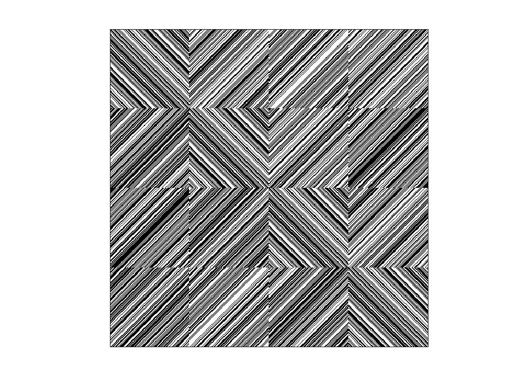

## Order 507 S Matrix

| 0 | 1 | 1 | 0 | 1 | 0 | 0 | 0 | 1 | 1 | 0 | 1 | 0 | 1 | 0 | 1 | 1 | 1 | 1 | 1 | 0 | 1 | 1 | 0 | 0 | 1 | 1 | 0 | 0 | 0 | 1 | 1 | 1 | 0 | 1 | 1 | 1 | 1 | 1 | 0 | 0 | 1 | 1 | 0 | 1 | 0 | 0 | 1 | 0 | 1 | 1 | 0 | 1 | 0 | 0 | 0 | 0 | 0 | 0 | 0 | 1 | 1 | 1 | 0 | 1 | 0 | 0 | 0 | 1 | 1 | 1 | 1 | 1 | 1 | 1 | 0 | 1 | 0 | 0 | 1 | 0 | 1 | 1 | 0 | 1 | 0 | 0 | 1 | 1 | 0 | 0 | 0 | 0 | 0 | 1 | 0 | 0 | 0 | 1 | 1 | 1 | 0 | 0 | 1 | 1 | 0 | 0 | 1 | 0 | 0 | 0 | 0 | 0 | 1 | 0 | 1 | 0 | 1 | 0 | 0 | 1 | 1 | 1 | 0 | 1 | 0 | 1 | 1 | 1 | 0 | 1 | 1 | 1 | 1 | 0 | 0 | 1 | 0 | 1 | 1 | 1 | 1 | 1 | 1 | 0 | 0 | 0 | 1 | 1 | 1 | 0 | 1 | 1 | 1 | 1 | 0 | 1 | 0 | 1 | 0 | 1 | 0 | 1 | 1 | 0 | 0 | 0 | 0 | 0 | 0 | 1 | 0 | 1 | 0 | 1 | 1 | 0 | 0 | 1 | 0 | 1 | 1 | 1 | 0 | 1 | 0 | 0 | 1 | 1 | 1 | 0 | 1 | 1 | 0 | 0 | 1 | 1 | 1 | 0 | 1 | 1 | 1 | 1 | 0 | 0 | 0 | 0 | 1 | 0 | 0 | 0 | 0 | 0 | 1 | 0 | 0 | 1 | 0 | 0 | 1 | 1 | 1 | 0 | 1 | 1 | 1 | 1 | 0 | 0 | 1 | 0 | 0 | 1 | 0 | 0 | 1 | 1 | 1 | 1 | 0 | 1 | 0 | 0 | 1 | 1 | 0 | 0 | 1 | 0 | 1 | 1 | 0 | 1 | 1 | 1 | 1 | 1 | 1 | 1 | 1 | 1 | 1 | 0 | 1 | 0 | 1 | 0 | 1 | 1 | 1 | 1 | 1 | 0 | 0 | 0 | 1 | 1 | 0 | 0 | 1 | 0 | 0 | 0 | 1 | 1 | 1 | 0 | 1 | 0 | 1 | 0 | 1 | 0 | 0 | 1 | 0 | 1 | 0 | 1 | 1 | 0 | 1 | 0 | 0 | 1 | 0 | 1 | 1 | 0 | 0 | 1 | 0 | 1 | 0 | 1 | 1 | 1 | 1 | 1 | 1 | 0 | 0 | 0 | 1 | 1 | 0 | 0 | 1 | 0 | 0 | 0 | 1 | 0 | 0 | 0 | 0 | 1 | 1 | 1 | 0 | 0 | 1 | 1 | 0 | 1 | 1 | 1 | 1 | 1 | 0 | 0 | 1 | 0 | 0 | 0 | 0 | 0 | 1 | 1 | 0 | 1 | 1 | 1 | 1 | 0 | 0 | 0 | 0 | 1 | 1 | 1 | 0 | 0 | 1 | 1 | 0 | 1 | 1 | 0 | 1 | 1 | 0 | 1 | 1 | 0 | 0 | 1 | 1 | 1 | 0 | 0 | 1 | 0 | 1 | 1 | 1 | 1 | 1 | 1 | 0 | 0 | 0 | 0 | 1 | 1 | 1 | 0 | 1 | 1 | 0 | 1 | 1 | 1 | 1 | 1 | 0 | 1 | 1 | 1 | 0 | 0 | 1 | 0 | 1 | 0 | 1 | 0 | 0 | 1 | 1 | 1 | 1 | 1 | 0 | 0 | 0 | 1 | 0 | 1 | 1 | 0 | 0 | 1 | 0 | 1 | 0 | 1 | 0 | 1 | 1 | 1 | 1 | 0 | 0 | 1 | 1 | 1 | 0 | 1 | 1 | 0 | 1 | 0 | 1 | 1 | 1 | 0 | 1 | 1 | 0 | 0 | 0 | 1 | 0 | 0 | 0 | 0 | 1 | 1 | 0 | 1 | 0 | 1 | 1 | 1 | 1 | 1 | 0 | 0 | 0 | 0 | 1 | 0 | 0 | 1 | 1 | 0 | 0 | 1 | 0 | 1 | 0 | 0 | 0 | 0 | 0 | 1 |
| 0 | 0 | 1 | 1 | 0 | 1 | 0 | 0 | 0 | 1 | 1 | 0 | 1 | 0 | 1 | 0 | 1 | 1 | 1 | 1 | 1 | 0 | 1 | 1 | 0 | 0 | 1 | 1 | 0 | 0 | 0 | 1 | 1 | 1 | 0 | 1 | 1 | 1 | 1 | 1 | 0 | 0 | 1 | 1 | 0 | 1 | 0 | 0 | 1 | 0 | 1 | 1 | 0 | 1 | 0 | 0 | 0 | 0 | 0 | 0 | 0 | 1 | 1 | 1 | 0 | 1 | 0 | 0 | 0 | 1 | 1 | 1 | 1 | 1 | 1 | 1 | 0 | 1 | 0 | 0 | 1 | 0 | 1 | 1 | 0 | 1 | 0 | 0 | 1 | 1 | 0 | 0 | 0 | 0 | 0 | 1 | 0 | 0 | 0 | 1 | 1 | 1 | 0 | 0 | 1 | 1 | 0 | 0 | 1 | 0 | 0 | 0 | 0 | 0 | 1 | 0 | 1 | 0 | 1 | 0 | 0 | 1 | 1 | 1 | 0 | 1 | 1 | 1 | 0 | 1 | 1 | 1 | 1 | 0 | 0 | 1 | 0 | 1 | 1 | 1 | 1 | 1 | 1 | 0 | 0 | 0 | 1 | 1 | 1 | 0 | 1 | 1 | 1 | 1 | 0 | 1 | 0 | 1 | 0 | 1 | 0 | 1 | 1 | 0 | 0 | 0 | 0 | 0 | 0 | 1 | 0 | 1 | 0 | 1 | 1 | 0 | 0 | 1 | 0 | 1 | 1 | 1 | 0 | 1 | 0 | 0 | 1 | 1 | 1 | 0 | 1 | 1 | 0 | 0 | 1 | 1 | 1 | 0 | 1 | 1 | 1 | 1 | 0 | 0 | 0 | 0 | 1 | 0 | 0 | 0 | 0 | 0 | 1 | 0 | 0 | 1 | 0 | 0 | 1 | 1 | 1 | 0 | 1 | 1 | 1 | 1 | 0 | 0 | 1 | 0 | 0 | 1 | 0 | 0 | 1 | 1 | 1 | 1 | 0 | 1 | 0 | 0 | 1 | 1 | 0 | 0 | 1 | 0 | 1 | 1 | 0 | 1 | 1 | 1 | 1 | 1 | 1 | 1 | 1 | 1 | 1 | 0 | 1 | 0 | 1 | 0 | 1 | 1 | 1 | 1 | 1 | 0 | 0 | 0 | 1 | 1 | 0 | 0 | 1 | 0 | 0 | 0 | 1 | 1 | 1 | 0 | 1 | 0 | 1 | 0 | 1 | 0 | 0 | 1 | 0 | 1 | 0 | 1 | 1 | 0 | 1 | 0 | 0 | 1 | 0 | 1 | 1 | 0 | 0 | 1 | 0 | 1 | 0 | 1 | 1 | 1 | 1 | 1 | 1 | 0 | 0 | 0 | 1 | 1 | 0 | 0 | 1 | 0 | 0 | 0 | 1 | 0 | 0 | 0 | 0 | 1 | 1 | 1 | 0 | 0 | 1 | 1 | 0 | 1 | 1 | 1 | 1 | 1 | 0 | 0 | 1 | 0 | 0 | 0 | 0 | 0 | 1 | 1 | 0 | 1 | 1 | 1 | 1 | 0 | 0 | 0 | 0 | 1 | 1 | 1 | 0 | 0 | 1 | 1 | 0 | 1 | 1 | 0 | 1 | 1 | 0 | 1 | 1 | 0 | 0 | 1 | 1 | 1 | 0 | 0 | 1 | 0 | 1 | 1 | 1 | 1 | 1 | 1 | 0 | 0 | 0 | 0 | 1 | 1 | 1 | 0 | 1 | 1 | 0 | 1 | 1 | 1 | 1 | 1 | 0 | 1 | 1 | 1 | 0 | 0 | 1 | 0 | 1 | 0 | 1 | 0 | 0 | 1 | 1 | 1 | 1 | 1 | 0 | 0 | 0 | 1 | 0 | 1 | 1 | 0 | 0 | 1 | 0 | 1 | 0 | 1 | 0 | 1 | 1 | 1 | 1 | 0 | 0 | 1 | 1 | 1 | 0 | 1 | 1 | 0 | 1 | 0 | 1 | 1 | 1 | 0 | 1 | 1 | 0 | 0 | 0 | 1 | 0 | 0 | 0 | 0 | 1 | 1 | 0 | 1 | 0 | 1 | 1 | 1 | 1 | 1 | 0 | 0 | 0 | 0 | 1 | 0 | 0 | 1 | 1 | 0 | 0 | 1 | 0 | 1 | 0 | 0 | 0 | 0 | 0 | 1 | 1 |
| 0 | 0 | 0 | 1 | 1 | 0 | 1 | 0 | 0 | 0 | 1 | 1 | 0 | 1 | 0 | 1 | 0 | 1 | 1 | 1 | 1 | 1 | 0 | 1 | 1 | 0 | 0 | 1 | 1 | 0 | 0 | 0 | 1 | 1 | 1 | 0 | 1 | 1 | 1 | 1 | 1 | 0 | 0 | 1 | 1 | 0 | 1 | 0 | 0 | 1 | 0 | 1 | 1 | 0 | 1 | 0 | 0 | 0 | 0 | 0 | 0 | 0 | 1 | 1 | 1 | 0 | 1 | 0 | 0 | 0 | 1 | 1 | 1 | 1 | 1 | 1 | 1 | 0 | 1 | 0 | 0 | 1 | 0 | 1 | 1 | 0 | 1 | 0 | 0 | 1 | 1 | 0 | 0 | 0 | 0 | 0 | 1 | 0 | 0 | 0 | 1 | 1 | 1 | 0 | 0 | 1 | 1 | 0 | 0 | 1 | 0 | 0 | 0 | 0 | 0 | 1 | 0 | 1 | 0 | 1 | 0 | 0 | 1 | 1 | 1 | 0 | 1 | 0 | 1 | 1 | 1 | 1 | 0 | 0 | 1 | 0 | 1 | 1 | 1 | 1 | 1 | 1 | 0 | 0 | 0 | 1 | 1 | 1 | 0 | 1 | 1 | 1 | 1 | 0 | 1 | 0 | 1 | 0 | 1 | 0 | 1 | 1 | 0 | 0 | 0 | 0 | 0 | 0 | 1 | 0 | 1 | 0 | 1 | 1 | 0 | 0 | 1 | 0 | 1 | 1 | 1 | 0 | 1 | 0 | 0 | 1 | 1 | 1 | 0 | 1 | 1 | 0 | 0 | 1 | 1 | 1 | 0 | 1 | 1 | 1 | 1 | 0 | 0 | 0 | 0 | 1 | 0 | 0 | 0 | 0 | 0 | 1 | 0 | 0 | 1 | 0 | 0 | 1 | 1 | 1 | 0 | 1 | 1 | 1 | 1 | 0 | 0 | 1 | 0 | 0 | 1 | 0 | 0 | 1 | 1 | 1 | 1 | 0 | 1 | 0 | 0 | 1 | 1 | 0 | 0 | 1 | 0 | 1 | 1 | 0 | 1 | 1 | 1 | 1 | 1 | 1 | 1 | 1 | 1 | 1 | 0 | 1 | 0 | 1 | 0 | 1 | 1 | 1 | 1 | 1 | 0 | 0 | 0 | 1 | 1 | 0 | 0 | 1 | 0 | 0 | 0 | 1 | 1 | 1 | 0 | 1 | 0 | 1 | 0 | 1 | 0 | 0 | 1 | 0 | 1 | 0 | 1 | 1 | 0 | 1 | 0 | 0 | 1 | 0 | 1 | 1 | 0 | 0 | 1 | 0 | 1 | 0 | 1 | 1 | 1 | 1 | 1 | 1 | 0 | 0 | 0 | 1 | 1 | 0 | 0 | 1 | 0 | 0 | 0 | 1 | 0 | 0 | 0 | 0 | 1 | 1 | 1 | 0 | 0 | 1 | 1 | 0 | 1 | 1 | 1 | 1 | 1 | 0 | 0 | 1 | 0 | 0 | 0 | 0 | 0 | 1 | 1 | 0 | 1 | 1 | 1 | 1 | 0 | 0 | 0 | 0 | 1 | 1 | 1 | 0 | 0 | 1 | 1 | 0 | 1 | 1 | 0 | 1 | 1 | 1 | 1 | 1 | 0 | 0 | 1 | 1 | 1 | 0 | 0 | 1 | 0 | 1 | 1 | 1 | 1 | 1 | 1 | 0 | 0 | 0 | 0 | 1 | 1 | 1 | 0 | 1 | 1 | 0 | 1 | 1 | 1 | 1 | 1 | 0 | 1 | 1 | 1 | 0 | 0 | 1 | 0 | 1 | 0 | 1 | 0 | 0 | 1 | 1 | 1 | 1 | 1 | 0 | 0 | 0 | 1 | 0 | 1 | 1 | 0 | 0 | 1 | 0 | 1 | 0 | 1 | 0 | 1 | 1 | 1 | 1 | 0 | 0 | 1 | 1 | 1 | 0 | 1 | 1 | 0 | 1 | 0 | 1 | 1 | 1 | 0 | 1 | 1 | 0 | 0 | 0 | 1 | 0 | 0 | 0 | 0 | 1 | 1 | 0 | 1 | 0 | 1 | 1 | 1 | 1 | 1 | 0 | 0 | 0 | 0 | 1 | 0 | 0 | 1 | 1 | 0 | 0 | 1 | 0 | 1 | 0 | 0 | 0 | 0 | 0 | 1 | 1 | 0 |
| 1 | 0 | 0 | 0 | 1 | 1 | 0 | 1 | 0 | 0 | 0 | 1 | 1 | 0 | 1 | 0 | 1 | 0 | 1 | 1 | 1 | 1 | 1 | 0 | 1 | 1 | 0 | 0 | 1 | 1 | 0 | 0 | 0 | 1 | 1 | 1 | 0 | 1 | 1 | 1 | 1 | 1 | 0 | 0 | 1 | 1 | 0 | 1 | 0 | 0 | 1 | 0 | 1 | 1 | 0 | 1 | 0 | 0 | 0 | 0 | 0 | 0 | 0 | 1 | 1 | 1 | 0 | 1 | 0 | 0 | 0 | 1 | 1 | 1 | 1 | 1 | 1 | 1 | 0 | 1 | 0 | 0 | 1 | 0 | 1 | 1 | 0 | 1 | 0 | 0 | 1 | 1 | 0 | 0 | 0 | 0 | 0 | 1 | 0 | 0 | 0 | 1 | 1 | 1 | 0 | 0 | 1 | 1 | 0 | 0 | 1 | 0 | 0 | 0 | 0 | 0 | 1 | 0 | 1 | 0 | 1 | 0 | 0 | 1 | 1 | 1 | 0 | 1 | 1 | 1 | 1 | 0 | 0 | 1 | 0 | 1 | 1 | 1 | 1 | 1 | 1 | 0 | 0 | 0 | 1 | 1 | 1 | 0 | 1 | 1 | 1 | 1 | 0 | 1 | 0 | 1 | 0 | 1 | 0 | 1 | 1 | 0 | 0 | 0 | 0 | 0 | 0 | 1 | 0 | 1 | 0 | 1 | 1 | 0 | 0 | 1 | 0 | 1 | 1 | 1 | 0 | 1 | 0 | 0 | 1 | 1 | 1 | 0 | 1 | 1 | 0 | 0 | 1 | 1 | 1 | 0 | 1 | 1 | 1 | 1 | 0 | 0 | 0 | 0 | 1 | 0 | 0 | 0 | 0 | 0 | 1 | 0 | 0 | 1 | 0 | 0 | 1 | 1 | 1 | 0 | 1 | 1 | 1 | 1 | 0 | 0 | 1 | 0 | 0 | 1 | 0 | 0 | 1 | 1 | 1 | 1 | 0 | 1 | 0 | 0 | 1 | 1 | 0 | 0 | 1 | 0 | 1 | 1 | 0 | 1 | 1 | 1 | 1 | 1 | 1 | 1 | 1 | 1 | 1 | 0 | 1 | 0 | 1 | 0 | 1 | 1 | 1 | 1 | 1 | 0 | 0 | 0 | 1 | 1 | 0 | 0 | 1 | 0 | 0 | 0 | 1 | 1 | 1 | 0 | 1 | 0 | 1 | 0 | 1 | 0 | 0 | 1 | 0 | 1 | 0 | 1 | 1 | 0 | 1 | 0 | 0 | 1 | 0 | 1 | 1 | 0 | 0 | 1 | 0 | 1 | 0 | 1 | 1 | 1 | 1 | 1 | 1 | 0 | 0 | 0 | 1 | 1 | 0 | 0 | 1 | 0 | 0 | 0 | 1 | 0 | 0 | 0 | 0 | 1 | 1 | 1 | 0 | 0 | 1 | 1 | 0 | 1 | 1 | 1 | 1 | 1 | 0 | 0 | 1 | 0 | 0 | 0 | 0 | 0 | 1 | 1 | 0 | 1 | 1 | 1 | 1 | 0 | 0 | 0 | 0 | 1 | 1 | 1 | 0 | 0 | 1 | 1 | 0 | 1 | 1 | 0 | 1 | 1 | 1 | 1 | 1 | 0 | 0 | 1 | 1 | 1 | 0 | 0 | 1 | 0 | 1 | 1 | 1 | 1 | 1 | 1 | 0 | 0 | 0 | 0 | 1 | 1 | 1 | 0 | 1 | 1 | 0 | 1 | 1 | 1 | 1 | 1 | 0 | 1 | 1 | 1 | 0 | 0 | 1 | 0 | 1 | 0 | 1 | 0 | 0 | 1 | 1 | 1 | 1 | 1 | 0 | 0 | 0 | 1 | 0 | 1 | 1 | 0 | 0 | 1 | 0 | 1 | 0 | 1 | 0 | 1 | 1 | 1 | 1 | 0 | 0 | 1 | 1 | 1 | 0 | 1 | 1 | 0 | 1 | 0 | 1 | 1 | 1 | 0 | 1 | 1 | 0 | 0 | 0 | 1 | 0 | 0 | 0 | 0 | 1 | 1 | 0 | 1 | 0 | 1 | 1 | 1 | 1 | 1 | 0 | 0 | 0 | 0 | 1 | 0 | 0 | 1 | 1 | 0 | 0 | 1 | 0 | 1 | 0 | 0 | 0 | 0 | 0 | 1 | 1 | 0 | 1 |
| 0 | 1 | 0 | 0 | 0 | 1 | 1 | 0 | 1 | 0 | 0 | 0 | 1 | 1 | 0 | 1 | 0 | 1 | 0 | 1 | 1 | 1 | 1 | 1 | 0 | 1 | 1 | 0 | 0 | 1 | 1 | 0 | 0 | 0 | 1 | 1 | 1 | 0 | 1 | 1 | 1 | 1 | 1 | 0 | 0 | 1 | 1 | 0 | 1 | 0 | 0 | 1 | 0 | 1 | 1 | 0 | 1 | 0 | 0 | 0 | 0 | 0 | 0 | 0 | 1 | 1 | 1 | 0 | 1 | 0 | 0 | 0 | 1 | 1 | 1 | 1 | 1 | 1 | 1 | 0 | 1 | 0 | 0 | 1 | 0 | 1 | 1 | 0 | 1 | 0 | 0 | 1 | 1 | 0 | 0 | 0 | 0 | 0 | 1 | 0 | 0 | 0 | 1 | 1 | 1 | 0 | 0 | 1 | 1 | 0 | 0 | 1 | 0 | 0 | 0 | 0 | 0 | 1 | 0 | 1 | 0 | 1 | 0 | 0 | 1 | 1 | 1 | 1 | 1 | 1 | 0 | 0 | 1 | 0 | 1 | 1 | 1 | 1 | 1 | 1 | 0 | 0 | 0 | 1 | 1 | 1 | 0 | 1 | 1 | 1 | 1 | 0 | 1 | 0 | 1 | 0 | 1 | 0 | 1 | 1 | 0 | 0 | 0 | 0 | 0 | 0 | 1 | 0 | 1 | 0 | 1 | 1 | 0 | 0 | 1 | 0 | 1 | 1 | 1 | 0 | 1 | 0 | 0 | 1 | 1 | 1 | 0 | 1 | 1 | 0 | 0 | 1 | 1 | 1 | 0 | 1 | 1 | 1 | 1 | 0 | 0 | 0 | 0 | 1 | 0 | 0 | 0 | 0 | 0 | 1 | 0 | 0 | 1 | 0 | 0 | 1 | 1 | 1 | 0 | 1 | 1 | 1 | 1 | 0 | 0 | 1 | 0 | 0 | 1 | 0 | 0 | 1 | 1 | 1 | 1 | 0 | 1 | 0 | 0 | 1 | 1 | 0 | 0 | 1 | 0 | 1 | 1 | 0 | 1 | 1 | 1 | 1 | 0 | 1 | 1 | 1 | 1 | 1 | 0 | 1 | 0 | 1 | 0 | 1 | 1 | 1 | 1 | 1 | 0 | 0 | 0 | 1 | 1 | 0 | 0 | 1 | 0 | 0 | 0 | 1 | 1 | 1 | 0 | 1 | 0 | 1 | 0 | 1 | 0 | 0 | 1 | 0 | 1 | 0 | 1 | 1 | 0 | 1 | 0 | 0 | 1 | 0 | 1 | 1 | 0 | 0 | 1 | 0 | 1 | 0 | 1 | 1 | 1 | 1 | 1 | 1 | 0 | 0 | 0 | 1 | 1 | 0 | 0 | 1 | 0 | 0 | 0 | 1 | 0 | 0 | 0 | 0 | 1 | 1 | 1 | 0 | 0 | 1 | 1 | 0 | 1 | 1 | 1 | 1 | 1 | 0 | 0 | 1 | 0 | 0 | 0 | 0 | 0 | 1 | 1 | 0 | 1 | 1 | 1 | 1 | 0 | 0 | 0 | 0 | 1 | 1 | 1 | 0 | 0 | 1 | 1 | 0 | 1 | 1 | 0 | 1 | 1 | 1 | 1 | 1 | 0 | 0 | 1 | 1 | 1 | 0 | 0 | 1 | 0 | 1 | 1 | 1 | 1 | 1 | 1 | 0 | 0 | 0 | 0 | 1 | 1 | 1 | 0 | 1 | 1 | 0 | 1 | 1 | 1 | 1 | 1 | 0 | 1 | 1 | 1 | 0 | 0 | 1 | 0 | 1 | 0 | 1 | 0 | 0 | 1 | 1 | 1 | 1 | 1 | 0 | 0 | 0 | 1 | 0 | 1 | 1 | 0 | 0 | 1 | 0 | 1 | 0 | 1 | 0 | 1 | 1 | 1 | 1 | 0 | 0 | 1 | 1 | 1 | 0 | 1 | 1 | 0 | 1 | 0 | 1 | 1 | 1 | 0 | 1 | 1 | 0 | 0 | 0 | 1 | 0 | 0 | 0 | 0 | 1 | 1 | 0 | 1 | 0 | 1 | 1 | 1 | 1 | 1 | 0 | 0 | 0 | 0 | 1 | 0 | 0 | 1 | 1 | 0 | 0 | 1 | 0 | 1 | 0 | 0 | 0 | 0 | 0 | 1 | 1 | 0 | 1 | 1 |
| 1 | 0 | 1 | 0 | 0 | 0 | 1 | 1 | 0 | 1 | 0 | 0 | 0 | 1 | 1 | 0 | 1 | 0 | 1 | 0 | 1 | 1 | 1 | 1 | 1 | 0 | 1 | 1 | 0 | 0 | 1 | 1 | 0 | 0 | 0 | 1 | 1 | 1 | 0 | 1 | 1 | 1 | 1 | 1 | 0 | 0 | 1 | 1 | 0 | 1 | 0 | 0 | 1 | 0 | 1 | 1 | 0 | 1 | 0 | 0 | 0 | 0 | 0 | 0 | 0 | 1 | 1 | 1 | 0 | 1 | 0 | 0 | 0 | 1 | 1 | 1 | 1 | 1 | 1 | 1 | 0 | 1 | 0 | 0 | 1 | 0 | 1 | 1 | 0 | 1 | 0 | 0 | 1 | 1 | 0 | 0 | 0 | 0 | 0 | 1 | 0 | 0 | 0 | 1 | 1 | 1 | 0 | 0 | 1 | 1 | 0 | 0 | 1 | 0 | 0 | 0 | 0 | 0 | 1 | 0 | 1 | 0 | 1 | 0 | 0 | 1 | 1 | 1 | 1 | 0 | 0 | 1 | 0 | 1 | 1 | 1 | 1 | 1 | 1 | 0 | 0 | 0 | 1 | 1 | 1 | 0 | 1 | 1 | 1 | 1 | 0 | 1 | 0 | 1 | 0 | 1 | 0 | 1 | 1 | 0 | 0 | 0 | 0 | 0 | 0 | 1 | 0 | 1 | 0 | 1 | 1 | 0 | 0 | 1 | 0 | 1 | 1 | 1 | 0 | 1 | 0 | 0 | 1 | 1 | 1 | 0 | 1 | 1 | 0 | 0 | 1 | 1 | 1 | 0 | 1 | 1 | 1 | 1 | 0 | 0 | 0 | 0 | 1 | 0 | 0 | 0 | 0 | 0 | 1 | 0 | 0 | 1 | 0 | 0 | 1 | 1 | 1 | 0 | 1 | 1 | 1 | 1 | 0 | 0 | 1 | 0 | 0 | 1 | 0 | 0 | 1 | 1 | 1 | 1 | 0 | 1 | 0 | 0 | 1 | 1 | 0 | 0 | 1 | 0 | 1 | 1 | 0 | 1 | 1 | 1 | 1 | 0 | 1 | 1 | 1 | 1 | 1 | 0 | 1 | 0 | 1 | 0 | 1 | 1 | 1 | 1 | 1 | 0 | 0 | 0 | 1 | 1 | 0 | 0 | 1 | 0 | 0 | 0 | 1 | 1 | 1 | 0 | 1 | 0 | 1 | 0 | 1 | 0 | 0 | 1 | 0 | 1 | 0 | 1 | 1 | 0 | 1 | 0 | 0 | 1 | 0 | 1 | 1 | 0 | 0 | 1 | 0 | 1 | 0 | 1 | 1 | 1 | 1 | 1 | 1 | 0 | 0 | 0 | 1 | 1 | 0 | 0 | 1 | 0 | 0 | 0 | 1 | 0 | 0 | 0 | 0 | 1 | 1 | 1 | 0 | 0 | 1 | 1 | 0 | 1 | 1 | 1 | 1 | 1 | 0 | 0 | 1 | 0 | 0 | 0 | 0 | 0 | 1 | 1 | 0 | 1 | 1 | 1 | 1 | 0 | 0 | 0 | 0 | 1 | 1 | 1 | 0 | 0 | 1 | 1 | 0 | 1 | 1 | 0 | 1 | 1 | 1 | 1 | 1 | 1 | 0 | 1 | 1 | 1 | 0 | 0 | 1 | 0 | 1 | 1 | 1 | 1 | 1 | 1 | 0 | 0 | 0 | 0 | 1 | 1 | 1 | 0 | 1 | 1 | 0 | 1 | 1 | 1 | 1 | 1 | 0 | 1 | 1 | 1 | 0 | 0 | 1 | 0 | 1 | 0 | 1 | 0 | 0 | 1 | 1 | 1 | 1 | 1 | 0 | 0 | 0 | 1 | 0 | 1 | 1 | 0 | 0 | 1 | 0 | 1 | 0 | 1 | 0 | 1 | 1 | 1 | 1 | 0 | 0 | 1 | 1 | 1 | 0 | 1 | 1 | 0 | 1 | 0 | 1 | 1 | 1 | 0 | 1 | 1 | 0 | 0 | 0 | 1 | 0 | 0 | 0 | 0 | 1 | 1 | 0 | 1 | 0 | 1 | 1 | 1 | 1 | 1 | 0 | 0 | 0 | 0 | 1 | 0 | 0 | 1 | 1 | 0 | 0 | 1 | 0 | 1 | 0 | 0 | 0 | 0 | 0 | 1 | 1 | 0 | 1 | 1 | 0 |
| 1 | 1 | 0 | 1 | 0 | 0 | 0 | 1 | 1 | 0 | 1 | 0 | 0 | 0 | 1 | 1 | 0 | 1 | 0 | 1 | 0 | 1 | 1 | 1 | 1 | 1 | 0 | 1 | 1 | 0 | 0 | 1 | 1 | 0 | 0 | 0 | 1 | 1 | 1 | 0 | 1 | 1 | 1 | 1 | 1 | 0 | 0 | 1 | 1 | 0 | 1 | 0 | 0 | 1 | 0 | 1 | 1 | 0 | 1 | 0 | 0 | 0 | 0 | 0 | 0 | 0 | 1 | 1 | 1 | 0 | 1 | 0 | 0 | 0 | 1 | 1 | 1 | 1 | 1 | 1 | 1 | 0 | 1 | 0 | 0 | 1 | 0 | 1 | 1 | 0 | 1 | 0 | 0 | 1 | 1 | 0 | 0 | 0 | 0 | 0 | 1 | 0 | 0 | 0 | 1 | 1 | 1 | 0 | 0 | 1 | 1 | 0 | 0 | 1 | 0 | 0 | 0 | 0 | 0 | 1 | 0 | 1 | 0 | 1 | 0 | 0 | 1 | 1 | 0 | 0 | 1 | 0 | 1 | 1 | 1 | 1 | 1 | 1 | 0 | 0 | 0 | 1 | 1 | 1 | 0 | 1 | 1 | 1 | 1 | 0 | 1 | 0 | 1 | 0 | 1 | 0 | 1 | 1 | 0 | 0 | 0 | 0 | 0 | 0 | 1 | 0 | 1 | 0 | 1 | 1 | 0 | 0 | 1 | 0 | 1 | 1 | 1 | 0 | 1 | 0 | 0 | 1 | 1 | 1 | 0 | 1 | 1 | 0 | 0 | 1 | 1 | 1 | 0 | 1 | 1 | 1 | 1 | 0 | 0 | 0 | 0 | 1 | 0 | 0 | 0 | 0 | 0 | 1 | 0 | 0 | 1 | 0 | 0 | 1 | 1 | 1 | 0 | 1 | 1 | 1 | 1 | 0 | 0 | 1 | 0 | 0 | 1 | 0 | 0 | 1 | 1 | 1 | 1 | 0 | 1 | 0 | 0 | 1 | 1 | 0 | 0 | 1 | 0 | 1 | 1 | 0 | 1 | 1 | 1 | 1 | 0 | 1 | 1 | 1 | 1 | 1 | 0 | 1 | 0 | 1 | 0 | 1 | 1 | 1 | 1 | 1 | 0 | 0 | 0 | 1 | 1 | 0 | 0 | 1 | 0 | 0 | 0 | 1 | 1 | 1 | 0 | 1 | 0 | 1 | 0 | 1 | 0 | 0 | 1 | 0 | 1 | 0 | 1 | 1 | 0 | 1 | 0 | 0 | 1 | 0 | 1 | 1 | 0 | 0 | 1 | 0 | 1 | 0 | 1 | 1 | 1 | 1 | 1 | 1 | 0 | 0 | 0 | 1 | 1 | 0 | 0 | 1 | 0 | 0 | 0 | 1 | 0 | 0 | 0 | 0 | 1 | 1 | 1 | 0 | 0 | 1 | 1 | 0 | 1 | 1 | 1 | 1 | 1 | 0 | 0 | 1 | 0 | 0 | 0 | 0 | 0 | 1 | 1 | 0 | 1 | 1 | 1 | 1 | 0 | 0 | 0 | 0 | 1 | 1 | 1 | 0 | 0 | 1 | 1 | 0 | 1 | 1 | 0 | 1 | 1 | 1 | 1 | 1 | 1 | 1 | 1 | 1 | 1 | 0 | 0 | 1 | 0 | 1 | 1 | 1 | 1 | 1 | 1 | 0 | 0 | 0 | 0 | 1 | 1 | 1 | 0 | 1 | 1 | 0 | 1 | 1 | 1 | 1 | 1 | 0 | 1 | 1 | 1 | 0 | 0 | 1 | 0 | 1 | 0 | 1 | 0 | 0 | 1 | 1 | 1 | 1 | 1 | 0 | 0 | 0 | 1 | 0 | 1 | 1 | 0 | 0 | 1 | 0 | 1 | 0 | 1 | 0 | 1 | 1 | 1 | 1 | 0 | 0 | 1 | 1 | 1 | 0 | 1 | 1 | 0 | 1 | 0 | 1 | 1 | 1 | 0 | 1 | 1 | 0 | 0 | 0 | 1 | 0 | 0 | 0 | 0 | 1 | 1 | 0 | 1 | 0 | 1 | 1 | 1 | 1 | 1 | 0 | 0 | 0 | 0 | 1 | 0 | 0 | 1 | 1 | 0 | 0 | 1 | 0 | 1 | 0 | 0 | 0 | 0 | 0 | 1 | 1 | 0 | 1 | 1 | 0 | 0 |
| 1 | 1 | 1 | 0 | 1 | 0 | 0 | 0 | 1 | 1 | 0 | 1 | 0 | 0 | 0 | 1 | 1 | 0 | 1 | 0 | 1 | 0 | 1 | 1 | 1 | 1 | 1 | 0 | 1 | 1 | 0 | 0 | 1 | 1 | 0 | 0 | 0 | 1 | 1 | 1 | 0 | 1 | 1 | 1 | 1 | 1 | 0 | 0 | 1 | 1 | 0 | 1 | 0 | 0 | 1 | 0 | 1 | 1 | 0 | 1 | 0 | 0 | 0 | 0 | 0 | 0 | 0 | 1 | 1 | 1 | 0 | 1 | 0 | 0 | 0 | 1 | 1 | 1 | 1 | 1 | 1 | 1 | 0 | 1 | 0 | 0 | 1 | 0 | 1 | 1 | 0 | 1 | 0 | 0 | 1 | 1 | 0 | 0 | 0 | 0 | 0 | 1 | 0 | 0 | 0 | 1 | 1 | 1 | 0 | 0 | 1 | 1 | 0 | 0 | 1 | 0 | 0 | 0 | 0 | 0 | 1 | 0 | 1 | 0 | 1 | 0 | 1 | 0 | 0 | 1 | 0 | 1 | 1 | 1 | 1 | 1 | 1 | 0 | 0 | 0 | 1 | 1 | 1 | 0 | 1 | 1 | 1 | 1 | 0 | 1 | 0 | 1 | 0 | 1 | 0 | 1 | 1 | 0 | 0 | 0 | 0 | 0 | 0 | 1 | 0 | 1 | 0 | 1 | 1 | 0 | 0 | 1 | 0 | 1 | 1 | 1 | 0 | 1 | 0 | 0 | 1 | 1 | 1 | 0 | 1 | 1 | 0 | 0 | 1 | 1 | 1 | 0 | 1 | 1 | 1 | 1 | 0 | 0 | 0 | 0 | 1 | 0 | 0 | 0 | 0 | 0 | 1 | 0 | 0 | 1 | 0 | 0 | 1 | 1 | 1 | 0 | 1 | 1 | 1 | 1 | 0 | 0 | 1 | 0 | 0 | 1 | 0 | 0 | 1 | 1 | 1 | 1 | 0 | 1 | 0 | 0 | 1 | 1 | 0 | 0 | 1 | 0 | 1 | 1 | 0 | 1 | 1 | 1 | 1 | 0 | 1 | 1 | 1 | 1 | 1 | 0 | 1 | 0 | 1 | 0 | 1 | 1 | 1 | 1 | 1 | 0 | 0 | 0 | 1 | 1 | 0 | 0 | 1 | 0 | 0 | 0 | 1 | 1 | 1 | 0 | 1 | 0 | 1 | 0 | 1 | 0 | 0 | 1 | 0 | 1 | 0 | 1 | 1 | 0 | 1 | 0 | 0 | 1 | 0 | 1 | 1 | 0 | 0 | 1 | 0 | 1 | 0 | 1 | 1 | 1 | 1 | 1 | 1 | 0 | 0 | 0 | 1 | 1 | 0 | 0 | 1 | 0 | 0 | 0 | 1 | 0 | 0 | 0 | 0 | 1 | 1 | 1 | 0 | 0 | 1 | 1 | 0 | 1 | 1 | 1 | 1 | 1 | 0 | 0 | 1 | 0 | 0 | 0 | 0 | 0 | 1 | 1 | 0 | 1 | 1 | 1 | 1 | 0 | 0 | 0 | 0 | 1 | 1 | 1 | 0 | 0 | 1 | 1 | 0 | 1 | 1 | 0 | 1 | 1 | 1 | 1 | 1 | 1 | 1 | 1 | 1 | 1 | 0 | 0 | 1 | 0 | 1 | 1 | 1 | 1 | 1 | 1 | 0 | 0 | 0 | 0 | 1 | 1 | 1 | 0 | 1 | 1 | 0 | 1 | 1 | 1 | 1 | 1 | 0 | 1 | 1 | 1 | 0 | 0 | 1 | 0 | 1 | 0 | 1 | 0 | 0 | 1 | 1 | 1 | 1 | 1 | 0 | 0 | 0 | 1 | 0 | 1 | 1 | 0 | 0 | 1 | 0 | 1 | 0 | 1 | 0 | 1 | 1 | 1 | 1 | 0 | 0 | 1 | 1 | 1 | 0 | 1 | 1 | 0 | 1 | 0 | 1 | 1 | 1 | 0 | 1 | 1 | 0 | 0 | 0 | 1 | 0 | 0 | 0 | 0 | 1 | 1 | 0 | 1 | 0 | 1 | 1 | 1 | 1 | 1 | 0 | 0 | 0 | 0 | 1 | 0 | 0 | 1 | 1 | 0 | 0 | 1 | 0 | 1 | 0 | 0 | 0 | 0 | 0 | 1 | 1 | 0 | 1 | 1 | 0 | 0 | 1 |
| 0 | 1 | 1 | 1 | 0 | 1 | 0 | 0 | 0 | 1 | 1 | 0 | 1 | 0 | 0 | 0 | 1 | 1 | 0 | 1 | 0 | 1 | 0 | 1 | 1 | 1 | 1 | 1 | 0 | 1 | 1 | 0 | 0 | 1 | 1 | 0 | 0 | 0 | 1 | 1 | 1 | 0 | 1 | 1 | 1 | 1 | 1 | 0 | 0 | 1 | 1 | 0 | 1 | 0 | 0 | 1 | 0 | 1 | 1 | 0 | 1 | 0 | 0 | 0 | 0 | 0 | 0 | 0 | 1 | 1 | 1 | 0 | 1 | 0 | 0 | 0 | 1 | 1 | 1 | 1 | 1 | 1 | 1 | 0 | 1 | 0 | 0 | 1 | 0 | 1 | 1 | 0 | 1 | 0 | 0 | 1 | 1 | 0 | 0 | 0 | 0 | 0 | 1 | 0 | 0 | 0 | 1 | 1 | 1 | 0 | 0 | 1 | 1 | 0 | 0 | 1 | 0 | 0 | 0 | 0 | 0 | 1 | 0 | 1 | 0 | 1 | 0 | 0 | 1 | 0 | 1 | 1 | 1 | 1 | 1 | 1 | 0 | 0 | 0 | 1 | 1 | 1 | 0 | 1 | 1 | 1 | 1 | 0 | 1 | 0 | 1 | 0 | 1 | 0 | 1 | 1 | 0 | 0 | 0 | 0 | 0 | 0 | 1 | 0 | 1 | 0 | 1 | 1 | 0 | 0 | 1 | 0 | 1 | 1 | 1 | 0 | 1 | 0 | 0 | 1 | 1 | 1 | 0 | 1 | 1 | 0 | 0 | 1 | 1 | 1 | 0 | 1 | 1 | 1 | 1 | 0 | 0 | 0 | 0 | 1 | 0 | 0 | 0 | 0 | 0 | 1 | 0 | 0 | 1 | 0 | 0 | 1 | 1 | 1 | 0 | 1 | 1 | 1 | 1 | 0 | 0 | 1 | 0 | 0 | 1 | 0 | 0 | 1 | 1 | 1 | 1 | 0 | 1 | 0 | 0 | 1 | 1 | 0 | 0 | 1 | 0 | 1 | 1 | 0 | 1 | 1 | 1 | 1 | 0 | 1 | 1 | 1 | 1 | 1 | 0 | 1 | 0 | 1 | 0 | 1 | 1 | 1 | 1 | 1 | 0 | 0 | 0 | 1 | 1 | 0 | 0 | 1 | 0 | 0 | 0 | 1 | 1 | 1 | 0 | 1 | 0 | 1 | 0 | 1 | 0 | 0 | 1 | 0 | 1 | 0 | 1 | 1 | 0 | 1 | 0 | 0 | 1 | 0 | 1 | 1 | 0 | 0 | 1 | 0 | 1 | 0 | 1 | 1 | 1 | 1 | 1 | 1 | 0 | 0 | 0 | 1 | 1 | 0 | 0 | 1 | 0 | 0 | 0 | 1 | 0 | 0 | 0 | 0 | 1 | 1 | 1 | 0 | 0 | 1 | 1 | 0 | 1 | 1 | 1 | 1 | 1 | 0 | 0 | 1 | 0 | 0 | 0 | 0 | 0 | 1 | 1 | 0 | 1 | 1 | 1 | 1 | 0 | 0 | 0 | 0 | 1 | 1 | 1 | 0 | 0 | 1 | 1 | 0 | 1 | 1 | 0 | 1 | 1 | 1 | 1 | 1 | 1 | 1 | 1 | 1 | 1 | 0 | 0 | 1 | 0 | 1 | 1 | 1 | 1 | 1 | 1 | 0 | 0 | 0 | 0 | 1 | 1 | 1 | 0 | 1 | 1 | 0 | 1 | 1 | 1 | 1 | 1 | 0 | 1 | 1 | 1 | 0 | 0 | 1 | 0 | 1 | 0 | 1 | 0 | 0 | 1 | 1 | 1 | 1 | 1 | 0 | 0 | 0 | 1 | 0 | 1 | 1 | 0 | 0 | 1 | 0 | 1 | 0 | 1 | 0 | 1 | 1 | 1 | 1 | 0 | 0 | 1 | 1 | 1 | 0 | 1 | 1 | 0 | 1 | 0 | 1 | 1 | 1 | 0 | 1 | 1 | 0 | 0 | 0 | 1 | 0 | 0 | 0 | 0 | 1 | 1 | 0 | 1 | 0 | 1 | 1 | 1 | 1 | 1 | 0 | 0 | 0 | 0 | 1 | 0 | 0 | 1 | 1 | 0 | 0 | 1 | 0 | 1 | 0 | 0 | 0 | 0 | 0 | 1 | 1 | 0 | 1 | 1 | 0 | 0 | 1 | 1 |
| 0 | 0 | 1 | 1 | 1 | 0 | 1 | 0 | 0 | 0 | 1 | 1 | 0 | 1 | 0 | 0 | 0 | 1 | 1 | 0 | 1 | 0 | 1 | 0 | 1 | 1 | 1 | 1 | 1 | 0 | 1 | 1 | 0 | 0 | 1 | 1 | 0 | 0 | 0 | 1 | 1 | 1 | 0 | 1 | 1 | 1 | 1 | 1 | 0 | 0 | 1 | 1 | 0 | 1 | 0 | 0 | 1 | 0 | 1 | 1 | 0 | 1 | 0 | 0 | 0 | 0 | 0 | 0 | 0 | 1 | 1 | 1 | 0 | 1 | 0 | 0 | 0 | 1 | 1 | 1 | 1 | 1 | 1 | 1 | 0 | 1 | 0 | 0 | 1 | 0 | 1 | 1 | 0 | 1 | 0 | 0 | 1 | 1 | 0 | 0 | 0 | 0 | 0 | 1 | 0 | 0 | 0 | 1 | 1 | 1 | 0 | 0 | 1 | 1 | 0 | 0 | 1 | 0 | 0 | 0 | 0 | 0 | 1 | 0 | 1 | 0 | 0 | 1 | 0 | 1 | 1 | 1 | 1 | 1 | 1 | 0 | 0 | 0 | 1 | 1 | 1 | 0 | 1 | 1 | 1 | 1 | 0 | 1 | 0 | 1 | 0 | 1 | 0 | 1 | 1 | 0 | 0 | 0 | 0 | 0 | 0 | 1 | 0 | 1 | 0 | 1 | 1 | 0 | 0 | 1 | 0 | 1 | 1 | 1 | 0 | 1 | 0 | 0 | 1 | 1 | 1 | 0 | 1 | 1 | 0 | 0 | 1 | 1 | 1 | 0 | 1 | 1 | 1 | 1 | 0 | 0 | 0 | 0 | 1 | 0 | 0 | 0 | 0 | 0 | 1 | 0 | 0 | 1 | 0 | 0 | 1 | 1 | 1 | 0 | 1 | 1 | 1 | 1 | 0 | 0 | 1 | 0 | 0 | 1 | 0 | 0 | 1 | 1 | 1 | 1 | 0 | 1 | 0 | 0 | 1 | 1 | 0 | 0 | 1 | 0 | 1 | 1 | 0 | 1 | 1 | 1 | 1 | 0 | 1 | 1 | 1 | 1 | 0 | 0 | 1 | 0 | 1 | 0 | 1 | 1 | 1 | 1 | 1 | 0 | 0 | 0 | 1 | 1 | 0 | 0 | 1 | 0 | 0 | 0 | 1 | 1 | 1 | 0 | 1 | 0 | 1 | 0 | 1 | 0 | 0 | 1 | 0 | 1 | 0 | 1 | 1 | 0 | 1 | 0 | 0 | 1 | 0 | 1 | 1 | 0 | 0 | 1 | 0 | 1 | 0 | 1 | 1 | 1 | 1 | 1 | 1 | 0 | 0 | 0 | 1 | 1 | 0 | 0 | 1 | 0 | 0 | 0 | 1 | 0 | 0 | 0 | 0 | 1 | 1 | 1 | 0 | 0 | 1 | 1 | 0 | 1 | 1 | 1 | 1 | 1 | 0 | 0 | 1 | 0 | 0 | 0 | 0 | 0 | 1 | 1 | 0 | 1 | 1 | 1 | 1 | 0 | 0 | 0 | 0 | 1 | 1 | 1 | 0 | 0 | 1 | 1 | 0 | 1 | 1 | 0 | 1 | 1 | 1 | 1 | 1 | 1 | 1 | 1 | 1 | 1 | 0 | 0 | 1 | 0 | 1 | 1 | 1 | 1 | 1 | 1 | 0 | 0 | 0 | 0 | 1 | 1 | 1 | 0 | 1 | 1 | 0 | 1 | 1 | 1 | 1 | 1 | 0 | 1 | 1 | 1 | 0 | 0 | 1 | 0 | 1 | 0 | 1 | 0 | 0 | 1 | 1 | 1 | 1 | 1 | 0 | 0 | 0 | 1 | 0 | 1 | 1 | 0 | 0 | 1 | 0 | 1 | 0 | 1 | 0 | 1 | 1 | 1 | 1 | 0 | 0 | 1 | 1 | 1 | 0 | 1 | 1 | 0 | 1 | 0 | 1 | 1 | 1 | 0 | 1 | 1 | 0 | 0 | 0 | 1 | 0 | 0 | 0 | 0 | 1 | 1 | 0 | 1 | 0 | 1 | 1 | 1 | 1 | 1 | 0 | 0 | 0 | 0 | 1 | 0 | 0 | 1 | 1 | 0 | 0 | 1 | 0 | 1 | 0 | 0 | 0 | 0 | 0 | 1 | 1 | 0 | 1 | 1 | 0 | 0 | 1 | 1 | 1 |
| 1 | 0 | 0 | 1 | 1 | 1 | 0 | 1 | 0 | 0 | 0 | 1 | 1 | 0 | 1 | 0 | 0 | 0 | 1 | 1 | 0 | 1 | 0 | 1 | 0 | 1 | 1 | 1 | 1 | 1 | 0 | 1 | 1 | 0 | 0 | 1 | 1 | 0 | 0 | 0 | 1 | 1 | 1 | 0 | 1 | 1 | 1 | 1 | 1 | 0 | 0 | 1 | 1 | 0 | 1 | 0 | 0 | 1 | 0 | 1 | 1 | 0 | 1 | 0 | 0 | 0 | 0 | 0 | 0 | 0 | 1 | 1 | 1 | 0 | 1 | 0 | 0 | 0 | 1 | 1 | 1 | 1 | 1 | 1 | 1 | 0 | 1 | 0 | 0 | 1 | 0 | 1 | 1 | 0 | 1 | 0 | 0 | 1 | 1 | 0 | 0 | 0 | 0 | 0 | 1 | 0 | 0 | 0 | 1 | 1 | 1 | 0 | 0 | 1 | 1 | 0 | 0 | 1 | 0 | 0 | 0 | 0 | 0 | 1 | 0 | 1 | 1 | 0 | 1 | 1 | 1 | 1 | 1 | 1 | 0 | 0 | 0 | 1 | 1 | 1 | 0 | 1 | 1 | 1 | 1 | 0 | 1 | 0 | 1 | 0 | 1 | 0 | 1 | 1 | 0 | 0 | 0 | 0 | 0 | 0 | 1 | 0 | 1 | 0 | 1 | 1 | 0 | 0 | 1 | 0 | 1 | 1 | 1 | 0 | 1 | 0 | 0 | 1 | 1 | 1 | 0 | 1 | 1 | 0 | 0 | 1 | 1 | 1 | 0 | 1 | 1 | 1 | 1 | 0 | 0 | 0 | 0 | 1 | 0 | 0 | 0 | 0 | 0 | 1 | 0 | 0 | 1 | 0 | 0 | 1 | 1 | 1 | 0 | 1 | 1 | 1 | 1 | 0 | 0 | 1 | 0 | 0 | 1 | 0 | 0 | 1 | 1 | 1 | 1 | 0 | 1 | 0 | 0 | 1 | 1 | 0 | 0 | 1 | 0 | 1 | 1 | 0 | 1 | 1 | 1 | 1 | 0 | 1 | 1 | 1 | 1 | 0 | 0 | 1 | 0 | 1 | 0 | 1 | 1 | 1 | 1 | 1 | 0 | 0 | 0 | 1 | 1 | 0 | 0 | 1 | 0 | 0 | 0 | 1 | 1 | 1 | 0 | 1 | 0 | 1 | 0 | 1 | 0 | 0 | 1 | 0 | 1 | 0 | 1 | 1 | 0 | 1 | 0 | 0 | 1 | 0 | 1 | 1 | 0 | 0 | 1 | 0 | 1 | 0 | 1 | 1 | 1 | 1 | 1 | 1 | 0 | 0 | 0 | 1 | 1 | 0 | 0 | 1 | 0 | 0 | 0 | 1 | 0 | 0 | 0 | 0 | 1 | 1 | 1 | 0 | 0 | 1 | 1 | 0 | 1 | 1 | 1 | 1 | 1 | 0 | 0 | 1 | 0 | 0 | 0 | 0 | 0 | 1 | 1 | 0 | 1 | 1 | 1 | 1 | 0 | 0 | 0 | 0 | 1 | 1 | 1 | 0 | 0 | 1 | 1 | 0 | 1 | 1 | 0 | 1 | 1 | 1 | 1 | 1 | 1 | 1 | 1 | 1 | 1 | 0 | 0 | 1 | 0 | 1 | 1 | 1 | 1 | 1 | 1 | 0 | 0 | 0 | 0 | 1 | 1 | 1 | 0 | 1 | 1 | 0 | 1 | 1 | 1 | 1 | 1 | 0 | 1 | 1 | 1 | 0 | 0 | 1 | 0 | 1 | 0 | 1 | 0 | 0 | 1 | 1 | 1 | 1 | 1 | 0 | 0 | 0 | 1 | 0 | 1 | 1 | 0 | 0 | 1 | 0 | 1 | 0 | 1 | 0 | 1 | 1 | 1 | 1 | 0 | 0 | 1 | 1 | 1 | 0 | 1 | 1 | 0 | 1 | 0 | 1 | 1 | 1 | 0 | 1 | 1 | 0 | 0 | 0 | 1 | 0 | 0 | 0 | 0 | 1 | 1 | 0 | 1 | 0 | 1 | 1 | 1 | 1 | 1 | 0 | 0 | 0 | 0 | 1 | 0 | 0 | 1 | 1 | 0 | 0 | 1 | 0 | 1 | 0 | 0 | 0 | 0 | 0 | 1 | 1 | 0 | 1 | 1 | 0 | 0 | 1 | 1 | 1 | 0 |
| 0 | 1 | 0 | 0 | 1 | 1 | 1 | 0 | 1 | 0 | 0 | 0 | 1 | 1 | 0 | 1 | 0 | 0 | 0 | 1 | 1 | 0 | 1 | 0 | 1 | 0 | 1 | 1 | 1 | 1 | 1 | 0 | 1 | 1 | 0 | 0 | 1 | 1 | 0 | 0 | 0 | 1 | 1 | 1 | 0 | 1 | 1 | 1 | 1 | 1 | 0 | 0 | 1 | 1 | 0 | 1 | 0 | 0 | 1 | 0 | 1 | 1 | 0 | 1 | 0 | 0 | 0 | 0 | 0 | 0 | 0 | 1 | 1 | 1 | 0 | 1 | 0 | 0 | 0 | 1 | 1 | 1 | 1 | 1 | 1 | 1 | 0 | 1 | 0 | 0 | 1 | 0 | 1 | 1 | 0 | 1 | 0 | 0 | 1 | 1 | 0 | 0 | 0 | 0 | 0 | 1 | 0 | 0 | 0 | 1 | 1 | 1 | 0 | 0 | 1 | 1 | 0 | 0 | 1 | 0 | 0 | 0 | 0 | 0 | 1 | 0 | 0 | 1 | 1 | 1 | 1 | 1 | 1 | 0 | 0 | 0 | 1 | 1 | 1 | 0 | 1 | 1 | 1 | 1 | 0 | 1 | 0 | 1 | 0 | 1 | 0 | 1 | 1 | 0 | 0 | 0 | 0 | 0 | 0 | 1 | 0 | 1 | 0 | 1 | 1 | 0 | 0 | 1 | 0 | 1 | 1 | 1 | 0 | 1 | 0 | 0 | 1 | 1 | 1 | 0 | 1 | 1 | 0 | 0 | 1 | 1 | 1 | 0 | 1 | 1 | 1 | 1 | 0 | 0 | 0 | 0 | 1 | 0 | 0 | 0 | 0 | 0 | 1 | 0 | 0 | 1 | 0 | 0 | 1 | 1 | 1 | 0 | 1 | 1 | 1 | 1 | 0 | 0 | 1 | 0 | 0 | 1 | 0 | 0 | 1 | 1 | 1 | 1 | 0 | 1 | 0 | 0 | 1 | 1 | 0 | 0 | 1 | 0 | 1 | 1 | 0 | 1 | 1 | 1 | 1 | 0 | 1 | 1 | 1 | 1 | 0 | 0 | 1 | 0 | 1 | 0 | 1 | 1 | 1 | 1 | 1 | 0 | 0 | 0 | 1 | 1 | 0 | 0 | 1 | 0 | 0 | 0 | 1 | 1 | 1 | 0 | 1 | 0 | 1 | 0 | 1 | 0 | 0 | 1 | 0 | 1 | 0 | 1 | 1 | 0 | 1 | 0 | 0 | 1 | 0 | 1 | 1 | 0 | 0 | 1 | 0 | 1 | 0 | 1 | 1 | 1 | 1 | 1 | 1 | 0 | 0 | 0 | 1 | 1 | 0 | 0 | 1 | 0 | 0 | 0 | 1 | 0 | 0 | 0 | 0 | 1 | 1 | 1 | 0 | 0 | 1 | 1 | 0 | 1 | 1 | 1 | 1 | 1 | 0 | 0 | 1 | 0 | 0 | 0 | 0 | 0 | 1 | 1 | 0 | 1 | 1 | 1 | 1 | 0 | 0 | 0 | 0 | 1 | 1 | 1 | 0 | 0 | 1 | 1 | 0 | 1 | 1 | 0 | 1 | 1 | 1 | 1 | 1 | 1 | 1 | 1 | 1 | 1 | 0 | 1 | 1 | 0 | 1 | 1 | 1 | 1 | 1 | 1 | 0 | 0 | 0 | 0 | 1 | 1 | 1 | 0 | 1 | 1 | 0 | 1 | 1 | 1 | 1 | 1 | 0 | 1 | 1 | 1 | 0 | 0 | 1 | 0 | 1 | 0 | 1 | 0 | 0 | 1 | 1 | 1 | 1 | 1 | 0 | 0 | 0 | 1 | 0 | 1 | 1 | 0 | 0 | 1 | 0 | 1 | 0 | 1 | 0 | 1 | 1 | 1 | 1 | 0 | 0 | 1 | 1 | 1 | 0 | 1 | 1 | 0 | 1 | 0 | 1 | 1 | 1 | 0 | 1 | 1 | 0 | 0 | 0 | 1 | 0 | 0 | 0 | 0 | 1 | 1 | 0 | 1 | 0 | 1 | 1 | 1 | 1 | 1 | 0 | 0 | 0 | 0 | 1 | 0 | 0 | 1 | 1 | 0 | 0 | 1 | 0 | 1 | 0 | 0 | 0 | 0 | 0 | 1 | 1 | 0 | 1 | 1 | 0 | 0 | 1 | 1 | 1 | 0 | 0 |
| 1 | 0 | 1 | 0 | 0 | 1 | 1 | 1 | 0 | 1 | 0 | 0 | 0 | 1 | 1 | 0 | 1 | 0 | 0 | 0 | 1 | 1 | 0 | 1 | 0 | 1 | 0 | 1 | 1 | 1 | 1 | 1 | 0 | 1 | 1 | 0 | 0 | 1 | 1 | 0 | 0 | 0 | 1 | 1 | 1 | 0 | 1 | 1 | 1 | 1 | 1 | 0 | 0 | 1 | 1 | 0 | 1 | 0 | 0 | 1 | 0 | 1 | 1 | 0 | 1 | 0 | 0 | 0 | 0 | 0 | 0 | 0 | 1 | 1 | 1 | 0 | 1 | 0 | 0 | 0 | 1 | 1 | 1 | 1 | 1 | 1 | 1 | 0 | 1 | 0 | 0 | 1 | 0 | 1 | 1 | 0 | 1 | 0 | 0 | 1 | 1 | 0 | 0 | 0 | 0 | 0 | 1 | 0 | 0 | 0 | 1 | 1 | 1 | 0 | 0 | 1 | 1 | 0 | 0 | 1 | 0 | 0 | 0 | 0 | 0 | 1 | 1 | 1 | 1 | 1 | 1 | 1 | 0 | 0 | 0 | 1 | 1 | 1 | 0 | 1 | 1 | 1 | 1 | 0 | 1 | 0 | 1 | 0 | 1 | 0 | 1 | 1 | 0 | 0 | 0 | 0 | 0 | 0 | 1 | 0 | 1 | 0 | 1 | 1 | 0 | 0 | 1 | 0 | 1 | 1 | 1 | 0 | 1 | 0 | 0 | 1 | 1 | 1 | 0 | 1 | 1 | 0 | 0 | 1 | 1 | 1 | 0 | 1 | 1 | 1 | 1 | 0 | 0 | 0 | 0 | 1 | 0 | 0 | 0 | 0 | 0 | 1 | 0 | 0 | 1 | 0 | 0 | 1 | 1 | 1 | 0 | 1 | 1 | 1 | 1 | 0 | 0 | 1 | 0 | 0 | 1 | 0 | 0 | 1 | 1 | 1 | 1 | 0 | 1 | 0 | 0 | 1 | 1 | 0 | 0 | 1 | 0 | 1 | 1 | 0 | 1 | 1 | 1 | 1 | 0 | 1 | 1 | 1 | 1 | 0 | 0 | 1 | 0 | 1 | 0 | 1 | 1 | 1 | 1 | 1 | 0 | 0 | 0 | 1 | 1 | 0 | 0 | 1 | 0 | 0 | 0 | 1 | 1 | 1 | 0 | 1 | 0 | 1 | 0 | 1 | 0 | 0 | 1 | 0 | 1 | 0 | 1 | 1 | 0 | 1 | 0 | 0 | 1 | 0 | 1 | 1 | 0 | 0 | 1 | 0 | 1 | 0 | 1 | 1 | 1 | 1 | 1 | 1 | 0 | 0 | 0 | 1 | 1 | 0 | 0 | 1 | 0 | 0 | 0 | 1 | 0 | 0 | 0 | 0 | 1 | 1 | 1 | 0 | 0 | 1 | 1 | 0 | 1 | 1 | 1 | 1 | 1 | 0 | 0 | 1 | 0 | 0 | 0 | 0 | 0 | 1 | 1 | 0 | 1 | 1 | 1 | 1 | 0 | 0 | 0 | 0 | 1 | 1 | 1 | 0 | 0 | 1 | 1 | 0 | 1 | 1 | 0 | 1 | 1 | 1 | 1 | 1 | 1 | 1 | 1 | 1 | 1 | 0 | 1 | 0 | 0 | 1 | 1 | 1 | 1 | 1 | 1 | 0 | 0 | 0 | 0 | 1 | 1 | 1 | 0 | 1 | 1 | 0 | 1 | 1 | 1 | 1 | 1 | 0 | 1 | 1 | 1 | 0 | 0 | 1 | 0 | 1 | 0 | 1 | 0 | 0 | 1 | 1 | 1 | 1 | 1 | 0 | 0 | 0 | 1 | 0 | 1 | 1 | 0 | 0 | 1 | 0 | 1 | 0 | 1 | 0 | 1 | 1 | 1 | 1 | 0 | 0 | 1 | 1 | 1 | 0 | 1 | 1 | 0 | 1 | 0 | 1 | 1 | 1 | 0 | 1 | 1 | 0 | 0 | 0 | 1 | 0 | 0 | 0 | 0 | 1 | 1 | 0 | 1 | 0 | 1 | 1 | 1 | 1 | 1 | 0 | 0 | 0 | 0 | 1 | 0 | 0 | 1 | 1 | 0 | 0 | 1 | 0 | 1 | 0 | 0 | 0 | 0 | 0 | 1 | 1 | 0 | 1 | 1 | 0 | 0 | 1 | 1 | 1 | 0 | 0 | 1 |
| 0 | 1 | 0 | 1 | 0 | 0 | 1 | 1 | 1 | 0 | 1 | 0 | 0 | 0 | 1 | 1 | 0 | 1 | 0 | 0 | 0 | 1 | 1 | 0 | 1 | 0 | 1 | 0 | 1 | 1 | 1 | 1 | 1 | 0 | 1 | 1 | 0 | 0 | 1 | 1 | 0 | 0 | 0 | 1 | 1 | 1 | 0 | 1 | 1 | 1 | 1 | 1 | 0 | 0 | 1 | 1 | 0 | 1 | 0 | 0 | 1 | 0 | 1 | 1 | 0 | 1 | 0 | 0 | 0 | 0 | 0 | 0 | 0 | 1 | 1 | 1 | 0 | 1 | 0 | 0 | 0 | 1 | 1 | 1 | 1 | 1 | 1 | 1 | 0 | 1 | 0 | 0 | 1 | 0 | 1 | 1 | 0 | 1 | 0 | 0 | 1 | 1 | 0 | 0 | 0 | 0 | 0 | 1 | 0 | 0 | 0 | 1 | 1 | 1 | 0 | 0 | 1 | 1 | 0 | 0 | 1 | 0 | 0 | 0 | 0 | 0 | 1 | 1 | 1 | 1 | 1 | 0 | 0 | 0 | 1 | 1 | 1 | 0 | 1 | 1 | 1 | 1 | 0 | 1 | 0 | 1 | 0 | 1 | 0 | 1 | 1 | 0 | 0 | 0 | 0 | 0 | 0 | 1 | 0 | 1 | 0 | 1 | 1 | 0 | 0 | 1 | 0 | 1 | 1 | 1 | 0 | 1 | 0 | 0 | 1 | 1 | 1 | 0 | 1 | 1 | 0 | 0 | 1 | 1 | 1 | 0 | 1 | 1 | 1 | 1 | 0 | 0 | 0 | 0 | 1 | 0 | 0 | 0 | 0 | 0 | 1 | 0 | 0 | 1 | 0 | 0 | 1 | 1 | 1 | 0 | 1 | 1 | 1 | 1 | 0 | 0 | 1 | 0 | 0 | 1 | 0 | 0 | 1 | 1 | 1 | 1 | 0 | 1 | 0 | 0 | 1 | 1 | 0 | 0 | 1 | 0 | 1 | 1 | 0 | 1 | 1 | 1 | 1 | 0 | 1 | 1 | 1 | 1 | 0 | 0 | 1 | 0 | 1 | 0 | 1 | 1 | 1 | 1 | 1 | 0 | 0 | 0 | 1 | 1 | 0 | 0 | 1 | 0 | 0 | 0 | 1 | 1 | 1 | 0 | 1 | 0 | 1 | 0 | 1 | 0 | 0 | 1 | 0 | 1 | 0 | 1 | 1 | 0 | 1 | 0 | 0 | 1 | 0 | 1 | 1 | 0 | 0 | 1 | 0 | 1 | 0 | 1 | 1 | 1 | 1 | 1 | 1 | 0 | 0 | 0 | 1 | 1 | 0 | 0 | 1 | 0 | 0 | 0 | 1 | 0 | 0 | 0 | 0 | 1 | 1 | 1 | 0 | 0 | 1 | 1 | 0 | 1 | 1 | 1 | 1 | 1 | 0 | 0 | 1 | 0 | 0 | 0 | 0 | 0 | 1 | 1 | 0 | 1 | 1 | 1 | 1 | 0 | 0 | 0 | 0 | 1 | 1 | 1 | 0 | 0 | 1 | 1 | 0 | 1 | 1 | 0 | 1 | 1 | 1 | 1 | 1 | 1 | 1 | 1 | 1 | 1 | 0 | 1 | 0 | 1 | 1 | 1 | 1 | 1 | 1 | 1 | 0 | 0 | 0 | 0 | 1 | 1 | 1 | 0 | 1 | 1 | 0 | 1 | 1 | 1 | 1 | 1 | 0 | 1 | 1 | 1 | 0 | 0 | 1 | 0 | 1 | 0 | 1 | 0 | 0 | 1 | 1 | 1 | 1 | 1 | 0 | 0 | 0 | 1 | 0 | 1 | 1 | 0 | 0 | 1 | 0 | 1 | 0 | 1 | 0 | 1 | 1 | 1 | 1 | 0 | 0 | 1 | 1 | 1 | 0 | 1 | 1 | 0 | 1 | 0 | 1 | 1 | 1 | 0 | 1 | 1 | 0 | 0 | 0 | 1 | 0 | 0 | 0 | 0 | 1 | 1 | 0 | 1 | 0 | 1 | 1 | 1 | 1 | 1 | 0 | 0 | 0 | 0 | 1 | 0 | 0 | 1 | 1 | 0 | 0 | 1 | 0 | 1 | 0 | 0 | 0 | 0 | 0 | 1 | 1 | 0 | 1 | 1 | 0 | 0 | 1 | 1 | 1 | 0 | 0 | 1 | 0 |
| 1 | 0 | 1 | 0 | 1 | 0 | 0 | 1 | 1 | 1 | 0 | 1 | 0 | 0 | 0 | 1 | 1 | 0 | 1 | 0 | 0 | 0 | 1 | 1 | 0 | 1 | 0 | 1 | 0 | 1 | 1 | 1 | 1 | 1 | 0 | 1 | 1 | 0 | 0 | 1 | 1 | 0 | 0 | 0 | 1 | 1 | 1 | 0 | 1 | 1 | 1 | 1 | 1 | 0 | 0 | 1 | 1 | 0 | 1 | 0 | 0 | 1 | 0 | 1 | 1 | 0 | 1 | 0 | 0 | 0 | 0 | 0 | 0 | 0 | 1 | 1 | 1 | 0 | 1 | 0 | 0 | 0 | 1 | 1 | 1 | 1 | 1 | 1 | 1 | 0 | 1 | 0 | 0 | 1 | 0 | 1 | 1 | 0 | 1 | 0 | 0 | 1 | 1 | 0 | 0 | 0 | 0 | 0 | 1 | 0 | 0 | 0 | 1 | 1 | 1 | 0 | 0 | 1 | 1 | 0 | 0 | 1 | 0 | 0 | 0 | 0 | 1 | 1 | 1 | 1 | 0 | 0 | 0 | 1 | 1 | 1 | 0 | 1 | 1 | 1 | 1 | 0 | 1 | 0 | 1 | 0 | 1 | 0 | 1 | 1 | 0 | 0 | 0 | 0 | 0 | 0 | 1 | 0 | 1 | 0 | 1 | 1 | 0 | 0 | 1 | 0 | 1 | 1 | 1 | 0 | 1 | 0 | 0 | 1 | 1 | 1 | 0 | 1 | 1 | 0 | 0 | 1 | 1 | 1 | 0 | 1 | 1 | 1 | 1 | 0 | 0 | 0 | 0 | 1 | 0 | 0 | 0 | 0 | 0 | 1 | 0 | 0 | 1 | 0 | 0 | 1 | 1 | 1 | 0 | 1 | 1 | 1 | 1 | 0 | 0 | 1 | 0 | 0 | 1 | 0 | 0 | 1 | 1 | 1 | 1 | 0 | 1 | 0 | 0 | 1 | 1 | 0 | 0 | 1 | 0 | 1 | 1 | 0 | 1 | 1 | 1 | 1 | 0 | 1 | 1 | 1 | 1 | 0 | 0 | 1 | 0 | 1 | 1 | 1 | 1 | 1 | 1 | 1 | 0 | 0 | 0 | 1 | 1 | 0 | 0 | 1 | 0 | 0 | 0 | 1 | 1 | 1 | 0 | 1 | 0 | 1 | 0 | 1 | 0 | 0 | 1 | 0 | 1 | 0 | 1 | 1 | 0 | 1 | 0 | 0 | 1 | 0 | 1 | 1 | 0 | 0 | 1 | 0 | 1 | 0 | 1 | 1 | 1 | 1 | 1 | 1 | 0 | 0 | 0 | 1 | 1 | 0 | 0 | 1 | 0 | 0 | 0 | 1 | 0 | 0 | 0 | 0 | 1 | 1 | 1 | 0 | 0 | 1 | 1 | 0 | 1 | 1 | 1 | 1 | 1 | 0 | 0 | 1 | 0 | 0 | 0 | 0 | 0 | 1 | 1 | 0 | 1 | 1 | 1 | 1 | 0 | 0 | 0 | 0 | 1 | 1 | 1 | 0 | 0 | 1 | 1 | 0 | 1 | 1 | 0 | 1 | 1 | 1 | 1 | 1 | 1 | 1 | 1 | 1 | 1 | 0 | 1 | 0 | 1 | 0 | 1 | 1 | 1 | 1 | 1 | 0 | 0 | 0 | 0 | 1 | 1 | 1 | 0 | 1 | 1 | 0 | 1 | 1 | 1 | 1 | 1 | 0 | 1 | 1 | 1 | 0 | 0 | 1 | 0 | 1 | 0 | 1 | 0 | 0 | 1 | 1 | 1 | 1 | 1 | 0 | 0 | 0 | 1 | 0 | 1 | 1 | 0 | 0 | 1 | 0 | 1 | 0 | 1 | 0 | 1 | 1 | 1 | 1 | 0 | 0 | 1 | 1 | 1 | 0 | 1 | 1 | 0 | 1 | 0 | 1 | 1 | 1 | 0 | 1 | 1 | 0 | 0 | 0 | 1 | 0 | 0 | 0 | 0 | 1 | 1 | 0 | 1 | 0 | 1 | 1 | 1 | 1 | 1 | 0 | 0 | 0 | 0 | 1 | 0 | 0 | 1 | 1 | 0 | 0 | 1 | 0 | 1 | 0 | 0 | 0 | 0 | 0 | 1 | 1 | 0 | 1 | 1 | 0 | 0 | 1 | 1 | 1 | 0 | 0 | 1 | 0 | 1 |
| 0 | 1 | 0 | 1 | 0 | 1 | 0 | 0 | 1 | 1 | 1 | 0 | 1 | 0 | 0 | 0 | 1 | 1 | 0 | 1 | 0 | 0 | 0 | 1 | 1 | 0 | 1 | 0 | 1 | 0 | 1 | 1 | 1 | 1 | 1 | 0 | 1 | 1 | 0 | 0 | 1 | 1 | 0 | 0 | 0 | 1 | 1 | 1 | 0 | 1 | 1 | 1 | 1 | 1 | 0 | 0 | 1 | 1 | 0 | 1 | 0 | 0 | 1 | 0 | 1 | 1 | 0 | 1 | 0 | 0 | 0 | 0 | 0 | 0 | 0 | 1 | 1 | 1 | 0 | 1 | 0 | 0 | 0 | 1 | 1 | 1 | 1 | 1 | 1 | 1 | 0 | 1 | 0 | 0 | 1 | 0 | 1 | 1 | 0 | 1 | 0 | 0 | 1 | 1 | 0 | 0 | 0 | 0 | 0 | 1 | 0 | 0 | 0 | 1 | 1 | 1 | 0 | 0 | 1 | 1 | 0 | 0 | 1 | 0 | 0 | 0 | 1 | 1 | 1 | 0 | 0 | 0 | 1 | 1 | 1 | 0 | 1 | 1 | 1 | 1 | 0 | 1 | 0 | 1 | 0 | 1 | 0 | 1 | 1 | 0 | 0 | 0 | 0 | 0 | 0 | 1 | 0 | 1 | 0 | 1 | 1 | 0 | 0 | 1 | 0 | 1 | 1 | 1 | 0 | 1 | 0 | 0 | 1 | 1 | 1 | 0 | 1 | 1 | 0 | 0 | 1 | 1 | 1 | 0 | 1 | 1 | 1 | 1 | 0 | 0 | 0 | 0 | 1 | 0 | 0 | 0 | 0 | 0 | 1 | 0 | 0 | 1 | 0 | 0 | 1 | 1 | 1 | 0 | 1 | 1 | 1 | 1 | 0 | 0 | 1 | 0 | 0 | 1 | 0 | 0 | 1 | 1 | 1 | 1 | 0 | 1 | 0 | 0 | 1 | 1 | 0 | 0 | 1 | 0 | 1 | 1 | 0 | 1 | 1 | 1 | 1 | 0 | 1 | 1 | 1 | 1 | 0 | 0 | 1 | 0 | 1 | 1 | 1 | 1 | 1 | 1 | 1 | 0 | 0 | 0 | 1 | 1 | 0 | 0 | 1 | 0 | 0 | 0 | 1 | 1 | 1 | 0 | 1 | 0 | 1 | 0 | 1 | 0 | 0 | 1 | 0 | 1 | 0 | 1 | 1 | 0 | 1 | 0 | 0 | 1 | 0 | 1 | 1 | 0 | 0 | 1 | 0 | 1 | 0 | 1 | 1 | 1 | 1 | 1 | 1 | 0 | 0 | 0 | 1 | 1 | 0 | 0 | 1 | 0 | 0 | 0 | 1 | 0 | 0 | 0 | 0 | 1 | 1 | 1 | 0 | 0 | 1 | 1 | 0 | 1 | 1 | 1 | 1 | 1 | 0 | 0 | 1 | 0 | 0 | 0 | 0 | 0 | 1 | 1 | 0 | 1 | 1 | 1 | 1 | 0 | 0 | 0 | 0 | 1 | 1 | 1 | 0 | 0 | 1 | 1 | 0 | 1 | 1 | 0 | 1 | 1 | 1 | 1 | 1 | 1 | 1 | 1 | 1 | 1 | 0 | 1 | 0 | 1 | 0 | 1 | 1 | 1 | 1 | 1 | 0 | 0 | 0 | 0 | 1 | 1 | 1 | 0 | 1 | 1 | 0 | 1 | 1 | 1 | 1 | 1 | 0 | 1 | 1 | 1 | 0 | 0 | 1 | 0 | 1 | 0 | 1 | 0 | 0 | 1 | 1 | 1 | 1 | 1 | 0 | 0 | 0 | 1 | 0 | 1 | 1 | 0 | 0 | 1 | 0 | 1 | 0 | 1 | 0 | 1 | 1 | 1 | 1 | 0 | 0 | 1 | 1 | 1 | 0 | 1 | 1 | 0 | 1 | 0 | 1 | 1 | 1 | 0 | 1 | 1 | 0 | 0 | 0 | 1 | 0 | 0 | 0 | 0 | 1 | 1 | 0 | 1 | 0 | 1 | 1 | 1 | 1 | 1 | 0 | 0 | 0 | 0 | 1 | 0 | 0 | 1 | 1 | 0 | 0 | 1 | 0 | 1 | 0 | 0 | 0 | 0 | 0 | 1 | 1 | 0 | 1 | 1 | 0 | 0 | 1 | 1 | 1 | 0 | 0 | 1 | 0 | 1 | 1 |
| 0 | 0 | 1 | 0 | 1 | 0 | 1 | 0 | 0 | 1 | 1 | 1 | 0 | 1 | 0 | 0 | 0 | 1 | 1 | 0 | 1 | 0 | 0 | 0 | 1 | 1 | 0 | 1 | 0 | 1 | 0 | 1 | 1 | 1 | 1 | 1 | 0 | 1 | 1 | 0 | 0 | 1 | 1 | 0 | 0 | 0 | 1 | 1 | 1 | 0 | 1 | 1 | 1 | 1 | 1 | 0 | 0 | 1 | 1 | 0 | 1 | 0 | 0 | 1 | 0 | 1 | 1 | 0 | 1 | 0 | 0 | 0 | 0 | 0 | 0 | 0 | 1 | 1 | 1 | 0 | 1 | 0 | 0 | 0 | 1 | 1 | 1 | 1 | 1 | 1 | 1 | 0 | 1 | 0 | 0 | 1 | 0 | 1 | 1 | 0 | 1 | 0 | 0 | 1 | 1 | 0 | 0 | 0 | 0 | 0 | 1 | 0 | 0 | 0 | 1 | 1 | 1 | 0 | 0 | 1 | 1 | 0 | 0 | 1 | 0 | 0 | 1 | 1 | 0 | 0 | 0 | 1 | 1 | 1 | 0 | 1 | 1 | 1 | 1 | 0 | 1 | 0 | 1 | 0 | 1 | 0 | 1 | 1 | 0 | 0 | 0 | 0 | 0 | 0 | 1 | 0 | 1 | 0 | 1 | 1 | 0 | 0 | 1 | 0 | 1 | 1 | 1 | 0 | 1 | 0 | 0 | 1 | 1 | 1 | 0 | 1 | 1 | 0 | 0 | 1 | 1 | 1 | 0 | 1 | 1 | 1 | 1 | 0 | 0 | 0 | 0 | 1 | 0 | 0 | 0 | 0 | 0 | 1 | 0 | 0 | 1 | 0 | 0 | 1 | 1 | 1 | 0 | 1 | 1 | 1 | 1 | 0 | 0 | 1 | 0 | 0 | 1 | 0 | 0 | 1 | 1 | 1 | 1 | 0 | 1 | 0 | 0 | 1 | 1 | 0 | 0 | 1 | 0 | 1 | 1 | 0 | 1 | 1 | 1 | 1 | 0 | 1 | 1 | 1 | 1 | 0 | 0 | 1 | 0 | 1 | 1 | 1 | 1 | 1 | 1 | 1 | 0 | 0 | 0 | 1 | 1 | 0 | 0 | 1 | 0 | 0 | 0 | 1 | 1 | 1 | 0 | 1 | 0 | 1 | 0 | 1 | 0 | 0 | 1 | 0 | 1 | 0 | 1 | 1 | 0 | 1 | 0 | 0 | 1 | 0 | 1 | 1 | 0 | 0 | 1 | 0 | 1 | 0 | 1 | 1 | 1 | 1 | 1 | 1 | 0 | 0 | 0 | 1 | 1 | 0 | 0 | 1 | 0 | 0 | 0 | 1 | 0 | 0 | 0 | 0 | 1 | 1 | 1 | 0 | 0 | 1 | 1 | 0 | 1 | 1 | 1 | 1 | 1 | 0 | 0 | 1 | 0 | 0 | 0 | 0 | 0 | 1 | 1 | 0 | 1 | 1 | 1 | 1 | 0 | 0 | 0 | 0 | 1 | 1 | 1 | 0 | 0 | 1 | 1 | 0 | 1 | 1 | 0 | 1 | 1 | 1 | 1 | 1 | 1 | 1 | 1 | 1 | 1 | 0 | 1 | 0 | 1 | 0 | 1 | 1 | 1 | 1 | 1 | 0 | 0 | 0 | 0 | 1 | 1 | 1 | 0 | 1 | 1 | 0 | 1 | 1 | 1 | 1 | 1 | 0 | 1 | 1 | 1 | 0 | 0 | 1 | 0 | 1 | 0 | 1 | 0 | 0 | 1 | 1 | 1 | 1 | 1 | 0 | 0 | 0 | 1 | 0 | 1 | 1 | 0 | 0 | 1 | 0 | 1 | 0 | 1 | 0 | 1 | 1 | 1 | 1 | 0 | 0 | 1 | 1 | 1 | 0 | 1 | 1 | 0 | 1 | 0 | 1 | 1 | 1 | 0 | 1 | 1 | 0 | 0 | 0 | 1 | 0 | 0 | 0 | 0 | 1 | 1 | 0 | 1 | 0 | 1 | 1 | 1 | 1 | 1 | 0 | 0 | 0 | 0 | 1 | 0 | 0 | 1 | 1 | 0 | 0 | 1 | 0 | 1 | 0 | 0 | 0 | 0 | 0 | 1 | 1 | 0 | 1 | 1 | 0 | 0 | 1 | 1 | 1 | 0 | 0 | 1 | 0 | 1 | 1 | 1 |
| 0 | 0 | 0 | 1 | 0 | 1 | 0 | 1 | 0 | 0 | 1 | 1 | 1 | 0 | 1 | 0 | 0 | 0 | 1 | 1 | 0 | 1 | 0 | 0 | 0 | 1 | 1 | 0 | 1 | 0 | 1 | 0 | 1 | 1 | 1 | 1 | 1 | 0 | 1 | 1 | 0 | 0 | 1 | 1 | 0 | 0 | 0 | 1 | 1 | 1 | 0 | 1 | 1 | 1 | 1 | 1 | 0 | 0 | 1 | 1 | 0 | 1 | 0 | 0 | 1 | 0 | 1 | 1 | 0 | 1 | 0 | 0 | 0 | 0 | 0 | 0 | 0 | 1 | 1 | 1 | 0 | 1 | 0 | 0 | 0 | 1 | 1 | 1 | 1 | 1 | 1 | 1 | 0 | 1 | 0 | 0 | 1 | 0 | 1 | 1 | 0 | 1 | 0 | 0 | 1 | 1 | 0 | 0 | 0 | 0 | 0 | 1 | 0 | 0 | 0 | 1 | 1 | 1 | 0 | 0 | 1 | 1 | 0 | 0 | 1 | 0 | 1 | 0 | 0 | 0 | 1 | 1 | 1 | 0 | 1 | 1 | 1 | 1 | 0 | 1 | 0 | 1 | 0 | 1 | 0 | 1 | 1 | 0 | 0 | 0 | 0 | 0 | 0 | 1 | 0 | 1 | 0 | 1 | 1 | 0 | 0 | 1 | 0 | 1 | 1 | 1 | 0 | 1 | 0 | 0 | 1 | 1 | 1 | 0 | 1 | 1 | 0 | 0 | 1 | 1 | 1 | 0 | 1 | 1 | 1 | 1 | 0 | 0 | 0 | 0 | 1 | 0 | 0 | 0 | 0 | 0 | 1 | 0 | 0 | 1 | 0 | 0 | 1 | 1 | 1 | 0 | 1 | 1 | 1 | 1 | 0 | 0 | 1 | 0 | 0 | 1 | 0 | 0 | 1 | 1 | 1 | 1 | 0 | 1 | 0 | 0 | 1 | 1 | 0 | 0 | 1 | 0 | 1 | 1 | 0 | 1 | 1 | 1 | 1 | 0 | 1 | 1 | 1 | 1 | 0 | 0 | 1 | 0 | 1 | 1 | 1 | 1 | 1 | 1 | 1 | 0 | 0 | 0 | 1 | 1 | 0 | 0 | 1 | 0 | 0 | 0 | 1 | 1 | 1 | 0 | 1 | 0 | 1 | 0 | 1 | 0 | 0 | 1 | 0 | 1 | 0 | 1 | 1 | 0 | 1 | 0 | 0 | 1 | 0 | 1 | 1 | 0 | 0 | 1 | 0 | 1 | 0 | 1 | 1 | 1 | 1 | 1 | 1 | 0 | 0 | 0 | 1 | 1 | 0 | 0 | 1 | 0 | 0 | 0 | 1 | 0 | 0 | 0 | 0 | 1 | 1 | 1 | 0 | 0 | 1 | 1 | 0 | 1 | 1 | 1 | 1 | 1 | 0 | 0 | 1 | 0 | 0 | 0 | 0 | 0 | 1 | 1 | 0 | 1 | 1 | 1 | 1 | 0 | 0 | 0 | 0 | 1 | 1 | 1 | 0 | 0 | 1 | 1 | 0 | 1 | 1 | 0 | 1 | 1 | 1 | 1 | 1 | 1 | 1 | 1 | 1 | 1 | 0 | 1 | 0 | 1 | 0 | 1 | 1 | 1 | 1 | 1 | 0 | 0 | 0 | 0 | 1 | 1 | 1 | 0 | 1 | 1 | 0 | 1 | 1 | 1 | 1 | 1 | 0 | 1 | 1 | 1 | 0 | 0 | 1 | 0 | 1 | 0 | 1 | 0 | 0 | 1 | 1 | 1 | 1 | 1 | 0 | 0 | 0 | 1 | 0 | 1 | 1 | 0 | 0 | 1 | 0 | 1 | 0 | 1 | 0 | 1 | 1 | 1 | 1 | 0 | 0 | 1 | 1 | 1 | 0 | 1 | 1 | 0 | 1 | 0 | 1 | 1 | 1 | 0 | 1 | 1 | 0 | 0 | 0 | 1 | 0 | 0 | 0 | 0 | 1 | 1 | 0 | 1 | 0 | 1 | 1 | 1 | 1 | 1 | 0 | 0 | 0 | 0 | 1 | 0 | 0 | 1 | 1 | 0 | 0 | 1 | 0 | 1 | 0 | 0 | 0 | 0 | 0 | 1 | 1 | 0 | 1 | 1 | 0 | 0 | 1 | 1 | 1 | 0 | 0 | 1 | 0 | 1 | 1 | 1 | 1 |
| 0 | 0 | 0 | 0 | 1 | 0 | 1 | 0 | 1 | 0 | 0 | 1 | 1 | 1 | 0 | 1 | 0 | 0 | 0 | 1 | 1 | 0 | 1 | 0 | 0 | 0 | 1 | 1 | 0 | 1 | 0 | 1 | 0 | 1 | 1 | 1 | 1 | 1 | 0 | 1 | 1 | 0 | 0 | 1 | 1 | 0 | 0 | 0 | 1 | 1 | 1 | 0 | 1 | 1 | 1 | 1 | 1 | 0 | 0 | 1 | 1 | 0 | 1 | 0 | 0 | 1 | 0 | 1 | 1 | 0 | 1 | 0 | 0 | 0 | 0 | 0 | 0 | 0 | 1 | 1 | 1 | 0 | 1 | 0 | 0 | 0 | 1 | 1 | 1 | 1 | 1 | 1 | 1 | 0 | 1 | 0 | 0 | 1 | 0 | 1 | 1 | 0 | 1 | 0 | 0 | 1 | 1 | 0 | 0 | 0 | 0 | 0 | 1 | 0 | 0 | 0 | 1 | 1 | 1 | 0 | 0 | 1 | 1 | 0 | 0 | 1 | 0 | 0 | 0 | 1 | 1 | 1 | 0 | 1 | 1 | 1 | 1 | 0 | 1 | 0 | 1 | 0 | 1 | 0 | 1 | 1 | 0 | 0 | 0 | 0 | 0 | 0 | 1 | 0 | 1 | 0 | 1 | 1 | 0 | 0 | 1 | 0 | 1 | 1 | 1 | 0 | 1 | 0 | 0 | 1 | 1 | 1 | 0 | 1 | 1 | 0 | 0 | 1 | 1 | 1 | 0 | 1 | 1 | 1 | 1 | 0 | 0 | 0 | 0 | 1 | 0 | 0 | 0 | 0 | 0 | 1 | 0 | 0 | 1 | 0 | 0 | 1 | 1 | 1 | 0 | 1 | 1 | 1 | 1 | 0 | 0 | 1 | 0 | 0 | 1 | 0 | 0 | 1 | 1 | 1 | 1 | 0 | 1 | 0 | 0 | 1 | 1 | 0 | 0 | 1 | 0 | 1 | 1 | 0 | 1 | 1 | 1 | 1 | 0 | 1 | 1 | 1 | 1 | 0 | 0 | 1 | 0 | 1 | 1 | 1 | 1 | 1 | 1 | 1 | 0 | 0 | 0 | 1 | 1 | 0 | 0 | 1 | 0 | 0 | 0 | 1 | 1 | 1 | 0 | 1 | 0 | 1 | 0 | 1 | 0 | 0 | 1 | 0 | 1 | 0 | 1 | 1 | 0 | 1 | 0 | 0 | 1 | 0 | 1 | 1 | 0 | 0 | 1 | 0 | 1 | 0 | 1 | 1 | 1 | 1 | 1 | 1 | 0 | 0 | 0 | 1 | 1 | 0 | 0 | 1 | 0 | 0 | 0 | 1 | 0 | 0 | 0 | 0 | 1 | 1 | 1 | 0 | 0 | 1 | 1 | 0 | 1 | 1 | 1 | 1 | 1 | 0 | 0 | 1 | 0 | 0 | 0 | 0 | 0 | 1 | 1 | 0 | 1 | 1 | 1 | 1 | 0 | 0 | 0 | 0 | 1 | 1 | 1 | 0 | 0 | 1 | 1 | 0 | 1 | 1 | 0 | 1 | 1 | 1 | 1 | 1 | 1 | 1 | 1 | 1 | 1 | 0 | 1 | 0 | 1 | 0 | 1 | 1 | 1 | 1 | 1 | 0 | 0 | 0 | 0 | 1 | 1 | 1 | 0 | 1 | 1 | 0 | 1 | 1 | 1 | 1 | 1 | 0 | 1 | 1 | 1 | 0 | 0 | 1 | 0 | 1 | 0 | 1 | 0 | 0 | 1 | 1 | 1 | 1 | 1 | 0 | 0 | 0 | 1 | 0 | 1 | 1 | 0 | 0 | 1 | 0 | 1 | 0 | 1 | 0 | 1 | 1 | 1 | 1 | 0 | 0 | 1 | 1 | 1 | 0 | 1 | 1 | 0 | 1 | 0 | 1 | 1 | 1 | 0 | 1 | 1 | 0 | 0 | 0 | 1 | 0 | 0 | 0 | 0 | 1 | 1 | 0 | 1 | 0 | 1 | 1 | 1 | 1 | 1 | 0 | 0 | 0 | 0 | 1 | 0 | 0 | 1 | 1 | 0 | 0 | 1 | 0 | 1 | 0 | 0 | 0 | 0 | 0 | 1 | 1 | 0 | 1 | 1 | 0 | 0 | 1 | 1 | 1 | 0 | 0 | 1 | 0 | 1 | 1 | 1 | 1 | 1 |
| 0 | 0 | 0 | 0 | 0 | 1 | 0 | 1 | 0 | 1 | 0 | 0 | 1 | 1 | 1 | 0 | 1 | 0 | 0 | 0 | 1 | 1 | 0 | 1 | 0 | 0 | 0 | 1 | 1 | 0 | 1 | 0 | 1 | 0 | 1 | 1 | 1 | 1 | 1 | 0 | 1 | 1 | 0 | 0 | 1 | 1 | 0 | 0 | 0 | 1 | 1 | 1 | 0 | 1 | 1 | 1 | 1 | 1 | 0 | 0 | 1 | 1 | 0 | 1 | 0 | 0 | 1 | 0 | 1 | 1 | 0 | 1 | 0 | 0 | 0 | 0 | 0 | 0 | 0 | 1 | 1 | 1 | 0 | 1 | 0 | 0 | 0 | 1 | 1 | 1 | 1 | 1 | 1 | 1 | 0 | 1 | 0 | 0 | 1 | 0 | 1 | 1 | 0 | 1 | 0 | 0 | 1 | 1 | 0 | 0 | 0 | 0 | 0 | 1 | 0 | 0 | 0 | 1 | 1 | 1 | 0 | 0 | 1 | 1 | 0 | 0 | 0 | 0 | 1 | 1 | 1 | 0 | 1 | 1 | 1 | 1 | 0 | 1 | 0 | 1 | 0 | 1 | 0 | 1 | 1 | 0 | 0 | 0 | 0 | 0 | 0 | 1 | 0 | 1 | 0 | 1 | 1 | 0 | 0 | 1 | 0 | 1 | 1 | 1 | 0 | 1 | 0 | 0 | 1 | 1 | 1 | 0 | 1 | 1 | 0 | 0 | 1 | 1 | 1 | 0 | 1 | 1 | 1 | 1 | 0 | 0 | 0 | 0 | 1 | 0 | 0 | 0 | 0 | 0 | 1 | 0 | 0 | 1 | 0 | 0 | 1 | 1 | 1 | 0 | 1 | 1 | 1 | 1 | 0 | 0 | 1 | 0 | 0 | 1 | 0 | 0 | 1 | 1 | 1 | 1 | 0 | 1 | 0 | 0 | 1 | 1 | 0 | 0 | 1 | 0 | 1 | 1 | 0 | 1 | 1 | 1 | 1 | 0 | 1 | 1 | 1 | 1 | 0 | 0 | 1 | 0 | 1 | 1 | 1 | 1 | 1 | 1 | 0 | 0 | 0 | 0 | 1 | 1 | 0 | 0 | 1 | 0 | 0 | 0 | 1 | 1 | 1 | 0 | 1 | 0 | 1 | 0 | 1 | 0 | 0 | 1 | 0 | 1 | 0 | 1 | 1 | 0 | 1 | 0 | 0 | 1 | 0 | 1 | 1 | 0 | 0 | 1 | 0 | 1 | 0 | 1 | 1 | 1 | 1 | 1 | 1 | 0 | 0 | 0 | 1 | 1 | 0 | 0 | 1 | 0 | 0 | 0 | 1 | 0 | 0 | 0 | 0 | 1 | 1 | 1 | 0 | 0 | 1 | 1 | 0 | 1 | 1 | 1 | 1 | 1 | 0 | 0 | 1 | 0 | 0 | 0 | 0 | 0 | 1 | 1 | 0 | 1 | 1 | 1 | 1 | 0 | 0 | 0 | 0 | 1 | 1 | 1 | 0 | 0 | 1 | 1 | 0 | 1 | 1 | 0 | 1 | 1 | 1 | 1 | 1 | 1 | 1 | 1 | 1 | 1 | 0 | 1 | 0 | 1 | 0 | 1 | 1 | 1 | 1 | 1 | 0 | 0 | 0 | 0 | 1 | 1 | 1 | 0 | 1 | 1 | 0 | 1 | 1 | 1 | 1 | 1 | 0 | 1 | 1 | 1 | 0 | 0 | 1 | 0 | 1 | 0 | 1 | 0 | 0 | 1 | 1 | 1 | 1 | 1 | 0 | 0 | 0 | 1 | 0 | 1 | 1 | 0 | 0 | 1 | 0 | 1 | 0 | 1 | 0 | 1 | 1 | 1 | 1 | 0 | 0 | 1 | 1 | 1 | 0 | 1 | 1 | 0 | 1 | 0 | 1 | 1 | 1 | 0 | 1 | 1 | 0 | 0 | 0 | 1 | 0 | 0 | 0 | 0 | 1 | 1 | 0 | 1 | 0 | 1 | 1 | 1 | 1 | 1 | 0 | 0 | 0 | 0 | 1 | 0 | 0 | 1 | 1 | 0 | 0 | 1 | 0 | 1 | 0 | 0 | 0 | 0 | 0 | 1 | 1 | 0 | 1 | 1 | 0 | 0 | 1 | 1 | 1 | 0 | 0 | 1 | 0 | 1 | 1 | 1 | 1 | 1 | 1 |
| 1 | 0 | 0 | 0 | 0 | 0 | 1 | 0 | 1 | 0 | 1 | 0 | 0 | 1 | 1 | 1 | 0 | 1 | 0 | 0 | 0 | 1 | 1 | 0 | 1 | 0 | 0 | 0 | 1 | 1 | 0 | 1 | 0 | 1 | 0 | 1 | 1 | 1 | 1 | 1 | 0 | 1 | 1 | 0 | 0 | 1 | 1 | 0 | 0 | 0 | 1 | 1 | 1 | 0 | 1 | 1 | 1 | 1 | 1 | 0 | 0 | 1 | 1 | 0 | 1 | 0 | 0 | 1 | 0 | 1 | 1 | 0 | 1 | 0 | 0 | 0 | 0 | 0 | 0 | 0 | 1 | 1 | 1 | 0 | 1 | 0 | 0 | 0 | 1 | 1 | 1 | 1 | 1 | 1 | 1 | 0 | 1 | 0 | 0 | 1 | 0 | 1 | 1 | 0 | 1 | 0 | 0 | 1 | 1 | 0 | 0 | 0 | 0 | 0 | 1 | 0 | 0 | 0 | 1 | 1 | 1 | 0 | 0 | 1 | 1 | 0 | 0 | 1 | 1 | 1 | 0 | 1 | 1 | 1 | 1 | 0 | 1 | 0 | 1 | 0 | 1 | 0 | 1 | 1 | 0 | 0 | 0 | 0 | 0 | 0 | 1 | 0 | 1 | 0 | 1 | 1 | 0 | 0 | 1 | 0 | 1 | 1 | 1 | 0 | 1 | 0 | 0 | 1 | 1 | 1 | 0 | 1 | 1 | 0 | 0 | 1 | 1 | 1 | 0 | 1 | 1 | 1 | 1 | 0 | 0 | 0 | 0 | 1 | 0 | 0 | 0 | 0 | 0 | 1 | 0 | 0 | 1 | 0 | 0 | 1 | 1 | 1 | 0 | 1 | 1 | 1 | 1 | 0 | 0 | 1 | 0 | 0 | 1 | 0 | 0 | 1 | 1 | 1 | 1 | 0 | 1 | 0 | 0 | 1 | 1 | 0 | 0 | 1 | 0 | 1 | 1 | 0 | 1 | 1 | 1 | 1 | 0 | 1 | 1 | 1 | 1 | 0 | 0 | 1 | 0 | 1 | 1 | 1 | 1 | 1 | 1 | 0 | 0 | 0 | 0 | 1 | 1 | 0 | 0 | 1 | 0 | 0 | 0 | 1 | 1 | 1 | 0 | 1 | 0 | 1 | 0 | 1 | 0 | 0 | 1 | 0 | 1 | 0 | 1 | 1 | 0 | 1 | 0 | 0 | 1 | 0 | 1 | 1 | 0 | 0 | 1 | 0 | 1 | 0 | 1 | 1 | 1 | 1 | 1 | 1 | 0 | 0 | 0 | 1 | 1 | 0 | 0 | 1 | 0 | 0 | 0 | 1 | 0 | 0 | 0 | 0 | 1 | 1 | 1 | 0 | 0 | 1 | 1 | 0 | 1 | 1 | 1 | 1 | 1 | 0 | 0 | 1 | 0 | 0 | 0 | 0 | 0 | 1 | 1 | 0 | 1 | 1 | 1 | 1 | 0 | 0 | 0 | 0 | 1 | 1 | 1 | 0 | 0 | 1 | 1 | 0 | 1 | 1 | 0 | 1 | 1 | 1 | 1 | 1 | 1 | 1 | 1 | 1 | 1 | 0 | 1 | 0 | 1 | 0 | 1 | 1 | 1 | 1 | 1 | 0 | 0 | 0 | 0 | 1 | 1 | 1 | 0 | 1 | 1 | 0 | 1 | 1 | 1 | 1 | 1 | 0 | 1 | 1 | 1 | 0 | 0 | 1 | 0 | 1 | 0 | 1 | 0 | 0 | 1 | 1 | 1 | 1 | 1 | 0 | 0 | 0 | 1 | 0 | 1 | 1 | 0 | 0 | 1 | 0 | 1 | 0 | 1 | 0 | 1 | 1 | 1 | 1 | 0 | 0 | 1 | 1 | 1 | 0 | 1 | 1 | 0 | 1 | 0 | 1 | 1 | 1 | 0 | 1 | 1 | 0 | 0 | 0 | 1 | 0 | 0 | 0 | 0 | 1 | 1 | 0 | 1 | 0 | 1 | 1 | 1 | 1 | 1 | 0 | 0 | 0 | 0 | 1 | 0 | 0 | 1 | 1 | 0 | 0 | 1 | 0 | 1 | 0 | 0 | 0 | 0 | 0 | 1 | 1 | 0 | 1 | 1 | 0 | 0 | 1 | 1 | 1 | 0 | 0 | 1 | 0 | 1 | 1 | 1 | 1 | 1 | 1 | 0 |
| 0 | 1 | 0 | 0 | 0 | 0 | 0 | 1 | 0 | 1 | 0 | 1 | 0 | 0 | 1 | 1 | 1 | 0 | 1 | 0 | 0 | 0 | 1 | 1 | 0 | 1 | 0 | 0 | 0 | 1 | 1 | 0 | 1 | 0 | 1 | 0 | 1 | 1 | 1 | 1 | 1 | 0 | 1 | 1 | 0 | 0 | 1 | 1 | 0 | 0 | 0 | 1 | 1 | 1 | 0 | 1 | 1 | 1 | 1 | 1 | 0 | 0 | 1 | 1 | 0 | 1 | 0 | 0 | 1 | 0 | 1 | 1 | 0 | 1 | 0 | 0 | 0 | 0 | 0 | 0 | 0 | 1 | 1 | 1 | 0 | 1 | 0 | 0 | 0 | 1 | 1 | 1 | 1 | 1 | 1 | 1 | 0 | 1 | 0 | 0 | 1 | 0 | 1 | 1 | 0 | 1 | 0 | 0 | 1 | 1 | 0 | 0 | 0 | 0 | 0 | 1 | 0 | 0 | 0 | 1 | 1 | 1 | 0 | 0 | 1 | 1 | 1 | 1 | 1 | 0 | 1 | 1 | 1 | 1 | 0 | 1 | 0 | 1 | 0 | 1 | 0 | 1 | 1 | 0 | 0 | 0 | 0 | 0 | 0 | 1 | 0 | 1 | 0 | 1 | 1 | 0 | 0 | 1 | 0 | 1 | 1 | 1 | 0 | 1 | 0 | 0 | 1 | 1 | 1 | 0 | 1 | 1 | 0 | 0 | 1 | 1 | 1 | 0 | 1 | 1 | 1 | 1 | 0 | 0 | 0 | 0 | 1 | 0 | 0 | 0 | 0 | 0 | 1 | 0 | 0 | 1 | 0 | 0 | 1 | 1 | 1 | 0 | 1 | 1 | 1 | 1 | 0 | 0 | 1 | 0 | 0 | 1 | 0 | 0 | 1 | 1 | 1 | 1 | 0 | 1 | 0 | 0 | 1 | 1 | 0 | 0 | 1 | 0 | 1 | 1 | 0 | 1 | 1 | 1 | 1 | 0 | 1 | 1 | 1 | 1 | 0 | 0 | 1 | 0 | 1 | 1 | 1 | 1 | 1 | 1 | 0 | 0 | 0 | 0 | 1 | 1 | 0 | 0 | 1 | 0 | 0 | 0 | 1 | 1 | 1 | 0 | 1 | 0 | 1 | 0 | 1 | 0 | 0 | 1 | 0 | 1 | 0 | 1 | 1 | 0 | 1 | 0 | 0 | 1 | 0 | 1 | 1 | 0 | 0 | 1 | 0 | 1 | 0 | 1 | 1 | 1 | 1 | 1 | 1 | 0 | 0 | 0 | 1 | 1 | 0 | 0 | 1 | 0 | 0 | 0 | 1 | 0 | 0 | 0 | 0 | 1 | 1 | 1 | 0 | 0 | 1 | 1 | 0 | 1 | 1 | 1 | 1 | 1 | 0 | 0 | 1 | 0 | 0 | 0 | 0 | 0 | 1 | 1 | 0 | 1 | 1 | 1 | 1 | 0 | 0 | 0 | 0 | 1 | 1 | 1 | 0 | 0 | 1 | 1 | 0 | 1 | 1 | 0 | 1 | 1 | 1 | 1 | 1 | 1 | 1 | 1 | 1 | 1 | 0 | 1 | 0 | 1 | 0 | 1 | 1 | 1 | 1 | 1 | 0 | 0 | 0 | 0 | 1 | 1 | 1 | 0 | 1 | 1 | 0 | 1 | 1 | 1 | 1 | 1 | 0 | 1 | 1 | 1 | 0 | 0 | 1 | 0 | 1 | 0 | 1 | 0 | 0 | 1 | 1 | 1 | 1 | 1 | 0 | 0 | 0 | 1 | 0 | 1 | 1 | 0 | 0 | 1 | 0 | 1 | 0 | 1 | 0 | 1 | 1 | 1 | 1 | 0 | 0 | 1 | 1 | 1 | 0 | 1 | 1 | 0 | 1 | 0 | 1 | 1 | 1 | 0 | 1 | 1 | 0 | 0 | 0 | 1 | 0 | 0 | 0 | 0 | 1 | 1 | 0 | 1 | 0 | 1 | 1 | 1 | 1 | 1 | 0 | 0 | 0 | 0 | 1 | 0 | 0 | 1 | 1 | 0 | 0 | 1 | 0 | 1 | 0 | 0 | 0 | 0 | 0 | 1 | 1 | 0 | 1 | 1 | 0 | 0 | 1 | 1 | 1 | 0 | 0 | 1 | 0 | 1 | 1 | 1 | 1 | 1 | 1 | 0 | 0 |
| 0 | 0 | 1 | 0 | 0 | 0 | 0 | 0 | 1 | 0 | 1 | 0 | 1 | 0 | 0 | 1 | 1 | 1 | 0 | 1 | 0 | 0 | 0 | 1 | 1 | 0 | 1 | 0 | 0 | 0 | 1 | 1 | 0 | 1 | 0 | 1 | 0 | 1 | 1 | 1 | 1 | 1 | 0 | 1 | 1 | 0 | 0 | 1 | 1 | 0 | 0 | 0 | 1 | 1 | 1 | 0 | 1 | 1 | 1 | 1 | 1 | 0 | 0 | 1 | 1 | 0 | 1 | 0 | 0 | 1 | 0 | 1 | 1 | 0 | 1 | 0 | 0 | 0 | 0 | 0 | 0 | 0 | 1 | 1 | 1 | 0 | 1 | 0 | 0 | 0 | 1 | 1 | 1 | 1 | 1 | 1 | 1 | 0 | 1 | 0 | 0 | 1 | 0 | 1 | 1 | 0 | 1 | 0 | 0 | 1 | 1 | 0 | 0 | 0 | 0 | 0 | 1 | 0 | 0 | 0 | 1 | 1 | 1 | 0 | 0 | 1 | 1 | 1 | 0 | 1 | 1 | 1 | 1 | 0 | 1 | 0 | 1 | 0 | 1 | 0 | 1 | 1 | 0 | 0 | 0 | 0 | 0 | 0 | 1 | 0 | 1 | 0 | 1 | 1 | 0 | 0 | 1 | 0 | 1 | 1 | 1 | 0 | 1 | 0 | 0 | 1 | 1 | 1 | 0 | 1 | 1 | 0 | 0 | 1 | 1 | 1 | 0 | 1 | 1 | 1 | 1 | 0 | 0 | 0 | 0 | 1 | 0 | 0 | 0 | 0 | 0 | 1 | 0 | 0 | 1 | 0 | 0 | 1 | 1 | 1 | 0 | 1 | 1 | 1 | 1 | 0 | 0 | 1 | 0 | 0 | 1 | 0 | 0 | 1 | 1 | 1 | 1 | 0 | 1 | 0 | 0 | 1 | 1 | 0 | 0 | 1 | 0 | 1 | 1 | 0 | 1 | 1 | 1 | 1 | 0 | 1 | 1 | 1 | 1 | 0 | 0 | 1 | 0 | 1 | 1 | 1 | 1 | 1 | 1 | 0 | 0 | 0 | 1 | 1 | 1 | 0 | 0 | 1 | 0 | 0 | 0 | 1 | 1 | 1 | 0 | 1 | 0 | 1 | 0 | 1 | 0 | 0 | 1 | 0 | 1 | 0 | 1 | 1 | 0 | 1 | 0 | 0 | 1 | 0 | 1 | 1 | 0 | 0 | 1 | 0 | 1 | 0 | 1 | 1 | 1 | 1 | 1 | 1 | 0 | 0 | 0 | 1 | 1 | 0 | 0 | 1 | 0 | 0 | 0 | 1 | 0 | 0 | 0 | 0 | 1 | 1 | 1 | 0 | 0 | 1 | 1 | 0 | 1 | 1 | 1 | 1 | 1 | 0 | 0 | 1 | 0 | 0 | 0 | 0 | 0 | 1 | 1 | 0 | 1 | 1 | 1 | 1 | 0 | 0 | 0 | 0 | 1 | 1 | 1 | 0 | 0 | 1 | 1 | 0 | 1 | 1 | 0 | 1 | 1 | 1 | 1 | 1 | 1 | 1 | 1 | 1 | 1 | 0 | 1 | 0 | 1 | 0 | 1 | 1 | 1 | 1 | 1 | 0 | 0 | 0 | 0 | 1 | 1 | 1 | 0 | 1 | 1 | 0 | 1 | 1 | 1 | 1 | 1 | 0 | 1 | 1 | 1 | 0 | 0 | 1 | 0 | 1 | 0 | 1 | 0 | 0 | 1 | 1 | 1 | 1 | 1 | 0 | 0 | 0 | 1 | 0 | 1 | 1 | 0 | 0 | 1 | 0 | 1 | 0 | 1 | 0 | 1 | 1 | 1 | 1 | 0 | 0 | 1 | 1 | 1 | 0 | 1 | 1 | 0 | 1 | 0 | 1 | 1 | 1 | 0 | 1 | 1 | 0 | 0 | 0 | 1 | 0 | 0 | 0 | 0 | 1 | 1 | 0 | 1 | 0 | 1 | 1 | 1 | 1 | 1 | 0 | 0 | 0 | 0 | 1 | 0 | 0 | 1 | 1 | 0 | 0 | 1 | 0 | 1 | 0 | 0 | 0 | 0 | 0 | 1 | 1 | 0 | 1 | 1 | 0 | 0 | 1 | 1 | 1 | 0 | 0 | 1 | 0 | 1 | 1 | 1 | 1 | 1 | 1 | 0 | 0 | 0 |
| 1 | 0 | 0 | 1 | 0 | 0 | 0 | 0 | 0 | 1 | 0 | 1 | 0 | 1 | 0 | 0 | 1 | 1 | 1 | 0 | 1 | 0 | 0 | 0 | 1 | 1 | 0 | 1 | 0 | 0 | 0 | 1 | 1 | 0 | 1 | 0 | 1 | 0 | 1 | 1 | 1 | 1 | 1 | 0 | 1 | 1 | 0 | 0 | 1 | 1 | 0 | 0 | 0 | 1 | 1 | 1 | 0 | 1 | 1 | 1 | 1 | 1 | 0 | 0 | 1 | 1 | 0 | 1 | 0 | 0 | 1 | 0 | 1 | 1 | 0 | 1 | 0 | 0 | 0 | 0 | 0 | 0 | 0 | 1 | 1 | 1 | 0 | 1 | 0 | 0 | 0 | 1 | 1 | 1 | 1 | 1 | 1 | 1 | 0 | 1 | 0 | 0 | 1 | 0 | 1 | 1 | 0 | 1 | 0 | 0 | 1 | 1 | 0 | 0 | 0 | 0 | 0 | 1 | 0 | 0 | 0 | 1 | 1 | 1 | 0 | 0 | 1 | 0 | 1 | 1 | 1 | 1 | 0 | 1 | 0 | 1 | 0 | 1 | 0 | 1 | 1 | 0 | 0 | 0 | 0 | 0 | 0 | 1 | 0 | 1 | 0 | 1 | 1 | 0 | 0 | 1 | 0 | 1 | 1 | 1 | 0 | 1 | 0 | 0 | 1 | 1 | 1 | 0 | 1 | 1 | 0 | 0 | 1 | 1 | 1 | 0 | 1 | 1 | 1 | 1 | 0 | 0 | 0 | 0 | 1 | 0 | 0 | 0 | 0 | 0 | 1 | 0 | 0 | 1 | 0 | 0 | 1 | 1 | 1 | 0 | 1 | 1 | 1 | 1 | 0 | 0 | 1 | 0 | 0 | 1 | 0 | 0 | 1 | 1 | 1 | 1 | 0 | 1 | 0 | 0 | 1 | 1 | 0 | 0 | 1 | 0 | 1 | 1 | 0 | 1 | 1 | 1 | 1 | 0 | 1 | 1 | 1 | 1 | 0 | 0 | 1 | 0 | 1 | 1 | 1 | 1 | 1 | 1 | 0 | 0 | 0 | 1 | 1 | 1 | 0 | 0 | 1 | 0 | 0 | 0 | 1 | 1 | 1 | 0 | 1 | 0 | 1 | 0 | 1 | 0 | 0 | 1 | 0 | 1 | 0 | 1 | 1 | 0 | 1 | 0 | 0 | 1 | 0 | 1 | 1 | 0 | 0 | 1 | 0 | 1 | 0 | 1 | 1 | 1 | 1 | 1 | 1 | 0 | 0 | 0 | 1 | 1 | 0 | 0 | 1 | 0 | 0 | 0 | 1 | 0 | 0 | 0 | 0 | 1 | 1 | 1 | 0 | 0 | 1 | 1 | 0 | 1 | 1 | 1 | 1 | 1 | 0 | 0 | 1 | 0 | 0 | 0 | 0 | 0 | 1 | 1 | 0 | 1 | 1 | 1 | 1 | 0 | 0 | 0 | 0 | 1 | 1 | 1 | 0 | 0 | 1 | 1 | 0 | 1 | 1 | 0 | 1 | 1 | 1 | 1 | 1 | 1 | 1 | 1 | 1 | 1 | 0 | 1 | 0 | 1 | 0 | 1 | 1 | 1 | 1 | 1 | 0 | 0 | 0 | 1 | 1 | 1 | 1 | 0 | 1 | 1 | 0 | 1 | 1 | 1 | 1 | 1 | 0 | 1 | 1 | 1 | 0 | 0 | 1 | 0 | 1 | 0 | 1 | 0 | 0 | 1 | 1 | 1 | 1 | 1 | 0 | 0 | 0 | 1 | 0 | 1 | 1 | 0 | 0 | 1 | 0 | 1 | 0 | 1 | 0 | 1 | 1 | 1 | 1 | 0 | 0 | 1 | 1 | 1 | 0 | 1 | 1 | 0 | 1 | 0 | 1 | 1 | 1 | 0 | 1 | 1 | 0 | 0 | 0 | 1 | 0 | 0 | 0 | 0 | 1 | 1 | 0 | 1 | 0 | 1 | 1 | 1 | 1 | 1 | 0 | 0 | 0 | 0 | 1 | 0 | 0 | 1 | 1 | 0 | 0 | 1 | 0 | 1 | 0 | 0 | 0 | 0 | 0 | 1 | 1 | 0 | 1 | 1 | 0 | 0 | 1 | 1 | 1 | 0 | 0 | 1 | 0 | 1 | 1 | 1 | 1 | 1 | 1 | 0 | 0 | 0 | 0 |
| 1 | 1 | 0 | 0 | 1 | 0 | 0 | 0 | 0 | 0 | 1 | 0 | 1 | 0 | 1 | 0 | 0 | 1 | 1 | 1 | 0 | 1 | 0 | 0 | 0 | 1 | 1 | 0 | 1 | 0 | 0 | 0 | 1 | 1 | 0 | 1 | 0 | 1 | 0 | 1 | 1 | 1 | 1 | 1 | 0 | 1 | 1 | 0 | 0 | 1 | 1 | 0 | 0 | 0 | 1 | 1 | 1 | 0 | 1 | 1 | 1 | 1 | 1 | 0 | 0 | 1 | 1 | 0 | 1 | 0 | 0 | 1 | 0 | 1 | 1 | 0 | 1 | 0 | 0 | 0 | 0 | 0 | 0 | 0 | 1 | 1 | 1 | 0 | 1 | 0 | 0 | 0 | 1 | 1 | 1 | 1 | 1 | 1 | 1 | 0 | 1 | 0 | 0 | 1 | 0 | 1 | 1 | 0 | 1 | 0 | 0 | 1 | 1 | 0 | 0 | 0 | 0 | 0 | 1 | 0 | 0 | 0 | 1 | 1 | 1 | 0 | 0 | 1 | 1 | 1 | 1 | 0 | 1 | 0 | 1 | 0 | 1 | 0 | 1 | 1 | 0 | 0 | 0 | 0 | 0 | 0 | 1 | 0 | 1 | 0 | 1 | 1 | 0 | 0 | 1 | 0 | 1 | 1 | 1 | 0 | 1 | 0 | 0 | 1 | 1 | 1 | 0 | 1 | 1 | 0 | 0 | 1 | 1 | 1 | 0 | 1 | 1 | 1 | 1 | 0 | 0 | 0 | 0 | 1 | 0 | 0 | 0 | 0 | 0 | 1 | 0 | 0 | 1 | 0 | 0 | 1 | 1 | 1 | 0 | 1 | 1 | 1 | 1 | 0 | 0 | 1 | 0 | 0 | 1 | 0 | 0 | 1 | 1 | 1 | 1 | 0 | 1 | 0 | 0 | 1 | 1 | 0 | 0 | 1 | 0 | 1 | 1 | 0 | 1 | 1 | 1 | 1 | 0 | 1 | 1 | 1 | 1 | 0 | 0 | 1 | 0 | 1 | 1 | 1 | 1 | 1 | 1 | 0 | 0 | 0 | 1 | 1 | 1 | 0 | 0 | 1 | 0 | 0 | 0 | 1 | 1 | 1 | 0 | 1 | 0 | 1 | 0 | 1 | 0 | 0 | 1 | 0 | 1 | 0 | 1 | 1 | 0 | 1 | 0 | 0 | 1 | 0 | 1 | 1 | 0 | 0 | 1 | 0 | 1 | 0 | 1 | 1 | 1 | 1 | 1 | 1 | 0 | 0 | 0 | 1 | 1 | 0 | 0 | 1 | 0 | 0 | 0 | 1 | 0 | 0 | 0 | 0 | 1 | 1 | 1 | 0 | 0 | 1 | 1 | 0 | 1 | 1 | 1 | 1 | 1 | 0 | 0 | 1 | 0 | 0 | 0 | 0 | 0 | 1 | 1 | 0 | 1 | 1 | 1 | 1 | 0 | 0 | 0 | 0 | 1 | 1 | 1 | 0 | 0 | 1 | 1 | 0 | 1 | 1 | 0 | 1 | 1 | 1 | 1 | 1 | 1 | 1 | 1 | 1 | 1 | 0 | 1 | 0 | 1 | 0 | 1 | 1 | 1 | 1 | 1 | 0 | 0 | 0 | 1 | 1 | 1 | 1 | 0 | 1 | 1 | 0 | 1 | 1 | 1 | 1 | 1 | 0 | 1 | 1 | 1 | 0 | 0 | 1 | 0 | 1 | 0 | 1 | 0 | 0 | 1 | 1 | 1 | 1 | 1 | 0 | 0 | 0 | 1 | 0 | 1 | 1 | 0 | 0 | 1 | 0 | 1 | 0 | 1 | 0 | 1 | 1 | 1 | 1 | 0 | 0 | 1 | 1 | 1 | 0 | 1 | 1 | 0 | 1 | 0 | 1 | 1 | 1 | 0 | 1 | 1 | 0 | 0 | 0 | 1 | 0 | 0 | 0 | 0 | 1 | 1 | 0 | 1 | 0 | 1 | 1 | 1 | 1 | 1 | 0 | 0 | 0 | 0 | 1 | 0 | 0 | 1 | 1 | 0 | 0 | 1 | 0 | 1 | 0 | 0 | 0 | 0 | 0 | 1 | 1 | 0 | 1 | 1 | 0 | 0 | 1 | 1 | 1 | 0 | 0 | 1 | 0 | 1 | 1 | 1 | 1 | 1 | 1 | 0 | 0 | 0 | 0 | 1 |
| 0 | 1 | 1 | 0 | 0 | 1 | 0 | 0 | 0 | 0 | 0 | 1 | 0 | 1 | 0 | 1 | 0 | 0 | 1 | 1 | 1 | 0 | 1 | 0 | 0 | 0 | 1 | 1 | 0 | 1 | 0 | 0 | 0 | 1 | 1 | 0 | 1 | 0 | 1 | 0 | 1 | 1 | 1 | 1 | 1 | 0 | 1 | 1 | 0 | 0 | 1 | 1 | 0 | 0 | 0 | 1 | 1 | 1 | 0 | 1 | 1 | 1 | 1 | 1 | 0 | 0 | 1 | 1 | 0 | 1 | 0 | 0 | 1 | 0 | 1 | 1 | 0 | 1 | 0 | 0 | 0 | 0 | 0 | 0 | 0 | 1 | 1 | 1 | 0 | 1 | 0 | 0 | 0 | 1 | 1 | 1 | 1 | 1 | 1 | 1 | 0 | 1 | 0 | 0 | 1 | 0 | 1 | 1 | 0 | 1 | 0 | 0 | 1 | 1 | 0 | 0 | 0 | 0 | 0 | 1 | 0 | 0 | 0 | 1 | 1 | 1 | 1 | 1 | 1 | 1 | 0 | 1 | 0 | 1 | 0 | 1 | 0 | 1 | 1 | 0 | 0 | 0 | 0 | 0 | 0 | 1 | 0 | 1 | 0 | 1 | 1 | 0 | 0 | 1 | 0 | 1 | 1 | 1 | 0 | 1 | 0 | 0 | 1 | 1 | 1 | 0 | 1 | 1 | 0 | 0 | 1 | 1 | 1 | 0 | 1 | 1 | 1 | 1 | 0 | 0 | 0 | 0 | 1 | 0 | 0 | 0 | 0 | 0 | 1 | 0 | 0 | 1 | 0 | 0 | 1 | 1 | 1 | 0 | 1 | 1 | 1 | 1 | 0 | 0 | 1 | 0 | 0 | 1 | 0 | 0 | 1 | 1 | 1 | 1 | 0 | 1 | 0 | 0 | 1 | 1 | 0 | 0 | 1 | 0 | 1 | 1 | 0 | 1 | 1 | 1 | 1 | 0 | 1 | 1 | 1 | 1 | 0 | 0 | 1 | 0 | 1 | 1 | 1 | 1 | 1 | 1 | 0 | 0 | 0 | 1 | 1 | 1 | 0 | 0 | 1 | 0 | 0 | 0 | 1 | 1 | 1 | 0 | 1 | 0 | 1 | 0 | 1 | 0 | 0 | 1 | 0 | 1 | 0 | 1 | 1 | 0 | 1 | 0 | 0 | 1 | 0 | 1 | 1 | 0 | 0 | 1 | 0 | 1 | 0 | 1 | 1 | 1 | 1 | 1 | 1 | 0 | 0 | 0 | 1 | 1 | 0 | 0 | 1 | 0 | 0 | 0 | 1 | 0 | 0 | 0 | 0 | 1 | 1 | 1 | 0 | 0 | 1 | 1 | 0 | 1 | 1 | 1 | 1 | 1 | 0 | 0 | 1 | 0 | 0 | 0 | 0 | 0 | 1 | 1 | 0 | 1 | 1 | 1 | 1 | 0 | 0 | 0 | 0 | 1 | 1 | 1 | 0 | 0 | 1 | 1 | 0 | 1 | 1 | 0 | 1 | 1 | 1 | 1 | 1 | 1 | 1 | 1 | 1 | 1 | 0 | 1 | 0 | 1 | 0 | 1 | 1 | 1 | 1 | 1 | 0 | 0 | 0 | 1 | 1 | 0 | 1 | 0 | 1 | 1 | 0 | 1 | 1 | 1 | 1 | 1 | 0 | 1 | 1 | 1 | 0 | 0 | 1 | 0 | 1 | 0 | 1 | 0 | 0 | 1 | 1 | 1 | 1 | 1 | 0 | 0 | 0 | 1 | 0 | 1 | 1 | 0 | 0 | 1 | 0 | 1 | 0 | 1 | 0 | 1 | 1 | 1 | 1 | 0 | 0 | 1 | 1 | 1 | 0 | 1 | 1 | 0 | 1 | 0 | 1 | 1 | 1 | 0 | 1 | 1 | 0 | 0 | 0 | 1 | 0 | 0 | 0 | 0 | 1 | 1 | 0 | 1 | 0 | 1 | 1 | 1 | 1 | 1 | 0 | 0 | 0 | 0 | 1 | 0 | 0 | 1 | 1 | 0 | 0 | 1 | 0 | 1 | 0 | 0 | 0 | 0 | 0 | 1 | 1 | 0 | 1 | 1 | 0 | 0 | 1 | 1 | 1 | 0 | 0 | 1 | 0 | 1 | 1 | 1 | 1 | 1 | 1 | 0 | 0 | 0 | 0 | 1 | 1 |
| 0 | 0 | 1 | 1 | 0 | 0 | 1 | 0 | 0 | 0 | 0 | 0 | 1 | 0 | 1 | 0 | 1 | 0 | 0 | 1 | 1 | 1 | 0 | 1 | 0 | 0 | 0 | 1 | 1 | 0 | 1 | 0 | 0 | 0 | 1 | 1 | 0 | 1 | 0 | 1 | 0 | 1 | 1 | 1 | 1 | 1 | 0 | 1 | 1 | 0 | 0 | 1 | 1 | 0 | 0 | 0 | 1 | 1 | 1 | 0 | 1 | 1 | 1 | 1 | 1 | 0 | 0 | 1 | 1 | 0 | 1 | 0 | 0 | 1 | 0 | 1 | 1 | 0 | 1 | 0 | 0 | 0 | 0 | 0 | 0 | 0 | 1 | 1 | 1 | 0 | 1 | 0 | 0 | 0 | 1 | 1 | 1 | 1 | 1 | 1 | 1 | 0 | 1 | 0 | 0 | 1 | 0 | 1 | 1 | 0 | 1 | 0 | 0 | 1 | 1 | 0 | 0 | 0 | 0 | 0 | 1 | 0 | 0 | 0 | 1 | 1 | 1 | 1 | 1 | 0 | 1 | 0 | 1 | 0 | 1 | 0 | 1 | 1 | 0 | 0 | 0 | 0 | 0 | 0 | 1 | 0 | 1 | 0 | 1 | 1 | 0 | 0 | 1 | 0 | 1 | 1 | 1 | 0 | 1 | 0 | 0 | 1 | 1 | 1 | 0 | 1 | 1 | 0 | 0 | 1 | 1 | 1 | 0 | 1 | 1 | 1 | 1 | 0 | 0 | 0 | 0 | 1 | 0 | 0 | 0 | 0 | 0 | 1 | 0 | 0 | 1 | 0 | 0 | 1 | 1 | 1 | 0 | 1 | 1 | 1 | 1 | 0 | 0 | 1 | 0 | 0 | 1 | 0 | 0 | 1 | 1 | 1 | 1 | 0 | 1 | 0 | 0 | 1 | 1 | 0 | 0 | 1 | 0 | 1 | 1 | 0 | 1 | 1 | 1 | 1 | 0 | 1 | 1 | 1 | 1 | 0 | 0 | 1 | 0 | 1 | 1 | 1 | 1 | 1 | 1 | 0 | 0 | 0 | 1 | 1 | 1 | 0 | 1 | 1 | 0 | 0 | 0 | 1 | 1 | 1 | 0 | 1 | 0 | 1 | 0 | 1 | 0 | 0 | 1 | 0 | 1 | 0 | 1 | 1 | 0 | 1 | 0 | 0 | 1 | 0 | 1 | 1 | 0 | 0 | 1 | 0 | 1 | 0 | 1 | 1 | 1 | 1 | 1 | 1 | 0 | 0 | 0 | 1 | 1 | 0 | 0 | 1 | 0 | 0 | 0 | 1 | 0 | 0 | 0 | 0 | 1 | 1 | 1 | 0 | 0 | 1 | 1 | 0 | 1 | 1 | 1 | 1 | 1 | 0 | 0 | 1 | 0 | 0 | 0 | 0 | 0 | 1 | 1 | 0 | 1 | 1 | 1 | 1 | 0 | 0 | 0 | 0 | 1 | 1 | 1 | 0 | 0 | 1 | 1 | 0 | 1 | 1 | 0 | 1 | 1 | 1 | 1 | 1 | 1 | 1 | 1 | 1 | 1 | 0 | 1 | 0 | 1 | 0 | 1 | 1 | 1 | 1 | 1 | 0 | 0 | 0 | 1 | 1 | 0 | 0 | 0 | 1 | 1 | 0 | 1 | 1 | 1 | 1 | 1 | 0 | 1 | 1 | 1 | 0 | 0 | 1 | 0 | 1 | 0 | 1 | 0 | 0 | 1 | 1 | 1 | 1 | 1 | 0 | 0 | 0 | 1 | 0 | 1 | 1 | 0 | 0 | 1 | 0 | 1 | 0 | 1 | 0 | 1 | 1 | 1 | 1 | 0 | 0 | 1 | 1 | 1 | 0 | 1 | 1 | 0 | 1 | 0 | 1 | 1 | 1 | 0 | 1 | 1 | 0 | 0 | 0 | 1 | 0 | 0 | 0 | 0 | 1 | 1 | 0 | 1 | 0 | 1 | 1 | 1 | 1 | 1 | 0 | 0 | 0 | 0 | 1 | 0 | 0 | 1 | 1 | 0 | 0 | 1 | 0 | 1 | 0 | 0 | 0 | 0 | 0 | 1 | 1 | 0 | 1 | 1 | 0 | 0 | 1 | 1 | 1 | 0 | 0 | 1 | 0 | 1 | 1 | 1 | 1 | 1 | 1 | 0 | 0 | 0 | 0 | 1 | 1 | 1 |
| 1 | 0 | 0 | 1 | 1 | 0 | 0 | 1 | 0 | 0 | 0 | 0 | 0 | 1 | 0 | 1 | 0 | 1 | 0 | 0 | 1 | 1 | 1 | 0 | 1 | 0 | 0 | 0 | 1 | 1 | 0 | 1 | 0 | 0 | 0 | 1 | 1 | 0 | 1 | 0 | 1 | 0 | 1 | 1 | 1 | 1 | 1 | 0 | 1 | 1 | 0 | 0 | 1 | 1 | 0 | 0 | 0 | 1 | 1 | 1 | 0 | 1 | 1 | 1 | 1 | 1 | 0 | 0 | 1 | 1 | 0 | 1 | 0 | 0 | 1 | 0 | 1 | 1 | 0 | 1 | 0 | 0 | 0 | 0 | 0 | 0 | 0 | 1 | 1 | 1 | 0 | 1 | 0 | 0 | 0 | 1 | 1 | 1 | 1 | 1 | 1 | 1 | 0 | 1 | 0 | 0 | 1 | 0 | 1 | 1 | 0 | 1 | 0 | 0 | 1 | 1 | 0 | 0 | 0 | 0 | 0 | 1 | 0 | 0 | 0 | 1 | 1 | 1 | 0 | 1 | 0 | 1 | 0 | 1 | 0 | 1 | 1 | 0 | 0 | 0 | 0 | 0 | 0 | 1 | 0 | 1 | 0 | 1 | 1 | 0 | 0 | 1 | 0 | 1 | 1 | 1 | 0 | 1 | 0 | 0 | 1 | 1 | 1 | 0 | 1 | 1 | 0 | 0 | 1 | 1 | 1 | 0 | 1 | 1 | 1 | 1 | 0 | 0 | 0 | 0 | 1 | 0 | 0 | 0 | 0 | 0 | 1 | 0 | 0 | 1 | 0 | 0 | 1 | 1 | 1 | 0 | 1 | 1 | 1 | 1 | 0 | 0 | 1 | 0 | 0 | 1 | 0 | 0 | 1 | 1 | 1 | 1 | 0 | 1 | 0 | 0 | 1 | 1 | 0 | 0 | 1 | 0 | 1 | 1 | 0 | 1 | 1 | 1 | 1 | 0 | 1 | 1 | 1 | 1 | 0 | 0 | 1 | 0 | 1 | 1 | 1 | 1 | 1 | 1 | 0 | 0 | 0 | 1 | 1 | 1 | 0 | 1 | 1 | 0 | 0 | 0 | 1 | 1 | 1 | 0 | 1 | 0 | 1 | 0 | 1 | 0 | 0 | 1 | 0 | 1 | 0 | 1 | 1 | 0 | 1 | 0 | 0 | 1 | 0 | 1 | 1 | 0 | 0 | 1 | 0 | 1 | 0 | 1 | 1 | 1 | 1 | 1 | 1 | 0 | 0 | 0 | 1 | 1 | 0 | 0 | 1 | 0 | 0 | 0 | 1 | 0 | 0 | 0 | 0 | 1 | 1 | 1 | 0 | 0 | 1 | 1 | 0 | 1 | 1 | 1 | 1 | 1 | 0 | 0 | 1 | 0 | 0 | 0 | 0 | 0 | 1 | 1 | 0 | 1 | 1 | 1 | 1 | 0 | 0 | 0 | 0 | 1 | 1 | 1 | 0 | 0 | 1 | 1 | 0 | 1 | 1 | 0 | 1 | 1 | 1 | 1 | 1 | 1 | 1 | 1 | 1 | 1 | 0 | 1 | 0 | 1 | 0 | 1 | 1 | 1 | 1 | 1 | 0 | 0 | 0 | 1 | 1 | 0 | 0 | 1 | 1 | 1 | 0 | 1 | 1 | 1 | 1 | 1 | 0 | 1 | 1 | 1 | 0 | 0 | 1 | 0 | 1 | 0 | 1 | 0 | 0 | 1 | 1 | 1 | 1 | 1 | 0 | 0 | 0 | 1 | 0 | 1 | 1 | 0 | 0 | 1 | 0 | 1 | 0 | 1 | 0 | 1 | 1 | 1 | 1 | 0 | 0 | 1 | 1 | 1 | 0 | 1 | 1 | 0 | 1 | 0 | 1 | 1 | 1 | 0 | 1 | 1 | 0 | 0 | 0 | 1 | 0 | 0 | 0 | 0 | 1 | 1 | 0 | 1 | 0 | 1 | 1 | 1 | 1 | 1 | 0 | 0 | 0 | 0 | 1 | 0 | 0 | 1 | 1 | 0 | 0 | 1 | 0 | 1 | 0 | 0 | 0 | 0 | 0 | 1 | 1 | 0 | 1 | 1 | 0 | 0 | 1 | 1 | 1 | 0 | 0 | 1 | 0 | 1 | 1 | 1 | 1 | 1 | 1 | 0 | 0 | 0 | 0 | 1 | 1 | 1 | 0 |
| 1 | 1 | 0 | 0 | 1 | 1 | 0 | 0 | 1 | 0 | 0 | 0 | 0 | 0 | 1 | 0 | 1 | 0 | 1 | 0 | 0 | 1 | 1 | 1 | 0 | 1 | 0 | 0 | 0 | 1 | 1 | 0 | 1 | 0 | 0 | 0 | 1 | 1 | 0 | 1 | 0 | 1 | 0 | 1 | 1 | 1 | 1 | 1 | 0 | 1 | 1 | 0 | 0 | 1 | 1 | 0 | 0 | 0 | 1 | 1 | 1 | 0 | 1 | 1 | 1 | 1 | 1 | 0 | 0 | 1 | 1 | 0 | 1 | 0 | 0 | 1 | 0 | 1 | 1 | 0 | 1 | 0 | 0 | 0 | 0 | 0 | 0 | 0 | 1 | 1 | 1 | 0 | 1 | 0 | 0 | 0 | 1 | 1 | 1 | 1 | 1 | 1 | 1 | 0 | 1 | 0 | 0 | 1 | 0 | 1 | 1 | 0 | 1 | 0 | 0 | 1 | 1 | 0 | 0 | 0 | 0 | 0 | 1 | 0 | 0 | 0 | 1 | 0 | 1 | 0 | 1 | 0 | 1 | 0 | 1 | 1 | 0 | 0 | 0 | 0 | 0 | 0 | 1 | 0 | 1 | 0 | 1 | 1 | 0 | 0 | 1 | 0 | 1 | 1 | 1 | 0 | 1 | 0 | 0 | 1 | 1 | 1 | 0 | 1 | 1 | 0 | 0 | 1 | 1 | 1 | 0 | 1 | 1 | 1 | 1 | 0 | 0 | 0 | 0 | 1 | 0 | 0 | 0 | 0 | 0 | 1 | 0 | 0 | 1 | 0 | 0 | 1 | 1 | 1 | 0 | 1 | 1 | 1 | 1 | 0 | 0 | 1 | 0 | 0 | 1 | 0 | 0 | 1 | 1 | 1 | 1 | 0 | 1 | 0 | 0 | 1 | 1 | 0 | 0 | 1 | 0 | 1 | 1 | 0 | 1 | 1 | 1 | 1 | 0 | 1 | 1 | 1 | 1 | 0 | 0 | 1 | 0 | 1 | 1 | 1 | 1 | 1 | 1 | 0 | 0 | 0 | 1 | 1 | 1 | 0 | 1 | 1 | 1 | 0 | 0 | 1 | 1 | 1 | 0 | 1 | 0 | 1 | 0 | 1 | 0 | 0 | 1 | 0 | 1 | 0 | 1 | 1 | 0 | 1 | 0 | 0 | 1 | 0 | 1 | 1 | 0 | 0 | 1 | 0 | 1 | 0 | 1 | 1 | 1 | 1 | 1 | 1 | 0 | 0 | 0 | 1 | 1 | 0 | 0 | 1 | 0 | 0 | 0 | 1 | 0 | 0 | 0 | 0 | 1 | 1 | 1 | 0 | 0 | 1 | 1 | 0 | 1 | 1 | 1 | 1 | 1 | 0 | 0 | 1 | 0 | 0 | 0 | 0 | 0 | 1 | 1 | 0 | 1 | 1 | 1 | 1 | 0 | 0 | 0 | 0 | 1 | 1 | 1 | 0 | 0 | 1 | 1 | 0 | 1 | 1 | 0 | 1 | 1 | 1 | 1 | 1 | 1 | 1 | 1 | 1 | 1 | 0 | 1 | 0 | 1 | 0 | 1 | 1 | 1 | 1 | 1 | 0 | 0 | 0 | 1 | 1 | 0 | 0 | 1 | 0 | 1 | 0 | 1 | 1 | 1 | 1 | 1 | 0 | 1 | 1 | 1 | 0 | 0 | 1 | 0 | 1 | 0 | 1 | 0 | 0 | 1 | 1 | 1 | 1 | 1 | 0 | 0 | 0 | 1 | 0 | 1 | 1 | 0 | 0 | 1 | 0 | 1 | 0 | 1 | 0 | 1 | 1 | 1 | 1 | 0 | 0 | 1 | 1 | 1 | 0 | 1 | 1 | 0 | 1 | 0 | 1 | 1 | 1 | 0 | 1 | 1 | 0 | 0 | 0 | 1 | 0 | 0 | 0 | 0 | 1 | 1 | 0 | 1 | 0 | 1 | 1 | 1 | 1 | 1 | 0 | 0 | 0 | 0 | 1 | 0 | 0 | 1 | 1 | 0 | 0 | 1 | 0 | 1 | 0 | 0 | 0 | 0 | 0 | 1 | 1 | 0 | 1 | 1 | 0 | 0 | 1 | 1 | 1 | 0 | 0 | 1 | 0 | 1 | 1 | 1 | 1 | 1 | 1 | 0 | 0 | 0 | 0 | 1 | 1 | 1 | 0 | 1 |
| 1 | 1 | 1 | 0 | 0 | 1 | 1 | 0 | 0 | 1 | 0 | 0 | 0 | 0 | 0 | 1 | 0 | 1 | 0 | 1 | 0 | 0 | 1 | 1 | 1 | 0 | 1 | 0 | 0 | 0 | 1 | 1 | 0 | 1 | 0 | 0 | 0 | 1 | 1 | 0 | 1 | 0 | 1 | 0 | 1 | 1 | 1 | 1 | 1 | 0 | 1 | 1 | 0 | 0 | 1 | 1 | 0 | 0 | 0 | 1 | 1 | 1 | 0 | 1 | 1 | 1 | 1 | 1 | 0 | 0 | 1 | 1 | 0 | 1 | 0 | 0 | 1 | 0 | 1 | 1 | 0 | 1 | 0 | 0 | 0 | 0 | 0 | 0 | 0 | 1 | 1 | 1 | 0 | 1 | 0 | 0 | 0 | 1 | 1 | 1 | 1 | 1 | 1 | 1 | 0 | 1 | 0 | 0 | 1 | 0 | 1 | 1 | 0 | 1 | 0 | 0 | 1 | 1 | 0 | 0 | 0 | 0 | 0 | 1 | 0 | 0 | 0 | 1 | 0 | 1 | 0 | 1 | 0 | 1 | 1 | 0 | 0 | 0 | 0 | 0 | 0 | 1 | 0 | 1 | 0 | 1 | 1 | 0 | 0 | 1 | 0 | 1 | 1 | 1 | 0 | 1 | 0 | 0 | 1 | 1 | 1 | 0 | 1 | 1 | 0 | 0 | 1 | 1 | 1 | 0 | 1 | 1 | 1 | 1 | 0 | 0 | 0 | 0 | 1 | 0 | 0 | 0 | 0 | 0 | 1 | 0 | 0 | 1 | 0 | 0 | 1 | 1 | 1 | 0 | 1 | 1 | 1 | 1 | 0 | 0 | 1 | 0 | 0 | 1 | 0 | 0 | 1 | 1 | 1 | 1 | 0 | 1 | 0 | 0 | 1 | 1 | 0 | 0 | 1 | 0 | 1 | 1 | 0 | 1 | 1 | 1 | 1 | 0 | 1 | 1 | 1 | 1 | 0 | 0 | 1 | 0 | 1 | 1 | 1 | 1 | 1 | 1 | 0 | 0 | 0 | 1 | 1 | 1 | 0 | 1 | 1 | 1 | 1 | 0 | 1 | 1 | 1 | 0 | 1 | 0 | 1 | 0 | 1 | 0 | 0 | 1 | 0 | 1 | 0 | 1 | 1 | 0 | 1 | 0 | 0 | 1 | 0 | 1 | 1 | 0 | 0 | 1 | 0 | 1 | 0 | 1 | 1 | 1 | 1 | 1 | 1 | 0 | 0 | 0 | 1 | 1 | 0 | 0 | 1 | 0 | 0 | 0 | 1 | 0 | 0 | 0 | 0 | 1 | 1 | 1 | 0 | 0 | 1 | 1 | 0 | 1 | 1 | 1 | 1 | 1 | 0 | 0 | 1 | 0 | 0 | 0 | 0 | 0 | 1 | 1 | 0 | 1 | 1 | 1 | 1 | 0 | 0 | 0 | 0 | 1 | 1 | 1 | 0 | 0 | 1 | 1 | 0 | 1 | 1 | 0 | 1 | 1 | 1 | 1 | 1 | 1 | 1 | 1 | 1 | 1 | 0 | 1 | 0 | 1 | 0 | 1 | 1 | 1 | 1 | 1 | 0 | 0 | 0 | 1 | 1 | 0 | 0 | 1 | 0 | 0 | 0 | 1 | 1 | 1 | 1 | 1 | 0 | 1 | 1 | 1 | 0 | 0 | 1 | 0 | 1 | 0 | 1 | 0 | 0 | 1 | 1 | 1 | 1 | 1 | 0 | 0 | 0 | 1 | 0 | 1 | 1 | 0 | 0 | 1 | 0 | 1 | 0 | 1 | 0 | 1 | 1 | 1 | 1 | 0 | 0 | 1 | 1 | 1 | 0 | 1 | 1 | 0 | 1 | 0 | 1 | 1 | 1 | 0 | 1 | 1 | 0 | 0 | 0 | 1 | 0 | 0 | 0 | 0 | 1 | 1 | 0 | 1 | 0 | 1 | 1 | 1 | 1 | 1 | 0 | 0 | 0 | 0 | 1 | 0 | 0 | 1 | 1 | 0 | 0 | 1 | 0 | 1 | 0 | 0 | 0 | 0 | 0 | 1 | 1 | 0 | 1 | 1 | 0 | 0 | 1 | 1 | 1 | 0 | 0 | 1 | 0 | 1 | 1 | 1 | 1 | 1 | 1 | 0 | 0 | 0 | 0 | 1 | 1 | 1 | 0 | 1 | 1 |
| 0 | 1 | 1 | 1 | 0 | 0 | 1 | 1 | 0 | 0 | 1 | 0 | 0 | 0 | 0 | 0 | 1 | 0 | 1 | 0 | 1 | 0 | 0 | 1 | 1 | 1 | 0 | 1 | 0 | 0 | 0 | 1 | 1 | 0 | 1 | 0 | 0 | 0 | 1 | 1 | 0 | 1 | 0 | 1 | 0 | 1 | 1 | 1 | 1 | 1 | 0 | 1 | 1 | 0 | 0 | 1 | 1 | 0 | 0 | 0 | 1 | 1 | 1 | 0 | 1 | 1 | 1 | 1 | 1 | 0 | 0 | 1 | 1 | 0 | 1 | 0 | 0 | 1 | 0 | 1 | 1 | 0 | 1 | 0 | 0 | 0 | 0 | 0 | 0 | 0 | 1 | 1 | 1 | 0 | 1 | 0 | 0 | 0 | 1 | 1 | 1 | 1 | 1 | 1 | 1 | 0 | 1 | 0 | 0 | 1 | 0 | 1 | 1 | 0 | 1 | 0 | 0 | 1 | 1 | 0 | 0 | 0 | 0 | 0 | 1 | 0 | 1 | 0 | 1 | 0 | 1 | 0 | 1 | 1 | 0 | 0 | 0 | 0 | 0 | 0 | 1 | 0 | 1 | 0 | 1 | 1 | 0 | 0 | 1 | 0 | 1 | 1 | 1 | 0 | 1 | 0 | 0 | 1 | 1 | 1 | 0 | 1 | 1 | 0 | 0 | 1 | 1 | 1 | 0 | 1 | 1 | 1 | 1 | 0 | 0 | 0 | 0 | 1 | 0 | 0 | 0 | 0 | 0 | 1 | 0 | 0 | 1 | 0 | 0 | 1 | 1 | 1 | 0 | 1 | 1 | 1 | 1 | 0 | 0 | 1 | 0 | 0 | 1 | 0 | 0 | 1 | 1 | 1 | 1 | 0 | 1 | 0 | 0 | 1 | 1 | 0 | 0 | 1 | 0 | 1 | 1 | 0 | 1 | 1 | 1 | 1 | 0 | 1 | 1 | 1 | 1 | 0 | 0 | 1 | 0 | 1 | 1 | 1 | 1 | 1 | 1 | 0 | 0 | 0 | 1 | 1 | 1 | 0 | 1 | 1 | 1 | 1 | 0 | 1 | 1 | 1 | 0 | 1 | 0 | 1 | 0 | 1 | 0 | 0 | 1 | 0 | 1 | 0 | 1 | 1 | 0 | 1 | 0 | 0 | 1 | 0 | 1 | 1 | 0 | 0 | 1 | 0 | 1 | 0 | 1 | 1 | 1 | 1 | 1 | 1 | 0 | 0 | 0 | 1 | 1 | 0 | 0 | 1 | 0 | 0 | 0 | 1 | 0 | 0 | 0 | 0 | 1 | 1 | 1 | 0 | 0 | 1 | 1 | 0 | 1 | 1 | 1 | 1 | 1 | 0 | 0 | 1 | 0 | 0 | 0 | 0 | 0 | 1 | 1 | 0 | 1 | 1 | 1 | 1 | 0 | 0 | 0 | 0 | 1 | 1 | 1 | 0 | 0 | 1 | 1 | 0 | 1 | 1 | 0 | 1 | 1 | 1 | 1 | 1 | 1 | 1 | 1 | 1 | 1 | 0 | 1 | 0 | 1 | 0 | 1 | 1 | 1 | 1 | 1 | 0 | 0 | 0 | 1 | 1 | 0 | 0 | 1 | 0 | 0 | 0 | 1 | 1 | 1 | 1 | 1 | 0 | 1 | 1 | 1 | 0 | 0 | 1 | 0 | 1 | 0 | 1 | 0 | 0 | 1 | 1 | 1 | 1 | 1 | 0 | 0 | 0 | 1 | 0 | 1 | 1 | 0 | 0 | 1 | 0 | 1 | 0 | 1 | 0 | 1 | 1 | 1 | 1 | 0 | 0 | 1 | 1 | 1 | 0 | 1 | 1 | 0 | 1 | 0 | 1 | 1 | 1 | 0 | 1 | 1 | 0 | 0 | 0 | 1 | 0 | 0 | 0 | 0 | 1 | 1 | 0 | 1 | 0 | 1 | 1 | 1 | 1 | 1 | 0 | 0 | 0 | 0 | 1 | 0 | 0 | 1 | 1 | 0 | 0 | 1 | 0 | 1 | 0 | 0 | 0 | 0 | 0 | 1 | 1 | 0 | 1 | 1 | 0 | 0 | 1 | 1 | 1 | 0 | 0 | 1 | 0 | 1 | 1 | 1 | 1 | 1 | 1 | 0 | 0 | 0 | 0 | 1 | 1 | 1 | 0 | 1 | 1 | 0 |
| 0 | 0 | 1 | 1 | 1 | 0 | 0 | 1 | 1 | 0 | 0 | 1 | 0 | 0 | 0 | 0 | 0 | 1 | 0 | 1 | 0 | 1 | 0 | 0 | 1 | 1 | 1 | 0 | 1 | 0 | 0 | 0 | 1 | 1 | 0 | 1 | 0 | 0 | 0 | 1 | 1 | 0 | 1 | 0 | 1 | 0 | 1 | 1 | 1 | 1 | 1 | 0 | 1 | 1 | 0 | 0 | 1 | 1 | 0 | 0 | 0 | 1 | 1 | 1 | 0 | 1 | 1 | 1 | 1 | 1 | 0 | 0 | 1 | 1 | 0 | 1 | 0 | 0 | 1 | 0 | 1 | 1 | 0 | 1 | 0 | 0 | 0 | 0 | 0 | 0 | 0 | 1 | 1 | 1 | 0 | 1 | 0 | 0 | 0 | 1 | 1 | 1 | 1 | 1 | 1 | 1 | 0 | 1 | 0 | 0 | 1 | 0 | 1 | 1 | 0 | 1 | 0 | 0 | 1 | 1 | 0 | 0 | 0 | 0 | 0 | 1 | 0 | 1 | 0 | 1 | 0 | 1 | 1 | 0 | 0 | 0 | 0 | 0 | 0 | 1 | 0 | 1 | 0 | 1 | 1 | 0 | 0 | 1 | 0 | 1 | 1 | 1 | 0 | 1 | 0 | 0 | 1 | 1 | 1 | 0 | 1 | 1 | 0 | 0 | 1 | 1 | 1 | 0 | 1 | 1 | 1 | 1 | 0 | 0 | 0 | 0 | 1 | 0 | 0 | 0 | 0 | 0 | 1 | 0 | 0 | 1 | 0 | 0 | 1 | 1 | 1 | 0 | 1 | 1 | 1 | 1 | 0 | 0 | 1 | 0 | 0 | 1 | 0 | 0 | 1 | 1 | 1 | 1 | 0 | 1 | 0 | 0 | 1 | 1 | 0 | 0 | 1 | 0 | 1 | 1 | 0 | 1 | 1 | 1 | 1 | 0 | 1 | 1 | 1 | 1 | 0 | 0 | 1 | 0 | 1 | 1 | 1 | 1 | 1 | 1 | 0 | 0 | 0 | 1 | 1 | 1 | 0 | 1 | 1 | 1 | 1 | 0 | 1 | 1 | 1 | 0 | 1 | 0 | 1 | 0 | 1 | 0 | 0 | 1 | 0 | 1 | 0 | 1 | 1 | 0 | 1 | 0 | 0 | 1 | 0 | 1 | 1 | 0 | 0 | 1 | 0 | 1 | 0 | 1 | 1 | 1 | 1 | 1 | 1 | 0 | 0 | 0 | 1 | 1 | 0 | 0 | 1 | 0 | 0 | 0 | 1 | 0 | 0 | 0 | 0 | 1 | 1 | 1 | 0 | 0 | 1 | 1 | 0 | 1 | 1 | 1 | 1 | 1 | 0 | 0 | 1 | 0 | 0 | 0 | 0 | 0 | 1 | 1 | 0 | 1 | 1 | 1 | 1 | 0 | 0 | 0 | 0 | 1 | 1 | 1 | 0 | 0 | 1 | 1 | 0 | 1 | 1 | 0 | 1 | 1 | 1 | 1 | 1 | 1 | 1 | 1 | 1 | 1 | 0 | 1 | 0 | 1 | 0 | 1 | 1 | 1 | 1 | 1 | 0 | 0 | 0 | 1 | 1 | 0 | 0 | 1 | 0 | 0 | 0 | 1 | 1 | 1 | 1 | 1 | 0 | 1 | 1 | 1 | 0 | 0 | 1 | 0 | 1 | 0 | 1 | 0 | 0 | 1 | 1 | 1 | 1 | 1 | 0 | 0 | 0 | 1 | 0 | 1 | 1 | 0 | 0 | 1 | 0 | 1 | 0 | 1 | 0 | 1 | 1 | 1 | 1 | 0 | 0 | 1 | 1 | 1 | 0 | 1 | 1 | 0 | 1 | 0 | 1 | 1 | 1 | 0 | 1 | 1 | 0 | 0 | 0 | 1 | 0 | 0 | 0 | 0 | 1 | 1 | 0 | 1 | 0 | 1 | 1 | 1 | 1 | 1 | 0 | 0 | 0 | 0 | 1 | 0 | 0 | 1 | 1 | 0 | 0 | 1 | 0 | 1 | 0 | 0 | 0 | 0 | 0 | 1 | 1 | 0 | 1 | 1 | 0 | 0 | 1 | 1 | 1 | 0 | 0 | 1 | 0 | 1 | 1 | 1 | 1 | 1 | 1 | 0 | 0 | 0 | 0 | 1 | 1 | 1 | 0 | 1 | 1 | 0 | 1 |
| 0 | 0 | 0 | 1 | 1 | 1 | 0 | 0 | 1 | 1 | 0 | 0 | 1 | 0 | 0 | 0 | 0 | 0 | 1 | 0 | 1 | 0 | 1 | 0 | 0 | 1 | 1 | 1 | 0 | 1 | 0 | 0 | 0 | 1 | 1 | 0 | 1 | 0 | 0 | 0 | 1 | 1 | 0 | 1 | 0 | 1 | 0 | 1 | 1 | 1 | 1 | 1 | 0 | 1 | 1 | 0 | 0 | 1 | 1 | 0 | 0 | 0 | 1 | 1 | 1 | 0 | 1 | 1 | 1 | 1 | 1 | 0 | 0 | 1 | 1 | 0 | 1 | 0 | 0 | 1 | 0 | 1 | 1 | 0 | 1 | 0 | 0 | 0 | 0 | 0 | 0 | 0 | 1 | 1 | 1 | 0 | 1 | 0 | 0 | 0 | 1 | 1 | 1 | 1 | 1 | 1 | 1 | 0 | 1 | 0 | 0 | 1 | 0 | 1 | 1 | 0 | 1 | 0 | 0 | 1 | 1 | 0 | 0 | 0 | 0 | 0 | 1 | 0 | 1 | 0 | 1 | 1 | 0 | 0 | 0 | 0 | 0 | 0 | 1 | 0 | 1 | 0 | 1 | 1 | 0 | 0 | 1 | 0 | 1 | 1 | 1 | 0 | 1 | 0 | 0 | 1 | 1 | 1 | 0 | 1 | 1 | 0 | 0 | 1 | 1 | 1 | 0 | 1 | 1 | 1 | 1 | 0 | 0 | 0 | 0 | 1 | 0 | 0 | 0 | 0 | 0 | 1 | 0 | 0 | 1 | 0 | 0 | 1 | 1 | 1 | 0 | 1 | 1 | 1 | 1 | 0 | 0 | 1 | 0 | 0 | 1 | 0 | 0 | 1 | 1 | 1 | 1 | 0 | 1 | 0 | 0 | 1 | 1 | 0 | 0 | 1 | 0 | 1 | 1 | 0 | 1 | 1 | 1 | 1 | 0 | 1 | 1 | 1 | 1 | 0 | 0 | 1 | 0 | 1 | 1 | 1 | 1 | 1 | 1 | 0 | 0 | 0 | 1 | 1 | 1 | 0 | 1 | 1 | 1 | 1 | 0 | 1 | 0 | 1 | 0 | 1 | 0 | 1 | 0 | 1 | 0 | 0 | 1 | 0 | 1 | 0 | 1 | 1 | 0 | 1 | 0 | 0 | 1 | 0 | 1 | 1 | 0 | 0 | 1 | 0 | 1 | 0 | 1 | 1 | 1 | 1 | 1 | 1 | 0 | 0 | 0 | 1 | 1 | 0 | 0 | 1 | 0 | 0 | 0 | 1 | 0 | 0 | 0 | 0 | 1 | 1 | 1 | 0 | 0 | 1 | 1 | 0 | 1 | 1 | 1 | 1 | 1 | 0 | 0 | 1 | 0 | 0 | 0 | 0 | 0 | 1 | 1 | 0 | 1 | 1 | 1 | 1 | 0 | 0 | 0 | 0 | 1 | 1 | 1 | 0 | 0 | 1 | 1 | 0 | 1 | 1 | 0 | 1 | 1 | 1 | 1 | 1 | 1 | 1 | 1 | 1 | 1 | 0 | 1 | 0 | 1 | 0 | 1 | 1 | 1 | 1 | 1 | 0 | 0 | 0 | 1 | 1 | 0 | 0 | 1 | 0 | 0 | 0 | 1 | 1 | 1 | 1 | 1 | 0 | 1 | 1 | 1 | 0 | 0 | 1 | 0 | 1 | 0 | 1 | 0 | 0 | 1 | 1 | 1 | 1 | 1 | 0 | 0 | 0 | 1 | 0 | 1 | 1 | 0 | 0 | 1 | 0 | 1 | 0 | 1 | 0 | 1 | 1 | 1 | 1 | 0 | 0 | 1 | 1 | 1 | 0 | 1 | 1 | 0 | 1 | 0 | 1 | 1 | 1 | 0 | 1 | 1 | 0 | 0 | 0 | 1 | 0 | 0 | 0 | 0 | 1 | 1 | 0 | 1 | 0 | 1 | 1 | 1 | 1 | 1 | 0 | 0 | 0 | 0 | 1 | 0 | 0 | 1 | 1 | 0 | 0 | 1 | 0 | 1 | 0 | 0 | 0 | 0 | 0 | 1 | 1 | 0 | 1 | 1 | 0 | 0 | 1 | 1 | 1 | 0 | 0 | 1 | 0 | 1 | 1 | 1 | 1 | 1 | 1 | 0 | 0 | 0 | 0 | 1 | 1 | 1 | 0 | 1 | 1 | 0 | 1 | 1 |
| 1 | 0 | 0 | 0 | 1 | 1 | 1 | 0 | 0 | 1 | 1 | 0 | 0 | 1 | 0 | 0 | 0 | 0 | 0 | 1 | 0 | 1 | 0 | 1 | 0 | 0 | 1 | 1 | 1 | 0 | 1 | 0 | 0 | 0 | 1 | 1 | 0 | 1 | 0 | 0 | 0 | 1 | 1 | 0 | 1 | 0 | 1 | 0 | 1 | 1 | 1 | 1 | 1 | 0 | 1 | 1 | 0 | 0 | 1 | 1 | 0 | 0 | 0 | 1 | 1 | 1 | 0 | 1 | 1 | 1 | 1 | 1 | 0 | 0 | 1 | 1 | 0 | 1 | 0 | 0 | 1 | 0 | 1 | 1 | 0 | 1 | 0 | 0 | 0 | 0 | 0 | 0 | 0 | 1 | 1 | 1 | 0 | 1 | 0 | 0 | 0 | 1 | 1 | 1 | 1 | 1 | 1 | 1 | 0 | 1 | 0 | 0 | 1 | 0 | 1 | 1 | 0 | 1 | 0 | 0 | 1 | 1 | 0 | 0 | 0 | 0 | 0 | 1 | 0 | 1 | 1 | 0 | 0 | 0 | 0 | 0 | 0 | 1 | 0 | 1 | 0 | 1 | 1 | 0 | 0 | 1 | 0 | 1 | 1 | 1 | 0 | 1 | 0 | 0 | 1 | 1 | 1 | 0 | 1 | 1 | 0 | 0 | 1 | 1 | 1 | 0 | 1 | 1 | 1 | 1 | 0 | 0 | 0 | 0 | 1 | 0 | 0 | 0 | 0 | 0 | 1 | 0 | 0 | 1 | 0 | 0 | 1 | 1 | 1 | 0 | 1 | 1 | 1 | 1 | 0 | 0 | 1 | 0 | 0 | 1 | 0 | 0 | 1 | 1 | 1 | 1 | 0 | 1 | 0 | 0 | 1 | 1 | 0 | 0 | 1 | 0 | 1 | 1 | 0 | 1 | 1 | 1 | 1 | 0 | 1 | 1 | 1 | 1 | 0 | 0 | 1 | 0 | 1 | 1 | 1 | 1 | 1 | 1 | 0 | 0 | 0 | 1 | 1 | 1 | 0 | 1 | 1 | 1 | 1 | 0 | 1 | 0 | 1 | 0 | 1 | 0 | 1 | 0 | 1 | 0 | 0 | 1 | 0 | 1 | 0 | 1 | 1 | 0 | 1 | 0 | 0 | 1 | 0 | 1 | 1 | 0 | 0 | 1 | 0 | 1 | 0 | 1 | 1 | 1 | 1 | 1 | 1 | 0 | 0 | 0 | 1 | 1 | 0 | 0 | 1 | 0 | 0 | 0 | 1 | 0 | 0 | 0 | 0 | 1 | 1 | 1 | 0 | 0 | 1 | 1 | 0 | 1 | 1 | 1 | 1 | 1 | 0 | 0 | 1 | 0 | 0 | 0 | 0 | 0 | 1 | 1 | 0 | 1 | 1 | 1 | 1 | 0 | 0 | 0 | 0 | 1 | 1 | 1 | 0 | 0 | 1 | 1 | 0 | 1 | 1 | 0 | 1 | 1 | 1 | 1 | 1 | 1 | 1 | 1 | 1 | 1 | 0 | 1 | 0 | 1 | 0 | 1 | 1 | 1 | 1 | 1 | 0 | 0 | 0 | 1 | 1 | 0 | 0 | 1 | 0 | 0 | 0 | 1 | 1 | 1 | 1 | 1 | 0 | 1 | 1 | 1 | 0 | 0 | 1 | 0 | 1 | 0 | 1 | 0 | 0 | 1 | 1 | 1 | 1 | 1 | 0 | 0 | 0 | 1 | 0 | 1 | 1 | 0 | 0 | 1 | 0 | 1 | 0 | 1 | 0 | 1 | 1 | 1 | 1 | 0 | 0 | 1 | 1 | 1 | 0 | 1 | 1 | 0 | 1 | 0 | 1 | 1 | 1 | 0 | 1 | 1 | 0 | 0 | 0 | 1 | 0 | 0 | 0 | 0 | 1 | 1 | 0 | 1 | 0 | 1 | 1 | 1 | 1 | 1 | 0 | 0 | 0 | 0 | 1 | 0 | 0 | 1 | 1 | 0 | 0 | 1 | 0 | 1 | 0 | 0 | 0 | 0 | 0 | 1 | 1 | 0 | 1 | 1 | 0 | 0 | 1 | 1 | 1 | 0 | 0 | 1 | 0 | 1 | 1 | 1 | 1 | 1 | 1 | 0 | 0 | 0 | 0 | 1 | 1 | 1 | 0 | 1 | 1 | 0 | 1 | 1 | 1 |
| 0 | 1 | 0 | 0 | 0 | 1 | 1 | 1 | 0 | 0 | 1 | 1 | 0 | 0 | 1 | 0 | 0 | 0 | 0 | 0 | 1 | 0 | 1 | 0 | 1 | 0 | 0 | 1 | 1 | 1 | 0 | 1 | 0 | 0 | 0 | 1 | 1 | 0 | 1 | 0 | 0 | 0 | 1 | 1 | 0 | 1 | 0 | 1 | 0 | 1 | 1 | 1 | 1 | 1 | 0 | 1 | 1 | 0 | 0 | 1 | 1 | 0 | 0 | 0 | 1 | 1 | 1 | 0 | 1 | 1 | 1 | 1 | 1 | 0 | 0 | 1 | 1 | 0 | 1 | 0 | 0 | 1 | 0 | 1 | 1 | 0 | 1 | 0 | 0 | 0 | 0 | 0 | 0 | 0 | 1 | 1 | 1 | 0 | 1 | 0 | 0 | 0 | 1 | 1 | 1 | 1 | 1 | 1 | 1 | 0 | 1 | 0 | 0 | 1 | 0 | 1 | 1 | 0 | 1 | 0 | 0 | 1 | 1 | 0 | 0 | 0 | 1 | 0 | 1 | 1 | 0 | 0 | 0 | 0 | 0 | 0 | 1 | 0 | 1 | 0 | 1 | 1 | 0 | 0 | 1 | 0 | 1 | 1 | 1 | 0 | 1 | 0 | 0 | 1 | 1 | 1 | 0 | 1 | 1 | 0 | 0 | 1 | 1 | 1 | 0 | 1 | 1 | 1 | 1 | 0 | 0 | 0 | 0 | 1 | 0 | 0 | 0 | 0 | 0 | 1 | 0 | 0 | 1 | 0 | 0 | 1 | 1 | 1 | 0 | 1 | 1 | 1 | 1 | 0 | 0 | 1 | 0 | 0 | 1 | 0 | 0 | 1 | 1 | 1 | 1 | 0 | 1 | 0 | 0 | 1 | 1 | 0 | 0 | 1 | 0 | 1 | 1 | 0 | 1 | 1 | 1 | 1 | 0 | 1 | 1 | 1 | 1 | 0 | 0 | 1 | 0 | 1 | 1 | 1 | 1 | 1 | 1 | 0 | 0 | 0 | 1 | 1 | 1 | 0 | 1 | 1 | 1 | 1 | 0 | 1 | 0 | 1 | 0 | 1 | 0 | 1 | 0 | 1 | 0 | 0 | 1 | 0 | 1 | 0 | 1 | 1 | 0 | 1 | 0 | 0 | 1 | 0 | 1 | 1 | 0 | 0 | 1 | 0 | 1 | 0 | 1 | 1 | 1 | 1 | 1 | 1 | 0 | 0 | 0 | 1 | 1 | 0 | 0 | 1 | 0 | 0 | 0 | 1 | 0 | 0 | 0 | 0 | 1 | 1 | 1 | 0 | 0 | 1 | 1 | 0 | 1 | 1 | 1 | 1 | 1 | 0 | 0 | 1 | 0 | 0 | 0 | 0 | 0 | 1 | 1 | 0 | 1 | 1 | 1 | 1 | 0 | 0 | 0 | 0 | 1 | 1 | 1 | 0 | 0 | 1 | 1 | 0 | 1 | 1 | 0 | 1 | 1 | 1 | 1 | 1 | 1 | 1 | 1 | 1 | 1 | 0 | 1 | 0 | 1 | 0 | 1 | 1 | 1 | 1 | 1 | 0 | 0 | 0 | 1 | 1 | 0 | 0 | 1 | 0 | 0 | 0 | 1 | 1 | 1 | 0 | 1 | 0 | 1 | 1 | 1 | 0 | 0 | 1 | 0 | 1 | 0 | 1 | 0 | 0 | 1 | 1 | 1 | 1 | 1 | 0 | 0 | 0 | 1 | 0 | 1 | 1 | 0 | 0 | 1 | 0 | 1 | 0 | 1 | 0 | 1 | 1 | 1 | 1 | 0 | 0 | 1 | 1 | 1 | 0 | 1 | 1 | 0 | 1 | 0 | 1 | 1 | 1 | 0 | 1 | 1 | 0 | 0 | 0 | 1 | 0 | 0 | 0 | 0 | 1 | 1 | 0 | 1 | 0 | 1 | 1 | 1 | 1 | 1 | 0 | 0 | 0 | 0 | 1 | 0 | 0 | 1 | 1 | 0 | 0 | 1 | 0 | 1 | 0 | 0 | 0 | 0 | 0 | 1 | 1 | 0 | 1 | 1 | 0 | 0 | 1 | 1 | 1 | 0 | 0 | 1 | 0 | 1 | 1 | 1 | 1 | 1 | 1 | 0 | 0 | 0 | 0 | 1 | 1 | 1 | 0 | 1 | 1 | 0 | 1 | 1 | 1 | 1 |
| 0 | 0 | 1 | 0 | 0 | 0 | 1 | 1 | 1 | 0 | 0 | 1 | 1 | 0 | 0 | 1 | 0 | 0 | 0 | 0 | 0 | 1 | 0 | 1 | 0 | 1 | 0 | 0 | 1 | 1 | 1 | 0 | 1 | 0 | 0 | 0 | 1 | 1 | 0 | 1 | 0 | 0 | 0 | 1 | 1 | 0 | 1 | 0 | 1 | 0 | 1 | 1 | 1 | 1 | 1 | 0 | 1 | 1 | 0 | 0 | 1 | 1 | 0 | 0 | 0 | 1 | 1 | 1 | 0 | 1 | 1 | 1 | 1 | 1 | 0 | 0 | 1 | 1 | 0 | 1 | 0 | 0 | 1 | 0 | 1 | 1 | 0 | 1 | 0 | 0 | 0 | 0 | 0 | 0 | 0 | 1 | 1 | 1 | 0 | 1 | 0 | 0 | 0 | 1 | 1 | 1 | 1 | 1 | 1 | 1 | 0 | 1 | 0 | 0 | 1 | 0 | 1 | 1 | 0 | 1 | 0 | 0 | 1 | 1 | 0 | 0 | 0 | 1 | 1 | 0 | 0 | 0 | 0 | 0 | 0 | 1 | 0 | 1 | 0 | 1 | 1 | 0 | 0 | 1 | 0 | 1 | 1 | 1 | 0 | 1 | 0 | 0 | 1 | 1 | 1 | 0 | 1 | 1 | 0 | 0 | 1 | 1 | 1 | 0 | 1 | 1 | 1 | 1 | 0 | 0 | 0 | 0 | 1 | 0 | 0 | 0 | 0 | 0 | 1 | 0 | 0 | 1 | 0 | 0 | 1 | 1 | 1 | 0 | 1 | 1 | 1 | 1 | 0 | 0 | 1 | 0 | 0 | 1 | 0 | 0 | 1 | 1 | 1 | 1 | 0 | 1 | 0 | 0 | 1 | 1 | 0 | 0 | 1 | 0 | 1 | 1 | 0 | 1 | 1 | 1 | 1 | 0 | 1 | 1 | 1 | 1 | 0 | 0 | 1 | 0 | 1 | 1 | 1 | 1 | 1 | 1 | 0 | 0 | 0 | 1 | 1 | 1 | 0 | 1 | 1 | 1 | 1 | 0 | 1 | 0 | 1 | 0 | 1 | 0 | 1 | 0 | 1 | 0 | 0 | 1 | 0 | 1 | 0 | 1 | 1 | 0 | 1 | 0 | 0 | 1 | 0 | 1 | 1 | 0 | 0 | 1 | 0 | 1 | 0 | 1 | 1 | 1 | 1 | 1 | 1 | 0 | 0 | 0 | 1 | 1 | 0 | 0 | 1 | 0 | 0 | 0 | 1 | 0 | 0 | 0 | 0 | 1 | 1 | 1 | 0 | 0 | 1 | 1 | 0 | 1 | 1 | 1 | 1 | 1 | 0 | 0 | 1 | 0 | 0 | 0 | 0 | 0 | 1 | 1 | 0 | 1 | 1 | 1 | 1 | 0 | 0 | 0 | 0 | 1 | 1 | 1 | 0 | 0 | 1 | 1 | 0 | 1 | 1 | 0 | 1 | 1 | 1 | 1 | 1 | 1 | 1 | 1 | 1 | 1 | 0 | 1 | 0 | 1 | 0 | 1 | 1 | 1 | 1 | 1 | 0 | 0 | 0 | 1 | 1 | 0 | 0 | 1 | 0 | 0 | 0 | 1 | 1 | 1 | 0 | 1 | 0 | 1 | 1 | 1 | 0 | 0 | 1 | 0 | 1 | 0 | 1 | 0 | 0 | 1 | 1 | 1 | 1 | 1 | 0 | 0 | 0 | 1 | 0 | 1 | 1 | 0 | 0 | 1 | 0 | 1 | 0 | 1 | 0 | 1 | 1 | 1 | 1 | 0 | 0 | 1 | 1 | 1 | 0 | 1 | 1 | 0 | 1 | 0 | 1 | 1 | 1 | 0 | 1 | 1 | 0 | 0 | 0 | 1 | 0 | 0 | 0 | 0 | 1 | 1 | 0 | 1 | 0 | 1 | 1 | 1 | 1 | 1 | 0 | 0 | 0 | 0 | 1 | 0 | 0 | 1 | 1 | 0 | 0 | 1 | 0 | 1 | 0 | 0 | 0 | 0 | 0 | 1 | 1 | 0 | 1 | 1 | 0 | 0 | 1 | 1 | 1 | 0 | 0 | 1 | 0 | 1 | 1 | 1 | 1 | 1 | 1 | 0 | 0 | 0 | 0 | 1 | 1 | 1 | 0 | 1 | 1 | 0 | 1 | 1 | 1 | 1 | 1 |
| 0 | 0 | 0 | 1 | 0 | 0 | 0 | 1 | 1 | 1 | 0 | 0 | 1 | 1 | 0 | 0 | 1 | 0 | 0 | 0 | 0 | 0 | 1 | 0 | 1 | 0 | 1 | 0 | 0 | 1 | 1 | 1 | 0 | 1 | 0 | 0 | 0 | 1 | 1 | 0 | 1 | 0 | 0 | 0 | 1 | 1 | 0 | 1 | 0 | 1 | 0 | 1 | 1 | 1 | 1 | 1 | 0 | 1 | 1 | 0 | 0 | 1 | 1 | 0 | 0 | 0 | 1 | 1 | 1 | 0 | 1 | 1 | 1 | 1 | 1 | 0 | 0 | 1 | 1 | 0 | 1 | 0 | 0 | 1 | 0 | 1 | 1 | 0 | 1 | 0 | 0 | 0 | 0 | 0 | 0 | 0 | 1 | 1 | 1 | 0 | 1 | 0 | 0 | 0 | 1 | 1 | 1 | 1 | 1 | 1 | 1 | 0 | 1 | 0 | 0 | 1 | 0 | 1 | 1 | 0 | 1 | 0 | 0 | 1 | 1 | 0 | 1 | 1 | 0 | 0 | 0 | 0 | 0 | 0 | 1 | 0 | 1 | 0 | 1 | 1 | 0 | 0 | 1 | 0 | 1 | 1 | 1 | 0 | 1 | 0 | 0 | 1 | 1 | 1 | 0 | 1 | 1 | 0 | 0 | 1 | 1 | 1 | 0 | 1 | 1 | 1 | 1 | 0 | 0 | 0 | 0 | 1 | 0 | 0 | 0 | 0 | 0 | 1 | 0 | 0 | 1 | 0 | 0 | 1 | 1 | 1 | 0 | 1 | 1 | 1 | 1 | 0 | 0 | 1 | 0 | 0 | 1 | 0 | 0 | 1 | 1 | 1 | 1 | 0 | 1 | 0 | 0 | 1 | 1 | 0 | 0 | 1 | 0 | 1 | 1 | 0 | 1 | 1 | 1 | 1 | 0 | 1 | 1 | 1 | 1 | 0 | 0 | 1 | 0 | 1 | 1 | 1 | 1 | 1 | 1 | 0 | 0 | 0 | 1 | 1 | 1 | 0 | 1 | 1 | 1 | 1 | 0 | 1 | 0 | 1 | 0 | 1 | 0 | 1 | 0 | 1 | 0 | 0 | 1 | 0 | 1 | 0 | 1 | 1 | 0 | 1 | 0 | 0 | 1 | 0 | 1 | 1 | 0 | 0 | 1 | 0 | 1 | 0 | 1 | 1 | 1 | 1 | 1 | 1 | 0 | 0 | 0 | 1 | 1 | 0 | 0 | 1 | 0 | 0 | 0 | 1 | 0 | 0 | 0 | 0 | 1 | 1 | 1 | 0 | 0 | 1 | 1 | 0 | 1 | 1 | 1 | 1 | 1 | 0 | 0 | 1 | 0 | 0 | 0 | 0 | 0 | 1 | 1 | 0 | 1 | 1 | 1 | 1 | 0 | 0 | 0 | 0 | 1 | 1 | 1 | 0 | 0 | 1 | 1 | 0 | 1 | 1 | 0 | 1 | 1 | 1 | 1 | 1 | 1 | 1 | 1 | 1 | 1 | 0 | 1 | 0 | 1 | 0 | 1 | 1 | 1 | 1 | 1 | 0 | 0 | 0 | 1 | 1 | 0 | 0 | 1 | 0 | 0 | 0 | 1 | 1 | 1 | 0 | 1 | 0 | 1 | 1 | 1 | 0 | 0 | 1 | 0 | 1 | 0 | 1 | 0 | 0 | 1 | 1 | 1 | 1 | 1 | 0 | 0 | 0 | 1 | 0 | 1 | 1 | 0 | 0 | 1 | 0 | 1 | 0 | 1 | 0 | 1 | 1 | 1 | 1 | 0 | 0 | 1 | 1 | 1 | 0 | 1 | 1 | 0 | 1 | 0 | 1 | 1 | 1 | 0 | 1 | 1 | 0 | 0 | 0 | 1 | 0 | 0 | 0 | 0 | 1 | 1 | 0 | 1 | 0 | 1 | 1 | 1 | 1 | 1 | 0 | 0 | 0 | 0 | 1 | 0 | 0 | 1 | 1 | 0 | 0 | 1 | 0 | 1 | 0 | 0 | 0 | 0 | 0 | 1 | 1 | 0 | 1 | 1 | 0 | 0 | 1 | 1 | 1 | 0 | 0 | 1 | 0 | 1 | 1 | 1 | 1 | 1 | 1 | 0 | 0 | 0 | 0 | 1 | 1 | 1 | 0 | 1 | 1 | 0 | 1 | 1 | 1 | 1 | 1 | 0 |
| 0 | 0 | 0 | 0 | 1 | 0 | 0 | 0 | 1 | 1 | 1 | 0 | 0 | 1 | 1 | 0 | 0 | 1 | 0 | 0 | 0 | 0 | 0 | 1 | 0 | 1 | 0 | 1 | 0 | 0 | 1 | 1 | 1 | 0 | 1 | 0 | 0 | 0 | 1 | 1 | 0 | 1 | 0 | 0 | 0 | 1 | 1 | 0 | 1 | 0 | 1 | 0 | 1 | 1 | 1 | 1 | 1 | 0 | 1 | 1 | 0 | 0 | 1 | 1 | 0 | 0 | 0 | 1 | 1 | 1 | 0 | 1 | 1 | 1 | 1 | 1 | 0 | 0 | 1 | 1 | 0 | 1 | 0 | 0 | 1 | 0 | 1 | 1 | 0 | 1 | 0 | 0 | 0 | 0 | 0 | 0 | 0 | 1 | 1 | 1 | 0 | 1 | 0 | 0 | 0 | 1 | 1 | 1 | 1 | 1 | 1 | 1 | 0 | 1 | 0 | 0 | 1 | 0 | 1 | 1 | 0 | 1 | 0 | 0 | 1 | 1 | 1 | 0 | 0 | 0 | 0 | 0 | 0 | 1 | 0 | 1 | 0 | 1 | 1 | 0 | 0 | 1 | 0 | 1 | 1 | 1 | 0 | 1 | 0 | 0 | 1 | 1 | 1 | 0 | 1 | 1 | 0 | 0 | 1 | 1 | 1 | 0 | 1 | 1 | 1 | 1 | 0 | 0 | 0 | 0 | 1 | 0 | 0 | 0 | 0 | 0 | 1 | 0 | 0 | 1 | 0 | 0 | 1 | 1 | 1 | 0 | 1 | 1 | 1 | 1 | 0 | 0 | 1 | 0 | 0 | 1 | 0 | 0 | 1 | 1 | 1 | 1 | 0 | 1 | 0 | 0 | 1 | 1 | 0 | 0 | 1 | 0 | 1 | 1 | 0 | 1 | 1 | 1 | 1 | 0 | 1 | 1 | 1 | 1 | 0 | 0 | 1 | 0 | 1 | 1 | 1 | 1 | 1 | 1 | 0 | 0 | 0 | 1 | 1 | 1 | 0 | 1 | 1 | 1 | 1 | 0 | 1 | 0 | 1 | 0 | 1 | 0 | 1 | 0 | 1 | 0 | 0 | 1 | 0 | 1 | 0 | 1 | 1 | 0 | 1 | 0 | 0 | 1 | 0 | 1 | 1 | 0 | 0 | 1 | 0 | 1 | 0 | 1 | 1 | 1 | 1 | 1 | 1 | 0 | 0 | 0 | 1 | 1 | 0 | 0 | 1 | 0 | 0 | 0 | 1 | 0 | 0 | 0 | 0 | 1 | 1 | 1 | 0 | 0 | 1 | 1 | 0 | 1 | 1 | 1 | 1 | 1 | 0 | 0 | 1 | 0 | 0 | 0 | 0 | 0 | 1 | 1 | 0 | 1 | 1 | 1 | 1 | 0 | 0 | 0 | 0 | 1 | 1 | 1 | 0 | 0 | 1 | 1 | 0 | 1 | 1 | 0 | 1 | 1 | 1 | 1 | 1 | 1 | 1 | 1 | 1 | 1 | 0 | 1 | 0 | 1 | 0 | 1 | 1 | 1 | 1 | 1 | 0 | 0 | 0 | 1 | 1 | 0 | 0 | 1 | 0 | 0 | 0 | 1 | 1 | 1 | 0 | 1 | 0 | 1 | 1 | 1 | 0 | 0 | 1 | 0 | 1 | 0 | 1 | 0 | 0 | 1 | 1 | 1 | 1 | 1 | 0 | 0 | 0 | 1 | 0 | 1 | 1 | 0 | 0 | 1 | 0 | 1 | 0 | 1 | 0 | 1 | 1 | 1 | 1 | 0 | 0 | 1 | 1 | 1 | 0 | 1 | 1 | 0 | 1 | 0 | 1 | 1 | 1 | 0 | 1 | 1 | 0 | 0 | 0 | 1 | 0 | 0 | 0 | 0 | 1 | 1 | 0 | 1 | 0 | 1 | 1 | 1 | 1 | 1 | 0 | 0 | 0 | 0 | 1 | 0 | 0 | 1 | 1 | 0 | 0 | 1 | 0 | 1 | 0 | 0 | 0 | 0 | 0 | 1 | 1 | 0 | 1 | 1 | 0 | 0 | 1 | 1 | 1 | 0 | 0 | 1 | 0 | 1 | 1 | 1 | 1 | 1 | 1 | 0 | 0 | 0 | 0 | 1 | 1 | 1 | 0 | 1 | 1 | 0 | 1 | 1 | 1 | 1 | 1 | 0 | 1 |
| 0 | 0 | 0 | 0 | 0 | 1 | 0 | 0 | 0 | 1 | 1 | 1 | 0 | 0 | 1 | 1 | 0 | 0 | 1 | 0 | 0 | 0 | 0 | 0 | 1 | 0 | 1 | 0 | 1 | 0 | 0 | 1 | 1 | 1 | 0 | 1 | 0 | 0 | 0 | 1 | 1 | 0 | 1 | 0 | 0 | 0 | 1 | 1 | 0 | 1 | 0 | 1 | 0 | 1 | 1 | 1 | 1 | 1 | 0 | 1 | 1 | 0 | 0 | 1 | 1 | 0 | 0 | 0 | 1 | 1 | 1 | 0 | 1 | 1 | 1 | 1 | 1 | 0 | 0 | 1 | 1 | 0 | 1 | 0 | 0 | 1 | 0 | 1 | 1 | 0 | 1 | 0 | 0 | 0 | 0 | 0 | 0 | 0 | 1 | 1 | 1 | 0 | 1 | 0 | 0 | 0 | 1 | 1 | 1 | 1 | 1 | 1 | 1 | 0 | 1 | 0 | 0 | 1 | 0 | 1 | 1 | 0 | 1 | 0 | 0 | 1 | 0 | 0 | 0 | 0 | 0 | 0 | 1 | 0 | 1 | 0 | 1 | 1 | 0 | 0 | 1 | 0 | 1 | 1 | 1 | 0 | 1 | 0 | 0 | 1 | 1 | 1 | 0 | 1 | 1 | 0 | 0 | 1 | 1 | 1 | 0 | 1 | 1 | 1 | 1 | 0 | 0 | 0 | 0 | 1 | 0 | 0 | 0 | 0 | 0 | 1 | 0 | 0 | 1 | 0 | 0 | 1 | 1 | 1 | 0 | 1 | 1 | 1 | 1 | 0 | 0 | 1 | 0 | 0 | 1 | 0 | 0 | 1 | 1 | 1 | 1 | 0 | 1 | 0 | 0 | 1 | 1 | 0 | 0 | 1 | 0 | 1 | 1 | 0 | 1 | 1 | 1 | 1 | 0 | 1 | 1 | 1 | 1 | 0 | 0 | 1 | 0 | 1 | 1 | 1 | 1 | 1 | 1 | 0 | 0 | 0 | 1 | 1 | 1 | 0 | 1 | 1 | 1 | 1 | 0 | 1 | 0 | 1 | 0 | 1 | 0 | 1 | 1 | 1 | 0 | 0 | 1 | 0 | 1 | 0 | 1 | 1 | 0 | 1 | 0 | 0 | 1 | 0 | 1 | 1 | 0 | 0 | 1 | 0 | 1 | 0 | 1 | 1 | 1 | 1 | 1 | 1 | 0 | 0 | 0 | 1 | 1 | 0 | 0 | 1 | 0 | 0 | 0 | 1 | 0 | 0 | 0 | 0 | 1 | 1 | 1 | 0 | 0 | 1 | 1 | 0 | 1 | 1 | 1 | 1 | 1 | 0 | 0 | 1 | 0 | 0 | 0 | 0 | 0 | 1 | 1 | 0 | 1 | 1 | 1 | 1 | 0 | 0 | 0 | 0 | 1 | 1 | 1 | 0 | 0 | 1 | 1 | 0 | 1 | 1 | 0 | 1 | 1 | 1 | 1 | 1 | 1 | 1 | 1 | 1 | 1 | 0 | 1 | 0 | 1 | 0 | 1 | 1 | 1 | 1 | 1 | 0 | 0 | 0 | 1 | 1 | 0 | 0 | 1 | 0 | 0 | 0 | 1 | 1 | 1 | 0 | 1 | 0 | 1 | 0 | 1 | 0 | 0 | 1 | 0 | 1 | 0 | 1 | 0 | 0 | 1 | 1 | 1 | 1 | 1 | 0 | 0 | 0 | 1 | 0 | 1 | 1 | 0 | 0 | 1 | 0 | 1 | 0 | 1 | 0 | 1 | 1 | 1 | 1 | 0 | 0 | 1 | 1 | 1 | 0 | 1 | 1 | 0 | 1 | 0 | 1 | 1 | 1 | 0 | 1 | 1 | 0 | 0 | 0 | 1 | 0 | 0 | 0 | 0 | 1 | 1 | 0 | 1 | 0 | 1 | 1 | 1 | 1 | 1 | 0 | 0 | 0 | 0 | 1 | 0 | 0 | 1 | 1 | 0 | 0 | 1 | 0 | 1 | 0 | 0 | 0 | 0 | 0 | 1 | 1 | 0 | 1 | 1 | 0 | 0 | 1 | 1 | 1 | 0 | 0 | 1 | 0 | 1 | 1 | 1 | 1 | 1 | 1 | 0 | 0 | 0 | 0 | 1 | 1 | 1 | 0 | 1 | 1 | 0 | 1 | 1 | 1 | 1 | 1 | 0 | 1 | 1 |
| 1 | 0 | 0 | 0 | 0 | 0 | 1 | 0 | 0 | 0 | 1 | 1 | 1 | 0 | 0 | 1 | 1 | 0 | 0 | 1 | 0 | 0 | 0 | 0 | 0 | 1 | 0 | 1 | 0 | 1 | 0 | 0 | 1 | 1 | 1 | 0 | 1 | 0 | 0 | 0 | 1 | 1 | 0 | 1 | 0 | 0 | 0 | 1 | 1 | 0 | 1 | 0 | 1 | 0 | 1 | 1 | 1 | 1 | 1 | 0 | 1 | 1 | 0 | 0 | 1 | 1 | 0 | 0 | 0 | 1 | 1 | 1 | 0 | 1 | 1 | 1 | 1 | 1 | 0 | 0 | 1 | 1 | 0 | 1 | 0 | 0 | 1 | 0 | 1 | 1 | 0 | 1 | 0 | 0 | 0 | 0 | 0 | 0 | 0 | 1 | 1 | 1 | 0 | 1 | 0 | 0 | 0 | 1 | 1 | 1 | 1 | 1 | 1 | 1 | 0 | 1 | 0 | 0 | 1 | 0 | 1 | 1 | 0 | 1 | 0 | 0 | 0 | 0 | 0 | 0 | 0 | 1 | 0 | 1 | 0 | 1 | 1 | 0 | 0 | 1 | 0 | 1 | 1 | 1 | 0 | 1 | 0 | 0 | 1 | 1 | 1 | 0 | 1 | 1 | 0 | 0 | 1 | 1 | 1 | 0 | 1 | 1 | 1 | 1 | 0 | 0 | 0 | 0 | 1 | 0 | 0 | 0 | 0 | 0 | 1 | 0 | 0 | 1 | 0 | 0 | 1 | 1 | 1 | 0 | 1 | 1 | 1 | 1 | 0 | 0 | 1 | 0 | 0 | 1 | 0 | 0 | 1 | 1 | 1 | 1 | 0 | 1 | 0 | 0 | 1 | 1 | 0 | 0 | 1 | 0 | 1 | 1 | 0 | 1 | 1 | 1 | 1 | 0 | 1 | 1 | 1 | 1 | 0 | 0 | 1 | 0 | 1 | 1 | 1 | 1 | 1 | 1 | 0 | 0 | 0 | 1 | 1 | 1 | 0 | 1 | 1 | 1 | 1 | 0 | 1 | 0 | 1 | 0 | 1 | 0 | 1 | 1 | 0 | 0 | 0 | 1 | 0 | 1 | 0 | 1 | 1 | 0 | 1 | 0 | 0 | 1 | 0 | 1 | 1 | 0 | 0 | 1 | 0 | 1 | 0 | 1 | 1 | 1 | 1 | 1 | 1 | 0 | 0 | 0 | 1 | 1 | 0 | 0 | 1 | 0 | 0 | 0 | 1 | 0 | 0 | 0 | 0 | 1 | 1 | 1 | 0 | 0 | 1 | 1 | 0 | 1 | 1 | 1 | 1 | 1 | 0 | 0 | 1 | 0 | 0 | 0 | 0 | 0 | 1 | 1 | 0 | 1 | 1 | 1 | 1 | 0 | 0 | 0 | 0 | 1 | 1 | 1 | 0 | 0 | 1 | 1 | 0 | 1 | 1 | 0 | 1 | 1 | 1 | 1 | 1 | 1 | 1 | 1 | 1 | 1 | 0 | 1 | 0 | 1 | 0 | 1 | 1 | 1 | 1 | 1 | 0 | 0 | 0 | 1 | 1 | 0 | 0 | 1 | 0 | 0 | 0 | 1 | 1 | 1 | 0 | 1 | 0 | 1 | 0 | 1 | 0 | 0 | 1 | 0 | 1 | 0 | 1 | 0 | 0 | 1 | 1 | 1 | 1 | 1 | 0 | 0 | 0 | 1 | 0 | 1 | 1 | 0 | 0 | 1 | 0 | 1 | 0 | 1 | 0 | 1 | 1 | 1 | 1 | 0 | 0 | 1 | 1 | 1 | 0 | 1 | 1 | 0 | 1 | 0 | 1 | 1 | 1 | 0 | 1 | 1 | 0 | 0 | 0 | 1 | 0 | 0 | 0 | 0 | 1 | 1 | 0 | 1 | 0 | 1 | 1 | 1 | 1 | 1 | 0 | 0 | 0 | 0 | 1 | 0 | 0 | 1 | 1 | 0 | 0 | 1 | 0 | 1 | 0 | 0 | 0 | 0 | 0 | 1 | 1 | 0 | 1 | 1 | 0 | 0 | 1 | 1 | 1 | 0 | 0 | 1 | 0 | 1 | 1 | 1 | 1 | 1 | 1 | 0 | 0 | 0 | 0 | 1 | 1 | 1 | 0 | 1 | 1 | 0 | 1 | 1 | 1 | 1 | 1 | 0 | 1 | 1 | 1 |
| 1 | 1 | 0 | 0 | 0 | 0 | 0 | 1 | 0 | 0 | 0 | 1 | 1 | 1 | 0 | 0 | 1 | 1 | 0 | 0 | 1 | 0 | 0 | 0 | 0 | 0 | 1 | 0 | 1 | 0 | 1 | 0 | 0 | 1 | 1 | 1 | 0 | 1 | 0 | 0 | 0 | 1 | 1 | 0 | 1 | 0 | 0 | 0 | 1 | 1 | 0 | 1 | 0 | 1 | 0 | 1 | 1 | 1 | 1 | 1 | 0 | 1 | 1 | 0 | 0 | 1 | 1 | 0 | 0 | 0 | 1 | 1 | 1 | 0 | 1 | 1 | 1 | 1 | 1 | 0 | 0 | 1 | 1 | 0 | 1 | 0 | 0 | 1 | 0 | 1 | 1 | 0 | 1 | 0 | 0 | 0 | 0 | 0 | 0 | 0 | 1 | 1 | 1 | 0 | 1 | 0 | 0 | 0 | 1 | 1 | 1 | 1 | 1 | 1 | 1 | 0 | 1 | 0 | 0 | 1 | 0 | 1 | 1 | 0 | 1 | 0 | 0 | 0 | 0 | 0 | 1 | 0 | 1 | 0 | 1 | 1 | 0 | 0 | 1 | 0 | 1 | 1 | 1 | 0 | 1 | 0 | 0 | 1 | 1 | 1 | 0 | 1 | 1 | 0 | 0 | 1 | 1 | 1 | 0 | 1 | 1 | 1 | 1 | 0 | 0 | 0 | 0 | 1 | 0 | 0 | 0 | 0 | 0 | 1 | 0 | 0 | 1 | 0 | 0 | 1 | 1 | 1 | 0 | 1 | 1 | 1 | 1 | 0 | 0 | 1 | 0 | 0 | 1 | 0 | 0 | 1 | 1 | 1 | 1 | 0 | 1 | 0 | 0 | 1 | 1 | 0 | 0 | 1 | 0 | 1 | 1 | 0 | 1 | 1 | 1 | 1 | 0 | 1 | 1 | 1 | 1 | 0 | 0 | 1 | 0 | 1 | 1 | 1 | 1 | 1 | 1 | 0 | 0 | 0 | 1 | 1 | 1 | 0 | 1 | 1 | 1 | 1 | 0 | 1 | 0 | 1 | 0 | 1 | 0 | 1 | 1 | 0 | 0 | 0 | 1 | 0 | 1 | 0 | 1 | 1 | 0 | 1 | 0 | 0 | 1 | 0 | 1 | 1 | 0 | 0 | 1 | 0 | 1 | 0 | 1 | 1 | 1 | 1 | 1 | 1 | 0 | 0 | 0 | 1 | 1 | 0 | 0 | 1 | 0 | 0 | 0 | 1 | 0 | 0 | 0 | 0 | 1 | 1 | 1 | 0 | 0 | 1 | 1 | 0 | 1 | 1 | 1 | 1 | 1 | 0 | 0 | 1 | 0 | 0 | 0 | 0 | 0 | 1 | 1 | 0 | 1 | 1 | 1 | 1 | 0 | 0 | 0 | 0 | 1 | 1 | 1 | 0 | 0 | 1 | 1 | 0 | 1 | 1 | 0 | 1 | 1 | 1 | 1 | 1 | 1 | 1 | 1 | 1 | 1 | 0 | 1 | 0 | 1 | 0 | 1 | 1 | 1 | 1 | 1 | 0 | 0 | 0 | 1 | 1 | 0 | 0 | 1 | 0 | 0 | 0 | 1 | 1 | 1 | 0 | 1 | 0 | 1 | 0 | 1 | 0 | 0 | 1 | 0 | 1 | 0 | 1 | 0 | 0 | 1 | 1 | 1 | 1 | 1 | 0 | 0 | 0 | 1 | 0 | 1 | 1 | 0 | 0 | 1 | 0 | 1 | 0 | 1 | 0 | 1 | 1 | 1 | 1 | 0 | 0 | 1 | 1 | 1 | 0 | 1 | 1 | 0 | 1 | 0 | 1 | 1 | 1 | 0 | 1 | 1 | 0 | 0 | 0 | 1 | 0 | 0 | 0 | 0 | 1 | 1 | 0 | 1 | 0 | 1 | 1 | 1 | 1 | 1 | 0 | 0 | 0 | 0 | 1 | 0 | 0 | 1 | 1 | 0 | 0 | 1 | 0 | 1 | 0 | 0 | 0 | 0 | 0 | 1 | 1 | 0 | 1 | 1 | 0 | 0 | 1 | 1 | 1 | 0 | 0 | 1 | 0 | 1 | 1 | 1 | 1 | 1 | 1 | 0 | 0 | 0 | 0 | 1 | 1 | 1 | 0 | 1 | 1 | 0 | 1 | 1 | 1 | 1 | 1 | 0 | 1 | 1 | 1 | 0 |
| 0 | 1 | 1 | 0 | 0 | 0 | 0 | 0 | 1 | 0 | 0 | 0 | 1 | 1 | 1 | 0 | 0 | 1 | 1 | 0 | 0 | 1 | 0 | 0 | 0 | 0 | 0 | 1 | 0 | 1 | 0 | 1 | 0 | 0 | 1 | 1 | 1 | 0 | 1 | 0 | 0 | 0 | 1 | 1 | 0 | 1 | 0 | 0 | 0 | 1 | 1 | 0 | 1 | 0 | 1 | 0 | 1 | 1 | 1 | 1 | 1 | 0 | 1 | 1 | 0 | 0 | 1 | 1 | 0 | 0 | 0 | 1 | 1 | 1 | 0 | 1 | 1 | 1 | 1 | 1 | 0 | 0 | 1 | 1 | 0 | 1 | 0 | 0 | 1 | 0 | 1 | 1 | 0 | 1 | 0 | 0 | 0 | 0 | 0 | 0 | 0 | 1 | 1 | 1 | 0 | 1 | 0 | 0 | 0 | 1 | 1 | 1 | 1 | 1 | 1 | 1 | 0 | 1 | 0 | 0 | 1 | 0 | 1 | 1 | 0 | 1 | 0 | 0 | 0 | 1 | 0 | 1 | 0 | 1 | 1 | 0 | 0 | 1 | 0 | 1 | 1 | 1 | 0 | 1 | 0 | 0 | 1 | 1 | 1 | 0 | 1 | 1 | 0 | 0 | 1 | 1 | 1 | 0 | 1 | 1 | 1 | 1 | 0 | 0 | 0 | 0 | 1 | 0 | 0 | 0 | 0 | 0 | 1 | 0 | 0 | 1 | 0 | 0 | 1 | 1 | 1 | 0 | 1 | 1 | 1 | 1 | 0 | 0 | 1 | 0 | 0 | 1 | 0 | 0 | 1 | 1 | 1 | 1 | 0 | 1 | 0 | 0 | 1 | 1 | 0 | 0 | 1 | 0 | 1 | 1 | 0 | 1 | 1 | 1 | 1 | 0 | 1 | 1 | 1 | 1 | 0 | 0 | 1 | 0 | 1 | 1 | 1 | 1 | 1 | 1 | 0 | 0 | 0 | 1 | 1 | 1 | 0 | 1 | 1 | 1 | 1 | 0 | 1 | 0 | 1 | 0 | 1 | 0 | 1 | 1 | 0 | 0 | 0 | 1 | 0 | 1 | 0 | 1 | 1 | 0 | 1 | 0 | 0 | 1 | 0 | 1 | 1 | 0 | 0 | 1 | 0 | 1 | 0 | 1 | 1 | 1 | 1 | 1 | 1 | 0 | 0 | 0 | 1 | 1 | 0 | 0 | 1 | 0 | 0 | 0 | 1 | 0 | 0 | 0 | 0 | 1 | 1 | 1 | 0 | 0 | 1 | 1 | 0 | 1 | 1 | 1 | 1 | 1 | 0 | 0 | 1 | 0 | 0 | 0 | 0 | 0 | 1 | 1 | 0 | 1 | 1 | 1 | 1 | 0 | 0 | 0 | 0 | 1 | 1 | 1 | 0 | 0 | 1 | 1 | 0 | 1 | 1 | 0 | 1 | 1 | 1 | 1 | 1 | 1 | 1 | 1 | 1 | 1 | 0 | 1 | 0 | 1 | 0 | 1 | 1 | 1 | 1 | 1 | 0 | 0 | 0 | 1 | 1 | 0 | 0 | 1 | 0 | 0 | 0 | 1 | 1 | 1 | 0 | 1 | 0 | 1 | 0 | 1 | 0 | 0 | 1 | 0 | 1 | 0 | 1 | 0 | 0 | 1 | 1 | 1 | 1 | 1 | 0 | 0 | 0 | 1 | 0 | 1 | 1 | 0 | 0 | 1 | 0 | 1 | 0 | 1 | 0 | 1 | 1 | 1 | 1 | 0 | 0 | 1 | 1 | 1 | 0 | 1 | 1 | 0 | 1 | 0 | 1 | 1 | 1 | 0 | 1 | 1 | 0 | 0 | 0 | 1 | 0 | 0 | 0 | 0 | 1 | 1 | 0 | 1 | 0 | 1 | 1 | 1 | 1 | 1 | 0 | 0 | 0 | 0 | 1 | 0 | 0 | 1 | 1 | 0 | 0 | 1 | 0 | 1 | 0 | 0 | 0 | 0 | 0 | 1 | 1 | 0 | 1 | 1 | 0 | 0 | 1 | 1 | 1 | 0 | 0 | 1 | 0 | 1 | 1 | 1 | 1 | 1 | 1 | 0 | 0 | 0 | 0 | 1 | 1 | 1 | 0 | 1 | 1 | 0 | 1 | 1 | 1 | 1 | 1 | 0 | 1 | 1 | 1 | 0 | 0 |
| 0 | 0 | 1 | 1 | 0 | 0 | 0 | 0 | 0 | 1 | 0 | 0 | 0 | 1 | 1 | 1 | 0 | 0 | 1 | 1 | 0 | 0 | 1 | 0 | 0 | 0 | 0 | 0 | 1 | 0 | 1 | 0 | 1 | 0 | 0 | 1 | 1 | 1 | 0 | 1 | 0 | 0 | 0 | 1 | 1 | 0 | 1 | 0 | 0 | 0 | 1 | 1 | 0 | 1 | 0 | 1 | 0 | 1 | 1 | 1 | 1 | 1 | 0 | 1 | 1 | 0 | 0 | 1 | 1 | 0 | 0 | 0 | 1 | 1 | 1 | 0 | 1 | 1 | 1 | 1 | 1 | 0 | 0 | 1 | 1 | 0 | 1 | 0 | 0 | 1 | 0 | 1 | 1 | 0 | 1 | 0 | 0 | 0 | 0 | 0 | 0 | 0 | 1 | 1 | 1 | 0 | 1 | 0 | 0 | 0 | 1 | 1 | 1 | 1 | 1 | 1 | 1 | 0 | 1 | 0 | 0 | 1 | 0 | 1 | 1 | 0 | 0 | 0 | 1 | 0 | 1 | 0 | 1 | 1 | 0 | 0 | 1 | 0 | 1 | 1 | 1 | 0 | 1 | 0 | 0 | 1 | 1 | 1 | 0 | 1 | 1 | 0 | 0 | 1 | 1 | 1 | 0 | 1 | 1 | 1 | 1 | 0 | 0 | 0 | 0 | 1 | 0 | 0 | 0 | 0 | 0 | 1 | 0 | 0 | 1 | 0 | 0 | 1 | 1 | 1 | 0 | 1 | 1 | 1 | 1 | 0 | 0 | 1 | 0 | 0 | 1 | 0 | 0 | 1 | 1 | 1 | 1 | 0 | 1 | 0 | 0 | 1 | 1 | 0 | 0 | 1 | 0 | 1 | 1 | 0 | 1 | 1 | 1 | 1 | 0 | 1 | 1 | 1 | 1 | 0 | 0 | 1 | 0 | 1 | 1 | 1 | 1 | 1 | 1 | 0 | 0 | 0 | 1 | 1 | 1 | 0 | 1 | 1 | 1 | 1 | 0 | 1 | 0 | 1 | 0 | 1 | 0 | 1 | 1 | 0 | 0 | 0 | 0 | 0 | 1 | 0 | 1 | 1 | 0 | 1 | 0 | 0 | 1 | 0 | 1 | 1 | 0 | 0 | 1 | 0 | 1 | 0 | 1 | 1 | 1 | 1 | 1 | 1 | 0 | 0 | 0 | 1 | 1 | 0 | 0 | 1 | 0 | 0 | 0 | 1 | 0 | 0 | 0 | 0 | 1 | 1 | 1 | 0 | 0 | 1 | 1 | 0 | 1 | 1 | 1 | 1 | 1 | 0 | 0 | 1 | 0 | 0 | 0 | 0 | 0 | 1 | 1 | 0 | 1 | 1 | 1 | 1 | 0 | 0 | 0 | 0 | 1 | 1 | 1 | 0 | 0 | 1 | 1 | 0 | 1 | 1 | 0 | 1 | 1 | 1 | 1 | 1 | 1 | 1 | 1 | 1 | 1 | 0 | 1 | 0 | 1 | 0 | 1 | 1 | 1 | 1 | 1 | 0 | 0 | 0 | 1 | 1 | 0 | 0 | 1 | 0 | 0 | 0 | 1 | 1 | 1 | 0 | 1 | 0 | 1 | 0 | 1 | 0 | 0 | 1 | 0 | 1 | 0 | 1 | 0 | 0 | 1 | 1 | 1 | 1 | 1 | 0 | 0 | 0 | 1 | 0 | 1 | 1 | 0 | 0 | 1 | 0 | 1 | 0 | 1 | 0 | 1 | 1 | 1 | 1 | 0 | 0 | 1 | 1 | 1 | 0 | 1 | 1 | 0 | 1 | 0 | 1 | 1 | 1 | 0 | 1 | 1 | 0 | 0 | 0 | 1 | 0 | 0 | 0 | 0 | 1 | 1 | 0 | 1 | 0 | 1 | 1 | 1 | 1 | 1 | 0 | 0 | 0 | 0 | 1 | 0 | 0 | 1 | 1 | 0 | 0 | 1 | 0 | 1 | 0 | 0 | 0 | 0 | 0 | 1 | 1 | 0 | 1 | 1 | 0 | 0 | 1 | 1 | 1 | 0 | 0 | 1 | 0 | 1 | 1 | 1 | 1 | 1 | 1 | 0 | 0 | 0 | 0 | 1 | 1 | 1 | 0 | 1 | 1 | 0 | 1 | 1 | 1 | 1 | 1 | 0 | 1 | 1 | 1 | 0 | 0 | 1 |
| 1 | 0 | 0 | 1 | 1 | 0 | 0 | 0 | 0 | 0 | 1 | 0 | 0 | 0 | 1 | 1 | 1 | 0 | 0 | 1 | 1 | 0 | 0 | 1 | 0 | 0 | 0 | 0 | 0 | 1 | 0 | 1 | 0 | 1 | 0 | 0 | 1 | 1 | 1 | 0 | 1 | 0 | 0 | 0 | 1 | 1 | 0 | 1 | 0 | 0 | 0 | 1 | 1 | 0 | 1 | 0 | 1 | 0 | 1 | 1 | 1 | 1 | 1 | 0 | 1 | 1 | 0 | 0 | 1 | 1 | 0 | 0 | 0 | 1 | 1 | 1 | 0 | 1 | 1 | 1 | 1 | 1 | 0 | 0 | 1 | 1 | 0 | 1 | 0 | 0 | 1 | 0 | 1 | 1 | 0 | 1 | 0 | 0 | 0 | 0 | 0 | 0 | 0 | 1 | 1 | 1 | 0 | 1 | 0 | 0 | 0 | 1 | 1 | 1 | 1 | 1 | 1 | 1 | 0 | 1 | 0 | 0 | 1 | 0 | 1 | 1 | 0 | 1 | 0 | 1 | 0 | 1 | 1 | 0 | 0 | 1 | 0 | 1 | 1 | 1 | 0 | 1 | 0 | 0 | 1 | 1 | 1 | 0 | 1 | 1 | 0 | 0 | 1 | 1 | 1 | 0 | 1 | 1 | 1 | 1 | 0 | 0 | 0 | 0 | 1 | 0 | 0 | 0 | 0 | 0 | 1 | 0 | 0 | 1 | 0 | 0 | 1 | 1 | 1 | 0 | 1 | 1 | 1 | 1 | 0 | 0 | 1 | 0 | 0 | 1 | 0 | 0 | 1 | 1 | 1 | 1 | 0 | 1 | 0 | 0 | 1 | 1 | 0 | 0 | 1 | 0 | 1 | 1 | 0 | 1 | 1 | 1 | 1 | 0 | 1 | 1 | 1 | 1 | 0 | 0 | 1 | 0 | 1 | 1 | 1 | 1 | 1 | 1 | 0 | 0 | 0 | 1 | 1 | 1 | 0 | 1 | 1 | 1 | 1 | 0 | 1 | 0 | 1 | 0 | 1 | 0 | 1 | 1 | 0 | 0 | 0 | 0 | 0 | 1 | 0 | 1 | 1 | 0 | 1 | 0 | 0 | 1 | 0 | 1 | 1 | 0 | 0 | 1 | 0 | 1 | 0 | 1 | 1 | 1 | 1 | 1 | 1 | 0 | 0 | 0 | 1 | 1 | 0 | 0 | 1 | 0 | 0 | 0 | 1 | 0 | 0 | 0 | 0 | 1 | 1 | 1 | 0 | 0 | 1 | 1 | 0 | 1 | 1 | 1 | 1 | 1 | 0 | 0 | 1 | 0 | 0 | 0 | 0 | 0 | 1 | 1 | 0 | 1 | 1 | 1 | 1 | 0 | 0 | 0 | 0 | 1 | 1 | 1 | 0 | 0 | 1 | 1 | 0 | 1 | 1 | 0 | 1 | 1 | 1 | 1 | 1 | 1 | 1 | 1 | 1 | 1 | 0 | 1 | 0 | 1 | 0 | 1 | 1 | 1 | 1 | 1 | 0 | 0 | 0 | 1 | 1 | 0 | 0 | 1 | 0 | 0 | 0 | 1 | 1 | 1 | 0 | 1 | 0 | 1 | 0 | 1 | 0 | 0 | 1 | 0 | 1 | 0 | 1 | 0 | 0 | 1 | 1 | 1 | 1 | 1 | 0 | 0 | 0 | 1 | 0 | 1 | 1 | 0 | 0 | 1 | 0 | 1 | 0 | 1 | 0 | 1 | 1 | 1 | 1 | 0 | 0 | 1 | 1 | 1 | 0 | 1 | 1 | 0 | 1 | 0 | 1 | 1 | 1 | 0 | 1 | 1 | 0 | 0 | 0 | 1 | 0 | 0 | 0 | 0 | 1 | 1 | 0 | 1 | 0 | 1 | 1 | 1 | 1 | 1 | 0 | 0 | 0 | 0 | 1 | 0 | 0 | 1 | 1 | 0 | 0 | 1 | 0 | 1 | 0 | 0 | 0 | 0 | 0 | 1 | 1 | 0 | 1 | 1 | 0 | 0 | 1 | 1 | 1 | 0 | 0 | 1 | 0 | 1 | 1 | 1 | 1 | 1 | 1 | 0 | 0 | 0 | 0 | 1 | 1 | 1 | 0 | 1 | 1 | 0 | 1 | 1 | 1 | 1 | 1 | 0 | 1 | 1 | 1 | 0 | 0 | 1 | 0 |
| 0 | 1 | 0 | 0 | 1 | 1 | 0 | 0 | 0 | 0 | 0 | 1 | 0 | 0 | 0 | 1 | 1 | 1 | 0 | 0 | 1 | 1 | 0 | 0 | 1 | 0 | 0 | 0 | 0 | 0 | 1 | 0 | 1 | 0 | 1 | 0 | 0 | 1 | 1 | 1 | 0 | 1 | 0 | 0 | 0 | 1 | 1 | 0 | 1 | 0 | 0 | 0 | 1 | 1 | 0 | 1 | 0 | 1 | 0 | 1 | 1 | 1 | 1 | 1 | 0 | 1 | 1 | 0 | 0 | 1 | 1 | 0 | 0 | 0 | 1 | 1 | 1 | 0 | 1 | 1 | 1 | 1 | 1 | 0 | 0 | 1 | 1 | 0 | 1 | 0 | 0 | 1 | 0 | 1 | 1 | 0 | 1 | 0 | 0 | 0 | 0 | 0 | 0 | 0 | 1 | 1 | 1 | 0 | 1 | 0 | 0 | 0 | 1 | 1 | 1 | 1 | 1 | 1 | 1 | 0 | 1 | 0 | 0 | 1 | 0 | 1 | 1 | 0 | 1 | 0 | 1 | 1 | 0 | 0 | 1 | 0 | 1 | 1 | 1 | 0 | 1 | 0 | 0 | 1 | 1 | 1 | 0 | 1 | 1 | 0 | 0 | 1 | 1 | 1 | 0 | 1 | 1 | 1 | 1 | 0 | 0 | 0 | 0 | 1 | 0 | 0 | 0 | 0 | 0 | 1 | 0 | 0 | 1 | 0 | 0 | 1 | 1 | 1 | 0 | 1 | 1 | 1 | 1 | 0 | 0 | 1 | 0 | 0 | 1 | 0 | 0 | 1 | 1 | 1 | 1 | 0 | 1 | 0 | 0 | 1 | 1 | 0 | 0 | 1 | 0 | 1 | 1 | 0 | 1 | 1 | 1 | 1 | 0 | 1 | 1 | 1 | 1 | 0 | 0 | 1 | 0 | 1 | 1 | 1 | 1 | 1 | 1 | 0 | 0 | 0 | 1 | 1 | 1 | 0 | 1 | 1 | 1 | 1 | 0 | 1 | 0 | 1 | 0 | 1 | 0 | 1 | 1 | 0 | 0 | 0 | 0 | 0 | 0 | 0 | 1 | 1 | 0 | 1 | 0 | 0 | 1 | 0 | 1 | 1 | 0 | 0 | 1 | 0 | 1 | 0 | 1 | 1 | 1 | 1 | 1 | 1 | 0 | 0 | 0 | 1 | 1 | 0 | 0 | 1 | 0 | 0 | 0 | 1 | 0 | 0 | 0 | 0 | 1 | 1 | 1 | 0 | 0 | 1 | 1 | 0 | 1 | 1 | 1 | 1 | 1 | 0 | 0 | 1 | 0 | 0 | 0 | 0 | 0 | 1 | 1 | 0 | 1 | 1 | 1 | 1 | 0 | 0 | 0 | 0 | 1 | 1 | 1 | 0 | 0 | 1 | 1 | 0 | 1 | 1 | 0 | 1 | 1 | 1 | 1 | 1 | 1 | 1 | 1 | 1 | 1 | 0 | 1 | 0 | 1 | 0 | 1 | 1 | 1 | 1 | 1 | 0 | 0 | 0 | 1 | 1 | 0 | 0 | 1 | 0 | 0 | 0 | 1 | 1 | 1 | 0 | 1 | 0 | 1 | 0 | 1 | 0 | 0 | 1 | 0 | 1 | 0 | 1 | 0 | 0 | 1 | 1 | 1 | 1 | 1 | 0 | 0 | 0 | 1 | 0 | 1 | 1 | 0 | 0 | 1 | 0 | 1 | 0 | 1 | 0 | 1 | 1 | 1 | 1 | 0 | 0 | 1 | 1 | 1 | 0 | 1 | 1 | 0 | 1 | 0 | 1 | 1 | 1 | 0 | 1 | 1 | 0 | 0 | 0 | 1 | 0 | 0 | 0 | 0 | 1 | 1 | 0 | 1 | 0 | 1 | 1 | 1 | 1 | 1 | 0 | 0 | 0 | 0 | 1 | 0 | 0 | 1 | 1 | 0 | 0 | 1 | 0 | 1 | 0 | 0 | 0 | 0 | 0 | 1 | 1 | 0 | 1 | 1 | 0 | 0 | 1 | 1 | 1 | 0 | 0 | 1 | 0 | 1 | 1 | 1 | 1 | 1 | 1 | 0 | 0 | 0 | 0 | 1 | 1 | 1 | 0 | 1 | 1 | 0 | 1 | 1 | 1 | 1 | 1 | 0 | 1 | 1 | 1 | 0 | 0 | 1 | 0 | 1 |
| 1 | 0 | 1 | 0 | 0 | 1 | 1 | 0 | 0 | 0 | 0 | 0 | 1 | 0 | 0 | 0 | 1 | 1 | 1 | 0 | 0 | 1 | 1 | 0 | 0 | 1 | 0 | 0 | 0 | 0 | 0 | 1 | 0 | 1 | 0 | 1 | 0 | 0 | 1 | 1 | 1 | 0 | 1 | 0 | 0 | 0 | 1 | 1 | 0 | 1 | 0 | 0 | 0 | 1 | 1 | 0 | 1 | 0 | 1 | 0 | 1 | 1 | 1 | 1 | 1 | 0 | 1 | 1 | 0 | 0 | 1 | 1 | 0 | 0 | 0 | 1 | 1 | 1 | 0 | 1 | 1 | 1 | 1 | 1 | 0 | 0 | 1 | 1 | 0 | 1 | 0 | 0 | 1 | 0 | 1 | 1 | 0 | 1 | 0 | 0 | 0 | 0 | 0 | 0 | 0 | 1 | 1 | 1 | 0 | 1 | 0 | 0 | 0 | 1 | 1 | 1 | 1 | 1 | 1 | 1 | 0 | 1 | 0 | 0 | 1 | 0 | 0 | 1 | 0 | 1 | 1 | 0 | 0 | 1 | 0 | 1 | 1 | 1 | 0 | 1 | 0 | 0 | 1 | 1 | 1 | 0 | 1 | 1 | 0 | 0 | 1 | 1 | 1 | 0 | 1 | 1 | 1 | 1 | 0 | 0 | 0 | 0 | 1 | 0 | 0 | 0 | 0 | 0 | 1 | 0 | 0 | 1 | 0 | 0 | 1 | 1 | 1 | 0 | 1 | 1 | 1 | 1 | 0 | 0 | 1 | 0 | 0 | 1 | 0 | 0 | 1 | 1 | 1 | 1 | 0 | 1 | 0 | 0 | 1 | 1 | 0 | 0 | 1 | 0 | 1 | 1 | 0 | 1 | 1 | 1 | 1 | 0 | 1 | 1 | 1 | 1 | 0 | 0 | 1 | 0 | 1 | 1 | 1 | 1 | 1 | 1 | 0 | 0 | 0 | 1 | 1 | 1 | 0 | 1 | 1 | 1 | 1 | 0 | 1 | 0 | 1 | 0 | 1 | 0 | 1 | 1 | 0 | 0 | 0 | 0 | 0 | 0 | 1 | 1 | 1 | 0 | 1 | 0 | 0 | 1 | 0 | 1 | 1 | 0 | 0 | 1 | 0 | 1 | 0 | 1 | 1 | 1 | 1 | 1 | 1 | 0 | 0 | 0 | 1 | 1 | 0 | 0 | 1 | 0 | 0 | 0 | 1 | 0 | 0 | 0 | 0 | 1 | 1 | 1 | 0 | 0 | 1 | 1 | 0 | 1 | 1 | 1 | 1 | 1 | 0 | 0 | 1 | 0 | 0 | 0 | 0 | 0 | 1 | 1 | 0 | 1 | 1 | 1 | 1 | 0 | 0 | 0 | 0 | 1 | 1 | 1 | 0 | 0 | 1 | 1 | 0 | 1 | 1 | 0 | 1 | 1 | 1 | 1 | 1 | 1 | 1 | 1 | 1 | 1 | 0 | 1 | 0 | 1 | 0 | 1 | 1 | 1 | 1 | 1 | 0 | 0 | 0 | 1 | 1 | 0 | 0 | 1 | 0 | 0 | 0 | 1 | 1 | 1 | 0 | 1 | 0 | 1 | 0 | 1 | 0 | 0 | 1 | 0 | 1 | 0 | 1 | 0 | 0 | 1 | 1 | 1 | 1 | 1 | 0 | 0 | 0 | 1 | 0 | 1 | 1 | 0 | 0 | 1 | 0 | 1 | 0 | 1 | 0 | 1 | 1 | 1 | 1 | 0 | 0 | 1 | 1 | 1 | 0 | 1 | 1 | 0 | 1 | 0 | 1 | 1 | 1 | 0 | 1 | 1 | 0 | 0 | 0 | 1 | 0 | 0 | 0 | 0 | 1 | 1 | 0 | 1 | 0 | 1 | 1 | 1 | 1 | 1 | 0 | 0 | 0 | 0 | 1 | 0 | 0 | 1 | 1 | 0 | 0 | 1 | 0 | 1 | 0 | 0 | 0 | 0 | 0 | 1 | 1 | 0 | 1 | 1 | 0 | 0 | 1 | 1 | 1 | 0 | 0 | 1 | 0 | 1 | 1 | 1 | 1 | 1 | 1 | 0 | 0 | 0 | 0 | 1 | 1 | 1 | 0 | 1 | 1 | 0 | 1 | 1 | 1 | 1 | 1 | 0 | 1 | 1 | 1 | 0 | 0 | 1 | 0 | 1 | 0 |
| 1 | 1 | 0 | 1 | 0 | 0 | 1 | 1 | 0 | 0 | 0 | 0 | 0 | 1 | 0 | 0 | 0 | 1 | 1 | 1 | 0 | 0 | 1 | 1 | 0 | 0 | 1 | 0 | 0 | 0 | 0 | 0 | 1 | 0 | 1 | 0 | 1 | 0 | 0 | 1 | 1 | 1 | 0 | 1 | 0 | 0 | 0 | 1 | 1 | 0 | 1 | 0 | 0 | 0 | 1 | 1 | 0 | 1 | 0 | 1 | 0 | 1 | 1 | 1 | 1 | 1 | 0 | 1 | 1 | 0 | 0 | 1 | 1 | 0 | 0 | 0 | 1 | 1 | 1 | 0 | 1 | 1 | 1 | 1 | 1 | 0 | 0 | 1 | 1 | 0 | 1 | 0 | 0 | 1 | 0 | 1 | 1 | 0 | 1 | 0 | 0 | 0 | 0 | 0 | 0 | 0 | 1 | 1 | 1 | 0 | 1 | 0 | 0 | 0 | 1 | 1 | 1 | 1 | 1 | 1 | 1 | 0 | 1 | 0 | 0 | 1 | 1 | 0 | 1 | 1 | 0 | 0 | 1 | 0 | 1 | 1 | 1 | 0 | 1 | 0 | 0 | 1 | 1 | 1 | 0 | 1 | 1 | 0 | 0 | 1 | 1 | 1 | 0 | 1 | 1 | 1 | 1 | 0 | 0 | 0 | 0 | 1 | 0 | 0 | 0 | 0 | 0 | 1 | 0 | 0 | 1 | 0 | 0 | 1 | 1 | 1 | 0 | 1 | 1 | 1 | 1 | 0 | 0 | 1 | 0 | 0 | 1 | 0 | 0 | 1 | 1 | 1 | 1 | 0 | 1 | 0 | 0 | 1 | 1 | 0 | 0 | 1 | 0 | 1 | 1 | 0 | 1 | 1 | 1 | 1 | 0 | 1 | 1 | 1 | 1 | 0 | 0 | 1 | 0 | 1 | 1 | 1 | 1 | 1 | 1 | 0 | 0 | 0 | 1 | 1 | 1 | 0 | 1 | 1 | 1 | 1 | 0 | 1 | 0 | 1 | 0 | 1 | 0 | 1 | 1 | 0 | 0 | 0 | 0 | 0 | 0 | 1 | 0 | 1 | 0 | 1 | 0 | 0 | 1 | 0 | 1 | 1 | 0 | 0 | 1 | 0 | 1 | 0 | 1 | 1 | 1 | 1 | 1 | 1 | 0 | 0 | 0 | 1 | 1 | 0 | 0 | 1 | 0 | 0 | 0 | 1 | 0 | 0 | 0 | 0 | 1 | 1 | 1 | 0 | 0 | 1 | 1 | 0 | 1 | 1 | 1 | 1 | 1 | 0 | 0 | 1 | 0 | 0 | 0 | 0 | 0 | 1 | 1 | 0 | 1 | 1 | 1 | 1 | 0 | 0 | 0 | 0 | 1 | 1 | 1 | 0 | 0 | 1 | 1 | 0 | 1 | 1 | 0 | 1 | 1 | 1 | 1 | 1 | 1 | 1 | 1 | 1 | 1 | 0 | 1 | 0 | 1 | 0 | 1 | 1 | 1 | 1 | 1 | 0 | 0 | 0 | 1 | 1 | 0 | 0 | 1 | 0 | 0 | 0 | 1 | 1 | 1 | 0 | 1 | 0 | 1 | 0 | 1 | 0 | 0 | 1 | 0 | 1 | 0 | 1 | 0 | 0 | 1 | 1 | 1 | 1 | 1 | 0 | 0 | 0 | 1 | 0 | 1 | 1 | 0 | 0 | 1 | 0 | 1 | 0 | 1 | 0 | 1 | 1 | 1 | 1 | 0 | 0 | 1 | 1 | 1 | 0 | 1 | 1 | 0 | 1 | 0 | 1 | 1 | 1 | 0 | 1 | 1 | 0 | 0 | 0 | 1 | 0 | 0 | 0 | 0 | 1 | 1 | 0 | 1 | 0 | 1 | 1 | 1 | 1 | 1 | 0 | 0 | 0 | 0 | 1 | 0 | 0 | 1 | 1 | 0 | 0 | 1 | 0 | 1 | 0 | 0 | 0 | 0 | 0 | 1 | 1 | 0 | 1 | 1 | 0 | 0 | 1 | 1 | 1 | 0 | 0 | 1 | 0 | 1 | 1 | 1 | 1 | 1 | 1 | 0 | 0 | 0 | 0 | 1 | 1 | 1 | 0 | 1 | 1 | 0 | 1 | 1 | 1 | 1 | 1 | 0 | 1 | 1 | 1 | 0 | 0 | 1 | 0 | 1 | 0 | 1 |
| 0 | 1 | 1 | 0 | 1 | 0 | 0 | 1 | 1 | 0 | 0 | 0 | 0 | 0 | 1 | 0 | 0 | 0 | 1 | 1 | 1 | 0 | 0 | 1 | 1 | 0 | 0 | 1 | 0 | 0 | 0 | 0 | 0 | 1 | 0 | 1 | 0 | 1 | 0 | 0 | 1 | 1 | 1 | 0 | 1 | 0 | 0 | 0 | 1 | 1 | 0 | 1 | 0 | 0 | 0 | 1 | 1 | 0 | 1 | 0 | 1 | 0 | 1 | 1 | 1 | 1 | 1 | 0 | 1 | 1 | 0 | 0 | 1 | 1 | 0 | 0 | 0 | 1 | 1 | 1 | 0 | 1 | 1 | 1 | 1 | 1 | 0 | 0 | 1 | 1 | 0 | 1 | 0 | 0 | 1 | 0 | 1 | 1 | 0 | 1 | 0 | 0 | 0 | 0 | 0 | 0 | 0 | 1 | 1 | 1 | 0 | 1 | 0 | 0 | 0 | 1 | 1 | 1 | 1 | 1 | 1 | 1 | 0 | 1 | 0 | 0 | 0 | 1 | 1 | 0 | 0 | 1 | 0 | 1 | 1 | 1 | 0 | 1 | 0 | 0 | 1 | 1 | 1 | 0 | 1 | 1 | 0 | 0 | 1 | 1 | 1 | 0 | 1 | 1 | 1 | 1 | 0 | 0 | 0 | 0 | 1 | 0 | 0 | 0 | 0 | 0 | 1 | 0 | 0 | 1 | 0 | 0 | 1 | 1 | 1 | 0 | 1 | 1 | 1 | 1 | 0 | 0 | 1 | 0 | 0 | 1 | 0 | 0 | 1 | 1 | 1 | 1 | 0 | 1 | 0 | 0 | 1 | 1 | 0 | 0 | 1 | 0 | 1 | 1 | 0 | 1 | 1 | 1 | 1 | 0 | 1 | 1 | 1 | 1 | 0 | 0 | 1 | 0 | 1 | 1 | 1 | 1 | 1 | 1 | 0 | 0 | 0 | 1 | 1 | 1 | 0 | 1 | 1 | 1 | 1 | 0 | 1 | 0 | 1 | 0 | 1 | 0 | 1 | 1 | 0 | 0 | 0 | 0 | 0 | 0 | 1 | 0 | 1 | 0 | 1 | 0 | 0 | 1 | 0 | 1 | 1 | 0 | 0 | 1 | 0 | 1 | 0 | 1 | 1 | 1 | 1 | 1 | 1 | 0 | 0 | 0 | 1 | 1 | 0 | 0 | 1 | 0 | 0 | 0 | 1 | 0 | 0 | 0 | 0 | 1 | 1 | 1 | 0 | 0 | 1 | 1 | 0 | 1 | 1 | 1 | 1 | 1 | 0 | 0 | 1 | 0 | 0 | 0 | 0 | 0 | 1 | 1 | 0 | 1 | 1 | 1 | 1 | 0 | 0 | 0 | 0 | 1 | 1 | 1 | 0 | 0 | 1 | 1 | 0 | 1 | 1 | 0 | 1 | 1 | 1 | 1 | 1 | 1 | 1 | 1 | 1 | 1 | 0 | 1 | 0 | 1 | 0 | 1 | 1 | 1 | 1 | 1 | 0 | 0 | 0 | 1 | 1 | 0 | 0 | 1 | 0 | 0 | 0 | 1 | 1 | 1 | 0 | 1 | 0 | 1 | 0 | 1 | 0 | 0 | 1 | 0 | 1 | 0 | 1 | 1 | 0 | 1 | 1 | 1 | 1 | 1 | 0 | 0 | 0 | 1 | 0 | 1 | 1 | 0 | 0 | 1 | 0 | 1 | 0 | 1 | 0 | 1 | 1 | 1 | 1 | 0 | 0 | 1 | 1 | 1 | 0 | 1 | 1 | 0 | 1 | 0 | 1 | 1 | 1 | 0 | 1 | 1 | 0 | 0 | 0 | 1 | 0 | 0 | 0 | 0 | 1 | 1 | 0 | 1 | 0 | 1 | 1 | 1 | 1 | 1 | 0 | 0 | 0 | 0 | 1 | 0 | 0 | 1 | 1 | 0 | 0 | 1 | 0 | 1 | 0 | 0 | 0 | 0 | 0 | 1 | 1 | 0 | 1 | 1 | 0 | 0 | 1 | 1 | 1 | 0 | 0 | 1 | 0 | 1 | 1 | 1 | 1 | 1 | 1 | 0 | 0 | 0 | 0 | 1 | 1 | 1 | 0 | 1 | 1 | 0 | 1 | 1 | 1 | 1 | 1 | 0 | 1 | 1 | 1 | 0 | 0 | 1 | 0 | 1 | 0 | 1 | 0 |
| 1 | 0 | 1 | 1 | 0 | 1 | 0 | 0 | 1 | 1 | 0 | 0 | 0 | 0 | 0 | 1 | 0 | 0 | 0 | 1 | 1 | 1 | 0 | 0 | 1 | 1 | 0 | 0 | 1 | 0 | 0 | 0 | 0 | 0 | 1 | 0 | 1 | 0 | 1 | 0 | 0 | 1 | 1 | 1 | 0 | 1 | 0 | 0 | 0 | 1 | 1 | 0 | 1 | 0 | 0 | 0 | 1 | 1 | 0 | 1 | 0 | 1 | 0 | 1 | 1 | 1 | 1 | 1 | 0 | 1 | 1 | 0 | 0 | 1 | 1 | 0 | 0 | 0 | 1 | 1 | 1 | 0 | 1 | 1 | 1 | 1 | 1 | 0 | 0 | 1 | 1 | 0 | 1 | 0 | 0 | 1 | 0 | 1 | 1 | 0 | 1 | 0 | 0 | 0 | 0 | 0 | 0 | 0 | 1 | 1 | 1 | 0 | 1 | 0 | 0 | 0 | 1 | 1 | 1 | 1 | 1 | 1 | 1 | 0 | 1 | 0 | 1 | 1 | 0 | 0 | 1 | 0 | 1 | 1 | 1 | 0 | 1 | 0 | 0 | 1 | 1 | 1 | 0 | 1 | 1 | 0 | 0 | 1 | 1 | 1 | 0 | 1 | 1 | 1 | 1 | 0 | 0 | 0 | 0 | 1 | 0 | 0 | 0 | 0 | 0 | 1 | 0 | 0 | 1 | 0 | 0 | 1 | 1 | 1 | 0 | 1 | 1 | 1 | 1 | 0 | 0 | 1 | 0 | 0 | 1 | 0 | 0 | 1 | 1 | 1 | 1 | 0 | 1 | 0 | 0 | 1 | 1 | 0 | 0 | 1 | 0 | 1 | 1 | 0 | 1 | 1 | 1 | 1 | 0 | 1 | 1 | 1 | 1 | 0 | 0 | 1 | 0 | 1 | 1 | 1 | 1 | 1 | 1 | 0 | 0 | 0 | 1 | 1 | 1 | 0 | 1 | 1 | 1 | 1 | 0 | 1 | 0 | 1 | 0 | 1 | 0 | 1 | 1 | 0 | 0 | 0 | 0 | 0 | 0 | 1 | 0 | 1 | 0 | 1 | 0 | 0 | 1 | 0 | 1 | 1 | 0 | 0 | 1 | 0 | 1 | 0 | 1 | 1 | 1 | 1 | 1 | 1 | 0 | 0 | 0 | 1 | 1 | 0 | 0 | 1 | 0 | 0 | 0 | 1 | 0 | 0 | 0 | 0 | 1 | 1 | 1 | 0 | 0 | 1 | 1 | 0 | 1 | 1 | 1 | 1 | 1 | 0 | 0 | 1 | 0 | 0 | 0 | 0 | 0 | 1 | 1 | 0 | 1 | 1 | 1 | 1 | 0 | 0 | 0 | 0 | 1 | 1 | 1 | 0 | 0 | 1 | 1 | 0 | 1 | 1 | 0 | 1 | 1 | 1 | 1 | 1 | 1 | 1 | 1 | 1 | 1 | 0 | 1 | 0 | 1 | 0 | 1 | 1 | 1 | 1 | 1 | 0 | 0 | 0 | 1 | 1 | 0 | 0 | 1 | 0 | 0 | 0 | 1 | 1 | 1 | 0 | 1 | 0 | 1 | 0 | 1 | 0 | 0 | 1 | 0 | 1 | 0 | 1 | 1 | 0 | 1 | 1 | 1 | 1 | 1 | 0 | 0 | 0 | 1 | 0 | 1 | 1 | 0 | 0 | 1 | 0 | 1 | 0 | 1 | 0 | 1 | 1 | 1 | 1 | 0 | 0 | 1 | 1 | 1 | 0 | 1 | 1 | 0 | 1 | 0 | 1 | 1 | 1 | 0 | 1 | 1 | 0 | 0 | 0 | 1 | 0 | 0 | 0 | 0 | 1 | 1 | 0 | 1 | 0 | 1 | 1 | 1 | 1 | 1 | 0 | 0 | 0 | 0 | 1 | 0 | 0 | 1 | 1 | 0 | 0 | 1 | 0 | 1 | 0 | 0 | 0 | 0 | 0 | 1 | 1 | 0 | 1 | 1 | 0 | 0 | 1 | 1 | 1 | 0 | 0 | 1 | 0 | 1 | 1 | 1 | 1 | 1 | 1 | 0 | 0 | 0 | 0 | 1 | 1 | 1 | 0 | 1 | 1 | 0 | 1 | 1 | 1 | 1 | 1 | 0 | 1 | 1 | 1 | 0 | 0 | 1 | 0 | 1 | 0 | 1 | 0 | 0 |
| 0 | 1 | 0 | 1 | 1 | 0 | 1 | 0 | 0 | 1 | 1 | 0 | 0 | 0 | 0 | 0 | 1 | 0 | 0 | 0 | 1 | 1 | 1 | 0 | 0 | 1 | 1 | 0 | 0 | 1 | 0 | 0 | 0 | 0 | 0 | 1 | 0 | 1 | 0 | 1 | 0 | 0 | 1 | 1 | 1 | 0 | 1 | 0 | 0 | 0 | 1 | 1 | 0 | 1 | 0 | 0 | 0 | 1 | 1 | 0 | 1 | 0 | 1 | 0 | 1 | 1 | 1 | 1 | 1 | 0 | 1 | 1 | 0 | 0 | 1 | 1 | 0 | 0 | 0 | 1 | 1 | 1 | 0 | 1 | 1 | 1 | 1 | 1 | 0 | 0 | 1 | 1 | 0 | 1 | 0 | 0 | 1 | 0 | 1 | 1 | 0 | 1 | 0 | 0 | 0 | 0 | 0 | 0 | 0 | 1 | 1 | 1 | 0 | 1 | 0 | 0 | 0 | 1 | 1 | 1 | 1 | 1 | 1 | 1 | 0 | 1 | 1 | 0 | 0 | 1 | 0 | 1 | 1 | 1 | 0 | 1 | 0 | 0 | 1 | 1 | 1 | 0 | 1 | 1 | 0 | 0 | 1 | 1 | 1 | 0 | 1 | 1 | 1 | 1 | 0 | 0 | 0 | 0 | 1 | 0 | 0 | 0 | 0 | 0 | 1 | 0 | 0 | 1 | 0 | 0 | 1 | 1 | 1 | 0 | 1 | 1 | 1 | 1 | 0 | 0 | 1 | 0 | 0 | 1 | 0 | 0 | 1 | 1 | 1 | 1 | 0 | 1 | 0 | 0 | 1 | 1 | 0 | 0 | 1 | 0 | 1 | 1 | 0 | 1 | 1 | 1 | 1 | 0 | 1 | 1 | 1 | 1 | 0 | 0 | 1 | 0 | 1 | 1 | 1 | 1 | 1 | 1 | 0 | 0 | 0 | 1 | 1 | 1 | 0 | 1 | 1 | 1 | 1 | 0 | 1 | 0 | 1 | 0 | 1 | 0 | 1 | 1 | 0 | 0 | 0 | 0 | 0 | 0 | 1 | 0 | 1 | 0 | 1 | 0 | 0 | 1 | 0 | 1 | 1 | 0 | 0 | 1 | 0 | 1 | 0 | 1 | 1 | 1 | 1 | 1 | 1 | 0 | 0 | 0 | 1 | 1 | 0 | 0 | 1 | 0 | 0 | 0 | 1 | 0 | 0 | 0 | 0 | 1 | 1 | 1 | 0 | 0 | 1 | 1 | 0 | 1 | 1 | 1 | 1 | 1 | 0 | 0 | 1 | 0 | 0 | 0 | 0 | 0 | 1 | 1 | 0 | 1 | 1 | 1 | 1 | 0 | 0 | 0 | 0 | 1 | 1 | 1 | 0 | 0 | 1 | 1 | 0 | 1 | 1 | 0 | 1 | 1 | 1 | 1 | 1 | 1 | 1 | 1 | 1 | 1 | 0 | 1 | 0 | 1 | 0 | 1 | 1 | 1 | 1 | 1 | 0 | 0 | 0 | 1 | 1 | 0 | 0 | 1 | 0 | 0 | 0 | 1 | 1 | 1 | 0 | 1 | 0 | 1 | 0 | 1 | 0 | 0 | 1 | 0 | 1 | 0 | 1 | 1 | 0 | 1 | 1 | 1 | 1 | 1 | 0 | 0 | 0 | 1 | 0 | 1 | 1 | 0 | 0 | 1 | 0 | 1 | 0 | 1 | 0 | 1 | 1 | 1 | 1 | 0 | 0 | 1 | 1 | 1 | 0 | 1 | 1 | 0 | 1 | 0 | 1 | 1 | 1 | 0 | 1 | 1 | 0 | 0 | 0 | 1 | 0 | 0 | 0 | 0 | 1 | 1 | 0 | 1 | 0 | 1 | 1 | 1 | 1 | 1 | 0 | 0 | 0 | 0 | 1 | 0 | 0 | 1 | 1 | 0 | 0 | 1 | 0 | 1 | 0 | 0 | 0 | 0 | 0 | 1 | 1 | 0 | 1 | 1 | 0 | 0 | 1 | 1 | 1 | 0 | 0 | 1 | 0 | 1 | 1 | 1 | 1 | 1 | 1 | 0 | 0 | 0 | 0 | 1 | 1 | 1 | 0 | 1 | 1 | 0 | 1 | 1 | 1 | 1 | 1 | 0 | 1 | 1 | 1 | 0 | 0 | 1 | 0 | 1 | 0 | 1 | 0 | 0 | 1 |
| 0 | 0 | 1 | 0 | 1 | 1 | 0 | 1 | 0 | 0 | 1 | 1 | 0 | 0 | 0 | 0 | 0 | 1 | 0 | 0 | 0 | 1 | 1 | 1 | 0 | 0 | 1 | 1 | 0 | 0 | 1 | 0 | 0 | 0 | 0 | 0 | 1 | 0 | 1 | 0 | 1 | 0 | 0 | 1 | 1 | 1 | 0 | 1 | 0 | 0 | 0 | 1 | 1 | 0 | 1 | 0 | 0 | 0 | 1 | 1 | 0 | 1 | 0 | 1 | 0 | 1 | 1 | 1 | 1 | 1 | 0 | 1 | 1 | 0 | 0 | 1 | 1 | 0 | 0 | 0 | 1 | 1 | 1 | 0 | 1 | 1 | 1 | 1 | 1 | 0 | 0 | 1 | 1 | 0 | 1 | 0 | 0 | 1 | 0 | 1 | 1 | 0 | 1 | 0 | 0 | 0 | 0 | 0 | 0 | 0 | 1 | 1 | 1 | 0 | 1 | 0 | 0 | 0 | 1 | 1 | 1 | 1 | 1 | 1 | 1 | 0 | 0 | 0 | 1 | 0 | 1 | 1 | 1 | 0 | 1 | 0 | 0 | 1 | 1 | 1 | 0 | 1 | 1 | 0 | 0 | 1 | 1 | 1 | 0 | 1 | 1 | 1 | 1 | 0 | 0 | 0 | 0 | 1 | 0 | 0 | 0 | 0 | 0 | 1 | 0 | 0 | 1 | 0 | 0 | 1 | 1 | 1 | 0 | 1 | 1 | 1 | 1 | 0 | 0 | 1 | 0 | 0 | 1 | 0 | 0 | 1 | 1 | 1 | 1 | 0 | 1 | 0 | 0 | 1 | 1 | 0 | 0 | 1 | 0 | 1 | 1 | 0 | 1 | 1 | 1 | 1 | 0 | 1 | 1 | 1 | 1 | 0 | 0 | 1 | 0 | 1 | 1 | 1 | 1 | 1 | 1 | 0 | 0 | 0 | 1 | 1 | 1 | 0 | 1 | 1 | 1 | 1 | 0 | 1 | 0 | 1 | 0 | 1 | 0 | 1 | 1 | 0 | 0 | 0 | 0 | 0 | 0 | 1 | 0 | 1 | 0 | 1 | 1 | 0 | 1 | 0 | 1 | 1 | 0 | 0 | 1 | 0 | 1 | 0 | 1 | 1 | 1 | 1 | 1 | 1 | 0 | 0 | 0 | 1 | 1 | 0 | 0 | 1 | 0 | 0 | 0 | 1 | 0 | 0 | 0 | 0 | 1 | 1 | 1 | 0 | 0 | 1 | 1 | 0 | 1 | 1 | 1 | 1 | 1 | 0 | 0 | 1 | 0 | 0 | 0 | 0 | 0 | 1 | 1 | 0 | 1 | 1 | 1 | 1 | 0 | 0 | 0 | 0 | 1 | 1 | 1 | 0 | 0 | 1 | 1 | 0 | 1 | 1 | 0 | 1 | 1 | 1 | 1 | 1 | 1 | 1 | 1 | 1 | 1 | 0 | 1 | 0 | 1 | 0 | 1 | 1 | 1 | 1 | 1 | 0 | 0 | 0 | 1 | 1 | 0 | 0 | 1 | 0 | 0 | 0 | 1 | 1 | 1 | 0 | 1 | 0 | 1 | 0 | 1 | 0 | 0 | 1 | 0 | 1 | 0 | 1 | 1 | 0 | 1 | 0 | 1 | 1 | 1 | 0 | 0 | 0 | 1 | 0 | 1 | 1 | 0 | 0 | 1 | 0 | 1 | 0 | 1 | 0 | 1 | 1 | 1 | 1 | 0 | 0 | 1 | 1 | 1 | 0 | 1 | 1 | 0 | 1 | 0 | 1 | 1 | 1 | 0 | 1 | 1 | 0 | 0 | 0 | 1 | 0 | 0 | 0 | 0 | 1 | 1 | 0 | 1 | 0 | 1 | 1 | 1 | 1 | 1 | 0 | 0 | 0 | 0 | 1 | 0 | 0 | 1 | 1 | 0 | 0 | 1 | 0 | 1 | 0 | 0 | 0 | 0 | 0 | 1 | 1 | 0 | 1 | 1 | 0 | 0 | 1 | 1 | 1 | 0 | 0 | 1 | 0 | 1 | 1 | 1 | 1 | 1 | 1 | 0 | 0 | 0 | 0 | 1 | 1 | 1 | 0 | 1 | 1 | 0 | 1 | 1 | 1 | 1 | 1 | 0 | 1 | 1 | 1 | 0 | 0 | 1 | 0 | 1 | 0 | 1 | 0 | 0 | 1 | 1 |
| 1 | 0 | 0 | 1 | 0 | 1 | 1 | 0 | 1 | 0 | 0 | 1 | 1 | 0 | 0 | 0 | 0 | 0 | 1 | 0 | 0 | 0 | 1 | 1 | 1 | 0 | 0 | 1 | 1 | 0 | 0 | 1 | 0 | 0 | 0 | 0 | 0 | 1 | 0 | 1 | 0 | 1 | 0 | 0 | 1 | 1 | 1 | 0 | 1 | 0 | 0 | 0 | 1 | 1 | 0 | 1 | 0 | 0 | 0 | 1 | 1 | 0 | 1 | 0 | 1 | 0 | 1 | 1 | 1 | 1 | 1 | 0 | 1 | 1 | 0 | 0 | 1 | 1 | 0 | 0 | 0 | 1 | 1 | 1 | 0 | 1 | 1 | 1 | 1 | 1 | 0 | 0 | 1 | 1 | 0 | 1 | 0 | 0 | 1 | 0 | 1 | 1 | 0 | 1 | 0 | 0 | 0 | 0 | 0 | 0 | 0 | 1 | 1 | 1 | 0 | 1 | 0 | 0 | 0 | 1 | 1 | 1 | 1 | 1 | 1 | 1 | 0 | 1 | 0 | 1 | 1 | 1 | 0 | 1 | 0 | 0 | 1 | 1 | 1 | 0 | 1 | 1 | 0 | 0 | 1 | 1 | 1 | 0 | 1 | 1 | 1 | 1 | 0 | 0 | 0 | 0 | 1 | 0 | 0 | 0 | 0 | 0 | 1 | 0 | 0 | 1 | 0 | 0 | 1 | 1 | 1 | 0 | 1 | 1 | 1 | 1 | 0 | 0 | 1 | 0 | 0 | 1 | 0 | 0 | 1 | 1 | 1 | 1 | 0 | 1 | 0 | 0 | 1 | 1 | 0 | 0 | 1 | 0 | 1 | 1 | 0 | 1 | 1 | 1 | 1 | 0 | 1 | 1 | 1 | 1 | 0 | 0 | 1 | 0 | 1 | 1 | 1 | 1 | 1 | 1 | 0 | 0 | 0 | 1 | 1 | 1 | 0 | 1 | 1 | 1 | 1 | 0 | 1 | 0 | 1 | 0 | 1 | 0 | 1 | 1 | 0 | 0 | 0 | 0 | 0 | 0 | 1 | 0 | 1 | 0 | 1 | 1 | 0 | 1 | 0 | 1 | 1 | 0 | 0 | 1 | 0 | 1 | 0 | 1 | 1 | 1 | 1 | 1 | 1 | 0 | 0 | 0 | 1 | 1 | 0 | 0 | 1 | 0 | 0 | 0 | 1 | 0 | 0 | 0 | 0 | 1 | 1 | 1 | 0 | 0 | 1 | 1 | 0 | 1 | 1 | 1 | 1 | 1 | 0 | 0 | 1 | 0 | 0 | 0 | 0 | 0 | 1 | 1 | 0 | 1 | 1 | 1 | 1 | 0 | 0 | 0 | 0 | 1 | 1 | 1 | 0 | 0 | 1 | 1 | 0 | 1 | 1 | 0 | 1 | 1 | 1 | 1 | 1 | 1 | 1 | 1 | 1 | 1 | 0 | 1 | 0 | 1 | 0 | 1 | 1 | 1 | 1 | 1 | 0 | 0 | 0 | 1 | 1 | 0 | 0 | 1 | 0 | 0 | 0 | 1 | 1 | 1 | 0 | 1 | 0 | 1 | 0 | 1 | 0 | 0 | 1 | 0 | 1 | 0 | 1 | 1 | 0 | 1 | 0 | 0 | 1 | 1 | 0 | 0 | 0 | 1 | 0 | 1 | 1 | 0 | 0 | 1 | 0 | 1 | 0 | 1 | 0 | 1 | 1 | 1 | 1 | 0 | 0 | 1 | 1 | 1 | 0 | 1 | 1 | 0 | 1 | 0 | 1 | 1 | 1 | 0 | 1 | 1 | 0 | 0 | 0 | 1 | 0 | 0 | 0 | 0 | 1 | 1 | 0 | 1 | 0 | 1 | 1 | 1 | 1 | 1 | 0 | 0 | 0 | 0 | 1 | 0 | 0 | 1 | 1 | 0 | 0 | 1 | 0 | 1 | 0 | 0 | 0 | 0 | 0 | 1 | 1 | 0 | 1 | 1 | 0 | 0 | 1 | 1 | 1 | 0 | 0 | 1 | 0 | 1 | 1 | 1 | 1 | 1 | 1 | 0 | 0 | 0 | 0 | 1 | 1 | 1 | 0 | 1 | 1 | 0 | 1 | 1 | 1 | 1 | 1 | 0 | 1 | 1 | 1 | 0 | 0 | 1 | 0 | 1 | 0 | 1 | 0 | 0 | 1 | 1 | 1 |
| 0 | 1 | 0 | 0 | 1 | 0 | 1 | 1 | 0 | 1 | 0 | 0 | 1 | 1 | 0 | 0 | 0 | 0 | 0 | 1 | 0 | 0 | 0 | 1 | 1 | 1 | 0 | 0 | 1 | 1 | 0 | 0 | 1 | 0 | 0 | 0 | 0 | 0 | 1 | 0 | 1 | 0 | 1 | 0 | 0 | 1 | 1 | 1 | 0 | 1 | 0 | 0 | 0 | 1 | 1 | 0 | 1 | 0 | 0 | 0 | 1 | 1 | 0 | 1 | 0 | 1 | 0 | 1 | 1 | 1 | 1 | 1 | 0 | 1 | 1 | 0 | 0 | 1 | 1 | 0 | 0 | 0 | 1 | 1 | 1 | 0 | 1 | 1 | 1 | 1 | 1 | 0 | 0 | 1 | 1 | 0 | 1 | 0 | 0 | 1 | 0 | 1 | 1 | 0 | 1 | 0 | 0 | 0 | 0 | 0 | 0 | 0 | 1 | 1 | 1 | 0 | 1 | 0 | 0 | 0 | 1 | 1 | 1 | 1 | 1 | 1 | 1 | 0 | 1 | 1 | 1 | 0 | 1 | 0 | 0 | 1 | 1 | 1 | 0 | 1 | 1 | 0 | 0 | 1 | 1 | 1 | 0 | 1 | 1 | 1 | 1 | 0 | 0 | 0 | 0 | 1 | 0 | 0 | 0 | 0 | 0 | 1 | 0 | 0 | 1 | 0 | 0 | 1 | 1 | 1 | 0 | 1 | 1 | 1 | 1 | 0 | 0 | 1 | 0 | 0 | 1 | 0 | 0 | 1 | 1 | 1 | 1 | 0 | 1 | 0 | 0 | 1 | 1 | 0 | 0 | 1 | 0 | 1 | 1 | 0 | 1 | 1 | 1 | 1 | 0 | 1 | 1 | 1 | 1 | 0 | 0 | 1 | 0 | 1 | 1 | 1 | 1 | 1 | 1 | 0 | 0 | 0 | 1 | 1 | 1 | 0 | 1 | 1 | 1 | 1 | 0 | 1 | 0 | 1 | 0 | 1 | 0 | 1 | 1 | 0 | 0 | 0 | 0 | 0 | 0 | 1 | 0 | 1 | 0 | 1 | 1 | 0 | 0 | 0 | 1 | 1 | 0 | 0 | 1 | 0 | 1 | 0 | 1 | 1 | 1 | 1 | 1 | 1 | 0 | 0 | 0 | 1 | 1 | 0 | 0 | 1 | 0 | 0 | 0 | 1 | 0 | 0 | 0 | 0 | 1 | 1 | 1 | 0 | 0 | 1 | 1 | 0 | 1 | 1 | 1 | 1 | 1 | 0 | 0 | 1 | 0 | 0 | 0 | 0 | 0 | 1 | 1 | 0 | 1 | 1 | 1 | 1 | 0 | 0 | 0 | 0 | 1 | 1 | 1 | 0 | 0 | 1 | 1 | 0 | 1 | 1 | 0 | 1 | 1 | 1 | 1 | 1 | 1 | 1 | 1 | 1 | 1 | 0 | 1 | 0 | 1 | 0 | 1 | 1 | 1 | 1 | 1 | 0 | 0 | 0 | 1 | 1 | 0 | 0 | 1 | 0 | 0 | 0 | 1 | 1 | 1 | 0 | 1 | 0 | 1 | 0 | 1 | 0 | 0 | 1 | 0 | 1 | 0 | 1 | 1 | 0 | 1 | 0 | 0 | 1 | 1 | 0 | 0 | 0 | 1 | 0 | 1 | 1 | 0 | 0 | 1 | 0 | 1 | 0 | 1 | 0 | 1 | 1 | 1 | 1 | 0 | 0 | 1 | 1 | 1 | 0 | 1 | 1 | 0 | 1 | 0 | 1 | 1 | 1 | 0 | 1 | 1 | 0 | 0 | 0 | 1 | 0 | 0 | 0 | 0 | 1 | 1 | 0 | 1 | 0 | 1 | 1 | 1 | 1 | 1 | 0 | 0 | 0 | 0 | 1 | 0 | 0 | 1 | 1 | 0 | 0 | 1 | 0 | 1 | 0 | 0 | 0 | 0 | 0 | 1 | 1 | 0 | 1 | 1 | 0 | 0 | 1 | 1 | 1 | 0 | 0 | 1 | 0 | 1 | 1 | 1 | 1 | 1 | 1 | 0 | 0 | 0 | 0 | 1 | 1 | 1 | 0 | 1 | 1 | 0 | 1 | 1 | 1 | 1 | 1 | 0 | 1 | 1 | 1 | 0 | 0 | 1 | 0 | 1 | 0 | 1 | 0 | 0 | 1 | 1 | 1 | 1 |
| 1 | 0 | 1 | 0 | 0 | 1 | 0 | 1 | 1 | 0 | 1 | 0 | 0 | 1 | 1 | 0 | 0 | 0 | 0 | 0 | 1 | 0 | 0 | 0 | 1 | 1 | 1 | 0 | 0 | 1 | 1 | 0 | 0 | 1 | 0 | 0 | 0 | 0 | 0 | 1 | 0 | 1 | 0 | 1 | 0 | 0 | 1 | 1 | 1 | 0 | 1 | 0 | 0 | 0 | 1 | 1 | 0 | 1 | 0 | 0 | 0 | 1 | 1 | 0 | 1 | 0 | 1 | 0 | 1 | 1 | 1 | 1 | 1 | 0 | 1 | 1 | 0 | 0 | 1 | 1 | 0 | 0 | 0 | 1 | 1 | 1 | 0 | 1 | 1 | 1 | 1 | 1 | 0 | 0 | 1 | 1 | 0 | 1 | 0 | 0 | 1 | 0 | 1 | 1 | 0 | 1 | 0 | 0 | 0 | 0 | 0 | 0 | 0 | 1 | 1 | 1 | 0 | 1 | 0 | 0 | 0 | 1 | 1 | 1 | 1 | 1 | 0 | 1 | 1 | 1 | 0 | 1 | 0 | 0 | 1 | 1 | 1 | 0 | 1 | 1 | 0 | 0 | 1 | 1 | 1 | 0 | 1 | 1 | 1 | 1 | 0 | 0 | 0 | 0 | 1 | 0 | 0 | 0 | 0 | 0 | 1 | 0 | 0 | 1 | 0 | 0 | 1 | 1 | 1 | 0 | 1 | 1 | 1 | 1 | 0 | 0 | 1 | 0 | 0 | 1 | 0 | 0 | 1 | 1 | 1 | 1 | 0 | 1 | 0 | 0 | 1 | 1 | 0 | 0 | 1 | 0 | 1 | 1 | 0 | 1 | 1 | 1 | 1 | 0 | 1 | 1 | 1 | 1 | 0 | 0 | 1 | 0 | 1 | 1 | 1 | 1 | 1 | 1 | 0 | 0 | 0 | 1 | 1 | 1 | 0 | 1 | 1 | 1 | 1 | 0 | 1 | 0 | 1 | 0 | 1 | 0 | 1 | 1 | 0 | 0 | 0 | 0 | 0 | 0 | 1 | 0 | 1 | 0 | 1 | 1 | 0 | 0 | 1 | 1 | 1 | 0 | 0 | 1 | 0 | 1 | 0 | 1 | 1 | 1 | 1 | 1 | 1 | 0 | 0 | 0 | 1 | 1 | 0 | 0 | 1 | 0 | 0 | 0 | 1 | 0 | 0 | 0 | 0 | 1 | 1 | 1 | 0 | 0 | 1 | 1 | 0 | 1 | 1 | 1 | 1 | 1 | 0 | 0 | 1 | 0 | 0 | 0 | 0 | 0 | 1 | 1 | 0 | 1 | 1 | 1 | 1 | 0 | 0 | 0 | 0 | 1 | 1 | 1 | 0 | 0 | 1 | 1 | 0 | 1 | 1 | 0 | 1 | 1 | 1 | 1 | 1 | 1 | 1 | 1 | 1 | 1 | 0 | 1 | 0 | 1 | 0 | 1 | 1 | 1 | 1 | 1 | 0 | 0 | 0 | 1 | 1 | 0 | 0 | 1 | 0 | 0 | 0 | 1 | 1 | 1 | 0 | 1 | 0 | 1 | 0 | 1 | 0 | 0 | 1 | 0 | 1 | 0 | 1 | 1 | 0 | 1 | 0 | 0 | 1 | 0 | 0 | 0 | 0 | 1 | 0 | 1 | 1 | 0 | 0 | 1 | 0 | 1 | 0 | 1 | 0 | 1 | 1 | 1 | 1 | 0 | 0 | 1 | 1 | 1 | 0 | 1 | 1 | 0 | 1 | 0 | 1 | 1 | 1 | 0 | 1 | 1 | 0 | 0 | 0 | 1 | 0 | 0 | 0 | 0 | 1 | 1 | 0 | 1 | 0 | 1 | 1 | 1 | 1 | 1 | 0 | 0 | 0 | 0 | 1 | 0 | 0 | 1 | 1 | 0 | 0 | 1 | 0 | 1 | 0 | 0 | 0 | 0 | 0 | 1 | 1 | 0 | 1 | 1 | 0 | 0 | 1 | 1 | 1 | 0 | 0 | 1 | 0 | 1 | 1 | 1 | 1 | 1 | 1 | 0 | 0 | 0 | 0 | 1 | 1 | 1 | 0 | 1 | 1 | 0 | 1 | 1 | 1 | 1 | 1 | 0 | 1 | 1 | 1 | 0 | 0 | 1 | 0 | 1 | 0 | 1 | 0 | 0 | 1 | 1 | 1 | 1 | 1 |
| 1 | 1 | 0 | 1 | 0 | 0 | 1 | 0 | 1 | 1 | 0 | 1 | 0 | 0 | 1 | 1 | 0 | 0 | 0 | 0 | 0 | 1 | 0 | 0 | 0 | 1 | 1 | 1 | 0 | 0 | 1 | 1 | 0 | 0 | 1 | 0 | 0 | 0 | 0 | 0 | 1 | 0 | 1 | 0 | 1 | 0 | 0 | 1 | 1 | 1 | 0 | 1 | 0 | 0 | 0 | 1 | 1 | 0 | 1 | 0 | 0 | 0 | 1 | 1 | 0 | 1 | 0 | 1 | 0 | 1 | 1 | 1 | 1 | 1 | 0 | 1 | 1 | 0 | 0 | 1 | 1 | 0 | 0 | 0 | 1 | 1 | 1 | 0 | 1 | 1 | 1 | 1 | 1 | 0 | 0 | 1 | 1 | 0 | 1 | 0 | 0 | 1 | 0 | 1 | 1 | 0 | 1 | 0 | 0 | 0 | 0 | 0 | 0 | 0 | 1 | 1 | 1 | 0 | 1 | 0 | 0 | 0 | 1 | 1 | 1 | 1 | 1 | 1 | 1 | 0 | 1 | 0 | 0 | 1 | 1 | 1 | 0 | 1 | 1 | 0 | 0 | 1 | 1 | 1 | 0 | 1 | 1 | 1 | 1 | 0 | 0 | 0 | 0 | 1 | 0 | 0 | 0 | 0 | 0 | 1 | 0 | 0 | 1 | 0 | 0 | 1 | 1 | 1 | 0 | 1 | 1 | 1 | 1 | 0 | 0 | 1 | 0 | 0 | 1 | 0 | 0 | 1 | 1 | 1 | 1 | 0 | 1 | 0 | 0 | 1 | 1 | 0 | 0 | 1 | 0 | 1 | 1 | 0 | 1 | 1 | 1 | 1 | 0 | 1 | 1 | 1 | 1 | 0 | 0 | 1 | 0 | 1 | 1 | 1 | 1 | 1 | 1 | 0 | 0 | 0 | 1 | 1 | 1 | 0 | 1 | 1 | 1 | 1 | 0 | 1 | 0 | 1 | 0 | 1 | 0 | 1 | 1 | 0 | 0 | 0 | 0 | 0 | 0 | 1 | 0 | 1 | 0 | 1 | 1 | 0 | 0 | 1 | 0 | 1 | 0 | 0 | 1 | 0 | 1 | 0 | 1 | 1 | 1 | 1 | 1 | 1 | 0 | 0 | 0 | 1 | 1 | 0 | 0 | 1 | 0 | 0 | 0 | 1 | 0 | 0 | 0 | 0 | 1 | 1 | 1 | 0 | 0 | 1 | 1 | 0 | 1 | 1 | 1 | 1 | 1 | 0 | 0 | 1 | 0 | 0 | 0 | 0 | 0 | 1 | 1 | 0 | 1 | 1 | 1 | 1 | 0 | 0 | 0 | 0 | 1 | 1 | 1 | 0 | 0 | 1 | 1 | 0 | 1 | 1 | 0 | 1 | 1 | 1 | 1 | 1 | 1 | 1 | 1 | 1 | 1 | 0 | 1 | 0 | 1 | 0 | 1 | 1 | 1 | 1 | 1 | 0 | 0 | 0 | 1 | 1 | 0 | 0 | 1 | 0 | 0 | 0 | 1 | 1 | 1 | 0 | 1 | 0 | 1 | 0 | 1 | 0 | 0 | 1 | 0 | 1 | 0 | 1 | 1 | 0 | 1 | 0 | 0 | 1 | 0 | 1 | 0 | 0 | 1 | 0 | 1 | 1 | 0 | 0 | 1 | 0 | 1 | 0 | 1 | 0 | 1 | 1 | 1 | 1 | 0 | 0 | 1 | 1 | 1 | 0 | 1 | 1 | 0 | 1 | 0 | 1 | 1 | 1 | 0 | 1 | 1 | 0 | 0 | 0 | 1 | 0 | 0 | 0 | 0 | 1 | 1 | 0 | 1 | 0 | 1 | 1 | 1 | 1 | 1 | 0 | 0 | 0 | 0 | 1 | 0 | 0 | 1 | 1 | 0 | 0 | 1 | 0 | 1 | 0 | 0 | 0 | 0 | 0 | 1 | 1 | 0 | 1 | 1 | 0 | 0 | 1 | 1 | 1 | 0 | 0 | 1 | 0 | 1 | 1 | 1 | 1 | 1 | 1 | 0 | 0 | 0 | 0 | 1 | 1 | 1 | 0 | 1 | 1 | 0 | 1 | 1 | 1 | 1 | 1 | 0 | 1 | 1 | 1 | 0 | 0 | 1 | 0 | 1 | 0 | 1 | 0 | 0 | 1 | 1 | 1 | 1 | 1 | 0 |
| 1 | 1 | 1 | 0 | 1 | 0 | 0 | 1 | 0 | 1 | 1 | 0 | 1 | 0 | 0 | 1 | 1 | 0 | 0 | 0 | 0 | 0 | 1 | 0 | 0 | 0 | 1 | 1 | 1 | 0 | 0 | 1 | 1 | 0 | 0 | 1 | 0 | 0 | 0 | 0 | 0 | 1 | 0 | 1 | 0 | 1 | 0 | 0 | 1 | 1 | 1 | 0 | 1 | 0 | 0 | 0 | 1 | 1 | 0 | 1 | 0 | 0 | 0 | 1 | 1 | 0 | 1 | 0 | 1 | 0 | 1 | 1 | 1 | 1 | 1 | 0 | 1 | 1 | 0 | 0 | 1 | 1 | 0 | 0 | 0 | 1 | 1 | 1 | 0 | 1 | 1 | 1 | 1 | 1 | 0 | 0 | 1 | 1 | 0 | 1 | 0 | 0 | 1 | 0 | 1 | 1 | 0 | 1 | 0 | 0 | 0 | 0 | 0 | 0 | 0 | 1 | 1 | 1 | 0 | 1 | 0 | 0 | 0 | 1 | 1 | 1 | 1 | 1 | 0 | 1 | 0 | 0 | 1 | 1 | 1 | 0 | 1 | 1 | 0 | 0 | 1 | 1 | 1 | 0 | 1 | 1 | 1 | 1 | 0 | 0 | 0 | 0 | 1 | 0 | 0 | 0 | 0 | 0 | 1 | 0 | 0 | 1 | 0 | 0 | 1 | 1 | 1 | 0 | 1 | 1 | 1 | 1 | 0 | 0 | 1 | 0 | 0 | 1 | 0 | 0 | 1 | 1 | 1 | 1 | 0 | 1 | 0 | 0 | 1 | 1 | 0 | 0 | 1 | 0 | 1 | 1 | 0 | 1 | 1 | 1 | 1 | 0 | 1 | 1 | 1 | 1 | 0 | 0 | 1 | 0 | 1 | 1 | 1 | 1 | 1 | 1 | 0 | 0 | 0 | 1 | 1 | 1 | 0 | 1 | 1 | 1 | 1 | 0 | 1 | 0 | 1 | 0 | 1 | 0 | 1 | 1 | 0 | 0 | 0 | 0 | 0 | 0 | 1 | 0 | 1 | 0 | 1 | 1 | 0 | 0 | 1 | 0 | 1 | 0 | 0 | 1 | 0 | 1 | 0 | 1 | 1 | 1 | 1 | 1 | 1 | 0 | 0 | 0 | 1 | 1 | 0 | 0 | 1 | 0 | 0 | 0 | 1 | 0 | 0 | 0 | 0 | 1 | 1 | 1 | 0 | 0 | 1 | 1 | 0 | 1 | 1 | 1 | 1 | 1 | 0 | 0 | 1 | 0 | 0 | 0 | 0 | 0 | 1 | 1 | 0 | 1 | 1 | 1 | 1 | 0 | 0 | 0 | 0 | 1 | 1 | 1 | 0 | 0 | 1 | 1 | 0 | 1 | 1 | 0 | 1 | 1 | 1 | 1 | 1 | 1 | 1 | 1 | 1 | 1 | 0 | 1 | 0 | 1 | 0 | 1 | 1 | 1 | 1 | 1 | 0 | 0 | 0 | 1 | 1 | 0 | 0 | 1 | 0 | 0 | 0 | 1 | 1 | 1 | 0 | 1 | 0 | 1 | 0 | 1 | 0 | 0 | 1 | 0 | 1 | 0 | 1 | 1 | 0 | 1 | 0 | 0 | 1 | 0 | 1 | 1 | 0 | 1 | 0 | 1 | 1 | 0 | 0 | 1 | 0 | 1 | 0 | 1 | 0 | 1 | 1 | 1 | 1 | 0 | 0 | 1 | 1 | 1 | 0 | 1 | 1 | 0 | 1 | 0 | 1 | 1 | 1 | 0 | 1 | 1 | 0 | 0 | 0 | 1 | 0 | 0 | 0 | 0 | 1 | 1 | 0 | 1 | 0 | 1 | 1 | 1 | 1 | 1 | 0 | 0 | 0 | 0 | 1 | 0 | 0 | 1 | 1 | 0 | 0 | 1 | 0 | 1 | 0 | 0 | 0 | 0 | 0 | 1 | 1 | 0 | 1 | 1 | 0 | 0 | 1 | 1 | 1 | 0 | 0 | 1 | 0 | 1 | 1 | 1 | 1 | 1 | 1 | 0 | 0 | 0 | 0 | 1 | 1 | 1 | 0 | 1 | 1 | 0 | 1 | 1 | 1 | 1 | 1 | 0 | 1 | 1 | 1 | 0 | 0 | 1 | 0 | 1 | 0 | 1 | 0 | 0 | 1 | 1 | 1 | 1 | 1 | 0 | 0 |
| 1 | 1 | 1 | 1 | 0 | 1 | 0 | 0 | 1 | 0 | 1 | 1 | 0 | 1 | 0 | 0 | 1 | 1 | 0 | 0 | 0 | 0 | 0 | 1 | 0 | 0 | 0 | 1 | 1 | 1 | 0 | 0 | 1 | 1 | 0 | 0 | 1 | 0 | 0 | 0 | 0 | 0 | 1 | 0 | 1 | 0 | 1 | 0 | 0 | 1 | 1 | 1 | 0 | 1 | 0 | 0 | 0 | 1 | 1 | 0 | 1 | 0 | 0 | 0 | 1 | 1 | 0 | 1 | 0 | 1 | 0 | 1 | 1 | 1 | 1 | 1 | 0 | 1 | 1 | 0 | 0 | 1 | 1 | 0 | 0 | 0 | 1 | 1 | 1 | 0 | 1 | 1 | 1 | 1 | 1 | 0 | 0 | 1 | 1 | 0 | 1 | 0 | 0 | 1 | 0 | 1 | 1 | 0 | 1 | 0 | 0 | 0 | 0 | 0 | 0 | 0 | 1 | 1 | 1 | 0 | 1 | 0 | 0 | 0 | 1 | 1 | 1 | 0 | 1 | 0 | 0 | 1 | 1 | 1 | 0 | 1 | 1 | 0 | 0 | 1 | 1 | 1 | 0 | 1 | 1 | 1 | 1 | 0 | 0 | 0 | 0 | 1 | 0 | 0 | 0 | 0 | 0 | 1 | 0 | 0 | 1 | 0 | 0 | 1 | 1 | 1 | 0 | 1 | 1 | 1 | 1 | 0 | 0 | 1 | 0 | 0 | 1 | 0 | 0 | 1 | 1 | 1 | 1 | 0 | 1 | 0 | 0 | 1 | 1 | 0 | 0 | 1 | 0 | 1 | 1 | 0 | 1 | 1 | 1 | 1 | 0 | 1 | 1 | 1 | 1 | 0 | 0 | 1 | 0 | 1 | 1 | 1 | 1 | 1 | 1 | 0 | 0 | 0 | 1 | 1 | 1 | 0 | 1 | 1 | 1 | 1 | 0 | 1 | 0 | 1 | 0 | 1 | 0 | 1 | 1 | 0 | 0 | 0 | 0 | 0 | 0 | 1 | 0 | 1 | 0 | 1 | 1 | 0 | 0 | 1 | 0 | 1 | 1 | 0 | 1 | 0 | 1 | 0 | 1 | 1 | 1 | 1 | 1 | 1 | 0 | 0 | 0 | 1 | 1 | 0 | 0 | 1 | 0 | 0 | 0 | 1 | 0 | 0 | 0 | 0 | 1 | 1 | 1 | 0 | 0 | 1 | 1 | 0 | 1 | 1 | 1 | 1 | 1 | 0 | 0 | 1 | 0 | 0 | 0 | 0 | 0 | 1 | 1 | 0 | 1 | 1 | 1 | 1 | 0 | 0 | 0 | 0 | 1 | 1 | 1 | 0 | 0 | 1 | 1 | 0 | 1 | 1 | 0 | 1 | 1 | 1 | 1 | 1 | 1 | 1 | 1 | 1 | 1 | 0 | 1 | 0 | 1 | 0 | 1 | 1 | 1 | 1 | 1 | 0 | 0 | 0 | 1 | 1 | 0 | 0 | 1 | 0 | 0 | 0 | 1 | 1 | 1 | 0 | 1 | 0 | 1 | 0 | 1 | 0 | 0 | 1 | 0 | 1 | 0 | 1 | 1 | 0 | 1 | 0 | 0 | 1 | 0 | 1 | 1 | 0 | 1 | 0 | 1 | 1 | 0 | 0 | 1 | 0 | 1 | 0 | 1 | 0 | 1 | 1 | 1 | 1 | 0 | 0 | 1 | 1 | 1 | 0 | 1 | 1 | 0 | 1 | 0 | 1 | 1 | 1 | 0 | 1 | 1 | 0 | 0 | 0 | 1 | 0 | 0 | 0 | 0 | 1 | 1 | 0 | 1 | 0 | 1 | 1 | 1 | 1 | 1 | 0 | 0 | 0 | 0 | 1 | 0 | 0 | 1 | 1 | 0 | 0 | 1 | 0 | 1 | 0 | 0 | 0 | 0 | 0 | 1 | 1 | 0 | 1 | 1 | 0 | 0 | 1 | 1 | 1 | 0 | 0 | 1 | 0 | 1 | 1 | 1 | 1 | 1 | 1 | 0 | 0 | 0 | 0 | 1 | 1 | 1 | 0 | 1 | 1 | 0 | 1 | 1 | 1 | 1 | 1 | 0 | 1 | 1 | 1 | 0 | 0 | 1 | 0 | 1 | 0 | 1 | 0 | 0 | 1 | 1 | 1 | 1 | 1 | 0 | 0 | 0 |
| 1 | 1 | 1 | 1 | 1 | 0 | 1 | 0 | 0 | 1 | 0 | 1 | 1 | 0 | 1 | 0 | 0 | 1 | 1 | 0 | 0 | 0 | 0 | 0 | 1 | 0 | 0 | 0 | 1 | 1 | 1 | 0 | 0 | 1 | 1 | 0 | 0 | 1 | 0 | 0 | 0 | 0 | 0 | 1 | 0 | 1 | 0 | 1 | 0 | 0 | 1 | 1 | 1 | 0 | 1 | 0 | 0 | 0 | 1 | 1 | 0 | 1 | 0 | 0 | 0 | 1 | 1 | 0 | 1 | 0 | 1 | 0 | 1 | 1 | 1 | 1 | 1 | 0 | 1 | 1 | 0 | 0 | 1 | 1 | 0 | 0 | 0 | 1 | 1 | 1 | 0 | 1 | 1 | 1 | 1 | 1 | 0 | 0 | 1 | 1 | 0 | 1 | 0 | 0 | 1 | 0 | 1 | 1 | 0 | 1 | 0 | 0 | 0 | 0 | 0 | 0 | 0 | 1 | 1 | 1 | 0 | 1 | 0 | 0 | 0 | 1 | 0 | 1 | 0 | 0 | 1 | 1 | 1 | 0 | 1 | 1 | 0 | 0 | 1 | 1 | 1 | 0 | 1 | 1 | 1 | 1 | 0 | 0 | 0 | 0 | 1 | 0 | 0 | 0 | 0 | 0 | 1 | 0 | 0 | 1 | 0 | 0 | 1 | 1 | 1 | 0 | 1 | 1 | 1 | 1 | 0 | 0 | 1 | 0 | 0 | 1 | 0 | 0 | 1 | 1 | 1 | 1 | 0 | 1 | 0 | 0 | 1 | 1 | 0 | 0 | 1 | 0 | 1 | 1 | 0 | 1 | 1 | 1 | 1 | 0 | 1 | 1 | 1 | 1 | 0 | 0 | 1 | 0 | 1 | 1 | 1 | 1 | 1 | 1 | 0 | 0 | 0 | 1 | 1 | 1 | 0 | 1 | 1 | 1 | 1 | 0 | 1 | 0 | 1 | 0 | 1 | 0 | 1 | 1 | 0 | 0 | 0 | 0 | 0 | 0 | 1 | 0 | 1 | 0 | 1 | 1 | 0 | 0 | 1 | 0 | 1 | 1 | 1 | 1 | 0 | 1 | 0 | 1 | 1 | 1 | 1 | 1 | 1 | 0 | 0 | 0 | 1 | 1 | 0 | 0 | 1 | 0 | 0 | 0 | 1 | 0 | 0 | 0 | 0 | 1 | 1 | 1 | 0 | 0 | 1 | 1 | 0 | 1 | 1 | 1 | 1 | 1 | 0 | 0 | 1 | 0 | 0 | 0 | 0 | 0 | 1 | 1 | 0 | 1 | 1 | 1 | 1 | 0 | 0 | 0 | 0 | 1 | 1 | 1 | 0 | 0 | 1 | 1 | 0 | 1 | 1 | 0 | 1 | 1 | 1 | 1 | 1 | 1 | 1 | 1 | 1 | 1 | 0 | 1 | 0 | 1 | 0 | 1 | 1 | 1 | 1 | 1 | 0 | 0 | 0 | 1 | 1 | 0 | 0 | 1 | 0 | 0 | 0 | 1 | 1 | 1 | 0 | 1 | 0 | 1 | 0 | 1 | 0 | 0 | 1 | 0 | 1 | 0 | 1 | 1 | 0 | 1 | 0 | 0 | 1 | 0 | 1 | 1 | 0 | 0 | 0 | 1 | 1 | 0 | 0 | 1 | 0 | 1 | 0 | 1 | 0 | 1 | 1 | 1 | 1 | 0 | 0 | 1 | 1 | 1 | 0 | 1 | 1 | 0 | 1 | 0 | 1 | 1 | 1 | 0 | 1 | 1 | 0 | 0 | 0 | 1 | 0 | 0 | 0 | 0 | 1 | 1 | 0 | 1 | 0 | 1 | 1 | 1 | 1 | 1 | 0 | 0 | 0 | 0 | 1 | 0 | 0 | 1 | 1 | 0 | 0 | 1 | 0 | 1 | 0 | 0 | 0 | 0 | 0 | 1 | 1 | 0 | 1 | 1 | 0 | 0 | 1 | 1 | 1 | 0 | 0 | 1 | 0 | 1 | 1 | 1 | 1 | 1 | 1 | 0 | 0 | 0 | 0 | 1 | 1 | 1 | 0 | 1 | 1 | 0 | 1 | 1 | 1 | 1 | 1 | 0 | 1 | 1 | 1 | 0 | 0 | 1 | 0 | 1 | 0 | 1 | 0 | 0 | 1 | 1 | 1 | 1 | 1 | 0 | 0 | 0 | 1 |
| 1 | 1 | 1 | 1 | 1 | 1 | 0 | 1 | 0 | 0 | 1 | 0 | 1 | 1 | 0 | 1 | 0 | 0 | 1 | 1 | 0 | 0 | 0 | 0 | 0 | 1 | 0 | 0 | 0 | 1 | 1 | 1 | 0 | 0 | 1 | 1 | 0 | 0 | 1 | 0 | 0 | 0 | 0 | 0 | 1 | 0 | 1 | 0 | 1 | 0 | 0 | 1 | 1 | 1 | 0 | 1 | 0 | 0 | 0 | 1 | 1 | 0 | 1 | 0 | 0 | 0 | 1 | 1 | 0 | 1 | 0 | 1 | 0 | 1 | 1 | 1 | 1 | 1 | 0 | 1 | 1 | 0 | 0 | 1 | 1 | 0 | 0 | 0 | 1 | 1 | 1 | 0 | 1 | 1 | 1 | 1 | 1 | 0 | 0 | 1 | 1 | 0 | 1 | 0 | 0 | 1 | 0 | 1 | 1 | 0 | 1 | 0 | 0 | 0 | 0 | 0 | 0 | 0 | 1 | 1 | 1 | 0 | 1 | 0 | 0 | 0 | 1 | 0 | 0 | 1 | 1 | 1 | 0 | 1 | 1 | 0 | 0 | 1 | 1 | 1 | 0 | 1 | 1 | 1 | 1 | 0 | 0 | 0 | 0 | 1 | 0 | 0 | 0 | 0 | 0 | 1 | 0 | 0 | 1 | 0 | 0 | 1 | 1 | 1 | 0 | 1 | 1 | 1 | 1 | 0 | 0 | 1 | 0 | 0 | 1 | 0 | 0 | 1 | 1 | 1 | 1 | 0 | 1 | 0 | 0 | 1 | 1 | 0 | 0 | 1 | 0 | 1 | 1 | 0 | 1 | 1 | 1 | 1 | 0 | 1 | 1 | 1 | 1 | 0 | 0 | 1 | 0 | 1 | 1 | 1 | 1 | 1 | 1 | 0 | 0 | 0 | 1 | 1 | 1 | 0 | 1 | 1 | 1 | 1 | 0 | 1 | 0 | 1 | 0 | 1 | 0 | 1 | 1 | 0 | 0 | 0 | 0 | 0 | 0 | 1 | 0 | 1 | 0 | 1 | 1 | 0 | 0 | 1 | 0 | 1 | 1 | 1 | 0 | 0 | 1 | 0 | 1 | 1 | 1 | 1 | 1 | 1 | 0 | 0 | 0 | 1 | 1 | 0 | 0 | 1 | 0 | 0 | 0 | 1 | 0 | 0 | 0 | 0 | 1 | 1 | 1 | 0 | 0 | 1 | 1 | 0 | 1 | 1 | 1 | 1 | 1 | 0 | 0 | 1 | 0 | 0 | 0 | 0 | 0 | 1 | 1 | 0 | 1 | 1 | 1 | 1 | 0 | 0 | 0 | 0 | 1 | 1 | 1 | 0 | 0 | 1 | 1 | 0 | 1 | 1 | 0 | 1 | 1 | 1 | 1 | 1 | 1 | 1 | 1 | 1 | 1 | 0 | 1 | 0 | 1 | 0 | 1 | 1 | 1 | 1 | 1 | 0 | 0 | 0 | 1 | 1 | 0 | 0 | 1 | 0 | 0 | 0 | 1 | 1 | 1 | 0 | 1 | 0 | 1 | 0 | 1 | 0 | 0 | 1 | 0 | 1 | 0 | 1 | 1 | 0 | 1 | 0 | 0 | 1 | 0 | 1 | 1 | 0 | 0 | 1 | 1 | 1 | 0 | 0 | 1 | 0 | 1 | 0 | 1 | 0 | 1 | 1 | 1 | 1 | 0 | 0 | 1 | 1 | 1 | 0 | 1 | 1 | 0 | 1 | 0 | 1 | 1 | 1 | 0 | 1 | 1 | 0 | 0 | 0 | 1 | 0 | 0 | 0 | 0 | 1 | 1 | 0 | 1 | 0 | 1 | 1 | 1 | 1 | 1 | 0 | 0 | 0 | 0 | 1 | 0 | 0 | 1 | 1 | 0 | 0 | 1 | 0 | 1 | 0 | 0 | 0 | 0 | 0 | 1 | 1 | 0 | 1 | 1 | 0 | 0 | 1 | 1 | 1 | 0 | 0 | 1 | 0 | 1 | 1 | 1 | 1 | 1 | 1 | 0 | 0 | 0 | 0 | 1 | 1 | 1 | 0 | 1 | 1 | 0 | 1 | 1 | 1 | 1 | 1 | 0 | 1 | 1 | 1 | 0 | 0 | 1 | 0 | 1 | 0 | 1 | 0 | 0 | 1 | 1 | 1 | 1 | 1 | 0 | 0 | 0 | 1 | 0 |
| 1 | 1 | 1 | 1 | 1 | 1 | 1 | 0 | 1 | 0 | 0 | 1 | 0 | 1 | 1 | 0 | 1 | 0 | 0 | 1 | 1 | 0 | 0 | 0 | 0 | 0 | 1 | 0 | 0 | 0 | 1 | 1 | 1 | 0 | 0 | 1 | 1 | 0 | 0 | 1 | 0 | 0 | 0 | 0 | 0 | 1 | 0 | 1 | 0 | 1 | 0 | 0 | 1 | 1 | 1 | 0 | 1 | 0 | 0 | 0 | 1 | 1 | 0 | 1 | 0 | 0 | 0 | 1 | 1 | 0 | 1 | 0 | 1 | 0 | 1 | 1 | 1 | 1 | 1 | 0 | 1 | 1 | 0 | 0 | 1 | 1 | 0 | 0 | 0 | 1 | 1 | 1 | 0 | 1 | 1 | 1 | 1 | 1 | 0 | 0 | 1 | 1 | 0 | 1 | 0 | 0 | 1 | 0 | 1 | 1 | 0 | 1 | 0 | 0 | 0 | 0 | 0 | 0 | 0 | 1 | 1 | 1 | 0 | 1 | 0 | 0 | 0 | 0 | 1 | 1 | 1 | 0 | 1 | 1 | 0 | 0 | 1 | 1 | 1 | 0 | 1 | 1 | 1 | 1 | 0 | 0 | 0 | 0 | 1 | 0 | 0 | 0 | 0 | 0 | 1 | 0 | 0 | 1 | 0 | 0 | 1 | 1 | 1 | 0 | 1 | 1 | 1 | 1 | 0 | 0 | 1 | 0 | 0 | 1 | 0 | 0 | 1 | 1 | 1 | 1 | 0 | 1 | 0 | 0 | 1 | 1 | 0 | 0 | 1 | 0 | 1 | 1 | 0 | 1 | 1 | 1 | 1 | 0 | 1 | 1 | 1 | 1 | 0 | 0 | 1 | 0 | 1 | 1 | 1 | 1 | 1 | 1 | 0 | 0 | 0 | 1 | 1 | 1 | 0 | 1 | 1 | 1 | 1 | 0 | 1 | 0 | 1 | 0 | 1 | 0 | 1 | 1 | 0 | 0 | 0 | 0 | 0 | 0 | 1 | 0 | 1 | 0 | 1 | 1 | 0 | 0 | 1 | 0 | 1 | 1 | 1 | 0 | 1 | 1 | 0 | 1 | 1 | 1 | 1 | 1 | 1 | 0 | 0 | 0 | 1 | 1 | 0 | 0 | 1 | 0 | 0 | 0 | 1 | 0 | 0 | 0 | 0 | 1 | 1 | 1 | 0 | 0 | 1 | 1 | 0 | 1 | 1 | 1 | 1 | 1 | 0 | 0 | 1 | 0 | 0 | 0 | 0 | 0 | 1 | 1 | 0 | 1 | 1 | 1 | 1 | 0 | 0 | 0 | 0 | 1 | 1 | 1 | 0 | 0 | 1 | 1 | 0 | 1 | 1 | 0 | 1 | 1 | 1 | 1 | 1 | 1 | 1 | 1 | 1 | 1 | 0 | 1 | 0 | 1 | 0 | 1 | 1 | 1 | 1 | 1 | 0 | 0 | 0 | 1 | 1 | 0 | 0 | 1 | 0 | 0 | 0 | 1 | 1 | 1 | 0 | 1 | 0 | 1 | 0 | 1 | 0 | 0 | 1 | 0 | 1 | 0 | 1 | 1 | 0 | 1 | 0 | 0 | 1 | 0 | 1 | 1 | 0 | 0 | 1 | 0 | 1 | 0 | 0 | 1 | 0 | 1 | 0 | 1 | 0 | 1 | 1 | 1 | 1 | 0 | 0 | 1 | 1 | 1 | 0 | 1 | 1 | 0 | 1 | 0 | 1 | 1 | 1 | 0 | 1 | 1 | 0 | 0 | 0 | 1 | 0 | 0 | 0 | 0 | 1 | 1 | 0 | 1 | 0 | 1 | 1 | 1 | 1 | 1 | 0 | 0 | 0 | 0 | 1 | 0 | 0 | 1 | 1 | 0 | 0 | 1 | 0 | 1 | 0 | 0 | 0 | 0 | 0 | 1 | 1 | 0 | 1 | 1 | 0 | 0 | 1 | 1 | 1 | 0 | 0 | 1 | 0 | 1 | 1 | 1 | 1 | 1 | 1 | 0 | 0 | 0 | 0 | 1 | 1 | 1 | 0 | 1 | 1 | 0 | 1 | 1 | 1 | 1 | 1 | 0 | 1 | 1 | 1 | 0 | 0 | 1 | 0 | 1 | 0 | 1 | 0 | 0 | 1 | 1 | 1 | 1 | 1 | 0 | 0 | 0 | 1 | 0 | 1 |
| 0 | 1 | 1 | 1 | 1 | 1 | 1 | 1 | 0 | 1 | 0 | 0 | 1 | 0 | 1 | 1 | 0 | 1 | 0 | 0 | 1 | 1 | 0 | 0 | 0 | 0 | 0 | 1 | 0 | 0 | 0 | 1 | 1 | 1 | 0 | 0 | 1 | 1 | 0 | 0 | 1 | 0 | 0 | 0 | 0 | 0 | 1 | 0 | 1 | 0 | 1 | 0 | 0 | 1 | 1 | 1 | 0 | 1 | 0 | 0 | 0 | 1 | 1 | 0 | 1 | 0 | 0 | 0 | 1 | 1 | 0 | 1 | 0 | 1 | 0 | 1 | 1 | 1 | 1 | 1 | 0 | 1 | 1 | 0 | 0 | 1 | 1 | 0 | 0 | 0 | 1 | 1 | 1 | 0 | 1 | 1 | 1 | 1 | 1 | 0 | 0 | 1 | 1 | 0 | 1 | 0 | 0 | 1 | 0 | 1 | 1 | 0 | 1 | 0 | 0 | 0 | 0 | 0 | 0 | 0 | 1 | 1 | 1 | 0 | 1 | 0 | 0 | 1 | 1 | 1 | 0 | 1 | 1 | 0 | 0 | 1 | 1 | 1 | 0 | 1 | 1 | 1 | 1 | 0 | 0 | 0 | 0 | 1 | 0 | 0 | 0 | 0 | 0 | 1 | 0 | 0 | 1 | 0 | 0 | 1 | 1 | 1 | 0 | 1 | 1 | 1 | 1 | 0 | 0 | 1 | 0 | 0 | 1 | 0 | 0 | 1 | 1 | 1 | 1 | 0 | 1 | 0 | 0 | 1 | 1 | 0 | 0 | 1 | 0 | 1 | 1 | 0 | 1 | 1 | 1 | 1 | 0 | 1 | 1 | 1 | 1 | 0 | 0 | 1 | 0 | 1 | 1 | 1 | 1 | 1 | 1 | 0 | 0 | 0 | 1 | 1 | 1 | 0 | 1 | 1 | 1 | 1 | 0 | 1 | 0 | 1 | 0 | 1 | 0 | 1 | 1 | 0 | 0 | 0 | 0 | 0 | 0 | 1 | 0 | 1 | 0 | 1 | 1 | 0 | 0 | 1 | 0 | 1 | 1 | 1 | 0 | 1 | 0 | 0 | 1 | 1 | 1 | 1 | 1 | 1 | 0 | 0 | 0 | 1 | 1 | 0 | 0 | 1 | 0 | 0 | 0 | 1 | 0 | 0 | 0 | 0 | 1 | 1 | 1 | 0 | 0 | 1 | 1 | 0 | 1 | 1 | 1 | 1 | 1 | 0 | 0 | 1 | 0 | 0 | 0 | 0 | 0 | 1 | 1 | 0 | 1 | 1 | 1 | 1 | 0 | 0 | 0 | 0 | 1 | 1 | 1 | 0 | 0 | 1 | 1 | 0 | 1 | 1 | 0 | 1 | 1 | 1 | 1 | 1 | 1 | 1 | 1 | 1 | 1 | 0 | 1 | 0 | 1 | 0 | 1 | 1 | 1 | 1 | 1 | 0 | 0 | 0 | 1 | 1 | 0 | 0 | 1 | 0 | 0 | 0 | 1 | 1 | 1 | 0 | 1 | 0 | 1 | 0 | 1 | 0 | 0 | 1 | 0 | 1 | 0 | 1 | 1 | 0 | 1 | 0 | 0 | 1 | 0 | 1 | 1 | 0 | 0 | 1 | 0 | 1 | 0 | 0 | 1 | 0 | 1 | 0 | 1 | 0 | 1 | 1 | 1 | 1 | 0 | 0 | 1 | 1 | 1 | 0 | 1 | 1 | 0 | 1 | 0 | 1 | 1 | 1 | 0 | 1 | 1 | 0 | 0 | 0 | 1 | 0 | 0 | 0 | 0 | 1 | 1 | 0 | 1 | 0 | 1 | 1 | 1 | 1 | 1 | 0 | 0 | 0 | 0 | 1 | 0 | 0 | 1 | 1 | 0 | 0 | 1 | 0 | 1 | 0 | 0 | 0 | 0 | 0 | 1 | 1 | 0 | 1 | 1 | 0 | 0 | 1 | 1 | 1 | 0 | 0 | 1 | 0 | 1 | 1 | 1 | 1 | 1 | 1 | 0 | 0 | 0 | 0 | 1 | 1 | 1 | 0 | 1 | 1 | 0 | 1 | 1 | 1 | 1 | 1 | 0 | 1 | 1 | 1 | 0 | 0 | 1 | 0 | 1 | 0 | 1 | 0 | 0 | 1 | 1 | 1 | 1 | 1 | 0 | 0 | 0 | 1 | 0 | 1 | 1 |
| 0 | 0 | 1 | 1 | 1 | 1 | 1 | 1 | 1 | 0 | 1 | 0 | 0 | 1 | 0 | 1 | 1 | 0 | 1 | 0 | 0 | 1 | 1 | 0 | 0 | 0 | 0 | 0 | 1 | 0 | 0 | 0 | 1 | 1 | 1 | 0 | 0 | 1 | 1 | 0 | 0 | 1 | 0 | 0 | 0 | 0 | 0 | 1 | 0 | 1 | 0 | 1 | 0 | 0 | 1 | 1 | 1 | 0 | 1 | 0 | 0 | 0 | 1 | 1 | 0 | 1 | 0 | 0 | 0 | 1 | 1 | 0 | 1 | 0 | 1 | 0 | 1 | 1 | 1 | 1 | 1 | 0 | 1 | 1 | 0 | 0 | 1 | 1 | 0 | 0 | 0 | 1 | 1 | 1 | 0 | 1 | 1 | 1 | 1 | 1 | 0 | 0 | 1 | 1 | 0 | 1 | 0 | 0 | 1 | 0 | 1 | 1 | 0 | 1 | 0 | 0 | 0 | 0 | 0 | 0 | 0 | 1 | 1 | 1 | 0 | 1 | 1 | 1 | 1 | 0 | 1 | 1 | 0 | 0 | 1 | 1 | 1 | 0 | 1 | 1 | 1 | 1 | 0 | 0 | 0 | 0 | 1 | 0 | 0 | 0 | 0 | 0 | 1 | 0 | 0 | 1 | 0 | 0 | 1 | 1 | 1 | 0 | 1 | 1 | 1 | 1 | 0 | 0 | 1 | 0 | 0 | 1 | 0 | 0 | 1 | 1 | 1 | 1 | 0 | 1 | 0 | 0 | 1 | 1 | 0 | 0 | 1 | 0 | 1 | 1 | 0 | 1 | 1 | 1 | 1 | 0 | 1 | 1 | 1 | 1 | 0 | 0 | 1 | 0 | 1 | 1 | 1 | 1 | 1 | 1 | 0 | 0 | 0 | 1 | 1 | 1 | 0 | 1 | 1 | 1 | 1 | 0 | 1 | 0 | 1 | 0 | 1 | 0 | 1 | 1 | 0 | 0 | 0 | 0 | 0 | 0 | 1 | 0 | 1 | 0 | 1 | 1 | 0 | 0 | 1 | 0 | 1 | 1 | 1 | 0 | 1 | 0 | 0 | 1 | 1 | 1 | 1 | 1 | 1 | 0 | 0 | 0 | 1 | 1 | 0 | 0 | 1 | 0 | 0 | 0 | 1 | 0 | 0 | 0 | 0 | 1 | 1 | 1 | 0 | 0 | 1 | 1 | 0 | 1 | 1 | 1 | 1 | 1 | 0 | 0 | 1 | 0 | 0 | 0 | 0 | 0 | 1 | 1 | 0 | 1 | 1 | 1 | 1 | 0 | 0 | 0 | 0 | 1 | 1 | 1 | 0 | 0 | 1 | 1 | 0 | 1 | 1 | 0 | 1 | 1 | 1 | 1 | 1 | 1 | 1 | 1 | 1 | 1 | 0 | 1 | 0 | 1 | 0 | 1 | 1 | 1 | 1 | 1 | 0 | 0 | 0 | 1 | 1 | 0 | 0 | 1 | 0 | 0 | 0 | 1 | 1 | 1 | 0 | 1 | 0 | 1 | 0 | 1 | 0 | 0 | 1 | 0 | 1 | 0 | 1 | 1 | 0 | 1 | 0 | 0 | 1 | 0 | 1 | 1 | 0 | 0 | 1 | 0 | 1 | 0 | 0 | 1 | 0 | 1 | 0 | 1 | 0 | 1 | 1 | 1 | 1 | 0 | 0 | 1 | 1 | 1 | 0 | 1 | 1 | 0 | 1 | 0 | 1 | 1 | 1 | 0 | 1 | 1 | 0 | 0 | 0 | 1 | 0 | 0 | 0 | 0 | 1 | 1 | 0 | 1 | 0 | 1 | 1 | 1 | 1 | 1 | 0 | 0 | 0 | 0 | 1 | 0 | 0 | 1 | 1 | 0 | 0 | 1 | 0 | 1 | 0 | 0 | 0 | 0 | 0 | 1 | 1 | 0 | 1 | 1 | 0 | 0 | 1 | 1 | 1 | 0 | 0 | 1 | 0 | 1 | 1 | 1 | 1 | 1 | 1 | 0 | 0 | 0 | 0 | 1 | 1 | 1 | 0 | 1 | 1 | 0 | 1 | 1 | 1 | 1 | 1 | 0 | 1 | 1 | 1 | 0 | 0 | 1 | 0 | 1 | 0 | 1 | 0 | 0 | 1 | 1 | 1 | 1 | 1 | 0 | 0 | 0 | 1 | 0 | 1 | 1 | 0 |
| 0 | 0 | 0 | 1 | 1 | 1 | 1 | 1 | 1 | 1 | 0 | 1 | 0 | 0 | 1 | 0 | 1 | 1 | 0 | 1 | 0 | 0 | 1 | 1 | 0 | 0 | 0 | 0 | 0 | 1 | 0 | 0 | 0 | 1 | 1 | 1 | 0 | 0 | 1 | 1 | 0 | 0 | 1 | 0 | 0 | 0 | 0 | 0 | 1 | 0 | 1 | 0 | 1 | 0 | 0 | 1 | 1 | 1 | 0 | 1 | 0 | 0 | 0 | 1 | 1 | 0 | 1 | 0 | 0 | 0 | 1 | 1 | 0 | 1 | 0 | 1 | 0 | 1 | 1 | 1 | 1 | 1 | 0 | 1 | 1 | 0 | 0 | 1 | 1 | 0 | 0 | 0 | 1 | 1 | 1 | 0 | 1 | 1 | 1 | 1 | 1 | 0 | 0 | 1 | 1 | 0 | 1 | 0 | 0 | 1 | 0 | 1 | 1 | 0 | 1 | 0 | 0 | 0 | 0 | 0 | 0 | 0 | 1 | 1 | 1 | 0 | 1 | 1 | 0 | 1 | 1 | 0 | 0 | 1 | 1 | 1 | 0 | 1 | 1 | 1 | 1 | 0 | 0 | 0 | 0 | 1 | 0 | 0 | 0 | 0 | 0 | 1 | 0 | 0 | 1 | 0 | 0 | 1 | 1 | 1 | 0 | 1 | 1 | 1 | 1 | 0 | 0 | 1 | 0 | 0 | 1 | 0 | 0 | 1 | 1 | 1 | 1 | 0 | 1 | 0 | 0 | 1 | 1 | 0 | 0 | 1 | 0 | 1 | 1 | 0 | 1 | 1 | 1 | 1 | 0 | 1 | 1 | 1 | 1 | 0 | 0 | 1 | 0 | 1 | 1 | 1 | 1 | 1 | 1 | 0 | 0 | 0 | 1 | 1 | 1 | 0 | 1 | 1 | 1 | 1 | 0 | 1 | 0 | 1 | 0 | 1 | 0 | 1 | 1 | 0 | 0 | 0 | 0 | 0 | 0 | 1 | 0 | 1 | 0 | 1 | 1 | 0 | 0 | 1 | 0 | 1 | 1 | 1 | 0 | 1 | 0 | 0 | 1 | 1 | 1 | 1 | 1 | 1 | 0 | 0 | 0 | 1 | 1 | 0 | 0 | 1 | 0 | 0 | 0 | 1 | 0 | 0 | 0 | 0 | 1 | 1 | 1 | 0 | 0 | 1 | 1 | 0 | 1 | 1 | 1 | 1 | 1 | 0 | 0 | 1 | 0 | 0 | 0 | 0 | 0 | 1 | 1 | 0 | 1 | 1 | 1 | 1 | 0 | 0 | 0 | 0 | 1 | 1 | 1 | 0 | 0 | 1 | 1 | 0 | 1 | 1 | 0 | 1 | 1 | 1 | 1 | 1 | 1 | 1 | 1 | 1 | 1 | 0 | 1 | 0 | 1 | 0 | 1 | 1 | 1 | 1 | 1 | 0 | 0 | 0 | 1 | 1 | 0 | 0 | 1 | 0 | 0 | 0 | 1 | 1 | 1 | 0 | 1 | 0 | 1 | 0 | 1 | 0 | 0 | 1 | 0 | 1 | 0 | 1 | 1 | 0 | 1 | 0 | 0 | 1 | 0 | 1 | 1 | 0 | 0 | 1 | 0 | 1 | 0 | 1 | 1 | 0 | 1 | 0 | 1 | 0 | 1 | 1 | 1 | 1 | 0 | 0 | 1 | 1 | 1 | 0 | 1 | 1 | 0 | 1 | 0 | 1 | 1 | 1 | 0 | 1 | 1 | 0 | 0 | 0 | 1 | 0 | 0 | 0 | 0 | 1 | 1 | 0 | 1 | 0 | 1 | 1 | 1 | 1 | 1 | 0 | 0 | 0 | 0 | 1 | 0 | 0 | 1 | 1 | 0 | 0 | 1 | 0 | 1 | 0 | 0 | 0 | 0 | 0 | 1 | 1 | 0 | 1 | 1 | 0 | 0 | 1 | 1 | 1 | 0 | 0 | 1 | 0 | 1 | 1 | 1 | 1 | 1 | 1 | 0 | 0 | 0 | 0 | 1 | 1 | 1 | 0 | 1 | 1 | 0 | 1 | 1 | 1 | 1 | 1 | 0 | 1 | 1 | 1 | 0 | 0 | 1 | 0 | 1 | 0 | 1 | 0 | 0 | 1 | 1 | 1 | 1 | 1 | 0 | 0 | 0 | 1 | 0 | 1 | 1 | 0 | 0 |
| 1 | 0 | 0 | 0 | 1 | 1 | 1 | 1 | 1 | 1 | 1 | 0 | 1 | 0 | 0 | 1 | 0 | 1 | 1 | 0 | 1 | 0 | 0 | 1 | 1 | 0 | 0 | 0 | 0 | 0 | 1 | 0 | 0 | 0 | 1 | 1 | 1 | 0 | 0 | 1 | 1 | 0 | 0 | 1 | 0 | 0 | 0 | 0 | 0 | 1 | 0 | 1 | 0 | 1 | 0 | 0 | 1 | 1 | 1 | 0 | 1 | 0 | 0 | 0 | 1 | 1 | 0 | 1 | 0 | 0 | 0 | 1 | 1 | 0 | 1 | 0 | 1 | 0 | 1 | 1 | 1 | 1 | 1 | 0 | 1 | 1 | 0 | 0 | 1 | 1 | 0 | 0 | 0 | 1 | 1 | 1 | 0 | 1 | 1 | 1 | 1 | 1 | 0 | 0 | 1 | 1 | 0 | 1 | 0 | 0 | 1 | 0 | 1 | 1 | 0 | 1 | 0 | 0 | 0 | 0 | 0 | 0 | 0 | 1 | 1 | 1 | 1 | 0 | 1 | 1 | 0 | 0 | 1 | 1 | 1 | 0 | 1 | 1 | 1 | 1 | 0 | 0 | 0 | 0 | 1 | 0 | 0 | 0 | 0 | 0 | 1 | 0 | 0 | 1 | 0 | 0 | 1 | 1 | 1 | 0 | 1 | 1 | 1 | 1 | 0 | 0 | 1 | 0 | 0 | 1 | 0 | 0 | 1 | 1 | 1 | 1 | 0 | 1 | 0 | 0 | 1 | 1 | 0 | 0 | 1 | 0 | 1 | 1 | 0 | 1 | 1 | 1 | 1 | 0 | 1 | 1 | 1 | 1 | 0 | 0 | 1 | 0 | 1 | 1 | 1 | 1 | 1 | 1 | 0 | 0 | 0 | 1 | 1 | 1 | 0 | 1 | 1 | 1 | 1 | 0 | 1 | 0 | 1 | 0 | 1 | 0 | 1 | 1 | 0 | 0 | 0 | 0 | 0 | 0 | 1 | 0 | 1 | 0 | 1 | 1 | 0 | 0 | 1 | 0 | 1 | 1 | 1 | 0 | 1 | 0 | 0 | 1 | 1 | 1 | 1 | 1 | 1 | 0 | 0 | 0 | 1 | 1 | 0 | 0 | 1 | 0 | 0 | 0 | 1 | 0 | 0 | 0 | 0 | 1 | 1 | 1 | 0 | 0 | 1 | 1 | 0 | 1 | 1 | 1 | 1 | 1 | 0 | 0 | 1 | 0 | 0 | 0 | 0 | 0 | 1 | 1 | 0 | 1 | 1 | 1 | 1 | 0 | 0 | 0 | 0 | 1 | 1 | 1 | 0 | 0 | 1 | 1 | 0 | 1 | 1 | 0 | 1 | 1 | 1 | 1 | 1 | 1 | 1 | 1 | 1 | 1 | 0 | 1 | 0 | 1 | 0 | 1 | 1 | 1 | 1 | 1 | 0 | 0 | 0 | 1 | 1 | 0 | 0 | 1 | 0 | 0 | 0 | 1 | 1 | 1 | 0 | 1 | 0 | 1 | 0 | 1 | 0 | 0 | 1 | 0 | 1 | 0 | 1 | 1 | 0 | 1 | 0 | 0 | 1 | 0 | 1 | 1 | 0 | 0 | 1 | 0 | 1 | 0 | 1 | 1 | 0 | 1 | 0 | 1 | 0 | 1 | 1 | 1 | 1 | 0 | 0 | 1 | 1 | 1 | 0 | 1 | 1 | 0 | 1 | 0 | 1 | 1 | 1 | 0 | 1 | 1 | 0 | 0 | 0 | 1 | 0 | 0 | 0 | 0 | 1 | 1 | 0 | 1 | 0 | 1 | 1 | 1 | 1 | 1 | 0 | 0 | 0 | 0 | 1 | 0 | 0 | 1 | 1 | 0 | 0 | 1 | 0 | 1 | 0 | 0 | 0 | 0 | 0 | 1 | 1 | 0 | 1 | 1 | 0 | 0 | 1 | 1 | 1 | 0 | 0 | 1 | 0 | 1 | 1 | 1 | 1 | 1 | 1 | 0 | 0 | 0 | 0 | 1 | 1 | 1 | 0 | 1 | 1 | 0 | 1 | 1 | 1 | 1 | 1 | 0 | 1 | 1 | 1 | 0 | 0 | 1 | 0 | 1 | 0 | 1 | 0 | 0 | 1 | 1 | 1 | 1 | 1 | 0 | 0 | 0 | 1 | 0 | 1 | 1 | 0 | 0 | 1 |
| 0 | 1 | 0 | 0 | 0 | 1 | 1 | 1 | 1 | 1 | 1 | 1 | 0 | 1 | 0 | 0 | 1 | 0 | 1 | 1 | 0 | 1 | 0 | 0 | 1 | 1 | 0 | 0 | 0 | 0 | 0 | 1 | 0 | 0 | 0 | 1 | 1 | 1 | 0 | 0 | 1 | 1 | 0 | 0 | 1 | 0 | 0 | 0 | 0 | 0 | 1 | 0 | 1 | 0 | 1 | 0 | 0 | 1 | 1 | 1 | 0 | 1 | 0 | 0 | 0 | 1 | 1 | 0 | 1 | 0 | 0 | 0 | 1 | 1 | 0 | 1 | 0 | 1 | 0 | 1 | 1 | 1 | 1 | 1 | 0 | 1 | 1 | 0 | 0 | 1 | 1 | 0 | 0 | 0 | 1 | 1 | 1 | 0 | 1 | 1 | 1 | 1 | 1 | 0 | 0 | 1 | 1 | 0 | 1 | 0 | 0 | 1 | 0 | 1 | 1 | 0 | 1 | 0 | 0 | 0 | 0 | 0 | 0 | 0 | 1 | 1 | 0 | 1 | 1 | 0 | 0 | 1 | 1 | 1 | 0 | 1 | 1 | 1 | 1 | 0 | 0 | 0 | 0 | 1 | 0 | 0 | 0 | 0 | 0 | 1 | 0 | 0 | 1 | 0 | 0 | 1 | 1 | 1 | 0 | 1 | 1 | 1 | 1 | 0 | 0 | 1 | 0 | 0 | 1 | 0 | 0 | 1 | 1 | 1 | 1 | 0 | 1 | 0 | 0 | 1 | 1 | 0 | 0 | 1 | 0 | 1 | 1 | 0 | 1 | 1 | 1 | 1 | 0 | 1 | 1 | 1 | 1 | 0 | 0 | 1 | 0 | 1 | 1 | 1 | 1 | 1 | 1 | 0 | 0 | 0 | 1 | 1 | 1 | 0 | 1 | 1 | 1 | 1 | 0 | 1 | 0 | 1 | 0 | 1 | 0 | 1 | 1 | 0 | 0 | 0 | 0 | 0 | 0 | 1 | 0 | 1 | 0 | 1 | 1 | 0 | 0 | 1 | 0 | 1 | 1 | 1 | 0 | 1 | 0 | 0 | 1 | 1 | 1 | 1 | 1 | 1 | 0 | 0 | 0 | 1 | 1 | 0 | 0 | 1 | 0 | 0 | 0 | 1 | 0 | 0 | 0 | 0 | 1 | 1 | 1 | 0 | 0 | 1 | 1 | 0 | 1 | 1 | 1 | 1 | 1 | 0 | 0 | 1 | 0 | 0 | 0 | 0 | 0 | 1 | 1 | 0 | 1 | 1 | 1 | 1 | 0 | 0 | 0 | 0 | 1 | 1 | 1 | 0 | 0 | 1 | 1 | 0 | 1 | 1 | 0 | 1 | 1 | 1 | 1 | 1 | 1 | 1 | 1 | 1 | 1 | 0 | 1 | 0 | 1 | 0 | 1 | 1 | 1 | 1 | 1 | 0 | 0 | 0 | 1 | 1 | 0 | 0 | 1 | 0 | 0 | 0 | 1 | 1 | 1 | 0 | 1 | 0 | 1 | 0 | 1 | 0 | 0 | 1 | 0 | 1 | 0 | 1 | 1 | 0 | 1 | 0 | 0 | 1 | 0 | 1 | 1 | 0 | 0 | 1 | 0 | 1 | 0 | 1 | 1 | 1 | 1 | 0 | 1 | 0 | 1 | 1 | 1 | 1 | 0 | 0 | 1 | 1 | 1 | 0 | 1 | 1 | 0 | 1 | 0 | 1 | 1 | 1 | 0 | 1 | 1 | 0 | 0 | 0 | 1 | 0 | 0 | 0 | 0 | 1 | 1 | 0 | 1 | 0 | 1 | 1 | 1 | 1 | 1 | 0 | 0 | 0 | 0 | 1 | 0 | 0 | 1 | 1 | 0 | 0 | 1 | 0 | 1 | 0 | 0 | 0 | 0 | 0 | 1 | 1 | 0 | 1 | 1 | 0 | 0 | 1 | 1 | 1 | 0 | 0 | 1 | 0 | 1 | 1 | 1 | 1 | 1 | 1 | 0 | 0 | 0 | 0 | 1 | 1 | 1 | 0 | 1 | 1 | 0 | 1 | 1 | 1 | 1 | 1 | 0 | 1 | 1 | 1 | 0 | 0 | 1 | 0 | 1 | 0 | 1 | 0 | 0 | 1 | 1 | 1 | 1 | 1 | 0 | 0 | 0 | 1 | 0 | 1 | 1 | 0 | 0 | 1 | 0 |
| 1 | 0 | 1 | 0 | 0 | 0 | 1 | 1 | 1 | 1 | 1 | 1 | 1 | 0 | 1 | 0 | 0 | 1 | 0 | 1 | 1 | 0 | 1 | 0 | 0 | 1 | 1 | 0 | 0 | 0 | 0 | 0 | 1 | 0 | 0 | 0 | 1 | 1 | 1 | 0 | 0 | 1 | 1 | 0 | 0 | 1 | 0 | 0 | 0 | 0 | 0 | 1 | 0 | 1 | 0 | 1 | 0 | 0 | 1 | 1 | 1 | 0 | 1 | 0 | 0 | 0 | 1 | 1 | 0 | 1 | 0 | 0 | 0 | 1 | 1 | 0 | 1 | 0 | 1 | 0 | 1 | 1 | 1 | 1 | 1 | 0 | 1 | 1 | 0 | 0 | 1 | 1 | 0 | 0 | 0 | 1 | 1 | 1 | 0 | 1 | 1 | 1 | 1 | 1 | 0 | 0 | 1 | 1 | 0 | 1 | 0 | 0 | 1 | 0 | 1 | 1 | 0 | 1 | 0 | 0 | 0 | 0 | 0 | 0 | 0 | 1 | 1 | 1 | 0 | 0 | 1 | 1 | 1 | 0 | 1 | 1 | 1 | 1 | 0 | 0 | 0 | 0 | 1 | 0 | 0 | 0 | 0 | 0 | 1 | 0 | 0 | 1 | 0 | 0 | 1 | 1 | 1 | 0 | 1 | 1 | 1 | 1 | 0 | 0 | 1 | 0 | 0 | 1 | 0 | 0 | 1 | 1 | 1 | 1 | 0 | 1 | 0 | 0 | 1 | 1 | 0 | 0 | 1 | 0 | 1 | 1 | 0 | 1 | 1 | 1 | 1 | 0 | 1 | 1 | 1 | 1 | 0 | 0 | 1 | 0 | 1 | 1 | 1 | 1 | 1 | 1 | 0 | 0 | 0 | 1 | 1 | 1 | 0 | 1 | 1 | 1 | 1 | 0 | 1 | 0 | 1 | 0 | 1 | 0 | 1 | 1 | 0 | 0 | 0 | 0 | 0 | 0 | 1 | 0 | 1 | 0 | 1 | 1 | 0 | 0 | 1 | 0 | 1 | 1 | 1 | 0 | 1 | 0 | 0 | 1 | 1 | 1 | 0 | 1 | 1 | 0 | 0 | 0 | 1 | 1 | 0 | 0 | 1 | 0 | 0 | 0 | 1 | 0 | 0 | 0 | 0 | 1 | 1 | 1 | 0 | 0 | 1 | 1 | 0 | 1 | 1 | 1 | 1 | 1 | 0 | 0 | 1 | 0 | 0 | 0 | 0 | 0 | 1 | 1 | 0 | 1 | 1 | 1 | 1 | 0 | 0 | 0 | 0 | 1 | 1 | 1 | 0 | 0 | 1 | 1 | 0 | 1 | 1 | 0 | 1 | 1 | 1 | 1 | 1 | 1 | 1 | 1 | 1 | 1 | 0 | 1 | 0 | 1 | 0 | 1 | 1 | 1 | 1 | 1 | 0 | 0 | 0 | 1 | 1 | 0 | 0 | 1 | 0 | 0 | 0 | 1 | 1 | 1 | 0 | 1 | 0 | 1 | 0 | 1 | 0 | 0 | 1 | 0 | 1 | 0 | 1 | 1 | 0 | 1 | 0 | 0 | 1 | 0 | 1 | 1 | 0 | 0 | 1 | 0 | 1 | 0 | 1 | 1 | 1 | 1 | 0 | 1 | 0 | 1 | 1 | 1 | 1 | 0 | 0 | 1 | 1 | 1 | 0 | 1 | 1 | 0 | 1 | 0 | 1 | 1 | 1 | 0 | 1 | 1 | 0 | 0 | 0 | 1 | 0 | 0 | 0 | 0 | 1 | 1 | 0 | 1 | 0 | 1 | 1 | 1 | 1 | 1 | 0 | 0 | 0 | 0 | 1 | 0 | 0 | 1 | 1 | 0 | 0 | 1 | 0 | 1 | 0 | 0 | 0 | 0 | 0 | 1 | 1 | 0 | 1 | 1 | 0 | 0 | 1 | 1 | 1 | 0 | 0 | 1 | 0 | 1 | 1 | 1 | 1 | 1 | 1 | 0 | 0 | 0 | 0 | 1 | 1 | 1 | 0 | 1 | 1 | 0 | 1 | 1 | 1 | 1 | 1 | 0 | 1 | 1 | 1 | 0 | 0 | 1 | 0 | 1 | 0 | 1 | 0 | 0 | 1 | 1 | 1 | 1 | 1 | 0 | 0 | 0 | 1 | 0 | 1 | 1 | 0 | 0 | 1 | 0 | 1 |
| 1 | 1 | 0 | 1 | 0 | 0 | 0 | 1 | 1 | 1 | 1 | 1 | 1 | 1 | 0 | 1 | 0 | 0 | 1 | 0 | 1 | 1 | 0 | 1 | 0 | 0 | 1 | 1 | 0 | 0 | 0 | 0 | 0 | 1 | 0 | 0 | 0 | 1 | 1 | 1 | 0 | 0 | 1 | 1 | 0 | 0 | 1 | 0 | 0 | 0 | 0 | 0 | 1 | 0 | 1 | 0 | 1 | 0 | 0 | 1 | 1 | 1 | 0 | 1 | 0 | 0 | 0 | 1 | 1 | 0 | 1 | 0 | 0 | 0 | 1 | 1 | 0 | 1 | 0 | 1 | 0 | 1 | 1 | 1 | 1 | 1 | 0 | 1 | 1 | 0 | 0 | 1 | 1 | 0 | 0 | 0 | 1 | 1 | 1 | 0 | 1 | 1 | 1 | 1 | 1 | 0 | 0 | 1 | 1 | 0 | 1 | 0 | 0 | 1 | 0 | 1 | 1 | 0 | 1 | 0 | 0 | 0 | 0 | 0 | 0 | 0 | 1 | 0 | 0 | 1 | 1 | 1 | 0 | 1 | 1 | 1 | 1 | 0 | 0 | 0 | 0 | 1 | 0 | 0 | 0 | 0 | 0 | 1 | 0 | 0 | 1 | 0 | 0 | 1 | 1 | 1 | 0 | 1 | 1 | 1 | 1 | 0 | 0 | 1 | 0 | 0 | 1 | 0 | 0 | 1 | 1 | 1 | 1 | 0 | 1 | 0 | 0 | 1 | 1 | 0 | 0 | 1 | 0 | 1 | 1 | 0 | 1 | 1 | 1 | 1 | 0 | 1 | 1 | 1 | 1 | 0 | 0 | 1 | 0 | 1 | 1 | 1 | 1 | 1 | 1 | 0 | 0 | 0 | 1 | 1 | 1 | 0 | 1 | 1 | 1 | 1 | 0 | 1 | 0 | 1 | 0 | 1 | 0 | 1 | 1 | 0 | 0 | 0 | 0 | 0 | 0 | 1 | 0 | 1 | 0 | 1 | 1 | 0 | 0 | 1 | 0 | 1 | 1 | 1 | 0 | 1 | 0 | 0 | 1 | 1 | 1 | 0 | 1 | 1 | 0 | 0 | 0 | 1 | 1 | 0 | 0 | 1 | 0 | 0 | 0 | 1 | 0 | 0 | 0 | 0 | 1 | 1 | 1 | 0 | 0 | 1 | 1 | 0 | 1 | 1 | 1 | 1 | 1 | 0 | 0 | 1 | 0 | 0 | 0 | 0 | 0 | 1 | 1 | 0 | 1 | 1 | 1 | 1 | 0 | 0 | 0 | 0 | 1 | 1 | 1 | 0 | 0 | 1 | 1 | 0 | 1 | 1 | 0 | 1 | 1 | 1 | 1 | 1 | 1 | 1 | 1 | 1 | 1 | 0 | 1 | 0 | 1 | 0 | 1 | 1 | 1 | 1 | 1 | 0 | 0 | 0 | 1 | 1 | 0 | 0 | 1 | 0 | 0 | 0 | 1 | 1 | 1 | 0 | 1 | 0 | 1 | 0 | 1 | 0 | 0 | 1 | 0 | 1 | 0 | 1 | 1 | 0 | 1 | 0 | 0 | 1 | 0 | 1 | 1 | 0 | 0 | 1 | 0 | 1 | 0 | 1 | 1 | 1 | 1 | 1 | 1 | 0 | 1 | 1 | 1 | 1 | 0 | 0 | 1 | 1 | 1 | 0 | 1 | 1 | 0 | 1 | 0 | 1 | 1 | 1 | 0 | 1 | 1 | 0 | 0 | 0 | 1 | 0 | 0 | 0 | 0 | 1 | 1 | 0 | 1 | 0 | 1 | 1 | 1 | 1 | 1 | 0 | 0 | 0 | 0 | 1 | 0 | 0 | 1 | 1 | 0 | 0 | 1 | 0 | 1 | 0 | 0 | 0 | 0 | 0 | 1 | 1 | 0 | 1 | 1 | 0 | 0 | 1 | 1 | 1 | 0 | 0 | 1 | 0 | 1 | 1 | 1 | 1 | 1 | 1 | 0 | 0 | 0 | 0 | 1 | 1 | 1 | 0 | 1 | 1 | 0 | 1 | 1 | 1 | 1 | 1 | 0 | 1 | 1 | 1 | 0 | 0 | 1 | 0 | 1 | 0 | 1 | 0 | 0 | 1 | 1 | 1 | 1 | 1 | 0 | 0 | 0 | 1 | 0 | 1 | 1 | 0 | 0 | 1 | 0 | 1 | 0 |
| 1 | 1 | 1 | 0 | 1 | 0 | 0 | 0 | 1 | 1 | 1 | 1 | 1 | 1 | 1 | 0 | 1 | 0 | 0 | 1 | 0 | 1 | 1 | 0 | 1 | 0 | 0 | 1 | 1 | 0 | 0 | 0 | 0 | 0 | 1 | 0 | 0 | 0 | 1 | 1 | 1 | 0 | 0 | 1 | 1 | 0 | 0 | 1 | 0 | 0 | 0 | 0 | 0 | 1 | 0 | 1 | 0 | 1 | 0 | 0 | 1 | 1 | 1 | 0 | 1 | 0 | 0 | 0 | 1 | 1 | 0 | 1 | 0 | 0 | 0 | 1 | 1 | 0 | 1 | 0 | 1 | 0 | 1 | 1 | 1 | 1 | 1 | 0 | 1 | 1 | 0 | 0 | 1 | 1 | 0 | 0 | 0 | 1 | 1 | 1 | 0 | 1 | 1 | 1 | 1 | 1 | 0 | 0 | 1 | 1 | 0 | 1 | 0 | 0 | 1 | 0 | 1 | 1 | 0 | 1 | 0 | 0 | 0 | 0 | 0 | 0 | 0 | 0 | 1 | 1 | 1 | 0 | 1 | 1 | 1 | 1 | 0 | 0 | 0 | 0 | 1 | 0 | 0 | 0 | 0 | 0 | 1 | 0 | 0 | 1 | 0 | 0 | 1 | 1 | 1 | 0 | 1 | 1 | 1 | 1 | 0 | 0 | 1 | 0 | 0 | 1 | 0 | 0 | 1 | 1 | 1 | 1 | 0 | 1 | 0 | 0 | 1 | 1 | 0 | 0 | 1 | 0 | 1 | 1 | 0 | 1 | 1 | 1 | 1 | 0 | 1 | 1 | 1 | 1 | 0 | 0 | 1 | 0 | 1 | 1 | 1 | 1 | 1 | 1 | 0 | 0 | 0 | 1 | 1 | 1 | 0 | 1 | 1 | 1 | 1 | 0 | 1 | 0 | 1 | 0 | 1 | 0 | 1 | 1 | 0 | 0 | 0 | 0 | 0 | 0 | 1 | 0 | 1 | 0 | 1 | 1 | 0 | 0 | 1 | 0 | 1 | 1 | 1 | 0 | 1 | 0 | 0 | 1 | 1 | 1 | 0 | 1 | 1 | 0 | 0 | 0 | 1 | 1 | 0 | 0 | 1 | 0 | 0 | 0 | 1 | 0 | 0 | 0 | 0 | 1 | 1 | 1 | 0 | 0 | 1 | 1 | 0 | 1 | 1 | 1 | 1 | 1 | 0 | 0 | 1 | 0 | 0 | 0 | 0 | 0 | 1 | 1 | 0 | 1 | 1 | 1 | 1 | 0 | 0 | 0 | 0 | 1 | 1 | 1 | 0 | 0 | 1 | 1 | 0 | 1 | 1 | 0 | 1 | 1 | 1 | 1 | 1 | 1 | 1 | 1 | 1 | 1 | 0 | 1 | 0 | 1 | 0 | 1 | 1 | 1 | 1 | 1 | 0 | 0 | 0 | 1 | 1 | 0 | 0 | 1 | 0 | 0 | 0 | 1 | 1 | 1 | 0 | 1 | 0 | 1 | 0 | 1 | 0 | 0 | 1 | 0 | 1 | 0 | 1 | 1 | 0 | 1 | 0 | 0 | 1 | 0 | 1 | 1 | 0 | 0 | 1 | 0 | 1 | 0 | 1 | 1 | 1 | 1 | 1 | 1 | 0 | 1 | 1 | 1 | 1 | 0 | 0 | 1 | 1 | 1 | 0 | 1 | 1 | 0 | 1 | 0 | 1 | 1 | 1 | 0 | 1 | 1 | 0 | 0 | 0 | 1 | 0 | 0 | 0 | 0 | 1 | 1 | 0 | 1 | 0 | 1 | 1 | 1 | 1 | 1 | 0 | 0 | 0 | 0 | 1 | 0 | 0 | 1 | 1 | 0 | 0 | 1 | 0 | 1 | 0 | 0 | 0 | 0 | 0 | 1 | 1 | 0 | 1 | 1 | 0 | 0 | 1 | 1 | 1 | 0 | 0 | 1 | 0 | 1 | 1 | 1 | 1 | 1 | 1 | 0 | 0 | 0 | 0 | 1 | 1 | 1 | 0 | 1 | 1 | 0 | 1 | 1 | 1 | 1 | 1 | 0 | 1 | 1 | 1 | 0 | 0 | 1 | 0 | 1 | 0 | 1 | 0 | 0 | 1 | 1 | 1 | 1 | 1 | 0 | 0 | 0 | 1 | 0 | 1 | 1 | 0 | 0 | 1 | 0 | 1 | 0 | 1 |
| 0 | 1 | 1 | 1 | 0 | 1 | 0 | 0 | 0 | 1 | 1 | 1 | 1 | 1 | 1 | 1 | 0 | 1 | 0 | 0 | 1 | 0 | 1 | 1 | 0 | 1 | 0 | 0 | 1 | 1 | 0 | 0 | 0 | 0 | 0 | 1 | 0 | 0 | 0 | 1 | 1 | 1 | 0 | 0 | 1 | 1 | 0 | 0 | 1 | 0 | 0 | 0 | 0 | 0 | 1 | 0 | 1 | 0 | 1 | 0 | 0 | 1 | 1 | 1 | 0 | 1 | 0 | 0 | 0 | 1 | 1 | 0 | 1 | 0 | 0 | 0 | 1 | 1 | 0 | 1 | 0 | 1 | 0 | 1 | 1 | 1 | 1 | 1 | 0 | 1 | 1 | 0 | 0 | 1 | 1 | 0 | 0 | 0 | 1 | 1 | 1 | 0 | 1 | 1 | 1 | 1 | 1 | 0 | 0 | 1 | 1 | 0 | 1 | 0 | 0 | 1 | 0 | 1 | 1 | 0 | 1 | 0 | 0 | 0 | 0 | 0 | 0 | 1 | 1 | 1 | 0 | 1 | 1 | 1 | 1 | 0 | 0 | 0 | 0 | 1 | 0 | 0 | 0 | 0 | 0 | 1 | 0 | 0 | 1 | 0 | 0 | 1 | 1 | 1 | 0 | 1 | 1 | 1 | 1 | 0 | 0 | 1 | 0 | 0 | 1 | 0 | 0 | 1 | 1 | 1 | 1 | 0 | 1 | 0 | 0 | 1 | 1 | 0 | 0 | 1 | 0 | 1 | 1 | 0 | 1 | 1 | 1 | 1 | 0 | 1 | 1 | 1 | 1 | 0 | 0 | 1 | 0 | 1 | 1 | 1 | 1 | 1 | 1 | 0 | 0 | 0 | 1 | 1 | 1 | 0 | 1 | 1 | 1 | 1 | 0 | 1 | 0 | 1 | 0 | 1 | 0 | 1 | 1 | 0 | 0 | 0 | 0 | 0 | 0 | 1 | 0 | 1 | 0 | 1 | 1 | 0 | 0 | 1 | 0 | 1 | 1 | 1 | 0 | 1 | 0 | 0 | 1 | 1 | 1 | 0 | 1 | 1 | 0 | 0 | 0 | 1 | 1 | 0 | 0 | 1 | 0 | 0 | 0 | 1 | 0 | 0 | 0 | 0 | 1 | 1 | 1 | 0 | 0 | 1 | 1 | 0 | 1 | 1 | 1 | 1 | 1 | 0 | 0 | 1 | 0 | 0 | 0 | 0 | 0 | 1 | 1 | 0 | 1 | 1 | 1 | 1 | 0 | 0 | 0 | 0 | 1 | 1 | 1 | 0 | 0 | 1 | 1 | 0 | 1 | 1 | 0 | 1 | 1 | 1 | 1 | 1 | 1 | 1 | 1 | 1 | 1 | 0 | 1 | 0 | 1 | 0 | 1 | 1 | 1 | 1 | 1 | 0 | 0 | 0 | 1 | 1 | 0 | 0 | 1 | 0 | 0 | 0 | 1 | 1 | 1 | 0 | 1 | 0 | 1 | 0 | 1 | 0 | 0 | 1 | 0 | 1 | 0 | 1 | 1 | 0 | 1 | 0 | 0 | 1 | 0 | 1 | 1 | 0 | 0 | 1 | 0 | 1 | 0 | 1 | 1 | 1 | 1 | 1 | 1 | 0 | 1 | 1 | 1 | 1 | 0 | 0 | 1 | 1 | 1 | 0 | 1 | 1 | 0 | 1 | 0 | 1 | 1 | 1 | 0 | 1 | 1 | 0 | 0 | 0 | 1 | 0 | 0 | 0 | 0 | 1 | 1 | 0 | 1 | 0 | 1 | 1 | 1 | 1 | 1 | 0 | 0 | 0 | 0 | 1 | 0 | 0 | 1 | 1 | 0 | 0 | 1 | 0 | 1 | 0 | 0 | 0 | 0 | 0 | 1 | 1 | 0 | 1 | 1 | 0 | 0 | 1 | 1 | 1 | 0 | 0 | 1 | 0 | 1 | 1 | 1 | 1 | 1 | 1 | 0 | 0 | 0 | 0 | 1 | 1 | 1 | 0 | 1 | 1 | 0 | 1 | 1 | 1 | 1 | 1 | 0 | 1 | 1 | 1 | 0 | 0 | 1 | 0 | 1 | 0 | 1 | 0 | 0 | 1 | 1 | 1 | 1 | 1 | 0 | 0 | 0 | 1 | 0 | 1 | 1 | 0 | 0 | 1 | 0 | 1 | 0 | 1 | 0 |
| 0 | 0 | 1 | 1 | 1 | 0 | 1 | 0 | 0 | 0 | 1 | 1 | 1 | 1 | 1 | 1 | 1 | 0 | 1 | 0 | 0 | 1 | 0 | 1 | 1 | 0 | 1 | 0 | 0 | 1 | 1 | 0 | 0 | 0 | 0 | 0 | 1 | 0 | 0 | 0 | 1 | 1 | 1 | 0 | 0 | 1 | 1 | 0 | 0 | 1 | 0 | 0 | 0 | 0 | 0 | 1 | 0 | 1 | 0 | 1 | 0 | 0 | 1 | 1 | 1 | 0 | 1 | 0 | 0 | 0 | 1 | 1 | 0 | 1 | 0 | 0 | 0 | 1 | 1 | 0 | 1 | 0 | 1 | 0 | 1 | 1 | 1 | 1 | 1 | 0 | 1 | 1 | 0 | 0 | 1 | 1 | 0 | 0 | 0 | 1 | 1 | 1 | 0 | 1 | 1 | 1 | 1 | 1 | 0 | 0 | 1 | 1 | 0 | 1 | 0 | 0 | 1 | 0 | 1 | 1 | 0 | 1 | 0 | 0 | 0 | 0 | 1 | 1 | 1 | 0 | 1 | 1 | 1 | 1 | 0 | 0 | 0 | 0 | 1 | 0 | 0 | 0 | 0 | 0 | 1 | 0 | 0 | 1 | 0 | 0 | 1 | 1 | 1 | 0 | 1 | 1 | 1 | 1 | 0 | 0 | 1 | 0 | 0 | 1 | 0 | 0 | 1 | 1 | 1 | 1 | 0 | 1 | 0 | 0 | 1 | 1 | 0 | 0 | 1 | 0 | 1 | 1 | 0 | 1 | 1 | 1 | 1 | 0 | 1 | 1 | 1 | 1 | 0 | 0 | 1 | 0 | 1 | 1 | 1 | 1 | 1 | 1 | 0 | 0 | 0 | 1 | 1 | 1 | 0 | 1 | 1 | 1 | 1 | 0 | 1 | 0 | 1 | 0 | 1 | 0 | 1 | 1 | 0 | 0 | 0 | 0 | 0 | 0 | 1 | 0 | 1 | 0 | 1 | 1 | 0 | 0 | 1 | 0 | 1 | 1 | 1 | 0 | 1 | 0 | 0 | 1 | 1 | 1 | 0 | 1 | 1 | 0 | 0 | 0 | 1 | 1 | 0 | 0 | 1 | 0 | 0 | 0 | 1 | 0 | 0 | 0 | 0 | 1 | 1 | 1 | 0 | 0 | 1 | 1 | 0 | 1 | 1 | 1 | 1 | 1 | 0 | 0 | 1 | 0 | 0 | 0 | 0 | 0 | 1 | 1 | 0 | 1 | 1 | 1 | 1 | 0 | 0 | 0 | 0 | 1 | 1 | 1 | 0 | 0 | 1 | 1 | 0 | 1 | 1 | 0 | 1 | 1 | 1 | 1 | 1 | 1 | 1 | 1 | 1 | 1 | 0 | 1 | 0 | 1 | 0 | 1 | 1 | 1 | 1 | 1 | 0 | 0 | 0 | 1 | 1 | 0 | 0 | 1 | 0 | 0 | 0 | 1 | 1 | 1 | 0 | 1 | 0 | 1 | 0 | 1 | 0 | 0 | 1 | 0 | 1 | 0 | 1 | 1 | 0 | 1 | 0 | 0 | 1 | 0 | 1 | 1 | 0 | 0 | 1 | 0 | 1 | 0 | 1 | 1 | 1 | 1 | 1 | 1 | 0 | 0 | 1 | 1 | 1 | 0 | 0 | 1 | 1 | 1 | 0 | 1 | 1 | 0 | 1 | 0 | 1 | 1 | 1 | 0 | 1 | 1 | 0 | 0 | 0 | 1 | 0 | 0 | 0 | 0 | 1 | 1 | 0 | 1 | 0 | 1 | 1 | 1 | 1 | 1 | 0 | 0 | 0 | 0 | 1 | 0 | 0 | 1 | 1 | 0 | 0 | 1 | 0 | 1 | 0 | 0 | 0 | 0 | 0 | 1 | 1 | 0 | 1 | 1 | 0 | 0 | 1 | 1 | 1 | 0 | 0 | 1 | 0 | 1 | 1 | 1 | 1 | 1 | 1 | 0 | 0 | 0 | 0 | 1 | 1 | 1 | 0 | 1 | 1 | 0 | 1 | 1 | 1 | 1 | 1 | 0 | 1 | 1 | 1 | 0 | 0 | 1 | 0 | 1 | 0 | 1 | 0 | 0 | 1 | 1 | 1 | 1 | 1 | 0 | 0 | 0 | 1 | 0 | 1 | 1 | 0 | 0 | 1 | 0 | 1 | 0 | 1 | 0 | 1 |
| 0 | 0 | 0 | 1 | 1 | 1 | 0 | 1 | 0 | 0 | 0 | 1 | 1 | 1 | 1 | 1 | 1 | 1 | 0 | 1 | 0 | 0 | 1 | 0 | 1 | 1 | 0 | 1 | 0 | 0 | 1 | 1 | 0 | 0 | 0 | 0 | 0 | 1 | 0 | 0 | 0 | 1 | 1 | 1 | 0 | 0 | 1 | 1 | 0 | 0 | 1 | 0 | 0 | 0 | 0 | 0 | 1 | 0 | 1 | 0 | 1 | 0 | 0 | 1 | 1 | 1 | 0 | 1 | 0 | 0 | 0 | 1 | 1 | 0 | 1 | 0 | 0 | 0 | 1 | 1 | 0 | 1 | 0 | 1 | 0 | 1 | 1 | 1 | 1 | 1 | 0 | 1 | 1 | 0 | 0 | 1 | 1 | 0 | 0 | 0 | 1 | 1 | 1 | 0 | 1 | 1 | 1 | 1 | 1 | 0 | 0 | 1 | 1 | 0 | 1 | 0 | 0 | 1 | 0 | 1 | 1 | 0 | 1 | 0 | 0 | 0 | 1 | 1 | 0 | 1 | 1 | 1 | 1 | 0 | 0 | 0 | 0 | 1 | 0 | 0 | 0 | 0 | 0 | 1 | 0 | 0 | 1 | 0 | 0 | 1 | 1 | 1 | 0 | 1 | 1 | 1 | 1 | 0 | 0 | 1 | 0 | 0 | 1 | 0 | 0 | 1 | 1 | 1 | 1 | 0 | 1 | 0 | 0 | 1 | 1 | 0 | 0 | 1 | 0 | 1 | 1 | 0 | 1 | 1 | 1 | 1 | 0 | 1 | 1 | 1 | 1 | 0 | 0 | 1 | 0 | 1 | 1 | 1 | 1 | 1 | 1 | 0 | 0 | 0 | 1 | 1 | 1 | 0 | 1 | 1 | 1 | 1 | 0 | 1 | 0 | 1 | 0 | 1 | 0 | 1 | 1 | 0 | 0 | 0 | 0 | 0 | 0 | 1 | 0 | 1 | 0 | 1 | 1 | 0 | 0 | 1 | 0 | 1 | 1 | 1 | 0 | 1 | 0 | 0 | 1 | 1 | 1 | 0 | 1 | 1 | 0 | 0 | 1 | 1 | 1 | 0 | 0 | 1 | 0 | 0 | 0 | 1 | 0 | 0 | 0 | 0 | 1 | 1 | 1 | 0 | 0 | 1 | 1 | 0 | 1 | 1 | 1 | 1 | 1 | 0 | 0 | 1 | 0 | 0 | 0 | 0 | 0 | 1 | 1 | 0 | 1 | 1 | 1 | 1 | 0 | 0 | 0 | 0 | 1 | 1 | 1 | 0 | 0 | 1 | 1 | 0 | 1 | 1 | 0 | 1 | 1 | 1 | 1 | 1 | 1 | 1 | 1 | 1 | 1 | 0 | 1 | 0 | 1 | 0 | 1 | 1 | 1 | 1 | 1 | 0 | 0 | 0 | 1 | 1 | 0 | 0 | 1 | 0 | 0 | 0 | 1 | 1 | 1 | 0 | 1 | 0 | 1 | 0 | 1 | 0 | 0 | 1 | 0 | 1 | 0 | 1 | 1 | 0 | 1 | 0 | 0 | 1 | 0 | 1 | 1 | 0 | 0 | 1 | 0 | 1 | 0 | 1 | 1 | 1 | 1 | 1 | 1 | 0 | 0 | 0 | 1 | 1 | 0 | 0 | 1 | 1 | 1 | 0 | 1 | 1 | 0 | 1 | 0 | 1 | 1 | 1 | 0 | 1 | 1 | 0 | 0 | 0 | 1 | 0 | 0 | 0 | 0 | 1 | 1 | 0 | 1 | 0 | 1 | 1 | 1 | 1 | 1 | 0 | 0 | 0 | 0 | 1 | 0 | 0 | 1 | 1 | 0 | 0 | 1 | 0 | 1 | 0 | 0 | 0 | 0 | 0 | 1 | 1 | 0 | 1 | 1 | 0 | 0 | 1 | 1 | 1 | 0 | 0 | 1 | 0 | 1 | 1 | 1 | 1 | 1 | 1 | 0 | 0 | 0 | 0 | 1 | 1 | 1 | 0 | 1 | 1 | 0 | 1 | 1 | 1 | 1 | 1 | 0 | 1 | 1 | 1 | 0 | 0 | 1 | 0 | 1 | 0 | 1 | 0 | 0 | 1 | 1 | 1 | 1 | 1 | 0 | 0 | 0 | 1 | 0 | 1 | 1 | 0 | 0 | 1 | 0 | 1 | 0 | 1 | 0 | 1 | 1 |
| 0 | 0 | 0 | 0 | 1 | 1 | 1 | 0 | 1 | 0 | 0 | 0 | 1 | 1 | 1 | 1 | 1 | 1 | 1 | 0 | 1 | 0 | 0 | 1 | 0 | 1 | 1 | 0 | 1 | 0 | 0 | 1 | 1 | 0 | 0 | 0 | 0 | 0 | 1 | 0 | 0 | 0 | 1 | 1 | 1 | 0 | 0 | 1 | 1 | 0 | 0 | 1 | 0 | 0 | 0 | 0 | 0 | 1 | 0 | 1 | 0 | 1 | 0 | 0 | 1 | 1 | 1 | 0 | 1 | 0 | 0 | 0 | 1 | 1 | 0 | 1 | 0 | 0 | 0 | 1 | 1 | 0 | 1 | 0 | 1 | 0 | 1 | 1 | 1 | 1 | 1 | 0 | 1 | 1 | 0 | 0 | 1 | 1 | 0 | 0 | 0 | 1 | 1 | 1 | 0 | 1 | 1 | 1 | 1 | 1 | 0 | 0 | 1 | 1 | 0 | 1 | 0 | 0 | 1 | 0 | 1 | 1 | 0 | 1 | 0 | 0 | 1 | 0 | 1 | 1 | 1 | 1 | 0 | 0 | 0 | 0 | 1 | 0 | 0 | 0 | 0 | 0 | 1 | 0 | 0 | 1 | 0 | 0 | 1 | 1 | 1 | 0 | 1 | 1 | 1 | 1 | 0 | 0 | 1 | 0 | 0 | 1 | 0 | 0 | 1 | 1 | 1 | 1 | 0 | 1 | 0 | 0 | 1 | 1 | 0 | 0 | 1 | 0 | 1 | 1 | 0 | 1 | 1 | 1 | 1 | 0 | 1 | 1 | 1 | 1 | 0 | 0 | 1 | 0 | 1 | 1 | 1 | 1 | 1 | 1 | 0 | 0 | 0 | 1 | 1 | 1 | 0 | 1 | 1 | 1 | 1 | 0 | 1 | 0 | 1 | 0 | 1 | 0 | 1 | 1 | 0 | 0 | 0 | 0 | 0 | 0 | 1 | 0 | 1 | 0 | 1 | 1 | 0 | 0 | 1 | 0 | 1 | 1 | 1 | 0 | 1 | 0 | 0 | 1 | 1 | 1 | 0 | 1 | 1 | 0 | 0 | 1 | 1 | 1 | 0 | 0 | 1 | 0 | 0 | 0 | 1 | 0 | 0 | 0 | 0 | 1 | 1 | 1 | 0 | 0 | 1 | 1 | 0 | 1 | 1 | 1 | 1 | 1 | 0 | 0 | 1 | 0 | 0 | 0 | 0 | 0 | 1 | 1 | 0 | 1 | 1 | 1 | 1 | 0 | 0 | 0 | 0 | 1 | 1 | 1 | 0 | 0 | 1 | 1 | 0 | 1 | 1 | 0 | 1 | 1 | 1 | 1 | 1 | 1 | 1 | 1 | 1 | 1 | 0 | 1 | 0 | 1 | 0 | 1 | 1 | 1 | 1 | 1 | 0 | 0 | 0 | 1 | 1 | 0 | 0 | 1 | 0 | 0 | 0 | 1 | 1 | 1 | 0 | 1 | 0 | 1 | 0 | 1 | 0 | 0 | 1 | 0 | 1 | 0 | 1 | 1 | 0 | 1 | 0 | 0 | 1 | 0 | 1 | 1 | 0 | 0 | 1 | 0 | 1 | 0 | 1 | 1 | 1 | 1 | 1 | 1 | 0 | 0 | 0 | 1 | 1 | 0 | 0 | 1 | 1 | 1 | 0 | 1 | 1 | 0 | 1 | 0 | 1 | 1 | 1 | 0 | 1 | 1 | 0 | 0 | 0 | 1 | 0 | 0 | 0 | 0 | 1 | 1 | 0 | 1 | 0 | 1 | 1 | 1 | 1 | 1 | 0 | 0 | 0 | 0 | 1 | 0 | 0 | 1 | 1 | 0 | 0 | 1 | 0 | 1 | 0 | 0 | 0 | 0 | 0 | 1 | 1 | 0 | 1 | 1 | 0 | 0 | 1 | 1 | 1 | 0 | 0 | 1 | 0 | 1 | 1 | 1 | 1 | 1 | 1 | 0 | 0 | 0 | 0 | 1 | 1 | 1 | 0 | 1 | 1 | 0 | 1 | 1 | 1 | 1 | 1 | 0 | 1 | 1 | 1 | 0 | 0 | 1 | 0 | 1 | 0 | 1 | 0 | 0 | 1 | 1 | 1 | 1 | 1 | 0 | 0 | 0 | 1 | 0 | 1 | 1 | 0 | 0 | 1 | 0 | 1 | 0 | 1 | 0 | 1 | 1 | 1 |
| 0 | 0 | 0 | 0 | 0 | 1 | 1 | 1 | 0 | 1 | 0 | 0 | 0 | 1 | 1 | 1 | 1 | 1 | 1 | 1 | 0 | 1 | 0 | 0 | 1 | 0 | 1 | 1 | 0 | 1 | 0 | 0 | 1 | 1 | 0 | 0 | 0 | 0 | 0 | 1 | 0 | 0 | 0 | 1 | 1 | 1 | 0 | 0 | 1 | 1 | 0 | 0 | 1 | 0 | 0 | 0 | 0 | 0 | 1 | 0 | 1 | 0 | 1 | 0 | 0 | 1 | 1 | 1 | 0 | 1 | 0 | 0 | 0 | 1 | 1 | 0 | 1 | 0 | 0 | 0 | 1 | 1 | 0 | 1 | 0 | 1 | 0 | 1 | 1 | 1 | 1 | 1 | 0 | 1 | 1 | 0 | 0 | 1 | 1 | 0 | 0 | 0 | 1 | 1 | 1 | 0 | 1 | 1 | 1 | 1 | 1 | 0 | 0 | 1 | 1 | 0 | 1 | 0 | 0 | 1 | 0 | 1 | 1 | 0 | 1 | 0 | 0 | 1 | 1 | 1 | 1 | 0 | 0 | 0 | 0 | 1 | 0 | 0 | 0 | 0 | 0 | 1 | 0 | 0 | 1 | 0 | 0 | 1 | 1 | 1 | 0 | 1 | 1 | 1 | 1 | 0 | 0 | 1 | 0 | 0 | 1 | 0 | 0 | 1 | 1 | 1 | 1 | 0 | 1 | 0 | 0 | 1 | 1 | 0 | 0 | 1 | 0 | 1 | 1 | 0 | 1 | 1 | 1 | 1 | 0 | 1 | 1 | 1 | 1 | 0 | 0 | 1 | 0 | 1 | 1 | 1 | 1 | 1 | 1 | 0 | 0 | 0 | 1 | 1 | 1 | 0 | 1 | 1 | 1 | 1 | 0 | 1 | 0 | 1 | 0 | 1 | 0 | 1 | 1 | 0 | 0 | 0 | 0 | 0 | 0 | 1 | 0 | 1 | 0 | 1 | 1 | 0 | 0 | 1 | 0 | 1 | 1 | 1 | 0 | 1 | 0 | 0 | 1 | 1 | 1 | 0 | 1 | 1 | 0 | 0 | 1 | 1 | 1 | 0 | 0 | 1 | 0 | 0 | 0 | 1 | 0 | 0 | 0 | 0 | 1 | 1 | 1 | 0 | 0 | 1 | 1 | 0 | 1 | 1 | 1 | 1 | 1 | 0 | 0 | 1 | 0 | 0 | 0 | 0 | 0 | 1 | 1 | 0 | 1 | 1 | 1 | 1 | 0 | 0 | 0 | 0 | 1 | 1 | 1 | 0 | 0 | 1 | 1 | 0 | 1 | 1 | 0 | 1 | 1 | 1 | 1 | 1 | 1 | 1 | 1 | 1 | 1 | 0 | 1 | 0 | 1 | 0 | 1 | 1 | 1 | 1 | 1 | 0 | 0 | 0 | 1 | 1 | 0 | 0 | 1 | 0 | 0 | 0 | 1 | 1 | 1 | 0 | 1 | 0 | 1 | 0 | 1 | 0 | 0 | 1 | 0 | 1 | 0 | 1 | 1 | 0 | 1 | 0 | 0 | 1 | 0 | 1 | 1 | 0 | 0 | 1 | 0 | 1 | 0 | 1 | 1 | 1 | 1 | 1 | 1 | 0 | 0 | 0 | 1 | 1 | 0 | 0 | 1 | 1 | 1 | 0 | 1 | 1 | 0 | 1 | 0 | 1 | 1 | 1 | 0 | 1 | 1 | 0 | 0 | 0 | 1 | 0 | 0 | 0 | 0 | 1 | 1 | 0 | 1 | 0 | 1 | 1 | 1 | 1 | 1 | 0 | 0 | 0 | 0 | 1 | 0 | 0 | 1 | 1 | 0 | 0 | 1 | 0 | 1 | 0 | 0 | 0 | 0 | 0 | 1 | 1 | 0 | 1 | 1 | 0 | 0 | 1 | 1 | 1 | 0 | 0 | 1 | 0 | 1 | 1 | 1 | 1 | 1 | 1 | 0 | 0 | 0 | 0 | 1 | 1 | 1 | 0 | 1 | 1 | 0 | 1 | 1 | 1 | 1 | 1 | 0 | 1 | 1 | 1 | 0 | 0 | 1 | 0 | 1 | 0 | 1 | 0 | 0 | 1 | 1 | 1 | 1 | 1 | 0 | 0 | 0 | 1 | 0 | 1 | 1 | 0 | 0 | 1 | 0 | 1 | 0 | 1 | 0 | 1 | 1 | 1 | 1 |
| 0 | 0 | 0 | 0 | 0 | 0 | 1 | 1 | 1 | 0 | 1 | 0 | 0 | 0 | 1 | 1 | 1 | 1 | 1 | 1 | 1 | 0 | 1 | 0 | 0 | 1 | 0 | 1 | 1 | 0 | 1 | 0 | 0 | 1 | 1 | 0 | 0 | 0 | 0 | 0 | 1 | 0 | 0 | 0 | 1 | 1 | 1 | 0 | 0 | 1 | 1 | 0 | 0 | 1 | 0 | 0 | 0 | 0 | 0 | 1 | 0 | 1 | 0 | 1 | 0 | 0 | 1 | 1 | 1 | 0 | 1 | 0 | 0 | 0 | 1 | 1 | 0 | 1 | 0 | 0 | 0 | 1 | 1 | 0 | 1 | 0 | 1 | 0 | 1 | 1 | 1 | 1 | 1 | 0 | 1 | 1 | 0 | 0 | 1 | 1 | 0 | 0 | 0 | 1 | 1 | 1 | 0 | 1 | 1 | 1 | 1 | 1 | 0 | 0 | 1 | 1 | 0 | 1 | 0 | 0 | 1 | 0 | 1 | 1 | 0 | 1 | 1 | 1 | 1 | 1 | 0 | 0 | 0 | 0 | 1 | 0 | 0 | 0 | 0 | 0 | 1 | 0 | 0 | 1 | 0 | 0 | 1 | 1 | 1 | 0 | 1 | 1 | 1 | 1 | 0 | 0 | 1 | 0 | 0 | 1 | 0 | 0 | 1 | 1 | 1 | 1 | 0 | 1 | 0 | 0 | 1 | 1 | 0 | 0 | 1 | 0 | 1 | 1 | 0 | 1 | 1 | 1 | 1 | 0 | 1 | 1 | 1 | 1 | 0 | 0 | 1 | 0 | 1 | 1 | 1 | 1 | 1 | 1 | 0 | 0 | 0 | 1 | 1 | 1 | 0 | 1 | 1 | 1 | 1 | 0 | 1 | 0 | 1 | 0 | 1 | 0 | 1 | 1 | 0 | 0 | 0 | 0 | 0 | 0 | 1 | 0 | 1 | 0 | 1 | 1 | 0 | 0 | 1 | 0 | 1 | 1 | 1 | 0 | 1 | 0 | 0 | 1 | 1 | 1 | 0 | 1 | 1 | 0 | 0 | 1 | 1 | 1 | 0 | 0 | 1 | 0 | 0 | 0 | 1 | 0 | 0 | 0 | 0 | 1 | 1 | 1 | 0 | 0 | 1 | 1 | 0 | 1 | 1 | 1 | 1 | 1 | 0 | 0 | 1 | 0 | 0 | 0 | 0 | 0 | 1 | 1 | 0 | 1 | 1 | 1 | 1 | 0 | 0 | 0 | 0 | 1 | 1 | 1 | 0 | 0 | 1 | 1 | 0 | 1 | 1 | 0 | 1 | 1 | 1 | 1 | 1 | 1 | 1 | 1 | 1 | 1 | 0 | 1 | 0 | 1 | 0 | 1 | 1 | 1 | 1 | 1 | 0 | 0 | 0 | 1 | 1 | 0 | 0 | 1 | 0 | 0 | 0 | 1 | 1 | 1 | 0 | 1 | 0 | 1 | 0 | 1 | 0 | 0 | 1 | 0 | 1 | 0 | 1 | 1 | 0 | 1 | 0 | 0 | 1 | 0 | 1 | 1 | 0 | 0 | 1 | 0 | 1 | 0 | 1 | 1 | 1 | 1 | 1 | 1 | 0 | 0 | 0 | 1 | 1 | 0 | 0 | 1 | 1 | 1 | 0 | 1 | 1 | 0 | 1 | 0 | 1 | 1 | 1 | 0 | 1 | 1 | 0 | 0 | 0 | 1 | 0 | 0 | 0 | 0 | 1 | 1 | 0 | 1 | 0 | 1 | 1 | 1 | 1 | 1 | 0 | 0 | 0 | 0 | 1 | 0 | 0 | 1 | 1 | 0 | 0 | 1 | 0 | 1 | 0 | 0 | 0 | 0 | 0 | 1 | 1 | 0 | 1 | 1 | 0 | 0 | 1 | 1 | 1 | 0 | 0 | 1 | 0 | 1 | 1 | 1 | 1 | 1 | 1 | 0 | 0 | 0 | 0 | 1 | 1 | 1 | 0 | 1 | 1 | 0 | 1 | 1 | 1 | 1 | 1 | 0 | 1 | 1 | 1 | 0 | 0 | 1 | 0 | 1 | 0 | 1 | 0 | 0 | 1 | 1 | 1 | 1 | 1 | 0 | 0 | 0 | 1 | 0 | 1 | 1 | 0 | 0 | 1 | 0 | 1 | 0 | 1 | 0 | 1 | 1 | 1 | 1 | 0 |
| 0 | 0 | 0 | 0 | 0 | 0 | 0 | 1 | 1 | 1 | 0 | 1 | 0 | 0 | 0 | 1 | 1 | 1 | 1 | 1 | 1 | 1 | 0 | 1 | 0 | 0 | 1 | 0 | 1 | 1 | 0 | 1 | 0 | 0 | 1 | 1 | 0 | 0 | 0 | 0 | 0 | 1 | 0 | 0 | 0 | 1 | 1 | 1 | 0 | 0 | 1 | 1 | 0 | 0 | 1 | 0 | 0 | 0 | 0 | 0 | 1 | 0 | 1 | 0 | 1 | 0 | 0 | 1 | 1 | 1 | 0 | 1 | 0 | 0 | 0 | 1 | 1 | 0 | 1 | 0 | 0 | 0 | 1 | 1 | 0 | 1 | 0 | 1 | 0 | 1 | 1 | 1 | 1 | 1 | 0 | 1 | 1 | 0 | 0 | 1 | 1 | 0 | 0 | 0 | 1 | 1 | 1 | 0 | 1 | 1 | 1 | 1 | 1 | 0 | 0 | 1 | 1 | 0 | 1 | 0 | 0 | 1 | 0 | 1 | 1 | 0 | 1 | 1 | 1 | 0 | 0 | 0 | 0 | 1 | 0 | 0 | 0 | 0 | 0 | 1 | 0 | 0 | 1 | 0 | 0 | 1 | 1 | 1 | 0 | 1 | 1 | 1 | 1 | 0 | 0 | 1 | 0 | 0 | 1 | 0 | 0 | 1 | 1 | 1 | 1 | 0 | 1 | 0 | 0 | 1 | 1 | 0 | 0 | 1 | 0 | 1 | 1 | 0 | 1 | 1 | 1 | 1 | 0 | 1 | 1 | 1 | 1 | 0 | 0 | 1 | 0 | 1 | 1 | 1 | 1 | 1 | 1 | 0 | 0 | 0 | 1 | 1 | 1 | 0 | 1 | 1 | 1 | 1 | 0 | 1 | 0 | 1 | 0 | 1 | 0 | 1 | 1 | 0 | 0 | 0 | 0 | 0 | 0 | 1 | 0 | 1 | 0 | 1 | 1 | 0 | 0 | 1 | 0 | 1 | 1 | 1 | 0 | 1 | 0 | 0 | 1 | 1 | 1 | 0 | 1 | 1 | 0 | 0 | 1 | 1 | 1 | 0 | 1 | 1 | 0 | 0 | 0 | 1 | 0 | 0 | 0 | 0 | 1 | 1 | 1 | 0 | 0 | 1 | 1 | 0 | 1 | 1 | 1 | 1 | 1 | 0 | 0 | 1 | 0 | 0 | 0 | 0 | 0 | 1 | 1 | 0 | 1 | 1 | 1 | 1 | 0 | 0 | 0 | 0 | 1 | 1 | 1 | 0 | 0 | 1 | 1 | 0 | 1 | 1 | 0 | 1 | 1 | 1 | 1 | 1 | 1 | 1 | 1 | 1 | 1 | 0 | 1 | 0 | 1 | 0 | 1 | 1 | 1 | 1 | 1 | 0 | 0 | 0 | 1 | 1 | 0 | 0 | 1 | 0 | 0 | 0 | 1 | 1 | 1 | 0 | 1 | 0 | 1 | 0 | 1 | 0 | 0 | 1 | 0 | 1 | 0 | 1 | 1 | 0 | 1 | 0 | 0 | 1 | 0 | 1 | 1 | 0 | 0 | 1 | 0 | 1 | 0 | 1 | 1 | 1 | 1 | 1 | 1 | 0 | 0 | 0 | 1 | 1 | 0 | 0 | 1 | 1 | 1 | 0 | 1 | 1 | 0 | 1 | 0 | 1 | 1 | 1 | 0 | 1 | 1 | 0 | 0 | 0 | 1 | 0 | 0 | 0 | 0 | 1 | 1 | 0 | 1 | 0 | 1 | 1 | 1 | 1 | 1 | 0 | 0 | 0 | 0 | 1 | 0 | 0 | 1 | 1 | 0 | 0 | 1 | 0 | 1 | 0 | 0 | 0 | 0 | 0 | 1 | 1 | 0 | 1 | 1 | 0 | 0 | 1 | 1 | 1 | 0 | 0 | 1 | 0 | 1 | 1 | 1 | 1 | 1 | 1 | 0 | 0 | 0 | 0 | 1 | 1 | 1 | 0 | 1 | 1 | 0 | 1 | 1 | 1 | 1 | 1 | 0 | 1 | 1 | 1 | 0 | 0 | 1 | 0 | 1 | 0 | 1 | 0 | 0 | 1 | 1 | 1 | 1 | 1 | 0 | 0 | 0 | 1 | 0 | 1 | 1 | 0 | 0 | 1 | 0 | 1 | 0 | 1 | 0 | 1 | 1 | 1 | 1 | 0 | 0 |
| 1 | 0 | 0 | 0 | 0 | 0 | 0 | 0 | 1 | 1 | 1 | 0 | 1 | 0 | 0 | 0 | 1 | 1 | 1 | 1 | 1 | 1 | 1 | 0 | 1 | 0 | 0 | 1 | 0 | 1 | 1 | 0 | 1 | 0 | 0 | 1 | 1 | 0 | 0 | 0 | 0 | 0 | 1 | 0 | 0 | 0 | 1 | 1 | 1 | 0 | 0 | 1 | 1 | 0 | 0 | 1 | 0 | 0 | 0 | 0 | 0 | 1 | 0 | 1 | 0 | 1 | 0 | 0 | 1 | 1 | 1 | 0 | 1 | 0 | 0 | 0 | 1 | 1 | 0 | 1 | 0 | 0 | 0 | 1 | 1 | 0 | 1 | 0 | 1 | 0 | 1 | 1 | 1 | 1 | 1 | 0 | 1 | 1 | 0 | 0 | 1 | 1 | 0 | 0 | 0 | 1 | 1 | 1 | 0 | 1 | 1 | 1 | 1 | 1 | 0 | 0 | 1 | 1 | 0 | 1 | 0 | 0 | 1 | 0 | 1 | 1 | 1 | 1 | 0 | 0 | 0 | 0 | 1 | 0 | 0 | 0 | 0 | 0 | 1 | 0 | 0 | 1 | 0 | 0 | 1 | 1 | 1 | 0 | 1 | 1 | 1 | 1 | 0 | 0 | 1 | 0 | 0 | 1 | 0 | 0 | 1 | 1 | 1 | 1 | 0 | 1 | 0 | 0 | 1 | 1 | 0 | 0 | 1 | 0 | 1 | 1 | 0 | 1 | 1 | 1 | 1 | 0 | 1 | 1 | 1 | 1 | 0 | 0 | 1 | 0 | 1 | 1 | 1 | 1 | 1 | 1 | 0 | 0 | 0 | 1 | 1 | 1 | 0 | 1 | 1 | 1 | 1 | 0 | 1 | 0 | 1 | 0 | 1 | 0 | 1 | 1 | 0 | 0 | 0 | 0 | 0 | 0 | 1 | 0 | 1 | 0 | 1 | 1 | 0 | 0 | 1 | 0 | 1 | 1 | 1 | 0 | 1 | 0 | 0 | 1 | 1 | 1 | 0 | 1 | 1 | 0 | 0 | 1 | 1 | 1 | 0 | 1 | 1 | 0 | 0 | 0 | 1 | 0 | 0 | 0 | 0 | 1 | 1 | 1 | 0 | 0 | 1 | 1 | 0 | 1 | 1 | 1 | 1 | 1 | 0 | 0 | 1 | 0 | 0 | 0 | 0 | 0 | 1 | 1 | 0 | 1 | 1 | 1 | 1 | 0 | 0 | 0 | 0 | 1 | 1 | 1 | 0 | 0 | 1 | 1 | 0 | 1 | 1 | 0 | 1 | 1 | 1 | 1 | 1 | 1 | 1 | 1 | 1 | 1 | 0 | 1 | 0 | 1 | 0 | 1 | 1 | 1 | 1 | 1 | 0 | 0 | 0 | 1 | 1 | 0 | 0 | 1 | 0 | 0 | 0 | 1 | 1 | 1 | 0 | 1 | 0 | 1 | 0 | 1 | 0 | 0 | 1 | 0 | 1 | 0 | 1 | 1 | 0 | 1 | 0 | 0 | 1 | 0 | 1 | 1 | 0 | 0 | 1 | 0 | 1 | 0 | 1 | 1 | 1 | 1 | 1 | 1 | 0 | 0 | 0 | 1 | 1 | 0 | 0 | 1 | 1 | 1 | 0 | 1 | 1 | 0 | 1 | 0 | 1 | 1 | 1 | 0 | 1 | 1 | 0 | 0 | 0 | 1 | 0 | 0 | 0 | 0 | 1 | 1 | 0 | 1 | 0 | 1 | 1 | 1 | 1 | 1 | 0 | 0 | 0 | 0 | 1 | 0 | 0 | 1 | 1 | 0 | 0 | 1 | 0 | 1 | 0 | 0 | 0 | 0 | 0 | 1 | 1 | 0 | 1 | 1 | 0 | 0 | 1 | 1 | 1 | 0 | 0 | 1 | 0 | 1 | 1 | 1 | 1 | 1 | 1 | 0 | 0 | 0 | 0 | 1 | 1 | 1 | 0 | 1 | 1 | 0 | 1 | 1 | 1 | 1 | 1 | 0 | 1 | 1 | 1 | 0 | 0 | 1 | 0 | 1 | 0 | 1 | 0 | 0 | 1 | 1 | 1 | 1 | 1 | 0 | 0 | 0 | 1 | 0 | 1 | 1 | 0 | 0 | 1 | 0 | 1 | 0 | 1 | 0 | 1 | 1 | 1 | 1 | 0 | 0 | 1 |
| 0 | 1 | 0 | 0 | 0 | 0 | 0 | 0 | 0 | 1 | 1 | 1 | 0 | 1 | 0 | 0 | 0 | 1 | 1 | 1 | 1 | 1 | 1 | 1 | 0 | 1 | 0 | 0 | 1 | 0 | 1 | 1 | 0 | 1 | 0 | 0 | 1 | 1 | 0 | 0 | 0 | 0 | 0 | 1 | 0 | 0 | 0 | 1 | 1 | 1 | 0 | 0 | 1 | 1 | 0 | 0 | 1 | 0 | 0 | 0 | 0 | 0 | 1 | 0 | 1 | 0 | 1 | 0 | 0 | 1 | 1 | 1 | 0 | 1 | 0 | 0 | 0 | 1 | 1 | 0 | 1 | 0 | 0 | 0 | 1 | 1 | 0 | 1 | 0 | 1 | 0 | 1 | 1 | 1 | 1 | 1 | 0 | 1 | 1 | 0 | 0 | 1 | 1 | 0 | 0 | 0 | 1 | 1 | 1 | 0 | 1 | 1 | 1 | 1 | 1 | 0 | 0 | 1 | 1 | 0 | 1 | 0 | 0 | 1 | 0 | 1 | 1 | 0 | 0 | 0 | 0 | 1 | 0 | 0 | 0 | 0 | 0 | 1 | 0 | 0 | 1 | 0 | 0 | 1 | 1 | 1 | 0 | 1 | 1 | 1 | 1 | 0 | 0 | 1 | 0 | 0 | 1 | 0 | 0 | 1 | 1 | 1 | 1 | 0 | 1 | 0 | 0 | 1 | 1 | 0 | 0 | 1 | 0 | 1 | 1 | 0 | 1 | 1 | 1 | 1 | 0 | 1 | 1 | 1 | 1 | 0 | 0 | 1 | 0 | 1 | 1 | 1 | 1 | 1 | 1 | 0 | 0 | 0 | 1 | 1 | 1 | 0 | 1 | 1 | 1 | 1 | 0 | 1 | 0 | 1 | 0 | 1 | 0 | 1 | 1 | 0 | 0 | 0 | 0 | 0 | 0 | 1 | 0 | 1 | 0 | 1 | 1 | 0 | 0 | 1 | 0 | 1 | 1 | 1 | 0 | 1 | 0 | 0 | 1 | 1 | 1 | 0 | 1 | 1 | 0 | 0 | 1 | 1 | 1 | 0 | 1 | 1 | 1 | 0 | 0 | 1 | 0 | 0 | 0 | 0 | 1 | 1 | 1 | 0 | 0 | 1 | 1 | 0 | 1 | 1 | 1 | 1 | 1 | 0 | 0 | 1 | 0 | 0 | 0 | 0 | 0 | 1 | 1 | 0 | 1 | 1 | 1 | 1 | 0 | 0 | 0 | 0 | 1 | 1 | 1 | 0 | 0 | 1 | 1 | 0 | 1 | 1 | 0 | 1 | 1 | 1 | 1 | 1 | 1 | 1 | 1 | 1 | 1 | 0 | 1 | 0 | 1 | 0 | 1 | 1 | 1 | 1 | 1 | 0 | 0 | 0 | 1 | 1 | 0 | 0 | 1 | 0 | 0 | 0 | 1 | 1 | 1 | 0 | 1 | 0 | 1 | 0 | 1 | 0 | 0 | 1 | 0 | 1 | 0 | 1 | 1 | 0 | 1 | 0 | 0 | 1 | 0 | 1 | 1 | 0 | 0 | 1 | 0 | 1 | 0 | 1 | 1 | 1 | 1 | 1 | 1 | 0 | 0 | 0 | 1 | 1 | 0 | 0 | 1 | 0 | 1 | 0 | 1 | 1 | 0 | 1 | 0 | 1 | 1 | 1 | 0 | 1 | 1 | 0 | 0 | 0 | 1 | 0 | 0 | 0 | 0 | 1 | 1 | 0 | 1 | 0 | 1 | 1 | 1 | 1 | 1 | 0 | 0 | 0 | 0 | 1 | 0 | 0 | 1 | 1 | 0 | 0 | 1 | 0 | 1 | 0 | 0 | 0 | 0 | 0 | 1 | 1 | 0 | 1 | 1 | 0 | 0 | 1 | 1 | 1 | 0 | 0 | 1 | 0 | 1 | 1 | 1 | 1 | 1 | 1 | 0 | 0 | 0 | 0 | 1 | 1 | 1 | 0 | 1 | 1 | 0 | 1 | 1 | 1 | 1 | 1 | 0 | 1 | 1 | 1 | 0 | 0 | 1 | 0 | 1 | 0 | 1 | 0 | 0 | 1 | 1 | 1 | 1 | 1 | 0 | 0 | 0 | 1 | 0 | 1 | 1 | 0 | 0 | 1 | 0 | 1 | 0 | 1 | 0 | 1 | 1 | 1 | 1 | 0 | 0 | 1 | 1 |
| 1 | 0 | 1 | 0 | 0 | 0 | 0 | 0 | 0 | 0 | 1 | 1 | 1 | 0 | 1 | 0 | 0 | 0 | 1 | 1 | 1 | 1 | 1 | 1 | 1 | 0 | 1 | 0 | 0 | 1 | 0 | 1 | 1 | 0 | 1 | 0 | 0 | 1 | 1 | 0 | 0 | 0 | 0 | 0 | 1 | 0 | 0 | 0 | 1 | 1 | 1 | 0 | 0 | 1 | 1 | 0 | 0 | 1 | 0 | 0 | 0 | 0 | 0 | 1 | 0 | 1 | 0 | 1 | 0 | 0 | 1 | 1 | 1 | 0 | 1 | 0 | 0 | 0 | 1 | 1 | 0 | 1 | 0 | 0 | 0 | 1 | 1 | 0 | 1 | 0 | 1 | 0 | 1 | 1 | 1 | 1 | 1 | 0 | 1 | 1 | 0 | 0 | 1 | 1 | 0 | 0 | 0 | 1 | 1 | 1 | 0 | 1 | 1 | 1 | 1 | 1 | 0 | 0 | 1 | 1 | 0 | 1 | 0 | 0 | 1 | 0 | 0 | 0 | 0 | 0 | 1 | 0 | 0 | 0 | 0 | 0 | 1 | 0 | 0 | 1 | 0 | 0 | 1 | 1 | 1 | 0 | 1 | 1 | 1 | 1 | 0 | 0 | 1 | 0 | 0 | 1 | 0 | 0 | 1 | 1 | 1 | 1 | 0 | 1 | 0 | 0 | 1 | 1 | 0 | 0 | 1 | 0 | 1 | 1 | 0 | 1 | 1 | 1 | 1 | 0 | 1 | 1 | 1 | 1 | 0 | 0 | 1 | 0 | 1 | 1 | 1 | 1 | 1 | 1 | 0 | 0 | 0 | 1 | 1 | 1 | 0 | 1 | 1 | 1 | 1 | 0 | 1 | 0 | 1 | 0 | 1 | 0 | 1 | 1 | 0 | 0 | 0 | 0 | 0 | 0 | 1 | 0 | 1 | 0 | 1 | 1 | 0 | 0 | 1 | 0 | 1 | 1 | 1 | 0 | 1 | 0 | 0 | 1 | 1 | 1 | 0 | 1 | 1 | 0 | 0 | 1 | 1 | 1 | 0 | 1 | 1 | 1 | 1 | 0 | 1 | 0 | 0 | 0 | 0 | 1 | 1 | 1 | 0 | 0 | 1 | 1 | 0 | 1 | 1 | 1 | 1 | 1 | 0 | 0 | 1 | 0 | 0 | 0 | 0 | 0 | 1 | 1 | 0 | 1 | 1 | 1 | 1 | 0 | 0 | 0 | 0 | 1 | 1 | 1 | 0 | 0 | 1 | 1 | 0 | 1 | 1 | 0 | 1 | 1 | 1 | 1 | 1 | 1 | 1 | 1 | 1 | 1 | 0 | 1 | 0 | 1 | 0 | 1 | 1 | 1 | 1 | 1 | 0 | 0 | 0 | 1 | 1 | 0 | 0 | 1 | 0 | 0 | 0 | 1 | 1 | 1 | 0 | 1 | 0 | 1 | 0 | 1 | 0 | 0 | 1 | 0 | 1 | 0 | 1 | 1 | 0 | 1 | 0 | 0 | 1 | 0 | 1 | 1 | 0 | 0 | 1 | 0 | 1 | 0 | 1 | 1 | 1 | 1 | 1 | 1 | 0 | 0 | 0 | 1 | 1 | 0 | 0 | 1 | 0 | 0 | 0 | 1 | 1 | 0 | 1 | 0 | 1 | 1 | 1 | 0 | 1 | 1 | 0 | 0 | 0 | 1 | 0 | 0 | 0 | 0 | 1 | 1 | 0 | 1 | 0 | 1 | 1 | 1 | 1 | 1 | 0 | 0 | 0 | 0 | 1 | 0 | 0 | 1 | 1 | 0 | 0 | 1 | 0 | 1 | 0 | 0 | 0 | 0 | 0 | 1 | 1 | 0 | 1 | 1 | 0 | 0 | 1 | 1 | 1 | 0 | 0 | 1 | 0 | 1 | 1 | 1 | 1 | 1 | 1 | 0 | 0 | 0 | 0 | 1 | 1 | 1 | 0 | 1 | 1 | 0 | 1 | 1 | 1 | 1 | 1 | 0 | 1 | 1 | 1 | 0 | 0 | 1 | 0 | 1 | 0 | 1 | 0 | 0 | 1 | 1 | 1 | 1 | 1 | 0 | 0 | 0 | 1 | 0 | 1 | 1 | 0 | 0 | 1 | 0 | 1 | 0 | 1 | 0 | 1 | 1 | 1 | 1 | 0 | 0 | 1 | 1 | 1 |
| 1 | 1 | 0 | 1 | 0 | 0 | 0 | 0 | 0 | 0 | 0 | 1 | 1 | 1 | 0 | 1 | 0 | 0 | 0 | 1 | 1 | 1 | 1 | 1 | 1 | 1 | 0 | 1 | 0 | 0 | 1 | 0 | 1 | 1 | 0 | 1 | 0 | 0 | 1 | 1 | 0 | 0 | 0 | 0 | 0 | 1 | 0 | 0 | 0 | 1 | 1 | 1 | 0 | 0 | 1 | 1 | 0 | 0 | 1 | 0 | 0 | 0 | 0 | 0 | 1 | 0 | 1 | 0 | 1 | 0 | 0 | 1 | 1 | 1 | 0 | 1 | 0 | 0 | 0 | 1 | 1 | 0 | 1 | 0 | 0 | 0 | 1 | 1 | 0 | 1 | 0 | 1 | 0 | 1 | 1 | 1 | 1 | 1 | 0 | 1 | 1 | 0 | 0 | 1 | 1 | 0 | 0 | 0 | 1 | 1 | 1 | 0 | 1 | 1 | 1 | 1 | 1 | 0 | 0 | 1 | 1 | 0 | 1 | 0 | 0 | 1 | 0 | 0 | 0 | 1 | 0 | 0 | 0 | 0 | 0 | 1 | 0 | 0 | 1 | 0 | 0 | 1 | 1 | 1 | 0 | 1 | 1 | 1 | 1 | 0 | 0 | 1 | 0 | 0 | 1 | 0 | 0 | 1 | 1 | 1 | 1 | 0 | 1 | 0 | 0 | 1 | 1 | 0 | 0 | 1 | 0 | 1 | 1 | 0 | 1 | 1 | 1 | 1 | 0 | 1 | 1 | 1 | 1 | 0 | 0 | 1 | 0 | 1 | 1 | 1 | 1 | 1 | 1 | 0 | 0 | 0 | 1 | 1 | 1 | 0 | 1 | 1 | 1 | 1 | 0 | 1 | 0 | 1 | 0 | 1 | 0 | 1 | 1 | 0 | 0 | 0 | 0 | 0 | 0 | 1 | 0 | 1 | 0 | 1 | 1 | 0 | 0 | 1 | 0 | 1 | 1 | 1 | 0 | 1 | 0 | 0 | 1 | 1 | 1 | 0 | 1 | 1 | 0 | 0 | 1 | 1 | 1 | 0 | 1 | 1 | 1 | 1 | 0 | 1 | 0 | 0 | 0 | 0 | 1 | 1 | 1 | 0 | 0 | 1 | 1 | 0 | 1 | 1 | 1 | 1 | 1 | 0 | 0 | 1 | 0 | 0 | 0 | 0 | 0 | 1 | 1 | 0 | 1 | 1 | 1 | 1 | 0 | 0 | 0 | 0 | 1 | 1 | 1 | 0 | 0 | 1 | 1 | 0 | 1 | 1 | 0 | 1 | 1 | 1 | 1 | 1 | 1 | 1 | 1 | 1 | 1 | 0 | 1 | 0 | 1 | 0 | 1 | 1 | 1 | 1 | 1 | 0 | 0 | 0 | 1 | 1 | 0 | 0 | 1 | 0 | 0 | 0 | 1 | 1 | 1 | 0 | 1 | 0 | 1 | 0 | 1 | 0 | 0 | 1 | 0 | 1 | 0 | 1 | 1 | 0 | 1 | 0 | 0 | 1 | 0 | 1 | 1 | 0 | 0 | 1 | 0 | 1 | 0 | 1 | 1 | 1 | 1 | 1 | 1 | 0 | 0 | 0 | 1 | 1 | 0 | 0 | 1 | 0 | 0 | 0 | 1 | 1 | 0 | 1 | 0 | 1 | 1 | 1 | 0 | 1 | 1 | 0 | 0 | 0 | 1 | 0 | 0 | 0 | 0 | 1 | 1 | 0 | 1 | 0 | 1 | 1 | 1 | 1 | 1 | 0 | 0 | 0 | 0 | 1 | 0 | 0 | 1 | 1 | 0 | 0 | 1 | 0 | 1 | 0 | 0 | 0 | 0 | 0 | 1 | 1 | 0 | 1 | 1 | 0 | 0 | 1 | 1 | 1 | 0 | 0 | 1 | 0 | 1 | 1 | 1 | 1 | 1 | 1 | 0 | 0 | 0 | 0 | 1 | 1 | 1 | 0 | 1 | 1 | 0 | 1 | 1 | 1 | 1 | 1 | 0 | 1 | 1 | 1 | 0 | 0 | 1 | 0 | 1 | 0 | 1 | 0 | 0 | 1 | 1 | 1 | 1 | 1 | 0 | 0 | 0 | 1 | 0 | 1 | 1 | 0 | 0 | 1 | 0 | 1 | 0 | 1 | 0 | 1 | 1 | 1 | 1 | 0 | 0 | 1 | 1 | 1 | 0 |
| 0 | 1 | 1 | 0 | 1 | 0 | 0 | 0 | 0 | 0 | 0 | 0 | 1 | 1 | 1 | 0 | 1 | 0 | 0 | 0 | 1 | 1 | 1 | 1 | 1 | 1 | 1 | 0 | 1 | 0 | 0 | 1 | 0 | 1 | 1 | 0 | 1 | 0 | 0 | 1 | 1 | 0 | 0 | 0 | 0 | 0 | 1 | 0 | 0 | 0 | 1 | 1 | 1 | 0 | 0 | 1 | 1 | 0 | 0 | 1 | 0 | 0 | 0 | 0 | 0 | 1 | 0 | 1 | 0 | 1 | 0 | 0 | 1 | 1 | 1 | 0 | 1 | 0 | 0 | 0 | 1 | 1 | 0 | 1 | 0 | 0 | 0 | 1 | 1 | 0 | 1 | 0 | 1 | 0 | 1 | 1 | 1 | 1 | 1 | 0 | 1 | 1 | 0 | 0 | 1 | 1 | 0 | 0 | 0 | 1 | 1 | 1 | 0 | 1 | 1 | 1 | 1 | 1 | 0 | 0 | 1 | 1 | 0 | 1 | 0 | 0 | 0 | 0 | 1 | 0 | 0 | 0 | 0 | 0 | 1 | 0 | 0 | 1 | 0 | 0 | 1 | 1 | 1 | 0 | 1 | 1 | 1 | 1 | 0 | 0 | 1 | 0 | 0 | 1 | 0 | 0 | 1 | 1 | 1 | 1 | 0 | 1 | 0 | 0 | 1 | 1 | 0 | 0 | 1 | 0 | 1 | 1 | 0 | 1 | 1 | 1 | 1 | 0 | 1 | 1 | 1 | 1 | 0 | 0 | 1 | 0 | 1 | 1 | 1 | 1 | 1 | 1 | 0 | 0 | 0 | 1 | 1 | 1 | 0 | 1 | 1 | 1 | 1 | 0 | 1 | 0 | 1 | 0 | 1 | 0 | 1 | 1 | 0 | 0 | 0 | 0 | 0 | 0 | 1 | 0 | 1 | 0 | 1 | 1 | 0 | 0 | 1 | 0 | 1 | 1 | 1 | 0 | 1 | 0 | 0 | 1 | 1 | 1 | 0 | 1 | 1 | 0 | 0 | 1 | 1 | 1 | 0 | 1 | 1 | 1 | 1 | 0 | 0 | 0 | 0 | 0 | 0 | 1 | 1 | 1 | 0 | 0 | 1 | 1 | 0 | 1 | 1 | 1 | 1 | 1 | 0 | 0 | 1 | 0 | 0 | 0 | 0 | 0 | 1 | 1 | 0 | 1 | 1 | 1 | 1 | 0 | 0 | 0 | 0 | 1 | 1 | 1 | 0 | 0 | 1 | 1 | 0 | 1 | 1 | 0 | 1 | 1 | 1 | 1 | 1 | 1 | 1 | 1 | 1 | 1 | 0 | 1 | 0 | 1 | 0 | 1 | 1 | 1 | 1 | 1 | 0 | 0 | 0 | 1 | 1 | 0 | 0 | 1 | 0 | 0 | 0 | 1 | 1 | 1 | 0 | 1 | 0 | 1 | 0 | 1 | 0 | 0 | 1 | 0 | 1 | 0 | 1 | 1 | 0 | 1 | 0 | 0 | 1 | 0 | 1 | 1 | 0 | 0 | 1 | 0 | 1 | 0 | 1 | 1 | 1 | 1 | 1 | 1 | 0 | 0 | 0 | 1 | 1 | 0 | 0 | 1 | 0 | 0 | 0 | 1 | 1 | 0 | 1 | 0 | 1 | 1 | 1 | 0 | 1 | 1 | 0 | 0 | 0 | 1 | 0 | 0 | 0 | 0 | 1 | 1 | 0 | 1 | 0 | 1 | 1 | 1 | 1 | 1 | 0 | 0 | 0 | 0 | 1 | 0 | 0 | 1 | 1 | 0 | 0 | 1 | 0 | 1 | 0 | 0 | 0 | 0 | 0 | 1 | 1 | 0 | 1 | 1 | 0 | 0 | 1 | 1 | 1 | 0 | 0 | 1 | 0 | 1 | 1 | 1 | 1 | 1 | 1 | 0 | 0 | 0 | 0 | 1 | 1 | 1 | 0 | 1 | 1 | 0 | 1 | 1 | 1 | 1 | 1 | 0 | 1 | 1 | 1 | 0 | 0 | 1 | 0 | 1 | 0 | 1 | 0 | 0 | 1 | 1 | 1 | 1 | 1 | 0 | 0 | 0 | 1 | 0 | 1 | 1 | 0 | 0 | 1 | 0 | 1 | 0 | 1 | 0 | 1 | 1 | 1 | 1 | 0 | 0 | 1 | 1 | 1 | 0 | 1 |
| 1 | 0 | 1 | 1 | 0 | 1 | 0 | 0 | 0 | 0 | 0 | 0 | 0 | 1 | 1 | 1 | 0 | 1 | 0 | 0 | 0 | 1 | 1 | 1 | 1 | 1 | 1 | 1 | 0 | 1 | 0 | 0 | 1 | 0 | 1 | 1 | 0 | 1 | 0 | 0 | 1 | 1 | 0 | 0 | 0 | 0 | 0 | 1 | 0 | 0 | 0 | 1 | 1 | 1 | 0 | 0 | 1 | 1 | 0 | 0 | 1 | 0 | 0 | 0 | 0 | 0 | 1 | 0 | 1 | 0 | 1 | 0 | 0 | 1 | 1 | 1 | 0 | 1 | 0 | 0 | 0 | 1 | 1 | 0 | 1 | 0 | 0 | 0 | 1 | 1 | 0 | 1 | 0 | 1 | 0 | 1 | 1 | 1 | 1 | 1 | 0 | 1 | 1 | 0 | 0 | 1 | 1 | 0 | 0 | 0 | 1 | 1 | 1 | 0 | 1 | 1 | 1 | 1 | 1 | 0 | 0 | 1 | 1 | 0 | 1 | 0 | 0 | 1 | 0 | 0 | 0 | 0 | 0 | 1 | 0 | 0 | 1 | 0 | 0 | 1 | 1 | 1 | 0 | 1 | 1 | 1 | 1 | 0 | 0 | 1 | 0 | 0 | 1 | 0 | 0 | 1 | 1 | 1 | 1 | 0 | 1 | 0 | 0 | 1 | 1 | 0 | 0 | 1 | 0 | 1 | 1 | 0 | 1 | 1 | 1 | 1 | 0 | 1 | 1 | 1 | 1 | 0 | 0 | 1 | 0 | 1 | 1 | 1 | 1 | 1 | 1 | 0 | 0 | 0 | 1 | 1 | 1 | 0 | 1 | 1 | 1 | 1 | 0 | 1 | 0 | 1 | 0 | 1 | 0 | 1 | 1 | 0 | 0 | 0 | 0 | 0 | 0 | 1 | 0 | 1 | 0 | 1 | 1 | 0 | 0 | 1 | 0 | 1 | 1 | 1 | 0 | 1 | 0 | 0 | 1 | 1 | 1 | 0 | 1 | 1 | 0 | 0 | 1 | 1 | 1 | 0 | 1 | 1 | 1 | 1 | 0 | 0 | 0 | 0 | 0 | 0 | 1 | 1 | 1 | 0 | 0 | 1 | 1 | 0 | 1 | 1 | 1 | 1 | 1 | 0 | 0 | 1 | 0 | 0 | 0 | 0 | 0 | 1 | 1 | 0 | 1 | 1 | 1 | 1 | 0 | 0 | 0 | 0 | 1 | 1 | 1 | 0 | 0 | 1 | 1 | 0 | 1 | 1 | 0 | 1 | 1 | 1 | 1 | 1 | 1 | 1 | 1 | 1 | 1 | 0 | 1 | 0 | 1 | 0 | 1 | 1 | 1 | 1 | 1 | 0 | 0 | 0 | 1 | 1 | 0 | 0 | 1 | 0 | 0 | 0 | 1 | 1 | 1 | 0 | 1 | 0 | 1 | 0 | 1 | 0 | 0 | 1 | 0 | 1 | 0 | 1 | 1 | 0 | 1 | 0 | 0 | 1 | 0 | 1 | 1 | 0 | 0 | 1 | 0 | 1 | 0 | 1 | 1 | 1 | 1 | 1 | 1 | 0 | 0 | 0 | 1 | 1 | 0 | 0 | 1 | 0 | 0 | 0 | 1 | 0 | 0 | 1 | 0 | 1 | 1 | 1 | 0 | 1 | 1 | 0 | 0 | 0 | 1 | 0 | 0 | 0 | 0 | 1 | 1 | 0 | 1 | 0 | 1 | 1 | 1 | 1 | 1 | 0 | 0 | 0 | 0 | 1 | 0 | 0 | 1 | 1 | 0 | 0 | 1 | 0 | 1 | 0 | 0 | 0 | 0 | 0 | 1 | 1 | 0 | 1 | 1 | 0 | 0 | 1 | 1 | 1 | 0 | 0 | 1 | 0 | 1 | 1 | 1 | 1 | 1 | 1 | 0 | 0 | 0 | 0 | 1 | 1 | 1 | 0 | 1 | 1 | 0 | 1 | 1 | 1 | 1 | 1 | 0 | 1 | 1 | 1 | 0 | 0 | 1 | 0 | 1 | 0 | 1 | 0 | 0 | 1 | 1 | 1 | 1 | 1 | 0 | 0 | 0 | 1 | 0 | 1 | 1 | 0 | 0 | 1 | 0 | 1 | 0 | 1 | 0 | 1 | 1 | 1 | 1 | 0 | 0 | 1 | 1 | 1 | 0 | 1 | 1 |
| 0 | 1 | 0 | 1 | 1 | 0 | 1 | 0 | 0 | 0 | 0 | 0 | 0 | 0 | 1 | 1 | 1 | 0 | 1 | 0 | 0 | 0 | 1 | 1 | 1 | 1 | 1 | 1 | 1 | 0 | 1 | 0 | 0 | 1 | 0 | 1 | 1 | 0 | 1 | 0 | 0 | 1 | 1 | 0 | 0 | 0 | 0 | 0 | 1 | 0 | 0 | 0 | 1 | 1 | 1 | 0 | 0 | 1 | 1 | 0 | 0 | 1 | 0 | 0 | 0 | 0 | 0 | 1 | 0 | 1 | 0 | 1 | 0 | 0 | 1 | 1 | 1 | 0 | 1 | 0 | 0 | 0 | 1 | 1 | 0 | 1 | 0 | 0 | 0 | 1 | 1 | 0 | 1 | 0 | 1 | 0 | 1 | 1 | 1 | 1 | 1 | 0 | 1 | 1 | 0 | 0 | 1 | 1 | 0 | 0 | 0 | 1 | 1 | 1 | 0 | 1 | 1 | 1 | 1 | 1 | 0 | 0 | 1 | 1 | 0 | 1 | 1 | 0 | 0 | 0 | 0 | 0 | 1 | 0 | 0 | 1 | 0 | 0 | 1 | 1 | 1 | 0 | 1 | 1 | 1 | 1 | 0 | 0 | 1 | 0 | 0 | 1 | 0 | 0 | 1 | 1 | 1 | 1 | 0 | 1 | 0 | 0 | 1 | 1 | 0 | 0 | 1 | 0 | 1 | 1 | 0 | 1 | 1 | 1 | 1 | 0 | 1 | 1 | 1 | 1 | 0 | 0 | 1 | 0 | 1 | 1 | 1 | 1 | 1 | 1 | 0 | 0 | 0 | 1 | 1 | 1 | 0 | 1 | 1 | 1 | 1 | 0 | 1 | 0 | 1 | 0 | 1 | 0 | 1 | 1 | 0 | 0 | 0 | 0 | 0 | 0 | 1 | 0 | 1 | 0 | 1 | 1 | 0 | 0 | 1 | 0 | 1 | 1 | 1 | 0 | 1 | 0 | 0 | 1 | 1 | 1 | 0 | 1 | 1 | 0 | 0 | 1 | 1 | 1 | 0 | 1 | 1 | 1 | 1 | 0 | 0 | 0 | 0 | 0 | 0 | 1 | 1 | 1 | 0 | 0 | 1 | 1 | 0 | 1 | 1 | 1 | 1 | 1 | 0 | 0 | 1 | 0 | 0 | 0 | 0 | 0 | 1 | 1 | 0 | 1 | 1 | 1 | 1 | 0 | 0 | 0 | 0 | 1 | 1 | 1 | 0 | 0 | 1 | 1 | 0 | 1 | 1 | 0 | 1 | 1 | 1 | 1 | 1 | 1 | 1 | 1 | 1 | 1 | 0 | 1 | 0 | 1 | 0 | 1 | 1 | 1 | 1 | 1 | 0 | 0 | 0 | 1 | 1 | 0 | 0 | 1 | 0 | 0 | 0 | 1 | 1 | 1 | 0 | 1 | 0 | 1 | 0 | 1 | 0 | 0 | 1 | 0 | 1 | 0 | 1 | 1 | 0 | 1 | 0 | 0 | 1 | 0 | 1 | 1 | 0 | 0 | 1 | 0 | 1 | 0 | 1 | 1 | 1 | 1 | 1 | 1 | 0 | 0 | 0 | 1 | 1 | 0 | 0 | 1 | 0 | 0 | 0 | 1 | 0 | 0 | 1 | 0 | 1 | 1 | 1 | 0 | 1 | 1 | 0 | 0 | 0 | 1 | 0 | 0 | 0 | 0 | 1 | 1 | 0 | 1 | 0 | 1 | 1 | 1 | 1 | 1 | 0 | 0 | 0 | 0 | 1 | 0 | 0 | 1 | 1 | 0 | 0 | 1 | 0 | 1 | 0 | 0 | 0 | 0 | 0 | 1 | 1 | 0 | 1 | 1 | 0 | 0 | 1 | 1 | 1 | 0 | 0 | 1 | 0 | 1 | 1 | 1 | 1 | 1 | 1 | 0 | 0 | 0 | 0 | 1 | 1 | 1 | 0 | 1 | 1 | 0 | 1 | 1 | 1 | 1 | 1 | 0 | 1 | 1 | 1 | 0 | 0 | 1 | 0 | 1 | 0 | 1 | 0 | 0 | 1 | 1 | 1 | 1 | 1 | 0 | 0 | 0 | 1 | 0 | 1 | 1 | 0 | 0 | 1 | 0 | 1 | 0 | 1 | 0 | 1 | 1 | 1 | 1 | 0 | 0 | 1 | 1 | 1 | 0 | 1 | 1 | 0 |
| 0 | 0 | 1 | 0 | 1 | 1 | 0 | 1 | 0 | 0 | 0 | 0 | 0 | 0 | 0 | 1 | 1 | 1 | 0 | 1 | 0 | 0 | 0 | 1 | 1 | 1 | 1 | 1 | 1 | 1 | 0 | 1 | 0 | 0 | 1 | 0 | 1 | 1 | 0 | 1 | 0 | 0 | 1 | 1 | 0 | 0 | 0 | 0 | 0 | 1 | 0 | 0 | 0 | 1 | 1 | 1 | 0 | 0 | 1 | 1 | 0 | 0 | 1 | 0 | 0 | 0 | 0 | 0 | 1 | 0 | 1 | 0 | 1 | 0 | 0 | 1 | 1 | 1 | 0 | 1 | 0 | 0 | 0 | 1 | 1 | 0 | 1 | 0 | 0 | 0 | 1 | 1 | 0 | 1 | 0 | 1 | 0 | 1 | 1 | 1 | 1 | 1 | 0 | 1 | 1 | 0 | 0 | 1 | 1 | 0 | 0 | 0 | 1 | 1 | 1 | 0 | 1 | 1 | 1 | 1 | 1 | 0 | 0 | 1 | 1 | 0 | 0 | 0 | 0 | 0 | 0 | 1 | 0 | 0 | 1 | 0 | 0 | 1 | 1 | 1 | 0 | 1 | 1 | 1 | 1 | 0 | 0 | 1 | 0 | 0 | 1 | 0 | 0 | 1 | 1 | 1 | 1 | 0 | 1 | 0 | 0 | 1 | 1 | 0 | 0 | 1 | 0 | 1 | 1 | 0 | 1 | 1 | 1 | 1 | 0 | 1 | 1 | 1 | 1 | 0 | 0 | 1 | 0 | 1 | 1 | 1 | 1 | 1 | 1 | 0 | 0 | 0 | 1 | 1 | 1 | 0 | 1 | 1 | 1 | 1 | 0 | 1 | 0 | 1 | 0 | 1 | 0 | 1 | 1 | 0 | 0 | 0 | 0 | 0 | 0 | 1 | 0 | 1 | 0 | 1 | 1 | 0 | 0 | 1 | 0 | 1 | 1 | 1 | 0 | 1 | 0 | 0 | 1 | 1 | 1 | 0 | 1 | 1 | 0 | 0 | 1 | 1 | 1 | 0 | 1 | 1 | 1 | 1 | 0 | 0 | 0 | 0 | 1 | 0 | 1 | 1 | 1 | 0 | 0 | 1 | 1 | 0 | 1 | 1 | 1 | 1 | 1 | 0 | 0 | 1 | 0 | 0 | 0 | 0 | 0 | 1 | 1 | 0 | 1 | 1 | 1 | 1 | 0 | 0 | 0 | 0 | 1 | 1 | 1 | 0 | 0 | 1 | 1 | 0 | 1 | 1 | 0 | 1 | 1 | 1 | 1 | 1 | 1 | 1 | 1 | 1 | 1 | 0 | 1 | 0 | 1 | 0 | 1 | 1 | 1 | 1 | 1 | 0 | 0 | 0 | 1 | 1 | 0 | 0 | 1 | 0 | 0 | 0 | 1 | 1 | 1 | 0 | 1 | 0 | 1 | 0 | 1 | 0 | 0 | 1 | 0 | 1 | 0 | 1 | 1 | 0 | 1 | 0 | 0 | 1 | 0 | 1 | 1 | 0 | 0 | 1 | 0 | 1 | 0 | 1 | 1 | 1 | 1 | 1 | 1 | 0 | 0 | 0 | 1 | 1 | 0 | 0 | 1 | 0 | 0 | 0 | 1 | 0 | 0 | 0 | 0 | 1 | 1 | 1 | 0 | 1 | 1 | 0 | 0 | 0 | 1 | 0 | 0 | 0 | 0 | 1 | 1 | 0 | 1 | 0 | 1 | 1 | 1 | 1 | 1 | 0 | 0 | 0 | 0 | 1 | 0 | 0 | 1 | 1 | 0 | 0 | 1 | 0 | 1 | 0 | 0 | 0 | 0 | 0 | 1 | 1 | 0 | 1 | 1 | 0 | 0 | 1 | 1 | 1 | 0 | 0 | 1 | 0 | 1 | 1 | 1 | 1 | 1 | 1 | 0 | 0 | 0 | 0 | 1 | 1 | 1 | 0 | 1 | 1 | 0 | 1 | 1 | 1 | 1 | 1 | 0 | 1 | 1 | 1 | 0 | 0 | 1 | 0 | 1 | 0 | 1 | 0 | 0 | 1 | 1 | 1 | 1 | 1 | 0 | 0 | 0 | 1 | 0 | 1 | 1 | 0 | 0 | 1 | 0 | 1 | 0 | 1 | 0 | 1 | 1 | 1 | 1 | 0 | 0 | 1 | 1 | 1 | 0 | 1 | 1 | 0 | 1 |
| 1 | 0 | 0 | 1 | 0 | 1 | 1 | 0 | 1 | 0 | 0 | 0 | 0 | 0 | 0 | 0 | 1 | 1 | 1 | 0 | 1 | 0 | 0 | 0 | 1 | 1 | 1 | 1 | 1 | 1 | 1 | 0 | 1 | 0 | 0 | 1 | 0 | 1 | 1 | 0 | 1 | 0 | 0 | 1 | 1 | 0 | 0 | 0 | 0 | 0 | 1 | 0 | 0 | 0 | 1 | 1 | 1 | 0 | 0 | 1 | 1 | 0 | 0 | 1 | 0 | 0 | 0 | 0 | 0 | 1 | 0 | 1 | 0 | 1 | 0 | 0 | 1 | 1 | 1 | 0 | 1 | 0 | 0 | 0 | 1 | 1 | 0 | 1 | 0 | 0 | 0 | 1 | 1 | 0 | 1 | 0 | 1 | 0 | 1 | 1 | 1 | 1 | 1 | 0 | 1 | 1 | 0 | 0 | 1 | 1 | 0 | 0 | 0 | 1 | 1 | 1 | 0 | 1 | 1 | 1 | 1 | 1 | 0 | 0 | 1 | 1 | 0 | 0 | 0 | 0 | 1 | 0 | 0 | 1 | 0 | 0 | 1 | 1 | 1 | 0 | 1 | 1 | 1 | 1 | 0 | 0 | 1 | 0 | 0 | 1 | 0 | 0 | 1 | 1 | 1 | 1 | 0 | 1 | 0 | 0 | 1 | 1 | 0 | 0 | 1 | 0 | 1 | 1 | 0 | 1 | 1 | 1 | 1 | 0 | 1 | 1 | 1 | 1 | 0 | 0 | 1 | 0 | 1 | 1 | 1 | 1 | 1 | 1 | 0 | 0 | 0 | 1 | 1 | 1 | 0 | 1 | 1 | 1 | 1 | 0 | 1 | 0 | 1 | 0 | 1 | 0 | 1 | 1 | 0 | 0 | 0 | 0 | 0 | 0 | 1 | 0 | 1 | 0 | 1 | 1 | 0 | 0 | 1 | 0 | 1 | 1 | 1 | 0 | 1 | 0 | 0 | 1 | 1 | 1 | 0 | 1 | 1 | 0 | 0 | 1 | 1 | 1 | 0 | 1 | 1 | 1 | 1 | 0 | 0 | 0 | 0 | 1 | 0 | 1 | 1 | 1 | 0 | 0 | 1 | 1 | 0 | 1 | 1 | 1 | 1 | 1 | 0 | 0 | 1 | 0 | 0 | 0 | 0 | 0 | 1 | 1 | 0 | 1 | 1 | 1 | 1 | 0 | 0 | 0 | 0 | 1 | 1 | 1 | 0 | 0 | 1 | 1 | 0 | 1 | 1 | 0 | 1 | 1 | 1 | 1 | 1 | 1 | 1 | 1 | 1 | 1 | 0 | 1 | 0 | 1 | 0 | 1 | 1 | 1 | 1 | 1 | 0 | 0 | 0 | 1 | 1 | 0 | 0 | 1 | 0 | 0 | 0 | 1 | 1 | 1 | 0 | 1 | 0 | 1 | 0 | 1 | 0 | 0 | 1 | 0 | 1 | 0 | 1 | 1 | 0 | 1 | 0 | 0 | 1 | 0 | 1 | 1 | 0 | 0 | 1 | 0 | 1 | 0 | 1 | 1 | 1 | 1 | 1 | 1 | 0 | 0 | 0 | 1 | 1 | 0 | 0 | 1 | 0 | 0 | 0 | 1 | 0 | 0 | 0 | 0 | 1 | 1 | 1 | 0 | 1 | 1 | 0 | 0 | 0 | 1 | 0 | 0 | 0 | 0 | 1 | 1 | 0 | 1 | 0 | 1 | 1 | 1 | 1 | 1 | 0 | 0 | 0 | 0 | 1 | 0 | 0 | 1 | 1 | 0 | 0 | 1 | 0 | 1 | 0 | 0 | 0 | 0 | 0 | 1 | 1 | 0 | 1 | 1 | 0 | 0 | 1 | 1 | 1 | 0 | 0 | 1 | 0 | 1 | 1 | 1 | 1 | 1 | 1 | 0 | 0 | 0 | 0 | 1 | 1 | 1 | 0 | 1 | 1 | 0 | 1 | 1 | 1 | 1 | 1 | 0 | 1 | 1 | 1 | 0 | 0 | 1 | 0 | 1 | 0 | 1 | 0 | 0 | 1 | 1 | 1 | 1 | 1 | 0 | 0 | 0 | 1 | 0 | 1 | 1 | 0 | 0 | 1 | 0 | 1 | 0 | 1 | 0 | 1 | 1 | 1 | 1 | 0 | 0 | 1 | 1 | 1 | 0 | 1 | 1 | 0 | 1 | 0 |
| 0 | 1 | 0 | 0 | 1 | 0 | 1 | 1 | 0 | 1 | 0 | 0 | 0 | 0 | 0 | 0 | 0 | 1 | 1 | 1 | 0 | 1 | 0 | 0 | 0 | 1 | 1 | 1 | 1 | 1 | 1 | 1 | 0 | 1 | 0 | 0 | 1 | 0 | 1 | 1 | 0 | 1 | 0 | 0 | 1 | 1 | 0 | 0 | 0 | 0 | 0 | 1 | 0 | 0 | 0 | 1 | 1 | 1 | 0 | 0 | 1 | 1 | 0 | 0 | 1 | 0 | 0 | 0 | 0 | 0 | 1 | 0 | 1 | 0 | 1 | 0 | 0 | 1 | 1 | 1 | 0 | 1 | 0 | 0 | 0 | 1 | 1 | 0 | 1 | 0 | 0 | 0 | 1 | 1 | 0 | 1 | 0 | 1 | 0 | 1 | 1 | 1 | 1 | 1 | 0 | 1 | 1 | 0 | 0 | 1 | 1 | 0 | 0 | 0 | 1 | 1 | 1 | 0 | 1 | 1 | 1 | 1 | 1 | 0 | 0 | 1 | 0 | 0 | 0 | 1 | 0 | 0 | 1 | 0 | 0 | 1 | 1 | 1 | 0 | 1 | 1 | 1 | 1 | 0 | 0 | 1 | 0 | 0 | 1 | 0 | 0 | 1 | 1 | 1 | 1 | 0 | 1 | 0 | 0 | 1 | 1 | 0 | 0 | 1 | 0 | 1 | 1 | 0 | 1 | 1 | 1 | 1 | 0 | 1 | 1 | 1 | 1 | 0 | 0 | 1 | 0 | 1 | 1 | 1 | 1 | 1 | 1 | 0 | 0 | 0 | 1 | 1 | 1 | 0 | 1 | 1 | 1 | 1 | 0 | 1 | 0 | 1 | 0 | 1 | 0 | 1 | 1 | 0 | 0 | 0 | 0 | 0 | 0 | 1 | 0 | 1 | 0 | 1 | 1 | 0 | 0 | 1 | 0 | 1 | 1 | 1 | 0 | 1 | 0 | 0 | 1 | 1 | 1 | 0 | 1 | 1 | 0 | 0 | 1 | 1 | 1 | 0 | 1 | 1 | 1 | 1 | 0 | 0 | 0 | 0 | 1 | 0 | 0 | 1 | 1 | 0 | 0 | 1 | 1 | 0 | 1 | 1 | 1 | 1 | 1 | 0 | 0 | 1 | 0 | 0 | 0 | 0 | 0 | 1 | 1 | 0 | 1 | 1 | 1 | 1 | 0 | 0 | 0 | 0 | 1 | 1 | 1 | 0 | 0 | 1 | 1 | 0 | 1 | 1 | 0 | 1 | 1 | 1 | 1 | 1 | 1 | 1 | 1 | 1 | 1 | 0 | 1 | 0 | 1 | 0 | 1 | 1 | 1 | 1 | 1 | 0 | 0 | 0 | 1 | 1 | 0 | 0 | 1 | 0 | 0 | 0 | 1 | 1 | 1 | 0 | 1 | 0 | 1 | 0 | 1 | 0 | 0 | 1 | 0 | 1 | 0 | 1 | 1 | 0 | 1 | 0 | 0 | 1 | 0 | 1 | 1 | 0 | 0 | 1 | 0 | 1 | 0 | 1 | 1 | 1 | 1 | 1 | 1 | 0 | 0 | 0 | 1 | 1 | 0 | 0 | 1 | 0 | 0 | 0 | 1 | 0 | 0 | 0 | 0 | 1 | 1 | 1 | 0 | 1 | 1 | 0 | 0 | 0 | 1 | 0 | 0 | 0 | 0 | 1 | 1 | 0 | 1 | 0 | 1 | 1 | 1 | 1 | 1 | 0 | 0 | 0 | 0 | 1 | 0 | 0 | 1 | 1 | 0 | 0 | 1 | 0 | 1 | 0 | 0 | 0 | 0 | 0 | 1 | 1 | 0 | 1 | 1 | 0 | 0 | 1 | 1 | 1 | 0 | 0 | 1 | 0 | 1 | 1 | 1 | 1 | 1 | 1 | 0 | 0 | 0 | 0 | 1 | 1 | 1 | 0 | 1 | 1 | 0 | 1 | 1 | 1 | 1 | 1 | 0 | 1 | 1 | 1 | 0 | 0 | 1 | 0 | 1 | 0 | 1 | 0 | 0 | 1 | 1 | 1 | 1 | 1 | 0 | 0 | 0 | 1 | 0 | 1 | 1 | 0 | 0 | 1 | 0 | 1 | 0 | 1 | 0 | 1 | 1 | 1 | 1 | 0 | 0 | 1 | 1 | 1 | 0 | 1 | 1 | 0 | 1 | 0 | 1 |
| 1 | 0 | 1 | 0 | 0 | 1 | 0 | 1 | 1 | 0 | 1 | 0 | 0 | 0 | 0 | 0 | 0 | 0 | 1 | 1 | 1 | 0 | 1 | 0 | 0 | 0 | 1 | 1 | 1 | 1 | 1 | 1 | 1 | 0 | 1 | 0 | 0 | 1 | 0 | 1 | 1 | 0 | 1 | 0 | 0 | 1 | 1 | 0 | 0 | 0 | 0 | 0 | 1 | 0 | 0 | 0 | 1 | 1 | 1 | 0 | 0 | 1 | 1 | 0 | 0 | 1 | 0 | 0 | 0 | 0 | 0 | 1 | 0 | 1 | 0 | 1 | 0 | 0 | 1 | 1 | 1 | 0 | 1 | 0 | 0 | 0 | 1 | 1 | 0 | 1 | 0 | 0 | 0 | 1 | 1 | 0 | 1 | 0 | 1 | 0 | 1 | 1 | 1 | 1 | 1 | 0 | 1 | 1 | 0 | 0 | 1 | 1 | 0 | 0 | 0 | 1 | 1 | 1 | 0 | 1 | 1 | 1 | 1 | 1 | 0 | 0 | 0 | 0 | 1 | 0 | 0 | 1 | 0 | 0 | 1 | 1 | 1 | 0 | 1 | 1 | 1 | 1 | 0 | 0 | 1 | 0 | 0 | 1 | 0 | 0 | 1 | 1 | 1 | 1 | 0 | 1 | 0 | 0 | 1 | 1 | 0 | 0 | 1 | 0 | 1 | 1 | 0 | 1 | 1 | 1 | 1 | 0 | 1 | 1 | 1 | 1 | 0 | 0 | 1 | 0 | 1 | 1 | 1 | 1 | 1 | 1 | 0 | 0 | 0 | 1 | 1 | 1 | 0 | 1 | 1 | 1 | 1 | 0 | 1 | 0 | 1 | 0 | 1 | 0 | 1 | 1 | 0 | 0 | 0 | 0 | 0 | 0 | 1 | 0 | 1 | 0 | 1 | 1 | 0 | 0 | 1 | 0 | 1 | 1 | 1 | 0 | 1 | 0 | 0 | 1 | 1 | 1 | 0 | 1 | 1 | 0 | 0 | 1 | 1 | 1 | 0 | 1 | 1 | 1 | 1 | 0 | 0 | 0 | 0 | 1 | 0 | 0 | 0 | 1 | 0 | 0 | 1 | 1 | 0 | 1 | 1 | 1 | 1 | 1 | 0 | 0 | 1 | 0 | 0 | 0 | 0 | 0 | 1 | 1 | 0 | 1 | 1 | 1 | 1 | 0 | 0 | 0 | 0 | 1 | 1 | 1 | 0 | 0 | 1 | 1 | 0 | 1 | 1 | 0 | 1 | 1 | 1 | 1 | 1 | 1 | 1 | 1 | 1 | 1 | 0 | 1 | 0 | 1 | 0 | 1 | 1 | 1 | 1 | 1 | 0 | 0 | 0 | 1 | 1 | 0 | 0 | 1 | 0 | 0 | 0 | 1 | 1 | 1 | 0 | 1 | 0 | 1 | 0 | 1 | 0 | 0 | 1 | 0 | 1 | 0 | 1 | 1 | 0 | 1 | 0 | 0 | 1 | 0 | 1 | 1 | 0 | 0 | 1 | 0 | 1 | 0 | 1 | 1 | 1 | 1 | 1 | 1 | 0 | 0 | 0 | 1 | 1 | 0 | 0 | 1 | 0 | 0 | 0 | 1 | 0 | 0 | 0 | 0 | 1 | 1 | 1 | 0 | 1 | 1 | 0 | 0 | 0 | 1 | 0 | 0 | 0 | 0 | 1 | 1 | 0 | 1 | 0 | 1 | 1 | 1 | 1 | 1 | 0 | 0 | 0 | 0 | 1 | 0 | 0 | 1 | 1 | 0 | 0 | 1 | 0 | 1 | 0 | 0 | 0 | 0 | 0 | 1 | 1 | 0 | 1 | 1 | 0 | 0 | 1 | 1 | 1 | 0 | 0 | 1 | 0 | 1 | 1 | 1 | 1 | 1 | 1 | 0 | 0 | 0 | 0 | 1 | 1 | 1 | 0 | 1 | 1 | 0 | 1 | 1 | 1 | 1 | 1 | 0 | 1 | 1 | 1 | 0 | 0 | 1 | 0 | 1 | 0 | 1 | 0 | 0 | 1 | 1 | 1 | 1 | 1 | 0 | 0 | 0 | 1 | 0 | 1 | 1 | 0 | 0 | 1 | 0 | 1 | 0 | 1 | 0 | 1 | 1 | 1 | 1 | 0 | 0 | 1 | 1 | 1 | 0 | 1 | 1 | 0 | 1 | 0 | 1 | 1 |
| 1 | 1 | 0 | 1 | 0 | 0 | 1 | 0 | 1 | 1 | 0 | 1 | 0 | 0 | 0 | 0 | 0 | 0 | 0 | 1 | 1 | 1 | 0 | 1 | 0 | 0 | 0 | 1 | 1 | 1 | 1 | 1 | 1 | 1 | 0 | 1 | 0 | 0 | 1 | 0 | 1 | 1 | 0 | 1 | 0 | 0 | 1 | 1 | 0 | 0 | 0 | 0 | 0 | 1 | 0 | 0 | 0 | 1 | 1 | 1 | 0 | 0 | 1 | 1 | 0 | 0 | 1 | 0 | 0 | 0 | 0 | 0 | 1 | 0 | 1 | 0 | 1 | 0 | 0 | 1 | 1 | 1 | 0 | 1 | 0 | 0 | 0 | 1 | 1 | 0 | 1 | 0 | 0 | 0 | 1 | 1 | 0 | 1 | 0 | 1 | 0 | 1 | 1 | 1 | 1 | 1 | 0 | 1 | 1 | 0 | 0 | 1 | 1 | 0 | 0 | 0 | 1 | 1 | 1 | 0 | 1 | 1 | 1 | 1 | 1 | 0 | 0 | 1 | 0 | 0 | 1 | 0 | 0 | 1 | 1 | 1 | 0 | 1 | 1 | 1 | 1 | 0 | 0 | 1 | 0 | 0 | 1 | 0 | 0 | 1 | 1 | 1 | 1 | 0 | 1 | 0 | 0 | 1 | 1 | 0 | 0 | 1 | 0 | 1 | 1 | 0 | 1 | 1 | 1 | 1 | 0 | 1 | 1 | 1 | 1 | 0 | 0 | 1 | 0 | 1 | 1 | 1 | 1 | 1 | 1 | 0 | 0 | 0 | 1 | 1 | 1 | 0 | 1 | 1 | 1 | 1 | 0 | 1 | 0 | 1 | 0 | 1 | 0 | 1 | 1 | 0 | 0 | 0 | 0 | 0 | 0 | 1 | 0 | 1 | 0 | 1 | 1 | 0 | 0 | 1 | 0 | 1 | 1 | 1 | 0 | 1 | 0 | 0 | 1 | 1 | 1 | 0 | 1 | 1 | 0 | 0 | 1 | 1 | 1 | 0 | 1 | 1 | 1 | 1 | 0 | 0 | 0 | 0 | 1 | 0 | 0 | 0 | 0 | 0 | 0 | 1 | 1 | 0 | 1 | 1 | 1 | 1 | 1 | 0 | 0 | 1 | 0 | 0 | 0 | 0 | 0 | 1 | 1 | 0 | 1 | 1 | 1 | 1 | 0 | 0 | 0 | 0 | 1 | 1 | 1 | 0 | 0 | 1 | 1 | 0 | 1 | 1 | 0 | 1 | 1 | 1 | 1 | 1 | 1 | 1 | 1 | 1 | 1 | 0 | 1 | 0 | 1 | 0 | 1 | 1 | 1 | 1 | 1 | 0 | 0 | 0 | 1 | 1 | 0 | 0 | 1 | 0 | 0 | 0 | 1 | 1 | 1 | 0 | 1 | 0 | 1 | 0 | 1 | 0 | 0 | 1 | 0 | 1 | 0 | 1 | 1 | 0 | 1 | 0 | 0 | 1 | 0 | 1 | 1 | 0 | 0 | 1 | 0 | 1 | 0 | 1 | 1 | 1 | 1 | 1 | 1 | 0 | 0 | 0 | 1 | 1 | 0 | 0 | 1 | 0 | 0 | 0 | 1 | 0 | 0 | 0 | 0 | 1 | 1 | 1 | 0 | 1 | 1 | 0 | 0 | 0 | 1 | 0 | 0 | 0 | 0 | 1 | 1 | 0 | 1 | 0 | 1 | 1 | 1 | 1 | 1 | 0 | 0 | 0 | 0 | 1 | 0 | 0 | 1 | 1 | 0 | 0 | 1 | 0 | 1 | 0 | 0 | 0 | 0 | 0 | 1 | 1 | 0 | 1 | 1 | 0 | 0 | 1 | 1 | 1 | 0 | 0 | 1 | 0 | 1 | 1 | 1 | 1 | 1 | 1 | 0 | 0 | 0 | 0 | 1 | 1 | 1 | 0 | 1 | 1 | 0 | 1 | 1 | 1 | 1 | 1 | 0 | 1 | 1 | 1 | 0 | 0 | 1 | 0 | 1 | 0 | 1 | 0 | 0 | 1 | 1 | 1 | 1 | 1 | 0 | 0 | 0 | 1 | 0 | 1 | 1 | 0 | 0 | 1 | 0 | 1 | 0 | 1 | 0 | 1 | 1 | 1 | 1 | 0 | 0 | 1 | 1 | 1 | 0 | 1 | 1 | 0 | 1 | 0 | 1 | 1 | 1 |
| 0 | 1 | 1 | 0 | 1 | 0 | 0 | 1 | 0 | 1 | 1 | 0 | 1 | 0 | 0 | 0 | 0 | 0 | 0 | 0 | 1 | 1 | 1 | 0 | 1 | 0 | 0 | 0 | 1 | 1 | 1 | 1 | 1 | 1 | 1 | 0 | 1 | 0 | 0 | 1 | 0 | 1 | 1 | 0 | 1 | 0 | 0 | 1 | 1 | 0 | 0 | 0 | 0 | 0 | 1 | 0 | 0 | 0 | 1 | 1 | 1 | 0 | 0 | 1 | 1 | 0 | 0 | 1 | 0 | 0 | 0 | 0 | 0 | 1 | 0 | 1 | 0 | 1 | 0 | 0 | 1 | 1 | 1 | 0 | 1 | 0 | 0 | 0 | 1 | 1 | 0 | 1 | 0 | 0 | 0 | 1 | 1 | 0 | 1 | 0 | 1 | 0 | 1 | 1 | 1 | 1 | 1 | 0 | 1 | 1 | 0 | 0 | 1 | 1 | 0 | 0 | 0 | 1 | 1 | 1 | 0 | 1 | 1 | 1 | 1 | 1 | 1 | 0 | 0 | 1 | 0 | 0 | 1 | 1 | 1 | 0 | 1 | 1 | 1 | 1 | 0 | 0 | 1 | 0 | 0 | 1 | 0 | 0 | 1 | 1 | 1 | 1 | 0 | 1 | 0 | 0 | 1 | 1 | 0 | 0 | 1 | 0 | 1 | 1 | 0 | 1 | 1 | 1 | 1 | 0 | 1 | 1 | 1 | 1 | 0 | 0 | 1 | 0 | 1 | 1 | 1 | 1 | 1 | 1 | 0 | 0 | 0 | 1 | 1 | 1 | 0 | 1 | 1 | 1 | 1 | 0 | 1 | 0 | 1 | 0 | 1 | 0 | 1 | 1 | 0 | 0 | 0 | 0 | 0 | 0 | 1 | 0 | 1 | 0 | 1 | 1 | 0 | 0 | 1 | 0 | 1 | 1 | 1 | 0 | 1 | 0 | 0 | 1 | 1 | 1 | 0 | 1 | 1 | 0 | 0 | 1 | 1 | 1 | 0 | 1 | 1 | 1 | 1 | 0 | 0 | 0 | 0 | 1 | 0 | 0 | 0 | 0 | 0 | 0 | 1 | 1 | 0 | 1 | 1 | 1 | 1 | 1 | 0 | 0 | 1 | 0 | 0 | 0 | 0 | 0 | 1 | 1 | 0 | 1 | 1 | 1 | 1 | 0 | 0 | 0 | 0 | 1 | 1 | 1 | 0 | 0 | 1 | 1 | 0 | 1 | 1 | 0 | 1 | 1 | 1 | 1 | 1 | 1 | 1 | 1 | 1 | 1 | 0 | 1 | 0 | 1 | 0 | 1 | 1 | 1 | 1 | 1 | 0 | 0 | 0 | 1 | 1 | 0 | 0 | 1 | 0 | 0 | 0 | 1 | 1 | 1 | 0 | 1 | 0 | 1 | 0 | 1 | 0 | 0 | 1 | 0 | 1 | 0 | 1 | 1 | 0 | 1 | 0 | 0 | 1 | 0 | 1 | 1 | 0 | 0 | 1 | 0 | 1 | 0 | 1 | 1 | 1 | 1 | 1 | 1 | 0 | 0 | 0 | 1 | 1 | 0 | 0 | 1 | 0 | 0 | 0 | 1 | 0 | 0 | 0 | 0 | 1 | 1 | 1 | 0 | 1 | 1 | 0 | 0 | 0 | 1 | 0 | 0 | 0 | 0 | 1 | 1 | 0 | 1 | 0 | 1 | 1 | 1 | 1 | 1 | 0 | 0 | 0 | 0 | 1 | 0 | 0 | 1 | 1 | 0 | 0 | 1 | 0 | 1 | 0 | 0 | 0 | 0 | 0 | 1 | 1 | 0 | 1 | 1 | 0 | 0 | 1 | 1 | 1 | 0 | 0 | 1 | 0 | 1 | 1 | 1 | 1 | 1 | 1 | 0 | 0 | 0 | 0 | 1 | 1 | 1 | 0 | 1 | 1 | 0 | 1 | 1 | 1 | 1 | 1 | 0 | 1 | 1 | 1 | 0 | 0 | 1 | 0 | 1 | 0 | 1 | 0 | 0 | 1 | 1 | 1 | 1 | 1 | 0 | 0 | 0 | 1 | 0 | 1 | 1 | 0 | 0 | 1 | 0 | 1 | 0 | 1 | 0 | 1 | 1 | 1 | 1 | 0 | 0 | 1 | 1 | 1 | 0 | 1 | 1 | 0 | 1 | 0 | 1 | 1 | 1 | 0 |
| 0 | 0 | 1 | 1 | 0 | 1 | 0 | 0 | 1 | 0 | 1 | 1 | 0 | 1 | 0 | 0 | 0 | 0 | 0 | 0 | 0 | 1 | 1 | 1 | 0 | 1 | 0 | 0 | 0 | 1 | 1 | 1 | 1 | 1 | 1 | 1 | 0 | 1 | 0 | 0 | 1 | 0 | 1 | 1 | 0 | 1 | 0 | 0 | 1 | 1 | 0 | 0 | 0 | 0 | 0 | 1 | 0 | 0 | 0 | 1 | 1 | 1 | 0 | 0 | 1 | 1 | 0 | 0 | 1 | 0 | 0 | 0 | 0 | 0 | 1 | 0 | 1 | 0 | 1 | 0 | 0 | 1 | 1 | 1 | 0 | 1 | 0 | 0 | 0 | 1 | 1 | 0 | 1 | 0 | 0 | 0 | 1 | 1 | 0 | 1 | 0 | 1 | 0 | 1 | 1 | 1 | 1 | 1 | 0 | 1 | 1 | 0 | 0 | 1 | 1 | 0 | 0 | 0 | 1 | 1 | 1 | 0 | 1 | 1 | 1 | 1 | 0 | 0 | 1 | 0 | 0 | 1 | 1 | 1 | 0 | 1 | 1 | 1 | 1 | 0 | 0 | 1 | 0 | 0 | 1 | 0 | 0 | 1 | 1 | 1 | 1 | 0 | 1 | 0 | 0 | 1 | 1 | 0 | 0 | 1 | 0 | 1 | 1 | 0 | 1 | 1 | 1 | 1 | 0 | 1 | 1 | 1 | 1 | 0 | 0 | 1 | 0 | 1 | 1 | 1 | 1 | 1 | 1 | 0 | 0 | 0 | 1 | 1 | 1 | 0 | 1 | 1 | 1 | 1 | 0 | 1 | 0 | 1 | 0 | 1 | 0 | 1 | 1 | 0 | 0 | 0 | 0 | 0 | 0 | 1 | 0 | 1 | 0 | 1 | 1 | 0 | 0 | 1 | 0 | 1 | 1 | 1 | 0 | 1 | 0 | 0 | 1 | 1 | 1 | 0 | 1 | 1 | 0 | 0 | 1 | 1 | 1 | 0 | 1 | 1 | 1 | 1 | 0 | 0 | 0 | 0 | 1 | 0 | 0 | 0 | 0 | 0 | 1 | 1 | 1 | 0 | 1 | 1 | 1 | 1 | 1 | 0 | 0 | 1 | 0 | 0 | 0 | 0 | 0 | 1 | 1 | 0 | 1 | 1 | 1 | 1 | 0 | 0 | 0 | 0 | 1 | 1 | 1 | 0 | 0 | 1 | 1 | 0 | 1 | 1 | 0 | 1 | 1 | 1 | 1 | 1 | 1 | 1 | 1 | 1 | 1 | 0 | 1 | 0 | 1 | 0 | 1 | 1 | 1 | 1 | 1 | 0 | 0 | 0 | 1 | 1 | 0 | 0 | 1 | 0 | 0 | 0 | 1 | 1 | 1 | 0 | 1 | 0 | 1 | 0 | 1 | 0 | 0 | 1 | 0 | 1 | 0 | 1 | 1 | 0 | 1 | 0 | 0 | 1 | 0 | 1 | 1 | 0 | 0 | 1 | 0 | 1 | 0 | 1 | 1 | 1 | 1 | 1 | 1 | 0 | 0 | 0 | 1 | 1 | 0 | 0 | 1 | 0 | 0 | 0 | 1 | 0 | 0 | 0 | 0 | 1 | 1 | 1 | 0 | 0 | 1 | 0 | 0 | 0 | 1 | 0 | 0 | 0 | 0 | 1 | 1 | 0 | 1 | 0 | 1 | 1 | 1 | 1 | 1 | 0 | 0 | 0 | 0 | 1 | 0 | 0 | 1 | 1 | 0 | 0 | 1 | 0 | 1 | 0 | 0 | 0 | 0 | 0 | 1 | 1 | 0 | 1 | 1 | 0 | 0 | 1 | 1 | 1 | 0 | 0 | 1 | 0 | 1 | 1 | 1 | 1 | 1 | 1 | 0 | 0 | 0 | 0 | 1 | 1 | 1 | 0 | 1 | 1 | 0 | 1 | 1 | 1 | 1 | 1 | 0 | 1 | 1 | 1 | 0 | 0 | 1 | 0 | 1 | 0 | 1 | 0 | 0 | 1 | 1 | 1 | 1 | 1 | 0 | 0 | 0 | 1 | 0 | 1 | 1 | 0 | 0 | 1 | 0 | 1 | 0 | 1 | 0 | 1 | 1 | 1 | 1 | 0 | 0 | 1 | 1 | 1 | 0 | 1 | 1 | 0 | 1 | 0 | 1 | 1 | 1 | 0 | 1 |
| 1 | 0 | 0 | 1 | 1 | 0 | 1 | 0 | 0 | 1 | 0 | 1 | 1 | 0 | 1 | 0 | 0 | 0 | 0 | 0 | 0 | 0 | 1 | 1 | 1 | 0 | 1 | 0 | 0 | 0 | 1 | 1 | 1 | 1 | 1 | 1 | 1 | 0 | 1 | 0 | 0 | 1 | 0 | 1 | 1 | 0 | 1 | 0 | 0 | 1 | 1 | 0 | 0 | 0 | 0 | 0 | 1 | 0 | 0 | 0 | 1 | 1 | 1 | 0 | 0 | 1 | 1 | 0 | 0 | 1 | 0 | 0 | 0 | 0 | 0 | 1 | 0 | 1 | 0 | 1 | 0 | 0 | 1 | 1 | 1 | 0 | 1 | 0 | 0 | 0 | 1 | 1 | 0 | 1 | 0 | 0 | 0 | 1 | 1 | 0 | 1 | 0 | 1 | 0 | 1 | 1 | 1 | 1 | 1 | 0 | 1 | 1 | 0 | 0 | 1 | 1 | 0 | 0 | 0 | 1 | 1 | 1 | 0 | 1 | 1 | 1 | 0 | 1 | 0 | 0 | 1 | 1 | 1 | 0 | 1 | 1 | 1 | 1 | 0 | 0 | 1 | 0 | 0 | 1 | 0 | 0 | 1 | 1 | 1 | 1 | 0 | 1 | 0 | 0 | 1 | 1 | 0 | 0 | 1 | 0 | 1 | 1 | 0 | 1 | 1 | 1 | 1 | 0 | 1 | 1 | 1 | 1 | 0 | 0 | 1 | 0 | 1 | 1 | 1 | 1 | 1 | 1 | 0 | 0 | 0 | 1 | 1 | 1 | 0 | 1 | 1 | 1 | 1 | 0 | 1 | 0 | 1 | 0 | 1 | 0 | 1 | 1 | 0 | 0 | 0 | 0 | 0 | 0 | 1 | 0 | 1 | 0 | 1 | 1 | 0 | 0 | 1 | 0 | 1 | 1 | 1 | 0 | 1 | 0 | 0 | 1 | 1 | 1 | 0 | 1 | 1 | 0 | 0 | 1 | 1 | 1 | 0 | 1 | 1 | 1 | 1 | 0 | 0 | 0 | 0 | 1 | 0 | 0 | 0 | 0 | 0 | 1 | 0 | 1 | 0 | 1 | 1 | 1 | 1 | 1 | 0 | 0 | 1 | 0 | 0 | 0 | 0 | 0 | 1 | 1 | 0 | 1 | 1 | 1 | 1 | 0 | 0 | 0 | 0 | 1 | 1 | 1 | 0 | 0 | 1 | 1 | 0 | 1 | 1 | 0 | 1 | 1 | 1 | 1 | 1 | 1 | 1 | 1 | 1 | 1 | 0 | 1 | 0 | 1 | 0 | 1 | 1 | 1 | 1 | 1 | 0 | 0 | 0 | 1 | 1 | 0 | 0 | 1 | 0 | 0 | 0 | 1 | 1 | 1 | 0 | 1 | 0 | 1 | 0 | 1 | 0 | 0 | 1 | 0 | 1 | 0 | 1 | 1 | 0 | 1 | 0 | 0 | 1 | 0 | 1 | 1 | 0 | 0 | 1 | 0 | 1 | 0 | 1 | 1 | 1 | 1 | 1 | 1 | 0 | 0 | 0 | 1 | 1 | 0 | 0 | 1 | 0 | 0 | 0 | 1 | 0 | 0 | 0 | 0 | 1 | 1 | 1 | 0 | 0 | 1 | 0 | 0 | 0 | 1 | 0 | 0 | 0 | 0 | 1 | 1 | 0 | 1 | 0 | 1 | 1 | 1 | 1 | 1 | 0 | 0 | 0 | 0 | 1 | 0 | 0 | 1 | 1 | 0 | 0 | 1 | 0 | 1 | 0 | 0 | 0 | 0 | 0 | 1 | 1 | 0 | 1 | 1 | 0 | 0 | 1 | 1 | 1 | 0 | 0 | 1 | 0 | 1 | 1 | 1 | 1 | 1 | 1 | 0 | 0 | 0 | 0 | 1 | 1 | 1 | 0 | 1 | 1 | 0 | 1 | 1 | 1 | 1 | 1 | 0 | 1 | 1 | 1 | 0 | 0 | 1 | 0 | 1 | 0 | 1 | 0 | 0 | 1 | 1 | 1 | 1 | 1 | 0 | 0 | 0 | 1 | 0 | 1 | 1 | 0 | 0 | 1 | 0 | 1 | 0 | 1 | 0 | 1 | 1 | 1 | 1 | 0 | 0 | 1 | 1 | 1 | 0 | 1 | 1 | 0 | 1 | 0 | 1 | 1 | 1 | 0 | 1 | 1 |
| 1 | 1 | 0 | 0 | 1 | 1 | 0 | 1 | 0 | 0 | 1 | 0 | 1 | 1 | 0 | 1 | 0 | 0 | 0 | 0 | 0 | 0 | 0 | 1 | 1 | 1 | 0 | 1 | 0 | 0 | 0 | 1 | 1 | 1 | 1 | 1 | 1 | 1 | 0 | 1 | 0 | 0 | 1 | 0 | 1 | 1 | 0 | 1 | 0 | 0 | 1 | 1 | 0 | 0 | 0 | 0 | 0 | 1 | 0 | 0 | 0 | 1 | 1 | 1 | 0 | 0 | 1 | 1 | 0 | 0 | 1 | 0 | 0 | 0 | 0 | 0 | 1 | 0 | 1 | 0 | 1 | 0 | 0 | 1 | 1 | 1 | 0 | 1 | 0 | 0 | 0 | 1 | 1 | 0 | 1 | 0 | 0 | 0 | 1 | 1 | 0 | 1 | 0 | 1 | 0 | 1 | 1 | 1 | 1 | 1 | 0 | 1 | 1 | 0 | 0 | 1 | 1 | 0 | 0 | 0 | 1 | 1 | 1 | 0 | 1 | 1 | 1 | 0 | 0 | 1 | 1 | 1 | 0 | 1 | 1 | 1 | 1 | 0 | 0 | 1 | 0 | 0 | 1 | 0 | 0 | 1 | 1 | 1 | 1 | 0 | 1 | 0 | 0 | 1 | 1 | 0 | 0 | 1 | 0 | 1 | 1 | 0 | 1 | 1 | 1 | 1 | 0 | 1 | 1 | 1 | 1 | 0 | 0 | 1 | 0 | 1 | 1 | 1 | 1 | 1 | 1 | 0 | 0 | 0 | 1 | 1 | 1 | 0 | 1 | 1 | 1 | 1 | 0 | 1 | 0 | 1 | 0 | 1 | 0 | 1 | 1 | 0 | 0 | 0 | 0 | 0 | 0 | 1 | 0 | 1 | 0 | 1 | 1 | 0 | 0 | 1 | 0 | 1 | 1 | 1 | 0 | 1 | 0 | 0 | 1 | 1 | 1 | 0 | 1 | 1 | 0 | 0 | 1 | 1 | 1 | 0 | 1 | 1 | 1 | 1 | 0 | 0 | 0 | 0 | 1 | 0 | 0 | 0 | 0 | 0 | 1 | 0 | 0 | 0 | 1 | 1 | 1 | 1 | 1 | 0 | 0 | 1 | 0 | 0 | 0 | 0 | 0 | 1 | 1 | 0 | 1 | 1 | 1 | 1 | 0 | 0 | 0 | 0 | 1 | 1 | 1 | 0 | 0 | 1 | 1 | 0 | 1 | 1 | 0 | 1 | 1 | 1 | 1 | 1 | 1 | 1 | 1 | 1 | 1 | 0 | 1 | 0 | 1 | 0 | 1 | 1 | 1 | 1 | 1 | 0 | 0 | 0 | 1 | 1 | 0 | 0 | 1 | 0 | 0 | 0 | 1 | 1 | 1 | 0 | 1 | 0 | 1 | 0 | 1 | 0 | 0 | 1 | 0 | 1 | 0 | 1 | 1 | 0 | 1 | 0 | 0 | 1 | 0 | 1 | 1 | 0 | 0 | 1 | 0 | 1 | 0 | 1 | 1 | 1 | 1 | 1 | 1 | 0 | 0 | 0 | 1 | 1 | 0 | 0 | 1 | 0 | 0 | 0 | 1 | 0 | 0 | 0 | 0 | 1 | 1 | 1 | 0 | 0 | 1 | 1 | 0 | 0 | 1 | 0 | 0 | 0 | 0 | 1 | 1 | 0 | 1 | 0 | 1 | 1 | 1 | 1 | 1 | 0 | 0 | 0 | 0 | 1 | 0 | 0 | 1 | 1 | 0 | 0 | 1 | 0 | 1 | 0 | 0 | 0 | 0 | 0 | 1 | 1 | 0 | 1 | 1 | 0 | 0 | 1 | 1 | 1 | 0 | 0 | 1 | 0 | 1 | 1 | 1 | 1 | 1 | 1 | 0 | 0 | 0 | 0 | 1 | 1 | 1 | 0 | 1 | 1 | 0 | 1 | 1 | 1 | 1 | 1 | 0 | 1 | 1 | 1 | 0 | 0 | 1 | 0 | 1 | 0 | 1 | 0 | 0 | 1 | 1 | 1 | 1 | 1 | 0 | 0 | 0 | 1 | 0 | 1 | 1 | 0 | 0 | 1 | 0 | 1 | 0 | 1 | 0 | 1 | 1 | 1 | 1 | 0 | 0 | 1 | 1 | 1 | 0 | 1 | 1 | 0 | 1 | 0 | 1 | 1 | 1 | 0 | 1 | 1 | 0 |
| 1 | 1 | 1 | 0 | 0 | 1 | 1 | 0 | 1 | 0 | 0 | 1 | 0 | 1 | 1 | 0 | 1 | 0 | 0 | 0 | 0 | 0 | 0 | 0 | 1 | 1 | 1 | 0 | 1 | 0 | 0 | 0 | 1 | 1 | 1 | 1 | 1 | 1 | 1 | 0 | 1 | 0 | 0 | 1 | 0 | 1 | 1 | 0 | 1 | 0 | 0 | 1 | 1 | 0 | 0 | 0 | 0 | 0 | 1 | 0 | 0 | 0 | 1 | 1 | 1 | 0 | 0 | 1 | 1 | 0 | 0 | 1 | 0 | 0 | 0 | 0 | 0 | 1 | 0 | 1 | 0 | 1 | 0 | 0 | 1 | 1 | 1 | 0 | 1 | 0 | 0 | 0 | 1 | 1 | 0 | 1 | 0 | 0 | 0 | 1 | 1 | 0 | 1 | 0 | 1 | 0 | 1 | 1 | 1 | 1 | 1 | 0 | 1 | 1 | 0 | 0 | 1 | 1 | 0 | 0 | 0 | 1 | 1 | 1 | 0 | 1 | 0 | 0 | 1 | 1 | 1 | 0 | 1 | 1 | 1 | 1 | 0 | 0 | 1 | 0 | 0 | 1 | 0 | 0 | 1 | 1 | 1 | 1 | 0 | 1 | 0 | 0 | 1 | 1 | 0 | 0 | 1 | 0 | 1 | 1 | 0 | 1 | 1 | 1 | 1 | 0 | 1 | 1 | 1 | 1 | 0 | 0 | 1 | 0 | 1 | 1 | 1 | 1 | 1 | 1 | 0 | 0 | 0 | 1 | 1 | 1 | 0 | 1 | 1 | 1 | 1 | 0 | 1 | 0 | 1 | 0 | 1 | 0 | 1 | 1 | 0 | 0 | 0 | 0 | 0 | 0 | 1 | 0 | 1 | 0 | 1 | 1 | 0 | 0 | 1 | 0 | 1 | 1 | 1 | 0 | 1 | 0 | 0 | 1 | 1 | 1 | 0 | 1 | 1 | 0 | 0 | 1 | 1 | 1 | 0 | 1 | 1 | 1 | 1 | 0 | 0 | 0 | 0 | 1 | 0 | 0 | 0 | 0 | 0 | 1 | 0 | 0 | 1 | 1 | 1 | 1 | 1 | 1 | 0 | 0 | 1 | 0 | 0 | 0 | 0 | 0 | 1 | 1 | 0 | 1 | 1 | 1 | 1 | 0 | 0 | 0 | 0 | 1 | 1 | 1 | 0 | 0 | 1 | 1 | 0 | 1 | 1 | 0 | 1 | 1 | 1 | 1 | 1 | 1 | 1 | 1 | 1 | 1 | 0 | 1 | 0 | 1 | 0 | 1 | 1 | 1 | 1 | 1 | 0 | 0 | 0 | 1 | 1 | 0 | 0 | 1 | 0 | 0 | 0 | 1 | 1 | 1 | 0 | 1 | 0 | 1 | 0 | 1 | 0 | 0 | 1 | 0 | 1 | 0 | 1 | 1 | 0 | 1 | 0 | 0 | 1 | 0 | 1 | 1 | 0 | 0 | 1 | 0 | 1 | 0 | 1 | 1 | 1 | 1 | 1 | 1 | 0 | 0 | 0 | 1 | 1 | 0 | 0 | 1 | 0 | 0 | 0 | 1 | 0 | 0 | 0 | 0 | 1 | 1 | 1 | 0 | 0 | 1 | 1 | 0 | 0 | 1 | 0 | 0 | 0 | 0 | 1 | 1 | 0 | 1 | 0 | 1 | 1 | 1 | 1 | 1 | 0 | 0 | 0 | 0 | 1 | 0 | 0 | 1 | 1 | 0 | 0 | 1 | 0 | 1 | 0 | 0 | 0 | 0 | 0 | 1 | 1 | 0 | 1 | 1 | 0 | 0 | 1 | 1 | 1 | 0 | 0 | 1 | 0 | 1 | 1 | 1 | 1 | 1 | 1 | 0 | 0 | 0 | 0 | 1 | 1 | 1 | 0 | 1 | 1 | 0 | 1 | 1 | 1 | 1 | 1 | 0 | 1 | 1 | 1 | 0 | 0 | 1 | 0 | 1 | 0 | 1 | 0 | 0 | 1 | 1 | 1 | 1 | 1 | 0 | 0 | 0 | 1 | 0 | 1 | 1 | 0 | 0 | 1 | 0 | 1 | 0 | 1 | 0 | 1 | 1 | 1 | 1 | 0 | 0 | 1 | 1 | 1 | 0 | 1 | 1 | 0 | 1 | 0 | 1 | 1 | 1 | 0 | 1 | 1 | 0 | 0 |
| 1 | 1 | 1 | 1 | 0 | 0 | 1 | 1 | 0 | 1 | 0 | 0 | 1 | 0 | 1 | 1 | 0 | 1 | 0 | 0 | 0 | 0 | 0 | 0 | 0 | 1 | 1 | 1 | 0 | 1 | 0 | 0 | 0 | 1 | 1 | 1 | 1 | 1 | 1 | 1 | 0 | 1 | 0 | 0 | 1 | 0 | 1 | 1 | 0 | 1 | 0 | 0 | 1 | 1 | 0 | 0 | 0 | 0 | 0 | 1 | 0 | 0 | 0 | 1 | 1 | 1 | 0 | 0 | 1 | 1 | 0 | 0 | 1 | 0 | 0 | 0 | 0 | 0 | 1 | 0 | 1 | 0 | 1 | 0 | 0 | 1 | 1 | 1 | 0 | 1 | 0 | 0 | 0 | 1 | 1 | 0 | 1 | 0 | 0 | 0 | 1 | 1 | 0 | 1 | 0 | 1 | 0 | 1 | 1 | 1 | 1 | 1 | 0 | 1 | 1 | 0 | 0 | 1 | 1 | 0 | 0 | 0 | 1 | 1 | 1 | 0 | 0 | 1 | 1 | 1 | 0 | 1 | 1 | 1 | 1 | 0 | 0 | 1 | 0 | 0 | 1 | 0 | 0 | 1 | 1 | 1 | 1 | 0 | 1 | 0 | 0 | 1 | 1 | 0 | 0 | 1 | 0 | 1 | 1 | 0 | 1 | 1 | 1 | 1 | 0 | 1 | 1 | 1 | 1 | 0 | 0 | 1 | 0 | 1 | 1 | 1 | 1 | 1 | 1 | 0 | 0 | 0 | 1 | 1 | 1 | 0 | 1 | 1 | 1 | 1 | 0 | 1 | 0 | 1 | 0 | 1 | 0 | 1 | 1 | 0 | 0 | 0 | 0 | 0 | 0 | 1 | 0 | 1 | 0 | 1 | 1 | 0 | 0 | 1 | 0 | 1 | 1 | 1 | 0 | 1 | 0 | 0 | 1 | 1 | 1 | 0 | 1 | 1 | 0 | 0 | 1 | 1 | 1 | 0 | 1 | 1 | 1 | 1 | 0 | 0 | 0 | 0 | 1 | 0 | 0 | 0 | 0 | 0 | 1 | 0 | 0 | 1 | 0 | 1 | 1 | 1 | 1 | 0 | 0 | 1 | 0 | 0 | 0 | 0 | 0 | 1 | 1 | 0 | 1 | 1 | 1 | 1 | 0 | 0 | 0 | 0 | 1 | 1 | 1 | 0 | 0 | 1 | 1 | 0 | 1 | 1 | 0 | 1 | 1 | 1 | 1 | 1 | 1 | 1 | 1 | 1 | 1 | 0 | 1 | 0 | 1 | 0 | 1 | 1 | 1 | 1 | 1 | 0 | 0 | 0 | 1 | 1 | 0 | 0 | 1 | 0 | 0 | 0 | 1 | 1 | 1 | 0 | 1 | 0 | 1 | 0 | 1 | 0 | 0 | 1 | 0 | 1 | 0 | 1 | 1 | 0 | 1 | 0 | 0 | 1 | 0 | 1 | 1 | 0 | 0 | 1 | 0 | 1 | 0 | 1 | 1 | 1 | 1 | 1 | 1 | 0 | 0 | 0 | 1 | 1 | 0 | 0 | 1 | 0 | 0 | 0 | 1 | 0 | 0 | 0 | 0 | 1 | 1 | 1 | 0 | 0 | 1 | 1 | 0 | 1 | 1 | 0 | 0 | 0 | 0 | 1 | 1 | 0 | 1 | 0 | 1 | 1 | 1 | 1 | 1 | 0 | 0 | 0 | 0 | 1 | 0 | 0 | 1 | 1 | 0 | 0 | 1 | 0 | 1 | 0 | 0 | 0 | 0 | 0 | 1 | 1 | 0 | 1 | 1 | 0 | 0 | 1 | 1 | 1 | 0 | 0 | 1 | 0 | 1 | 1 | 1 | 1 | 1 | 1 | 0 | 0 | 0 | 0 | 1 | 1 | 1 | 0 | 1 | 1 | 0 | 1 | 1 | 1 | 1 | 1 | 0 | 1 | 1 | 1 | 0 | 0 | 1 | 0 | 1 | 0 | 1 | 0 | 0 | 1 | 1 | 1 | 1 | 1 | 0 | 0 | 0 | 1 | 0 | 1 | 1 | 0 | 0 | 1 | 0 | 1 | 0 | 1 | 0 | 1 | 1 | 1 | 1 | 0 | 0 | 1 | 1 | 1 | 0 | 1 | 1 | 0 | 1 | 0 | 1 | 1 | 1 | 0 | 1 | 1 | 0 | 0 | 0 |
| 1 | 1 | 1 | 1 | 1 | 0 | 0 | 1 | 1 | 0 | 1 | 0 | 0 | 1 | 0 | 1 | 1 | 0 | 1 | 0 | 0 | 0 | 0 | 0 | 0 | 0 | 1 | 1 | 1 | 0 | 1 | 0 | 0 | 0 | 1 | 1 | 1 | 1 | 1 | 1 | 1 | 0 | 1 | 0 | 0 | 1 | 0 | 1 | 1 | 0 | 1 | 0 | 0 | 1 | 1 | 0 | 0 | 0 | 0 | 0 | 1 | 0 | 0 | 0 | 1 | 1 | 1 | 0 | 0 | 1 | 1 | 0 | 0 | 1 | 0 | 0 | 0 | 0 | 0 | 1 | 0 | 1 | 0 | 1 | 0 | 0 | 1 | 1 | 1 | 0 | 1 | 0 | 0 | 0 | 1 | 1 | 0 | 1 | 0 | 0 | 0 | 1 | 1 | 0 | 1 | 0 | 1 | 0 | 1 | 1 | 1 | 1 | 1 | 0 | 1 | 1 | 0 | 0 | 1 | 1 | 0 | 0 | 0 | 1 | 1 | 1 | 1 | 1 | 1 | 0 | 1 | 1 | 1 | 1 | 0 | 0 | 1 | 0 | 0 | 1 | 0 | 0 | 1 | 1 | 1 | 1 | 0 | 1 | 0 | 0 | 1 | 1 | 0 | 0 | 1 | 0 | 1 | 1 | 0 | 1 | 1 | 1 | 1 | 0 | 1 | 1 | 1 | 1 | 0 | 0 | 1 | 0 | 1 | 1 | 1 | 1 | 1 | 1 | 0 | 0 | 0 | 1 | 1 | 1 | 0 | 1 | 1 | 1 | 1 | 0 | 1 | 0 | 1 | 0 | 1 | 0 | 1 | 1 | 0 | 0 | 0 | 0 | 0 | 0 | 1 | 0 | 1 | 0 | 1 | 1 | 0 | 0 | 1 | 0 | 1 | 1 | 1 | 0 | 1 | 0 | 0 | 1 | 1 | 1 | 0 | 1 | 1 | 0 | 0 | 1 | 1 | 1 | 0 | 1 | 1 | 1 | 1 | 0 | 0 | 0 | 0 | 1 | 0 | 0 | 0 | 0 | 0 | 1 | 0 | 0 | 1 | 0 | 0 | 1 | 1 | 1 | 0 | 0 | 1 | 0 | 0 | 0 | 0 | 0 | 1 | 1 | 0 | 1 | 1 | 1 | 1 | 0 | 0 | 0 | 0 | 1 | 1 | 1 | 0 | 0 | 1 | 1 | 0 | 1 | 1 | 0 | 1 | 1 | 1 | 1 | 1 | 1 | 1 | 1 | 1 | 1 | 0 | 1 | 0 | 1 | 0 | 1 | 1 | 1 | 1 | 1 | 0 | 0 | 0 | 1 | 1 | 0 | 0 | 1 | 0 | 0 | 0 | 1 | 1 | 1 | 0 | 1 | 0 | 1 | 0 | 1 | 0 | 0 | 1 | 0 | 1 | 0 | 1 | 1 | 0 | 1 | 0 | 0 | 1 | 0 | 1 | 1 | 0 | 0 | 1 | 0 | 1 | 0 | 1 | 1 | 1 | 1 | 1 | 1 | 0 | 0 | 0 | 1 | 1 | 0 | 0 | 1 | 0 | 0 | 0 | 1 | 0 | 0 | 0 | 0 | 1 | 1 | 1 | 0 | 0 | 1 | 1 | 0 | 1 | 1 | 0 | 0 | 0 | 0 | 1 | 1 | 0 | 1 | 0 | 1 | 1 | 1 | 1 | 1 | 0 | 0 | 0 | 0 | 1 | 0 | 0 | 1 | 1 | 0 | 0 | 1 | 0 | 1 | 0 | 0 | 0 | 0 | 0 | 1 | 1 | 0 | 1 | 1 | 0 | 0 | 1 | 1 | 1 | 0 | 0 | 1 | 0 | 1 | 1 | 1 | 1 | 1 | 1 | 0 | 0 | 0 | 0 | 1 | 1 | 1 | 0 | 1 | 1 | 0 | 1 | 1 | 1 | 1 | 1 | 0 | 1 | 1 | 1 | 0 | 0 | 1 | 0 | 1 | 0 | 1 | 0 | 0 | 1 | 1 | 1 | 1 | 1 | 0 | 0 | 0 | 1 | 0 | 1 | 1 | 0 | 0 | 1 | 0 | 1 | 0 | 1 | 0 | 1 | 1 | 1 | 1 | 0 | 0 | 1 | 1 | 1 | 0 | 1 | 1 | 0 | 1 | 0 | 1 | 1 | 1 | 0 | 1 | 1 | 0 | 0 | 0 | 1 |
| 0 | 1 | 1 | 1 | 1 | 1 | 0 | 0 | 1 | 1 | 0 | 1 | 0 | 0 | 1 | 0 | 1 | 1 | 0 | 1 | 0 | 0 | 0 | 0 | 0 | 0 | 0 | 1 | 1 | 1 | 0 | 1 | 0 | 0 | 0 | 1 | 1 | 1 | 1 | 1 | 1 | 1 | 0 | 1 | 0 | 0 | 1 | 0 | 1 | 1 | 0 | 1 | 0 | 0 | 1 | 1 | 0 | 0 | 0 | 0 | 0 | 1 | 0 | 0 | 0 | 1 | 1 | 1 | 0 | 0 | 1 | 1 | 0 | 0 | 1 | 0 | 0 | 0 | 0 | 0 | 1 | 0 | 1 | 0 | 1 | 0 | 0 | 1 | 1 | 1 | 0 | 1 | 0 | 0 | 0 | 1 | 1 | 0 | 1 | 0 | 0 | 0 | 1 | 1 | 0 | 1 | 0 | 1 | 0 | 1 | 1 | 1 | 1 | 1 | 0 | 1 | 1 | 0 | 0 | 1 | 1 | 0 | 0 | 0 | 1 | 1 | 1 | 1 | 0 | 1 | 1 | 1 | 1 | 0 | 0 | 1 | 0 | 0 | 1 | 0 | 0 | 1 | 1 | 1 | 1 | 0 | 1 | 0 | 0 | 1 | 1 | 0 | 0 | 1 | 0 | 1 | 1 | 0 | 1 | 1 | 1 | 1 | 0 | 1 | 1 | 1 | 1 | 0 | 0 | 1 | 0 | 1 | 1 | 1 | 1 | 1 | 1 | 0 | 0 | 0 | 1 | 1 | 1 | 0 | 1 | 1 | 1 | 1 | 0 | 1 | 0 | 1 | 0 | 1 | 0 | 1 | 1 | 0 | 0 | 0 | 0 | 0 | 0 | 1 | 0 | 1 | 0 | 1 | 1 | 0 | 0 | 1 | 0 | 1 | 1 | 1 | 0 | 1 | 0 | 0 | 1 | 1 | 1 | 0 | 1 | 1 | 0 | 0 | 1 | 1 | 1 | 0 | 1 | 1 | 1 | 1 | 0 | 0 | 0 | 0 | 1 | 0 | 0 | 0 | 0 | 0 | 1 | 0 | 0 | 1 | 0 | 0 | 1 | 1 | 1 | 0 | 0 | 1 | 0 | 0 | 0 | 0 | 0 | 1 | 1 | 0 | 1 | 1 | 1 | 1 | 0 | 0 | 0 | 0 | 1 | 1 | 1 | 0 | 0 | 1 | 1 | 0 | 1 | 1 | 0 | 1 | 1 | 1 | 1 | 1 | 1 | 1 | 1 | 1 | 1 | 0 | 1 | 0 | 1 | 0 | 1 | 1 | 1 | 1 | 1 | 0 | 0 | 0 | 1 | 1 | 0 | 0 | 1 | 0 | 0 | 0 | 1 | 1 | 1 | 0 | 1 | 0 | 1 | 0 | 1 | 0 | 0 | 1 | 0 | 1 | 0 | 1 | 1 | 0 | 1 | 0 | 0 | 1 | 0 | 1 | 1 | 0 | 0 | 1 | 0 | 1 | 0 | 1 | 1 | 1 | 1 | 1 | 1 | 0 | 0 | 0 | 1 | 1 | 0 | 0 | 1 | 0 | 0 | 0 | 1 | 0 | 0 | 0 | 0 | 1 | 1 | 1 | 0 | 0 | 1 | 1 | 0 | 1 | 1 | 1 | 0 | 0 | 0 | 1 | 1 | 0 | 1 | 0 | 1 | 1 | 1 | 1 | 1 | 0 | 0 | 0 | 0 | 1 | 0 | 0 | 1 | 1 | 0 | 0 | 1 | 0 | 1 | 0 | 0 | 0 | 0 | 0 | 1 | 1 | 0 | 1 | 1 | 0 | 0 | 1 | 1 | 1 | 0 | 0 | 1 | 0 | 1 | 1 | 1 | 1 | 1 | 1 | 0 | 0 | 0 | 0 | 1 | 1 | 1 | 0 | 1 | 1 | 0 | 1 | 1 | 1 | 1 | 1 | 0 | 1 | 1 | 1 | 0 | 0 | 1 | 0 | 1 | 0 | 1 | 0 | 0 | 1 | 1 | 1 | 1 | 1 | 0 | 0 | 0 | 1 | 0 | 1 | 1 | 0 | 0 | 1 | 0 | 1 | 0 | 1 | 0 | 1 | 1 | 1 | 1 | 0 | 0 | 1 | 1 | 1 | 0 | 1 | 1 | 0 | 1 | 0 | 1 | 1 | 1 | 0 | 1 | 1 | 0 | 0 | 0 | 1 | 0 |
| 1 | 0 | 1 | 1 | 1 | 1 | 1 | 0 | 0 | 1 | 1 | 0 | 1 | 0 | 0 | 1 | 0 | 1 | 1 | 0 | 1 | 0 | 0 | 0 | 0 | 0 | 0 | 0 | 1 | 1 | 1 | 0 | 1 | 0 | 0 | 0 | 1 | 1 | 1 | 1 | 1 | 1 | 1 | 0 | 1 | 0 | 0 | 1 | 0 | 1 | 1 | 0 | 1 | 0 | 0 | 1 | 1 | 0 | 0 | 0 | 0 | 0 | 1 | 0 | 0 | 0 | 1 | 1 | 1 | 0 | 0 | 1 | 1 | 0 | 0 | 1 | 0 | 0 | 0 | 0 | 0 | 1 | 0 | 1 | 0 | 1 | 0 | 0 | 1 | 1 | 1 | 0 | 1 | 0 | 0 | 0 | 1 | 1 | 0 | 1 | 0 | 0 | 0 | 1 | 1 | 0 | 1 | 0 | 1 | 0 | 1 | 1 | 1 | 1 | 1 | 0 | 1 | 1 | 0 | 0 | 1 | 1 | 0 | 0 | 0 | 1 | 1 | 0 | 1 | 1 | 1 | 1 | 0 | 0 | 1 | 0 | 0 | 1 | 0 | 0 | 1 | 1 | 1 | 1 | 0 | 1 | 0 | 0 | 1 | 1 | 0 | 0 | 1 | 0 | 1 | 1 | 0 | 1 | 1 | 1 | 1 | 0 | 1 | 1 | 1 | 1 | 0 | 0 | 1 | 0 | 1 | 1 | 1 | 1 | 1 | 1 | 0 | 0 | 0 | 1 | 1 | 1 | 0 | 1 | 1 | 1 | 1 | 0 | 1 | 0 | 1 | 0 | 1 | 0 | 1 | 1 | 0 | 0 | 0 | 0 | 0 | 0 | 1 | 0 | 1 | 0 | 1 | 1 | 0 | 0 | 1 | 0 | 1 | 1 | 1 | 0 | 1 | 0 | 0 | 1 | 1 | 1 | 0 | 1 | 1 | 0 | 0 | 1 | 1 | 1 | 0 | 1 | 1 | 1 | 1 | 0 | 0 | 0 | 0 | 1 | 0 | 0 | 0 | 0 | 0 | 1 | 0 | 0 | 1 | 0 | 0 | 1 | 1 | 1 | 0 | 0 | 1 | 0 | 0 | 0 | 0 | 0 | 1 | 1 | 0 | 1 | 1 | 1 | 1 | 0 | 0 | 0 | 0 | 1 | 1 | 1 | 0 | 0 | 1 | 1 | 0 | 1 | 1 | 0 | 1 | 1 | 1 | 1 | 1 | 1 | 1 | 1 | 1 | 1 | 0 | 1 | 0 | 1 | 0 | 1 | 1 | 1 | 1 | 1 | 0 | 0 | 0 | 1 | 1 | 0 | 0 | 1 | 0 | 0 | 0 | 1 | 1 | 1 | 0 | 1 | 0 | 1 | 0 | 1 | 0 | 0 | 1 | 0 | 1 | 0 | 1 | 1 | 0 | 1 | 0 | 0 | 1 | 0 | 1 | 1 | 0 | 0 | 1 | 0 | 1 | 0 | 1 | 1 | 1 | 1 | 1 | 1 | 0 | 0 | 0 | 1 | 1 | 0 | 0 | 1 | 0 | 0 | 0 | 1 | 0 | 0 | 0 | 0 | 1 | 1 | 1 | 0 | 0 | 1 | 1 | 0 | 1 | 1 | 1 | 1 | 0 | 0 | 1 | 1 | 0 | 1 | 0 | 1 | 1 | 1 | 1 | 1 | 0 | 0 | 0 | 0 | 1 | 0 | 0 | 1 | 1 | 0 | 0 | 1 | 0 | 1 | 0 | 0 | 0 | 0 | 0 | 1 | 1 | 0 | 1 | 1 | 0 | 0 | 1 | 1 | 1 | 0 | 0 | 1 | 0 | 1 | 1 | 1 | 1 | 1 | 1 | 0 | 0 | 0 | 0 | 1 | 1 | 1 | 0 | 1 | 1 | 0 | 1 | 1 | 1 | 1 | 1 | 0 | 1 | 1 | 1 | 0 | 0 | 1 | 0 | 1 | 0 | 1 | 0 | 0 | 1 | 1 | 1 | 1 | 1 | 0 | 0 | 0 | 1 | 0 | 1 | 1 | 0 | 0 | 1 | 0 | 1 | 0 | 1 | 0 | 1 | 1 | 1 | 1 | 0 | 0 | 1 | 1 | 1 | 0 | 1 | 1 | 0 | 1 | 0 | 1 | 1 | 1 | 0 | 1 | 1 | 0 | 0 | 0 | 1 | 0 | 0 |
| 1 | 1 | 0 | 1 | 1 | 1 | 1 | 1 | 0 | 0 | 1 | 1 | 0 | 1 | 0 | 0 | 1 | 0 | 1 | 1 | 0 | 1 | 0 | 0 | 0 | 0 | 0 | 0 | 0 | 1 | 1 | 1 | 0 | 1 | 0 | 0 | 0 | 1 | 1 | 1 | 1 | 1 | 1 | 1 | 0 | 1 | 0 | 0 | 1 | 0 | 1 | 1 | 0 | 1 | 0 | 0 | 1 | 1 | 0 | 0 | 0 | 0 | 0 | 1 | 0 | 0 | 0 | 1 | 1 | 1 | 0 | 0 | 1 | 1 | 0 | 0 | 1 | 0 | 0 | 0 | 0 | 0 | 1 | 0 | 1 | 0 | 1 | 0 | 0 | 1 | 1 | 1 | 0 | 1 | 0 | 0 | 0 | 1 | 1 | 0 | 1 | 0 | 0 | 0 | 1 | 1 | 0 | 1 | 0 | 1 | 0 | 1 | 1 | 1 | 1 | 1 | 0 | 1 | 1 | 0 | 0 | 1 | 1 | 0 | 0 | 0 | 0 | 1 | 1 | 1 | 1 | 0 | 0 | 1 | 0 | 0 | 1 | 0 | 0 | 1 | 1 | 1 | 1 | 0 | 1 | 0 | 0 | 1 | 1 | 0 | 0 | 1 | 0 | 1 | 1 | 0 | 1 | 1 | 1 | 1 | 0 | 1 | 1 | 1 | 1 | 0 | 0 | 1 | 0 | 1 | 1 | 1 | 1 | 1 | 1 | 0 | 0 | 0 | 1 | 1 | 1 | 0 | 1 | 1 | 1 | 1 | 0 | 1 | 0 | 1 | 0 | 1 | 0 | 1 | 1 | 0 | 0 | 0 | 0 | 0 | 0 | 1 | 0 | 1 | 0 | 1 | 1 | 0 | 0 | 1 | 0 | 1 | 1 | 1 | 0 | 1 | 0 | 0 | 1 | 1 | 1 | 0 | 1 | 1 | 0 | 0 | 1 | 1 | 1 | 0 | 1 | 1 | 1 | 1 | 0 | 0 | 0 | 0 | 1 | 0 | 0 | 0 | 0 | 0 | 1 | 0 | 0 | 1 | 0 | 0 | 1 | 1 | 1 | 0 | 0 | 1 | 0 | 0 | 0 | 0 | 0 | 1 | 1 | 0 | 1 | 1 | 1 | 1 | 0 | 0 | 0 | 0 | 1 | 1 | 1 | 0 | 0 | 1 | 1 | 0 | 1 | 1 | 0 | 1 | 1 | 1 | 1 | 1 | 1 | 1 | 1 | 1 | 1 | 0 | 1 | 0 | 1 | 0 | 1 | 1 | 1 | 1 | 1 | 0 | 0 | 0 | 1 | 1 | 0 | 0 | 1 | 0 | 0 | 0 | 1 | 1 | 1 | 0 | 1 | 0 | 1 | 0 | 1 | 0 | 0 | 1 | 0 | 1 | 0 | 1 | 1 | 0 | 1 | 0 | 0 | 1 | 0 | 1 | 1 | 0 | 0 | 1 | 0 | 1 | 0 | 1 | 1 | 1 | 1 | 1 | 1 | 0 | 0 | 0 | 1 | 1 | 0 | 0 | 1 | 0 | 0 | 0 | 1 | 0 | 0 | 0 | 0 | 1 | 1 | 1 | 0 | 0 | 1 | 1 | 0 | 1 | 1 | 1 | 1 | 1 | 0 | 1 | 1 | 0 | 1 | 0 | 1 | 1 | 1 | 1 | 1 | 0 | 0 | 0 | 0 | 1 | 0 | 0 | 1 | 1 | 0 | 0 | 1 | 0 | 1 | 0 | 0 | 0 | 0 | 0 | 1 | 1 | 0 | 1 | 1 | 0 | 0 | 1 | 1 | 1 | 0 | 0 | 1 | 0 | 1 | 1 | 1 | 1 | 1 | 1 | 0 | 0 | 0 | 0 | 1 | 1 | 1 | 0 | 1 | 1 | 0 | 1 | 1 | 1 | 1 | 1 | 0 | 1 | 1 | 1 | 0 | 0 | 1 | 0 | 1 | 0 | 1 | 0 | 0 | 1 | 1 | 1 | 1 | 1 | 0 | 0 | 0 | 1 | 0 | 1 | 1 | 0 | 0 | 1 | 0 | 1 | 0 | 1 | 0 | 1 | 1 | 1 | 1 | 0 | 0 | 1 | 1 | 1 | 0 | 1 | 1 | 0 | 1 | 0 | 1 | 1 | 1 | 0 | 1 | 1 | 0 | 0 | 0 | 1 | 0 | 0 | 0 |
| 1 | 1 | 1 | 0 | 1 | 1 | 1 | 1 | 1 | 0 | 0 | 1 | 1 | 0 | 1 | 0 | 0 | 1 | 0 | 1 | 1 | 0 | 1 | 0 | 0 | 0 | 0 | 0 | 0 | 0 | 1 | 1 | 1 | 0 | 1 | 0 | 0 | 0 | 1 | 1 | 1 | 1 | 1 | 1 | 1 | 0 | 1 | 0 | 0 | 1 | 0 | 1 | 1 | 0 | 1 | 0 | 0 | 1 | 1 | 0 | 0 | 0 | 0 | 0 | 1 | 0 | 0 | 0 | 1 | 1 | 1 | 0 | 0 | 1 | 1 | 0 | 0 | 1 | 0 | 0 | 0 | 0 | 0 | 1 | 0 | 1 | 0 | 1 | 0 | 0 | 1 | 1 | 1 | 0 | 1 | 0 | 0 | 0 | 1 | 1 | 0 | 1 | 0 | 0 | 0 | 1 | 1 | 0 | 1 | 0 | 1 | 0 | 1 | 1 | 1 | 1 | 1 | 0 | 1 | 1 | 0 | 0 | 1 | 1 | 0 | 0 | 1 | 1 | 1 | 1 | 0 | 0 | 1 | 0 | 0 | 1 | 0 | 0 | 1 | 1 | 1 | 1 | 0 | 1 | 0 | 0 | 1 | 1 | 0 | 0 | 1 | 0 | 1 | 1 | 0 | 1 | 1 | 1 | 1 | 0 | 1 | 1 | 1 | 1 | 0 | 0 | 1 | 0 | 1 | 1 | 1 | 1 | 1 | 1 | 0 | 0 | 0 | 1 | 1 | 1 | 0 | 1 | 1 | 1 | 1 | 0 | 1 | 0 | 1 | 0 | 1 | 0 | 1 | 1 | 0 | 0 | 0 | 0 | 0 | 0 | 1 | 0 | 1 | 0 | 1 | 1 | 0 | 0 | 1 | 0 | 1 | 1 | 1 | 0 | 1 | 0 | 0 | 1 | 1 | 1 | 0 | 1 | 1 | 0 | 0 | 1 | 1 | 1 | 0 | 1 | 1 | 1 | 1 | 0 | 0 | 0 | 0 | 1 | 0 | 0 | 0 | 0 | 0 | 1 | 0 | 0 | 1 | 0 | 0 | 1 | 1 | 1 | 0 | 0 | 1 | 0 | 0 | 0 | 0 | 0 | 1 | 1 | 0 | 1 | 1 | 1 | 1 | 0 | 0 | 0 | 0 | 1 | 1 | 1 | 0 | 0 | 1 | 1 | 0 | 1 | 1 | 0 | 1 | 1 | 1 | 1 | 1 | 1 | 1 | 1 | 1 | 1 | 0 | 1 | 0 | 1 | 0 | 1 | 1 | 1 | 1 | 1 | 0 | 0 | 0 | 1 | 1 | 0 | 0 | 1 | 0 | 0 | 0 | 1 | 1 | 1 | 0 | 1 | 0 | 1 | 0 | 1 | 0 | 0 | 1 | 0 | 1 | 0 | 1 | 1 | 0 | 1 | 0 | 0 | 1 | 0 | 1 | 1 | 0 | 0 | 1 | 0 | 1 | 0 | 1 | 1 | 1 | 1 | 1 | 1 | 0 | 0 | 0 | 1 | 1 | 0 | 0 | 1 | 0 | 0 | 0 | 1 | 0 | 0 | 0 | 0 | 1 | 1 | 1 | 0 | 0 | 1 | 1 | 0 | 1 | 1 | 1 | 1 | 1 | 0 | 1 | 1 | 0 | 1 | 0 | 1 | 1 | 1 | 1 | 1 | 0 | 0 | 0 | 0 | 1 | 0 | 0 | 1 | 1 | 0 | 0 | 1 | 0 | 1 | 0 | 0 | 0 | 0 | 0 | 1 | 1 | 0 | 1 | 1 | 0 | 0 | 1 | 1 | 1 | 0 | 0 | 1 | 0 | 1 | 1 | 1 | 1 | 1 | 1 | 0 | 0 | 0 | 0 | 1 | 1 | 1 | 0 | 1 | 1 | 0 | 1 | 1 | 1 | 1 | 1 | 0 | 1 | 1 | 1 | 0 | 0 | 1 | 0 | 1 | 0 | 1 | 0 | 0 | 1 | 1 | 1 | 1 | 1 | 0 | 0 | 0 | 1 | 0 | 1 | 1 | 0 | 0 | 1 | 0 | 1 | 0 | 1 | 0 | 1 | 1 | 1 | 1 | 0 | 0 | 1 | 1 | 1 | 0 | 1 | 1 | 0 | 1 | 0 | 1 | 1 | 1 | 0 | 1 | 1 | 0 | 0 | 0 | 1 | 0 | 0 | 0 | 0 |
| 0 | 1 | 1 | 1 | 0 | 1 | 1 | 1 | 1 | 1 | 0 | 0 | 1 | 1 | 0 | 1 | 0 | 0 | 1 | 0 | 1 | 1 | 0 | 1 | 0 | 0 | 0 | 0 | 0 | 0 | 0 | 1 | 1 | 1 | 0 | 1 | 0 | 0 | 0 | 1 | 1 | 1 | 1 | 1 | 1 | 1 | 0 | 1 | 0 | 0 | 1 | 0 | 1 | 1 | 0 | 1 | 0 | 0 | 1 | 1 | 0 | 0 | 0 | 0 | 0 | 1 | 0 | 0 | 0 | 1 | 1 | 1 | 0 | 0 | 1 | 1 | 0 | 0 | 1 | 0 | 0 | 0 | 0 | 0 | 1 | 0 | 1 | 0 | 1 | 0 | 0 | 1 | 1 | 1 | 0 | 1 | 0 | 0 | 0 | 1 | 1 | 0 | 1 | 0 | 0 | 0 | 1 | 1 | 0 | 1 | 0 | 1 | 0 | 1 | 1 | 1 | 1 | 1 | 0 | 1 | 1 | 0 | 0 | 1 | 1 | 0 | 1 | 1 | 1 | 0 | 0 | 1 | 0 | 0 | 1 | 0 | 0 | 1 | 1 | 1 | 1 | 0 | 1 | 0 | 0 | 1 | 1 | 0 | 0 | 1 | 0 | 1 | 1 | 0 | 1 | 1 | 1 | 1 | 0 | 1 | 1 | 1 | 1 | 0 | 0 | 1 | 0 | 1 | 1 | 1 | 1 | 1 | 1 | 0 | 0 | 0 | 1 | 1 | 1 | 0 | 1 | 1 | 1 | 1 | 0 | 1 | 0 | 1 | 0 | 1 | 0 | 1 | 1 | 0 | 0 | 0 | 0 | 0 | 0 | 1 | 0 | 1 | 0 | 1 | 1 | 0 | 0 | 1 | 0 | 1 | 1 | 1 | 0 | 1 | 0 | 0 | 1 | 1 | 1 | 0 | 1 | 1 | 0 | 0 | 1 | 1 | 1 | 0 | 1 | 1 | 1 | 1 | 0 | 0 | 0 | 0 | 1 | 0 | 0 | 0 | 0 | 0 | 1 | 0 | 0 | 1 | 0 | 0 | 1 | 1 | 1 | 0 | 1 | 1 | 0 | 0 | 0 | 0 | 0 | 1 | 1 | 0 | 1 | 1 | 1 | 1 | 0 | 0 | 0 | 0 | 1 | 1 | 1 | 0 | 0 | 1 | 1 | 0 | 1 | 1 | 0 | 1 | 1 | 1 | 1 | 1 | 1 | 1 | 1 | 1 | 1 | 0 | 1 | 0 | 1 | 0 | 1 | 1 | 1 | 1 | 1 | 0 | 0 | 0 | 1 | 1 | 0 | 0 | 1 | 0 | 0 | 0 | 1 | 1 | 1 | 0 | 1 | 0 | 1 | 0 | 1 | 0 | 0 | 1 | 0 | 1 | 0 | 1 | 1 | 0 | 1 | 0 | 0 | 1 | 0 | 1 | 1 | 0 | 0 | 1 | 0 | 1 | 0 | 1 | 1 | 1 | 1 | 1 | 1 | 0 | 0 | 0 | 1 | 1 | 0 | 0 | 1 | 0 | 0 | 0 | 1 | 0 | 0 | 0 | 0 | 1 | 1 | 1 | 0 | 0 | 1 | 1 | 0 | 1 | 1 | 1 | 1 | 1 | 0 | 0 | 1 | 0 | 1 | 0 | 1 | 1 | 1 | 1 | 1 | 0 | 0 | 0 | 0 | 1 | 0 | 0 | 1 | 1 | 0 | 0 | 1 | 0 | 1 | 0 | 0 | 0 | 0 | 0 | 1 | 1 | 0 | 1 | 1 | 0 | 0 | 1 | 1 | 1 | 0 | 0 | 1 | 0 | 1 | 1 | 1 | 1 | 1 | 1 | 0 | 0 | 0 | 0 | 1 | 1 | 1 | 0 | 1 | 1 | 0 | 1 | 1 | 1 | 1 | 1 | 0 | 1 | 1 | 1 | 0 | 0 | 1 | 0 | 1 | 0 | 1 | 0 | 0 | 1 | 1 | 1 | 1 | 1 | 0 | 0 | 0 | 1 | 0 | 1 | 1 | 0 | 0 | 1 | 0 | 1 | 0 | 1 | 0 | 1 | 1 | 1 | 1 | 0 | 0 | 1 | 1 | 1 | 0 | 1 | 1 | 0 | 1 | 0 | 1 | 1 | 1 | 0 | 1 | 1 | 0 | 0 | 0 | 1 | 0 | 0 | 0 | 0 | 1 |
| 0 | 0 | 1 | 1 | 1 | 0 | 1 | 1 | 1 | 1 | 1 | 0 | 0 | 1 | 1 | 0 | 1 | 0 | 0 | 1 | 0 | 1 | 1 | 0 | 1 | 0 | 0 | 0 | 0 | 0 | 0 | 0 | 1 | 1 | 1 | 0 | 1 | 0 | 0 | 0 | 1 | 1 | 1 | 1 | 1 | 1 | 1 | 0 | 1 | 0 | 0 | 1 | 0 | 1 | 1 | 0 | 1 | 0 | 0 | 1 | 1 | 0 | 0 | 0 | 0 | 0 | 1 | 0 | 0 | 0 | 1 | 1 | 1 | 0 | 0 | 1 | 1 | 0 | 0 | 1 | 0 | 0 | 0 | 0 | 0 | 1 | 0 | 1 | 0 | 1 | 0 | 0 | 1 | 1 | 1 | 0 | 1 | 0 | 0 | 0 | 1 | 1 | 0 | 1 | 0 | 0 | 0 | 1 | 1 | 0 | 1 | 0 | 1 | 0 | 1 | 1 | 1 | 1 | 1 | 0 | 1 | 1 | 0 | 0 | 1 | 1 | 1 | 1 | 0 | 0 | 1 | 0 | 0 | 1 | 0 | 0 | 1 | 1 | 1 | 1 | 0 | 1 | 0 | 0 | 1 | 1 | 0 | 0 | 1 | 0 | 1 | 1 | 0 | 1 | 1 | 1 | 1 | 0 | 1 | 1 | 1 | 1 | 0 | 0 | 1 | 0 | 1 | 1 | 1 | 1 | 1 | 1 | 0 | 0 | 0 | 1 | 1 | 1 | 0 | 1 | 1 | 1 | 1 | 0 | 1 | 0 | 1 | 0 | 1 | 0 | 1 | 1 | 0 | 0 | 0 | 0 | 0 | 0 | 1 | 0 | 1 | 0 | 1 | 1 | 0 | 0 | 1 | 0 | 1 | 1 | 1 | 0 | 1 | 0 | 0 | 1 | 1 | 1 | 0 | 1 | 1 | 0 | 0 | 1 | 1 | 1 | 0 | 1 | 1 | 1 | 1 | 0 | 0 | 0 | 0 | 1 | 0 | 0 | 0 | 0 | 0 | 1 | 0 | 0 | 1 | 0 | 0 | 1 | 1 | 1 | 0 | 1 | 1 | 0 | 0 | 0 | 0 | 0 | 1 | 1 | 0 | 1 | 1 | 1 | 1 | 0 | 0 | 0 | 0 | 1 | 1 | 1 | 0 | 0 | 1 | 1 | 0 | 1 | 1 | 0 | 1 | 1 | 1 | 1 | 1 | 1 | 1 | 1 | 1 | 1 | 0 | 1 | 0 | 1 | 0 | 1 | 1 | 1 | 1 | 1 | 0 | 0 | 0 | 1 | 1 | 0 | 0 | 1 | 0 | 0 | 0 | 1 | 1 | 1 | 0 | 1 | 0 | 1 | 0 | 1 | 0 | 0 | 1 | 0 | 1 | 0 | 1 | 1 | 0 | 1 | 0 | 0 | 1 | 0 | 1 | 1 | 0 | 0 | 1 | 0 | 1 | 0 | 1 | 1 | 1 | 1 | 1 | 1 | 0 | 0 | 0 | 1 | 1 | 0 | 0 | 1 | 0 | 0 | 0 | 1 | 0 | 0 | 0 | 0 | 1 | 1 | 1 | 0 | 0 | 1 | 1 | 0 | 1 | 1 | 1 | 1 | 1 | 0 | 0 | 1 | 0 | 1 | 0 | 1 | 1 | 1 | 1 | 1 | 0 | 0 | 0 | 0 | 1 | 0 | 0 | 1 | 1 | 0 | 0 | 1 | 0 | 1 | 0 | 0 | 0 | 0 | 0 | 1 | 1 | 0 | 1 | 1 | 0 | 0 | 1 | 1 | 1 | 0 | 0 | 1 | 0 | 1 | 1 | 1 | 1 | 1 | 1 | 0 | 0 | 0 | 0 | 1 | 1 | 1 | 0 | 1 | 1 | 0 | 1 | 1 | 1 | 1 | 1 | 0 | 1 | 1 | 1 | 0 | 0 | 1 | 0 | 1 | 0 | 1 | 0 | 0 | 1 | 1 | 1 | 1 | 1 | 0 | 0 | 0 | 1 | 0 | 1 | 1 | 0 | 0 | 1 | 0 | 1 | 0 | 1 | 0 | 1 | 1 | 1 | 1 | 0 | 0 | 1 | 1 | 1 | 0 | 1 | 1 | 0 | 1 | 0 | 1 | 1 | 1 | 0 | 1 | 1 | 0 | 0 | 0 | 1 | 0 | 0 | 0 | 0 | 1 | 1 |
| 0 | 0 | 0 | 1 | 1 | 1 | 0 | 1 | 1 | 1 | 1 | 1 | 0 | 0 | 1 | 1 | 0 | 1 | 0 | 0 | 1 | 0 | 1 | 1 | 0 | 1 | 0 | 0 | 0 | 0 | 0 | 0 | 0 | 1 | 1 | 1 | 0 | 1 | 0 | 0 | 0 | 1 | 1 | 1 | 1 | 1 | 1 | 1 | 0 | 1 | 0 | 0 | 1 | 0 | 1 | 1 | 0 | 1 | 0 | 0 | 1 | 1 | 0 | 0 | 0 | 0 | 0 | 1 | 0 | 0 | 0 | 1 | 1 | 1 | 0 | 0 | 1 | 1 | 0 | 0 | 1 | 0 | 0 | 0 | 0 | 0 | 1 | 0 | 1 | 0 | 1 | 0 | 0 | 1 | 1 | 1 | 0 | 1 | 0 | 0 | 0 | 1 | 1 | 0 | 1 | 0 | 0 | 0 | 1 | 1 | 0 | 1 | 0 | 1 | 0 | 1 | 1 | 1 | 1 | 1 | 0 | 1 | 1 | 0 | 0 | 1 | 1 | 0 | 0 | 1 | 0 | 0 | 1 | 0 | 0 | 1 | 1 | 1 | 1 | 0 | 1 | 0 | 0 | 1 | 1 | 0 | 0 | 1 | 0 | 1 | 1 | 0 | 1 | 1 | 1 | 1 | 0 | 1 | 1 | 1 | 1 | 0 | 0 | 1 | 0 | 1 | 1 | 1 | 1 | 1 | 1 | 0 | 0 | 0 | 1 | 1 | 1 | 0 | 1 | 1 | 1 | 1 | 0 | 1 | 0 | 1 | 0 | 1 | 0 | 1 | 1 | 0 | 0 | 0 | 0 | 0 | 0 | 1 | 0 | 1 | 0 | 1 | 1 | 0 | 0 | 1 | 0 | 1 | 1 | 1 | 0 | 1 | 0 | 0 | 1 | 1 | 1 | 0 | 1 | 1 | 0 | 0 | 1 | 1 | 1 | 0 | 1 | 1 | 1 | 1 | 0 | 0 | 0 | 0 | 1 | 0 | 0 | 0 | 0 | 0 | 1 | 0 | 0 | 1 | 0 | 0 | 1 | 1 | 1 | 0 | 1 | 1 | 1 | 0 | 0 | 0 | 0 | 1 | 1 | 0 | 1 | 1 | 1 | 1 | 0 | 0 | 0 | 0 | 1 | 1 | 1 | 0 | 0 | 1 | 1 | 0 | 1 | 1 | 0 | 1 | 1 | 1 | 1 | 1 | 1 | 1 | 1 | 1 | 1 | 0 | 1 | 0 | 1 | 0 | 1 | 1 | 1 | 1 | 1 | 0 | 0 | 0 | 1 | 1 | 0 | 0 | 1 | 0 | 0 | 0 | 1 | 1 | 1 | 0 | 1 | 0 | 1 | 0 | 1 | 0 | 0 | 1 | 0 | 1 | 0 | 1 | 1 | 0 | 1 | 0 | 0 | 1 | 0 | 1 | 1 | 0 | 0 | 1 | 0 | 1 | 0 | 1 | 1 | 1 | 1 | 1 | 1 | 0 | 0 | 0 | 1 | 1 | 0 | 0 | 1 | 0 | 0 | 0 | 1 | 0 | 0 | 0 | 0 | 1 | 1 | 1 | 0 | 0 | 1 | 1 | 0 | 1 | 1 | 1 | 1 | 1 | 0 | 0 | 1 | 0 | 1 | 0 | 1 | 1 | 1 | 1 | 1 | 0 | 0 | 0 | 0 | 1 | 0 | 0 | 1 | 1 | 0 | 0 | 1 | 0 | 1 | 0 | 0 | 0 | 0 | 0 | 1 | 1 | 0 | 1 | 1 | 0 | 0 | 1 | 1 | 1 | 0 | 0 | 1 | 0 | 1 | 1 | 1 | 1 | 1 | 1 | 0 | 0 | 0 | 0 | 1 | 1 | 1 | 0 | 1 | 1 | 0 | 1 | 1 | 1 | 1 | 1 | 0 | 1 | 1 | 1 | 0 | 0 | 1 | 0 | 1 | 0 | 1 | 0 | 0 | 1 | 1 | 1 | 1 | 1 | 0 | 0 | 0 | 1 | 0 | 1 | 1 | 0 | 0 | 1 | 0 | 1 | 0 | 1 | 0 | 1 | 1 | 1 | 1 | 0 | 0 | 1 | 1 | 1 | 0 | 1 | 1 | 0 | 1 | 0 | 1 | 1 | 1 | 0 | 1 | 1 | 0 | 0 | 0 | 1 | 0 | 0 | 0 | 0 | 1 | 1 | 0 |
| 1 | 0 | 0 | 0 | 1 | 1 | 1 | 0 | 1 | 1 | 1 | 1 | 1 | 0 | 0 | 1 | 1 | 0 | 1 | 0 | 0 | 1 | 0 | 1 | 1 | 0 | 1 | 0 | 0 | 0 | 0 | 0 | 0 | 0 | 1 | 1 | 1 | 0 | 1 | 0 | 0 | 0 | 1 | 1 | 1 | 1 | 1 | 1 | 1 | 0 | 1 | 0 | 0 | 1 | 0 | 1 | 1 | 0 | 1 | 0 | 0 | 1 | 1 | 0 | 0 | 0 | 0 | 0 | 1 | 0 | 0 | 0 | 1 | 1 | 1 | 0 | 0 | 1 | 1 | 0 | 0 | 1 | 0 | 0 | 0 | 0 | 0 | 1 | 0 | 1 | 0 | 1 | 0 | 0 | 1 | 1 | 1 | 0 | 1 | 0 | 0 | 0 | 1 | 1 | 0 | 1 | 0 | 0 | 0 | 1 | 1 | 0 | 1 | 0 | 1 | 0 | 1 | 1 | 1 | 1 | 1 | 0 | 1 | 1 | 0 | 0 | 0 | 0 | 1 | 0 | 0 | 1 | 0 | 0 | 1 | 1 | 1 | 1 | 0 | 1 | 0 | 0 | 1 | 1 | 0 | 0 | 1 | 0 | 1 | 1 | 0 | 1 | 1 | 1 | 1 | 0 | 1 | 1 | 1 | 1 | 0 | 0 | 1 | 0 | 1 | 1 | 1 | 1 | 1 | 1 | 0 | 0 | 0 | 1 | 1 | 1 | 0 | 1 | 1 | 1 | 1 | 0 | 1 | 0 | 1 | 0 | 1 | 0 | 1 | 1 | 0 | 0 | 0 | 0 | 0 | 0 | 1 | 0 | 1 | 0 | 1 | 1 | 0 | 0 | 1 | 0 | 1 | 1 | 1 | 0 | 1 | 0 | 0 | 1 | 1 | 1 | 0 | 1 | 1 | 0 | 0 | 1 | 1 | 1 | 0 | 1 | 1 | 1 | 1 | 0 | 0 | 0 | 0 | 1 | 0 | 0 | 0 | 0 | 0 | 1 | 0 | 0 | 1 | 0 | 0 | 1 | 1 | 1 | 0 | 1 | 1 | 1 | 1 | 0 | 0 | 0 | 1 | 1 | 0 | 1 | 1 | 1 | 1 | 0 | 0 | 0 | 0 | 1 | 1 | 1 | 0 | 0 | 1 | 1 | 0 | 1 | 1 | 0 | 1 | 1 | 1 | 1 | 1 | 1 | 1 | 1 | 1 | 1 | 0 | 1 | 0 | 1 | 0 | 1 | 1 | 1 | 1 | 1 | 0 | 0 | 0 | 1 | 1 | 0 | 0 | 1 | 0 | 0 | 0 | 1 | 1 | 1 | 0 | 1 | 0 | 1 | 0 | 1 | 0 | 0 | 1 | 0 | 1 | 0 | 1 | 1 | 0 | 1 | 0 | 0 | 1 | 0 | 1 | 1 | 0 | 0 | 1 | 0 | 1 | 0 | 1 | 1 | 1 | 1 | 1 | 1 | 0 | 0 | 0 | 1 | 1 | 0 | 0 | 1 | 0 | 0 | 0 | 1 | 0 | 0 | 0 | 0 | 1 | 1 | 1 | 0 | 0 | 1 | 1 | 0 | 1 | 1 | 1 | 1 | 1 | 0 | 0 | 1 | 0 | 0 | 0 | 1 | 1 | 1 | 1 | 1 | 0 | 0 | 0 | 0 | 1 | 0 | 0 | 1 | 1 | 0 | 0 | 1 | 0 | 1 | 0 | 0 | 0 | 0 | 0 | 1 | 1 | 0 | 1 | 1 | 0 | 0 | 1 | 1 | 1 | 0 | 0 | 1 | 0 | 1 | 1 | 1 | 1 | 1 | 1 | 0 | 0 | 0 | 0 | 1 | 1 | 1 | 0 | 1 | 1 | 0 | 1 | 1 | 1 | 1 | 1 | 0 | 1 | 1 | 1 | 0 | 0 | 1 | 0 | 1 | 0 | 1 | 0 | 0 | 1 | 1 | 1 | 1 | 1 | 0 | 0 | 0 | 1 | 0 | 1 | 1 | 0 | 0 | 1 | 0 | 1 | 0 | 1 | 0 | 1 | 1 | 1 | 1 | 0 | 0 | 1 | 1 | 1 | 0 | 1 | 1 | 0 | 1 | 0 | 1 | 1 | 1 | 0 | 1 | 1 | 0 | 0 | 0 | 1 | 0 | 0 | 0 | 0 | 1 | 1 | 0 | 1 |
| 1 | 1 | 0 | 0 | 0 | 1 | 1 | 1 | 0 | 1 | 1 | 1 | 1 | 1 | 0 | 0 | 1 | 1 | 0 | 1 | 0 | 0 | 1 | 0 | 1 | 1 | 0 | 1 | 0 | 0 | 0 | 0 | 0 | 0 | 0 | 1 | 1 | 1 | 0 | 1 | 0 | 0 | 0 | 1 | 1 | 1 | 1 | 1 | 1 | 1 | 0 | 1 | 0 | 0 | 1 | 0 | 1 | 1 | 0 | 1 | 0 | 0 | 1 | 1 | 0 | 0 | 0 | 0 | 0 | 1 | 0 | 0 | 0 | 1 | 1 | 1 | 0 | 0 | 1 | 1 | 0 | 0 | 1 | 0 | 0 | 0 | 0 | 0 | 1 | 0 | 1 | 0 | 1 | 0 | 0 | 1 | 1 | 1 | 0 | 1 | 0 | 0 | 0 | 1 | 1 | 0 | 1 | 0 | 0 | 0 | 1 | 1 | 0 | 1 | 0 | 1 | 0 | 1 | 1 | 1 | 1 | 1 | 0 | 1 | 1 | 0 | 0 | 1 | 0 | 0 | 1 | 0 | 0 | 1 | 1 | 1 | 1 | 0 | 1 | 0 | 0 | 1 | 1 | 0 | 0 | 1 | 0 | 1 | 1 | 0 | 1 | 1 | 1 | 1 | 0 | 1 | 1 | 1 | 1 | 0 | 0 | 1 | 0 | 1 | 1 | 1 | 1 | 1 | 1 | 0 | 0 | 0 | 1 | 1 | 1 | 0 | 1 | 1 | 1 | 1 | 0 | 1 | 0 | 1 | 0 | 1 | 0 | 1 | 1 | 0 | 0 | 0 | 0 | 0 | 0 | 1 | 0 | 1 | 0 | 1 | 1 | 0 | 0 | 1 | 0 | 1 | 1 | 1 | 0 | 1 | 0 | 0 | 1 | 1 | 1 | 0 | 1 | 1 | 0 | 0 | 1 | 1 | 1 | 0 | 1 | 1 | 1 | 1 | 0 | 0 | 0 | 0 | 1 | 0 | 0 | 0 | 0 | 0 | 1 | 0 | 0 | 1 | 0 | 0 | 1 | 1 | 1 | 0 | 1 | 1 | 1 | 1 | 0 | 0 | 0 | 1 | 1 | 0 | 1 | 1 | 1 | 1 | 0 | 0 | 0 | 0 | 1 | 1 | 1 | 0 | 0 | 1 | 1 | 0 | 1 | 1 | 0 | 1 | 1 | 1 | 1 | 1 | 1 | 1 | 1 | 1 | 1 | 0 | 1 | 0 | 1 | 0 | 1 | 1 | 1 | 1 | 1 | 0 | 0 | 0 | 1 | 1 | 0 | 0 | 1 | 0 | 0 | 0 | 1 | 1 | 1 | 0 | 1 | 0 | 1 | 0 | 1 | 0 | 0 | 1 | 0 | 1 | 0 | 1 | 1 | 0 | 1 | 0 | 0 | 1 | 0 | 1 | 1 | 0 | 0 | 1 | 0 | 1 | 0 | 1 | 1 | 1 | 1 | 1 | 1 | 0 | 0 | 0 | 1 | 1 | 0 | 0 | 1 | 0 | 0 | 0 | 1 | 0 | 0 | 0 | 0 | 1 | 1 | 1 | 0 | 0 | 1 | 1 | 0 | 1 | 1 | 1 | 1 | 1 | 0 | 0 | 1 | 0 | 0 | 0 | 1 | 1 | 1 | 1 | 1 | 0 | 0 | 0 | 0 | 1 | 0 | 0 | 1 | 1 | 0 | 0 | 1 | 0 | 1 | 0 | 0 | 0 | 0 | 0 | 1 | 1 | 0 | 1 | 1 | 0 | 0 | 1 | 1 | 1 | 0 | 0 | 1 | 0 | 1 | 1 | 1 | 1 | 1 | 1 | 0 | 0 | 0 | 0 | 1 | 1 | 1 | 0 | 1 | 1 | 0 | 1 | 1 | 1 | 1 | 1 | 0 | 1 | 1 | 1 | 0 | 0 | 1 | 0 | 1 | 0 | 1 | 0 | 0 | 1 | 1 | 1 | 1 | 1 | 0 | 0 | 0 | 1 | 0 | 1 | 1 | 0 | 0 | 1 | 0 | 1 | 0 | 1 | 0 | 1 | 1 | 1 | 1 | 0 | 0 | 1 | 1 | 1 | 0 | 1 | 1 | 0 | 1 | 0 | 1 | 1 | 1 | 0 | 1 | 1 | 0 | 0 | 0 | 1 | 0 | 0 | 0 | 0 | 1 | 1 | 0 | 1 | 0 |
| 0 | 1 | 1 | 0 | 0 | 0 | 1 | 1 | 1 | 0 | 1 | 1 | 1 | 1 | 1 | 0 | 0 | 1 | 1 | 0 | 1 | 0 | 0 | 1 | 0 | 1 | 1 | 0 | 1 | 0 | 0 | 0 | 0 | 0 | 0 | 0 | 1 | 1 | 1 | 0 | 1 | 0 | 0 | 0 | 1 | 1 | 1 | 1 | 1 | 1 | 1 | 0 | 1 | 0 | 0 | 1 | 0 | 1 | 1 | 0 | 1 | 0 | 0 | 1 | 1 | 0 | 0 | 0 | 0 | 0 | 1 | 0 | 0 | 0 | 1 | 1 | 1 | 0 | 0 | 1 | 1 | 0 | 0 | 1 | 0 | 0 | 0 | 0 | 0 | 1 | 0 | 1 | 0 | 1 | 0 | 0 | 1 | 1 | 1 | 0 | 1 | 0 | 0 | 0 | 1 | 1 | 0 | 1 | 0 | 0 | 0 | 1 | 1 | 0 | 1 | 0 | 1 | 0 | 1 | 1 | 1 | 1 | 1 | 0 | 1 | 1 | 1 | 0 | 0 | 1 | 0 | 0 | 1 | 1 | 1 | 1 | 0 | 1 | 0 | 0 | 1 | 1 | 0 | 0 | 1 | 0 | 1 | 1 | 0 | 1 | 1 | 1 | 1 | 0 | 1 | 1 | 1 | 1 | 0 | 0 | 1 | 0 | 1 | 1 | 1 | 1 | 1 | 1 | 0 | 0 | 0 | 1 | 1 | 1 | 0 | 1 | 1 | 1 | 1 | 0 | 1 | 0 | 1 | 0 | 1 | 0 | 1 | 1 | 0 | 0 | 0 | 0 | 0 | 0 | 1 | 0 | 1 | 0 | 1 | 1 | 0 | 0 | 1 | 0 | 1 | 1 | 1 | 0 | 1 | 0 | 0 | 1 | 1 | 1 | 0 | 1 | 1 | 0 | 0 | 1 | 1 | 1 | 0 | 1 | 1 | 1 | 1 | 0 | 0 | 0 | 0 | 1 | 0 | 0 | 0 | 0 | 0 | 1 | 0 | 0 | 1 | 0 | 0 | 1 | 1 | 1 | 0 | 1 | 1 | 1 | 1 | 0 | 0 | 0 | 1 | 1 | 0 | 1 | 1 | 1 | 1 | 0 | 0 | 0 | 0 | 1 | 1 | 1 | 0 | 0 | 1 | 1 | 0 | 1 | 1 | 0 | 1 | 1 | 1 | 1 | 1 | 1 | 1 | 1 | 1 | 1 | 0 | 1 | 0 | 1 | 0 | 1 | 1 | 1 | 1 | 1 | 0 | 0 | 0 | 1 | 1 | 0 | 0 | 1 | 0 | 0 | 0 | 1 | 1 | 1 | 0 | 1 | 0 | 1 | 0 | 1 | 0 | 0 | 1 | 0 | 1 | 0 | 1 | 1 | 0 | 1 | 0 | 0 | 1 | 0 | 1 | 1 | 0 | 0 | 1 | 0 | 1 | 0 | 1 | 1 | 1 | 1 | 1 | 1 | 0 | 0 | 0 | 1 | 1 | 0 | 0 | 1 | 0 | 0 | 0 | 1 | 0 | 0 | 0 | 0 | 1 | 1 | 1 | 0 | 0 | 1 | 1 | 0 | 1 | 1 | 1 | 1 | 1 | 0 | 0 | 1 | 0 | 0 | 0 | 0 | 1 | 1 | 1 | 1 | 0 | 0 | 0 | 0 | 1 | 0 | 0 | 1 | 1 | 0 | 0 | 1 | 0 | 1 | 0 | 0 | 0 | 0 | 0 | 1 | 1 | 0 | 1 | 1 | 0 | 0 | 1 | 1 | 1 | 0 | 0 | 1 | 0 | 1 | 1 | 1 | 1 | 1 | 1 | 0 | 0 | 0 | 0 | 1 | 1 | 1 | 0 | 1 | 1 | 0 | 1 | 1 | 1 | 1 | 1 | 0 | 1 | 1 | 1 | 0 | 0 | 1 | 0 | 1 | 0 | 1 | 0 | 0 | 1 | 1 | 1 | 1 | 1 | 0 | 0 | 0 | 1 | 0 | 1 | 1 | 0 | 0 | 1 | 0 | 1 | 0 | 1 | 0 | 1 | 1 | 1 | 1 | 0 | 0 | 1 | 1 | 1 | 0 | 1 | 1 | 0 | 1 | 0 | 1 | 1 | 1 | 0 | 1 | 1 | 0 | 0 | 0 | 1 | 0 | 0 | 0 | 0 | 1 | 1 | 0 | 1 | 0 | 1 |
| 0 | 0 | 1 | 1 | 0 | 0 | 0 | 1 | 1 | 1 | 0 | 1 | 1 | 1 | 1 | 1 | 0 | 0 | 1 | 1 | 0 | 1 | 0 | 0 | 1 | 0 | 1 | 1 | 0 | 1 | 0 | 0 | 0 | 0 | 0 | 0 | 0 | 1 | 1 | 1 | 0 | 1 | 0 | 0 | 0 | 1 | 1 | 1 | 1 | 1 | 1 | 1 | 0 | 1 | 0 | 0 | 1 | 0 | 1 | 1 | 0 | 1 | 0 | 0 | 1 | 1 | 0 | 0 | 0 | 0 | 0 | 1 | 0 | 0 | 0 | 1 | 1 | 1 | 0 | 0 | 1 | 1 | 0 | 0 | 1 | 0 | 0 | 0 | 0 | 0 | 1 | 0 | 1 | 0 | 1 | 0 | 0 | 1 | 1 | 1 | 0 | 1 | 0 | 0 | 0 | 1 | 1 | 0 | 1 | 0 | 0 | 0 | 1 | 1 | 0 | 1 | 0 | 1 | 0 | 1 | 1 | 1 | 1 | 1 | 0 | 1 | 0 | 0 | 1 | 0 | 0 | 1 | 1 | 1 | 1 | 0 | 1 | 0 | 0 | 1 | 1 | 0 | 0 | 1 | 0 | 1 | 1 | 0 | 1 | 1 | 1 | 1 | 0 | 1 | 1 | 1 | 1 | 0 | 0 | 1 | 0 | 1 | 1 | 1 | 1 | 1 | 1 | 0 | 0 | 0 | 1 | 1 | 1 | 0 | 1 | 1 | 1 | 1 | 0 | 1 | 0 | 1 | 0 | 1 | 0 | 1 | 1 | 0 | 0 | 0 | 0 | 0 | 0 | 1 | 0 | 1 | 0 | 1 | 1 | 0 | 0 | 1 | 0 | 1 | 1 | 1 | 0 | 1 | 0 | 0 | 1 | 1 | 1 | 0 | 1 | 1 | 0 | 0 | 1 | 1 | 1 | 0 | 1 | 1 | 1 | 1 | 0 | 0 | 0 | 0 | 1 | 0 | 0 | 0 | 0 | 0 | 1 | 0 | 0 | 1 | 0 | 0 | 1 | 1 | 1 | 0 | 1 | 1 | 1 | 1 | 0 | 0 | 1 | 1 | 1 | 0 | 1 | 1 | 1 | 1 | 0 | 0 | 0 | 0 | 1 | 1 | 1 | 0 | 0 | 1 | 1 | 0 | 1 | 1 | 0 | 1 | 1 | 1 | 1 | 1 | 1 | 1 | 1 | 1 | 1 | 0 | 1 | 0 | 1 | 0 | 1 | 1 | 1 | 1 | 1 | 0 | 0 | 0 | 1 | 1 | 0 | 0 | 1 | 0 | 0 | 0 | 1 | 1 | 1 | 0 | 1 | 0 | 1 | 0 | 1 | 0 | 0 | 1 | 0 | 1 | 0 | 1 | 1 | 0 | 1 | 0 | 0 | 1 | 0 | 1 | 1 | 0 | 0 | 1 | 0 | 1 | 0 | 1 | 1 | 1 | 1 | 1 | 1 | 0 | 0 | 0 | 1 | 1 | 0 | 0 | 1 | 0 | 0 | 0 | 1 | 0 | 0 | 0 | 0 | 1 | 1 | 1 | 0 | 0 | 1 | 1 | 0 | 1 | 1 | 1 | 1 | 1 | 0 | 0 | 1 | 0 | 0 | 0 | 0 | 0 | 1 | 1 | 1 | 0 | 0 | 0 | 0 | 1 | 0 | 0 | 1 | 1 | 0 | 0 | 1 | 0 | 1 | 0 | 0 | 0 | 0 | 0 | 1 | 1 | 0 | 1 | 1 | 0 | 0 | 1 | 1 | 1 | 0 | 0 | 1 | 0 | 1 | 1 | 1 | 1 | 1 | 1 | 0 | 0 | 0 | 0 | 1 | 1 | 1 | 0 | 1 | 1 | 0 | 1 | 1 | 1 | 1 | 1 | 0 | 1 | 1 | 1 | 0 | 0 | 1 | 0 | 1 | 0 | 1 | 0 | 0 | 1 | 1 | 1 | 1 | 1 | 0 | 0 | 0 | 1 | 0 | 1 | 1 | 0 | 0 | 1 | 0 | 1 | 0 | 1 | 0 | 1 | 1 | 1 | 1 | 0 | 0 | 1 | 1 | 1 | 0 | 1 | 1 | 0 | 1 | 0 | 1 | 1 | 1 | 0 | 1 | 1 | 0 | 0 | 0 | 1 | 0 | 0 | 0 | 0 | 1 | 1 | 0 | 1 | 0 | 1 | 1 |
| 1 | 0 | 0 | 1 | 1 | 0 | 0 | 0 | 1 | 1 | 1 | 0 | 1 | 1 | 1 | 1 | 1 | 0 | 0 | 1 | 1 | 0 | 1 | 0 | 0 | 1 | 0 | 1 | 1 | 0 | 1 | 0 | 0 | 0 | 0 | 0 | 0 | 0 | 1 | 1 | 1 | 0 | 1 | 0 | 0 | 0 | 1 | 1 | 1 | 1 | 1 | 1 | 1 | 0 | 1 | 0 | 0 | 1 | 0 | 1 | 1 | 0 | 1 | 0 | 0 | 1 | 1 | 0 | 0 | 0 | 0 | 0 | 1 | 0 | 0 | 0 | 1 | 1 | 1 | 0 | 0 | 1 | 1 | 0 | 0 | 1 | 0 | 0 | 0 | 0 | 0 | 1 | 0 | 1 | 0 | 1 | 0 | 0 | 1 | 1 | 1 | 0 | 1 | 0 | 0 | 0 | 1 | 1 | 0 | 1 | 0 | 0 | 0 | 1 | 1 | 0 | 1 | 0 | 1 | 0 | 1 | 1 | 1 | 1 | 1 | 0 | 0 | 1 | 0 | 0 | 1 | 1 | 1 | 1 | 0 | 1 | 0 | 0 | 1 | 1 | 0 | 0 | 1 | 0 | 1 | 1 | 0 | 1 | 1 | 1 | 1 | 0 | 1 | 1 | 1 | 1 | 0 | 0 | 1 | 0 | 1 | 1 | 1 | 1 | 1 | 1 | 0 | 0 | 0 | 1 | 1 | 1 | 0 | 1 | 1 | 1 | 1 | 0 | 1 | 0 | 1 | 0 | 1 | 0 | 1 | 1 | 0 | 0 | 0 | 0 | 0 | 0 | 1 | 0 | 1 | 0 | 1 | 1 | 0 | 0 | 1 | 0 | 1 | 1 | 1 | 0 | 1 | 0 | 0 | 1 | 1 | 1 | 0 | 1 | 1 | 0 | 0 | 1 | 1 | 1 | 0 | 1 | 1 | 1 | 1 | 0 | 0 | 0 | 0 | 1 | 0 | 0 | 0 | 0 | 0 | 1 | 0 | 0 | 1 | 0 | 0 | 1 | 1 | 1 | 0 | 1 | 1 | 1 | 1 | 0 | 0 | 1 | 0 | 1 | 0 | 1 | 1 | 1 | 1 | 0 | 0 | 0 | 0 | 1 | 1 | 1 | 0 | 0 | 1 | 1 | 0 | 1 | 1 | 0 | 1 | 1 | 1 | 1 | 1 | 1 | 1 | 1 | 1 | 1 | 0 | 1 | 0 | 1 | 0 | 1 | 1 | 1 | 1 | 1 | 0 | 0 | 0 | 1 | 1 | 0 | 0 | 1 | 0 | 0 | 0 | 1 | 1 | 1 | 0 | 1 | 0 | 1 | 0 | 1 | 0 | 0 | 1 | 0 | 1 | 0 | 1 | 1 | 0 | 1 | 0 | 0 | 1 | 0 | 1 | 1 | 0 | 0 | 1 | 0 | 1 | 0 | 1 | 1 | 1 | 1 | 1 | 1 | 0 | 0 | 0 | 1 | 1 | 0 | 0 | 1 | 0 | 0 | 0 | 1 | 0 | 0 | 0 | 0 | 1 | 1 | 1 | 0 | 0 | 1 | 1 | 0 | 1 | 1 | 1 | 1 | 1 | 0 | 0 | 1 | 0 | 0 | 0 | 0 | 0 | 1 | 1 | 1 | 0 | 0 | 0 | 0 | 1 | 0 | 0 | 1 | 1 | 0 | 0 | 1 | 0 | 1 | 0 | 0 | 0 | 0 | 0 | 1 | 1 | 0 | 1 | 1 | 0 | 0 | 1 | 1 | 1 | 0 | 0 | 1 | 0 | 1 | 1 | 1 | 1 | 1 | 1 | 0 | 0 | 0 | 0 | 1 | 1 | 1 | 0 | 1 | 1 | 0 | 1 | 1 | 1 | 1 | 1 | 0 | 1 | 1 | 1 | 0 | 0 | 1 | 0 | 1 | 0 | 1 | 0 | 0 | 1 | 1 | 1 | 1 | 1 | 0 | 0 | 0 | 1 | 0 | 1 | 1 | 0 | 0 | 1 | 0 | 1 | 0 | 1 | 0 | 1 | 1 | 1 | 1 | 0 | 0 | 1 | 1 | 1 | 0 | 1 | 1 | 0 | 1 | 0 | 1 | 1 | 1 | 0 | 1 | 1 | 0 | 0 | 0 | 1 | 0 | 0 | 0 | 0 | 1 | 1 | 0 | 1 | 0 | 1 | 1 | 1 |
| 1 | 1 | 0 | 0 | 1 | 1 | 0 | 0 | 0 | 1 | 1 | 1 | 0 | 1 | 1 | 1 | 1 | 1 | 0 | 0 | 1 | 1 | 0 | 1 | 0 | 0 | 1 | 0 | 1 | 1 | 0 | 1 | 0 | 0 | 0 | 0 | 0 | 0 | 0 | 1 | 1 | 1 | 0 | 1 | 0 | 0 | 0 | 1 | 1 | 1 | 1 | 1 | 1 | 1 | 0 | 1 | 0 | 0 | 1 | 0 | 1 | 1 | 0 | 1 | 0 | 0 | 1 | 1 | 0 | 0 | 0 | 0 | 0 | 1 | 0 | 0 | 0 | 1 | 1 | 1 | 0 | 0 | 1 | 1 | 0 | 0 | 1 | 0 | 0 | 0 | 0 | 0 | 1 | 0 | 1 | 0 | 1 | 0 | 0 | 1 | 1 | 1 | 0 | 1 | 0 | 0 | 0 | 1 | 1 | 0 | 1 | 0 | 0 | 0 | 1 | 1 | 0 | 1 | 0 | 1 | 0 | 1 | 1 | 1 | 1 | 1 | 1 | 0 | 0 | 1 | 1 | 1 | 1 | 0 | 1 | 0 | 0 | 1 | 1 | 0 | 0 | 1 | 0 | 1 | 1 | 0 | 1 | 1 | 1 | 1 | 0 | 1 | 1 | 1 | 1 | 0 | 0 | 1 | 0 | 1 | 1 | 1 | 1 | 1 | 1 | 0 | 0 | 0 | 1 | 1 | 1 | 0 | 1 | 1 | 1 | 1 | 0 | 1 | 0 | 1 | 0 | 1 | 0 | 1 | 1 | 0 | 0 | 0 | 0 | 0 | 0 | 1 | 0 | 1 | 0 | 1 | 1 | 0 | 0 | 1 | 0 | 1 | 1 | 1 | 0 | 1 | 0 | 0 | 1 | 1 | 1 | 0 | 1 | 1 | 0 | 0 | 1 | 1 | 1 | 0 | 1 | 1 | 1 | 1 | 0 | 0 | 0 | 0 | 1 | 0 | 0 | 0 | 0 | 0 | 1 | 0 | 0 | 1 | 0 | 0 | 1 | 1 | 1 | 0 | 1 | 1 | 1 | 1 | 0 | 0 | 1 | 0 | 0 | 0 | 1 | 1 | 1 | 1 | 0 | 0 | 0 | 0 | 1 | 1 | 1 | 0 | 0 | 1 | 1 | 0 | 1 | 1 | 0 | 1 | 1 | 1 | 1 | 1 | 1 | 1 | 1 | 1 | 1 | 0 | 1 | 0 | 1 | 0 | 1 | 1 | 1 | 1 | 1 | 0 | 0 | 0 | 1 | 1 | 0 | 0 | 1 | 0 | 0 | 0 | 1 | 1 | 1 | 0 | 1 | 0 | 1 | 0 | 1 | 0 | 0 | 1 | 0 | 1 | 0 | 1 | 1 | 0 | 1 | 0 | 0 | 1 | 0 | 1 | 1 | 0 | 0 | 1 | 0 | 1 | 0 | 1 | 1 | 1 | 1 | 1 | 1 | 0 | 0 | 0 | 1 | 1 | 0 | 0 | 1 | 0 | 0 | 0 | 1 | 0 | 0 | 0 | 0 | 1 | 1 | 1 | 0 | 0 | 1 | 1 | 0 | 1 | 1 | 1 | 1 | 1 | 0 | 0 | 1 | 0 | 0 | 0 | 0 | 0 | 1 | 1 | 1 | 0 | 0 | 0 | 0 | 1 | 0 | 0 | 1 | 1 | 0 | 0 | 1 | 0 | 1 | 0 | 0 | 0 | 0 | 0 | 1 | 1 | 0 | 1 | 1 | 0 | 0 | 1 | 1 | 1 | 0 | 0 | 1 | 0 | 1 | 1 | 1 | 1 | 1 | 1 | 0 | 0 | 0 | 0 | 1 | 1 | 1 | 0 | 1 | 1 | 0 | 1 | 1 | 1 | 1 | 1 | 0 | 1 | 1 | 1 | 0 | 0 | 1 | 0 | 1 | 0 | 1 | 0 | 0 | 1 | 1 | 1 | 1 | 1 | 0 | 0 | 0 | 1 | 0 | 1 | 1 | 0 | 0 | 1 | 0 | 1 | 0 | 1 | 0 | 1 | 1 | 1 | 1 | 0 | 0 | 1 | 1 | 1 | 0 | 1 | 1 | 0 | 1 | 0 | 1 | 1 | 1 | 0 | 1 | 1 | 0 | 0 | 0 | 1 | 0 | 0 | 0 | 0 | 1 | 1 | 0 | 1 | 0 | 1 | 1 | 1 | 1 |
| 0 | 1 | 1 | 0 | 0 | 1 | 1 | 0 | 0 | 0 | 1 | 1 | 1 | 0 | 1 | 1 | 1 | 1 | 1 | 0 | 0 | 1 | 1 | 0 | 1 | 0 | 0 | 1 | 0 | 1 | 1 | 0 | 1 | 0 | 0 | 0 | 0 | 0 | 0 | 0 | 1 | 1 | 1 | 0 | 1 | 0 | 0 | 0 | 1 | 1 | 1 | 1 | 1 | 1 | 1 | 0 | 1 | 0 | 0 | 1 | 0 | 1 | 1 | 0 | 1 | 0 | 0 | 1 | 1 | 0 | 0 | 0 | 0 | 0 | 1 | 0 | 0 | 0 | 1 | 1 | 1 | 0 | 0 | 1 | 1 | 0 | 0 | 1 | 0 | 0 | 0 | 0 | 0 | 1 | 0 | 1 | 0 | 1 | 0 | 0 | 1 | 1 | 1 | 0 | 1 | 0 | 0 | 0 | 1 | 1 | 0 | 1 | 0 | 0 | 0 | 1 | 1 | 0 | 1 | 0 | 1 | 0 | 1 | 1 | 1 | 1 | 0 | 0 | 1 | 1 | 1 | 1 | 0 | 1 | 0 | 0 | 1 | 1 | 0 | 0 | 1 | 0 | 1 | 1 | 0 | 1 | 1 | 1 | 1 | 0 | 1 | 1 | 1 | 1 | 0 | 0 | 1 | 0 | 1 | 1 | 1 | 1 | 1 | 1 | 0 | 0 | 0 | 1 | 1 | 1 | 0 | 1 | 1 | 1 | 1 | 0 | 1 | 0 | 1 | 0 | 1 | 0 | 1 | 1 | 0 | 0 | 0 | 0 | 0 | 0 | 1 | 0 | 1 | 0 | 1 | 1 | 0 | 0 | 1 | 0 | 1 | 1 | 1 | 0 | 1 | 0 | 0 | 1 | 1 | 1 | 0 | 1 | 1 | 0 | 0 | 1 | 1 | 1 | 0 | 1 | 1 | 1 | 1 | 0 | 0 | 0 | 0 | 1 | 0 | 0 | 0 | 0 | 0 | 1 | 0 | 0 | 1 | 0 | 0 | 1 | 1 | 1 | 0 | 1 | 1 | 1 | 1 | 0 | 0 | 1 | 0 | 0 | 1 | 1 | 1 | 1 | 1 | 0 | 0 | 0 | 0 | 1 | 1 | 1 | 0 | 0 | 1 | 1 | 0 | 1 | 1 | 0 | 1 | 1 | 1 | 1 | 1 | 1 | 1 | 1 | 1 | 1 | 0 | 1 | 0 | 1 | 0 | 1 | 1 | 1 | 1 | 1 | 0 | 0 | 0 | 1 | 1 | 0 | 0 | 1 | 0 | 0 | 0 | 1 | 1 | 1 | 0 | 1 | 0 | 1 | 0 | 1 | 0 | 0 | 1 | 0 | 1 | 0 | 1 | 1 | 0 | 1 | 0 | 0 | 1 | 0 | 1 | 1 | 0 | 0 | 1 | 0 | 1 | 0 | 1 | 1 | 1 | 1 | 1 | 1 | 0 | 0 | 0 | 1 | 1 | 0 | 0 | 1 | 0 | 0 | 0 | 1 | 0 | 0 | 0 | 0 | 1 | 1 | 1 | 0 | 0 | 1 | 1 | 0 | 1 | 1 | 1 | 1 | 1 | 0 | 0 | 1 | 0 | 0 | 0 | 0 | 0 | 1 | 1 | 0 | 0 | 0 | 0 | 0 | 1 | 0 | 0 | 1 | 1 | 0 | 0 | 1 | 0 | 1 | 0 | 0 | 0 | 0 | 0 | 1 | 1 | 0 | 1 | 1 | 0 | 0 | 1 | 1 | 1 | 0 | 0 | 1 | 0 | 1 | 1 | 1 | 1 | 1 | 1 | 0 | 0 | 0 | 0 | 1 | 1 | 1 | 0 | 1 | 1 | 0 | 1 | 1 | 1 | 1 | 1 | 0 | 1 | 1 | 1 | 0 | 0 | 1 | 0 | 1 | 0 | 1 | 0 | 0 | 1 | 1 | 1 | 1 | 1 | 0 | 0 | 0 | 1 | 0 | 1 | 1 | 0 | 0 | 1 | 0 | 1 | 0 | 1 | 0 | 1 | 1 | 1 | 1 | 0 | 0 | 1 | 1 | 1 | 0 | 1 | 1 | 0 | 1 | 0 | 1 | 1 | 1 | 0 | 1 | 1 | 0 | 0 | 0 | 1 | 0 | 0 | 0 | 0 | 1 | 1 | 0 | 1 | 0 | 1 | 1 | 1 | 1 | 1 |
| 1 | 0 | 1 | 1 | 0 | 0 | 1 | 1 | 0 | 0 | 0 | 1 | 1 | 1 | 0 | 1 | 1 | 1 | 1 | 1 | 0 | 0 | 1 | 1 | 0 | 1 | 0 | 0 | 1 | 0 | 1 | 1 | 0 | 1 | 0 | 0 | 0 | 0 | 0 | 0 | 0 | 1 | 1 | 1 | 0 | 1 | 0 | 0 | 0 | 1 | 1 | 1 | 1 | 1 | 1 | 1 | 0 | 1 | 0 | 0 | 1 | 0 | 1 | 1 | 0 | 1 | 0 | 0 | 1 | 1 | 0 | 0 | 0 | 0 | 0 | 1 | 0 | 0 | 0 | 1 | 1 | 1 | 0 | 0 | 1 | 1 | 0 | 0 | 1 | 0 | 0 | 0 | 0 | 0 | 1 | 0 | 1 | 0 | 1 | 0 | 0 | 1 | 1 | 1 | 0 | 1 | 0 | 0 | 0 | 1 | 1 | 0 | 1 | 0 | 0 | 0 | 1 | 1 | 0 | 1 | 0 | 1 | 0 | 1 | 1 | 1 | 0 | 1 | 1 | 1 | 1 | 0 | 1 | 0 | 0 | 1 | 1 | 0 | 0 | 1 | 0 | 1 | 1 | 0 | 1 | 1 | 1 | 1 | 0 | 1 | 1 | 1 | 1 | 0 | 0 | 1 | 0 | 1 | 1 | 1 | 1 | 1 | 1 | 0 | 0 | 0 | 1 | 1 | 1 | 0 | 1 | 1 | 1 | 1 | 0 | 1 | 0 | 1 | 0 | 1 | 0 | 1 | 1 | 0 | 0 | 0 | 0 | 0 | 0 | 1 | 0 | 1 | 0 | 1 | 1 | 0 | 0 | 1 | 0 | 1 | 1 | 1 | 0 | 1 | 0 | 0 | 1 | 1 | 1 | 0 | 1 | 1 | 0 | 0 | 1 | 1 | 1 | 0 | 1 | 1 | 1 | 1 | 0 | 0 | 0 | 0 | 1 | 0 | 0 | 0 | 0 | 0 | 1 | 0 | 0 | 1 | 0 | 0 | 1 | 1 | 1 | 0 | 1 | 1 | 1 | 1 | 0 | 0 | 1 | 0 | 0 | 1 | 0 | 1 | 1 | 1 | 0 | 0 | 0 | 0 | 1 | 1 | 1 | 0 | 0 | 1 | 1 | 0 | 1 | 1 | 0 | 1 | 1 | 1 | 1 | 1 | 1 | 1 | 1 | 1 | 1 | 0 | 1 | 0 | 1 | 0 | 1 | 1 | 1 | 1 | 1 | 0 | 0 | 0 | 1 | 1 | 0 | 0 | 1 | 0 | 0 | 0 | 1 | 1 | 1 | 0 | 1 | 0 | 1 | 0 | 1 | 0 | 0 | 1 | 0 | 1 | 0 | 1 | 1 | 0 | 1 | 0 | 0 | 1 | 0 | 1 | 1 | 0 | 0 | 1 | 0 | 1 | 0 | 1 | 1 | 1 | 1 | 1 | 1 | 0 | 0 | 0 | 1 | 1 | 0 | 0 | 1 | 0 | 0 | 0 | 1 | 0 | 0 | 0 | 0 | 1 | 1 | 1 | 0 | 0 | 1 | 1 | 0 | 1 | 1 | 1 | 1 | 1 | 0 | 0 | 1 | 0 | 0 | 0 | 0 | 0 | 1 | 1 | 0 | 1 | 0 | 0 | 0 | 1 | 0 | 0 | 1 | 1 | 0 | 0 | 1 | 0 | 1 | 0 | 0 | 0 | 0 | 0 | 1 | 1 | 0 | 1 | 1 | 0 | 0 | 1 | 1 | 1 | 0 | 0 | 1 | 0 | 1 | 1 | 1 | 1 | 1 | 1 | 0 | 0 | 0 | 0 | 1 | 1 | 1 | 0 | 1 | 1 | 0 | 1 | 1 | 1 | 1 | 1 | 0 | 1 | 1 | 1 | 0 | 0 | 1 | 0 | 1 | 0 | 1 | 0 | 0 | 1 | 1 | 1 | 1 | 1 | 0 | 0 | 0 | 1 | 0 | 1 | 1 | 0 | 0 | 1 | 0 | 1 | 0 | 1 | 0 | 1 | 1 | 1 | 1 | 0 | 0 | 1 | 1 | 1 | 0 | 1 | 1 | 0 | 1 | 0 | 1 | 1 | 1 | 0 | 1 | 1 | 0 | 0 | 0 | 1 | 0 | 0 | 0 | 0 | 1 | 1 | 0 | 1 | 0 | 1 | 1 | 1 | 1 | 1 | 0 |
| 1 | 1 | 0 | 1 | 1 | 0 | 0 | 1 | 1 | 0 | 0 | 0 | 1 | 1 | 1 | 0 | 1 | 1 | 1 | 1 | 1 | 0 | 0 | 1 | 1 | 0 | 1 | 0 | 0 | 1 | 0 | 1 | 1 | 0 | 1 | 0 | 0 | 0 | 0 | 0 | 0 | 0 | 1 | 1 | 1 | 0 | 1 | 0 | 0 | 0 | 1 | 1 | 1 | 1 | 1 | 1 | 1 | 0 | 1 | 0 | 0 | 1 | 0 | 1 | 1 | 0 | 1 | 0 | 0 | 1 | 1 | 0 | 0 | 0 | 0 | 0 | 1 | 0 | 0 | 0 | 1 | 1 | 1 | 0 | 0 | 1 | 1 | 0 | 0 | 1 | 0 | 0 | 0 | 0 | 0 | 1 | 0 | 1 | 0 | 1 | 0 | 0 | 1 | 1 | 1 | 0 | 1 | 0 | 0 | 0 | 1 | 1 | 0 | 1 | 0 | 0 | 0 | 1 | 1 | 0 | 1 | 0 | 1 | 0 | 1 | 1 | 1 | 1 | 1 | 1 | 0 | 1 | 0 | 0 | 1 | 1 | 0 | 0 | 1 | 0 | 1 | 1 | 0 | 1 | 1 | 1 | 1 | 0 | 1 | 1 | 1 | 1 | 0 | 0 | 1 | 0 | 1 | 1 | 1 | 1 | 1 | 1 | 0 | 0 | 0 | 1 | 1 | 1 | 0 | 1 | 1 | 1 | 1 | 0 | 1 | 0 | 1 | 0 | 1 | 0 | 1 | 1 | 0 | 0 | 0 | 0 | 0 | 0 | 1 | 0 | 1 | 0 | 1 | 1 | 0 | 0 | 1 | 0 | 1 | 1 | 1 | 0 | 1 | 0 | 0 | 1 | 1 | 1 | 0 | 1 | 1 | 0 | 0 | 1 | 1 | 1 | 0 | 1 | 1 | 1 | 1 | 0 | 0 | 0 | 0 | 1 | 0 | 0 | 0 | 0 | 0 | 1 | 0 | 0 | 1 | 0 | 0 | 1 | 1 | 1 | 0 | 1 | 1 | 1 | 1 | 0 | 0 | 1 | 0 | 0 | 1 | 0 | 0 | 1 | 1 | 0 | 0 | 0 | 0 | 1 | 1 | 1 | 0 | 0 | 1 | 1 | 0 | 1 | 1 | 0 | 1 | 1 | 1 | 1 | 1 | 1 | 1 | 1 | 1 | 1 | 0 | 1 | 0 | 1 | 0 | 1 | 1 | 1 | 1 | 1 | 0 | 0 | 0 | 1 | 1 | 0 | 0 | 1 | 0 | 0 | 0 | 1 | 1 | 1 | 0 | 1 | 0 | 1 | 0 | 1 | 0 | 0 | 1 | 0 | 1 | 0 | 1 | 1 | 0 | 1 | 0 | 0 | 1 | 0 | 1 | 1 | 0 | 0 | 1 | 0 | 1 | 0 | 1 | 1 | 1 | 1 | 1 | 1 | 0 | 0 | 0 | 1 | 1 | 0 | 0 | 1 | 0 | 0 | 0 | 1 | 0 | 0 | 0 | 0 | 1 | 1 | 1 | 0 | 0 | 1 | 1 | 0 | 1 | 1 | 1 | 1 | 1 | 0 | 0 | 1 | 0 | 0 | 0 | 0 | 0 | 1 | 1 | 0 | 1 | 1 | 0 | 0 | 1 | 0 | 0 | 1 | 1 | 0 | 0 | 1 | 0 | 1 | 0 | 0 | 0 | 0 | 0 | 1 | 1 | 0 | 1 | 1 | 0 | 0 | 1 | 1 | 1 | 0 | 0 | 1 | 0 | 1 | 1 | 1 | 1 | 1 | 1 | 0 | 0 | 0 | 0 | 1 | 1 | 1 | 0 | 1 | 1 | 0 | 1 | 1 | 1 | 1 | 1 | 0 | 1 | 1 | 1 | 0 | 0 | 1 | 0 | 1 | 0 | 1 | 0 | 0 | 1 | 1 | 1 | 1 | 1 | 0 | 0 | 0 | 1 | 0 | 1 | 1 | 0 | 0 | 1 | 0 | 1 | 0 | 1 | 0 | 1 | 1 | 1 | 1 | 0 | 0 | 1 | 1 | 1 | 0 | 1 | 1 | 0 | 1 | 0 | 1 | 1 | 1 | 0 | 1 | 1 | 0 | 0 | 0 | 1 | 0 | 0 | 0 | 0 | 1 | 1 | 0 | 1 | 0 | 1 | 1 | 1 | 1 | 1 | 0 | 0 |
| 1 | 1 | 1 | 0 | 1 | 1 | 0 | 0 | 1 | 1 | 0 | 0 | 0 | 1 | 1 | 1 | 0 | 1 | 1 | 1 | 1 | 1 | 0 | 0 | 1 | 1 | 0 | 1 | 0 | 0 | 1 | 0 | 1 | 1 | 0 | 1 | 0 | 0 | 0 | 0 | 0 | 0 | 0 | 1 | 1 | 1 | 0 | 1 | 0 | 0 | 0 | 1 | 1 | 1 | 1 | 1 | 1 | 1 | 0 | 1 | 0 | 0 | 1 | 0 | 1 | 1 | 0 | 1 | 0 | 0 | 1 | 1 | 0 | 0 | 0 | 0 | 0 | 1 | 0 | 0 | 0 | 1 | 1 | 1 | 0 | 0 | 1 | 1 | 0 | 0 | 1 | 0 | 0 | 0 | 0 | 0 | 1 | 0 | 1 | 0 | 1 | 0 | 0 | 1 | 1 | 1 | 0 | 1 | 0 | 0 | 0 | 1 | 1 | 0 | 1 | 0 | 0 | 0 | 1 | 1 | 0 | 1 | 0 | 1 | 0 | 1 | 1 | 1 | 1 | 0 | 1 | 0 | 0 | 1 | 1 | 0 | 0 | 1 | 0 | 1 | 1 | 0 | 1 | 1 | 1 | 1 | 0 | 1 | 1 | 1 | 1 | 0 | 0 | 1 | 0 | 1 | 1 | 1 | 1 | 1 | 1 | 0 | 0 | 0 | 1 | 1 | 1 | 0 | 1 | 1 | 1 | 1 | 0 | 1 | 0 | 1 | 0 | 1 | 0 | 1 | 1 | 0 | 0 | 0 | 0 | 0 | 0 | 1 | 0 | 1 | 0 | 1 | 1 | 0 | 0 | 1 | 0 | 1 | 1 | 1 | 0 | 1 | 0 | 0 | 1 | 1 | 1 | 0 | 1 | 1 | 0 | 0 | 1 | 1 | 1 | 0 | 1 | 1 | 1 | 1 | 0 | 0 | 0 | 0 | 1 | 0 | 0 | 0 | 0 | 0 | 1 | 0 | 0 | 1 | 0 | 0 | 1 | 1 | 1 | 0 | 1 | 1 | 1 | 1 | 0 | 0 | 1 | 0 | 0 | 1 | 0 | 0 | 1 | 1 | 0 | 0 | 0 | 0 | 1 | 1 | 1 | 0 | 0 | 1 | 1 | 0 | 1 | 1 | 0 | 1 | 1 | 1 | 1 | 1 | 1 | 1 | 1 | 1 | 1 | 0 | 1 | 0 | 1 | 0 | 1 | 1 | 1 | 1 | 1 | 0 | 0 | 0 | 1 | 1 | 0 | 0 | 1 | 0 | 0 | 0 | 1 | 1 | 1 | 0 | 1 | 0 | 1 | 0 | 1 | 0 | 0 | 1 | 0 | 1 | 0 | 1 | 1 | 0 | 1 | 0 | 0 | 1 | 0 | 1 | 1 | 0 | 0 | 1 | 0 | 1 | 0 | 1 | 1 | 1 | 1 | 1 | 1 | 0 | 0 | 0 | 1 | 1 | 0 | 0 | 1 | 0 | 0 | 0 | 1 | 0 | 0 | 0 | 0 | 1 | 1 | 1 | 0 | 0 | 1 | 1 | 0 | 1 | 1 | 1 | 1 | 1 | 0 | 0 | 1 | 0 | 0 | 0 | 0 | 0 | 1 | 1 | 0 | 1 | 1 | 1 | 0 | 1 | 0 | 0 | 1 | 1 | 0 | 0 | 1 | 0 | 1 | 0 | 0 | 0 | 0 | 0 | 1 | 1 | 0 | 1 | 1 | 0 | 0 | 1 | 1 | 1 | 0 | 0 | 1 | 0 | 1 | 1 | 1 | 1 | 1 | 1 | 0 | 0 | 0 | 0 | 1 | 1 | 1 | 0 | 1 | 1 | 0 | 1 | 1 | 1 | 1 | 1 | 0 | 1 | 1 | 1 | 0 | 0 | 1 | 0 | 1 | 0 | 1 | 0 | 0 | 1 | 1 | 1 | 1 | 1 | 0 | 0 | 0 | 1 | 0 | 1 | 1 | 0 | 0 | 1 | 0 | 1 | 0 | 1 | 0 | 1 | 1 | 1 | 1 | 0 | 0 | 1 | 1 | 1 | 0 | 1 | 1 | 0 | 1 | 0 | 1 | 1 | 1 | 0 | 1 | 1 | 0 | 0 | 0 | 1 | 0 | 0 | 0 | 0 | 1 | 1 | 0 | 1 | 0 | 1 | 1 | 1 | 1 | 1 | 0 | 0 | 0 |
| 1 | 1 | 1 | 1 | 0 | 1 | 1 | 0 | 0 | 1 | 1 | 0 | 0 | 0 | 1 | 1 | 1 | 0 | 1 | 1 | 1 | 1 | 1 | 0 | 0 | 1 | 1 | 0 | 1 | 0 | 0 | 1 | 0 | 1 | 1 | 0 | 1 | 0 | 0 | 0 | 0 | 0 | 0 | 0 | 1 | 1 | 1 | 0 | 1 | 0 | 0 | 0 | 1 | 1 | 1 | 1 | 1 | 1 | 1 | 0 | 1 | 0 | 0 | 1 | 0 | 1 | 1 | 0 | 1 | 0 | 0 | 1 | 1 | 0 | 0 | 0 | 0 | 0 | 1 | 0 | 0 | 0 | 1 | 1 | 1 | 0 | 0 | 1 | 1 | 0 | 0 | 1 | 0 | 0 | 0 | 0 | 0 | 1 | 0 | 1 | 0 | 1 | 0 | 0 | 1 | 1 | 1 | 0 | 1 | 0 | 0 | 0 | 1 | 1 | 0 | 1 | 0 | 0 | 0 | 1 | 1 | 0 | 1 | 0 | 1 | 0 | 1 | 1 | 0 | 1 | 0 | 0 | 1 | 1 | 0 | 0 | 1 | 0 | 1 | 1 | 0 | 1 | 1 | 1 | 1 | 0 | 1 | 1 | 1 | 1 | 0 | 0 | 1 | 0 | 1 | 1 | 1 | 1 | 1 | 1 | 0 | 0 | 0 | 1 | 1 | 1 | 0 | 1 | 1 | 1 | 1 | 0 | 1 | 0 | 1 | 0 | 1 | 0 | 1 | 1 | 0 | 0 | 0 | 0 | 0 | 0 | 1 | 0 | 1 | 0 | 1 | 1 | 0 | 0 | 1 | 0 | 1 | 1 | 1 | 0 | 1 | 0 | 0 | 1 | 1 | 1 | 0 | 1 | 1 | 0 | 0 | 1 | 1 | 1 | 0 | 1 | 1 | 1 | 1 | 0 | 0 | 0 | 0 | 1 | 0 | 0 | 0 | 0 | 0 | 1 | 0 | 0 | 1 | 0 | 0 | 1 | 1 | 1 | 0 | 1 | 1 | 1 | 1 | 0 | 0 | 1 | 0 | 0 | 1 | 0 | 0 | 1 | 1 | 0 | 0 | 0 | 0 | 1 | 1 | 1 | 0 | 0 | 1 | 1 | 0 | 1 | 1 | 0 | 1 | 1 | 1 | 1 | 1 | 1 | 1 | 1 | 1 | 1 | 0 | 1 | 0 | 1 | 0 | 1 | 1 | 1 | 1 | 1 | 0 | 0 | 0 | 1 | 1 | 0 | 0 | 1 | 0 | 0 | 0 | 1 | 1 | 1 | 0 | 1 | 0 | 1 | 0 | 1 | 0 | 0 | 1 | 0 | 1 | 0 | 1 | 1 | 0 | 1 | 0 | 0 | 1 | 0 | 1 | 1 | 0 | 0 | 1 | 0 | 1 | 0 | 1 | 1 | 1 | 1 | 1 | 1 | 0 | 0 | 0 | 1 | 1 | 0 | 0 | 1 | 0 | 0 | 0 | 1 | 0 | 0 | 0 | 0 | 1 | 1 | 1 | 0 | 0 | 1 | 1 | 0 | 1 | 1 | 1 | 1 | 1 | 0 | 0 | 1 | 0 | 0 | 0 | 0 | 0 | 1 | 1 | 0 | 1 | 1 | 1 | 1 | 1 | 0 | 0 | 1 | 1 | 0 | 0 | 1 | 0 | 1 | 0 | 0 | 0 | 0 | 0 | 1 | 1 | 0 | 1 | 1 | 0 | 0 | 1 | 1 | 1 | 0 | 0 | 1 | 0 | 1 | 1 | 1 | 1 | 1 | 1 | 0 | 0 | 0 | 0 | 1 | 1 | 1 | 0 | 1 | 1 | 0 | 1 | 1 | 1 | 1 | 1 | 0 | 1 | 1 | 1 | 0 | 0 | 1 | 0 | 1 | 0 | 1 | 0 | 0 | 1 | 1 | 1 | 1 | 1 | 0 | 0 | 0 | 1 | 0 | 1 | 1 | 0 | 0 | 1 | 0 | 1 | 0 | 1 | 0 | 1 | 1 | 1 | 1 | 0 | 0 | 1 | 1 | 1 | 0 | 1 | 1 | 0 | 1 | 0 | 1 | 1 | 1 | 0 | 1 | 1 | 0 | 0 | 0 | 1 | 0 | 0 | 0 | 0 | 1 | 1 | 0 | 1 | 0 | 1 | 1 | 1 | 1 | 1 | 0 | 0 | 0 | 0 |
| 1 | 1 | 1 | 1 | 1 | 0 | 1 | 1 | 0 | 0 | 1 | 1 | 0 | 0 | 0 | 1 | 1 | 1 | 0 | 1 | 1 | 1 | 1 | 1 | 0 | 0 | 1 | 1 | 0 | 1 | 0 | 0 | 1 | 0 | 1 | 1 | 0 | 1 | 0 | 0 | 0 | 0 | 0 | 0 | 0 | 1 | 1 | 1 | 0 | 1 | 0 | 0 | 0 | 1 | 1 | 1 | 1 | 1 | 1 | 1 | 0 | 1 | 0 | 0 | 1 | 0 | 1 | 1 | 0 | 1 | 0 | 0 | 1 | 1 | 0 | 0 | 0 | 0 | 0 | 1 | 0 | 0 | 0 | 1 | 1 | 1 | 0 | 0 | 1 | 1 | 0 | 0 | 1 | 0 | 0 | 0 | 0 | 0 | 1 | 0 | 1 | 0 | 1 | 0 | 0 | 1 | 1 | 1 | 0 | 1 | 0 | 0 | 0 | 1 | 1 | 0 | 1 | 0 | 0 | 0 | 1 | 1 | 0 | 1 | 0 | 1 | 1 | 0 | 1 | 0 | 0 | 1 | 1 | 0 | 0 | 1 | 0 | 1 | 1 | 0 | 1 | 1 | 1 | 1 | 0 | 1 | 1 | 1 | 1 | 0 | 0 | 1 | 0 | 1 | 1 | 1 | 1 | 1 | 1 | 0 | 0 | 0 | 1 | 1 | 1 | 0 | 1 | 1 | 1 | 1 | 0 | 1 | 0 | 1 | 0 | 1 | 0 | 1 | 1 | 0 | 0 | 0 | 0 | 0 | 0 | 1 | 0 | 1 | 0 | 1 | 1 | 0 | 0 | 1 | 0 | 1 | 1 | 1 | 0 | 1 | 0 | 0 | 1 | 1 | 1 | 0 | 1 | 1 | 0 | 0 | 1 | 1 | 1 | 0 | 1 | 1 | 1 | 1 | 0 | 0 | 0 | 0 | 1 | 0 | 0 | 0 | 0 | 0 | 1 | 0 | 0 | 1 | 0 | 0 | 1 | 1 | 1 | 0 | 1 | 1 | 1 | 1 | 0 | 0 | 1 | 0 | 0 | 1 | 0 | 0 | 1 | 1 | 1 | 0 | 0 | 0 | 1 | 1 | 1 | 0 | 0 | 1 | 1 | 0 | 1 | 1 | 0 | 1 | 1 | 1 | 1 | 1 | 1 | 1 | 1 | 1 | 1 | 0 | 1 | 0 | 1 | 0 | 1 | 1 | 1 | 1 | 1 | 0 | 0 | 0 | 1 | 1 | 0 | 0 | 1 | 0 | 0 | 0 | 1 | 1 | 1 | 0 | 1 | 0 | 1 | 0 | 1 | 0 | 0 | 1 | 0 | 1 | 0 | 1 | 1 | 0 | 1 | 0 | 0 | 1 | 0 | 1 | 1 | 0 | 0 | 1 | 0 | 1 | 0 | 1 | 1 | 1 | 1 | 1 | 1 | 0 | 0 | 0 | 1 | 1 | 0 | 0 | 1 | 0 | 0 | 0 | 1 | 0 | 0 | 0 | 0 | 1 | 1 | 1 | 0 | 0 | 1 | 1 | 0 | 1 | 1 | 1 | 1 | 1 | 0 | 0 | 1 | 0 | 0 | 0 | 0 | 0 | 1 | 1 | 0 | 1 | 1 | 1 | 1 | 0 | 0 | 0 | 1 | 1 | 0 | 0 | 1 | 0 | 1 | 0 | 0 | 0 | 0 | 0 | 1 | 1 | 0 | 1 | 1 | 0 | 0 | 1 | 1 | 1 | 0 | 0 | 1 | 0 | 1 | 1 | 1 | 1 | 1 | 1 | 0 | 0 | 0 | 0 | 1 | 1 | 1 | 0 | 1 | 1 | 0 | 1 | 1 | 1 | 1 | 1 | 0 | 1 | 1 | 1 | 0 | 0 | 1 | 0 | 1 | 0 | 1 | 0 | 0 | 1 | 1 | 1 | 1 | 1 | 0 | 0 | 0 | 1 | 0 | 1 | 1 | 0 | 0 | 1 | 0 | 1 | 0 | 1 | 0 | 1 | 1 | 1 | 1 | 0 | 0 | 1 | 1 | 1 | 0 | 1 | 1 | 0 | 1 | 0 | 1 | 1 | 1 | 0 | 1 | 1 | 0 | 0 | 0 | 1 | 0 | 0 | 0 | 0 | 1 | 1 | 0 | 1 | 0 | 1 | 1 | 1 | 1 | 1 | 0 | 0 | 0 | 0 | 1 |
| 0 | 1 | 1 | 1 | 1 | 1 | 0 | 1 | 1 | 0 | 0 | 1 | 1 | 0 | 0 | 0 | 1 | 1 | 1 | 0 | 1 | 1 | 1 | 1 | 1 | 0 | 0 | 1 | 1 | 0 | 1 | 0 | 0 | 1 | 0 | 1 | 1 | 0 | 1 | 0 | 0 | 0 | 0 | 0 | 0 | 0 | 1 | 1 | 1 | 0 | 1 | 0 | 0 | 0 | 1 | 1 | 1 | 1 | 1 | 1 | 1 | 0 | 1 | 0 | 0 | 1 | 0 | 1 | 1 | 0 | 1 | 0 | 0 | 1 | 1 | 0 | 0 | 0 | 0 | 0 | 1 | 0 | 0 | 0 | 1 | 1 | 1 | 0 | 0 | 1 | 1 | 0 | 0 | 1 | 0 | 0 | 0 | 0 | 0 | 1 | 0 | 1 | 0 | 1 | 0 | 0 | 1 | 1 | 1 | 0 | 1 | 0 | 0 | 0 | 1 | 1 | 0 | 1 | 0 | 0 | 0 | 1 | 1 | 0 | 1 | 0 | 0 | 1 | 0 | 0 | 1 | 1 | 0 | 0 | 1 | 0 | 1 | 1 | 0 | 1 | 1 | 1 | 1 | 0 | 1 | 1 | 1 | 1 | 0 | 0 | 1 | 0 | 1 | 1 | 1 | 1 | 1 | 1 | 0 | 0 | 0 | 1 | 1 | 1 | 0 | 1 | 1 | 1 | 1 | 0 | 1 | 0 | 1 | 0 | 1 | 0 | 1 | 1 | 0 | 0 | 0 | 0 | 0 | 0 | 1 | 0 | 1 | 0 | 1 | 1 | 0 | 0 | 1 | 0 | 1 | 1 | 1 | 0 | 1 | 0 | 0 | 1 | 1 | 1 | 0 | 1 | 1 | 0 | 0 | 1 | 1 | 1 | 0 | 1 | 1 | 1 | 1 | 0 | 0 | 0 | 0 | 1 | 0 | 0 | 0 | 0 | 0 | 1 | 0 | 0 | 1 | 0 | 0 | 1 | 1 | 1 | 0 | 1 | 1 | 1 | 1 | 0 | 0 | 1 | 0 | 0 | 1 | 0 | 0 | 1 | 1 | 1 | 1 | 0 | 0 | 1 | 1 | 1 | 0 | 0 | 1 | 1 | 0 | 1 | 1 | 0 | 1 | 1 | 1 | 1 | 1 | 1 | 1 | 1 | 1 | 1 | 0 | 1 | 0 | 1 | 0 | 1 | 1 | 1 | 1 | 1 | 0 | 0 | 0 | 1 | 1 | 0 | 0 | 1 | 0 | 0 | 0 | 1 | 1 | 1 | 0 | 1 | 0 | 1 | 0 | 1 | 0 | 0 | 1 | 0 | 1 | 0 | 1 | 1 | 0 | 1 | 0 | 0 | 1 | 0 | 1 | 1 | 0 | 0 | 1 | 0 | 1 | 0 | 1 | 1 | 1 | 1 | 1 | 1 | 0 | 0 | 0 | 1 | 1 | 0 | 0 | 1 | 0 | 0 | 0 | 1 | 0 | 0 | 0 | 0 | 1 | 1 | 1 | 0 | 0 | 1 | 1 | 0 | 1 | 1 | 1 | 1 | 1 | 0 | 0 | 1 | 0 | 0 | 0 | 0 | 0 | 1 | 1 | 0 | 1 | 1 | 1 | 1 | 0 | 0 | 0 | 1 | 1 | 0 | 0 | 1 | 0 | 1 | 0 | 0 | 0 | 0 | 0 | 1 | 1 | 0 | 1 | 1 | 0 | 0 | 1 | 1 | 1 | 0 | 0 | 1 | 0 | 1 | 1 | 1 | 1 | 1 | 1 | 0 | 0 | 0 | 0 | 1 | 1 | 1 | 0 | 1 | 1 | 0 | 1 | 1 | 1 | 1 | 1 | 0 | 1 | 1 | 1 | 0 | 0 | 1 | 0 | 1 | 0 | 1 | 0 | 0 | 1 | 1 | 1 | 1 | 1 | 0 | 0 | 0 | 1 | 0 | 1 | 1 | 0 | 0 | 1 | 0 | 1 | 0 | 1 | 0 | 1 | 1 | 1 | 1 | 0 | 0 | 1 | 1 | 1 | 0 | 1 | 1 | 0 | 1 | 0 | 1 | 1 | 1 | 0 | 1 | 1 | 0 | 0 | 0 | 1 | 0 | 0 | 0 | 0 | 1 | 1 | 0 | 1 | 0 | 1 | 1 | 1 | 1 | 1 | 0 | 0 | 0 | 0 | 1 | 0 |
| 1 | 0 | 1 | 1 | 1 | 1 | 1 | 0 | 1 | 1 | 0 | 0 | 1 | 1 | 0 | 0 | 0 | 1 | 1 | 1 | 0 | 1 | 1 | 1 | 1 | 1 | 0 | 0 | 1 | 1 | 0 | 1 | 0 | 0 | 1 | 0 | 1 | 1 | 0 | 1 | 0 | 0 | 0 | 0 | 0 | 0 | 0 | 1 | 1 | 1 | 0 | 1 | 0 | 0 | 0 | 1 | 1 | 1 | 1 | 1 | 1 | 1 | 0 | 1 | 0 | 0 | 1 | 0 | 1 | 1 | 0 | 1 | 0 | 0 | 1 | 1 | 0 | 0 | 0 | 0 | 0 | 1 | 0 | 0 | 0 | 1 | 1 | 1 | 0 | 0 | 1 | 1 | 0 | 0 | 1 | 0 | 0 | 0 | 0 | 0 | 1 | 0 | 1 | 0 | 1 | 0 | 0 | 1 | 1 | 1 | 0 | 1 | 0 | 0 | 0 | 1 | 1 | 0 | 1 | 0 | 0 | 0 | 1 | 1 | 0 | 1 | 1 | 0 | 0 | 1 | 1 | 0 | 0 | 1 | 0 | 1 | 1 | 0 | 1 | 1 | 1 | 1 | 0 | 1 | 1 | 1 | 1 | 0 | 0 | 1 | 0 | 1 | 1 | 1 | 1 | 1 | 1 | 0 | 0 | 0 | 1 | 1 | 1 | 0 | 1 | 1 | 1 | 1 | 0 | 1 | 0 | 1 | 0 | 1 | 0 | 1 | 1 | 0 | 0 | 0 | 0 | 0 | 0 | 1 | 0 | 1 | 0 | 1 | 1 | 0 | 0 | 1 | 0 | 1 | 1 | 1 | 0 | 1 | 0 | 0 | 1 | 1 | 1 | 0 | 1 | 1 | 0 | 0 | 1 | 1 | 1 | 0 | 1 | 1 | 1 | 1 | 0 | 0 | 0 | 0 | 1 | 0 | 0 | 0 | 0 | 0 | 1 | 0 | 0 | 1 | 0 | 0 | 1 | 1 | 1 | 0 | 1 | 1 | 1 | 1 | 0 | 0 | 1 | 0 | 0 | 1 | 0 | 0 | 1 | 1 | 1 | 1 | 0 | 0 | 1 | 1 | 1 | 0 | 0 | 1 | 1 | 0 | 1 | 1 | 0 | 1 | 1 | 1 | 1 | 1 | 1 | 1 | 1 | 1 | 1 | 0 | 1 | 0 | 1 | 0 | 1 | 1 | 1 | 1 | 1 | 0 | 0 | 0 | 1 | 1 | 0 | 0 | 1 | 0 | 0 | 0 | 1 | 1 | 1 | 0 | 1 | 0 | 1 | 0 | 1 | 0 | 0 | 1 | 0 | 1 | 0 | 1 | 1 | 0 | 1 | 0 | 0 | 1 | 0 | 1 | 1 | 0 | 0 | 1 | 0 | 1 | 0 | 1 | 1 | 1 | 1 | 1 | 1 | 0 | 0 | 0 | 1 | 1 | 0 | 0 | 1 | 0 | 0 | 0 | 1 | 0 | 0 | 0 | 0 | 1 | 1 | 1 | 0 | 0 | 1 | 1 | 0 | 1 | 1 | 1 | 1 | 1 | 0 | 0 | 1 | 0 | 0 | 0 | 0 | 0 | 1 | 1 | 0 | 1 | 1 | 1 | 1 | 0 | 0 | 0 | 1 | 1 | 0 | 0 | 1 | 0 | 1 | 0 | 0 | 0 | 0 | 0 | 1 | 1 | 0 | 1 | 1 | 0 | 0 | 1 | 1 | 1 | 0 | 0 | 1 | 0 | 1 | 1 | 1 | 1 | 1 | 1 | 0 | 0 | 0 | 0 | 1 | 1 | 1 | 0 | 1 | 1 | 0 | 1 | 1 | 1 | 1 | 1 | 0 | 1 | 1 | 1 | 0 | 0 | 1 | 0 | 1 | 0 | 1 | 0 | 0 | 1 | 1 | 1 | 1 | 1 | 0 | 0 | 0 | 1 | 0 | 1 | 1 | 0 | 0 | 1 | 0 | 1 | 0 | 1 | 0 | 1 | 1 | 1 | 1 | 0 | 0 | 1 | 1 | 1 | 0 | 1 | 1 | 0 | 1 | 0 | 1 | 1 | 1 | 0 | 1 | 1 | 0 | 0 | 0 | 1 | 0 | 0 | 0 | 0 | 1 | 1 | 0 | 1 | 0 | 1 | 1 | 1 | 1 | 1 | 0 | 0 | 0 | 0 | 1 | 0 | 0 |
| 0 | 1 | 0 | 1 | 1 | 1 | 1 | 1 | 0 | 1 | 1 | 0 | 0 | 1 | 1 | 0 | 0 | 0 | 1 | 1 | 1 | 0 | 1 | 1 | 1 | 1 | 1 | 0 | 0 | 1 | 1 | 0 | 1 | 0 | 0 | 1 | 0 | 1 | 1 | 0 | 1 | 0 | 0 | 0 | 0 | 0 | 0 | 0 | 1 | 1 | 1 | 0 | 1 | 0 | 0 | 0 | 1 | 1 | 1 | 1 | 1 | 1 | 1 | 0 | 1 | 0 | 0 | 1 | 0 | 1 | 1 | 0 | 1 | 0 | 0 | 1 | 1 | 0 | 0 | 0 | 0 | 0 | 1 | 0 | 0 | 0 | 1 | 1 | 1 | 0 | 0 | 1 | 1 | 0 | 0 | 1 | 0 | 0 | 0 | 0 | 0 | 1 | 0 | 1 | 0 | 1 | 0 | 0 | 1 | 1 | 1 | 0 | 1 | 0 | 0 | 0 | 1 | 1 | 0 | 1 | 0 | 0 | 0 | 1 | 1 | 0 | 0 | 0 | 1 | 1 | 0 | 0 | 1 | 0 | 1 | 1 | 0 | 1 | 1 | 1 | 1 | 0 | 1 | 1 | 1 | 1 | 0 | 0 | 1 | 0 | 1 | 1 | 1 | 1 | 1 | 1 | 0 | 0 | 0 | 1 | 1 | 1 | 0 | 1 | 1 | 1 | 1 | 0 | 1 | 0 | 1 | 0 | 1 | 0 | 1 | 1 | 0 | 0 | 0 | 0 | 0 | 0 | 1 | 0 | 1 | 0 | 1 | 1 | 0 | 0 | 1 | 0 | 1 | 1 | 1 | 0 | 1 | 0 | 0 | 1 | 1 | 1 | 0 | 1 | 1 | 0 | 0 | 1 | 1 | 1 | 0 | 1 | 1 | 1 | 1 | 0 | 0 | 0 | 0 | 1 | 0 | 0 | 0 | 0 | 0 | 1 | 0 | 0 | 1 | 0 | 0 | 1 | 1 | 1 | 0 | 1 | 1 | 1 | 1 | 0 | 0 | 1 | 0 | 0 | 1 | 0 | 0 | 1 | 1 | 1 | 1 | 0 | 1 | 1 | 1 | 1 | 0 | 0 | 1 | 1 | 0 | 1 | 1 | 0 | 1 | 1 | 1 | 1 | 1 | 1 | 1 | 1 | 1 | 1 | 0 | 1 | 0 | 1 | 0 | 1 | 1 | 1 | 1 | 1 | 0 | 0 | 0 | 1 | 1 | 0 | 0 | 1 | 0 | 0 | 0 | 1 | 1 | 1 | 0 | 1 | 0 | 1 | 0 | 1 | 0 | 0 | 1 | 0 | 1 | 0 | 1 | 1 | 0 | 1 | 0 | 0 | 1 | 0 | 1 | 1 | 0 | 0 | 1 | 0 | 1 | 0 | 1 | 1 | 1 | 1 | 1 | 1 | 0 | 0 | 0 | 1 | 1 | 0 | 0 | 1 | 0 | 0 | 0 | 1 | 0 | 0 | 0 | 0 | 1 | 1 | 1 | 0 | 0 | 1 | 1 | 0 | 1 | 1 | 1 | 1 | 1 | 0 | 0 | 1 | 0 | 0 | 0 | 0 | 0 | 1 | 1 | 0 | 1 | 1 | 1 | 1 | 0 | 0 | 0 | 0 | 1 | 0 | 0 | 1 | 0 | 1 | 0 | 0 | 0 | 0 | 0 | 1 | 1 | 0 | 1 | 1 | 0 | 0 | 1 | 1 | 1 | 0 | 0 | 1 | 0 | 1 | 1 | 1 | 1 | 1 | 1 | 0 | 0 | 0 | 0 | 1 | 1 | 1 | 0 | 1 | 1 | 0 | 1 | 1 | 1 | 1 | 1 | 0 | 1 | 1 | 1 | 0 | 0 | 1 | 0 | 1 | 0 | 1 | 0 | 0 | 1 | 1 | 1 | 1 | 1 | 0 | 0 | 0 | 1 | 0 | 1 | 1 | 0 | 0 | 1 | 0 | 1 | 0 | 1 | 0 | 1 | 1 | 1 | 1 | 0 | 0 | 1 | 1 | 1 | 0 | 1 | 1 | 0 | 1 | 0 | 1 | 1 | 1 | 0 | 1 | 1 | 0 | 0 | 0 | 1 | 0 | 0 | 0 | 0 | 1 | 1 | 0 | 1 | 0 | 1 | 1 | 1 | 1 | 1 | 0 | 0 | 0 | 0 | 1 | 0 | 0 | 1 |
| 1 | 0 | 1 | 0 | 1 | 1 | 1 | 1 | 1 | 0 | 1 | 1 | 0 | 0 | 1 | 1 | 0 | 0 | 0 | 1 | 1 | 1 | 0 | 1 | 1 | 1 | 1 | 1 | 0 | 0 | 1 | 1 | 0 | 1 | 0 | 0 | 1 | 0 | 1 | 1 | 0 | 1 | 0 | 0 | 0 | 0 | 0 | 0 | 0 | 1 | 1 | 1 | 0 | 1 | 0 | 0 | 0 | 1 | 1 | 1 | 1 | 1 | 1 | 1 | 0 | 1 | 0 | 0 | 1 | 0 | 1 | 1 | 0 | 1 | 0 | 0 | 1 | 1 | 0 | 0 | 0 | 0 | 0 | 1 | 0 | 0 | 0 | 1 | 1 | 1 | 0 | 0 | 1 | 1 | 0 | 0 | 1 | 0 | 0 | 0 | 0 | 0 | 1 | 0 | 1 | 0 | 1 | 0 | 0 | 1 | 1 | 1 | 0 | 1 | 0 | 0 | 0 | 1 | 1 | 0 | 1 | 0 | 0 | 0 | 1 | 1 | 0 | 1 | 1 | 0 | 0 | 1 | 0 | 1 | 1 | 0 | 1 | 1 | 1 | 1 | 0 | 1 | 1 | 1 | 1 | 0 | 0 | 1 | 0 | 1 | 1 | 1 | 1 | 1 | 1 | 0 | 0 | 0 | 1 | 1 | 1 | 0 | 1 | 1 | 1 | 1 | 0 | 1 | 0 | 1 | 0 | 1 | 0 | 1 | 1 | 0 | 0 | 0 | 0 | 0 | 0 | 1 | 0 | 1 | 0 | 1 | 1 | 0 | 0 | 1 | 0 | 1 | 1 | 1 | 0 | 1 | 0 | 0 | 1 | 1 | 1 | 0 | 1 | 1 | 0 | 0 | 1 | 1 | 1 | 0 | 1 | 1 | 1 | 1 | 0 | 0 | 0 | 0 | 1 | 0 | 0 | 0 | 0 | 0 | 1 | 0 | 0 | 1 | 0 | 0 | 1 | 1 | 1 | 0 | 1 | 1 | 1 | 1 | 0 | 0 | 1 | 0 | 0 | 1 | 0 | 0 | 1 | 1 | 1 | 1 | 0 | 1 | 0 | 1 | 1 | 0 | 0 | 1 | 1 | 0 | 1 | 1 | 0 | 1 | 1 | 1 | 1 | 1 | 1 | 1 | 1 | 1 | 1 | 0 | 1 | 0 | 1 | 0 | 1 | 1 | 1 | 1 | 1 | 0 | 0 | 0 | 1 | 1 | 0 | 0 | 1 | 0 | 0 | 0 | 1 | 1 | 1 | 0 | 1 | 0 | 1 | 0 | 1 | 0 | 0 | 1 | 0 | 1 | 0 | 1 | 1 | 0 | 1 | 0 | 0 | 1 | 0 | 1 | 1 | 0 | 0 | 1 | 0 | 1 | 0 | 1 | 1 | 1 | 1 | 1 | 1 | 0 | 0 | 0 | 1 | 1 | 0 | 0 | 1 | 0 | 0 | 0 | 1 | 0 | 0 | 0 | 0 | 1 | 1 | 1 | 0 | 0 | 1 | 1 | 0 | 1 | 1 | 1 | 1 | 1 | 0 | 0 | 1 | 0 | 0 | 0 | 0 | 0 | 1 | 1 | 0 | 1 | 1 | 1 | 1 | 0 | 0 | 0 | 0 | 1 | 0 | 0 | 1 | 0 | 1 | 0 | 0 | 0 | 0 | 0 | 1 | 1 | 0 | 1 | 1 | 0 | 0 | 1 | 1 | 1 | 0 | 0 | 1 | 0 | 1 | 1 | 1 | 1 | 1 | 1 | 0 | 0 | 0 | 0 | 1 | 1 | 1 | 0 | 1 | 1 | 0 | 1 | 1 | 1 | 1 | 1 | 0 | 1 | 1 | 1 | 0 | 0 | 1 | 0 | 1 | 0 | 1 | 0 | 0 | 1 | 1 | 1 | 1 | 1 | 0 | 0 | 0 | 1 | 0 | 1 | 1 | 0 | 0 | 1 | 0 | 1 | 0 | 1 | 0 | 1 | 1 | 1 | 1 | 0 | 0 | 1 | 1 | 1 | 0 | 1 | 1 | 0 | 1 | 0 | 1 | 1 | 1 | 0 | 1 | 1 | 0 | 0 | 0 | 1 | 0 | 0 | 0 | 0 | 1 | 1 | 0 | 1 | 0 | 1 | 1 | 1 | 1 | 1 | 0 | 0 | 0 | 0 | 1 | 0 | 0 | 1 | 1 |
| 0 | 1 | 0 | 1 | 0 | 1 | 1 | 1 | 1 | 1 | 0 | 1 | 1 | 0 | 0 | 1 | 1 | 0 | 0 | 0 | 1 | 1 | 1 | 0 | 1 | 1 | 1 | 1 | 1 | 0 | 0 | 1 | 1 | 0 | 1 | 0 | 0 | 1 | 0 | 1 | 1 | 0 | 1 | 0 | 0 | 0 | 0 | 0 | 0 | 0 | 1 | 1 | 1 | 0 | 1 | 0 | 0 | 0 | 1 | 1 | 1 | 1 | 1 | 1 | 1 | 0 | 1 | 0 | 0 | 1 | 0 | 1 | 1 | 0 | 1 | 0 | 0 | 1 | 1 | 0 | 0 | 0 | 0 | 0 | 1 | 0 | 0 | 0 | 1 | 1 | 1 | 0 | 0 | 1 | 1 | 0 | 0 | 1 | 0 | 0 | 0 | 0 | 0 | 1 | 0 | 1 | 0 | 1 | 0 | 0 | 1 | 1 | 1 | 0 | 1 | 0 | 0 | 0 | 1 | 1 | 0 | 1 | 0 | 0 | 0 | 1 | 1 | 1 | 0 | 0 | 1 | 0 | 1 | 1 | 0 | 1 | 1 | 1 | 1 | 0 | 1 | 1 | 1 | 1 | 0 | 0 | 1 | 0 | 1 | 1 | 1 | 1 | 1 | 1 | 0 | 0 | 0 | 1 | 1 | 1 | 0 | 1 | 1 | 1 | 1 | 0 | 1 | 0 | 1 | 0 | 1 | 0 | 1 | 1 | 0 | 0 | 0 | 0 | 0 | 0 | 1 | 0 | 1 | 0 | 1 | 1 | 0 | 0 | 1 | 0 | 1 | 1 | 1 | 0 | 1 | 0 | 0 | 1 | 1 | 1 | 0 | 1 | 1 | 0 | 0 | 1 | 1 | 1 | 0 | 1 | 1 | 1 | 1 | 0 | 0 | 0 | 0 | 1 | 0 | 0 | 0 | 0 | 0 | 1 | 0 | 0 | 1 | 0 | 0 | 1 | 1 | 1 | 0 | 1 | 1 | 1 | 1 | 0 | 0 | 1 | 0 | 0 | 1 | 0 | 0 | 1 | 1 | 1 | 1 | 0 | 1 | 0 | 0 | 1 | 0 | 0 | 1 | 1 | 0 | 1 | 1 | 0 | 1 | 1 | 1 | 1 | 1 | 1 | 1 | 1 | 1 | 1 | 0 | 1 | 0 | 1 | 0 | 1 | 1 | 1 | 1 | 1 | 0 | 0 | 0 | 1 | 1 | 0 | 0 | 1 | 0 | 0 | 0 | 1 | 1 | 1 | 0 | 1 | 0 | 1 | 0 | 1 | 0 | 0 | 1 | 0 | 1 | 0 | 1 | 1 | 0 | 1 | 0 | 0 | 1 | 0 | 1 | 1 | 0 | 0 | 1 | 0 | 1 | 0 | 1 | 1 | 1 | 1 | 1 | 1 | 0 | 0 | 0 | 1 | 1 | 0 | 0 | 1 | 0 | 0 | 0 | 1 | 0 | 0 | 0 | 0 | 1 | 1 | 1 | 0 | 0 | 1 | 1 | 0 | 1 | 1 | 1 | 1 | 1 | 0 | 0 | 1 | 0 | 0 | 0 | 0 | 0 | 1 | 1 | 0 | 1 | 1 | 1 | 1 | 0 | 0 | 0 | 0 | 1 | 1 | 0 | 1 | 0 | 1 | 0 | 0 | 0 | 0 | 0 | 1 | 1 | 0 | 1 | 1 | 0 | 0 | 1 | 1 | 1 | 0 | 0 | 1 | 0 | 1 | 1 | 1 | 1 | 1 | 1 | 0 | 0 | 0 | 0 | 1 | 1 | 1 | 0 | 1 | 1 | 0 | 1 | 1 | 1 | 1 | 1 | 0 | 1 | 1 | 1 | 0 | 0 | 1 | 0 | 1 | 0 | 1 | 0 | 0 | 1 | 1 | 1 | 1 | 1 | 0 | 0 | 0 | 1 | 0 | 1 | 1 | 0 | 0 | 1 | 0 | 1 | 0 | 1 | 0 | 1 | 1 | 1 | 1 | 0 | 0 | 1 | 1 | 1 | 0 | 1 | 1 | 0 | 1 | 0 | 1 | 1 | 1 | 0 | 1 | 1 | 0 | 0 | 0 | 1 | 0 | 0 | 0 | 0 | 1 | 1 | 0 | 1 | 0 | 1 | 1 | 1 | 1 | 1 | 0 | 0 | 0 | 0 | 1 | 0 | 0 | 1 | 1 | 0 |
| 1 | 0 | 1 | 0 | 1 | 0 | 1 | 1 | 1 | 1 | 1 | 0 | 1 | 1 | 0 | 0 | 1 | 1 | 0 | 0 | 0 | 1 | 1 | 1 | 0 | 1 | 1 | 1 | 1 | 1 | 0 | 0 | 1 | 1 | 0 | 1 | 0 | 0 | 1 | 0 | 1 | 1 | 0 | 1 | 0 | 0 | 0 | 0 | 0 | 0 | 0 | 1 | 1 | 1 | 0 | 1 | 0 | 0 | 0 | 1 | 1 | 1 | 1 | 1 | 1 | 1 | 0 | 1 | 0 | 0 | 1 | 0 | 1 | 1 | 0 | 1 | 0 | 0 | 1 | 1 | 0 | 0 | 0 | 0 | 0 | 1 | 0 | 0 | 0 | 1 | 1 | 1 | 0 | 0 | 1 | 1 | 0 | 0 | 1 | 0 | 0 | 0 | 0 | 0 | 1 | 0 | 1 | 0 | 1 | 0 | 0 | 1 | 1 | 1 | 0 | 1 | 0 | 0 | 0 | 1 | 1 | 0 | 1 | 0 | 0 | 0 | 1 | 0 | 0 | 1 | 0 | 1 | 1 | 0 | 1 | 1 | 1 | 1 | 0 | 1 | 1 | 1 | 1 | 0 | 0 | 1 | 0 | 1 | 1 | 1 | 1 | 1 | 1 | 0 | 0 | 0 | 1 | 1 | 1 | 0 | 1 | 1 | 1 | 1 | 0 | 1 | 0 | 1 | 0 | 1 | 0 | 1 | 1 | 0 | 0 | 0 | 0 | 0 | 0 | 1 | 0 | 1 | 0 | 1 | 1 | 0 | 0 | 1 | 0 | 1 | 1 | 1 | 0 | 1 | 0 | 0 | 1 | 1 | 1 | 0 | 1 | 1 | 0 | 0 | 1 | 1 | 1 | 0 | 1 | 1 | 1 | 1 | 0 | 0 | 0 | 0 | 1 | 0 | 0 | 0 | 0 | 0 | 1 | 0 | 0 | 1 | 0 | 0 | 1 | 1 | 1 | 0 | 1 | 1 | 1 | 1 | 0 | 0 | 1 | 0 | 0 | 1 | 0 | 0 | 1 | 1 | 1 | 1 | 0 | 1 | 0 | 0 | 1 | 0 | 0 | 1 | 1 | 0 | 1 | 1 | 0 | 1 | 1 | 1 | 1 | 1 | 1 | 1 | 1 | 1 | 1 | 0 | 1 | 0 | 1 | 0 | 1 | 1 | 1 | 1 | 1 | 0 | 0 | 0 | 1 | 1 | 0 | 0 | 1 | 0 | 0 | 0 | 1 | 1 | 1 | 0 | 1 | 0 | 1 | 0 | 1 | 0 | 0 | 1 | 0 | 1 | 0 | 1 | 1 | 0 | 1 | 0 | 0 | 1 | 0 | 1 | 1 | 0 | 0 | 1 | 0 | 1 | 0 | 1 | 1 | 1 | 1 | 1 | 1 | 0 | 0 | 0 | 1 | 1 | 0 | 0 | 1 | 0 | 0 | 0 | 1 | 0 | 0 | 0 | 0 | 1 | 1 | 1 | 0 | 0 | 1 | 1 | 0 | 1 | 1 | 1 | 1 | 1 | 0 | 0 | 1 | 0 | 0 | 0 | 0 | 0 | 1 | 1 | 0 | 1 | 1 | 1 | 1 | 0 | 0 | 0 | 0 | 1 | 1 | 1 | 1 | 0 | 1 | 0 | 0 | 0 | 0 | 0 | 1 | 1 | 0 | 1 | 1 | 0 | 0 | 1 | 1 | 1 | 0 | 0 | 1 | 0 | 1 | 1 | 1 | 1 | 1 | 1 | 0 | 0 | 0 | 0 | 1 | 1 | 1 | 0 | 1 | 1 | 0 | 1 | 1 | 1 | 1 | 1 | 0 | 1 | 1 | 1 | 0 | 0 | 1 | 0 | 1 | 0 | 1 | 0 | 0 | 1 | 1 | 1 | 1 | 1 | 0 | 0 | 0 | 1 | 0 | 1 | 1 | 0 | 0 | 1 | 0 | 1 | 0 | 1 | 0 | 1 | 1 | 1 | 1 | 0 | 0 | 1 | 1 | 1 | 0 | 1 | 1 | 0 | 1 | 0 | 1 | 1 | 1 | 0 | 1 | 1 | 0 | 0 | 0 | 1 | 0 | 0 | 0 | 0 | 1 | 1 | 0 | 1 | 0 | 1 | 1 | 1 | 1 | 1 | 0 | 0 | 0 | 0 | 1 | 0 | 0 | 1 | 1 | 0 | 0 |
| 1 | 1 | 0 | 1 | 0 | 1 | 0 | 1 | 1 | 1 | 1 | 1 | 0 | 1 | 1 | 0 | 0 | 1 | 1 | 0 | 0 | 0 | 1 | 1 | 1 | 0 | 1 | 1 | 1 | 1 | 1 | 0 | 0 | 1 | 1 | 0 | 1 | 0 | 0 | 1 | 0 | 1 | 1 | 0 | 1 | 0 | 0 | 0 | 0 | 0 | 0 | 0 | 1 | 1 | 1 | 0 | 1 | 0 | 0 | 0 | 1 | 1 | 1 | 1 | 1 | 1 | 1 | 0 | 1 | 0 | 0 | 1 | 0 | 1 | 1 | 0 | 1 | 0 | 0 | 1 | 1 | 0 | 0 | 0 | 0 | 0 | 1 | 0 | 0 | 0 | 1 | 1 | 1 | 0 | 0 | 1 | 1 | 0 | 0 | 1 | 0 | 0 | 0 | 0 | 0 | 1 | 0 | 1 | 0 | 1 | 0 | 0 | 1 | 1 | 1 | 0 | 1 | 0 | 0 | 0 | 1 | 1 | 0 | 1 | 0 | 0 | 0 | 0 | 1 | 0 | 1 | 1 | 0 | 1 | 1 | 1 | 1 | 0 | 1 | 1 | 1 | 1 | 0 | 0 | 1 | 0 | 1 | 1 | 1 | 1 | 1 | 1 | 0 | 0 | 0 | 1 | 1 | 1 | 0 | 1 | 1 | 1 | 1 | 0 | 1 | 0 | 1 | 0 | 1 | 0 | 1 | 1 | 0 | 0 | 0 | 0 | 0 | 0 | 1 | 0 | 1 | 0 | 1 | 1 | 0 | 0 | 1 | 0 | 1 | 1 | 1 | 0 | 1 | 0 | 0 | 1 | 1 | 1 | 0 | 1 | 1 | 0 | 0 | 1 | 1 | 1 | 0 | 1 | 1 | 1 | 1 | 0 | 0 | 0 | 0 | 1 | 0 | 0 | 0 | 0 | 0 | 1 | 0 | 0 | 1 | 0 | 0 | 1 | 1 | 1 | 0 | 1 | 1 | 1 | 1 | 0 | 0 | 1 | 0 | 0 | 1 | 0 | 0 | 1 | 1 | 1 | 1 | 0 | 1 | 0 | 0 | 1 | 1 | 0 | 1 | 1 | 0 | 1 | 1 | 0 | 1 | 1 | 1 | 1 | 1 | 1 | 1 | 1 | 1 | 1 | 0 | 1 | 0 | 1 | 0 | 1 | 1 | 1 | 1 | 1 | 0 | 0 | 0 | 1 | 1 | 0 | 0 | 1 | 0 | 0 | 0 | 1 | 1 | 1 | 0 | 1 | 0 | 1 | 0 | 1 | 0 | 0 | 1 | 0 | 1 | 0 | 1 | 1 | 0 | 1 | 0 | 0 | 1 | 0 | 1 | 1 | 0 | 0 | 1 | 0 | 1 | 0 | 1 | 1 | 1 | 1 | 1 | 1 | 0 | 0 | 0 | 1 | 1 | 0 | 0 | 1 | 0 | 0 | 0 | 1 | 0 | 0 | 0 | 0 | 1 | 1 | 1 | 0 | 0 | 1 | 1 | 0 | 1 | 1 | 1 | 1 | 1 | 0 | 0 | 1 | 0 | 0 | 0 | 0 | 0 | 1 | 1 | 0 | 1 | 1 | 1 | 1 | 0 | 0 | 0 | 0 | 1 | 1 | 1 | 0 | 0 | 1 | 0 | 0 | 0 | 0 | 0 | 1 | 1 | 0 | 1 | 1 | 0 | 0 | 1 | 1 | 1 | 0 | 0 | 1 | 0 | 1 | 1 | 1 | 1 | 1 | 1 | 0 | 0 | 0 | 0 | 1 | 1 | 1 | 0 | 1 | 1 | 0 | 1 | 1 | 1 | 1 | 1 | 0 | 1 | 1 | 1 | 0 | 0 | 1 | 0 | 1 | 0 | 1 | 0 | 0 | 1 | 1 | 1 | 1 | 1 | 0 | 0 | 0 | 1 | 0 | 1 | 1 | 0 | 0 | 1 | 0 | 1 | 0 | 1 | 0 | 1 | 1 | 1 | 1 | 0 | 0 | 1 | 1 | 1 | 0 | 1 | 1 | 0 | 1 | 0 | 1 | 1 | 1 | 0 | 1 | 1 | 0 | 0 | 0 | 1 | 0 | 0 | 0 | 0 | 1 | 1 | 0 | 1 | 0 | 1 | 1 | 1 | 1 | 1 | 0 | 0 | 0 | 0 | 1 | 0 | 0 | 1 | 1 | 0 | 0 | 1 |
| 0 | 1 | 1 | 0 | 1 | 0 | 1 | 0 | 1 | 1 | 1 | 1 | 1 | 0 | 1 | 1 | 0 | 0 | 1 | 1 | 0 | 0 | 0 | 1 | 1 | 1 | 0 | 1 | 1 | 1 | 1 | 1 | 0 | 0 | 1 | 1 | 0 | 1 | 0 | 0 | 1 | 0 | 1 | 1 | 0 | 1 | 0 | 0 | 0 | 0 | 0 | 0 | 0 | 1 | 1 | 1 | 0 | 1 | 0 | 0 | 0 | 1 | 1 | 1 | 1 | 1 | 1 | 1 | 0 | 1 | 0 | 0 | 1 | 0 | 1 | 1 | 0 | 1 | 0 | 0 | 1 | 1 | 0 | 0 | 0 | 0 | 0 | 1 | 0 | 0 | 0 | 1 | 1 | 1 | 0 | 0 | 1 | 1 | 0 | 0 | 1 | 0 | 0 | 0 | 0 | 0 | 1 | 0 | 1 | 0 | 1 | 0 | 0 | 1 | 1 | 1 | 0 | 1 | 0 | 0 | 0 | 1 | 1 | 0 | 1 | 0 | 0 | 1 | 0 | 1 | 1 | 0 | 1 | 1 | 1 | 1 | 0 | 1 | 1 | 1 | 1 | 0 | 0 | 1 | 0 | 1 | 1 | 1 | 1 | 1 | 1 | 0 | 0 | 0 | 1 | 1 | 1 | 0 | 1 | 1 | 1 | 1 | 0 | 1 | 0 | 1 | 0 | 1 | 0 | 1 | 1 | 0 | 0 | 0 | 0 | 0 | 0 | 1 | 0 | 1 | 0 | 1 | 1 | 0 | 0 | 1 | 0 | 1 | 1 | 1 | 0 | 1 | 0 | 0 | 1 | 1 | 1 | 0 | 1 | 1 | 0 | 0 | 1 | 1 | 1 | 0 | 1 | 1 | 1 | 1 | 0 | 0 | 0 | 0 | 1 | 0 | 0 | 0 | 0 | 0 | 1 | 0 | 0 | 1 | 0 | 0 | 1 | 1 | 1 | 0 | 1 | 1 | 1 | 1 | 0 | 0 | 1 | 0 | 0 | 1 | 0 | 0 | 1 | 1 | 1 | 1 | 0 | 1 | 0 | 0 | 1 | 1 | 0 | 1 | 1 | 0 | 1 | 1 | 0 | 1 | 1 | 1 | 1 | 1 | 1 | 1 | 1 | 1 | 1 | 0 | 1 | 0 | 1 | 0 | 1 | 1 | 1 | 1 | 1 | 0 | 0 | 0 | 1 | 1 | 0 | 0 | 1 | 0 | 0 | 0 | 1 | 1 | 1 | 0 | 1 | 0 | 1 | 0 | 1 | 0 | 0 | 1 | 0 | 1 | 0 | 1 | 1 | 0 | 1 | 0 | 0 | 1 | 0 | 1 | 1 | 0 | 0 | 1 | 0 | 1 | 0 | 1 | 1 | 1 | 1 | 1 | 1 | 0 | 0 | 0 | 1 | 1 | 0 | 0 | 1 | 0 | 0 | 0 | 1 | 0 | 0 | 0 | 0 | 1 | 1 | 1 | 0 | 0 | 1 | 1 | 0 | 1 | 1 | 1 | 1 | 1 | 0 | 0 | 1 | 0 | 0 | 0 | 0 | 0 | 1 | 1 | 0 | 1 | 1 | 1 | 1 | 0 | 0 | 0 | 0 | 1 | 1 | 1 | 0 | 0 | 1 | 0 | 0 | 0 | 0 | 0 | 1 | 1 | 0 | 1 | 1 | 0 | 0 | 1 | 1 | 1 | 0 | 0 | 1 | 0 | 1 | 1 | 1 | 1 | 1 | 1 | 0 | 0 | 0 | 0 | 1 | 1 | 1 | 0 | 1 | 1 | 0 | 1 | 1 | 1 | 1 | 1 | 0 | 1 | 1 | 1 | 0 | 0 | 1 | 0 | 1 | 0 | 1 | 0 | 0 | 1 | 1 | 1 | 1 | 1 | 0 | 0 | 0 | 1 | 0 | 1 | 1 | 0 | 0 | 1 | 0 | 1 | 0 | 1 | 0 | 1 | 1 | 1 | 1 | 0 | 0 | 1 | 1 | 1 | 0 | 1 | 1 | 0 | 1 | 0 | 1 | 1 | 1 | 0 | 1 | 1 | 0 | 0 | 0 | 1 | 0 | 0 | 0 | 0 | 1 | 1 | 0 | 1 | 0 | 1 | 1 | 1 | 1 | 1 | 0 | 0 | 0 | 0 | 1 | 0 | 0 | 1 | 1 | 0 | 0 | 1 | 0 |
| 0 | 0 | 1 | 1 | 0 | 1 | 0 | 1 | 0 | 1 | 1 | 1 | 1 | 1 | 0 | 1 | 1 | 0 | 0 | 1 | 1 | 0 | 0 | 0 | 1 | 1 | 1 | 0 | 1 | 1 | 1 | 1 | 1 | 0 | 0 | 1 | 1 | 0 | 1 | 0 | 0 | 1 | 0 | 1 | 1 | 0 | 1 | 0 | 0 | 0 | 0 | 0 | 0 | 0 | 1 | 1 | 1 | 0 | 1 | 0 | 0 | 0 | 1 | 1 | 1 | 1 | 1 | 1 | 1 | 0 | 1 | 0 | 0 | 1 | 0 | 1 | 1 | 0 | 1 | 0 | 0 | 1 | 1 | 0 | 0 | 0 | 0 | 0 | 1 | 0 | 0 | 0 | 1 | 1 | 1 | 0 | 0 | 1 | 1 | 0 | 0 | 1 | 0 | 0 | 0 | 0 | 0 | 1 | 0 | 1 | 0 | 1 | 0 | 0 | 1 | 1 | 1 | 0 | 1 | 0 | 0 | 0 | 1 | 1 | 0 | 1 | 1 | 0 | 1 | 1 | 0 | 1 | 1 | 1 | 1 | 0 | 1 | 1 | 1 | 1 | 0 | 0 | 1 | 0 | 1 | 1 | 1 | 1 | 1 | 1 | 0 | 0 | 0 | 1 | 1 | 1 | 0 | 1 | 1 | 1 | 1 | 0 | 1 | 0 | 1 | 0 | 1 | 0 | 1 | 1 | 0 | 0 | 0 | 0 | 0 | 0 | 1 | 0 | 1 | 0 | 1 | 1 | 0 | 0 | 1 | 0 | 1 | 1 | 1 | 0 | 1 | 0 | 0 | 1 | 1 | 1 | 0 | 1 | 1 | 0 | 0 | 1 | 1 | 1 | 0 | 1 | 1 | 1 | 1 | 0 | 0 | 0 | 0 | 1 | 0 | 0 | 0 | 0 | 0 | 1 | 0 | 0 | 1 | 0 | 0 | 1 | 1 | 1 | 0 | 1 | 1 | 1 | 1 | 0 | 0 | 1 | 0 | 0 | 1 | 0 | 0 | 1 | 1 | 1 | 1 | 0 | 1 | 0 | 0 | 1 | 1 | 0 | 0 | 1 | 0 | 1 | 1 | 0 | 1 | 1 | 1 | 1 | 1 | 1 | 1 | 1 | 1 | 1 | 0 | 1 | 0 | 1 | 0 | 1 | 1 | 1 | 1 | 1 | 0 | 0 | 0 | 1 | 1 | 0 | 0 | 1 | 0 | 0 | 0 | 1 | 1 | 1 | 0 | 1 | 0 | 1 | 0 | 1 | 0 | 0 | 1 | 0 | 1 | 0 | 1 | 1 | 0 | 1 | 0 | 0 | 1 | 0 | 1 | 1 | 0 | 0 | 1 | 0 | 1 | 0 | 1 | 1 | 1 | 1 | 1 | 1 | 0 | 0 | 0 | 1 | 1 | 0 | 0 | 1 | 0 | 0 | 0 | 1 | 0 | 0 | 0 | 0 | 1 | 1 | 1 | 0 | 0 | 1 | 1 | 0 | 1 | 1 | 1 | 1 | 1 | 0 | 0 | 1 | 0 | 0 | 0 | 0 | 0 | 1 | 1 | 0 | 1 | 1 | 1 | 1 | 0 | 0 | 0 | 0 | 1 | 1 | 1 | 0 | 0 | 1 | 0 | 0 | 0 | 0 | 0 | 1 | 1 | 0 | 1 | 1 | 0 | 0 | 1 | 1 | 1 | 0 | 0 | 1 | 0 | 1 | 1 | 1 | 1 | 1 | 1 | 0 | 0 | 0 | 0 | 1 | 1 | 1 | 0 | 1 | 1 | 0 | 1 | 1 | 1 | 1 | 1 | 0 | 1 | 1 | 1 | 0 | 0 | 1 | 0 | 1 | 0 | 1 | 0 | 0 | 1 | 1 | 1 | 1 | 1 | 0 | 0 | 0 | 1 | 0 | 1 | 1 | 0 | 0 | 1 | 0 | 1 | 0 | 1 | 0 | 1 | 1 | 1 | 1 | 0 | 0 | 1 | 1 | 1 | 0 | 1 | 1 | 0 | 1 | 0 | 1 | 1 | 1 | 0 | 1 | 1 | 0 | 0 | 0 | 1 | 0 | 0 | 0 | 0 | 1 | 1 | 0 | 1 | 0 | 1 | 1 | 1 | 1 | 1 | 0 | 0 | 0 | 0 | 1 | 0 | 0 | 1 | 1 | 0 | 0 | 1 | 0 | 1 |
| 0 | 0 | 0 | 1 | 1 | 0 | 1 | 0 | 1 | 0 | 1 | 1 | 1 | 1 | 1 | 0 | 1 | 1 | 0 | 0 | 1 | 1 | 0 | 0 | 0 | 1 | 1 | 1 | 0 | 1 | 1 | 1 | 1 | 1 | 0 | 0 | 1 | 1 | 0 | 1 | 0 | 0 | 1 | 0 | 1 | 1 | 0 | 1 | 0 | 0 | 0 | 0 | 0 | 0 | 0 | 1 | 1 | 1 | 0 | 1 | 0 | 0 | 0 | 1 | 1 | 1 | 1 | 1 | 1 | 1 | 0 | 1 | 0 | 0 | 1 | 0 | 1 | 1 | 0 | 1 | 0 | 0 | 1 | 1 | 0 | 0 | 0 | 0 | 0 | 1 | 0 | 0 | 0 | 1 | 1 | 1 | 0 | 0 | 1 | 1 | 0 | 0 | 1 | 0 | 0 | 0 | 0 | 0 | 1 | 0 | 1 | 0 | 1 | 0 | 0 | 1 | 1 | 1 | 0 | 1 | 0 | 0 | 0 | 1 | 1 | 0 | 0 | 1 | 1 | 0 | 1 | 1 | 1 | 1 | 0 | 1 | 1 | 1 | 1 | 0 | 0 | 1 | 0 | 1 | 1 | 1 | 1 | 1 | 1 | 0 | 0 | 0 | 1 | 1 | 1 | 0 | 1 | 1 | 1 | 1 | 0 | 1 | 0 | 1 | 0 | 1 | 0 | 1 | 1 | 0 | 0 | 0 | 0 | 0 | 0 | 1 | 0 | 1 | 0 | 1 | 1 | 0 | 0 | 1 | 0 | 1 | 1 | 1 | 0 | 1 | 0 | 0 | 1 | 1 | 1 | 0 | 1 | 1 | 0 | 0 | 1 | 1 | 1 | 0 | 1 | 1 | 1 | 1 | 0 | 0 | 0 | 0 | 1 | 0 | 0 | 0 | 0 | 0 | 1 | 0 | 0 | 1 | 0 | 0 | 1 | 1 | 1 | 0 | 1 | 1 | 1 | 1 | 0 | 0 | 1 | 0 | 0 | 1 | 0 | 0 | 1 | 1 | 1 | 1 | 0 | 1 | 0 | 0 | 1 | 1 | 0 | 0 | 1 | 0 | 1 | 1 | 0 | 1 | 1 | 1 | 1 | 1 | 1 | 1 | 1 | 1 | 1 | 0 | 1 | 0 | 1 | 0 | 1 | 1 | 1 | 1 | 1 | 0 | 0 | 0 | 1 | 1 | 0 | 0 | 1 | 0 | 0 | 0 | 1 | 1 | 1 | 0 | 1 | 0 | 1 | 0 | 1 | 0 | 0 | 1 | 0 | 1 | 0 | 1 | 1 | 0 | 1 | 0 | 0 | 1 | 0 | 1 | 1 | 0 | 0 | 1 | 0 | 1 | 0 | 1 | 1 | 1 | 1 | 1 | 1 | 0 | 0 | 0 | 1 | 1 | 0 | 0 | 1 | 0 | 0 | 0 | 1 | 0 | 0 | 0 | 0 | 1 | 1 | 1 | 0 | 0 | 1 | 1 | 0 | 1 | 1 | 1 | 1 | 1 | 0 | 0 | 1 | 0 | 0 | 0 | 0 | 0 | 1 | 1 | 0 | 1 | 1 | 1 | 1 | 0 | 0 | 0 | 0 | 1 | 1 | 1 | 0 | 0 | 1 | 1 | 0 | 0 | 0 | 0 | 1 | 1 | 0 | 1 | 1 | 0 | 0 | 1 | 1 | 1 | 0 | 0 | 1 | 0 | 1 | 1 | 1 | 1 | 1 | 1 | 0 | 0 | 0 | 0 | 1 | 1 | 1 | 0 | 1 | 1 | 0 | 1 | 1 | 1 | 1 | 1 | 0 | 1 | 1 | 1 | 0 | 0 | 1 | 0 | 1 | 0 | 1 | 0 | 0 | 1 | 1 | 1 | 1 | 1 | 0 | 0 | 0 | 1 | 0 | 1 | 1 | 0 | 0 | 1 | 0 | 1 | 0 | 1 | 0 | 1 | 1 | 1 | 1 | 0 | 0 | 1 | 1 | 1 | 0 | 1 | 1 | 0 | 1 | 0 | 1 | 1 | 1 | 0 | 1 | 1 | 0 | 0 | 0 | 1 | 0 | 0 | 0 | 0 | 1 | 1 | 0 | 1 | 0 | 1 | 1 | 1 | 1 | 1 | 0 | 0 | 0 | 0 | 1 | 0 | 0 | 1 | 1 | 0 | 0 | 1 | 0 | 1 | 0 |
| 1 | 0 | 0 | 0 | 1 | 1 | 0 | 1 | 0 | 1 | 0 | 1 | 1 | 1 | 1 | 1 | 0 | 1 | 1 | 0 | 0 | 1 | 1 | 0 | 0 | 0 | 1 | 1 | 1 | 0 | 1 | 1 | 1 | 1 | 1 | 0 | 0 | 1 | 1 | 0 | 1 | 0 | 0 | 1 | 0 | 1 | 1 | 0 | 1 | 0 | 0 | 0 | 0 | 0 | 0 | 0 | 1 | 1 | 1 | 0 | 1 | 0 | 0 | 0 | 1 | 1 | 1 | 1 | 1 | 1 | 1 | 0 | 1 | 0 | 0 | 1 | 0 | 1 | 1 | 0 | 1 | 0 | 0 | 1 | 1 | 0 | 0 | 0 | 0 | 0 | 1 | 0 | 0 | 0 | 1 | 1 | 1 | 0 | 0 | 1 | 1 | 0 | 0 | 1 | 0 | 0 | 0 | 0 | 0 | 1 | 0 | 1 | 0 | 1 | 0 | 0 | 1 | 1 | 1 | 0 | 1 | 0 | 0 | 0 | 1 | 1 | 1 | 1 | 0 | 1 | 1 | 1 | 1 | 0 | 1 | 1 | 1 | 1 | 0 | 0 | 1 | 0 | 1 | 1 | 1 | 1 | 1 | 1 | 0 | 0 | 0 | 1 | 1 | 1 | 0 | 1 | 1 | 1 | 1 | 0 | 1 | 0 | 1 | 0 | 1 | 0 | 1 | 1 | 0 | 0 | 0 | 0 | 0 | 0 | 1 | 0 | 1 | 0 | 1 | 1 | 0 | 0 | 1 | 0 | 1 | 1 | 1 | 0 | 1 | 0 | 0 | 1 | 1 | 1 | 0 | 1 | 1 | 0 | 0 | 1 | 1 | 1 | 0 | 1 | 1 | 1 | 1 | 0 | 0 | 0 | 0 | 1 | 0 | 0 | 0 | 0 | 0 | 1 | 0 | 0 | 1 | 0 | 0 | 1 | 1 | 1 | 0 | 1 | 1 | 1 | 1 | 0 | 0 | 1 | 0 | 0 | 1 | 0 | 0 | 1 | 1 | 1 | 1 | 0 | 1 | 0 | 0 | 1 | 1 | 0 | 0 | 1 | 0 | 1 | 1 | 0 | 1 | 1 | 1 | 1 | 1 | 1 | 1 | 1 | 1 | 1 | 0 | 1 | 0 | 1 | 0 | 1 | 1 | 1 | 1 | 1 | 0 | 0 | 0 | 1 | 1 | 0 | 0 | 1 | 0 | 0 | 0 | 1 | 1 | 1 | 0 | 1 | 0 | 1 | 0 | 1 | 0 | 0 | 1 | 0 | 1 | 0 | 1 | 1 | 0 | 1 | 0 | 0 | 1 | 0 | 1 | 1 | 0 | 0 | 1 | 0 | 1 | 0 | 1 | 1 | 1 | 1 | 1 | 1 | 0 | 0 | 0 | 1 | 1 | 0 | 0 | 1 | 0 | 0 | 0 | 1 | 0 | 0 | 0 | 0 | 1 | 1 | 1 | 0 | 0 | 1 | 1 | 0 | 1 | 1 | 1 | 1 | 1 | 0 | 0 | 1 | 0 | 0 | 0 | 0 | 0 | 1 | 1 | 0 | 1 | 1 | 1 | 1 | 0 | 0 | 0 | 0 | 1 | 1 | 1 | 0 | 0 | 1 | 1 | 0 | 0 | 0 | 0 | 1 | 1 | 0 | 1 | 1 | 0 | 0 | 1 | 1 | 1 | 0 | 0 | 1 | 0 | 1 | 1 | 1 | 1 | 1 | 1 | 0 | 0 | 0 | 0 | 1 | 1 | 1 | 0 | 1 | 1 | 0 | 1 | 1 | 1 | 1 | 1 | 0 | 1 | 1 | 1 | 0 | 0 | 1 | 0 | 1 | 0 | 1 | 0 | 0 | 1 | 1 | 1 | 1 | 1 | 0 | 0 | 0 | 1 | 0 | 1 | 1 | 0 | 0 | 1 | 0 | 1 | 0 | 1 | 0 | 1 | 1 | 1 | 1 | 0 | 0 | 1 | 1 | 1 | 0 | 1 | 1 | 0 | 1 | 0 | 1 | 1 | 1 | 0 | 1 | 1 | 0 | 0 | 0 | 1 | 0 | 0 | 0 | 0 | 1 | 1 | 0 | 1 | 0 | 1 | 1 | 1 | 1 | 1 | 0 | 0 | 0 | 0 | 1 | 0 | 0 | 1 | 1 | 0 | 0 | 1 | 0 | 1 | 0 | 0 |
| 0 | 1 | 0 | 0 | 0 | 1 | 1 | 0 | 1 | 0 | 1 | 0 | 1 | 1 | 1 | 1 | 1 | 0 | 1 | 1 | 0 | 0 | 1 | 1 | 0 | 0 | 0 | 1 | 1 | 1 | 0 | 1 | 1 | 1 | 1 | 1 | 0 | 0 | 1 | 1 | 0 | 1 | 0 | 0 | 1 | 0 | 1 | 1 | 0 | 1 | 0 | 0 | 0 | 0 | 0 | 0 | 0 | 1 | 1 | 1 | 0 | 1 | 0 | 0 | 0 | 1 | 1 | 1 | 1 | 1 | 1 | 1 | 0 | 1 | 0 | 0 | 1 | 0 | 1 | 1 | 0 | 1 | 0 | 0 | 1 | 1 | 0 | 0 | 0 | 0 | 0 | 1 | 0 | 0 | 0 | 1 | 1 | 1 | 0 | 0 | 1 | 1 | 0 | 0 | 1 | 0 | 0 | 0 | 0 | 0 | 1 | 0 | 1 | 0 | 1 | 0 | 0 | 1 | 1 | 1 | 0 | 1 | 0 | 0 | 0 | 1 | 1 | 0 | 1 | 1 | 1 | 1 | 0 | 1 | 1 | 1 | 1 | 0 | 0 | 1 | 0 | 1 | 1 | 1 | 1 | 1 | 1 | 0 | 0 | 0 | 1 | 1 | 1 | 0 | 1 | 1 | 1 | 1 | 0 | 1 | 0 | 1 | 0 | 1 | 0 | 1 | 1 | 0 | 0 | 0 | 0 | 0 | 0 | 1 | 0 | 1 | 0 | 1 | 1 | 0 | 0 | 1 | 0 | 1 | 1 | 1 | 0 | 1 | 0 | 0 | 1 | 1 | 1 | 0 | 1 | 1 | 0 | 0 | 1 | 1 | 1 | 0 | 1 | 1 | 1 | 1 | 0 | 0 | 0 | 0 | 1 | 0 | 0 | 0 | 0 | 0 | 1 | 0 | 0 | 1 | 0 | 0 | 1 | 1 | 1 | 0 | 1 | 1 | 1 | 1 | 0 | 0 | 1 | 0 | 0 | 1 | 0 | 0 | 1 | 1 | 1 | 1 | 0 | 1 | 0 | 0 | 1 | 1 | 0 | 0 | 1 | 0 | 1 | 1 | 0 | 1 | 1 | 1 | 1 | 1 | 1 | 1 | 1 | 1 | 1 | 0 | 1 | 0 | 1 | 0 | 1 | 1 | 1 | 1 | 1 | 0 | 0 | 0 | 1 | 1 | 0 | 0 | 1 | 0 | 0 | 0 | 1 | 1 | 1 | 0 | 1 | 0 | 1 | 0 | 1 | 0 | 0 | 1 | 0 | 1 | 0 | 1 | 1 | 0 | 1 | 0 | 0 | 1 | 0 | 1 | 1 | 0 | 0 | 1 | 0 | 1 | 0 | 1 | 1 | 1 | 1 | 1 | 1 | 0 | 0 | 0 | 1 | 1 | 0 | 0 | 1 | 0 | 0 | 0 | 1 | 0 | 0 | 0 | 0 | 1 | 1 | 1 | 0 | 0 | 1 | 1 | 0 | 1 | 1 | 1 | 1 | 1 | 0 | 0 | 1 | 0 | 0 | 0 | 0 | 0 | 1 | 1 | 0 | 1 | 1 | 1 | 1 | 0 | 0 | 0 | 0 | 1 | 1 | 1 | 0 | 0 | 1 | 1 | 0 | 1 | 0 | 0 | 1 | 1 | 0 | 1 | 1 | 0 | 0 | 1 | 1 | 1 | 0 | 0 | 1 | 0 | 1 | 1 | 1 | 1 | 1 | 1 | 0 | 0 | 0 | 0 | 1 | 1 | 1 | 0 | 1 | 1 | 0 | 1 | 1 | 1 | 1 | 1 | 0 | 1 | 1 | 1 | 0 | 0 | 1 | 0 | 1 | 0 | 1 | 0 | 0 | 1 | 1 | 1 | 1 | 1 | 0 | 0 | 0 | 1 | 0 | 1 | 1 | 0 | 0 | 1 | 0 | 1 | 0 | 1 | 0 | 1 | 1 | 1 | 1 | 0 | 0 | 1 | 1 | 1 | 0 | 1 | 1 | 0 | 1 | 0 | 1 | 1 | 1 | 0 | 1 | 1 | 0 | 0 | 0 | 1 | 0 | 0 | 0 | 0 | 1 | 1 | 0 | 1 | 0 | 1 | 1 | 1 | 1 | 1 | 0 | 0 | 0 | 0 | 1 | 0 | 0 | 1 | 1 | 0 | 0 | 1 | 0 | 1 | 0 | 0 | 0 |
| 1 | 0 | 1 | 0 | 0 | 0 | 1 | 1 | 0 | 1 | 0 | 1 | 0 | 1 | 1 | 1 | 1 | 1 | 0 | 1 | 1 | 0 | 0 | 1 | 1 | 0 | 0 | 0 | 1 | 1 | 1 | 0 | 1 | 1 | 1 | 1 | 1 | 0 | 0 | 1 | 1 | 0 | 1 | 0 | 0 | 1 | 0 | 1 | 1 | 0 | 1 | 0 | 0 | 0 | 0 | 0 | 0 | 0 | 1 | 1 | 1 | 0 | 1 | 0 | 0 | 0 | 1 | 1 | 1 | 1 | 1 | 1 | 1 | 0 | 1 | 0 | 0 | 1 | 0 | 1 | 1 | 0 | 1 | 0 | 0 | 1 | 1 | 0 | 0 | 0 | 0 | 0 | 1 | 0 | 0 | 0 | 1 | 1 | 1 | 0 | 0 | 1 | 1 | 0 | 0 | 1 | 0 | 0 | 0 | 0 | 0 | 1 | 0 | 1 | 0 | 1 | 0 | 0 | 1 | 1 | 1 | 0 | 1 | 0 | 0 | 0 | 0 | 1 | 1 | 1 | 1 | 0 | 1 | 1 | 1 | 1 | 0 | 0 | 1 | 0 | 1 | 1 | 1 | 1 | 1 | 1 | 0 | 0 | 0 | 1 | 1 | 1 | 0 | 1 | 1 | 1 | 1 | 0 | 1 | 0 | 1 | 0 | 1 | 0 | 1 | 1 | 0 | 0 | 0 | 0 | 0 | 0 | 1 | 0 | 1 | 0 | 1 | 1 | 0 | 0 | 1 | 0 | 1 | 1 | 1 | 0 | 1 | 0 | 0 | 1 | 1 | 1 | 0 | 1 | 1 | 0 | 0 | 1 | 1 | 1 | 0 | 1 | 1 | 1 | 1 | 0 | 0 | 0 | 0 | 1 | 0 | 0 | 0 | 0 | 0 | 1 | 0 | 0 | 1 | 0 | 0 | 1 | 1 | 1 | 0 | 1 | 1 | 1 | 1 | 0 | 0 | 1 | 0 | 0 | 1 | 0 | 0 | 1 | 1 | 1 | 1 | 0 | 1 | 0 | 0 | 1 | 1 | 0 | 0 | 1 | 0 | 1 | 1 | 0 | 1 | 1 | 1 | 1 | 1 | 1 | 1 | 1 | 1 | 1 | 0 | 1 | 0 | 1 | 0 | 1 | 1 | 1 | 1 | 1 | 0 | 0 | 0 | 1 | 1 | 0 | 0 | 1 | 0 | 0 | 0 | 1 | 1 | 1 | 0 | 1 | 0 | 1 | 0 | 1 | 0 | 0 | 1 | 0 | 1 | 0 | 1 | 1 | 0 | 1 | 0 | 0 | 1 | 0 | 1 | 1 | 0 | 0 | 1 | 0 | 1 | 0 | 1 | 1 | 1 | 1 | 1 | 1 | 0 | 0 | 0 | 1 | 1 | 0 | 0 | 1 | 0 | 0 | 0 | 1 | 0 | 0 | 0 | 0 | 1 | 1 | 1 | 0 | 0 | 1 | 1 | 0 | 1 | 1 | 1 | 1 | 1 | 0 | 0 | 1 | 0 | 0 | 0 | 0 | 0 | 1 | 1 | 0 | 1 | 1 | 1 | 1 | 0 | 0 | 0 | 0 | 1 | 1 | 1 | 0 | 0 | 1 | 1 | 0 | 1 | 1 | 0 | 1 | 1 | 0 | 1 | 1 | 0 | 0 | 1 | 1 | 1 | 0 | 0 | 1 | 0 | 1 | 1 | 1 | 1 | 1 | 1 | 0 | 0 | 0 | 0 | 1 | 1 | 1 | 0 | 1 | 1 | 0 | 1 | 1 | 1 | 1 | 1 | 0 | 1 | 1 | 1 | 0 | 0 | 1 | 0 | 1 | 0 | 1 | 0 | 0 | 1 | 1 | 1 | 1 | 1 | 0 | 0 | 0 | 1 | 0 | 1 | 1 | 0 | 0 | 1 | 0 | 1 | 0 | 1 | 0 | 1 | 1 | 1 | 1 | 0 | 0 | 1 | 1 | 1 | 0 | 1 | 1 | 0 | 1 | 0 | 1 | 1 | 1 | 0 | 1 | 1 | 0 | 0 | 0 | 1 | 0 | 0 | 0 | 0 | 1 | 1 | 0 | 1 | 0 | 1 | 1 | 1 | 1 | 1 | 0 | 0 | 0 | 0 | 1 | 0 | 0 | 1 | 1 | 0 | 0 | 1 | 0 | 1 | 0 | 0 | 0 | 0 |
| 0 | 0 | 0 | 1 | 0 | 0 | 0 | 0 | 1 | 1 | 0 | 1 | 0 | 0 | 0 | 0 | 0 | 0 | 1 | 1 | 1 | 0 | 0 | 0 | 1 | 0 | 0 | 0 | 0 | 1 | 0 | 1 | 0 | 1 | 0 | 1 | 0 | 0 | 1 | 1 | 1 | 1 | 1 | 1 | 0 | 1 | 0 | 1 | 0 | 0 | 1 | 1 | 0 | 1 | 0 | 0 | 0 | 1 | 0 | 1 | 1 | 0 | 0 | 0 | 1 | 0 | 0 | 1 | 1 | 0 | 0 | 0 | 1 | 0 | 0 | 0 | 0 | 1 | 1 | 1 | 1 | 0 | 1 | 1 | 1 | 1 | 1 | 0 | 1 | 1 | 0 | 1 | 1 | 0 | 0 | 0 | 1 | 0 | 0 | 0 | 0 | 1 | 1 | 0 | 1 | 1 | 0 | 1 | 1 | 0 | 0 | 0 | 0 | 1 | 0 | 1 | 1 | 0 | 0 | 1 | 1 | 0 | 1 | 0 | 0 | 1 | 0 | 1 | 1 | 0 | 1 | 0 | 0 | 0 | 1 | 1 | 0 | 1 | 0 | 1 | 0 | 1 | 1 | 1 | 1 | 1 | 0 | 1 | 1 | 0 | 0 | 1 | 1 | 0 | 0 | 0 | 1 | 1 | 1 | 0 | 1 | 1 | 1 | 1 | 1 | 0 | 0 | 1 | 1 | 0 | 1 | 0 | 0 | 1 | 0 | 1 | 1 | 0 | 1 | 0 | 0 | 0 | 0 | 0 | 0 | 0 | 1 | 1 | 1 | 0 | 1 | 0 | 0 | 0 | 1 | 1 | 1 | 1 | 1 | 1 | 1 | 0 | 1 | 0 | 0 | 1 | 0 | 1 | 1 | 0 | 1 | 0 | 0 | 1 | 1 | 0 | 0 | 0 | 0 | 0 | 1 | 0 | 0 | 0 | 1 | 1 | 1 | 0 | 0 | 1 | 1 | 0 | 0 | 1 | 0 | 0 | 0 | 0 | 0 | 1 | 0 | 1 | 0 | 1 | 0 | 0 | 1 | 1 | 1 | 0 | 1 | 0 | 0 | 0 | 0 | 0 | 0 | 1 | 0 | 1 | 0 | 0 | 1 | 1 | 0 | 0 | 1 | 0 | 0 | 0 | 0 | 1 | 1 | 1 | 1 | 1 | 0 | 1 | 0 | 1 | 1 | 0 | 0 | 0 | 0 | 1 | 0 | 0 | 0 | 1 | 1 | 0 | 1 | 1 | 1 | 0 | 1 | 0 | 1 | 1 | 0 | 1 | 1 | 1 | 0 | 0 | 1 | 1 | 1 | 1 | 0 | 1 | 0 | 1 | 0 | 1 | 0 | 0 | 1 | 1 | 0 | 1 | 0 | 0 | 0 | 1 | 1 | 1 | 1 | 1 | 0 | 0 | 1 | 0 | 1 | 0 | 1 | 0 | 0 | 1 | 1 | 1 | 0 | 1 | 1 | 1 | 1 | 1 | 0 | 1 | 1 | 0 | 1 | 1 | 1 | 0 | 0 | 0 | 0 | 1 | 1 | 1 | 1 | 1 | 1 | 0 | 1 | 0 | 0 | 1 | 1 | 1 | 0 | 0 | 1 | 1 | 0 | 1 | 1 | 0 | 0 | 0 | 1 | 0 | 0 | 1 | 1 | 0 | 0 | 0 | 1 | 1 | 1 | 1 | 0 | 0 | 0 | 0 | 1 | 0 | 0 | 1 | 1 | 1 | 1 | 1 | 0 | 1 | 1 | 0 | 0 | 0 | 0 | 0 | 1 | 0 | 0 | 1 | 1 | 0 | 0 | 0 | 1 | 1 | 1 | 1 | 0 | 1 | 1 | 1 | 0 | 1 | 1 | 0 | 0 | 1 | 1 | 1 | 0 | 0 | 0 | 0 | 0 | 0 | 1 | 0 | 1 | 0 | 1 | 1 | 0 | 0 | 1 | 0 | 1 | 1 | 0 | 1 | 0 | 0 | 1 | 0 | 1 | 0 | 1 | 1 | 0 | 1 | 0 | 1 | 0 | 1 | 0 | 0 | 0 | 1 | 1 | 1 | 0 | 1 | 1 | 0 | 0 | 1 | 1 | 1 | 0 | 0 | 0 | 0 | 0 | 1 | 0 | 1 | 0 | 1 | 0 | 0 | 0 | 0 | 0 | 0 | 0 | 0 | 0 | 0 | 1 |
| 0 | 0 | 1 | 0 | 0 | 0 | 0 | 1 | 1 | 0 | 1 | 0 | 0 | 0 | 0 | 0 | 0 | 1 | 1 | 1 | 0 | 0 | 0 | 1 | 0 | 0 | 0 | 0 | 1 | 0 | 1 | 0 | 1 | 0 | 1 | 0 | 0 | 1 | 1 | 1 | 1 | 1 | 1 | 0 | 1 | 0 | 1 | 0 | 0 | 1 | 1 | 0 | 1 | 0 | 0 | 0 | 1 | 0 | 1 | 1 | 0 | 0 | 0 | 1 | 0 | 0 | 1 | 1 | 0 | 0 | 0 | 1 | 0 | 0 | 0 | 0 | 1 | 1 | 1 | 1 | 0 | 1 | 1 | 1 | 1 | 1 | 0 | 1 | 1 | 0 | 1 | 1 | 0 | 0 | 0 | 1 | 0 | 0 | 0 | 0 | 1 | 1 | 0 | 1 | 1 | 0 | 1 | 1 | 0 | 0 | 0 | 0 | 1 | 0 | 1 | 1 | 0 | 0 | 1 | 1 | 0 | 1 | 0 | 0 | 1 | 0 | 0 | 0 | 1 | 1 | 0 | 1 | 0 | 0 | 0 | 1 | 1 | 0 | 1 | 0 | 1 | 0 | 1 | 1 | 1 | 1 | 1 | 0 | 1 | 1 | 0 | 0 | 1 | 1 | 0 | 0 | 0 | 1 | 1 | 1 | 0 | 1 | 1 | 1 | 1 | 1 | 0 | 0 | 1 | 1 | 0 | 1 | 0 | 0 | 1 | 0 | 1 | 1 | 0 | 1 | 0 | 0 | 0 | 0 | 0 | 0 | 0 | 1 | 1 | 1 | 0 | 1 | 0 | 0 | 0 | 1 | 1 | 1 | 1 | 1 | 1 | 1 | 0 | 1 | 0 | 0 | 1 | 0 | 1 | 1 | 0 | 1 | 0 | 0 | 1 | 1 | 0 | 0 | 0 | 0 | 0 | 1 | 0 | 0 | 0 | 1 | 1 | 1 | 0 | 0 | 1 | 1 | 0 | 0 | 1 | 0 | 0 | 0 | 0 | 0 | 1 | 0 | 1 | 0 | 1 | 0 | 0 | 1 | 1 | 1 | 0 | 1 | 0 | 0 | 0 | 0 | 1 | 0 | 1 | 0 | 0 | 1 | 1 | 0 | 0 | 1 | 0 | 0 | 0 | 0 | 1 | 1 | 1 | 1 | 1 | 0 | 1 | 0 | 1 | 1 | 0 | 0 | 0 | 0 | 1 | 0 | 0 | 0 | 1 | 1 | 0 | 1 | 1 | 1 | 0 | 1 | 0 | 1 | 1 | 0 | 1 | 1 | 1 | 0 | 0 | 1 | 1 | 1 | 1 | 0 | 1 | 0 | 1 | 0 | 1 | 0 | 0 | 1 | 1 | 0 | 1 | 0 | 0 | 0 | 1 | 1 | 1 | 1 | 1 | 0 | 0 | 1 | 0 | 1 | 0 | 1 | 0 | 0 | 1 | 1 | 1 | 0 | 1 | 1 | 1 | 1 | 1 | 0 | 1 | 1 | 0 | 1 | 1 | 1 | 0 | 0 | 0 | 0 | 1 | 1 | 1 | 1 | 1 | 1 | 0 | 1 | 0 | 0 | 1 | 1 | 1 | 0 | 0 | 1 | 1 | 0 | 1 | 1 | 0 | 0 | 0 | 1 | 0 | 0 | 1 | 1 | 0 | 0 | 0 | 1 | 1 | 1 | 1 | 0 | 0 | 0 | 0 | 1 | 0 | 0 | 1 | 1 | 1 | 1 | 1 | 0 | 1 | 1 | 0 | 0 | 0 | 0 | 0 | 1 | 0 | 0 | 1 | 1 | 0 | 0 | 0 | 1 | 1 | 1 | 1 | 0 | 1 | 1 | 1 | 0 | 1 | 1 | 0 | 0 | 1 | 1 | 1 | 0 | 0 | 0 | 0 | 0 | 0 | 1 | 0 | 1 | 0 | 1 | 1 | 0 | 0 | 1 | 0 | 1 | 1 | 0 | 1 | 0 | 0 | 1 | 0 | 1 | 0 | 1 | 1 | 0 | 1 | 0 | 1 | 0 | 1 | 0 | 0 | 0 | 1 | 1 | 1 | 0 | 1 | 1 | 0 | 0 | 1 | 1 | 1 | 0 | 0 | 0 | 0 | 0 | 1 | 0 | 1 | 0 | 1 | 0 | 0 | 0 | 0 | 0 | 0 | 0 | 0 | 0 | 0 | 1 | 0 |
| 0 | 1 | 0 | 0 | 0 | 0 | 1 | 1 | 0 | 1 | 0 | 0 | 0 | 0 | 0 | 0 | 1 | 1 | 1 | 0 | 0 | 0 | 1 | 0 | 0 | 0 | 0 | 1 | 0 | 1 | 0 | 1 | 0 | 1 | 0 | 0 | 1 | 1 | 1 | 1 | 1 | 1 | 0 | 1 | 0 | 1 | 0 | 0 | 1 | 1 | 0 | 1 | 0 | 0 | 0 | 1 | 0 | 1 | 1 | 0 | 0 | 0 | 1 | 0 | 0 | 1 | 1 | 0 | 0 | 0 | 1 | 0 | 0 | 0 | 0 | 1 | 1 | 1 | 1 | 0 | 1 | 1 | 1 | 1 | 1 | 0 | 1 | 1 | 0 | 1 | 1 | 0 | 0 | 0 | 1 | 0 | 0 | 0 | 0 | 1 | 1 | 0 | 1 | 1 | 0 | 1 | 1 | 0 | 0 | 0 | 0 | 1 | 0 | 1 | 1 | 0 | 0 | 1 | 1 | 0 | 1 | 0 | 0 | 1 | 0 | 0 | 0 | 0 | 0 | 1 | 1 | 0 | 1 | 0 | 0 | 0 | 1 | 1 | 0 | 1 | 0 | 1 | 0 | 1 | 1 | 1 | 1 | 1 | 0 | 1 | 1 | 0 | 0 | 1 | 1 | 0 | 0 | 0 | 1 | 1 | 1 | 0 | 1 | 1 | 1 | 1 | 1 | 0 | 0 | 1 | 1 | 0 | 1 | 0 | 0 | 1 | 0 | 1 | 1 | 0 | 1 | 0 | 0 | 0 | 0 | 0 | 0 | 0 | 1 | 1 | 1 | 0 | 1 | 0 | 0 | 0 | 1 | 1 | 1 | 1 | 1 | 1 | 1 | 0 | 1 | 0 | 0 | 1 | 0 | 1 | 1 | 0 | 1 | 0 | 0 | 1 | 1 | 0 | 0 | 0 | 0 | 0 | 1 | 0 | 0 | 0 | 1 | 1 | 1 | 0 | 0 | 1 | 1 | 0 | 0 | 1 | 0 | 0 | 0 | 0 | 0 | 1 | 0 | 1 | 0 | 1 | 0 | 0 | 1 | 1 | 1 | 0 | 1 | 0 | 0 | 1 | 0 | 1 | 0 | 0 | 1 | 1 | 0 | 0 | 1 | 0 | 0 | 0 | 0 | 1 | 1 | 1 | 1 | 1 | 0 | 1 | 0 | 1 | 1 | 0 | 0 | 0 | 0 | 1 | 0 | 0 | 0 | 1 | 1 | 0 | 1 | 1 | 1 | 0 | 1 | 0 | 1 | 1 | 0 | 1 | 1 | 1 | 0 | 0 | 1 | 1 | 1 | 1 | 0 | 1 | 0 | 1 | 0 | 1 | 0 | 0 | 1 | 1 | 0 | 1 | 0 | 0 | 0 | 1 | 1 | 1 | 1 | 1 | 0 | 0 | 1 | 0 | 1 | 0 | 1 | 0 | 0 | 1 | 1 | 1 | 0 | 1 | 1 | 1 | 1 | 1 | 0 | 1 | 1 | 0 | 1 | 1 | 1 | 0 | 0 | 0 | 0 | 1 | 1 | 1 | 1 | 1 | 1 | 0 | 1 | 0 | 0 | 1 | 1 | 1 | 0 | 0 | 1 | 1 | 0 | 1 | 1 | 0 | 0 | 0 | 1 | 0 | 0 | 1 | 1 | 0 | 0 | 0 | 1 | 1 | 1 | 1 | 0 | 0 | 0 | 0 | 1 | 0 | 0 | 1 | 1 | 1 | 1 | 1 | 0 | 1 | 1 | 0 | 0 | 0 | 0 | 0 | 1 | 0 | 0 | 1 | 1 | 0 | 0 | 0 | 1 | 1 | 1 | 1 | 0 | 1 | 1 | 1 | 0 | 1 | 1 | 0 | 0 | 1 | 1 | 1 | 0 | 0 | 0 | 0 | 0 | 0 | 1 | 0 | 1 | 0 | 1 | 1 | 0 | 0 | 1 | 0 | 1 | 1 | 0 | 1 | 0 | 0 | 1 | 0 | 1 | 0 | 1 | 1 | 0 | 1 | 0 | 1 | 0 | 1 | 0 | 0 | 0 | 1 | 1 | 1 | 0 | 1 | 1 | 0 | 0 | 1 | 1 | 1 | 0 | 0 | 0 | 0 | 0 | 1 | 0 | 1 | 0 | 1 | 0 | 0 | 0 | 0 | 0 | 0 | 0 | 0 | 0 | 0 | 1 | 0 | 0 |
| 1 | 0 | 0 | 0 | 0 | 1 | 1 | 0 | 1 | 0 | 0 | 0 | 0 | 0 | 0 | 1 | 1 | 1 | 0 | 0 | 0 | 1 | 0 | 0 | 0 | 0 | 1 | 0 | 1 | 0 | 1 | 0 | 1 | 0 | 0 | 1 | 1 | 1 | 1 | 1 | 1 | 0 | 1 | 0 | 1 | 0 | 0 | 1 | 1 | 0 | 1 | 0 | 0 | 0 | 1 | 0 | 1 | 1 | 0 | 0 | 0 | 1 | 0 | 0 | 1 | 1 | 0 | 0 | 0 | 1 | 0 | 0 | 0 | 0 | 1 | 1 | 1 | 1 | 0 | 1 | 1 | 1 | 1 | 1 | 0 | 1 | 1 | 0 | 1 | 1 | 0 | 0 | 0 | 1 | 0 | 0 | 0 | 0 | 1 | 1 | 0 | 1 | 1 | 0 | 1 | 1 | 0 | 0 | 0 | 0 | 1 | 0 | 1 | 1 | 0 | 0 | 1 | 1 | 0 | 1 | 0 | 0 | 1 | 0 | 0 | 0 | 1 | 0 | 0 | 0 | 1 | 1 | 0 | 1 | 0 | 0 | 0 | 1 | 1 | 0 | 1 | 0 | 1 | 0 | 1 | 1 | 1 | 1 | 1 | 0 | 1 | 1 | 0 | 0 | 1 | 1 | 0 | 0 | 0 | 1 | 1 | 1 | 0 | 1 | 1 | 1 | 1 | 1 | 0 | 0 | 1 | 1 | 0 | 1 | 0 | 0 | 1 | 0 | 1 | 1 | 0 | 1 | 0 | 0 | 0 | 0 | 0 | 0 | 0 | 1 | 1 | 1 | 0 | 1 | 0 | 0 | 0 | 1 | 1 | 1 | 1 | 1 | 1 | 1 | 0 | 1 | 0 | 0 | 1 | 0 | 1 | 1 | 0 | 1 | 0 | 0 | 1 | 1 | 0 | 0 | 0 | 0 | 0 | 1 | 0 | 0 | 0 | 1 | 1 | 1 | 0 | 0 | 1 | 1 | 0 | 0 | 1 | 0 | 0 | 0 | 0 | 0 | 1 | 0 | 1 | 0 | 1 | 0 | 0 | 1 | 1 | 1 | 0 | 0 | 1 | 0 | 1 | 0 | 0 | 1 | 1 | 0 | 0 | 1 | 0 | 0 | 0 | 0 | 1 | 1 | 1 | 1 | 1 | 0 | 1 | 0 | 1 | 1 | 0 | 0 | 0 | 0 | 1 | 0 | 0 | 0 | 1 | 1 | 0 | 1 | 1 | 1 | 0 | 1 | 0 | 1 | 1 | 0 | 1 | 1 | 1 | 0 | 0 | 1 | 1 | 1 | 1 | 0 | 1 | 0 | 1 | 0 | 1 | 0 | 0 | 1 | 1 | 0 | 1 | 0 | 0 | 0 | 1 | 1 | 1 | 1 | 1 | 0 | 0 | 1 | 0 | 1 | 0 | 1 | 0 | 0 | 1 | 1 | 1 | 0 | 1 | 1 | 1 | 1 | 1 | 0 | 1 | 1 | 0 | 1 | 1 | 1 | 0 | 0 | 0 | 0 | 1 | 1 | 1 | 1 | 1 | 1 | 0 | 1 | 0 | 0 | 1 | 1 | 1 | 0 | 0 | 1 | 1 | 0 | 1 | 1 | 0 | 0 | 0 | 0 | 0 | 0 | 1 | 1 | 0 | 0 | 0 | 1 | 1 | 1 | 1 | 0 | 0 | 0 | 0 | 1 | 0 | 0 | 1 | 1 | 1 | 1 | 1 | 0 | 1 | 1 | 0 | 0 | 0 | 0 | 0 | 1 | 0 | 0 | 1 | 1 | 0 | 0 | 0 | 1 | 1 | 1 | 1 | 0 | 1 | 1 | 1 | 0 | 1 | 1 | 0 | 0 | 1 | 1 | 1 | 0 | 0 | 0 | 0 | 0 | 0 | 1 | 0 | 1 | 0 | 1 | 1 | 0 | 0 | 1 | 0 | 1 | 1 | 0 | 1 | 0 | 0 | 1 | 0 | 1 | 0 | 1 | 1 | 0 | 1 | 0 | 1 | 0 | 1 | 0 | 0 | 0 | 1 | 1 | 1 | 0 | 1 | 1 | 0 | 0 | 1 | 1 | 1 | 0 | 0 | 0 | 0 | 0 | 1 | 0 | 1 | 0 | 1 | 0 | 0 | 0 | 0 | 0 | 0 | 0 | 0 | 0 | 0 | 1 | 0 | 0 | 1 |
| 0 | 0 | 0 | 0 | 1 | 1 | 0 | 1 | 0 | 0 | 0 | 0 | 0 | 0 | 1 | 1 | 1 | 0 | 0 | 0 | 1 | 0 | 0 | 0 | 0 | 1 | 0 | 1 | 0 | 1 | 0 | 1 | 0 | 0 | 1 | 1 | 1 | 1 | 1 | 1 | 0 | 1 | 0 | 1 | 0 | 0 | 1 | 1 | 0 | 1 | 0 | 0 | 0 | 1 | 0 | 1 | 1 | 0 | 0 | 0 | 1 | 0 | 0 | 1 | 1 | 0 | 0 | 0 | 1 | 0 | 0 | 0 | 0 | 1 | 1 | 1 | 1 | 0 | 1 | 1 | 1 | 1 | 1 | 0 | 1 | 1 | 0 | 1 | 1 | 0 | 0 | 0 | 1 | 0 | 0 | 0 | 0 | 1 | 1 | 0 | 1 | 1 | 0 | 1 | 1 | 0 | 0 | 0 | 0 | 1 | 0 | 1 | 1 | 0 | 0 | 1 | 1 | 0 | 1 | 0 | 0 | 1 | 0 | 0 | 0 | 0 | 0 | 1 | 0 | 0 | 0 | 1 | 1 | 0 | 1 | 0 | 0 | 0 | 1 | 1 | 0 | 1 | 0 | 1 | 0 | 1 | 1 | 1 | 1 | 1 | 0 | 1 | 1 | 0 | 0 | 1 | 1 | 0 | 0 | 0 | 1 | 1 | 1 | 0 | 1 | 1 | 1 | 1 | 1 | 0 | 0 | 1 | 1 | 0 | 1 | 0 | 0 | 1 | 0 | 1 | 1 | 0 | 1 | 0 | 0 | 0 | 0 | 0 | 0 | 0 | 1 | 1 | 1 | 0 | 1 | 0 | 0 | 0 | 1 | 1 | 1 | 1 | 1 | 1 | 1 | 0 | 1 | 0 | 0 | 1 | 0 | 1 | 1 | 0 | 1 | 0 | 0 | 1 | 1 | 0 | 0 | 0 | 0 | 0 | 1 | 0 | 0 | 0 | 1 | 1 | 1 | 0 | 0 | 1 | 1 | 0 | 0 | 1 | 0 | 0 | 0 | 0 | 0 | 1 | 0 | 1 | 0 | 1 | 0 | 0 | 1 | 1 | 1 | 1 | 0 | 1 | 0 | 0 | 1 | 1 | 0 | 0 | 1 | 0 | 0 | 0 | 0 | 1 | 1 | 1 | 1 | 1 | 0 | 1 | 0 | 1 | 1 | 0 | 0 | 0 | 0 | 1 | 0 | 0 | 0 | 1 | 1 | 0 | 1 | 1 | 1 | 0 | 1 | 0 | 1 | 1 | 0 | 1 | 1 | 1 | 0 | 0 | 1 | 1 | 1 | 1 | 0 | 1 | 0 | 1 | 0 | 1 | 0 | 0 | 1 | 1 | 0 | 1 | 0 | 0 | 0 | 1 | 1 | 1 | 1 | 1 | 0 | 0 | 1 | 0 | 1 | 0 | 1 | 0 | 0 | 1 | 1 | 1 | 0 | 1 | 1 | 1 | 1 | 1 | 0 | 1 | 1 | 0 | 1 | 1 | 1 | 0 | 0 | 0 | 0 | 1 | 1 | 1 | 1 | 1 | 1 | 0 | 1 | 0 | 0 | 1 | 1 | 1 | 0 | 0 | 1 | 1 | 0 | 1 | 1 | 0 | 0 | 0 | 0 | 0 | 0 | 1 | 1 | 0 | 0 | 0 | 1 | 1 | 1 | 1 | 0 | 0 | 0 | 0 | 1 | 0 | 0 | 1 | 1 | 1 | 1 | 1 | 0 | 1 | 1 | 0 | 0 | 0 | 0 | 0 | 1 | 0 | 0 | 1 | 1 | 0 | 0 | 0 | 1 | 1 | 1 | 1 | 0 | 1 | 1 | 1 | 0 | 1 | 1 | 0 | 0 | 1 | 1 | 1 | 0 | 0 | 0 | 0 | 0 | 0 | 1 | 0 | 1 | 0 | 1 | 1 | 0 | 0 | 1 | 0 | 1 | 1 | 0 | 1 | 0 | 0 | 1 | 0 | 1 | 0 | 1 | 1 | 0 | 1 | 0 | 1 | 0 | 1 | 0 | 0 | 0 | 1 | 1 | 1 | 0 | 1 | 1 | 0 | 0 | 1 | 1 | 1 | 0 | 0 | 0 | 0 | 0 | 1 | 0 | 1 | 0 | 1 | 0 | 0 | 0 | 0 | 0 | 0 | 0 | 0 | 0 | 0 | 1 | 0 | 0 | 1 | 0 |
| 0 | 0 | 0 | 1 | 1 | 0 | 1 | 0 | 0 | 0 | 0 | 0 | 0 | 1 | 1 | 1 | 0 | 0 | 0 | 1 | 0 | 0 | 0 | 0 | 1 | 0 | 1 | 0 | 1 | 0 | 1 | 0 | 0 | 1 | 1 | 1 | 1 | 1 | 1 | 0 | 1 | 0 | 1 | 0 | 0 | 1 | 1 | 0 | 1 | 0 | 0 | 0 | 1 | 0 | 1 | 1 | 0 | 0 | 0 | 1 | 0 | 0 | 1 | 1 | 0 | 0 | 0 | 1 | 0 | 0 | 0 | 0 | 1 | 1 | 1 | 1 | 0 | 1 | 1 | 1 | 1 | 1 | 0 | 1 | 1 | 0 | 1 | 1 | 0 | 0 | 0 | 1 | 0 | 0 | 0 | 0 | 1 | 1 | 0 | 1 | 1 | 0 | 1 | 1 | 0 | 0 | 0 | 0 | 1 | 0 | 1 | 1 | 0 | 0 | 1 | 1 | 0 | 1 | 0 | 0 | 1 | 0 | 0 | 0 | 0 | 1 | 1 | 0 | 1 | 0 | 0 | 0 | 1 | 1 | 0 | 1 | 0 | 0 | 0 | 1 | 1 | 0 | 1 | 0 | 1 | 0 | 1 | 1 | 1 | 1 | 1 | 0 | 1 | 1 | 0 | 0 | 1 | 1 | 0 | 0 | 0 | 1 | 1 | 1 | 0 | 1 | 1 | 1 | 1 | 1 | 0 | 0 | 1 | 1 | 0 | 1 | 0 | 0 | 1 | 0 | 1 | 1 | 0 | 1 | 0 | 0 | 0 | 0 | 0 | 0 | 0 | 1 | 1 | 1 | 0 | 1 | 0 | 0 | 0 | 1 | 1 | 1 | 1 | 1 | 1 | 1 | 0 | 1 | 0 | 0 | 1 | 0 | 1 | 1 | 0 | 1 | 0 | 0 | 1 | 1 | 0 | 0 | 0 | 0 | 0 | 1 | 0 | 0 | 0 | 1 | 1 | 1 | 0 | 0 | 1 | 1 | 0 | 0 | 1 | 0 | 0 | 0 | 0 | 0 | 1 | 0 | 1 | 0 | 1 | 0 | 0 | 1 | 1 | 0 | 1 | 0 | 0 | 1 | 1 | 0 | 0 | 1 | 0 | 0 | 0 | 0 | 1 | 1 | 1 | 1 | 1 | 0 | 1 | 0 | 1 | 1 | 0 | 0 | 0 | 0 | 1 | 0 | 0 | 0 | 1 | 1 | 0 | 1 | 1 | 1 | 0 | 1 | 0 | 1 | 1 | 0 | 1 | 1 | 1 | 0 | 0 | 1 | 1 | 1 | 1 | 0 | 1 | 0 | 1 | 0 | 1 | 0 | 0 | 1 | 1 | 0 | 1 | 0 | 0 | 0 | 1 | 1 | 1 | 1 | 1 | 0 | 0 | 1 | 0 | 1 | 0 | 1 | 0 | 0 | 1 | 1 | 1 | 0 | 1 | 1 | 1 | 1 | 1 | 0 | 1 | 1 | 0 | 1 | 1 | 1 | 0 | 0 | 0 | 0 | 1 | 1 | 1 | 1 | 1 | 1 | 0 | 1 | 0 | 0 | 1 | 1 | 1 | 0 | 0 | 1 | 1 | 0 | 1 | 1 | 0 | 0 | 0 | 0 | 0 | 1 | 1 | 1 | 0 | 0 | 0 | 1 | 1 | 1 | 1 | 0 | 0 | 0 | 0 | 1 | 0 | 0 | 1 | 1 | 1 | 1 | 1 | 0 | 1 | 1 | 0 | 0 | 0 | 0 | 0 | 1 | 0 | 0 | 1 | 1 | 0 | 0 | 0 | 1 | 1 | 1 | 1 | 0 | 1 | 1 | 1 | 0 | 1 | 1 | 0 | 0 | 1 | 1 | 1 | 0 | 0 | 0 | 0 | 0 | 0 | 1 | 0 | 1 | 0 | 1 | 1 | 0 | 0 | 1 | 0 | 1 | 1 | 0 | 1 | 0 | 0 | 1 | 0 | 1 | 0 | 1 | 1 | 0 | 1 | 0 | 1 | 0 | 1 | 0 | 0 | 0 | 1 | 1 | 1 | 0 | 1 | 1 | 0 | 0 | 1 | 1 | 1 | 0 | 0 | 0 | 0 | 0 | 1 | 0 | 1 | 0 | 1 | 0 | 0 | 0 | 0 | 0 | 0 | 0 | 0 | 0 | 0 | 1 | 0 | 0 | 1 | 0 | 0 |
| 0 | 0 | 1 | 1 | 0 | 1 | 0 | 0 | 0 | 0 | 0 | 0 | 1 | 1 | 1 | 0 | 0 | 0 | 1 | 0 | 0 | 0 | 0 | 1 | 0 | 1 | 0 | 1 | 0 | 1 | 0 | 0 | 1 | 1 | 1 | 1 | 1 | 1 | 0 | 1 | 0 | 1 | 0 | 0 | 1 | 1 | 0 | 1 | 0 | 0 | 0 | 1 | 0 | 1 | 1 | 0 | 0 | 0 | 1 | 0 | 0 | 1 | 1 | 0 | 0 | 0 | 1 | 0 | 0 | 0 | 0 | 1 | 1 | 1 | 1 | 0 | 1 | 1 | 1 | 1 | 1 | 0 | 1 | 1 | 0 | 1 | 1 | 0 | 0 | 0 | 1 | 0 | 0 | 0 | 0 | 1 | 1 | 0 | 1 | 1 | 0 | 1 | 1 | 0 | 0 | 0 | 0 | 1 | 0 | 1 | 1 | 0 | 0 | 1 | 1 | 0 | 1 | 0 | 0 | 1 | 0 | 0 | 0 | 0 | 1 | 0 | 1 | 1 | 0 | 1 | 0 | 0 | 0 | 1 | 1 | 0 | 1 | 0 | 0 | 0 | 1 | 1 | 0 | 1 | 0 | 1 | 0 | 1 | 1 | 1 | 1 | 1 | 0 | 1 | 1 | 0 | 0 | 1 | 1 | 0 | 0 | 0 | 1 | 1 | 1 | 0 | 1 | 1 | 1 | 1 | 1 | 0 | 0 | 1 | 1 | 0 | 1 | 0 | 0 | 1 | 0 | 1 | 1 | 0 | 1 | 0 | 0 | 0 | 0 | 0 | 0 | 0 | 1 | 1 | 1 | 0 | 1 | 0 | 0 | 0 | 1 | 1 | 1 | 1 | 1 | 1 | 1 | 0 | 1 | 0 | 0 | 1 | 0 | 1 | 1 | 0 | 1 | 0 | 0 | 1 | 1 | 0 | 0 | 0 | 0 | 0 | 1 | 0 | 0 | 0 | 1 | 1 | 1 | 0 | 0 | 1 | 1 | 0 | 0 | 1 | 0 | 0 | 0 | 0 | 0 | 1 | 0 | 1 | 0 | 1 | 0 | 0 | 1 | 1 | 0 | 0 | 1 | 1 | 0 | 0 | 1 | 0 | 0 | 0 | 0 | 1 | 1 | 1 | 1 | 1 | 0 | 1 | 0 | 1 | 1 | 0 | 0 | 0 | 0 | 1 | 0 | 0 | 0 | 1 | 1 | 0 | 1 | 1 | 1 | 0 | 1 | 0 | 1 | 1 | 0 | 1 | 1 | 1 | 0 | 0 | 1 | 1 | 1 | 1 | 0 | 1 | 0 | 1 | 0 | 1 | 0 | 0 | 1 | 1 | 0 | 1 | 0 | 0 | 0 | 1 | 1 | 1 | 1 | 1 | 0 | 0 | 1 | 0 | 1 | 0 | 1 | 0 | 0 | 1 | 1 | 1 | 0 | 1 | 1 | 1 | 1 | 1 | 0 | 1 | 1 | 0 | 1 | 1 | 1 | 0 | 0 | 0 | 0 | 1 | 1 | 1 | 1 | 1 | 1 | 0 | 1 | 0 | 0 | 1 | 1 | 1 | 0 | 0 | 1 | 1 | 0 | 1 | 1 | 0 | 0 | 0 | 0 | 0 | 1 | 0 | 1 | 0 | 0 | 0 | 1 | 1 | 1 | 1 | 0 | 0 | 0 | 0 | 1 | 0 | 0 | 1 | 1 | 1 | 1 | 1 | 0 | 1 | 1 | 0 | 0 | 0 | 0 | 0 | 1 | 0 | 0 | 1 | 1 | 0 | 0 | 0 | 1 | 1 | 1 | 1 | 0 | 1 | 1 | 1 | 0 | 1 | 1 | 0 | 0 | 1 | 1 | 1 | 0 | 0 | 0 | 0 | 0 | 0 | 1 | 0 | 1 | 0 | 1 | 1 | 0 | 0 | 1 | 0 | 1 | 1 | 0 | 1 | 0 | 0 | 1 | 0 | 1 | 0 | 1 | 1 | 0 | 1 | 0 | 1 | 0 | 1 | 0 | 0 | 0 | 1 | 1 | 1 | 0 | 1 | 1 | 0 | 0 | 1 | 1 | 1 | 0 | 0 | 0 | 0 | 0 | 1 | 0 | 1 | 0 | 1 | 0 | 0 | 0 | 0 | 0 | 0 | 0 | 0 | 0 | 0 | 1 | 0 | 0 | 1 | 0 | 0 | 1 |
| 0 | 1 | 1 | 0 | 1 | 0 | 0 | 0 | 0 | 0 | 0 | 1 | 1 | 1 | 0 | 0 | 0 | 1 | 0 | 0 | 0 | 0 | 1 | 0 | 1 | 0 | 1 | 0 | 1 | 0 | 0 | 1 | 1 | 1 | 1 | 1 | 1 | 0 | 1 | 0 | 1 | 0 | 0 | 1 | 1 | 0 | 1 | 0 | 0 | 0 | 1 | 0 | 1 | 1 | 0 | 0 | 0 | 1 | 0 | 0 | 1 | 1 | 0 | 0 | 0 | 1 | 0 | 0 | 0 | 0 | 1 | 1 | 1 | 1 | 0 | 1 | 1 | 1 | 1 | 1 | 0 | 1 | 1 | 0 | 1 | 1 | 0 | 0 | 0 | 1 | 0 | 0 | 0 | 0 | 1 | 1 | 0 | 1 | 1 | 0 | 1 | 1 | 0 | 0 | 0 | 0 | 1 | 0 | 1 | 1 | 0 | 0 | 1 | 1 | 0 | 1 | 0 | 0 | 1 | 0 | 0 | 0 | 0 | 1 | 0 | 0 | 1 | 1 | 1 | 0 | 1 | 0 | 0 | 0 | 1 | 1 | 0 | 1 | 0 | 0 | 0 | 1 | 1 | 0 | 1 | 0 | 1 | 0 | 1 | 1 | 1 | 1 | 1 | 0 | 1 | 1 | 0 | 0 | 1 | 1 | 0 | 0 | 0 | 1 | 1 | 1 | 0 | 1 | 1 | 1 | 1 | 1 | 0 | 0 | 1 | 1 | 0 | 1 | 0 | 0 | 1 | 0 | 1 | 1 | 0 | 1 | 0 | 0 | 0 | 0 | 0 | 0 | 0 | 1 | 1 | 1 | 0 | 1 | 0 | 0 | 0 | 1 | 1 | 1 | 1 | 1 | 1 | 1 | 0 | 1 | 0 | 0 | 1 | 0 | 1 | 1 | 0 | 1 | 0 | 0 | 1 | 1 | 0 | 0 | 0 | 0 | 0 | 1 | 0 | 0 | 0 | 1 | 1 | 1 | 0 | 0 | 1 | 1 | 0 | 0 | 1 | 0 | 0 | 0 | 0 | 0 | 1 | 0 | 1 | 0 | 1 | 0 | 0 | 0 | 0 | 1 | 1 | 0 | 0 | 1 | 0 | 0 | 0 | 0 | 1 | 1 | 1 | 1 | 1 | 0 | 1 | 0 | 1 | 1 | 0 | 0 | 0 | 0 | 1 | 0 | 0 | 0 | 1 | 1 | 0 | 1 | 1 | 1 | 0 | 1 | 0 | 1 | 1 | 0 | 1 | 1 | 1 | 0 | 0 | 1 | 1 | 1 | 1 | 0 | 1 | 0 | 1 | 0 | 1 | 0 | 0 | 1 | 1 | 0 | 1 | 0 | 0 | 0 | 1 | 1 | 1 | 1 | 1 | 0 | 0 | 1 | 0 | 1 | 0 | 1 | 0 | 0 | 1 | 1 | 1 | 0 | 1 | 1 | 1 | 1 | 1 | 0 | 1 | 1 | 0 | 1 | 1 | 1 | 0 | 0 | 0 | 0 | 1 | 1 | 1 | 1 | 1 | 1 | 0 | 1 | 0 | 0 | 1 | 1 | 1 | 0 | 0 | 1 | 1 | 0 | 1 | 1 | 0 | 0 | 0 | 0 | 0 | 1 | 0 | 1 | 0 | 0 | 0 | 1 | 1 | 1 | 1 | 0 | 0 | 0 | 0 | 1 | 0 | 0 | 1 | 1 | 1 | 1 | 1 | 0 | 1 | 1 | 0 | 0 | 0 | 0 | 0 | 1 | 0 | 0 | 1 | 1 | 0 | 0 | 0 | 1 | 1 | 1 | 1 | 0 | 1 | 1 | 1 | 0 | 1 | 1 | 0 | 0 | 1 | 1 | 1 | 0 | 0 | 0 | 0 | 0 | 0 | 1 | 0 | 1 | 0 | 1 | 1 | 0 | 0 | 1 | 0 | 1 | 1 | 0 | 1 | 0 | 0 | 1 | 0 | 1 | 0 | 1 | 1 | 0 | 1 | 0 | 1 | 0 | 1 | 0 | 0 | 0 | 1 | 1 | 1 | 0 | 1 | 1 | 0 | 0 | 1 | 1 | 1 | 0 | 0 | 0 | 0 | 0 | 1 | 0 | 1 | 0 | 1 | 0 | 0 | 0 | 0 | 0 | 0 | 0 | 0 | 0 | 0 | 1 | 0 | 0 | 1 | 0 | 0 | 1 | 1 |
| 1 | 1 | 0 | 1 | 0 | 0 | 0 | 0 | 0 | 0 | 1 | 1 | 1 | 0 | 0 | 0 | 1 | 0 | 0 | 0 | 0 | 1 | 0 | 1 | 0 | 1 | 0 | 1 | 0 | 0 | 1 | 1 | 1 | 1 | 1 | 1 | 0 | 1 | 0 | 1 | 0 | 0 | 1 | 1 | 0 | 1 | 0 | 0 | 0 | 1 | 0 | 1 | 1 | 0 | 0 | 0 | 1 | 0 | 0 | 1 | 1 | 0 | 0 | 0 | 1 | 0 | 0 | 0 | 0 | 1 | 1 | 1 | 1 | 0 | 1 | 1 | 1 | 1 | 1 | 0 | 1 | 1 | 0 | 1 | 1 | 0 | 0 | 0 | 1 | 0 | 0 | 0 | 0 | 1 | 1 | 0 | 1 | 1 | 0 | 1 | 1 | 0 | 0 | 0 | 0 | 1 | 0 | 1 | 1 | 0 | 0 | 1 | 1 | 0 | 1 | 0 | 0 | 1 | 0 | 0 | 0 | 0 | 1 | 0 | 0 | 0 | 0 | 1 | 1 | 1 | 0 | 1 | 0 | 0 | 0 | 1 | 1 | 0 | 1 | 0 | 0 | 0 | 1 | 1 | 0 | 1 | 0 | 1 | 0 | 1 | 1 | 1 | 1 | 1 | 0 | 1 | 1 | 0 | 0 | 1 | 1 | 0 | 0 | 0 | 1 | 1 | 1 | 0 | 1 | 1 | 1 | 1 | 1 | 0 | 0 | 1 | 1 | 0 | 1 | 0 | 0 | 1 | 0 | 1 | 1 | 0 | 1 | 0 | 0 | 0 | 0 | 0 | 0 | 0 | 1 | 1 | 1 | 0 | 1 | 0 | 0 | 0 | 1 | 1 | 1 | 1 | 1 | 1 | 1 | 0 | 1 | 0 | 0 | 1 | 0 | 1 | 1 | 0 | 1 | 0 | 0 | 1 | 1 | 0 | 0 | 0 | 0 | 0 | 1 | 0 | 0 | 0 | 1 | 1 | 1 | 0 | 0 | 1 | 1 | 0 | 0 | 1 | 0 | 0 | 0 | 0 | 0 | 1 | 0 | 1 | 0 | 1 | 0 | 0 | 1 | 1 | 0 | 0 | 1 | 0 | 0 | 0 | 0 | 1 | 1 | 1 | 1 | 1 | 0 | 1 | 0 | 1 | 1 | 0 | 0 | 0 | 0 | 1 | 0 | 0 | 0 | 1 | 1 | 0 | 1 | 1 | 1 | 0 | 1 | 0 | 1 | 1 | 0 | 1 | 1 | 1 | 0 | 0 | 1 | 1 | 1 | 1 | 0 | 1 | 0 | 1 | 0 | 1 | 0 | 0 | 1 | 1 | 0 | 1 | 0 | 0 | 0 | 1 | 1 | 1 | 1 | 1 | 0 | 0 | 1 | 0 | 1 | 0 | 1 | 0 | 0 | 1 | 1 | 1 | 0 | 1 | 1 | 1 | 1 | 1 | 0 | 1 | 1 | 0 | 1 | 1 | 1 | 0 | 0 | 0 | 0 | 1 | 1 | 1 | 1 | 1 | 1 | 0 | 1 | 0 | 0 | 1 | 1 | 1 | 0 | 0 | 1 | 1 | 0 | 1 | 1 | 0 | 0 | 0 | 0 | 0 | 1 | 0 | 1 | 0 | 0 | 0 | 1 | 1 | 1 | 1 | 0 | 0 | 0 | 0 | 1 | 0 | 0 | 1 | 1 | 1 | 1 | 1 | 0 | 1 | 1 | 0 | 0 | 0 | 0 | 0 | 1 | 0 | 0 | 1 | 1 | 0 | 0 | 0 | 1 | 1 | 1 | 1 | 0 | 1 | 1 | 1 | 0 | 1 | 1 | 0 | 0 | 1 | 1 | 1 | 0 | 0 | 0 | 0 | 0 | 0 | 1 | 0 | 1 | 0 | 1 | 1 | 0 | 0 | 1 | 0 | 1 | 1 | 0 | 1 | 0 | 0 | 1 | 0 | 1 | 0 | 1 | 1 | 0 | 1 | 0 | 1 | 0 | 1 | 0 | 0 | 0 | 1 | 1 | 1 | 0 | 1 | 1 | 0 | 0 | 1 | 1 | 1 | 0 | 0 | 0 | 0 | 0 | 1 | 0 | 1 | 0 | 1 | 0 | 0 | 0 | 0 | 0 | 0 | 0 | 0 | 0 | 0 | 1 | 0 | 0 | 1 | 0 | 0 | 1 | 1 | 0 |
| 1 | 0 | 1 | 0 | 0 | 0 | 0 | 0 | 0 | 1 | 1 | 1 | 0 | 0 | 0 | 1 | 0 | 0 | 0 | 0 | 1 | 0 | 1 | 0 | 1 | 0 | 1 | 0 | 0 | 1 | 1 | 1 | 1 | 1 | 1 | 0 | 1 | 0 | 1 | 0 | 0 | 1 | 1 | 0 | 1 | 0 | 0 | 0 | 1 | 0 | 1 | 1 | 0 | 0 | 0 | 1 | 0 | 0 | 1 | 1 | 0 | 0 | 0 | 1 | 0 | 0 | 0 | 0 | 1 | 1 | 1 | 1 | 0 | 1 | 1 | 1 | 1 | 1 | 0 | 1 | 1 | 0 | 1 | 1 | 0 | 0 | 0 | 1 | 0 | 0 | 0 | 0 | 1 | 1 | 0 | 1 | 1 | 0 | 1 | 1 | 0 | 0 | 0 | 0 | 1 | 0 | 1 | 1 | 0 | 0 | 1 | 1 | 0 | 1 | 0 | 0 | 1 | 0 | 0 | 0 | 0 | 1 | 0 | 0 | 0 | 0 | 0 | 0 | 1 | 1 | 1 | 0 | 1 | 0 | 0 | 0 | 1 | 1 | 0 | 1 | 0 | 0 | 0 | 1 | 1 | 0 | 1 | 0 | 1 | 0 | 1 | 1 | 1 | 1 | 1 | 0 | 1 | 1 | 0 | 0 | 1 | 1 | 0 | 0 | 0 | 1 | 1 | 1 | 0 | 1 | 1 | 1 | 1 | 1 | 0 | 0 | 1 | 1 | 0 | 1 | 0 | 0 | 1 | 0 | 1 | 1 | 0 | 1 | 0 | 0 | 0 | 0 | 0 | 0 | 0 | 1 | 1 | 1 | 0 | 1 | 0 | 0 | 0 | 1 | 1 | 1 | 1 | 1 | 1 | 1 | 0 | 1 | 0 | 0 | 1 | 0 | 1 | 1 | 0 | 1 | 0 | 0 | 1 | 1 | 0 | 0 | 0 | 0 | 0 | 1 | 0 | 0 | 0 | 1 | 1 | 1 | 0 | 0 | 1 | 1 | 0 | 0 | 1 | 0 | 0 | 0 | 0 | 0 | 1 | 0 | 1 | 0 | 1 | 1 | 1 | 0 | 0 | 1 | 0 | 0 | 0 | 0 | 1 | 1 | 1 | 1 | 1 | 0 | 1 | 0 | 1 | 1 | 0 | 0 | 0 | 0 | 1 | 0 | 0 | 0 | 1 | 1 | 0 | 1 | 1 | 1 | 0 | 1 | 0 | 1 | 1 | 0 | 1 | 1 | 1 | 0 | 0 | 1 | 1 | 1 | 1 | 0 | 1 | 0 | 1 | 0 | 1 | 0 | 0 | 1 | 1 | 0 | 1 | 0 | 0 | 0 | 1 | 1 | 1 | 1 | 1 | 0 | 0 | 1 | 0 | 1 | 0 | 1 | 0 | 0 | 1 | 1 | 1 | 0 | 1 | 1 | 1 | 1 | 1 | 0 | 1 | 1 | 0 | 1 | 1 | 1 | 0 | 0 | 0 | 0 | 1 | 1 | 1 | 1 | 1 | 1 | 0 | 1 | 0 | 0 | 1 | 1 | 1 | 0 | 0 | 1 | 1 | 0 | 1 | 1 | 0 | 0 | 0 | 0 | 0 | 1 | 0 | 1 | 0 | 0 | 0 | 1 | 1 | 1 | 1 | 0 | 0 | 0 | 0 | 1 | 0 | 0 | 1 | 1 | 1 | 1 | 1 | 0 | 1 | 1 | 0 | 0 | 0 | 0 | 0 | 1 | 0 | 0 | 1 | 1 | 0 | 0 | 0 | 1 | 1 | 1 | 1 | 0 | 1 | 1 | 1 | 0 | 1 | 1 | 0 | 0 | 1 | 1 | 1 | 0 | 0 | 0 | 0 | 0 | 0 | 1 | 0 | 1 | 0 | 1 | 1 | 0 | 0 | 1 | 0 | 1 | 1 | 0 | 1 | 0 | 0 | 1 | 0 | 1 | 0 | 1 | 1 | 0 | 1 | 0 | 1 | 0 | 1 | 0 | 0 | 0 | 1 | 1 | 1 | 0 | 1 | 1 | 0 | 0 | 1 | 1 | 1 | 0 | 0 | 0 | 0 | 0 | 1 | 0 | 1 | 0 | 1 | 0 | 0 | 0 | 0 | 0 | 0 | 0 | 0 | 0 | 0 | 1 | 0 | 0 | 1 | 0 | 0 | 1 | 1 | 0 | 0 |
| 0 | 1 | 0 | 0 | 0 | 0 | 0 | 0 | 1 | 1 | 1 | 0 | 0 | 0 | 1 | 0 | 0 | 0 | 0 | 1 | 0 | 1 | 0 | 1 | 0 | 1 | 0 | 0 | 1 | 1 | 1 | 1 | 1 | 1 | 0 | 1 | 0 | 1 | 0 | 0 | 1 | 1 | 0 | 1 | 0 | 0 | 0 | 1 | 0 | 1 | 1 | 0 | 0 | 0 | 1 | 0 | 0 | 1 | 1 | 0 | 0 | 0 | 1 | 0 | 0 | 0 | 0 | 1 | 1 | 1 | 1 | 0 | 1 | 1 | 1 | 1 | 1 | 0 | 1 | 1 | 0 | 1 | 1 | 0 | 0 | 0 | 1 | 0 | 0 | 0 | 0 | 1 | 1 | 0 | 1 | 1 | 0 | 1 | 1 | 0 | 0 | 0 | 0 | 1 | 0 | 1 | 1 | 0 | 0 | 1 | 1 | 0 | 1 | 0 | 0 | 1 | 0 | 0 | 0 | 0 | 1 | 0 | 0 | 0 | 0 | 1 | 1 | 0 | 0 | 1 | 1 | 1 | 0 | 1 | 0 | 0 | 0 | 1 | 1 | 0 | 1 | 0 | 0 | 0 | 1 | 1 | 0 | 1 | 0 | 1 | 0 | 1 | 1 | 1 | 1 | 1 | 0 | 1 | 1 | 0 | 0 | 1 | 1 | 0 | 0 | 0 | 1 | 1 | 1 | 0 | 1 | 1 | 1 | 1 | 1 | 0 | 0 | 1 | 1 | 0 | 1 | 0 | 0 | 1 | 0 | 1 | 1 | 0 | 1 | 0 | 0 | 0 | 0 | 0 | 0 | 0 | 1 | 1 | 1 | 0 | 1 | 0 | 0 | 0 | 1 | 1 | 1 | 1 | 1 | 1 | 1 | 0 | 1 | 0 | 0 | 1 | 0 | 1 | 1 | 0 | 1 | 0 | 0 | 1 | 1 | 0 | 0 | 0 | 0 | 0 | 1 | 0 | 0 | 0 | 1 | 1 | 1 | 0 | 0 | 1 | 1 | 0 | 0 | 1 | 0 | 0 | 0 | 0 | 0 | 1 | 0 | 1 | 0 | 1 | 0 | 0 | 1 | 0 | 0 | 0 | 0 | 1 | 1 | 1 | 1 | 1 | 0 | 1 | 0 | 1 | 1 | 0 | 0 | 0 | 0 | 1 | 0 | 0 | 0 | 1 | 1 | 0 | 1 | 1 | 1 | 0 | 1 | 0 | 1 | 1 | 0 | 1 | 1 | 1 | 0 | 0 | 1 | 1 | 1 | 1 | 0 | 1 | 0 | 1 | 0 | 1 | 0 | 0 | 1 | 1 | 0 | 1 | 0 | 0 | 0 | 1 | 1 | 1 | 1 | 1 | 0 | 0 | 1 | 0 | 1 | 0 | 1 | 0 | 0 | 1 | 1 | 1 | 0 | 1 | 1 | 1 | 1 | 1 | 0 | 1 | 1 | 0 | 1 | 1 | 1 | 0 | 0 | 0 | 0 | 1 | 1 | 1 | 1 | 1 | 1 | 0 | 1 | 0 | 0 | 1 | 1 | 1 | 0 | 0 | 1 | 1 | 0 | 1 | 1 | 0 | 0 | 0 | 0 | 0 | 1 | 0 | 1 | 0 | 0 | 1 | 1 | 1 | 1 | 1 | 0 | 0 | 0 | 0 | 1 | 0 | 0 | 1 | 1 | 1 | 1 | 1 | 0 | 1 | 1 | 0 | 0 | 0 | 0 | 0 | 1 | 0 | 0 | 1 | 1 | 0 | 0 | 0 | 1 | 1 | 1 | 1 | 0 | 1 | 1 | 1 | 0 | 1 | 1 | 0 | 0 | 1 | 1 | 1 | 0 | 0 | 0 | 0 | 0 | 0 | 1 | 0 | 1 | 0 | 1 | 1 | 0 | 0 | 1 | 0 | 1 | 1 | 0 | 1 | 0 | 0 | 1 | 0 | 1 | 0 | 1 | 1 | 0 | 1 | 0 | 1 | 0 | 1 | 0 | 0 | 0 | 1 | 1 | 1 | 0 | 1 | 1 | 0 | 0 | 1 | 1 | 1 | 0 | 0 | 0 | 0 | 0 | 1 | 0 | 1 | 0 | 1 | 0 | 0 | 0 | 0 | 0 | 0 | 0 | 0 | 0 | 0 | 1 | 0 | 0 | 1 | 0 | 0 | 1 | 1 | 0 | 0 | 0 |
| 1 | 0 | 0 | 0 | 0 | 0 | 0 | 1 | 1 | 1 | 0 | 0 | 0 | 1 | 0 | 0 | 0 | 0 | 1 | 0 | 1 | 0 | 1 | 0 | 1 | 0 | 0 | 1 | 1 | 1 | 1 | 1 | 1 | 0 | 1 | 0 | 1 | 0 | 0 | 1 | 1 | 0 | 1 | 0 | 0 | 0 | 1 | 0 | 1 | 1 | 0 | 0 | 0 | 1 | 0 | 0 | 1 | 1 | 0 | 0 | 0 | 1 | 0 | 0 | 0 | 0 | 1 | 1 | 1 | 1 | 0 | 1 | 1 | 1 | 1 | 1 | 0 | 1 | 1 | 0 | 1 | 1 | 0 | 0 | 0 | 1 | 0 | 0 | 0 | 0 | 1 | 1 | 0 | 1 | 1 | 0 | 1 | 1 | 0 | 0 | 0 | 0 | 1 | 0 | 1 | 1 | 0 | 0 | 1 | 1 | 0 | 1 | 0 | 0 | 1 | 0 | 0 | 0 | 0 | 1 | 0 | 0 | 0 | 0 | 1 | 1 | 0 | 1 | 0 | 0 | 1 | 1 | 1 | 0 | 1 | 0 | 0 | 0 | 1 | 1 | 0 | 1 | 0 | 0 | 0 | 1 | 1 | 0 | 1 | 0 | 1 | 0 | 1 | 1 | 1 | 1 | 1 | 0 | 1 | 1 | 0 | 0 | 1 | 1 | 0 | 0 | 0 | 1 | 1 | 1 | 0 | 1 | 1 | 1 | 1 | 1 | 0 | 0 | 1 | 1 | 0 | 1 | 0 | 0 | 1 | 0 | 1 | 1 | 0 | 1 | 0 | 0 | 0 | 0 | 0 | 0 | 0 | 1 | 1 | 1 | 0 | 1 | 0 | 0 | 0 | 1 | 1 | 1 | 1 | 1 | 1 | 1 | 0 | 1 | 0 | 0 | 1 | 0 | 1 | 1 | 0 | 1 | 0 | 0 | 1 | 1 | 0 | 0 | 0 | 0 | 0 | 1 | 0 | 0 | 0 | 1 | 1 | 1 | 0 | 0 | 1 | 1 | 0 | 0 | 1 | 0 | 0 | 0 | 0 | 0 | 1 | 0 | 1 | 0 | 0 | 1 | 0 | 0 | 0 | 0 | 1 | 1 | 1 | 1 | 1 | 0 | 1 | 0 | 1 | 1 | 0 | 0 | 0 | 0 | 1 | 0 | 0 | 0 | 1 | 1 | 0 | 1 | 1 | 1 | 0 | 1 | 0 | 1 | 1 | 0 | 1 | 1 | 1 | 0 | 0 | 1 | 1 | 1 | 1 | 0 | 1 | 0 | 1 | 0 | 1 | 0 | 0 | 1 | 1 | 0 | 1 | 0 | 0 | 0 | 1 | 1 | 1 | 1 | 1 | 0 | 0 | 1 | 0 | 1 | 0 | 1 | 0 | 0 | 1 | 1 | 1 | 0 | 1 | 1 | 1 | 1 | 1 | 0 | 1 | 1 | 0 | 1 | 1 | 1 | 0 | 0 | 0 | 0 | 1 | 1 | 1 | 1 | 1 | 1 | 0 | 1 | 0 | 0 | 1 | 1 | 1 | 0 | 0 | 1 | 1 | 0 | 1 | 1 | 0 | 0 | 0 | 0 | 0 | 1 | 0 | 1 | 0 | 0 | 1 | 1 | 1 | 1 | 1 | 0 | 0 | 0 | 0 | 1 | 0 | 0 | 1 | 1 | 1 | 1 | 1 | 0 | 1 | 1 | 0 | 0 | 0 | 0 | 0 | 1 | 0 | 0 | 1 | 1 | 0 | 0 | 0 | 1 | 1 | 1 | 1 | 0 | 1 | 1 | 1 | 0 | 1 | 1 | 0 | 0 | 1 | 1 | 1 | 0 | 0 | 0 | 0 | 0 | 0 | 1 | 0 | 1 | 0 | 1 | 1 | 0 | 0 | 1 | 0 | 1 | 1 | 0 | 1 | 0 | 0 | 1 | 0 | 1 | 0 | 1 | 1 | 0 | 1 | 0 | 1 | 0 | 1 | 0 | 0 | 0 | 1 | 1 | 1 | 0 | 1 | 1 | 0 | 0 | 1 | 1 | 1 | 0 | 0 | 0 | 0 | 0 | 1 | 0 | 1 | 0 | 1 | 0 | 0 | 0 | 0 | 0 | 0 | 0 | 0 | 0 | 0 | 1 | 0 | 0 | 1 | 0 | 0 | 1 | 1 | 0 | 0 | 0 | 1 |
| 0 | 0 | 0 | 0 | 0 | 0 | 1 | 1 | 1 | 0 | 0 | 0 | 1 | 0 | 0 | 0 | 0 | 1 | 0 | 1 | 0 | 1 | 0 | 1 | 0 | 0 | 1 | 1 | 1 | 1 | 1 | 1 | 0 | 1 | 0 | 1 | 0 | 0 | 1 | 1 | 0 | 1 | 0 | 0 | 0 | 1 | 0 | 1 | 1 | 0 | 0 | 0 | 1 | 0 | 0 | 1 | 1 | 0 | 0 | 0 | 1 | 0 | 0 | 0 | 0 | 1 | 1 | 1 | 1 | 0 | 1 | 1 | 1 | 1 | 1 | 0 | 1 | 1 | 0 | 1 | 1 | 0 | 0 | 0 | 1 | 0 | 0 | 0 | 0 | 1 | 1 | 0 | 1 | 1 | 0 | 1 | 1 | 0 | 0 | 0 | 0 | 1 | 0 | 1 | 1 | 0 | 0 | 1 | 1 | 0 | 1 | 0 | 0 | 1 | 0 | 0 | 0 | 0 | 1 | 0 | 0 | 0 | 0 | 1 | 1 | 0 | 1 | 0 | 1 | 0 | 0 | 1 | 1 | 1 | 0 | 1 | 0 | 0 | 0 | 1 | 1 | 0 | 1 | 0 | 0 | 0 | 1 | 1 | 0 | 1 | 0 | 1 | 0 | 1 | 1 | 1 | 1 | 1 | 0 | 1 | 1 | 0 | 0 | 1 | 1 | 0 | 0 | 0 | 1 | 1 | 1 | 0 | 1 | 1 | 1 | 1 | 1 | 0 | 0 | 1 | 1 | 0 | 1 | 0 | 0 | 1 | 0 | 1 | 1 | 0 | 1 | 0 | 0 | 0 | 0 | 0 | 0 | 0 | 1 | 1 | 1 | 0 | 1 | 0 | 0 | 0 | 1 | 1 | 1 | 1 | 1 | 1 | 1 | 0 | 1 | 0 | 0 | 1 | 0 | 1 | 1 | 0 | 1 | 0 | 0 | 1 | 1 | 0 | 0 | 0 | 0 | 0 | 1 | 0 | 0 | 0 | 1 | 1 | 1 | 0 | 0 | 1 | 1 | 0 | 0 | 1 | 0 | 0 | 0 | 0 | 0 | 1 | 0 | 0 | 1 | 0 | 0 | 0 | 0 | 1 | 1 | 1 | 1 | 1 | 0 | 1 | 0 | 1 | 1 | 0 | 0 | 0 | 0 | 1 | 0 | 0 | 0 | 1 | 1 | 0 | 1 | 1 | 1 | 0 | 1 | 0 | 1 | 1 | 0 | 1 | 1 | 1 | 0 | 0 | 1 | 1 | 1 | 1 | 0 | 1 | 0 | 1 | 0 | 1 | 0 | 0 | 1 | 1 | 0 | 1 | 0 | 0 | 0 | 1 | 1 | 1 | 1 | 1 | 0 | 0 | 1 | 0 | 1 | 0 | 1 | 0 | 0 | 1 | 1 | 1 | 0 | 1 | 1 | 1 | 1 | 1 | 0 | 1 | 1 | 0 | 1 | 1 | 1 | 0 | 0 | 0 | 0 | 1 | 1 | 1 | 1 | 1 | 1 | 0 | 1 | 0 | 0 | 1 | 1 | 1 | 0 | 0 | 1 | 1 | 0 | 1 | 1 | 0 | 0 | 0 | 0 | 0 | 1 | 0 | 1 | 0 | 0 | 1 | 1 | 0 | 1 | 1 | 0 | 0 | 0 | 0 | 1 | 0 | 0 | 1 | 1 | 1 | 1 | 1 | 0 | 1 | 1 | 0 | 0 | 0 | 0 | 0 | 1 | 0 | 0 | 1 | 1 | 0 | 0 | 0 | 1 | 1 | 1 | 1 | 0 | 1 | 1 | 1 | 0 | 1 | 1 | 0 | 0 | 1 | 1 | 1 | 0 | 0 | 0 | 0 | 0 | 0 | 1 | 0 | 1 | 0 | 1 | 1 | 0 | 0 | 1 | 0 | 1 | 1 | 0 | 1 | 0 | 0 | 1 | 0 | 1 | 0 | 1 | 1 | 0 | 1 | 0 | 1 | 0 | 1 | 0 | 0 | 0 | 1 | 1 | 1 | 0 | 1 | 1 | 0 | 0 | 1 | 1 | 1 | 0 | 0 | 0 | 0 | 0 | 1 | 0 | 1 | 0 | 1 | 0 | 0 | 0 | 0 | 0 | 0 | 0 | 0 | 0 | 0 | 1 | 0 | 0 | 1 | 0 | 0 | 1 | 1 | 0 | 0 | 0 | 1 | 1 |
| 0 | 0 | 0 | 0 | 0 | 1 | 1 | 1 | 0 | 0 | 0 | 1 | 0 | 0 | 0 | 0 | 1 | 0 | 1 | 0 | 1 | 0 | 1 | 0 | 0 | 1 | 1 | 1 | 1 | 1 | 1 | 0 | 1 | 0 | 1 | 0 | 0 | 1 | 1 | 0 | 1 | 0 | 0 | 0 | 1 | 0 | 1 | 1 | 0 | 0 | 0 | 1 | 0 | 0 | 1 | 1 | 0 | 0 | 0 | 1 | 0 | 0 | 0 | 0 | 1 | 1 | 1 | 1 | 0 | 1 | 1 | 1 | 1 | 1 | 0 | 1 | 1 | 0 | 1 | 1 | 0 | 0 | 0 | 1 | 0 | 0 | 0 | 0 | 1 | 1 | 0 | 1 | 1 | 0 | 1 | 1 | 0 | 0 | 0 | 0 | 1 | 0 | 1 | 1 | 0 | 0 | 1 | 1 | 0 | 1 | 0 | 0 | 1 | 0 | 0 | 0 | 0 | 1 | 0 | 0 | 0 | 0 | 1 | 1 | 0 | 1 | 0 | 1 | 0 | 1 | 0 | 0 | 1 | 1 | 1 | 0 | 1 | 0 | 0 | 0 | 1 | 1 | 0 | 1 | 0 | 0 | 0 | 1 | 1 | 0 | 1 | 0 | 1 | 0 | 1 | 1 | 1 | 1 | 1 | 0 | 1 | 1 | 0 | 0 | 1 | 1 | 0 | 0 | 0 | 1 | 1 | 1 | 0 | 1 | 1 | 1 | 1 | 1 | 0 | 0 | 1 | 1 | 0 | 1 | 0 | 0 | 1 | 0 | 1 | 1 | 0 | 1 | 0 | 0 | 0 | 0 | 0 | 0 | 0 | 1 | 1 | 1 | 0 | 1 | 0 | 0 | 0 | 1 | 1 | 1 | 1 | 1 | 1 | 1 | 0 | 1 | 0 | 0 | 1 | 0 | 1 | 1 | 0 | 1 | 0 | 0 | 1 | 1 | 0 | 0 | 0 | 0 | 0 | 1 | 0 | 0 | 0 | 1 | 1 | 1 | 0 | 0 | 1 | 1 | 0 | 0 | 1 | 0 | 0 | 0 | 0 | 0 | 1 | 1 | 0 | 0 | 0 | 0 | 1 | 1 | 1 | 1 | 1 | 0 | 1 | 0 | 1 | 1 | 0 | 0 | 0 | 0 | 1 | 0 | 0 | 0 | 1 | 1 | 0 | 1 | 1 | 1 | 0 | 1 | 0 | 1 | 1 | 0 | 1 | 1 | 1 | 0 | 0 | 1 | 1 | 1 | 1 | 0 | 1 | 0 | 1 | 0 | 1 | 0 | 0 | 1 | 1 | 0 | 1 | 0 | 0 | 0 | 1 | 1 | 1 | 1 | 1 | 0 | 0 | 1 | 0 | 1 | 0 | 1 | 0 | 0 | 1 | 1 | 1 | 0 | 1 | 1 | 1 | 1 | 1 | 0 | 1 | 1 | 0 | 1 | 1 | 1 | 0 | 0 | 0 | 0 | 1 | 1 | 1 | 1 | 1 | 1 | 0 | 1 | 0 | 0 | 1 | 1 | 1 | 0 | 0 | 1 | 1 | 0 | 1 | 1 | 0 | 0 | 0 | 0 | 0 | 1 | 0 | 1 | 0 | 0 | 1 | 1 | 0 | 0 | 1 | 0 | 0 | 0 | 0 | 1 | 0 | 0 | 1 | 1 | 1 | 1 | 1 | 0 | 1 | 1 | 0 | 0 | 0 | 0 | 0 | 1 | 0 | 0 | 1 | 1 | 0 | 0 | 0 | 1 | 1 | 1 | 1 | 0 | 1 | 1 | 1 | 0 | 1 | 1 | 0 | 0 | 1 | 1 | 1 | 0 | 0 | 0 | 0 | 0 | 0 | 1 | 0 | 1 | 0 | 1 | 1 | 0 | 0 | 1 | 0 | 1 | 1 | 0 | 1 | 0 | 0 | 1 | 0 | 1 | 0 | 1 | 1 | 0 | 1 | 0 | 1 | 0 | 1 | 0 | 0 | 0 | 1 | 1 | 1 | 0 | 1 | 1 | 0 | 0 | 1 | 1 | 1 | 0 | 0 | 0 | 0 | 0 | 1 | 0 | 1 | 0 | 1 | 0 | 0 | 0 | 0 | 0 | 0 | 0 | 0 | 0 | 0 | 1 | 0 | 0 | 1 | 0 | 0 | 1 | 1 | 0 | 0 | 0 | 1 | 1 | 1 |
| 0 | 0 | 0 | 0 | 1 | 1 | 1 | 0 | 0 | 0 | 1 | 0 | 0 | 0 | 0 | 1 | 0 | 1 | 0 | 1 | 0 | 1 | 0 | 0 | 1 | 1 | 1 | 1 | 1 | 1 | 0 | 1 | 0 | 1 | 0 | 0 | 1 | 1 | 0 | 1 | 0 | 0 | 0 | 1 | 0 | 1 | 1 | 0 | 0 | 0 | 1 | 0 | 0 | 1 | 1 | 0 | 0 | 0 | 1 | 0 | 0 | 0 | 0 | 1 | 1 | 1 | 1 | 0 | 1 | 1 | 1 | 1 | 1 | 0 | 1 | 1 | 0 | 1 | 1 | 0 | 0 | 0 | 1 | 0 | 0 | 0 | 0 | 1 | 1 | 0 | 1 | 1 | 0 | 1 | 1 | 0 | 0 | 0 | 0 | 1 | 0 | 1 | 1 | 0 | 0 | 1 | 1 | 0 | 1 | 0 | 0 | 1 | 0 | 0 | 0 | 0 | 1 | 0 | 0 | 0 | 0 | 1 | 1 | 0 | 1 | 0 | 1 | 0 | 1 | 0 | 1 | 0 | 0 | 1 | 1 | 1 | 0 | 1 | 0 | 0 | 0 | 1 | 1 | 0 | 1 | 0 | 0 | 0 | 1 | 1 | 0 | 1 | 0 | 1 | 0 | 1 | 1 | 1 | 1 | 1 | 0 | 1 | 1 | 0 | 0 | 1 | 1 | 0 | 0 | 0 | 1 | 1 | 1 | 0 | 1 | 1 | 1 | 1 | 1 | 0 | 0 | 1 | 1 | 0 | 1 | 0 | 0 | 1 | 0 | 1 | 1 | 0 | 1 | 0 | 0 | 0 | 0 | 0 | 0 | 0 | 1 | 1 | 1 | 0 | 1 | 0 | 0 | 0 | 1 | 1 | 1 | 1 | 1 | 1 | 1 | 0 | 1 | 0 | 0 | 1 | 0 | 1 | 1 | 0 | 1 | 0 | 0 | 1 | 1 | 0 | 0 | 0 | 0 | 0 | 1 | 0 | 0 | 0 | 1 | 1 | 1 | 0 | 0 | 1 | 1 | 0 | 0 | 1 | 0 | 0 | 0 | 0 | 0 | 0 | 0 | 0 | 0 | 1 | 1 | 1 | 1 | 1 | 0 | 1 | 0 | 1 | 1 | 0 | 0 | 0 | 0 | 1 | 0 | 0 | 0 | 1 | 1 | 0 | 1 | 1 | 1 | 0 | 1 | 0 | 1 | 1 | 0 | 1 | 1 | 1 | 0 | 0 | 1 | 1 | 1 | 1 | 0 | 1 | 0 | 1 | 0 | 1 | 0 | 0 | 1 | 1 | 0 | 1 | 0 | 0 | 0 | 1 | 1 | 1 | 1 | 1 | 0 | 0 | 1 | 0 | 1 | 0 | 1 | 0 | 0 | 1 | 1 | 1 | 0 | 1 | 1 | 1 | 1 | 1 | 0 | 1 | 1 | 0 | 1 | 1 | 1 | 0 | 0 | 0 | 0 | 1 | 1 | 1 | 1 | 1 | 1 | 0 | 1 | 0 | 0 | 1 | 1 | 1 | 0 | 0 | 1 | 1 | 0 | 1 | 1 | 0 | 0 | 0 | 0 | 0 | 1 | 0 | 1 | 0 | 0 | 1 | 1 | 0 | 0 | 1 | 0 | 0 | 0 | 0 | 1 | 0 | 0 | 1 | 1 | 1 | 1 | 1 | 0 | 1 | 1 | 0 | 0 | 0 | 0 | 0 | 1 | 0 | 0 | 1 | 1 | 0 | 0 | 0 | 1 | 1 | 1 | 1 | 0 | 1 | 1 | 1 | 0 | 1 | 1 | 0 | 0 | 1 | 1 | 1 | 0 | 0 | 0 | 0 | 0 | 0 | 1 | 0 | 1 | 0 | 1 | 1 | 0 | 0 | 1 | 0 | 1 | 1 | 0 | 1 | 0 | 0 | 1 | 0 | 1 | 0 | 1 | 1 | 0 | 1 | 0 | 1 | 0 | 1 | 0 | 0 | 0 | 1 | 1 | 1 | 0 | 1 | 1 | 0 | 0 | 1 | 1 | 1 | 0 | 0 | 0 | 0 | 0 | 1 | 0 | 1 | 0 | 1 | 0 | 0 | 0 | 0 | 0 | 0 | 0 | 0 | 0 | 0 | 1 | 0 | 0 | 1 | 0 | 0 | 1 | 1 | 0 | 0 | 0 | 1 | 1 | 1 | 1 |
| 0 | 0 | 0 | 1 | 1 | 1 | 0 | 0 | 0 | 1 | 0 | 0 | 0 | 0 | 1 | 0 | 1 | 0 | 1 | 0 | 1 | 0 | 0 | 1 | 1 | 1 | 1 | 1 | 1 | 0 | 1 | 0 | 1 | 0 | 0 | 1 | 1 | 0 | 1 | 0 | 0 | 0 | 1 | 0 | 1 | 1 | 0 | 0 | 0 | 1 | 0 | 0 | 1 | 1 | 0 | 0 | 0 | 1 | 0 | 0 | 0 | 0 | 1 | 1 | 1 | 1 | 0 | 1 | 1 | 1 | 1 | 1 | 0 | 1 | 1 | 0 | 1 | 1 | 0 | 0 | 0 | 1 | 0 | 0 | 0 | 0 | 1 | 1 | 0 | 1 | 1 | 0 | 1 | 1 | 0 | 0 | 0 | 0 | 1 | 0 | 1 | 1 | 0 | 0 | 1 | 1 | 0 | 1 | 0 | 0 | 1 | 0 | 0 | 0 | 0 | 1 | 0 | 0 | 0 | 0 | 1 | 1 | 0 | 1 | 0 | 0 | 0 | 1 | 0 | 1 | 0 | 1 | 0 | 0 | 1 | 1 | 1 | 0 | 1 | 0 | 0 | 0 | 1 | 1 | 0 | 1 | 0 | 0 | 0 | 1 | 1 | 0 | 1 | 0 | 1 | 0 | 1 | 1 | 1 | 1 | 1 | 0 | 1 | 1 | 0 | 0 | 1 | 1 | 0 | 0 | 0 | 1 | 1 | 1 | 0 | 1 | 1 | 1 | 1 | 1 | 0 | 0 | 1 | 1 | 0 | 1 | 0 | 0 | 1 | 0 | 1 | 1 | 0 | 1 | 0 | 0 | 0 | 0 | 0 | 0 | 0 | 1 | 1 | 1 | 0 | 1 | 0 | 0 | 0 | 1 | 1 | 1 | 1 | 1 | 1 | 1 | 0 | 1 | 0 | 0 | 1 | 0 | 1 | 1 | 0 | 1 | 0 | 0 | 1 | 1 | 0 | 0 | 0 | 0 | 0 | 1 | 0 | 0 | 0 | 1 | 1 | 1 | 0 | 0 | 1 | 1 | 0 | 0 | 1 | 0 | 0 | 0 | 0 | 0 | 0 | 0 | 1 | 1 | 1 | 1 | 1 | 0 | 1 | 0 | 1 | 1 | 0 | 0 | 0 | 0 | 1 | 0 | 0 | 0 | 1 | 1 | 0 | 1 | 1 | 1 | 0 | 1 | 0 | 1 | 1 | 0 | 1 | 1 | 1 | 0 | 0 | 1 | 1 | 1 | 1 | 0 | 1 | 0 | 1 | 0 | 1 | 0 | 0 | 1 | 1 | 0 | 1 | 0 | 0 | 0 | 1 | 1 | 1 | 1 | 1 | 0 | 0 | 1 | 0 | 1 | 0 | 1 | 0 | 0 | 1 | 1 | 1 | 0 | 1 | 1 | 1 | 1 | 1 | 0 | 1 | 1 | 0 | 1 | 1 | 1 | 0 | 0 | 0 | 0 | 1 | 1 | 1 | 1 | 1 | 1 | 0 | 1 | 0 | 0 | 1 | 1 | 1 | 0 | 0 | 1 | 1 | 0 | 1 | 1 | 0 | 0 | 0 | 0 | 0 | 1 | 0 | 1 | 0 | 0 | 1 | 1 | 0 | 0 | 1 | 0 | 0 | 0 | 0 | 1 | 0 | 0 | 1 | 1 | 1 | 1 | 1 | 0 | 1 | 1 | 0 | 0 | 0 | 0 | 0 | 1 | 0 | 0 | 1 | 1 | 0 | 0 | 0 | 1 | 1 | 1 | 1 | 0 | 1 | 1 | 1 | 0 | 1 | 1 | 0 | 0 | 1 | 1 | 1 | 0 | 0 | 0 | 0 | 0 | 0 | 1 | 0 | 1 | 0 | 1 | 1 | 0 | 0 | 1 | 0 | 1 | 1 | 0 | 1 | 0 | 0 | 1 | 0 | 1 | 0 | 1 | 1 | 0 | 1 | 0 | 1 | 0 | 1 | 0 | 0 | 0 | 1 | 1 | 1 | 0 | 1 | 1 | 0 | 0 | 1 | 1 | 1 | 0 | 0 | 0 | 0 | 0 | 1 | 0 | 1 | 0 | 1 | 0 | 0 | 0 | 0 | 0 | 0 | 0 | 0 | 0 | 0 | 1 | 0 | 0 | 1 | 0 | 0 | 1 | 1 | 0 | 0 | 0 | 1 | 1 | 1 | 1 | 0 |
| 0 | 0 | 1 | 1 | 1 | 0 | 0 | 0 | 1 | 0 | 0 | 0 | 0 | 1 | 0 | 1 | 0 | 1 | 0 | 1 | 0 | 0 | 1 | 1 | 1 | 1 | 1 | 1 | 0 | 1 | 0 | 1 | 0 | 0 | 1 | 1 | 0 | 1 | 0 | 0 | 0 | 1 | 0 | 1 | 1 | 0 | 0 | 0 | 1 | 0 | 0 | 1 | 1 | 0 | 0 | 0 | 1 | 0 | 0 | 0 | 0 | 1 | 1 | 1 | 1 | 0 | 1 | 1 | 1 | 1 | 1 | 0 | 1 | 1 | 0 | 1 | 1 | 0 | 0 | 0 | 1 | 0 | 0 | 0 | 0 | 1 | 1 | 0 | 1 | 1 | 0 | 1 | 1 | 0 | 0 | 0 | 0 | 1 | 0 | 1 | 1 | 0 | 0 | 1 | 1 | 0 | 1 | 0 | 0 | 1 | 0 | 0 | 0 | 0 | 1 | 0 | 0 | 0 | 0 | 1 | 1 | 0 | 1 | 0 | 0 | 0 | 0 | 0 | 1 | 0 | 1 | 0 | 1 | 0 | 0 | 1 | 1 | 1 | 0 | 1 | 0 | 0 | 0 | 1 | 1 | 0 | 1 | 0 | 0 | 0 | 1 | 1 | 0 | 1 | 0 | 1 | 0 | 1 | 1 | 1 | 1 | 1 | 0 | 1 | 1 | 0 | 0 | 1 | 1 | 0 | 0 | 0 | 1 | 1 | 1 | 0 | 1 | 1 | 1 | 1 | 1 | 0 | 0 | 1 | 1 | 0 | 1 | 0 | 0 | 1 | 0 | 1 | 1 | 0 | 1 | 0 | 0 | 0 | 0 | 0 | 0 | 0 | 1 | 1 | 1 | 0 | 1 | 0 | 0 | 0 | 1 | 1 | 1 | 1 | 1 | 1 | 1 | 0 | 1 | 0 | 0 | 1 | 0 | 1 | 1 | 0 | 1 | 0 | 0 | 1 | 1 | 0 | 0 | 0 | 0 | 0 | 1 | 0 | 0 | 0 | 1 | 1 | 1 | 0 | 0 | 1 | 1 | 0 | 0 | 1 | 0 | 0 | 0 | 0 | 0 | 1 | 1 | 1 | 1 | 1 | 0 | 1 | 0 | 1 | 1 | 0 | 0 | 0 | 0 | 1 | 0 | 0 | 0 | 1 | 1 | 0 | 1 | 1 | 1 | 0 | 1 | 0 | 1 | 1 | 0 | 1 | 1 | 1 | 0 | 0 | 1 | 1 | 1 | 1 | 0 | 1 | 0 | 1 | 0 | 1 | 0 | 0 | 1 | 1 | 0 | 1 | 0 | 0 | 0 | 1 | 1 | 1 | 1 | 1 | 0 | 0 | 1 | 0 | 1 | 0 | 1 | 0 | 0 | 1 | 1 | 1 | 0 | 1 | 1 | 1 | 1 | 1 | 0 | 1 | 1 | 0 | 1 | 1 | 1 | 0 | 0 | 0 | 0 | 1 | 1 | 1 | 1 | 1 | 1 | 0 | 1 | 0 | 0 | 1 | 1 | 1 | 0 | 0 | 1 | 1 | 0 | 1 | 1 | 0 | 0 | 0 | 0 | 0 | 1 | 0 | 1 | 0 | 0 | 1 | 1 | 0 | 0 | 1 | 0 | 0 | 0 | 0 | 1 | 0 | 0 | 1 | 1 | 1 | 1 | 1 | 0 | 1 | 1 | 0 | 0 | 0 | 0 | 0 | 1 | 0 | 0 | 1 | 1 | 0 | 0 | 0 | 1 | 1 | 1 | 1 | 0 | 1 | 1 | 1 | 0 | 1 | 1 | 0 | 0 | 1 | 1 | 1 | 0 | 0 | 0 | 0 | 0 | 0 | 1 | 0 | 1 | 0 | 1 | 1 | 0 | 0 | 1 | 0 | 1 | 1 | 0 | 1 | 0 | 0 | 1 | 0 | 1 | 0 | 1 | 1 | 0 | 1 | 0 | 1 | 0 | 1 | 0 | 0 | 0 | 1 | 1 | 1 | 0 | 1 | 1 | 0 | 0 | 1 | 1 | 1 | 0 | 0 | 0 | 0 | 0 | 1 | 0 | 1 | 0 | 1 | 0 | 0 | 0 | 0 | 0 | 0 | 0 | 0 | 0 | 0 | 1 | 0 | 0 | 1 | 0 | 0 | 1 | 1 | 0 | 0 | 0 | 1 | 1 | 1 | 1 | 0 | 0 |
| 0 | 1 | 1 | 1 | 0 | 0 | 0 | 1 | 0 | 0 | 0 | 0 | 1 | 0 | 1 | 0 | 1 | 0 | 1 | 0 | 0 | 1 | 1 | 1 | 1 | 1 | 1 | 0 | 1 | 0 | 1 | 0 | 0 | 1 | 1 | 0 | 1 | 0 | 0 | 0 | 1 | 0 | 1 | 1 | 0 | 0 | 0 | 1 | 0 | 0 | 1 | 1 | 0 | 0 | 0 | 1 | 0 | 0 | 0 | 0 | 1 | 1 | 1 | 1 | 0 | 1 | 1 | 1 | 1 | 1 | 0 | 1 | 1 | 0 | 1 | 1 | 0 | 0 | 0 | 1 | 0 | 0 | 0 | 0 | 1 | 1 | 0 | 1 | 1 | 0 | 1 | 1 | 0 | 0 | 0 | 0 | 1 | 0 | 1 | 1 | 0 | 0 | 1 | 1 | 0 | 1 | 0 | 0 | 1 | 0 | 0 | 0 | 0 | 1 | 0 | 0 | 0 | 0 | 1 | 1 | 0 | 1 | 0 | 0 | 0 | 0 | 0 | 0 | 0 | 1 | 0 | 1 | 0 | 1 | 0 | 0 | 1 | 1 | 1 | 0 | 1 | 0 | 0 | 0 | 1 | 1 | 0 | 1 | 0 | 0 | 0 | 1 | 1 | 0 | 1 | 0 | 1 | 0 | 1 | 1 | 1 | 1 | 1 | 0 | 1 | 1 | 0 | 0 | 1 | 1 | 0 | 0 | 0 | 1 | 1 | 1 | 0 | 1 | 1 | 1 | 1 | 1 | 0 | 0 | 1 | 1 | 0 | 1 | 0 | 0 | 1 | 0 | 1 | 1 | 0 | 1 | 0 | 0 | 0 | 0 | 0 | 0 | 0 | 1 | 1 | 1 | 0 | 1 | 0 | 0 | 0 | 1 | 1 | 1 | 1 | 1 | 1 | 1 | 0 | 1 | 0 | 0 | 1 | 0 | 1 | 1 | 0 | 1 | 0 | 0 | 1 | 1 | 0 | 0 | 0 | 0 | 0 | 1 | 0 | 0 | 0 | 1 | 1 | 1 | 0 | 0 | 1 | 1 | 0 | 0 | 1 | 0 | 0 | 0 | 1 | 1 | 1 | 1 | 1 | 0 | 1 | 0 | 1 | 1 | 0 | 0 | 0 | 0 | 1 | 0 | 0 | 0 | 1 | 1 | 0 | 1 | 1 | 1 | 0 | 1 | 0 | 1 | 1 | 0 | 1 | 1 | 1 | 0 | 0 | 1 | 1 | 1 | 1 | 0 | 1 | 0 | 1 | 0 | 1 | 0 | 0 | 1 | 1 | 0 | 1 | 0 | 0 | 0 | 1 | 1 | 1 | 1 | 1 | 0 | 0 | 1 | 0 | 1 | 0 | 1 | 0 | 0 | 1 | 1 | 1 | 0 | 1 | 1 | 1 | 1 | 1 | 0 | 1 | 1 | 0 | 1 | 1 | 1 | 0 | 0 | 0 | 0 | 1 | 1 | 1 | 1 | 1 | 1 | 0 | 1 | 0 | 0 | 1 | 1 | 1 | 0 | 0 | 1 | 1 | 0 | 1 | 1 | 0 | 0 | 0 | 0 | 0 | 1 | 0 | 1 | 0 | 0 | 1 | 1 | 0 | 0 | 1 | 0 | 0 | 0 | 0 | 1 | 0 | 0 | 1 | 1 | 1 | 1 | 1 | 0 | 1 | 1 | 0 | 0 | 0 | 0 | 0 | 1 | 0 | 0 | 1 | 1 | 0 | 0 | 0 | 1 | 1 | 1 | 1 | 0 | 1 | 1 | 1 | 0 | 1 | 1 | 0 | 0 | 1 | 1 | 1 | 0 | 0 | 0 | 0 | 0 | 0 | 1 | 0 | 1 | 0 | 1 | 1 | 0 | 0 | 1 | 0 | 1 | 1 | 0 | 1 | 0 | 0 | 1 | 0 | 1 | 0 | 1 | 1 | 0 | 1 | 0 | 1 | 0 | 1 | 0 | 0 | 0 | 1 | 1 | 1 | 0 | 1 | 1 | 0 | 0 | 1 | 1 | 1 | 0 | 0 | 0 | 0 | 0 | 1 | 0 | 1 | 0 | 1 | 0 | 0 | 0 | 0 | 0 | 0 | 0 | 0 | 0 | 0 | 1 | 0 | 0 | 1 | 0 | 0 | 1 | 1 | 0 | 0 | 0 | 1 | 1 | 1 | 1 | 0 | 0 | 0 |
| 1 | 1 | 1 | 0 | 0 | 0 | 1 | 0 | 0 | 0 | 0 | 1 | 0 | 1 | 0 | 1 | 0 | 1 | 0 | 0 | 1 | 1 | 1 | 1 | 1 | 1 | 0 | 1 | 0 | 1 | 0 | 0 | 1 | 1 | 0 | 1 | 0 | 0 | 0 | 1 | 0 | 1 | 1 | 0 | 0 | 0 | 1 | 0 | 0 | 1 | 1 | 0 | 0 | 0 | 1 | 0 | 0 | 0 | 0 | 1 | 1 | 1 | 1 | 0 | 1 | 1 | 1 | 1 | 1 | 0 | 1 | 1 | 0 | 1 | 1 | 0 | 0 | 0 | 1 | 0 | 0 | 0 | 0 | 1 | 1 | 0 | 1 | 1 | 0 | 1 | 1 | 0 | 0 | 0 | 0 | 1 | 0 | 1 | 1 | 0 | 0 | 1 | 1 | 0 | 1 | 0 | 0 | 1 | 0 | 0 | 0 | 0 | 1 | 0 | 0 | 0 | 0 | 1 | 1 | 0 | 1 | 0 | 0 | 0 | 0 | 0 | 0 | 0 | 0 | 0 | 1 | 0 | 1 | 0 | 1 | 0 | 0 | 1 | 1 | 1 | 0 | 1 | 0 | 0 | 0 | 1 | 1 | 0 | 1 | 0 | 0 | 0 | 1 | 1 | 0 | 1 | 0 | 1 | 0 | 1 | 1 | 1 | 1 | 1 | 0 | 1 | 1 | 0 | 0 | 1 | 1 | 0 | 0 | 0 | 1 | 1 | 1 | 0 | 1 | 1 | 1 | 1 | 1 | 0 | 0 | 1 | 1 | 0 | 1 | 0 | 0 | 1 | 0 | 1 | 1 | 0 | 1 | 0 | 0 | 0 | 0 | 0 | 0 | 0 | 1 | 1 | 1 | 0 | 1 | 0 | 0 | 0 | 1 | 1 | 1 | 1 | 1 | 1 | 1 | 0 | 1 | 0 | 0 | 1 | 0 | 1 | 1 | 0 | 1 | 0 | 0 | 1 | 1 | 0 | 0 | 0 | 0 | 0 | 1 | 0 | 0 | 0 | 1 | 1 | 1 | 0 | 0 | 1 | 1 | 0 | 0 | 1 | 0 | 1 | 1 | 1 | 1 | 1 | 0 | 1 | 0 | 1 | 1 | 0 | 0 | 0 | 0 | 1 | 0 | 0 | 0 | 1 | 1 | 0 | 1 | 1 | 1 | 0 | 1 | 0 | 1 | 1 | 0 | 1 | 1 | 1 | 0 | 0 | 1 | 1 | 1 | 1 | 0 | 1 | 0 | 1 | 0 | 1 | 0 | 0 | 1 | 1 | 0 | 1 | 0 | 0 | 0 | 1 | 1 | 1 | 1 | 1 | 0 | 0 | 1 | 0 | 1 | 0 | 1 | 0 | 0 | 1 | 1 | 1 | 0 | 1 | 1 | 1 | 1 | 1 | 0 | 1 | 1 | 0 | 1 | 1 | 1 | 0 | 0 | 0 | 0 | 1 | 1 | 1 | 1 | 1 | 1 | 0 | 1 | 0 | 0 | 1 | 1 | 1 | 0 | 0 | 1 | 1 | 0 | 1 | 1 | 0 | 0 | 0 | 0 | 0 | 1 | 0 | 1 | 0 | 0 | 1 | 1 | 0 | 0 | 1 | 0 | 0 | 0 | 0 | 1 | 0 | 0 | 1 | 1 | 1 | 1 | 1 | 0 | 1 | 1 | 0 | 0 | 0 | 0 | 0 | 1 | 0 | 0 | 1 | 1 | 0 | 0 | 0 | 1 | 1 | 1 | 1 | 0 | 1 | 1 | 1 | 0 | 1 | 1 | 0 | 0 | 1 | 1 | 1 | 0 | 0 | 0 | 0 | 0 | 0 | 1 | 0 | 1 | 0 | 1 | 1 | 0 | 0 | 1 | 0 | 1 | 1 | 0 | 1 | 0 | 0 | 1 | 0 | 1 | 0 | 1 | 1 | 0 | 1 | 0 | 1 | 0 | 1 | 0 | 0 | 0 | 1 | 1 | 1 | 0 | 1 | 1 | 0 | 0 | 1 | 1 | 1 | 0 | 0 | 0 | 0 | 0 | 1 | 0 | 1 | 0 | 1 | 0 | 0 | 0 | 0 | 0 | 0 | 0 | 0 | 0 | 0 | 1 | 0 | 0 | 1 | 0 | 0 | 1 | 1 | 0 | 0 | 0 | 1 | 1 | 1 | 1 | 0 | 0 | 0 | 0 |
| 1 | 1 | 0 | 0 | 0 | 1 | 0 | 0 | 0 | 0 | 1 | 0 | 1 | 0 | 1 | 0 | 1 | 0 | 0 | 1 | 1 | 1 | 1 | 1 | 1 | 0 | 1 | 0 | 1 | 0 | 0 | 1 | 1 | 0 | 1 | 0 | 0 | 0 | 1 | 0 | 1 | 1 | 0 | 0 | 0 | 1 | 0 | 0 | 1 | 1 | 0 | 0 | 0 | 1 | 0 | 0 | 0 | 0 | 1 | 1 | 1 | 1 | 0 | 1 | 1 | 1 | 1 | 1 | 0 | 1 | 1 | 0 | 1 | 1 | 0 | 0 | 0 | 1 | 0 | 0 | 0 | 0 | 1 | 1 | 0 | 1 | 1 | 0 | 1 | 1 | 0 | 0 | 0 | 0 | 1 | 0 | 1 | 1 | 0 | 0 | 1 | 1 | 0 | 1 | 0 | 0 | 1 | 0 | 0 | 0 | 0 | 1 | 0 | 0 | 0 | 0 | 1 | 1 | 0 | 1 | 0 | 0 | 0 | 0 | 0 | 0 | 0 | 0 | 0 | 0 | 0 | 1 | 0 | 1 | 0 | 1 | 0 | 0 | 1 | 1 | 1 | 0 | 1 | 0 | 0 | 0 | 1 | 1 | 0 | 1 | 0 | 0 | 0 | 1 | 1 | 0 | 1 | 0 | 1 | 0 | 1 | 1 | 1 | 1 | 1 | 0 | 1 | 1 | 0 | 0 | 1 | 1 | 0 | 0 | 0 | 1 | 1 | 1 | 0 | 1 | 1 | 1 | 1 | 1 | 0 | 0 | 1 | 1 | 0 | 1 | 0 | 0 | 1 | 0 | 1 | 1 | 0 | 1 | 0 | 0 | 0 | 0 | 0 | 0 | 0 | 1 | 1 | 1 | 0 | 1 | 0 | 0 | 0 | 1 | 1 | 1 | 1 | 1 | 1 | 1 | 0 | 1 | 0 | 0 | 1 | 0 | 1 | 1 | 0 | 1 | 0 | 0 | 1 | 1 | 0 | 0 | 0 | 0 | 0 | 1 | 0 | 0 | 0 | 1 | 1 | 1 | 0 | 0 | 1 | 1 | 0 | 0 | 1 | 1 | 1 | 1 | 1 | 0 | 1 | 0 | 1 | 1 | 0 | 0 | 0 | 0 | 1 | 0 | 0 | 0 | 1 | 1 | 0 | 1 | 1 | 1 | 0 | 1 | 0 | 1 | 1 | 0 | 1 | 1 | 1 | 0 | 0 | 1 | 1 | 1 | 1 | 0 | 1 | 0 | 1 | 0 | 1 | 0 | 0 | 1 | 1 | 0 | 1 | 0 | 0 | 0 | 1 | 1 | 1 | 1 | 1 | 0 | 0 | 1 | 0 | 1 | 0 | 1 | 0 | 0 | 1 | 1 | 1 | 0 | 1 | 1 | 1 | 1 | 1 | 0 | 1 | 1 | 0 | 1 | 1 | 1 | 0 | 0 | 0 | 0 | 1 | 1 | 1 | 1 | 1 | 1 | 0 | 1 | 0 | 0 | 1 | 1 | 1 | 0 | 0 | 1 | 1 | 0 | 1 | 1 | 0 | 0 | 0 | 0 | 0 | 1 | 0 | 1 | 0 | 0 | 1 | 1 | 0 | 0 | 1 | 0 | 0 | 0 | 0 | 1 | 0 | 0 | 1 | 1 | 1 | 1 | 1 | 0 | 1 | 1 | 0 | 0 | 0 | 0 | 0 | 1 | 0 | 0 | 1 | 1 | 0 | 0 | 0 | 1 | 1 | 1 | 1 | 0 | 1 | 1 | 1 | 0 | 1 | 1 | 0 | 0 | 1 | 1 | 1 | 0 | 0 | 0 | 0 | 0 | 0 | 1 | 0 | 1 | 0 | 1 | 1 | 0 | 0 | 1 | 0 | 1 | 1 | 0 | 1 | 0 | 0 | 1 | 0 | 1 | 0 | 1 | 1 | 0 | 1 | 0 | 1 | 0 | 1 | 0 | 0 | 0 | 1 | 1 | 1 | 0 | 1 | 1 | 0 | 0 | 1 | 1 | 1 | 0 | 0 | 0 | 0 | 0 | 1 | 0 | 1 | 0 | 1 | 0 | 0 | 0 | 0 | 0 | 0 | 0 | 0 | 0 | 0 | 1 | 0 | 0 | 1 | 0 | 0 | 1 | 1 | 0 | 0 | 0 | 1 | 1 | 1 | 1 | 0 | 0 | 0 | 0 | 1 |
| 1 | 0 | 0 | 0 | 1 | 0 | 0 | 0 | 0 | 1 | 0 | 1 | 0 | 1 | 0 | 1 | 0 | 0 | 1 | 1 | 1 | 1 | 1 | 1 | 0 | 1 | 0 | 1 | 0 | 0 | 1 | 1 | 0 | 1 | 0 | 0 | 0 | 1 | 0 | 1 | 1 | 0 | 0 | 0 | 1 | 0 | 0 | 1 | 1 | 0 | 0 | 0 | 1 | 0 | 0 | 0 | 0 | 1 | 1 | 1 | 1 | 0 | 1 | 1 | 1 | 1 | 1 | 0 | 1 | 1 | 0 | 1 | 1 | 0 | 0 | 0 | 1 | 0 | 0 | 0 | 0 | 1 | 1 | 0 | 1 | 1 | 0 | 1 | 1 | 0 | 0 | 0 | 0 | 1 | 0 | 1 | 1 | 0 | 0 | 1 | 1 | 0 | 1 | 0 | 0 | 1 | 0 | 0 | 0 | 0 | 1 | 0 | 0 | 0 | 0 | 1 | 1 | 0 | 1 | 0 | 0 | 0 | 0 | 0 | 0 | 1 | 1 | 0 | 0 | 0 | 0 | 0 | 1 | 0 | 1 | 0 | 1 | 0 | 0 | 1 | 1 | 1 | 0 | 1 | 0 | 0 | 0 | 1 | 1 | 0 | 1 | 0 | 0 | 0 | 1 | 1 | 0 | 1 | 0 | 1 | 0 | 1 | 1 | 1 | 1 | 1 | 0 | 1 | 1 | 0 | 0 | 1 | 1 | 0 | 0 | 0 | 1 | 1 | 1 | 0 | 1 | 1 | 1 | 1 | 1 | 0 | 0 | 1 | 1 | 0 | 1 | 0 | 0 | 1 | 0 | 1 | 1 | 0 | 1 | 0 | 0 | 0 | 0 | 0 | 0 | 0 | 1 | 1 | 1 | 0 | 1 | 0 | 0 | 0 | 1 | 1 | 1 | 1 | 1 | 1 | 1 | 0 | 1 | 0 | 0 | 1 | 0 | 1 | 1 | 0 | 1 | 0 | 0 | 1 | 1 | 0 | 0 | 0 | 0 | 0 | 1 | 0 | 0 | 0 | 1 | 1 | 1 | 0 | 0 | 1 | 1 | 0 | 0 | 1 | 1 | 1 | 0 | 1 | 0 | 1 | 1 | 0 | 0 | 0 | 0 | 1 | 0 | 0 | 0 | 1 | 1 | 0 | 1 | 1 | 1 | 0 | 1 | 0 | 1 | 1 | 0 | 1 | 1 | 1 | 0 | 0 | 1 | 1 | 1 | 1 | 0 | 1 | 0 | 1 | 0 | 1 | 0 | 0 | 1 | 1 | 0 | 1 | 0 | 0 | 0 | 1 | 1 | 1 | 1 | 1 | 0 | 0 | 1 | 0 | 1 | 0 | 1 | 0 | 0 | 1 | 1 | 1 | 0 | 1 | 1 | 1 | 1 | 1 | 0 | 1 | 1 | 0 | 1 | 1 | 1 | 0 | 0 | 0 | 0 | 1 | 1 | 1 | 1 | 1 | 1 | 0 | 1 | 0 | 0 | 1 | 1 | 1 | 0 | 0 | 1 | 1 | 0 | 1 | 1 | 0 | 0 | 0 | 0 | 0 | 1 | 0 | 1 | 0 | 0 | 1 | 1 | 0 | 0 | 1 | 0 | 0 | 0 | 0 | 1 | 1 | 0 | 1 | 1 | 1 | 1 | 1 | 0 | 1 | 1 | 0 | 0 | 0 | 0 | 0 | 1 | 0 | 0 | 1 | 1 | 0 | 0 | 0 | 1 | 1 | 1 | 1 | 0 | 1 | 1 | 1 | 0 | 1 | 1 | 0 | 0 | 1 | 1 | 1 | 0 | 0 | 0 | 0 | 0 | 0 | 1 | 0 | 1 | 0 | 1 | 1 | 0 | 0 | 1 | 0 | 1 | 1 | 0 | 1 | 0 | 0 | 1 | 0 | 1 | 0 | 1 | 1 | 0 | 1 | 0 | 1 | 0 | 1 | 0 | 0 | 0 | 1 | 1 | 1 | 0 | 1 | 1 | 0 | 0 | 1 | 1 | 1 | 0 | 0 | 0 | 0 | 0 | 1 | 0 | 1 | 0 | 1 | 0 | 0 | 0 | 0 | 0 | 0 | 0 | 0 | 0 | 0 | 1 | 0 | 0 | 1 | 0 | 0 | 1 | 1 | 0 | 0 | 0 | 1 | 1 | 1 | 1 | 0 | 0 | 0 | 0 | 1 | 0 |
| 0 | 0 | 0 | 1 | 0 | 0 | 0 | 0 | 1 | 0 | 1 | 0 | 1 | 0 | 1 | 0 | 0 | 1 | 1 | 1 | 1 | 1 | 1 | 0 | 1 | 0 | 1 | 0 | 0 | 1 | 1 | 0 | 1 | 0 | 0 | 0 | 1 | 0 | 1 | 1 | 0 | 0 | 0 | 1 | 0 | 0 | 1 | 1 | 0 | 0 | 0 | 1 | 0 | 0 | 0 | 0 | 1 | 1 | 1 | 1 | 0 | 1 | 1 | 1 | 1 | 1 | 0 | 1 | 1 | 0 | 1 | 1 | 0 | 0 | 0 | 1 | 0 | 0 | 0 | 0 | 1 | 1 | 0 | 1 | 1 | 0 | 1 | 1 | 0 | 0 | 0 | 0 | 1 | 0 | 1 | 1 | 0 | 0 | 1 | 1 | 0 | 1 | 0 | 0 | 1 | 0 | 0 | 0 | 0 | 1 | 0 | 0 | 0 | 0 | 1 | 1 | 0 | 1 | 0 | 0 | 0 | 0 | 0 | 0 | 1 | 1 | 0 | 1 | 0 | 0 | 0 | 0 | 0 | 1 | 0 | 1 | 0 | 1 | 0 | 0 | 1 | 1 | 1 | 0 | 1 | 0 | 0 | 0 | 1 | 1 | 0 | 1 | 0 | 0 | 0 | 1 | 1 | 0 | 1 | 0 | 1 | 0 | 1 | 1 | 1 | 1 | 1 | 0 | 1 | 1 | 0 | 0 | 1 | 1 | 0 | 0 | 0 | 1 | 1 | 1 | 0 | 1 | 1 | 1 | 1 | 1 | 0 | 0 | 1 | 1 | 0 | 1 | 0 | 0 | 1 | 0 | 1 | 1 | 0 | 1 | 0 | 0 | 0 | 0 | 0 | 0 | 0 | 1 | 1 | 1 | 0 | 1 | 0 | 0 | 0 | 1 | 1 | 1 | 1 | 1 | 1 | 1 | 0 | 1 | 0 | 0 | 1 | 0 | 1 | 1 | 0 | 1 | 0 | 0 | 1 | 1 | 0 | 0 | 0 | 0 | 0 | 1 | 0 | 0 | 0 | 1 | 1 | 1 | 0 | 0 | 1 | 1 | 0 | 1 | 1 | 0 | 1 | 0 | 1 | 1 | 0 | 0 | 0 | 0 | 1 | 0 | 0 | 0 | 1 | 1 | 0 | 1 | 1 | 1 | 0 | 1 | 0 | 1 | 1 | 0 | 1 | 1 | 1 | 0 | 0 | 1 | 1 | 1 | 1 | 0 | 1 | 0 | 1 | 0 | 1 | 0 | 0 | 1 | 1 | 0 | 1 | 0 | 0 | 0 | 1 | 1 | 1 | 1 | 1 | 0 | 0 | 1 | 0 | 1 | 0 | 1 | 0 | 0 | 1 | 1 | 1 | 0 | 1 | 1 | 1 | 1 | 1 | 0 | 1 | 1 | 0 | 1 | 1 | 1 | 0 | 0 | 0 | 0 | 1 | 1 | 1 | 1 | 1 | 1 | 0 | 1 | 0 | 0 | 1 | 1 | 1 | 0 | 0 | 1 | 1 | 0 | 1 | 1 | 0 | 0 | 0 | 0 | 0 | 1 | 0 | 1 | 0 | 0 | 1 | 1 | 0 | 0 | 1 | 0 | 0 | 0 | 0 | 1 | 1 | 1 | 1 | 1 | 1 | 1 | 1 | 0 | 1 | 1 | 0 | 0 | 0 | 0 | 0 | 1 | 0 | 0 | 1 | 1 | 0 | 0 | 0 | 1 | 1 | 1 | 1 | 0 | 1 | 1 | 1 | 0 | 1 | 1 | 0 | 0 | 1 | 1 | 1 | 0 | 0 | 0 | 0 | 0 | 0 | 1 | 0 | 1 | 0 | 1 | 1 | 0 | 0 | 1 | 0 | 1 | 1 | 0 | 1 | 0 | 0 | 1 | 0 | 1 | 0 | 1 | 1 | 0 | 1 | 0 | 1 | 0 | 1 | 0 | 0 | 0 | 1 | 1 | 1 | 0 | 1 | 1 | 0 | 0 | 1 | 1 | 1 | 0 | 0 | 0 | 0 | 0 | 1 | 0 | 1 | 0 | 1 | 0 | 0 | 0 | 0 | 0 | 0 | 0 | 0 | 0 | 0 | 1 | 0 | 0 | 1 | 0 | 0 | 1 | 1 | 0 | 0 | 0 | 1 | 1 | 1 | 1 | 0 | 0 | 0 | 0 | 1 | 0 | 0 |
| 0 | 0 | 1 | 0 | 0 | 0 | 0 | 1 | 0 | 1 | 0 | 1 | 0 | 1 | 0 | 0 | 1 | 1 | 1 | 1 | 1 | 1 | 0 | 1 | 0 | 1 | 0 | 0 | 1 | 1 | 0 | 1 | 0 | 0 | 0 | 1 | 0 | 1 | 1 | 0 | 0 | 0 | 1 | 0 | 0 | 1 | 1 | 0 | 0 | 0 | 1 | 0 | 0 | 0 | 0 | 1 | 1 | 1 | 1 | 0 | 1 | 1 | 1 | 1 | 1 | 0 | 1 | 1 | 0 | 1 | 1 | 0 | 0 | 0 | 1 | 0 | 0 | 0 | 0 | 1 | 1 | 0 | 1 | 1 | 0 | 1 | 1 | 0 | 0 | 0 | 0 | 1 | 0 | 1 | 1 | 0 | 0 | 1 | 1 | 0 | 1 | 0 | 0 | 1 | 0 | 0 | 0 | 0 | 1 | 0 | 0 | 0 | 0 | 1 | 1 | 0 | 1 | 0 | 0 | 0 | 0 | 0 | 0 | 1 | 1 | 1 | 0 | 0 | 1 | 0 | 0 | 0 | 0 | 0 | 1 | 0 | 1 | 0 | 1 | 0 | 0 | 1 | 1 | 1 | 0 | 1 | 0 | 0 | 0 | 1 | 1 | 0 | 1 | 0 | 0 | 0 | 1 | 1 | 0 | 1 | 0 | 1 | 0 | 1 | 1 | 1 | 1 | 1 | 0 | 1 | 1 | 0 | 0 | 1 | 1 | 0 | 0 | 0 | 1 | 1 | 1 | 0 | 1 | 1 | 1 | 1 | 1 | 0 | 0 | 1 | 1 | 0 | 1 | 0 | 0 | 1 | 0 | 1 | 1 | 0 | 1 | 0 | 0 | 0 | 0 | 0 | 0 | 0 | 1 | 1 | 1 | 0 | 1 | 0 | 0 | 0 | 1 | 1 | 1 | 1 | 1 | 1 | 1 | 0 | 1 | 0 | 0 | 1 | 0 | 1 | 1 | 0 | 1 | 0 | 0 | 1 | 1 | 0 | 0 | 0 | 0 | 0 | 1 | 0 | 0 | 0 | 1 | 1 | 1 | 0 | 0 | 1 | 1 | 1 | 0 | 1 | 0 | 1 | 1 | 0 | 0 | 0 | 0 | 1 | 0 | 0 | 0 | 1 | 1 | 0 | 1 | 1 | 1 | 0 | 1 | 0 | 1 | 1 | 0 | 1 | 1 | 1 | 0 | 0 | 1 | 1 | 1 | 1 | 0 | 1 | 0 | 1 | 0 | 1 | 0 | 0 | 1 | 1 | 0 | 1 | 0 | 0 | 0 | 1 | 1 | 1 | 1 | 1 | 0 | 0 | 1 | 0 | 1 | 0 | 1 | 0 | 0 | 1 | 1 | 1 | 0 | 1 | 1 | 1 | 1 | 1 | 0 | 1 | 1 | 0 | 1 | 1 | 1 | 0 | 0 | 0 | 0 | 1 | 1 | 1 | 1 | 1 | 1 | 0 | 1 | 0 | 0 | 1 | 1 | 1 | 0 | 0 | 1 | 1 | 0 | 1 | 1 | 0 | 0 | 0 | 0 | 0 | 1 | 0 | 1 | 0 | 0 | 1 | 1 | 0 | 0 | 1 | 0 | 0 | 0 | 0 | 1 | 1 | 1 | 1 | 1 | 1 | 1 | 1 | 0 | 1 | 1 | 0 | 0 | 0 | 0 | 0 | 1 | 0 | 0 | 1 | 1 | 0 | 0 | 0 | 1 | 1 | 1 | 1 | 0 | 1 | 1 | 1 | 0 | 1 | 1 | 0 | 0 | 1 | 1 | 1 | 0 | 0 | 0 | 0 | 0 | 0 | 1 | 0 | 1 | 0 | 1 | 1 | 0 | 0 | 1 | 0 | 1 | 1 | 0 | 1 | 0 | 0 | 1 | 0 | 1 | 0 | 1 | 1 | 0 | 1 | 0 | 1 | 0 | 1 | 0 | 0 | 0 | 1 | 1 | 1 | 0 | 1 | 1 | 0 | 0 | 1 | 1 | 1 | 0 | 0 | 0 | 0 | 0 | 1 | 0 | 1 | 0 | 1 | 0 | 0 | 0 | 0 | 0 | 0 | 0 | 0 | 0 | 0 | 1 | 0 | 0 | 1 | 0 | 0 | 1 | 1 | 0 | 0 | 0 | 1 | 1 | 1 | 1 | 0 | 0 | 0 | 0 | 1 | 0 | 0 | 1 |
| 0 | 1 | 0 | 0 | 0 | 0 | 1 | 0 | 1 | 0 | 1 | 0 | 1 | 0 | 0 | 1 | 1 | 1 | 1 | 1 | 1 | 0 | 1 | 0 | 1 | 0 | 0 | 1 | 1 | 0 | 1 | 0 | 0 | 0 | 1 | 0 | 1 | 1 | 0 | 0 | 0 | 1 | 0 | 0 | 1 | 1 | 0 | 0 | 0 | 1 | 0 | 0 | 0 | 0 | 1 | 1 | 1 | 1 | 0 | 1 | 1 | 1 | 1 | 1 | 0 | 1 | 1 | 0 | 1 | 1 | 0 | 0 | 0 | 1 | 0 | 0 | 0 | 0 | 1 | 1 | 0 | 1 | 1 | 0 | 1 | 1 | 0 | 0 | 0 | 0 | 1 | 0 | 1 | 1 | 0 | 0 | 1 | 1 | 0 | 1 | 0 | 0 | 1 | 0 | 0 | 0 | 0 | 1 | 0 | 0 | 0 | 0 | 1 | 1 | 0 | 1 | 0 | 0 | 0 | 0 | 0 | 0 | 1 | 1 | 1 | 0 | 1 | 0 | 0 | 1 | 0 | 0 | 0 | 0 | 0 | 1 | 0 | 1 | 0 | 1 | 0 | 0 | 1 | 1 | 1 | 0 | 1 | 0 | 0 | 0 | 1 | 1 | 0 | 1 | 0 | 0 | 0 | 1 | 1 | 0 | 1 | 0 | 1 | 0 | 1 | 1 | 1 | 1 | 1 | 0 | 1 | 1 | 0 | 0 | 1 | 1 | 0 | 0 | 0 | 1 | 1 | 1 | 0 | 1 | 1 | 1 | 1 | 1 | 0 | 0 | 1 | 1 | 0 | 1 | 0 | 0 | 1 | 0 | 1 | 1 | 0 | 1 | 0 | 0 | 0 | 0 | 0 | 0 | 0 | 1 | 1 | 1 | 0 | 1 | 0 | 0 | 0 | 1 | 1 | 1 | 1 | 1 | 1 | 1 | 0 | 1 | 0 | 0 | 1 | 0 | 1 | 1 | 0 | 1 | 0 | 0 | 1 | 1 | 0 | 0 | 0 | 0 | 0 | 1 | 0 | 0 | 0 | 1 | 1 | 1 | 0 | 0 | 1 | 0 | 1 | 0 | 1 | 1 | 0 | 0 | 0 | 0 | 1 | 0 | 0 | 0 | 1 | 1 | 0 | 1 | 1 | 1 | 0 | 1 | 0 | 1 | 1 | 0 | 1 | 1 | 1 | 0 | 0 | 1 | 1 | 1 | 1 | 0 | 1 | 0 | 1 | 0 | 1 | 0 | 0 | 1 | 1 | 0 | 1 | 0 | 0 | 0 | 1 | 1 | 1 | 1 | 1 | 0 | 0 | 1 | 0 | 1 | 0 | 1 | 0 | 0 | 1 | 1 | 1 | 0 | 1 | 1 | 1 | 1 | 1 | 0 | 1 | 1 | 0 | 1 | 1 | 1 | 0 | 0 | 0 | 0 | 1 | 1 | 1 | 1 | 1 | 1 | 0 | 1 | 0 | 0 | 1 | 1 | 1 | 0 | 0 | 1 | 1 | 0 | 1 | 1 | 0 | 0 | 0 | 0 | 0 | 1 | 0 | 1 | 0 | 0 | 1 | 1 | 0 | 0 | 1 | 0 | 0 | 0 | 0 | 1 | 1 | 1 | 1 | 1 | 1 | 1 | 1 | 0 | 1 | 1 | 0 | 0 | 0 | 0 | 0 | 1 | 0 | 0 | 1 | 1 | 0 | 0 | 0 | 1 | 1 | 1 | 1 | 0 | 1 | 1 | 1 | 0 | 1 | 1 | 0 | 0 | 1 | 1 | 1 | 0 | 0 | 0 | 0 | 0 | 0 | 1 | 0 | 1 | 0 | 1 | 1 | 0 | 0 | 1 | 0 | 1 | 1 | 0 | 1 | 0 | 0 | 1 | 0 | 1 | 0 | 1 | 1 | 0 | 1 | 0 | 1 | 0 | 1 | 0 | 0 | 0 | 1 | 1 | 1 | 0 | 1 | 1 | 0 | 0 | 1 | 1 | 1 | 0 | 0 | 0 | 0 | 0 | 1 | 0 | 1 | 0 | 1 | 0 | 0 | 0 | 0 | 0 | 0 | 0 | 0 | 0 | 0 | 1 | 0 | 0 | 1 | 0 | 0 | 1 | 1 | 0 | 0 | 0 | 1 | 1 | 1 | 1 | 0 | 0 | 0 | 0 | 1 | 0 | 0 | 1 | 1 |
| 1 | 0 | 0 | 0 | 0 | 1 | 0 | 1 | 0 | 1 | 0 | 1 | 0 | 0 | 1 | 1 | 1 | 1 | 1 | 1 | 0 | 1 | 0 | 1 | 0 | 0 | 1 | 1 | 0 | 1 | 0 | 0 | 0 | 1 | 0 | 1 | 1 | 0 | 0 | 0 | 1 | 0 | 0 | 1 | 1 | 0 | 0 | 0 | 1 | 0 | 0 | 0 | 0 | 1 | 1 | 1 | 1 | 0 | 1 | 1 | 1 | 1 | 1 | 0 | 1 | 1 | 0 | 1 | 1 | 0 | 0 | 0 | 1 | 0 | 0 | 0 | 0 | 1 | 1 | 0 | 1 | 1 | 0 | 1 | 1 | 0 | 0 | 0 | 0 | 1 | 0 | 1 | 1 | 0 | 0 | 1 | 1 | 0 | 1 | 0 | 0 | 1 | 0 | 0 | 0 | 0 | 1 | 0 | 0 | 0 | 0 | 1 | 1 | 0 | 1 | 0 | 0 | 0 | 0 | 0 | 0 | 1 | 1 | 1 | 0 | 0 | 1 | 1 | 0 | 0 | 1 | 0 | 0 | 0 | 0 | 0 | 1 | 0 | 1 | 0 | 1 | 0 | 0 | 1 | 1 | 1 | 0 | 1 | 0 | 0 | 0 | 1 | 1 | 0 | 1 | 0 | 0 | 0 | 1 | 1 | 0 | 1 | 0 | 1 | 0 | 1 | 1 | 1 | 1 | 1 | 0 | 1 | 1 | 0 | 0 | 1 | 1 | 0 | 0 | 0 | 1 | 1 | 1 | 0 | 1 | 1 | 1 | 1 | 1 | 0 | 0 | 1 | 1 | 0 | 1 | 0 | 0 | 1 | 0 | 1 | 1 | 0 | 1 | 0 | 0 | 0 | 0 | 0 | 0 | 0 | 1 | 1 | 1 | 0 | 1 | 0 | 0 | 0 | 1 | 1 | 1 | 1 | 1 | 1 | 1 | 0 | 1 | 0 | 0 | 1 | 0 | 1 | 1 | 0 | 1 | 0 | 0 | 1 | 1 | 0 | 0 | 0 | 0 | 0 | 1 | 0 | 0 | 0 | 1 | 1 | 1 | 0 | 0 | 1 | 0 | 1 | 1 | 0 | 0 | 0 | 0 | 1 | 0 | 0 | 0 | 1 | 1 | 0 | 1 | 1 | 1 | 0 | 1 | 0 | 1 | 1 | 0 | 1 | 1 | 1 | 0 | 0 | 1 | 1 | 1 | 1 | 0 | 1 | 0 | 1 | 0 | 1 | 0 | 0 | 1 | 1 | 0 | 1 | 0 | 0 | 0 | 1 | 1 | 1 | 1 | 1 | 0 | 0 | 1 | 0 | 1 | 0 | 1 | 0 | 0 | 1 | 1 | 1 | 0 | 1 | 1 | 1 | 1 | 1 | 0 | 1 | 1 | 0 | 1 | 1 | 1 | 0 | 0 | 0 | 0 | 1 | 1 | 1 | 1 | 1 | 1 | 0 | 1 | 0 | 0 | 1 | 1 | 1 | 0 | 0 | 1 | 1 | 0 | 1 | 1 | 0 | 0 | 0 | 0 | 0 | 1 | 0 | 1 | 0 | 0 | 1 | 1 | 0 | 0 | 1 | 0 | 0 | 0 | 0 | 1 | 1 | 1 | 1 | 1 | 0 | 1 | 1 | 0 | 1 | 1 | 0 | 0 | 0 | 0 | 0 | 1 | 0 | 0 | 1 | 1 | 0 | 0 | 0 | 1 | 1 | 1 | 1 | 0 | 1 | 1 | 1 | 0 | 1 | 1 | 0 | 0 | 1 | 1 | 1 | 0 | 0 | 0 | 0 | 0 | 0 | 1 | 0 | 1 | 0 | 1 | 1 | 0 | 0 | 1 | 0 | 1 | 1 | 0 | 1 | 0 | 0 | 1 | 0 | 1 | 0 | 1 | 1 | 0 | 1 | 0 | 1 | 0 | 1 | 0 | 0 | 0 | 1 | 1 | 1 | 0 | 1 | 1 | 0 | 0 | 1 | 1 | 1 | 0 | 0 | 0 | 0 | 0 | 1 | 0 | 1 | 0 | 1 | 0 | 0 | 0 | 0 | 0 | 0 | 0 | 0 | 0 | 0 | 1 | 0 | 0 | 1 | 0 | 0 | 1 | 1 | 0 | 0 | 0 | 1 | 1 | 1 | 1 | 0 | 0 | 0 | 0 | 1 | 0 | 0 | 1 | 1 | 1 |
| 0 | 0 | 0 | 0 | 1 | 0 | 1 | 0 | 1 | 0 | 1 | 0 | 0 | 1 | 1 | 1 | 1 | 1 | 1 | 0 | 1 | 0 | 1 | 0 | 0 | 1 | 1 | 0 | 1 | 0 | 0 | 0 | 1 | 0 | 1 | 1 | 0 | 0 | 0 | 1 | 0 | 0 | 1 | 1 | 0 | 0 | 0 | 1 | 0 | 0 | 0 | 0 | 1 | 1 | 1 | 1 | 0 | 1 | 1 | 1 | 1 | 1 | 0 | 1 | 1 | 0 | 1 | 1 | 0 | 0 | 0 | 1 | 0 | 0 | 0 | 0 | 1 | 1 | 0 | 1 | 1 | 0 | 1 | 1 | 0 | 0 | 0 | 0 | 1 | 0 | 1 | 1 | 0 | 0 | 1 | 1 | 0 | 1 | 0 | 0 | 1 | 0 | 0 | 0 | 0 | 1 | 0 | 0 | 0 | 0 | 1 | 1 | 0 | 1 | 0 | 0 | 0 | 0 | 0 | 0 | 1 | 1 | 1 | 0 | 0 | 0 | 0 | 1 | 1 | 0 | 0 | 1 | 0 | 0 | 0 | 0 | 0 | 1 | 0 | 1 | 0 | 1 | 0 | 0 | 1 | 1 | 1 | 0 | 1 | 0 | 0 | 0 | 1 | 1 | 0 | 1 | 0 | 0 | 0 | 1 | 1 | 0 | 1 | 0 | 1 | 0 | 1 | 1 | 1 | 1 | 1 | 0 | 1 | 1 | 0 | 0 | 1 | 1 | 0 | 0 | 0 | 1 | 1 | 1 | 0 | 1 | 1 | 1 | 1 | 1 | 0 | 0 | 1 | 1 | 0 | 1 | 0 | 0 | 1 | 0 | 1 | 1 | 0 | 1 | 0 | 0 | 0 | 0 | 0 | 0 | 0 | 1 | 1 | 1 | 0 | 1 | 0 | 0 | 0 | 1 | 1 | 1 | 1 | 1 | 1 | 1 | 0 | 1 | 0 | 0 | 1 | 0 | 1 | 1 | 0 | 1 | 0 | 0 | 1 | 1 | 0 | 0 | 0 | 0 | 0 | 1 | 0 | 0 | 0 | 1 | 1 | 1 | 0 | 0 | 1 | 1 | 0 | 0 | 0 | 0 | 1 | 0 | 0 | 0 | 1 | 1 | 0 | 1 | 1 | 1 | 0 | 1 | 0 | 1 | 1 | 0 | 1 | 1 | 1 | 0 | 0 | 1 | 1 | 1 | 1 | 0 | 1 | 0 | 1 | 0 | 1 | 0 | 0 | 1 | 1 | 0 | 1 | 0 | 0 | 0 | 1 | 1 | 1 | 1 | 1 | 0 | 0 | 1 | 0 | 1 | 0 | 1 | 0 | 0 | 1 | 1 | 1 | 0 | 1 | 1 | 1 | 1 | 1 | 0 | 1 | 1 | 0 | 1 | 1 | 1 | 0 | 0 | 0 | 0 | 1 | 1 | 1 | 1 | 1 | 1 | 0 | 1 | 0 | 0 | 1 | 1 | 1 | 0 | 0 | 1 | 1 | 0 | 1 | 1 | 0 | 0 | 0 | 0 | 0 | 1 | 0 | 1 | 0 | 0 | 1 | 1 | 0 | 0 | 1 | 0 | 0 | 0 | 0 | 1 | 1 | 1 | 1 | 1 | 0 | 1 | 1 | 0 | 1 | 1 | 0 | 0 | 0 | 0 | 0 | 1 | 0 | 0 | 1 | 1 | 0 | 0 | 0 | 1 | 1 | 1 | 1 | 0 | 1 | 1 | 1 | 0 | 1 | 1 | 0 | 0 | 1 | 1 | 1 | 0 | 0 | 0 | 0 | 0 | 0 | 1 | 0 | 1 | 0 | 1 | 1 | 0 | 0 | 1 | 0 | 1 | 1 | 0 | 1 | 0 | 0 | 1 | 0 | 1 | 0 | 1 | 1 | 0 | 1 | 0 | 1 | 0 | 1 | 0 | 0 | 0 | 1 | 1 | 1 | 0 | 1 | 1 | 0 | 0 | 1 | 1 | 1 | 0 | 0 | 0 | 0 | 0 | 1 | 0 | 1 | 0 | 1 | 0 | 0 | 0 | 0 | 0 | 0 | 0 | 0 | 0 | 0 | 1 | 0 | 0 | 1 | 0 | 0 | 1 | 1 | 0 | 0 | 0 | 1 | 1 | 1 | 1 | 0 | 0 | 0 | 0 | 1 | 0 | 0 | 1 | 1 | 1 | 1 |
| 0 | 0 | 0 | 1 | 0 | 1 | 0 | 1 | 0 | 1 | 0 | 0 | 1 | 1 | 1 | 1 | 1 | 1 | 0 | 1 | 0 | 1 | 0 | 0 | 1 | 1 | 0 | 1 | 0 | 0 | 0 | 1 | 0 | 1 | 1 | 0 | 0 | 0 | 1 | 0 | 0 | 1 | 1 | 0 | 0 | 0 | 1 | 0 | 0 | 0 | 0 | 1 | 1 | 1 | 1 | 0 | 1 | 1 | 1 | 1 | 1 | 0 | 1 | 1 | 0 | 1 | 1 | 0 | 0 | 0 | 1 | 0 | 0 | 0 | 0 | 1 | 1 | 0 | 1 | 1 | 0 | 1 | 1 | 0 | 0 | 0 | 0 | 1 | 0 | 1 | 1 | 0 | 0 | 1 | 1 | 0 | 1 | 0 | 0 | 1 | 0 | 0 | 0 | 0 | 1 | 0 | 0 | 0 | 0 | 1 | 1 | 0 | 1 | 0 | 0 | 0 | 0 | 0 | 0 | 1 | 1 | 1 | 0 | 0 | 0 | 1 | 0 | 0 | 1 | 1 | 0 | 0 | 1 | 0 | 0 | 0 | 0 | 0 | 1 | 0 | 1 | 0 | 1 | 0 | 0 | 1 | 1 | 1 | 0 | 1 | 0 | 0 | 0 | 1 | 1 | 0 | 1 | 0 | 0 | 0 | 1 | 1 | 0 | 1 | 0 | 1 | 0 | 1 | 1 | 1 | 1 | 1 | 0 | 1 | 1 | 0 | 0 | 1 | 1 | 0 | 0 | 0 | 1 | 1 | 1 | 0 | 1 | 1 | 1 | 1 | 1 | 0 | 0 | 1 | 1 | 0 | 1 | 0 | 0 | 1 | 0 | 1 | 1 | 0 | 1 | 0 | 0 | 0 | 0 | 0 | 0 | 0 | 1 | 1 | 1 | 0 | 1 | 0 | 0 | 0 | 1 | 1 | 1 | 1 | 1 | 1 | 1 | 0 | 1 | 0 | 0 | 1 | 0 | 1 | 1 | 0 | 1 | 0 | 0 | 1 | 1 | 0 | 0 | 0 | 0 | 0 | 1 | 0 | 0 | 0 | 1 | 1 | 1 | 1 | 1 | 0 | 0 | 0 | 0 | 1 | 0 | 0 | 0 | 1 | 1 | 0 | 1 | 1 | 1 | 0 | 1 | 0 | 1 | 1 | 0 | 1 | 1 | 1 | 0 | 0 | 1 | 1 | 1 | 1 | 0 | 1 | 0 | 1 | 0 | 1 | 0 | 0 | 1 | 1 | 0 | 1 | 0 | 0 | 0 | 1 | 1 | 1 | 1 | 1 | 0 | 0 | 1 | 0 | 1 | 0 | 1 | 0 | 0 | 1 | 1 | 1 | 0 | 1 | 1 | 1 | 1 | 1 | 0 | 1 | 1 | 0 | 1 | 1 | 1 | 0 | 0 | 0 | 0 | 1 | 1 | 1 | 1 | 1 | 1 | 0 | 1 | 0 | 0 | 1 | 1 | 1 | 0 | 0 | 1 | 1 | 0 | 1 | 1 | 0 | 0 | 0 | 0 | 0 | 1 | 0 | 1 | 0 | 0 | 1 | 1 | 0 | 0 | 1 | 0 | 0 | 0 | 0 | 1 | 1 | 1 | 1 | 1 | 0 | 1 | 0 | 0 | 1 | 1 | 0 | 0 | 0 | 0 | 0 | 1 | 0 | 0 | 1 | 1 | 0 | 0 | 0 | 1 | 1 | 1 | 1 | 0 | 1 | 1 | 1 | 0 | 1 | 1 | 0 | 0 | 1 | 1 | 1 | 0 | 0 | 0 | 0 | 0 | 0 | 1 | 0 | 1 | 0 | 1 | 1 | 0 | 0 | 1 | 0 | 1 | 1 | 0 | 1 | 0 | 0 | 1 | 0 | 1 | 0 | 1 | 1 | 0 | 1 | 0 | 1 | 0 | 1 | 0 | 0 | 0 | 1 | 1 | 1 | 0 | 1 | 1 | 0 | 0 | 1 | 1 | 1 | 0 | 0 | 0 | 0 | 0 | 1 | 0 | 1 | 0 | 1 | 0 | 0 | 0 | 0 | 0 | 0 | 0 | 0 | 0 | 0 | 1 | 0 | 0 | 1 | 0 | 0 | 1 | 1 | 0 | 0 | 0 | 1 | 1 | 1 | 1 | 0 | 0 | 0 | 0 | 1 | 0 | 0 | 1 | 1 | 1 | 1 | 1 |
| 0 | 0 | 1 | 0 | 1 | 0 | 1 | 0 | 1 | 0 | 0 | 1 | 1 | 1 | 1 | 1 | 1 | 0 | 1 | 0 | 1 | 0 | 0 | 1 | 1 | 0 | 1 | 0 | 0 | 0 | 1 | 0 | 1 | 1 | 0 | 0 | 0 | 1 | 0 | 0 | 1 | 1 | 0 | 0 | 0 | 1 | 0 | 0 | 0 | 0 | 1 | 1 | 1 | 1 | 0 | 1 | 1 | 1 | 1 | 1 | 0 | 1 | 1 | 0 | 1 | 1 | 0 | 0 | 0 | 1 | 0 | 0 | 0 | 0 | 1 | 1 | 0 | 1 | 1 | 0 | 1 | 1 | 0 | 0 | 0 | 0 | 1 | 0 | 1 | 1 | 0 | 0 | 1 | 1 | 0 | 1 | 0 | 0 | 1 | 0 | 0 | 0 | 0 | 1 | 0 | 0 | 0 | 0 | 1 | 1 | 0 | 1 | 0 | 0 | 0 | 0 | 0 | 0 | 1 | 1 | 1 | 0 | 0 | 0 | 1 | 0 | 1 | 0 | 0 | 1 | 1 | 0 | 0 | 1 | 0 | 0 | 0 | 0 | 0 | 1 | 0 | 1 | 0 | 1 | 0 | 0 | 1 | 1 | 1 | 0 | 1 | 0 | 0 | 0 | 1 | 1 | 0 | 1 | 0 | 0 | 0 | 1 | 1 | 0 | 1 | 0 | 1 | 0 | 1 | 1 | 1 | 1 | 1 | 0 | 1 | 1 | 0 | 0 | 1 | 1 | 0 | 0 | 0 | 1 | 1 | 1 | 0 | 1 | 1 | 1 | 1 | 1 | 0 | 0 | 1 | 1 | 0 | 1 | 0 | 0 | 1 | 0 | 1 | 1 | 0 | 1 | 0 | 0 | 0 | 0 | 0 | 0 | 0 | 1 | 1 | 1 | 0 | 1 | 0 | 0 | 0 | 1 | 1 | 1 | 1 | 1 | 1 | 1 | 0 | 1 | 0 | 0 | 1 | 0 | 1 | 1 | 0 | 1 | 0 | 0 | 1 | 1 | 0 | 0 | 0 | 0 | 0 | 1 | 0 | 0 | 0 | 1 | 1 | 1 | 0 | 0 | 0 | 0 | 1 | 0 | 0 | 0 | 1 | 1 | 0 | 1 | 1 | 1 | 0 | 1 | 0 | 1 | 1 | 0 | 1 | 1 | 1 | 0 | 0 | 1 | 1 | 1 | 1 | 0 | 1 | 0 | 1 | 0 | 1 | 0 | 0 | 1 | 1 | 0 | 1 | 0 | 0 | 0 | 1 | 1 | 1 | 1 | 1 | 0 | 0 | 1 | 0 | 1 | 0 | 1 | 0 | 0 | 1 | 1 | 1 | 0 | 1 | 1 | 1 | 1 | 1 | 0 | 1 | 1 | 0 | 1 | 1 | 1 | 0 | 0 | 0 | 0 | 1 | 1 | 1 | 1 | 1 | 1 | 0 | 1 | 0 | 0 | 1 | 1 | 1 | 0 | 0 | 1 | 1 | 0 | 1 | 1 | 0 | 0 | 0 | 0 | 0 | 1 | 0 | 1 | 0 | 0 | 1 | 1 | 0 | 0 | 1 | 0 | 0 | 0 | 0 | 1 | 1 | 1 | 1 | 1 | 0 | 1 | 0 | 1 | 1 | 1 | 0 | 0 | 0 | 0 | 0 | 1 | 0 | 0 | 1 | 1 | 0 | 0 | 0 | 1 | 1 | 1 | 1 | 0 | 1 | 1 | 1 | 0 | 1 | 1 | 0 | 0 | 1 | 1 | 1 | 0 | 0 | 0 | 0 | 0 | 0 | 1 | 0 | 1 | 0 | 1 | 1 | 0 | 0 | 1 | 0 | 1 | 1 | 0 | 1 | 0 | 0 | 1 | 0 | 1 | 0 | 1 | 1 | 0 | 1 | 0 | 1 | 0 | 1 | 0 | 0 | 0 | 1 | 1 | 1 | 0 | 1 | 1 | 0 | 0 | 1 | 1 | 1 | 0 | 0 | 0 | 0 | 0 | 1 | 0 | 1 | 0 | 1 | 0 | 0 | 0 | 0 | 0 | 0 | 0 | 0 | 0 | 0 | 1 | 0 | 0 | 1 | 0 | 0 | 1 | 1 | 0 | 0 | 0 | 1 | 1 | 1 | 1 | 0 | 0 | 0 | 0 | 1 | 0 | 0 | 1 | 1 | 1 | 1 | 1 | 0 |
| 0 | 1 | 0 | 1 | 0 | 1 | 0 | 1 | 0 | 0 | 1 | 1 | 1 | 1 | 1 | 1 | 0 | 1 | 0 | 1 | 0 | 0 | 1 | 1 | 0 | 1 | 0 | 0 | 0 | 1 | 0 | 1 | 1 | 0 | 0 | 0 | 1 | 0 | 0 | 1 | 1 | 0 | 0 | 0 | 1 | 0 | 0 | 0 | 0 | 1 | 1 | 1 | 1 | 0 | 1 | 1 | 1 | 1 | 1 | 0 | 1 | 1 | 0 | 1 | 1 | 0 | 0 | 0 | 1 | 0 | 0 | 0 | 0 | 1 | 1 | 0 | 1 | 1 | 0 | 1 | 1 | 0 | 0 | 0 | 0 | 1 | 0 | 1 | 1 | 0 | 0 | 1 | 1 | 0 | 1 | 0 | 0 | 1 | 0 | 0 | 0 | 0 | 1 | 0 | 0 | 0 | 0 | 1 | 1 | 0 | 1 | 0 | 0 | 0 | 0 | 0 | 0 | 1 | 1 | 1 | 0 | 0 | 0 | 1 | 0 | 0 | 1 | 1 | 0 | 0 | 1 | 1 | 0 | 0 | 1 | 0 | 0 | 0 | 0 | 0 | 1 | 0 | 1 | 0 | 1 | 0 | 0 | 1 | 1 | 1 | 0 | 1 | 0 | 0 | 0 | 1 | 1 | 0 | 1 | 0 | 0 | 0 | 1 | 1 | 0 | 1 | 0 | 1 | 0 | 1 | 1 | 1 | 1 | 1 | 0 | 1 | 1 | 0 | 0 | 1 | 1 | 0 | 0 | 0 | 1 | 1 | 1 | 0 | 1 | 1 | 1 | 1 | 1 | 0 | 0 | 1 | 1 | 0 | 1 | 0 | 0 | 1 | 0 | 1 | 1 | 0 | 1 | 0 | 0 | 0 | 0 | 0 | 0 | 0 | 1 | 1 | 1 | 0 | 1 | 0 | 0 | 0 | 1 | 1 | 1 | 1 | 1 | 1 | 1 | 0 | 1 | 0 | 0 | 1 | 0 | 1 | 1 | 0 | 1 | 0 | 0 | 1 | 1 | 0 | 0 | 0 | 0 | 0 | 1 | 0 | 0 | 0 | 1 | 0 | 0 | 0 | 0 | 1 | 0 | 0 | 0 | 1 | 1 | 0 | 1 | 1 | 1 | 0 | 1 | 0 | 1 | 1 | 0 | 1 | 1 | 1 | 0 | 0 | 1 | 1 | 1 | 1 | 0 | 1 | 0 | 1 | 0 | 1 | 0 | 0 | 1 | 1 | 0 | 1 | 0 | 0 | 0 | 1 | 1 | 1 | 1 | 1 | 0 | 0 | 1 | 0 | 1 | 0 | 1 | 0 | 0 | 1 | 1 | 1 | 0 | 1 | 1 | 1 | 1 | 1 | 0 | 1 | 1 | 0 | 1 | 1 | 1 | 0 | 0 | 0 | 0 | 1 | 1 | 1 | 1 | 1 | 1 | 0 | 1 | 0 | 0 | 1 | 1 | 1 | 0 | 0 | 1 | 1 | 0 | 1 | 1 | 0 | 0 | 0 | 0 | 0 | 1 | 0 | 1 | 0 | 0 | 1 | 1 | 0 | 0 | 1 | 0 | 0 | 0 | 0 | 1 | 1 | 1 | 1 | 1 | 0 | 1 | 0 | 1 | 1 | 1 | 0 | 0 | 0 | 0 | 0 | 1 | 0 | 0 | 1 | 1 | 0 | 0 | 0 | 1 | 1 | 1 | 1 | 0 | 1 | 1 | 1 | 0 | 1 | 1 | 0 | 0 | 1 | 1 | 1 | 0 | 0 | 0 | 0 | 0 | 0 | 1 | 0 | 1 | 0 | 1 | 1 | 0 | 0 | 1 | 0 | 1 | 1 | 0 | 1 | 0 | 0 | 1 | 0 | 1 | 0 | 1 | 1 | 0 | 1 | 0 | 1 | 0 | 1 | 0 | 0 | 0 | 1 | 1 | 1 | 0 | 1 | 1 | 0 | 0 | 1 | 1 | 1 | 0 | 0 | 0 | 0 | 0 | 1 | 0 | 1 | 0 | 1 | 0 | 0 | 0 | 0 | 0 | 0 | 0 | 0 | 0 | 0 | 1 | 0 | 0 | 1 | 0 | 0 | 1 | 1 | 0 | 0 | 0 | 1 | 1 | 1 | 1 | 0 | 0 | 0 | 0 | 1 | 0 | 0 | 1 | 1 | 1 | 1 | 1 | 0 | 1 |
| 1 | 0 | 1 | 0 | 1 | 0 | 1 | 0 | 0 | 1 | 1 | 1 | 1 | 1 | 1 | 0 | 1 | 0 | 1 | 0 | 0 | 1 | 1 | 0 | 1 | 0 | 0 | 0 | 1 | 0 | 1 | 1 | 0 | 0 | 0 | 1 | 0 | 0 | 1 | 1 | 0 | 0 | 0 | 1 | 0 | 0 | 0 | 0 | 1 | 1 | 1 | 1 | 0 | 1 | 1 | 1 | 1 | 1 | 0 | 1 | 1 | 0 | 1 | 1 | 0 | 0 | 0 | 1 | 0 | 0 | 0 | 0 | 1 | 1 | 0 | 1 | 1 | 0 | 1 | 1 | 0 | 0 | 0 | 0 | 1 | 0 | 1 | 1 | 0 | 0 | 1 | 1 | 0 | 1 | 0 | 0 | 1 | 0 | 0 | 0 | 0 | 1 | 0 | 0 | 0 | 0 | 1 | 1 | 0 | 1 | 0 | 0 | 0 | 0 | 0 | 0 | 1 | 1 | 1 | 0 | 0 | 0 | 1 | 0 | 0 | 0 | 1 | 1 | 1 | 0 | 0 | 1 | 1 | 0 | 0 | 1 | 0 | 0 | 0 | 0 | 0 | 1 | 0 | 1 | 0 | 1 | 0 | 0 | 1 | 1 | 1 | 0 | 1 | 0 | 0 | 0 | 1 | 1 | 0 | 1 | 0 | 0 | 0 | 1 | 1 | 0 | 1 | 0 | 1 | 0 | 1 | 1 | 1 | 1 | 1 | 0 | 1 | 1 | 0 | 0 | 1 | 1 | 0 | 0 | 0 | 1 | 1 | 1 | 0 | 1 | 1 | 1 | 1 | 1 | 0 | 0 | 1 | 1 | 0 | 1 | 0 | 0 | 1 | 0 | 1 | 1 | 0 | 1 | 0 | 0 | 0 | 0 | 0 | 0 | 0 | 1 | 1 | 1 | 0 | 1 | 0 | 0 | 0 | 1 | 1 | 1 | 1 | 1 | 1 | 1 | 0 | 1 | 0 | 0 | 1 | 0 | 1 | 1 | 0 | 1 | 0 | 0 | 1 | 1 | 0 | 0 | 0 | 0 | 0 | 1 | 0 | 0 | 0 | 0 | 0 | 0 | 1 | 0 | 0 | 0 | 1 | 1 | 0 | 1 | 1 | 1 | 0 | 1 | 0 | 1 | 1 | 0 | 1 | 1 | 1 | 0 | 0 | 1 | 1 | 1 | 1 | 0 | 1 | 0 | 1 | 0 | 1 | 0 | 0 | 1 | 1 | 0 | 1 | 0 | 0 | 0 | 1 | 1 | 1 | 1 | 1 | 0 | 0 | 1 | 0 | 1 | 0 | 1 | 0 | 0 | 1 | 1 | 1 | 0 | 1 | 1 | 1 | 1 | 1 | 0 | 1 | 1 | 0 | 1 | 1 | 1 | 0 | 0 | 0 | 0 | 1 | 1 | 1 | 1 | 1 | 1 | 0 | 1 | 0 | 0 | 1 | 1 | 1 | 0 | 0 | 1 | 1 | 0 | 1 | 1 | 0 | 0 | 0 | 0 | 0 | 1 | 0 | 1 | 0 | 0 | 1 | 1 | 0 | 0 | 1 | 0 | 0 | 0 | 0 | 1 | 1 | 1 | 1 | 1 | 0 | 1 | 0 | 1 | 1 | 0 | 0 | 0 | 0 | 0 | 0 | 1 | 0 | 0 | 1 | 1 | 0 | 0 | 0 | 1 | 1 | 1 | 1 | 0 | 1 | 1 | 1 | 0 | 1 | 1 | 0 | 0 | 1 | 1 | 1 | 0 | 0 | 0 | 0 | 0 | 0 | 1 | 0 | 1 | 0 | 1 | 1 | 0 | 0 | 1 | 0 | 1 | 1 | 0 | 1 | 0 | 0 | 1 | 0 | 1 | 0 | 1 | 1 | 0 | 1 | 0 | 1 | 0 | 1 | 0 | 0 | 0 | 1 | 1 | 1 | 0 | 1 | 1 | 0 | 0 | 1 | 1 | 1 | 0 | 0 | 0 | 0 | 0 | 1 | 0 | 1 | 0 | 1 | 0 | 0 | 0 | 0 | 0 | 0 | 0 | 0 | 0 | 0 | 1 | 0 | 0 | 1 | 0 | 0 | 1 | 1 | 0 | 0 | 0 | 1 | 1 | 1 | 1 | 0 | 0 | 0 | 0 | 1 | 0 | 0 | 1 | 1 | 1 | 1 | 1 | 0 | 1 | 1 |
| 0 | 1 | 0 | 1 | 0 | 1 | 0 | 0 | 1 | 1 | 1 | 1 | 1 | 1 | 0 | 1 | 0 | 1 | 0 | 0 | 1 | 1 | 0 | 1 | 0 | 0 | 0 | 1 | 0 | 1 | 1 | 0 | 0 | 0 | 1 | 0 | 0 | 1 | 1 | 0 | 0 | 0 | 1 | 0 | 0 | 0 | 0 | 1 | 1 | 1 | 1 | 0 | 1 | 1 | 1 | 1 | 1 | 0 | 1 | 1 | 0 | 1 | 1 | 0 | 0 | 0 | 1 | 0 | 0 | 0 | 0 | 1 | 1 | 0 | 1 | 1 | 0 | 1 | 1 | 0 | 0 | 0 | 0 | 1 | 0 | 1 | 1 | 0 | 0 | 1 | 1 | 0 | 1 | 0 | 0 | 1 | 0 | 0 | 0 | 0 | 1 | 0 | 0 | 0 | 0 | 1 | 1 | 0 | 1 | 0 | 0 | 0 | 0 | 0 | 0 | 1 | 1 | 1 | 0 | 0 | 0 | 1 | 0 | 0 | 0 | 0 | 0 | 1 | 1 | 1 | 0 | 0 | 1 | 1 | 0 | 0 | 1 | 0 | 0 | 0 | 0 | 0 | 1 | 0 | 1 | 0 | 1 | 0 | 0 | 1 | 1 | 1 | 0 | 1 | 0 | 0 | 0 | 1 | 1 | 0 | 1 | 0 | 0 | 0 | 1 | 1 | 0 | 1 | 0 | 1 | 0 | 1 | 1 | 1 | 1 | 1 | 0 | 1 | 1 | 0 | 0 | 1 | 1 | 0 | 0 | 0 | 1 | 1 | 1 | 0 | 1 | 1 | 1 | 1 | 1 | 0 | 0 | 1 | 1 | 0 | 1 | 0 | 0 | 1 | 0 | 1 | 1 | 0 | 1 | 0 | 0 | 0 | 0 | 0 | 0 | 0 | 1 | 1 | 1 | 0 | 1 | 0 | 0 | 0 | 1 | 1 | 1 | 1 | 1 | 1 | 1 | 0 | 1 | 0 | 0 | 1 | 0 | 1 | 1 | 0 | 1 | 0 | 0 | 1 | 1 | 0 | 0 | 0 | 0 | 0 | 1 | 0 | 0 | 0 | 0 | 1 | 0 | 0 | 0 | 1 | 1 | 0 | 1 | 1 | 1 | 0 | 1 | 0 | 1 | 1 | 0 | 1 | 1 | 1 | 0 | 0 | 1 | 1 | 1 | 1 | 0 | 1 | 0 | 1 | 0 | 1 | 0 | 0 | 1 | 1 | 0 | 1 | 0 | 0 | 0 | 1 | 1 | 1 | 1 | 1 | 0 | 0 | 1 | 0 | 1 | 0 | 1 | 0 | 0 | 1 | 1 | 1 | 0 | 1 | 1 | 1 | 1 | 1 | 0 | 1 | 1 | 0 | 1 | 1 | 1 | 0 | 0 | 0 | 0 | 1 | 1 | 1 | 1 | 1 | 1 | 0 | 1 | 0 | 0 | 1 | 1 | 1 | 0 | 0 | 1 | 1 | 0 | 1 | 1 | 0 | 0 | 0 | 0 | 0 | 1 | 0 | 1 | 0 | 0 | 1 | 1 | 0 | 0 | 1 | 0 | 0 | 0 | 0 | 1 | 1 | 1 | 1 | 1 | 0 | 1 | 0 | 1 | 1 | 0 | 0 | 0 | 0 | 0 | 0 | 1 | 0 | 0 | 1 | 1 | 0 | 0 | 0 | 1 | 1 | 1 | 1 | 0 | 1 | 1 | 1 | 0 | 1 | 1 | 0 | 0 | 1 | 1 | 1 | 0 | 0 | 0 | 0 | 0 | 0 | 1 | 0 | 1 | 0 | 1 | 1 | 0 | 0 | 1 | 0 | 1 | 1 | 0 | 1 | 0 | 0 | 1 | 0 | 1 | 0 | 1 | 1 | 0 | 1 | 0 | 1 | 0 | 1 | 0 | 0 | 0 | 1 | 1 | 1 | 0 | 1 | 1 | 0 | 0 | 1 | 1 | 1 | 0 | 0 | 0 | 0 | 0 | 1 | 0 | 1 | 0 | 1 | 0 | 0 | 0 | 0 | 0 | 0 | 0 | 0 | 0 | 0 | 1 | 0 | 0 | 1 | 0 | 0 | 1 | 1 | 0 | 0 | 0 | 1 | 1 | 1 | 1 | 0 | 0 | 0 | 0 | 1 | 0 | 0 | 1 | 1 | 1 | 1 | 1 | 0 | 1 | 1 | 0 |
| 1 | 0 | 1 | 0 | 1 | 0 | 0 | 1 | 1 | 1 | 1 | 1 | 1 | 0 | 1 | 0 | 1 | 0 | 0 | 1 | 1 | 0 | 1 | 0 | 0 | 0 | 1 | 0 | 1 | 1 | 0 | 0 | 0 | 1 | 0 | 0 | 1 | 1 | 0 | 0 | 0 | 1 | 0 | 0 | 0 | 0 | 1 | 1 | 1 | 1 | 0 | 1 | 1 | 1 | 1 | 1 | 0 | 1 | 1 | 0 | 1 | 1 | 0 | 0 | 0 | 1 | 0 | 0 | 0 | 0 | 1 | 1 | 0 | 1 | 1 | 0 | 1 | 1 | 0 | 0 | 0 | 0 | 1 | 0 | 1 | 1 | 0 | 0 | 1 | 1 | 0 | 1 | 0 | 0 | 1 | 0 | 0 | 0 | 0 | 1 | 0 | 0 | 0 | 0 | 1 | 1 | 0 | 1 | 0 | 0 | 0 | 0 | 0 | 0 | 1 | 1 | 1 | 0 | 0 | 0 | 1 | 0 | 0 | 0 | 0 | 1 | 0 | 0 | 1 | 1 | 1 | 0 | 0 | 1 | 1 | 0 | 0 | 1 | 0 | 0 | 0 | 0 | 0 | 1 | 0 | 1 | 0 | 1 | 0 | 0 | 1 | 1 | 1 | 0 | 1 | 0 | 0 | 0 | 1 | 1 | 0 | 1 | 0 | 0 | 0 | 1 | 1 | 0 | 1 | 0 | 1 | 0 | 1 | 1 | 1 | 1 | 1 | 0 | 1 | 1 | 0 | 0 | 1 | 1 | 0 | 0 | 0 | 1 | 1 | 1 | 0 | 1 | 1 | 1 | 1 | 1 | 0 | 0 | 1 | 1 | 0 | 1 | 0 | 0 | 1 | 0 | 1 | 1 | 0 | 1 | 0 | 0 | 0 | 0 | 0 | 0 | 0 | 1 | 1 | 1 | 0 | 1 | 0 | 0 | 0 | 1 | 1 | 1 | 1 | 1 | 1 | 1 | 0 | 1 | 0 | 0 | 1 | 0 | 1 | 1 | 0 | 1 | 0 | 0 | 1 | 1 | 0 | 0 | 0 | 0 | 0 | 1 | 0 | 0 | 1 | 0 | 0 | 0 | 1 | 1 | 0 | 1 | 1 | 1 | 0 | 1 | 0 | 1 | 1 | 0 | 1 | 1 | 1 | 0 | 0 | 1 | 1 | 1 | 1 | 0 | 1 | 0 | 1 | 0 | 1 | 0 | 0 | 1 | 1 | 0 | 1 | 0 | 0 | 0 | 1 | 1 | 1 | 1 | 1 | 0 | 0 | 1 | 0 | 1 | 0 | 1 | 0 | 0 | 1 | 1 | 1 | 0 | 1 | 1 | 1 | 1 | 1 | 0 | 1 | 1 | 0 | 1 | 1 | 1 | 0 | 0 | 0 | 0 | 1 | 1 | 1 | 1 | 1 | 1 | 0 | 1 | 0 | 0 | 1 | 1 | 1 | 0 | 0 | 1 | 1 | 0 | 1 | 1 | 0 | 0 | 0 | 0 | 0 | 1 | 0 | 1 | 0 | 0 | 1 | 1 | 0 | 0 | 1 | 0 | 0 | 0 | 0 | 1 | 1 | 1 | 1 | 1 | 0 | 1 | 0 | 1 | 1 | 0 | 0 | 0 | 0 | 0 | 0 | 1 | 0 | 0 | 1 | 1 | 0 | 0 | 0 | 1 | 1 | 1 | 1 | 0 | 1 | 1 | 1 | 0 | 1 | 1 | 0 | 0 | 1 | 1 | 1 | 0 | 0 | 0 | 0 | 0 | 0 | 1 | 0 | 1 | 0 | 1 | 1 | 0 | 0 | 1 | 0 | 1 | 1 | 0 | 1 | 0 | 0 | 1 | 0 | 1 | 0 | 1 | 1 | 0 | 1 | 0 | 1 | 0 | 1 | 0 | 0 | 0 | 1 | 1 | 1 | 0 | 1 | 1 | 0 | 0 | 1 | 1 | 1 | 0 | 0 | 0 | 0 | 0 | 1 | 0 | 1 | 0 | 1 | 0 | 0 | 0 | 0 | 0 | 0 | 0 | 0 | 0 | 0 | 1 | 0 | 0 | 1 | 0 | 0 | 1 | 1 | 0 | 0 | 0 | 1 | 1 | 1 | 1 | 0 | 0 | 0 | 0 | 1 | 0 | 0 | 1 | 1 | 1 | 1 | 1 | 0 | 1 | 1 | 0 | 0 |
| 0 | 1 | 0 | 1 | 0 | 0 | 1 | 1 | 1 | 1 | 1 | 1 | 0 | 1 | 0 | 1 | 0 | 0 | 1 | 1 | 0 | 1 | 0 | 0 | 0 | 1 | 0 | 1 | 1 | 0 | 0 | 0 | 1 | 0 | 0 | 1 | 1 | 0 | 0 | 0 | 1 | 0 | 0 | 0 | 0 | 1 | 1 | 1 | 1 | 0 | 1 | 1 | 1 | 1 | 1 | 0 | 1 | 1 | 0 | 1 | 1 | 0 | 0 | 0 | 1 | 0 | 0 | 0 | 0 | 1 | 1 | 0 | 1 | 1 | 0 | 1 | 1 | 0 | 0 | 0 | 0 | 1 | 0 | 1 | 1 | 0 | 0 | 1 | 1 | 0 | 1 | 0 | 0 | 1 | 0 | 0 | 0 | 0 | 1 | 0 | 0 | 0 | 0 | 1 | 1 | 0 | 1 | 0 | 0 | 0 | 0 | 0 | 0 | 1 | 1 | 1 | 0 | 0 | 0 | 1 | 0 | 0 | 0 | 0 | 1 | 0 | 0 | 0 | 0 | 1 | 1 | 1 | 0 | 0 | 1 | 1 | 0 | 0 | 1 | 0 | 0 | 0 | 0 | 0 | 1 | 0 | 1 | 0 | 1 | 0 | 0 | 1 | 1 | 1 | 0 | 1 | 0 | 0 | 0 | 1 | 1 | 0 | 1 | 0 | 0 | 0 | 1 | 1 | 0 | 1 | 0 | 1 | 0 | 1 | 1 | 1 | 1 | 1 | 0 | 1 | 1 | 0 | 0 | 1 | 1 | 0 | 0 | 0 | 1 | 1 | 1 | 0 | 1 | 1 | 1 | 1 | 1 | 0 | 0 | 1 | 1 | 0 | 1 | 0 | 0 | 1 | 0 | 1 | 1 | 0 | 1 | 0 | 0 | 0 | 0 | 0 | 0 | 0 | 1 | 1 | 1 | 0 | 1 | 0 | 0 | 0 | 1 | 1 | 1 | 1 | 1 | 1 | 1 | 0 | 1 | 0 | 0 | 1 | 0 | 1 | 1 | 0 | 1 | 0 | 0 | 1 | 1 | 0 | 0 | 0 | 0 | 0 | 1 | 1 | 0 | 0 | 0 | 1 | 1 | 0 | 1 | 1 | 1 | 0 | 1 | 0 | 1 | 1 | 0 | 1 | 1 | 1 | 0 | 0 | 1 | 1 | 1 | 1 | 0 | 1 | 0 | 1 | 0 | 1 | 0 | 0 | 1 | 1 | 0 | 1 | 0 | 0 | 0 | 1 | 1 | 1 | 1 | 1 | 0 | 0 | 1 | 0 | 1 | 0 | 1 | 0 | 0 | 1 | 1 | 1 | 0 | 1 | 1 | 1 | 1 | 1 | 0 | 1 | 1 | 0 | 1 | 1 | 1 | 0 | 0 | 0 | 0 | 1 | 1 | 1 | 1 | 1 | 1 | 0 | 1 | 0 | 0 | 1 | 1 | 1 | 0 | 0 | 1 | 1 | 0 | 1 | 1 | 0 | 0 | 0 | 0 | 0 | 1 | 0 | 1 | 0 | 0 | 1 | 1 | 0 | 0 | 1 | 0 | 0 | 0 | 0 | 1 | 1 | 1 | 1 | 1 | 0 | 1 | 0 | 1 | 1 | 0 | 0 | 0 | 0 | 0 | 0 | 1 | 0 | 0 | 1 | 1 | 0 | 0 | 0 | 1 | 1 | 1 | 1 | 0 | 1 | 1 | 1 | 0 | 1 | 1 | 0 | 0 | 1 | 1 | 1 | 0 | 0 | 0 | 0 | 0 | 0 | 1 | 0 | 1 | 0 | 1 | 1 | 0 | 0 | 1 | 0 | 1 | 1 | 0 | 1 | 0 | 0 | 1 | 0 | 1 | 0 | 1 | 1 | 0 | 1 | 0 | 1 | 0 | 1 | 0 | 0 | 0 | 1 | 1 | 1 | 0 | 1 | 1 | 0 | 0 | 1 | 1 | 1 | 0 | 0 | 0 | 0 | 0 | 1 | 0 | 1 | 0 | 1 | 0 | 0 | 0 | 0 | 0 | 0 | 0 | 0 | 0 | 0 | 1 | 0 | 0 | 1 | 0 | 0 | 1 | 1 | 0 | 0 | 0 | 1 | 1 | 1 | 1 | 0 | 0 | 0 | 0 | 1 | 0 | 0 | 1 | 1 | 1 | 1 | 1 | 0 | 1 | 1 | 0 | 0 | 0 |
| 1 | 0 | 1 | 0 | 0 | 1 | 1 | 1 | 1 | 1 | 1 | 0 | 1 | 0 | 1 | 0 | 0 | 1 | 1 | 0 | 1 | 0 | 0 | 0 | 1 | 0 | 1 | 1 | 0 | 0 | 0 | 1 | 0 | 0 | 1 | 1 | 0 | 0 | 0 | 1 | 0 | 0 | 0 | 0 | 1 | 1 | 1 | 1 | 0 | 1 | 1 | 1 | 1 | 1 | 0 | 1 | 1 | 0 | 1 | 1 | 0 | 0 | 0 | 1 | 0 | 0 | 0 | 0 | 1 | 1 | 0 | 1 | 1 | 0 | 1 | 1 | 0 | 0 | 0 | 0 | 1 | 0 | 1 | 1 | 0 | 0 | 1 | 1 | 0 | 1 | 0 | 0 | 1 | 0 | 0 | 0 | 0 | 1 | 0 | 0 | 0 | 0 | 1 | 1 | 0 | 1 | 0 | 0 | 0 | 0 | 0 | 0 | 1 | 1 | 1 | 0 | 0 | 0 | 1 | 0 | 0 | 0 | 0 | 1 | 0 | 1 | 1 | 0 | 0 | 0 | 1 | 1 | 1 | 0 | 0 | 1 | 1 | 0 | 0 | 1 | 0 | 0 | 0 | 0 | 0 | 1 | 0 | 1 | 0 | 1 | 0 | 0 | 1 | 1 | 1 | 0 | 1 | 0 | 0 | 0 | 1 | 1 | 0 | 1 | 0 | 0 | 0 | 1 | 1 | 0 | 1 | 0 | 1 | 0 | 1 | 1 | 1 | 1 | 1 | 0 | 1 | 1 | 0 | 0 | 1 | 1 | 0 | 0 | 0 | 1 | 1 | 1 | 0 | 1 | 1 | 1 | 1 | 1 | 0 | 0 | 1 | 1 | 0 | 1 | 0 | 0 | 1 | 0 | 1 | 1 | 0 | 1 | 0 | 0 | 0 | 0 | 0 | 0 | 0 | 1 | 1 | 1 | 0 | 1 | 0 | 0 | 0 | 1 | 1 | 1 | 1 | 1 | 1 | 1 | 0 | 1 | 0 | 0 | 1 | 0 | 1 | 1 | 0 | 1 | 0 | 0 | 1 | 1 | 0 | 0 | 0 | 0 | 0 | 0 | 0 | 0 | 1 | 1 | 0 | 1 | 1 | 1 | 0 | 1 | 0 | 1 | 1 | 0 | 1 | 1 | 1 | 0 | 0 | 1 | 1 | 1 | 1 | 0 | 1 | 0 | 1 | 0 | 1 | 0 | 0 | 1 | 1 | 0 | 1 | 0 | 0 | 0 | 1 | 1 | 1 | 1 | 1 | 0 | 0 | 1 | 0 | 1 | 0 | 1 | 0 | 0 | 1 | 1 | 1 | 0 | 1 | 1 | 1 | 1 | 1 | 0 | 1 | 1 | 0 | 1 | 1 | 1 | 0 | 0 | 0 | 0 | 1 | 1 | 1 | 1 | 1 | 1 | 0 | 1 | 0 | 0 | 1 | 1 | 1 | 0 | 0 | 1 | 1 | 0 | 1 | 1 | 0 | 0 | 0 | 0 | 0 | 1 | 0 | 1 | 0 | 0 | 1 | 1 | 0 | 0 | 1 | 0 | 0 | 0 | 0 | 1 | 1 | 1 | 1 | 1 | 0 | 1 | 0 | 1 | 1 | 0 | 0 | 0 | 0 | 1 | 0 | 1 | 0 | 0 | 1 | 1 | 0 | 0 | 0 | 1 | 1 | 1 | 1 | 0 | 1 | 1 | 1 | 0 | 1 | 1 | 0 | 0 | 1 | 1 | 1 | 0 | 0 | 0 | 0 | 0 | 0 | 1 | 0 | 1 | 0 | 1 | 1 | 0 | 0 | 1 | 0 | 1 | 1 | 0 | 1 | 0 | 0 | 1 | 0 | 1 | 0 | 1 | 1 | 0 | 1 | 0 | 1 | 0 | 1 | 0 | 0 | 0 | 1 | 1 | 1 | 0 | 1 | 1 | 0 | 0 | 1 | 1 | 1 | 0 | 0 | 0 | 0 | 0 | 1 | 0 | 1 | 0 | 1 | 0 | 0 | 0 | 0 | 0 | 0 | 0 | 0 | 0 | 0 | 1 | 0 | 0 | 1 | 0 | 0 | 1 | 1 | 0 | 0 | 0 | 1 | 1 | 1 | 1 | 0 | 0 | 0 | 0 | 1 | 0 | 0 | 1 | 1 | 1 | 1 | 1 | 0 | 1 | 1 | 0 | 0 | 0 | 0 |
| 0 | 1 | 0 | 0 | 1 | 1 | 1 | 1 | 1 | 1 | 0 | 1 | 0 | 1 | 0 | 0 | 1 | 1 | 0 | 1 | 0 | 0 | 0 | 1 | 0 | 1 | 1 | 0 | 0 | 0 | 1 | 0 | 0 | 1 | 1 | 0 | 0 | 0 | 1 | 0 | 0 | 0 | 0 | 1 | 1 | 1 | 1 | 0 | 1 | 1 | 1 | 1 | 1 | 0 | 1 | 1 | 0 | 1 | 1 | 0 | 0 | 0 | 1 | 0 | 0 | 0 | 0 | 1 | 1 | 0 | 1 | 1 | 0 | 1 | 1 | 0 | 0 | 0 | 0 | 1 | 0 | 1 | 1 | 0 | 0 | 1 | 1 | 0 | 1 | 0 | 0 | 1 | 0 | 0 | 0 | 0 | 1 | 0 | 0 | 0 | 0 | 1 | 1 | 0 | 1 | 0 | 0 | 0 | 0 | 0 | 0 | 1 | 1 | 1 | 0 | 0 | 0 | 1 | 0 | 0 | 0 | 0 | 1 | 0 | 1 | 0 | 0 | 1 | 0 | 0 | 0 | 1 | 1 | 1 | 0 | 0 | 1 | 1 | 0 | 0 | 1 | 0 | 0 | 0 | 0 | 0 | 1 | 0 | 1 | 0 | 1 | 0 | 0 | 1 | 1 | 1 | 0 | 1 | 0 | 0 | 0 | 1 | 1 | 0 | 1 | 0 | 0 | 0 | 1 | 1 | 0 | 1 | 0 | 1 | 0 | 1 | 1 | 1 | 1 | 1 | 0 | 1 | 1 | 0 | 0 | 1 | 1 | 0 | 0 | 0 | 1 | 1 | 1 | 0 | 1 | 1 | 1 | 1 | 1 | 0 | 0 | 1 | 1 | 0 | 1 | 0 | 0 | 1 | 0 | 1 | 1 | 0 | 1 | 0 | 0 | 0 | 0 | 0 | 0 | 0 | 1 | 1 | 1 | 0 | 1 | 0 | 0 | 0 | 1 | 1 | 1 | 1 | 1 | 1 | 1 | 0 | 1 | 0 | 0 | 1 | 0 | 1 | 1 | 0 | 1 | 0 | 0 | 1 | 1 | 0 | 0 | 0 | 0 | 0 | 0 | 1 | 1 | 0 | 1 | 1 | 1 | 0 | 1 | 0 | 1 | 1 | 0 | 1 | 1 | 1 | 0 | 0 | 1 | 1 | 1 | 1 | 0 | 1 | 0 | 1 | 0 | 1 | 0 | 0 | 1 | 1 | 0 | 1 | 0 | 0 | 0 | 1 | 1 | 1 | 1 | 1 | 0 | 0 | 1 | 0 | 1 | 0 | 1 | 0 | 0 | 1 | 1 | 1 | 0 | 1 | 1 | 1 | 1 | 1 | 0 | 1 | 1 | 0 | 1 | 1 | 1 | 0 | 0 | 0 | 0 | 1 | 1 | 1 | 1 | 1 | 1 | 0 | 1 | 0 | 0 | 1 | 1 | 1 | 0 | 0 | 1 | 1 | 0 | 1 | 1 | 0 | 0 | 0 | 0 | 0 | 1 | 0 | 1 | 0 | 0 | 1 | 1 | 0 | 0 | 1 | 0 | 0 | 0 | 0 | 1 | 1 | 1 | 1 | 1 | 0 | 1 | 0 | 1 | 1 | 0 | 0 | 0 | 0 | 1 | 0 | 1 | 0 | 0 | 1 | 1 | 0 | 0 | 0 | 1 | 1 | 1 | 1 | 0 | 1 | 1 | 1 | 0 | 1 | 1 | 0 | 0 | 1 | 1 | 1 | 0 | 0 | 0 | 0 | 0 | 0 | 1 | 0 | 1 | 0 | 1 | 1 | 0 | 0 | 1 | 0 | 1 | 1 | 0 | 1 | 0 | 0 | 1 | 0 | 1 | 0 | 1 | 1 | 0 | 1 | 0 | 1 | 0 | 1 | 0 | 0 | 0 | 1 | 1 | 1 | 0 | 1 | 1 | 0 | 0 | 1 | 1 | 1 | 0 | 0 | 0 | 0 | 0 | 1 | 0 | 1 | 0 | 1 | 0 | 0 | 0 | 0 | 0 | 0 | 0 | 0 | 0 | 0 | 1 | 0 | 0 | 1 | 0 | 0 | 1 | 1 | 0 | 0 | 0 | 1 | 1 | 1 | 1 | 0 | 0 | 0 | 0 | 1 | 0 | 0 | 1 | 1 | 1 | 1 | 1 | 0 | 1 | 1 | 0 | 0 | 0 | 0 | 0 |
| 1 | 0 | 0 | 1 | 1 | 1 | 1 | 1 | 1 | 0 | 1 | 0 | 1 | 0 | 0 | 1 | 1 | 0 | 1 | 0 | 0 | 0 | 1 | 0 | 1 | 1 | 0 | 0 | 0 | 1 | 0 | 0 | 1 | 1 | 0 | 0 | 0 | 1 | 0 | 0 | 0 | 0 | 1 | 1 | 1 | 1 | 0 | 1 | 1 | 1 | 1 | 1 | 0 | 1 | 1 | 0 | 1 | 1 | 0 | 0 | 0 | 1 | 0 | 0 | 0 | 0 | 1 | 1 | 0 | 1 | 1 | 0 | 1 | 1 | 0 | 0 | 0 | 0 | 1 | 0 | 1 | 1 | 0 | 0 | 1 | 1 | 0 | 1 | 0 | 0 | 1 | 0 | 0 | 0 | 0 | 1 | 0 | 0 | 0 | 0 | 1 | 1 | 0 | 1 | 0 | 0 | 0 | 0 | 0 | 0 | 1 | 1 | 1 | 0 | 0 | 0 | 1 | 0 | 0 | 0 | 0 | 1 | 0 | 1 | 0 | 1 | 0 | 0 | 1 | 0 | 0 | 0 | 1 | 1 | 1 | 0 | 0 | 1 | 1 | 0 | 0 | 1 | 0 | 0 | 0 | 0 | 0 | 1 | 0 | 1 | 0 | 1 | 0 | 0 | 1 | 1 | 1 | 0 | 1 | 0 | 0 | 0 | 1 | 1 | 0 | 1 | 0 | 0 | 0 | 1 | 1 | 0 | 1 | 0 | 1 | 0 | 1 | 1 | 1 | 1 | 1 | 0 | 1 | 1 | 0 | 0 | 1 | 1 | 0 | 0 | 0 | 1 | 1 | 1 | 0 | 1 | 1 | 1 | 1 | 1 | 0 | 0 | 1 | 1 | 0 | 1 | 0 | 0 | 1 | 0 | 1 | 1 | 0 | 1 | 0 | 0 | 0 | 0 | 0 | 0 | 0 | 1 | 1 | 1 | 0 | 1 | 0 | 0 | 0 | 1 | 1 | 1 | 1 | 1 | 1 | 1 | 0 | 1 | 0 | 0 | 1 | 0 | 1 | 1 | 0 | 1 | 0 | 0 | 1 | 1 | 0 | 0 | 0 | 0 | 1 | 1 | 0 | 1 | 1 | 1 | 0 | 1 | 0 | 1 | 1 | 0 | 1 | 1 | 1 | 0 | 0 | 1 | 1 | 1 | 1 | 0 | 1 | 0 | 1 | 0 | 1 | 0 | 0 | 1 | 1 | 0 | 1 | 0 | 0 | 0 | 1 | 1 | 1 | 1 | 1 | 0 | 0 | 1 | 0 | 1 | 0 | 1 | 0 | 0 | 1 | 1 | 1 | 0 | 1 | 1 | 1 | 1 | 1 | 0 | 1 | 1 | 0 | 1 | 1 | 1 | 0 | 0 | 0 | 0 | 1 | 1 | 1 | 1 | 1 | 1 | 0 | 1 | 0 | 0 | 1 | 1 | 1 | 0 | 0 | 1 | 1 | 0 | 1 | 1 | 0 | 0 | 0 | 0 | 0 | 1 | 0 | 1 | 0 | 0 | 1 | 1 | 0 | 0 | 1 | 0 | 0 | 0 | 0 | 1 | 1 | 1 | 1 | 1 | 0 | 1 | 0 | 1 | 1 | 0 | 0 | 0 | 0 | 1 | 0 | 0 | 0 | 0 | 1 | 1 | 0 | 0 | 0 | 1 | 1 | 1 | 1 | 0 | 1 | 1 | 1 | 0 | 1 | 1 | 0 | 0 | 1 | 1 | 1 | 0 | 0 | 0 | 0 | 0 | 0 | 1 | 0 | 1 | 0 | 1 | 1 | 0 | 0 | 1 | 0 | 1 | 1 | 0 | 1 | 0 | 0 | 1 | 0 | 1 | 0 | 1 | 1 | 0 | 1 | 0 | 1 | 0 | 1 | 0 | 0 | 0 | 1 | 1 | 1 | 0 | 1 | 1 | 0 | 0 | 1 | 1 | 1 | 0 | 0 | 0 | 0 | 0 | 1 | 0 | 1 | 0 | 1 | 0 | 0 | 0 | 0 | 0 | 0 | 0 | 0 | 0 | 0 | 1 | 0 | 0 | 1 | 0 | 0 | 1 | 1 | 0 | 0 | 0 | 1 | 1 | 1 | 1 | 0 | 0 | 0 | 0 | 1 | 0 | 0 | 1 | 1 | 1 | 1 | 1 | 0 | 1 | 1 | 0 | 0 | 0 | 0 | 0 | 1 |
| 0 | 0 | 1 | 1 | 1 | 1 | 1 | 1 | 0 | 1 | 0 | 1 | 0 | 0 | 1 | 1 | 0 | 1 | 0 | 0 | 0 | 1 | 0 | 1 | 1 | 0 | 0 | 0 | 1 | 0 | 0 | 1 | 1 | 0 | 0 | 0 | 1 | 0 | 0 | 0 | 0 | 1 | 1 | 1 | 1 | 0 | 1 | 1 | 1 | 1 | 1 | 0 | 1 | 1 | 0 | 1 | 1 | 0 | 0 | 0 | 1 | 0 | 0 | 0 | 0 | 1 | 1 | 0 | 1 | 1 | 0 | 1 | 1 | 0 | 0 | 0 | 0 | 1 | 0 | 1 | 1 | 0 | 0 | 1 | 1 | 0 | 1 | 0 | 0 | 1 | 0 | 0 | 0 | 0 | 1 | 0 | 0 | 0 | 0 | 1 | 1 | 0 | 1 | 0 | 0 | 0 | 0 | 0 | 0 | 1 | 1 | 1 | 0 | 0 | 0 | 1 | 0 | 0 | 0 | 0 | 1 | 0 | 1 | 0 | 1 | 0 | 0 | 0 | 0 | 1 | 0 | 0 | 0 | 1 | 1 | 1 | 0 | 0 | 1 | 1 | 0 | 0 | 1 | 0 | 0 | 0 | 0 | 0 | 1 | 0 | 1 | 0 | 1 | 0 | 0 | 1 | 1 | 1 | 0 | 1 | 0 | 0 | 0 | 1 | 1 | 0 | 1 | 0 | 0 | 0 | 1 | 1 | 0 | 1 | 0 | 1 | 0 | 1 | 1 | 1 | 1 | 1 | 0 | 1 | 1 | 0 | 0 | 1 | 1 | 0 | 0 | 0 | 1 | 1 | 1 | 0 | 1 | 1 | 1 | 1 | 1 | 0 | 0 | 1 | 1 | 0 | 1 | 0 | 0 | 1 | 0 | 1 | 1 | 0 | 1 | 0 | 0 | 0 | 0 | 0 | 0 | 0 | 1 | 1 | 1 | 0 | 1 | 0 | 0 | 0 | 1 | 1 | 1 | 1 | 1 | 1 | 1 | 0 | 1 | 0 | 0 | 1 | 0 | 1 | 1 | 0 | 1 | 0 | 0 | 1 | 1 | 0 | 0 | 1 | 1 | 0 | 1 | 1 | 1 | 0 | 1 | 0 | 1 | 1 | 0 | 1 | 1 | 1 | 0 | 0 | 1 | 1 | 1 | 1 | 0 | 1 | 0 | 1 | 0 | 1 | 0 | 0 | 1 | 1 | 0 | 1 | 0 | 0 | 0 | 1 | 1 | 1 | 1 | 1 | 0 | 0 | 1 | 0 | 1 | 0 | 1 | 0 | 0 | 1 | 1 | 1 | 0 | 1 | 1 | 1 | 1 | 1 | 0 | 1 | 1 | 0 | 1 | 1 | 1 | 0 | 0 | 0 | 0 | 1 | 1 | 1 | 1 | 1 | 1 | 0 | 1 | 0 | 0 | 1 | 1 | 1 | 0 | 0 | 1 | 1 | 0 | 1 | 1 | 0 | 0 | 0 | 0 | 0 | 1 | 0 | 1 | 0 | 0 | 1 | 1 | 0 | 0 | 1 | 0 | 0 | 0 | 0 | 1 | 1 | 1 | 1 | 1 | 0 | 1 | 0 | 1 | 1 | 0 | 0 | 0 | 0 | 1 | 0 | 0 | 0 | 0 | 1 | 1 | 0 | 0 | 0 | 1 | 1 | 1 | 1 | 0 | 1 | 1 | 1 | 0 | 1 | 1 | 0 | 0 | 1 | 1 | 1 | 0 | 0 | 0 | 0 | 0 | 0 | 1 | 0 | 1 | 0 | 1 | 1 | 0 | 0 | 1 | 0 | 1 | 1 | 0 | 1 | 0 | 0 | 1 | 0 | 1 | 0 | 1 | 1 | 0 | 1 | 0 | 1 | 0 | 1 | 0 | 0 | 0 | 1 | 1 | 1 | 0 | 1 | 1 | 0 | 0 | 1 | 1 | 1 | 0 | 0 | 0 | 0 | 0 | 1 | 0 | 1 | 0 | 1 | 0 | 0 | 0 | 0 | 0 | 0 | 0 | 0 | 0 | 0 | 1 | 0 | 0 | 1 | 0 | 0 | 1 | 1 | 0 | 0 | 0 | 1 | 1 | 1 | 1 | 0 | 0 | 0 | 0 | 1 | 0 | 0 | 1 | 1 | 1 | 1 | 1 | 0 | 1 | 1 | 0 | 0 | 0 | 0 | 0 | 1 | 0 |
| 0 | 1 | 1 | 1 | 1 | 1 | 1 | 0 | 1 | 0 | 1 | 0 | 0 | 1 | 1 | 0 | 1 | 0 | 0 | 0 | 1 | 0 | 1 | 1 | 0 | 0 | 0 | 1 | 0 | 0 | 1 | 1 | 0 | 0 | 0 | 1 | 0 | 0 | 0 | 0 | 1 | 1 | 1 | 1 | 0 | 1 | 1 | 1 | 1 | 1 | 0 | 1 | 1 | 0 | 1 | 1 | 0 | 0 | 0 | 1 | 0 | 0 | 0 | 0 | 1 | 1 | 0 | 1 | 1 | 0 | 1 | 1 | 0 | 0 | 0 | 0 | 1 | 0 | 1 | 1 | 0 | 0 | 1 | 1 | 0 | 1 | 0 | 0 | 1 | 0 | 0 | 0 | 0 | 1 | 0 | 0 | 0 | 0 | 1 | 1 | 0 | 1 | 0 | 0 | 0 | 0 | 0 | 0 | 1 | 1 | 1 | 0 | 0 | 0 | 1 | 0 | 0 | 0 | 0 | 1 | 0 | 1 | 0 | 1 | 0 | 1 | 0 | 0 | 0 | 0 | 1 | 0 | 0 | 0 | 1 | 1 | 1 | 0 | 0 | 1 | 1 | 0 | 0 | 1 | 0 | 0 | 0 | 0 | 0 | 1 | 0 | 1 | 0 | 1 | 0 | 0 | 1 | 1 | 1 | 0 | 1 | 0 | 0 | 0 | 1 | 1 | 0 | 1 | 0 | 0 | 0 | 1 | 1 | 0 | 1 | 0 | 1 | 0 | 1 | 1 | 1 | 1 | 1 | 0 | 1 | 1 | 0 | 0 | 1 | 1 | 0 | 0 | 0 | 1 | 1 | 1 | 0 | 1 | 1 | 1 | 1 | 1 | 0 | 0 | 1 | 1 | 0 | 1 | 0 | 0 | 1 | 0 | 1 | 1 | 0 | 1 | 0 | 0 | 0 | 0 | 0 | 0 | 0 | 1 | 1 | 1 | 0 | 1 | 0 | 0 | 0 | 1 | 1 | 1 | 1 | 1 | 1 | 1 | 0 | 1 | 0 | 0 | 1 | 0 | 1 | 1 | 0 | 1 | 0 | 0 | 1 | 1 | 0 | 1 | 0 | 1 | 1 | 1 | 0 | 1 | 0 | 1 | 1 | 0 | 1 | 1 | 1 | 0 | 0 | 1 | 1 | 1 | 1 | 0 | 1 | 0 | 1 | 0 | 1 | 0 | 0 | 1 | 1 | 0 | 1 | 0 | 0 | 0 | 1 | 1 | 1 | 1 | 1 | 0 | 0 | 1 | 0 | 1 | 0 | 1 | 0 | 0 | 1 | 1 | 1 | 0 | 1 | 1 | 1 | 1 | 1 | 0 | 1 | 1 | 0 | 1 | 1 | 1 | 0 | 0 | 0 | 0 | 1 | 1 | 1 | 1 | 1 | 1 | 0 | 1 | 0 | 0 | 1 | 1 | 1 | 0 | 0 | 1 | 1 | 0 | 1 | 1 | 0 | 0 | 0 | 0 | 0 | 1 | 0 | 1 | 0 | 0 | 1 | 1 | 0 | 0 | 1 | 0 | 0 | 0 | 0 | 1 | 1 | 1 | 1 | 1 | 0 | 1 | 0 | 1 | 1 | 0 | 0 | 0 | 0 | 1 | 0 | 0 | 0 | 1 | 1 | 1 | 0 | 0 | 0 | 1 | 1 | 1 | 1 | 0 | 1 | 1 | 1 | 0 | 1 | 1 | 0 | 0 | 1 | 1 | 1 | 0 | 0 | 0 | 0 | 0 | 0 | 1 | 0 | 1 | 0 | 1 | 1 | 0 | 0 | 1 | 0 | 1 | 1 | 0 | 1 | 0 | 0 | 1 | 0 | 1 | 0 | 1 | 1 | 0 | 1 | 0 | 1 | 0 | 1 | 0 | 0 | 0 | 1 | 1 | 1 | 0 | 1 | 1 | 0 | 0 | 1 | 1 | 1 | 0 | 0 | 0 | 0 | 0 | 1 | 0 | 1 | 0 | 1 | 0 | 0 | 0 | 0 | 0 | 0 | 0 | 0 | 0 | 0 | 1 | 0 | 0 | 1 | 0 | 0 | 1 | 1 | 0 | 0 | 0 | 1 | 1 | 1 | 1 | 0 | 0 | 0 | 0 | 1 | 0 | 0 | 1 | 1 | 1 | 1 | 1 | 0 | 1 | 1 | 0 | 0 | 0 | 0 | 0 | 1 | 0 | 0 |
| 1 | 1 | 1 | 1 | 1 | 1 | 0 | 1 | 0 | 1 | 0 | 0 | 1 | 1 | 0 | 1 | 0 | 0 | 0 | 1 | 0 | 1 | 1 | 0 | 0 | 0 | 1 | 0 | 0 | 1 | 1 | 0 | 0 | 0 | 1 | 0 | 0 | 0 | 0 | 1 | 1 | 1 | 1 | 0 | 1 | 1 | 1 | 1 | 1 | 0 | 1 | 1 | 0 | 1 | 1 | 0 | 0 | 0 | 1 | 0 | 0 | 0 | 0 | 1 | 1 | 0 | 1 | 1 | 0 | 1 | 1 | 0 | 0 | 0 | 0 | 1 | 0 | 1 | 1 | 0 | 0 | 1 | 1 | 0 | 1 | 0 | 0 | 1 | 0 | 0 | 0 | 0 | 1 | 0 | 0 | 0 | 0 | 1 | 1 | 0 | 1 | 0 | 0 | 0 | 0 | 0 | 0 | 1 | 1 | 1 | 0 | 0 | 0 | 1 | 0 | 0 | 0 | 0 | 1 | 0 | 1 | 0 | 1 | 0 | 1 | 0 | 0 | 0 | 0 | 0 | 0 | 1 | 0 | 0 | 0 | 1 | 1 | 1 | 0 | 0 | 1 | 1 | 0 | 0 | 1 | 0 | 0 | 0 | 0 | 0 | 1 | 0 | 1 | 0 | 1 | 0 | 0 | 1 | 1 | 1 | 0 | 1 | 0 | 0 | 0 | 1 | 1 | 0 | 1 | 0 | 0 | 0 | 1 | 1 | 0 | 1 | 0 | 1 | 0 | 1 | 1 | 1 | 1 | 1 | 0 | 1 | 1 | 0 | 0 | 1 | 1 | 0 | 0 | 0 | 1 | 1 | 1 | 0 | 1 | 1 | 1 | 1 | 1 | 0 | 0 | 1 | 1 | 0 | 1 | 0 | 0 | 1 | 0 | 1 | 1 | 0 | 1 | 0 | 0 | 0 | 0 | 0 | 0 | 0 | 1 | 1 | 1 | 0 | 1 | 0 | 0 | 0 | 1 | 1 | 1 | 1 | 1 | 1 | 1 | 0 | 1 | 0 | 0 | 1 | 0 | 1 | 1 | 0 | 1 | 0 | 0 | 1 | 1 | 0 | 1 | 1 | 1 | 0 | 1 | 0 | 1 | 1 | 0 | 1 | 1 | 1 | 0 | 0 | 1 | 1 | 1 | 1 | 0 | 1 | 0 | 1 | 0 | 1 | 0 | 0 | 1 | 1 | 0 | 1 | 0 | 0 | 0 | 1 | 1 | 1 | 1 | 1 | 0 | 0 | 1 | 0 | 1 | 0 | 1 | 0 | 0 | 1 | 1 | 1 | 0 | 1 | 1 | 1 | 1 | 1 | 0 | 1 | 1 | 0 | 1 | 1 | 1 | 0 | 0 | 0 | 0 | 1 | 1 | 1 | 1 | 1 | 1 | 0 | 1 | 0 | 0 | 1 | 1 | 1 | 0 | 0 | 1 | 1 | 0 | 1 | 1 | 0 | 0 | 0 | 0 | 0 | 1 | 0 | 1 | 0 | 0 | 1 | 1 | 0 | 0 | 1 | 0 | 0 | 0 | 0 | 1 | 1 | 1 | 1 | 1 | 0 | 1 | 0 | 1 | 1 | 0 | 0 | 0 | 0 | 1 | 0 | 0 | 0 | 1 | 1 | 1 | 0 | 0 | 0 | 1 | 1 | 1 | 1 | 0 | 1 | 1 | 1 | 0 | 1 | 1 | 0 | 0 | 1 | 1 | 1 | 0 | 0 | 0 | 0 | 0 | 0 | 1 | 0 | 1 | 0 | 1 | 1 | 0 | 0 | 1 | 0 | 1 | 1 | 0 | 1 | 0 | 0 | 1 | 0 | 1 | 0 | 1 | 1 | 0 | 1 | 0 | 1 | 0 | 1 | 0 | 0 | 0 | 1 | 1 | 1 | 0 | 1 | 1 | 0 | 0 | 1 | 1 | 1 | 0 | 0 | 0 | 0 | 0 | 1 | 0 | 1 | 0 | 1 | 0 | 0 | 0 | 0 | 0 | 0 | 0 | 0 | 0 | 0 | 1 | 0 | 0 | 1 | 0 | 0 | 1 | 1 | 0 | 0 | 0 | 1 | 1 | 1 | 1 | 0 | 0 | 0 | 0 | 1 | 0 | 0 | 1 | 1 | 1 | 1 | 1 | 0 | 1 | 1 | 0 | 0 | 0 | 0 | 0 | 1 | 0 | 0 | 1 |
| 1 | 1 | 1 | 1 | 1 | 0 | 1 | 0 | 1 | 0 | 0 | 1 | 1 | 0 | 1 | 0 | 0 | 0 | 1 | 0 | 1 | 1 | 0 | 0 | 0 | 1 | 0 | 0 | 1 | 1 | 0 | 0 | 0 | 1 | 0 | 0 | 0 | 0 | 1 | 1 | 1 | 1 | 0 | 1 | 1 | 1 | 1 | 1 | 0 | 1 | 1 | 0 | 1 | 1 | 0 | 0 | 0 | 1 | 0 | 0 | 0 | 0 | 1 | 1 | 0 | 1 | 1 | 0 | 1 | 1 | 0 | 0 | 0 | 0 | 1 | 0 | 1 | 1 | 0 | 0 | 1 | 1 | 0 | 1 | 0 | 0 | 1 | 0 | 0 | 0 | 0 | 1 | 0 | 0 | 0 | 0 | 1 | 1 | 0 | 1 | 0 | 0 | 0 | 0 | 0 | 0 | 1 | 1 | 1 | 0 | 0 | 0 | 1 | 0 | 0 | 0 | 0 | 1 | 0 | 1 | 0 | 1 | 0 | 1 | 0 | 0 | 1 | 0 | 0 | 0 | 0 | 0 | 1 | 0 | 0 | 0 | 1 | 1 | 1 | 0 | 0 | 1 | 1 | 0 | 0 | 1 | 0 | 0 | 0 | 0 | 0 | 1 | 0 | 1 | 0 | 1 | 0 | 0 | 1 | 1 | 1 | 0 | 1 | 0 | 0 | 0 | 1 | 1 | 0 | 1 | 0 | 0 | 0 | 1 | 1 | 0 | 1 | 0 | 1 | 0 | 1 | 1 | 1 | 1 | 1 | 0 | 1 | 1 | 0 | 0 | 1 | 1 | 0 | 0 | 0 | 1 | 1 | 1 | 0 | 1 | 1 | 1 | 1 | 1 | 0 | 0 | 1 | 1 | 0 | 1 | 0 | 0 | 1 | 0 | 1 | 1 | 0 | 1 | 0 | 0 | 0 | 0 | 0 | 0 | 0 | 1 | 1 | 1 | 0 | 1 | 0 | 0 | 0 | 1 | 1 | 1 | 1 | 1 | 1 | 1 | 0 | 1 | 0 | 0 | 1 | 0 | 1 | 1 | 0 | 1 | 0 | 0 | 1 | 1 | 1 | 1 | 0 | 1 | 0 | 1 | 1 | 0 | 1 | 1 | 1 | 0 | 0 | 1 | 1 | 1 | 1 | 0 | 1 | 0 | 1 | 0 | 1 | 0 | 0 | 1 | 1 | 0 | 1 | 0 | 0 | 0 | 1 | 1 | 1 | 1 | 1 | 0 | 0 | 1 | 0 | 1 | 0 | 1 | 0 | 0 | 1 | 1 | 1 | 0 | 1 | 1 | 1 | 1 | 1 | 0 | 1 | 1 | 0 | 1 | 1 | 1 | 0 | 0 | 0 | 0 | 1 | 1 | 1 | 1 | 1 | 1 | 0 | 1 | 0 | 0 | 1 | 1 | 1 | 0 | 0 | 1 | 1 | 0 | 1 | 1 | 0 | 0 | 0 | 0 | 0 | 1 | 0 | 1 | 0 | 0 | 1 | 1 | 0 | 0 | 1 | 0 | 0 | 0 | 0 | 1 | 1 | 1 | 1 | 1 | 0 | 1 | 0 | 1 | 1 | 0 | 0 | 0 | 0 | 1 | 0 | 0 | 0 | 1 | 1 | 0 | 0 | 0 | 0 | 1 | 1 | 1 | 1 | 0 | 1 | 1 | 1 | 0 | 1 | 1 | 0 | 0 | 1 | 1 | 1 | 0 | 0 | 0 | 0 | 0 | 0 | 1 | 0 | 1 | 0 | 1 | 1 | 0 | 0 | 1 | 0 | 1 | 1 | 0 | 1 | 0 | 0 | 1 | 0 | 1 | 0 | 1 | 1 | 0 | 1 | 0 | 1 | 0 | 1 | 0 | 0 | 0 | 1 | 1 | 1 | 0 | 1 | 1 | 0 | 0 | 1 | 1 | 1 | 0 | 0 | 0 | 0 | 0 | 1 | 0 | 1 | 0 | 1 | 0 | 0 | 0 | 0 | 0 | 0 | 0 | 0 | 0 | 0 | 1 | 0 | 0 | 1 | 0 | 0 | 1 | 1 | 0 | 0 | 0 | 1 | 1 | 1 | 1 | 0 | 0 | 0 | 0 | 1 | 0 | 0 | 1 | 1 | 1 | 1 | 1 | 0 | 1 | 1 | 0 | 0 | 0 | 0 | 0 | 1 | 0 | 0 | 1 | 1 |
| 1 | 1 | 1 | 1 | 0 | 1 | 0 | 1 | 0 | 0 | 1 | 1 | 0 | 1 | 0 | 0 | 0 | 1 | 0 | 1 | 1 | 0 | 0 | 0 | 1 | 0 | 0 | 1 | 1 | 0 | 0 | 0 | 1 | 0 | 0 | 0 | 0 | 1 | 1 | 1 | 1 | 0 | 1 | 1 | 1 | 1 | 1 | 0 | 1 | 1 | 0 | 1 | 1 | 0 | 0 | 0 | 1 | 0 | 0 | 0 | 0 | 1 | 1 | 0 | 1 | 1 | 0 | 1 | 1 | 0 | 0 | 0 | 0 | 1 | 0 | 1 | 1 | 0 | 0 | 1 | 1 | 0 | 1 | 0 | 0 | 1 | 0 | 0 | 0 | 0 | 1 | 0 | 0 | 0 | 0 | 1 | 1 | 0 | 1 | 0 | 0 | 0 | 0 | 0 | 0 | 1 | 1 | 1 | 0 | 0 | 0 | 1 | 0 | 0 | 0 | 0 | 1 | 0 | 1 | 0 | 1 | 0 | 1 | 0 | 0 | 1 | 1 | 1 | 0 | 0 | 0 | 0 | 0 | 1 | 0 | 0 | 0 | 1 | 1 | 1 | 0 | 0 | 1 | 1 | 0 | 0 | 1 | 0 | 0 | 0 | 0 | 0 | 1 | 0 | 1 | 0 | 1 | 0 | 0 | 1 | 1 | 1 | 0 | 1 | 0 | 0 | 0 | 1 | 1 | 0 | 1 | 0 | 0 | 0 | 1 | 1 | 0 | 1 | 0 | 1 | 0 | 1 | 1 | 1 | 1 | 1 | 0 | 1 | 1 | 0 | 0 | 1 | 1 | 0 | 0 | 0 | 1 | 1 | 1 | 0 | 1 | 1 | 1 | 1 | 1 | 0 | 0 | 1 | 1 | 0 | 1 | 0 | 0 | 1 | 0 | 1 | 1 | 0 | 1 | 0 | 0 | 0 | 0 | 0 | 0 | 0 | 1 | 1 | 1 | 0 | 1 | 0 | 0 | 0 | 1 | 1 | 1 | 1 | 1 | 1 | 1 | 0 | 1 | 0 | 0 | 1 | 0 | 1 | 1 | 0 | 1 | 0 | 0 | 1 | 1 | 0 | 1 | 0 | 1 | 1 | 0 | 1 | 1 | 1 | 0 | 0 | 1 | 1 | 1 | 1 | 0 | 1 | 0 | 1 | 0 | 1 | 0 | 0 | 1 | 1 | 0 | 1 | 0 | 0 | 0 | 1 | 1 | 1 | 1 | 1 | 0 | 0 | 1 | 0 | 1 | 0 | 1 | 0 | 0 | 1 | 1 | 1 | 0 | 1 | 1 | 1 | 1 | 1 | 0 | 1 | 1 | 0 | 1 | 1 | 1 | 0 | 0 | 0 | 0 | 1 | 1 | 1 | 1 | 1 | 1 | 0 | 1 | 0 | 0 | 1 | 1 | 1 | 0 | 0 | 1 | 1 | 0 | 1 | 1 | 0 | 0 | 0 | 0 | 0 | 1 | 0 | 1 | 0 | 0 | 1 | 1 | 0 | 0 | 1 | 0 | 0 | 0 | 0 | 1 | 1 | 1 | 1 | 1 | 0 | 1 | 0 | 1 | 1 | 0 | 0 | 0 | 0 | 1 | 0 | 0 | 0 | 1 | 1 | 0 | 1 | 0 | 0 | 1 | 1 | 1 | 1 | 0 | 1 | 1 | 1 | 0 | 1 | 1 | 0 | 0 | 1 | 1 | 1 | 0 | 0 | 0 | 0 | 0 | 0 | 1 | 0 | 1 | 0 | 1 | 1 | 0 | 0 | 1 | 0 | 1 | 1 | 0 | 1 | 0 | 0 | 1 | 0 | 1 | 0 | 1 | 1 | 0 | 1 | 0 | 1 | 0 | 1 | 0 | 0 | 0 | 1 | 1 | 1 | 0 | 1 | 1 | 0 | 0 | 1 | 1 | 1 | 0 | 0 | 0 | 0 | 0 | 1 | 0 | 1 | 0 | 1 | 0 | 0 | 0 | 0 | 0 | 0 | 0 | 0 | 0 | 0 | 1 | 0 | 0 | 1 | 0 | 0 | 1 | 1 | 0 | 0 | 0 | 1 | 1 | 1 | 1 | 0 | 0 | 0 | 0 | 1 | 0 | 0 | 1 | 1 | 1 | 1 | 1 | 0 | 1 | 1 | 0 | 0 | 0 | 0 | 0 | 1 | 0 | 0 | 1 | 1 | 0 |
| 1 | 1 | 1 | 0 | 1 | 0 | 1 | 0 | 0 | 1 | 1 | 0 | 1 | 0 | 0 | 0 | 1 | 0 | 1 | 1 | 0 | 0 | 0 | 1 | 0 | 0 | 1 | 1 | 0 | 0 | 0 | 1 | 0 | 0 | 0 | 0 | 1 | 1 | 1 | 1 | 0 | 1 | 1 | 1 | 1 | 1 | 0 | 1 | 1 | 0 | 1 | 1 | 0 | 0 | 0 | 1 | 0 | 0 | 0 | 0 | 1 | 1 | 0 | 1 | 1 | 0 | 1 | 1 | 0 | 0 | 0 | 0 | 1 | 0 | 1 | 1 | 0 | 0 | 1 | 1 | 0 | 1 | 0 | 0 | 1 | 0 | 0 | 0 | 0 | 1 | 0 | 0 | 0 | 0 | 1 | 1 | 0 | 1 | 0 | 0 | 0 | 0 | 0 | 0 | 1 | 1 | 1 | 0 | 0 | 0 | 1 | 0 | 0 | 0 | 0 | 1 | 0 | 1 | 0 | 1 | 0 | 1 | 0 | 0 | 1 | 1 | 0 | 1 | 1 | 0 | 0 | 0 | 0 | 0 | 1 | 0 | 0 | 0 | 1 | 1 | 1 | 0 | 0 | 1 | 1 | 0 | 0 | 1 | 0 | 0 | 0 | 0 | 0 | 1 | 0 | 1 | 0 | 1 | 0 | 0 | 1 | 1 | 1 | 0 | 1 | 0 | 0 | 0 | 1 | 1 | 0 | 1 | 0 | 0 | 0 | 1 | 1 | 0 | 1 | 0 | 1 | 0 | 1 | 1 | 1 | 1 | 1 | 0 | 1 | 1 | 0 | 0 | 1 | 1 | 0 | 0 | 0 | 1 | 1 | 1 | 0 | 1 | 1 | 1 | 1 | 1 | 0 | 0 | 1 | 1 | 0 | 1 | 0 | 0 | 1 | 0 | 1 | 1 | 0 | 1 | 0 | 0 | 0 | 0 | 0 | 0 | 0 | 1 | 1 | 1 | 0 | 1 | 0 | 0 | 0 | 1 | 1 | 1 | 1 | 1 | 1 | 1 | 0 | 1 | 0 | 0 | 1 | 0 | 1 | 1 | 0 | 1 | 0 | 1 | 0 | 1 | 0 | 1 | 1 | 0 | 1 | 1 | 1 | 0 | 0 | 1 | 1 | 1 | 1 | 0 | 1 | 0 | 1 | 0 | 1 | 0 | 0 | 1 | 1 | 0 | 1 | 0 | 0 | 0 | 1 | 1 | 1 | 1 | 1 | 0 | 0 | 1 | 0 | 1 | 0 | 1 | 0 | 0 | 1 | 1 | 1 | 0 | 1 | 1 | 1 | 1 | 1 | 0 | 1 | 1 | 0 | 1 | 1 | 1 | 0 | 0 | 0 | 0 | 1 | 1 | 1 | 1 | 1 | 1 | 0 | 1 | 0 | 0 | 1 | 1 | 1 | 0 | 0 | 1 | 1 | 0 | 1 | 1 | 0 | 0 | 0 | 0 | 0 | 1 | 0 | 1 | 0 | 0 | 1 | 1 | 0 | 0 | 1 | 0 | 0 | 0 | 0 | 1 | 1 | 1 | 1 | 1 | 0 | 1 | 0 | 1 | 1 | 0 | 0 | 0 | 0 | 1 | 0 | 0 | 0 | 1 | 1 | 0 | 1 | 1 | 0 | 1 | 1 | 1 | 1 | 0 | 1 | 1 | 1 | 0 | 1 | 1 | 0 | 0 | 1 | 1 | 1 | 0 | 0 | 0 | 0 | 0 | 0 | 1 | 0 | 1 | 0 | 1 | 1 | 0 | 0 | 1 | 0 | 1 | 1 | 0 | 1 | 0 | 0 | 1 | 0 | 1 | 0 | 1 | 1 | 0 | 1 | 0 | 1 | 0 | 1 | 0 | 0 | 0 | 1 | 1 | 1 | 0 | 1 | 1 | 0 | 0 | 1 | 1 | 1 | 0 | 0 | 0 | 0 | 0 | 1 | 0 | 1 | 0 | 1 | 0 | 0 | 0 | 0 | 0 | 0 | 0 | 0 | 0 | 0 | 1 | 0 | 0 | 1 | 0 | 0 | 1 | 1 | 0 | 0 | 0 | 1 | 1 | 1 | 1 | 0 | 0 | 0 | 0 | 1 | 0 | 0 | 1 | 1 | 1 | 1 | 1 | 0 | 1 | 1 | 0 | 0 | 0 | 0 | 0 | 1 | 0 | 0 | 1 | 1 | 0 | 0 |
| 1 | 1 | 0 | 1 | 0 | 1 | 0 | 0 | 1 | 1 | 0 | 1 | 0 | 0 | 0 | 1 | 0 | 1 | 1 | 0 | 0 | 0 | 1 | 0 | 0 | 1 | 1 | 0 | 0 | 0 | 1 | 0 | 0 | 0 | 0 | 1 | 1 | 1 | 1 | 0 | 1 | 1 | 1 | 1 | 1 | 0 | 1 | 1 | 0 | 1 | 1 | 0 | 0 | 0 | 1 | 0 | 0 | 0 | 0 | 1 | 1 | 0 | 1 | 1 | 0 | 1 | 1 | 0 | 0 | 0 | 0 | 1 | 0 | 1 | 1 | 0 | 0 | 1 | 1 | 0 | 1 | 0 | 0 | 1 | 0 | 0 | 0 | 0 | 1 | 0 | 0 | 0 | 0 | 1 | 1 | 0 | 1 | 0 | 0 | 0 | 0 | 0 | 0 | 1 | 1 | 1 | 0 | 0 | 0 | 1 | 0 | 0 | 0 | 0 | 1 | 0 | 1 | 0 | 1 | 0 | 1 | 0 | 0 | 1 | 1 | 1 | 0 | 0 | 1 | 1 | 0 | 0 | 0 | 0 | 0 | 1 | 0 | 0 | 0 | 1 | 1 | 1 | 0 | 0 | 1 | 1 | 0 | 0 | 1 | 0 | 0 | 0 | 0 | 0 | 1 | 0 | 1 | 0 | 1 | 0 | 0 | 1 | 1 | 1 | 0 | 1 | 0 | 0 | 0 | 1 | 1 | 0 | 1 | 0 | 0 | 0 | 1 | 1 | 0 | 1 | 0 | 1 | 0 | 1 | 1 | 1 | 1 | 1 | 0 | 1 | 1 | 0 | 0 | 1 | 1 | 0 | 0 | 0 | 1 | 1 | 1 | 0 | 1 | 1 | 1 | 1 | 1 | 0 | 0 | 1 | 1 | 0 | 1 | 0 | 0 | 1 | 0 | 1 | 1 | 0 | 1 | 0 | 0 | 0 | 0 | 0 | 0 | 0 | 1 | 1 | 1 | 0 | 1 | 0 | 0 | 0 | 1 | 1 | 1 | 1 | 1 | 1 | 1 | 0 | 1 | 0 | 0 | 1 | 0 | 1 | 1 | 0 | 1 | 0 | 1 | 0 | 1 | 1 | 0 | 1 | 1 | 1 | 0 | 0 | 1 | 1 | 1 | 1 | 0 | 1 | 0 | 1 | 0 | 1 | 0 | 0 | 1 | 1 | 0 | 1 | 0 | 0 | 0 | 1 | 1 | 1 | 1 | 1 | 0 | 0 | 1 | 0 | 1 | 0 | 1 | 0 | 0 | 1 | 1 | 1 | 0 | 1 | 1 | 1 | 1 | 1 | 0 | 1 | 1 | 0 | 1 | 1 | 1 | 0 | 0 | 0 | 0 | 1 | 1 | 1 | 1 | 1 | 1 | 0 | 1 | 0 | 0 | 1 | 1 | 1 | 0 | 0 | 1 | 1 | 0 | 1 | 1 | 0 | 0 | 0 | 0 | 0 | 1 | 0 | 1 | 0 | 0 | 1 | 1 | 0 | 0 | 1 | 0 | 0 | 0 | 0 | 1 | 1 | 1 | 1 | 1 | 0 | 1 | 0 | 1 | 1 | 0 | 0 | 0 | 0 | 1 | 0 | 0 | 0 | 1 | 1 | 0 | 1 | 1 | 1 | 1 | 1 | 1 | 1 | 0 | 1 | 1 | 1 | 0 | 1 | 1 | 0 | 0 | 1 | 1 | 1 | 0 | 0 | 0 | 0 | 0 | 0 | 1 | 0 | 1 | 0 | 1 | 1 | 0 | 0 | 1 | 0 | 1 | 1 | 0 | 1 | 0 | 0 | 1 | 0 | 1 | 0 | 1 | 1 | 0 | 1 | 0 | 1 | 0 | 1 | 0 | 0 | 0 | 1 | 1 | 1 | 0 | 1 | 1 | 0 | 0 | 1 | 1 | 1 | 0 | 0 | 0 | 0 | 0 | 1 | 0 | 1 | 0 | 1 | 0 | 0 | 0 | 0 | 0 | 0 | 0 | 0 | 0 | 0 | 1 | 0 | 0 | 1 | 0 | 0 | 1 | 1 | 0 | 0 | 0 | 1 | 1 | 1 | 1 | 0 | 0 | 0 | 0 | 1 | 0 | 0 | 1 | 1 | 1 | 1 | 1 | 0 | 1 | 1 | 0 | 0 | 0 | 0 | 0 | 1 | 0 | 0 | 1 | 1 | 0 | 0 | 0 |
| 1 | 0 | 1 | 0 | 1 | 0 | 0 | 1 | 1 | 0 | 1 | 0 | 0 | 0 | 1 | 0 | 1 | 1 | 0 | 0 | 0 | 1 | 0 | 0 | 1 | 1 | 0 | 0 | 0 | 1 | 0 | 0 | 0 | 0 | 1 | 1 | 1 | 1 | 0 | 1 | 1 | 1 | 1 | 1 | 0 | 1 | 1 | 0 | 1 | 1 | 0 | 0 | 0 | 1 | 0 | 0 | 0 | 0 | 1 | 1 | 0 | 1 | 1 | 0 | 1 | 1 | 0 | 0 | 0 | 0 | 1 | 0 | 1 | 1 | 0 | 0 | 1 | 1 | 0 | 1 | 0 | 0 | 1 | 0 | 0 | 0 | 0 | 1 | 0 | 0 | 0 | 0 | 1 | 1 | 0 | 1 | 0 | 0 | 0 | 0 | 0 | 0 | 1 | 1 | 1 | 0 | 0 | 0 | 1 | 0 | 0 | 0 | 0 | 1 | 0 | 1 | 0 | 1 | 0 | 1 | 0 | 0 | 1 | 1 | 1 | 1 | 1 | 0 | 0 | 1 | 1 | 0 | 0 | 0 | 0 | 0 | 1 | 0 | 0 | 0 | 1 | 1 | 1 | 0 | 0 | 1 | 1 | 0 | 0 | 1 | 0 | 0 | 0 | 0 | 0 | 1 | 0 | 1 | 0 | 1 | 0 | 0 | 1 | 1 | 1 | 0 | 1 | 0 | 0 | 0 | 1 | 1 | 0 | 1 | 0 | 0 | 0 | 1 | 1 | 0 | 1 | 0 | 1 | 0 | 1 | 1 | 1 | 1 | 1 | 0 | 1 | 1 | 0 | 0 | 1 | 1 | 0 | 0 | 0 | 1 | 1 | 1 | 0 | 1 | 1 | 1 | 1 | 1 | 0 | 0 | 1 | 1 | 0 | 1 | 0 | 0 | 1 | 0 | 1 | 1 | 0 | 1 | 0 | 0 | 0 | 0 | 0 | 0 | 0 | 1 | 1 | 1 | 0 | 1 | 0 | 0 | 0 | 1 | 1 | 1 | 1 | 1 | 1 | 1 | 0 | 1 | 0 | 0 | 1 | 0 | 1 | 1 | 0 | 1 | 0 | 1 | 1 | 0 | 1 | 1 | 1 | 0 | 0 | 1 | 1 | 1 | 1 | 0 | 1 | 0 | 1 | 0 | 1 | 0 | 0 | 1 | 1 | 0 | 1 | 0 | 0 | 0 | 1 | 1 | 1 | 1 | 1 | 0 | 0 | 1 | 0 | 1 | 0 | 1 | 0 | 0 | 1 | 1 | 1 | 0 | 1 | 1 | 1 | 1 | 1 | 0 | 1 | 1 | 0 | 1 | 1 | 1 | 0 | 0 | 0 | 0 | 1 | 1 | 1 | 1 | 1 | 1 | 0 | 1 | 0 | 0 | 1 | 1 | 1 | 0 | 0 | 1 | 1 | 0 | 1 | 1 | 0 | 0 | 0 | 0 | 0 | 1 | 0 | 1 | 0 | 0 | 1 | 1 | 0 | 0 | 1 | 0 | 0 | 0 | 0 | 1 | 1 | 1 | 1 | 1 | 0 | 1 | 0 | 1 | 1 | 0 | 0 | 0 | 0 | 1 | 0 | 0 | 0 | 1 | 1 | 0 | 1 | 1 | 1 | 0 | 1 | 1 | 1 | 0 | 1 | 1 | 1 | 0 | 1 | 1 | 0 | 0 | 1 | 1 | 1 | 0 | 0 | 0 | 0 | 0 | 0 | 1 | 0 | 1 | 0 | 1 | 1 | 0 | 0 | 1 | 0 | 1 | 1 | 0 | 1 | 0 | 0 | 1 | 0 | 1 | 0 | 1 | 1 | 0 | 1 | 0 | 1 | 0 | 1 | 0 | 0 | 0 | 1 | 1 | 1 | 0 | 1 | 1 | 0 | 0 | 1 | 1 | 1 | 0 | 0 | 0 | 0 | 0 | 1 | 0 | 1 | 0 | 1 | 0 | 0 | 0 | 0 | 0 | 0 | 0 | 0 | 0 | 0 | 1 | 0 | 0 | 1 | 0 | 0 | 1 | 1 | 0 | 0 | 0 | 1 | 1 | 1 | 1 | 0 | 0 | 0 | 0 | 1 | 0 | 0 | 1 | 1 | 1 | 1 | 1 | 0 | 1 | 1 | 0 | 0 | 0 | 0 | 0 | 1 | 0 | 0 | 1 | 1 | 0 | 0 | 0 | 1 |
| 0 | 1 | 0 | 1 | 0 | 0 | 1 | 1 | 0 | 1 | 0 | 0 | 0 | 1 | 0 | 1 | 1 | 0 | 0 | 0 | 1 | 0 | 0 | 1 | 1 | 0 | 0 | 0 | 1 | 0 | 0 | 0 | 0 | 1 | 1 | 1 | 1 | 0 | 1 | 1 | 1 | 1 | 1 | 0 | 1 | 1 | 0 | 1 | 1 | 0 | 0 | 0 | 1 | 0 | 0 | 0 | 0 | 1 | 1 | 0 | 1 | 1 | 0 | 1 | 1 | 0 | 0 | 0 | 0 | 1 | 0 | 1 | 1 | 0 | 0 | 1 | 1 | 0 | 1 | 0 | 0 | 1 | 0 | 0 | 0 | 0 | 1 | 0 | 0 | 0 | 0 | 1 | 1 | 0 | 1 | 0 | 0 | 0 | 0 | 0 | 0 | 1 | 1 | 1 | 0 | 0 | 0 | 1 | 0 | 0 | 0 | 0 | 1 | 0 | 1 | 0 | 1 | 0 | 1 | 0 | 0 | 1 | 1 | 1 | 1 | 1 | 0 | 1 | 0 | 0 | 1 | 1 | 0 | 0 | 0 | 0 | 0 | 1 | 0 | 0 | 0 | 1 | 1 | 1 | 0 | 0 | 1 | 1 | 0 | 0 | 1 | 0 | 0 | 0 | 0 | 0 | 1 | 0 | 1 | 0 | 1 | 0 | 0 | 1 | 1 | 1 | 0 | 1 | 0 | 0 | 0 | 1 | 1 | 0 | 1 | 0 | 0 | 0 | 1 | 1 | 0 | 1 | 0 | 1 | 0 | 1 | 1 | 1 | 1 | 1 | 0 | 1 | 1 | 0 | 0 | 1 | 1 | 0 | 0 | 0 | 1 | 1 | 1 | 0 | 1 | 1 | 1 | 1 | 1 | 0 | 0 | 1 | 1 | 0 | 1 | 0 | 0 | 1 | 0 | 1 | 1 | 0 | 1 | 0 | 0 | 0 | 0 | 0 | 0 | 0 | 1 | 1 | 1 | 0 | 1 | 0 | 0 | 0 | 1 | 1 | 1 | 1 | 1 | 1 | 1 | 0 | 1 | 0 | 0 | 1 | 0 | 1 | 1 | 0 | 1 | 1 | 0 | 1 | 1 | 1 | 0 | 0 | 1 | 1 | 1 | 1 | 0 | 1 | 0 | 1 | 0 | 1 | 0 | 0 | 1 | 1 | 0 | 1 | 0 | 0 | 0 | 1 | 1 | 1 | 1 | 1 | 0 | 0 | 1 | 0 | 1 | 0 | 1 | 0 | 0 | 1 | 1 | 1 | 0 | 1 | 1 | 1 | 1 | 1 | 0 | 1 | 1 | 0 | 1 | 1 | 1 | 0 | 0 | 0 | 0 | 1 | 1 | 1 | 1 | 1 | 1 | 0 | 1 | 0 | 0 | 1 | 1 | 1 | 0 | 0 | 1 | 1 | 0 | 1 | 1 | 0 | 0 | 0 | 0 | 0 | 1 | 0 | 1 | 0 | 0 | 1 | 1 | 0 | 0 | 1 | 0 | 0 | 0 | 0 | 1 | 1 | 1 | 1 | 1 | 0 | 1 | 0 | 1 | 1 | 0 | 0 | 0 | 0 | 1 | 0 | 0 | 0 | 1 | 1 | 0 | 1 | 1 | 1 | 0 | 1 | 1 | 1 | 0 | 1 | 1 | 1 | 0 | 1 | 1 | 0 | 0 | 1 | 1 | 1 | 0 | 0 | 0 | 0 | 0 | 0 | 1 | 0 | 1 | 0 | 1 | 1 | 0 | 0 | 1 | 0 | 1 | 1 | 0 | 1 | 0 | 0 | 1 | 0 | 1 | 0 | 1 | 1 | 0 | 1 | 0 | 1 | 0 | 1 | 0 | 0 | 0 | 1 | 1 | 1 | 0 | 1 | 1 | 0 | 0 | 1 | 1 | 1 | 0 | 0 | 0 | 0 | 0 | 1 | 0 | 1 | 0 | 1 | 0 | 0 | 0 | 0 | 0 | 0 | 0 | 0 | 0 | 0 | 1 | 0 | 0 | 1 | 0 | 0 | 1 | 1 | 0 | 0 | 0 | 1 | 1 | 1 | 1 | 0 | 0 | 0 | 0 | 1 | 0 | 0 | 1 | 1 | 1 | 1 | 1 | 0 | 1 | 1 | 0 | 0 | 0 | 0 | 0 | 1 | 0 | 0 | 1 | 1 | 0 | 0 | 0 | 1 | 1 |
| 1 | 0 | 1 | 0 | 0 | 1 | 1 | 0 | 1 | 0 | 0 | 0 | 1 | 0 | 1 | 1 | 0 | 0 | 0 | 1 | 0 | 0 | 1 | 1 | 0 | 0 | 0 | 1 | 0 | 0 | 0 | 0 | 1 | 1 | 1 | 1 | 0 | 1 | 1 | 1 | 1 | 1 | 0 | 1 | 1 | 0 | 1 | 1 | 0 | 0 | 0 | 1 | 0 | 0 | 0 | 0 | 1 | 1 | 0 | 1 | 1 | 0 | 1 | 1 | 0 | 0 | 0 | 0 | 1 | 0 | 1 | 1 | 0 | 0 | 1 | 1 | 0 | 1 | 0 | 0 | 1 | 0 | 0 | 0 | 0 | 1 | 0 | 0 | 0 | 0 | 1 | 1 | 0 | 1 | 0 | 0 | 0 | 0 | 0 | 0 | 1 | 1 | 1 | 0 | 0 | 0 | 1 | 0 | 0 | 0 | 0 | 1 | 0 | 1 | 0 | 1 | 0 | 1 | 0 | 0 | 1 | 1 | 1 | 1 | 1 | 1 | 1 | 0 | 1 | 0 | 0 | 1 | 1 | 0 | 0 | 0 | 0 | 0 | 1 | 0 | 0 | 0 | 1 | 1 | 1 | 0 | 0 | 1 | 1 | 0 | 0 | 1 | 0 | 0 | 0 | 0 | 0 | 1 | 0 | 1 | 0 | 1 | 0 | 0 | 1 | 1 | 1 | 0 | 1 | 0 | 0 | 0 | 1 | 1 | 0 | 1 | 0 | 0 | 0 | 1 | 1 | 0 | 1 | 0 | 1 | 0 | 1 | 1 | 1 | 1 | 1 | 0 | 1 | 1 | 0 | 0 | 1 | 1 | 0 | 0 | 0 | 1 | 1 | 1 | 0 | 1 | 1 | 1 | 1 | 1 | 0 | 0 | 1 | 1 | 0 | 1 | 0 | 0 | 1 | 0 | 1 | 1 | 0 | 1 | 0 | 0 | 0 | 0 | 0 | 0 | 0 | 1 | 1 | 1 | 0 | 1 | 0 | 0 | 0 | 1 | 1 | 1 | 1 | 1 | 1 | 1 | 0 | 1 | 0 | 0 | 1 | 0 | 1 | 1 | 1 | 0 | 1 | 1 | 1 | 0 | 0 | 1 | 1 | 1 | 1 | 0 | 1 | 0 | 1 | 0 | 1 | 0 | 0 | 1 | 1 | 0 | 1 | 0 | 0 | 0 | 1 | 1 | 1 | 1 | 1 | 0 | 0 | 1 | 0 | 1 | 0 | 1 | 0 | 0 | 1 | 1 | 1 | 0 | 1 | 1 | 1 | 1 | 1 | 0 | 1 | 1 | 0 | 1 | 1 | 1 | 0 | 0 | 0 | 0 | 1 | 1 | 1 | 1 | 1 | 1 | 0 | 1 | 0 | 0 | 1 | 1 | 1 | 0 | 0 | 1 | 1 | 0 | 1 | 1 | 0 | 0 | 0 | 0 | 0 | 1 | 0 | 1 | 0 | 0 | 1 | 1 | 0 | 0 | 1 | 0 | 0 | 0 | 0 | 1 | 1 | 1 | 1 | 1 | 0 | 1 | 0 | 1 | 1 | 0 | 0 | 0 | 0 | 1 | 0 | 0 | 0 | 1 | 1 | 0 | 1 | 1 | 1 | 0 | 1 | 0 | 1 | 0 | 1 | 1 | 1 | 0 | 1 | 1 | 0 | 0 | 1 | 1 | 1 | 0 | 0 | 0 | 0 | 0 | 0 | 1 | 0 | 1 | 0 | 1 | 1 | 0 | 0 | 1 | 0 | 1 | 1 | 0 | 1 | 0 | 0 | 1 | 0 | 1 | 0 | 1 | 1 | 0 | 1 | 0 | 1 | 0 | 1 | 0 | 0 | 0 | 1 | 1 | 1 | 0 | 1 | 1 | 0 | 0 | 1 | 1 | 1 | 0 | 0 | 0 | 0 | 0 | 1 | 0 | 1 | 0 | 1 | 0 | 0 | 0 | 0 | 0 | 0 | 0 | 0 | 0 | 0 | 1 | 0 | 0 | 1 | 0 | 0 | 1 | 1 | 0 | 0 | 0 | 1 | 1 | 1 | 1 | 0 | 0 | 0 | 0 | 1 | 0 | 0 | 1 | 1 | 1 | 1 | 1 | 0 | 1 | 1 | 0 | 0 | 0 | 0 | 0 | 1 | 0 | 0 | 1 | 1 | 0 | 0 | 0 | 1 | 1 | 1 |
| 0 | 1 | 0 | 0 | 1 | 1 | 0 | 1 | 0 | 0 | 0 | 1 | 0 | 1 | 1 | 0 | 0 | 0 | 1 | 0 | 0 | 1 | 1 | 0 | 0 | 0 | 1 | 0 | 0 | 0 | 0 | 1 | 1 | 1 | 1 | 0 | 1 | 1 | 1 | 1 | 1 | 0 | 1 | 1 | 0 | 1 | 1 | 0 | 0 | 0 | 1 | 0 | 0 | 0 | 0 | 1 | 1 | 0 | 1 | 1 | 0 | 1 | 1 | 0 | 0 | 0 | 0 | 1 | 0 | 1 | 1 | 0 | 0 | 1 | 1 | 0 | 1 | 0 | 0 | 1 | 0 | 0 | 0 | 0 | 1 | 0 | 0 | 0 | 0 | 1 | 1 | 0 | 1 | 0 | 0 | 0 | 0 | 0 | 0 | 1 | 1 | 1 | 0 | 0 | 0 | 1 | 0 | 0 | 0 | 0 | 1 | 0 | 1 | 0 | 1 | 0 | 1 | 0 | 0 | 1 | 1 | 1 | 1 | 1 | 1 | 0 | 1 | 1 | 0 | 1 | 0 | 0 | 1 | 1 | 0 | 0 | 0 | 0 | 0 | 1 | 0 | 0 | 0 | 1 | 1 | 1 | 0 | 0 | 1 | 1 | 0 | 0 | 1 | 0 | 0 | 0 | 0 | 0 | 1 | 0 | 1 | 0 | 1 | 0 | 0 | 1 | 1 | 1 | 0 | 1 | 0 | 0 | 0 | 1 | 1 | 0 | 1 | 0 | 0 | 0 | 1 | 1 | 0 | 1 | 0 | 1 | 0 | 1 | 1 | 1 | 1 | 1 | 0 | 1 | 1 | 0 | 0 | 1 | 1 | 0 | 0 | 0 | 1 | 1 | 1 | 0 | 1 | 1 | 1 | 1 | 1 | 0 | 0 | 1 | 1 | 0 | 1 | 0 | 0 | 1 | 0 | 1 | 1 | 0 | 1 | 0 | 0 | 0 | 0 | 0 | 0 | 0 | 1 | 1 | 1 | 0 | 1 | 0 | 0 | 0 | 1 | 1 | 1 | 1 | 1 | 1 | 1 | 0 | 1 | 0 | 0 | 1 | 0 | 1 | 0 | 1 | 1 | 1 | 0 | 0 | 1 | 1 | 1 | 1 | 0 | 1 | 0 | 1 | 0 | 1 | 0 | 0 | 1 | 1 | 0 | 1 | 0 | 0 | 0 | 1 | 1 | 1 | 1 | 1 | 0 | 0 | 1 | 0 | 1 | 0 | 1 | 0 | 0 | 1 | 1 | 1 | 0 | 1 | 1 | 1 | 1 | 1 | 0 | 1 | 1 | 0 | 1 | 1 | 1 | 0 | 0 | 0 | 0 | 1 | 1 | 1 | 1 | 1 | 1 | 0 | 1 | 0 | 0 | 1 | 1 | 1 | 0 | 0 | 1 | 1 | 0 | 1 | 1 | 0 | 0 | 0 | 0 | 0 | 1 | 0 | 1 | 0 | 0 | 1 | 1 | 0 | 0 | 1 | 0 | 0 | 0 | 0 | 1 | 1 | 1 | 1 | 1 | 0 | 1 | 0 | 1 | 1 | 0 | 0 | 0 | 0 | 1 | 0 | 0 | 0 | 1 | 1 | 0 | 1 | 1 | 1 | 0 | 1 | 0 | 1 | 0 | 1 | 1 | 1 | 0 | 1 | 1 | 0 | 0 | 1 | 1 | 1 | 0 | 0 | 0 | 0 | 0 | 0 | 1 | 0 | 1 | 0 | 1 | 1 | 0 | 0 | 1 | 0 | 1 | 1 | 0 | 1 | 0 | 0 | 1 | 0 | 1 | 0 | 1 | 1 | 0 | 1 | 0 | 1 | 0 | 1 | 0 | 0 | 0 | 1 | 1 | 1 | 0 | 1 | 1 | 0 | 0 | 1 | 1 | 1 | 0 | 0 | 0 | 0 | 0 | 1 | 0 | 1 | 0 | 1 | 0 | 0 | 0 | 0 | 0 | 0 | 0 | 0 | 0 | 0 | 1 | 0 | 0 | 1 | 0 | 0 | 1 | 1 | 0 | 0 | 0 | 1 | 1 | 1 | 1 | 0 | 0 | 0 | 0 | 1 | 0 | 0 | 1 | 1 | 1 | 1 | 1 | 0 | 1 | 1 | 0 | 0 | 0 | 0 | 0 | 1 | 0 | 0 | 1 | 1 | 0 | 0 | 0 | 1 | 1 | 1 | 1 |
| 1 | 0 | 0 | 1 | 1 | 0 | 1 | 0 | 0 | 0 | 1 | 0 | 1 | 1 | 0 | 0 | 0 | 1 | 0 | 0 | 1 | 1 | 0 | 0 | 0 | 1 | 0 | 0 | 0 | 0 | 1 | 1 | 1 | 1 | 0 | 1 | 1 | 1 | 1 | 1 | 0 | 1 | 1 | 0 | 1 | 1 | 0 | 0 | 0 | 1 | 0 | 0 | 0 | 0 | 1 | 1 | 0 | 1 | 1 | 0 | 1 | 1 | 0 | 0 | 0 | 0 | 1 | 0 | 1 | 1 | 0 | 0 | 1 | 1 | 0 | 1 | 0 | 0 | 1 | 0 | 0 | 0 | 0 | 1 | 0 | 0 | 0 | 0 | 1 | 1 | 0 | 1 | 0 | 0 | 0 | 0 | 0 | 0 | 1 | 1 | 1 | 0 | 0 | 0 | 1 | 0 | 0 | 0 | 0 | 1 | 0 | 1 | 0 | 1 | 0 | 1 | 0 | 0 | 1 | 1 | 1 | 1 | 1 | 1 | 0 | 1 | 0 | 1 | 1 | 0 | 1 | 0 | 0 | 1 | 1 | 0 | 0 | 0 | 0 | 0 | 1 | 0 | 0 | 0 | 1 | 1 | 1 | 0 | 0 | 1 | 1 | 0 | 0 | 1 | 0 | 0 | 0 | 0 | 0 | 1 | 0 | 1 | 0 | 1 | 0 | 0 | 1 | 1 | 1 | 0 | 1 | 0 | 0 | 0 | 1 | 1 | 0 | 1 | 0 | 0 | 0 | 1 | 1 | 0 | 1 | 0 | 1 | 0 | 1 | 1 | 1 | 1 | 1 | 0 | 1 | 1 | 0 | 0 | 1 | 1 | 0 | 0 | 0 | 1 | 1 | 1 | 0 | 1 | 1 | 1 | 1 | 1 | 0 | 0 | 1 | 1 | 0 | 1 | 0 | 0 | 1 | 0 | 1 | 1 | 0 | 1 | 0 | 0 | 0 | 0 | 0 | 0 | 0 | 1 | 1 | 1 | 0 | 1 | 0 | 0 | 0 | 1 | 1 | 1 | 1 | 1 | 1 | 1 | 0 | 1 | 0 | 0 | 1 | 0 | 1 | 1 | 1 | 0 | 0 | 1 | 1 | 1 | 1 | 0 | 1 | 0 | 1 | 0 | 1 | 0 | 0 | 1 | 1 | 0 | 1 | 0 | 0 | 0 | 1 | 1 | 1 | 1 | 1 | 0 | 0 | 1 | 0 | 1 | 0 | 1 | 0 | 0 | 1 | 1 | 1 | 0 | 1 | 1 | 1 | 1 | 1 | 0 | 1 | 1 | 0 | 1 | 1 | 1 | 0 | 0 | 0 | 0 | 1 | 1 | 1 | 1 | 1 | 1 | 0 | 1 | 0 | 0 | 1 | 1 | 1 | 0 | 0 | 1 | 1 | 0 | 1 | 1 | 0 | 0 | 0 | 0 | 0 | 1 | 0 | 1 | 0 | 0 | 1 | 1 | 0 | 0 | 1 | 0 | 0 | 0 | 0 | 1 | 1 | 1 | 1 | 1 | 0 | 1 | 0 | 1 | 1 | 0 | 0 | 0 | 0 | 1 | 0 | 0 | 0 | 1 | 1 | 0 | 1 | 1 | 1 | 0 | 1 | 0 | 1 | 1 | 1 | 1 | 1 | 0 | 1 | 1 | 0 | 0 | 1 | 1 | 1 | 0 | 0 | 0 | 0 | 0 | 0 | 1 | 0 | 1 | 0 | 1 | 1 | 0 | 0 | 1 | 0 | 1 | 1 | 0 | 1 | 0 | 0 | 1 | 0 | 1 | 0 | 1 | 1 | 0 | 1 | 0 | 1 | 0 | 1 | 0 | 0 | 0 | 1 | 1 | 1 | 0 | 1 | 1 | 0 | 0 | 1 | 1 | 1 | 0 | 0 | 0 | 0 | 0 | 1 | 0 | 1 | 0 | 1 | 0 | 0 | 0 | 0 | 0 | 0 | 0 | 0 | 0 | 0 | 1 | 0 | 0 | 1 | 0 | 0 | 1 | 1 | 0 | 0 | 0 | 1 | 1 | 1 | 1 | 0 | 0 | 0 | 0 | 1 | 0 | 0 | 1 | 1 | 1 | 1 | 1 | 0 | 1 | 1 | 0 | 0 | 0 | 0 | 0 | 1 | 0 | 0 | 1 | 1 | 0 | 0 | 0 | 1 | 1 | 1 | 1 | 0 |
| 0 | 0 | 1 | 1 | 0 | 1 | 0 | 0 | 0 | 1 | 0 | 1 | 1 | 0 | 0 | 0 | 1 | 0 | 0 | 1 | 1 | 0 | 0 | 0 | 1 | 0 | 0 | 0 | 0 | 1 | 1 | 1 | 1 | 0 | 1 | 1 | 1 | 1 | 1 | 0 | 1 | 1 | 0 | 1 | 1 | 0 | 0 | 0 | 1 | 0 | 0 | 0 | 0 | 1 | 1 | 0 | 1 | 1 | 0 | 1 | 1 | 0 | 0 | 0 | 0 | 1 | 0 | 1 | 1 | 0 | 0 | 1 | 1 | 0 | 1 | 0 | 0 | 1 | 0 | 0 | 0 | 0 | 1 | 0 | 0 | 0 | 0 | 1 | 1 | 0 | 1 | 0 | 0 | 0 | 0 | 0 | 0 | 1 | 1 | 1 | 0 | 0 | 0 | 1 | 0 | 0 | 0 | 0 | 1 | 0 | 1 | 0 | 1 | 0 | 1 | 0 | 0 | 1 | 1 | 1 | 1 | 1 | 1 | 0 | 1 | 0 | 1 | 0 | 1 | 1 | 0 | 1 | 0 | 0 | 1 | 1 | 0 | 0 | 0 | 0 | 0 | 1 | 0 | 0 | 0 | 1 | 1 | 1 | 0 | 0 | 1 | 1 | 0 | 0 | 1 | 0 | 0 | 0 | 0 | 0 | 1 | 0 | 1 | 0 | 1 | 0 | 0 | 1 | 1 | 1 | 0 | 1 | 0 | 0 | 0 | 1 | 1 | 0 | 1 | 0 | 0 | 0 | 1 | 1 | 0 | 1 | 0 | 1 | 0 | 1 | 1 | 1 | 1 | 1 | 0 | 1 | 1 | 0 | 0 | 1 | 1 | 0 | 0 | 0 | 1 | 1 | 1 | 0 | 1 | 1 | 1 | 1 | 1 | 0 | 0 | 1 | 1 | 0 | 1 | 0 | 0 | 1 | 0 | 1 | 1 | 0 | 1 | 0 | 0 | 0 | 0 | 0 | 0 | 0 | 1 | 1 | 1 | 0 | 1 | 0 | 0 | 0 | 1 | 1 | 1 | 1 | 1 | 1 | 1 | 0 | 1 | 0 | 0 | 1 | 1 | 1 | 0 | 0 | 1 | 1 | 1 | 1 | 0 | 1 | 0 | 1 | 0 | 1 | 0 | 0 | 1 | 1 | 0 | 1 | 0 | 0 | 0 | 1 | 1 | 1 | 1 | 1 | 0 | 0 | 1 | 0 | 1 | 0 | 1 | 0 | 0 | 1 | 1 | 1 | 0 | 1 | 1 | 1 | 1 | 1 | 0 | 1 | 1 | 0 | 1 | 1 | 1 | 0 | 0 | 0 | 0 | 1 | 1 | 1 | 1 | 1 | 1 | 0 | 1 | 0 | 0 | 1 | 1 | 1 | 0 | 0 | 1 | 1 | 0 | 1 | 1 | 0 | 0 | 0 | 0 | 0 | 1 | 0 | 1 | 0 | 0 | 1 | 1 | 0 | 0 | 1 | 0 | 0 | 0 | 0 | 1 | 1 | 1 | 1 | 1 | 0 | 1 | 0 | 1 | 1 | 0 | 0 | 0 | 0 | 1 | 0 | 0 | 0 | 1 | 1 | 0 | 1 | 1 | 1 | 0 | 1 | 0 | 1 | 1 | 0 | 1 | 1 | 0 | 1 | 1 | 0 | 0 | 1 | 1 | 1 | 0 | 0 | 0 | 0 | 0 | 0 | 1 | 0 | 1 | 0 | 1 | 1 | 0 | 0 | 1 | 0 | 1 | 1 | 0 | 1 | 0 | 0 | 1 | 0 | 1 | 0 | 1 | 1 | 0 | 1 | 0 | 1 | 0 | 1 | 0 | 0 | 0 | 1 | 1 | 1 | 0 | 1 | 1 | 0 | 0 | 1 | 1 | 1 | 0 | 0 | 0 | 0 | 0 | 1 | 0 | 1 | 0 | 1 | 0 | 0 | 0 | 0 | 0 | 0 | 0 | 0 | 0 | 0 | 1 | 0 | 0 | 1 | 0 | 0 | 1 | 1 | 0 | 0 | 0 | 1 | 1 | 1 | 1 | 0 | 0 | 0 | 0 | 1 | 0 | 0 | 1 | 1 | 1 | 1 | 1 | 0 | 1 | 1 | 0 | 0 | 0 | 0 | 0 | 1 | 0 | 0 | 1 | 1 | 0 | 0 | 0 | 1 | 1 | 1 | 1 | 0 | 1 |
| 0 | 1 | 1 | 0 | 1 | 0 | 0 | 0 | 1 | 0 | 1 | 1 | 0 | 0 | 0 | 1 | 0 | 0 | 1 | 1 | 0 | 0 | 0 | 1 | 0 | 0 | 0 | 0 | 1 | 1 | 1 | 1 | 0 | 1 | 1 | 1 | 1 | 1 | 0 | 1 | 1 | 0 | 1 | 1 | 0 | 0 | 0 | 1 | 0 | 0 | 0 | 0 | 1 | 1 | 0 | 1 | 1 | 0 | 1 | 1 | 0 | 0 | 0 | 0 | 1 | 0 | 1 | 1 | 0 | 0 | 1 | 1 | 0 | 1 | 0 | 0 | 1 | 0 | 0 | 0 | 0 | 1 | 0 | 0 | 0 | 0 | 1 | 1 | 0 | 1 | 0 | 0 | 0 | 0 | 0 | 0 | 1 | 1 | 1 | 0 | 0 | 0 | 1 | 0 | 0 | 0 | 0 | 1 | 0 | 1 | 0 | 1 | 0 | 1 | 0 | 0 | 1 | 1 | 1 | 1 | 1 | 1 | 0 | 1 | 0 | 1 | 0 | 1 | 0 | 1 | 1 | 0 | 1 | 0 | 0 | 1 | 1 | 0 | 0 | 0 | 0 | 0 | 1 | 0 | 0 | 0 | 1 | 1 | 1 | 0 | 0 | 1 | 1 | 0 | 0 | 1 | 0 | 0 | 0 | 0 | 0 | 1 | 0 | 1 | 0 | 1 | 0 | 0 | 1 | 1 | 1 | 0 | 1 | 0 | 0 | 0 | 1 | 1 | 0 | 1 | 0 | 0 | 0 | 1 | 1 | 0 | 1 | 0 | 1 | 0 | 1 | 1 | 1 | 1 | 1 | 0 | 1 | 1 | 0 | 0 | 1 | 1 | 0 | 0 | 0 | 1 | 1 | 1 | 0 | 1 | 1 | 1 | 1 | 1 | 0 | 0 | 1 | 1 | 0 | 1 | 0 | 0 | 1 | 0 | 1 | 1 | 0 | 1 | 0 | 0 | 0 | 0 | 0 | 0 | 0 | 1 | 1 | 1 | 0 | 1 | 0 | 0 | 0 | 1 | 1 | 1 | 1 | 1 | 1 | 1 | 0 | 1 | 0 | 1 | 1 | 0 | 0 | 1 | 1 | 1 | 1 | 0 | 1 | 0 | 1 | 0 | 1 | 0 | 0 | 1 | 1 | 0 | 1 | 0 | 0 | 0 | 1 | 1 | 1 | 1 | 1 | 0 | 0 | 1 | 0 | 1 | 0 | 1 | 0 | 0 | 1 | 1 | 1 | 0 | 1 | 1 | 1 | 1 | 1 | 0 | 1 | 1 | 0 | 1 | 1 | 1 | 0 | 0 | 0 | 0 | 1 | 1 | 1 | 1 | 1 | 1 | 0 | 1 | 0 | 0 | 1 | 1 | 1 | 0 | 0 | 1 | 1 | 0 | 1 | 1 | 0 | 0 | 0 | 0 | 0 | 1 | 0 | 1 | 0 | 0 | 1 | 1 | 0 | 0 | 1 | 0 | 0 | 0 | 0 | 1 | 1 | 1 | 1 | 1 | 0 | 1 | 0 | 1 | 1 | 0 | 0 | 0 | 0 | 1 | 0 | 0 | 0 | 1 | 1 | 0 | 1 | 1 | 1 | 0 | 1 | 0 | 1 | 1 | 0 | 1 | 1 | 0 | 1 | 1 | 0 | 0 | 1 | 1 | 1 | 0 | 0 | 0 | 0 | 0 | 0 | 1 | 0 | 1 | 0 | 1 | 1 | 0 | 0 | 1 | 0 | 1 | 1 | 0 | 1 | 0 | 0 | 1 | 0 | 1 | 0 | 1 | 1 | 0 | 1 | 0 | 1 | 0 | 1 | 0 | 0 | 0 | 1 | 1 | 1 | 0 | 1 | 1 | 0 | 0 | 1 | 1 | 1 | 0 | 0 | 0 | 0 | 0 | 1 | 0 | 1 | 0 | 1 | 0 | 0 | 0 | 0 | 0 | 0 | 0 | 0 | 0 | 0 | 1 | 0 | 0 | 1 | 0 | 0 | 1 | 1 | 0 | 0 | 0 | 1 | 1 | 1 | 1 | 0 | 0 | 0 | 0 | 1 | 0 | 0 | 1 | 1 | 1 | 1 | 1 | 0 | 1 | 1 | 0 | 0 | 0 | 0 | 0 | 1 | 0 | 0 | 1 | 1 | 0 | 0 | 0 | 1 | 1 | 1 | 1 | 0 | 1 | 1 |
| 1 | 1 | 0 | 1 | 0 | 0 | 0 | 1 | 0 | 1 | 1 | 0 | 0 | 0 | 1 | 0 | 0 | 1 | 1 | 0 | 0 | 0 | 1 | 0 | 0 | 0 | 0 | 1 | 1 | 1 | 1 | 0 | 1 | 1 | 1 | 1 | 1 | 0 | 1 | 1 | 0 | 1 | 1 | 0 | 0 | 0 | 1 | 0 | 0 | 0 | 0 | 1 | 1 | 0 | 1 | 1 | 0 | 1 | 1 | 0 | 0 | 0 | 0 | 1 | 0 | 1 | 1 | 0 | 0 | 1 | 1 | 0 | 1 | 0 | 0 | 1 | 0 | 0 | 0 | 0 | 1 | 0 | 0 | 0 | 0 | 1 | 1 | 0 | 1 | 0 | 0 | 0 | 0 | 0 | 0 | 1 | 1 | 1 | 0 | 0 | 0 | 1 | 0 | 0 | 0 | 0 | 1 | 0 | 1 | 0 | 1 | 0 | 1 | 0 | 0 | 1 | 1 | 1 | 1 | 1 | 1 | 0 | 1 | 0 | 1 | 0 | 0 | 0 | 1 | 0 | 1 | 1 | 0 | 1 | 0 | 0 | 1 | 1 | 0 | 0 | 0 | 0 | 0 | 1 | 0 | 0 | 0 | 1 | 1 | 1 | 0 | 0 | 1 | 1 | 0 | 0 | 1 | 0 | 0 | 0 | 0 | 0 | 1 | 0 | 1 | 0 | 1 | 0 | 0 | 1 | 1 | 1 | 0 | 1 | 0 | 0 | 0 | 1 | 1 | 0 | 1 | 0 | 0 | 0 | 1 | 1 | 0 | 1 | 0 | 1 | 0 | 1 | 1 | 1 | 1 | 1 | 0 | 1 | 1 | 0 | 0 | 1 | 1 | 0 | 0 | 0 | 1 | 1 | 1 | 0 | 1 | 1 | 1 | 1 | 1 | 0 | 0 | 1 | 1 | 0 | 1 | 0 | 0 | 1 | 0 | 1 | 1 | 0 | 1 | 0 | 0 | 0 | 0 | 0 | 0 | 0 | 1 | 1 | 1 | 0 | 1 | 0 | 0 | 0 | 1 | 1 | 1 | 1 | 1 | 1 | 1 | 0 | 1 | 1 | 0 | 0 | 1 | 1 | 1 | 1 | 0 | 1 | 0 | 1 | 0 | 1 | 0 | 0 | 1 | 1 | 0 | 1 | 0 | 0 | 0 | 1 | 1 | 1 | 1 | 1 | 0 | 0 | 1 | 0 | 1 | 0 | 1 | 0 | 0 | 1 | 1 | 1 | 0 | 1 | 1 | 1 | 1 | 1 | 0 | 1 | 1 | 0 | 1 | 1 | 1 | 0 | 0 | 0 | 0 | 1 | 1 | 1 | 1 | 1 | 1 | 0 | 1 | 0 | 0 | 1 | 1 | 1 | 0 | 0 | 1 | 1 | 0 | 1 | 1 | 0 | 0 | 0 | 0 | 0 | 1 | 0 | 1 | 0 | 0 | 1 | 1 | 0 | 0 | 1 | 0 | 0 | 0 | 0 | 1 | 1 | 1 | 1 | 1 | 0 | 1 | 0 | 1 | 1 | 0 | 0 | 0 | 0 | 1 | 0 | 0 | 0 | 1 | 1 | 0 | 1 | 1 | 1 | 0 | 1 | 0 | 1 | 1 | 0 | 1 | 1 | 0 | 1 | 1 | 0 | 0 | 1 | 1 | 1 | 0 | 0 | 0 | 0 | 0 | 0 | 1 | 0 | 1 | 0 | 1 | 1 | 0 | 0 | 1 | 0 | 1 | 1 | 0 | 1 | 0 | 0 | 1 | 0 | 1 | 0 | 1 | 1 | 0 | 1 | 0 | 1 | 0 | 1 | 0 | 0 | 0 | 1 | 1 | 1 | 0 | 1 | 1 | 0 | 0 | 1 | 1 | 1 | 0 | 0 | 0 | 0 | 0 | 1 | 0 | 1 | 0 | 1 | 0 | 0 | 0 | 0 | 0 | 0 | 0 | 0 | 0 | 0 | 1 | 0 | 0 | 1 | 0 | 0 | 1 | 1 | 0 | 0 | 0 | 1 | 1 | 1 | 1 | 0 | 0 | 0 | 0 | 1 | 0 | 0 | 1 | 1 | 1 | 1 | 1 | 0 | 1 | 1 | 0 | 0 | 0 | 0 | 0 | 1 | 0 | 0 | 1 | 1 | 0 | 0 | 0 | 1 | 1 | 1 | 1 | 0 | 1 | 1 | 1 |
| 1 | 0 | 1 | 0 | 0 | 0 | 1 | 0 | 1 | 1 | 0 | 0 | 0 | 1 | 0 | 0 | 1 | 1 | 0 | 0 | 0 | 1 | 0 | 0 | 0 | 0 | 1 | 1 | 1 | 1 | 0 | 1 | 1 | 1 | 1 | 1 | 0 | 1 | 1 | 0 | 1 | 1 | 0 | 0 | 0 | 1 | 0 | 0 | 0 | 0 | 1 | 1 | 0 | 1 | 1 | 0 | 1 | 1 | 0 | 0 | 0 | 0 | 1 | 0 | 1 | 1 | 0 | 0 | 1 | 1 | 0 | 1 | 0 | 0 | 1 | 0 | 0 | 0 | 0 | 1 | 0 | 0 | 0 | 0 | 1 | 1 | 0 | 1 | 0 | 0 | 0 | 0 | 0 | 0 | 1 | 1 | 1 | 0 | 0 | 0 | 1 | 0 | 0 | 0 | 0 | 1 | 0 | 1 | 0 | 1 | 0 | 1 | 0 | 0 | 1 | 1 | 1 | 1 | 1 | 1 | 0 | 1 | 0 | 1 | 0 | 0 | 1 | 0 | 0 | 1 | 0 | 1 | 1 | 0 | 1 | 0 | 0 | 1 | 1 | 0 | 0 | 0 | 0 | 0 | 1 | 0 | 0 | 0 | 1 | 1 | 1 | 0 | 0 | 1 | 1 | 0 | 0 | 1 | 0 | 0 | 0 | 0 | 0 | 1 | 0 | 1 | 0 | 1 | 0 | 0 | 1 | 1 | 1 | 0 | 1 | 0 | 0 | 0 | 1 | 1 | 0 | 1 | 0 | 0 | 0 | 1 | 1 | 0 | 1 | 0 | 1 | 0 | 1 | 1 | 1 | 1 | 1 | 0 | 1 | 1 | 0 | 0 | 1 | 1 | 0 | 0 | 0 | 1 | 1 | 1 | 0 | 1 | 1 | 1 | 1 | 1 | 0 | 0 | 1 | 1 | 0 | 1 | 0 | 0 | 1 | 0 | 1 | 1 | 0 | 1 | 0 | 0 | 0 | 0 | 0 | 0 | 0 | 1 | 1 | 1 | 0 | 1 | 0 | 0 | 0 | 1 | 1 | 1 | 1 | 1 | 1 | 1 | 0 | 0 | 0 | 1 | 1 | 1 | 1 | 0 | 1 | 0 | 1 | 0 | 1 | 0 | 0 | 1 | 1 | 0 | 1 | 0 | 0 | 0 | 1 | 1 | 1 | 1 | 1 | 0 | 0 | 1 | 0 | 1 | 0 | 1 | 0 | 0 | 1 | 1 | 1 | 0 | 1 | 1 | 1 | 1 | 1 | 0 | 1 | 1 | 0 | 1 | 1 | 1 | 0 | 0 | 0 | 0 | 1 | 1 | 1 | 1 | 1 | 1 | 0 | 1 | 0 | 0 | 1 | 1 | 1 | 0 | 0 | 1 | 1 | 0 | 1 | 1 | 0 | 0 | 0 | 0 | 0 | 1 | 0 | 1 | 0 | 0 | 1 | 1 | 0 | 0 | 1 | 0 | 0 | 0 | 0 | 1 | 1 | 1 | 1 | 1 | 0 | 1 | 0 | 1 | 1 | 0 | 0 | 0 | 0 | 1 | 0 | 0 | 0 | 1 | 1 | 0 | 1 | 1 | 1 | 0 | 1 | 0 | 1 | 1 | 0 | 1 | 1 | 1 | 1 | 1 | 0 | 0 | 1 | 1 | 1 | 0 | 0 | 0 | 0 | 0 | 0 | 1 | 0 | 1 | 0 | 1 | 1 | 0 | 0 | 1 | 0 | 1 | 1 | 0 | 1 | 0 | 0 | 1 | 0 | 1 | 0 | 1 | 1 | 0 | 1 | 0 | 1 | 0 | 1 | 0 | 0 | 0 | 1 | 1 | 1 | 0 | 1 | 1 | 0 | 0 | 1 | 1 | 1 | 0 | 0 | 0 | 0 | 0 | 1 | 0 | 1 | 0 | 1 | 0 | 0 | 0 | 0 | 0 | 0 | 0 | 0 | 0 | 0 | 1 | 0 | 0 | 1 | 0 | 0 | 1 | 1 | 0 | 0 | 0 | 1 | 1 | 1 | 1 | 0 | 0 | 0 | 0 | 1 | 0 | 0 | 1 | 1 | 1 | 1 | 1 | 0 | 1 | 1 | 0 | 0 | 0 | 0 | 0 | 1 | 0 | 0 | 1 | 1 | 0 | 0 | 0 | 1 | 1 | 1 | 1 | 0 | 1 | 1 | 1 | 0 |
| 0 | 1 | 0 | 0 | 0 | 1 | 0 | 1 | 1 | 0 | 0 | 0 | 1 | 0 | 0 | 1 | 1 | 0 | 0 | 0 | 1 | 0 | 0 | 0 | 0 | 1 | 1 | 1 | 1 | 0 | 1 | 1 | 1 | 1 | 1 | 0 | 1 | 1 | 0 | 1 | 1 | 0 | 0 | 0 | 1 | 0 | 0 | 0 | 0 | 1 | 1 | 0 | 1 | 1 | 0 | 1 | 1 | 0 | 0 | 0 | 0 | 1 | 0 | 1 | 1 | 0 | 0 | 1 | 1 | 0 | 1 | 0 | 0 | 1 | 0 | 0 | 0 | 0 | 1 | 0 | 0 | 0 | 0 | 1 | 1 | 0 | 1 | 0 | 0 | 0 | 0 | 0 | 0 | 1 | 1 | 1 | 0 | 0 | 0 | 1 | 0 | 0 | 0 | 0 | 1 | 0 | 1 | 0 | 1 | 0 | 1 | 0 | 0 | 1 | 1 | 1 | 1 | 1 | 1 | 0 | 1 | 0 | 1 | 0 | 0 | 1 | 0 | 1 | 0 | 0 | 1 | 0 | 1 | 1 | 0 | 1 | 0 | 0 | 1 | 1 | 0 | 0 | 0 | 0 | 0 | 1 | 0 | 0 | 0 | 1 | 1 | 1 | 0 | 0 | 1 | 1 | 0 | 0 | 1 | 0 | 0 | 0 | 0 | 0 | 1 | 0 | 1 | 0 | 1 | 0 | 0 | 1 | 1 | 1 | 0 | 1 | 0 | 0 | 0 | 1 | 1 | 0 | 1 | 0 | 0 | 0 | 1 | 1 | 0 | 1 | 0 | 1 | 0 | 1 | 1 | 1 | 1 | 1 | 0 | 1 | 1 | 0 | 0 | 1 | 1 | 0 | 0 | 0 | 1 | 1 | 1 | 0 | 1 | 1 | 1 | 1 | 1 | 0 | 0 | 1 | 1 | 0 | 1 | 0 | 0 | 1 | 0 | 1 | 1 | 0 | 1 | 0 | 0 | 0 | 0 | 0 | 0 | 0 | 1 | 1 | 1 | 0 | 1 | 0 | 0 | 0 | 1 | 1 | 1 | 1 | 1 | 1 | 1 | 0 | 1 | 1 | 1 | 1 | 0 | 1 | 0 | 1 | 0 | 1 | 0 | 0 | 1 | 1 | 0 | 1 | 0 | 0 | 0 | 1 | 1 | 1 | 1 | 1 | 0 | 0 | 1 | 0 | 1 | 0 | 1 | 0 | 0 | 1 | 1 | 1 | 0 | 1 | 1 | 1 | 1 | 1 | 0 | 1 | 1 | 0 | 1 | 1 | 1 | 0 | 0 | 0 | 0 | 1 | 1 | 1 | 1 | 1 | 1 | 0 | 1 | 0 | 0 | 1 | 1 | 1 | 0 | 0 | 1 | 1 | 0 | 1 | 1 | 0 | 0 | 0 | 0 | 0 | 1 | 0 | 1 | 0 | 0 | 1 | 1 | 0 | 0 | 1 | 0 | 0 | 0 | 0 | 1 | 1 | 1 | 1 | 1 | 0 | 1 | 0 | 1 | 1 | 0 | 0 | 0 | 0 | 1 | 0 | 0 | 0 | 1 | 1 | 0 | 1 | 1 | 1 | 0 | 1 | 0 | 1 | 1 | 0 | 1 | 1 | 1 | 0 | 1 | 0 | 0 | 1 | 1 | 1 | 0 | 0 | 0 | 0 | 0 | 0 | 1 | 0 | 1 | 0 | 1 | 1 | 0 | 0 | 1 | 0 | 1 | 1 | 0 | 1 | 0 | 0 | 1 | 0 | 1 | 0 | 1 | 1 | 0 | 1 | 0 | 1 | 0 | 1 | 0 | 0 | 0 | 1 | 1 | 1 | 0 | 1 | 1 | 0 | 0 | 1 | 1 | 1 | 0 | 0 | 0 | 0 | 0 | 1 | 0 | 1 | 0 | 1 | 0 | 0 | 0 | 0 | 0 | 0 | 0 | 0 | 0 | 0 | 1 | 0 | 0 | 1 | 0 | 0 | 1 | 1 | 0 | 0 | 0 | 1 | 1 | 1 | 1 | 0 | 0 | 0 | 0 | 1 | 0 | 0 | 1 | 1 | 1 | 1 | 1 | 0 | 1 | 1 | 0 | 0 | 0 | 0 | 0 | 1 | 0 | 0 | 1 | 1 | 0 | 0 | 0 | 1 | 1 | 1 | 1 | 0 | 1 | 1 | 1 | 0 | 1 |
| 1 | 0 | 0 | 0 | 1 | 0 | 1 | 1 | 0 | 0 | 0 | 1 | 0 | 0 | 1 | 1 | 0 | 0 | 0 | 1 | 0 | 0 | 0 | 0 | 1 | 1 | 1 | 1 | 0 | 1 | 1 | 1 | 1 | 1 | 0 | 1 | 1 | 0 | 1 | 1 | 0 | 0 | 0 | 1 | 0 | 0 | 0 | 0 | 1 | 1 | 0 | 1 | 1 | 0 | 1 | 1 | 0 | 0 | 0 | 0 | 1 | 0 | 1 | 1 | 0 | 0 | 1 | 1 | 0 | 1 | 0 | 0 | 1 | 0 | 0 | 0 | 0 | 1 | 0 | 0 | 0 | 0 | 1 | 1 | 0 | 1 | 0 | 0 | 0 | 0 | 0 | 0 | 1 | 1 | 1 | 0 | 0 | 0 | 1 | 0 | 0 | 0 | 0 | 1 | 0 | 1 | 0 | 1 | 0 | 1 | 0 | 0 | 1 | 1 | 1 | 1 | 1 | 1 | 0 | 1 | 0 | 1 | 0 | 0 | 1 | 1 | 1 | 0 | 1 | 0 | 0 | 1 | 0 | 1 | 1 | 0 | 1 | 0 | 0 | 1 | 1 | 0 | 0 | 0 | 0 | 0 | 1 | 0 | 0 | 0 | 1 | 1 | 1 | 0 | 0 | 1 | 1 | 0 | 0 | 1 | 0 | 0 | 0 | 0 | 0 | 1 | 0 | 1 | 0 | 1 | 0 | 0 | 1 | 1 | 1 | 0 | 1 | 0 | 0 | 0 | 1 | 1 | 0 | 1 | 0 | 0 | 0 | 1 | 1 | 0 | 1 | 0 | 1 | 0 | 1 | 1 | 1 | 1 | 1 | 0 | 1 | 1 | 0 | 0 | 1 | 1 | 0 | 0 | 0 | 1 | 1 | 1 | 0 | 1 | 1 | 1 | 1 | 1 | 0 | 0 | 1 | 1 | 0 | 1 | 0 | 0 | 1 | 0 | 1 | 1 | 0 | 1 | 0 | 0 | 0 | 0 | 0 | 0 | 0 | 1 | 1 | 1 | 0 | 1 | 0 | 0 | 0 | 1 | 1 | 1 | 1 | 1 | 1 | 1 | 1 | 1 | 1 | 0 | 1 | 0 | 1 | 0 | 1 | 0 | 0 | 1 | 1 | 0 | 1 | 0 | 0 | 0 | 1 | 1 | 1 | 1 | 1 | 0 | 0 | 1 | 0 | 1 | 0 | 1 | 0 | 0 | 1 | 1 | 1 | 0 | 1 | 1 | 1 | 1 | 1 | 0 | 1 | 1 | 0 | 1 | 1 | 1 | 0 | 0 | 0 | 0 | 1 | 1 | 1 | 1 | 1 | 1 | 0 | 1 | 0 | 0 | 1 | 1 | 1 | 0 | 0 | 1 | 1 | 0 | 1 | 1 | 0 | 0 | 0 | 0 | 0 | 1 | 0 | 1 | 0 | 0 | 1 | 1 | 0 | 0 | 1 | 0 | 0 | 0 | 0 | 1 | 1 | 1 | 1 | 1 | 0 | 1 | 0 | 1 | 1 | 0 | 0 | 0 | 0 | 1 | 0 | 0 | 0 | 1 | 1 | 0 | 1 | 1 | 1 | 0 | 1 | 0 | 1 | 1 | 0 | 1 | 1 | 1 | 0 | 0 | 0 | 0 | 1 | 1 | 1 | 0 | 0 | 0 | 0 | 0 | 0 | 1 | 0 | 1 | 0 | 1 | 1 | 0 | 0 | 1 | 0 | 1 | 1 | 0 | 1 | 0 | 0 | 1 | 0 | 1 | 0 | 1 | 1 | 0 | 1 | 0 | 1 | 0 | 1 | 0 | 0 | 0 | 1 | 1 | 1 | 0 | 1 | 1 | 0 | 0 | 1 | 1 | 1 | 0 | 0 | 0 | 0 | 0 | 1 | 0 | 1 | 0 | 1 | 0 | 0 | 0 | 0 | 0 | 0 | 0 | 0 | 0 | 0 | 1 | 0 | 0 | 1 | 0 | 0 | 1 | 1 | 0 | 0 | 0 | 1 | 1 | 1 | 1 | 0 | 0 | 0 | 0 | 1 | 0 | 0 | 1 | 1 | 1 | 1 | 1 | 0 | 1 | 1 | 0 | 0 | 0 | 0 | 0 | 1 | 0 | 0 | 1 | 1 | 0 | 0 | 0 | 1 | 1 | 1 | 1 | 0 | 1 | 1 | 1 | 0 | 1 | 1 |
| 0 | 0 | 0 | 1 | 0 | 1 | 1 | 0 | 0 | 0 | 1 | 0 | 0 | 1 | 1 | 0 | 0 | 0 | 1 | 0 | 0 | 0 | 0 | 1 | 1 | 1 | 1 | 0 | 1 | 1 | 1 | 1 | 1 | 0 | 1 | 1 | 0 | 1 | 1 | 0 | 0 | 0 | 1 | 0 | 0 | 0 | 0 | 1 | 1 | 0 | 1 | 1 | 0 | 1 | 1 | 0 | 0 | 0 | 0 | 1 | 0 | 1 | 1 | 0 | 0 | 1 | 1 | 0 | 1 | 0 | 0 | 1 | 0 | 0 | 0 | 0 | 1 | 0 | 0 | 0 | 0 | 1 | 1 | 0 | 1 | 0 | 0 | 0 | 0 | 0 | 0 | 1 | 1 | 1 | 0 | 0 | 0 | 1 | 0 | 0 | 0 | 0 | 1 | 0 | 1 | 0 | 1 | 0 | 1 | 0 | 0 | 1 | 1 | 1 | 1 | 1 | 1 | 0 | 1 | 0 | 1 | 0 | 0 | 1 | 1 | 0 | 1 | 1 | 0 | 1 | 0 | 0 | 1 | 0 | 1 | 1 | 0 | 1 | 0 | 0 | 1 | 1 | 0 | 0 | 0 | 0 | 0 | 1 | 0 | 0 | 0 | 1 | 1 | 1 | 0 | 0 | 1 | 1 | 0 | 0 | 1 | 0 | 0 | 0 | 0 | 0 | 1 | 0 | 1 | 0 | 1 | 0 | 0 | 1 | 1 | 1 | 0 | 1 | 0 | 0 | 0 | 1 | 1 | 0 | 1 | 0 | 0 | 0 | 1 | 1 | 0 | 1 | 0 | 1 | 0 | 1 | 1 | 1 | 1 | 1 | 0 | 1 | 1 | 0 | 0 | 1 | 1 | 0 | 0 | 0 | 1 | 1 | 1 | 0 | 1 | 1 | 1 | 1 | 1 | 0 | 0 | 1 | 1 | 0 | 1 | 0 | 0 | 1 | 0 | 1 | 1 | 0 | 1 | 0 | 0 | 0 | 0 | 0 | 0 | 0 | 1 | 1 | 1 | 0 | 1 | 0 | 0 | 0 | 1 | 1 | 1 | 1 | 1 | 1 | 1 | 1 | 0 | 1 | 0 | 1 | 0 | 1 | 0 | 0 | 1 | 1 | 0 | 1 | 0 | 0 | 0 | 1 | 1 | 1 | 1 | 1 | 0 | 0 | 1 | 0 | 1 | 0 | 1 | 0 | 0 | 1 | 1 | 1 | 0 | 1 | 1 | 1 | 1 | 1 | 0 | 1 | 1 | 0 | 1 | 1 | 1 | 0 | 0 | 0 | 0 | 1 | 1 | 1 | 1 | 1 | 1 | 0 | 1 | 0 | 0 | 1 | 1 | 1 | 0 | 0 | 1 | 1 | 0 | 1 | 1 | 0 | 0 | 0 | 0 | 0 | 1 | 0 | 1 | 0 | 0 | 1 | 1 | 0 | 0 | 1 | 0 | 0 | 0 | 0 | 1 | 1 | 1 | 1 | 1 | 0 | 1 | 0 | 1 | 1 | 0 | 0 | 0 | 0 | 1 | 0 | 0 | 0 | 1 | 1 | 0 | 1 | 1 | 1 | 0 | 1 | 0 | 1 | 1 | 0 | 1 | 1 | 1 | 0 | 0 | 1 | 0 | 1 | 1 | 1 | 0 | 0 | 0 | 0 | 0 | 0 | 1 | 0 | 1 | 0 | 1 | 1 | 0 | 0 | 1 | 0 | 1 | 1 | 0 | 1 | 0 | 0 | 1 | 0 | 1 | 0 | 1 | 1 | 0 | 1 | 0 | 1 | 0 | 1 | 0 | 0 | 0 | 1 | 1 | 1 | 0 | 1 | 1 | 0 | 0 | 1 | 1 | 1 | 0 | 0 | 0 | 0 | 0 | 1 | 0 | 1 | 0 | 1 | 0 | 0 | 0 | 0 | 0 | 0 | 0 | 0 | 0 | 0 | 1 | 0 | 0 | 1 | 0 | 0 | 1 | 1 | 0 | 0 | 0 | 1 | 1 | 1 | 1 | 0 | 0 | 0 | 0 | 1 | 0 | 0 | 1 | 1 | 1 | 1 | 1 | 0 | 1 | 1 | 0 | 0 | 0 | 0 | 0 | 1 | 0 | 0 | 1 | 1 | 0 | 0 | 0 | 1 | 1 | 1 | 1 | 0 | 1 | 1 | 1 | 0 | 1 | 1 | 0 |
| 0 | 0 | 1 | 0 | 1 | 1 | 0 | 0 | 0 | 1 | 0 | 0 | 1 | 1 | 0 | 0 | 0 | 1 | 0 | 0 | 0 | 0 | 1 | 1 | 1 | 1 | 0 | 1 | 1 | 1 | 1 | 1 | 0 | 1 | 1 | 0 | 1 | 1 | 0 | 0 | 0 | 1 | 0 | 0 | 0 | 0 | 1 | 1 | 0 | 1 | 1 | 0 | 1 | 1 | 0 | 0 | 0 | 0 | 1 | 0 | 1 | 1 | 0 | 0 | 1 | 1 | 0 | 1 | 0 | 0 | 1 | 0 | 0 | 0 | 0 | 1 | 0 | 0 | 0 | 0 | 1 | 1 | 0 | 1 | 0 | 0 | 0 | 0 | 0 | 0 | 1 | 1 | 1 | 0 | 0 | 0 | 1 | 0 | 0 | 0 | 0 | 1 | 0 | 1 | 0 | 1 | 0 | 1 | 0 | 0 | 1 | 1 | 1 | 1 | 1 | 1 | 0 | 1 | 0 | 1 | 0 | 0 | 1 | 1 | 0 | 1 | 1 | 1 | 1 | 0 | 1 | 0 | 0 | 1 | 0 | 1 | 1 | 0 | 1 | 0 | 0 | 1 | 1 | 0 | 0 | 0 | 0 | 0 | 1 | 0 | 0 | 0 | 1 | 1 | 1 | 0 | 0 | 1 | 1 | 0 | 0 | 1 | 0 | 0 | 0 | 0 | 0 | 1 | 0 | 1 | 0 | 1 | 0 | 0 | 1 | 1 | 1 | 0 | 1 | 0 | 0 | 0 | 1 | 1 | 0 | 1 | 0 | 0 | 0 | 1 | 1 | 0 | 1 | 0 | 1 | 0 | 1 | 1 | 1 | 1 | 1 | 0 | 1 | 1 | 0 | 0 | 1 | 1 | 0 | 0 | 0 | 1 | 1 | 1 | 0 | 1 | 1 | 1 | 1 | 1 | 0 | 0 | 1 | 1 | 0 | 1 | 0 | 0 | 1 | 0 | 1 | 1 | 0 | 1 | 0 | 0 | 0 | 0 | 0 | 0 | 0 | 1 | 1 | 1 | 0 | 1 | 0 | 0 | 0 | 1 | 1 | 1 | 1 | 1 | 1 | 0 | 1 | 0 | 1 | 0 | 1 | 0 | 0 | 1 | 1 | 0 | 1 | 0 | 0 | 0 | 1 | 1 | 1 | 1 | 1 | 0 | 0 | 1 | 0 | 1 | 0 | 1 | 0 | 0 | 1 | 1 | 1 | 0 | 1 | 1 | 1 | 1 | 1 | 0 | 1 | 1 | 0 | 1 | 1 | 1 | 0 | 0 | 0 | 0 | 1 | 1 | 1 | 1 | 1 | 1 | 0 | 1 | 0 | 0 | 1 | 1 | 1 | 0 | 0 | 1 | 1 | 0 | 1 | 1 | 0 | 0 | 0 | 0 | 0 | 1 | 0 | 1 | 0 | 0 | 1 | 1 | 0 | 0 | 1 | 0 | 0 | 0 | 0 | 1 | 1 | 1 | 1 | 1 | 0 | 1 | 0 | 1 | 1 | 0 | 0 | 0 | 0 | 1 | 0 | 0 | 0 | 1 | 1 | 0 | 1 | 1 | 1 | 0 | 1 | 0 | 1 | 1 | 0 | 1 | 1 | 1 | 0 | 0 | 1 | 1 | 1 | 1 | 1 | 0 | 0 | 0 | 0 | 0 | 0 | 1 | 0 | 1 | 0 | 1 | 1 | 0 | 0 | 1 | 0 | 1 | 1 | 0 | 1 | 0 | 0 | 1 | 0 | 1 | 0 | 1 | 1 | 0 | 1 | 0 | 1 | 0 | 1 | 0 | 0 | 0 | 1 | 1 | 1 | 0 | 1 | 1 | 0 | 0 | 1 | 1 | 1 | 0 | 0 | 0 | 0 | 0 | 1 | 0 | 1 | 0 | 1 | 0 | 0 | 0 | 0 | 0 | 0 | 0 | 0 | 0 | 0 | 1 | 0 | 0 | 1 | 0 | 0 | 1 | 1 | 0 | 0 | 0 | 1 | 1 | 1 | 1 | 0 | 0 | 0 | 0 | 1 | 0 | 0 | 1 | 1 | 1 | 1 | 1 | 0 | 1 | 1 | 0 | 0 | 0 | 0 | 0 | 1 | 0 | 0 | 1 | 1 | 0 | 0 | 0 | 1 | 1 | 1 | 1 | 0 | 1 | 1 | 1 | 0 | 1 | 1 | 0 | 0 |
| 0 | 1 | 0 | 1 | 1 | 0 | 0 | 0 | 1 | 0 | 0 | 1 | 1 | 0 | 0 | 0 | 1 | 0 | 0 | 0 | 0 | 1 | 1 | 1 | 1 | 0 | 1 | 1 | 1 | 1 | 1 | 0 | 1 | 1 | 0 | 1 | 1 | 0 | 0 | 0 | 1 | 0 | 0 | 0 | 0 | 1 | 1 | 0 | 1 | 1 | 0 | 1 | 1 | 0 | 0 | 0 | 0 | 1 | 0 | 1 | 1 | 0 | 0 | 1 | 1 | 0 | 1 | 0 | 0 | 1 | 0 | 0 | 0 | 0 | 1 | 0 | 0 | 0 | 0 | 1 | 1 | 0 | 1 | 0 | 0 | 0 | 0 | 0 | 0 | 1 | 1 | 1 | 0 | 0 | 0 | 1 | 0 | 0 | 0 | 0 | 1 | 0 | 1 | 0 | 1 | 0 | 1 | 0 | 0 | 1 | 1 | 1 | 1 | 1 | 1 | 0 | 1 | 0 | 1 | 0 | 0 | 1 | 1 | 0 | 1 | 0 | 1 | 1 | 1 | 1 | 0 | 1 | 0 | 0 | 1 | 0 | 1 | 1 | 0 | 1 | 0 | 0 | 1 | 1 | 0 | 0 | 0 | 0 | 0 | 1 | 0 | 0 | 0 | 1 | 1 | 1 | 0 | 0 | 1 | 1 | 0 | 0 | 1 | 0 | 0 | 0 | 0 | 0 | 1 | 0 | 1 | 0 | 1 | 0 | 0 | 1 | 1 | 1 | 0 | 1 | 0 | 0 | 0 | 1 | 1 | 0 | 1 | 0 | 0 | 0 | 1 | 1 | 0 | 1 | 0 | 1 | 0 | 1 | 1 | 1 | 1 | 1 | 0 | 1 | 1 | 0 | 0 | 1 | 1 | 0 | 0 | 0 | 1 | 1 | 1 | 0 | 1 | 1 | 1 | 1 | 1 | 0 | 0 | 1 | 1 | 0 | 1 | 0 | 0 | 1 | 0 | 1 | 1 | 0 | 1 | 0 | 0 | 0 | 0 | 0 | 0 | 0 | 1 | 1 | 1 | 0 | 1 | 0 | 0 | 0 | 1 | 1 | 1 | 1 | 0 | 1 | 0 | 1 | 0 | 1 | 0 | 0 | 1 | 1 | 0 | 1 | 0 | 0 | 0 | 1 | 1 | 1 | 1 | 1 | 0 | 0 | 1 | 0 | 1 | 0 | 1 | 0 | 0 | 1 | 1 | 1 | 0 | 1 | 1 | 1 | 1 | 1 | 0 | 1 | 1 | 0 | 1 | 1 | 1 | 0 | 0 | 0 | 0 | 1 | 1 | 1 | 1 | 1 | 1 | 0 | 1 | 0 | 0 | 1 | 1 | 1 | 0 | 0 | 1 | 1 | 0 | 1 | 1 | 0 | 0 | 0 | 0 | 0 | 1 | 0 | 1 | 0 | 0 | 1 | 1 | 0 | 0 | 1 | 0 | 0 | 0 | 0 | 1 | 1 | 1 | 1 | 1 | 0 | 1 | 0 | 1 | 1 | 0 | 0 | 0 | 0 | 1 | 0 | 0 | 0 | 1 | 1 | 0 | 1 | 1 | 1 | 0 | 1 | 0 | 1 | 1 | 0 | 1 | 1 | 1 | 0 | 0 | 1 | 1 | 1 | 1 | 1 | 0 | 0 | 0 | 0 | 0 | 0 | 1 | 0 | 1 | 0 | 1 | 1 | 0 | 0 | 1 | 0 | 1 | 1 | 0 | 1 | 0 | 0 | 1 | 0 | 1 | 0 | 1 | 1 | 0 | 1 | 0 | 1 | 0 | 1 | 0 | 0 | 0 | 1 | 1 | 1 | 0 | 1 | 1 | 0 | 0 | 1 | 1 | 1 | 0 | 0 | 0 | 0 | 0 | 1 | 0 | 1 | 0 | 1 | 0 | 0 | 0 | 0 | 0 | 0 | 0 | 0 | 0 | 0 | 1 | 0 | 0 | 1 | 0 | 0 | 1 | 1 | 0 | 0 | 0 | 1 | 1 | 1 | 1 | 0 | 0 | 0 | 0 | 1 | 0 | 0 | 1 | 1 | 1 | 1 | 1 | 0 | 1 | 1 | 0 | 0 | 0 | 0 | 0 | 1 | 0 | 0 | 1 | 1 | 0 | 0 | 0 | 1 | 1 | 1 | 1 | 0 | 1 | 1 | 1 | 0 | 1 | 1 | 0 | 0 | 1 |
| 1 | 0 | 1 | 1 | 0 | 0 | 0 | 1 | 0 | 0 | 1 | 1 | 0 | 0 | 0 | 1 | 0 | 0 | 0 | 0 | 1 | 1 | 1 | 1 | 0 | 1 | 1 | 1 | 1 | 1 | 0 | 1 | 1 | 0 | 1 | 1 | 0 | 0 | 0 | 1 | 0 | 0 | 0 | 0 | 1 | 1 | 0 | 1 | 1 | 0 | 1 | 1 | 0 | 0 | 0 | 0 | 1 | 0 | 1 | 1 | 0 | 0 | 1 | 1 | 0 | 1 | 0 | 0 | 1 | 0 | 0 | 0 | 0 | 1 | 0 | 0 | 0 | 0 | 1 | 1 | 0 | 1 | 0 | 0 | 0 | 0 | 0 | 0 | 1 | 1 | 1 | 0 | 0 | 0 | 1 | 0 | 0 | 0 | 0 | 1 | 0 | 1 | 0 | 1 | 0 | 1 | 0 | 0 | 1 | 1 | 1 | 1 | 1 | 1 | 0 | 1 | 0 | 1 | 0 | 0 | 1 | 1 | 0 | 1 | 0 | 0 | 1 | 1 | 1 | 1 | 1 | 0 | 1 | 0 | 0 | 1 | 0 | 1 | 1 | 0 | 1 | 0 | 0 | 1 | 1 | 0 | 0 | 0 | 0 | 0 | 1 | 0 | 0 | 0 | 1 | 1 | 1 | 0 | 0 | 1 | 1 | 0 | 0 | 1 | 0 | 0 | 0 | 0 | 0 | 1 | 0 | 1 | 0 | 1 | 0 | 0 | 1 | 1 | 1 | 0 | 1 | 0 | 0 | 0 | 1 | 1 | 0 | 1 | 0 | 0 | 0 | 1 | 1 | 0 | 1 | 0 | 1 | 0 | 1 | 1 | 1 | 1 | 1 | 0 | 1 | 1 | 0 | 0 | 1 | 1 | 0 | 0 | 0 | 1 | 1 | 1 | 0 | 1 | 1 | 1 | 1 | 1 | 0 | 0 | 1 | 1 | 0 | 1 | 0 | 0 | 1 | 0 | 1 | 1 | 0 | 1 | 0 | 0 | 0 | 0 | 0 | 0 | 0 | 1 | 1 | 1 | 0 | 1 | 0 | 0 | 0 | 1 | 1 | 0 | 1 | 0 | 1 | 0 | 1 | 0 | 0 | 1 | 1 | 0 | 1 | 0 | 0 | 0 | 1 | 1 | 1 | 1 | 1 | 0 | 0 | 1 | 0 | 1 | 0 | 1 | 0 | 0 | 1 | 1 | 1 | 0 | 1 | 1 | 1 | 1 | 1 | 0 | 1 | 1 | 0 | 1 | 1 | 1 | 0 | 0 | 0 | 0 | 1 | 1 | 1 | 1 | 1 | 1 | 0 | 1 | 0 | 0 | 1 | 1 | 1 | 0 | 0 | 1 | 1 | 0 | 1 | 1 | 0 | 0 | 0 | 0 | 0 | 1 | 0 | 1 | 0 | 0 | 1 | 1 | 0 | 0 | 1 | 0 | 0 | 0 | 0 | 1 | 1 | 1 | 1 | 1 | 0 | 1 | 0 | 1 | 1 | 0 | 0 | 0 | 0 | 1 | 0 | 0 | 0 | 1 | 1 | 0 | 1 | 1 | 1 | 0 | 1 | 0 | 1 | 1 | 0 | 1 | 1 | 1 | 0 | 0 | 1 | 1 | 1 | 1 | 1 | 0 | 0 | 0 | 0 | 0 | 0 | 1 | 0 | 1 | 0 | 1 | 1 | 0 | 0 | 1 | 0 | 1 | 1 | 0 | 1 | 0 | 0 | 1 | 0 | 1 | 0 | 1 | 1 | 0 | 1 | 0 | 1 | 0 | 1 | 0 | 0 | 0 | 1 | 1 | 1 | 0 | 1 | 1 | 0 | 0 | 1 | 1 | 1 | 0 | 0 | 0 | 0 | 0 | 1 | 0 | 1 | 0 | 1 | 0 | 0 | 0 | 0 | 0 | 0 | 0 | 0 | 0 | 0 | 1 | 0 | 0 | 1 | 0 | 0 | 1 | 1 | 0 | 0 | 0 | 1 | 1 | 1 | 1 | 0 | 0 | 0 | 0 | 1 | 0 | 0 | 1 | 1 | 1 | 1 | 1 | 0 | 1 | 1 | 0 | 0 | 0 | 0 | 0 | 1 | 0 | 0 | 1 | 1 | 0 | 0 | 0 | 1 | 1 | 1 | 1 | 0 | 1 | 1 | 1 | 0 | 1 | 1 | 0 | 0 | 1 | 1 |
| 0 | 1 | 1 | 0 | 0 | 0 | 1 | 0 | 0 | 1 | 1 | 0 | 0 | 0 | 1 | 0 | 0 | 0 | 0 | 1 | 1 | 1 | 1 | 0 | 1 | 1 | 1 | 1 | 1 | 0 | 1 | 1 | 0 | 1 | 1 | 0 | 0 | 0 | 1 | 0 | 0 | 0 | 0 | 1 | 1 | 0 | 1 | 1 | 0 | 1 | 1 | 0 | 0 | 0 | 0 | 1 | 0 | 1 | 1 | 0 | 0 | 1 | 1 | 0 | 1 | 0 | 0 | 1 | 0 | 0 | 0 | 0 | 1 | 0 | 0 | 0 | 0 | 1 | 1 | 0 | 1 | 0 | 0 | 0 | 0 | 0 | 0 | 1 | 1 | 1 | 0 | 0 | 0 | 1 | 0 | 0 | 0 | 0 | 1 | 0 | 1 | 0 | 1 | 0 | 1 | 0 | 0 | 1 | 1 | 1 | 1 | 1 | 1 | 0 | 1 | 0 | 1 | 0 | 0 | 1 | 1 | 0 | 1 | 0 | 0 | 0 | 1 | 1 | 1 | 1 | 1 | 1 | 0 | 1 | 0 | 0 | 1 | 0 | 1 | 1 | 0 | 1 | 0 | 0 | 1 | 1 | 0 | 0 | 0 | 0 | 0 | 1 | 0 | 0 | 0 | 1 | 1 | 1 | 0 | 0 | 1 | 1 | 0 | 0 | 1 | 0 | 0 | 0 | 0 | 0 | 1 | 0 | 1 | 0 | 1 | 0 | 0 | 1 | 1 | 1 | 0 | 1 | 0 | 0 | 0 | 1 | 1 | 0 | 1 | 0 | 0 | 0 | 1 | 1 | 0 | 1 | 0 | 1 | 0 | 1 | 1 | 1 | 1 | 1 | 0 | 1 | 1 | 0 | 0 | 1 | 1 | 0 | 0 | 0 | 1 | 1 | 1 | 0 | 1 | 1 | 1 | 1 | 1 | 0 | 0 | 1 | 1 | 0 | 1 | 0 | 0 | 1 | 0 | 1 | 1 | 0 | 1 | 0 | 0 | 0 | 0 | 0 | 0 | 0 | 1 | 1 | 1 | 0 | 1 | 0 | 0 | 0 | 1 | 1 | 0 | 1 | 0 | 1 | 0 | 0 | 1 | 1 | 0 | 1 | 0 | 0 | 0 | 1 | 1 | 1 | 1 | 1 | 0 | 0 | 1 | 0 | 1 | 0 | 1 | 0 | 0 | 1 | 1 | 1 | 0 | 1 | 1 | 1 | 1 | 1 | 0 | 1 | 1 | 0 | 1 | 1 | 1 | 0 | 0 | 0 | 0 | 1 | 1 | 1 | 1 | 1 | 1 | 0 | 1 | 0 | 0 | 1 | 1 | 1 | 0 | 0 | 1 | 1 | 0 | 1 | 1 | 0 | 0 | 0 | 0 | 0 | 1 | 0 | 1 | 0 | 0 | 1 | 1 | 0 | 0 | 1 | 0 | 0 | 0 | 0 | 1 | 1 | 1 | 1 | 1 | 0 | 1 | 0 | 1 | 1 | 0 | 0 | 0 | 0 | 1 | 0 | 0 | 0 | 1 | 1 | 0 | 1 | 1 | 1 | 0 | 1 | 0 | 1 | 1 | 0 | 1 | 1 | 1 | 0 | 0 | 1 | 1 | 1 | 1 | 0 | 0 | 0 | 0 | 0 | 0 | 0 | 1 | 0 | 1 | 0 | 1 | 1 | 0 | 0 | 1 | 0 | 1 | 1 | 0 | 1 | 0 | 0 | 1 | 0 | 1 | 0 | 1 | 1 | 0 | 1 | 0 | 1 | 0 | 1 | 0 | 0 | 0 | 1 | 1 | 1 | 0 | 1 | 1 | 0 | 0 | 1 | 1 | 1 | 0 | 0 | 0 | 0 | 0 | 1 | 0 | 1 | 0 | 1 | 0 | 0 | 0 | 0 | 0 | 0 | 0 | 0 | 0 | 0 | 1 | 0 | 0 | 1 | 0 | 0 | 1 | 1 | 0 | 0 | 0 | 1 | 1 | 1 | 1 | 0 | 0 | 0 | 0 | 1 | 0 | 0 | 1 | 1 | 1 | 1 | 1 | 0 | 1 | 1 | 0 | 0 | 0 | 0 | 0 | 1 | 0 | 0 | 1 | 1 | 0 | 0 | 0 | 1 | 1 | 1 | 1 | 0 | 1 | 1 | 1 | 0 | 1 | 1 | 0 | 0 | 1 | 1 | 1 |
| 1 | 1 | 0 | 0 | 0 | 1 | 0 | 0 | 1 | 1 | 0 | 0 | 0 | 1 | 0 | 0 | 0 | 0 | 1 | 1 | 1 | 1 | 0 | 1 | 1 | 1 | 1 | 1 | 0 | 1 | 1 | 0 | 1 | 1 | 0 | 0 | 0 | 1 | 0 | 0 | 0 | 0 | 1 | 1 | 0 | 1 | 1 | 0 | 1 | 1 | 0 | 0 | 0 | 0 | 1 | 0 | 1 | 1 | 0 | 0 | 1 | 1 | 0 | 1 | 0 | 0 | 1 | 0 | 0 | 0 | 0 | 1 | 0 | 0 | 0 | 0 | 1 | 1 | 0 | 1 | 0 | 0 | 0 | 0 | 0 | 0 | 1 | 1 | 1 | 0 | 0 | 0 | 1 | 0 | 0 | 0 | 0 | 1 | 0 | 1 | 0 | 1 | 0 | 1 | 0 | 0 | 1 | 1 | 1 | 1 | 1 | 1 | 0 | 1 | 0 | 1 | 0 | 0 | 1 | 1 | 0 | 1 | 0 | 0 | 0 | 1 | 1 | 1 | 1 | 1 | 1 | 1 | 1 | 0 | 1 | 0 | 0 | 1 | 0 | 1 | 1 | 0 | 1 | 0 | 0 | 1 | 1 | 0 | 0 | 0 | 0 | 0 | 1 | 0 | 0 | 0 | 1 | 1 | 1 | 0 | 0 | 1 | 1 | 0 | 0 | 1 | 0 | 0 | 0 | 0 | 0 | 1 | 0 | 1 | 0 | 1 | 0 | 0 | 1 | 1 | 1 | 0 | 1 | 0 | 0 | 0 | 1 | 1 | 0 | 1 | 0 | 0 | 0 | 1 | 1 | 0 | 1 | 0 | 1 | 0 | 1 | 1 | 1 | 1 | 1 | 0 | 1 | 1 | 0 | 0 | 1 | 1 | 0 | 0 | 0 | 1 | 1 | 1 | 0 | 1 | 1 | 1 | 1 | 1 | 0 | 0 | 1 | 1 | 0 | 1 | 0 | 0 | 1 | 0 | 1 | 1 | 0 | 1 | 0 | 0 | 0 | 0 | 0 | 0 | 0 | 1 | 1 | 1 | 0 | 1 | 0 | 0 | 0 | 0 | 1 | 0 | 1 | 0 | 0 | 1 | 1 | 0 | 1 | 0 | 0 | 0 | 1 | 1 | 1 | 1 | 1 | 0 | 0 | 1 | 0 | 1 | 0 | 1 | 0 | 0 | 1 | 1 | 1 | 0 | 1 | 1 | 1 | 1 | 1 | 0 | 1 | 1 | 0 | 1 | 1 | 1 | 0 | 0 | 0 | 0 | 1 | 1 | 1 | 1 | 1 | 1 | 0 | 1 | 0 | 0 | 1 | 1 | 1 | 0 | 0 | 1 | 1 | 0 | 1 | 1 | 0 | 0 | 0 | 0 | 0 | 1 | 0 | 1 | 0 | 0 | 1 | 1 | 0 | 0 | 1 | 0 | 0 | 0 | 0 | 1 | 1 | 1 | 1 | 1 | 0 | 1 | 0 | 1 | 1 | 0 | 0 | 0 | 0 | 1 | 0 | 0 | 0 | 1 | 1 | 0 | 1 | 1 | 1 | 0 | 1 | 0 | 1 | 1 | 0 | 1 | 1 | 1 | 0 | 0 | 1 | 1 | 1 | 1 | 0 | 1 | 0 | 0 | 0 | 0 | 0 | 1 | 0 | 1 | 0 | 1 | 1 | 0 | 0 | 1 | 0 | 1 | 1 | 0 | 1 | 0 | 0 | 1 | 0 | 1 | 0 | 1 | 1 | 0 | 1 | 0 | 1 | 0 | 1 | 0 | 0 | 0 | 1 | 1 | 1 | 0 | 1 | 1 | 0 | 0 | 1 | 1 | 1 | 0 | 0 | 0 | 0 | 0 | 1 | 0 | 1 | 0 | 1 | 0 | 0 | 0 | 0 | 0 | 0 | 0 | 0 | 0 | 0 | 1 | 0 | 0 | 1 | 0 | 0 | 1 | 1 | 0 | 0 | 0 | 1 | 1 | 1 | 1 | 0 | 0 | 0 | 0 | 1 | 0 | 0 | 1 | 1 | 1 | 1 | 1 | 0 | 1 | 1 | 0 | 0 | 0 | 0 | 0 | 1 | 0 | 0 | 1 | 1 | 0 | 0 | 0 | 1 | 1 | 1 | 1 | 0 | 1 | 1 | 1 | 0 | 1 | 1 | 0 | 0 | 1 | 1 | 1 | 0 |
| 1 | 0 | 0 | 0 | 1 | 0 | 0 | 1 | 1 | 0 | 0 | 0 | 1 | 0 | 0 | 0 | 0 | 1 | 1 | 1 | 1 | 0 | 1 | 1 | 1 | 1 | 1 | 0 | 1 | 1 | 0 | 1 | 1 | 0 | 0 | 0 | 1 | 0 | 0 | 0 | 0 | 1 | 1 | 0 | 1 | 1 | 0 | 1 | 1 | 0 | 0 | 0 | 0 | 1 | 0 | 1 | 1 | 0 | 0 | 1 | 1 | 0 | 1 | 0 | 0 | 1 | 0 | 0 | 0 | 0 | 1 | 0 | 0 | 0 | 0 | 1 | 1 | 0 | 1 | 0 | 0 | 0 | 0 | 0 | 0 | 1 | 1 | 1 | 0 | 0 | 0 | 1 | 0 | 0 | 0 | 0 | 1 | 0 | 1 | 0 | 1 | 0 | 1 | 0 | 0 | 1 | 1 | 1 | 1 | 1 | 1 | 0 | 1 | 0 | 1 | 0 | 0 | 1 | 1 | 0 | 1 | 0 | 0 | 0 | 1 | 0 | 0 | 1 | 1 | 1 | 1 | 1 | 1 | 1 | 0 | 1 | 0 | 0 | 1 | 0 | 1 | 1 | 0 | 1 | 0 | 0 | 1 | 1 | 0 | 0 | 0 | 0 | 0 | 1 | 0 | 0 | 0 | 1 | 1 | 1 | 0 | 0 | 1 | 1 | 0 | 0 | 1 | 0 | 0 | 0 | 0 | 0 | 1 | 0 | 1 | 0 | 1 | 0 | 0 | 1 | 1 | 1 | 0 | 1 | 0 | 0 | 0 | 1 | 1 | 0 | 1 | 0 | 0 | 0 | 1 | 1 | 0 | 1 | 0 | 1 | 0 | 1 | 1 | 1 | 1 | 1 | 0 | 1 | 1 | 0 | 0 | 1 | 1 | 0 | 0 | 0 | 1 | 1 | 1 | 0 | 1 | 1 | 1 | 1 | 1 | 0 | 0 | 1 | 1 | 0 | 1 | 0 | 0 | 1 | 0 | 1 | 1 | 0 | 1 | 0 | 0 | 0 | 0 | 0 | 0 | 0 | 1 | 1 | 1 | 0 | 1 | 0 | 0 | 1 | 0 | 1 | 0 | 0 | 1 | 1 | 0 | 1 | 0 | 0 | 0 | 1 | 1 | 1 | 1 | 1 | 0 | 0 | 1 | 0 | 1 | 0 | 1 | 0 | 0 | 1 | 1 | 1 | 0 | 1 | 1 | 1 | 1 | 1 | 0 | 1 | 1 | 0 | 1 | 1 | 1 | 0 | 0 | 0 | 0 | 1 | 1 | 1 | 1 | 1 | 1 | 0 | 1 | 0 | 0 | 1 | 1 | 1 | 0 | 0 | 1 | 1 | 0 | 1 | 1 | 0 | 0 | 0 | 0 | 0 | 1 | 0 | 1 | 0 | 0 | 1 | 1 | 0 | 0 | 1 | 0 | 0 | 0 | 0 | 1 | 1 | 1 | 1 | 1 | 0 | 1 | 0 | 1 | 1 | 0 | 0 | 0 | 0 | 1 | 0 | 0 | 0 | 1 | 1 | 0 | 1 | 1 | 1 | 0 | 1 | 0 | 1 | 1 | 0 | 1 | 1 | 1 | 0 | 0 | 1 | 1 | 1 | 1 | 0 | 1 | 0 | 0 | 0 | 0 | 0 | 1 | 0 | 1 | 0 | 1 | 1 | 0 | 0 | 1 | 0 | 1 | 1 | 0 | 1 | 0 | 0 | 1 | 0 | 1 | 0 | 1 | 1 | 0 | 1 | 0 | 1 | 0 | 1 | 0 | 0 | 0 | 1 | 1 | 1 | 0 | 1 | 1 | 0 | 0 | 1 | 1 | 1 | 0 | 0 | 0 | 0 | 0 | 1 | 0 | 1 | 0 | 1 | 0 | 0 | 0 | 0 | 0 | 0 | 0 | 0 | 0 | 0 | 1 | 0 | 0 | 1 | 0 | 0 | 1 | 1 | 0 | 0 | 0 | 1 | 1 | 1 | 1 | 0 | 0 | 0 | 0 | 1 | 0 | 0 | 1 | 1 | 1 | 1 | 1 | 0 | 1 | 1 | 0 | 0 | 0 | 0 | 0 | 1 | 0 | 0 | 1 | 1 | 0 | 0 | 0 | 1 | 1 | 1 | 1 | 0 | 1 | 1 | 1 | 0 | 1 | 1 | 0 | 0 | 1 | 1 | 1 | 0 | 0 |
| 0 | 0 | 0 | 1 | 0 | 0 | 1 | 1 | 0 | 0 | 0 | 1 | 0 | 0 | 0 | 0 | 1 | 1 | 1 | 1 | 0 | 1 | 1 | 1 | 1 | 1 | 0 | 1 | 1 | 0 | 1 | 1 | 0 | 0 | 0 | 1 | 0 | 0 | 0 | 0 | 1 | 1 | 0 | 1 | 1 | 0 | 1 | 1 | 0 | 0 | 0 | 0 | 1 | 0 | 1 | 1 | 0 | 0 | 1 | 1 | 0 | 1 | 0 | 0 | 1 | 0 | 0 | 0 | 0 | 1 | 0 | 0 | 0 | 0 | 1 | 1 | 0 | 1 | 0 | 0 | 0 | 0 | 0 | 0 | 1 | 1 | 1 | 0 | 0 | 0 | 1 | 0 | 0 | 0 | 0 | 1 | 0 | 1 | 0 | 1 | 0 | 1 | 0 | 0 | 1 | 1 | 1 | 1 | 1 | 1 | 0 | 1 | 0 | 1 | 0 | 0 | 1 | 1 | 0 | 1 | 0 | 0 | 0 | 1 | 0 | 1 | 0 | 0 | 1 | 1 | 1 | 1 | 1 | 1 | 1 | 0 | 1 | 0 | 0 | 1 | 0 | 1 | 1 | 0 | 1 | 0 | 0 | 1 | 1 | 0 | 0 | 0 | 0 | 0 | 1 | 0 | 0 | 0 | 1 | 1 | 1 | 0 | 0 | 1 | 1 | 0 | 0 | 1 | 0 | 0 | 0 | 0 | 0 | 1 | 0 | 1 | 0 | 1 | 0 | 0 | 1 | 1 | 1 | 0 | 1 | 0 | 0 | 0 | 1 | 1 | 0 | 1 | 0 | 0 | 0 | 1 | 1 | 0 | 1 | 0 | 1 | 0 | 1 | 1 | 1 | 1 | 1 | 0 | 1 | 1 | 0 | 0 | 1 | 1 | 0 | 0 | 0 | 1 | 1 | 1 | 0 | 1 | 1 | 1 | 1 | 1 | 0 | 0 | 1 | 1 | 0 | 1 | 0 | 0 | 1 | 0 | 1 | 1 | 0 | 1 | 0 | 0 | 0 | 0 | 0 | 0 | 0 | 1 | 1 | 1 | 0 | 1 | 0 | 0 | 1 | 0 | 0 | 1 | 1 | 0 | 1 | 0 | 0 | 0 | 1 | 1 | 1 | 1 | 1 | 0 | 0 | 1 | 0 | 1 | 0 | 1 | 0 | 0 | 1 | 1 | 1 | 0 | 1 | 1 | 1 | 1 | 1 | 0 | 1 | 1 | 0 | 1 | 1 | 1 | 0 | 0 | 0 | 0 | 1 | 1 | 1 | 1 | 1 | 1 | 0 | 1 | 0 | 0 | 1 | 1 | 1 | 0 | 0 | 1 | 1 | 0 | 1 | 1 | 0 | 0 | 0 | 0 | 0 | 1 | 0 | 1 | 0 | 0 | 1 | 1 | 0 | 0 | 1 | 0 | 0 | 0 | 0 | 1 | 1 | 1 | 1 | 1 | 0 | 1 | 0 | 1 | 1 | 0 | 0 | 0 | 0 | 1 | 0 | 0 | 0 | 1 | 1 | 0 | 1 | 1 | 1 | 0 | 1 | 0 | 1 | 1 | 0 | 1 | 1 | 1 | 0 | 0 | 1 | 1 | 1 | 1 | 0 | 1 | 0 | 1 | 0 | 0 | 0 | 1 | 0 | 1 | 0 | 1 | 1 | 0 | 0 | 1 | 0 | 1 | 1 | 0 | 1 | 0 | 0 | 1 | 0 | 1 | 0 | 1 | 1 | 0 | 1 | 0 | 1 | 0 | 1 | 0 | 0 | 0 | 1 | 1 | 1 | 0 | 1 | 1 | 0 | 0 | 1 | 1 | 1 | 0 | 0 | 0 | 0 | 0 | 1 | 0 | 1 | 0 | 1 | 0 | 0 | 0 | 0 | 0 | 0 | 0 | 0 | 0 | 0 | 1 | 0 | 0 | 1 | 0 | 0 | 1 | 1 | 0 | 0 | 0 | 1 | 1 | 1 | 1 | 0 | 0 | 0 | 0 | 1 | 0 | 0 | 1 | 1 | 1 | 1 | 1 | 0 | 1 | 1 | 0 | 0 | 0 | 0 | 0 | 1 | 0 | 0 | 1 | 1 | 0 | 0 | 0 | 1 | 1 | 1 | 1 | 0 | 1 | 1 | 1 | 0 | 1 | 1 | 0 | 0 | 1 | 1 | 1 | 0 | 0 | 0 |
| 0 | 0 | 1 | 0 | 0 | 1 | 1 | 0 | 0 | 0 | 1 | 0 | 0 | 0 | 0 | 1 | 1 | 1 | 1 | 0 | 1 | 1 | 1 | 1 | 1 | 0 | 1 | 1 | 0 | 1 | 1 | 0 | 0 | 0 | 1 | 0 | 0 | 0 | 0 | 1 | 1 | 0 | 1 | 1 | 0 | 1 | 1 | 0 | 0 | 0 | 0 | 1 | 0 | 1 | 1 | 0 | 0 | 1 | 1 | 0 | 1 | 0 | 0 | 1 | 0 | 0 | 0 | 0 | 1 | 0 | 0 | 0 | 0 | 1 | 1 | 0 | 1 | 0 | 0 | 0 | 0 | 0 | 0 | 1 | 1 | 1 | 0 | 0 | 0 | 1 | 0 | 0 | 0 | 0 | 1 | 0 | 1 | 0 | 1 | 0 | 1 | 0 | 0 | 1 | 1 | 1 | 1 | 1 | 1 | 0 | 1 | 0 | 1 | 0 | 0 | 1 | 1 | 0 | 1 | 0 | 0 | 0 | 1 | 0 | 1 | 1 | 0 | 0 | 0 | 1 | 1 | 1 | 1 | 1 | 1 | 1 | 0 | 1 | 0 | 0 | 1 | 0 | 1 | 1 | 0 | 1 | 0 | 0 | 1 | 1 | 0 | 0 | 0 | 0 | 0 | 1 | 0 | 0 | 0 | 1 | 1 | 1 | 0 | 0 | 1 | 1 | 0 | 0 | 1 | 0 | 0 | 0 | 0 | 0 | 1 | 0 | 1 | 0 | 1 | 0 | 0 | 1 | 1 | 1 | 0 | 1 | 0 | 0 | 0 | 1 | 1 | 0 | 1 | 0 | 0 | 0 | 1 | 1 | 0 | 1 | 0 | 1 | 0 | 1 | 1 | 1 | 1 | 1 | 0 | 1 | 1 | 0 | 0 | 1 | 1 | 0 | 0 | 0 | 1 | 1 | 1 | 0 | 1 | 1 | 1 | 1 | 1 | 0 | 0 | 1 | 1 | 0 | 1 | 0 | 0 | 1 | 0 | 1 | 1 | 0 | 1 | 0 | 0 | 0 | 0 | 0 | 0 | 0 | 1 | 1 | 1 | 0 | 1 | 1 | 0 | 0 | 1 | 1 | 0 | 1 | 0 | 0 | 0 | 1 | 1 | 1 | 1 | 1 | 0 | 0 | 1 | 0 | 1 | 0 | 1 | 0 | 0 | 1 | 1 | 1 | 0 | 1 | 1 | 1 | 1 | 1 | 0 | 1 | 1 | 0 | 1 | 1 | 1 | 0 | 0 | 0 | 0 | 1 | 1 | 1 | 1 | 1 | 1 | 0 | 1 | 0 | 0 | 1 | 1 | 1 | 0 | 0 | 1 | 1 | 0 | 1 | 1 | 0 | 0 | 0 | 0 | 0 | 1 | 0 | 1 | 0 | 0 | 1 | 1 | 0 | 0 | 1 | 0 | 0 | 0 | 0 | 1 | 1 | 1 | 1 | 1 | 0 | 1 | 0 | 1 | 1 | 0 | 0 | 0 | 0 | 1 | 0 | 0 | 0 | 1 | 1 | 0 | 1 | 1 | 1 | 0 | 1 | 0 | 1 | 1 | 0 | 1 | 1 | 1 | 0 | 0 | 1 | 1 | 1 | 1 | 0 | 1 | 0 | 1 | 0 | 0 | 0 | 1 | 0 | 1 | 0 | 1 | 1 | 0 | 0 | 1 | 0 | 1 | 1 | 0 | 1 | 0 | 0 | 1 | 0 | 1 | 0 | 1 | 1 | 0 | 1 | 0 | 1 | 0 | 1 | 0 | 0 | 0 | 1 | 1 | 1 | 0 | 1 | 1 | 0 | 0 | 1 | 1 | 1 | 0 | 0 | 0 | 0 | 0 | 1 | 0 | 1 | 0 | 1 | 0 | 0 | 0 | 0 | 0 | 0 | 0 | 0 | 0 | 0 | 1 | 0 | 0 | 1 | 0 | 0 | 1 | 1 | 0 | 0 | 0 | 1 | 1 | 1 | 1 | 0 | 0 | 0 | 0 | 1 | 0 | 0 | 1 | 1 | 1 | 1 | 1 | 0 | 1 | 1 | 0 | 0 | 0 | 0 | 0 | 1 | 0 | 0 | 1 | 1 | 0 | 0 | 0 | 1 | 1 | 1 | 1 | 0 | 1 | 1 | 1 | 0 | 1 | 1 | 0 | 0 | 1 | 1 | 1 | 0 | 0 | 0 | 0 |
| 0 | 1 | 0 | 0 | 1 | 1 | 0 | 0 | 0 | 1 | 0 | 0 | 0 | 0 | 1 | 1 | 1 | 1 | 0 | 1 | 1 | 1 | 1 | 1 | 0 | 1 | 1 | 0 | 1 | 1 | 0 | 0 | 0 | 1 | 0 | 0 | 0 | 0 | 1 | 1 | 0 | 1 | 1 | 0 | 1 | 1 | 0 | 0 | 0 | 0 | 1 | 0 | 1 | 1 | 0 | 0 | 1 | 1 | 0 | 1 | 0 | 0 | 1 | 0 | 0 | 0 | 0 | 1 | 0 | 0 | 0 | 0 | 1 | 1 | 0 | 1 | 0 | 0 | 0 | 0 | 0 | 0 | 1 | 1 | 1 | 0 | 0 | 0 | 1 | 0 | 0 | 0 | 0 | 1 | 0 | 1 | 0 | 1 | 0 | 1 | 0 | 0 | 1 | 1 | 1 | 1 | 1 | 1 | 0 | 1 | 0 | 1 | 0 | 0 | 1 | 1 | 0 | 1 | 0 | 0 | 0 | 1 | 0 | 1 | 1 | 0 | 1 | 0 | 0 | 0 | 1 | 1 | 1 | 1 | 1 | 1 | 1 | 0 | 1 | 0 | 0 | 1 | 0 | 1 | 1 | 0 | 1 | 0 | 0 | 1 | 1 | 0 | 0 | 0 | 0 | 0 | 1 | 0 | 0 | 0 | 1 | 1 | 1 | 0 | 0 | 1 | 1 | 0 | 0 | 1 | 0 | 0 | 0 | 0 | 0 | 1 | 0 | 1 | 0 | 1 | 0 | 0 | 1 | 1 | 1 | 0 | 1 | 0 | 0 | 0 | 1 | 1 | 0 | 1 | 0 | 0 | 0 | 1 | 1 | 0 | 1 | 0 | 1 | 0 | 1 | 1 | 1 | 1 | 1 | 0 | 1 | 1 | 0 | 0 | 1 | 1 | 0 | 0 | 0 | 1 | 1 | 1 | 0 | 1 | 1 | 1 | 1 | 1 | 0 | 0 | 1 | 1 | 0 | 1 | 0 | 0 | 1 | 0 | 1 | 1 | 0 | 1 | 0 | 0 | 0 | 0 | 0 | 0 | 0 | 1 | 1 | 1 | 0 | 0 | 0 | 1 | 1 | 0 | 1 | 0 | 0 | 0 | 1 | 1 | 1 | 1 | 1 | 0 | 0 | 1 | 0 | 1 | 0 | 1 | 0 | 0 | 1 | 1 | 1 | 0 | 1 | 1 | 1 | 1 | 1 | 0 | 1 | 1 | 0 | 1 | 1 | 1 | 0 | 0 | 0 | 0 | 1 | 1 | 1 | 1 | 1 | 1 | 0 | 1 | 0 | 0 | 1 | 1 | 1 | 0 | 0 | 1 | 1 | 0 | 1 | 1 | 0 | 0 | 0 | 0 | 0 | 1 | 0 | 1 | 0 | 0 | 1 | 1 | 0 | 0 | 1 | 0 | 0 | 0 | 0 | 1 | 1 | 1 | 1 | 1 | 0 | 1 | 0 | 1 | 1 | 0 | 0 | 0 | 0 | 1 | 0 | 0 | 0 | 1 | 1 | 0 | 1 | 1 | 1 | 0 | 1 | 0 | 1 | 1 | 0 | 1 | 1 | 1 | 0 | 0 | 1 | 1 | 1 | 1 | 0 | 1 | 0 | 1 | 0 | 1 | 0 | 1 | 0 | 1 | 0 | 1 | 1 | 0 | 0 | 1 | 0 | 1 | 1 | 0 | 1 | 0 | 0 | 1 | 0 | 1 | 0 | 1 | 1 | 0 | 1 | 0 | 1 | 0 | 1 | 0 | 0 | 0 | 1 | 1 | 1 | 0 | 1 | 1 | 0 | 0 | 1 | 1 | 1 | 0 | 0 | 0 | 0 | 0 | 1 | 0 | 1 | 0 | 1 | 0 | 0 | 0 | 0 | 0 | 0 | 0 | 0 | 0 | 0 | 1 | 0 | 0 | 1 | 0 | 0 | 1 | 1 | 0 | 0 | 0 | 1 | 1 | 1 | 1 | 0 | 0 | 0 | 0 | 1 | 0 | 0 | 1 | 1 | 1 | 1 | 1 | 0 | 1 | 1 | 0 | 0 | 0 | 0 | 0 | 1 | 0 | 0 | 1 | 1 | 0 | 0 | 0 | 1 | 1 | 1 | 1 | 0 | 1 | 1 | 1 | 0 | 1 | 1 | 0 | 0 | 1 | 1 | 1 | 0 | 0 | 0 | 0 | 0 |
| 1 | 0 | 0 | 1 | 1 | 0 | 0 | 0 | 1 | 0 | 0 | 0 | 0 | 1 | 1 | 1 | 1 | 0 | 1 | 1 | 1 | 1 | 1 | 0 | 1 | 1 | 0 | 1 | 1 | 0 | 0 | 0 | 1 | 0 | 0 | 0 | 0 | 1 | 1 | 0 | 1 | 1 | 0 | 1 | 1 | 0 | 0 | 0 | 0 | 1 | 0 | 1 | 1 | 0 | 0 | 1 | 1 | 0 | 1 | 0 | 0 | 1 | 0 | 0 | 0 | 0 | 1 | 0 | 0 | 0 | 0 | 1 | 1 | 0 | 1 | 0 | 0 | 0 | 0 | 0 | 0 | 1 | 1 | 1 | 0 | 0 | 0 | 1 | 0 | 0 | 0 | 0 | 1 | 0 | 1 | 0 | 1 | 0 | 1 | 0 | 0 | 1 | 1 | 1 | 1 | 1 | 1 | 0 | 1 | 0 | 1 | 0 | 0 | 1 | 1 | 0 | 1 | 0 | 0 | 0 | 1 | 0 | 1 | 1 | 0 | 0 | 0 | 1 | 0 | 0 | 0 | 1 | 1 | 1 | 1 | 1 | 1 | 1 | 0 | 1 | 0 | 0 | 1 | 0 | 1 | 1 | 0 | 1 | 0 | 0 | 1 | 1 | 0 | 0 | 0 | 0 | 0 | 1 | 0 | 0 | 0 | 1 | 1 | 1 | 0 | 0 | 1 | 1 | 0 | 0 | 1 | 0 | 0 | 0 | 0 | 0 | 1 | 0 | 1 | 0 | 1 | 0 | 0 | 1 | 1 | 1 | 0 | 1 | 0 | 0 | 0 | 1 | 1 | 0 | 1 | 0 | 0 | 0 | 1 | 1 | 0 | 1 | 0 | 1 | 0 | 1 | 1 | 1 | 1 | 1 | 0 | 1 | 1 | 0 | 0 | 1 | 1 | 0 | 0 | 0 | 1 | 1 | 1 | 0 | 1 | 1 | 1 | 1 | 1 | 0 | 0 | 1 | 1 | 0 | 1 | 0 | 0 | 1 | 0 | 1 | 1 | 0 | 1 | 0 | 0 | 0 | 0 | 0 | 0 | 0 | 1 | 1 | 1 | 0 | 1 | 1 | 0 | 1 | 0 | 0 | 0 | 1 | 1 | 1 | 1 | 1 | 0 | 0 | 1 | 0 | 1 | 0 | 1 | 0 | 0 | 1 | 1 | 1 | 0 | 1 | 1 | 1 | 1 | 1 | 0 | 1 | 1 | 0 | 1 | 1 | 1 | 0 | 0 | 0 | 0 | 1 | 1 | 1 | 1 | 1 | 1 | 0 | 1 | 0 | 0 | 1 | 1 | 1 | 0 | 0 | 1 | 1 | 0 | 1 | 1 | 0 | 0 | 0 | 0 | 0 | 1 | 0 | 1 | 0 | 0 | 1 | 1 | 0 | 0 | 1 | 0 | 0 | 0 | 0 | 1 | 1 | 1 | 1 | 1 | 0 | 1 | 0 | 1 | 1 | 0 | 0 | 0 | 0 | 1 | 0 | 0 | 0 | 1 | 1 | 0 | 1 | 1 | 1 | 0 | 1 | 0 | 1 | 1 | 0 | 1 | 1 | 1 | 0 | 0 | 1 | 1 | 1 | 1 | 0 | 1 | 0 | 1 | 0 | 1 | 0 | 1 | 0 | 1 | 0 | 1 | 1 | 0 | 0 | 1 | 0 | 1 | 1 | 0 | 1 | 0 | 0 | 1 | 0 | 1 | 0 | 1 | 1 | 0 | 1 | 0 | 1 | 0 | 1 | 0 | 0 | 0 | 1 | 1 | 1 | 0 | 1 | 1 | 0 | 0 | 1 | 1 | 1 | 0 | 0 | 0 | 0 | 0 | 1 | 0 | 1 | 0 | 1 | 0 | 0 | 0 | 0 | 0 | 0 | 0 | 0 | 0 | 0 | 1 | 0 | 0 | 1 | 0 | 0 | 1 | 1 | 0 | 0 | 0 | 1 | 1 | 1 | 1 | 0 | 0 | 0 | 0 | 1 | 0 | 0 | 1 | 1 | 1 | 1 | 1 | 0 | 1 | 1 | 0 | 0 | 0 | 0 | 0 | 1 | 0 | 0 | 1 | 1 | 0 | 0 | 0 | 1 | 1 | 1 | 1 | 0 | 1 | 1 | 1 | 0 | 1 | 1 | 0 | 0 | 1 | 1 | 1 | 0 | 0 | 0 | 0 | 0 | 0 |
| 0 | 0 | 1 | 1 | 0 | 0 | 0 | 1 | 0 | 0 | 0 | 0 | 1 | 1 | 1 | 1 | 0 | 1 | 1 | 1 | 1 | 1 | 0 | 1 | 1 | 0 | 1 | 1 | 0 | 0 | 0 | 1 | 0 | 0 | 0 | 0 | 1 | 1 | 0 | 1 | 1 | 0 | 1 | 1 | 0 | 0 | 0 | 0 | 1 | 0 | 1 | 1 | 0 | 0 | 1 | 1 | 0 | 1 | 0 | 0 | 1 | 0 | 0 | 0 | 0 | 1 | 0 | 0 | 0 | 0 | 1 | 1 | 0 | 1 | 0 | 0 | 0 | 0 | 0 | 0 | 1 | 1 | 1 | 0 | 0 | 0 | 1 | 0 | 0 | 0 | 0 | 1 | 0 | 1 | 0 | 1 | 0 | 1 | 0 | 0 | 1 | 1 | 1 | 1 | 1 | 1 | 0 | 1 | 0 | 1 | 0 | 0 | 1 | 1 | 0 | 1 | 0 | 0 | 0 | 1 | 0 | 1 | 1 | 0 | 0 | 0 | 1 | 0 | 1 | 0 | 0 | 0 | 1 | 1 | 1 | 1 | 1 | 1 | 1 | 0 | 1 | 0 | 0 | 1 | 0 | 1 | 1 | 0 | 1 | 0 | 0 | 1 | 1 | 0 | 0 | 0 | 0 | 0 | 1 | 0 | 0 | 0 | 1 | 1 | 1 | 0 | 0 | 1 | 1 | 0 | 0 | 1 | 0 | 0 | 0 | 0 | 0 | 1 | 0 | 1 | 0 | 1 | 0 | 0 | 1 | 1 | 1 | 0 | 1 | 0 | 0 | 0 | 1 | 1 | 0 | 1 | 0 | 0 | 0 | 1 | 1 | 0 | 1 | 0 | 1 | 0 | 1 | 1 | 1 | 1 | 1 | 0 | 1 | 1 | 0 | 0 | 1 | 1 | 0 | 0 | 0 | 1 | 1 | 1 | 0 | 1 | 1 | 1 | 1 | 1 | 0 | 0 | 1 | 1 | 0 | 1 | 0 | 0 | 1 | 0 | 1 | 1 | 0 | 1 | 0 | 0 | 0 | 0 | 0 | 0 | 0 | 1 | 1 | 1 | 1 | 0 | 1 | 0 | 0 | 0 | 1 | 1 | 1 | 1 | 1 | 0 | 0 | 1 | 0 | 1 | 0 | 1 | 0 | 0 | 1 | 1 | 1 | 0 | 1 | 1 | 1 | 1 | 1 | 0 | 1 | 1 | 0 | 1 | 1 | 1 | 0 | 0 | 0 | 0 | 1 | 1 | 1 | 1 | 1 | 1 | 0 | 1 | 0 | 0 | 1 | 1 | 1 | 0 | 0 | 1 | 1 | 0 | 1 | 1 | 0 | 0 | 0 | 0 | 0 | 1 | 0 | 1 | 0 | 0 | 1 | 1 | 0 | 0 | 1 | 0 | 0 | 0 | 0 | 1 | 1 | 1 | 1 | 1 | 0 | 1 | 0 | 1 | 1 | 0 | 0 | 0 | 0 | 1 | 0 | 0 | 0 | 1 | 1 | 0 | 1 | 1 | 1 | 0 | 1 | 0 | 1 | 1 | 0 | 1 | 1 | 1 | 0 | 0 | 1 | 1 | 1 | 1 | 0 | 1 | 0 | 1 | 0 | 1 | 0 | 0 | 0 | 1 | 0 | 1 | 1 | 0 | 0 | 1 | 0 | 1 | 1 | 0 | 1 | 0 | 0 | 1 | 0 | 1 | 0 | 1 | 1 | 0 | 1 | 0 | 1 | 0 | 1 | 0 | 0 | 0 | 1 | 1 | 1 | 0 | 1 | 1 | 0 | 0 | 1 | 1 | 1 | 0 | 0 | 0 | 0 | 0 | 1 | 0 | 1 | 0 | 1 | 0 | 0 | 0 | 0 | 0 | 0 | 0 | 0 | 0 | 0 | 1 | 0 | 0 | 1 | 0 | 0 | 1 | 1 | 0 | 0 | 0 | 1 | 1 | 1 | 1 | 0 | 0 | 0 | 0 | 1 | 0 | 0 | 1 | 1 | 1 | 1 | 1 | 0 | 1 | 1 | 0 | 0 | 0 | 0 | 0 | 1 | 0 | 0 | 1 | 1 | 0 | 0 | 0 | 1 | 1 | 1 | 1 | 0 | 1 | 1 | 1 | 0 | 1 | 1 | 0 | 0 | 1 | 1 | 1 | 0 | 0 | 0 | 0 | 0 | 0 | 1 |
| 0 | 1 | 1 | 0 | 0 | 0 | 1 | 0 | 0 | 0 | 0 | 1 | 1 | 1 | 1 | 0 | 1 | 1 | 1 | 1 | 1 | 0 | 1 | 1 | 0 | 1 | 1 | 0 | 0 | 0 | 1 | 0 | 0 | 0 | 0 | 1 | 1 | 0 | 1 | 1 | 0 | 1 | 1 | 0 | 0 | 0 | 0 | 1 | 0 | 1 | 1 | 0 | 0 | 1 | 1 | 0 | 1 | 0 | 0 | 1 | 0 | 0 | 0 | 0 | 1 | 0 | 0 | 0 | 0 | 1 | 1 | 0 | 1 | 0 | 0 | 0 | 0 | 0 | 0 | 1 | 1 | 1 | 0 | 0 | 0 | 1 | 0 | 0 | 0 | 0 | 1 | 0 | 1 | 0 | 1 | 0 | 1 | 0 | 0 | 1 | 1 | 1 | 1 | 1 | 1 | 0 | 1 | 0 | 1 | 0 | 0 | 1 | 1 | 0 | 1 | 0 | 0 | 0 | 1 | 0 | 1 | 1 | 0 | 0 | 0 | 1 | 1 | 1 | 0 | 1 | 0 | 0 | 0 | 1 | 1 | 1 | 1 | 1 | 1 | 1 | 0 | 1 | 0 | 0 | 1 | 0 | 1 | 1 | 0 | 1 | 0 | 0 | 1 | 1 | 0 | 0 | 0 | 0 | 0 | 1 | 0 | 0 | 0 | 1 | 1 | 1 | 0 | 0 | 1 | 1 | 0 | 0 | 1 | 0 | 0 | 0 | 0 | 0 | 1 | 0 | 1 | 0 | 1 | 0 | 0 | 1 | 1 | 1 | 0 | 1 | 0 | 0 | 0 | 1 | 1 | 0 | 1 | 0 | 0 | 0 | 1 | 1 | 0 | 1 | 0 | 1 | 0 | 1 | 1 | 1 | 1 | 1 | 0 | 1 | 1 | 0 | 0 | 1 | 1 | 0 | 0 | 0 | 1 | 1 | 1 | 0 | 1 | 1 | 1 | 1 | 1 | 0 | 0 | 1 | 1 | 0 | 1 | 0 | 0 | 1 | 0 | 1 | 1 | 0 | 1 | 0 | 0 | 0 | 0 | 0 | 0 | 0 | 1 | 1 | 0 | 1 | 0 | 0 | 0 | 1 | 1 | 1 | 1 | 1 | 0 | 0 | 1 | 0 | 1 | 0 | 1 | 0 | 0 | 1 | 1 | 1 | 0 | 1 | 1 | 1 | 1 | 1 | 0 | 1 | 1 | 0 | 1 | 1 | 1 | 0 | 0 | 0 | 0 | 1 | 1 | 1 | 1 | 1 | 1 | 0 | 1 | 0 | 0 | 1 | 1 | 1 | 0 | 0 | 1 | 1 | 0 | 1 | 1 | 0 | 0 | 0 | 0 | 0 | 1 | 0 | 1 | 0 | 0 | 1 | 1 | 0 | 0 | 1 | 0 | 0 | 0 | 0 | 1 | 1 | 1 | 1 | 1 | 0 | 1 | 0 | 1 | 1 | 0 | 0 | 0 | 0 | 1 | 0 | 0 | 0 | 1 | 1 | 0 | 1 | 1 | 1 | 0 | 1 | 0 | 1 | 1 | 0 | 1 | 1 | 1 | 0 | 0 | 1 | 1 | 1 | 1 | 0 | 1 | 0 | 1 | 0 | 1 | 0 | 0 | 1 | 1 | 0 | 1 | 1 | 0 | 0 | 1 | 0 | 1 | 1 | 0 | 1 | 0 | 0 | 1 | 0 | 1 | 0 | 1 | 1 | 0 | 1 | 0 | 1 | 0 | 1 | 0 | 0 | 0 | 1 | 1 | 1 | 0 | 1 | 1 | 0 | 0 | 1 | 1 | 1 | 0 | 0 | 0 | 0 | 0 | 1 | 0 | 1 | 0 | 1 | 0 | 0 | 0 | 0 | 0 | 0 | 0 | 0 | 0 | 0 | 1 | 0 | 0 | 1 | 0 | 0 | 1 | 1 | 0 | 0 | 0 | 1 | 1 | 1 | 1 | 0 | 0 | 0 | 0 | 1 | 0 | 0 | 1 | 1 | 1 | 1 | 1 | 0 | 1 | 1 | 0 | 0 | 0 | 0 | 0 | 1 | 0 | 0 | 1 | 1 | 0 | 0 | 0 | 1 | 1 | 1 | 1 | 0 | 1 | 1 | 1 | 0 | 1 | 1 | 0 | 0 | 1 | 1 | 1 | 0 | 0 | 0 | 0 | 0 | 0 | 1 | 0 |
| 1 | 1 | 0 | 0 | 0 | 1 | 0 | 0 | 0 | 0 | 1 | 1 | 1 | 1 | 0 | 1 | 1 | 1 | 1 | 1 | 0 | 1 | 1 | 0 | 1 | 1 | 0 | 0 | 0 | 1 | 0 | 0 | 0 | 0 | 1 | 1 | 0 | 1 | 1 | 0 | 1 | 1 | 0 | 0 | 0 | 0 | 1 | 0 | 1 | 1 | 0 | 0 | 1 | 1 | 0 | 1 | 0 | 0 | 1 | 0 | 0 | 0 | 0 | 1 | 0 | 0 | 0 | 0 | 1 | 1 | 0 | 1 | 0 | 0 | 0 | 0 | 0 | 0 | 1 | 1 | 1 | 0 | 0 | 0 | 1 | 0 | 0 | 0 | 0 | 1 | 0 | 1 | 0 | 1 | 0 | 1 | 0 | 0 | 1 | 1 | 1 | 1 | 1 | 1 | 0 | 1 | 0 | 1 | 0 | 0 | 1 | 1 | 0 | 1 | 0 | 0 | 0 | 1 | 0 | 1 | 1 | 0 | 0 | 0 | 1 | 0 | 1 | 1 | 1 | 0 | 1 | 0 | 0 | 0 | 1 | 1 | 1 | 1 | 1 | 1 | 1 | 0 | 1 | 0 | 0 | 1 | 0 | 1 | 1 | 0 | 1 | 0 | 0 | 1 | 1 | 0 | 0 | 0 | 0 | 0 | 1 | 0 | 0 | 0 | 1 | 1 | 1 | 0 | 0 | 1 | 1 | 0 | 0 | 1 | 0 | 0 | 0 | 0 | 0 | 1 | 0 | 1 | 0 | 1 | 0 | 0 | 1 | 1 | 1 | 0 | 1 | 0 | 0 | 0 | 1 | 1 | 0 | 1 | 0 | 0 | 0 | 1 | 1 | 0 | 1 | 0 | 1 | 0 | 1 | 1 | 1 | 1 | 1 | 0 | 1 | 1 | 0 | 0 | 1 | 1 | 0 | 0 | 0 | 1 | 1 | 1 | 0 | 1 | 1 | 1 | 1 | 1 | 0 | 0 | 1 | 1 | 0 | 1 | 0 | 0 | 1 | 0 | 1 | 1 | 0 | 1 | 0 | 0 | 0 | 0 | 0 | 0 | 0 | 0 | 1 | 0 | 0 | 0 | 1 | 1 | 1 | 1 | 1 | 0 | 0 | 1 | 0 | 1 | 0 | 1 | 0 | 0 | 1 | 1 | 1 | 0 | 1 | 1 | 1 | 1 | 1 | 0 | 1 | 1 | 0 | 1 | 1 | 1 | 0 | 0 | 0 | 0 | 1 | 1 | 1 | 1 | 1 | 1 | 0 | 1 | 0 | 0 | 1 | 1 | 1 | 0 | 0 | 1 | 1 | 0 | 1 | 1 | 0 | 0 | 0 | 0 | 0 | 1 | 0 | 1 | 0 | 0 | 1 | 1 | 0 | 0 | 1 | 0 | 0 | 0 | 0 | 1 | 1 | 1 | 1 | 1 | 0 | 1 | 0 | 1 | 1 | 0 | 0 | 0 | 0 | 1 | 0 | 0 | 0 | 1 | 1 | 0 | 1 | 1 | 1 | 0 | 1 | 0 | 1 | 1 | 0 | 1 | 1 | 1 | 0 | 0 | 1 | 1 | 1 | 1 | 0 | 1 | 0 | 1 | 0 | 1 | 0 | 0 | 1 | 1 | 0 | 1 | 1 | 0 | 0 | 1 | 0 | 1 | 1 | 0 | 1 | 0 | 0 | 1 | 0 | 1 | 0 | 1 | 1 | 0 | 1 | 0 | 1 | 0 | 1 | 0 | 0 | 0 | 1 | 1 | 1 | 0 | 1 | 1 | 0 | 0 | 1 | 1 | 1 | 0 | 0 | 0 | 0 | 0 | 1 | 0 | 1 | 0 | 1 | 0 | 0 | 0 | 0 | 0 | 0 | 0 | 0 | 0 | 0 | 1 | 0 | 0 | 1 | 0 | 0 | 1 | 1 | 0 | 0 | 0 | 1 | 1 | 1 | 1 | 0 | 0 | 0 | 0 | 1 | 0 | 0 | 1 | 1 | 1 | 1 | 1 | 0 | 1 | 1 | 0 | 0 | 0 | 0 | 0 | 1 | 0 | 0 | 1 | 1 | 0 | 0 | 0 | 1 | 1 | 1 | 1 | 0 | 1 | 1 | 1 | 0 | 1 | 1 | 0 | 0 | 1 | 1 | 1 | 0 | 0 | 0 | 0 | 0 | 0 | 1 | 0 | 1 |
| 1 | 0 | 0 | 0 | 1 | 0 | 0 | 0 | 0 | 1 | 1 | 1 | 1 | 0 | 1 | 1 | 1 | 1 | 1 | 0 | 1 | 1 | 0 | 1 | 1 | 0 | 0 | 0 | 1 | 0 | 0 | 0 | 0 | 1 | 1 | 0 | 1 | 1 | 0 | 1 | 1 | 0 | 0 | 0 | 0 | 1 | 0 | 1 | 1 | 0 | 0 | 1 | 1 | 0 | 1 | 0 | 0 | 1 | 0 | 0 | 0 | 0 | 1 | 0 | 0 | 0 | 0 | 1 | 1 | 0 | 1 | 0 | 0 | 0 | 0 | 0 | 0 | 1 | 1 | 1 | 0 | 0 | 0 | 1 | 0 | 0 | 0 | 0 | 1 | 0 | 1 | 0 | 1 | 0 | 1 | 0 | 0 | 1 | 1 | 1 | 1 | 1 | 1 | 0 | 1 | 0 | 1 | 0 | 0 | 1 | 1 | 0 | 1 | 0 | 0 | 0 | 1 | 0 | 1 | 1 | 0 | 0 | 0 | 1 | 0 | 0 | 0 | 1 | 1 | 1 | 0 | 1 | 0 | 0 | 0 | 1 | 1 | 1 | 1 | 1 | 1 | 1 | 0 | 1 | 0 | 0 | 1 | 0 | 1 | 1 | 0 | 1 | 0 | 0 | 1 | 1 | 0 | 0 | 0 | 0 | 0 | 1 | 0 | 0 | 0 | 1 | 1 | 1 | 0 | 0 | 1 | 1 | 0 | 0 | 1 | 0 | 0 | 0 | 0 | 0 | 1 | 0 | 1 | 0 | 1 | 0 | 0 | 1 | 1 | 1 | 0 | 1 | 0 | 0 | 0 | 1 | 1 | 0 | 1 | 0 | 0 | 0 | 1 | 1 | 0 | 1 | 0 | 1 | 0 | 1 | 1 | 1 | 1 | 1 | 0 | 1 | 1 | 0 | 0 | 1 | 1 | 0 | 0 | 0 | 1 | 1 | 1 | 0 | 1 | 1 | 1 | 1 | 1 | 0 | 0 | 1 | 1 | 0 | 1 | 0 | 0 | 1 | 0 | 1 | 1 | 0 | 1 | 0 | 0 | 0 | 0 | 0 | 0 | 1 | 0 | 0 | 0 | 1 | 1 | 1 | 1 | 1 | 0 | 0 | 1 | 0 | 1 | 0 | 1 | 0 | 0 | 1 | 1 | 1 | 0 | 1 | 1 | 1 | 1 | 1 | 0 | 1 | 1 | 0 | 1 | 1 | 1 | 0 | 0 | 0 | 0 | 1 | 1 | 1 | 1 | 1 | 1 | 0 | 1 | 0 | 0 | 1 | 1 | 1 | 0 | 0 | 1 | 1 | 0 | 1 | 1 | 0 | 0 | 0 | 0 | 0 | 1 | 0 | 1 | 0 | 0 | 1 | 1 | 0 | 0 | 1 | 0 | 0 | 0 | 0 | 1 | 1 | 1 | 1 | 1 | 0 | 1 | 0 | 1 | 1 | 0 | 0 | 0 | 0 | 1 | 0 | 0 | 0 | 1 | 1 | 0 | 1 | 1 | 1 | 0 | 1 | 0 | 1 | 1 | 0 | 1 | 1 | 1 | 0 | 0 | 1 | 1 | 1 | 1 | 0 | 1 | 0 | 1 | 0 | 1 | 0 | 0 | 1 | 1 | 0 | 1 | 1 | 0 | 0 | 1 | 0 | 1 | 1 | 0 | 1 | 0 | 0 | 1 | 0 | 1 | 0 | 1 | 1 | 0 | 1 | 0 | 1 | 0 | 1 | 0 | 0 | 0 | 1 | 1 | 1 | 0 | 1 | 1 | 0 | 0 | 1 | 1 | 1 | 0 | 0 | 0 | 0 | 0 | 1 | 0 | 1 | 0 | 1 | 0 | 0 | 0 | 0 | 0 | 0 | 0 | 0 | 0 | 0 | 1 | 0 | 0 | 1 | 0 | 0 | 1 | 1 | 0 | 0 | 0 | 1 | 1 | 1 | 1 | 0 | 0 | 0 | 0 | 1 | 0 | 0 | 1 | 1 | 1 | 1 | 1 | 0 | 1 | 1 | 0 | 0 | 0 | 0 | 0 | 1 | 0 | 0 | 1 | 1 | 0 | 0 | 0 | 1 | 1 | 1 | 1 | 0 | 1 | 1 | 1 | 0 | 1 | 1 | 0 | 0 | 1 | 1 | 1 | 0 | 0 | 0 | 0 | 0 | 0 | 1 | 0 | 1 | 0 |
| 0 | 0 | 0 | 1 | 0 | 0 | 0 | 0 | 1 | 1 | 1 | 1 | 0 | 1 | 1 | 1 | 1 | 1 | 0 | 1 | 1 | 0 | 1 | 1 | 0 | 0 | 0 | 1 | 0 | 0 | 0 | 0 | 1 | 1 | 0 | 1 | 1 | 0 | 1 | 1 | 0 | 0 | 0 | 0 | 1 | 0 | 1 | 1 | 0 | 0 | 1 | 1 | 0 | 1 | 0 | 0 | 1 | 0 | 0 | 0 | 0 | 1 | 0 | 0 | 0 | 0 | 1 | 1 | 0 | 1 | 0 | 0 | 0 | 0 | 0 | 0 | 1 | 1 | 1 | 0 | 0 | 0 | 1 | 0 | 0 | 0 | 0 | 1 | 0 | 1 | 0 | 1 | 0 | 1 | 0 | 0 | 1 | 1 | 1 | 1 | 1 | 1 | 0 | 1 | 0 | 1 | 0 | 0 | 1 | 1 | 0 | 1 | 0 | 0 | 0 | 1 | 0 | 1 | 1 | 0 | 0 | 0 | 1 | 0 | 0 | 1 | 0 | 0 | 1 | 1 | 1 | 0 | 1 | 0 | 0 | 0 | 1 | 1 | 1 | 1 | 1 | 1 | 1 | 0 | 1 | 0 | 0 | 1 | 0 | 1 | 1 | 0 | 1 | 0 | 0 | 1 | 1 | 0 | 0 | 0 | 0 | 0 | 1 | 0 | 0 | 0 | 1 | 1 | 1 | 0 | 0 | 1 | 1 | 0 | 0 | 1 | 0 | 0 | 0 | 0 | 0 | 1 | 0 | 1 | 0 | 1 | 0 | 0 | 1 | 1 | 1 | 0 | 1 | 0 | 0 | 0 | 1 | 1 | 0 | 1 | 0 | 0 | 0 | 1 | 1 | 0 | 1 | 0 | 1 | 0 | 1 | 1 | 1 | 1 | 1 | 0 | 1 | 1 | 0 | 0 | 1 | 1 | 0 | 0 | 0 | 1 | 1 | 1 | 0 | 1 | 1 | 1 | 1 | 1 | 0 | 0 | 1 | 1 | 0 | 1 | 0 | 0 | 1 | 0 | 1 | 1 | 0 | 1 | 0 | 0 | 0 | 0 | 0 | 0 | 0 | 0 | 1 | 1 | 1 | 1 | 1 | 0 | 0 | 1 | 0 | 1 | 0 | 1 | 0 | 0 | 1 | 1 | 1 | 0 | 1 | 1 | 1 | 1 | 1 | 0 | 1 | 1 | 0 | 1 | 1 | 1 | 0 | 0 | 0 | 0 | 1 | 1 | 1 | 1 | 1 | 1 | 0 | 1 | 0 | 0 | 1 | 1 | 1 | 0 | 0 | 1 | 1 | 0 | 1 | 1 | 0 | 0 | 0 | 0 | 0 | 1 | 0 | 1 | 0 | 0 | 1 | 1 | 0 | 0 | 1 | 0 | 0 | 0 | 0 | 1 | 1 | 1 | 1 | 1 | 0 | 1 | 0 | 1 | 1 | 0 | 0 | 0 | 0 | 1 | 0 | 0 | 0 | 1 | 1 | 0 | 1 | 1 | 1 | 0 | 1 | 0 | 1 | 1 | 0 | 1 | 1 | 1 | 0 | 0 | 1 | 1 | 1 | 1 | 0 | 1 | 0 | 1 | 0 | 1 | 0 | 0 | 1 | 1 | 0 | 1 | 1 | 0 | 0 | 1 | 0 | 1 | 1 | 0 | 1 | 0 | 0 | 1 | 0 | 1 | 0 | 1 | 1 | 0 | 1 | 0 | 1 | 0 | 1 | 0 | 0 | 0 | 1 | 1 | 1 | 0 | 1 | 1 | 0 | 0 | 1 | 1 | 1 | 0 | 0 | 0 | 0 | 0 | 1 | 0 | 1 | 0 | 1 | 0 | 0 | 0 | 0 | 0 | 0 | 0 | 0 | 0 | 0 | 1 | 0 | 0 | 1 | 0 | 0 | 1 | 1 | 0 | 0 | 0 | 1 | 1 | 1 | 1 | 0 | 0 | 0 | 0 | 1 | 0 | 0 | 1 | 1 | 1 | 1 | 1 | 0 | 1 | 1 | 0 | 0 | 0 | 0 | 0 | 1 | 0 | 0 | 1 | 1 | 0 | 0 | 0 | 1 | 1 | 1 | 1 | 0 | 1 | 1 | 1 | 0 | 1 | 1 | 0 | 0 | 1 | 1 | 1 | 0 | 0 | 0 | 0 | 0 | 0 | 1 | 0 | 1 | 0 | 1 |
| 0 | 0 | 1 | 0 | 0 | 0 | 0 | 1 | 1 | 1 | 1 | 0 | 1 | 1 | 1 | 1 | 1 | 0 | 1 | 1 | 0 | 1 | 1 | 0 | 0 | 0 | 1 | 0 | 0 | 0 | 0 | 1 | 1 | 0 | 1 | 1 | 0 | 1 | 1 | 0 | 0 | 0 | 0 | 1 | 0 | 1 | 1 | 0 | 0 | 1 | 1 | 0 | 1 | 0 | 0 | 1 | 0 | 0 | 0 | 0 | 1 | 0 | 0 | 0 | 0 | 1 | 1 | 0 | 1 | 0 | 0 | 0 | 0 | 0 | 0 | 1 | 1 | 1 | 0 | 0 | 0 | 1 | 0 | 0 | 0 | 0 | 1 | 0 | 1 | 0 | 1 | 0 | 1 | 0 | 0 | 1 | 1 | 1 | 1 | 1 | 1 | 0 | 1 | 0 | 1 | 0 | 0 | 1 | 1 | 0 | 1 | 0 | 0 | 0 | 1 | 0 | 1 | 1 | 0 | 0 | 0 | 1 | 0 | 0 | 1 | 1 | 0 | 0 | 0 | 1 | 1 | 1 | 0 | 1 | 0 | 0 | 0 | 1 | 1 | 1 | 1 | 1 | 1 | 1 | 0 | 1 | 0 | 0 | 1 | 0 | 1 | 1 | 0 | 1 | 0 | 0 | 1 | 1 | 0 | 0 | 0 | 0 | 0 | 1 | 0 | 0 | 0 | 1 | 1 | 1 | 0 | 0 | 1 | 1 | 0 | 0 | 1 | 0 | 0 | 0 | 0 | 0 | 1 | 0 | 1 | 0 | 1 | 0 | 0 | 1 | 1 | 1 | 0 | 1 | 0 | 0 | 0 | 1 | 1 | 0 | 1 | 0 | 0 | 0 | 1 | 1 | 0 | 1 | 0 | 1 | 0 | 1 | 1 | 1 | 1 | 1 | 0 | 1 | 1 | 0 | 0 | 1 | 1 | 0 | 0 | 0 | 1 | 1 | 1 | 0 | 1 | 1 | 1 | 1 | 1 | 0 | 0 | 1 | 1 | 0 | 1 | 0 | 0 | 1 | 0 | 1 | 1 | 0 | 1 | 0 | 0 | 0 | 0 | 0 | 0 | 1 | 1 | 1 | 1 | 1 | 0 | 0 | 1 | 0 | 1 | 0 | 1 | 0 | 0 | 1 | 1 | 1 | 0 | 1 | 1 | 1 | 1 | 1 | 0 | 1 | 1 | 0 | 1 | 1 | 1 | 0 | 0 | 0 | 0 | 1 | 1 | 1 | 1 | 1 | 1 | 0 | 1 | 0 | 0 | 1 | 1 | 1 | 0 | 0 | 1 | 1 | 0 | 1 | 1 | 0 | 0 | 0 | 0 | 0 | 1 | 0 | 1 | 0 | 0 | 1 | 1 | 0 | 0 | 1 | 0 | 0 | 0 | 0 | 1 | 1 | 1 | 1 | 1 | 0 | 1 | 0 | 1 | 1 | 0 | 0 | 0 | 0 | 1 | 0 | 0 | 0 | 1 | 1 | 0 | 1 | 1 | 1 | 0 | 1 | 0 | 1 | 1 | 0 | 1 | 1 | 1 | 0 | 0 | 1 | 1 | 1 | 1 | 0 | 1 | 0 | 1 | 0 | 1 | 0 | 0 | 1 | 1 | 0 | 1 | 0 | 0 | 0 | 1 | 0 | 1 | 1 | 0 | 1 | 0 | 0 | 1 | 0 | 1 | 0 | 1 | 1 | 0 | 1 | 0 | 1 | 0 | 1 | 0 | 0 | 0 | 1 | 1 | 1 | 0 | 1 | 1 | 0 | 0 | 1 | 1 | 1 | 0 | 0 | 0 | 0 | 0 | 1 | 0 | 1 | 0 | 1 | 0 | 0 | 0 | 0 | 0 | 0 | 0 | 0 | 0 | 0 | 1 | 0 | 0 | 1 | 0 | 0 | 1 | 1 | 0 | 0 | 0 | 1 | 1 | 1 | 1 | 0 | 0 | 0 | 0 | 1 | 0 | 0 | 1 | 1 | 1 | 1 | 1 | 0 | 1 | 1 | 0 | 0 | 0 | 0 | 0 | 1 | 0 | 0 | 1 | 1 | 0 | 0 | 0 | 1 | 1 | 1 | 1 | 0 | 1 | 1 | 1 | 0 | 1 | 1 | 0 | 0 | 1 | 1 | 1 | 0 | 0 | 0 | 0 | 0 | 0 | 1 | 0 | 1 | 0 | 1 | 1 |
| 0 | 1 | 0 | 0 | 0 | 0 | 1 | 1 | 1 | 1 | 0 | 1 | 1 | 1 | 1 | 1 | 0 | 1 | 1 | 0 | 1 | 1 | 0 | 0 | 0 | 1 | 0 | 0 | 0 | 0 | 1 | 1 | 0 | 1 | 1 | 0 | 1 | 1 | 0 | 0 | 0 | 0 | 1 | 0 | 1 | 1 | 0 | 0 | 1 | 1 | 0 | 1 | 0 | 0 | 1 | 0 | 0 | 0 | 0 | 1 | 0 | 0 | 0 | 0 | 1 | 1 | 0 | 1 | 0 | 0 | 0 | 0 | 0 | 0 | 1 | 1 | 1 | 0 | 0 | 0 | 1 | 0 | 0 | 0 | 0 | 1 | 0 | 1 | 0 | 1 | 0 | 1 | 0 | 0 | 1 | 1 | 1 | 1 | 1 | 1 | 0 | 1 | 0 | 1 | 0 | 0 | 1 | 1 | 0 | 1 | 0 | 0 | 0 | 1 | 0 | 1 | 1 | 0 | 0 | 0 | 1 | 0 | 0 | 1 | 1 | 0 | 0 | 0 | 0 | 0 | 1 | 1 | 1 | 0 | 1 | 0 | 0 | 0 | 1 | 1 | 1 | 1 | 1 | 1 | 1 | 0 | 1 | 0 | 0 | 1 | 0 | 1 | 1 | 0 | 1 | 0 | 0 | 1 | 1 | 0 | 0 | 0 | 0 | 0 | 1 | 0 | 0 | 0 | 1 | 1 | 1 | 0 | 0 | 1 | 1 | 0 | 0 | 1 | 0 | 0 | 0 | 0 | 0 | 1 | 0 | 1 | 0 | 1 | 0 | 0 | 1 | 1 | 1 | 0 | 1 | 0 | 0 | 0 | 1 | 1 | 0 | 1 | 0 | 0 | 0 | 1 | 1 | 0 | 1 | 0 | 1 | 0 | 1 | 1 | 1 | 1 | 1 | 0 | 1 | 1 | 0 | 0 | 1 | 1 | 0 | 0 | 0 | 1 | 1 | 1 | 0 | 1 | 1 | 1 | 1 | 1 | 0 | 0 | 1 | 1 | 0 | 1 | 0 | 0 | 1 | 0 | 1 | 1 | 0 | 1 | 0 | 0 | 0 | 0 | 1 | 1 | 1 | 1 | 1 | 0 | 0 | 1 | 0 | 1 | 0 | 1 | 0 | 0 | 1 | 1 | 1 | 0 | 1 | 1 | 1 | 1 | 1 | 0 | 1 | 1 | 0 | 1 | 1 | 1 | 0 | 0 | 0 | 0 | 1 | 1 | 1 | 1 | 1 | 1 | 0 | 1 | 0 | 0 | 1 | 1 | 1 | 0 | 0 | 1 | 1 | 0 | 1 | 1 | 0 | 0 | 0 | 0 | 0 | 1 | 0 | 1 | 0 | 0 | 1 | 1 | 0 | 0 | 1 | 0 | 0 | 0 | 0 | 1 | 1 | 1 | 1 | 1 | 0 | 1 | 0 | 1 | 1 | 0 | 0 | 0 | 0 | 1 | 0 | 0 | 0 | 1 | 1 | 0 | 1 | 1 | 1 | 0 | 1 | 0 | 1 | 1 | 0 | 1 | 1 | 1 | 0 | 0 | 1 | 1 | 1 | 1 | 0 | 1 | 0 | 1 | 0 | 1 | 0 | 0 | 1 | 1 | 0 | 1 | 0 | 0 | 0 | 1 | 0 | 1 | 1 | 0 | 1 | 0 | 0 | 1 | 0 | 1 | 0 | 1 | 1 | 0 | 1 | 0 | 1 | 0 | 1 | 0 | 0 | 0 | 1 | 1 | 1 | 0 | 1 | 1 | 0 | 0 | 1 | 1 | 1 | 0 | 0 | 0 | 0 | 0 | 1 | 0 | 1 | 0 | 1 | 0 | 0 | 0 | 0 | 0 | 0 | 0 | 0 | 0 | 0 | 1 | 0 | 0 | 1 | 0 | 0 | 1 | 1 | 0 | 0 | 0 | 1 | 1 | 1 | 1 | 0 | 0 | 0 | 0 | 1 | 0 | 0 | 1 | 1 | 1 | 1 | 1 | 0 | 1 | 1 | 0 | 0 | 0 | 0 | 0 | 1 | 0 | 0 | 1 | 1 | 0 | 0 | 0 | 1 | 1 | 1 | 1 | 0 | 1 | 1 | 1 | 0 | 1 | 1 | 0 | 0 | 1 | 1 | 1 | 0 | 0 | 0 | 0 | 0 | 0 | 1 | 0 | 1 | 0 | 1 | 1 | 0 |
| 1 | 0 | 0 | 0 | 0 | 1 | 1 | 1 | 1 | 0 | 1 | 1 | 1 | 1 | 1 | 0 | 1 | 1 | 0 | 1 | 1 | 0 | 0 | 0 | 1 | 0 | 0 | 0 | 0 | 1 | 1 | 0 | 1 | 1 | 0 | 1 | 1 | 0 | 0 | 0 | 0 | 1 | 0 | 1 | 1 | 0 | 0 | 1 | 1 | 0 | 1 | 0 | 0 | 1 | 0 | 0 | 0 | 0 | 1 | 0 | 0 | 0 | 0 | 1 | 1 | 0 | 1 | 0 | 0 | 0 | 0 | 0 | 0 | 1 | 1 | 1 | 0 | 0 | 0 | 1 | 0 | 0 | 0 | 0 | 1 | 0 | 1 | 0 | 1 | 0 | 1 | 0 | 0 | 1 | 1 | 1 | 1 | 1 | 1 | 0 | 1 | 0 | 1 | 0 | 0 | 1 | 1 | 0 | 1 | 0 | 0 | 0 | 1 | 0 | 1 | 1 | 0 | 0 | 0 | 1 | 0 | 0 | 1 | 1 | 0 | 0 | 0 | 0 | 0 | 0 | 0 | 1 | 1 | 1 | 0 | 1 | 0 | 0 | 0 | 1 | 1 | 1 | 1 | 1 | 1 | 1 | 0 | 1 | 0 | 0 | 1 | 0 | 1 | 1 | 0 | 1 | 0 | 0 | 1 | 1 | 0 | 0 | 0 | 0 | 0 | 1 | 0 | 0 | 0 | 1 | 1 | 1 | 0 | 0 | 1 | 1 | 0 | 0 | 1 | 0 | 0 | 0 | 0 | 0 | 1 | 0 | 1 | 0 | 1 | 0 | 0 | 1 | 1 | 1 | 0 | 1 | 0 | 0 | 0 | 1 | 1 | 0 | 1 | 0 | 0 | 0 | 1 | 1 | 0 | 1 | 0 | 1 | 0 | 1 | 1 | 1 | 1 | 1 | 0 | 1 | 1 | 0 | 0 | 1 | 1 | 0 | 0 | 0 | 1 | 1 | 1 | 0 | 1 | 1 | 1 | 1 | 1 | 0 | 0 | 1 | 1 | 0 | 1 | 0 | 0 | 1 | 0 | 1 | 1 | 0 | 1 | 0 | 0 | 1 | 1 | 1 | 1 | 1 | 0 | 0 | 1 | 0 | 1 | 0 | 1 | 0 | 0 | 1 | 1 | 1 | 0 | 1 | 1 | 1 | 1 | 1 | 0 | 1 | 1 | 0 | 1 | 1 | 1 | 0 | 0 | 0 | 0 | 1 | 1 | 1 | 1 | 1 | 1 | 0 | 1 | 0 | 0 | 1 | 1 | 1 | 0 | 0 | 1 | 1 | 0 | 1 | 1 | 0 | 0 | 0 | 0 | 0 | 1 | 0 | 1 | 0 | 0 | 1 | 1 | 0 | 0 | 1 | 0 | 0 | 0 | 0 | 1 | 1 | 1 | 1 | 1 | 0 | 1 | 0 | 1 | 1 | 0 | 0 | 0 | 0 | 1 | 0 | 0 | 0 | 1 | 1 | 0 | 1 | 1 | 1 | 0 | 1 | 0 | 1 | 1 | 0 | 1 | 1 | 1 | 0 | 0 | 1 | 1 | 1 | 1 | 0 | 1 | 0 | 1 | 0 | 1 | 0 | 0 | 1 | 1 | 0 | 1 | 0 | 0 | 0 | 1 | 0 | 1 | 1 | 0 | 1 | 0 | 0 | 1 | 0 | 1 | 0 | 1 | 1 | 0 | 1 | 0 | 1 | 0 | 1 | 0 | 0 | 0 | 1 | 1 | 1 | 0 | 1 | 1 | 0 | 0 | 1 | 1 | 1 | 0 | 0 | 0 | 0 | 0 | 1 | 0 | 1 | 0 | 1 | 0 | 0 | 0 | 0 | 0 | 0 | 0 | 0 | 0 | 0 | 1 | 0 | 0 | 1 | 0 | 0 | 1 | 1 | 0 | 0 | 0 | 1 | 1 | 1 | 1 | 0 | 0 | 0 | 0 | 1 | 0 | 0 | 1 | 1 | 1 | 1 | 1 | 0 | 1 | 1 | 0 | 0 | 0 | 0 | 0 | 1 | 0 | 0 | 1 | 1 | 0 | 0 | 0 | 1 | 1 | 1 | 1 | 0 | 1 | 1 | 1 | 0 | 1 | 1 | 0 | 0 | 1 | 1 | 1 | 0 | 0 | 0 | 0 | 0 | 0 | 1 | 0 | 1 | 0 | 1 | 1 | 0 | 0 |
| 0 | 0 | 0 | 0 | 1 | 1 | 1 | 1 | 0 | 1 | 1 | 1 | 1 | 1 | 0 | 1 | 1 | 0 | 1 | 1 | 0 | 0 | 0 | 1 | 0 | 0 | 0 | 0 | 1 | 1 | 0 | 1 | 1 | 0 | 1 | 1 | 0 | 0 | 0 | 0 | 1 | 0 | 1 | 1 | 0 | 0 | 1 | 1 | 0 | 1 | 0 | 0 | 1 | 0 | 0 | 0 | 0 | 1 | 0 | 0 | 0 | 0 | 1 | 1 | 0 | 1 | 0 | 0 | 0 | 0 | 0 | 0 | 1 | 1 | 1 | 0 | 0 | 0 | 1 | 0 | 0 | 0 | 0 | 1 | 0 | 1 | 0 | 1 | 0 | 1 | 0 | 0 | 1 | 1 | 1 | 1 | 1 | 1 | 0 | 1 | 0 | 1 | 0 | 0 | 1 | 1 | 0 | 1 | 0 | 0 | 0 | 1 | 0 | 1 | 1 | 0 | 0 | 0 | 1 | 0 | 0 | 1 | 1 | 0 | 0 | 0 | 0 | 0 | 0 | 0 | 0 | 0 | 1 | 1 | 1 | 0 | 1 | 0 | 0 | 0 | 1 | 1 | 1 | 1 | 1 | 1 | 1 | 0 | 1 | 0 | 0 | 1 | 0 | 1 | 1 | 0 | 1 | 0 | 0 | 1 | 1 | 0 | 0 | 0 | 0 | 0 | 1 | 0 | 0 | 0 | 1 | 1 | 1 | 0 | 0 | 1 | 1 | 0 | 0 | 1 | 0 | 0 | 0 | 0 | 0 | 1 | 0 | 1 | 0 | 1 | 0 | 0 | 1 | 1 | 1 | 0 | 1 | 0 | 0 | 0 | 1 | 1 | 0 | 1 | 0 | 0 | 0 | 1 | 1 | 0 | 1 | 0 | 1 | 0 | 1 | 1 | 1 | 1 | 1 | 0 | 1 | 1 | 0 | 0 | 1 | 1 | 0 | 0 | 0 | 1 | 1 | 1 | 0 | 1 | 1 | 1 | 1 | 1 | 0 | 0 | 1 | 1 | 0 | 1 | 0 | 0 | 1 | 0 | 1 | 1 | 0 | 1 | 0 | 1 | 1 | 1 | 1 | 0 | 0 | 1 | 0 | 1 | 0 | 1 | 0 | 0 | 1 | 1 | 1 | 0 | 1 | 1 | 1 | 1 | 1 | 0 | 1 | 1 | 0 | 1 | 1 | 1 | 0 | 0 | 0 | 0 | 1 | 1 | 1 | 1 | 1 | 1 | 0 | 1 | 0 | 0 | 1 | 1 | 1 | 0 | 0 | 1 | 1 | 0 | 1 | 1 | 0 | 0 | 0 | 0 | 0 | 1 | 0 | 1 | 0 | 0 | 1 | 1 | 0 | 0 | 1 | 0 | 0 | 0 | 0 | 1 | 1 | 1 | 1 | 1 | 0 | 1 | 0 | 1 | 1 | 0 | 0 | 0 | 0 | 1 | 0 | 0 | 0 | 1 | 1 | 0 | 1 | 1 | 1 | 0 | 1 | 0 | 1 | 1 | 0 | 1 | 1 | 1 | 0 | 0 | 1 | 1 | 1 | 1 | 0 | 1 | 0 | 1 | 0 | 1 | 0 | 0 | 1 | 1 | 0 | 1 | 0 | 0 | 0 | 1 | 0 | 1 | 1 | 0 | 1 | 0 | 0 | 1 | 0 | 1 | 0 | 1 | 1 | 0 | 1 | 0 | 1 | 0 | 1 | 0 | 0 | 0 | 1 | 1 | 1 | 0 | 1 | 1 | 0 | 0 | 1 | 1 | 1 | 0 | 0 | 0 | 0 | 0 | 1 | 0 | 1 | 0 | 1 | 0 | 0 | 0 | 0 | 0 | 0 | 0 | 0 | 0 | 0 | 1 | 0 | 0 | 1 | 0 | 0 | 1 | 1 | 0 | 0 | 0 | 1 | 1 | 1 | 1 | 0 | 0 | 0 | 0 | 1 | 0 | 0 | 1 | 1 | 1 | 1 | 1 | 0 | 1 | 1 | 0 | 0 | 0 | 0 | 0 | 1 | 0 | 0 | 1 | 1 | 0 | 0 | 0 | 1 | 1 | 1 | 1 | 0 | 1 | 1 | 1 | 0 | 1 | 1 | 0 | 0 | 1 | 1 | 1 | 0 | 0 | 0 | 0 | 0 | 0 | 1 | 0 | 1 | 0 | 1 | 1 | 0 | 0 | 1 |
| 0 | 0 | 0 | 1 | 1 | 1 | 1 | 0 | 1 | 1 | 1 | 1 | 1 | 0 | 1 | 1 | 0 | 1 | 1 | 0 | 0 | 0 | 1 | 0 | 0 | 0 | 0 | 1 | 1 | 0 | 1 | 1 | 0 | 1 | 1 | 0 | 0 | 0 | 0 | 1 | 0 | 1 | 1 | 0 | 0 | 1 | 1 | 0 | 1 | 0 | 0 | 1 | 0 | 0 | 0 | 0 | 1 | 0 | 0 | 0 | 0 | 1 | 1 | 0 | 1 | 0 | 0 | 0 | 0 | 0 | 0 | 1 | 1 | 1 | 0 | 0 | 0 | 1 | 0 | 0 | 0 | 0 | 1 | 0 | 1 | 0 | 1 | 0 | 1 | 0 | 0 | 1 | 1 | 1 | 1 | 1 | 1 | 0 | 1 | 0 | 1 | 0 | 0 | 1 | 1 | 0 | 1 | 0 | 0 | 0 | 1 | 0 | 1 | 1 | 0 | 0 | 0 | 1 | 0 | 0 | 1 | 1 | 0 | 0 | 0 | 1 | 0 | 0 | 0 | 0 | 0 | 0 | 0 | 1 | 1 | 1 | 0 | 1 | 0 | 0 | 0 | 1 | 1 | 1 | 1 | 1 | 1 | 1 | 0 | 1 | 0 | 0 | 1 | 0 | 1 | 1 | 0 | 1 | 0 | 0 | 1 | 1 | 0 | 0 | 0 | 0 | 0 | 1 | 0 | 0 | 0 | 1 | 1 | 1 | 0 | 0 | 1 | 1 | 0 | 0 | 1 | 0 | 0 | 0 | 0 | 0 | 1 | 0 | 1 | 0 | 1 | 0 | 0 | 1 | 1 | 1 | 0 | 1 | 0 | 0 | 0 | 1 | 1 | 0 | 1 | 0 | 0 | 0 | 1 | 1 | 0 | 1 | 0 | 1 | 0 | 1 | 1 | 1 | 1 | 1 | 0 | 1 | 1 | 0 | 0 | 1 | 1 | 0 | 0 | 0 | 1 | 1 | 1 | 0 | 1 | 1 | 1 | 1 | 1 | 0 | 0 | 1 | 1 | 0 | 1 | 0 | 0 | 1 | 0 | 1 | 1 | 0 | 1 | 1 | 1 | 1 | 0 | 0 | 1 | 0 | 1 | 0 | 1 | 0 | 0 | 1 | 1 | 1 | 0 | 1 | 1 | 1 | 1 | 1 | 0 | 1 | 1 | 0 | 1 | 1 | 1 | 0 | 0 | 0 | 0 | 1 | 1 | 1 | 1 | 1 | 1 | 0 | 1 | 0 | 0 | 1 | 1 | 1 | 0 | 0 | 1 | 1 | 0 | 1 | 1 | 0 | 0 | 0 | 0 | 0 | 1 | 0 | 1 | 0 | 0 | 1 | 1 | 0 | 0 | 1 | 0 | 0 | 0 | 0 | 1 | 1 | 1 | 1 | 1 | 0 | 1 | 0 | 1 | 1 | 0 | 0 | 0 | 0 | 1 | 0 | 0 | 0 | 1 | 1 | 0 | 1 | 1 | 1 | 0 | 1 | 0 | 1 | 1 | 0 | 1 | 1 | 1 | 0 | 0 | 1 | 1 | 1 | 1 | 0 | 1 | 0 | 1 | 0 | 1 | 0 | 0 | 1 | 1 | 0 | 1 | 0 | 0 | 0 | 1 | 1 | 1 | 1 | 0 | 1 | 0 | 0 | 1 | 0 | 1 | 0 | 1 | 1 | 0 | 1 | 0 | 1 | 0 | 1 | 0 | 0 | 0 | 1 | 1 | 1 | 0 | 1 | 1 | 0 | 0 | 1 | 1 | 1 | 0 | 0 | 0 | 0 | 0 | 1 | 0 | 1 | 0 | 1 | 0 | 0 | 0 | 0 | 0 | 0 | 0 | 0 | 0 | 0 | 1 | 0 | 0 | 1 | 0 | 0 | 1 | 1 | 0 | 0 | 0 | 1 | 1 | 1 | 1 | 0 | 0 | 0 | 0 | 1 | 0 | 0 | 1 | 1 | 1 | 1 | 1 | 0 | 1 | 1 | 0 | 0 | 0 | 0 | 0 | 1 | 0 | 0 | 1 | 1 | 0 | 0 | 0 | 1 | 1 | 1 | 1 | 0 | 1 | 1 | 1 | 0 | 1 | 1 | 0 | 0 | 1 | 1 | 1 | 0 | 0 | 0 | 0 | 0 | 0 | 1 | 0 | 1 | 0 | 1 | 1 | 0 | 0 | 1 | 0 |
| 0 | 0 | 1 | 1 | 1 | 1 | 0 | 1 | 1 | 1 | 1 | 1 | 0 | 1 | 1 | 0 | 1 | 1 | 0 | 0 | 0 | 1 | 0 | 0 | 0 | 0 | 1 | 1 | 0 | 1 | 1 | 0 | 1 | 1 | 0 | 0 | 0 | 0 | 1 | 0 | 1 | 1 | 0 | 0 | 1 | 1 | 0 | 1 | 0 | 0 | 1 | 0 | 0 | 0 | 0 | 1 | 0 | 0 | 0 | 0 | 1 | 1 | 0 | 1 | 0 | 0 | 0 | 0 | 0 | 0 | 1 | 1 | 1 | 0 | 0 | 0 | 1 | 0 | 0 | 0 | 0 | 1 | 0 | 1 | 0 | 1 | 0 | 1 | 0 | 0 | 1 | 1 | 1 | 1 | 1 | 1 | 0 | 1 | 0 | 1 | 0 | 0 | 1 | 1 | 0 | 1 | 0 | 0 | 0 | 1 | 0 | 1 | 1 | 0 | 0 | 0 | 1 | 0 | 0 | 1 | 1 | 0 | 0 | 0 | 1 | 0 | 1 | 0 | 0 | 0 | 0 | 0 | 0 | 0 | 1 | 1 | 1 | 0 | 1 | 0 | 0 | 0 | 1 | 1 | 1 | 1 | 1 | 1 | 1 | 0 | 1 | 0 | 0 | 1 | 0 | 1 | 1 | 0 | 1 | 0 | 0 | 1 | 1 | 0 | 0 | 0 | 0 | 0 | 1 | 0 | 0 | 0 | 1 | 1 | 1 | 0 | 0 | 1 | 1 | 0 | 0 | 1 | 0 | 0 | 0 | 0 | 0 | 1 | 0 | 1 | 0 | 1 | 0 | 0 | 1 | 1 | 1 | 0 | 1 | 0 | 0 | 0 | 1 | 1 | 0 | 1 | 0 | 0 | 0 | 1 | 1 | 0 | 1 | 0 | 1 | 0 | 1 | 1 | 1 | 1 | 1 | 0 | 1 | 1 | 0 | 0 | 1 | 1 | 0 | 0 | 0 | 1 | 1 | 1 | 0 | 1 | 1 | 1 | 1 | 1 | 0 | 0 | 1 | 1 | 0 | 1 | 0 | 0 | 1 | 0 | 1 | 1 | 0 | 1 | 1 | 0 | 0 | 1 | 0 | 1 | 0 | 1 | 0 | 0 | 1 | 1 | 1 | 0 | 1 | 1 | 1 | 1 | 1 | 0 | 1 | 1 | 0 | 1 | 1 | 1 | 0 | 0 | 0 | 0 | 1 | 1 | 1 | 1 | 1 | 1 | 0 | 1 | 0 | 0 | 1 | 1 | 1 | 0 | 0 | 1 | 1 | 0 | 1 | 1 | 0 | 0 | 0 | 0 | 0 | 1 | 0 | 1 | 0 | 0 | 1 | 1 | 0 | 0 | 1 | 0 | 0 | 0 | 0 | 1 | 1 | 1 | 1 | 1 | 0 | 1 | 0 | 1 | 1 | 0 | 0 | 0 | 0 | 1 | 0 | 0 | 0 | 1 | 1 | 0 | 1 | 1 | 1 | 0 | 1 | 0 | 1 | 1 | 0 | 1 | 1 | 1 | 0 | 0 | 1 | 1 | 1 | 1 | 0 | 1 | 0 | 1 | 0 | 1 | 0 | 0 | 1 | 1 | 0 | 1 | 0 | 0 | 0 | 1 | 1 | 1 | 1 | 0 | 1 | 0 | 0 | 1 | 0 | 1 | 0 | 1 | 1 | 0 | 1 | 0 | 1 | 0 | 1 | 0 | 0 | 0 | 1 | 1 | 1 | 0 | 1 | 1 | 0 | 0 | 1 | 1 | 1 | 0 | 0 | 0 | 0 | 0 | 1 | 0 | 1 | 0 | 1 | 0 | 0 | 0 | 0 | 0 | 0 | 0 | 0 | 0 | 0 | 1 | 0 | 0 | 1 | 0 | 0 | 1 | 1 | 0 | 0 | 0 | 1 | 1 | 1 | 1 | 0 | 0 | 0 | 0 | 1 | 0 | 0 | 1 | 1 | 1 | 1 | 1 | 0 | 1 | 1 | 0 | 0 | 0 | 0 | 0 | 1 | 0 | 0 | 1 | 1 | 0 | 0 | 0 | 1 | 1 | 1 | 1 | 0 | 1 | 1 | 1 | 0 | 1 | 1 | 0 | 0 | 1 | 1 | 1 | 0 | 0 | 0 | 0 | 0 | 0 | 1 | 0 | 1 | 0 | 1 | 1 | 0 | 0 | 1 | 0 | 1 |
| 0 | 1 | 1 | 1 | 1 | 0 | 1 | 1 | 1 | 1 | 1 | 0 | 1 | 1 | 0 | 1 | 1 | 0 | 0 | 0 | 1 | 0 | 0 | 0 | 0 | 1 | 1 | 0 | 1 | 1 | 0 | 1 | 1 | 0 | 0 | 0 | 0 | 1 | 0 | 1 | 1 | 0 | 0 | 1 | 1 | 0 | 1 | 0 | 0 | 1 | 0 | 0 | 0 | 0 | 1 | 0 | 0 | 0 | 0 | 1 | 1 | 0 | 1 | 0 | 0 | 0 | 0 | 0 | 0 | 1 | 1 | 1 | 0 | 0 | 0 | 1 | 0 | 0 | 0 | 0 | 1 | 0 | 1 | 0 | 1 | 0 | 1 | 0 | 0 | 1 | 1 | 1 | 1 | 1 | 1 | 0 | 1 | 0 | 1 | 0 | 0 | 1 | 1 | 0 | 1 | 0 | 0 | 0 | 1 | 0 | 1 | 1 | 0 | 0 | 0 | 1 | 0 | 0 | 1 | 1 | 0 | 0 | 0 | 1 | 0 | 0 | 0 | 1 | 0 | 0 | 0 | 0 | 0 | 0 | 0 | 1 | 1 | 1 | 0 | 1 | 0 | 0 | 0 | 1 | 1 | 1 | 1 | 1 | 1 | 1 | 0 | 1 | 0 | 0 | 1 | 0 | 1 | 1 | 0 | 1 | 0 | 0 | 1 | 1 | 0 | 0 | 0 | 0 | 0 | 1 | 0 | 0 | 0 | 1 | 1 | 1 | 0 | 0 | 1 | 1 | 0 | 0 | 1 | 0 | 0 | 0 | 0 | 0 | 1 | 0 | 1 | 0 | 1 | 0 | 0 | 1 | 1 | 1 | 0 | 1 | 0 | 0 | 0 | 1 | 1 | 0 | 1 | 0 | 0 | 0 | 1 | 1 | 0 | 1 | 0 | 1 | 0 | 1 | 1 | 1 | 1 | 1 | 0 | 1 | 1 | 0 | 0 | 1 | 1 | 0 | 0 | 0 | 1 | 1 | 1 | 0 | 1 | 1 | 1 | 1 | 1 | 0 | 0 | 1 | 1 | 0 | 1 | 0 | 0 | 1 | 0 | 1 | 1 | 1 | 0 | 0 | 1 | 0 | 1 | 0 | 1 | 0 | 0 | 1 | 1 | 1 | 0 | 1 | 1 | 1 | 1 | 1 | 0 | 1 | 1 | 0 | 1 | 1 | 1 | 0 | 0 | 0 | 0 | 1 | 1 | 1 | 1 | 1 | 1 | 0 | 1 | 0 | 0 | 1 | 1 | 1 | 0 | 0 | 1 | 1 | 0 | 1 | 1 | 0 | 0 | 0 | 0 | 0 | 1 | 0 | 1 | 0 | 0 | 1 | 1 | 0 | 0 | 1 | 0 | 0 | 0 | 0 | 1 | 1 | 1 | 1 | 1 | 0 | 1 | 0 | 1 | 1 | 0 | 0 | 0 | 0 | 1 | 0 | 0 | 0 | 1 | 1 | 0 | 1 | 1 | 1 | 0 | 1 | 0 | 1 | 1 | 0 | 1 | 1 | 1 | 0 | 0 | 1 | 1 | 1 | 1 | 0 | 1 | 0 | 1 | 0 | 1 | 0 | 0 | 1 | 1 | 0 | 1 | 0 | 0 | 0 | 1 | 1 | 1 | 1 | 0 | 1 | 0 | 0 | 1 | 0 | 1 | 0 | 1 | 1 | 0 | 1 | 0 | 1 | 0 | 1 | 0 | 0 | 0 | 1 | 1 | 1 | 0 | 1 | 1 | 0 | 0 | 1 | 1 | 1 | 0 | 0 | 0 | 0 | 0 | 1 | 0 | 1 | 0 | 1 | 0 | 0 | 0 | 0 | 0 | 0 | 0 | 0 | 0 | 0 | 1 | 0 | 0 | 1 | 0 | 0 | 1 | 1 | 0 | 0 | 0 | 1 | 1 | 1 | 1 | 0 | 0 | 0 | 0 | 1 | 0 | 0 | 1 | 1 | 1 | 1 | 1 | 0 | 1 | 1 | 0 | 0 | 0 | 0 | 0 | 1 | 0 | 0 | 1 | 1 | 0 | 0 | 0 | 1 | 1 | 1 | 1 | 0 | 1 | 1 | 1 | 0 | 1 | 1 | 0 | 0 | 1 | 1 | 1 | 0 | 0 | 0 | 0 | 0 | 0 | 1 | 0 | 1 | 0 | 1 | 1 | 0 | 0 | 1 | 0 | 1 | 1 |
| 1 | 1 | 1 | 1 | 0 | 1 | 1 | 1 | 1 | 1 | 0 | 1 | 1 | 0 | 1 | 1 | 0 | 0 | 0 | 1 | 0 | 0 | 0 | 0 | 1 | 1 | 0 | 1 | 1 | 0 | 1 | 1 | 0 | 0 | 0 | 0 | 1 | 0 | 1 | 1 | 0 | 0 | 1 | 1 | 0 | 1 | 0 | 0 | 1 | 0 | 0 | 0 | 0 | 1 | 0 | 0 | 0 | 0 | 1 | 1 | 0 | 1 | 0 | 0 | 0 | 0 | 0 | 0 | 1 | 1 | 1 | 0 | 0 | 0 | 1 | 0 | 0 | 0 | 0 | 1 | 0 | 1 | 0 | 1 | 0 | 1 | 0 | 0 | 1 | 1 | 1 | 1 | 1 | 1 | 0 | 1 | 0 | 1 | 0 | 0 | 1 | 1 | 0 | 1 | 0 | 0 | 0 | 1 | 0 | 1 | 1 | 0 | 0 | 0 | 1 | 0 | 0 | 1 | 1 | 0 | 0 | 0 | 1 | 0 | 0 | 0 | 1 | 0 | 1 | 0 | 0 | 0 | 0 | 0 | 0 | 0 | 1 | 1 | 1 | 0 | 1 | 0 | 0 | 0 | 1 | 1 | 1 | 1 | 1 | 1 | 1 | 0 | 1 | 0 | 0 | 1 | 0 | 1 | 1 | 0 | 1 | 0 | 0 | 1 | 1 | 0 | 0 | 0 | 0 | 0 | 1 | 0 | 0 | 0 | 1 | 1 | 1 | 0 | 0 | 1 | 1 | 0 | 0 | 1 | 0 | 0 | 0 | 0 | 0 | 1 | 0 | 1 | 0 | 1 | 0 | 0 | 1 | 1 | 1 | 0 | 1 | 0 | 0 | 0 | 1 | 1 | 0 | 1 | 0 | 0 | 0 | 1 | 1 | 0 | 1 | 0 | 1 | 0 | 1 | 1 | 1 | 1 | 1 | 0 | 1 | 1 | 0 | 0 | 1 | 1 | 0 | 0 | 0 | 1 | 1 | 1 | 0 | 1 | 1 | 1 | 1 | 1 | 0 | 0 | 1 | 1 | 0 | 1 | 0 | 0 | 1 | 0 | 1 | 0 | 0 | 1 | 0 | 1 | 0 | 1 | 0 | 0 | 1 | 1 | 1 | 0 | 1 | 1 | 1 | 1 | 1 | 0 | 1 | 1 | 0 | 1 | 1 | 1 | 0 | 0 | 0 | 0 | 1 | 1 | 1 | 1 | 1 | 1 | 0 | 1 | 0 | 0 | 1 | 1 | 1 | 0 | 0 | 1 | 1 | 0 | 1 | 1 | 0 | 0 | 0 | 0 | 0 | 1 | 0 | 1 | 0 | 0 | 1 | 1 | 0 | 0 | 1 | 0 | 0 | 0 | 0 | 1 | 1 | 1 | 1 | 1 | 0 | 1 | 0 | 1 | 1 | 0 | 0 | 0 | 0 | 1 | 0 | 0 | 0 | 1 | 1 | 0 | 1 | 1 | 1 | 0 | 1 | 0 | 1 | 1 | 0 | 1 | 1 | 1 | 0 | 0 | 1 | 1 | 1 | 1 | 0 | 1 | 0 | 1 | 0 | 1 | 0 | 0 | 1 | 1 | 0 | 1 | 0 | 0 | 0 | 1 | 1 | 1 | 1 | 1 | 1 | 0 | 0 | 1 | 0 | 1 | 0 | 1 | 1 | 0 | 1 | 0 | 1 | 0 | 1 | 0 | 0 | 0 | 1 | 1 | 1 | 0 | 1 | 1 | 0 | 0 | 1 | 1 | 1 | 0 | 0 | 0 | 0 | 0 | 1 | 0 | 1 | 0 | 1 | 0 | 0 | 0 | 0 | 0 | 0 | 0 | 0 | 0 | 0 | 1 | 0 | 0 | 1 | 0 | 0 | 1 | 1 | 0 | 0 | 0 | 1 | 1 | 1 | 1 | 0 | 0 | 0 | 0 | 1 | 0 | 0 | 1 | 1 | 1 | 1 | 1 | 0 | 1 | 1 | 0 | 0 | 0 | 0 | 0 | 1 | 0 | 0 | 1 | 1 | 0 | 0 | 0 | 1 | 1 | 1 | 1 | 0 | 1 | 1 | 1 | 0 | 1 | 1 | 0 | 0 | 1 | 1 | 1 | 0 | 0 | 0 | 0 | 0 | 0 | 1 | 0 | 1 | 0 | 1 | 1 | 0 | 0 | 1 | 0 | 1 | 1 | 0 |
| 1 | 1 | 1 | 0 | 1 | 1 | 1 | 1 | 1 | 0 | 1 | 1 | 0 | 1 | 1 | 0 | 0 | 0 | 1 | 0 | 0 | 0 | 0 | 1 | 1 | 0 | 1 | 1 | 0 | 1 | 1 | 0 | 0 | 0 | 0 | 1 | 0 | 1 | 1 | 0 | 0 | 1 | 1 | 0 | 1 | 0 | 0 | 1 | 0 | 0 | 0 | 0 | 1 | 0 | 0 | 0 | 0 | 1 | 1 | 0 | 1 | 0 | 0 | 0 | 0 | 0 | 0 | 1 | 1 | 1 | 0 | 0 | 0 | 1 | 0 | 0 | 0 | 0 | 1 | 0 | 1 | 0 | 1 | 0 | 1 | 0 | 0 | 1 | 1 | 1 | 1 | 1 | 1 | 0 | 1 | 0 | 1 | 0 | 0 | 1 | 1 | 0 | 1 | 0 | 0 | 0 | 1 | 0 | 1 | 1 | 0 | 0 | 0 | 1 | 0 | 0 | 1 | 1 | 0 | 0 | 0 | 1 | 0 | 0 | 0 | 0 | 1 | 1 | 0 | 1 | 0 | 0 | 0 | 0 | 0 | 0 | 0 | 1 | 1 | 1 | 0 | 1 | 0 | 0 | 0 | 1 | 1 | 1 | 1 | 1 | 1 | 1 | 0 | 1 | 0 | 0 | 1 | 0 | 1 | 1 | 0 | 1 | 0 | 0 | 1 | 1 | 0 | 0 | 0 | 0 | 0 | 1 | 0 | 0 | 0 | 1 | 1 | 1 | 0 | 0 | 1 | 1 | 0 | 0 | 1 | 0 | 0 | 0 | 0 | 0 | 1 | 0 | 1 | 0 | 1 | 0 | 0 | 1 | 1 | 1 | 0 | 1 | 0 | 0 | 0 | 1 | 1 | 0 | 1 | 0 | 0 | 0 | 1 | 1 | 0 | 1 | 0 | 1 | 0 | 1 | 1 | 1 | 1 | 1 | 0 | 1 | 1 | 0 | 0 | 1 | 1 | 0 | 0 | 0 | 1 | 1 | 1 | 0 | 1 | 1 | 1 | 1 | 1 | 0 | 0 | 1 | 1 | 0 | 1 | 0 | 0 | 1 | 0 | 0 | 1 | 0 | 1 | 0 | 1 | 0 | 0 | 1 | 1 | 1 | 0 | 1 | 1 | 1 | 1 | 1 | 0 | 1 | 1 | 0 | 1 | 1 | 1 | 0 | 0 | 0 | 0 | 1 | 1 | 1 | 1 | 1 | 1 | 0 | 1 | 0 | 0 | 1 | 1 | 1 | 0 | 0 | 1 | 1 | 0 | 1 | 1 | 0 | 0 | 0 | 0 | 0 | 1 | 0 | 1 | 0 | 0 | 1 | 1 | 0 | 0 | 1 | 0 | 0 | 0 | 0 | 1 | 1 | 1 | 1 | 1 | 0 | 1 | 0 | 1 | 1 | 0 | 0 | 0 | 0 | 1 | 0 | 0 | 0 | 1 | 1 | 0 | 1 | 1 | 1 | 0 | 1 | 0 | 1 | 1 | 0 | 1 | 1 | 1 | 0 | 0 | 1 | 1 | 1 | 1 | 0 | 1 | 0 | 1 | 0 | 1 | 0 | 0 | 1 | 1 | 0 | 1 | 0 | 0 | 0 | 1 | 1 | 1 | 1 | 1 | 0 | 0 | 0 | 1 | 0 | 1 | 0 | 1 | 1 | 0 | 1 | 0 | 1 | 0 | 1 | 0 | 0 | 0 | 1 | 1 | 1 | 0 | 1 | 1 | 0 | 0 | 1 | 1 | 1 | 0 | 0 | 0 | 0 | 0 | 1 | 0 | 1 | 0 | 1 | 0 | 0 | 0 | 0 | 0 | 0 | 0 | 0 | 0 | 0 | 1 | 0 | 0 | 1 | 0 | 0 | 1 | 1 | 0 | 0 | 0 | 1 | 1 | 1 | 1 | 0 | 0 | 0 | 0 | 1 | 0 | 0 | 1 | 1 | 1 | 1 | 1 | 0 | 1 | 1 | 0 | 0 | 0 | 0 | 0 | 1 | 0 | 0 | 1 | 1 | 0 | 0 | 0 | 1 | 1 | 1 | 1 | 0 | 1 | 1 | 1 | 0 | 1 | 1 | 0 | 0 | 1 | 1 | 1 | 0 | 0 | 0 | 0 | 0 | 0 | 1 | 0 | 1 | 0 | 1 | 1 | 0 | 0 | 1 | 0 | 1 | 1 | 0 | 1 |
| 1 | 1 | 0 | 1 | 1 | 1 | 1 | 1 | 0 | 1 | 1 | 0 | 1 | 1 | 0 | 0 | 0 | 1 | 0 | 0 | 0 | 0 | 1 | 1 | 0 | 1 | 1 | 0 | 1 | 1 | 0 | 0 | 0 | 0 | 1 | 0 | 1 | 1 | 0 | 0 | 1 | 1 | 0 | 1 | 0 | 0 | 1 | 0 | 0 | 0 | 0 | 1 | 0 | 0 | 0 | 0 | 1 | 1 | 0 | 1 | 0 | 0 | 0 | 0 | 0 | 0 | 1 | 1 | 1 | 0 | 0 | 0 | 1 | 0 | 0 | 0 | 0 | 1 | 0 | 1 | 0 | 1 | 0 | 1 | 0 | 0 | 1 | 1 | 1 | 1 | 1 | 1 | 0 | 1 | 0 | 1 | 0 | 0 | 1 | 1 | 0 | 1 | 0 | 0 | 0 | 1 | 0 | 1 | 1 | 0 | 0 | 0 | 1 | 0 | 0 | 1 | 1 | 0 | 0 | 0 | 1 | 0 | 0 | 0 | 0 | 1 | 0 | 1 | 1 | 0 | 1 | 0 | 0 | 0 | 0 | 0 | 0 | 0 | 1 | 1 | 1 | 0 | 1 | 0 | 0 | 0 | 1 | 1 | 1 | 1 | 1 | 1 | 1 | 0 | 1 | 0 | 0 | 1 | 0 | 1 | 1 | 0 | 1 | 0 | 0 | 1 | 1 | 0 | 0 | 0 | 0 | 0 | 1 | 0 | 0 | 0 | 1 | 1 | 1 | 0 | 0 | 1 | 1 | 0 | 0 | 1 | 0 | 0 | 0 | 0 | 0 | 1 | 0 | 1 | 0 | 1 | 0 | 0 | 1 | 1 | 1 | 0 | 1 | 0 | 0 | 0 | 1 | 1 | 0 | 1 | 0 | 0 | 0 | 1 | 1 | 0 | 1 | 0 | 1 | 0 | 1 | 1 | 1 | 1 | 1 | 0 | 1 | 1 | 0 | 0 | 1 | 1 | 0 | 0 | 0 | 1 | 1 | 1 | 0 | 1 | 1 | 1 | 1 | 1 | 0 | 0 | 1 | 1 | 0 | 1 | 0 | 0 | 1 | 1 | 0 | 1 | 0 | 1 | 0 | 0 | 1 | 1 | 1 | 0 | 1 | 1 | 1 | 1 | 1 | 0 | 1 | 1 | 0 | 1 | 1 | 1 | 0 | 0 | 0 | 0 | 1 | 1 | 1 | 1 | 1 | 1 | 0 | 1 | 0 | 0 | 1 | 1 | 1 | 0 | 0 | 1 | 1 | 0 | 1 | 1 | 0 | 0 | 0 | 0 | 0 | 1 | 0 | 1 | 0 | 0 | 1 | 1 | 0 | 0 | 1 | 0 | 0 | 0 | 0 | 1 | 1 | 1 | 1 | 1 | 0 | 1 | 0 | 1 | 1 | 0 | 0 | 0 | 0 | 1 | 0 | 0 | 0 | 1 | 1 | 0 | 1 | 1 | 1 | 0 | 1 | 0 | 1 | 1 | 0 | 1 | 1 | 1 | 0 | 0 | 1 | 1 | 1 | 1 | 0 | 1 | 0 | 1 | 0 | 1 | 0 | 0 | 1 | 1 | 0 | 1 | 0 | 0 | 0 | 1 | 1 | 1 | 1 | 1 | 0 | 0 | 0 | 1 | 0 | 1 | 0 | 1 | 1 | 0 | 1 | 0 | 1 | 0 | 1 | 0 | 0 | 0 | 1 | 1 | 1 | 0 | 1 | 1 | 0 | 0 | 1 | 1 | 1 | 0 | 0 | 0 | 0 | 0 | 1 | 0 | 1 | 0 | 1 | 0 | 0 | 0 | 0 | 0 | 0 | 0 | 0 | 0 | 0 | 1 | 0 | 0 | 1 | 0 | 0 | 1 | 1 | 0 | 0 | 0 | 1 | 1 | 1 | 1 | 0 | 0 | 0 | 0 | 1 | 0 | 0 | 1 | 1 | 1 | 1 | 1 | 0 | 1 | 1 | 0 | 0 | 0 | 0 | 0 | 1 | 0 | 0 | 1 | 1 | 0 | 0 | 0 | 1 | 1 | 1 | 1 | 0 | 1 | 1 | 1 | 0 | 1 | 1 | 0 | 0 | 1 | 1 | 1 | 0 | 0 | 0 | 0 | 0 | 0 | 1 | 0 | 1 | 0 | 1 | 1 | 0 | 0 | 1 | 0 | 1 | 1 | 0 | 1 | 0 |
| 1 | 0 | 1 | 1 | 1 | 1 | 1 | 0 | 1 | 1 | 0 | 1 | 1 | 0 | 0 | 0 | 1 | 0 | 0 | 0 | 0 | 1 | 1 | 0 | 1 | 1 | 0 | 1 | 1 | 0 | 0 | 0 | 0 | 1 | 0 | 1 | 1 | 0 | 0 | 1 | 1 | 0 | 1 | 0 | 0 | 1 | 0 | 0 | 0 | 0 | 1 | 0 | 0 | 0 | 0 | 1 | 1 | 0 | 1 | 0 | 0 | 0 | 0 | 0 | 0 | 1 | 1 | 1 | 0 | 0 | 0 | 1 | 0 | 0 | 0 | 0 | 1 | 0 | 1 | 0 | 1 | 0 | 1 | 0 | 0 | 1 | 1 | 1 | 1 | 1 | 1 | 0 | 1 | 0 | 1 | 0 | 0 | 1 | 1 | 0 | 1 | 0 | 0 | 0 | 1 | 0 | 1 | 1 | 0 | 0 | 0 | 1 | 0 | 0 | 1 | 1 | 0 | 0 | 0 | 1 | 0 | 0 | 0 | 0 | 1 | 1 | 1 | 0 | 1 | 1 | 0 | 1 | 0 | 0 | 0 | 0 | 0 | 0 | 0 | 1 | 1 | 1 | 0 | 1 | 0 | 0 | 0 | 1 | 1 | 1 | 1 | 1 | 1 | 1 | 0 | 1 | 0 | 0 | 1 | 0 | 1 | 1 | 0 | 1 | 0 | 0 | 1 | 1 | 0 | 0 | 0 | 0 | 0 | 1 | 0 | 0 | 0 | 1 | 1 | 1 | 0 | 0 | 1 | 1 | 0 | 0 | 1 | 0 | 0 | 0 | 0 | 0 | 1 | 0 | 1 | 0 | 1 | 0 | 0 | 1 | 1 | 1 | 0 | 1 | 0 | 0 | 0 | 1 | 1 | 0 | 1 | 0 | 0 | 0 | 1 | 1 | 0 | 1 | 0 | 1 | 0 | 1 | 1 | 1 | 1 | 1 | 0 | 1 | 1 | 0 | 0 | 1 | 1 | 0 | 0 | 0 | 1 | 1 | 1 | 0 | 1 | 1 | 1 | 1 | 1 | 0 | 0 | 1 | 1 | 0 | 1 | 0 | 0 | 0 | 1 | 0 | 1 | 0 | 0 | 1 | 1 | 1 | 0 | 1 | 1 | 1 | 1 | 1 | 0 | 1 | 1 | 0 | 1 | 1 | 1 | 0 | 0 | 0 | 0 | 1 | 1 | 1 | 1 | 1 | 1 | 0 | 1 | 0 | 0 | 1 | 1 | 1 | 0 | 0 | 1 | 1 | 0 | 1 | 1 | 0 | 0 | 0 | 0 | 0 | 1 | 0 | 1 | 0 | 0 | 1 | 1 | 0 | 0 | 1 | 0 | 0 | 0 | 0 | 1 | 1 | 1 | 1 | 1 | 0 | 1 | 0 | 1 | 1 | 0 | 0 | 0 | 0 | 1 | 0 | 0 | 0 | 1 | 1 | 0 | 1 | 1 | 1 | 0 | 1 | 0 | 1 | 1 | 0 | 1 | 1 | 1 | 0 | 0 | 1 | 1 | 1 | 1 | 0 | 1 | 0 | 1 | 0 | 1 | 0 | 0 | 1 | 1 | 0 | 1 | 0 | 0 | 0 | 1 | 1 | 1 | 1 | 1 | 0 | 0 | 1 | 1 | 0 | 1 | 0 | 1 | 1 | 0 | 1 | 0 | 1 | 0 | 1 | 0 | 0 | 0 | 1 | 1 | 1 | 0 | 1 | 1 | 0 | 0 | 1 | 1 | 1 | 0 | 0 | 0 | 0 | 0 | 1 | 0 | 1 | 0 | 1 | 0 | 0 | 0 | 0 | 0 | 0 | 0 | 0 | 0 | 0 | 1 | 0 | 0 | 1 | 0 | 0 | 1 | 1 | 0 | 0 | 0 | 1 | 1 | 1 | 1 | 0 | 0 | 0 | 0 | 1 | 0 | 0 | 1 | 1 | 1 | 1 | 1 | 0 | 1 | 1 | 0 | 0 | 0 | 0 | 0 | 1 | 0 | 0 | 1 | 1 | 0 | 0 | 0 | 1 | 1 | 1 | 1 | 0 | 1 | 1 | 1 | 0 | 1 | 1 | 0 | 0 | 1 | 1 | 1 | 0 | 0 | 0 | 0 | 0 | 0 | 1 | 0 | 1 | 0 | 1 | 1 | 0 | 0 | 1 | 0 | 1 | 1 | 0 | 1 | 0 | 0 |
| 0 | 1 | 1 | 1 | 1 | 1 | 0 | 1 | 1 | 0 | 1 | 1 | 0 | 0 | 0 | 1 | 0 | 0 | 0 | 0 | 1 | 1 | 0 | 1 | 1 | 0 | 1 | 1 | 0 | 0 | 0 | 0 | 1 | 0 | 1 | 1 | 0 | 0 | 1 | 1 | 0 | 1 | 0 | 0 | 1 | 0 | 0 | 0 | 0 | 1 | 0 | 0 | 0 | 0 | 1 | 1 | 0 | 1 | 0 | 0 | 0 | 0 | 0 | 0 | 1 | 1 | 1 | 0 | 0 | 0 | 1 | 0 | 0 | 0 | 0 | 1 | 0 | 1 | 0 | 1 | 0 | 1 | 0 | 0 | 1 | 1 | 1 | 1 | 1 | 1 | 0 | 1 | 0 | 1 | 0 | 0 | 1 | 1 | 0 | 1 | 0 | 0 | 0 | 1 | 0 | 1 | 1 | 0 | 0 | 0 | 1 | 0 | 0 | 1 | 1 | 0 | 0 | 0 | 1 | 0 | 0 | 0 | 0 | 1 | 1 | 1 | 0 | 1 | 0 | 1 | 1 | 0 | 1 | 0 | 0 | 0 | 0 | 0 | 0 | 0 | 1 | 1 | 1 | 0 | 1 | 0 | 0 | 0 | 1 | 1 | 1 | 1 | 1 | 1 | 1 | 0 | 1 | 0 | 0 | 1 | 0 | 1 | 1 | 0 | 1 | 0 | 0 | 1 | 1 | 0 | 0 | 0 | 0 | 0 | 1 | 0 | 0 | 0 | 1 | 1 | 1 | 0 | 0 | 1 | 1 | 0 | 0 | 1 | 0 | 0 | 0 | 0 | 0 | 1 | 0 | 1 | 0 | 1 | 0 | 0 | 1 | 1 | 1 | 0 | 1 | 0 | 0 | 0 | 1 | 1 | 0 | 1 | 0 | 0 | 0 | 1 | 1 | 0 | 1 | 0 | 1 | 0 | 1 | 1 | 1 | 1 | 1 | 0 | 1 | 1 | 0 | 0 | 1 | 1 | 0 | 0 | 0 | 1 | 1 | 1 | 0 | 1 | 1 | 1 | 1 | 1 | 0 | 0 | 1 | 1 | 0 | 1 | 0 | 1 | 0 | 1 | 0 | 0 | 1 | 1 | 1 | 0 | 1 | 1 | 1 | 1 | 1 | 0 | 1 | 1 | 0 | 1 | 1 | 1 | 0 | 0 | 0 | 0 | 1 | 1 | 1 | 1 | 1 | 1 | 0 | 1 | 0 | 0 | 1 | 1 | 1 | 0 | 0 | 1 | 1 | 0 | 1 | 1 | 0 | 0 | 0 | 0 | 0 | 1 | 0 | 1 | 0 | 0 | 1 | 1 | 0 | 0 | 1 | 0 | 0 | 0 | 0 | 1 | 1 | 1 | 1 | 1 | 0 | 1 | 0 | 1 | 1 | 0 | 0 | 0 | 0 | 1 | 0 | 0 | 0 | 1 | 1 | 0 | 1 | 1 | 1 | 0 | 1 | 0 | 1 | 1 | 0 | 1 | 1 | 1 | 0 | 0 | 1 | 1 | 1 | 1 | 0 | 1 | 0 | 1 | 0 | 1 | 0 | 0 | 1 | 1 | 0 | 1 | 0 | 0 | 0 | 1 | 1 | 1 | 1 | 1 | 0 | 0 | 1 | 0 | 0 | 1 | 0 | 1 | 1 | 0 | 1 | 0 | 1 | 0 | 1 | 0 | 0 | 0 | 1 | 1 | 1 | 0 | 1 | 1 | 0 | 0 | 1 | 1 | 1 | 0 | 0 | 0 | 0 | 0 | 1 | 0 | 1 | 0 | 1 | 0 | 0 | 0 | 0 | 0 | 0 | 0 | 0 | 0 | 0 | 1 | 0 | 0 | 1 | 0 | 0 | 1 | 1 | 0 | 0 | 0 | 1 | 1 | 1 | 1 | 0 | 0 | 0 | 0 | 1 | 0 | 0 | 1 | 1 | 1 | 1 | 1 | 0 | 1 | 1 | 0 | 0 | 0 | 0 | 0 | 1 | 0 | 0 | 1 | 1 | 0 | 0 | 0 | 1 | 1 | 1 | 1 | 0 | 1 | 1 | 1 | 0 | 1 | 1 | 0 | 0 | 1 | 1 | 1 | 0 | 0 | 0 | 0 | 0 | 0 | 1 | 0 | 1 | 0 | 1 | 1 | 0 | 0 | 1 | 0 | 1 | 1 | 0 | 1 | 0 | 0 | 1 |
| 1 | 1 | 1 | 1 | 1 | 0 | 1 | 1 | 0 | 1 | 1 | 0 | 0 | 0 | 1 | 0 | 0 | 0 | 0 | 1 | 1 | 0 | 1 | 1 | 0 | 1 | 1 | 0 | 0 | 0 | 0 | 1 | 0 | 1 | 1 | 0 | 0 | 1 | 1 | 0 | 1 | 0 | 0 | 1 | 0 | 0 | 0 | 0 | 1 | 0 | 0 | 0 | 0 | 1 | 1 | 0 | 1 | 0 | 0 | 0 | 0 | 0 | 0 | 1 | 1 | 1 | 0 | 0 | 0 | 1 | 0 | 0 | 0 | 0 | 1 | 0 | 1 | 0 | 1 | 0 | 1 | 0 | 0 | 1 | 1 | 1 | 1 | 1 | 1 | 0 | 1 | 0 | 1 | 0 | 0 | 1 | 1 | 0 | 1 | 0 | 0 | 0 | 1 | 0 | 1 | 1 | 0 | 0 | 0 | 1 | 0 | 0 | 1 | 1 | 0 | 0 | 0 | 1 | 0 | 0 | 0 | 0 | 1 | 1 | 1 | 1 | 0 | 0 | 1 | 0 | 1 | 1 | 0 | 1 | 0 | 0 | 0 | 0 | 0 | 0 | 0 | 1 | 1 | 1 | 0 | 1 | 0 | 0 | 0 | 1 | 1 | 1 | 1 | 1 | 1 | 1 | 0 | 1 | 0 | 0 | 1 | 0 | 1 | 1 | 0 | 1 | 0 | 0 | 1 | 1 | 0 | 0 | 0 | 0 | 0 | 1 | 0 | 0 | 0 | 1 | 1 | 1 | 0 | 0 | 1 | 1 | 0 | 0 | 1 | 0 | 0 | 0 | 0 | 0 | 1 | 0 | 1 | 0 | 1 | 0 | 0 | 1 | 1 | 1 | 0 | 1 | 0 | 0 | 0 | 1 | 1 | 0 | 1 | 0 | 0 | 0 | 1 | 1 | 0 | 1 | 0 | 1 | 0 | 1 | 1 | 1 | 1 | 1 | 0 | 1 | 1 | 0 | 0 | 1 | 1 | 0 | 0 | 0 | 1 | 1 | 1 | 0 | 1 | 1 | 1 | 1 | 1 | 0 | 0 | 1 | 1 | 0 | 1 | 0 | 1 | 0 | 0 | 1 | 1 | 1 | 0 | 1 | 1 | 1 | 1 | 1 | 0 | 1 | 1 | 0 | 1 | 1 | 1 | 0 | 0 | 0 | 0 | 1 | 1 | 1 | 1 | 1 | 1 | 0 | 1 | 0 | 0 | 1 | 1 | 1 | 0 | 0 | 1 | 1 | 0 | 1 | 1 | 0 | 0 | 0 | 0 | 0 | 1 | 0 | 1 | 0 | 0 | 1 | 1 | 0 | 0 | 1 | 0 | 0 | 0 | 0 | 1 | 1 | 1 | 1 | 1 | 0 | 1 | 0 | 1 | 1 | 0 | 0 | 0 | 0 | 1 | 0 | 0 | 0 | 1 | 1 | 0 | 1 | 1 | 1 | 0 | 1 | 0 | 1 | 1 | 0 | 1 | 1 | 1 | 0 | 0 | 1 | 1 | 1 | 1 | 0 | 1 | 0 | 1 | 0 | 1 | 0 | 0 | 1 | 1 | 0 | 1 | 0 | 0 | 0 | 1 | 1 | 1 | 1 | 1 | 0 | 0 | 1 | 0 | 1 | 1 | 0 | 1 | 1 | 0 | 1 | 0 | 1 | 0 | 1 | 0 | 0 | 0 | 1 | 1 | 1 | 0 | 1 | 1 | 0 | 0 | 1 | 1 | 1 | 0 | 0 | 0 | 0 | 0 | 1 | 0 | 1 | 0 | 1 | 0 | 0 | 0 | 0 | 0 | 0 | 0 | 0 | 0 | 0 | 1 | 0 | 0 | 1 | 0 | 0 | 1 | 1 | 0 | 0 | 0 | 1 | 1 | 1 | 1 | 0 | 0 | 0 | 0 | 1 | 0 | 0 | 1 | 1 | 1 | 1 | 1 | 0 | 1 | 1 | 0 | 0 | 0 | 0 | 0 | 1 | 0 | 0 | 1 | 1 | 0 | 0 | 0 | 1 | 1 | 1 | 1 | 0 | 1 | 1 | 1 | 0 | 1 | 1 | 0 | 0 | 1 | 1 | 1 | 0 | 0 | 0 | 0 | 0 | 0 | 1 | 0 | 1 | 0 | 1 | 1 | 0 | 0 | 1 | 0 | 1 | 1 | 0 | 1 | 0 | 0 | 1 | 0 |
| 1 | 1 | 1 | 1 | 0 | 1 | 1 | 0 | 1 | 1 | 0 | 0 | 0 | 1 | 0 | 0 | 0 | 0 | 1 | 1 | 0 | 1 | 1 | 0 | 1 | 1 | 0 | 0 | 0 | 0 | 1 | 0 | 1 | 1 | 0 | 0 | 1 | 1 | 0 | 1 | 0 | 0 | 1 | 0 | 0 | 0 | 0 | 1 | 0 | 0 | 0 | 0 | 1 | 1 | 0 | 1 | 0 | 0 | 0 | 0 | 0 | 0 | 1 | 1 | 1 | 0 | 0 | 0 | 1 | 0 | 0 | 0 | 0 | 1 | 0 | 1 | 0 | 1 | 0 | 1 | 0 | 0 | 1 | 1 | 1 | 1 | 1 | 1 | 0 | 1 | 0 | 1 | 0 | 0 | 1 | 1 | 0 | 1 | 0 | 0 | 0 | 1 | 0 | 1 | 1 | 0 | 0 | 0 | 1 | 0 | 0 | 1 | 1 | 0 | 0 | 0 | 1 | 0 | 0 | 0 | 0 | 1 | 1 | 1 | 1 | 0 | 1 | 0 | 0 | 1 | 0 | 1 | 1 | 0 | 1 | 0 | 0 | 0 | 0 | 0 | 0 | 0 | 1 | 1 | 1 | 0 | 1 | 0 | 0 | 0 | 1 | 1 | 1 | 1 | 1 | 1 | 1 | 0 | 1 | 0 | 0 | 1 | 0 | 1 | 1 | 0 | 1 | 0 | 0 | 1 | 1 | 0 | 0 | 0 | 0 | 0 | 1 | 0 | 0 | 0 | 1 | 1 | 1 | 0 | 0 | 1 | 1 | 0 | 0 | 1 | 0 | 0 | 0 | 0 | 0 | 1 | 0 | 1 | 0 | 1 | 0 | 0 | 1 | 1 | 1 | 0 | 1 | 0 | 0 | 0 | 1 | 1 | 0 | 1 | 0 | 0 | 0 | 1 | 1 | 0 | 1 | 0 | 1 | 0 | 1 | 1 | 1 | 1 | 1 | 0 | 1 | 1 | 0 | 0 | 1 | 1 | 0 | 0 | 0 | 1 | 1 | 1 | 0 | 1 | 1 | 1 | 1 | 1 | 0 | 0 | 1 | 1 | 0 | 1 | 0 | 0 | 1 | 1 | 1 | 0 | 1 | 1 | 1 | 1 | 1 | 0 | 1 | 1 | 0 | 1 | 1 | 1 | 0 | 0 | 0 | 0 | 1 | 1 | 1 | 1 | 1 | 1 | 0 | 1 | 0 | 0 | 1 | 1 | 1 | 0 | 0 | 1 | 1 | 0 | 1 | 1 | 0 | 0 | 0 | 0 | 0 | 1 | 0 | 1 | 0 | 0 | 1 | 1 | 0 | 0 | 1 | 0 | 0 | 0 | 0 | 1 | 1 | 1 | 1 | 1 | 0 | 1 | 0 | 1 | 1 | 0 | 0 | 0 | 0 | 1 | 0 | 0 | 0 | 1 | 1 | 0 | 1 | 1 | 1 | 0 | 1 | 0 | 1 | 1 | 0 | 1 | 1 | 1 | 0 | 0 | 1 | 1 | 1 | 1 | 0 | 1 | 0 | 1 | 0 | 1 | 0 | 0 | 1 | 1 | 0 | 1 | 0 | 0 | 0 | 1 | 1 | 1 | 1 | 1 | 0 | 0 | 1 | 0 | 1 | 0 | 0 | 1 | 1 | 0 | 1 | 0 | 1 | 0 | 1 | 0 | 0 | 0 | 1 | 1 | 1 | 0 | 1 | 1 | 0 | 0 | 1 | 1 | 1 | 0 | 0 | 0 | 0 | 0 | 1 | 0 | 1 | 0 | 1 | 0 | 0 | 0 | 0 | 0 | 0 | 0 | 0 | 0 | 0 | 1 | 0 | 0 | 1 | 0 | 0 | 1 | 1 | 0 | 0 | 0 | 1 | 1 | 1 | 1 | 0 | 0 | 0 | 0 | 1 | 0 | 0 | 1 | 1 | 1 | 1 | 1 | 0 | 1 | 1 | 0 | 0 | 0 | 0 | 0 | 1 | 0 | 0 | 1 | 1 | 0 | 0 | 0 | 1 | 1 | 1 | 1 | 0 | 1 | 1 | 1 | 0 | 1 | 1 | 0 | 0 | 1 | 1 | 1 | 0 | 0 | 0 | 0 | 0 | 0 | 1 | 0 | 1 | 0 | 1 | 1 | 0 | 0 | 1 | 0 | 1 | 1 | 0 | 1 | 0 | 0 | 1 | 0 | 1 |
| 1 | 1 | 1 | 0 | 1 | 1 | 0 | 1 | 1 | 0 | 0 | 0 | 1 | 0 | 0 | 0 | 0 | 1 | 1 | 0 | 1 | 1 | 0 | 1 | 1 | 0 | 0 | 0 | 0 | 1 | 0 | 1 | 1 | 0 | 0 | 1 | 1 | 0 | 1 | 0 | 0 | 1 | 0 | 0 | 0 | 0 | 1 | 0 | 0 | 0 | 0 | 1 | 1 | 0 | 1 | 0 | 0 | 0 | 0 | 0 | 0 | 1 | 1 | 1 | 0 | 0 | 0 | 1 | 0 | 0 | 0 | 0 | 1 | 0 | 1 | 0 | 1 | 0 | 1 | 0 | 0 | 1 | 1 | 1 | 1 | 1 | 1 | 0 | 1 | 0 | 1 | 0 | 0 | 1 | 1 | 0 | 1 | 0 | 0 | 0 | 1 | 0 | 1 | 1 | 0 | 0 | 0 | 1 | 0 | 0 | 1 | 1 | 0 | 0 | 0 | 1 | 0 | 0 | 0 | 0 | 1 | 1 | 1 | 1 | 0 | 1 | 0 | 1 | 0 | 0 | 1 | 0 | 1 | 1 | 0 | 1 | 0 | 0 | 0 | 0 | 0 | 0 | 0 | 1 | 1 | 1 | 0 | 1 | 0 | 0 | 0 | 1 | 1 | 1 | 1 | 1 | 1 | 1 | 0 | 1 | 0 | 0 | 1 | 0 | 1 | 1 | 0 | 1 | 0 | 0 | 1 | 1 | 0 | 0 | 0 | 0 | 0 | 1 | 0 | 0 | 0 | 1 | 1 | 1 | 0 | 0 | 1 | 1 | 0 | 0 | 1 | 0 | 0 | 0 | 0 | 0 | 1 | 0 | 1 | 0 | 1 | 0 | 0 | 1 | 1 | 1 | 0 | 1 | 0 | 0 | 0 | 1 | 1 | 0 | 1 | 0 | 0 | 0 | 1 | 1 | 0 | 1 | 0 | 1 | 0 | 1 | 1 | 1 | 1 | 1 | 0 | 1 | 1 | 0 | 0 | 1 | 1 | 0 | 0 | 0 | 1 | 1 | 1 | 0 | 1 | 1 | 1 | 1 | 1 | 0 | 0 | 1 | 1 | 0 | 0 | 1 | 1 | 1 | 0 | 1 | 1 | 1 | 1 | 1 | 0 | 1 | 1 | 0 | 1 | 1 | 1 | 0 | 0 | 0 | 0 | 1 | 1 | 1 | 1 | 1 | 1 | 0 | 1 | 0 | 0 | 1 | 1 | 1 | 0 | 0 | 1 | 1 | 0 | 1 | 1 | 0 | 0 | 0 | 0 | 0 | 1 | 0 | 1 | 0 | 0 | 1 | 1 | 0 | 0 | 1 | 0 | 0 | 0 | 0 | 1 | 1 | 1 | 1 | 1 | 0 | 1 | 0 | 1 | 1 | 0 | 0 | 0 | 0 | 1 | 0 | 0 | 0 | 1 | 1 | 0 | 1 | 1 | 1 | 0 | 1 | 0 | 1 | 1 | 0 | 1 | 1 | 1 | 0 | 0 | 1 | 1 | 1 | 1 | 0 | 1 | 0 | 1 | 0 | 1 | 0 | 0 | 1 | 1 | 0 | 1 | 0 | 0 | 0 | 1 | 1 | 1 | 1 | 1 | 0 | 0 | 1 | 0 | 1 | 0 | 1 | 1 | 1 | 0 | 1 | 0 | 1 | 0 | 1 | 0 | 0 | 0 | 1 | 1 | 1 | 0 | 1 | 1 | 0 | 0 | 1 | 1 | 1 | 0 | 0 | 0 | 0 | 0 | 1 | 0 | 1 | 0 | 1 | 0 | 0 | 0 | 0 | 0 | 0 | 0 | 0 | 0 | 0 | 1 | 0 | 0 | 1 | 0 | 0 | 1 | 1 | 0 | 0 | 0 | 1 | 1 | 1 | 1 | 0 | 0 | 0 | 0 | 1 | 0 | 0 | 1 | 1 | 1 | 1 | 1 | 0 | 1 | 1 | 0 | 0 | 0 | 0 | 0 | 1 | 0 | 0 | 1 | 1 | 0 | 0 | 0 | 1 | 1 | 1 | 1 | 0 | 1 | 1 | 1 | 0 | 1 | 1 | 0 | 0 | 1 | 1 | 1 | 0 | 0 | 0 | 0 | 0 | 0 | 1 | 0 | 1 | 0 | 1 | 1 | 0 | 0 | 1 | 0 | 1 | 1 | 0 | 1 | 0 | 0 | 1 | 0 | 1 | 0 |
| 1 | 1 | 0 | 1 | 1 | 0 | 1 | 1 | 0 | 0 | 0 | 1 | 0 | 0 | 0 | 0 | 1 | 1 | 0 | 1 | 1 | 0 | 1 | 1 | 0 | 0 | 0 | 0 | 1 | 0 | 1 | 1 | 0 | 0 | 1 | 1 | 0 | 1 | 0 | 0 | 1 | 0 | 0 | 0 | 0 | 1 | 0 | 0 | 0 | 0 | 1 | 1 | 0 | 1 | 0 | 0 | 0 | 0 | 0 | 0 | 1 | 1 | 1 | 0 | 0 | 0 | 1 | 0 | 0 | 0 | 0 | 1 | 0 | 1 | 0 | 1 | 0 | 1 | 0 | 0 | 1 | 1 | 1 | 1 | 1 | 1 | 0 | 1 | 0 | 1 | 0 | 0 | 1 | 1 | 0 | 1 | 0 | 0 | 0 | 1 | 0 | 1 | 1 | 0 | 0 | 0 | 1 | 0 | 0 | 1 | 1 | 0 | 0 | 0 | 1 | 0 | 0 | 0 | 0 | 1 | 1 | 1 | 1 | 0 | 1 | 1 | 1 | 0 | 1 | 0 | 0 | 1 | 0 | 1 | 1 | 0 | 1 | 0 | 0 | 0 | 0 | 0 | 0 | 0 | 1 | 1 | 1 | 0 | 1 | 0 | 0 | 0 | 1 | 1 | 1 | 1 | 1 | 1 | 1 | 0 | 1 | 0 | 0 | 1 | 0 | 1 | 1 | 0 | 1 | 0 | 0 | 1 | 1 | 0 | 0 | 0 | 0 | 0 | 1 | 0 | 0 | 0 | 1 | 1 | 1 | 0 | 0 | 1 | 1 | 0 | 0 | 1 | 0 | 0 | 0 | 0 | 0 | 1 | 0 | 1 | 0 | 1 | 0 | 0 | 1 | 1 | 1 | 0 | 1 | 0 | 0 | 0 | 1 | 1 | 0 | 1 | 0 | 0 | 0 | 1 | 1 | 0 | 1 | 0 | 1 | 0 | 1 | 1 | 1 | 1 | 1 | 0 | 1 | 1 | 0 | 0 | 1 | 1 | 0 | 0 | 0 | 1 | 1 | 1 | 0 | 1 | 1 | 1 | 1 | 1 | 0 | 0 | 1 | 0 | 1 | 1 | 1 | 0 | 1 | 1 | 1 | 1 | 1 | 0 | 1 | 1 | 0 | 1 | 1 | 1 | 0 | 0 | 0 | 0 | 1 | 1 | 1 | 1 | 1 | 1 | 0 | 1 | 0 | 0 | 1 | 1 | 1 | 0 | 0 | 1 | 1 | 0 | 1 | 1 | 0 | 0 | 0 | 0 | 0 | 1 | 0 | 1 | 0 | 0 | 1 | 1 | 0 | 0 | 1 | 0 | 0 | 0 | 0 | 1 | 1 | 1 | 1 | 1 | 0 | 1 | 0 | 1 | 1 | 0 | 0 | 0 | 0 | 1 | 0 | 0 | 0 | 1 | 1 | 0 | 1 | 1 | 1 | 0 | 1 | 0 | 1 | 1 | 0 | 1 | 1 | 1 | 0 | 0 | 1 | 1 | 1 | 1 | 0 | 1 | 0 | 1 | 0 | 1 | 0 | 0 | 1 | 1 | 0 | 1 | 0 | 0 | 0 | 1 | 1 | 1 | 1 | 1 | 0 | 0 | 1 | 0 | 1 | 0 | 1 | 0 | 1 | 0 | 1 | 0 | 1 | 0 | 1 | 0 | 0 | 0 | 1 | 1 | 1 | 0 | 1 | 1 | 0 | 0 | 1 | 1 | 1 | 0 | 0 | 0 | 0 | 0 | 1 | 0 | 1 | 0 | 1 | 0 | 0 | 0 | 0 | 0 | 0 | 0 | 0 | 0 | 0 | 1 | 0 | 0 | 1 | 0 | 0 | 1 | 1 | 0 | 0 | 0 | 1 | 1 | 1 | 1 | 0 | 0 | 0 | 0 | 1 | 0 | 0 | 1 | 1 | 1 | 1 | 1 | 0 | 1 | 1 | 0 | 0 | 0 | 0 | 0 | 1 | 0 | 0 | 1 | 1 | 0 | 0 | 0 | 1 | 1 | 1 | 1 | 0 | 1 | 1 | 1 | 0 | 1 | 1 | 0 | 0 | 1 | 1 | 1 | 0 | 0 | 0 | 0 | 0 | 0 | 1 | 0 | 1 | 0 | 1 | 1 | 0 | 0 | 1 | 0 | 1 | 1 | 0 | 1 | 0 | 0 | 1 | 0 | 1 | 0 | 1 |
| 1 | 0 | 1 | 1 | 0 | 1 | 1 | 0 | 0 | 0 | 1 | 0 | 0 | 0 | 0 | 1 | 1 | 0 | 1 | 1 | 0 | 1 | 1 | 0 | 0 | 0 | 0 | 1 | 0 | 1 | 1 | 0 | 0 | 1 | 1 | 0 | 1 | 0 | 0 | 1 | 0 | 0 | 0 | 0 | 1 | 0 | 0 | 0 | 0 | 1 | 1 | 0 | 1 | 0 | 0 | 0 | 0 | 0 | 0 | 1 | 1 | 1 | 0 | 0 | 0 | 1 | 0 | 0 | 0 | 0 | 1 | 0 | 1 | 0 | 1 | 0 | 1 | 0 | 0 | 1 | 1 | 1 | 1 | 1 | 1 | 0 | 1 | 0 | 1 | 0 | 0 | 1 | 1 | 0 | 1 | 0 | 0 | 0 | 1 | 0 | 1 | 1 | 0 | 0 | 0 | 1 | 0 | 0 | 1 | 1 | 0 | 0 | 0 | 1 | 0 | 0 | 0 | 0 | 1 | 1 | 1 | 1 | 0 | 1 | 1 | 1 | 1 | 1 | 0 | 1 | 0 | 0 | 1 | 0 | 1 | 1 | 0 | 1 | 0 | 0 | 0 | 0 | 0 | 0 | 0 | 1 | 1 | 1 | 0 | 1 | 0 | 0 | 0 | 1 | 1 | 1 | 1 | 1 | 1 | 1 | 0 | 1 | 0 | 0 | 1 | 0 | 1 | 1 | 0 | 1 | 0 | 0 | 1 | 1 | 0 | 0 | 0 | 0 | 0 | 1 | 0 | 0 | 0 | 1 | 1 | 1 | 0 | 0 | 1 | 1 | 0 | 0 | 1 | 0 | 0 | 0 | 0 | 0 | 1 | 0 | 1 | 0 | 1 | 0 | 0 | 1 | 1 | 1 | 0 | 1 | 0 | 0 | 0 | 1 | 1 | 0 | 1 | 0 | 0 | 0 | 1 | 1 | 0 | 1 | 0 | 1 | 0 | 1 | 1 | 1 | 1 | 1 | 0 | 1 | 1 | 0 | 0 | 1 | 1 | 0 | 0 | 0 | 1 | 1 | 1 | 0 | 1 | 1 | 1 | 1 | 1 | 0 | 0 | 1 | 1 | 1 | 0 | 1 | 1 | 1 | 1 | 1 | 0 | 1 | 1 | 0 | 1 | 1 | 1 | 0 | 0 | 0 | 0 | 1 | 1 | 1 | 1 | 1 | 1 | 0 | 1 | 0 | 0 | 1 | 1 | 1 | 0 | 0 | 1 | 1 | 0 | 1 | 1 | 0 | 0 | 0 | 0 | 0 | 1 | 0 | 1 | 0 | 0 | 1 | 1 | 0 | 0 | 1 | 0 | 0 | 0 | 0 | 1 | 1 | 1 | 1 | 1 | 0 | 1 | 0 | 1 | 1 | 0 | 0 | 0 | 0 | 1 | 0 | 0 | 0 | 1 | 1 | 0 | 1 | 1 | 1 | 0 | 1 | 0 | 1 | 1 | 0 | 1 | 1 | 1 | 0 | 0 | 1 | 1 | 1 | 1 | 0 | 1 | 0 | 1 | 0 | 1 | 0 | 0 | 1 | 1 | 0 | 1 | 0 | 0 | 0 | 1 | 1 | 1 | 1 | 1 | 0 | 0 | 1 | 0 | 1 | 0 | 1 | 0 | 0 | 0 | 1 | 0 | 1 | 0 | 1 | 0 | 0 | 0 | 1 | 1 | 1 | 0 | 1 | 1 | 0 | 0 | 1 | 1 | 1 | 0 | 0 | 0 | 0 | 0 | 1 | 0 | 1 | 0 | 1 | 0 | 0 | 0 | 0 | 0 | 0 | 0 | 0 | 0 | 0 | 1 | 0 | 0 | 1 | 0 | 0 | 1 | 1 | 0 | 0 | 0 | 1 | 1 | 1 | 1 | 0 | 0 | 0 | 0 | 1 | 0 | 0 | 1 | 1 | 1 | 1 | 1 | 0 | 1 | 1 | 0 | 0 | 0 | 0 | 0 | 1 | 0 | 0 | 1 | 1 | 0 | 0 | 0 | 1 | 1 | 1 | 1 | 0 | 1 | 1 | 1 | 0 | 1 | 1 | 0 | 0 | 1 | 1 | 1 | 0 | 0 | 0 | 0 | 0 | 0 | 1 | 0 | 1 | 0 | 1 | 1 | 0 | 0 | 1 | 0 | 1 | 1 | 0 | 1 | 0 | 0 | 1 | 0 | 1 | 0 | 1 | 1 |
| 0 | 1 | 1 | 0 | 1 | 1 | 0 | 0 | 0 | 1 | 0 | 0 | 0 | 0 | 1 | 1 | 0 | 1 | 1 | 0 | 1 | 1 | 0 | 0 | 0 | 0 | 1 | 0 | 1 | 1 | 0 | 0 | 1 | 1 | 0 | 1 | 0 | 0 | 1 | 0 | 0 | 0 | 0 | 1 | 0 | 0 | 0 | 0 | 1 | 1 | 0 | 1 | 0 | 0 | 0 | 0 | 0 | 0 | 1 | 1 | 1 | 0 | 0 | 0 | 1 | 0 | 0 | 0 | 0 | 1 | 0 | 1 | 0 | 1 | 0 | 1 | 0 | 0 | 1 | 1 | 1 | 1 | 1 | 1 | 0 | 1 | 0 | 1 | 0 | 0 | 1 | 1 | 0 | 1 | 0 | 0 | 0 | 1 | 0 | 1 | 1 | 0 | 0 | 0 | 1 | 0 | 0 | 1 | 1 | 0 | 0 | 0 | 1 | 0 | 0 | 0 | 0 | 1 | 1 | 1 | 1 | 0 | 1 | 1 | 1 | 1 | 0 | 1 | 1 | 0 | 1 | 0 | 0 | 1 | 0 | 1 | 1 | 0 | 1 | 0 | 0 | 0 | 0 | 0 | 0 | 0 | 1 | 1 | 1 | 0 | 1 | 0 | 0 | 0 | 1 | 1 | 1 | 1 | 1 | 1 | 1 | 0 | 1 | 0 | 0 | 1 | 0 | 1 | 1 | 0 | 1 | 0 | 0 | 1 | 1 | 0 | 0 | 0 | 0 | 0 | 1 | 0 | 0 | 0 | 1 | 1 | 1 | 0 | 0 | 1 | 1 | 0 | 0 | 1 | 0 | 0 | 0 | 0 | 0 | 1 | 0 | 1 | 0 | 1 | 0 | 0 | 1 | 1 | 1 | 0 | 1 | 0 | 0 | 0 | 1 | 1 | 0 | 1 | 0 | 0 | 0 | 1 | 1 | 0 | 1 | 0 | 1 | 0 | 1 | 1 | 1 | 1 | 1 | 0 | 1 | 1 | 0 | 0 | 1 | 1 | 0 | 0 | 0 | 1 | 1 | 1 | 0 | 1 | 1 | 1 | 1 | 1 | 0 | 1 | 1 | 0 | 1 | 1 | 1 | 1 | 1 | 0 | 1 | 1 | 0 | 1 | 1 | 1 | 0 | 0 | 0 | 0 | 1 | 1 | 1 | 1 | 1 | 1 | 0 | 1 | 0 | 0 | 1 | 1 | 1 | 0 | 0 | 1 | 1 | 0 | 1 | 1 | 0 | 0 | 0 | 0 | 0 | 1 | 0 | 1 | 0 | 0 | 1 | 1 | 0 | 0 | 1 | 0 | 0 | 0 | 0 | 1 | 1 | 1 | 1 | 1 | 0 | 1 | 0 | 1 | 1 | 0 | 0 | 0 | 0 | 1 | 0 | 0 | 0 | 1 | 1 | 0 | 1 | 1 | 1 | 0 | 1 | 0 | 1 | 1 | 0 | 1 | 1 | 1 | 0 | 0 | 1 | 1 | 1 | 1 | 0 | 1 | 0 | 1 | 0 | 1 | 0 | 0 | 1 | 1 | 0 | 1 | 0 | 0 | 0 | 1 | 1 | 1 | 1 | 1 | 0 | 0 | 1 | 0 | 1 | 0 | 1 | 0 | 0 | 1 | 1 | 0 | 1 | 0 | 1 | 0 | 0 | 0 | 1 | 1 | 1 | 0 | 1 | 1 | 0 | 0 | 1 | 1 | 1 | 0 | 0 | 0 | 0 | 0 | 1 | 0 | 1 | 0 | 1 | 0 | 0 | 0 | 0 | 0 | 0 | 0 | 0 | 0 | 0 | 1 | 0 | 0 | 1 | 0 | 0 | 1 | 1 | 0 | 0 | 0 | 1 | 1 | 1 | 1 | 0 | 0 | 0 | 0 | 1 | 0 | 0 | 1 | 1 | 1 | 1 | 1 | 0 | 1 | 1 | 0 | 0 | 0 | 0 | 0 | 1 | 0 | 0 | 1 | 1 | 0 | 0 | 0 | 1 | 1 | 1 | 1 | 0 | 1 | 1 | 1 | 0 | 1 | 1 | 0 | 0 | 1 | 1 | 1 | 0 | 0 | 0 | 0 | 0 | 0 | 1 | 0 | 1 | 0 | 1 | 1 | 0 | 0 | 1 | 0 | 1 | 1 | 0 | 1 | 0 | 0 | 1 | 0 | 1 | 0 | 1 | 1 | 0 |
| 1 | 1 | 0 | 1 | 1 | 0 | 0 | 0 | 1 | 0 | 0 | 0 | 0 | 1 | 1 | 0 | 1 | 1 | 0 | 1 | 1 | 0 | 0 | 0 | 0 | 1 | 0 | 1 | 1 | 0 | 0 | 1 | 1 | 0 | 1 | 0 | 0 | 1 | 0 | 0 | 0 | 0 | 1 | 0 | 0 | 0 | 0 | 1 | 1 | 0 | 1 | 0 | 0 | 0 | 0 | 0 | 0 | 1 | 1 | 1 | 0 | 0 | 0 | 1 | 0 | 0 | 0 | 0 | 1 | 0 | 1 | 0 | 1 | 0 | 1 | 0 | 0 | 1 | 1 | 1 | 1 | 1 | 1 | 0 | 1 | 0 | 1 | 0 | 0 | 1 | 1 | 0 | 1 | 0 | 0 | 0 | 1 | 0 | 1 | 1 | 0 | 0 | 0 | 1 | 0 | 0 | 1 | 1 | 0 | 0 | 0 | 1 | 0 | 0 | 0 | 0 | 1 | 1 | 1 | 1 | 0 | 1 | 1 | 1 | 1 | 1 | 0 | 0 | 1 | 1 | 0 | 1 | 0 | 0 | 1 | 0 | 1 | 1 | 0 | 1 | 0 | 0 | 0 | 0 | 0 | 0 | 0 | 1 | 1 | 1 | 0 | 1 | 0 | 0 | 0 | 1 | 1 | 1 | 1 | 1 | 1 | 1 | 0 | 1 | 0 | 0 | 1 | 0 | 1 | 1 | 0 | 1 | 0 | 0 | 1 | 1 | 0 | 0 | 0 | 0 | 0 | 1 | 0 | 0 | 0 | 1 | 1 | 1 | 0 | 0 | 1 | 1 | 0 | 0 | 1 | 0 | 0 | 0 | 0 | 0 | 1 | 0 | 1 | 0 | 1 | 0 | 0 | 1 | 1 | 1 | 0 | 1 | 0 | 0 | 0 | 1 | 1 | 0 | 1 | 0 | 0 | 0 | 1 | 1 | 0 | 1 | 0 | 1 | 0 | 1 | 1 | 1 | 1 | 1 | 0 | 1 | 1 | 0 | 0 | 1 | 1 | 0 | 0 | 0 | 1 | 1 | 1 | 0 | 1 | 1 | 1 | 1 | 1 | 1 | 0 | 1 | 1 | 1 | 1 | 1 | 0 | 1 | 1 | 0 | 1 | 1 | 1 | 0 | 0 | 0 | 0 | 1 | 1 | 1 | 1 | 1 | 1 | 0 | 1 | 0 | 0 | 1 | 1 | 1 | 0 | 0 | 1 | 1 | 0 | 1 | 1 | 0 | 0 | 0 | 0 | 0 | 1 | 0 | 1 | 0 | 0 | 1 | 1 | 0 | 0 | 1 | 0 | 0 | 0 | 0 | 1 | 1 | 1 | 1 | 1 | 0 | 1 | 0 | 1 | 1 | 0 | 0 | 0 | 0 | 1 | 0 | 0 | 0 | 1 | 1 | 0 | 1 | 1 | 1 | 0 | 1 | 0 | 1 | 1 | 0 | 1 | 1 | 1 | 0 | 0 | 1 | 1 | 1 | 1 | 0 | 1 | 0 | 1 | 0 | 1 | 0 | 0 | 1 | 1 | 0 | 1 | 0 | 0 | 0 | 1 | 1 | 1 | 1 | 1 | 0 | 0 | 1 | 0 | 1 | 0 | 1 | 0 | 0 | 1 | 1 | 0 | 1 | 0 | 1 | 0 | 0 | 0 | 1 | 1 | 1 | 0 | 1 | 1 | 0 | 0 | 1 | 1 | 1 | 0 | 0 | 0 | 0 | 0 | 1 | 0 | 1 | 0 | 1 | 0 | 0 | 0 | 0 | 0 | 0 | 0 | 0 | 0 | 0 | 1 | 0 | 0 | 1 | 0 | 0 | 1 | 1 | 0 | 0 | 0 | 1 | 1 | 1 | 1 | 0 | 0 | 0 | 0 | 1 | 0 | 0 | 1 | 1 | 1 | 1 | 1 | 0 | 1 | 1 | 0 | 0 | 0 | 0 | 0 | 1 | 0 | 0 | 1 | 1 | 0 | 0 | 0 | 1 | 1 | 1 | 1 | 0 | 1 | 1 | 1 | 0 | 1 | 1 | 0 | 0 | 1 | 1 | 1 | 0 | 0 | 0 | 0 | 0 | 0 | 1 | 0 | 1 | 0 | 1 | 1 | 0 | 0 | 1 | 0 | 1 | 1 | 0 | 1 | 0 | 0 | 1 | 0 | 1 | 0 | 1 | 1 | 0 | 1 |
| 1 | 0 | 1 | 1 | 0 | 0 | 0 | 1 | 0 | 0 | 0 | 0 | 1 | 1 | 0 | 1 | 1 | 0 | 1 | 1 | 0 | 0 | 0 | 0 | 1 | 0 | 1 | 1 | 0 | 0 | 1 | 1 | 0 | 1 | 0 | 0 | 1 | 0 | 0 | 0 | 0 | 1 | 0 | 0 | 0 | 0 | 1 | 1 | 0 | 1 | 0 | 0 | 0 | 0 | 0 | 0 | 1 | 1 | 1 | 0 | 0 | 0 | 1 | 0 | 0 | 0 | 0 | 1 | 0 | 1 | 0 | 1 | 0 | 1 | 0 | 0 | 1 | 1 | 1 | 1 | 1 | 1 | 0 | 1 | 0 | 1 | 0 | 0 | 1 | 1 | 0 | 1 | 0 | 0 | 0 | 1 | 0 | 1 | 1 | 0 | 0 | 0 | 1 | 0 | 0 | 1 | 1 | 0 | 0 | 0 | 1 | 0 | 0 | 0 | 0 | 1 | 1 | 1 | 1 | 0 | 1 | 1 | 1 | 1 | 1 | 0 | 1 | 0 | 0 | 1 | 1 | 0 | 1 | 0 | 0 | 1 | 0 | 1 | 1 | 0 | 1 | 0 | 0 | 0 | 0 | 0 | 0 | 0 | 1 | 1 | 1 | 0 | 1 | 0 | 0 | 0 | 1 | 1 | 1 | 1 | 1 | 1 | 1 | 0 | 1 | 0 | 0 | 1 | 0 | 1 | 1 | 0 | 1 | 0 | 0 | 1 | 1 | 0 | 0 | 0 | 0 | 0 | 1 | 0 | 0 | 0 | 1 | 1 | 1 | 0 | 0 | 1 | 1 | 0 | 0 | 1 | 0 | 0 | 0 | 0 | 0 | 1 | 0 | 1 | 0 | 1 | 0 | 0 | 1 | 1 | 1 | 0 | 1 | 0 | 0 | 0 | 1 | 1 | 0 | 1 | 0 | 0 | 0 | 1 | 1 | 0 | 1 | 0 | 1 | 0 | 1 | 1 | 1 | 1 | 1 | 0 | 1 | 1 | 0 | 0 | 1 | 1 | 0 | 0 | 0 | 1 | 1 | 1 | 0 | 1 | 1 | 1 | 1 | 0 | 1 | 1 | 1 | 1 | 1 | 0 | 1 | 1 | 0 | 1 | 1 | 1 | 0 | 0 | 0 | 0 | 1 | 1 | 1 | 1 | 1 | 1 | 0 | 1 | 0 | 0 | 1 | 1 | 1 | 0 | 0 | 1 | 1 | 0 | 1 | 1 | 0 | 0 | 0 | 0 | 0 | 1 | 0 | 1 | 0 | 0 | 1 | 1 | 0 | 0 | 1 | 0 | 0 | 0 | 0 | 1 | 1 | 1 | 1 | 1 | 0 | 1 | 0 | 1 | 1 | 0 | 0 | 0 | 0 | 1 | 0 | 0 | 0 | 1 | 1 | 0 | 1 | 1 | 1 | 0 | 1 | 0 | 1 | 1 | 0 | 1 | 1 | 1 | 0 | 0 | 1 | 1 | 1 | 1 | 0 | 1 | 0 | 1 | 0 | 1 | 0 | 0 | 1 | 1 | 0 | 1 | 0 | 0 | 0 | 1 | 1 | 1 | 1 | 1 | 0 | 0 | 1 | 0 | 1 | 0 | 1 | 0 | 0 | 1 | 1 | 1 | 1 | 0 | 1 | 0 | 0 | 0 | 1 | 1 | 1 | 0 | 1 | 1 | 0 | 0 | 1 | 1 | 1 | 0 | 0 | 0 | 0 | 0 | 1 | 0 | 1 | 0 | 1 | 0 | 0 | 0 | 0 | 0 | 0 | 0 | 0 | 0 | 0 | 1 | 0 | 0 | 1 | 0 | 0 | 1 | 1 | 0 | 0 | 0 | 1 | 1 | 1 | 1 | 0 | 0 | 0 | 0 | 1 | 0 | 0 | 1 | 1 | 1 | 1 | 1 | 0 | 1 | 1 | 0 | 0 | 0 | 0 | 0 | 1 | 0 | 0 | 1 | 1 | 0 | 0 | 0 | 1 | 1 | 1 | 1 | 0 | 1 | 1 | 1 | 0 | 1 | 1 | 0 | 0 | 1 | 1 | 1 | 0 | 0 | 0 | 0 | 0 | 0 | 1 | 0 | 1 | 0 | 1 | 1 | 0 | 0 | 1 | 0 | 1 | 1 | 0 | 1 | 0 | 0 | 1 | 0 | 1 | 0 | 1 | 1 | 0 | 1 | 0 |
| 0 | 1 | 1 | 0 | 0 | 0 | 1 | 0 | 0 | 0 | 0 | 1 | 1 | 0 | 1 | 1 | 0 | 1 | 1 | 0 | 0 | 0 | 0 | 1 | 0 | 1 | 1 | 0 | 0 | 1 | 1 | 0 | 1 | 0 | 0 | 1 | 0 | 0 | 0 | 0 | 1 | 0 | 0 | 0 | 0 | 1 | 1 | 0 | 1 | 0 | 0 | 0 | 0 | 0 | 0 | 1 | 1 | 1 | 0 | 0 | 0 | 1 | 0 | 0 | 0 | 0 | 1 | 0 | 1 | 0 | 1 | 0 | 1 | 0 | 0 | 1 | 1 | 1 | 1 | 1 | 1 | 0 | 1 | 0 | 1 | 0 | 0 | 1 | 1 | 0 | 1 | 0 | 0 | 0 | 1 | 0 | 1 | 1 | 0 | 0 | 0 | 1 | 0 | 0 | 1 | 1 | 0 | 0 | 0 | 1 | 0 | 0 | 0 | 0 | 1 | 1 | 1 | 1 | 0 | 1 | 1 | 1 | 1 | 1 | 0 | 1 | 1 | 1 | 0 | 0 | 1 | 1 | 0 | 1 | 0 | 0 | 1 | 0 | 1 | 1 | 0 | 1 | 0 | 0 | 0 | 0 | 0 | 0 | 0 | 1 | 1 | 1 | 0 | 1 | 0 | 0 | 0 | 1 | 1 | 1 | 1 | 1 | 1 | 1 | 0 | 1 | 0 | 0 | 1 | 0 | 1 | 1 | 0 | 1 | 0 | 0 | 1 | 1 | 0 | 0 | 0 | 0 | 0 | 1 | 0 | 0 | 0 | 1 | 1 | 1 | 0 | 0 | 1 | 1 | 0 | 0 | 1 | 0 | 0 | 0 | 0 | 0 | 1 | 0 | 1 | 0 | 1 | 0 | 0 | 1 | 1 | 1 | 0 | 1 | 0 | 0 | 0 | 1 | 1 | 0 | 1 | 0 | 0 | 0 | 1 | 1 | 0 | 1 | 0 | 1 | 0 | 1 | 1 | 1 | 1 | 1 | 0 | 1 | 1 | 0 | 0 | 1 | 1 | 0 | 0 | 0 | 1 | 1 | 1 | 0 | 1 | 1 | 1 | 1 | 1 | 1 | 1 | 1 | 0 | 1 | 1 | 0 | 1 | 1 | 1 | 0 | 0 | 0 | 0 | 1 | 1 | 1 | 1 | 1 | 1 | 0 | 1 | 0 | 0 | 1 | 1 | 1 | 0 | 0 | 1 | 1 | 0 | 1 | 1 | 0 | 0 | 0 | 0 | 0 | 1 | 0 | 1 | 0 | 0 | 1 | 1 | 0 | 0 | 1 | 0 | 0 | 0 | 0 | 1 | 1 | 1 | 1 | 1 | 0 | 1 | 0 | 1 | 1 | 0 | 0 | 0 | 0 | 1 | 0 | 0 | 0 | 1 | 1 | 0 | 1 | 1 | 1 | 0 | 1 | 0 | 1 | 1 | 0 | 1 | 1 | 1 | 0 | 0 | 1 | 1 | 1 | 1 | 0 | 1 | 0 | 1 | 0 | 1 | 0 | 0 | 1 | 1 | 0 | 1 | 0 | 0 | 0 | 1 | 1 | 1 | 1 | 1 | 0 | 0 | 1 | 0 | 1 | 0 | 1 | 0 | 0 | 1 | 1 | 1 | 0 | 0 | 1 | 0 | 0 | 0 | 1 | 1 | 1 | 0 | 1 | 1 | 0 | 0 | 1 | 1 | 1 | 0 | 0 | 0 | 0 | 0 | 1 | 0 | 1 | 0 | 1 | 0 | 0 | 0 | 0 | 0 | 0 | 0 | 0 | 0 | 0 | 1 | 0 | 0 | 1 | 0 | 0 | 1 | 1 | 0 | 0 | 0 | 1 | 1 | 1 | 1 | 0 | 0 | 0 | 0 | 1 | 0 | 0 | 1 | 1 | 1 | 1 | 1 | 0 | 1 | 1 | 0 | 0 | 0 | 0 | 0 | 1 | 0 | 0 | 1 | 1 | 0 | 0 | 0 | 1 | 1 | 1 | 1 | 0 | 1 | 1 | 1 | 0 | 1 | 1 | 0 | 0 | 1 | 1 | 1 | 0 | 0 | 0 | 0 | 0 | 0 | 1 | 0 | 1 | 0 | 1 | 1 | 0 | 0 | 1 | 0 | 1 | 1 | 0 | 1 | 0 | 0 | 1 | 0 | 1 | 0 | 1 | 1 | 0 | 1 | 0 | 1 |
| 1 | 1 | 0 | 0 | 0 | 1 | 0 | 0 | 0 | 0 | 1 | 1 | 0 | 1 | 1 | 0 | 1 | 1 | 0 | 0 | 0 | 0 | 1 | 0 | 1 | 1 | 0 | 0 | 1 | 1 | 0 | 1 | 0 | 0 | 1 | 0 | 0 | 0 | 0 | 1 | 0 | 0 | 0 | 0 | 1 | 1 | 0 | 1 | 0 | 0 | 0 | 0 | 0 | 0 | 1 | 1 | 1 | 0 | 0 | 0 | 1 | 0 | 0 | 0 | 0 | 1 | 0 | 1 | 0 | 1 | 0 | 1 | 0 | 0 | 1 | 1 | 1 | 1 | 1 | 1 | 0 | 1 | 0 | 1 | 0 | 0 | 1 | 1 | 0 | 1 | 0 | 0 | 0 | 1 | 0 | 1 | 1 | 0 | 0 | 0 | 1 | 0 | 0 | 1 | 1 | 0 | 0 | 0 | 1 | 0 | 0 | 0 | 0 | 1 | 1 | 1 | 1 | 0 | 1 | 1 | 1 | 1 | 1 | 0 | 1 | 1 | 1 | 1 | 1 | 0 | 0 | 1 | 1 | 0 | 1 | 0 | 0 | 1 | 0 | 1 | 1 | 0 | 1 | 0 | 0 | 0 | 0 | 0 | 0 | 0 | 1 | 1 | 1 | 0 | 1 | 0 | 0 | 0 | 1 | 1 | 1 | 1 | 1 | 1 | 1 | 0 | 1 | 0 | 0 | 1 | 0 | 1 | 1 | 0 | 1 | 0 | 0 | 1 | 1 | 0 | 0 | 0 | 0 | 0 | 1 | 0 | 0 | 0 | 1 | 1 | 1 | 0 | 0 | 1 | 1 | 0 | 0 | 1 | 0 | 0 | 0 | 0 | 0 | 1 | 0 | 1 | 0 | 1 | 0 | 0 | 1 | 1 | 1 | 0 | 1 | 0 | 0 | 0 | 1 | 1 | 0 | 1 | 0 | 0 | 0 | 1 | 1 | 0 | 1 | 0 | 1 | 0 | 1 | 1 | 1 | 1 | 1 | 0 | 1 | 1 | 0 | 0 | 1 | 1 | 0 | 0 | 0 | 1 | 1 | 1 | 0 | 1 | 1 | 1 | 1 | 1 | 1 | 0 | 1 | 1 | 0 | 1 | 1 | 1 | 0 | 0 | 0 | 0 | 1 | 1 | 1 | 1 | 1 | 1 | 0 | 1 | 0 | 0 | 1 | 1 | 1 | 0 | 0 | 1 | 1 | 0 | 1 | 1 | 0 | 0 | 0 | 0 | 0 | 1 | 0 | 1 | 0 | 0 | 1 | 1 | 0 | 0 | 1 | 0 | 0 | 0 | 0 | 1 | 1 | 1 | 1 | 1 | 0 | 1 | 0 | 1 | 1 | 0 | 0 | 0 | 0 | 1 | 0 | 0 | 0 | 1 | 1 | 0 | 1 | 1 | 1 | 0 | 1 | 0 | 1 | 1 | 0 | 1 | 1 | 1 | 0 | 0 | 1 | 1 | 1 | 1 | 0 | 1 | 0 | 1 | 0 | 1 | 0 | 0 | 1 | 1 | 0 | 1 | 0 | 0 | 0 | 1 | 1 | 1 | 1 | 1 | 0 | 0 | 1 | 0 | 1 | 0 | 1 | 0 | 0 | 1 | 1 | 1 | 0 | 1 | 1 | 0 | 0 | 0 | 1 | 1 | 1 | 0 | 1 | 1 | 0 | 0 | 1 | 1 | 1 | 0 | 0 | 0 | 0 | 0 | 1 | 0 | 1 | 0 | 1 | 0 | 0 | 0 | 0 | 0 | 0 | 0 | 0 | 0 | 0 | 1 | 0 | 0 | 1 | 0 | 0 | 1 | 1 | 0 | 0 | 0 | 1 | 1 | 1 | 1 | 0 | 0 | 0 | 0 | 1 | 0 | 0 | 1 | 1 | 1 | 1 | 1 | 0 | 1 | 1 | 0 | 0 | 0 | 0 | 0 | 1 | 0 | 0 | 1 | 1 | 0 | 0 | 0 | 1 | 1 | 1 | 1 | 0 | 1 | 1 | 1 | 0 | 1 | 1 | 0 | 0 | 1 | 1 | 1 | 0 | 0 | 0 | 0 | 0 | 0 | 1 | 0 | 1 | 0 | 1 | 1 | 0 | 0 | 1 | 0 | 1 | 1 | 0 | 1 | 0 | 0 | 1 | 0 | 1 | 0 | 1 | 1 | 0 | 1 | 0 | 1 | 0 |
| 1 | 0 | 0 | 0 | 1 | 0 | 0 | 0 | 0 | 1 | 1 | 0 | 1 | 1 | 0 | 1 | 1 | 0 | 0 | 0 | 0 | 1 | 0 | 1 | 1 | 0 | 0 | 1 | 1 | 0 | 1 | 0 | 0 | 1 | 0 | 0 | 0 | 0 | 1 | 0 | 0 | 0 | 0 | 1 | 1 | 0 | 1 | 0 | 0 | 0 | 0 | 0 | 0 | 1 | 1 | 1 | 0 | 0 | 0 | 1 | 0 | 0 | 0 | 0 | 1 | 0 | 1 | 0 | 1 | 0 | 1 | 0 | 0 | 1 | 1 | 1 | 1 | 1 | 1 | 0 | 1 | 0 | 1 | 0 | 0 | 1 | 1 | 0 | 1 | 0 | 0 | 0 | 1 | 0 | 1 | 1 | 0 | 0 | 0 | 1 | 0 | 0 | 1 | 1 | 0 | 0 | 0 | 1 | 0 | 0 | 0 | 0 | 1 | 1 | 1 | 1 | 0 | 1 | 1 | 1 | 1 | 1 | 0 | 1 | 1 | 0 | 1 | 1 | 1 | 1 | 0 | 0 | 1 | 1 | 0 | 1 | 0 | 0 | 1 | 0 | 1 | 1 | 0 | 1 | 0 | 0 | 0 | 0 | 0 | 0 | 0 | 1 | 1 | 1 | 0 | 1 | 0 | 0 | 0 | 1 | 1 | 1 | 1 | 1 | 1 | 1 | 0 | 1 | 0 | 0 | 1 | 0 | 1 | 1 | 0 | 1 | 0 | 0 | 1 | 1 | 0 | 0 | 0 | 0 | 0 | 1 | 0 | 0 | 0 | 1 | 1 | 1 | 0 | 0 | 1 | 1 | 0 | 0 | 1 | 0 | 0 | 0 | 0 | 0 | 1 | 0 | 1 | 0 | 1 | 0 | 0 | 1 | 1 | 1 | 0 | 1 | 0 | 0 | 0 | 1 | 1 | 0 | 1 | 0 | 0 | 0 | 1 | 1 | 0 | 1 | 0 | 1 | 0 | 1 | 1 | 1 | 1 | 1 | 0 | 1 | 1 | 0 | 0 | 1 | 1 | 0 | 0 | 0 | 1 | 1 | 1 | 0 | 1 | 1 | 1 | 1 | 0 | 1 | 1 | 0 | 1 | 1 | 1 | 0 | 0 | 0 | 0 | 1 | 1 | 1 | 1 | 1 | 1 | 0 | 1 | 0 | 0 | 1 | 1 | 1 | 0 | 0 | 1 | 1 | 0 | 1 | 1 | 0 | 0 | 0 | 0 | 0 | 1 | 0 | 1 | 0 | 0 | 1 | 1 | 0 | 0 | 1 | 0 | 0 | 0 | 0 | 1 | 1 | 1 | 1 | 1 | 0 | 1 | 0 | 1 | 1 | 0 | 0 | 0 | 0 | 1 | 0 | 0 | 0 | 1 | 1 | 0 | 1 | 1 | 1 | 0 | 1 | 0 | 1 | 1 | 0 | 1 | 1 | 1 | 0 | 0 | 1 | 1 | 1 | 1 | 0 | 1 | 0 | 1 | 0 | 1 | 0 | 0 | 1 | 1 | 0 | 1 | 0 | 0 | 0 | 1 | 1 | 1 | 1 | 1 | 0 | 0 | 1 | 0 | 1 | 0 | 1 | 0 | 0 | 1 | 1 | 1 | 0 | 1 | 1 | 0 | 0 | 0 | 1 | 1 | 1 | 0 | 1 | 1 | 0 | 0 | 1 | 1 | 1 | 0 | 0 | 0 | 0 | 0 | 1 | 0 | 1 | 0 | 1 | 0 | 0 | 0 | 0 | 0 | 0 | 0 | 0 | 0 | 0 | 1 | 0 | 0 | 1 | 0 | 0 | 1 | 1 | 0 | 0 | 0 | 1 | 1 | 1 | 1 | 0 | 0 | 0 | 0 | 1 | 0 | 0 | 1 | 1 | 1 | 1 | 1 | 0 | 1 | 1 | 0 | 0 | 0 | 0 | 0 | 1 | 0 | 0 | 1 | 1 | 0 | 0 | 0 | 1 | 1 | 1 | 1 | 0 | 1 | 1 | 1 | 0 | 1 | 1 | 0 | 0 | 1 | 1 | 1 | 0 | 0 | 0 | 0 | 0 | 0 | 1 | 0 | 1 | 0 | 1 | 1 | 0 | 0 | 1 | 0 | 1 | 1 | 0 | 1 | 0 | 0 | 1 | 0 | 1 | 0 | 1 | 1 | 0 | 1 | 0 | 1 | 0 | 1 |
| 0 | 0 | 0 | 1 | 0 | 0 | 0 | 0 | 1 | 1 | 0 | 1 | 1 | 0 | 1 | 1 | 0 | 0 | 0 | 0 | 1 | 0 | 1 | 1 | 0 | 0 | 1 | 1 | 0 | 1 | 0 | 0 | 1 | 0 | 0 | 0 | 0 | 1 | 0 | 0 | 0 | 0 | 1 | 1 | 0 | 1 | 0 | 0 | 0 | 0 | 0 | 0 | 1 | 1 | 1 | 0 | 0 | 0 | 1 | 0 | 0 | 0 | 0 | 1 | 0 | 1 | 0 | 1 | 0 | 1 | 0 | 0 | 1 | 1 | 1 | 1 | 1 | 1 | 0 | 1 | 0 | 1 | 0 | 0 | 1 | 1 | 0 | 1 | 0 | 0 | 0 | 1 | 0 | 1 | 1 | 0 | 0 | 0 | 1 | 0 | 0 | 1 | 1 | 0 | 0 | 0 | 1 | 0 | 0 | 0 | 0 | 1 | 1 | 1 | 1 | 0 | 1 | 1 | 1 | 1 | 1 | 0 | 1 | 1 | 0 | 1 | 1 | 1 | 1 | 1 | 1 | 0 | 0 | 1 | 1 | 0 | 1 | 0 | 0 | 1 | 0 | 1 | 1 | 0 | 1 | 0 | 0 | 0 | 0 | 0 | 0 | 0 | 1 | 1 | 1 | 0 | 1 | 0 | 0 | 0 | 1 | 1 | 1 | 1 | 1 | 1 | 1 | 0 | 1 | 0 | 0 | 1 | 0 | 1 | 1 | 0 | 1 | 0 | 0 | 1 | 1 | 0 | 0 | 0 | 0 | 0 | 1 | 0 | 0 | 0 | 1 | 1 | 1 | 0 | 0 | 1 | 1 | 0 | 0 | 1 | 0 | 0 | 0 | 0 | 0 | 1 | 0 | 1 | 0 | 1 | 0 | 0 | 1 | 1 | 1 | 0 | 1 | 0 | 0 | 0 | 1 | 1 | 0 | 1 | 0 | 0 | 0 | 1 | 1 | 0 | 1 | 0 | 1 | 0 | 1 | 1 | 1 | 1 | 1 | 0 | 1 | 1 | 0 | 0 | 1 | 1 | 0 | 0 | 0 | 1 | 1 | 1 | 0 | 1 | 1 | 0 | 1 | 1 | 0 | 1 | 1 | 1 | 0 | 0 | 0 | 0 | 1 | 1 | 1 | 1 | 1 | 1 | 0 | 1 | 0 | 0 | 1 | 1 | 1 | 0 | 0 | 1 | 1 | 0 | 1 | 1 | 0 | 0 | 0 | 0 | 0 | 1 | 0 | 1 | 0 | 0 | 1 | 1 | 0 | 0 | 1 | 0 | 0 | 0 | 0 | 1 | 1 | 1 | 1 | 1 | 0 | 1 | 0 | 1 | 1 | 0 | 0 | 0 | 0 | 1 | 0 | 0 | 0 | 1 | 1 | 0 | 1 | 1 | 1 | 0 | 1 | 0 | 1 | 1 | 0 | 1 | 1 | 1 | 0 | 0 | 1 | 1 | 1 | 1 | 0 | 1 | 0 | 1 | 0 | 1 | 0 | 0 | 1 | 1 | 0 | 1 | 0 | 0 | 0 | 1 | 1 | 1 | 1 | 1 | 0 | 0 | 1 | 0 | 1 | 0 | 1 | 0 | 0 | 1 | 1 | 1 | 0 | 1 | 1 | 1 | 0 | 0 | 1 | 1 | 1 | 0 | 1 | 1 | 0 | 0 | 1 | 1 | 1 | 0 | 0 | 0 | 0 | 0 | 1 | 0 | 1 | 0 | 1 | 0 | 0 | 0 | 0 | 0 | 0 | 0 | 0 | 0 | 0 | 1 | 0 | 0 | 1 | 0 | 0 | 1 | 1 | 0 | 0 | 0 | 1 | 1 | 1 | 1 | 0 | 0 | 0 | 0 | 1 | 0 | 0 | 1 | 1 | 1 | 1 | 1 | 0 | 1 | 1 | 0 | 0 | 0 | 0 | 0 | 1 | 0 | 0 | 1 | 1 | 0 | 0 | 0 | 1 | 1 | 1 | 1 | 0 | 1 | 1 | 1 | 0 | 1 | 1 | 0 | 0 | 1 | 1 | 1 | 0 | 0 | 0 | 0 | 0 | 0 | 1 | 0 | 1 | 0 | 1 | 1 | 0 | 0 | 1 | 0 | 1 | 1 | 0 | 1 | 0 | 0 | 1 | 0 | 1 | 0 | 1 | 1 | 0 | 1 | 0 | 1 | 0 | 1 | 0 |
| 0 | 0 | 1 | 0 | 0 | 0 | 0 | 1 | 1 | 0 | 1 | 1 | 0 | 1 | 1 | 0 | 0 | 0 | 0 | 1 | 0 | 1 | 1 | 0 | 0 | 1 | 1 | 0 | 1 | 0 | 0 | 1 | 0 | 0 | 0 | 0 | 1 | 0 | 0 | 0 | 0 | 1 | 1 | 0 | 1 | 0 | 0 | 0 | 0 | 0 | 0 | 1 | 1 | 1 | 0 | 0 | 0 | 1 | 0 | 0 | 0 | 0 | 1 | 0 | 1 | 0 | 1 | 0 | 1 | 0 | 0 | 1 | 1 | 1 | 1 | 1 | 1 | 0 | 1 | 0 | 1 | 0 | 0 | 1 | 1 | 0 | 1 | 0 | 0 | 0 | 1 | 0 | 1 | 1 | 0 | 0 | 0 | 1 | 0 | 0 | 1 | 1 | 0 | 0 | 0 | 1 | 0 | 0 | 0 | 0 | 1 | 1 | 1 | 1 | 0 | 1 | 1 | 1 | 1 | 1 | 0 | 1 | 1 | 0 | 1 | 1 | 0 | 1 | 1 | 1 | 1 | 1 | 0 | 0 | 1 | 1 | 0 | 1 | 0 | 0 | 1 | 0 | 1 | 1 | 0 | 1 | 0 | 0 | 0 | 0 | 0 | 0 | 0 | 1 | 1 | 1 | 0 | 1 | 0 | 0 | 0 | 1 | 1 | 1 | 1 | 1 | 1 | 1 | 0 | 1 | 0 | 0 | 1 | 0 | 1 | 1 | 0 | 1 | 0 | 0 | 1 | 1 | 0 | 0 | 0 | 0 | 0 | 1 | 0 | 0 | 0 | 1 | 1 | 1 | 0 | 0 | 1 | 1 | 0 | 0 | 1 | 0 | 0 | 0 | 0 | 0 | 1 | 0 | 1 | 0 | 1 | 0 | 0 | 1 | 1 | 1 | 0 | 1 | 0 | 0 | 0 | 1 | 1 | 0 | 1 | 0 | 0 | 0 | 1 | 1 | 0 | 1 | 0 | 1 | 0 | 1 | 1 | 1 | 1 | 1 | 0 | 1 | 1 | 0 | 0 | 1 | 1 | 0 | 0 | 0 | 1 | 1 | 1 | 1 | 0 | 1 | 1 | 0 | 1 | 1 | 1 | 0 | 0 | 0 | 0 | 1 | 1 | 1 | 1 | 1 | 1 | 0 | 1 | 0 | 0 | 1 | 1 | 1 | 0 | 0 | 1 | 1 | 0 | 1 | 1 | 0 | 0 | 0 | 0 | 0 | 1 | 0 | 1 | 0 | 0 | 1 | 1 | 0 | 0 | 1 | 0 | 0 | 0 | 0 | 1 | 1 | 1 | 1 | 1 | 0 | 1 | 0 | 1 | 1 | 0 | 0 | 0 | 0 | 1 | 0 | 0 | 0 | 1 | 1 | 0 | 1 | 1 | 1 | 0 | 1 | 0 | 1 | 1 | 0 | 1 | 1 | 1 | 0 | 0 | 1 | 1 | 1 | 1 | 0 | 1 | 0 | 1 | 0 | 1 | 0 | 0 | 1 | 1 | 0 | 1 | 0 | 0 | 0 | 1 | 1 | 1 | 1 | 1 | 0 | 0 | 1 | 0 | 1 | 0 | 1 | 0 | 0 | 1 | 1 | 1 | 0 | 1 | 1 | 1 | 1 | 0 | 1 | 1 | 1 | 0 | 1 | 1 | 0 | 0 | 1 | 1 | 1 | 0 | 0 | 0 | 0 | 0 | 1 | 0 | 1 | 0 | 1 | 0 | 0 | 0 | 0 | 0 | 0 | 0 | 0 | 0 | 0 | 1 | 0 | 0 | 1 | 0 | 0 | 1 | 1 | 0 | 0 | 0 | 1 | 1 | 1 | 1 | 0 | 0 | 0 | 0 | 1 | 0 | 0 | 1 | 1 | 1 | 1 | 1 | 0 | 1 | 1 | 0 | 0 | 0 | 0 | 0 | 1 | 0 | 0 | 1 | 1 | 0 | 0 | 0 | 1 | 1 | 1 | 1 | 0 | 1 | 1 | 1 | 0 | 1 | 1 | 0 | 0 | 1 | 1 | 1 | 0 | 0 | 0 | 0 | 0 | 0 | 1 | 0 | 1 | 0 | 1 | 1 | 0 | 0 | 1 | 0 | 1 | 1 | 0 | 1 | 0 | 0 | 1 | 0 | 1 | 0 | 1 | 1 | 0 | 1 | 0 | 1 | 0 | 1 | 0 | 0 |
| 0 | 1 | 0 | 0 | 0 | 0 | 1 | 1 | 0 | 1 | 1 | 0 | 1 | 1 | 0 | 0 | 0 | 0 | 1 | 0 | 1 | 1 | 0 | 0 | 1 | 1 | 0 | 1 | 0 | 0 | 1 | 0 | 0 | 0 | 0 | 1 | 0 | 0 | 0 | 0 | 1 | 1 | 0 | 1 | 0 | 0 | 0 | 0 | 0 | 0 | 1 | 1 | 1 | 0 | 0 | 0 | 1 | 0 | 0 | 0 | 0 | 1 | 0 | 1 | 0 | 1 | 0 | 1 | 0 | 0 | 1 | 1 | 1 | 1 | 1 | 1 | 0 | 1 | 0 | 1 | 0 | 0 | 1 | 1 | 0 | 1 | 0 | 0 | 0 | 1 | 0 | 1 | 1 | 0 | 0 | 0 | 1 | 0 | 0 | 1 | 1 | 0 | 0 | 0 | 1 | 0 | 0 | 0 | 0 | 1 | 1 | 1 | 1 | 0 | 1 | 1 | 1 | 1 | 1 | 0 | 1 | 1 | 0 | 1 | 1 | 0 | 1 | 0 | 1 | 1 | 1 | 1 | 1 | 0 | 0 | 1 | 1 | 0 | 1 | 0 | 0 | 1 | 0 | 1 | 1 | 0 | 1 | 0 | 0 | 0 | 0 | 0 | 0 | 0 | 1 | 1 | 1 | 0 | 1 | 0 | 0 | 0 | 1 | 1 | 1 | 1 | 1 | 1 | 1 | 0 | 1 | 0 | 0 | 1 | 0 | 1 | 1 | 0 | 1 | 0 | 0 | 1 | 1 | 0 | 0 | 0 | 0 | 0 | 1 | 0 | 0 | 0 | 1 | 1 | 1 | 0 | 0 | 1 | 1 | 0 | 0 | 1 | 0 | 0 | 0 | 0 | 0 | 1 | 0 | 1 | 0 | 1 | 0 | 0 | 1 | 1 | 1 | 0 | 1 | 0 | 0 | 0 | 1 | 1 | 0 | 1 | 0 | 0 | 0 | 1 | 1 | 0 | 1 | 0 | 1 | 0 | 1 | 1 | 1 | 1 | 1 | 0 | 1 | 1 | 0 | 0 | 1 | 1 | 0 | 0 | 0 | 1 | 1 | 0 | 1 | 1 | 0 | 1 | 1 | 1 | 0 | 0 | 0 | 0 | 1 | 1 | 1 | 1 | 1 | 1 | 0 | 1 | 0 | 0 | 1 | 1 | 1 | 0 | 0 | 1 | 1 | 0 | 1 | 1 | 0 | 0 | 0 | 0 | 0 | 1 | 0 | 1 | 0 | 0 | 1 | 1 | 0 | 0 | 1 | 0 | 0 | 0 | 0 | 1 | 1 | 1 | 1 | 1 | 0 | 1 | 0 | 1 | 1 | 0 | 0 | 0 | 0 | 1 | 0 | 0 | 0 | 1 | 1 | 0 | 1 | 1 | 1 | 0 | 1 | 0 | 1 | 1 | 0 | 1 | 1 | 1 | 0 | 0 | 1 | 1 | 1 | 1 | 0 | 1 | 0 | 1 | 0 | 1 | 0 | 0 | 1 | 1 | 0 | 1 | 0 | 0 | 0 | 1 | 1 | 1 | 1 | 1 | 0 | 0 | 1 | 0 | 1 | 0 | 1 | 0 | 0 | 1 | 1 | 1 | 0 | 1 | 1 | 1 | 1 | 1 | 1 | 1 | 1 | 0 | 1 | 1 | 0 | 0 | 1 | 1 | 1 | 0 | 0 | 0 | 0 | 0 | 1 | 0 | 1 | 0 | 1 | 0 | 0 | 0 | 0 | 0 | 0 | 0 | 0 | 0 | 0 | 1 | 0 | 0 | 1 | 0 | 0 | 1 | 1 | 0 | 0 | 0 | 1 | 1 | 1 | 1 | 0 | 0 | 0 | 0 | 1 | 0 | 0 | 1 | 1 | 1 | 1 | 1 | 0 | 1 | 1 | 0 | 0 | 0 | 0 | 0 | 1 | 0 | 0 | 1 | 1 | 0 | 0 | 0 | 1 | 1 | 1 | 1 | 0 | 1 | 1 | 1 | 0 | 1 | 1 | 0 | 0 | 1 | 1 | 1 | 0 | 0 | 0 | 0 | 0 | 0 | 1 | 0 | 1 | 0 | 1 | 1 | 0 | 0 | 1 | 0 | 1 | 1 | 0 | 1 | 0 | 0 | 1 | 0 | 1 | 0 | 1 | 1 | 0 | 1 | 0 | 1 | 0 | 1 | 0 | 0 | 0 |
| 1 | 0 | 0 | 0 | 0 | 1 | 1 | 0 | 1 | 1 | 0 | 1 | 1 | 0 | 0 | 0 | 0 | 1 | 0 | 1 | 1 | 0 | 0 | 1 | 1 | 0 | 1 | 0 | 0 | 1 | 0 | 0 | 0 | 0 | 1 | 0 | 0 | 0 | 0 | 1 | 1 | 0 | 1 | 0 | 0 | 0 | 0 | 0 | 0 | 1 | 1 | 1 | 0 | 0 | 0 | 1 | 0 | 0 | 0 | 0 | 1 | 0 | 1 | 0 | 1 | 0 | 1 | 0 | 0 | 1 | 1 | 1 | 1 | 1 | 1 | 0 | 1 | 0 | 1 | 0 | 0 | 1 | 1 | 0 | 1 | 0 | 0 | 0 | 1 | 0 | 1 | 1 | 0 | 0 | 0 | 1 | 0 | 0 | 1 | 1 | 0 | 0 | 0 | 1 | 0 | 0 | 0 | 0 | 1 | 1 | 1 | 1 | 0 | 1 | 1 | 1 | 1 | 1 | 0 | 1 | 1 | 0 | 1 | 1 | 0 | 0 | 1 | 1 | 0 | 1 | 1 | 1 | 1 | 1 | 0 | 0 | 1 | 1 | 0 | 1 | 0 | 0 | 1 | 0 | 1 | 1 | 0 | 1 | 0 | 0 | 0 | 0 | 0 | 0 | 0 | 1 | 1 | 1 | 0 | 1 | 0 | 0 | 0 | 1 | 1 | 1 | 1 | 1 | 1 | 1 | 0 | 1 | 0 | 0 | 1 | 0 | 1 | 1 | 0 | 1 | 0 | 0 | 1 | 1 | 0 | 0 | 0 | 0 | 0 | 1 | 0 | 0 | 0 | 1 | 1 | 1 | 0 | 0 | 1 | 1 | 0 | 0 | 1 | 0 | 0 | 0 | 0 | 0 | 1 | 0 | 1 | 0 | 1 | 0 | 0 | 1 | 1 | 1 | 0 | 1 | 0 | 0 | 0 | 1 | 1 | 0 | 1 | 0 | 0 | 0 | 1 | 1 | 0 | 1 | 0 | 1 | 0 | 1 | 1 | 1 | 1 | 1 | 0 | 1 | 1 | 0 | 0 | 1 | 1 | 0 | 0 | 0 | 1 | 1 | 1 | 0 | 1 | 1 | 1 | 0 | 0 | 0 | 0 | 1 | 1 | 1 | 1 | 1 | 1 | 0 | 1 | 0 | 0 | 1 | 1 | 1 | 0 | 0 | 1 | 1 | 0 | 1 | 1 | 0 | 0 | 0 | 0 | 0 | 1 | 0 | 1 | 0 | 0 | 1 | 1 | 0 | 0 | 1 | 0 | 0 | 0 | 0 | 1 | 1 | 1 | 1 | 1 | 0 | 1 | 0 | 1 | 1 | 0 | 0 | 0 | 0 | 1 | 0 | 0 | 0 | 1 | 1 | 0 | 1 | 1 | 1 | 0 | 1 | 0 | 1 | 1 | 0 | 1 | 1 | 1 | 0 | 0 | 1 | 1 | 1 | 1 | 0 | 1 | 0 | 1 | 0 | 1 | 0 | 0 | 1 | 1 | 0 | 1 | 0 | 0 | 0 | 1 | 1 | 1 | 1 | 1 | 0 | 0 | 1 | 0 | 1 | 0 | 1 | 0 | 0 | 1 | 1 | 1 | 0 | 1 | 1 | 1 | 1 | 1 | 0 | 1 | 1 | 0 | 1 | 1 | 0 | 0 | 1 | 1 | 1 | 0 | 0 | 0 | 0 | 0 | 1 | 0 | 1 | 0 | 1 | 0 | 0 | 0 | 0 | 0 | 0 | 0 | 0 | 0 | 0 | 1 | 0 | 0 | 1 | 0 | 0 | 1 | 1 | 0 | 0 | 0 | 1 | 1 | 1 | 1 | 0 | 0 | 0 | 0 | 1 | 0 | 0 | 1 | 1 | 1 | 1 | 1 | 0 | 1 | 1 | 0 | 0 | 0 | 0 | 0 | 1 | 0 | 0 | 1 | 1 | 0 | 0 | 0 | 1 | 1 | 1 | 1 | 0 | 1 | 1 | 1 | 0 | 1 | 1 | 0 | 0 | 1 | 1 | 1 | 0 | 0 | 0 | 0 | 0 | 0 | 1 | 0 | 1 | 0 | 1 | 1 | 0 | 0 | 1 | 0 | 1 | 1 | 0 | 1 | 0 | 0 | 1 | 0 | 1 | 0 | 1 | 1 | 0 | 1 | 0 | 1 | 0 | 1 | 0 | 0 | 0 | 1 |
| 0 | 0 | 0 | 0 | 1 | 1 | 0 | 1 | 1 | 0 | 1 | 1 | 0 | 0 | 0 | 0 | 1 | 0 | 1 | 1 | 0 | 0 | 1 | 1 | 0 | 1 | 0 | 0 | 1 | 0 | 0 | 0 | 0 | 1 | 0 | 0 | 0 | 0 | 1 | 1 | 0 | 1 | 0 | 0 | 0 | 0 | 0 | 0 | 1 | 1 | 1 | 0 | 0 | 0 | 1 | 0 | 0 | 0 | 0 | 1 | 0 | 1 | 0 | 1 | 0 | 1 | 0 | 0 | 1 | 1 | 1 | 1 | 1 | 1 | 0 | 1 | 0 | 1 | 0 | 0 | 1 | 1 | 0 | 1 | 0 | 0 | 0 | 1 | 0 | 1 | 1 | 0 | 0 | 0 | 1 | 0 | 0 | 1 | 1 | 0 | 0 | 0 | 1 | 0 | 0 | 0 | 0 | 1 | 1 | 1 | 1 | 0 | 1 | 1 | 1 | 1 | 1 | 0 | 1 | 1 | 0 | 1 | 1 | 0 | 0 | 0 | 1 | 1 | 1 | 0 | 1 | 1 | 1 | 1 | 1 | 0 | 0 | 1 | 1 | 0 | 1 | 0 | 0 | 1 | 0 | 1 | 1 | 0 | 1 | 0 | 0 | 0 | 0 | 0 | 0 | 0 | 1 | 1 | 1 | 0 | 1 | 0 | 0 | 0 | 1 | 1 | 1 | 1 | 1 | 1 | 1 | 0 | 1 | 0 | 0 | 1 | 0 | 1 | 1 | 0 | 1 | 0 | 0 | 1 | 1 | 0 | 0 | 0 | 0 | 0 | 1 | 0 | 0 | 0 | 1 | 1 | 1 | 0 | 0 | 1 | 1 | 0 | 0 | 1 | 0 | 0 | 0 | 0 | 0 | 1 | 0 | 1 | 0 | 1 | 0 | 0 | 1 | 1 | 1 | 0 | 1 | 0 | 0 | 0 | 1 | 1 | 0 | 1 | 0 | 0 | 0 | 1 | 1 | 0 | 1 | 0 | 1 | 0 | 1 | 1 | 1 | 1 | 1 | 0 | 1 | 1 | 0 | 0 | 1 | 1 | 0 | 0 | 0 | 1 | 0 | 1 | 1 | 1 | 0 | 0 | 0 | 0 | 1 | 1 | 1 | 1 | 1 | 1 | 0 | 1 | 0 | 0 | 1 | 1 | 1 | 0 | 0 | 1 | 1 | 0 | 1 | 1 | 0 | 0 | 0 | 0 | 0 | 1 | 0 | 1 | 0 | 0 | 1 | 1 | 0 | 0 | 1 | 0 | 0 | 0 | 0 | 1 | 1 | 1 | 1 | 1 | 0 | 1 | 0 | 1 | 1 | 0 | 0 | 0 | 0 | 1 | 0 | 0 | 0 | 1 | 1 | 0 | 1 | 1 | 1 | 0 | 1 | 0 | 1 | 1 | 0 | 1 | 1 | 1 | 0 | 0 | 1 | 1 | 1 | 1 | 0 | 1 | 0 | 1 | 0 | 1 | 0 | 0 | 1 | 1 | 0 | 1 | 0 | 0 | 0 | 1 | 1 | 1 | 1 | 1 | 0 | 0 | 1 | 0 | 1 | 0 | 1 | 0 | 0 | 1 | 1 | 1 | 0 | 1 | 1 | 1 | 1 | 1 | 0 | 1 | 1 | 0 | 1 | 1 | 0 | 0 | 1 | 1 | 1 | 0 | 0 | 0 | 0 | 0 | 1 | 0 | 1 | 0 | 1 | 0 | 0 | 0 | 0 | 0 | 0 | 0 | 0 | 0 | 0 | 1 | 0 | 0 | 1 | 0 | 0 | 1 | 1 | 0 | 0 | 0 | 1 | 1 | 1 | 1 | 0 | 0 | 0 | 0 | 1 | 0 | 0 | 1 | 1 | 1 | 1 | 1 | 0 | 1 | 1 | 0 | 0 | 0 | 0 | 0 | 1 | 0 | 0 | 1 | 1 | 0 | 0 | 0 | 1 | 1 | 1 | 1 | 0 | 1 | 1 | 1 | 0 | 1 | 1 | 0 | 0 | 1 | 1 | 1 | 0 | 0 | 0 | 0 | 0 | 0 | 1 | 0 | 1 | 0 | 1 | 1 | 0 | 0 | 1 | 0 | 1 | 1 | 0 | 1 | 0 | 0 | 1 | 0 | 1 | 0 | 1 | 1 | 0 | 1 | 0 | 1 | 0 | 1 | 0 | 0 | 0 | 1 | 1 |
| 0 | 0 | 0 | 1 | 1 | 0 | 1 | 1 | 0 | 1 | 1 | 0 | 0 | 0 | 0 | 1 | 0 | 1 | 1 | 0 | 0 | 1 | 1 | 0 | 1 | 0 | 0 | 1 | 0 | 0 | 0 | 0 | 1 | 0 | 0 | 0 | 0 | 1 | 1 | 0 | 1 | 0 | 0 | 0 | 0 | 0 | 0 | 1 | 1 | 1 | 0 | 0 | 0 | 1 | 0 | 0 | 0 | 0 | 1 | 0 | 1 | 0 | 1 | 0 | 1 | 0 | 0 | 1 | 1 | 1 | 1 | 1 | 1 | 0 | 1 | 0 | 1 | 0 | 0 | 1 | 1 | 0 | 1 | 0 | 0 | 0 | 1 | 0 | 1 | 1 | 0 | 0 | 0 | 1 | 0 | 0 | 1 | 1 | 0 | 0 | 0 | 1 | 0 | 0 | 0 | 0 | 1 | 1 | 1 | 1 | 0 | 1 | 1 | 1 | 1 | 1 | 0 | 1 | 1 | 0 | 1 | 1 | 0 | 0 | 0 | 1 | 0 | 1 | 1 | 1 | 0 | 1 | 1 | 1 | 1 | 1 | 0 | 0 | 1 | 1 | 0 | 1 | 0 | 0 | 1 | 0 | 1 | 1 | 0 | 1 | 0 | 0 | 0 | 0 | 0 | 0 | 0 | 1 | 1 | 1 | 0 | 1 | 0 | 0 | 0 | 1 | 1 | 1 | 1 | 1 | 1 | 1 | 0 | 1 | 0 | 0 | 1 | 0 | 1 | 1 | 0 | 1 | 0 | 0 | 1 | 1 | 0 | 0 | 0 | 0 | 0 | 1 | 0 | 0 | 0 | 1 | 1 | 1 | 0 | 0 | 1 | 1 | 0 | 0 | 1 | 0 | 0 | 0 | 0 | 0 | 1 | 0 | 1 | 0 | 1 | 0 | 0 | 1 | 1 | 1 | 0 | 1 | 0 | 0 | 0 | 1 | 1 | 0 | 1 | 0 | 0 | 0 | 1 | 1 | 0 | 1 | 0 | 1 | 0 | 1 | 1 | 1 | 1 | 1 | 0 | 1 | 1 | 0 | 0 | 1 | 1 | 0 | 0 | 0 | 1 | 1 | 1 | 0 | 0 | 0 | 0 | 1 | 1 | 1 | 1 | 1 | 1 | 0 | 1 | 0 | 0 | 1 | 1 | 1 | 0 | 0 | 1 | 1 | 0 | 1 | 1 | 0 | 0 | 0 | 0 | 0 | 1 | 0 | 1 | 0 | 0 | 1 | 1 | 0 | 0 | 1 | 0 | 0 | 0 | 0 | 1 | 1 | 1 | 1 | 1 | 0 | 1 | 0 | 1 | 1 | 0 | 0 | 0 | 0 | 1 | 0 | 0 | 0 | 1 | 1 | 0 | 1 | 1 | 1 | 0 | 1 | 0 | 1 | 1 | 0 | 1 | 1 | 1 | 0 | 0 | 1 | 1 | 1 | 1 | 0 | 1 | 0 | 1 | 0 | 1 | 0 | 0 | 1 | 1 | 0 | 1 | 0 | 0 | 0 | 1 | 1 | 1 | 1 | 1 | 0 | 0 | 1 | 0 | 1 | 0 | 1 | 0 | 0 | 1 | 1 | 1 | 0 | 1 | 1 | 1 | 1 | 1 | 0 | 1 | 1 | 0 | 1 | 1 | 0 | 0 | 1 | 1 | 1 | 0 | 0 | 0 | 0 | 0 | 1 | 0 | 1 | 0 | 1 | 0 | 0 | 0 | 0 | 0 | 0 | 0 | 0 | 0 | 0 | 1 | 0 | 0 | 1 | 0 | 0 | 1 | 1 | 0 | 0 | 0 | 1 | 1 | 1 | 1 | 0 | 0 | 0 | 0 | 1 | 0 | 0 | 1 | 1 | 1 | 1 | 1 | 0 | 1 | 1 | 0 | 0 | 0 | 0 | 0 | 1 | 0 | 0 | 1 | 1 | 0 | 0 | 0 | 1 | 1 | 1 | 1 | 0 | 1 | 1 | 1 | 0 | 1 | 1 | 0 | 0 | 1 | 1 | 1 | 0 | 0 | 0 | 0 | 0 | 0 | 1 | 0 | 1 | 0 | 1 | 1 | 0 | 0 | 1 | 0 | 1 | 1 | 0 | 1 | 0 | 0 | 1 | 0 | 1 | 0 | 1 | 1 | 0 | 1 | 0 | 1 | 0 | 1 | 0 | 0 | 0 | 1 | 1 | 1 |
| 0 | 0 | 1 | 1 | 0 | 1 | 1 | 0 | 1 | 1 | 0 | 0 | 0 | 0 | 1 | 0 | 1 | 1 | 0 | 0 | 1 | 1 | 0 | 1 | 0 | 0 | 1 | 0 | 0 | 0 | 0 | 1 | 0 | 0 | 0 | 0 | 1 | 1 | 0 | 1 | 0 | 0 | 0 | 0 | 0 | 0 | 1 | 1 | 1 | 0 | 0 | 0 | 1 | 0 | 0 | 0 | 0 | 1 | 0 | 1 | 0 | 1 | 0 | 1 | 0 | 0 | 1 | 1 | 1 | 1 | 1 | 1 | 0 | 1 | 0 | 1 | 0 | 0 | 1 | 1 | 0 | 1 | 0 | 0 | 0 | 1 | 0 | 1 | 1 | 0 | 0 | 0 | 1 | 0 | 0 | 1 | 1 | 0 | 0 | 0 | 1 | 0 | 0 | 0 | 0 | 1 | 1 | 1 | 1 | 0 | 1 | 1 | 1 | 1 | 1 | 0 | 1 | 1 | 0 | 1 | 1 | 0 | 0 | 0 | 1 | 0 | 0 | 0 | 1 | 1 | 1 | 0 | 1 | 1 | 1 | 1 | 1 | 0 | 0 | 1 | 1 | 0 | 1 | 0 | 0 | 1 | 0 | 1 | 1 | 0 | 1 | 0 | 0 | 0 | 0 | 0 | 0 | 0 | 1 | 1 | 1 | 0 | 1 | 0 | 0 | 0 | 1 | 1 | 1 | 1 | 1 | 1 | 1 | 0 | 1 | 0 | 0 | 1 | 0 | 1 | 1 | 0 | 1 | 0 | 0 | 1 | 1 | 0 | 0 | 0 | 0 | 0 | 1 | 0 | 0 | 0 | 1 | 1 | 1 | 0 | 0 | 1 | 1 | 0 | 0 | 1 | 0 | 0 | 0 | 0 | 0 | 1 | 0 | 1 | 0 | 1 | 0 | 0 | 1 | 1 | 1 | 0 | 1 | 0 | 0 | 0 | 1 | 1 | 0 | 1 | 0 | 0 | 0 | 1 | 1 | 0 | 1 | 0 | 1 | 0 | 1 | 1 | 1 | 1 | 1 | 0 | 1 | 1 | 0 | 0 | 1 | 1 | 0 | 1 | 1 | 1 | 0 | 0 | 0 | 0 | 1 | 1 | 1 | 1 | 1 | 1 | 0 | 1 | 0 | 0 | 1 | 1 | 1 | 0 | 0 | 1 | 1 | 0 | 1 | 1 | 0 | 0 | 0 | 0 | 0 | 1 | 0 | 1 | 0 | 0 | 1 | 1 | 0 | 0 | 1 | 0 | 0 | 0 | 0 | 1 | 1 | 1 | 1 | 1 | 0 | 1 | 0 | 1 | 1 | 0 | 0 | 0 | 0 | 1 | 0 | 0 | 0 | 1 | 1 | 0 | 1 | 1 | 1 | 0 | 1 | 0 | 1 | 1 | 0 | 1 | 1 | 1 | 0 | 0 | 1 | 1 | 1 | 1 | 0 | 1 | 0 | 1 | 0 | 1 | 0 | 0 | 1 | 1 | 0 | 1 | 0 | 0 | 0 | 1 | 1 | 1 | 1 | 1 | 0 | 0 | 1 | 0 | 1 | 0 | 1 | 0 | 0 | 1 | 1 | 1 | 0 | 1 | 1 | 1 | 1 | 1 | 0 | 1 | 1 | 0 | 1 | 1 | 0 | 0 | 1 | 1 | 1 | 0 | 0 | 0 | 0 | 0 | 1 | 0 | 1 | 0 | 1 | 0 | 0 | 0 | 0 | 0 | 0 | 0 | 0 | 0 | 0 | 1 | 0 | 0 | 1 | 0 | 0 | 1 | 1 | 0 | 0 | 0 | 1 | 1 | 1 | 1 | 0 | 0 | 0 | 0 | 1 | 0 | 0 | 1 | 1 | 1 | 1 | 1 | 0 | 1 | 1 | 0 | 0 | 0 | 0 | 0 | 1 | 0 | 0 | 1 | 1 | 0 | 0 | 0 | 1 | 1 | 1 | 1 | 0 | 1 | 1 | 1 | 0 | 1 | 1 | 0 | 0 | 1 | 1 | 1 | 0 | 0 | 0 | 0 | 0 | 0 | 1 | 0 | 1 | 0 | 1 | 1 | 0 | 0 | 1 | 0 | 1 | 1 | 0 | 1 | 0 | 0 | 1 | 0 | 1 | 0 | 1 | 1 | 0 | 1 | 0 | 1 | 0 | 1 | 0 | 0 | 0 | 1 | 1 | 1 | 0 |
| 0 | 1 | 1 | 0 | 1 | 1 | 0 | 1 | 1 | 0 | 0 | 0 | 0 | 1 | 0 | 1 | 1 | 0 | 0 | 1 | 1 | 0 | 1 | 0 | 0 | 1 | 0 | 0 | 0 | 0 | 1 | 0 | 0 | 0 | 0 | 1 | 1 | 0 | 1 | 0 | 0 | 0 | 0 | 0 | 0 | 1 | 1 | 1 | 0 | 0 | 0 | 1 | 0 | 0 | 0 | 0 | 1 | 0 | 1 | 0 | 1 | 0 | 1 | 0 | 0 | 1 | 1 | 1 | 1 | 1 | 1 | 0 | 1 | 0 | 1 | 0 | 0 | 1 | 1 | 0 | 1 | 0 | 0 | 0 | 1 | 0 | 1 | 1 | 0 | 0 | 0 | 1 | 0 | 0 | 1 | 1 | 0 | 0 | 0 | 1 | 0 | 0 | 0 | 0 | 1 | 1 | 1 | 1 | 0 | 1 | 1 | 1 | 1 | 1 | 0 | 1 | 1 | 0 | 1 | 1 | 0 | 0 | 0 | 1 | 0 | 0 | 0 | 0 | 0 | 1 | 1 | 1 | 0 | 1 | 1 | 1 | 1 | 1 | 0 | 0 | 1 | 1 | 0 | 1 | 0 | 0 | 1 | 0 | 1 | 1 | 0 | 1 | 0 | 0 | 0 | 0 | 0 | 0 | 0 | 1 | 1 | 1 | 0 | 1 | 0 | 0 | 0 | 1 | 1 | 1 | 1 | 1 | 1 | 1 | 0 | 1 | 0 | 0 | 1 | 0 | 1 | 1 | 0 | 1 | 0 | 0 | 1 | 1 | 0 | 0 | 0 | 0 | 0 | 1 | 0 | 0 | 0 | 1 | 1 | 1 | 0 | 0 | 1 | 1 | 0 | 0 | 1 | 0 | 0 | 0 | 0 | 0 | 1 | 0 | 1 | 0 | 1 | 0 | 0 | 1 | 1 | 1 | 0 | 1 | 0 | 0 | 0 | 1 | 1 | 0 | 1 | 0 | 0 | 0 | 1 | 1 | 0 | 1 | 0 | 1 | 0 | 1 | 1 | 1 | 1 | 1 | 0 | 1 | 1 | 0 | 0 | 1 | 1 | 1 | 1 | 0 | 0 | 0 | 0 | 1 | 1 | 1 | 1 | 1 | 1 | 0 | 1 | 0 | 0 | 1 | 1 | 1 | 0 | 0 | 1 | 1 | 0 | 1 | 1 | 0 | 0 | 0 | 0 | 0 | 1 | 0 | 1 | 0 | 0 | 1 | 1 | 0 | 0 | 1 | 0 | 0 | 0 | 0 | 1 | 1 | 1 | 1 | 1 | 0 | 1 | 0 | 1 | 1 | 0 | 0 | 0 | 0 | 1 | 0 | 0 | 0 | 1 | 1 | 0 | 1 | 1 | 1 | 0 | 1 | 0 | 1 | 1 | 0 | 1 | 1 | 1 | 0 | 0 | 1 | 1 | 1 | 1 | 0 | 1 | 0 | 1 | 0 | 1 | 0 | 0 | 1 | 1 | 0 | 1 | 0 | 0 | 0 | 1 | 1 | 1 | 1 | 1 | 0 | 0 | 1 | 0 | 1 | 0 | 1 | 0 | 0 | 1 | 1 | 1 | 0 | 1 | 1 | 1 | 1 | 1 | 0 | 1 | 1 | 0 | 1 | 1 | 0 | 0 | 1 | 1 | 1 | 0 | 0 | 0 | 0 | 0 | 1 | 0 | 1 | 0 | 1 | 0 | 0 | 0 | 0 | 0 | 0 | 0 | 0 | 0 | 0 | 1 | 0 | 0 | 1 | 0 | 0 | 1 | 1 | 0 | 0 | 0 | 1 | 1 | 1 | 1 | 0 | 0 | 0 | 0 | 1 | 0 | 0 | 1 | 1 | 1 | 1 | 1 | 0 | 1 | 1 | 0 | 0 | 0 | 0 | 0 | 1 | 0 | 0 | 1 | 1 | 0 | 0 | 0 | 1 | 1 | 1 | 1 | 0 | 1 | 1 | 1 | 0 | 1 | 1 | 0 | 0 | 1 | 1 | 1 | 0 | 0 | 0 | 0 | 0 | 0 | 1 | 0 | 1 | 0 | 1 | 1 | 0 | 0 | 1 | 0 | 1 | 1 | 0 | 1 | 0 | 0 | 1 | 0 | 1 | 0 | 1 | 1 | 0 | 1 | 0 | 1 | 0 | 1 | 0 | 0 | 0 | 1 | 1 | 1 | 0 | 1 |
| 1 | 1 | 0 | 1 | 1 | 0 | 1 | 1 | 0 | 0 | 0 | 0 | 1 | 0 | 1 | 1 | 0 | 0 | 1 | 1 | 0 | 1 | 0 | 0 | 1 | 0 | 0 | 0 | 0 | 1 | 0 | 0 | 0 | 0 | 1 | 1 | 0 | 1 | 0 | 0 | 0 | 0 | 0 | 0 | 1 | 1 | 1 | 0 | 0 | 0 | 1 | 0 | 0 | 0 | 0 | 1 | 0 | 1 | 0 | 1 | 0 | 1 | 0 | 0 | 1 | 1 | 1 | 1 | 1 | 1 | 0 | 1 | 0 | 1 | 0 | 0 | 1 | 1 | 0 | 1 | 0 | 0 | 0 | 1 | 0 | 1 | 1 | 0 | 0 | 0 | 1 | 0 | 0 | 1 | 1 | 0 | 0 | 0 | 1 | 0 | 0 | 0 | 0 | 1 | 1 | 1 | 1 | 0 | 1 | 1 | 1 | 1 | 1 | 0 | 1 | 1 | 0 | 1 | 1 | 0 | 0 | 0 | 1 | 0 | 0 | 0 | 1 | 0 | 0 | 0 | 1 | 1 | 1 | 0 | 1 | 1 | 1 | 1 | 1 | 0 | 0 | 1 | 1 | 0 | 1 | 0 | 0 | 1 | 0 | 1 | 1 | 0 | 1 | 0 | 0 | 0 | 0 | 0 | 0 | 0 | 1 | 1 | 1 | 0 | 1 | 0 | 0 | 0 | 1 | 1 | 1 | 1 | 1 | 1 | 1 | 0 | 1 | 0 | 0 | 1 | 0 | 1 | 1 | 0 | 1 | 0 | 0 | 1 | 1 | 0 | 0 | 0 | 0 | 0 | 1 | 0 | 0 | 0 | 1 | 1 | 1 | 0 | 0 | 1 | 1 | 0 | 0 | 1 | 0 | 0 | 0 | 0 | 0 | 1 | 0 | 1 | 0 | 1 | 0 | 0 | 1 | 1 | 1 | 0 | 1 | 0 | 0 | 0 | 1 | 1 | 0 | 1 | 0 | 0 | 0 | 1 | 1 | 0 | 1 | 0 | 1 | 0 | 1 | 1 | 1 | 1 | 1 | 0 | 1 | 1 | 0 | 0 | 1 | 1 | 0 | 0 | 0 | 0 | 1 | 1 | 1 | 1 | 1 | 1 | 0 | 1 | 0 | 0 | 1 | 1 | 1 | 0 | 0 | 1 | 1 | 0 | 1 | 1 | 0 | 0 | 0 | 0 | 0 | 1 | 0 | 1 | 0 | 0 | 1 | 1 | 0 | 0 | 1 | 0 | 0 | 0 | 0 | 1 | 1 | 1 | 1 | 1 | 0 | 1 | 0 | 1 | 1 | 0 | 0 | 0 | 0 | 1 | 0 | 0 | 0 | 1 | 1 | 0 | 1 | 1 | 1 | 0 | 1 | 0 | 1 | 1 | 0 | 1 | 1 | 1 | 0 | 0 | 1 | 1 | 1 | 1 | 0 | 1 | 0 | 1 | 0 | 1 | 0 | 0 | 1 | 1 | 0 | 1 | 0 | 0 | 0 | 1 | 1 | 1 | 1 | 1 | 0 | 0 | 1 | 0 | 1 | 0 | 1 | 0 | 0 | 1 | 1 | 1 | 0 | 1 | 1 | 1 | 1 | 1 | 0 | 1 | 1 | 0 | 1 | 1 | 0 | 0 | 1 | 1 | 1 | 0 | 0 | 0 | 0 | 0 | 1 | 0 | 1 | 0 | 1 | 0 | 0 | 0 | 0 | 0 | 0 | 0 | 0 | 0 | 0 | 1 | 0 | 0 | 1 | 0 | 0 | 1 | 1 | 0 | 0 | 0 | 1 | 1 | 1 | 1 | 0 | 0 | 0 | 0 | 1 | 0 | 0 | 1 | 1 | 1 | 1 | 1 | 0 | 1 | 1 | 0 | 0 | 0 | 0 | 0 | 1 | 0 | 0 | 1 | 1 | 0 | 0 | 0 | 1 | 1 | 1 | 1 | 0 | 1 | 1 | 1 | 0 | 1 | 1 | 0 | 0 | 1 | 1 | 1 | 0 | 0 | 0 | 0 | 0 | 0 | 1 | 0 | 1 | 0 | 1 | 1 | 0 | 0 | 1 | 0 | 1 | 1 | 0 | 1 | 0 | 0 | 1 | 0 | 1 | 0 | 1 | 1 | 0 | 1 | 0 | 1 | 0 | 1 | 0 | 0 | 0 | 1 | 1 | 1 | 0 | 1 | 1 |
| 1 | 0 | 1 | 1 | 0 | 1 | 1 | 0 | 0 | 0 | 0 | 1 | 0 | 1 | 1 | 0 | 0 | 1 | 1 | 0 | 1 | 0 | 0 | 1 | 0 | 0 | 0 | 0 | 1 | 0 | 0 | 0 | 0 | 1 | 1 | 0 | 1 | 0 | 0 | 0 | 0 | 0 | 0 | 1 | 1 | 1 | 0 | 0 | 0 | 1 | 0 | 0 | 0 | 0 | 1 | 0 | 1 | 0 | 1 | 0 | 1 | 0 | 0 | 1 | 1 | 1 | 1 | 1 | 1 | 0 | 1 | 0 | 1 | 0 | 0 | 1 | 1 | 0 | 1 | 0 | 0 | 0 | 1 | 0 | 1 | 1 | 0 | 0 | 0 | 1 | 0 | 0 | 1 | 1 | 0 | 0 | 0 | 1 | 0 | 0 | 0 | 0 | 1 | 1 | 1 | 1 | 0 | 1 | 1 | 1 | 1 | 1 | 0 | 1 | 1 | 0 | 1 | 1 | 0 | 0 | 0 | 1 | 0 | 0 | 0 | 0 | 1 | 1 | 0 | 0 | 0 | 1 | 1 | 1 | 0 | 1 | 1 | 1 | 1 | 1 | 0 | 0 | 1 | 1 | 0 | 1 | 0 | 0 | 1 | 0 | 1 | 1 | 0 | 1 | 0 | 0 | 0 | 0 | 0 | 0 | 0 | 1 | 1 | 1 | 0 | 1 | 0 | 0 | 0 | 1 | 1 | 1 | 1 | 1 | 1 | 1 | 0 | 1 | 0 | 0 | 1 | 0 | 1 | 1 | 0 | 1 | 0 | 0 | 1 | 1 | 0 | 0 | 0 | 0 | 0 | 1 | 0 | 0 | 0 | 1 | 1 | 1 | 0 | 0 | 1 | 1 | 0 | 0 | 1 | 0 | 0 | 0 | 0 | 0 | 1 | 0 | 1 | 0 | 1 | 0 | 0 | 1 | 1 | 1 | 0 | 1 | 0 | 0 | 0 | 1 | 1 | 0 | 1 | 0 | 0 | 0 | 1 | 1 | 0 | 1 | 0 | 1 | 0 | 1 | 1 | 1 | 1 | 1 | 0 | 1 | 1 | 0 | 0 | 0 | 0 | 0 | 0 | 1 | 1 | 1 | 1 | 1 | 1 | 0 | 1 | 0 | 0 | 1 | 1 | 1 | 0 | 0 | 1 | 1 | 0 | 1 | 1 | 0 | 0 | 0 | 0 | 0 | 1 | 0 | 1 | 0 | 0 | 1 | 1 | 0 | 0 | 1 | 0 | 0 | 0 | 0 | 1 | 1 | 1 | 1 | 1 | 0 | 1 | 0 | 1 | 1 | 0 | 0 | 0 | 0 | 1 | 0 | 0 | 0 | 1 | 1 | 0 | 1 | 1 | 1 | 0 | 1 | 0 | 1 | 1 | 0 | 1 | 1 | 1 | 0 | 0 | 1 | 1 | 1 | 1 | 0 | 1 | 0 | 1 | 0 | 1 | 0 | 0 | 1 | 1 | 0 | 1 | 0 | 0 | 0 | 1 | 1 | 1 | 1 | 1 | 0 | 0 | 1 | 0 | 1 | 0 | 1 | 0 | 0 | 1 | 1 | 1 | 0 | 1 | 1 | 1 | 1 | 1 | 0 | 1 | 1 | 0 | 1 | 1 | 1 | 0 | 1 | 1 | 1 | 0 | 0 | 0 | 0 | 0 | 1 | 0 | 1 | 0 | 1 | 0 | 0 | 0 | 0 | 0 | 0 | 0 | 0 | 0 | 0 | 1 | 0 | 0 | 1 | 0 | 0 | 1 | 1 | 0 | 0 | 0 | 1 | 1 | 1 | 1 | 0 | 0 | 0 | 0 | 1 | 0 | 0 | 1 | 1 | 1 | 1 | 1 | 0 | 1 | 1 | 0 | 0 | 0 | 0 | 0 | 1 | 0 | 0 | 1 | 1 | 0 | 0 | 0 | 1 | 1 | 1 | 1 | 0 | 1 | 1 | 1 | 0 | 1 | 1 | 0 | 0 | 1 | 1 | 1 | 0 | 0 | 0 | 0 | 0 | 0 | 1 | 0 | 1 | 0 | 1 | 1 | 0 | 0 | 1 | 0 | 1 | 1 | 0 | 1 | 0 | 0 | 1 | 0 | 1 | 0 | 1 | 1 | 0 | 1 | 0 | 1 | 0 | 1 | 0 | 0 | 0 | 1 | 1 | 1 | 0 | 1 | 1 | 0 |
| 0 | 1 | 1 | 0 | 1 | 1 | 0 | 0 | 0 | 0 | 1 | 0 | 1 | 1 | 0 | 0 | 1 | 1 | 0 | 1 | 0 | 0 | 1 | 0 | 0 | 0 | 0 | 1 | 0 | 0 | 0 | 0 | 1 | 1 | 0 | 1 | 0 | 0 | 0 | 0 | 0 | 0 | 1 | 1 | 1 | 0 | 0 | 0 | 1 | 0 | 0 | 0 | 0 | 1 | 0 | 1 | 0 | 1 | 0 | 1 | 0 | 0 | 1 | 1 | 1 | 1 | 1 | 1 | 0 | 1 | 0 | 1 | 0 | 0 | 1 | 1 | 0 | 1 | 0 | 0 | 0 | 1 | 0 | 1 | 1 | 0 | 0 | 0 | 1 | 0 | 0 | 1 | 1 | 0 | 0 | 0 | 1 | 0 | 0 | 0 | 0 | 1 | 1 | 1 | 1 | 0 | 1 | 1 | 1 | 1 | 1 | 0 | 1 | 1 | 0 | 1 | 1 | 0 | 0 | 0 | 1 | 0 | 0 | 0 | 0 | 1 | 0 | 1 | 1 | 0 | 0 | 0 | 1 | 1 | 1 | 0 | 1 | 1 | 1 | 1 | 1 | 0 | 0 | 1 | 1 | 0 | 1 | 0 | 0 | 1 | 0 | 1 | 1 | 0 | 1 | 0 | 0 | 0 | 0 | 0 | 0 | 0 | 1 | 1 | 1 | 0 | 1 | 0 | 0 | 0 | 1 | 1 | 1 | 1 | 1 | 1 | 1 | 0 | 1 | 0 | 0 | 1 | 0 | 1 | 1 | 0 | 1 | 0 | 0 | 1 | 1 | 0 | 0 | 0 | 0 | 0 | 1 | 0 | 0 | 0 | 1 | 1 | 1 | 0 | 0 | 1 | 1 | 0 | 0 | 1 | 0 | 0 | 0 | 0 | 0 | 1 | 0 | 1 | 0 | 1 | 0 | 0 | 1 | 1 | 1 | 0 | 1 | 0 | 0 | 0 | 1 | 1 | 0 | 1 | 0 | 0 | 0 | 1 | 1 | 0 | 1 | 0 | 1 | 0 | 1 | 1 | 1 | 1 | 1 | 0 | 1 | 1 | 0 | 0 | 0 | 0 | 1 | 1 | 1 | 1 | 1 | 1 | 0 | 1 | 0 | 0 | 1 | 1 | 1 | 0 | 0 | 1 | 1 | 0 | 1 | 1 | 0 | 0 | 0 | 0 | 0 | 1 | 0 | 1 | 0 | 0 | 1 | 1 | 0 | 0 | 1 | 0 | 0 | 0 | 0 | 1 | 1 | 1 | 1 | 1 | 0 | 1 | 0 | 1 | 1 | 0 | 0 | 0 | 0 | 1 | 0 | 0 | 0 | 1 | 1 | 0 | 1 | 1 | 1 | 0 | 1 | 0 | 1 | 1 | 0 | 1 | 1 | 1 | 0 | 0 | 1 | 1 | 1 | 1 | 0 | 1 | 0 | 1 | 0 | 1 | 0 | 0 | 1 | 1 | 0 | 1 | 0 | 0 | 0 | 1 | 1 | 1 | 1 | 1 | 0 | 0 | 1 | 0 | 1 | 0 | 1 | 0 | 0 | 1 | 1 | 1 | 0 | 1 | 1 | 1 | 1 | 1 | 0 | 1 | 1 | 0 | 1 | 1 | 1 | 0 | 1 | 1 | 1 | 0 | 0 | 0 | 0 | 0 | 1 | 0 | 1 | 0 | 1 | 0 | 0 | 0 | 0 | 0 | 0 | 0 | 0 | 0 | 0 | 1 | 0 | 0 | 1 | 0 | 0 | 1 | 1 | 0 | 0 | 0 | 1 | 1 | 1 | 1 | 0 | 0 | 0 | 0 | 1 | 0 | 0 | 1 | 1 | 1 | 1 | 1 | 0 | 1 | 1 | 0 | 0 | 0 | 0 | 0 | 1 | 0 | 0 | 1 | 1 | 0 | 0 | 0 | 1 | 1 | 1 | 1 | 0 | 1 | 1 | 1 | 0 | 1 | 1 | 0 | 0 | 1 | 1 | 1 | 0 | 0 | 0 | 0 | 0 | 0 | 1 | 0 | 1 | 0 | 1 | 1 | 0 | 0 | 1 | 0 | 1 | 1 | 0 | 1 | 0 | 0 | 1 | 0 | 1 | 0 | 1 | 1 | 0 | 1 | 0 | 1 | 0 | 1 | 0 | 0 | 0 | 1 | 1 | 1 | 0 | 1 | 1 | 0 | 0 |
| 1 | 1 | 0 | 1 | 1 | 0 | 0 | 0 | 0 | 1 | 0 | 1 | 1 | 0 | 0 | 1 | 1 | 0 | 1 | 0 | 0 | 1 | 0 | 0 | 0 | 0 | 1 | 0 | 0 | 0 | 0 | 1 | 1 | 0 | 1 | 0 | 0 | 0 | 0 | 0 | 0 | 1 | 1 | 1 | 0 | 0 | 0 | 1 | 0 | 0 | 0 | 0 | 1 | 0 | 1 | 0 | 1 | 0 | 1 | 0 | 0 | 1 | 1 | 1 | 1 | 1 | 1 | 0 | 1 | 0 | 1 | 0 | 0 | 1 | 1 | 0 | 1 | 0 | 0 | 0 | 1 | 0 | 1 | 1 | 0 | 0 | 0 | 1 | 0 | 0 | 1 | 1 | 0 | 0 | 0 | 1 | 0 | 0 | 0 | 0 | 1 | 1 | 1 | 1 | 0 | 1 | 1 | 1 | 1 | 1 | 0 | 1 | 1 | 0 | 1 | 1 | 0 | 0 | 0 | 1 | 0 | 0 | 0 | 0 | 1 | 1 | 0 | 0 | 1 | 1 | 0 | 0 | 0 | 1 | 1 | 1 | 0 | 1 | 1 | 1 | 1 | 1 | 0 | 0 | 1 | 1 | 0 | 1 | 0 | 0 | 1 | 0 | 1 | 1 | 0 | 1 | 0 | 0 | 0 | 0 | 0 | 0 | 0 | 1 | 1 | 1 | 0 | 1 | 0 | 0 | 0 | 1 | 1 | 1 | 1 | 1 | 1 | 1 | 0 | 1 | 0 | 0 | 1 | 0 | 1 | 1 | 0 | 1 | 0 | 0 | 1 | 1 | 0 | 0 | 0 | 0 | 0 | 1 | 0 | 0 | 0 | 1 | 1 | 1 | 0 | 0 | 1 | 1 | 0 | 0 | 1 | 0 | 0 | 0 | 0 | 0 | 1 | 0 | 1 | 0 | 1 | 0 | 0 | 1 | 1 | 1 | 0 | 1 | 0 | 0 | 0 | 1 | 1 | 0 | 1 | 0 | 0 | 0 | 1 | 1 | 0 | 1 | 0 | 1 | 0 | 1 | 1 | 1 | 1 | 1 | 0 | 1 | 1 | 0 | 0 | 1 | 1 | 1 | 1 | 1 | 1 | 0 | 1 | 0 | 0 | 1 | 1 | 1 | 0 | 0 | 1 | 1 | 0 | 1 | 1 | 0 | 0 | 0 | 0 | 0 | 1 | 0 | 1 | 0 | 0 | 1 | 1 | 0 | 0 | 1 | 0 | 0 | 0 | 0 | 1 | 1 | 1 | 1 | 1 | 0 | 1 | 0 | 1 | 1 | 0 | 0 | 0 | 0 | 1 | 0 | 0 | 0 | 1 | 1 | 0 | 1 | 1 | 1 | 0 | 1 | 0 | 1 | 1 | 0 | 1 | 1 | 1 | 0 | 0 | 1 | 1 | 1 | 1 | 0 | 1 | 0 | 1 | 0 | 1 | 0 | 0 | 1 | 1 | 0 | 1 | 0 | 0 | 0 | 1 | 1 | 1 | 1 | 1 | 0 | 0 | 1 | 0 | 1 | 0 | 1 | 0 | 0 | 1 | 1 | 1 | 0 | 1 | 1 | 1 | 1 | 1 | 0 | 1 | 1 | 0 | 1 | 1 | 1 | 0 | 0 | 1 | 1 | 0 | 0 | 0 | 0 | 0 | 1 | 0 | 1 | 0 | 1 | 0 | 0 | 0 | 0 | 0 | 0 | 0 | 0 | 0 | 0 | 1 | 0 | 0 | 1 | 0 | 0 | 1 | 1 | 0 | 0 | 0 | 1 | 1 | 1 | 1 | 0 | 0 | 0 | 0 | 1 | 0 | 0 | 1 | 1 | 1 | 1 | 1 | 0 | 1 | 1 | 0 | 0 | 0 | 0 | 0 | 1 | 0 | 0 | 1 | 1 | 0 | 0 | 0 | 1 | 1 | 1 | 1 | 0 | 1 | 1 | 1 | 0 | 1 | 1 | 0 | 0 | 1 | 1 | 1 | 0 | 0 | 0 | 0 | 0 | 0 | 1 | 0 | 1 | 0 | 1 | 1 | 0 | 0 | 1 | 0 | 1 | 1 | 0 | 1 | 0 | 0 | 1 | 0 | 1 | 0 | 1 | 1 | 0 | 1 | 0 | 1 | 0 | 1 | 0 | 0 | 0 | 1 | 1 | 1 | 0 | 1 | 1 | 0 | 0 | 1 |
| 1 | 0 | 1 | 1 | 0 | 0 | 0 | 0 | 1 | 0 | 1 | 1 | 0 | 0 | 1 | 1 | 0 | 1 | 0 | 0 | 1 | 0 | 0 | 0 | 0 | 1 | 0 | 0 | 0 | 0 | 1 | 1 | 0 | 1 | 0 | 0 | 0 | 0 | 0 | 0 | 1 | 1 | 1 | 0 | 0 | 0 | 1 | 0 | 0 | 0 | 0 | 1 | 0 | 1 | 0 | 1 | 0 | 1 | 0 | 0 | 1 | 1 | 1 | 1 | 1 | 1 | 0 | 1 | 0 | 1 | 0 | 0 | 1 | 1 | 0 | 1 | 0 | 0 | 0 | 1 | 0 | 1 | 1 | 0 | 0 | 0 | 1 | 0 | 0 | 1 | 1 | 0 | 0 | 0 | 1 | 0 | 0 | 0 | 0 | 1 | 1 | 1 | 1 | 0 | 1 | 1 | 1 | 1 | 1 | 0 | 1 | 1 | 0 | 1 | 1 | 0 | 0 | 0 | 1 | 0 | 0 | 0 | 0 | 1 | 1 | 0 | 1 | 0 | 0 | 1 | 1 | 0 | 0 | 0 | 1 | 1 | 1 | 0 | 1 | 1 | 1 | 1 | 1 | 0 | 0 | 1 | 1 | 0 | 1 | 0 | 0 | 1 | 0 | 1 | 1 | 0 | 1 | 0 | 0 | 0 | 0 | 0 | 0 | 0 | 1 | 1 | 1 | 0 | 1 | 0 | 0 | 0 | 1 | 1 | 1 | 1 | 1 | 1 | 1 | 0 | 1 | 0 | 0 | 1 | 0 | 1 | 1 | 0 | 1 | 0 | 0 | 1 | 1 | 0 | 0 | 0 | 0 | 0 | 1 | 0 | 0 | 0 | 1 | 1 | 1 | 0 | 0 | 1 | 1 | 0 | 0 | 1 | 0 | 0 | 0 | 0 | 0 | 1 | 0 | 1 | 0 | 1 | 0 | 0 | 1 | 1 | 1 | 0 | 1 | 0 | 0 | 0 | 1 | 1 | 0 | 1 | 0 | 0 | 0 | 1 | 1 | 0 | 1 | 0 | 1 | 0 | 1 | 1 | 1 | 1 | 1 | 0 | 1 | 0 | 1 | 1 | 1 | 1 | 1 | 1 | 0 | 1 | 0 | 0 | 1 | 1 | 1 | 0 | 0 | 1 | 1 | 0 | 1 | 1 | 0 | 0 | 0 | 0 | 0 | 1 | 0 | 1 | 0 | 0 | 1 | 1 | 0 | 0 | 1 | 0 | 0 | 0 | 0 | 1 | 1 | 1 | 1 | 1 | 0 | 1 | 0 | 1 | 1 | 0 | 0 | 0 | 0 | 1 | 0 | 0 | 0 | 1 | 1 | 0 | 1 | 1 | 1 | 0 | 1 | 0 | 1 | 1 | 0 | 1 | 1 | 1 | 0 | 0 | 1 | 1 | 1 | 1 | 0 | 1 | 0 | 1 | 0 | 1 | 0 | 0 | 1 | 1 | 0 | 1 | 0 | 0 | 0 | 1 | 1 | 1 | 1 | 1 | 0 | 0 | 1 | 0 | 1 | 0 | 1 | 0 | 0 | 1 | 1 | 1 | 0 | 1 | 1 | 1 | 1 | 1 | 0 | 1 | 1 | 0 | 1 | 1 | 1 | 0 | 0 | 0 | 1 | 0 | 0 | 0 | 0 | 0 | 1 | 0 | 1 | 0 | 1 | 0 | 0 | 0 | 0 | 0 | 0 | 0 | 0 | 0 | 0 | 1 | 0 | 0 | 1 | 0 | 0 | 1 | 1 | 0 | 0 | 0 | 1 | 1 | 1 | 1 | 0 | 0 | 0 | 0 | 1 | 0 | 0 | 1 | 1 | 1 | 1 | 1 | 0 | 1 | 1 | 0 | 0 | 0 | 0 | 0 | 1 | 0 | 0 | 1 | 1 | 0 | 0 | 0 | 1 | 1 | 1 | 1 | 0 | 1 | 1 | 1 | 0 | 1 | 1 | 0 | 0 | 1 | 1 | 1 | 0 | 0 | 0 | 0 | 0 | 0 | 1 | 0 | 1 | 0 | 1 | 1 | 0 | 0 | 1 | 0 | 1 | 1 | 0 | 1 | 0 | 0 | 1 | 0 | 1 | 0 | 1 | 1 | 0 | 1 | 0 | 1 | 0 | 1 | 0 | 0 | 0 | 1 | 1 | 1 | 0 | 1 | 1 | 0 | 0 | 1 | 1 |
| 0 | 1 | 1 | 0 | 0 | 0 | 0 | 1 | 0 | 1 | 1 | 0 | 0 | 1 | 1 | 0 | 1 | 0 | 0 | 1 | 0 | 0 | 0 | 0 | 1 | 0 | 0 | 0 | 0 | 1 | 1 | 0 | 1 | 0 | 0 | 0 | 0 | 0 | 0 | 1 | 1 | 1 | 0 | 0 | 0 | 1 | 0 | 0 | 0 | 0 | 1 | 0 | 1 | 0 | 1 | 0 | 1 | 0 | 0 | 1 | 1 | 1 | 1 | 1 | 1 | 0 | 1 | 0 | 1 | 0 | 0 | 1 | 1 | 0 | 1 | 0 | 0 | 0 | 1 | 0 | 1 | 1 | 0 | 0 | 0 | 1 | 0 | 0 | 1 | 1 | 0 | 0 | 0 | 1 | 0 | 0 | 0 | 0 | 1 | 1 | 1 | 1 | 0 | 1 | 1 | 1 | 1 | 1 | 0 | 1 | 1 | 0 | 1 | 1 | 0 | 0 | 0 | 1 | 0 | 0 | 0 | 0 | 1 | 1 | 0 | 1 | 1 | 1 | 0 | 0 | 1 | 1 | 0 | 0 | 0 | 1 | 1 | 1 | 0 | 1 | 1 | 1 | 1 | 1 | 0 | 0 | 1 | 1 | 0 | 1 | 0 | 0 | 1 | 0 | 1 | 1 | 0 | 1 | 0 | 0 | 0 | 0 | 0 | 0 | 0 | 1 | 1 | 1 | 0 | 1 | 0 | 0 | 0 | 1 | 1 | 1 | 1 | 1 | 1 | 1 | 0 | 1 | 0 | 0 | 1 | 0 | 1 | 1 | 0 | 1 | 0 | 0 | 1 | 1 | 0 | 0 | 0 | 0 | 0 | 1 | 0 | 0 | 0 | 1 | 1 | 1 | 0 | 0 | 1 | 1 | 0 | 0 | 1 | 0 | 0 | 0 | 0 | 0 | 1 | 0 | 1 | 0 | 1 | 0 | 0 | 1 | 1 | 1 | 0 | 1 | 0 | 0 | 0 | 1 | 1 | 0 | 1 | 0 | 0 | 0 | 1 | 1 | 0 | 1 | 0 | 1 | 0 | 1 | 1 | 1 | 1 | 1 | 0 | 1 | 1 | 1 | 1 | 1 | 1 | 0 | 1 | 0 | 0 | 1 | 1 | 1 | 0 | 0 | 1 | 1 | 0 | 1 | 1 | 0 | 0 | 0 | 0 | 0 | 1 | 0 | 1 | 0 | 0 | 1 | 1 | 0 | 0 | 1 | 0 | 0 | 0 | 0 | 1 | 1 | 1 | 1 | 1 | 0 | 1 | 0 | 1 | 1 | 0 | 0 | 0 | 0 | 1 | 0 | 0 | 0 | 1 | 1 | 0 | 1 | 1 | 1 | 0 | 1 | 0 | 1 | 1 | 0 | 1 | 1 | 1 | 0 | 0 | 1 | 1 | 1 | 1 | 0 | 1 | 0 | 1 | 0 | 1 | 0 | 0 | 1 | 1 | 0 | 1 | 0 | 0 | 0 | 1 | 1 | 1 | 1 | 1 | 0 | 0 | 1 | 0 | 1 | 0 | 1 | 0 | 0 | 1 | 1 | 1 | 0 | 1 | 1 | 1 | 1 | 1 | 0 | 1 | 1 | 0 | 1 | 1 | 1 | 0 | 0 | 0 | 0 | 0 | 0 | 0 | 0 | 0 | 1 | 0 | 1 | 0 | 1 | 0 | 0 | 0 | 0 | 0 | 0 | 0 | 0 | 0 | 0 | 1 | 0 | 0 | 1 | 0 | 0 | 1 | 1 | 0 | 0 | 0 | 1 | 1 | 1 | 1 | 0 | 0 | 0 | 0 | 1 | 0 | 0 | 1 | 1 | 1 | 1 | 1 | 0 | 1 | 1 | 0 | 0 | 0 | 0 | 0 | 1 | 0 | 0 | 1 | 1 | 0 | 0 | 0 | 1 | 1 | 1 | 1 | 0 | 1 | 1 | 1 | 0 | 1 | 1 | 0 | 0 | 1 | 1 | 1 | 0 | 0 | 0 | 0 | 0 | 0 | 1 | 0 | 1 | 0 | 1 | 1 | 0 | 0 | 1 | 0 | 1 | 1 | 0 | 1 | 0 | 0 | 1 | 0 | 1 | 0 | 1 | 1 | 0 | 1 | 0 | 1 | 0 | 1 | 0 | 0 | 0 | 1 | 1 | 1 | 0 | 1 | 1 | 0 | 0 | 1 | 1 | 1 |
| 1 | 1 | 0 | 0 | 0 | 0 | 1 | 0 | 1 | 1 | 0 | 0 | 1 | 1 | 0 | 1 | 0 | 0 | 1 | 0 | 0 | 0 | 0 | 1 | 0 | 0 | 0 | 0 | 1 | 1 | 0 | 1 | 0 | 0 | 0 | 0 | 0 | 0 | 1 | 1 | 1 | 0 | 0 | 0 | 1 | 0 | 0 | 0 | 0 | 1 | 0 | 1 | 0 | 1 | 0 | 1 | 0 | 0 | 1 | 1 | 1 | 1 | 1 | 1 | 0 | 1 | 0 | 1 | 0 | 0 | 1 | 1 | 0 | 1 | 0 | 0 | 0 | 1 | 0 | 1 | 1 | 0 | 0 | 0 | 1 | 0 | 0 | 1 | 1 | 0 | 0 | 0 | 1 | 0 | 0 | 0 | 0 | 1 | 1 | 1 | 1 | 0 | 1 | 1 | 1 | 1 | 1 | 0 | 1 | 1 | 0 | 1 | 1 | 0 | 0 | 0 | 1 | 0 | 0 | 0 | 0 | 1 | 1 | 0 | 1 | 1 | 0 | 1 | 1 | 0 | 0 | 1 | 1 | 0 | 0 | 0 | 1 | 1 | 1 | 0 | 1 | 1 | 1 | 1 | 1 | 0 | 0 | 1 | 1 | 0 | 1 | 0 | 0 | 1 | 0 | 1 | 1 | 0 | 1 | 0 | 0 | 0 | 0 | 0 | 0 | 0 | 1 | 1 | 1 | 0 | 1 | 0 | 0 | 0 | 1 | 1 | 1 | 1 | 1 | 1 | 1 | 0 | 1 | 0 | 0 | 1 | 0 | 1 | 1 | 0 | 1 | 0 | 0 | 1 | 1 | 0 | 0 | 0 | 0 | 0 | 1 | 0 | 0 | 0 | 1 | 1 | 1 | 0 | 0 | 1 | 1 | 0 | 0 | 1 | 0 | 0 | 0 | 0 | 0 | 1 | 0 | 1 | 0 | 1 | 0 | 0 | 1 | 1 | 1 | 0 | 1 | 0 | 0 | 0 | 1 | 1 | 0 | 1 | 0 | 0 | 0 | 1 | 1 | 0 | 1 | 0 | 1 | 0 | 1 | 1 | 1 | 1 | 1 | 1 | 1 | 1 | 1 | 1 | 0 | 1 | 0 | 0 | 1 | 1 | 1 | 0 | 0 | 1 | 1 | 0 | 1 | 1 | 0 | 0 | 0 | 0 | 0 | 1 | 0 | 1 | 0 | 0 | 1 | 1 | 0 | 0 | 1 | 0 | 0 | 0 | 0 | 1 | 1 | 1 | 1 | 1 | 0 | 1 | 0 | 1 | 1 | 0 | 0 | 0 | 0 | 1 | 0 | 0 | 0 | 1 | 1 | 0 | 1 | 1 | 1 | 0 | 1 | 0 | 1 | 1 | 0 | 1 | 1 | 1 | 0 | 0 | 1 | 1 | 1 | 1 | 0 | 1 | 0 | 1 | 0 | 1 | 0 | 0 | 1 | 1 | 0 | 1 | 0 | 0 | 0 | 1 | 1 | 1 | 1 | 1 | 0 | 0 | 1 | 0 | 1 | 0 | 1 | 0 | 0 | 1 | 1 | 1 | 0 | 1 | 1 | 1 | 1 | 1 | 0 | 1 | 1 | 0 | 1 | 1 | 1 | 0 | 0 | 0 | 0 | 1 | 0 | 0 | 0 | 0 | 1 | 0 | 1 | 0 | 1 | 0 | 0 | 0 | 0 | 0 | 0 | 0 | 0 | 0 | 0 | 1 | 0 | 0 | 1 | 0 | 0 | 1 | 1 | 0 | 0 | 0 | 1 | 1 | 1 | 1 | 0 | 0 | 0 | 0 | 1 | 0 | 0 | 1 | 1 | 1 | 1 | 1 | 0 | 1 | 1 | 0 | 0 | 0 | 0 | 0 | 1 | 0 | 0 | 1 | 1 | 0 | 0 | 0 | 1 | 1 | 1 | 1 | 0 | 1 | 1 | 1 | 0 | 1 | 1 | 0 | 0 | 1 | 1 | 1 | 0 | 0 | 0 | 0 | 0 | 0 | 1 | 0 | 1 | 0 | 1 | 1 | 0 | 0 | 1 | 0 | 1 | 1 | 0 | 1 | 0 | 0 | 1 | 0 | 1 | 0 | 1 | 1 | 0 | 1 | 0 | 1 | 0 | 1 | 0 | 0 | 0 | 1 | 1 | 1 | 0 | 1 | 1 | 0 | 0 | 1 | 1 | 1 | 0 |
| 1 | 0 | 0 | 0 | 0 | 1 | 0 | 1 | 1 | 0 | 0 | 1 | 1 | 0 | 1 | 0 | 0 | 1 | 0 | 0 | 0 | 0 | 1 | 0 | 0 | 0 | 0 | 1 | 1 | 0 | 1 | 0 | 0 | 0 | 0 | 0 | 0 | 1 | 1 | 1 | 0 | 0 | 0 | 1 | 0 | 0 | 0 | 0 | 1 | 0 | 1 | 0 | 1 | 0 | 1 | 0 | 0 | 1 | 1 | 1 | 1 | 1 | 1 | 0 | 1 | 0 | 1 | 0 | 0 | 1 | 1 | 0 | 1 | 0 | 0 | 0 | 1 | 0 | 1 | 1 | 0 | 0 | 0 | 1 | 0 | 0 | 1 | 1 | 0 | 0 | 0 | 1 | 0 | 0 | 0 | 0 | 1 | 1 | 1 | 1 | 0 | 1 | 1 | 1 | 1 | 1 | 0 | 1 | 1 | 0 | 1 | 1 | 0 | 0 | 0 | 1 | 0 | 0 | 0 | 0 | 1 | 1 | 0 | 1 | 1 | 0 | 1 | 0 | 1 | 1 | 0 | 0 | 1 | 1 | 0 | 0 | 0 | 1 | 1 | 1 | 0 | 1 | 1 | 1 | 1 | 1 | 0 | 0 | 1 | 1 | 0 | 1 | 0 | 0 | 1 | 0 | 1 | 1 | 0 | 1 | 0 | 0 | 0 | 0 | 0 | 0 | 0 | 1 | 1 | 1 | 0 | 1 | 0 | 0 | 0 | 1 | 1 | 1 | 1 | 1 | 1 | 1 | 0 | 1 | 0 | 0 | 1 | 0 | 1 | 1 | 0 | 1 | 0 | 0 | 1 | 1 | 0 | 0 | 0 | 0 | 0 | 1 | 0 | 0 | 0 | 1 | 1 | 1 | 0 | 0 | 1 | 1 | 0 | 0 | 1 | 0 | 0 | 0 | 0 | 0 | 1 | 0 | 1 | 0 | 1 | 0 | 0 | 1 | 1 | 1 | 0 | 1 | 0 | 0 | 0 | 1 | 1 | 0 | 1 | 0 | 0 | 0 | 1 | 1 | 0 | 1 | 0 | 1 | 0 | 1 | 1 | 1 | 1 | 1 | 1 | 1 | 1 | 0 | 1 | 0 | 0 | 1 | 1 | 1 | 0 | 0 | 1 | 1 | 0 | 1 | 1 | 0 | 0 | 0 | 0 | 0 | 1 | 0 | 1 | 0 | 0 | 1 | 1 | 0 | 0 | 1 | 0 | 0 | 0 | 0 | 1 | 1 | 1 | 1 | 1 | 0 | 1 | 0 | 1 | 1 | 0 | 0 | 0 | 0 | 1 | 0 | 0 | 0 | 1 | 1 | 0 | 1 | 1 | 1 | 0 | 1 | 0 | 1 | 1 | 0 | 1 | 1 | 1 | 0 | 0 | 1 | 1 | 1 | 1 | 0 | 1 | 0 | 1 | 0 | 1 | 0 | 0 | 1 | 1 | 0 | 1 | 0 | 0 | 0 | 1 | 1 | 1 | 1 | 1 | 0 | 0 | 1 | 0 | 1 | 0 | 1 | 0 | 0 | 1 | 1 | 1 | 0 | 1 | 1 | 1 | 1 | 1 | 0 | 1 | 1 | 0 | 1 | 1 | 1 | 0 | 0 | 0 | 0 | 1 | 1 | 0 | 0 | 0 | 1 | 0 | 1 | 0 | 1 | 0 | 0 | 0 | 0 | 0 | 0 | 0 | 0 | 0 | 0 | 1 | 0 | 0 | 1 | 0 | 0 | 1 | 1 | 0 | 0 | 0 | 1 | 1 | 1 | 1 | 0 | 0 | 0 | 0 | 1 | 0 | 0 | 1 | 1 | 1 | 1 | 1 | 0 | 1 | 1 | 0 | 0 | 0 | 0 | 0 | 1 | 0 | 0 | 1 | 1 | 0 | 0 | 0 | 1 | 1 | 1 | 1 | 0 | 1 | 1 | 1 | 0 | 1 | 1 | 0 | 0 | 1 | 1 | 1 | 0 | 0 | 0 | 0 | 0 | 0 | 1 | 0 | 1 | 0 | 1 | 1 | 0 | 0 | 1 | 0 | 1 | 1 | 0 | 1 | 0 | 0 | 1 | 0 | 1 | 0 | 1 | 1 | 0 | 1 | 0 | 1 | 0 | 1 | 0 | 0 | 0 | 1 | 1 | 1 | 0 | 1 | 1 | 0 | 0 | 1 | 1 | 1 | 0 | 0 |
| 0 | 0 | 0 | 0 | 1 | 0 | 1 | 1 | 0 | 0 | 1 | 1 | 0 | 1 | 0 | 0 | 1 | 0 | 0 | 0 | 0 | 1 | 0 | 0 | 0 | 0 | 1 | 1 | 0 | 1 | 0 | 0 | 0 | 0 | 0 | 0 | 1 | 1 | 1 | 0 | 0 | 0 | 1 | 0 | 0 | 0 | 0 | 1 | 0 | 1 | 0 | 1 | 0 | 1 | 0 | 0 | 1 | 1 | 1 | 1 | 1 | 1 | 0 | 1 | 0 | 1 | 0 | 0 | 1 | 1 | 0 | 1 | 0 | 0 | 0 | 1 | 0 | 1 | 1 | 0 | 0 | 0 | 1 | 0 | 0 | 1 | 1 | 0 | 0 | 0 | 1 | 0 | 0 | 0 | 0 | 1 | 1 | 1 | 1 | 0 | 1 | 1 | 1 | 1 | 1 | 0 | 1 | 1 | 0 | 1 | 1 | 0 | 0 | 0 | 1 | 0 | 0 | 0 | 0 | 1 | 1 | 0 | 1 | 1 | 0 | 1 | 1 | 1 | 0 | 1 | 1 | 0 | 0 | 1 | 1 | 0 | 0 | 0 | 1 | 1 | 1 | 0 | 1 | 1 | 1 | 1 | 1 | 0 | 0 | 1 | 1 | 0 | 1 | 0 | 0 | 1 | 0 | 1 | 1 | 0 | 1 | 0 | 0 | 0 | 0 | 0 | 0 | 0 | 1 | 1 | 1 | 0 | 1 | 0 | 0 | 0 | 1 | 1 | 1 | 1 | 1 | 1 | 1 | 0 | 1 | 0 | 0 | 1 | 0 | 1 | 1 | 0 | 1 | 0 | 0 | 1 | 1 | 0 | 0 | 0 | 0 | 0 | 1 | 0 | 0 | 0 | 1 | 1 | 1 | 0 | 0 | 1 | 1 | 0 | 0 | 1 | 0 | 0 | 0 | 0 | 0 | 1 | 0 | 1 | 0 | 1 | 0 | 0 | 1 | 1 | 1 | 0 | 1 | 0 | 0 | 0 | 1 | 1 | 0 | 1 | 0 | 0 | 0 | 1 | 1 | 0 | 1 | 0 | 1 | 0 | 1 | 1 | 1 | 1 | 1 | 1 | 0 | 1 | 0 | 0 | 1 | 1 | 1 | 0 | 0 | 1 | 1 | 0 | 1 | 1 | 0 | 0 | 0 | 0 | 0 | 1 | 0 | 1 | 0 | 0 | 1 | 1 | 0 | 0 | 1 | 0 | 0 | 0 | 0 | 1 | 1 | 1 | 1 | 1 | 0 | 1 | 0 | 1 | 1 | 0 | 0 | 0 | 0 | 1 | 0 | 0 | 0 | 1 | 1 | 0 | 1 | 1 | 1 | 0 | 1 | 0 | 1 | 1 | 0 | 1 | 1 | 1 | 0 | 0 | 1 | 1 | 1 | 1 | 0 | 1 | 0 | 1 | 0 | 1 | 0 | 0 | 1 | 1 | 0 | 1 | 0 | 0 | 0 | 1 | 1 | 1 | 1 | 1 | 0 | 0 | 1 | 0 | 1 | 0 | 1 | 0 | 0 | 1 | 1 | 1 | 0 | 1 | 1 | 1 | 1 | 1 | 0 | 1 | 1 | 0 | 1 | 1 | 1 | 0 | 0 | 0 | 0 | 1 | 1 | 1 | 0 | 0 | 1 | 0 | 1 | 0 | 1 | 0 | 0 | 0 | 0 | 0 | 0 | 0 | 0 | 0 | 0 | 1 | 0 | 0 | 1 | 0 | 0 | 1 | 1 | 0 | 0 | 0 | 1 | 1 | 1 | 1 | 0 | 0 | 0 | 0 | 1 | 0 | 0 | 1 | 1 | 1 | 1 | 1 | 0 | 1 | 1 | 0 | 0 | 0 | 0 | 0 | 1 | 0 | 0 | 1 | 1 | 0 | 0 | 0 | 1 | 1 | 1 | 1 | 0 | 1 | 1 | 1 | 0 | 1 | 1 | 0 | 0 | 1 | 1 | 1 | 0 | 0 | 0 | 0 | 0 | 0 | 1 | 0 | 1 | 0 | 1 | 1 | 0 | 0 | 1 | 0 | 1 | 1 | 0 | 1 | 0 | 0 | 1 | 0 | 1 | 0 | 1 | 1 | 0 | 1 | 0 | 1 | 0 | 1 | 0 | 0 | 0 | 1 | 1 | 1 | 0 | 1 | 1 | 0 | 0 | 1 | 1 | 1 | 0 | 0 | 0 |
| 0 | 0 | 0 | 1 | 0 | 1 | 1 | 0 | 0 | 1 | 1 | 0 | 1 | 0 | 0 | 1 | 0 | 0 | 0 | 0 | 1 | 0 | 0 | 0 | 0 | 1 | 1 | 0 | 1 | 0 | 0 | 0 | 0 | 0 | 0 | 1 | 1 | 1 | 0 | 0 | 0 | 1 | 0 | 0 | 0 | 0 | 1 | 0 | 1 | 0 | 1 | 0 | 1 | 0 | 0 | 1 | 1 | 1 | 1 | 1 | 1 | 0 | 1 | 0 | 1 | 0 | 0 | 1 | 1 | 0 | 1 | 0 | 0 | 0 | 1 | 0 | 1 | 1 | 0 | 0 | 0 | 1 | 0 | 0 | 1 | 1 | 0 | 0 | 0 | 1 | 0 | 0 | 0 | 0 | 1 | 1 | 1 | 1 | 0 | 1 | 1 | 1 | 1 | 1 | 0 | 1 | 1 | 0 | 1 | 1 | 0 | 0 | 0 | 1 | 0 | 0 | 0 | 0 | 1 | 1 | 0 | 1 | 1 | 0 | 1 | 1 | 1 | 1 | 1 | 0 | 1 | 1 | 0 | 0 | 1 | 1 | 0 | 0 | 0 | 1 | 1 | 1 | 0 | 1 | 1 | 1 | 1 | 1 | 0 | 0 | 1 | 1 | 0 | 1 | 0 | 0 | 1 | 0 | 1 | 1 | 0 | 1 | 0 | 0 | 0 | 0 | 0 | 0 | 0 | 1 | 1 | 1 | 0 | 1 | 0 | 0 | 0 | 1 | 1 | 1 | 1 | 1 | 1 | 1 | 0 | 1 | 0 | 0 | 1 | 0 | 1 | 1 | 0 | 1 | 0 | 0 | 1 | 1 | 0 | 0 | 0 | 0 | 0 | 1 | 0 | 0 | 0 | 1 | 1 | 1 | 0 | 0 | 1 | 1 | 0 | 0 | 1 | 0 | 0 | 0 | 0 | 0 | 1 | 0 | 1 | 0 | 1 | 0 | 0 | 1 | 1 | 1 | 0 | 1 | 0 | 0 | 0 | 1 | 1 | 0 | 1 | 0 | 0 | 0 | 1 | 1 | 0 | 1 | 0 | 1 | 0 | 1 | 1 | 1 | 1 | 0 | 1 | 0 | 0 | 1 | 1 | 1 | 0 | 0 | 1 | 1 | 0 | 1 | 1 | 0 | 0 | 0 | 0 | 0 | 1 | 0 | 1 | 0 | 0 | 1 | 1 | 0 | 0 | 1 | 0 | 0 | 0 | 0 | 1 | 1 | 1 | 1 | 1 | 0 | 1 | 0 | 1 | 1 | 0 | 0 | 0 | 0 | 1 | 0 | 0 | 0 | 1 | 1 | 0 | 1 | 1 | 1 | 0 | 1 | 0 | 1 | 1 | 0 | 1 | 1 | 1 | 0 | 0 | 1 | 1 | 1 | 1 | 0 | 1 | 0 | 1 | 0 | 1 | 0 | 0 | 1 | 1 | 0 | 1 | 0 | 0 | 0 | 1 | 1 | 1 | 1 | 1 | 0 | 0 | 1 | 0 | 1 | 0 | 1 | 0 | 0 | 1 | 1 | 1 | 0 | 1 | 1 | 1 | 1 | 1 | 0 | 1 | 1 | 0 | 1 | 1 | 1 | 0 | 0 | 0 | 0 | 1 | 1 | 1 | 1 | 0 | 1 | 0 | 1 | 0 | 1 | 0 | 0 | 0 | 0 | 0 | 0 | 0 | 0 | 0 | 0 | 1 | 0 | 0 | 1 | 0 | 0 | 1 | 1 | 0 | 0 | 0 | 1 | 1 | 1 | 1 | 0 | 0 | 0 | 0 | 1 | 0 | 0 | 1 | 1 | 1 | 1 | 1 | 0 | 1 | 1 | 0 | 0 | 0 | 0 | 0 | 1 | 0 | 0 | 1 | 1 | 0 | 0 | 0 | 1 | 1 | 1 | 1 | 0 | 1 | 1 | 1 | 0 | 1 | 1 | 0 | 0 | 1 | 1 | 1 | 0 | 0 | 0 | 0 | 0 | 0 | 1 | 0 | 1 | 0 | 1 | 1 | 0 | 0 | 1 | 0 | 1 | 1 | 0 | 1 | 0 | 0 | 1 | 0 | 1 | 0 | 1 | 1 | 0 | 1 | 0 | 1 | 0 | 1 | 0 | 0 | 0 | 1 | 1 | 1 | 0 | 1 | 1 | 0 | 0 | 1 | 1 | 1 | 0 | 0 | 0 | 0 |
| 0 | 0 | 1 | 0 | 1 | 1 | 0 | 0 | 1 | 1 | 0 | 1 | 0 | 0 | 1 | 0 | 0 | 0 | 0 | 1 | 0 | 0 | 0 | 0 | 1 | 1 | 0 | 1 | 0 | 0 | 0 | 0 | 0 | 0 | 1 | 1 | 1 | 0 | 0 | 0 | 1 | 0 | 0 | 0 | 0 | 1 | 0 | 1 | 0 | 1 | 0 | 1 | 0 | 0 | 1 | 1 | 1 | 1 | 1 | 1 | 0 | 1 | 0 | 1 | 0 | 0 | 1 | 1 | 0 | 1 | 0 | 0 | 0 | 1 | 0 | 1 | 1 | 0 | 0 | 0 | 1 | 0 | 0 | 1 | 1 | 0 | 0 | 0 | 1 | 0 | 0 | 0 | 0 | 1 | 1 | 1 | 1 | 0 | 1 | 1 | 1 | 1 | 1 | 0 | 1 | 1 | 0 | 1 | 1 | 0 | 0 | 0 | 1 | 0 | 0 | 0 | 0 | 1 | 1 | 0 | 1 | 1 | 0 | 1 | 1 | 0 | 1 | 1 | 1 | 1 | 0 | 1 | 1 | 0 | 0 | 1 | 1 | 0 | 0 | 0 | 1 | 1 | 1 | 0 | 1 | 1 | 1 | 1 | 1 | 0 | 0 | 1 | 1 | 0 | 1 | 0 | 0 | 1 | 0 | 1 | 1 | 0 | 1 | 0 | 0 | 0 | 0 | 0 | 0 | 0 | 1 | 1 | 1 | 0 | 1 | 0 | 0 | 0 | 1 | 1 | 1 | 1 | 1 | 1 | 1 | 0 | 1 | 0 | 0 | 1 | 0 | 1 | 1 | 0 | 1 | 0 | 0 | 1 | 1 | 0 | 0 | 0 | 0 | 0 | 1 | 0 | 0 | 0 | 1 | 1 | 1 | 0 | 0 | 1 | 1 | 0 | 0 | 1 | 0 | 0 | 0 | 0 | 0 | 1 | 0 | 1 | 0 | 1 | 0 | 0 | 1 | 1 | 1 | 0 | 1 | 0 | 0 | 0 | 1 | 1 | 0 | 1 | 0 | 0 | 0 | 1 | 1 | 0 | 1 | 0 | 1 | 0 | 1 | 1 | 0 | 1 | 0 | 0 | 1 | 1 | 1 | 0 | 0 | 1 | 1 | 0 | 1 | 1 | 0 | 0 | 0 | 0 | 0 | 1 | 0 | 1 | 0 | 0 | 1 | 1 | 0 | 0 | 1 | 0 | 0 | 0 | 0 | 1 | 1 | 1 | 1 | 1 | 0 | 1 | 0 | 1 | 1 | 0 | 0 | 0 | 0 | 1 | 0 | 0 | 0 | 1 | 1 | 0 | 1 | 1 | 1 | 0 | 1 | 0 | 1 | 1 | 0 | 1 | 1 | 1 | 0 | 0 | 1 | 1 | 1 | 1 | 0 | 1 | 0 | 1 | 0 | 1 | 0 | 0 | 1 | 1 | 0 | 1 | 0 | 0 | 0 | 1 | 1 | 1 | 1 | 1 | 0 | 0 | 1 | 0 | 1 | 0 | 1 | 0 | 0 | 1 | 1 | 1 | 0 | 1 | 1 | 1 | 1 | 1 | 0 | 1 | 1 | 0 | 1 | 1 | 1 | 0 | 0 | 0 | 0 | 1 | 1 | 1 | 1 | 1 | 1 | 0 | 1 | 0 | 1 | 0 | 0 | 0 | 0 | 0 | 0 | 0 | 0 | 0 | 0 | 1 | 0 | 0 | 1 | 0 | 0 | 1 | 1 | 0 | 0 | 0 | 1 | 1 | 1 | 1 | 0 | 0 | 0 | 0 | 1 | 0 | 0 | 1 | 1 | 1 | 1 | 1 | 0 | 1 | 1 | 0 | 0 | 0 | 0 | 0 | 1 | 0 | 0 | 1 | 1 | 0 | 0 | 0 | 1 | 1 | 1 | 1 | 0 | 1 | 1 | 1 | 0 | 1 | 1 | 0 | 0 | 1 | 1 | 1 | 0 | 0 | 0 | 0 | 0 | 0 | 1 | 0 | 1 | 0 | 1 | 1 | 0 | 0 | 1 | 0 | 1 | 1 | 0 | 1 | 0 | 0 | 1 | 0 | 1 | 0 | 1 | 1 | 0 | 1 | 0 | 1 | 0 | 1 | 0 | 0 | 0 | 1 | 1 | 1 | 0 | 1 | 1 | 0 | 0 | 1 | 1 | 1 | 0 | 0 | 0 | 0 | 0 |
| 0 | 1 | 0 | 1 | 1 | 0 | 0 | 1 | 1 | 0 | 1 | 0 | 0 | 1 | 0 | 0 | 0 | 0 | 1 | 0 | 0 | 0 | 0 | 1 | 1 | 0 | 1 | 0 | 0 | 0 | 0 | 0 | 0 | 1 | 1 | 1 | 0 | 0 | 0 | 1 | 0 | 0 | 0 | 0 | 1 | 0 | 1 | 0 | 1 | 0 | 1 | 0 | 0 | 1 | 1 | 1 | 1 | 1 | 1 | 0 | 1 | 0 | 1 | 0 | 0 | 1 | 1 | 0 | 1 | 0 | 0 | 0 | 1 | 0 | 1 | 1 | 0 | 0 | 0 | 1 | 0 | 0 | 1 | 1 | 0 | 0 | 0 | 1 | 0 | 0 | 0 | 0 | 1 | 1 | 1 | 1 | 0 | 1 | 1 | 1 | 1 | 1 | 0 | 1 | 1 | 0 | 1 | 1 | 0 | 0 | 0 | 1 | 0 | 0 | 0 | 0 | 1 | 1 | 0 | 1 | 1 | 0 | 1 | 1 | 0 | 0 | 1 | 1 | 1 | 1 | 1 | 0 | 1 | 1 | 0 | 0 | 1 | 1 | 0 | 0 | 0 | 1 | 1 | 1 | 0 | 1 | 1 | 1 | 1 | 1 | 0 | 0 | 1 | 1 | 0 | 1 | 0 | 0 | 1 | 0 | 1 | 1 | 0 | 1 | 0 | 0 | 0 | 0 | 0 | 0 | 0 | 1 | 1 | 1 | 0 | 1 | 0 | 0 | 0 | 1 | 1 | 1 | 1 | 1 | 1 | 1 | 0 | 1 | 0 | 0 | 1 | 0 | 1 | 1 | 0 | 1 | 0 | 0 | 1 | 1 | 0 | 0 | 0 | 0 | 0 | 1 | 0 | 0 | 0 | 1 | 1 | 1 | 0 | 0 | 1 | 1 | 0 | 0 | 1 | 0 | 0 | 0 | 0 | 0 | 1 | 0 | 1 | 0 | 1 | 0 | 0 | 1 | 1 | 1 | 0 | 1 | 0 | 0 | 0 | 1 | 1 | 0 | 1 | 0 | 0 | 0 | 1 | 1 | 0 | 1 | 0 | 1 | 0 | 0 | 1 | 0 | 0 | 1 | 1 | 1 | 0 | 0 | 1 | 1 | 0 | 1 | 1 | 0 | 0 | 0 | 0 | 0 | 1 | 0 | 1 | 0 | 0 | 1 | 1 | 0 | 0 | 1 | 0 | 0 | 0 | 0 | 1 | 1 | 1 | 1 | 1 | 0 | 1 | 0 | 1 | 1 | 0 | 0 | 0 | 0 | 1 | 0 | 0 | 0 | 1 | 1 | 0 | 1 | 1 | 1 | 0 | 1 | 0 | 1 | 1 | 0 | 1 | 1 | 1 | 0 | 0 | 1 | 1 | 1 | 1 | 0 | 1 | 0 | 1 | 0 | 1 | 0 | 0 | 1 | 1 | 0 | 1 | 0 | 0 | 0 | 1 | 1 | 1 | 1 | 1 | 0 | 0 | 1 | 0 | 1 | 0 | 1 | 0 | 0 | 1 | 1 | 1 | 0 | 1 | 1 | 1 | 1 | 1 | 0 | 1 | 1 | 0 | 1 | 1 | 1 | 0 | 0 | 0 | 0 | 1 | 1 | 1 | 1 | 1 | 1 | 0 | 1 | 0 | 1 | 0 | 0 | 0 | 0 | 0 | 0 | 0 | 0 | 0 | 0 | 1 | 0 | 0 | 1 | 0 | 0 | 1 | 1 | 0 | 0 | 0 | 1 | 1 | 1 | 1 | 0 | 0 | 0 | 0 | 1 | 0 | 0 | 1 | 1 | 1 | 1 | 1 | 0 | 1 | 1 | 0 | 0 | 0 | 0 | 0 | 1 | 0 | 0 | 1 | 1 | 0 | 0 | 0 | 1 | 1 | 1 | 1 | 0 | 1 | 1 | 1 | 0 | 1 | 1 | 0 | 0 | 1 | 1 | 1 | 0 | 0 | 0 | 0 | 0 | 0 | 1 | 0 | 1 | 0 | 1 | 1 | 0 | 0 | 1 | 0 | 1 | 1 | 0 | 1 | 0 | 0 | 1 | 0 | 1 | 0 | 1 | 1 | 0 | 1 | 0 | 1 | 0 | 1 | 0 | 0 | 0 | 1 | 1 | 1 | 0 | 1 | 1 | 0 | 0 | 1 | 1 | 1 | 0 | 0 | 0 | 0 | 0 | 1 |
| 1 | 0 | 1 | 1 | 0 | 0 | 1 | 1 | 0 | 1 | 0 | 0 | 1 | 0 | 0 | 0 | 0 | 1 | 0 | 0 | 0 | 0 | 1 | 1 | 0 | 1 | 0 | 0 | 0 | 0 | 0 | 0 | 1 | 1 | 1 | 0 | 0 | 0 | 1 | 0 | 0 | 0 | 0 | 1 | 0 | 1 | 0 | 1 | 0 | 1 | 0 | 0 | 1 | 1 | 1 | 1 | 1 | 1 | 0 | 1 | 0 | 1 | 0 | 0 | 1 | 1 | 0 | 1 | 0 | 0 | 0 | 1 | 0 | 1 | 1 | 0 | 0 | 0 | 1 | 0 | 0 | 1 | 1 | 0 | 0 | 0 | 1 | 0 | 0 | 0 | 0 | 1 | 1 | 1 | 1 | 0 | 1 | 1 | 1 | 1 | 1 | 0 | 1 | 1 | 0 | 1 | 1 | 0 | 0 | 0 | 1 | 0 | 0 | 0 | 0 | 1 | 1 | 0 | 1 | 1 | 0 | 1 | 1 | 0 | 0 | 0 | 0 | 1 | 1 | 1 | 1 | 1 | 0 | 1 | 1 | 0 | 0 | 1 | 1 | 0 | 0 | 0 | 1 | 1 | 1 | 0 | 1 | 1 | 1 | 1 | 1 | 0 | 0 | 1 | 1 | 0 | 1 | 0 | 0 | 1 | 0 | 1 | 1 | 0 | 1 | 0 | 0 | 0 | 0 | 0 | 0 | 0 | 1 | 1 | 1 | 0 | 1 | 0 | 0 | 0 | 1 | 1 | 1 | 1 | 1 | 1 | 1 | 0 | 1 | 0 | 0 | 1 | 0 | 1 | 1 | 0 | 1 | 0 | 0 | 1 | 1 | 0 | 0 | 0 | 0 | 0 | 1 | 0 | 0 | 0 | 1 | 1 | 1 | 0 | 0 | 1 | 1 | 0 | 0 | 1 | 0 | 0 | 0 | 0 | 0 | 1 | 0 | 1 | 0 | 1 | 0 | 0 | 1 | 1 | 1 | 0 | 1 | 0 | 0 | 0 | 1 | 1 | 0 | 1 | 0 | 0 | 0 | 1 | 1 | 0 | 1 | 0 | 1 | 1 | 0 | 0 | 1 | 1 | 1 | 0 | 0 | 1 | 1 | 0 | 1 | 1 | 0 | 0 | 0 | 0 | 0 | 1 | 0 | 1 | 0 | 0 | 1 | 1 | 0 | 0 | 1 | 0 | 0 | 0 | 0 | 1 | 1 | 1 | 1 | 1 | 0 | 1 | 0 | 1 | 1 | 0 | 0 | 0 | 0 | 1 | 0 | 0 | 0 | 1 | 1 | 0 | 1 | 1 | 1 | 0 | 1 | 0 | 1 | 1 | 0 | 1 | 1 | 1 | 0 | 0 | 1 | 1 | 1 | 1 | 0 | 1 | 0 | 1 | 0 | 1 | 0 | 0 | 1 | 1 | 0 | 1 | 0 | 0 | 0 | 1 | 1 | 1 | 1 | 1 | 0 | 0 | 1 | 0 | 1 | 0 | 1 | 0 | 0 | 1 | 1 | 1 | 0 | 1 | 1 | 1 | 1 | 1 | 0 | 1 | 1 | 0 | 1 | 1 | 1 | 0 | 0 | 0 | 0 | 1 | 1 | 1 | 1 | 1 | 1 | 0 | 1 | 0 | 1 | 0 | 0 | 0 | 0 | 0 | 0 | 0 | 0 | 0 | 0 | 1 | 0 | 0 | 1 | 0 | 0 | 1 | 1 | 0 | 0 | 0 | 1 | 1 | 1 | 1 | 0 | 0 | 0 | 0 | 1 | 0 | 0 | 1 | 1 | 1 | 1 | 1 | 0 | 1 | 1 | 0 | 0 | 0 | 0 | 0 | 1 | 0 | 0 | 1 | 1 | 0 | 0 | 0 | 1 | 1 | 1 | 1 | 0 | 1 | 1 | 1 | 0 | 1 | 1 | 0 | 0 | 1 | 1 | 1 | 0 | 0 | 0 | 0 | 0 | 0 | 1 | 0 | 1 | 0 | 1 | 1 | 0 | 0 | 1 | 0 | 1 | 1 | 0 | 1 | 0 | 0 | 1 | 0 | 1 | 0 | 1 | 1 | 0 | 1 | 0 | 1 | 0 | 1 | 0 | 0 | 0 | 1 | 1 | 1 | 0 | 1 | 1 | 0 | 0 | 1 | 1 | 1 | 0 | 0 | 0 | 0 | 0 | 1 | 0 |
| 0 | 1 | 1 | 0 | 0 | 1 | 1 | 0 | 1 | 0 | 0 | 1 | 0 | 0 | 0 | 0 | 1 | 0 | 0 | 0 | 0 | 1 | 1 | 0 | 1 | 0 | 0 | 0 | 0 | 0 | 0 | 1 | 1 | 1 | 0 | 0 | 0 | 1 | 0 | 0 | 0 | 0 | 1 | 0 | 1 | 0 | 1 | 0 | 1 | 0 | 0 | 1 | 1 | 1 | 1 | 1 | 1 | 0 | 1 | 0 | 1 | 0 | 0 | 1 | 1 | 0 | 1 | 0 | 0 | 0 | 1 | 0 | 1 | 1 | 0 | 0 | 0 | 1 | 0 | 0 | 1 | 1 | 0 | 0 | 0 | 1 | 0 | 0 | 0 | 0 | 1 | 1 | 1 | 1 | 0 | 1 | 1 | 1 | 1 | 1 | 0 | 1 | 1 | 0 | 1 | 1 | 0 | 0 | 0 | 1 | 0 | 0 | 0 | 0 | 1 | 1 | 0 | 1 | 1 | 0 | 1 | 1 | 0 | 0 | 0 | 0 | 1 | 0 | 1 | 1 | 1 | 1 | 1 | 0 | 1 | 1 | 0 | 0 | 1 | 1 | 0 | 0 | 0 | 1 | 1 | 1 | 0 | 1 | 1 | 1 | 1 | 1 | 0 | 0 | 1 | 1 | 0 | 1 | 0 | 0 | 1 | 0 | 1 | 1 | 0 | 1 | 0 | 0 | 0 | 0 | 0 | 0 | 0 | 1 | 1 | 1 | 0 | 1 | 0 | 0 | 0 | 1 | 1 | 1 | 1 | 1 | 1 | 1 | 0 | 1 | 0 | 0 | 1 | 0 | 1 | 1 | 0 | 1 | 0 | 0 | 1 | 1 | 0 | 0 | 0 | 0 | 0 | 1 | 0 | 0 | 0 | 1 | 1 | 1 | 0 | 0 | 1 | 1 | 0 | 0 | 1 | 0 | 0 | 0 | 0 | 0 | 1 | 0 | 1 | 0 | 1 | 0 | 0 | 1 | 1 | 1 | 0 | 1 | 0 | 0 | 0 | 1 | 1 | 0 | 1 | 0 | 0 | 0 | 1 | 1 | 0 | 1 | 0 | 0 | 0 | 1 | 1 | 1 | 0 | 0 | 1 | 1 | 0 | 1 | 1 | 0 | 0 | 0 | 0 | 0 | 1 | 0 | 1 | 0 | 0 | 1 | 1 | 0 | 0 | 1 | 0 | 0 | 0 | 0 | 1 | 1 | 1 | 1 | 1 | 0 | 1 | 0 | 1 | 1 | 0 | 0 | 0 | 0 | 1 | 0 | 0 | 0 | 1 | 1 | 0 | 1 | 1 | 1 | 0 | 1 | 0 | 1 | 1 | 0 | 1 | 1 | 1 | 0 | 0 | 1 | 1 | 1 | 1 | 0 | 1 | 0 | 1 | 0 | 1 | 0 | 0 | 1 | 1 | 0 | 1 | 0 | 0 | 0 | 1 | 1 | 1 | 1 | 1 | 0 | 0 | 1 | 0 | 1 | 0 | 1 | 0 | 0 | 1 | 1 | 1 | 0 | 1 | 1 | 1 | 1 | 1 | 0 | 1 | 1 | 0 | 1 | 1 | 1 | 0 | 0 | 0 | 0 | 1 | 1 | 1 | 1 | 1 | 1 | 0 | 1 | 0 | 1 | 0 | 0 | 0 | 0 | 0 | 0 | 0 | 0 | 0 | 0 | 1 | 0 | 0 | 1 | 0 | 0 | 1 | 1 | 0 | 0 | 0 | 1 | 1 | 1 | 1 | 0 | 0 | 0 | 0 | 1 | 0 | 0 | 1 | 1 | 1 | 1 | 1 | 0 | 1 | 1 | 0 | 0 | 0 | 0 | 0 | 1 | 0 | 0 | 1 | 1 | 0 | 0 | 0 | 1 | 1 | 1 | 1 | 0 | 1 | 1 | 1 | 0 | 1 | 1 | 0 | 0 | 1 | 1 | 1 | 0 | 0 | 0 | 0 | 0 | 0 | 1 | 0 | 1 | 0 | 1 | 1 | 0 | 0 | 1 | 0 | 1 | 1 | 0 | 1 | 0 | 0 | 1 | 0 | 1 | 0 | 1 | 1 | 0 | 1 | 0 | 1 | 0 | 1 | 0 | 0 | 0 | 1 | 1 | 1 | 0 | 1 | 1 | 0 | 0 | 1 | 1 | 1 | 0 | 0 | 0 | 0 | 0 | 1 | 0 | 1 |
| 1 | 1 | 0 | 0 | 1 | 1 | 0 | 1 | 0 | 0 | 1 | 0 | 0 | 0 | 0 | 1 | 0 | 0 | 0 | 0 | 1 | 1 | 0 | 1 | 0 | 0 | 0 | 0 | 0 | 0 | 1 | 1 | 1 | 0 | 0 | 0 | 1 | 0 | 0 | 0 | 0 | 1 | 0 | 1 | 0 | 1 | 0 | 1 | 0 | 0 | 1 | 1 | 1 | 1 | 1 | 1 | 0 | 1 | 0 | 1 | 0 | 0 | 1 | 1 | 0 | 1 | 0 | 0 | 0 | 1 | 0 | 1 | 1 | 0 | 0 | 0 | 1 | 0 | 0 | 1 | 1 | 0 | 0 | 0 | 1 | 0 | 0 | 0 | 0 | 1 | 1 | 1 | 1 | 0 | 1 | 1 | 1 | 1 | 1 | 0 | 1 | 1 | 0 | 1 | 1 | 0 | 0 | 0 | 1 | 0 | 0 | 0 | 0 | 1 | 1 | 0 | 1 | 1 | 0 | 1 | 1 | 0 | 0 | 0 | 0 | 1 | 0 | 1 | 0 | 1 | 1 | 1 | 1 | 1 | 0 | 1 | 1 | 0 | 0 | 1 | 1 | 0 | 0 | 0 | 1 | 1 | 1 | 0 | 1 | 1 | 1 | 1 | 1 | 0 | 0 | 1 | 1 | 0 | 1 | 0 | 0 | 1 | 0 | 1 | 1 | 0 | 1 | 0 | 0 | 0 | 0 | 0 | 0 | 0 | 1 | 1 | 1 | 0 | 1 | 0 | 0 | 0 | 1 | 1 | 1 | 1 | 1 | 1 | 1 | 0 | 1 | 0 | 0 | 1 | 0 | 1 | 1 | 0 | 1 | 0 | 0 | 1 | 1 | 0 | 0 | 0 | 0 | 0 | 1 | 0 | 0 | 0 | 1 | 1 | 1 | 0 | 0 | 1 | 1 | 0 | 0 | 1 | 0 | 0 | 0 | 0 | 0 | 1 | 0 | 1 | 0 | 1 | 0 | 0 | 1 | 1 | 1 | 0 | 1 | 0 | 0 | 0 | 1 | 1 | 0 | 1 | 0 | 0 | 0 | 1 | 1 | 0 | 1 | 0 | 1 | 1 | 1 | 0 | 0 | 1 | 1 | 0 | 1 | 1 | 0 | 0 | 0 | 0 | 0 | 1 | 0 | 1 | 0 | 0 | 1 | 1 | 0 | 0 | 1 | 0 | 0 | 0 | 0 | 1 | 1 | 1 | 1 | 1 | 0 | 1 | 0 | 1 | 1 | 0 | 0 | 0 | 0 | 1 | 0 | 0 | 0 | 1 | 1 | 0 | 1 | 1 | 1 | 0 | 1 | 0 | 1 | 1 | 0 | 1 | 1 | 1 | 0 | 0 | 1 | 1 | 1 | 1 | 0 | 1 | 0 | 1 | 0 | 1 | 0 | 0 | 1 | 1 | 0 | 1 | 0 | 0 | 0 | 1 | 1 | 1 | 1 | 1 | 0 | 0 | 1 | 0 | 1 | 0 | 1 | 0 | 0 | 1 | 1 | 1 | 0 | 1 | 1 | 1 | 1 | 1 | 0 | 1 | 1 | 0 | 1 | 1 | 1 | 0 | 0 | 0 | 0 | 1 | 1 | 1 | 1 | 1 | 1 | 0 | 1 | 0 | 1 | 0 | 0 | 0 | 0 | 0 | 0 | 0 | 0 | 0 | 0 | 1 | 0 | 0 | 1 | 0 | 0 | 1 | 1 | 0 | 0 | 0 | 1 | 1 | 1 | 1 | 0 | 0 | 0 | 0 | 1 | 0 | 0 | 1 | 1 | 1 | 1 | 1 | 0 | 1 | 1 | 0 | 0 | 0 | 0 | 0 | 1 | 0 | 0 | 1 | 1 | 0 | 0 | 0 | 1 | 1 | 1 | 1 | 0 | 1 | 1 | 1 | 0 | 1 | 1 | 0 | 0 | 1 | 1 | 1 | 0 | 0 | 0 | 0 | 0 | 0 | 1 | 0 | 1 | 0 | 1 | 1 | 0 | 0 | 1 | 0 | 1 | 1 | 0 | 1 | 0 | 0 | 1 | 0 | 1 | 0 | 1 | 1 | 0 | 1 | 0 | 1 | 0 | 1 | 0 | 0 | 0 | 1 | 1 | 1 | 0 | 1 | 1 | 0 | 0 | 1 | 1 | 1 | 0 | 0 | 0 | 0 | 0 | 1 | 0 | 1 | 0 |
| 1 | 0 | 0 | 1 | 1 | 0 | 1 | 0 | 0 | 1 | 0 | 0 | 0 | 0 | 1 | 0 | 0 | 0 | 0 | 1 | 1 | 0 | 1 | 0 | 0 | 0 | 0 | 0 | 0 | 1 | 1 | 1 | 0 | 0 | 0 | 1 | 0 | 0 | 0 | 0 | 1 | 0 | 1 | 0 | 1 | 0 | 1 | 0 | 0 | 1 | 1 | 1 | 1 | 1 | 1 | 0 | 1 | 0 | 1 | 0 | 0 | 1 | 1 | 0 | 1 | 0 | 0 | 0 | 1 | 0 | 1 | 1 | 0 | 0 | 0 | 1 | 0 | 0 | 1 | 1 | 0 | 0 | 0 | 1 | 0 | 0 | 0 | 0 | 1 | 1 | 1 | 1 | 0 | 1 | 1 | 1 | 1 | 1 | 0 | 1 | 1 | 0 | 1 | 1 | 0 | 0 | 0 | 1 | 0 | 0 | 0 | 0 | 1 | 1 | 0 | 1 | 1 | 0 | 1 | 1 | 0 | 0 | 0 | 0 | 1 | 0 | 1 | 0 | 1 | 0 | 1 | 1 | 1 | 1 | 1 | 0 | 1 | 1 | 0 | 0 | 1 | 1 | 0 | 0 | 0 | 1 | 1 | 1 | 0 | 1 | 1 | 1 | 1 | 1 | 0 | 0 | 1 | 1 | 0 | 1 | 0 | 0 | 1 | 0 | 1 | 1 | 0 | 1 | 0 | 0 | 0 | 0 | 0 | 0 | 0 | 1 | 1 | 1 | 0 | 1 | 0 | 0 | 0 | 1 | 1 | 1 | 1 | 1 | 1 | 1 | 0 | 1 | 0 | 0 | 1 | 0 | 1 | 1 | 0 | 1 | 0 | 0 | 1 | 1 | 0 | 0 | 0 | 0 | 0 | 1 | 0 | 0 | 0 | 1 | 1 | 1 | 0 | 0 | 1 | 1 | 0 | 0 | 1 | 0 | 0 | 0 | 0 | 0 | 1 | 0 | 1 | 0 | 1 | 0 | 0 | 1 | 1 | 1 | 0 | 1 | 0 | 0 | 0 | 1 | 1 | 0 | 1 | 0 | 0 | 0 | 1 | 1 | 0 | 1 | 1 | 1 | 0 | 0 | 1 | 1 | 0 | 1 | 1 | 0 | 0 | 0 | 0 | 0 | 1 | 0 | 1 | 0 | 0 | 1 | 1 | 0 | 0 | 1 | 0 | 0 | 0 | 0 | 1 | 1 | 1 | 1 | 1 | 0 | 1 | 0 | 1 | 1 | 0 | 0 | 0 | 0 | 1 | 0 | 0 | 0 | 1 | 1 | 0 | 1 | 1 | 1 | 0 | 1 | 0 | 1 | 1 | 0 | 1 | 1 | 1 | 0 | 0 | 1 | 1 | 1 | 1 | 0 | 1 | 0 | 1 | 0 | 1 | 0 | 0 | 1 | 1 | 0 | 1 | 0 | 0 | 0 | 1 | 1 | 1 | 1 | 1 | 0 | 0 | 1 | 0 | 1 | 0 | 1 | 0 | 0 | 1 | 1 | 1 | 0 | 1 | 1 | 1 | 1 | 1 | 0 | 1 | 1 | 0 | 1 | 1 | 1 | 0 | 0 | 0 | 0 | 1 | 1 | 1 | 1 | 1 | 1 | 0 | 1 | 0 | 0 | 0 | 0 | 0 | 0 | 0 | 0 | 0 | 0 | 0 | 0 | 1 | 0 | 0 | 1 | 0 | 0 | 1 | 1 | 0 | 0 | 0 | 1 | 1 | 1 | 1 | 0 | 0 | 0 | 0 | 1 | 0 | 0 | 1 | 1 | 1 | 1 | 1 | 0 | 1 | 1 | 0 | 0 | 0 | 0 | 0 | 1 | 0 | 0 | 1 | 1 | 0 | 0 | 0 | 1 | 1 | 1 | 1 | 0 | 1 | 1 | 1 | 0 | 1 | 1 | 0 | 0 | 1 | 1 | 1 | 0 | 0 | 0 | 0 | 0 | 0 | 1 | 0 | 1 | 0 | 1 | 1 | 0 | 0 | 1 | 0 | 1 | 1 | 0 | 1 | 0 | 0 | 1 | 0 | 1 | 0 | 1 | 1 | 0 | 1 | 0 | 1 | 0 | 1 | 0 | 0 | 0 | 1 | 1 | 1 | 0 | 1 | 1 | 0 | 0 | 1 | 1 | 1 | 0 | 0 | 0 | 0 | 0 | 1 | 0 | 1 | 0 | 1 |
| 0 | 0 | 1 | 1 | 0 | 1 | 0 | 0 | 1 | 0 | 0 | 0 | 0 | 1 | 0 | 0 | 0 | 0 | 1 | 1 | 0 | 1 | 0 | 0 | 0 | 0 | 0 | 0 | 1 | 1 | 1 | 0 | 0 | 0 | 1 | 0 | 0 | 0 | 0 | 1 | 0 | 1 | 0 | 1 | 0 | 1 | 0 | 0 | 1 | 1 | 1 | 1 | 1 | 1 | 0 | 1 | 0 | 1 | 0 | 0 | 1 | 1 | 0 | 1 | 0 | 0 | 0 | 1 | 0 | 1 | 1 | 0 | 0 | 0 | 1 | 0 | 0 | 1 | 1 | 0 | 0 | 0 | 1 | 0 | 0 | 0 | 0 | 1 | 1 | 1 | 1 | 0 | 1 | 1 | 1 | 1 | 1 | 0 | 1 | 1 | 0 | 1 | 1 | 0 | 0 | 0 | 1 | 0 | 0 | 0 | 0 | 1 | 1 | 0 | 1 | 1 | 0 | 1 | 1 | 0 | 0 | 0 | 0 | 1 | 0 | 1 | 0 | 1 | 0 | 1 | 0 | 1 | 1 | 1 | 1 | 1 | 0 | 1 | 1 | 0 | 0 | 1 | 1 | 0 | 0 | 0 | 1 | 1 | 1 | 0 | 1 | 1 | 1 | 1 | 1 | 0 | 0 | 1 | 1 | 0 | 1 | 0 | 0 | 1 | 0 | 1 | 1 | 0 | 1 | 0 | 0 | 0 | 0 | 0 | 0 | 0 | 1 | 1 | 1 | 0 | 1 | 0 | 0 | 0 | 1 | 1 | 1 | 1 | 1 | 1 | 1 | 0 | 1 | 0 | 0 | 1 | 0 | 1 | 1 | 0 | 1 | 0 | 0 | 1 | 1 | 0 | 0 | 0 | 0 | 0 | 1 | 0 | 0 | 0 | 1 | 1 | 1 | 0 | 0 | 1 | 1 | 0 | 0 | 1 | 0 | 0 | 0 | 0 | 0 | 1 | 0 | 1 | 0 | 1 | 0 | 0 | 1 | 1 | 1 | 0 | 1 | 0 | 0 | 0 | 1 | 1 | 0 | 1 | 0 | 0 | 0 | 1 | 1 | 1 | 1 | 0 | 0 | 1 | 1 | 0 | 1 | 1 | 0 | 0 | 0 | 0 | 0 | 1 | 0 | 1 | 0 | 0 | 1 | 1 | 0 | 0 | 1 | 0 | 0 | 0 | 0 | 1 | 1 | 1 | 1 | 1 | 0 | 1 | 0 | 1 | 1 | 0 | 0 | 0 | 0 | 1 | 0 | 0 | 0 | 1 | 1 | 0 | 1 | 1 | 1 | 0 | 1 | 0 | 1 | 1 | 0 | 1 | 1 | 1 | 0 | 0 | 1 | 1 | 1 | 1 | 0 | 1 | 0 | 1 | 0 | 1 | 0 | 0 | 1 | 1 | 0 | 1 | 0 | 0 | 0 | 1 | 1 | 1 | 1 | 1 | 0 | 0 | 1 | 0 | 1 | 0 | 1 | 0 | 0 | 1 | 1 | 1 | 0 | 1 | 1 | 1 | 1 | 1 | 0 | 1 | 1 | 0 | 1 | 1 | 1 | 0 | 0 | 0 | 0 | 1 | 1 | 1 | 1 | 1 | 1 | 0 | 1 | 0 | 0 | 1 | 0 | 0 | 0 | 0 | 0 | 0 | 0 | 0 | 0 | 1 | 0 | 0 | 1 | 0 | 0 | 1 | 1 | 0 | 0 | 0 | 1 | 1 | 1 | 1 | 0 | 0 | 0 | 0 | 1 | 0 | 0 | 1 | 1 | 1 | 1 | 1 | 0 | 1 | 1 | 0 | 0 | 0 | 0 | 0 | 1 | 0 | 0 | 1 | 1 | 0 | 0 | 0 | 1 | 1 | 1 | 1 | 0 | 1 | 1 | 1 | 0 | 1 | 1 | 0 | 0 | 1 | 1 | 1 | 0 | 0 | 0 | 0 | 0 | 0 | 1 | 0 | 1 | 0 | 1 | 1 | 0 | 0 | 1 | 0 | 1 | 1 | 0 | 1 | 0 | 0 | 1 | 0 | 1 | 0 | 1 | 1 | 0 | 1 | 0 | 1 | 0 | 1 | 0 | 0 | 0 | 1 | 1 | 1 | 0 | 1 | 1 | 0 | 0 | 1 | 1 | 1 | 0 | 0 | 0 | 0 | 0 | 1 | 0 | 1 | 0 | 1 | 0 |
| 0 | 1 | 1 | 0 | 1 | 0 | 0 | 1 | 0 | 0 | 0 | 0 | 1 | 0 | 0 | 0 | 0 | 1 | 1 | 0 | 1 | 0 | 0 | 0 | 0 | 0 | 0 | 1 | 1 | 1 | 0 | 0 | 0 | 1 | 0 | 0 | 0 | 0 | 1 | 0 | 1 | 0 | 1 | 0 | 1 | 0 | 0 | 1 | 1 | 1 | 1 | 1 | 1 | 0 | 1 | 0 | 1 | 0 | 0 | 1 | 1 | 0 | 1 | 0 | 0 | 0 | 1 | 0 | 1 | 1 | 0 | 0 | 0 | 1 | 0 | 0 | 1 | 1 | 0 | 0 | 0 | 1 | 0 | 0 | 0 | 0 | 1 | 1 | 1 | 1 | 0 | 1 | 1 | 1 | 1 | 1 | 0 | 1 | 1 | 0 | 1 | 1 | 0 | 0 | 0 | 1 | 0 | 0 | 0 | 0 | 1 | 1 | 0 | 1 | 1 | 0 | 1 | 1 | 0 | 0 | 0 | 0 | 1 | 0 | 1 | 1 | 1 | 0 | 1 | 0 | 1 | 0 | 1 | 1 | 1 | 1 | 1 | 0 | 1 | 1 | 0 | 0 | 1 | 1 | 0 | 0 | 0 | 1 | 1 | 1 | 0 | 1 | 1 | 1 | 1 | 1 | 0 | 0 | 1 | 1 | 0 | 1 | 0 | 0 | 1 | 0 | 1 | 1 | 0 | 1 | 0 | 0 | 0 | 0 | 0 | 0 | 0 | 1 | 1 | 1 | 0 | 1 | 0 | 0 | 0 | 1 | 1 | 1 | 1 | 1 | 1 | 1 | 0 | 1 | 0 | 0 | 1 | 0 | 1 | 1 | 0 | 1 | 0 | 0 | 1 | 1 | 0 | 0 | 0 | 0 | 0 | 1 | 0 | 0 | 0 | 1 | 1 | 1 | 0 | 0 | 1 | 1 | 0 | 0 | 1 | 0 | 0 | 0 | 0 | 0 | 1 | 0 | 1 | 0 | 1 | 0 | 0 | 1 | 1 | 1 | 0 | 1 | 0 | 0 | 0 | 1 | 1 | 0 | 1 | 0 | 0 | 0 | 1 | 1 | 0 | 0 | 1 | 1 | 0 | 1 | 1 | 0 | 0 | 0 | 0 | 0 | 1 | 0 | 1 | 0 | 0 | 1 | 1 | 0 | 0 | 1 | 0 | 0 | 0 | 0 | 1 | 1 | 1 | 1 | 1 | 0 | 1 | 0 | 1 | 1 | 0 | 0 | 0 | 0 | 1 | 0 | 0 | 0 | 1 | 1 | 0 | 1 | 1 | 1 | 0 | 1 | 0 | 1 | 1 | 0 | 1 | 1 | 1 | 0 | 0 | 1 | 1 | 1 | 1 | 0 | 1 | 0 | 1 | 0 | 1 | 0 | 0 | 1 | 1 | 0 | 1 | 0 | 0 | 0 | 1 | 1 | 1 | 1 | 1 | 0 | 0 | 1 | 0 | 1 | 0 | 1 | 0 | 0 | 1 | 1 | 1 | 0 | 1 | 1 | 1 | 1 | 1 | 0 | 1 | 1 | 0 | 1 | 1 | 1 | 0 | 0 | 0 | 0 | 1 | 1 | 1 | 1 | 1 | 1 | 0 | 1 | 0 | 0 | 1 | 1 | 0 | 0 | 0 | 0 | 0 | 0 | 0 | 0 | 1 | 0 | 0 | 1 | 0 | 0 | 1 | 1 | 0 | 0 | 0 | 1 | 1 | 1 | 1 | 0 | 0 | 0 | 0 | 1 | 0 | 0 | 1 | 1 | 1 | 1 | 1 | 0 | 1 | 1 | 0 | 0 | 0 | 0 | 0 | 1 | 0 | 0 | 1 | 1 | 0 | 0 | 0 | 1 | 1 | 1 | 1 | 0 | 1 | 1 | 1 | 0 | 1 | 1 | 0 | 0 | 1 | 1 | 1 | 0 | 0 | 0 | 0 | 0 | 0 | 1 | 0 | 1 | 0 | 1 | 1 | 0 | 0 | 1 | 0 | 1 | 1 | 0 | 1 | 0 | 0 | 1 | 0 | 1 | 0 | 1 | 1 | 0 | 1 | 0 | 1 | 0 | 1 | 0 | 0 | 0 | 1 | 1 | 1 | 0 | 1 | 1 | 0 | 0 | 1 | 1 | 1 | 0 | 0 | 0 | 0 | 0 | 1 | 0 | 1 | 0 | 1 | 0 | 0 |
| 1 | 1 | 0 | 1 | 0 | 0 | 1 | 0 | 0 | 0 | 0 | 1 | 0 | 0 | 0 | 0 | 1 | 1 | 0 | 1 | 0 | 0 | 0 | 0 | 0 | 0 | 1 | 1 | 1 | 0 | 0 | 0 | 1 | 0 | 0 | 0 | 0 | 1 | 0 | 1 | 0 | 1 | 0 | 1 | 0 | 0 | 1 | 1 | 1 | 1 | 1 | 1 | 0 | 1 | 0 | 1 | 0 | 0 | 1 | 1 | 0 | 1 | 0 | 0 | 0 | 1 | 0 | 1 | 1 | 0 | 0 | 0 | 1 | 0 | 0 | 1 | 1 | 0 | 0 | 0 | 1 | 0 | 0 | 0 | 0 | 1 | 1 | 1 | 1 | 0 | 1 | 1 | 1 | 1 | 1 | 0 | 1 | 1 | 0 | 1 | 1 | 0 | 0 | 0 | 1 | 0 | 0 | 0 | 0 | 1 | 1 | 0 | 1 | 1 | 0 | 1 | 1 | 0 | 0 | 0 | 0 | 1 | 0 | 1 | 1 | 0 | 1 | 1 | 0 | 1 | 0 | 1 | 0 | 1 | 1 | 1 | 1 | 1 | 0 | 1 | 1 | 0 | 0 | 1 | 1 | 0 | 0 | 0 | 1 | 1 | 1 | 0 | 1 | 1 | 1 | 1 | 1 | 0 | 0 | 1 | 1 | 0 | 1 | 0 | 0 | 1 | 0 | 1 | 1 | 0 | 1 | 0 | 0 | 0 | 0 | 0 | 0 | 0 | 1 | 1 | 1 | 0 | 1 | 0 | 0 | 0 | 1 | 1 | 1 | 1 | 1 | 1 | 1 | 0 | 1 | 0 | 0 | 1 | 0 | 1 | 1 | 0 | 1 | 0 | 0 | 1 | 1 | 0 | 0 | 0 | 0 | 0 | 1 | 0 | 0 | 0 | 1 | 1 | 1 | 0 | 0 | 1 | 1 | 0 | 0 | 1 | 0 | 0 | 0 | 0 | 0 | 1 | 0 | 1 | 0 | 1 | 0 | 0 | 1 | 1 | 1 | 0 | 1 | 0 | 0 | 0 | 1 | 1 | 0 | 1 | 0 | 0 | 0 | 0 | 0 | 1 | 1 | 0 | 1 | 1 | 0 | 0 | 0 | 0 | 0 | 1 | 0 | 1 | 0 | 0 | 1 | 1 | 0 | 0 | 1 | 0 | 0 | 0 | 0 | 1 | 1 | 1 | 1 | 1 | 0 | 1 | 0 | 1 | 1 | 0 | 0 | 0 | 0 | 1 | 0 | 0 | 0 | 1 | 1 | 0 | 1 | 1 | 1 | 0 | 1 | 0 | 1 | 1 | 0 | 1 | 1 | 1 | 0 | 0 | 1 | 1 | 1 | 1 | 0 | 1 | 0 | 1 | 0 | 1 | 0 | 0 | 1 | 1 | 0 | 1 | 0 | 0 | 0 | 1 | 1 | 1 | 1 | 1 | 0 | 0 | 1 | 0 | 1 | 0 | 1 | 0 | 0 | 1 | 1 | 1 | 0 | 1 | 1 | 1 | 1 | 1 | 0 | 1 | 1 | 0 | 1 | 1 | 1 | 0 | 0 | 0 | 0 | 1 | 1 | 1 | 1 | 1 | 1 | 0 | 1 | 0 | 0 | 1 | 1 | 1 | 0 | 0 | 0 | 0 | 0 | 0 | 0 | 1 | 0 | 0 | 1 | 0 | 0 | 1 | 1 | 0 | 0 | 0 | 1 | 1 | 1 | 1 | 0 | 0 | 0 | 0 | 1 | 0 | 0 | 1 | 1 | 1 | 1 | 1 | 0 | 1 | 1 | 0 | 0 | 0 | 0 | 0 | 1 | 0 | 0 | 1 | 1 | 0 | 0 | 0 | 1 | 1 | 1 | 1 | 0 | 1 | 1 | 1 | 0 | 1 | 1 | 0 | 0 | 1 | 1 | 1 | 0 | 0 | 0 | 0 | 0 | 0 | 1 | 0 | 1 | 0 | 1 | 1 | 0 | 0 | 1 | 0 | 1 | 1 | 0 | 1 | 0 | 0 | 1 | 0 | 1 | 0 | 1 | 1 | 0 | 1 | 0 | 1 | 0 | 1 | 0 | 0 | 0 | 1 | 1 | 1 | 0 | 1 | 1 | 0 | 0 | 1 | 1 | 1 | 0 | 0 | 0 | 0 | 0 | 1 | 0 | 1 | 0 | 1 | 0 | 0 | 0 |
| 1 | 0 | 1 | 0 | 0 | 1 | 0 | 0 | 0 | 0 | 1 | 0 | 0 | 0 | 0 | 1 | 1 | 0 | 1 | 0 | 0 | 0 | 0 | 0 | 0 | 1 | 1 | 1 | 0 | 0 | 0 | 1 | 0 | 0 | 0 | 0 | 1 | 0 | 1 | 0 | 1 | 0 | 1 | 0 | 0 | 1 | 1 | 1 | 1 | 1 | 1 | 0 | 1 | 0 | 1 | 0 | 0 | 1 | 1 | 0 | 1 | 0 | 0 | 0 | 1 | 0 | 1 | 1 | 0 | 0 | 0 | 1 | 0 | 0 | 1 | 1 | 0 | 0 | 0 | 1 | 0 | 0 | 0 | 0 | 1 | 1 | 1 | 1 | 0 | 1 | 1 | 1 | 1 | 1 | 0 | 1 | 1 | 0 | 1 | 1 | 0 | 0 | 0 | 1 | 0 | 0 | 0 | 0 | 1 | 1 | 0 | 1 | 1 | 0 | 1 | 1 | 0 | 0 | 0 | 0 | 1 | 0 | 1 | 1 | 0 | 0 | 0 | 1 | 1 | 0 | 1 | 0 | 1 | 0 | 1 | 1 | 1 | 1 | 1 | 0 | 1 | 1 | 0 | 0 | 1 | 1 | 0 | 0 | 0 | 1 | 1 | 1 | 0 | 1 | 1 | 1 | 1 | 1 | 0 | 0 | 1 | 1 | 0 | 1 | 0 | 0 | 1 | 0 | 1 | 1 | 0 | 1 | 0 | 0 | 0 | 0 | 0 | 0 | 0 | 1 | 1 | 1 | 0 | 1 | 0 | 0 | 0 | 1 | 1 | 1 | 1 | 1 | 1 | 1 | 0 | 1 | 0 | 0 | 1 | 0 | 1 | 1 | 0 | 1 | 0 | 0 | 1 | 1 | 0 | 0 | 0 | 0 | 0 | 1 | 0 | 0 | 0 | 1 | 1 | 1 | 0 | 0 | 1 | 1 | 0 | 0 | 1 | 0 | 0 | 0 | 0 | 0 | 1 | 0 | 1 | 0 | 1 | 0 | 0 | 1 | 1 | 1 | 0 | 1 | 0 | 0 | 0 | 1 | 1 | 0 | 1 | 0 | 0 | 0 | 1 | 1 | 0 | 1 | 1 | 0 | 0 | 0 | 0 | 0 | 1 | 0 | 1 | 0 | 0 | 1 | 1 | 0 | 0 | 1 | 0 | 0 | 0 | 0 | 1 | 1 | 1 | 1 | 1 | 0 | 1 | 0 | 1 | 1 | 0 | 0 | 0 | 0 | 1 | 0 | 0 | 0 | 1 | 1 | 0 | 1 | 1 | 1 | 0 | 1 | 0 | 1 | 1 | 0 | 1 | 1 | 1 | 0 | 0 | 1 | 1 | 1 | 1 | 0 | 1 | 0 | 1 | 0 | 1 | 0 | 0 | 1 | 1 | 0 | 1 | 0 | 0 | 0 | 1 | 1 | 1 | 1 | 1 | 0 | 0 | 1 | 0 | 1 | 0 | 1 | 0 | 0 | 1 | 1 | 1 | 0 | 1 | 1 | 1 | 1 | 1 | 0 | 1 | 1 | 0 | 1 | 1 | 1 | 0 | 0 | 0 | 0 | 1 | 1 | 1 | 1 | 1 | 1 | 0 | 1 | 0 | 0 | 1 | 1 | 1 | 0 | 0 | 0 | 0 | 0 | 0 | 0 | 1 | 0 | 0 | 1 | 0 | 0 | 1 | 1 | 0 | 0 | 0 | 1 | 1 | 1 | 1 | 0 | 0 | 0 | 0 | 1 | 0 | 0 | 1 | 1 | 1 | 1 | 1 | 0 | 1 | 1 | 0 | 0 | 0 | 0 | 0 | 1 | 0 | 0 | 1 | 1 | 0 | 0 | 0 | 1 | 1 | 1 | 1 | 0 | 1 | 1 | 1 | 0 | 1 | 1 | 0 | 0 | 1 | 1 | 1 | 0 | 0 | 0 | 0 | 0 | 0 | 1 | 0 | 1 | 0 | 1 | 1 | 0 | 0 | 1 | 0 | 1 | 1 | 0 | 1 | 0 | 0 | 1 | 0 | 1 | 0 | 1 | 1 | 0 | 1 | 0 | 1 | 0 | 1 | 0 | 0 | 0 | 1 | 1 | 1 | 0 | 1 | 1 | 0 | 0 | 1 | 1 | 1 | 0 | 0 | 0 | 0 | 0 | 1 | 0 | 1 | 0 | 1 | 0 | 0 | 0 | 0 |
| 0 | 1 | 0 | 0 | 1 | 0 | 0 | 0 | 0 | 1 | 0 | 0 | 0 | 0 | 1 | 1 | 0 | 1 | 0 | 0 | 0 | 0 | 0 | 0 | 1 | 1 | 1 | 0 | 0 | 0 | 1 | 0 | 0 | 0 | 0 | 1 | 0 | 1 | 0 | 1 | 0 | 1 | 0 | 0 | 1 | 1 | 1 | 1 | 1 | 1 | 0 | 1 | 0 | 1 | 0 | 0 | 1 | 1 | 0 | 1 | 0 | 0 | 0 | 1 | 0 | 1 | 1 | 0 | 0 | 0 | 1 | 0 | 0 | 1 | 1 | 0 | 0 | 0 | 1 | 0 | 0 | 0 | 0 | 1 | 1 | 1 | 1 | 0 | 1 | 1 | 1 | 1 | 1 | 0 | 1 | 1 | 0 | 1 | 1 | 0 | 0 | 0 | 1 | 0 | 0 | 0 | 0 | 1 | 1 | 0 | 1 | 1 | 0 | 1 | 1 | 0 | 0 | 0 | 0 | 1 | 0 | 1 | 1 | 0 | 0 | 1 | 0 | 0 | 1 | 1 | 0 | 1 | 0 | 1 | 0 | 1 | 1 | 1 | 1 | 1 | 0 | 1 | 1 | 0 | 0 | 1 | 1 | 0 | 0 | 0 | 1 | 1 | 1 | 0 | 1 | 1 | 1 | 1 | 1 | 0 | 0 | 1 | 1 | 0 | 1 | 0 | 0 | 1 | 0 | 1 | 1 | 0 | 1 | 0 | 0 | 0 | 0 | 0 | 0 | 0 | 1 | 1 | 1 | 0 | 1 | 0 | 0 | 0 | 1 | 1 | 1 | 1 | 1 | 1 | 1 | 0 | 1 | 0 | 0 | 1 | 0 | 1 | 1 | 0 | 1 | 0 | 0 | 1 | 1 | 0 | 0 | 0 | 0 | 0 | 1 | 0 | 0 | 0 | 1 | 1 | 1 | 0 | 0 | 1 | 1 | 0 | 0 | 1 | 0 | 0 | 0 | 0 | 0 | 1 | 0 | 1 | 0 | 1 | 0 | 0 | 1 | 1 | 1 | 0 | 1 | 0 | 0 | 0 | 1 | 1 | 0 | 1 | 0 | 1 | 1 | 0 | 1 | 1 | 0 | 0 | 0 | 0 | 0 | 1 | 0 | 1 | 0 | 0 | 1 | 1 | 0 | 0 | 1 | 0 | 0 | 0 | 0 | 1 | 1 | 1 | 1 | 1 | 0 | 1 | 0 | 1 | 1 | 0 | 0 | 0 | 0 | 1 | 0 | 0 | 0 | 1 | 1 | 0 | 1 | 1 | 1 | 0 | 1 | 0 | 1 | 1 | 0 | 1 | 1 | 1 | 0 | 0 | 1 | 1 | 1 | 1 | 0 | 1 | 0 | 1 | 0 | 1 | 0 | 0 | 1 | 1 | 0 | 1 | 0 | 0 | 0 | 1 | 1 | 1 | 1 | 1 | 0 | 0 | 1 | 0 | 1 | 0 | 1 | 0 | 0 | 1 | 1 | 1 | 0 | 1 | 1 | 1 | 1 | 1 | 0 | 1 | 1 | 0 | 1 | 1 | 1 | 0 | 0 | 0 | 0 | 1 | 1 | 1 | 1 | 1 | 1 | 0 | 1 | 0 | 0 | 1 | 1 | 1 | 0 | 0 | 0 | 0 | 0 | 0 | 0 | 1 | 0 | 0 | 1 | 0 | 0 | 1 | 1 | 0 | 0 | 0 | 1 | 1 | 1 | 1 | 0 | 0 | 0 | 0 | 1 | 0 | 0 | 1 | 1 | 1 | 1 | 1 | 0 | 1 | 1 | 0 | 0 | 0 | 0 | 0 | 1 | 0 | 0 | 1 | 1 | 0 | 0 | 0 | 1 | 1 | 1 | 1 | 0 | 1 | 1 | 1 | 0 | 1 | 1 | 0 | 0 | 1 | 1 | 1 | 0 | 0 | 0 | 0 | 0 | 0 | 1 | 0 | 1 | 0 | 1 | 1 | 0 | 0 | 1 | 0 | 1 | 1 | 0 | 1 | 0 | 0 | 1 | 0 | 1 | 0 | 1 | 1 | 0 | 1 | 0 | 1 | 0 | 1 | 0 | 0 | 0 | 1 | 1 | 1 | 0 | 1 | 1 | 0 | 0 | 1 | 1 | 1 | 0 | 0 | 0 | 0 | 0 | 1 | 0 | 1 | 0 | 1 | 0 | 0 | 0 | 0 | 0 |
| 1 | 0 | 0 | 1 | 0 | 0 | 0 | 0 | 1 | 0 | 0 | 0 | 0 | 1 | 1 | 0 | 1 | 0 | 0 | 0 | 0 | 0 | 0 | 1 | 1 | 1 | 0 | 0 | 0 | 1 | 0 | 0 | 0 | 0 | 1 | 0 | 1 | 0 | 1 | 0 | 1 | 0 | 0 | 1 | 1 | 1 | 1 | 1 | 1 | 0 | 1 | 0 | 1 | 0 | 0 | 1 | 1 | 0 | 1 | 0 | 0 | 0 | 1 | 0 | 1 | 1 | 0 | 0 | 0 | 1 | 0 | 0 | 1 | 1 | 0 | 0 | 0 | 1 | 0 | 0 | 0 | 0 | 1 | 1 | 1 | 1 | 0 | 1 | 1 | 1 | 1 | 1 | 0 | 1 | 1 | 0 | 1 | 1 | 0 | 0 | 0 | 1 | 0 | 0 | 0 | 0 | 1 | 1 | 0 | 1 | 1 | 0 | 1 | 1 | 0 | 0 | 0 | 0 | 1 | 0 | 1 | 1 | 0 | 0 | 1 | 1 | 0 | 0 | 0 | 1 | 1 | 0 | 1 | 0 | 1 | 0 | 1 | 1 | 1 | 1 | 1 | 0 | 1 | 1 | 0 | 0 | 1 | 1 | 0 | 0 | 0 | 1 | 1 | 1 | 0 | 1 | 1 | 1 | 1 | 1 | 0 | 0 | 1 | 1 | 0 | 1 | 0 | 0 | 1 | 0 | 1 | 1 | 0 | 1 | 0 | 0 | 0 | 0 | 0 | 0 | 0 | 1 | 1 | 1 | 0 | 1 | 0 | 0 | 0 | 1 | 1 | 1 | 1 | 1 | 1 | 1 | 0 | 1 | 0 | 0 | 1 | 0 | 1 | 1 | 0 | 1 | 0 | 0 | 1 | 1 | 0 | 0 | 0 | 0 | 0 | 1 | 0 | 0 | 0 | 1 | 1 | 1 | 0 | 0 | 1 | 1 | 0 | 0 | 1 | 0 | 0 | 0 | 0 | 0 | 1 | 0 | 1 | 0 | 1 | 0 | 0 | 1 | 1 | 1 | 0 | 1 | 0 | 0 | 0 | 1 | 1 | 0 | 1 | 1 | 0 | 1 | 1 | 0 | 0 | 0 | 0 | 0 | 1 | 0 | 1 | 0 | 0 | 1 | 1 | 0 | 0 | 1 | 0 | 0 | 0 | 0 | 1 | 1 | 1 | 1 | 1 | 0 | 1 | 0 | 1 | 1 | 0 | 0 | 0 | 0 | 1 | 0 | 0 | 0 | 1 | 1 | 0 | 1 | 1 | 1 | 0 | 1 | 0 | 1 | 1 | 0 | 1 | 1 | 1 | 0 | 0 | 1 | 1 | 1 | 1 | 0 | 1 | 0 | 1 | 0 | 1 | 0 | 0 | 1 | 1 | 0 | 1 | 0 | 0 | 0 | 1 | 1 | 1 | 1 | 1 | 0 | 0 | 1 | 0 | 1 | 0 | 1 | 0 | 0 | 1 | 1 | 1 | 0 | 1 | 1 | 1 | 1 | 1 | 0 | 1 | 1 | 0 | 1 | 1 | 1 | 0 | 0 | 0 | 0 | 1 | 1 | 1 | 1 | 1 | 1 | 0 | 1 | 0 | 0 | 1 | 1 | 1 | 0 | 0 | 1 | 0 | 0 | 0 | 0 | 1 | 0 | 0 | 1 | 0 | 0 | 1 | 1 | 0 | 0 | 0 | 1 | 1 | 1 | 1 | 0 | 0 | 0 | 0 | 1 | 0 | 0 | 1 | 1 | 1 | 1 | 1 | 0 | 1 | 1 | 0 | 0 | 0 | 0 | 0 | 1 | 0 | 0 | 1 | 1 | 0 | 0 | 0 | 1 | 1 | 1 | 1 | 0 | 1 | 1 | 1 | 0 | 1 | 1 | 0 | 0 | 1 | 1 | 1 | 0 | 0 | 0 | 0 | 0 | 0 | 1 | 0 | 1 | 0 | 1 | 1 | 0 | 0 | 1 | 0 | 1 | 1 | 0 | 1 | 0 | 0 | 1 | 0 | 1 | 0 | 1 | 1 | 0 | 1 | 0 | 1 | 0 | 1 | 0 | 0 | 0 | 1 | 1 | 1 | 0 | 1 | 1 | 0 | 0 | 1 | 1 | 1 | 0 | 0 | 0 | 0 | 0 | 1 | 0 | 1 | 0 | 1 | 0 | 0 | 0 | 0 | 0 | 0 |
| 0 | 0 | 1 | 0 | 0 | 0 | 0 | 1 | 0 | 0 | 0 | 0 | 1 | 1 | 0 | 1 | 0 | 0 | 0 | 0 | 0 | 0 | 1 | 1 | 1 | 0 | 0 | 0 | 1 | 0 | 0 | 0 | 0 | 1 | 0 | 1 | 0 | 1 | 0 | 1 | 0 | 0 | 1 | 1 | 1 | 1 | 1 | 1 | 0 | 1 | 0 | 1 | 0 | 0 | 1 | 1 | 0 | 1 | 0 | 0 | 0 | 1 | 0 | 1 | 1 | 0 | 0 | 0 | 1 | 0 | 0 | 1 | 1 | 0 | 0 | 0 | 1 | 0 | 0 | 0 | 0 | 1 | 1 | 1 | 1 | 0 | 1 | 1 | 1 | 1 | 1 | 0 | 1 | 1 | 0 | 1 | 1 | 0 | 0 | 0 | 1 | 0 | 0 | 0 | 0 | 1 | 1 | 0 | 1 | 1 | 0 | 1 | 1 | 0 | 0 | 0 | 0 | 1 | 0 | 1 | 1 | 0 | 0 | 1 | 1 | 0 | 1 | 0 | 0 | 0 | 1 | 1 | 0 | 1 | 0 | 1 | 0 | 1 | 1 | 1 | 1 | 1 | 0 | 1 | 1 | 0 | 0 | 1 | 1 | 0 | 0 | 0 | 1 | 1 | 1 | 0 | 1 | 1 | 1 | 1 | 1 | 0 | 0 | 1 | 1 | 0 | 1 | 0 | 0 | 1 | 0 | 1 | 1 | 0 | 1 | 0 | 0 | 0 | 0 | 0 | 0 | 0 | 1 | 1 | 1 | 0 | 1 | 0 | 0 | 0 | 1 | 1 | 1 | 1 | 1 | 1 | 1 | 0 | 1 | 0 | 0 | 1 | 0 | 1 | 1 | 0 | 1 | 0 | 0 | 1 | 1 | 0 | 0 | 0 | 0 | 0 | 1 | 0 | 0 | 0 | 1 | 1 | 1 | 0 | 0 | 1 | 1 | 0 | 0 | 1 | 0 | 0 | 0 | 0 | 0 | 1 | 0 | 1 | 0 | 1 | 0 | 0 | 1 | 1 | 1 | 0 | 1 | 0 | 0 | 0 | 1 | 1 | 0 | 0 | 1 | 1 | 0 | 0 | 0 | 0 | 0 | 1 | 0 | 1 | 0 | 0 | 1 | 1 | 0 | 0 | 1 | 0 | 0 | 0 | 0 | 1 | 1 | 1 | 1 | 1 | 0 | 1 | 0 | 1 | 1 | 0 | 0 | 0 | 0 | 1 | 0 | 0 | 0 | 1 | 1 | 0 | 1 | 1 | 1 | 0 | 1 | 0 | 1 | 1 | 0 | 1 | 1 | 1 | 0 | 0 | 1 | 1 | 1 | 1 | 0 | 1 | 0 | 1 | 0 | 1 | 0 | 0 | 1 | 1 | 0 | 1 | 0 | 0 | 0 | 1 | 1 | 1 | 1 | 1 | 0 | 0 | 1 | 0 | 1 | 0 | 1 | 0 | 0 | 1 | 1 | 1 | 0 | 1 | 1 | 1 | 1 | 1 | 0 | 1 | 1 | 0 | 1 | 1 | 1 | 0 | 0 | 0 | 0 | 1 | 1 | 1 | 1 | 1 | 1 | 0 | 1 | 0 | 0 | 1 | 1 | 1 | 0 | 0 | 1 | 1 | 0 | 0 | 0 | 1 | 0 | 0 | 1 | 0 | 0 | 1 | 1 | 0 | 0 | 0 | 1 | 1 | 1 | 1 | 0 | 0 | 0 | 0 | 1 | 0 | 0 | 1 | 1 | 1 | 1 | 1 | 0 | 1 | 1 | 0 | 0 | 0 | 0 | 0 | 1 | 0 | 0 | 1 | 1 | 0 | 0 | 0 | 1 | 1 | 1 | 1 | 0 | 1 | 1 | 1 | 0 | 1 | 1 | 0 | 0 | 1 | 1 | 1 | 0 | 0 | 0 | 0 | 0 | 0 | 1 | 0 | 1 | 0 | 1 | 1 | 0 | 0 | 1 | 0 | 1 | 1 | 0 | 1 | 0 | 0 | 1 | 0 | 1 | 0 | 1 | 1 | 0 | 1 | 0 | 1 | 0 | 1 | 0 | 0 | 0 | 1 | 1 | 1 | 0 | 1 | 1 | 0 | 0 | 1 | 1 | 1 | 0 | 0 | 0 | 0 | 0 | 1 | 0 | 1 | 0 | 1 | 0 | 0 | 0 | 0 | 0 | 0 | 0 |
| 0 | 1 | 0 | 0 | 0 | 0 | 1 | 0 | 0 | 0 | 0 | 1 | 1 | 0 | 1 | 0 | 0 | 0 | 0 | 0 | 0 | 1 | 1 | 1 | 0 | 0 | 0 | 1 | 0 | 0 | 0 | 0 | 1 | 0 | 1 | 0 | 1 | 0 | 1 | 0 | 0 | 1 | 1 | 1 | 1 | 1 | 1 | 0 | 1 | 0 | 1 | 0 | 0 | 1 | 1 | 0 | 1 | 0 | 0 | 0 | 1 | 0 | 1 | 1 | 0 | 0 | 0 | 1 | 0 | 0 | 1 | 1 | 0 | 0 | 0 | 1 | 0 | 0 | 0 | 0 | 1 | 1 | 1 | 1 | 0 | 1 | 1 | 1 | 1 | 1 | 0 | 1 | 1 | 0 | 1 | 1 | 0 | 0 | 0 | 1 | 0 | 0 | 0 | 0 | 1 | 1 | 0 | 1 | 1 | 0 | 1 | 1 | 0 | 0 | 0 | 0 | 1 | 0 | 1 | 1 | 0 | 0 | 1 | 1 | 0 | 1 | 0 | 1 | 0 | 0 | 0 | 1 | 1 | 0 | 1 | 0 | 1 | 0 | 1 | 1 | 1 | 1 | 1 | 0 | 1 | 1 | 0 | 0 | 1 | 1 | 0 | 0 | 0 | 1 | 1 | 1 | 0 | 1 | 1 | 1 | 1 | 1 | 0 | 0 | 1 | 1 | 0 | 1 | 0 | 0 | 1 | 0 | 1 | 1 | 0 | 1 | 0 | 0 | 0 | 0 | 0 | 0 | 0 | 1 | 1 | 1 | 0 | 1 | 0 | 0 | 0 | 1 | 1 | 1 | 1 | 1 | 1 | 1 | 0 | 1 | 0 | 0 | 1 | 0 | 1 | 1 | 0 | 1 | 0 | 0 | 1 | 1 | 0 | 0 | 0 | 0 | 0 | 1 | 0 | 0 | 0 | 1 | 1 | 1 | 0 | 0 | 1 | 1 | 0 | 0 | 1 | 0 | 0 | 0 | 0 | 0 | 1 | 0 | 1 | 0 | 1 | 0 | 0 | 1 | 1 | 1 | 0 | 1 | 0 | 0 | 0 | 1 | 1 | 1 | 1 | 0 | 0 | 0 | 0 | 0 | 1 | 0 | 1 | 0 | 0 | 1 | 1 | 0 | 0 | 1 | 0 | 0 | 0 | 0 | 1 | 1 | 1 | 1 | 1 | 0 | 1 | 0 | 1 | 1 | 0 | 0 | 0 | 0 | 1 | 0 | 0 | 0 | 1 | 1 | 0 | 1 | 1 | 1 | 0 | 1 | 0 | 1 | 1 | 0 | 1 | 1 | 1 | 0 | 0 | 1 | 1 | 1 | 1 | 0 | 1 | 0 | 1 | 0 | 1 | 0 | 0 | 1 | 1 | 0 | 1 | 0 | 0 | 0 | 1 | 1 | 1 | 1 | 1 | 0 | 0 | 1 | 0 | 1 | 0 | 1 | 0 | 0 | 1 | 1 | 1 | 0 | 1 | 1 | 1 | 1 | 1 | 0 | 1 | 1 | 0 | 1 | 1 | 1 | 0 | 0 | 0 | 0 | 1 | 1 | 1 | 1 | 1 | 1 | 0 | 1 | 0 | 0 | 1 | 1 | 1 | 0 | 0 | 1 | 1 | 0 | 0 | 0 | 1 | 0 | 0 | 1 | 0 | 0 | 1 | 1 | 0 | 0 | 0 | 1 | 1 | 1 | 1 | 0 | 0 | 0 | 0 | 1 | 0 | 0 | 1 | 1 | 1 | 1 | 1 | 0 | 1 | 1 | 0 | 0 | 0 | 0 | 0 | 1 | 0 | 0 | 1 | 1 | 0 | 0 | 0 | 1 | 1 | 1 | 1 | 0 | 1 | 1 | 1 | 0 | 1 | 1 | 0 | 0 | 1 | 1 | 1 | 0 | 0 | 0 | 0 | 0 | 0 | 1 | 0 | 1 | 0 | 1 | 1 | 0 | 0 | 1 | 0 | 1 | 1 | 0 | 1 | 0 | 0 | 1 | 0 | 1 | 0 | 1 | 1 | 0 | 1 | 0 | 1 | 0 | 1 | 0 | 0 | 0 | 1 | 1 | 1 | 0 | 1 | 1 | 0 | 0 | 1 | 1 | 1 | 0 | 0 | 0 | 0 | 0 | 1 | 0 | 1 | 0 | 1 | 0 | 0 | 0 | 0 | 0 | 0 | 0 | 0 |
| 1 | 0 | 0 | 0 | 0 | 1 | 0 | 0 | 0 | 0 | 1 | 1 | 0 | 1 | 0 | 0 | 0 | 0 | 0 | 0 | 1 | 1 | 1 | 0 | 0 | 0 | 1 | 0 | 0 | 0 | 0 | 1 | 0 | 1 | 0 | 1 | 0 | 1 | 0 | 0 | 1 | 1 | 1 | 1 | 1 | 1 | 0 | 1 | 0 | 1 | 0 | 0 | 1 | 1 | 0 | 1 | 0 | 0 | 0 | 1 | 0 | 1 | 1 | 0 | 0 | 0 | 1 | 0 | 0 | 1 | 1 | 0 | 0 | 0 | 1 | 0 | 0 | 0 | 0 | 1 | 1 | 1 | 1 | 0 | 1 | 1 | 1 | 1 | 1 | 0 | 1 | 1 | 0 | 1 | 1 | 0 | 0 | 0 | 1 | 0 | 0 | 0 | 0 | 1 | 1 | 0 | 1 | 1 | 0 | 1 | 1 | 0 | 0 | 0 | 0 | 1 | 0 | 1 | 1 | 0 | 0 | 1 | 1 | 0 | 1 | 0 | 1 | 0 | 1 | 0 | 0 | 0 | 1 | 1 | 0 | 1 | 0 | 1 | 0 | 1 | 1 | 1 | 1 | 1 | 0 | 1 | 1 | 0 | 0 | 1 | 1 | 0 | 0 | 0 | 1 | 1 | 1 | 0 | 1 | 1 | 1 | 1 | 1 | 0 | 0 | 1 | 1 | 0 | 1 | 0 | 0 | 1 | 0 | 1 | 1 | 0 | 1 | 0 | 0 | 0 | 0 | 0 | 0 | 0 | 1 | 1 | 1 | 0 | 1 | 0 | 0 | 0 | 1 | 1 | 1 | 1 | 1 | 1 | 1 | 0 | 1 | 0 | 0 | 1 | 0 | 1 | 1 | 0 | 1 | 0 | 0 | 1 | 1 | 0 | 0 | 0 | 0 | 0 | 1 | 0 | 0 | 0 | 1 | 1 | 1 | 0 | 0 | 1 | 1 | 0 | 0 | 1 | 0 | 0 | 0 | 0 | 0 | 1 | 0 | 1 | 0 | 1 | 0 | 0 | 1 | 1 | 1 | 0 | 1 | 0 | 0 | 0 | 1 | 1 | 0 | 0 | 0 | 0 | 0 | 1 | 0 | 1 | 0 | 0 | 1 | 1 | 0 | 0 | 1 | 0 | 0 | 0 | 0 | 1 | 1 | 1 | 1 | 1 | 0 | 1 | 0 | 1 | 1 | 0 | 0 | 0 | 0 | 1 | 0 | 0 | 0 | 1 | 1 | 0 | 1 | 1 | 1 | 0 | 1 | 0 | 1 | 1 | 0 | 1 | 1 | 1 | 0 | 0 | 1 | 1 | 1 | 1 | 0 | 1 | 0 | 1 | 0 | 1 | 0 | 0 | 1 | 1 | 0 | 1 | 0 | 0 | 0 | 1 | 1 | 1 | 1 | 1 | 0 | 0 | 1 | 0 | 1 | 0 | 1 | 0 | 0 | 1 | 1 | 1 | 0 | 1 | 1 | 1 | 1 | 1 | 0 | 1 | 1 | 0 | 1 | 1 | 1 | 0 | 0 | 0 | 0 | 1 | 1 | 1 | 1 | 1 | 1 | 0 | 1 | 0 | 0 | 1 | 1 | 1 | 0 | 0 | 1 | 1 | 0 | 1 | 0 | 1 | 0 | 0 | 1 | 0 | 0 | 1 | 1 | 0 | 0 | 0 | 1 | 1 | 1 | 1 | 0 | 0 | 0 | 0 | 1 | 0 | 0 | 1 | 1 | 1 | 1 | 1 | 0 | 1 | 1 | 0 | 0 | 0 | 0 | 0 | 1 | 0 | 0 | 1 | 1 | 0 | 0 | 0 | 1 | 1 | 1 | 1 | 0 | 1 | 1 | 1 | 0 | 1 | 1 | 0 | 0 | 1 | 1 | 1 | 0 | 0 | 0 | 0 | 0 | 0 | 1 | 0 | 1 | 0 | 1 | 1 | 0 | 0 | 1 | 0 | 1 | 1 | 0 | 1 | 0 | 0 | 1 | 0 | 1 | 0 | 1 | 1 | 0 | 1 | 0 | 1 | 0 | 1 | 0 | 0 | 0 | 1 | 1 | 1 | 0 | 1 | 1 | 0 | 0 | 1 | 1 | 1 | 0 | 0 | 0 | 0 | 0 | 1 | 0 | 1 | 0 | 1 | 0 | 0 | 0 | 0 | 0 | 0 | 0 | 0 | 0 |
| 0 | 0 | 0 | 0 | 1 | 0 | 0 | 0 | 0 | 1 | 1 | 0 | 1 | 0 | 0 | 0 | 0 | 0 | 0 | 1 | 1 | 1 | 0 | 0 | 0 | 1 | 0 | 0 | 0 | 0 | 1 | 0 | 1 | 0 | 1 | 0 | 1 | 0 | 0 | 1 | 1 | 1 | 1 | 1 | 1 | 0 | 1 | 0 | 1 | 0 | 0 | 1 | 1 | 0 | 1 | 0 | 0 | 0 | 1 | 0 | 1 | 1 | 0 | 0 | 0 | 1 | 0 | 0 | 1 | 1 | 0 | 0 | 0 | 1 | 0 | 0 | 0 | 0 | 1 | 1 | 1 | 1 | 0 | 1 | 1 | 1 | 1 | 1 | 0 | 1 | 1 | 0 | 1 | 1 | 0 | 0 | 0 | 1 | 0 | 0 | 0 | 0 | 1 | 1 | 0 | 1 | 1 | 0 | 1 | 1 | 0 | 0 | 0 | 0 | 1 | 0 | 1 | 1 | 0 | 0 | 1 | 1 | 0 | 1 | 0 | 0 | 1 | 1 | 0 | 1 | 0 | 0 | 0 | 1 | 1 | 0 | 1 | 0 | 1 | 0 | 1 | 1 | 1 | 1 | 1 | 0 | 1 | 1 | 0 | 0 | 1 | 1 | 0 | 0 | 0 | 1 | 1 | 1 | 0 | 1 | 1 | 1 | 1 | 1 | 0 | 0 | 1 | 1 | 0 | 1 | 0 | 0 | 1 | 0 | 1 | 1 | 0 | 1 | 0 | 0 | 0 | 0 | 0 | 0 | 0 | 1 | 1 | 1 | 0 | 1 | 0 | 0 | 0 | 1 | 1 | 1 | 1 | 1 | 1 | 1 | 0 | 1 | 0 | 0 | 1 | 0 | 1 | 1 | 0 | 1 | 0 | 0 | 1 | 1 | 0 | 0 | 0 | 0 | 0 | 1 | 0 | 0 | 0 | 1 | 1 | 1 | 0 | 0 | 1 | 1 | 0 | 0 | 1 | 0 | 0 | 0 | 0 | 0 | 1 | 0 | 1 | 0 | 1 | 0 | 0 | 1 | 1 | 1 | 0 | 1 | 0 | 0 | 0 | 0 | 0 | 0 | 0 | 0 | 1 | 0 | 1 | 0 | 0 | 1 | 1 | 0 | 0 | 1 | 0 | 0 | 0 | 0 | 1 | 1 | 1 | 1 | 1 | 0 | 1 | 0 | 1 | 1 | 0 | 0 | 0 | 0 | 1 | 0 | 0 | 0 | 1 | 1 | 0 | 1 | 1 | 1 | 0 | 1 | 0 | 1 | 1 | 0 | 1 | 1 | 1 | 0 | 0 | 1 | 1 | 1 | 1 | 0 | 1 | 0 | 1 | 0 | 1 | 0 | 0 | 1 | 1 | 0 | 1 | 0 | 0 | 0 | 1 | 1 | 1 | 1 | 1 | 0 | 0 | 1 | 0 | 1 | 0 | 1 | 0 | 0 | 1 | 1 | 1 | 0 | 1 | 1 | 1 | 1 | 1 | 0 | 1 | 1 | 0 | 1 | 1 | 1 | 0 | 0 | 0 | 0 | 1 | 1 | 1 | 1 | 1 | 1 | 0 | 1 | 0 | 0 | 1 | 1 | 1 | 0 | 0 | 1 | 1 | 0 | 1 | 1 | 1 | 0 | 0 | 1 | 0 | 0 | 1 | 1 | 0 | 0 | 0 | 1 | 1 | 1 | 1 | 0 | 0 | 0 | 0 | 1 | 0 | 0 | 1 | 1 | 1 | 1 | 1 | 0 | 1 | 1 | 0 | 0 | 0 | 0 | 0 | 1 | 0 | 0 | 1 | 1 | 0 | 0 | 0 | 1 | 1 | 1 | 1 | 0 | 1 | 1 | 1 | 0 | 1 | 1 | 0 | 0 | 1 | 1 | 1 | 0 | 0 | 0 | 0 | 0 | 0 | 1 | 0 | 1 | 0 | 1 | 1 | 0 | 0 | 1 | 0 | 1 | 1 | 0 | 1 | 0 | 0 | 1 | 0 | 1 | 0 | 1 | 1 | 0 | 1 | 0 | 1 | 0 | 1 | 0 | 0 | 0 | 1 | 1 | 1 | 0 | 1 | 1 | 0 | 0 | 1 | 1 | 1 | 0 | 0 | 0 | 0 | 0 | 1 | 0 | 1 | 0 | 1 | 0 | 0 | 0 | 0 | 0 | 0 | 0 | 0 | 0 | 0 |
| 0 | 0 | 0 | 0 | 0 | 0 | 0 | 0 | 0 | 1 | 0 | 1 | 0 | 1 | 0 | 0 | 0 | 0 | 0 | 1 | 1 | 1 | 0 | 0 | 1 | 1 | 0 | 1 | 1 | 1 | 0 | 0 | 0 | 1 | 0 | 1 | 0 | 1 | 0 | 1 | 1 | 0 | 1 | 0 | 1 | 0 | 0 | 1 | 0 | 1 | 1 | 0 | 1 | 0 | 0 | 1 | 1 | 0 | 1 | 0 | 1 | 0 | 0 | 0 | 0 | 0 | 0 | 1 | 1 | 1 | 0 | 0 | 1 | 1 | 0 | 1 | 1 | 1 | 0 | 1 | 1 | 1 | 1 | 0 | 0 | 0 | 1 | 1 | 0 | 0 | 1 | 0 | 0 | 0 | 0 | 0 | 1 | 1 | 0 | 1 | 1 | 1 | 1 | 1 | 0 | 0 | 1 | 0 | 0 | 0 | 0 | 1 | 1 | 1 | 1 | 0 | 0 | 0 | 1 | 1 | 0 | 0 | 1 | 0 | 0 | 1 | 1 | 1 | 1 | 1 | 0 | 1 | 0 | 1 | 1 | 0 | 0 | 1 | 1 | 0 | 1 | 1 | 1 | 1 | 0 | 0 | 0 | 0 | 0 | 1 | 0 | 1 | 0 | 0 | 1 | 1 | 1 | 1 | 0 | 1 | 1 | 1 | 0 | 0 | 1 | 0 | 0 | 0 | 1 | 0 | 1 | 0 | 0 | 1 | 0 | 0 | 0 | 1 | 1 | 0 | 0 | 0 | 0 | 1 | 0 | 1 | 0 | 1 | 0 | 1 | 1 | 0 | 0 | 1 | 0 | 1 | 1 | 1 | 0 | 0 | 0 | 0 | 0 | 1 | 1 | 0 | 1 | 0 | 1 | 0 | 1 | 1 | 0 | 0 | 0 | 1 | 0 | 0 | 0 | 0 | 0 | 1 | 0 | 0 | 1 | 0 | 0 | 0 | 1 | 1 | 1 | 1 | 0 | 0 | 0 | 0 | 0 | 0 | 1 | 0 | 1 | 1 | 0 | 0 | 0 | 1 | 1 | 0 | 0 | 1 | 0 | 0 | 1 | 0 | 1 | 1 | 0 | 1 | 0 | 0 | 0 | 1 | 1 | 0 | 1 | 0 | 1 | 0 | 1 | 1 | 1 | 1 | 1 | 0 | 1 | 1 | 0 | 0 | 1 | 1 | 0 | 0 | 0 | 1 | 1 | 1 | 0 | 1 | 1 | 1 | 1 | 1 | 0 | 0 | 1 | 1 | 0 | 1 | 0 | 0 | 1 | 0 | 1 | 1 | 0 | 1 | 0 | 0 | 0 | 0 | 0 | 0 | 0 | 1 | 1 | 1 | 0 | 1 | 0 | 0 | 0 | 1 | 1 | 1 | 1 | 1 | 1 | 1 | 0 | 1 | 0 | 0 | 1 | 0 | 1 | 1 | 0 | 1 | 0 | 0 | 1 | 1 | 0 | 0 | 0 | 0 | 0 | 1 | 0 | 0 | 0 | 1 | 1 | 1 | 0 | 0 | 1 | 1 | 0 | 0 | 1 | 0 | 0 | 0 | 0 | 0 | 1 | 0 | 1 | 0 | 1 | 0 | 0 | 1 | 1 | 1 | 0 | 1 | 0 | 0 | 1 | 1 | 0 | 1 | 0 | 0 | 1 | 1 | 0 | 0 | 1 | 0 | 1 | 1 | 1 | 1 | 0 | 0 | 1 | 0 | 0 | 1 | 0 | 0 | 1 | 1 | 1 | 1 | 0 | 1 | 1 | 1 | 0 | 0 | 1 | 0 | 0 | 1 | 0 | 0 | 0 | 0 | 0 | 1 | 0 | 0 | 0 | 0 | 1 | 1 | 1 | 1 | 0 | 1 | 1 | 1 | 0 | 0 | 1 | 1 | 0 | 1 | 1 | 1 | 0 | 0 | 1 | 0 | 1 | 1 | 1 | 0 | 1 | 0 | 0 | 1 | 1 | 0 | 1 | 0 | 1 | 0 | 0 | 0 | 0 | 0 | 0 | 1 | 1 | 0 | 1 | 0 | 1 | 0 | 1 | 0 | 1 | 1 | 1 | 1 | 0 | 1 | 1 | 1 | 0 | 0 | 0 | 1 | 1 | 1 | 1 | 1 | 1 | 0 | 1 | 0 | 0 | 1 | 1 | 1 | 1 | 0 | 1 | 1 | 1 | 1 | 0 |
| 0 | 0 | 0 | 0 | 0 | 0 | 0 | 0 | 1 | 0 | 1 | 0 | 1 | 0 | 0 | 0 | 0 | 0 | 1 | 1 | 1 | 0 | 0 | 1 | 1 | 0 | 1 | 1 | 1 | 0 | 0 | 0 | 1 | 0 | 1 | 0 | 1 | 0 | 1 | 1 | 0 | 1 | 0 | 1 | 0 | 0 | 1 | 0 | 1 | 1 | 0 | 1 | 0 | 0 | 1 | 1 | 0 | 1 | 0 | 1 | 0 | 0 | 0 | 0 | 0 | 0 | 1 | 1 | 1 | 0 | 0 | 1 | 1 | 0 | 1 | 1 | 1 | 0 | 1 | 1 | 1 | 1 | 0 | 0 | 0 | 1 | 1 | 0 | 0 | 1 | 0 | 0 | 0 | 0 | 0 | 1 | 1 | 0 | 1 | 1 | 1 | 1 | 1 | 0 | 0 | 1 | 0 | 0 | 0 | 0 | 1 | 1 | 1 | 1 | 0 | 0 | 0 | 1 | 1 | 0 | 0 | 1 | 0 | 0 | 1 | 0 | 1 | 1 | 1 | 0 | 1 | 0 | 1 | 1 | 0 | 0 | 1 | 1 | 0 | 1 | 1 | 1 | 1 | 0 | 0 | 0 | 0 | 0 | 1 | 0 | 1 | 0 | 0 | 1 | 1 | 1 | 1 | 0 | 1 | 1 | 1 | 0 | 0 | 1 | 0 | 0 | 0 | 1 | 0 | 1 | 0 | 0 | 1 | 0 | 0 | 0 | 1 | 1 | 0 | 0 | 0 | 0 | 1 | 0 | 1 | 0 | 1 | 0 | 1 | 1 | 0 | 0 | 1 | 0 | 1 | 1 | 1 | 0 | 0 | 0 | 0 | 0 | 1 | 1 | 0 | 1 | 0 | 1 | 0 | 1 | 1 | 0 | 0 | 0 | 1 | 0 | 0 | 0 | 0 | 0 | 1 | 0 | 0 | 1 | 0 | 0 | 0 | 1 | 1 | 1 | 1 | 0 | 0 | 0 | 0 | 0 | 0 | 1 | 0 | 1 | 1 | 0 | 0 | 0 | 1 | 1 | 0 | 0 | 1 | 0 | 0 | 1 | 1 | 0 | 0 | 1 | 1 | 0 | 1 | 0 | 0 | 0 | 1 | 1 | 0 | 1 | 0 | 1 | 0 | 1 | 1 | 1 | 1 | 1 | 0 | 1 | 1 | 0 | 0 | 1 | 1 | 0 | 0 | 0 | 1 | 1 | 1 | 0 | 1 | 1 | 1 | 1 | 1 | 0 | 0 | 1 | 1 | 0 | 1 | 0 | 0 | 1 | 0 | 1 | 1 | 0 | 1 | 0 | 0 | 0 | 0 | 0 | 0 | 0 | 1 | 1 | 1 | 0 | 1 | 0 | 0 | 0 | 1 | 1 | 1 | 1 | 1 | 1 | 1 | 0 | 1 | 0 | 0 | 1 | 0 | 1 | 1 | 0 | 1 | 0 | 0 | 1 | 1 | 0 | 0 | 0 | 0 | 0 | 1 | 0 | 0 | 0 | 1 | 1 | 1 | 0 | 0 | 1 | 1 | 0 | 0 | 1 | 0 | 0 | 0 | 0 | 0 | 1 | 0 | 1 | 0 | 1 | 0 | 0 | 1 | 1 | 1 | 0 | 1 | 0 | 1 | 0 | 1 | 0 | 0 | 1 | 1 | 0 | 0 | 1 | 0 | 1 | 1 | 1 | 1 | 0 | 0 | 1 | 0 | 0 | 1 | 0 | 0 | 1 | 1 | 1 | 1 | 0 | 1 | 1 | 1 | 0 | 0 | 1 | 0 | 0 | 1 | 0 | 0 | 0 | 0 | 0 | 1 | 0 | 0 | 0 | 0 | 1 | 1 | 1 | 1 | 0 | 1 | 1 | 1 | 0 | 0 | 1 | 1 | 0 | 1 | 1 | 1 | 0 | 0 | 1 | 0 | 1 | 1 | 1 | 0 | 1 | 0 | 0 | 1 | 1 | 0 | 1 | 0 | 1 | 0 | 0 | 0 | 0 | 0 | 0 | 1 | 1 | 0 | 1 | 0 | 1 | 0 | 1 | 0 | 1 | 1 | 1 | 1 | 0 | 1 | 1 | 1 | 0 | 0 | 0 | 1 | 1 | 1 | 1 | 1 | 1 | 0 | 1 | 0 | 0 | 1 | 1 | 1 | 1 | 0 | 1 | 1 | 1 | 1 | 0 | 1 |
| 0 | 0 | 0 | 0 | 0 | 0 | 0 | 1 | 0 | 1 | 0 | 1 | 0 | 0 | 0 | 0 | 0 | 1 | 1 | 1 | 0 | 0 | 1 | 1 | 0 | 1 | 1 | 1 | 0 | 0 | 0 | 1 | 0 | 1 | 0 | 1 | 0 | 1 | 1 | 0 | 1 | 0 | 1 | 0 | 0 | 1 | 0 | 1 | 1 | 0 | 1 | 0 | 0 | 1 | 1 | 0 | 1 | 0 | 1 | 0 | 0 | 0 | 0 | 0 | 0 | 1 | 1 | 1 | 0 | 0 | 1 | 1 | 0 | 1 | 1 | 1 | 0 | 1 | 1 | 1 | 1 | 0 | 0 | 0 | 1 | 1 | 0 | 0 | 1 | 0 | 0 | 0 | 0 | 0 | 1 | 1 | 0 | 1 | 1 | 1 | 1 | 1 | 0 | 0 | 1 | 0 | 0 | 0 | 0 | 1 | 1 | 1 | 1 | 0 | 0 | 0 | 1 | 1 | 0 | 0 | 1 | 0 | 0 | 1 | 0 | 0 | 1 | 1 | 0 | 1 | 0 | 1 | 1 | 0 | 0 | 1 | 1 | 0 | 1 | 1 | 1 | 1 | 0 | 0 | 0 | 0 | 0 | 1 | 0 | 1 | 0 | 0 | 1 | 1 | 1 | 1 | 0 | 1 | 1 | 1 | 0 | 0 | 1 | 0 | 0 | 0 | 1 | 0 | 1 | 0 | 0 | 1 | 0 | 0 | 0 | 1 | 1 | 0 | 0 | 0 | 0 | 1 | 0 | 1 | 0 | 1 | 0 | 1 | 1 | 0 | 0 | 1 | 0 | 1 | 1 | 1 | 0 | 0 | 0 | 0 | 0 | 1 | 1 | 0 | 1 | 0 | 1 | 0 | 1 | 1 | 0 | 0 | 0 | 1 | 0 | 0 | 0 | 0 | 0 | 1 | 0 | 0 | 1 | 0 | 0 | 0 | 1 | 1 | 1 | 1 | 0 | 0 | 0 | 0 | 0 | 0 | 1 | 0 | 1 | 1 | 0 | 0 | 0 | 1 | 1 | 0 | 0 | 1 | 0 | 0 | 1 | 1 | 1 | 0 | 0 | 0 | 1 | 1 | 0 | 1 | 0 | 0 | 0 | 1 | 1 | 0 | 1 | 0 | 1 | 0 | 1 | 1 | 1 | 1 | 1 | 0 | 1 | 1 | 0 | 0 | 1 | 1 | 0 | 0 | 0 | 1 | 1 | 1 | 0 | 1 | 1 | 1 | 1 | 1 | 0 | 0 | 1 | 1 | 0 | 1 | 0 | 0 | 1 | 0 | 1 | 1 | 0 | 1 | 0 | 0 | 0 | 0 | 0 | 0 | 0 | 1 | 1 | 1 | 0 | 1 | 0 | 0 | 0 | 1 | 1 | 1 | 1 | 1 | 1 | 1 | 0 | 1 | 0 | 0 | 1 | 0 | 1 | 1 | 0 | 1 | 0 | 0 | 1 | 1 | 0 | 0 | 0 | 0 | 0 | 1 | 0 | 0 | 0 | 1 | 1 | 1 | 0 | 0 | 1 | 1 | 0 | 0 | 1 | 0 | 0 | 0 | 0 | 0 | 1 | 0 | 1 | 0 | 1 | 0 | 0 | 1 | 1 | 1 | 0 | 1 | 0 | 1 | 0 | 0 | 1 | 1 | 0 | 0 | 1 | 0 | 1 | 1 | 1 | 1 | 0 | 0 | 1 | 0 | 0 | 1 | 0 | 0 | 1 | 1 | 1 | 1 | 0 | 1 | 1 | 1 | 0 | 0 | 1 | 0 | 0 | 1 | 0 | 0 | 0 | 0 | 0 | 1 | 0 | 0 | 0 | 0 | 1 | 1 | 1 | 1 | 0 | 1 | 1 | 1 | 0 | 0 | 1 | 1 | 0 | 1 | 1 | 1 | 0 | 0 | 1 | 0 | 1 | 1 | 1 | 0 | 1 | 0 | 0 | 1 | 1 | 0 | 1 | 0 | 1 | 0 | 0 | 0 | 0 | 0 | 0 | 1 | 1 | 0 | 1 | 0 | 1 | 0 | 1 | 0 | 1 | 1 | 1 | 1 | 0 | 1 | 1 | 1 | 0 | 0 | 0 | 1 | 1 | 1 | 1 | 1 | 1 | 0 | 1 | 0 | 0 | 1 | 1 | 1 | 1 | 0 | 1 | 1 | 1 | 1 | 0 | 1 | 1 |
| 0 | 0 | 0 | 0 | 0 | 0 | 1 | 0 | 1 | 0 | 1 | 0 | 0 | 0 | 0 | 0 | 1 | 1 | 1 | 0 | 0 | 1 | 1 | 0 | 1 | 1 | 1 | 0 | 0 | 0 | 1 | 0 | 1 | 0 | 1 | 0 | 1 | 1 | 0 | 1 | 0 | 1 | 0 | 0 | 1 | 0 | 1 | 1 | 0 | 1 | 0 | 0 | 1 | 1 | 0 | 1 | 0 | 1 | 0 | 0 | 0 | 0 | 0 | 0 | 1 | 1 | 1 | 0 | 0 | 1 | 1 | 0 | 1 | 1 | 1 | 0 | 1 | 1 | 1 | 1 | 0 | 0 | 0 | 1 | 1 | 0 | 0 | 1 | 0 | 0 | 0 | 0 | 0 | 1 | 1 | 0 | 1 | 1 | 1 | 1 | 1 | 0 | 0 | 1 | 0 | 0 | 0 | 0 | 1 | 1 | 1 | 1 | 0 | 0 | 0 | 1 | 1 | 0 | 0 | 1 | 0 | 0 | 1 | 0 | 0 | 0 | 1 | 0 | 1 | 0 | 1 | 1 | 0 | 0 | 1 | 1 | 0 | 1 | 1 | 1 | 1 | 0 | 0 | 0 | 0 | 0 | 1 | 0 | 1 | 0 | 0 | 1 | 1 | 1 | 1 | 0 | 1 | 1 | 1 | 0 | 0 | 1 | 0 | 0 | 0 | 1 | 0 | 1 | 0 | 0 | 1 | 0 | 0 | 0 | 1 | 1 | 0 | 0 | 0 | 0 | 1 | 0 | 1 | 0 | 1 | 0 | 1 | 1 | 0 | 0 | 1 | 0 | 1 | 1 | 1 | 0 | 0 | 0 | 0 | 0 | 1 | 1 | 0 | 1 | 0 | 1 | 0 | 1 | 1 | 0 | 0 | 0 | 1 | 0 | 0 | 0 | 0 | 0 | 1 | 0 | 0 | 1 | 0 | 0 | 0 | 1 | 1 | 1 | 1 | 0 | 0 | 0 | 0 | 0 | 0 | 1 | 0 | 1 | 1 | 0 | 0 | 0 | 1 | 1 | 0 | 0 | 1 | 0 | 0 | 1 | 1 | 1 | 1 | 1 | 0 | 0 | 0 | 1 | 1 | 0 | 1 | 0 | 0 | 0 | 1 | 1 | 0 | 1 | 0 | 1 | 0 | 1 | 1 | 1 | 1 | 1 | 0 | 1 | 1 | 0 | 0 | 1 | 1 | 0 | 0 | 0 | 1 | 1 | 1 | 0 | 1 | 1 | 1 | 1 | 1 | 0 | 0 | 1 | 1 | 0 | 1 | 0 | 0 | 1 | 0 | 1 | 1 | 0 | 1 | 0 | 0 | 0 | 0 | 0 | 0 | 0 | 1 | 1 | 1 | 0 | 1 | 0 | 0 | 0 | 1 | 1 | 1 | 1 | 1 | 1 | 1 | 0 | 1 | 0 | 0 | 1 | 0 | 1 | 1 | 0 | 1 | 0 | 0 | 1 | 1 | 0 | 0 | 0 | 0 | 0 | 1 | 0 | 0 | 0 | 1 | 1 | 1 | 0 | 0 | 1 | 1 | 0 | 0 | 1 | 0 | 0 | 0 | 0 | 0 | 1 | 0 | 1 | 0 | 1 | 0 | 0 | 1 | 1 | 1 | 0 | 1 | 0 | 0 | 1 | 1 | 0 | 0 | 1 | 0 | 1 | 1 | 1 | 1 | 0 | 0 | 1 | 0 | 0 | 1 | 0 | 0 | 1 | 1 | 1 | 1 | 0 | 1 | 1 | 1 | 0 | 0 | 1 | 0 | 0 | 1 | 0 | 0 | 0 | 0 | 0 | 1 | 0 | 0 | 0 | 0 | 1 | 1 | 1 | 1 | 0 | 1 | 1 | 1 | 0 | 0 | 1 | 1 | 0 | 1 | 1 | 1 | 0 | 0 | 1 | 0 | 1 | 1 | 1 | 0 | 1 | 0 | 0 | 1 | 1 | 0 | 1 | 0 | 1 | 0 | 0 | 0 | 0 | 0 | 0 | 1 | 1 | 0 | 1 | 0 | 1 | 0 | 1 | 0 | 1 | 1 | 1 | 1 | 0 | 1 | 1 | 1 | 0 | 0 | 0 | 1 | 1 | 1 | 1 | 1 | 1 | 0 | 1 | 0 | 0 | 1 | 1 | 1 | 1 | 0 | 1 | 1 | 1 | 1 | 0 | 1 | 1 | 0 |
| 0 | 0 | 0 | 0 | 0 | 1 | 0 | 1 | 0 | 1 | 0 | 0 | 0 | 0 | 0 | 1 | 1 | 1 | 0 | 0 | 1 | 1 | 0 | 1 | 1 | 1 | 0 | 0 | 0 | 1 | 0 | 1 | 0 | 1 | 0 | 1 | 1 | 0 | 1 | 0 | 1 | 0 | 0 | 1 | 0 | 1 | 1 | 0 | 1 | 0 | 0 | 1 | 1 | 0 | 1 | 0 | 1 | 0 | 0 | 0 | 0 | 0 | 0 | 1 | 1 | 1 | 0 | 0 | 1 | 1 | 0 | 1 | 1 | 1 | 0 | 1 | 1 | 1 | 1 | 0 | 0 | 0 | 1 | 1 | 0 | 0 | 1 | 0 | 0 | 0 | 0 | 0 | 1 | 1 | 0 | 1 | 1 | 1 | 1 | 1 | 0 | 0 | 1 | 0 | 0 | 0 | 0 | 1 | 1 | 1 | 1 | 0 | 0 | 0 | 1 | 1 | 0 | 0 | 1 | 0 | 0 | 1 | 0 | 0 | 0 | 0 | 0 | 1 | 0 | 1 | 1 | 0 | 0 | 1 | 1 | 0 | 1 | 1 | 1 | 1 | 0 | 0 | 0 | 0 | 0 | 1 | 0 | 1 | 0 | 0 | 1 | 1 | 1 | 1 | 0 | 1 | 1 | 1 | 0 | 0 | 1 | 0 | 0 | 0 | 1 | 0 | 1 | 0 | 0 | 1 | 0 | 0 | 0 | 1 | 1 | 0 | 0 | 0 | 0 | 1 | 0 | 1 | 0 | 1 | 0 | 1 | 1 | 0 | 0 | 1 | 0 | 1 | 1 | 1 | 0 | 0 | 0 | 0 | 0 | 1 | 1 | 0 | 1 | 0 | 1 | 0 | 1 | 1 | 0 | 0 | 0 | 1 | 0 | 0 | 0 | 0 | 0 | 1 | 0 | 0 | 1 | 0 | 0 | 0 | 1 | 1 | 1 | 1 | 0 | 0 | 0 | 0 | 0 | 0 | 1 | 0 | 1 | 1 | 0 | 0 | 0 | 1 | 1 | 0 | 0 | 1 | 0 | 0 | 1 | 1 | 1 | 1 | 1 | 0 | 1 | 0 | 0 | 0 | 1 | 1 | 0 | 1 | 0 | 0 | 0 | 1 | 1 | 0 | 1 | 0 | 1 | 0 | 1 | 1 | 1 | 1 | 1 | 0 | 1 | 1 | 0 | 0 | 1 | 1 | 0 | 0 | 0 | 1 | 1 | 1 | 0 | 1 | 1 | 1 | 1 | 1 | 0 | 0 | 1 | 1 | 0 | 1 | 0 | 0 | 1 | 0 | 1 | 1 | 0 | 1 | 0 | 0 | 0 | 0 | 0 | 0 | 0 | 1 | 1 | 1 | 0 | 1 | 0 | 0 | 0 | 1 | 1 | 1 | 1 | 1 | 1 | 1 | 0 | 1 | 0 | 0 | 1 | 0 | 1 | 1 | 0 | 1 | 0 | 0 | 1 | 1 | 0 | 0 | 0 | 0 | 0 | 1 | 0 | 0 | 0 | 1 | 1 | 1 | 0 | 0 | 1 | 1 | 0 | 0 | 1 | 0 | 0 | 0 | 0 | 0 | 1 | 0 | 1 | 0 | 1 | 0 | 0 | 1 | 1 | 1 | 0 | 0 | 1 | 1 | 0 | 0 | 1 | 0 | 1 | 1 | 1 | 1 | 0 | 0 | 1 | 0 | 0 | 1 | 0 | 0 | 1 | 1 | 1 | 1 | 0 | 1 | 1 | 1 | 0 | 0 | 1 | 0 | 0 | 1 | 0 | 0 | 0 | 0 | 0 | 1 | 0 | 0 | 0 | 0 | 1 | 1 | 1 | 1 | 0 | 1 | 1 | 1 | 0 | 0 | 1 | 1 | 0 | 1 | 1 | 1 | 0 | 0 | 1 | 0 | 1 | 1 | 1 | 0 | 1 | 0 | 0 | 1 | 1 | 0 | 1 | 0 | 1 | 0 | 0 | 0 | 0 | 0 | 0 | 1 | 1 | 0 | 1 | 0 | 1 | 0 | 1 | 0 | 1 | 1 | 1 | 1 | 0 | 1 | 1 | 1 | 0 | 0 | 0 | 1 | 1 | 1 | 1 | 1 | 1 | 0 | 1 | 0 | 0 | 1 | 1 | 1 | 1 | 0 | 1 | 1 | 1 | 1 | 0 | 1 | 1 | 0 | 1 |
| 0 | 0 | 0 | 0 | 1 | 0 | 1 | 0 | 1 | 0 | 0 | 0 | 0 | 0 | 1 | 1 | 1 | 0 | 0 | 1 | 1 | 0 | 1 | 1 | 1 | 0 | 0 | 0 | 1 | 0 | 1 | 0 | 1 | 0 | 1 | 1 | 0 | 1 | 0 | 1 | 0 | 0 | 1 | 0 | 1 | 1 | 0 | 1 | 0 | 0 | 1 | 1 | 0 | 1 | 0 | 1 | 0 | 0 | 0 | 0 | 0 | 0 | 1 | 1 | 1 | 0 | 0 | 1 | 1 | 0 | 1 | 1 | 1 | 0 | 1 | 1 | 1 | 1 | 0 | 0 | 0 | 1 | 1 | 0 | 0 | 1 | 0 | 0 | 0 | 0 | 0 | 1 | 1 | 0 | 1 | 1 | 1 | 1 | 1 | 0 | 0 | 1 | 0 | 0 | 0 | 0 | 1 | 1 | 1 | 1 | 0 | 0 | 0 | 1 | 1 | 0 | 0 | 1 | 0 | 0 | 1 | 0 | 0 | 0 | 0 | 0 | 1 | 0 | 1 | 1 | 0 | 0 | 1 | 1 | 0 | 1 | 1 | 1 | 1 | 0 | 0 | 0 | 0 | 0 | 1 | 0 | 1 | 0 | 0 | 1 | 1 | 1 | 1 | 0 | 1 | 1 | 1 | 0 | 0 | 1 | 0 | 0 | 0 | 1 | 0 | 1 | 0 | 0 | 1 | 0 | 0 | 0 | 1 | 1 | 0 | 0 | 0 | 0 | 1 | 0 | 1 | 0 | 1 | 0 | 1 | 1 | 0 | 0 | 1 | 0 | 1 | 1 | 1 | 0 | 0 | 0 | 0 | 0 | 1 | 1 | 0 | 1 | 0 | 1 | 0 | 1 | 1 | 0 | 0 | 0 | 1 | 0 | 0 | 0 | 0 | 0 | 1 | 0 | 0 | 1 | 0 | 0 | 0 | 1 | 1 | 1 | 1 | 0 | 0 | 0 | 0 | 0 | 0 | 1 | 0 | 1 | 1 | 0 | 0 | 0 | 1 | 1 | 0 | 0 | 1 | 0 | 0 | 1 | 1 | 1 | 1 | 1 | 0 | 1 | 0 | 1 | 0 | 0 | 0 | 1 | 1 | 0 | 1 | 0 | 0 | 0 | 1 | 1 | 0 | 1 | 0 | 1 | 0 | 1 | 1 | 1 | 1 | 1 | 0 | 1 | 1 | 0 | 0 | 1 | 1 | 0 | 0 | 0 | 1 | 1 | 1 | 0 | 1 | 1 | 1 | 1 | 1 | 0 | 0 | 1 | 1 | 0 | 1 | 0 | 0 | 1 | 0 | 1 | 1 | 0 | 1 | 0 | 0 | 0 | 0 | 0 | 0 | 0 | 1 | 1 | 1 | 0 | 1 | 0 | 0 | 0 | 1 | 1 | 1 | 1 | 1 | 1 | 1 | 0 | 1 | 0 | 0 | 1 | 0 | 1 | 1 | 0 | 1 | 0 | 0 | 1 | 1 | 0 | 0 | 0 | 0 | 0 | 1 | 0 | 0 | 0 | 1 | 1 | 1 | 0 | 0 | 1 | 1 | 0 | 0 | 1 | 0 | 0 | 0 | 0 | 0 | 1 | 0 | 1 | 0 | 1 | 0 | 0 | 1 | 1 | 0 | 1 | 1 | 0 | 0 | 1 | 0 | 1 | 1 | 1 | 1 | 0 | 0 | 1 | 0 | 0 | 1 | 0 | 0 | 1 | 1 | 1 | 1 | 0 | 1 | 1 | 1 | 0 | 0 | 1 | 0 | 0 | 1 | 0 | 0 | 0 | 0 | 0 | 1 | 0 | 0 | 0 | 0 | 1 | 1 | 1 | 1 | 0 | 1 | 1 | 1 | 0 | 0 | 1 | 1 | 0 | 1 | 1 | 1 | 0 | 0 | 1 | 0 | 1 | 1 | 1 | 0 | 1 | 0 | 0 | 1 | 1 | 0 | 1 | 0 | 1 | 0 | 0 | 0 | 0 | 0 | 0 | 1 | 1 | 0 | 1 | 0 | 1 | 0 | 1 | 0 | 1 | 1 | 1 | 1 | 0 | 1 | 1 | 1 | 0 | 0 | 0 | 1 | 1 | 1 | 1 | 1 | 1 | 0 | 1 | 0 | 0 | 1 | 1 | 1 | 1 | 0 | 1 | 1 | 1 | 1 | 0 | 1 | 1 | 0 | 1 | 0 |
| 0 | 0 | 0 | 1 | 0 | 1 | 0 | 1 | 0 | 0 | 0 | 0 | 0 | 1 | 1 | 1 | 0 | 0 | 1 | 1 | 0 | 1 | 1 | 1 | 0 | 0 | 0 | 1 | 0 | 1 | 0 | 1 | 0 | 1 | 1 | 0 | 1 | 0 | 1 | 0 | 0 | 1 | 0 | 1 | 1 | 0 | 1 | 0 | 0 | 1 | 1 | 0 | 1 | 0 | 1 | 0 | 0 | 0 | 0 | 0 | 0 | 1 | 1 | 1 | 0 | 0 | 1 | 1 | 0 | 1 | 1 | 1 | 0 | 1 | 1 | 1 | 1 | 0 | 0 | 0 | 1 | 1 | 0 | 0 | 1 | 0 | 0 | 0 | 0 | 0 | 1 | 1 | 0 | 1 | 1 | 1 | 1 | 1 | 0 | 0 | 1 | 0 | 0 | 0 | 0 | 1 | 1 | 1 | 1 | 0 | 0 | 0 | 1 | 1 | 0 | 0 | 1 | 0 | 0 | 1 | 0 | 0 | 0 | 0 | 0 | 0 | 0 | 1 | 1 | 0 | 0 | 1 | 1 | 0 | 1 | 1 | 1 | 1 | 0 | 0 | 0 | 0 | 0 | 1 | 0 | 1 | 0 | 0 | 1 | 1 | 1 | 1 | 0 | 1 | 1 | 1 | 0 | 0 | 1 | 0 | 0 | 0 | 1 | 0 | 1 | 0 | 0 | 1 | 0 | 0 | 0 | 1 | 1 | 0 | 0 | 0 | 0 | 1 | 0 | 1 | 0 | 1 | 0 | 1 | 1 | 0 | 0 | 1 | 0 | 1 | 1 | 1 | 0 | 0 | 0 | 0 | 0 | 1 | 1 | 0 | 1 | 0 | 1 | 0 | 1 | 1 | 0 | 0 | 0 | 1 | 0 | 0 | 0 | 0 | 0 | 1 | 0 | 0 | 1 | 0 | 0 | 0 | 1 | 1 | 1 | 1 | 0 | 0 | 0 | 0 | 0 | 0 | 1 | 0 | 1 | 1 | 0 | 0 | 0 | 1 | 1 | 0 | 0 | 1 | 0 | 0 | 1 | 1 | 1 | 1 | 1 | 0 | 1 | 1 | 1 | 0 | 1 | 0 | 0 | 0 | 1 | 1 | 0 | 1 | 0 | 0 | 0 | 1 | 1 | 0 | 1 | 0 | 1 | 0 | 1 | 1 | 1 | 1 | 1 | 0 | 1 | 1 | 0 | 0 | 1 | 1 | 0 | 0 | 0 | 1 | 1 | 1 | 0 | 1 | 1 | 1 | 1 | 1 | 0 | 0 | 1 | 1 | 0 | 1 | 0 | 0 | 1 | 0 | 1 | 1 | 0 | 1 | 0 | 0 | 0 | 0 | 0 | 0 | 0 | 1 | 1 | 1 | 0 | 1 | 0 | 0 | 0 | 1 | 1 | 1 | 1 | 1 | 1 | 1 | 0 | 1 | 0 | 0 | 1 | 0 | 1 | 1 | 0 | 1 | 0 | 0 | 1 | 1 | 0 | 0 | 0 | 0 | 0 | 1 | 0 | 0 | 0 | 1 | 1 | 1 | 0 | 0 | 1 | 1 | 0 | 0 | 1 | 0 | 0 | 0 | 0 | 0 | 1 | 0 | 1 | 0 | 1 | 0 | 0 | 1 | 1 | 1 | 0 | 0 | 1 | 0 | 1 | 1 | 1 | 1 | 0 | 0 | 1 | 0 | 0 | 1 | 0 | 0 | 1 | 1 | 1 | 1 | 0 | 1 | 1 | 1 | 0 | 0 | 1 | 0 | 0 | 1 | 0 | 0 | 0 | 0 | 0 | 1 | 0 | 0 | 0 | 0 | 1 | 1 | 1 | 1 | 0 | 1 | 1 | 1 | 0 | 0 | 1 | 1 | 0 | 1 | 1 | 1 | 0 | 0 | 1 | 0 | 1 | 1 | 1 | 0 | 1 | 0 | 0 | 1 | 1 | 0 | 1 | 0 | 1 | 0 | 0 | 0 | 0 | 0 | 0 | 1 | 1 | 0 | 1 | 0 | 1 | 0 | 1 | 0 | 1 | 1 | 1 | 1 | 0 | 1 | 1 | 1 | 0 | 0 | 0 | 1 | 1 | 1 | 1 | 1 | 1 | 0 | 1 | 0 | 0 | 1 | 1 | 1 | 1 | 0 | 1 | 1 | 1 | 1 | 0 | 1 | 1 | 0 | 1 | 0 | 0 |
| 0 | 0 | 1 | 0 | 1 | 0 | 1 | 0 | 0 | 0 | 0 | 0 | 1 | 1 | 1 | 0 | 0 | 1 | 1 | 0 | 1 | 1 | 1 | 0 | 0 | 0 | 1 | 0 | 1 | 0 | 1 | 0 | 1 | 1 | 0 | 1 | 0 | 1 | 0 | 0 | 1 | 0 | 1 | 1 | 0 | 1 | 0 | 0 | 1 | 1 | 0 | 1 | 0 | 1 | 0 | 0 | 0 | 0 | 0 | 0 | 1 | 1 | 1 | 0 | 0 | 1 | 1 | 0 | 1 | 1 | 1 | 0 | 1 | 1 | 1 | 1 | 0 | 0 | 0 | 1 | 1 | 0 | 0 | 1 | 0 | 0 | 0 | 0 | 0 | 1 | 1 | 0 | 1 | 1 | 1 | 1 | 1 | 0 | 0 | 1 | 0 | 0 | 0 | 0 | 1 | 1 | 1 | 1 | 0 | 0 | 0 | 1 | 1 | 0 | 0 | 1 | 0 | 0 | 1 | 0 | 0 | 0 | 0 | 0 | 0 | 0 | 1 | 1 | 0 | 0 | 1 | 1 | 0 | 1 | 1 | 1 | 1 | 0 | 0 | 0 | 0 | 0 | 1 | 0 | 1 | 0 | 0 | 1 | 1 | 1 | 1 | 0 | 1 | 1 | 1 | 0 | 0 | 1 | 0 | 0 | 0 | 1 | 0 | 1 | 0 | 0 | 1 | 0 | 0 | 0 | 1 | 1 | 0 | 0 | 0 | 0 | 1 | 0 | 1 | 0 | 1 | 0 | 1 | 1 | 0 | 0 | 1 | 0 | 1 | 1 | 1 | 0 | 0 | 0 | 0 | 0 | 1 | 1 | 0 | 1 | 0 | 1 | 0 | 1 | 1 | 0 | 0 | 0 | 1 | 0 | 0 | 0 | 0 | 0 | 1 | 0 | 0 | 1 | 0 | 0 | 0 | 1 | 1 | 1 | 1 | 0 | 0 | 0 | 0 | 0 | 0 | 1 | 0 | 1 | 1 | 0 | 0 | 0 | 1 | 1 | 0 | 0 | 1 | 0 | 0 | 1 | 1 | 1 | 1 | 1 | 0 | 1 | 0 | 1 | 1 | 1 | 0 | 1 | 0 | 0 | 0 | 1 | 1 | 0 | 1 | 0 | 0 | 0 | 1 | 1 | 0 | 1 | 0 | 1 | 0 | 1 | 1 | 1 | 1 | 1 | 0 | 1 | 1 | 0 | 0 | 1 | 1 | 0 | 0 | 0 | 1 | 1 | 1 | 0 | 1 | 1 | 1 | 1 | 1 | 0 | 0 | 1 | 1 | 0 | 1 | 0 | 0 | 1 | 0 | 1 | 1 | 0 | 1 | 0 | 0 | 0 | 0 | 0 | 0 | 0 | 1 | 1 | 1 | 0 | 1 | 0 | 0 | 0 | 1 | 1 | 1 | 1 | 1 | 1 | 1 | 0 | 1 | 0 | 0 | 1 | 0 | 1 | 1 | 0 | 1 | 0 | 0 | 1 | 1 | 0 | 0 | 0 | 0 | 0 | 1 | 0 | 0 | 0 | 1 | 1 | 1 | 0 | 0 | 1 | 1 | 0 | 0 | 1 | 0 | 0 | 0 | 0 | 0 | 1 | 0 | 1 | 0 | 1 | 0 | 0 | 1 | 0 | 0 | 1 | 0 | 1 | 1 | 1 | 1 | 0 | 0 | 1 | 0 | 0 | 1 | 0 | 0 | 1 | 1 | 1 | 1 | 0 | 1 | 1 | 1 | 0 | 0 | 1 | 0 | 0 | 1 | 0 | 0 | 0 | 0 | 0 | 1 | 0 | 0 | 0 | 0 | 1 | 1 | 1 | 1 | 0 | 1 | 1 | 1 | 0 | 0 | 1 | 1 | 0 | 1 | 1 | 1 | 0 | 0 | 1 | 0 | 1 | 1 | 1 | 0 | 1 | 0 | 0 | 1 | 1 | 0 | 1 | 0 | 1 | 0 | 0 | 0 | 0 | 0 | 0 | 1 | 1 | 0 | 1 | 0 | 1 | 0 | 1 | 0 | 1 | 1 | 1 | 1 | 0 | 1 | 1 | 1 | 0 | 0 | 0 | 1 | 1 | 1 | 1 | 1 | 1 | 0 | 1 | 0 | 0 | 1 | 1 | 1 | 1 | 0 | 1 | 1 | 1 | 1 | 0 | 1 | 1 | 0 | 1 | 0 | 0 | 1 |
| 0 | 1 | 0 | 1 | 0 | 1 | 0 | 0 | 0 | 0 | 0 | 1 | 1 | 1 | 0 | 0 | 1 | 1 | 0 | 1 | 1 | 1 | 0 | 0 | 0 | 1 | 0 | 1 | 0 | 1 | 0 | 1 | 1 | 0 | 1 | 0 | 1 | 0 | 0 | 1 | 0 | 1 | 1 | 0 | 1 | 0 | 0 | 1 | 1 | 0 | 1 | 0 | 1 | 0 | 0 | 0 | 0 | 0 | 0 | 1 | 1 | 1 | 0 | 0 | 1 | 1 | 0 | 1 | 1 | 1 | 0 | 1 | 1 | 1 | 1 | 0 | 0 | 0 | 1 | 1 | 0 | 0 | 1 | 0 | 0 | 0 | 0 | 0 | 1 | 1 | 0 | 1 | 1 | 1 | 1 | 1 | 0 | 0 | 1 | 0 | 0 | 0 | 0 | 1 | 1 | 1 | 1 | 0 | 0 | 0 | 1 | 1 | 0 | 0 | 1 | 0 | 0 | 1 | 0 | 0 | 0 | 0 | 0 | 0 | 0 | 0 | 1 | 0 | 0 | 1 | 1 | 0 | 1 | 1 | 1 | 1 | 0 | 0 | 0 | 0 | 0 | 1 | 0 | 1 | 0 | 0 | 1 | 1 | 1 | 1 | 0 | 1 | 1 | 1 | 0 | 0 | 1 | 0 | 0 | 0 | 1 | 0 | 1 | 0 | 0 | 1 | 0 | 0 | 0 | 1 | 1 | 0 | 0 | 0 | 0 | 1 | 0 | 1 | 0 | 1 | 0 | 1 | 1 | 0 | 0 | 1 | 0 | 1 | 1 | 1 | 0 | 0 | 0 | 0 | 0 | 1 | 1 | 0 | 1 | 0 | 1 | 0 | 1 | 1 | 0 | 0 | 0 | 1 | 0 | 0 | 0 | 0 | 0 | 1 | 0 | 0 | 1 | 0 | 0 | 0 | 1 | 1 | 1 | 1 | 0 | 0 | 0 | 0 | 0 | 0 | 1 | 0 | 1 | 1 | 0 | 0 | 0 | 1 | 1 | 0 | 0 | 1 | 0 | 0 | 1 | 1 | 1 | 1 | 1 | 0 | 1 | 0 | 1 | 0 | 1 | 1 | 1 | 0 | 1 | 0 | 0 | 0 | 1 | 1 | 0 | 1 | 0 | 0 | 0 | 1 | 1 | 0 | 1 | 0 | 1 | 0 | 1 | 1 | 1 | 1 | 1 | 0 | 1 | 1 | 0 | 0 | 1 | 1 | 0 | 0 | 0 | 1 | 1 | 1 | 0 | 1 | 1 | 1 | 1 | 1 | 0 | 0 | 1 | 1 | 0 | 1 | 0 | 0 | 1 | 0 | 1 | 1 | 0 | 1 | 0 | 0 | 0 | 0 | 0 | 0 | 0 | 1 | 1 | 1 | 0 | 1 | 0 | 0 | 0 | 1 | 1 | 1 | 1 | 1 | 1 | 1 | 0 | 1 | 0 | 0 | 1 | 0 | 1 | 1 | 0 | 1 | 0 | 0 | 1 | 1 | 0 | 0 | 0 | 0 | 0 | 1 | 0 | 0 | 0 | 1 | 1 | 1 | 0 | 0 | 1 | 1 | 0 | 0 | 1 | 0 | 0 | 0 | 0 | 0 | 1 | 0 | 1 | 0 | 1 | 0 | 0 | 0 | 1 | 0 | 1 | 1 | 1 | 1 | 0 | 0 | 1 | 0 | 0 | 1 | 0 | 0 | 1 | 1 | 1 | 1 | 0 | 1 | 1 | 1 | 0 | 0 | 1 | 0 | 0 | 1 | 0 | 0 | 0 | 0 | 0 | 1 | 0 | 0 | 0 | 0 | 1 | 1 | 1 | 1 | 0 | 1 | 1 | 1 | 0 | 0 | 1 | 1 | 0 | 1 | 1 | 1 | 0 | 0 | 1 | 0 | 1 | 1 | 1 | 0 | 1 | 0 | 0 | 1 | 1 | 0 | 1 | 0 | 1 | 0 | 0 | 0 | 0 | 0 | 0 | 1 | 1 | 0 | 1 | 0 | 1 | 0 | 1 | 0 | 1 | 1 | 1 | 1 | 0 | 1 | 1 | 1 | 0 | 0 | 0 | 1 | 1 | 1 | 1 | 1 | 1 | 0 | 1 | 0 | 0 | 1 | 1 | 1 | 1 | 0 | 1 | 1 | 1 | 1 | 0 | 1 | 1 | 0 | 1 | 0 | 0 | 1 | 1 |
| 1 | 0 | 1 | 0 | 1 | 0 | 0 | 0 | 0 | 0 | 1 | 1 | 1 | 0 | 0 | 1 | 1 | 0 | 1 | 1 | 1 | 0 | 0 | 0 | 1 | 0 | 1 | 0 | 1 | 0 | 1 | 1 | 0 | 1 | 0 | 1 | 0 | 0 | 1 | 0 | 1 | 1 | 0 | 1 | 0 | 0 | 1 | 1 | 0 | 1 | 0 | 1 | 0 | 0 | 0 | 0 | 0 | 0 | 1 | 1 | 1 | 0 | 0 | 1 | 1 | 0 | 1 | 1 | 1 | 0 | 1 | 1 | 1 | 1 | 0 | 0 | 0 | 1 | 1 | 0 | 0 | 1 | 0 | 0 | 0 | 0 | 0 | 1 | 1 | 0 | 1 | 1 | 1 | 1 | 1 | 0 | 0 | 1 | 0 | 0 | 0 | 0 | 1 | 1 | 1 | 1 | 0 | 0 | 0 | 1 | 1 | 0 | 0 | 1 | 0 | 0 | 1 | 0 | 0 | 0 | 0 | 0 | 0 | 0 | 0 | 0 | 0 | 0 | 1 | 1 | 0 | 1 | 1 | 1 | 1 | 0 | 0 | 0 | 0 | 0 | 1 | 0 | 1 | 0 | 0 | 1 | 1 | 1 | 1 | 0 | 1 | 1 | 1 | 0 | 0 | 1 | 0 | 0 | 0 | 1 | 0 | 1 | 0 | 0 | 1 | 0 | 0 | 0 | 1 | 1 | 0 | 0 | 0 | 0 | 1 | 0 | 1 | 0 | 1 | 0 | 1 | 1 | 0 | 0 | 1 | 0 | 1 | 1 | 1 | 0 | 0 | 0 | 0 | 0 | 1 | 1 | 0 | 1 | 0 | 1 | 0 | 1 | 1 | 0 | 0 | 0 | 1 | 0 | 0 | 0 | 0 | 0 | 1 | 0 | 0 | 1 | 0 | 0 | 0 | 1 | 1 | 1 | 1 | 0 | 0 | 0 | 0 | 0 | 0 | 1 | 0 | 1 | 1 | 0 | 0 | 0 | 1 | 1 | 0 | 0 | 1 | 0 | 0 | 1 | 1 | 1 | 1 | 1 | 0 | 1 | 0 | 1 | 1 | 0 | 0 | 1 | 1 | 1 | 0 | 1 | 0 | 0 | 0 | 1 | 1 | 0 | 1 | 0 | 0 | 0 | 1 | 1 | 0 | 1 | 0 | 1 | 0 | 1 | 1 | 1 | 1 | 1 | 0 | 1 | 1 | 0 | 0 | 1 | 1 | 0 | 0 | 0 | 1 | 1 | 1 | 0 | 1 | 1 | 1 | 1 | 1 | 0 | 0 | 1 | 1 | 0 | 1 | 0 | 0 | 1 | 0 | 1 | 1 | 0 | 1 | 0 | 0 | 0 | 0 | 0 | 0 | 0 | 1 | 1 | 1 | 0 | 1 | 0 | 0 | 0 | 1 | 1 | 1 | 1 | 1 | 1 | 1 | 0 | 1 | 0 | 0 | 1 | 0 | 1 | 1 | 0 | 1 | 0 | 0 | 1 | 1 | 0 | 0 | 0 | 0 | 0 | 1 | 0 | 0 | 0 | 1 | 1 | 1 | 0 | 0 | 1 | 1 | 0 | 0 | 1 | 0 | 0 | 0 | 0 | 0 | 1 | 0 | 1 | 0 | 1 | 0 | 1 | 0 | 1 | 1 | 1 | 1 | 0 | 0 | 1 | 0 | 0 | 1 | 0 | 0 | 1 | 1 | 1 | 1 | 0 | 1 | 1 | 1 | 0 | 0 | 1 | 0 | 0 | 1 | 0 | 0 | 0 | 0 | 0 | 1 | 0 | 0 | 0 | 0 | 1 | 1 | 1 | 1 | 0 | 1 | 1 | 1 | 0 | 0 | 1 | 1 | 0 | 1 | 1 | 1 | 0 | 0 | 1 | 0 | 1 | 1 | 1 | 0 | 1 | 0 | 0 | 1 | 1 | 0 | 1 | 0 | 1 | 0 | 0 | 0 | 0 | 0 | 0 | 1 | 1 | 0 | 1 | 0 | 1 | 0 | 1 | 0 | 1 | 1 | 1 | 1 | 0 | 1 | 1 | 1 | 0 | 0 | 0 | 1 | 1 | 1 | 1 | 1 | 1 | 0 | 1 | 0 | 0 | 1 | 1 | 1 | 1 | 0 | 1 | 1 | 1 | 1 | 0 | 1 | 1 | 0 | 1 | 0 | 0 | 1 | 1 | 0 |
| 0 | 1 | 0 | 1 | 0 | 0 | 0 | 0 | 0 | 1 | 1 | 1 | 0 | 0 | 1 | 1 | 0 | 1 | 1 | 1 | 0 | 0 | 0 | 1 | 0 | 1 | 0 | 1 | 0 | 1 | 1 | 0 | 1 | 0 | 1 | 0 | 0 | 1 | 0 | 1 | 1 | 0 | 1 | 0 | 0 | 1 | 1 | 0 | 1 | 0 | 1 | 0 | 0 | 0 | 0 | 0 | 0 | 1 | 1 | 1 | 0 | 0 | 1 | 1 | 0 | 1 | 1 | 1 | 0 | 1 | 1 | 1 | 1 | 0 | 0 | 0 | 1 | 1 | 0 | 0 | 1 | 0 | 0 | 0 | 0 | 0 | 1 | 1 | 0 | 1 | 1 | 1 | 1 | 1 | 0 | 0 | 1 | 0 | 0 | 0 | 0 | 1 | 1 | 1 | 1 | 0 | 0 | 0 | 1 | 1 | 0 | 0 | 1 | 0 | 0 | 1 | 0 | 0 | 0 | 0 | 0 | 0 | 0 | 0 | 0 | 0 | 0 | 1 | 1 | 0 | 1 | 1 | 1 | 1 | 0 | 0 | 0 | 0 | 0 | 1 | 0 | 1 | 0 | 0 | 1 | 1 | 1 | 1 | 0 | 1 | 1 | 1 | 0 | 0 | 1 | 0 | 0 | 0 | 1 | 0 | 1 | 0 | 0 | 1 | 0 | 0 | 0 | 1 | 1 | 0 | 0 | 0 | 0 | 1 | 0 | 1 | 0 | 1 | 0 | 1 | 1 | 0 | 0 | 1 | 0 | 1 | 1 | 1 | 0 | 0 | 0 | 0 | 0 | 1 | 1 | 0 | 1 | 0 | 1 | 0 | 1 | 1 | 0 | 0 | 0 | 1 | 0 | 0 | 0 | 0 | 0 | 1 | 0 | 0 | 1 | 0 | 0 | 0 | 1 | 1 | 1 | 1 | 0 | 0 | 0 | 0 | 0 | 0 | 1 | 0 | 1 | 1 | 0 | 0 | 0 | 1 | 1 | 0 | 0 | 1 | 0 | 0 | 1 | 1 | 1 | 1 | 1 | 0 | 1 | 0 | 1 | 1 | 0 | 1 | 0 | 0 | 1 | 1 | 1 | 0 | 1 | 0 | 0 | 0 | 1 | 1 | 0 | 1 | 0 | 0 | 0 | 1 | 1 | 0 | 1 | 0 | 1 | 0 | 1 | 1 | 1 | 1 | 1 | 0 | 1 | 1 | 0 | 0 | 1 | 1 | 0 | 0 | 0 | 1 | 1 | 1 | 0 | 1 | 1 | 1 | 1 | 1 | 0 | 0 | 1 | 1 | 0 | 1 | 0 | 0 | 1 | 0 | 1 | 1 | 0 | 1 | 0 | 0 | 0 | 0 | 0 | 0 | 0 | 1 | 1 | 1 | 0 | 1 | 0 | 0 | 0 | 1 | 1 | 1 | 1 | 1 | 1 | 1 | 0 | 1 | 0 | 0 | 1 | 0 | 1 | 1 | 0 | 1 | 0 | 0 | 1 | 1 | 0 | 0 | 0 | 0 | 0 | 1 | 0 | 0 | 0 | 1 | 1 | 1 | 0 | 0 | 1 | 1 | 0 | 0 | 1 | 0 | 0 | 0 | 0 | 0 | 1 | 0 | 1 | 0 | 1 | 0 | 1 | 1 | 1 | 1 | 0 | 0 | 1 | 0 | 0 | 1 | 0 | 0 | 1 | 1 | 1 | 1 | 0 | 1 | 1 | 1 | 0 | 0 | 1 | 0 | 0 | 1 | 0 | 0 | 0 | 0 | 0 | 1 | 0 | 0 | 0 | 0 | 1 | 1 | 1 | 1 | 0 | 1 | 1 | 1 | 0 | 0 | 1 | 1 | 0 | 1 | 1 | 1 | 0 | 0 | 1 | 0 | 1 | 1 | 1 | 0 | 1 | 0 | 0 | 1 | 1 | 0 | 1 | 0 | 1 | 0 | 0 | 0 | 0 | 0 | 0 | 1 | 1 | 0 | 1 | 0 | 1 | 0 | 1 | 0 | 1 | 1 | 1 | 1 | 0 | 1 | 1 | 1 | 0 | 0 | 0 | 1 | 1 | 1 | 1 | 1 | 1 | 0 | 1 | 0 | 0 | 1 | 1 | 1 | 1 | 0 | 1 | 1 | 1 | 1 | 0 | 1 | 1 | 0 | 1 | 0 | 0 | 1 | 1 | 0 | 0 |
| 1 | 0 | 1 | 0 | 0 | 0 | 0 | 0 | 1 | 1 | 1 | 0 | 0 | 1 | 1 | 0 | 1 | 1 | 1 | 0 | 0 | 0 | 1 | 0 | 1 | 0 | 1 | 0 | 1 | 1 | 0 | 1 | 0 | 1 | 0 | 0 | 1 | 0 | 1 | 1 | 0 | 1 | 0 | 0 | 1 | 1 | 0 | 1 | 0 | 1 | 0 | 0 | 0 | 0 | 0 | 0 | 1 | 1 | 1 | 0 | 0 | 1 | 1 | 0 | 1 | 1 | 1 | 0 | 1 | 1 | 1 | 1 | 0 | 0 | 0 | 1 | 1 | 0 | 0 | 1 | 0 | 0 | 0 | 0 | 0 | 1 | 1 | 0 | 1 | 1 | 1 | 1 | 1 | 0 | 0 | 1 | 0 | 0 | 0 | 0 | 1 | 1 | 1 | 1 | 0 | 0 | 0 | 1 | 1 | 0 | 0 | 1 | 0 | 0 | 1 | 0 | 0 | 0 | 0 | 0 | 0 | 0 | 0 | 0 | 0 | 1 | 1 | 1 | 0 | 1 | 1 | 1 | 1 | 0 | 0 | 0 | 0 | 0 | 1 | 0 | 1 | 0 | 0 | 1 | 1 | 1 | 1 | 0 | 1 | 1 | 1 | 0 | 0 | 1 | 0 | 0 | 0 | 1 | 0 | 1 | 0 | 0 | 1 | 0 | 0 | 0 | 1 | 1 | 0 | 0 | 0 | 0 | 1 | 0 | 1 | 0 | 1 | 0 | 1 | 1 | 0 | 0 | 1 | 0 | 1 | 1 | 1 | 0 | 0 | 0 | 0 | 0 | 1 | 1 | 0 | 1 | 0 | 1 | 0 | 1 | 1 | 0 | 0 | 0 | 1 | 0 | 0 | 0 | 0 | 0 | 1 | 0 | 0 | 1 | 0 | 0 | 0 | 1 | 1 | 1 | 1 | 0 | 0 | 0 | 0 | 0 | 0 | 1 | 0 | 1 | 1 | 0 | 0 | 0 | 1 | 1 | 0 | 0 | 1 | 0 | 0 | 1 | 1 | 1 | 1 | 1 | 0 | 1 | 0 | 1 | 1 | 0 | 0 | 0 | 1 | 0 | 0 | 1 | 1 | 1 | 0 | 1 | 0 | 0 | 0 | 1 | 1 | 0 | 1 | 0 | 0 | 0 | 1 | 1 | 0 | 1 | 0 | 1 | 0 | 1 | 1 | 1 | 1 | 1 | 0 | 1 | 1 | 0 | 0 | 1 | 1 | 0 | 0 | 0 | 1 | 1 | 1 | 0 | 1 | 1 | 1 | 1 | 1 | 0 | 0 | 1 | 1 | 0 | 1 | 0 | 0 | 1 | 0 | 1 | 1 | 0 | 1 | 0 | 0 | 0 | 0 | 0 | 0 | 0 | 1 | 1 | 1 | 0 | 1 | 0 | 0 | 0 | 1 | 1 | 1 | 1 | 1 | 1 | 1 | 0 | 1 | 0 | 0 | 1 | 0 | 1 | 1 | 0 | 1 | 0 | 0 | 1 | 1 | 0 | 0 | 0 | 0 | 0 | 1 | 0 | 0 | 0 | 1 | 1 | 1 | 0 | 0 | 1 | 1 | 0 | 0 | 1 | 0 | 0 | 0 | 0 | 0 | 1 | 0 | 1 | 0 | 1 | 1 | 1 | 1 | 0 | 0 | 1 | 0 | 0 | 1 | 0 | 0 | 1 | 1 | 1 | 1 | 0 | 1 | 1 | 1 | 0 | 0 | 1 | 0 | 0 | 1 | 0 | 0 | 0 | 0 | 0 | 1 | 0 | 0 | 0 | 0 | 1 | 1 | 1 | 1 | 0 | 1 | 1 | 1 | 0 | 0 | 1 | 1 | 0 | 1 | 1 | 1 | 0 | 0 | 1 | 0 | 1 | 1 | 1 | 0 | 1 | 0 | 0 | 1 | 1 | 0 | 1 | 0 | 1 | 0 | 0 | 0 | 0 | 0 | 0 | 1 | 1 | 0 | 1 | 0 | 1 | 0 | 1 | 0 | 1 | 1 | 1 | 1 | 0 | 1 | 1 | 1 | 0 | 0 | 0 | 1 | 1 | 1 | 1 | 1 | 1 | 0 | 1 | 0 | 0 | 1 | 1 | 1 | 1 | 0 | 1 | 1 | 1 | 1 | 0 | 1 | 1 | 0 | 1 | 0 | 0 | 1 | 1 | 0 | 0 | 1 |
| 0 | 1 | 0 | 0 | 0 | 0 | 0 | 1 | 1 | 1 | 0 | 0 | 1 | 1 | 0 | 1 | 1 | 1 | 0 | 0 | 0 | 1 | 0 | 1 | 0 | 1 | 0 | 1 | 1 | 0 | 1 | 0 | 1 | 0 | 0 | 1 | 0 | 1 | 1 | 0 | 1 | 0 | 0 | 1 | 1 | 0 | 1 | 0 | 1 | 0 | 0 | 0 | 0 | 0 | 0 | 1 | 1 | 1 | 0 | 0 | 1 | 1 | 0 | 1 | 1 | 1 | 0 | 1 | 1 | 1 | 1 | 0 | 0 | 0 | 1 | 1 | 0 | 0 | 1 | 0 | 0 | 0 | 0 | 0 | 1 | 1 | 0 | 1 | 1 | 1 | 1 | 1 | 0 | 0 | 1 | 0 | 0 | 0 | 0 | 1 | 1 | 1 | 1 | 0 | 0 | 0 | 1 | 1 | 0 | 0 | 1 | 0 | 0 | 1 | 0 | 0 | 0 | 0 | 0 | 0 | 0 | 0 | 0 | 0 | 1 | 0 | 1 | 0 | 1 | 1 | 1 | 1 | 0 | 0 | 0 | 0 | 0 | 1 | 0 | 1 | 0 | 0 | 1 | 1 | 1 | 1 | 0 | 1 | 1 | 1 | 0 | 0 | 1 | 0 | 0 | 0 | 1 | 0 | 1 | 0 | 0 | 1 | 0 | 0 | 0 | 1 | 1 | 0 | 0 | 0 | 0 | 1 | 0 | 1 | 0 | 1 | 0 | 1 | 1 | 0 | 0 | 1 | 0 | 1 | 1 | 1 | 0 | 0 | 0 | 0 | 0 | 1 | 1 | 0 | 1 | 0 | 1 | 0 | 1 | 1 | 0 | 0 | 0 | 1 | 0 | 0 | 0 | 0 | 0 | 1 | 0 | 0 | 1 | 0 | 0 | 0 | 1 | 1 | 1 | 1 | 0 | 0 | 0 | 0 | 0 | 0 | 1 | 0 | 1 | 1 | 0 | 0 | 0 | 1 | 1 | 0 | 0 | 1 | 0 | 0 | 1 | 1 | 1 | 1 | 1 | 0 | 1 | 0 | 1 | 1 | 0 | 0 | 1 | 1 | 0 | 1 | 0 | 0 | 1 | 1 | 1 | 0 | 1 | 0 | 0 | 0 | 1 | 1 | 0 | 1 | 0 | 0 | 0 | 1 | 1 | 0 | 1 | 0 | 1 | 0 | 1 | 1 | 1 | 1 | 1 | 0 | 1 | 1 | 0 | 0 | 1 | 1 | 0 | 0 | 0 | 1 | 1 | 1 | 0 | 1 | 1 | 1 | 1 | 1 | 0 | 0 | 1 | 1 | 0 | 1 | 0 | 0 | 1 | 0 | 1 | 1 | 0 | 1 | 0 | 0 | 0 | 0 | 0 | 0 | 0 | 1 | 1 | 1 | 0 | 1 | 0 | 0 | 0 | 1 | 1 | 1 | 1 | 1 | 1 | 1 | 0 | 1 | 0 | 0 | 1 | 0 | 1 | 1 | 0 | 1 | 0 | 0 | 1 | 1 | 0 | 0 | 0 | 0 | 0 | 1 | 0 | 0 | 0 | 1 | 1 | 1 | 0 | 0 | 1 | 1 | 0 | 0 | 1 | 0 | 0 | 0 | 0 | 0 | 1 | 0 | 1 | 1 | 1 | 1 | 0 | 0 | 1 | 0 | 0 | 1 | 0 | 0 | 1 | 1 | 1 | 1 | 0 | 1 | 1 | 1 | 0 | 0 | 1 | 0 | 0 | 1 | 0 | 0 | 0 | 0 | 0 | 1 | 0 | 0 | 0 | 0 | 1 | 1 | 1 | 1 | 0 | 1 | 1 | 1 | 0 | 0 | 1 | 1 | 0 | 1 | 1 | 1 | 0 | 0 | 1 | 0 | 1 | 1 | 1 | 0 | 1 | 0 | 0 | 1 | 1 | 0 | 1 | 0 | 1 | 0 | 0 | 0 | 0 | 0 | 0 | 1 | 1 | 0 | 1 | 0 | 1 | 0 | 1 | 0 | 1 | 1 | 1 | 1 | 0 | 1 | 1 | 1 | 0 | 0 | 0 | 1 | 1 | 1 | 1 | 1 | 1 | 0 | 1 | 0 | 0 | 1 | 1 | 1 | 1 | 0 | 1 | 1 | 1 | 1 | 0 | 1 | 1 | 0 | 1 | 0 | 0 | 1 | 1 | 0 | 0 | 1 | 0 |
| 1 | 0 | 0 | 0 | 0 | 0 | 1 | 1 | 1 | 0 | 0 | 1 | 1 | 0 | 1 | 1 | 1 | 0 | 0 | 0 | 1 | 0 | 1 | 0 | 1 | 0 | 1 | 1 | 0 | 1 | 0 | 1 | 0 | 0 | 1 | 0 | 1 | 1 | 0 | 1 | 0 | 0 | 1 | 1 | 0 | 1 | 0 | 1 | 0 | 0 | 0 | 0 | 0 | 0 | 1 | 1 | 1 | 0 | 0 | 1 | 1 | 0 | 1 | 1 | 1 | 0 | 1 | 1 | 1 | 1 | 0 | 0 | 0 | 1 | 1 | 0 | 0 | 1 | 0 | 0 | 0 | 0 | 0 | 1 | 1 | 0 | 1 | 1 | 1 | 1 | 1 | 0 | 0 | 1 | 0 | 0 | 0 | 0 | 1 | 1 | 1 | 1 | 0 | 0 | 0 | 1 | 1 | 0 | 0 | 1 | 0 | 0 | 1 | 0 | 0 | 0 | 0 | 0 | 0 | 0 | 0 | 0 | 0 | 1 | 0 | 1 | 0 | 1 | 1 | 1 | 1 | 0 | 0 | 0 | 0 | 0 | 1 | 0 | 1 | 0 | 0 | 1 | 1 | 1 | 1 | 0 | 1 | 1 | 1 | 0 | 0 | 1 | 0 | 0 | 0 | 1 | 0 | 1 | 0 | 0 | 1 | 0 | 0 | 0 | 1 | 1 | 0 | 0 | 0 | 0 | 1 | 0 | 1 | 0 | 1 | 0 | 1 | 1 | 0 | 0 | 1 | 0 | 1 | 1 | 1 | 0 | 0 | 0 | 0 | 0 | 1 | 1 | 0 | 1 | 0 | 1 | 0 | 1 | 1 | 0 | 0 | 0 | 1 | 0 | 0 | 0 | 0 | 0 | 1 | 0 | 0 | 1 | 0 | 0 | 0 | 1 | 1 | 1 | 1 | 0 | 0 | 0 | 0 | 0 | 0 | 1 | 0 | 1 | 1 | 0 | 0 | 0 | 1 | 1 | 0 | 0 | 1 | 0 | 0 | 1 | 1 | 1 | 1 | 1 | 0 | 1 | 0 | 1 | 1 | 0 | 0 | 1 | 1 | 0 | 1 | 0 | 1 | 0 | 0 | 1 | 1 | 1 | 0 | 1 | 0 | 0 | 0 | 1 | 1 | 0 | 1 | 0 | 0 | 0 | 1 | 1 | 0 | 1 | 0 | 1 | 0 | 1 | 1 | 1 | 1 | 1 | 0 | 1 | 1 | 0 | 0 | 1 | 1 | 0 | 0 | 0 | 1 | 1 | 1 | 0 | 1 | 1 | 1 | 1 | 1 | 0 | 0 | 1 | 1 | 0 | 1 | 0 | 0 | 1 | 0 | 1 | 1 | 0 | 1 | 0 | 0 | 0 | 0 | 0 | 0 | 0 | 1 | 1 | 1 | 0 | 1 | 0 | 0 | 0 | 1 | 1 | 1 | 1 | 1 | 1 | 1 | 0 | 1 | 0 | 0 | 1 | 0 | 1 | 1 | 0 | 1 | 0 | 0 | 1 | 1 | 0 | 0 | 0 | 0 | 0 | 1 | 0 | 0 | 0 | 1 | 1 | 1 | 0 | 0 | 1 | 1 | 0 | 0 | 1 | 0 | 0 | 0 | 0 | 0 | 1 | 1 | 1 | 1 | 0 | 0 | 1 | 0 | 0 | 1 | 0 | 0 | 1 | 1 | 1 | 1 | 0 | 1 | 1 | 1 | 0 | 0 | 1 | 0 | 0 | 1 | 0 | 0 | 0 | 0 | 0 | 1 | 0 | 0 | 0 | 0 | 1 | 1 | 1 | 1 | 0 | 1 | 1 | 1 | 0 | 0 | 1 | 1 | 0 | 1 | 1 | 1 | 0 | 0 | 1 | 0 | 1 | 1 | 1 | 0 | 1 | 0 | 0 | 1 | 1 | 0 | 1 | 0 | 1 | 0 | 0 | 0 | 0 | 0 | 0 | 1 | 1 | 0 | 1 | 0 | 1 | 0 | 1 | 0 | 1 | 1 | 1 | 1 | 0 | 1 | 1 | 1 | 0 | 0 | 0 | 1 | 1 | 1 | 1 | 1 | 1 | 0 | 1 | 0 | 0 | 1 | 1 | 1 | 1 | 0 | 1 | 1 | 1 | 1 | 0 | 1 | 1 | 0 | 1 | 0 | 0 | 1 | 1 | 0 | 0 | 1 | 0 | 1 |
| 0 | 0 | 0 | 0 | 0 | 1 | 1 | 1 | 0 | 0 | 1 | 1 | 0 | 1 | 1 | 1 | 0 | 0 | 0 | 1 | 0 | 1 | 0 | 1 | 0 | 1 | 1 | 0 | 1 | 0 | 1 | 0 | 0 | 1 | 0 | 1 | 1 | 0 | 1 | 0 | 0 | 1 | 1 | 0 | 1 | 0 | 1 | 0 | 0 | 0 | 0 | 0 | 0 | 1 | 1 | 1 | 0 | 0 | 1 | 1 | 0 | 1 | 1 | 1 | 0 | 1 | 1 | 1 | 1 | 0 | 0 | 0 | 1 | 1 | 0 | 0 | 1 | 0 | 0 | 0 | 0 | 0 | 1 | 1 | 0 | 1 | 1 | 1 | 1 | 1 | 0 | 0 | 1 | 0 | 0 | 0 | 0 | 1 | 1 | 1 | 1 | 0 | 0 | 0 | 1 | 1 | 0 | 0 | 1 | 0 | 0 | 1 | 0 | 0 | 0 | 0 | 0 | 0 | 0 | 0 | 0 | 0 | 1 | 0 | 1 | 0 | 1 | 1 | 1 | 1 | 0 | 0 | 0 | 0 | 0 | 1 | 0 | 1 | 0 | 0 | 1 | 1 | 1 | 1 | 0 | 1 | 1 | 1 | 0 | 0 | 1 | 0 | 0 | 0 | 1 | 0 | 1 | 0 | 0 | 1 | 0 | 0 | 0 | 1 | 1 | 0 | 0 | 0 | 0 | 1 | 0 | 1 | 0 | 1 | 0 | 1 | 1 | 0 | 0 | 1 | 0 | 1 | 1 | 1 | 0 | 0 | 0 | 0 | 0 | 1 | 1 | 0 | 1 | 0 | 1 | 0 | 1 | 1 | 0 | 0 | 0 | 1 | 0 | 0 | 0 | 0 | 0 | 1 | 0 | 0 | 1 | 0 | 0 | 0 | 1 | 1 | 1 | 1 | 0 | 0 | 0 | 0 | 0 | 0 | 1 | 0 | 1 | 1 | 0 | 0 | 0 | 1 | 1 | 0 | 0 | 1 | 0 | 0 | 1 | 1 | 1 | 1 | 1 | 0 | 1 | 0 | 1 | 1 | 0 | 0 | 1 | 1 | 0 | 1 | 0 | 1 | 0 | 1 | 0 | 0 | 1 | 1 | 1 | 0 | 1 | 0 | 0 | 0 | 1 | 1 | 0 | 1 | 0 | 0 | 0 | 1 | 1 | 0 | 1 | 0 | 1 | 0 | 1 | 1 | 1 | 1 | 1 | 0 | 1 | 1 | 0 | 0 | 1 | 1 | 0 | 0 | 0 | 1 | 1 | 1 | 0 | 1 | 1 | 1 | 1 | 1 | 0 | 0 | 1 | 1 | 0 | 1 | 0 | 0 | 1 | 0 | 1 | 1 | 0 | 1 | 0 | 0 | 0 | 0 | 0 | 0 | 0 | 1 | 1 | 1 | 0 | 1 | 0 | 0 | 0 | 1 | 1 | 1 | 1 | 1 | 1 | 1 | 0 | 1 | 0 | 0 | 1 | 0 | 1 | 1 | 0 | 1 | 0 | 0 | 1 | 1 | 0 | 0 | 0 | 0 | 0 | 1 | 0 | 0 | 0 | 1 | 1 | 1 | 0 | 0 | 1 | 1 | 0 | 0 | 1 | 0 | 0 | 0 | 0 | 0 | 1 | 1 | 0 | 0 | 1 | 0 | 0 | 1 | 0 | 0 | 1 | 1 | 1 | 1 | 0 | 1 | 1 | 1 | 0 | 0 | 1 | 0 | 0 | 1 | 0 | 0 | 0 | 0 | 0 | 1 | 0 | 0 | 0 | 0 | 1 | 1 | 1 | 1 | 0 | 1 | 1 | 1 | 0 | 0 | 1 | 1 | 0 | 1 | 1 | 1 | 0 | 0 | 1 | 0 | 1 | 1 | 1 | 0 | 1 | 0 | 0 | 1 | 1 | 0 | 1 | 0 | 1 | 0 | 0 | 0 | 0 | 0 | 0 | 1 | 1 | 0 | 1 | 0 | 1 | 0 | 1 | 0 | 1 | 1 | 1 | 1 | 0 | 1 | 1 | 1 | 0 | 0 | 0 | 1 | 1 | 1 | 1 | 1 | 1 | 0 | 1 | 0 | 0 | 1 | 1 | 1 | 1 | 0 | 1 | 1 | 1 | 1 | 0 | 1 | 1 | 0 | 1 | 0 | 0 | 1 | 1 | 0 | 0 | 1 | 0 | 1 | 1 |
| 0 | 0 | 0 | 0 | 1 | 1 | 1 | 0 | 0 | 1 | 1 | 0 | 1 | 1 | 1 | 0 | 0 | 0 | 1 | 0 | 1 | 0 | 1 | 0 | 1 | 1 | 0 | 1 | 0 | 1 | 0 | 0 | 1 | 0 | 1 | 1 | 0 | 1 | 0 | 0 | 1 | 1 | 0 | 1 | 0 | 1 | 0 | 0 | 0 | 0 | 0 | 0 | 1 | 1 | 1 | 0 | 0 | 1 | 1 | 0 | 1 | 1 | 1 | 0 | 1 | 1 | 1 | 1 | 0 | 0 | 0 | 1 | 1 | 0 | 0 | 1 | 0 | 0 | 0 | 0 | 0 | 1 | 1 | 0 | 1 | 1 | 1 | 1 | 1 | 0 | 0 | 1 | 0 | 0 | 0 | 0 | 1 | 1 | 1 | 1 | 0 | 0 | 0 | 1 | 1 | 0 | 0 | 1 | 0 | 0 | 1 | 0 | 0 | 0 | 0 | 0 | 0 | 0 | 0 | 0 | 0 | 1 | 0 | 1 | 0 | 1 | 1 | 1 | 1 | 0 | 0 | 0 | 0 | 0 | 1 | 0 | 1 | 0 | 0 | 1 | 1 | 1 | 1 | 0 | 1 | 1 | 1 | 0 | 0 | 1 | 0 | 0 | 0 | 1 | 0 | 1 | 0 | 0 | 1 | 0 | 0 | 0 | 1 | 1 | 0 | 0 | 0 | 0 | 1 | 0 | 1 | 0 | 1 | 0 | 1 | 1 | 0 | 0 | 1 | 0 | 1 | 1 | 1 | 0 | 0 | 0 | 0 | 0 | 1 | 1 | 0 | 1 | 0 | 1 | 0 | 1 | 1 | 0 | 0 | 0 | 1 | 0 | 0 | 0 | 0 | 0 | 1 | 0 | 0 | 1 | 0 | 0 | 0 | 1 | 1 | 1 | 1 | 0 | 0 | 0 | 0 | 0 | 0 | 1 | 0 | 1 | 1 | 0 | 0 | 0 | 1 | 1 | 0 | 0 | 1 | 0 | 0 | 1 | 1 | 1 | 1 | 1 | 0 | 1 | 0 | 1 | 1 | 0 | 0 | 1 | 1 | 0 | 1 | 0 | 1 | 0 | 1 | 0 | 1 | 0 | 0 | 1 | 1 | 1 | 0 | 1 | 0 | 0 | 0 | 1 | 1 | 0 | 1 | 0 | 0 | 0 | 1 | 1 | 0 | 1 | 0 | 1 | 0 | 1 | 1 | 1 | 1 | 1 | 0 | 1 | 1 | 0 | 0 | 1 | 1 | 0 | 0 | 0 | 1 | 1 | 1 | 0 | 1 | 1 | 1 | 1 | 1 | 0 | 0 | 1 | 1 | 0 | 1 | 0 | 0 | 1 | 0 | 1 | 1 | 0 | 1 | 0 | 0 | 0 | 0 | 0 | 0 | 0 | 1 | 1 | 1 | 0 | 1 | 0 | 0 | 0 | 1 | 1 | 1 | 1 | 1 | 1 | 1 | 0 | 1 | 0 | 0 | 1 | 0 | 1 | 1 | 0 | 1 | 0 | 0 | 1 | 1 | 0 | 0 | 0 | 0 | 0 | 1 | 0 | 0 | 0 | 1 | 1 | 1 | 0 | 0 | 1 | 1 | 0 | 0 | 1 | 0 | 0 | 0 | 0 | 1 | 0 | 0 | 1 | 0 | 0 | 1 | 0 | 0 | 1 | 1 | 1 | 1 | 0 | 1 | 1 | 1 | 0 | 0 | 1 | 0 | 0 | 1 | 0 | 0 | 0 | 0 | 0 | 1 | 0 | 0 | 0 | 0 | 1 | 1 | 1 | 1 | 0 | 1 | 1 | 1 | 0 | 0 | 1 | 1 | 0 | 1 | 1 | 1 | 0 | 0 | 1 | 0 | 1 | 1 | 1 | 0 | 1 | 0 | 0 | 1 | 1 | 0 | 1 | 0 | 1 | 0 | 0 | 0 | 0 | 0 | 0 | 1 | 1 | 0 | 1 | 0 | 1 | 0 | 1 | 0 | 1 | 1 | 1 | 1 | 0 | 1 | 1 | 1 | 0 | 0 | 0 | 1 | 1 | 1 | 1 | 1 | 1 | 0 | 1 | 0 | 0 | 1 | 1 | 1 | 1 | 0 | 1 | 1 | 1 | 1 | 0 | 1 | 1 | 0 | 1 | 0 | 0 | 1 | 1 | 0 | 0 | 1 | 0 | 1 | 1 | 1 |
| 0 | 0 | 0 | 1 | 1 | 1 | 0 | 0 | 1 | 1 | 0 | 1 | 1 | 1 | 0 | 0 | 0 | 1 | 0 | 1 | 0 | 1 | 0 | 1 | 1 | 0 | 1 | 0 | 1 | 0 | 0 | 1 | 0 | 1 | 1 | 0 | 1 | 0 | 0 | 1 | 1 | 0 | 1 | 0 | 1 | 0 | 0 | 0 | 0 | 0 | 0 | 1 | 1 | 1 | 0 | 0 | 1 | 1 | 0 | 1 | 1 | 1 | 0 | 1 | 1 | 1 | 1 | 0 | 0 | 0 | 1 | 1 | 0 | 0 | 1 | 0 | 0 | 0 | 0 | 0 | 1 | 1 | 0 | 1 | 1 | 1 | 1 | 1 | 0 | 0 | 1 | 0 | 0 | 0 | 0 | 1 | 1 | 1 | 1 | 0 | 0 | 0 | 1 | 1 | 0 | 0 | 1 | 0 | 0 | 1 | 0 | 0 | 0 | 0 | 0 | 0 | 0 | 0 | 0 | 0 | 1 | 0 | 1 | 0 | 1 | 0 | 1 | 1 | 0 | 0 | 0 | 0 | 0 | 1 | 0 | 1 | 0 | 0 | 1 | 1 | 1 | 1 | 0 | 1 | 1 | 1 | 0 | 0 | 1 | 0 | 0 | 0 | 1 | 0 | 1 | 0 | 0 | 1 | 0 | 0 | 0 | 1 | 1 | 0 | 0 | 0 | 0 | 1 | 0 | 1 | 0 | 1 | 0 | 1 | 1 | 0 | 0 | 1 | 0 | 1 | 1 | 1 | 0 | 0 | 0 | 0 | 0 | 1 | 1 | 0 | 1 | 0 | 1 | 0 | 1 | 1 | 0 | 0 | 0 | 1 | 0 | 0 | 0 | 0 | 0 | 1 | 0 | 0 | 1 | 0 | 0 | 0 | 1 | 1 | 1 | 1 | 0 | 0 | 0 | 0 | 0 | 0 | 1 | 0 | 1 | 1 | 0 | 0 | 0 | 1 | 1 | 0 | 0 | 1 | 0 | 0 | 1 | 1 | 1 | 1 | 1 | 0 | 1 | 0 | 1 | 1 | 0 | 0 | 1 | 1 | 0 | 1 | 1 | 0 | 0 | 1 | 0 | 1 | 0 | 1 | 0 | 0 | 1 | 1 | 1 | 0 | 1 | 0 | 0 | 0 | 1 | 1 | 0 | 1 | 0 | 0 | 0 | 1 | 1 | 0 | 1 | 0 | 1 | 0 | 1 | 1 | 1 | 1 | 1 | 0 | 1 | 1 | 0 | 0 | 1 | 1 | 0 | 0 | 0 | 1 | 1 | 1 | 0 | 1 | 1 | 1 | 1 | 1 | 0 | 0 | 1 | 1 | 0 | 1 | 0 | 0 | 1 | 0 | 1 | 1 | 0 | 1 | 0 | 0 | 0 | 0 | 0 | 0 | 0 | 1 | 1 | 1 | 0 | 1 | 0 | 0 | 0 | 1 | 1 | 1 | 1 | 1 | 1 | 1 | 0 | 1 | 0 | 0 | 1 | 0 | 1 | 1 | 0 | 1 | 0 | 0 | 1 | 1 | 0 | 0 | 0 | 0 | 0 | 1 | 0 | 0 | 0 | 1 | 1 | 1 | 0 | 0 | 1 | 1 | 0 | 0 | 1 | 0 | 0 | 0 | 0 | 0 | 1 | 0 | 0 | 1 | 0 | 0 | 1 | 1 | 1 | 1 | 0 | 1 | 1 | 1 | 0 | 0 | 1 | 0 | 0 | 1 | 0 | 0 | 0 | 0 | 0 | 1 | 0 | 0 | 0 | 0 | 1 | 1 | 1 | 1 | 0 | 1 | 1 | 1 | 0 | 0 | 1 | 1 | 0 | 1 | 1 | 1 | 0 | 0 | 1 | 0 | 1 | 1 | 1 | 0 | 1 | 0 | 0 | 1 | 1 | 0 | 1 | 0 | 1 | 0 | 0 | 0 | 0 | 0 | 0 | 1 | 1 | 0 | 1 | 0 | 1 | 0 | 1 | 0 | 1 | 1 | 1 | 1 | 0 | 1 | 1 | 1 | 0 | 0 | 0 | 1 | 1 | 1 | 1 | 1 | 1 | 0 | 1 | 0 | 0 | 1 | 1 | 1 | 1 | 0 | 1 | 1 | 1 | 1 | 0 | 1 | 1 | 0 | 1 | 0 | 0 | 1 | 1 | 0 | 0 | 1 | 0 | 1 | 1 | 1 | 1 |
| 0 | 0 | 1 | 1 | 1 | 0 | 0 | 1 | 1 | 0 | 1 | 1 | 1 | 0 | 0 | 0 | 1 | 0 | 1 | 0 | 1 | 0 | 1 | 1 | 0 | 1 | 0 | 1 | 0 | 0 | 1 | 0 | 1 | 1 | 0 | 1 | 0 | 0 | 1 | 1 | 0 | 1 | 0 | 1 | 0 | 0 | 0 | 0 | 0 | 0 | 1 | 1 | 1 | 0 | 0 | 1 | 1 | 0 | 1 | 1 | 1 | 0 | 1 | 1 | 1 | 1 | 0 | 0 | 0 | 1 | 1 | 0 | 0 | 1 | 0 | 0 | 0 | 0 | 0 | 1 | 1 | 0 | 1 | 1 | 1 | 1 | 1 | 0 | 0 | 1 | 0 | 0 | 0 | 0 | 1 | 1 | 1 | 1 | 0 | 0 | 0 | 1 | 1 | 0 | 0 | 1 | 0 | 0 | 1 | 0 | 0 | 0 | 0 | 0 | 0 | 0 | 0 | 0 | 0 | 1 | 0 | 1 | 0 | 1 | 0 | 0 | 1 | 0 | 0 | 0 | 0 | 0 | 1 | 0 | 1 | 0 | 0 | 1 | 1 | 1 | 1 | 0 | 1 | 1 | 1 | 0 | 0 | 1 | 0 | 0 | 0 | 1 | 0 | 1 | 0 | 0 | 1 | 0 | 0 | 0 | 1 | 1 | 0 | 0 | 0 | 0 | 1 | 0 | 1 | 0 | 1 | 0 | 1 | 1 | 0 | 0 | 1 | 0 | 1 | 1 | 1 | 0 | 0 | 0 | 0 | 0 | 1 | 1 | 0 | 1 | 0 | 1 | 0 | 1 | 1 | 0 | 0 | 0 | 1 | 0 | 0 | 0 | 0 | 0 | 1 | 0 | 0 | 1 | 0 | 0 | 0 | 1 | 1 | 1 | 1 | 0 | 0 | 0 | 0 | 0 | 0 | 1 | 0 | 1 | 1 | 0 | 0 | 0 | 1 | 1 | 0 | 0 | 1 | 0 | 0 | 1 | 1 | 1 | 1 | 1 | 0 | 1 | 0 | 1 | 1 | 0 | 0 | 1 | 1 | 0 | 1 | 1 | 1 | 0 | 0 | 0 | 1 | 0 | 1 | 0 | 1 | 0 | 0 | 1 | 1 | 1 | 0 | 1 | 0 | 0 | 0 | 1 | 1 | 0 | 1 | 0 | 0 | 0 | 1 | 1 | 0 | 1 | 0 | 1 | 0 | 1 | 1 | 1 | 1 | 1 | 0 | 1 | 1 | 0 | 0 | 1 | 1 | 0 | 0 | 0 | 1 | 1 | 1 | 0 | 1 | 1 | 1 | 1 | 1 | 0 | 0 | 1 | 1 | 0 | 1 | 0 | 0 | 1 | 0 | 1 | 1 | 0 | 1 | 0 | 0 | 0 | 0 | 0 | 0 | 0 | 1 | 1 | 1 | 0 | 1 | 0 | 0 | 0 | 1 | 1 | 1 | 1 | 1 | 1 | 1 | 0 | 1 | 0 | 0 | 1 | 0 | 1 | 1 | 0 | 1 | 0 | 0 | 1 | 1 | 0 | 0 | 0 | 0 | 0 | 1 | 0 | 0 | 0 | 1 | 1 | 1 | 0 | 0 | 1 | 1 | 0 | 0 | 1 | 0 | 0 | 0 | 1 | 0 | 0 | 1 | 0 | 0 | 1 | 1 | 1 | 1 | 0 | 1 | 1 | 1 | 0 | 0 | 1 | 0 | 0 | 1 | 0 | 0 | 0 | 0 | 0 | 1 | 0 | 0 | 0 | 0 | 1 | 1 | 1 | 1 | 0 | 1 | 1 | 1 | 0 | 0 | 1 | 1 | 0 | 1 | 1 | 1 | 0 | 0 | 1 | 0 | 1 | 1 | 1 | 0 | 1 | 0 | 0 | 1 | 1 | 0 | 1 | 0 | 1 | 0 | 0 | 0 | 0 | 0 | 0 | 1 | 1 | 0 | 1 | 0 | 1 | 0 | 1 | 0 | 1 | 1 | 1 | 1 | 0 | 1 | 1 | 1 | 0 | 0 | 0 | 1 | 1 | 1 | 1 | 1 | 1 | 0 | 1 | 0 | 0 | 1 | 1 | 1 | 1 | 0 | 1 | 1 | 1 | 1 | 0 | 1 | 1 | 0 | 1 | 0 | 0 | 1 | 1 | 0 | 0 | 1 | 0 | 1 | 1 | 1 | 1 | 0 |
| 0 | 1 | 1 | 1 | 0 | 0 | 1 | 1 | 0 | 1 | 1 | 1 | 0 | 0 | 0 | 1 | 0 | 1 | 0 | 1 | 0 | 1 | 1 | 0 | 1 | 0 | 1 | 0 | 0 | 1 | 0 | 1 | 1 | 0 | 1 | 0 | 0 | 1 | 1 | 0 | 1 | 0 | 1 | 0 | 0 | 0 | 0 | 0 | 0 | 1 | 1 | 1 | 0 | 0 | 1 | 1 | 0 | 1 | 1 | 1 | 0 | 1 | 1 | 1 | 1 | 0 | 0 | 0 | 1 | 1 | 0 | 0 | 1 | 0 | 0 | 0 | 0 | 0 | 1 | 1 | 0 | 1 | 1 | 1 | 1 | 1 | 0 | 0 | 1 | 0 | 0 | 0 | 0 | 1 | 1 | 1 | 1 | 0 | 0 | 0 | 1 | 1 | 0 | 0 | 1 | 0 | 0 | 1 | 0 | 0 | 0 | 0 | 0 | 0 | 0 | 0 | 0 | 0 | 1 | 0 | 1 | 0 | 1 | 0 | 0 | 0 | 0 | 0 | 0 | 0 | 0 | 1 | 0 | 1 | 0 | 0 | 1 | 1 | 1 | 1 | 0 | 1 | 1 | 1 | 0 | 0 | 1 | 0 | 0 | 0 | 1 | 0 | 1 | 0 | 0 | 1 | 0 | 0 | 0 | 1 | 1 | 0 | 0 | 0 | 0 | 1 | 0 | 1 | 0 | 1 | 0 | 1 | 1 | 0 | 0 | 1 | 0 | 1 | 1 | 1 | 0 | 0 | 0 | 0 | 0 | 1 | 1 | 0 | 1 | 0 | 1 | 0 | 1 | 1 | 0 | 0 | 0 | 1 | 0 | 0 | 0 | 0 | 0 | 1 | 0 | 0 | 1 | 0 | 0 | 0 | 1 | 1 | 1 | 1 | 0 | 0 | 0 | 0 | 0 | 0 | 1 | 0 | 1 | 1 | 0 | 0 | 0 | 1 | 1 | 0 | 0 | 1 | 0 | 0 | 1 | 1 | 1 | 1 | 1 | 0 | 1 | 0 | 1 | 1 | 0 | 0 | 1 | 1 | 0 | 1 | 1 | 1 | 1 | 0 | 0 | 0 | 0 | 1 | 0 | 1 | 0 | 1 | 0 | 0 | 1 | 1 | 1 | 0 | 1 | 0 | 0 | 0 | 1 | 1 | 0 | 1 | 0 | 0 | 0 | 1 | 1 | 0 | 1 | 0 | 1 | 0 | 1 | 1 | 1 | 1 | 1 | 0 | 1 | 1 | 0 | 0 | 1 | 1 | 0 | 0 | 0 | 1 | 1 | 1 | 0 | 1 | 1 | 1 | 1 | 1 | 0 | 0 | 1 | 1 | 0 | 1 | 0 | 0 | 1 | 0 | 1 | 1 | 0 | 1 | 0 | 0 | 0 | 0 | 0 | 0 | 0 | 1 | 1 | 1 | 0 | 1 | 0 | 0 | 0 | 1 | 1 | 1 | 1 | 1 | 1 | 1 | 0 | 1 | 0 | 0 | 1 | 0 | 1 | 1 | 0 | 1 | 0 | 0 | 1 | 1 | 0 | 0 | 0 | 0 | 0 | 1 | 0 | 0 | 0 | 1 | 1 | 1 | 0 | 0 | 1 | 1 | 0 | 0 | 1 | 0 | 1 | 0 | 0 | 1 | 0 | 0 | 1 | 1 | 1 | 1 | 0 | 1 | 1 | 1 | 0 | 0 | 1 | 0 | 0 | 1 | 0 | 0 | 0 | 0 | 0 | 1 | 0 | 0 | 0 | 0 | 1 | 1 | 1 | 1 | 0 | 1 | 1 | 1 | 0 | 0 | 1 | 1 | 0 | 1 | 1 | 1 | 0 | 0 | 1 | 0 | 1 | 1 | 1 | 0 | 1 | 0 | 0 | 1 | 1 | 0 | 1 | 0 | 1 | 0 | 0 | 0 | 0 | 0 | 0 | 1 | 1 | 0 | 1 | 0 | 1 | 0 | 1 | 0 | 1 | 1 | 1 | 1 | 0 | 1 | 1 | 1 | 0 | 0 | 0 | 1 | 1 | 1 | 1 | 1 | 1 | 0 | 1 | 0 | 0 | 1 | 1 | 1 | 1 | 0 | 1 | 1 | 1 | 1 | 0 | 1 | 1 | 0 | 1 | 0 | 0 | 1 | 1 | 0 | 0 | 1 | 0 | 1 | 1 | 1 | 1 | 0 | 0 |
| 1 | 1 | 1 | 0 | 0 | 1 | 1 | 0 | 1 | 1 | 1 | 0 | 0 | 0 | 1 | 0 | 1 | 0 | 1 | 0 | 1 | 1 | 0 | 1 | 0 | 1 | 0 | 0 | 1 | 0 | 1 | 1 | 0 | 1 | 0 | 0 | 1 | 1 | 0 | 1 | 0 | 1 | 0 | 0 | 0 | 0 | 0 | 0 | 1 | 1 | 1 | 0 | 0 | 1 | 1 | 0 | 1 | 1 | 1 | 0 | 1 | 1 | 1 | 1 | 0 | 0 | 0 | 1 | 1 | 0 | 0 | 1 | 0 | 0 | 0 | 0 | 0 | 1 | 1 | 0 | 1 | 1 | 1 | 1 | 1 | 0 | 0 | 1 | 0 | 0 | 0 | 0 | 1 | 1 | 1 | 1 | 0 | 0 | 0 | 1 | 1 | 0 | 0 | 1 | 0 | 0 | 1 | 0 | 0 | 0 | 0 | 0 | 0 | 0 | 0 | 0 | 0 | 1 | 0 | 1 | 0 | 1 | 0 | 0 | 0 | 0 | 0 | 0 | 0 | 0 | 1 | 0 | 1 | 0 | 0 | 1 | 1 | 1 | 1 | 0 | 1 | 1 | 1 | 0 | 0 | 1 | 0 | 0 | 0 | 1 | 0 | 1 | 0 | 0 | 1 | 0 | 0 | 0 | 1 | 1 | 0 | 0 | 0 | 0 | 1 | 0 | 1 | 0 | 1 | 0 | 1 | 1 | 0 | 0 | 1 | 0 | 1 | 1 | 1 | 0 | 0 | 0 | 0 | 0 | 1 | 1 | 0 | 1 | 0 | 1 | 0 | 1 | 1 | 0 | 0 | 0 | 1 | 0 | 0 | 0 | 0 | 0 | 1 | 0 | 0 | 1 | 0 | 0 | 0 | 1 | 1 | 1 | 1 | 0 | 0 | 0 | 0 | 0 | 0 | 1 | 0 | 1 | 1 | 0 | 0 | 0 | 1 | 1 | 0 | 0 | 1 | 0 | 0 | 1 | 1 | 1 | 1 | 1 | 0 | 1 | 0 | 1 | 1 | 0 | 0 | 1 | 1 | 0 | 1 | 1 | 1 | 1 | 0 | 0 | 0 | 0 | 0 | 0 | 1 | 0 | 1 | 0 | 1 | 0 | 0 | 1 | 1 | 1 | 0 | 1 | 0 | 0 | 0 | 1 | 1 | 0 | 1 | 0 | 0 | 0 | 1 | 1 | 0 | 1 | 0 | 1 | 0 | 1 | 1 | 1 | 1 | 1 | 0 | 1 | 1 | 0 | 0 | 1 | 1 | 0 | 0 | 0 | 1 | 1 | 1 | 0 | 1 | 1 | 1 | 1 | 1 | 0 | 0 | 1 | 1 | 0 | 1 | 0 | 0 | 1 | 0 | 1 | 1 | 0 | 1 | 0 | 0 | 0 | 0 | 0 | 0 | 0 | 1 | 1 | 1 | 0 | 1 | 0 | 0 | 0 | 1 | 1 | 1 | 1 | 1 | 1 | 1 | 0 | 1 | 0 | 0 | 1 | 0 | 1 | 1 | 0 | 1 | 0 | 0 | 1 | 1 | 0 | 0 | 0 | 0 | 0 | 1 | 0 | 0 | 0 | 1 | 1 | 1 | 0 | 0 | 1 | 1 | 0 | 0 | 1 | 0 | 0 | 1 | 0 | 0 | 1 | 1 | 1 | 1 | 0 | 1 | 1 | 1 | 0 | 0 | 1 | 0 | 0 | 1 | 0 | 0 | 0 | 0 | 0 | 1 | 0 | 0 | 0 | 0 | 1 | 1 | 1 | 1 | 0 | 1 | 1 | 1 | 0 | 0 | 1 | 1 | 0 | 1 | 1 | 1 | 0 | 0 | 1 | 0 | 1 | 1 | 1 | 0 | 1 | 0 | 0 | 1 | 1 | 0 | 1 | 0 | 1 | 0 | 0 | 0 | 0 | 0 | 0 | 1 | 1 | 0 | 1 | 0 | 1 | 0 | 1 | 0 | 1 | 1 | 1 | 1 | 0 | 1 | 1 | 1 | 0 | 0 | 0 | 1 | 1 | 1 | 1 | 1 | 1 | 0 | 1 | 0 | 0 | 1 | 1 | 1 | 1 | 0 | 1 | 1 | 1 | 1 | 0 | 1 | 1 | 0 | 1 | 0 | 0 | 1 | 1 | 0 | 0 | 1 | 0 | 1 | 1 | 1 | 1 | 0 | 0 | 1 |
| 1 | 1 | 0 | 0 | 1 | 1 | 0 | 1 | 1 | 1 | 0 | 0 | 0 | 1 | 0 | 1 | 0 | 1 | 0 | 1 | 1 | 0 | 1 | 0 | 1 | 0 | 0 | 1 | 0 | 1 | 1 | 0 | 1 | 0 | 0 | 1 | 1 | 0 | 1 | 0 | 1 | 0 | 0 | 0 | 0 | 0 | 0 | 1 | 1 | 1 | 0 | 0 | 1 | 1 | 0 | 1 | 1 | 1 | 0 | 1 | 1 | 1 | 1 | 0 | 0 | 0 | 1 | 1 | 0 | 0 | 1 | 0 | 0 | 0 | 0 | 0 | 1 | 1 | 0 | 1 | 1 | 1 | 1 | 1 | 0 | 0 | 1 | 0 | 0 | 0 | 0 | 1 | 1 | 1 | 1 | 0 | 0 | 0 | 1 | 1 | 0 | 0 | 1 | 0 | 0 | 1 | 0 | 0 | 0 | 0 | 0 | 0 | 0 | 0 | 0 | 0 | 1 | 0 | 1 | 0 | 1 | 0 | 0 | 0 | 0 | 0 | 0 | 0 | 0 | 1 | 0 | 1 | 0 | 0 | 1 | 1 | 1 | 1 | 0 | 1 | 1 | 1 | 0 | 0 | 1 | 0 | 0 | 0 | 1 | 0 | 1 | 0 | 0 | 1 | 0 | 0 | 0 | 1 | 1 | 0 | 0 | 0 | 0 | 1 | 0 | 1 | 0 | 1 | 0 | 1 | 1 | 0 | 0 | 1 | 0 | 1 | 1 | 1 | 0 | 0 | 0 | 0 | 0 | 1 | 1 | 0 | 1 | 0 | 1 | 0 | 1 | 1 | 0 | 0 | 0 | 1 | 0 | 0 | 0 | 0 | 0 | 1 | 0 | 0 | 1 | 0 | 0 | 0 | 1 | 1 | 1 | 1 | 0 | 0 | 0 | 0 | 0 | 0 | 1 | 0 | 1 | 1 | 0 | 0 | 0 | 1 | 1 | 0 | 0 | 1 | 0 | 0 | 1 | 1 | 1 | 1 | 1 | 0 | 1 | 0 | 1 | 1 | 0 | 0 | 1 | 1 | 0 | 1 | 1 | 1 | 1 | 0 | 0 | 1 | 0 | 0 | 0 | 0 | 0 | 1 | 0 | 1 | 0 | 1 | 0 | 0 | 1 | 1 | 1 | 0 | 1 | 0 | 0 | 0 | 1 | 1 | 0 | 1 | 0 | 0 | 0 | 1 | 1 | 0 | 1 | 0 | 1 | 0 | 1 | 1 | 1 | 1 | 1 | 0 | 1 | 1 | 0 | 0 | 1 | 1 | 0 | 0 | 0 | 1 | 1 | 1 | 0 | 1 | 1 | 1 | 1 | 1 | 0 | 0 | 1 | 1 | 0 | 1 | 0 | 0 | 1 | 0 | 1 | 1 | 0 | 1 | 0 | 0 | 0 | 0 | 0 | 0 | 0 | 1 | 1 | 1 | 0 | 1 | 0 | 0 | 0 | 1 | 1 | 1 | 1 | 1 | 1 | 1 | 0 | 1 | 0 | 0 | 1 | 0 | 1 | 1 | 0 | 1 | 0 | 0 | 1 | 1 | 0 | 0 | 0 | 0 | 0 | 1 | 0 | 0 | 0 | 1 | 1 | 1 | 0 | 0 | 1 | 1 | 0 | 0 | 0 | 1 | 0 | 0 | 1 | 1 | 1 | 1 | 0 | 1 | 1 | 1 | 0 | 0 | 1 | 0 | 0 | 1 | 0 | 0 | 0 | 0 | 0 | 1 | 0 | 0 | 0 | 0 | 1 | 1 | 1 | 1 | 0 | 1 | 1 | 1 | 0 | 0 | 1 | 1 | 0 | 1 | 1 | 1 | 0 | 0 | 1 | 0 | 1 | 1 | 1 | 0 | 1 | 0 | 0 | 1 | 1 | 0 | 1 | 0 | 1 | 0 | 0 | 0 | 0 | 0 | 0 | 1 | 1 | 0 | 1 | 0 | 1 | 0 | 1 | 0 | 1 | 1 | 1 | 1 | 0 | 1 | 1 | 1 | 0 | 0 | 0 | 1 | 1 | 1 | 1 | 1 | 1 | 0 | 1 | 0 | 0 | 1 | 1 | 1 | 1 | 0 | 1 | 1 | 1 | 1 | 0 | 1 | 1 | 0 | 1 | 0 | 0 | 1 | 1 | 0 | 0 | 1 | 0 | 1 | 1 | 1 | 1 | 0 | 0 | 1 | 0 |
| 1 | 0 | 0 | 1 | 1 | 0 | 1 | 1 | 1 | 0 | 0 | 0 | 1 | 0 | 1 | 0 | 1 | 0 | 1 | 1 | 0 | 1 | 0 | 1 | 0 | 0 | 1 | 0 | 1 | 1 | 0 | 1 | 0 | 0 | 1 | 1 | 0 | 1 | 0 | 1 | 0 | 0 | 0 | 0 | 0 | 0 | 1 | 1 | 1 | 0 | 0 | 1 | 1 | 0 | 1 | 1 | 1 | 0 | 1 | 1 | 1 | 1 | 0 | 0 | 0 | 1 | 1 | 0 | 0 | 1 | 0 | 0 | 0 | 0 | 0 | 1 | 1 | 0 | 1 | 1 | 1 | 1 | 1 | 0 | 0 | 1 | 0 | 0 | 0 | 0 | 1 | 1 | 1 | 1 | 0 | 0 | 0 | 1 | 1 | 0 | 0 | 1 | 0 | 0 | 1 | 0 | 0 | 0 | 0 | 0 | 0 | 0 | 0 | 0 | 0 | 1 | 0 | 1 | 0 | 1 | 0 | 0 | 0 | 0 | 0 | 1 | 0 | 0 | 1 | 0 | 1 | 0 | 0 | 1 | 1 | 1 | 1 | 0 | 1 | 1 | 1 | 0 | 0 | 1 | 0 | 0 | 0 | 1 | 0 | 1 | 0 | 0 | 1 | 0 | 0 | 0 | 1 | 1 | 0 | 0 | 0 | 0 | 1 | 0 | 1 | 0 | 1 | 0 | 1 | 1 | 0 | 0 | 1 | 0 | 1 | 1 | 1 | 0 | 0 | 0 | 0 | 0 | 1 | 1 | 0 | 1 | 0 | 1 | 0 | 1 | 1 | 0 | 0 | 0 | 1 | 0 | 0 | 0 | 0 | 0 | 1 | 0 | 0 | 1 | 0 | 0 | 0 | 1 | 1 | 1 | 1 | 0 | 0 | 0 | 0 | 0 | 0 | 1 | 0 | 1 | 1 | 0 | 0 | 0 | 1 | 1 | 0 | 0 | 1 | 0 | 0 | 1 | 1 | 1 | 1 | 1 | 0 | 1 | 0 | 1 | 1 | 0 | 0 | 1 | 1 | 0 | 1 | 1 | 1 | 1 | 0 | 0 | 0 | 0 | 1 | 0 | 0 | 0 | 0 | 0 | 1 | 0 | 1 | 0 | 1 | 0 | 0 | 1 | 1 | 1 | 0 | 1 | 0 | 0 | 0 | 1 | 1 | 0 | 1 | 0 | 0 | 0 | 1 | 1 | 0 | 1 | 0 | 1 | 0 | 1 | 1 | 1 | 1 | 1 | 0 | 1 | 1 | 0 | 0 | 1 | 1 | 0 | 0 | 0 | 1 | 1 | 1 | 0 | 1 | 1 | 1 | 1 | 1 | 0 | 0 | 1 | 1 | 0 | 1 | 0 | 0 | 1 | 0 | 1 | 1 | 0 | 1 | 0 | 0 | 0 | 0 | 0 | 0 | 0 | 1 | 1 | 1 | 0 | 1 | 0 | 0 | 0 | 1 | 1 | 1 | 1 | 1 | 1 | 1 | 0 | 1 | 0 | 0 | 1 | 0 | 1 | 1 | 0 | 1 | 0 | 0 | 1 | 1 | 0 | 0 | 0 | 0 | 0 | 1 | 0 | 0 | 0 | 1 | 1 | 1 | 0 | 0 | 1 | 1 | 0 | 1 | 0 | 0 | 1 | 1 | 1 | 1 | 0 | 1 | 1 | 1 | 0 | 0 | 1 | 0 | 0 | 1 | 0 | 0 | 0 | 0 | 0 | 1 | 0 | 0 | 0 | 0 | 1 | 1 | 1 | 1 | 0 | 1 | 1 | 1 | 0 | 0 | 1 | 1 | 0 | 1 | 1 | 1 | 0 | 0 | 1 | 0 | 1 | 1 | 1 | 0 | 1 | 0 | 0 | 1 | 1 | 0 | 1 | 0 | 1 | 0 | 0 | 0 | 0 | 0 | 0 | 1 | 1 | 0 | 1 | 0 | 1 | 0 | 1 | 0 | 1 | 1 | 1 | 1 | 0 | 1 | 1 | 1 | 0 | 0 | 0 | 1 | 1 | 1 | 1 | 1 | 1 | 0 | 1 | 0 | 0 | 1 | 1 | 1 | 1 | 0 | 1 | 1 | 1 | 1 | 0 | 1 | 1 | 0 | 1 | 0 | 0 | 1 | 1 | 0 | 0 | 1 | 0 | 1 | 1 | 1 | 1 | 0 | 0 | 1 | 0 | 0 |
| 0 | 0 | 1 | 1 | 0 | 1 | 1 | 1 | 0 | 0 | 0 | 1 | 0 | 1 | 0 | 1 | 0 | 1 | 1 | 0 | 1 | 0 | 1 | 0 | 0 | 1 | 0 | 1 | 1 | 0 | 1 | 0 | 0 | 1 | 1 | 0 | 1 | 0 | 1 | 0 | 0 | 0 | 0 | 0 | 0 | 1 | 1 | 1 | 0 | 0 | 1 | 1 | 0 | 1 | 1 | 1 | 0 | 1 | 1 | 1 | 1 | 0 | 0 | 0 | 1 | 1 | 0 | 0 | 1 | 0 | 0 | 0 | 0 | 0 | 1 | 1 | 0 | 1 | 1 | 1 | 1 | 1 | 0 | 0 | 1 | 0 | 0 | 0 | 0 | 1 | 1 | 1 | 1 | 0 | 0 | 0 | 1 | 1 | 0 | 0 | 1 | 0 | 0 | 1 | 0 | 0 | 0 | 0 | 0 | 0 | 0 | 0 | 0 | 0 | 1 | 0 | 1 | 0 | 1 | 0 | 0 | 0 | 0 | 0 | 1 | 1 | 0 | 1 | 0 | 1 | 0 | 0 | 1 | 1 | 1 | 1 | 0 | 1 | 1 | 1 | 0 | 0 | 1 | 0 | 0 | 0 | 1 | 0 | 1 | 0 | 0 | 1 | 0 | 0 | 0 | 1 | 1 | 0 | 0 | 0 | 0 | 1 | 0 | 1 | 0 | 1 | 0 | 1 | 1 | 0 | 0 | 1 | 0 | 1 | 1 | 1 | 0 | 0 | 0 | 0 | 0 | 1 | 1 | 0 | 1 | 0 | 1 | 0 | 1 | 1 | 0 | 0 | 0 | 1 | 0 | 0 | 0 | 0 | 0 | 1 | 0 | 0 | 1 | 0 | 0 | 0 | 1 | 1 | 1 | 1 | 0 | 0 | 0 | 0 | 0 | 0 | 1 | 0 | 1 | 1 | 0 | 0 | 0 | 1 | 1 | 0 | 0 | 1 | 0 | 0 | 1 | 1 | 1 | 1 | 1 | 0 | 1 | 0 | 1 | 1 | 0 | 0 | 1 | 1 | 0 | 1 | 1 | 1 | 1 | 0 | 0 | 0 | 0 | 0 | 0 | 1 | 0 | 0 | 0 | 0 | 0 | 1 | 0 | 1 | 0 | 1 | 0 | 0 | 1 | 1 | 1 | 0 | 1 | 0 | 0 | 0 | 1 | 1 | 0 | 1 | 0 | 0 | 0 | 1 | 1 | 0 | 1 | 0 | 1 | 0 | 1 | 1 | 1 | 1 | 1 | 0 | 1 | 1 | 0 | 0 | 1 | 1 | 0 | 0 | 0 | 1 | 1 | 1 | 0 | 1 | 1 | 1 | 1 | 1 | 0 | 0 | 1 | 1 | 0 | 1 | 0 | 0 | 1 | 0 | 1 | 1 | 0 | 1 | 0 | 0 | 0 | 0 | 0 | 0 | 0 | 1 | 1 | 1 | 0 | 1 | 0 | 0 | 0 | 1 | 1 | 1 | 1 | 1 | 1 | 1 | 0 | 1 | 0 | 0 | 1 | 0 | 1 | 1 | 0 | 1 | 0 | 0 | 1 | 1 | 0 | 0 | 0 | 0 | 0 | 1 | 0 | 0 | 0 | 1 | 1 | 1 | 0 | 0 | 1 | 1 | 0 | 0 | 1 | 1 | 1 | 1 | 0 | 1 | 1 | 1 | 0 | 0 | 1 | 0 | 0 | 1 | 0 | 0 | 0 | 0 | 0 | 1 | 0 | 0 | 0 | 0 | 1 | 1 | 1 | 1 | 0 | 1 | 1 | 1 | 0 | 0 | 1 | 1 | 0 | 1 | 1 | 1 | 0 | 0 | 1 | 0 | 1 | 1 | 1 | 0 | 1 | 0 | 0 | 1 | 1 | 0 | 1 | 0 | 1 | 0 | 0 | 0 | 0 | 0 | 0 | 1 | 1 | 0 | 1 | 0 | 1 | 0 | 1 | 0 | 1 | 1 | 1 | 1 | 0 | 1 | 1 | 1 | 0 | 0 | 0 | 1 | 1 | 1 | 1 | 1 | 1 | 0 | 1 | 0 | 0 | 1 | 1 | 1 | 1 | 0 | 1 | 1 | 1 | 1 | 0 | 1 | 1 | 0 | 1 | 0 | 0 | 1 | 1 | 0 | 0 | 1 | 0 | 1 | 1 | 1 | 1 | 0 | 0 | 1 | 0 | 0 | 1 |
| 0 | 1 | 1 | 0 | 1 | 1 | 1 | 0 | 0 | 0 | 1 | 0 | 1 | 0 | 1 | 0 | 1 | 1 | 0 | 1 | 0 | 1 | 0 | 0 | 1 | 0 | 1 | 1 | 0 | 1 | 0 | 0 | 1 | 1 | 0 | 1 | 0 | 1 | 0 | 0 | 0 | 0 | 0 | 0 | 1 | 1 | 1 | 0 | 0 | 1 | 1 | 0 | 1 | 1 | 1 | 0 | 1 | 1 | 1 | 1 | 0 | 0 | 0 | 1 | 1 | 0 | 0 | 1 | 0 | 0 | 0 | 0 | 0 | 1 | 1 | 0 | 1 | 1 | 1 | 1 | 1 | 0 | 0 | 1 | 0 | 0 | 0 | 0 | 1 | 1 | 1 | 1 | 0 | 0 | 0 | 1 | 1 | 0 | 0 | 1 | 0 | 0 | 1 | 0 | 0 | 0 | 0 | 0 | 0 | 0 | 0 | 0 | 0 | 1 | 0 | 1 | 0 | 1 | 0 | 0 | 0 | 0 | 0 | 1 | 1 | 1 | 1 | 0 | 1 | 0 | 0 | 1 | 1 | 1 | 1 | 0 | 1 | 1 | 1 | 0 | 0 | 1 | 0 | 0 | 0 | 1 | 0 | 1 | 0 | 0 | 1 | 0 | 0 | 0 | 1 | 1 | 0 | 0 | 0 | 0 | 1 | 0 | 1 | 0 | 1 | 0 | 1 | 1 | 0 | 0 | 1 | 0 | 1 | 1 | 1 | 0 | 0 | 0 | 0 | 0 | 1 | 1 | 0 | 1 | 0 | 1 | 0 | 1 | 1 | 0 | 0 | 0 | 1 | 0 | 0 | 0 | 0 | 0 | 1 | 0 | 0 | 1 | 0 | 0 | 0 | 1 | 1 | 1 | 1 | 0 | 0 | 0 | 0 | 0 | 0 | 1 | 0 | 1 | 1 | 0 | 0 | 0 | 1 | 1 | 0 | 0 | 1 | 0 | 0 | 1 | 1 | 1 | 1 | 1 | 0 | 1 | 0 | 1 | 1 | 0 | 0 | 1 | 1 | 0 | 1 | 1 | 1 | 1 | 0 | 0 | 0 | 0 | 0 | 1 | 0 | 0 | 1 | 0 | 0 | 0 | 0 | 0 | 1 | 0 | 1 | 0 | 1 | 0 | 0 | 1 | 1 | 1 | 0 | 1 | 0 | 0 | 0 | 1 | 1 | 0 | 1 | 0 | 0 | 0 | 1 | 1 | 0 | 1 | 0 | 1 | 0 | 1 | 1 | 1 | 1 | 1 | 0 | 1 | 1 | 0 | 0 | 1 | 1 | 0 | 0 | 0 | 1 | 1 | 1 | 0 | 1 | 1 | 1 | 1 | 1 | 0 | 0 | 1 | 1 | 0 | 1 | 0 | 0 | 1 | 0 | 1 | 1 | 0 | 1 | 0 | 0 | 0 | 0 | 0 | 0 | 0 | 1 | 1 | 1 | 0 | 1 | 0 | 0 | 0 | 1 | 1 | 1 | 1 | 1 | 1 | 1 | 0 | 1 | 0 | 0 | 1 | 0 | 1 | 1 | 0 | 1 | 0 | 0 | 1 | 1 | 0 | 0 | 0 | 0 | 0 | 1 | 0 | 0 | 0 | 1 | 1 | 1 | 0 | 0 | 1 | 0 | 1 | 1 | 1 | 1 | 0 | 1 | 1 | 1 | 0 | 0 | 1 | 0 | 0 | 1 | 0 | 0 | 0 | 0 | 0 | 1 | 0 | 0 | 0 | 0 | 1 | 1 | 1 | 1 | 0 | 1 | 1 | 1 | 0 | 0 | 1 | 1 | 0 | 1 | 1 | 1 | 0 | 0 | 1 | 0 | 1 | 1 | 1 | 0 | 1 | 0 | 0 | 1 | 1 | 0 | 1 | 0 | 1 | 0 | 0 | 0 | 0 | 0 | 0 | 1 | 1 | 0 | 1 | 0 | 1 | 0 | 1 | 0 | 1 | 1 | 1 | 1 | 0 | 1 | 1 | 1 | 0 | 0 | 0 | 1 | 1 | 1 | 1 | 1 | 1 | 0 | 1 | 0 | 0 | 1 | 1 | 1 | 1 | 0 | 1 | 1 | 1 | 1 | 0 | 1 | 1 | 0 | 1 | 0 | 0 | 1 | 1 | 0 | 0 | 1 | 0 | 1 | 1 | 1 | 1 | 0 | 0 | 1 | 0 | 0 | 1 | 0 |
| 1 | 1 | 0 | 1 | 1 | 1 | 0 | 0 | 0 | 1 | 0 | 1 | 0 | 1 | 0 | 1 | 1 | 0 | 1 | 0 | 1 | 0 | 0 | 1 | 0 | 1 | 1 | 0 | 1 | 0 | 0 | 1 | 1 | 0 | 1 | 0 | 1 | 0 | 0 | 0 | 0 | 0 | 0 | 1 | 1 | 1 | 0 | 0 | 1 | 1 | 0 | 1 | 1 | 1 | 0 | 1 | 1 | 1 | 1 | 0 | 0 | 0 | 1 | 1 | 0 | 0 | 1 | 0 | 0 | 0 | 0 | 0 | 1 | 1 | 0 | 1 | 1 | 1 | 1 | 1 | 0 | 0 | 1 | 0 | 0 | 0 | 0 | 1 | 1 | 1 | 1 | 0 | 0 | 0 | 1 | 1 | 0 | 0 | 1 | 0 | 0 | 1 | 0 | 0 | 0 | 0 | 0 | 0 | 0 | 0 | 0 | 0 | 1 | 0 | 1 | 0 | 1 | 0 | 0 | 0 | 0 | 0 | 1 | 1 | 1 | 0 | 0 | 1 | 0 | 0 | 1 | 1 | 1 | 1 | 0 | 1 | 1 | 1 | 0 | 0 | 1 | 0 | 0 | 0 | 1 | 0 | 1 | 0 | 0 | 1 | 0 | 0 | 0 | 1 | 1 | 0 | 0 | 0 | 0 | 1 | 0 | 1 | 0 | 1 | 0 | 1 | 1 | 0 | 0 | 1 | 0 | 1 | 1 | 1 | 0 | 0 | 0 | 0 | 0 | 1 | 1 | 0 | 1 | 0 | 1 | 0 | 1 | 1 | 0 | 0 | 0 | 1 | 0 | 0 | 0 | 0 | 0 | 1 | 0 | 0 | 1 | 0 | 0 | 0 | 1 | 1 | 1 | 1 | 0 | 0 | 0 | 0 | 0 | 0 | 1 | 0 | 1 | 1 | 0 | 0 | 0 | 1 | 1 | 0 | 0 | 1 | 0 | 0 | 1 | 1 | 1 | 1 | 1 | 0 | 1 | 0 | 1 | 1 | 0 | 0 | 1 | 1 | 0 | 1 | 1 | 1 | 1 | 0 | 0 | 0 | 0 | 0 | 1 | 1 | 1 | 0 | 0 | 1 | 0 | 0 | 0 | 0 | 0 | 1 | 0 | 1 | 0 | 1 | 0 | 0 | 1 | 1 | 1 | 0 | 1 | 0 | 0 | 0 | 1 | 1 | 0 | 1 | 0 | 0 | 0 | 1 | 1 | 0 | 1 | 0 | 1 | 0 | 1 | 1 | 1 | 1 | 1 | 0 | 1 | 1 | 0 | 0 | 1 | 1 | 0 | 0 | 0 | 1 | 1 | 1 | 0 | 1 | 1 | 1 | 1 | 1 | 0 | 0 | 1 | 1 | 0 | 1 | 0 | 0 | 1 | 0 | 1 | 1 | 0 | 1 | 0 | 0 | 0 | 0 | 0 | 0 | 0 | 1 | 1 | 1 | 0 | 1 | 0 | 0 | 0 | 1 | 1 | 1 | 1 | 1 | 1 | 1 | 0 | 1 | 0 | 0 | 1 | 0 | 1 | 1 | 0 | 1 | 0 | 0 | 1 | 1 | 0 | 0 | 0 | 0 | 0 | 1 | 0 | 0 | 0 | 1 | 1 | 1 | 0 | 0 | 1 | 1 | 1 | 1 | 0 | 1 | 1 | 1 | 0 | 0 | 1 | 0 | 0 | 1 | 0 | 0 | 0 | 0 | 0 | 1 | 0 | 0 | 0 | 0 | 1 | 1 | 1 | 1 | 0 | 1 | 1 | 1 | 0 | 0 | 1 | 1 | 0 | 1 | 1 | 1 | 0 | 0 | 1 | 0 | 1 | 1 | 1 | 0 | 1 | 0 | 0 | 1 | 1 | 0 | 1 | 0 | 1 | 0 | 0 | 0 | 0 | 0 | 0 | 1 | 1 | 0 | 1 | 0 | 1 | 0 | 1 | 0 | 1 | 1 | 1 | 1 | 0 | 1 | 1 | 1 | 0 | 0 | 0 | 1 | 1 | 1 | 1 | 1 | 1 | 0 | 1 | 0 | 0 | 1 | 1 | 1 | 1 | 0 | 1 | 1 | 1 | 1 | 0 | 1 | 1 | 0 | 1 | 0 | 0 | 1 | 1 | 0 | 0 | 1 | 0 | 1 | 1 | 1 | 1 | 0 | 0 | 1 | 0 | 0 | 1 | 0 | 0 |
| 1 | 0 | 1 | 1 | 1 | 0 | 0 | 0 | 1 | 0 | 1 | 0 | 1 | 0 | 1 | 1 | 0 | 1 | 0 | 1 | 0 | 0 | 1 | 0 | 1 | 1 | 0 | 1 | 0 | 0 | 1 | 1 | 0 | 1 | 0 | 1 | 0 | 0 | 0 | 0 | 0 | 0 | 1 | 1 | 1 | 0 | 0 | 1 | 1 | 0 | 1 | 1 | 1 | 0 | 1 | 1 | 1 | 1 | 0 | 0 | 0 | 1 | 1 | 0 | 0 | 1 | 0 | 0 | 0 | 0 | 0 | 1 | 1 | 0 | 1 | 1 | 1 | 1 | 1 | 0 | 0 | 1 | 0 | 0 | 0 | 0 | 1 | 1 | 1 | 1 | 0 | 0 | 0 | 1 | 1 | 0 | 0 | 1 | 0 | 0 | 1 | 0 | 0 | 0 | 0 | 0 | 0 | 0 | 0 | 0 | 0 | 1 | 0 | 1 | 0 | 1 | 0 | 0 | 0 | 0 | 0 | 1 | 1 | 1 | 0 | 0 | 1 | 0 | 0 | 1 | 1 | 1 | 1 | 0 | 1 | 1 | 1 | 0 | 0 | 1 | 0 | 0 | 0 | 1 | 0 | 1 | 0 | 0 | 1 | 0 | 0 | 0 | 1 | 1 | 0 | 0 | 0 | 0 | 1 | 0 | 1 | 0 | 1 | 0 | 1 | 1 | 0 | 0 | 1 | 0 | 1 | 1 | 1 | 0 | 0 | 0 | 0 | 0 | 1 | 1 | 0 | 1 | 0 | 1 | 0 | 1 | 1 | 0 | 0 | 0 | 1 | 0 | 0 | 0 | 0 | 0 | 1 | 0 | 0 | 1 | 0 | 0 | 0 | 1 | 1 | 1 | 1 | 0 | 0 | 0 | 0 | 0 | 0 | 1 | 0 | 1 | 1 | 0 | 0 | 0 | 1 | 1 | 0 | 0 | 1 | 0 | 0 | 1 | 1 | 1 | 1 | 1 | 0 | 1 | 0 | 1 | 1 | 0 | 0 | 1 | 1 | 0 | 1 | 1 | 1 | 1 | 0 | 0 | 0 | 0 | 0 | 1 | 0 | 0 | 1 | 1 | 0 | 0 | 1 | 0 | 0 | 0 | 0 | 0 | 1 | 0 | 1 | 0 | 1 | 0 | 0 | 1 | 1 | 1 | 0 | 1 | 0 | 0 | 0 | 1 | 1 | 0 | 1 | 0 | 0 | 0 | 1 | 1 | 0 | 1 | 0 | 1 | 0 | 1 | 1 | 1 | 1 | 1 | 0 | 1 | 1 | 0 | 0 | 1 | 1 | 0 | 0 | 0 | 1 | 1 | 1 | 0 | 1 | 1 | 1 | 1 | 1 | 0 | 0 | 1 | 1 | 0 | 1 | 0 | 0 | 1 | 0 | 1 | 1 | 0 | 1 | 0 | 0 | 0 | 0 | 0 | 0 | 0 | 1 | 1 | 1 | 0 | 1 | 0 | 0 | 0 | 1 | 1 | 1 | 1 | 1 | 1 | 1 | 0 | 1 | 0 | 0 | 1 | 0 | 1 | 1 | 0 | 1 | 0 | 0 | 1 | 1 | 0 | 0 | 0 | 0 | 0 | 1 | 0 | 0 | 0 | 1 | 1 | 1 | 0 | 1 | 1 | 1 | 0 | 1 | 1 | 1 | 0 | 0 | 1 | 0 | 0 | 1 | 0 | 0 | 0 | 0 | 0 | 1 | 0 | 0 | 0 | 0 | 1 | 1 | 1 | 1 | 0 | 1 | 1 | 1 | 0 | 0 | 1 | 1 | 0 | 1 | 1 | 1 | 0 | 0 | 1 | 0 | 1 | 1 | 1 | 0 | 1 | 0 | 0 | 1 | 1 | 0 | 1 | 0 | 1 | 0 | 0 | 0 | 0 | 0 | 0 | 1 | 1 | 0 | 1 | 0 | 1 | 0 | 1 | 0 | 1 | 1 | 1 | 1 | 0 | 1 | 1 | 1 | 0 | 0 | 0 | 1 | 1 | 1 | 1 | 1 | 1 | 0 | 1 | 0 | 0 | 1 | 1 | 1 | 1 | 0 | 1 | 1 | 1 | 1 | 0 | 1 | 1 | 0 | 1 | 0 | 0 | 1 | 1 | 0 | 0 | 1 | 0 | 1 | 1 | 1 | 1 | 0 | 0 | 1 | 0 | 0 | 1 | 0 | 0 | 1 |
| 0 | 1 | 1 | 1 | 0 | 0 | 0 | 1 | 0 | 1 | 0 | 1 | 0 | 1 | 1 | 0 | 1 | 0 | 1 | 0 | 0 | 1 | 0 | 1 | 1 | 0 | 1 | 0 | 0 | 1 | 1 | 0 | 1 | 0 | 1 | 0 | 0 | 0 | 0 | 0 | 0 | 1 | 1 | 1 | 0 | 0 | 1 | 1 | 0 | 1 | 1 | 1 | 0 | 1 | 1 | 1 | 1 | 0 | 0 | 0 | 1 | 1 | 0 | 0 | 1 | 0 | 0 | 0 | 0 | 0 | 1 | 1 | 0 | 1 | 1 | 1 | 1 | 1 | 0 | 0 | 1 | 0 | 0 | 0 | 0 | 1 | 1 | 1 | 1 | 0 | 0 | 0 | 1 | 1 | 0 | 0 | 1 | 0 | 0 | 1 | 0 | 0 | 0 | 0 | 0 | 0 | 0 | 0 | 0 | 0 | 1 | 0 | 1 | 0 | 1 | 0 | 0 | 0 | 0 | 0 | 1 | 1 | 1 | 0 | 0 | 1 | 0 | 0 | 1 | 1 | 1 | 1 | 0 | 1 | 1 | 1 | 0 | 0 | 1 | 0 | 0 | 0 | 1 | 0 | 1 | 0 | 0 | 1 | 0 | 0 | 0 | 1 | 1 | 0 | 0 | 0 | 0 | 1 | 0 | 1 | 0 | 1 | 0 | 1 | 1 | 0 | 0 | 1 | 0 | 1 | 1 | 1 | 0 | 0 | 0 | 0 | 0 | 1 | 1 | 0 | 1 | 0 | 1 | 0 | 1 | 1 | 0 | 0 | 0 | 1 | 0 | 0 | 0 | 0 | 0 | 1 | 0 | 0 | 1 | 0 | 0 | 0 | 1 | 1 | 1 | 1 | 0 | 0 | 0 | 0 | 0 | 0 | 1 | 0 | 1 | 1 | 0 | 0 | 0 | 1 | 1 | 0 | 0 | 1 | 0 | 0 | 1 | 1 | 1 | 1 | 1 | 0 | 1 | 0 | 1 | 1 | 0 | 0 | 1 | 1 | 0 | 1 | 1 | 1 | 1 | 0 | 0 | 0 | 0 | 0 | 1 | 0 | 1 | 0 | 0 | 1 | 1 | 0 | 0 | 1 | 0 | 0 | 0 | 0 | 0 | 1 | 0 | 1 | 0 | 1 | 0 | 0 | 1 | 1 | 1 | 0 | 1 | 0 | 0 | 0 | 1 | 1 | 0 | 1 | 0 | 0 | 0 | 1 | 1 | 0 | 1 | 0 | 1 | 0 | 1 | 1 | 1 | 1 | 1 | 0 | 1 | 1 | 0 | 0 | 1 | 1 | 0 | 0 | 0 | 1 | 1 | 1 | 0 | 1 | 1 | 1 | 1 | 1 | 0 | 0 | 1 | 1 | 0 | 1 | 0 | 0 | 1 | 0 | 1 | 1 | 0 | 1 | 0 | 0 | 0 | 0 | 0 | 0 | 0 | 1 | 1 | 1 | 0 | 1 | 0 | 0 | 0 | 1 | 1 | 1 | 1 | 1 | 1 | 1 | 0 | 1 | 0 | 0 | 1 | 0 | 1 | 1 | 0 | 1 | 0 | 0 | 1 | 1 | 0 | 0 | 0 | 0 | 0 | 1 | 0 | 0 | 0 | 1 | 1 | 1 | 1 | 1 | 0 | 1 | 1 | 1 | 0 | 0 | 1 | 0 | 0 | 1 | 0 | 0 | 0 | 0 | 0 | 1 | 0 | 0 | 0 | 0 | 1 | 1 | 1 | 1 | 0 | 1 | 1 | 1 | 0 | 0 | 1 | 1 | 0 | 1 | 1 | 1 | 0 | 0 | 1 | 0 | 1 | 1 | 1 | 0 | 1 | 0 | 0 | 1 | 1 | 0 | 1 | 0 | 1 | 0 | 0 | 0 | 0 | 0 | 0 | 1 | 1 | 0 | 1 | 0 | 1 | 0 | 1 | 0 | 1 | 1 | 1 | 1 | 0 | 1 | 1 | 1 | 0 | 0 | 0 | 1 | 1 | 1 | 1 | 1 | 1 | 0 | 1 | 0 | 0 | 1 | 1 | 1 | 1 | 0 | 1 | 1 | 1 | 1 | 0 | 1 | 1 | 0 | 1 | 0 | 0 | 1 | 1 | 0 | 0 | 1 | 0 | 1 | 1 | 1 | 1 | 0 | 0 | 1 | 0 | 0 | 1 | 0 | 0 | 1 | 1 |
| 1 | 1 | 1 | 0 | 0 | 0 | 1 | 0 | 1 | 0 | 1 | 0 | 1 | 1 | 0 | 1 | 0 | 1 | 0 | 0 | 1 | 0 | 1 | 1 | 0 | 1 | 0 | 0 | 1 | 1 | 0 | 1 | 0 | 1 | 0 | 0 | 0 | 0 | 0 | 0 | 1 | 1 | 1 | 0 | 0 | 1 | 1 | 0 | 1 | 1 | 1 | 0 | 1 | 1 | 1 | 1 | 0 | 0 | 0 | 1 | 1 | 0 | 0 | 1 | 0 | 0 | 0 | 0 | 0 | 1 | 1 | 0 | 1 | 1 | 1 | 1 | 1 | 0 | 0 | 1 | 0 | 0 | 0 | 0 | 1 | 1 | 1 | 1 | 0 | 0 | 0 | 1 | 1 | 0 | 0 | 1 | 0 | 0 | 1 | 0 | 0 | 0 | 0 | 0 | 0 | 0 | 0 | 0 | 0 | 1 | 0 | 1 | 0 | 1 | 0 | 0 | 0 | 0 | 0 | 1 | 1 | 1 | 0 | 0 | 1 | 1 | 0 | 1 | 1 | 1 | 1 | 0 | 1 | 1 | 1 | 0 | 0 | 1 | 0 | 0 | 0 | 1 | 0 | 1 | 0 | 0 | 1 | 0 | 0 | 0 | 1 | 1 | 0 | 0 | 0 | 0 | 1 | 0 | 1 | 0 | 1 | 0 | 1 | 1 | 0 | 0 | 1 | 0 | 1 | 1 | 1 | 0 | 0 | 0 | 0 | 0 | 1 | 1 | 0 | 1 | 0 | 1 | 0 | 1 | 1 | 0 | 0 | 0 | 1 | 0 | 0 | 0 | 0 | 0 | 1 | 0 | 0 | 1 | 0 | 0 | 0 | 1 | 1 | 1 | 1 | 0 | 0 | 0 | 0 | 0 | 0 | 1 | 0 | 1 | 1 | 0 | 0 | 0 | 1 | 1 | 0 | 0 | 1 | 0 | 0 | 1 | 1 | 1 | 1 | 1 | 0 | 1 | 0 | 1 | 1 | 0 | 0 | 1 | 1 | 0 | 1 | 1 | 1 | 1 | 0 | 0 | 0 | 0 | 0 | 1 | 0 | 1 | 0 | 1 | 0 | 0 | 1 | 1 | 0 | 0 | 1 | 0 | 0 | 0 | 0 | 0 | 1 | 0 | 1 | 0 | 1 | 0 | 0 | 1 | 1 | 1 | 0 | 1 | 0 | 0 | 0 | 1 | 1 | 0 | 1 | 0 | 0 | 0 | 1 | 1 | 0 | 1 | 0 | 1 | 0 | 1 | 1 | 1 | 1 | 1 | 0 | 1 | 1 | 0 | 0 | 1 | 1 | 0 | 0 | 0 | 1 | 1 | 1 | 0 | 1 | 1 | 1 | 1 | 1 | 0 | 0 | 1 | 1 | 0 | 1 | 0 | 0 | 1 | 0 | 1 | 1 | 0 | 1 | 0 | 0 | 0 | 0 | 0 | 0 | 0 | 1 | 1 | 1 | 0 | 1 | 0 | 0 | 0 | 1 | 1 | 1 | 1 | 1 | 1 | 1 | 0 | 1 | 0 | 0 | 1 | 0 | 1 | 1 | 0 | 1 | 0 | 0 | 1 | 1 | 0 | 0 | 0 | 0 | 0 | 1 | 0 | 0 | 0 | 1 | 1 | 1 | 0 | 1 | 1 | 1 | 0 | 0 | 1 | 0 | 0 | 1 | 0 | 0 | 0 | 0 | 0 | 1 | 0 | 0 | 0 | 0 | 1 | 1 | 1 | 1 | 0 | 1 | 1 | 1 | 0 | 0 | 1 | 1 | 0 | 1 | 1 | 1 | 0 | 0 | 1 | 0 | 1 | 1 | 1 | 0 | 1 | 0 | 0 | 1 | 1 | 0 | 1 | 0 | 1 | 0 | 0 | 0 | 0 | 0 | 0 | 1 | 1 | 0 | 1 | 0 | 1 | 0 | 1 | 0 | 1 | 1 | 1 | 1 | 0 | 1 | 1 | 1 | 0 | 0 | 0 | 1 | 1 | 1 | 1 | 1 | 1 | 0 | 1 | 0 | 0 | 1 | 1 | 1 | 1 | 0 | 1 | 1 | 1 | 1 | 0 | 1 | 1 | 0 | 1 | 0 | 0 | 1 | 1 | 0 | 0 | 1 | 0 | 1 | 1 | 1 | 1 | 0 | 0 | 1 | 0 | 0 | 1 | 0 | 0 | 1 | 1 | 1 |
| 1 | 1 | 0 | 0 | 0 | 1 | 0 | 1 | 0 | 1 | 0 | 1 | 1 | 0 | 1 | 0 | 1 | 0 | 0 | 1 | 0 | 1 | 1 | 0 | 1 | 0 | 0 | 1 | 1 | 0 | 1 | 0 | 1 | 0 | 0 | 0 | 0 | 0 | 0 | 1 | 1 | 1 | 0 | 0 | 1 | 1 | 0 | 1 | 1 | 1 | 0 | 1 | 1 | 1 | 1 | 0 | 0 | 0 | 1 | 1 | 0 | 0 | 1 | 0 | 0 | 0 | 0 | 0 | 1 | 1 | 0 | 1 | 1 | 1 | 1 | 1 | 0 | 0 | 1 | 0 | 0 | 0 | 0 | 1 | 1 | 1 | 1 | 0 | 0 | 0 | 1 | 1 | 0 | 0 | 1 | 0 | 0 | 1 | 0 | 0 | 0 | 0 | 0 | 0 | 0 | 0 | 0 | 0 | 1 | 0 | 1 | 0 | 1 | 0 | 0 | 0 | 0 | 0 | 1 | 1 | 1 | 0 | 0 | 1 | 1 | 0 | 1 | 1 | 1 | 1 | 0 | 1 | 1 | 1 | 0 | 0 | 1 | 0 | 0 | 0 | 1 | 0 | 1 | 0 | 0 | 1 | 0 | 0 | 0 | 1 | 1 | 0 | 0 | 0 | 0 | 1 | 0 | 1 | 0 | 1 | 0 | 1 | 1 | 0 | 0 | 1 | 0 | 1 | 1 | 1 | 0 | 0 | 0 | 0 | 0 | 1 | 1 | 0 | 1 | 0 | 1 | 0 | 1 | 1 | 0 | 0 | 0 | 1 | 0 | 0 | 0 | 0 | 0 | 1 | 0 | 0 | 1 | 0 | 0 | 0 | 1 | 1 | 1 | 1 | 0 | 0 | 0 | 0 | 0 | 0 | 1 | 0 | 1 | 1 | 0 | 0 | 0 | 1 | 1 | 0 | 0 | 1 | 0 | 0 | 1 | 1 | 1 | 1 | 1 | 0 | 1 | 0 | 1 | 1 | 0 | 0 | 1 | 1 | 0 | 1 | 1 | 1 | 1 | 0 | 0 | 0 | 0 | 0 | 1 | 0 | 1 | 0 | 0 | 1 | 1 | 0 | 0 | 1 | 1 | 0 | 0 | 1 | 0 | 0 | 0 | 0 | 0 | 1 | 0 | 1 | 0 | 1 | 0 | 0 | 1 | 1 | 1 | 0 | 1 | 0 | 0 | 0 | 1 | 1 | 0 | 1 | 0 | 0 | 0 | 1 | 1 | 0 | 1 | 0 | 1 | 0 | 1 | 1 | 1 | 1 | 1 | 0 | 1 | 1 | 0 | 0 | 1 | 1 | 0 | 0 | 0 | 1 | 1 | 1 | 0 | 1 | 1 | 1 | 1 | 1 | 0 | 0 | 1 | 1 | 0 | 1 | 0 | 0 | 1 | 0 | 1 | 1 | 0 | 1 | 0 | 0 | 0 | 0 | 0 | 0 | 0 | 1 | 1 | 1 | 0 | 1 | 0 | 0 | 0 | 1 | 1 | 1 | 1 | 1 | 1 | 1 | 0 | 1 | 0 | 0 | 1 | 0 | 1 | 1 | 0 | 1 | 0 | 0 | 1 | 1 | 0 | 0 | 0 | 0 | 0 | 1 | 0 | 0 | 0 | 1 | 0 | 1 | 1 | 1 | 0 | 0 | 1 | 0 | 0 | 1 | 0 | 0 | 0 | 0 | 0 | 1 | 0 | 0 | 0 | 0 | 1 | 1 | 1 | 1 | 0 | 1 | 1 | 1 | 0 | 0 | 1 | 1 | 0 | 1 | 1 | 1 | 0 | 0 | 1 | 0 | 1 | 1 | 1 | 0 | 1 | 0 | 0 | 1 | 1 | 0 | 1 | 0 | 1 | 0 | 0 | 0 | 0 | 0 | 0 | 1 | 1 | 0 | 1 | 0 | 1 | 0 | 1 | 0 | 1 | 1 | 1 | 1 | 0 | 1 | 1 | 1 | 0 | 0 | 0 | 1 | 1 | 1 | 1 | 1 | 1 | 0 | 1 | 0 | 0 | 1 | 1 | 1 | 1 | 0 | 1 | 1 | 1 | 1 | 0 | 1 | 1 | 0 | 1 | 0 | 0 | 1 | 1 | 0 | 0 | 1 | 0 | 1 | 1 | 1 | 1 | 0 | 0 | 1 | 0 | 0 | 1 | 0 | 0 | 1 | 1 | 1 | 1 |
| 1 | 0 | 0 | 0 | 1 | 0 | 1 | 0 | 1 | 0 | 1 | 1 | 0 | 1 | 0 | 1 | 0 | 0 | 1 | 0 | 1 | 1 | 0 | 1 | 0 | 0 | 1 | 1 | 0 | 1 | 0 | 1 | 0 | 0 | 0 | 0 | 0 | 0 | 1 | 1 | 1 | 0 | 0 | 1 | 1 | 0 | 1 | 1 | 1 | 0 | 1 | 1 | 1 | 1 | 0 | 0 | 0 | 1 | 1 | 0 | 0 | 1 | 0 | 0 | 0 | 0 | 0 | 1 | 1 | 0 | 1 | 1 | 1 | 1 | 1 | 0 | 0 | 1 | 0 | 0 | 0 | 0 | 1 | 1 | 1 | 1 | 0 | 0 | 0 | 1 | 1 | 0 | 0 | 1 | 0 | 0 | 1 | 0 | 0 | 0 | 0 | 0 | 0 | 0 | 0 | 0 | 0 | 1 | 0 | 1 | 0 | 1 | 0 | 0 | 0 | 0 | 0 | 1 | 1 | 1 | 0 | 0 | 1 | 1 | 0 | 1 | 1 | 1 | 1 | 0 | 1 | 1 | 1 | 0 | 0 | 1 | 0 | 0 | 0 | 1 | 0 | 1 | 0 | 0 | 1 | 0 | 0 | 0 | 1 | 1 | 0 | 0 | 0 | 0 | 1 | 0 | 1 | 0 | 1 | 0 | 1 | 1 | 0 | 0 | 1 | 0 | 1 | 1 | 1 | 0 | 0 | 0 | 0 | 0 | 1 | 1 | 0 | 1 | 0 | 1 | 0 | 1 | 1 | 0 | 0 | 0 | 1 | 0 | 0 | 0 | 0 | 0 | 1 | 0 | 0 | 1 | 0 | 0 | 0 | 1 | 1 | 1 | 1 | 0 | 0 | 0 | 0 | 0 | 0 | 1 | 0 | 1 | 1 | 0 | 0 | 0 | 1 | 1 | 0 | 0 | 1 | 0 | 0 | 1 | 1 | 1 | 1 | 1 | 0 | 1 | 0 | 1 | 1 | 0 | 0 | 1 | 1 | 0 | 1 | 1 | 1 | 1 | 0 | 0 | 0 | 0 | 0 | 1 | 0 | 1 | 0 | 0 | 1 | 1 | 1 | 1 | 0 | 0 | 1 | 1 | 0 | 0 | 1 | 0 | 0 | 0 | 0 | 0 | 1 | 0 | 1 | 0 | 1 | 0 | 0 | 1 | 1 | 1 | 0 | 1 | 0 | 0 | 0 | 1 | 1 | 0 | 1 | 0 | 0 | 0 | 1 | 1 | 0 | 1 | 0 | 1 | 0 | 1 | 1 | 1 | 1 | 1 | 0 | 1 | 1 | 0 | 0 | 1 | 1 | 0 | 0 | 0 | 1 | 1 | 1 | 0 | 1 | 1 | 1 | 1 | 1 | 0 | 0 | 1 | 1 | 0 | 1 | 0 | 0 | 1 | 0 | 1 | 1 | 0 | 1 | 0 | 0 | 0 | 0 | 0 | 0 | 0 | 1 | 1 | 1 | 0 | 1 | 0 | 0 | 0 | 1 | 1 | 1 | 1 | 1 | 1 | 1 | 0 | 1 | 0 | 0 | 1 | 0 | 1 | 1 | 0 | 1 | 0 | 0 | 1 | 1 | 0 | 0 | 0 | 0 | 0 | 1 | 0 | 0 | 0 | 1 | 1 | 1 | 0 | 0 | 1 | 0 | 0 | 1 | 0 | 0 | 0 | 0 | 0 | 1 | 0 | 0 | 0 | 0 | 1 | 1 | 1 | 1 | 0 | 1 | 1 | 1 | 0 | 0 | 1 | 1 | 0 | 1 | 1 | 1 | 0 | 0 | 1 | 0 | 1 | 1 | 1 | 0 | 1 | 0 | 0 | 1 | 1 | 0 | 1 | 0 | 1 | 0 | 0 | 0 | 0 | 0 | 0 | 1 | 1 | 0 | 1 | 0 | 1 | 0 | 1 | 0 | 1 | 1 | 1 | 1 | 0 | 1 | 1 | 1 | 0 | 0 | 0 | 1 | 1 | 1 | 1 | 1 | 1 | 0 | 1 | 0 | 0 | 1 | 1 | 1 | 1 | 0 | 1 | 1 | 1 | 1 | 0 | 1 | 1 | 0 | 1 | 0 | 0 | 1 | 1 | 0 | 0 | 1 | 0 | 1 | 1 | 1 | 1 | 0 | 0 | 1 | 0 | 0 | 1 | 0 | 0 | 1 | 1 | 1 | 1 | 0 |
| 0 | 0 | 0 | 1 | 0 | 1 | 0 | 1 | 0 | 1 | 1 | 0 | 1 | 0 | 1 | 0 | 0 | 1 | 0 | 1 | 1 | 0 | 1 | 0 | 0 | 1 | 1 | 0 | 1 | 0 | 1 | 0 | 0 | 0 | 0 | 0 | 0 | 1 | 1 | 1 | 0 | 0 | 1 | 1 | 0 | 1 | 1 | 1 | 0 | 1 | 1 | 1 | 1 | 0 | 0 | 0 | 1 | 1 | 0 | 0 | 1 | 0 | 0 | 0 | 0 | 0 | 1 | 1 | 0 | 1 | 1 | 1 | 1 | 1 | 0 | 0 | 1 | 0 | 0 | 0 | 0 | 1 | 1 | 1 | 1 | 0 | 0 | 0 | 1 | 1 | 0 | 0 | 1 | 0 | 0 | 1 | 0 | 0 | 0 | 0 | 0 | 0 | 0 | 0 | 0 | 0 | 1 | 0 | 1 | 0 | 1 | 0 | 0 | 0 | 0 | 0 | 1 | 1 | 1 | 0 | 0 | 1 | 1 | 0 | 1 | 1 | 1 | 1 | 0 | 1 | 1 | 1 | 0 | 0 | 1 | 0 | 0 | 0 | 1 | 0 | 1 | 0 | 0 | 1 | 0 | 0 | 0 | 1 | 1 | 0 | 0 | 0 | 0 | 1 | 0 | 1 | 0 | 1 | 0 | 1 | 1 | 0 | 0 | 1 | 0 | 1 | 1 | 1 | 0 | 0 | 0 | 0 | 0 | 1 | 1 | 0 | 1 | 0 | 1 | 0 | 1 | 1 | 0 | 0 | 0 | 1 | 0 | 0 | 0 | 0 | 0 | 1 | 0 | 0 | 1 | 0 | 0 | 0 | 1 | 1 | 1 | 1 | 0 | 0 | 0 | 0 | 0 | 0 | 1 | 0 | 1 | 1 | 0 | 0 | 0 | 1 | 1 | 0 | 0 | 1 | 0 | 0 | 1 | 1 | 1 | 1 | 1 | 0 | 1 | 0 | 1 | 1 | 0 | 0 | 1 | 1 | 0 | 1 | 1 | 1 | 1 | 0 | 0 | 0 | 0 | 0 | 1 | 0 | 1 | 0 | 0 | 1 | 1 | 0 | 1 | 1 | 1 | 0 | 0 | 1 | 1 | 0 | 0 | 1 | 0 | 0 | 0 | 0 | 0 | 1 | 0 | 1 | 0 | 1 | 0 | 0 | 1 | 1 | 1 | 0 | 1 | 0 | 0 | 0 | 1 | 1 | 0 | 1 | 0 | 0 | 0 | 1 | 1 | 0 | 1 | 0 | 1 | 0 | 1 | 1 | 1 | 1 | 1 | 0 | 1 | 1 | 0 | 0 | 1 | 1 | 0 | 0 | 0 | 1 | 1 | 1 | 0 | 1 | 1 | 1 | 1 | 1 | 0 | 0 | 1 | 1 | 0 | 1 | 0 | 0 | 1 | 0 | 1 | 1 | 0 | 1 | 0 | 0 | 0 | 0 | 0 | 0 | 0 | 1 | 1 | 1 | 0 | 1 | 0 | 0 | 0 | 1 | 1 | 1 | 1 | 1 | 1 | 1 | 0 | 1 | 0 | 0 | 1 | 0 | 1 | 1 | 0 | 1 | 0 | 0 | 1 | 1 | 0 | 0 | 0 | 0 | 0 | 1 | 0 | 0 | 1 | 1 | 0 | 0 | 1 | 0 | 0 | 1 | 0 | 0 | 0 | 0 | 0 | 1 | 0 | 0 | 0 | 0 | 1 | 1 | 1 | 1 | 0 | 1 | 1 | 1 | 0 | 0 | 1 | 1 | 0 | 1 | 1 | 1 | 0 | 0 | 1 | 0 | 1 | 1 | 1 | 0 | 1 | 0 | 0 | 1 | 1 | 0 | 1 | 0 | 1 | 0 | 0 | 0 | 0 | 0 | 0 | 1 | 1 | 0 | 1 | 0 | 1 | 0 | 1 | 0 | 1 | 1 | 1 | 1 | 0 | 1 | 1 | 1 | 0 | 0 | 0 | 1 | 1 | 1 | 1 | 1 | 1 | 0 | 1 | 0 | 0 | 1 | 1 | 1 | 1 | 0 | 1 | 1 | 1 | 1 | 0 | 1 | 1 | 0 | 1 | 0 | 0 | 1 | 1 | 0 | 0 | 1 | 0 | 1 | 1 | 1 | 1 | 0 | 0 | 1 | 0 | 0 | 1 | 0 | 0 | 1 | 1 | 1 | 1 | 0 | 1 |
| 0 | 0 | 1 | 0 | 1 | 0 | 1 | 0 | 1 | 1 | 0 | 1 | 0 | 1 | 0 | 0 | 1 | 0 | 1 | 1 | 0 | 1 | 0 | 0 | 1 | 1 | 0 | 1 | 0 | 1 | 0 | 0 | 0 | 0 | 0 | 0 | 1 | 1 | 1 | 0 | 0 | 1 | 1 | 0 | 1 | 1 | 1 | 0 | 1 | 1 | 1 | 1 | 0 | 0 | 0 | 1 | 1 | 0 | 0 | 1 | 0 | 0 | 0 | 0 | 0 | 1 | 1 | 0 | 1 | 1 | 1 | 1 | 1 | 0 | 0 | 1 | 0 | 0 | 0 | 0 | 1 | 1 | 1 | 1 | 0 | 0 | 0 | 1 | 1 | 0 | 0 | 1 | 0 | 0 | 1 | 0 | 0 | 0 | 0 | 0 | 0 | 0 | 0 | 0 | 0 | 1 | 0 | 1 | 0 | 1 | 0 | 0 | 0 | 0 | 0 | 1 | 1 | 1 | 0 | 0 | 1 | 1 | 0 | 1 | 1 | 1 | 1 | 0 | 1 | 1 | 1 | 0 | 0 | 1 | 0 | 0 | 0 | 1 | 0 | 1 | 0 | 0 | 1 | 0 | 0 | 0 | 1 | 1 | 0 | 0 | 0 | 0 | 1 | 0 | 1 | 0 | 1 | 0 | 1 | 1 | 0 | 0 | 1 | 0 | 1 | 1 | 1 | 0 | 0 | 0 | 0 | 0 | 1 | 1 | 0 | 1 | 0 | 1 | 0 | 1 | 1 | 0 | 0 | 0 | 1 | 0 | 0 | 0 | 0 | 0 | 1 | 0 | 0 | 1 | 0 | 0 | 0 | 1 | 1 | 1 | 1 | 0 | 0 | 0 | 0 | 0 | 0 | 1 | 0 | 1 | 1 | 0 | 0 | 0 | 1 | 1 | 0 | 0 | 1 | 0 | 0 | 1 | 1 | 1 | 1 | 1 | 0 | 1 | 0 | 1 | 1 | 0 | 0 | 1 | 1 | 0 | 1 | 1 | 1 | 1 | 0 | 0 | 0 | 0 | 0 | 1 | 0 | 1 | 0 | 0 | 1 | 1 | 1 | 0 | 0 | 1 | 1 | 1 | 0 | 0 | 1 | 1 | 0 | 0 | 1 | 0 | 0 | 0 | 0 | 0 | 1 | 0 | 1 | 0 | 1 | 0 | 0 | 1 | 1 | 1 | 0 | 1 | 0 | 0 | 0 | 1 | 1 | 0 | 1 | 0 | 0 | 0 | 1 | 1 | 0 | 1 | 0 | 1 | 0 | 1 | 1 | 1 | 1 | 1 | 0 | 1 | 1 | 0 | 0 | 1 | 1 | 0 | 0 | 0 | 1 | 1 | 1 | 0 | 1 | 1 | 1 | 1 | 1 | 0 | 0 | 1 | 1 | 0 | 1 | 0 | 0 | 1 | 0 | 1 | 1 | 0 | 1 | 0 | 0 | 0 | 0 | 0 | 0 | 0 | 1 | 1 | 1 | 0 | 1 | 0 | 0 | 0 | 1 | 1 | 1 | 1 | 1 | 1 | 1 | 0 | 1 | 0 | 0 | 1 | 0 | 1 | 1 | 0 | 1 | 0 | 0 | 1 | 1 | 0 | 0 | 0 | 0 | 0 | 1 | 0 | 1 | 0 | 0 | 1 | 0 | 0 | 1 | 0 | 0 | 0 | 0 | 0 | 1 | 0 | 0 | 0 | 0 | 1 | 1 | 1 | 1 | 0 | 1 | 1 | 1 | 0 | 0 | 1 | 1 | 0 | 1 | 1 | 1 | 0 | 0 | 1 | 0 | 1 | 1 | 1 | 0 | 1 | 0 | 0 | 1 | 1 | 0 | 1 | 0 | 1 | 0 | 0 | 0 | 0 | 0 | 0 | 1 | 1 | 0 | 1 | 0 | 1 | 0 | 1 | 0 | 1 | 1 | 1 | 1 | 0 | 1 | 1 | 1 | 0 | 0 | 0 | 1 | 1 | 1 | 1 | 1 | 1 | 0 | 1 | 0 | 0 | 1 | 1 | 1 | 1 | 0 | 1 | 1 | 1 | 1 | 0 | 1 | 1 | 0 | 1 | 0 | 0 | 1 | 1 | 0 | 0 | 1 | 0 | 1 | 1 | 1 | 1 | 0 | 0 | 1 | 0 | 0 | 1 | 0 | 0 | 1 | 1 | 1 | 1 | 0 | 1 | 1 |
| 0 | 1 | 0 | 1 | 0 | 1 | 0 | 1 | 1 | 0 | 1 | 0 | 1 | 0 | 0 | 1 | 0 | 1 | 1 | 0 | 1 | 0 | 0 | 1 | 1 | 0 | 1 | 0 | 1 | 0 | 0 | 0 | 0 | 0 | 0 | 1 | 1 | 1 | 0 | 0 | 1 | 1 | 0 | 1 | 1 | 1 | 0 | 1 | 1 | 1 | 1 | 0 | 0 | 0 | 1 | 1 | 0 | 0 | 1 | 0 | 0 | 0 | 0 | 0 | 1 | 1 | 0 | 1 | 1 | 1 | 1 | 1 | 0 | 0 | 1 | 0 | 0 | 0 | 0 | 1 | 1 | 1 | 1 | 0 | 0 | 0 | 1 | 1 | 0 | 0 | 1 | 0 | 0 | 1 | 0 | 0 | 0 | 0 | 0 | 0 | 0 | 0 | 0 | 0 | 1 | 0 | 1 | 0 | 1 | 0 | 0 | 0 | 0 | 0 | 1 | 1 | 1 | 0 | 0 | 1 | 1 | 0 | 1 | 1 | 1 | 0 | 0 | 1 | 1 | 1 | 0 | 0 | 1 | 0 | 0 | 0 | 1 | 0 | 1 | 0 | 0 | 1 | 0 | 0 | 0 | 1 | 1 | 0 | 0 | 0 | 0 | 1 | 0 | 1 | 0 | 1 | 0 | 1 | 1 | 0 | 0 | 1 | 0 | 1 | 1 | 1 | 0 | 0 | 0 | 0 | 0 | 1 | 1 | 0 | 1 | 0 | 1 | 0 | 1 | 1 | 0 | 0 | 0 | 1 | 0 | 0 | 0 | 0 | 0 | 1 | 0 | 0 | 1 | 0 | 0 | 0 | 1 | 1 | 1 | 1 | 0 | 0 | 0 | 0 | 0 | 0 | 1 | 0 | 1 | 1 | 0 | 0 | 0 | 1 | 1 | 0 | 0 | 1 | 0 | 0 | 1 | 1 | 1 | 1 | 1 | 0 | 1 | 0 | 1 | 1 | 0 | 0 | 1 | 1 | 0 | 1 | 1 | 1 | 1 | 0 | 0 | 0 | 0 | 0 | 1 | 0 | 1 | 0 | 0 | 1 | 1 | 1 | 1 | 0 | 0 | 0 | 1 | 1 | 1 | 0 | 0 | 1 | 1 | 0 | 0 | 1 | 0 | 0 | 0 | 0 | 0 | 1 | 0 | 1 | 0 | 1 | 0 | 0 | 1 | 1 | 1 | 0 | 1 | 0 | 0 | 0 | 1 | 1 | 0 | 1 | 0 | 0 | 0 | 1 | 1 | 0 | 1 | 0 | 1 | 0 | 1 | 1 | 1 | 1 | 1 | 0 | 1 | 1 | 0 | 0 | 1 | 1 | 0 | 0 | 0 | 1 | 1 | 1 | 0 | 1 | 1 | 1 | 1 | 1 | 0 | 0 | 1 | 1 | 0 | 1 | 0 | 0 | 1 | 0 | 1 | 1 | 0 | 1 | 0 | 0 | 0 | 0 | 0 | 0 | 0 | 1 | 1 | 1 | 0 | 1 | 0 | 0 | 0 | 1 | 1 | 1 | 1 | 1 | 1 | 1 | 0 | 1 | 0 | 0 | 1 | 0 | 1 | 1 | 0 | 1 | 0 | 0 | 1 | 1 | 0 | 0 | 0 | 0 | 0 | 1 | 0 | 0 | 1 | 0 | 0 | 1 | 0 | 0 | 0 | 0 | 0 | 1 | 0 | 0 | 0 | 0 | 1 | 1 | 1 | 1 | 0 | 1 | 1 | 1 | 0 | 0 | 1 | 1 | 0 | 1 | 1 | 1 | 0 | 0 | 1 | 0 | 1 | 1 | 1 | 0 | 1 | 0 | 0 | 1 | 1 | 0 | 1 | 0 | 1 | 0 | 0 | 0 | 0 | 0 | 0 | 1 | 1 | 0 | 1 | 0 | 1 | 0 | 1 | 0 | 1 | 1 | 1 | 1 | 0 | 1 | 1 | 1 | 0 | 0 | 0 | 1 | 1 | 1 | 1 | 1 | 1 | 0 | 1 | 0 | 0 | 1 | 1 | 1 | 1 | 0 | 1 | 1 | 1 | 1 | 0 | 1 | 1 | 0 | 1 | 0 | 0 | 1 | 1 | 0 | 0 | 1 | 0 | 1 | 1 | 1 | 1 | 0 | 0 | 1 | 0 | 0 | 1 | 0 | 0 | 1 | 1 | 1 | 1 | 0 | 1 | 1 | 1 |
| 1 | 0 | 1 | 0 | 1 | 0 | 1 | 1 | 0 | 1 | 0 | 1 | 0 | 0 | 1 | 0 | 1 | 1 | 0 | 1 | 0 | 0 | 1 | 1 | 0 | 1 | 0 | 1 | 0 | 0 | 0 | 0 | 0 | 0 | 1 | 1 | 1 | 0 | 0 | 1 | 1 | 0 | 1 | 1 | 1 | 0 | 1 | 1 | 1 | 1 | 0 | 0 | 0 | 1 | 1 | 0 | 0 | 1 | 0 | 0 | 0 | 0 | 0 | 1 | 1 | 0 | 1 | 1 | 1 | 1 | 1 | 0 | 0 | 1 | 0 | 0 | 0 | 0 | 1 | 1 | 1 | 1 | 0 | 0 | 0 | 1 | 1 | 0 | 0 | 1 | 0 | 0 | 1 | 0 | 0 | 0 | 0 | 0 | 0 | 0 | 0 | 0 | 0 | 1 | 0 | 1 | 0 | 1 | 0 | 0 | 0 | 0 | 0 | 1 | 1 | 1 | 0 | 0 | 1 | 1 | 0 | 1 | 1 | 1 | 0 | 0 | 1 | 1 | 1 | 0 | 0 | 1 | 0 | 0 | 0 | 1 | 0 | 1 | 0 | 0 | 1 | 0 | 0 | 0 | 1 | 1 | 0 | 0 | 0 | 0 | 1 | 0 | 1 | 0 | 1 | 0 | 1 | 1 | 0 | 0 | 1 | 0 | 1 | 1 | 1 | 0 | 0 | 0 | 0 | 0 | 1 | 1 | 0 | 1 | 0 | 1 | 0 | 1 | 1 | 0 | 0 | 0 | 1 | 0 | 0 | 0 | 0 | 0 | 1 | 0 | 0 | 1 | 0 | 0 | 0 | 1 | 1 | 1 | 1 | 0 | 0 | 0 | 0 | 0 | 0 | 1 | 0 | 1 | 1 | 0 | 0 | 0 | 1 | 1 | 0 | 0 | 1 | 0 | 0 | 1 | 1 | 1 | 1 | 1 | 0 | 1 | 0 | 1 | 1 | 0 | 0 | 1 | 1 | 0 | 1 | 1 | 1 | 1 | 0 | 0 | 0 | 0 | 0 | 1 | 0 | 1 | 0 | 0 | 1 | 1 | 1 | 1 | 0 | 1 | 0 | 0 | 0 | 1 | 1 | 1 | 0 | 0 | 1 | 1 | 0 | 0 | 1 | 0 | 0 | 0 | 0 | 0 | 1 | 0 | 1 | 0 | 1 | 0 | 0 | 1 | 1 | 1 | 0 | 1 | 0 | 0 | 0 | 1 | 1 | 0 | 1 | 0 | 0 | 0 | 1 | 1 | 0 | 1 | 0 | 1 | 0 | 1 | 1 | 1 | 1 | 1 | 0 | 1 | 1 | 0 | 0 | 1 | 1 | 0 | 0 | 0 | 1 | 1 | 1 | 0 | 1 | 1 | 1 | 1 | 1 | 0 | 0 | 1 | 1 | 0 | 1 | 0 | 0 | 1 | 0 | 1 | 1 | 0 | 1 | 0 | 0 | 0 | 0 | 0 | 0 | 0 | 1 | 1 | 1 | 0 | 1 | 0 | 0 | 0 | 1 | 1 | 1 | 1 | 1 | 1 | 1 | 0 | 1 | 0 | 0 | 1 | 0 | 1 | 1 | 0 | 1 | 0 | 0 | 1 | 1 | 0 | 0 | 0 | 0 | 0 | 0 | 1 | 0 | 0 | 1 | 0 | 0 | 0 | 0 | 0 | 1 | 0 | 0 | 0 | 0 | 1 | 1 | 1 | 1 | 0 | 1 | 1 | 1 | 0 | 0 | 1 | 1 | 0 | 1 | 1 | 1 | 0 | 0 | 1 | 0 | 1 | 1 | 1 | 0 | 1 | 0 | 0 | 1 | 1 | 0 | 1 | 0 | 1 | 0 | 0 | 0 | 0 | 0 | 0 | 1 | 1 | 0 | 1 | 0 | 1 | 0 | 1 | 0 | 1 | 1 | 1 | 1 | 0 | 1 | 1 | 1 | 0 | 0 | 0 | 1 | 1 | 1 | 1 | 1 | 1 | 0 | 1 | 0 | 0 | 1 | 1 | 1 | 1 | 0 | 1 | 1 | 1 | 1 | 0 | 1 | 1 | 0 | 1 | 0 | 0 | 1 | 1 | 0 | 0 | 1 | 0 | 1 | 1 | 1 | 1 | 0 | 0 | 1 | 0 | 0 | 1 | 0 | 0 | 1 | 1 | 1 | 1 | 0 | 1 | 1 | 1 | 0 |
| 0 | 1 | 0 | 1 | 0 | 1 | 1 | 0 | 1 | 0 | 1 | 0 | 0 | 1 | 0 | 1 | 1 | 0 | 1 | 0 | 0 | 1 | 1 | 0 | 1 | 0 | 1 | 0 | 0 | 0 | 0 | 0 | 0 | 1 | 1 | 1 | 0 | 0 | 1 | 1 | 0 | 1 | 1 | 1 | 0 | 1 | 1 | 1 | 1 | 0 | 0 | 0 | 1 | 1 | 0 | 0 | 1 | 0 | 0 | 0 | 0 | 0 | 1 | 1 | 0 | 1 | 1 | 1 | 1 | 1 | 0 | 0 | 1 | 0 | 0 | 0 | 0 | 1 | 1 | 1 | 1 | 0 | 0 | 0 | 1 | 1 | 0 | 0 | 1 | 0 | 0 | 1 | 0 | 0 | 0 | 0 | 0 | 0 | 0 | 0 | 0 | 0 | 1 | 0 | 1 | 0 | 1 | 0 | 0 | 0 | 0 | 0 | 1 | 1 | 1 | 0 | 0 | 1 | 1 | 0 | 1 | 1 | 1 | 0 | 0 | 0 | 1 | 1 | 0 | 0 | 1 | 0 | 0 | 0 | 1 | 0 | 1 | 0 | 0 | 1 | 0 | 0 | 0 | 1 | 1 | 0 | 0 | 0 | 0 | 1 | 0 | 1 | 0 | 1 | 0 | 1 | 1 | 0 | 0 | 1 | 0 | 1 | 1 | 1 | 0 | 0 | 0 | 0 | 0 | 1 | 1 | 0 | 1 | 0 | 1 | 0 | 1 | 1 | 0 | 0 | 0 | 1 | 0 | 0 | 0 | 0 | 0 | 1 | 0 | 0 | 1 | 0 | 0 | 0 | 1 | 1 | 1 | 1 | 0 | 0 | 0 | 0 | 0 | 0 | 1 | 0 | 1 | 1 | 0 | 0 | 0 | 1 | 1 | 0 | 0 | 1 | 0 | 0 | 1 | 1 | 1 | 1 | 1 | 0 | 1 | 0 | 1 | 1 | 0 | 0 | 1 | 1 | 0 | 1 | 1 | 1 | 1 | 0 | 0 | 0 | 0 | 0 | 1 | 0 | 1 | 0 | 0 | 1 | 1 | 1 | 1 | 0 | 1 | 0 | 1 | 0 | 0 | 0 | 1 | 1 | 1 | 0 | 0 | 1 | 1 | 0 | 0 | 1 | 0 | 0 | 0 | 0 | 0 | 1 | 0 | 1 | 0 | 1 | 0 | 0 | 1 | 1 | 1 | 0 | 1 | 0 | 0 | 0 | 1 | 1 | 0 | 1 | 0 | 0 | 0 | 1 | 1 | 0 | 1 | 0 | 1 | 0 | 1 | 1 | 1 | 1 | 1 | 0 | 1 | 1 | 0 | 0 | 1 | 1 | 0 | 0 | 0 | 1 | 1 | 1 | 0 | 1 | 1 | 1 | 1 | 1 | 0 | 0 | 1 | 1 | 0 | 1 | 0 | 0 | 1 | 0 | 1 | 1 | 0 | 1 | 0 | 0 | 0 | 0 | 0 | 0 | 0 | 1 | 1 | 1 | 0 | 1 | 0 | 0 | 0 | 1 | 1 | 1 | 1 | 1 | 1 | 1 | 0 | 1 | 0 | 0 | 1 | 0 | 1 | 1 | 0 | 1 | 0 | 0 | 1 | 1 | 0 | 0 | 0 | 0 | 1 | 0 | 0 | 1 | 0 | 0 | 0 | 0 | 0 | 1 | 0 | 0 | 0 | 0 | 1 | 1 | 1 | 1 | 0 | 1 | 1 | 1 | 0 | 0 | 1 | 1 | 0 | 1 | 1 | 1 | 0 | 0 | 1 | 0 | 1 | 1 | 1 | 0 | 1 | 0 | 0 | 1 | 1 | 0 | 1 | 0 | 1 | 0 | 0 | 0 | 0 | 0 | 0 | 1 | 1 | 0 | 1 | 0 | 1 | 0 | 1 | 0 | 1 | 1 | 1 | 1 | 0 | 1 | 1 | 1 | 0 | 0 | 0 | 1 | 1 | 1 | 1 | 1 | 1 | 0 | 1 | 0 | 0 | 1 | 1 | 1 | 1 | 0 | 1 | 1 | 1 | 1 | 0 | 1 | 1 | 0 | 1 | 0 | 0 | 1 | 1 | 0 | 0 | 1 | 0 | 1 | 1 | 1 | 1 | 0 | 0 | 1 | 0 | 0 | 1 | 0 | 0 | 1 | 1 | 1 | 1 | 0 | 1 | 1 | 1 | 0 | 0 |
| 1 | 0 | 1 | 0 | 1 | 1 | 0 | 1 | 0 | 1 | 0 | 0 | 1 | 0 | 1 | 1 | 0 | 1 | 0 | 0 | 1 | 1 | 0 | 1 | 0 | 1 | 0 | 0 | 0 | 0 | 0 | 0 | 1 | 1 | 1 | 0 | 0 | 1 | 1 | 0 | 1 | 1 | 1 | 0 | 1 | 1 | 1 | 1 | 0 | 0 | 0 | 1 | 1 | 0 | 0 | 1 | 0 | 0 | 0 | 0 | 0 | 1 | 1 | 0 | 1 | 1 | 1 | 1 | 1 | 0 | 0 | 1 | 0 | 0 | 0 | 0 | 1 | 1 | 1 | 1 | 0 | 0 | 0 | 1 | 1 | 0 | 0 | 1 | 0 | 0 | 1 | 0 | 0 | 0 | 0 | 0 | 0 | 0 | 0 | 0 | 0 | 1 | 0 | 1 | 0 | 1 | 0 | 0 | 0 | 0 | 0 | 1 | 1 | 1 | 0 | 0 | 1 | 1 | 0 | 1 | 1 | 1 | 0 | 0 | 0 | 1 | 1 | 0 | 0 | 1 | 0 | 0 | 0 | 1 | 0 | 1 | 0 | 0 | 1 | 0 | 0 | 0 | 1 | 1 | 0 | 0 | 0 | 0 | 1 | 0 | 1 | 0 | 1 | 0 | 1 | 1 | 0 | 0 | 1 | 0 | 1 | 1 | 1 | 0 | 0 | 0 | 0 | 0 | 1 | 1 | 0 | 1 | 0 | 1 | 0 | 1 | 1 | 0 | 0 | 0 | 1 | 0 | 0 | 0 | 0 | 0 | 1 | 0 | 0 | 1 | 0 | 0 | 0 | 1 | 1 | 1 | 1 | 0 | 0 | 0 | 0 | 0 | 0 | 1 | 0 | 1 | 1 | 0 | 0 | 0 | 1 | 1 | 0 | 0 | 1 | 0 | 0 | 1 | 1 | 1 | 1 | 1 | 0 | 1 | 0 | 1 | 1 | 0 | 0 | 1 | 1 | 0 | 1 | 1 | 1 | 1 | 0 | 0 | 0 | 0 | 0 | 1 | 0 | 1 | 0 | 0 | 1 | 1 | 1 | 1 | 0 | 1 | 1 | 0 | 0 | 1 | 0 | 0 | 0 | 1 | 1 | 1 | 0 | 0 | 1 | 1 | 0 | 0 | 1 | 0 | 0 | 0 | 0 | 0 | 1 | 0 | 1 | 0 | 1 | 0 | 0 | 1 | 1 | 1 | 0 | 1 | 0 | 0 | 0 | 1 | 1 | 0 | 1 | 0 | 0 | 0 | 1 | 1 | 0 | 1 | 0 | 1 | 0 | 1 | 1 | 1 | 1 | 1 | 0 | 1 | 1 | 0 | 0 | 1 | 1 | 0 | 0 | 0 | 1 | 1 | 1 | 0 | 1 | 1 | 1 | 1 | 1 | 0 | 0 | 1 | 1 | 0 | 1 | 0 | 0 | 1 | 0 | 1 | 1 | 0 | 1 | 0 | 0 | 0 | 0 | 0 | 0 | 0 | 1 | 1 | 1 | 0 | 1 | 0 | 0 | 0 | 1 | 1 | 1 | 1 | 1 | 1 | 1 | 0 | 1 | 0 | 0 | 1 | 0 | 1 | 1 | 0 | 1 | 0 | 0 | 1 | 1 | 0 | 0 | 0 | 0 | 0 | 1 | 0 | 0 | 0 | 0 | 0 | 1 | 0 | 0 | 0 | 0 | 1 | 1 | 1 | 1 | 0 | 1 | 1 | 1 | 0 | 0 | 1 | 1 | 0 | 1 | 1 | 1 | 0 | 0 | 1 | 0 | 1 | 1 | 1 | 0 | 1 | 0 | 0 | 1 | 1 | 0 | 1 | 0 | 1 | 0 | 0 | 0 | 0 | 0 | 0 | 1 | 1 | 0 | 1 | 0 | 1 | 0 | 1 | 0 | 1 | 1 | 1 | 1 | 0 | 1 | 1 | 1 | 0 | 0 | 0 | 1 | 1 | 1 | 1 | 1 | 1 | 0 | 1 | 0 | 0 | 1 | 1 | 1 | 1 | 0 | 1 | 1 | 1 | 1 | 0 | 1 | 1 | 0 | 1 | 0 | 0 | 1 | 1 | 0 | 0 | 1 | 0 | 1 | 1 | 1 | 1 | 0 | 0 | 1 | 0 | 0 | 1 | 0 | 0 | 1 | 1 | 1 | 1 | 0 | 1 | 1 | 1 | 0 | 0 | 1 |
| 0 | 1 | 0 | 1 | 1 | 0 | 1 | 0 | 1 | 0 | 0 | 1 | 0 | 1 | 1 | 0 | 1 | 0 | 0 | 1 | 1 | 0 | 1 | 0 | 1 | 0 | 0 | 0 | 0 | 0 | 0 | 1 | 1 | 1 | 0 | 0 | 1 | 1 | 0 | 1 | 1 | 1 | 0 | 1 | 1 | 1 | 1 | 0 | 0 | 0 | 1 | 1 | 0 | 0 | 1 | 0 | 0 | 0 | 0 | 0 | 1 | 1 | 0 | 1 | 1 | 1 | 1 | 1 | 0 | 0 | 1 | 0 | 0 | 0 | 0 | 1 | 1 | 1 | 1 | 0 | 0 | 0 | 1 | 1 | 0 | 0 | 1 | 0 | 0 | 1 | 0 | 0 | 0 | 0 | 0 | 0 | 0 | 0 | 0 | 0 | 1 | 0 | 1 | 0 | 1 | 0 | 0 | 0 | 0 | 0 | 1 | 1 | 1 | 0 | 0 | 1 | 1 | 0 | 1 | 1 | 1 | 0 | 0 | 0 | 1 | 0 | 0 | 0 | 1 | 0 | 0 | 0 | 1 | 0 | 1 | 0 | 0 | 1 | 0 | 0 | 0 | 1 | 1 | 0 | 0 | 0 | 0 | 1 | 0 | 1 | 0 | 1 | 0 | 1 | 1 | 0 | 0 | 1 | 0 | 1 | 1 | 1 | 0 | 0 | 0 | 0 | 0 | 1 | 1 | 0 | 1 | 0 | 1 | 0 | 1 | 1 | 0 | 0 | 0 | 1 | 0 | 0 | 0 | 0 | 0 | 1 | 0 | 0 | 1 | 0 | 0 | 0 | 1 | 1 | 1 | 1 | 0 | 0 | 0 | 0 | 0 | 0 | 1 | 0 | 1 | 1 | 0 | 0 | 0 | 1 | 1 | 0 | 0 | 1 | 0 | 0 | 1 | 1 | 1 | 1 | 1 | 0 | 1 | 0 | 1 | 1 | 0 | 0 | 1 | 1 | 0 | 1 | 1 | 1 | 1 | 0 | 0 | 0 | 0 | 0 | 1 | 0 | 1 | 0 | 0 | 1 | 1 | 1 | 1 | 0 | 1 | 1 | 1 | 0 | 0 | 0 | 1 | 0 | 0 | 0 | 1 | 1 | 1 | 0 | 0 | 1 | 1 | 0 | 0 | 1 | 0 | 0 | 0 | 0 | 0 | 1 | 0 | 1 | 0 | 1 | 0 | 0 | 1 | 1 | 1 | 0 | 1 | 0 | 0 | 0 | 1 | 1 | 0 | 1 | 0 | 0 | 0 | 1 | 1 | 0 | 1 | 0 | 1 | 0 | 1 | 1 | 1 | 1 | 1 | 0 | 1 | 1 | 0 | 0 | 1 | 1 | 0 | 0 | 0 | 1 | 1 | 1 | 0 | 1 | 1 | 1 | 1 | 1 | 0 | 0 | 1 | 1 | 0 | 1 | 0 | 0 | 1 | 0 | 1 | 1 | 0 | 1 | 0 | 0 | 0 | 0 | 0 | 0 | 0 | 1 | 1 | 1 | 0 | 1 | 0 | 0 | 0 | 1 | 1 | 1 | 1 | 1 | 1 | 1 | 0 | 1 | 0 | 0 | 1 | 0 | 1 | 1 | 0 | 1 | 0 | 0 | 1 | 1 | 0 | 0 | 0 | 1 | 0 | 0 | 0 | 0 | 0 | 1 | 0 | 0 | 0 | 0 | 1 | 1 | 1 | 1 | 0 | 1 | 1 | 1 | 0 | 0 | 1 | 1 | 0 | 1 | 1 | 1 | 0 | 0 | 1 | 0 | 1 | 1 | 1 | 0 | 1 | 0 | 0 | 1 | 1 | 0 | 1 | 0 | 1 | 0 | 0 | 0 | 0 | 0 | 0 | 1 | 1 | 0 | 1 | 0 | 1 | 0 | 1 | 0 | 1 | 1 | 1 | 1 | 0 | 1 | 1 | 1 | 0 | 0 | 0 | 1 | 1 | 1 | 1 | 1 | 1 | 0 | 1 | 0 | 0 | 1 | 1 | 1 | 1 | 0 | 1 | 1 | 1 | 1 | 0 | 1 | 1 | 0 | 1 | 0 | 0 | 1 | 1 | 0 | 0 | 1 | 0 | 1 | 1 | 1 | 1 | 0 | 0 | 1 | 0 | 0 | 1 | 0 | 0 | 1 | 1 | 1 | 1 | 0 | 1 | 1 | 1 | 0 | 0 | 1 | 0 |
| 1 | 0 | 1 | 1 | 0 | 1 | 0 | 1 | 0 | 0 | 1 | 0 | 1 | 1 | 0 | 1 | 0 | 0 | 1 | 1 | 0 | 1 | 0 | 1 | 0 | 0 | 0 | 0 | 0 | 0 | 1 | 1 | 1 | 0 | 0 | 1 | 1 | 0 | 1 | 1 | 1 | 0 | 1 | 1 | 1 | 1 | 0 | 0 | 0 | 1 | 1 | 0 | 0 | 1 | 0 | 0 | 0 | 0 | 0 | 1 | 1 | 0 | 1 | 1 | 1 | 1 | 1 | 0 | 0 | 1 | 0 | 0 | 0 | 0 | 1 | 1 | 1 | 1 | 0 | 0 | 0 | 1 | 1 | 0 | 0 | 1 | 0 | 0 | 1 | 0 | 0 | 0 | 0 | 0 | 0 | 0 | 0 | 0 | 0 | 1 | 0 | 1 | 0 | 1 | 0 | 0 | 0 | 0 | 0 | 1 | 1 | 1 | 0 | 0 | 1 | 1 | 0 | 1 | 1 | 1 | 0 | 0 | 0 | 1 | 0 | 1 | 0 | 1 | 0 | 0 | 0 | 1 | 0 | 1 | 0 | 0 | 1 | 0 | 0 | 0 | 1 | 1 | 0 | 0 | 0 | 0 | 1 | 0 | 1 | 0 | 1 | 0 | 1 | 1 | 0 | 0 | 1 | 0 | 1 | 1 | 1 | 0 | 0 | 0 | 0 | 0 | 1 | 1 | 0 | 1 | 0 | 1 | 0 | 1 | 1 | 0 | 0 | 0 | 1 | 0 | 0 | 0 | 0 | 0 | 1 | 0 | 0 | 1 | 0 | 0 | 0 | 1 | 1 | 1 | 1 | 0 | 0 | 0 | 0 | 0 | 0 | 1 | 0 | 1 | 1 | 0 | 0 | 0 | 1 | 1 | 0 | 0 | 1 | 0 | 0 | 1 | 1 | 1 | 1 | 1 | 0 | 1 | 0 | 1 | 1 | 0 | 0 | 1 | 1 | 0 | 1 | 1 | 1 | 1 | 0 | 0 | 0 | 0 | 0 | 1 | 0 | 1 | 0 | 0 | 1 | 1 | 1 | 1 | 0 | 1 | 1 | 1 | 0 | 0 | 0 | 0 | 0 | 1 | 0 | 0 | 0 | 1 | 1 | 1 | 0 | 0 | 1 | 1 | 0 | 0 | 1 | 0 | 0 | 0 | 0 | 0 | 1 | 0 | 1 | 0 | 1 | 0 | 0 | 1 | 1 | 1 | 0 | 1 | 0 | 0 | 0 | 1 | 1 | 0 | 1 | 0 | 0 | 0 | 1 | 1 | 0 | 1 | 0 | 1 | 0 | 1 | 1 | 1 | 1 | 1 | 0 | 1 | 1 | 0 | 0 | 1 | 1 | 0 | 0 | 0 | 1 | 1 | 1 | 0 | 1 | 1 | 1 | 1 | 1 | 0 | 0 | 1 | 1 | 0 | 1 | 0 | 0 | 1 | 0 | 1 | 1 | 0 | 1 | 0 | 0 | 0 | 0 | 0 | 0 | 0 | 1 | 1 | 1 | 0 | 1 | 0 | 0 | 0 | 1 | 1 | 1 | 1 | 1 | 1 | 1 | 0 | 1 | 0 | 0 | 1 | 0 | 1 | 1 | 0 | 1 | 0 | 0 | 1 | 1 | 0 | 1 | 0 | 0 | 0 | 0 | 0 | 1 | 0 | 0 | 0 | 0 | 1 | 1 | 1 | 1 | 0 | 1 | 1 | 1 | 0 | 0 | 1 | 1 | 0 | 1 | 1 | 1 | 0 | 0 | 1 | 0 | 1 | 1 | 1 | 0 | 1 | 0 | 0 | 1 | 1 | 0 | 1 | 0 | 1 | 0 | 0 | 0 | 0 | 0 | 0 | 1 | 1 | 0 | 1 | 0 | 1 | 0 | 1 | 0 | 1 | 1 | 1 | 1 | 0 | 1 | 1 | 1 | 0 | 0 | 0 | 1 | 1 | 1 | 1 | 1 | 1 | 0 | 1 | 0 | 0 | 1 | 1 | 1 | 1 | 0 | 1 | 1 | 1 | 1 | 0 | 1 | 1 | 0 | 1 | 0 | 0 | 1 | 1 | 0 | 0 | 1 | 0 | 1 | 1 | 1 | 1 | 0 | 0 | 1 | 0 | 0 | 1 | 0 | 0 | 1 | 1 | 1 | 1 | 0 | 1 | 1 | 1 | 0 | 0 | 1 | 0 | 0 |
| 0 | 1 | 1 | 0 | 1 | 0 | 1 | 0 | 0 | 1 | 0 | 1 | 1 | 0 | 1 | 0 | 0 | 1 | 1 | 0 | 1 | 0 | 1 | 0 | 0 | 0 | 0 | 0 | 0 | 1 | 1 | 1 | 0 | 0 | 1 | 1 | 0 | 1 | 1 | 1 | 0 | 1 | 1 | 1 | 1 | 0 | 0 | 0 | 1 | 1 | 0 | 0 | 1 | 0 | 0 | 0 | 0 | 0 | 1 | 1 | 0 | 1 | 1 | 1 | 1 | 1 | 0 | 0 | 1 | 0 | 0 | 0 | 0 | 1 | 1 | 1 | 1 | 0 | 0 | 0 | 1 | 1 | 0 | 0 | 1 | 0 | 0 | 1 | 0 | 0 | 0 | 0 | 0 | 0 | 0 | 0 | 0 | 0 | 1 | 0 | 1 | 0 | 1 | 0 | 0 | 0 | 0 | 0 | 1 | 1 | 1 | 0 | 0 | 1 | 1 | 0 | 1 | 1 | 1 | 0 | 0 | 0 | 1 | 0 | 1 | 0 | 1 | 0 | 0 | 0 | 1 | 0 | 1 | 0 | 0 | 1 | 0 | 0 | 0 | 1 | 1 | 0 | 0 | 0 | 0 | 1 | 0 | 1 | 0 | 1 | 0 | 1 | 1 | 0 | 0 | 1 | 0 | 1 | 1 | 1 | 0 | 0 | 0 | 0 | 0 | 1 | 1 | 0 | 1 | 0 | 1 | 0 | 1 | 1 | 0 | 0 | 0 | 1 | 0 | 0 | 0 | 0 | 0 | 1 | 0 | 0 | 1 | 0 | 0 | 0 | 1 | 1 | 1 | 1 | 0 | 0 | 0 | 0 | 0 | 0 | 1 | 0 | 1 | 1 | 0 | 0 | 0 | 1 | 1 | 0 | 0 | 1 | 0 | 0 | 1 | 1 | 1 | 1 | 1 | 0 | 1 | 0 | 1 | 1 | 0 | 0 | 1 | 1 | 0 | 1 | 1 | 1 | 1 | 0 | 0 | 0 | 0 | 0 | 1 | 0 | 1 | 0 | 0 | 1 | 1 | 1 | 1 | 0 | 1 | 1 | 1 | 0 | 0 | 0 | 0 | 0 | 0 | 0 | 1 | 0 | 0 | 0 | 1 | 1 | 1 | 0 | 0 | 1 | 1 | 0 | 0 | 1 | 0 | 0 | 0 | 0 | 0 | 1 | 0 | 1 | 0 | 1 | 0 | 0 | 1 | 1 | 1 | 0 | 1 | 0 | 0 | 0 | 1 | 1 | 0 | 1 | 0 | 0 | 0 | 1 | 1 | 0 | 1 | 0 | 1 | 0 | 1 | 1 | 1 | 1 | 1 | 0 | 1 | 1 | 0 | 0 | 1 | 1 | 0 | 0 | 0 | 1 | 1 | 1 | 0 | 1 | 1 | 1 | 1 | 1 | 0 | 0 | 1 | 1 | 0 | 1 | 0 | 0 | 1 | 0 | 1 | 1 | 0 | 1 | 0 | 0 | 0 | 0 | 0 | 0 | 0 | 1 | 1 | 1 | 0 | 1 | 0 | 0 | 0 | 1 | 1 | 1 | 1 | 1 | 1 | 1 | 0 | 1 | 0 | 0 | 1 | 0 | 1 | 1 | 0 | 1 | 0 | 0 | 1 | 1 | 0 | 0 | 0 | 0 | 0 | 1 | 0 | 0 | 0 | 0 | 1 | 1 | 1 | 1 | 0 | 1 | 1 | 1 | 0 | 0 | 1 | 1 | 0 | 1 | 1 | 1 | 0 | 0 | 1 | 0 | 1 | 1 | 1 | 0 | 1 | 0 | 0 | 1 | 1 | 0 | 1 | 0 | 1 | 0 | 0 | 0 | 0 | 0 | 0 | 1 | 1 | 0 | 1 | 0 | 1 | 0 | 1 | 0 | 1 | 1 | 1 | 1 | 0 | 1 | 1 | 1 | 0 | 0 | 0 | 1 | 1 | 1 | 1 | 1 | 1 | 0 | 1 | 0 | 0 | 1 | 1 | 1 | 1 | 0 | 1 | 1 | 1 | 1 | 0 | 1 | 1 | 0 | 1 | 0 | 0 | 1 | 1 | 0 | 0 | 1 | 0 | 1 | 1 | 1 | 1 | 0 | 0 | 1 | 0 | 0 | 1 | 0 | 0 | 1 | 1 | 1 | 1 | 0 | 1 | 1 | 1 | 0 | 0 | 1 | 0 | 0 | 1 |
| 1 | 1 | 0 | 1 | 0 | 1 | 0 | 0 | 1 | 0 | 1 | 1 | 0 | 1 | 0 | 0 | 1 | 1 | 0 | 1 | 0 | 1 | 0 | 0 | 0 | 0 | 0 | 0 | 1 | 1 | 1 | 0 | 0 | 1 | 1 | 0 | 1 | 1 | 1 | 0 | 1 | 1 | 1 | 1 | 0 | 0 | 0 | 1 | 1 | 0 | 0 | 1 | 0 | 0 | 0 | 0 | 0 | 1 | 1 | 0 | 1 | 1 | 1 | 1 | 1 | 0 | 0 | 1 | 0 | 0 | 0 | 0 | 1 | 1 | 1 | 1 | 0 | 0 | 0 | 1 | 1 | 0 | 0 | 1 | 0 | 0 | 1 | 0 | 0 | 0 | 0 | 0 | 0 | 0 | 0 | 0 | 0 | 1 | 0 | 1 | 0 | 1 | 0 | 0 | 0 | 0 | 0 | 1 | 1 | 1 | 0 | 0 | 1 | 1 | 0 | 1 | 1 | 1 | 0 | 0 | 0 | 1 | 0 | 1 | 0 | 1 | 0 | 0 | 0 | 1 | 0 | 1 | 0 | 0 | 1 | 0 | 0 | 0 | 1 | 1 | 0 | 0 | 0 | 0 | 1 | 0 | 1 | 0 | 1 | 0 | 1 | 1 | 0 | 0 | 1 | 0 | 1 | 1 | 1 | 0 | 0 | 0 | 0 | 0 | 1 | 1 | 0 | 1 | 0 | 1 | 0 | 1 | 1 | 0 | 0 | 0 | 1 | 0 | 0 | 0 | 0 | 0 | 1 | 0 | 0 | 1 | 0 | 0 | 0 | 1 | 1 | 1 | 1 | 0 | 0 | 0 | 0 | 0 | 0 | 1 | 0 | 1 | 1 | 0 | 0 | 0 | 1 | 1 | 0 | 0 | 1 | 0 | 0 | 1 | 1 | 1 | 1 | 1 | 0 | 1 | 0 | 1 | 1 | 0 | 0 | 1 | 1 | 0 | 1 | 1 | 1 | 1 | 0 | 0 | 0 | 0 | 0 | 1 | 0 | 1 | 0 | 0 | 1 | 1 | 1 | 1 | 0 | 1 | 1 | 1 | 0 | 0 | 1 | 1 | 0 | 0 | 0 | 0 | 0 | 1 | 0 | 0 | 0 | 1 | 1 | 1 | 0 | 0 | 1 | 1 | 0 | 0 | 1 | 0 | 0 | 0 | 0 | 0 | 1 | 0 | 1 | 0 | 1 | 0 | 0 | 1 | 1 | 1 | 0 | 1 | 0 | 0 | 0 | 1 | 1 | 0 | 1 | 0 | 0 | 0 | 1 | 1 | 0 | 1 | 0 | 1 | 0 | 1 | 1 | 1 | 1 | 1 | 0 | 1 | 1 | 0 | 0 | 1 | 1 | 0 | 0 | 0 | 1 | 1 | 1 | 0 | 1 | 1 | 1 | 1 | 1 | 0 | 0 | 1 | 1 | 0 | 1 | 0 | 0 | 1 | 0 | 1 | 1 | 0 | 1 | 0 | 0 | 0 | 0 | 0 | 0 | 0 | 1 | 1 | 1 | 0 | 1 | 0 | 0 | 0 | 1 | 1 | 1 | 1 | 1 | 1 | 1 | 0 | 1 | 0 | 0 | 1 | 0 | 1 | 1 | 0 | 1 | 0 | 0 | 1 | 0 | 0 | 0 | 0 | 1 | 0 | 0 | 0 | 0 | 1 | 1 | 1 | 1 | 0 | 1 | 1 | 1 | 0 | 0 | 1 | 1 | 0 | 1 | 1 | 1 | 0 | 0 | 1 | 0 | 1 | 1 | 1 | 0 | 1 | 0 | 0 | 1 | 1 | 0 | 1 | 0 | 1 | 0 | 0 | 0 | 0 | 0 | 0 | 1 | 1 | 0 | 1 | 0 | 1 | 0 | 1 | 0 | 1 | 1 | 1 | 1 | 0 | 1 | 1 | 1 | 0 | 0 | 0 | 1 | 1 | 1 | 1 | 1 | 1 | 0 | 1 | 0 | 0 | 1 | 1 | 1 | 1 | 0 | 1 | 1 | 1 | 1 | 0 | 1 | 1 | 0 | 1 | 0 | 0 | 1 | 1 | 0 | 0 | 1 | 0 | 1 | 1 | 1 | 1 | 0 | 0 | 1 | 0 | 0 | 1 | 0 | 0 | 1 | 1 | 1 | 1 | 0 | 1 | 1 | 1 | 0 | 0 | 1 | 0 | 0 | 1 | 0 |
| 1 | 0 | 1 | 0 | 1 | 0 | 0 | 1 | 0 | 1 | 1 | 0 | 1 | 0 | 0 | 1 | 1 | 0 | 1 | 0 | 1 | 0 | 0 | 0 | 0 | 0 | 0 | 1 | 1 | 1 | 0 | 0 | 1 | 1 | 0 | 1 | 1 | 1 | 0 | 1 | 1 | 1 | 1 | 0 | 0 | 0 | 1 | 1 | 0 | 0 | 1 | 0 | 0 | 0 | 0 | 0 | 1 | 1 | 0 | 1 | 1 | 1 | 1 | 1 | 0 | 0 | 1 | 0 | 0 | 0 | 0 | 1 | 1 | 1 | 1 | 0 | 0 | 0 | 1 | 1 | 0 | 0 | 1 | 0 | 0 | 1 | 0 | 0 | 0 | 0 | 0 | 0 | 0 | 0 | 0 | 0 | 1 | 0 | 1 | 0 | 1 | 0 | 0 | 0 | 0 | 0 | 1 | 1 | 1 | 0 | 0 | 1 | 1 | 0 | 1 | 1 | 1 | 0 | 0 | 0 | 1 | 0 | 1 | 0 | 1 | 0 | 0 | 0 | 1 | 0 | 1 | 0 | 0 | 1 | 0 | 0 | 0 | 1 | 1 | 0 | 0 | 0 | 0 | 1 | 0 | 1 | 0 | 1 | 0 | 1 | 1 | 0 | 0 | 1 | 0 | 1 | 1 | 1 | 0 | 0 | 0 | 0 | 0 | 1 | 1 | 0 | 1 | 0 | 1 | 0 | 1 | 1 | 0 | 0 | 0 | 1 | 0 | 0 | 0 | 0 | 0 | 1 | 0 | 0 | 1 | 0 | 0 | 0 | 1 | 1 | 1 | 1 | 0 | 0 | 0 | 0 | 0 | 0 | 1 | 0 | 1 | 1 | 0 | 0 | 0 | 1 | 1 | 0 | 0 | 1 | 0 | 0 | 1 | 1 | 1 | 1 | 1 | 0 | 1 | 0 | 1 | 1 | 0 | 0 | 1 | 1 | 0 | 1 | 1 | 1 | 1 | 0 | 0 | 0 | 0 | 0 | 1 | 0 | 1 | 0 | 0 | 1 | 1 | 1 | 1 | 0 | 1 | 1 | 1 | 0 | 0 | 1 | 0 | 1 | 1 | 0 | 0 | 0 | 0 | 0 | 1 | 0 | 0 | 0 | 1 | 1 | 1 | 0 | 0 | 1 | 1 | 0 | 0 | 1 | 0 | 0 | 0 | 0 | 0 | 1 | 0 | 1 | 0 | 1 | 0 | 0 | 1 | 1 | 1 | 0 | 1 | 0 | 0 | 0 | 1 | 1 | 0 | 1 | 0 | 0 | 0 | 1 | 1 | 0 | 1 | 0 | 1 | 0 | 1 | 1 | 1 | 1 | 1 | 0 | 1 | 1 | 0 | 0 | 1 | 1 | 0 | 0 | 0 | 1 | 1 | 1 | 0 | 1 | 1 | 1 | 1 | 1 | 0 | 0 | 1 | 1 | 0 | 1 | 0 | 0 | 1 | 0 | 1 | 1 | 0 | 1 | 0 | 0 | 0 | 0 | 0 | 0 | 0 | 1 | 1 | 1 | 0 | 1 | 0 | 0 | 0 | 1 | 1 | 1 | 1 | 1 | 1 | 1 | 0 | 1 | 0 | 0 | 1 | 0 | 1 | 1 | 0 | 1 | 0 | 0 | 0 | 0 | 0 | 1 | 0 | 0 | 0 | 0 | 1 | 1 | 1 | 1 | 0 | 1 | 1 | 1 | 0 | 0 | 1 | 1 | 0 | 1 | 1 | 1 | 0 | 0 | 1 | 0 | 1 | 1 | 1 | 0 | 1 | 0 | 0 | 1 | 1 | 0 | 1 | 0 | 1 | 0 | 0 | 0 | 0 | 0 | 0 | 1 | 1 | 0 | 1 | 0 | 1 | 0 | 1 | 0 | 1 | 1 | 1 | 1 | 0 | 1 | 1 | 1 | 0 | 0 | 0 | 1 | 1 | 1 | 1 | 1 | 1 | 0 | 1 | 0 | 0 | 1 | 1 | 1 | 1 | 0 | 1 | 1 | 1 | 1 | 0 | 1 | 1 | 0 | 1 | 0 | 0 | 1 | 1 | 0 | 0 | 1 | 0 | 1 | 1 | 1 | 1 | 0 | 0 | 1 | 0 | 0 | 1 | 0 | 0 | 1 | 1 | 1 | 1 | 0 | 1 | 1 | 1 | 0 | 0 | 1 | 0 | 0 | 1 | 0 | 0 |
| 0 | 1 | 0 | 1 | 0 | 0 | 1 | 0 | 1 | 1 | 0 | 1 | 0 | 0 | 1 | 1 | 0 | 1 | 0 | 1 | 0 | 0 | 0 | 0 | 0 | 0 | 1 | 1 | 1 | 0 | 0 | 1 | 1 | 0 | 1 | 1 | 1 | 0 | 1 | 1 | 1 | 1 | 0 | 0 | 0 | 1 | 1 | 0 | 0 | 1 | 0 | 0 | 0 | 0 | 0 | 1 | 1 | 0 | 1 | 1 | 1 | 1 | 1 | 0 | 0 | 1 | 0 | 0 | 0 | 0 | 1 | 1 | 1 | 1 | 0 | 0 | 0 | 1 | 1 | 0 | 0 | 1 | 0 | 0 | 1 | 0 | 0 | 0 | 0 | 0 | 0 | 0 | 0 | 0 | 0 | 1 | 0 | 1 | 0 | 1 | 0 | 0 | 0 | 0 | 0 | 1 | 1 | 1 | 0 | 0 | 1 | 1 | 0 | 1 | 1 | 1 | 0 | 0 | 0 | 1 | 0 | 1 | 0 | 1 | 0 | 1 | 0 | 1 | 0 | 1 | 0 | 0 | 1 | 0 | 0 | 0 | 1 | 1 | 0 | 0 | 0 | 0 | 1 | 0 | 1 | 0 | 1 | 0 | 1 | 1 | 0 | 0 | 1 | 0 | 1 | 1 | 1 | 0 | 0 | 0 | 0 | 0 | 1 | 1 | 0 | 1 | 0 | 1 | 0 | 1 | 1 | 0 | 0 | 0 | 1 | 0 | 0 | 0 | 0 | 0 | 1 | 0 | 0 | 1 | 0 | 0 | 0 | 1 | 1 | 1 | 1 | 0 | 0 | 0 | 0 | 0 | 0 | 1 | 0 | 1 | 1 | 0 | 0 | 0 | 1 | 1 | 0 | 0 | 1 | 0 | 0 | 1 | 1 | 1 | 1 | 1 | 0 | 1 | 0 | 1 | 1 | 0 | 0 | 1 | 1 | 0 | 1 | 1 | 1 | 1 | 0 | 0 | 0 | 0 | 0 | 1 | 0 | 1 | 0 | 0 | 1 | 1 | 1 | 1 | 0 | 1 | 1 | 1 | 0 | 0 | 1 | 0 | 0 | 0 | 1 | 1 | 0 | 0 | 0 | 0 | 0 | 1 | 0 | 0 | 0 | 1 | 1 | 1 | 0 | 0 | 1 | 1 | 0 | 0 | 1 | 0 | 0 | 0 | 0 | 0 | 1 | 0 | 1 | 0 | 1 | 0 | 0 | 1 | 1 | 1 | 0 | 1 | 0 | 0 | 0 | 1 | 1 | 0 | 1 | 0 | 0 | 0 | 1 | 1 | 0 | 1 | 0 | 1 | 0 | 1 | 1 | 1 | 1 | 1 | 0 | 1 | 1 | 0 | 0 | 1 | 1 | 0 | 0 | 0 | 1 | 1 | 1 | 0 | 1 | 1 | 1 | 1 | 1 | 0 | 0 | 1 | 1 | 0 | 1 | 0 | 0 | 1 | 0 | 1 | 1 | 0 | 1 | 0 | 0 | 0 | 0 | 0 | 0 | 0 | 1 | 1 | 1 | 0 | 1 | 0 | 0 | 0 | 1 | 1 | 1 | 1 | 1 | 1 | 1 | 0 | 1 | 0 | 0 | 1 | 0 | 1 | 1 | 0 | 1 | 0 | 0 | 0 | 1 | 0 | 0 | 0 | 0 | 1 | 1 | 1 | 1 | 0 | 1 | 1 | 1 | 0 | 0 | 1 | 1 | 0 | 1 | 1 | 1 | 0 | 0 | 1 | 0 | 1 | 1 | 1 | 0 | 1 | 0 | 0 | 1 | 1 | 0 | 1 | 0 | 1 | 0 | 0 | 0 | 0 | 0 | 0 | 1 | 1 | 0 | 1 | 0 | 1 | 0 | 1 | 0 | 1 | 1 | 1 | 1 | 0 | 1 | 1 | 1 | 0 | 0 | 0 | 1 | 1 | 1 | 1 | 1 | 1 | 0 | 1 | 0 | 0 | 1 | 1 | 1 | 1 | 0 | 1 | 1 | 1 | 1 | 0 | 1 | 1 | 0 | 1 | 0 | 0 | 1 | 1 | 0 | 0 | 1 | 0 | 1 | 1 | 1 | 1 | 0 | 0 | 1 | 0 | 0 | 1 | 0 | 0 | 1 | 1 | 1 | 1 | 0 | 1 | 1 | 1 | 0 | 0 | 1 | 0 | 0 | 1 | 0 | 0 | 0 |
| 1 | 0 | 1 | 0 | 0 | 1 | 0 | 1 | 1 | 0 | 1 | 0 | 0 | 1 | 1 | 0 | 1 | 0 | 1 | 0 | 0 | 0 | 0 | 0 | 0 | 1 | 1 | 1 | 0 | 0 | 1 | 1 | 0 | 1 | 1 | 1 | 0 | 1 | 1 | 1 | 1 | 0 | 0 | 0 | 1 | 1 | 0 | 0 | 1 | 0 | 0 | 0 | 0 | 0 | 1 | 1 | 0 | 1 | 1 | 1 | 1 | 1 | 0 | 0 | 1 | 0 | 0 | 0 | 0 | 1 | 1 | 1 | 1 | 0 | 0 | 0 | 1 | 1 | 0 | 0 | 1 | 0 | 0 | 1 | 0 | 0 | 0 | 0 | 0 | 0 | 0 | 0 | 0 | 0 | 1 | 0 | 1 | 0 | 1 | 0 | 0 | 0 | 0 | 0 | 1 | 1 | 1 | 0 | 0 | 1 | 1 | 0 | 1 | 1 | 1 | 0 | 0 | 0 | 1 | 0 | 1 | 0 | 1 | 0 | 1 | 1 | 1 | 0 | 1 | 0 | 0 | 1 | 0 | 0 | 0 | 1 | 1 | 0 | 0 | 0 | 0 | 1 | 0 | 1 | 0 | 1 | 0 | 1 | 1 | 0 | 0 | 1 | 0 | 1 | 1 | 1 | 0 | 0 | 0 | 0 | 0 | 1 | 1 | 0 | 1 | 0 | 1 | 0 | 1 | 1 | 0 | 0 | 0 | 1 | 0 | 0 | 0 | 0 | 0 | 1 | 0 | 0 | 1 | 0 | 0 | 0 | 1 | 1 | 1 | 1 | 0 | 0 | 0 | 0 | 0 | 0 | 1 | 0 | 1 | 1 | 0 | 0 | 0 | 1 | 1 | 0 | 0 | 1 | 0 | 0 | 1 | 1 | 1 | 1 | 1 | 0 | 1 | 0 | 1 | 1 | 0 | 0 | 1 | 1 | 0 | 1 | 1 | 1 | 1 | 0 | 0 | 0 | 0 | 0 | 1 | 0 | 1 | 0 | 0 | 1 | 1 | 1 | 1 | 0 | 1 | 1 | 1 | 0 | 0 | 1 | 0 | 0 | 0 | 0 | 0 | 1 | 1 | 0 | 0 | 0 | 0 | 0 | 1 | 0 | 0 | 0 | 1 | 1 | 1 | 0 | 0 | 1 | 1 | 0 | 0 | 1 | 0 | 0 | 0 | 0 | 0 | 1 | 0 | 1 | 0 | 1 | 0 | 0 | 1 | 1 | 1 | 0 | 1 | 0 | 0 | 0 | 1 | 1 | 0 | 1 | 0 | 0 | 0 | 1 | 1 | 0 | 1 | 0 | 1 | 0 | 1 | 1 | 1 | 1 | 1 | 0 | 1 | 1 | 0 | 0 | 1 | 1 | 0 | 0 | 0 | 1 | 1 | 1 | 0 | 1 | 1 | 1 | 1 | 1 | 0 | 0 | 1 | 1 | 0 | 1 | 0 | 0 | 1 | 0 | 1 | 1 | 0 | 1 | 0 | 0 | 0 | 0 | 0 | 0 | 0 | 1 | 1 | 1 | 0 | 1 | 0 | 0 | 0 | 1 | 1 | 1 | 1 | 1 | 1 | 1 | 0 | 1 | 0 | 0 | 1 | 0 | 1 | 1 | 0 | 1 | 0 | 1 | 0 | 0 | 0 | 0 | 1 | 1 | 1 | 1 | 0 | 1 | 1 | 1 | 0 | 0 | 1 | 1 | 0 | 1 | 1 | 1 | 0 | 0 | 1 | 0 | 1 | 1 | 1 | 0 | 1 | 0 | 0 | 1 | 1 | 0 | 1 | 0 | 1 | 0 | 0 | 0 | 0 | 0 | 0 | 1 | 1 | 0 | 1 | 0 | 1 | 0 | 1 | 0 | 1 | 1 | 1 | 1 | 0 | 1 | 1 | 1 | 0 | 0 | 0 | 1 | 1 | 1 | 1 | 1 | 1 | 0 | 1 | 0 | 0 | 1 | 1 | 1 | 1 | 0 | 1 | 1 | 1 | 1 | 0 | 1 | 1 | 0 | 1 | 0 | 0 | 1 | 1 | 0 | 0 | 1 | 0 | 1 | 1 | 1 | 1 | 0 | 0 | 1 | 0 | 0 | 1 | 0 | 0 | 1 | 1 | 1 | 1 | 0 | 1 | 1 | 1 | 0 | 0 | 1 | 0 | 0 | 1 | 0 | 0 | 0 | 0 |
| 0 | 1 | 0 | 0 | 1 | 0 | 1 | 1 | 0 | 1 | 0 | 0 | 1 | 1 | 0 | 1 | 0 | 1 | 0 | 0 | 0 | 0 | 0 | 0 | 1 | 1 | 1 | 0 | 0 | 1 | 1 | 0 | 1 | 1 | 1 | 0 | 1 | 1 | 1 | 1 | 0 | 0 | 0 | 1 | 1 | 0 | 0 | 1 | 0 | 0 | 0 | 0 | 0 | 1 | 1 | 0 | 1 | 1 | 1 | 1 | 1 | 0 | 0 | 1 | 0 | 0 | 0 | 0 | 1 | 1 | 1 | 1 | 0 | 0 | 0 | 1 | 1 | 0 | 0 | 1 | 0 | 0 | 1 | 0 | 0 | 0 | 0 | 0 | 0 | 0 | 0 | 0 | 0 | 1 | 0 | 1 | 0 | 1 | 0 | 0 | 0 | 0 | 0 | 1 | 1 | 1 | 0 | 0 | 1 | 1 | 0 | 1 | 1 | 1 | 0 | 0 | 0 | 1 | 0 | 1 | 0 | 1 | 0 | 1 | 1 | 0 | 0 | 1 | 0 | 0 | 1 | 0 | 0 | 0 | 1 | 1 | 0 | 0 | 0 | 0 | 1 | 0 | 1 | 0 | 1 | 0 | 1 | 1 | 0 | 0 | 1 | 0 | 1 | 1 | 1 | 0 | 0 | 0 | 0 | 0 | 1 | 1 | 0 | 1 | 0 | 1 | 0 | 1 | 1 | 0 | 0 | 0 | 1 | 0 | 0 | 0 | 0 | 0 | 1 | 0 | 0 | 1 | 0 | 0 | 0 | 1 | 1 | 1 | 1 | 0 | 0 | 0 | 0 | 0 | 0 | 1 | 0 | 1 | 1 | 0 | 0 | 0 | 1 | 1 | 0 | 0 | 1 | 0 | 0 | 1 | 1 | 1 | 1 | 1 | 0 | 1 | 0 | 1 | 1 | 0 | 0 | 1 | 1 | 0 | 1 | 1 | 1 | 1 | 0 | 0 | 0 | 0 | 0 | 1 | 0 | 1 | 0 | 0 | 1 | 1 | 1 | 1 | 0 | 1 | 1 | 1 | 0 | 0 | 1 | 0 | 0 | 0 | 1 | 1 | 0 | 0 | 1 | 1 | 0 | 0 | 0 | 0 | 0 | 1 | 0 | 0 | 0 | 1 | 1 | 1 | 0 | 0 | 1 | 1 | 0 | 0 | 1 | 0 | 0 | 0 | 0 | 0 | 1 | 0 | 1 | 0 | 1 | 0 | 0 | 1 | 1 | 1 | 0 | 1 | 0 | 0 | 0 | 1 | 1 | 0 | 1 | 0 | 0 | 0 | 1 | 1 | 0 | 1 | 0 | 1 | 0 | 1 | 1 | 1 | 1 | 1 | 0 | 1 | 1 | 0 | 0 | 1 | 1 | 0 | 0 | 0 | 1 | 1 | 1 | 0 | 1 | 1 | 1 | 1 | 1 | 0 | 0 | 1 | 1 | 0 | 1 | 0 | 0 | 1 | 0 | 1 | 1 | 0 | 1 | 0 | 0 | 0 | 0 | 0 | 0 | 0 | 1 | 1 | 1 | 0 | 1 | 0 | 0 | 0 | 1 | 1 | 1 | 1 | 1 | 1 | 1 | 0 | 1 | 0 | 0 | 1 | 0 | 1 | 1 | 0 | 1 | 0 | 0 | 0 | 0 | 1 | 1 | 1 | 1 | 0 | 1 | 1 | 1 | 0 | 0 | 1 | 1 | 0 | 1 | 1 | 1 | 0 | 0 | 1 | 0 | 1 | 1 | 1 | 0 | 1 | 0 | 0 | 1 | 1 | 0 | 1 | 0 | 1 | 0 | 0 | 0 | 0 | 0 | 0 | 1 | 1 | 0 | 1 | 0 | 1 | 0 | 1 | 0 | 1 | 1 | 1 | 1 | 0 | 1 | 1 | 1 | 0 | 0 | 0 | 1 | 1 | 1 | 1 | 1 | 1 | 0 | 1 | 0 | 0 | 1 | 1 | 1 | 1 | 0 | 1 | 1 | 1 | 1 | 0 | 1 | 1 | 0 | 1 | 0 | 0 | 1 | 1 | 0 | 0 | 1 | 0 | 1 | 1 | 1 | 1 | 0 | 0 | 1 | 0 | 0 | 1 | 0 | 0 | 1 | 1 | 1 | 1 | 0 | 1 | 1 | 1 | 0 | 0 | 1 | 0 | 0 | 1 | 0 | 0 | 0 | 0 | 0 |
| 1 | 0 | 0 | 1 | 0 | 1 | 1 | 0 | 1 | 0 | 0 | 1 | 1 | 0 | 1 | 0 | 1 | 0 | 0 | 0 | 0 | 0 | 0 | 1 | 1 | 1 | 0 | 0 | 1 | 1 | 0 | 1 | 1 | 1 | 0 | 1 | 1 | 1 | 1 | 0 | 0 | 0 | 1 | 1 | 0 | 0 | 1 | 0 | 0 | 0 | 0 | 0 | 1 | 1 | 0 | 1 | 1 | 1 | 1 | 1 | 0 | 0 | 1 | 0 | 0 | 0 | 0 | 1 | 1 | 1 | 1 | 0 | 0 | 0 | 1 | 1 | 0 | 0 | 1 | 0 | 0 | 1 | 0 | 0 | 0 | 0 | 0 | 0 | 0 | 0 | 0 | 0 | 1 | 0 | 1 | 0 | 1 | 0 | 0 | 0 | 0 | 0 | 1 | 1 | 1 | 0 | 0 | 1 | 1 | 0 | 1 | 1 | 1 | 0 | 0 | 0 | 1 | 0 | 1 | 0 | 1 | 0 | 1 | 1 | 0 | 1 | 1 | 0 | 0 | 1 | 0 | 0 | 0 | 1 | 1 | 0 | 0 | 0 | 0 | 1 | 0 | 1 | 0 | 1 | 0 | 1 | 1 | 0 | 0 | 1 | 0 | 1 | 1 | 1 | 0 | 0 | 0 | 0 | 0 | 1 | 1 | 0 | 1 | 0 | 1 | 0 | 1 | 1 | 0 | 0 | 0 | 1 | 0 | 0 | 0 | 0 | 0 | 1 | 0 | 0 | 1 | 0 | 0 | 0 | 1 | 1 | 1 | 1 | 0 | 0 | 0 | 0 | 0 | 0 | 1 | 0 | 1 | 1 | 0 | 0 | 0 | 1 | 1 | 0 | 0 | 1 | 0 | 0 | 1 | 1 | 1 | 1 | 1 | 0 | 1 | 0 | 1 | 1 | 0 | 0 | 1 | 1 | 0 | 1 | 1 | 1 | 1 | 0 | 0 | 0 | 0 | 0 | 1 | 0 | 1 | 0 | 0 | 1 | 1 | 1 | 1 | 0 | 1 | 1 | 1 | 0 | 0 | 1 | 0 | 0 | 0 | 1 | 0 | 0 | 1 | 0 | 0 | 1 | 1 | 0 | 0 | 0 | 0 | 0 | 1 | 0 | 0 | 0 | 1 | 1 | 1 | 0 | 0 | 1 | 1 | 0 | 0 | 1 | 0 | 0 | 0 | 0 | 0 | 1 | 0 | 1 | 0 | 1 | 0 | 0 | 1 | 1 | 1 | 0 | 1 | 0 | 0 | 0 | 1 | 1 | 0 | 1 | 0 | 0 | 0 | 1 | 1 | 0 | 1 | 0 | 1 | 0 | 1 | 1 | 1 | 1 | 1 | 0 | 1 | 1 | 0 | 0 | 1 | 1 | 0 | 0 | 0 | 1 | 1 | 1 | 0 | 1 | 1 | 1 | 1 | 1 | 0 | 0 | 1 | 1 | 0 | 1 | 0 | 0 | 1 | 0 | 1 | 1 | 0 | 1 | 0 | 0 | 0 | 0 | 0 | 0 | 0 | 1 | 1 | 1 | 0 | 1 | 0 | 0 | 0 | 1 | 1 | 1 | 1 | 1 | 1 | 1 | 0 | 1 | 0 | 0 | 1 | 0 | 1 | 1 | 0 | 0 | 0 | 0 | 1 | 1 | 1 | 1 | 0 | 1 | 1 | 1 | 0 | 0 | 1 | 1 | 0 | 1 | 1 | 1 | 0 | 0 | 1 | 0 | 1 | 1 | 1 | 0 | 1 | 0 | 0 | 1 | 1 | 0 | 1 | 0 | 1 | 0 | 0 | 0 | 0 | 0 | 0 | 1 | 1 | 0 | 1 | 0 | 1 | 0 | 1 | 0 | 1 | 1 | 1 | 1 | 0 | 1 | 1 | 1 | 0 | 0 | 0 | 1 | 1 | 1 | 1 | 1 | 1 | 0 | 1 | 0 | 0 | 1 | 1 | 1 | 1 | 0 | 1 | 1 | 1 | 1 | 0 | 1 | 1 | 0 | 1 | 0 | 0 | 1 | 1 | 0 | 0 | 1 | 0 | 1 | 1 | 1 | 1 | 0 | 0 | 1 | 0 | 0 | 1 | 0 | 0 | 1 | 1 | 1 | 1 | 0 | 1 | 1 | 1 | 0 | 0 | 1 | 0 | 0 | 1 | 0 | 0 | 0 | 0 | 0 | 1 |
| 0 | 0 | 1 | 0 | 1 | 1 | 0 | 1 | 0 | 0 | 1 | 1 | 0 | 1 | 0 | 1 | 0 | 0 | 0 | 0 | 0 | 0 | 1 | 1 | 1 | 0 | 0 | 1 | 1 | 0 | 1 | 1 | 1 | 0 | 1 | 1 | 1 | 1 | 0 | 0 | 0 | 1 | 1 | 0 | 0 | 1 | 0 | 0 | 0 | 0 | 0 | 1 | 1 | 0 | 1 | 1 | 1 | 1 | 1 | 0 | 0 | 1 | 0 | 0 | 0 | 0 | 1 | 1 | 1 | 1 | 0 | 0 | 0 | 1 | 1 | 0 | 0 | 1 | 0 | 0 | 1 | 0 | 0 | 0 | 0 | 0 | 0 | 0 | 0 | 0 | 0 | 1 | 0 | 1 | 0 | 1 | 0 | 0 | 0 | 0 | 0 | 1 | 1 | 1 | 0 | 0 | 1 | 1 | 0 | 1 | 1 | 1 | 0 | 0 | 0 | 1 | 0 | 1 | 0 | 1 | 0 | 1 | 1 | 0 | 1 | 0 | 0 | 0 | 1 | 0 | 0 | 0 | 1 | 1 | 0 | 0 | 0 | 0 | 1 | 0 | 1 | 0 | 1 | 0 | 1 | 1 | 0 | 0 | 1 | 0 | 1 | 1 | 1 | 0 | 0 | 0 | 0 | 0 | 1 | 1 | 0 | 1 | 0 | 1 | 0 | 1 | 1 | 0 | 0 | 0 | 1 | 0 | 0 | 0 | 0 | 0 | 1 | 0 | 0 | 1 | 0 | 0 | 0 | 1 | 1 | 1 | 1 | 0 | 0 | 0 | 0 | 0 | 0 | 1 | 0 | 1 | 1 | 0 | 0 | 0 | 1 | 1 | 0 | 0 | 1 | 0 | 0 | 1 | 1 | 1 | 1 | 1 | 0 | 1 | 0 | 1 | 1 | 0 | 0 | 1 | 1 | 0 | 1 | 1 | 1 | 1 | 0 | 0 | 0 | 0 | 0 | 1 | 0 | 1 | 0 | 0 | 1 | 1 | 1 | 1 | 0 | 1 | 1 | 1 | 0 | 0 | 1 | 0 | 0 | 0 | 1 | 0 | 1 | 1 | 0 | 1 | 0 | 0 | 1 | 1 | 0 | 0 | 0 | 0 | 0 | 1 | 0 | 0 | 0 | 1 | 1 | 1 | 0 | 0 | 1 | 1 | 0 | 0 | 1 | 0 | 0 | 0 | 0 | 0 | 1 | 0 | 1 | 0 | 1 | 0 | 0 | 1 | 1 | 1 | 0 | 1 | 0 | 0 | 0 | 1 | 1 | 0 | 1 | 0 | 0 | 0 | 1 | 1 | 0 | 1 | 0 | 1 | 0 | 1 | 1 | 1 | 1 | 1 | 0 | 1 | 1 | 0 | 0 | 1 | 1 | 0 | 0 | 0 | 1 | 1 | 1 | 0 | 1 | 1 | 1 | 1 | 1 | 0 | 0 | 1 | 1 | 0 | 1 | 0 | 0 | 1 | 0 | 1 | 1 | 0 | 1 | 0 | 0 | 0 | 0 | 0 | 0 | 0 | 1 | 1 | 1 | 0 | 1 | 0 | 0 | 0 | 1 | 1 | 1 | 1 | 1 | 1 | 1 | 0 | 1 | 0 | 0 | 1 | 0 | 1 | 0 | 0 | 0 | 1 | 1 | 1 | 1 | 0 | 1 | 1 | 1 | 0 | 0 | 1 | 1 | 0 | 1 | 1 | 1 | 0 | 0 | 1 | 0 | 1 | 1 | 1 | 0 | 1 | 0 | 0 | 1 | 1 | 0 | 1 | 0 | 1 | 0 | 0 | 0 | 0 | 0 | 0 | 1 | 1 | 0 | 1 | 0 | 1 | 0 | 1 | 0 | 1 | 1 | 1 | 1 | 0 | 1 | 1 | 1 | 0 | 0 | 0 | 1 | 1 | 1 | 1 | 1 | 1 | 0 | 1 | 0 | 0 | 1 | 1 | 1 | 1 | 0 | 1 | 1 | 1 | 1 | 0 | 1 | 1 | 0 | 1 | 0 | 0 | 1 | 1 | 0 | 0 | 1 | 0 | 1 | 1 | 1 | 1 | 0 | 0 | 1 | 0 | 0 | 1 | 0 | 0 | 1 | 1 | 1 | 1 | 0 | 1 | 1 | 1 | 0 | 0 | 1 | 0 | 0 | 1 | 0 | 0 | 0 | 0 | 0 | 1 | 0 |
| 0 | 1 | 0 | 1 | 1 | 0 | 1 | 0 | 0 | 1 | 1 | 0 | 1 | 0 | 1 | 0 | 0 | 0 | 0 | 0 | 0 | 1 | 1 | 1 | 0 | 0 | 1 | 1 | 0 | 1 | 1 | 1 | 0 | 1 | 1 | 1 | 1 | 0 | 0 | 0 | 1 | 1 | 0 | 0 | 1 | 0 | 0 | 0 | 0 | 0 | 1 | 1 | 0 | 1 | 1 | 1 | 1 | 1 | 0 | 0 | 1 | 0 | 0 | 0 | 0 | 1 | 1 | 1 | 1 | 0 | 0 | 0 | 1 | 1 | 0 | 0 | 1 | 0 | 0 | 1 | 0 | 0 | 0 | 0 | 0 | 0 | 0 | 0 | 0 | 0 | 1 | 0 | 1 | 0 | 1 | 0 | 0 | 0 | 0 | 0 | 1 | 1 | 1 | 0 | 0 | 1 | 1 | 0 | 1 | 1 | 1 | 0 | 0 | 0 | 1 | 0 | 1 | 0 | 1 | 0 | 1 | 1 | 0 | 1 | 0 | 1 | 0 | 1 | 0 | 0 | 0 | 1 | 1 | 0 | 0 | 0 | 0 | 1 | 0 | 1 | 0 | 1 | 0 | 1 | 1 | 0 | 0 | 1 | 0 | 1 | 1 | 1 | 0 | 0 | 0 | 0 | 0 | 1 | 1 | 0 | 1 | 0 | 1 | 0 | 1 | 1 | 0 | 0 | 0 | 1 | 0 | 0 | 0 | 0 | 0 | 1 | 0 | 0 | 1 | 0 | 0 | 0 | 1 | 1 | 1 | 1 | 0 | 0 | 0 | 0 | 0 | 0 | 1 | 0 | 1 | 1 | 0 | 0 | 0 | 1 | 1 | 0 | 0 | 1 | 0 | 0 | 1 | 1 | 1 | 1 | 1 | 0 | 1 | 0 | 1 | 1 | 0 | 0 | 1 | 1 | 0 | 1 | 1 | 1 | 1 | 0 | 0 | 0 | 0 | 0 | 1 | 0 | 1 | 0 | 0 | 1 | 1 | 1 | 1 | 0 | 1 | 1 | 1 | 0 | 0 | 1 | 0 | 0 | 0 | 1 | 0 | 1 | 0 | 1 | 1 | 0 | 1 | 0 | 0 | 1 | 1 | 0 | 0 | 0 | 0 | 0 | 1 | 0 | 0 | 0 | 1 | 1 | 1 | 0 | 0 | 1 | 1 | 0 | 0 | 1 | 0 | 0 | 0 | 0 | 0 | 1 | 0 | 1 | 0 | 1 | 0 | 0 | 1 | 1 | 1 | 0 | 1 | 0 | 0 | 0 | 1 | 1 | 0 | 1 | 0 | 0 | 0 | 1 | 1 | 0 | 1 | 0 | 1 | 0 | 1 | 1 | 1 | 1 | 1 | 0 | 1 | 1 | 0 | 0 | 1 | 1 | 0 | 0 | 0 | 1 | 1 | 1 | 0 | 1 | 1 | 1 | 1 | 1 | 0 | 0 | 1 | 1 | 0 | 1 | 0 | 0 | 1 | 0 | 1 | 1 | 0 | 1 | 0 | 0 | 0 | 0 | 0 | 0 | 0 | 1 | 1 | 1 | 0 | 1 | 0 | 0 | 0 | 1 | 1 | 1 | 1 | 1 | 1 | 1 | 0 | 1 | 0 | 0 | 1 | 0 | 0 | 0 | 1 | 1 | 1 | 1 | 0 | 1 | 1 | 1 | 0 | 0 | 1 | 1 | 0 | 1 | 1 | 1 | 0 | 0 | 1 | 0 | 1 | 1 | 1 | 0 | 1 | 0 | 0 | 1 | 1 | 0 | 1 | 0 | 1 | 0 | 0 | 0 | 0 | 0 | 0 | 1 | 1 | 0 | 1 | 0 | 1 | 0 | 1 | 0 | 1 | 1 | 1 | 1 | 0 | 1 | 1 | 1 | 0 | 0 | 0 | 1 | 1 | 1 | 1 | 1 | 1 | 0 | 1 | 0 | 0 | 1 | 1 | 1 | 1 | 0 | 1 | 1 | 1 | 1 | 0 | 1 | 1 | 0 | 1 | 0 | 0 | 1 | 1 | 0 | 0 | 1 | 0 | 1 | 1 | 1 | 1 | 0 | 0 | 1 | 0 | 0 | 1 | 0 | 0 | 1 | 1 | 1 | 1 | 0 | 1 | 1 | 1 | 0 | 0 | 1 | 0 | 0 | 1 | 0 | 0 | 0 | 0 | 0 | 1 | 0 | 0 |
| 1 | 0 | 1 | 1 | 0 | 1 | 0 | 0 | 1 | 1 | 0 | 1 | 0 | 1 | 0 | 0 | 0 | 0 | 0 | 0 | 1 | 1 | 1 | 0 | 0 | 1 | 1 | 0 | 1 | 1 | 1 | 0 | 1 | 1 | 1 | 1 | 0 | 0 | 0 | 1 | 1 | 0 | 0 | 1 | 0 | 0 | 0 | 0 | 0 | 1 | 1 | 0 | 1 | 1 | 1 | 1 | 1 | 0 | 0 | 1 | 0 | 0 | 0 | 0 | 1 | 1 | 1 | 1 | 0 | 0 | 0 | 1 | 1 | 0 | 0 | 1 | 0 | 0 | 1 | 0 | 0 | 0 | 0 | 0 | 0 | 0 | 0 | 0 | 0 | 1 | 0 | 1 | 0 | 1 | 0 | 0 | 0 | 0 | 0 | 1 | 1 | 1 | 0 | 0 | 1 | 1 | 0 | 1 | 1 | 1 | 0 | 0 | 0 | 1 | 0 | 1 | 0 | 1 | 0 | 1 | 1 | 0 | 1 | 0 | 1 | 0 | 1 | 0 | 0 | 0 | 1 | 1 | 0 | 0 | 0 | 0 | 1 | 0 | 1 | 0 | 1 | 0 | 1 | 1 | 0 | 0 | 1 | 0 | 1 | 1 | 1 | 0 | 0 | 0 | 0 | 0 | 1 | 1 | 0 | 1 | 0 | 1 | 0 | 1 | 1 | 0 | 0 | 0 | 1 | 0 | 0 | 0 | 0 | 0 | 1 | 0 | 0 | 1 | 0 | 0 | 0 | 1 | 1 | 1 | 1 | 0 | 0 | 0 | 0 | 0 | 0 | 1 | 0 | 1 | 1 | 0 | 0 | 0 | 1 | 1 | 0 | 0 | 1 | 0 | 0 | 1 | 1 | 1 | 1 | 1 | 0 | 1 | 0 | 1 | 1 | 0 | 0 | 1 | 1 | 0 | 1 | 1 | 1 | 1 | 0 | 0 | 0 | 0 | 0 | 1 | 0 | 1 | 0 | 0 | 1 | 1 | 1 | 1 | 0 | 1 | 1 | 1 | 0 | 0 | 1 | 0 | 0 | 0 | 1 | 0 | 1 | 0 | 0 | 0 | 1 | 1 | 0 | 1 | 0 | 0 | 1 | 1 | 0 | 0 | 0 | 0 | 0 | 1 | 0 | 0 | 0 | 1 | 1 | 1 | 0 | 0 | 1 | 1 | 0 | 0 | 1 | 0 | 0 | 0 | 0 | 0 | 1 | 0 | 1 | 0 | 1 | 0 | 0 | 1 | 1 | 1 | 0 | 1 | 0 | 0 | 0 | 1 | 1 | 0 | 1 | 0 | 0 | 0 | 1 | 1 | 0 | 1 | 0 | 1 | 0 | 1 | 1 | 1 | 1 | 1 | 0 | 1 | 1 | 0 | 0 | 1 | 1 | 0 | 0 | 0 | 1 | 1 | 1 | 0 | 1 | 1 | 1 | 1 | 1 | 0 | 0 | 1 | 1 | 0 | 1 | 0 | 0 | 1 | 0 | 1 | 1 | 0 | 1 | 0 | 0 | 0 | 0 | 0 | 0 | 0 | 1 | 1 | 1 | 0 | 1 | 0 | 0 | 0 | 1 | 1 | 1 | 1 | 1 | 1 | 1 | 0 | 1 | 0 | 0 | 1 | 0 | 1 | 1 | 1 | 1 | 0 | 1 | 1 | 1 | 0 | 0 | 1 | 1 | 0 | 1 | 1 | 1 | 0 | 0 | 1 | 0 | 1 | 1 | 1 | 0 | 1 | 0 | 0 | 1 | 1 | 0 | 1 | 0 | 1 | 0 | 0 | 0 | 0 | 0 | 0 | 1 | 1 | 0 | 1 | 0 | 1 | 0 | 1 | 0 | 1 | 1 | 1 | 1 | 0 | 1 | 1 | 1 | 0 | 0 | 0 | 1 | 1 | 1 | 1 | 1 | 1 | 0 | 1 | 0 | 0 | 1 | 1 | 1 | 1 | 0 | 1 | 1 | 1 | 1 | 0 | 1 | 1 | 0 | 1 | 0 | 0 | 1 | 1 | 0 | 0 | 1 | 0 | 1 | 1 | 1 | 1 | 0 | 0 | 1 | 0 | 0 | 1 | 0 | 0 | 1 | 1 | 1 | 1 | 0 | 1 | 1 | 1 | 0 | 0 | 1 | 0 | 0 | 1 | 0 | 0 | 0 | 0 | 0 | 1 | 0 | 0 | 0 |
| 0 | 1 | 1 | 0 | 1 | 0 | 0 | 1 | 1 | 0 | 1 | 0 | 1 | 0 | 0 | 0 | 0 | 0 | 0 | 1 | 1 | 1 | 0 | 0 | 1 | 1 | 0 | 1 | 1 | 1 | 0 | 1 | 1 | 1 | 1 | 0 | 0 | 0 | 1 | 1 | 0 | 0 | 1 | 0 | 0 | 0 | 0 | 0 | 1 | 1 | 0 | 1 | 1 | 1 | 1 | 1 | 0 | 0 | 1 | 0 | 0 | 0 | 0 | 1 | 1 | 1 | 1 | 0 | 0 | 0 | 1 | 1 | 0 | 0 | 1 | 0 | 0 | 1 | 0 | 0 | 0 | 0 | 0 | 0 | 0 | 0 | 0 | 0 | 1 | 0 | 1 | 0 | 1 | 0 | 0 | 0 | 0 | 0 | 1 | 1 | 1 | 0 | 0 | 1 | 1 | 0 | 1 | 1 | 1 | 0 | 0 | 0 | 1 | 0 | 1 | 0 | 1 | 0 | 1 | 1 | 0 | 1 | 0 | 1 | 0 | 0 | 0 | 0 | 0 | 1 | 1 | 0 | 0 | 0 | 0 | 1 | 0 | 1 | 0 | 1 | 0 | 1 | 1 | 0 | 0 | 1 | 0 | 1 | 1 | 1 | 0 | 0 | 0 | 0 | 0 | 1 | 1 | 0 | 1 | 0 | 1 | 0 | 1 | 1 | 0 | 0 | 0 | 1 | 0 | 0 | 0 | 0 | 0 | 1 | 0 | 0 | 1 | 0 | 0 | 0 | 1 | 1 | 1 | 1 | 0 | 0 | 0 | 0 | 0 | 0 | 1 | 0 | 1 | 1 | 0 | 0 | 0 | 1 | 1 | 0 | 0 | 1 | 0 | 0 | 1 | 1 | 1 | 1 | 1 | 0 | 1 | 0 | 1 | 1 | 0 | 0 | 1 | 1 | 0 | 1 | 1 | 1 | 1 | 0 | 0 | 0 | 0 | 0 | 1 | 0 | 1 | 0 | 0 | 1 | 1 | 1 | 1 | 0 | 1 | 1 | 1 | 0 | 0 | 1 | 0 | 0 | 0 | 1 | 0 | 1 | 0 | 0 | 1 | 1 | 0 | 1 | 1 | 0 | 1 | 0 | 0 | 1 | 1 | 0 | 0 | 0 | 0 | 0 | 1 | 0 | 0 | 0 | 1 | 1 | 1 | 0 | 0 | 1 | 1 | 0 | 0 | 1 | 0 | 0 | 0 | 0 | 0 | 1 | 0 | 1 | 0 | 1 | 0 | 0 | 1 | 1 | 1 | 0 | 1 | 0 | 0 | 0 | 1 | 1 | 0 | 1 | 0 | 0 | 0 | 1 | 1 | 0 | 1 | 0 | 1 | 0 | 1 | 1 | 1 | 1 | 1 | 0 | 1 | 1 | 0 | 0 | 1 | 1 | 0 | 0 | 0 | 1 | 1 | 1 | 0 | 1 | 1 | 1 | 1 | 1 | 0 | 0 | 1 | 1 | 0 | 1 | 0 | 0 | 1 | 0 | 1 | 1 | 0 | 1 | 0 | 0 | 0 | 0 | 0 | 0 | 0 | 1 | 1 | 1 | 0 | 1 | 0 | 0 | 0 | 1 | 1 | 1 | 1 | 1 | 1 | 1 | 0 | 1 | 0 | 0 | 1 | 1 | 1 | 1 | 0 | 1 | 1 | 1 | 0 | 0 | 1 | 1 | 0 | 1 | 1 | 1 | 0 | 0 | 1 | 0 | 1 | 1 | 1 | 0 | 1 | 0 | 0 | 1 | 1 | 0 | 1 | 0 | 1 | 0 | 0 | 0 | 0 | 0 | 0 | 1 | 1 | 0 | 1 | 0 | 1 | 0 | 1 | 0 | 1 | 1 | 1 | 1 | 0 | 1 | 1 | 1 | 0 | 0 | 0 | 1 | 1 | 1 | 1 | 1 | 1 | 0 | 1 | 0 | 0 | 1 | 1 | 1 | 1 | 0 | 1 | 1 | 1 | 1 | 0 | 1 | 1 | 0 | 1 | 0 | 0 | 1 | 1 | 0 | 0 | 1 | 0 | 1 | 1 | 1 | 1 | 0 | 0 | 1 | 0 | 0 | 1 | 0 | 0 | 1 | 1 | 1 | 1 | 0 | 1 | 1 | 1 | 0 | 0 | 1 | 0 | 0 | 1 | 0 | 0 | 0 | 0 | 0 | 1 | 0 | 0 | 0 | 0 |
| 1 | 1 | 0 | 1 | 0 | 0 | 1 | 1 | 0 | 1 | 0 | 1 | 0 | 0 | 0 | 0 | 0 | 0 | 1 | 1 | 1 | 0 | 0 | 1 | 1 | 0 | 1 | 1 | 1 | 0 | 1 | 1 | 1 | 1 | 0 | 0 | 0 | 1 | 1 | 0 | 0 | 1 | 0 | 0 | 0 | 0 | 0 | 1 | 1 | 0 | 1 | 1 | 1 | 1 | 1 | 0 | 0 | 1 | 0 | 0 | 0 | 0 | 1 | 1 | 1 | 1 | 0 | 0 | 0 | 1 | 1 | 0 | 0 | 1 | 0 | 0 | 1 | 0 | 0 | 0 | 0 | 0 | 0 | 0 | 0 | 0 | 0 | 1 | 0 | 1 | 0 | 1 | 0 | 0 | 0 | 0 | 0 | 1 | 1 | 1 | 0 | 0 | 1 | 1 | 0 | 1 | 1 | 1 | 0 | 0 | 0 | 1 | 0 | 1 | 0 | 1 | 0 | 1 | 1 | 0 | 1 | 0 | 1 | 0 | 0 | 1 | 0 | 0 | 1 | 1 | 0 | 0 | 0 | 0 | 1 | 0 | 1 | 0 | 1 | 0 | 1 | 1 | 0 | 0 | 1 | 0 | 1 | 1 | 1 | 0 | 0 | 0 | 0 | 0 | 1 | 1 | 0 | 1 | 0 | 1 | 0 | 1 | 1 | 0 | 0 | 0 | 1 | 0 | 0 | 0 | 0 | 0 | 1 | 0 | 0 | 1 | 0 | 0 | 0 | 1 | 1 | 1 | 1 | 0 | 0 | 0 | 0 | 0 | 0 | 1 | 0 | 1 | 1 | 0 | 0 | 0 | 1 | 1 | 0 | 0 | 1 | 0 | 0 | 1 | 1 | 1 | 1 | 1 | 0 | 1 | 0 | 1 | 1 | 0 | 0 | 1 | 1 | 0 | 1 | 1 | 1 | 1 | 0 | 0 | 0 | 0 | 0 | 1 | 0 | 1 | 0 | 0 | 1 | 1 | 1 | 1 | 0 | 1 | 1 | 1 | 0 | 0 | 1 | 0 | 0 | 0 | 1 | 0 | 1 | 0 | 0 | 1 | 0 | 0 | 1 | 0 | 1 | 1 | 0 | 1 | 0 | 0 | 1 | 1 | 0 | 0 | 0 | 0 | 0 | 1 | 0 | 0 | 0 | 1 | 1 | 1 | 0 | 0 | 1 | 1 | 0 | 0 | 1 | 0 | 0 | 0 | 0 | 0 | 1 | 0 | 1 | 0 | 1 | 0 | 0 | 1 | 1 | 1 | 0 | 1 | 0 | 0 | 0 | 1 | 1 | 0 | 1 | 0 | 0 | 0 | 1 | 1 | 0 | 1 | 0 | 1 | 0 | 1 | 1 | 1 | 1 | 1 | 0 | 1 | 1 | 0 | 0 | 1 | 1 | 0 | 0 | 0 | 1 | 1 | 1 | 0 | 1 | 1 | 1 | 1 | 1 | 0 | 0 | 1 | 1 | 0 | 1 | 0 | 0 | 1 | 0 | 1 | 1 | 0 | 1 | 0 | 0 | 0 | 0 | 0 | 0 | 0 | 1 | 1 | 1 | 0 | 1 | 0 | 0 | 0 | 1 | 1 | 1 | 1 | 1 | 1 | 1 | 0 | 1 | 0 | 1 | 1 | 1 | 0 | 1 | 1 | 1 | 0 | 0 | 1 | 1 | 0 | 1 | 1 | 1 | 0 | 0 | 1 | 0 | 1 | 1 | 1 | 0 | 1 | 0 | 0 | 1 | 1 | 0 | 1 | 0 | 1 | 0 | 0 | 0 | 0 | 0 | 0 | 1 | 1 | 0 | 1 | 0 | 1 | 0 | 1 | 0 | 1 | 1 | 1 | 1 | 0 | 1 | 1 | 1 | 0 | 0 | 0 | 1 | 1 | 1 | 1 | 1 | 1 | 0 | 1 | 0 | 0 | 1 | 1 | 1 | 1 | 0 | 1 | 1 | 1 | 1 | 0 | 1 | 1 | 0 | 1 | 0 | 0 | 1 | 1 | 0 | 0 | 1 | 0 | 1 | 1 | 1 | 1 | 0 | 0 | 1 | 0 | 0 | 1 | 0 | 0 | 1 | 1 | 1 | 1 | 0 | 1 | 1 | 1 | 0 | 0 | 1 | 0 | 0 | 1 | 0 | 0 | 0 | 0 | 0 | 1 | 0 | 0 | 0 | 0 | 1 |
| 1 | 0 | 1 | 0 | 0 | 1 | 1 | 0 | 1 | 0 | 1 | 0 | 0 | 0 | 0 | 0 | 0 | 1 | 1 | 1 | 0 | 0 | 1 | 1 | 0 | 1 | 1 | 1 | 0 | 1 | 1 | 1 | 1 | 0 | 0 | 0 | 1 | 1 | 0 | 0 | 1 | 0 | 0 | 0 | 0 | 0 | 1 | 1 | 0 | 1 | 1 | 1 | 1 | 1 | 0 | 0 | 1 | 0 | 0 | 0 | 0 | 1 | 1 | 1 | 1 | 0 | 0 | 0 | 1 | 1 | 0 | 0 | 1 | 0 | 0 | 1 | 0 | 0 | 0 | 0 | 0 | 0 | 0 | 0 | 0 | 0 | 1 | 0 | 1 | 0 | 1 | 0 | 0 | 0 | 0 | 0 | 1 | 1 | 1 | 0 | 0 | 1 | 1 | 0 | 1 | 1 | 1 | 0 | 0 | 0 | 1 | 0 | 1 | 0 | 1 | 0 | 1 | 1 | 0 | 1 | 0 | 1 | 0 | 0 | 1 | 0 | 0 | 1 | 1 | 0 | 0 | 0 | 0 | 1 | 0 | 1 | 0 | 1 | 0 | 1 | 1 | 0 | 0 | 1 | 0 | 1 | 1 | 1 | 0 | 0 | 0 | 0 | 0 | 1 | 1 | 0 | 1 | 0 | 1 | 0 | 1 | 1 | 0 | 0 | 0 | 1 | 0 | 0 | 0 | 0 | 0 | 1 | 0 | 0 | 1 | 0 | 0 | 0 | 1 | 1 | 1 | 1 | 0 | 0 | 0 | 0 | 0 | 0 | 1 | 0 | 1 | 1 | 0 | 0 | 0 | 1 | 1 | 0 | 0 | 1 | 0 | 0 | 1 | 1 | 1 | 1 | 1 | 0 | 1 | 0 | 1 | 1 | 0 | 0 | 1 | 1 | 0 | 1 | 1 | 1 | 1 | 0 | 0 | 0 | 0 | 0 | 1 | 0 | 1 | 0 | 0 | 1 | 1 | 1 | 1 | 0 | 1 | 1 | 1 | 0 | 0 | 1 | 0 | 0 | 0 | 1 | 0 | 1 | 0 | 0 | 1 | 0 | 0 | 0 | 0 | 1 | 0 | 1 | 1 | 0 | 1 | 0 | 0 | 1 | 1 | 0 | 0 | 0 | 0 | 0 | 1 | 0 | 0 | 0 | 1 | 1 | 1 | 0 | 0 | 1 | 1 | 0 | 0 | 1 | 0 | 0 | 0 | 0 | 0 | 1 | 0 | 1 | 0 | 1 | 0 | 0 | 1 | 1 | 1 | 0 | 1 | 0 | 0 | 0 | 1 | 1 | 0 | 1 | 0 | 0 | 0 | 1 | 1 | 0 | 1 | 0 | 1 | 0 | 1 | 1 | 1 | 1 | 1 | 0 | 1 | 1 | 0 | 0 | 1 | 1 | 0 | 0 | 0 | 1 | 1 | 1 | 0 | 1 | 1 | 1 | 1 | 1 | 0 | 0 | 1 | 1 | 0 | 1 | 0 | 0 | 1 | 0 | 1 | 1 | 0 | 1 | 0 | 0 | 0 | 0 | 0 | 0 | 0 | 1 | 1 | 1 | 0 | 1 | 0 | 0 | 0 | 1 | 1 | 1 | 1 | 1 | 1 | 1 | 0 | 1 | 1 | 1 | 0 | 1 | 1 | 1 | 0 | 0 | 1 | 1 | 0 | 1 | 1 | 1 | 0 | 0 | 1 | 0 | 1 | 1 | 1 | 0 | 1 | 0 | 0 | 1 | 1 | 0 | 1 | 0 | 1 | 0 | 0 | 0 | 0 | 0 | 0 | 1 | 1 | 0 | 1 | 0 | 1 | 0 | 1 | 0 | 1 | 1 | 1 | 1 | 0 | 1 | 1 | 1 | 0 | 0 | 0 | 1 | 1 | 1 | 1 | 1 | 1 | 0 | 1 | 0 | 0 | 1 | 1 | 1 | 1 | 0 | 1 | 1 | 1 | 1 | 0 | 1 | 1 | 0 | 1 | 0 | 0 | 1 | 1 | 0 | 0 | 1 | 0 | 1 | 1 | 1 | 1 | 0 | 0 | 1 | 0 | 0 | 1 | 0 | 0 | 1 | 1 | 1 | 1 | 0 | 1 | 1 | 1 | 0 | 0 | 1 | 0 | 0 | 1 | 0 | 0 | 0 | 0 | 0 | 1 | 0 | 0 | 0 | 0 | 1 | 1 |
| 0 | 1 | 0 | 0 | 1 | 1 | 0 | 1 | 0 | 1 | 0 | 0 | 0 | 0 | 0 | 0 | 1 | 1 | 1 | 0 | 0 | 1 | 1 | 0 | 1 | 1 | 1 | 0 | 1 | 1 | 1 | 1 | 0 | 0 | 0 | 1 | 1 | 0 | 0 | 1 | 0 | 0 | 0 | 0 | 0 | 1 | 1 | 0 | 1 | 1 | 1 | 1 | 1 | 0 | 0 | 1 | 0 | 0 | 0 | 0 | 1 | 1 | 1 | 1 | 0 | 0 | 0 | 1 | 1 | 0 | 0 | 1 | 0 | 0 | 1 | 0 | 0 | 0 | 0 | 0 | 0 | 0 | 0 | 0 | 0 | 1 | 0 | 1 | 0 | 1 | 0 | 0 | 0 | 0 | 0 | 1 | 1 | 1 | 0 | 0 | 1 | 1 | 0 | 1 | 1 | 1 | 0 | 0 | 0 | 1 | 0 | 1 | 0 | 1 | 0 | 1 | 1 | 0 | 1 | 0 | 1 | 0 | 0 | 1 | 0 | 1 | 1 | 1 | 0 | 0 | 0 | 0 | 1 | 0 | 1 | 0 | 1 | 0 | 1 | 1 | 0 | 0 | 1 | 0 | 1 | 1 | 1 | 0 | 0 | 0 | 0 | 0 | 1 | 1 | 0 | 1 | 0 | 1 | 0 | 1 | 1 | 0 | 0 | 0 | 1 | 0 | 0 | 0 | 0 | 0 | 1 | 0 | 0 | 1 | 0 | 0 | 0 | 1 | 1 | 1 | 1 | 0 | 0 | 0 | 0 | 0 | 0 | 1 | 0 | 1 | 1 | 0 | 0 | 0 | 1 | 1 | 0 | 0 | 1 | 0 | 0 | 1 | 1 | 1 | 1 | 1 | 0 | 1 | 0 | 1 | 1 | 0 | 0 | 1 | 1 | 0 | 1 | 1 | 1 | 1 | 0 | 0 | 0 | 0 | 0 | 1 | 0 | 1 | 0 | 0 | 1 | 1 | 1 | 1 | 0 | 1 | 1 | 1 | 0 | 0 | 1 | 0 | 0 | 0 | 1 | 0 | 1 | 0 | 0 | 1 | 0 | 0 | 0 | 1 | 0 | 0 | 1 | 0 | 1 | 1 | 0 | 1 | 0 | 0 | 1 | 1 | 0 | 0 | 0 | 0 | 0 | 1 | 0 | 0 | 0 | 1 | 1 | 1 | 0 | 0 | 1 | 1 | 0 | 0 | 1 | 0 | 0 | 0 | 0 | 0 | 1 | 0 | 1 | 0 | 1 | 0 | 0 | 1 | 1 | 1 | 0 | 1 | 0 | 0 | 0 | 1 | 1 | 0 | 1 | 0 | 0 | 0 | 1 | 1 | 0 | 1 | 0 | 1 | 0 | 1 | 1 | 1 | 1 | 1 | 0 | 1 | 1 | 0 | 0 | 1 | 1 | 0 | 0 | 0 | 1 | 1 | 1 | 0 | 1 | 1 | 1 | 1 | 1 | 0 | 0 | 1 | 1 | 0 | 1 | 0 | 0 | 1 | 0 | 1 | 1 | 0 | 1 | 0 | 0 | 0 | 0 | 0 | 0 | 0 | 1 | 1 | 1 | 0 | 1 | 0 | 0 | 0 | 1 | 1 | 1 | 1 | 1 | 1 | 1 | 0 | 1 | 0 | 1 | 1 | 1 | 0 | 0 | 1 | 1 | 0 | 1 | 1 | 1 | 0 | 0 | 1 | 0 | 1 | 1 | 1 | 0 | 1 | 0 | 0 | 1 | 1 | 0 | 1 | 0 | 1 | 0 | 0 | 0 | 0 | 0 | 0 | 1 | 1 | 0 | 1 | 0 | 1 | 0 | 1 | 0 | 1 | 1 | 1 | 1 | 0 | 1 | 1 | 1 | 0 | 0 | 0 | 1 | 1 | 1 | 1 | 1 | 1 | 0 | 1 | 0 | 0 | 1 | 1 | 1 | 1 | 0 | 1 | 1 | 1 | 1 | 0 | 1 | 1 | 0 | 1 | 0 | 0 | 1 | 1 | 0 | 0 | 1 | 0 | 1 | 1 | 1 | 1 | 0 | 0 | 1 | 0 | 0 | 1 | 0 | 0 | 1 | 1 | 1 | 1 | 0 | 1 | 1 | 1 | 0 | 0 | 1 | 0 | 0 | 1 | 0 | 0 | 0 | 0 | 0 | 1 | 0 | 0 | 0 | 0 | 1 | 1 | 1 |
| 1 | 0 | 0 | 1 | 1 | 0 | 1 | 0 | 1 | 0 | 0 | 0 | 0 | 0 | 0 | 1 | 1 | 1 | 0 | 0 | 1 | 1 | 0 | 1 | 1 | 1 | 0 | 1 | 1 | 1 | 1 | 0 | 0 | 0 | 1 | 1 | 0 | 0 | 1 | 0 | 0 | 0 | 0 | 0 | 1 | 1 | 0 | 1 | 1 | 1 | 1 | 1 | 0 | 0 | 1 | 0 | 0 | 0 | 0 | 1 | 1 | 1 | 1 | 0 | 0 | 0 | 1 | 1 | 0 | 0 | 1 | 0 | 0 | 1 | 0 | 0 | 0 | 0 | 0 | 0 | 0 | 0 | 0 | 0 | 1 | 0 | 1 | 0 | 1 | 0 | 0 | 0 | 0 | 0 | 1 | 1 | 1 | 0 | 0 | 1 | 1 | 0 | 1 | 1 | 1 | 0 | 0 | 0 | 1 | 0 | 1 | 0 | 1 | 0 | 1 | 1 | 0 | 1 | 0 | 1 | 0 | 0 | 1 | 0 | 1 | 1 | 1 | 0 | 0 | 0 | 0 | 1 | 0 | 1 | 0 | 1 | 0 | 1 | 1 | 0 | 0 | 1 | 0 | 1 | 1 | 1 | 0 | 0 | 0 | 0 | 0 | 1 | 1 | 0 | 1 | 0 | 1 | 0 | 1 | 1 | 0 | 0 | 0 | 1 | 0 | 0 | 0 | 0 | 0 | 1 | 0 | 0 | 1 | 0 | 0 | 0 | 1 | 1 | 1 | 1 | 0 | 0 | 0 | 0 | 0 | 0 | 1 | 0 | 1 | 1 | 0 | 0 | 0 | 1 | 1 | 0 | 0 | 1 | 0 | 0 | 1 | 1 | 1 | 1 | 1 | 0 | 1 | 0 | 1 | 1 | 0 | 0 | 1 | 1 | 0 | 1 | 1 | 1 | 1 | 0 | 0 | 0 | 0 | 0 | 1 | 0 | 1 | 0 | 0 | 1 | 1 | 1 | 1 | 0 | 1 | 1 | 1 | 0 | 0 | 1 | 0 | 0 | 0 | 1 | 0 | 1 | 0 | 0 | 1 | 0 | 0 | 0 | 1 | 0 | 1 | 0 | 0 | 1 | 0 | 1 | 1 | 0 | 1 | 0 | 0 | 1 | 1 | 0 | 0 | 0 | 0 | 0 | 1 | 0 | 0 | 0 | 1 | 1 | 1 | 0 | 0 | 1 | 1 | 0 | 0 | 1 | 0 | 0 | 0 | 0 | 0 | 1 | 0 | 1 | 0 | 1 | 0 | 0 | 1 | 1 | 1 | 0 | 1 | 0 | 0 | 0 | 1 | 1 | 0 | 1 | 0 | 0 | 0 | 1 | 1 | 0 | 1 | 0 | 1 | 0 | 1 | 1 | 1 | 1 | 1 | 0 | 1 | 1 | 0 | 0 | 1 | 1 | 0 | 0 | 0 | 1 | 1 | 1 | 0 | 1 | 1 | 1 | 1 | 1 | 0 | 0 | 1 | 1 | 0 | 1 | 0 | 0 | 1 | 0 | 1 | 1 | 0 | 1 | 0 | 0 | 0 | 0 | 0 | 0 | 0 | 1 | 1 | 1 | 0 | 1 | 0 | 0 | 0 | 1 | 1 | 1 | 1 | 1 | 1 | 1 | 0 | 1 | 1 | 1 | 0 | 0 | 1 | 1 | 0 | 1 | 1 | 1 | 0 | 0 | 1 | 0 | 1 | 1 | 1 | 0 | 1 | 0 | 0 | 1 | 1 | 0 | 1 | 0 | 1 | 0 | 0 | 0 | 0 | 0 | 0 | 1 | 1 | 0 | 1 | 0 | 1 | 0 | 1 | 0 | 1 | 1 | 1 | 1 | 0 | 1 | 1 | 1 | 0 | 0 | 0 | 1 | 1 | 1 | 1 | 1 | 1 | 0 | 1 | 0 | 0 | 1 | 1 | 1 | 1 | 0 | 1 | 1 | 1 | 1 | 0 | 1 | 1 | 0 | 1 | 0 | 0 | 1 | 1 | 0 | 0 | 1 | 0 | 1 | 1 | 1 | 1 | 0 | 0 | 1 | 0 | 0 | 1 | 0 | 0 | 1 | 1 | 1 | 1 | 0 | 1 | 1 | 1 | 0 | 0 | 1 | 0 | 0 | 1 | 0 | 0 | 0 | 0 | 0 | 1 | 0 | 0 | 0 | 0 | 1 | 1 | 1 | 1 |
| 0 | 0 | 1 | 1 | 0 | 1 | 0 | 1 | 0 | 0 | 0 | 0 | 0 | 0 | 1 | 1 | 1 | 0 | 0 | 1 | 1 | 0 | 1 | 1 | 1 | 0 | 1 | 1 | 1 | 1 | 0 | 0 | 0 | 1 | 1 | 0 | 0 | 1 | 0 | 0 | 0 | 0 | 0 | 1 | 1 | 0 | 1 | 1 | 1 | 1 | 1 | 0 | 0 | 1 | 0 | 0 | 0 | 0 | 1 | 1 | 1 | 1 | 0 | 0 | 0 | 1 | 1 | 0 | 0 | 1 | 0 | 0 | 1 | 0 | 0 | 0 | 0 | 0 | 0 | 0 | 0 | 0 | 0 | 1 | 0 | 1 | 0 | 1 | 0 | 0 | 0 | 0 | 0 | 1 | 1 | 1 | 0 | 0 | 1 | 1 | 0 | 1 | 1 | 1 | 0 | 0 | 0 | 1 | 0 | 1 | 0 | 1 | 0 | 1 | 1 | 0 | 1 | 0 | 1 | 0 | 0 | 1 | 0 | 1 | 1 | 0 | 0 | 0 | 0 | 0 | 1 | 0 | 1 | 0 | 1 | 0 | 1 | 1 | 0 | 0 | 1 | 0 | 1 | 1 | 1 | 0 | 0 | 0 | 0 | 0 | 1 | 1 | 0 | 1 | 0 | 1 | 0 | 1 | 1 | 0 | 0 | 0 | 1 | 0 | 0 | 0 | 0 | 0 | 1 | 0 | 0 | 1 | 0 | 0 | 0 | 1 | 1 | 1 | 1 | 0 | 0 | 0 | 0 | 0 | 0 | 1 | 0 | 1 | 1 | 0 | 0 | 0 | 1 | 1 | 0 | 0 | 1 | 0 | 0 | 1 | 1 | 1 | 1 | 1 | 0 | 1 | 0 | 1 | 1 | 0 | 0 | 1 | 1 | 0 | 1 | 1 | 1 | 1 | 0 | 0 | 0 | 0 | 0 | 1 | 0 | 1 | 0 | 0 | 1 | 1 | 1 | 1 | 0 | 1 | 1 | 1 | 0 | 0 | 1 | 0 | 0 | 0 | 1 | 0 | 1 | 0 | 0 | 1 | 0 | 0 | 0 | 1 | 1 | 1 | 0 | 1 | 0 | 0 | 1 | 0 | 1 | 1 | 0 | 1 | 0 | 0 | 1 | 1 | 0 | 0 | 0 | 0 | 0 | 1 | 0 | 0 | 0 | 1 | 1 | 1 | 0 | 0 | 1 | 1 | 0 | 0 | 1 | 0 | 0 | 0 | 0 | 0 | 1 | 0 | 1 | 0 | 1 | 0 | 0 | 1 | 1 | 1 | 0 | 1 | 0 | 0 | 0 | 1 | 1 | 0 | 1 | 0 | 0 | 0 | 1 | 1 | 0 | 1 | 0 | 1 | 0 | 1 | 1 | 1 | 1 | 1 | 0 | 1 | 1 | 0 | 0 | 1 | 1 | 0 | 0 | 0 | 1 | 1 | 1 | 0 | 1 | 1 | 1 | 1 | 1 | 0 | 0 | 1 | 1 | 0 | 1 | 0 | 0 | 1 | 0 | 1 | 1 | 0 | 1 | 0 | 0 | 0 | 0 | 0 | 0 | 0 | 1 | 1 | 1 | 0 | 1 | 0 | 0 | 0 | 1 | 1 | 1 | 1 | 1 | 1 | 1 | 1 | 1 | 0 | 0 | 1 | 1 | 0 | 1 | 1 | 1 | 0 | 0 | 1 | 0 | 1 | 1 | 1 | 0 | 1 | 0 | 0 | 1 | 1 | 0 | 1 | 0 | 1 | 0 | 0 | 0 | 0 | 0 | 0 | 1 | 1 | 0 | 1 | 0 | 1 | 0 | 1 | 0 | 1 | 1 | 1 | 1 | 0 | 1 | 1 | 1 | 0 | 0 | 0 | 1 | 1 | 1 | 1 | 1 | 1 | 0 | 1 | 0 | 0 | 1 | 1 | 1 | 1 | 0 | 1 | 1 | 1 | 1 | 0 | 1 | 1 | 0 | 1 | 0 | 0 | 1 | 1 | 0 | 0 | 1 | 0 | 1 | 1 | 1 | 1 | 0 | 0 | 1 | 0 | 0 | 1 | 0 | 0 | 1 | 1 | 1 | 1 | 0 | 1 | 1 | 1 | 0 | 0 | 1 | 0 | 0 | 1 | 0 | 0 | 0 | 0 | 0 | 1 | 0 | 0 | 0 | 0 | 1 | 1 | 1 | 1 | 0 |
| 0 | 1 | 1 | 0 | 1 | 0 | 1 | 0 | 0 | 0 | 0 | 0 | 0 | 1 | 1 | 1 | 0 | 0 | 1 | 1 | 0 | 1 | 1 | 1 | 0 | 1 | 1 | 1 | 1 | 0 | 0 | 0 | 1 | 1 | 0 | 0 | 1 | 0 | 0 | 0 | 0 | 0 | 1 | 1 | 0 | 1 | 1 | 1 | 1 | 1 | 0 | 0 | 1 | 0 | 0 | 0 | 0 | 1 | 1 | 1 | 1 | 0 | 0 | 0 | 1 | 1 | 0 | 0 | 1 | 0 | 0 | 1 | 0 | 0 | 0 | 0 | 0 | 0 | 0 | 0 | 0 | 0 | 1 | 0 | 1 | 0 | 1 | 0 | 0 | 0 | 0 | 0 | 1 | 1 | 1 | 0 | 0 | 1 | 1 | 0 | 1 | 1 | 1 | 0 | 0 | 0 | 1 | 0 | 1 | 0 | 1 | 0 | 1 | 1 | 0 | 1 | 0 | 1 | 0 | 0 | 1 | 0 | 1 | 1 | 0 | 1 | 0 | 0 | 0 | 1 | 0 | 1 | 0 | 1 | 0 | 1 | 1 | 0 | 0 | 1 | 0 | 1 | 1 | 1 | 0 | 0 | 0 | 0 | 0 | 1 | 1 | 0 | 1 | 0 | 1 | 0 | 1 | 1 | 0 | 0 | 0 | 1 | 0 | 0 | 0 | 0 | 0 | 1 | 0 | 0 | 1 | 0 | 0 | 0 | 1 | 1 | 1 | 1 | 0 | 0 | 0 | 0 | 0 | 0 | 1 | 0 | 1 | 1 | 0 | 0 | 0 | 1 | 1 | 0 | 0 | 1 | 0 | 0 | 1 | 1 | 1 | 1 | 1 | 0 | 1 | 0 | 1 | 1 | 0 | 0 | 1 | 1 | 0 | 1 | 1 | 1 | 1 | 0 | 0 | 0 | 0 | 0 | 1 | 0 | 1 | 0 | 0 | 1 | 1 | 1 | 1 | 0 | 1 | 1 | 1 | 0 | 0 | 1 | 0 | 0 | 0 | 1 | 0 | 1 | 0 | 0 | 1 | 0 | 0 | 0 | 1 | 1 | 0 | 1 | 1 | 0 | 1 | 0 | 0 | 1 | 0 | 1 | 1 | 0 | 1 | 0 | 0 | 1 | 1 | 0 | 0 | 0 | 0 | 0 | 1 | 0 | 0 | 0 | 1 | 1 | 1 | 0 | 0 | 1 | 1 | 0 | 0 | 1 | 0 | 0 | 0 | 0 | 0 | 1 | 0 | 1 | 0 | 1 | 0 | 0 | 1 | 1 | 1 | 0 | 1 | 0 | 0 | 0 | 1 | 1 | 0 | 1 | 0 | 0 | 0 | 1 | 1 | 0 | 1 | 0 | 1 | 0 | 1 | 1 | 1 | 1 | 1 | 0 | 1 | 1 | 0 | 0 | 1 | 1 | 0 | 0 | 0 | 1 | 1 | 1 | 0 | 1 | 1 | 1 | 1 | 1 | 0 | 0 | 1 | 1 | 0 | 1 | 0 | 0 | 1 | 0 | 1 | 1 | 0 | 1 | 0 | 0 | 0 | 0 | 0 | 0 | 0 | 1 | 1 | 1 | 0 | 1 | 0 | 0 | 0 | 1 | 1 | 1 | 1 | 1 | 1 | 1 | 0 | 0 | 1 | 1 | 0 | 1 | 1 | 1 | 0 | 0 | 1 | 0 | 1 | 1 | 1 | 0 | 1 | 0 | 0 | 1 | 1 | 0 | 1 | 0 | 1 | 0 | 0 | 0 | 0 | 0 | 0 | 1 | 1 | 0 | 1 | 0 | 1 | 0 | 1 | 0 | 1 | 1 | 1 | 1 | 0 | 1 | 1 | 1 | 0 | 0 | 0 | 1 | 1 | 1 | 1 | 1 | 1 | 0 | 1 | 0 | 0 | 1 | 1 | 1 | 1 | 0 | 1 | 1 | 1 | 1 | 0 | 1 | 1 | 0 | 1 | 0 | 0 | 1 | 1 | 0 | 0 | 1 | 0 | 1 | 1 | 1 | 1 | 0 | 0 | 1 | 0 | 0 | 1 | 0 | 0 | 1 | 1 | 1 | 1 | 0 | 1 | 1 | 1 | 0 | 0 | 1 | 0 | 0 | 1 | 0 | 0 | 0 | 0 | 0 | 1 | 0 | 0 | 0 | 0 | 1 | 1 | 1 | 1 | 0 | 1 |
| 1 | 1 | 0 | 1 | 0 | 1 | 0 | 0 | 0 | 0 | 0 | 0 | 1 | 1 | 1 | 0 | 0 | 1 | 1 | 0 | 1 | 1 | 1 | 0 | 1 | 1 | 1 | 1 | 0 | 0 | 0 | 1 | 1 | 0 | 0 | 1 | 0 | 0 | 0 | 0 | 0 | 1 | 1 | 0 | 1 | 1 | 1 | 1 | 1 | 0 | 0 | 1 | 0 | 0 | 0 | 0 | 1 | 1 | 1 | 1 | 0 | 0 | 0 | 1 | 1 | 0 | 0 | 1 | 0 | 0 | 1 | 0 | 0 | 0 | 0 | 0 | 0 | 0 | 0 | 0 | 0 | 1 | 0 | 1 | 0 | 1 | 0 | 0 | 0 | 0 | 0 | 1 | 1 | 1 | 0 | 0 | 1 | 1 | 0 | 1 | 1 | 1 | 0 | 0 | 0 | 1 | 0 | 1 | 0 | 1 | 0 | 1 | 1 | 0 | 1 | 0 | 1 | 0 | 0 | 1 | 0 | 1 | 1 | 0 | 1 | 0 | 0 | 0 | 1 | 0 | 1 | 0 | 1 | 0 | 1 | 1 | 0 | 0 | 1 | 0 | 1 | 1 | 1 | 0 | 0 | 0 | 0 | 0 | 1 | 1 | 0 | 1 | 0 | 1 | 0 | 1 | 1 | 0 | 0 | 0 | 1 | 0 | 0 | 0 | 0 | 0 | 1 | 0 | 0 | 1 | 0 | 0 | 0 | 1 | 1 | 1 | 1 | 0 | 0 | 0 | 0 | 0 | 0 | 1 | 0 | 1 | 1 | 0 | 0 | 0 | 1 | 1 | 0 | 0 | 1 | 0 | 0 | 1 | 1 | 1 | 1 | 1 | 0 | 1 | 0 | 1 | 1 | 0 | 0 | 1 | 1 | 0 | 1 | 1 | 1 | 1 | 0 | 0 | 0 | 0 | 0 | 1 | 0 | 1 | 0 | 0 | 1 | 1 | 1 | 1 | 0 | 1 | 1 | 1 | 0 | 0 | 1 | 0 | 0 | 0 | 1 | 0 | 1 | 0 | 0 | 1 | 0 | 0 | 0 | 1 | 1 | 0 | 0 | 1 | 1 | 1 | 0 | 1 | 0 | 0 | 1 | 0 | 1 | 1 | 0 | 1 | 0 | 0 | 1 | 1 | 0 | 0 | 0 | 0 | 0 | 1 | 0 | 0 | 0 | 1 | 1 | 1 | 0 | 0 | 1 | 1 | 0 | 0 | 1 | 0 | 0 | 0 | 0 | 0 | 1 | 0 | 1 | 0 | 1 | 0 | 0 | 1 | 1 | 1 | 0 | 1 | 0 | 0 | 0 | 1 | 1 | 0 | 1 | 0 | 0 | 0 | 1 | 1 | 0 | 1 | 0 | 1 | 0 | 1 | 1 | 1 | 1 | 1 | 0 | 1 | 1 | 0 | 0 | 1 | 1 | 0 | 0 | 0 | 1 | 1 | 1 | 0 | 1 | 1 | 1 | 1 | 1 | 0 | 0 | 1 | 1 | 0 | 1 | 0 | 0 | 1 | 0 | 1 | 1 | 0 | 1 | 0 | 0 | 0 | 0 | 0 | 0 | 0 | 1 | 1 | 1 | 0 | 1 | 0 | 0 | 0 | 1 | 1 | 1 | 1 | 1 | 0 | 0 | 1 | 1 | 0 | 1 | 1 | 1 | 0 | 0 | 1 | 0 | 1 | 1 | 1 | 0 | 1 | 0 | 0 | 1 | 1 | 0 | 1 | 0 | 1 | 0 | 0 | 0 | 0 | 0 | 0 | 1 | 1 | 0 | 1 | 0 | 1 | 0 | 1 | 0 | 1 | 1 | 1 | 1 | 0 | 1 | 1 | 1 | 0 | 0 | 0 | 1 | 1 | 1 | 1 | 1 | 1 | 0 | 1 | 0 | 0 | 1 | 1 | 1 | 1 | 0 | 1 | 1 | 1 | 1 | 0 | 1 | 1 | 0 | 1 | 0 | 0 | 1 | 1 | 0 | 0 | 1 | 0 | 1 | 1 | 1 | 1 | 0 | 0 | 1 | 0 | 0 | 1 | 0 | 0 | 1 | 1 | 1 | 1 | 0 | 1 | 1 | 1 | 0 | 0 | 1 | 0 | 0 | 1 | 0 | 0 | 0 | 0 | 0 | 1 | 0 | 0 | 0 | 0 | 1 | 1 | 1 | 1 | 0 | 1 | 1 |
| 1 | 0 | 1 | 0 | 1 | 0 | 0 | 0 | 0 | 0 | 0 | 1 | 1 | 1 | 0 | 0 | 1 | 1 | 0 | 1 | 1 | 1 | 0 | 1 | 1 | 1 | 1 | 0 | 0 | 0 | 1 | 1 | 0 | 0 | 1 | 0 | 0 | 0 | 0 | 0 | 1 | 1 | 0 | 1 | 1 | 1 | 1 | 1 | 0 | 0 | 1 | 0 | 0 | 0 | 0 | 1 | 1 | 1 | 1 | 0 | 0 | 0 | 1 | 1 | 0 | 0 | 1 | 0 | 0 | 1 | 0 | 0 | 0 | 0 | 0 | 0 | 0 | 0 | 0 | 0 | 1 | 0 | 1 | 0 | 1 | 0 | 0 | 0 | 0 | 0 | 1 | 1 | 1 | 0 | 0 | 1 | 1 | 0 | 1 | 1 | 1 | 0 | 0 | 0 | 1 | 0 | 1 | 0 | 1 | 0 | 1 | 1 | 0 | 1 | 0 | 1 | 0 | 0 | 1 | 0 | 1 | 1 | 0 | 1 | 0 | 0 | 0 | 1 | 0 | 1 | 0 | 1 | 0 | 1 | 1 | 0 | 0 | 1 | 0 | 1 | 1 | 1 | 0 | 0 | 0 | 0 | 0 | 1 | 1 | 0 | 1 | 0 | 1 | 0 | 1 | 1 | 0 | 0 | 0 | 1 | 0 | 0 | 0 | 0 | 0 | 1 | 0 | 0 | 1 | 0 | 0 | 0 | 1 | 1 | 1 | 1 | 0 | 0 | 0 | 0 | 0 | 0 | 1 | 0 | 1 | 1 | 0 | 0 | 0 | 1 | 1 | 0 | 0 | 1 | 0 | 0 | 1 | 1 | 1 | 1 | 1 | 0 | 1 | 0 | 1 | 1 | 0 | 0 | 1 | 1 | 0 | 1 | 1 | 1 | 1 | 0 | 0 | 0 | 0 | 0 | 1 | 0 | 1 | 0 | 0 | 1 | 1 | 1 | 1 | 0 | 1 | 1 | 1 | 0 | 0 | 1 | 0 | 0 | 0 | 1 | 0 | 1 | 0 | 0 | 1 | 0 | 0 | 0 | 1 | 1 | 0 | 0 | 0 | 1 | 1 | 1 | 1 | 0 | 1 | 0 | 0 | 1 | 0 | 1 | 1 | 0 | 1 | 0 | 0 | 1 | 1 | 0 | 0 | 0 | 0 | 0 | 1 | 0 | 0 | 0 | 1 | 1 | 1 | 0 | 0 | 1 | 1 | 0 | 0 | 1 | 0 | 0 | 0 | 0 | 0 | 1 | 0 | 1 | 0 | 1 | 0 | 0 | 1 | 1 | 1 | 0 | 1 | 0 | 0 | 0 | 1 | 1 | 0 | 1 | 0 | 0 | 0 | 1 | 1 | 0 | 1 | 0 | 1 | 0 | 1 | 1 | 1 | 1 | 1 | 0 | 1 | 1 | 0 | 0 | 1 | 1 | 0 | 0 | 0 | 1 | 1 | 1 | 0 | 1 | 1 | 1 | 1 | 1 | 0 | 0 | 1 | 1 | 0 | 1 | 0 | 0 | 1 | 0 | 1 | 1 | 0 | 1 | 0 | 0 | 0 | 0 | 0 | 0 | 0 | 1 | 1 | 1 | 0 | 1 | 0 | 0 | 0 | 1 | 1 | 1 | 0 | 0 | 1 | 1 | 0 | 1 | 1 | 1 | 0 | 0 | 1 | 0 | 1 | 1 | 1 | 0 | 1 | 0 | 0 | 1 | 1 | 0 | 1 | 0 | 1 | 0 | 0 | 0 | 0 | 0 | 0 | 1 | 1 | 0 | 1 | 0 | 1 | 0 | 1 | 0 | 1 | 1 | 1 | 1 | 0 | 1 | 1 | 1 | 0 | 0 | 0 | 1 | 1 | 1 | 1 | 1 | 1 | 0 | 1 | 0 | 0 | 1 | 1 | 1 | 1 | 0 | 1 | 1 | 1 | 1 | 0 | 1 | 1 | 0 | 1 | 0 | 0 | 1 | 1 | 0 | 0 | 1 | 0 | 1 | 1 | 1 | 1 | 0 | 0 | 1 | 0 | 0 | 1 | 0 | 0 | 1 | 1 | 1 | 1 | 0 | 1 | 1 | 1 | 0 | 0 | 1 | 0 | 0 | 1 | 0 | 0 | 0 | 0 | 0 | 1 | 0 | 0 | 0 | 0 | 1 | 1 | 1 | 1 | 0 | 1 | 1 | 1 |
| 0 | 1 | 0 | 1 | 0 | 0 | 0 | 0 | 0 | 0 | 1 | 1 | 1 | 0 | 0 | 1 | 1 | 0 | 1 | 1 | 1 | 0 | 1 | 1 | 1 | 1 | 0 | 0 | 0 | 1 | 1 | 0 | 0 | 1 | 0 | 0 | 0 | 0 | 0 | 1 | 1 | 0 | 1 | 1 | 1 | 1 | 1 | 0 | 0 | 1 | 0 | 0 | 0 | 0 | 1 | 1 | 1 | 1 | 0 | 0 | 0 | 1 | 1 | 0 | 0 | 1 | 0 | 0 | 1 | 0 | 0 | 0 | 0 | 0 | 0 | 0 | 0 | 0 | 0 | 1 | 0 | 1 | 0 | 1 | 0 | 0 | 0 | 0 | 0 | 1 | 1 | 1 | 0 | 0 | 1 | 1 | 0 | 1 | 1 | 1 | 0 | 0 | 0 | 1 | 0 | 1 | 0 | 1 | 0 | 1 | 1 | 0 | 1 | 0 | 1 | 0 | 0 | 1 | 0 | 1 | 1 | 0 | 1 | 0 | 0 | 1 | 1 | 0 | 1 | 0 | 1 | 0 | 1 | 1 | 0 | 0 | 1 | 0 | 1 | 1 | 1 | 0 | 0 | 0 | 0 | 0 | 1 | 1 | 0 | 1 | 0 | 1 | 0 | 1 | 1 | 0 | 0 | 0 | 1 | 0 | 0 | 0 | 0 | 0 | 1 | 0 | 0 | 1 | 0 | 0 | 0 | 1 | 1 | 1 | 1 | 0 | 0 | 0 | 0 | 0 | 0 | 1 | 0 | 1 | 1 | 0 | 0 | 0 | 1 | 1 | 0 | 0 | 1 | 0 | 0 | 1 | 1 | 1 | 1 | 1 | 0 | 1 | 0 | 1 | 1 | 0 | 0 | 1 | 1 | 0 | 1 | 1 | 1 | 1 | 0 | 0 | 0 | 0 | 0 | 1 | 0 | 1 | 0 | 0 | 1 | 1 | 1 | 1 | 0 | 1 | 1 | 1 | 0 | 0 | 1 | 0 | 0 | 0 | 1 | 0 | 1 | 0 | 0 | 1 | 0 | 0 | 0 | 1 | 1 | 0 | 0 | 0 | 0 | 1 | 1 | 1 | 1 | 1 | 0 | 1 | 0 | 0 | 1 | 0 | 1 | 1 | 0 | 1 | 0 | 0 | 1 | 1 | 0 | 0 | 0 | 0 | 0 | 1 | 0 | 0 | 0 | 1 | 1 | 1 | 0 | 0 | 1 | 1 | 0 | 0 | 1 | 0 | 0 | 0 | 0 | 0 | 1 | 0 | 1 | 0 | 1 | 0 | 0 | 1 | 1 | 1 | 0 | 1 | 0 | 0 | 0 | 1 | 1 | 0 | 1 | 0 | 0 | 0 | 1 | 1 | 0 | 1 | 0 | 1 | 0 | 1 | 1 | 1 | 1 | 1 | 0 | 1 | 1 | 0 | 0 | 1 | 1 | 0 | 0 | 0 | 1 | 1 | 1 | 0 | 1 | 1 | 1 | 1 | 1 | 0 | 0 | 1 | 1 | 0 | 1 | 0 | 0 | 1 | 0 | 1 | 1 | 0 | 1 | 0 | 0 | 0 | 0 | 0 | 0 | 0 | 1 | 1 | 1 | 0 | 1 | 0 | 0 | 0 | 1 | 1 | 0 | 1 | 1 | 0 | 1 | 1 | 1 | 0 | 0 | 1 | 0 | 1 | 1 | 1 | 0 | 1 | 0 | 0 | 1 | 1 | 0 | 1 | 0 | 1 | 0 | 0 | 0 | 0 | 0 | 0 | 1 | 1 | 0 | 1 | 0 | 1 | 0 | 1 | 0 | 1 | 1 | 1 | 1 | 0 | 1 | 1 | 1 | 0 | 0 | 0 | 1 | 1 | 1 | 1 | 1 | 1 | 0 | 1 | 0 | 0 | 1 | 1 | 1 | 1 | 0 | 1 | 1 | 1 | 1 | 0 | 1 | 1 | 0 | 1 | 0 | 0 | 1 | 1 | 0 | 0 | 1 | 0 | 1 | 1 | 1 | 1 | 0 | 0 | 1 | 0 | 0 | 1 | 0 | 0 | 1 | 1 | 1 | 1 | 0 | 1 | 1 | 1 | 0 | 0 | 1 | 0 | 0 | 1 | 0 | 0 | 0 | 0 | 0 | 1 | 0 | 0 | 0 | 0 | 1 | 1 | 1 | 1 | 0 | 1 | 1 | 1 | 0 |
| 1 | 0 | 1 | 0 | 0 | 0 | 0 | 0 | 0 | 1 | 1 | 1 | 0 | 0 | 1 | 1 | 0 | 1 | 1 | 1 | 0 | 1 | 1 | 1 | 1 | 0 | 0 | 0 | 1 | 1 | 0 | 0 | 1 | 0 | 0 | 0 | 0 | 0 | 1 | 1 | 0 | 1 | 1 | 1 | 1 | 1 | 0 | 0 | 1 | 0 | 0 | 0 | 0 | 1 | 1 | 1 | 1 | 0 | 0 | 0 | 1 | 1 | 0 | 0 | 1 | 0 | 0 | 1 | 0 | 0 | 0 | 0 | 0 | 0 | 0 | 0 | 0 | 0 | 1 | 0 | 1 | 0 | 1 | 0 | 0 | 0 | 0 | 0 | 1 | 1 | 1 | 0 | 0 | 1 | 1 | 0 | 1 | 1 | 1 | 0 | 0 | 0 | 1 | 0 | 1 | 0 | 1 | 0 | 1 | 1 | 0 | 1 | 0 | 1 | 0 | 0 | 1 | 0 | 1 | 1 | 0 | 1 | 0 | 0 | 1 | 1 | 0 | 1 | 0 | 1 | 0 | 1 | 1 | 0 | 0 | 1 | 0 | 1 | 1 | 1 | 0 | 0 | 0 | 0 | 0 | 1 | 1 | 0 | 1 | 0 | 1 | 0 | 1 | 1 | 0 | 0 | 0 | 1 | 0 | 0 | 0 | 0 | 0 | 1 | 0 | 0 | 1 | 0 | 0 | 0 | 1 | 1 | 1 | 1 | 0 | 0 | 0 | 0 | 0 | 0 | 1 | 0 | 1 | 1 | 0 | 0 | 0 | 1 | 1 | 0 | 0 | 1 | 0 | 0 | 1 | 1 | 1 | 1 | 1 | 0 | 1 | 0 | 1 | 1 | 0 | 0 | 1 | 1 | 0 | 1 | 1 | 1 | 1 | 0 | 0 | 0 | 0 | 0 | 1 | 0 | 1 | 0 | 0 | 1 | 1 | 1 | 1 | 0 | 1 | 1 | 1 | 0 | 0 | 1 | 0 | 0 | 0 | 1 | 0 | 1 | 0 | 0 | 1 | 0 | 0 | 0 | 1 | 1 | 0 | 0 | 0 | 0 | 1 | 1 | 1 | 1 | 1 | 1 | 1 | 0 | 1 | 0 | 0 | 1 | 0 | 1 | 1 | 0 | 1 | 0 | 0 | 1 | 1 | 0 | 0 | 0 | 0 | 0 | 1 | 0 | 0 | 0 | 1 | 1 | 1 | 0 | 0 | 1 | 1 | 0 | 0 | 1 | 0 | 0 | 0 | 0 | 0 | 1 | 0 | 1 | 0 | 1 | 0 | 0 | 1 | 1 | 1 | 0 | 1 | 0 | 0 | 0 | 1 | 1 | 0 | 1 | 0 | 0 | 0 | 1 | 1 | 0 | 1 | 0 | 1 | 0 | 1 | 1 | 1 | 1 | 1 | 0 | 1 | 1 | 0 | 0 | 1 | 1 | 0 | 0 | 0 | 1 | 1 | 1 | 0 | 1 | 1 | 1 | 1 | 1 | 0 | 0 | 1 | 1 | 0 | 1 | 0 | 0 | 1 | 0 | 1 | 1 | 0 | 1 | 0 | 0 | 0 | 0 | 0 | 0 | 0 | 1 | 1 | 1 | 0 | 1 | 0 | 0 | 0 | 1 | 1 | 1 | 0 | 1 | 1 | 1 | 0 | 0 | 1 | 0 | 1 | 1 | 1 | 0 | 1 | 0 | 0 | 1 | 1 | 0 | 1 | 0 | 1 | 0 | 0 | 0 | 0 | 0 | 0 | 1 | 1 | 0 | 1 | 0 | 1 | 0 | 1 | 0 | 1 | 1 | 1 | 1 | 0 | 1 | 1 | 1 | 0 | 0 | 0 | 1 | 1 | 1 | 1 | 1 | 1 | 0 | 1 | 0 | 0 | 1 | 1 | 1 | 1 | 0 | 1 | 1 | 1 | 1 | 0 | 1 | 1 | 0 | 1 | 0 | 0 | 1 | 1 | 0 | 0 | 1 | 0 | 1 | 1 | 1 | 1 | 0 | 0 | 1 | 0 | 0 | 1 | 0 | 0 | 1 | 1 | 1 | 1 | 0 | 1 | 1 | 1 | 0 | 0 | 1 | 0 | 0 | 1 | 0 | 0 | 0 | 0 | 0 | 1 | 0 | 0 | 0 | 0 | 1 | 1 | 1 | 1 | 0 | 1 | 1 | 1 | 0 | 0 |
| 0 | 1 | 0 | 0 | 0 | 0 | 0 | 0 | 1 | 1 | 1 | 0 | 0 | 1 | 1 | 0 | 1 | 1 | 1 | 0 | 1 | 1 | 1 | 1 | 0 | 0 | 0 | 1 | 1 | 0 | 0 | 1 | 0 | 0 | 0 | 0 | 0 | 1 | 1 | 0 | 1 | 1 | 1 | 1 | 1 | 0 | 0 | 1 | 0 | 0 | 0 | 0 | 1 | 1 | 1 | 1 | 0 | 0 | 0 | 1 | 1 | 0 | 0 | 1 | 0 | 0 | 1 | 0 | 0 | 0 | 0 | 0 | 0 | 0 | 0 | 0 | 0 | 1 | 0 | 1 | 0 | 1 | 0 | 0 | 0 | 0 | 0 | 1 | 1 | 1 | 0 | 0 | 1 | 1 | 0 | 1 | 1 | 1 | 0 | 0 | 0 | 1 | 0 | 1 | 0 | 1 | 0 | 1 | 1 | 0 | 1 | 0 | 1 | 0 | 0 | 1 | 0 | 1 | 1 | 0 | 1 | 0 | 0 | 1 | 1 | 0 | 1 | 0 | 1 | 0 | 1 | 1 | 0 | 0 | 1 | 0 | 1 | 1 | 1 | 0 | 0 | 0 | 0 | 0 | 1 | 1 | 0 | 1 | 0 | 1 | 0 | 1 | 1 | 0 | 0 | 0 | 1 | 0 | 0 | 0 | 0 | 0 | 1 | 0 | 0 | 1 | 0 | 0 | 0 | 1 | 1 | 1 | 1 | 0 | 0 | 0 | 0 | 0 | 0 | 1 | 0 | 1 | 1 | 0 | 0 | 0 | 1 | 1 | 0 | 0 | 1 | 0 | 0 | 1 | 1 | 1 | 1 | 1 | 0 | 1 | 0 | 1 | 1 | 0 | 0 | 1 | 1 | 0 | 1 | 1 | 1 | 1 | 0 | 0 | 0 | 0 | 0 | 1 | 0 | 1 | 0 | 0 | 1 | 1 | 1 | 1 | 0 | 1 | 1 | 1 | 0 | 0 | 1 | 0 | 0 | 0 | 1 | 0 | 1 | 0 | 0 | 1 | 0 | 0 | 0 | 1 | 1 | 0 | 0 | 0 | 0 | 1 | 0 | 1 | 1 | 1 | 1 | 1 | 1 | 1 | 0 | 1 | 0 | 0 | 1 | 0 | 1 | 1 | 0 | 1 | 0 | 0 | 1 | 1 | 0 | 0 | 0 | 0 | 0 | 1 | 0 | 0 | 0 | 1 | 1 | 1 | 0 | 0 | 1 | 1 | 0 | 0 | 1 | 0 | 0 | 0 | 0 | 0 | 1 | 0 | 1 | 0 | 1 | 0 | 0 | 1 | 1 | 1 | 0 | 1 | 0 | 0 | 0 | 1 | 1 | 0 | 1 | 0 | 0 | 0 | 1 | 1 | 0 | 1 | 0 | 1 | 0 | 1 | 1 | 1 | 1 | 1 | 0 | 1 | 1 | 0 | 0 | 1 | 1 | 0 | 0 | 0 | 1 | 1 | 1 | 0 | 1 | 1 | 1 | 1 | 1 | 0 | 0 | 1 | 1 | 0 | 1 | 0 | 0 | 1 | 0 | 1 | 1 | 0 | 1 | 0 | 0 | 0 | 0 | 0 | 0 | 0 | 1 | 1 | 1 | 0 | 1 | 0 | 0 | 0 | 1 | 0 | 1 | 1 | 1 | 0 | 0 | 1 | 0 | 1 | 1 | 1 | 0 | 1 | 0 | 0 | 1 | 1 | 0 | 1 | 0 | 1 | 0 | 0 | 0 | 0 | 0 | 0 | 1 | 1 | 0 | 1 | 0 | 1 | 0 | 1 | 0 | 1 | 1 | 1 | 1 | 0 | 1 | 1 | 1 | 0 | 0 | 0 | 1 | 1 | 1 | 1 | 1 | 1 | 0 | 1 | 0 | 0 | 1 | 1 | 1 | 1 | 0 | 1 | 1 | 1 | 1 | 0 | 1 | 1 | 0 | 1 | 0 | 0 | 1 | 1 | 0 | 0 | 1 | 0 | 1 | 1 | 1 | 1 | 0 | 0 | 1 | 0 | 0 | 1 | 0 | 0 | 1 | 1 | 1 | 1 | 0 | 1 | 1 | 1 | 0 | 0 | 1 | 0 | 0 | 1 | 0 | 0 | 0 | 0 | 0 | 1 | 0 | 0 | 0 | 0 | 1 | 1 | 1 | 1 | 0 | 1 | 1 | 1 | 0 | 0 | 1 |
| 1 | 0 | 0 | 0 | 0 | 0 | 0 | 1 | 1 | 1 | 0 | 0 | 1 | 1 | 0 | 1 | 1 | 1 | 0 | 1 | 1 | 1 | 1 | 0 | 0 | 0 | 1 | 1 | 0 | 0 | 1 | 0 | 0 | 0 | 0 | 0 | 1 | 1 | 0 | 1 | 1 | 1 | 1 | 1 | 0 | 0 | 1 | 0 | 0 | 0 | 0 | 1 | 1 | 1 | 1 | 0 | 0 | 0 | 1 | 1 | 0 | 0 | 1 | 0 | 0 | 1 | 0 | 0 | 0 | 0 | 0 | 0 | 0 | 0 | 0 | 0 | 1 | 0 | 1 | 0 | 1 | 0 | 0 | 0 | 0 | 0 | 1 | 1 | 1 | 0 | 0 | 1 | 1 | 0 | 1 | 1 | 1 | 0 | 0 | 0 | 1 | 0 | 1 | 0 | 1 | 0 | 1 | 1 | 0 | 1 | 0 | 1 | 0 | 0 | 1 | 0 | 1 | 1 | 0 | 1 | 0 | 0 | 1 | 1 | 0 | 1 | 0 | 1 | 0 | 1 | 1 | 0 | 0 | 1 | 0 | 1 | 1 | 1 | 0 | 0 | 0 | 0 | 0 | 1 | 1 | 0 | 1 | 0 | 1 | 0 | 1 | 1 | 0 | 0 | 0 | 1 | 0 | 0 | 0 | 0 | 0 | 1 | 0 | 0 | 1 | 0 | 0 | 0 | 1 | 1 | 1 | 1 | 0 | 0 | 0 | 0 | 0 | 0 | 1 | 0 | 1 | 1 | 0 | 0 | 0 | 1 | 1 | 0 | 0 | 1 | 0 | 0 | 1 | 1 | 1 | 1 | 1 | 0 | 1 | 0 | 1 | 1 | 0 | 0 | 1 | 1 | 0 | 1 | 1 | 1 | 1 | 0 | 0 | 0 | 0 | 0 | 1 | 0 | 1 | 0 | 0 | 1 | 1 | 1 | 1 | 0 | 1 | 1 | 1 | 0 | 0 | 1 | 0 | 0 | 0 | 1 | 0 | 1 | 0 | 0 | 1 | 0 | 0 | 0 | 1 | 1 | 0 | 0 | 0 | 0 | 1 | 0 | 1 | 0 | 1 | 1 | 1 | 1 | 1 | 1 | 1 | 0 | 1 | 0 | 0 | 1 | 0 | 1 | 1 | 0 | 1 | 0 | 0 | 1 | 1 | 0 | 0 | 0 | 0 | 0 | 1 | 0 | 0 | 0 | 1 | 1 | 1 | 0 | 0 | 1 | 1 | 0 | 0 | 1 | 0 | 0 | 0 | 0 | 0 | 1 | 0 | 1 | 0 | 1 | 0 | 0 | 1 | 1 | 1 | 0 | 1 | 0 | 0 | 0 | 1 | 1 | 0 | 1 | 0 | 0 | 0 | 1 | 1 | 0 | 1 | 0 | 1 | 0 | 1 | 1 | 1 | 1 | 1 | 0 | 1 | 1 | 0 | 0 | 1 | 1 | 0 | 0 | 0 | 1 | 1 | 1 | 0 | 1 | 1 | 1 | 1 | 1 | 0 | 0 | 1 | 1 | 0 | 1 | 0 | 0 | 1 | 0 | 1 | 1 | 0 | 1 | 0 | 0 | 0 | 0 | 0 | 0 | 0 | 1 | 1 | 1 | 0 | 1 | 0 | 0 | 0 | 1 | 1 | 1 | 0 | 0 | 1 | 0 | 1 | 1 | 1 | 0 | 1 | 0 | 0 | 1 | 1 | 0 | 1 | 0 | 1 | 0 | 0 | 0 | 0 | 0 | 0 | 1 | 1 | 0 | 1 | 0 | 1 | 0 | 1 | 0 | 1 | 1 | 1 | 1 | 0 | 1 | 1 | 1 | 0 | 0 | 0 | 1 | 1 | 1 | 1 | 1 | 1 | 0 | 1 | 0 | 0 | 1 | 1 | 1 | 1 | 0 | 1 | 1 | 1 | 1 | 0 | 1 | 1 | 0 | 1 | 0 | 0 | 1 | 1 | 0 | 0 | 1 | 0 | 1 | 1 | 1 | 1 | 0 | 0 | 1 | 0 | 0 | 1 | 0 | 0 | 1 | 1 | 1 | 1 | 0 | 1 | 1 | 1 | 0 | 0 | 1 | 0 | 0 | 1 | 0 | 0 | 0 | 0 | 0 | 1 | 0 | 0 | 0 | 0 | 1 | 1 | 1 | 1 | 0 | 1 | 1 | 1 | 0 | 0 | 1 | 1 |
| 0 | 0 | 0 | 0 | 0 | 0 | 1 | 1 | 1 | 0 | 0 | 1 | 1 | 0 | 1 | 1 | 1 | 0 | 1 | 1 | 1 | 1 | 0 | 0 | 0 | 1 | 1 | 0 | 0 | 1 | 0 | 0 | 0 | 0 | 0 | 1 | 1 | 0 | 1 | 1 | 1 | 1 | 1 | 0 | 0 | 1 | 0 | 0 | 0 | 0 | 1 | 1 | 1 | 1 | 0 | 0 | 0 | 1 | 1 | 0 | 0 | 1 | 0 | 0 | 1 | 0 | 0 | 0 | 0 | 0 | 0 | 0 | 0 | 0 | 0 | 1 | 0 | 1 | 0 | 1 | 0 | 0 | 0 | 0 | 0 | 1 | 1 | 1 | 0 | 0 | 1 | 1 | 0 | 1 | 1 | 1 | 0 | 0 | 0 | 1 | 0 | 1 | 0 | 1 | 0 | 1 | 1 | 0 | 1 | 0 | 1 | 0 | 0 | 1 | 0 | 1 | 1 | 0 | 1 | 0 | 0 | 1 | 1 | 0 | 1 | 0 | 1 | 0 | 1 | 1 | 0 | 0 | 1 | 0 | 1 | 1 | 1 | 0 | 0 | 0 | 0 | 0 | 1 | 1 | 0 | 1 | 0 | 1 | 0 | 1 | 1 | 0 | 0 | 0 | 1 | 0 | 0 | 0 | 0 | 0 | 1 | 0 | 0 | 1 | 0 | 0 | 0 | 1 | 1 | 1 | 1 | 0 | 0 | 0 | 0 | 0 | 0 | 1 | 0 | 1 | 1 | 0 | 0 | 0 | 1 | 1 | 0 | 0 | 1 | 0 | 0 | 1 | 1 | 1 | 1 | 1 | 0 | 1 | 0 | 1 | 1 | 0 | 0 | 1 | 1 | 0 | 1 | 1 | 1 | 1 | 0 | 0 | 0 | 0 | 0 | 1 | 0 | 1 | 0 | 0 | 1 | 1 | 1 | 1 | 0 | 1 | 1 | 1 | 0 | 0 | 1 | 0 | 0 | 0 | 1 | 0 | 1 | 0 | 0 | 1 | 0 | 0 | 0 | 1 | 1 | 0 | 0 | 0 | 0 | 1 | 0 | 1 | 0 | 0 | 0 | 1 | 1 | 1 | 1 | 1 | 1 | 1 | 0 | 1 | 0 | 0 | 1 | 0 | 1 | 1 | 0 | 1 | 0 | 0 | 1 | 1 | 0 | 0 | 0 | 0 | 0 | 1 | 0 | 0 | 0 | 1 | 1 | 1 | 0 | 0 | 1 | 1 | 0 | 0 | 1 | 0 | 0 | 0 | 0 | 0 | 1 | 0 | 1 | 0 | 1 | 0 | 0 | 1 | 1 | 1 | 0 | 1 | 0 | 0 | 0 | 1 | 1 | 0 | 1 | 0 | 0 | 0 | 1 | 1 | 0 | 1 | 0 | 1 | 0 | 1 | 1 | 1 | 1 | 1 | 0 | 1 | 1 | 0 | 0 | 1 | 1 | 0 | 0 | 0 | 1 | 1 | 1 | 0 | 1 | 1 | 1 | 1 | 1 | 0 | 0 | 1 | 1 | 0 | 1 | 0 | 0 | 1 | 0 | 1 | 1 | 0 | 1 | 0 | 0 | 0 | 0 | 0 | 0 | 0 | 1 | 1 | 1 | 0 | 1 | 0 | 1 | 1 | 1 | 0 | 0 | 1 | 0 | 1 | 1 | 1 | 0 | 1 | 0 | 0 | 1 | 1 | 0 | 1 | 0 | 1 | 0 | 0 | 0 | 0 | 0 | 0 | 1 | 1 | 0 | 1 | 0 | 1 | 0 | 1 | 0 | 1 | 1 | 1 | 1 | 0 | 1 | 1 | 1 | 0 | 0 | 0 | 1 | 1 | 1 | 1 | 1 | 1 | 0 | 1 | 0 | 0 | 1 | 1 | 1 | 1 | 0 | 1 | 1 | 1 | 1 | 0 | 1 | 1 | 0 | 1 | 0 | 0 | 1 | 1 | 0 | 0 | 1 | 0 | 1 | 1 | 1 | 1 | 0 | 0 | 1 | 0 | 0 | 1 | 0 | 0 | 1 | 1 | 1 | 1 | 0 | 1 | 1 | 1 | 0 | 0 | 1 | 0 | 0 | 1 | 0 | 0 | 0 | 0 | 0 | 1 | 0 | 0 | 0 | 0 | 1 | 1 | 1 | 1 | 0 | 1 | 1 | 1 | 0 | 0 | 1 | 1 | 0 |
| 0 | 0 | 0 | 0 | 0 | 1 | 1 | 1 | 0 | 0 | 1 | 1 | 0 | 1 | 1 | 1 | 0 | 1 | 1 | 1 | 1 | 0 | 0 | 0 | 1 | 1 | 0 | 0 | 1 | 0 | 0 | 0 | 0 | 0 | 1 | 1 | 0 | 1 | 1 | 1 | 1 | 1 | 0 | 0 | 1 | 0 | 0 | 0 | 0 | 1 | 1 | 1 | 1 | 0 | 0 | 0 | 1 | 1 | 0 | 0 | 1 | 0 | 0 | 1 | 0 | 0 | 0 | 0 | 0 | 0 | 0 | 0 | 0 | 0 | 1 | 0 | 1 | 0 | 1 | 0 | 0 | 0 | 0 | 0 | 1 | 1 | 1 | 0 | 0 | 1 | 1 | 0 | 1 | 1 | 1 | 0 | 0 | 0 | 1 | 0 | 1 | 0 | 1 | 0 | 1 | 1 | 0 | 1 | 0 | 1 | 0 | 0 | 1 | 0 | 1 | 1 | 0 | 1 | 0 | 0 | 1 | 1 | 0 | 1 | 0 | 1 | 0 | 1 | 1 | 0 | 0 | 1 | 0 | 1 | 1 | 1 | 0 | 0 | 0 | 0 | 0 | 1 | 1 | 0 | 1 | 0 | 1 | 0 | 1 | 1 | 0 | 0 | 0 | 1 | 0 | 0 | 0 | 0 | 0 | 1 | 0 | 0 | 1 | 0 | 0 | 0 | 1 | 1 | 1 | 1 | 0 | 0 | 0 | 0 | 0 | 0 | 1 | 0 | 1 | 1 | 0 | 0 | 0 | 1 | 1 | 0 | 0 | 1 | 0 | 0 | 1 | 1 | 1 | 1 | 1 | 0 | 1 | 0 | 1 | 1 | 0 | 0 | 1 | 1 | 0 | 1 | 1 | 1 | 1 | 0 | 0 | 0 | 0 | 0 | 1 | 0 | 1 | 0 | 0 | 1 | 1 | 1 | 1 | 0 | 1 | 1 | 1 | 0 | 0 | 1 | 0 | 0 | 0 | 1 | 0 | 1 | 0 | 0 | 1 | 0 | 0 | 0 | 1 | 1 | 0 | 0 | 0 | 0 | 1 | 0 | 1 | 0 | 1 | 0 | 0 | 0 | 1 | 1 | 1 | 1 | 1 | 1 | 1 | 0 | 1 | 0 | 0 | 1 | 0 | 1 | 1 | 0 | 1 | 0 | 0 | 1 | 1 | 0 | 0 | 0 | 0 | 0 | 1 | 0 | 0 | 0 | 1 | 1 | 1 | 0 | 0 | 1 | 1 | 0 | 0 | 1 | 0 | 0 | 0 | 0 | 0 | 1 | 0 | 1 | 0 | 1 | 0 | 0 | 1 | 1 | 1 | 0 | 1 | 0 | 0 | 0 | 1 | 1 | 0 | 1 | 0 | 0 | 0 | 1 | 1 | 0 | 1 | 0 | 1 | 0 | 1 | 1 | 1 | 1 | 1 | 0 | 1 | 1 | 0 | 0 | 1 | 1 | 0 | 0 | 0 | 1 | 1 | 1 | 0 | 1 | 1 | 1 | 1 | 1 | 0 | 0 | 1 | 1 | 0 | 1 | 0 | 0 | 1 | 0 | 1 | 1 | 0 | 1 | 0 | 0 | 0 | 0 | 0 | 0 | 0 | 1 | 1 | 1 | 0 | 1 | 1 | 1 | 0 | 0 | 1 | 0 | 1 | 1 | 1 | 0 | 1 | 0 | 0 | 1 | 1 | 0 | 1 | 0 | 1 | 0 | 0 | 0 | 0 | 0 | 0 | 1 | 1 | 0 | 1 | 0 | 1 | 0 | 1 | 0 | 1 | 1 | 1 | 1 | 0 | 1 | 1 | 1 | 0 | 0 | 0 | 1 | 1 | 1 | 1 | 1 | 1 | 0 | 1 | 0 | 0 | 1 | 1 | 1 | 1 | 0 | 1 | 1 | 1 | 1 | 0 | 1 | 1 | 0 | 1 | 0 | 0 | 1 | 1 | 0 | 0 | 1 | 0 | 1 | 1 | 1 | 1 | 0 | 0 | 1 | 0 | 0 | 1 | 0 | 0 | 1 | 1 | 1 | 1 | 0 | 1 | 1 | 1 | 0 | 0 | 1 | 0 | 0 | 1 | 0 | 0 | 0 | 0 | 0 | 1 | 0 | 0 | 0 | 0 | 1 | 1 | 1 | 1 | 0 | 1 | 1 | 1 | 0 | 0 | 1 | 1 | 0 | 1 |
| 0 | 0 | 0 | 0 | 1 | 1 | 1 | 0 | 0 | 1 | 1 | 0 | 1 | 1 | 1 | 0 | 1 | 1 | 1 | 1 | 0 | 0 | 0 | 1 | 1 | 0 | 0 | 1 | 0 | 0 | 0 | 0 | 0 | 1 | 1 | 0 | 1 | 1 | 1 | 1 | 1 | 0 | 0 | 1 | 0 | 0 | 0 | 0 | 1 | 1 | 1 | 1 | 0 | 0 | 0 | 1 | 1 | 0 | 0 | 1 | 0 | 0 | 1 | 0 | 0 | 0 | 0 | 0 | 0 | 0 | 0 | 0 | 0 | 1 | 0 | 1 | 0 | 1 | 0 | 0 | 0 | 0 | 0 | 1 | 1 | 1 | 0 | 0 | 1 | 1 | 0 | 1 | 1 | 1 | 0 | 0 | 0 | 1 | 0 | 1 | 0 | 1 | 0 | 1 | 1 | 0 | 1 | 0 | 1 | 0 | 0 | 1 | 0 | 1 | 1 | 0 | 1 | 0 | 0 | 1 | 1 | 0 | 1 | 0 | 1 | 0 | 1 | 1 | 0 | 0 | 1 | 0 | 1 | 1 | 1 | 0 | 0 | 0 | 0 | 0 | 1 | 1 | 0 | 1 | 0 | 1 | 0 | 1 | 1 | 0 | 0 | 0 | 1 | 0 | 0 | 0 | 0 | 0 | 1 | 0 | 0 | 1 | 0 | 0 | 0 | 1 | 1 | 1 | 1 | 0 | 0 | 0 | 0 | 0 | 0 | 1 | 0 | 1 | 1 | 0 | 0 | 0 | 1 | 1 | 0 | 0 | 1 | 0 | 0 | 1 | 1 | 1 | 1 | 1 | 0 | 1 | 0 | 1 | 1 | 0 | 0 | 1 | 1 | 0 | 1 | 1 | 1 | 1 | 0 | 0 | 0 | 0 | 0 | 1 | 0 | 1 | 0 | 0 | 1 | 1 | 1 | 1 | 0 | 1 | 1 | 1 | 0 | 0 | 1 | 0 | 0 | 0 | 1 | 0 | 1 | 0 | 0 | 1 | 0 | 0 | 0 | 1 | 1 | 0 | 0 | 0 | 0 | 1 | 0 | 1 | 0 | 1 | 0 | 1 | 0 | 0 | 0 | 1 | 1 | 1 | 1 | 1 | 1 | 1 | 0 | 1 | 0 | 0 | 1 | 0 | 1 | 1 | 0 | 1 | 0 | 0 | 1 | 1 | 0 | 0 | 0 | 0 | 0 | 1 | 0 | 0 | 0 | 1 | 1 | 1 | 0 | 0 | 1 | 1 | 0 | 0 | 1 | 0 | 0 | 0 | 0 | 0 | 1 | 0 | 1 | 0 | 1 | 0 | 0 | 1 | 1 | 1 | 0 | 1 | 0 | 0 | 0 | 1 | 1 | 0 | 1 | 0 | 0 | 0 | 1 | 1 | 0 | 1 | 0 | 1 | 0 | 1 | 1 | 1 | 1 | 1 | 0 | 1 | 1 | 0 | 0 | 1 | 1 | 0 | 0 | 0 | 1 | 1 | 1 | 0 | 1 | 1 | 1 | 1 | 1 | 0 | 0 | 1 | 1 | 0 | 1 | 0 | 0 | 1 | 0 | 1 | 1 | 0 | 1 | 0 | 0 | 0 | 0 | 0 | 0 | 0 | 1 | 1 | 1 | 0 | 1 | 0 | 0 | 1 | 0 | 1 | 1 | 1 | 0 | 1 | 0 | 0 | 1 | 1 | 0 | 1 | 0 | 1 | 0 | 0 | 0 | 0 | 0 | 0 | 1 | 1 | 0 | 1 | 0 | 1 | 0 | 1 | 0 | 1 | 1 | 1 | 1 | 0 | 1 | 1 | 1 | 0 | 0 | 0 | 1 | 1 | 1 | 1 | 1 | 1 | 0 | 1 | 0 | 0 | 1 | 1 | 1 | 1 | 0 | 1 | 1 | 1 | 1 | 0 | 1 | 1 | 0 | 1 | 0 | 0 | 1 | 1 | 0 | 0 | 1 | 0 | 1 | 1 | 1 | 1 | 0 | 0 | 1 | 0 | 0 | 1 | 0 | 0 | 1 | 1 | 1 | 1 | 0 | 1 | 1 | 1 | 0 | 0 | 1 | 0 | 0 | 1 | 0 | 0 | 0 | 0 | 0 | 1 | 0 | 0 | 0 | 0 | 1 | 1 | 1 | 1 | 0 | 1 | 1 | 1 | 0 | 0 | 1 | 1 | 0 | 1 | 1 |
| 0 | 0 | 0 | 1 | 1 | 1 | 0 | 0 | 1 | 1 | 0 | 1 | 1 | 1 | 0 | 1 | 1 | 1 | 1 | 0 | 0 | 0 | 1 | 1 | 0 | 0 | 1 | 0 | 0 | 0 | 0 | 0 | 1 | 1 | 0 | 1 | 1 | 1 | 1 | 1 | 0 | 0 | 1 | 0 | 0 | 0 | 0 | 1 | 1 | 1 | 1 | 0 | 0 | 0 | 1 | 1 | 0 | 0 | 1 | 0 | 0 | 1 | 0 | 0 | 0 | 0 | 0 | 0 | 0 | 0 | 0 | 0 | 1 | 0 | 1 | 0 | 1 | 0 | 0 | 0 | 0 | 0 | 1 | 1 | 1 | 0 | 0 | 1 | 1 | 0 | 1 | 1 | 1 | 0 | 0 | 0 | 1 | 0 | 1 | 0 | 1 | 0 | 1 | 1 | 0 | 1 | 0 | 1 | 0 | 0 | 1 | 0 | 1 | 1 | 0 | 1 | 0 | 0 | 1 | 1 | 0 | 1 | 0 | 1 | 0 | 0 | 1 | 0 | 0 | 1 | 0 | 1 | 1 | 1 | 0 | 0 | 0 | 0 | 0 | 1 | 1 | 0 | 1 | 0 | 1 | 0 | 1 | 1 | 0 | 0 | 0 | 1 | 0 | 0 | 0 | 0 | 0 | 1 | 0 | 0 | 1 | 0 | 0 | 0 | 1 | 1 | 1 | 1 | 0 | 0 | 0 | 0 | 0 | 0 | 1 | 0 | 1 | 1 | 0 | 0 | 0 | 1 | 1 | 0 | 0 | 1 | 0 | 0 | 1 | 1 | 1 | 1 | 1 | 0 | 1 | 0 | 1 | 1 | 0 | 0 | 1 | 1 | 0 | 1 | 1 | 1 | 1 | 0 | 0 | 0 | 0 | 0 | 1 | 0 | 1 | 0 | 0 | 1 | 1 | 1 | 1 | 0 | 1 | 1 | 1 | 0 | 0 | 1 | 0 | 0 | 0 | 1 | 0 | 1 | 0 | 0 | 1 | 0 | 0 | 0 | 1 | 1 | 0 | 0 | 0 | 0 | 1 | 0 | 1 | 0 | 1 | 0 | 1 | 0 | 1 | 0 | 0 | 0 | 1 | 1 | 1 | 1 | 1 | 1 | 1 | 0 | 1 | 0 | 0 | 1 | 0 | 1 | 1 | 0 | 1 | 0 | 0 | 1 | 1 | 0 | 0 | 0 | 0 | 0 | 1 | 0 | 0 | 0 | 1 | 1 | 1 | 0 | 0 | 1 | 1 | 0 | 0 | 1 | 0 | 0 | 0 | 0 | 0 | 1 | 0 | 1 | 0 | 1 | 0 | 0 | 1 | 1 | 1 | 0 | 1 | 0 | 0 | 0 | 1 | 1 | 0 | 1 | 0 | 0 | 0 | 1 | 1 | 0 | 1 | 0 | 1 | 0 | 1 | 1 | 1 | 1 | 1 | 0 | 1 | 1 | 0 | 0 | 1 | 1 | 0 | 0 | 0 | 1 | 1 | 1 | 0 | 1 | 1 | 1 | 1 | 1 | 0 | 0 | 1 | 1 | 0 | 1 | 0 | 0 | 1 | 0 | 1 | 1 | 0 | 1 | 0 | 0 | 0 | 0 | 0 | 0 | 0 | 1 | 1 | 1 | 0 | 0 | 1 | 0 | 1 | 1 | 1 | 0 | 1 | 0 | 0 | 1 | 1 | 0 | 1 | 0 | 1 | 0 | 0 | 0 | 0 | 0 | 0 | 1 | 1 | 0 | 1 | 0 | 1 | 0 | 1 | 0 | 1 | 1 | 1 | 1 | 0 | 1 | 1 | 1 | 0 | 0 | 0 | 1 | 1 | 1 | 1 | 1 | 1 | 0 | 1 | 0 | 0 | 1 | 1 | 1 | 1 | 0 | 1 | 1 | 1 | 1 | 0 | 1 | 1 | 0 | 1 | 0 | 0 | 1 | 1 | 0 | 0 | 1 | 0 | 1 | 1 | 1 | 1 | 0 | 0 | 1 | 0 | 0 | 1 | 0 | 0 | 1 | 1 | 1 | 1 | 0 | 1 | 1 | 1 | 0 | 0 | 1 | 0 | 0 | 1 | 0 | 0 | 0 | 0 | 0 | 1 | 0 | 0 | 0 | 0 | 1 | 1 | 1 | 1 | 0 | 1 | 1 | 1 | 0 | 0 | 1 | 1 | 0 | 1 | 1 | 1 |
| 0 | 0 | 1 | 1 | 1 | 0 | 0 | 1 | 1 | 0 | 1 | 1 | 1 | 0 | 1 | 1 | 1 | 1 | 0 | 0 | 0 | 1 | 1 | 0 | 0 | 1 | 0 | 0 | 0 | 0 | 0 | 1 | 1 | 0 | 1 | 1 | 1 | 1 | 1 | 0 | 0 | 1 | 0 | 0 | 0 | 0 | 1 | 1 | 1 | 1 | 0 | 0 | 0 | 1 | 1 | 0 | 0 | 1 | 0 | 0 | 1 | 0 | 0 | 0 | 0 | 0 | 0 | 0 | 0 | 0 | 0 | 1 | 0 | 1 | 0 | 1 | 0 | 0 | 0 | 0 | 0 | 1 | 1 | 1 | 0 | 0 | 1 | 1 | 0 | 1 | 1 | 1 | 0 | 0 | 0 | 1 | 0 | 1 | 0 | 1 | 0 | 1 | 1 | 0 | 1 | 0 | 1 | 0 | 0 | 1 | 0 | 1 | 1 | 0 | 1 | 0 | 0 | 1 | 1 | 0 | 1 | 0 | 1 | 0 | 0 | 0 | 0 | 0 | 1 | 0 | 1 | 1 | 1 | 0 | 0 | 0 | 0 | 0 | 1 | 1 | 0 | 1 | 0 | 1 | 0 | 1 | 1 | 0 | 0 | 0 | 1 | 0 | 0 | 0 | 0 | 0 | 1 | 0 | 0 | 1 | 0 | 0 | 0 | 1 | 1 | 1 | 1 | 0 | 0 | 0 | 0 | 0 | 0 | 1 | 0 | 1 | 1 | 0 | 0 | 0 | 1 | 1 | 0 | 0 | 1 | 0 | 0 | 1 | 1 | 1 | 1 | 1 | 0 | 1 | 0 | 1 | 1 | 0 | 0 | 1 | 1 | 0 | 1 | 1 | 1 | 1 | 0 | 0 | 0 | 0 | 0 | 1 | 0 | 1 | 0 | 0 | 1 | 1 | 1 | 1 | 0 | 1 | 1 | 1 | 0 | 0 | 1 | 0 | 0 | 0 | 1 | 0 | 1 | 0 | 0 | 1 | 0 | 0 | 0 | 1 | 1 | 0 | 0 | 0 | 0 | 1 | 0 | 1 | 0 | 1 | 0 | 1 | 1 | 1 | 0 | 1 | 0 | 0 | 0 | 1 | 1 | 1 | 1 | 1 | 1 | 1 | 0 | 1 | 0 | 0 | 1 | 0 | 1 | 1 | 0 | 1 | 0 | 0 | 1 | 1 | 0 | 0 | 0 | 0 | 0 | 1 | 0 | 0 | 0 | 1 | 1 | 1 | 0 | 0 | 1 | 1 | 0 | 0 | 1 | 0 | 0 | 0 | 0 | 0 | 1 | 0 | 1 | 0 | 1 | 0 | 0 | 1 | 1 | 1 | 0 | 1 | 0 | 0 | 0 | 1 | 1 | 0 | 1 | 0 | 0 | 0 | 1 | 1 | 0 | 1 | 0 | 1 | 0 | 1 | 1 | 1 | 1 | 1 | 0 | 1 | 1 | 0 | 0 | 1 | 1 | 0 | 0 | 0 | 1 | 1 | 1 | 0 | 1 | 1 | 1 | 1 | 1 | 0 | 0 | 1 | 1 | 0 | 1 | 0 | 0 | 1 | 0 | 1 | 1 | 0 | 1 | 0 | 0 | 0 | 0 | 0 | 0 | 0 | 1 | 1 | 0 | 1 | 0 | 1 | 1 | 1 | 0 | 1 | 0 | 0 | 1 | 1 | 0 | 1 | 0 | 1 | 0 | 0 | 0 | 0 | 0 | 0 | 1 | 1 | 0 | 1 | 0 | 1 | 0 | 1 | 0 | 1 | 1 | 1 | 1 | 0 | 1 | 1 | 1 | 0 | 0 | 0 | 1 | 1 | 1 | 1 | 1 | 1 | 0 | 1 | 0 | 0 | 1 | 1 | 1 | 1 | 0 | 1 | 1 | 1 | 1 | 0 | 1 | 1 | 0 | 1 | 0 | 0 | 1 | 1 | 0 | 0 | 1 | 0 | 1 | 1 | 1 | 1 | 0 | 0 | 1 | 0 | 0 | 1 | 0 | 0 | 1 | 1 | 1 | 1 | 0 | 1 | 1 | 1 | 0 | 0 | 1 | 0 | 0 | 1 | 0 | 0 | 0 | 0 | 0 | 1 | 0 | 0 | 0 | 0 | 1 | 1 | 1 | 1 | 0 | 1 | 1 | 1 | 0 | 0 | 1 | 1 | 0 | 1 | 1 | 1 | 0 |
| 0 | 1 | 1 | 1 | 0 | 0 | 1 | 1 | 0 | 1 | 1 | 1 | 0 | 1 | 1 | 1 | 1 | 0 | 0 | 0 | 1 | 1 | 0 | 0 | 1 | 0 | 0 | 0 | 0 | 0 | 1 | 1 | 0 | 1 | 1 | 1 | 1 | 1 | 0 | 0 | 1 | 0 | 0 | 0 | 0 | 1 | 1 | 1 | 1 | 0 | 0 | 0 | 1 | 1 | 0 | 0 | 1 | 0 | 0 | 1 | 0 | 0 | 0 | 0 | 0 | 0 | 0 | 0 | 0 | 0 | 1 | 0 | 1 | 0 | 1 | 0 | 0 | 0 | 0 | 0 | 1 | 1 | 1 | 0 | 0 | 1 | 1 | 0 | 1 | 1 | 1 | 0 | 0 | 0 | 1 | 0 | 1 | 0 | 1 | 0 | 1 | 1 | 0 | 1 | 0 | 1 | 0 | 0 | 1 | 0 | 1 | 1 | 0 | 1 | 0 | 0 | 1 | 1 | 0 | 1 | 0 | 1 | 0 | 0 | 0 | 0 | 0 | 1 | 0 | 1 | 1 | 1 | 0 | 0 | 0 | 0 | 0 | 1 | 1 | 0 | 1 | 0 | 1 | 0 | 1 | 1 | 0 | 0 | 0 | 1 | 0 | 0 | 0 | 0 | 0 | 1 | 0 | 0 | 1 | 0 | 0 | 0 | 1 | 1 | 1 | 1 | 0 | 0 | 0 | 0 | 0 | 0 | 1 | 0 | 1 | 1 | 0 | 0 | 0 | 1 | 1 | 0 | 0 | 1 | 0 | 0 | 1 | 1 | 1 | 1 | 1 | 0 | 1 | 0 | 1 | 1 | 0 | 0 | 1 | 1 | 0 | 1 | 1 | 1 | 1 | 0 | 0 | 0 | 0 | 0 | 1 | 0 | 1 | 0 | 0 | 1 | 1 | 1 | 1 | 0 | 1 | 1 | 1 | 0 | 0 | 1 | 0 | 0 | 0 | 1 | 0 | 1 | 0 | 0 | 1 | 0 | 0 | 0 | 1 | 1 | 0 | 0 | 0 | 0 | 1 | 0 | 1 | 0 | 1 | 0 | 1 | 1 | 0 | 1 | 1 | 0 | 1 | 0 | 0 | 0 | 1 | 1 | 1 | 1 | 1 | 1 | 1 | 0 | 1 | 0 | 0 | 1 | 0 | 1 | 1 | 0 | 1 | 0 | 0 | 1 | 1 | 0 | 0 | 0 | 0 | 0 | 1 | 0 | 0 | 0 | 1 | 1 | 1 | 0 | 0 | 1 | 1 | 0 | 0 | 1 | 0 | 0 | 0 | 0 | 0 | 1 | 0 | 1 | 0 | 1 | 0 | 0 | 1 | 1 | 1 | 0 | 1 | 0 | 0 | 0 | 1 | 1 | 0 | 1 | 0 | 0 | 0 | 1 | 1 | 0 | 1 | 0 | 1 | 0 | 1 | 1 | 1 | 1 | 1 | 0 | 1 | 1 | 0 | 0 | 1 | 1 | 0 | 0 | 0 | 1 | 1 | 1 | 0 | 1 | 1 | 1 | 1 | 1 | 0 | 0 | 1 | 1 | 0 | 1 | 0 | 0 | 1 | 0 | 1 | 1 | 0 | 1 | 0 | 0 | 0 | 0 | 0 | 0 | 0 | 1 | 1 | 0 | 1 | 1 | 1 | 0 | 1 | 0 | 0 | 1 | 1 | 0 | 1 | 0 | 1 | 0 | 0 | 0 | 0 | 0 | 0 | 1 | 1 | 0 | 1 | 0 | 1 | 0 | 1 | 0 | 1 | 1 | 1 | 1 | 0 | 1 | 1 | 1 | 0 | 0 | 0 | 1 | 1 | 1 | 1 | 1 | 1 | 0 | 1 | 0 | 0 | 1 | 1 | 1 | 1 | 0 | 1 | 1 | 1 | 1 | 0 | 1 | 1 | 0 | 1 | 0 | 0 | 1 | 1 | 0 | 0 | 1 | 0 | 1 | 1 | 1 | 1 | 0 | 0 | 1 | 0 | 0 | 1 | 0 | 0 | 1 | 1 | 1 | 1 | 0 | 1 | 1 | 1 | 0 | 0 | 1 | 0 | 0 | 1 | 0 | 0 | 0 | 0 | 0 | 1 | 0 | 0 | 0 | 0 | 1 | 1 | 1 | 1 | 0 | 1 | 1 | 1 | 0 | 0 | 1 | 1 | 0 | 1 | 1 | 1 | 0 | 0 |
| 1 | 1 | 1 | 0 | 0 | 1 | 1 | 0 | 1 | 1 | 1 | 0 | 1 | 1 | 1 | 1 | 0 | 0 | 0 | 1 | 1 | 0 | 0 | 1 | 0 | 0 | 0 | 0 | 0 | 1 | 1 | 0 | 1 | 1 | 1 | 1 | 1 | 0 | 0 | 1 | 0 | 0 | 0 | 0 | 1 | 1 | 1 | 1 | 0 | 0 | 0 | 1 | 1 | 0 | 0 | 1 | 0 | 0 | 1 | 0 | 0 | 0 | 0 | 0 | 0 | 0 | 0 | 0 | 0 | 1 | 0 | 1 | 0 | 1 | 0 | 0 | 0 | 0 | 0 | 1 | 1 | 1 | 0 | 0 | 1 | 1 | 0 | 1 | 1 | 1 | 0 | 0 | 0 | 1 | 0 | 1 | 0 | 1 | 0 | 1 | 1 | 0 | 1 | 0 | 1 | 0 | 0 | 1 | 0 | 1 | 1 | 0 | 1 | 0 | 0 | 1 | 1 | 0 | 1 | 0 | 1 | 0 | 0 | 0 | 0 | 0 | 1 | 0 | 1 | 1 | 1 | 0 | 0 | 0 | 0 | 0 | 1 | 1 | 0 | 1 | 0 | 1 | 0 | 1 | 1 | 0 | 0 | 0 | 1 | 0 | 0 | 0 | 0 | 0 | 1 | 0 | 0 | 1 | 0 | 0 | 0 | 1 | 1 | 1 | 1 | 0 | 0 | 0 | 0 | 0 | 0 | 1 | 0 | 1 | 1 | 0 | 0 | 0 | 1 | 1 | 0 | 0 | 1 | 0 | 0 | 1 | 1 | 1 | 1 | 1 | 0 | 1 | 0 | 1 | 1 | 0 | 0 | 1 | 1 | 0 | 1 | 1 | 1 | 1 | 0 | 0 | 0 | 0 | 0 | 1 | 0 | 1 | 0 | 0 | 1 | 1 | 1 | 1 | 0 | 1 | 1 | 1 | 0 | 0 | 1 | 0 | 0 | 0 | 1 | 0 | 1 | 0 | 0 | 1 | 0 | 0 | 0 | 1 | 1 | 0 | 0 | 0 | 0 | 1 | 0 | 1 | 0 | 1 | 0 | 1 | 1 | 0 | 0 | 1 | 1 | 1 | 0 | 1 | 0 | 0 | 0 | 1 | 1 | 1 | 1 | 1 | 1 | 1 | 0 | 1 | 0 | 0 | 1 | 0 | 1 | 1 | 0 | 1 | 0 | 0 | 1 | 1 | 0 | 0 | 0 | 0 | 0 | 1 | 0 | 0 | 0 | 1 | 1 | 1 | 0 | 0 | 1 | 1 | 0 | 0 | 1 | 0 | 0 | 0 | 0 | 0 | 1 | 0 | 1 | 0 | 1 | 0 | 0 | 1 | 1 | 1 | 0 | 1 | 0 | 0 | 0 | 1 | 1 | 0 | 1 | 0 | 0 | 0 | 1 | 1 | 0 | 1 | 0 | 1 | 0 | 1 | 1 | 1 | 1 | 1 | 0 | 1 | 1 | 0 | 0 | 1 | 1 | 0 | 0 | 0 | 1 | 1 | 1 | 0 | 1 | 1 | 1 | 1 | 1 | 0 | 0 | 1 | 1 | 0 | 1 | 0 | 0 | 1 | 0 | 1 | 1 | 0 | 1 | 0 | 0 | 0 | 0 | 0 | 0 | 0 | 0 | 1 | 1 | 1 | 0 | 1 | 0 | 0 | 1 | 1 | 0 | 1 | 0 | 1 | 0 | 0 | 0 | 0 | 0 | 0 | 1 | 1 | 0 | 1 | 0 | 1 | 0 | 1 | 0 | 1 | 1 | 1 | 1 | 0 | 1 | 1 | 1 | 0 | 0 | 0 | 1 | 1 | 1 | 1 | 1 | 1 | 0 | 1 | 0 | 0 | 1 | 1 | 1 | 1 | 0 | 1 | 1 | 1 | 1 | 0 | 1 | 1 | 0 | 1 | 0 | 0 | 1 | 1 | 0 | 0 | 1 | 0 | 1 | 1 | 1 | 1 | 0 | 0 | 1 | 0 | 0 | 1 | 0 | 0 | 1 | 1 | 1 | 1 | 0 | 1 | 1 | 1 | 0 | 0 | 1 | 0 | 0 | 1 | 0 | 0 | 0 | 0 | 0 | 1 | 0 | 0 | 0 | 0 | 1 | 1 | 1 | 1 | 0 | 1 | 1 | 1 | 0 | 0 | 1 | 1 | 0 | 1 | 1 | 1 | 0 | 0 | 1 |
| 1 | 1 | 0 | 0 | 1 | 1 | 0 | 1 | 1 | 1 | 0 | 1 | 1 | 1 | 1 | 0 | 0 | 0 | 1 | 1 | 0 | 0 | 1 | 0 | 0 | 0 | 0 | 0 | 1 | 1 | 0 | 1 | 1 | 1 | 1 | 1 | 0 | 0 | 1 | 0 | 0 | 0 | 0 | 1 | 1 | 1 | 1 | 0 | 0 | 0 | 1 | 1 | 0 | 0 | 1 | 0 | 0 | 1 | 0 | 0 | 0 | 0 | 0 | 0 | 0 | 0 | 0 | 0 | 1 | 0 | 1 | 0 | 1 | 0 | 0 | 0 | 0 | 0 | 1 | 1 | 1 | 0 | 0 | 1 | 1 | 0 | 1 | 1 | 1 | 0 | 0 | 0 | 1 | 0 | 1 | 0 | 1 | 0 | 1 | 1 | 0 | 1 | 0 | 1 | 0 | 0 | 1 | 0 | 1 | 1 | 0 | 1 | 0 | 0 | 1 | 1 | 0 | 1 | 0 | 1 | 0 | 0 | 0 | 0 | 0 | 0 | 0 | 1 | 1 | 1 | 0 | 0 | 0 | 0 | 0 | 1 | 1 | 0 | 1 | 0 | 1 | 0 | 1 | 1 | 0 | 0 | 0 | 1 | 0 | 0 | 0 | 0 | 0 | 1 | 0 | 0 | 1 | 0 | 0 | 0 | 1 | 1 | 1 | 1 | 0 | 0 | 0 | 0 | 0 | 0 | 1 | 0 | 1 | 1 | 0 | 0 | 0 | 1 | 1 | 0 | 0 | 1 | 0 | 0 | 1 | 1 | 1 | 1 | 1 | 0 | 1 | 0 | 1 | 1 | 0 | 0 | 1 | 1 | 0 | 1 | 1 | 1 | 1 | 0 | 0 | 0 | 0 | 0 | 1 | 0 | 1 | 0 | 0 | 1 | 1 | 1 | 1 | 0 | 1 | 1 | 1 | 0 | 0 | 1 | 0 | 0 | 0 | 1 | 0 | 1 | 0 | 0 | 1 | 0 | 0 | 0 | 1 | 1 | 0 | 0 | 0 | 0 | 1 | 0 | 1 | 0 | 1 | 0 | 1 | 1 | 0 | 0 | 1 | 0 | 1 | 1 | 1 | 0 | 1 | 0 | 0 | 0 | 1 | 1 | 1 | 1 | 1 | 1 | 1 | 0 | 1 | 0 | 0 | 1 | 0 | 1 | 1 | 0 | 1 | 0 | 0 | 1 | 1 | 0 | 0 | 0 | 0 | 0 | 1 | 0 | 0 | 0 | 1 | 1 | 1 | 0 | 0 | 1 | 1 | 0 | 0 | 1 | 0 | 0 | 0 | 0 | 0 | 1 | 0 | 1 | 0 | 1 | 0 | 0 | 1 | 1 | 1 | 0 | 1 | 0 | 0 | 0 | 1 | 1 | 0 | 1 | 0 | 0 | 0 | 1 | 1 | 0 | 1 | 0 | 1 | 0 | 1 | 1 | 1 | 1 | 1 | 0 | 1 | 1 | 0 | 0 | 1 | 1 | 0 | 0 | 0 | 1 | 1 | 1 | 0 | 1 | 1 | 1 | 1 | 1 | 0 | 0 | 1 | 1 | 0 | 1 | 0 | 0 | 1 | 0 | 1 | 1 | 0 | 1 | 0 | 0 | 0 | 0 | 0 | 0 | 1 | 1 | 1 | 0 | 1 | 0 | 0 | 1 | 1 | 0 | 1 | 0 | 1 | 0 | 0 | 0 | 0 | 0 | 0 | 1 | 1 | 0 | 1 | 0 | 1 | 0 | 1 | 0 | 1 | 1 | 1 | 1 | 0 | 1 | 1 | 1 | 0 | 0 | 0 | 1 | 1 | 1 | 1 | 1 | 1 | 0 | 1 | 0 | 0 | 1 | 1 | 1 | 1 | 0 | 1 | 1 | 1 | 1 | 0 | 1 | 1 | 0 | 1 | 0 | 0 | 1 | 1 | 0 | 0 | 1 | 0 | 1 | 1 | 1 | 1 | 0 | 0 | 1 | 0 | 0 | 1 | 0 | 0 | 1 | 1 | 1 | 1 | 0 | 1 | 1 | 1 | 0 | 0 | 1 | 0 | 0 | 1 | 0 | 0 | 0 | 0 | 0 | 1 | 0 | 0 | 0 | 0 | 1 | 1 | 1 | 1 | 0 | 1 | 1 | 1 | 0 | 0 | 1 | 1 | 0 | 1 | 1 | 1 | 0 | 0 | 1 | 0 |
| 1 | 0 | 0 | 1 | 1 | 0 | 1 | 1 | 1 | 0 | 1 | 1 | 1 | 1 | 0 | 0 | 0 | 1 | 1 | 0 | 0 | 1 | 0 | 0 | 0 | 0 | 0 | 1 | 1 | 0 | 1 | 1 | 1 | 1 | 1 | 0 | 0 | 1 | 0 | 0 | 0 | 0 | 1 | 1 | 1 | 1 | 0 | 0 | 0 | 1 | 1 | 0 | 0 | 1 | 0 | 0 | 1 | 0 | 0 | 0 | 0 | 0 | 0 | 0 | 0 | 0 | 0 | 1 | 0 | 1 | 0 | 1 | 0 | 0 | 0 | 0 | 0 | 1 | 1 | 1 | 0 | 0 | 1 | 1 | 0 | 1 | 1 | 1 | 0 | 0 | 0 | 1 | 0 | 1 | 0 | 1 | 0 | 1 | 1 | 0 | 1 | 0 | 1 | 0 | 0 | 1 | 0 | 1 | 1 | 0 | 1 | 0 | 0 | 1 | 1 | 0 | 1 | 0 | 1 | 0 | 0 | 0 | 0 | 0 | 0 | 1 | 1 | 1 | 1 | 0 | 0 | 0 | 0 | 0 | 1 | 1 | 0 | 1 | 0 | 1 | 0 | 1 | 1 | 0 | 0 | 0 | 1 | 0 | 0 | 0 | 0 | 0 | 1 | 0 | 0 | 1 | 0 | 0 | 0 | 1 | 1 | 1 | 1 | 0 | 0 | 0 | 0 | 0 | 0 | 1 | 0 | 1 | 1 | 0 | 0 | 0 | 1 | 1 | 0 | 0 | 1 | 0 | 0 | 1 | 1 | 1 | 1 | 1 | 0 | 1 | 0 | 1 | 1 | 0 | 0 | 1 | 1 | 0 | 1 | 1 | 1 | 1 | 0 | 0 | 0 | 0 | 0 | 1 | 0 | 1 | 0 | 0 | 1 | 1 | 1 | 1 | 0 | 1 | 1 | 1 | 0 | 0 | 1 | 0 | 0 | 0 | 1 | 0 | 1 | 0 | 0 | 1 | 0 | 0 | 0 | 1 | 1 | 0 | 0 | 0 | 0 | 1 | 0 | 1 | 0 | 1 | 0 | 1 | 1 | 0 | 0 | 1 | 0 | 0 | 0 | 1 | 1 | 1 | 0 | 1 | 0 | 0 | 0 | 1 | 1 | 1 | 1 | 1 | 1 | 1 | 0 | 1 | 0 | 0 | 1 | 0 | 1 | 1 | 0 | 1 | 0 | 0 | 1 | 1 | 0 | 0 | 0 | 0 | 0 | 1 | 0 | 0 | 0 | 1 | 1 | 1 | 0 | 0 | 1 | 1 | 0 | 0 | 1 | 0 | 0 | 0 | 0 | 0 | 1 | 0 | 1 | 0 | 1 | 0 | 0 | 1 | 1 | 1 | 0 | 1 | 0 | 0 | 0 | 1 | 1 | 0 | 1 | 0 | 0 | 0 | 1 | 1 | 0 | 1 | 0 | 1 | 0 | 1 | 1 | 1 | 1 | 1 | 0 | 1 | 1 | 0 | 0 | 1 | 1 | 0 | 0 | 0 | 1 | 1 | 1 | 0 | 1 | 1 | 1 | 1 | 1 | 0 | 0 | 1 | 1 | 0 | 1 | 0 | 0 | 1 | 0 | 1 | 1 | 0 | 1 | 0 | 0 | 0 | 0 | 0 | 1 | 1 | 0 | 1 | 0 | 0 | 1 | 1 | 0 | 1 | 0 | 1 | 0 | 0 | 0 | 0 | 0 | 0 | 1 | 1 | 0 | 1 | 0 | 1 | 0 | 1 | 0 | 1 | 1 | 1 | 1 | 0 | 1 | 1 | 1 | 0 | 0 | 0 | 1 | 1 | 1 | 1 | 1 | 1 | 0 | 1 | 0 | 0 | 1 | 1 | 1 | 1 | 0 | 1 | 1 | 1 | 1 | 0 | 1 | 1 | 0 | 1 | 0 | 0 | 1 | 1 | 0 | 0 | 1 | 0 | 1 | 1 | 1 | 1 | 0 | 0 | 1 | 0 | 0 | 1 | 0 | 0 | 1 | 1 | 1 | 1 | 0 | 1 | 1 | 1 | 0 | 0 | 1 | 0 | 0 | 1 | 0 | 0 | 0 | 0 | 0 | 1 | 0 | 0 | 0 | 0 | 1 | 1 | 1 | 1 | 0 | 1 | 1 | 1 | 0 | 0 | 1 | 1 | 0 | 1 | 1 | 1 | 0 | 0 | 1 | 0 | 1 |
| 0 | 0 | 1 | 1 | 0 | 1 | 1 | 1 | 0 | 1 | 1 | 1 | 1 | 0 | 0 | 0 | 1 | 1 | 0 | 0 | 1 | 0 | 0 | 0 | 0 | 0 | 1 | 1 | 0 | 1 | 1 | 1 | 1 | 1 | 0 | 0 | 1 | 0 | 0 | 0 | 0 | 1 | 1 | 1 | 1 | 0 | 0 | 0 | 1 | 1 | 0 | 0 | 1 | 0 | 0 | 1 | 0 | 0 | 0 | 0 | 0 | 0 | 0 | 0 | 0 | 0 | 1 | 0 | 1 | 0 | 1 | 0 | 0 | 0 | 0 | 0 | 1 | 1 | 1 | 0 | 0 | 1 | 1 | 0 | 1 | 1 | 1 | 0 | 0 | 0 | 1 | 0 | 1 | 0 | 1 | 0 | 1 | 1 | 0 | 1 | 0 | 1 | 0 | 0 | 1 | 0 | 1 | 1 | 0 | 1 | 0 | 0 | 1 | 1 | 0 | 1 | 0 | 1 | 0 | 0 | 0 | 0 | 0 | 0 | 1 | 1 | 1 | 1 | 0 | 0 | 0 | 0 | 0 | 1 | 1 | 0 | 1 | 0 | 1 | 0 | 1 | 1 | 0 | 0 | 0 | 1 | 0 | 0 | 0 | 0 | 0 | 1 | 0 | 0 | 1 | 0 | 0 | 0 | 1 | 1 | 1 | 1 | 0 | 0 | 0 | 0 | 0 | 0 | 1 | 0 | 1 | 1 | 0 | 0 | 0 | 1 | 1 | 0 | 0 | 1 | 0 | 0 | 1 | 1 | 1 | 1 | 1 | 0 | 1 | 0 | 1 | 1 | 0 | 0 | 1 | 1 | 0 | 1 | 1 | 1 | 1 | 0 | 0 | 0 | 0 | 0 | 1 | 0 | 1 | 0 | 0 | 1 | 1 | 1 | 1 | 0 | 1 | 1 | 1 | 0 | 0 | 1 | 0 | 0 | 0 | 1 | 0 | 1 | 0 | 0 | 1 | 0 | 0 | 0 | 1 | 1 | 0 | 0 | 0 | 0 | 1 | 0 | 1 | 0 | 1 | 0 | 1 | 1 | 0 | 0 | 1 | 0 | 1 | 0 | 0 | 0 | 1 | 1 | 1 | 0 | 1 | 0 | 0 | 0 | 1 | 1 | 1 | 1 | 1 | 1 | 1 | 0 | 1 | 0 | 0 | 1 | 0 | 1 | 1 | 0 | 1 | 0 | 0 | 1 | 1 | 0 | 0 | 0 | 0 | 0 | 1 | 0 | 0 | 0 | 1 | 1 | 1 | 0 | 0 | 1 | 1 | 0 | 0 | 1 | 0 | 0 | 0 | 0 | 0 | 1 | 0 | 1 | 0 | 1 | 0 | 0 | 1 | 1 | 1 | 0 | 1 | 0 | 0 | 0 | 1 | 1 | 0 | 1 | 0 | 0 | 0 | 1 | 1 | 0 | 1 | 0 | 1 | 0 | 1 | 1 | 1 | 1 | 1 | 0 | 1 | 1 | 0 | 0 | 1 | 1 | 0 | 0 | 0 | 1 | 1 | 1 | 0 | 1 | 1 | 1 | 1 | 1 | 0 | 0 | 1 | 1 | 0 | 1 | 0 | 0 | 1 | 0 | 1 | 1 | 0 | 1 | 0 | 0 | 0 | 0 | 1 | 0 | 1 | 0 | 0 | 1 | 1 | 0 | 1 | 0 | 1 | 0 | 0 | 0 | 0 | 0 | 0 | 1 | 1 | 0 | 1 | 0 | 1 | 0 | 1 | 0 | 1 | 1 | 1 | 1 | 0 | 1 | 1 | 1 | 0 | 0 | 0 | 1 | 1 | 1 | 1 | 1 | 1 | 0 | 1 | 0 | 0 | 1 | 1 | 1 | 1 | 0 | 1 | 1 | 1 | 1 | 0 | 1 | 1 | 0 | 1 | 0 | 0 | 1 | 1 | 0 | 0 | 1 | 0 | 1 | 1 | 1 | 1 | 0 | 0 | 1 | 0 | 0 | 1 | 0 | 0 | 1 | 1 | 1 | 1 | 0 | 1 | 1 | 1 | 0 | 0 | 1 | 0 | 0 | 1 | 0 | 0 | 0 | 0 | 0 | 1 | 0 | 0 | 0 | 0 | 1 | 1 | 1 | 1 | 0 | 1 | 1 | 1 | 0 | 0 | 1 | 1 | 0 | 1 | 1 | 1 | 0 | 0 | 1 | 0 | 1 | 1 |
| 0 | 1 | 1 | 0 | 1 | 1 | 1 | 0 | 1 | 1 | 1 | 1 | 0 | 0 | 0 | 1 | 1 | 0 | 0 | 1 | 0 | 0 | 0 | 0 | 0 | 1 | 1 | 0 | 1 | 1 | 1 | 1 | 1 | 0 | 0 | 1 | 0 | 0 | 0 | 0 | 1 | 1 | 1 | 1 | 0 | 0 | 0 | 1 | 1 | 0 | 0 | 1 | 0 | 0 | 1 | 0 | 0 | 0 | 0 | 0 | 0 | 0 | 0 | 0 | 0 | 1 | 0 | 1 | 0 | 1 | 0 | 0 | 0 | 0 | 0 | 1 | 1 | 1 | 0 | 0 | 1 | 1 | 0 | 1 | 1 | 1 | 0 | 0 | 0 | 1 | 0 | 1 | 0 | 1 | 0 | 1 | 1 | 0 | 1 | 0 | 1 | 0 | 0 | 1 | 0 | 1 | 1 | 0 | 1 | 0 | 0 | 1 | 1 | 0 | 1 | 0 | 1 | 0 | 0 | 0 | 0 | 0 | 0 | 1 | 1 | 1 | 1 | 0 | 0 | 0 | 0 | 0 | 1 | 1 | 0 | 1 | 0 | 1 | 0 | 1 | 1 | 0 | 0 | 0 | 1 | 0 | 0 | 0 | 0 | 0 | 1 | 0 | 0 | 1 | 0 | 0 | 0 | 1 | 1 | 1 | 1 | 0 | 0 | 0 | 0 | 0 | 0 | 1 | 0 | 1 | 1 | 0 | 0 | 0 | 1 | 1 | 0 | 0 | 1 | 0 | 0 | 1 | 1 | 1 | 1 | 1 | 0 | 1 | 0 | 1 | 1 | 0 | 0 | 1 | 1 | 0 | 1 | 1 | 1 | 1 | 0 | 0 | 0 | 0 | 0 | 1 | 0 | 1 | 0 | 0 | 1 | 1 | 1 | 1 | 0 | 1 | 1 | 1 | 0 | 0 | 1 | 0 | 0 | 0 | 1 | 0 | 1 | 0 | 0 | 1 | 0 | 0 | 0 | 1 | 1 | 0 | 0 | 0 | 0 | 1 | 0 | 1 | 0 | 1 | 0 | 1 | 1 | 0 | 0 | 1 | 0 | 1 | 1 | 0 | 0 | 0 | 0 | 1 | 1 | 1 | 0 | 1 | 0 | 0 | 0 | 1 | 1 | 1 | 1 | 1 | 1 | 1 | 0 | 1 | 0 | 0 | 1 | 0 | 1 | 1 | 0 | 1 | 0 | 0 | 1 | 1 | 0 | 0 | 0 | 0 | 0 | 1 | 0 | 0 | 0 | 1 | 1 | 1 | 0 | 0 | 1 | 1 | 0 | 0 | 1 | 0 | 0 | 0 | 0 | 0 | 1 | 0 | 1 | 0 | 1 | 0 | 0 | 1 | 1 | 1 | 0 | 1 | 0 | 0 | 0 | 1 | 1 | 0 | 1 | 0 | 0 | 0 | 1 | 1 | 0 | 1 | 0 | 1 | 0 | 1 | 1 | 1 | 1 | 1 | 0 | 1 | 1 | 0 | 0 | 1 | 1 | 0 | 0 | 0 | 1 | 1 | 1 | 0 | 1 | 1 | 1 | 1 | 1 | 0 | 0 | 1 | 1 | 0 | 1 | 0 | 0 | 1 | 0 | 1 | 1 | 0 | 1 | 0 | 0 | 0 | 0 | 1 | 0 | 0 | 1 | 1 | 0 | 1 | 0 | 1 | 0 | 0 | 0 | 0 | 0 | 0 | 1 | 1 | 0 | 1 | 0 | 1 | 0 | 1 | 0 | 1 | 1 | 1 | 1 | 0 | 1 | 1 | 1 | 0 | 0 | 0 | 1 | 1 | 1 | 1 | 1 | 1 | 0 | 1 | 0 | 0 | 1 | 1 | 1 | 1 | 0 | 1 | 1 | 1 | 1 | 0 | 1 | 1 | 0 | 1 | 0 | 0 | 1 | 1 | 0 | 0 | 1 | 0 | 1 | 1 | 1 | 1 | 0 | 0 | 1 | 0 | 0 | 1 | 0 | 0 | 1 | 1 | 1 | 1 | 0 | 1 | 1 | 1 | 0 | 0 | 1 | 0 | 0 | 1 | 0 | 0 | 0 | 0 | 0 | 1 | 0 | 0 | 0 | 0 | 1 | 1 | 1 | 1 | 0 | 1 | 1 | 1 | 0 | 0 | 1 | 1 | 0 | 1 | 1 | 1 | 0 | 0 | 1 | 0 | 1 | 1 | 1 |
| 1 | 1 | 0 | 1 | 1 | 1 | 0 | 1 | 1 | 1 | 1 | 0 | 0 | 0 | 1 | 1 | 0 | 0 | 1 | 0 | 0 | 0 | 0 | 0 | 1 | 1 | 0 | 1 | 1 | 1 | 1 | 1 | 0 | 0 | 1 | 0 | 0 | 0 | 0 | 1 | 1 | 1 | 1 | 0 | 0 | 0 | 1 | 1 | 0 | 0 | 1 | 0 | 0 | 1 | 0 | 0 | 0 | 0 | 0 | 0 | 0 | 0 | 0 | 0 | 1 | 0 | 1 | 0 | 1 | 0 | 0 | 0 | 0 | 0 | 1 | 1 | 1 | 0 | 0 | 1 | 1 | 0 | 1 | 1 | 1 | 0 | 0 | 0 | 1 | 0 | 1 | 0 | 1 | 0 | 1 | 1 | 0 | 1 | 0 | 1 | 0 | 0 | 1 | 0 | 1 | 1 | 0 | 1 | 0 | 0 | 1 | 1 | 0 | 1 | 0 | 1 | 0 | 0 | 0 | 0 | 0 | 0 | 1 | 1 | 1 | 0 | 0 | 0 | 0 | 0 | 0 | 1 | 1 | 0 | 1 | 0 | 1 | 0 | 1 | 1 | 0 | 0 | 0 | 1 | 0 | 0 | 0 | 0 | 0 | 1 | 0 | 0 | 1 | 0 | 0 | 0 | 1 | 1 | 1 | 1 | 0 | 0 | 0 | 0 | 0 | 0 | 1 | 0 | 1 | 1 | 0 | 0 | 0 | 1 | 1 | 0 | 0 | 1 | 0 | 0 | 1 | 1 | 1 | 1 | 1 | 0 | 1 | 0 | 1 | 1 | 0 | 0 | 1 | 1 | 0 | 1 | 1 | 1 | 1 | 0 | 0 | 0 | 0 | 0 | 1 | 0 | 1 | 0 | 0 | 1 | 1 | 1 | 1 | 0 | 1 | 1 | 1 | 0 | 0 | 1 | 0 | 0 | 0 | 1 | 0 | 1 | 0 | 0 | 1 | 0 | 0 | 0 | 1 | 1 | 0 | 0 | 0 | 0 | 1 | 0 | 1 | 0 | 1 | 0 | 1 | 1 | 0 | 0 | 1 | 0 | 1 | 1 | 1 | 0 | 0 | 0 | 0 | 0 | 1 | 1 | 1 | 0 | 1 | 0 | 0 | 0 | 1 | 1 | 1 | 1 | 1 | 1 | 1 | 0 | 1 | 0 | 0 | 1 | 0 | 1 | 1 | 0 | 1 | 0 | 0 | 1 | 1 | 0 | 0 | 0 | 0 | 0 | 1 | 0 | 0 | 0 | 1 | 1 | 1 | 0 | 0 | 1 | 1 | 0 | 0 | 1 | 0 | 0 | 0 | 0 | 0 | 1 | 0 | 1 | 0 | 1 | 0 | 0 | 1 | 1 | 1 | 0 | 1 | 0 | 0 | 0 | 1 | 1 | 0 | 1 | 0 | 0 | 0 | 1 | 1 | 0 | 1 | 0 | 1 | 0 | 1 | 1 | 1 | 1 | 1 | 0 | 1 | 1 | 0 | 0 | 1 | 1 | 0 | 0 | 0 | 1 | 1 | 1 | 0 | 1 | 1 | 1 | 1 | 1 | 0 | 0 | 1 | 1 | 0 | 1 | 0 | 0 | 1 | 0 | 1 | 1 | 0 | 1 | 0 | 0 | 1 | 0 | 0 | 1 | 1 | 0 | 1 | 0 | 1 | 0 | 0 | 0 | 0 | 0 | 0 | 1 | 1 | 0 | 1 | 0 | 1 | 0 | 1 | 0 | 1 | 1 | 1 | 1 | 0 | 1 | 1 | 1 | 0 | 0 | 0 | 1 | 1 | 1 | 1 | 1 | 1 | 0 | 1 | 0 | 0 | 1 | 1 | 1 | 1 | 0 | 1 | 1 | 1 | 1 | 0 | 1 | 1 | 0 | 1 | 0 | 0 | 1 | 1 | 0 | 0 | 1 | 0 | 1 | 1 | 1 | 1 | 0 | 0 | 1 | 0 | 0 | 1 | 0 | 0 | 1 | 1 | 1 | 1 | 0 | 1 | 1 | 1 | 0 | 0 | 1 | 0 | 0 | 1 | 0 | 0 | 0 | 0 | 0 | 1 | 0 | 0 | 0 | 0 | 1 | 1 | 1 | 1 | 0 | 1 | 1 | 1 | 0 | 0 | 1 | 1 | 0 | 1 | 1 | 1 | 0 | 0 | 1 | 0 | 1 | 1 | 1 | 0 |
| 1 | 0 | 1 | 1 | 1 | 0 | 1 | 1 | 1 | 1 | 0 | 0 | 0 | 1 | 1 | 0 | 0 | 1 | 0 | 0 | 0 | 0 | 0 | 1 | 1 | 0 | 1 | 1 | 1 | 1 | 1 | 0 | 0 | 1 | 0 | 0 | 0 | 0 | 1 | 1 | 1 | 1 | 0 | 0 | 0 | 1 | 1 | 0 | 0 | 1 | 0 | 0 | 1 | 0 | 0 | 0 | 0 | 0 | 0 | 0 | 0 | 0 | 0 | 1 | 0 | 1 | 0 | 1 | 0 | 0 | 0 | 0 | 0 | 1 | 1 | 1 | 0 | 0 | 1 | 1 | 0 | 1 | 1 | 1 | 0 | 0 | 0 | 1 | 0 | 1 | 0 | 1 | 0 | 1 | 1 | 0 | 1 | 0 | 1 | 0 | 0 | 1 | 0 | 1 | 1 | 0 | 1 | 0 | 0 | 1 | 1 | 0 | 1 | 0 | 1 | 0 | 0 | 0 | 0 | 0 | 0 | 1 | 1 | 1 | 0 | 0 | 0 | 0 | 0 | 0 | 1 | 1 | 0 | 1 | 0 | 1 | 0 | 1 | 1 | 0 | 0 | 0 | 1 | 0 | 0 | 0 | 0 | 0 | 1 | 0 | 0 | 1 | 0 | 0 | 0 | 1 | 1 | 1 | 1 | 0 | 0 | 0 | 0 | 0 | 0 | 1 | 0 | 1 | 1 | 0 | 0 | 0 | 1 | 1 | 0 | 0 | 1 | 0 | 0 | 1 | 1 | 1 | 1 | 1 | 0 | 1 | 0 | 1 | 1 | 0 | 0 | 1 | 1 | 0 | 1 | 1 | 1 | 1 | 0 | 0 | 0 | 0 | 0 | 1 | 0 | 1 | 0 | 0 | 1 | 1 | 1 | 1 | 0 | 1 | 1 | 1 | 0 | 0 | 1 | 0 | 0 | 0 | 1 | 0 | 1 | 0 | 0 | 1 | 0 | 0 | 0 | 1 | 1 | 0 | 0 | 0 | 0 | 1 | 0 | 1 | 0 | 1 | 0 | 1 | 1 | 0 | 0 | 1 | 0 | 1 | 1 | 1 | 0 | 0 | 0 | 0 | 0 | 0 | 0 | 1 | 1 | 1 | 0 | 1 | 0 | 0 | 0 | 1 | 1 | 1 | 1 | 1 | 1 | 1 | 0 | 1 | 0 | 0 | 1 | 0 | 1 | 1 | 0 | 1 | 0 | 0 | 1 | 1 | 0 | 0 | 0 | 0 | 0 | 1 | 0 | 0 | 0 | 1 | 1 | 1 | 0 | 0 | 1 | 1 | 0 | 0 | 1 | 0 | 0 | 0 | 0 | 0 | 1 | 0 | 1 | 0 | 1 | 0 | 0 | 1 | 1 | 1 | 0 | 1 | 0 | 0 | 0 | 1 | 1 | 0 | 1 | 0 | 0 | 0 | 1 | 1 | 0 | 1 | 0 | 1 | 0 | 1 | 1 | 1 | 1 | 1 | 0 | 1 | 1 | 0 | 0 | 1 | 1 | 0 | 0 | 0 | 1 | 1 | 1 | 0 | 1 | 1 | 1 | 1 | 1 | 0 | 0 | 1 | 1 | 0 | 1 | 0 | 0 | 1 | 0 | 1 | 1 | 0 | 1 | 0 | 0 | 0 | 1 | 1 | 0 | 1 | 0 | 1 | 0 | 0 | 0 | 0 | 0 | 0 | 1 | 1 | 0 | 1 | 0 | 1 | 0 | 1 | 0 | 1 | 1 | 1 | 1 | 0 | 1 | 1 | 1 | 0 | 0 | 0 | 1 | 1 | 1 | 1 | 1 | 1 | 0 | 1 | 0 | 0 | 1 | 1 | 1 | 1 | 0 | 1 | 1 | 1 | 1 | 0 | 1 | 1 | 0 | 1 | 0 | 0 | 1 | 1 | 0 | 0 | 1 | 0 | 1 | 1 | 1 | 1 | 0 | 0 | 1 | 0 | 0 | 1 | 0 | 0 | 1 | 1 | 1 | 1 | 0 | 1 | 1 | 1 | 0 | 0 | 1 | 0 | 0 | 1 | 0 | 0 | 0 | 0 | 0 | 1 | 0 | 0 | 0 | 0 | 1 | 1 | 1 | 1 | 0 | 1 | 1 | 1 | 0 | 0 | 1 | 1 | 0 | 1 | 1 | 1 | 0 | 0 | 1 | 0 | 1 | 1 | 1 | 0 | 1 |
| 0 | 1 | 1 | 1 | 0 | 1 | 1 | 1 | 1 | 0 | 0 | 0 | 1 | 1 | 0 | 0 | 1 | 0 | 0 | 0 | 0 | 0 | 1 | 1 | 0 | 1 | 1 | 1 | 1 | 1 | 0 | 0 | 1 | 0 | 0 | 0 | 0 | 1 | 1 | 1 | 1 | 0 | 0 | 0 | 1 | 1 | 0 | 0 | 1 | 0 | 0 | 1 | 0 | 0 | 0 | 0 | 0 | 0 | 0 | 0 | 0 | 0 | 1 | 0 | 1 | 0 | 1 | 0 | 0 | 0 | 0 | 0 | 1 | 1 | 1 | 0 | 0 | 1 | 1 | 0 | 1 | 1 | 1 | 0 | 0 | 0 | 1 | 0 | 1 | 0 | 1 | 0 | 1 | 1 | 0 | 1 | 0 | 1 | 0 | 0 | 1 | 0 | 1 | 1 | 0 | 1 | 0 | 0 | 1 | 1 | 0 | 1 | 0 | 1 | 0 | 0 | 0 | 0 | 0 | 0 | 1 | 1 | 1 | 0 | 0 | 1 | 0 | 0 | 0 | 1 | 1 | 0 | 1 | 0 | 1 | 0 | 1 | 1 | 0 | 0 | 0 | 1 | 0 | 0 | 0 | 0 | 0 | 1 | 0 | 0 | 1 | 0 | 0 | 0 | 1 | 1 | 1 | 1 | 0 | 0 | 0 | 0 | 0 | 0 | 1 | 0 | 1 | 1 | 0 | 0 | 0 | 1 | 1 | 0 | 0 | 1 | 0 | 0 | 1 | 1 | 1 | 1 | 1 | 0 | 1 | 0 | 1 | 1 | 0 | 0 | 1 | 1 | 0 | 1 | 1 | 1 | 1 | 0 | 0 | 0 | 0 | 0 | 1 | 0 | 1 | 0 | 0 | 1 | 1 | 1 | 1 | 0 | 1 | 1 | 1 | 0 | 0 | 1 | 0 | 0 | 0 | 1 | 0 | 1 | 0 | 0 | 1 | 0 | 0 | 0 | 1 | 1 | 0 | 0 | 0 | 0 | 1 | 0 | 1 | 0 | 1 | 0 | 1 | 1 | 0 | 0 | 1 | 0 | 1 | 1 | 1 | 0 | 0 | 0 | 0 | 0 | 0 | 0 | 0 | 0 | 1 | 1 | 1 | 0 | 1 | 0 | 0 | 0 | 1 | 1 | 1 | 1 | 1 | 1 | 1 | 0 | 1 | 0 | 0 | 1 | 0 | 1 | 1 | 0 | 1 | 0 | 0 | 1 | 1 | 0 | 0 | 0 | 0 | 0 | 1 | 0 | 0 | 0 | 1 | 1 | 1 | 0 | 0 | 1 | 1 | 0 | 0 | 1 | 0 | 0 | 0 | 0 | 0 | 1 | 0 | 1 | 0 | 1 | 0 | 0 | 1 | 1 | 1 | 0 | 1 | 0 | 0 | 0 | 1 | 1 | 0 | 1 | 0 | 0 | 0 | 1 | 1 | 0 | 1 | 0 | 1 | 0 | 1 | 1 | 1 | 1 | 1 | 0 | 1 | 1 | 0 | 0 | 1 | 1 | 0 | 0 | 0 | 1 | 1 | 1 | 0 | 1 | 1 | 1 | 1 | 1 | 0 | 0 | 1 | 1 | 0 | 1 | 0 | 0 | 1 | 0 | 1 | 1 | 0 | 1 | 0 | 1 | 1 | 0 | 1 | 0 | 1 | 0 | 0 | 0 | 0 | 0 | 0 | 1 | 1 | 0 | 1 | 0 | 1 | 0 | 1 | 0 | 1 | 1 | 1 | 1 | 0 | 1 | 1 | 1 | 0 | 0 | 0 | 1 | 1 | 1 | 1 | 1 | 1 | 0 | 1 | 0 | 0 | 1 | 1 | 1 | 1 | 0 | 1 | 1 | 1 | 1 | 0 | 1 | 1 | 0 | 1 | 0 | 0 | 1 | 1 | 0 | 0 | 1 | 0 | 1 | 1 | 1 | 1 | 0 | 0 | 1 | 0 | 0 | 1 | 0 | 0 | 1 | 1 | 1 | 1 | 0 | 1 | 1 | 1 | 0 | 0 | 1 | 0 | 0 | 1 | 0 | 0 | 0 | 0 | 0 | 1 | 0 | 0 | 0 | 0 | 1 | 1 | 1 | 1 | 0 | 1 | 1 | 1 | 0 | 0 | 1 | 1 | 0 | 1 | 1 | 1 | 0 | 0 | 1 | 0 | 1 | 1 | 1 | 0 | 1 | 0 |
| 1 | 1 | 1 | 0 | 1 | 1 | 1 | 1 | 0 | 0 | 0 | 1 | 1 | 0 | 0 | 1 | 0 | 0 | 0 | 0 | 0 | 1 | 1 | 0 | 1 | 1 | 1 | 1 | 1 | 0 | 0 | 1 | 0 | 0 | 0 | 0 | 1 | 1 | 1 | 1 | 0 | 0 | 0 | 1 | 1 | 0 | 0 | 1 | 0 | 0 | 1 | 0 | 0 | 0 | 0 | 0 | 0 | 0 | 0 | 0 | 0 | 1 | 0 | 1 | 0 | 1 | 0 | 0 | 0 | 0 | 0 | 1 | 1 | 1 | 0 | 0 | 1 | 1 | 0 | 1 | 1 | 1 | 0 | 0 | 0 | 1 | 0 | 1 | 0 | 1 | 0 | 1 | 1 | 0 | 1 | 0 | 1 | 0 | 0 | 1 | 0 | 1 | 1 | 0 | 1 | 0 | 0 | 1 | 1 | 0 | 1 | 0 | 1 | 0 | 0 | 0 | 0 | 0 | 0 | 1 | 1 | 1 | 0 | 0 | 1 | 1 | 0 | 0 | 1 | 1 | 0 | 1 | 0 | 1 | 0 | 1 | 1 | 0 | 0 | 0 | 1 | 0 | 0 | 0 | 0 | 0 | 1 | 0 | 0 | 1 | 0 | 0 | 0 | 1 | 1 | 1 | 1 | 0 | 0 | 0 | 0 | 0 | 0 | 1 | 0 | 1 | 1 | 0 | 0 | 0 | 1 | 1 | 0 | 0 | 1 | 0 | 0 | 1 | 1 | 1 | 1 | 1 | 0 | 1 | 0 | 1 | 1 | 0 | 0 | 1 | 1 | 0 | 1 | 1 | 1 | 1 | 0 | 0 | 0 | 0 | 0 | 1 | 0 | 1 | 0 | 0 | 1 | 1 | 1 | 1 | 0 | 1 | 1 | 1 | 0 | 0 | 1 | 0 | 0 | 0 | 1 | 0 | 1 | 0 | 0 | 1 | 0 | 0 | 0 | 1 | 1 | 0 | 0 | 0 | 0 | 1 | 0 | 1 | 0 | 1 | 0 | 1 | 1 | 0 | 0 | 1 | 0 | 1 | 1 | 1 | 0 | 0 | 0 | 1 | 0 | 0 | 0 | 0 | 0 | 0 | 0 | 1 | 1 | 1 | 0 | 1 | 0 | 0 | 0 | 1 | 1 | 1 | 1 | 1 | 1 | 1 | 0 | 1 | 0 | 0 | 1 | 0 | 1 | 1 | 0 | 1 | 0 | 0 | 1 | 1 | 0 | 0 | 0 | 0 | 0 | 1 | 0 | 0 | 0 | 1 | 1 | 1 | 0 | 0 | 1 | 1 | 0 | 0 | 1 | 0 | 0 | 0 | 0 | 0 | 1 | 0 | 1 | 0 | 1 | 0 | 0 | 1 | 1 | 1 | 0 | 1 | 0 | 0 | 0 | 1 | 1 | 0 | 1 | 0 | 0 | 0 | 1 | 1 | 0 | 1 | 0 | 1 | 0 | 1 | 1 | 1 | 1 | 1 | 0 | 1 | 1 | 0 | 0 | 1 | 1 | 0 | 0 | 0 | 1 | 1 | 1 | 0 | 1 | 1 | 1 | 1 | 1 | 0 | 0 | 1 | 1 | 0 | 1 | 0 | 0 | 1 | 0 | 1 | 1 | 0 | 1 | 1 | 0 | 1 | 0 | 1 | 0 | 0 | 0 | 0 | 0 | 0 | 1 | 1 | 0 | 1 | 0 | 1 | 0 | 1 | 0 | 1 | 1 | 1 | 1 | 0 | 1 | 1 | 1 | 0 | 0 | 0 | 1 | 1 | 1 | 1 | 1 | 1 | 0 | 1 | 0 | 0 | 1 | 1 | 1 | 1 | 0 | 1 | 1 | 1 | 1 | 0 | 1 | 1 | 0 | 1 | 0 | 0 | 1 | 1 | 0 | 0 | 1 | 0 | 1 | 1 | 1 | 1 | 0 | 0 | 1 | 0 | 0 | 1 | 0 | 0 | 1 | 1 | 1 | 1 | 0 | 1 | 1 | 1 | 0 | 0 | 1 | 0 | 0 | 1 | 0 | 0 | 0 | 0 | 0 | 1 | 0 | 0 | 0 | 0 | 1 | 1 | 1 | 1 | 0 | 1 | 1 | 1 | 0 | 0 | 1 | 1 | 0 | 1 | 1 | 1 | 0 | 0 | 1 | 0 | 1 | 1 | 1 | 0 | 1 | 0 | 0 |
| 1 | 1 | 0 | 1 | 1 | 1 | 1 | 0 | 0 | 0 | 1 | 1 | 0 | 0 | 1 | 0 | 0 | 0 | 0 | 0 | 1 | 1 | 0 | 1 | 1 | 1 | 1 | 1 | 0 | 0 | 1 | 0 | 0 | 0 | 0 | 1 | 1 | 1 | 1 | 0 | 0 | 0 | 1 | 1 | 0 | 0 | 1 | 0 | 0 | 1 | 0 | 0 | 0 | 0 | 0 | 0 | 0 | 0 | 0 | 0 | 1 | 0 | 1 | 0 | 1 | 0 | 0 | 0 | 0 | 0 | 1 | 1 | 1 | 0 | 0 | 1 | 1 | 0 | 1 | 1 | 1 | 0 | 0 | 0 | 1 | 0 | 1 | 0 | 1 | 0 | 1 | 1 | 0 | 1 | 0 | 1 | 0 | 0 | 1 | 0 | 1 | 1 | 0 | 1 | 0 | 0 | 1 | 1 | 0 | 1 | 0 | 1 | 0 | 0 | 0 | 0 | 0 | 0 | 1 | 1 | 1 | 0 | 0 | 1 | 1 | 0 | 0 | 1 | 1 | 0 | 1 | 0 | 1 | 0 | 1 | 1 | 0 | 0 | 0 | 1 | 0 | 0 | 0 | 0 | 0 | 1 | 0 | 0 | 1 | 0 | 0 | 0 | 1 | 1 | 1 | 1 | 0 | 0 | 0 | 0 | 0 | 0 | 1 | 0 | 1 | 1 | 0 | 0 | 0 | 1 | 1 | 0 | 0 | 1 | 0 | 0 | 1 | 1 | 1 | 1 | 1 | 0 | 1 | 0 | 1 | 1 | 0 | 0 | 1 | 1 | 0 | 1 | 1 | 1 | 1 | 0 | 0 | 0 | 0 | 0 | 1 | 0 | 1 | 0 | 0 | 1 | 1 | 1 | 1 | 0 | 1 | 1 | 1 | 0 | 0 | 1 | 0 | 0 | 0 | 1 | 0 | 1 | 0 | 0 | 1 | 0 | 0 | 0 | 1 | 1 | 0 | 0 | 0 | 0 | 1 | 0 | 1 | 0 | 1 | 0 | 1 | 1 | 0 | 0 | 1 | 0 | 1 | 1 | 1 | 0 | 0 | 0 | 0 | 0 | 1 | 0 | 0 | 0 | 0 | 0 | 0 | 0 | 1 | 1 | 1 | 0 | 1 | 0 | 0 | 0 | 1 | 1 | 1 | 1 | 1 | 1 | 1 | 0 | 1 | 0 | 0 | 1 | 0 | 1 | 1 | 0 | 1 | 0 | 0 | 1 | 1 | 0 | 0 | 0 | 0 | 0 | 1 | 0 | 0 | 0 | 1 | 1 | 1 | 0 | 0 | 1 | 1 | 0 | 0 | 1 | 0 | 0 | 0 | 0 | 0 | 1 | 0 | 1 | 0 | 1 | 0 | 0 | 1 | 1 | 1 | 0 | 1 | 0 | 0 | 0 | 1 | 1 | 0 | 1 | 0 | 0 | 0 | 1 | 1 | 0 | 1 | 0 | 1 | 0 | 1 | 1 | 1 | 1 | 1 | 0 | 1 | 1 | 0 | 0 | 1 | 1 | 0 | 0 | 0 | 1 | 1 | 1 | 0 | 1 | 1 | 1 | 1 | 1 | 0 | 0 | 1 | 1 | 0 | 1 | 0 | 0 | 1 | 0 | 1 | 1 | 1 | 0 | 1 | 0 | 1 | 0 | 0 | 0 | 0 | 0 | 0 | 1 | 1 | 0 | 1 | 0 | 1 | 0 | 1 | 0 | 1 | 1 | 1 | 1 | 0 | 1 | 1 | 1 | 0 | 0 | 0 | 1 | 1 | 1 | 1 | 1 | 1 | 0 | 1 | 0 | 0 | 1 | 1 | 1 | 1 | 0 | 1 | 1 | 1 | 1 | 0 | 1 | 1 | 0 | 1 | 0 | 0 | 1 | 1 | 0 | 0 | 1 | 0 | 1 | 1 | 1 | 1 | 0 | 0 | 1 | 0 | 0 | 1 | 0 | 0 | 1 | 1 | 1 | 1 | 0 | 1 | 1 | 1 | 0 | 0 | 1 | 0 | 0 | 1 | 0 | 0 | 0 | 0 | 0 | 1 | 0 | 0 | 0 | 0 | 1 | 1 | 1 | 1 | 0 | 1 | 1 | 1 | 0 | 0 | 1 | 1 | 0 | 1 | 1 | 1 | 0 | 0 | 1 | 0 | 1 | 1 | 1 | 0 | 1 | 0 | 0 | 1 |
| 1 | 0 | 1 | 1 | 1 | 1 | 0 | 0 | 0 | 1 | 1 | 0 | 0 | 1 | 0 | 0 | 0 | 0 | 0 | 1 | 1 | 0 | 1 | 1 | 1 | 1 | 1 | 0 | 0 | 1 | 0 | 0 | 0 | 0 | 1 | 1 | 1 | 1 | 0 | 0 | 0 | 1 | 1 | 0 | 0 | 1 | 0 | 0 | 1 | 0 | 0 | 0 | 0 | 0 | 0 | 0 | 0 | 0 | 0 | 1 | 0 | 1 | 0 | 1 | 0 | 0 | 0 | 0 | 0 | 1 | 1 | 1 | 0 | 0 | 1 | 1 | 0 | 1 | 1 | 1 | 0 | 0 | 0 | 1 | 0 | 1 | 0 | 1 | 0 | 1 | 1 | 0 | 1 | 0 | 1 | 0 | 0 | 1 | 0 | 1 | 1 | 0 | 1 | 0 | 0 | 1 | 1 | 0 | 1 | 0 | 1 | 0 | 0 | 0 | 0 | 0 | 0 | 1 | 1 | 1 | 0 | 0 | 1 | 1 | 0 | 1 | 1 | 1 | 0 | 1 | 0 | 1 | 0 | 1 | 1 | 0 | 0 | 0 | 1 | 0 | 0 | 0 | 0 | 0 | 1 | 0 | 0 | 1 | 0 | 0 | 0 | 1 | 1 | 1 | 1 | 0 | 0 | 0 | 0 | 0 | 0 | 1 | 0 | 1 | 1 | 0 | 0 | 0 | 1 | 1 | 0 | 0 | 1 | 0 | 0 | 1 | 1 | 1 | 1 | 1 | 0 | 1 | 0 | 1 | 1 | 0 | 0 | 1 | 1 | 0 | 1 | 1 | 1 | 1 | 0 | 0 | 0 | 0 | 0 | 1 | 0 | 1 | 0 | 0 | 1 | 1 | 1 | 1 | 0 | 1 | 1 | 1 | 0 | 0 | 1 | 0 | 0 | 0 | 1 | 0 | 1 | 0 | 0 | 1 | 0 | 0 | 0 | 1 | 1 | 0 | 0 | 0 | 0 | 1 | 0 | 1 | 0 | 1 | 0 | 1 | 1 | 0 | 0 | 1 | 0 | 1 | 1 | 1 | 0 | 0 | 0 | 0 | 0 | 1 | 0 | 1 | 0 | 0 | 0 | 0 | 0 | 0 | 0 | 1 | 1 | 1 | 0 | 1 | 0 | 0 | 0 | 1 | 1 | 1 | 1 | 1 | 1 | 1 | 0 | 1 | 0 | 0 | 1 | 0 | 1 | 1 | 0 | 1 | 0 | 0 | 1 | 1 | 0 | 0 | 0 | 0 | 0 | 1 | 0 | 0 | 0 | 1 | 1 | 1 | 0 | 0 | 1 | 1 | 0 | 0 | 1 | 0 | 0 | 0 | 0 | 0 | 1 | 0 | 1 | 0 | 1 | 0 | 0 | 1 | 1 | 1 | 0 | 1 | 0 | 0 | 0 | 1 | 1 | 0 | 1 | 0 | 0 | 0 | 1 | 1 | 0 | 1 | 0 | 1 | 0 | 1 | 1 | 1 | 1 | 1 | 0 | 1 | 1 | 0 | 0 | 1 | 1 | 0 | 0 | 0 | 1 | 1 | 1 | 0 | 1 | 1 | 1 | 1 | 1 | 0 | 0 | 1 | 1 | 0 | 1 | 0 | 0 | 1 | 0 | 1 | 0 | 1 | 0 | 1 | 0 | 0 | 0 | 0 | 0 | 0 | 1 | 1 | 0 | 1 | 0 | 1 | 0 | 1 | 0 | 1 | 1 | 1 | 1 | 0 | 1 | 1 | 1 | 0 | 0 | 0 | 1 | 1 | 1 | 1 | 1 | 1 | 0 | 1 | 0 | 0 | 1 | 1 | 1 | 1 | 0 | 1 | 1 | 1 | 1 | 0 | 1 | 1 | 0 | 1 | 0 | 0 | 1 | 1 | 0 | 0 | 1 | 0 | 1 | 1 | 1 | 1 | 0 | 0 | 1 | 0 | 0 | 1 | 0 | 0 | 1 | 1 | 1 | 1 | 0 | 1 | 1 | 1 | 0 | 0 | 1 | 0 | 0 | 1 | 0 | 0 | 0 | 0 | 0 | 1 | 0 | 0 | 0 | 0 | 1 | 1 | 1 | 1 | 0 | 1 | 1 | 1 | 0 | 0 | 1 | 1 | 0 | 1 | 1 | 1 | 0 | 0 | 1 | 0 | 1 | 1 | 1 | 0 | 1 | 0 | 0 | 1 | 1 |
| 0 | 1 | 1 | 1 | 1 | 0 | 0 | 0 | 1 | 1 | 0 | 0 | 1 | 0 | 0 | 0 | 0 | 0 | 1 | 1 | 0 | 1 | 1 | 1 | 1 | 1 | 0 | 0 | 1 | 0 | 0 | 0 | 0 | 1 | 1 | 1 | 1 | 0 | 0 | 0 | 1 | 1 | 0 | 0 | 1 | 0 | 0 | 1 | 0 | 0 | 0 | 0 | 0 | 0 | 0 | 0 | 0 | 0 | 1 | 0 | 1 | 0 | 1 | 0 | 0 | 0 | 0 | 0 | 1 | 1 | 1 | 0 | 0 | 1 | 1 | 0 | 1 | 1 | 1 | 0 | 0 | 0 | 1 | 0 | 1 | 0 | 1 | 0 | 1 | 1 | 0 | 1 | 0 | 1 | 0 | 0 | 1 | 0 | 1 | 1 | 0 | 1 | 0 | 0 | 1 | 1 | 0 | 1 | 0 | 1 | 0 | 0 | 0 | 0 | 0 | 0 | 1 | 1 | 1 | 0 | 0 | 1 | 1 | 0 | 1 | 1 | 1 | 0 | 1 | 0 | 1 | 0 | 1 | 1 | 0 | 0 | 0 | 1 | 0 | 0 | 0 | 0 | 0 | 1 | 0 | 0 | 1 | 0 | 0 | 0 | 1 | 1 | 1 | 1 | 0 | 0 | 0 | 0 | 0 | 0 | 1 | 0 | 1 | 1 | 0 | 0 | 0 | 1 | 1 | 0 | 0 | 1 | 0 | 0 | 1 | 1 | 1 | 1 | 1 | 0 | 1 | 0 | 1 | 1 | 0 | 0 | 1 | 1 | 0 | 1 | 1 | 1 | 1 | 0 | 0 | 0 | 0 | 0 | 1 | 0 | 1 | 0 | 0 | 1 | 1 | 1 | 1 | 0 | 1 | 1 | 1 | 0 | 0 | 1 | 0 | 0 | 0 | 1 | 0 | 1 | 0 | 0 | 1 | 0 | 0 | 0 | 1 | 1 | 0 | 0 | 0 | 0 | 1 | 0 | 1 | 0 | 1 | 0 | 1 | 1 | 0 | 0 | 1 | 0 | 1 | 1 | 1 | 0 | 0 | 0 | 0 | 0 | 1 | 1 | 1 | 0 | 1 | 0 | 0 | 0 | 0 | 0 | 0 | 0 | 1 | 1 | 1 | 0 | 1 | 0 | 0 | 0 | 1 | 1 | 1 | 1 | 1 | 1 | 1 | 0 | 1 | 0 | 0 | 1 | 0 | 1 | 1 | 0 | 1 | 0 | 0 | 1 | 1 | 0 | 0 | 0 | 0 | 0 | 1 | 0 | 0 | 0 | 1 | 1 | 1 | 0 | 0 | 1 | 1 | 0 | 0 | 1 | 0 | 0 | 0 | 0 | 0 | 1 | 0 | 1 | 0 | 1 | 0 | 0 | 1 | 1 | 1 | 0 | 1 | 0 | 0 | 0 | 1 | 1 | 0 | 1 | 0 | 0 | 0 | 1 | 1 | 0 | 1 | 0 | 1 | 0 | 1 | 1 | 1 | 1 | 1 | 0 | 1 | 1 | 0 | 0 | 1 | 1 | 0 | 0 | 0 | 1 | 1 | 1 | 0 | 1 | 1 | 1 | 1 | 1 | 0 | 0 | 1 | 1 | 0 | 1 | 0 | 0 | 1 | 0 | 1 | 0 | 1 | 0 | 0 | 0 | 0 | 0 | 0 | 1 | 1 | 0 | 1 | 0 | 1 | 0 | 1 | 0 | 1 | 1 | 1 | 1 | 0 | 1 | 1 | 1 | 0 | 0 | 0 | 1 | 1 | 1 | 1 | 1 | 1 | 0 | 1 | 0 | 0 | 1 | 1 | 1 | 1 | 0 | 1 | 1 | 1 | 1 | 0 | 1 | 1 | 0 | 1 | 0 | 0 | 1 | 1 | 0 | 0 | 1 | 0 | 1 | 1 | 1 | 1 | 0 | 0 | 1 | 0 | 0 | 1 | 0 | 0 | 1 | 1 | 1 | 1 | 0 | 1 | 1 | 1 | 0 | 0 | 1 | 0 | 0 | 1 | 0 | 0 | 0 | 0 | 0 | 1 | 0 | 0 | 0 | 0 | 1 | 1 | 1 | 1 | 0 | 1 | 1 | 1 | 0 | 0 | 1 | 1 | 0 | 1 | 1 | 1 | 0 | 0 | 1 | 0 | 1 | 1 | 1 | 0 | 1 | 0 | 0 | 1 | 1 | 0 |
| 1 | 1 | 1 | 1 | 0 | 0 | 0 | 1 | 1 | 0 | 0 | 1 | 0 | 0 | 0 | 0 | 0 | 1 | 1 | 0 | 1 | 1 | 1 | 1 | 1 | 0 | 0 | 1 | 0 | 0 | 0 | 0 | 1 | 1 | 1 | 1 | 0 | 0 | 0 | 1 | 1 | 0 | 0 | 1 | 0 | 0 | 1 | 0 | 0 | 0 | 0 | 0 | 0 | 0 | 0 | 0 | 0 | 1 | 0 | 1 | 0 | 1 | 0 | 0 | 0 | 0 | 0 | 1 | 1 | 1 | 0 | 0 | 1 | 1 | 0 | 1 | 1 | 1 | 0 | 0 | 0 | 1 | 0 | 1 | 0 | 1 | 0 | 1 | 1 | 0 | 1 | 0 | 1 | 0 | 0 | 1 | 0 | 1 | 1 | 0 | 1 | 0 | 0 | 1 | 1 | 0 | 1 | 0 | 1 | 0 | 0 | 0 | 0 | 0 | 0 | 1 | 1 | 1 | 0 | 0 | 1 | 1 | 0 | 1 | 1 | 1 | 0 | 1 | 0 | 1 | 0 | 1 | 1 | 0 | 0 | 0 | 1 | 0 | 0 | 0 | 0 | 0 | 1 | 0 | 0 | 1 | 0 | 0 | 0 | 1 | 1 | 1 | 1 | 0 | 0 | 0 | 0 | 0 | 0 | 1 | 0 | 1 | 1 | 0 | 0 | 0 | 1 | 1 | 0 | 0 | 1 | 0 | 0 | 1 | 1 | 1 | 1 | 1 | 0 | 1 | 0 | 1 | 1 | 0 | 0 | 1 | 1 | 0 | 1 | 1 | 1 | 1 | 0 | 0 | 0 | 0 | 0 | 1 | 0 | 1 | 0 | 0 | 1 | 1 | 1 | 1 | 0 | 1 | 1 | 1 | 0 | 0 | 1 | 0 | 0 | 0 | 1 | 0 | 1 | 0 | 0 | 1 | 0 | 0 | 0 | 1 | 1 | 0 | 0 | 0 | 0 | 1 | 0 | 1 | 0 | 1 | 0 | 1 | 1 | 0 | 0 | 1 | 0 | 1 | 1 | 1 | 0 | 0 | 0 | 0 | 0 | 1 | 1 | 0 | 1 | 1 | 0 | 1 | 0 | 0 | 0 | 0 | 0 | 0 | 0 | 1 | 1 | 1 | 0 | 1 | 0 | 0 | 0 | 1 | 1 | 1 | 1 | 1 | 1 | 1 | 0 | 1 | 0 | 0 | 1 | 0 | 1 | 1 | 0 | 1 | 0 | 0 | 1 | 1 | 0 | 0 | 0 | 0 | 0 | 1 | 0 | 0 | 0 | 1 | 1 | 1 | 0 | 0 | 1 | 1 | 0 | 0 | 1 | 0 | 0 | 0 | 0 | 0 | 1 | 0 | 1 | 0 | 1 | 0 | 0 | 1 | 1 | 1 | 0 | 1 | 0 | 0 | 0 | 1 | 1 | 0 | 1 | 0 | 0 | 0 | 1 | 1 | 0 | 1 | 0 | 1 | 0 | 1 | 1 | 1 | 1 | 1 | 0 | 1 | 1 | 0 | 0 | 1 | 1 | 0 | 0 | 0 | 1 | 1 | 1 | 0 | 1 | 1 | 1 | 1 | 1 | 0 | 0 | 1 | 1 | 0 | 1 | 0 | 0 | 1 | 0 | 1 | 0 | 0 | 0 | 0 | 0 | 0 | 1 | 1 | 0 | 1 | 0 | 1 | 0 | 1 | 0 | 1 | 1 | 1 | 1 | 0 | 1 | 1 | 1 | 0 | 0 | 0 | 1 | 1 | 1 | 1 | 1 | 1 | 0 | 1 | 0 | 0 | 1 | 1 | 1 | 1 | 0 | 1 | 1 | 1 | 1 | 0 | 1 | 1 | 0 | 1 | 0 | 0 | 1 | 1 | 0 | 0 | 1 | 0 | 1 | 1 | 1 | 1 | 0 | 0 | 1 | 0 | 0 | 1 | 0 | 0 | 1 | 1 | 1 | 1 | 0 | 1 | 1 | 1 | 0 | 0 | 1 | 0 | 0 | 1 | 0 | 0 | 0 | 0 | 0 | 1 | 0 | 0 | 0 | 0 | 1 | 1 | 1 | 1 | 0 | 1 | 1 | 1 | 0 | 0 | 1 | 1 | 0 | 1 | 1 | 1 | 0 | 0 | 1 | 0 | 1 | 1 | 1 | 0 | 1 | 0 | 0 | 1 | 1 | 0 | 1 |
| 1 | 1 | 1 | 0 | 0 | 0 | 1 | 1 | 0 | 0 | 1 | 0 | 0 | 0 | 0 | 0 | 1 | 1 | 0 | 1 | 1 | 1 | 1 | 1 | 0 | 0 | 1 | 0 | 0 | 0 | 0 | 1 | 1 | 1 | 1 | 0 | 0 | 0 | 1 | 1 | 0 | 0 | 1 | 0 | 0 | 1 | 0 | 0 | 0 | 0 | 0 | 0 | 0 | 0 | 0 | 0 | 1 | 0 | 1 | 0 | 1 | 0 | 0 | 0 | 0 | 0 | 1 | 1 | 1 | 0 | 0 | 1 | 1 | 0 | 1 | 1 | 1 | 0 | 0 | 0 | 1 | 0 | 1 | 0 | 1 | 0 | 1 | 1 | 0 | 1 | 0 | 1 | 0 | 0 | 1 | 0 | 1 | 1 | 0 | 1 | 0 | 0 | 1 | 1 | 0 | 1 | 0 | 1 | 0 | 0 | 0 | 0 | 0 | 0 | 1 | 1 | 1 | 0 | 0 | 1 | 1 | 0 | 1 | 1 | 1 | 0 | 1 | 0 | 1 | 0 | 1 | 1 | 0 | 0 | 0 | 1 | 0 | 0 | 0 | 0 | 0 | 1 | 0 | 0 | 1 | 0 | 0 | 0 | 1 | 1 | 1 | 1 | 0 | 0 | 0 | 0 | 0 | 0 | 1 | 0 | 1 | 1 | 0 | 0 | 0 | 1 | 1 | 0 | 0 | 1 | 0 | 0 | 1 | 1 | 1 | 1 | 1 | 0 | 1 | 0 | 1 | 1 | 0 | 0 | 1 | 1 | 0 | 1 | 1 | 1 | 1 | 0 | 0 | 0 | 0 | 0 | 1 | 0 | 1 | 0 | 0 | 1 | 1 | 1 | 1 | 0 | 1 | 1 | 1 | 0 | 0 | 1 | 0 | 0 | 0 | 1 | 0 | 1 | 0 | 0 | 1 | 0 | 0 | 0 | 1 | 1 | 0 | 0 | 0 | 0 | 1 | 0 | 1 | 0 | 1 | 0 | 1 | 1 | 0 | 0 | 1 | 0 | 1 | 1 | 1 | 0 | 0 | 0 | 0 | 0 | 1 | 1 | 0 | 1 | 0 | 1 | 1 | 0 | 1 | 0 | 0 | 0 | 0 | 0 | 0 | 0 | 1 | 1 | 1 | 0 | 1 | 0 | 0 | 0 | 1 | 1 | 1 | 1 | 1 | 1 | 1 | 0 | 1 | 0 | 0 | 1 | 0 | 1 | 1 | 0 | 1 | 0 | 0 | 1 | 1 | 0 | 0 | 0 | 0 | 0 | 1 | 0 | 0 | 0 | 1 | 1 | 1 | 0 | 0 | 1 | 1 | 0 | 0 | 1 | 0 | 0 | 0 | 0 | 0 | 1 | 0 | 1 | 0 | 1 | 0 | 0 | 1 | 1 | 1 | 0 | 1 | 0 | 0 | 0 | 1 | 1 | 0 | 1 | 0 | 0 | 0 | 1 | 1 | 0 | 1 | 0 | 1 | 0 | 1 | 1 | 1 | 1 | 1 | 0 | 1 | 1 | 0 | 0 | 1 | 1 | 0 | 0 | 0 | 1 | 1 | 1 | 0 | 1 | 1 | 1 | 1 | 1 | 0 | 0 | 1 | 1 | 0 | 1 | 0 | 0 | 1 | 0 | 0 | 0 | 0 | 0 | 0 | 1 | 1 | 0 | 1 | 0 | 1 | 0 | 1 | 0 | 1 | 1 | 1 | 1 | 0 | 1 | 1 | 1 | 0 | 0 | 0 | 1 | 1 | 1 | 1 | 1 | 1 | 0 | 1 | 0 | 0 | 1 | 1 | 1 | 1 | 0 | 1 | 1 | 1 | 1 | 0 | 1 | 1 | 0 | 1 | 0 | 0 | 1 | 1 | 0 | 0 | 1 | 0 | 1 | 1 | 1 | 1 | 0 | 0 | 1 | 0 | 0 | 1 | 0 | 0 | 1 | 1 | 1 | 1 | 0 | 1 | 1 | 1 | 0 | 0 | 1 | 0 | 0 | 1 | 0 | 0 | 0 | 0 | 0 | 1 | 0 | 0 | 0 | 0 | 1 | 1 | 1 | 1 | 0 | 1 | 1 | 1 | 0 | 0 | 1 | 1 | 0 | 1 | 1 | 1 | 0 | 0 | 1 | 0 | 1 | 1 | 1 | 0 | 1 | 0 | 0 | 1 | 1 | 0 | 1 | 0 |
| 1 | 1 | 0 | 0 | 0 | 1 | 1 | 0 | 0 | 1 | 0 | 0 | 0 | 0 | 0 | 1 | 1 | 0 | 1 | 1 | 1 | 1 | 1 | 0 | 0 | 1 | 0 | 0 | 0 | 0 | 1 | 1 | 1 | 1 | 0 | 0 | 0 | 1 | 1 | 0 | 0 | 1 | 0 | 0 | 1 | 0 | 0 | 0 | 0 | 0 | 0 | 0 | 0 | 0 | 0 | 1 | 0 | 1 | 0 | 1 | 0 | 0 | 0 | 0 | 0 | 1 | 1 | 1 | 0 | 0 | 1 | 1 | 0 | 1 | 1 | 1 | 0 | 0 | 0 | 1 | 0 | 1 | 0 | 1 | 0 | 1 | 1 | 0 | 1 | 0 | 1 | 0 | 0 | 1 | 0 | 1 | 1 | 0 | 1 | 0 | 0 | 1 | 1 | 0 | 1 | 0 | 1 | 0 | 0 | 0 | 0 | 0 | 0 | 1 | 1 | 1 | 0 | 0 | 1 | 1 | 0 | 1 | 1 | 1 | 0 | 1 | 0 | 1 | 0 | 1 | 1 | 0 | 0 | 0 | 1 | 0 | 0 | 0 | 0 | 0 | 1 | 0 | 0 | 1 | 0 | 0 | 0 | 1 | 1 | 1 | 1 | 0 | 0 | 0 | 0 | 0 | 0 | 1 | 0 | 1 | 1 | 0 | 0 | 0 | 1 | 1 | 0 | 0 | 1 | 0 | 0 | 1 | 1 | 1 | 1 | 1 | 0 | 1 | 0 | 1 | 1 | 0 | 0 | 1 | 1 | 0 | 1 | 1 | 1 | 1 | 0 | 0 | 0 | 0 | 0 | 1 | 0 | 1 | 0 | 0 | 1 | 1 | 1 | 1 | 0 | 1 | 1 | 1 | 0 | 0 | 1 | 0 | 0 | 0 | 1 | 0 | 1 | 0 | 0 | 1 | 0 | 0 | 0 | 1 | 1 | 0 | 0 | 0 | 0 | 1 | 0 | 1 | 0 | 1 | 0 | 1 | 1 | 0 | 0 | 1 | 0 | 1 | 1 | 1 | 0 | 0 | 0 | 0 | 0 | 1 | 1 | 0 | 1 | 0 | 1 | 0 | 1 | 1 | 0 | 1 | 0 | 0 | 0 | 0 | 0 | 0 | 0 | 1 | 1 | 1 | 0 | 1 | 0 | 0 | 0 | 1 | 1 | 1 | 1 | 1 | 1 | 1 | 0 | 1 | 0 | 0 | 1 | 0 | 1 | 1 | 0 | 1 | 0 | 0 | 1 | 1 | 0 | 0 | 0 | 0 | 0 | 1 | 0 | 0 | 0 | 1 | 1 | 1 | 0 | 0 | 1 | 1 | 0 | 0 | 1 | 0 | 0 | 0 | 0 | 0 | 1 | 0 | 1 | 0 | 1 | 0 | 0 | 1 | 1 | 1 | 0 | 1 | 0 | 0 | 0 | 1 | 1 | 0 | 1 | 0 | 0 | 0 | 1 | 1 | 0 | 1 | 0 | 1 | 0 | 1 | 1 | 1 | 1 | 1 | 0 | 1 | 1 | 0 | 0 | 1 | 1 | 0 | 0 | 0 | 1 | 1 | 1 | 0 | 1 | 1 | 1 | 1 | 1 | 0 | 0 | 1 | 1 | 0 | 1 | 0 | 0 | 0 | 0 | 0 | 0 | 0 | 1 | 1 | 0 | 1 | 0 | 1 | 0 | 1 | 0 | 1 | 1 | 1 | 1 | 0 | 1 | 1 | 1 | 0 | 0 | 0 | 1 | 1 | 1 | 1 | 1 | 1 | 0 | 1 | 0 | 0 | 1 | 1 | 1 | 1 | 0 | 1 | 1 | 1 | 1 | 0 | 1 | 1 | 0 | 1 | 0 | 0 | 1 | 1 | 0 | 0 | 1 | 0 | 1 | 1 | 1 | 1 | 0 | 0 | 1 | 0 | 0 | 1 | 0 | 0 | 1 | 1 | 1 | 1 | 0 | 1 | 1 | 1 | 0 | 0 | 1 | 0 | 0 | 1 | 0 | 0 | 0 | 0 | 0 | 1 | 0 | 0 | 0 | 0 | 1 | 1 | 1 | 1 | 0 | 1 | 1 | 1 | 0 | 0 | 1 | 1 | 0 | 1 | 1 | 1 | 0 | 0 | 1 | 0 | 1 | 1 | 1 | 0 | 1 | 0 | 0 | 1 | 1 | 0 | 1 | 0 | 1 |
| 1 | 0 | 0 | 0 | 1 | 1 | 0 | 0 | 1 | 0 | 0 | 0 | 0 | 0 | 1 | 1 | 0 | 1 | 1 | 1 | 1 | 1 | 0 | 0 | 1 | 0 | 0 | 0 | 0 | 1 | 1 | 1 | 1 | 0 | 0 | 0 | 1 | 1 | 0 | 0 | 1 | 0 | 0 | 1 | 0 | 0 | 0 | 0 | 0 | 0 | 0 | 0 | 0 | 0 | 1 | 0 | 1 | 0 | 1 | 0 | 0 | 0 | 0 | 0 | 1 | 1 | 1 | 0 | 0 | 1 | 1 | 0 | 1 | 1 | 1 | 0 | 0 | 0 | 1 | 0 | 1 | 0 | 1 | 0 | 1 | 1 | 0 | 1 | 0 | 1 | 0 | 0 | 1 | 0 | 1 | 1 | 0 | 1 | 0 | 0 | 1 | 1 | 0 | 1 | 0 | 1 | 0 | 0 | 0 | 0 | 0 | 0 | 1 | 1 | 1 | 0 | 0 | 1 | 1 | 0 | 1 | 1 | 1 | 0 | 1 | 1 | 1 | 0 | 1 | 1 | 0 | 0 | 0 | 1 | 0 | 0 | 0 | 0 | 0 | 1 | 0 | 0 | 1 | 0 | 0 | 0 | 1 | 1 | 1 | 1 | 0 | 0 | 0 | 0 | 0 | 0 | 1 | 0 | 1 | 1 | 0 | 0 | 0 | 1 | 1 | 0 | 0 | 1 | 0 | 0 | 1 | 1 | 1 | 1 | 1 | 0 | 1 | 0 | 1 | 1 | 0 | 0 | 1 | 1 | 0 | 1 | 1 | 1 | 1 | 0 | 0 | 0 | 0 | 0 | 1 | 0 | 1 | 0 | 0 | 1 | 1 | 1 | 1 | 0 | 1 | 1 | 1 | 0 | 0 | 1 | 0 | 0 | 0 | 1 | 0 | 1 | 0 | 0 | 1 | 0 | 0 | 0 | 1 | 1 | 0 | 0 | 0 | 0 | 1 | 0 | 1 | 0 | 1 | 0 | 1 | 1 | 0 | 0 | 1 | 0 | 1 | 1 | 1 | 0 | 0 | 0 | 0 | 0 | 1 | 1 | 0 | 1 | 0 | 0 | 0 | 1 | 0 | 1 | 1 | 0 | 1 | 0 | 0 | 0 | 0 | 0 | 0 | 0 | 1 | 1 | 1 | 0 | 1 | 0 | 0 | 0 | 1 | 1 | 1 | 1 | 1 | 1 | 1 | 0 | 1 | 0 | 0 | 1 | 0 | 1 | 1 | 0 | 1 | 0 | 0 | 1 | 1 | 0 | 0 | 0 | 0 | 0 | 1 | 0 | 0 | 0 | 1 | 1 | 1 | 0 | 0 | 1 | 1 | 0 | 0 | 1 | 0 | 0 | 0 | 0 | 0 | 1 | 0 | 1 | 0 | 1 | 0 | 0 | 1 | 1 | 1 | 0 | 1 | 0 | 0 | 0 | 1 | 1 | 0 | 1 | 0 | 0 | 0 | 1 | 1 | 0 | 1 | 0 | 1 | 0 | 1 | 1 | 1 | 1 | 1 | 0 | 1 | 1 | 0 | 0 | 1 | 1 | 0 | 0 | 0 | 1 | 1 | 1 | 0 | 1 | 1 | 1 | 1 | 1 | 0 | 0 | 1 | 1 | 0 | 1 | 0 | 0 | 0 | 0 | 0 | 1 | 1 | 0 | 1 | 0 | 1 | 0 | 1 | 0 | 1 | 1 | 1 | 1 | 0 | 1 | 1 | 1 | 0 | 0 | 0 | 1 | 1 | 1 | 1 | 1 | 1 | 0 | 1 | 0 | 0 | 1 | 1 | 1 | 1 | 0 | 1 | 1 | 1 | 1 | 0 | 1 | 1 | 0 | 1 | 0 | 0 | 1 | 1 | 0 | 0 | 1 | 0 | 1 | 1 | 1 | 1 | 0 | 0 | 1 | 0 | 0 | 1 | 0 | 0 | 1 | 1 | 1 | 1 | 0 | 1 | 1 | 1 | 0 | 0 | 1 | 0 | 0 | 1 | 0 | 0 | 0 | 0 | 0 | 1 | 0 | 0 | 0 | 0 | 1 | 1 | 1 | 1 | 0 | 1 | 1 | 1 | 0 | 0 | 1 | 1 | 0 | 1 | 1 | 1 | 0 | 0 | 1 | 0 | 1 | 1 | 1 | 0 | 1 | 0 | 0 | 1 | 1 | 0 | 1 | 0 | 1 | 0 |
| 0 | 0 | 0 | 1 | 1 | 0 | 0 | 1 | 0 | 0 | 0 | 0 | 0 | 1 | 1 | 0 | 1 | 1 | 1 | 1 | 1 | 0 | 0 | 1 | 0 | 0 | 0 | 0 | 1 | 1 | 1 | 1 | 0 | 0 | 0 | 1 | 1 | 0 | 0 | 1 | 0 | 0 | 1 | 0 | 0 | 0 | 0 | 0 | 0 | 0 | 0 | 0 | 0 | 1 | 0 | 1 | 0 | 1 | 0 | 0 | 0 | 0 | 0 | 1 | 1 | 1 | 0 | 0 | 1 | 1 | 0 | 1 | 1 | 1 | 0 | 0 | 0 | 1 | 0 | 1 | 0 | 1 | 0 | 1 | 1 | 0 | 1 | 0 | 1 | 0 | 0 | 1 | 0 | 1 | 1 | 0 | 1 | 0 | 0 | 1 | 1 | 0 | 1 | 0 | 1 | 0 | 0 | 0 | 0 | 0 | 0 | 1 | 1 | 1 | 0 | 0 | 1 | 1 | 0 | 1 | 1 | 1 | 0 | 1 | 1 | 1 | 0 | 1 | 1 | 0 | 0 | 0 | 1 | 0 | 0 | 0 | 0 | 0 | 1 | 0 | 0 | 1 | 0 | 0 | 0 | 1 | 1 | 1 | 1 | 0 | 0 | 0 | 0 | 0 | 0 | 1 | 0 | 1 | 1 | 0 | 0 | 0 | 1 | 1 | 0 | 0 | 1 | 0 | 0 | 1 | 1 | 1 | 1 | 1 | 0 | 1 | 0 | 1 | 1 | 0 | 0 | 1 | 1 | 0 | 1 | 1 | 1 | 1 | 0 | 0 | 0 | 0 | 0 | 1 | 0 | 1 | 0 | 0 | 1 | 1 | 1 | 1 | 0 | 1 | 1 | 1 | 0 | 0 | 1 | 0 | 0 | 0 | 1 | 0 | 1 | 0 | 0 | 1 | 0 | 0 | 0 | 1 | 1 | 0 | 0 | 0 | 0 | 1 | 0 | 1 | 0 | 1 | 0 | 1 | 1 | 0 | 0 | 1 | 0 | 1 | 1 | 1 | 0 | 0 | 0 | 0 | 0 | 1 | 1 | 0 | 1 | 0 | 1 | 1 | 0 | 0 | 1 | 0 | 1 | 1 | 0 | 1 | 0 | 0 | 0 | 0 | 0 | 0 | 0 | 1 | 1 | 1 | 0 | 1 | 0 | 0 | 0 | 1 | 1 | 1 | 1 | 1 | 1 | 1 | 0 | 1 | 0 | 0 | 1 | 0 | 1 | 1 | 0 | 1 | 0 | 0 | 1 | 1 | 0 | 0 | 0 | 0 | 0 | 1 | 0 | 0 | 0 | 1 | 1 | 1 | 0 | 0 | 1 | 1 | 0 | 0 | 1 | 0 | 0 | 0 | 0 | 0 | 1 | 0 | 1 | 0 | 1 | 0 | 0 | 1 | 1 | 1 | 0 | 1 | 0 | 0 | 0 | 1 | 1 | 0 | 1 | 0 | 0 | 0 | 1 | 1 | 0 | 1 | 0 | 1 | 0 | 1 | 1 | 1 | 1 | 1 | 0 | 1 | 1 | 0 | 0 | 1 | 1 | 0 | 0 | 0 | 1 | 1 | 1 | 0 | 1 | 1 | 1 | 1 | 1 | 0 | 0 | 1 | 1 | 0 | 0 | 0 | 0 | 0 | 1 | 1 | 0 | 1 | 0 | 1 | 0 | 1 | 0 | 1 | 1 | 1 | 1 | 0 | 1 | 1 | 1 | 0 | 0 | 0 | 1 | 1 | 1 | 1 | 1 | 1 | 0 | 1 | 0 | 0 | 1 | 1 | 1 | 1 | 0 | 1 | 1 | 1 | 1 | 0 | 1 | 1 | 0 | 1 | 0 | 0 | 1 | 1 | 0 | 0 | 1 | 0 | 1 | 1 | 1 | 1 | 0 | 0 | 1 | 0 | 0 | 1 | 0 | 0 | 1 | 1 | 1 | 1 | 0 | 1 | 1 | 1 | 0 | 0 | 1 | 0 | 0 | 1 | 0 | 0 | 0 | 0 | 0 | 1 | 0 | 0 | 0 | 0 | 1 | 1 | 1 | 1 | 0 | 1 | 1 | 1 | 0 | 0 | 1 | 1 | 0 | 1 | 1 | 1 | 0 | 0 | 1 | 0 | 1 | 1 | 1 | 0 | 1 | 0 | 0 | 1 | 1 | 0 | 1 | 0 | 1 | 0 | 0 |
| 0 | 0 | 1 | 1 | 0 | 0 | 1 | 0 | 0 | 0 | 0 | 0 | 1 | 1 | 0 | 1 | 1 | 1 | 1 | 1 | 0 | 0 | 1 | 0 | 0 | 0 | 0 | 1 | 1 | 1 | 1 | 0 | 0 | 0 | 1 | 1 | 0 | 0 | 1 | 0 | 0 | 1 | 0 | 0 | 0 | 0 | 0 | 0 | 0 | 0 | 0 | 0 | 1 | 0 | 1 | 0 | 1 | 0 | 0 | 0 | 0 | 0 | 1 | 1 | 1 | 0 | 0 | 1 | 1 | 0 | 1 | 1 | 1 | 0 | 0 | 0 | 1 | 0 | 1 | 0 | 1 | 0 | 1 | 1 | 0 | 1 | 0 | 1 | 0 | 0 | 1 | 0 | 1 | 1 | 0 | 1 | 0 | 0 | 1 | 1 | 0 | 1 | 0 | 1 | 0 | 0 | 0 | 0 | 0 | 0 | 1 | 1 | 1 | 0 | 0 | 1 | 1 | 0 | 1 | 1 | 1 | 0 | 1 | 1 | 1 | 1 | 1 | 1 | 0 | 0 | 0 | 1 | 0 | 0 | 0 | 0 | 0 | 1 | 0 | 0 | 1 | 0 | 0 | 0 | 1 | 1 | 1 | 1 | 0 | 0 | 0 | 0 | 0 | 0 | 1 | 0 | 1 | 1 | 0 | 0 | 0 | 1 | 1 | 0 | 0 | 1 | 0 | 0 | 1 | 1 | 1 | 1 | 1 | 0 | 1 | 0 | 1 | 1 | 0 | 0 | 1 | 1 | 0 | 1 | 1 | 1 | 1 | 0 | 0 | 0 | 0 | 0 | 1 | 0 | 1 | 0 | 0 | 1 | 1 | 1 | 1 | 0 | 1 | 1 | 1 | 0 | 0 | 1 | 0 | 0 | 0 | 1 | 0 | 1 | 0 | 0 | 1 | 0 | 0 | 0 | 1 | 1 | 0 | 0 | 0 | 0 | 1 | 0 | 1 | 0 | 1 | 0 | 1 | 1 | 0 | 0 | 1 | 0 | 1 | 1 | 1 | 0 | 0 | 0 | 0 | 0 | 1 | 1 | 0 | 1 | 0 | 1 | 0 | 0 | 1 | 0 | 0 | 1 | 0 | 1 | 1 | 0 | 1 | 0 | 0 | 0 | 0 | 0 | 0 | 0 | 1 | 1 | 1 | 0 | 1 | 0 | 0 | 0 | 1 | 1 | 1 | 1 | 1 | 1 | 1 | 0 | 1 | 0 | 0 | 1 | 0 | 1 | 1 | 0 | 1 | 0 | 0 | 1 | 1 | 0 | 0 | 0 | 0 | 0 | 1 | 0 | 0 | 0 | 1 | 1 | 1 | 0 | 0 | 1 | 1 | 0 | 0 | 1 | 0 | 0 | 0 | 0 | 0 | 1 | 0 | 1 | 0 | 1 | 0 | 0 | 1 | 1 | 1 | 0 | 1 | 0 | 0 | 0 | 1 | 1 | 0 | 1 | 0 | 0 | 0 | 1 | 1 | 0 | 1 | 0 | 1 | 0 | 1 | 1 | 1 | 1 | 1 | 0 | 1 | 1 | 0 | 0 | 1 | 1 | 0 | 0 | 0 | 1 | 1 | 1 | 0 | 1 | 1 | 1 | 1 | 1 | 0 | 0 | 1 | 1 | 0 | 0 | 0 | 1 | 1 | 0 | 1 | 0 | 1 | 0 | 1 | 0 | 1 | 1 | 1 | 1 | 0 | 1 | 1 | 1 | 0 | 0 | 0 | 1 | 1 | 1 | 1 | 1 | 1 | 0 | 1 | 0 | 0 | 1 | 1 | 1 | 1 | 0 | 1 | 1 | 1 | 1 | 0 | 1 | 1 | 0 | 1 | 0 | 0 | 1 | 1 | 0 | 0 | 1 | 0 | 1 | 1 | 1 | 1 | 0 | 0 | 1 | 0 | 0 | 1 | 0 | 0 | 1 | 1 | 1 | 1 | 0 | 1 | 1 | 1 | 0 | 0 | 1 | 0 | 0 | 1 | 0 | 0 | 0 | 0 | 0 | 1 | 0 | 0 | 0 | 0 | 1 | 1 | 1 | 1 | 0 | 1 | 1 | 1 | 0 | 0 | 1 | 1 | 0 | 1 | 1 | 1 | 0 | 0 | 1 | 0 | 1 | 1 | 1 | 0 | 1 | 0 | 0 | 1 | 1 | 0 | 1 | 0 | 1 | 0 | 0 | 0 |
| 0 | 1 | 1 | 0 | 0 | 1 | 0 | 0 | 0 | 0 | 0 | 1 | 1 | 0 | 1 | 1 | 1 | 1 | 1 | 0 | 0 | 1 | 0 | 0 | 0 | 0 | 1 | 1 | 1 | 1 | 0 | 0 | 0 | 1 | 1 | 0 | 0 | 1 | 0 | 0 | 1 | 0 | 0 | 0 | 0 | 0 | 0 | 0 | 0 | 0 | 0 | 1 | 0 | 1 | 0 | 1 | 0 | 0 | 0 | 0 | 0 | 1 | 1 | 1 | 0 | 0 | 1 | 1 | 0 | 1 | 1 | 1 | 0 | 0 | 0 | 1 | 0 | 1 | 0 | 1 | 0 | 1 | 1 | 0 | 1 | 0 | 1 | 0 | 0 | 1 | 0 | 1 | 1 | 0 | 1 | 0 | 0 | 1 | 1 | 0 | 1 | 0 | 1 | 0 | 0 | 0 | 0 | 0 | 0 | 1 | 1 | 1 | 0 | 0 | 1 | 1 | 0 | 1 | 1 | 1 | 0 | 1 | 1 | 1 | 1 | 0 | 1 | 0 | 0 | 0 | 1 | 0 | 0 | 0 | 0 | 0 | 1 | 0 | 0 | 1 | 0 | 0 | 0 | 1 | 1 | 1 | 1 | 0 | 0 | 0 | 0 | 0 | 0 | 1 | 0 | 1 | 1 | 0 | 0 | 0 | 1 | 1 | 0 | 0 | 1 | 0 | 0 | 1 | 1 | 1 | 1 | 1 | 0 | 1 | 0 | 1 | 1 | 0 | 0 | 1 | 1 | 0 | 1 | 1 | 1 | 1 | 0 | 0 | 0 | 0 | 0 | 1 | 0 | 1 | 0 | 0 | 1 | 1 | 1 | 1 | 0 | 1 | 1 | 1 | 0 | 0 | 1 | 0 | 0 | 0 | 1 | 0 | 1 | 0 | 0 | 1 | 0 | 0 | 0 | 1 | 1 | 0 | 0 | 0 | 0 | 1 | 0 | 1 | 0 | 1 | 0 | 1 | 1 | 0 | 0 | 1 | 0 | 1 | 1 | 1 | 0 | 0 | 0 | 0 | 0 | 1 | 1 | 0 | 1 | 0 | 1 | 0 | 1 | 1 | 0 | 1 | 0 | 0 | 1 | 0 | 1 | 1 | 0 | 1 | 0 | 0 | 0 | 0 | 0 | 0 | 0 | 1 | 1 | 1 | 0 | 1 | 0 | 0 | 0 | 1 | 1 | 1 | 1 | 1 | 1 | 1 | 0 | 1 | 0 | 0 | 1 | 0 | 1 | 1 | 0 | 1 | 0 | 0 | 1 | 1 | 0 | 0 | 0 | 0 | 0 | 1 | 0 | 0 | 0 | 1 | 1 | 1 | 0 | 0 | 1 | 1 | 0 | 0 | 1 | 0 | 0 | 0 | 0 | 0 | 1 | 0 | 1 | 0 | 1 | 0 | 0 | 1 | 1 | 1 | 0 | 1 | 0 | 0 | 0 | 1 | 1 | 0 | 1 | 0 | 0 | 0 | 1 | 1 | 0 | 1 | 0 | 1 | 0 | 1 | 1 | 1 | 1 | 1 | 0 | 1 | 1 | 0 | 0 | 1 | 1 | 0 | 0 | 0 | 1 | 1 | 1 | 0 | 1 | 1 | 1 | 1 | 1 | 0 | 0 | 1 | 0 | 0 | 1 | 1 | 0 | 1 | 0 | 1 | 0 | 1 | 0 | 1 | 1 | 1 | 1 | 0 | 1 | 1 | 1 | 0 | 0 | 0 | 1 | 1 | 1 | 1 | 1 | 1 | 0 | 1 | 0 | 0 | 1 | 1 | 1 | 1 | 0 | 1 | 1 | 1 | 1 | 0 | 1 | 1 | 0 | 1 | 0 | 0 | 1 | 1 | 0 | 0 | 1 | 0 | 1 | 1 | 1 | 1 | 0 | 0 | 1 | 0 | 0 | 1 | 0 | 0 | 1 | 1 | 1 | 1 | 0 | 1 | 1 | 1 | 0 | 0 | 1 | 0 | 0 | 1 | 0 | 0 | 0 | 0 | 0 | 1 | 0 | 0 | 0 | 0 | 1 | 1 | 1 | 1 | 0 | 1 | 1 | 1 | 0 | 0 | 1 | 1 | 0 | 1 | 1 | 1 | 0 | 0 | 1 | 0 | 1 | 1 | 1 | 0 | 1 | 0 | 0 | 1 | 1 | 0 | 1 | 0 | 1 | 0 | 0 | 0 | 0 |
| 1 | 1 | 0 | 0 | 1 | 0 | 0 | 0 | 0 | 0 | 1 | 1 | 0 | 1 | 1 | 1 | 1 | 1 | 0 | 0 | 1 | 0 | 0 | 0 | 0 | 1 | 1 | 1 | 1 | 0 | 0 | 0 | 1 | 1 | 0 | 0 | 1 | 0 | 0 | 1 | 0 | 0 | 0 | 0 | 0 | 0 | 0 | 0 | 0 | 0 | 1 | 0 | 1 | 0 | 1 | 0 | 0 | 0 | 0 | 0 | 1 | 1 | 1 | 0 | 0 | 1 | 1 | 0 | 1 | 1 | 1 | 0 | 0 | 0 | 1 | 0 | 1 | 0 | 1 | 0 | 1 | 1 | 0 | 1 | 0 | 1 | 0 | 0 | 1 | 0 | 1 | 1 | 0 | 1 | 0 | 0 | 1 | 1 | 0 | 1 | 0 | 1 | 0 | 0 | 0 | 0 | 0 | 0 | 1 | 1 | 1 | 0 | 0 | 1 | 1 | 0 | 1 | 1 | 1 | 0 | 1 | 1 | 1 | 1 | 0 | 0 | 0 | 0 | 0 | 1 | 0 | 0 | 0 | 0 | 0 | 1 | 0 | 0 | 1 | 0 | 0 | 0 | 1 | 1 | 1 | 1 | 0 | 0 | 0 | 0 | 0 | 0 | 1 | 0 | 1 | 1 | 0 | 0 | 0 | 1 | 1 | 0 | 0 | 1 | 0 | 0 | 1 | 1 | 1 | 1 | 1 | 0 | 1 | 0 | 1 | 1 | 0 | 0 | 1 | 1 | 0 | 1 | 1 | 1 | 1 | 0 | 0 | 0 | 0 | 0 | 1 | 0 | 1 | 0 | 0 | 1 | 1 | 1 | 1 | 0 | 1 | 1 | 1 | 0 | 0 | 1 | 0 | 0 | 0 | 1 | 0 | 1 | 0 | 0 | 1 | 0 | 0 | 0 | 1 | 1 | 0 | 0 | 0 | 0 | 1 | 0 | 1 | 0 | 1 | 0 | 1 | 1 | 0 | 0 | 1 | 0 | 1 | 1 | 1 | 0 | 0 | 0 | 0 | 0 | 1 | 1 | 0 | 1 | 0 | 1 | 0 | 1 | 1 | 1 | 1 | 0 | 1 | 0 | 0 | 1 | 0 | 1 | 1 | 0 | 1 | 0 | 0 | 0 | 0 | 0 | 0 | 0 | 1 | 1 | 1 | 0 | 1 | 0 | 0 | 0 | 1 | 1 | 1 | 1 | 1 | 1 | 1 | 0 | 1 | 0 | 0 | 1 | 0 | 1 | 1 | 0 | 1 | 0 | 0 | 1 | 1 | 0 | 0 | 0 | 0 | 0 | 1 | 0 | 0 | 0 | 1 | 1 | 1 | 0 | 0 | 1 | 1 | 0 | 0 | 1 | 0 | 0 | 0 | 0 | 0 | 1 | 0 | 1 | 0 | 1 | 0 | 0 | 1 | 1 | 1 | 0 | 1 | 0 | 0 | 0 | 1 | 1 | 0 | 1 | 0 | 0 | 0 | 1 | 1 | 0 | 1 | 0 | 1 | 0 | 1 | 1 | 1 | 1 | 1 | 0 | 1 | 1 | 0 | 0 | 1 | 1 | 0 | 0 | 0 | 1 | 1 | 1 | 0 | 1 | 1 | 1 | 1 | 1 | 0 | 0 | 0 | 1 | 1 | 0 | 1 | 0 | 1 | 0 | 1 | 0 | 1 | 1 | 1 | 1 | 0 | 1 | 1 | 1 | 0 | 0 | 0 | 1 | 1 | 1 | 1 | 1 | 1 | 0 | 1 | 0 | 0 | 1 | 1 | 1 | 1 | 0 | 1 | 1 | 1 | 1 | 0 | 1 | 1 | 0 | 1 | 0 | 0 | 1 | 1 | 0 | 0 | 1 | 0 | 1 | 1 | 1 | 1 | 0 | 0 | 1 | 0 | 0 | 1 | 0 | 0 | 1 | 1 | 1 | 1 | 0 | 1 | 1 | 1 | 0 | 0 | 1 | 0 | 0 | 1 | 0 | 0 | 0 | 0 | 0 | 1 | 0 | 0 | 0 | 0 | 1 | 1 | 1 | 1 | 0 | 1 | 1 | 1 | 0 | 0 | 1 | 1 | 0 | 1 | 1 | 1 | 0 | 0 | 1 | 0 | 1 | 1 | 1 | 0 | 1 | 0 | 0 | 1 | 1 | 0 | 1 | 0 | 1 | 0 | 0 | 0 | 0 | 0 |
| 1 | 0 | 0 | 1 | 0 | 0 | 0 | 0 | 0 | 1 | 1 | 0 | 1 | 1 | 1 | 1 | 1 | 0 | 0 | 1 | 0 | 0 | 0 | 0 | 1 | 1 | 1 | 1 | 0 | 0 | 0 | 1 | 1 | 0 | 0 | 1 | 0 | 0 | 1 | 0 | 0 | 0 | 0 | 0 | 0 | 0 | 0 | 0 | 0 | 1 | 0 | 1 | 0 | 1 | 0 | 0 | 0 | 0 | 0 | 1 | 1 | 1 | 0 | 0 | 1 | 1 | 0 | 1 | 1 | 1 | 0 | 0 | 0 | 1 | 0 | 1 | 0 | 1 | 0 | 1 | 1 | 0 | 1 | 0 | 1 | 0 | 0 | 1 | 0 | 1 | 1 | 0 | 1 | 0 | 0 | 1 | 1 | 0 | 1 | 0 | 1 | 0 | 0 | 0 | 0 | 0 | 0 | 1 | 1 | 1 | 0 | 0 | 1 | 1 | 0 | 1 | 1 | 1 | 0 | 1 | 1 | 1 | 1 | 0 | 0 | 0 | 0 | 0 | 1 | 0 | 0 | 0 | 0 | 0 | 1 | 0 | 0 | 1 | 0 | 0 | 0 | 1 | 1 | 1 | 1 | 0 | 0 | 0 | 0 | 0 | 0 | 1 | 0 | 1 | 1 | 0 | 0 | 0 | 1 | 1 | 0 | 0 | 1 | 0 | 0 | 1 | 1 | 1 | 1 | 1 | 0 | 1 | 0 | 1 | 1 | 0 | 0 | 1 | 1 | 0 | 1 | 1 | 1 | 1 | 0 | 0 | 0 | 0 | 0 | 1 | 0 | 1 | 0 | 0 | 1 | 1 | 1 | 1 | 0 | 1 | 1 | 1 | 0 | 0 | 1 | 0 | 0 | 0 | 1 | 0 | 1 | 0 | 0 | 1 | 0 | 0 | 0 | 1 | 1 | 0 | 0 | 0 | 0 | 1 | 0 | 1 | 0 | 1 | 0 | 1 | 1 | 0 | 0 | 1 | 0 | 1 | 1 | 1 | 0 | 0 | 0 | 0 | 0 | 1 | 1 | 0 | 1 | 0 | 1 | 0 | 1 | 1 | 0 | 0 | 1 | 1 | 0 | 1 | 0 | 0 | 1 | 0 | 1 | 1 | 0 | 1 | 0 | 0 | 0 | 0 | 0 | 0 | 0 | 1 | 1 | 1 | 0 | 1 | 0 | 0 | 0 | 1 | 1 | 1 | 1 | 1 | 1 | 1 | 0 | 1 | 0 | 0 | 1 | 0 | 1 | 1 | 0 | 1 | 0 | 0 | 1 | 1 | 0 | 0 | 0 | 0 | 0 | 1 | 0 | 0 | 0 | 1 | 1 | 1 | 0 | 0 | 1 | 1 | 0 | 0 | 1 | 0 | 0 | 0 | 0 | 0 | 1 | 0 | 1 | 0 | 1 | 0 | 0 | 1 | 1 | 1 | 0 | 1 | 0 | 0 | 0 | 1 | 1 | 0 | 1 | 0 | 0 | 0 | 1 | 1 | 0 | 1 | 0 | 1 | 0 | 1 | 1 | 1 | 1 | 1 | 0 | 1 | 1 | 0 | 0 | 1 | 1 | 0 | 0 | 0 | 1 | 1 | 1 | 0 | 1 | 1 | 1 | 1 | 1 | 0 | 1 | 1 | 0 | 1 | 0 | 1 | 0 | 1 | 0 | 1 | 1 | 1 | 1 | 0 | 1 | 1 | 1 | 0 | 0 | 0 | 1 | 1 | 1 | 1 | 1 | 1 | 0 | 1 | 0 | 0 | 1 | 1 | 1 | 1 | 0 | 1 | 1 | 1 | 1 | 0 | 1 | 1 | 0 | 1 | 0 | 0 | 1 | 1 | 0 | 0 | 1 | 0 | 1 | 1 | 1 | 1 | 0 | 0 | 1 | 0 | 0 | 1 | 0 | 0 | 1 | 1 | 1 | 1 | 0 | 1 | 1 | 1 | 0 | 0 | 1 | 0 | 0 | 1 | 0 | 0 | 0 | 0 | 0 | 1 | 0 | 0 | 0 | 0 | 1 | 1 | 1 | 1 | 0 | 1 | 1 | 1 | 0 | 0 | 1 | 1 | 0 | 1 | 1 | 1 | 0 | 0 | 1 | 0 | 1 | 1 | 1 | 0 | 1 | 0 | 0 | 1 | 1 | 0 | 1 | 0 | 1 | 0 | 0 | 0 | 0 | 0 | 0 |
| 0 | 0 | 1 | 0 | 0 | 0 | 0 | 0 | 1 | 1 | 0 | 1 | 1 | 1 | 1 | 1 | 0 | 0 | 1 | 0 | 0 | 0 | 0 | 1 | 1 | 1 | 1 | 0 | 0 | 0 | 1 | 1 | 0 | 0 | 1 | 0 | 0 | 1 | 0 | 0 | 0 | 0 | 0 | 0 | 0 | 0 | 0 | 0 | 1 | 0 | 1 | 0 | 1 | 0 | 0 | 0 | 0 | 0 | 1 | 1 | 1 | 0 | 0 | 1 | 1 | 0 | 1 | 1 | 1 | 0 | 0 | 0 | 1 | 0 | 1 | 0 | 1 | 0 | 1 | 1 | 0 | 1 | 0 | 1 | 0 | 0 | 1 | 0 | 1 | 1 | 0 | 1 | 0 | 0 | 1 | 1 | 0 | 1 | 0 | 1 | 0 | 0 | 0 | 0 | 0 | 0 | 1 | 1 | 1 | 0 | 0 | 1 | 1 | 0 | 1 | 1 | 1 | 0 | 1 | 1 | 1 | 1 | 0 | 0 | 0 | 1 | 0 | 1 | 0 | 0 | 0 | 0 | 0 | 1 | 0 | 0 | 1 | 0 | 0 | 0 | 1 | 1 | 1 | 1 | 0 | 0 | 0 | 0 | 0 | 0 | 1 | 0 | 1 | 1 | 0 | 0 | 0 | 1 | 1 | 0 | 0 | 1 | 0 | 0 | 1 | 1 | 1 | 1 | 1 | 0 | 1 | 0 | 1 | 1 | 0 | 0 | 1 | 1 | 0 | 1 | 1 | 1 | 1 | 0 | 0 | 0 | 0 | 0 | 1 | 0 | 1 | 0 | 0 | 1 | 1 | 1 | 1 | 0 | 1 | 1 | 1 | 0 | 0 | 1 | 0 | 0 | 0 | 1 | 0 | 1 | 0 | 0 | 1 | 0 | 0 | 0 | 1 | 1 | 0 | 0 | 0 | 0 | 1 | 0 | 1 | 0 | 1 | 0 | 1 | 1 | 0 | 0 | 1 | 0 | 1 | 1 | 1 | 0 | 0 | 0 | 0 | 0 | 1 | 1 | 0 | 1 | 0 | 1 | 0 | 1 | 1 | 0 | 0 | 0 | 0 | 1 | 1 | 0 | 1 | 0 | 0 | 1 | 0 | 1 | 1 | 0 | 1 | 0 | 0 | 0 | 0 | 0 | 0 | 0 | 1 | 1 | 1 | 0 | 1 | 0 | 0 | 0 | 1 | 1 | 1 | 1 | 1 | 1 | 1 | 0 | 1 | 0 | 0 | 1 | 0 | 1 | 1 | 0 | 1 | 0 | 0 | 1 | 1 | 0 | 0 | 0 | 0 | 0 | 1 | 0 | 0 | 0 | 1 | 1 | 1 | 0 | 0 | 1 | 1 | 0 | 0 | 1 | 0 | 0 | 0 | 0 | 0 | 1 | 0 | 1 | 0 | 1 | 0 | 0 | 1 | 1 | 1 | 0 | 1 | 0 | 0 | 0 | 1 | 1 | 0 | 1 | 0 | 0 | 0 | 1 | 1 | 0 | 1 | 0 | 1 | 0 | 1 | 1 | 1 | 1 | 1 | 0 | 1 | 1 | 0 | 0 | 1 | 1 | 0 | 0 | 0 | 1 | 1 | 1 | 0 | 1 | 1 | 1 | 1 | 1 | 1 | 0 | 1 | 0 | 1 | 0 | 1 | 0 | 1 | 1 | 1 | 1 | 0 | 1 | 1 | 1 | 0 | 0 | 0 | 1 | 1 | 1 | 1 | 1 | 1 | 0 | 1 | 0 | 0 | 1 | 1 | 1 | 1 | 0 | 1 | 1 | 1 | 1 | 0 | 1 | 1 | 0 | 1 | 0 | 0 | 1 | 1 | 0 | 0 | 1 | 0 | 1 | 1 | 1 | 1 | 0 | 0 | 1 | 0 | 0 | 1 | 0 | 0 | 1 | 1 | 1 | 1 | 0 | 1 | 1 | 1 | 0 | 0 | 1 | 0 | 0 | 1 | 0 | 0 | 0 | 0 | 0 | 1 | 0 | 0 | 0 | 0 | 1 | 1 | 1 | 1 | 0 | 1 | 1 | 1 | 0 | 0 | 1 | 1 | 0 | 1 | 1 | 1 | 0 | 0 | 1 | 0 | 1 | 1 | 1 | 0 | 1 | 0 | 0 | 1 | 1 | 0 | 1 | 0 | 1 | 0 | 0 | 0 | 0 | 0 | 0 | 1 |
| 0 | 1 | 0 | 0 | 0 | 0 | 0 | 1 | 1 | 0 | 1 | 1 | 1 | 1 | 1 | 0 | 0 | 1 | 0 | 0 | 0 | 0 | 1 | 1 | 1 | 1 | 0 | 0 | 0 | 1 | 1 | 0 | 0 | 1 | 0 | 0 | 1 | 0 | 0 | 0 | 0 | 0 | 0 | 0 | 0 | 0 | 0 | 1 | 0 | 1 | 0 | 1 | 0 | 0 | 0 | 0 | 0 | 1 | 1 | 1 | 0 | 0 | 1 | 1 | 0 | 1 | 1 | 1 | 0 | 0 | 0 | 1 | 0 | 1 | 0 | 1 | 0 | 1 | 1 | 0 | 1 | 0 | 1 | 0 | 0 | 1 | 0 | 1 | 1 | 0 | 1 | 0 | 0 | 1 | 1 | 0 | 1 | 0 | 1 | 0 | 0 | 0 | 0 | 0 | 0 | 1 | 1 | 1 | 0 | 0 | 1 | 1 | 0 | 1 | 1 | 1 | 0 | 1 | 1 | 1 | 1 | 0 | 0 | 0 | 1 | 1 | 1 | 0 | 0 | 0 | 0 | 0 | 1 | 0 | 0 | 1 | 0 | 0 | 0 | 1 | 1 | 1 | 1 | 0 | 0 | 0 | 0 | 0 | 0 | 1 | 0 | 1 | 1 | 0 | 0 | 0 | 1 | 1 | 0 | 0 | 1 | 0 | 0 | 1 | 1 | 1 | 1 | 1 | 0 | 1 | 0 | 1 | 1 | 0 | 0 | 1 | 1 | 0 | 1 | 1 | 1 | 1 | 0 | 0 | 0 | 0 | 0 | 1 | 0 | 1 | 0 | 0 | 1 | 1 | 1 | 1 | 0 | 1 | 1 | 1 | 0 | 0 | 1 | 0 | 0 | 0 | 1 | 0 | 1 | 0 | 0 | 1 | 0 | 0 | 0 | 1 | 1 | 0 | 0 | 0 | 0 | 1 | 0 | 1 | 0 | 1 | 0 | 1 | 1 | 0 | 0 | 1 | 0 | 1 | 1 | 1 | 0 | 0 | 0 | 0 | 0 | 1 | 1 | 0 | 1 | 0 | 1 | 0 | 1 | 1 | 0 | 0 | 0 | 1 | 0 | 0 | 1 | 1 | 0 | 1 | 0 | 0 | 1 | 0 | 1 | 1 | 0 | 1 | 0 | 0 | 0 | 0 | 0 | 0 | 0 | 1 | 1 | 1 | 0 | 1 | 0 | 0 | 0 | 1 | 1 | 1 | 1 | 1 | 1 | 1 | 0 | 1 | 0 | 0 | 1 | 0 | 1 | 1 | 0 | 1 | 0 | 0 | 1 | 1 | 0 | 0 | 0 | 0 | 0 | 1 | 0 | 0 | 0 | 1 | 1 | 1 | 0 | 0 | 1 | 1 | 0 | 0 | 1 | 0 | 0 | 0 | 0 | 0 | 1 | 0 | 1 | 0 | 1 | 0 | 0 | 1 | 1 | 1 | 0 | 1 | 0 | 0 | 0 | 1 | 1 | 0 | 1 | 0 | 0 | 0 | 1 | 1 | 0 | 1 | 0 | 1 | 0 | 1 | 1 | 1 | 1 | 1 | 0 | 1 | 1 | 0 | 0 | 1 | 1 | 0 | 0 | 0 | 1 | 1 | 1 | 0 | 1 | 1 | 1 | 1 | 0 | 1 | 0 | 1 | 0 | 1 | 0 | 1 | 1 | 1 | 1 | 0 | 1 | 1 | 1 | 0 | 0 | 0 | 1 | 1 | 1 | 1 | 1 | 1 | 0 | 1 | 0 | 0 | 1 | 1 | 1 | 1 | 0 | 1 | 1 | 1 | 1 | 0 | 1 | 1 | 0 | 1 | 0 | 0 | 1 | 1 | 0 | 0 | 1 | 0 | 1 | 1 | 1 | 1 | 0 | 0 | 1 | 0 | 0 | 1 | 0 | 0 | 1 | 1 | 1 | 1 | 0 | 1 | 1 | 1 | 0 | 0 | 1 | 0 | 0 | 1 | 0 | 0 | 0 | 0 | 0 | 1 | 0 | 0 | 0 | 0 | 1 | 1 | 1 | 1 | 0 | 1 | 1 | 1 | 0 | 0 | 1 | 1 | 0 | 1 | 1 | 1 | 0 | 0 | 1 | 0 | 1 | 1 | 1 | 0 | 1 | 0 | 0 | 1 | 1 | 0 | 1 | 0 | 1 | 0 | 0 | 0 | 0 | 0 | 0 | 1 | 1 |
| 1 | 0 | 0 | 0 | 0 | 0 | 1 | 1 | 0 | 1 | 1 | 1 | 1 | 1 | 0 | 0 | 1 | 0 | 0 | 0 | 0 | 1 | 1 | 1 | 1 | 0 | 0 | 0 | 1 | 1 | 0 | 0 | 1 | 0 | 0 | 1 | 0 | 0 | 0 | 0 | 0 | 0 | 0 | 0 | 0 | 0 | 1 | 0 | 1 | 0 | 1 | 0 | 0 | 0 | 0 | 0 | 1 | 1 | 1 | 0 | 0 | 1 | 1 | 0 | 1 | 1 | 1 | 0 | 0 | 0 | 1 | 0 | 1 | 0 | 1 | 0 | 1 | 1 | 0 | 1 | 0 | 1 | 0 | 0 | 1 | 0 | 1 | 1 | 0 | 1 | 0 | 0 | 1 | 1 | 0 | 1 | 0 | 1 | 0 | 0 | 0 | 0 | 0 | 0 | 1 | 1 | 1 | 0 | 0 | 1 | 1 | 0 | 1 | 1 | 1 | 0 | 1 | 1 | 1 | 1 | 0 | 0 | 0 | 1 | 1 | 0 | 0 | 0 | 0 | 0 | 0 | 1 | 0 | 0 | 1 | 0 | 0 | 0 | 1 | 1 | 1 | 1 | 0 | 0 | 0 | 0 | 0 | 0 | 1 | 0 | 1 | 1 | 0 | 0 | 0 | 1 | 1 | 0 | 0 | 1 | 0 | 0 | 1 | 1 | 1 | 1 | 1 | 0 | 1 | 0 | 1 | 1 | 0 | 0 | 1 | 1 | 0 | 1 | 1 | 1 | 1 | 0 | 0 | 0 | 0 | 0 | 1 | 0 | 1 | 0 | 0 | 1 | 1 | 1 | 1 | 0 | 1 | 1 | 1 | 0 | 0 | 1 | 0 | 0 | 0 | 1 | 0 | 1 | 0 | 0 | 1 | 0 | 0 | 0 | 1 | 1 | 0 | 0 | 0 | 0 | 1 | 0 | 1 | 0 | 1 | 0 | 1 | 1 | 0 | 0 | 1 | 0 | 1 | 1 | 1 | 0 | 0 | 0 | 0 | 0 | 1 | 1 | 0 | 1 | 0 | 1 | 0 | 1 | 1 | 0 | 0 | 0 | 1 | 1 | 1 | 0 | 0 | 1 | 1 | 0 | 1 | 0 | 0 | 1 | 0 | 1 | 1 | 0 | 1 | 0 | 0 | 0 | 0 | 0 | 0 | 0 | 1 | 1 | 1 | 0 | 1 | 0 | 0 | 0 | 1 | 1 | 1 | 1 | 1 | 1 | 1 | 0 | 1 | 0 | 0 | 1 | 0 | 1 | 1 | 0 | 1 | 0 | 0 | 1 | 1 | 0 | 0 | 0 | 0 | 0 | 1 | 0 | 0 | 0 | 1 | 1 | 1 | 0 | 0 | 1 | 1 | 0 | 0 | 1 | 0 | 0 | 0 | 0 | 0 | 1 | 0 | 1 | 0 | 1 | 0 | 0 | 1 | 1 | 1 | 0 | 1 | 0 | 0 | 0 | 1 | 1 | 0 | 1 | 0 | 0 | 0 | 1 | 1 | 0 | 1 | 0 | 1 | 0 | 1 | 1 | 1 | 1 | 1 | 0 | 1 | 1 | 0 | 0 | 1 | 1 | 0 | 0 | 0 | 1 | 1 | 1 | 0 | 1 | 1 | 1 | 1 | 0 | 1 | 0 | 1 | 0 | 1 | 1 | 1 | 1 | 0 | 1 | 1 | 1 | 0 | 0 | 0 | 1 | 1 | 1 | 1 | 1 | 1 | 0 | 1 | 0 | 0 | 1 | 1 | 1 | 1 | 0 | 1 | 1 | 1 | 1 | 0 | 1 | 1 | 0 | 1 | 0 | 0 | 1 | 1 | 0 | 0 | 1 | 0 | 1 | 1 | 1 | 1 | 0 | 0 | 1 | 0 | 0 | 1 | 0 | 0 | 1 | 1 | 1 | 1 | 0 | 1 | 1 | 1 | 0 | 0 | 1 | 0 | 0 | 1 | 0 | 0 | 0 | 0 | 0 | 1 | 0 | 0 | 0 | 0 | 1 | 1 | 1 | 1 | 0 | 1 | 1 | 1 | 0 | 0 | 1 | 1 | 0 | 1 | 1 | 1 | 0 | 0 | 1 | 0 | 1 | 1 | 1 | 0 | 1 | 0 | 0 | 1 | 1 | 0 | 1 | 0 | 1 | 0 | 0 | 0 | 0 | 0 | 0 | 1 | 1 | 0 |
| 0 | 0 | 0 | 0 | 0 | 1 | 1 | 0 | 1 | 1 | 1 | 1 | 1 | 0 | 0 | 1 | 0 | 0 | 0 | 0 | 1 | 1 | 1 | 1 | 0 | 0 | 0 | 1 | 1 | 0 | 0 | 1 | 0 | 0 | 1 | 0 | 0 | 0 | 0 | 0 | 0 | 0 | 0 | 0 | 0 | 1 | 0 | 1 | 0 | 1 | 0 | 0 | 0 | 0 | 0 | 1 | 1 | 1 | 0 | 0 | 1 | 1 | 0 | 1 | 1 | 1 | 0 | 0 | 0 | 1 | 0 | 1 | 0 | 1 | 0 | 1 | 1 | 0 | 1 | 0 | 1 | 0 | 0 | 1 | 0 | 1 | 1 | 0 | 1 | 0 | 0 | 1 | 1 | 0 | 1 | 0 | 1 | 0 | 0 | 0 | 0 | 0 | 0 | 1 | 1 | 1 | 0 | 0 | 1 | 1 | 0 | 1 | 1 | 1 | 0 | 1 | 1 | 1 | 1 | 0 | 0 | 0 | 1 | 1 | 0 | 0 | 0 | 0 | 0 | 0 | 1 | 0 | 0 | 1 | 0 | 0 | 0 | 1 | 1 | 1 | 1 | 0 | 0 | 0 | 0 | 0 | 0 | 1 | 0 | 1 | 1 | 0 | 0 | 0 | 1 | 1 | 0 | 0 | 1 | 0 | 0 | 1 | 1 | 1 | 1 | 1 | 0 | 1 | 0 | 1 | 1 | 0 | 0 | 1 | 1 | 0 | 1 | 1 | 1 | 1 | 0 | 0 | 0 | 0 | 0 | 1 | 0 | 1 | 0 | 0 | 1 | 1 | 1 | 1 | 0 | 1 | 1 | 1 | 0 | 0 | 1 | 0 | 0 | 0 | 1 | 0 | 1 | 0 | 0 | 1 | 0 | 0 | 0 | 1 | 1 | 0 | 0 | 0 | 0 | 1 | 0 | 1 | 0 | 1 | 0 | 1 | 1 | 0 | 0 | 1 | 0 | 1 | 1 | 1 | 0 | 0 | 0 | 0 | 0 | 1 | 1 | 0 | 1 | 0 | 1 | 0 | 1 | 1 | 0 | 0 | 0 | 1 | 0 | 1 | 1 | 1 | 0 | 0 | 1 | 1 | 0 | 1 | 0 | 0 | 1 | 0 | 1 | 1 | 0 | 1 | 0 | 0 | 0 | 0 | 0 | 0 | 0 | 1 | 1 | 1 | 0 | 1 | 0 | 0 | 0 | 1 | 1 | 1 | 1 | 1 | 1 | 1 | 0 | 1 | 0 | 0 | 1 | 0 | 1 | 1 | 0 | 1 | 0 | 0 | 1 | 1 | 0 | 0 | 0 | 0 | 0 | 1 | 0 | 0 | 0 | 1 | 1 | 1 | 0 | 0 | 1 | 1 | 0 | 0 | 1 | 0 | 0 | 0 | 0 | 0 | 1 | 0 | 1 | 0 | 1 | 0 | 0 | 1 | 1 | 1 | 0 | 1 | 0 | 0 | 0 | 1 | 1 | 0 | 1 | 0 | 0 | 0 | 1 | 1 | 0 | 1 | 0 | 1 | 0 | 1 | 1 | 1 | 1 | 1 | 0 | 1 | 1 | 0 | 0 | 1 | 1 | 0 | 0 | 0 | 1 | 1 | 1 | 0 | 1 | 1 | 0 | 1 | 0 | 1 | 0 | 1 | 1 | 1 | 1 | 0 | 1 | 1 | 1 | 0 | 0 | 0 | 1 | 1 | 1 | 1 | 1 | 1 | 0 | 1 | 0 | 0 | 1 | 1 | 1 | 1 | 0 | 1 | 1 | 1 | 1 | 0 | 1 | 1 | 0 | 1 | 0 | 0 | 1 | 1 | 0 | 0 | 1 | 0 | 1 | 1 | 1 | 1 | 0 | 0 | 1 | 0 | 0 | 1 | 0 | 0 | 1 | 1 | 1 | 1 | 0 | 1 | 1 | 1 | 0 | 0 | 1 | 0 | 0 | 1 | 0 | 0 | 0 | 0 | 0 | 1 | 0 | 0 | 0 | 0 | 1 | 1 | 1 | 1 | 0 | 1 | 1 | 1 | 0 | 0 | 1 | 1 | 0 | 1 | 1 | 1 | 0 | 0 | 1 | 0 | 1 | 1 | 1 | 0 | 1 | 0 | 0 | 1 | 1 | 0 | 1 | 0 | 1 | 0 | 0 | 0 | 0 | 0 | 0 | 1 | 1 | 0 | 1 |
| 0 | 0 | 0 | 0 | 1 | 1 | 0 | 1 | 1 | 1 | 1 | 1 | 0 | 0 | 1 | 0 | 0 | 0 | 0 | 1 | 1 | 1 | 1 | 0 | 0 | 0 | 1 | 1 | 0 | 0 | 1 | 0 | 0 | 1 | 0 | 0 | 0 | 0 | 0 | 0 | 0 | 0 | 0 | 0 | 1 | 0 | 1 | 0 | 1 | 0 | 0 | 0 | 0 | 0 | 1 | 1 | 1 | 0 | 0 | 1 | 1 | 0 | 1 | 1 | 1 | 0 | 0 | 0 | 1 | 0 | 1 | 0 | 1 | 0 | 1 | 1 | 0 | 1 | 0 | 1 | 0 | 0 | 1 | 0 | 1 | 1 | 0 | 1 | 0 | 0 | 1 | 1 | 0 | 1 | 0 | 1 | 0 | 0 | 0 | 0 | 0 | 0 | 1 | 1 | 1 | 0 | 0 | 1 | 1 | 0 | 1 | 1 | 1 | 0 | 1 | 1 | 1 | 1 | 0 | 0 | 0 | 1 | 1 | 0 | 0 | 1 | 0 | 0 | 0 | 1 | 0 | 0 | 1 | 0 | 0 | 0 | 1 | 1 | 1 | 1 | 0 | 0 | 0 | 0 | 0 | 0 | 1 | 0 | 1 | 1 | 0 | 0 | 0 | 1 | 1 | 0 | 0 | 1 | 0 | 0 | 1 | 1 | 1 | 1 | 1 | 0 | 1 | 0 | 1 | 1 | 0 | 0 | 1 | 1 | 0 | 1 | 1 | 1 | 1 | 0 | 0 | 0 | 0 | 0 | 1 | 0 | 1 | 0 | 0 | 1 | 1 | 1 | 1 | 0 | 1 | 1 | 1 | 0 | 0 | 1 | 0 | 0 | 0 | 1 | 0 | 1 | 0 | 0 | 1 | 0 | 0 | 0 | 1 | 1 | 0 | 0 | 0 | 0 | 1 | 0 | 1 | 0 | 1 | 0 | 1 | 1 | 0 | 0 | 1 | 0 | 1 | 1 | 1 | 0 | 0 | 0 | 0 | 0 | 1 | 1 | 0 | 1 | 0 | 1 | 0 | 1 | 1 | 0 | 0 | 0 | 1 | 0 | 0 | 1 | 1 | 1 | 1 | 0 | 0 | 1 | 1 | 0 | 1 | 0 | 0 | 1 | 0 | 1 | 1 | 0 | 1 | 0 | 0 | 0 | 0 | 0 | 0 | 0 | 1 | 1 | 1 | 0 | 1 | 0 | 0 | 0 | 1 | 1 | 1 | 1 | 1 | 1 | 1 | 0 | 1 | 0 | 0 | 1 | 0 | 1 | 1 | 0 | 1 | 0 | 0 | 1 | 1 | 0 | 0 | 0 | 0 | 0 | 1 | 0 | 0 | 0 | 1 | 1 | 1 | 0 | 0 | 1 | 1 | 0 | 0 | 1 | 0 | 0 | 0 | 0 | 0 | 1 | 0 | 1 | 0 | 1 | 0 | 0 | 1 | 1 | 1 | 0 | 1 | 0 | 0 | 0 | 1 | 1 | 0 | 1 | 0 | 0 | 0 | 1 | 1 | 0 | 1 | 0 | 1 | 0 | 1 | 1 | 1 | 1 | 1 | 0 | 1 | 1 | 0 | 0 | 1 | 1 | 0 | 0 | 0 | 1 | 1 | 1 | 0 | 1 | 1 | 0 | 1 | 0 | 1 | 1 | 1 | 1 | 0 | 1 | 1 | 1 | 0 | 0 | 0 | 1 | 1 | 1 | 1 | 1 | 1 | 0 | 1 | 0 | 0 | 1 | 1 | 1 | 1 | 0 | 1 | 1 | 1 | 1 | 0 | 1 | 1 | 0 | 1 | 0 | 0 | 1 | 1 | 0 | 0 | 1 | 0 | 1 | 1 | 1 | 1 | 0 | 0 | 1 | 0 | 0 | 1 | 0 | 0 | 1 | 1 | 1 | 1 | 0 | 1 | 1 | 1 | 0 | 0 | 1 | 0 | 0 | 1 | 0 | 0 | 0 | 0 | 0 | 1 | 0 | 0 | 0 | 0 | 1 | 1 | 1 | 1 | 0 | 1 | 1 | 1 | 0 | 0 | 1 | 1 | 0 | 1 | 1 | 1 | 0 | 0 | 1 | 0 | 1 | 1 | 1 | 0 | 1 | 0 | 0 | 1 | 1 | 0 | 1 | 0 | 1 | 0 | 0 | 0 | 0 | 0 | 0 | 1 | 1 | 0 | 1 | 0 |
| 0 | 0 | 0 | 1 | 1 | 0 | 1 | 1 | 1 | 1 | 1 | 0 | 0 | 1 | 0 | 0 | 0 | 0 | 1 | 1 | 1 | 1 | 0 | 0 | 0 | 1 | 1 | 0 | 0 | 1 | 0 | 0 | 1 | 0 | 0 | 0 | 0 | 0 | 0 | 0 | 0 | 0 | 0 | 1 | 0 | 1 | 0 | 1 | 0 | 0 | 0 | 0 | 0 | 1 | 1 | 1 | 0 | 0 | 1 | 1 | 0 | 1 | 1 | 1 | 0 | 0 | 0 | 1 | 0 | 1 | 0 | 1 | 0 | 1 | 1 | 0 | 1 | 0 | 1 | 0 | 0 | 1 | 0 | 1 | 1 | 0 | 1 | 0 | 0 | 1 | 1 | 0 | 1 | 0 | 1 | 0 | 0 | 0 | 0 | 0 | 0 | 1 | 1 | 1 | 0 | 0 | 1 | 1 | 0 | 1 | 1 | 1 | 0 | 1 | 1 | 1 | 1 | 0 | 0 | 0 | 1 | 1 | 0 | 0 | 1 | 0 | 0 | 0 | 1 | 0 | 0 | 1 | 0 | 0 | 0 | 1 | 1 | 1 | 1 | 0 | 0 | 0 | 0 | 0 | 0 | 1 | 0 | 1 | 1 | 0 | 0 | 0 | 1 | 1 | 0 | 0 | 1 | 0 | 0 | 1 | 1 | 1 | 1 | 1 | 0 | 1 | 0 | 1 | 1 | 0 | 0 | 1 | 1 | 0 | 1 | 1 | 1 | 1 | 0 | 0 | 0 | 0 | 0 | 1 | 0 | 1 | 0 | 0 | 1 | 1 | 1 | 1 | 0 | 1 | 1 | 1 | 0 | 0 | 1 | 0 | 0 | 0 | 1 | 0 | 1 | 0 | 0 | 1 | 0 | 0 | 0 | 1 | 1 | 0 | 0 | 0 | 0 | 1 | 0 | 1 | 0 | 1 | 0 | 1 | 1 | 0 | 0 | 1 | 0 | 1 | 1 | 1 | 0 | 0 | 0 | 0 | 0 | 1 | 1 | 0 | 1 | 0 | 1 | 0 | 1 | 1 | 0 | 0 | 0 | 1 | 0 | 0 | 0 | 1 | 1 | 1 | 1 | 1 | 0 | 0 | 1 | 1 | 0 | 1 | 0 | 0 | 1 | 0 | 1 | 1 | 0 | 1 | 0 | 0 | 0 | 0 | 0 | 0 | 0 | 1 | 1 | 1 | 0 | 1 | 0 | 0 | 0 | 1 | 1 | 1 | 1 | 1 | 1 | 1 | 0 | 1 | 0 | 0 | 1 | 0 | 1 | 1 | 0 | 1 | 0 | 0 | 1 | 1 | 0 | 0 | 0 | 0 | 0 | 1 | 0 | 0 | 0 | 1 | 1 | 1 | 0 | 0 | 1 | 1 | 0 | 0 | 1 | 0 | 0 | 0 | 0 | 0 | 1 | 0 | 1 | 0 | 1 | 0 | 0 | 1 | 1 | 1 | 0 | 1 | 0 | 0 | 0 | 1 | 1 | 0 | 1 | 0 | 0 | 0 | 1 | 1 | 0 | 1 | 0 | 1 | 0 | 1 | 1 | 1 | 1 | 1 | 0 | 1 | 1 | 0 | 0 | 1 | 1 | 0 | 0 | 0 | 1 | 1 | 1 | 0 | 0 | 1 | 0 | 1 | 1 | 1 | 1 | 0 | 1 | 1 | 1 | 0 | 0 | 0 | 1 | 1 | 1 | 1 | 1 | 1 | 0 | 1 | 0 | 0 | 1 | 1 | 1 | 1 | 0 | 1 | 1 | 1 | 1 | 0 | 1 | 1 | 0 | 1 | 0 | 0 | 1 | 1 | 0 | 0 | 1 | 0 | 1 | 1 | 1 | 1 | 0 | 0 | 1 | 0 | 0 | 1 | 0 | 0 | 1 | 1 | 1 | 1 | 0 | 1 | 1 | 1 | 0 | 0 | 1 | 0 | 0 | 1 | 0 | 0 | 0 | 0 | 0 | 1 | 0 | 0 | 0 | 0 | 1 | 1 | 1 | 1 | 0 | 1 | 1 | 1 | 0 | 0 | 1 | 1 | 0 | 1 | 1 | 1 | 0 | 0 | 1 | 0 | 1 | 1 | 1 | 0 | 1 | 0 | 0 | 1 | 1 | 0 | 1 | 0 | 1 | 0 | 0 | 0 | 0 | 0 | 0 | 1 | 1 | 0 | 1 | 0 | 1 |
| 0 | 0 | 1 | 1 | 0 | 1 | 1 | 1 | 1 | 1 | 0 | 0 | 1 | 0 | 0 | 0 | 0 | 1 | 1 | 1 | 1 | 0 | 0 | 0 | 1 | 1 | 0 | 0 | 1 | 0 | 0 | 1 | 0 | 0 | 0 | 0 | 0 | 0 | 0 | 0 | 0 | 0 | 1 | 0 | 1 | 0 | 1 | 0 | 0 | 0 | 0 | 0 | 1 | 1 | 1 | 0 | 0 | 1 | 1 | 0 | 1 | 1 | 1 | 0 | 0 | 0 | 1 | 0 | 1 | 0 | 1 | 0 | 1 | 1 | 0 | 1 | 0 | 1 | 0 | 0 | 1 | 0 | 1 | 1 | 0 | 1 | 0 | 0 | 1 | 1 | 0 | 1 | 0 | 1 | 0 | 0 | 0 | 0 | 0 | 0 | 1 | 1 | 1 | 0 | 0 | 1 | 1 | 0 | 1 | 1 | 1 | 0 | 1 | 1 | 1 | 1 | 0 | 0 | 0 | 1 | 1 | 0 | 0 | 1 | 0 | 0 | 0 | 1 | 0 | 0 | 1 | 0 | 0 | 0 | 1 | 1 | 1 | 1 | 0 | 0 | 0 | 0 | 0 | 0 | 1 | 0 | 1 | 1 | 0 | 0 | 0 | 1 | 1 | 0 | 0 | 1 | 0 | 0 | 1 | 1 | 1 | 1 | 1 | 0 | 1 | 0 | 1 | 1 | 0 | 0 | 1 | 1 | 0 | 1 | 1 | 1 | 1 | 0 | 0 | 0 | 0 | 0 | 1 | 0 | 1 | 0 | 0 | 1 | 1 | 1 | 1 | 0 | 1 | 1 | 1 | 0 | 0 | 1 | 0 | 0 | 0 | 1 | 0 | 1 | 0 | 0 | 1 | 0 | 0 | 0 | 1 | 1 | 0 | 0 | 0 | 0 | 1 | 0 | 1 | 0 | 1 | 0 | 1 | 1 | 0 | 0 | 1 | 0 | 1 | 1 | 1 | 0 | 0 | 0 | 0 | 0 | 1 | 1 | 0 | 1 | 0 | 1 | 0 | 1 | 1 | 0 | 0 | 0 | 1 | 0 | 0 | 0 | 0 | 0 | 1 | 1 | 1 | 1 | 1 | 0 | 0 | 1 | 1 | 0 | 1 | 0 | 0 | 1 | 0 | 1 | 1 | 0 | 1 | 0 | 0 | 0 | 0 | 0 | 0 | 0 | 1 | 1 | 1 | 0 | 1 | 0 | 0 | 0 | 1 | 1 | 1 | 1 | 1 | 1 | 1 | 0 | 1 | 0 | 0 | 1 | 0 | 1 | 1 | 0 | 1 | 0 | 0 | 1 | 1 | 0 | 0 | 0 | 0 | 0 | 1 | 0 | 0 | 0 | 1 | 1 | 1 | 0 | 0 | 1 | 1 | 0 | 0 | 1 | 0 | 0 | 0 | 0 | 0 | 1 | 0 | 1 | 0 | 1 | 0 | 0 | 1 | 1 | 1 | 0 | 1 | 0 | 0 | 0 | 1 | 1 | 0 | 1 | 0 | 0 | 0 | 1 | 1 | 0 | 1 | 0 | 1 | 0 | 1 | 1 | 1 | 1 | 1 | 0 | 1 | 1 | 0 | 0 | 1 | 1 | 0 | 0 | 0 | 1 | 1 | 1 | 1 | 0 | 1 | 1 | 1 | 1 | 0 | 1 | 1 | 1 | 0 | 0 | 0 | 1 | 1 | 1 | 1 | 1 | 1 | 0 | 1 | 0 | 0 | 1 | 1 | 1 | 1 | 0 | 1 | 1 | 1 | 1 | 0 | 1 | 1 | 0 | 1 | 0 | 0 | 1 | 1 | 0 | 0 | 1 | 0 | 1 | 1 | 1 | 1 | 0 | 0 | 1 | 0 | 0 | 1 | 0 | 0 | 1 | 1 | 1 | 1 | 0 | 1 | 1 | 1 | 0 | 0 | 1 | 0 | 0 | 1 | 0 | 0 | 0 | 0 | 0 | 1 | 0 | 0 | 0 | 0 | 1 | 1 | 1 | 1 | 0 | 1 | 1 | 1 | 0 | 0 | 1 | 1 | 0 | 1 | 1 | 1 | 0 | 0 | 1 | 0 | 1 | 1 | 1 | 0 | 1 | 0 | 0 | 1 | 1 | 0 | 1 | 0 | 1 | 0 | 0 | 0 | 0 | 0 | 0 | 1 | 1 | 0 | 1 | 0 | 1 | 0 |
| 0 | 1 | 1 | 0 | 1 | 1 | 1 | 1 | 1 | 0 | 0 | 1 | 0 | 0 | 0 | 0 | 1 | 1 | 1 | 1 | 0 | 0 | 0 | 1 | 1 | 0 | 0 | 1 | 0 | 0 | 1 | 0 | 0 | 0 | 0 | 0 | 0 | 0 | 0 | 0 | 0 | 1 | 0 | 1 | 0 | 1 | 0 | 0 | 0 | 0 | 0 | 1 | 1 | 1 | 0 | 0 | 1 | 1 | 0 | 1 | 1 | 1 | 0 | 0 | 0 | 1 | 0 | 1 | 0 | 1 | 0 | 1 | 1 | 0 | 1 | 0 | 1 | 0 | 0 | 1 | 0 | 1 | 1 | 0 | 1 | 0 | 0 | 1 | 1 | 0 | 1 | 0 | 1 | 0 | 0 | 0 | 0 | 0 | 0 | 1 | 1 | 1 | 0 | 0 | 1 | 1 | 0 | 1 | 1 | 1 | 0 | 1 | 1 | 1 | 1 | 0 | 0 | 0 | 1 | 1 | 0 | 0 | 1 | 0 | 0 | 0 | 1 | 0 | 0 | 1 | 0 | 0 | 0 | 1 | 1 | 1 | 1 | 0 | 0 | 0 | 0 | 0 | 0 | 1 | 0 | 1 | 1 | 0 | 0 | 0 | 1 | 1 | 0 | 0 | 1 | 0 | 0 | 1 | 1 | 1 | 1 | 1 | 0 | 1 | 0 | 1 | 1 | 0 | 0 | 1 | 1 | 0 | 1 | 1 | 1 | 1 | 0 | 0 | 0 | 0 | 0 | 1 | 0 | 1 | 0 | 0 | 1 | 1 | 1 | 1 | 0 | 1 | 1 | 1 | 0 | 0 | 1 | 0 | 0 | 0 | 1 | 0 | 1 | 0 | 0 | 1 | 0 | 0 | 0 | 1 | 1 | 0 | 0 | 0 | 0 | 1 | 0 | 1 | 0 | 1 | 0 | 1 | 1 | 0 | 0 | 1 | 0 | 1 | 1 | 1 | 0 | 0 | 0 | 0 | 0 | 1 | 1 | 0 | 1 | 0 | 1 | 0 | 1 | 1 | 0 | 0 | 0 | 1 | 0 | 0 | 0 | 0 | 0 | 1 | 0 | 1 | 1 | 1 | 1 | 1 | 0 | 0 | 1 | 1 | 0 | 1 | 0 | 0 | 1 | 0 | 1 | 1 | 0 | 1 | 0 | 0 | 0 | 0 | 0 | 0 | 0 | 1 | 1 | 1 | 0 | 1 | 0 | 0 | 0 | 1 | 1 | 1 | 1 | 1 | 1 | 1 | 0 | 1 | 0 | 0 | 1 | 0 | 1 | 1 | 0 | 1 | 0 | 0 | 1 | 1 | 0 | 0 | 0 | 0 | 0 | 1 | 0 | 0 | 0 | 1 | 1 | 1 | 0 | 0 | 1 | 1 | 0 | 0 | 1 | 0 | 0 | 0 | 0 | 0 | 1 | 0 | 1 | 0 | 1 | 0 | 0 | 1 | 1 | 1 | 0 | 1 | 0 | 0 | 0 | 1 | 1 | 0 | 1 | 0 | 0 | 0 | 1 | 1 | 0 | 1 | 0 | 1 | 0 | 1 | 1 | 1 | 1 | 1 | 0 | 1 | 1 | 0 | 0 | 1 | 1 | 0 | 0 | 0 | 1 | 1 | 0 | 1 | 1 | 1 | 1 | 0 | 1 | 1 | 1 | 0 | 0 | 0 | 1 | 1 | 1 | 1 | 1 | 1 | 0 | 1 | 0 | 0 | 1 | 1 | 1 | 1 | 0 | 1 | 1 | 1 | 1 | 0 | 1 | 1 | 0 | 1 | 0 | 0 | 1 | 1 | 0 | 0 | 1 | 0 | 1 | 1 | 1 | 1 | 0 | 0 | 1 | 0 | 0 | 1 | 0 | 0 | 1 | 1 | 1 | 1 | 0 | 1 | 1 | 1 | 0 | 0 | 1 | 0 | 0 | 1 | 0 | 0 | 0 | 0 | 0 | 1 | 0 | 0 | 0 | 0 | 1 | 1 | 1 | 1 | 0 | 1 | 1 | 1 | 0 | 0 | 1 | 1 | 0 | 1 | 1 | 1 | 0 | 0 | 1 | 0 | 1 | 1 | 1 | 0 | 1 | 0 | 0 | 1 | 1 | 0 | 1 | 0 | 1 | 0 | 0 | 0 | 0 | 0 | 0 | 1 | 1 | 0 | 1 | 0 | 1 | 0 | 1 |
| 1 | 1 | 0 | 1 | 1 | 1 | 1 | 1 | 0 | 0 | 1 | 0 | 0 | 0 | 0 | 1 | 1 | 1 | 1 | 0 | 0 | 0 | 1 | 1 | 0 | 0 | 1 | 0 | 0 | 1 | 0 | 0 | 0 | 0 | 0 | 0 | 0 | 0 | 0 | 0 | 1 | 0 | 1 | 0 | 1 | 0 | 0 | 0 | 0 | 0 | 1 | 1 | 1 | 0 | 0 | 1 | 1 | 0 | 1 | 1 | 1 | 0 | 0 | 0 | 1 | 0 | 1 | 0 | 1 | 0 | 1 | 1 | 0 | 1 | 0 | 1 | 0 | 0 | 1 | 0 | 1 | 1 | 0 | 1 | 0 | 0 | 1 | 1 | 0 | 1 | 0 | 1 | 0 | 0 | 0 | 0 | 0 | 0 | 1 | 1 | 1 | 0 | 0 | 1 | 1 | 0 | 1 | 1 | 1 | 0 | 1 | 1 | 1 | 1 | 0 | 0 | 0 | 1 | 1 | 0 | 0 | 1 | 0 | 0 | 0 | 0 | 0 | 0 | 1 | 0 | 0 | 0 | 1 | 1 | 1 | 1 | 0 | 0 | 0 | 0 | 0 | 0 | 1 | 0 | 1 | 1 | 0 | 0 | 0 | 1 | 1 | 0 | 0 | 1 | 0 | 0 | 1 | 1 | 1 | 1 | 1 | 0 | 1 | 0 | 1 | 1 | 0 | 0 | 1 | 1 | 0 | 1 | 1 | 1 | 1 | 0 | 0 | 0 | 0 | 0 | 1 | 0 | 1 | 0 | 0 | 1 | 1 | 1 | 1 | 0 | 1 | 1 | 1 | 0 | 0 | 1 | 0 | 0 | 0 | 1 | 0 | 1 | 0 | 0 | 1 | 0 | 0 | 0 | 1 | 1 | 0 | 0 | 0 | 0 | 1 | 0 | 1 | 0 | 1 | 0 | 1 | 1 | 0 | 0 | 1 | 0 | 1 | 1 | 1 | 0 | 0 | 0 | 0 | 0 | 1 | 1 | 0 | 1 | 0 | 1 | 0 | 1 | 1 | 0 | 0 | 0 | 1 | 0 | 0 | 0 | 0 | 0 | 1 | 1 | 1 | 0 | 1 | 1 | 1 | 1 | 1 | 0 | 0 | 1 | 1 | 0 | 1 | 0 | 0 | 1 | 0 | 1 | 1 | 0 | 1 | 0 | 0 | 0 | 0 | 0 | 0 | 0 | 1 | 1 | 1 | 0 | 1 | 0 | 0 | 0 | 1 | 1 | 1 | 1 | 1 | 1 | 1 | 0 | 1 | 0 | 0 | 1 | 0 | 1 | 1 | 0 | 1 | 0 | 0 | 1 | 1 | 0 | 0 | 0 | 0 | 0 | 1 | 0 | 0 | 0 | 1 | 1 | 1 | 0 | 0 | 1 | 1 | 0 | 0 | 1 | 0 | 0 | 0 | 0 | 0 | 1 | 0 | 1 | 0 | 1 | 0 | 0 | 1 | 1 | 1 | 0 | 1 | 0 | 0 | 0 | 1 | 1 | 0 | 1 | 0 | 0 | 0 | 1 | 1 | 0 | 1 | 0 | 1 | 0 | 1 | 1 | 1 | 1 | 1 | 0 | 1 | 1 | 0 | 0 | 1 | 1 | 0 | 0 | 0 | 1 | 1 | 1 | 1 | 1 | 0 | 1 | 1 | 1 | 0 | 0 | 0 | 1 | 1 | 1 | 1 | 1 | 1 | 0 | 1 | 0 | 0 | 1 | 1 | 1 | 1 | 0 | 1 | 1 | 1 | 1 | 0 | 1 | 1 | 0 | 1 | 0 | 0 | 1 | 1 | 0 | 0 | 1 | 0 | 1 | 1 | 1 | 1 | 0 | 0 | 1 | 0 | 0 | 1 | 0 | 0 | 1 | 1 | 1 | 1 | 0 | 1 | 1 | 1 | 0 | 0 | 1 | 0 | 0 | 1 | 0 | 0 | 0 | 0 | 0 | 1 | 0 | 0 | 0 | 0 | 1 | 1 | 1 | 1 | 0 | 1 | 1 | 1 | 0 | 0 | 1 | 1 | 0 | 1 | 1 | 1 | 0 | 0 | 1 | 0 | 1 | 1 | 1 | 0 | 1 | 0 | 0 | 1 | 1 | 0 | 1 | 0 | 1 | 0 | 0 | 0 | 0 | 0 | 0 | 1 | 1 | 0 | 1 | 0 | 1 | 0 | 1 | 0 |
| 1 | 0 | 1 | 1 | 1 | 1 | 1 | 0 | 0 | 1 | 0 | 0 | 0 | 0 | 1 | 1 | 1 | 1 | 0 | 0 | 0 | 1 | 1 | 0 | 0 | 1 | 0 | 0 | 1 | 0 | 0 | 0 | 0 | 0 | 0 | 0 | 0 | 0 | 0 | 1 | 0 | 1 | 0 | 1 | 0 | 0 | 0 | 0 | 0 | 1 | 1 | 1 | 0 | 0 | 1 | 1 | 0 | 1 | 1 | 1 | 0 | 0 | 0 | 1 | 0 | 1 | 0 | 1 | 0 | 1 | 1 | 0 | 1 | 0 | 1 | 0 | 0 | 1 | 0 | 1 | 1 | 0 | 1 | 0 | 0 | 1 | 1 | 0 | 1 | 0 | 1 | 0 | 0 | 0 | 0 | 0 | 0 | 1 | 1 | 1 | 0 | 0 | 1 | 1 | 0 | 1 | 1 | 1 | 0 | 1 | 1 | 1 | 1 | 0 | 0 | 0 | 1 | 1 | 0 | 0 | 1 | 0 | 0 | 0 | 0 | 0 | 0 | 1 | 0 | 0 | 0 | 1 | 1 | 1 | 1 | 0 | 0 | 0 | 0 | 0 | 0 | 1 | 0 | 1 | 1 | 0 | 0 | 0 | 1 | 1 | 0 | 0 | 1 | 0 | 0 | 1 | 1 | 1 | 1 | 1 | 0 | 1 | 0 | 1 | 1 | 0 | 0 | 1 | 1 | 0 | 1 | 1 | 1 | 1 | 0 | 0 | 0 | 0 | 0 | 1 | 0 | 1 | 0 | 0 | 1 | 1 | 1 | 1 | 0 | 1 | 1 | 1 | 0 | 0 | 1 | 0 | 0 | 0 | 1 | 0 | 1 | 0 | 0 | 1 | 0 | 0 | 0 | 1 | 1 | 0 | 0 | 0 | 0 | 1 | 0 | 1 | 0 | 1 | 0 | 1 | 1 | 0 | 0 | 1 | 0 | 1 | 1 | 1 | 0 | 0 | 0 | 0 | 0 | 1 | 1 | 0 | 1 | 0 | 1 | 0 | 1 | 1 | 0 | 0 | 0 | 1 | 0 | 0 | 0 | 0 | 0 | 1 | 0 | 1 | 1 | 1 | 0 | 1 | 1 | 1 | 1 | 1 | 0 | 0 | 1 | 1 | 0 | 1 | 0 | 0 | 1 | 0 | 1 | 1 | 0 | 1 | 0 | 0 | 0 | 0 | 0 | 0 | 0 | 1 | 1 | 1 | 0 | 1 | 0 | 0 | 0 | 1 | 1 | 1 | 1 | 1 | 1 | 1 | 0 | 1 | 0 | 0 | 1 | 0 | 1 | 1 | 0 | 1 | 0 | 0 | 1 | 1 | 0 | 0 | 0 | 0 | 0 | 1 | 0 | 0 | 0 | 1 | 1 | 1 | 0 | 0 | 1 | 1 | 0 | 0 | 1 | 0 | 0 | 0 | 0 | 0 | 1 | 0 | 1 | 0 | 1 | 0 | 0 | 1 | 1 | 1 | 0 | 1 | 0 | 0 | 0 | 1 | 1 | 0 | 1 | 0 | 0 | 0 | 1 | 1 | 0 | 1 | 0 | 1 | 0 | 1 | 1 | 1 | 1 | 1 | 0 | 1 | 1 | 0 | 0 | 1 | 1 | 0 | 0 | 0 | 1 | 1 | 1 | 0 | 1 | 1 | 1 | 0 | 0 | 0 | 1 | 1 | 1 | 1 | 1 | 1 | 0 | 1 | 0 | 0 | 1 | 1 | 1 | 1 | 0 | 1 | 1 | 1 | 1 | 0 | 1 | 1 | 0 | 1 | 0 | 0 | 1 | 1 | 0 | 0 | 1 | 0 | 1 | 1 | 1 | 1 | 0 | 0 | 1 | 0 | 0 | 1 | 0 | 0 | 1 | 1 | 1 | 1 | 0 | 1 | 1 | 1 | 0 | 0 | 1 | 0 | 0 | 1 | 0 | 0 | 0 | 0 | 0 | 1 | 0 | 0 | 0 | 0 | 1 | 1 | 1 | 1 | 0 | 1 | 1 | 1 | 0 | 0 | 1 | 1 | 0 | 1 | 1 | 1 | 0 | 0 | 1 | 0 | 1 | 1 | 1 | 0 | 1 | 0 | 0 | 1 | 1 | 0 | 1 | 0 | 1 | 0 | 0 | 0 | 0 | 0 | 0 | 1 | 1 | 0 | 1 | 0 | 1 | 0 | 1 | 0 | 1 |
| 0 | 1 | 1 | 1 | 1 | 1 | 0 | 0 | 1 | 0 | 0 | 0 | 0 | 1 | 1 | 1 | 1 | 0 | 0 | 0 | 1 | 1 | 0 | 0 | 1 | 0 | 0 | 1 | 0 | 0 | 0 | 0 | 0 | 0 | 0 | 0 | 0 | 0 | 1 | 0 | 1 | 0 | 1 | 0 | 0 | 0 | 0 | 0 | 1 | 1 | 1 | 0 | 0 | 1 | 1 | 0 | 1 | 1 | 1 | 0 | 0 | 0 | 1 | 0 | 1 | 0 | 1 | 0 | 1 | 1 | 0 | 1 | 0 | 1 | 0 | 0 | 1 | 0 | 1 | 1 | 0 | 1 | 0 | 0 | 1 | 1 | 0 | 1 | 0 | 1 | 0 | 0 | 0 | 0 | 0 | 0 | 1 | 1 | 1 | 0 | 0 | 1 | 1 | 0 | 1 | 1 | 1 | 0 | 1 | 1 | 1 | 1 | 0 | 0 | 0 | 1 | 1 | 0 | 0 | 1 | 0 | 0 | 0 | 0 | 0 | 1 | 1 | 0 | 0 | 0 | 1 | 1 | 1 | 1 | 0 | 0 | 0 | 0 | 0 | 0 | 1 | 0 | 1 | 1 | 0 | 0 | 0 | 1 | 1 | 0 | 0 | 1 | 0 | 0 | 1 | 1 | 1 | 1 | 1 | 0 | 1 | 0 | 1 | 1 | 0 | 0 | 1 | 1 | 0 | 1 | 1 | 1 | 1 | 0 | 0 | 0 | 0 | 0 | 1 | 0 | 1 | 0 | 0 | 1 | 1 | 1 | 1 | 0 | 1 | 1 | 1 | 0 | 0 | 1 | 0 | 0 | 0 | 1 | 0 | 1 | 0 | 0 | 1 | 0 | 0 | 0 | 1 | 1 | 0 | 0 | 0 | 0 | 1 | 0 | 1 | 0 | 1 | 0 | 1 | 1 | 0 | 0 | 1 | 0 | 1 | 1 | 1 | 0 | 0 | 0 | 0 | 0 | 1 | 1 | 0 | 1 | 0 | 1 | 0 | 1 | 1 | 0 | 0 | 0 | 1 | 0 | 0 | 0 | 0 | 0 | 1 | 0 | 0 | 0 | 1 | 1 | 1 | 0 | 1 | 1 | 1 | 1 | 1 | 0 | 0 | 1 | 1 | 0 | 1 | 0 | 0 | 1 | 0 | 1 | 1 | 0 | 1 | 0 | 0 | 0 | 0 | 0 | 0 | 0 | 1 | 1 | 1 | 0 | 1 | 0 | 0 | 0 | 1 | 1 | 1 | 1 | 1 | 1 | 1 | 0 | 1 | 0 | 0 | 1 | 0 | 1 | 1 | 0 | 1 | 0 | 0 | 1 | 1 | 0 | 0 | 0 | 0 | 0 | 1 | 0 | 0 | 0 | 1 | 1 | 1 | 0 | 0 | 1 | 1 | 0 | 0 | 1 | 0 | 0 | 0 | 0 | 0 | 1 | 0 | 1 | 0 | 1 | 0 | 0 | 1 | 1 | 1 | 0 | 1 | 0 | 0 | 0 | 1 | 1 | 0 | 1 | 0 | 0 | 0 | 1 | 1 | 0 | 1 | 0 | 1 | 0 | 1 | 1 | 1 | 1 | 1 | 0 | 1 | 1 | 0 | 0 | 1 | 1 | 0 | 0 | 1 | 1 | 0 | 1 | 1 | 1 | 0 | 0 | 0 | 1 | 1 | 1 | 1 | 1 | 1 | 0 | 1 | 0 | 0 | 1 | 1 | 1 | 1 | 0 | 1 | 1 | 1 | 1 | 0 | 1 | 1 | 0 | 1 | 0 | 0 | 1 | 1 | 0 | 0 | 1 | 0 | 1 | 1 | 1 | 1 | 0 | 0 | 1 | 0 | 0 | 1 | 0 | 0 | 1 | 1 | 1 | 1 | 0 | 1 | 1 | 1 | 0 | 0 | 1 | 0 | 0 | 1 | 0 | 0 | 0 | 0 | 0 | 1 | 0 | 0 | 0 | 0 | 1 | 1 | 1 | 1 | 0 | 1 | 1 | 1 | 0 | 0 | 1 | 1 | 0 | 1 | 1 | 1 | 0 | 0 | 1 | 0 | 1 | 1 | 1 | 0 | 1 | 0 | 0 | 1 | 1 | 0 | 1 | 0 | 1 | 0 | 0 | 0 | 0 | 0 | 0 | 1 | 1 | 0 | 1 | 0 | 1 | 0 | 1 | 0 | 1 | 1 |
| 1 | 1 | 1 | 1 | 1 | 0 | 0 | 1 | 0 | 0 | 0 | 0 | 1 | 1 | 1 | 1 | 0 | 0 | 0 | 1 | 1 | 0 | 0 | 1 | 0 | 0 | 1 | 0 | 0 | 0 | 0 | 0 | 0 | 0 | 0 | 0 | 0 | 1 | 0 | 1 | 0 | 1 | 0 | 0 | 0 | 0 | 0 | 1 | 1 | 1 | 0 | 0 | 1 | 1 | 0 | 1 | 1 | 1 | 0 | 0 | 0 | 1 | 0 | 1 | 0 | 1 | 0 | 1 | 1 | 0 | 1 | 0 | 1 | 0 | 0 | 1 | 0 | 1 | 1 | 0 | 1 | 0 | 0 | 1 | 1 | 0 | 1 | 0 | 1 | 0 | 0 | 0 | 0 | 0 | 0 | 1 | 1 | 1 | 0 | 0 | 1 | 1 | 0 | 1 | 1 | 1 | 0 | 1 | 1 | 1 | 1 | 0 | 0 | 0 | 1 | 1 | 0 | 0 | 1 | 0 | 0 | 0 | 0 | 0 | 1 | 1 | 0 | 0 | 0 | 1 | 1 | 1 | 1 | 0 | 0 | 0 | 0 | 0 | 0 | 1 | 0 | 1 | 1 | 0 | 0 | 0 | 1 | 1 | 0 | 0 | 1 | 0 | 0 | 1 | 1 | 1 | 1 | 1 | 0 | 1 | 0 | 1 | 1 | 0 | 0 | 1 | 1 | 0 | 1 | 1 | 1 | 1 | 0 | 0 | 0 | 0 | 0 | 1 | 0 | 1 | 0 | 0 | 1 | 1 | 1 | 1 | 0 | 1 | 1 | 1 | 0 | 0 | 1 | 0 | 0 | 0 | 1 | 0 | 1 | 0 | 0 | 1 | 0 | 0 | 0 | 1 | 1 | 0 | 0 | 0 | 0 | 1 | 0 | 1 | 0 | 1 | 0 | 1 | 1 | 0 | 0 | 1 | 0 | 1 | 1 | 1 | 0 | 0 | 0 | 0 | 0 | 1 | 1 | 0 | 1 | 0 | 1 | 0 | 1 | 1 | 0 | 0 | 0 | 1 | 0 | 0 | 0 | 0 | 0 | 1 | 0 | 0 | 1 | 0 | 0 | 1 | 1 | 1 | 0 | 1 | 1 | 1 | 1 | 1 | 0 | 0 | 1 | 1 | 0 | 1 | 0 | 0 | 1 | 0 | 1 | 1 | 0 | 1 | 0 | 0 | 0 | 0 | 0 | 0 | 0 | 1 | 1 | 1 | 0 | 1 | 0 | 0 | 0 | 1 | 1 | 1 | 1 | 1 | 1 | 1 | 0 | 1 | 0 | 0 | 1 | 0 | 1 | 1 | 0 | 1 | 0 | 0 | 1 | 1 | 0 | 0 | 0 | 0 | 0 | 1 | 0 | 0 | 0 | 1 | 1 | 1 | 0 | 0 | 1 | 1 | 0 | 0 | 1 | 0 | 0 | 0 | 0 | 0 | 1 | 0 | 1 | 0 | 1 | 0 | 0 | 1 | 1 | 1 | 0 | 1 | 0 | 0 | 0 | 1 | 1 | 0 | 1 | 0 | 0 | 0 | 1 | 1 | 0 | 1 | 0 | 1 | 0 | 1 | 1 | 1 | 1 | 1 | 0 | 1 | 1 | 0 | 0 | 1 | 1 | 0 | 1 | 0 | 1 | 1 | 1 | 0 | 0 | 0 | 1 | 1 | 1 | 1 | 1 | 1 | 0 | 1 | 0 | 0 | 1 | 1 | 1 | 1 | 0 | 1 | 1 | 1 | 1 | 0 | 1 | 1 | 0 | 1 | 0 | 0 | 1 | 1 | 0 | 0 | 1 | 0 | 1 | 1 | 1 | 1 | 0 | 0 | 1 | 0 | 0 | 1 | 0 | 0 | 1 | 1 | 1 | 1 | 0 | 1 | 1 | 1 | 0 | 0 | 1 | 0 | 0 | 1 | 0 | 0 | 0 | 0 | 0 | 1 | 0 | 0 | 0 | 0 | 1 | 1 | 1 | 1 | 0 | 1 | 1 | 1 | 0 | 0 | 1 | 1 | 0 | 1 | 1 | 1 | 0 | 0 | 1 | 0 | 1 | 1 | 1 | 0 | 1 | 0 | 0 | 1 | 1 | 0 | 1 | 0 | 1 | 0 | 0 | 0 | 0 | 0 | 0 | 1 | 1 | 0 | 1 | 0 | 1 | 0 | 1 | 0 | 1 | 1 | 1 |
| 1 | 1 | 1 | 1 | 0 | 0 | 1 | 0 | 0 | 0 | 0 | 1 | 1 | 1 | 1 | 0 | 0 | 0 | 1 | 1 | 0 | 0 | 1 | 0 | 0 | 1 | 0 | 0 | 0 | 0 | 0 | 0 | 0 | 0 | 0 | 0 | 1 | 0 | 1 | 0 | 1 | 0 | 0 | 0 | 0 | 0 | 1 | 1 | 1 | 0 | 0 | 1 | 1 | 0 | 1 | 1 | 1 | 0 | 0 | 0 | 1 | 0 | 1 | 0 | 1 | 0 | 1 | 1 | 0 | 1 | 0 | 1 | 0 | 0 | 1 | 0 | 1 | 1 | 0 | 1 | 0 | 0 | 1 | 1 | 0 | 1 | 0 | 1 | 0 | 0 | 0 | 0 | 0 | 0 | 1 | 1 | 1 | 0 | 0 | 1 | 1 | 0 | 1 | 1 | 1 | 0 | 1 | 1 | 1 | 1 | 0 | 0 | 0 | 1 | 1 | 0 | 0 | 1 | 0 | 0 | 0 | 0 | 0 | 1 | 1 | 0 | 0 | 0 | 1 | 1 | 1 | 1 | 0 | 0 | 0 | 0 | 0 | 0 | 1 | 0 | 1 | 1 | 0 | 0 | 0 | 1 | 1 | 0 | 0 | 1 | 0 | 0 | 1 | 1 | 1 | 1 | 1 | 0 | 1 | 0 | 1 | 1 | 0 | 0 | 1 | 1 | 0 | 1 | 1 | 1 | 1 | 0 | 0 | 0 | 0 | 0 | 1 | 0 | 1 | 0 | 0 | 1 | 1 | 1 | 1 | 0 | 1 | 1 | 1 | 0 | 0 | 1 | 0 | 0 | 0 | 1 | 0 | 1 | 0 | 0 | 1 | 0 | 0 | 0 | 1 | 1 | 0 | 0 | 0 | 0 | 1 | 0 | 1 | 0 | 1 | 0 | 1 | 1 | 0 | 0 | 1 | 0 | 1 | 1 | 1 | 0 | 0 | 0 | 0 | 0 | 1 | 1 | 0 | 1 | 0 | 1 | 0 | 1 | 1 | 0 | 0 | 0 | 1 | 0 | 0 | 0 | 0 | 0 | 1 | 0 | 0 | 1 | 0 | 0 | 0 | 0 | 1 | 1 | 1 | 0 | 1 | 1 | 1 | 1 | 1 | 0 | 0 | 1 | 1 | 0 | 1 | 0 | 0 | 1 | 0 | 1 | 1 | 0 | 1 | 0 | 0 | 0 | 0 | 0 | 0 | 0 | 1 | 1 | 1 | 0 | 1 | 0 | 0 | 0 | 1 | 1 | 1 | 1 | 1 | 1 | 1 | 0 | 1 | 0 | 0 | 1 | 0 | 1 | 1 | 0 | 1 | 0 | 0 | 1 | 1 | 0 | 0 | 0 | 0 | 0 | 1 | 0 | 0 | 0 | 1 | 1 | 1 | 0 | 0 | 1 | 1 | 0 | 0 | 1 | 0 | 0 | 0 | 0 | 0 | 1 | 0 | 1 | 0 | 1 | 0 | 0 | 1 | 1 | 1 | 0 | 1 | 0 | 0 | 0 | 1 | 1 | 0 | 1 | 0 | 0 | 0 | 1 | 1 | 0 | 1 | 0 | 1 | 0 | 1 | 1 | 1 | 1 | 1 | 0 | 1 | 1 | 0 | 0 | 1 | 1 | 0 | 1 | 1 | 1 | 0 | 0 | 0 | 1 | 1 | 1 | 1 | 1 | 1 | 0 | 1 | 0 | 0 | 1 | 1 | 1 | 1 | 0 | 1 | 1 | 1 | 1 | 0 | 1 | 1 | 0 | 1 | 0 | 0 | 1 | 1 | 0 | 0 | 1 | 0 | 1 | 1 | 1 | 1 | 0 | 0 | 1 | 0 | 0 | 1 | 0 | 0 | 1 | 1 | 1 | 1 | 0 | 1 | 1 | 1 | 0 | 0 | 1 | 0 | 0 | 1 | 0 | 0 | 0 | 0 | 0 | 1 | 0 | 0 | 0 | 0 | 1 | 1 | 1 | 1 | 0 | 1 | 1 | 1 | 0 | 0 | 1 | 1 | 0 | 1 | 1 | 1 | 0 | 0 | 1 | 0 | 1 | 1 | 1 | 0 | 1 | 0 | 0 | 1 | 1 | 0 | 1 | 0 | 1 | 0 | 0 | 0 | 0 | 0 | 0 | 1 | 1 | 0 | 1 | 0 | 1 | 0 | 1 | 0 | 1 | 1 | 1 | 1 |
| 1 | 1 | 1 | 0 | 0 | 1 | 0 | 0 | 0 | 0 | 1 | 1 | 1 | 1 | 0 | 0 | 0 | 1 | 1 | 0 | 0 | 1 | 0 | 0 | 1 | 0 | 0 | 0 | 0 | 0 | 0 | 0 | 0 | 0 | 0 | 1 | 0 | 1 | 0 | 1 | 0 | 0 | 0 | 0 | 0 | 1 | 1 | 1 | 0 | 0 | 1 | 1 | 0 | 1 | 1 | 1 | 0 | 0 | 0 | 1 | 0 | 1 | 0 | 1 | 0 | 1 | 1 | 0 | 1 | 0 | 1 | 0 | 0 | 1 | 0 | 1 | 1 | 0 | 1 | 0 | 0 | 1 | 1 | 0 | 1 | 0 | 1 | 0 | 0 | 0 | 0 | 0 | 0 | 1 | 1 | 1 | 0 | 0 | 1 | 1 | 0 | 1 | 1 | 1 | 0 | 1 | 1 | 1 | 1 | 0 | 0 | 0 | 1 | 1 | 0 | 0 | 1 | 0 | 0 | 0 | 0 | 0 | 1 | 1 | 0 | 1 | 0 | 1 | 1 | 1 | 1 | 0 | 0 | 0 | 0 | 0 | 0 | 1 | 0 | 1 | 1 | 0 | 0 | 0 | 1 | 1 | 0 | 0 | 1 | 0 | 0 | 1 | 1 | 1 | 1 | 1 | 0 | 1 | 0 | 1 | 1 | 0 | 0 | 1 | 1 | 0 | 1 | 1 | 1 | 1 | 0 | 0 | 0 | 0 | 0 | 1 | 0 | 1 | 0 | 0 | 1 | 1 | 1 | 1 | 0 | 1 | 1 | 1 | 0 | 0 | 1 | 0 | 0 | 0 | 1 | 0 | 1 | 0 | 0 | 1 | 0 | 0 | 0 | 1 | 1 | 0 | 0 | 0 | 0 | 1 | 0 | 1 | 0 | 1 | 0 | 1 | 1 | 0 | 0 | 1 | 0 | 1 | 1 | 1 | 0 | 0 | 0 | 0 | 0 | 1 | 1 | 0 | 1 | 0 | 1 | 0 | 1 | 1 | 0 | 0 | 0 | 1 | 0 | 0 | 0 | 0 | 0 | 1 | 0 | 0 | 1 | 0 | 0 | 1 | 0 | 0 | 0 | 1 | 1 | 1 | 0 | 1 | 1 | 1 | 1 | 1 | 0 | 0 | 1 | 1 | 0 | 1 | 0 | 0 | 1 | 0 | 1 | 1 | 0 | 1 | 0 | 0 | 0 | 0 | 0 | 0 | 0 | 1 | 1 | 1 | 0 | 1 | 0 | 0 | 0 | 1 | 1 | 1 | 1 | 1 | 1 | 1 | 0 | 1 | 0 | 0 | 1 | 0 | 1 | 1 | 0 | 1 | 0 | 0 | 1 | 1 | 0 | 0 | 0 | 0 | 0 | 1 | 0 | 0 | 0 | 1 | 1 | 1 | 0 | 0 | 1 | 1 | 0 | 0 | 1 | 0 | 0 | 0 | 0 | 0 | 1 | 0 | 1 | 0 | 1 | 0 | 0 | 1 | 1 | 1 | 0 | 1 | 0 | 0 | 0 | 1 | 1 | 0 | 1 | 0 | 0 | 0 | 1 | 1 | 0 | 1 | 0 | 1 | 0 | 1 | 1 | 1 | 1 | 1 | 0 | 1 | 1 | 0 | 0 | 1 | 1 | 1 | 1 | 0 | 0 | 0 | 1 | 1 | 1 | 1 | 1 | 1 | 0 | 1 | 0 | 0 | 1 | 1 | 1 | 1 | 0 | 1 | 1 | 1 | 1 | 0 | 1 | 1 | 0 | 1 | 0 | 0 | 1 | 1 | 0 | 0 | 1 | 0 | 1 | 1 | 1 | 1 | 0 | 0 | 1 | 0 | 0 | 1 | 0 | 0 | 1 | 1 | 1 | 1 | 0 | 1 | 1 | 1 | 0 | 0 | 1 | 0 | 0 | 1 | 0 | 0 | 0 | 0 | 0 | 1 | 0 | 0 | 0 | 0 | 1 | 1 | 1 | 1 | 0 | 1 | 1 | 1 | 0 | 0 | 1 | 1 | 0 | 1 | 1 | 1 | 0 | 0 | 1 | 0 | 1 | 1 | 1 | 0 | 1 | 0 | 0 | 1 | 1 | 0 | 1 | 0 | 1 | 0 | 0 | 0 | 0 | 0 | 0 | 1 | 1 | 0 | 1 | 0 | 1 | 0 | 1 | 0 | 1 | 1 | 1 | 1 | 0 |
| 1 | 1 | 0 | 0 | 1 | 0 | 0 | 0 | 0 | 1 | 1 | 1 | 1 | 0 | 0 | 0 | 1 | 1 | 0 | 0 | 1 | 0 | 0 | 1 | 0 | 0 | 0 | 0 | 0 | 0 | 0 | 0 | 0 | 0 | 1 | 0 | 1 | 0 | 1 | 0 | 0 | 0 | 0 | 0 | 1 | 1 | 1 | 0 | 0 | 1 | 1 | 0 | 1 | 1 | 1 | 0 | 0 | 0 | 1 | 0 | 1 | 0 | 1 | 0 | 1 | 1 | 0 | 1 | 0 | 1 | 0 | 0 | 1 | 0 | 1 | 1 | 0 | 1 | 0 | 0 | 1 | 1 | 0 | 1 | 0 | 1 | 0 | 0 | 0 | 0 | 0 | 0 | 1 | 1 | 1 | 0 | 0 | 1 | 1 | 0 | 1 | 1 | 1 | 0 | 1 | 1 | 1 | 1 | 0 | 0 | 0 | 1 | 1 | 0 | 0 | 1 | 0 | 0 | 0 | 0 | 0 | 1 | 1 | 0 | 1 | 1 | 1 | 1 | 1 | 1 | 0 | 0 | 0 | 0 | 0 | 0 | 1 | 0 | 1 | 1 | 0 | 0 | 0 | 1 | 1 | 0 | 0 | 1 | 0 | 0 | 1 | 1 | 1 | 1 | 1 | 0 | 1 | 0 | 1 | 1 | 0 | 0 | 1 | 1 | 0 | 1 | 1 | 1 | 1 | 0 | 0 | 0 | 0 | 0 | 1 | 0 | 1 | 0 | 0 | 1 | 1 | 1 | 1 | 0 | 1 | 1 | 1 | 0 | 0 | 1 | 0 | 0 | 0 | 1 | 0 | 1 | 0 | 0 | 1 | 0 | 0 | 0 | 1 | 1 | 0 | 0 | 0 | 0 | 1 | 0 | 1 | 0 | 1 | 0 | 1 | 1 | 0 | 0 | 1 | 0 | 1 | 1 | 1 | 0 | 0 | 0 | 0 | 0 | 1 | 1 | 0 | 1 | 0 | 1 | 0 | 1 | 1 | 0 | 0 | 0 | 1 | 0 | 0 | 0 | 0 | 0 | 1 | 0 | 0 | 1 | 0 | 0 | 0 | 1 | 1 | 0 | 0 | 0 | 1 | 1 | 1 | 0 | 1 | 1 | 1 | 1 | 1 | 0 | 0 | 1 | 1 | 0 | 1 | 0 | 0 | 1 | 0 | 1 | 1 | 0 | 1 | 0 | 0 | 0 | 0 | 0 | 0 | 0 | 1 | 1 | 1 | 0 | 1 | 0 | 0 | 0 | 1 | 1 | 1 | 1 | 1 | 1 | 1 | 0 | 1 | 0 | 0 | 1 | 0 | 1 | 1 | 0 | 1 | 0 | 0 | 1 | 1 | 0 | 0 | 0 | 0 | 0 | 1 | 0 | 0 | 0 | 1 | 1 | 1 | 0 | 0 | 1 | 1 | 0 | 0 | 1 | 0 | 0 | 0 | 0 | 0 | 1 | 0 | 1 | 0 | 1 | 0 | 0 | 1 | 1 | 1 | 0 | 1 | 0 | 0 | 0 | 1 | 1 | 0 | 1 | 0 | 0 | 0 | 1 | 1 | 0 | 1 | 0 | 1 | 0 | 1 | 1 | 1 | 1 | 1 | 0 | 1 | 1 | 0 | 0 | 1 | 1 | 0 | 0 | 0 | 1 | 1 | 1 | 1 | 1 | 1 | 0 | 1 | 0 | 0 | 1 | 1 | 1 | 1 | 0 | 1 | 1 | 1 | 1 | 0 | 1 | 1 | 0 | 1 | 0 | 0 | 1 | 1 | 0 | 0 | 1 | 0 | 1 | 1 | 1 | 1 | 0 | 0 | 1 | 0 | 0 | 1 | 0 | 0 | 1 | 1 | 1 | 1 | 0 | 1 | 1 | 1 | 0 | 0 | 1 | 0 | 0 | 1 | 0 | 0 | 0 | 0 | 0 | 1 | 0 | 0 | 0 | 0 | 1 | 1 | 1 | 1 | 0 | 1 | 1 | 1 | 0 | 0 | 1 | 1 | 0 | 1 | 1 | 1 | 0 | 0 | 1 | 0 | 1 | 1 | 1 | 0 | 1 | 0 | 0 | 1 | 1 | 0 | 1 | 0 | 1 | 0 | 0 | 0 | 0 | 0 | 0 | 1 | 1 | 0 | 1 | 0 | 1 | 0 | 1 | 0 | 1 | 1 | 1 | 1 | 0 | 1 |
| 1 | 0 | 0 | 1 | 0 | 0 | 0 | 0 | 1 | 1 | 1 | 1 | 0 | 0 | 0 | 1 | 1 | 0 | 0 | 1 | 0 | 0 | 1 | 0 | 0 | 0 | 0 | 0 | 0 | 0 | 0 | 0 | 0 | 1 | 0 | 1 | 0 | 1 | 0 | 0 | 0 | 0 | 0 | 1 | 1 | 1 | 0 | 0 | 1 | 1 | 0 | 1 | 1 | 1 | 0 | 0 | 0 | 1 | 0 | 1 | 0 | 1 | 0 | 1 | 1 | 0 | 1 | 0 | 1 | 0 | 0 | 1 | 0 | 1 | 1 | 0 | 1 | 0 | 0 | 1 | 1 | 0 | 1 | 0 | 1 | 0 | 0 | 0 | 0 | 0 | 0 | 1 | 1 | 1 | 0 | 0 | 1 | 1 | 0 | 1 | 1 | 1 | 0 | 1 | 1 | 1 | 1 | 0 | 0 | 0 | 1 | 1 | 0 | 0 | 1 | 0 | 0 | 0 | 0 | 0 | 1 | 1 | 0 | 1 | 1 | 1 | 1 | 1 | 1 | 0 | 0 | 0 | 0 | 0 | 0 | 1 | 0 | 1 | 1 | 0 | 0 | 0 | 1 | 1 | 0 | 0 | 1 | 0 | 0 | 1 | 1 | 1 | 1 | 1 | 0 | 1 | 0 | 1 | 1 | 0 | 0 | 1 | 1 | 0 | 1 | 1 | 1 | 1 | 0 | 0 | 0 | 0 | 0 | 1 | 0 | 1 | 0 | 0 | 1 | 1 | 1 | 1 | 0 | 1 | 1 | 1 | 0 | 0 | 1 | 0 | 0 | 0 | 1 | 0 | 1 | 0 | 0 | 1 | 0 | 0 | 0 | 1 | 1 | 0 | 0 | 0 | 0 | 1 | 0 | 1 | 0 | 1 | 0 | 1 | 1 | 0 | 0 | 1 | 0 | 1 | 1 | 1 | 0 | 0 | 0 | 0 | 0 | 1 | 1 | 0 | 1 | 0 | 1 | 0 | 1 | 1 | 0 | 0 | 0 | 1 | 0 | 0 | 0 | 0 | 0 | 1 | 0 | 0 | 1 | 0 | 0 | 0 | 1 | 0 | 1 | 1 | 0 | 0 | 0 | 1 | 1 | 1 | 0 | 1 | 1 | 1 | 1 | 1 | 0 | 0 | 1 | 1 | 0 | 1 | 0 | 0 | 1 | 0 | 1 | 1 | 0 | 1 | 0 | 0 | 0 | 0 | 0 | 0 | 0 | 1 | 1 | 1 | 0 | 1 | 0 | 0 | 0 | 1 | 1 | 1 | 1 | 1 | 1 | 1 | 0 | 1 | 0 | 0 | 1 | 0 | 1 | 1 | 0 | 1 | 0 | 0 | 1 | 1 | 0 | 0 | 0 | 0 | 0 | 1 | 0 | 0 | 0 | 1 | 1 | 1 | 0 | 0 | 1 | 1 | 0 | 0 | 1 | 0 | 0 | 0 | 0 | 0 | 1 | 0 | 1 | 0 | 1 | 0 | 0 | 1 | 1 | 1 | 0 | 1 | 0 | 0 | 0 | 1 | 1 | 0 | 1 | 0 | 0 | 0 | 1 | 1 | 0 | 1 | 0 | 1 | 0 | 1 | 1 | 1 | 1 | 1 | 0 | 1 | 1 | 0 | 1 | 0 | 0 | 0 | 1 | 1 | 1 | 1 | 1 | 1 | 0 | 1 | 0 | 0 | 1 | 1 | 1 | 1 | 0 | 1 | 1 | 1 | 1 | 0 | 1 | 1 | 0 | 1 | 0 | 0 | 1 | 1 | 0 | 0 | 1 | 0 | 1 | 1 | 1 | 1 | 0 | 0 | 1 | 0 | 0 | 1 | 0 | 0 | 1 | 1 | 1 | 1 | 0 | 1 | 1 | 1 | 0 | 0 | 1 | 0 | 0 | 1 | 0 | 0 | 0 | 0 | 0 | 1 | 0 | 0 | 0 | 0 | 1 | 1 | 1 | 1 | 0 | 1 | 1 | 1 | 0 | 0 | 1 | 1 | 0 | 1 | 1 | 1 | 0 | 0 | 1 | 0 | 1 | 1 | 1 | 0 | 1 | 0 | 0 | 1 | 1 | 0 | 1 | 0 | 1 | 0 | 0 | 0 | 0 | 0 | 0 | 1 | 1 | 0 | 1 | 0 | 1 | 0 | 1 | 0 | 1 | 1 | 1 | 1 | 0 | 1 | 1 |
| 0 | 0 | 1 | 0 | 0 | 0 | 0 | 1 | 1 | 1 | 1 | 0 | 0 | 0 | 1 | 1 | 0 | 0 | 1 | 0 | 0 | 1 | 0 | 0 | 0 | 0 | 0 | 0 | 0 | 0 | 0 | 0 | 1 | 0 | 1 | 0 | 1 | 0 | 0 | 0 | 0 | 0 | 1 | 1 | 1 | 0 | 0 | 1 | 1 | 0 | 1 | 1 | 1 | 0 | 0 | 0 | 1 | 0 | 1 | 0 | 1 | 0 | 1 | 1 | 0 | 1 | 0 | 1 | 0 | 0 | 1 | 0 | 1 | 1 | 0 | 1 | 0 | 0 | 1 | 1 | 0 | 1 | 0 | 1 | 0 | 0 | 0 | 0 | 0 | 0 | 1 | 1 | 1 | 0 | 0 | 1 | 1 | 0 | 1 | 1 | 1 | 0 | 1 | 1 | 1 | 1 | 0 | 0 | 0 | 1 | 1 | 0 | 0 | 1 | 0 | 0 | 0 | 0 | 0 | 1 | 1 | 0 | 1 | 1 | 1 | 1 | 1 | 1 | 0 | 0 | 0 | 0 | 0 | 0 | 1 | 0 | 1 | 1 | 0 | 0 | 0 | 1 | 1 | 0 | 0 | 1 | 0 | 0 | 1 | 1 | 1 | 1 | 1 | 0 | 1 | 0 | 1 | 1 | 0 | 0 | 1 | 1 | 0 | 1 | 1 | 1 | 1 | 0 | 0 | 0 | 0 | 0 | 1 | 0 | 1 | 0 | 0 | 1 | 1 | 1 | 1 | 0 | 1 | 1 | 1 | 0 | 0 | 1 | 0 | 0 | 0 | 1 | 0 | 1 | 0 | 0 | 1 | 0 | 0 | 0 | 1 | 1 | 0 | 0 | 0 | 0 | 1 | 0 | 1 | 0 | 1 | 0 | 1 | 1 | 0 | 0 | 1 | 0 | 1 | 1 | 1 | 0 | 0 | 0 | 0 | 0 | 1 | 1 | 0 | 1 | 0 | 1 | 0 | 1 | 1 | 0 | 0 | 0 | 1 | 0 | 0 | 0 | 0 | 0 | 1 | 0 | 0 | 1 | 0 | 0 | 0 | 1 | 1 | 0 | 0 | 1 | 1 | 0 | 0 | 0 | 1 | 1 | 1 | 0 | 1 | 1 | 1 | 1 | 1 | 0 | 0 | 1 | 1 | 0 | 1 | 0 | 0 | 1 | 0 | 1 | 1 | 0 | 1 | 0 | 0 | 0 | 0 | 0 | 0 | 0 | 1 | 1 | 1 | 0 | 1 | 0 | 0 | 0 | 1 | 1 | 1 | 1 | 1 | 1 | 1 | 0 | 1 | 0 | 0 | 1 | 0 | 1 | 1 | 0 | 1 | 0 | 0 | 1 | 1 | 0 | 0 | 0 | 0 | 0 | 1 | 0 | 0 | 0 | 1 | 1 | 1 | 0 | 0 | 1 | 1 | 0 | 0 | 1 | 0 | 0 | 0 | 0 | 0 | 1 | 0 | 1 | 0 | 1 | 0 | 0 | 1 | 1 | 1 | 0 | 1 | 0 | 0 | 0 | 1 | 1 | 0 | 1 | 0 | 0 | 0 | 1 | 1 | 0 | 1 | 0 | 1 | 0 | 1 | 1 | 1 | 1 | 1 | 0 | 1 | 1 | 0 | 0 | 0 | 1 | 1 | 1 | 1 | 1 | 1 | 0 | 1 | 0 | 0 | 1 | 1 | 1 | 1 | 0 | 1 | 1 | 1 | 1 | 0 | 1 | 1 | 0 | 1 | 0 | 0 | 1 | 1 | 0 | 0 | 1 | 0 | 1 | 1 | 1 | 1 | 0 | 0 | 1 | 0 | 0 | 1 | 0 | 0 | 1 | 1 | 1 | 1 | 0 | 1 | 1 | 1 | 0 | 0 | 1 | 0 | 0 | 1 | 0 | 0 | 0 | 0 | 0 | 1 | 0 | 0 | 0 | 0 | 1 | 1 | 1 | 1 | 0 | 1 | 1 | 1 | 0 | 0 | 1 | 1 | 0 | 1 | 1 | 1 | 0 | 0 | 1 | 0 | 1 | 1 | 1 | 0 | 1 | 0 | 0 | 1 | 1 | 0 | 1 | 0 | 1 | 0 | 0 | 0 | 0 | 0 | 0 | 1 | 1 | 0 | 1 | 0 | 1 | 0 | 1 | 0 | 1 | 1 | 1 | 1 | 0 | 1 | 1 | 1 |
| 0 | 1 | 0 | 0 | 0 | 0 | 1 | 1 | 1 | 1 | 0 | 0 | 0 | 1 | 1 | 0 | 0 | 1 | 0 | 0 | 1 | 0 | 0 | 0 | 0 | 0 | 0 | 0 | 0 | 0 | 0 | 1 | 0 | 1 | 0 | 1 | 0 | 0 | 0 | 0 | 0 | 1 | 1 | 1 | 0 | 0 | 1 | 1 | 0 | 1 | 1 | 1 | 0 | 0 | 0 | 1 | 0 | 1 | 0 | 1 | 0 | 1 | 1 | 0 | 1 | 0 | 1 | 0 | 0 | 1 | 0 | 1 | 1 | 0 | 1 | 0 | 0 | 1 | 1 | 0 | 1 | 0 | 1 | 0 | 0 | 0 | 0 | 0 | 0 | 1 | 1 | 1 | 0 | 0 | 1 | 1 | 0 | 1 | 1 | 1 | 0 | 1 | 1 | 1 | 1 | 0 | 0 | 0 | 1 | 1 | 0 | 0 | 1 | 0 | 0 | 0 | 0 | 0 | 1 | 1 | 0 | 1 | 1 | 1 | 1 | 1 | 1 | 0 | 0 | 0 | 0 | 0 | 0 | 1 | 0 | 1 | 1 | 0 | 0 | 0 | 1 | 1 | 0 | 0 | 1 | 0 | 0 | 1 | 1 | 1 | 1 | 1 | 0 | 1 | 0 | 1 | 1 | 0 | 0 | 1 | 1 | 0 | 1 | 1 | 1 | 1 | 0 | 0 | 0 | 0 | 0 | 1 | 0 | 1 | 0 | 0 | 1 | 1 | 1 | 1 | 0 | 1 | 1 | 1 | 0 | 0 | 1 | 0 | 0 | 0 | 1 | 0 | 1 | 0 | 0 | 1 | 0 | 0 | 0 | 1 | 1 | 0 | 0 | 0 | 0 | 1 | 0 | 1 | 0 | 1 | 0 | 1 | 1 | 0 | 0 | 1 | 0 | 1 | 1 | 1 | 0 | 0 | 0 | 0 | 0 | 1 | 1 | 0 | 1 | 0 | 1 | 0 | 1 | 1 | 0 | 0 | 0 | 1 | 0 | 0 | 0 | 0 | 0 | 1 | 0 | 0 | 1 | 0 | 0 | 0 | 1 | 1 | 1 | 1 | 0 | 0 | 1 | 1 | 0 | 0 | 0 | 1 | 1 | 1 | 0 | 1 | 1 | 1 | 1 | 1 | 0 | 0 | 1 | 1 | 0 | 1 | 0 | 0 | 1 | 0 | 1 | 1 | 0 | 1 | 0 | 0 | 0 | 0 | 0 | 0 | 0 | 1 | 1 | 1 | 0 | 1 | 0 | 0 | 0 | 1 | 1 | 1 | 1 | 1 | 1 | 1 | 0 | 1 | 0 | 0 | 1 | 0 | 1 | 1 | 0 | 1 | 0 | 0 | 1 | 1 | 0 | 0 | 0 | 0 | 0 | 1 | 0 | 0 | 0 | 1 | 1 | 1 | 0 | 0 | 1 | 1 | 0 | 0 | 1 | 0 | 0 | 0 | 0 | 0 | 1 | 0 | 1 | 0 | 1 | 0 | 0 | 1 | 1 | 1 | 0 | 1 | 0 | 0 | 0 | 1 | 1 | 0 | 1 | 0 | 0 | 0 | 1 | 1 | 0 | 1 | 0 | 1 | 0 | 1 | 1 | 1 | 1 | 1 | 0 | 1 | 0 | 0 | 1 | 1 | 1 | 1 | 1 | 1 | 0 | 1 | 0 | 0 | 1 | 1 | 1 | 1 | 0 | 1 | 1 | 1 | 1 | 0 | 1 | 1 | 0 | 1 | 0 | 0 | 1 | 1 | 0 | 0 | 1 | 0 | 1 | 1 | 1 | 1 | 0 | 0 | 1 | 0 | 0 | 1 | 0 | 0 | 1 | 1 | 1 | 1 | 0 | 1 | 1 | 1 | 0 | 0 | 1 | 0 | 0 | 1 | 0 | 0 | 0 | 0 | 0 | 1 | 0 | 0 | 0 | 0 | 1 | 1 | 1 | 1 | 0 | 1 | 1 | 1 | 0 | 0 | 1 | 1 | 0 | 1 | 1 | 1 | 0 | 0 | 1 | 0 | 1 | 1 | 1 | 0 | 1 | 0 | 0 | 1 | 1 | 0 | 1 | 0 | 1 | 0 | 0 | 0 | 0 | 0 | 0 | 1 | 1 | 0 | 1 | 0 | 1 | 0 | 1 | 0 | 1 | 1 | 1 | 1 | 0 | 1 | 1 | 1 | 0 |
| 1 | 0 | 0 | 0 | 0 | 1 | 1 | 1 | 1 | 0 | 0 | 0 | 1 | 1 | 0 | 0 | 1 | 0 | 0 | 1 | 0 | 0 | 0 | 0 | 0 | 0 | 0 | 0 | 0 | 0 | 1 | 0 | 1 | 0 | 1 | 0 | 0 | 0 | 0 | 0 | 1 | 1 | 1 | 0 | 0 | 1 | 1 | 0 | 1 | 1 | 1 | 0 | 0 | 0 | 1 | 0 | 1 | 0 | 1 | 0 | 1 | 1 | 0 | 1 | 0 | 1 | 0 | 0 | 1 | 0 | 1 | 1 | 0 | 1 | 0 | 0 | 1 | 1 | 0 | 1 | 0 | 1 | 0 | 0 | 0 | 0 | 0 | 0 | 1 | 1 | 1 | 0 | 0 | 1 | 1 | 0 | 1 | 1 | 1 | 0 | 1 | 1 | 1 | 1 | 0 | 0 | 0 | 1 | 1 | 0 | 0 | 1 | 0 | 0 | 0 | 0 | 0 | 1 | 1 | 0 | 1 | 1 | 1 | 1 | 1 | 0 | 0 | 0 | 0 | 0 | 0 | 0 | 1 | 0 | 1 | 1 | 0 | 0 | 0 | 1 | 1 | 0 | 0 | 1 | 0 | 0 | 1 | 1 | 1 | 1 | 1 | 0 | 1 | 0 | 1 | 1 | 0 | 0 | 1 | 1 | 0 | 1 | 1 | 1 | 1 | 0 | 0 | 0 | 0 | 0 | 1 | 0 | 1 | 0 | 0 | 1 | 1 | 1 | 1 | 0 | 1 | 1 | 1 | 0 | 0 | 1 | 0 | 0 | 0 | 1 | 0 | 1 | 0 | 0 | 1 | 0 | 0 | 0 | 1 | 1 | 0 | 0 | 0 | 0 | 1 | 0 | 1 | 0 | 1 | 0 | 1 | 1 | 0 | 0 | 1 | 0 | 1 | 1 | 1 | 0 | 0 | 0 | 0 | 0 | 1 | 1 | 0 | 1 | 0 | 1 | 0 | 1 | 1 | 0 | 0 | 0 | 1 | 0 | 0 | 0 | 0 | 0 | 1 | 0 | 0 | 1 | 0 | 0 | 0 | 1 | 1 | 1 | 1 | 1 | 1 | 0 | 0 | 1 | 1 | 0 | 0 | 0 | 1 | 1 | 1 | 0 | 1 | 1 | 1 | 1 | 1 | 0 | 0 | 1 | 1 | 0 | 1 | 0 | 0 | 1 | 0 | 1 | 1 | 0 | 1 | 0 | 0 | 0 | 0 | 0 | 0 | 0 | 1 | 1 | 1 | 0 | 1 | 0 | 0 | 0 | 1 | 1 | 1 | 1 | 1 | 1 | 1 | 0 | 1 | 0 | 0 | 1 | 0 | 1 | 1 | 0 | 1 | 0 | 0 | 1 | 1 | 0 | 0 | 0 | 0 | 0 | 1 | 0 | 0 | 0 | 1 | 1 | 1 | 0 | 0 | 1 | 1 | 0 | 0 | 1 | 0 | 0 | 0 | 0 | 0 | 1 | 0 | 1 | 0 | 1 | 0 | 0 | 1 | 1 | 1 | 0 | 1 | 0 | 0 | 0 | 1 | 1 | 0 | 1 | 0 | 0 | 0 | 1 | 1 | 0 | 1 | 0 | 1 | 0 | 1 | 1 | 1 | 1 | 1 | 0 | 0 | 1 | 1 | 1 | 1 | 1 | 1 | 0 | 1 | 0 | 0 | 1 | 1 | 1 | 1 | 0 | 1 | 1 | 1 | 1 | 0 | 1 | 1 | 0 | 1 | 0 | 0 | 1 | 1 | 0 | 0 | 1 | 0 | 1 | 1 | 1 | 1 | 0 | 0 | 1 | 0 | 0 | 1 | 0 | 0 | 1 | 1 | 1 | 1 | 0 | 1 | 1 | 1 | 0 | 0 | 1 | 0 | 0 | 1 | 0 | 0 | 0 | 0 | 0 | 1 | 0 | 0 | 0 | 0 | 1 | 1 | 1 | 1 | 0 | 1 | 1 | 1 | 0 | 0 | 1 | 1 | 0 | 1 | 1 | 1 | 0 | 0 | 1 | 0 | 1 | 1 | 1 | 0 | 1 | 0 | 0 | 1 | 1 | 0 | 1 | 0 | 1 | 0 | 0 | 0 | 0 | 0 | 0 | 1 | 1 | 0 | 1 | 0 | 1 | 0 | 1 | 0 | 1 | 1 | 1 | 1 | 0 | 1 | 1 | 1 | 0 | 0 |
| 0 | 0 | 0 | 0 | 1 | 1 | 1 | 1 | 0 | 0 | 0 | 1 | 1 | 0 | 0 | 1 | 0 | 0 | 1 | 0 | 0 | 0 | 0 | 0 | 0 | 0 | 0 | 0 | 0 | 1 | 0 | 1 | 0 | 1 | 0 | 0 | 0 | 0 | 0 | 1 | 1 | 1 | 0 | 0 | 1 | 1 | 0 | 1 | 1 | 1 | 0 | 0 | 0 | 1 | 0 | 1 | 0 | 1 | 0 | 1 | 1 | 0 | 1 | 0 | 1 | 0 | 0 | 1 | 0 | 1 | 1 | 0 | 1 | 0 | 0 | 1 | 1 | 0 | 1 | 0 | 1 | 0 | 0 | 0 | 0 | 0 | 0 | 1 | 1 | 1 | 0 | 0 | 1 | 1 | 0 | 1 | 1 | 1 | 0 | 1 | 1 | 1 | 1 | 0 | 0 | 0 | 1 | 1 | 0 | 0 | 1 | 0 | 0 | 0 | 0 | 0 | 1 | 1 | 0 | 1 | 1 | 1 | 1 | 1 | 0 | 0 | 0 | 0 | 0 | 0 | 0 | 1 | 0 | 1 | 1 | 0 | 0 | 0 | 1 | 1 | 0 | 0 | 1 | 0 | 0 | 1 | 1 | 1 | 1 | 1 | 0 | 1 | 0 | 1 | 1 | 0 | 0 | 1 | 1 | 0 | 1 | 1 | 1 | 1 | 0 | 0 | 0 | 0 | 0 | 1 | 0 | 1 | 0 | 0 | 1 | 1 | 1 | 1 | 0 | 1 | 1 | 1 | 0 | 0 | 1 | 0 | 0 | 0 | 1 | 0 | 1 | 0 | 0 | 1 | 0 | 0 | 0 | 1 | 1 | 0 | 0 | 0 | 0 | 1 | 0 | 1 | 0 | 1 | 0 | 1 | 1 | 0 | 0 | 1 | 0 | 1 | 1 | 1 | 0 | 0 | 0 | 0 | 0 | 1 | 1 | 0 | 1 | 0 | 1 | 0 | 1 | 1 | 0 | 0 | 0 | 1 | 0 | 0 | 0 | 0 | 0 | 1 | 0 | 0 | 1 | 0 | 0 | 0 | 1 | 1 | 1 | 1 | 0 | 0 | 1 | 1 | 0 | 0 | 1 | 1 | 0 | 0 | 0 | 1 | 1 | 1 | 0 | 1 | 1 | 1 | 1 | 1 | 0 | 0 | 1 | 1 | 0 | 1 | 0 | 0 | 1 | 0 | 1 | 1 | 0 | 1 | 0 | 0 | 0 | 0 | 0 | 0 | 0 | 1 | 1 | 1 | 0 | 1 | 0 | 0 | 0 | 1 | 1 | 1 | 1 | 1 | 1 | 1 | 0 | 1 | 0 | 0 | 1 | 0 | 1 | 1 | 0 | 1 | 0 | 0 | 1 | 1 | 0 | 0 | 0 | 0 | 0 | 1 | 0 | 0 | 0 | 1 | 1 | 1 | 0 | 0 | 1 | 1 | 0 | 0 | 1 | 0 | 0 | 0 | 0 | 0 | 1 | 0 | 1 | 0 | 1 | 0 | 0 | 1 | 1 | 1 | 0 | 1 | 0 | 0 | 0 | 1 | 1 | 0 | 1 | 0 | 0 | 0 | 1 | 1 | 0 | 1 | 0 | 1 | 0 | 1 | 1 | 1 | 1 | 1 | 1 | 1 | 1 | 1 | 1 | 1 | 0 | 1 | 0 | 0 | 1 | 1 | 1 | 1 | 0 | 1 | 1 | 1 | 1 | 0 | 1 | 1 | 0 | 1 | 0 | 0 | 1 | 1 | 0 | 0 | 1 | 0 | 1 | 1 | 1 | 1 | 0 | 0 | 1 | 0 | 0 | 1 | 0 | 0 | 1 | 1 | 1 | 1 | 0 | 1 | 1 | 1 | 0 | 0 | 1 | 0 | 0 | 1 | 0 | 0 | 0 | 0 | 0 | 1 | 0 | 0 | 0 | 0 | 1 | 1 | 1 | 1 | 0 | 1 | 1 | 1 | 0 | 0 | 1 | 1 | 0 | 1 | 1 | 1 | 0 | 0 | 1 | 0 | 1 | 1 | 1 | 0 | 1 | 0 | 0 | 1 | 1 | 0 | 1 | 0 | 1 | 0 | 0 | 0 | 0 | 0 | 0 | 1 | 1 | 0 | 1 | 0 | 1 | 0 | 1 | 0 | 1 | 1 | 1 | 1 | 0 | 1 | 1 | 1 | 0 | 0 | 0 |
| 0 | 0 | 0 | 1 | 1 | 1 | 1 | 0 | 0 | 0 | 1 | 1 | 0 | 0 | 1 | 0 | 0 | 1 | 0 | 0 | 0 | 0 | 0 | 0 | 0 | 0 | 0 | 0 | 1 | 0 | 1 | 0 | 1 | 0 | 0 | 0 | 0 | 0 | 1 | 1 | 1 | 0 | 0 | 1 | 1 | 0 | 1 | 1 | 1 | 0 | 0 | 0 | 1 | 0 | 1 | 0 | 1 | 0 | 1 | 1 | 0 | 1 | 0 | 1 | 0 | 0 | 1 | 0 | 1 | 1 | 0 | 1 | 0 | 0 | 1 | 1 | 0 | 1 | 0 | 1 | 0 | 0 | 0 | 0 | 0 | 0 | 1 | 1 | 1 | 0 | 0 | 1 | 1 | 0 | 1 | 1 | 1 | 0 | 1 | 1 | 1 | 1 | 0 | 0 | 0 | 1 | 1 | 0 | 0 | 1 | 0 | 0 | 0 | 0 | 0 | 1 | 1 | 0 | 1 | 1 | 1 | 1 | 1 | 0 | 0 | 1 | 0 | 0 | 0 | 0 | 1 | 0 | 1 | 1 | 0 | 0 | 0 | 1 | 1 | 0 | 0 | 1 | 0 | 0 | 1 | 1 | 1 | 1 | 1 | 0 | 1 | 0 | 1 | 1 | 0 | 0 | 1 | 1 | 0 | 1 | 1 | 1 | 1 | 0 | 0 | 0 | 0 | 0 | 1 | 0 | 1 | 0 | 0 | 1 | 1 | 1 | 1 | 0 | 1 | 1 | 1 | 0 | 0 | 1 | 0 | 0 | 0 | 1 | 0 | 1 | 0 | 0 | 1 | 0 | 0 | 0 | 1 | 1 | 0 | 0 | 0 | 0 | 1 | 0 | 1 | 0 | 1 | 0 | 1 | 1 | 0 | 0 | 1 | 0 | 1 | 1 | 1 | 0 | 0 | 0 | 0 | 0 | 1 | 1 | 0 | 1 | 0 | 1 | 0 | 1 | 1 | 0 | 0 | 0 | 1 | 0 | 0 | 0 | 0 | 0 | 1 | 0 | 0 | 1 | 0 | 0 | 0 | 1 | 1 | 1 | 1 | 0 | 0 | 1 | 0 | 1 | 1 | 0 | 0 | 1 | 1 | 0 | 0 | 0 | 1 | 1 | 1 | 0 | 1 | 1 | 1 | 1 | 1 | 0 | 0 | 1 | 1 | 0 | 1 | 0 | 0 | 1 | 0 | 1 | 1 | 0 | 1 | 0 | 0 | 0 | 0 | 0 | 0 | 0 | 1 | 1 | 1 | 0 | 1 | 0 | 0 | 0 | 1 | 1 | 1 | 1 | 1 | 1 | 1 | 0 | 1 | 0 | 0 | 1 | 0 | 1 | 1 | 0 | 1 | 0 | 0 | 1 | 1 | 0 | 0 | 0 | 0 | 0 | 1 | 0 | 0 | 0 | 1 | 1 | 1 | 0 | 0 | 1 | 1 | 0 | 0 | 1 | 0 | 0 | 0 | 0 | 0 | 1 | 0 | 1 | 0 | 1 | 0 | 0 | 1 | 1 | 1 | 0 | 1 | 0 | 0 | 0 | 1 | 1 | 0 | 1 | 0 | 0 | 0 | 1 | 1 | 0 | 1 | 0 | 1 | 0 | 1 | 1 | 1 | 1 | 1 | 1 | 1 | 1 | 1 | 0 | 1 | 0 | 0 | 1 | 1 | 1 | 1 | 0 | 1 | 1 | 1 | 1 | 0 | 1 | 1 | 0 | 1 | 0 | 0 | 1 | 1 | 0 | 0 | 1 | 0 | 1 | 1 | 1 | 1 | 0 | 0 | 1 | 0 | 0 | 1 | 0 | 0 | 1 | 1 | 1 | 1 | 0 | 1 | 1 | 1 | 0 | 0 | 1 | 0 | 0 | 1 | 0 | 0 | 0 | 0 | 0 | 1 | 0 | 0 | 0 | 0 | 1 | 1 | 1 | 1 | 0 | 1 | 1 | 1 | 0 | 0 | 1 | 1 | 0 | 1 | 1 | 1 | 0 | 0 | 1 | 0 | 1 | 1 | 1 | 0 | 1 | 0 | 0 | 1 | 1 | 0 | 1 | 0 | 1 | 0 | 0 | 0 | 0 | 0 | 0 | 1 | 1 | 0 | 1 | 0 | 1 | 0 | 1 | 0 | 1 | 1 | 1 | 1 | 0 | 1 | 1 | 1 | 0 | 0 | 0 | 1 |
| 0 | 0 | 1 | 1 | 1 | 1 | 0 | 0 | 0 | 1 | 1 | 0 | 0 | 1 | 0 | 0 | 1 | 0 | 0 | 0 | 0 | 0 | 0 | 0 | 0 | 0 | 0 | 1 | 0 | 1 | 0 | 1 | 0 | 0 | 0 | 0 | 0 | 1 | 1 | 1 | 0 | 0 | 1 | 1 | 0 | 1 | 1 | 1 | 0 | 0 | 0 | 1 | 0 | 1 | 0 | 1 | 0 | 1 | 1 | 0 | 1 | 0 | 1 | 0 | 0 | 1 | 0 | 1 | 1 | 0 | 1 | 0 | 0 | 1 | 1 | 0 | 1 | 0 | 1 | 0 | 0 | 0 | 0 | 0 | 0 | 1 | 1 | 1 | 0 | 0 | 1 | 1 | 0 | 1 | 1 | 1 | 0 | 1 | 1 | 1 | 1 | 0 | 0 | 0 | 1 | 1 | 0 | 0 | 1 | 0 | 0 | 0 | 0 | 0 | 1 | 1 | 0 | 1 | 1 | 1 | 1 | 1 | 0 | 0 | 1 | 0 | 0 | 0 | 0 | 1 | 0 | 1 | 1 | 0 | 0 | 0 | 1 | 1 | 0 | 0 | 1 | 0 | 0 | 1 | 1 | 1 | 1 | 1 | 0 | 1 | 0 | 1 | 1 | 0 | 0 | 1 | 1 | 0 | 1 | 1 | 1 | 1 | 0 | 0 | 0 | 0 | 0 | 1 | 0 | 1 | 0 | 0 | 1 | 1 | 1 | 1 | 0 | 1 | 1 | 1 | 0 | 0 | 1 | 0 | 0 | 0 | 1 | 0 | 1 | 0 | 0 | 1 | 0 | 0 | 0 | 1 | 1 | 0 | 0 | 0 | 0 | 1 | 0 | 1 | 0 | 1 | 0 | 1 | 1 | 0 | 0 | 1 | 0 | 1 | 1 | 1 | 0 | 0 | 0 | 0 | 0 | 1 | 1 | 0 | 1 | 0 | 1 | 0 | 1 | 1 | 0 | 0 | 0 | 1 | 0 | 0 | 0 | 0 | 0 | 1 | 0 | 0 | 1 | 0 | 0 | 0 | 1 | 1 | 1 | 1 | 0 | 0 | 0 | 1 | 1 | 0 | 1 | 1 | 0 | 0 | 1 | 1 | 0 | 0 | 0 | 1 | 1 | 1 | 0 | 1 | 1 | 1 | 1 | 1 | 0 | 0 | 1 | 1 | 0 | 1 | 0 | 0 | 1 | 0 | 1 | 1 | 0 | 1 | 0 | 0 | 0 | 0 | 0 | 0 | 0 | 1 | 1 | 1 | 0 | 1 | 0 | 0 | 0 | 1 | 1 | 1 | 1 | 1 | 1 | 1 | 0 | 1 | 0 | 0 | 1 | 0 | 1 | 1 | 0 | 1 | 0 | 0 | 1 | 1 | 0 | 0 | 0 | 0 | 0 | 1 | 0 | 0 | 0 | 1 | 1 | 1 | 0 | 0 | 1 | 1 | 0 | 0 | 1 | 0 | 0 | 0 | 0 | 0 | 1 | 0 | 1 | 0 | 1 | 0 | 0 | 1 | 1 | 1 | 0 | 1 | 0 | 0 | 0 | 1 | 1 | 0 | 1 | 0 | 0 | 0 | 1 | 1 | 0 | 1 | 0 | 1 | 0 | 1 | 1 | 1 | 1 | 1 | 1 | 1 | 0 | 1 | 0 | 0 | 1 | 1 | 1 | 1 | 0 | 1 | 1 | 1 | 1 | 0 | 1 | 1 | 0 | 1 | 0 | 0 | 1 | 1 | 0 | 0 | 1 | 0 | 1 | 1 | 1 | 1 | 0 | 0 | 1 | 0 | 0 | 1 | 0 | 0 | 1 | 1 | 1 | 1 | 0 | 1 | 1 | 1 | 0 | 0 | 1 | 0 | 0 | 1 | 0 | 0 | 0 | 0 | 0 | 1 | 0 | 0 | 0 | 0 | 1 | 1 | 1 | 1 | 0 | 1 | 1 | 1 | 0 | 0 | 1 | 1 | 0 | 1 | 1 | 1 | 0 | 0 | 1 | 0 | 1 | 1 | 1 | 0 | 1 | 0 | 0 | 1 | 1 | 0 | 1 | 0 | 1 | 0 | 0 | 0 | 0 | 0 | 0 | 1 | 1 | 0 | 1 | 0 | 1 | 0 | 1 | 0 | 1 | 1 | 1 | 1 | 0 | 1 | 1 | 1 | 0 | 0 | 0 | 1 | 1 |
| 0 | 1 | 1 | 1 | 1 | 0 | 0 | 0 | 1 | 1 | 0 | 0 | 1 | 0 | 0 | 1 | 0 | 0 | 0 | 0 | 0 | 0 | 0 | 0 | 0 | 0 | 1 | 0 | 1 | 0 | 1 | 0 | 0 | 0 | 0 | 0 | 1 | 1 | 1 | 0 | 0 | 1 | 1 | 0 | 1 | 1 | 1 | 0 | 0 | 0 | 1 | 0 | 1 | 0 | 1 | 0 | 1 | 1 | 0 | 1 | 0 | 1 | 0 | 0 | 1 | 0 | 1 | 1 | 0 | 1 | 0 | 0 | 1 | 1 | 0 | 1 | 0 | 1 | 0 | 0 | 0 | 0 | 0 | 0 | 1 | 1 | 1 | 0 | 0 | 1 | 1 | 0 | 1 | 1 | 1 | 0 | 1 | 1 | 1 | 1 | 0 | 0 | 0 | 1 | 1 | 0 | 0 | 1 | 0 | 0 | 0 | 0 | 0 | 1 | 1 | 0 | 1 | 1 | 1 | 1 | 1 | 0 | 0 | 1 | 0 | 0 | 0 | 0 | 1 | 0 | 1 | 1 | 0 | 0 | 0 | 1 | 1 | 0 | 0 | 1 | 0 | 0 | 1 | 1 | 1 | 1 | 1 | 0 | 1 | 0 | 1 | 1 | 0 | 0 | 1 | 1 | 0 | 1 | 1 | 1 | 1 | 0 | 0 | 0 | 0 | 0 | 1 | 0 | 1 | 0 | 0 | 1 | 1 | 1 | 1 | 0 | 1 | 1 | 1 | 0 | 0 | 1 | 0 | 0 | 0 | 1 | 0 | 1 | 0 | 0 | 1 | 0 | 0 | 0 | 1 | 1 | 0 | 0 | 0 | 0 | 1 | 0 | 1 | 0 | 1 | 0 | 1 | 1 | 0 | 0 | 1 | 0 | 1 | 1 | 1 | 0 | 0 | 0 | 0 | 0 | 1 | 1 | 0 | 1 | 0 | 1 | 0 | 1 | 1 | 0 | 0 | 0 | 1 | 0 | 0 | 0 | 0 | 0 | 1 | 0 | 0 | 1 | 0 | 0 | 0 | 1 | 1 | 1 | 1 | 0 | 0 | 0 | 0 | 1 | 1 | 1 | 0 | 1 | 1 | 0 | 0 | 1 | 1 | 0 | 0 | 0 | 1 | 1 | 1 | 0 | 1 | 1 | 1 | 1 | 1 | 0 | 0 | 1 | 1 | 0 | 1 | 0 | 0 | 1 | 0 | 1 | 1 | 0 | 1 | 0 | 0 | 0 | 0 | 0 | 0 | 0 | 1 | 1 | 1 | 0 | 1 | 0 | 0 | 0 | 1 | 1 | 1 | 1 | 1 | 1 | 1 | 0 | 1 | 0 | 0 | 1 | 0 | 1 | 1 | 0 | 1 | 0 | 0 | 1 | 1 | 0 | 0 | 0 | 0 | 0 | 1 | 0 | 0 | 0 | 1 | 1 | 1 | 0 | 0 | 1 | 1 | 0 | 0 | 1 | 0 | 0 | 0 | 0 | 0 | 1 | 0 | 1 | 0 | 1 | 0 | 0 | 1 | 1 | 1 | 0 | 1 | 0 | 0 | 0 | 1 | 1 | 0 | 1 | 0 | 0 | 0 | 1 | 1 | 0 | 1 | 0 | 1 | 0 | 1 | 1 | 1 | 1 | 1 | 0 | 1 | 0 | 0 | 1 | 1 | 1 | 1 | 0 | 1 | 1 | 1 | 1 | 0 | 1 | 1 | 0 | 1 | 0 | 0 | 1 | 1 | 0 | 0 | 1 | 0 | 1 | 1 | 1 | 1 | 0 | 0 | 1 | 0 | 0 | 1 | 0 | 0 | 1 | 1 | 1 | 1 | 0 | 1 | 1 | 1 | 0 | 0 | 1 | 0 | 0 | 1 | 0 | 0 | 0 | 0 | 0 | 1 | 0 | 0 | 0 | 0 | 1 | 1 | 1 | 1 | 0 | 1 | 1 | 1 | 0 | 0 | 1 | 1 | 0 | 1 | 1 | 1 | 0 | 0 | 1 | 0 | 1 | 1 | 1 | 0 | 1 | 0 | 0 | 1 | 1 | 0 | 1 | 0 | 1 | 0 | 0 | 0 | 0 | 0 | 0 | 1 | 1 | 0 | 1 | 0 | 1 | 0 | 1 | 0 | 1 | 1 | 1 | 1 | 0 | 1 | 1 | 1 | 0 | 0 | 0 | 1 | 1 | 1 |
| 1 | 1 | 1 | 1 | 0 | 0 | 0 | 1 | 1 | 0 | 0 | 1 | 0 | 0 | 1 | 0 | 0 | 0 | 0 | 0 | 0 | 0 | 0 | 0 | 0 | 1 | 0 | 1 | 0 | 1 | 0 | 0 | 0 | 0 | 0 | 1 | 1 | 1 | 0 | 0 | 1 | 1 | 0 | 1 | 1 | 1 | 0 | 0 | 0 | 1 | 0 | 1 | 0 | 1 | 0 | 1 | 1 | 0 | 1 | 0 | 1 | 0 | 0 | 1 | 0 | 1 | 1 | 0 | 1 | 0 | 0 | 1 | 1 | 0 | 1 | 0 | 1 | 0 | 0 | 0 | 0 | 0 | 0 | 1 | 1 | 1 | 0 | 0 | 1 | 1 | 0 | 1 | 1 | 1 | 0 | 1 | 1 | 1 | 1 | 0 | 0 | 0 | 1 | 1 | 0 | 0 | 1 | 0 | 0 | 0 | 0 | 0 | 1 | 1 | 0 | 1 | 1 | 1 | 1 | 1 | 0 | 0 | 1 | 0 | 0 | 0 | 0 | 1 | 0 | 1 | 1 | 0 | 0 | 0 | 1 | 1 | 0 | 0 | 1 | 0 | 0 | 1 | 1 | 1 | 1 | 1 | 0 | 1 | 0 | 1 | 1 | 0 | 0 | 1 | 1 | 0 | 1 | 1 | 1 | 1 | 0 | 0 | 0 | 0 | 0 | 1 | 0 | 1 | 0 | 0 | 1 | 1 | 1 | 1 | 0 | 1 | 1 | 1 | 0 | 0 | 1 | 0 | 0 | 0 | 1 | 0 | 1 | 0 | 0 | 1 | 0 | 0 | 0 | 1 | 1 | 0 | 0 | 0 | 0 | 1 | 0 | 1 | 0 | 1 | 0 | 1 | 1 | 0 | 0 | 1 | 0 | 1 | 1 | 1 | 0 | 0 | 0 | 0 | 0 | 1 | 1 | 0 | 1 | 0 | 1 | 0 | 1 | 1 | 0 | 0 | 0 | 1 | 0 | 0 | 0 | 0 | 0 | 1 | 0 | 0 | 1 | 0 | 0 | 0 | 1 | 1 | 1 | 1 | 0 | 0 | 0 | 0 | 0 | 1 | 1 | 1 | 1 | 0 | 1 | 1 | 0 | 0 | 1 | 1 | 0 | 0 | 0 | 1 | 1 | 1 | 0 | 1 | 1 | 1 | 1 | 1 | 0 | 0 | 1 | 1 | 0 | 1 | 0 | 0 | 1 | 0 | 1 | 1 | 0 | 1 | 0 | 0 | 0 | 0 | 0 | 0 | 0 | 1 | 1 | 1 | 0 | 1 | 0 | 0 | 0 | 1 | 1 | 1 | 1 | 1 | 1 | 1 | 0 | 1 | 0 | 0 | 1 | 0 | 1 | 1 | 0 | 1 | 0 | 0 | 1 | 1 | 0 | 0 | 0 | 0 | 0 | 1 | 0 | 0 | 0 | 1 | 1 | 1 | 0 | 0 | 1 | 1 | 0 | 0 | 1 | 0 | 0 | 0 | 0 | 0 | 1 | 0 | 1 | 0 | 1 | 0 | 0 | 1 | 1 | 1 | 0 | 1 | 0 | 0 | 0 | 1 | 1 | 0 | 1 | 0 | 0 | 0 | 1 | 1 | 0 | 1 | 0 | 1 | 0 | 1 | 1 | 1 | 0 | 1 | 0 | 0 | 1 | 1 | 1 | 1 | 0 | 1 | 1 | 1 | 1 | 0 | 1 | 1 | 0 | 1 | 0 | 0 | 1 | 1 | 0 | 0 | 1 | 0 | 1 | 1 | 1 | 1 | 0 | 0 | 1 | 0 | 0 | 1 | 0 | 0 | 1 | 1 | 1 | 1 | 0 | 1 | 1 | 1 | 0 | 0 | 1 | 0 | 0 | 1 | 0 | 0 | 0 | 0 | 0 | 1 | 0 | 0 | 0 | 0 | 1 | 1 | 1 | 1 | 0 | 1 | 1 | 1 | 0 | 0 | 1 | 1 | 0 | 1 | 1 | 1 | 0 | 0 | 1 | 0 | 1 | 1 | 1 | 0 | 1 | 0 | 0 | 1 | 1 | 0 | 1 | 0 | 1 | 0 | 0 | 0 | 0 | 0 | 0 | 1 | 1 | 0 | 1 | 0 | 1 | 0 | 1 | 0 | 1 | 1 | 1 | 1 | 0 | 1 | 1 | 1 | 0 | 0 | 0 | 1 | 1 | 1 | 1 |
| 1 | 1 | 1 | 0 | 0 | 0 | 1 | 1 | 0 | 0 | 1 | 0 | 0 | 1 | 0 | 0 | 0 | 0 | 0 | 0 | 0 | 0 | 0 | 0 | 1 | 0 | 1 | 0 | 1 | 0 | 0 | 0 | 0 | 0 | 1 | 1 | 1 | 0 | 0 | 1 | 1 | 0 | 1 | 1 | 1 | 0 | 0 | 0 | 1 | 0 | 1 | 0 | 1 | 0 | 1 | 1 | 0 | 1 | 0 | 1 | 0 | 0 | 1 | 0 | 1 | 1 | 0 | 1 | 0 | 0 | 1 | 1 | 0 | 1 | 0 | 1 | 0 | 0 | 0 | 0 | 0 | 0 | 1 | 1 | 1 | 0 | 0 | 1 | 1 | 0 | 1 | 1 | 1 | 0 | 1 | 1 | 1 | 1 | 0 | 0 | 0 | 1 | 1 | 0 | 0 | 1 | 0 | 0 | 0 | 0 | 0 | 1 | 1 | 0 | 1 | 1 | 1 | 1 | 1 | 0 | 0 | 1 | 0 | 0 | 0 | 0 | 1 | 0 | 1 | 1 | 0 | 0 | 0 | 1 | 1 | 0 | 0 | 1 | 0 | 0 | 1 | 1 | 1 | 1 | 1 | 0 | 1 | 0 | 1 | 1 | 0 | 0 | 1 | 1 | 0 | 1 | 1 | 1 | 1 | 0 | 0 | 0 | 0 | 0 | 1 | 0 | 1 | 0 | 0 | 1 | 1 | 1 | 1 | 0 | 1 | 1 | 1 | 0 | 0 | 1 | 0 | 0 | 0 | 1 | 0 | 1 | 0 | 0 | 1 | 0 | 0 | 0 | 1 | 1 | 0 | 0 | 0 | 0 | 1 | 0 | 1 | 0 | 1 | 0 | 1 | 1 | 0 | 0 | 1 | 0 | 1 | 1 | 1 | 0 | 0 | 0 | 0 | 0 | 1 | 1 | 0 | 1 | 0 | 1 | 0 | 1 | 1 | 0 | 0 | 0 | 1 | 0 | 0 | 0 | 0 | 0 | 1 | 0 | 0 | 1 | 0 | 0 | 0 | 1 | 1 | 1 | 1 | 0 | 0 | 0 | 0 | 0 | 0 | 1 | 1 | 1 | 1 | 1 | 0 | 1 | 1 | 0 | 0 | 1 | 1 | 0 | 0 | 0 | 1 | 1 | 1 | 0 | 1 | 1 | 1 | 1 | 1 | 0 | 0 | 1 | 1 | 0 | 1 | 0 | 0 | 1 | 0 | 1 | 1 | 0 | 1 | 0 | 0 | 0 | 0 | 0 | 0 | 0 | 1 | 1 | 1 | 0 | 1 | 0 | 0 | 0 | 1 | 1 | 1 | 1 | 1 | 1 | 1 | 0 | 1 | 0 | 0 | 1 | 0 | 1 | 1 | 0 | 1 | 0 | 0 | 1 | 1 | 0 | 0 | 0 | 0 | 0 | 1 | 0 | 0 | 0 | 1 | 1 | 1 | 0 | 0 | 1 | 1 | 0 | 0 | 1 | 0 | 0 | 0 | 0 | 0 | 1 | 0 | 1 | 0 | 1 | 0 | 0 | 1 | 1 | 1 | 0 | 1 | 0 | 0 | 0 | 1 | 1 | 0 | 1 | 0 | 0 | 0 | 1 | 1 | 0 | 1 | 0 | 1 | 0 | 1 | 0 | 1 | 0 | 0 | 1 | 1 | 1 | 1 | 0 | 1 | 1 | 1 | 1 | 0 | 1 | 1 | 0 | 1 | 0 | 0 | 1 | 1 | 0 | 0 | 1 | 0 | 1 | 1 | 1 | 1 | 0 | 0 | 1 | 0 | 0 | 1 | 0 | 0 | 1 | 1 | 1 | 1 | 0 | 1 | 1 | 1 | 0 | 0 | 1 | 0 | 0 | 1 | 0 | 0 | 0 | 0 | 0 | 1 | 0 | 0 | 0 | 0 | 1 | 1 | 1 | 1 | 0 | 1 | 1 | 1 | 0 | 0 | 1 | 1 | 0 | 1 | 1 | 1 | 0 | 0 | 1 | 0 | 1 | 1 | 1 | 0 | 1 | 0 | 0 | 1 | 1 | 0 | 1 | 0 | 1 | 0 | 0 | 0 | 0 | 0 | 0 | 1 | 1 | 0 | 1 | 0 | 1 | 0 | 1 | 0 | 1 | 1 | 1 | 1 | 0 | 1 | 1 | 1 | 0 | 0 | 0 | 1 | 1 | 1 | 1 | 1 |
| 1 | 1 | 0 | 0 | 0 | 1 | 1 | 0 | 0 | 1 | 0 | 0 | 1 | 0 | 0 | 0 | 0 | 0 | 0 | 0 | 0 | 0 | 0 | 1 | 0 | 1 | 0 | 1 | 0 | 0 | 0 | 0 | 0 | 1 | 1 | 1 | 0 | 0 | 1 | 1 | 0 | 1 | 1 | 1 | 0 | 0 | 0 | 1 | 0 | 1 | 0 | 1 | 0 | 1 | 1 | 0 | 1 | 0 | 1 | 0 | 0 | 1 | 0 | 1 | 1 | 0 | 1 | 0 | 0 | 1 | 1 | 0 | 1 | 0 | 1 | 0 | 0 | 0 | 0 | 0 | 0 | 1 | 1 | 1 | 0 | 0 | 1 | 1 | 0 | 1 | 1 | 1 | 0 | 1 | 1 | 1 | 1 | 0 | 0 | 0 | 1 | 1 | 0 | 0 | 1 | 0 | 0 | 0 | 0 | 0 | 1 | 1 | 0 | 1 | 1 | 1 | 1 | 1 | 0 | 0 | 1 | 0 | 0 | 0 | 0 | 1 | 0 | 1 | 1 | 0 | 0 | 0 | 1 | 1 | 0 | 0 | 1 | 0 | 0 | 1 | 1 | 1 | 1 | 1 | 0 | 1 | 0 | 1 | 1 | 0 | 0 | 1 | 1 | 0 | 1 | 1 | 1 | 1 | 0 | 0 | 0 | 0 | 0 | 1 | 0 | 1 | 0 | 0 | 1 | 1 | 1 | 1 | 0 | 1 | 1 | 1 | 0 | 0 | 1 | 0 | 0 | 0 | 1 | 0 | 1 | 0 | 0 | 1 | 0 | 0 | 0 | 1 | 1 | 0 | 0 | 0 | 0 | 1 | 0 | 1 | 0 | 1 | 0 | 1 | 1 | 0 | 0 | 1 | 0 | 1 | 1 | 1 | 0 | 0 | 0 | 0 | 0 | 1 | 1 | 0 | 1 | 0 | 1 | 0 | 1 | 1 | 0 | 0 | 0 | 1 | 0 | 0 | 0 | 0 | 0 | 1 | 0 | 0 | 1 | 0 | 0 | 0 | 1 | 1 | 1 | 1 | 0 | 0 | 0 | 0 | 0 | 0 | 1 | 0 | 1 | 1 | 1 | 1 | 1 | 0 | 1 | 1 | 0 | 0 | 1 | 1 | 0 | 0 | 0 | 1 | 1 | 1 | 0 | 1 | 1 | 1 | 1 | 1 | 0 | 0 | 1 | 1 | 0 | 1 | 0 | 0 | 1 | 0 | 1 | 1 | 0 | 1 | 0 | 0 | 0 | 0 | 0 | 0 | 0 | 1 | 1 | 1 | 0 | 1 | 0 | 0 | 0 | 1 | 1 | 1 | 1 | 1 | 1 | 1 | 0 | 1 | 0 | 0 | 1 | 0 | 1 | 1 | 0 | 1 | 0 | 0 | 1 | 1 | 0 | 0 | 0 | 0 | 0 | 1 | 0 | 0 | 0 | 1 | 1 | 1 | 0 | 0 | 1 | 1 | 0 | 0 | 1 | 0 | 0 | 0 | 0 | 0 | 1 | 0 | 1 | 0 | 1 | 0 | 0 | 1 | 1 | 1 | 0 | 1 | 0 | 0 | 0 | 1 | 1 | 0 | 1 | 0 | 0 | 0 | 1 | 1 | 0 | 1 | 0 | 1 | 0 | 1 | 0 | 0 | 1 | 1 | 1 | 1 | 0 | 1 | 1 | 1 | 1 | 0 | 1 | 1 | 0 | 1 | 0 | 0 | 1 | 1 | 0 | 0 | 1 | 0 | 1 | 1 | 1 | 1 | 0 | 0 | 1 | 0 | 0 | 1 | 0 | 0 | 1 | 1 | 1 | 1 | 0 | 1 | 1 | 1 | 0 | 0 | 1 | 0 | 0 | 1 | 0 | 0 | 0 | 0 | 0 | 1 | 0 | 0 | 0 | 0 | 1 | 1 | 1 | 1 | 0 | 1 | 1 | 1 | 0 | 0 | 1 | 1 | 0 | 1 | 1 | 1 | 0 | 0 | 1 | 0 | 1 | 1 | 1 | 0 | 1 | 0 | 0 | 1 | 1 | 0 | 1 | 0 | 1 | 0 | 0 | 0 | 0 | 0 | 0 | 1 | 1 | 0 | 1 | 0 | 1 | 0 | 1 | 0 | 1 | 1 | 1 | 1 | 0 | 1 | 1 | 1 | 0 | 0 | 0 | 1 | 1 | 1 | 1 | 1 | 1 |
| 1 | 0 | 0 | 0 | 1 | 1 | 0 | 0 | 1 | 0 | 0 | 1 | 0 | 0 | 0 | 0 | 0 | 0 | 0 | 0 | 0 | 0 | 1 | 0 | 1 | 0 | 1 | 0 | 0 | 0 | 0 | 0 | 1 | 1 | 1 | 0 | 0 | 1 | 1 | 0 | 1 | 1 | 1 | 0 | 0 | 0 | 1 | 0 | 1 | 0 | 1 | 0 | 1 | 1 | 0 | 1 | 0 | 1 | 0 | 0 | 1 | 0 | 1 | 1 | 0 | 1 | 0 | 0 | 1 | 1 | 0 | 1 | 0 | 1 | 0 | 0 | 0 | 0 | 0 | 0 | 1 | 1 | 1 | 0 | 0 | 1 | 1 | 0 | 1 | 1 | 1 | 0 | 1 | 1 | 1 | 1 | 0 | 0 | 0 | 1 | 1 | 0 | 0 | 1 | 0 | 0 | 0 | 0 | 0 | 1 | 1 | 0 | 1 | 1 | 1 | 1 | 1 | 0 | 0 | 1 | 0 | 0 | 0 | 0 | 1 | 1 | 1 | 1 | 0 | 0 | 0 | 1 | 1 | 0 | 0 | 1 | 0 | 0 | 1 | 1 | 1 | 1 | 1 | 0 | 1 | 0 | 1 | 1 | 0 | 0 | 1 | 1 | 0 | 1 | 1 | 1 | 1 | 0 | 0 | 0 | 0 | 0 | 1 | 0 | 1 | 0 | 0 | 1 | 1 | 1 | 1 | 0 | 1 | 1 | 1 | 0 | 0 | 1 | 0 | 0 | 0 | 1 | 0 | 1 | 0 | 0 | 1 | 0 | 0 | 0 | 1 | 1 | 0 | 0 | 0 | 0 | 1 | 0 | 1 | 0 | 1 | 0 | 1 | 1 | 0 | 0 | 1 | 0 | 1 | 1 | 1 | 0 | 0 | 0 | 0 | 0 | 1 | 1 | 0 | 1 | 0 | 1 | 0 | 1 | 1 | 0 | 0 | 0 | 1 | 0 | 0 | 0 | 0 | 0 | 1 | 0 | 0 | 1 | 0 | 0 | 0 | 1 | 1 | 1 | 1 | 0 | 0 | 0 | 0 | 0 | 0 | 1 | 0 | 1 | 0 | 1 | 1 | 1 | 1 | 1 | 0 | 1 | 1 | 0 | 0 | 1 | 1 | 0 | 0 | 0 | 1 | 1 | 1 | 0 | 1 | 1 | 1 | 1 | 1 | 0 | 0 | 1 | 1 | 0 | 1 | 0 | 0 | 1 | 0 | 1 | 1 | 0 | 1 | 0 | 0 | 0 | 0 | 0 | 0 | 0 | 1 | 1 | 1 | 0 | 1 | 0 | 0 | 0 | 1 | 1 | 1 | 1 | 1 | 1 | 1 | 0 | 1 | 0 | 0 | 1 | 0 | 1 | 1 | 0 | 1 | 0 | 0 | 1 | 1 | 0 | 0 | 0 | 0 | 0 | 1 | 0 | 0 | 0 | 1 | 1 | 1 | 0 | 0 | 1 | 1 | 0 | 0 | 1 | 0 | 0 | 0 | 0 | 0 | 1 | 0 | 1 | 0 | 1 | 0 | 0 | 1 | 1 | 1 | 0 | 1 | 0 | 0 | 0 | 1 | 1 | 0 | 1 | 0 | 0 | 0 | 1 | 1 | 0 | 1 | 0 | 1 | 0 | 0 | 1 | 1 | 1 | 1 | 0 | 1 | 1 | 1 | 1 | 0 | 1 | 1 | 0 | 1 | 0 | 0 | 1 | 1 | 0 | 0 | 1 | 0 | 1 | 1 | 1 | 1 | 0 | 0 | 1 | 0 | 0 | 1 | 0 | 0 | 1 | 1 | 1 | 1 | 0 | 1 | 1 | 1 | 0 | 0 | 1 | 0 | 0 | 1 | 0 | 0 | 0 | 0 | 0 | 1 | 0 | 0 | 0 | 0 | 1 | 1 | 1 | 1 | 0 | 1 | 1 | 1 | 0 | 0 | 1 | 1 | 0 | 1 | 1 | 1 | 0 | 0 | 1 | 0 | 1 | 1 | 1 | 0 | 1 | 0 | 0 | 1 | 1 | 0 | 1 | 0 | 1 | 0 | 0 | 0 | 0 | 0 | 0 | 1 | 1 | 0 | 1 | 0 | 1 | 0 | 1 | 0 | 1 | 1 | 1 | 1 | 0 | 1 | 1 | 1 | 0 | 0 | 0 | 1 | 1 | 1 | 1 | 1 | 1 | 0 |
| 0 | 0 | 0 | 1 | 1 | 0 | 0 | 1 | 0 | 0 | 1 | 0 | 0 | 0 | 0 | 0 | 0 | 0 | 0 | 0 | 0 | 1 | 0 | 1 | 0 | 1 | 0 | 0 | 0 | 0 | 0 | 1 | 1 | 1 | 0 | 0 | 1 | 1 | 0 | 1 | 1 | 1 | 0 | 0 | 0 | 1 | 0 | 1 | 0 | 1 | 0 | 1 | 1 | 0 | 1 | 0 | 1 | 0 | 0 | 1 | 0 | 1 | 1 | 0 | 1 | 0 | 0 | 1 | 1 | 0 | 1 | 0 | 1 | 0 | 0 | 0 | 0 | 0 | 0 | 1 | 1 | 1 | 0 | 0 | 1 | 1 | 0 | 1 | 1 | 1 | 0 | 1 | 1 | 1 | 1 | 0 | 0 | 0 | 1 | 1 | 0 | 0 | 1 | 0 | 0 | 0 | 0 | 0 | 1 | 1 | 0 | 1 | 1 | 1 | 1 | 1 | 0 | 0 | 1 | 0 | 0 | 0 | 0 | 1 | 1 | 1 | 1 | 0 | 0 | 0 | 1 | 1 | 0 | 0 | 1 | 0 | 0 | 1 | 1 | 1 | 1 | 1 | 0 | 1 | 0 | 1 | 1 | 0 | 0 | 1 | 1 | 0 | 1 | 1 | 1 | 1 | 0 | 0 | 0 | 0 | 0 | 1 | 0 | 1 | 0 | 0 | 1 | 1 | 1 | 1 | 0 | 1 | 1 | 1 | 0 | 0 | 1 | 0 | 0 | 0 | 1 | 0 | 1 | 0 | 0 | 1 | 0 | 0 | 0 | 1 | 1 | 0 | 0 | 0 | 0 | 1 | 0 | 1 | 0 | 1 | 0 | 1 | 1 | 0 | 0 | 1 | 0 | 1 | 1 | 1 | 0 | 0 | 0 | 0 | 0 | 1 | 1 | 0 | 1 | 0 | 1 | 0 | 1 | 1 | 0 | 0 | 0 | 1 | 0 | 0 | 0 | 0 | 0 | 1 | 0 | 0 | 1 | 0 | 0 | 0 | 1 | 1 | 1 | 1 | 0 | 0 | 0 | 0 | 0 | 0 | 1 | 0 | 1 | 0 | 1 | 0 | 1 | 1 | 1 | 1 | 1 | 0 | 1 | 1 | 0 | 0 | 1 | 1 | 0 | 0 | 0 | 1 | 1 | 1 | 0 | 1 | 1 | 1 | 1 | 1 | 0 | 0 | 1 | 1 | 0 | 1 | 0 | 0 | 1 | 0 | 1 | 1 | 0 | 1 | 0 | 0 | 0 | 0 | 0 | 0 | 0 | 1 | 1 | 1 | 0 | 1 | 0 | 0 | 0 | 1 | 1 | 1 | 1 | 1 | 1 | 1 | 0 | 1 | 0 | 0 | 1 | 0 | 1 | 1 | 0 | 1 | 0 | 0 | 1 | 1 | 0 | 0 | 0 | 0 | 0 | 1 | 0 | 0 | 0 | 1 | 1 | 1 | 0 | 0 | 1 | 1 | 0 | 0 | 1 | 0 | 0 | 0 | 0 | 0 | 1 | 0 | 1 | 0 | 1 | 0 | 0 | 1 | 1 | 1 | 0 | 1 | 0 | 0 | 0 | 1 | 1 | 0 | 1 | 0 | 0 | 0 | 1 | 1 | 0 | 1 | 0 | 0 | 1 | 1 | 1 | 1 | 0 | 1 | 1 | 1 | 1 | 0 | 1 | 1 | 0 | 1 | 0 | 0 | 1 | 1 | 0 | 0 | 1 | 0 | 1 | 1 | 1 | 1 | 0 | 0 | 1 | 0 | 0 | 1 | 0 | 0 | 1 | 1 | 1 | 1 | 0 | 1 | 1 | 1 | 0 | 0 | 1 | 0 | 0 | 1 | 0 | 0 | 0 | 0 | 0 | 1 | 0 | 0 | 0 | 0 | 1 | 1 | 1 | 1 | 0 | 1 | 1 | 1 | 0 | 0 | 1 | 1 | 0 | 1 | 1 | 1 | 0 | 0 | 1 | 0 | 1 | 1 | 1 | 0 | 1 | 0 | 0 | 1 | 1 | 0 | 1 | 0 | 1 | 0 | 0 | 0 | 0 | 0 | 0 | 1 | 1 | 0 | 1 | 0 | 1 | 0 | 1 | 0 | 1 | 1 | 1 | 1 | 0 | 1 | 1 | 1 | 0 | 0 | 0 | 1 | 1 | 1 | 1 | 1 | 1 | 0 | 1 |
| 0 | 0 | 1 | 1 | 0 | 0 | 1 | 0 | 0 | 1 | 0 | 0 | 0 | 0 | 0 | 0 | 0 | 0 | 0 | 0 | 1 | 0 | 1 | 0 | 1 | 0 | 0 | 0 | 0 | 0 | 1 | 1 | 1 | 0 | 0 | 1 | 1 | 0 | 1 | 1 | 1 | 0 | 0 | 0 | 1 | 0 | 1 | 0 | 1 | 0 | 1 | 1 | 0 | 1 | 0 | 1 | 0 | 0 | 1 | 0 | 1 | 1 | 0 | 1 | 0 | 0 | 1 | 1 | 0 | 1 | 0 | 1 | 0 | 0 | 0 | 0 | 0 | 0 | 1 | 1 | 1 | 0 | 0 | 1 | 1 | 0 | 1 | 1 | 1 | 0 | 1 | 1 | 1 | 1 | 0 | 0 | 0 | 1 | 1 | 0 | 0 | 1 | 0 | 0 | 0 | 0 | 0 | 1 | 1 | 0 | 1 | 1 | 1 | 1 | 1 | 0 | 0 | 1 | 0 | 0 | 0 | 0 | 1 | 1 | 1 | 1 | 0 | 0 | 0 | 1 | 1 | 0 | 0 | 1 | 0 | 0 | 1 | 1 | 1 | 1 | 1 | 0 | 1 | 0 | 1 | 1 | 0 | 0 | 1 | 1 | 0 | 1 | 1 | 1 | 1 | 0 | 0 | 0 | 0 | 0 | 1 | 0 | 1 | 0 | 0 | 1 | 1 | 1 | 1 | 0 | 1 | 1 | 1 | 0 | 0 | 1 | 0 | 0 | 0 | 1 | 0 | 1 | 0 | 0 | 1 | 0 | 0 | 0 | 1 | 1 | 0 | 0 | 0 | 0 | 1 | 0 | 1 | 0 | 1 | 0 | 1 | 1 | 0 | 0 | 1 | 0 | 1 | 1 | 1 | 0 | 0 | 0 | 0 | 0 | 1 | 1 | 0 | 1 | 0 | 1 | 0 | 1 | 1 | 0 | 0 | 0 | 1 | 0 | 0 | 0 | 0 | 0 | 1 | 0 | 0 | 1 | 0 | 0 | 0 | 1 | 1 | 1 | 1 | 0 | 0 | 0 | 0 | 0 | 0 | 1 | 0 | 1 | 1 | 1 | 0 | 1 | 0 | 1 | 1 | 1 | 1 | 1 | 0 | 1 | 1 | 0 | 0 | 1 | 1 | 0 | 0 | 0 | 1 | 1 | 1 | 0 | 1 | 1 | 1 | 1 | 1 | 0 | 0 | 1 | 1 | 0 | 1 | 0 | 0 | 1 | 0 | 1 | 1 | 0 | 1 | 0 | 0 | 0 | 0 | 0 | 0 | 0 | 1 | 1 | 1 | 0 | 1 | 0 | 0 | 0 | 1 | 1 | 1 | 1 | 1 | 1 | 1 | 0 | 1 | 0 | 0 | 1 | 0 | 1 | 1 | 0 | 1 | 0 | 0 | 1 | 1 | 0 | 0 | 0 | 0 | 0 | 1 | 0 | 0 | 0 | 1 | 1 | 1 | 0 | 0 | 1 | 1 | 0 | 0 | 1 | 0 | 0 | 0 | 0 | 0 | 1 | 0 | 1 | 0 | 1 | 0 | 0 | 1 | 1 | 1 | 0 | 1 | 0 | 0 | 0 | 1 | 1 | 0 | 1 | 0 | 0 | 0 | 1 | 1 | 0 | 0 | 1 | 1 | 1 | 1 | 0 | 1 | 1 | 1 | 1 | 0 | 1 | 1 | 0 | 1 | 0 | 0 | 1 | 1 | 0 | 0 | 1 | 0 | 1 | 1 | 1 | 1 | 0 | 0 | 1 | 0 | 0 | 1 | 0 | 0 | 1 | 1 | 1 | 1 | 0 | 1 | 1 | 1 | 0 | 0 | 1 | 0 | 0 | 1 | 0 | 0 | 0 | 0 | 0 | 1 | 0 | 0 | 0 | 0 | 1 | 1 | 1 | 1 | 0 | 1 | 1 | 1 | 0 | 0 | 1 | 1 | 0 | 1 | 1 | 1 | 0 | 0 | 1 | 0 | 1 | 1 | 1 | 0 | 1 | 0 | 0 | 1 | 1 | 0 | 1 | 0 | 1 | 0 | 0 | 0 | 0 | 0 | 0 | 1 | 1 | 0 | 1 | 0 | 1 | 0 | 1 | 0 | 1 | 1 | 1 | 1 | 0 | 1 | 1 | 1 | 0 | 0 | 0 | 1 | 1 | 1 | 1 | 1 | 1 | 0 | 1 | 0 |
| 0 | 1 | 1 | 0 | 0 | 1 | 0 | 0 | 1 | 0 | 0 | 0 | 0 | 0 | 0 | 0 | 0 | 0 | 0 | 1 | 0 | 1 | 0 | 1 | 0 | 0 | 0 | 0 | 0 | 1 | 1 | 1 | 0 | 0 | 1 | 1 | 0 | 1 | 1 | 1 | 0 | 0 | 0 | 1 | 0 | 1 | 0 | 1 | 0 | 1 | 1 | 0 | 1 | 0 | 1 | 0 | 0 | 1 | 0 | 1 | 1 | 0 | 1 | 0 | 0 | 1 | 1 | 0 | 1 | 0 | 1 | 0 | 0 | 0 | 0 | 0 | 0 | 1 | 1 | 1 | 0 | 0 | 1 | 1 | 0 | 1 | 1 | 1 | 0 | 1 | 1 | 1 | 1 | 0 | 0 | 0 | 1 | 1 | 0 | 0 | 1 | 0 | 0 | 0 | 0 | 0 | 1 | 1 | 0 | 1 | 1 | 1 | 1 | 1 | 0 | 0 | 1 | 0 | 0 | 0 | 0 | 1 | 1 | 1 | 1 | 0 | 0 | 0 | 1 | 1 | 0 | 0 | 1 | 0 | 0 | 1 | 1 | 1 | 1 | 1 | 0 | 1 | 0 | 1 | 1 | 0 | 0 | 1 | 1 | 0 | 1 | 1 | 1 | 1 | 0 | 0 | 0 | 0 | 0 | 1 | 0 | 1 | 0 | 0 | 1 | 1 | 1 | 1 | 0 | 1 | 1 | 1 | 0 | 0 | 1 | 0 | 0 | 0 | 1 | 0 | 1 | 0 | 0 | 1 | 0 | 0 | 0 | 1 | 1 | 0 | 0 | 0 | 0 | 1 | 0 | 1 | 0 | 1 | 0 | 1 | 1 | 0 | 0 | 1 | 0 | 1 | 1 | 1 | 0 | 0 | 0 | 0 | 0 | 1 | 1 | 0 | 1 | 0 | 1 | 0 | 1 | 1 | 0 | 0 | 0 | 1 | 0 | 0 | 0 | 0 | 0 | 1 | 0 | 0 | 1 | 0 | 0 | 0 | 1 | 1 | 1 | 1 | 0 | 0 | 0 | 0 | 0 | 0 | 1 | 0 | 1 | 1 | 0 | 0 | 1 | 0 | 1 | 0 | 1 | 1 | 1 | 1 | 1 | 0 | 1 | 1 | 0 | 0 | 1 | 1 | 0 | 0 | 0 | 1 | 1 | 1 | 0 | 1 | 1 | 1 | 1 | 1 | 0 | 0 | 1 | 1 | 0 | 1 | 0 | 0 | 1 | 0 | 1 | 1 | 0 | 1 | 0 | 0 | 0 | 0 | 0 | 0 | 0 | 1 | 1 | 1 | 0 | 1 | 0 | 0 | 0 | 1 | 1 | 1 | 1 | 1 | 1 | 1 | 0 | 1 | 0 | 0 | 1 | 0 | 1 | 1 | 0 | 1 | 0 | 0 | 1 | 1 | 0 | 0 | 0 | 0 | 0 | 1 | 0 | 0 | 0 | 1 | 1 | 1 | 0 | 0 | 1 | 1 | 0 | 0 | 1 | 0 | 0 | 0 | 0 | 0 | 1 | 0 | 1 | 0 | 1 | 0 | 0 | 1 | 1 | 1 | 0 | 1 | 0 | 0 | 0 | 1 | 1 | 0 | 1 | 0 | 0 | 0 | 1 | 1 | 1 | 1 | 1 | 1 | 0 | 1 | 1 | 1 | 1 | 0 | 1 | 1 | 0 | 1 | 0 | 0 | 1 | 1 | 0 | 0 | 1 | 0 | 1 | 1 | 1 | 1 | 0 | 0 | 1 | 0 | 0 | 1 | 0 | 0 | 1 | 1 | 1 | 1 | 0 | 1 | 1 | 1 | 0 | 0 | 1 | 0 | 0 | 1 | 0 | 0 | 0 | 0 | 0 | 1 | 0 | 0 | 0 | 0 | 1 | 1 | 1 | 1 | 0 | 1 | 1 | 1 | 0 | 0 | 1 | 1 | 0 | 1 | 1 | 1 | 0 | 0 | 1 | 0 | 1 | 1 | 1 | 0 | 1 | 0 | 0 | 1 | 1 | 0 | 1 | 0 | 1 | 0 | 0 | 0 | 0 | 0 | 0 | 1 | 1 | 0 | 1 | 0 | 1 | 0 | 1 | 0 | 1 | 1 | 1 | 1 | 0 | 1 | 1 | 1 | 0 | 0 | 0 | 1 | 1 | 1 | 1 | 1 | 1 | 0 | 1 | 0 | 0 |
| 1 | 1 | 0 | 0 | 1 | 0 | 0 | 1 | 0 | 0 | 0 | 0 | 0 | 0 | 0 | 0 | 0 | 0 | 1 | 0 | 1 | 0 | 1 | 0 | 0 | 0 | 0 | 0 | 1 | 1 | 1 | 0 | 0 | 1 | 1 | 0 | 1 | 1 | 1 | 0 | 0 | 0 | 1 | 0 | 1 | 0 | 1 | 0 | 1 | 1 | 0 | 1 | 0 | 1 | 0 | 0 | 1 | 0 | 1 | 1 | 0 | 1 | 0 | 0 | 1 | 1 | 0 | 1 | 0 | 1 | 0 | 0 | 0 | 0 | 0 | 0 | 1 | 1 | 1 | 0 | 0 | 1 | 1 | 0 | 1 | 1 | 1 | 0 | 1 | 1 | 1 | 1 | 0 | 0 | 0 | 1 | 1 | 0 | 0 | 1 | 0 | 0 | 0 | 0 | 0 | 1 | 1 | 0 | 1 | 1 | 1 | 1 | 1 | 0 | 0 | 1 | 0 | 0 | 0 | 0 | 1 | 1 | 1 | 1 | 0 | 0 | 0 | 1 | 1 | 0 | 0 | 1 | 0 | 0 | 1 | 1 | 1 | 1 | 1 | 0 | 1 | 0 | 1 | 1 | 0 | 0 | 1 | 1 | 0 | 1 | 1 | 1 | 1 | 0 | 0 | 0 | 0 | 0 | 1 | 0 | 1 | 0 | 0 | 1 | 1 | 1 | 1 | 0 | 1 | 1 | 1 | 0 | 0 | 1 | 0 | 0 | 0 | 1 | 0 | 1 | 0 | 0 | 1 | 0 | 0 | 0 | 1 | 1 | 0 | 0 | 0 | 0 | 1 | 0 | 1 | 0 | 1 | 0 | 1 | 1 | 0 | 0 | 1 | 0 | 1 | 1 | 1 | 0 | 0 | 0 | 0 | 0 | 1 | 1 | 0 | 1 | 0 | 1 | 0 | 1 | 1 | 0 | 0 | 0 | 1 | 0 | 0 | 0 | 0 | 0 | 1 | 0 | 0 | 1 | 0 | 0 | 0 | 1 | 1 | 1 | 1 | 0 | 0 | 0 | 0 | 0 | 0 | 1 | 0 | 1 | 1 | 0 | 0 | 1 | 0 | 1 | 0 | 1 | 0 | 1 | 1 | 1 | 1 | 1 | 0 | 1 | 1 | 0 | 0 | 1 | 1 | 0 | 0 | 0 | 1 | 1 | 1 | 0 | 1 | 1 | 1 | 1 | 1 | 0 | 0 | 1 | 1 | 0 | 1 | 0 | 0 | 1 | 0 | 1 | 1 | 0 | 1 | 0 | 0 | 0 | 0 | 0 | 0 | 0 | 1 | 1 | 1 | 0 | 1 | 0 | 0 | 0 | 1 | 1 | 1 | 1 | 1 | 1 | 1 | 0 | 1 | 0 | 0 | 1 | 0 | 1 | 1 | 0 | 1 | 0 | 0 | 1 | 1 | 0 | 0 | 0 | 0 | 0 | 1 | 0 | 0 | 0 | 1 | 1 | 1 | 0 | 0 | 1 | 1 | 0 | 0 | 1 | 0 | 0 | 0 | 0 | 0 | 1 | 0 | 1 | 0 | 1 | 0 | 0 | 1 | 1 | 1 | 0 | 1 | 0 | 0 | 0 | 1 | 1 | 0 | 1 | 0 | 0 | 0 | 1 | 1 | 1 | 1 | 0 | 1 | 1 | 1 | 1 | 0 | 1 | 1 | 0 | 1 | 0 | 0 | 1 | 1 | 0 | 0 | 1 | 0 | 1 | 1 | 1 | 1 | 0 | 0 | 1 | 0 | 0 | 1 | 0 | 0 | 1 | 1 | 1 | 1 | 0 | 1 | 1 | 1 | 0 | 0 | 1 | 0 | 0 | 1 | 0 | 0 | 0 | 0 | 0 | 1 | 0 | 0 | 0 | 0 | 1 | 1 | 1 | 1 | 0 | 1 | 1 | 1 | 0 | 0 | 1 | 1 | 0 | 1 | 1 | 1 | 0 | 0 | 1 | 0 | 1 | 1 | 1 | 0 | 1 | 0 | 0 | 1 | 1 | 0 | 1 | 0 | 1 | 0 | 0 | 0 | 0 | 0 | 0 | 1 | 1 | 0 | 1 | 0 | 1 | 0 | 1 | 0 | 1 | 1 | 1 | 1 | 0 | 1 | 1 | 1 | 0 | 0 | 0 | 1 | 1 | 1 | 1 | 1 | 1 | 0 | 1 | 0 | 0 | 1 |
| 1 | 0 | 0 | 1 | 0 | 0 | 1 | 0 | 0 | 0 | 0 | 0 | 0 | 0 | 0 | 0 | 0 | 1 | 0 | 1 | 0 | 1 | 0 | 0 | 0 | 0 | 0 | 1 | 1 | 1 | 0 | 0 | 1 | 1 | 0 | 1 | 1 | 1 | 0 | 0 | 0 | 1 | 0 | 1 | 0 | 1 | 0 | 1 | 1 | 0 | 1 | 0 | 1 | 0 | 0 | 1 | 0 | 1 | 1 | 0 | 1 | 0 | 0 | 1 | 1 | 0 | 1 | 0 | 1 | 0 | 0 | 0 | 0 | 0 | 0 | 1 | 1 | 1 | 0 | 0 | 1 | 1 | 0 | 1 | 1 | 1 | 0 | 1 | 1 | 1 | 1 | 0 | 0 | 0 | 1 | 1 | 0 | 0 | 1 | 0 | 0 | 0 | 0 | 0 | 1 | 1 | 0 | 1 | 1 | 1 | 1 | 1 | 0 | 0 | 1 | 0 | 0 | 0 | 0 | 1 | 1 | 1 | 1 | 0 | 0 | 0 | 1 | 1 | 0 | 0 | 1 | 0 | 0 | 1 | 1 | 1 | 1 | 1 | 0 | 1 | 0 | 1 | 1 | 0 | 0 | 1 | 1 | 0 | 1 | 1 | 1 | 1 | 0 | 0 | 0 | 0 | 0 | 1 | 0 | 1 | 0 | 0 | 1 | 1 | 1 | 1 | 0 | 1 | 1 | 1 | 0 | 0 | 1 | 0 | 0 | 0 | 1 | 0 | 1 | 0 | 0 | 1 | 0 | 0 | 0 | 1 | 1 | 0 | 0 | 0 | 0 | 1 | 0 | 1 | 0 | 1 | 0 | 1 | 1 | 0 | 0 | 1 | 0 | 1 | 1 | 1 | 0 | 0 | 0 | 0 | 0 | 1 | 1 | 0 | 1 | 0 | 1 | 0 | 1 | 1 | 0 | 0 | 0 | 1 | 0 | 0 | 0 | 0 | 0 | 1 | 0 | 0 | 1 | 0 | 0 | 0 | 1 | 1 | 1 | 1 | 0 | 0 | 0 | 0 | 0 | 0 | 1 | 0 | 1 | 1 | 0 | 0 | 0 | 1 | 1 | 0 | 1 | 0 | 1 | 0 | 1 | 1 | 1 | 1 | 1 | 0 | 1 | 1 | 0 | 0 | 1 | 1 | 0 | 0 | 0 | 1 | 1 | 1 | 0 | 1 | 1 | 1 | 1 | 1 | 0 | 0 | 1 | 1 | 0 | 1 | 0 | 0 | 1 | 0 | 1 | 1 | 0 | 1 | 0 | 0 | 0 | 0 | 0 | 0 | 0 | 1 | 1 | 1 | 0 | 1 | 0 | 0 | 0 | 1 | 1 | 1 | 1 | 1 | 1 | 1 | 0 | 1 | 0 | 0 | 1 | 0 | 1 | 1 | 0 | 1 | 0 | 0 | 1 | 1 | 0 | 0 | 0 | 0 | 0 | 1 | 0 | 0 | 0 | 1 | 1 | 1 | 0 | 0 | 1 | 1 | 0 | 0 | 1 | 0 | 0 | 0 | 0 | 0 | 1 | 0 | 1 | 0 | 1 | 0 | 0 | 1 | 1 | 1 | 0 | 1 | 0 | 0 | 0 | 1 | 1 | 0 | 1 | 0 | 0 | 0 | 1 | 1 | 0 | 1 | 1 | 1 | 1 | 0 | 1 | 1 | 0 | 1 | 0 | 0 | 1 | 1 | 0 | 0 | 1 | 0 | 1 | 1 | 1 | 1 | 0 | 0 | 1 | 0 | 0 | 1 | 0 | 0 | 1 | 1 | 1 | 1 | 0 | 1 | 1 | 1 | 0 | 0 | 1 | 0 | 0 | 1 | 0 | 0 | 0 | 0 | 0 | 1 | 0 | 0 | 0 | 0 | 1 | 1 | 1 | 1 | 0 | 1 | 1 | 1 | 0 | 0 | 1 | 1 | 0 | 1 | 1 | 1 | 0 | 0 | 1 | 0 | 1 | 1 | 1 | 0 | 1 | 0 | 0 | 1 | 1 | 0 | 1 | 0 | 1 | 0 | 0 | 0 | 0 | 0 | 0 | 1 | 1 | 0 | 1 | 0 | 1 | 0 | 1 | 0 | 1 | 1 | 1 | 1 | 0 | 1 | 1 | 1 | 0 | 0 | 0 | 1 | 1 | 1 | 1 | 1 | 1 | 0 | 1 | 0 | 0 | 1 | 1 |
| 0 | 0 | 1 | 0 | 0 | 1 | 0 | 0 | 0 | 0 | 0 | 0 | 0 | 0 | 0 | 0 | 1 | 0 | 1 | 0 | 1 | 0 | 0 | 0 | 0 | 0 | 1 | 1 | 1 | 0 | 0 | 1 | 1 | 0 | 1 | 1 | 1 | 0 | 0 | 0 | 1 | 0 | 1 | 0 | 1 | 0 | 1 | 1 | 0 | 1 | 0 | 1 | 0 | 0 | 1 | 0 | 1 | 1 | 0 | 1 | 0 | 0 | 1 | 1 | 0 | 1 | 0 | 1 | 0 | 0 | 0 | 0 | 0 | 0 | 1 | 1 | 1 | 0 | 0 | 1 | 1 | 0 | 1 | 1 | 1 | 0 | 1 | 1 | 1 | 1 | 0 | 0 | 0 | 1 | 1 | 0 | 0 | 1 | 0 | 0 | 0 | 0 | 0 | 1 | 1 | 0 | 1 | 1 | 1 | 1 | 1 | 0 | 0 | 1 | 0 | 0 | 0 | 0 | 1 | 1 | 1 | 1 | 0 | 0 | 0 | 1 | 1 | 0 | 0 | 1 | 0 | 0 | 1 | 1 | 1 | 1 | 1 | 0 | 1 | 0 | 1 | 1 | 0 | 0 | 1 | 1 | 0 | 1 | 1 | 1 | 1 | 0 | 0 | 0 | 0 | 0 | 1 | 0 | 1 | 0 | 0 | 1 | 1 | 1 | 1 | 0 | 1 | 1 | 1 | 0 | 0 | 1 | 0 | 0 | 0 | 1 | 0 | 1 | 0 | 0 | 1 | 0 | 0 | 0 | 1 | 1 | 0 | 0 | 0 | 0 | 1 | 0 | 1 | 0 | 1 | 0 | 1 | 1 | 0 | 0 | 1 | 0 | 1 | 1 | 1 | 0 | 0 | 0 | 0 | 0 | 1 | 1 | 0 | 1 | 0 | 1 | 0 | 1 | 1 | 0 | 0 | 0 | 1 | 0 | 0 | 0 | 0 | 0 | 1 | 0 | 0 | 1 | 0 | 0 | 0 | 1 | 1 | 1 | 1 | 0 | 0 | 0 | 0 | 0 | 0 | 1 | 0 | 1 | 1 | 0 | 0 | 0 | 1 | 0 | 1 | 1 | 0 | 1 | 0 | 1 | 0 | 1 | 1 | 1 | 1 | 1 | 0 | 1 | 1 | 0 | 0 | 1 | 1 | 0 | 0 | 0 | 1 | 1 | 1 | 0 | 1 | 1 | 1 | 1 | 1 | 0 | 0 | 1 | 1 | 0 | 1 | 0 | 0 | 1 | 0 | 1 | 1 | 0 | 1 | 0 | 0 | 0 | 0 | 0 | 0 | 0 | 1 | 1 | 1 | 0 | 1 | 0 | 0 | 0 | 1 | 1 | 1 | 1 | 1 | 1 | 1 | 0 | 1 | 0 | 0 | 1 | 0 | 1 | 1 | 0 | 1 | 0 | 0 | 1 | 1 | 0 | 0 | 0 | 0 | 0 | 1 | 0 | 0 | 0 | 1 | 1 | 1 | 0 | 0 | 1 | 1 | 0 | 0 | 1 | 0 | 0 | 0 | 0 | 0 | 1 | 0 | 1 | 0 | 1 | 0 | 0 | 1 | 1 | 1 | 0 | 1 | 0 | 0 | 0 | 1 | 1 | 0 | 1 | 0 | 0 | 1 | 0 | 1 | 1 | 1 | 1 | 0 | 1 | 1 | 0 | 1 | 0 | 0 | 1 | 1 | 0 | 0 | 1 | 0 | 1 | 1 | 1 | 1 | 0 | 0 | 1 | 0 | 0 | 1 | 0 | 0 | 1 | 1 | 1 | 1 | 0 | 1 | 1 | 1 | 0 | 0 | 1 | 0 | 0 | 1 | 0 | 0 | 0 | 0 | 0 | 1 | 0 | 0 | 0 | 0 | 1 | 1 | 1 | 1 | 0 | 1 | 1 | 1 | 0 | 0 | 1 | 1 | 0 | 1 | 1 | 1 | 0 | 0 | 1 | 0 | 1 | 1 | 1 | 0 | 1 | 0 | 0 | 1 | 1 | 0 | 1 | 0 | 1 | 0 | 0 | 0 | 0 | 0 | 0 | 1 | 1 | 0 | 1 | 0 | 1 | 0 | 1 | 0 | 1 | 1 | 1 | 1 | 0 | 1 | 1 | 1 | 0 | 0 | 0 | 1 | 1 | 1 | 1 | 1 | 1 | 0 | 1 | 0 | 0 | 1 | 1 | 1 |
| 0 | 1 | 0 | 0 | 1 | 0 | 0 | 0 | 0 | 0 | 0 | 0 | 0 | 0 | 0 | 1 | 0 | 1 | 0 | 1 | 0 | 0 | 0 | 0 | 0 | 1 | 1 | 1 | 0 | 0 | 1 | 1 | 0 | 1 | 1 | 1 | 0 | 0 | 0 | 1 | 0 | 1 | 0 | 1 | 0 | 1 | 1 | 0 | 1 | 0 | 1 | 0 | 0 | 1 | 0 | 1 | 1 | 0 | 1 | 0 | 0 | 1 | 1 | 0 | 1 | 0 | 1 | 0 | 0 | 0 | 0 | 0 | 0 | 1 | 1 | 1 | 0 | 0 | 1 | 1 | 0 | 1 | 1 | 1 | 0 | 1 | 1 | 1 | 1 | 0 | 0 | 0 | 1 | 1 | 0 | 0 | 1 | 0 | 0 | 0 | 0 | 0 | 1 | 1 | 0 | 1 | 1 | 1 | 1 | 1 | 0 | 0 | 1 | 0 | 0 | 0 | 0 | 1 | 1 | 1 | 1 | 0 | 0 | 0 | 1 | 1 | 0 | 0 | 1 | 0 | 0 | 1 | 1 | 1 | 1 | 1 | 0 | 1 | 0 | 1 | 1 | 0 | 0 | 1 | 1 | 0 | 1 | 1 | 1 | 1 | 0 | 0 | 0 | 0 | 0 | 1 | 0 | 1 | 0 | 0 | 1 | 1 | 1 | 1 | 0 | 1 | 1 | 1 | 0 | 0 | 1 | 0 | 0 | 0 | 1 | 0 | 1 | 0 | 0 | 1 | 0 | 0 | 0 | 1 | 1 | 0 | 0 | 0 | 0 | 1 | 0 | 1 | 0 | 1 | 0 | 1 | 1 | 0 | 0 | 1 | 0 | 1 | 1 | 1 | 0 | 0 | 0 | 0 | 0 | 1 | 1 | 0 | 1 | 0 | 1 | 0 | 1 | 1 | 0 | 0 | 0 | 1 | 0 | 0 | 0 | 0 | 0 | 1 | 0 | 0 | 1 | 0 | 0 | 0 | 1 | 1 | 1 | 1 | 0 | 0 | 0 | 0 | 0 | 0 | 1 | 0 | 1 | 1 | 0 | 0 | 0 | 1 | 1 | 0 | 0 | 1 | 1 | 0 | 1 | 0 | 1 | 0 | 1 | 1 | 1 | 1 | 1 | 0 | 1 | 1 | 0 | 0 | 1 | 1 | 0 | 0 | 0 | 1 | 1 | 1 | 0 | 1 | 1 | 1 | 1 | 1 | 0 | 0 | 1 | 1 | 0 | 1 | 0 | 0 | 1 | 0 | 1 | 1 | 0 | 1 | 0 | 0 | 0 | 0 | 0 | 0 | 0 | 1 | 1 | 1 | 0 | 1 | 0 | 0 | 0 | 1 | 1 | 1 | 1 | 1 | 1 | 1 | 0 | 1 | 0 | 0 | 1 | 0 | 1 | 1 | 0 | 1 | 0 | 0 | 1 | 1 | 0 | 0 | 0 | 0 | 0 | 1 | 0 | 0 | 0 | 1 | 1 | 1 | 0 | 0 | 1 | 1 | 0 | 0 | 1 | 0 | 0 | 0 | 0 | 0 | 1 | 0 | 1 | 0 | 1 | 0 | 0 | 1 | 1 | 1 | 0 | 1 | 0 | 0 | 0 | 1 | 1 | 0 | 1 | 0 | 0 | 1 | 1 | 1 | 1 | 0 | 1 | 1 | 0 | 1 | 0 | 0 | 1 | 1 | 0 | 0 | 1 | 0 | 1 | 1 | 1 | 1 | 0 | 0 | 1 | 0 | 0 | 1 | 0 | 0 | 1 | 1 | 1 | 1 | 0 | 1 | 1 | 1 | 0 | 0 | 1 | 0 | 0 | 1 | 0 | 0 | 0 | 0 | 0 | 1 | 0 | 0 | 0 | 0 | 1 | 1 | 1 | 1 | 0 | 1 | 1 | 1 | 0 | 0 | 1 | 1 | 0 | 1 | 1 | 1 | 0 | 0 | 1 | 0 | 1 | 1 | 1 | 0 | 1 | 0 | 0 | 1 | 1 | 0 | 1 | 0 | 1 | 0 | 0 | 0 | 0 | 0 | 0 | 1 | 1 | 0 | 1 | 0 | 1 | 0 | 1 | 0 | 1 | 1 | 1 | 1 | 0 | 1 | 1 | 1 | 0 | 0 | 0 | 1 | 1 | 1 | 1 | 1 | 1 | 0 | 1 | 0 | 0 | 1 | 1 | 1 | 1 |
| 1 | 0 | 0 | 1 | 0 | 0 | 0 | 0 | 0 | 0 | 0 | 0 | 0 | 0 | 1 | 0 | 1 | 0 | 1 | 0 | 0 | 0 | 0 | 0 | 1 | 1 | 1 | 0 | 0 | 1 | 1 | 0 | 1 | 1 | 1 | 0 | 0 | 0 | 1 | 0 | 1 | 0 | 1 | 0 | 1 | 1 | 0 | 1 | 0 | 1 | 0 | 0 | 1 | 0 | 1 | 1 | 0 | 1 | 0 | 0 | 1 | 1 | 0 | 1 | 0 | 1 | 0 | 0 | 0 | 0 | 0 | 0 | 1 | 1 | 1 | 0 | 0 | 1 | 1 | 0 | 1 | 1 | 1 | 0 | 1 | 1 | 1 | 1 | 0 | 0 | 0 | 1 | 1 | 0 | 0 | 1 | 0 | 0 | 0 | 0 | 0 | 1 | 1 | 0 | 1 | 1 | 1 | 1 | 1 | 0 | 0 | 1 | 0 | 0 | 0 | 0 | 1 | 1 | 1 | 1 | 0 | 0 | 0 | 1 | 1 | 0 | 0 | 1 | 0 | 0 | 1 | 1 | 1 | 1 | 1 | 0 | 1 | 0 | 1 | 1 | 0 | 0 | 1 | 1 | 0 | 1 | 1 | 1 | 1 | 0 | 0 | 0 | 0 | 0 | 1 | 0 | 1 | 0 | 0 | 1 | 1 | 1 | 1 | 0 | 1 | 1 | 1 | 0 | 0 | 1 | 0 | 0 | 0 | 1 | 0 | 1 | 0 | 0 | 1 | 0 | 0 | 0 | 1 | 1 | 0 | 0 | 0 | 0 | 1 | 0 | 1 | 0 | 1 | 0 | 1 | 1 | 0 | 0 | 1 | 0 | 1 | 1 | 1 | 0 | 0 | 0 | 0 | 0 | 1 | 1 | 0 | 1 | 0 | 1 | 0 | 1 | 1 | 0 | 0 | 0 | 1 | 0 | 0 | 0 | 0 | 0 | 1 | 0 | 0 | 1 | 0 | 0 | 0 | 1 | 1 | 1 | 1 | 0 | 0 | 0 | 0 | 0 | 0 | 1 | 0 | 1 | 1 | 0 | 0 | 0 | 1 | 1 | 0 | 0 | 0 | 0 | 1 | 1 | 0 | 1 | 0 | 1 | 0 | 1 | 1 | 1 | 1 | 1 | 0 | 1 | 1 | 0 | 0 | 1 | 1 | 0 | 0 | 0 | 1 | 1 | 1 | 0 | 1 | 1 | 1 | 1 | 1 | 0 | 0 | 1 | 1 | 0 | 1 | 0 | 0 | 1 | 0 | 1 | 1 | 0 | 1 | 0 | 0 | 0 | 0 | 0 | 0 | 0 | 1 | 1 | 1 | 0 | 1 | 0 | 0 | 0 | 1 | 1 | 1 | 1 | 1 | 1 | 1 | 0 | 1 | 0 | 0 | 1 | 0 | 1 | 1 | 0 | 1 | 0 | 0 | 1 | 1 | 0 | 0 | 0 | 0 | 0 | 1 | 0 | 0 | 0 | 1 | 1 | 1 | 0 | 0 | 1 | 1 | 0 | 0 | 1 | 0 | 0 | 0 | 0 | 0 | 1 | 0 | 1 | 0 | 1 | 0 | 0 | 1 | 1 | 1 | 0 | 1 | 0 | 0 | 0 | 1 | 1 | 0 | 1 | 1 | 1 | 1 | 1 | 0 | 1 | 1 | 0 | 1 | 0 | 0 | 1 | 1 | 0 | 0 | 1 | 0 | 1 | 1 | 1 | 1 | 0 | 0 | 1 | 0 | 0 | 1 | 0 | 0 | 1 | 1 | 1 | 1 | 0 | 1 | 1 | 1 | 0 | 0 | 1 | 0 | 0 | 1 | 0 | 0 | 0 | 0 | 0 | 1 | 0 | 0 | 0 | 0 | 1 | 1 | 1 | 1 | 0 | 1 | 1 | 1 | 0 | 0 | 1 | 1 | 0 | 1 | 1 | 1 | 0 | 0 | 1 | 0 | 1 | 1 | 1 | 0 | 1 | 0 | 0 | 1 | 1 | 0 | 1 | 0 | 1 | 0 | 0 | 0 | 0 | 0 | 0 | 1 | 1 | 0 | 1 | 0 | 1 | 0 | 1 | 0 | 1 | 1 | 1 | 1 | 0 | 1 | 1 | 1 | 0 | 0 | 0 | 1 | 1 | 1 | 1 | 1 | 1 | 0 | 1 | 0 | 0 | 1 | 1 | 1 | 1 | 0 |
| 0 | 0 | 1 | 0 | 0 | 0 | 0 | 0 | 0 | 0 | 0 | 0 | 0 | 1 | 0 | 1 | 0 | 1 | 0 | 0 | 0 | 0 | 0 | 1 | 1 | 1 | 0 | 0 | 1 | 1 | 0 | 1 | 1 | 1 | 0 | 0 | 0 | 1 | 0 | 1 | 0 | 1 | 0 | 1 | 1 | 0 | 1 | 0 | 1 | 0 | 0 | 1 | 0 | 1 | 1 | 0 | 1 | 0 | 0 | 1 | 1 | 0 | 1 | 0 | 1 | 0 | 0 | 0 | 0 | 0 | 0 | 1 | 1 | 1 | 0 | 0 | 1 | 1 | 0 | 1 | 1 | 1 | 0 | 1 | 1 | 1 | 1 | 0 | 0 | 0 | 1 | 1 | 0 | 0 | 1 | 0 | 0 | 0 | 0 | 0 | 1 | 1 | 0 | 1 | 1 | 1 | 1 | 1 | 0 | 0 | 1 | 0 | 0 | 0 | 0 | 1 | 1 | 1 | 1 | 0 | 0 | 0 | 1 | 1 | 0 | 0 | 1 | 0 | 0 | 1 | 1 | 1 | 1 | 1 | 0 | 1 | 0 | 1 | 1 | 0 | 0 | 1 | 1 | 0 | 1 | 1 | 1 | 1 | 0 | 0 | 0 | 0 | 0 | 1 | 0 | 1 | 0 | 0 | 1 | 1 | 1 | 1 | 0 | 1 | 1 | 1 | 0 | 0 | 1 | 0 | 0 | 0 | 1 | 0 | 1 | 0 | 0 | 1 | 0 | 0 | 0 | 1 | 1 | 0 | 0 | 0 | 0 | 1 | 0 | 1 | 0 | 1 | 0 | 1 | 1 | 0 | 0 | 1 | 0 | 1 | 1 | 1 | 0 | 0 | 0 | 0 | 0 | 1 | 1 | 0 | 1 | 0 | 1 | 0 | 1 | 1 | 0 | 0 | 0 | 1 | 0 | 0 | 0 | 0 | 0 | 1 | 0 | 0 | 1 | 0 | 0 | 0 | 1 | 1 | 1 | 1 | 0 | 0 | 0 | 0 | 0 | 0 | 1 | 0 | 1 | 1 | 0 | 0 | 0 | 1 | 1 | 0 | 0 | 1 | 0 | 0 | 0 | 1 | 1 | 0 | 1 | 0 | 1 | 0 | 1 | 1 | 1 | 1 | 1 | 0 | 1 | 1 | 0 | 0 | 1 | 1 | 0 | 0 | 0 | 1 | 1 | 1 | 0 | 1 | 1 | 1 | 1 | 1 | 0 | 0 | 1 | 1 | 0 | 1 | 0 | 0 | 1 | 0 | 1 | 1 | 0 | 1 | 0 | 0 | 0 | 0 | 0 | 0 | 0 | 1 | 1 | 1 | 0 | 1 | 0 | 0 | 0 | 1 | 1 | 1 | 1 | 1 | 1 | 1 | 0 | 1 | 0 | 0 | 1 | 0 | 1 | 1 | 0 | 1 | 0 | 0 | 1 | 1 | 0 | 0 | 0 | 0 | 0 | 1 | 0 | 0 | 0 | 1 | 1 | 1 | 0 | 0 | 1 | 1 | 0 | 0 | 1 | 0 | 0 | 0 | 0 | 0 | 1 | 0 | 1 | 0 | 1 | 0 | 0 | 1 | 1 | 1 | 0 | 1 | 0 | 0 | 0 | 1 | 1 | 0 | 1 | 1 | 1 | 0 | 1 | 1 | 0 | 1 | 0 | 0 | 1 | 1 | 0 | 0 | 1 | 0 | 1 | 1 | 1 | 1 | 0 | 0 | 1 | 0 | 0 | 1 | 0 | 0 | 1 | 1 | 1 | 1 | 0 | 1 | 1 | 1 | 0 | 0 | 1 | 0 | 0 | 1 | 0 | 0 | 0 | 0 | 0 | 1 | 0 | 0 | 0 | 0 | 1 | 1 | 1 | 1 | 0 | 1 | 1 | 1 | 0 | 0 | 1 | 1 | 0 | 1 | 1 | 1 | 0 | 0 | 1 | 0 | 1 | 1 | 1 | 0 | 1 | 0 | 0 | 1 | 1 | 0 | 1 | 0 | 1 | 0 | 0 | 0 | 0 | 0 | 0 | 1 | 1 | 0 | 1 | 0 | 1 | 0 | 1 | 0 | 1 | 1 | 1 | 1 | 0 | 1 | 1 | 1 | 0 | 0 | 0 | 1 | 1 | 1 | 1 | 1 | 1 | 0 | 1 | 0 | 0 | 1 | 1 | 1 | 1 | 0 | 1 |
| 0 | 1 | 0 | 0 | 0 | 0 | 0 | 0 | 0 | 0 | 0 | 0 | 1 | 0 | 1 | 0 | 1 | 0 | 0 | 0 | 0 | 0 | 1 | 1 | 1 | 0 | 0 | 1 | 1 | 0 | 1 | 1 | 1 | 0 | 0 | 0 | 1 | 0 | 1 | 0 | 1 | 0 | 1 | 1 | 0 | 1 | 0 | 1 | 0 | 0 | 1 | 0 | 1 | 1 | 0 | 1 | 0 | 0 | 1 | 1 | 0 | 1 | 0 | 1 | 0 | 0 | 0 | 0 | 0 | 0 | 1 | 1 | 1 | 0 | 0 | 1 | 1 | 0 | 1 | 1 | 1 | 0 | 1 | 1 | 1 | 1 | 0 | 0 | 0 | 1 | 1 | 0 | 0 | 1 | 0 | 0 | 0 | 0 | 0 | 1 | 1 | 0 | 1 | 1 | 1 | 1 | 1 | 0 | 0 | 1 | 0 | 0 | 0 | 0 | 1 | 1 | 1 | 1 | 0 | 0 | 0 | 1 | 1 | 0 | 0 | 1 | 0 | 0 | 1 | 1 | 1 | 1 | 1 | 0 | 1 | 0 | 1 | 1 | 0 | 0 | 1 | 1 | 0 | 1 | 1 | 1 | 1 | 0 | 0 | 0 | 0 | 0 | 1 | 0 | 1 | 0 | 0 | 1 | 1 | 1 | 1 | 0 | 1 | 1 | 1 | 0 | 0 | 1 | 0 | 0 | 0 | 1 | 0 | 1 | 0 | 0 | 1 | 0 | 0 | 0 | 1 | 1 | 0 | 0 | 0 | 0 | 1 | 0 | 1 | 0 | 1 | 0 | 1 | 1 | 0 | 0 | 1 | 0 | 1 | 1 | 1 | 0 | 0 | 0 | 0 | 0 | 1 | 1 | 0 | 1 | 0 | 1 | 0 | 1 | 1 | 0 | 0 | 0 | 1 | 0 | 0 | 0 | 0 | 0 | 1 | 0 | 0 | 1 | 0 | 0 | 0 | 1 | 1 | 1 | 1 | 0 | 0 | 0 | 0 | 0 | 0 | 1 | 0 | 1 | 1 | 0 | 0 | 0 | 1 | 1 | 0 | 0 | 1 | 0 | 1 | 0 | 0 | 0 | 1 | 1 | 0 | 1 | 0 | 1 | 0 | 1 | 1 | 1 | 1 | 1 | 0 | 1 | 1 | 0 | 0 | 1 | 1 | 0 | 0 | 0 | 1 | 1 | 1 | 0 | 1 | 1 | 1 | 1 | 1 | 0 | 0 | 1 | 1 | 0 | 1 | 0 | 0 | 1 | 0 | 1 | 1 | 0 | 1 | 0 | 0 | 0 | 0 | 0 | 0 | 0 | 1 | 1 | 1 | 0 | 1 | 0 | 0 | 0 | 1 | 1 | 1 | 1 | 1 | 1 | 1 | 0 | 1 | 0 | 0 | 1 | 0 | 1 | 1 | 0 | 1 | 0 | 0 | 1 | 1 | 0 | 0 | 0 | 0 | 0 | 1 | 0 | 0 | 0 | 1 | 1 | 1 | 0 | 0 | 1 | 1 | 0 | 0 | 1 | 0 | 0 | 0 | 0 | 0 | 1 | 0 | 1 | 0 | 1 | 0 | 0 | 1 | 1 | 1 | 0 | 1 | 0 | 0 | 0 | 1 | 1 | 1 | 1 | 0 | 1 | 1 | 0 | 1 | 0 | 0 | 1 | 1 | 0 | 0 | 1 | 0 | 1 | 1 | 1 | 1 | 0 | 0 | 1 | 0 | 0 | 1 | 0 | 0 | 1 | 1 | 1 | 1 | 0 | 1 | 1 | 1 | 0 | 0 | 1 | 0 | 0 | 1 | 0 | 0 | 0 | 0 | 0 | 1 | 0 | 0 | 0 | 0 | 1 | 1 | 1 | 1 | 0 | 1 | 1 | 1 | 0 | 0 | 1 | 1 | 0 | 1 | 1 | 1 | 0 | 0 | 1 | 0 | 1 | 1 | 1 | 0 | 1 | 0 | 0 | 1 | 1 | 0 | 1 | 0 | 1 | 0 | 0 | 0 | 0 | 0 | 0 | 1 | 1 | 0 | 1 | 0 | 1 | 0 | 1 | 0 | 1 | 1 | 1 | 1 | 0 | 1 | 1 | 1 | 0 | 0 | 0 | 1 | 1 | 1 | 1 | 1 | 1 | 0 | 1 | 0 | 0 | 1 | 1 | 1 | 1 | 0 | 1 | 1 |
| 1 | 0 | 0 | 0 | 0 | 0 | 0 | 0 | 0 | 0 | 0 | 1 | 0 | 1 | 0 | 1 | 0 | 0 | 0 | 0 | 0 | 1 | 1 | 1 | 0 | 0 | 1 | 1 | 0 | 1 | 1 | 1 | 0 | 0 | 0 | 1 | 0 | 1 | 0 | 1 | 0 | 1 | 1 | 0 | 1 | 0 | 1 | 0 | 0 | 1 | 0 | 1 | 1 | 0 | 1 | 0 | 0 | 1 | 1 | 0 | 1 | 0 | 1 | 0 | 0 | 0 | 0 | 0 | 0 | 1 | 1 | 1 | 0 | 0 | 1 | 1 | 0 | 1 | 1 | 1 | 0 | 1 | 1 | 1 | 1 | 0 | 0 | 0 | 1 | 1 | 0 | 0 | 1 | 0 | 0 | 0 | 0 | 0 | 1 | 1 | 0 | 1 | 1 | 1 | 1 | 1 | 0 | 0 | 1 | 0 | 0 | 0 | 0 | 1 | 1 | 1 | 1 | 0 | 0 | 0 | 1 | 1 | 0 | 0 | 1 | 0 | 0 | 1 | 1 | 1 | 1 | 1 | 0 | 1 | 0 | 1 | 1 | 0 | 0 | 1 | 1 | 0 | 1 | 1 | 1 | 1 | 0 | 0 | 0 | 0 | 0 | 1 | 0 | 1 | 0 | 0 | 1 | 1 | 1 | 1 | 0 | 1 | 1 | 1 | 0 | 0 | 1 | 0 | 0 | 0 | 1 | 0 | 1 | 0 | 0 | 1 | 0 | 0 | 0 | 1 | 1 | 0 | 0 | 0 | 0 | 1 | 0 | 1 | 0 | 1 | 0 | 1 | 1 | 0 | 0 | 1 | 0 | 1 | 1 | 1 | 0 | 0 | 0 | 0 | 0 | 1 | 1 | 0 | 1 | 0 | 1 | 0 | 1 | 1 | 0 | 0 | 0 | 1 | 0 | 0 | 0 | 0 | 0 | 1 | 0 | 0 | 1 | 0 | 0 | 0 | 1 | 1 | 1 | 1 | 0 | 0 | 0 | 0 | 0 | 0 | 1 | 0 | 1 | 1 | 0 | 0 | 0 | 1 | 1 | 0 | 0 | 1 | 0 | 1 | 0 | 1 | 0 | 0 | 0 | 1 | 1 | 0 | 1 | 0 | 1 | 0 | 1 | 1 | 1 | 1 | 1 | 0 | 1 | 1 | 0 | 0 | 1 | 1 | 0 | 0 | 0 | 1 | 1 | 1 | 0 | 1 | 1 | 1 | 1 | 1 | 0 | 0 | 1 | 1 | 0 | 1 | 0 | 0 | 1 | 0 | 1 | 1 | 0 | 1 | 0 | 0 | 0 | 0 | 0 | 0 | 0 | 1 | 1 | 1 | 0 | 1 | 0 | 0 | 0 | 1 | 1 | 1 | 1 | 1 | 1 | 1 | 0 | 1 | 0 | 0 | 1 | 0 | 1 | 1 | 0 | 1 | 0 | 0 | 1 | 1 | 0 | 0 | 0 | 0 | 0 | 1 | 0 | 0 | 0 | 1 | 1 | 1 | 0 | 0 | 1 | 1 | 0 | 0 | 1 | 0 | 0 | 0 | 0 | 0 | 1 | 0 | 1 | 0 | 1 | 0 | 0 | 1 | 1 | 1 | 0 | 1 | 0 | 0 | 0 | 1 | 1 | 0 | 1 | 1 | 0 | 1 | 0 | 0 | 1 | 1 | 0 | 0 | 1 | 0 | 1 | 1 | 1 | 1 | 0 | 0 | 1 | 0 | 0 | 1 | 0 | 0 | 1 | 1 | 1 | 1 | 0 | 1 | 1 | 1 | 0 | 0 | 1 | 0 | 0 | 1 | 0 | 0 | 0 | 0 | 0 | 1 | 0 | 0 | 0 | 0 | 1 | 1 | 1 | 1 | 0 | 1 | 1 | 1 | 0 | 0 | 1 | 1 | 0 | 1 | 1 | 1 | 0 | 0 | 1 | 0 | 1 | 1 | 1 | 0 | 1 | 0 | 0 | 1 | 1 | 0 | 1 | 0 | 1 | 0 | 0 | 0 | 0 | 0 | 0 | 1 | 1 | 0 | 1 | 0 | 1 | 0 | 1 | 0 | 1 | 1 | 1 | 1 | 0 | 1 | 1 | 1 | 0 | 0 | 0 | 1 | 1 | 1 | 1 | 1 | 1 | 0 | 1 | 0 | 0 | 1 | 1 | 1 | 1 | 0 | 1 | 1 | 1 |
| 0 | 0 | 0 | 0 | 0 | 0 | 0 | 0 | 0 | 0 | 1 | 0 | 1 | 0 | 1 | 0 | 0 | 0 | 0 | 0 | 1 | 1 | 1 | 0 | 0 | 1 | 1 | 0 | 1 | 1 | 1 | 0 | 0 | 0 | 1 | 0 | 1 | 0 | 1 | 0 | 1 | 1 | 0 | 1 | 0 | 1 | 0 | 0 | 1 | 0 | 1 | 1 | 0 | 1 | 0 | 0 | 1 | 1 | 0 | 1 | 0 | 1 | 0 | 0 | 0 | 0 | 0 | 0 | 1 | 1 | 1 | 0 | 0 | 1 | 1 | 0 | 1 | 1 | 1 | 0 | 1 | 1 | 1 | 1 | 0 | 0 | 0 | 1 | 1 | 0 | 0 | 1 | 0 | 0 | 0 | 0 | 0 | 1 | 1 | 0 | 1 | 1 | 1 | 1 | 1 | 0 | 0 | 1 | 0 | 0 | 0 | 0 | 1 | 1 | 1 | 1 | 0 | 0 | 0 | 1 | 1 | 0 | 0 | 1 | 0 | 0 | 1 | 1 | 1 | 1 | 1 | 0 | 1 | 0 | 1 | 1 | 0 | 0 | 1 | 1 | 0 | 1 | 1 | 1 | 1 | 0 | 0 | 0 | 0 | 0 | 1 | 0 | 1 | 0 | 0 | 1 | 1 | 1 | 1 | 0 | 1 | 1 | 1 | 0 | 0 | 1 | 0 | 0 | 0 | 1 | 0 | 1 | 0 | 0 | 1 | 0 | 0 | 0 | 1 | 1 | 0 | 0 | 0 | 0 | 1 | 0 | 1 | 0 | 1 | 0 | 1 | 1 | 0 | 0 | 1 | 0 | 1 | 1 | 1 | 0 | 0 | 0 | 0 | 0 | 1 | 1 | 0 | 1 | 0 | 1 | 0 | 1 | 1 | 0 | 0 | 0 | 1 | 0 | 0 | 0 | 0 | 0 | 1 | 0 | 0 | 1 | 0 | 0 | 0 | 1 | 1 | 1 | 1 | 0 | 0 | 0 | 0 | 0 | 0 | 1 | 0 | 1 | 1 | 0 | 0 | 0 | 1 | 1 | 0 | 0 | 1 | 0 | 0 | 1 | 1 | 0 | 1 | 0 | 0 | 0 | 1 | 1 | 0 | 1 | 0 | 1 | 0 | 1 | 1 | 1 | 1 | 1 | 0 | 1 | 1 | 0 | 0 | 1 | 1 | 0 | 0 | 0 | 1 | 1 | 1 | 0 | 1 | 1 | 1 | 1 | 1 | 0 | 0 | 1 | 1 | 0 | 1 | 0 | 0 | 1 | 0 | 1 | 1 | 0 | 1 | 0 | 0 | 0 | 0 | 0 | 0 | 0 | 1 | 1 | 1 | 0 | 1 | 0 | 0 | 0 | 1 | 1 | 1 | 1 | 1 | 1 | 1 | 0 | 1 | 0 | 0 | 1 | 0 | 1 | 1 | 0 | 1 | 0 | 0 | 1 | 1 | 0 | 0 | 0 | 0 | 0 | 1 | 0 | 0 | 0 | 1 | 1 | 1 | 0 | 0 | 1 | 1 | 0 | 0 | 1 | 0 | 0 | 0 | 0 | 0 | 1 | 0 | 1 | 0 | 1 | 0 | 0 | 1 | 1 | 1 | 0 | 1 | 0 | 0 | 0 | 0 | 1 | 1 | 0 | 1 | 0 | 0 | 1 | 1 | 0 | 0 | 1 | 0 | 1 | 1 | 1 | 1 | 0 | 0 | 1 | 0 | 0 | 1 | 0 | 0 | 1 | 1 | 1 | 1 | 0 | 1 | 1 | 1 | 0 | 0 | 1 | 0 | 0 | 1 | 0 | 0 | 0 | 0 | 0 | 1 | 0 | 0 | 0 | 0 | 1 | 1 | 1 | 1 | 0 | 1 | 1 | 1 | 0 | 0 | 1 | 1 | 0 | 1 | 1 | 1 | 0 | 0 | 1 | 0 | 1 | 1 | 1 | 0 | 1 | 0 | 0 | 1 | 1 | 0 | 1 | 0 | 1 | 0 | 0 | 0 | 0 | 0 | 0 | 1 | 1 | 0 | 1 | 0 | 1 | 0 | 1 | 0 | 1 | 1 | 1 | 1 | 0 | 1 | 1 | 1 | 0 | 0 | 0 | 1 | 1 | 1 | 1 | 1 | 1 | 0 | 1 | 0 | 0 | 1 | 1 | 1 | 1 | 0 | 1 | 1 | 1 | 1 |
| 0 | 1 | 0 | 0 | 1 | 1 | 0 | 0 | 0 | 1 | 1 | 0 | 1 | 0 | 0 | 0 | 0 | 0 | 0 | 1 | 1 | 1 | 1 | 0 | 0 | 0 | 1 | 0 | 0 | 1 | 0 | 0 | 0 | 0 | 0 | 1 | 0 | 0 | 0 | 1 | 1 | 0 | 1 | 0 | 1 | 0 | 1 | 1 | 0 | 0 | 0 | 0 | 0 | 1 | 1 | 1 | 0 | 1 | 0 | 0 | 1 | 1 | 0 | 1 | 0 | 1 | 0 | 1 | 0 | 0 | 0 | 0 | 1 | 1 | 0 | 0 | 0 | 1 | 0 | 0 | 1 | 0 | 1 | 0 | 0 | 0 | 1 | 0 | 0 | 1 | 1 | 1 | 0 | 1 | 1 | 1 | 1 | 0 | 0 | 1 | 0 | 1 | 0 | 0 | 0 | 0 | 0 | 1 | 1 | 1 | 1 | 0 | 1 | 1 | 0 | 0 | 1 | 1 | 0 | 1 | 0 | 1 | 1 | 1 | 1 | 1 | 1 | 1 | 0 | 1 | 1 | 0 | 0 | 1 | 1 | 1 | 0 | 0 | 0 | 0 | 1 | 1 | 1 | 1 | 0 | 1 | 1 | 0 | 0 | 0 | 0 | 0 | 1 | 0 | 0 | 1 | 1 | 1 | 1 | 1 | 0 | 1 | 1 | 0 | 0 | 1 | 1 | 1 | 0 | 0 | 0 | 0 | 1 | 0 | 0 | 0 | 1 | 0 | 0 | 1 | 1 | 0 | 0 | 0 | 1 | 1 | 1 | 1 | 1 | 1 | 0 | 1 | 0 | 1 | 0 | 0 | 1 | 1 | 0 | 1 | 0 | 0 | 1 | 0 | 1 | 1 | 0 | 1 | 0 | 1 | 0 | 0 | 1 | 0 | 1 | 0 | 1 | 0 | 1 | 1 | 1 | 0 | 0 | 0 | 1 | 0 | 0 | 1 | 1 | 0 | 0 | 0 | 1 | 1 | 1 | 1 | 1 | 0 | 1 | 0 | 1 | 0 | 1 | 1 | 1 | 1 | 1 | 1 | 1 | 1 | 1 | 1 | 0 | 0 | 0 | 1 | 0 | 1 | 1 | 0 | 0 | 1 | 1 | 0 | 1 | 0 | 0 | 0 | 0 | 1 | 1 | 0 | 1 | 1 | 0 | 1 | 1 | 0 | 0 | 0 | 0 | 1 | 0 | 0 | 0 | 1 | 1 | 0 | 1 | 1 | 0 | 1 | 1 | 1 | 1 | 1 | 0 | 1 | 1 | 1 | 1 | 0 | 0 | 0 | 0 | 1 | 0 | 0 | 0 | 1 | 1 | 0 | 0 | 1 | 0 | 0 | 0 | 1 | 1 | 0 | 1 | 0 | 0 | 0 | 1 | 0 | 1 | 1 | 0 | 0 | 1 | 0 | 1 | 0 | 1 | 1 | 1 | 1 | 1 | 1 | 0 | 0 | 1 | 0 | 1 | 0 | 1 | 0 | 1 | 0 | 0 | 0 | 0 | 1 | 0 | 0 | 0 | 1 | 1 | 1 | 0 | 0 | 0 | 0 | 0 | 0 | 1 | 0 | 1 | 1 | 0 | 0 | 0 | 0 | 1 | 0 | 0 | 0 | 0 | 1 | 0 | 1 | 1 | 0 | 1 | 0 | 0 | 0 | 1 | 1 | 0 | 1 | 0 | 1 | 0 | 1 | 1 | 1 | 1 | 1 | 0 | 1 | 1 | 0 | 0 | 1 | 1 | 0 | 0 | 0 | 1 | 1 | 1 | 0 | 1 | 1 | 1 | 1 | 1 | 0 | 0 | 1 | 1 | 0 | 1 | 0 | 0 | 1 | 0 | 1 | 1 | 0 | 1 | 0 | 0 | 0 | 0 | 0 | 0 | 0 | 1 | 1 | 1 | 0 | 1 | 0 | 0 | 0 | 1 | 1 | 1 | 1 | 1 | 1 | 1 | 0 | 1 | 0 | 0 | 1 | 0 | 1 | 1 | 0 | 1 | 0 | 0 | 1 | 1 | 0 | 0 | 0 | 0 | 0 | 1 | 0 | 0 | 0 | 1 | 1 | 1 | 0 | 0 | 1 | 1 | 0 | 0 | 1 | 0 | 0 | 0 | 0 | 0 | 1 | 0 | 1 | 0 | 1 | 0 | 0 | 1 | 1 | 1 | 0 | 1 | 0 | 0 |
| 1 | 0 | 0 | 1 | 1 | 0 | 0 | 0 | 1 | 1 | 0 | 1 | 0 | 0 | 0 | 0 | 0 | 0 | 1 | 1 | 1 | 1 | 0 | 0 | 0 | 1 | 0 | 0 | 1 | 0 | 0 | 0 | 0 | 0 | 1 | 0 | 0 | 0 | 1 | 1 | 0 | 1 | 0 | 1 | 0 | 1 | 1 | 0 | 0 | 0 | 0 | 0 | 1 | 1 | 1 | 0 | 1 | 0 | 0 | 1 | 1 | 0 | 1 | 0 | 1 | 0 | 1 | 0 | 0 | 0 | 0 | 1 | 1 | 0 | 0 | 0 | 1 | 0 | 0 | 1 | 0 | 1 | 0 | 0 | 0 | 1 | 0 | 0 | 1 | 1 | 1 | 0 | 1 | 1 | 1 | 1 | 0 | 0 | 1 | 0 | 1 | 0 | 0 | 0 | 0 | 0 | 1 | 1 | 1 | 1 | 0 | 1 | 1 | 0 | 0 | 1 | 1 | 0 | 1 | 0 | 1 | 1 | 1 | 1 | 1 | 0 | 1 | 0 | 1 | 1 | 0 | 0 | 1 | 1 | 1 | 0 | 0 | 0 | 0 | 1 | 1 | 1 | 1 | 0 | 1 | 1 | 0 | 0 | 0 | 0 | 0 | 1 | 0 | 0 | 1 | 1 | 1 | 1 | 1 | 0 | 1 | 1 | 0 | 0 | 1 | 1 | 1 | 0 | 0 | 0 | 0 | 1 | 0 | 0 | 0 | 1 | 0 | 0 | 1 | 1 | 0 | 0 | 0 | 1 | 1 | 1 | 1 | 1 | 1 | 0 | 1 | 0 | 1 | 0 | 0 | 1 | 1 | 0 | 1 | 0 | 0 | 1 | 0 | 1 | 1 | 0 | 1 | 0 | 1 | 0 | 0 | 1 | 0 | 1 | 0 | 1 | 0 | 1 | 1 | 1 | 0 | 0 | 0 | 1 | 0 | 0 | 1 | 1 | 0 | 0 | 0 | 1 | 1 | 1 | 1 | 1 | 0 | 1 | 0 | 1 | 0 | 1 | 1 | 1 | 1 | 1 | 1 | 1 | 1 | 1 | 1 | 0 | 1 | 0 | 1 | 0 | 1 | 1 | 0 | 0 | 1 | 1 | 0 | 1 | 0 | 0 | 0 | 0 | 1 | 1 | 0 | 1 | 1 | 0 | 1 | 1 | 0 | 0 | 0 | 0 | 1 | 0 | 0 | 0 | 1 | 1 | 0 | 1 | 1 | 0 | 1 | 1 | 1 | 1 | 1 | 0 | 1 | 1 | 1 | 1 | 0 | 0 | 0 | 0 | 1 | 0 | 0 | 0 | 1 | 1 | 0 | 0 | 1 | 0 | 0 | 0 | 1 | 1 | 0 | 1 | 0 | 0 | 0 | 1 | 0 | 1 | 1 | 0 | 0 | 1 | 0 | 1 | 0 | 1 | 1 | 1 | 1 | 1 | 1 | 0 | 0 | 1 | 0 | 1 | 0 | 1 | 0 | 1 | 0 | 0 | 0 | 0 | 1 | 0 | 0 | 0 | 1 | 1 | 1 | 0 | 0 | 0 | 0 | 0 | 0 | 1 | 0 | 1 | 1 | 0 | 0 | 0 | 0 | 1 | 0 | 0 | 0 | 0 | 1 | 0 | 0 | 0 | 1 | 1 | 0 | 1 | 0 | 0 | 0 | 1 | 1 | 0 | 1 | 0 | 1 | 0 | 1 | 1 | 1 | 1 | 1 | 0 | 1 | 1 | 0 | 0 | 1 | 1 | 0 | 0 | 0 | 1 | 1 | 1 | 0 | 1 | 1 | 1 | 1 | 1 | 0 | 0 | 1 | 1 | 0 | 1 | 0 | 0 | 1 | 0 | 1 | 1 | 0 | 1 | 0 | 0 | 0 | 0 | 0 | 0 | 0 | 1 | 1 | 1 | 0 | 1 | 0 | 0 | 0 | 1 | 1 | 1 | 1 | 1 | 1 | 1 | 0 | 1 | 0 | 0 | 1 | 0 | 1 | 1 | 0 | 1 | 0 | 0 | 1 | 1 | 0 | 0 | 0 | 0 | 0 | 1 | 0 | 0 | 0 | 1 | 1 | 1 | 0 | 0 | 1 | 1 | 0 | 0 | 1 | 0 | 0 | 0 | 0 | 0 | 1 | 0 | 1 | 0 | 1 | 0 | 0 | 1 | 1 | 1 | 0 | 1 | 0 |
| 0 | 0 | 1 | 1 | 0 | 0 | 0 | 1 | 1 | 0 | 1 | 0 | 0 | 0 | 0 | 0 | 0 | 1 | 1 | 1 | 1 | 0 | 0 | 0 | 1 | 0 | 0 | 1 | 0 | 0 | 0 | 0 | 0 | 1 | 0 | 0 | 0 | 1 | 1 | 0 | 1 | 0 | 1 | 0 | 1 | 1 | 0 | 0 | 0 | 0 | 0 | 1 | 1 | 1 | 0 | 1 | 0 | 0 | 1 | 1 | 0 | 1 | 0 | 1 | 0 | 1 | 0 | 0 | 0 | 0 | 1 | 1 | 0 | 0 | 0 | 1 | 0 | 0 | 1 | 0 | 1 | 0 | 0 | 0 | 1 | 0 | 0 | 1 | 1 | 1 | 0 | 1 | 1 | 1 | 1 | 0 | 0 | 1 | 0 | 1 | 0 | 0 | 0 | 0 | 0 | 1 | 1 | 1 | 1 | 0 | 1 | 1 | 0 | 0 | 1 | 1 | 0 | 1 | 0 | 1 | 1 | 1 | 1 | 1 | 0 | 0 | 0 | 1 | 1 | 0 | 0 | 1 | 1 | 1 | 0 | 0 | 0 | 0 | 1 | 1 | 1 | 1 | 0 | 1 | 1 | 0 | 0 | 0 | 0 | 0 | 1 | 0 | 0 | 1 | 1 | 1 | 1 | 1 | 0 | 1 | 1 | 0 | 0 | 1 | 1 | 1 | 0 | 0 | 0 | 0 | 1 | 0 | 0 | 0 | 1 | 0 | 0 | 1 | 1 | 0 | 0 | 0 | 1 | 1 | 1 | 1 | 1 | 1 | 0 | 1 | 0 | 1 | 0 | 0 | 1 | 1 | 0 | 1 | 0 | 0 | 1 | 0 | 1 | 1 | 0 | 1 | 0 | 1 | 0 | 0 | 1 | 0 | 1 | 0 | 1 | 0 | 1 | 1 | 1 | 0 | 0 | 0 | 1 | 0 | 0 | 1 | 1 | 0 | 0 | 0 | 1 | 1 | 1 | 1 | 1 | 0 | 1 | 0 | 1 | 0 | 1 | 1 | 1 | 1 | 1 | 1 | 1 | 1 | 1 | 1 | 0 | 1 | 1 | 1 | 0 | 1 | 1 | 0 | 0 | 1 | 1 | 0 | 1 | 0 | 0 | 0 | 0 | 1 | 1 | 0 | 1 | 1 | 0 | 1 | 1 | 0 | 0 | 0 | 0 | 1 | 0 | 0 | 0 | 1 | 1 | 0 | 1 | 1 | 0 | 1 | 1 | 1 | 1 | 1 | 0 | 1 | 1 | 1 | 1 | 0 | 0 | 0 | 0 | 1 | 0 | 0 | 0 | 1 | 1 | 0 | 0 | 1 | 0 | 0 | 0 | 1 | 1 | 0 | 1 | 0 | 0 | 0 | 1 | 0 | 1 | 1 | 0 | 0 | 1 | 0 | 1 | 0 | 1 | 1 | 1 | 1 | 1 | 1 | 0 | 0 | 1 | 0 | 1 | 0 | 1 | 0 | 1 | 0 | 0 | 0 | 0 | 1 | 0 | 0 | 0 | 1 | 1 | 1 | 0 | 0 | 0 | 0 | 0 | 0 | 1 | 0 | 1 | 1 | 0 | 0 | 0 | 0 | 1 | 0 | 0 | 0 | 0 | 1 | 0 | 0 | 0 | 0 | 0 | 1 | 1 | 0 | 1 | 0 | 0 | 0 | 1 | 1 | 0 | 1 | 0 | 1 | 0 | 1 | 1 | 1 | 1 | 1 | 0 | 1 | 1 | 0 | 0 | 1 | 1 | 0 | 0 | 0 | 1 | 1 | 1 | 0 | 1 | 1 | 1 | 1 | 1 | 0 | 0 | 1 | 1 | 0 | 1 | 0 | 0 | 1 | 0 | 1 | 1 | 0 | 1 | 0 | 0 | 0 | 0 | 0 | 0 | 0 | 1 | 1 | 1 | 0 | 1 | 0 | 0 | 0 | 1 | 1 | 1 | 1 | 1 | 1 | 1 | 0 | 1 | 0 | 0 | 1 | 0 | 1 | 1 | 0 | 1 | 0 | 0 | 1 | 1 | 0 | 0 | 0 | 0 | 0 | 1 | 0 | 0 | 0 | 1 | 1 | 1 | 0 | 0 | 1 | 1 | 0 | 0 | 1 | 0 | 0 | 0 | 0 | 0 | 1 | 0 | 1 | 0 | 1 | 0 | 0 | 1 | 1 | 1 | 0 | 1 |
| 0 | 1 | 1 | 0 | 0 | 0 | 1 | 1 | 0 | 1 | 0 | 0 | 0 | 0 | 0 | 0 | 1 | 1 | 1 | 1 | 0 | 0 | 0 | 1 | 0 | 0 | 1 | 0 | 0 | 0 | 0 | 0 | 1 | 0 | 0 | 0 | 1 | 1 | 0 | 1 | 0 | 1 | 0 | 1 | 1 | 0 | 0 | 0 | 0 | 0 | 1 | 1 | 1 | 0 | 1 | 0 | 0 | 1 | 1 | 0 | 1 | 0 | 1 | 0 | 1 | 0 | 0 | 0 | 0 | 1 | 1 | 0 | 0 | 0 | 1 | 0 | 0 | 1 | 0 | 1 | 0 | 0 | 0 | 1 | 0 | 0 | 1 | 1 | 1 | 0 | 1 | 1 | 1 | 1 | 0 | 0 | 1 | 0 | 1 | 0 | 0 | 0 | 0 | 0 | 1 | 1 | 1 | 1 | 0 | 1 | 1 | 0 | 0 | 1 | 1 | 0 | 1 | 0 | 1 | 1 | 1 | 1 | 1 | 0 | 0 | 1 | 1 | 1 | 0 | 0 | 1 | 1 | 1 | 0 | 0 | 0 | 0 | 1 | 1 | 1 | 1 | 0 | 1 | 1 | 0 | 0 | 0 | 0 | 0 | 1 | 0 | 0 | 1 | 1 | 1 | 1 | 1 | 0 | 1 | 1 | 0 | 0 | 1 | 1 | 1 | 0 | 0 | 0 | 0 | 1 | 0 | 0 | 0 | 1 | 0 | 0 | 1 | 1 | 0 | 0 | 0 | 1 | 1 | 1 | 1 | 1 | 1 | 0 | 1 | 0 | 1 | 0 | 0 | 1 | 1 | 0 | 1 | 0 | 0 | 1 | 0 | 1 | 1 | 0 | 1 | 0 | 1 | 0 | 0 | 1 | 0 | 1 | 0 | 1 | 0 | 1 | 1 | 1 | 0 | 0 | 0 | 1 | 0 | 0 | 1 | 1 | 0 | 0 | 0 | 1 | 1 | 1 | 1 | 1 | 0 | 1 | 0 | 1 | 0 | 1 | 1 | 1 | 1 | 1 | 1 | 1 | 1 | 1 | 1 | 0 | 1 | 1 | 0 | 0 | 1 | 1 | 0 | 0 | 1 | 1 | 0 | 1 | 0 | 0 | 0 | 0 | 1 | 1 | 0 | 1 | 1 | 0 | 1 | 1 | 0 | 0 | 0 | 0 | 1 | 0 | 0 | 0 | 1 | 1 | 0 | 1 | 1 | 0 | 1 | 1 | 1 | 1 | 1 | 0 | 1 | 1 | 1 | 1 | 0 | 0 | 0 | 0 | 1 | 0 | 0 | 0 | 1 | 1 | 0 | 0 | 1 | 0 | 0 | 0 | 1 | 1 | 0 | 1 | 0 | 0 | 0 | 1 | 0 | 1 | 1 | 0 | 0 | 1 | 0 | 1 | 0 | 1 | 1 | 1 | 1 | 1 | 1 | 0 | 0 | 1 | 0 | 1 | 0 | 1 | 0 | 1 | 0 | 0 | 0 | 0 | 1 | 0 | 0 | 0 | 1 | 1 | 1 | 0 | 0 | 0 | 0 | 0 | 0 | 1 | 0 | 1 | 1 | 0 | 0 | 0 | 0 | 1 | 0 | 0 | 0 | 0 | 1 | 0 | 0 | 1 | 1 | 0 | 0 | 0 | 1 | 1 | 0 | 1 | 0 | 0 | 0 | 1 | 1 | 0 | 1 | 0 | 1 | 0 | 1 | 1 | 1 | 1 | 1 | 0 | 1 | 1 | 0 | 0 | 1 | 1 | 0 | 0 | 0 | 1 | 1 | 1 | 0 | 1 | 1 | 1 | 1 | 1 | 0 | 0 | 1 | 1 | 0 | 1 | 0 | 0 | 1 | 0 | 1 | 1 | 0 | 1 | 0 | 0 | 0 | 0 | 0 | 0 | 0 | 1 | 1 | 1 | 0 | 1 | 0 | 0 | 0 | 1 | 1 | 1 | 1 | 1 | 1 | 1 | 0 | 1 | 0 | 0 | 1 | 0 | 1 | 1 | 0 | 1 | 0 | 0 | 1 | 1 | 0 | 0 | 0 | 0 | 0 | 1 | 0 | 0 | 0 | 1 | 1 | 1 | 0 | 0 | 1 | 1 | 0 | 0 | 1 | 0 | 0 | 0 | 0 | 0 | 1 | 0 | 1 | 0 | 1 | 0 | 0 | 1 | 1 | 1 | 0 |
| 1 | 1 | 0 | 0 | 0 | 1 | 1 | 0 | 1 | 0 | 0 | 0 | 0 | 0 | 0 | 1 | 1 | 1 | 1 | 0 | 0 | 0 | 1 | 0 | 0 | 1 | 0 | 0 | 0 | 0 | 0 | 1 | 0 | 0 | 0 | 1 | 1 | 0 | 1 | 0 | 1 | 0 | 1 | 1 | 0 | 0 | 0 | 0 | 0 | 1 | 1 | 1 | 0 | 1 | 0 | 0 | 1 | 1 | 0 | 1 | 0 | 1 | 0 | 1 | 0 | 0 | 0 | 0 | 1 | 1 | 0 | 0 | 0 | 1 | 0 | 0 | 1 | 0 | 1 | 0 | 0 | 0 | 1 | 0 | 0 | 1 | 1 | 1 | 0 | 1 | 1 | 1 | 1 | 0 | 0 | 1 | 0 | 1 | 0 | 0 | 0 | 0 | 0 | 1 | 1 | 1 | 1 | 0 | 1 | 1 | 0 | 0 | 1 | 1 | 0 | 1 | 0 | 1 | 1 | 1 | 1 | 1 | 0 | 0 | 1 | 0 | 1 | 0 | 0 | 1 | 1 | 1 | 0 | 0 | 0 | 0 | 1 | 1 | 1 | 1 | 0 | 1 | 1 | 0 | 0 | 0 | 0 | 0 | 1 | 0 | 0 | 1 | 1 | 1 | 1 | 1 | 0 | 1 | 1 | 0 | 0 | 1 | 1 | 1 | 0 | 0 | 0 | 0 | 1 | 0 | 0 | 0 | 1 | 0 | 0 | 1 | 1 | 0 | 0 | 0 | 1 | 1 | 1 | 1 | 1 | 1 | 0 | 1 | 0 | 1 | 0 | 0 | 1 | 1 | 0 | 1 | 0 | 0 | 1 | 0 | 1 | 1 | 0 | 1 | 0 | 1 | 0 | 0 | 1 | 0 | 1 | 0 | 1 | 0 | 1 | 1 | 1 | 0 | 0 | 0 | 1 | 0 | 0 | 1 | 1 | 0 | 0 | 0 | 1 | 1 | 1 | 1 | 1 | 0 | 1 | 0 | 1 | 0 | 1 | 1 | 1 | 1 | 1 | 1 | 1 | 1 | 1 | 1 | 0 | 1 | 1 | 0 | 1 | 1 | 1 | 0 | 0 | 1 | 1 | 0 | 1 | 0 | 0 | 0 | 0 | 1 | 1 | 0 | 1 | 1 | 0 | 1 | 1 | 0 | 0 | 0 | 0 | 1 | 0 | 0 | 0 | 1 | 1 | 0 | 1 | 1 | 0 | 1 | 1 | 1 | 1 | 1 | 0 | 1 | 1 | 1 | 1 | 0 | 0 | 0 | 0 | 1 | 0 | 0 | 0 | 1 | 1 | 0 | 0 | 1 | 0 | 0 | 0 | 1 | 1 | 0 | 1 | 0 | 0 | 0 | 1 | 0 | 1 | 1 | 0 | 0 | 1 | 0 | 1 | 0 | 1 | 1 | 1 | 1 | 1 | 1 | 0 | 0 | 1 | 0 | 1 | 0 | 1 | 0 | 1 | 0 | 0 | 0 | 0 | 1 | 0 | 0 | 0 | 1 | 1 | 1 | 0 | 0 | 0 | 0 | 0 | 0 | 1 | 0 | 1 | 1 | 0 | 0 | 0 | 0 | 1 | 0 | 0 | 0 | 0 | 1 | 0 | 0 | 1 | 0 | 0 | 1 | 0 | 0 | 0 | 1 | 1 | 0 | 1 | 0 | 0 | 0 | 1 | 1 | 0 | 1 | 0 | 1 | 0 | 1 | 1 | 1 | 1 | 1 | 0 | 1 | 1 | 0 | 0 | 1 | 1 | 0 | 0 | 0 | 1 | 1 | 1 | 0 | 1 | 1 | 1 | 1 | 1 | 0 | 0 | 1 | 1 | 0 | 1 | 0 | 0 | 1 | 0 | 1 | 1 | 0 | 1 | 0 | 0 | 0 | 0 | 0 | 0 | 0 | 1 | 1 | 1 | 0 | 1 | 0 | 0 | 0 | 1 | 1 | 1 | 1 | 1 | 1 | 1 | 0 | 1 | 0 | 0 | 1 | 0 | 1 | 1 | 0 | 1 | 0 | 0 | 1 | 1 | 0 | 0 | 0 | 0 | 0 | 1 | 0 | 0 | 0 | 1 | 1 | 1 | 0 | 0 | 1 | 1 | 0 | 0 | 1 | 0 | 0 | 0 | 0 | 0 | 1 | 0 | 1 | 0 | 1 | 0 | 0 | 1 | 1 | 1 |
| 1 | 0 | 0 | 0 | 1 | 1 | 0 | 1 | 0 | 0 | 0 | 0 | 0 | 0 | 1 | 1 | 1 | 1 | 0 | 0 | 0 | 1 | 0 | 0 | 1 | 0 | 0 | 0 | 0 | 0 | 1 | 0 | 0 | 0 | 1 | 1 | 0 | 1 | 0 | 1 | 0 | 1 | 1 | 0 | 0 | 0 | 0 | 0 | 1 | 1 | 1 | 0 | 1 | 0 | 0 | 1 | 1 | 0 | 1 | 0 | 1 | 0 | 1 | 0 | 0 | 0 | 0 | 1 | 1 | 0 | 0 | 0 | 1 | 0 | 0 | 1 | 0 | 1 | 0 | 0 | 0 | 1 | 0 | 0 | 1 | 1 | 1 | 0 | 1 | 1 | 1 | 1 | 0 | 0 | 1 | 0 | 1 | 0 | 0 | 0 | 0 | 0 | 1 | 1 | 1 | 1 | 0 | 1 | 1 | 0 | 0 | 1 | 1 | 0 | 1 | 0 | 1 | 1 | 1 | 1 | 1 | 0 | 0 | 1 | 0 | 0 | 0 | 0 | 1 | 1 | 1 | 0 | 0 | 0 | 0 | 1 | 1 | 1 | 1 | 0 | 1 | 1 | 0 | 0 | 0 | 0 | 0 | 1 | 0 | 0 | 1 | 1 | 1 | 1 | 1 | 0 | 1 | 1 | 0 | 0 | 1 | 1 | 1 | 0 | 0 | 0 | 0 | 1 | 0 | 0 | 0 | 1 | 0 | 0 | 1 | 1 | 0 | 0 | 0 | 1 | 1 | 1 | 1 | 1 | 1 | 0 | 1 | 0 | 1 | 0 | 0 | 1 | 1 | 0 | 1 | 0 | 0 | 1 | 0 | 1 | 1 | 0 | 1 | 0 | 1 | 0 | 0 | 1 | 0 | 1 | 0 | 1 | 0 | 1 | 1 | 1 | 0 | 0 | 0 | 1 | 0 | 0 | 1 | 1 | 0 | 0 | 0 | 1 | 1 | 1 | 1 | 1 | 0 | 1 | 0 | 1 | 0 | 1 | 1 | 1 | 1 | 1 | 1 | 1 | 1 | 1 | 1 | 0 | 1 | 1 | 0 | 1 | 1 | 1 | 0 | 0 | 1 | 1 | 0 | 1 | 0 | 0 | 0 | 0 | 1 | 1 | 0 | 1 | 1 | 0 | 1 | 1 | 0 | 0 | 0 | 0 | 1 | 0 | 0 | 0 | 1 | 1 | 0 | 1 | 1 | 0 | 1 | 1 | 1 | 1 | 1 | 0 | 1 | 1 | 1 | 1 | 0 | 0 | 0 | 0 | 1 | 0 | 0 | 0 | 1 | 1 | 0 | 0 | 1 | 0 | 0 | 0 | 1 | 1 | 0 | 1 | 0 | 0 | 0 | 1 | 0 | 1 | 1 | 0 | 0 | 1 | 0 | 1 | 0 | 1 | 1 | 1 | 1 | 1 | 1 | 0 | 0 | 1 | 0 | 1 | 0 | 1 | 0 | 1 | 0 | 0 | 0 | 0 | 1 | 0 | 0 | 0 | 1 | 1 | 1 | 0 | 0 | 0 | 0 | 0 | 0 | 1 | 0 | 1 | 1 | 0 | 0 | 0 | 0 | 1 | 0 | 0 | 0 | 0 | 1 | 0 | 0 | 1 | 0 | 1 | 1 | 0 | 1 | 0 | 0 | 0 | 1 | 1 | 0 | 1 | 0 | 0 | 0 | 1 | 1 | 0 | 1 | 0 | 1 | 0 | 1 | 1 | 1 | 1 | 1 | 0 | 1 | 1 | 0 | 0 | 1 | 1 | 0 | 0 | 0 | 1 | 1 | 1 | 0 | 1 | 1 | 1 | 1 | 1 | 0 | 0 | 1 | 1 | 0 | 1 | 0 | 0 | 1 | 0 | 1 | 1 | 0 | 1 | 0 | 0 | 0 | 0 | 0 | 0 | 0 | 1 | 1 | 1 | 0 | 1 | 0 | 0 | 0 | 1 | 1 | 1 | 1 | 1 | 1 | 1 | 0 | 1 | 0 | 0 | 1 | 0 | 1 | 1 | 0 | 1 | 0 | 0 | 1 | 1 | 0 | 0 | 0 | 0 | 0 | 1 | 0 | 0 | 0 | 1 | 1 | 1 | 0 | 0 | 1 | 1 | 0 | 0 | 1 | 0 | 0 | 0 | 0 | 0 | 1 | 0 | 1 | 0 | 1 | 0 | 0 | 1 | 1 |
| 0 | 0 | 0 | 1 | 1 | 0 | 1 | 0 | 0 | 0 | 0 | 0 | 0 | 1 | 1 | 1 | 1 | 0 | 0 | 0 | 1 | 0 | 0 | 1 | 0 | 0 | 0 | 0 | 0 | 1 | 0 | 0 | 0 | 1 | 1 | 0 | 1 | 0 | 1 | 0 | 1 | 1 | 0 | 0 | 0 | 0 | 0 | 1 | 1 | 1 | 0 | 1 | 0 | 0 | 1 | 1 | 0 | 1 | 0 | 1 | 0 | 1 | 0 | 0 | 0 | 0 | 1 | 1 | 0 | 0 | 0 | 1 | 0 | 0 | 1 | 0 | 1 | 0 | 0 | 0 | 1 | 0 | 0 | 1 | 1 | 1 | 0 | 1 | 1 | 1 | 1 | 0 | 0 | 1 | 0 | 1 | 0 | 0 | 0 | 0 | 0 | 1 | 1 | 1 | 1 | 0 | 1 | 1 | 0 | 0 | 1 | 1 | 0 | 1 | 0 | 1 | 1 | 1 | 1 | 1 | 0 | 0 | 1 | 0 | 0 | 1 | 0 | 1 | 1 | 1 | 0 | 0 | 0 | 0 | 1 | 1 | 1 | 1 | 0 | 1 | 1 | 0 | 0 | 0 | 0 | 0 | 1 | 0 | 0 | 1 | 1 | 1 | 1 | 1 | 0 | 1 | 1 | 0 | 0 | 1 | 1 | 1 | 0 | 0 | 0 | 0 | 1 | 0 | 0 | 0 | 1 | 0 | 0 | 1 | 1 | 0 | 0 | 0 | 1 | 1 | 1 | 1 | 1 | 1 | 0 | 1 | 0 | 1 | 0 | 0 | 1 | 1 | 0 | 1 | 0 | 0 | 1 | 0 | 1 | 1 | 0 | 1 | 0 | 1 | 0 | 0 | 1 | 0 | 1 | 0 | 1 | 0 | 1 | 1 | 1 | 0 | 0 | 0 | 1 | 0 | 0 | 1 | 1 | 0 | 0 | 0 | 1 | 1 | 1 | 1 | 1 | 0 | 1 | 0 | 1 | 0 | 1 | 1 | 1 | 1 | 1 | 1 | 1 | 1 | 1 | 1 | 0 | 1 | 1 | 0 | 1 | 1 | 0 | 0 | 0 | 1 | 1 | 0 | 1 | 0 | 0 | 0 | 0 | 1 | 1 | 0 | 1 | 1 | 0 | 1 | 1 | 0 | 0 | 0 | 0 | 1 | 0 | 0 | 0 | 1 | 1 | 0 | 1 | 1 | 0 | 1 | 1 | 1 | 1 | 1 | 0 | 1 | 1 | 1 | 1 | 0 | 0 | 0 | 0 | 1 | 0 | 0 | 0 | 1 | 1 | 0 | 0 | 1 | 0 | 0 | 0 | 1 | 1 | 0 | 1 | 0 | 0 | 0 | 1 | 0 | 1 | 1 | 0 | 0 | 1 | 0 | 1 | 0 | 1 | 1 | 1 | 1 | 1 | 1 | 0 | 0 | 1 | 0 | 1 | 0 | 1 | 0 | 1 | 0 | 0 | 0 | 0 | 1 | 0 | 0 | 0 | 1 | 1 | 1 | 0 | 0 | 0 | 0 | 0 | 0 | 1 | 0 | 1 | 1 | 0 | 0 | 0 | 0 | 1 | 0 | 0 | 0 | 0 | 1 | 0 | 0 | 1 | 0 | 1 | 1 | 1 | 1 | 0 | 1 | 0 | 0 | 0 | 1 | 1 | 0 | 1 | 0 | 0 | 0 | 1 | 1 | 0 | 1 | 0 | 1 | 0 | 1 | 1 | 1 | 1 | 1 | 0 | 1 | 1 | 0 | 0 | 1 | 1 | 0 | 0 | 0 | 1 | 1 | 1 | 0 | 1 | 1 | 1 | 1 | 1 | 0 | 0 | 1 | 1 | 0 | 1 | 0 | 0 | 1 | 0 | 1 | 1 | 0 | 1 | 0 | 0 | 0 | 0 | 0 | 0 | 0 | 1 | 1 | 1 | 0 | 1 | 0 | 0 | 0 | 1 | 1 | 1 | 1 | 1 | 1 | 1 | 0 | 1 | 0 | 0 | 1 | 0 | 1 | 1 | 0 | 1 | 0 | 0 | 1 | 1 | 0 | 0 | 0 | 0 | 0 | 1 | 0 | 0 | 0 | 1 | 1 | 1 | 0 | 0 | 1 | 1 | 0 | 0 | 1 | 0 | 0 | 0 | 0 | 0 | 1 | 0 | 1 | 0 | 1 | 0 | 0 | 1 |
| 0 | 0 | 1 | 1 | 0 | 1 | 0 | 0 | 0 | 0 | 0 | 0 | 1 | 1 | 1 | 1 | 0 | 0 | 0 | 1 | 0 | 0 | 1 | 0 | 0 | 0 | 0 | 0 | 1 | 0 | 0 | 0 | 1 | 1 | 0 | 1 | 0 | 1 | 0 | 1 | 1 | 0 | 0 | 0 | 0 | 0 | 1 | 1 | 1 | 0 | 1 | 0 | 0 | 1 | 1 | 0 | 1 | 0 | 1 | 0 | 1 | 0 | 0 | 0 | 0 | 1 | 1 | 0 | 0 | 0 | 1 | 0 | 0 | 1 | 0 | 1 | 0 | 0 | 0 | 1 | 0 | 0 | 1 | 1 | 1 | 0 | 1 | 1 | 1 | 1 | 0 | 0 | 1 | 0 | 1 | 0 | 0 | 0 | 0 | 0 | 1 | 1 | 1 | 1 | 0 | 1 | 1 | 0 | 0 | 1 | 1 | 0 | 1 | 0 | 1 | 1 | 1 | 1 | 1 | 0 | 0 | 1 | 0 | 0 | 1 | 1 | 1 | 1 | 1 | 0 | 0 | 0 | 0 | 1 | 1 | 1 | 1 | 0 | 1 | 1 | 0 | 0 | 0 | 0 | 0 | 1 | 0 | 0 | 1 | 1 | 1 | 1 | 1 | 0 | 1 | 1 | 0 | 0 | 1 | 1 | 1 | 0 | 0 | 0 | 0 | 1 | 0 | 0 | 0 | 1 | 0 | 0 | 1 | 1 | 0 | 0 | 0 | 1 | 1 | 1 | 1 | 1 | 1 | 0 | 1 | 0 | 1 | 0 | 0 | 1 | 1 | 0 | 1 | 0 | 0 | 1 | 0 | 1 | 1 | 0 | 1 | 0 | 1 | 0 | 0 | 1 | 0 | 1 | 0 | 1 | 0 | 1 | 1 | 1 | 0 | 0 | 0 | 1 | 0 | 0 | 1 | 1 | 0 | 0 | 0 | 1 | 1 | 1 | 1 | 1 | 0 | 1 | 0 | 1 | 0 | 1 | 1 | 1 | 1 | 1 | 1 | 1 | 1 | 1 | 1 | 0 | 1 | 1 | 0 | 1 | 1 | 0 | 0 | 0 | 1 | 1 | 0 | 1 | 0 | 0 | 0 | 0 | 1 | 1 | 0 | 1 | 1 | 0 | 1 | 1 | 0 | 0 | 0 | 0 | 1 | 0 | 0 | 0 | 1 | 1 | 0 | 1 | 1 | 0 | 1 | 1 | 1 | 1 | 1 | 0 | 1 | 1 | 1 | 1 | 0 | 0 | 0 | 0 | 1 | 0 | 0 | 0 | 1 | 1 | 0 | 0 | 1 | 0 | 0 | 0 | 1 | 1 | 0 | 1 | 0 | 0 | 0 | 1 | 0 | 1 | 1 | 0 | 0 | 1 | 0 | 1 | 0 | 1 | 1 | 1 | 1 | 1 | 1 | 0 | 0 | 1 | 0 | 1 | 0 | 1 | 0 | 1 | 0 | 0 | 0 | 0 | 1 | 0 | 0 | 0 | 1 | 1 | 1 | 0 | 0 | 0 | 0 | 0 | 0 | 1 | 0 | 1 | 1 | 0 | 0 | 0 | 0 | 1 | 0 | 0 | 0 | 0 | 1 | 0 | 0 | 1 | 0 | 1 | 1 | 0 | 1 | 1 | 1 | 0 | 1 | 0 | 0 | 0 | 1 | 1 | 0 | 1 | 0 | 0 | 0 | 1 | 1 | 0 | 1 | 0 | 1 | 0 | 1 | 1 | 1 | 1 | 1 | 0 | 1 | 1 | 0 | 0 | 1 | 1 | 0 | 0 | 0 | 1 | 1 | 1 | 0 | 1 | 1 | 1 | 1 | 1 | 0 | 0 | 1 | 1 | 0 | 1 | 0 | 0 | 1 | 0 | 1 | 1 | 0 | 1 | 0 | 0 | 0 | 0 | 0 | 0 | 0 | 1 | 1 | 1 | 0 | 1 | 0 | 0 | 0 | 1 | 1 | 1 | 1 | 1 | 1 | 1 | 0 | 1 | 0 | 0 | 1 | 0 | 1 | 1 | 0 | 1 | 0 | 0 | 1 | 1 | 0 | 0 | 0 | 0 | 0 | 1 | 0 | 0 | 0 | 1 | 1 | 1 | 0 | 0 | 1 | 1 | 0 | 0 | 1 | 0 | 0 | 0 | 0 | 0 | 1 | 0 | 1 | 0 | 1 | 0 | 0 |
| 0 | 1 | 1 | 0 | 1 | 0 | 0 | 0 | 0 | 0 | 0 | 1 | 1 | 1 | 1 | 0 | 0 | 0 | 1 | 0 | 0 | 1 | 0 | 0 | 0 | 0 | 0 | 1 | 0 | 0 | 0 | 1 | 1 | 0 | 1 | 0 | 1 | 0 | 1 | 1 | 0 | 0 | 0 | 0 | 0 | 1 | 1 | 1 | 0 | 1 | 0 | 0 | 1 | 1 | 0 | 1 | 0 | 1 | 0 | 1 | 0 | 0 | 0 | 0 | 1 | 1 | 0 | 0 | 0 | 1 | 0 | 0 | 1 | 0 | 1 | 0 | 0 | 0 | 1 | 0 | 0 | 1 | 1 | 1 | 0 | 1 | 1 | 1 | 1 | 0 | 0 | 1 | 0 | 1 | 0 | 0 | 0 | 0 | 0 | 1 | 1 | 1 | 1 | 0 | 1 | 1 | 0 | 0 | 1 | 1 | 0 | 1 | 0 | 1 | 1 | 1 | 1 | 1 | 0 | 0 | 1 | 0 | 0 | 1 | 1 | 0 | 1 | 1 | 0 | 0 | 0 | 0 | 1 | 1 | 1 | 1 | 0 | 1 | 1 | 0 | 0 | 0 | 0 | 0 | 1 | 0 | 0 | 1 | 1 | 1 | 1 | 1 | 0 | 1 | 1 | 0 | 0 | 1 | 1 | 1 | 0 | 0 | 0 | 0 | 1 | 0 | 0 | 0 | 1 | 0 | 0 | 1 | 1 | 0 | 0 | 0 | 1 | 1 | 1 | 1 | 1 | 1 | 0 | 1 | 0 | 1 | 0 | 0 | 1 | 1 | 0 | 1 | 0 | 0 | 1 | 0 | 1 | 1 | 0 | 1 | 0 | 1 | 0 | 0 | 1 | 0 | 1 | 0 | 1 | 0 | 1 | 1 | 1 | 0 | 0 | 0 | 1 | 0 | 0 | 1 | 1 | 0 | 0 | 0 | 1 | 1 | 1 | 1 | 1 | 0 | 1 | 0 | 1 | 0 | 1 | 1 | 1 | 1 | 1 | 1 | 1 | 1 | 1 | 1 | 0 | 1 | 1 | 0 | 1 | 1 | 0 | 0 | 1 | 1 | 1 | 0 | 1 | 0 | 0 | 0 | 0 | 1 | 1 | 0 | 1 | 1 | 0 | 1 | 1 | 0 | 0 | 0 | 0 | 1 | 0 | 0 | 0 | 1 | 1 | 0 | 1 | 1 | 0 | 1 | 1 | 1 | 1 | 1 | 0 | 1 | 1 | 1 | 1 | 0 | 0 | 0 | 0 | 1 | 0 | 0 | 0 | 1 | 1 | 0 | 0 | 1 | 0 | 0 | 0 | 1 | 1 | 0 | 1 | 0 | 0 | 0 | 1 | 0 | 1 | 1 | 0 | 0 | 1 | 0 | 1 | 0 | 1 | 1 | 1 | 1 | 1 | 1 | 0 | 0 | 1 | 0 | 1 | 0 | 1 | 0 | 1 | 0 | 0 | 0 | 0 | 1 | 0 | 0 | 0 | 1 | 1 | 1 | 0 | 0 | 0 | 0 | 0 | 0 | 1 | 0 | 1 | 1 | 0 | 0 | 0 | 0 | 1 | 0 | 0 | 0 | 0 | 1 | 0 | 0 | 1 | 0 | 1 | 1 | 0 | 0 | 0 | 1 | 1 | 1 | 0 | 1 | 0 | 0 | 0 | 1 | 1 | 0 | 1 | 0 | 0 | 0 | 1 | 1 | 0 | 1 | 0 | 1 | 0 | 1 | 1 | 1 | 1 | 1 | 0 | 1 | 1 | 0 | 0 | 1 | 1 | 0 | 0 | 0 | 1 | 1 | 1 | 0 | 1 | 1 | 1 | 1 | 1 | 0 | 0 | 1 | 1 | 0 | 1 | 0 | 0 | 1 | 0 | 1 | 1 | 0 | 1 | 0 | 0 | 0 | 0 | 0 | 0 | 0 | 1 | 1 | 1 | 0 | 1 | 0 | 0 | 0 | 1 | 1 | 1 | 1 | 1 | 1 | 1 | 0 | 1 | 0 | 0 | 1 | 0 | 1 | 1 | 0 | 1 | 0 | 0 | 1 | 1 | 0 | 0 | 0 | 0 | 0 | 1 | 0 | 0 | 0 | 1 | 1 | 1 | 0 | 0 | 1 | 1 | 0 | 0 | 1 | 0 | 0 | 0 | 0 | 0 | 1 | 0 | 1 | 0 | 1 | 0 |
| 1 | 1 | 0 | 1 | 0 | 0 | 0 | 0 | 0 | 0 | 1 | 1 | 1 | 1 | 0 | 0 | 0 | 1 | 0 | 0 | 1 | 0 | 0 | 0 | 0 | 0 | 1 | 0 | 0 | 0 | 1 | 1 | 0 | 1 | 0 | 1 | 0 | 1 | 1 | 0 | 0 | 0 | 0 | 0 | 1 | 1 | 1 | 0 | 1 | 0 | 0 | 1 | 1 | 0 | 1 | 0 | 1 | 0 | 1 | 0 | 0 | 0 | 0 | 1 | 1 | 0 | 0 | 0 | 1 | 0 | 0 | 1 | 0 | 1 | 0 | 0 | 0 | 1 | 0 | 0 | 1 | 1 | 1 | 0 | 1 | 1 | 1 | 1 | 0 | 0 | 1 | 0 | 1 | 0 | 0 | 0 | 0 | 0 | 1 | 1 | 1 | 1 | 0 | 1 | 1 | 0 | 0 | 1 | 1 | 0 | 1 | 0 | 1 | 1 | 1 | 1 | 1 | 0 | 0 | 1 | 0 | 0 | 1 | 1 | 0 | 0 | 1 | 0 | 0 | 0 | 0 | 1 | 1 | 1 | 1 | 0 | 1 | 1 | 0 | 0 | 0 | 0 | 0 | 1 | 0 | 0 | 1 | 1 | 1 | 1 | 1 | 0 | 1 | 1 | 0 | 0 | 1 | 1 | 1 | 0 | 0 | 0 | 0 | 1 | 0 | 0 | 0 | 1 | 0 | 0 | 1 | 1 | 0 | 0 | 0 | 1 | 1 | 1 | 1 | 1 | 1 | 0 | 1 | 0 | 1 | 0 | 0 | 1 | 1 | 0 | 1 | 0 | 0 | 1 | 0 | 1 | 1 | 0 | 1 | 0 | 1 | 0 | 0 | 1 | 0 | 1 | 0 | 1 | 0 | 1 | 1 | 1 | 0 | 0 | 0 | 1 | 0 | 0 | 1 | 1 | 0 | 0 | 0 | 1 | 1 | 1 | 1 | 1 | 0 | 1 | 0 | 1 | 0 | 1 | 1 | 1 | 1 | 1 | 1 | 1 | 1 | 1 | 1 | 0 | 1 | 1 | 0 | 1 | 1 | 0 | 0 | 1 | 1 | 1 | 0 | 1 | 0 | 0 | 0 | 0 | 1 | 1 | 0 | 1 | 1 | 0 | 1 | 1 | 0 | 0 | 0 | 0 | 1 | 0 | 0 | 0 | 1 | 1 | 0 | 1 | 1 | 0 | 1 | 1 | 1 | 1 | 1 | 0 | 1 | 1 | 1 | 1 | 0 | 0 | 0 | 0 | 1 | 0 | 0 | 0 | 1 | 1 | 0 | 0 | 1 | 0 | 0 | 0 | 1 | 1 | 0 | 1 | 0 | 0 | 0 | 1 | 0 | 1 | 1 | 0 | 0 | 1 | 0 | 1 | 0 | 1 | 1 | 1 | 1 | 1 | 1 | 0 | 0 | 1 | 0 | 1 | 0 | 1 | 0 | 1 | 0 | 0 | 0 | 0 | 1 | 0 | 0 | 0 | 1 | 1 | 1 | 0 | 0 | 0 | 0 | 0 | 0 | 1 | 0 | 1 | 1 | 0 | 0 | 0 | 0 | 1 | 0 | 0 | 0 | 0 | 1 | 0 | 0 | 1 | 0 | 1 | 1 | 0 | 0 | 1 | 0 | 0 | 1 | 1 | 1 | 0 | 1 | 0 | 0 | 0 | 1 | 1 | 0 | 1 | 0 | 0 | 0 | 1 | 1 | 0 | 1 | 0 | 1 | 0 | 1 | 1 | 1 | 1 | 1 | 0 | 1 | 1 | 0 | 0 | 1 | 1 | 0 | 0 | 0 | 1 | 1 | 1 | 0 | 1 | 1 | 1 | 1 | 1 | 0 | 0 | 1 | 1 | 0 | 1 | 0 | 0 | 1 | 0 | 1 | 1 | 0 | 1 | 0 | 0 | 0 | 0 | 0 | 0 | 0 | 1 | 1 | 1 | 0 | 1 | 0 | 0 | 0 | 1 | 1 | 1 | 1 | 1 | 1 | 1 | 0 | 1 | 0 | 0 | 1 | 0 | 1 | 1 | 0 | 1 | 0 | 0 | 1 | 1 | 0 | 0 | 0 | 0 | 0 | 1 | 0 | 0 | 0 | 1 | 1 | 1 | 0 | 0 | 1 | 1 | 0 | 0 | 1 | 0 | 0 | 0 | 0 | 0 | 1 | 0 | 1 | 0 | 1 |
| 1 | 0 | 1 | 0 | 0 | 0 | 0 | 0 | 0 | 1 | 1 | 1 | 1 | 0 | 0 | 0 | 1 | 0 | 0 | 1 | 0 | 0 | 0 | 0 | 0 | 1 | 0 | 0 | 0 | 1 | 1 | 0 | 1 | 0 | 1 | 0 | 1 | 1 | 0 | 0 | 0 | 0 | 0 | 1 | 1 | 1 | 0 | 1 | 0 | 0 | 1 | 1 | 0 | 1 | 0 | 1 | 0 | 1 | 0 | 0 | 0 | 0 | 1 | 1 | 0 | 0 | 0 | 1 | 0 | 0 | 1 | 0 | 1 | 0 | 0 | 0 | 1 | 0 | 0 | 1 | 1 | 1 | 0 | 1 | 1 | 1 | 1 | 0 | 0 | 1 | 0 | 1 | 0 | 0 | 0 | 0 | 0 | 1 | 1 | 1 | 1 | 0 | 1 | 1 | 0 | 0 | 1 | 1 | 0 | 1 | 0 | 1 | 1 | 1 | 1 | 1 | 0 | 0 | 1 | 0 | 0 | 1 | 1 | 0 | 0 | 0 | 0 | 0 | 0 | 0 | 1 | 1 | 1 | 1 | 0 | 1 | 1 | 0 | 0 | 0 | 0 | 0 | 1 | 0 | 0 | 1 | 1 | 1 | 1 | 1 | 0 | 1 | 1 | 0 | 0 | 1 | 1 | 1 | 0 | 0 | 0 | 0 | 1 | 0 | 0 | 0 | 1 | 0 | 0 | 1 | 1 | 0 | 0 | 0 | 1 | 1 | 1 | 1 | 1 | 1 | 0 | 1 | 0 | 1 | 0 | 0 | 1 | 1 | 0 | 1 | 0 | 0 | 1 | 0 | 1 | 1 | 0 | 1 | 0 | 1 | 0 | 0 | 1 | 0 | 1 | 0 | 1 | 0 | 1 | 1 | 1 | 0 | 0 | 0 | 1 | 0 | 0 | 1 | 1 | 0 | 0 | 0 | 1 | 1 | 1 | 1 | 1 | 0 | 1 | 0 | 1 | 0 | 1 | 1 | 1 | 1 | 1 | 1 | 1 | 1 | 1 | 1 | 0 | 1 | 1 | 0 | 1 | 1 | 0 | 0 | 1 | 1 | 1 | 0 | 1 | 0 | 0 | 0 | 0 | 1 | 1 | 0 | 1 | 1 | 0 | 1 | 1 | 0 | 0 | 0 | 0 | 1 | 0 | 0 | 0 | 1 | 1 | 0 | 1 | 1 | 0 | 1 | 1 | 1 | 1 | 1 | 0 | 1 | 1 | 1 | 1 | 0 | 0 | 0 | 0 | 1 | 0 | 0 | 0 | 1 | 1 | 0 | 0 | 1 | 0 | 0 | 0 | 1 | 1 | 0 | 1 | 0 | 0 | 0 | 1 | 0 | 1 | 1 | 0 | 0 | 1 | 0 | 1 | 0 | 1 | 1 | 1 | 1 | 1 | 1 | 0 | 0 | 1 | 0 | 1 | 0 | 1 | 0 | 1 | 0 | 0 | 0 | 0 | 1 | 0 | 0 | 0 | 1 | 1 | 1 | 0 | 0 | 0 | 0 | 0 | 0 | 1 | 0 | 1 | 1 | 0 | 0 | 0 | 0 | 1 | 0 | 0 | 0 | 0 | 1 | 0 | 0 | 1 | 0 | 1 | 1 | 0 | 0 | 1 | 1 | 1 | 0 | 0 | 1 | 1 | 1 | 0 | 1 | 0 | 0 | 0 | 1 | 1 | 0 | 1 | 0 | 0 | 0 | 1 | 1 | 0 | 1 | 0 | 1 | 0 | 1 | 1 | 1 | 1 | 1 | 0 | 1 | 1 | 0 | 0 | 1 | 1 | 0 | 0 | 0 | 1 | 1 | 1 | 0 | 1 | 1 | 1 | 1 | 1 | 0 | 0 | 1 | 1 | 0 | 1 | 0 | 0 | 1 | 0 | 1 | 1 | 0 | 1 | 0 | 0 | 0 | 0 | 0 | 0 | 0 | 1 | 1 | 1 | 0 | 1 | 0 | 0 | 0 | 1 | 1 | 1 | 1 | 1 | 1 | 1 | 0 | 1 | 0 | 0 | 1 | 0 | 1 | 1 | 0 | 1 | 0 | 0 | 1 | 1 | 0 | 0 | 0 | 0 | 0 | 1 | 0 | 0 | 0 | 1 | 1 | 1 | 0 | 0 | 1 | 1 | 0 | 0 | 1 | 0 | 0 | 0 | 0 | 0 | 1 | 0 | 1 | 0 |
| 0 | 1 | 0 | 0 | 0 | 0 | 0 | 0 | 1 | 1 | 1 | 1 | 0 | 0 | 0 | 1 | 0 | 0 | 1 | 0 | 0 | 0 | 0 | 0 | 1 | 0 | 0 | 0 | 1 | 1 | 0 | 1 | 0 | 1 | 0 | 1 | 1 | 0 | 0 | 0 | 0 | 0 | 1 | 1 | 1 | 0 | 1 | 0 | 0 | 1 | 1 | 0 | 1 | 0 | 1 | 0 | 1 | 0 | 0 | 0 | 0 | 1 | 1 | 0 | 0 | 0 | 1 | 0 | 0 | 1 | 0 | 1 | 0 | 0 | 0 | 1 | 0 | 0 | 1 | 1 | 1 | 0 | 1 | 1 | 1 | 1 | 0 | 0 | 1 | 0 | 1 | 0 | 0 | 0 | 0 | 0 | 1 | 1 | 1 | 1 | 0 | 1 | 1 | 0 | 0 | 1 | 1 | 0 | 1 | 0 | 1 | 1 | 1 | 1 | 1 | 0 | 0 | 1 | 0 | 0 | 1 | 1 | 0 | 0 | 0 | 1 | 0 | 0 | 0 | 1 | 1 | 1 | 1 | 0 | 1 | 1 | 0 | 0 | 0 | 0 | 0 | 1 | 0 | 0 | 1 | 1 | 1 | 1 | 1 | 0 | 1 | 1 | 0 | 0 | 1 | 1 | 1 | 0 | 0 | 0 | 0 | 1 | 0 | 0 | 0 | 1 | 0 | 0 | 1 | 1 | 0 | 0 | 0 | 1 | 1 | 1 | 1 | 1 | 1 | 0 | 1 | 0 | 1 | 0 | 0 | 1 | 1 | 0 | 1 | 0 | 0 | 1 | 0 | 1 | 1 | 0 | 1 | 0 | 1 | 0 | 0 | 1 | 0 | 1 | 0 | 1 | 0 | 1 | 1 | 1 | 0 | 0 | 0 | 1 | 0 | 0 | 1 | 1 | 0 | 0 | 0 | 1 | 1 | 1 | 1 | 1 | 0 | 1 | 0 | 1 | 0 | 1 | 1 | 1 | 1 | 1 | 1 | 1 | 1 | 1 | 1 | 0 | 1 | 1 | 0 | 1 | 1 | 0 | 0 | 1 | 1 | 1 | 0 | 1 | 0 | 0 | 0 | 0 | 1 | 1 | 0 | 1 | 1 | 0 | 1 | 1 | 0 | 0 | 0 | 0 | 1 | 0 | 0 | 0 | 1 | 1 | 0 | 1 | 1 | 0 | 1 | 1 | 1 | 1 | 1 | 0 | 1 | 1 | 1 | 1 | 0 | 0 | 0 | 0 | 1 | 0 | 0 | 0 | 1 | 1 | 0 | 0 | 1 | 0 | 0 | 0 | 1 | 1 | 0 | 1 | 0 | 0 | 0 | 1 | 0 | 1 | 1 | 0 | 0 | 1 | 0 | 1 | 0 | 1 | 1 | 1 | 1 | 1 | 1 | 0 | 0 | 1 | 0 | 1 | 0 | 1 | 0 | 1 | 0 | 0 | 0 | 0 | 1 | 0 | 0 | 0 | 1 | 1 | 1 | 0 | 0 | 0 | 0 | 0 | 0 | 1 | 0 | 1 | 1 | 0 | 0 | 0 | 0 | 1 | 0 | 0 | 0 | 0 | 1 | 0 | 0 | 1 | 0 | 1 | 1 | 0 | 0 | 1 | 1 | 0 | 0 | 1 | 0 | 0 | 1 | 1 | 1 | 0 | 1 | 0 | 0 | 0 | 1 | 1 | 0 | 1 | 0 | 0 | 0 | 1 | 1 | 0 | 1 | 0 | 1 | 0 | 1 | 1 | 1 | 1 | 1 | 0 | 1 | 1 | 0 | 0 | 1 | 1 | 0 | 0 | 0 | 1 | 1 | 1 | 0 | 1 | 1 | 1 | 1 | 1 | 0 | 0 | 1 | 1 | 0 | 1 | 0 | 0 | 1 | 0 | 1 | 1 | 0 | 1 | 0 | 0 | 0 | 0 | 0 | 0 | 0 | 1 | 1 | 1 | 0 | 1 | 0 | 0 | 0 | 1 | 1 | 1 | 1 | 1 | 1 | 1 | 0 | 1 | 0 | 0 | 1 | 0 | 1 | 1 | 0 | 1 | 0 | 0 | 1 | 1 | 0 | 0 | 0 | 0 | 0 | 1 | 0 | 0 | 0 | 1 | 1 | 1 | 0 | 0 | 1 | 1 | 0 | 0 | 1 | 0 | 0 | 0 | 0 | 0 | 1 | 0 | 1 |
| 1 | 0 | 0 | 0 | 0 | 0 | 0 | 1 | 1 | 1 | 1 | 0 | 0 | 0 | 1 | 0 | 0 | 1 | 0 | 0 | 0 | 0 | 0 | 1 | 0 | 0 | 0 | 1 | 1 | 0 | 1 | 0 | 1 | 0 | 1 | 1 | 0 | 0 | 0 | 0 | 0 | 1 | 1 | 1 | 0 | 1 | 0 | 0 | 1 | 1 | 0 | 1 | 0 | 1 | 0 | 1 | 0 | 0 | 0 | 0 | 1 | 1 | 0 | 0 | 0 | 1 | 0 | 0 | 1 | 0 | 1 | 0 | 0 | 0 | 1 | 0 | 0 | 1 | 1 | 1 | 0 | 1 | 1 | 1 | 1 | 0 | 0 | 1 | 0 | 1 | 0 | 0 | 0 | 0 | 0 | 1 | 1 | 1 | 1 | 0 | 1 | 1 | 0 | 0 | 1 | 1 | 0 | 1 | 0 | 1 | 1 | 1 | 1 | 1 | 0 | 0 | 1 | 0 | 0 | 1 | 1 | 0 | 0 | 0 | 1 | 1 | 0 | 0 | 1 | 1 | 1 | 1 | 0 | 1 | 1 | 0 | 0 | 0 | 0 | 0 | 1 | 0 | 0 | 1 | 1 | 1 | 1 | 1 | 0 | 1 | 1 | 0 | 0 | 1 | 1 | 1 | 0 | 0 | 0 | 0 | 1 | 0 | 0 | 0 | 1 | 0 | 0 | 1 | 1 | 0 | 0 | 0 | 1 | 1 | 1 | 1 | 1 | 1 | 0 | 1 | 0 | 1 | 0 | 0 | 1 | 1 | 0 | 1 | 0 | 0 | 1 | 0 | 1 | 1 | 0 | 1 | 0 | 1 | 0 | 0 | 1 | 0 | 1 | 0 | 1 | 0 | 1 | 1 | 1 | 0 | 0 | 0 | 1 | 0 | 0 | 1 | 1 | 0 | 0 | 0 | 1 | 1 | 1 | 1 | 1 | 0 | 1 | 0 | 1 | 0 | 1 | 1 | 1 | 1 | 1 | 1 | 1 | 1 | 1 | 1 | 0 | 1 | 1 | 0 | 1 | 1 | 0 | 0 | 1 | 1 | 1 | 0 | 0 | 0 | 0 | 0 | 0 | 1 | 1 | 0 | 1 | 1 | 0 | 1 | 1 | 0 | 0 | 0 | 0 | 1 | 0 | 0 | 0 | 1 | 1 | 0 | 1 | 1 | 0 | 1 | 1 | 1 | 1 | 1 | 0 | 1 | 1 | 1 | 1 | 0 | 0 | 0 | 0 | 1 | 0 | 0 | 0 | 1 | 1 | 0 | 0 | 1 | 0 | 0 | 0 | 1 | 1 | 0 | 1 | 0 | 0 | 0 | 1 | 0 | 1 | 1 | 0 | 0 | 1 | 0 | 1 | 0 | 1 | 1 | 1 | 1 | 1 | 1 | 0 | 0 | 1 | 0 | 1 | 0 | 1 | 0 | 1 | 0 | 0 | 0 | 0 | 1 | 0 | 0 | 0 | 1 | 1 | 1 | 0 | 0 | 0 | 0 | 0 | 0 | 1 | 0 | 1 | 1 | 0 | 0 | 0 | 0 | 1 | 0 | 0 | 0 | 0 | 1 | 0 | 0 | 1 | 0 | 1 | 1 | 0 | 0 | 1 | 1 | 0 | 1 | 1 | 0 | 1 | 0 | 0 | 1 | 1 | 1 | 0 | 1 | 0 | 0 | 0 | 1 | 1 | 0 | 1 | 0 | 0 | 0 | 1 | 1 | 0 | 1 | 0 | 1 | 0 | 1 | 1 | 1 | 1 | 1 | 0 | 1 | 1 | 0 | 0 | 1 | 1 | 0 | 0 | 0 | 1 | 1 | 1 | 0 | 1 | 1 | 1 | 1 | 1 | 0 | 0 | 1 | 1 | 0 | 1 | 0 | 0 | 1 | 0 | 1 | 1 | 0 | 1 | 0 | 0 | 0 | 0 | 0 | 0 | 0 | 1 | 1 | 1 | 0 | 1 | 0 | 0 | 0 | 1 | 1 | 1 | 1 | 1 | 1 | 1 | 0 | 1 | 0 | 0 | 1 | 0 | 1 | 1 | 0 | 1 | 0 | 0 | 1 | 1 | 0 | 0 | 0 | 0 | 0 | 1 | 0 | 0 | 0 | 1 | 1 | 1 | 0 | 0 | 1 | 1 | 0 | 0 | 1 | 0 | 0 | 0 | 0 | 0 | 1 | 0 |
| 0 | 0 | 0 | 0 | 0 | 0 | 1 | 1 | 1 | 1 | 0 | 0 | 0 | 1 | 0 | 0 | 1 | 0 | 0 | 0 | 0 | 0 | 1 | 0 | 0 | 0 | 1 | 1 | 0 | 1 | 0 | 1 | 0 | 1 | 1 | 0 | 0 | 0 | 0 | 0 | 1 | 1 | 1 | 0 | 1 | 0 | 0 | 1 | 1 | 0 | 1 | 0 | 1 | 0 | 1 | 0 | 0 | 0 | 0 | 1 | 1 | 0 | 0 | 0 | 1 | 0 | 0 | 1 | 0 | 1 | 0 | 0 | 0 | 1 | 0 | 0 | 1 | 1 | 1 | 0 | 1 | 1 | 1 | 1 | 0 | 0 | 1 | 0 | 1 | 0 | 0 | 0 | 0 | 0 | 1 | 1 | 1 | 1 | 0 | 1 | 1 | 0 | 0 | 1 | 1 | 0 | 1 | 0 | 1 | 1 | 1 | 1 | 1 | 0 | 0 | 1 | 0 | 0 | 1 | 1 | 0 | 0 | 0 | 1 | 1 | 0 | 0 | 1 | 1 | 1 | 1 | 0 | 1 | 1 | 0 | 0 | 0 | 0 | 0 | 1 | 0 | 0 | 1 | 1 | 1 | 1 | 1 | 0 | 1 | 1 | 0 | 0 | 1 | 1 | 1 | 0 | 0 | 0 | 0 | 1 | 0 | 0 | 0 | 1 | 0 | 0 | 1 | 1 | 0 | 0 | 0 | 1 | 1 | 1 | 1 | 1 | 1 | 0 | 1 | 0 | 1 | 0 | 0 | 1 | 1 | 0 | 1 | 0 | 0 | 1 | 0 | 1 | 1 | 0 | 1 | 0 | 1 | 0 | 0 | 1 | 0 | 1 | 0 | 1 | 0 | 1 | 1 | 1 | 0 | 0 | 0 | 1 | 0 | 0 | 1 | 1 | 0 | 0 | 0 | 1 | 1 | 1 | 1 | 1 | 0 | 1 | 0 | 1 | 0 | 1 | 1 | 1 | 1 | 1 | 1 | 1 | 1 | 1 | 1 | 0 | 1 | 1 | 0 | 1 | 1 | 0 | 0 | 1 | 1 | 1 | 0 | 0 | 0 | 0 | 0 | 0 | 1 | 1 | 0 | 1 | 1 | 0 | 1 | 1 | 0 | 0 | 0 | 0 | 1 | 0 | 0 | 0 | 1 | 1 | 0 | 1 | 1 | 0 | 1 | 1 | 1 | 1 | 1 | 0 | 1 | 1 | 1 | 1 | 0 | 0 | 0 | 0 | 1 | 0 | 0 | 0 | 1 | 1 | 0 | 0 | 1 | 0 | 0 | 0 | 1 | 1 | 0 | 1 | 0 | 0 | 0 | 1 | 0 | 1 | 1 | 0 | 0 | 1 | 0 | 1 | 0 | 1 | 1 | 1 | 1 | 1 | 1 | 0 | 0 | 1 | 0 | 1 | 0 | 1 | 0 | 1 | 0 | 0 | 0 | 0 | 1 | 0 | 0 | 0 | 1 | 1 | 1 | 0 | 0 | 0 | 0 | 0 | 0 | 1 | 0 | 1 | 1 | 0 | 0 | 0 | 0 | 1 | 0 | 0 | 0 | 0 | 1 | 0 | 0 | 1 | 0 | 1 | 1 | 0 | 0 | 1 | 1 | 0 | 1 | 0 | 0 | 1 | 0 | 1 | 0 | 0 | 1 | 1 | 1 | 0 | 1 | 0 | 0 | 0 | 1 | 1 | 0 | 1 | 0 | 0 | 0 | 1 | 1 | 0 | 1 | 0 | 1 | 0 | 1 | 1 | 1 | 1 | 1 | 0 | 1 | 1 | 0 | 0 | 1 | 1 | 0 | 0 | 0 | 1 | 1 | 1 | 0 | 1 | 1 | 1 | 1 | 1 | 0 | 0 | 1 | 1 | 0 | 1 | 0 | 0 | 1 | 0 | 1 | 1 | 0 | 1 | 0 | 0 | 0 | 0 | 0 | 0 | 0 | 1 | 1 | 1 | 0 | 1 | 0 | 0 | 0 | 1 | 1 | 1 | 1 | 1 | 1 | 1 | 0 | 1 | 0 | 0 | 1 | 0 | 1 | 1 | 0 | 1 | 0 | 0 | 1 | 1 | 0 | 0 | 0 | 0 | 0 | 1 | 0 | 0 | 0 | 1 | 1 | 1 | 0 | 0 | 1 | 1 | 0 | 0 | 1 | 0 | 0 | 0 | 0 | 0 | 1 |
| 0 | 0 | 0 | 0 | 0 | 1 | 1 | 1 | 1 | 0 | 0 | 0 | 1 | 0 | 0 | 1 | 0 | 0 | 0 | 0 | 0 | 1 | 0 | 0 | 0 | 1 | 1 | 0 | 1 | 0 | 1 | 0 | 1 | 1 | 0 | 0 | 0 | 0 | 0 | 1 | 1 | 1 | 0 | 1 | 0 | 0 | 1 | 1 | 0 | 1 | 0 | 1 | 0 | 1 | 0 | 0 | 0 | 0 | 1 | 1 | 0 | 0 | 0 | 1 | 0 | 0 | 1 | 0 | 1 | 0 | 0 | 0 | 1 | 0 | 0 | 1 | 1 | 1 | 0 | 1 | 1 | 1 | 1 | 0 | 0 | 1 | 0 | 1 | 0 | 0 | 0 | 0 | 0 | 1 | 1 | 1 | 1 | 0 | 1 | 1 | 0 | 0 | 1 | 1 | 0 | 1 | 0 | 1 | 1 | 1 | 1 | 1 | 0 | 0 | 1 | 0 | 0 | 1 | 1 | 0 | 0 | 0 | 1 | 1 | 0 | 1 | 1 | 1 | 1 | 1 | 0 | 1 | 1 | 0 | 0 | 0 | 0 | 0 | 1 | 0 | 0 | 1 | 1 | 1 | 1 | 1 | 0 | 1 | 1 | 0 | 0 | 1 | 1 | 1 | 0 | 0 | 0 | 0 | 1 | 0 | 0 | 0 | 1 | 0 | 0 | 1 | 1 | 0 | 0 | 0 | 1 | 1 | 1 | 1 | 1 | 1 | 0 | 1 | 0 | 1 | 0 | 0 | 1 | 1 | 0 | 1 | 0 | 0 | 1 | 0 | 1 | 1 | 0 | 1 | 0 | 1 | 0 | 0 | 1 | 0 | 1 | 0 | 1 | 0 | 1 | 1 | 1 | 0 | 0 | 0 | 1 | 0 | 0 | 1 | 1 | 0 | 0 | 0 | 1 | 1 | 1 | 1 | 1 | 0 | 1 | 0 | 1 | 0 | 1 | 1 | 1 | 1 | 1 | 1 | 1 | 1 | 1 | 1 | 0 | 1 | 1 | 0 | 1 | 1 | 0 | 0 | 1 | 1 | 1 | 0 | 0 | 0 | 0 | 0 | 0 | 1 | 1 | 0 | 1 | 1 | 0 | 1 | 1 | 0 | 0 | 0 | 0 | 1 | 0 | 0 | 0 | 1 | 1 | 0 | 1 | 1 | 0 | 1 | 1 | 1 | 1 | 1 | 0 | 1 | 1 | 1 | 1 | 0 | 0 | 0 | 0 | 1 | 0 | 0 | 0 | 1 | 1 | 0 | 0 | 1 | 0 | 0 | 0 | 1 | 1 | 0 | 1 | 0 | 0 | 0 | 1 | 0 | 1 | 1 | 0 | 0 | 1 | 0 | 1 | 0 | 1 | 1 | 1 | 1 | 1 | 1 | 0 | 0 | 1 | 0 | 1 | 0 | 1 | 0 | 1 | 0 | 0 | 0 | 0 | 1 | 0 | 0 | 0 | 1 | 1 | 1 | 0 | 0 | 0 | 0 | 0 | 0 | 1 | 0 | 1 | 1 | 0 | 0 | 0 | 0 | 1 | 0 | 0 | 0 | 0 | 1 | 0 | 0 | 1 | 0 | 1 | 1 | 0 | 0 | 1 | 1 | 0 | 1 | 0 | 0 | 1 | 0 | 1 | 0 | 1 | 0 | 0 | 1 | 1 | 1 | 0 | 1 | 0 | 0 | 0 | 1 | 1 | 0 | 1 | 0 | 0 | 0 | 1 | 1 | 0 | 1 | 0 | 1 | 0 | 1 | 1 | 1 | 1 | 1 | 0 | 1 | 1 | 0 | 0 | 1 | 1 | 0 | 0 | 0 | 1 | 1 | 1 | 0 | 1 | 1 | 1 | 1 | 1 | 0 | 0 | 1 | 1 | 0 | 1 | 0 | 0 | 1 | 0 | 1 | 1 | 0 | 1 | 0 | 0 | 0 | 0 | 0 | 0 | 0 | 1 | 1 | 1 | 0 | 1 | 0 | 0 | 0 | 1 | 1 | 1 | 1 | 1 | 1 | 1 | 0 | 1 | 0 | 0 | 1 | 0 | 1 | 1 | 0 | 1 | 0 | 0 | 1 | 1 | 0 | 0 | 0 | 0 | 0 | 1 | 0 | 0 | 0 | 1 | 1 | 1 | 0 | 0 | 1 | 1 | 0 | 0 | 1 | 0 | 0 | 0 | 0 | 0 |
| 0 | 0 | 0 | 0 | 1 | 1 | 1 | 1 | 0 | 0 | 0 | 1 | 0 | 0 | 1 | 0 | 0 | 0 | 0 | 0 | 1 | 0 | 0 | 0 | 1 | 1 | 0 | 1 | 0 | 1 | 0 | 1 | 1 | 0 | 0 | 0 | 0 | 0 | 1 | 1 | 1 | 0 | 1 | 0 | 0 | 1 | 1 | 0 | 1 | 0 | 1 | 0 | 1 | 0 | 0 | 0 | 0 | 1 | 1 | 0 | 0 | 0 | 1 | 0 | 0 | 1 | 0 | 1 | 0 | 0 | 0 | 1 | 0 | 0 | 1 | 1 | 1 | 0 | 1 | 1 | 1 | 1 | 0 | 0 | 1 | 0 | 1 | 0 | 0 | 0 | 0 | 0 | 1 | 1 | 1 | 1 | 0 | 1 | 1 | 0 | 0 | 1 | 1 | 0 | 1 | 0 | 1 | 1 | 1 | 1 | 1 | 0 | 0 | 1 | 0 | 0 | 1 | 1 | 0 | 0 | 0 | 1 | 1 | 0 | 1 | 0 | 1 | 1 | 1 | 0 | 1 | 1 | 0 | 0 | 0 | 0 | 0 | 1 | 0 | 0 | 1 | 1 | 1 | 1 | 1 | 0 | 1 | 1 | 0 | 0 | 1 | 1 | 1 | 0 | 0 | 0 | 0 | 1 | 0 | 0 | 0 | 1 | 0 | 0 | 1 | 1 | 0 | 0 | 0 | 1 | 1 | 1 | 1 | 1 | 1 | 0 | 1 | 0 | 1 | 0 | 0 | 1 | 1 | 0 | 1 | 0 | 0 | 1 | 0 | 1 | 1 | 0 | 1 | 0 | 1 | 0 | 0 | 1 | 0 | 1 | 0 | 1 | 0 | 1 | 1 | 1 | 0 | 0 | 0 | 1 | 0 | 0 | 1 | 1 | 0 | 0 | 0 | 1 | 1 | 1 | 1 | 1 | 0 | 1 | 0 | 1 | 0 | 1 | 1 | 1 | 1 | 1 | 1 | 1 | 1 | 1 | 1 | 0 | 1 | 1 | 0 | 1 | 1 | 0 | 0 | 1 | 1 | 1 | 0 | 0 | 0 | 0 | 1 | 0 | 1 | 1 | 0 | 1 | 1 | 0 | 1 | 1 | 0 | 0 | 0 | 0 | 1 | 0 | 0 | 0 | 1 | 1 | 0 | 1 | 1 | 0 | 1 | 1 | 1 | 1 | 1 | 0 | 1 | 1 | 1 | 1 | 0 | 0 | 0 | 0 | 1 | 0 | 0 | 0 | 1 | 1 | 0 | 0 | 1 | 0 | 0 | 0 | 1 | 1 | 0 | 1 | 0 | 0 | 0 | 1 | 0 | 1 | 1 | 0 | 0 | 1 | 0 | 1 | 0 | 1 | 1 | 1 | 1 | 1 | 1 | 0 | 0 | 1 | 0 | 1 | 0 | 1 | 0 | 1 | 0 | 0 | 0 | 0 | 1 | 0 | 0 | 0 | 1 | 1 | 1 | 0 | 0 | 0 | 0 | 0 | 0 | 1 | 0 | 1 | 1 | 0 | 0 | 0 | 0 | 1 | 0 | 0 | 0 | 0 | 1 | 0 | 0 | 1 | 0 | 1 | 1 | 0 | 0 | 1 | 1 | 0 | 1 | 0 | 0 | 0 | 0 | 1 | 0 | 1 | 0 | 1 | 0 | 0 | 1 | 1 | 1 | 0 | 1 | 0 | 0 | 0 | 1 | 1 | 0 | 1 | 0 | 0 | 0 | 1 | 1 | 0 | 1 | 0 | 1 | 0 | 1 | 1 | 1 | 1 | 1 | 0 | 1 | 1 | 0 | 0 | 1 | 1 | 0 | 0 | 0 | 1 | 1 | 1 | 0 | 1 | 1 | 1 | 1 | 1 | 0 | 0 | 1 | 1 | 0 | 1 | 0 | 0 | 1 | 0 | 1 | 1 | 0 | 1 | 0 | 0 | 0 | 0 | 0 | 0 | 0 | 1 | 1 | 1 | 0 | 1 | 0 | 0 | 0 | 1 | 1 | 1 | 1 | 1 | 1 | 1 | 0 | 1 | 0 | 0 | 1 | 0 | 1 | 1 | 0 | 1 | 0 | 0 | 1 | 1 | 0 | 0 | 0 | 0 | 0 | 1 | 0 | 0 | 0 | 1 | 1 | 1 | 0 | 0 | 1 | 1 | 0 | 0 | 1 | 0 | 0 | 0 | 0 |
| 0 | 0 | 0 | 1 | 1 | 1 | 1 | 0 | 0 | 0 | 1 | 0 | 0 | 1 | 0 | 0 | 0 | 0 | 0 | 1 | 0 | 0 | 0 | 1 | 1 | 0 | 1 | 0 | 1 | 0 | 1 | 1 | 0 | 0 | 0 | 0 | 0 | 1 | 1 | 1 | 0 | 1 | 0 | 0 | 1 | 1 | 0 | 1 | 0 | 1 | 0 | 1 | 0 | 0 | 0 | 0 | 1 | 1 | 0 | 0 | 0 | 1 | 0 | 0 | 1 | 0 | 1 | 0 | 0 | 0 | 1 | 0 | 0 | 1 | 1 | 1 | 0 | 1 | 1 | 1 | 1 | 0 | 0 | 1 | 0 | 1 | 0 | 0 | 0 | 0 | 0 | 1 | 1 | 1 | 1 | 0 | 1 | 1 | 0 | 0 | 1 | 1 | 0 | 1 | 0 | 1 | 1 | 1 | 1 | 1 | 0 | 0 | 1 | 0 | 0 | 1 | 1 | 0 | 0 | 0 | 1 | 1 | 0 | 1 | 0 | 0 | 1 | 1 | 0 | 1 | 1 | 0 | 0 | 0 | 0 | 0 | 1 | 0 | 0 | 1 | 1 | 1 | 1 | 1 | 0 | 1 | 1 | 0 | 0 | 1 | 1 | 1 | 0 | 0 | 0 | 0 | 1 | 0 | 0 | 0 | 1 | 0 | 0 | 1 | 1 | 0 | 0 | 0 | 1 | 1 | 1 | 1 | 1 | 1 | 0 | 1 | 0 | 1 | 0 | 0 | 1 | 1 | 0 | 1 | 0 | 0 | 1 | 0 | 1 | 1 | 0 | 1 | 0 | 1 | 0 | 0 | 1 | 0 | 1 | 0 | 1 | 0 | 1 | 1 | 1 | 0 | 0 | 0 | 1 | 0 | 0 | 1 | 1 | 0 | 0 | 0 | 1 | 1 | 1 | 1 | 1 | 0 | 1 | 0 | 1 | 0 | 1 | 1 | 1 | 1 | 1 | 1 | 1 | 1 | 1 | 1 | 0 | 1 | 1 | 0 | 1 | 1 | 0 | 0 | 1 | 1 | 1 | 0 | 0 | 0 | 0 | 1 | 1 | 1 | 1 | 0 | 1 | 1 | 0 | 1 | 1 | 0 | 0 | 0 | 0 | 1 | 0 | 0 | 0 | 1 | 1 | 0 | 1 | 1 | 0 | 1 | 1 | 1 | 1 | 1 | 0 | 1 | 1 | 1 | 1 | 0 | 0 | 0 | 0 | 1 | 0 | 0 | 0 | 1 | 1 | 0 | 0 | 1 | 0 | 0 | 0 | 1 | 1 | 0 | 1 | 0 | 0 | 0 | 1 | 0 | 1 | 1 | 0 | 0 | 1 | 0 | 1 | 0 | 1 | 1 | 1 | 1 | 1 | 1 | 0 | 0 | 1 | 0 | 1 | 0 | 1 | 0 | 1 | 0 | 0 | 0 | 0 | 1 | 0 | 0 | 0 | 1 | 1 | 1 | 0 | 0 | 0 | 0 | 0 | 0 | 1 | 0 | 1 | 1 | 0 | 0 | 0 | 0 | 1 | 0 | 0 | 0 | 0 | 1 | 0 | 0 | 1 | 0 | 1 | 1 | 0 | 0 | 1 | 1 | 0 | 1 | 0 | 0 | 0 | 0 | 0 | 0 | 1 | 0 | 1 | 0 | 1 | 0 | 0 | 1 | 1 | 1 | 0 | 1 | 0 | 0 | 0 | 1 | 1 | 0 | 1 | 0 | 0 | 0 | 1 | 1 | 0 | 1 | 0 | 1 | 0 | 1 | 1 | 1 | 1 | 1 | 0 | 1 | 1 | 0 | 0 | 1 | 1 | 0 | 0 | 0 | 1 | 1 | 1 | 0 | 1 | 1 | 1 | 1 | 1 | 0 | 0 | 1 | 1 | 0 | 1 | 0 | 0 | 1 | 0 | 1 | 1 | 0 | 1 | 0 | 0 | 0 | 0 | 0 | 0 | 0 | 1 | 1 | 1 | 0 | 1 | 0 | 0 | 0 | 1 | 1 | 1 | 1 | 1 | 1 | 1 | 0 | 1 | 0 | 0 | 1 | 0 | 1 | 1 | 0 | 1 | 0 | 0 | 1 | 1 | 0 | 0 | 0 | 0 | 0 | 1 | 0 | 0 | 0 | 1 | 1 | 1 | 0 | 0 | 1 | 1 | 0 | 0 | 1 | 0 | 0 | 0 |
| 0 | 0 | 1 | 1 | 1 | 1 | 0 | 0 | 0 | 1 | 0 | 0 | 1 | 0 | 0 | 0 | 0 | 0 | 1 | 0 | 0 | 0 | 1 | 1 | 0 | 1 | 0 | 1 | 0 | 1 | 1 | 0 | 0 | 0 | 0 | 0 | 1 | 1 | 1 | 0 | 1 | 0 | 0 | 1 | 1 | 0 | 1 | 0 | 1 | 0 | 1 | 0 | 0 | 0 | 0 | 1 | 1 | 0 | 0 | 0 | 1 | 0 | 0 | 1 | 0 | 1 | 0 | 0 | 0 | 1 | 0 | 0 | 1 | 1 | 1 | 0 | 1 | 1 | 1 | 1 | 0 | 0 | 1 | 0 | 1 | 0 | 0 | 0 | 0 | 0 | 1 | 1 | 1 | 1 | 0 | 1 | 1 | 0 | 0 | 1 | 1 | 0 | 1 | 0 | 1 | 1 | 1 | 1 | 1 | 0 | 0 | 1 | 0 | 0 | 1 | 1 | 0 | 0 | 0 | 1 | 1 | 0 | 1 | 0 | 0 | 0 | 1 | 0 | 1 | 1 | 0 | 0 | 0 | 0 | 0 | 1 | 0 | 0 | 1 | 1 | 1 | 1 | 1 | 0 | 1 | 1 | 0 | 0 | 1 | 1 | 1 | 0 | 0 | 0 | 0 | 1 | 0 | 0 | 0 | 1 | 0 | 0 | 1 | 1 | 0 | 0 | 0 | 1 | 1 | 1 | 1 | 1 | 1 | 0 | 1 | 0 | 1 | 0 | 0 | 1 | 1 | 0 | 1 | 0 | 0 | 1 | 0 | 1 | 1 | 0 | 1 | 0 | 1 | 0 | 0 | 1 | 0 | 1 | 0 | 1 | 0 | 1 | 1 | 1 | 0 | 0 | 0 | 1 | 0 | 0 | 1 | 1 | 0 | 0 | 0 | 1 | 1 | 1 | 1 | 1 | 0 | 1 | 0 | 1 | 0 | 1 | 1 | 1 | 1 | 1 | 1 | 1 | 1 | 1 | 1 | 0 | 1 | 1 | 0 | 1 | 1 | 0 | 0 | 1 | 1 | 1 | 0 | 0 | 0 | 0 | 1 | 1 | 1 | 1 | 0 | 1 | 1 | 0 | 1 | 1 | 0 | 0 | 0 | 0 | 1 | 0 | 0 | 0 | 1 | 1 | 0 | 1 | 1 | 0 | 1 | 1 | 1 | 1 | 1 | 0 | 1 | 1 | 1 | 1 | 0 | 0 | 0 | 0 | 1 | 0 | 0 | 0 | 1 | 1 | 0 | 0 | 1 | 0 | 0 | 0 | 1 | 1 | 0 | 1 | 0 | 0 | 0 | 1 | 0 | 1 | 1 | 0 | 0 | 1 | 0 | 1 | 0 | 1 | 1 | 1 | 1 | 1 | 1 | 0 | 0 | 1 | 0 | 1 | 0 | 1 | 0 | 1 | 0 | 0 | 0 | 0 | 1 | 0 | 0 | 0 | 1 | 1 | 1 | 0 | 0 | 0 | 0 | 0 | 0 | 1 | 0 | 1 | 1 | 0 | 0 | 0 | 0 | 1 | 0 | 0 | 0 | 0 | 1 | 0 | 0 | 1 | 0 | 1 | 1 | 0 | 0 | 1 | 1 | 0 | 1 | 0 | 0 | 0 | 0 | 1 | 0 | 0 | 0 | 1 | 0 | 1 | 0 | 1 | 0 | 0 | 1 | 1 | 1 | 0 | 1 | 0 | 0 | 0 | 1 | 1 | 0 | 1 | 0 | 0 | 0 | 1 | 1 | 0 | 1 | 0 | 1 | 0 | 1 | 1 | 1 | 1 | 1 | 0 | 1 | 1 | 0 | 0 | 1 | 1 | 0 | 0 | 0 | 1 | 1 | 1 | 0 | 1 | 1 | 1 | 1 | 1 | 0 | 0 | 1 | 1 | 0 | 1 | 0 | 0 | 1 | 0 | 1 | 1 | 0 | 1 | 0 | 0 | 0 | 0 | 0 | 0 | 0 | 1 | 1 | 1 | 0 | 1 | 0 | 0 | 0 | 1 | 1 | 1 | 1 | 1 | 1 | 1 | 0 | 1 | 0 | 0 | 1 | 0 | 1 | 1 | 0 | 1 | 0 | 0 | 1 | 1 | 0 | 0 | 0 | 0 | 0 | 1 | 0 | 0 | 0 | 1 | 1 | 1 | 0 | 0 | 1 | 1 | 0 | 0 | 1 | 0 | 0 |
| 0 | 1 | 1 | 1 | 1 | 0 | 0 | 0 | 1 | 0 | 0 | 1 | 0 | 0 | 0 | 0 | 0 | 1 | 0 | 0 | 0 | 1 | 1 | 0 | 1 | 0 | 1 | 0 | 1 | 1 | 0 | 0 | 0 | 0 | 0 | 1 | 1 | 1 | 0 | 1 | 0 | 0 | 1 | 1 | 0 | 1 | 0 | 1 | 0 | 1 | 0 | 0 | 0 | 0 | 1 | 1 | 0 | 0 | 0 | 1 | 0 | 0 | 1 | 0 | 1 | 0 | 0 | 0 | 1 | 0 | 0 | 1 | 1 | 1 | 0 | 1 | 1 | 1 | 1 | 0 | 0 | 1 | 0 | 1 | 0 | 0 | 0 | 0 | 0 | 1 | 1 | 1 | 1 | 0 | 1 | 1 | 0 | 0 | 1 | 1 | 0 | 1 | 0 | 1 | 1 | 1 | 1 | 1 | 0 | 0 | 1 | 0 | 0 | 1 | 1 | 0 | 0 | 0 | 1 | 1 | 0 | 1 | 0 | 0 | 0 | 0 | 0 | 1 | 1 | 0 | 0 | 0 | 0 | 0 | 1 | 0 | 0 | 1 | 1 | 1 | 1 | 1 | 0 | 1 | 1 | 0 | 0 | 1 | 1 | 1 | 0 | 0 | 0 | 0 | 1 | 0 | 0 | 0 | 1 | 0 | 0 | 1 | 1 | 0 | 0 | 0 | 1 | 1 | 1 | 1 | 1 | 1 | 0 | 1 | 0 | 1 | 0 | 0 | 1 | 1 | 0 | 1 | 0 | 0 | 1 | 0 | 1 | 1 | 0 | 1 | 0 | 1 | 0 | 0 | 1 | 0 | 1 | 0 | 1 | 0 | 1 | 1 | 1 | 0 | 0 | 0 | 1 | 0 | 0 | 1 | 1 | 0 | 0 | 0 | 1 | 1 | 1 | 1 | 1 | 0 | 1 | 0 | 1 | 0 | 1 | 1 | 1 | 1 | 1 | 1 | 1 | 1 | 1 | 1 | 0 | 1 | 1 | 0 | 1 | 1 | 0 | 0 | 1 | 1 | 1 | 0 | 0 | 0 | 0 | 1 | 1 | 1 | 1 | 0 | 1 | 1 | 0 | 1 | 1 | 0 | 0 | 0 | 0 | 1 | 0 | 0 | 0 | 1 | 1 | 0 | 1 | 1 | 0 | 1 | 1 | 1 | 1 | 1 | 0 | 1 | 1 | 1 | 1 | 0 | 0 | 0 | 0 | 1 | 0 | 0 | 0 | 1 | 1 | 0 | 0 | 1 | 0 | 0 | 0 | 1 | 1 | 0 | 1 | 0 | 0 | 0 | 1 | 0 | 1 | 1 | 0 | 0 | 1 | 0 | 1 | 0 | 1 | 1 | 1 | 1 | 1 | 1 | 0 | 0 | 1 | 0 | 1 | 0 | 1 | 0 | 1 | 0 | 0 | 0 | 0 | 1 | 0 | 0 | 0 | 1 | 1 | 1 | 0 | 0 | 0 | 0 | 0 | 0 | 1 | 0 | 1 | 1 | 0 | 0 | 0 | 0 | 1 | 0 | 0 | 0 | 0 | 1 | 0 | 0 | 1 | 0 | 1 | 1 | 0 | 0 | 1 | 1 | 0 | 1 | 0 | 0 | 0 | 0 | 1 | 1 | 0 | 0 | 0 | 0 | 1 | 0 | 1 | 0 | 1 | 0 | 0 | 1 | 1 | 1 | 0 | 1 | 0 | 0 | 0 | 1 | 1 | 0 | 1 | 0 | 0 | 0 | 1 | 1 | 0 | 1 | 0 | 1 | 0 | 1 | 1 | 1 | 1 | 1 | 0 | 1 | 1 | 0 | 0 | 1 | 1 | 0 | 0 | 0 | 1 | 1 | 1 | 0 | 1 | 1 | 1 | 1 | 1 | 0 | 0 | 1 | 1 | 0 | 1 | 0 | 0 | 1 | 0 | 1 | 1 | 0 | 1 | 0 | 0 | 0 | 0 | 0 | 0 | 0 | 1 | 1 | 1 | 0 | 1 | 0 | 0 | 0 | 1 | 1 | 1 | 1 | 1 | 1 | 1 | 0 | 1 | 0 | 0 | 1 | 0 | 1 | 1 | 0 | 1 | 0 | 0 | 1 | 1 | 0 | 0 | 0 | 0 | 0 | 1 | 0 | 0 | 0 | 1 | 1 | 1 | 0 | 0 | 1 | 1 | 0 | 0 | 1 | 0 |
| 1 | 1 | 1 | 1 | 0 | 0 | 0 | 1 | 0 | 0 | 1 | 0 | 0 | 0 | 0 | 0 | 1 | 0 | 0 | 0 | 1 | 1 | 0 | 1 | 0 | 1 | 0 | 1 | 1 | 0 | 0 | 0 | 0 | 0 | 1 | 1 | 1 | 0 | 1 | 0 | 0 | 1 | 1 | 0 | 1 | 0 | 1 | 0 | 1 | 0 | 0 | 0 | 0 | 1 | 1 | 0 | 0 | 0 | 1 | 0 | 0 | 1 | 0 | 1 | 0 | 0 | 0 | 1 | 0 | 0 | 1 | 1 | 1 | 0 | 1 | 1 | 1 | 1 | 0 | 0 | 1 | 0 | 1 | 0 | 0 | 0 | 0 | 0 | 1 | 1 | 1 | 1 | 0 | 1 | 1 | 0 | 0 | 1 | 1 | 0 | 1 | 0 | 1 | 1 | 1 | 1 | 1 | 0 | 0 | 1 | 0 | 0 | 1 | 1 | 0 | 0 | 0 | 1 | 1 | 0 | 1 | 0 | 0 | 0 | 0 | 0 | 1 | 1 | 0 | 0 | 0 | 0 | 0 | 1 | 0 | 0 | 1 | 1 | 1 | 1 | 1 | 0 | 1 | 1 | 0 | 0 | 1 | 1 | 1 | 0 | 0 | 0 | 0 | 1 | 0 | 0 | 0 | 1 | 0 | 0 | 1 | 1 | 0 | 0 | 0 | 1 | 1 | 1 | 1 | 1 | 1 | 0 | 1 | 0 | 1 | 0 | 0 | 1 | 1 | 0 | 1 | 0 | 0 | 1 | 0 | 1 | 1 | 0 | 1 | 0 | 1 | 0 | 0 | 1 | 0 | 1 | 0 | 1 | 0 | 1 | 1 | 1 | 0 | 0 | 0 | 1 | 0 | 0 | 1 | 1 | 0 | 0 | 0 | 1 | 1 | 1 | 1 | 1 | 0 | 1 | 0 | 1 | 0 | 1 | 1 | 1 | 1 | 1 | 1 | 1 | 1 | 1 | 1 | 0 | 1 | 1 | 0 | 1 | 1 | 0 | 0 | 1 | 1 | 1 | 0 | 0 | 0 | 0 | 1 | 1 | 1 | 1 | 0 | 1 | 1 | 0 | 1 | 1 | 0 | 0 | 0 | 0 | 1 | 0 | 0 | 0 | 1 | 1 | 0 | 1 | 1 | 0 | 1 | 1 | 1 | 1 | 1 | 0 | 1 | 1 | 1 | 1 | 0 | 0 | 0 | 0 | 1 | 0 | 0 | 0 | 1 | 1 | 0 | 0 | 1 | 0 | 0 | 0 | 1 | 1 | 0 | 1 | 0 | 0 | 0 | 1 | 0 | 1 | 1 | 0 | 0 | 1 | 0 | 1 | 0 | 1 | 1 | 1 | 1 | 1 | 1 | 0 | 0 | 1 | 0 | 1 | 0 | 1 | 0 | 1 | 0 | 0 | 0 | 0 | 1 | 0 | 0 | 0 | 1 | 1 | 1 | 0 | 0 | 0 | 0 | 0 | 0 | 1 | 0 | 1 | 1 | 0 | 0 | 0 | 0 | 1 | 0 | 0 | 0 | 0 | 1 | 0 | 0 | 1 | 0 | 1 | 1 | 0 | 0 | 1 | 1 | 0 | 1 | 0 | 0 | 0 | 0 | 1 | 1 | 0 | 0 | 0 | 0 | 0 | 0 | 1 | 0 | 1 | 0 | 1 | 0 | 0 | 1 | 1 | 1 | 0 | 1 | 0 | 0 | 0 | 1 | 1 | 0 | 1 | 0 | 0 | 0 | 1 | 1 | 0 | 1 | 0 | 1 | 0 | 1 | 1 | 1 | 1 | 1 | 0 | 1 | 1 | 0 | 0 | 1 | 1 | 0 | 0 | 0 | 1 | 1 | 1 | 0 | 1 | 1 | 1 | 1 | 1 | 0 | 0 | 1 | 1 | 0 | 1 | 0 | 0 | 1 | 0 | 1 | 1 | 0 | 1 | 0 | 0 | 0 | 0 | 0 | 0 | 0 | 1 | 1 | 1 | 0 | 1 | 0 | 0 | 0 | 1 | 1 | 1 | 1 | 1 | 1 | 1 | 0 | 1 | 0 | 0 | 1 | 0 | 1 | 1 | 0 | 1 | 0 | 0 | 1 | 1 | 0 | 0 | 0 | 0 | 0 | 1 | 0 | 0 | 0 | 1 | 1 | 1 | 0 | 0 | 1 | 1 | 0 | 0 | 1 |
| 1 | 1 | 1 | 0 | 0 | 0 | 1 | 0 | 0 | 1 | 0 | 0 | 0 | 0 | 0 | 1 | 0 | 0 | 0 | 1 | 1 | 0 | 1 | 0 | 1 | 0 | 1 | 1 | 0 | 0 | 0 | 0 | 0 | 1 | 1 | 1 | 0 | 1 | 0 | 0 | 1 | 1 | 0 | 1 | 0 | 1 | 0 | 1 | 0 | 0 | 0 | 0 | 1 | 1 | 0 | 0 | 0 | 1 | 0 | 0 | 1 | 0 | 1 | 0 | 0 | 0 | 1 | 0 | 0 | 1 | 1 | 1 | 0 | 1 | 1 | 1 | 1 | 0 | 0 | 1 | 0 | 1 | 0 | 0 | 0 | 0 | 0 | 1 | 1 | 1 | 1 | 0 | 1 | 1 | 0 | 0 | 1 | 1 | 0 | 1 | 0 | 1 | 1 | 1 | 1 | 1 | 0 | 0 | 1 | 0 | 0 | 1 | 1 | 0 | 0 | 0 | 1 | 1 | 0 | 1 | 0 | 0 | 0 | 0 | 0 | 0 | 1 | 0 | 0 | 0 | 0 | 0 | 1 | 0 | 0 | 1 | 1 | 1 | 1 | 1 | 0 | 1 | 1 | 0 | 0 | 1 | 1 | 1 | 0 | 0 | 0 | 0 | 1 | 0 | 0 | 0 | 1 | 0 | 0 | 1 | 1 | 0 | 0 | 0 | 1 | 1 | 1 | 1 | 1 | 1 | 0 | 1 | 0 | 1 | 0 | 0 | 1 | 1 | 0 | 1 | 0 | 0 | 1 | 0 | 1 | 1 | 0 | 1 | 0 | 1 | 0 | 0 | 1 | 0 | 1 | 0 | 1 | 0 | 1 | 1 | 1 | 0 | 0 | 0 | 1 | 0 | 0 | 1 | 1 | 0 | 0 | 0 | 1 | 1 | 1 | 1 | 1 | 0 | 1 | 0 | 1 | 0 | 1 | 1 | 1 | 1 | 1 | 1 | 1 | 1 | 1 | 1 | 0 | 1 | 1 | 0 | 1 | 1 | 0 | 0 | 1 | 1 | 1 | 0 | 0 | 0 | 0 | 1 | 1 | 1 | 1 | 0 | 1 | 1 | 0 | 1 | 1 | 0 | 0 | 0 | 0 | 1 | 0 | 0 | 0 | 1 | 1 | 0 | 1 | 1 | 0 | 1 | 1 | 1 | 1 | 1 | 0 | 1 | 1 | 1 | 1 | 0 | 0 | 0 | 0 | 1 | 0 | 0 | 0 | 1 | 1 | 0 | 0 | 1 | 0 | 0 | 0 | 1 | 1 | 0 | 1 | 0 | 0 | 0 | 1 | 0 | 1 | 1 | 0 | 0 | 1 | 0 | 1 | 0 | 1 | 1 | 1 | 1 | 1 | 1 | 0 | 0 | 1 | 0 | 1 | 0 | 1 | 0 | 1 | 0 | 0 | 0 | 0 | 1 | 0 | 0 | 0 | 1 | 1 | 1 | 0 | 0 | 0 | 0 | 0 | 0 | 1 | 0 | 1 | 1 | 0 | 0 | 0 | 0 | 1 | 0 | 0 | 0 | 0 | 1 | 0 | 0 | 1 | 0 | 1 | 1 | 0 | 0 | 1 | 1 | 0 | 1 | 0 | 0 | 0 | 0 | 1 | 1 | 0 | 1 | 1 | 0 | 0 | 0 | 0 | 0 | 1 | 0 | 1 | 0 | 1 | 0 | 0 | 1 | 1 | 1 | 0 | 1 | 0 | 0 | 0 | 1 | 1 | 0 | 1 | 0 | 0 | 0 | 1 | 1 | 0 | 1 | 0 | 1 | 0 | 1 | 1 | 1 | 1 | 1 | 0 | 1 | 1 | 0 | 0 | 1 | 1 | 0 | 0 | 0 | 1 | 1 | 1 | 0 | 1 | 1 | 1 | 1 | 1 | 0 | 0 | 1 | 1 | 0 | 1 | 0 | 0 | 1 | 0 | 1 | 1 | 0 | 1 | 0 | 0 | 0 | 0 | 0 | 0 | 0 | 1 | 1 | 1 | 0 | 1 | 0 | 0 | 0 | 1 | 1 | 1 | 1 | 1 | 1 | 1 | 0 | 1 | 0 | 0 | 1 | 0 | 1 | 1 | 0 | 1 | 0 | 0 | 1 | 1 | 0 | 0 | 0 | 0 | 0 | 1 | 0 | 0 | 0 | 1 | 1 | 1 | 0 | 0 | 1 | 1 | 0 | 0 |
| 1 | 1 | 0 | 0 | 0 | 1 | 0 | 0 | 1 | 0 | 0 | 0 | 0 | 0 | 1 | 0 | 0 | 0 | 1 | 1 | 0 | 1 | 0 | 1 | 0 | 1 | 1 | 0 | 0 | 0 | 0 | 0 | 1 | 1 | 1 | 0 | 1 | 0 | 0 | 1 | 1 | 0 | 1 | 0 | 1 | 0 | 1 | 0 | 0 | 0 | 0 | 1 | 1 | 0 | 0 | 0 | 1 | 0 | 0 | 1 | 0 | 1 | 0 | 0 | 0 | 1 | 0 | 0 | 1 | 1 | 1 | 0 | 1 | 1 | 1 | 1 | 0 | 0 | 1 | 0 | 1 | 0 | 0 | 0 | 0 | 0 | 1 | 1 | 1 | 1 | 0 | 1 | 1 | 0 | 0 | 1 | 1 | 0 | 1 | 0 | 1 | 1 | 1 | 1 | 1 | 0 | 0 | 1 | 0 | 0 | 1 | 1 | 0 | 0 | 0 | 1 | 1 | 0 | 1 | 0 | 0 | 0 | 0 | 0 | 0 | 1 | 0 | 0 | 0 | 0 | 0 | 1 | 0 | 0 | 1 | 1 | 1 | 1 | 1 | 0 | 1 | 1 | 0 | 0 | 1 | 1 | 1 | 0 | 0 | 0 | 0 | 1 | 0 | 0 | 0 | 1 | 0 | 0 | 1 | 1 | 0 | 0 | 0 | 1 | 1 | 1 | 1 | 1 | 1 | 0 | 1 | 0 | 1 | 0 | 0 | 1 | 1 | 0 | 1 | 0 | 0 | 1 | 0 | 1 | 1 | 0 | 1 | 0 | 1 | 0 | 0 | 1 | 0 | 1 | 0 | 1 | 0 | 1 | 1 | 1 | 0 | 0 | 0 | 1 | 0 | 0 | 1 | 1 | 0 | 0 | 0 | 1 | 1 | 1 | 1 | 1 | 0 | 1 | 0 | 1 | 0 | 1 | 1 | 1 | 1 | 1 | 1 | 1 | 1 | 1 | 1 | 0 | 1 | 1 | 0 | 1 | 1 | 0 | 0 | 1 | 1 | 1 | 0 | 0 | 0 | 0 | 1 | 1 | 1 | 1 | 0 | 1 | 1 | 0 | 1 | 1 | 0 | 0 | 0 | 0 | 1 | 0 | 0 | 0 | 1 | 1 | 0 | 1 | 1 | 0 | 1 | 1 | 1 | 1 | 1 | 0 | 1 | 1 | 1 | 1 | 0 | 0 | 0 | 0 | 1 | 0 | 0 | 0 | 1 | 1 | 0 | 0 | 1 | 0 | 0 | 0 | 1 | 1 | 0 | 1 | 0 | 0 | 0 | 1 | 0 | 1 | 1 | 0 | 0 | 1 | 0 | 1 | 0 | 1 | 1 | 1 | 1 | 1 | 1 | 0 | 0 | 1 | 0 | 1 | 0 | 1 | 0 | 1 | 0 | 0 | 0 | 0 | 1 | 0 | 0 | 0 | 1 | 1 | 1 | 0 | 0 | 0 | 0 | 0 | 0 | 1 | 0 | 1 | 1 | 0 | 0 | 0 | 0 | 1 | 0 | 0 | 0 | 0 | 1 | 0 | 0 | 1 | 0 | 1 | 1 | 0 | 0 | 1 | 1 | 0 | 1 | 0 | 0 | 0 | 0 | 1 | 1 | 0 | 1 | 1 | 0 | 1 | 0 | 0 | 0 | 0 | 0 | 1 | 0 | 1 | 0 | 1 | 0 | 0 | 1 | 1 | 1 | 0 | 1 | 0 | 0 | 0 | 1 | 1 | 0 | 1 | 0 | 0 | 0 | 1 | 1 | 0 | 1 | 0 | 1 | 0 | 1 | 1 | 1 | 1 | 1 | 0 | 1 | 1 | 0 | 0 | 1 | 1 | 0 | 0 | 0 | 1 | 1 | 1 | 0 | 1 | 1 | 1 | 1 | 1 | 0 | 0 | 1 | 1 | 0 | 1 | 0 | 0 | 1 | 0 | 1 | 1 | 0 | 1 | 0 | 0 | 0 | 0 | 0 | 0 | 0 | 1 | 1 | 1 | 0 | 1 | 0 | 0 | 0 | 1 | 1 | 1 | 1 | 1 | 1 | 1 | 0 | 1 | 0 | 0 | 1 | 0 | 1 | 1 | 0 | 1 | 0 | 0 | 1 | 1 | 0 | 0 | 0 | 0 | 0 | 1 | 0 | 0 | 0 | 1 | 1 | 1 | 0 | 0 | 1 | 1 | 0 |
| 1 | 0 | 0 | 0 | 1 | 0 | 0 | 1 | 0 | 0 | 0 | 0 | 0 | 1 | 0 | 0 | 0 | 1 | 1 | 0 | 1 | 0 | 1 | 0 | 1 | 1 | 0 | 0 | 0 | 0 | 0 | 1 | 1 | 1 | 0 | 1 | 0 | 0 | 1 | 1 | 0 | 1 | 0 | 1 | 0 | 1 | 0 | 0 | 0 | 0 | 1 | 1 | 0 | 0 | 0 | 1 | 0 | 0 | 1 | 0 | 1 | 0 | 0 | 0 | 1 | 0 | 0 | 1 | 1 | 1 | 0 | 1 | 1 | 1 | 1 | 0 | 0 | 1 | 0 | 1 | 0 | 0 | 0 | 0 | 0 | 1 | 1 | 1 | 1 | 0 | 1 | 1 | 0 | 0 | 1 | 1 | 0 | 1 | 0 | 1 | 1 | 1 | 1 | 1 | 0 | 0 | 1 | 0 | 0 | 1 | 1 | 0 | 0 | 0 | 1 | 1 | 0 | 1 | 0 | 0 | 0 | 0 | 0 | 0 | 1 | 1 | 0 | 0 | 0 | 0 | 1 | 0 | 0 | 1 | 1 | 1 | 1 | 1 | 0 | 1 | 1 | 0 | 0 | 1 | 1 | 1 | 0 | 0 | 0 | 0 | 1 | 0 | 0 | 0 | 1 | 0 | 0 | 1 | 1 | 0 | 0 | 0 | 1 | 1 | 1 | 1 | 1 | 1 | 0 | 1 | 0 | 1 | 0 | 0 | 1 | 1 | 0 | 1 | 0 | 0 | 1 | 0 | 1 | 1 | 0 | 1 | 0 | 1 | 0 | 0 | 1 | 0 | 1 | 0 | 1 | 0 | 1 | 1 | 1 | 0 | 0 | 0 | 1 | 0 | 0 | 1 | 1 | 0 | 0 | 0 | 1 | 1 | 1 | 1 | 1 | 0 | 1 | 0 | 1 | 0 | 1 | 1 | 1 | 1 | 1 | 1 | 1 | 1 | 1 | 1 | 0 | 1 | 1 | 0 | 1 | 1 | 0 | 0 | 1 | 1 | 1 | 0 | 0 | 0 | 0 | 1 | 1 | 1 | 1 | 0 | 1 | 1 | 0 | 1 | 1 | 0 | 0 | 0 | 0 | 1 | 0 | 0 | 0 | 1 | 1 | 0 | 1 | 1 | 0 | 1 | 1 | 1 | 1 | 1 | 0 | 1 | 1 | 1 | 1 | 0 | 0 | 0 | 0 | 1 | 0 | 0 | 0 | 1 | 1 | 0 | 0 | 1 | 0 | 0 | 0 | 1 | 1 | 0 | 1 | 0 | 0 | 0 | 1 | 0 | 1 | 1 | 0 | 0 | 1 | 0 | 1 | 0 | 1 | 1 | 1 | 1 | 1 | 1 | 0 | 0 | 1 | 0 | 1 | 0 | 1 | 0 | 1 | 0 | 0 | 0 | 0 | 1 | 0 | 0 | 0 | 1 | 1 | 1 | 0 | 0 | 0 | 0 | 0 | 0 | 1 | 0 | 1 | 1 | 0 | 0 | 0 | 0 | 1 | 0 | 0 | 0 | 0 | 1 | 0 | 0 | 1 | 0 | 1 | 1 | 0 | 0 | 1 | 1 | 0 | 1 | 0 | 0 | 0 | 0 | 1 | 1 | 0 | 1 | 1 | 0 | 0 | 0 | 1 | 0 | 0 | 0 | 0 | 0 | 1 | 0 | 1 | 0 | 1 | 0 | 0 | 1 | 1 | 1 | 0 | 1 | 0 | 0 | 0 | 1 | 1 | 0 | 1 | 0 | 0 | 0 | 1 | 1 | 0 | 1 | 0 | 1 | 0 | 1 | 1 | 1 | 1 | 1 | 0 | 1 | 1 | 0 | 0 | 1 | 1 | 0 | 0 | 0 | 1 | 1 | 1 | 0 | 1 | 1 | 1 | 1 | 1 | 0 | 0 | 1 | 1 | 0 | 1 | 0 | 0 | 1 | 0 | 1 | 1 | 0 | 1 | 0 | 0 | 0 | 0 | 0 | 0 | 0 | 1 | 1 | 1 | 0 | 1 | 0 | 0 | 0 | 1 | 1 | 1 | 1 | 1 | 1 | 1 | 0 | 1 | 0 | 0 | 1 | 0 | 1 | 1 | 0 | 1 | 0 | 0 | 1 | 1 | 0 | 0 | 0 | 0 | 0 | 1 | 0 | 0 | 0 | 1 | 1 | 1 | 0 | 0 | 1 | 1 |
| 0 | 0 | 0 | 1 | 0 | 0 | 1 | 0 | 0 | 0 | 0 | 0 | 1 | 0 | 0 | 0 | 1 | 1 | 0 | 1 | 0 | 1 | 0 | 1 | 1 | 0 | 0 | 0 | 0 | 0 | 1 | 1 | 1 | 0 | 1 | 0 | 0 | 1 | 1 | 0 | 1 | 0 | 1 | 0 | 1 | 0 | 0 | 0 | 0 | 1 | 1 | 0 | 0 | 0 | 1 | 0 | 0 | 1 | 0 | 1 | 0 | 0 | 0 | 1 | 0 | 0 | 1 | 1 | 1 | 0 | 1 | 1 | 1 | 1 | 0 | 0 | 1 | 0 | 1 | 0 | 0 | 0 | 0 | 0 | 1 | 1 | 1 | 1 | 0 | 1 | 1 | 0 | 0 | 1 | 1 | 0 | 1 | 0 | 1 | 1 | 1 | 1 | 1 | 0 | 0 | 1 | 0 | 0 | 1 | 1 | 0 | 0 | 0 | 1 | 1 | 0 | 1 | 0 | 0 | 0 | 0 | 0 | 0 | 1 | 1 | 1 | 0 | 0 | 0 | 1 | 0 | 0 | 1 | 1 | 1 | 1 | 1 | 0 | 1 | 1 | 0 | 0 | 1 | 1 | 1 | 0 | 0 | 0 | 0 | 1 | 0 | 0 | 0 | 1 | 0 | 0 | 1 | 1 | 0 | 0 | 0 | 1 | 1 | 1 | 1 | 1 | 1 | 0 | 1 | 0 | 1 | 0 | 0 | 1 | 1 | 0 | 1 | 0 | 0 | 1 | 0 | 1 | 1 | 0 | 1 | 0 | 1 | 0 | 0 | 1 | 0 | 1 | 0 | 1 | 0 | 1 | 1 | 1 | 0 | 0 | 0 | 1 | 0 | 0 | 1 | 1 | 0 | 0 | 0 | 1 | 1 | 1 | 1 | 1 | 0 | 1 | 0 | 1 | 0 | 1 | 1 | 1 | 1 | 1 | 1 | 1 | 1 | 1 | 1 | 0 | 1 | 1 | 0 | 1 | 1 | 0 | 0 | 1 | 1 | 1 | 0 | 0 | 0 | 0 | 1 | 1 | 1 | 1 | 0 | 1 | 1 | 0 | 0 | 1 | 0 | 0 | 0 | 0 | 1 | 0 | 0 | 0 | 1 | 1 | 0 | 1 | 1 | 0 | 1 | 1 | 1 | 1 | 1 | 0 | 1 | 1 | 1 | 1 | 0 | 0 | 0 | 0 | 1 | 0 | 0 | 0 | 1 | 1 | 0 | 0 | 1 | 0 | 0 | 0 | 1 | 1 | 0 | 1 | 0 | 0 | 0 | 1 | 0 | 1 | 1 | 0 | 0 | 1 | 0 | 1 | 0 | 1 | 1 | 1 | 1 | 1 | 1 | 0 | 0 | 1 | 0 | 1 | 0 | 1 | 0 | 1 | 0 | 0 | 0 | 0 | 1 | 0 | 0 | 0 | 1 | 1 | 1 | 0 | 0 | 0 | 0 | 0 | 0 | 1 | 0 | 1 | 1 | 0 | 0 | 0 | 0 | 1 | 0 | 0 | 0 | 0 | 1 | 0 | 0 | 1 | 0 | 1 | 1 | 0 | 0 | 1 | 1 | 0 | 1 | 0 | 0 | 0 | 0 | 1 | 1 | 0 | 1 | 1 | 0 | 1 | 1 | 0 | 0 | 1 | 0 | 0 | 0 | 0 | 0 | 1 | 0 | 1 | 0 | 1 | 0 | 0 | 1 | 1 | 1 | 0 | 1 | 0 | 0 | 0 | 1 | 1 | 0 | 1 | 0 | 0 | 0 | 1 | 1 | 0 | 1 | 0 | 1 | 0 | 1 | 1 | 1 | 1 | 1 | 0 | 1 | 1 | 0 | 0 | 1 | 1 | 0 | 0 | 0 | 1 | 1 | 1 | 0 | 1 | 1 | 1 | 1 | 1 | 0 | 0 | 1 | 1 | 0 | 1 | 0 | 0 | 1 | 0 | 1 | 1 | 0 | 1 | 0 | 0 | 0 | 0 | 0 | 0 | 0 | 1 | 1 | 1 | 0 | 1 | 0 | 0 | 0 | 1 | 1 | 1 | 1 | 1 | 1 | 1 | 0 | 1 | 0 | 0 | 1 | 0 | 1 | 1 | 0 | 1 | 0 | 0 | 1 | 1 | 0 | 0 | 0 | 0 | 0 | 1 | 0 | 0 | 0 | 1 | 1 | 1 | 0 | 0 | 1 |
| 0 | 0 | 1 | 0 | 0 | 1 | 0 | 0 | 0 | 0 | 0 | 1 | 0 | 0 | 0 | 1 | 1 | 0 | 1 | 0 | 1 | 0 | 1 | 1 | 0 | 0 | 0 | 0 | 0 | 1 | 1 | 1 | 0 | 1 | 0 | 0 | 1 | 1 | 0 | 1 | 0 | 1 | 0 | 1 | 0 | 0 | 0 | 0 | 1 | 1 | 0 | 0 | 0 | 1 | 0 | 0 | 1 | 0 | 1 | 0 | 0 | 0 | 1 | 0 | 0 | 1 | 1 | 1 | 0 | 1 | 1 | 1 | 1 | 0 | 0 | 1 | 0 | 1 | 0 | 0 | 0 | 0 | 0 | 1 | 1 | 1 | 1 | 0 | 1 | 1 | 0 | 0 | 1 | 1 | 0 | 1 | 0 | 1 | 1 | 1 | 1 | 1 | 0 | 0 | 1 | 0 | 0 | 1 | 1 | 0 | 0 | 0 | 1 | 1 | 0 | 1 | 0 | 0 | 0 | 0 | 0 | 0 | 1 | 1 | 1 | 1 | 0 | 0 | 1 | 0 | 0 | 1 | 1 | 1 | 1 | 1 | 0 | 1 | 1 | 0 | 0 | 1 | 1 | 1 | 0 | 0 | 0 | 0 | 1 | 0 | 0 | 0 | 1 | 0 | 0 | 1 | 1 | 0 | 0 | 0 | 1 | 1 | 1 | 1 | 1 | 1 | 0 | 1 | 0 | 1 | 0 | 0 | 1 | 1 | 0 | 1 | 0 | 0 | 1 | 0 | 1 | 1 | 0 | 1 | 0 | 1 | 0 | 0 | 1 | 0 | 1 | 0 | 1 | 0 | 1 | 1 | 1 | 0 | 0 | 0 | 1 | 0 | 0 | 1 | 1 | 0 | 0 | 0 | 1 | 1 | 1 | 1 | 1 | 0 | 1 | 0 | 1 | 0 | 1 | 1 | 1 | 1 | 1 | 1 | 1 | 1 | 1 | 1 | 0 | 1 | 1 | 0 | 1 | 1 | 0 | 0 | 1 | 1 | 1 | 0 | 0 | 0 | 0 | 1 | 1 | 1 | 1 | 0 | 1 | 1 | 0 | 0 | 0 | 0 | 0 | 0 | 0 | 1 | 0 | 0 | 0 | 1 | 1 | 0 | 1 | 1 | 0 | 1 | 1 | 1 | 1 | 1 | 0 | 1 | 1 | 1 | 1 | 0 | 0 | 0 | 0 | 1 | 0 | 0 | 0 | 1 | 1 | 0 | 0 | 1 | 0 | 0 | 0 | 1 | 1 | 0 | 1 | 0 | 0 | 0 | 1 | 0 | 1 | 1 | 0 | 0 | 1 | 0 | 1 | 0 | 1 | 1 | 1 | 1 | 1 | 1 | 0 | 0 | 1 | 0 | 1 | 0 | 1 | 0 | 1 | 0 | 0 | 0 | 0 | 1 | 0 | 0 | 0 | 1 | 1 | 1 | 0 | 0 | 0 | 0 | 0 | 0 | 1 | 0 | 1 | 1 | 0 | 0 | 0 | 0 | 1 | 0 | 0 | 0 | 0 | 1 | 0 | 0 | 1 | 0 | 1 | 1 | 0 | 0 | 1 | 1 | 0 | 1 | 0 | 0 | 0 | 0 | 1 | 1 | 0 | 1 | 1 | 0 | 1 | 1 | 1 | 1 | 0 | 0 | 1 | 0 | 0 | 0 | 0 | 0 | 1 | 0 | 1 | 0 | 1 | 0 | 0 | 1 | 1 | 1 | 0 | 1 | 0 | 0 | 0 | 1 | 1 | 0 | 1 | 0 | 0 | 0 | 1 | 1 | 0 | 1 | 0 | 1 | 0 | 1 | 1 | 1 | 1 | 1 | 0 | 1 | 1 | 0 | 0 | 1 | 1 | 0 | 0 | 0 | 1 | 1 | 1 | 0 | 1 | 1 | 1 | 1 | 1 | 0 | 0 | 1 | 1 | 0 | 1 | 0 | 0 | 1 | 0 | 1 | 1 | 0 | 1 | 0 | 0 | 0 | 0 | 0 | 0 | 0 | 1 | 1 | 1 | 0 | 1 | 0 | 0 | 0 | 1 | 1 | 1 | 1 | 1 | 1 | 1 | 0 | 1 | 0 | 0 | 1 | 0 | 1 | 1 | 0 | 1 | 0 | 0 | 1 | 1 | 0 | 0 | 0 | 0 | 0 | 1 | 0 | 0 | 0 | 1 | 1 | 1 | 0 | 0 |
| 0 | 1 | 0 | 0 | 1 | 0 | 0 | 0 | 0 | 0 | 1 | 0 | 0 | 0 | 1 | 1 | 0 | 1 | 0 | 1 | 0 | 1 | 1 | 0 | 0 | 0 | 0 | 0 | 1 | 1 | 1 | 0 | 1 | 0 | 0 | 1 | 1 | 0 | 1 | 0 | 1 | 0 | 1 | 0 | 0 | 0 | 0 | 1 | 1 | 0 | 0 | 0 | 1 | 0 | 0 | 1 | 0 | 1 | 0 | 0 | 0 | 1 | 0 | 0 | 1 | 1 | 1 | 0 | 1 | 1 | 1 | 1 | 0 | 0 | 1 | 0 | 1 | 0 | 0 | 0 | 0 | 0 | 1 | 1 | 1 | 1 | 0 | 1 | 1 | 0 | 0 | 1 | 1 | 0 | 1 | 0 | 1 | 1 | 1 | 1 | 1 | 0 | 0 | 1 | 0 | 0 | 1 | 1 | 0 | 0 | 0 | 1 | 1 | 0 | 1 | 0 | 0 | 0 | 0 | 0 | 0 | 1 | 1 | 1 | 1 | 0 | 0 | 1 | 0 | 0 | 1 | 1 | 1 | 1 | 1 | 0 | 1 | 1 | 0 | 0 | 1 | 1 | 1 | 0 | 0 | 0 | 0 | 1 | 0 | 0 | 0 | 1 | 0 | 0 | 1 | 1 | 0 | 0 | 0 | 1 | 1 | 1 | 1 | 1 | 1 | 0 | 1 | 0 | 1 | 0 | 0 | 1 | 1 | 0 | 1 | 0 | 0 | 1 | 0 | 1 | 1 | 0 | 1 | 0 | 1 | 0 | 0 | 1 | 0 | 1 | 0 | 1 | 0 | 1 | 1 | 1 | 0 | 0 | 0 | 1 | 0 | 0 | 1 | 1 | 0 | 0 | 0 | 1 | 1 | 1 | 1 | 1 | 0 | 1 | 0 | 1 | 0 | 1 | 1 | 1 | 1 | 1 | 1 | 1 | 1 | 1 | 1 | 0 | 1 | 1 | 0 | 1 | 1 | 0 | 0 | 1 | 1 | 1 | 0 | 0 | 0 | 0 | 1 | 1 | 1 | 1 | 0 | 1 | 1 | 0 | 0 | 0 | 0 | 0 | 0 | 0 | 1 | 0 | 0 | 0 | 1 | 1 | 0 | 1 | 1 | 0 | 1 | 1 | 1 | 1 | 1 | 0 | 1 | 1 | 1 | 1 | 0 | 0 | 0 | 0 | 1 | 0 | 0 | 0 | 1 | 1 | 0 | 0 | 1 | 0 | 0 | 0 | 1 | 1 | 0 | 1 | 0 | 0 | 0 | 1 | 0 | 1 | 1 | 0 | 0 | 1 | 0 | 1 | 0 | 1 | 1 | 1 | 1 | 1 | 1 | 0 | 0 | 1 | 0 | 1 | 0 | 1 | 0 | 1 | 0 | 0 | 0 | 0 | 1 | 0 | 0 | 0 | 1 | 1 | 1 | 0 | 0 | 0 | 0 | 0 | 0 | 1 | 0 | 1 | 1 | 0 | 0 | 0 | 0 | 1 | 0 | 0 | 0 | 0 | 1 | 0 | 0 | 1 | 0 | 1 | 1 | 0 | 0 | 1 | 1 | 0 | 1 | 0 | 0 | 0 | 0 | 1 | 1 | 0 | 1 | 1 | 0 | 1 | 1 | 0 | 0 | 1 | 1 | 0 | 0 | 1 | 0 | 0 | 0 | 0 | 0 | 1 | 0 | 1 | 0 | 1 | 0 | 0 | 1 | 1 | 1 | 0 | 1 | 0 | 0 | 0 | 1 | 1 | 0 | 1 | 0 | 0 | 0 | 1 | 1 | 0 | 1 | 0 | 1 | 0 | 1 | 1 | 1 | 1 | 1 | 0 | 1 | 1 | 0 | 0 | 1 | 1 | 0 | 0 | 0 | 1 | 1 | 1 | 0 | 1 | 1 | 1 | 1 | 1 | 0 | 0 | 1 | 1 | 0 | 1 | 0 | 0 | 1 | 0 | 1 | 1 | 0 | 1 | 0 | 0 | 0 | 0 | 0 | 0 | 0 | 1 | 1 | 1 | 0 | 1 | 0 | 0 | 0 | 1 | 1 | 1 | 1 | 1 | 1 | 1 | 0 | 1 | 0 | 0 | 1 | 0 | 1 | 1 | 0 | 1 | 0 | 0 | 1 | 1 | 0 | 0 | 0 | 0 | 0 | 1 | 0 | 0 | 0 | 1 | 1 | 1 | 0 |
| 1 | 0 | 0 | 1 | 0 | 0 | 0 | 0 | 0 | 1 | 0 | 0 | 0 | 1 | 1 | 0 | 1 | 0 | 1 | 0 | 1 | 1 | 0 | 0 | 0 | 0 | 0 | 1 | 1 | 1 | 0 | 1 | 0 | 0 | 1 | 1 | 0 | 1 | 0 | 1 | 0 | 1 | 0 | 0 | 0 | 0 | 1 | 1 | 0 | 0 | 0 | 1 | 0 | 0 | 1 | 0 | 1 | 0 | 0 | 0 | 1 | 0 | 0 | 1 | 1 | 1 | 0 | 1 | 1 | 1 | 1 | 0 | 0 | 1 | 0 | 1 | 0 | 0 | 0 | 0 | 0 | 1 | 1 | 1 | 1 | 0 | 1 | 1 | 0 | 0 | 1 | 1 | 0 | 1 | 0 | 1 | 1 | 1 | 1 | 1 | 0 | 0 | 1 | 0 | 0 | 1 | 1 | 0 | 0 | 0 | 1 | 1 | 0 | 1 | 0 | 0 | 0 | 0 | 0 | 0 | 1 | 1 | 1 | 1 | 0 | 0 | 1 | 0 | 0 | 1 | 1 | 1 | 1 | 1 | 0 | 1 | 1 | 0 | 0 | 1 | 1 | 1 | 0 | 0 | 0 | 0 | 1 | 0 | 0 | 0 | 1 | 0 | 0 | 1 | 1 | 0 | 0 | 0 | 1 | 1 | 1 | 1 | 1 | 1 | 0 | 1 | 0 | 1 | 0 | 0 | 1 | 1 | 0 | 1 | 0 | 0 | 1 | 0 | 1 | 1 | 0 | 1 | 0 | 1 | 0 | 0 | 1 | 0 | 1 | 0 | 1 | 0 | 1 | 1 | 1 | 0 | 0 | 0 | 1 | 0 | 0 | 1 | 1 | 0 | 0 | 0 | 1 | 1 | 1 | 1 | 1 | 0 | 1 | 0 | 1 | 0 | 1 | 1 | 1 | 1 | 1 | 1 | 1 | 1 | 1 | 1 | 0 | 1 | 1 | 0 | 1 | 1 | 0 | 0 | 1 | 1 | 1 | 0 | 0 | 0 | 0 | 1 | 1 | 1 | 1 | 0 | 1 | 1 | 0 | 0 | 0 | 0 | 0 | 0 | 0 | 1 | 0 | 0 | 0 | 1 | 1 | 0 | 1 | 1 | 0 | 1 | 1 | 1 | 1 | 1 | 0 | 1 | 1 | 1 | 1 | 0 | 0 | 0 | 0 | 1 | 0 | 0 | 0 | 1 | 1 | 0 | 0 | 1 | 0 | 0 | 0 | 1 | 1 | 0 | 1 | 0 | 0 | 0 | 1 | 0 | 1 | 1 | 0 | 0 | 1 | 0 | 1 | 0 | 1 | 1 | 1 | 1 | 1 | 1 | 0 | 0 | 1 | 0 | 1 | 0 | 1 | 0 | 1 | 0 | 0 | 0 | 0 | 1 | 0 | 0 | 0 | 1 | 1 | 1 | 0 | 0 | 0 | 0 | 0 | 0 | 1 | 0 | 1 | 1 | 0 | 0 | 0 | 0 | 1 | 0 | 0 | 0 | 0 | 1 | 0 | 0 | 1 | 0 | 1 | 1 | 0 | 0 | 1 | 1 | 0 | 1 | 0 | 0 | 0 | 0 | 1 | 1 | 0 | 1 | 1 | 0 | 1 | 1 | 0 | 0 | 0 | 0 | 1 | 1 | 0 | 0 | 1 | 0 | 0 | 0 | 0 | 0 | 1 | 0 | 1 | 0 | 1 | 0 | 0 | 1 | 1 | 1 | 0 | 1 | 0 | 0 | 0 | 1 | 1 | 0 | 1 | 0 | 0 | 0 | 1 | 1 | 0 | 1 | 0 | 1 | 0 | 1 | 1 | 1 | 1 | 1 | 0 | 1 | 1 | 0 | 0 | 1 | 1 | 0 | 0 | 0 | 1 | 1 | 1 | 0 | 1 | 1 | 1 | 1 | 1 | 0 | 0 | 1 | 1 | 0 | 1 | 0 | 0 | 1 | 0 | 1 | 1 | 0 | 1 | 0 | 0 | 0 | 0 | 0 | 0 | 0 | 1 | 1 | 1 | 0 | 1 | 0 | 0 | 0 | 1 | 1 | 1 | 1 | 1 | 1 | 1 | 0 | 1 | 0 | 0 | 1 | 0 | 1 | 1 | 0 | 1 | 0 | 0 | 1 | 1 | 0 | 0 | 0 | 0 | 0 | 1 | 0 | 0 | 0 | 1 | 1 | 1 |
| 0 | 0 | 1 | 0 | 0 | 0 | 0 | 0 | 1 | 0 | 0 | 0 | 1 | 1 | 0 | 1 | 0 | 1 | 0 | 1 | 1 | 0 | 0 | 0 | 0 | 0 | 1 | 1 | 1 | 0 | 1 | 0 | 0 | 1 | 1 | 0 | 1 | 0 | 1 | 0 | 1 | 0 | 0 | 0 | 0 | 1 | 1 | 0 | 0 | 0 | 1 | 0 | 0 | 1 | 0 | 1 | 0 | 0 | 0 | 1 | 0 | 0 | 1 | 1 | 1 | 0 | 1 | 1 | 1 | 1 | 0 | 0 | 1 | 0 | 1 | 0 | 0 | 0 | 0 | 0 | 1 | 1 | 1 | 1 | 0 | 1 | 1 | 0 | 0 | 1 | 1 | 0 | 1 | 0 | 1 | 1 | 1 | 1 | 1 | 0 | 0 | 1 | 0 | 0 | 1 | 1 | 0 | 0 | 0 | 1 | 1 | 0 | 1 | 0 | 0 | 0 | 0 | 0 | 0 | 1 | 1 | 1 | 1 | 0 | 0 | 0 | 0 | 0 | 1 | 1 | 1 | 1 | 1 | 0 | 1 | 1 | 0 | 0 | 1 | 1 | 1 | 0 | 0 | 0 | 0 | 1 | 0 | 0 | 0 | 1 | 0 | 0 | 1 | 1 | 0 | 0 | 0 | 1 | 1 | 1 | 1 | 1 | 1 | 0 | 1 | 0 | 1 | 0 | 0 | 1 | 1 | 0 | 1 | 0 | 0 | 1 | 0 | 1 | 1 | 0 | 1 | 0 | 1 | 0 | 0 | 1 | 0 | 1 | 0 | 1 | 0 | 1 | 1 | 1 | 0 | 0 | 0 | 1 | 0 | 0 | 1 | 1 | 0 | 0 | 0 | 1 | 1 | 1 | 1 | 1 | 0 | 1 | 0 | 1 | 0 | 1 | 1 | 1 | 1 | 1 | 1 | 1 | 1 | 1 | 1 | 0 | 1 | 1 | 0 | 1 | 1 | 0 | 0 | 1 | 1 | 1 | 0 | 0 | 0 | 0 | 1 | 1 | 1 | 1 | 0 | 1 | 1 | 0 | 0 | 0 | 0 | 0 | 1 | 0 | 1 | 0 | 0 | 0 | 1 | 1 | 0 | 1 | 1 | 0 | 1 | 1 | 1 | 1 | 1 | 0 | 1 | 1 | 1 | 1 | 0 | 0 | 0 | 0 | 1 | 0 | 0 | 0 | 1 | 1 | 0 | 0 | 1 | 0 | 0 | 0 | 1 | 1 | 0 | 1 | 0 | 0 | 0 | 1 | 0 | 1 | 1 | 0 | 0 | 1 | 0 | 1 | 0 | 1 | 1 | 1 | 1 | 1 | 1 | 0 | 0 | 1 | 0 | 1 | 0 | 1 | 0 | 1 | 0 | 0 | 0 | 0 | 1 | 0 | 0 | 0 | 1 | 1 | 1 | 0 | 0 | 0 | 0 | 0 | 0 | 1 | 0 | 1 | 1 | 0 | 0 | 0 | 0 | 1 | 0 | 0 | 0 | 0 | 1 | 0 | 0 | 1 | 0 | 1 | 1 | 0 | 0 | 1 | 1 | 0 | 1 | 0 | 0 | 0 | 0 | 1 | 1 | 0 | 1 | 1 | 0 | 1 | 1 | 0 | 0 | 0 | 1 | 0 | 0 | 1 | 1 | 0 | 0 | 1 | 0 | 0 | 0 | 0 | 0 | 1 | 0 | 1 | 0 | 1 | 0 | 0 | 1 | 1 | 1 | 0 | 1 | 0 | 0 | 0 | 1 | 1 | 0 | 1 | 0 | 0 | 0 | 1 | 1 | 0 | 1 | 0 | 1 | 0 | 1 | 1 | 1 | 1 | 1 | 0 | 1 | 1 | 0 | 0 | 1 | 1 | 0 | 0 | 0 | 1 | 1 | 1 | 0 | 1 | 1 | 1 | 1 | 1 | 0 | 0 | 1 | 1 | 0 | 1 | 0 | 0 | 1 | 0 | 1 | 1 | 0 | 1 | 0 | 0 | 0 | 0 | 0 | 0 | 0 | 1 | 1 | 1 | 0 | 1 | 0 | 0 | 0 | 1 | 1 | 1 | 1 | 1 | 1 | 1 | 0 | 1 | 0 | 0 | 1 | 0 | 1 | 1 | 0 | 1 | 0 | 0 | 1 | 1 | 0 | 0 | 0 | 0 | 0 | 1 | 0 | 0 | 0 | 1 | 1 |
| 0 | 1 | 0 | 0 | 0 | 0 | 0 | 1 | 0 | 0 | 0 | 1 | 1 | 0 | 1 | 0 | 1 | 0 | 1 | 1 | 0 | 0 | 0 | 0 | 0 | 1 | 1 | 1 | 0 | 1 | 0 | 0 | 1 | 1 | 0 | 1 | 0 | 1 | 0 | 1 | 0 | 0 | 0 | 0 | 1 | 1 | 0 | 0 | 0 | 1 | 0 | 0 | 1 | 0 | 1 | 0 | 0 | 0 | 1 | 0 | 0 | 1 | 1 | 1 | 0 | 1 | 1 | 1 | 1 | 0 | 0 | 1 | 0 | 1 | 0 | 0 | 0 | 0 | 0 | 1 | 1 | 1 | 1 | 0 | 1 | 1 | 0 | 0 | 1 | 1 | 0 | 1 | 0 | 1 | 1 | 1 | 1 | 1 | 0 | 0 | 1 | 0 | 0 | 1 | 1 | 0 | 0 | 0 | 1 | 1 | 0 | 1 | 0 | 0 | 0 | 0 | 0 | 0 | 1 | 1 | 1 | 1 | 0 | 0 | 0 | 1 | 0 | 1 | 1 | 1 | 1 | 1 | 0 | 1 | 1 | 0 | 0 | 1 | 1 | 1 | 0 | 0 | 0 | 0 | 1 | 0 | 0 | 0 | 1 | 0 | 0 | 1 | 1 | 0 | 0 | 0 | 1 | 1 | 1 | 1 | 1 | 1 | 0 | 1 | 0 | 1 | 0 | 0 | 1 | 1 | 0 | 1 | 0 | 0 | 1 | 0 | 1 | 1 | 0 | 1 | 0 | 1 | 0 | 0 | 1 | 0 | 1 | 0 | 1 | 0 | 1 | 1 | 1 | 0 | 0 | 0 | 1 | 0 | 0 | 1 | 1 | 0 | 0 | 0 | 1 | 1 | 1 | 1 | 1 | 0 | 1 | 0 | 1 | 0 | 1 | 1 | 1 | 1 | 1 | 1 | 1 | 1 | 1 | 1 | 0 | 1 | 1 | 0 | 1 | 1 | 0 | 0 | 1 | 1 | 1 | 0 | 0 | 0 | 0 | 1 | 1 | 1 | 1 | 0 | 1 | 1 | 0 | 0 | 0 | 0 | 0 | 1 | 0 | 1 | 0 | 0 | 0 | 1 | 1 | 0 | 1 | 1 | 0 | 1 | 1 | 1 | 1 | 1 | 0 | 1 | 1 | 1 | 1 | 0 | 0 | 0 | 0 | 1 | 0 | 0 | 0 | 1 | 1 | 0 | 0 | 1 | 0 | 0 | 0 | 1 | 1 | 0 | 1 | 0 | 0 | 0 | 1 | 0 | 1 | 1 | 0 | 0 | 1 | 0 | 1 | 0 | 1 | 1 | 1 | 1 | 1 | 1 | 0 | 0 | 1 | 0 | 1 | 0 | 1 | 0 | 1 | 0 | 0 | 0 | 0 | 1 | 0 | 0 | 0 | 1 | 1 | 1 | 0 | 0 | 0 | 0 | 0 | 0 | 1 | 0 | 1 | 1 | 0 | 0 | 0 | 0 | 1 | 0 | 0 | 0 | 0 | 1 | 0 | 0 | 1 | 0 | 1 | 1 | 0 | 0 | 1 | 1 | 0 | 1 | 0 | 0 | 0 | 0 | 1 | 1 | 0 | 1 | 1 | 0 | 1 | 1 | 0 | 0 | 0 | 0 | 1 | 1 | 0 | 0 | 1 | 1 | 0 | 0 | 1 | 0 | 0 | 0 | 0 | 0 | 1 | 0 | 1 | 0 | 1 | 0 | 0 | 1 | 1 | 1 | 0 | 1 | 0 | 0 | 0 | 1 | 1 | 0 | 1 | 0 | 0 | 0 | 1 | 1 | 0 | 1 | 0 | 1 | 0 | 1 | 1 | 1 | 1 | 1 | 0 | 1 | 1 | 0 | 0 | 1 | 1 | 0 | 0 | 0 | 1 | 1 | 1 | 0 | 1 | 1 | 1 | 1 | 1 | 0 | 0 | 1 | 1 | 0 | 1 | 0 | 0 | 1 | 0 | 1 | 1 | 0 | 1 | 0 | 0 | 0 | 0 | 0 | 0 | 0 | 1 | 1 | 1 | 0 | 1 | 0 | 0 | 0 | 1 | 1 | 1 | 1 | 1 | 1 | 1 | 0 | 1 | 0 | 0 | 1 | 0 | 1 | 1 | 0 | 1 | 0 | 0 | 1 | 1 | 0 | 0 | 0 | 0 | 0 | 1 | 0 | 0 | 0 | 1 |
| 1 | 0 | 0 | 0 | 0 | 0 | 1 | 0 | 0 | 0 | 1 | 1 | 0 | 1 | 0 | 1 | 0 | 1 | 1 | 0 | 0 | 0 | 0 | 0 | 1 | 1 | 1 | 0 | 1 | 0 | 0 | 1 | 1 | 0 | 1 | 0 | 1 | 0 | 1 | 0 | 0 | 0 | 0 | 1 | 1 | 0 | 0 | 0 | 1 | 0 | 0 | 1 | 0 | 1 | 0 | 0 | 0 | 1 | 0 | 0 | 1 | 1 | 1 | 0 | 1 | 1 | 1 | 1 | 0 | 0 | 1 | 0 | 1 | 0 | 0 | 0 | 0 | 0 | 1 | 1 | 1 | 1 | 0 | 1 | 1 | 0 | 0 | 1 | 1 | 0 | 1 | 0 | 1 | 1 | 1 | 1 | 1 | 0 | 0 | 1 | 0 | 0 | 1 | 1 | 0 | 0 | 0 | 1 | 1 | 0 | 1 | 0 | 0 | 0 | 0 | 0 | 0 | 1 | 1 | 1 | 1 | 0 | 0 | 0 | 1 | 0 | 1 | 1 | 1 | 1 | 1 | 0 | 1 | 1 | 0 | 0 | 1 | 1 | 1 | 0 | 0 | 0 | 0 | 1 | 0 | 0 | 0 | 1 | 0 | 0 | 1 | 1 | 0 | 0 | 0 | 1 | 1 | 1 | 1 | 1 | 1 | 0 | 1 | 0 | 1 | 0 | 0 | 1 | 1 | 0 | 1 | 0 | 0 | 1 | 0 | 1 | 1 | 0 | 1 | 0 | 1 | 0 | 0 | 1 | 0 | 1 | 0 | 1 | 0 | 1 | 1 | 1 | 0 | 0 | 0 | 1 | 0 | 0 | 1 | 1 | 0 | 0 | 0 | 1 | 1 | 1 | 1 | 1 | 0 | 1 | 0 | 1 | 0 | 1 | 1 | 1 | 1 | 1 | 1 | 1 | 1 | 1 | 1 | 0 | 1 | 1 | 0 | 1 | 1 | 0 | 0 | 1 | 1 | 1 | 0 | 0 | 0 | 0 | 1 | 1 | 1 | 1 | 0 | 1 | 1 | 0 | 0 | 0 | 0 | 0 | 1 | 0 | 0 | 0 | 0 | 0 | 1 | 1 | 0 | 1 | 1 | 0 | 1 | 1 | 1 | 1 | 1 | 0 | 1 | 1 | 1 | 1 | 0 | 0 | 0 | 0 | 1 | 0 | 0 | 0 | 1 | 1 | 0 | 0 | 1 | 0 | 0 | 0 | 1 | 1 | 0 | 1 | 0 | 0 | 0 | 1 | 0 | 1 | 1 | 0 | 0 | 1 | 0 | 1 | 0 | 1 | 1 | 1 | 1 | 1 | 1 | 0 | 0 | 1 | 0 | 1 | 0 | 1 | 0 | 1 | 0 | 0 | 0 | 0 | 1 | 0 | 0 | 0 | 1 | 1 | 1 | 0 | 0 | 0 | 0 | 0 | 0 | 1 | 0 | 1 | 1 | 0 | 0 | 0 | 0 | 1 | 0 | 0 | 0 | 0 | 1 | 0 | 0 | 1 | 0 | 1 | 1 | 0 | 0 | 1 | 1 | 0 | 1 | 0 | 0 | 0 | 0 | 1 | 1 | 0 | 1 | 1 | 0 | 1 | 1 | 0 | 0 | 0 | 0 | 1 | 1 | 1 | 1 | 0 | 0 | 1 | 1 | 0 | 0 | 1 | 0 | 0 | 0 | 0 | 0 | 1 | 0 | 1 | 0 | 1 | 0 | 0 | 1 | 1 | 1 | 0 | 1 | 0 | 0 | 0 | 1 | 1 | 0 | 1 | 0 | 0 | 0 | 1 | 1 | 0 | 1 | 0 | 1 | 0 | 1 | 1 | 1 | 1 | 1 | 0 | 1 | 1 | 0 | 0 | 1 | 1 | 0 | 0 | 0 | 1 | 1 | 1 | 0 | 1 | 1 | 1 | 1 | 1 | 0 | 0 | 1 | 1 | 0 | 1 | 0 | 0 | 1 | 0 | 1 | 1 | 0 | 1 | 0 | 0 | 0 | 0 | 0 | 0 | 0 | 1 | 1 | 1 | 0 | 1 | 0 | 0 | 0 | 1 | 1 | 1 | 1 | 1 | 1 | 1 | 0 | 1 | 0 | 0 | 1 | 0 | 1 | 1 | 0 | 1 | 0 | 0 | 1 | 1 | 0 | 0 | 0 | 0 | 0 | 1 | 0 | 0 | 0 |
| 0 | 0 | 0 | 0 | 0 | 1 | 0 | 0 | 0 | 1 | 1 | 0 | 1 | 0 | 1 | 0 | 1 | 1 | 0 | 0 | 0 | 0 | 0 | 1 | 1 | 1 | 0 | 1 | 0 | 0 | 1 | 1 | 0 | 1 | 0 | 1 | 0 | 1 | 0 | 0 | 0 | 0 | 1 | 1 | 0 | 0 | 0 | 1 | 0 | 0 | 1 | 0 | 1 | 0 | 0 | 0 | 1 | 0 | 0 | 1 | 1 | 1 | 0 | 1 | 1 | 1 | 1 | 0 | 0 | 1 | 0 | 1 | 0 | 0 | 0 | 0 | 0 | 1 | 1 | 1 | 1 | 0 | 1 | 1 | 0 | 0 | 1 | 1 | 0 | 1 | 0 | 1 | 1 | 1 | 1 | 1 | 0 | 0 | 1 | 0 | 0 | 1 | 1 | 0 | 0 | 0 | 1 | 1 | 0 | 1 | 0 | 0 | 0 | 0 | 0 | 0 | 1 | 1 | 1 | 1 | 0 | 0 | 0 | 1 | 0 | 0 | 1 | 1 | 1 | 1 | 0 | 1 | 1 | 0 | 0 | 1 | 1 | 1 | 0 | 0 | 0 | 0 | 1 | 0 | 0 | 0 | 1 | 0 | 0 | 1 | 1 | 0 | 0 | 0 | 1 | 1 | 1 | 1 | 1 | 1 | 0 | 1 | 0 | 1 | 0 | 0 | 1 | 1 | 0 | 1 | 0 | 0 | 1 | 0 | 1 | 1 | 0 | 1 | 0 | 1 | 0 | 0 | 1 | 0 | 1 | 0 | 1 | 0 | 1 | 1 | 1 | 0 | 0 | 0 | 1 | 0 | 0 | 1 | 1 | 0 | 0 | 0 | 1 | 1 | 1 | 1 | 1 | 0 | 1 | 0 | 1 | 0 | 1 | 1 | 1 | 1 | 1 | 1 | 1 | 1 | 1 | 1 | 0 | 1 | 1 | 0 | 1 | 1 | 0 | 0 | 1 | 1 | 1 | 0 | 0 | 0 | 0 | 1 | 1 | 1 | 1 | 0 | 1 | 1 | 0 | 0 | 0 | 0 | 0 | 1 | 0 | 0 | 1 | 0 | 0 | 1 | 1 | 0 | 1 | 1 | 0 | 1 | 1 | 1 | 1 | 1 | 0 | 1 | 1 | 1 | 1 | 0 | 0 | 0 | 0 | 1 | 0 | 0 | 0 | 1 | 1 | 0 | 0 | 1 | 0 | 0 | 0 | 1 | 1 | 0 | 1 | 0 | 0 | 0 | 1 | 0 | 1 | 1 | 0 | 0 | 1 | 0 | 1 | 0 | 1 | 1 | 1 | 1 | 1 | 1 | 0 | 0 | 1 | 0 | 1 | 0 | 1 | 0 | 1 | 0 | 0 | 0 | 0 | 1 | 0 | 0 | 0 | 1 | 1 | 1 | 0 | 0 | 0 | 0 | 0 | 0 | 1 | 0 | 1 | 1 | 0 | 0 | 0 | 0 | 1 | 0 | 0 | 0 | 0 | 1 | 0 | 0 | 1 | 0 | 1 | 1 | 0 | 0 | 1 | 1 | 0 | 1 | 0 | 0 | 0 | 0 | 1 | 1 | 0 | 1 | 1 | 0 | 1 | 1 | 0 | 0 | 0 | 0 | 1 | 0 | 0 | 1 | 1 | 1 | 0 | 0 | 1 | 1 | 0 | 0 | 1 | 0 | 0 | 0 | 0 | 0 | 1 | 0 | 1 | 0 | 1 | 0 | 0 | 1 | 1 | 1 | 0 | 1 | 0 | 0 | 0 | 1 | 1 | 0 | 1 | 0 | 0 | 0 | 1 | 1 | 0 | 1 | 0 | 1 | 0 | 1 | 1 | 1 | 1 | 1 | 0 | 1 | 1 | 0 | 0 | 1 | 1 | 0 | 0 | 0 | 1 | 1 | 1 | 0 | 1 | 1 | 1 | 1 | 1 | 0 | 0 | 1 | 1 | 0 | 1 | 0 | 0 | 1 | 0 | 1 | 1 | 0 | 1 | 0 | 0 | 0 | 0 | 0 | 0 | 0 | 1 | 1 | 1 | 0 | 1 | 0 | 0 | 0 | 1 | 1 | 1 | 1 | 1 | 1 | 1 | 0 | 1 | 0 | 0 | 1 | 0 | 1 | 1 | 0 | 1 | 0 | 0 | 1 | 1 | 0 | 0 | 0 | 0 | 0 | 1 | 0 | 0 |
| 0 | 0 | 0 | 0 | 1 | 0 | 0 | 0 | 1 | 1 | 0 | 1 | 0 | 1 | 0 | 1 | 1 | 0 | 0 | 0 | 0 | 0 | 1 | 1 | 1 | 0 | 1 | 0 | 0 | 1 | 1 | 0 | 1 | 0 | 1 | 0 | 1 | 0 | 0 | 0 | 0 | 1 | 1 | 0 | 0 | 0 | 1 | 0 | 0 | 1 | 0 | 1 | 0 | 0 | 0 | 1 | 0 | 0 | 1 | 1 | 1 | 0 | 1 | 1 | 1 | 1 | 0 | 0 | 1 | 0 | 1 | 0 | 0 | 0 | 0 | 0 | 1 | 1 | 1 | 1 | 0 | 1 | 1 | 0 | 0 | 1 | 1 | 0 | 1 | 0 | 1 | 1 | 1 | 1 | 1 | 0 | 0 | 1 | 0 | 0 | 1 | 1 | 0 | 0 | 0 | 1 | 1 | 0 | 1 | 0 | 0 | 0 | 0 | 0 | 0 | 1 | 1 | 1 | 1 | 0 | 0 | 0 | 1 | 0 | 0 | 1 | 1 | 1 | 1 | 0 | 1 | 1 | 0 | 0 | 1 | 1 | 1 | 0 | 0 | 0 | 0 | 1 | 0 | 0 | 0 | 1 | 0 | 0 | 1 | 1 | 0 | 0 | 0 | 1 | 1 | 1 | 1 | 1 | 1 | 0 | 1 | 0 | 1 | 0 | 0 | 1 | 1 | 0 | 1 | 0 | 0 | 1 | 0 | 1 | 1 | 0 | 1 | 0 | 1 | 0 | 0 | 1 | 0 | 1 | 0 | 1 | 0 | 1 | 1 | 1 | 0 | 0 | 0 | 1 | 0 | 0 | 1 | 1 | 0 | 0 | 0 | 1 | 1 | 1 | 1 | 1 | 0 | 1 | 0 | 1 | 0 | 1 | 1 | 1 | 1 | 1 | 1 | 1 | 1 | 1 | 1 | 0 | 1 | 1 | 0 | 1 | 1 | 0 | 0 | 1 | 1 | 1 | 0 | 0 | 0 | 0 | 1 | 1 | 1 | 1 | 0 | 1 | 1 | 0 | 0 | 0 | 0 | 0 | 1 | 0 | 0 | 1 | 1 | 0 | 1 | 1 | 0 | 1 | 1 | 0 | 1 | 1 | 1 | 1 | 1 | 0 | 1 | 1 | 1 | 1 | 0 | 0 | 0 | 0 | 1 | 0 | 0 | 0 | 1 | 1 | 0 | 0 | 1 | 0 | 0 | 0 | 1 | 1 | 0 | 1 | 0 | 0 | 0 | 1 | 0 | 1 | 1 | 0 | 0 | 1 | 0 | 1 | 0 | 1 | 1 | 1 | 1 | 1 | 1 | 0 | 0 | 1 | 0 | 1 | 0 | 1 | 0 | 1 | 0 | 0 | 0 | 0 | 1 | 0 | 0 | 0 | 1 | 1 | 1 | 0 | 0 | 0 | 0 | 0 | 0 | 1 | 0 | 1 | 1 | 0 | 0 | 0 | 0 | 1 | 0 | 0 | 0 | 0 | 1 | 0 | 0 | 1 | 0 | 1 | 1 | 0 | 0 | 1 | 1 | 0 | 1 | 0 | 0 | 0 | 0 | 1 | 1 | 0 | 1 | 1 | 0 | 1 | 1 | 0 | 0 | 0 | 0 | 1 | 0 | 0 | 0 | 0 | 1 | 1 | 1 | 0 | 0 | 1 | 1 | 0 | 0 | 1 | 0 | 0 | 0 | 0 | 0 | 1 | 0 | 1 | 0 | 1 | 0 | 0 | 1 | 1 | 1 | 0 | 1 | 0 | 0 | 0 | 1 | 1 | 0 | 1 | 0 | 0 | 0 | 1 | 1 | 0 | 1 | 0 | 1 | 0 | 1 | 1 | 1 | 1 | 1 | 0 | 1 | 1 | 0 | 0 | 1 | 1 | 0 | 0 | 0 | 1 | 1 | 1 | 0 | 1 | 1 | 1 | 1 | 1 | 0 | 0 | 1 | 1 | 0 | 1 | 0 | 0 | 1 | 0 | 1 | 1 | 0 | 1 | 0 | 0 | 0 | 0 | 0 | 0 | 0 | 1 | 1 | 1 | 0 | 1 | 0 | 0 | 0 | 1 | 1 | 1 | 1 | 1 | 1 | 1 | 0 | 1 | 0 | 0 | 1 | 0 | 1 | 1 | 0 | 1 | 0 | 0 | 1 | 1 | 0 | 0 | 0 | 0 | 0 | 1 | 0 |
| 0 | 0 | 0 | 1 | 0 | 0 | 0 | 1 | 1 | 0 | 1 | 0 | 1 | 0 | 1 | 1 | 0 | 0 | 0 | 0 | 0 | 1 | 1 | 1 | 0 | 1 | 0 | 0 | 1 | 1 | 0 | 1 | 0 | 1 | 0 | 1 | 0 | 0 | 0 | 0 | 1 | 1 | 0 | 0 | 0 | 1 | 0 | 0 | 1 | 0 | 1 | 0 | 0 | 0 | 1 | 0 | 0 | 1 | 1 | 1 | 0 | 1 | 1 | 1 | 1 | 0 | 0 | 1 | 0 | 1 | 0 | 0 | 0 | 0 | 0 | 1 | 1 | 1 | 1 | 0 | 1 | 1 | 0 | 0 | 1 | 1 | 0 | 1 | 0 | 1 | 1 | 1 | 1 | 1 | 0 | 0 | 1 | 0 | 0 | 1 | 1 | 0 | 0 | 0 | 1 | 1 | 0 | 1 | 0 | 0 | 0 | 0 | 0 | 0 | 1 | 1 | 1 | 1 | 0 | 0 | 0 | 1 | 0 | 0 | 1 | 0 | 1 | 1 | 0 | 1 | 1 | 0 | 0 | 1 | 1 | 1 | 0 | 0 | 0 | 0 | 1 | 0 | 0 | 0 | 1 | 0 | 0 | 1 | 1 | 0 | 0 | 0 | 1 | 1 | 1 | 1 | 1 | 1 | 0 | 1 | 0 | 1 | 0 | 0 | 1 | 1 | 0 | 1 | 0 | 0 | 1 | 0 | 1 | 1 | 0 | 1 | 0 | 1 | 0 | 0 | 1 | 0 | 1 | 0 | 1 | 0 | 1 | 1 | 1 | 0 | 0 | 0 | 1 | 0 | 0 | 1 | 1 | 0 | 0 | 0 | 1 | 1 | 1 | 1 | 1 | 0 | 1 | 0 | 1 | 0 | 1 | 1 | 1 | 1 | 1 | 1 | 1 | 1 | 1 | 1 | 0 | 1 | 1 | 0 | 1 | 1 | 0 | 0 | 1 | 1 | 1 | 0 | 0 | 0 | 0 | 1 | 1 | 1 | 1 | 0 | 1 | 1 | 0 | 0 | 0 | 0 | 0 | 1 | 0 | 0 | 1 | 1 | 1 | 1 | 1 | 0 | 1 | 1 | 0 | 1 | 1 | 1 | 1 | 1 | 0 | 1 | 1 | 1 | 1 | 0 | 0 | 0 | 0 | 1 | 0 | 0 | 0 | 1 | 1 | 0 | 0 | 1 | 0 | 0 | 0 | 1 | 1 | 0 | 1 | 0 | 0 | 0 | 1 | 0 | 1 | 1 | 0 | 0 | 1 | 0 | 1 | 0 | 1 | 1 | 1 | 1 | 1 | 1 | 0 | 0 | 1 | 0 | 1 | 0 | 1 | 0 | 1 | 0 | 0 | 0 | 0 | 1 | 0 | 0 | 0 | 1 | 1 | 1 | 0 | 0 | 0 | 0 | 0 | 0 | 1 | 0 | 1 | 1 | 0 | 0 | 0 | 0 | 1 | 0 | 0 | 0 | 0 | 1 | 0 | 0 | 1 | 0 | 1 | 1 | 0 | 0 | 1 | 1 | 0 | 1 | 0 | 0 | 0 | 0 | 1 | 1 | 0 | 1 | 1 | 0 | 1 | 1 | 0 | 0 | 0 | 0 | 1 | 0 | 0 | 0 | 0 | 0 | 0 | 1 | 1 | 1 | 0 | 0 | 1 | 1 | 0 | 0 | 1 | 0 | 0 | 0 | 0 | 0 | 1 | 0 | 1 | 0 | 1 | 0 | 0 | 1 | 1 | 1 | 0 | 1 | 0 | 0 | 0 | 1 | 1 | 0 | 1 | 0 | 0 | 0 | 1 | 1 | 0 | 1 | 0 | 1 | 0 | 1 | 1 | 1 | 1 | 1 | 0 | 1 | 1 | 0 | 0 | 1 | 1 | 0 | 0 | 0 | 1 | 1 | 1 | 0 | 1 | 1 | 1 | 1 | 1 | 0 | 0 | 1 | 1 | 0 | 1 | 0 | 0 | 1 | 0 | 1 | 1 | 0 | 1 | 0 | 0 | 0 | 0 | 0 | 0 | 0 | 1 | 1 | 1 | 0 | 1 | 0 | 0 | 0 | 1 | 1 | 1 | 1 | 1 | 1 | 1 | 0 | 1 | 0 | 0 | 1 | 0 | 1 | 1 | 0 | 1 | 0 | 0 | 1 | 1 | 0 | 0 | 0 | 0 | 0 | 1 |
| 0 | 0 | 1 | 0 | 0 | 0 | 1 | 1 | 0 | 1 | 0 | 1 | 0 | 1 | 1 | 0 | 0 | 0 | 0 | 0 | 1 | 1 | 1 | 0 | 1 | 0 | 0 | 1 | 1 | 0 | 1 | 0 | 1 | 0 | 1 | 0 | 0 | 0 | 0 | 1 | 1 | 0 | 0 | 0 | 1 | 0 | 0 | 1 | 0 | 1 | 0 | 0 | 0 | 1 | 0 | 0 | 1 | 1 | 1 | 0 | 1 | 1 | 1 | 1 | 0 | 0 | 1 | 0 | 1 | 0 | 0 | 0 | 0 | 0 | 1 | 1 | 1 | 1 | 0 | 1 | 1 | 0 | 0 | 1 | 1 | 0 | 1 | 0 | 1 | 1 | 1 | 1 | 1 | 0 | 0 | 1 | 0 | 0 | 1 | 1 | 0 | 0 | 0 | 1 | 1 | 0 | 1 | 0 | 0 | 0 | 0 | 0 | 0 | 1 | 1 | 1 | 1 | 0 | 0 | 0 | 1 | 0 | 0 | 1 | 0 | 0 | 1 | 0 | 1 | 1 | 0 | 0 | 1 | 1 | 1 | 0 | 0 | 0 | 0 | 1 | 0 | 0 | 0 | 1 | 0 | 0 | 1 | 1 | 0 | 0 | 0 | 1 | 1 | 1 | 1 | 1 | 1 | 0 | 1 | 0 | 1 | 0 | 0 | 1 | 1 | 0 | 1 | 0 | 0 | 1 | 0 | 1 | 1 | 0 | 1 | 0 | 1 | 0 | 0 | 1 | 0 | 1 | 0 | 1 | 0 | 1 | 1 | 1 | 0 | 0 | 0 | 1 | 0 | 0 | 1 | 1 | 0 | 0 | 0 | 1 | 1 | 1 | 1 | 1 | 0 | 1 | 0 | 1 | 0 | 1 | 1 | 1 | 1 | 1 | 1 | 1 | 1 | 1 | 1 | 0 | 1 | 1 | 0 | 1 | 1 | 0 | 0 | 1 | 1 | 1 | 0 | 0 | 0 | 0 | 1 | 1 | 1 | 1 | 0 | 1 | 1 | 0 | 0 | 0 | 0 | 0 | 1 | 0 | 0 | 1 | 1 | 1 | 1 | 1 | 0 | 1 | 1 | 0 | 1 | 1 | 1 | 1 | 1 | 0 | 1 | 1 | 1 | 1 | 0 | 0 | 0 | 0 | 1 | 0 | 0 | 0 | 1 | 1 | 0 | 0 | 1 | 0 | 0 | 0 | 1 | 1 | 0 | 1 | 0 | 0 | 0 | 1 | 0 | 1 | 1 | 0 | 0 | 1 | 0 | 1 | 0 | 1 | 1 | 1 | 1 | 1 | 1 | 0 | 0 | 1 | 0 | 1 | 0 | 1 | 0 | 1 | 0 | 0 | 0 | 0 | 1 | 0 | 0 | 0 | 1 | 1 | 1 | 0 | 0 | 0 | 0 | 0 | 0 | 1 | 0 | 1 | 1 | 0 | 0 | 0 | 0 | 1 | 0 | 0 | 0 | 0 | 1 | 0 | 0 | 1 | 0 | 1 | 1 | 0 | 0 | 1 | 1 | 0 | 1 | 0 | 0 | 0 | 0 | 1 | 1 | 0 | 1 | 1 | 0 | 1 | 1 | 0 | 0 | 0 | 0 | 1 | 0 | 0 | 0 | 1 | 1 | 0 | 0 | 0 | 1 | 1 | 1 | 0 | 0 | 1 | 1 | 0 | 0 | 1 | 0 | 0 | 0 | 0 | 0 | 1 | 0 | 1 | 0 | 1 | 0 | 0 | 1 | 1 | 1 | 0 | 1 | 0 | 0 | 0 | 1 | 1 | 0 | 1 | 0 | 0 | 0 | 1 | 1 | 0 | 1 | 0 | 1 | 0 | 1 | 1 | 1 | 1 | 1 | 0 | 1 | 1 | 0 | 0 | 1 | 1 | 0 | 0 | 0 | 1 | 1 | 1 | 0 | 1 | 1 | 1 | 1 | 1 | 0 | 0 | 1 | 1 | 0 | 1 | 0 | 0 | 1 | 0 | 1 | 1 | 0 | 1 | 0 | 0 | 0 | 0 | 0 | 0 | 0 | 1 | 1 | 1 | 0 | 1 | 0 | 0 | 0 | 1 | 1 | 1 | 1 | 1 | 1 | 1 | 0 | 1 | 0 | 0 | 1 | 0 | 1 | 1 | 0 | 1 | 0 | 0 | 1 | 1 | 0 | 0 | 0 | 0 | 0 |
| 0 | 1 | 0 | 0 | 0 | 1 | 1 | 0 | 1 | 0 | 1 | 0 | 1 | 1 | 0 | 0 | 0 | 0 | 0 | 1 | 1 | 1 | 0 | 1 | 0 | 0 | 1 | 1 | 0 | 1 | 0 | 1 | 0 | 1 | 0 | 0 | 0 | 0 | 1 | 1 | 0 | 0 | 0 | 1 | 0 | 0 | 1 | 0 | 1 | 0 | 0 | 0 | 1 | 0 | 0 | 1 | 1 | 1 | 0 | 1 | 1 | 1 | 1 | 0 | 0 | 1 | 0 | 1 | 0 | 0 | 0 | 0 | 0 | 1 | 1 | 1 | 1 | 0 | 1 | 1 | 0 | 0 | 1 | 1 | 0 | 1 | 0 | 1 | 1 | 1 | 1 | 1 | 0 | 0 | 1 | 0 | 0 | 1 | 1 | 0 | 0 | 0 | 1 | 1 | 0 | 1 | 0 | 0 | 0 | 0 | 0 | 0 | 1 | 1 | 1 | 1 | 0 | 0 | 0 | 1 | 0 | 0 | 1 | 0 | 0 | 0 | 0 | 1 | 1 | 0 | 0 | 1 | 1 | 1 | 0 | 0 | 0 | 0 | 1 | 0 | 0 | 0 | 1 | 0 | 0 | 1 | 1 | 0 | 0 | 0 | 1 | 1 | 1 | 1 | 1 | 1 | 0 | 1 | 0 | 1 | 0 | 0 | 1 | 1 | 0 | 1 | 0 | 0 | 1 | 0 | 1 | 1 | 0 | 1 | 0 | 1 | 0 | 0 | 1 | 0 | 1 | 0 | 1 | 0 | 1 | 1 | 1 | 0 | 0 | 0 | 1 | 0 | 0 | 1 | 1 | 0 | 0 | 0 | 1 | 1 | 1 | 1 | 1 | 0 | 1 | 0 | 1 | 0 | 1 | 1 | 1 | 1 | 1 | 1 | 1 | 1 | 1 | 1 | 0 | 1 | 1 | 0 | 1 | 1 | 0 | 0 | 1 | 1 | 1 | 0 | 0 | 0 | 0 | 1 | 1 | 1 | 1 | 0 | 1 | 1 | 0 | 0 | 0 | 0 | 0 | 1 | 0 | 0 | 1 | 1 | 1 | 1 | 1 | 0 | 1 | 1 | 0 | 1 | 1 | 1 | 1 | 1 | 0 | 1 | 1 | 1 | 1 | 0 | 0 | 0 | 0 | 1 | 0 | 0 | 0 | 1 | 1 | 0 | 0 | 1 | 0 | 0 | 0 | 1 | 1 | 0 | 1 | 0 | 0 | 0 | 1 | 0 | 1 | 1 | 0 | 0 | 1 | 0 | 1 | 0 | 1 | 1 | 1 | 1 | 1 | 1 | 0 | 0 | 1 | 0 | 1 | 0 | 1 | 0 | 1 | 0 | 0 | 0 | 0 | 1 | 0 | 0 | 0 | 1 | 1 | 1 | 0 | 0 | 0 | 0 | 0 | 0 | 1 | 0 | 1 | 1 | 0 | 0 | 0 | 0 | 1 | 0 | 0 | 0 | 0 | 1 | 0 | 0 | 1 | 0 | 1 | 1 | 0 | 0 | 1 | 1 | 0 | 1 | 0 | 0 | 0 | 0 | 1 | 1 | 0 | 1 | 1 | 0 | 1 | 1 | 0 | 0 | 0 | 0 | 1 | 0 | 0 | 0 | 1 | 1 | 0 | 1 | 0 | 0 | 0 | 1 | 1 | 1 | 0 | 0 | 1 | 1 | 0 | 0 | 1 | 0 | 0 | 0 | 0 | 0 | 1 | 0 | 1 | 0 | 1 | 0 | 0 | 1 | 1 | 1 | 0 | 1 | 0 | 0 | 0 | 1 | 1 | 0 | 1 | 0 | 0 | 0 | 1 | 1 | 0 | 1 | 0 | 1 | 0 | 1 | 1 | 1 | 1 | 1 | 0 | 1 | 1 | 0 | 0 | 1 | 1 | 0 | 0 | 0 | 1 | 1 | 1 | 0 | 1 | 1 | 1 | 1 | 1 | 0 | 0 | 1 | 1 | 0 | 1 | 0 | 0 | 1 | 0 | 1 | 1 | 0 | 1 | 0 | 0 | 0 | 0 | 0 | 0 | 0 | 1 | 1 | 1 | 0 | 1 | 0 | 0 | 0 | 1 | 1 | 1 | 1 | 1 | 1 | 1 | 0 | 1 | 0 | 0 | 1 | 0 | 1 | 1 | 0 | 1 | 0 | 0 | 1 | 1 | 0 | 0 | 0 | 0 |
| 1 | 0 | 0 | 0 | 1 | 1 | 0 | 1 | 0 | 1 | 0 | 1 | 1 | 0 | 0 | 0 | 0 | 0 | 1 | 1 | 1 | 0 | 1 | 0 | 0 | 1 | 1 | 0 | 1 | 0 | 1 | 0 | 1 | 0 | 0 | 0 | 0 | 1 | 1 | 0 | 0 | 0 | 1 | 0 | 0 | 1 | 0 | 1 | 0 | 0 | 0 | 1 | 0 | 0 | 1 | 1 | 1 | 0 | 1 | 1 | 1 | 1 | 0 | 0 | 1 | 0 | 1 | 0 | 0 | 0 | 0 | 0 | 1 | 1 | 1 | 1 | 0 | 1 | 1 | 0 | 0 | 1 | 1 | 0 | 1 | 0 | 1 | 1 | 1 | 1 | 1 | 0 | 0 | 1 | 0 | 0 | 1 | 1 | 0 | 0 | 0 | 1 | 1 | 0 | 1 | 0 | 0 | 0 | 0 | 0 | 0 | 1 | 1 | 1 | 1 | 0 | 0 | 0 | 1 | 0 | 0 | 1 | 0 | 0 | 0 | 0 | 1 | 1 | 0 | 0 | 1 | 1 | 1 | 0 | 0 | 0 | 0 | 1 | 0 | 0 | 0 | 1 | 0 | 0 | 1 | 1 | 0 | 0 | 0 | 1 | 1 | 1 | 1 | 1 | 1 | 0 | 1 | 0 | 1 | 0 | 0 | 1 | 1 | 0 | 1 | 0 | 0 | 1 | 0 | 1 | 1 | 0 | 1 | 0 | 1 | 0 | 0 | 1 | 0 | 1 | 0 | 1 | 0 | 1 | 1 | 1 | 0 | 0 | 0 | 1 | 0 | 0 | 1 | 1 | 0 | 0 | 0 | 1 | 1 | 1 | 1 | 1 | 0 | 1 | 0 | 1 | 0 | 1 | 1 | 1 | 1 | 1 | 1 | 1 | 1 | 1 | 1 | 0 | 1 | 1 | 0 | 1 | 1 | 0 | 0 | 1 | 1 | 1 | 0 | 0 | 0 | 0 | 1 | 1 | 1 | 1 | 0 | 1 | 1 | 0 | 0 | 0 | 0 | 0 | 1 | 0 | 0 | 1 | 1 | 1 | 1 | 1 | 0 | 1 | 1 | 0 | 1 | 1 | 1 | 1 | 1 | 0 | 1 | 1 | 1 | 1 | 0 | 0 | 0 | 0 | 1 | 0 | 0 | 0 | 1 | 1 | 0 | 0 | 1 | 0 | 0 | 0 | 1 | 1 | 0 | 1 | 0 | 0 | 0 | 1 | 0 | 1 | 1 | 0 | 0 | 1 | 0 | 1 | 0 | 1 | 1 | 1 | 1 | 1 | 1 | 0 | 0 | 1 | 0 | 1 | 0 | 1 | 0 | 1 | 0 | 0 | 0 | 0 | 1 | 0 | 0 | 0 | 1 | 1 | 1 | 0 | 0 | 0 | 0 | 0 | 0 | 1 | 0 | 1 | 1 | 0 | 0 | 0 | 0 | 1 | 0 | 0 | 0 | 0 | 1 | 0 | 0 | 1 | 0 | 1 | 1 | 0 | 0 | 1 | 1 | 0 | 1 | 0 | 0 | 0 | 0 | 1 | 1 | 0 | 1 | 1 | 0 | 1 | 1 | 0 | 0 | 0 | 0 | 1 | 0 | 0 | 0 | 1 | 1 | 0 | 0 | 0 | 1 | 0 | 0 | 0 | 1 | 1 | 1 | 0 | 0 | 1 | 1 | 0 | 0 | 1 | 0 | 0 | 0 | 0 | 0 | 1 | 0 | 1 | 0 | 1 | 0 | 0 | 1 | 1 | 1 | 0 | 1 | 0 | 0 | 0 | 1 | 1 | 0 | 1 | 0 | 0 | 0 | 1 | 1 | 0 | 1 | 0 | 1 | 0 | 1 | 1 | 1 | 1 | 1 | 0 | 1 | 1 | 0 | 0 | 1 | 1 | 0 | 0 | 0 | 1 | 1 | 1 | 0 | 1 | 1 | 1 | 1 | 1 | 0 | 0 | 1 | 1 | 0 | 1 | 0 | 0 | 1 | 0 | 1 | 1 | 0 | 1 | 0 | 0 | 0 | 0 | 0 | 0 | 0 | 1 | 1 | 1 | 0 | 1 | 0 | 0 | 0 | 1 | 1 | 1 | 1 | 1 | 1 | 1 | 0 | 1 | 0 | 0 | 1 | 0 | 1 | 1 | 0 | 1 | 0 | 0 | 1 | 1 | 0 | 0 | 0 |
| 0 | 0 | 0 | 1 | 1 | 0 | 1 | 0 | 1 | 0 | 1 | 1 | 0 | 0 | 0 | 0 | 0 | 1 | 1 | 1 | 0 | 1 | 0 | 0 | 1 | 1 | 0 | 1 | 0 | 1 | 0 | 1 | 0 | 0 | 0 | 0 | 1 | 1 | 0 | 0 | 0 | 1 | 0 | 0 | 1 | 0 | 1 | 0 | 0 | 0 | 1 | 0 | 0 | 1 | 1 | 1 | 0 | 1 | 1 | 1 | 1 | 0 | 0 | 1 | 0 | 1 | 0 | 0 | 0 | 0 | 0 | 1 | 1 | 1 | 1 | 0 | 1 | 1 | 0 | 0 | 1 | 1 | 0 | 1 | 0 | 1 | 1 | 1 | 1 | 1 | 0 | 0 | 1 | 0 | 0 | 1 | 1 | 0 | 0 | 0 | 1 | 1 | 0 | 1 | 0 | 0 | 0 | 0 | 0 | 0 | 1 | 1 | 1 | 1 | 0 | 0 | 0 | 1 | 0 | 0 | 1 | 0 | 0 | 0 | 0 | 0 | 1 | 0 | 0 | 1 | 1 | 1 | 0 | 0 | 0 | 0 | 1 | 0 | 0 | 0 | 1 | 0 | 0 | 1 | 1 | 0 | 0 | 0 | 1 | 1 | 1 | 1 | 1 | 1 | 0 | 1 | 0 | 1 | 0 | 0 | 1 | 1 | 0 | 1 | 0 | 0 | 1 | 0 | 1 | 1 | 0 | 1 | 0 | 1 | 0 | 0 | 1 | 0 | 1 | 0 | 1 | 0 | 1 | 1 | 1 | 0 | 0 | 0 | 1 | 0 | 0 | 1 | 1 | 0 | 0 | 0 | 1 | 1 | 1 | 1 | 1 | 0 | 1 | 0 | 1 | 0 | 1 | 1 | 1 | 1 | 1 | 1 | 1 | 1 | 1 | 1 | 0 | 1 | 1 | 0 | 1 | 1 | 0 | 0 | 1 | 1 | 1 | 0 | 0 | 0 | 0 | 1 | 1 | 1 | 1 | 0 | 1 | 1 | 0 | 0 | 0 | 0 | 0 | 1 | 0 | 0 | 1 | 1 | 1 | 1 | 1 | 0 | 1 | 1 | 0 | 1 | 1 | 1 | 1 | 1 | 0 | 1 | 1 | 1 | 1 | 0 | 0 | 0 | 0 | 1 | 0 | 0 | 0 | 1 | 1 | 0 | 0 | 1 | 0 | 0 | 0 | 1 | 1 | 0 | 1 | 0 | 0 | 0 | 1 | 0 | 1 | 1 | 0 | 0 | 1 | 0 | 1 | 0 | 1 | 1 | 1 | 1 | 1 | 1 | 0 | 0 | 1 | 0 | 1 | 0 | 1 | 0 | 1 | 0 | 0 | 0 | 0 | 1 | 0 | 0 | 0 | 1 | 1 | 1 | 0 | 0 | 0 | 0 | 0 | 0 | 1 | 0 | 1 | 1 | 0 | 0 | 0 | 0 | 1 | 0 | 0 | 0 | 0 | 1 | 0 | 0 | 1 | 0 | 1 | 1 | 0 | 0 | 1 | 1 | 0 | 1 | 0 | 0 | 0 | 0 | 1 | 1 | 0 | 1 | 1 | 0 | 1 | 1 | 0 | 0 | 0 | 0 | 1 | 0 | 0 | 0 | 1 | 1 | 0 | 1 | 0 | 0 | 0 | 1 | 0 | 0 | 0 | 1 | 1 | 1 | 0 | 0 | 1 | 1 | 0 | 0 | 1 | 0 | 0 | 0 | 0 | 0 | 1 | 0 | 1 | 0 | 1 | 0 | 0 | 1 | 1 | 1 | 0 | 1 | 0 | 0 | 0 | 1 | 1 | 0 | 1 | 0 | 0 | 0 | 1 | 1 | 0 | 1 | 0 | 1 | 0 | 1 | 1 | 1 | 1 | 1 | 0 | 1 | 1 | 0 | 0 | 1 | 1 | 0 | 0 | 0 | 1 | 1 | 1 | 0 | 1 | 1 | 1 | 1 | 1 | 0 | 0 | 1 | 1 | 0 | 1 | 0 | 0 | 1 | 0 | 1 | 1 | 0 | 1 | 0 | 0 | 0 | 0 | 0 | 0 | 0 | 1 | 1 | 1 | 0 | 1 | 0 | 0 | 0 | 1 | 1 | 1 | 1 | 1 | 1 | 1 | 0 | 1 | 0 | 0 | 1 | 0 | 1 | 1 | 0 | 1 | 0 | 0 | 1 | 1 | 0 | 0 |
| 0 | 0 | 1 | 1 | 0 | 1 | 0 | 1 | 0 | 1 | 1 | 0 | 0 | 0 | 0 | 0 | 1 | 1 | 1 | 0 | 1 | 0 | 0 | 1 | 1 | 0 | 1 | 0 | 1 | 0 | 1 | 0 | 0 | 0 | 0 | 1 | 1 | 0 | 0 | 0 | 1 | 0 | 0 | 1 | 0 | 1 | 0 | 0 | 0 | 1 | 0 | 0 | 1 | 1 | 1 | 0 | 1 | 1 | 1 | 1 | 0 | 0 | 1 | 0 | 1 | 0 | 0 | 0 | 0 | 0 | 1 | 1 | 1 | 1 | 0 | 1 | 1 | 0 | 0 | 1 | 1 | 0 | 1 | 0 | 1 | 1 | 1 | 1 | 1 | 0 | 0 | 1 | 0 | 0 | 1 | 1 | 0 | 0 | 0 | 1 | 1 | 0 | 1 | 0 | 0 | 0 | 0 | 0 | 0 | 1 | 1 | 1 | 1 | 0 | 0 | 0 | 1 | 0 | 0 | 1 | 0 | 0 | 0 | 0 | 0 | 1 | 0 | 0 | 1 | 1 | 1 | 0 | 0 | 0 | 0 | 1 | 0 | 0 | 0 | 1 | 0 | 0 | 1 | 1 | 0 | 0 | 0 | 1 | 1 | 1 | 1 | 1 | 1 | 0 | 1 | 0 | 1 | 0 | 0 | 1 | 1 | 0 | 1 | 0 | 0 | 1 | 0 | 1 | 1 | 0 | 1 | 0 | 1 | 0 | 0 | 1 | 0 | 1 | 0 | 1 | 0 | 1 | 1 | 1 | 0 | 0 | 0 | 1 | 0 | 0 | 1 | 1 | 0 | 0 | 0 | 1 | 1 | 1 | 1 | 1 | 0 | 1 | 0 | 1 | 0 | 1 | 1 | 1 | 1 | 1 | 1 | 1 | 1 | 1 | 1 | 0 | 1 | 1 | 0 | 1 | 1 | 0 | 0 | 1 | 1 | 1 | 0 | 0 | 0 | 0 | 1 | 1 | 1 | 1 | 0 | 1 | 1 | 0 | 0 | 0 | 0 | 0 | 1 | 0 | 0 | 1 | 1 | 1 | 1 | 1 | 0 | 1 | 1 | 0 | 1 | 1 | 1 | 1 | 1 | 0 | 1 | 1 | 1 | 1 | 0 | 0 | 0 | 0 | 1 | 0 | 0 | 0 | 1 | 1 | 0 | 0 | 1 | 0 | 0 | 0 | 1 | 1 | 0 | 1 | 0 | 0 | 0 | 1 | 0 | 1 | 1 | 0 | 0 | 1 | 0 | 1 | 0 | 1 | 1 | 1 | 1 | 1 | 1 | 0 | 0 | 1 | 0 | 1 | 0 | 1 | 0 | 1 | 0 | 0 | 0 | 0 | 1 | 0 | 0 | 0 | 1 | 1 | 1 | 0 | 0 | 0 | 0 | 0 | 0 | 1 | 0 | 1 | 1 | 0 | 0 | 0 | 0 | 1 | 0 | 0 | 0 | 0 | 1 | 0 | 0 | 1 | 0 | 1 | 1 | 0 | 0 | 1 | 1 | 0 | 1 | 0 | 0 | 0 | 0 | 1 | 1 | 0 | 1 | 1 | 0 | 1 | 1 | 0 | 0 | 0 | 0 | 1 | 0 | 0 | 0 | 1 | 1 | 0 | 1 | 1 | 0 | 0 | 0 | 0 | 1 | 0 | 0 | 0 | 1 | 1 | 1 | 0 | 0 | 1 | 1 | 0 | 0 | 1 | 0 | 0 | 0 | 0 | 0 | 1 | 0 | 1 | 0 | 1 | 0 | 0 | 1 | 1 | 1 | 0 | 1 | 0 | 0 | 0 | 1 | 1 | 0 | 1 | 0 | 0 | 0 | 1 | 1 | 0 | 1 | 0 | 1 | 0 | 1 | 1 | 1 | 1 | 1 | 0 | 1 | 1 | 0 | 0 | 1 | 1 | 0 | 0 | 0 | 1 | 1 | 1 | 0 | 1 | 1 | 1 | 1 | 1 | 0 | 0 | 1 | 1 | 0 | 1 | 0 | 0 | 1 | 0 | 1 | 1 | 0 | 1 | 0 | 0 | 0 | 0 | 0 | 0 | 0 | 1 | 1 | 1 | 0 | 1 | 0 | 0 | 0 | 1 | 1 | 1 | 1 | 1 | 1 | 1 | 0 | 1 | 0 | 0 | 1 | 0 | 1 | 1 | 0 | 1 | 0 | 0 | 1 | 1 | 0 |
| 0 | 1 | 1 | 0 | 1 | 0 | 1 | 0 | 1 | 1 | 0 | 0 | 0 | 0 | 0 | 1 | 1 | 1 | 0 | 1 | 0 | 0 | 1 | 1 | 0 | 1 | 0 | 1 | 0 | 1 | 0 | 0 | 0 | 0 | 1 | 1 | 0 | 0 | 0 | 1 | 0 | 0 | 1 | 0 | 1 | 0 | 0 | 0 | 1 | 0 | 0 | 1 | 1 | 1 | 0 | 1 | 1 | 1 | 1 | 0 | 0 | 1 | 0 | 1 | 0 | 0 | 0 | 0 | 0 | 1 | 1 | 1 | 1 | 0 | 1 | 1 | 0 | 0 | 1 | 1 | 0 | 1 | 0 | 1 | 1 | 1 | 1 | 1 | 0 | 0 | 1 | 0 | 0 | 1 | 1 | 0 | 0 | 0 | 1 | 1 | 0 | 1 | 0 | 0 | 0 | 0 | 0 | 0 | 1 | 1 | 1 | 1 | 0 | 0 | 0 | 1 | 0 | 0 | 1 | 0 | 0 | 0 | 0 | 0 | 1 | 0 | 0 | 1 | 1 | 1 | 0 | 0 | 0 | 0 | 1 | 0 | 0 | 0 | 1 | 0 | 0 | 1 | 1 | 0 | 0 | 0 | 1 | 1 | 1 | 1 | 1 | 1 | 0 | 1 | 0 | 1 | 0 | 0 | 1 | 1 | 0 | 1 | 0 | 0 | 1 | 0 | 1 | 1 | 0 | 1 | 0 | 1 | 0 | 0 | 1 | 0 | 1 | 0 | 1 | 0 | 1 | 1 | 1 | 0 | 0 | 0 | 1 | 0 | 0 | 1 | 1 | 0 | 0 | 0 | 1 | 1 | 1 | 1 | 1 | 0 | 1 | 0 | 1 | 0 | 1 | 1 | 1 | 1 | 1 | 1 | 1 | 1 | 1 | 1 | 0 | 1 | 1 | 0 | 1 | 1 | 0 | 0 | 1 | 1 | 1 | 0 | 0 | 0 | 0 | 1 | 1 | 1 | 1 | 0 | 1 | 1 | 0 | 0 | 0 | 0 | 0 | 1 | 0 | 0 | 1 | 1 | 1 | 1 | 1 | 0 | 1 | 1 | 0 | 1 | 1 | 1 | 1 | 1 | 0 | 1 | 1 | 1 | 1 | 0 | 0 | 0 | 0 | 1 | 0 | 0 | 0 | 1 | 1 | 0 | 0 | 1 | 0 | 0 | 0 | 1 | 1 | 0 | 1 | 0 | 0 | 0 | 1 | 0 | 1 | 1 | 0 | 0 | 1 | 0 | 1 | 0 | 1 | 1 | 1 | 1 | 1 | 1 | 0 | 0 | 1 | 0 | 1 | 0 | 1 | 0 | 1 | 0 | 0 | 0 | 0 | 1 | 0 | 0 | 0 | 1 | 1 | 1 | 0 | 0 | 0 | 0 | 0 | 0 | 1 | 0 | 1 | 1 | 0 | 0 | 0 | 0 | 1 | 0 | 0 | 0 | 0 | 1 | 0 | 0 | 1 | 0 | 1 | 1 | 0 | 0 | 1 | 1 | 0 | 1 | 0 | 0 | 0 | 0 | 1 | 1 | 0 | 1 | 1 | 0 | 1 | 1 | 0 | 0 | 0 | 0 | 1 | 0 | 0 | 0 | 1 | 1 | 0 | 1 | 1 | 0 | 0 | 0 | 0 | 0 | 0 | 1 | 0 | 0 | 0 | 1 | 1 | 1 | 0 | 0 | 1 | 1 | 0 | 0 | 1 | 0 | 0 | 0 | 0 | 0 | 1 | 0 | 1 | 0 | 1 | 0 | 0 | 1 | 1 | 1 | 0 | 1 | 0 | 0 | 0 | 1 | 1 | 0 | 1 | 0 | 0 | 0 | 1 | 1 | 0 | 1 | 0 | 1 | 0 | 1 | 1 | 1 | 1 | 1 | 0 | 1 | 1 | 0 | 0 | 1 | 1 | 0 | 0 | 0 | 1 | 1 | 1 | 0 | 1 | 1 | 1 | 1 | 1 | 0 | 0 | 1 | 1 | 0 | 1 | 0 | 0 | 1 | 0 | 1 | 1 | 0 | 1 | 0 | 0 | 0 | 0 | 0 | 0 | 0 | 1 | 1 | 1 | 0 | 1 | 0 | 0 | 0 | 1 | 1 | 1 | 1 | 1 | 1 | 1 | 0 | 1 | 0 | 0 | 1 | 0 | 1 | 1 | 0 | 1 | 0 | 0 | 1 | 1 |
| 1 | 1 | 0 | 1 | 0 | 1 | 0 | 1 | 1 | 0 | 0 | 0 | 0 | 0 | 1 | 1 | 1 | 0 | 1 | 0 | 0 | 1 | 1 | 0 | 1 | 0 | 1 | 0 | 1 | 0 | 0 | 0 | 0 | 1 | 1 | 0 | 0 | 0 | 1 | 0 | 0 | 1 | 0 | 1 | 0 | 0 | 0 | 1 | 0 | 0 | 1 | 1 | 1 | 0 | 1 | 1 | 1 | 1 | 0 | 0 | 1 | 0 | 1 | 0 | 0 | 0 | 0 | 0 | 1 | 1 | 1 | 1 | 0 | 1 | 1 | 0 | 0 | 1 | 1 | 0 | 1 | 0 | 1 | 1 | 1 | 1 | 1 | 0 | 0 | 1 | 0 | 0 | 1 | 1 | 0 | 0 | 0 | 1 | 1 | 0 | 1 | 0 | 0 | 0 | 0 | 0 | 0 | 1 | 1 | 1 | 1 | 0 | 0 | 0 | 1 | 0 | 0 | 1 | 0 | 0 | 0 | 0 | 0 | 1 | 0 | 0 | 1 | 1 | 1 | 0 | 0 | 0 | 0 | 1 | 0 | 0 | 0 | 1 | 0 | 0 | 1 | 1 | 0 | 0 | 0 | 1 | 1 | 1 | 1 | 1 | 1 | 0 | 1 | 0 | 1 | 0 | 0 | 1 | 1 | 0 | 1 | 0 | 0 | 1 | 0 | 1 | 1 | 0 | 1 | 0 | 1 | 0 | 0 | 1 | 0 | 1 | 0 | 1 | 0 | 1 | 1 | 1 | 0 | 0 | 0 | 1 | 0 | 0 | 1 | 1 | 0 | 0 | 0 | 1 | 1 | 1 | 1 | 1 | 0 | 1 | 0 | 1 | 0 | 1 | 1 | 1 | 1 | 1 | 1 | 1 | 1 | 1 | 1 | 0 | 1 | 1 | 0 | 1 | 1 | 0 | 0 | 1 | 1 | 1 | 0 | 0 | 0 | 0 | 1 | 1 | 1 | 1 | 0 | 1 | 1 | 0 | 0 | 0 | 0 | 0 | 1 | 0 | 0 | 1 | 1 | 1 | 1 | 1 | 0 | 1 | 1 | 0 | 0 | 1 | 1 | 1 | 1 | 0 | 1 | 1 | 1 | 1 | 0 | 0 | 0 | 0 | 1 | 0 | 0 | 0 | 1 | 1 | 0 | 0 | 1 | 0 | 0 | 0 | 1 | 1 | 0 | 1 | 0 | 0 | 0 | 1 | 0 | 1 | 1 | 0 | 0 | 1 | 0 | 1 | 0 | 1 | 1 | 1 | 1 | 1 | 1 | 0 | 0 | 1 | 0 | 1 | 0 | 1 | 0 | 1 | 0 | 0 | 0 | 0 | 1 | 0 | 0 | 0 | 1 | 1 | 1 | 0 | 0 | 0 | 0 | 0 | 0 | 1 | 0 | 1 | 1 | 0 | 0 | 0 | 0 | 1 | 0 | 0 | 0 | 0 | 1 | 0 | 0 | 1 | 0 | 1 | 1 | 0 | 0 | 1 | 1 | 0 | 1 | 0 | 0 | 0 | 0 | 1 | 1 | 0 | 1 | 1 | 0 | 1 | 1 | 0 | 0 | 0 | 0 | 1 | 0 | 0 | 0 | 1 | 1 | 0 | 1 | 1 | 0 | 1 | 1 | 0 | 0 | 0 | 0 | 0 | 1 | 0 | 0 | 0 | 1 | 1 | 1 | 0 | 0 | 1 | 1 | 0 | 0 | 1 | 0 | 0 | 0 | 0 | 0 | 1 | 0 | 1 | 0 | 1 | 0 | 0 | 1 | 1 | 1 | 0 | 1 | 0 | 0 | 0 | 1 | 1 | 0 | 1 | 0 | 0 | 0 | 1 | 1 | 0 | 1 | 0 | 1 | 0 | 1 | 1 | 1 | 1 | 1 | 0 | 1 | 1 | 0 | 0 | 1 | 1 | 0 | 0 | 0 | 1 | 1 | 1 | 0 | 1 | 1 | 1 | 1 | 1 | 0 | 0 | 1 | 1 | 0 | 1 | 0 | 0 | 1 | 0 | 1 | 1 | 0 | 1 | 0 | 0 | 0 | 0 | 0 | 0 | 0 | 1 | 1 | 1 | 0 | 1 | 0 | 0 | 0 | 1 | 1 | 1 | 1 | 1 | 1 | 1 | 0 | 1 | 0 | 0 | 1 | 0 | 1 | 1 | 0 | 1 | 0 | 0 | 1 |
| 1 | 0 | 1 | 0 | 1 | 0 | 1 | 1 | 0 | 0 | 0 | 0 | 0 | 1 | 1 | 1 | 0 | 1 | 0 | 0 | 1 | 1 | 0 | 1 | 0 | 1 | 0 | 1 | 0 | 0 | 0 | 0 | 1 | 1 | 0 | 0 | 0 | 1 | 0 | 0 | 1 | 0 | 1 | 0 | 0 | 0 | 1 | 0 | 0 | 1 | 1 | 1 | 0 | 1 | 1 | 1 | 1 | 0 | 0 | 1 | 0 | 1 | 0 | 0 | 0 | 0 | 0 | 1 | 1 | 1 | 1 | 0 | 1 | 1 | 0 | 0 | 1 | 1 | 0 | 1 | 0 | 1 | 1 | 1 | 1 | 1 | 0 | 0 | 1 | 0 | 0 | 1 | 1 | 0 | 0 | 0 | 1 | 1 | 0 | 1 | 0 | 0 | 0 | 0 | 0 | 0 | 1 | 1 | 1 | 1 | 0 | 0 | 0 | 1 | 0 | 0 | 1 | 0 | 0 | 0 | 0 | 0 | 1 | 0 | 0 | 0 | 1 | 1 | 0 | 0 | 0 | 0 | 1 | 0 | 0 | 0 | 1 | 0 | 0 | 1 | 1 | 0 | 0 | 0 | 1 | 1 | 1 | 1 | 1 | 1 | 0 | 1 | 0 | 1 | 0 | 0 | 1 | 1 | 0 | 1 | 0 | 0 | 1 | 0 | 1 | 1 | 0 | 1 | 0 | 1 | 0 | 0 | 1 | 0 | 1 | 0 | 1 | 0 | 1 | 1 | 1 | 0 | 0 | 0 | 1 | 0 | 0 | 1 | 1 | 0 | 0 | 0 | 1 | 1 | 1 | 1 | 1 | 0 | 1 | 0 | 1 | 0 | 1 | 1 | 1 | 1 | 1 | 1 | 1 | 1 | 1 | 1 | 0 | 1 | 1 | 0 | 1 | 1 | 0 | 0 | 1 | 1 | 1 | 0 | 0 | 0 | 0 | 1 | 1 | 1 | 1 | 0 | 1 | 1 | 0 | 0 | 0 | 0 | 0 | 1 | 0 | 0 | 1 | 1 | 1 | 1 | 1 | 0 | 1 | 1 | 0 | 0 | 1 | 1 | 1 | 1 | 0 | 1 | 1 | 1 | 1 | 0 | 0 | 0 | 0 | 1 | 0 | 0 | 0 | 1 | 1 | 0 | 0 | 1 | 0 | 0 | 0 | 1 | 1 | 0 | 1 | 0 | 0 | 0 | 1 | 0 | 1 | 1 | 0 | 0 | 1 | 0 | 1 | 0 | 1 | 1 | 1 | 1 | 1 | 1 | 0 | 0 | 1 | 0 | 1 | 0 | 1 | 0 | 1 | 0 | 0 | 0 | 0 | 1 | 0 | 0 | 0 | 1 | 1 | 1 | 0 | 0 | 0 | 0 | 0 | 0 | 1 | 0 | 1 | 1 | 0 | 0 | 0 | 0 | 1 | 0 | 0 | 0 | 0 | 1 | 0 | 0 | 1 | 0 | 1 | 1 | 0 | 0 | 1 | 1 | 0 | 1 | 0 | 0 | 0 | 0 | 1 | 1 | 0 | 1 | 1 | 0 | 1 | 1 | 0 | 0 | 0 | 0 | 1 | 0 | 0 | 0 | 1 | 1 | 0 | 1 | 1 | 0 | 1 | 1 | 1 | 1 | 0 | 0 | 0 | 0 | 0 | 1 | 0 | 0 | 0 | 1 | 1 | 1 | 0 | 0 | 1 | 1 | 0 | 0 | 1 | 0 | 0 | 0 | 0 | 0 | 1 | 0 | 1 | 0 | 1 | 0 | 0 | 1 | 1 | 1 | 0 | 1 | 0 | 0 | 0 | 1 | 1 | 0 | 1 | 0 | 0 | 0 | 1 | 1 | 0 | 1 | 0 | 1 | 0 | 1 | 1 | 1 | 1 | 1 | 0 | 1 | 1 | 0 | 0 | 1 | 1 | 0 | 0 | 0 | 1 | 1 | 1 | 0 | 1 | 1 | 1 | 1 | 1 | 0 | 0 | 1 | 1 | 0 | 1 | 0 | 0 | 1 | 0 | 1 | 1 | 0 | 1 | 0 | 0 | 0 | 0 | 0 | 0 | 0 | 1 | 1 | 1 | 0 | 1 | 0 | 0 | 0 | 1 | 1 | 1 | 1 | 1 | 1 | 1 | 0 | 1 | 0 | 0 | 1 | 0 | 1 | 1 | 0 | 1 | 0 | 0 |
| 0 | 1 | 0 | 1 | 0 | 1 | 1 | 0 | 0 | 0 | 0 | 0 | 1 | 1 | 1 | 0 | 1 | 0 | 0 | 1 | 1 | 0 | 1 | 0 | 1 | 0 | 1 | 0 | 0 | 0 | 0 | 1 | 1 | 0 | 0 | 0 | 1 | 0 | 0 | 1 | 0 | 1 | 0 | 0 | 0 | 1 | 0 | 0 | 1 | 1 | 1 | 0 | 1 | 1 | 1 | 1 | 0 | 0 | 1 | 0 | 1 | 0 | 0 | 0 | 0 | 0 | 1 | 1 | 1 | 1 | 0 | 1 | 1 | 0 | 0 | 1 | 1 | 0 | 1 | 0 | 1 | 1 | 1 | 1 | 1 | 0 | 0 | 1 | 0 | 0 | 1 | 1 | 0 | 0 | 0 | 1 | 1 | 0 | 1 | 0 | 0 | 0 | 0 | 0 | 0 | 1 | 1 | 1 | 1 | 0 | 0 | 0 | 1 | 0 | 0 | 1 | 0 | 0 | 0 | 0 | 0 | 1 | 0 | 0 | 0 | 1 | 1 | 0 | 0 | 0 | 0 | 1 | 0 | 0 | 0 | 1 | 0 | 0 | 1 | 1 | 0 | 0 | 0 | 1 | 1 | 1 | 1 | 1 | 1 | 0 | 1 | 0 | 1 | 0 | 0 | 1 | 1 | 0 | 1 | 0 | 0 | 1 | 0 | 1 | 1 | 0 | 1 | 0 | 1 | 0 | 0 | 1 | 0 | 1 | 0 | 1 | 0 | 1 | 1 | 1 | 0 | 0 | 0 | 1 | 0 | 0 | 1 | 1 | 0 | 0 | 0 | 1 | 1 | 1 | 1 | 1 | 0 | 1 | 0 | 1 | 0 | 1 | 1 | 1 | 1 | 1 | 1 | 1 | 1 | 1 | 1 | 0 | 1 | 1 | 0 | 1 | 1 | 0 | 0 | 1 | 1 | 1 | 0 | 0 | 0 | 0 | 1 | 1 | 1 | 1 | 0 | 1 | 1 | 0 | 0 | 0 | 0 | 0 | 1 | 0 | 0 | 1 | 1 | 1 | 1 | 1 | 0 | 1 | 1 | 0 | 0 | 1 | 1 | 1 | 1 | 0 | 1 | 1 | 1 | 1 | 0 | 0 | 0 | 0 | 1 | 0 | 0 | 0 | 1 | 1 | 0 | 0 | 1 | 0 | 0 | 0 | 1 | 1 | 0 | 1 | 0 | 0 | 0 | 1 | 0 | 1 | 1 | 0 | 0 | 1 | 0 | 1 | 0 | 1 | 1 | 1 | 1 | 1 | 1 | 0 | 0 | 1 | 0 | 1 | 0 | 1 | 0 | 1 | 0 | 0 | 0 | 0 | 1 | 0 | 0 | 0 | 1 | 1 | 1 | 0 | 0 | 0 | 0 | 0 | 0 | 1 | 0 | 1 | 1 | 0 | 0 | 0 | 0 | 1 | 0 | 0 | 0 | 0 | 1 | 0 | 0 | 1 | 0 | 1 | 1 | 0 | 0 | 1 | 1 | 0 | 1 | 0 | 0 | 0 | 0 | 1 | 1 | 0 | 1 | 1 | 0 | 1 | 1 | 0 | 0 | 0 | 0 | 1 | 0 | 0 | 0 | 1 | 1 | 0 | 1 | 1 | 0 | 1 | 1 | 1 | 0 | 1 | 1 | 0 | 0 | 0 | 0 | 0 | 1 | 0 | 0 | 0 | 1 | 1 | 1 | 0 | 0 | 1 | 1 | 0 | 0 | 1 | 0 | 0 | 0 | 0 | 0 | 1 | 0 | 1 | 0 | 1 | 0 | 0 | 1 | 1 | 1 | 0 | 1 | 0 | 0 | 0 | 1 | 1 | 0 | 1 | 0 | 0 | 0 | 1 | 1 | 0 | 1 | 0 | 1 | 0 | 1 | 1 | 1 | 1 | 1 | 0 | 1 | 1 | 0 | 0 | 1 | 1 | 0 | 0 | 0 | 1 | 1 | 1 | 0 | 1 | 1 | 1 | 1 | 1 | 0 | 0 | 1 | 1 | 0 | 1 | 0 | 0 | 1 | 0 | 1 | 1 | 0 | 1 | 0 | 0 | 0 | 0 | 0 | 0 | 0 | 1 | 1 | 1 | 0 | 1 | 0 | 0 | 0 | 1 | 1 | 1 | 1 | 1 | 1 | 1 | 0 | 1 | 0 | 0 | 1 | 0 | 1 | 1 | 0 | 1 | 0 |
| 1 | 0 | 1 | 0 | 1 | 1 | 0 | 0 | 0 | 0 | 0 | 1 | 1 | 1 | 0 | 1 | 0 | 0 | 1 | 1 | 0 | 1 | 0 | 1 | 0 | 1 | 0 | 0 | 0 | 0 | 1 | 1 | 0 | 0 | 0 | 1 | 0 | 0 | 1 | 0 | 1 | 0 | 0 | 0 | 1 | 0 | 0 | 1 | 1 | 1 | 0 | 1 | 1 | 1 | 1 | 0 | 0 | 1 | 0 | 1 | 0 | 0 | 0 | 0 | 0 | 1 | 1 | 1 | 1 | 0 | 1 | 1 | 0 | 0 | 1 | 1 | 0 | 1 | 0 | 1 | 1 | 1 | 1 | 1 | 0 | 0 | 1 | 0 | 0 | 1 | 1 | 0 | 0 | 0 | 1 | 1 | 0 | 1 | 0 | 0 | 0 | 0 | 0 | 0 | 1 | 1 | 1 | 1 | 0 | 0 | 0 | 1 | 0 | 0 | 1 | 0 | 0 | 0 | 0 | 0 | 1 | 0 | 0 | 0 | 1 | 1 | 0 | 0 | 0 | 0 | 1 | 0 | 0 | 0 | 1 | 0 | 0 | 1 | 1 | 0 | 0 | 0 | 1 | 1 | 1 | 1 | 1 | 1 | 0 | 1 | 0 | 1 | 0 | 0 | 1 | 1 | 0 | 1 | 0 | 0 | 1 | 0 | 1 | 1 | 0 | 1 | 0 | 1 | 0 | 0 | 1 | 0 | 1 | 0 | 1 | 0 | 1 | 1 | 1 | 0 | 0 | 0 | 1 | 0 | 0 | 1 | 1 | 0 | 0 | 0 | 1 | 1 | 1 | 1 | 1 | 0 | 1 | 0 | 1 | 0 | 1 | 1 | 1 | 1 | 1 | 1 | 1 | 1 | 1 | 1 | 0 | 1 | 1 | 0 | 1 | 1 | 0 | 0 | 1 | 1 | 1 | 0 | 0 | 0 | 0 | 1 | 1 | 1 | 1 | 0 | 1 | 1 | 0 | 0 | 0 | 0 | 0 | 1 | 0 | 0 | 1 | 1 | 1 | 1 | 1 | 0 | 1 | 1 | 0 | 0 | 1 | 1 | 1 | 1 | 0 | 1 | 1 | 1 | 1 | 0 | 0 | 0 | 0 | 1 | 0 | 0 | 0 | 1 | 1 | 0 | 0 | 1 | 0 | 0 | 0 | 1 | 1 | 0 | 1 | 0 | 0 | 0 | 1 | 0 | 1 | 1 | 0 | 0 | 1 | 0 | 1 | 0 | 1 | 1 | 1 | 1 | 1 | 1 | 0 | 0 | 1 | 0 | 1 | 0 | 1 | 0 | 1 | 0 | 0 | 0 | 0 | 1 | 0 | 0 | 0 | 1 | 1 | 1 | 0 | 0 | 0 | 0 | 0 | 0 | 1 | 0 | 1 | 1 | 0 | 0 | 0 | 0 | 1 | 0 | 0 | 0 | 0 | 1 | 0 | 0 | 1 | 0 | 1 | 1 | 0 | 0 | 1 | 1 | 0 | 1 | 0 | 0 | 0 | 0 | 1 | 1 | 0 | 1 | 1 | 0 | 1 | 1 | 0 | 0 | 0 | 0 | 1 | 0 | 0 | 0 | 1 | 1 | 0 | 1 | 1 | 0 | 1 | 1 | 1 | 1 | 0 | 0 | 1 | 1 | 0 | 0 | 0 | 0 | 0 | 1 | 0 | 0 | 0 | 1 | 1 | 1 | 0 | 0 | 1 | 1 | 0 | 0 | 1 | 0 | 0 | 0 | 0 | 0 | 1 | 0 | 1 | 0 | 1 | 0 | 0 | 1 | 1 | 1 | 0 | 1 | 0 | 0 | 0 | 1 | 1 | 0 | 1 | 0 | 0 | 0 | 1 | 1 | 0 | 1 | 0 | 1 | 0 | 1 | 1 | 1 | 1 | 1 | 0 | 1 | 1 | 0 | 0 | 1 | 1 | 0 | 0 | 0 | 1 | 1 | 1 | 0 | 1 | 1 | 1 | 1 | 1 | 0 | 0 | 1 | 1 | 0 | 1 | 0 | 0 | 1 | 0 | 1 | 1 | 0 | 1 | 0 | 0 | 0 | 0 | 0 | 0 | 0 | 1 | 1 | 1 | 0 | 1 | 0 | 0 | 0 | 1 | 1 | 1 | 1 | 1 | 1 | 1 | 0 | 1 | 0 | 0 | 1 | 0 | 1 | 1 | 0 | 1 |
| 0 | 1 | 0 | 1 | 1 | 0 | 0 | 0 | 0 | 0 | 1 | 1 | 1 | 0 | 1 | 0 | 0 | 1 | 1 | 0 | 1 | 0 | 1 | 0 | 1 | 0 | 0 | 0 | 0 | 1 | 1 | 0 | 0 | 0 | 1 | 0 | 0 | 1 | 0 | 1 | 0 | 0 | 0 | 1 | 0 | 0 | 1 | 1 | 1 | 0 | 1 | 1 | 1 | 1 | 0 | 0 | 1 | 0 | 1 | 0 | 0 | 0 | 0 | 0 | 1 | 1 | 1 | 1 | 0 | 1 | 1 | 0 | 0 | 1 | 1 | 0 | 1 | 0 | 1 | 1 | 1 | 1 | 1 | 0 | 0 | 1 | 0 | 0 | 1 | 1 | 0 | 0 | 0 | 1 | 1 | 0 | 1 | 0 | 0 | 0 | 0 | 0 | 0 | 1 | 1 | 1 | 1 | 0 | 0 | 0 | 1 | 0 | 0 | 1 | 0 | 0 | 0 | 0 | 0 | 1 | 0 | 0 | 0 | 1 | 1 | 0 | 0 | 0 | 0 | 1 | 0 | 0 | 0 | 1 | 0 | 0 | 1 | 1 | 0 | 0 | 0 | 1 | 1 | 1 | 1 | 1 | 1 | 0 | 1 | 0 | 1 | 0 | 0 | 1 | 1 | 0 | 1 | 0 | 0 | 1 | 0 | 1 | 1 | 0 | 1 | 0 | 1 | 0 | 0 | 1 | 0 | 1 | 0 | 1 | 0 | 1 | 1 | 1 | 0 | 0 | 0 | 1 | 0 | 0 | 1 | 1 | 0 | 0 | 0 | 1 | 1 | 1 | 1 | 1 | 0 | 1 | 0 | 1 | 0 | 1 | 1 | 1 | 1 | 1 | 1 | 1 | 1 | 1 | 1 | 0 | 1 | 1 | 0 | 1 | 1 | 0 | 0 | 1 | 1 | 1 | 0 | 0 | 0 | 0 | 1 | 1 | 1 | 1 | 0 | 1 | 1 | 0 | 0 | 0 | 0 | 0 | 1 | 0 | 0 | 1 | 1 | 1 | 1 | 1 | 0 | 1 | 1 | 0 | 0 | 1 | 1 | 1 | 0 | 0 | 1 | 1 | 1 | 1 | 0 | 0 | 0 | 0 | 1 | 0 | 0 | 0 | 1 | 1 | 0 | 0 | 1 | 0 | 0 | 0 | 1 | 1 | 0 | 1 | 0 | 0 | 0 | 1 | 0 | 1 | 1 | 0 | 0 | 1 | 0 | 1 | 0 | 1 | 1 | 1 | 1 | 1 | 1 | 0 | 0 | 1 | 0 | 1 | 0 | 1 | 0 | 1 | 0 | 0 | 0 | 0 | 1 | 0 | 0 | 0 | 1 | 1 | 1 | 0 | 0 | 0 | 0 | 0 | 0 | 1 | 0 | 1 | 1 | 0 | 0 | 0 | 0 | 1 | 0 | 0 | 0 | 0 | 1 | 0 | 0 | 1 | 0 | 1 | 1 | 0 | 0 | 1 | 1 | 0 | 1 | 0 | 0 | 0 | 0 | 1 | 1 | 0 | 1 | 1 | 0 | 1 | 1 | 0 | 0 | 0 | 0 | 1 | 0 | 0 | 0 | 1 | 1 | 0 | 1 | 1 | 0 | 1 | 1 | 1 | 1 | 1 | 1 | 0 | 0 | 1 | 1 | 0 | 0 | 0 | 0 | 0 | 1 | 0 | 0 | 0 | 1 | 1 | 1 | 0 | 0 | 1 | 1 | 0 | 0 | 1 | 0 | 0 | 0 | 0 | 0 | 1 | 0 | 1 | 0 | 1 | 0 | 0 | 1 | 1 | 1 | 0 | 1 | 0 | 0 | 0 | 1 | 1 | 0 | 1 | 0 | 0 | 0 | 1 | 1 | 0 | 1 | 0 | 1 | 0 | 1 | 1 | 1 | 1 | 1 | 0 | 1 | 1 | 0 | 0 | 1 | 1 | 0 | 0 | 0 | 1 | 1 | 1 | 0 | 1 | 1 | 1 | 1 | 1 | 0 | 0 | 1 | 1 | 0 | 1 | 0 | 0 | 1 | 0 | 1 | 1 | 0 | 1 | 0 | 0 | 0 | 0 | 0 | 0 | 0 | 1 | 1 | 1 | 0 | 1 | 0 | 0 | 0 | 1 | 1 | 1 | 1 | 1 | 1 | 1 | 0 | 1 | 0 | 0 | 1 | 0 | 1 | 1 | 0 |
| 1 | 0 | 1 | 1 | 0 | 0 | 0 | 0 | 0 | 1 | 1 | 1 | 0 | 1 | 0 | 0 | 1 | 1 | 0 | 1 | 0 | 1 | 0 | 1 | 0 | 0 | 0 | 0 | 1 | 1 | 0 | 0 | 0 | 1 | 0 | 0 | 1 | 0 | 1 | 0 | 0 | 0 | 1 | 0 | 0 | 1 | 1 | 1 | 0 | 1 | 1 | 1 | 1 | 0 | 0 | 1 | 0 | 1 | 0 | 0 | 0 | 0 | 0 | 1 | 1 | 1 | 1 | 0 | 1 | 1 | 0 | 0 | 1 | 1 | 0 | 1 | 0 | 1 | 1 | 1 | 1 | 1 | 0 | 0 | 1 | 0 | 0 | 1 | 1 | 0 | 0 | 0 | 1 | 1 | 0 | 1 | 0 | 0 | 0 | 0 | 0 | 0 | 1 | 1 | 1 | 1 | 0 | 0 | 0 | 1 | 0 | 0 | 1 | 0 | 0 | 0 | 0 | 0 | 1 | 0 | 0 | 0 | 1 | 1 | 0 | 1 | 0 | 0 | 1 | 0 | 0 | 0 | 1 | 0 | 0 | 1 | 1 | 0 | 0 | 0 | 1 | 1 | 1 | 1 | 1 | 1 | 0 | 1 | 0 | 1 | 0 | 0 | 1 | 1 | 0 | 1 | 0 | 0 | 1 | 0 | 1 | 1 | 0 | 1 | 0 | 1 | 0 | 0 | 1 | 0 | 1 | 0 | 1 | 0 | 1 | 1 | 1 | 0 | 0 | 0 | 1 | 0 | 0 | 1 | 1 | 0 | 0 | 0 | 1 | 1 | 1 | 1 | 1 | 0 | 1 | 0 | 1 | 0 | 1 | 1 | 1 | 1 | 1 | 1 | 1 | 1 | 1 | 1 | 0 | 1 | 1 | 0 | 1 | 1 | 0 | 0 | 1 | 1 | 1 | 0 | 0 | 0 | 0 | 1 | 1 | 1 | 1 | 0 | 1 | 1 | 0 | 0 | 0 | 0 | 0 | 1 | 0 | 0 | 1 | 1 | 1 | 1 | 1 | 0 | 1 | 1 | 0 | 0 | 1 | 1 | 1 | 0 | 0 | 1 | 1 | 1 | 1 | 0 | 0 | 0 | 0 | 1 | 0 | 0 | 0 | 1 | 1 | 0 | 0 | 1 | 0 | 0 | 0 | 1 | 1 | 0 | 1 | 0 | 0 | 0 | 1 | 0 | 1 | 1 | 0 | 0 | 1 | 0 | 1 | 0 | 1 | 1 | 1 | 1 | 1 | 1 | 0 | 0 | 1 | 0 | 1 | 0 | 1 | 0 | 1 | 0 | 0 | 0 | 0 | 1 | 0 | 0 | 0 | 1 | 1 | 1 | 0 | 0 | 0 | 0 | 0 | 0 | 1 | 0 | 1 | 1 | 0 | 0 | 0 | 0 | 1 | 0 | 0 | 0 | 0 | 1 | 0 | 0 | 1 | 0 | 1 | 1 | 0 | 0 | 1 | 1 | 0 | 1 | 0 | 0 | 0 | 0 | 1 | 1 | 0 | 1 | 1 | 0 | 1 | 1 | 0 | 0 | 0 | 0 | 1 | 0 | 0 | 0 | 1 | 1 | 0 | 1 | 1 | 0 | 1 | 1 | 1 | 1 | 1 | 0 | 0 | 1 | 0 | 0 | 1 | 1 | 0 | 0 | 0 | 0 | 0 | 1 | 0 | 0 | 0 | 1 | 1 | 1 | 0 | 0 | 1 | 1 | 0 | 0 | 1 | 0 | 0 | 0 | 0 | 0 | 1 | 0 | 1 | 0 | 1 | 0 | 0 | 1 | 1 | 1 | 0 | 1 | 0 | 0 | 0 | 1 | 1 | 0 | 1 | 0 | 0 | 0 | 1 | 1 | 0 | 1 | 0 | 1 | 0 | 1 | 1 | 1 | 1 | 1 | 0 | 1 | 1 | 0 | 0 | 1 | 1 | 0 | 0 | 0 | 1 | 1 | 1 | 0 | 1 | 1 | 1 | 1 | 1 | 0 | 0 | 1 | 1 | 0 | 1 | 0 | 0 | 1 | 0 | 1 | 1 | 0 | 1 | 0 | 0 | 0 | 0 | 0 | 0 | 0 | 1 | 1 | 1 | 0 | 1 | 0 | 0 | 0 | 1 | 1 | 1 | 1 | 1 | 1 | 1 | 0 | 1 | 0 | 0 | 1 | 0 | 1 | 1 |
| 0 | 1 | 1 | 0 | 0 | 0 | 0 | 0 | 1 | 1 | 1 | 0 | 1 | 0 | 0 | 1 | 1 | 0 | 1 | 0 | 1 | 0 | 1 | 0 | 0 | 0 | 0 | 1 | 1 | 0 | 0 | 0 | 1 | 0 | 0 | 1 | 0 | 1 | 0 | 0 | 0 | 1 | 0 | 0 | 1 | 1 | 1 | 0 | 1 | 1 | 1 | 1 | 0 | 0 | 1 | 0 | 1 | 0 | 0 | 0 | 0 | 0 | 1 | 1 | 1 | 1 | 0 | 1 | 1 | 0 | 0 | 1 | 1 | 0 | 1 | 0 | 1 | 1 | 1 | 1 | 1 | 0 | 0 | 1 | 0 | 0 | 1 | 1 | 0 | 0 | 0 | 1 | 1 | 0 | 1 | 0 | 0 | 0 | 0 | 0 | 0 | 1 | 1 | 1 | 1 | 0 | 0 | 0 | 1 | 0 | 0 | 1 | 0 | 0 | 0 | 0 | 0 | 1 | 0 | 0 | 0 | 1 | 1 | 0 | 1 | 0 | 0 | 1 | 0 | 0 | 0 | 1 | 0 | 0 | 1 | 1 | 0 | 0 | 0 | 1 | 1 | 1 | 1 | 1 | 1 | 0 | 1 | 0 | 1 | 0 | 0 | 1 | 1 | 0 | 1 | 0 | 0 | 1 | 0 | 1 | 1 | 0 | 1 | 0 | 1 | 0 | 0 | 1 | 0 | 1 | 0 | 1 | 0 | 1 | 1 | 1 | 0 | 0 | 0 | 1 | 0 | 0 | 1 | 1 | 0 | 0 | 0 | 1 | 1 | 1 | 1 | 1 | 0 | 1 | 0 | 1 | 0 | 1 | 1 | 1 | 1 | 1 | 1 | 1 | 1 | 1 | 1 | 0 | 1 | 1 | 0 | 1 | 1 | 0 | 0 | 1 | 1 | 1 | 0 | 0 | 0 | 0 | 1 | 1 | 1 | 1 | 0 | 1 | 1 | 0 | 0 | 0 | 0 | 0 | 1 | 0 | 0 | 1 | 1 | 1 | 1 | 1 | 0 | 1 | 1 | 0 | 0 | 1 | 1 | 1 | 0 | 0 | 0 | 1 | 1 | 1 | 0 | 0 | 0 | 0 | 1 | 0 | 0 | 0 | 1 | 1 | 0 | 0 | 1 | 0 | 0 | 0 | 1 | 1 | 0 | 1 | 0 | 0 | 0 | 1 | 0 | 1 | 1 | 0 | 0 | 1 | 0 | 1 | 0 | 1 | 1 | 1 | 1 | 1 | 1 | 0 | 0 | 1 | 0 | 1 | 0 | 1 | 0 | 1 | 0 | 0 | 0 | 0 | 1 | 0 | 0 | 0 | 1 | 1 | 1 | 0 | 0 | 0 | 0 | 0 | 0 | 1 | 0 | 1 | 1 | 0 | 0 | 0 | 0 | 1 | 0 | 0 | 0 | 0 | 1 | 0 | 0 | 1 | 0 | 1 | 1 | 0 | 0 | 1 | 1 | 0 | 1 | 0 | 0 | 0 | 0 | 1 | 1 | 0 | 1 | 1 | 0 | 1 | 1 | 0 | 0 | 0 | 0 | 1 | 0 | 0 | 0 | 1 | 1 | 0 | 1 | 1 | 0 | 1 | 1 | 1 | 1 | 1 | 0 | 1 | 1 | 0 | 1 | 0 | 0 | 1 | 1 | 0 | 0 | 0 | 0 | 0 | 1 | 0 | 0 | 0 | 1 | 1 | 1 | 0 | 0 | 1 | 1 | 0 | 0 | 1 | 0 | 0 | 0 | 0 | 0 | 1 | 0 | 1 | 0 | 1 | 0 | 0 | 1 | 1 | 1 | 0 | 1 | 0 | 0 | 0 | 1 | 1 | 0 | 1 | 0 | 0 | 0 | 1 | 1 | 0 | 1 | 0 | 1 | 0 | 1 | 1 | 1 | 1 | 1 | 0 | 1 | 1 | 0 | 0 | 1 | 1 | 0 | 0 | 0 | 1 | 1 | 1 | 0 | 1 | 1 | 1 | 1 | 1 | 0 | 0 | 1 | 1 | 0 | 1 | 0 | 0 | 1 | 0 | 1 | 1 | 0 | 1 | 0 | 0 | 0 | 0 | 0 | 0 | 0 | 1 | 1 | 1 | 0 | 1 | 0 | 0 | 0 | 1 | 1 | 1 | 1 | 1 | 1 | 1 | 0 | 1 | 0 | 0 | 1 | 0 | 1 |
| 1 | 1 | 0 | 0 | 0 | 0 | 0 | 1 | 1 | 1 | 0 | 1 | 0 | 0 | 1 | 1 | 0 | 1 | 0 | 1 | 0 | 1 | 0 | 0 | 0 | 0 | 1 | 1 | 0 | 0 | 0 | 1 | 0 | 0 | 1 | 0 | 1 | 0 | 0 | 0 | 1 | 0 | 0 | 1 | 1 | 1 | 0 | 1 | 1 | 1 | 1 | 0 | 0 | 1 | 0 | 1 | 0 | 0 | 0 | 0 | 0 | 1 | 1 | 1 | 1 | 0 | 1 | 1 | 0 | 0 | 1 | 1 | 0 | 1 | 0 | 1 | 1 | 1 | 1 | 1 | 0 | 0 | 1 | 0 | 0 | 1 | 1 | 0 | 0 | 0 | 1 | 1 | 0 | 1 | 0 | 0 | 0 | 0 | 0 | 0 | 1 | 1 | 1 | 1 | 0 | 0 | 0 | 1 | 0 | 0 | 1 | 0 | 0 | 0 | 0 | 0 | 1 | 0 | 0 | 0 | 1 | 1 | 0 | 1 | 0 | 1 | 1 | 0 | 0 | 0 | 1 | 0 | 0 | 1 | 1 | 0 | 0 | 0 | 1 | 1 | 1 | 1 | 1 | 1 | 0 | 1 | 0 | 1 | 0 | 0 | 1 | 1 | 0 | 1 | 0 | 0 | 1 | 0 | 1 | 1 | 0 | 1 | 0 | 1 | 0 | 0 | 1 | 0 | 1 | 0 | 1 | 0 | 1 | 1 | 1 | 0 | 0 | 0 | 1 | 0 | 0 | 1 | 1 | 0 | 0 | 0 | 1 | 1 | 1 | 1 | 1 | 0 | 1 | 0 | 1 | 0 | 1 | 1 | 1 | 1 | 1 | 1 | 1 | 1 | 1 | 1 | 0 | 1 | 1 | 0 | 1 | 1 | 0 | 0 | 1 | 1 | 1 | 0 | 0 | 0 | 0 | 1 | 1 | 1 | 1 | 0 | 1 | 1 | 0 | 0 | 0 | 0 | 0 | 1 | 0 | 0 | 1 | 1 | 1 | 1 | 1 | 0 | 1 | 1 | 0 | 0 | 1 | 1 | 1 | 0 | 0 | 0 | 0 | 1 | 1 | 0 | 0 | 0 | 0 | 1 | 0 | 0 | 0 | 1 | 1 | 0 | 0 | 1 | 0 | 0 | 0 | 1 | 1 | 0 | 1 | 0 | 0 | 0 | 1 | 0 | 1 | 1 | 0 | 0 | 1 | 0 | 1 | 0 | 1 | 1 | 1 | 1 | 1 | 1 | 0 | 0 | 1 | 0 | 1 | 0 | 1 | 0 | 1 | 0 | 0 | 0 | 0 | 1 | 0 | 0 | 0 | 1 | 1 | 1 | 0 | 0 | 0 | 0 | 0 | 0 | 1 | 0 | 1 | 1 | 0 | 0 | 0 | 0 | 1 | 0 | 0 | 0 | 0 | 1 | 0 | 0 | 1 | 0 | 1 | 1 | 0 | 0 | 1 | 1 | 0 | 1 | 0 | 0 | 0 | 0 | 1 | 1 | 0 | 1 | 1 | 0 | 1 | 1 | 0 | 0 | 0 | 0 | 1 | 0 | 0 | 0 | 1 | 1 | 0 | 1 | 1 | 0 | 1 | 1 | 1 | 1 | 1 | 0 | 1 | 1 | 1 | 1 | 0 | 1 | 0 | 0 | 1 | 1 | 0 | 0 | 0 | 0 | 0 | 1 | 0 | 0 | 0 | 1 | 1 | 1 | 0 | 0 | 1 | 1 | 0 | 0 | 1 | 0 | 0 | 0 | 0 | 0 | 1 | 0 | 1 | 0 | 1 | 0 | 0 | 1 | 1 | 1 | 0 | 1 | 0 | 0 | 0 | 1 | 1 | 0 | 1 | 0 | 0 | 0 | 1 | 1 | 0 | 1 | 0 | 1 | 0 | 1 | 1 | 1 | 1 | 1 | 0 | 1 | 1 | 0 | 0 | 1 | 1 | 0 | 0 | 0 | 1 | 1 | 1 | 0 | 1 | 1 | 1 | 1 | 1 | 0 | 0 | 1 | 1 | 0 | 1 | 0 | 0 | 1 | 0 | 1 | 1 | 0 | 1 | 0 | 0 | 0 | 0 | 0 | 0 | 0 | 1 | 1 | 1 | 0 | 1 | 0 | 0 | 0 | 1 | 1 | 1 | 1 | 1 | 1 | 1 | 0 | 1 | 0 | 0 | 1 | 0 |
| 1 | 0 | 0 | 0 | 0 | 0 | 1 | 1 | 1 | 0 | 1 | 0 | 0 | 1 | 1 | 0 | 1 | 0 | 1 | 0 | 1 | 0 | 0 | 0 | 0 | 1 | 1 | 0 | 0 | 0 | 1 | 0 | 0 | 1 | 0 | 1 | 0 | 0 | 0 | 1 | 0 | 0 | 1 | 1 | 1 | 0 | 1 | 1 | 1 | 1 | 0 | 0 | 1 | 0 | 1 | 0 | 0 | 0 | 0 | 0 | 1 | 1 | 1 | 1 | 0 | 1 | 1 | 0 | 0 | 1 | 1 | 0 | 1 | 0 | 1 | 1 | 1 | 1 | 1 | 0 | 0 | 1 | 0 | 0 | 1 | 1 | 0 | 0 | 0 | 1 | 1 | 0 | 1 | 0 | 0 | 0 | 0 | 0 | 0 | 1 | 1 | 1 | 1 | 0 | 0 | 0 | 1 | 0 | 0 | 1 | 0 | 0 | 0 | 0 | 0 | 1 | 0 | 0 | 0 | 1 | 1 | 0 | 1 | 0 | 1 | 0 | 0 | 0 | 0 | 1 | 0 | 0 | 1 | 1 | 0 | 0 | 0 | 1 | 1 | 1 | 1 | 1 | 1 | 0 | 1 | 0 | 1 | 0 | 0 | 1 | 1 | 0 | 1 | 0 | 0 | 1 | 0 | 1 | 1 | 0 | 1 | 0 | 1 | 0 | 0 | 1 | 0 | 1 | 0 | 1 | 0 | 1 | 1 | 1 | 0 | 0 | 0 | 1 | 0 | 0 | 1 | 1 | 0 | 0 | 0 | 1 | 1 | 1 | 1 | 1 | 0 | 1 | 0 | 1 | 0 | 1 | 1 | 1 | 1 | 1 | 1 | 1 | 1 | 1 | 1 | 0 | 1 | 1 | 0 | 1 | 1 | 0 | 0 | 1 | 1 | 1 | 0 | 0 | 0 | 0 | 1 | 1 | 1 | 1 | 0 | 1 | 1 | 0 | 0 | 0 | 0 | 0 | 1 | 0 | 0 | 1 | 1 | 1 | 1 | 1 | 0 | 1 | 1 | 0 | 0 | 1 | 1 | 1 | 0 | 0 | 0 | 0 | 1 | 1 | 0 | 0 | 0 | 0 | 1 | 0 | 0 | 0 | 1 | 1 | 0 | 0 | 1 | 0 | 0 | 0 | 1 | 1 | 0 | 1 | 0 | 0 | 0 | 1 | 0 | 1 | 1 | 0 | 0 | 1 | 0 | 1 | 0 | 1 | 1 | 1 | 1 | 1 | 1 | 0 | 0 | 1 | 0 | 1 | 0 | 1 | 0 | 1 | 0 | 0 | 0 | 0 | 1 | 0 | 0 | 0 | 1 | 1 | 1 | 0 | 0 | 0 | 0 | 0 | 0 | 1 | 0 | 1 | 1 | 0 | 0 | 0 | 0 | 1 | 0 | 0 | 0 | 0 | 1 | 0 | 0 | 1 | 0 | 1 | 1 | 0 | 0 | 1 | 1 | 0 | 1 | 0 | 0 | 0 | 0 | 1 | 1 | 0 | 1 | 1 | 0 | 1 | 1 | 0 | 0 | 0 | 0 | 1 | 0 | 0 | 0 | 1 | 1 | 0 | 1 | 1 | 0 | 1 | 1 | 1 | 1 | 1 | 0 | 1 | 1 | 1 | 0 | 1 | 1 | 0 | 1 | 0 | 0 | 1 | 1 | 0 | 0 | 0 | 0 | 0 | 1 | 0 | 0 | 0 | 1 | 1 | 1 | 0 | 0 | 1 | 1 | 0 | 0 | 1 | 0 | 0 | 0 | 0 | 0 | 1 | 0 | 1 | 0 | 1 | 0 | 0 | 1 | 1 | 1 | 0 | 1 | 0 | 0 | 0 | 1 | 1 | 0 | 1 | 0 | 0 | 0 | 1 | 1 | 0 | 1 | 0 | 1 | 0 | 1 | 1 | 1 | 1 | 1 | 0 | 1 | 1 | 0 | 0 | 1 | 1 | 0 | 0 | 0 | 1 | 1 | 1 | 0 | 1 | 1 | 1 | 1 | 1 | 0 | 0 | 1 | 1 | 0 | 1 | 0 | 0 | 1 | 0 | 1 | 1 | 0 | 1 | 0 | 0 | 0 | 0 | 0 | 0 | 0 | 1 | 1 | 1 | 0 | 1 | 0 | 0 | 0 | 1 | 1 | 1 | 1 | 1 | 1 | 1 | 0 | 1 | 0 | 0 | 1 |
| 0 | 0 | 0 | 0 | 0 | 1 | 1 | 1 | 0 | 1 | 0 | 0 | 1 | 1 | 0 | 1 | 0 | 1 | 0 | 1 | 0 | 0 | 0 | 0 | 1 | 1 | 0 | 0 | 0 | 1 | 0 | 0 | 1 | 0 | 1 | 0 | 0 | 0 | 1 | 0 | 0 | 1 | 1 | 1 | 0 | 1 | 1 | 1 | 1 | 0 | 0 | 1 | 0 | 1 | 0 | 0 | 0 | 0 | 0 | 1 | 1 | 1 | 1 | 0 | 1 | 1 | 0 | 0 | 1 | 1 | 0 | 1 | 0 | 1 | 1 | 1 | 1 | 1 | 0 | 0 | 1 | 0 | 0 | 1 | 1 | 0 | 0 | 0 | 1 | 1 | 0 | 1 | 0 | 0 | 0 | 0 | 0 | 0 | 1 | 1 | 1 | 1 | 0 | 0 | 0 | 1 | 0 | 0 | 1 | 0 | 0 | 0 | 0 | 0 | 1 | 0 | 0 | 0 | 1 | 1 | 0 | 1 | 0 | 1 | 0 | 1 | 0 | 0 | 1 | 0 | 0 | 1 | 1 | 0 | 0 | 0 | 1 | 1 | 1 | 1 | 1 | 1 | 0 | 1 | 0 | 1 | 0 | 0 | 1 | 1 | 0 | 1 | 0 | 0 | 1 | 0 | 1 | 1 | 0 | 1 | 0 | 1 | 0 | 0 | 1 | 0 | 1 | 0 | 1 | 0 | 1 | 1 | 1 | 0 | 0 | 0 | 1 | 0 | 0 | 1 | 1 | 0 | 0 | 0 | 1 | 1 | 1 | 1 | 1 | 0 | 1 | 0 | 1 | 0 | 1 | 1 | 1 | 1 | 1 | 1 | 1 | 1 | 1 | 1 | 0 | 1 | 1 | 0 | 1 | 1 | 0 | 0 | 1 | 1 | 1 | 0 | 0 | 0 | 0 | 1 | 1 | 1 | 1 | 0 | 1 | 1 | 0 | 0 | 0 | 0 | 0 | 1 | 0 | 0 | 1 | 1 | 1 | 1 | 1 | 0 | 1 | 1 | 0 | 0 | 1 | 1 | 1 | 0 | 0 | 0 | 0 | 1 | 0 | 0 | 0 | 0 | 0 | 1 | 0 | 0 | 0 | 1 | 1 | 0 | 0 | 1 | 0 | 0 | 0 | 1 | 1 | 0 | 1 | 0 | 0 | 0 | 1 | 0 | 1 | 1 | 0 | 0 | 1 | 0 | 1 | 0 | 1 | 1 | 1 | 1 | 1 | 1 | 0 | 0 | 1 | 0 | 1 | 0 | 1 | 0 | 1 | 0 | 0 | 0 | 0 | 1 | 0 | 0 | 0 | 1 | 1 | 1 | 0 | 0 | 0 | 0 | 0 | 0 | 1 | 0 | 1 | 1 | 0 | 0 | 0 | 0 | 1 | 0 | 0 | 0 | 0 | 1 | 0 | 0 | 1 | 0 | 1 | 1 | 0 | 0 | 1 | 1 | 0 | 1 | 0 | 0 | 0 | 0 | 1 | 1 | 0 | 1 | 1 | 0 | 1 | 1 | 0 | 0 | 0 | 0 | 1 | 0 | 0 | 0 | 1 | 1 | 0 | 1 | 1 | 0 | 1 | 1 | 1 | 1 | 1 | 0 | 1 | 1 | 1 | 1 | 1 | 0 | 1 | 1 | 0 | 1 | 0 | 0 | 1 | 1 | 0 | 0 | 0 | 0 | 0 | 1 | 0 | 0 | 0 | 1 | 1 | 1 | 0 | 0 | 1 | 1 | 0 | 0 | 1 | 0 | 0 | 0 | 0 | 0 | 1 | 0 | 1 | 0 | 1 | 0 | 0 | 1 | 1 | 1 | 0 | 1 | 0 | 0 | 0 | 1 | 1 | 0 | 1 | 0 | 0 | 0 | 1 | 1 | 0 | 1 | 0 | 1 | 0 | 1 | 1 | 1 | 1 | 1 | 0 | 1 | 1 | 0 | 0 | 1 | 1 | 0 | 0 | 0 | 1 | 1 | 1 | 0 | 1 | 1 | 1 | 1 | 1 | 0 | 0 | 1 | 1 | 0 | 1 | 0 | 0 | 1 | 0 | 1 | 1 | 0 | 1 | 0 | 0 | 0 | 0 | 0 | 0 | 0 | 1 | 1 | 1 | 0 | 1 | 0 | 0 | 0 | 1 | 1 | 1 | 1 | 1 | 1 | 1 | 0 | 1 | 0 | 0 |
| 0 | 0 | 0 | 0 | 1 | 1 | 1 | 0 | 1 | 0 | 0 | 1 | 1 | 0 | 1 | 0 | 1 | 0 | 1 | 0 | 0 | 0 | 0 | 1 | 1 | 0 | 0 | 0 | 1 | 0 | 0 | 1 | 0 | 1 | 0 | 0 | 0 | 1 | 0 | 0 | 1 | 1 | 1 | 0 | 1 | 1 | 1 | 1 | 0 | 0 | 1 | 0 | 1 | 0 | 0 | 0 | 0 | 0 | 1 | 1 | 1 | 1 | 0 | 1 | 1 | 0 | 0 | 1 | 1 | 0 | 1 | 0 | 1 | 1 | 1 | 1 | 1 | 0 | 0 | 1 | 0 | 0 | 1 | 1 | 0 | 0 | 0 | 1 | 1 | 0 | 1 | 0 | 0 | 0 | 0 | 0 | 0 | 1 | 1 | 1 | 1 | 0 | 0 | 0 | 1 | 0 | 0 | 1 | 0 | 0 | 0 | 0 | 0 | 1 | 0 | 0 | 0 | 1 | 1 | 0 | 1 | 0 | 1 | 0 | 1 | 1 | 0 | 1 | 0 | 0 | 1 | 1 | 0 | 0 | 0 | 1 | 1 | 1 | 1 | 1 | 1 | 0 | 1 | 0 | 1 | 0 | 0 | 1 | 1 | 0 | 1 | 0 | 0 | 1 | 0 | 1 | 1 | 0 | 1 | 0 | 1 | 0 | 0 | 1 | 0 | 1 | 0 | 1 | 0 | 1 | 1 | 1 | 0 | 0 | 0 | 1 | 0 | 0 | 1 | 1 | 0 | 0 | 0 | 1 | 1 | 1 | 1 | 1 | 0 | 1 | 0 | 1 | 0 | 1 | 1 | 1 | 1 | 1 | 1 | 1 | 1 | 1 | 1 | 0 | 1 | 1 | 0 | 1 | 1 | 0 | 0 | 1 | 1 | 1 | 0 | 0 | 0 | 0 | 1 | 1 | 1 | 1 | 0 | 1 | 1 | 0 | 0 | 0 | 0 | 0 | 1 | 0 | 0 | 1 | 1 | 1 | 1 | 1 | 0 | 1 | 1 | 0 | 0 | 1 | 1 | 1 | 0 | 0 | 0 | 0 | 1 | 0 | 0 | 0 | 0 | 0 | 1 | 0 | 0 | 0 | 1 | 1 | 0 | 0 | 1 | 0 | 0 | 0 | 1 | 1 | 0 | 1 | 0 | 0 | 0 | 1 | 0 | 1 | 1 | 0 | 0 | 1 | 0 | 1 | 0 | 1 | 1 | 1 | 1 | 1 | 1 | 0 | 0 | 1 | 0 | 1 | 0 | 1 | 0 | 1 | 0 | 0 | 0 | 0 | 1 | 0 | 0 | 0 | 1 | 1 | 1 | 0 | 0 | 0 | 0 | 0 | 0 | 1 | 0 | 1 | 1 | 0 | 0 | 0 | 0 | 1 | 0 | 0 | 0 | 0 | 1 | 0 | 0 | 1 | 0 | 1 | 1 | 0 | 0 | 1 | 1 | 0 | 1 | 0 | 0 | 0 | 0 | 1 | 1 | 0 | 1 | 1 | 0 | 1 | 1 | 0 | 0 | 0 | 0 | 1 | 0 | 0 | 0 | 1 | 1 | 0 | 1 | 1 | 0 | 1 | 1 | 1 | 1 | 1 | 0 | 1 | 1 | 1 | 1 | 0 | 0 | 1 | 0 | 1 | 1 | 0 | 1 | 0 | 0 | 1 | 1 | 0 | 0 | 0 | 0 | 0 | 1 | 0 | 0 | 0 | 1 | 1 | 1 | 0 | 0 | 1 | 1 | 0 | 0 | 1 | 0 | 0 | 0 | 0 | 0 | 1 | 0 | 1 | 0 | 1 | 0 | 0 | 1 | 1 | 1 | 0 | 1 | 0 | 0 | 0 | 1 | 1 | 0 | 1 | 0 | 0 | 0 | 1 | 1 | 0 | 1 | 0 | 1 | 0 | 1 | 1 | 1 | 1 | 1 | 0 | 1 | 1 | 0 | 0 | 1 | 1 | 0 | 0 | 0 | 1 | 1 | 1 | 0 | 1 | 1 | 1 | 1 | 1 | 0 | 0 | 1 | 1 | 0 | 1 | 0 | 0 | 1 | 0 | 1 | 1 | 0 | 1 | 0 | 0 | 0 | 0 | 0 | 0 | 0 | 1 | 1 | 1 | 0 | 1 | 0 | 0 | 0 | 1 | 1 | 1 | 1 | 1 | 1 | 1 | 0 | 1 | 0 |
| 0 | 0 | 0 | 1 | 1 | 1 | 0 | 1 | 0 | 0 | 1 | 1 | 0 | 1 | 0 | 1 | 0 | 1 | 0 | 0 | 0 | 0 | 1 | 1 | 0 | 0 | 0 | 1 | 0 | 0 | 1 | 0 | 1 | 0 | 0 | 0 | 1 | 0 | 0 | 1 | 1 | 1 | 0 | 1 | 1 | 1 | 1 | 0 | 0 | 1 | 0 | 1 | 0 | 0 | 0 | 0 | 0 | 1 | 1 | 1 | 1 | 0 | 1 | 1 | 0 | 0 | 1 | 1 | 0 | 1 | 0 | 1 | 1 | 1 | 1 | 1 | 0 | 0 | 1 | 0 | 0 | 1 | 1 | 0 | 0 | 0 | 1 | 1 | 0 | 1 | 0 | 0 | 0 | 0 | 0 | 0 | 1 | 1 | 1 | 1 | 0 | 0 | 0 | 1 | 0 | 0 | 1 | 0 | 0 | 0 | 0 | 0 | 1 | 0 | 0 | 0 | 1 | 1 | 0 | 1 | 0 | 1 | 0 | 1 | 1 | 0 | 1 | 0 | 0 | 1 | 1 | 0 | 0 | 0 | 1 | 1 | 1 | 1 | 1 | 1 | 0 | 1 | 0 | 1 | 0 | 0 | 1 | 1 | 0 | 1 | 0 | 0 | 1 | 0 | 1 | 1 | 0 | 1 | 0 | 1 | 0 | 0 | 1 | 0 | 1 | 0 | 1 | 0 | 1 | 1 | 1 | 0 | 0 | 0 | 1 | 0 | 0 | 1 | 1 | 0 | 0 | 0 | 1 | 1 | 1 | 1 | 1 | 0 | 1 | 0 | 1 | 0 | 1 | 1 | 1 | 1 | 1 | 1 | 1 | 1 | 1 | 1 | 0 | 1 | 1 | 0 | 1 | 1 | 0 | 0 | 1 | 1 | 1 | 0 | 0 | 0 | 0 | 1 | 1 | 1 | 1 | 0 | 1 | 1 | 0 | 0 | 0 | 0 | 0 | 1 | 0 | 0 | 1 | 1 | 1 | 1 | 1 | 0 | 1 | 1 | 0 | 0 | 1 | 1 | 1 | 0 | 0 | 0 | 0 | 1 | 0 | 0 | 0 | 0 | 0 | 1 | 0 | 0 | 0 | 1 | 1 | 0 | 0 | 1 | 0 | 0 | 0 | 1 | 1 | 0 | 1 | 0 | 0 | 0 | 1 | 0 | 1 | 1 | 0 | 0 | 1 | 0 | 1 | 0 | 1 | 1 | 1 | 1 | 1 | 1 | 0 | 0 | 1 | 0 | 1 | 0 | 1 | 0 | 1 | 0 | 0 | 0 | 0 | 1 | 0 | 0 | 0 | 1 | 1 | 1 | 0 | 0 | 0 | 0 | 0 | 0 | 1 | 0 | 1 | 1 | 0 | 0 | 0 | 0 | 1 | 0 | 0 | 0 | 0 | 1 | 0 | 0 | 1 | 0 | 1 | 1 | 0 | 0 | 1 | 1 | 0 | 1 | 0 | 0 | 0 | 0 | 1 | 1 | 0 | 1 | 1 | 0 | 1 | 1 | 0 | 0 | 0 | 0 | 1 | 0 | 0 | 0 | 1 | 1 | 0 | 1 | 1 | 0 | 1 | 1 | 1 | 1 | 1 | 0 | 1 | 1 | 1 | 1 | 0 | 0 | 0 | 0 | 1 | 0 | 1 | 1 | 0 | 1 | 0 | 0 | 1 | 1 | 0 | 0 | 0 | 0 | 0 | 1 | 0 | 0 | 0 | 1 | 1 | 1 | 0 | 0 | 1 | 1 | 0 | 0 | 1 | 0 | 0 | 0 | 0 | 0 | 1 | 0 | 1 | 0 | 1 | 0 | 0 | 1 | 1 | 1 | 0 | 1 | 0 | 0 | 0 | 1 | 1 | 0 | 1 | 0 | 0 | 0 | 1 | 1 | 0 | 1 | 0 | 1 | 0 | 1 | 1 | 1 | 1 | 1 | 0 | 1 | 1 | 0 | 0 | 1 | 1 | 0 | 0 | 0 | 1 | 1 | 1 | 0 | 1 | 1 | 1 | 1 | 1 | 0 | 0 | 1 | 1 | 0 | 1 | 0 | 0 | 1 | 0 | 1 | 1 | 0 | 1 | 0 | 0 | 0 | 0 | 0 | 0 | 0 | 1 | 1 | 1 | 0 | 1 | 0 | 0 | 0 | 1 | 1 | 1 | 1 | 1 | 1 | 1 | 0 | 1 |
| 0 | 0 | 1 | 1 | 1 | 0 | 1 | 0 | 0 | 1 | 1 | 0 | 1 | 0 | 1 | 0 | 1 | 0 | 0 | 0 | 0 | 1 | 1 | 0 | 0 | 0 | 1 | 0 | 0 | 1 | 0 | 1 | 0 | 0 | 0 | 1 | 0 | 0 | 1 | 1 | 1 | 0 | 1 | 1 | 1 | 1 | 0 | 0 | 1 | 0 | 1 | 0 | 0 | 0 | 0 | 0 | 1 | 1 | 1 | 1 | 0 | 1 | 1 | 0 | 0 | 1 | 1 | 0 | 1 | 0 | 1 | 1 | 1 | 1 | 1 | 0 | 0 | 1 | 0 | 0 | 1 | 1 | 0 | 0 | 0 | 1 | 1 | 0 | 1 | 0 | 0 | 0 | 0 | 0 | 0 | 1 | 1 | 1 | 1 | 0 | 0 | 0 | 1 | 0 | 0 | 1 | 0 | 0 | 0 | 0 | 0 | 1 | 0 | 0 | 0 | 1 | 1 | 0 | 1 | 0 | 1 | 0 | 1 | 1 | 0 | 0 | 0 | 0 | 1 | 1 | 0 | 0 | 0 | 1 | 1 | 1 | 1 | 1 | 1 | 0 | 1 | 0 | 1 | 0 | 0 | 1 | 1 | 0 | 1 | 0 | 0 | 1 | 0 | 1 | 1 | 0 | 1 | 0 | 1 | 0 | 0 | 1 | 0 | 1 | 0 | 1 | 0 | 1 | 1 | 1 | 0 | 0 | 0 | 1 | 0 | 0 | 1 | 1 | 0 | 0 | 0 | 1 | 1 | 1 | 1 | 1 | 0 | 1 | 0 | 1 | 0 | 1 | 1 | 1 | 1 | 1 | 1 | 1 | 1 | 1 | 1 | 0 | 1 | 1 | 0 | 1 | 1 | 0 | 0 | 1 | 1 | 1 | 0 | 0 | 0 | 0 | 1 | 1 | 1 | 1 | 0 | 1 | 1 | 0 | 0 | 0 | 0 | 0 | 1 | 0 | 0 | 1 | 1 | 1 | 1 | 1 | 0 | 1 | 1 | 0 | 0 | 1 | 1 | 1 | 0 | 0 | 0 | 0 | 1 | 0 | 0 | 0 | 1 | 0 | 1 | 0 | 0 | 0 | 1 | 1 | 0 | 0 | 1 | 0 | 0 | 0 | 1 | 1 | 0 | 1 | 0 | 0 | 0 | 1 | 0 | 1 | 1 | 0 | 0 | 1 | 0 | 1 | 0 | 1 | 1 | 1 | 1 | 1 | 1 | 0 | 0 | 1 | 0 | 1 | 0 | 1 | 0 | 1 | 0 | 0 | 0 | 0 | 1 | 0 | 0 | 0 | 1 | 1 | 1 | 0 | 0 | 0 | 0 | 0 | 0 | 1 | 0 | 1 | 1 | 0 | 0 | 0 | 0 | 1 | 0 | 0 | 0 | 0 | 1 | 0 | 0 | 1 | 0 | 1 | 1 | 0 | 0 | 1 | 1 | 0 | 1 | 0 | 0 | 0 | 0 | 1 | 1 | 0 | 1 | 1 | 0 | 1 | 1 | 0 | 0 | 0 | 0 | 1 | 0 | 0 | 0 | 1 | 1 | 0 | 1 | 1 | 0 | 1 | 1 | 1 | 1 | 1 | 0 | 1 | 1 | 1 | 1 | 0 | 0 | 0 | 1 | 0 | 0 | 1 | 0 | 1 | 1 | 0 | 1 | 0 | 0 | 1 | 1 | 0 | 0 | 0 | 0 | 0 | 1 | 0 | 0 | 0 | 1 | 1 | 1 | 0 | 0 | 1 | 1 | 0 | 0 | 1 | 0 | 0 | 0 | 0 | 0 | 1 | 0 | 1 | 0 | 1 | 0 | 0 | 1 | 1 | 1 | 0 | 1 | 0 | 0 | 0 | 1 | 1 | 0 | 1 | 0 | 0 | 0 | 1 | 1 | 0 | 1 | 0 | 1 | 0 | 1 | 1 | 1 | 1 | 1 | 0 | 1 | 1 | 0 | 0 | 1 | 1 | 0 | 0 | 0 | 1 | 1 | 1 | 0 | 1 | 1 | 1 | 1 | 1 | 0 | 0 | 1 | 1 | 0 | 1 | 0 | 0 | 1 | 0 | 1 | 1 | 0 | 1 | 0 | 0 | 0 | 0 | 0 | 0 | 0 | 1 | 1 | 1 | 0 | 1 | 0 | 0 | 0 | 1 | 1 | 1 | 1 | 1 | 1 | 1 | 0 |
| 0 | 1 | 1 | 1 | 0 | 1 | 0 | 0 | 1 | 1 | 0 | 1 | 0 | 1 | 0 | 1 | 0 | 0 | 0 | 0 | 1 | 1 | 0 | 0 | 0 | 1 | 0 | 0 | 1 | 0 | 1 | 0 | 0 | 0 | 1 | 0 | 0 | 1 | 1 | 1 | 0 | 1 | 1 | 1 | 1 | 0 | 0 | 1 | 0 | 1 | 0 | 0 | 0 | 0 | 0 | 1 | 1 | 1 | 1 | 0 | 1 | 1 | 0 | 0 | 1 | 1 | 0 | 1 | 0 | 1 | 1 | 1 | 1 | 1 | 0 | 0 | 1 | 0 | 0 | 1 | 1 | 0 | 0 | 0 | 1 | 1 | 0 | 1 | 0 | 0 | 0 | 0 | 0 | 0 | 1 | 1 | 1 | 1 | 0 | 0 | 0 | 1 | 0 | 0 | 1 | 0 | 0 | 0 | 0 | 0 | 1 | 0 | 0 | 0 | 1 | 1 | 0 | 1 | 0 | 1 | 0 | 1 | 1 | 0 | 0 | 0 | 0 | 1 | 1 | 0 | 0 | 0 | 1 | 1 | 1 | 1 | 1 | 1 | 0 | 1 | 0 | 1 | 0 | 0 | 1 | 1 | 0 | 1 | 0 | 0 | 1 | 0 | 1 | 1 | 0 | 1 | 0 | 1 | 0 | 0 | 1 | 0 | 1 | 0 | 1 | 0 | 1 | 1 | 1 | 0 | 0 | 0 | 1 | 0 | 0 | 1 | 1 | 0 | 0 | 0 | 1 | 1 | 1 | 1 | 1 | 0 | 1 | 0 | 1 | 0 | 1 | 1 | 1 | 1 | 1 | 1 | 1 | 1 | 1 | 1 | 0 | 1 | 1 | 0 | 1 | 1 | 0 | 0 | 1 | 1 | 1 | 0 | 0 | 0 | 0 | 1 | 1 | 1 | 1 | 0 | 1 | 1 | 0 | 0 | 0 | 0 | 0 | 1 | 0 | 0 | 1 | 1 | 1 | 1 | 1 | 0 | 1 | 1 | 0 | 0 | 1 | 1 | 1 | 0 | 0 | 0 | 0 | 1 | 0 | 0 | 0 | 1 | 0 | 1 | 0 | 0 | 0 | 1 | 1 | 0 | 0 | 1 | 0 | 0 | 0 | 1 | 1 | 0 | 1 | 0 | 0 | 0 | 1 | 0 | 1 | 1 | 0 | 0 | 1 | 0 | 1 | 0 | 1 | 1 | 1 | 1 | 1 | 1 | 0 | 0 | 1 | 0 | 1 | 0 | 1 | 0 | 1 | 0 | 0 | 0 | 0 | 1 | 0 | 0 | 0 | 1 | 1 | 1 | 0 | 0 | 0 | 0 | 0 | 0 | 1 | 0 | 1 | 1 | 0 | 0 | 0 | 0 | 1 | 0 | 0 | 0 | 0 | 1 | 0 | 0 | 1 | 0 | 1 | 1 | 0 | 0 | 1 | 1 | 0 | 1 | 0 | 0 | 0 | 0 | 1 | 1 | 0 | 1 | 1 | 0 | 1 | 1 | 0 | 0 | 0 | 0 | 1 | 0 | 0 | 0 | 1 | 1 | 0 | 1 | 1 | 0 | 1 | 1 | 1 | 1 | 1 | 0 | 1 | 1 | 1 | 1 | 0 | 0 | 0 | 0 | 0 | 1 | 0 | 0 | 1 | 0 | 1 | 1 | 0 | 1 | 0 | 0 | 1 | 1 | 0 | 0 | 0 | 0 | 0 | 1 | 0 | 0 | 0 | 1 | 1 | 1 | 0 | 0 | 1 | 1 | 0 | 0 | 1 | 0 | 0 | 0 | 0 | 0 | 1 | 0 | 1 | 0 | 1 | 0 | 0 | 1 | 1 | 1 | 0 | 1 | 0 | 0 | 0 | 1 | 1 | 0 | 1 | 0 | 0 | 0 | 1 | 1 | 0 | 1 | 0 | 1 | 0 | 1 | 1 | 1 | 1 | 1 | 0 | 1 | 1 | 0 | 0 | 1 | 1 | 0 | 0 | 0 | 1 | 1 | 1 | 0 | 1 | 1 | 1 | 1 | 1 | 0 | 0 | 1 | 1 | 0 | 1 | 0 | 0 | 1 | 0 | 1 | 1 | 0 | 1 | 0 | 0 | 0 | 0 | 0 | 0 | 0 | 1 | 1 | 1 | 0 | 1 | 0 | 0 | 0 | 1 | 1 | 1 | 1 | 1 | 1 | 1 |
| 1 | 1 | 1 | 0 | 1 | 0 | 0 | 1 | 1 | 0 | 1 | 0 | 1 | 0 | 1 | 0 | 0 | 0 | 0 | 1 | 1 | 0 | 0 | 0 | 1 | 0 | 0 | 1 | 0 | 1 | 0 | 0 | 0 | 1 | 0 | 0 | 1 | 1 | 1 | 0 | 1 | 1 | 1 | 1 | 0 | 0 | 1 | 0 | 1 | 0 | 0 | 0 | 0 | 0 | 1 | 1 | 1 | 1 | 0 | 1 | 1 | 0 | 0 | 1 | 1 | 0 | 1 | 0 | 1 | 1 | 1 | 1 | 1 | 0 | 0 | 1 | 0 | 0 | 1 | 1 | 0 | 0 | 0 | 1 | 1 | 0 | 1 | 0 | 0 | 0 | 0 | 0 | 0 | 1 | 1 | 1 | 1 | 0 | 0 | 0 | 1 | 0 | 0 | 1 | 0 | 0 | 0 | 0 | 0 | 1 | 0 | 0 | 0 | 1 | 1 | 0 | 1 | 0 | 1 | 0 | 1 | 1 | 0 | 0 | 0 | 0 | 1 | 1 | 0 | 0 | 0 | 1 | 1 | 1 | 1 | 1 | 1 | 0 | 1 | 0 | 1 | 0 | 0 | 1 | 1 | 0 | 1 | 0 | 0 | 1 | 0 | 1 | 1 | 0 | 1 | 0 | 1 | 0 | 0 | 1 | 0 | 1 | 0 | 1 | 0 | 1 | 1 | 1 | 0 | 0 | 0 | 1 | 0 | 0 | 1 | 1 | 0 | 0 | 0 | 1 | 1 | 1 | 1 | 1 | 0 | 1 | 0 | 1 | 0 | 1 | 1 | 1 | 1 | 1 | 1 | 1 | 1 | 1 | 1 | 0 | 1 | 1 | 0 | 1 | 1 | 0 | 0 | 1 | 1 | 1 | 0 | 0 | 0 | 0 | 1 | 1 | 1 | 1 | 0 | 1 | 1 | 0 | 0 | 0 | 0 | 0 | 1 | 0 | 0 | 1 | 1 | 1 | 1 | 1 | 0 | 1 | 1 | 0 | 0 | 1 | 1 | 1 | 0 | 0 | 0 | 0 | 1 | 0 | 0 | 0 | 1 | 0 | 0 | 0 | 0 | 0 | 1 | 1 | 0 | 0 | 1 | 0 | 0 | 0 | 1 | 1 | 0 | 1 | 0 | 0 | 0 | 1 | 0 | 1 | 1 | 0 | 0 | 1 | 0 | 1 | 0 | 1 | 1 | 1 | 1 | 1 | 1 | 0 | 0 | 1 | 0 | 1 | 0 | 1 | 0 | 1 | 0 | 0 | 0 | 0 | 1 | 0 | 0 | 0 | 1 | 1 | 1 | 0 | 0 | 0 | 0 | 0 | 0 | 1 | 0 | 1 | 1 | 0 | 0 | 0 | 0 | 1 | 0 | 0 | 0 | 0 | 1 | 0 | 0 | 1 | 0 | 1 | 1 | 0 | 0 | 1 | 1 | 0 | 1 | 0 | 0 | 0 | 0 | 1 | 1 | 0 | 1 | 1 | 0 | 1 | 1 | 0 | 0 | 0 | 0 | 1 | 0 | 0 | 0 | 1 | 1 | 0 | 1 | 1 | 0 | 1 | 1 | 1 | 1 | 1 | 0 | 1 | 1 | 1 | 1 | 0 | 0 | 0 | 0 | 1 | 1 | 0 | 1 | 0 | 0 | 1 | 0 | 1 | 1 | 0 | 1 | 0 | 0 | 1 | 1 | 0 | 0 | 0 | 0 | 0 | 1 | 0 | 0 | 0 | 1 | 1 | 1 | 0 | 0 | 1 | 1 | 0 | 0 | 1 | 0 | 0 | 0 | 0 | 0 | 1 | 0 | 1 | 0 | 1 | 0 | 0 | 1 | 1 | 1 | 0 | 1 | 0 | 0 | 0 | 1 | 1 | 0 | 1 | 0 | 0 | 0 | 1 | 1 | 0 | 1 | 0 | 1 | 0 | 1 | 1 | 1 | 1 | 1 | 0 | 1 | 1 | 0 | 0 | 1 | 1 | 0 | 0 | 0 | 1 | 1 | 1 | 0 | 1 | 1 | 1 | 1 | 1 | 0 | 0 | 1 | 1 | 0 | 1 | 0 | 0 | 1 | 0 | 1 | 1 | 0 | 1 | 0 | 0 | 0 | 0 | 0 | 0 | 0 | 1 | 1 | 1 | 0 | 1 | 0 | 0 | 0 | 1 | 1 | 1 | 1 | 1 | 1 |
| 1 | 1 | 0 | 1 | 0 | 0 | 1 | 1 | 0 | 1 | 0 | 1 | 0 | 1 | 0 | 0 | 0 | 0 | 1 | 1 | 0 | 0 | 0 | 1 | 0 | 0 | 1 | 0 | 1 | 0 | 0 | 0 | 1 | 0 | 0 | 1 | 1 | 1 | 0 | 1 | 1 | 1 | 1 | 0 | 0 | 1 | 0 | 1 | 0 | 0 | 0 | 0 | 0 | 1 | 1 | 1 | 1 | 0 | 1 | 1 | 0 | 0 | 1 | 1 | 0 | 1 | 0 | 1 | 1 | 1 | 1 | 1 | 0 | 0 | 1 | 0 | 0 | 1 | 1 | 0 | 0 | 0 | 1 | 1 | 0 | 1 | 0 | 0 | 0 | 0 | 0 | 0 | 1 | 1 | 1 | 1 | 0 | 0 | 0 | 1 | 0 | 0 | 1 | 0 | 0 | 0 | 0 | 0 | 1 | 0 | 0 | 0 | 1 | 1 | 0 | 1 | 0 | 1 | 0 | 1 | 1 | 0 | 0 | 0 | 0 | 0 | 1 | 0 | 0 | 0 | 1 | 1 | 1 | 1 | 1 | 1 | 0 | 1 | 0 | 1 | 0 | 0 | 1 | 1 | 0 | 1 | 0 | 0 | 1 | 0 | 1 | 1 | 0 | 1 | 0 | 1 | 0 | 0 | 1 | 0 | 1 | 0 | 1 | 0 | 1 | 1 | 1 | 0 | 0 | 0 | 1 | 0 | 0 | 1 | 1 | 0 | 0 | 0 | 1 | 1 | 1 | 1 | 1 | 0 | 1 | 0 | 1 | 0 | 1 | 1 | 1 | 1 | 1 | 1 | 1 | 1 | 1 | 1 | 0 | 1 | 1 | 0 | 1 | 1 | 0 | 0 | 1 | 1 | 1 | 0 | 0 | 0 | 0 | 1 | 1 | 1 | 1 | 0 | 1 | 1 | 0 | 0 | 0 | 0 | 0 | 1 | 0 | 0 | 1 | 1 | 1 | 1 | 1 | 0 | 1 | 1 | 0 | 0 | 1 | 1 | 1 | 0 | 0 | 0 | 0 | 1 | 0 | 0 | 0 | 1 | 0 | 0 | 1 | 0 | 0 | 1 | 1 | 0 | 0 | 1 | 0 | 0 | 0 | 1 | 1 | 0 | 1 | 0 | 0 | 0 | 1 | 0 | 1 | 1 | 0 | 0 | 1 | 0 | 1 | 0 | 1 | 1 | 1 | 1 | 1 | 1 | 0 | 0 | 1 | 0 | 1 | 0 | 1 | 0 | 1 | 0 | 0 | 0 | 0 | 1 | 0 | 0 | 0 | 1 | 1 | 1 | 0 | 0 | 0 | 0 | 0 | 0 | 1 | 0 | 1 | 1 | 0 | 0 | 0 | 0 | 1 | 0 | 0 | 0 | 0 | 1 | 0 | 0 | 1 | 0 | 1 | 1 | 0 | 0 | 1 | 1 | 0 | 1 | 0 | 0 | 0 | 0 | 1 | 1 | 0 | 1 | 1 | 0 | 1 | 1 | 0 | 0 | 0 | 0 | 1 | 0 | 0 | 0 | 1 | 1 | 0 | 1 | 1 | 0 | 1 | 1 | 1 | 1 | 1 | 0 | 1 | 1 | 1 | 1 | 0 | 0 | 0 | 0 | 1 | 0 | 1 | 1 | 0 | 1 | 0 | 0 | 1 | 0 | 1 | 1 | 0 | 1 | 0 | 0 | 1 | 1 | 0 | 0 | 0 | 0 | 0 | 1 | 0 | 0 | 0 | 1 | 1 | 1 | 0 | 0 | 1 | 1 | 0 | 0 | 1 | 0 | 0 | 0 | 0 | 0 | 1 | 0 | 1 | 0 | 1 | 0 | 0 | 1 | 1 | 1 | 0 | 1 | 0 | 0 | 0 | 1 | 1 | 0 | 1 | 0 | 0 | 0 | 1 | 1 | 0 | 1 | 0 | 1 | 0 | 1 | 1 | 1 | 1 | 1 | 0 | 1 | 1 | 0 | 0 | 1 | 1 | 0 | 0 | 0 | 1 | 1 | 1 | 0 | 1 | 1 | 1 | 1 | 1 | 0 | 0 | 1 | 1 | 0 | 1 | 0 | 0 | 1 | 0 | 1 | 1 | 0 | 1 | 0 | 0 | 0 | 0 | 0 | 0 | 0 | 1 | 1 | 1 | 0 | 1 | 0 | 0 | 0 | 1 | 1 | 1 | 1 | 1 |
| 1 | 0 | 1 | 0 | 0 | 1 | 1 | 0 | 1 | 0 | 1 | 0 | 1 | 0 | 0 | 0 | 0 | 1 | 1 | 0 | 0 | 0 | 1 | 0 | 0 | 1 | 0 | 1 | 0 | 0 | 0 | 1 | 0 | 0 | 1 | 1 | 1 | 0 | 1 | 1 | 1 | 1 | 0 | 0 | 1 | 0 | 1 | 0 | 0 | 0 | 0 | 0 | 1 | 1 | 1 | 1 | 0 | 1 | 1 | 0 | 0 | 1 | 1 | 0 | 1 | 0 | 1 | 1 | 1 | 1 | 1 | 0 | 0 | 1 | 0 | 0 | 1 | 1 | 0 | 0 | 0 | 1 | 1 | 0 | 1 | 0 | 0 | 0 | 0 | 0 | 0 | 1 | 1 | 1 | 1 | 0 | 0 | 0 | 1 | 0 | 0 | 1 | 0 | 0 | 0 | 0 | 0 | 1 | 0 | 0 | 0 | 1 | 1 | 0 | 1 | 0 | 1 | 0 | 1 | 1 | 0 | 0 | 0 | 0 | 0 | 1 | 0 | 0 | 0 | 1 | 1 | 1 | 1 | 1 | 1 | 0 | 1 | 0 | 1 | 0 | 0 | 1 | 1 | 0 | 1 | 0 | 0 | 1 | 0 | 1 | 1 | 0 | 1 | 0 | 1 | 0 | 0 | 1 | 0 | 1 | 0 | 1 | 0 | 1 | 1 | 1 | 0 | 0 | 0 | 1 | 0 | 0 | 1 | 1 | 0 | 0 | 0 | 1 | 1 | 1 | 1 | 1 | 0 | 1 | 0 | 1 | 0 | 1 | 1 | 1 | 1 | 1 | 1 | 1 | 1 | 1 | 1 | 0 | 1 | 1 | 0 | 1 | 1 | 0 | 0 | 1 | 1 | 1 | 0 | 0 | 0 | 0 | 1 | 1 | 1 | 1 | 0 | 1 | 1 | 0 | 0 | 0 | 0 | 0 | 1 | 0 | 0 | 1 | 1 | 1 | 1 | 1 | 0 | 1 | 1 | 0 | 0 | 1 | 1 | 1 | 0 | 0 | 0 | 0 | 1 | 0 | 0 | 0 | 1 | 0 | 0 | 1 | 1 | 0 | 1 | 1 | 0 | 0 | 1 | 0 | 0 | 0 | 1 | 1 | 0 | 1 | 0 | 0 | 0 | 1 | 0 | 1 | 1 | 0 | 0 | 1 | 0 | 1 | 0 | 1 | 1 | 1 | 1 | 1 | 1 | 0 | 0 | 1 | 0 | 1 | 0 | 1 | 0 | 1 | 0 | 0 | 0 | 0 | 1 | 0 | 0 | 0 | 1 | 1 | 1 | 0 | 0 | 0 | 0 | 0 | 0 | 1 | 0 | 1 | 1 | 0 | 0 | 0 | 0 | 1 | 0 | 0 | 0 | 0 | 1 | 0 | 0 | 1 | 0 | 1 | 1 | 0 | 0 | 1 | 1 | 0 | 1 | 0 | 0 | 0 | 0 | 1 | 1 | 0 | 1 | 1 | 0 | 1 | 1 | 0 | 0 | 0 | 0 | 1 | 0 | 0 | 0 | 1 | 1 | 0 | 1 | 1 | 0 | 1 | 1 | 1 | 1 | 1 | 0 | 1 | 1 | 1 | 1 | 0 | 0 | 0 | 0 | 1 | 0 | 0 | 1 | 1 | 1 | 0 | 1 | 0 | 0 | 1 | 0 | 1 | 1 | 0 | 1 | 0 | 0 | 1 | 1 | 0 | 0 | 0 | 0 | 0 | 1 | 0 | 0 | 0 | 1 | 1 | 1 | 0 | 0 | 1 | 1 | 0 | 0 | 1 | 0 | 0 | 0 | 0 | 0 | 1 | 0 | 1 | 0 | 1 | 0 | 0 | 1 | 1 | 1 | 0 | 1 | 0 | 0 | 0 | 1 | 1 | 0 | 1 | 0 | 0 | 0 | 1 | 1 | 0 | 1 | 0 | 1 | 0 | 1 | 1 | 1 | 1 | 1 | 0 | 1 | 1 | 0 | 0 | 1 | 1 | 0 | 0 | 0 | 1 | 1 | 1 | 0 | 1 | 1 | 1 | 1 | 1 | 0 | 0 | 1 | 1 | 0 | 1 | 0 | 0 | 1 | 0 | 1 | 1 | 0 | 1 | 0 | 0 | 0 | 0 | 0 | 0 | 0 | 1 | 1 | 1 | 0 | 1 | 0 | 0 | 0 | 1 | 1 | 1 | 1 |
| 0 | 1 | 0 | 0 | 1 | 1 | 0 | 1 | 0 | 1 | 0 | 1 | 0 | 0 | 0 | 0 | 1 | 1 | 0 | 0 | 0 | 1 | 0 | 0 | 1 | 0 | 1 | 0 | 0 | 0 | 1 | 0 | 0 | 1 | 1 | 1 | 0 | 1 | 1 | 1 | 1 | 0 | 0 | 1 | 0 | 1 | 0 | 0 | 0 | 0 | 0 | 1 | 1 | 1 | 1 | 0 | 1 | 1 | 0 | 0 | 1 | 1 | 0 | 1 | 0 | 1 | 1 | 1 | 1 | 1 | 0 | 0 | 1 | 0 | 0 | 1 | 1 | 0 | 0 | 0 | 1 | 1 | 0 | 1 | 0 | 0 | 0 | 0 | 0 | 0 | 1 | 1 | 1 | 1 | 0 | 0 | 0 | 1 | 0 | 0 | 1 | 0 | 0 | 0 | 0 | 0 | 1 | 0 | 0 | 0 | 1 | 1 | 0 | 1 | 0 | 1 | 0 | 1 | 1 | 0 | 0 | 0 | 0 | 0 | 1 | 1 | 0 | 0 | 1 | 1 | 1 | 1 | 1 | 1 | 0 | 1 | 0 | 1 | 0 | 0 | 1 | 1 | 0 | 1 | 0 | 0 | 1 | 0 | 1 | 1 | 0 | 1 | 0 | 1 | 0 | 0 | 1 | 0 | 1 | 0 | 1 | 0 | 1 | 1 | 1 | 0 | 0 | 0 | 1 | 0 | 0 | 1 | 1 | 0 | 0 | 0 | 1 | 1 | 1 | 1 | 1 | 0 | 1 | 0 | 1 | 0 | 1 | 1 | 1 | 1 | 1 | 1 | 1 | 1 | 1 | 1 | 0 | 1 | 1 | 0 | 1 | 1 | 0 | 0 | 1 | 1 | 1 | 0 | 0 | 0 | 0 | 1 | 1 | 1 | 1 | 0 | 1 | 1 | 0 | 0 | 0 | 0 | 0 | 1 | 0 | 0 | 1 | 1 | 1 | 1 | 1 | 0 | 1 | 1 | 0 | 0 | 1 | 1 | 1 | 0 | 0 | 0 | 0 | 1 | 0 | 0 | 0 | 1 | 0 | 0 | 1 | 1 | 0 | 1 | 1 | 0 | 0 | 1 | 0 | 0 | 0 | 1 | 1 | 0 | 1 | 0 | 0 | 0 | 1 | 0 | 1 | 1 | 0 | 0 | 1 | 0 | 1 | 0 | 1 | 1 | 1 | 1 | 1 | 1 | 0 | 0 | 1 | 0 | 1 | 0 | 1 | 0 | 1 | 0 | 0 | 0 | 0 | 1 | 0 | 0 | 0 | 1 | 1 | 1 | 0 | 0 | 0 | 0 | 0 | 0 | 1 | 0 | 1 | 1 | 0 | 0 | 0 | 0 | 1 | 0 | 0 | 0 | 0 | 1 | 0 | 0 | 1 | 0 | 1 | 1 | 0 | 0 | 1 | 1 | 0 | 1 | 0 | 0 | 0 | 0 | 1 | 1 | 0 | 1 | 1 | 0 | 1 | 1 | 0 | 0 | 0 | 0 | 1 | 0 | 0 | 0 | 1 | 1 | 0 | 1 | 1 | 0 | 1 | 1 | 1 | 1 | 1 | 0 | 1 | 1 | 1 | 1 | 0 | 0 | 0 | 0 | 1 | 0 | 0 | 0 | 1 | 1 | 1 | 1 | 0 | 1 | 0 | 0 | 1 | 0 | 1 | 1 | 0 | 1 | 0 | 0 | 1 | 1 | 0 | 0 | 0 | 0 | 0 | 1 | 0 | 0 | 0 | 1 | 1 | 1 | 0 | 0 | 1 | 1 | 0 | 0 | 1 | 0 | 0 | 0 | 0 | 0 | 1 | 0 | 1 | 0 | 1 | 0 | 0 | 1 | 1 | 1 | 0 | 1 | 0 | 0 | 0 | 1 | 1 | 0 | 1 | 0 | 0 | 0 | 1 | 1 | 0 | 1 | 0 | 1 | 0 | 1 | 1 | 1 | 1 | 1 | 0 | 1 | 1 | 0 | 0 | 1 | 1 | 0 | 0 | 0 | 1 | 1 | 1 | 0 | 1 | 1 | 1 | 1 | 1 | 0 | 0 | 1 | 1 | 0 | 1 | 0 | 0 | 1 | 0 | 1 | 1 | 0 | 1 | 0 | 0 | 0 | 0 | 0 | 0 | 0 | 1 | 1 | 1 | 0 | 1 | 0 | 0 | 0 | 1 | 1 | 1 |
| 1 | 0 | 0 | 1 | 1 | 0 | 1 | 0 | 1 | 0 | 1 | 0 | 0 | 0 | 0 | 1 | 1 | 0 | 0 | 0 | 1 | 0 | 0 | 1 | 0 | 1 | 0 | 0 | 0 | 1 | 0 | 0 | 1 | 1 | 1 | 0 | 1 | 1 | 1 | 1 | 0 | 0 | 1 | 0 | 1 | 0 | 0 | 0 | 0 | 0 | 1 | 1 | 1 | 1 | 0 | 1 | 1 | 0 | 0 | 1 | 1 | 0 | 1 | 0 | 1 | 1 | 1 | 1 | 1 | 0 | 0 | 1 | 0 | 0 | 1 | 1 | 0 | 0 | 0 | 1 | 1 | 0 | 1 | 0 | 0 | 0 | 0 | 0 | 0 | 1 | 1 | 1 | 1 | 0 | 0 | 0 | 1 | 0 | 0 | 1 | 0 | 0 | 0 | 0 | 0 | 1 | 0 | 0 | 0 | 1 | 1 | 0 | 1 | 0 | 1 | 0 | 1 | 1 | 0 | 0 | 0 | 0 | 0 | 1 | 1 | 1 | 0 | 1 | 1 | 1 | 1 | 1 | 1 | 0 | 1 | 0 | 1 | 0 | 0 | 1 | 1 | 0 | 1 | 0 | 0 | 1 | 0 | 1 | 1 | 0 | 1 | 0 | 1 | 0 | 0 | 1 | 0 | 1 | 0 | 1 | 0 | 1 | 1 | 1 | 0 | 0 | 0 | 1 | 0 | 0 | 1 | 1 | 0 | 0 | 0 | 1 | 1 | 1 | 1 | 1 | 0 | 1 | 0 | 1 | 0 | 1 | 1 | 1 | 1 | 1 | 1 | 1 | 1 | 1 | 1 | 0 | 1 | 1 | 0 | 1 | 1 | 0 | 0 | 1 | 1 | 1 | 0 | 0 | 0 | 0 | 1 | 1 | 1 | 1 | 0 | 1 | 1 | 0 | 0 | 0 | 0 | 0 | 1 | 0 | 0 | 1 | 1 | 1 | 1 | 1 | 0 | 1 | 1 | 0 | 0 | 1 | 1 | 1 | 0 | 0 | 0 | 0 | 1 | 0 | 0 | 0 | 1 | 0 | 0 | 1 | 1 | 0 | 0 | 1 | 0 | 0 | 1 | 0 | 0 | 0 | 1 | 1 | 0 | 1 | 0 | 0 | 0 | 1 | 0 | 1 | 1 | 0 | 0 | 1 | 0 | 1 | 0 | 1 | 1 | 1 | 1 | 1 | 1 | 0 | 0 | 1 | 0 | 1 | 0 | 1 | 0 | 1 | 0 | 0 | 0 | 0 | 1 | 0 | 0 | 0 | 1 | 1 | 1 | 0 | 0 | 0 | 0 | 0 | 0 | 1 | 0 | 1 | 1 | 0 | 0 | 0 | 0 | 1 | 0 | 0 | 0 | 0 | 1 | 0 | 0 | 1 | 0 | 1 | 1 | 0 | 0 | 1 | 1 | 0 | 1 | 0 | 0 | 0 | 0 | 1 | 1 | 0 | 1 | 1 | 0 | 1 | 1 | 0 | 0 | 0 | 0 | 1 | 0 | 0 | 0 | 1 | 1 | 0 | 1 | 1 | 0 | 1 | 1 | 1 | 1 | 1 | 0 | 1 | 1 | 1 | 1 | 0 | 0 | 0 | 0 | 1 | 0 | 0 | 0 | 1 | 1 | 1 | 1 | 1 | 1 | 0 | 1 | 0 | 0 | 1 | 0 | 1 | 1 | 0 | 1 | 0 | 0 | 1 | 1 | 0 | 0 | 0 | 0 | 0 | 1 | 0 | 0 | 0 | 1 | 1 | 1 | 0 | 0 | 1 | 1 | 0 | 0 | 1 | 0 | 0 | 0 | 0 | 0 | 1 | 0 | 1 | 0 | 1 | 0 | 0 | 1 | 1 | 1 | 0 | 1 | 0 | 0 | 0 | 1 | 1 | 0 | 1 | 0 | 0 | 0 | 1 | 1 | 0 | 1 | 0 | 1 | 0 | 1 | 1 | 1 | 1 | 1 | 0 | 1 | 1 | 0 | 0 | 1 | 1 | 0 | 0 | 0 | 1 | 1 | 1 | 0 | 1 | 1 | 1 | 1 | 1 | 0 | 0 | 1 | 1 | 0 | 1 | 0 | 0 | 1 | 0 | 1 | 1 | 0 | 1 | 0 | 0 | 0 | 0 | 0 | 0 | 0 | 1 | 1 | 1 | 0 | 1 | 0 | 0 | 0 | 1 | 1 |
| 0 | 0 | 1 | 1 | 0 | 1 | 0 | 1 | 0 | 1 | 0 | 0 | 0 | 0 | 1 | 1 | 0 | 0 | 0 | 1 | 0 | 0 | 1 | 0 | 1 | 0 | 0 | 0 | 1 | 0 | 0 | 1 | 1 | 1 | 0 | 1 | 1 | 1 | 1 | 0 | 0 | 1 | 0 | 1 | 0 | 0 | 0 | 0 | 0 | 1 | 1 | 1 | 1 | 0 | 1 | 1 | 0 | 0 | 1 | 1 | 0 | 1 | 0 | 1 | 1 | 1 | 1 | 1 | 0 | 0 | 1 | 0 | 0 | 1 | 1 | 0 | 0 | 0 | 1 | 1 | 0 | 1 | 0 | 0 | 0 | 0 | 0 | 0 | 1 | 1 | 1 | 1 | 0 | 0 | 0 | 1 | 0 | 0 | 1 | 0 | 0 | 0 | 0 | 0 | 1 | 0 | 0 | 0 | 1 | 1 | 0 | 1 | 0 | 1 | 0 | 1 | 1 | 0 | 0 | 0 | 0 | 0 | 1 | 1 | 1 | 0 | 1 | 1 | 1 | 1 | 1 | 1 | 0 | 1 | 0 | 1 | 0 | 0 | 1 | 1 | 0 | 1 | 0 | 0 | 1 | 0 | 1 | 1 | 0 | 1 | 0 | 1 | 0 | 0 | 1 | 0 | 1 | 0 | 1 | 0 | 1 | 1 | 1 | 0 | 0 | 0 | 1 | 0 | 0 | 1 | 1 | 0 | 0 | 0 | 1 | 1 | 1 | 1 | 1 | 0 | 1 | 0 | 1 | 0 | 1 | 1 | 1 | 1 | 1 | 1 | 1 | 1 | 1 | 1 | 0 | 1 | 1 | 0 | 1 | 1 | 0 | 0 | 1 | 1 | 1 | 0 | 0 | 0 | 0 | 1 | 1 | 1 | 1 | 0 | 1 | 1 | 0 | 0 | 0 | 0 | 0 | 1 | 0 | 0 | 1 | 1 | 1 | 1 | 1 | 0 | 1 | 1 | 0 | 0 | 1 | 1 | 1 | 0 | 0 | 0 | 0 | 1 | 0 | 0 | 0 | 1 | 0 | 0 | 1 | 1 | 0 | 0 | 0 | 0 | 0 | 1 | 0 | 0 | 0 | 1 | 1 | 0 | 1 | 0 | 0 | 0 | 1 | 0 | 1 | 1 | 0 | 0 | 1 | 0 | 1 | 0 | 1 | 1 | 1 | 1 | 1 | 1 | 0 | 0 | 1 | 0 | 1 | 0 | 1 | 0 | 1 | 0 | 0 | 0 | 0 | 1 | 0 | 0 | 0 | 1 | 1 | 1 | 0 | 0 | 0 | 0 | 0 | 0 | 1 | 0 | 1 | 1 | 0 | 0 | 0 | 0 | 1 | 0 | 0 | 0 | 0 | 1 | 0 | 0 | 1 | 0 | 1 | 1 | 0 | 0 | 1 | 1 | 0 | 1 | 0 | 0 | 0 | 0 | 1 | 1 | 0 | 1 | 1 | 0 | 1 | 1 | 0 | 0 | 0 | 0 | 1 | 0 | 0 | 0 | 1 | 1 | 0 | 1 | 1 | 0 | 1 | 1 | 1 | 1 | 1 | 0 | 1 | 1 | 1 | 1 | 0 | 0 | 0 | 0 | 1 | 0 | 0 | 0 | 1 | 1 | 1 | 1 | 1 | 1 | 1 | 1 | 0 | 1 | 0 | 0 | 1 | 0 | 1 | 1 | 0 | 1 | 0 | 0 | 1 | 1 | 0 | 0 | 0 | 0 | 0 | 1 | 0 | 0 | 0 | 1 | 1 | 1 | 0 | 0 | 1 | 1 | 0 | 0 | 1 | 0 | 0 | 0 | 0 | 0 | 1 | 0 | 1 | 0 | 1 | 0 | 0 | 1 | 1 | 1 | 0 | 1 | 0 | 0 | 0 | 1 | 1 | 0 | 1 | 0 | 0 | 0 | 1 | 1 | 0 | 1 | 0 | 1 | 0 | 1 | 1 | 1 | 1 | 1 | 0 | 1 | 1 | 0 | 0 | 1 | 1 | 0 | 0 | 0 | 1 | 1 | 1 | 0 | 1 | 1 | 1 | 1 | 1 | 0 | 0 | 1 | 1 | 0 | 1 | 0 | 0 | 1 | 0 | 1 | 1 | 0 | 1 | 0 | 0 | 0 | 0 | 0 | 0 | 0 | 1 | 1 | 1 | 0 | 1 | 0 | 0 | 0 | 1 |
| 0 | 1 | 1 | 0 | 1 | 0 | 1 | 0 | 1 | 0 | 0 | 0 | 0 | 1 | 1 | 0 | 0 | 0 | 1 | 0 | 0 | 1 | 0 | 1 | 0 | 0 | 0 | 1 | 0 | 0 | 1 | 1 | 1 | 0 | 1 | 1 | 1 | 1 | 0 | 0 | 1 | 0 | 1 | 0 | 0 | 0 | 0 | 0 | 1 | 1 | 1 | 1 | 0 | 1 | 1 | 0 | 0 | 1 | 1 | 0 | 1 | 0 | 1 | 1 | 1 | 1 | 1 | 0 | 0 | 1 | 0 | 0 | 1 | 1 | 0 | 0 | 0 | 1 | 1 | 0 | 1 | 0 | 0 | 0 | 0 | 0 | 0 | 1 | 1 | 1 | 1 | 0 | 0 | 0 | 1 | 0 | 0 | 1 | 0 | 0 | 0 | 0 | 0 | 1 | 0 | 0 | 0 | 1 | 1 | 0 | 1 | 0 | 1 | 0 | 1 | 1 | 0 | 0 | 0 | 0 | 0 | 1 | 1 | 1 | 0 | 1 | 1 | 1 | 1 | 1 | 1 | 0 | 1 | 0 | 1 | 0 | 0 | 1 | 1 | 0 | 1 | 0 | 0 | 1 | 0 | 1 | 1 | 0 | 1 | 0 | 1 | 0 | 0 | 1 | 0 | 1 | 0 | 1 | 0 | 1 | 1 | 1 | 0 | 0 | 0 | 1 | 0 | 0 | 1 | 1 | 0 | 0 | 0 | 1 | 1 | 1 | 1 | 1 | 0 | 1 | 0 | 1 | 0 | 1 | 1 | 1 | 1 | 1 | 1 | 1 | 1 | 1 | 1 | 0 | 1 | 1 | 0 | 1 | 1 | 0 | 0 | 1 | 1 | 1 | 0 | 0 | 0 | 0 | 1 | 1 | 1 | 1 | 0 | 1 | 1 | 0 | 0 | 0 | 0 | 0 | 1 | 0 | 0 | 1 | 1 | 1 | 1 | 1 | 0 | 1 | 1 | 0 | 0 | 1 | 1 | 1 | 0 | 0 | 0 | 0 | 1 | 0 | 0 | 0 | 1 | 0 | 0 | 1 | 1 | 0 | 0 | 0 | 1 | 0 | 1 | 0 | 0 | 0 | 1 | 1 | 0 | 1 | 0 | 0 | 0 | 1 | 0 | 1 | 1 | 0 | 0 | 1 | 0 | 1 | 0 | 1 | 1 | 1 | 1 | 1 | 1 | 0 | 0 | 1 | 0 | 1 | 0 | 1 | 0 | 1 | 0 | 0 | 0 | 0 | 1 | 0 | 0 | 0 | 1 | 1 | 1 | 0 | 0 | 0 | 0 | 0 | 0 | 1 | 0 | 1 | 1 | 0 | 0 | 0 | 0 | 1 | 0 | 0 | 0 | 0 | 1 | 0 | 0 | 1 | 0 | 1 | 1 | 0 | 0 | 1 | 1 | 0 | 1 | 0 | 0 | 0 | 0 | 1 | 1 | 0 | 1 | 1 | 0 | 1 | 1 | 0 | 0 | 0 | 0 | 1 | 0 | 0 | 0 | 1 | 1 | 0 | 1 | 1 | 0 | 1 | 1 | 1 | 1 | 1 | 0 | 1 | 1 | 1 | 1 | 0 | 0 | 0 | 0 | 1 | 0 | 0 | 0 | 1 | 1 | 0 | 1 | 1 | 1 | 1 | 1 | 1 | 1 | 0 | 1 | 0 | 0 | 1 | 0 | 1 | 1 | 0 | 1 | 0 | 0 | 1 | 1 | 0 | 0 | 0 | 0 | 0 | 1 | 0 | 0 | 0 | 1 | 1 | 1 | 0 | 0 | 1 | 1 | 0 | 0 | 1 | 0 | 0 | 0 | 0 | 0 | 1 | 0 | 1 | 0 | 1 | 0 | 0 | 1 | 1 | 1 | 0 | 1 | 0 | 0 | 0 | 1 | 1 | 0 | 1 | 0 | 0 | 0 | 1 | 1 | 0 | 1 | 0 | 1 | 0 | 1 | 1 | 1 | 1 | 1 | 0 | 1 | 1 | 0 | 0 | 1 | 1 | 0 | 0 | 0 | 1 | 1 | 1 | 0 | 1 | 1 | 1 | 1 | 1 | 0 | 0 | 1 | 1 | 0 | 1 | 0 | 0 | 1 | 0 | 1 | 1 | 0 | 1 | 0 | 0 | 0 | 0 | 0 | 0 | 0 | 1 | 1 | 1 | 0 | 1 | 0 | 0 | 0 |
| 1 | 1 | 0 | 1 | 0 | 1 | 0 | 1 | 0 | 0 | 0 | 0 | 1 | 1 | 0 | 0 | 0 | 1 | 0 | 0 | 1 | 0 | 1 | 0 | 0 | 0 | 1 | 0 | 0 | 1 | 1 | 1 | 0 | 1 | 1 | 1 | 1 | 0 | 0 | 1 | 0 | 1 | 0 | 0 | 0 | 0 | 0 | 1 | 1 | 1 | 1 | 0 | 1 | 1 | 0 | 0 | 1 | 1 | 0 | 1 | 0 | 1 | 1 | 1 | 1 | 1 | 0 | 0 | 1 | 0 | 0 | 1 | 1 | 0 | 0 | 0 | 1 | 1 | 0 | 1 | 0 | 0 | 0 | 0 | 0 | 0 | 1 | 1 | 1 | 1 | 0 | 0 | 0 | 1 | 0 | 0 | 1 | 0 | 0 | 0 | 0 | 0 | 1 | 0 | 0 | 0 | 1 | 1 | 0 | 1 | 0 | 1 | 0 | 1 | 1 | 0 | 0 | 0 | 0 | 0 | 1 | 1 | 1 | 0 | 1 | 0 | 1 | 1 | 1 | 1 | 0 | 1 | 0 | 1 | 0 | 0 | 1 | 1 | 0 | 1 | 0 | 0 | 1 | 0 | 1 | 1 | 0 | 1 | 0 | 1 | 0 | 0 | 1 | 0 | 1 | 0 | 1 | 0 | 1 | 1 | 1 | 0 | 0 | 0 | 1 | 0 | 0 | 1 | 1 | 0 | 0 | 0 | 1 | 1 | 1 | 1 | 1 | 0 | 1 | 0 | 1 | 0 | 1 | 1 | 1 | 1 | 1 | 1 | 1 | 1 | 1 | 1 | 0 | 1 | 1 | 0 | 1 | 1 | 0 | 0 | 1 | 1 | 1 | 0 | 0 | 0 | 0 | 1 | 1 | 1 | 1 | 0 | 1 | 1 | 0 | 0 | 0 | 0 | 0 | 1 | 0 | 0 | 1 | 1 | 1 | 1 | 1 | 0 | 1 | 1 | 0 | 0 | 1 | 1 | 1 | 0 | 0 | 0 | 0 | 1 | 0 | 0 | 0 | 1 | 0 | 0 | 1 | 1 | 0 | 0 | 0 | 1 | 1 | 1 | 0 | 0 | 0 | 1 | 1 | 0 | 1 | 0 | 0 | 0 | 1 | 0 | 1 | 1 | 0 | 0 | 1 | 0 | 1 | 0 | 1 | 1 | 1 | 1 | 1 | 1 | 0 | 0 | 1 | 0 | 1 | 0 | 1 | 0 | 1 | 0 | 0 | 0 | 0 | 1 | 0 | 0 | 0 | 1 | 1 | 1 | 0 | 0 | 0 | 0 | 0 | 0 | 1 | 0 | 1 | 1 | 0 | 0 | 0 | 0 | 1 | 0 | 0 | 0 | 0 | 1 | 0 | 0 | 1 | 0 | 1 | 1 | 0 | 0 | 1 | 1 | 0 | 1 | 0 | 0 | 0 | 0 | 1 | 1 | 0 | 1 | 1 | 0 | 1 | 1 | 0 | 0 | 0 | 0 | 1 | 0 | 0 | 0 | 1 | 1 | 0 | 1 | 1 | 0 | 1 | 1 | 1 | 1 | 1 | 0 | 1 | 1 | 1 | 1 | 0 | 0 | 0 | 0 | 1 | 0 | 0 | 0 | 1 | 1 | 0 | 0 | 0 | 1 | 1 | 1 | 1 | 1 | 1 | 1 | 0 | 1 | 0 | 0 | 1 | 0 | 1 | 1 | 0 | 1 | 0 | 0 | 1 | 1 | 0 | 0 | 0 | 0 | 0 | 1 | 0 | 0 | 0 | 1 | 1 | 1 | 0 | 0 | 1 | 1 | 0 | 0 | 1 | 0 | 0 | 0 | 0 | 0 | 1 | 0 | 1 | 0 | 1 | 0 | 0 | 1 | 1 | 1 | 0 | 1 | 0 | 0 | 0 | 1 | 1 | 0 | 1 | 0 | 0 | 0 | 1 | 1 | 0 | 1 | 0 | 1 | 0 | 1 | 1 | 1 | 1 | 1 | 0 | 1 | 1 | 0 | 0 | 1 | 1 | 0 | 0 | 0 | 1 | 1 | 1 | 0 | 1 | 1 | 1 | 1 | 1 | 0 | 0 | 1 | 1 | 0 | 1 | 0 | 0 | 1 | 0 | 1 | 1 | 0 | 1 | 0 | 0 | 0 | 0 | 0 | 0 | 0 | 1 | 1 | 1 | 0 | 1 | 0 | 0 |
| 1 | 0 | 1 | 0 | 1 | 0 | 1 | 0 | 0 | 0 | 0 | 1 | 1 | 0 | 0 | 0 | 1 | 0 | 0 | 1 | 0 | 1 | 0 | 0 | 0 | 1 | 0 | 0 | 1 | 1 | 1 | 0 | 1 | 1 | 1 | 1 | 0 | 0 | 1 | 0 | 1 | 0 | 0 | 0 | 0 | 0 | 1 | 1 | 1 | 1 | 0 | 1 | 1 | 0 | 0 | 1 | 1 | 0 | 1 | 0 | 1 | 1 | 1 | 1 | 1 | 0 | 0 | 1 | 0 | 0 | 1 | 1 | 0 | 0 | 0 | 1 | 1 | 0 | 1 | 0 | 0 | 0 | 0 | 0 | 0 | 1 | 1 | 1 | 1 | 0 | 0 | 0 | 1 | 0 | 0 | 1 | 0 | 0 | 0 | 0 | 0 | 1 | 0 | 0 | 0 | 1 | 1 | 0 | 1 | 0 | 1 | 0 | 1 | 1 | 0 | 0 | 0 | 0 | 0 | 1 | 1 | 1 | 0 | 1 | 0 | 0 | 1 | 1 | 1 | 0 | 1 | 0 | 1 | 0 | 0 | 1 | 1 | 0 | 1 | 0 | 0 | 1 | 0 | 1 | 1 | 0 | 1 | 0 | 1 | 0 | 0 | 1 | 0 | 1 | 0 | 1 | 0 | 1 | 1 | 1 | 0 | 0 | 0 | 1 | 0 | 0 | 1 | 1 | 0 | 0 | 0 | 1 | 1 | 1 | 1 | 1 | 0 | 1 | 0 | 1 | 0 | 1 | 1 | 1 | 1 | 1 | 1 | 1 | 1 | 1 | 1 | 0 | 1 | 1 | 0 | 1 | 1 | 0 | 0 | 1 | 1 | 1 | 0 | 0 | 0 | 0 | 1 | 1 | 1 | 1 | 0 | 1 | 1 | 0 | 0 | 0 | 0 | 0 | 1 | 0 | 0 | 1 | 1 | 1 | 1 | 1 | 0 | 1 | 1 | 0 | 0 | 1 | 1 | 1 | 0 | 0 | 0 | 0 | 1 | 0 | 0 | 0 | 1 | 0 | 0 | 1 | 1 | 0 | 0 | 0 | 1 | 1 | 1 | 0 | 0 | 0 | 1 | 1 | 0 | 1 | 0 | 0 | 0 | 1 | 0 | 1 | 1 | 0 | 0 | 1 | 0 | 1 | 0 | 1 | 1 | 1 | 1 | 1 | 1 | 0 | 0 | 1 | 0 | 1 | 0 | 1 | 0 | 1 | 0 | 0 | 0 | 0 | 1 | 0 | 0 | 0 | 1 | 1 | 1 | 0 | 0 | 0 | 0 | 0 | 0 | 1 | 0 | 1 | 1 | 0 | 0 | 0 | 0 | 1 | 0 | 0 | 0 | 0 | 1 | 0 | 0 | 1 | 0 | 1 | 1 | 0 | 0 | 1 | 1 | 0 | 1 | 0 | 0 | 0 | 0 | 1 | 1 | 0 | 1 | 1 | 0 | 1 | 1 | 0 | 0 | 0 | 0 | 1 | 0 | 0 | 0 | 1 | 1 | 0 | 1 | 1 | 0 | 1 | 1 | 1 | 1 | 1 | 0 | 1 | 1 | 1 | 1 | 0 | 0 | 0 | 0 | 1 | 0 | 0 | 0 | 1 | 1 | 0 | 0 | 1 | 0 | 0 | 1 | 1 | 1 | 1 | 1 | 1 | 1 | 0 | 1 | 0 | 0 | 1 | 0 | 1 | 1 | 0 | 1 | 0 | 0 | 1 | 1 | 0 | 0 | 0 | 0 | 0 | 1 | 0 | 0 | 0 | 1 | 1 | 1 | 0 | 0 | 1 | 1 | 0 | 0 | 1 | 0 | 0 | 0 | 0 | 0 | 1 | 0 | 1 | 0 | 1 | 0 | 0 | 1 | 1 | 1 | 0 | 1 | 0 | 0 | 0 | 1 | 1 | 0 | 1 | 0 | 0 | 0 | 1 | 1 | 0 | 1 | 0 | 1 | 0 | 1 | 1 | 1 | 1 | 1 | 0 | 1 | 1 | 0 | 0 | 1 | 1 | 0 | 0 | 0 | 1 | 1 | 1 | 0 | 1 | 1 | 1 | 1 | 1 | 0 | 0 | 1 | 1 | 0 | 1 | 0 | 0 | 1 | 0 | 1 | 1 | 0 | 1 | 0 | 0 | 0 | 0 | 0 | 0 | 0 | 1 | 1 | 1 | 0 | 1 | 0 |
| 0 | 1 | 0 | 1 | 0 | 1 | 0 | 0 | 0 | 0 | 1 | 1 | 0 | 0 | 0 | 1 | 0 | 0 | 1 | 0 | 1 | 0 | 0 | 0 | 1 | 0 | 0 | 1 | 1 | 1 | 0 | 1 | 1 | 1 | 1 | 0 | 0 | 1 | 0 | 1 | 0 | 0 | 0 | 0 | 0 | 1 | 1 | 1 | 1 | 0 | 1 | 1 | 0 | 0 | 1 | 1 | 0 | 1 | 0 | 1 | 1 | 1 | 1 | 1 | 0 | 0 | 1 | 0 | 0 | 1 | 1 | 0 | 0 | 0 | 1 | 1 | 0 | 1 | 0 | 0 | 0 | 0 | 0 | 0 | 1 | 1 | 1 | 1 | 0 | 0 | 0 | 1 | 0 | 0 | 1 | 0 | 0 | 0 | 0 | 0 | 1 | 0 | 0 | 0 | 1 | 1 | 0 | 1 | 0 | 1 | 0 | 1 | 1 | 0 | 0 | 0 | 0 | 0 | 1 | 1 | 1 | 0 | 1 | 0 | 0 | 1 | 1 | 1 | 0 | 1 | 0 | 1 | 0 | 0 | 1 | 1 | 0 | 1 | 0 | 0 | 1 | 0 | 1 | 1 | 0 | 1 | 0 | 1 | 0 | 0 | 1 | 0 | 1 | 0 | 1 | 0 | 1 | 1 | 1 | 0 | 0 | 0 | 1 | 0 | 0 | 1 | 1 | 0 | 0 | 0 | 1 | 1 | 1 | 1 | 1 | 0 | 1 | 0 | 1 | 0 | 1 | 1 | 1 | 1 | 1 | 1 | 1 | 1 | 1 | 1 | 0 | 1 | 1 | 0 | 1 | 1 | 0 | 0 | 1 | 1 | 1 | 0 | 0 | 0 | 0 | 1 | 1 | 1 | 1 | 0 | 1 | 1 | 0 | 0 | 0 | 0 | 0 | 1 | 0 | 0 | 1 | 1 | 1 | 1 | 1 | 0 | 1 | 1 | 0 | 0 | 1 | 1 | 1 | 0 | 0 | 0 | 0 | 1 | 0 | 0 | 0 | 1 | 0 | 0 | 1 | 1 | 0 | 0 | 0 | 1 | 1 | 1 | 1 | 0 | 0 | 1 | 1 | 0 | 1 | 0 | 0 | 0 | 1 | 0 | 1 | 1 | 0 | 0 | 1 | 0 | 1 | 0 | 1 | 1 | 1 | 1 | 1 | 1 | 0 | 0 | 1 | 0 | 1 | 0 | 1 | 0 | 1 | 0 | 0 | 0 | 0 | 1 | 0 | 0 | 0 | 1 | 1 | 1 | 0 | 0 | 0 | 0 | 0 | 0 | 1 | 0 | 1 | 1 | 0 | 0 | 0 | 0 | 1 | 0 | 0 | 0 | 0 | 1 | 0 | 0 | 1 | 0 | 1 | 1 | 0 | 0 | 1 | 1 | 0 | 1 | 0 | 0 | 0 | 0 | 1 | 1 | 0 | 1 | 1 | 0 | 1 | 1 | 0 | 0 | 0 | 0 | 1 | 0 | 0 | 0 | 1 | 1 | 0 | 1 | 1 | 0 | 1 | 1 | 1 | 1 | 1 | 0 | 1 | 1 | 1 | 1 | 0 | 0 | 0 | 0 | 1 | 0 | 0 | 0 | 1 | 1 | 0 | 0 | 1 | 0 | 0 | 0 | 0 | 1 | 1 | 1 | 1 | 1 | 1 | 1 | 0 | 1 | 0 | 0 | 1 | 0 | 1 | 1 | 0 | 1 | 0 | 0 | 1 | 1 | 0 | 0 | 0 | 0 | 0 | 1 | 0 | 0 | 0 | 1 | 1 | 1 | 0 | 0 | 1 | 1 | 0 | 0 | 1 | 0 | 0 | 0 | 0 | 0 | 1 | 0 | 1 | 0 | 1 | 0 | 0 | 1 | 1 | 1 | 0 | 1 | 0 | 0 | 0 | 1 | 1 | 0 | 1 | 0 | 0 | 0 | 1 | 1 | 0 | 1 | 0 | 1 | 0 | 1 | 1 | 1 | 1 | 1 | 0 | 1 | 1 | 0 | 0 | 1 | 1 | 0 | 0 | 0 | 1 | 1 | 1 | 0 | 1 | 1 | 1 | 1 | 1 | 0 | 0 | 1 | 1 | 0 | 1 | 0 | 0 | 1 | 0 | 1 | 1 | 0 | 1 | 0 | 0 | 0 | 0 | 0 | 0 | 0 | 1 | 1 | 1 | 0 | 1 |
| 1 | 0 | 1 | 0 | 1 | 0 | 0 | 0 | 0 | 1 | 1 | 0 | 0 | 0 | 1 | 0 | 0 | 1 | 0 | 1 | 0 | 0 | 0 | 1 | 0 | 0 | 1 | 1 | 1 | 0 | 1 | 1 | 1 | 1 | 0 | 0 | 1 | 0 | 1 | 0 | 0 | 0 | 0 | 0 | 1 | 1 | 1 | 1 | 0 | 1 | 1 | 0 | 0 | 1 | 1 | 0 | 1 | 0 | 1 | 1 | 1 | 1 | 1 | 0 | 0 | 1 | 0 | 0 | 1 | 1 | 0 | 0 | 0 | 1 | 1 | 0 | 1 | 0 | 0 | 0 | 0 | 0 | 0 | 1 | 1 | 1 | 1 | 0 | 0 | 0 | 1 | 0 | 0 | 1 | 0 | 0 | 0 | 0 | 0 | 1 | 0 | 0 | 0 | 1 | 1 | 0 | 1 | 0 | 1 | 0 | 1 | 1 | 0 | 0 | 0 | 0 | 0 | 1 | 1 | 1 | 0 | 1 | 0 | 0 | 1 | 1 | 1 | 0 | 1 | 0 | 1 | 0 | 0 | 1 | 1 | 0 | 1 | 0 | 0 | 1 | 0 | 1 | 1 | 0 | 1 | 0 | 1 | 0 | 0 | 1 | 0 | 1 | 0 | 1 | 0 | 1 | 1 | 1 | 0 | 0 | 0 | 1 | 0 | 0 | 1 | 1 | 0 | 0 | 0 | 1 | 1 | 1 | 1 | 1 | 0 | 1 | 0 | 1 | 0 | 1 | 1 | 1 | 1 | 1 | 1 | 1 | 1 | 1 | 1 | 0 | 1 | 1 | 0 | 1 | 1 | 0 | 0 | 1 | 1 | 1 | 0 | 0 | 0 | 0 | 1 | 1 | 1 | 1 | 0 | 1 | 1 | 0 | 0 | 0 | 0 | 0 | 1 | 0 | 0 | 1 | 1 | 1 | 1 | 1 | 0 | 1 | 1 | 0 | 0 | 1 | 1 | 1 | 0 | 0 | 0 | 0 | 1 | 0 | 0 | 0 | 1 | 0 | 0 | 1 | 1 | 0 | 0 | 0 | 1 | 1 | 1 | 1 | 1 | 0 | 1 | 1 | 0 | 1 | 0 | 0 | 0 | 1 | 0 | 1 | 1 | 0 | 0 | 1 | 0 | 1 | 0 | 1 | 1 | 1 | 1 | 1 | 1 | 0 | 0 | 1 | 0 | 1 | 0 | 1 | 0 | 1 | 0 | 0 | 0 | 0 | 1 | 0 | 0 | 0 | 1 | 1 | 1 | 0 | 0 | 0 | 0 | 0 | 0 | 1 | 0 | 1 | 1 | 0 | 0 | 0 | 0 | 1 | 0 | 0 | 0 | 0 | 1 | 0 | 0 | 1 | 0 | 1 | 1 | 0 | 0 | 1 | 1 | 0 | 1 | 0 | 0 | 0 | 0 | 1 | 1 | 0 | 1 | 1 | 0 | 1 | 1 | 0 | 0 | 0 | 0 | 1 | 0 | 0 | 0 | 1 | 1 | 0 | 1 | 1 | 0 | 1 | 1 | 1 | 1 | 1 | 0 | 1 | 1 | 1 | 1 | 0 | 0 | 0 | 0 | 1 | 0 | 0 | 0 | 1 | 1 | 0 | 0 | 1 | 0 | 0 | 1 | 0 | 0 | 0 | 1 | 1 | 1 | 1 | 1 | 1 | 1 | 0 | 1 | 0 | 0 | 1 | 0 | 1 | 1 | 0 | 1 | 0 | 0 | 1 | 1 | 0 | 0 | 0 | 0 | 0 | 1 | 0 | 0 | 0 | 1 | 1 | 1 | 0 | 0 | 1 | 1 | 0 | 0 | 1 | 0 | 0 | 0 | 0 | 0 | 1 | 0 | 1 | 0 | 1 | 0 | 0 | 1 | 1 | 1 | 0 | 1 | 0 | 0 | 0 | 1 | 1 | 0 | 1 | 0 | 0 | 0 | 1 | 1 | 0 | 1 | 0 | 1 | 0 | 1 | 1 | 1 | 1 | 1 | 0 | 1 | 1 | 0 | 0 | 1 | 1 | 0 | 0 | 0 | 1 | 1 | 1 | 0 | 1 | 1 | 1 | 1 | 1 | 0 | 0 | 1 | 1 | 0 | 1 | 0 | 0 | 1 | 0 | 1 | 1 | 0 | 1 | 0 | 0 | 0 | 0 | 0 | 0 | 0 | 1 | 1 | 1 | 0 |
| 0 | 1 | 0 | 1 | 0 | 0 | 0 | 0 | 1 | 1 | 0 | 0 | 0 | 1 | 0 | 0 | 1 | 0 | 1 | 0 | 0 | 0 | 1 | 0 | 0 | 1 | 1 | 1 | 0 | 1 | 1 | 1 | 1 | 0 | 0 | 1 | 0 | 1 | 0 | 0 | 0 | 0 | 0 | 1 | 1 | 1 | 1 | 0 | 1 | 1 | 0 | 0 | 1 | 1 | 0 | 1 | 0 | 1 | 1 | 1 | 1 | 1 | 0 | 0 | 1 | 0 | 0 | 1 | 1 | 0 | 0 | 0 | 1 | 1 | 0 | 1 | 0 | 0 | 0 | 0 | 0 | 0 | 1 | 1 | 1 | 1 | 0 | 0 | 0 | 1 | 0 | 0 | 1 | 0 | 0 | 0 | 0 | 0 | 1 | 0 | 0 | 0 | 1 | 1 | 0 | 1 | 0 | 1 | 0 | 1 | 1 | 0 | 0 | 0 | 0 | 0 | 1 | 1 | 1 | 0 | 1 | 0 | 0 | 1 | 1 | 0 | 0 | 1 | 0 | 1 | 0 | 0 | 1 | 1 | 0 | 1 | 0 | 0 | 1 | 0 | 1 | 1 | 0 | 1 | 0 | 1 | 0 | 0 | 1 | 0 | 1 | 0 | 1 | 0 | 1 | 1 | 1 | 0 | 0 | 0 | 1 | 0 | 0 | 1 | 1 | 0 | 0 | 0 | 1 | 1 | 1 | 1 | 1 | 0 | 1 | 0 | 1 | 0 | 1 | 1 | 1 | 1 | 1 | 1 | 1 | 1 | 1 | 1 | 0 | 1 | 1 | 0 | 1 | 1 | 0 | 0 | 1 | 1 | 1 | 0 | 0 | 0 | 0 | 1 | 1 | 1 | 1 | 0 | 1 | 1 | 0 | 0 | 0 | 0 | 0 | 1 | 0 | 0 | 1 | 1 | 1 | 1 | 1 | 0 | 1 | 1 | 0 | 0 | 1 | 1 | 1 | 0 | 0 | 0 | 0 | 1 | 0 | 0 | 0 | 1 | 0 | 0 | 1 | 1 | 0 | 0 | 0 | 1 | 1 | 1 | 1 | 1 | 1 | 1 | 1 | 0 | 1 | 0 | 0 | 0 | 1 | 0 | 1 | 1 | 0 | 0 | 1 | 0 | 1 | 0 | 1 | 1 | 1 | 1 | 1 | 1 | 0 | 0 | 1 | 0 | 1 | 0 | 1 | 0 | 1 | 0 | 0 | 0 | 0 | 1 | 0 | 0 | 0 | 1 | 1 | 1 | 0 | 0 | 0 | 0 | 0 | 0 | 1 | 0 | 1 | 1 | 0 | 0 | 0 | 0 | 1 | 0 | 0 | 0 | 0 | 1 | 0 | 0 | 1 | 0 | 1 | 1 | 0 | 0 | 1 | 1 | 0 | 1 | 0 | 0 | 0 | 0 | 1 | 1 | 0 | 1 | 1 | 0 | 1 | 1 | 0 | 0 | 0 | 0 | 1 | 0 | 0 | 0 | 1 | 1 | 0 | 1 | 1 | 0 | 1 | 1 | 1 | 1 | 1 | 0 | 1 | 1 | 1 | 1 | 0 | 0 | 0 | 0 | 1 | 0 | 0 | 0 | 1 | 1 | 0 | 0 | 1 | 0 | 0 | 0 | 0 | 1 | 0 | 0 | 0 | 1 | 1 | 1 | 1 | 1 | 1 | 1 | 0 | 1 | 0 | 0 | 1 | 0 | 1 | 1 | 0 | 1 | 0 | 0 | 1 | 1 | 0 | 0 | 0 | 0 | 0 | 1 | 0 | 0 | 0 | 1 | 1 | 1 | 0 | 0 | 1 | 1 | 0 | 0 | 1 | 0 | 0 | 0 | 0 | 0 | 1 | 0 | 1 | 0 | 1 | 0 | 0 | 1 | 1 | 1 | 0 | 1 | 0 | 0 | 0 | 1 | 1 | 0 | 1 | 0 | 0 | 0 | 1 | 1 | 0 | 1 | 0 | 1 | 0 | 1 | 1 | 1 | 1 | 1 | 0 | 1 | 1 | 0 | 0 | 1 | 1 | 0 | 0 | 0 | 1 | 1 | 1 | 0 | 1 | 1 | 1 | 1 | 1 | 0 | 0 | 1 | 1 | 0 | 1 | 0 | 0 | 1 | 0 | 1 | 1 | 0 | 1 | 0 | 0 | 0 | 0 | 0 | 0 | 0 | 1 | 1 | 1 |
| 1 | 0 | 1 | 0 | 0 | 0 | 0 | 1 | 1 | 0 | 0 | 0 | 1 | 0 | 0 | 1 | 0 | 1 | 0 | 0 | 0 | 1 | 0 | 0 | 1 | 1 | 1 | 0 | 1 | 1 | 1 | 1 | 0 | 0 | 1 | 0 | 1 | 0 | 0 | 0 | 0 | 0 | 1 | 1 | 1 | 1 | 0 | 1 | 1 | 0 | 0 | 1 | 1 | 0 | 1 | 0 | 1 | 1 | 1 | 1 | 1 | 0 | 0 | 1 | 0 | 0 | 1 | 1 | 0 | 0 | 0 | 1 | 1 | 0 | 1 | 0 | 0 | 0 | 0 | 0 | 0 | 1 | 1 | 1 | 1 | 0 | 0 | 0 | 1 | 0 | 0 | 1 | 0 | 0 | 0 | 0 | 0 | 1 | 0 | 0 | 0 | 1 | 1 | 0 | 1 | 0 | 1 | 0 | 1 | 1 | 0 | 0 | 0 | 0 | 0 | 1 | 1 | 1 | 0 | 1 | 0 | 0 | 1 | 1 | 0 | 1 | 1 | 0 | 1 | 0 | 0 | 1 | 1 | 0 | 1 | 0 | 0 | 1 | 0 | 1 | 1 | 0 | 1 | 0 | 1 | 0 | 0 | 1 | 0 | 1 | 0 | 1 | 0 | 1 | 1 | 1 | 0 | 0 | 0 | 1 | 0 | 0 | 1 | 1 | 0 | 0 | 0 | 1 | 1 | 1 | 1 | 1 | 0 | 1 | 0 | 1 | 0 | 1 | 1 | 1 | 1 | 1 | 1 | 1 | 1 | 1 | 1 | 0 | 1 | 1 | 0 | 1 | 1 | 0 | 0 | 1 | 1 | 1 | 0 | 0 | 0 | 0 | 1 | 1 | 1 | 1 | 0 | 1 | 1 | 0 | 0 | 0 | 0 | 0 | 1 | 0 | 0 | 1 | 1 | 1 | 1 | 1 | 0 | 1 | 1 | 0 | 0 | 1 | 1 | 1 | 0 | 0 | 0 | 0 | 1 | 0 | 0 | 0 | 1 | 0 | 0 | 1 | 1 | 0 | 0 | 0 | 1 | 1 | 1 | 1 | 1 | 1 | 0 | 1 | 0 | 1 | 0 | 0 | 0 | 1 | 0 | 1 | 1 | 0 | 0 | 1 | 0 | 1 | 0 | 1 | 1 | 1 | 1 | 1 | 1 | 0 | 0 | 1 | 0 | 1 | 0 | 1 | 0 | 1 | 0 | 0 | 0 | 0 | 1 | 0 | 0 | 0 | 1 | 1 | 1 | 0 | 0 | 0 | 0 | 0 | 0 | 1 | 0 | 1 | 1 | 0 | 0 | 0 | 0 | 1 | 0 | 0 | 0 | 0 | 1 | 0 | 0 | 1 | 0 | 1 | 1 | 0 | 0 | 1 | 1 | 0 | 1 | 0 | 0 | 0 | 0 | 1 | 1 | 0 | 1 | 1 | 0 | 1 | 1 | 0 | 0 | 0 | 0 | 1 | 0 | 0 | 0 | 1 | 1 | 0 | 1 | 1 | 0 | 1 | 1 | 1 | 1 | 1 | 0 | 1 | 1 | 1 | 1 | 0 | 0 | 0 | 0 | 1 | 0 | 0 | 0 | 1 | 1 | 0 | 0 | 1 | 0 | 0 | 0 | 1 | 1 | 0 | 1 | 0 | 0 | 0 | 1 | 1 | 1 | 1 | 1 | 1 | 1 | 0 | 1 | 0 | 0 | 1 | 0 | 1 | 1 | 0 | 1 | 0 | 0 | 1 | 1 | 0 | 0 | 0 | 0 | 0 | 1 | 0 | 0 | 0 | 1 | 1 | 1 | 0 | 0 | 1 | 1 | 0 | 0 | 1 | 0 | 0 | 0 | 0 | 0 | 1 | 0 | 1 | 0 | 1 | 0 | 0 | 1 | 1 | 1 | 0 | 1 | 0 | 0 | 0 | 1 | 1 | 0 | 1 | 0 | 0 | 0 | 1 | 1 | 0 | 1 | 0 | 1 | 0 | 1 | 1 | 1 | 1 | 1 | 0 | 1 | 1 | 0 | 0 | 1 | 1 | 0 | 0 | 0 | 1 | 1 | 1 | 0 | 1 | 1 | 1 | 1 | 1 | 0 | 0 | 1 | 1 | 0 | 1 | 0 | 0 | 1 | 0 | 1 | 1 | 0 | 1 | 0 | 0 | 0 | 0 | 0 | 0 | 0 | 1 | 1 |
| 0 | 1 | 0 | 0 | 0 | 0 | 1 | 1 | 0 | 0 | 0 | 1 | 0 | 0 | 1 | 0 | 1 | 0 | 0 | 0 | 1 | 0 | 0 | 1 | 1 | 1 | 0 | 1 | 1 | 1 | 1 | 0 | 0 | 1 | 0 | 1 | 0 | 0 | 0 | 0 | 0 | 1 | 1 | 1 | 1 | 0 | 1 | 1 | 0 | 0 | 1 | 1 | 0 | 1 | 0 | 1 | 1 | 1 | 1 | 1 | 0 | 0 | 1 | 0 | 0 | 1 | 1 | 0 | 0 | 0 | 1 | 1 | 0 | 1 | 0 | 0 | 0 | 0 | 0 | 0 | 1 | 1 | 1 | 1 | 0 | 0 | 0 | 1 | 0 | 0 | 1 | 0 | 0 | 0 | 0 | 0 | 1 | 0 | 0 | 0 | 1 | 1 | 0 | 1 | 0 | 1 | 0 | 1 | 1 | 0 | 0 | 0 | 0 | 0 | 1 | 1 | 1 | 0 | 1 | 0 | 0 | 1 | 1 | 0 | 1 | 0 | 0 | 1 | 0 | 0 | 1 | 1 | 0 | 1 | 0 | 0 | 1 | 0 | 1 | 1 | 0 | 1 | 0 | 1 | 0 | 0 | 1 | 0 | 1 | 0 | 1 | 0 | 1 | 1 | 1 | 0 | 0 | 0 | 1 | 0 | 0 | 1 | 1 | 0 | 0 | 0 | 1 | 1 | 1 | 1 | 1 | 0 | 1 | 0 | 1 | 0 | 1 | 1 | 1 | 1 | 1 | 1 | 1 | 1 | 1 | 1 | 0 | 1 | 1 | 0 | 1 | 1 | 0 | 0 | 1 | 1 | 1 | 0 | 0 | 0 | 0 | 1 | 1 | 1 | 1 | 0 | 1 | 1 | 0 | 0 | 0 | 0 | 0 | 1 | 0 | 0 | 1 | 1 | 1 | 1 | 1 | 0 | 1 | 1 | 0 | 0 | 1 | 1 | 1 | 0 | 0 | 0 | 0 | 1 | 0 | 0 | 0 | 1 | 0 | 0 | 1 | 1 | 0 | 0 | 0 | 1 | 1 | 1 | 1 | 1 | 1 | 0 | 1 | 0 | 1 | 0 | 0 | 0 | 1 | 0 | 1 | 1 | 0 | 0 | 1 | 0 | 1 | 0 | 1 | 1 | 1 | 1 | 1 | 1 | 0 | 0 | 1 | 0 | 1 | 0 | 1 | 0 | 1 | 0 | 0 | 0 | 0 | 1 | 0 | 0 | 0 | 1 | 1 | 1 | 0 | 0 | 0 | 0 | 0 | 0 | 1 | 0 | 1 | 1 | 0 | 0 | 0 | 0 | 1 | 0 | 0 | 0 | 0 | 1 | 0 | 0 | 1 | 0 | 1 | 1 | 0 | 0 | 1 | 1 | 0 | 1 | 0 | 0 | 0 | 0 | 1 | 1 | 0 | 1 | 1 | 0 | 1 | 1 | 0 | 0 | 0 | 0 | 1 | 0 | 0 | 0 | 1 | 1 | 0 | 1 | 1 | 0 | 1 | 1 | 1 | 1 | 1 | 0 | 1 | 1 | 1 | 1 | 0 | 0 | 0 | 0 | 1 | 0 | 0 | 0 | 1 | 1 | 0 | 0 | 1 | 0 | 0 | 0 | 1 | 1 | 1 | 1 | 0 | 1 | 0 | 0 | 0 | 1 | 1 | 1 | 1 | 1 | 1 | 1 | 0 | 1 | 0 | 0 | 1 | 0 | 1 | 1 | 0 | 1 | 0 | 0 | 1 | 1 | 0 | 0 | 0 | 0 | 0 | 1 | 0 | 0 | 0 | 1 | 1 | 1 | 0 | 0 | 1 | 1 | 0 | 0 | 1 | 0 | 0 | 0 | 0 | 0 | 1 | 0 | 1 | 0 | 1 | 0 | 0 | 1 | 1 | 1 | 0 | 1 | 0 | 0 | 0 | 1 | 1 | 0 | 1 | 0 | 0 | 0 | 1 | 1 | 0 | 1 | 0 | 1 | 0 | 1 | 1 | 1 | 1 | 1 | 0 | 1 | 1 | 0 | 0 | 1 | 1 | 0 | 0 | 0 | 1 | 1 | 1 | 0 | 1 | 1 | 1 | 1 | 1 | 0 | 0 | 1 | 1 | 0 | 1 | 0 | 0 | 1 | 0 | 1 | 1 | 0 | 1 | 0 | 0 | 0 | 0 | 0 | 0 | 0 | 1 |
| 1 | 0 | 0 | 0 | 0 | 1 | 1 | 0 | 0 | 0 | 1 | 0 | 0 | 1 | 0 | 1 | 0 | 0 | 0 | 1 | 0 | 0 | 1 | 1 | 1 | 0 | 1 | 1 | 1 | 1 | 0 | 0 | 1 | 0 | 1 | 0 | 0 | 0 | 0 | 0 | 1 | 1 | 1 | 1 | 0 | 1 | 1 | 0 | 0 | 1 | 1 | 0 | 1 | 0 | 1 | 1 | 1 | 1 | 1 | 0 | 0 | 1 | 0 | 0 | 1 | 1 | 0 | 0 | 0 | 1 | 1 | 0 | 1 | 0 | 0 | 0 | 0 | 0 | 0 | 1 | 1 | 1 | 1 | 0 | 0 | 0 | 1 | 0 | 0 | 1 | 0 | 0 | 0 | 0 | 0 | 1 | 0 | 0 | 0 | 1 | 1 | 0 | 1 | 0 | 1 | 0 | 1 | 1 | 0 | 0 | 0 | 0 | 0 | 1 | 1 | 1 | 0 | 1 | 0 | 0 | 1 | 1 | 0 | 1 | 0 | 1 | 1 | 0 | 0 | 1 | 1 | 0 | 1 | 0 | 0 | 1 | 0 | 1 | 1 | 0 | 1 | 0 | 1 | 0 | 0 | 1 | 0 | 1 | 0 | 1 | 0 | 1 | 1 | 1 | 0 | 0 | 0 | 1 | 0 | 0 | 1 | 1 | 0 | 0 | 0 | 1 | 1 | 1 | 1 | 1 | 0 | 1 | 0 | 1 | 0 | 1 | 1 | 1 | 1 | 1 | 1 | 1 | 1 | 1 | 1 | 0 | 1 | 1 | 0 | 1 | 1 | 0 | 0 | 1 | 1 | 1 | 0 | 0 | 0 | 0 | 1 | 1 | 1 | 1 | 0 | 1 | 1 | 0 | 0 | 0 | 0 | 0 | 1 | 0 | 0 | 1 | 1 | 1 | 1 | 1 | 0 | 1 | 1 | 0 | 0 | 1 | 1 | 1 | 0 | 0 | 0 | 0 | 1 | 0 | 0 | 0 | 1 | 0 | 0 | 1 | 1 | 0 | 0 | 0 | 1 | 1 | 1 | 1 | 1 | 1 | 0 | 1 | 0 | 1 | 0 | 0 | 0 | 1 | 0 | 1 | 1 | 0 | 0 | 1 | 0 | 1 | 0 | 1 | 1 | 1 | 1 | 1 | 1 | 0 | 0 | 1 | 0 | 1 | 0 | 1 | 0 | 1 | 0 | 0 | 0 | 0 | 1 | 0 | 0 | 0 | 1 | 1 | 1 | 0 | 0 | 0 | 0 | 0 | 0 | 1 | 0 | 1 | 1 | 0 | 0 | 0 | 0 | 1 | 0 | 0 | 0 | 0 | 1 | 0 | 0 | 1 | 0 | 1 | 1 | 0 | 0 | 1 | 1 | 0 | 1 | 0 | 0 | 0 | 0 | 1 | 1 | 0 | 1 | 1 | 0 | 1 | 1 | 0 | 0 | 0 | 0 | 1 | 0 | 0 | 0 | 1 | 1 | 0 | 1 | 1 | 0 | 1 | 1 | 1 | 1 | 1 | 0 | 1 | 1 | 1 | 1 | 0 | 0 | 0 | 0 | 1 | 0 | 0 | 0 | 1 | 1 | 0 | 0 | 1 | 0 | 0 | 0 | 1 | 1 | 0 | 1 | 1 | 1 | 0 | 1 | 0 | 0 | 0 | 1 | 1 | 1 | 1 | 1 | 1 | 1 | 0 | 1 | 0 | 0 | 1 | 0 | 1 | 1 | 0 | 1 | 0 | 0 | 1 | 1 | 0 | 0 | 0 | 0 | 0 | 1 | 0 | 0 | 0 | 1 | 1 | 1 | 0 | 0 | 1 | 1 | 0 | 0 | 1 | 0 | 0 | 0 | 0 | 0 | 1 | 0 | 1 | 0 | 1 | 0 | 0 | 1 | 1 | 1 | 0 | 1 | 0 | 0 | 0 | 1 | 1 | 0 | 1 | 0 | 0 | 0 | 1 | 1 | 0 | 1 | 0 | 1 | 0 | 1 | 1 | 1 | 1 | 1 | 0 | 1 | 1 | 0 | 0 | 1 | 1 | 0 | 0 | 0 | 1 | 1 | 1 | 0 | 1 | 1 | 1 | 1 | 1 | 0 | 0 | 1 | 1 | 0 | 1 | 0 | 0 | 1 | 0 | 1 | 1 | 0 | 1 | 0 | 0 | 0 | 0 | 0 | 0 | 0 |
| 0 | 0 | 0 | 0 | 1 | 1 | 0 | 0 | 0 | 1 | 0 | 0 | 1 | 0 | 1 | 0 | 0 | 0 | 1 | 0 | 0 | 1 | 1 | 1 | 0 | 1 | 1 | 1 | 1 | 0 | 0 | 1 | 0 | 1 | 0 | 0 | 0 | 0 | 0 | 1 | 1 | 1 | 1 | 0 | 1 | 1 | 0 | 0 | 1 | 1 | 0 | 1 | 0 | 1 | 1 | 1 | 1 | 1 | 0 | 0 | 1 | 0 | 0 | 1 | 1 | 0 | 0 | 0 | 1 | 1 | 0 | 1 | 0 | 0 | 0 | 0 | 0 | 0 | 1 | 1 | 1 | 1 | 0 | 0 | 0 | 1 | 0 | 0 | 1 | 0 | 0 | 0 | 0 | 0 | 1 | 0 | 0 | 0 | 1 | 1 | 0 | 1 | 0 | 1 | 0 | 1 | 1 | 0 | 0 | 0 | 0 | 0 | 1 | 1 | 1 | 0 | 1 | 0 | 0 | 1 | 1 | 0 | 1 | 0 | 1 | 0 | 0 | 0 | 1 | 1 | 0 | 1 | 0 | 0 | 1 | 0 | 1 | 1 | 0 | 1 | 0 | 1 | 0 | 0 | 1 | 0 | 1 | 0 | 1 | 0 | 1 | 1 | 1 | 0 | 0 | 0 | 1 | 0 | 0 | 1 | 1 | 0 | 0 | 0 | 1 | 1 | 1 | 1 | 1 | 0 | 1 | 0 | 1 | 0 | 1 | 1 | 1 | 1 | 1 | 1 | 1 | 1 | 1 | 1 | 0 | 1 | 1 | 0 | 1 | 1 | 0 | 0 | 1 | 1 | 1 | 0 | 0 | 0 | 0 | 1 | 1 | 1 | 1 | 0 | 1 | 1 | 0 | 0 | 0 | 0 | 0 | 1 | 0 | 0 | 1 | 1 | 1 | 1 | 1 | 0 | 1 | 1 | 0 | 0 | 1 | 1 | 1 | 0 | 0 | 0 | 0 | 1 | 0 | 0 | 0 | 1 | 0 | 0 | 1 | 1 | 0 | 0 | 0 | 1 | 1 | 1 | 1 | 1 | 1 | 0 | 1 | 0 | 1 | 0 | 0 | 0 | 1 | 0 | 1 | 1 | 0 | 0 | 1 | 0 | 1 | 0 | 1 | 1 | 1 | 1 | 1 | 1 | 0 | 0 | 1 | 0 | 1 | 0 | 1 | 0 | 1 | 0 | 0 | 0 | 0 | 1 | 0 | 0 | 0 | 1 | 1 | 1 | 0 | 0 | 0 | 0 | 0 | 0 | 1 | 0 | 1 | 1 | 0 | 0 | 0 | 0 | 1 | 0 | 0 | 0 | 0 | 1 | 0 | 0 | 1 | 0 | 1 | 1 | 0 | 0 | 1 | 1 | 0 | 1 | 0 | 0 | 0 | 0 | 1 | 1 | 0 | 1 | 1 | 0 | 1 | 1 | 0 | 0 | 0 | 0 | 1 | 0 | 0 | 0 | 1 | 1 | 0 | 1 | 1 | 0 | 1 | 1 | 1 | 1 | 1 | 0 | 1 | 1 | 1 | 1 | 0 | 0 | 0 | 0 | 1 | 0 | 0 | 0 | 1 | 1 | 0 | 0 | 1 | 0 | 0 | 0 | 1 | 1 | 0 | 1 | 0 | 1 | 1 | 1 | 0 | 1 | 0 | 0 | 0 | 1 | 1 | 1 | 1 | 1 | 1 | 1 | 0 | 1 | 0 | 0 | 1 | 0 | 1 | 1 | 0 | 1 | 0 | 0 | 1 | 1 | 0 | 0 | 0 | 0 | 0 | 1 | 0 | 0 | 0 | 1 | 1 | 1 | 0 | 0 | 1 | 1 | 0 | 0 | 1 | 0 | 0 | 0 | 0 | 0 | 1 | 0 | 1 | 0 | 1 | 0 | 0 | 1 | 1 | 1 | 0 | 1 | 0 | 0 | 0 | 1 | 1 | 0 | 1 | 0 | 0 | 0 | 1 | 1 | 0 | 1 | 0 | 1 | 0 | 1 | 1 | 1 | 1 | 1 | 0 | 1 | 1 | 0 | 0 | 1 | 1 | 0 | 0 | 0 | 1 | 1 | 1 | 0 | 1 | 1 | 1 | 1 | 1 | 0 | 0 | 1 | 1 | 0 | 1 | 0 | 0 | 1 | 0 | 1 | 1 | 0 | 1 | 0 | 0 | 0 | 0 | 0 | 0 |
| 0 | 0 | 0 | 1 | 1 | 0 | 0 | 0 | 1 | 0 | 0 | 1 | 0 | 1 | 0 | 0 | 0 | 1 | 0 | 0 | 1 | 1 | 1 | 0 | 1 | 1 | 1 | 1 | 0 | 0 | 1 | 0 | 1 | 0 | 0 | 0 | 0 | 0 | 1 | 1 | 1 | 1 | 0 | 1 | 1 | 0 | 0 | 1 | 1 | 0 | 1 | 0 | 1 | 1 | 1 | 1 | 1 | 0 | 0 | 1 | 0 | 0 | 1 | 1 | 0 | 0 | 0 | 1 | 1 | 0 | 1 | 0 | 0 | 0 | 0 | 0 | 0 | 1 | 1 | 1 | 1 | 0 | 0 | 0 | 1 | 0 | 0 | 1 | 0 | 0 | 0 | 0 | 0 | 1 | 0 | 0 | 0 | 1 | 1 | 0 | 1 | 0 | 1 | 0 | 1 | 1 | 0 | 0 | 0 | 0 | 0 | 1 | 1 | 1 | 0 | 1 | 0 | 0 | 1 | 1 | 0 | 1 | 0 | 1 | 0 | 1 | 0 | 1 | 1 | 0 | 1 | 0 | 0 | 1 | 0 | 1 | 1 | 0 | 1 | 0 | 1 | 0 | 0 | 1 | 0 | 1 | 0 | 1 | 0 | 1 | 1 | 1 | 0 | 0 | 0 | 1 | 0 | 0 | 1 | 1 | 0 | 0 | 0 | 1 | 1 | 1 | 1 | 1 | 0 | 1 | 0 | 1 | 0 | 1 | 1 | 1 | 1 | 1 | 1 | 1 | 1 | 1 | 1 | 0 | 1 | 1 | 0 | 1 | 1 | 0 | 0 | 1 | 1 | 1 | 0 | 0 | 0 | 0 | 1 | 1 | 1 | 1 | 0 | 1 | 1 | 0 | 0 | 0 | 0 | 0 | 1 | 0 | 0 | 1 | 1 | 1 | 1 | 1 | 0 | 1 | 1 | 0 | 0 | 1 | 1 | 1 | 0 | 0 | 0 | 0 | 1 | 0 | 0 | 0 | 1 | 0 | 0 | 1 | 1 | 0 | 0 | 0 | 1 | 1 | 1 | 1 | 1 | 1 | 0 | 1 | 0 | 1 | 0 | 0 | 0 | 1 | 0 | 1 | 1 | 0 | 0 | 1 | 0 | 1 | 0 | 1 | 1 | 1 | 1 | 1 | 1 | 0 | 0 | 1 | 0 | 1 | 0 | 1 | 0 | 1 | 0 | 0 | 0 | 0 | 1 | 0 | 0 | 0 | 1 | 1 | 1 | 0 | 0 | 0 | 0 | 0 | 0 | 1 | 0 | 1 | 1 | 0 | 0 | 0 | 0 | 1 | 0 | 0 | 0 | 0 | 1 | 0 | 0 | 1 | 0 | 1 | 1 | 0 | 0 | 1 | 1 | 0 | 1 | 0 | 0 | 0 | 0 | 1 | 1 | 0 | 1 | 1 | 0 | 1 | 1 | 0 | 0 | 0 | 0 | 1 | 0 | 0 | 0 | 1 | 1 | 0 | 1 | 1 | 0 | 1 | 1 | 1 | 1 | 1 | 0 | 1 | 1 | 1 | 1 | 0 | 0 | 0 | 0 | 1 | 0 | 0 | 0 | 1 | 1 | 0 | 0 | 1 | 0 | 0 | 0 | 1 | 1 | 0 | 1 | 0 | 0 | 0 | 1 | 1 | 1 | 0 | 1 | 0 | 0 | 0 | 1 | 1 | 1 | 1 | 1 | 1 | 1 | 0 | 1 | 0 | 0 | 1 | 0 | 1 | 1 | 0 | 1 | 0 | 0 | 1 | 1 | 0 | 0 | 0 | 0 | 0 | 1 | 0 | 0 | 0 | 1 | 1 | 1 | 0 | 0 | 1 | 1 | 0 | 0 | 1 | 0 | 0 | 0 | 0 | 0 | 1 | 0 | 1 | 0 | 1 | 0 | 0 | 1 | 1 | 1 | 0 | 1 | 0 | 0 | 0 | 1 | 1 | 0 | 1 | 0 | 0 | 0 | 1 | 1 | 0 | 1 | 0 | 1 | 0 | 1 | 1 | 1 | 1 | 1 | 0 | 1 | 1 | 0 | 0 | 1 | 1 | 0 | 0 | 0 | 1 | 1 | 1 | 0 | 1 | 1 | 1 | 1 | 1 | 0 | 0 | 1 | 1 | 0 | 1 | 0 | 0 | 1 | 0 | 1 | 1 | 0 | 1 | 0 | 0 | 0 | 0 | 0 |
| 0 | 0 | 1 | 1 | 0 | 0 | 0 | 1 | 0 | 0 | 1 | 0 | 1 | 0 | 0 | 0 | 1 | 0 | 0 | 1 | 1 | 1 | 0 | 1 | 1 | 1 | 1 | 0 | 0 | 1 | 0 | 1 | 0 | 0 | 0 | 0 | 0 | 1 | 1 | 1 | 1 | 0 | 1 | 1 | 0 | 0 | 1 | 1 | 0 | 1 | 0 | 1 | 1 | 1 | 1 | 1 | 0 | 0 | 1 | 0 | 0 | 1 | 1 | 0 | 0 | 0 | 1 | 1 | 0 | 1 | 0 | 0 | 0 | 0 | 0 | 0 | 1 | 1 | 1 | 1 | 0 | 0 | 0 | 1 | 0 | 0 | 1 | 0 | 0 | 0 | 0 | 0 | 1 | 0 | 0 | 0 | 1 | 1 | 0 | 1 | 0 | 1 | 0 | 1 | 1 | 0 | 0 | 0 | 0 | 0 | 1 | 1 | 1 | 0 | 1 | 0 | 0 | 1 | 1 | 0 | 1 | 0 | 1 | 0 | 1 | 0 | 1 | 1 | 0 | 1 | 0 | 0 | 1 | 0 | 1 | 1 | 0 | 1 | 0 | 1 | 0 | 0 | 1 | 0 | 1 | 0 | 1 | 0 | 1 | 1 | 1 | 0 | 0 | 0 | 1 | 0 | 0 | 1 | 1 | 0 | 0 | 0 | 1 | 1 | 1 | 1 | 1 | 0 | 1 | 0 | 1 | 0 | 1 | 1 | 1 | 1 | 1 | 1 | 1 | 1 | 1 | 1 | 0 | 1 | 1 | 0 | 1 | 1 | 0 | 0 | 1 | 1 | 1 | 0 | 0 | 0 | 0 | 1 | 1 | 1 | 1 | 0 | 1 | 1 | 0 | 0 | 0 | 0 | 0 | 1 | 0 | 0 | 1 | 1 | 1 | 1 | 1 | 0 | 1 | 1 | 0 | 0 | 1 | 1 | 1 | 0 | 0 | 0 | 0 | 1 | 0 | 0 | 0 | 1 | 0 | 0 | 1 | 1 | 0 | 0 | 0 | 1 | 1 | 1 | 1 | 1 | 1 | 0 | 1 | 0 | 1 | 0 | 0 | 0 | 1 | 0 | 1 | 1 | 0 | 0 | 1 | 0 | 1 | 0 | 1 | 1 | 1 | 1 | 1 | 1 | 0 | 0 | 1 | 0 | 1 | 0 | 1 | 0 | 1 | 0 | 0 | 0 | 0 | 1 | 0 | 0 | 0 | 1 | 1 | 1 | 0 | 0 | 0 | 0 | 0 | 0 | 1 | 0 | 1 | 1 | 0 | 0 | 0 | 0 | 1 | 0 | 0 | 0 | 0 | 1 | 0 | 0 | 1 | 0 | 1 | 1 | 0 | 0 | 1 | 1 | 0 | 1 | 0 | 0 | 0 | 0 | 1 | 1 | 0 | 1 | 1 | 0 | 1 | 1 | 0 | 0 | 0 | 0 | 1 | 0 | 0 | 0 | 1 | 1 | 0 | 1 | 1 | 0 | 1 | 1 | 1 | 1 | 1 | 0 | 1 | 1 | 1 | 1 | 0 | 0 | 0 | 0 | 1 | 0 | 0 | 0 | 1 | 1 | 0 | 0 | 1 | 0 | 0 | 0 | 1 | 1 | 0 | 1 | 0 | 0 | 0 | 0 | 0 | 1 | 1 | 1 | 0 | 1 | 0 | 0 | 0 | 1 | 1 | 1 | 1 | 1 | 1 | 1 | 0 | 1 | 0 | 0 | 1 | 0 | 1 | 1 | 0 | 1 | 0 | 0 | 1 | 1 | 0 | 0 | 0 | 0 | 0 | 1 | 0 | 0 | 0 | 1 | 1 | 1 | 0 | 0 | 1 | 1 | 0 | 0 | 1 | 0 | 0 | 0 | 0 | 0 | 1 | 0 | 1 | 0 | 1 | 0 | 0 | 1 | 1 | 1 | 0 | 1 | 0 | 0 | 0 | 1 | 1 | 0 | 1 | 0 | 0 | 0 | 1 | 1 | 0 | 1 | 0 | 1 | 0 | 1 | 1 | 1 | 1 | 1 | 0 | 1 | 1 | 0 | 0 | 1 | 1 | 0 | 0 | 0 | 1 | 1 | 1 | 0 | 1 | 1 | 1 | 1 | 1 | 0 | 0 | 1 | 1 | 0 | 1 | 0 | 0 | 1 | 0 | 1 | 1 | 0 | 1 | 0 | 0 | 0 | 0 |
| 0 | 1 | 1 | 0 | 0 | 0 | 1 | 0 | 0 | 1 | 0 | 1 | 0 | 0 | 0 | 1 | 0 | 0 | 1 | 1 | 1 | 0 | 1 | 1 | 1 | 1 | 0 | 0 | 1 | 0 | 1 | 0 | 0 | 0 | 0 | 0 | 1 | 1 | 1 | 1 | 0 | 1 | 1 | 0 | 0 | 1 | 1 | 0 | 1 | 0 | 1 | 1 | 1 | 1 | 1 | 0 | 0 | 1 | 0 | 0 | 1 | 1 | 0 | 0 | 0 | 1 | 1 | 0 | 1 | 0 | 0 | 0 | 0 | 0 | 0 | 1 | 1 | 1 | 1 | 0 | 0 | 0 | 1 | 0 | 0 | 1 | 0 | 0 | 0 | 0 | 0 | 1 | 0 | 0 | 0 | 1 | 1 | 0 | 1 | 0 | 1 | 0 | 1 | 1 | 0 | 0 | 0 | 0 | 0 | 1 | 1 | 1 | 0 | 1 | 0 | 0 | 1 | 1 | 0 | 1 | 0 | 1 | 0 | 1 | 0 | 0 | 1 | 0 | 1 | 0 | 0 | 1 | 0 | 1 | 1 | 0 | 1 | 0 | 1 | 0 | 0 | 1 | 0 | 1 | 0 | 1 | 0 | 1 | 1 | 1 | 0 | 0 | 0 | 1 | 0 | 0 | 1 | 1 | 0 | 0 | 0 | 1 | 1 | 1 | 1 | 1 | 0 | 1 | 0 | 1 | 0 | 1 | 1 | 1 | 1 | 1 | 1 | 1 | 1 | 1 | 1 | 0 | 1 | 1 | 0 | 1 | 1 | 0 | 0 | 1 | 1 | 1 | 0 | 0 | 0 | 0 | 1 | 1 | 1 | 1 | 0 | 1 | 1 | 0 | 0 | 0 | 0 | 0 | 1 | 0 | 0 | 1 | 1 | 1 | 1 | 1 | 0 | 1 | 1 | 0 | 0 | 1 | 1 | 1 | 0 | 0 | 0 | 0 | 1 | 0 | 0 | 0 | 1 | 0 | 0 | 1 | 1 | 0 | 0 | 0 | 1 | 1 | 1 | 1 | 1 | 1 | 0 | 1 | 0 | 1 | 0 | 0 | 1 | 1 | 0 | 1 | 1 | 0 | 0 | 1 | 0 | 1 | 0 | 1 | 1 | 1 | 1 | 1 | 1 | 0 | 0 | 1 | 0 | 1 | 0 | 1 | 0 | 1 | 0 | 0 | 0 | 0 | 1 | 0 | 0 | 0 | 1 | 1 | 1 | 0 | 0 | 0 | 0 | 0 | 0 | 1 | 0 | 1 | 1 | 0 | 0 | 0 | 0 | 1 | 0 | 0 | 0 | 0 | 1 | 0 | 0 | 1 | 0 | 1 | 1 | 0 | 0 | 1 | 1 | 0 | 1 | 0 | 0 | 0 | 0 | 1 | 1 | 0 | 1 | 1 | 0 | 1 | 1 | 0 | 0 | 0 | 0 | 1 | 0 | 0 | 0 | 1 | 1 | 0 | 1 | 1 | 0 | 1 | 1 | 1 | 1 | 1 | 0 | 1 | 1 | 1 | 1 | 0 | 0 | 0 | 0 | 1 | 0 | 0 | 0 | 1 | 1 | 0 | 0 | 1 | 0 | 0 | 0 | 1 | 1 | 0 | 1 | 0 | 0 | 0 | 0 | 0 | 0 | 0 | 1 | 1 | 1 | 0 | 1 | 0 | 0 | 0 | 1 | 1 | 1 | 1 | 1 | 1 | 1 | 0 | 1 | 0 | 0 | 1 | 0 | 1 | 1 | 0 | 1 | 0 | 0 | 1 | 1 | 0 | 0 | 0 | 0 | 0 | 1 | 0 | 0 | 0 | 1 | 1 | 1 | 0 | 0 | 1 | 1 | 0 | 0 | 1 | 0 | 0 | 0 | 0 | 0 | 1 | 0 | 1 | 0 | 1 | 0 | 0 | 1 | 1 | 1 | 0 | 1 | 0 | 0 | 0 | 1 | 1 | 0 | 1 | 0 | 0 | 0 | 1 | 1 | 0 | 1 | 0 | 1 | 0 | 1 | 1 | 1 | 1 | 1 | 0 | 1 | 1 | 0 | 0 | 1 | 1 | 0 | 0 | 0 | 1 | 1 | 1 | 0 | 1 | 1 | 1 | 1 | 1 | 0 | 0 | 1 | 1 | 0 | 1 | 0 | 0 | 1 | 0 | 1 | 1 | 0 | 1 | 0 | 0 | 0 |
| 1 | 1 | 0 | 0 | 0 | 1 | 0 | 0 | 1 | 0 | 1 | 0 | 0 | 0 | 1 | 0 | 0 | 1 | 1 | 1 | 0 | 1 | 1 | 1 | 1 | 0 | 0 | 1 | 0 | 1 | 0 | 0 | 0 | 0 | 0 | 1 | 1 | 1 | 1 | 0 | 1 | 1 | 0 | 0 | 1 | 1 | 0 | 1 | 0 | 1 | 1 | 1 | 1 | 1 | 0 | 0 | 1 | 0 | 0 | 1 | 1 | 0 | 0 | 0 | 1 | 1 | 0 | 1 | 0 | 0 | 0 | 0 | 0 | 0 | 1 | 1 | 1 | 1 | 0 | 0 | 0 | 1 | 0 | 0 | 1 | 0 | 0 | 0 | 0 | 0 | 1 | 0 | 0 | 0 | 1 | 1 | 0 | 1 | 0 | 1 | 0 | 1 | 1 | 0 | 0 | 0 | 0 | 0 | 1 | 1 | 1 | 0 | 1 | 0 | 0 | 1 | 1 | 0 | 1 | 0 | 1 | 0 | 1 | 0 | 0 | 0 | 0 | 1 | 0 | 0 | 1 | 0 | 1 | 1 | 0 | 1 | 0 | 1 | 0 | 0 | 1 | 0 | 1 | 0 | 1 | 0 | 1 | 1 | 1 | 0 | 0 | 0 | 1 | 0 | 0 | 1 | 1 | 0 | 0 | 0 | 1 | 1 | 1 | 1 | 1 | 0 | 1 | 0 | 1 | 0 | 1 | 1 | 1 | 1 | 1 | 1 | 1 | 1 | 1 | 1 | 0 | 1 | 1 | 0 | 1 | 1 | 0 | 0 | 1 | 1 | 1 | 0 | 0 | 0 | 0 | 1 | 1 | 1 | 1 | 0 | 1 | 1 | 0 | 0 | 0 | 0 | 0 | 1 | 0 | 0 | 1 | 1 | 1 | 1 | 1 | 0 | 1 | 1 | 0 | 0 | 1 | 1 | 1 | 0 | 0 | 0 | 0 | 1 | 0 | 0 | 0 | 1 | 0 | 0 | 1 | 1 | 0 | 0 | 0 | 1 | 1 | 1 | 1 | 1 | 1 | 0 | 1 | 0 | 1 | 0 | 0 | 1 | 1 | 0 | 1 | 1 | 0 | 0 | 1 | 0 | 1 | 0 | 1 | 1 | 1 | 1 | 1 | 1 | 0 | 0 | 1 | 0 | 1 | 0 | 1 | 0 | 1 | 0 | 0 | 0 | 0 | 1 | 0 | 0 | 0 | 1 | 1 | 1 | 0 | 0 | 0 | 0 | 0 | 0 | 1 | 0 | 1 | 1 | 0 | 0 | 0 | 0 | 1 | 0 | 0 | 0 | 0 | 1 | 0 | 0 | 1 | 0 | 1 | 1 | 0 | 0 | 1 | 1 | 0 | 1 | 0 | 0 | 0 | 0 | 1 | 1 | 0 | 1 | 1 | 0 | 1 | 1 | 0 | 0 | 0 | 0 | 1 | 0 | 0 | 0 | 1 | 1 | 0 | 1 | 1 | 0 | 1 | 1 | 1 | 1 | 1 | 0 | 1 | 1 | 1 | 1 | 0 | 0 | 0 | 0 | 1 | 0 | 0 | 0 | 1 | 1 | 0 | 0 | 1 | 0 | 0 | 0 | 1 | 1 | 0 | 1 | 0 | 0 | 0 | 1 | 0 | 0 | 0 | 0 | 0 | 1 | 1 | 1 | 0 | 1 | 0 | 0 | 0 | 1 | 1 | 1 | 1 | 1 | 1 | 1 | 0 | 1 | 0 | 0 | 1 | 0 | 1 | 1 | 0 | 1 | 0 | 0 | 1 | 1 | 0 | 0 | 0 | 0 | 0 | 1 | 0 | 0 | 0 | 1 | 1 | 1 | 0 | 0 | 1 | 1 | 0 | 0 | 1 | 0 | 0 | 0 | 0 | 0 | 1 | 0 | 1 | 0 | 1 | 0 | 0 | 1 | 1 | 1 | 0 | 1 | 0 | 0 | 0 | 1 | 1 | 0 | 1 | 0 | 0 | 0 | 1 | 1 | 0 | 1 | 0 | 1 | 0 | 1 | 1 | 1 | 1 | 1 | 0 | 1 | 1 | 0 | 0 | 1 | 1 | 0 | 0 | 0 | 1 | 1 | 1 | 0 | 1 | 1 | 1 | 1 | 1 | 0 | 0 | 1 | 1 | 0 | 1 | 0 | 0 | 1 | 0 | 1 | 1 | 0 | 1 | 0 | 0 |
| 1 | 0 | 0 | 0 | 1 | 0 | 0 | 1 | 0 | 1 | 0 | 0 | 0 | 1 | 0 | 0 | 1 | 1 | 1 | 0 | 1 | 1 | 1 | 1 | 0 | 0 | 1 | 0 | 1 | 0 | 0 | 0 | 0 | 0 | 1 | 1 | 1 | 1 | 0 | 1 | 1 | 0 | 0 | 1 | 1 | 0 | 1 | 0 | 1 | 1 | 1 | 1 | 1 | 0 | 0 | 1 | 0 | 0 | 1 | 1 | 0 | 0 | 0 | 1 | 1 | 0 | 1 | 0 | 0 | 0 | 0 | 0 | 0 | 1 | 1 | 1 | 1 | 0 | 0 | 0 | 1 | 0 | 0 | 1 | 0 | 0 | 0 | 0 | 0 | 1 | 0 | 0 | 0 | 1 | 1 | 0 | 1 | 0 | 1 | 0 | 1 | 1 | 0 | 0 | 0 | 0 | 0 | 1 | 1 | 1 | 0 | 1 | 0 | 0 | 1 | 1 | 0 | 1 | 0 | 1 | 0 | 1 | 0 | 0 | 0 | 0 | 1 | 0 | 0 | 1 | 0 | 1 | 1 | 0 | 1 | 0 | 1 | 0 | 0 | 1 | 0 | 1 | 0 | 1 | 0 | 1 | 1 | 1 | 0 | 0 | 0 | 1 | 0 | 0 | 1 | 1 | 0 | 0 | 0 | 1 | 1 | 1 | 1 | 1 | 0 | 1 | 0 | 1 | 0 | 1 | 1 | 1 | 1 | 1 | 1 | 1 | 1 | 1 | 1 | 0 | 1 | 1 | 0 | 1 | 1 | 0 | 0 | 1 | 1 | 1 | 0 | 0 | 0 | 0 | 1 | 1 | 1 | 1 | 0 | 1 | 1 | 0 | 0 | 0 | 0 | 0 | 1 | 0 | 0 | 1 | 1 | 1 | 1 | 1 | 0 | 1 | 1 | 0 | 0 | 1 | 1 | 1 | 0 | 0 | 0 | 0 | 1 | 0 | 0 | 0 | 1 | 0 | 0 | 1 | 1 | 0 | 0 | 0 | 1 | 1 | 1 | 1 | 1 | 1 | 0 | 1 | 0 | 1 | 0 | 0 | 1 | 1 | 0 | 1 | 1 | 0 | 0 | 1 | 0 | 1 | 0 | 1 | 1 | 1 | 1 | 1 | 1 | 0 | 0 | 1 | 0 | 1 | 0 | 1 | 0 | 1 | 0 | 0 | 0 | 0 | 1 | 0 | 0 | 0 | 1 | 1 | 1 | 0 | 0 | 0 | 0 | 0 | 0 | 1 | 0 | 1 | 1 | 0 | 0 | 0 | 0 | 1 | 0 | 0 | 0 | 0 | 1 | 0 | 0 | 1 | 0 | 1 | 1 | 0 | 0 | 1 | 1 | 0 | 1 | 0 | 0 | 0 | 0 | 1 | 1 | 0 | 1 | 1 | 0 | 1 | 1 | 0 | 0 | 0 | 0 | 1 | 0 | 0 | 0 | 1 | 1 | 0 | 1 | 1 | 0 | 1 | 1 | 1 | 1 | 1 | 0 | 1 | 1 | 1 | 1 | 0 | 0 | 0 | 0 | 1 | 0 | 0 | 0 | 1 | 1 | 0 | 0 | 1 | 0 | 0 | 0 | 1 | 1 | 0 | 1 | 0 | 0 | 0 | 1 | 0 | 0 | 0 | 0 | 0 | 0 | 0 | 1 | 1 | 1 | 0 | 1 | 0 | 0 | 0 | 1 | 1 | 1 | 1 | 1 | 1 | 1 | 0 | 1 | 0 | 0 | 1 | 0 | 1 | 1 | 0 | 1 | 0 | 0 | 1 | 1 | 0 | 0 | 0 | 0 | 0 | 1 | 0 | 0 | 0 | 1 | 1 | 1 | 0 | 0 | 1 | 1 | 0 | 0 | 1 | 0 | 0 | 0 | 0 | 0 | 1 | 0 | 1 | 0 | 1 | 0 | 0 | 1 | 1 | 1 | 0 | 1 | 0 | 0 | 0 | 1 | 1 | 0 | 1 | 0 | 0 | 0 | 1 | 1 | 0 | 1 | 0 | 1 | 0 | 1 | 1 | 1 | 1 | 1 | 0 | 1 | 1 | 0 | 0 | 1 | 1 | 0 | 0 | 0 | 1 | 1 | 1 | 0 | 1 | 1 | 1 | 1 | 1 | 0 | 0 | 1 | 1 | 0 | 1 | 0 | 0 | 1 | 0 | 1 | 1 | 0 | 1 | 0 |
| 0 | 0 | 0 | 1 | 0 | 0 | 1 | 0 | 1 | 0 | 0 | 0 | 1 | 0 | 0 | 1 | 1 | 1 | 0 | 1 | 1 | 1 | 1 | 0 | 0 | 1 | 0 | 1 | 0 | 0 | 0 | 0 | 0 | 1 | 1 | 1 | 1 | 0 | 1 | 1 | 0 | 0 | 1 | 1 | 0 | 1 | 0 | 1 | 1 | 1 | 1 | 1 | 0 | 0 | 1 | 0 | 0 | 1 | 1 | 0 | 0 | 0 | 1 | 1 | 0 | 1 | 0 | 0 | 0 | 0 | 0 | 0 | 1 | 1 | 1 | 1 | 0 | 0 | 0 | 1 | 0 | 0 | 1 | 0 | 0 | 0 | 0 | 0 | 1 | 0 | 0 | 0 | 1 | 1 | 0 | 1 | 0 | 1 | 0 | 1 | 1 | 0 | 0 | 0 | 0 | 0 | 1 | 1 | 1 | 0 | 1 | 0 | 0 | 1 | 1 | 0 | 1 | 0 | 1 | 0 | 1 | 0 | 0 | 0 | 0 | 1 | 0 | 0 | 1 | 0 | 1 | 1 | 0 | 1 | 0 | 1 | 0 | 0 | 1 | 0 | 1 | 0 | 1 | 0 | 1 | 1 | 1 | 0 | 0 | 0 | 1 | 0 | 0 | 1 | 1 | 0 | 0 | 0 | 1 | 1 | 1 | 1 | 1 | 0 | 1 | 0 | 1 | 0 | 1 | 1 | 1 | 1 | 1 | 1 | 1 | 1 | 1 | 1 | 0 | 1 | 1 | 0 | 1 | 1 | 0 | 0 | 1 | 1 | 1 | 0 | 0 | 0 | 0 | 1 | 1 | 1 | 1 | 0 | 1 | 1 | 0 | 0 | 0 | 0 | 0 | 1 | 0 | 0 | 1 | 1 | 1 | 1 | 1 | 0 | 1 | 1 | 0 | 0 | 1 | 1 | 1 | 0 | 0 | 0 | 0 | 1 | 0 | 0 | 0 | 1 | 0 | 0 | 1 | 1 | 0 | 0 | 0 | 1 | 1 | 1 | 1 | 1 | 1 | 0 | 1 | 0 | 1 | 0 | 0 | 1 | 1 | 0 | 1 | 1 | 0 | 0 | 1 | 0 | 1 | 0 | 1 | 1 | 1 | 1 | 1 | 1 | 0 | 0 | 1 | 0 | 1 | 0 | 1 | 0 | 1 | 0 | 0 | 0 | 0 | 1 | 0 | 0 | 0 | 1 | 1 | 1 | 0 | 0 | 0 | 0 | 0 | 0 | 1 | 0 | 1 | 1 | 0 | 0 | 0 | 0 | 1 | 0 | 0 | 0 | 0 | 1 | 0 | 0 | 1 | 0 | 1 | 1 | 0 | 0 | 1 | 1 | 0 | 1 | 0 | 0 | 0 | 0 | 1 | 1 | 0 | 1 | 1 | 0 | 1 | 1 | 0 | 0 | 0 | 0 | 1 | 0 | 0 | 0 | 1 | 1 | 0 | 1 | 1 | 0 | 1 | 1 | 1 | 1 | 1 | 0 | 1 | 1 | 1 | 1 | 0 | 0 | 0 | 0 | 1 | 0 | 0 | 0 | 1 | 1 | 0 | 0 | 1 | 0 | 0 | 0 | 1 | 1 | 0 | 1 | 0 | 0 | 0 | 1 | 0 | 1 | 0 | 0 | 0 | 0 | 0 | 0 | 0 | 1 | 1 | 1 | 0 | 1 | 0 | 0 | 0 | 1 | 1 | 1 | 1 | 1 | 1 | 1 | 0 | 1 | 0 | 0 | 1 | 0 | 1 | 1 | 0 | 1 | 0 | 0 | 1 | 1 | 0 | 0 | 0 | 0 | 0 | 1 | 0 | 0 | 0 | 1 | 1 | 1 | 0 | 0 | 1 | 1 | 0 | 0 | 1 | 0 | 0 | 0 | 0 | 0 | 1 | 0 | 1 | 0 | 1 | 0 | 0 | 1 | 1 | 1 | 0 | 1 | 0 | 0 | 0 | 1 | 1 | 0 | 1 | 0 | 0 | 0 | 1 | 1 | 0 | 1 | 0 | 1 | 0 | 1 | 1 | 1 | 1 | 1 | 0 | 1 | 1 | 0 | 0 | 1 | 1 | 0 | 0 | 0 | 1 | 1 | 1 | 0 | 1 | 1 | 1 | 1 | 1 | 0 | 0 | 1 | 1 | 0 | 1 | 0 | 0 | 1 | 0 | 1 | 1 | 0 | 1 |
| 0 | 0 | 1 | 0 | 0 | 1 | 0 | 1 | 0 | 0 | 0 | 1 | 0 | 0 | 1 | 1 | 1 | 0 | 1 | 1 | 1 | 1 | 0 | 0 | 1 | 0 | 1 | 0 | 0 | 0 | 0 | 0 | 1 | 1 | 1 | 1 | 0 | 1 | 1 | 0 | 0 | 1 | 1 | 0 | 1 | 0 | 1 | 1 | 1 | 1 | 1 | 0 | 0 | 1 | 0 | 0 | 1 | 1 | 0 | 0 | 0 | 1 | 1 | 0 | 1 | 0 | 0 | 0 | 0 | 0 | 0 | 1 | 1 | 1 | 1 | 0 | 0 | 0 | 1 | 0 | 0 | 1 | 0 | 0 | 0 | 0 | 0 | 1 | 0 | 0 | 0 | 1 | 1 | 0 | 1 | 0 | 1 | 0 | 1 | 1 | 0 | 0 | 0 | 0 | 0 | 1 | 1 | 1 | 0 | 1 | 0 | 0 | 1 | 1 | 0 | 1 | 0 | 1 | 0 | 1 | 0 | 0 | 0 | 0 | 1 | 1 | 0 | 1 | 0 | 1 | 1 | 0 | 1 | 0 | 1 | 0 | 0 | 1 | 0 | 1 | 0 | 1 | 0 | 1 | 1 | 1 | 0 | 0 | 0 | 1 | 0 | 0 | 1 | 1 | 0 | 0 | 0 | 1 | 1 | 1 | 1 | 1 | 0 | 1 | 0 | 1 | 0 | 1 | 1 | 1 | 1 | 1 | 1 | 1 | 1 | 1 | 1 | 0 | 1 | 1 | 0 | 1 | 1 | 0 | 0 | 1 | 1 | 1 | 0 | 0 | 0 | 0 | 1 | 1 | 1 | 1 | 0 | 1 | 1 | 0 | 0 | 0 | 0 | 0 | 1 | 0 | 0 | 1 | 1 | 1 | 1 | 1 | 0 | 1 | 1 | 0 | 0 | 1 | 1 | 1 | 0 | 0 | 0 | 0 | 1 | 0 | 0 | 0 | 1 | 0 | 0 | 1 | 1 | 0 | 0 | 0 | 1 | 1 | 1 | 1 | 1 | 1 | 0 | 1 | 0 | 1 | 0 | 0 | 1 | 1 | 0 | 1 | 0 | 0 | 0 | 1 | 0 | 1 | 0 | 1 | 1 | 1 | 1 | 1 | 1 | 0 | 0 | 1 | 0 | 1 | 0 | 1 | 0 | 1 | 0 | 0 | 0 | 0 | 1 | 0 | 0 | 0 | 1 | 1 | 1 | 0 | 0 | 0 | 0 | 0 | 0 | 1 | 0 | 1 | 1 | 0 | 0 | 0 | 0 | 1 | 0 | 0 | 0 | 0 | 1 | 0 | 0 | 1 | 0 | 1 | 1 | 0 | 0 | 1 | 1 | 0 | 1 | 0 | 0 | 0 | 0 | 1 | 1 | 0 | 1 | 1 | 0 | 1 | 1 | 0 | 0 | 0 | 0 | 1 | 0 | 0 | 0 | 1 | 1 | 0 | 1 | 1 | 0 | 1 | 1 | 1 | 1 | 1 | 0 | 1 | 1 | 1 | 1 | 0 | 0 | 0 | 0 | 1 | 0 | 0 | 0 | 1 | 1 | 0 | 0 | 1 | 0 | 0 | 0 | 1 | 1 | 0 | 1 | 0 | 0 | 0 | 1 | 0 | 1 | 1 | 1 | 0 | 0 | 0 | 0 | 0 | 0 | 0 | 1 | 1 | 1 | 0 | 1 | 0 | 0 | 0 | 1 | 1 | 1 | 1 | 1 | 1 | 1 | 0 | 1 | 0 | 0 | 1 | 0 | 1 | 1 | 0 | 1 | 0 | 0 | 1 | 1 | 0 | 0 | 0 | 0 | 0 | 1 | 0 | 0 | 0 | 1 | 1 | 1 | 0 | 0 | 1 | 1 | 0 | 0 | 1 | 0 | 0 | 0 | 0 | 0 | 1 | 0 | 1 | 0 | 1 | 0 | 0 | 1 | 1 | 1 | 0 | 1 | 0 | 0 | 0 | 1 | 1 | 0 | 1 | 0 | 0 | 0 | 1 | 1 | 0 | 1 | 0 | 1 | 0 | 1 | 1 | 1 | 1 | 1 | 0 | 1 | 1 | 0 | 0 | 1 | 1 | 0 | 0 | 0 | 1 | 1 | 1 | 0 | 1 | 1 | 1 | 1 | 1 | 0 | 0 | 1 | 1 | 0 | 1 | 0 | 0 | 1 | 0 | 1 | 1 | 0 |
| 0 | 1 | 0 | 0 | 1 | 0 | 1 | 0 | 0 | 0 | 1 | 0 | 0 | 1 | 1 | 1 | 0 | 1 | 1 | 1 | 1 | 0 | 0 | 1 | 0 | 1 | 0 | 0 | 0 | 0 | 0 | 1 | 1 | 1 | 1 | 0 | 1 | 1 | 0 | 0 | 1 | 1 | 0 | 1 | 0 | 1 | 1 | 1 | 1 | 1 | 0 | 0 | 1 | 0 | 0 | 1 | 1 | 0 | 0 | 0 | 1 | 1 | 0 | 1 | 0 | 0 | 0 | 0 | 0 | 0 | 1 | 1 | 1 | 1 | 0 | 0 | 0 | 1 | 0 | 0 | 1 | 0 | 0 | 0 | 0 | 0 | 1 | 0 | 0 | 0 | 1 | 1 | 0 | 1 | 0 | 1 | 0 | 1 | 1 | 0 | 0 | 0 | 0 | 0 | 1 | 1 | 1 | 0 | 1 | 0 | 0 | 1 | 1 | 0 | 1 | 0 | 1 | 0 | 1 | 0 | 0 | 0 | 0 | 1 | 1 | 0 | 1 | 0 | 1 | 1 | 0 | 1 | 0 | 1 | 0 | 0 | 1 | 0 | 1 | 0 | 1 | 0 | 1 | 1 | 1 | 0 | 0 | 0 | 1 | 0 | 0 | 1 | 1 | 0 | 0 | 0 | 1 | 1 | 1 | 1 | 1 | 0 | 1 | 0 | 1 | 0 | 1 | 1 | 1 | 1 | 1 | 1 | 1 | 1 | 1 | 1 | 0 | 1 | 1 | 0 | 1 | 1 | 0 | 0 | 1 | 1 | 1 | 0 | 0 | 0 | 0 | 1 | 1 | 1 | 1 | 0 | 1 | 1 | 0 | 0 | 0 | 0 | 0 | 1 | 0 | 0 | 1 | 1 | 1 | 1 | 1 | 0 | 1 | 1 | 0 | 0 | 1 | 1 | 1 | 0 | 0 | 0 | 0 | 1 | 0 | 0 | 0 | 1 | 0 | 0 | 1 | 1 | 0 | 0 | 0 | 1 | 1 | 1 | 1 | 1 | 1 | 0 | 1 | 0 | 1 | 0 | 0 | 1 | 1 | 0 | 1 | 0 | 0 | 0 | 1 | 0 | 1 | 0 | 1 | 1 | 1 | 1 | 1 | 1 | 0 | 0 | 1 | 0 | 1 | 0 | 1 | 0 | 1 | 0 | 0 | 0 | 0 | 1 | 0 | 0 | 0 | 1 | 1 | 1 | 0 | 0 | 0 | 0 | 0 | 0 | 1 | 0 | 1 | 1 | 0 | 0 | 0 | 0 | 1 | 0 | 0 | 0 | 0 | 1 | 0 | 0 | 1 | 0 | 1 | 1 | 0 | 0 | 1 | 1 | 0 | 1 | 0 | 0 | 0 | 0 | 1 | 1 | 0 | 1 | 1 | 0 | 1 | 1 | 0 | 0 | 0 | 0 | 1 | 0 | 0 | 0 | 1 | 1 | 0 | 1 | 1 | 0 | 1 | 1 | 1 | 1 | 1 | 0 | 1 | 1 | 1 | 1 | 0 | 0 | 0 | 0 | 1 | 0 | 0 | 0 | 1 | 1 | 0 | 0 | 1 | 0 | 0 | 0 | 1 | 1 | 0 | 1 | 0 | 0 | 0 | 1 | 0 | 1 | 1 | 0 | 0 | 1 | 0 | 0 | 0 | 0 | 0 | 0 | 0 | 1 | 1 | 1 | 0 | 1 | 0 | 0 | 0 | 1 | 1 | 1 | 1 | 1 | 1 | 1 | 0 | 1 | 0 | 0 | 1 | 0 | 1 | 1 | 0 | 1 | 0 | 0 | 1 | 1 | 0 | 0 | 0 | 0 | 0 | 1 | 0 | 0 | 0 | 1 | 1 | 1 | 0 | 0 | 1 | 1 | 0 | 0 | 1 | 0 | 0 | 0 | 0 | 0 | 1 | 0 | 1 | 0 | 1 | 0 | 0 | 1 | 1 | 1 | 0 | 1 | 0 | 0 | 0 | 1 | 1 | 0 | 1 | 0 | 0 | 0 | 1 | 1 | 0 | 1 | 0 | 1 | 0 | 1 | 1 | 1 | 1 | 1 | 0 | 1 | 1 | 0 | 0 | 1 | 1 | 0 | 0 | 0 | 1 | 1 | 1 | 0 | 1 | 1 | 1 | 1 | 1 | 0 | 0 | 1 | 1 | 0 | 1 | 0 | 0 | 1 | 0 | 1 | 1 |
| 1 | 0 | 0 | 1 | 0 | 1 | 0 | 0 | 0 | 1 | 0 | 0 | 1 | 1 | 1 | 0 | 1 | 1 | 1 | 1 | 0 | 0 | 1 | 0 | 1 | 0 | 0 | 0 | 0 | 0 | 1 | 1 | 1 | 1 | 0 | 1 | 1 | 0 | 0 | 1 | 1 | 0 | 1 | 0 | 1 | 1 | 1 | 1 | 1 | 0 | 0 | 1 | 0 | 0 | 1 | 1 | 0 | 0 | 0 | 1 | 1 | 0 | 1 | 0 | 0 | 0 | 0 | 0 | 0 | 1 | 1 | 1 | 1 | 0 | 0 | 0 | 1 | 0 | 0 | 1 | 0 | 0 | 0 | 0 | 0 | 1 | 0 | 0 | 0 | 1 | 1 | 0 | 1 | 0 | 1 | 0 | 1 | 1 | 0 | 0 | 0 | 0 | 0 | 1 | 1 | 1 | 0 | 1 | 0 | 0 | 1 | 1 | 0 | 1 | 0 | 1 | 0 | 1 | 0 | 0 | 0 | 0 | 1 | 1 | 0 | 0 | 0 | 1 | 1 | 0 | 1 | 0 | 1 | 0 | 0 | 1 | 0 | 1 | 0 | 1 | 0 | 1 | 1 | 1 | 0 | 0 | 0 | 1 | 0 | 0 | 1 | 1 | 0 | 0 | 0 | 1 | 1 | 1 | 1 | 1 | 0 | 1 | 0 | 1 | 0 | 1 | 1 | 1 | 1 | 1 | 1 | 1 | 1 | 1 | 1 | 0 | 1 | 1 | 0 | 1 | 1 | 0 | 0 | 1 | 1 | 1 | 0 | 0 | 0 | 0 | 1 | 1 | 1 | 1 | 0 | 1 | 1 | 0 | 0 | 0 | 0 | 0 | 1 | 0 | 0 | 1 | 1 | 1 | 1 | 1 | 0 | 1 | 1 | 0 | 0 | 1 | 1 | 1 | 0 | 0 | 0 | 0 | 1 | 0 | 0 | 0 | 1 | 0 | 0 | 1 | 1 | 0 | 0 | 0 | 1 | 1 | 1 | 1 | 1 | 1 | 0 | 1 | 0 | 1 | 0 | 0 | 1 | 1 | 0 | 1 | 0 | 0 | 1 | 1 | 0 | 1 | 0 | 1 | 1 | 1 | 1 | 1 | 1 | 0 | 0 | 1 | 0 | 1 | 0 | 1 | 0 | 1 | 0 | 0 | 0 | 0 | 1 | 0 | 0 | 0 | 1 | 1 | 1 | 0 | 0 | 0 | 0 | 0 | 0 | 1 | 0 | 1 | 1 | 0 | 0 | 0 | 0 | 1 | 0 | 0 | 0 | 0 | 1 | 0 | 0 | 1 | 0 | 1 | 1 | 0 | 0 | 1 | 1 | 0 | 1 | 0 | 0 | 0 | 0 | 1 | 1 | 0 | 1 | 1 | 0 | 1 | 1 | 0 | 0 | 0 | 0 | 1 | 0 | 0 | 0 | 1 | 1 | 0 | 1 | 1 | 0 | 1 | 1 | 1 | 1 | 1 | 0 | 1 | 1 | 1 | 1 | 0 | 0 | 0 | 0 | 1 | 0 | 0 | 0 | 1 | 1 | 0 | 0 | 1 | 0 | 0 | 0 | 1 | 1 | 0 | 1 | 0 | 0 | 0 | 1 | 0 | 1 | 1 | 0 | 0 | 1 | 0 | 1 | 0 | 0 | 0 | 0 | 0 | 0 | 0 | 1 | 1 | 1 | 0 | 1 | 0 | 0 | 0 | 1 | 1 | 1 | 1 | 1 | 1 | 1 | 0 | 1 | 0 | 0 | 1 | 0 | 1 | 1 | 0 | 1 | 0 | 0 | 1 | 1 | 0 | 0 | 0 | 0 | 0 | 1 | 0 | 0 | 0 | 1 | 1 | 1 | 0 | 0 | 1 | 1 | 0 | 0 | 1 | 0 | 0 | 0 | 0 | 0 | 1 | 0 | 1 | 0 | 1 | 0 | 0 | 1 | 1 | 1 | 0 | 1 | 0 | 0 | 0 | 1 | 1 | 0 | 1 | 0 | 0 | 0 | 1 | 1 | 0 | 1 | 0 | 1 | 0 | 1 | 1 | 1 | 1 | 1 | 0 | 1 | 1 | 0 | 0 | 1 | 1 | 0 | 0 | 0 | 1 | 1 | 1 | 0 | 1 | 1 | 1 | 1 | 1 | 0 | 0 | 1 | 1 | 0 | 1 | 0 | 0 | 1 | 0 | 1 |
| 0 | 0 | 1 | 0 | 1 | 0 | 0 | 0 | 1 | 0 | 0 | 1 | 1 | 1 | 0 | 1 | 1 | 1 | 1 | 0 | 0 | 1 | 0 | 1 | 0 | 0 | 0 | 0 | 0 | 1 | 1 | 1 | 1 | 0 | 1 | 1 | 0 | 0 | 1 | 1 | 0 | 1 | 0 | 1 | 1 | 1 | 1 | 1 | 0 | 0 | 1 | 0 | 0 | 1 | 1 | 0 | 0 | 0 | 1 | 1 | 0 | 1 | 0 | 0 | 0 | 0 | 0 | 0 | 1 | 1 | 1 | 1 | 0 | 0 | 0 | 1 | 0 | 0 | 1 | 0 | 0 | 0 | 0 | 0 | 1 | 0 | 0 | 0 | 1 | 1 | 0 | 1 | 0 | 1 | 0 | 1 | 1 | 0 | 0 | 0 | 0 | 0 | 1 | 1 | 1 | 0 | 1 | 0 | 0 | 1 | 1 | 0 | 1 | 0 | 1 | 0 | 1 | 0 | 0 | 0 | 0 | 1 | 1 | 0 | 0 | 0 | 1 | 1 | 0 | 1 | 0 | 1 | 0 | 0 | 1 | 0 | 1 | 0 | 1 | 0 | 1 | 1 | 1 | 0 | 0 | 0 | 1 | 0 | 0 | 1 | 1 | 0 | 0 | 0 | 1 | 1 | 1 | 1 | 1 | 0 | 1 | 0 | 1 | 0 | 1 | 1 | 1 | 1 | 1 | 1 | 1 | 1 | 1 | 1 | 0 | 1 | 1 | 0 | 1 | 1 | 0 | 0 | 1 | 1 | 1 | 0 | 0 | 0 | 0 | 1 | 1 | 1 | 1 | 0 | 1 | 1 | 0 | 0 | 0 | 0 | 0 | 1 | 0 | 0 | 1 | 1 | 1 | 1 | 1 | 0 | 1 | 1 | 0 | 0 | 1 | 1 | 1 | 0 | 0 | 0 | 0 | 1 | 0 | 0 | 0 | 1 | 0 | 0 | 1 | 1 | 0 | 0 | 0 | 1 | 1 | 1 | 1 | 1 | 1 | 0 | 1 | 0 | 1 | 0 | 0 | 1 | 1 | 0 | 1 | 0 | 0 | 1 | 0 | 0 | 1 | 0 | 1 | 1 | 1 | 1 | 1 | 1 | 0 | 0 | 1 | 0 | 1 | 0 | 1 | 0 | 1 | 0 | 0 | 0 | 0 | 1 | 0 | 0 | 0 | 1 | 1 | 1 | 0 | 0 | 0 | 0 | 0 | 0 | 1 | 0 | 1 | 1 | 0 | 0 | 0 | 0 | 1 | 0 | 0 | 0 | 0 | 1 | 0 | 0 | 1 | 0 | 1 | 1 | 0 | 0 | 1 | 1 | 0 | 1 | 0 | 0 | 0 | 0 | 1 | 1 | 0 | 1 | 1 | 0 | 1 | 1 | 0 | 0 | 0 | 0 | 1 | 0 | 0 | 0 | 1 | 1 | 0 | 1 | 1 | 0 | 1 | 1 | 1 | 1 | 1 | 0 | 1 | 1 | 1 | 1 | 0 | 0 | 0 | 0 | 1 | 0 | 0 | 0 | 1 | 1 | 0 | 0 | 1 | 0 | 0 | 0 | 1 | 1 | 0 | 1 | 0 | 0 | 0 | 1 | 0 | 1 | 1 | 0 | 0 | 1 | 1 | 1 | 0 | 1 | 0 | 0 | 0 | 0 | 0 | 0 | 0 | 1 | 1 | 1 | 0 | 1 | 0 | 0 | 0 | 1 | 1 | 1 | 1 | 1 | 1 | 1 | 0 | 1 | 0 | 0 | 1 | 0 | 1 | 1 | 0 | 1 | 0 | 0 | 1 | 1 | 0 | 0 | 0 | 0 | 0 | 1 | 0 | 0 | 0 | 1 | 1 | 1 | 0 | 0 | 1 | 1 | 0 | 0 | 1 | 0 | 0 | 0 | 0 | 0 | 1 | 0 | 1 | 0 | 1 | 0 | 0 | 1 | 1 | 1 | 0 | 1 | 0 | 0 | 0 | 1 | 1 | 0 | 1 | 0 | 0 | 0 | 1 | 1 | 0 | 1 | 0 | 1 | 0 | 1 | 1 | 1 | 1 | 1 | 0 | 1 | 1 | 0 | 0 | 1 | 1 | 0 | 0 | 0 | 1 | 1 | 1 | 0 | 1 | 1 | 1 | 1 | 1 | 0 | 0 | 1 | 1 | 0 | 1 | 0 | 0 | 1 | 0 |
| 0 | 1 | 0 | 1 | 0 | 0 | 0 | 1 | 0 | 0 | 1 | 1 | 1 | 0 | 1 | 1 | 1 | 1 | 0 | 0 | 1 | 0 | 1 | 0 | 0 | 0 | 0 | 0 | 1 | 1 | 1 | 1 | 0 | 1 | 1 | 0 | 0 | 1 | 1 | 0 | 1 | 0 | 1 | 1 | 1 | 1 | 1 | 0 | 0 | 1 | 0 | 0 | 1 | 1 | 0 | 0 | 0 | 1 | 1 | 0 | 1 | 0 | 0 | 0 | 0 | 0 | 0 | 1 | 1 | 1 | 1 | 0 | 0 | 0 | 1 | 0 | 0 | 1 | 0 | 0 | 0 | 0 | 0 | 1 | 0 | 0 | 0 | 1 | 1 | 0 | 1 | 0 | 1 | 0 | 1 | 1 | 0 | 0 | 0 | 0 | 0 | 1 | 1 | 1 | 0 | 1 | 0 | 0 | 1 | 1 | 0 | 1 | 0 | 1 | 0 | 1 | 0 | 0 | 0 | 0 | 1 | 1 | 0 | 0 | 0 | 1 | 1 | 0 | 1 | 0 | 1 | 0 | 0 | 1 | 0 | 1 | 0 | 1 | 0 | 1 | 1 | 1 | 0 | 0 | 0 | 1 | 0 | 0 | 1 | 1 | 0 | 0 | 0 | 1 | 1 | 1 | 1 | 1 | 0 | 1 | 0 | 1 | 0 | 1 | 1 | 1 | 1 | 1 | 1 | 1 | 1 | 1 | 1 | 0 | 1 | 1 | 0 | 1 | 1 | 0 | 0 | 1 | 1 | 1 | 0 | 0 | 0 | 0 | 1 | 1 | 1 | 1 | 0 | 1 | 1 | 0 | 0 | 0 | 0 | 0 | 1 | 0 | 0 | 1 | 1 | 1 | 1 | 1 | 0 | 1 | 1 | 0 | 0 | 1 | 1 | 1 | 0 | 0 | 0 | 0 | 1 | 0 | 0 | 0 | 1 | 0 | 0 | 1 | 1 | 0 | 0 | 0 | 1 | 1 | 1 | 1 | 1 | 1 | 0 | 1 | 0 | 1 | 0 | 0 | 1 | 1 | 0 | 1 | 0 | 0 | 1 | 0 | 1 | 1 | 0 | 1 | 1 | 1 | 1 | 1 | 1 | 0 | 0 | 1 | 0 | 1 | 0 | 1 | 0 | 1 | 0 | 0 | 0 | 0 | 1 | 0 | 0 | 0 | 1 | 1 | 1 | 0 | 0 | 0 | 0 | 0 | 0 | 1 | 0 | 1 | 1 | 0 | 0 | 0 | 0 | 1 | 0 | 0 | 0 | 0 | 1 | 0 | 0 | 1 | 0 | 1 | 1 | 0 | 0 | 1 | 1 | 0 | 1 | 0 | 0 | 0 | 0 | 1 | 1 | 0 | 1 | 1 | 0 | 1 | 1 | 0 | 0 | 0 | 0 | 1 | 0 | 0 | 0 | 1 | 1 | 0 | 1 | 1 | 0 | 1 | 1 | 1 | 1 | 1 | 0 | 1 | 1 | 1 | 1 | 0 | 0 | 0 | 0 | 1 | 0 | 0 | 0 | 1 | 1 | 0 | 0 | 1 | 0 | 0 | 0 | 1 | 1 | 0 | 1 | 0 | 0 | 0 | 1 | 0 | 1 | 1 | 0 | 0 | 1 | 0 | 0 | 1 | 1 | 0 | 1 | 0 | 0 | 0 | 0 | 0 | 0 | 0 | 1 | 1 | 1 | 0 | 1 | 0 | 0 | 0 | 1 | 1 | 1 | 1 | 1 | 1 | 1 | 0 | 1 | 0 | 0 | 1 | 0 | 1 | 1 | 0 | 1 | 0 | 0 | 1 | 1 | 0 | 0 | 0 | 0 | 0 | 1 | 0 | 0 | 0 | 1 | 1 | 1 | 0 | 0 | 1 | 1 | 0 | 0 | 1 | 0 | 0 | 0 | 0 | 0 | 1 | 0 | 1 | 0 | 1 | 0 | 0 | 1 | 1 | 1 | 0 | 1 | 0 | 0 | 0 | 1 | 1 | 0 | 1 | 0 | 0 | 0 | 1 | 1 | 0 | 1 | 0 | 1 | 0 | 1 | 1 | 1 | 1 | 1 | 0 | 1 | 1 | 0 | 0 | 1 | 1 | 0 | 0 | 0 | 1 | 1 | 1 | 0 | 1 | 1 | 1 | 1 | 1 | 0 | 0 | 1 | 1 | 0 | 1 | 0 | 0 | 1 |
| 1 | 0 | 1 | 0 | 0 | 0 | 1 | 0 | 0 | 1 | 1 | 1 | 0 | 1 | 1 | 1 | 1 | 0 | 0 | 1 | 0 | 1 | 0 | 0 | 0 | 0 | 0 | 1 | 1 | 1 | 1 | 0 | 1 | 1 | 0 | 0 | 1 | 1 | 0 | 1 | 0 | 1 | 1 | 1 | 1 | 1 | 0 | 0 | 1 | 0 | 0 | 1 | 1 | 0 | 0 | 0 | 1 | 1 | 0 | 1 | 0 | 0 | 0 | 0 | 0 | 0 | 1 | 1 | 1 | 1 | 0 | 0 | 0 | 1 | 0 | 0 | 1 | 0 | 0 | 0 | 0 | 0 | 1 | 0 | 0 | 0 | 1 | 1 | 0 | 1 | 0 | 1 | 0 | 1 | 1 | 0 | 0 | 0 | 0 | 0 | 1 | 1 | 1 | 0 | 1 | 0 | 0 | 1 | 1 | 0 | 1 | 0 | 1 | 0 | 1 | 0 | 0 | 0 | 0 | 1 | 1 | 0 | 0 | 0 | 1 | 0 | 0 | 1 | 0 | 1 | 0 | 0 | 1 | 0 | 1 | 0 | 1 | 0 | 1 | 1 | 1 | 0 | 0 | 0 | 1 | 0 | 0 | 1 | 1 | 0 | 0 | 0 | 1 | 1 | 1 | 1 | 1 | 0 | 1 | 0 | 1 | 0 | 1 | 1 | 1 | 1 | 1 | 1 | 1 | 1 | 1 | 1 | 0 | 1 | 1 | 0 | 1 | 1 | 0 | 0 | 1 | 1 | 1 | 0 | 0 | 0 | 0 | 1 | 1 | 1 | 1 | 0 | 1 | 1 | 0 | 0 | 0 | 0 | 0 | 1 | 0 | 0 | 1 | 1 | 1 | 1 | 1 | 0 | 1 | 1 | 0 | 0 | 1 | 1 | 1 | 0 | 0 | 0 | 0 | 1 | 0 | 0 | 0 | 1 | 0 | 0 | 1 | 1 | 0 | 0 | 0 | 1 | 1 | 1 | 1 | 1 | 1 | 0 | 1 | 0 | 1 | 0 | 0 | 1 | 1 | 0 | 1 | 0 | 0 | 1 | 0 | 1 | 1 | 0 | 1 | 1 | 1 | 1 | 1 | 1 | 0 | 0 | 1 | 0 | 1 | 0 | 1 | 0 | 1 | 0 | 0 | 0 | 0 | 1 | 0 | 0 | 0 | 1 | 1 | 1 | 0 | 0 | 0 | 0 | 0 | 0 | 1 | 0 | 1 | 1 | 0 | 0 | 0 | 0 | 1 | 0 | 0 | 0 | 0 | 1 | 0 | 0 | 1 | 0 | 1 | 1 | 0 | 0 | 1 | 1 | 0 | 1 | 0 | 0 | 0 | 0 | 1 | 1 | 0 | 1 | 1 | 0 | 1 | 1 | 0 | 0 | 0 | 0 | 1 | 0 | 0 | 0 | 1 | 1 | 0 | 1 | 1 | 0 | 1 | 1 | 1 | 1 | 1 | 0 | 1 | 1 | 1 | 1 | 0 | 0 | 0 | 0 | 1 | 0 | 0 | 0 | 1 | 1 | 0 | 0 | 1 | 0 | 0 | 0 | 1 | 1 | 0 | 1 | 0 | 0 | 0 | 1 | 0 | 1 | 1 | 0 | 0 | 1 | 0 | 1 | 1 | 0 | 1 | 1 | 0 | 1 | 0 | 0 | 0 | 0 | 0 | 0 | 0 | 1 | 1 | 1 | 0 | 1 | 0 | 0 | 0 | 1 | 1 | 1 | 1 | 1 | 1 | 1 | 0 | 1 | 0 | 0 | 1 | 0 | 1 | 1 | 0 | 1 | 0 | 0 | 1 | 1 | 0 | 0 | 0 | 0 | 0 | 1 | 0 | 0 | 0 | 1 | 1 | 1 | 0 | 0 | 1 | 1 | 0 | 0 | 1 | 0 | 0 | 0 | 0 | 0 | 1 | 0 | 1 | 0 | 1 | 0 | 0 | 1 | 1 | 1 | 0 | 1 | 0 | 0 | 0 | 1 | 1 | 0 | 1 | 0 | 0 | 0 | 1 | 1 | 0 | 1 | 0 | 1 | 0 | 1 | 1 | 1 | 1 | 1 | 0 | 1 | 1 | 0 | 0 | 1 | 1 | 0 | 0 | 0 | 1 | 1 | 1 | 0 | 1 | 1 | 1 | 1 | 1 | 0 | 0 | 1 | 1 | 0 | 1 | 0 | 0 |
| 0 | 1 | 0 | 0 | 0 | 1 | 0 | 0 | 1 | 1 | 1 | 0 | 1 | 1 | 1 | 1 | 0 | 0 | 1 | 0 | 1 | 0 | 0 | 0 | 0 | 0 | 1 | 1 | 1 | 1 | 0 | 1 | 1 | 0 | 0 | 1 | 1 | 0 | 1 | 0 | 1 | 1 | 1 | 1 | 1 | 0 | 0 | 1 | 0 | 0 | 1 | 1 | 0 | 0 | 0 | 1 | 1 | 0 | 1 | 0 | 0 | 0 | 0 | 0 | 0 | 1 | 1 | 1 | 1 | 0 | 0 | 0 | 1 | 0 | 0 | 1 | 0 | 0 | 0 | 0 | 0 | 1 | 0 | 0 | 0 | 1 | 1 | 0 | 1 | 0 | 1 | 0 | 1 | 1 | 0 | 0 | 0 | 0 | 0 | 1 | 1 | 1 | 0 | 1 | 0 | 0 | 1 | 1 | 0 | 1 | 0 | 1 | 0 | 1 | 0 | 0 | 0 | 0 | 1 | 1 | 0 | 0 | 0 | 1 | 0 | 0 | 1 | 0 | 1 | 0 | 0 | 1 | 0 | 1 | 0 | 1 | 0 | 1 | 1 | 1 | 0 | 0 | 0 | 1 | 0 | 0 | 1 | 1 | 0 | 0 | 0 | 1 | 1 | 1 | 1 | 1 | 0 | 1 | 0 | 1 | 0 | 1 | 1 | 1 | 1 | 1 | 1 | 1 | 1 | 1 | 1 | 0 | 1 | 1 | 0 | 1 | 1 | 0 | 0 | 1 | 1 | 1 | 0 | 0 | 0 | 0 | 1 | 1 | 1 | 1 | 0 | 1 | 1 | 0 | 0 | 0 | 0 | 0 | 1 | 0 | 0 | 1 | 1 | 1 | 1 | 1 | 0 | 1 | 1 | 0 | 0 | 1 | 1 | 1 | 0 | 0 | 0 | 0 | 1 | 0 | 0 | 0 | 1 | 0 | 0 | 1 | 1 | 0 | 0 | 0 | 1 | 1 | 1 | 1 | 1 | 1 | 0 | 1 | 0 | 1 | 0 | 0 | 1 | 1 | 0 | 1 | 0 | 0 | 1 | 0 | 1 | 1 | 0 | 1 | 1 | 1 | 1 | 1 | 1 | 0 | 0 | 1 | 0 | 1 | 0 | 1 | 0 | 1 | 0 | 0 | 0 | 0 | 1 | 0 | 0 | 0 | 1 | 1 | 1 | 0 | 0 | 0 | 0 | 0 | 0 | 1 | 0 | 1 | 1 | 0 | 0 | 0 | 0 | 1 | 0 | 0 | 0 | 0 | 1 | 0 | 0 | 1 | 0 | 1 | 1 | 0 | 0 | 1 | 1 | 0 | 1 | 0 | 0 | 0 | 0 | 1 | 1 | 0 | 1 | 1 | 0 | 1 | 1 | 0 | 0 | 0 | 0 | 1 | 0 | 0 | 0 | 1 | 1 | 0 | 1 | 1 | 0 | 1 | 1 | 1 | 1 | 1 | 0 | 1 | 1 | 1 | 1 | 0 | 0 | 0 | 0 | 1 | 0 | 0 | 0 | 1 | 1 | 0 | 0 | 1 | 0 | 0 | 0 | 1 | 1 | 0 | 1 | 0 | 0 | 0 | 1 | 0 | 1 | 1 | 0 | 0 | 1 | 0 | 1 | 0 | 0 | 1 | 0 | 1 | 1 | 0 | 1 | 0 | 0 | 0 | 0 | 0 | 0 | 0 | 1 | 1 | 1 | 0 | 1 | 0 | 0 | 0 | 1 | 1 | 1 | 1 | 1 | 1 | 1 | 0 | 1 | 0 | 0 | 1 | 0 | 1 | 1 | 0 | 1 | 0 | 0 | 1 | 1 | 0 | 0 | 0 | 0 | 0 | 1 | 0 | 0 | 0 | 1 | 1 | 1 | 0 | 0 | 1 | 1 | 0 | 0 | 1 | 0 | 0 | 0 | 0 | 0 | 1 | 0 | 1 | 0 | 1 | 0 | 0 | 1 | 1 | 1 | 0 | 1 | 0 | 0 | 0 | 1 | 1 | 0 | 1 | 0 | 0 | 0 | 1 | 1 | 0 | 1 | 0 | 1 | 0 | 1 | 1 | 1 | 1 | 1 | 0 | 1 | 1 | 0 | 0 | 1 | 1 | 0 | 0 | 0 | 1 | 1 | 1 | 0 | 1 | 1 | 1 | 1 | 1 | 0 | 0 | 1 | 1 | 0 | 1 | 0 |
| 1 | 0 | 0 | 0 | 1 | 0 | 0 | 1 | 1 | 1 | 0 | 1 | 1 | 1 | 1 | 0 | 0 | 1 | 0 | 1 | 0 | 0 | 0 | 0 | 0 | 1 | 1 | 1 | 1 | 0 | 1 | 1 | 0 | 0 | 1 | 1 | 0 | 1 | 0 | 1 | 1 | 1 | 1 | 1 | 0 | 0 | 1 | 0 | 0 | 1 | 1 | 0 | 0 | 0 | 1 | 1 | 0 | 1 | 0 | 0 | 0 | 0 | 0 | 0 | 1 | 1 | 1 | 1 | 0 | 0 | 0 | 1 | 0 | 0 | 1 | 0 | 0 | 0 | 0 | 0 | 1 | 0 | 0 | 0 | 1 | 1 | 0 | 1 | 0 | 1 | 0 | 1 | 1 | 0 | 0 | 0 | 0 | 0 | 1 | 1 | 1 | 0 | 1 | 0 | 0 | 1 | 1 | 0 | 1 | 0 | 1 | 0 | 1 | 0 | 0 | 0 | 0 | 1 | 1 | 0 | 0 | 0 | 1 | 0 | 0 | 1 | 0 | 1 | 0 | 0 | 1 | 0 | 1 | 0 | 1 | 0 | 1 | 1 | 1 | 0 | 0 | 0 | 1 | 0 | 0 | 1 | 1 | 0 | 0 | 0 | 1 | 1 | 1 | 1 | 1 | 0 | 1 | 0 | 1 | 0 | 1 | 1 | 1 | 1 | 1 | 1 | 1 | 1 | 1 | 1 | 0 | 1 | 1 | 0 | 1 | 1 | 0 | 0 | 1 | 1 | 1 | 0 | 0 | 0 | 0 | 1 | 1 | 1 | 1 | 0 | 1 | 1 | 0 | 0 | 0 | 0 | 0 | 1 | 0 | 0 | 1 | 1 | 1 | 1 | 1 | 0 | 1 | 1 | 0 | 0 | 1 | 1 | 1 | 0 | 0 | 0 | 0 | 1 | 0 | 0 | 0 | 1 | 0 | 0 | 1 | 1 | 0 | 0 | 0 | 1 | 1 | 1 | 1 | 1 | 1 | 0 | 1 | 0 | 1 | 0 | 0 | 1 | 1 | 0 | 1 | 0 | 0 | 1 | 0 | 1 | 1 | 0 | 1 | 1 | 1 | 1 | 1 | 1 | 0 | 0 | 1 | 0 | 1 | 0 | 1 | 0 | 1 | 0 | 0 | 0 | 0 | 1 | 0 | 0 | 0 | 1 | 1 | 1 | 0 | 0 | 0 | 0 | 0 | 0 | 1 | 0 | 1 | 1 | 0 | 0 | 0 | 0 | 1 | 0 | 0 | 0 | 0 | 1 | 0 | 0 | 1 | 0 | 1 | 1 | 0 | 0 | 1 | 1 | 0 | 1 | 0 | 0 | 0 | 0 | 1 | 1 | 0 | 1 | 1 | 0 | 1 | 1 | 0 | 0 | 0 | 0 | 1 | 0 | 0 | 0 | 1 | 1 | 0 | 1 | 1 | 0 | 1 | 1 | 1 | 1 | 1 | 0 | 1 | 1 | 1 | 1 | 0 | 0 | 0 | 0 | 1 | 0 | 0 | 0 | 1 | 1 | 0 | 0 | 1 | 0 | 0 | 0 | 1 | 1 | 0 | 1 | 0 | 0 | 0 | 1 | 0 | 1 | 1 | 0 | 0 | 1 | 0 | 1 | 0 | 1 | 0 | 0 | 1 | 0 | 1 | 1 | 0 | 1 | 0 | 0 | 0 | 0 | 0 | 0 | 0 | 1 | 1 | 1 | 0 | 1 | 0 | 0 | 0 | 1 | 1 | 1 | 1 | 1 | 1 | 1 | 0 | 1 | 0 | 0 | 1 | 0 | 1 | 1 | 0 | 1 | 0 | 0 | 1 | 1 | 0 | 0 | 0 | 0 | 0 | 1 | 0 | 0 | 0 | 1 | 1 | 1 | 0 | 0 | 1 | 1 | 0 | 0 | 1 | 0 | 0 | 0 | 0 | 0 | 1 | 0 | 1 | 0 | 1 | 0 | 0 | 1 | 1 | 1 | 0 | 1 | 0 | 0 | 0 | 1 | 1 | 0 | 1 | 0 | 0 | 0 | 1 | 1 | 0 | 1 | 0 | 1 | 0 | 1 | 1 | 1 | 1 | 1 | 0 | 1 | 1 | 0 | 0 | 1 | 1 | 0 | 0 | 0 | 1 | 1 | 1 | 0 | 1 | 1 | 1 | 1 | 1 | 0 | 0 | 1 | 1 | 0 | 1 |
| 0 | 0 | 0 | 1 | 0 | 0 | 1 | 1 | 1 | 0 | 1 | 1 | 1 | 1 | 0 | 0 | 1 | 0 | 1 | 0 | 0 | 0 | 0 | 0 | 1 | 1 | 1 | 1 | 0 | 1 | 1 | 0 | 0 | 1 | 1 | 0 | 1 | 0 | 1 | 1 | 1 | 1 | 1 | 0 | 0 | 1 | 0 | 0 | 1 | 1 | 0 | 0 | 0 | 1 | 1 | 0 | 1 | 0 | 0 | 0 | 0 | 0 | 0 | 1 | 1 | 1 | 1 | 0 | 0 | 0 | 1 | 0 | 0 | 1 | 0 | 0 | 0 | 0 | 0 | 1 | 0 | 0 | 0 | 1 | 1 | 0 | 1 | 0 | 1 | 0 | 1 | 1 | 0 | 0 | 0 | 0 | 0 | 1 | 1 | 1 | 0 | 1 | 0 | 0 | 1 | 1 | 0 | 1 | 0 | 1 | 0 | 1 | 0 | 0 | 0 | 0 | 1 | 1 | 0 | 0 | 0 | 1 | 0 | 0 | 1 | 0 | 1 | 0 | 0 | 1 | 0 | 1 | 0 | 1 | 0 | 1 | 1 | 1 | 0 | 0 | 0 | 1 | 0 | 0 | 1 | 1 | 0 | 0 | 0 | 1 | 1 | 1 | 1 | 1 | 0 | 1 | 0 | 1 | 0 | 1 | 1 | 1 | 1 | 1 | 1 | 1 | 1 | 1 | 1 | 0 | 1 | 1 | 0 | 1 | 1 | 0 | 0 | 1 | 1 | 1 | 0 | 0 | 0 | 0 | 1 | 1 | 1 | 1 | 0 | 1 | 1 | 0 | 0 | 0 | 0 | 0 | 1 | 0 | 0 | 1 | 1 | 1 | 1 | 1 | 0 | 1 | 1 | 0 | 0 | 1 | 1 | 1 | 0 | 0 | 0 | 0 | 1 | 0 | 0 | 0 | 1 | 0 | 0 | 1 | 1 | 0 | 0 | 0 | 1 | 1 | 1 | 1 | 1 | 1 | 0 | 1 | 0 | 1 | 0 | 0 | 1 | 1 | 0 | 1 | 0 | 0 | 1 | 0 | 1 | 1 | 0 | 1 | 0 | 1 | 1 | 1 | 1 | 0 | 0 | 1 | 0 | 1 | 0 | 1 | 0 | 1 | 0 | 0 | 0 | 0 | 1 | 0 | 0 | 0 | 1 | 1 | 1 | 0 | 0 | 0 | 0 | 0 | 0 | 1 | 0 | 1 | 1 | 0 | 0 | 0 | 0 | 1 | 0 | 0 | 0 | 0 | 1 | 0 | 0 | 1 | 0 | 1 | 1 | 0 | 0 | 1 | 1 | 0 | 1 | 0 | 0 | 0 | 0 | 1 | 1 | 0 | 1 | 1 | 0 | 1 | 1 | 0 | 0 | 0 | 0 | 1 | 0 | 0 | 0 | 1 | 1 | 0 | 1 | 1 | 0 | 1 | 1 | 1 | 1 | 1 | 0 | 1 | 1 | 1 | 1 | 0 | 0 | 0 | 0 | 1 | 0 | 0 | 0 | 1 | 1 | 0 | 0 | 1 | 0 | 0 | 0 | 1 | 1 | 0 | 1 | 0 | 0 | 0 | 1 | 0 | 1 | 1 | 0 | 0 | 1 | 0 | 1 | 0 | 1 | 1 | 1 | 0 | 0 | 1 | 0 | 1 | 1 | 0 | 1 | 0 | 0 | 0 | 0 | 0 | 0 | 0 | 1 | 1 | 1 | 0 | 1 | 0 | 0 | 0 | 1 | 1 | 1 | 1 | 1 | 1 | 1 | 0 | 1 | 0 | 0 | 1 | 0 | 1 | 1 | 0 | 1 | 0 | 0 | 1 | 1 | 0 | 0 | 0 | 0 | 0 | 1 | 0 | 0 | 0 | 1 | 1 | 1 | 0 | 0 | 1 | 1 | 0 | 0 | 1 | 0 | 0 | 0 | 0 | 0 | 1 | 0 | 1 | 0 | 1 | 0 | 0 | 1 | 1 | 1 | 0 | 1 | 0 | 0 | 0 | 1 | 1 | 0 | 1 | 0 | 0 | 0 | 1 | 1 | 0 | 1 | 0 | 1 | 0 | 1 | 1 | 1 | 1 | 1 | 0 | 1 | 1 | 0 | 0 | 1 | 1 | 0 | 0 | 0 | 1 | 1 | 1 | 0 | 1 | 1 | 1 | 1 | 1 | 0 | 0 | 1 | 1 | 0 |
| 0 | 0 | 1 | 0 | 0 | 1 | 1 | 1 | 0 | 1 | 1 | 1 | 1 | 0 | 0 | 1 | 0 | 1 | 0 | 0 | 0 | 0 | 0 | 1 | 1 | 1 | 1 | 0 | 1 | 1 | 0 | 0 | 1 | 1 | 0 | 1 | 0 | 1 | 1 | 1 | 1 | 1 | 0 | 0 | 1 | 0 | 0 | 1 | 1 | 0 | 0 | 0 | 1 | 1 | 0 | 1 | 0 | 0 | 0 | 0 | 0 | 0 | 1 | 1 | 1 | 1 | 0 | 0 | 0 | 1 | 0 | 0 | 1 | 0 | 0 | 0 | 0 | 0 | 1 | 0 | 0 | 0 | 1 | 1 | 0 | 1 | 0 | 1 | 0 | 1 | 1 | 0 | 0 | 0 | 0 | 0 | 1 | 1 | 1 | 0 | 1 | 0 | 0 | 1 | 1 | 0 | 1 | 0 | 1 | 0 | 1 | 0 | 0 | 0 | 0 | 1 | 1 | 0 | 0 | 0 | 1 | 0 | 0 | 1 | 0 | 1 | 0 | 0 | 1 | 0 | 1 | 0 | 1 | 0 | 1 | 1 | 1 | 0 | 0 | 0 | 1 | 0 | 0 | 1 | 1 | 0 | 0 | 0 | 1 | 1 | 1 | 1 | 1 | 0 | 1 | 0 | 1 | 0 | 1 | 1 | 1 | 1 | 1 | 1 | 1 | 1 | 1 | 1 | 0 | 1 | 1 | 0 | 1 | 1 | 0 | 0 | 1 | 1 | 1 | 0 | 0 | 0 | 0 | 1 | 1 | 1 | 1 | 0 | 1 | 1 | 0 | 0 | 0 | 0 | 0 | 1 | 0 | 0 | 1 | 1 | 1 | 1 | 1 | 0 | 1 | 1 | 0 | 0 | 1 | 1 | 1 | 0 | 0 | 0 | 0 | 1 | 0 | 0 | 0 | 1 | 0 | 0 | 1 | 1 | 0 | 0 | 0 | 1 | 1 | 1 | 1 | 1 | 1 | 0 | 1 | 0 | 1 | 0 | 0 | 1 | 1 | 0 | 1 | 0 | 0 | 1 | 0 | 1 | 1 | 0 | 1 | 0 | 1 | 1 | 1 | 1 | 0 | 0 | 1 | 0 | 1 | 0 | 1 | 0 | 1 | 0 | 0 | 0 | 0 | 1 | 0 | 0 | 0 | 1 | 1 | 1 | 0 | 0 | 0 | 0 | 0 | 0 | 1 | 0 | 1 | 1 | 0 | 0 | 0 | 0 | 1 | 0 | 0 | 0 | 0 | 1 | 0 | 0 | 1 | 0 | 1 | 1 | 0 | 0 | 1 | 1 | 0 | 1 | 0 | 0 | 0 | 0 | 1 | 1 | 0 | 1 | 1 | 0 | 1 | 1 | 0 | 0 | 0 | 0 | 1 | 0 | 0 | 0 | 1 | 1 | 0 | 1 | 1 | 0 | 1 | 1 | 1 | 1 | 1 | 0 | 1 | 1 | 1 | 1 | 0 | 0 | 0 | 0 | 1 | 0 | 0 | 0 | 1 | 1 | 0 | 0 | 1 | 0 | 0 | 0 | 1 | 1 | 0 | 1 | 0 | 0 | 0 | 1 | 0 | 1 | 1 | 0 | 0 | 1 | 0 | 1 | 0 | 1 | 1 | 1 | 0 | 1 | 0 | 0 | 1 | 0 | 1 | 1 | 0 | 1 | 0 | 0 | 0 | 0 | 0 | 0 | 0 | 1 | 1 | 1 | 0 | 1 | 0 | 0 | 0 | 1 | 1 | 1 | 1 | 1 | 1 | 1 | 0 | 1 | 0 | 0 | 1 | 0 | 1 | 1 | 0 | 1 | 0 | 0 | 1 | 1 | 0 | 0 | 0 | 0 | 0 | 1 | 0 | 0 | 0 | 1 | 1 | 1 | 0 | 0 | 1 | 1 | 0 | 0 | 1 | 0 | 0 | 0 | 0 | 0 | 1 | 0 | 1 | 0 | 1 | 0 | 0 | 1 | 1 | 1 | 0 | 1 | 0 | 0 | 0 | 1 | 1 | 0 | 1 | 0 | 0 | 0 | 1 | 1 | 0 | 1 | 0 | 1 | 0 | 1 | 1 | 1 | 1 | 1 | 0 | 1 | 1 | 0 | 0 | 1 | 1 | 0 | 0 | 0 | 1 | 1 | 1 | 0 | 1 | 1 | 1 | 1 | 1 | 0 | 0 | 1 | 1 |
| 0 | 1 | 0 | 0 | 1 | 1 | 1 | 0 | 1 | 1 | 1 | 1 | 0 | 0 | 1 | 0 | 1 | 0 | 0 | 0 | 0 | 0 | 1 | 1 | 1 | 1 | 0 | 1 | 1 | 0 | 0 | 1 | 1 | 0 | 1 | 0 | 1 | 1 | 1 | 1 | 1 | 0 | 0 | 1 | 0 | 0 | 1 | 1 | 0 | 0 | 0 | 1 | 1 | 0 | 1 | 0 | 0 | 0 | 0 | 0 | 0 | 1 | 1 | 1 | 1 | 0 | 0 | 0 | 1 | 0 | 0 | 1 | 0 | 0 | 0 | 0 | 0 | 1 | 0 | 0 | 0 | 1 | 1 | 0 | 1 | 0 | 1 | 0 | 1 | 1 | 0 | 0 | 0 | 0 | 0 | 1 | 1 | 1 | 0 | 1 | 0 | 0 | 1 | 1 | 0 | 1 | 0 | 1 | 0 | 1 | 0 | 0 | 0 | 0 | 1 | 1 | 0 | 0 | 0 | 1 | 0 | 0 | 1 | 0 | 1 | 0 | 0 | 1 | 0 | 1 | 0 | 1 | 0 | 1 | 1 | 1 | 0 | 0 | 0 | 1 | 0 | 0 | 1 | 1 | 0 | 0 | 0 | 1 | 1 | 1 | 1 | 1 | 0 | 1 | 0 | 1 | 0 | 1 | 1 | 1 | 1 | 1 | 1 | 1 | 1 | 1 | 1 | 0 | 1 | 1 | 0 | 1 | 1 | 0 | 0 | 1 | 1 | 1 | 0 | 0 | 0 | 0 | 1 | 1 | 1 | 1 | 0 | 1 | 1 | 0 | 0 | 0 | 0 | 0 | 1 | 0 | 0 | 1 | 1 | 1 | 1 | 1 | 0 | 1 | 1 | 0 | 0 | 1 | 1 | 1 | 0 | 0 | 0 | 0 | 1 | 0 | 0 | 0 | 1 | 0 | 0 | 1 | 1 | 0 | 0 | 0 | 1 | 1 | 1 | 1 | 1 | 1 | 0 | 1 | 0 | 1 | 0 | 0 | 1 | 1 | 0 | 1 | 0 | 0 | 1 | 0 | 1 | 1 | 0 | 1 | 0 | 1 | 0 | 1 | 1 | 0 | 0 | 1 | 0 | 1 | 0 | 1 | 0 | 1 | 0 | 0 | 0 | 0 | 1 | 0 | 0 | 0 | 1 | 1 | 1 | 0 | 0 | 0 | 0 | 0 | 0 | 1 | 0 | 1 | 1 | 0 | 0 | 0 | 0 | 1 | 0 | 0 | 0 | 0 | 1 | 0 | 0 | 1 | 0 | 1 | 1 | 0 | 0 | 1 | 1 | 0 | 1 | 0 | 0 | 0 | 0 | 1 | 1 | 0 | 1 | 1 | 0 | 1 | 1 | 0 | 0 | 0 | 0 | 1 | 0 | 0 | 0 | 1 | 1 | 0 | 1 | 1 | 0 | 1 | 1 | 1 | 1 | 1 | 0 | 1 | 1 | 1 | 1 | 0 | 0 | 0 | 0 | 1 | 0 | 0 | 0 | 1 | 1 | 0 | 0 | 1 | 0 | 0 | 0 | 1 | 1 | 0 | 1 | 0 | 0 | 0 | 1 | 0 | 1 | 1 | 0 | 0 | 1 | 0 | 1 | 0 | 1 | 1 | 1 | 1 | 1 | 0 | 1 | 0 | 0 | 1 | 0 | 1 | 1 | 0 | 1 | 0 | 0 | 0 | 0 | 0 | 0 | 0 | 1 | 1 | 1 | 0 | 1 | 0 | 0 | 0 | 1 | 1 | 1 | 1 | 1 | 1 | 1 | 0 | 1 | 0 | 0 | 1 | 0 | 1 | 1 | 0 | 1 | 0 | 0 | 1 | 1 | 0 | 0 | 0 | 0 | 0 | 1 | 0 | 0 | 0 | 1 | 1 | 1 | 0 | 0 | 1 | 1 | 0 | 0 | 1 | 0 | 0 | 0 | 0 | 0 | 1 | 0 | 1 | 0 | 1 | 0 | 0 | 1 | 1 | 1 | 0 | 1 | 0 | 0 | 0 | 1 | 1 | 0 | 1 | 0 | 0 | 0 | 1 | 1 | 0 | 1 | 0 | 1 | 0 | 1 | 1 | 1 | 1 | 1 | 0 | 1 | 1 | 0 | 0 | 1 | 1 | 0 | 0 | 0 | 1 | 1 | 1 | 0 | 1 | 1 | 1 | 1 | 1 | 0 | 0 | 1 |
| 1 | 0 | 0 | 1 | 1 | 1 | 0 | 1 | 1 | 1 | 1 | 0 | 0 | 1 | 0 | 1 | 0 | 0 | 0 | 0 | 0 | 1 | 1 | 1 | 1 | 0 | 1 | 1 | 0 | 0 | 1 | 1 | 0 | 1 | 0 | 1 | 1 | 1 | 1 | 1 | 0 | 0 | 1 | 0 | 0 | 1 | 1 | 0 | 0 | 0 | 1 | 1 | 0 | 1 | 0 | 0 | 0 | 0 | 0 | 0 | 1 | 1 | 1 | 1 | 0 | 0 | 0 | 1 | 0 | 0 | 1 | 0 | 0 | 0 | 0 | 0 | 1 | 0 | 0 | 0 | 1 | 1 | 0 | 1 | 0 | 1 | 0 | 1 | 1 | 0 | 0 | 0 | 0 | 0 | 1 | 1 | 1 | 0 | 1 | 0 | 0 | 1 | 1 | 0 | 1 | 0 | 1 | 0 | 1 | 0 | 0 | 0 | 0 | 1 | 1 | 0 | 0 | 0 | 1 | 0 | 0 | 1 | 0 | 1 | 0 | 0 | 1 | 0 | 1 | 0 | 1 | 0 | 1 | 1 | 1 | 0 | 0 | 0 | 1 | 0 | 0 | 1 | 1 | 0 | 0 | 0 | 1 | 1 | 1 | 1 | 1 | 0 | 1 | 0 | 1 | 0 | 1 | 1 | 1 | 1 | 1 | 1 | 1 | 1 | 1 | 1 | 0 | 1 | 1 | 0 | 1 | 1 | 0 | 0 | 1 | 1 | 1 | 0 | 0 | 0 | 0 | 1 | 1 | 1 | 1 | 0 | 1 | 1 | 0 | 0 | 0 | 0 | 0 | 1 | 0 | 0 | 1 | 1 | 1 | 1 | 1 | 0 | 1 | 1 | 0 | 0 | 1 | 1 | 1 | 0 | 0 | 0 | 0 | 1 | 0 | 0 | 0 | 1 | 0 | 0 | 1 | 1 | 0 | 0 | 0 | 1 | 1 | 1 | 1 | 1 | 1 | 0 | 1 | 0 | 1 | 0 | 0 | 1 | 1 | 0 | 1 | 0 | 0 | 1 | 0 | 1 | 1 | 0 | 1 | 0 | 1 | 0 | 0 | 1 | 0 | 0 | 1 | 0 | 1 | 0 | 1 | 0 | 1 | 0 | 0 | 0 | 0 | 1 | 0 | 0 | 0 | 1 | 1 | 1 | 0 | 0 | 0 | 0 | 0 | 0 | 1 | 0 | 1 | 1 | 0 | 0 | 0 | 0 | 1 | 0 | 0 | 0 | 0 | 1 | 0 | 0 | 1 | 0 | 1 | 1 | 0 | 0 | 1 | 1 | 0 | 1 | 0 | 0 | 0 | 0 | 1 | 1 | 0 | 1 | 1 | 0 | 1 | 1 | 0 | 0 | 0 | 0 | 1 | 0 | 0 | 0 | 1 | 1 | 0 | 1 | 1 | 0 | 1 | 1 | 1 | 1 | 1 | 0 | 1 | 1 | 1 | 1 | 0 | 0 | 0 | 0 | 1 | 0 | 0 | 0 | 1 | 1 | 0 | 0 | 1 | 0 | 0 | 0 | 1 | 1 | 0 | 1 | 0 | 0 | 0 | 1 | 0 | 1 | 1 | 0 | 0 | 1 | 0 | 1 | 0 | 1 | 1 | 1 | 1 | 1 | 1 | 1 | 0 | 1 | 0 | 0 | 1 | 0 | 1 | 1 | 0 | 1 | 0 | 0 | 0 | 0 | 0 | 0 | 0 | 1 | 1 | 1 | 0 | 1 | 0 | 0 | 0 | 1 | 1 | 1 | 1 | 1 | 1 | 1 | 0 | 1 | 0 | 0 | 1 | 0 | 1 | 1 | 0 | 1 | 0 | 0 | 1 | 1 | 0 | 0 | 0 | 0 | 0 | 1 | 0 | 0 | 0 | 1 | 1 | 1 | 0 | 0 | 1 | 1 | 0 | 0 | 1 | 0 | 0 | 0 | 0 | 0 | 1 | 0 | 1 | 0 | 1 | 0 | 0 | 1 | 1 | 1 | 0 | 1 | 0 | 0 | 0 | 1 | 1 | 0 | 1 | 0 | 0 | 0 | 1 | 1 | 0 | 1 | 0 | 1 | 0 | 1 | 1 | 1 | 1 | 1 | 0 | 1 | 1 | 0 | 0 | 1 | 1 | 0 | 0 | 0 | 1 | 1 | 1 | 0 | 1 | 1 | 1 | 1 | 1 | 0 | 0 |
| 0 | 0 | 1 | 1 | 1 | 0 | 1 | 1 | 1 | 1 | 0 | 0 | 1 | 0 | 1 | 0 | 0 | 0 | 0 | 0 | 1 | 1 | 1 | 1 | 0 | 1 | 1 | 0 | 0 | 1 | 1 | 0 | 1 | 0 | 1 | 1 | 1 | 1 | 1 | 0 | 0 | 1 | 0 | 0 | 1 | 1 | 0 | 0 | 0 | 1 | 1 | 0 | 1 | 0 | 0 | 0 | 0 | 0 | 0 | 1 | 1 | 1 | 1 | 0 | 0 | 0 | 1 | 0 | 0 | 1 | 0 | 0 | 0 | 0 | 0 | 1 | 0 | 0 | 0 | 1 | 1 | 0 | 1 | 0 | 1 | 0 | 1 | 1 | 0 | 0 | 0 | 0 | 0 | 1 | 1 | 1 | 0 | 1 | 0 | 0 | 1 | 1 | 0 | 1 | 0 | 1 | 0 | 1 | 0 | 0 | 0 | 0 | 1 | 1 | 0 | 0 | 0 | 1 | 0 | 0 | 1 | 0 | 1 | 0 | 0 | 0 | 0 | 1 | 0 | 1 | 0 | 1 | 1 | 1 | 0 | 0 | 0 | 1 | 0 | 0 | 1 | 1 | 0 | 0 | 0 | 1 | 1 | 1 | 1 | 1 | 0 | 1 | 0 | 1 | 0 | 1 | 1 | 1 | 1 | 1 | 1 | 1 | 1 | 1 | 1 | 0 | 1 | 1 | 0 | 1 | 1 | 0 | 0 | 1 | 1 | 1 | 0 | 0 | 0 | 0 | 1 | 1 | 1 | 1 | 0 | 1 | 1 | 0 | 0 | 0 | 0 | 0 | 1 | 0 | 0 | 1 | 1 | 1 | 1 | 1 | 0 | 1 | 1 | 0 | 0 | 1 | 1 | 1 | 0 | 0 | 0 | 0 | 1 | 0 | 0 | 0 | 1 | 0 | 0 | 1 | 1 | 0 | 0 | 0 | 1 | 1 | 1 | 1 | 1 | 1 | 0 | 1 | 0 | 1 | 0 | 0 | 1 | 1 | 0 | 1 | 0 | 0 | 1 | 0 | 1 | 1 | 0 | 1 | 0 | 1 | 0 | 0 | 1 | 0 | 0 | 1 | 0 | 1 | 0 | 1 | 0 | 1 | 0 | 0 | 0 | 0 | 1 | 0 | 0 | 0 | 1 | 1 | 1 | 0 | 0 | 0 | 0 | 0 | 0 | 1 | 0 | 1 | 1 | 0 | 0 | 0 | 0 | 1 | 0 | 0 | 0 | 0 | 1 | 0 | 0 | 1 | 0 | 1 | 1 | 0 | 0 | 1 | 1 | 0 | 1 | 0 | 0 | 0 | 0 | 1 | 1 | 0 | 1 | 1 | 0 | 1 | 1 | 0 | 0 | 0 | 0 | 1 | 0 | 0 | 0 | 1 | 1 | 0 | 1 | 1 | 0 | 1 | 1 | 1 | 1 | 1 | 0 | 1 | 1 | 1 | 1 | 0 | 0 | 0 | 0 | 1 | 0 | 0 | 0 | 1 | 1 | 0 | 0 | 1 | 0 | 0 | 0 | 1 | 1 | 0 | 1 | 0 | 0 | 0 | 1 | 0 | 1 | 1 | 0 | 0 | 1 | 0 | 1 | 0 | 1 | 1 | 1 | 1 | 1 | 1 | 0 | 1 | 1 | 0 | 1 | 0 | 0 | 1 | 0 | 1 | 1 | 0 | 1 | 0 | 0 | 0 | 0 | 0 | 0 | 0 | 1 | 1 | 1 | 0 | 1 | 0 | 0 | 0 | 1 | 1 | 1 | 1 | 1 | 1 | 1 | 0 | 1 | 0 | 0 | 1 | 0 | 1 | 1 | 0 | 1 | 0 | 0 | 1 | 1 | 0 | 0 | 0 | 0 | 0 | 1 | 0 | 0 | 0 | 1 | 1 | 1 | 0 | 0 | 1 | 1 | 0 | 0 | 1 | 0 | 0 | 0 | 0 | 0 | 1 | 0 | 1 | 0 | 1 | 0 | 0 | 1 | 1 | 1 | 0 | 1 | 0 | 0 | 0 | 1 | 1 | 0 | 1 | 0 | 0 | 0 | 1 | 1 | 0 | 1 | 0 | 1 | 0 | 1 | 1 | 1 | 1 | 1 | 0 | 1 | 1 | 0 | 0 | 1 | 1 | 0 | 0 | 0 | 1 | 1 | 1 | 0 | 1 | 1 | 1 | 1 | 1 | 0 |
| 0 | 1 | 1 | 1 | 0 | 1 | 1 | 1 | 1 | 0 | 0 | 1 | 0 | 1 | 0 | 0 | 0 | 0 | 0 | 1 | 1 | 1 | 1 | 0 | 1 | 1 | 0 | 0 | 1 | 1 | 0 | 1 | 0 | 1 | 1 | 1 | 1 | 1 | 0 | 0 | 1 | 0 | 0 | 1 | 1 | 0 | 0 | 0 | 1 | 1 | 0 | 1 | 0 | 0 | 0 | 0 | 0 | 0 | 1 | 1 | 1 | 1 | 0 | 0 | 0 | 1 | 0 | 0 | 1 | 0 | 0 | 0 | 0 | 0 | 1 | 0 | 0 | 0 | 1 | 1 | 0 | 1 | 0 | 1 | 0 | 1 | 1 | 0 | 0 | 0 | 0 | 0 | 1 | 1 | 1 | 0 | 1 | 0 | 0 | 1 | 1 | 0 | 1 | 0 | 1 | 0 | 1 | 0 | 0 | 0 | 0 | 1 | 1 | 0 | 0 | 0 | 1 | 0 | 0 | 1 | 0 | 1 | 0 | 0 | 0 | 1 | 1 | 0 | 1 | 0 | 1 | 1 | 1 | 0 | 0 | 0 | 1 | 0 | 0 | 1 | 1 | 0 | 0 | 0 | 1 | 1 | 1 | 1 | 1 | 0 | 1 | 0 | 1 | 0 | 1 | 1 | 1 | 1 | 1 | 1 | 1 | 1 | 1 | 1 | 0 | 1 | 1 | 0 | 1 | 1 | 0 | 0 | 1 | 1 | 1 | 0 | 0 | 0 | 0 | 1 | 1 | 1 | 1 | 0 | 1 | 1 | 0 | 0 | 0 | 0 | 0 | 1 | 0 | 0 | 1 | 1 | 1 | 1 | 1 | 0 | 1 | 1 | 0 | 0 | 1 | 1 | 1 | 0 | 0 | 0 | 0 | 1 | 0 | 0 | 0 | 1 | 0 | 0 | 1 | 1 | 0 | 0 | 0 | 1 | 1 | 1 | 1 | 1 | 1 | 0 | 1 | 0 | 1 | 0 | 0 | 1 | 1 | 0 | 1 | 0 | 0 | 1 | 0 | 1 | 1 | 0 | 1 | 0 | 1 | 0 | 0 | 1 | 0 | 0 | 1 | 0 | 1 | 0 | 1 | 0 | 1 | 0 | 0 | 0 | 0 | 1 | 0 | 0 | 0 | 1 | 1 | 1 | 0 | 0 | 0 | 0 | 0 | 0 | 1 | 0 | 1 | 1 | 0 | 0 | 0 | 0 | 1 | 0 | 0 | 0 | 0 | 1 | 0 | 0 | 1 | 0 | 1 | 1 | 0 | 0 | 1 | 1 | 0 | 1 | 0 | 0 | 0 | 0 | 1 | 1 | 0 | 1 | 1 | 0 | 1 | 1 | 0 | 0 | 0 | 0 | 1 | 0 | 0 | 0 | 1 | 1 | 0 | 1 | 1 | 0 | 1 | 1 | 1 | 1 | 1 | 0 | 1 | 1 | 1 | 1 | 0 | 0 | 0 | 0 | 1 | 0 | 0 | 0 | 1 | 1 | 0 | 0 | 1 | 0 | 0 | 0 | 1 | 1 | 0 | 1 | 0 | 0 | 0 | 1 | 0 | 1 | 1 | 0 | 0 | 1 | 0 | 1 | 0 | 1 | 1 | 1 | 1 | 1 | 1 | 0 | 0 | 0 | 1 | 1 | 0 | 1 | 0 | 0 | 1 | 0 | 1 | 1 | 0 | 1 | 0 | 0 | 0 | 0 | 0 | 0 | 0 | 1 | 1 | 1 | 0 | 1 | 0 | 0 | 0 | 1 | 1 | 1 | 1 | 1 | 1 | 1 | 0 | 1 | 0 | 0 | 1 | 0 | 1 | 1 | 0 | 1 | 0 | 0 | 1 | 1 | 0 | 0 | 0 | 0 | 0 | 1 | 0 | 0 | 0 | 1 | 1 | 1 | 0 | 0 | 1 | 1 | 0 | 0 | 1 | 0 | 0 | 0 | 0 | 0 | 1 | 0 | 1 | 0 | 1 | 0 | 0 | 1 | 1 | 1 | 0 | 1 | 0 | 0 | 0 | 1 | 1 | 0 | 1 | 0 | 0 | 0 | 1 | 1 | 0 | 1 | 0 | 1 | 0 | 1 | 1 | 1 | 1 | 1 | 0 | 1 | 1 | 0 | 0 | 1 | 1 | 0 | 0 | 0 | 1 | 1 | 1 | 0 | 1 | 1 | 1 | 1 | 1 |
| 1 | 1 | 1 | 0 | 1 | 1 | 1 | 1 | 0 | 0 | 1 | 0 | 1 | 0 | 0 | 0 | 0 | 0 | 1 | 1 | 1 | 1 | 0 | 1 | 1 | 0 | 0 | 1 | 1 | 0 | 1 | 0 | 1 | 1 | 1 | 1 | 1 | 0 | 0 | 1 | 0 | 0 | 1 | 1 | 0 | 0 | 0 | 1 | 1 | 0 | 1 | 0 | 0 | 0 | 0 | 0 | 0 | 1 | 1 | 1 | 1 | 0 | 0 | 0 | 1 | 0 | 0 | 1 | 0 | 0 | 0 | 0 | 0 | 1 | 0 | 0 | 0 | 1 | 1 | 0 | 1 | 0 | 1 | 0 | 1 | 1 | 0 | 0 | 0 | 0 | 0 | 1 | 1 | 1 | 0 | 1 | 0 | 0 | 1 | 1 | 0 | 1 | 0 | 1 | 0 | 1 | 0 | 0 | 0 | 0 | 1 | 1 | 0 | 0 | 0 | 1 | 0 | 0 | 1 | 0 | 1 | 0 | 0 | 0 | 1 | 0 | 0 | 1 | 0 | 1 | 1 | 1 | 0 | 0 | 0 | 1 | 0 | 0 | 1 | 1 | 0 | 0 | 0 | 1 | 1 | 1 | 1 | 1 | 0 | 1 | 0 | 1 | 0 | 1 | 1 | 1 | 1 | 1 | 1 | 1 | 1 | 1 | 1 | 0 | 1 | 1 | 0 | 1 | 1 | 0 | 0 | 1 | 1 | 1 | 0 | 0 | 0 | 0 | 1 | 1 | 1 | 1 | 0 | 1 | 1 | 0 | 0 | 0 | 0 | 0 | 1 | 0 | 0 | 1 | 1 | 1 | 1 | 1 | 0 | 1 | 1 | 0 | 0 | 1 | 1 | 1 | 0 | 0 | 0 | 0 | 1 | 0 | 0 | 0 | 1 | 0 | 0 | 1 | 1 | 0 | 0 | 0 | 1 | 1 | 1 | 1 | 1 | 1 | 0 | 1 | 0 | 1 | 0 | 0 | 1 | 1 | 0 | 1 | 0 | 0 | 1 | 0 | 1 | 1 | 0 | 1 | 0 | 1 | 0 | 0 | 1 | 0 | 1 | 1 | 0 | 1 | 0 | 1 | 0 | 1 | 0 | 0 | 0 | 0 | 1 | 0 | 0 | 0 | 1 | 1 | 1 | 0 | 0 | 0 | 0 | 0 | 0 | 1 | 0 | 1 | 1 | 0 | 0 | 0 | 0 | 1 | 0 | 0 | 0 | 0 | 1 | 0 | 0 | 1 | 0 | 1 | 1 | 0 | 0 | 1 | 1 | 0 | 1 | 0 | 0 | 0 | 0 | 1 | 1 | 0 | 1 | 1 | 0 | 1 | 1 | 0 | 0 | 0 | 0 | 1 | 0 | 0 | 0 | 1 | 1 | 0 | 1 | 1 | 0 | 1 | 1 | 1 | 1 | 1 | 0 | 1 | 1 | 1 | 1 | 0 | 0 | 0 | 0 | 1 | 0 | 0 | 0 | 1 | 1 | 0 | 0 | 1 | 0 | 0 | 0 | 1 | 1 | 0 | 1 | 0 | 0 | 0 | 1 | 0 | 1 | 1 | 0 | 0 | 1 | 0 | 1 | 0 | 1 | 1 | 1 | 1 | 1 | 1 | 0 | 0 | 1 | 0 | 0 | 1 | 1 | 0 | 1 | 0 | 0 | 1 | 0 | 1 | 1 | 0 | 1 | 0 | 0 | 0 | 0 | 0 | 0 | 0 | 1 | 1 | 1 | 0 | 1 | 0 | 0 | 0 | 1 | 1 | 1 | 1 | 1 | 1 | 1 | 0 | 1 | 0 | 0 | 1 | 0 | 1 | 1 | 0 | 1 | 0 | 0 | 1 | 1 | 0 | 0 | 0 | 0 | 0 | 1 | 0 | 0 | 0 | 1 | 1 | 1 | 0 | 0 | 1 | 1 | 0 | 0 | 1 | 0 | 0 | 0 | 0 | 0 | 1 | 0 | 1 | 0 | 1 | 0 | 0 | 1 | 1 | 1 | 0 | 1 | 0 | 0 | 0 | 1 | 1 | 0 | 1 | 0 | 0 | 0 | 1 | 1 | 0 | 1 | 0 | 1 | 0 | 1 | 1 | 1 | 1 | 1 | 0 | 1 | 1 | 0 | 0 | 1 | 1 | 0 | 0 | 0 | 1 | 1 | 1 | 0 | 1 | 1 | 1 | 1 |
| 1 | 1 | 0 | 1 | 1 | 1 | 1 | 0 | 0 | 1 | 0 | 1 | 0 | 0 | 0 | 0 | 0 | 1 | 1 | 1 | 1 | 0 | 1 | 1 | 0 | 0 | 1 | 1 | 0 | 1 | 0 | 1 | 1 | 1 | 1 | 1 | 0 | 0 | 1 | 0 | 0 | 1 | 1 | 0 | 0 | 0 | 1 | 1 | 0 | 1 | 0 | 0 | 0 | 0 | 0 | 0 | 1 | 1 | 1 | 1 | 0 | 0 | 0 | 1 | 0 | 0 | 1 | 0 | 0 | 0 | 0 | 0 | 1 | 0 | 0 | 0 | 1 | 1 | 0 | 1 | 0 | 1 | 0 | 1 | 1 | 0 | 0 | 0 | 0 | 0 | 1 | 1 | 1 | 0 | 1 | 0 | 0 | 1 | 1 | 0 | 1 | 0 | 1 | 0 | 1 | 0 | 0 | 0 | 0 | 1 | 1 | 0 | 0 | 0 | 1 | 0 | 0 | 1 | 0 | 1 | 0 | 0 | 0 | 1 | 0 | 0 | 1 | 0 | 1 | 1 | 1 | 0 | 0 | 0 | 1 | 0 | 0 | 1 | 1 | 0 | 0 | 0 | 1 | 1 | 1 | 1 | 1 | 0 | 1 | 0 | 1 | 0 | 1 | 1 | 1 | 1 | 1 | 1 | 1 | 1 | 1 | 1 | 0 | 1 | 1 | 0 | 1 | 1 | 0 | 0 | 1 | 1 | 1 | 0 | 0 | 0 | 0 | 1 | 1 | 1 | 1 | 0 | 1 | 1 | 0 | 0 | 0 | 0 | 0 | 1 | 0 | 0 | 1 | 1 | 1 | 1 | 1 | 0 | 1 | 1 | 0 | 0 | 1 | 1 | 1 | 0 | 0 | 0 | 0 | 1 | 0 | 0 | 0 | 1 | 0 | 0 | 1 | 1 | 0 | 0 | 0 | 1 | 1 | 1 | 1 | 1 | 1 | 0 | 1 | 0 | 1 | 0 | 0 | 1 | 1 | 0 | 1 | 0 | 0 | 1 | 0 | 1 | 1 | 0 | 1 | 0 | 1 | 0 | 0 | 1 | 0 | 1 | 0 | 0 | 1 | 0 | 1 | 0 | 1 | 0 | 0 | 0 | 0 | 1 | 0 | 0 | 0 | 1 | 1 | 1 | 0 | 0 | 0 | 0 | 0 | 0 | 1 | 0 | 1 | 1 | 0 | 0 | 0 | 0 | 1 | 0 | 0 | 0 | 0 | 1 | 0 | 0 | 1 | 0 | 1 | 1 | 0 | 0 | 1 | 1 | 0 | 1 | 0 | 0 | 0 | 0 | 1 | 1 | 0 | 1 | 1 | 0 | 1 | 1 | 0 | 0 | 0 | 0 | 1 | 0 | 0 | 0 | 1 | 1 | 0 | 1 | 1 | 0 | 1 | 1 | 1 | 1 | 1 | 0 | 1 | 1 | 1 | 1 | 0 | 0 | 0 | 0 | 1 | 0 | 0 | 0 | 1 | 1 | 0 | 0 | 1 | 0 | 0 | 0 | 1 | 1 | 0 | 1 | 0 | 0 | 0 | 1 | 0 | 1 | 1 | 0 | 0 | 1 | 0 | 1 | 0 | 1 | 1 | 1 | 1 | 1 | 1 | 0 | 0 | 1 | 1 | 1 | 0 | 0 | 1 | 1 | 0 | 1 | 0 | 0 | 1 | 0 | 1 | 1 | 0 | 1 | 0 | 0 | 0 | 0 | 0 | 0 | 0 | 1 | 1 | 1 | 0 | 1 | 0 | 0 | 0 | 1 | 1 | 1 | 1 | 1 | 1 | 1 | 0 | 1 | 0 | 0 | 1 | 0 | 1 | 1 | 0 | 1 | 0 | 0 | 1 | 1 | 0 | 0 | 0 | 0 | 0 | 1 | 0 | 0 | 0 | 1 | 1 | 1 | 0 | 0 | 1 | 1 | 0 | 0 | 1 | 0 | 0 | 0 | 0 | 0 | 1 | 0 | 1 | 0 | 1 | 0 | 0 | 1 | 1 | 1 | 0 | 1 | 0 | 0 | 0 | 1 | 1 | 0 | 1 | 0 | 0 | 0 | 1 | 1 | 0 | 1 | 0 | 1 | 0 | 1 | 1 | 1 | 1 | 1 | 0 | 1 | 1 | 0 | 0 | 1 | 1 | 0 | 0 | 0 | 1 | 1 | 1 | 0 | 1 | 1 | 1 |
| 1 | 0 | 1 | 1 | 1 | 1 | 0 | 0 | 1 | 0 | 1 | 0 | 0 | 0 | 0 | 0 | 1 | 1 | 1 | 1 | 0 | 1 | 1 | 0 | 0 | 1 | 1 | 0 | 1 | 0 | 1 | 1 | 1 | 1 | 1 | 0 | 0 | 1 | 0 | 0 | 1 | 1 | 0 | 0 | 0 | 1 | 1 | 0 | 1 | 0 | 0 | 0 | 0 | 0 | 0 | 1 | 1 | 1 | 1 | 0 | 0 | 0 | 1 | 0 | 0 | 1 | 0 | 0 | 0 | 0 | 0 | 1 | 0 | 0 | 0 | 1 | 1 | 0 | 1 | 0 | 1 | 0 | 1 | 1 | 0 | 0 | 0 | 0 | 0 | 1 | 1 | 1 | 0 | 1 | 0 | 0 | 1 | 1 | 0 | 1 | 0 | 1 | 0 | 1 | 0 | 0 | 0 | 0 | 1 | 1 | 0 | 0 | 0 | 1 | 0 | 0 | 1 | 0 | 1 | 0 | 0 | 0 | 1 | 0 | 0 | 1 | 0 | 1 | 1 | 1 | 0 | 0 | 0 | 1 | 0 | 0 | 1 | 1 | 0 | 0 | 0 | 1 | 1 | 1 | 1 | 1 | 0 | 1 | 0 | 1 | 0 | 1 | 1 | 1 | 1 | 1 | 1 | 1 | 1 | 1 | 1 | 0 | 1 | 1 | 0 | 1 | 1 | 0 | 0 | 1 | 1 | 1 | 0 | 0 | 0 | 0 | 1 | 1 | 1 | 1 | 0 | 1 | 1 | 0 | 0 | 0 | 0 | 0 | 1 | 0 | 0 | 1 | 1 | 1 | 1 | 1 | 0 | 1 | 1 | 0 | 0 | 1 | 1 | 1 | 0 | 0 | 0 | 0 | 1 | 0 | 0 | 0 | 1 | 0 | 0 | 1 | 1 | 0 | 0 | 0 | 1 | 1 | 1 | 1 | 1 | 1 | 0 | 1 | 0 | 1 | 0 | 0 | 1 | 1 | 0 | 1 | 0 | 0 | 1 | 0 | 1 | 1 | 0 | 1 | 0 | 1 | 0 | 0 | 1 | 0 | 1 | 0 | 1 | 1 | 0 | 1 | 0 | 1 | 0 | 0 | 0 | 0 | 1 | 0 | 0 | 0 | 1 | 1 | 1 | 0 | 0 | 0 | 0 | 0 | 0 | 1 | 0 | 1 | 1 | 0 | 0 | 0 | 0 | 1 | 0 | 0 | 0 | 0 | 1 | 0 | 0 | 1 | 0 | 1 | 1 | 0 | 0 | 1 | 1 | 0 | 1 | 0 | 0 | 0 | 0 | 1 | 1 | 0 | 1 | 1 | 0 | 1 | 1 | 0 | 0 | 0 | 0 | 1 | 0 | 0 | 0 | 1 | 1 | 0 | 1 | 1 | 0 | 1 | 1 | 1 | 1 | 1 | 0 | 1 | 1 | 1 | 1 | 0 | 0 | 0 | 0 | 1 | 0 | 0 | 0 | 1 | 1 | 0 | 0 | 1 | 0 | 0 | 0 | 1 | 1 | 0 | 1 | 0 | 0 | 0 | 1 | 0 | 1 | 1 | 0 | 0 | 1 | 0 | 1 | 0 | 1 | 1 | 1 | 1 | 1 | 1 | 0 | 0 | 1 | 0 | 1 | 1 | 1 | 0 | 0 | 1 | 1 | 0 | 1 | 0 | 0 | 1 | 0 | 1 | 1 | 0 | 1 | 0 | 0 | 0 | 0 | 0 | 0 | 0 | 1 | 1 | 1 | 0 | 1 | 0 | 0 | 0 | 1 | 1 | 1 | 1 | 1 | 1 | 1 | 0 | 1 | 0 | 0 | 1 | 0 | 1 | 1 | 0 | 1 | 0 | 0 | 1 | 1 | 0 | 0 | 0 | 0 | 0 | 1 | 0 | 0 | 0 | 1 | 1 | 1 | 0 | 0 | 1 | 1 | 0 | 0 | 1 | 0 | 0 | 0 | 0 | 0 | 1 | 0 | 1 | 0 | 1 | 0 | 0 | 1 | 1 | 1 | 0 | 1 | 0 | 0 | 0 | 1 | 1 | 0 | 1 | 0 | 0 | 0 | 1 | 1 | 0 | 1 | 0 | 1 | 0 | 1 | 1 | 1 | 1 | 1 | 0 | 1 | 1 | 0 | 0 | 1 | 1 | 0 | 0 | 0 | 1 | 1 | 1 | 0 | 1 | 1 |
| 0 | 1 | 1 | 1 | 1 | 0 | 0 | 1 | 0 | 1 | 0 | 0 | 0 | 0 | 0 | 1 | 1 | 1 | 1 | 0 | 1 | 1 | 0 | 0 | 1 | 1 | 0 | 1 | 0 | 1 | 1 | 1 | 1 | 1 | 0 | 0 | 1 | 0 | 0 | 1 | 1 | 0 | 0 | 0 | 1 | 1 | 0 | 1 | 0 | 0 | 0 | 0 | 0 | 0 | 1 | 1 | 1 | 1 | 0 | 0 | 0 | 1 | 0 | 0 | 1 | 0 | 0 | 0 | 0 | 0 | 1 | 0 | 0 | 0 | 1 | 1 | 0 | 1 | 0 | 1 | 0 | 1 | 1 | 0 | 0 | 0 | 0 | 0 | 1 | 1 | 1 | 0 | 1 | 0 | 0 | 1 | 1 | 0 | 1 | 0 | 1 | 0 | 1 | 0 | 0 | 0 | 0 | 1 | 1 | 0 | 0 | 0 | 1 | 0 | 0 | 1 | 0 | 1 | 0 | 0 | 0 | 1 | 0 | 0 | 1 | 1 | 1 | 1 | 1 | 0 | 0 | 0 | 1 | 0 | 0 | 1 | 1 | 0 | 0 | 0 | 1 | 1 | 1 | 1 | 1 | 0 | 1 | 0 | 1 | 0 | 1 | 1 | 1 | 1 | 1 | 1 | 1 | 1 | 1 | 1 | 0 | 1 | 1 | 0 | 1 | 1 | 0 | 0 | 1 | 1 | 1 | 0 | 0 | 0 | 0 | 1 | 1 | 1 | 1 | 0 | 1 | 1 | 0 | 0 | 0 | 0 | 0 | 1 | 0 | 0 | 1 | 1 | 1 | 1 | 1 | 0 | 1 | 1 | 0 | 0 | 1 | 1 | 1 | 0 | 0 | 0 | 0 | 1 | 0 | 0 | 0 | 1 | 0 | 0 | 1 | 1 | 0 | 0 | 0 | 1 | 1 | 1 | 1 | 1 | 1 | 0 | 1 | 0 | 1 | 0 | 0 | 1 | 1 | 0 | 1 | 0 | 0 | 1 | 0 | 1 | 1 | 0 | 1 | 0 | 1 | 0 | 0 | 1 | 0 | 1 | 0 | 1 | 0 | 0 | 1 | 0 | 1 | 0 | 0 | 0 | 0 | 1 | 0 | 0 | 0 | 1 | 1 | 1 | 0 | 0 | 0 | 0 | 0 | 0 | 1 | 0 | 1 | 1 | 0 | 0 | 0 | 0 | 1 | 0 | 0 | 0 | 0 | 1 | 0 | 0 | 1 | 0 | 1 | 1 | 0 | 0 | 1 | 1 | 0 | 1 | 0 | 0 | 0 | 0 | 1 | 1 | 0 | 1 | 1 | 0 | 1 | 1 | 0 | 0 | 0 | 0 | 1 | 0 | 0 | 0 | 1 | 1 | 0 | 1 | 1 | 0 | 1 | 1 | 1 | 1 | 1 | 0 | 1 | 1 | 1 | 1 | 0 | 0 | 0 | 0 | 1 | 0 | 0 | 0 | 1 | 1 | 0 | 0 | 1 | 0 | 0 | 0 | 1 | 1 | 0 | 1 | 0 | 0 | 0 | 1 | 0 | 1 | 1 | 0 | 0 | 1 | 0 | 1 | 0 | 1 | 1 | 1 | 1 | 1 | 1 | 0 | 0 | 1 | 0 | 1 | 1 | 1 | 1 | 1 | 0 | 0 | 1 | 1 | 0 | 1 | 0 | 0 | 1 | 0 | 1 | 1 | 0 | 1 | 0 | 0 | 0 | 0 | 0 | 0 | 0 | 1 | 1 | 1 | 0 | 1 | 0 | 0 | 0 | 1 | 1 | 1 | 1 | 1 | 1 | 1 | 0 | 1 | 0 | 0 | 1 | 0 | 1 | 1 | 0 | 1 | 0 | 0 | 1 | 1 | 0 | 0 | 0 | 0 | 0 | 1 | 0 | 0 | 0 | 1 | 1 | 1 | 0 | 0 | 1 | 1 | 0 | 0 | 1 | 0 | 0 | 0 | 0 | 0 | 1 | 0 | 1 | 0 | 1 | 0 | 0 | 1 | 1 | 1 | 0 | 1 | 0 | 0 | 0 | 1 | 1 | 0 | 1 | 0 | 0 | 0 | 1 | 1 | 0 | 1 | 0 | 1 | 0 | 1 | 1 | 1 | 1 | 1 | 0 | 1 | 1 | 0 | 0 | 1 | 1 | 0 | 0 | 0 | 1 | 1 | 1 | 0 | 1 |
| 1 | 1 | 1 | 1 | 0 | 0 | 1 | 0 | 1 | 0 | 0 | 0 | 0 | 0 | 1 | 1 | 1 | 1 | 0 | 1 | 1 | 0 | 0 | 1 | 1 | 0 | 1 | 0 | 1 | 1 | 1 | 1 | 1 | 0 | 0 | 1 | 0 | 0 | 1 | 1 | 0 | 0 | 0 | 1 | 1 | 0 | 1 | 0 | 0 | 0 | 0 | 0 | 0 | 1 | 1 | 1 | 1 | 0 | 0 | 0 | 1 | 0 | 0 | 1 | 0 | 0 | 0 | 0 | 0 | 1 | 0 | 0 | 0 | 1 | 1 | 0 | 1 | 0 | 1 | 0 | 1 | 1 | 0 | 0 | 0 | 0 | 0 | 1 | 1 | 1 | 0 | 1 | 0 | 0 | 1 | 1 | 0 | 1 | 0 | 1 | 0 | 1 | 0 | 0 | 0 | 0 | 1 | 1 | 0 | 0 | 0 | 1 | 0 | 0 | 1 | 0 | 1 | 0 | 0 | 0 | 1 | 0 | 0 | 1 | 1 | 1 | 1 | 1 | 0 | 0 | 0 | 1 | 0 | 0 | 1 | 1 | 0 | 0 | 0 | 1 | 1 | 1 | 1 | 1 | 0 | 1 | 0 | 1 | 0 | 1 | 1 | 1 | 1 | 1 | 1 | 1 | 1 | 1 | 1 | 0 | 1 | 1 | 0 | 1 | 1 | 0 | 0 | 1 | 1 | 1 | 0 | 0 | 0 | 0 | 1 | 1 | 1 | 1 | 0 | 1 | 1 | 0 | 0 | 0 | 0 | 0 | 1 | 0 | 0 | 1 | 1 | 1 | 1 | 1 | 0 | 1 | 1 | 0 | 0 | 1 | 1 | 1 | 0 | 0 | 0 | 0 | 1 | 0 | 0 | 0 | 1 | 0 | 0 | 1 | 1 | 0 | 0 | 0 | 1 | 1 | 1 | 1 | 1 | 1 | 0 | 1 | 0 | 1 | 0 | 0 | 1 | 1 | 0 | 1 | 0 | 0 | 1 | 0 | 1 | 1 | 0 | 1 | 0 | 1 | 0 | 0 | 1 | 0 | 1 | 0 | 1 | 0 | 1 | 1 | 0 | 1 | 0 | 0 | 0 | 0 | 1 | 0 | 0 | 0 | 1 | 1 | 1 | 0 | 0 | 0 | 0 | 0 | 0 | 1 | 0 | 1 | 1 | 0 | 0 | 0 | 0 | 1 | 0 | 0 | 0 | 0 | 1 | 0 | 0 | 1 | 0 | 1 | 1 | 0 | 0 | 1 | 1 | 0 | 1 | 0 | 0 | 0 | 0 | 1 | 1 | 0 | 1 | 1 | 0 | 1 | 1 | 0 | 0 | 0 | 0 | 1 | 0 | 0 | 0 | 1 | 1 | 0 | 1 | 1 | 0 | 1 | 1 | 1 | 1 | 1 | 0 | 1 | 1 | 1 | 1 | 0 | 0 | 0 | 0 | 1 | 0 | 0 | 0 | 1 | 1 | 0 | 0 | 1 | 0 | 0 | 0 | 1 | 1 | 0 | 1 | 0 | 0 | 0 | 1 | 0 | 1 | 1 | 0 | 0 | 1 | 0 | 1 | 0 | 1 | 1 | 1 | 1 | 1 | 1 | 0 | 0 | 1 | 0 | 1 | 0 | 1 | 1 | 1 | 1 | 1 | 0 | 0 | 1 | 1 | 0 | 1 | 0 | 0 | 1 | 0 | 1 | 1 | 0 | 1 | 0 | 0 | 0 | 0 | 0 | 0 | 0 | 1 | 1 | 1 | 0 | 1 | 0 | 0 | 0 | 1 | 1 | 1 | 1 | 1 | 1 | 1 | 0 | 1 | 0 | 0 | 1 | 0 | 1 | 1 | 0 | 1 | 0 | 0 | 1 | 1 | 0 | 0 | 0 | 0 | 0 | 1 | 0 | 0 | 0 | 1 | 1 | 1 | 0 | 0 | 1 | 1 | 0 | 0 | 1 | 0 | 0 | 0 | 0 | 0 | 1 | 0 | 1 | 0 | 1 | 0 | 0 | 1 | 1 | 1 | 0 | 1 | 0 | 0 | 0 | 1 | 1 | 0 | 1 | 0 | 0 | 0 | 1 | 1 | 0 | 1 | 0 | 1 | 0 | 1 | 1 | 1 | 1 | 1 | 0 | 1 | 1 | 0 | 0 | 1 | 1 | 0 | 0 | 0 | 1 | 1 | 1 | 0 |
| 1 | 1 | 1 | 0 | 0 | 1 | 0 | 1 | 0 | 0 | 0 | 0 | 0 | 1 | 1 | 1 | 1 | 0 | 1 | 1 | 0 | 0 | 1 | 1 | 0 | 1 | 0 | 1 | 1 | 1 | 1 | 1 | 0 | 0 | 1 | 0 | 0 | 1 | 1 | 0 | 0 | 0 | 1 | 1 | 0 | 1 | 0 | 0 | 0 | 0 | 0 | 0 | 1 | 1 | 1 | 1 | 0 | 0 | 0 | 1 | 0 | 0 | 1 | 0 | 0 | 0 | 0 | 0 | 1 | 0 | 0 | 0 | 1 | 1 | 0 | 1 | 0 | 1 | 0 | 1 | 1 | 0 | 0 | 0 | 0 | 0 | 1 | 1 | 1 | 0 | 1 | 0 | 0 | 1 | 1 | 0 | 1 | 0 | 1 | 0 | 1 | 0 | 0 | 0 | 0 | 1 | 1 | 0 | 0 | 0 | 1 | 0 | 0 | 1 | 0 | 1 | 0 | 0 | 0 | 1 | 0 | 0 | 1 | 1 | 1 | 0 | 1 | 0 | 0 | 0 | 1 | 0 | 0 | 1 | 1 | 0 | 0 | 0 | 1 | 1 | 1 | 1 | 1 | 0 | 1 | 0 | 1 | 0 | 1 | 1 | 1 | 1 | 1 | 1 | 1 | 1 | 1 | 1 | 0 | 1 | 1 | 0 | 1 | 1 | 0 | 0 | 1 | 1 | 1 | 0 | 0 | 0 | 0 | 1 | 1 | 1 | 1 | 0 | 1 | 1 | 0 | 0 | 0 | 0 | 0 | 1 | 0 | 0 | 1 | 1 | 1 | 1 | 1 | 0 | 1 | 1 | 0 | 0 | 1 | 1 | 1 | 0 | 0 | 0 | 0 | 1 | 0 | 0 | 0 | 1 | 0 | 0 | 1 | 1 | 0 | 0 | 0 | 1 | 1 | 1 | 1 | 1 | 1 | 0 | 1 | 0 | 1 | 0 | 0 | 1 | 1 | 0 | 1 | 0 | 0 | 1 | 0 | 1 | 1 | 0 | 1 | 0 | 1 | 0 | 0 | 1 | 0 | 1 | 0 | 1 | 0 | 1 | 1 | 0 | 1 | 0 | 0 | 0 | 0 | 1 | 0 | 0 | 0 | 1 | 1 | 1 | 0 | 0 | 0 | 0 | 0 | 0 | 1 | 0 | 1 | 1 | 0 | 0 | 0 | 0 | 1 | 0 | 0 | 0 | 0 | 1 | 0 | 0 | 1 | 0 | 1 | 1 | 0 | 0 | 1 | 1 | 0 | 1 | 0 | 0 | 0 | 0 | 1 | 1 | 0 | 1 | 1 | 0 | 1 | 1 | 0 | 0 | 0 | 0 | 1 | 0 | 0 | 0 | 1 | 1 | 0 | 1 | 1 | 0 | 1 | 1 | 1 | 1 | 1 | 0 | 1 | 1 | 1 | 1 | 0 | 0 | 0 | 0 | 1 | 0 | 0 | 0 | 1 | 1 | 0 | 0 | 1 | 0 | 0 | 0 | 1 | 1 | 0 | 1 | 0 | 0 | 0 | 1 | 0 | 1 | 1 | 0 | 0 | 1 | 0 | 1 | 0 | 1 | 1 | 1 | 1 | 1 | 1 | 0 | 0 | 1 | 0 | 1 | 0 | 1 | 0 | 1 | 1 | 1 | 1 | 1 | 0 | 0 | 1 | 1 | 0 | 1 | 0 | 0 | 1 | 0 | 1 | 1 | 0 | 1 | 0 | 0 | 0 | 0 | 0 | 0 | 0 | 1 | 1 | 1 | 0 | 1 | 0 | 0 | 0 | 1 | 1 | 1 | 1 | 1 | 1 | 1 | 0 | 1 | 0 | 0 | 1 | 0 | 1 | 1 | 0 | 1 | 0 | 0 | 1 | 1 | 0 | 0 | 0 | 0 | 0 | 1 | 0 | 0 | 0 | 1 | 1 | 1 | 0 | 0 | 1 | 1 | 0 | 0 | 1 | 0 | 0 | 0 | 0 | 0 | 1 | 0 | 1 | 0 | 1 | 0 | 0 | 1 | 1 | 1 | 0 | 1 | 0 | 0 | 0 | 1 | 1 | 0 | 1 | 0 | 0 | 0 | 1 | 1 | 0 | 1 | 0 | 1 | 0 | 1 | 1 | 1 | 1 | 1 | 0 | 1 | 1 | 0 | 0 | 1 | 1 | 0 | 0 | 0 | 1 | 1 | 1 |
| 1 | 1 | 0 | 0 | 1 | 0 | 1 | 0 | 0 | 0 | 0 | 0 | 1 | 1 | 1 | 1 | 0 | 1 | 1 | 0 | 0 | 1 | 1 | 0 | 1 | 0 | 1 | 1 | 1 | 1 | 1 | 0 | 0 | 1 | 0 | 0 | 1 | 1 | 0 | 0 | 0 | 1 | 1 | 0 | 1 | 0 | 0 | 0 | 0 | 0 | 0 | 1 | 1 | 1 | 1 | 0 | 0 | 0 | 1 | 0 | 0 | 1 | 0 | 0 | 0 | 0 | 0 | 1 | 0 | 0 | 0 | 1 | 1 | 0 | 1 | 0 | 1 | 0 | 1 | 1 | 0 | 0 | 0 | 0 | 0 | 1 | 1 | 1 | 0 | 1 | 0 | 0 | 1 | 1 | 0 | 1 | 0 | 1 | 0 | 1 | 0 | 0 | 0 | 0 | 1 | 1 | 0 | 0 | 0 | 1 | 0 | 0 | 1 | 0 | 1 | 0 | 0 | 0 | 1 | 0 | 0 | 1 | 1 | 1 | 0 | 1 | 0 | 0 | 0 | 1 | 0 | 0 | 1 | 1 | 0 | 0 | 0 | 1 | 1 | 1 | 1 | 1 | 0 | 1 | 0 | 1 | 0 | 1 | 1 | 1 | 1 | 1 | 1 | 1 | 1 | 1 | 1 | 0 | 1 | 1 | 0 | 1 | 1 | 0 | 0 | 1 | 1 | 1 | 0 | 0 | 0 | 0 | 1 | 1 | 1 | 1 | 0 | 1 | 1 | 0 | 0 | 0 | 0 | 0 | 1 | 0 | 0 | 1 | 1 | 1 | 1 | 1 | 0 | 1 | 1 | 0 | 0 | 1 | 1 | 1 | 0 | 0 | 0 | 0 | 1 | 0 | 0 | 0 | 1 | 0 | 0 | 1 | 1 | 0 | 0 | 0 | 1 | 1 | 1 | 1 | 1 | 1 | 0 | 1 | 0 | 1 | 0 | 0 | 1 | 1 | 0 | 1 | 0 | 0 | 1 | 0 | 1 | 1 | 0 | 1 | 0 | 1 | 0 | 0 | 1 | 0 | 1 | 0 | 1 | 0 | 1 | 1 | 1 | 1 | 0 | 0 | 0 | 0 | 1 | 0 | 0 | 0 | 1 | 1 | 1 | 0 | 0 | 0 | 0 | 0 | 0 | 1 | 0 | 1 | 1 | 0 | 0 | 0 | 0 | 1 | 0 | 0 | 0 | 0 | 1 | 0 | 0 | 1 | 0 | 1 | 1 | 0 | 0 | 1 | 1 | 0 | 1 | 0 | 0 | 0 | 0 | 1 | 1 | 0 | 1 | 1 | 0 | 1 | 1 | 0 | 0 | 0 | 0 | 1 | 0 | 0 | 0 | 1 | 1 | 0 | 1 | 1 | 0 | 1 | 1 | 1 | 1 | 1 | 0 | 1 | 1 | 1 | 1 | 0 | 0 | 0 | 0 | 1 | 0 | 0 | 0 | 1 | 1 | 0 | 0 | 1 | 0 | 0 | 0 | 1 | 1 | 0 | 1 | 0 | 0 | 0 | 1 | 0 | 1 | 1 | 0 | 0 | 1 | 0 | 1 | 0 | 1 | 1 | 1 | 1 | 1 | 1 | 0 | 0 | 1 | 0 | 1 | 0 | 1 | 0 | 1 | 0 | 1 | 1 | 1 | 1 | 1 | 0 | 0 | 1 | 1 | 0 | 1 | 0 | 0 | 1 | 0 | 1 | 1 | 0 | 1 | 0 | 0 | 0 | 0 | 0 | 0 | 0 | 1 | 1 | 1 | 0 | 1 | 0 | 0 | 0 | 1 | 1 | 1 | 1 | 1 | 1 | 1 | 0 | 1 | 0 | 0 | 1 | 0 | 1 | 1 | 0 | 1 | 0 | 0 | 1 | 1 | 0 | 0 | 0 | 0 | 0 | 1 | 0 | 0 | 0 | 1 | 1 | 1 | 0 | 0 | 1 | 1 | 0 | 0 | 1 | 0 | 0 | 0 | 0 | 0 | 1 | 0 | 1 | 0 | 1 | 0 | 0 | 1 | 1 | 1 | 0 | 1 | 0 | 0 | 0 | 1 | 1 | 0 | 1 | 0 | 0 | 0 | 1 | 1 | 0 | 1 | 0 | 1 | 0 | 1 | 1 | 1 | 1 | 1 | 0 | 1 | 1 | 0 | 0 | 1 | 1 | 0 | 0 | 0 | 1 | 1 |
| 1 | 0 | 0 | 1 | 0 | 1 | 0 | 0 | 0 | 0 | 0 | 1 | 1 | 1 | 1 | 0 | 1 | 1 | 0 | 0 | 1 | 1 | 0 | 1 | 0 | 1 | 1 | 1 | 1 | 1 | 0 | 0 | 1 | 0 | 0 | 1 | 1 | 0 | 0 | 0 | 1 | 1 | 0 | 1 | 0 | 0 | 0 | 0 | 0 | 0 | 1 | 1 | 1 | 1 | 0 | 0 | 0 | 1 | 0 | 0 | 1 | 0 | 0 | 0 | 0 | 0 | 1 | 0 | 0 | 0 | 1 | 1 | 0 | 1 | 0 | 1 | 0 | 1 | 1 | 0 | 0 | 0 | 0 | 0 | 1 | 1 | 1 | 0 | 1 | 0 | 0 | 1 | 1 | 0 | 1 | 0 | 1 | 0 | 1 | 0 | 0 | 0 | 0 | 1 | 1 | 0 | 0 | 0 | 1 | 0 | 0 | 1 | 0 | 1 | 0 | 0 | 0 | 1 | 0 | 0 | 1 | 1 | 1 | 0 | 1 | 1 | 0 | 0 | 1 | 0 | 0 | 1 | 1 | 0 | 0 | 0 | 1 | 1 | 1 | 1 | 1 | 0 | 1 | 0 | 1 | 0 | 1 | 1 | 1 | 1 | 1 | 1 | 1 | 1 | 1 | 1 | 0 | 1 | 1 | 0 | 1 | 1 | 0 | 0 | 1 | 1 | 1 | 0 | 0 | 0 | 0 | 1 | 1 | 1 | 1 | 0 | 1 | 1 | 0 | 0 | 0 | 0 | 0 | 1 | 0 | 0 | 1 | 1 | 1 | 1 | 1 | 0 | 1 | 1 | 0 | 0 | 1 | 1 | 1 | 0 | 0 | 0 | 0 | 1 | 0 | 0 | 0 | 1 | 0 | 0 | 1 | 1 | 0 | 0 | 0 | 1 | 1 | 1 | 1 | 1 | 1 | 0 | 1 | 0 | 1 | 0 | 0 | 1 | 1 | 0 | 1 | 0 | 0 | 1 | 0 | 1 | 1 | 0 | 1 | 0 | 1 | 0 | 0 | 1 | 0 | 1 | 0 | 1 | 0 | 1 | 1 | 1 | 0 | 0 | 0 | 0 | 0 | 1 | 0 | 0 | 0 | 1 | 1 | 1 | 0 | 0 | 0 | 0 | 0 | 0 | 1 | 0 | 1 | 1 | 0 | 0 | 0 | 0 | 1 | 0 | 0 | 0 | 0 | 1 | 0 | 0 | 1 | 0 | 1 | 1 | 0 | 0 | 1 | 1 | 0 | 1 | 0 | 0 | 0 | 0 | 1 | 1 | 0 | 1 | 1 | 0 | 1 | 1 | 0 | 0 | 0 | 0 | 1 | 0 | 0 | 0 | 1 | 1 | 0 | 1 | 1 | 0 | 1 | 1 | 1 | 1 | 1 | 0 | 1 | 1 | 1 | 1 | 0 | 0 | 0 | 0 | 1 | 0 | 0 | 0 | 1 | 1 | 0 | 0 | 1 | 0 | 0 | 0 | 1 | 1 | 0 | 1 | 0 | 0 | 0 | 1 | 0 | 1 | 1 | 0 | 0 | 1 | 0 | 1 | 0 | 1 | 1 | 1 | 1 | 1 | 1 | 0 | 0 | 1 | 0 | 1 | 0 | 1 | 0 | 1 | 1 | 1 | 0 | 1 | 1 | 1 | 1 | 1 | 0 | 0 | 1 | 1 | 0 | 1 | 0 | 0 | 1 | 0 | 1 | 1 | 0 | 1 | 0 | 0 | 0 | 0 | 0 | 0 | 0 | 1 | 1 | 1 | 0 | 1 | 0 | 0 | 0 | 1 | 1 | 1 | 1 | 1 | 1 | 1 | 0 | 1 | 0 | 0 | 1 | 0 | 1 | 1 | 0 | 1 | 0 | 0 | 1 | 1 | 0 | 0 | 0 | 0 | 0 | 1 | 0 | 0 | 0 | 1 | 1 | 1 | 0 | 0 | 1 | 1 | 0 | 0 | 1 | 0 | 0 | 0 | 0 | 0 | 1 | 0 | 1 | 0 | 1 | 0 | 0 | 1 | 1 | 1 | 0 | 1 | 0 | 0 | 0 | 1 | 1 | 0 | 1 | 0 | 0 | 0 | 1 | 1 | 0 | 1 | 0 | 1 | 0 | 1 | 1 | 1 | 1 | 1 | 0 | 1 | 1 | 0 | 0 | 1 | 1 | 0 | 0 | 0 | 1 |
| 0 | 0 | 1 | 0 | 1 | 0 | 0 | 0 | 0 | 0 | 1 | 1 | 1 | 1 | 0 | 1 | 1 | 0 | 0 | 1 | 1 | 0 | 1 | 0 | 1 | 1 | 1 | 1 | 1 | 0 | 0 | 1 | 0 | 0 | 1 | 1 | 0 | 0 | 0 | 1 | 1 | 0 | 1 | 0 | 0 | 0 | 0 | 0 | 0 | 1 | 1 | 1 | 1 | 0 | 0 | 0 | 1 | 0 | 0 | 1 | 0 | 0 | 0 | 0 | 0 | 1 | 0 | 0 | 0 | 1 | 1 | 0 | 1 | 0 | 1 | 0 | 1 | 1 | 0 | 0 | 0 | 0 | 0 | 1 | 1 | 1 | 0 | 1 | 0 | 0 | 1 | 1 | 0 | 1 | 0 | 1 | 0 | 1 | 0 | 0 | 0 | 0 | 1 | 1 | 0 | 0 | 0 | 1 | 0 | 0 | 1 | 0 | 1 | 0 | 0 | 0 | 1 | 0 | 0 | 1 | 1 | 1 | 0 | 1 | 1 | 1 | 0 | 1 | 0 | 0 | 1 | 1 | 0 | 0 | 0 | 1 | 1 | 1 | 1 | 1 | 0 | 1 | 0 | 1 | 0 | 1 | 1 | 1 | 1 | 1 | 1 | 1 | 1 | 1 | 1 | 0 | 1 | 1 | 0 | 1 | 1 | 0 | 0 | 1 | 1 | 1 | 0 | 0 | 0 | 0 | 1 | 1 | 1 | 1 | 0 | 1 | 1 | 0 | 0 | 0 | 0 | 0 | 1 | 0 | 0 | 1 | 1 | 1 | 1 | 1 | 0 | 1 | 1 | 0 | 0 | 1 | 1 | 1 | 0 | 0 | 0 | 0 | 1 | 0 | 0 | 0 | 1 | 0 | 0 | 1 | 1 | 0 | 0 | 0 | 1 | 1 | 1 | 1 | 1 | 1 | 0 | 1 | 0 | 1 | 0 | 0 | 1 | 1 | 0 | 1 | 0 | 0 | 1 | 0 | 1 | 1 | 0 | 1 | 0 | 1 | 0 | 0 | 1 | 0 | 1 | 0 | 1 | 0 | 1 | 1 | 1 | 0 | 0 | 0 | 0 | 0 | 1 | 0 | 0 | 0 | 1 | 1 | 1 | 0 | 0 | 0 | 0 | 0 | 0 | 1 | 0 | 1 | 1 | 0 | 0 | 0 | 0 | 1 | 0 | 0 | 0 | 0 | 1 | 0 | 0 | 1 | 0 | 1 | 1 | 0 | 0 | 1 | 1 | 0 | 1 | 0 | 0 | 0 | 0 | 1 | 1 | 0 | 1 | 1 | 0 | 1 | 1 | 0 | 0 | 0 | 0 | 1 | 0 | 0 | 0 | 1 | 1 | 0 | 1 | 1 | 0 | 1 | 1 | 1 | 1 | 1 | 0 | 1 | 1 | 1 | 1 | 0 | 0 | 0 | 0 | 1 | 0 | 0 | 0 | 1 | 1 | 0 | 0 | 1 | 0 | 0 | 0 | 1 | 1 | 0 | 1 | 0 | 0 | 0 | 1 | 0 | 1 | 1 | 0 | 0 | 1 | 0 | 1 | 0 | 1 | 1 | 1 | 1 | 1 | 1 | 0 | 0 | 1 | 0 | 1 | 0 | 1 | 0 | 1 | 0 | 1 | 1 | 1 | 0 | 1 | 1 | 1 | 1 | 1 | 0 | 0 | 1 | 1 | 0 | 1 | 0 | 0 | 1 | 0 | 1 | 1 | 0 | 1 | 0 | 0 | 0 | 0 | 0 | 0 | 0 | 1 | 1 | 1 | 0 | 1 | 0 | 0 | 0 | 1 | 1 | 1 | 1 | 1 | 1 | 1 | 0 | 1 | 0 | 0 | 1 | 0 | 1 | 1 | 0 | 1 | 0 | 0 | 1 | 1 | 0 | 0 | 0 | 0 | 0 | 1 | 0 | 0 | 0 | 1 | 1 | 1 | 0 | 0 | 1 | 1 | 0 | 0 | 1 | 0 | 0 | 0 | 0 | 0 | 1 | 0 | 1 | 0 | 1 | 0 | 0 | 1 | 1 | 1 | 0 | 1 | 0 | 0 | 0 | 1 | 1 | 0 | 1 | 0 | 0 | 0 | 1 | 1 | 0 | 1 | 0 | 1 | 0 | 1 | 1 | 1 | 1 | 1 | 0 | 1 | 1 | 0 | 0 | 1 | 1 | 0 | 0 | 0 |
| 0 | 1 | 0 | 1 | 0 | 0 | 0 | 0 | 0 | 1 | 1 | 1 | 1 | 0 | 1 | 1 | 0 | 0 | 1 | 1 | 0 | 1 | 0 | 1 | 1 | 1 | 1 | 1 | 0 | 0 | 1 | 0 | 0 | 1 | 1 | 0 | 0 | 0 | 1 | 1 | 0 | 1 | 0 | 0 | 0 | 0 | 0 | 0 | 1 | 1 | 1 | 1 | 0 | 0 | 0 | 1 | 0 | 0 | 1 | 0 | 0 | 0 | 0 | 0 | 1 | 0 | 0 | 0 | 1 | 1 | 0 | 1 | 0 | 1 | 0 | 1 | 1 | 0 | 0 | 0 | 0 | 0 | 1 | 1 | 1 | 0 | 1 | 0 | 0 | 1 | 1 | 0 | 1 | 0 | 1 | 0 | 1 | 0 | 0 | 0 | 0 | 1 | 1 | 0 | 0 | 0 | 1 | 0 | 0 | 1 | 0 | 1 | 0 | 0 | 0 | 1 | 0 | 0 | 1 | 1 | 1 | 0 | 1 | 1 | 1 | 1 | 1 | 0 | 0 | 1 | 1 | 0 | 0 | 0 | 1 | 1 | 1 | 1 | 1 | 0 | 1 | 0 | 1 | 0 | 1 | 1 | 1 | 1 | 1 | 1 | 1 | 1 | 1 | 1 | 0 | 1 | 1 | 0 | 1 | 1 | 0 | 0 | 1 | 1 | 1 | 0 | 0 | 0 | 0 | 1 | 1 | 1 | 1 | 0 | 1 | 1 | 0 | 0 | 0 | 0 | 0 | 1 | 0 | 0 | 1 | 1 | 1 | 1 | 1 | 0 | 1 | 1 | 0 | 0 | 1 | 1 | 1 | 0 | 0 | 0 | 0 | 1 | 0 | 0 | 0 | 1 | 0 | 0 | 1 | 1 | 0 | 0 | 0 | 1 | 1 | 1 | 1 | 1 | 1 | 0 | 1 | 0 | 1 | 0 | 0 | 1 | 1 | 0 | 1 | 0 | 0 | 1 | 0 | 1 | 1 | 0 | 1 | 0 | 1 | 0 | 0 | 1 | 0 | 1 | 0 | 1 | 0 | 1 | 1 | 1 | 0 | 0 | 0 | 0 | 0 | 1 | 0 | 0 | 0 | 1 | 1 | 1 | 0 | 0 | 0 | 0 | 0 | 0 | 1 | 0 | 1 | 1 | 0 | 0 | 0 | 0 | 1 | 0 | 0 | 0 | 0 | 1 | 0 | 0 | 1 | 0 | 1 | 1 | 0 | 0 | 1 | 1 | 0 | 1 | 0 | 0 | 0 | 0 | 1 | 1 | 0 | 1 | 1 | 0 | 1 | 1 | 0 | 0 | 0 | 0 | 1 | 0 | 0 | 0 | 1 | 1 | 0 | 1 | 1 | 0 | 1 | 1 | 1 | 1 | 1 | 0 | 1 | 1 | 1 | 1 | 0 | 0 | 0 | 0 | 1 | 0 | 0 | 0 | 1 | 1 | 0 | 0 | 1 | 0 | 0 | 0 | 1 | 1 | 0 | 1 | 0 | 0 | 0 | 1 | 0 | 1 | 1 | 0 | 0 | 1 | 0 | 1 | 0 | 1 | 1 | 1 | 1 | 1 | 1 | 0 | 0 | 1 | 0 | 1 | 0 | 1 | 0 | 1 | 0 | 0 | 0 | 1 | 1 | 1 | 0 | 1 | 1 | 1 | 1 | 1 | 0 | 0 | 1 | 1 | 0 | 1 | 0 | 0 | 1 | 0 | 1 | 1 | 0 | 1 | 0 | 0 | 0 | 0 | 0 | 0 | 0 | 1 | 1 | 1 | 0 | 1 | 0 | 0 | 0 | 1 | 1 | 1 | 1 | 1 | 1 | 1 | 0 | 1 | 0 | 0 | 1 | 0 | 1 | 1 | 0 | 1 | 0 | 0 | 1 | 1 | 0 | 0 | 0 | 0 | 0 | 1 | 0 | 0 | 0 | 1 | 1 | 1 | 0 | 0 | 1 | 1 | 0 | 0 | 1 | 0 | 0 | 0 | 0 | 0 | 1 | 0 | 1 | 0 | 1 | 0 | 0 | 1 | 1 | 1 | 0 | 1 | 0 | 0 | 0 | 1 | 1 | 0 | 1 | 0 | 0 | 0 | 1 | 1 | 0 | 1 | 0 | 1 | 0 | 1 | 1 | 1 | 1 | 1 | 0 | 1 | 1 | 0 | 0 | 1 | 1 | 0 | 0 |
| 1 | 0 | 1 | 0 | 0 | 0 | 0 | 0 | 1 | 1 | 1 | 1 | 0 | 1 | 1 | 0 | 0 | 1 | 1 | 0 | 1 | 0 | 1 | 1 | 1 | 1 | 1 | 0 | 0 | 1 | 0 | 0 | 1 | 1 | 0 | 0 | 0 | 1 | 1 | 0 | 1 | 0 | 0 | 0 | 0 | 0 | 0 | 1 | 1 | 1 | 1 | 0 | 0 | 0 | 1 | 0 | 0 | 1 | 0 | 0 | 0 | 0 | 0 | 1 | 0 | 0 | 0 | 1 | 1 | 0 | 1 | 0 | 1 | 0 | 1 | 1 | 0 | 0 | 0 | 0 | 0 | 1 | 1 | 1 | 0 | 1 | 0 | 0 | 1 | 1 | 0 | 1 | 0 | 1 | 0 | 1 | 0 | 0 | 0 | 0 | 1 | 1 | 0 | 0 | 0 | 1 | 0 | 0 | 1 | 0 | 1 | 0 | 0 | 0 | 1 | 0 | 0 | 1 | 1 | 1 | 0 | 1 | 1 | 1 | 1 | 0 | 0 | 0 | 1 | 1 | 0 | 0 | 0 | 1 | 1 | 1 | 1 | 1 | 0 | 1 | 0 | 1 | 0 | 1 | 1 | 1 | 1 | 1 | 1 | 1 | 1 | 1 | 1 | 0 | 1 | 1 | 0 | 1 | 1 | 0 | 0 | 1 | 1 | 1 | 0 | 0 | 0 | 0 | 1 | 1 | 1 | 1 | 0 | 1 | 1 | 0 | 0 | 0 | 0 | 0 | 1 | 0 | 0 | 1 | 1 | 1 | 1 | 1 | 0 | 1 | 1 | 0 | 0 | 1 | 1 | 1 | 0 | 0 | 0 | 0 | 1 | 0 | 0 | 0 | 1 | 0 | 0 | 1 | 1 | 0 | 0 | 0 | 1 | 1 | 1 | 1 | 1 | 1 | 0 | 1 | 0 | 1 | 0 | 0 | 1 | 1 | 0 | 1 | 0 | 0 | 1 | 0 | 1 | 1 | 0 | 1 | 0 | 1 | 0 | 0 | 1 | 0 | 1 | 0 | 1 | 0 | 1 | 1 | 1 | 0 | 0 | 0 | 1 | 0 | 1 | 0 | 0 | 0 | 1 | 1 | 1 | 0 | 0 | 0 | 0 | 0 | 0 | 1 | 0 | 1 | 1 | 0 | 0 | 0 | 0 | 1 | 0 | 0 | 0 | 0 | 1 | 0 | 0 | 1 | 0 | 1 | 1 | 0 | 0 | 1 | 1 | 0 | 1 | 0 | 0 | 0 | 0 | 1 | 1 | 0 | 1 | 1 | 0 | 1 | 1 | 0 | 0 | 0 | 0 | 1 | 0 | 0 | 0 | 1 | 1 | 0 | 1 | 1 | 0 | 1 | 1 | 1 | 1 | 1 | 0 | 1 | 1 | 1 | 1 | 0 | 0 | 0 | 0 | 1 | 0 | 0 | 0 | 1 | 1 | 0 | 0 | 1 | 0 | 0 | 0 | 1 | 1 | 0 | 1 | 0 | 0 | 0 | 1 | 0 | 1 | 1 | 0 | 0 | 1 | 0 | 1 | 0 | 1 | 1 | 1 | 1 | 1 | 1 | 0 | 0 | 1 | 0 | 1 | 0 | 1 | 0 | 1 | 0 | 0 | 0 | 0 | 0 | 1 | 1 | 1 | 0 | 1 | 1 | 1 | 1 | 1 | 0 | 0 | 1 | 1 | 0 | 1 | 0 | 0 | 1 | 0 | 1 | 1 | 0 | 1 | 0 | 0 | 0 | 0 | 0 | 0 | 0 | 1 | 1 | 1 | 0 | 1 | 0 | 0 | 0 | 1 | 1 | 1 | 1 | 1 | 1 | 1 | 0 | 1 | 0 | 0 | 1 | 0 | 1 | 1 | 0 | 1 | 0 | 0 | 1 | 1 | 0 | 0 | 0 | 0 | 0 | 1 | 0 | 0 | 0 | 1 | 1 | 1 | 0 | 0 | 1 | 1 | 0 | 0 | 1 | 0 | 0 | 0 | 0 | 0 | 1 | 0 | 1 | 0 | 1 | 0 | 0 | 1 | 1 | 1 | 0 | 1 | 0 | 0 | 0 | 1 | 1 | 0 | 1 | 0 | 0 | 0 | 1 | 1 | 0 | 1 | 0 | 1 | 0 | 1 | 1 | 1 | 1 | 1 | 0 | 1 | 1 | 0 | 0 | 1 | 1 | 0 |
| 0 | 1 | 0 | 0 | 0 | 0 | 0 | 1 | 1 | 1 | 1 | 0 | 1 | 1 | 0 | 0 | 1 | 1 | 0 | 1 | 0 | 1 | 1 | 1 | 1 | 1 | 0 | 0 | 1 | 0 | 0 | 1 | 1 | 0 | 0 | 0 | 1 | 1 | 0 | 1 | 0 | 0 | 0 | 0 | 0 | 0 | 1 | 1 | 1 | 1 | 0 | 0 | 0 | 1 | 0 | 0 | 1 | 0 | 0 | 0 | 0 | 0 | 1 | 0 | 0 | 0 | 1 | 1 | 0 | 1 | 0 | 1 | 0 | 1 | 1 | 0 | 0 | 0 | 0 | 0 | 1 | 1 | 1 | 0 | 1 | 0 | 0 | 1 | 1 | 0 | 1 | 0 | 1 | 0 | 1 | 0 | 0 | 0 | 0 | 1 | 1 | 0 | 0 | 0 | 1 | 0 | 0 | 1 | 0 | 1 | 0 | 0 | 0 | 1 | 0 | 0 | 1 | 1 | 1 | 0 | 1 | 1 | 1 | 1 | 0 | 0 | 0 | 1 | 1 | 0 | 0 | 0 | 1 | 1 | 1 | 1 | 1 | 0 | 1 | 0 | 1 | 0 | 1 | 1 | 1 | 1 | 1 | 1 | 1 | 1 | 1 | 1 | 0 | 1 | 1 | 0 | 1 | 1 | 0 | 0 | 1 | 1 | 1 | 0 | 0 | 0 | 0 | 1 | 1 | 1 | 1 | 0 | 1 | 1 | 0 | 0 | 0 | 0 | 0 | 1 | 0 | 0 | 1 | 1 | 1 | 1 | 1 | 0 | 1 | 1 | 0 | 0 | 1 | 1 | 1 | 0 | 0 | 0 | 0 | 1 | 0 | 0 | 0 | 1 | 0 | 0 | 1 | 1 | 0 | 0 | 0 | 1 | 1 | 1 | 1 | 1 | 1 | 0 | 1 | 0 | 1 | 0 | 0 | 1 | 1 | 0 | 1 | 0 | 0 | 1 | 0 | 1 | 1 | 0 | 1 | 0 | 1 | 0 | 0 | 1 | 0 | 1 | 0 | 1 | 0 | 1 | 1 | 1 | 0 | 0 | 0 | 1 | 0 | 1 | 0 | 0 | 0 | 1 | 1 | 1 | 0 | 0 | 0 | 0 | 0 | 0 | 1 | 0 | 1 | 1 | 0 | 0 | 0 | 0 | 1 | 0 | 0 | 0 | 0 | 1 | 0 | 0 | 1 | 0 | 1 | 1 | 0 | 0 | 1 | 1 | 0 | 1 | 0 | 0 | 0 | 0 | 1 | 1 | 0 | 1 | 1 | 0 | 1 | 1 | 0 | 0 | 0 | 0 | 1 | 0 | 0 | 0 | 1 | 1 | 0 | 1 | 1 | 0 | 1 | 1 | 1 | 1 | 1 | 0 | 1 | 1 | 1 | 1 | 0 | 0 | 0 | 0 | 1 | 0 | 0 | 0 | 1 | 1 | 0 | 0 | 1 | 0 | 0 | 0 | 1 | 1 | 0 | 1 | 0 | 0 | 0 | 1 | 0 | 1 | 1 | 0 | 0 | 1 | 0 | 1 | 0 | 1 | 1 | 1 | 1 | 1 | 1 | 0 | 0 | 1 | 0 | 1 | 0 | 1 | 0 | 1 | 0 | 0 | 0 | 0 | 0 | 0 | 0 | 1 | 1 | 1 | 0 | 1 | 1 | 1 | 1 | 1 | 0 | 0 | 1 | 1 | 0 | 1 | 0 | 0 | 1 | 0 | 1 | 1 | 0 | 1 | 0 | 0 | 0 | 0 | 0 | 0 | 0 | 1 | 1 | 1 | 0 | 1 | 0 | 0 | 0 | 1 | 1 | 1 | 1 | 1 | 1 | 1 | 0 | 1 | 0 | 0 | 1 | 0 | 1 | 1 | 0 | 1 | 0 | 0 | 1 | 1 | 0 | 0 | 0 | 0 | 0 | 1 | 0 | 0 | 0 | 1 | 1 | 1 | 0 | 0 | 1 | 1 | 0 | 0 | 1 | 0 | 0 | 0 | 0 | 0 | 1 | 0 | 1 | 0 | 1 | 0 | 0 | 1 | 1 | 1 | 0 | 1 | 0 | 0 | 0 | 1 | 1 | 0 | 1 | 0 | 0 | 0 | 1 | 1 | 0 | 1 | 0 | 1 | 0 | 1 | 1 | 1 | 1 | 1 | 0 | 1 | 1 | 0 | 0 | 1 | 1 |
| 1 | 0 | 0 | 0 | 0 | 0 | 1 | 1 | 1 | 1 | 0 | 1 | 1 | 0 | 0 | 1 | 1 | 0 | 1 | 0 | 1 | 1 | 1 | 1 | 1 | 0 | 0 | 1 | 0 | 0 | 1 | 1 | 0 | 0 | 0 | 1 | 1 | 0 | 1 | 0 | 0 | 0 | 0 | 0 | 0 | 1 | 1 | 1 | 1 | 0 | 0 | 0 | 1 | 0 | 0 | 1 | 0 | 0 | 0 | 0 | 0 | 1 | 0 | 0 | 0 | 1 | 1 | 0 | 1 | 0 | 1 | 0 | 1 | 1 | 0 | 0 | 0 | 0 | 0 | 1 | 1 | 1 | 0 | 1 | 0 | 0 | 1 | 1 | 0 | 1 | 0 | 1 | 0 | 1 | 0 | 0 | 0 | 0 | 1 | 1 | 0 | 0 | 0 | 1 | 0 | 0 | 1 | 0 | 1 | 0 | 0 | 0 | 1 | 0 | 0 | 1 | 1 | 1 | 0 | 1 | 1 | 1 | 1 | 0 | 0 | 1 | 1 | 1 | 0 | 0 | 0 | 1 | 1 | 1 | 1 | 1 | 0 | 1 | 0 | 1 | 0 | 1 | 1 | 1 | 1 | 1 | 1 | 1 | 1 | 1 | 1 | 0 | 1 | 1 | 0 | 1 | 1 | 0 | 0 | 1 | 1 | 1 | 0 | 0 | 0 | 0 | 1 | 1 | 1 | 1 | 0 | 1 | 1 | 0 | 0 | 0 | 0 | 0 | 1 | 0 | 0 | 1 | 1 | 1 | 1 | 1 | 0 | 1 | 1 | 0 | 0 | 1 | 1 | 1 | 0 | 0 | 0 | 0 | 1 | 0 | 0 | 0 | 1 | 0 | 0 | 1 | 1 | 0 | 0 | 0 | 1 | 1 | 1 | 1 | 1 | 1 | 0 | 1 | 0 | 1 | 0 | 0 | 1 | 1 | 0 | 1 | 0 | 0 | 1 | 0 | 1 | 1 | 0 | 1 | 0 | 1 | 0 | 0 | 1 | 0 | 1 | 0 | 1 | 0 | 1 | 1 | 1 | 0 | 0 | 0 | 1 | 0 | 0 | 0 | 0 | 0 | 1 | 1 | 1 | 0 | 0 | 0 | 0 | 0 | 0 | 1 | 0 | 1 | 1 | 0 | 0 | 0 | 0 | 1 | 0 | 0 | 0 | 0 | 1 | 0 | 0 | 1 | 0 | 1 | 1 | 0 | 0 | 1 | 1 | 0 | 1 | 0 | 0 | 0 | 0 | 1 | 1 | 0 | 1 | 1 | 0 | 1 | 1 | 0 | 0 | 0 | 0 | 1 | 0 | 0 | 0 | 1 | 1 | 0 | 1 | 1 | 0 | 1 | 1 | 1 | 1 | 1 | 0 | 1 | 1 | 1 | 1 | 0 | 0 | 0 | 0 | 1 | 0 | 0 | 0 | 1 | 1 | 0 | 0 | 1 | 0 | 0 | 0 | 1 | 1 | 0 | 1 | 0 | 0 | 0 | 1 | 0 | 1 | 1 | 0 | 0 | 1 | 0 | 1 | 0 | 1 | 1 | 1 | 1 | 1 | 1 | 0 | 0 | 1 | 0 | 1 | 0 | 1 | 0 | 1 | 0 | 0 | 0 | 0 | 1 | 1 | 0 | 0 | 0 | 1 | 1 | 1 | 0 | 1 | 1 | 1 | 1 | 1 | 0 | 0 | 1 | 1 | 0 | 1 | 0 | 0 | 1 | 0 | 1 | 1 | 0 | 1 | 0 | 0 | 0 | 0 | 0 | 0 | 0 | 1 | 1 | 1 | 0 | 1 | 0 | 0 | 0 | 1 | 1 | 1 | 1 | 1 | 1 | 1 | 0 | 1 | 0 | 0 | 1 | 0 | 1 | 1 | 0 | 1 | 0 | 0 | 1 | 1 | 0 | 0 | 0 | 0 | 0 | 1 | 0 | 0 | 0 | 1 | 1 | 1 | 0 | 0 | 1 | 1 | 0 | 0 | 1 | 0 | 0 | 0 | 0 | 0 | 1 | 0 | 1 | 0 | 1 | 0 | 0 | 1 | 1 | 1 | 0 | 1 | 0 | 0 | 0 | 1 | 1 | 0 | 1 | 0 | 0 | 0 | 1 | 1 | 0 | 1 | 0 | 1 | 0 | 1 | 1 | 1 | 1 | 1 | 0 | 1 | 1 | 0 | 0 | 1 |
| 0 | 0 | 0 | 0 | 0 | 1 | 1 | 1 | 1 | 0 | 1 | 1 | 0 | 0 | 1 | 1 | 0 | 1 | 0 | 1 | 1 | 1 | 1 | 1 | 0 | 0 | 1 | 0 | 0 | 1 | 1 | 0 | 0 | 0 | 1 | 1 | 0 | 1 | 0 | 0 | 0 | 0 | 0 | 0 | 1 | 1 | 1 | 1 | 0 | 0 | 0 | 1 | 0 | 0 | 1 | 0 | 0 | 0 | 0 | 0 | 1 | 0 | 0 | 0 | 1 | 1 | 0 | 1 | 0 | 1 | 0 | 1 | 1 | 0 | 0 | 0 | 0 | 0 | 1 | 1 | 1 | 0 | 1 | 0 | 0 | 1 | 1 | 0 | 1 | 0 | 1 | 0 | 1 | 0 | 0 | 0 | 0 | 1 | 1 | 0 | 0 | 0 | 1 | 0 | 0 | 1 | 0 | 1 | 0 | 0 | 0 | 1 | 0 | 0 | 1 | 1 | 1 | 0 | 1 | 1 | 1 | 1 | 0 | 0 | 1 | 0 | 1 | 0 | 0 | 0 | 1 | 1 | 1 | 1 | 1 | 0 | 1 | 0 | 1 | 0 | 1 | 1 | 1 | 1 | 1 | 1 | 1 | 1 | 1 | 1 | 0 | 1 | 1 | 0 | 1 | 1 | 0 | 0 | 1 | 1 | 1 | 0 | 0 | 0 | 0 | 1 | 1 | 1 | 1 | 0 | 1 | 1 | 0 | 0 | 0 | 0 | 0 | 1 | 0 | 0 | 1 | 1 | 1 | 1 | 1 | 0 | 1 | 1 | 0 | 0 | 1 | 1 | 1 | 0 | 0 | 0 | 0 | 1 | 0 | 0 | 0 | 1 | 0 | 0 | 1 | 1 | 0 | 0 | 0 | 1 | 1 | 1 | 1 | 1 | 1 | 0 | 1 | 0 | 1 | 0 | 0 | 1 | 1 | 0 | 1 | 0 | 0 | 1 | 0 | 1 | 1 | 0 | 1 | 0 | 1 | 0 | 0 | 1 | 0 | 1 | 0 | 1 | 0 | 1 | 1 | 1 | 0 | 0 | 0 | 1 | 0 | 0 | 1 | 0 | 0 | 1 | 1 | 1 | 0 | 0 | 0 | 0 | 0 | 0 | 1 | 0 | 1 | 1 | 0 | 0 | 0 | 0 | 1 | 0 | 0 | 0 | 0 | 1 | 0 | 0 | 1 | 0 | 1 | 1 | 0 | 0 | 1 | 1 | 0 | 1 | 0 | 0 | 0 | 0 | 1 | 1 | 0 | 1 | 1 | 0 | 1 | 1 | 0 | 0 | 0 | 0 | 1 | 0 | 0 | 0 | 1 | 1 | 0 | 1 | 1 | 0 | 1 | 1 | 1 | 1 | 1 | 0 | 1 | 1 | 1 | 1 | 0 | 0 | 0 | 0 | 1 | 0 | 0 | 0 | 1 | 1 | 0 | 0 | 1 | 0 | 0 | 0 | 1 | 1 | 0 | 1 | 0 | 0 | 0 | 1 | 0 | 1 | 1 | 0 | 0 | 1 | 0 | 1 | 0 | 1 | 1 | 1 | 1 | 1 | 1 | 0 | 0 | 1 | 0 | 1 | 0 | 1 | 0 | 1 | 0 | 0 | 0 | 0 | 1 | 0 | 1 | 1 | 0 | 0 | 0 | 1 | 1 | 1 | 0 | 1 | 1 | 1 | 1 | 1 | 0 | 0 | 1 | 1 | 0 | 1 | 0 | 0 | 1 | 0 | 1 | 1 | 0 | 1 | 0 | 0 | 0 | 0 | 0 | 0 | 0 | 1 | 1 | 1 | 0 | 1 | 0 | 0 | 0 | 1 | 1 | 1 | 1 | 1 | 1 | 1 | 0 | 1 | 0 | 0 | 1 | 0 | 1 | 1 | 0 | 1 | 0 | 0 | 1 | 1 | 0 | 0 | 0 | 0 | 0 | 1 | 0 | 0 | 0 | 1 | 1 | 1 | 0 | 0 | 1 | 1 | 0 | 0 | 1 | 0 | 0 | 0 | 0 | 0 | 1 | 0 | 1 | 0 | 1 | 0 | 0 | 1 | 1 | 1 | 0 | 1 | 0 | 0 | 0 | 1 | 1 | 0 | 1 | 0 | 0 | 0 | 1 | 1 | 0 | 1 | 0 | 1 | 0 | 1 | 1 | 1 | 1 | 1 | 0 | 1 | 1 | 0 | 0 |
| 0 | 0 | 0 | 0 | 1 | 1 | 1 | 1 | 0 | 1 | 1 | 0 | 0 | 1 | 1 | 0 | 1 | 0 | 1 | 1 | 1 | 1 | 1 | 0 | 0 | 1 | 0 | 0 | 1 | 1 | 0 | 0 | 0 | 1 | 1 | 0 | 1 | 0 | 0 | 0 | 0 | 0 | 0 | 1 | 1 | 1 | 1 | 0 | 0 | 0 | 1 | 0 | 0 | 1 | 0 | 0 | 0 | 0 | 0 | 1 | 0 | 0 | 0 | 1 | 1 | 0 | 1 | 0 | 1 | 0 | 1 | 1 | 0 | 0 | 0 | 0 | 0 | 1 | 1 | 1 | 0 | 1 | 0 | 0 | 1 | 1 | 0 | 1 | 0 | 1 | 0 | 1 | 0 | 0 | 0 | 0 | 1 | 1 | 0 | 0 | 0 | 1 | 0 | 0 | 1 | 0 | 1 | 0 | 0 | 0 | 1 | 0 | 0 | 1 | 1 | 1 | 0 | 1 | 1 | 1 | 1 | 0 | 0 | 1 | 0 | 1 | 0 | 0 | 0 | 1 | 1 | 1 | 1 | 1 | 0 | 1 | 0 | 1 | 0 | 1 | 1 | 1 | 1 | 1 | 1 | 1 | 1 | 1 | 1 | 0 | 1 | 1 | 0 | 1 | 1 | 0 | 0 | 1 | 1 | 1 | 0 | 0 | 0 | 0 | 1 | 1 | 1 | 1 | 0 | 1 | 1 | 0 | 0 | 0 | 0 | 0 | 1 | 0 | 0 | 1 | 1 | 1 | 1 | 1 | 0 | 1 | 1 | 0 | 0 | 1 | 1 | 1 | 0 | 0 | 0 | 0 | 1 | 0 | 0 | 0 | 1 | 0 | 0 | 1 | 1 | 0 | 0 | 0 | 1 | 1 | 1 | 1 | 1 | 1 | 0 | 1 | 0 | 1 | 0 | 0 | 1 | 1 | 0 | 1 | 0 | 0 | 1 | 0 | 1 | 1 | 0 | 1 | 0 | 1 | 0 | 0 | 1 | 0 | 1 | 0 | 1 | 0 | 1 | 1 | 1 | 0 | 0 | 0 | 1 | 0 | 0 | 1 | 1 | 0 | 1 | 1 | 1 | 0 | 0 | 0 | 0 | 0 | 0 | 1 | 0 | 1 | 1 | 0 | 0 | 0 | 0 | 1 | 0 | 0 | 0 | 0 | 1 | 0 | 0 | 1 | 0 | 1 | 1 | 0 | 0 | 1 | 1 | 0 | 1 | 0 | 0 | 0 | 0 | 1 | 1 | 0 | 1 | 1 | 0 | 1 | 1 | 0 | 0 | 0 | 0 | 1 | 0 | 0 | 0 | 1 | 1 | 0 | 1 | 1 | 0 | 1 | 1 | 1 | 1 | 1 | 0 | 1 | 1 | 1 | 1 | 0 | 0 | 0 | 0 | 1 | 0 | 0 | 0 | 1 | 1 | 0 | 0 | 1 | 0 | 0 | 0 | 1 | 1 | 0 | 1 | 0 | 0 | 0 | 1 | 0 | 1 | 1 | 0 | 0 | 1 | 0 | 1 | 0 | 1 | 1 | 1 | 1 | 1 | 1 | 0 | 0 | 1 | 0 | 1 | 0 | 1 | 0 | 1 | 0 | 0 | 0 | 0 | 1 | 0 | 0 | 0 | 1 | 1 | 0 | 0 | 0 | 1 | 1 | 1 | 0 | 1 | 1 | 1 | 1 | 1 | 0 | 0 | 1 | 1 | 0 | 1 | 0 | 0 | 1 | 0 | 1 | 1 | 0 | 1 | 0 | 0 | 0 | 0 | 0 | 0 | 0 | 1 | 1 | 1 | 0 | 1 | 0 | 0 | 0 | 1 | 1 | 1 | 1 | 1 | 1 | 1 | 0 | 1 | 0 | 0 | 1 | 0 | 1 | 1 | 0 | 1 | 0 | 0 | 1 | 1 | 0 | 0 | 0 | 0 | 0 | 1 | 0 | 0 | 0 | 1 | 1 | 1 | 0 | 0 | 1 | 1 | 0 | 0 | 1 | 0 | 0 | 0 | 0 | 0 | 1 | 0 | 1 | 0 | 1 | 0 | 0 | 1 | 1 | 1 | 0 | 1 | 0 | 0 | 0 | 1 | 1 | 0 | 1 | 0 | 0 | 0 | 1 | 1 | 0 | 1 | 0 | 1 | 0 | 1 | 1 | 1 | 1 | 1 | 0 | 1 | 1 | 0 |
| 0 | 0 | 0 | 1 | 1 | 1 | 1 | 0 | 1 | 1 | 0 | 0 | 1 | 1 | 0 | 1 | 0 | 1 | 1 | 1 | 1 | 1 | 0 | 0 | 1 | 0 | 0 | 1 | 1 | 0 | 0 | 0 | 1 | 1 | 0 | 1 | 0 | 0 | 0 | 0 | 0 | 0 | 1 | 1 | 1 | 1 | 0 | 0 | 0 | 1 | 0 | 0 | 1 | 0 | 0 | 0 | 0 | 0 | 1 | 0 | 0 | 0 | 1 | 1 | 0 | 1 | 0 | 1 | 0 | 1 | 1 | 0 | 0 | 0 | 0 | 0 | 1 | 1 | 1 | 0 | 1 | 0 | 0 | 1 | 1 | 0 | 1 | 0 | 1 | 0 | 1 | 0 | 0 | 0 | 0 | 1 | 1 | 0 | 0 | 0 | 1 | 0 | 0 | 1 | 0 | 1 | 0 | 0 | 0 | 1 | 0 | 0 | 1 | 1 | 1 | 0 | 1 | 1 | 1 | 1 | 0 | 0 | 1 | 0 | 1 | 0 | 0 | 0 | 1 | 1 | 1 | 1 | 1 | 0 | 1 | 0 | 1 | 0 | 1 | 1 | 1 | 1 | 1 | 1 | 1 | 1 | 1 | 1 | 0 | 1 | 1 | 0 | 1 | 1 | 0 | 0 | 1 | 1 | 1 | 0 | 0 | 0 | 0 | 1 | 1 | 1 | 1 | 0 | 1 | 1 | 0 | 0 | 0 | 0 | 0 | 1 | 0 | 0 | 1 | 1 | 1 | 1 | 1 | 0 | 1 | 1 | 0 | 0 | 1 | 1 | 1 | 0 | 0 | 0 | 0 | 1 | 0 | 0 | 0 | 1 | 0 | 0 | 1 | 1 | 0 | 0 | 0 | 1 | 1 | 1 | 1 | 1 | 1 | 0 | 1 | 0 | 1 | 0 | 0 | 1 | 1 | 0 | 1 | 0 | 0 | 1 | 0 | 1 | 1 | 0 | 1 | 0 | 1 | 0 | 0 | 1 | 0 | 1 | 0 | 1 | 0 | 1 | 1 | 1 | 0 | 0 | 0 | 1 | 0 | 0 | 1 | 1 | 0 | 1 | 1 | 1 | 0 | 0 | 0 | 0 | 0 | 0 | 1 | 0 | 1 | 1 | 0 | 0 | 0 | 0 | 1 | 0 | 0 | 0 | 0 | 1 | 0 | 0 | 1 | 0 | 1 | 1 | 0 | 0 | 1 | 1 | 0 | 1 | 0 | 0 | 0 | 0 | 1 | 1 | 0 | 1 | 1 | 0 | 1 | 1 | 0 | 0 | 0 | 0 | 1 | 0 | 0 | 0 | 1 | 1 | 0 | 1 | 1 | 0 | 1 | 1 | 1 | 1 | 1 | 0 | 1 | 1 | 1 | 1 | 0 | 0 | 0 | 0 | 1 | 0 | 0 | 0 | 1 | 1 | 0 | 0 | 1 | 0 | 0 | 0 | 1 | 1 | 0 | 1 | 0 | 0 | 0 | 1 | 0 | 1 | 1 | 0 | 0 | 1 | 0 | 1 | 0 | 1 | 1 | 1 | 1 | 1 | 1 | 0 | 0 | 1 | 0 | 1 | 0 | 1 | 0 | 1 | 0 | 0 | 0 | 0 | 1 | 0 | 0 | 0 | 0 | 0 | 1 | 1 | 0 | 0 | 0 | 1 | 1 | 1 | 0 | 1 | 1 | 1 | 1 | 1 | 0 | 0 | 1 | 1 | 0 | 1 | 0 | 0 | 1 | 0 | 1 | 1 | 0 | 1 | 0 | 0 | 0 | 0 | 0 | 0 | 0 | 1 | 1 | 1 | 0 | 1 | 0 | 0 | 0 | 1 | 1 | 1 | 1 | 1 | 1 | 1 | 0 | 1 | 0 | 0 | 1 | 0 | 1 | 1 | 0 | 1 | 0 | 0 | 1 | 1 | 0 | 0 | 0 | 0 | 0 | 1 | 0 | 0 | 0 | 1 | 1 | 1 | 0 | 0 | 1 | 1 | 0 | 0 | 1 | 0 | 0 | 0 | 0 | 0 | 1 | 0 | 1 | 0 | 1 | 0 | 0 | 1 | 1 | 1 | 0 | 1 | 0 | 0 | 0 | 1 | 1 | 0 | 1 | 0 | 0 | 0 | 1 | 1 | 0 | 1 | 0 | 1 | 0 | 1 | 1 | 1 | 1 | 1 | 0 | 1 | 1 |
| 0 | 0 | 1 | 1 | 1 | 1 | 0 | 1 | 1 | 0 | 0 | 1 | 1 | 0 | 1 | 0 | 1 | 1 | 1 | 1 | 1 | 0 | 0 | 1 | 0 | 0 | 1 | 1 | 0 | 0 | 0 | 1 | 1 | 0 | 1 | 0 | 0 | 0 | 0 | 0 | 0 | 1 | 1 | 1 | 1 | 0 | 0 | 0 | 1 | 0 | 0 | 1 | 0 | 0 | 0 | 0 | 0 | 1 | 0 | 0 | 0 | 1 | 1 | 0 | 1 | 0 | 1 | 0 | 1 | 1 | 0 | 0 | 0 | 0 | 0 | 1 | 1 | 1 | 0 | 1 | 0 | 0 | 1 | 1 | 0 | 1 | 0 | 1 | 0 | 1 | 0 | 0 | 0 | 0 | 1 | 1 | 0 | 0 | 0 | 1 | 0 | 0 | 1 | 0 | 1 | 0 | 0 | 0 | 1 | 0 | 0 | 1 | 1 | 1 | 0 | 1 | 1 | 1 | 1 | 0 | 0 | 1 | 0 | 1 | 0 | 0 | 0 | 1 | 1 | 1 | 1 | 1 | 0 | 1 | 0 | 1 | 0 | 1 | 1 | 1 | 1 | 1 | 1 | 1 | 1 | 1 | 1 | 0 | 1 | 1 | 0 | 1 | 1 | 0 | 0 | 1 | 1 | 1 | 0 | 0 | 0 | 0 | 1 | 1 | 1 | 1 | 0 | 1 | 1 | 0 | 0 | 0 | 0 | 0 | 1 | 0 | 0 | 1 | 1 | 1 | 1 | 1 | 0 | 1 | 1 | 0 | 0 | 1 | 1 | 1 | 0 | 0 | 0 | 0 | 1 | 0 | 0 | 0 | 1 | 0 | 0 | 1 | 1 | 0 | 0 | 0 | 1 | 1 | 1 | 1 | 1 | 1 | 0 | 1 | 0 | 1 | 0 | 0 | 1 | 1 | 0 | 1 | 0 | 0 | 1 | 0 | 1 | 1 | 0 | 1 | 0 | 1 | 0 | 0 | 1 | 0 | 1 | 0 | 1 | 0 | 1 | 1 | 1 | 0 | 0 | 0 | 1 | 0 | 0 | 1 | 1 | 0 | 0 | 1 | 1 | 0 | 0 | 0 | 0 | 0 | 0 | 1 | 0 | 1 | 1 | 0 | 0 | 0 | 0 | 1 | 0 | 0 | 0 | 0 | 1 | 0 | 0 | 1 | 0 | 1 | 1 | 0 | 0 | 1 | 1 | 0 | 1 | 0 | 0 | 0 | 0 | 1 | 1 | 0 | 1 | 1 | 0 | 1 | 1 | 0 | 0 | 0 | 0 | 1 | 0 | 0 | 0 | 1 | 1 | 0 | 1 | 1 | 0 | 1 | 1 | 1 | 1 | 1 | 0 | 1 | 1 | 1 | 1 | 0 | 0 | 0 | 0 | 1 | 0 | 0 | 0 | 1 | 1 | 0 | 0 | 1 | 0 | 0 | 0 | 1 | 1 | 0 | 1 | 0 | 0 | 0 | 1 | 0 | 1 | 1 | 0 | 0 | 1 | 0 | 1 | 0 | 1 | 1 | 1 | 1 | 1 | 1 | 0 | 0 | 1 | 0 | 1 | 0 | 1 | 0 | 1 | 0 | 0 | 0 | 0 | 1 | 0 | 0 | 0 | 1 | 1 | 0 | 0 | 1 | 1 | 0 | 0 | 0 | 1 | 1 | 1 | 0 | 1 | 1 | 1 | 1 | 1 | 0 | 0 | 1 | 1 | 0 | 1 | 0 | 0 | 1 | 0 | 1 | 1 | 0 | 1 | 0 | 0 | 0 | 0 | 0 | 0 | 0 | 1 | 1 | 1 | 0 | 1 | 0 | 0 | 0 | 1 | 1 | 1 | 1 | 1 | 1 | 1 | 0 | 1 | 0 | 0 | 1 | 0 | 1 | 1 | 0 | 1 | 0 | 0 | 1 | 1 | 0 | 0 | 0 | 0 | 0 | 1 | 0 | 0 | 0 | 1 | 1 | 1 | 0 | 0 | 1 | 1 | 0 | 0 | 1 | 0 | 0 | 0 | 0 | 0 | 1 | 0 | 1 | 0 | 1 | 0 | 0 | 1 | 1 | 1 | 0 | 1 | 0 | 0 | 0 | 1 | 1 | 0 | 1 | 0 | 0 | 0 | 1 | 1 | 0 | 1 | 0 | 1 | 0 | 1 | 1 | 1 | 1 | 1 | 0 | 1 |
| 0 | 1 | 1 | 1 | 1 | 0 | 1 | 1 | 0 | 0 | 1 | 1 | 0 | 1 | 0 | 1 | 1 | 1 | 1 | 1 | 0 | 0 | 1 | 0 | 0 | 1 | 1 | 0 | 0 | 0 | 1 | 1 | 0 | 1 | 0 | 0 | 0 | 0 | 0 | 0 | 1 | 1 | 1 | 1 | 0 | 0 | 0 | 1 | 0 | 0 | 1 | 0 | 0 | 0 | 0 | 0 | 1 | 0 | 0 | 0 | 1 | 1 | 0 | 1 | 0 | 1 | 0 | 1 | 1 | 0 | 0 | 0 | 0 | 0 | 1 | 1 | 1 | 0 | 1 | 0 | 0 | 1 | 1 | 0 | 1 | 0 | 1 | 0 | 1 | 0 | 0 | 0 | 0 | 1 | 1 | 0 | 0 | 0 | 1 | 0 | 0 | 1 | 0 | 1 | 0 | 0 | 0 | 1 | 0 | 0 | 1 | 1 | 1 | 0 | 1 | 1 | 1 | 1 | 0 | 0 | 1 | 0 | 1 | 0 | 0 | 0 | 1 | 1 | 1 | 1 | 1 | 0 | 1 | 0 | 1 | 0 | 1 | 1 | 1 | 1 | 1 | 1 | 1 | 1 | 1 | 1 | 0 | 1 | 1 | 0 | 1 | 1 | 0 | 0 | 1 | 1 | 1 | 0 | 0 | 0 | 0 | 1 | 1 | 1 | 1 | 0 | 1 | 1 | 0 | 0 | 0 | 0 | 0 | 1 | 0 | 0 | 1 | 1 | 1 | 1 | 1 | 0 | 1 | 1 | 0 | 0 | 1 | 1 | 1 | 0 | 0 | 0 | 0 | 1 | 0 | 0 | 0 | 1 | 0 | 0 | 1 | 1 | 0 | 0 | 0 | 1 | 1 | 1 | 1 | 1 | 1 | 0 | 1 | 0 | 1 | 0 | 0 | 1 | 1 | 0 | 1 | 0 | 0 | 1 | 0 | 1 | 1 | 0 | 1 | 0 | 1 | 0 | 0 | 1 | 0 | 1 | 0 | 1 | 0 | 1 | 1 | 1 | 0 | 0 | 0 | 1 | 0 | 0 | 1 | 1 | 0 | 0 | 0 | 1 | 0 | 0 | 0 | 0 | 0 | 0 | 1 | 0 | 1 | 1 | 0 | 0 | 0 | 0 | 1 | 0 | 0 | 0 | 0 | 1 | 0 | 0 | 1 | 0 | 1 | 1 | 0 | 0 | 1 | 1 | 0 | 1 | 0 | 0 | 0 | 0 | 1 | 1 | 0 | 1 | 1 | 0 | 1 | 1 | 0 | 0 | 0 | 0 | 1 | 0 | 0 | 0 | 1 | 1 | 0 | 1 | 1 | 0 | 1 | 1 | 1 | 1 | 1 | 0 | 1 | 1 | 1 | 1 | 0 | 0 | 0 | 0 | 1 | 0 | 0 | 0 | 1 | 1 | 0 | 0 | 1 | 0 | 0 | 0 | 1 | 1 | 0 | 1 | 0 | 0 | 0 | 1 | 0 | 1 | 1 | 0 | 0 | 1 | 0 | 1 | 0 | 1 | 1 | 1 | 1 | 1 | 1 | 0 | 0 | 1 | 0 | 1 | 0 | 1 | 0 | 1 | 0 | 0 | 0 | 0 | 1 | 0 | 0 | 0 | 1 | 1 | 1 | 1 | 0 | 0 | 1 | 1 | 0 | 0 | 0 | 1 | 1 | 1 | 0 | 1 | 1 | 1 | 1 | 1 | 0 | 0 | 1 | 1 | 0 | 1 | 0 | 0 | 1 | 0 | 1 | 1 | 0 | 1 | 0 | 0 | 0 | 0 | 0 | 0 | 0 | 1 | 1 | 1 | 0 | 1 | 0 | 0 | 0 | 1 | 1 | 1 | 1 | 1 | 1 | 1 | 0 | 1 | 0 | 0 | 1 | 0 | 1 | 1 | 0 | 1 | 0 | 0 | 1 | 1 | 0 | 0 | 0 | 0 | 0 | 1 | 0 | 0 | 0 | 1 | 1 | 1 | 0 | 0 | 1 | 1 | 0 | 0 | 1 | 0 | 0 | 0 | 0 | 0 | 1 | 0 | 1 | 0 | 1 | 0 | 0 | 1 | 1 | 1 | 0 | 1 | 0 | 0 | 0 | 1 | 1 | 0 | 1 | 0 | 0 | 0 | 1 | 1 | 0 | 1 | 0 | 1 | 0 | 1 | 1 | 1 | 1 | 1 | 0 |
| 1 | 1 | 1 | 1 | 0 | 1 | 1 | 0 | 0 | 1 | 1 | 0 | 1 | 0 | 1 | 1 | 1 | 1 | 1 | 0 | 0 | 1 | 0 | 0 | 1 | 1 | 0 | 0 | 0 | 1 | 1 | 0 | 1 | 0 | 0 | 0 | 0 | 0 | 0 | 1 | 1 | 1 | 1 | 0 | 0 | 0 | 1 | 0 | 0 | 1 | 0 | 0 | 0 | 0 | 0 | 1 | 0 | 0 | 0 | 1 | 1 | 0 | 1 | 0 | 1 | 0 | 1 | 1 | 0 | 0 | 0 | 0 | 0 | 1 | 1 | 1 | 0 | 1 | 0 | 0 | 1 | 1 | 0 | 1 | 0 | 1 | 0 | 1 | 0 | 0 | 0 | 0 | 1 | 1 | 0 | 0 | 0 | 1 | 0 | 0 | 1 | 0 | 1 | 0 | 0 | 0 | 1 | 0 | 0 | 1 | 1 | 1 | 0 | 1 | 1 | 1 | 1 | 0 | 0 | 1 | 0 | 1 | 0 | 0 | 0 | 0 | 1 | 1 | 1 | 1 | 0 | 1 | 0 | 1 | 0 | 1 | 1 | 1 | 1 | 1 | 1 | 1 | 1 | 1 | 1 | 0 | 1 | 1 | 0 | 1 | 1 | 0 | 0 | 1 | 1 | 1 | 0 | 0 | 0 | 0 | 1 | 1 | 1 | 1 | 0 | 1 | 1 | 0 | 0 | 0 | 0 | 0 | 1 | 0 | 0 | 1 | 1 | 1 | 1 | 1 | 0 | 1 | 1 | 0 | 0 | 1 | 1 | 1 | 0 | 0 | 0 | 0 | 1 | 0 | 0 | 0 | 1 | 0 | 0 | 1 | 1 | 0 | 0 | 0 | 1 | 1 | 1 | 1 | 1 | 1 | 0 | 1 | 0 | 1 | 0 | 0 | 1 | 1 | 0 | 1 | 0 | 0 | 1 | 0 | 1 | 1 | 0 | 1 | 0 | 1 | 0 | 0 | 1 | 0 | 1 | 0 | 1 | 0 | 1 | 1 | 1 | 0 | 0 | 0 | 1 | 0 | 0 | 1 | 1 | 0 | 0 | 0 | 1 | 0 | 0 | 0 | 0 | 0 | 0 | 1 | 0 | 1 | 1 | 0 | 0 | 0 | 0 | 1 | 0 | 0 | 0 | 0 | 1 | 0 | 0 | 1 | 0 | 1 | 1 | 0 | 0 | 1 | 1 | 0 | 1 | 0 | 0 | 0 | 0 | 1 | 1 | 0 | 1 | 1 | 0 | 1 | 1 | 0 | 0 | 0 | 0 | 1 | 0 | 0 | 0 | 1 | 1 | 0 | 1 | 1 | 0 | 1 | 1 | 1 | 1 | 1 | 0 | 1 | 1 | 1 | 1 | 0 | 0 | 0 | 0 | 1 | 0 | 0 | 0 | 1 | 1 | 0 | 0 | 1 | 0 | 0 | 0 | 1 | 1 | 0 | 1 | 0 | 0 | 0 | 1 | 0 | 1 | 1 | 0 | 0 | 1 | 0 | 1 | 0 | 1 | 1 | 1 | 1 | 1 | 1 | 0 | 0 | 1 | 0 | 1 | 0 | 1 | 0 | 1 | 0 | 0 | 0 | 0 | 1 | 0 | 0 | 0 | 1 | 1 | 1 | 0 | 1 | 1 | 0 | 0 | 1 | 1 | 0 | 0 | 0 | 1 | 1 | 1 | 0 | 1 | 1 | 1 | 1 | 1 | 0 | 0 | 1 | 1 | 0 | 1 | 0 | 0 | 1 | 0 | 1 | 1 | 0 | 1 | 0 | 0 | 0 | 0 | 0 | 0 | 0 | 1 | 1 | 1 | 0 | 1 | 0 | 0 | 0 | 1 | 1 | 1 | 1 | 1 | 1 | 1 | 0 | 1 | 0 | 0 | 1 | 0 | 1 | 1 | 0 | 1 | 0 | 0 | 1 | 1 | 0 | 0 | 0 | 0 | 0 | 1 | 0 | 0 | 0 | 1 | 1 | 1 | 0 | 0 | 1 | 1 | 0 | 0 | 1 | 0 | 0 | 0 | 0 | 0 | 1 | 0 | 1 | 0 | 1 | 0 | 0 | 1 | 1 | 1 | 0 | 1 | 0 | 0 | 0 | 1 | 1 | 0 | 1 | 0 | 0 | 0 | 1 | 1 | 0 | 1 | 0 | 1 | 0 | 1 | 1 | 1 | 1 | 1 |
| 1 | 1 | 1 | 0 | 1 | 1 | 0 | 0 | 1 | 1 | 0 | 1 | 0 | 1 | 1 | 1 | 1 | 1 | 0 | 0 | 1 | 0 | 0 | 1 | 1 | 0 | 0 | 0 | 1 | 1 | 0 | 1 | 0 | 0 | 0 | 0 | 0 | 0 | 1 | 1 | 1 | 1 | 0 | 0 | 0 | 1 | 0 | 0 | 1 | 0 | 0 | 0 | 0 | 0 | 1 | 0 | 0 | 0 | 1 | 1 | 0 | 1 | 0 | 1 | 0 | 1 | 1 | 0 | 0 | 0 | 0 | 0 | 1 | 1 | 1 | 0 | 1 | 0 | 0 | 1 | 1 | 0 | 1 | 0 | 1 | 0 | 1 | 0 | 0 | 0 | 0 | 1 | 1 | 0 | 0 | 0 | 1 | 0 | 0 | 1 | 0 | 1 | 0 | 0 | 0 | 1 | 0 | 0 | 1 | 1 | 1 | 0 | 1 | 1 | 1 | 1 | 0 | 0 | 1 | 0 | 1 | 0 | 0 | 0 | 0 | 0 | 1 | 1 | 1 | 0 | 1 | 0 | 1 | 0 | 1 | 1 | 1 | 1 | 1 | 1 | 1 | 1 | 1 | 1 | 0 | 1 | 1 | 0 | 1 | 1 | 0 | 0 | 1 | 1 | 1 | 0 | 0 | 0 | 0 | 1 | 1 | 1 | 1 | 0 | 1 | 1 | 0 | 0 | 0 | 0 | 0 | 1 | 0 | 0 | 1 | 1 | 1 | 1 | 1 | 0 | 1 | 1 | 0 | 0 | 1 | 1 | 1 | 0 | 0 | 0 | 0 | 1 | 0 | 0 | 0 | 1 | 0 | 0 | 1 | 1 | 0 | 0 | 0 | 1 | 1 | 1 | 1 | 1 | 1 | 0 | 1 | 0 | 1 | 0 | 0 | 1 | 1 | 0 | 1 | 0 | 0 | 1 | 0 | 1 | 1 | 0 | 1 | 0 | 1 | 0 | 0 | 1 | 0 | 1 | 0 | 1 | 0 | 1 | 1 | 1 | 0 | 0 | 0 | 1 | 0 | 0 | 1 | 1 | 0 | 0 | 0 | 1 | 1 | 0 | 0 | 0 | 0 | 0 | 1 | 0 | 1 | 1 | 0 | 0 | 0 | 0 | 1 | 0 | 0 | 0 | 0 | 1 | 0 | 0 | 1 | 0 | 1 | 1 | 0 | 0 | 1 | 1 | 0 | 1 | 0 | 0 | 0 | 0 | 1 | 1 | 0 | 1 | 1 | 0 | 1 | 1 | 0 | 0 | 0 | 0 | 1 | 0 | 0 | 0 | 1 | 1 | 0 | 1 | 1 | 0 | 1 | 1 | 1 | 1 | 1 | 0 | 1 | 1 | 1 | 1 | 0 | 0 | 0 | 0 | 1 | 0 | 0 | 0 | 1 | 1 | 0 | 0 | 1 | 0 | 0 | 0 | 1 | 1 | 0 | 1 | 0 | 0 | 0 | 1 | 0 | 1 | 1 | 0 | 0 | 1 | 0 | 1 | 0 | 1 | 1 | 1 | 1 | 1 | 1 | 0 | 0 | 1 | 0 | 1 | 0 | 1 | 0 | 1 | 0 | 0 | 0 | 0 | 1 | 0 | 0 | 0 | 1 | 1 | 1 | 0 | 1 | 0 | 1 | 1 | 0 | 0 | 1 | 1 | 0 | 0 | 0 | 1 | 1 | 1 | 0 | 1 | 1 | 1 | 1 | 1 | 0 | 0 | 1 | 1 | 0 | 1 | 0 | 0 | 1 | 0 | 1 | 1 | 0 | 1 | 0 | 0 | 0 | 0 | 0 | 0 | 0 | 1 | 1 | 1 | 0 | 1 | 0 | 0 | 0 | 1 | 1 | 1 | 1 | 1 | 1 | 1 | 0 | 1 | 0 | 0 | 1 | 0 | 1 | 1 | 0 | 1 | 0 | 0 | 1 | 1 | 0 | 0 | 0 | 0 | 0 | 1 | 0 | 0 | 0 | 1 | 1 | 1 | 0 | 0 | 1 | 1 | 0 | 0 | 1 | 0 | 0 | 0 | 0 | 0 | 1 | 0 | 1 | 0 | 1 | 0 | 0 | 1 | 1 | 1 | 0 | 1 | 0 | 0 | 0 | 1 | 1 | 0 | 1 | 0 | 0 | 0 | 1 | 1 | 0 | 1 | 0 | 1 | 0 | 1 | 1 | 1 | 1 |
| 1 | 1 | 0 | 1 | 1 | 0 | 0 | 1 | 1 | 0 | 1 | 0 | 1 | 1 | 1 | 1 | 1 | 0 | 0 | 1 | 0 | 0 | 1 | 1 | 0 | 0 | 0 | 1 | 1 | 0 | 1 | 0 | 0 | 0 | 0 | 0 | 0 | 1 | 1 | 1 | 1 | 0 | 0 | 0 | 1 | 0 | 0 | 1 | 0 | 0 | 0 | 0 | 0 | 1 | 0 | 0 | 0 | 1 | 1 | 0 | 1 | 0 | 1 | 0 | 1 | 1 | 0 | 0 | 0 | 0 | 0 | 1 | 1 | 1 | 0 | 1 | 0 | 0 | 1 | 1 | 0 | 1 | 0 | 1 | 0 | 1 | 0 | 0 | 0 | 0 | 1 | 1 | 0 | 0 | 0 | 1 | 0 | 0 | 1 | 0 | 1 | 0 | 0 | 0 | 1 | 0 | 0 | 1 | 1 | 1 | 0 | 1 | 1 | 1 | 1 | 0 | 0 | 1 | 0 | 1 | 0 | 0 | 0 | 0 | 0 | 1 | 1 | 1 | 0 | 1 | 0 | 1 | 0 | 1 | 1 | 1 | 1 | 1 | 1 | 1 | 1 | 1 | 1 | 0 | 1 | 1 | 0 | 1 | 1 | 0 | 0 | 1 | 1 | 1 | 0 | 0 | 0 | 0 | 1 | 1 | 1 | 1 | 0 | 1 | 1 | 0 | 0 | 0 | 0 | 0 | 1 | 0 | 0 | 1 | 1 | 1 | 1 | 1 | 0 | 1 | 1 | 0 | 0 | 1 | 1 | 1 | 0 | 0 | 0 | 0 | 1 | 0 | 0 | 0 | 1 | 0 | 0 | 1 | 1 | 0 | 0 | 0 | 1 | 1 | 1 | 1 | 1 | 1 | 0 | 1 | 0 | 1 | 0 | 0 | 1 | 1 | 0 | 1 | 0 | 0 | 1 | 0 | 1 | 1 | 0 | 1 | 0 | 1 | 0 | 0 | 1 | 0 | 1 | 0 | 1 | 0 | 1 | 1 | 1 | 0 | 0 | 0 | 1 | 0 | 0 | 1 | 1 | 0 | 0 | 0 | 1 | 1 | 1 | 0 | 0 | 0 | 0 | 1 | 0 | 1 | 1 | 0 | 0 | 0 | 0 | 1 | 0 | 0 | 0 | 0 | 1 | 0 | 0 | 1 | 0 | 1 | 1 | 0 | 0 | 1 | 1 | 0 | 1 | 0 | 0 | 0 | 0 | 1 | 1 | 0 | 1 | 1 | 0 | 1 | 1 | 0 | 0 | 0 | 0 | 1 | 0 | 0 | 0 | 1 | 1 | 0 | 1 | 1 | 0 | 1 | 1 | 1 | 1 | 1 | 0 | 1 | 1 | 1 | 1 | 0 | 0 | 0 | 0 | 1 | 0 | 0 | 0 | 1 | 1 | 0 | 0 | 1 | 0 | 0 | 0 | 1 | 1 | 0 | 1 | 0 | 0 | 0 | 1 | 0 | 1 | 1 | 0 | 0 | 1 | 0 | 1 | 0 | 1 | 1 | 1 | 1 | 1 | 1 | 0 | 0 | 1 | 0 | 1 | 0 | 1 | 0 | 1 | 0 | 0 | 0 | 0 | 1 | 0 | 0 | 0 | 1 | 1 | 1 | 0 | 0 | 1 | 1 | 0 | 1 | 1 | 0 | 0 | 1 | 1 | 0 | 0 | 0 | 1 | 1 | 1 | 0 | 1 | 1 | 1 | 1 | 1 | 0 | 0 | 1 | 1 | 0 | 1 | 0 | 0 | 1 | 0 | 1 | 1 | 0 | 1 | 0 | 0 | 0 | 0 | 0 | 0 | 0 | 1 | 1 | 1 | 0 | 1 | 0 | 0 | 0 | 1 | 1 | 1 | 1 | 1 | 1 | 1 | 0 | 1 | 0 | 0 | 1 | 0 | 1 | 1 | 0 | 1 | 0 | 0 | 1 | 1 | 0 | 0 | 0 | 0 | 0 | 1 | 0 | 0 | 0 | 1 | 1 | 1 | 0 | 0 | 1 | 1 | 0 | 0 | 1 | 0 | 0 | 0 | 0 | 0 | 1 | 0 | 1 | 0 | 1 | 0 | 0 | 1 | 1 | 1 | 0 | 1 | 0 | 0 | 0 | 1 | 1 | 0 | 1 | 0 | 0 | 0 | 1 | 1 | 0 | 1 | 0 | 1 | 0 | 1 | 1 | 1 |
| 1 | 0 | 1 | 1 | 0 | 0 | 1 | 1 | 0 | 1 | 0 | 1 | 1 | 1 | 1 | 1 | 0 | 0 | 1 | 0 | 0 | 1 | 1 | 0 | 0 | 0 | 1 | 1 | 0 | 1 | 0 | 0 | 0 | 0 | 0 | 0 | 1 | 1 | 1 | 1 | 0 | 0 | 0 | 1 | 0 | 0 | 1 | 0 | 0 | 0 | 0 | 0 | 1 | 0 | 0 | 0 | 1 | 1 | 0 | 1 | 0 | 1 | 0 | 1 | 1 | 0 | 0 | 0 | 0 | 0 | 1 | 1 | 1 | 0 | 1 | 0 | 0 | 1 | 1 | 0 | 1 | 0 | 1 | 0 | 1 | 0 | 0 | 0 | 0 | 1 | 1 | 0 | 0 | 0 | 1 | 0 | 0 | 1 | 0 | 1 | 0 | 0 | 0 | 1 | 0 | 0 | 1 | 1 | 1 | 0 | 1 | 1 | 1 | 1 | 0 | 0 | 1 | 0 | 1 | 0 | 0 | 0 | 0 | 0 | 1 | 1 | 1 | 0 | 1 | 0 | 1 | 0 | 1 | 1 | 1 | 1 | 1 | 1 | 1 | 1 | 1 | 1 | 0 | 1 | 1 | 0 | 1 | 1 | 0 | 0 | 1 | 1 | 1 | 0 | 0 | 0 | 0 | 1 | 1 | 1 | 1 | 0 | 1 | 1 | 0 | 0 | 0 | 0 | 0 | 1 | 0 | 0 | 1 | 1 | 1 | 1 | 1 | 0 | 1 | 1 | 0 | 0 | 1 | 1 | 1 | 0 | 0 | 0 | 0 | 1 | 0 | 0 | 0 | 1 | 0 | 0 | 1 | 1 | 0 | 0 | 0 | 1 | 1 | 1 | 1 | 1 | 1 | 0 | 1 | 0 | 1 | 0 | 0 | 1 | 1 | 0 | 1 | 0 | 0 | 1 | 0 | 1 | 1 | 0 | 1 | 0 | 1 | 0 | 0 | 1 | 0 | 1 | 0 | 1 | 0 | 1 | 1 | 1 | 0 | 0 | 0 | 1 | 0 | 0 | 1 | 1 | 0 | 0 | 0 | 1 | 1 | 1 | 1 | 0 | 0 | 0 | 1 | 0 | 1 | 1 | 0 | 0 | 0 | 0 | 1 | 0 | 0 | 0 | 0 | 1 | 0 | 0 | 1 | 0 | 1 | 1 | 0 | 0 | 1 | 1 | 0 | 1 | 0 | 0 | 0 | 0 | 1 | 1 | 0 | 1 | 1 | 0 | 1 | 1 | 0 | 0 | 0 | 0 | 1 | 0 | 0 | 0 | 1 | 1 | 0 | 1 | 1 | 0 | 1 | 1 | 1 | 1 | 1 | 0 | 1 | 1 | 1 | 1 | 0 | 0 | 0 | 0 | 1 | 0 | 0 | 0 | 1 | 1 | 0 | 0 | 1 | 0 | 0 | 0 | 1 | 1 | 0 | 1 | 0 | 0 | 0 | 1 | 0 | 1 | 1 | 0 | 0 | 1 | 0 | 1 | 0 | 1 | 1 | 1 | 1 | 1 | 1 | 0 | 0 | 1 | 0 | 1 | 0 | 1 | 0 | 1 | 0 | 0 | 0 | 0 | 1 | 0 | 0 | 0 | 1 | 1 | 1 | 0 | 0 | 0 | 1 | 1 | 1 | 0 | 1 | 1 | 0 | 0 | 1 | 1 | 0 | 0 | 0 | 1 | 1 | 1 | 0 | 1 | 1 | 1 | 1 | 1 | 0 | 0 | 1 | 1 | 0 | 1 | 0 | 0 | 1 | 0 | 1 | 1 | 0 | 1 | 0 | 0 | 0 | 0 | 0 | 0 | 0 | 1 | 1 | 1 | 0 | 1 | 0 | 0 | 0 | 1 | 1 | 1 | 1 | 1 | 1 | 1 | 0 | 1 | 0 | 0 | 1 | 0 | 1 | 1 | 0 | 1 | 0 | 0 | 1 | 1 | 0 | 0 | 0 | 0 | 0 | 1 | 0 | 0 | 0 | 1 | 1 | 1 | 0 | 0 | 1 | 1 | 0 | 0 | 1 | 0 | 0 | 0 | 0 | 0 | 1 | 0 | 1 | 0 | 1 | 0 | 0 | 1 | 1 | 1 | 0 | 1 | 0 | 0 | 0 | 1 | 1 | 0 | 1 | 0 | 0 | 0 | 1 | 1 | 0 | 1 | 0 | 1 | 0 | 1 | 1 |
| 0 | 1 | 1 | 0 | 0 | 1 | 1 | 0 | 1 | 0 | 1 | 1 | 1 | 1 | 1 | 0 | 0 | 1 | 0 | 0 | 1 | 1 | 0 | 0 | 0 | 1 | 1 | 0 | 1 | 0 | 0 | 0 | 0 | 0 | 0 | 1 | 1 | 1 | 1 | 0 | 0 | 0 | 1 | 0 | 0 | 1 | 0 | 0 | 0 | 0 | 0 | 1 | 0 | 0 | 0 | 1 | 1 | 0 | 1 | 0 | 1 | 0 | 1 | 1 | 0 | 0 | 0 | 0 | 0 | 1 | 1 | 1 | 0 | 1 | 0 | 0 | 1 | 1 | 0 | 1 | 0 | 1 | 0 | 1 | 0 | 0 | 0 | 0 | 1 | 1 | 0 | 0 | 0 | 1 | 0 | 0 | 1 | 0 | 1 | 0 | 0 | 0 | 1 | 0 | 0 | 1 | 1 | 1 | 0 | 1 | 1 | 1 | 1 | 0 | 0 | 1 | 0 | 1 | 0 | 0 | 0 | 0 | 0 | 1 | 1 | 1 | 0 | 1 | 0 | 1 | 0 | 1 | 1 | 1 | 1 | 1 | 1 | 1 | 1 | 1 | 1 | 0 | 1 | 1 | 0 | 1 | 1 | 0 | 0 | 1 | 1 | 1 | 0 | 0 | 0 | 0 | 1 | 1 | 1 | 1 | 0 | 1 | 1 | 0 | 0 | 0 | 0 | 0 | 1 | 0 | 0 | 1 | 1 | 1 | 1 | 1 | 0 | 1 | 1 | 0 | 0 | 1 | 1 | 1 | 0 | 0 | 0 | 0 | 1 | 0 | 0 | 0 | 1 | 0 | 0 | 1 | 1 | 0 | 0 | 0 | 1 | 1 | 1 | 1 | 1 | 1 | 0 | 1 | 0 | 1 | 0 | 0 | 1 | 1 | 0 | 1 | 0 | 0 | 1 | 0 | 1 | 1 | 0 | 1 | 0 | 1 | 0 | 0 | 1 | 0 | 1 | 0 | 1 | 0 | 1 | 1 | 1 | 0 | 0 | 0 | 1 | 0 | 0 | 1 | 1 | 0 | 0 | 0 | 1 | 1 | 1 | 1 | 1 | 0 | 0 | 1 | 0 | 1 | 1 | 0 | 0 | 0 | 0 | 1 | 0 | 0 | 0 | 0 | 1 | 0 | 0 | 1 | 0 | 1 | 1 | 0 | 0 | 1 | 1 | 0 | 1 | 0 | 0 | 0 | 0 | 1 | 1 | 0 | 1 | 1 | 0 | 1 | 1 | 0 | 0 | 0 | 0 | 1 | 0 | 0 | 0 | 1 | 1 | 0 | 1 | 1 | 0 | 1 | 1 | 1 | 1 | 1 | 0 | 1 | 1 | 1 | 1 | 0 | 0 | 0 | 0 | 1 | 0 | 0 | 0 | 1 | 1 | 0 | 0 | 1 | 0 | 0 | 0 | 1 | 1 | 0 | 1 | 0 | 0 | 0 | 1 | 0 | 1 | 1 | 0 | 0 | 1 | 0 | 1 | 0 | 1 | 1 | 1 | 1 | 1 | 1 | 0 | 0 | 1 | 0 | 1 | 0 | 1 | 0 | 1 | 0 | 0 | 0 | 0 | 1 | 0 | 0 | 0 | 1 | 1 | 1 | 0 | 0 | 0 | 0 | 1 | 1 | 1 | 1 | 0 | 1 | 1 | 0 | 0 | 1 | 1 | 0 | 0 | 0 | 1 | 1 | 1 | 0 | 1 | 1 | 1 | 1 | 1 | 0 | 0 | 1 | 1 | 0 | 1 | 0 | 0 | 1 | 0 | 1 | 1 | 0 | 1 | 0 | 0 | 0 | 0 | 0 | 0 | 0 | 1 | 1 | 1 | 0 | 1 | 0 | 0 | 0 | 1 | 1 | 1 | 1 | 1 | 1 | 1 | 0 | 1 | 0 | 0 | 1 | 0 | 1 | 1 | 0 | 1 | 0 | 0 | 1 | 1 | 0 | 0 | 0 | 0 | 0 | 1 | 0 | 0 | 0 | 1 | 1 | 1 | 0 | 0 | 1 | 1 | 0 | 0 | 1 | 0 | 0 | 0 | 0 | 0 | 1 | 0 | 1 | 0 | 1 | 0 | 0 | 1 | 1 | 1 | 0 | 1 | 0 | 0 | 0 | 1 | 1 | 0 | 1 | 0 | 0 | 0 | 1 | 1 | 0 | 1 | 0 | 1 | 0 | 1 |
| 1 | 1 | 0 | 0 | 1 | 1 | 0 | 1 | 0 | 1 | 1 | 1 | 1 | 1 | 0 | 0 | 1 | 0 | 0 | 1 | 1 | 0 | 0 | 0 | 1 | 1 | 0 | 1 | 0 | 0 | 0 | 0 | 0 | 0 | 1 | 1 | 1 | 1 | 0 | 0 | 0 | 1 | 0 | 0 | 1 | 0 | 0 | 0 | 0 | 0 | 1 | 0 | 0 | 0 | 1 | 1 | 0 | 1 | 0 | 1 | 0 | 1 | 1 | 0 | 0 | 0 | 0 | 0 | 1 | 1 | 1 | 0 | 1 | 0 | 0 | 1 | 1 | 0 | 1 | 0 | 1 | 0 | 1 | 0 | 0 | 0 | 0 | 1 | 1 | 0 | 0 | 0 | 1 | 0 | 0 | 1 | 0 | 1 | 0 | 0 | 0 | 1 | 0 | 0 | 1 | 1 | 1 | 0 | 1 | 1 | 1 | 1 | 0 | 0 | 1 | 0 | 1 | 0 | 0 | 0 | 0 | 0 | 1 | 1 | 1 | 1 | 1 | 0 | 1 | 0 | 1 | 1 | 1 | 1 | 1 | 1 | 1 | 1 | 1 | 1 | 0 | 1 | 1 | 0 | 1 | 1 | 0 | 0 | 1 | 1 | 1 | 0 | 0 | 0 | 0 | 1 | 1 | 1 | 1 | 0 | 1 | 1 | 0 | 0 | 0 | 0 | 0 | 1 | 0 | 0 | 1 | 1 | 1 | 1 | 1 | 0 | 1 | 1 | 0 | 0 | 1 | 1 | 1 | 0 | 0 | 0 | 0 | 1 | 0 | 0 | 0 | 1 | 0 | 0 | 1 | 1 | 0 | 0 | 0 | 1 | 1 | 1 | 1 | 1 | 1 | 0 | 1 | 0 | 1 | 0 | 0 | 1 | 1 | 0 | 1 | 0 | 0 | 1 | 0 | 1 | 1 | 0 | 1 | 0 | 1 | 0 | 0 | 1 | 0 | 1 | 0 | 1 | 0 | 1 | 1 | 1 | 0 | 0 | 0 | 1 | 0 | 0 | 1 | 1 | 0 | 0 | 0 | 1 | 1 | 1 | 1 | 1 | 0 | 0 | 1 | 0 | 1 | 1 | 0 | 0 | 0 | 0 | 1 | 0 | 0 | 0 | 0 | 1 | 0 | 0 | 1 | 0 | 1 | 1 | 0 | 0 | 1 | 1 | 0 | 1 | 0 | 0 | 0 | 0 | 1 | 1 | 0 | 1 | 1 | 0 | 1 | 1 | 0 | 0 | 0 | 0 | 1 | 0 | 0 | 0 | 1 | 1 | 0 | 1 | 1 | 0 | 1 | 1 | 1 | 1 | 1 | 0 | 1 | 1 | 1 | 1 | 0 | 0 | 0 | 0 | 1 | 0 | 0 | 0 | 1 | 1 | 0 | 0 | 1 | 0 | 0 | 0 | 1 | 1 | 0 | 1 | 0 | 0 | 0 | 1 | 0 | 1 | 1 | 0 | 0 | 1 | 0 | 1 | 0 | 1 | 1 | 1 | 1 | 1 | 1 | 0 | 0 | 1 | 0 | 1 | 0 | 1 | 0 | 1 | 0 | 0 | 0 | 0 | 1 | 0 | 0 | 0 | 1 | 1 | 1 | 0 | 0 | 0 | 0 | 0 | 1 | 1 | 1 | 1 | 1 | 0 | 1 | 1 | 0 | 0 | 1 | 1 | 0 | 0 | 0 | 1 | 1 | 1 | 0 | 1 | 1 | 1 | 1 | 1 | 0 | 0 | 1 | 1 | 0 | 1 | 0 | 0 | 1 | 0 | 1 | 1 | 0 | 1 | 0 | 0 | 0 | 0 | 0 | 0 | 0 | 1 | 1 | 1 | 0 | 1 | 0 | 0 | 0 | 1 | 1 | 1 | 1 | 1 | 1 | 1 | 0 | 1 | 0 | 0 | 1 | 0 | 1 | 1 | 0 | 1 | 0 | 0 | 1 | 1 | 0 | 0 | 0 | 0 | 0 | 1 | 0 | 0 | 0 | 1 | 1 | 1 | 0 | 0 | 1 | 1 | 0 | 0 | 1 | 0 | 0 | 0 | 0 | 0 | 1 | 0 | 1 | 0 | 1 | 0 | 0 | 1 | 1 | 1 | 0 | 1 | 0 | 0 | 0 | 1 | 1 | 0 | 1 | 0 | 0 | 0 | 1 | 1 | 0 | 1 | 0 | 1 | 0 |
| 1 | 0 | 0 | 1 | 1 | 0 | 1 | 0 | 1 | 1 | 1 | 1 | 1 | 0 | 0 | 1 | 0 | 0 | 1 | 1 | 0 | 0 | 0 | 1 | 1 | 0 | 1 | 0 | 0 | 0 | 0 | 0 | 0 | 1 | 1 | 1 | 1 | 0 | 0 | 0 | 1 | 0 | 0 | 1 | 0 | 0 | 0 | 0 | 0 | 1 | 0 | 0 | 0 | 1 | 1 | 0 | 1 | 0 | 1 | 0 | 1 | 1 | 0 | 0 | 0 | 0 | 0 | 1 | 1 | 1 | 0 | 1 | 0 | 0 | 1 | 1 | 0 | 1 | 0 | 1 | 0 | 1 | 0 | 0 | 0 | 0 | 1 | 1 | 0 | 0 | 0 | 1 | 0 | 0 | 1 | 0 | 1 | 0 | 0 | 0 | 1 | 0 | 0 | 1 | 1 | 1 | 0 | 1 | 1 | 1 | 1 | 0 | 0 | 1 | 0 | 1 | 0 | 0 | 0 | 0 | 0 | 1 | 1 | 1 | 1 | 0 | 0 | 1 | 0 | 1 | 1 | 1 | 1 | 1 | 1 | 1 | 1 | 1 | 1 | 0 | 1 | 1 | 0 | 1 | 1 | 0 | 0 | 1 | 1 | 1 | 0 | 0 | 0 | 0 | 1 | 1 | 1 | 1 | 0 | 1 | 1 | 0 | 0 | 0 | 0 | 0 | 1 | 0 | 0 | 1 | 1 | 1 | 1 | 1 | 0 | 1 | 1 | 0 | 0 | 1 | 1 | 1 | 0 | 0 | 0 | 0 | 1 | 0 | 0 | 0 | 1 | 0 | 0 | 1 | 1 | 0 | 0 | 0 | 1 | 1 | 1 | 1 | 1 | 1 | 0 | 1 | 0 | 1 | 0 | 0 | 1 | 1 | 0 | 1 | 0 | 0 | 1 | 0 | 1 | 1 | 0 | 1 | 0 | 1 | 0 | 0 | 1 | 0 | 1 | 0 | 1 | 0 | 1 | 1 | 1 | 0 | 0 | 0 | 1 | 0 | 0 | 1 | 1 | 0 | 0 | 0 | 1 | 1 | 1 | 1 | 1 | 0 | 1 | 1 | 0 | 1 | 1 | 0 | 0 | 0 | 0 | 1 | 0 | 0 | 0 | 0 | 1 | 0 | 0 | 1 | 0 | 1 | 1 | 0 | 0 | 1 | 1 | 0 | 1 | 0 | 0 | 0 | 0 | 1 | 1 | 0 | 1 | 1 | 0 | 1 | 1 | 0 | 0 | 0 | 0 | 1 | 0 | 0 | 0 | 1 | 1 | 0 | 1 | 1 | 0 | 1 | 1 | 1 | 1 | 1 | 0 | 1 | 1 | 1 | 1 | 0 | 0 | 0 | 0 | 1 | 0 | 0 | 0 | 1 | 1 | 0 | 0 | 1 | 0 | 0 | 0 | 1 | 1 | 0 | 1 | 0 | 0 | 0 | 1 | 0 | 1 | 1 | 0 | 0 | 1 | 0 | 1 | 0 | 1 | 1 | 1 | 1 | 1 | 1 | 0 | 0 | 1 | 0 | 1 | 0 | 1 | 0 | 1 | 0 | 0 | 0 | 0 | 1 | 0 | 0 | 0 | 1 | 1 | 1 | 0 | 0 | 0 | 0 | 0 | 0 | 0 | 1 | 1 | 1 | 1 | 1 | 0 | 1 | 1 | 0 | 0 | 1 | 1 | 0 | 0 | 0 | 1 | 1 | 1 | 0 | 1 | 1 | 1 | 1 | 1 | 0 | 0 | 1 | 1 | 0 | 1 | 0 | 0 | 1 | 0 | 1 | 1 | 0 | 1 | 0 | 0 | 0 | 0 | 0 | 0 | 0 | 1 | 1 | 1 | 0 | 1 | 0 | 0 | 0 | 1 | 1 | 1 | 1 | 1 | 1 | 1 | 0 | 1 | 0 | 0 | 1 | 0 | 1 | 1 | 0 | 1 | 0 | 0 | 1 | 1 | 0 | 0 | 0 | 0 | 0 | 1 | 0 | 0 | 0 | 1 | 1 | 1 | 0 | 0 | 1 | 1 | 0 | 0 | 1 | 0 | 0 | 0 | 0 | 0 | 1 | 0 | 1 | 0 | 1 | 0 | 0 | 1 | 1 | 1 | 0 | 1 | 0 | 0 | 0 | 1 | 1 | 0 | 1 | 0 | 0 | 0 | 1 | 1 | 0 | 1 | 0 | 1 |
| 0 | 0 | 1 | 1 | 0 | 1 | 0 | 1 | 1 | 1 | 1 | 1 | 0 | 0 | 1 | 0 | 0 | 1 | 1 | 0 | 0 | 0 | 1 | 1 | 0 | 1 | 0 | 0 | 0 | 0 | 0 | 0 | 1 | 1 | 1 | 1 | 0 | 0 | 0 | 1 | 0 | 0 | 1 | 0 | 0 | 0 | 0 | 0 | 1 | 0 | 0 | 0 | 1 | 1 | 0 | 1 | 0 | 1 | 0 | 1 | 1 | 0 | 0 | 0 | 0 | 0 | 1 | 1 | 1 | 0 | 1 | 0 | 0 | 1 | 1 | 0 | 1 | 0 | 1 | 0 | 1 | 0 | 0 | 0 | 0 | 1 | 1 | 0 | 0 | 0 | 1 | 0 | 0 | 1 | 0 | 1 | 0 | 0 | 0 | 1 | 0 | 0 | 1 | 1 | 1 | 0 | 1 | 1 | 1 | 1 | 0 | 0 | 1 | 0 | 1 | 0 | 0 | 0 | 0 | 0 | 1 | 1 | 1 | 1 | 0 | 1 | 1 | 0 | 1 | 1 | 1 | 1 | 1 | 1 | 1 | 1 | 1 | 1 | 0 | 1 | 1 | 0 | 1 | 1 | 0 | 0 | 1 | 1 | 1 | 0 | 0 | 0 | 0 | 1 | 1 | 1 | 1 | 0 | 1 | 1 | 0 | 0 | 0 | 0 | 0 | 1 | 0 | 0 | 1 | 1 | 1 | 1 | 1 | 0 | 1 | 1 | 0 | 0 | 1 | 1 | 1 | 0 | 0 | 0 | 0 | 1 | 0 | 0 | 0 | 1 | 0 | 0 | 1 | 1 | 0 | 0 | 0 | 1 | 1 | 1 | 1 | 1 | 1 | 0 | 1 | 0 | 1 | 0 | 0 | 1 | 1 | 0 | 1 | 0 | 0 | 1 | 0 | 1 | 1 | 0 | 1 | 0 | 1 | 0 | 0 | 1 | 0 | 1 | 0 | 1 | 0 | 1 | 1 | 1 | 0 | 0 | 0 | 1 | 0 | 0 | 1 | 1 | 0 | 0 | 0 | 1 | 1 | 1 | 1 | 1 | 0 | 1 | 0 | 0 | 1 | 1 | 0 | 0 | 0 | 0 | 1 | 0 | 0 | 0 | 0 | 1 | 0 | 0 | 1 | 0 | 1 | 1 | 0 | 0 | 1 | 1 | 0 | 1 | 0 | 0 | 0 | 0 | 1 | 1 | 0 | 1 | 1 | 0 | 1 | 1 | 0 | 0 | 0 | 0 | 1 | 0 | 0 | 0 | 1 | 1 | 0 | 1 | 1 | 0 | 1 | 1 | 1 | 1 | 1 | 0 | 1 | 1 | 1 | 1 | 0 | 0 | 0 | 0 | 1 | 0 | 0 | 0 | 1 | 1 | 0 | 0 | 1 | 0 | 0 | 0 | 1 | 1 | 0 | 1 | 0 | 0 | 0 | 1 | 0 | 1 | 1 | 0 | 0 | 1 | 0 | 1 | 0 | 1 | 1 | 1 | 1 | 1 | 1 | 0 | 0 | 1 | 0 | 1 | 0 | 1 | 0 | 1 | 0 | 0 | 0 | 0 | 1 | 0 | 0 | 0 | 1 | 1 | 1 | 0 | 0 | 0 | 0 | 0 | 0 | 1 | 1 | 0 | 1 | 1 | 1 | 1 | 1 | 0 | 1 | 1 | 0 | 0 | 1 | 1 | 0 | 0 | 0 | 1 | 1 | 1 | 0 | 1 | 1 | 1 | 1 | 1 | 0 | 0 | 1 | 1 | 0 | 1 | 0 | 0 | 1 | 0 | 1 | 1 | 0 | 1 | 0 | 0 | 0 | 0 | 0 | 0 | 0 | 1 | 1 | 1 | 0 | 1 | 0 | 0 | 0 | 1 | 1 | 1 | 1 | 1 | 1 | 1 | 0 | 1 | 0 | 0 | 1 | 0 | 1 | 1 | 0 | 1 | 0 | 0 | 1 | 1 | 0 | 0 | 0 | 0 | 0 | 1 | 0 | 0 | 0 | 1 | 1 | 1 | 0 | 0 | 1 | 1 | 0 | 0 | 1 | 0 | 0 | 0 | 0 | 0 | 1 | 0 | 1 | 0 | 1 | 0 | 0 | 1 | 1 | 1 | 0 | 1 | 0 | 0 | 0 | 1 | 1 | 0 | 1 | 0 | 0 | 0 | 1 | 1 | 0 | 1 | 0 |
| 0 | 1 | 1 | 0 | 1 | 0 | 1 | 1 | 1 | 1 | 1 | 0 | 0 | 1 | 0 | 0 | 1 | 1 | 0 | 0 | 0 | 1 | 1 | 0 | 1 | 0 | 0 | 0 | 0 | 0 | 0 | 1 | 1 | 1 | 1 | 0 | 0 | 0 | 1 | 0 | 0 | 1 | 0 | 0 | 0 | 0 | 0 | 1 | 0 | 0 | 0 | 1 | 1 | 0 | 1 | 0 | 1 | 0 | 1 | 1 | 0 | 0 | 0 | 0 | 0 | 1 | 1 | 1 | 0 | 1 | 0 | 0 | 1 | 1 | 0 | 1 | 0 | 1 | 0 | 1 | 0 | 0 | 0 | 0 | 1 | 1 | 0 | 0 | 0 | 1 | 0 | 0 | 1 | 0 | 1 | 0 | 0 | 0 | 1 | 0 | 0 | 1 | 1 | 1 | 0 | 1 | 1 | 1 | 1 | 0 | 0 | 1 | 0 | 1 | 0 | 0 | 0 | 0 | 0 | 1 | 1 | 1 | 1 | 0 | 1 | 1 | 0 | 1 | 1 | 1 | 1 | 1 | 1 | 1 | 1 | 1 | 1 | 0 | 1 | 1 | 0 | 1 | 1 | 0 | 0 | 1 | 1 | 1 | 0 | 0 | 0 | 0 | 1 | 1 | 1 | 1 | 0 | 1 | 1 | 0 | 0 | 0 | 0 | 0 | 1 | 0 | 0 | 1 | 1 | 1 | 1 | 1 | 0 | 1 | 1 | 0 | 0 | 1 | 1 | 1 | 0 | 0 | 0 | 0 | 1 | 0 | 0 | 0 | 1 | 0 | 0 | 1 | 1 | 0 | 0 | 0 | 1 | 1 | 1 | 1 | 1 | 1 | 0 | 1 | 0 | 1 | 0 | 0 | 1 | 1 | 0 | 1 | 0 | 0 | 1 | 0 | 1 | 1 | 0 | 1 | 0 | 1 | 0 | 0 | 1 | 0 | 1 | 0 | 1 | 0 | 1 | 1 | 1 | 0 | 0 | 0 | 1 | 0 | 0 | 1 | 1 | 0 | 0 | 0 | 1 | 1 | 1 | 1 | 1 | 0 | 1 | 0 | 1 | 1 | 1 | 0 | 0 | 0 | 0 | 1 | 0 | 0 | 0 | 0 | 1 | 0 | 0 | 1 | 0 | 1 | 1 | 0 | 0 | 1 | 1 | 0 | 1 | 0 | 0 | 0 | 0 | 1 | 1 | 0 | 1 | 1 | 0 | 1 | 1 | 0 | 0 | 0 | 0 | 1 | 0 | 0 | 0 | 1 | 1 | 0 | 1 | 1 | 0 | 1 | 1 | 1 | 1 | 1 | 0 | 1 | 1 | 1 | 1 | 0 | 0 | 0 | 0 | 1 | 0 | 0 | 0 | 1 | 1 | 0 | 0 | 1 | 0 | 0 | 0 | 1 | 1 | 0 | 1 | 0 | 0 | 0 | 1 | 0 | 1 | 1 | 0 | 0 | 1 | 0 | 1 | 0 | 1 | 1 | 1 | 1 | 1 | 1 | 0 | 0 | 1 | 0 | 1 | 0 | 1 | 0 | 1 | 0 | 0 | 0 | 0 | 1 | 0 | 0 | 0 | 1 | 1 | 1 | 0 | 0 | 0 | 0 | 0 | 0 | 1 | 0 | 0 | 1 | 0 | 1 | 1 | 1 | 1 | 1 | 0 | 1 | 1 | 0 | 0 | 1 | 1 | 0 | 0 | 0 | 1 | 1 | 1 | 0 | 1 | 1 | 1 | 1 | 1 | 0 | 0 | 1 | 1 | 0 | 1 | 0 | 0 | 1 | 0 | 1 | 1 | 0 | 1 | 0 | 0 | 0 | 0 | 0 | 0 | 0 | 1 | 1 | 1 | 0 | 1 | 0 | 0 | 0 | 1 | 1 | 1 | 1 | 1 | 1 | 1 | 0 | 1 | 0 | 0 | 1 | 0 | 1 | 1 | 0 | 1 | 0 | 0 | 1 | 1 | 0 | 0 | 0 | 0 | 0 | 1 | 0 | 0 | 0 | 1 | 1 | 1 | 0 | 0 | 1 | 1 | 0 | 0 | 1 | 0 | 0 | 0 | 0 | 0 | 1 | 0 | 1 | 0 | 1 | 0 | 0 | 1 | 1 | 1 | 0 | 1 | 0 | 0 | 0 | 1 | 1 | 0 | 1 | 0 | 0 | 0 | 1 | 1 | 0 | 1 |
| 1 | 1 | 0 | 1 | 0 | 1 | 1 | 1 | 1 | 1 | 0 | 0 | 1 | 0 | 0 | 1 | 1 | 0 | 0 | 0 | 1 | 1 | 0 | 1 | 0 | 0 | 0 | 0 | 0 | 0 | 1 | 1 | 1 | 1 | 0 | 0 | 0 | 1 | 0 | 0 | 1 | 0 | 0 | 0 | 0 | 0 | 1 | 0 | 0 | 0 | 1 | 1 | 0 | 1 | 0 | 1 | 0 | 1 | 1 | 0 | 0 | 0 | 0 | 0 | 1 | 1 | 1 | 0 | 1 | 0 | 0 | 1 | 1 | 0 | 1 | 0 | 1 | 0 | 1 | 0 | 0 | 0 | 0 | 1 | 1 | 0 | 0 | 0 | 1 | 0 | 0 | 1 | 0 | 1 | 0 | 0 | 0 | 1 | 0 | 0 | 1 | 1 | 1 | 0 | 1 | 1 | 1 | 1 | 0 | 0 | 1 | 0 | 1 | 0 | 0 | 0 | 0 | 0 | 1 | 1 | 1 | 1 | 0 | 1 | 1 | 0 | 1 | 1 | 1 | 1 | 1 | 1 | 1 | 1 | 1 | 1 | 0 | 1 | 1 | 0 | 1 | 1 | 0 | 0 | 1 | 1 | 1 | 0 | 0 | 0 | 0 | 1 | 1 | 1 | 1 | 0 | 1 | 1 | 0 | 0 | 0 | 0 | 0 | 1 | 0 | 0 | 1 | 1 | 1 | 1 | 1 | 0 | 1 | 1 | 0 | 0 | 1 | 1 | 1 | 0 | 0 | 0 | 0 | 1 | 0 | 0 | 0 | 1 | 0 | 0 | 1 | 1 | 0 | 0 | 0 | 1 | 1 | 1 | 1 | 1 | 1 | 0 | 1 | 0 | 1 | 0 | 0 | 1 | 1 | 0 | 1 | 0 | 0 | 1 | 0 | 1 | 1 | 0 | 1 | 0 | 1 | 0 | 0 | 1 | 0 | 1 | 0 | 1 | 0 | 1 | 1 | 1 | 0 | 0 | 0 | 1 | 0 | 0 | 1 | 1 | 0 | 0 | 0 | 1 | 1 | 1 | 1 | 1 | 0 | 1 | 0 | 1 | 0 | 1 | 0 | 0 | 0 | 0 | 1 | 0 | 0 | 0 | 0 | 1 | 0 | 0 | 1 | 0 | 1 | 1 | 0 | 0 | 1 | 1 | 0 | 1 | 0 | 0 | 0 | 0 | 1 | 1 | 0 | 1 | 1 | 0 | 1 | 1 | 0 | 0 | 0 | 0 | 1 | 0 | 0 | 0 | 1 | 1 | 0 | 1 | 1 | 0 | 1 | 1 | 1 | 1 | 1 | 0 | 1 | 1 | 1 | 1 | 0 | 0 | 0 | 0 | 1 | 0 | 0 | 0 | 1 | 1 | 0 | 0 | 1 | 0 | 0 | 0 | 1 | 1 | 0 | 1 | 0 | 0 | 0 | 1 | 0 | 1 | 1 | 0 | 0 | 1 | 0 | 1 | 0 | 1 | 1 | 1 | 1 | 1 | 1 | 0 | 0 | 1 | 0 | 1 | 0 | 1 | 0 | 1 | 0 | 0 | 0 | 0 | 1 | 0 | 0 | 0 | 1 | 1 | 1 | 0 | 0 | 0 | 0 | 0 | 0 | 1 | 0 | 1 | 1 | 0 | 1 | 0 | 1 | 1 | 1 | 1 | 1 | 0 | 1 | 1 | 0 | 0 | 1 | 1 | 0 | 0 | 0 | 1 | 1 | 1 | 0 | 1 | 1 | 1 | 1 | 1 | 0 | 0 | 1 | 1 | 0 | 1 | 0 | 0 | 1 | 0 | 1 | 1 | 0 | 1 | 0 | 0 | 0 | 0 | 0 | 0 | 0 | 1 | 1 | 1 | 0 | 1 | 0 | 0 | 0 | 1 | 1 | 1 | 1 | 1 | 1 | 1 | 0 | 1 | 0 | 0 | 1 | 0 | 1 | 1 | 0 | 1 | 0 | 0 | 1 | 1 | 0 | 0 | 0 | 0 | 0 | 1 | 0 | 0 | 0 | 1 | 1 | 1 | 0 | 0 | 1 | 1 | 0 | 0 | 1 | 0 | 0 | 0 | 0 | 0 | 1 | 0 | 1 | 0 | 1 | 0 | 0 | 1 | 1 | 1 | 0 | 1 | 0 | 0 | 0 | 1 | 1 | 0 | 1 | 0 | 0 | 0 | 1 | 1 | 0 |
| 1 | 0 | 1 | 0 | 1 | 1 | 1 | 1 | 1 | 0 | 0 | 1 | 0 | 0 | 1 | 1 | 0 | 0 | 0 | 1 | 1 | 0 | 1 | 0 | 0 | 0 | 0 | 0 | 0 | 1 | 1 | 1 | 1 | 0 | 0 | 0 | 1 | 0 | 0 | 1 | 0 | 0 | 0 | 0 | 0 | 1 | 0 | 0 | 0 | 1 | 1 | 0 | 1 | 0 | 1 | 0 | 1 | 1 | 0 | 0 | 0 | 0 | 0 | 1 | 1 | 1 | 0 | 1 | 0 | 0 | 1 | 1 | 0 | 1 | 0 | 1 | 0 | 1 | 0 | 0 | 0 | 0 | 1 | 1 | 0 | 0 | 0 | 1 | 0 | 0 | 1 | 0 | 1 | 0 | 0 | 0 | 1 | 0 | 0 | 1 | 1 | 1 | 0 | 1 | 1 | 1 | 1 | 0 | 0 | 1 | 0 | 1 | 0 | 0 | 0 | 0 | 0 | 1 | 1 | 1 | 1 | 0 | 1 | 1 | 0 | 0 | 1 | 1 | 1 | 1 | 1 | 1 | 1 | 1 | 1 | 0 | 1 | 1 | 0 | 1 | 1 | 0 | 0 | 1 | 1 | 1 | 0 | 0 | 0 | 0 | 1 | 1 | 1 | 1 | 0 | 1 | 1 | 0 | 0 | 0 | 0 | 0 | 1 | 0 | 0 | 1 | 1 | 1 | 1 | 1 | 0 | 1 | 1 | 0 | 0 | 1 | 1 | 1 | 0 | 0 | 0 | 0 | 1 | 0 | 0 | 0 | 1 | 0 | 0 | 1 | 1 | 0 | 0 | 0 | 1 | 1 | 1 | 1 | 1 | 1 | 0 | 1 | 0 | 1 | 0 | 0 | 1 | 1 | 0 | 1 | 0 | 0 | 1 | 0 | 1 | 1 | 0 | 1 | 0 | 1 | 0 | 0 | 1 | 0 | 1 | 0 | 1 | 0 | 1 | 1 | 1 | 0 | 0 | 0 | 1 | 0 | 0 | 1 | 1 | 0 | 0 | 0 | 1 | 1 | 1 | 1 | 1 | 0 | 1 | 0 | 1 | 0 | 1 | 0 | 0 | 0 | 0 | 1 | 0 | 0 | 0 | 0 | 1 | 0 | 0 | 1 | 0 | 1 | 1 | 0 | 0 | 1 | 1 | 0 | 1 | 0 | 0 | 0 | 0 | 1 | 1 | 0 | 1 | 1 | 0 | 1 | 1 | 0 | 0 | 0 | 0 | 1 | 0 | 0 | 0 | 1 | 1 | 0 | 1 | 1 | 0 | 1 | 1 | 1 | 1 | 1 | 0 | 1 | 1 | 1 | 1 | 0 | 0 | 0 | 0 | 1 | 0 | 0 | 0 | 1 | 1 | 0 | 0 | 1 | 0 | 0 | 0 | 1 | 1 | 0 | 1 | 0 | 0 | 0 | 1 | 0 | 1 | 1 | 0 | 0 | 1 | 0 | 1 | 0 | 1 | 1 | 1 | 1 | 1 | 1 | 0 | 0 | 1 | 0 | 1 | 0 | 1 | 0 | 1 | 0 | 0 | 0 | 0 | 1 | 0 | 0 | 0 | 1 | 1 | 1 | 0 | 0 | 0 | 0 | 0 | 0 | 1 | 0 | 1 | 1 | 0 | 1 | 0 | 1 | 0 | 1 | 1 | 1 | 1 | 1 | 0 | 1 | 1 | 0 | 0 | 1 | 1 | 0 | 0 | 0 | 1 | 1 | 1 | 0 | 1 | 1 | 1 | 1 | 1 | 0 | 0 | 1 | 1 | 0 | 1 | 0 | 0 | 1 | 0 | 1 | 1 | 0 | 1 | 0 | 0 | 0 | 0 | 0 | 0 | 0 | 1 | 1 | 1 | 0 | 1 | 0 | 0 | 0 | 1 | 1 | 1 | 1 | 1 | 1 | 1 | 0 | 1 | 0 | 0 | 1 | 0 | 1 | 1 | 0 | 1 | 0 | 0 | 1 | 1 | 0 | 0 | 0 | 0 | 0 | 1 | 0 | 0 | 0 | 1 | 1 | 1 | 0 | 0 | 1 | 1 | 0 | 0 | 1 | 0 | 0 | 0 | 0 | 0 | 1 | 0 | 1 | 0 | 1 | 0 | 0 | 1 | 1 | 1 | 0 | 1 | 0 | 0 | 0 | 1 | 1 | 0 | 1 | 0 | 0 | 0 | 1 | 1 |
| 0 | 1 | 0 | 1 | 1 | 1 | 1 | 1 | 0 | 0 | 1 | 0 | 0 | 1 | 1 | 0 | 0 | 0 | 1 | 1 | 0 | 1 | 0 | 0 | 0 | 0 | 0 | 0 | 1 | 1 | 1 | 1 | 0 | 0 | 0 | 1 | 0 | 0 | 1 | 0 | 0 | 0 | 0 | 0 | 1 | 0 | 0 | 0 | 1 | 1 | 0 | 1 | 0 | 1 | 0 | 1 | 1 | 0 | 0 | 0 | 0 | 0 | 1 | 1 | 1 | 0 | 1 | 0 | 0 | 1 | 1 | 0 | 1 | 0 | 1 | 0 | 1 | 0 | 0 | 0 | 0 | 1 | 1 | 0 | 0 | 0 | 1 | 0 | 0 | 1 | 0 | 1 | 0 | 0 | 0 | 1 | 0 | 0 | 1 | 1 | 1 | 0 | 1 | 1 | 1 | 1 | 0 | 0 | 1 | 0 | 1 | 0 | 0 | 0 | 0 | 0 | 1 | 1 | 1 | 1 | 0 | 1 | 1 | 0 | 0 | 1 | 1 | 1 | 1 | 1 | 1 | 1 | 1 | 1 | 0 | 1 | 1 | 0 | 1 | 1 | 0 | 0 | 1 | 1 | 1 | 0 | 0 | 0 | 0 | 1 | 1 | 1 | 1 | 0 | 1 | 1 | 0 | 0 | 0 | 0 | 0 | 1 | 0 | 0 | 1 | 1 | 1 | 1 | 1 | 0 | 1 | 1 | 0 | 0 | 1 | 1 | 1 | 0 | 0 | 0 | 0 | 1 | 0 | 0 | 0 | 1 | 0 | 0 | 1 | 1 | 0 | 0 | 0 | 1 | 1 | 1 | 1 | 1 | 1 | 0 | 1 | 0 | 1 | 0 | 0 | 1 | 1 | 0 | 1 | 0 | 0 | 1 | 0 | 1 | 1 | 0 | 1 | 0 | 1 | 0 | 0 | 1 | 0 | 1 | 0 | 1 | 0 | 1 | 1 | 1 | 0 | 0 | 0 | 1 | 0 | 0 | 1 | 1 | 0 | 0 | 0 | 1 | 1 | 1 | 1 | 1 | 0 | 1 | 0 | 1 | 0 | 1 | 1 | 0 | 0 | 0 | 1 | 0 | 0 | 0 | 0 | 1 | 0 | 0 | 1 | 0 | 1 | 1 | 0 | 0 | 1 | 1 | 0 | 1 | 0 | 0 | 0 | 0 | 1 | 1 | 0 | 1 | 1 | 0 | 1 | 1 | 0 | 0 | 0 | 0 | 1 | 0 | 0 | 0 | 1 | 1 | 0 | 1 | 1 | 0 | 1 | 1 | 1 | 1 | 1 | 0 | 1 | 1 | 1 | 1 | 0 | 0 | 0 | 0 | 1 | 0 | 0 | 0 | 1 | 1 | 0 | 0 | 1 | 0 | 0 | 0 | 1 | 1 | 0 | 1 | 0 | 0 | 0 | 1 | 0 | 1 | 1 | 0 | 0 | 1 | 0 | 1 | 0 | 1 | 1 | 1 | 1 | 1 | 1 | 0 | 0 | 1 | 0 | 1 | 0 | 1 | 0 | 1 | 0 | 0 | 0 | 0 | 1 | 0 | 0 | 0 | 1 | 1 | 1 | 0 | 0 | 0 | 0 | 0 | 0 | 1 | 0 | 1 | 1 | 0 | 1 | 0 | 1 | 0 | 1 | 0 | 1 | 1 | 1 | 1 | 1 | 0 | 1 | 1 | 0 | 0 | 1 | 1 | 0 | 0 | 0 | 1 | 1 | 1 | 0 | 1 | 1 | 1 | 1 | 1 | 0 | 0 | 1 | 1 | 0 | 1 | 0 | 0 | 1 | 0 | 1 | 1 | 0 | 1 | 0 | 0 | 0 | 0 | 0 | 0 | 0 | 1 | 1 | 1 | 0 | 1 | 0 | 0 | 0 | 1 | 1 | 1 | 1 | 1 | 1 | 1 | 0 | 1 | 0 | 0 | 1 | 0 | 1 | 1 | 0 | 1 | 0 | 0 | 1 | 1 | 0 | 0 | 0 | 0 | 0 | 1 | 0 | 0 | 0 | 1 | 1 | 1 | 0 | 0 | 1 | 1 | 0 | 0 | 1 | 0 | 0 | 0 | 0 | 0 | 1 | 0 | 1 | 0 | 1 | 0 | 0 | 1 | 1 | 1 | 0 | 1 | 0 | 0 | 0 | 1 | 1 | 0 | 1 | 0 | 0 | 0 | 1 |
| 1 | 0 | 1 | 1 | 1 | 1 | 1 | 0 | 0 | 1 | 0 | 0 | 1 | 1 | 0 | 0 | 0 | 1 | 1 | 0 | 1 | 0 | 0 | 0 | 0 | 0 | 0 | 1 | 1 | 1 | 1 | 0 | 0 | 0 | 1 | 0 | 0 | 1 | 0 | 0 | 0 | 0 | 0 | 1 | 0 | 0 | 0 | 1 | 1 | 0 | 1 | 0 | 1 | 0 | 1 | 1 | 0 | 0 | 0 | 0 | 0 | 1 | 1 | 1 | 0 | 1 | 0 | 0 | 1 | 1 | 0 | 1 | 0 | 1 | 0 | 1 | 0 | 0 | 0 | 0 | 1 | 1 | 0 | 0 | 0 | 1 | 0 | 0 | 1 | 0 | 1 | 0 | 0 | 0 | 1 | 0 | 0 | 1 | 1 | 1 | 0 | 1 | 1 | 1 | 1 | 0 | 0 | 1 | 0 | 1 | 0 | 0 | 0 | 0 | 0 | 1 | 1 | 1 | 1 | 0 | 1 | 1 | 0 | 0 | 1 | 1 | 1 | 1 | 1 | 1 | 1 | 1 | 1 | 0 | 1 | 1 | 0 | 1 | 1 | 0 | 0 | 1 | 1 | 1 | 0 | 0 | 0 | 0 | 1 | 1 | 1 | 1 | 0 | 1 | 1 | 0 | 0 | 0 | 0 | 0 | 1 | 0 | 0 | 1 | 1 | 1 | 1 | 1 | 0 | 1 | 1 | 0 | 0 | 1 | 1 | 1 | 0 | 0 | 0 | 0 | 1 | 0 | 0 | 0 | 1 | 0 | 0 | 1 | 1 | 0 | 0 | 0 | 1 | 1 | 1 | 1 | 1 | 1 | 0 | 1 | 0 | 1 | 0 | 0 | 1 | 1 | 0 | 1 | 0 | 0 | 1 | 0 | 1 | 1 | 0 | 1 | 0 | 1 | 0 | 0 | 1 | 0 | 1 | 0 | 1 | 0 | 1 | 1 | 1 | 0 | 0 | 0 | 1 | 0 | 0 | 1 | 1 | 0 | 0 | 0 | 1 | 1 | 1 | 1 | 1 | 0 | 1 | 0 | 1 | 0 | 1 | 1 | 1 | 0 | 0 | 1 | 0 | 0 | 0 | 0 | 1 | 0 | 0 | 1 | 0 | 1 | 1 | 0 | 0 | 1 | 1 | 0 | 1 | 0 | 0 | 0 | 0 | 1 | 1 | 0 | 1 | 1 | 0 | 1 | 1 | 0 | 0 | 0 | 0 | 1 | 0 | 0 | 0 | 1 | 1 | 0 | 1 | 1 | 0 | 1 | 1 | 1 | 1 | 1 | 0 | 1 | 1 | 1 | 1 | 0 | 0 | 0 | 0 | 1 | 0 | 0 | 0 | 1 | 1 | 0 | 0 | 1 | 0 | 0 | 0 | 1 | 1 | 0 | 1 | 0 | 0 | 0 | 1 | 0 | 1 | 1 | 0 | 0 | 1 | 0 | 1 | 0 | 1 | 1 | 1 | 1 | 1 | 1 | 0 | 0 | 1 | 0 | 1 | 0 | 1 | 0 | 1 | 0 | 0 | 0 | 0 | 1 | 0 | 0 | 0 | 1 | 1 | 1 | 0 | 0 | 0 | 0 | 0 | 0 | 1 | 0 | 1 | 1 | 0 | 0 | 1 | 1 | 0 | 1 | 0 | 1 | 0 | 1 | 1 | 1 | 1 | 1 | 0 | 1 | 1 | 0 | 0 | 1 | 1 | 0 | 0 | 0 | 1 | 1 | 1 | 0 | 1 | 1 | 1 | 1 | 1 | 0 | 0 | 1 | 1 | 0 | 1 | 0 | 0 | 1 | 0 | 1 | 1 | 0 | 1 | 0 | 0 | 0 | 0 | 0 | 0 | 0 | 1 | 1 | 1 | 0 | 1 | 0 | 0 | 0 | 1 | 1 | 1 | 1 | 1 | 1 | 1 | 0 | 1 | 0 | 0 | 1 | 0 | 1 | 1 | 0 | 1 | 0 | 0 | 1 | 1 | 0 | 0 | 0 | 0 | 0 | 1 | 0 | 0 | 0 | 1 | 1 | 1 | 0 | 0 | 1 | 1 | 0 | 0 | 1 | 0 | 0 | 0 | 0 | 0 | 1 | 0 | 1 | 0 | 1 | 0 | 0 | 1 | 1 | 1 | 0 | 1 | 0 | 0 | 0 | 1 | 1 | 0 | 1 | 0 | 0 | 0 |
| 0 | 1 | 1 | 1 | 1 | 1 | 0 | 0 | 1 | 0 | 0 | 1 | 1 | 0 | 0 | 0 | 1 | 1 | 0 | 1 | 0 | 0 | 0 | 0 | 0 | 0 | 1 | 1 | 1 | 1 | 0 | 0 | 0 | 1 | 0 | 0 | 1 | 0 | 0 | 0 | 0 | 0 | 1 | 0 | 0 | 0 | 1 | 1 | 0 | 1 | 0 | 1 | 0 | 1 | 1 | 0 | 0 | 0 | 0 | 0 | 1 | 1 | 1 | 0 | 1 | 0 | 0 | 1 | 1 | 0 | 1 | 0 | 1 | 0 | 1 | 0 | 0 | 0 | 0 | 1 | 1 | 0 | 0 | 0 | 1 | 0 | 0 | 1 | 0 | 1 | 0 | 0 | 0 | 1 | 0 | 0 | 1 | 1 | 1 | 0 | 1 | 1 | 1 | 1 | 0 | 0 | 1 | 0 | 1 | 0 | 0 | 0 | 0 | 0 | 1 | 1 | 1 | 1 | 0 | 1 | 1 | 0 | 0 | 1 | 1 | 0 | 1 | 1 | 1 | 1 | 1 | 1 | 0 | 1 | 1 | 0 | 1 | 1 | 0 | 0 | 1 | 1 | 1 | 0 | 0 | 0 | 0 | 1 | 1 | 1 | 1 | 0 | 1 | 1 | 0 | 0 | 0 | 0 | 0 | 1 | 0 | 0 | 1 | 1 | 1 | 1 | 1 | 0 | 1 | 1 | 0 | 0 | 1 | 1 | 1 | 0 | 0 | 0 | 0 | 1 | 0 | 0 | 0 | 1 | 0 | 0 | 1 | 1 | 0 | 0 | 0 | 1 | 1 | 1 | 1 | 1 | 1 | 0 | 1 | 0 | 1 | 0 | 0 | 1 | 1 | 0 | 1 | 0 | 0 | 1 | 0 | 1 | 1 | 0 | 1 | 0 | 1 | 0 | 0 | 1 | 0 | 1 | 0 | 1 | 0 | 1 | 1 | 1 | 0 | 0 | 0 | 1 | 0 | 0 | 1 | 1 | 0 | 0 | 0 | 1 | 1 | 1 | 1 | 1 | 0 | 1 | 0 | 1 | 0 | 1 | 1 | 1 | 1 | 0 | 1 | 0 | 0 | 0 | 0 | 1 | 0 | 0 | 1 | 0 | 1 | 1 | 0 | 0 | 1 | 1 | 0 | 1 | 0 | 0 | 0 | 0 | 1 | 1 | 0 | 1 | 1 | 0 | 1 | 1 | 0 | 0 | 0 | 0 | 1 | 0 | 0 | 0 | 1 | 1 | 0 | 1 | 1 | 0 | 1 | 1 | 1 | 1 | 1 | 0 | 1 | 1 | 1 | 1 | 0 | 0 | 0 | 0 | 1 | 0 | 0 | 0 | 1 | 1 | 0 | 0 | 1 | 0 | 0 | 0 | 1 | 1 | 0 | 1 | 0 | 0 | 0 | 1 | 0 | 1 | 1 | 0 | 0 | 1 | 0 | 1 | 0 | 1 | 1 | 1 | 1 | 1 | 1 | 0 | 0 | 1 | 0 | 1 | 0 | 1 | 0 | 1 | 0 | 0 | 0 | 0 | 1 | 0 | 0 | 0 | 1 | 1 | 1 | 0 | 0 | 0 | 0 | 0 | 0 | 1 | 0 | 1 | 1 | 0 | 0 | 0 | 0 | 1 | 1 | 0 | 1 | 0 | 1 | 0 | 1 | 1 | 1 | 1 | 1 | 0 | 1 | 1 | 0 | 0 | 1 | 1 | 0 | 0 | 0 | 1 | 1 | 1 | 0 | 1 | 1 | 1 | 1 | 1 | 0 | 0 | 1 | 1 | 0 | 1 | 0 | 0 | 1 | 0 | 1 | 1 | 0 | 1 | 0 | 0 | 0 | 0 | 0 | 0 | 0 | 1 | 1 | 1 | 0 | 1 | 0 | 0 | 0 | 1 | 1 | 1 | 1 | 1 | 1 | 1 | 0 | 1 | 0 | 0 | 1 | 0 | 1 | 1 | 0 | 1 | 0 | 0 | 1 | 1 | 0 | 0 | 0 | 0 | 0 | 1 | 0 | 0 | 0 | 1 | 1 | 1 | 0 | 0 | 1 | 1 | 0 | 0 | 1 | 0 | 0 | 0 | 0 | 0 | 1 | 0 | 1 | 0 | 1 | 0 | 0 | 1 | 1 | 1 | 0 | 1 | 0 | 0 | 0 | 1 | 1 | 0 | 1 | 0 | 0 |
| 1 | 1 | 1 | 1 | 1 | 0 | 0 | 1 | 0 | 0 | 1 | 1 | 0 | 0 | 0 | 1 | 1 | 0 | 1 | 0 | 0 | 0 | 0 | 0 | 0 | 1 | 1 | 1 | 1 | 0 | 0 | 0 | 1 | 0 | 0 | 1 | 0 | 0 | 0 | 0 | 0 | 1 | 0 | 0 | 0 | 1 | 1 | 0 | 1 | 0 | 1 | 0 | 1 | 1 | 0 | 0 | 0 | 0 | 0 | 1 | 1 | 1 | 0 | 1 | 0 | 0 | 1 | 1 | 0 | 1 | 0 | 1 | 0 | 1 | 0 | 0 | 0 | 0 | 1 | 1 | 0 | 0 | 0 | 1 | 0 | 0 | 1 | 0 | 1 | 0 | 0 | 0 | 1 | 0 | 0 | 1 | 1 | 1 | 0 | 1 | 1 | 1 | 1 | 0 | 0 | 1 | 0 | 1 | 0 | 0 | 0 | 0 | 0 | 1 | 1 | 1 | 1 | 0 | 1 | 1 | 0 | 0 | 1 | 1 | 0 | 1 | 1 | 1 | 1 | 1 | 1 | 0 | 1 | 1 | 0 | 1 | 1 | 0 | 0 | 1 | 1 | 1 | 0 | 0 | 0 | 0 | 1 | 1 | 1 | 1 | 0 | 1 | 1 | 0 | 0 | 0 | 0 | 0 | 1 | 0 | 0 | 1 | 1 | 1 | 1 | 1 | 0 | 1 | 1 | 0 | 0 | 1 | 1 | 1 | 0 | 0 | 0 | 0 | 1 | 0 | 0 | 0 | 1 | 0 | 0 | 1 | 1 | 0 | 0 | 0 | 1 | 1 | 1 | 1 | 1 | 1 | 0 | 1 | 0 | 1 | 0 | 0 | 1 | 1 | 0 | 1 | 0 | 0 | 1 | 0 | 1 | 1 | 0 | 1 | 0 | 1 | 0 | 0 | 1 | 0 | 1 | 0 | 1 | 0 | 1 | 1 | 1 | 0 | 0 | 0 | 1 | 0 | 0 | 1 | 1 | 0 | 0 | 0 | 1 | 1 | 1 | 1 | 1 | 0 | 1 | 0 | 1 | 0 | 1 | 1 | 1 | 1 | 1 | 1 | 0 | 0 | 0 | 0 | 1 | 0 | 0 | 1 | 0 | 1 | 1 | 0 | 0 | 1 | 1 | 0 | 1 | 0 | 0 | 0 | 0 | 1 | 1 | 0 | 1 | 1 | 0 | 1 | 1 | 0 | 0 | 0 | 0 | 1 | 0 | 0 | 0 | 1 | 1 | 0 | 1 | 1 | 0 | 1 | 1 | 1 | 1 | 1 | 0 | 1 | 1 | 1 | 1 | 0 | 0 | 0 | 0 | 1 | 0 | 0 | 0 | 1 | 1 | 0 | 0 | 1 | 0 | 0 | 0 | 1 | 1 | 0 | 1 | 0 | 0 | 0 | 1 | 0 | 1 | 1 | 0 | 0 | 1 | 0 | 1 | 0 | 1 | 1 | 1 | 1 | 1 | 1 | 0 | 0 | 1 | 0 | 1 | 0 | 1 | 0 | 1 | 0 | 0 | 0 | 0 | 1 | 0 | 0 | 0 | 1 | 1 | 1 | 0 | 0 | 0 | 0 | 0 | 0 | 1 | 0 | 1 | 1 | 0 | 0 | 0 | 0 | 0 | 0 | 1 | 1 | 0 | 1 | 0 | 1 | 0 | 1 | 1 | 1 | 1 | 1 | 0 | 1 | 1 | 0 | 0 | 1 | 1 | 0 | 0 | 0 | 1 | 1 | 1 | 0 | 1 | 1 | 1 | 1 | 1 | 0 | 0 | 1 | 1 | 0 | 1 | 0 | 0 | 1 | 0 | 1 | 1 | 0 | 1 | 0 | 0 | 0 | 0 | 0 | 0 | 0 | 1 | 1 | 1 | 0 | 1 | 0 | 0 | 0 | 1 | 1 | 1 | 1 | 1 | 1 | 1 | 0 | 1 | 0 | 0 | 1 | 0 | 1 | 1 | 0 | 1 | 0 | 0 | 1 | 1 | 0 | 0 | 0 | 0 | 0 | 1 | 0 | 0 | 0 | 1 | 1 | 1 | 0 | 0 | 1 | 1 | 0 | 0 | 1 | 0 | 0 | 0 | 0 | 0 | 1 | 0 | 1 | 0 | 1 | 0 | 0 | 1 | 1 | 1 | 0 | 1 | 0 | 0 | 0 | 1 | 1 | 0 | 1 | 0 |
| 1 | 1 | 1 | 1 | 0 | 0 | 1 | 0 | 0 | 1 | 1 | 0 | 0 | 0 | 1 | 1 | 0 | 1 | 0 | 0 | 0 | 0 | 0 | 0 | 1 | 1 | 1 | 1 | 0 | 0 | 0 | 1 | 0 | 0 | 1 | 0 | 0 | 0 | 0 | 0 | 1 | 0 | 0 | 0 | 1 | 1 | 0 | 1 | 0 | 1 | 0 | 1 | 1 | 0 | 0 | 0 | 0 | 0 | 1 | 1 | 1 | 0 | 1 | 0 | 0 | 1 | 1 | 0 | 1 | 0 | 1 | 0 | 1 | 0 | 0 | 0 | 0 | 1 | 1 | 0 | 0 | 0 | 1 | 0 | 0 | 1 | 0 | 1 | 0 | 0 | 0 | 1 | 0 | 0 | 1 | 1 | 1 | 0 | 1 | 1 | 1 | 1 | 0 | 0 | 1 | 0 | 1 | 0 | 0 | 0 | 0 | 0 | 1 | 1 | 1 | 1 | 0 | 1 | 1 | 0 | 0 | 1 | 1 | 0 | 1 | 0 | 1 | 1 | 1 | 1 | 0 | 1 | 1 | 0 | 1 | 1 | 0 | 0 | 1 | 1 | 1 | 0 | 0 | 0 | 0 | 1 | 1 | 1 | 1 | 0 | 1 | 1 | 0 | 0 | 0 | 0 | 0 | 1 | 0 | 0 | 1 | 1 | 1 | 1 | 1 | 0 | 1 | 1 | 0 | 0 | 1 | 1 | 1 | 0 | 0 | 0 | 0 | 1 | 0 | 0 | 0 | 1 | 0 | 0 | 1 | 1 | 0 | 0 | 0 | 1 | 1 | 1 | 1 | 1 | 1 | 0 | 1 | 0 | 1 | 0 | 0 | 1 | 1 | 0 | 1 | 0 | 0 | 1 | 0 | 1 | 1 | 0 | 1 | 0 | 1 | 0 | 0 | 1 | 0 | 1 | 0 | 1 | 0 | 1 | 1 | 1 | 0 | 0 | 0 | 1 | 0 | 0 | 1 | 1 | 0 | 0 | 0 | 1 | 1 | 1 | 1 | 1 | 0 | 1 | 0 | 1 | 0 | 1 | 1 | 1 | 1 | 1 | 1 | 0 | 0 | 0 | 0 | 1 | 0 | 0 | 1 | 0 | 1 | 1 | 0 | 0 | 1 | 1 | 0 | 1 | 0 | 0 | 0 | 0 | 1 | 1 | 0 | 1 | 1 | 0 | 1 | 1 | 0 | 0 | 0 | 0 | 1 | 0 | 0 | 0 | 1 | 1 | 0 | 1 | 1 | 0 | 1 | 1 | 1 | 1 | 1 | 0 | 1 | 1 | 1 | 1 | 0 | 0 | 0 | 0 | 1 | 0 | 0 | 0 | 1 | 1 | 0 | 0 | 1 | 0 | 0 | 0 | 1 | 1 | 0 | 1 | 0 | 0 | 0 | 1 | 0 | 1 | 1 | 0 | 0 | 1 | 0 | 1 | 0 | 1 | 1 | 1 | 1 | 1 | 1 | 0 | 0 | 1 | 0 | 1 | 0 | 1 | 0 | 1 | 0 | 0 | 0 | 0 | 1 | 0 | 0 | 0 | 1 | 1 | 1 | 0 | 0 | 0 | 0 | 0 | 0 | 1 | 0 | 1 | 1 | 0 | 0 | 0 | 0 | 1 | 0 | 0 | 0 | 1 | 1 | 0 | 1 | 0 | 1 | 0 | 1 | 1 | 1 | 1 | 1 | 0 | 1 | 1 | 0 | 0 | 1 | 1 | 0 | 0 | 0 | 1 | 1 | 1 | 0 | 1 | 1 | 1 | 1 | 1 | 0 | 0 | 1 | 1 | 0 | 1 | 0 | 0 | 1 | 0 | 1 | 1 | 0 | 1 | 0 | 0 | 0 | 0 | 0 | 0 | 0 | 1 | 1 | 1 | 0 | 1 | 0 | 0 | 0 | 1 | 1 | 1 | 1 | 1 | 1 | 1 | 0 | 1 | 0 | 0 | 1 | 0 | 1 | 1 | 0 | 1 | 0 | 0 | 1 | 1 | 0 | 0 | 0 | 0 | 0 | 1 | 0 | 0 | 0 | 1 | 1 | 1 | 0 | 0 | 1 | 1 | 0 | 0 | 1 | 0 | 0 | 0 | 0 | 0 | 1 | 0 | 1 | 0 | 1 | 0 | 0 | 1 | 1 | 1 | 0 | 1 | 0 | 0 | 0 | 1 | 1 | 0 | 1 |
| 1 | 1 | 1 | 0 | 0 | 1 | 0 | 0 | 1 | 1 | 0 | 0 | 0 | 1 | 1 | 0 | 1 | 0 | 0 | 0 | 0 | 0 | 0 | 1 | 1 | 1 | 1 | 0 | 0 | 0 | 1 | 0 | 0 | 1 | 0 | 0 | 0 | 0 | 0 | 1 | 0 | 0 | 0 | 1 | 1 | 0 | 1 | 0 | 1 | 0 | 1 | 1 | 0 | 0 | 0 | 0 | 0 | 1 | 1 | 1 | 0 | 1 | 0 | 0 | 1 | 1 | 0 | 1 | 0 | 1 | 0 | 1 | 0 | 0 | 0 | 0 | 1 | 1 | 0 | 0 | 0 | 1 | 0 | 0 | 1 | 0 | 1 | 0 | 0 | 0 | 1 | 0 | 0 | 1 | 1 | 1 | 0 | 1 | 1 | 1 | 1 | 0 | 0 | 1 | 0 | 1 | 0 | 0 | 0 | 0 | 0 | 1 | 1 | 1 | 1 | 0 | 1 | 1 | 0 | 0 | 1 | 1 | 0 | 1 | 0 | 1 | 1 | 1 | 1 | 0 | 1 | 1 | 0 | 1 | 1 | 0 | 0 | 1 | 1 | 1 | 0 | 0 | 0 | 0 | 1 | 1 | 1 | 1 | 0 | 1 | 1 | 0 | 0 | 0 | 0 | 0 | 1 | 0 | 0 | 1 | 1 | 1 | 1 | 1 | 0 | 1 | 1 | 0 | 0 | 1 | 1 | 1 | 0 | 0 | 0 | 0 | 1 | 0 | 0 | 0 | 1 | 0 | 0 | 1 | 1 | 0 | 0 | 0 | 1 | 1 | 1 | 1 | 1 | 1 | 0 | 1 | 0 | 1 | 0 | 0 | 1 | 1 | 0 | 1 | 0 | 0 | 1 | 0 | 1 | 1 | 0 | 1 | 0 | 1 | 0 | 0 | 1 | 0 | 1 | 0 | 1 | 0 | 1 | 1 | 1 | 0 | 0 | 0 | 1 | 0 | 0 | 1 | 1 | 0 | 0 | 0 | 1 | 1 | 1 | 1 | 1 | 0 | 1 | 0 | 1 | 0 | 1 | 1 | 1 | 1 | 1 | 1 | 1 | 0 | 0 | 0 | 1 | 0 | 0 | 1 | 0 | 1 | 1 | 0 | 0 | 1 | 1 | 0 | 1 | 0 | 0 | 0 | 0 | 1 | 1 | 0 | 1 | 1 | 0 | 1 | 1 | 0 | 0 | 0 | 0 | 1 | 0 | 0 | 0 | 1 | 1 | 0 | 1 | 1 | 0 | 1 | 1 | 1 | 1 | 1 | 0 | 1 | 1 | 1 | 1 | 0 | 0 | 0 | 0 | 1 | 0 | 0 | 0 | 1 | 1 | 0 | 0 | 1 | 0 | 0 | 0 | 1 | 1 | 0 | 1 | 0 | 0 | 0 | 1 | 0 | 1 | 1 | 0 | 0 | 1 | 0 | 1 | 0 | 1 | 1 | 1 | 1 | 1 | 1 | 0 | 0 | 1 | 0 | 1 | 0 | 1 | 0 | 1 | 0 | 0 | 0 | 0 | 1 | 0 | 0 | 0 | 1 | 1 | 1 | 0 | 0 | 0 | 0 | 0 | 0 | 1 | 0 | 1 | 1 | 0 | 0 | 0 | 0 | 1 | 0 | 1 | 0 | 0 | 0 | 1 | 1 | 0 | 1 | 0 | 1 | 0 | 1 | 1 | 1 | 1 | 1 | 0 | 1 | 1 | 0 | 0 | 1 | 1 | 0 | 0 | 0 | 1 | 1 | 1 | 0 | 1 | 1 | 1 | 1 | 1 | 0 | 0 | 1 | 1 | 0 | 1 | 0 | 0 | 1 | 0 | 1 | 1 | 0 | 1 | 0 | 0 | 0 | 0 | 0 | 0 | 0 | 1 | 1 | 1 | 0 | 1 | 0 | 0 | 0 | 1 | 1 | 1 | 1 | 1 | 1 | 1 | 0 | 1 | 0 | 0 | 1 | 0 | 1 | 1 | 0 | 1 | 0 | 0 | 1 | 1 | 0 | 0 | 0 | 0 | 0 | 1 | 0 | 0 | 0 | 1 | 1 | 1 | 0 | 0 | 1 | 1 | 0 | 0 | 1 | 0 | 0 | 0 | 0 | 0 | 1 | 0 | 1 | 0 | 1 | 0 | 0 | 1 | 1 | 1 | 0 | 1 | 0 | 0 | 0 | 1 | 1 | 0 |
| 1 | 1 | 0 | 0 | 1 | 0 | 0 | 1 | 1 | 0 | 0 | 0 | 1 | 1 | 0 | 1 | 0 | 0 | 0 | 0 | 0 | 0 | 1 | 1 | 1 | 1 | 0 | 0 | 0 | 1 | 0 | 0 | 1 | 0 | 0 | 0 | 0 | 0 | 1 | 0 | 0 | 0 | 1 | 1 | 0 | 1 | 0 | 1 | 0 | 1 | 1 | 0 | 0 | 0 | 0 | 0 | 1 | 1 | 1 | 0 | 1 | 0 | 0 | 1 | 1 | 0 | 1 | 0 | 1 | 0 | 1 | 0 | 0 | 0 | 0 | 1 | 1 | 0 | 0 | 0 | 1 | 0 | 0 | 1 | 0 | 1 | 0 | 0 | 0 | 1 | 0 | 0 | 1 | 1 | 1 | 0 | 1 | 1 | 1 | 1 | 0 | 0 | 1 | 0 | 1 | 0 | 0 | 0 | 0 | 0 | 1 | 1 | 1 | 1 | 0 | 1 | 1 | 0 | 0 | 1 | 1 | 0 | 1 | 0 | 1 | 1 | 1 | 1 | 0 | 1 | 1 | 0 | 1 | 1 | 0 | 0 | 1 | 1 | 1 | 0 | 0 | 0 | 0 | 1 | 1 | 1 | 1 | 0 | 1 | 1 | 0 | 0 | 0 | 0 | 0 | 1 | 0 | 0 | 1 | 1 | 1 | 1 | 1 | 0 | 1 | 1 | 0 | 0 | 1 | 1 | 1 | 0 | 0 | 0 | 0 | 1 | 0 | 0 | 0 | 1 | 0 | 0 | 1 | 1 | 0 | 0 | 0 | 1 | 1 | 1 | 1 | 1 | 1 | 0 | 1 | 0 | 1 | 0 | 0 | 1 | 1 | 0 | 1 | 0 | 0 | 1 | 0 | 1 | 1 | 0 | 1 | 0 | 1 | 0 | 0 | 1 | 0 | 1 | 0 | 1 | 0 | 1 | 1 | 1 | 0 | 0 | 0 | 1 | 0 | 0 | 1 | 1 | 0 | 0 | 0 | 1 | 1 | 1 | 1 | 1 | 0 | 1 | 0 | 1 | 0 | 1 | 1 | 1 | 1 | 1 | 1 | 1 | 1 | 0 | 0 | 1 | 0 | 0 | 1 | 0 | 1 | 1 | 0 | 0 | 1 | 1 | 0 | 1 | 0 | 0 | 0 | 0 | 1 | 1 | 0 | 1 | 1 | 0 | 1 | 1 | 0 | 0 | 0 | 0 | 1 | 0 | 0 | 0 | 1 | 1 | 0 | 1 | 1 | 0 | 1 | 1 | 1 | 1 | 1 | 0 | 1 | 1 | 1 | 1 | 0 | 0 | 0 | 0 | 1 | 0 | 0 | 0 | 1 | 1 | 0 | 0 | 1 | 0 | 0 | 0 | 1 | 1 | 0 | 1 | 0 | 0 | 0 | 1 | 0 | 1 | 1 | 0 | 0 | 1 | 0 | 1 | 0 | 1 | 1 | 1 | 1 | 1 | 1 | 0 | 0 | 1 | 0 | 1 | 0 | 1 | 0 | 1 | 0 | 0 | 0 | 0 | 1 | 0 | 0 | 0 | 1 | 1 | 1 | 0 | 0 | 0 | 0 | 0 | 0 | 1 | 0 | 1 | 1 | 0 | 0 | 0 | 0 | 1 | 0 | 0 | 0 | 1 | 0 | 0 | 0 | 1 | 1 | 0 | 1 | 0 | 1 | 0 | 1 | 1 | 1 | 1 | 1 | 0 | 1 | 1 | 0 | 0 | 1 | 1 | 0 | 0 | 0 | 1 | 1 | 1 | 0 | 1 | 1 | 1 | 1 | 1 | 0 | 0 | 1 | 1 | 0 | 1 | 0 | 0 | 1 | 0 | 1 | 1 | 0 | 1 | 0 | 0 | 0 | 0 | 0 | 0 | 0 | 1 | 1 | 1 | 0 | 1 | 0 | 0 | 0 | 1 | 1 | 1 | 1 | 1 | 1 | 1 | 0 | 1 | 0 | 0 | 1 | 0 | 1 | 1 | 0 | 1 | 0 | 0 | 1 | 1 | 0 | 0 | 0 | 0 | 0 | 1 | 0 | 0 | 0 | 1 | 1 | 1 | 0 | 0 | 1 | 1 | 0 | 0 | 1 | 0 | 0 | 0 | 0 | 0 | 1 | 0 | 1 | 0 | 1 | 0 | 0 | 1 | 1 | 1 | 0 | 1 | 0 | 0 | 0 | 1 | 1 |
| 1 | 0 | 0 | 1 | 0 | 0 | 1 | 1 | 0 | 0 | 0 | 1 | 1 | 0 | 1 | 0 | 0 | 0 | 0 | 0 | 0 | 1 | 1 | 1 | 1 | 0 | 0 | 0 | 1 | 0 | 0 | 1 | 0 | 0 | 0 | 0 | 0 | 1 | 0 | 0 | 0 | 1 | 1 | 0 | 1 | 0 | 1 | 0 | 1 | 1 | 0 | 0 | 0 | 0 | 0 | 1 | 1 | 1 | 0 | 1 | 0 | 0 | 1 | 1 | 0 | 1 | 0 | 1 | 0 | 1 | 0 | 0 | 0 | 0 | 1 | 1 | 0 | 0 | 0 | 1 | 0 | 0 | 1 | 0 | 1 | 0 | 0 | 0 | 1 | 0 | 0 | 1 | 1 | 1 | 0 | 1 | 1 | 1 | 1 | 0 | 0 | 1 | 0 | 1 | 0 | 0 | 0 | 0 | 0 | 1 | 1 | 1 | 1 | 0 | 1 | 1 | 0 | 0 | 1 | 1 | 0 | 1 | 0 | 1 | 1 | 1 | 1 | 0 | 1 | 1 | 0 | 1 | 1 | 0 | 0 | 1 | 1 | 1 | 0 | 0 | 0 | 0 | 1 | 1 | 1 | 1 | 0 | 1 | 1 | 0 | 0 | 0 | 0 | 0 | 1 | 0 | 0 | 1 | 1 | 1 | 1 | 1 | 0 | 1 | 1 | 0 | 0 | 1 | 1 | 1 | 0 | 0 | 0 | 0 | 1 | 0 | 0 | 0 | 1 | 0 | 0 | 1 | 1 | 0 | 0 | 0 | 1 | 1 | 1 | 1 | 1 | 1 | 0 | 1 | 0 | 1 | 0 | 0 | 1 | 1 | 0 | 1 | 0 | 0 | 1 | 0 | 1 | 1 | 0 | 1 | 0 | 1 | 0 | 0 | 1 | 0 | 1 | 0 | 1 | 0 | 1 | 1 | 1 | 0 | 0 | 0 | 1 | 0 | 0 | 1 | 1 | 0 | 0 | 0 | 1 | 1 | 1 | 1 | 1 | 0 | 1 | 0 | 1 | 0 | 1 | 1 | 1 | 1 | 1 | 1 | 1 | 1 | 1 | 0 | 1 | 0 | 0 | 1 | 0 | 1 | 1 | 0 | 0 | 1 | 1 | 0 | 1 | 0 | 0 | 0 | 0 | 1 | 1 | 0 | 1 | 1 | 0 | 1 | 1 | 0 | 0 | 0 | 0 | 1 | 0 | 0 | 0 | 1 | 1 | 0 | 1 | 1 | 0 | 1 | 1 | 1 | 1 | 1 | 0 | 1 | 1 | 1 | 1 | 0 | 0 | 0 | 0 | 1 | 0 | 0 | 0 | 1 | 1 | 0 | 0 | 1 | 0 | 0 | 0 | 1 | 1 | 0 | 1 | 0 | 0 | 0 | 1 | 0 | 1 | 1 | 0 | 0 | 1 | 0 | 1 | 0 | 1 | 1 | 1 | 1 | 1 | 1 | 0 | 0 | 1 | 0 | 1 | 0 | 1 | 0 | 1 | 0 | 0 | 0 | 0 | 1 | 0 | 0 | 0 | 1 | 1 | 1 | 0 | 0 | 0 | 0 | 0 | 0 | 1 | 0 | 1 | 1 | 0 | 0 | 0 | 0 | 1 | 0 | 0 | 0 | 1 | 0 | 1 | 0 | 0 | 0 | 1 | 1 | 0 | 1 | 0 | 1 | 0 | 1 | 1 | 1 | 1 | 1 | 0 | 1 | 1 | 0 | 0 | 1 | 1 | 0 | 0 | 0 | 1 | 1 | 1 | 0 | 1 | 1 | 1 | 1 | 1 | 0 | 0 | 1 | 1 | 0 | 1 | 0 | 0 | 1 | 0 | 1 | 1 | 0 | 1 | 0 | 0 | 0 | 0 | 0 | 0 | 0 | 1 | 1 | 1 | 0 | 1 | 0 | 0 | 0 | 1 | 1 | 1 | 1 | 1 | 1 | 1 | 0 | 1 | 0 | 0 | 1 | 0 | 1 | 1 | 0 | 1 | 0 | 0 | 1 | 1 | 0 | 0 | 0 | 0 | 0 | 1 | 0 | 0 | 0 | 1 | 1 | 1 | 0 | 0 | 1 | 1 | 0 | 0 | 1 | 0 | 0 | 0 | 0 | 0 | 1 | 0 | 1 | 0 | 1 | 0 | 0 | 1 | 1 | 1 | 0 | 1 | 0 | 0 | 0 | 1 |
| 0 | 0 | 1 | 0 | 0 | 1 | 1 | 0 | 0 | 0 | 1 | 1 | 0 | 1 | 0 | 0 | 0 | 0 | 0 | 0 | 1 | 1 | 1 | 1 | 0 | 0 | 0 | 1 | 0 | 0 | 1 | 0 | 0 | 0 | 0 | 0 | 1 | 0 | 0 | 0 | 1 | 1 | 0 | 1 | 0 | 1 | 0 | 1 | 1 | 0 | 0 | 0 | 0 | 0 | 1 | 1 | 1 | 0 | 1 | 0 | 0 | 1 | 1 | 0 | 1 | 0 | 1 | 0 | 1 | 0 | 0 | 0 | 0 | 1 | 1 | 0 | 0 | 0 | 1 | 0 | 0 | 1 | 0 | 1 | 0 | 0 | 0 | 1 | 0 | 0 | 1 | 1 | 1 | 0 | 1 | 1 | 1 | 1 | 0 | 0 | 1 | 0 | 1 | 0 | 0 | 0 | 0 | 0 | 1 | 1 | 1 | 1 | 0 | 1 | 1 | 0 | 0 | 1 | 1 | 0 | 1 | 0 | 1 | 1 | 1 | 1 | 0 | 1 | 1 | 0 | 1 | 1 | 0 | 0 | 1 | 1 | 1 | 0 | 0 | 0 | 0 | 1 | 1 | 1 | 1 | 0 | 1 | 1 | 0 | 0 | 0 | 0 | 0 | 1 | 0 | 0 | 1 | 1 | 1 | 1 | 1 | 0 | 1 | 1 | 0 | 0 | 1 | 1 | 1 | 0 | 0 | 0 | 0 | 1 | 0 | 0 | 0 | 1 | 0 | 0 | 1 | 1 | 0 | 0 | 0 | 1 | 1 | 1 | 1 | 1 | 1 | 0 | 1 | 0 | 1 | 0 | 0 | 1 | 1 | 0 | 1 | 0 | 0 | 1 | 0 | 1 | 1 | 0 | 1 | 0 | 1 | 0 | 0 | 1 | 0 | 1 | 0 | 1 | 0 | 1 | 1 | 1 | 0 | 0 | 0 | 1 | 0 | 0 | 1 | 1 | 0 | 0 | 0 | 1 | 1 | 1 | 1 | 1 | 0 | 1 | 0 | 1 | 0 | 1 | 1 | 1 | 1 | 1 | 1 | 1 | 1 | 1 | 1 | 1 | 0 | 0 | 1 | 0 | 1 | 1 | 0 | 0 | 1 | 1 | 0 | 1 | 0 | 0 | 0 | 0 | 1 | 1 | 0 | 1 | 1 | 0 | 1 | 1 | 0 | 0 | 0 | 0 | 1 | 0 | 0 | 0 | 1 | 1 | 0 | 1 | 1 | 0 | 1 | 1 | 1 | 1 | 1 | 0 | 1 | 1 | 1 | 1 | 0 | 0 | 0 | 0 | 1 | 0 | 0 | 0 | 1 | 1 | 0 | 0 | 1 | 0 | 0 | 0 | 1 | 1 | 0 | 1 | 0 | 0 | 0 | 1 | 0 | 1 | 1 | 0 | 0 | 1 | 0 | 1 | 0 | 1 | 1 | 1 | 1 | 1 | 1 | 0 | 0 | 1 | 0 | 1 | 0 | 1 | 0 | 1 | 0 | 0 | 0 | 0 | 1 | 0 | 0 | 0 | 1 | 1 | 1 | 0 | 0 | 0 | 0 | 0 | 0 | 1 | 0 | 1 | 1 | 0 | 0 | 0 | 0 | 1 | 0 | 0 | 0 | 0 | 1 | 1 | 0 | 1 | 0 | 0 | 0 | 1 | 1 | 0 | 1 | 0 | 1 | 0 | 1 | 1 | 1 | 1 | 1 | 0 | 1 | 1 | 0 | 0 | 1 | 1 | 0 | 0 | 0 | 1 | 1 | 1 | 0 | 1 | 1 | 1 | 1 | 1 | 0 | 0 | 1 | 1 | 0 | 1 | 0 | 0 | 1 | 0 | 1 | 1 | 0 | 1 | 0 | 0 | 0 | 0 | 0 | 0 | 0 | 1 | 1 | 1 | 0 | 1 | 0 | 0 | 0 | 1 | 1 | 1 | 1 | 1 | 1 | 1 | 0 | 1 | 0 | 0 | 1 | 0 | 1 | 1 | 0 | 1 | 0 | 0 | 1 | 1 | 0 | 0 | 0 | 0 | 0 | 1 | 0 | 0 | 0 | 1 | 1 | 1 | 0 | 0 | 1 | 1 | 0 | 0 | 1 | 0 | 0 | 0 | 0 | 0 | 1 | 0 | 1 | 0 | 1 | 0 | 0 | 1 | 1 | 1 | 0 | 1 | 0 | 0 | 0 |

[View raw matrix](S_order507.txt)
